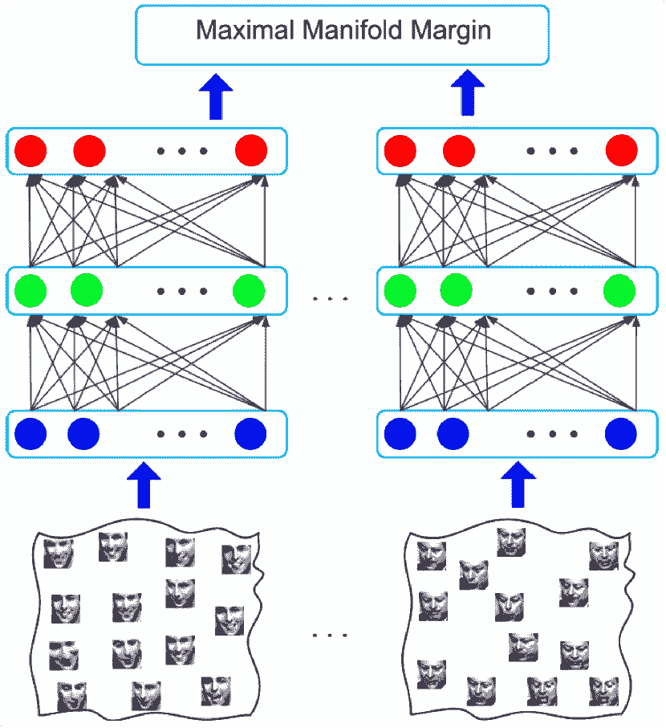

<!--yml

类别: 未分类

日期: 2024-09-06 20:09:23

-->

# [1512.03131] 深度学习算法在智能城市视频分析中的应用：综述

> 来源：[`ar5iv.labs.arxiv.org/html/1512.03131`](https://ar5iv.labs.arxiv.org/html/1512.03131)

# 深度学习算法在智能城市视频分析中的应用：综述

李旺和丹尼斯·尚（Dennis Sng L. Wang 和 D. Sng）均来自新加坡南洋理工大学的快速富有对象搜索（ROSE）实验室，地址 637553（电子邮件：wa0002li@e.ntu.edu.sg; dennis.sng@ntu.edu.sg）。

###### 摘要

深度学习最近在计算机视觉、语音识别和自然语言处理等众多领域取得了非常有前景的成果。它旨在通过使用深层架构模型来学习数据的层次表示。在智能城市中，许多数据（例如来自多个分布式传感器的录像）需要自动处理和分析。本文综述了应用于智能城市视频分析的深度学习算法，涵盖了不同的研究主题：目标检测、目标跟踪、人脸识别、图像分类和场景标注。

###### 索引词：

深度学习，智能城市，视频分析。

## I 引言

智能城市旨在通过使用数字技术或信息与通信技术来提高城市服务的质量和性能。数据分析在智能城市中扮演着重要角色。许多传感器被安装在智能城市中，以捕捉大量的数据，例如监控视频、环境和交通数据。为了从这些大数据中获取有用的信息，通常会使用机器学习算法，这些算法在视频分析等广泛应用中取得了非常有前景的成果。因此，利用机器学习可以促进智能城市的发展。

机器学习旨在开发可以从示例输入中学习经验并对未知测试数据进行数据驱动预测的计算机算法。这些算法可以分为两类：监督学习（例如[1] [2]）和无监督学习（例如[3] [4]）。监督学习在给定标记输入和输出对的情况下，旨在找到一个映射规则，以预测未知输入的输出。相对而言，无监督学习则侧重于探索输入的内在特征。监督学习和无监督学习是互补的。由于监督学习利用对人类有意义的输入标签，它可以很容易地应用于模式分类和数据回归问题。然而，监督学习依赖于标记数据，这可能需要大量的手工工作。此外，标签中存在不确定性和模糊性。换句话说，一个对象的标签不是唯一的。为了缓解这些问题，可以使用无监督学习来处理类内变异，因为它不需要数据标签。在过去几十年中，机器学习方法已应用于广泛的领域，如生物信息学、计算机视觉、医学诊断、自然语言处理、机器人技术、情感分析、语音识别和股票市场分析等。本文重点回顾了深度学习这一机器学习子领域的最新成就。

与浅层学习算法相比，深度学习旨在通过使用具有多层非线性变换的深度架构模型，从大规模数据（例如图像和视频）中提取层次化表示。通过这种学习到的特征表示，相较于使用原始像素值或手工设计的特征，获得更好性能变得更加容易。成功的原理在于，深度学习能够通过精心设计的层深度和宽度，以及适当选择对学习任务有利的特征，解开嵌入在观察数据中的不同抽象层次。

事实上，深度学习的历史至少可以追溯到 1980 年，当时 Fukushima 提出了 Neocognitron [5]。1989 年，LeCun 等人 [6] 提出了将反向传播应用于深度神经网络用于手写 ZIP 码识别。然而，网络的训练时间过长，实际应用受限。此外，深度神经网络在语音识别领域研究多年，但很难超越浅层生成模型。这是因为深度学习架构需要大量的训练数据，而在早期这些数据非常稀缺。Hinton 等人 [7] 回顾了这些困难，并表示对解决这些问题以将深度学习应用于语音识别充满信心，因为 Hinton [8] 通过逐层预训练作为无监督限制玻尔兹曼机并使用监督反向传播进行微调，取得了训练多层神经网络的突破。自深度学习突破以来，它已被应用于语音识别之外的许多其他研究领域。

图 1：LeCun 等人 [9] 提出的用于数字识别的 CNN 示意图。

深度学习架构有不同的变体，如深度信念网络（DBN） [10]、卷积神经网络（CNN） [11]、深度玻尔兹曼机（DBM） [12] 和堆叠去噪自编码器（SDAE） [13] 等。其中最吸引人的模型是卷积神经网络，它在计算机视觉和语音识别中都取得了非常有前景的结果。图 1 展示了 LeCun 等人 [9] 提出的用于数字识别的 CNN 示意图。如图所示，CNN 通常包括卷积层、池化层和全连接层。通过在 CNN 顶部添加损失层，整个网络可以通过使用反向传播算法进行端到端训练。与其他深度前馈神经网络相比，CNN 更容易训练，因为它需要估计的参数较少。因此，CNN 具有广泛的应用，如图像分类 [14]、人脸识别 [15]、目标跟踪 [16]、行人检测 [17]、属性预测 [18]、场景标注 [19]、人员再识别 [20]、RGB-D 物体识别 [21]、图像标注 [22]、场景图像分类 [23]、语音识别 [24] 和自然语言处理 [25] 等。

深度学习不仅受到学术界的关注，也引起了工业界的广泛关注。例如，Geoff Hinton 和 Li Deng 从 2009 年开始合作，专注于将深度学习应用于大规模语音识别，通过使用大规模训练数据和相应设计的深度神经网络显著提升了性能，相比传统生成模型有了显著改进。另一个令人兴奋的例子是，Google Brain 团队的 Andrew Ng 和 Jeff Dean 成功地从未标记的 YouTube 视频中提取了对象级别的语义（例如猫），使用了具有自我学习能力的神经网络。未来，深度学习将在工业界有越来越多的实际应用。

图 2：Nvidia GeForce GTX 980 的并行结构示意图。

除了方法学上的突破和丰富的大规模训练数据，深度学习最近的成功还得益于硬件的进步。具体来说，一种名为图形处理单元（GPU）的电子电路被设计用来加速需要处理大量数据块的算法，并且具有高度并行的结构。例如，Nvidia 最新的 GPU，GTX $980$，基于其第 $10$ 代 GPU 架构，称为 Maxwell，相比上一代在每瓦特的性能上提升了两倍。GM $204$ 芯片由 $4$ 个图形处理集群（GPCs）、$16$ 个流式多处理器（SMs）和 $4$ 个内存控制器组成。GeForce GTX $980$ 使用了这些架构组件的全部配置。其并行结构如图 2 所示。需要提到的是，Nvidia 公司在普及 GPU 方面做出了很多贡献，例如 Nvidia 推出了 GeForce 256 作为世界上第一个 GPU。最近，GPU 在机器学习中非常流行。以 Raina 等人的研究为例 [26] 提出通过使用 GPU 加速稀疏编码算法 [27]，最终使得使用双核 CPU 的先前方法加速了 $15$ 倍。特别地，Raina 等人 [26] 还报告说，在深度信念网络（DBNs）的学习中，GPU 的加速效果相比于双核 CPU 实现可达到 $70$ 倍。对于学习一个具有 $1$ 亿参数的四层 DBN，使用 GPU 而非 CPU 能将所需时间从几周减少到大约一天。

智能城市之所以被称为“智能”，是因为它具有计算和分析来自监控系统、政府机构、商业公司和社交网络网站等城市数据的能力。由于深度学习适合处理大规模数据，它可以用来处理和分析来自智能城市分布式传感器的数百万条视频数据。对于这些数据，存在许多活跃的研究主题，如对象检测、对象跟踪、人脸识别、图像分类和场景标注。在以下章节中，我们回顾了这些应用领域的最先进深度学习算法。

## II 对象检测

对象检测旨在精确定位视频帧中的感兴趣对象。许多有趣的工作已经通过深度学习算法提出用于对象检测。我们回顾了一些具有代表性的工作。

图 3: Szegedy 等人 [28] 提出的基于 DNN 的回归对象检测示意图。

图 4: Szegedy 等人 [28] 提出的用于提高检测精度的多尺度策略示意图。

Szegedy 等人 [28] 通过将最后一层替换为回归层，从而生成对象边界框的二进制掩码，对深度卷积神经网络 [11] 进行了修改，如图 3 所示。此外，提出了一种多尺度策略（见图 4），用于 DNN 掩码生成，以提高检测精度。因此，通过对每个输入图像应用该网络几十次，可以在 Pascal Visual Object Challenge (VOC) $2007$ 上实现 $20$ 类的平均精度 $0.305$。

图 5: Girshick 等人 [29] 提出的 R-CNN: CNN 特征区域示意图。

与 Szegedy 的方法 [28] 不同，Girshick 等人 [29] 提出了一个自下而上的区域提议深度模型用于对象检测。图 5 展示了该方法的概述。首先，在输入图像中生成约 $2000$ 个区域提议。对于每个提议，使用一个大型卷积神经网络提取特征。最后，使用特定类别的线性 SVM 对每个区域进行分类。据报道，使用该方法可以显著提高 $VOC~{}2012$ 上的检测性能，mAP 提高超过 $30\%$。

类似地，Erhan 等人[30]提出了一种受显著性启发的深度神经网络来检测任何感兴趣的对象。然而，使用深度神经网络以类无关的方式生成了少量的边界框作为对象候选。在这项工作中，对象检测被定义为一个回归问题，回归到边界框的坐标。在训练部分，通过反向传播解决预测与真实框之间的分配问题，以更新框坐标、置信度和学习到的特征。总之，深度神经网络被定制用于对象定位问题。

对象检测在智能城市应用中有广泛的应用，如行人检测、道路车辆检测、无人看管的物体检测。深度学习算法能够处理不同对象的大范围变化。因此，使用深度模型的智能城市系统对大规模真实数据更加稳健。

## III 对象跟踪

对象跟踪旨在根据视频序列中首帧的位置信息来定位目标对象。最近，一些基于深度学习的跟踪算法取得了非常有前景的结果。我们回顾了一些代表性的工作如下。

图 6: Wang 和 Yeung[29]提出的网络架构说明：（a）去噪自编码器；（b）堆叠去噪自编码器；（c）在线跟踪网络。

王和杨[31]建议通过使用堆叠去噪自编码器[32]来学习深层且紧凑的特征用于视觉跟踪。网络架构如图 6 所示。报告称，使用学习到的深层特征在两个跟踪测量指标上优于其他$7$种最先进的跟踪器，分别是平均中心误差（$7.3$像素）和平均成功率（$85.5$%）。此外，提出的深层特征跟踪器实现了$15$fps 的平均帧率，适用于实时应用。

图 7: Li 等人[16]提出的网络架构概述。

李等人[16] 提出了使用卷积神经网络学习用于视觉跟踪的判别特征表示的方法。该方法的概述见图 7。可以观察到，使用了多个卷积神经网络池来维持所有可能低级线索的不同核，这些核旨在区分目标补丁和其周围背景。给定一帧图像，池中最有前景的卷积神经网络被用来预测目标物体的新位置。同时，选定的网络使用热启动反向传播方案进行再训练。同时，从图 7 可以观察到，整个架构中涉及一个类特定的卷积神经网络，这对跟踪某一类物体（例如，一个人的面部）非常有帮助。

图 8：王等人[33] 提出的堆叠架构和适应模块的示意图。

王等人[33] 提出了一种学习对复杂运动变换和目标外观变化都具有鲁棒性的层次特征的方法。图 8 展示了堆叠架构和适应模块。首先，通过使用具有时间约束的双层神经网络，从辅助视频数据中离线学习到对复杂运动变换具有鲁棒性的通用特征[34]。然后，根据特定目标物体序列对预先学习的特征进行在线适应。因此，适应后的特征能够捕捉目标物体的外观变化。例如，所提出的跟踪器不仅可以处理篮球运动员身体的非刚性变形，还可以处理特定的外观变化。报告指出，使用特征学习算法可以显著提高跟踪性能，特别是在具有复杂运动变换的序列中。

物体跟踪可以应用于智能城市的监控系统。自动跟踪可疑人员或目标车辆对于安全监控和城市流量管理至关重要。深度学习可以利用智能城市的大数据来训练深度模型，这些模型比传统模型对目标物体的视觉变化更具鲁棒性。因此，智能城市的跟踪系统可以通过使用深度学习算法来处理大量视频数据，从而得到增强。

## IV 人脸识别

面部识别包括两个主要任务：面部验证和面部识别。前者旨在确定给定的两张面孔是否属于同一个人。后者旨在从已知面孔集找到给定面孔的身份。近年来，许多基于深度学习的算法在这两个面部识别任务中取得了非常有前景的结果。我们将回顾其中的一些。

图 9：黄等人使用的卷积限制玻尔兹曼机的示意图[35]。

黄等人[35]提出通过使用卷积深度置信网络来学习面部验证的层次特征。这项工作的主要贡献如下：i) 开发了一个局部卷积限制玻尔兹曼机，以适应对象类别（例如面孔）的全局结构；ii) 深度学习被应用于局部二值模式表示[36]而非原始像素值，以捕捉手工特征的更复杂特性；iii) 学习网络架构参数被评估为提升多层网络所必需的。图 9 中展示了所提出方法中使用的卷积限制玻尔兹曼机。报告指出，使用学习到的表示可以达到与使用手工特征的最先进方法相媲美的性能。实际上，后续的研究表明，深度特征显著优于手工特征。

图 10：Taigman 等人使用的九层深度神经网络概述[15]。

Taigman 等人 [15] 提出了基于 $3$D 面部模型的面部对齐算法和从九层深度神经网络中学习的面部表示。深度网络架构的概述见图 10。前三个卷积层用于提取低级特征（如边缘和纹理）。接下来的三层是局部连接的，以学习每个面部图像位置的不同滤波器，因为不同区域具有不同的局部统计特性。顶部的两层是全连接的，用于捕捉面部图像不同部分之间的特征相关性。最后，最后一层的输出被送入一个 K-way softmax，用于预测类别标签。训练的目标是通过最小化每个训练样本的交叉熵损失来最大化正确类别的概率。结果表明，使用学习到的表示可以在 Labeled Faces in the Wild 基准（LFW）上实现接近人类的表现。

图 11：Sun 等人 [37] 提出的特征提取过程的示意图。

Sun 等人 [37] 提出了为面部验证学习所谓的深度隐含身份特征（DeepID）。图 11 说明了特征提取过程。首先，提取输入面部补丁的局部低级特征，并将其输入到 ConvNet [9] 中。然后，通过几个前馈层，特征维度逐渐减少到 $160$，在此过程中学习到更多的全局和高级特征。最后，直接使用 $160$ 维 DeepID 预测面部补丁的身份类别（在 $10,000$ 个类别中）。Sun 等人并非为每个面部类别训练一个二分类器，而是同时对 $10,000$ 个面部身份进行所有 ConvNet 的分类。这种操作的优势如下：i) 利用神经网络的超强学习能力提取有效的面部识别特征；ii) 通过对 ConvNets 添加强正则化来共享所有身份之间的隐藏特征。报告显示，虽然仅使用了弱对齐的面孔，但使用学习到的 DeepID 在 LFW 数据集上可以实现接近人类的表现。

图 12：方法基本思想的示意图 [38]。

Lu 等人 [38] 发展了一种联合特征学习方法，用于自动从原始像素中学习面部识别的层次表示。图 12 说明了该方法的基本思路。首先，将每张面部图像分成几个不重叠的区域，并联合学习特征加权矩阵。接着，将每个区域中学习到的特征进行汇聚，并表示为局部直方图特征描述符。最后，这些局部特征被组合并连接成一个更长的特征向量，用于面部表示。此外，联合学习模型被堆叠成一个深层架构，以利用层次信息。因此，所提方法在五个广泛使用的面部数据集上证明了其有效性。

面部识别已广泛应用于安全系统和人机交互系统。由于光照、姿态和表情等因素的巨大变化，计算机自动识别或验证一个人仍然是一个挑战。深度学习可以利用大数据来训练深层架构模型，从而获得更强大的特征以表示面部。未来，智能城市中的面部识别系统将主要依赖于从深度模型中学习的层次特征。

## V 图像分类

图像分类在过去几十年里一直是一个活跃的研究主题。许多方法已经被提出，通过使用词袋（BoW）表示 [39]、空间金字塔匹配 [40]、主题模型 [41]、基于部件的模型 [42] 和稀疏编码 [43] 等，取得了非常有前景的结果。然而，这些方法利用的是原始像素值或手工制作的特征，无法捕捉特定输入数据的基于数据的表示。最近，深度学习在图像分类中取得了非常有前景的结果。我们回顾了一些具有代表性的工作，如下所示。

图 13：Krizhevsky 等人提出的深度卷积神经网络架构的示意图 [11]。该网络包含五个卷积层，其中一些后面接有最大池化层，还有三个全连接层和一个 $1000$-维 softmax 层。

Krizhevsky 等人 [11] 开发了一种深度卷积神经网络，该网络具有 $60$ 百万个参数和 $650,000$ 个神经元。该深度模型包括五个卷积层，随后是最大池化层，以及三个全连接层，最后是 $1000$ 路软最大层。Krizhevsky 等人 [11] 提出的深度卷积神经网络的结构如图 13 所示。该深度模型在 ImageNet LSVRC-$2010$ 比赛中取得了非常令人印象深刻的结果，将错误率降低到 $8$% 对比当时最先进的技术。数据集包括 $1.2$ 百万张高分辨率图像，分为 $1000$ 个不同的类别。这个比赛已成为最大的、最具挑战性的计算机视觉挑战之一，并且每年举行。这一挑战不仅吸引了学术研究团队，还吸引了工业公司。例如，谷歌在 ImageNet $2014$ 比赛中获得了 $6.66$% 的错误率。如今，高性能计算在深度学习中发挥着非常重要的作用。最近，中国搜索引擎公司百度通过使用名为 Minwa 的超级计算机获得了 $5.98$% 的错误率，该计算机由 $36$ 个服务器节点组成，每个节点配备 $4$ 块 Nvidia Tesla K$40$m GPU。百度还声称 Minwa 能处理更高分辨率的图像和更大的训练数据集（$2$ 亿图像），这些图像是通过扭曲、翻转和改变原始 $1.2$ 百万张图像的颜色生成的。因此，该系统能够处理现实世界中的照片。

图 14: 方法基本思想的示意图 [44]。

Lu 等人 [44] 提出了一个用于图像集分类的多流形深度度量学习（MMDML）方法。首先，每个图像集被建模为一个流形，该流形传递到多个深度神经网络层中，并映射到另一个特征空间中。具体而言，深度网络是特定于类别的，因此不同类别在其网络中具有不同的参数。然后，使用最大流形间隔准则来学习这些流形的参数。在测试阶段，这些特定于类别的深度网络被应用于计算测试图像集与所有训练类别之间的相似性。最后，使用最小距离进行分类。因此，该方法通过利用区分性和特定类别的信息，能够在五个广泛使用的数据集上实现最先进的性能。

图 15: C-HRNNs [14] 整体框架的示意图。

Zuo 等人 [14] 开发了一种端到端的卷积层次递归神经网络 (C-HRNNs) 来探索图像分类的上下文依赖性。图 15 展示了 C-HRNNs 的整体框架。首先，通过使用五层卷积神经网络 (CNNs) 提取图像区域的中级表示。然后，第五层 CNN 的输出被汇聚到多个尺度。对于每个尺度，通过直接或间接连接捕获每个区域及其周围邻域之间的空间依赖性。对于不同尺度，尺度依赖性通过将信息从高层尺度转移到低层尺度的对应区域来编码。最后，将不同尺度的 HRNN 输出收集并输入到两个全连接层。C-HRNNs 不仅利用了 CNNs 的表示能力，还有效地编码了不同图像区域之间的空间和尺度依赖性。因此，所提模型在四个具有挑战性的图像分类基准测试中实现了最先进的性能。

## VI 场景标记

场景标记的目标是为场景图像的每个像素分配一组语义标签中的一个。由于某些类别在特写视图中可能无法区分，这是一项非常具有挑战性的任务。一般来说，现实世界图像中的“事物”像素（如汽车、人物等）由于尺度、光照和姿态变化，可能会有很大差异。最近，基于深度学习的方法在场景标记方面取得了非常有前景的结果。我们将回顾其中的一些方法。

图 16：所提方法框架的示意图 [19]。

Shuai 等人 [19] 提出了采用卷积神经网络 (CNNs) 作为参数模型来学习判别特征和用于场景标记的分类器。图 16 展示了所提方法的框架。首先，使用全局场景语义通过从相似样本中转移类别依赖性和先验来消除局部上下文的模糊性。然后，全局潜力被解耦为像素上的全局信念的聚合。通过整合局部和全局信念，可以获得标记结果。最后，引入基于大间隔的度量学习以提高全局信念的估计精度。因此，所提模型能够在 SiftFlow 基准测试上实现最先进的结果，并在斯坦福背景数据集上获得非常有竞争力的结果。

图 17：方法[45]中完整标注网络的架构示意图。

帅等人[45]提出了一种用于场景标注的有向无环图 RNN（DAG-RNN），以建模图像单元之间的长距离语义依赖。图 17 展示了该方法中完整标注网络的架构。首先，采用无向循环图（UCG）来建模图像单元之间的交互。由于 UCG 的循环特性，RNN 无法直接应用于 UCG 结构的图像。因此，将 UCG 分解为多个有向无环图（DAG）。然后，通过将 DAG-RNN 应用于相应的 DAG 结构图像，独立生成每个隐藏层，并将它们整合以产生上下文感知特征图。因此，本地表示能够嵌入图像的抽象要点，从而显著提高其判别能力。据报道，DAG-RNN 在具有挑战性的 SiftFlow、CamVid 和 Barcelona 基准数据集上取得了新的最先进结果。

图 18：方法[46]中 RGB-D 室内场景标注框架的示意图。

王等人[46]开发了一个无监督的联合特征学习与编码（JFLE）框架，用于 RGB-D 场景标注。图 18 展示了该方法中 RGB-D 室内场景标注的框架。首先，在一个名为联合特征学习与编码框架（JFLE）的两层堆叠结构中，特征学习与编码被共同执行。为了将 JFLE 框架扩展到一个更通用的框架——联合深度特征学习与编码（JDFLE），使用了一个具有堆叠非线性层的深度模型来建模输入数据。学习结构（无论是 JFLE 还是 JDFLE）的输入是一组从 RGB-D 图像中密集采样的补丁，学习输出是相应路径特征的集合，然后这些特征被组合生成超像素特征。最后，训练线性支持向量机（SVM）以将超像素特征映射到场景标签。据报道，所提出的特征学习框架在基准 NYU 深度数据集上表现出色。

场景标注可以用来理解从监控摄像头捕捉到的城市图像。它是智能城市中的一个重要组成部分，其中“道路”和“建筑”等城市元素需要被识别。深度模型可以利用来自智能城市的大数据来学习层次特征，从而对场景图像的每个像素进行标注。

## VII 结论

在本文中，我们回顾了深度学习在目标检测、目标跟踪、人脸识别、图像分类和场景标注方面的最新进展。深度模型在这些领域显著提升了性能，通常接近人类能力。这一成功有两个原因。首先，大量训练数据变得越来越可用（例如，来自众多智能城市传感器的数据流），用于构建大型深度神经网络。其次，新型先进硬件（例如 GPU）大大减少了深度网络的训练时间。我们相信，深度学习将在广泛应用领域中拥有更具前景的未来。

## 致谢

这项研究在新加坡南洋理工大学的快速富对象搜索（ROSE）实验室进行。ROSE 实验室由新加坡总理办公室国家研究基金会支持，通过其 IDM 未来资金计划资助，并由互动与数字媒体计划办公室管理。

## 参考文献

+   [1] C. Cortes 和 V. Vapnik, “支持向量网络，” *机器学习*，第 20 卷，第 3 期，第 273–297 页，1995 年。

+   [2] D. E. Rumelhart, G. E. Hinton 和 R. J. Williams, “通过反向传播错误学习表示，” *认知建模*，第 5 卷，1988 年。

+   [3] T. Kohonen, “自组织形成拓扑正确的特征图，” *生物控制论*，第 43 卷，第 1 期，第 59–69 页，1982 年。

+   [4] H. Hotelling, “将统计变量的复杂性分析为主成分。” *教育心理学杂志*，第 24 卷，第 6 期，第 417 页，1933 年。

+   [5] K. Fukushima, “Neocognitron：一种自组织神经网络模型，用于模式识别机制，不受位置变化的影响，” *生物控制论*，第 36 卷，第 4 期，第 193–202 页，1980 年。

+   [6] Y. LeCun, B. E. Boser, J. S. Denker, D. Henderson, R. E. Howard, W. E. Hubbard 和 L. D. Jackel, “反向传播应用于手写邮政编码识别，” *神经计算*，第 1 卷，第 4 期，第 541–551 页，1989 年。

+   [7] G. Hinton, L. Deng, D. Yu, G. E. Dahl, A.-r. Mohamed, N. Jaitly, A. Senior, V. Vanhoucke, P. Nguyen, T. N. Sainath *等*，“用于语音识别的深度神经网络：四个研究小组的共同观点，” *IEEE 信号处理杂志*，第 29 卷，第 6 期，第 82–97 页，2012 年。

+   [8] G. E. Hinton, “学习多层次表示，” *认知科学趋势*，第 11 卷，第 10 期，第 428–434 页，2007 年。

+   [9] Y. LeCun, L. Bottou, Y. Bengio 和 P. Haffner, “基于梯度的学习应用于文档识别，” *IEEE 汇刊*，第 86 卷，第 11 期，第 2278–2324 页，1998 年。

+   [10] G. E. Hinton, “深度信念网络，” *学者百科*，第 4 卷，第 5 期，第 5947 页，2009 年。

+   [11] A. Krizhevsky, I. Sutskever 和 G. E. Hinton, “使用深度卷积神经网络进行 ImageNet 分类，” 在 *神经信息处理系统年会*，2012 年，第 1106–1114 页。

+   [12] R. Salakhutdinov 和 G. E. Hinton, “深度玻尔兹曼机”，发表于 *国际人工智能与统计会议*，2009 年，页码 448–455。

+   [13] P. Vincent, H. Larochelle, I. Lajoie, Y. Bengio 和 P.-A. Manzagol, “堆叠去噪自编码器：通过具有局部去噪标准的深度网络学习有用的表示”，*机器学习研究杂志*，第 11 卷，页码 3371–3408，2010 年。

+   [14] Z. Zuo, B. Shuai, G. Wang, X. Liu, X. Wang 和 B. Wang, “通过卷积层次递归神经网络学习上下文依赖”，*CoRR*，第 abs/1509.03877 卷，2015 年。

+   [15] Y. Taigman, M. Yang, M. Ranzato 和 L. Wolf, “Deepface: 缩小人类水平人脸验证性能的差距”，发表于 *IEEE 计算机视觉与模式识别会议*，2014 年，页码 1701–1708。

+   [16] H. Li, Y. Li 和 F. Porikli, “Deeptrack：通过卷积神经网络学习用于视觉跟踪的判别特征表示”，发表于 *英国机器视觉会议*，2014 年。

+   [17] P. Sermanet, K. Kavukcuoglu, S. Chintala 和 Y. LeCun, “通过无监督的多阶段特征学习进行行人检测”，发表于 *IEEE 计算机视觉与模式识别会议*，2013 年，页码 3626–3633。

+   [18] A. H. Abdulnabi, G. Wang, J. Lu 和 K. Jia, “用于属性预测的多任务 CNN 模型”，*IEEE 多媒体学报*，第 17 卷，第 11 期，页码 1949–1959，2015 年。

+   [19] B. Shuai, G. Wang, Z. Zuo, B. Wang 和 L. Zhao, “集成参数化和非参数化模型进行场景标注”，发表于 *IEEE 计算机视觉与模式识别会议*，2015 年，页码 4249–4258。

+   [20] R. R. Varior, G. Wang 和 J. Lu, “学习不变的颜色特征以进行人物重新识别”，*CoRR*，第 abs/1410.1035 卷，2014 年。

+   [21] A. Wang, J. Lu, J. Cai, T. Cham 和 G. Wang, “用于 RGB-D 物体识别的大间隔多模态深度学习”，*IEEE 多媒体学报*，第 17 卷，第 11 期，页码 1887–1898，2015 年。

+   [22] B. Shuai, Z. Zuo 和 G. Wang, “用于图像标注的四向 2D 递归神经网络”，*IEEE 信号处理快报*，第 22 卷，第 11 期，页码 1990–1994，2015 年。

+   [23] Z. Zuo, G. Wang, B. Shuai, L. Zhao 和 Q. Yang, “基于示例的深度判别和可共享特征学习用于场景图像分类”，*模式识别*，第 48 卷，第 10 期，页码 3004–3015，2015 年。

+   [24] L. Deng, O. Abdel-Hamid 和 D. Yu, “一种使用异构池化的深度卷积神经网络，用于在音素混淆中交易声学不变性”，发表于 *IEEE 国际声学、语音与信号处理会议*，2013 年，页码 6669–6673。

+   [25] R. Collobert 和 J. Weston, “自然语言处理的统一架构：带有多任务学习的深度神经网络”，发表于 *国际机器学习会议*，2008 年，页码 160–167。

+   [26] R. Raina, A. Madhavan 和 A. Y. Ng, “使用图形处理器的大规模深度无监督学习”，发表于 *国际机器学习会议*，2009 年，页码 873–880。

+   [27] H. Lee, A. Battle, R. Raina 和 A. Y. Ng，“高效的稀疏编码算法，”发表于 *神经信息处理系统年会*，2006 年，页码 801–808。

+   [28] C. Szegedy, A. Toshev 和 D. Erhan，“用于对象检测的深度神经网络，”发表于 *神经信息处理系统年会*，2013 年，页码 2553–2561。

+   [29] R. B. Girshick, J. Donahue, T. Darrell 和 J. Malik，“用于准确对象检测和语义分割的丰富特征层次，”发表于 *IEEE 计算机视觉与模式识别会议*，2014 年，页码 580–587。

+   [30] D. Erhan, C. Szegedy, A. Toshev 和 D. Anguelov，“使用深度神经网络的可扩展对象检测，”发表于 *IEEE 计算机视觉与模式识别会议*，2014 年，页码 2155–2162。

+   [31] N. Wang 和 D. Yeung，“用于视觉跟踪的深度紧凑图像表示学习，”发表于 *神经信息处理系统年会*，2013 年，页码 809–817。

+   [32] P. Vincent, H. Larochelle, I. Lajoie, Y. Bengio 和 P. Manzagol，“堆叠去噪自编码器：通过局部去噪标准在深度网络中学习有用的表示，” *机器学习研究杂志*，第 11 卷，页码 3371–3408，2010 年。

+   [33] L. Wang, T. Liu, G. Wang, K. L. Chan 和 Q. Yang，“使用学习的层次特征进行视频跟踪，” *IEEE 图像处理学报*，第 24 卷，第 4 期，页码 1424–1435，2015 年。

+   [34] W. Y. Zou, A. Y. Ng, S. Zhu 和 K. Yu，“通过模拟注视在视频中学习不变特征，”发表于 *神经信息处理系统年会*，2012 年，页码 3212–3220。

+   [35] G. B. Huang, H. Lee 和 E. G. Learned-Miller，“利用卷积深度信念网络学习面部验证的层次表示，”发表于 *IEEE 计算机视觉与模式识别会议*，2012 年，页码 2518–2525。

+   [36] T. Ojala, M. Pietikäinen 和 D. Harwood，“基于特征分布的分类的纹理度量比较研究，” *模式识别*，第 29 卷，第 1 期，页码 51–59，1996 年。

+   [37] Y. Sun, X. Wang 和 X. Tang，“从预测 10,000 个类别中学习深度面部表示，”发表于 *IEEE 计算机视觉与模式识别会议*，2014 年，页码 1891–1898。

+   [38] J. Lu, V. E. Liong, G. Wang 和 P. Moulin，“面部识别的联合特征学习，” *IEEE 信息取证与安全学报*，第 10 卷，第 7 期，页码 1371–1383，2015 年。

+   [39] G. Csurka, C. Dance, L. Fan, J. Willamowski 和 C. Bray，“使用特征点袋的视觉分类，”发表于 *计算机视觉统计学习研讨会，ECCV*，第 1 卷，第 1-22 期。布拉格，2004 年，页码 1–2。

+   [40] S. Lazebnik, C. Schmid 和 J. Ponce，“超越特征袋：用于识别自然场景类别的空间金字塔匹配，”发表于 *IEEE 计算机视觉与模式识别会议*，2006 年，页码 2169–2178。

+   [41] F. Li 和 P. Perona，“用于学习自然场景类别的贝叶斯层次模型，”发表于*IEEE 计算机视觉与模式识别会议*，2005 年，第 524–531 页。

+   [42] R. Fergus、P. Perona 和 A. Zisserman，“通过无监督尺度不变学习进行目标类别识别，”发表于*IEEE 计算机视觉与模式识别会议*，2003 年，第 264–271 页。

+   [43] J. Yang、K. Yu、Y. Gong 和 T. S. Huang，“使用稀疏编码的线性空间金字塔匹配用于图像分类，”发表于*IEEE 计算机视觉与模式识别会议*，2009 年，第 1794–1801 页。

+   [44] J. Lu、G. Wang、W. Deng、P. Moulin 和 J. Zhou，“用于图像集分类的多流形深度度量学习，”发表于*IEEE 计算机视觉与模式识别会议，CVPR 2015，马萨诸塞州波士顿，美国，2015 年 6 月 7-12 日*，2015 年，第 1137–1145 页。

+   [45] B. Shuai、Z. Zuo、G. Wang 和 B. Wang，“用于场景标注的 DAG-递归神经网络，”*CoRR*，第 abs/1509.00552 卷，2015 年。

+   [46] A. Wang、J. Lu、J. Cai、G. Wang 和 T. Cham，“无监督的联合特征学习与编码用于 RGB-D 场景标注，”*IEEE 图像处理学报*，第 24 卷，第 11 期，第 4459–4473 页，2015 年。
