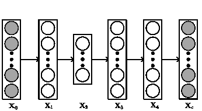

<!--yml

分类：未分类

日期：2024-09-06 20:09:18

-->

# [1604.01662] 关于贝叶斯深度学习的调查

> 来源：[`ar5iv.labs.arxiv.org/html/1604.01662`](https://ar5iv.labs.arxiv.org/html/1604.01662)

# 关于贝叶斯深度学习的调查

Hao Wang hoguewang@gmail.com 麻省理工学院，美国  和  Dit-Yan Yeung dyyeung}@cse.ust.hk 香港科技大学，P.O. Box 1212，香港

###### 摘要。

一个全面的人工智能系统不仅需要通过不同的“感官”（例如，视觉和听觉）来感知环境，还需要推断世界的条件（甚至因果）关系及相应的不确定性。过去十年，在视觉物体识别和语音识别等许多感知任务中，深度学习模型取得了重大进展。然而，对于更高层次的推断，具有贝叶斯特性的概率图模型仍然更为强大和灵活。近年来，*贝叶斯深度学习*作为一个统一的概率框架出现，以紧密结合深度学习和贝叶斯模型¹¹1 请参见与贝叶斯深度学习相关的论文的策划和更新列表，[`github.com/js05212/BayesianDeepLearning-Survey`](https://github.com/js05212/BayesianDeepLearning-Survey)。在这一通用框架中，使用深度学习对文本或图像的感知可以提升更高层次推断的性能，反过来，推断过程中的反馈也能够增强对文本或图像的感知。本调查提供了对*贝叶斯深度学习*的全面介绍，并回顾了其在推荐系统、主题模型、控制等领域的近期应用。此外，我们还讨论了贝叶斯深度学习与其他相关主题（如贝叶斯神经网络处理）的关系和差异。

深度学习，贝叶斯网络，概率图模型，生成模型^†^†版权：acmlicensed^†^†期刊：CSUR^†^†期刊年份：2020^†^†期刊卷号：1^†^†期刊期号：1^†^†文章号：1^†^†出版月份：1^†^†价格：15.00^†^†doi：10.1145/3409383^†^†会议：ACM Computing Surveys；2020 年 3 月；纽约，NY^†^†书名：ACM Computing Surveys^†^†价格：15.00^†^†isbn：xxx-x-xxxx-xxxx-x/xx/xx^†^†ccs：计算数学 概率表示^†^†ccs：信息系统 数据挖掘^†^†ccs：计算方法论 神经网络

## 1\. 引言

在过去十年中，深度学习在许多流行的感知任务中取得了显著成功，包括视觉物体识别、文本理解和语音识别。这些任务分别对应人工智能（AI）系统的*看*、*读*和*听*的能力，它们无疑是 AI 有效感知环境不可或缺的。然而，要建立一个实用且全面的 AI 系统，仅仅具备感知能力远远不够。它应当具备*思考*的能力。

一个典型的例子是医疗诊断，它远远超出了简单的感知：除了*看*可见症状（或来自 CT 的医学影像）和*听*患者的描述外，医生还必须寻找所有症状之间的关系，并尽可能推断其对应的病因。只有在此之后，医生才能为患者提供医疗建议。在这个例子中，虽然*看*和*听*的能力使医生能够从患者那里获取信息，但*思考*的部分定义了医生。具体来说，这里的*思考*能力可能涉及识别条件依赖、因果推断、逻辑推理和处理不确定性，这些显然超出了传统深度学习方法的能力。幸运的是，另一种机器学习范式——概率图模型（PGM）在概率或因果推断和处理不确定性方面表现出色。问题在于，PGM 在感知任务方面不如深度学习模型好，这些任务通常涉及大规模和高维度的信号（例如图像和视频）。因此，在原则性的概率框架内统一深度学习和 PGM 是一个自然的选择，我们在本文中称之为*贝叶斯深度学习*（BDL）。

在上述例子中，*感知任务*涉及感知患者的症状（例如，通过*看*医学影像），而*推断任务*涉及处理条件依赖、因果推断、逻辑推理和不确定性。通过贝叶斯深度学习中的原则性整合，感知任务和推断任务被视为一个整体，并可以相互受益。具体来说，能够看医学影像可能有助于医生的诊断和推断。另一方面，诊断和推断也可以帮助理解医学影像。假设医生可能不确定医学影像中的黑点是什么，但如果她能够*推断*症状和疾病的病因，这可以帮助她更好地判断黑点是否为肿瘤。

以推荐系统（CDL,；DBLP:conf/aaai/LuDLX015,；DBLP:journals/tkde/AdomaviciusK12,；ricci2011introduction,；DBLP:conf/recsys/LiuMLY11,）为另一个例子。一个高度准确的推荐系统需要（1）对项目内容的透彻理解（例如，文档和电影中的内容）（DBLP:journals/tkde/Park13,），（2）对用户的档案/偏好的仔细分析（DBLP:journals/tkde/WeiMJ05,；DBLP:journals/tkde/YapTP07,；DBLP:conf/aaai/ZhengCZXY10,），以及（3）对用户之间相似性的适当评估（DBLP:journals/tkde/CaiLLMTL14,；DBLP:journals/tkde/TangQZX13,；DBLP:journals/tkde/HornickT12,；DBLP:journals/tkde/BartoliniZP11,）。深度学习凭借其高效处理密集高维数据（如电影内容）的能力擅长第一个子任务，而 PGM 专注于建模用户、项目和评分之间的条件依赖（参见图 7 作为例子，其中${\bf u}$、${\bf v}$和${\bf R}$分别为用户潜在向量、项目潜在向量和评分）在其他两个子任务中表现优异。因此，将它们统一到一个单一的原则性概率框架中，可以让我们兼得两者的优势。这种整合还带来了额外的好处，即优雅地处理推荐过程中的不确定性。此外，还可以为具体模型推导出贝叶斯处理方法，从而得到更稳健的预测（CDL,；ColVAE,）。

作为第三个例子，考虑根据从摄像头接收到的实时视频流来控制一个复杂的动态系统。这个问题可以转化为迭代地执行两个任务，即从原始图像中进行感知和基于动态模型进行控制。处理原始图像的感知任务可以通过深度学习来完成，而控制任务通常需要更复杂的模型，如隐马尔可夫模型和卡尔曼滤波器（harrison1999bayesian, ; DBLP:conf/uai/MatsubaraGK14, ）。反馈回路的完成是由于控制模型选择的动作可以反过来影响接收到的视频流。为了实现感知任务和控制任务之间的有效迭代过程，我们需要信息在它们之间来回流动。感知组件将是控制组件估计其状态的基础，而具备动态模型的控制组件则能够预测未来的轨迹（图像）。因此，贝叶斯深度学习（BDL）是这个问题的合适选择（watter2015embed, ）。需要注意的是，与推荐系统的例子类似，原始图像中的噪声和控制过程中的不确定性都可以在这样的概率框架下自然处理。

上述例子展示了 BDL 作为一种将深度学习和概率图模型（PGM）统一的原则性方法的主要优势：感知任务与推断任务之间的信息交换、高维数据的条件依赖关系以及有效的不确定性建模。在不确定性方面，值得注意的是，当 BDL 应用于复杂任务时，有*三种参数不确定性*需要考虑：

1.  (1)

    神经网络参数的不确定性。

1.  (2)

    任务特定参数的不确定性。

1.  (3)

    感知组件与任务特定组件之间信息交换的不确定性。

通过使用分布而不是点估计来表示未知参数，BDL 提供了一个有前景的框架来以统一的方式处理这三种不确定性。值得注意的是，第三种不确定性只有在像 BDL 这样的统一框架下才能处理；分别训练感知组件和任务特定组件等同于假设在它们之间*交换信息*时没有不确定性。需要注意的是，神经网络通常是过度参数化的，因此在处理如此大的参数空间的不确定性时会带来额外的挑战。另一方面，图形模型通常更简洁，参数空间更小，提供了更好的可解释性。

除了上述优点外，BDL 还具有内在正则化的好处。通过对隐藏单元、定义神经网络的参数或指定条件依赖的模型参数施加先验，BDL 在一定程度上可以避免过拟合，特别是在数据不足时。通常，BDL 模型由两个组件组成，一个是 *感知组件*，它是某种类型的神经网络的贝叶斯公式，另一个是 *任务特定组件*，它使用 PGM 描述不同隐藏或观察变量之间的关系。正则化对这两者都至关重要。神经网络通常具有过多的参数，因此需要适当的正则化。正则化技术，如权重衰减和 dropout（srivastava2014dropout），已被证明对提高神经网络的性能有效，它们都有贝叶斯解释（gal2015dropout）。在任务特定组件方面，作为一种正则化手段，专家知识或先验信息可以通过我们施加的先验融入模型，以在数据稀缺时引导模型。

将贝叶斯深度学习（BDL）应用于实际任务时也面临挑战。 (1) 首先，设计一个具有合理时间复杂度的高效贝叶斯神经网络模型并非易事。这个方向的工作由 (mackay1992practical, ; hinton1993keeping, ; neal1995bayesian, ) 开创，但由于缺乏可扩展性，尚未被广泛采用。幸运的是，最近在这一方向上的一些进展 (DBLP:conf/nips/Graves11, ; kingma2013auto, ; DBLP:conf/icml/Hernandez-Lobato15b, ; DBLP:conf/icml/BlundellCKW15, ; balan2015bayesian, ; CDL, ; NPN, ) 似乎揭示了希望。²²2 总之，可以通过期望传播 (DBLP:conf/icml/Hernandez-Lobato15b, )、重参数化技巧 (kingma2013auto, ; DBLP:conf/icml/BlundellCKW15, )、具有最大后验估计的神经网络的概率模型 (CDL, )、具有自然参数网络的近似变分推断 (NPN, )、知识蒸馏 (balan2015bayesian, ) 等方法实现时间复杂度的减少。有关贝叶斯神经网络实际应用的详细概述，请参见 (NPN, )。³³3 在这里我们将神经网络的贝叶斯处理称为贝叶斯神经网络。另一个术语“贝叶斯深度学习”保留用于指代既有感知组件又有任务特定组件的复杂贝叶斯模型。有关详细讨论，请参见第 4.1 节。 (2) 第二个挑战是确保感知组件和任务特定组件之间的信息交换既高效又有效。理想情况下，第一阶和第二阶信息（例如均值和方差）应该能够在两个组件之间来回流动。一个自然的方法是将感知组件表示为概率图模型（PGM），并将其无缝连接到任务特定的 PGM，如在 (RSDAE, ; CDL, ; DPFA, ) 中所做的那样。

本调查为贝叶斯深度学习（BDL）提供了多个应用的具体模型的全面概述。调查的其余部分组织如下：在 2 部分，我们回顾了一些基本的深度学习模型。第三部分涵盖了概率图模型的主要概念和技术。这两部分作为 BDL 的初步部分，接下来的部分，第四部分展示了统一的 BDL 框架的基本理念，并详细介绍了实现其*感知组件*和*任务特定组件*的各种选择。第五部分回顾了应用于各种领域的 BDL 模型，例如推荐系统、主题模型和控制，展示了 BDL 如何在监督学习、无监督学习和一般表示学习中发挥作用。第六部分讨论了一些未来研究问题并总结了全文。

## 2\. 深度学习

深度学习通常指的是具有两个以上层的神经网络。为了更好地理解深度学习，我们从最简单类型的神经网络，即多层感知器（MLP）开始，作为一个例子来展示传统深度学习是如何工作的。之后，我们将回顾基于 MLP 的其他几种类型的深度学习模型。

### 2.1\. 多层感知器

实质上，多层感知器（multilayer perceptron）是一系列参数化的非线性转换。假设我们想要训练一个多层感知器去执行将一个$M$维向量映射到一个$D$维向量的回归任务。我们将输入表示为矩阵${\bf X}_{0}$（$0$表示它是感知器的第$0$层）。${\bf X}_{0}$的第$j$行，表示为${\bf X}_{0,j*}$，是表示一个数据点的$M$维向量。目标（我们想要拟合的输出）表示为${\bf Y}$。同样，${\bf Y}_{j*}$表示一个$D$维行向量。学习$L$层多层感知器的问题可以被规划为以下优化问题：

|  | $\displaystyle\min\limits_{\{{\bf W}_{l}\},\{{\bf b}_{l}\}}~{}$ | $\displaystyle\&#124;{\bf X}_{L}-{\bf Y}\&#124;_{F}+\lambda\sum\limits_{l}\&#124;{\bf W}_{l}\&#124;_{F}^{2}$ |  |
| --- | --- | --- | --- |
|  | subject to | $\displaystyle{\bf X}_{l}=\sigma({\bf X}_{l-1}{\bf W}_{l}+{\bf b}_{l}),l=1,\dots,L-1$ |  |
|  |  | $\displaystyle{\bf X}_{L}={\bf X}_{L-1}{\bf W}_{L}+{\bf b}_{L},$ |  |

其中 $\sigma(\cdot)$ 是矩阵的逐元素 sigmoid 函数，$\sigma(x)=\frac{1}{1+\exp(-x)}$。$\|\cdot\|_{F}$ 表示 Frobenius 范数。施加 $\sigma(\cdot)$ 的目的是允许非线性变换。通常，其他变换如 $\tanh(x)$ 和 $\max(0,x)$ 可以作为 sigmoid 函数的替代。

这里的 ${\bf X}_{l}$ ($l=1,2,\dots,L-1$) 是隐藏单元。如我们所见，一旦给定了${\bf X}_{0}$、${\bf W}_{l}$和${\bf b}_{l}$，${\bf X}_{L}$可以很容易地计算出来。由于${\bf X}_{0}$作为输入给定，因此这里只需要学习${\bf W}_{l}$和${\bf b}_{l}$。通常，这通过反向传播和随机梯度下降（SGD）来完成。关键在于计算目标函数对${\bf W}_{l}$和${\bf b}_{l}$的梯度。将目标函数的值表示为$E$，可以使用链式法则计算梯度：

|  | $\displaystyle\frac{\partial E}{\partial{\bf X}_{L}}$ | $\displaystyle=2({\bf X}_{L}-{\bf Y}),\;\;\;\;\frac{\partial E}{\partial{\bf X}_{l}}=(\frac{\partial E}{\partial{\bf X}_{l+1}}\circ{\bf X}_{l+1}\circ(1-{\bf X}_{l+1})){\bf W}_{l+1},$ |  |
| --- | --- | --- | --- |
|  | $\displaystyle\frac{\partial E}{\partial{\bf W}_{l}}$ | $\displaystyle={\bf X}_{l-1}^{T}(\frac{\partial E}{\partial{\bf X}_{l}}\circ{\bf X}_{l}\circ(1-{\bf X}_{l})),\;\;\;\;\frac{\partial E}{\partial{\bf b}_{l}}=mean(\frac{\partial E}{\partial{\bf X}_{l}}\circ{\bf X}_{l}\circ(1-{\bf X}_{l}),1),$ |  |

其中 $l=1,\dots,L$，正则化项被省略。$\circ$ 表示逐元素乘积，$mean(\cdot,1)$ 是对矩阵的 Matlab 操作。在实际操作中，我们只使用少量数据（例如，$128$ 个数据点）来计算每次更新的梯度。这被称为随机梯度下降。

如我们所见，在传统的深度学习模型中，只有${\bf W}_{l}$和${\bf b}_{l}$是自由参数，我们将在优化的每次迭代中更新这些参数。${\bf X}_{l}$ 不是自由参数，因为如果给定了${\bf W}_{l}$和${\bf b}_{l}$，可以准确计算出${\bf X}_{l}$。

图 1\. 左图：一个具有$L=4$的 2 层 SDAE。右图：一个具有$4$个输入特征图和$2$个输出特征图的卷积层。

### 2.2\. 自编码器

自编码器（AE）是一个前馈神经网络，用于将输入编码为更紧凑的表示，并用学习到的表示重建输入。在最简单的形式下，自编码器不过是一个具有瓶颈层（一个中间隐藏单元数量较少的层）的多层感知器。自编码器的思想已经存在了几十年 (lecun-87,; bourlard1988auto,; hinton1994autoencoders,; dlbook,)，并且已经提出了大量自编码器变体，以增强表示学习，包括稀疏 AE (poultney2006efficient,)，对比 AE (rifai2011contractive,)，以及去噪 AE (DBLP:journals/jmlr/VincentLLBM10,)。有关更多细节，请参阅一本关于深度学习的优秀最近书籍 (dlbook,)。这里我们介绍一种多层去噪 AE，称为堆叠去噪自编码器（SDAE），作为 AE 变体的一个例子，以及作为第四部分中基于 BDL 的推荐系统应用的背景。

SDAE (DBLP:journals/jmlr/VincentLLBM10,) 是一种前馈神经网络，用于通过学习在输出中预测干净的输入数据本身来学习输入数据的表示（编码），如图 1(左)所示。中间的隐藏层，即图中的 ${\bf X}_{2}$，可以被约束为一个瓶颈，以学习紧凑的表示。传统 AE 和 SDAE 之间的区别在于输入层 ${\bf X}_{0}$ 是 *受损的* 版本，而不是 *干净的* 输入数据 ${\bf X}_{c}$。本质上，SDAE 解决了以下优化问题：

|  | $\displaystyle\min\limits_{\{{\bf W}_{l}\},\{{\bf b}_{l}\}}$ | $\displaystyle\&#124;{\bf X}_{c}-{\bf X}_{L}\&#124;_{F}^{2}+\lambda\sum\limits_{l}\&#124;{\bf W}_{l}\&#124;_{F}^{2}$ |  |
| --- | --- | --- | --- |
|  | subject to | $\displaystyle{\bf X}_{l}=\sigma({\bf X}_{l-1}{\bf W}_{l}+{\bf b}_{l}),l=1,\dots,L-1$ |  |
|  |  | $\displaystyle{\bf X}_{L}={\bf X}_{L-1}{\bf W}_{L}+{\bf b}_{L},$ |  |

其中 $\lambda$ 是正则化参数。这里 SDAE 可以被视为上一节中描述的回归任务的多层感知机（MLP）。MLP 的输入 ${\bf X}_{0}$ 是数据的损坏版本，目标 ${\bf Y}$ 是数据 ${\bf X}_{c}$ 的干净版本。例如，${\bf X}_{c}$ 可以是原始数据矩阵，我们可以随机将 ${\bf X}_{c}$ 中 $30\%$ 的条目设置为 $0$，从而得到 ${\bf X}_{0}$。总而言之，SDAE 学习一个神经网络，该网络将噪声数据作为输入，并在最后一层恢复干净的数据。这就是名称中“去噪”的含义。通常，中间层的输出，即图 1(left) 中的 ${\bf X}_{2}$，会被用来紧凑地表示数据。

### 2.3\. 卷积神经网络

卷积神经网络（CNN）可以被视为 MLP 的另一种变体。与最初设计用于执行降维的 AE 不同，CNN 是受生物启发的。根据 (hubel1968receptive, )，在猫的视觉皮层中已识别出两种类型的细胞。一种是简单细胞，对其感受野内的特定模式反应最强，另一种是复杂细胞，具有较大的感受野，被认为对模式的位置具有局部不变性。受到这些发现的启发，CNN 中开发了两个关键概念：卷积和最大池化。

卷积：在 CNN 中，特征图是输入与线性滤波器卷积的结果，之后进行一些逐元素的非线性变换。这里的 *input* 可以是原始图像或来自前一层的特征图。具体而言，对于输入 ${\bf X}$，权重 ${\bf W}^{k}$，偏置 $b^{k}$，第 $k$ 个特征图 ${\bf H}^{k}$ 可以通过以下方式获得：

|  | $\displaystyle{\bf H}_{ij}^{k}=\tanh(({\bf W}^{k}*{\bf X})_{ij}+b^{k}).$ |  |
| --- | --- | --- |

注意，在上述方程中，我们假设只有一个输入特征图和多个输出特征图。在实际应用中，由于 CNN 的深层结构，通常也有多个输入特征图。图 1(right) 显示了一个具有 $4$ 个输入特征图和 $2$ 个输出特征图的卷积层。

最大池化：传统上，CNN 中的卷积层后面跟着一个最大池化层，这可以看作是一种非线性下采样。最大池化的操作很简单。例如，如果我们有一个大小为 $6\times 9$ 的特征图，使用 $3\times 3$ 区域进行最大池化的结果将是一个大小为 $2\times 3$ 的下采样特征图。下采样特征图的每个条目是 $6\times 9$ 特征图中对应 $3\times 3$ 区域的最大值。最大池化层不仅可以通过忽略非最大条目来降低计算成本，还提供了局部平移不变性。

综合来看：通常要形成一个完整且有效的 CNN，输入会在卷积层和最大池化层之间交替，然后进入 MLP 进行分类或回归等任务。一个经典的例子是 LeNet-5 (lecun1998gradient, )，它在进入完全连接的 MLP 进行目标任务之前，交替经过 $2$ 个卷积层和 $2$ 个最大池化层。

图 2\. 左：一个具有一个隐藏层的传统前馈神经网络，其中 ${\bf x}$ 是输入，${\bf z}$ 是隐藏层，${\bf o}$ 是输出，${\bf W}$ 和 ${\bf V}$ 是对应的权重（这里省略了偏置）。中：一个具有输入 $\{{\bf x}_{t}\}_{t=1}^{T}$、隐藏状态 $\{{\bf h}_{t}\}_{t=1}^{T}$ 和输出 $\{{\bf o}_{t}\}_{t=1}^{T}$ 的循环神经网络。右：一个展开的 RNN，它等同于图 2(中)。这里的每个节点（例如，${\bf x}_{1}$、${\bf h}_{1}$ 或 ${\bf o}_{1}$）与一个特定的时间步相关联。

### 2.4\. 循环神经网络

阅读文章时，人们通常一次接收一个单词，并尝试根据前面的单词理解当前单词。这是一个需要短期记忆的循环过程。不幸的是，传统的前馈神经网络（如图 2(左) 中所示）无法做到这一点。例如，假设我们想在阅读文章时不断预测下一个单词。由于前馈网络仅将输出 ${\bf o}$ 计算为 ${\bf V}q({\bf W}{\bf x})$，其中函数 $q(\cdot)$ 表示逐元素的非线性变换，因此不清楚网络如何自然地建模单词序列以预测下一个单词。

#### 2.4.1\. 原始循环神经网络

为了解决这个问题，我们需要使用循环神经网络（dlbook,），而不是前馈网络。如图 2（中）所示，当前隐藏状态${\bf h}_{t}$的计算依赖于当前输入${\bf x}_{t}$（例如，第$t$个词）和先前的隐藏状态${\bf h}_{t-1}$。这就是为什么 RNN 中存在一个循环。正是这个循环使得 RNN 具备短期记忆。RNN 中的${\bf h}_{t}$表示网络在第$t$个时间步已知的内容。为了更清楚地看到计算过程，我们可以展开循环并将 RNN 表示为图 2（右）。如果我们使用双曲正切非线性函数（$\tanh$），则输出${\bf o}_{t}$的计算将如下：

|  | $\displaystyle{\bf a}_{t}={\bf W}{\bf h}_{t-1}+{\bf Y}{\bf x}_{t}+{\bf b},\;\;\;\;\;{\bf h}_{t}=\tanh({\bf a}_{t}),\;\;\;\;\;{\bf o}_{t}={\bf V}{\bf h}_{t}+{\bf c},$ |  |
| --- | --- | --- |

其中${\bf Y}$、${\bf W}$和${\bf V}$分别表示输入到隐藏层、隐藏层到隐藏层和隐藏层到输出的权重矩阵，而${\bf b}$和${\bf c}$则是相应的偏置项。如果任务是在每个时间步对输入数据进行分类，我们可以计算分类概率为${\bf p}_{t}=\mbox{softmax}({\bf o}_{t})$，其中

|  | $\displaystyle\mbox{softmax}({\bf q})=\frac{\exp({\bf q})}{\sum\limits_{i}\exp({\bf q}_{i})}.$ |  |
| --- | --- | --- |

图 3\. 包含两个 LSTM 的编码器-解码器架构。编码器 LSTM（在左侧矩形中）将序列‘ABC’编码成一个表示，解码器 LSTM（在右侧矩形中）从表示中恢复出序列。‘$’表示句子的结束。

与前馈网络类似，RNN 使用一种称为*时间反向传播*（BPTT）的广义反向传播算法进行训练（dlbook,）。本质上，梯度是通过展开的网络进行计算，如图 2（右）所示，所有时间步共享相同的权重和偏置。

#### 2.4.2\. 门控循环神经网络

上述传统 RNN 的问题在于，梯度在许多时间步上传播时容易消失或爆炸，导致优化非常困难。此外，RNN 中信号的衰减呈指数级，使得无法对长序列中的长期依赖进行建模。想象一下我们要预测段落中的最后一个词‘I have many books … I like *reading*’。为了得到答案，我们需要‘长期记忆’来检索文本开头的信息（词汇‘books’）。为了解决这个问题，长短期记忆模型（LSTM）被设计为一种门控 RNN，能够在相对较长的时间段内建模和积累信息。LSTM 的直觉是，当处理由几个子序列组成的序列时，神经网络有时需要总结或忘记旧状态，然后再处理下一个子序列 (dlbook, )。使用 $t=1\dots T_{j}$ 对序列中的词进行索引，LSTM 的公式如下（为简化符号，我们省略了项目索引 $j$）：

| (1) |  | $\displaystyle{\bf x}_{t}={\bf W}_{w}{\bf e}_{t},\;\;\;\;\;{\bf s}_{t}={\bf h}_{t-1}^{f}\odot{\bf s}_{t-1}+{\bf h}_{t-1}^{i}\odot\sigma({\bf Y}{\bf x}_{t-1}+{\bf W}{\bf h}_{t-1}+{\bf b}),$ |  |
| --- | --- | --- | --- |

其中 ${\bf x}_{t}$ 是第 $t$ 个词的词嵌入，${\bf W}_{w}$ 是一个 $K_{W}$-by-$S$ 的词嵌入矩阵，${\bf e}_{t}$ 是 $1$-of-$S$ 的表示，$\odot$ 代表两个向量之间的逐元素乘积操作，$\sigma(\cdot)$ 表示 sigmoid 函数，${\bf s}_{t}$ 是第 $t$ 个词的单元状态，${\bf b}$、${\bf Y}$ 和 ${\bf W}$ 分别表示偏置、输入权重和递归权重。忘记门单元 ${\bf h}_{t}^{f}$ 和输入门单元 ${\bf h}_{t}^{i}$ 可以使用其对应的权重和偏置 ${\bf Y}^{f}$、${\bf W}^{f}$、${\bf Y}^{i}$、${\bf W}^{i}$、${\bf b}^{f}$ 和 ${\bf b}^{i}$ 计算：

|  | $\displaystyle{\bf h}_{t}^{f}=\sigma({\bf Y}^{f}{\bf x}_{t}+{\bf W}^{f}{\bf h}_{t}+{\bf b}^{f}),\;\;\;\;\;{\bf h}_{t}^{i}=\sigma({\bf Y}^{i}{\bf x}_{t}+{\bf W}^{i}{\bf h}_{t}+{\bf b}^{i}).$ |  |
| --- | --- | --- |

输出依赖于输出门 ${\bf h}_{t}^{o}$，它有自己的权重和偏置 ${\bf Y}^{o}$、${\bf W}^{o}$ 和 ${\bf b}^{o}$：

|  | $\displaystyle{\bf h}_{t}=\tanh({\bf s}_{t})\odot{\bf h}_{t-1}^{o},\;\;\;\;\;{\bf h}_{t}^{o}=\sigma({\bf Y}^{o}{\bf x}_{t}+{\bf W}^{o}{\bf h}_{t}+{\bf b}^{o}).$ |  |
| --- | --- | --- |

注意，在 LSTM 中，处理过的序列信息包含在单元状态 ${\bf s}_{t}$ 和输出状态 ${\bf h}_{t}$ 中，这两个都是长度为 $K_{W}$ 的列向量。

类似于 (sutskever2014sequence, ; DBLP:conf/emnlp/ChoMGBBSB14, )，我们可以将第一个 LSTM 在最后一个时间步的输出状态和单元状态（${\bf h}_{T_{j}}$ 和 ${\bf s}_{T_{j}}$）作为第二个 LSTM 的初始输出状态和单元状态。这样，两个 LSTM 可以串联起来形成一个编码器-解码器架构，如图 3 所示。

请注意，关于深度学习和神经网络的文献非常丰富。本节的介绍仅作为贝叶斯深度学习的背景。有关综合调查和更多细节，请参阅 (dlbook, )。

## 3\. 概率图模型

概率图模型（PGM）使用图示表示来描述随机变量及其关系。类似于包含节点（顶点）和边（连线）的图，PGM 有节点来表示随机变量，并且通过连线表示它们之间的概率关系。

### 3.1\. 模型

PGM 主要有两种类型：有向 PGM（也称为贝叶斯网络）和无向 PGM（也称为马尔可夫随机场） (PRML, )。在本调查中，我们主要关注有向 PGM⁴⁴4 为了方便起见，本调查中 PGM 指的是有向 PGM，除非另有说明。有关无向 PGM 的详细信息，请参阅 (PRML, )。

图 4\. LDA 的概率图模型，$J$ 是文档的数量，$D$ 是每个文档中的词汇数量，$K$ 是主题数量。

PGM 的经典例子是潜在狄利克雷分配（LDA），它作为主题模型分析文档中词汇和主题的生成 (LDA, )。通常，PGM 附带模型的图形表示和生成过程，描述随机变量如何一步步生成。图 4 显示了 LDA 的图形模型，对应的生成过程如下：

+   •

    对于每个文档 $j$ （$j=1,2,\dots,J$），

    1.  (1)

        绘制主题比例 $\theta_{j}\sim\mbox{Dirichlet}(\alpha)$。

    1.  (2)

        对于每个词 $w_{jn}$，来自项目（文档） ${\bf w}_{j}$，

        1.  (a)

            绘制主题分配 $z_{jn}\sim\mbox{Mult}(\theta_{j})$。

        1.  (b)

            绘制词 $w_{jn}\sim\mbox{Mult}(\beta_{z_{jn}})$。

上述的生成过程提供了随机变量生成的故事。在图 4 中的图形模型中，阴影节点表示观察变量，而其他节点是潜在变量（$\theta$和${\bf z}$）或参数（$\alpha$和$\beta$）。一旦定义了模型，学习算法可以应用于自动学习潜在变量和参数。

由于其贝叶斯性质，诸如 LDA 的 PGM 易于扩展，以包含其他信息或执行其他任务。例如，在 LDA 之后，提出了不同的主题模型变体。(DTM,；cDTM,)被提出以包含时间信息，而(CTM,)通过假设主题之间的相关性扩展了 LDA。(onlineLDA,)将 LDA 从批处理模式扩展到在线设置，从而可以处理大型数据集。在推荐系统中，协作主题回归（CTR）（CTR,）将 LDA 扩展以包含评分信息并进行推荐。然后，这个模型进一步扩展以包含社交信息（CTR-SMF,；CTRSR,；RCTR,）。

表 1\. 不同学习算法下 BDL 模型的总结（MAP: 最大后验概率，VI: 变分推断，Hybrid MC: 混合蒙特卡罗），不同方差类型（ZV: 零方差，HV: 超级方差，LV: 可学习方差）。

| 应用 | 模型 | $\mbox{\boldmath$\Omega$\unboldmath}_{h}$的方差 | MAP | VI | Gibbs Sampling | Hybrid MC 的变量 |
| --- | --- | --- | --- | --- | --- | --- |
| 推荐系统 | 协作深度学习（CDL）（CDL,） | HV | ✓ |  |  |  |
| 贝叶斯 CDL（CDL,） | HV |  |  | ✓ |  |
| 边际化 CDL（li2015deep,） | LV | ✓ |  |  |  |
| 对称 CDL（li2015deep,） | LV | ✓ |  |  |  |
| 协作式深度排名（yingcollaborative,） | HV | ✓ |  |  |  |
| 协作知识库嵌入（CKE,） | HV | ✓ |  |  |  |
| 协作循环自编码器（CRAE,） | HV | ✓ |  |  |  |
| 协作变分自编码器（ColVAE,） | HV |  | ✓ |  |  |
| 主题模型 | 关系 SDAE | HV | ✓ |  |  |  |
| 具有 Sigmoid 信念网络的深泊松因子分析（DPFA,） | ZV |  |  | ✓ | ✓ |
| 具有受限玻尔兹曼机的深泊松因子分析（DPFA,） | ZV |  |  | ✓ | ✓ |
| 深层狄利克雷分配（DLDA,） | LV |  |  |  | ✓ |
| 朴素贝叶斯网络（DirBN,） | LV |  |  |  | ✓ |
| 控制 | 嵌入到控制（watter2015embed,） | LV |  | ✓ |  |  |
| 深度变分贝叶斯滤波器（DVBF,） | LV |  | ✓ |  |  |
| 概率循环状态空间模型（PR-SSM,） | LV |  | ✓ |  |  |
| 深度规划网络 (PlaNet, ) | LV |  | ✓ |  |  |
| 链接预测 | 关系深度学习 (RDL, ) | LV | ✓ | ✓ |  |  |
| Graphite (Graphite, ) | LV |  | ✓ |  |  |
| 深度生成潜在特征关系模型 (SBGNN, ) | LV |  | ✓ |  |  |
| 自然语言处理 | 从序列到更好序列 (S2BS, ) | LV |  | ✓ |  |  |
| 可量化序列编辑 (QuaSE, ) | LV |  | ✓ |  |  |
| 计算机视觉 | 异步时间场 (ATF, ) | LV |  | ✓ |  |  |
| 注意、推理、重复 (AIR) (AIR, ) | LV |  | ✓ |  |  |
| 快速 AIR (FastAIR, ) | LV |  | ✓ |  |  |
| 序列 AIR (SQAIR, ) | LV |  | ✓ |  |  |
| 语音 | 因子化分层 VAE (FHVAE, ) | LV |  | ✓ |  |  |
| 可扩展因子化分层 VAE (SFHVAE, ) | LV |  | ✓ |  |  |
| 高斯混合变分自编码器 (GMVAE, ) | LV |  | ✓ |  |  |
| 循环泊松过程单元 (RPPU, ) | LV | ✓ | ✓ |  |  |
| 深度图随机过程 (DGP, ) | LV | ✓ | ✓ |  |  |
| 时间序列预测 | DeepAR (DeepAR, ) | LV |  | ✓ |  |  |
| DeepState (DeepState, ) | LV |  | ✓ |  |  |
| 样条分位函数 RNN (SQF-RNN, ) | LV |  | ✓ |  |  |
| DeepFactor (DeepFactor, ) | LV |  | ✓ |  |  |
| 健康护理 | 深度泊松因子模型 (DPFM, ) | LV |  |  |  | ✓ |
| 深度马尔科夫模型 (DeepMarkov, ) | LV |  | ✓ |  |  |
| 黑箱假发现率 (BBFDR, ) | LV |  | ✓ |  |  |
| 双向推理网络 (BIN, ) | LV | ✓ |  |  |  |

### 3.2\. 推理与学习

严格来说，寻找参数（例如，图 4 中的 $\alpha$ 和 $\beta$）的过程称为学习，而在给定参数的情况下寻找潜在变量（例如，图 4 中的 $\theta$ 和 ${\bf z}$）的过程称为推断。然而，考虑到仅有观察到的变量（例如，图 4 中的 ${\bf w}$），学习和推断通常是交织在一起的。通常，LDA 的学习和推断会在潜在变量的更新（对应于推断）和参数的更新（对应于学习）之间交替进行。一旦 LDA 的学习和推断完成，就可以获得学习到的参数 $\alpha$ 和 $\beta$。如果有新的文档出现，可以固定已学习的 $\alpha$ 和 $\beta$，然后仅进行推断以找到新文档的主题比例 $\theta_{j}$。⁵⁵ 为方便起见，以下文本中我们用‘学习’来表示‘学习和推断’。

类似于 LDA，每个 PGM 都有各种学习和推断算法。其中，最具性价比的可能是最大后验概率（MAP），这相当于最大化潜在变量的后验概率。使用 MAP，学习过程等同于最小化（或最大化）一个带有正则化的目标函数。一个著名的例子是概率矩阵分解（PMF）(PMF,），其中图模型的学习等同于将一个大矩阵分解成两个低秩矩阵，并使用 L2 正则化。

尽管 MAP 非常高效，但它仅提供潜在变量（和参数）的*点估计*。为了考虑不确定性并发挥贝叶斯模型的全部威力，必须使用贝叶斯处理方法，如变分推断和马尔可夫链蒙特卡罗（MCMC）。例如，原始的 LDA 使用变分推断来用分解的变分分布来近似真实的后验分布 (LDA, )。潜在变量和参数的学习就归结为最小化变分分布和真实后验分布之间的 KL 散度。除了变分推断，另一个贝叶斯处理的选择是 MCMC。例如，已经提出了像 (porteous2008fast, ) 这样的 MCMC 算法来学习 LDA 的后验分布。

## 4\. 贝叶斯深度学习

在了解了深度学习和 PGM 的初步知识后，我们现在准备介绍 BDL 的一般框架和一些具体示例。具体而言，本节将列出一些最近的 BDL 模型，并介绍其在推荐系统、主题模型、控制等方面的应用。这些模型的总结见表 1。

### 4.1. 贝叶斯神经网络和贝叶斯深度学习的简要历史

与 BDL 高度相关的一个主题是贝叶斯神经网络（BNN）或神经网络的贝叶斯处理。类似于任何贝叶斯处理，BNN 对神经网络的参数施加了先验，并旨在学习这些参数的后验分布。在推断阶段，这种分布被边际化以生成最终预测。一般来说，这一过程被称为贝叶斯模型平均（PRML,），可以视为学习无限数量（或其分布）的神经网络，然后通过集成来汇总结果。

BNN 的研究可以追溯到 1990 年代，著名的工作有（mackay1992practical, ; hinton1993keeping, ; neal1995bayesian,）。多年来，出现了大量的工作（DBLP:conf/nips/Graves11, ; kingma2013auto, ; DBLP:conf/icml/Hernandez-Lobato15b, ; DBLP:conf/icml/BlundellCKW15, ; balan2015bayesian, ; MaxNPN,），以实现显著更好的可扩展性并融入深度神经网络的最新进展。由于 BNN 有着悠久的历史，“贝叶斯深度学习”一词有时专指“贝叶斯神经网络”（maddox2019simple, ; BDL-report,）。在本调查中，我们将“贝叶斯深度学习”用作广义上的术语，指代涵盖贝叶斯神经网络的概率框架。要理解这一点，请注意，具有*感知组件*和空的*任务特定组件*的 BDL 模型等同于贝叶斯神经网络（有关这两个组件的详细信息，请参见第 4.2 节）。

有趣的是，尽管 BNN 起步于 1990 年代，但广义上的 BDL 研究大致开始于 2014 年（RSDAE, ; CDL, ; DPFM, ; BDL-thesis,），略晚于 2012 年 ImageNet LSVRC 竞赛中的深度学习突破（krizhevsky2012imagenet,）。正如我们将在后续章节中看到的，BNN 通常作为 BDL 模型中的感知组件使用。

如今，BDL 正在获得越来越多的关注，已在推荐系统和计算机视觉等领域找到成功应用，并且作为各种会议研讨会的主题（例如，NeurIPS BDL 研讨会⁶⁶6[`bayesiandeeplearning.org/`](http://bayesiandeeplearning.org/)）。

### 4.2\. 一般框架

如第一部分中所述，BDL 是一个有原则的概率框架，包含两个无缝集成的组件：一个*感知组件*和一个*任务特定组件*。

两个组件：图 5 显示了一个简单 BDL 模型的 PGM 作为示例。左侧红色矩形内的部分代表感知组件，右侧蓝色矩形内的部分代表任务特定组件。通常，感知组件会是一个深度学习模型的概率表述，具有多个非线性处理层，在 PGM 中表现为链式结构。虽然感知组件中的节点和边相对简单，但任务特定组件中的节点和边通常描述了变量之间更复杂的分布和关系。具体来说，任务特定组件可以采取各种形式。例如，它可以是典型的贝叶斯网络（有向 PGM），如 LDA、深度贝叶斯网络（BIN,），或随机过程（ross1996stochastic,；RPPU,），所有这些都可以用 PGM 的形式表示。

图 5\. 示例 BDL 的 PGM。左侧的红色矩形表示感知组件，右侧的蓝色矩形表示任务特定组件。铰链变量 $\mbox{\boldmath$\Omega$\unboldmath}_{h}=\{{\bf H}\}$。

三个变量集合：BDL 模型中有三个变量集合：感知变量、铰链变量和任务变量。在本文中，我们用$\mbox{\boldmath$\Omega$\unboldmath}_{p}$表示感知变量集合（例如，图 5 中的${\bf X}_{0}$、${\bf X}_{1}$和${\bf W}_{1}$），这些是感知组件中的变量。通常$\mbox{\boldmath$\Omega$\unboldmath}_{p}$会包括深度学习模型概率公式中的权重和神经元。$\mbox{\boldmath$\Omega$\unboldmath}_{h}$用来表示铰链变量集合（例如，图 5 中的${\bf H}$）。这些变量直接与来自任务特定组件的感知组件互动。任务变量集合（例如，图 5 中的${\bf A}$、${\bf B}$和${\bf C}$），即与感知组件没有直接关系的任务特定组件中的变量，用$\mbox{\boldmath$\Omega$\unboldmath}_{t}$表示。

监督学习和无监督学习的生成过程：如果两个组件之间的边*指向*$\mbox{\boldmath$\Omega$\unboldmath}_{h}$，则所有变量的联合分布可以写作：

| (2) |  | $\displaystyle p(\mbox{\boldmath$\Omega$\unboldmath}_{p},\mbox{\boldmath$\Omega$\unboldmath}_{h},\mbox{\boldmath$\Omega$\unboldmath}_{t})=p(\mbox{\boldmath$\Omega$\unboldmath}_{p})p(\mbox{\boldmath$\Omega$\unboldmath}_{h}&#124;\mbox{\boldmath$\Omega$\unboldmath}_{p})p(\mbox{\boldmath$\Omega$\unboldmath}_{t}&#124;\mbox{\boldmath$\Omega$\unboldmath}_{h}).$ |  |
| --- | --- | --- | --- |

如果两个组件之间的边*起始于*$\mbox{\boldmath$\Omega$\unboldmath}_{h}$，则所有变量的联合分布可以写作：

| (3) |  | $\displaystyle p(\mbox{\boldmath$\Omega$\unboldmath}_{p},\mbox{\boldmath$\Omega$\unboldmath}_{h},\mbox{\boldmath$\Omega$\unboldmath}_{t})=p(\mbox{\boldmath$\Omega$\unboldmath}_{t})p(\mbox{\boldmath$\Omega$\unboldmath}_{h}&#124;\mbox{\boldmath$\Omega$\unboldmath}_{t})p(\mbox{\boldmath$\Omega$\unboldmath}_{p}&#124;\mbox{\boldmath$\Omega$\unboldmath}_{h}).$ |  |
| --- | --- | --- | --- |

方程（2）和（3）假设了不同的数据生成过程，并对应不同的学习任务。前者通常用于监督学习，其中感知组件作为概率（或贝叶斯）表示学习器，以促进任何下游任务（见第 5.1 节中的一些示例）。后者通常用于无监督学习，其中任务特定组件提供结构约束和领域知识，以帮助感知组件学习更强的表示（见第 5.2 节中的一些示例）。

注意，除了这两种普通情况外，BDL 还可能在两个组件之间同时存在指向$\mbox{\boldmath$\Omega$\unboldmath}_{h}$的边缘和一些从$\mbox{\boldmath$\Omega$\unboldmath}_{h}$起源的边缘，在这种情况下，联合分布的分解将更加复杂。

独立性要求：引入铰链变量$\mbox{\boldmath$\Omega$\unboldmath}_{h}$及相关条件分布简化了模型（特别是当$\mbox{\boldmath$\Omega$\unboldmath}_{h}$的入度或出度为$1$时），促进学习，并提供归纳偏差，将信息集中在$\mbox{\boldmath$\Omega$\unboldmath}_{h}$内部。注意，铰链变量始终存在于任务特定组件中；铰链变量$\mbox{\boldmath$\Omega$\unboldmath}_{h}$与感知组件之间的连接（例如，图 5 中的${\bf X}_{4}\rightarrow{\bf H}$）通常应独立，以方便感知组件中的并行计算。例如，${\bf H}$中的每一行仅与${\bf X}_{4}$中的一行对应。虽然在 BDL 模型中这不是强制要求，但满足这一要求将显著提高模型训练中的并行计算效率。

$\mbox{\boldmath$\Omega$\unboldmath}_{h}$ 方差的灵活性：如 1 节中提到的，BDL 的一个动机是建模*信息交换的不确定性*，这归结为建模与 $\mbox{\boldmath$\Omega$\unboldmath}_{h}$ 相关的不确定性。例如，这种不确定性反映在方程(2)中的条件密度 $p(\mbox{\boldmath$\Omega$\unboldmath}_{h}|\mbox{\boldmath$\Omega$\unboldmath}_{p})$ 的方差中⁷⁷7 对于那些将联合似然分解如方程(3)的模型，这种不确定性反映在 $p(\mbox{\boldmath$\Omega$\unboldmath}_{p}|\mbox{\boldmath$\Omega$\unboldmath}_{h})$ 的方差中。根据灵活性的程度，对于 $\mbox{\boldmath$\Omega$\unboldmath}_{h}$ 有三种类型的方差（为了简便，我们假设 BDL 的联合似然为方程(2)，$\mbox{\boldmath$\Omega$\unboldmath}_{p}=\{p\}$，$\mbox{\boldmath$\Omega$\unboldmath}_{h}=\{h\}$，并且 $p(\mbox{\boldmath$\Omega$\unboldmath}_{h}|\mbox{\boldmath$\Omega$\unboldmath}_{p})={\mathcal{N}}(h|\mu_{p},\sigma_{p}^{2})$ 在我们的例子中)：

+   •

    零方差：零方差（ZV）假设在两个组件之间的信息交换过程中没有不确定性。在这个例子中，零方差意味着将 $\sigma_{p}^{2}$ 直接设置为 $0$。

+   •

    超方差：超方差（HV）假设信息交换过程中的不确定性由超参数定义。在这个例子中，HV 意味着 $\sigma_{p}^{2}$ 是一个手动调整的超参数。

+   •

    可学习方差：可学习方差（LV）使用可学习的参数来表示信息交换过程中的不确定性。在这个例子中，$\sigma_{p}^{2}$ 是可学习的参数。

如上所示，我们可以看到，就模型灵活性而言，$\text{LV}>\text{HV}>\text{ZV}$。通常，如果适当正则化，LV 模型会优于 HV 模型，而 HV 模型又优于 ZV 模型。在表 1 中，我们展示了不同 BDL 模型中$\mbox{\boldmath$\Omega$\unboldmath}_{h}$的方差类型。请注意，尽管表中的每个模型都有特定类型，但总是可以调整模型以设计出其他类型的对应模型。例如，虽然表中的 CDL 是 HV 模型，但我们可以轻松调整$ p(\mbox{\boldmath$\Omega$\unboldmath}_{h}|\mbox{\boldmath$\Omega$\unboldmath}_{p})$以设计出它的 ZV 和 LV 对应模型。在(CDL,)中，作者比较了 HV CDL 和 ZV CDL 的性能，发现前者表现显著更好，这意味着在两个组件之间精细建模不确定性对性能至关重要。

学习算法：由于 BDL 的性质，实际学习算法需要满足以下标准：

1.  (1)

    它们应该是在线算法，以便对大数据集进行良好的扩展。

1.  (2)

    它们应该足够高效，以便随着感知组件中自由参数数量的增加而线性扩展。

标准(1)意味着传统的变分推断或 MCMC 方法不适用。通常需要它们的在线版本(onlineVB,)。除非仅执行 MAP 推断（而非贝叶斯处理），否则大多数基于 SGD 的方法也无效。标准(2)是必要的，因为感知组件中通常有大量自由参数。这意味着基于拉普拉斯近似(mackay1992practical,)的方法不现实，因为它们涉及计算一个随着自由参数数量增加而二次扩展的 Hessian 矩阵。

### 4.3\. 感知组件

理想情况下，感知组件应该是一个概率或贝叶斯神经网络，以便与任务特定组件兼容，而任务特定组件本质上是概率性的。这是为了确保感知组件内置的处理参数和输出不确定性的能力。

如 4.1 节中所述，贝叶斯神经网络的研究可以追溯到 1990 年代 (mackay1992practical, ; hinton1993keeping, ; neal1995bayesian, ; DBLP:conf/nips/Graves11, )。然而，当时的开创性工作由于缺乏可扩展性而未被广泛采用。为了应对这一问题，最近发展出了限制玻尔兹曼机（RBM） (DBN-fast, ; RBM, ）、概率生成叠加去噪自编码器（pSDAE） (RSDAE, ; CDL, ）、变分自编码器（VAE） (kingma2013auto, ）、概率反向传播（PBP） (DBLP:conf/icml/Hernandez-Lobato15b, ）、贝叶斯反向传播（BBB） (DBLP:conf/icml/BlundellCKW15, ）、贝叶斯黑暗知识（BDK） (balan2015bayesian, ）和自然参数网络（NPN） (NPN, )。

最近，生成对抗网络（GAN） (GAN, ) 作为一种新的神经网络训练方案越来越受到关注，并且在生成照片级真实图像方面表现出很大的潜力。后来，针对 GAN 的贝叶斯公式（以及相关理论结果）也被提出 (GAN, ; ProbGAN, )。这些模型也有可能作为 BDL 框架的感知组件的基础构件。

在这一小节中，我们主要介绍了近期的贝叶斯神经网络，如 RBM、pSDAE、VAE 和 NPN。有关早期工作的更多信息，请参见 (dlbook, )。

#### 4.3.1\. 限制玻尔兹曼机

限制玻尔兹曼机（RBM）是一种特殊的贝叶斯神经网络（BNN），因为（1）它不是通过反向传播（BP）进行训练的，（2）其隐藏神经元是二进制的。具体而言，RBM 定义了以下能量：

|  | $\displaystyle E({\bf v},{\bf h})=-{\bf v}^{T}{\bf W}{\bf h}-{\bf v}^{T}{\bf b}-{\bf h}^{T}{\bf a},$ |  |
| --- | --- | --- |

其中 ${\bf v}$ 表示可见（观察到的）神经元，${\bf h}$ 表示二进制隐藏神经元。${\bf W}$、${\bf a}$ 和 ${\bf b}$ 是可学习的权重。能量函数导致以下条件分布：

| (4) |  | $\displaystyle p({\bf v}\mid{\bf h})=\frac{\exp(-E({\bf v},{\bf h}))}{\sum\limits_{{\bf v}}\exp(-E({\bf v},{\bf h}))},\;\;\;\;\;\;\;\;p({\bf h}\mid{\bf v})=\frac{\exp(-E({\bf v},{\bf h}))}{\sum\limits_{{\bf h}}\exp(-E({\bf v},{\bf h}))}$ |  |
| --- | --- | --- | --- |

RBM 使用‘对比散度’ (DBN-fast,) 而不是 BP 进行训练。训练完成后，RBM 可以通过边缘化其他神经元来推断 ${\bf v}$ 或 ${\bf h}$。也可以将 RBM 层堆叠形成深度信念网络 (DBN) (DBN-speech,)，使用多个深度 RBN 分支进行多模态学习 (MultRBM,)，或将 DBN 与卷积层结合形成卷积 DBN (ConvDBN,)。

#### 4.3.2\. 概率化广义 SDAE

继第 2.2 节中 SDAE 的介绍后，如果我们假设干净输入 ${\bf X}_{c}$ 和受损输入 ${\bf X}_{0}$ 都已观测到，类似于 (PRML, ; mackay1992practical, ; DBLP:conf/nips/BengioYAV13, ; nmSDAE,)，我们可以定义以下概率 SDAE 的生成过程：

1.  (1)

    对于 SDAE 网络的每一层 $l$，

    1.  (a)

        对于权重矩阵 ${\bf W}_{l}$ 的每一列 $n$，绘制 ${\bf W}_{l,*n}\sim{\mathcal{N}}({\bf 0},\lambda_{w}^{-1}{\bf I}_{K_{l}}).$

    1.  (b)

        绘制偏置向量 ${\bf b}_{l}\sim{\mathcal{N}}({\bf 0},\lambda_{w}^{-1}{\bf I}_{K_{l}})$。

    1.  (c)

        对于每一行 $j$ 的 ${\bf X}_{l}$，绘制

        | (5) |  | $\displaystyle{\bf X}_{l,j*}\sim{\mathcal{N}}(\sigma({\bf X}_{l-1,j*}{\bf W}_{l}+{\bf b}_{l}),\lambda_{s}^{-1}{\bf I}_{K_{l}}).$ |  |
        | --- | --- | --- | --- |

1.  (2)

    对于每个项目 $j$，绘制一个干净的输入⁸⁸8 注意，虽然从 ${\bf X}_{L}$ 生成 *干净* 输入 ${\bf X}_{c}$ 是贝叶斯 SDAE 的生成过程的一部分，但从 ${\bf X}_{c}$ 生成 *噪声干扰* 输入 ${\bf X}_{0}$ 是一种人为噪声注入过程，帮助 SDAE 学习更鲁棒的特征表示。 ${\bf X}_{c,j*}\sim{\mathcal{N}}({\bf X}_{L,j*},\lambda_{n}^{-1}{\bf I}_{B}).$

注意，如果 $\lambda_{s}$ 趋于无穷大，方程中 Gaussian 分布 (5) 将变成一个以 $\sigma({\bf X}_{l-1,j*}{\bf W}_{l}+{\bf b}_{l})$ 为中心的 Dirac delta 分布 (strichartz2003guide,)，其中 $\sigma(\cdot)$ 是 sigmoid 函数，模型将退化为 vanilla SDAE 的贝叶斯公式。这就是我们称之为‘广义’ SDAE 的原因。

网络的前 $L/2$ 层作为编码器，最后 $L/2$ 层作为解码器。后验概率的最大化等同于在考虑权重衰减的情况下最小化重构误差。

继 pSDAE 之后，它的卷积版本 (CKE,) 和递归版本 (CRAE,) 已被提出，应用于知识库嵌入和推荐系统。

#### 4.3.3\. 变分自编码器

变分自编码器（VAE） (kingma2013auto,) 本质上试图学习参数 $\phi$ 和 $\theta$，以最大化证据下界（ELBO）：

| (6) |  | $\displaystyle\mathcal{L}_{vae}=E_{q_{\phi}({\bf z}&#124;{\bf x})}[\log p_{\theta}({\bf x}&#124;{\bf z})]-KL(q_{\phi}({\bf z}&#124;{\bf x})\&#124;p({\bf z})),$ |  |
| --- | --- | --- | --- |

其中 $q_{\phi}({\bf z}|{\bf x})$ 是由 $\phi$ 参数化的编码器，而 $p_{\theta}({\bf x}|{\bf z})$ 是由 $\theta$ 参数化的解码器。第一个项的否定类似于普通自编码器中的重构误差，而 KL 散度作为编码器的正则化项。在训练过程中，$q_{\phi}({\bf z}|{\bf x})$ 将输出高斯分布的均值和方差，通过重参数化技巧从中采样 ${\bf z}$。通常，$q_{\phi}({\bf z}|{\bf x})$ 是由具有两个分支的多层感知机参数化的，一个分支产生均值，另一个分支产生方差。

与 pSDAE 的情况类似，已提出了各种 VAE 变体。例如，重要性加权自编码器（IWAE） (IWAE,) 通过重要性加权推导了更紧的下界，LSTM-VAE-CNN, 结合了 LSTM、VAE 和扩张卷积神经网络进行文本建模，VRNN, 提出了一个称为变分 RNN（VRNN）的 VAE 递归版本。

#### 4.3.4\. 自然参数网络

不同于通常接受确定性输入的普通神经网络，NPN (NPN,) 是一种将分布作为输入的概率神经网络。输入分布通过线性和非线性变换层生成输出分布。在 NPN 中，所有隐藏神经元和权重也是以封闭形式表示的分布。请注意，这与 VAE 不同，后者只有中间层输出 ${\bf z}$ 是分布。

作为一个简单的例子，在一个普通线性神经网络中 $f_{w}(x)=wx$ 以标量 $x$ 作为输入，并根据标量参数 $w$ 计算输出；对应的高斯 NPN 将假设 $w$ 从高斯分布 $\mathcal{N}(w_{m},w_{s})$ 中抽取，而 $x$ 从 $\mathcal{N}(x_{m},x_{s})$ 中抽取（当输入是确定性的时，$x_{s}$ 设为 $0$）。使用 $\theta=(w_{m},w_{s})$ 作为可学习的参数对，NPN 将计算输出高斯分布的均值和方差 $\mu_{\theta}(x_{m},x_{s})$ 和 $s_{\theta}(x_{m},x_{s})$ 的封闭形式（为清晰起见，忽略了偏差项）如下：

| (7) |  | $\displaystyle\mu_{\theta}(x_{m},x_{s})$ | $\displaystyle=E[wx]=x_{m}w_{m},$ |  |
| --- | --- | --- | --- | --- |
| (8) |  | $\displaystyle s_{\theta}(x_{m},x_{s})$ | $\displaystyle=D[wx]=x_{s}w_{s}+x_{s}w_{m}^{2}+x_{m}^{2}w_{s},$ |  |

因此，这个高斯 NPN 的输出是一个元组 $(\mu_{\theta}(x_{m},x_{s}),s_{\theta}(x_{m},x_{s}))$，表示一个高斯分布，而不是一个单一的值。如果没有可用的输入方差 $x_{s}$，可以将其设置为 $0$。注意，由于 $s_{\theta}(x_{m},0)=x_{m}^{2}w_{s}$，即使所有数据点的 $x_{s}=0$，$w_{m}$ 和 $w_{s}$ 仍然可以被学习。上述推导被推广到实际中处理向量和矩阵 (NPN, )。除了高斯分布，NPN 还支持其他指数族分布，如泊松分布和伽玛分布 (NPN, )。

紧接着 NPN，提出了一个轻量级版本 (LightNPN, ) 以加快训练和推理过程。另一种变体 MaxNPN (MaxNPN, ) 扩展了 NPN 以处理最大池化和分类层。ConvNPN (ConvNPN, ) 使 NPN 中的卷积层成为可能。在模型量化和压缩方面，还提出了 BinaryNPN (BinaryNPN, ) 作为 NPN 的二进制版本，以实现更好的效率。

### 4.4\. 任务特定组件

在本小节中，我们介绍了不同形式的任务特定组件。任务特定组件的目的是将概率先验知识纳入 BDL 模型。这种知识可以通过 PGM 自然地表示。具体来说，它可以是典型的（或浅层的）贝叶斯网络 (BayesNetBook, ; PRML, )、双向推理网络 (BIN, )，或随机过程 (ross1996stochastic, )。

#### 4.4.1\. 贝叶斯网络

贝叶斯网络是任务特定组件最常见的选择。如第 3 节所述，贝叶斯网络可以自然地表示条件依赖关系并处理不确定性。除了上述介绍的 LDA，另一个更直接的例子是概率矩阵分解 (PMF) (PMF, )，其中使用贝叶斯网络来描述用户、物品和评分之间的条件依赖关系。具体来说，PMF 假设以下生成过程：

1.  (1)

    对于每个物品 $j$，绘制一个潜在物品向量：${\bf v}_{i}\sim{\mathcal{N}}({\bf 0},\lambda_{v}^{-1}{\bf I}_{K})$。

1.  (2)

    对于每个用户 $i$，绘制一个潜在用户向量：${\bf u}_{i}\sim{\mathcal{N}}({\bf 0},\lambda_{u}^{-1}{\bf I}_{K})$。

1.  (3)

    对于每个用户-物品对 $(i,j)$，绘制一个评分：${\bf R}_{ij}\sim{\mathcal{N}}({\bf u}_{i}^{T}{\bf v}_{j},{\bf C}_{ij}^{-1})$。

在上述生成过程中，${\bf C}_{ij}^{-1}$ 是与评分 ${\bf R}_{ij}$ 相对应的方差。使用 MAP 估计，学习 PMF 就是最大化 $p(\{{\bf u}_{i}\},\{{\bf v}_{j}\}|\{{\bf R}_{ij}\},\{{\bf C}_{ij}\},\lambda_{u},\lambda_{v})$ 的以下对数似然函数：

|  | $\displaystyle\mathscr{L}=-\frac{\lambda_{u}}{2}\sum\limits_{i}\&#124;{\bf u}_{i}\&#124;_{2}^{2}-\frac{\lambda_{v}}{2}\sum\limits_{j}\&#124;{\bf v}_{j}\&#124;_{2}^{2}-\sum\limits_{i,j}\frac{{\bf C}_{ij}}{2}({\bf R}_{ij}-{\bf u}_{i}^{T}{\bf v}_{j})^{2},$ |  |
| --- | --- | --- |

注意可以对超参数施加另一层先验，通过完全的贝叶斯处理。例如，BPMF 对潜在因子的精度矩阵施加先验，并通过 Gibbs 采样学习贝叶斯 PMF。

在第 5.1 节中，我们将展示如何将 PMF 作为任务特定组件与定义的感知组件一起使用，以显著提高推荐系统的性能。

#### 4.4.2\. 双向推断网络

典型的贝叶斯网络假设随机变量之间存在“浅层”条件依赖。在生成过程中，随机变量（可以是潜在的或观察到的）通常从一个由其父变量的线性组合参数化的条件分布中抽取。例如，在 PMF 中，评分 ${\bf R}_{ij}$ 从一个主要由 ${\bf u}_{i}$ 和 ${\bf v}_{j}$ 的线性组合参数化的高斯分布中抽取，即 ${\bf R}_{ij}\sim{\mathcal{N}}({\bf u}_{i}^{T}{\bf v}_{j},{\bf C}_{ij}^{-1})$。

图 6\. 左：一个简单的 BIN 示例，其中每个条件分布由贝叶斯神经网络（BNN）或仅由概率神经网络参数化。右：另一个 BIN 示例。阴影节点和透明节点分别表示观察到的和未观察到的变量。

这种“浅层”线性结构可以被非线性甚至深度非线性结构所替代，以形成*深度贝叶斯网络*。例如，双向推断网络（BIN）(BIN）是一类深度贝叶斯网络，能够在每个条件分布中启用深度非线性结构，同时保留作为贝叶斯网络整合先验知识的能力。

例如，图 6（左）展示了一个 BIN，其中每个条件分布由贝叶斯神经网络参数化。具体而言，此示例假设以下因式分解：

|  | $\displaystyle p(v_{1},v_{2},v_{3}&#124;X)=p(v_{1}&#124;X)p(v_{2}&#124;X,v_{1})p(v_{3}&#124;X,v_{1},v_{2}).$ |  |
| --- | --- | --- |

普通的贝叶斯网络通过简单的线性操作对每个分布进行参数化。例如，$p(v_{2}|X,v_{1})={\mathcal{N}}(v_{2}|Xw_{0}+v_{1}w_{1}+b,\sigma^{2})$）。相对而言，BIN（作为一种深度贝叶斯网络）使用了一个 BNN。例如，BIN 具有$p(v_{2}|X,v_{1})={\mathcal{N}}(v_{2}|\mu_{\theta}(X,v_{1}),s_{\theta}(X,v_{1}))$，其中$\mu_{\theta}(X,v_{1})$和$s_{\theta}(X,v_{1})$是 BNN 的输出均值和方差。这种深度贝叶斯网络的推断和学习通过在所有 BNN（例如，图 6(left)中的 BNN 1、2 和 3）上执行 BP 来完成(BIN, )。

与普通（浅层）贝叶斯网络相比，像 BIN 这样的深度贝叶斯网络使得有效和高效地处理深层和非线性条件依赖关系成为可能。此外，通过 BNN 作为构建块，基于深度贝叶斯网络的任务特定组件可以更好地与感知组件配合，而感知组件通常也是 BNN。图 6(right)展示了一个更复杂的情况，其中包括观察到的（阴影节点）和未观察到的（透明节点）变量。

#### 4.4.3\. 随机过程

除了普通贝叶斯网络和深度贝叶斯网络外，任务特定组件还可以采用随机过程的形式(ross1996stochastic, )。例如，Wiener 过程可以自然地描述一个连续时间布朗运动模型${\bf x}_{t+u}|{\bf x}_{t}\sim{\mathcal{N}}({\bf x}_{t},\lambda u{\bf I}$)，其中${\bf x}_{t+u}$和${\bf x}_{t}$分别是时间$t$和$t+u$的状态。在图形模型文献中，这种过程已经被用来建模文章的连续时间主题演变(cDTM, )。

另一个例子是在自动语音识别（ASR）中使用泊松过程来建模音素的边界位置(RPPU, )。需要注意的是，这是 ASR 中的一个基本问题，因为语音不过是一系列音素的序列。具体来说，泊松过程定义了生成过程$\Delta t_{i}=t_{i}-t_{i-1}\sim g(\lambda(t))$，其中$\mathcal{T}=\{t_{1},t_{2},\dots,t_{N}\}$是边界位置的集合，$g(\lambda(t))$是参数为$\lambda(t)$的指数分布（也称为强度）。这种随机过程自然地建模了音素边界在连续时间中的出现。参数$\lambda(t)$可以是一个神经网络的输出，该网络以原始语音信号作为输入(RPPU, ; IFL, ; NN-SP, )。

有趣的是，随机过程可以被视为一种动态贝叶斯网络。为此，我们可以将上面的泊松过程重写为等效形式，其中给定$t_{i-1}$时，$t_{i}$在时间$t$没有发生的概率为$P(t_{i}>t)=\exp(\int_{t_{i-1}}^{t}-\lambda(t)dt)$。显然，维纳过程和泊松过程都是马尔可夫的，并且可以用动态贝叶斯网络表示(murphybook, )。

为了清晰起见，我们在第五部分中专注于使用基础贝叶斯网络作为特定任务的组件；如果必要，它们可以自然地被其他类型的特定任务组件替换，以表示不同的先验知识。

## 5\. 具体 BDL 模型与应用

在本节中，我们讨论了 BDL 框架如何促进监督学习、无监督学习和一般表示学习。具体来说，我们使用了推荐系统、主题模型、控制等领域的示例。

### 5.1\. 推荐系统的监督贝叶斯深度学习

尽管深度学习在自然语言处理和计算机视觉方面取得了成功应用，但在 BDL 出现之前，很少有人尝试开发用于协同过滤（CF）的深度学习模型。(DBLP:conf/icml/SalakhutdinovMH07,) 使用限制玻尔兹曼机代替传统的矩阵分解方法来执行 CF，(DBLP:conf/icml/GeorgievN13,) 通过引入用户-用户和物品-物品相关性扩展了这项工作。虽然这些方法涉及深度学习和 CF，但它们实际上属于基于 CF 的方法，因为它们忽略了用户或物品的内容信息，这对于准确推荐至关重要。(DBLP:conf/icassp/SainathKSAR13,) 在深度网络的最后权重层使用低秩矩阵分解，显著减少模型参数的数量并加速训练，但它是用于分类而非推荐任务。在音乐推荐方面，(DBLP:conf/nips/OordDS13, ; DBLP:conf/mm/WangW14,) 直接使用传统的 CNN 或深度信念网络（DBN）来辅助内容信息的表示学习，但它们模型的深度学习组件是确定性的，没有对噪声建模，因此鲁棒性较差。这些模型主要通过松散耦合的方法实现性能提升，而没有利用内容信息和评分之间的互动。此外，CNN 直接链接到评分矩阵，这意味着当评分稀疏时，模型由于严重过拟合会表现不佳。

#### 5.1.1\. 协作深度学习

为了解决上述挑战，介绍了一种称为协同深度学习（CDL）的分层贝叶斯模型，它是一种用于推荐系统的新型紧密耦合方法（CDL,）。基于 SDAE 的贝叶斯公式，CDL 将内容信息的深度表示学习与评级（反馈）矩阵的协同过滤紧密耦合，实现两者之间的双向交互。从 BDL 的角度来看，作为感知组件的概率 SDAE 与作为任务特定组件的概率图模型紧密耦合。实验表明，CDL 在技术水平上显著提升了现有的最佳水平。

在以下文本中，我们将从介绍在展示 CDL 过程中使用的符号开始。之后，我们将回顾 CDL 的设计和学习。

符号和问题公式化：类似于（CTR,）中的工作，CDL 中考虑的推荐任务使用隐式反馈（DBLP:conf/icdm/HuKV08,）作为训练和测试数据。整个$J$项（文章或电影）集合由一个$J$-by-$B$矩阵${\bf X}_{c}$表示，其中第$j$行是基于大小为$B$的词汇表的物品$j$的词袋向量${\bf X}_{c,j*}$。对于$I$个用户，我们定义一个$I$-by-$J$的二进制评分矩阵${\bf R}=[{\bf R}_{ij}]_{I\times J}$。例如，在数据集*citeulike-a*（CTR,；CTRSR,；CDL,）中，如果用户$i$在其个人库中拥有文章$j$，则${\bf R}_{ij}=1$，否则${\bf R}_{ij}=0$。给定${\bf R}$中的部分评分和内容信息${\bf X}_{c}$，问题是预测${\bf R}$中的其他评分。请注意，尽管当前版本的 CDL 集中于电影推荐（其中电影情节被视为内容信息）和文章推荐（如 CTR,）本节中，但它足够通用，可以处理其他推荐任务（例如，标签推荐）。

矩阵${\bf X}_{c}$作为 SDAE 的干净输入，而噪声污染矩阵，也就是一个$J$-by-$B$的矩阵，用${\bf X}_{0}$表示。SDAE 的第$l$层的输出用${\bf X}_{l}$表示，它是一个$J$-by-$K_{l}$的矩阵。类似于${\bf X}_{c}$，${\bf X}_{l}$的第$j$行用${\bf X}_{l,j*}$表示。${\bf W}_{l}$和${\bf b}_{l}$分别是第$l$层的权重矩阵和偏置向量，${\bf W}_{l,*n}$表示${\bf W}_{l}$的第$n$列，而$L$是层的数量。为了方便起见，我们用${\bf W}^{+}$表示所有层的权重矩阵和偏置的集合。请注意，一个$L/2$层的 SDAE 对应于一个$L$层的网络。

图 7\. 左侧是 CDL 的图示模型。虚线矩形内部的部分表示 SDAE。显示了一个 $L=2$ 的 SDAE 示例。右侧是退化 CDL 的图示模型。虚线矩形内部的部分表示 SDAE 的编码器。右侧显示了一个 $L=2$ 的 SDAE 示例。注意，尽管 $L$ 仍为 $2$，但 SDAE 的解码器消失了。为了避免杂乱，我们在图示模型中省略了所有变量 ${\bf x}_{l}$，只保留了 ${\bf x}_{0}$ 和 ${\bf x}_{L/2}$。

协作深度学习：使用第 4.3.2 节中的概率性 SDAE 作为组件，CDL 的生成过程定义如下：

1.  (1)

    对于 SDAE 网络的每一层 $l$，

    1.  (a)

        对于权重矩阵 ${\bf W}_{l}$ 的每一列 $n$，绘制 ${\bf W}_{l,*n}\sim{\mathcal{N}}({\bf 0},\lambda_{w}^{-1}{\bf I}_{K_{l}})$。

    1.  (b)

        绘制偏置向量 ${\bf b}_{l}\sim{\mathcal{N}}({\bf 0},\lambda_{w}^{-1}{\bf I}_{K_{l}})$。

    1.  (c)

        对于 ${\bf X}_{l}$ 的每一行 $j$，绘制 ${\bf X}_{l,j*}\sim{\mathcal{N}}(\sigma({\bf X}_{l-1,j*}{\bf W}_{l}+{\bf b}_{l}),\lambda_{s}^{-1}{\bf I}_{K_{l}}).$

1.  (2)

    对于每个项目 $j$，

    1.  (a)

        绘制干净输入 ${\bf X}_{c,j*}\sim{\mathcal{N}}({\bf X}_{L,j*},\lambda_{n}^{-1}{\bf I}_{J}$)。

    1.  (b)

        绘制潜在项目偏移向量 $\mbox{\boldmath$\epsilon$\unboldmath}_{j}\sim{\mathcal{N}}({\bf 0},\lambda_{v}^{-1}{\bf I}_{K})$，然后设定潜在项目向量：${\bf v}_{j}=\mbox{\boldmath$\epsilon$\unboldmath}_{j}+{\bf X}_{\frac{L}{2},j*}^{T}.$

1.  (3)

    为每个用户 $i$ 绘制一个潜在用户向量：${\bf u}_{i}\sim{\mathcal{N}}({\bf 0},\lambda_{u}^{-1}{\bf I}_{K})$。

1.  (4)

    为每个用户-项目对 $(i,j)$ 绘制一个评分 ${\bf R}_{ij}$：<math alttext="{\bf R}_{ij}\sim{\mathcal{N}}({\bf u}_{i}^{T}{\bf v}_{j},{\bf C}_{ij}^{-1}).\\

    **R**_{ij} \sim **𝒩**(**u**_{i}^{T}**v**_{j}, **C**_{ij}^{-1}).

这里$\lambda_{w}$、$\lambda_{n}$、$\lambda_{u}$、$\lambda_{s}$和$\lambda_{v}$是超参数，而${\bf C}_{ij}$是类似于 CTR 的置信度参数（CTR）（当${\bf R}_{ij}=1$时${\bf C}_{ij}=a$，否则${\bf C}_{ij}=b$）。注意，中间层${\bf X}_{L/2}$充当评分和内容信息之间的桥梁。这个中间层以及潜在偏差$\mbox{\boldmath$\epsilon$\unboldmath}_{j}$是使 CDL 能够同时学习有效特征表示并捕捉项目（和用户）之间的相似性和（隐含）关系的关键。类似于广义 SDAE，我们也可以将$\lambda_{s}$取为无穷大以提高计算效率。

当$\lambda_{s}$趋向于正无穷时，CDL 的图形模型如图 7 所示，其中为简化符号，我们使用${\bf x}_{0}$、${\bf x}_{L/2}$和${\bf x}_{L}$代替${\bf X}_{0,j*}^{T}$、${\bf X}_{\frac{L}{2},j*}^{T}$和${\bf X}_{L,j*}^{T}$。

注意，根据第 4.2 节的定义，这里感知变量为$\mbox{\boldmath$\Omega$\unboldmath}_{p}=\{\{{\bf W}_{l}\},\{{\bf b}_{l}\},\{{\bf X}_{l}\},{\bf X}_{c}\}$，铰链变量为$\mbox{\boldmath$\Omega$\unboldmath}_{h}=\{{\bf V}\}$，任务变量为$\mbox{\boldmath$\Omega$\unboldmath}_{t}=\{{\bf U},{\bf R}\}$。

学习：基于上述 CDL 模型，所有参数都可以视为随机变量，因此可以应用完全贝叶斯方法，如马尔可夫链蒙特卡洛（MCMC）或变分推断（DBLP:journals/ml/JordanGJS99）。然而，这种处理通常会产生较高的计算成本。因此，CDL 使用类似 EM 的算法来获得 MAP 估计，如（CTR）。

具体来说，最大化后验概率等同于最大化给定$\lambda_{u}$、$\lambda_{v}$、$\lambda_{w}$、$\lambda_{s}$和$\lambda_{n}$的${\bf U}$、${\bf V}$、$\{{\bf X}_{l}\}$、${\bf X}_{c}$、$\{{\bf W}_{l}\}$、$\{{\bf b}_{l}\}$和${\bf R}$的联合对数似然。

|  | $\displaystyle\mathscr{L}=$ | $\displaystyle-\frac{\lambda_{u}}{2}\sum\limits_{i}\&#124;{\bf u}_{i}\&#124;_{2}^{2}-\frac{\lambda_{w}}{2}\sum\limits_{l}(\&#124;{\bf W}_{l}\&#124;_{F}^{2}+\&#124;{\bf b}_{l}\&#124;_{2}^{2})-\frac{\lambda_{v}}{2}\sum\limits_{j}\&#124;{\bf v}_{j}-{\bf X}_{\frac{L}{2},j*}^{T}\&#124;_{2}^{2}-\frac{\lambda_{n}}{2}\sum\limits_{j}\&#124;{\bf X}_{L,j*}-{\bf X}_{c,j*}\&#124;_{2}^{2}$ |  |
| --- | --- | --- | --- |
|  |  | $\displaystyle-\frac{\lambda_{s}}{2}\sum\limits_{l}\sum\limits_{j}\&#124;\sigma({\bf X}_{l-1,j*}{\bf W}_{l}+{\bf b}_{l})-{\bf X}_{l,j*}\&#124;_{2}^{2}-\sum\limits_{i,j}\frac{{\bf C}_{ij}}{2}({\bf R}_{ij}-{\bf u}_{i}^{T}{\bf v}_{j})^{2}.$ |  |

如果 $\lambda_{s}$ 变为无穷大，则似然函数变为：

|  | $\displaystyle\mathscr{L}=$ | $\displaystyle-\frac{\lambda_{u}}{2}\sum\limits_{i}\&#124;{\bf u}_{i}\&#124;_{2}^{2}-\frac{\lambda_{w}}{2}\sum\limits_{l}(\&#124;{\bf W}_{l}\&#124;_{F}^{2}+\&#124;{\bf b}_{l}\&#124;_{2}^{2})-\frac{\lambda_{v}}{2}\sum\limits_{j}\&#124;{\bf v}_{j}-f_{e}({\bf X}_{0,j*},{\bf W}^{+})^{T}\&#124;_{2}^{2}$ |  |
| --- | --- | --- | --- |
| (9) |  |  | $\displaystyle-\frac{\lambda_{n}}{2}\sum\limits_{j}\&#124;f_{r}({\bf X}_{0,j*},{\bf W}^{+})-{\bf X}_{c,j*}\&#124;_{2}^{2}-\sum\limits_{i,j}\frac{{\bf C}_{ij}}{2}({\bf R}_{ij}-{\bf u}_{i}^{T}{\bf v}_{j})^{2},$ |  |

其中编码函数 $f_{e}(\cdot,{\bf W}^{+})$ 以物品 $j$ 的损坏内容向量 ${\bf X}_{0,j*}$ 为输入并计算其编码，而函数 $f_{r}(\cdot,{\bf W}^{+})$ 也以 ${\bf X}_{0,j*}$ 为输入，计算编码然后重构物品 $j$ 的内容向量。例如，如果层数 $L=6$，则 $f_{e}({\bf X}_{0,j*},{\bf W}^{+})$ 是第三层的输出，而 $f_{r}({\bf X}_{0,j*},{\bf W}^{+})$ 是第六层的输出。

图 8\. 左：退化的 CDL 的 NN 表示。右：在贝叶斯 CDL 中作为广义 BP 的采样。

从优化的角度来看，上述目标函数中的第三项，即方程 (5.1.1) 等效于一个多层感知机，它使用潜在的物品向量 ${\bf v}_{j}$ 作为目标，而第四项等效于一个 SDAE，它最小化重构误差。从神经网络（NN）的角度来看，当 $\lambda_{s}$ 接近正无穷大时，图 7(左) 中 CDL 的概率图模型的训练将退化为同时训练两个叠加的神经网络，它们有一个公共的输入层（损坏的输入）但不同的输出层，如图 8(左) 所示。注意，由于涉及评分矩阵，第二个网络比典型的神经网络复杂得多。

当比率 $\lambda_{n}/\lambda_{v}$ 接近正无穷时，它会退化为一个两步模型，其中使用 SDAE 学习的潜在表示直接输入到 CTR 中。另一种极端情况发生在 $\lambda_{n}/\lambda_{v}$ 接近零时，此时 SDAE 的解码器实际上消失。图 7(右) 显示了当 $\lambda_{n}/\lambda_{v}$ 接近零时退化的 CDL 的图示模型。如实验所示，两种极端情况的预测性能都会受到严重影响 (CDL, )。

对于 ${\bf u}_{i}$ 和 ${\bf v}_{j}$，使用类似于 (CTR, ; DBLP:conf/icdm/HuKV08, ) 的块坐标下降方法。在给定当前的 ${\bf W}^{+}$ 时，我们计算 $\mathscr{L}$ 关于 ${\bf u}_{i}$ 和 ${\bf v}_{j}$ 的梯度，然后将其设为零，从而得到以下更新规则：

|  | $\displaystyle{\bf u}_{i}$ | $\displaystyle\leftarrow({\bf V}{\bf C}_{i}{\bf V}^{T}+\lambda_{u}{\bf I}_{K})^{-1}{\bf V}{\bf C}_{i}{\bf R}_{i},\;\;\;\;{\bf v}_{j}\leftarrow({\bf U}{\bf C}_{i}{\bf U}^{T}+\lambda_{v}{\bf I}_{K})^{-1}({\bf U}{\bf C}_{j}{\bf R}_{j}+\lambda_{v}f_{e}({\bf X}_{0,j*},{\bf W}^{+})^{T}),$ |  |
| --- | --- | --- | --- |

其中 ${\bf U}=({\bf u}_{i})^{I}_{i=1}$，${\bf V}=({\bf v}_{j})^{J}_{j=1}$，${\bf C}_{i}=\mbox{diag}({\bf C}_{i1},\ldots,{\bf C}_{iJ})$ 是一个对角矩阵，${\bf R}_{i}=({\bf R}_{i1},\ldots,{\bf R}_{iJ})^{T}$ 是一个包含用户 $i$ 所有评分的列向量，${\bf C}_{ij}$ 反映了由 $a$ 和 $b$ 控制的置信度，如 (DBLP:conf/icdm/HuKV08, ) 所讨论的。${\bf C}_{j}$ 和 ${\bf R}_{j}$ 对于项 $j$ 的定义类似。

在给定 ${\bf U}$ 和 ${\bf V}$ 的情况下，我们可以使用反向传播学习算法来学习每一层的权重 ${\bf W}_{l}$ 和偏置 ${\bf b}_{l}$。关于 ${\bf W}_{l}$ 和 ${\bf b}_{l}$ 的似然函数的梯度如下：

|  | $\displaystyle\nabla_{{\bf W}_{l}}\mathscr{L}=$ | $\displaystyle-\lambda_{w}{\bf W}_{l}-\lambda_{v}\sum\limits_{j}\nabla_{{\bf W}_{l}}f_{e}({\bf X}_{0,j*},{\bf W}^{+})^{T}(f_{e}({\bf X}_{0,j*},{\bf W}^{+})^{T}-{\bf v}_{j})$ |  |
| --- | --- | --- | --- |
|  |  | $\displaystyle-\lambda_{n}\sum\limits_{j}\nabla_{{\bf W}_{l}}f_{r}({\bf X}_{0,j*},{\bf W}^{+})(f_{r}({\bf X}_{0,j*},{\bf W}^{+})-{\bf X}_{c,j*})$ |  |
|  | $\displaystyle\nabla_{{\bf b}_{l}}\mathscr{L}=$ | $\displaystyle-\lambda_{w}{\bf b}_{l}-\lambda_{v}\sum\limits_{j}\nabla_{{\bf b}_{l}}f_{e}({\bf X}_{0,j*},{\bf W}^{+})^{T}(f_{e}({\bf X}_{0,j*},{\bf W}^{+})^{T}-{\bf v}_{j})$ |  |
|  |  | $\displaystyle-\lambda_{n}\sum\limits_{j}\nabla_{{\bf b}_{l}}f_{r}({\bf X}_{0,j*},{\bf W}^{+})(f_{r}({\bf X}_{0,j*},{\bf W}^{+})-{\bf X}_{c,j*}).$ |  |

通过交替更新 ${\bf U}$、${\bf V}$、${\bf W}_{l}$ 和 ${\bf b}_{l}$，我们可以找到 $\mathscr{L}$ 的局部最优解。许多常用技术，如使用动量项，可以用于缓解局部最优问题。

预测：设 $D$ 为观察到的测试数据。类似于 (CTR, )，CDL 使用 ${\bf u}_{i}$、${\bf W}^{+}$ 和 $\mbox{\boldmath$\epsilon$\unboldmath}_{j}$ 的点估计来计算预测评分：

|  | $\displaystyle E[{\bf R}_{ij}&#124;D]\approx E[{\bf u}_{i}&#124;D]^{T}(E[f_{e}({\bf X}_{0,j*},{\bf W}^{+})^{T}&#124;D]+E[\mbox{\boldmath$\epsilon$\unboldmath}_{j}&#124;D]),$ |  |
| --- | --- | --- |

其中 $E[\cdot]$ 表示期望操作。换句话说，我们将预测评分近似为：

|  | $\displaystyle{\bf R}^{*}_{ij}\approx({\bf u}^{*}_{j})^{T}(f_{e}({\bf X}_{0,j*},{{\bf W}^{+}}^{*})^{T}+\mbox{\boldmath$\epsilon$\unboldmath}^{*}_{j})=({\bf u}^{*}_{i})^{T}{\bf v}^{*}_{j}.$ |  |
| --- | --- | --- |

请注意，对于训练数据中没有评分的任何新项目 $j$，它的偏差 $\mbox{\boldmath$\epsilon$\unboldmath}^{*}_{j}$ 将为 ${\bf 0}$。

请回忆，在 CDL 中，概率性自编码器（SDAE）和概率矩阵因式分解（PMF）作为感知和特定任务组件工作。如第四部分所提到的，这两个组件可以采取各种形式，从而导致不同的具体模型。例如，可以用变分自编码器（VAE）或非参数朴素贝叶斯方法（NPN）替代概率性 SDAE 作为感知组件  (ColVAE, )。还可以使用贝叶斯 PMF (BPMF, ) 而不是 PMF (PMF, ) 作为特定任务组件，从而产生更稳健的预测。

在接下来的小节中，我们从不同角度提供几种 CDL 的扩展。

#### 5.1.2\. 贝叶斯协同深度学习

除了 MAP 估计外，还提出了一种采样算法用于 CDL 的贝叶斯处理，该算法被视为 BP 的贝叶斯和广义版本 (CDL, )。我们列出以下关键条件密度：

对于 ${\bf W}^{+}$：我们将 ${\bf W}_{l,*n}$ 和 ${\bf b}_{l}^{(n)}$ 的拼接表示为 ${\bf W}_{l,*n}^{+}$。同样，${\bf X}_{l,j*}$ 和 $1$ 的拼接表示为 ${\bf X}_{l,j*}^{+}$。忽略 ${\bf I}$ 的下标。然后

|  | $\displaystyle p({\bf W}_{l,*n}^{+}&#124;{\bf X}_{l-1,j*},{\bf X}_{l,j*},\lambda_{s})\propto\ {\mathcal{N}}({\bf W}_{l,*n}^{+}&#124;0,\lambda_{w}^{-1}{\bf I})\cdot{\mathcal{N}}({\bf X}_{l,*n}&#124;\sigma({\bf X}_{l-1}^{+}{\bf W}_{l,*n}^{+}),\lambda_{s}^{-1}{\bf I}).$ |  |
| --- | --- | --- |

对于 ${\bf X}_{l,j*}$ ($l\neq L/2$)：同样，我们将 ${\bf W}_{l}$ 和 ${\bf b}_{l}$ 的拼接表示为 ${\bf W}_{l}^{+}$，并且有

|  |  | $\displaystyle p({\bf X}_{l,j*}&#124;{\bf W}_{l}^{+},{\bf W}_{l+1}^{+},{\bf X}_{l-1,j*},{\bf X}_{l+1,j*}\lambda_{s})$ |  |
| --- | --- | --- | --- |
|  | $\displaystyle\propto\ $ | $\displaystyle{\mathcal{N}}({\bf X}_{l,j*}&#124;\sigma({\bf X}_{l-1,j*}^{+}{\bf W}_{l}^{+}),\lambda_{s}^{-1}{\bf I})\cdot{\mathcal{N}}({\bf X}_{l+1,j*}&#124;\sigma({\bf X}_{l,j*}^{+}{\bf W}_{l+1}^{+}),\lambda_{s}^{-1}{\bf I})$ |  |

其中，对于最后一层 ($l=L$)，第二个高斯分布应改为 ${\mathcal{N}}({\bf X}_{c,j*}|{\bf X}_{l,j*},\lambda_{s}^{-1}{\bf I})$。

对于 ${\bf X}_{l,j*}$ ($l=L/2$)：类似地，我们有

|  |  | $\displaystyle p({\bf X}_{l,j*}&#124;{\bf W}_{l}^{+},{\bf W}_{l+1}^{+},{\bf X}_{l-1,j*},{\bf X}_{l+1,j*},\lambda_{s},\lambda_{v},{\bf v}_{j})$ |  |
| --- | --- | --- | --- |
|  | $\displaystyle\propto\ $ | $\displaystyle{\mathcal{N}}({\bf X}_{l,j*}&#124;\sigma({\bf X}_{l-1,j*}^{+}{\bf W}_{l}^{+}),\lambda_{s}^{-1}{\bf I})\cdot{\mathcal{N}}({\bf X}_{l+1,j*}&#124;\sigma({\bf X}_{l,j*}^{+}{\bf W}_{l+1}^{+}),\lambda_{s}^{-1}{\bf I})\cdot{\mathcal{N}}({\bf v}_{j}&#124;{\bf X}_{l,j*},\lambda_{v}^{-1}{\bf I})$ |  |

对于 ${\bf v}_{j}$：后验概率 $p({\bf v}_{j}|{\bf X}_{L/2,j*},{\bf R}_{*j},{\bf C}_{*j},\lambda_{v},{\bf U})\propto{\mathcal{N}}({\bf v}_{j}|{\bf X}_{L/2,j*}^{T},\lambda_{v}^{-1}{\bf I})\prod\limits_{i}{\mathcal{N}}({\bf R}_{ij}|{\bf u}_{i}^{T}{\bf v}_{j},{\bf C}_{ij}^{-1})$。

对于 ${\bf u}_{i}$：后验概率 $p({\bf u}_{i}|{\bf R}_{i*},{\bf V},\lambda_{u},{\bf C}_{i*})\propto{\mathcal{N}}({\bf u}_{i}|0,\lambda_{u}^{-1}{\bf I})\prod\limits_{j}{\mathcal{N}}({\bf R}_{ij}|{\bf u}_{i}^{T}{\bf v}_{j},{\bf C}_{ij}^{-1})$。

有趣的是，如果 $\lambda_{s}$ 趋近于无穷大，并且使用了自适应拒绝 Metropolis 采样（涉及使用目标函数的梯度来近似提议分布），那么对 ${\bf W}^{+}$ 的采样实际上变成了一个*贝叶斯广义*的 BP 版本。具体来说，如图 8(右) 所示，在某一点（左侧的红色虚线）获得损失函数的梯度后，下一个样本将会在该线下方的区域中绘制，这等同于 BP 的一个概率版本。如果一个样本位于损失函数曲线的上方，则会添加一条新的切线（右侧的黑色虚线）以更好地近似与损失函数对应的分布。之后，样本将会从两条线下方的区域中绘制。在采样过程中，除了使用梯度（MAP）寻找局部最优解外，算法还考虑了方差。这就是为什么它在 (CDL, ) 中被称为*贝叶斯广义反向传播*。

#### 5.1.3\. 边际化协作深度学习

在 SDAE 中，被损坏的输入通过编码器和解码器以恢复干净的输入。通常，不同的训练时期使用不同的被损坏版本作为输入。因此，通常，SDAE 需要经过足够的训练时期以看到足够的被损坏版本。边际化 SDAE (mSDAE) (mSDAE,) 试图通过边际化被损坏的输入并直接获得封闭形式的解来避免这一点。从这个意义上讲，mSDAE 比 SDAE 更具计算效率。

如 (li2015deep,) 中提到的，使用 mSDAE 替代贝叶斯 SDAE 可能会导致更高效的学习算法。例如，在 (li2015deep,) 中，使用单层 mSDAE 时的目标可以写成如下：

|  | $\displaystyle\mathscr{L}=-\sum\limits_{j}\&#124;\widetilde{{\bf X}}_{0,j*}{\bf W}_{1}-\overline{{\bf X}}_{c,j*}\&#124;_{2}^{2}-\sum\limits_{i,j}\frac{{\bf C}_{ij}}{2}({\bf R}_{ij}-{\bf u}_{i}^{T}{\bf v}_{j})^{2}-\frac{\lambda_{u}}{2}\sum\limits_{i}\&#124;{\bf u}_{i}\&#124;_{2}^{2}-\frac{\lambda_{v}}{2}\sum\limits_{j}\&#124;{\bf v}_{j}^{T}{\bf P}_{1}-{\bf X}_{0,j*}{\bf W}_{1}\&#124;_{2}^{2},$ |  |
| --- | --- | --- |

其中 $\widetilde{{\bf X}}_{0,j*}$ 是 $k$ 个不同的被损坏版本的集合 ($k$-by-$B$ 矩阵)，而 $\overline{{\bf X}}_{c,j*}$ 是 $k$ 次重复的 ${{\bf X}}_{c,j*}$ 的版本 (同样是 $k$-by-$B$ 矩阵)。${\bf P}_{1}$ 是用于项目潜在因素的变换矩阵。

对于 ${\bf W}_{1}$ 的解将是 ${\bf W}_{1}=E({\bf S}_{1})E({\bf Q}_{1})^{-1}$，其中 ${\bf S}_{1}=\overline{{\bf X}}_{c,j*}^{T}\widetilde{{\bf X}}_{0,j*}+\frac{\lambda_{v}}{2}{\bf P}_{1}^{T}{\bf V}{\bf X}_{c}$ 和 ${\bf Q}_{1}=\overline{{\bf X}}_{c,j*}^{T}\widetilde{{\bf X}}_{0,j*}+\frac{\lambda_{v}}{2}{\bf X}_{c}^{T}{\bf X}_{c}$。上述方程中期望的解法在 (mSDAE,) 中提供。注意，这是一种线性单层情况，可以使用 (mSDAE,; nmSDAE,) 中相同的技术推广到非线性和多层情况。

边际化 CDL 的感知变量 $\mbox{\boldmath$\Omega$\unboldmath}_{p}=\{{\bf X}_{0},{\bf X}_{c},{\bf W}_{1}\}$，其铰链变量 $\mbox{\boldmath$\Omega$\unboldmath}_{h}=\{{\bf V}\}$，以及其任务变量 $\mbox{\boldmath$\Omega$\unboldmath}_{t}=\{{\bf P}_{1},{\bf R},{\bf U}\}$。

#### 5.1.4\. 协同深度排名

CDL 假设一个协同过滤的设置以直接建模评分。自然地，可以设计一个类似的模型，更加关注项目之间的排名而非准确评分 (yingcollaborative,)。对应的生成过程如下：

1.  (1)

    对于 SDAE 网络的每一层 $l$，

    1.  (a)

        对于权重矩阵 ${\bf W}_{l}$ 的每一列 $n$，画出 ${\bf W}_{l,*n}\sim{\mathcal{N}}({\bf 0},\lambda_{w}^{-1}{\bf I}_{K_{l}})$。

    1.  (b)

        画出偏置向量 ${\bf b}_{l}\sim{\mathcal{N}}({\bf 0},\lambda_{w}^{-1}{\bf I}_{K_{l}})$。

    1.  (c)

        对于每一行 $j$ 的 ${\bf X}_{l}$，抽取 ${\bf X}_{l,j*}\sim{\mathcal{N}}(\sigma({\bf X}_{l-1,j*}{\bf W}_{l}+{\bf b}_{l}),\lambda_{s}^{-1}{\bf I}_{K_{l}}).$

1.  (2)

    对于每个项 $j$，

    1.  (a)

        抽取一个干净的输入 ${\bf X}_{c,j*}\sim{\mathcal{N}}({\bf X}_{L,j*},\lambda_{n}^{-1}{\bf I}_{J}$)。

    1.  (b)

        抽取一个潜在项偏移向量 $\mbox{\boldmath$\epsilon$\unboldmath}_{j}\sim{\mathcal{N}}({\bf 0},\lambda_{v}^{-1}{\bf I}_{K})$，然后将潜在项向量设置为：${\bf v}_{j}=\mbox{\boldmath$\epsilon$\unboldmath}_{j}+{\bf X}_{\frac{L}{2},j*}^{T}.$

1.  (3)

    对于每个用户 $i$，

    1.  (a)

        为每个用户 $i$ 抽取一个潜在的用户向量：${\bf u}_{i}\sim{\mathcal{N}}({\bf 0},\lambda_{u}^{-1}{\bf I}_{K}).$

    1.  (b)

        对于每对偏好 $(j,k)\in\mathcal{P}_{i}$，其中 $\mathcal{P}_{i}=\{(j,k):{\bf R}_{ij}-{\bf R}_{ik}>0\}$，抽取偏好：<math   alttext="\mbox{\boldmath$\Delta$\unboldmath}_{ijk}\sim{\mathcal{N}}({\bf u}_{i}^{T}{\bf v}_{j}-{\bf u}_{i}^{T}{\bf v}_{k},{\bf C}_{ijk}^{-1}).\\

        `display="inline"><semantics ><mrow ><mrow ><msub ><mi >𝚫</mi><mrow ><mi >i</mi><mo lspace="0em" rspace="0em" >​</mo><mi >j</mi><mo lspace="0em" rspace="0em"  >​</mo><mi >k</mi></mrow></msub><mo >∼</mo><mrow ><mi >𝒩</mi><mo lspace="0em" rspace="0em"  >​</mo><mrow ><mo stretchy="false"  >(</mo><mrow ><mrow ><msubsup ><mi >𝐮</mi><mi >i</mi><mi >T</mi></msubsup><mo lspace="0em" rspace="0em"  >​</mo><msub ><mi >𝐯</mi><mi xref="S5.I2.i3.I1.i2.p1.3.m

根据上述生成过程，方程（5.1.1）中的对数似然变为：

|  | $\displaystyle\mathscr{L}=$ | $\displaystyle-\frac{\lambda_{u}}{2}\sum\limits_{i}\&#124;{\bf u}_{i}\&#124;_{2}^{2}-\frac{\lambda_{w}}{2}\sum\limits_{l}(\&#124;{\bf W}_{l}\&#124;_{F}^{2}+\&#124;{\bf b}_{l}\&#124;_{2}^{2})-\frac{\lambda_{v}}{2}\sum\limits_{j}\&#124;{\bf v}_{j}-f_{e}({\bf X}_{0,j*},{\bf W}^{+})^{T}\&#124;_{2}^{2}$ |  |
| --- | --- | --- | --- |
|  |  | $\displaystyle-\frac{\lambda_{n}}{2}\sum\limits_{j}\&#124;f_{r}({\bf X}_{0,j*},{\bf W}^{+})-{\bf X}_{c,j*}\&#124;_{2}^{2}-\sum\limits_{i,j,k}\frac{{\bf C}_{ijk}}{2}(\mbox{\boldmath$\Delta$\unboldmath}_{ijk}-({\bf u}_{i}^{T}{\bf v}_{j}-{\bf u}_{i}^{T}{\bf v}_{k}))^{2}.$ |  |

相似的算法可以用来学习 CDR 中的参数。如在（yingcollaborative,）中所述，使用排名目标会显著提高推荐性能。根据第 4.2 节的定义，CDR 的感知变量为$\mbox{\boldmath$\Omega$\unboldmath}_{p}=\{\{{\bf W}_{l}\},\{{\bf b}_{l}\},\{{\bf X}_{l}\},{\bf X}_{c}\}$，铰链变量为$\mbox{\boldmath$\Omega$\unboldmath}_{h}=\{{\bf V}\}$，任务变量为$\mbox{\boldmath$\Omega$\unboldmath}_{t}=\{{\bf U},\mbox{\boldmath$\Delta$\unboldmath}\}$。

#### 5.1.5\. 协作变分自编码器

在 CDL 中，感知组件采用概率性 SDAE 的形式。当然，还可以将 CDL 中的概率性 SDAE 替换为 VAE（在第 4.3.3 节中介绍），如在协作变分自编码器（CVAE）中（ColVAE,）。具体来说，CVAE 具有一个推理网络（编码器），记为$(f_{\mu}(\cdot),f_{s}(\cdot))$，和一个生成网络（解码器），记为$g(\cdot)$，假设以下生成过程：

1.  (1)

    对于每个项目$j$，

    1.  (a)

        从 VAE 推理网络中绘制潜在项目向量：${\bf z}_{j}\sim{\mathcal{N}}(f_{\mu}({\bf X}_{0,j*}),f_{s}({\bf X}_{0,j*}))$

    1.  (b)

        从这里生成潜在项目偏移向量$\mbox{\boldmath$\epsilon$\unboldmath}_{j}\sim{\mathcal{N}}({\bf 0},\lambda_{v}^{-1}{\bf I}_{K})$，然后设置潜在项目向量：${\bf v}_{j}=\mbox{\boldmath$\epsilon$\unboldmath}_{j}+{\bf z}_{j}.$

    1.  (c)

        从 VAE 生成网络中获取原始输入${\bf X}_{0,j*}\sim{\mathcal{N}}(g({\bf z}_{j}),\lambda_{n}^{-1}{\bf I}_{B}$)。

1.  (2)

    为每个用户$i$绘制潜在用户向量：${\bf u}_{i}\sim{\mathcal{N}}({\bf 0},\lambda_{u}^{-1}{\bf I}_{K})$。

1.  (3)

    为每个用户-项目对$(i,j)$绘制评分${\bf R}_{ij}$：${\bf R}_{ij}\sim{\mathcal{N}}({\bf u}_{i}^{T}{\bf v}_{j},{\bf C}_{ij}^{-1})$。

类似于 CDL，$\lambda_{n}$、$\lambda_{u}$、$\lambda_{s}$和$\lambda_{v}$是超参数，${\bf C}_{ij}$是置信度参数（如果${\bf R}_{ij}=1$则${\bf C}_{ij}=a$，否则${\bf C}_{ij}=b$）。按照（ColVAE,），可以推导出类似于方程（6）的 ELBO，利用该方程可以使用 BP 和重新参数化技巧训练模型的参数。

从 CDL 到 CVAE 的演变展示了 BDL 框架在其组件特定形式方面的灵活性。值得注意的是，感知组件可以是概率性 SDAE 的递归版本（CRAE,）或 VAE（VRNN,；ColVAE,），以处理原始的序列数据，而任务特定组件可以采用更复杂的形式，以适应更复杂的推荐场景（例如，跨域推荐）。

#### 5.1.6. 讨论

推荐系统是 BDL 的一个典型应用案例，因为它们通常需要对高维信号（例如，文本和图像）有深入的理解，并对用户/项目/评分之间的条件依赖进行有原则的推理。

在这方面，作为 BDL 实例化的 CDL 是第一个将最先进的深度学习模型与推荐系统之间的差距弥合的层次贝叶斯模型。通过协作进行深度学习，CDL 及其变体可以同时从高维内容中提取有效的深度特征表示，并捕捉项目（和用户）之间的相似性和隐含关系。学习到的表示还可以用于推荐之外的任务。与之前使用简单目标如分类（DBLP:journals/acl/KalchbrennerGB14,）和重建（DBLP:journals/jmlr/VincentLLBM10,）的深度学习模型不同，基于 CDL 的模型在概率框架中使用 CF 作为更复杂的目标。

如第一部分中提到的，两个组件之间的*信息交换*对于 BDL 的性能至关重要。在上述基于 CDL 的模型中，这种交换通过假设高斯分布来实现，这些分布连接了铰链变量和感知组件中的变量（在 CDL 的生成过程中绘制铰链变量${\bf v}_{j}\sim{\mathcal{N}}({\bf X}_{\frac{L}{2},j*}^{T},\lambda_{v}^{-1}{\bf I}_{K})$，其中${\bf X}_{\frac{L}{2}}$是感知变量），这种方法简单但在计算上有效且高效。在表 1 中的八个基于 CDL 的模型中，六个是 HV 模型，其他是 LV 模型，按照第 4.2 节的定义。由于已验证 HV CDL 显著优于其 ZV 对应物（CDL,），我们可以期待六个 HV 模型的 LV 对应物会带来额外的性能提升。

除了高效的*信息交换*，模型设计还满足了第 4.2 节中讨论的关于铰链变量分布的独立性要求，因此这些模型易于并行处理。在接下来介绍的一些模型中，我们将看到不同的设计以实现 BDL 两个组件之间高效且独立的信息交换。

请注意，上述基于 BDL 的模型使用典型的静态贝叶斯网络作为其任务特定组件。虽然这些通常足以满足大多数用例，但任务特定组件也可以采取深度贝叶斯网络的形式，如 BIN（BIN,）。这使得模型能够在必要时处理用户和项目之间的高度非线性交互。还可以使用随机过程（或一般的动态贝叶斯网络）来明确建模用户的购买或点击行为。例如，将用户购买食品建模为泊松过程是很自然的。在感知组件方面，也可以用其卷积或递归对等体（参见第 2.3 节和第 2.4 节）替换上述的 pSDAE、mSDAE 或 VAE，如在协同知识库嵌入（CKE）（CKE,）或协同递归自编码器（CRAE）（CRAE,）中所做的那样。请注意，为了使卷积或递归感知组件与任务特定组件（本质上是概率性的）兼容，理想情况下还需要制定 CNN 或 RNN 的概率版本。有关更多详细信息，请参考(CKE,）和(CRAE,）。

总结来说，本小节讨论了 BDL 在监督学习中的应用，以推荐系统为例。下面的第 5.2 节将涵盖 BDL 在无监督学习中的应用。

### 5.2\. 无监督贝叶斯深度学习用于主题模型

为了展示 BDL 如何应用于无监督学习，本节回顾了一些基于 BDL 的主题模型示例。这些模型结合了 PGM（自然地包含变量之间的概率关系）和 NN（高效地学习深度表示）的优点，从而显著提升性能。在无监督学习的情况下，任务特定组件的“任务”是描述/表征 BDL 模型中的条件依赖关系，从而提高其可解释性和泛化能力。这与监督学习中的“任务”不同，在监督学习中，“任务”只是“匹配目标”。

#### 5.2.1\. 作为主题模型的关系堆叠去噪自编码器

作为一种基于 BDL 的主题模型，关系堆叠去噪自编码器（RSDAE）本质上试图在无监督学习环境下学习主题（或潜在因素）的层次结构，同时施加关系（图形）约束。

问题陈述与符号：假设我们有一组项目（文章或电影）${\bf X}_{c}$，其中 ${\bf X}_{c,j*}^{T}\in{\mathbb{R}}^{B}$ 表示项目 $j$ 的内容（属性）。此外，我们使用 ${\bf I}_{K}$ 来表示 $K$ 维单位矩阵，${\bf S}=[{\bf s}_{1},{\bf s}_{2},\cdots,{\bf s}_{J}]$ 表示 *关系潜在矩阵*，其中 ${\bf s}_{j}$ 代表项目 $j$ 的关系属性。

从 SDAE 的角度来看，$J$-by-$B$ 矩阵 ${\bf X}_{c}$ 代表了 SDAE 的干净输入，而同样大小的噪声污染矩阵表示为 ${\bf X}_{0}$。此外，我们将 SDAE 第 $l$ 层的输出，一个 $J$-by-$K_{l}$ 矩阵，表示为 ${\bf X}_{l}$。${\bf X}_{l}$ 的第 $j$ 行表示为 ${\bf X}_{l,j*}$，${\bf W}_{l}$ 和 ${\bf b}_{l}$ 分别是第 $l$ 层的权重矩阵和偏置向量，${\bf W}_{l,*n}$ 表示 ${\bf W}_{l}$ 的第 $n$ 列，$L$ 是层数。作为简写，我们将所有层中的权重矩阵和偏置集合称为 ${\bf W}^{+}$。注意，$L/2$ 层的 SDAE 对应于 $L$ 层的网络。

模型表述：在 RSDAE 中，感知组件采用概率 SDAE（见第 4.3.2 节介绍）作为构建块。在更高层次上，RSDAE 被表述为一种新颖的概率模型，它无缝地集成了潜在因子的层次结构和可用的关系信息。这样，模型可以同时从内容信息和项目之间的关系中学习特征表示（RSDAE）。RSDAE 的图示模型如图 9 所示，生成过程如下：

|  |
| --- |

图 9\. RSDAE 的图示模型，$L=4$。为了避免混乱，省略了 $\lambda_{s}$。

1.  (1)

    从 *矩阵变异正态分布* 中绘制关系潜在矩阵 ${\bf S}$（gupta2000matrix）：

    | (10) |  | $\displaystyle{\bf S}\sim{\mathcal{N}}_{K,J}(0,{\bf I}_{K}\otimes(\lambda_{l}\mathscr{L}_{a})^{-1})$ |  |
    | --- | --- | --- | --- |

1.  (2)

    对于 SDAE 的第 $l$ 层，其中 $l=1,2,\dots,\frac{L}{2}-1$，

    1.  (a)

        对于权重矩阵 ${\bf W}_{l}$ 的每一列 $n$，绘制 ${\bf W}_{l,*n}\sim{\mathcal{N}}(0,\lambda_{w}^{-1}{\bf I}_{K_{l}})$。

    1.  (b)

        绘制偏置向量 ${\bf b}_{l}\sim{\mathcal{N}}(0,\lambda_{w}^{-1}{\bf I}_{K_{l}})$。

    1.  (c)

        对于 ${\bf X}_{l}$ 的每一行 $j$，绘制 ${\bf X}_{l,j*}\sim{\mathcal{N}}(\sigma({\bf X}_{l-1,j*}{\bf W}_{l}+{\bf b}_{l}),\lambda_{s}^{-1}{\bf I}_{K_{l}})$。

1.  (3)

    对于 SDAE 的第 $\frac{L}{2}$ 层，从两个高斯分布的乘积（PoG）中抽取项目 $j$ 的表示向量 (DBLP:journals/csl/GalesA06 ):

    | (11) |  | $\displaystyle{\bf X}_{\frac{L}{2},j*}\sim\mbox{PoG}(\sigma({\bf X}_{\frac{L}{2}-1,j*}{\bf W}_{l}+{\bf b}_{l}),{\bf s}_{j}^{T},\lambda_{s}^{-1}{\bf I}_{K},\lambda_{r}^{-1}{\bf I}_{K}).$ |  |
    | --- | --- | --- | --- |

1.  (4)

    对于 SDAE 的第 $l$ 层，其中 $l=\frac{L}{2}+1,\frac{L}{2}+2,\dots,L$，

    1.  (a)

        对于权重矩阵 ${\bf W}_{l}$ 的每一列 $n$，从 ${\mathcal{N}}(0,\lambda_{w}^{-1}{\bf I}_{K_{l}})$ 中抽样 ${\bf W}_{l,*n}\sim$。

    1.  (b)

        画偏置向量 ${\bf b}_{l}\sim{\mathcal{N}}(0,\lambda_{w}^{-1}{\bf I}_{K_{l}})$。

    1.  (c)

        对于 ${\bf X}_{l}$ 的每一行 $j$，从 ${\mathcal{N}}(\sigma({\bf X}_{l-1,j*}{\bf W}_{l}+{\bf b}_{l}),\lambda_{s}^{-1}{\bf I}_{K_{l}})$ 中抽样 ${\bf X}_{l,j*}\sim$。

1.  (5)

    对于每个项目 $j$，从 ${\mathcal{N}}({\bf X}_{L,j*},\lambda_{n}^{-1}{\bf I}_{B})$ 中抽样一个干净输入 ${\bf X}_{c,j*}\sim$。

这里 $K=K_{\frac{L}{2}}$ 是每个项目学习表示向量的维度，${\bf S}$ 表示 $K\times J$ 的关系潜在矩阵，其中第 $j$ 列是项目 $j$ 的*关系潜在向量* ${\bf s}_{j}$。请注意，Equation (10) 中的 ${\mathcal{N}}_{K,J}(0,{\bf I}_{K}\otimes(\lambda_{l}\mathscr{L}_{a})^{-1})$ 是定义为如下的矩阵变量正态分布：

| (12) |  | $\displaystyle p({\bf S})={\mathcal{N}}_{K,J}(0,{\bf I}_{K}\otimes(\lambda_{l}\mathscr{L}_{a})^{-1})=\frac{\exp\{\mathrm{tr}[-\frac{\lambda_{l}}{2}{\bf S}\mathscr{L}_{a}{\bf S}^{T}]\}}{(2\pi)^{JK/2}&#124;{\bf I}_{K}&#124;^{J/2}&#124;\lambda_{l}\mathscr{L}_{a}&#124;^{-K/2}},$ |  |
| --- | --- | --- | --- |

其中运算符$\otimes$表示两个矩阵的克罗内克积（[gupta2000matrix](https://example.org)），$\mathrm{tr}(\cdot)$表示矩阵的迹，$\mathscr{L}_{a}$是包含关系信息的拉普拉斯矩阵。$\mathscr{L}_{a}={\bf D}-{\bf A}$，其中${\bf D}$是对角矩阵，其对角元素为${\bf D}_{ii}=\sum_{j}{\bf A}_{ij}$，而${\bf A}$是表示关系信息的邻接矩阵，其二进制条目表示项之间的链接（或关系）。${\bf A}_{jj^{\prime}}=1$表示项$j$和项$j^{\prime}$之间有链接，否则${\bf A}_{jj^{\prime}}=0$。$\mbox{PoG}(\sigma({\bf X}_{\frac{L}{2}-1,j*}{\bf W}_{l}+{\bf b}_{l}),{\bf s}_{j}^{T},\lambda_{s}^{-1}{\bf I}_{K},\lambda_{r}^{-1}{\bf I}_{K})$表示高斯分布${\mathcal{N}}(\sigma({\bf X}_{\frac{L}{2}-1,j*}{\bf W}_{l}+{\bf b}_{l}),\lambda_{s}^{-1}{\bf I}_{K})$和高斯分布${\mathcal{N}}({\bf s}_{j}^{T},\lambda_{r}^{-1}{\bf I}_{K})$的乘积，这也是一个高斯分布（[DBLP:journals/csl/GalesA06](https://example.org)）。

根据上述生成过程，最大化后验概率等同于在给定$\lambda_{s}$、$\lambda_{w}$、$\lambda_{l}$、$\lambda_{r}$和$\lambda_{n}$的情况下，最大化$\{{\bf X}_{l}\}$、${\bf X}_{c}$、${\bf S}$、$\{{\bf W}_{l}\}$和$\{{\bf b}_{l}\}$的联合对数似然：

|  | $\displaystyle\mathscr{L}=$ | $\displaystyle-\frac{\lambda_{l}}{2}\mathrm{tr}({\bf S}\mathscr{L}_{a}{\bf S}^{T})-\frac{\lambda_{r}}{2}\sum\limits_{j}\&#124;({\bf s}_{j}^{T}-{\bf X}_{\frac{L}{2},j*})\&#124;_{2}^{2}-\frac{\lambda_{w}}{2}\sum\limits_{l}(\&#124;{\bf W}_{l}\&#124;_{F}^{2}+\&#124;{\bf b}_{l}\&#124;_{2}^{2})$ |  |
| --- | --- | --- | --- |
|  |  | $\displaystyle-\frac{\lambda_{n}}{2}\sum\limits_{j}\&#124;{\bf X}_{L,j*}-{\bf X}_{c,j*}\&#124;_{2}^{2}-\frac{\lambda_{s}}{2}\sum\limits_{l}\sum\limits_{j}\&#124;\sigma({\bf X}_{l-1,j*}{\bf W}_{l}+{\bf b}_{l})-{\bf X}_{l,j*}\&#124;_{2}^{2}.$ |  |

类似于 pSDAE，将$\lambda_{s}$趋于无穷大时，联合对数似然变为：

| (13) |  | $\displaystyle\mathscr{L}=-\frac{\lambda_{l}}{2}\mathrm{tr}({\bf S}\mathscr{L}_{a}{\bf S}^{T})-\frac{\lambda_{r}}{2}\sum\limits_{j}\&#124;({\bf s}_{j}^{T}-{\bf X}_{\frac{L}{2},j*})\&#124;_{2}^{2}-\frac{\lambda_{w}}{2}\sum\limits_{l}(\&#124;{\bf W}_{l}\&#124;_{F}^{2}+\&#124;{\bf b}_{l}\&#124;_{2}^{2})-\frac{\lambda_{n}}{2}\sum\limits_{j}\&#124;{\bf X}_{L,j*}-{\bf X}_{c,j*}\&#124;_{2}^{2},$ |  |
| --- | --- | --- | --- |

其中 ${\bf X}_{l,j*}=\sigma({\bf X}_{l-1,j*}{\bf W}_{l}+{\bf b}_{l})$。注意，第一个项 $-\frac{\lambda_{l}}{2}\mathrm{tr}({\bf S}\mathscr{L}_{a}{\bf S}^{T})$ 对应于方程 (12) 中的 $\log p({\bf S})$。此外，通过简单的运算，我们有 $\mathrm{tr}({\bf S}\mathscr{L}_{a}{\bf S}^{T})=\sum\limits_{k=1}^{K}{\bf S}_{k*}^{T}\mathscr{L}_{a}{\bf S}_{k*}$，其中 ${\bf S}_{k*}$ 表示 ${\bf S}$ 的第 $k$ 行。如我们所见，最大化 $-\frac{\lambda_{l}}{2}\mathrm{tr}({\bf S}^{T}\mathscr{L}_{a}{\bf S})$ 等同于使 ${\bf s}_{j}$ 更接近 ${\bf s}_{j^{\prime}}$，如果项 $j$ 和项 $j^{\prime}$ 是链接的（即 ${\bf A}_{jj^{\prime}}=1$） (CTRSR, )。

在 RSDAE 中，感知变量 $\mbox{\boldmath$\Omega$\unboldmath}_{p}=\{\{{\bf X}_{l}\},{\bf X}_{c},\{{\bf W}_{l}\},\{{\bf b}_{l}\}\}$，铰链变量 $\mbox{\boldmath$\Omega$\unboldmath}_{h}=\{{\bf S}\}$，和任务变量 $\mbox{\boldmath$\Omega$\unboldmath}_{t}=\{{\bf A}\}$。

学习和推断： (RSDAE, ) 提供了一个用于 MAP 估计的 EM 风格算法。下面我们回顾一些关键步骤。

对于 E 步骤，挑战在于推断关系潜在矩阵 ${\bf S}$。我们首先固定所有 ${\bf S}$ 的行，除了第 $k$ 行 ${\bf S}_{k*}$，然后更新 ${\bf S}_{k*}$。具体来说，我们对 ${\bf S}_{k*}$ 求 $\mathscr{L}$ 的梯度，将其设置为 0，并得到以下线性系统：

| (14) |  | $\displaystyle(\lambda_{l}\mathscr{L}_{a}+\lambda_{r}{\bf I}_{J}){\bf S}_{k*}=\lambda_{r}{\bf X}_{\frac{L}{2},*k}^{T}.$ |  |
| --- | --- | --- | --- |

一个简单的方法是通过设置 ${\bf S}_{k*}=\lambda_{r}(\lambda_{l}\mathscr{L}_{a}+\lambda_{r}{\bf I}_{J})^{-1}{\bf X}_{\frac{L}{2},*k}^{T}$ 来求解线性系统。不幸的是，对于单次更新来说，其复杂度是 $O(J^{3})$。类似于 (DBLP:conf/ijcai/LiY09, )，我们使用了最陡下降法 (techreport/Shewchuk94, ) 来迭代更新 ${\bf S}_{k*}$：

|  | $\displaystyle{\bf S}_{k*}(t+1)\leftarrow{\bf S}_{k*}(t)+\delta(t)r(t),\;\;\;r(t)\leftarrow\lambda_{r}{\bf X}_{\frac{L}{2},*k}^{T}-(\lambda_{l}\mathscr{L}_{a}+\lambda_{r}{\bf I}_{J}){\bf S}_{k*}(t),\;\;\;\delta(t)\leftarrow\frac{r(t)^{T}r(t)}{r(t)^{T}(\lambda_{l}\mathscr{L}_{a}+\lambda_{r}{\bf I}_{J})r(t)}.$ |  |
| --- | --- | --- |

正如 (DBLP:conf/ijcai/LiY09, ) 中讨论的，最陡下降法将每次迭代的计算成本从 $O(J^{3})$ 大幅降低到 $O(J)$。

M 步涉及使用反向传播算法在给定 ${\bf S}$ 的情况下学习 ${\bf W}_{l}$ 和 ${\bf b}_{l}$。通过交替更新 ${\bf S}$、${\bf W}_{l}$ 和 ${\bf b}_{l}$，可以找到 $\mathscr{L}$ 的局部最优解。此外，包括动量项等技术可能有助于避免陷入局部最优解。

#### 5.2.2\. 使用 Sigmoid 信念网络的深度泊松因子分析

泊松分布在非负整数上的支持被认为是建模计数的自然选择。因此，使用它作为主题模型的构建块是有利的，因为主题模型通常关注于词汇计数（LDA,）。基于这个动机，（PFA,）提出了一种模型，称为泊松因子分析（PFA），用于通过泊松分布进行潜在非负矩阵分解。

泊松因子分析：PFA 假设一个离散的 $P$-by-$N$ 矩阵 ${\bf X}$ 包含 $N$ 个文档的词汇计数，词汇表大小为 $P$（PFA, ; DPFA,）。简而言之，PFA 可以通过方程 ${\bf X}\sim\mbox{Pois}(\mbox{\boldmath$\Phi$\unboldmath}(\mbox{\boldmath$\Theta$\unboldmath}\circ{\bf H}))$ 来描述，其中 $\Phi$（大小为 $P$-by-$K$，$K$ 为主题数量）表示因子分析中的因子载荷矩阵，第 $k$ 列 $\mbox{\boldmath$\phi$\unboldmath}_{k}$ 编码了主题 $k$ 中每个词的重要性。$K$-by-$N$ 矩阵 $\Theta$ 是因子评分矩阵，第 $n$ 列 $\mbox{\boldmath$\theta$\unboldmath}_{n}$ 包含文档 $n$ 的主题比例。$K$-by-$N$ 矩阵 ${\bf H}$ 是一个潜在的二进制矩阵，第 $n$ 列 ${\bf h}_{n}$ 定义了一组与文档 $n$ 相关联的主题。

不同的先验对应不同的模型。例如，对 $\mbox{\boldmath$\phi$\unboldmath}_{k}$ 和 $\mbox{\boldmath$\theta$\unboldmath}_{n}$ 施加的狄利克雷先验以及全一矩阵 ${\bf H}$ 将恢复 LDA（LDA,），而对 ${\bf h}_{n}$ 施加的 beta-Bernoulli 先验会导致 (DBLP:journals/pami/ZhouC15, ) 中的 NB-FTM 模型。在 (DPFA, ) 中，基于 sigmoid 信念网络（SBN）(neal1992, )（一种具有二进制隐藏单元的 MLP 变体）的深层结构先验被施加在 ${\bf h}_{n}$ 上，以形成用于主题建模的深度 PFA 模型。

深度泊松因子分析：在深度 PFA 模型中 (DPFA, )，生成过程可以总结如下：

|  | $\displaystyle\mbox{\boldmath$\phi$\unboldmath}_{k}$ | $\displaystyle\sim\mbox{Dir}(a_{\phi},\dots,a_{\phi}),\;\;\;\;\theta_{kn}\sim\mbox{Gamma}(r_{k},\frac{p_{n}}{1-p_{n}}),\;\;\;\;r_{k}\sim\mbox{Gamma}(\gamma_{0},\frac{1}{c_{0}}),\;\;\;\;\gamma_{0}\sim\mbox{Gamma}(e_{0},\frac{1}{f_{0}}),$ |  |
| --- | --- | --- | --- |
| (15) |  | $\displaystyle h_{k_{L}n}^{(L)}$ | $\displaystyle\sim\mbox{Ber}(\sigma(b_{k_{L}}^{(L)})),\;\;\;\;h_{k_{l}n}^{(l)}\sim\mbox{Ber}(\sigma({{\bf w}_{k_{l}}^{(l)}}^{T}{\bf h}_{n}^{(l+1)}+b_{k_{l}}^{(l)})),\;\;\;\;x_{pnk}\sim\mbox{Pois}(\phi_{pk}\theta_{kn}h_{kn}^{(1)}),\;\;\;\;x_{pn}=\sum\limits_{k=1}^{K}x_{pnk},$ |  |

其中 $L$ 是 SBN 中层数的数量，对应于方程 (15)。 $x_{pnk}$ 是文档 $n$ 中来自主题 $k$ 的词 $p$ 的计数。

在这个模型中，感知变量 $\mbox{\boldmath$\Omega$\unboldmath}_{p}=\{\{{\bf H}^{(l)}\},\{{\bf W}_{l}\},\{{\bf b}_{l}\}\}$，铰接变量 $\mbox{\boldmath$\Omega$\unboldmath}_{h}=\{{\bf X}\}$，以及任务变量 $\mbox{\boldmath$\Omega$\unboldmath}_{t}=\{\{\mbox{\boldmath$\phi$\unboldmath}_{k}\},\{r_{k}\},\mbox{\boldmath$\Theta$\unboldmath},\gamma_{0}\}$。 ${\bf W}_{l}$ 是包含 ${\bf w}_{k_{l}}^{(l)}$ 列的权重矩阵，而 ${\bf b}_{l}$ 是包含方程 (15) 中 $b_{k_{l}}^{(l)}$ 条目的偏置向量。

使用贝叶斯条件密度过滤进行学习：对于深度 PFA 的贝叶斯处理，需要高效的学习算法。 (DPFA, ) 提出了使用一种称为贝叶斯条件密度过滤（BCDF）的 MCMC 在线版本来学习全局参数 $\mbox{\boldmath$\Psi$\unboldmath}_{g}=(\{\mbox{\boldmath$\phi$\unboldmath}_{k}\},\{r_{k}\},\gamma_{0},\{{\bf W}_{l}\},\{{\bf b}_{l}\})$ 和局部变量 $\mbox{\boldmath$\Psi$\unboldmath}_{l}=(\mbox{\boldmath$\Theta$\unboldmath},\{{\bf H}^{(l)}\})$。用于 Gibbs 更新的关键条件密度如下：

|  | $\displaystyle x_{pnk}&#124;-$ | $\displaystyle\sim\mbox{Multi}(x_{pn};\zeta_{pn1},\dots,\zeta_{pnK}),\;\;\;\;\mbox{\boldmath$\phi$\unboldmath}_{k}&#124;-\sim\mbox{Dir}(a_{\phi}+x_{1\cdot k},\dots,a_{\phi}+x_{P\cdot k}),$ |  |
| --- | --- | --- | --- |
|  | $\displaystyle\theta_{kn}&#124;-$ | $\displaystyle\sim\mbox{Gamma}(r_{k}h_{kn}^{(1)}+x_{\cdot nk},p_{n}),\;\;\;\;h_{kn}^{(1)}&#124;-\sim\delta(x_{\cdot nk}=0)\mbox{Ber}(\frac{\widetilde{\pi}_{kn}}{\widetilde{\pi}_{kn}+(1-\pi_{kn})})+\delta(x_{\cdot nk}>0),$ |  |

其中 $\widetilde{\pi}_{kn}=\pi_{kn}(1-p_{n})^{r_{k}}$，$\pi_{kn}=\sigma(({\bf w}_{k}^{(1)})^{T}{\bf h}_{n}^{(2)}+c_{k}^{(1)})$，$x_{\cdot nk}=\sum\limits_{p=1}^{P}x_{pnk}$，$x_{p\cdot k}=\sum\limits_{n=1}^{N}x_{pnk}$，并且 $\zeta_{pnk}\propto\phi_{pk}\theta_{kn}$。对于 $h_{kn}^{(l)}$ 的学习，其中 $l>1$，可以使用与 (DBLP:conf/aistats/GanHCC15, ) 中相同的技术。

使用随机梯度温控器进行学习：另一种学习深度 PFA 的方法是通过 *随机梯度 Nóse-Hoover 温控器*（SGNHT），这种方法更准确且可扩展。SGNHT 是 *随机梯度 Langevin 动力学*（SGLD） (SGLD, ) 和 *随机梯度 Hamiltonian 蒙特卡罗*（SGHMC） (SGHMC, ) 的一种推广。与前两者相比，SGNHT 将动量变量引入系统，有助于系统跳出局部最优。具体地，可以使用以下随机微分方程（SDE）：

|  | $\displaystyle d\mbox{\boldmath$\Psi$\unboldmath}_{g}={\bf v}dt,\;\;\;\;d{\bf v}=\widetilde{f}(\mbox{\boldmath$\Psi$\unboldmath}_{g})dt-\xi{\bf v}dt+\sqrt{D}d\mathcal{W},\;\;\;\;d\xi=(\frac{1}{M}{\bf v}^{T}{\bf v}-1)dt,$ |  |
| --- | --- | --- |

其中 $\widetilde{f}(\mbox{\boldmath$\Psi$\unboldmath}_{g})=-\nabla_{\mbox{\boldmath$\Psi$\unboldmath}_{g}}\widetilde{U}(\mbox{\boldmath$\Psi$\unboldmath}_{g})$ 且 $\widetilde{U}(\mbox{\boldmath$\Psi$\unboldmath}_{g})$ 是模型的负对数后验。$t$ 表示时间，$\mathcal{W}$ 表示标准 Wiener 过程。$\xi$ 是温控变量，用于确保系统具有恒定的温度。$D$ 是注入的方差，是一个常数。为了加快收敛速度，SDE 被推广为：

|  | $\displaystyle d\mbox{\boldmath$\Psi$\unboldmath}_{g}={\bf v}dt,\;\;\;\;d{\bf v}=\widetilde{f}(\mbox{\boldmath$\Psi$\unboldmath}_{g})dt-\mbox{\boldmath$\Xi$\unboldmath}{\bf v}dt+\sqrt{D}d\mathcal{W},\;\;\;\;d\mbox{\boldmath$\Xi$\unboldmath}=({\bf q}-{\bf I})dt,$ |  |
| --- | --- | --- |

其中 ${\bf I}$ 是单位矩阵，$\mbox{\boldmath$\Xi$\unboldmath}=\mbox{diag}(\xi_{1},\dots,\xi_{M})$，${\bf q}=\mbox{diag}(v_{1}^{2},\dots,v_{M}^{2})$，$M$ 是参数的维度。

SGNHT、SGLD 和 SGHMC 都属于更大类别的采样算法，称为混合蒙特卡罗（HMC） (PRML, )。其思想是利用与物理系统的类比来指导系统状态的过渡。与 Metropolis 算法相比，HMC 可以对系统状态进行更大幅度的变化，同时保持较小的拒绝概率。有关更多详细信息，请参阅 (PRML, ; neal2011mcmc, )。

#### 5.2.3\. 限制玻尔兹曼机的深度泊松因子分析

上述深度 PFA 模型使用 SBN 作为感知组件。同样，可以用 RBM (RBM,)（在第 4.3.1 节讨论）替代 SBN，以获得类似的性能。以 RBM 作为感知组件时，方程 (15) 变为类似于方程 (4) 的条件分布，其能量为 (RBM,)：

|  | $\displaystyle E({\bf h}_{n}^{(l)},{\bf h}_{n}^{(l+1)})=-({\bf h}_{n}^{(l)})^{T}{\bf c}^{(l)}-({\bf h}_{n}^{(l)})^{T}{\bf W}^{(l)}{\bf h}_{n}^{(l+1)}-({\bf h}_{n}^{(l+1)})^{T}{\bf c}^{(l+1)}.$ |  |
| --- | --- | --- |

可以使用类似于深度 PFA 与 SBN 的学习算法。具体而言，采样过程将交替进行 $\{\{\mbox{\boldmath$\phi$\unboldmath}_{k}\},\{\gamma_{k}\},\gamma_{0}\}$ 和 $\{\{{\bf W}^{(l)}\},\{{\bf c}^{(l)}\}\}$。前者涉及与基于 SBN 的 DPFA 类似的条件密度。后者是 RBM 的参数，可以使用*对比散度*算法进行更新。

#### 5.2.4\. 讨论

在这里，我们选择主题模型作为示例应用，以演示如何在无监督学习环境中应用 BDL。在基于 BDL 的主题模型中，感知组件负责从文档中推断主题层级，而任务特定组件则负责建模单词生成、主题生成、单词-主题关系或文档间关系。这两个组件之间的协同作用来自它们之间的双向交互。一方面，关于主题层级的知识有助于准确建模单词和主题，为学习文档间关系提供有价值的信息。另一方面，准确建模单词、主题和文档间关系有助于发现主题层级并学习文档的紧凑潜在因素。

值得注意的是，一些基于 BDL 的主题模型中的 *信息交换* 机制与章节 5.1 中的机制有所不同。例如，在基于 SBN 的 DPFA 模型中，交换是自然的，因为 SBN 的底层 ${\bf H}^{(1)}$ 和 ${\bf H}^{(1)}$ 与 $\mbox{\boldmath$\Omega$\unboldmath}_{h}=\{{\bf X}\}$ 之间的关系都是内在的概率性的，如方程 (15) 所示，这意味着对分布的额外假设并非必要。基于 SBN 的 DPFA 模型等同于假设 PFA 中的 ${\bf H}$ 是从一个集中于 SBN 底层 ${\bf H}^{(1)}$ 的狄拉克δ分布（零方差的高斯分布）生成的。因此，表 1 中的两个 DPFA 模型都是 ZV 模型，根据章节 4.2 的定义。值得注意的是，RSDAE 是一个 HV 模型（见方程 (11），其中 ${\bf S}$ 是铰链变量，而其他的是感知变量），而天真地将这个模型修改为其 ZV 对应物会违反章节 4.2 中的独立同分布要求。

类似于章节 5.1，上述基于 BDL 的主题模型使用典型的静态贝叶斯网络作为任务特定组件。自然地，可以选择使用其他形式的任务特定组件。例如，将章节 5.2.1 中 RSDAE 的关系先验替换为一个随机过程（例如，类似于 (cDTM, ) 的维纳过程）以模拟主题层级随时间的演变是直接的。

### 5.3\. 贝叶斯深度表示学习在控制中的应用

在第 5.1 节和第 5.2 节中，我们讨论了 BDL 在监督和无监督学习中的应用。在本节中，我们将讨论 BDL 如何帮助一般的表示学习，以*控制*作为示例应用。

如第一部分所述，贝叶斯深度学习也可以应用于从原始图像中控制非线性动态系统。考虑根据从摄像头接收到的实时视频流来控制复杂的动态系统。一种解决这个控制问题的方法是通过两个任务的迭代，即从原始图像中感知和基于动态模型的控制。感知任务可以通过多层简单的非线性变换（深度学习）来处理，而控制任务通常需要更复杂的模型，如隐马尔可夫模型和卡尔曼滤波器（harrison1999bayesian,；DBLP:conf/uai/MatsubaraGK14,）。为了实现感知任务和控制任务之间的有效迭代过程，我们需要它们之间的双向信息交换。感知组件将作为控制组件估计其状态的基础，另一方面，内置动态模型的控制组件将能够通过反向感知过程来预测未来的轨迹（图像）（watter2015embed,）。

作为该方向的开创性工作之一，（watter2015embed,）将此任务提出为表示学习问题，并提出了一种名为*Embed to Control*的模型，以在表示学习过程中考虑上述反馈回路。实质上，目标是学习能够（1）从原始图像/视频中捕捉语义信息和（2）在状态空间中保留局部线性以便于控制的表示。这在没有 BDL 框架的情况下是不可能的，因为感知组件保证了第一个子目标，而任务特定组件保证了第二个。下面我们将从随机最优控制的一些基本概念开始，然后介绍基于 BDL 的表示学习模型。

#### 5.3.1\. 随机最优控制

根据(watter2015embed, )，我们考虑对未知动态系统的随机最优控制，如下所示：

| (16) |  | $\displaystyle{\bf z}_{t+1}=f({\bf z}_{t},{\bf u}_{t})+\mbox{\boldmath$\xi$\unboldmath},\ \mbox{\boldmath$\xi$\unboldmath}\sim{\mathcal{N}}(0,\mbox{\boldmath$\Sigma$\unboldmath}_{\xi}),$ |  |
| --- | --- | --- | --- |

其中 $t$ 是时间步的索引，${\bf z}_{t}\in\mathbb{R}^{n_{z}}$ 是潜在状态。${\bf u}_{t}\in\mathbb{R}^{n_{u}}$ 是时间 $t$ 上应用的控制，而 $\xi$ 表示系统噪声。等价地，上述方程可以写作 $P({\bf z}_{t+1}|{\bf z}_{t},{\bf u}_{t})={\mathcal{N}}({\bf z}_{t+1}|f({\bf z}_{t},{\bf u}_{t}),\mbox{\boldmath$\Sigma$\unboldmath}_{\xi})$。因此，我们需要一个映射函数，将对应的原始图像 ${\bf x}_{t}$（观察到的输入）映射到潜在空间：

|  | $\displaystyle{\bf z}_{t}=m({\bf x}_{t})+\mbox{\boldmath$\omega$\unboldmath},\ \mbox{\boldmath$\omega$\unboldmath}\sim{\mathcal{N}}(0,\mbox{\boldmath$\Sigma$\unboldmath}_{\omega}),$ |  |
| --- | --- | --- |

其中 $\omega$ 是对应的系统噪声。同样，上述方程可以被重写为 ${\bf z}_{t}\sim{\mathcal{N}}(m({\bf x}_{t}),\mbox{\boldmath$\Sigma$\unboldmath}_{\omega})$。如果给定了函数 $f$，则在动态系统中寻找长度为 $T$ 的轨迹的最优控制问题相当于最小化以下成本：

| (17) |  | $\displaystyle J({\bf z}_{1:T},{\bf u}_{1:T})=\mathbb{E}_{{\bf z}}(c_{T}({\bf z}_{T},{\bf u}_{T})+\sum\limits_{t_{0}}^{T-1}c({\bf z}_{t},{\bf u}_{t})),$ |  |
| --- | --- | --- | --- |

其中 $c_{T}({\bf z}_{T},{\bf u}_{T})$ 是终端成本，$c({\bf z}_{t},{\bf u}_{t})$ 是瞬时成本。${\bf z}_{1:T}=\{{\bf z}_{1},\dots,{\bf z}_{T}\}$ 和 ${\bf u}_{1:T}=\{{\bf u}_{1},\dots,{\bf u}_{T}\}$ 分别是状态序列和动作序列。为了简单起见，我们可以让 $c_{T}({\bf z}_{T},{\bf u}_{T})=c({\bf z}_{T},{\bf u}_{T})$ 并使用以下二次成本 $c({\bf z}_{t},{\bf u}_{t})=({\bf z}_{t}-{\bf z}_{goal})^{T}{\bf R}_{z}({\bf z}_{t}-{\bf z}_{goal})+{\bf u}_{t}^{T}{\bf R}_{u}{\bf u}_{t},$ 其中 ${\bf R}_{z}\in\mathbb{R}^{n_{z}\times n_{z}}$ 和 ${\bf R}_{u}\in\mathbb{R}^{n_{u}\times n_{u}}$ 是加权矩阵。${\bf z}_{goal}$ 是应该从原始图像（观察到的输入）中推断出的目标潜在状态。给定函数 $f$，$\overline{{\bf z}}_{1:T}$（最优轨迹的当前估计）和 $\overline{{\bf u}}_{1:T}$（相应的控制），动态系统可以线性化为：

| (18) |  | $\displaystyle{\bf z}_{t+1}={\bf A}(\overline{{\bf z}}_{t}){\bf z}_{t}+{\bf B}(\overline{{\bf z}}_{t}){\bf u}_{t}+{\bf o}(\overline{{\bf z}}_{t})+\mbox{\boldmath$\omega$\unboldmath},\ \mbox{\boldmath$\omega$\unboldmath}\sim{\mathcal{N}}(0,\mbox{\boldmath$\Sigma$\unboldmath}_{\omega}),$ |  |
| --- | --- | --- | --- |

其中 ${\bf A}(\overline{{\bf z}}_{t})=\frac{\partial f(\overline{{\bf z}}_{t},\overline{{\bf u}}_{t})}{\partial\overline{{\bf z}}_{t}}$ 和 ${\bf B}(\overline{{\bf z}}_{t})=\frac{\partial f(\overline{{\bf z}}_{t},\overline{{\bf u}}_{t})}{\partial\overline{{\bf u}}_{t}}$ 是局部雅可比矩阵。${\bf o}(\overline{{\bf z}}_{t})$ 是偏置。

#### 5.3.2\. 基于 BDL 的控制表示学习

为了最小化方程中的函数 (17)，我们需要三个关键组件：一个编码模型将 ${\bf x}_{t}$ 编码为 ${\bf z}_{t}$，一个过渡模型用于推断 ${\bf z}_{t+1}$，给定 $({\bf z}_{t},{\bf u}_{t})$，以及一个重建模型用于从推断的 ${\bf z}_{t+1}$ 重建 ${\bf x}_{t+1}$。

编码模型：一个编码模型 $Q_{\phi}(Z|X)={\mathcal{N}}(\mbox{\boldmath$\mu$\unboldmath}_{t},\mbox{diag}(\mbox{\boldmath$\sigma$\unboldmath}_{t}^{2}))$，其中均值 $\mbox{\boldmath$\mu$\unboldmath}_{t}\in\mathbb{R}^{n_{z}}$ 和对角协方差 $\mbox{\boldmath$\Sigma$\unboldmath}_{t}=\mbox{diag}(\mbox{\boldmath$\sigma$\unboldmath}_{t}^{2})\in\mathbb{R}^{n_{z}\times n_{z}}$，将原始图像 ${\bf x}_{t}$ 编码为潜在状态 ${\bf z}_{t}$。

| (19) |  | $\displaystyle\mbox{\boldmath$\mu$\unboldmath}_{t}$ | $\displaystyle={\bf W}_{\mu}h_{\phi}^{\text{enc}}({\bf x}_{t})+{\bf b}_{\mu},\;\;\;\;\log\mbox{\boldmath$\sigma$\unboldmath}_{t}={\bf W}_{\sigma}h_{\phi}^{\text{enc}}({\bf x}_{t})+{\bf b}_{\sigma},$ |  |
| --- | --- | --- | --- | --- |

其中 $h_{\phi}({\bf x}_{t})^{\text{enc}}$ 是以 ${\bf x}_{t}$ 为输入的编码网络的输出。

过渡模型：一个类似于方程 (18) 的过渡模型从 $({\bf z}_{t},{\bf u}_{t})$ 推断 ${\bf z}_{t+1}$。如果我们用 $\widetilde{Q}_{\psi}(\widetilde{Z}|Z,{\bf u})$ 表示生成 ${\bf z}_{t+1}$ 的近似后验分布，则完整模型的生成过程为：

| (20) |  | $\displaystyle{\bf z}_{t}$ | $\displaystyle\sim Q_{\phi}(Z&#124;X)={\mathcal{N}}(\mbox{\boldmath$\mu$\unboldmath}_{t},\mbox{\boldmath$\Sigma$\unboldmath}_{t}),\;\;\widetilde{{\bf z}}_{t+1}\sim\widetilde{Q}_{\psi}(\widetilde{Z}&#124;Z,{\bf u})={\mathcal{N}}({\bf A}_{t}\mbox{\boldmath$\mu$\unboldmath}_{t}+{\bf B}_{t}{\bf u}_{t}+{\bf o}_{t},{\bf C}_{t}),\;\;\widetilde{{\bf x}}_{t},\widetilde{{\bf x}}_{t+1}\sim P_{\theta}(X&#124;Z)=Bern({\bf p}_{t}),$ |  |
| --- | --- | --- | --- | --- |

其中最后一个方程是稍后讨论的重建模型，${\bf C}_{t}={\bf A}_{t}\mbox{\boldmath$\Sigma$\unboldmath}_{t}{\bf A}_{t}^{T}+{\bf H}_{t}$，且 ${\bf H}_{t}$ 是估计系统噪声的协方差矩阵 ($\mbox{\boldmath$\omega$\unboldmath}_{t}\sim{\mathcal{N}}({\bf 0},{\bf H}_{t})$)。关键在于学习 ${\bf A}_{t}$、${\bf B}_{t}$ 和 ${\bf o}_{t}$，它们的参数化形式如下：

|  | $\displaystyle\text{vec}({\bf A}_{t})={\bf W}_{A}h_{\psi}^{\text{trans}}({\bf z}_{t})+{\bf b}_{A},\;\;\;\;\text{vec}({\bf B}_{t})={\bf W}_{B}h_{\psi}^{\text{trans}}({\bf z}_{t})+{\bf b}_{B},\;\;\;\;{\bf o}_{t}={\bf W}_{o}h_{\psi}^{\text{trans}}({\bf z}_{t})+{\bf b}_{o},$ |  |
| --- | --- | --- |

其中$h_{\psi}^{\text{trans}}({\bf z}_{t})$是转移网络的输出。

重构模型：如方程(20)最后部分提到的，后验分布$P_{\theta}(X|Z)$从潜在状态${\bf z}_{t}$重构原始图像${\bf x}_{t}$。伯努利分布的参数为${\bf p}_{t}={\bf W}_{p}h_{\theta}^{\text{dec}}({\bf z}_{t})+{\bf b}_{p}$，其中$h_{\theta}^{\text{dec}}({\bf z}_{t})$是第三个网络的输出，称为解码网络或重构网络。综合来看，方程(20)展示了完整模型的生成过程。

#### 5.3.3\. 使用随机梯度变分贝叶斯进行学习

在$\mathcal{D}=\{({\bf x}_{1},{\bf u}_{1},{\bf x}_{2}),\dots,({\bf x}_{T-1},{\bf u}_{T-1},{\bf x}_{T})\}$作为训练集的情况下，损失函数如下：

|  | $\displaystyle\mathcal{L}=\sum\limits_{({\bf x}_{t},{\bf u}_{t},{\bf x}_{t+1})\in\mathcal{D}}\mathcal{L}^{\text{bound}}({\bf x}_{t},{\bf u}_{t},{\bf x}_{t+1})+\lambda~{}\mbox{KL}(\widetilde{Q}_{\psi}(\widetilde{Z}&#124;\mbox{\boldmath$\mu$\unboldmath}_{t},{\bf u}_{t})\&#124;Q_{\phi}(Z&#124;{\bf x}_{t+1})),$ |  |
| --- | --- | --- |

其中第一个项是每个数据点的边际对数似然的变分下界：

|  | $\displaystyle\mathcal{L}^{\text{bound}}({\bf x}_{t},{\bf u}_{t},{\bf x}_{t+1})=\mathbb{E}_{\begin{subarray}{c}{\bf z}_{t}\sim Q_{\phi}\\ \widetilde{{\bf z}}_{t+1}\sim\widetilde{Q}_{\psi}\end{subarray}}(-\log P_{\theta}({\bf x}_{t}&#124;{\bf z}_{t})-\log P_{\theta}({\bf x}_{t+1}&#124;\widetilde{{\bf z}}_{t+1}))+\mbox{KL}(Q_{\phi}\&#124;P(Z)),$ |  |
| --- | --- | --- |

其中$P(Z)$是$Z$的先验分布。根据以上方程，可以使用随机梯度变分贝叶斯来学习参数。

根据方程（20）中的生成过程和第 4.2 节中的定义，感知变量 $\mbox{\boldmath$\Omega$\unboldmath}_{p}=\{h_{\phi}^{\text{enc}}(\cdot),{\bf W}_{p}^{+},{\bf x}_{t},\mbox{\boldmath$\mu$\unboldmath}_{t},\mbox{\boldmath$\sigma$\unboldmath}_{t},{\bf p}_{t},h_{\theta}^{\text{dec}}(\cdot)\}$，其中 ${\bf W}_{p}^{+}$ 是 $\{{\bf W}_{\mu},{\bf b}_{\mu},{\bf W}_{\sigma},{\bf b}_{\sigma},{\bf W}_{p},{\bf b}_{p}\}$ 的简写。铰链变量 $\mbox{\boldmath$\Omega$\unboldmath}_{h}=\{{\bf z}_{t},{\bf z}_{t+1}\}$ 和任务变量 $\mbox{\boldmath$\Omega$\unboldmath}_{t}=\{{\bf A}_{t},{\bf B}_{t},{\bf o}_{t},{\bf u}_{t},{\bf C}_{t},\mbox{\boldmath$\omega$\unboldmath}_{t},{\bf W}_{t}^{+},h_{\psi}^{\text{trans}}(\cdot)\}$，其中 ${\bf W}_{t}^{+}$ 是 $\{{\bf W}_{A},{\bf b}_{A},{\bf W}_{B},{\bf b}_{B},{\bf W}_{o},{\bf b}_{o}\}$ 的简写。

#### 5.3.4\. 讨论

上述示例模型展示了 BDL 学习满足特定领域需求的能力。在*控制*的情况下，我们感兴趣的是学习能够从原始输入中捕捉语义信息并在系统状态空间中保持局部线性的表示。

为实现这一目标，基于 BDL 的模型包含两个组件，一个是感知组件，用于*观察*实时视频，另一个是控制（任务特定）组件，用于*推断*动态系统的状态。系统的推断基于感知组件映射的状态和映射的置信度，而控制组件发出的控制信号会影响感知组件接收到的实时视频。只有当两个组件在统一的概率框架下交互工作时，模型才能发挥其最大潜力并实现最佳控制性能。

请注意，上述基于 BDL 的控制模型使用了与第 5.1 节和第 5.2 节中不同的 *信息交换* 机制：它遵循 VAE 机制，并使用神经网络 *分别* 对 hinge 变量的均值和协方差进行参数化（例如，在编码模型中，hinge 变量 ${\bf z}_{t}\sim{\mathcal{N}}(\mbox{\boldmath$\mu$\unboldmath}_{t},\mbox{diag}(\mbox{\boldmath$\sigma$\unboldmath}_{t}^{2}))$，其中 $\mbox{\boldmath$\mu$\unboldmath}_{t}$ 和 $\mbox{\boldmath$\sigma$\unboldmath}_{t}$ 是按照方程 (19) 中的方式参数化的感知变量），这比第 5.1 节中像 CDL 和 CDR 等模型更具灵活性（具有更多自由参数），这些模型也使用了具有固定方差的高斯分布。请注意，这个基于 BDL 的控制模型是一个 LV 模型，如表 1 所示，由于协方差被假设为对角线形式，该模型仍然符合第 4.2 节中的独立性要求。

### 5.4\. 贝叶斯深度学习在其他应用中的应用

BDL 在推荐系统、主题模型以及监督学习、无监督学习和表示学习的一般控制中找到了广泛的应用。在这一节，我们简要讨论了几个可能从 BDL 中受益的应用。

#### 5.4.1\. 链接预测

链接预测长期以来一直是网络分析中的核心问题，并且随着 BDL 和深度神经网络的最新进展，这一领域近期引起了更多的关注。(RDL, ) 提出了第一个基于 BDL 的模型，称为关系深度学习（RDL），用于链接预测。Graphite (Graphite, ) 使用基于图卷积网络（GCN） (GCN, ) 的感知组件扩展了 RDL。(SBGNN, ) 结合了经典的随机块模型（SBM, ）作为任务特定组件和基于 GCN 的感知组件，以联合建模图中的潜在社区结构和链接生成，并在链接预测中报告了最先进的性能。

#### 5.4.2\. 自然语言处理

除了在 5.2 中讨论的主题建模，BDL 在自然语言处理方面也非常有用。例如，（S2BS,）和（QuaSE,）在 BDL 原则的基础上定义了一种语言修订过程。这些模型通常涉及基于 RNN 的感知组件和相对简单的任务特定组件，用于连接输入和输出序列。

#### 5.4.3\. 计算机视觉

在无监督学习环境中，BDL 在计算机视觉领域特别强大。这是因为在 BDL 框架中，可以清楚地定义场景中对象如何从各种因素（如计数、位置和内容）生成的生成过程（AIR,）。感知组件通常采用概率神经网络的形式，专注于建模原始图像的视觉特征，而任务特定组件则处理图像中对象各种属性之间的条件依赖关系。在这一方向上的一项显著工作是*Attend, Infer, Repeat*（AIR）（AIR,），其中任务特定组件涉及每个对象的位置、尺度、外观和存在（与对象计数相关）的潜在变量。继 AIR 之后，提出了 Fast AIR（FastAIR,）和 Sequential AIR（SQAIR,）等变体，以提高其计算效率和性能。除了无监督学习，BDL 还可以用于有监督学习任务，例如视频中的动作识别（ATF,），在这种任务中，使用任务特定组件对不同动作之间的条件依赖关系进行建模。

#### 5.4.4\. 语音

在语音识别和合成领域，研究人员也开始采用 BDL 框架来提高准确性和可解释性。例如，分解的层次 VAE（FHVAE,；SFHVAE,）将 VAE 与分解的潜在变量模型（表示为 PGM）结合，以在无监督设置下学习语音数据中的不同潜在因素。类似地，高斯混合 VAE（GMVAE,）使用高斯混合模型作为任务特定组件，实现从文本到可控的语音合成。在语音识别方面，递归泊松过程单元（RPPU）（RPPU,）则采用了不同形式的任务特定组件；它们使用随机过程（即泊松过程）作为任务特定组件来建模音素之间的边界，并成功地实现了显著降低的词错误率（WER）。类似地，深度图随机过程（DGP）（DGP,）作为另一种随机过程在图上操作，以建模话语之间的关系结构，进一步提高了语音识别的性能。

#### 5.4.5\. 时间序列预测

时间序列预测是经济学、统计学和机器学习中的一个长期核心问题（harvey1990forecasting,）。它在多个领域有广泛应用。例如，准确预测区域能源消耗可以为优化能源生成和分配提供宝贵的指导。在电子商务中，零售商依赖需求预测来决定何时何地补充库存，从而避免物品缺货并确保向客户提供最快的配送。在 COVID-19 这样的疫情期间，获得合理的医院工作负荷和医疗供应需求预测对于在全国范围内最佳分配资源至关重要。不用说，一个理想的预测模型需要高效处理高维数据和对不同随机变量（无论是观察到的还是潜在的）进行复杂建模。基于 BDL 的预测模型（DeepAR,；SQF-RNN,；DeepState,；DeepFactor,）通过 RNN 基础的感知组件和处理不同变量间条件依赖的任务特定组件实现了这些，相较于之前的非 BDL 预测模型显示出显著的改进。

#### 5.4.6\. 医疗保健

在与健康护理相关的应用中 (ravi2016deep, )，通常希望将人类知识融入模型中，既可以提升性能，也更重要的是提高可解释性。确保模型在处理代表性不足的数据时的鲁棒性同样至关重要。因此，BDL 提供了一个统一的框架来满足这些要求：（1）凭借其贝叶斯性质，它可以施加适当的先验并执行贝叶斯模型平均，以提高鲁棒性；（2）其任务特定组件可以自然地表示和融入人类知识（如有必要）；（3）模型的联合训练为其两个组件提供了解释性。例如，(DPFM, ) 提出了一个深度泊松因子模型，该模型本质上堆叠了泊松因子模型的层，用于分析电子健康记录。 (BBFDR, ) 构建了一个具有实验特定先验（知识）的 BDL 模型，以控制研究分析中的假发现率，应用于癌症药物筛选。 (DeepMarkov, ) 开发了深度非线性状态空间模型，并展示了其在处理电子健康记录和进行反事实推理中的有效性。上述 BDL 模型中的任务特定组件均呈现为典型的贝叶斯网络（如第 4.4.1 节所述）。相比之下，(BIN, ) 提议使用双向推理网络，该网络本质上是一类深度贝叶斯网络，作为任务特定组件（如第 4.4.2 节所述）。这使得贝叶斯网络中每个条件分布的深度非线性结构成为可能，并提升了健康档案等应用的性能。

## 6\. 结论与未来研究

BDL 努力通过在单一的有原则的概率框架中有机地整合 PGM 和 NN 的优点。在本次调查中，我们识别了这一当前趋势，并回顾了近期的工作。一个 BDL 模型由感知组件和任务特定组件组成；因此，我们分别调查了过去几年中开发的这两个组件的不同实例，并详细讨论了不同的变体。为了学习 BDL 中的参数，提出了几种类型的算法，包括块坐标下降、贝叶斯条件密度过滤、随机梯度温控器和随机梯度变分贝叶斯。

BDL 从 PGM 的成功和最近在深度学习上的有前景的进展中汲取灵感并获得了人气。由于许多现实世界任务涉及从高维信号（如图像和视频）中进行高效感知和对随机变量进行概率推断，BDL 成为利用 NN 的感知能力和 PGM 的（条件和因果）推断能力的自然选择。在过去几年中，BDL 在推荐系统、主题模型、随机最优控制、计算机视觉、自然语言处理、健康护理等多个领域找到了成功的应用。未来，我们可以期待对现有应用的更深入研究以及对更复杂任务的探索。此外，最近在高效 BNN（作为 BDL 的感知组件）方面的进展也为进一步提高 BDL 的可扩展性奠定了基础。

## 参考文献

+   (1) Gediminas Adomavicius 和 YoungOk Kwon。使用基于排名的技术提高聚合推荐多样性。TKDE，24(5):896–911，2012 年。

+   (2) Anoop Korattikara Balan、Vivek Rathod、Kevin P Murphy 和 Max Welling。贝叶斯暗知识。在 NIPS，页码 3420–3428，2015 年。

+   (3) Ilaria Bartolini、Zhenjie Zhang 和 Dimitris Papadias。具有个性化天际线的协同过滤。TKDE，23(2):190–203，2011 年。

+   (4) Yoshua Bengio、Li Yao、Guillaume Alain 和 Pascal Vincent。作为生成模型的广义去噪自编码器。在 NIPS，页码 899–907，2013 年。

+   (5) Christopher M. Bishop。模式识别与机器学习。Springer-Verlag New York, Inc.，Secaucus, NJ, USA，2006 年。

+   (6) David Blei 和 John Lafferty。相关主题模型。NIPS，18:147，2006 年。

+   (7) David M Blei 和 John D Lafferty。动态主题模型。在 ICML，页码 113–120。ACM，2006 年。

+   (8) David M Blei、Andrew Y Ng 和 Michael I Jordan。潜在狄利克雷分配。JMLR，3:993–1022，2003 年。

+   (9) Charles Blundell、Julien Cornebise、Koray Kavukcuoglu 和 Daan Wierstra。神经网络中的权重不确定性。在 ICML，页码 1613–1622，2015 年。

+   (10) Hervé Bourlard 和 Yves Kamp。通过多层感知器和奇异值分解的自关联。生物物理学，59(4-5):291–294，1988 年。

+   (11) Yuri Burda、Roger B. Grosse 和 Ruslan Salakhutdinov。重要性加权自编码器。在 ICLR，2016 年。

+   (12) Yi Cai、Ho-fung Leung、Qing Li、Huaqing Min、Jie Tang 和 Juanzi Li。基于典型性的协同过滤推荐。TKDE，26(3):766–779，2014 年。

+   (13) 陈敏敏、Kilian Q Weinberger、Fei Sha 和 Yoshua Bengio。用于非线性表示的边缘去噪自编码器。在 ICML，页码 1476–1484，2014 年。

+   (14) 陈敏敏、Zhixiang Eddie Xu、Kilian Q. Weinberger 和 Fei Sha。用于领域适应的边缘去噪自编码器。在 ICML，2012 年。

+   (15) Tianqi Chen、Emily B. Fox 和 Carlos Guestrin。随机梯度哈密顿蒙特卡罗。在 ICML，页码 1683–1691，2014 年。

+   (16) Kyunghyun Cho、Bart van Merrienboer、Caglar Gülccehre、Dzmitry Bahdanau、Fethi Bougares、Holger Schwenk 和 Yoshua Bengio. 使用 RNN 编码器-解码器学习短语表示，用于统计机器翻译。发表于 EMNLP，页码 1724–1734，2014。

+   (17) Junyoung Chung、Kyle Kastner、Laurent Dinh、Kratarth Goel、Aaron C. Courville 和 Yoshua Bengio. 一种用于序列数据的递归潜变量模型。发表于 NIPS，页码 2980–2988，2015。

+   (18) Yulai Cong、Bo Chen、Hongwei Liu 和 Mingyuan Zhou. 使用主题层自适应随机梯度黎曼 MCMC 的深度潜在狄利克雷分配。发表于 ICML，页码 864–873，2017。

+   (19) Andreas Doerr、Christian Daniel、Martin Schiegg、Duy Nguyen-Tuong、Stefan Schaal、Marc Toussaint 和 Sebastian Trimpe. 概率递归状态空间模型。发表于 ICML，页码 1279–1288，2018。

+   (20) S. M. Ali Eslami、Nicolas Heess、Theophane Weber、Yuval Tassa、David Szepesvari、Koray Kavukcuoglu 和 Geoffrey E. Hinton. 注意、推断、重复：使用生成模型的快速场景理解。发表于 NIPS，页码 3225–3233，2016。

+   (21) Valentin Flunkert、David Salinas 和 Jan Gasthaus. Deepar：使用自回归递归网络进行概率预测。CoRR，abs/1704.04110，2017。

+   (22) Yarin Gal 和 Zoubin Ghahramani. Dropout 作为贝叶斯近似：见解与应用。发表于深度学习研讨会，ICML，2015。

+   (23) M. J. F. Gales 和 S. S. Airey. 用于语音识别的高斯乘积。CSL，20(1):22–40，2006。

+   (24) Zhe Gan、Changyou Chen、Ricardo Henao、David E. Carlson 和 Lawrence Carin. 可扩展的深度泊松因子分析用于主题建模。发表于 ICML，页码 1823–1832，2015。

+   (25) Zhe Gan、Ricardo Henao、David E. Carlson 和 Lawrence Carin. 通过数据增强学习深度 sigmoid 信念网络。发表于 AISTATS，2015。

+   (26) Jochen Gast 和 Stefan Roth. 轻量级概率深度网络。发表于 CVPR，页码 3369–3378，2018。

+   (27) Jan Gasthaus、Konstantinos Benidis、Yuyang Wang、Syama Sundar Rangapuram、David Salinas、Valentin Flunkert 和 Tim Januschowski. 使用样条量化函数 RNN 进行概率预测。发表于 AISTATS，页码 1901–1910，2019。

+   (28) Kostadin Georgiev 和 Preslav Nakov. 使用限制玻尔兹曼机的协同过滤非 IID 框架。发表于 ICML，页码 1148–1156，2013。

+   (29) Ian Goodfellow、Yoshua Bengio 和 Aaron Courville. 深度学习。准备中，MIT Press，2016。

+   (30) Ian Goodfellow、Jean Pouget-Abadie、Mehdi Mirza、Bing Xu、David Warde-Farley、Sherjil Ozair、Aaron Courville 和 Yoshua Bengio. 生成对抗网络。发表于 NIPS，页码 2672–2680，2014。

+   (31) Alex Graves. 神经网络的实用变分推断。发表于 NIPS，页码 2348–2356，2011。

+   (32) Aditya Grover、Aaron Zweig 和 Stefano Ermon. Graphite：图的迭代生成建模。发表于 ICML，页码 2434–2444，2019。

+   (33) A.K. Gupta 和 D.K. Nagar. 矩阵变量分布。Chapman & Hall/CRC 纯数学与应用数学系列丛书。Chapman & Hall，2000。

+   (34) Danijar Hafner, Timothy P. Lillicrap, Ian Fischer, Ruben Villegas, David Ha, Honglak Lee, 和 James Davidson. 从像素中学习潜在动态进行规划。发表于 ICML，第 2555–2565 页，2019 年。

+   (35) Jeff Harrison 和 Mike West. 贝叶斯预测与动态模型。Springer, 1999 年。

+   (36) Andrew C Harvey. 预测、结构时间序列模型和卡尔曼滤波。剑桥大学出版社, 1990 年。

+   (37) Hao He, Hao Wang, Guang-He Lee, 和 Yonglong Tian. Probgan: 朝向具有理论保证的概率 GAN。发表于 ICLR, 2019 年。

+   (38) Ricardo Henao, James Lu, Joseph E. Lucas, Jeffrey M. Ferranti, 和 Lawrence Carin. 通过深度泊松因子模型分析电子健康记录。JMLR, 17:186:1–186:32, 2016 年。

+   (39) José Miguel Hernández-Lobato 和 Ryan Adams. 用于可扩展贝叶斯神经网络学习的概率反向传播。发表于 ICML，第 1861–1869 页，2015 年。

+   (40) Geoffrey E. Hinton. 通过最小化对比散度训练专家产品。神经计算, 14(8):1771–1800, 2002 年。

+   (41) Geoffrey E Hinton, Simon Osindero, 和 Yee-Whye Teh. 用于深度信念网络的快速学习算法。神经计算, 18(7):1527–1554, 2006 年。

+   (42) Geoffrey E Hinton 和 Drew Van Camp. 通过最小化权重描述长度来保持神经网络简单。发表于 COLT，第 5–13 页，1993 年。

+   (43) Geoffrey E Hinton 和 Richard S Zemel. 自编码器、最小描述长度和赫尔姆霍兹自由能。NIPS，第 3–3 页，1994 年。

+   (44) Matthew Hoffman, Francis R Bach, 和 David M Blei. 潜在狄利克雷分配的在线学习。发表于 NIPS，第 856–864 页，2010 年。

+   (45) Matthew D. Hoffman, David M. Blei, Chong Wang, 和 John William Paisley. 随机变分推断。JMLR, 14(1):1303–1347, 2013 年。

+   (46) Mark F. Hornick 和 Pablo Tamayo. 扩展推荐系统以处理不相交的用户/项目集合：会议推荐问题。TKDE, 24(8):1478–1490, 2012 年。

+   (47) Wei-Ning Hsu 和 James R. Glass. 可扩展的因子化层次变分自编码器训练。发表于 INTERSPEECH，第 1462–1466 页，2018 年。

+   (48) Wei-Ning Hsu, Yu Zhang, 和 James R. Glass. 从序列数据中无监督地学习解耦和可解释的表示。发表于 NIPS，第 1878–1889 页，2017 年。

+   (49) Wei-Ning Hsu, Yu Zhang, Ron J. Weiss, Heiga Zen, Yonghui Wu, Yuxuan Wang, Yuan Cao, Ye Jia, Zhifeng Chen, Jonathan Shen, Patrick Nguyen, 和 Ruoming Pang. 用于可控语音合成的层次生成建模。发表于 ICLR, 2019 年。

+   (50) Yifan Hu, Yehuda Koren, 和 Chris Volinsky. 隐式反馈数据集的协同过滤。发表于 ICDM，第 263–272 页，2008 年。

+   (51) Hengguan Huang, Hao Wang, 和 Brian Mak. 用于语音识别的递归泊松过程单元。发表于 AAAI，第 6538–6545 页，2019 年。

+   (52) Hengguan Huang, Fuzhao Xue, Hao Wang, 和 Ye Wang. 基于关系思维的语音识别的深度图随机过程。发表于 ICML, 2020 年。

+   (53) David H Hubel 和 Torsten N Wiesel。猴子初级皮层的感受野和功能结构。《生理学杂志》，195(1):215–243, 1968。

+   (54) Finn V Jensen 等。《贝叶斯网络简介》，第 210 卷。UCL 出版社伦敦, 1996。

+   (55) Michael I. Jordan, Zoubin Ghahramani, Tommi Jaakkola 和 Lawrence K. Saul。《图形模型的变分方法简介》。机器学习, 37(2):183–233, 1999。

+   (56) Nal Kalchbrenner, Edward Grefenstette 和 Phil Blunsom。用于建模句子的卷积神经网络。ACL, 页码 655–665, 2014。

+   (57) Maximilian Karl, Maximilian Sölch, Justin Bayer 和 Patrick van der Smagt。深度变分贝叶斯滤波器：从原始数据中无监督学习状态空间模型。发表于 ICLR, 2017。

+   (58) Diederik P Kingma 和 Max Welling。自编码变分贝叶斯。arXiv 预印本 arXiv:1312.6114, 2013。

+   (59) Thomas N Kipf 和 Max Welling。图卷积网络的半监督分类。arXiv 预印本 arXiv:1609.02907, 2016。

+   (60) Adam R. Kosiorek, Hyunjik Kim, Yee Whye Teh 和 Ingmar Posner。顺序注意、推理、重复：移动物体的生成建模。发表于 NIPS, 页码 8615–8625, 2018。

+   (61) Rahul G. Krishnan, Uri Shalit 和 David A. Sontag。用于非线性状态空间模型的结构化推理网络。发表于 AAAI, 页码 2101–2109, 2017。

+   (62) Alex Krizhevsky, Ilya Sutskever 和 Geoffrey E Hinton。使用深度卷积神经网络的 Imagenet 分类。发表于 NIPS, 页码 1097–1105, 2012。

+   (63) Y. LeCun。学习的连接主义模型（Modeles connexionnistes de l’apprentissage）。博士论文，Université P. et M. Curie（巴黎 6），1987 年 6 月。

+   (64) Yann LeCun, Léon Bottou, Yoshua Bengio 和 Patrick Haffner。应用于文档识别的基于梯度的学习。《IEEE 会议录》，86(11):2278–2324, 1998。

+   (65) Honglak Lee, Roger Grosse, Rajesh Ranganath 和 Andrew Y Ng。用于可扩展无监督学习的卷积深度置信网络。发表于 ICML, 页码 609–616, 2009。

+   (66) Sheng Li, Jaya Kawale 和 Yun Fu。通过边际化去噪自编码器的深度协同过滤。发表于 CIKM, 页码 811–820, 2015。

+   (67) Wu-Jun Li 和 Dit-Yan Yeung。关系正则化矩阵分解。发表于 IJCAI, 2009。

+   (68) Xiaopeng Li 和 James She。用于推荐系统的协同变分自编码器。发表于 KDD, 页码 305–314, 2017。

+   (69) Yi Liao, Lidong Bing, Piji Li, Shuming Shi, Wai Lam 和 Tong Zhang。Quase：在可量化指导下的序列编辑。发表于 EMNLP, 页码 3855–3864, 2018。

+   (70) Nathan Nan Liu, Xiangrui Meng, Chao Liu 和 Qiang Yang。更好的少数智慧：通过代表性评级引导的冷启动推荐。发表于 RecSys, 页码 37–44, 2011。

+   (71) Zhongqi Lu, Zhicheng Dou, Jianxun Lian, Xing Xie 和 Qiang Yang。基于内容的协同过滤新闻主题推荐。发表于 AAAI, 页码 217–223, 2015。

+   (72) JC MacKay David。用于反向传播网络的实用贝叶斯框架。神经计算，1992 年。

+   (73) Wesley J Maddox、Pavel Izmailov、Timur Garipov、Dmitry P Vetrov 和 Andrew Gordon Wilson。深度学习中贝叶斯不确定性的简单基线。在 NIPS 会议中，页码 13132–13143，2019 年。

+   (74) Takamitsu Matsubara、Vicencc Gómez 和 Hilbert J. Kappen。使用概率图模型的连续状态系统的潜在 Kullback Leibler 控制。在 UAI 会议中，页码 583–592，2014 年。

+   (75) Nikhil Mehta、Lawrence Carin 和 Piyush Rai。随机块模型与图神经网络的结合。在 ICML 会议中，页码 4466–4474，2019 年。

+   (76) Abdel-rahman Mohamed、Tara N. Sainath、George E. Dahl、Bhuvana Ramabhadran、Geoffrey E. Hinton 和 Michael A. Picheny。使用区分特征的深度信念网络进行电话识别。在 ICASSP 会议中，页码 5060–5063，2011 年。

+   (77) Jonas Mueller、David K. Gifford 和 Tommi S. Jaakkola。序列到更好序列：组合结构的连续修订。在 ICML 会议中，页码 2536–2544，2017 年。

+   (78) Kevin P Murphy。机器学习：概率视角。麻省理工学院出版社，2012 年。

+   (79) Radford M. Neal。信念网络的连接主义学习。人工智能，第 56 卷第 1 期：71–113，1992 年。

+   (80) Radford M Neal。神经网络的贝叶斯学习。博士论文，多伦多大学，1995 年。

+   (81) Radford M Neal 等人。使用哈密顿动力学的 MCMC。马克 ov 链蒙特卡罗手册，第 2 卷第 11 期：2，2011 年。

+   (82) Krzysztof Nowicki 和 Tom A B Snijders。随机块结构的估计和预测。JASA，第 96 卷第 455 期：1077–1087，2001 年。

+   (83) Takahiro Omi、Naonori Ueda 和 Kazuyuki Aihara。用于一般时间点过程的全神经网络模型。在 NIPS 会议中，页码 2120–2129，2019 年。

+   (84) Aäron Van Den Oord、Sander Dieleman 和 Benjamin Schrauwen。基于内容的深度音乐推荐。在 NIPS 会议中，页码 2643–2651，2013 年。

+   (85) Yoon-Joo Park。用于推荐系统长尾问题的自适应聚类方法。TKDE，第 25 卷第 8 期：1904–1915，2013 年。

+   (86) Ian Porteous、David Newman、Alexander Ihler、Arthur Asuncion、Padhraic Smyth 和 Max Welling。用于潜在狄利克雷分配的快速折叠吉布斯采样。在 KDD 会议中，页码 569–577，2008 年。

+   (87) Janis Postels、Francesco Ferroni、Huseyin Coskun、Nassir Navab 和 Federico Tombari。使用近似方差传播的无采样认识不确定性估计。在 ICCV 会议中，页码 2931–2940，2019 年。

+   (88) Christopher Poultney、Sumit Chopra、Yann L Cun 等人。使用基于能量的模型进行稀疏表示的高效学习。在 NIPS 会议中，页码 1137–1144，2006 年。

+   (89) Sanjay Purushotham、Yan Liu 和 C.-C. Jay Kuo。具有社会矩阵分解的协作主题回归推荐系统。在 ICML 会议中，页码 759–766，2012 年。

+   (90) Syama Sundar Rangapuram、Matthias W. Seeger、Jan Gasthaus、Lorenzo Stella、Yuyang Wang 和 Tim Januschowski。用于时间序列预测的深度状态空间模型。在 NIPS 会议中，页码 7796–7805，2018 年。

+   (91) Daniele Ravì、Charence Wong、Fani Deligianni、Melissa Berthelot、Javier Andreu-Perez、Benny Lo 和 Guang-Zhong Yang。健康信息学中的深度学习。IEEE 生物医学与健康信息学期刊，21(1)：4–21，2016 年。

+   (92) Francesco Ricci、Lior Rokach 和 Bracha Shapira。推荐系统手册简介。Springer，2011 年。

+   (93) Salah Rifai、Pascal Vincent、Xavier Muller、Xavier Glorot 和 Yoshua Bengio。收缩自编码器：在特征提取过程中的显式不变性。在 ICML 会议上，页码 833–840，2011 年。

+   (94) Sheldon M Ross、John J Kelly、Roger J Sullivan、William James Perry、Donald Mercer、Ruth M Davis、Thomas Dell Washburn、Earl V Sager、Joseph B Boyce 和 Vincent L Bristow。随机过程，第 2 卷。Wiley New York，1996 年。

+   (95) Tara N. Sainath、Brian Kingsbury、Vikas Sindhwani、Ebru Arisoy 和 Bhuvana Ramabhadran。用于深度神经网络训练的低秩矩阵分解，具有高维输出目标。在 ICASSP 会议上，页码 6655–6659，2013 年。

+   (96) Ruslan Salakhutdinov 和 Andriy Mnih。概率矩阵分解。在 NIPS 会议上，页码 1257–1264，2007 年。

+   (97) Ruslan Salakhutdinov 和 Andriy Mnih。使用马尔可夫链蒙特卡罗的贝叶斯概率矩阵分解。在 ICML 会议上，页码 880–887，2008 年。

+   (98) Ruslan Salakhutdinov、Andriy Mnih 和 Geoffrey E. Hinton。用于协同过滤的限制玻尔兹曼机。在 ICML 会议上，页码 791–798，2007 年。

+   (99) Oleksandr Shchur、Marin Bilos 和 Stephan Günnemann。无强度的时间点过程学习。2019 年。

+   (100) Alexander Shekhovtsov 和 Boris Flach。在具有分类和最大层的概率神经网络中进行前馈传播。在 ICLR 会议上，2019 年。

+   (101) Jonathan R Shewchuk。无痛的共轭梯度法简介。技术报告，卡内基梅隆大学，美国宾夕法尼亚州匹兹堡，1994 年。

+   (102) Gunnar A. Sigurdsson、Santosh Kumar Divvala、Ali Farhadi 和 Abhinav Gupta。用于动作识别的异步时间场。在 CVPR 会议上，页码 5650–5659，2017 年。

+   (103) Nitish Srivastava、Geoffrey Hinton、Alex Krizhevsky、Ilya Sutskever 和 Ruslan Salakhutdinov。Dropout：一种防止神经网络过拟合的简单方法。JMLR，15(1)：1929–1958，2014 年。

+   (104) Nitish Srivastava 和 Russ R Salakhutdinov。使用深度玻尔兹曼机进行多模态学习。在 NIPS 会议上，页码 2222–2230，2012 年。

+   (105) Karl Stelzner、Robert Peharz 和 Kristian Kersting。使用可处理的概率模型进行更快的 attend-infer-repeat。在 ICML 会议上，页码 5966–5975，2019 年。

+   (106) Robert S Strichartz。《分布理论与傅里叶变换指南》。World Scientific，2003 年。

+   (107) Jiahao Su、Milan Cvitkovic 和 Furong Huang。无采样的贝叶斯量化神经网络学习。2020 年。

+   (108) Ilya Sutskever、Oriol Vinyals 和 Quoc VV Le。利用神经网络的序列到序列学习。在 NIPS 会议上，页码 3104–3112，2014 年。

+   (109) Jinhui Tang、Guo-Jun Qi、Liyan Zhang 和 Changsheng Xu。跨空间亲和学习及其在电影推荐中的应用。IEEE Transactions on Knowledge and Data Engineering，25(7):1510–1519，2013。

+   (110) Wesley Tansey、Yixin Wang、David M. Blei 和 Raul Rabadan。黑箱 FDR。在 ICML，页码 4874–4883，2018。

+   (111) Pascal Vincent、Hugo Larochelle、Isabelle Lajoie、Yoshua Bengio 和 Pierre-Antoine Manzagol。堆叠去噪自编码器：在具有局部去噪标准的深度网络中学习有用的表示。JMLR，11:3371–3408，2010。

+   (112) Chong Wang 和 David M. Blei。用于推荐科学文章的协作主题建模。在 KDD，页码 448–456，2011。

+   (113) Chong Wang、David M. Blei 和 David Heckerman。连续时间动态主题模型。在 UAI，页码 579–586，2008。

+   (114) Hao Wang。贝叶斯深度学习与综合智能：弥合感知与推理之间的差距。博士论文，香港科技大学，2017。

+   (115) Hao Wang、Binyi Chen 和 Wu-Jun Li。具有社会正则化的协作主题回归用于标签推荐。在 IJCAI，页码 2719–2725，2013。

+   (116) Hao Wang 和 Wu-Jun Li。用于推荐系统的关系协作主题回归。TKDE，27(5):1343–1355，2015。

+   (117) Hao Wang、Chengzhi Mao、Hao He、Mingmin Zhao、Tommi S. Jaakkola 和 Dina Katabi。双向推理网络：一种用于健康档案的深度贝叶斯网络。在 AAAI，页码 766–773，2019。

+   (118) Hao Wang、Xingjian Shi 和 Dit-Yan Yeung。用于标签推荐的关系堆叠去噪自编码器。在 AAAI，页码 3052–3058，2015。

+   (119) Hao Wang、Xingjian Shi 和 Dit-Yan Yeung。自然参数网络：一类概率神经网络。在 NIPS，页码 118–126，2016。

+   (120) Hao Wang、Xingjian Shi 和 Dit-Yan Yeung。关系深度学习：一种用于链接预测的深度潜在变量模型。在 AAAI，页码 2688–2694，2017。

+   (121) Hao Wang、Naiyan Wang 和 Dit-Yan Yeung。用于推荐系统的协作深度学习。在 KDD，页码 1235–1244，2015。

+   (122) Hao Wang、SHI Xingjian 和 Dit-Yan Yeung。协作递归自编码器：在学习填补空白的同时进行推荐。在 NIPS，页码 415–423，2016。

+   (123) Xinxi Wang 和 Ye Wang。利用深度学习改进基于内容和混合的音乐推荐。在 ACM MM，页码 627–636，2014。

+   (124) Yuyang Wang、Alex Smola、Danielle C. Maddix、Jan Gasthaus、Dean Foster 和 Tim Januschowski。用于预测的深度因子。在 ICML，页码 6607–6617，2019。

+   (125) Manuel Watter、Jost Springenberg、Joschka Boedecker 和 Martin Riedmiller。嵌入控制：用于从原始图像中进行控制的局部线性潜在动态模型。在 NIPS，页码 2728–2736，2015。

+   (126) Yan Zheng Wei、Luc Moreau 和 Nicholas R. Jennings。通过市场推荐系统中的质量分类学习用户兴趣。TKDE，17(12):1678–1688，2005。

+   (127) Max Welling 和 Yee Whye Teh. 通过随机梯度朗之万动力学进行贝叶斯学习。见于 ICML, 页码 681–688, 2011。

+   (128) Andrew Gordon Wilson. 贝叶斯深度学习的案例。arXiv 预印本 arXiv:2001.10995, 2020。

+   (129) Zichao Yang, Zhiting Hu, Ruslan Salakhutdinov, 和 Taylor Berg-Kirkpatrick. 使用膨胀卷积改进的变分自编码器用于文本建模。见于 ICML, 页码 3881–3890, 2017。

+   (130) Ghim-Eng Yap, Ah-Hwee Tan, 和 HweeHwa Pang. 发现和利用因果依赖关系以增强移动上下文感知推荐系统的鲁棒性。TKDE, 19(7):977–992, 2007。

+   (131) Haochao Ying, Liang Chen, Yuwen Xiong, 和 Jian Wu. 协作深度排序：一种具有隐式反馈的混合对偶推荐算法。见于 PAKDD, 2016。

+   (132) Fuzheng Zhang, Nicholas Jing Yuan, Defu Lian, Xing Xie, 和 Wei-Ying Ma. 推荐系统的协作知识库嵌入。见于第 22 届 ACM SIGKDD 国际知识发现与数据挖掘大会论文集，页码 353–362\. ACM, 2016。

+   (133) He Zhao, Lan Du, Wray L. Buntine, 和 Mingyuan Zhou. 主题结构学习的狄利克雷信念网络。见于 NIPS, 页码 7966–7977, 2018。

+   (134) Vincent Wenchen Zheng, Bin Cao, Yu Zheng, Xing Xie, 和 Qiang Yang. 协同过滤遇上移动推荐：一种以用户为中心的方法。见于 AAAI, 2010。

+   (135) Mingyuan Zhou 和 Lawrence Carin. 负二项过程计数与混合建模。IEEE Trans. Pattern Anal. Mach. Intell., 37(2):307–320, 2015。

+   (136) Mingyuan Zhou, Lauren Hannah, David B. Dunson, 和 Lawrence Carin. 贝塔负二项过程与泊松因子分析。见于 AISTATS, 页码 1462–1471, 2012。
