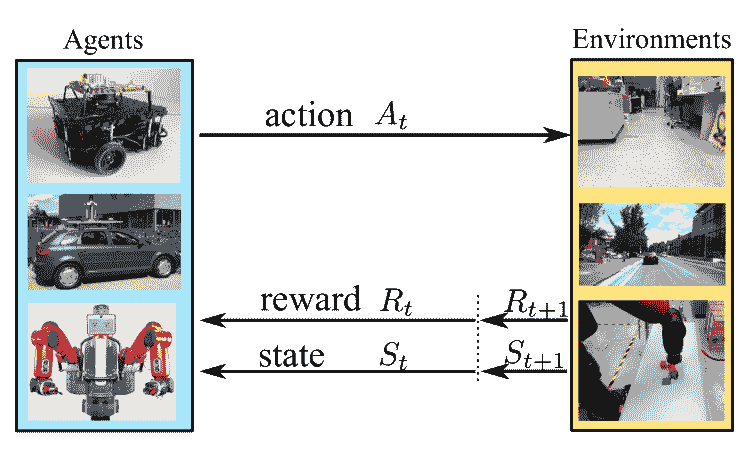

<!--yml

category: 未分类

日期：2024-09-06 20:09:13

-->

# [1612.07139] 深度网络解决方案的综述：用于机器人中的学习控制，从强化学习到模仿学习

> 来源：[`ar5iv.labs.arxiv.org/html/1612.07139`](https://ar5iv.labs.arxiv.org/html/1612.07139)

# 深度网络解决方案的综述

用于机器人中的学习控制：

从强化学习到模仿学习

**雷泰**^(∗1)、**晶伟张**^(∗2)、**明刘**¹、**约施卡·博德克**²、**沃尔夫拉姆·布尔加德**² *表示等同贡献。¹雷泰和明刘来自香港科技大学。{ltai, eelium}ust.hk²晶伟张、约施卡·博德克和沃尔夫拉姆·布尔加德来自弗赖堡大学。{zhang, jboedeck, burgard}@informatik.uni-freiburg.de

###### 摘要

深度学习技术已被广泛应用，在多个研究领域中取得了最先进的成果。本综述聚焦于针对机器人应用的学习控制策略的深度学习解决方案。我们讨论了两种主要的深度网络学习控制范式：深度强化学习和模仿学习。对于深度强化学习（DRL），我们从传统的强化学习算法入手，展示了它们如何扩展到深度背景下以及可以添加到 DRL 算法上的有效机制。然后我们介绍了利用 DRL 解决机器人导航和操作任务的代表性工作。我们继续讨论应对将训练于模拟中的 DRL 策略迁移到现实场景中的现实差距挑战的方法，并总结了用于进行 DRL 研究的机器人模拟平台。对于模仿学习，我们介绍了其三个主要类别：行为克隆、逆强化学习和生成对抗模仿学习，阐述了它们的公式及其相应的机器人应用。最后，我们讨论了开放的挑战和研究前沿。

###### 关键词：

深度学习、机器人、深度强化学习、模仿学习。

## I 引言

### I- 深度学习

深度学习作为一种人工智能解决方案，能够逐渐构建输入数据的抽象表示，在多个研究领域中发挥着至关重要的作用（Goodfellow et al., 2016）。

从图像分类（Krizhevsky et al.，2012；He et al.，2016；Huang et al.，2017），到语义分割（Long et al.，2015；Chen et al.，2016），从仅用像素输入进行人类水平的 Atari 游戏（Mnih et al.，2015，2016），到学习能够在导航（Zhu et al.，2017b；Zhang et al.，2017a；Tai et al.，2017）和操作（Levine et al.，2016；Yu et al.，2018）任务中驱动真实机器人系统的策略，深度网络的学习能力推动了各种研究方向的最先进技术（Schmidhuber，2015）。

近年来，利用深度学习技术进行机器人任务的趋势迅速增长。通过将手工特征替换为学习到的层次分布深度特征，直接从高维感官输入中学习控制策略，机器人社区在构建完全自主的智能系统方面取得了坚实的进展。

### I-B 深度学习在机器人学中的应用：从感知到控制

自主智能机器人系统需要两个基本构建模块：感知和控制。

感知管道可以被视为一种被动过程：智能代理从环境中接收观察，然后从这些传感器输入中推断所需的属性或检测目标量。我们建议读者参阅 Deng（2014）和 Guo 等（2016）以获取深度学习技术在感知方面的全面概述。与纯粹的感知相比，自动化代理的控制问题更进一步，寻求通过执行一系列行动来积极互动或影响环境。这种主动性导致了感知与控制之间在深度学习方法方面的以下主要区别：

数据分布：在通过监督学习技术进行感知学习时，训练数据集在学习阶段开始之前被收集和标记。在这种情况下，数据点可以被视为独立同分布（i.i.d），这样可以通过标准的随机梯度下降方法及其变体来学习输入到标签的直接映射。相比之下，对于控制任务，数据集是以在线方式收集的，这使得数据点在本质上是序列化的：代理接收到的连续观察是时间上相关的，因为代理通过其行动积极影响数据分布。忽视这种潜在的时间相关性会导致累积错误（Bagnell，2015）。

监督信号：学习感知的监督通常是直接且强烈的，每个训练样本都会附带其真实标签。而在控制任务中，通过深度强化学习学习行为时，要么只有稀疏的奖励信号可用，要么反馈往往是延迟的而非即时的，即使在模仿学习场景中提供了专家的示范，因为实现特定目标的功劳需要正确地分配到沿轨迹采取的所有动作上。

数据收集：如前所述，感知的数据集可以离线收集，而控制的数据集必须以在线方式收集，因为动作在学习过程中起着主动作用。这大大限制了可以收集的样本数量，因为在真实世界中执行动作的成本相对较高。如果控制策略是在模拟环境中训练的，当它们被部署到实际场景中时，就会出现现实差距的问题，合成渲染与真实感官读数之间的差异带来了主要挑战。

认识到这些区别后，已经提出了各种基于深度学习的算法来解决机器人控制问题。在这次调查中，我们根据其基本学习范式回顾了用于控制任务的深度学习方法，并通过以下几个部分进行讨论：

+   •

    第 II 节 深度强化学习

    +   –

        第 II-A 节 强化学习概述

    +   –

        第 II-B 节 强化学习算法

    +   –

        第 II-C 节 DRL 算法

    +   –

        第 II-D 节 DRL 机制

    +   –

        第 II-E 节 DRL 在导航中的应用

    +   –

        第 II-F 节 DRL 在操控中的应用

    +   –

        Sec. II-G 现实差距：从模拟到现实世界

    +   –

        Sec. II-H 模拟平台

+   •

    Sec. III 模仿学习

    +   –

        Sec. III-A 行为克隆

    +   –

        Sec. III-B 逆向强化学习

    +   –

        Sec. III-C 生成对抗模仿学习

## II 深度强化学习

作为首个通过深度卷积神经网络作为函数逼近器稳定大规模强化学习的方法，深度 Q 网络（DQN）（Mnih et al., 2015）带动了深度强化学习（DRL）方法的研究和应用的增加。接下来我们首先回顾传统强化学习（RL）中的基本概念和算法。然后，我们继续介绍几个最具影响力的 DRL 算法和机制，基于这些，我们讨论了用于机器人控制的 DRL 解决方案，重点关注导航和操作应用。

### II-A 强化学习概述

我们将机器人任务（例如，导航，操作）形式化为马尔可夫决策过程（MDP），其中代理通过一系列观察、动作和奖励信号与环境互动。MDP 是一个 $5-$元组 $\left<\mathcal{S},\mathcal{A},P,\mathcal{R},\gamma\right>$：

+   •

    $\mathcal{S}$: 所有状态的集合。

+   •

    $\mathcal{A}$: 所有动作的集合。

+   •

    $\mathcal{P}$: 转移动态，其中 $P(\mathbf{s}^{\prime}|\mathbf{s},\mathbf{a})$ 定义了在状态 $\mathbf{s}$ 下采取动作 $\mathbf{a}$ 后下一个状态 $\mathbf{s}^{\prime}$ 的分布，其中 $\mathbf{s},\mathbf{s}^{\prime}\in\mathcal{S},\mathbf{a}\in\mathcal{A}$。我们还将初始状态分布 $P(\mathbf{s}_{0})$ 表示为 $\rho_{0}$。

+   •

    $\mathcal{R}$：所有可能奖励的集合。在下文中，我们将智能体在状态$\mathbf{s}_{t}$下采取动作$\mathbf{a}_{t}$所获得的瞬时标量奖励表示为$R_{t+1}(\mathbf{s}_{t},\mathbf{a}_{t})$，并用$R_{t+1}$作为$R_{t+1}(\mathbf{s}_{t},\mathbf{a}_{t})$的简写。还有其他奖励函数的定义仅依赖于状态本身，其中$R(\mathbf{s})$指的是智能体到达状态$\mathbf{s}$时接收到的奖励信号。在接下来的讨论中，奖励函数的负面对应物，即成本函数，通常用$c(\mathbf{s})$表示。

+   •

    $\gamma$：范围为$[0,1]$的折扣因子。

图 1：在机器人领域中的强化学习循环。在状态$\mathbf{s}_{t}$下，自主智能体采取动作$\mathbf{a}_{t}$，获得奖励$R_{t+1}$，并转移到下一个状态$\mathbf{s}_{t+1}$。

在 MDP 中，智能体在状态$\mathbf{s}_{t}$下采取动作$\mathbf{a}_{t}$，获得奖励$R_{t+1}$，并根据转移动态$\mathcal{P}(\mathbf{s}_{t+1}|\mathbf{s}_{t},\mathbf{a}_{t})$转移到下一个状态$\mathbf{s}_{t+1}$。机器人领域中的这一过程如图 1 所示。

在机器人领域，我们主要考虑情节性 MDP，其中存在一个终端状态（例如，移动地面车辆到达某个目标位置，操纵器成功抓取一个红杯），一旦达到该状态，当前情节即终止。对于具有时间范围$T$的情节性 MDP，即使在时间范围$T$内终端状态尚未到达，情节仍将在最大$T$个时间步后终止。

另一个值得提及的点是部分可观测性。在机器人任务中，自主智能体通过其车载传感器（例如，RGB/深度相机、IMU、激光测距传感器、3D Lidar）感知世界，每个时间步接收一个观察值。然而，仅用$\mathbf{s}_{t}$表示为$\mathbf{x}_{t}$通常不能满足马尔可夫性质：一个传感器读数很难捕获所有必要的信息来帮助智能体做出未来的决策，这种情况下，基础过程称为部分可观测的 MDP（POMDP）。这通常通过堆叠几个（例如，$N$）连续观察值$\{\mathbf{x}_{t-N+1},\mathbf{x}_{t-N+2},\dots,\mathbf{x}_{t}\}$来表示$\mathbf{s}_{t}$，或者将$\mathbf{x}_{t}$输入到递归神经网络中而不是前馈神经网络中，以便自然地考虑过去的信息（例如，当使用长短期记忆（LSTMs）时通过单元状态）。

强化学习代理旨在通过交互学习如何行为以实现某个目标（Sutton 和 Barto，1998）。更准确地说，这里的学习目标是最大化期望折扣回报，其中折扣回报定义如下:

|  | $\displaystyle G_{t}$ | $\displaystyle=R_{t+1}+\gamma R_{t+2}+\gamma^{2}R_{t+3}+\dots+\gamma^{T-t-1}R_{T}$ |  | (1) |
| --- | --- | --- | --- | --- |
|  |  | $\displaystyle=\sum_{k=t}^{T}\gamma^{k-t}R_{k+1}.$ |  | (2) |

为了解决控制问题，引入了两个重要定义:

+   •

    策略: $\pi,\mu$

    +   –

        $\pi(\mathbf{a}|\mathbf{s})$: 随机策略，其中动作是从由 $\pi(\mathbf{a}|\mathbf{s})$ 定义的概率分布中抽取的。

    +   –

        $\mu(\mathbf{s})$: 确定性策略，其中在给定状态 $\mathbf{s}$ 时，动作是确定性的。

+   •

    值函数: $V,Q$

    +   –

        $V^{\pi}(\mathbf{s})$: 状态值函数，定义为从状态 $\mathbf{s}$ 开始并随后遵循策略 $\pi$ 的期望回报:

        |  | $\displaystyle V^{\pi}(\mathbf{s})$ | $\displaystyle=\mathbb{E}_{\pi}\left[G_{t}&#124;\mathbf{s}_{t}=\mathbf{s}\right]$ |  | (3) |
        | --- | --- | --- | --- | --- |
        |  |  | $\displaystyle=\mathbb{E}_{\pi}\left[\sum_{k=t}^{T}\gamma^{k-t}R_{k+1}&#124;\mathbf{s}_{t}=\mathbf{s}\right].$ |  | (4) |

    +   –

        $Q^{\pi}(\mathbf{s},\mathbf{a})$: 行为值函数，定义为从状态 $\mathbf{s}$ 执行动作 $\mathbf{a}$ 后，随后遵循 $\pi$ 的期望回报:

        |  | $\displaystyle Q^{\pi}(\mathbf{s},\mathbf{a})$ | $\displaystyle=\mathbb{E}_{\pi}\left[G_{t}&#124;\mathbf{s}_{t}=\mathbf{s},\mathbf{a}_{t}=\mathbf{a}\right]$ |  | (5) |
        | --- | --- | --- | --- | --- |
        |  |  | $\displaystyle=\mathbb{E}_{\pi}\left[\sum_{k=t}^{T}\gamma^{k-t}R_{k+1}&#124;\mathbf{s}_{t}=\mathbf{s},\mathbf{a}_{t}=\mathbf{a}\right].$ |  | (6) |

    +   –

        $Q^{*}(\mathbf{s},\mathbf{a})$: 最优值函数（这里省略了状态值函数 $V$ 的情况，因为行为值函数 $Q$ 是控制问题的更有效表示。）

        |  | $\displaystyle Q^{*}(\mathbf{s},\mathbf{a})$ | $\displaystyle=\max_{\pi}Q^{\pi}(\mathbf{s},\mathbf{a}).$ |  | (7) |
        | --- | --- | --- | --- | --- |

    +   –

        $\pi^{*}(\mathbf{a}|\mathbf{s})$: 最优策略:

        |  | $\displaystyle\pi^{*}(\mathbf{a}&#124;\mathbf{s})$ | $\displaystyle=\operatorname*{\arg\!\max}_{\mathbf{a}}Q^{*}(\mathbf{s},\mathbf{a}).$ |  | (8) |
        | --- | --- | --- | --- | --- |

### II-B RL 算法

有了核心组件的定义，我们现在继续讨论不同类别的强化学习算法。我们特别强调那些已经扩展到深度学习变体的方法。

#### II-B1 基于值的方法

这些方法基于对在给定状态下的值进行估计，然后从估计的值中提取控制策略。递归值估计过程基于 Bellman 方程。以下是 Bellman 期望方程（公式 9）和 Bellman 最优方程（公式 10）：

|  | $\displaystyle Q^{\pi}(\mathbf{s},\mathbf{a})$ | $\displaystyle=\mathbb{E}_{\pi}\left[R_{t+1}+\gamma Q^{\pi}(\mathbf{s}_{t+1},\mathbf{a}_{t+1})\mid\mathbf{s}_{t}=\mathbf{s},\mathbf{a}_{t}=\mathbf{a}\right],$ |  | (9) |
| --- | --- | --- | --- | --- |
|  | $\displaystyle Q^{*}(\mathbf{s},\mathbf{a})$ | $\displaystyle=\mathbb{E}\left[R_{t+1}+\gamma\max_{\mathbf{a}^{\prime}}Q^{*}(\mathbf{s}_{t+1},\mathbf{a}^{\prime})\mid\mathbf{s}_{t}=\mathbf{s},\mathbf{a}_{t}=\mathbf{a}\right].$ |  | (10) |

根据公式 9 和公式 10，我们得到了两种最著名的基于价值的强化学习方法：SARSA 和 Q-learning，这两种方法遵循相同的递归备份过程，如下所示：

|  | $\displaystyle Q^{\pi}(\mathbf{s}_{t},\mathbf{a}_{t})$ | $\displaystyle\leftarrow Q^{\pi}(\mathbf{s}_{t},\mathbf{a}_{t})+\alpha\delta_{t},$ |  | (11) |
| --- | --- | --- | --- | --- |
|  | $\displaystyle\delta_{t}$ | $\displaystyle=\mathbf{y}_{t}-Q^{\pi}(\mathbf{s}_{t},\mathbf{a}_{t}).$ |  | (12) |

在这个估计过程中，$Q$-值通过步长 $\alpha$ 递归地更新到目标值 $\mathbf{y}_{t}$。$\delta_{t}$ 被称为 td-error（时序差分误差），$\mathbf{y}_{t}$ 则是 td-target。

SARSA 和 Q-learning 之间的区别在于它们的 td-target。以下是 SARSA 和 Q-learning 的 td-target，分别列在公式 13 和公式 14 中：

|  | $\displaystyle\mathbf{y}_{t}^{\textit{SARSA}}$ | $\displaystyle=R_{t+1}+\gamma Q^{\pi}(\mathbf{s}_{t+1},\mathbf{a}_{t+1}),$ |  | (13) |
| --- | --- | --- | --- | --- |
|  | $\displaystyle\mathbf{y}_{t}^{\textit{Q-learning}}$ | $\displaystyle=R_{t+1}+\gamma\max_{\mathbf{a}^{\prime}}Q^{\pi}(\mathbf{s}_{t+1},\mathbf{a}^{\prime}).$ |  | (14) |

SARSA 使用跟随行为策略$\pi$生成的转移来更新其$Q$-值估计，这使得 SARSA 成为一种基于策略的方法；而 Q-learning 则是离策略的，因为其价值估计不是朝向行为策略更新，而是朝向目标最优策略更新。

还有其他基于价值的方法，如蒙特卡罗控制，它使用完整轨迹的真实回报作为更新目标，而不是从旧的估计中引导，和$\lambda$-变体，它混合了样本回报和 1 步前瞻估计。

$Q$-值函数的一种重新表述，后继表示（Dayan, 1993），在最近的文献中也有研究（Kulkarni et al., 2016; Barreto et al., 2017; Zhang et al., 2017a）：

|  | $\displaystyle R_{t+1}(\mathbf{s}_{t},\mathbf{a}_{t})$ | $\displaystyle=\phi(\mathbf{s}_{t},\mathbf{a}_{t})^{\top}\cdot\omega,$ |  | (15) |
| --- | --- | --- | --- | --- |
|  | $\displaystyle Q^{\pi}(\mathbf{s},\mathbf{a})$ | $\displaystyle=\psi^{\pi}(\mathbf{s},\mathbf{a})^{\top}\cdot\omega,$ |  | (16) |

其中

|  | $\displaystyle\psi^{\pi}(\mathbf{s},\mathbf{a})$ | $\displaystyle=\mathbb{E}_{\pi}\left[\sum_{k=t}^{T}\gamma^{k-t}\phi(\mathbf{s}_{k},\mathbf{a}_{k})&#124;\mathbf{s}_{t}=\mathbf{s},\mathbf{a}_{t}=\mathbf{a}\right],$ |  | (17) |
| --- | --- | --- | --- | --- |

被称为后继特征。这种表述将任务特定的回报估计解耦为代表性特征$\phi(\cdot)$的估计和回报权重$\omega$的估计，以及在特定策略下的特定世界动态下特征$\phi(\cdot)$的期望发生率的估计。它结合了无模型方法的计算效率和某些基于模型方法的灵活性。我们建议读者参考 Dayan (1993)、Kulkarni et al. (2016)、Barreto et al. (2017) 和 Zhang et al. (2017a) 以获取更详细的讨论和扩展。

#### II-B2 基于策略的方法

与基于价值的方法不同，基于策略的方法不维护价值估计，而是直接作用于策略。对于高维或连续动作空间，基于策略的方法通常比基于价值的方法提供更有效的解决方案。它们可以学习随机策略而不仅仅是确定性策略，并且具有更好的收敛性。

基于策略的方法作用于参数化的策略，并搜索能够最大化策略目标函数的参数。策略搜索可以在两种范式中进行：无梯度（Fu et al., 2005; Szita 和 Lörincz, 2006）和基于梯度的方法。我们关注于基于梯度的家族中的梯度下降方法，因为它们在最近的研究中仍然是首选的方法。更正式地说，给定具有参数$\theta$的策略$\pi_{\theta}(\cdot)$，策略优化搜索最佳的$\theta$，使目标函数$\mathcal{J}(\pi_{\theta})$最大化：

|  | $\displaystyle\mathcal{J}(\pi_{\theta})$ | $\displaystyle=\mathbb{E}_{\pi_{\theta}}[f_{\pi_{\theta}}(\cdot)].$ |  | (18) |
| --- | --- | --- | --- | --- |

在这里，$f_{\pi_{\theta}}(\cdot)$是一个评分函数，用于判断策略的优劣。评分函数有多种有效选择；我们建议读者参考 Schulman et al. (2015b)以获得详细讨论。

策略梯度定义为

|  | $\displaystyle\nabla_{\theta}\mathcal{J}(\pi_{\theta})$ | $\displaystyle=\mathbb{E}_{\pi_{\theta}}\left[\nabla_{\theta}\log\pi_{\theta}\cdot f_{\pi_{\theta}}(\cdot)\right].$ |  | (19) |
| --- | --- | --- | --- | --- |

直观地说，首先，某些动作、经历或轨迹是按照当前策略$\pi_{\theta}$进行采样的，这些样本的优劣由$f_{\pi_{\theta}}(\cdot)$评分函数给出，而$\nabla_{\theta}\log\pi_{\theta}$指出了在参数空间中能增加这些动作被采样概率的方向。因此，通过沿着方程 19 中给出的策略梯度上升，我们最终得到能够生成具有更高评分样本的策略。

标准 REINFORCE 算法（Williams, 1992），是强化学习中的一种著名方法，将样本回报作为评分函数：

|  | $\displaystyle f_{\pi_{\theta}}(\cdot)$ | $\displaystyle=G_{t}.$ |  | (20) |
| --- | --- | --- | --- | --- |

然而，该算法存在非常高的方差。减少估计方差同时保持其无偏的一种常见方法是从回报中减去基线$b(\mathbf{s})$：

|  | $\displaystyle f_{\pi_{\theta}}(\cdot)$ | $\displaystyle=G_{t}-b_{t}(\mathbf{s}_{t}).$ |  | (21) |
| --- | --- | --- | --- | --- |

一种常用的基线是对状态值函数$V(\mathbf{s})$的学习估计。这引导我们到演员-评论家类算法，因为它涉及估计值函数以及策略搜索。

在我们深入探讨演员-评论家方法之前，有几个细节值得指出。

首先，在机器人设置中，直接跟随政策梯度可能不太理想，因为硬件限制和安全要求需要谨慎处理。流行的谨慎探索方法包括避免政策的重大变化，或明确地阻止进入状态空间中的不期望区域（Deisenroth et al., 2013）。

我们还注意到，到目前为止，我们只讨论了针对随机策略的政策梯度，它在状态和动作空间上进行积分，在高维动作空间中可能效率不高。另一方面，确定性政策梯度（Silver et al., 2014）只需要在状态空间上进行积分，这使得它成为一个更具样本效率的算法。下面我们列出使用$Q$值函数作为其得分函数的随机政策梯度（针对$\pi_{\theta}(\mathbf{a}|\mathbf{s})$，方程 22）和确定性政策梯度（针对$\mu_{\theta}(\mathbf{s})$，方程 23）：

|  | $\displaystyle\nabla_{\theta}\mathcal{J}(\pi_{\theta})$ | $\displaystyle=\mathbb{E}_{\mathbf{s},\mathbf{a}}\left[\nabla_{\theta}\log\pi_{\theta}(\mathbf{a}&#124;\mathbf{s})\cdot Q^{\pi}(\mathbf{s},\mathbf{a})\right],$ |  | (22) |
| --- | --- | --- | --- | --- |
|  | $\displaystyle\nabla_{\theta}\mathcal{J}(\mu_{\theta})$ | $\displaystyle=\mathbb{E}_{\mathbf{s}}\left[\nabla_{\theta}\mu_{\theta}(\mathbf{s})\cdot Q^{\mu}(\mathbf{s},\mu_{\theta}(\mathbf{s}))\right].$ |  | (23) |

#### II-B3 演员-评论家方法

继政策基础方法的讨论之后，演员-评论家算法维护了对政策（演员）和价值估计（评论家）的明确表示。最广泛使用的演员-评论家算法使用以下得分函数：

|  | $\displaystyle f_{\pi_{\theta}}(\cdot)$ | $\displaystyle=Q^{\pi_{\theta}}(\mathbf{s}_{t},\mathbf{a}_{t})-V^{\pi_{\theta}}(\mathbf{s}_{t}).$ |  | (24) |
| --- | --- | --- | --- | --- |

相较于方程 21，方程 24 用其无偏估计$Q^{\pi_{\theta}}(\mathbf{s}_{t},\mathbf{a}_{t})$替代返回值$G_{t}$，并使用$V^{\pi_{\theta}}(\mathbf{s}_{t})$作为基线函数以减少方差。实际上，

|  | $\displaystyle A(\mathbf{s},\mathbf{a})$ | $\displaystyle=Q(\mathbf{s},\mathbf{a})-V(\mathbf{s})$ |  | (25) |
| --- | --- | --- | --- | --- |

这称为优势函数，它估计在状态 $\mathbf{s}$ 下采取特定动作 $\mathbf{a}$ 的优势。

#### II-B4 规划与学习的整合

到目前为止，我们讨论了无模型方法，其中代理没有提供底层过渡模型，而是通过经验学习最优行为。还有另一类基于模型的算法，其中从经验中学习模型，代理可以与模型互动并收集虚拟回合（Sutton, 1991）。这些方法也已经与 DRL 方法结合扩展（Weber et al., 2017; Kalweit 和 Boedecker, 2017）。然而，学习模型的需求带来了另一种近似误差来源，而基于模型的强化学习的表现只能与估计模型的效果相匹配。这个问题可能会通过模型预测控制（MPC）方法部分解决，这些方法不是本次综述的重点，因此我们将跳过详细讨论。

### II-C DRL 算法

深度强化学习（DRL）的近期成功将上述算法扩展到了高维领域，通过将深度神经网络作为强大的非线性函数逼近器用于最优价值函数 $V^{*}(\mathbf{s}),Q^{*}(\mathbf{s},\mathbf{a}),A^{*}(\mathbf{s},\mathbf{a})$ 和最优策略 $\pi^{*}(\mathbf{a}|\mathbf{s})$, $\mu^{*}(\mathbf{s})$。它们通常将观察作为输入（例如，来自 Atari 模拟器的原始像素图像（Mnih et al., 2015）或机器人手臂的关节角度），并输出 $Q$-值，通过这些值选择贪婪动作，或者输出可以直接用于执行代理的策略。接下来，我们将介绍最具影响力的 DRL 算法。

#### II-C1 DQN (Mnih et al., 2015)

: 作为一种基于价值的方法，DQN 使用深度卷积神经网络来逼近最优 $Q$-值函数，该网络称为深度 Q 网络，我们将其权重表示为 $\theta^{Q}$：$Q(\mathbf{s},\mathbf{a};\theta^{Q})\approx Q^{*}(\mathbf{s},\mathbf{a})$。反过来，从标准 Q 学习中采用了 td-误差（方程 12）和 td-目标（方程 14）：

|  | $\displaystyle\delta_{t}^{\text{DQN}}$ | $\displaystyle=\mathbf{y}_{t}^{\text{DQN}}-Q(\mathbf{s}_{t},\mathbf{a}_{t};\theta^{Q}_{t}),$ |  | (26) |
| --- | --- | --- | --- | --- |
|  | $\displaystyle\mathbf{y}_{t}^{\text{DQN}}$ | $\displaystyle=R_{t+1}+\gamma\max_{\mathbf{a}^{\prime}}Q(\mathbf{s}_{t+1},\mathbf{a}^{\prime};\theta^{-}_{t}).$ |  | (27) |

然后根据以下梯度计算进行更新步骤，学习率为$\alpha$：

|  | $\displaystyle\theta_{t+1}$ | $\displaystyle\leftarrow\theta_{t}-\alpha\cdot\left(\partial\left(\delta^{\text{DQN}}_{t}(\theta^{Q}_{t})\right)^{2}/\partial{\theta^{Q}_{t}}\right).$ |  | (28) |
| --- | --- | --- | --- | --- |

在 DQN 中，提出了两种主要技术来稳定学习：目标网络和经验回放。

目标网络：在公式 27 ‣ II-C DRL 算法 ‣ II 深度强化学习 ‣ 一项关于深度网络解决方案用于机器人学习控制的调查：从强化学习到模仿学习") 中，td-target 是使用目标网络$\theta^{-}$的输出计算的，而不是 Q 网络$\theta^{Q}$的输出。目标网络和 Q 网络共享相同的网络架构，但只有 Q 网络的权重会被学习和更新。Q 网络的权重$\theta^{Q}$只是定期复制到目标网络$\theta^{-}$中。这减少了估计的$Q$值与目标估计的相关性。还有一种软更新方法（Lillicrap 等，2015），在每次迭代中将$\theta^{Q}$的小部分混入$\theta^{-}$中，而不是原始 DQN 中使用的硬更新方法，其中$\theta^{Q}$会在每几个（例如$10,000$）迭代中直接完全复制到$\theta^{-}$。

经验回放：在这种技术中，不是直接使用来自在线交互的输入帧，而是将收集的经验首先存储到回放记忆中。在训练过程中，从回放记忆中随机抽取样本（将$4$个连续观察堆叠在一起形成一个状态，以应对部分可观察性）作为小批量输入网络。这样，可以安全地使用来自监督学习文献的梯度下降方法，以最小化预测$Q$值（由 Q 网络输出）和目标$Q$值（由目标网络输出）之间的最小平方误差。经验回放从而消除了连续观察中的时间相关性，并平滑了在线数据分布的变化。

在 DQN 的基础上，提出了进一步的技术以稳定学习和提高效率：双重 DQN（Van Hasselt 等，2016）和对抗 DQN（Wang 等，2016b）。

对于双重 DQN（Van Hasselt 等，2016），贪婪动作是基于$\theta^{Q}$的输出选择的（原始 DQN 使用$\theta^{-}$），然后选择的贪婪动作的目标$Q$值是使用$\theta^{-}$计算的（公式 29 ‣ II-C DRL 算法 ‣ II 深度强化学习 ‣ 一项关于深度网络解决方案用于机器人学习控制的调查：从强化学习到模仿学习")）。这防止了过于乐观的价值估计并避免了上升的偏差：

|  | $\displaystyle\mathbf{y}_{t}^{\text{Double}}$ | $\displaystyle=R_{t+1}+\gamma Q(\mathbf{s}_{t+1},\operatorname*{\arg\!\max}_{\mathbf{a}^{\prime}}Q(\mathbf{s}_{t+1},\mathbf{a}^{\prime};\theta^{Q}_{t});\theta^{-}_{t}).$ |  | (29) |
| --- | --- | --- | --- | --- |

对于 Dueling DQN（Wang 等，2016b），使用两个输出头分别估计每个动作的状态值$V$和优势$A$。这有助于智能体有效地学习哪些状态是有价值的，而无需为每个状态学习每个动作的效果。

#### II-C2 DDPG（Lillicrap 等，2015）

: DQN 可以处理高维状态空间，但仅能处理离散且低维的动作空间。深度确定性策略梯度（DDPG）结合了 DQN 和演员-评论员方法的技术，旨在解决从原始像素输入的连续控制任务。

如果我们写出方程 9 中随机策略$\pi(\mathbf{a}|\mathbf{s})$和确定性策略$\mu(\mathbf{s})$的期望，我们得到（$E$代表智能体正在交互的环境）

|  | $\displaystyle Q^{\pi}(\mathbf{s}_{t},\mathbf{a}_{t})=$ |  |
| --- | --- | --- |
|  | $\displaystyle\mathbb{E}_{R_{t+1},\mathbf{s}_{t+1}\sim E}\left[R_{t+1}+\gamma\mathbb{E}_{\mathbf{a}_{t+1}\sim{\pi}}\left[Q^{\pi}(\mathbf{s}_{t+1},\mathbf{a}_{t+1})\right]\right],$ |  | (30) |
|  | $\displaystyle Q^{\mu}(\mathbf{s}_{t},\mathbf{a}_{t})=$ |  |
|  | $\displaystyle\mathbb{E}_{R_{t+1},\mathbf{s}_{t+1}\sim E}\left[R_{t+1}+\gamma Q^{\mu}(\mathbf{s}_{t+1},\mu(\mathbf{s}_{t+1}))\right].$ |  | (31) |

DDPG 使用$\theta^{Q}$来表示$Q$-值估计，并使用$\theta^{\mu}$来表示确定性策略。$\theta^{\mu}$是通过方程 23 中的 DPG 学习得到的，而$\theta^{Q}$是按照方程 31 进行学习的。（注意，不同于 DQN，其中$Q$-值对$\mathbf{a}$的依赖通过对每个动作输出一个值来表示，DDPG 中的$Q$-网络通过将动作作为$\theta^{Q}$的输入来处理这种依赖。）

#### II-C3 NAF（Gu 等，2016）

: 归一化优势函数提供了另一种方法，使 $Q$-学习在连续动作空间中能够应用深度神经网络，并且比 DDPG 简单得多。对于连续动作问题，标准 $Q$-学习不容易直接应用，因为它需要最大化一个复杂的非线性函数来确定贪婪动作。NAF 的关键思想是以一种方式表示 $Q$-值函数 $Q(\mathbf{s},\mathbf{a})$，使得其最大值 $\operatorname*{\arg\!\max}_{\mathbf{a}}Q(\mathbf{s},\mathbf{a})$ 在 $Q$-学习更新期间可以容易地解析确定。

NAF 使用了与 DQN 相同的目标网络和经验回放技术，但在网络输出上有所不同。它的最后隐藏层连接到三个输出头：$\theta^{V}$、$\theta^{\mu}$ 和 $\theta^{L}$。$\theta^{V}$ 表示状态值 $V(\mathbf{s})$，而 $\theta^{\mu}$ 和 $\theta^{L}$ 用于估计优势 $A(\mathbf{s},\mathbf{a})$；然后 $Q(\mathbf{s},\mathbf{a})$ 可以根据 Eq. 25 进行计算。举个具体的例子，例如，如果 $\theta^{\mu}$ 和 $\theta^{L}$ 都通过线性层表示，且 $\theta^{L}$ 的输出数量是 $\theta^{\mu}$ 的输出数量的平方（等于动作维度），那么 $\theta^{L}$ 的输出首先被重塑为一个矩阵，然后从中提取 $L(\mathbf{s};\theta^{L})$，作为该矩阵的下三角部分，对角线项进行指数化。然后可以通过

|  | $\displaystyle A(\mathbf{s},\mathbf{a};\theta^{\mu},\theta^{L})$ |  |
| --- | --- | --- |
|  | $\displaystyle=-\frac{1}{2}\left(\mathbf{a}-\mu(\mathbf{s};\theta^{\mu})\right)^{T}P(\mathbf{s};\theta^{L})\left(\mathbf{a}-\mu(\mathbf{s};\theta^{\mu})\right),$ |  | (32) |

其中

|  | $\displaystyle P(\mathbf{s};\theta^{L})$ | $\displaystyle=L(\mathbf{s};\theta^{L})L(\mathbf{s};\theta^{L})^{T}.$ |  | (33) |
| --- | --- | --- | --- | --- |

尽管这种表示比一般的网络逼近器更具限制性，但 $Q$-值的贪婪动作总是由 $\mu(\mathbf{s};\theta^{\mu})$ 直接给出。异步版本的 NAF 也被提出了（Gu 等人，2017）。

#### II-C4 A3C (Mnih 等人，2016)

: Minh 等人提出了几种异步 DRL 算法。他们部署了多个演员-学习者，以在环境的多个实例上收集经验，同时每个演员-学习者根据其自身的网络参数 $\theta$ 从自己收集的样本中累积梯度；这些梯度用于更新共享模型 $\bm{\theta}$ 的权重。

最有效的算法之一是 A3C（异步优势演员-评论家），它在近期的深度强化学习研究中非常有影响力，并已成为标准基线。A3C 维护一个策略表示 $\pi(\mathbf{a}|\mathbf{s};\bm{\theta}^{\pi})$ 和一个价值估计 $V(\mathbf{s};\bm{\theta}^{V})$。它在策略梯度中使用优势函数作为评分函数，该函数通过每个演员-学习者使用 $n$ 步回报的混合来估计。更具体来说，每个演员-学习者线程生成自己环境的副本，并收集最多 $T_{\max}$（例如，$20$）步的经验回合。在演员-学习者完成回合的一个阶段后，它通过首先根据以下公式估计优势函数（例如，对于时间步 $t$），然后积累回合 $\left\{0,1,\cdots,t,\cdots,T\right\}$ 中每个时间步的经验的梯度

|  | $\displaystyle A(\mathbf{s}_{t},\mathbf{a}_{t};\theta^{\pi},\theta^{V})=$ |  |
| --- | --- | --- |
|  | $\displaystyle\left[\sum_{k=t}^{T-1}\left[\gamma^{k-t}R_{k+1}\right]+\gamma^{T-t}V(\mathbf{s}_{T};\theta^{V})-V(\mathbf{s}_{t};\theta^{V});\theta^{\pi}\right],$ |  | (34) |

然后计算相对于其当前网络参数集 $\theta^{\pi},\theta^{V}$ 的对应梯度，这些梯度随后用于更新共享模型 $\bm{\theta}^{\pi},\bm{\theta}^{V}$：

|  | $\displaystyle d\bm{\theta}^{\pi}$ | $\displaystyle\leftarrow d\bm{\theta}^{\pi}+\nabla_{\theta^{\pi}}\log\pi(\mathbf{a}_{t}&#124;\mathbf{s}_{t};\theta^{\pi})A(\mathbf{s}_{t},\mathbf{a}_{t};\theta^{\pi},\theta^{V}),$ |  | (35) |
| --- | --- | --- | --- | --- |
|  | $\displaystyle d\bm{\theta}^{V}$ | $\displaystyle\leftarrow d\bm{\theta}^{V}+\partial A(\mathbf{s}_{t},\mathbf{a}_{t};\theta^{\pi},\theta^{V})^{2}/\partial\theta^{V}.$ |  | (36) |

并行化大大稳定了参数的更新，因为不同演员-学习者在同一时间收集的样本相关性要小得多，这消除了保持回放记忆的需求。同时，通过在不同线程中运行不同的探索策略，学习者很可能会探索状态空间的不同部分。由于其高效、轻量且概念简单，A3C 被认为是近期深度强化学习研究中的标准起点。

#### II-C5 A2C（Wang 等，2016a；Wu 等，2017）

: 一些近期的研究发现，相比于同步版本 A2C，A3C 的异步性不一定能带来性能提升。与 A3C 不同，A2C 等待每个演员完成其经验段后才进行更新，这一更新是所有演员的平均值。这个细节使得 GPU 实现变得有效。

#### II-C6 GPS（Levine 和 Koltun，2013）

: 作为一种基于模型的策略搜索算法，指导策略搜索（GPS）具有相对较高的样本效率。GPS 从一些初始最优控制策略生成的引导样本开始，并从当前策略生成的样本中进行增强，每次迭代时都会采样一组训练轨迹来使用监督学习优化当前策略。更新后的策略被添加为额外的成本项，以限制策略的变化，并重新进行轨迹优化（例如，使用 LQR 求解器）。

#### II-C7 TRPO (Schulman 等人，2015a)

: 通过对理论上有依据的方案进行几次近似，Schulman 等人 (2015a) 提出了一个优化大型非线性策略的实际算法，保证了单调改进。

为了说明算法，我们首先定义了无限期 MDP 的期望折扣成本，它用成本函数 $c$ 替换了期望折扣回报中的奖励函数 $R$：

|  | $\displaystyle\eta(\pi)$ | $\displaystyle=\mathbb{E}_{\pi}\left[\sum_{t=0}^{\infty}\gamma^{t}c(\mathbf{s}_{t})\mid\mathbf{s}_{0}\sim\rho_{0}\right].$ |  | (37) |
| --- | --- | --- | --- | --- |

反过来，我们可以用成本函数 $c$ 重写状态值函数 Eq. 4 和动作值函数 Eq. 6 的定义：

|  | $\displaystyle V^{\pi}(\mathbf{s})$ | $\displaystyle=\mathbb{E}_{\pi}\left[\sum_{k=t}^{\infty}\gamma^{k-t}c(\mathbf{s}_{k})\mid\mathbf{s}_{t}=\mathbf{s}\right],$ |  | (38) |
| --- | --- | --- | --- | --- |
|  | $\displaystyle Q^{\pi}(\mathbf{s},\mathbf{a})$ | $\displaystyle=\mathbb{E}_{\pi}\left[\sum_{k=t}^{\infty}\gamma^{k-t}c(\mathbf{s}_{k})\mid\mathbf{s}_{t}=\mathbf{s},\mathbf{a}_{t}=\mathbf{a}\right],$ |  | (39) |

并且，我们得到了优势函数：

|  | $\displaystyle A^{\pi}(\mathbf{s},\mathbf{a})$ | $\displaystyle=Q^{\pi}(\mathbf{s},\mathbf{a})-V^{\pi}(\mathbf{s}).$ |  | (40) |
| --- | --- | --- | --- | --- |

由于我们正在寻找一种可以保证从旧策略 $\pi_{\text{old}}$ 到更新策略 $\pi$ 的单调改进的步长，因此用 $\pi_{\text{old}}$ 的期望成本来表示 $\pi$ 的期望成本是有益的，这会导致以下恒等式：

|  | $\displaystyle\eta(\pi)$ | $\displaystyle=\eta(\pi_{\text{old}})+\mathbb{E}_{\pi}\left[\sum_{t=0}^{\infty}\gamma^{t}A^{\pi_{\text{old}}}(\mathbf{s}_{t},\mathbf{a}_{t})\mid\mathbf{s}_{0}\sim\rho_{0}\right].$ |  | (41) |
| --- | --- | --- | --- | --- |

在继续之前，我们将策略 $\pi$ 下的状态 $\mathbf{s}$ 的（未归一化）折扣访问频率记作 $\rho^{\pi}(\mathbf{s})$，更正式地，

|  | $\displaystyle\rho^{\pi}(\mathbf{s})$ | $\displaystyle=\left(P(\mathbf{s}_{0}=\mathbf{s})+\gamma P(\mathbf{s}_{1}=\mathbf{s})+\gamma^{2}P(\mathbf{s}_{2}=\mathbf{s})+\cdots\right)$ |  |
| --- | --- | --- | --- |
|  |  | $\displaystyle=\sum_{t=0}^{\infty}\gamma^{t}P(\mathbf{s}_{t}=\mathbf{s}),$ |  | (42) |

其中 $\mathbf{s}_{0}\sim\rho_{0}$，动作根据 $\pi$ 选择。

现在，如果我们不再按时间步长求和，而是按状态求和，方程 41 ‣ II-C DRL 算法 ‣ II 深度强化学习 ‣ 从强化学习到模仿的深度网络解决方案调查") 可以重写为

|  | $\displaystyle\eta(\pi)$ | $\displaystyle=\eta(\pi_{\text{old}})+\sum_{\mathbf{s}\sim\rho^{\pi}}\rho^{\pi}(\mathbf{s})\sum_{\mathbf{a}\sim\pi}\pi(\mathbf{a}&#124;\mathbf{s})A^{\pi_{\text{old}}}(\mathbf{s},\mathbf{a}).$ |  | (43) |
| --- | --- | --- | --- | --- |

该方程表明，如果每个状态的期望优势值为非正值，则 $\eta$ 保证会减少或保持不变。由于方程 43 ‣ II-C DRL 算法 ‣ II 深度强化学习 ‣ 从强化学习到模仿的深度网络解决方案调查") 难以直接优化，鉴于 $\rho^{\pi}$ 对 $\pi$ 的复杂依赖关系，介绍了一个忽略政策变化引起的状态访问密度变化的局部近似，这个近似与 $\eta$ 的一阶匹配（这里省略了 $\eta(\pi)$ 因为它不影响底层优化问题的解决）：

|  | $\displaystyle L_{\pi_{\text{old}}}{(\pi)}=\sum_{\mathbf{s}\sim\rho^{\pi_{\text{old}}}}\rho^{\pi_{\text{old}}}(\mathbf{s})\sum_{\mathbf{a}\sim\pi}\pi(\mathbf{a}&#124;\mathbf{s})A^{\pi_{\text{old}}}(\mathbf{s},\mathbf{a}).$ |  | (44) |
| --- | --- | --- | --- |

标准策略梯度方法对 $\nth{1}$ 阶梯度进行上升，其中，$L_{\theta_{\text{old}}}{(\theta)}$ 的增加不能保证在大步长下 $\eta({\pi_{\theta}})$ 的增加，这是由于上述近似。

TRPO 将 Kakade 和 Langford (2002) 给出的混合策略设置中的策略改进界限扩展到一般随机策略，并表明

|  | $\displaystyle\eta(\pi)$ | $\displaystyle\leq L_{\pi_{\text{old}}}(\pi)+CD_{\text{KL}}^{\max}(\pi_{\text{old}},\pi),$ |  | (45) |
| --- | --- | --- | --- | --- |

其中

|  | $\displaystyle C$ | $\displaystyle=\frac{2\epsilon\gamma}{(1-\gamma)^{2}},$ |  | (47) |
| --- | --- | --- | --- | --- |
|  | $\displaystyle\epsilon$ | $\displaystyle=\max_{\mathbf{s}}\left&#124;\mathbb{E}_{\mathbf{a}\sim\pi}\left[A^{\pi_{\text{old}}}(\mathbf{s},\mathbf{a})\right]\right&#124;.$ |  | (48) |

这意味着通过执行以下优化（在这里我们用 $L_{\theta_{\text{old}}}(\theta)\coloneqq L_{\pi_{\theta_{\text{old}}}}(\pi_{\theta})$ 来表示参数化策略），我们可以保证改进真实目标 $\eta$：

|  | $\displaystyle\underset{\theta}{\text{minimize}}\left[L_{\theta_{\text{old}}}(\theta)+CD_{\text{KL}}^{\max}(\pi_{\theta_{\text{old}}},\pi_{\theta})\right].$ |  | (49) |
| --- | --- | --- | --- |

然而，如果在实际中使用在公式 47 ‣ II-C DRL 算法 ‣ II 深度强化学习 ‣ 深度网络解决方案概述：从强化学习到模仿学习") 中计算的惩罚系数 $C$，步长将非常小。

为了处理这个问题，TRPO 首先用重要性采样估计器替代了公式 44 ‣ II-C DRL 算法 ‣ II 深度强化学习 ‣ 深度网络解决方案概述：从强化学习到模仿学习") 中的动作求和（在这里，我们仅讨论单路径采样的情况，其中使用 $\pi_{\text{old}}$ 来生成轨迹），$A^{\pi_{\theta_{\text{old}}}}$ 被替换为 $Q^{\pi_{\theta_{\text{old}}}}$，这仅通过一个常数改变了目标，$Q$-值将被从样本平均中得出的经验估计替代，无论是单路径还是竹藤路径：

|  | $\displaystyle L_{\theta_{\text{old}}}{(\theta)}={\mathbb{E}}_{\mathbf{s}\sim\rho^{\pi_{\theta{\text{old}}}},\mathbf{a}\sim\pi_{\theta{\text{old}}}}\left[\frac{\pi_{\theta}(\mathbf{a} | \mathbf{s})}{\pi_{\theta{\text{old}}}(\mathbf{a} | \mathbf{s})}A^{\pi_{\theta{\text{old}}}}(\mathbf{s},\mathbf{a})\right].$ |  | (50) |
| --- | --- | --- | --- | --- | --- |

然后它将公式 49 ‣ II-C DRL 算法 ‣ II 深度强化学习 ‣ 深度网络解决方案概述：从强化学习到模仿学习") 中的软约束转变为以下硬约束问题：

|  | $\displaystyle\underset{\theta}{\text{minimize}}$ | $\displaystyle{\mathbb{E}}_{\mathbf{s}\sim\rho^{\pi_{\theta{\text{old}}}},\mathbf{a}\sim\pi_{\theta{\text{old}}}}\left[\frac{\pi_{\theta}(\mathbf{a} | \mathbf{s})}{\pi_{\theta{\text{old}}}(\mathbf{a} | \mathbf{s})}Q^{\pi_{\theta{\text{old}}}}(\mathbf{s},\mathbf{a})\right],$ |  | (51) |
| --- | --- | --- | --- | --- | --- | --- |
|  | subject to | $\displaystyle{\mathbb{E}}_{\mathbf{s}\sim\rho^{\pi_{\theta{\text{old}}}}}\left[D_{\text{KL}}(\pi_{\theta_{\text{old}}}(\cdot | \mathbf{s}) | | \pi_{\theta}(\cdot | \mathbf{s}))\right]\leq\delta.$ |  | (52) |

其中 $\delta$ 是用于表示旧策略与更新策略之间 KL 散度的上界的超参数（例如，$\delta=0.01$）。这个约束优化问题使用共轭梯度法和线搜索方法来解决；我们建议读者参考 Schulman 等人（2015a）以获取详细描述。

#### II-C8 PPO (Schulman et al., 2017)

: 相比于 TRPO 重新公式化一个硬约束问题 (Eq. 51 ‣ II-C DRL Algorithms ‣ II Deep reinforcement learning ‣ A Survey of Deep Network Solutions for Learning Control in Robotics: From Reinforcement to Imitation") 和 52 ‣ II-C DRL Algorithms ‣ II Deep reinforcement learning ‣ A Survey of Deep Network Solutions for Learning Control in Robotics: From Reinforcement to Imitation"))，PPO 使用 \nth1-order SGD 解决原始软约束优化 (Eq. 49 ‣ II-C DRL Algorithms ‣ II Deep reinforcement learning ‣ A Survey of Deep Network Solutions for Learning Control in Robotics: From Reinforcement to Imitation"))，根据 KL 散度调整 $C$。由于与 TRPO 相比实现更简单并且表现良好，PPO 已成为 OpenAI 的默认 DRL 算法。PPO 的分布式版本也已被提出 (Heess et al., 2017)。

#### II-C9 ACKTR (Wu et al., 2017)

: **Actor Critic Kronecker-Factored Trust Region (ACKTR)** 是一种可扩展的信任区域自然梯度方法，用于 actor-critic 算法，采用 Kronecker 分解的曲率近似。它比 TRPO 更加计算高效，并且比那些在梯度方向（例如 A2C）而非自然梯度方向上采取步伐的方法更为样本高效。

### II-D DRL 机制

许多有用的机制也被提出，可以在上述 DRL 算法之上进行扩展。这些机制通常与算法正交，有些可以大幅度加速 DRL 训练。下面我们列出了一些概念上简单但非常有效的机制。

+   •

    辅助任务 (Mirowski et al., 2016; Jaderberg et al., 2016; Levine et al., 2016; Yu et al., 2018; Riedmiller et al., 2018)：在主要强化学习任务旁边使用额外的监督或无监督任务（例如，从彩色图像回归深度图像、检测回环闭合、预测末端执行器姿态），以弥补通常提供给 DRL 代理的稀疏监督信号。

+   •

    优先经验回放 (Schaul et al., 2015b)：根据 td-error 优先级回放内存；可以添加到 off-policy 方法中。

+   •

    事后经验回放 (Andrychowicz et al., 2017)：重新标记收集经验的奖励，以更好地利用失败轨迹，并有效加速具有二元或稀疏奖励结构的 off-policy 方法。

+   •

    课程学习（Bengio 等，2009；Florensa 等，2017；Zhang 等，2017b）：向学习代理呈现逐渐复杂的任务设置，使其能够逐步掌握更复杂的技能。

+   •

    好奇心驱动的探索（Pathak 等，2017）：通过内在动机测量的内部奖励来增强标准的外部奖励。

+   •

    非对称自回放用于探索（Sukhbaatar 等，2017）：通过两个版本的同一代理之间的相互作用生成自动课程来驱动探索。

+   •

    参数空间中的噪声用于探索（Fortunato 等，2018；Plappert 等，2018）：扰动网络参数以辅助探索。

### II-E 深度强化学习（DRL）用于导航

自主导航是移动机器人领域中的一个重要问题和挑战。它大致可以描述为机器人在环境中规划和跟随一条轨迹以到达某个目标位置的能力，同时在过程中避免与任何障碍物碰撞。最近的文献中出现了越来越多的使用深度强化学习（DRL）算法来解决自主导航任务的方法。这些工作将导航问题建模为马尔可夫决策过程（MDPs）或部分可观测马尔可夫决策过程（POMDPs），首先将传感器读取的数据（颜色/深度图像、激光扫描等）作为观察输入，并将其堆叠或增强为状态，然后搜索能够引导代理及时且无碰撞地导航到目标位置的最佳策略。以下我们讨论了这一领域中的几个代表性工作，它们针对机器人领域。

Zhu 等（2017b）将第一人称视角和目标物体的图像输入到 A3C 模型中，基于通用价值函数逼近器（Schaul 等，2015a）构建了一个目标驱动的导航问题。他们的模型训练需要预训练 ResNet-$50$（He 等，2016）输出的特征，并在一个室内模拟器（Kolve 等，2017）中进行训练，其中每个新房间被视为一个新的场景，为此模型添加了几个特定于场景的层作为另一输出头。将导航策略泛化到与训练目标相隔一步的新目标的成功率为 $70\%$，与相隔两步的目标约为 $42\%$。对于最优解决方案为 $17.6$ 步的导航任务，Zhu 等（2017b）在 A3C 代理上训练 $100$ 百万帧后，平均轨迹长度达到 $210.7$。经过在实际场景中收集的图像微调后，训练得到的策略能够在办公室环境中导航真实机器人。

Zhang 等人（2017a）研究了深度后继表示公式（Kulkarni 等人，2016；Barreto 等人，2017），用于 $Q$-值函数（Eqs. 15,16,17），旨在学习在相关导航任务之间可转移的表示。根据观察，大多数基于价值的深度强化学习方法，如 DQN，通常学习一个黑箱函数近似器来获得最优值函数，这使得如何将从一个任务中获得的知识转移到相关任务变得不明确，他们在后继特征表示上进行扩展，将最优值函数的学习分为两部分：学习任务特定的奖励函数和学习任务特定的特征，以及这些特征如何在当前任务动态下演变。虽然这种表示在将学习到的策略转移到不同尺度的奖励函数和变化目标的固定环境中表现良好，但 Zhang 等人（2017a）将公式扩展到处理将策略转移到新环境中。在模拟的 3D 迷宫中进行的实验和在真实世界中使用深度图像输入的机器人实验均得到了展示。经过训练的代理，无论是预训练还是转移，均实现了接近最优的性能，验证了所提出方法将 DRL 导航策略转移到新环境中的能力。

上述两种方法提出了在不需要像传统机器人规划管道中那样进行定位或地图绘制的情况下学习导航策略。他们通过将目标图像作为输入 (Zhu 等人，2017b) 或将其视为迁移问题 (Zhang 等人，2017a) 来处理不同目标的导航。相比之下，Tai 等人 (2017) 提出了一个基于学习的无地图运动规划器，假设可以通过便宜的解决方案（如 wifi 或可见光定位）获得目标相对于机器人的相对位置，这些方案适用于室内机器人系统（如吸尘机器人）。模型的输入是 10 维激光范围，经过异步版本的 DDPG 训练后，网络输出连续的转向指令。由于模拟激光范围和真实激光读数非常相似，训练后的模型可以直接推广到室内办公环境。

Mirowski 等人 (2016) 通过使用来自辅助任务的额外监督信号，显著提高了他们的 A3C 变体在模拟 3D 迷宫中学习导航的数据显示效率和任务性能。特别是，学习代理还受到深度预测和回环闭合分类损失的监督。进行了广泛的实验，验证了所提出的代理在定位和在频繁变化的起始和目标位置之间导航的能力。

上述方法都处理静态环境中的导航问题。Chen 等人 (2017a) 提出了一个基于 DRL 的系统解决方案，用于在包含行人的动态环境中进行社会感知导航。他们扩展了之前的工作 (Chen 等人，2017b)，并建立了一个用于现实世界实验的机器人系统，其中一个差分驱动的移动机器人配备了用于定位的 Lidar 和三个 Intel Realsense 用于避障。从传感器读数中，估计行人的速度、速度和半径，并据此计算奖励（基于社会规范设计）。实际机器人实验表明，该方法能够在行人众多的动态环境中以人类步速导航代理。

Long 等人 (2017) 使用 PPO 处理去中心化多智能体碰撞避免。他们使用了良好设计的奖励函数来监督代理，并在广泛的模拟场景下测试了算法。

近期文献中还出现了将传统的同时定位与地图构建（SLAM）（Thrun 等人，2005）程序部分或完全嵌入到 DRL 网络架构中的趋势，目的是培养 DRL 代理更复杂的导航能力（Stachenfeld 等人，2017；Kanitscheider 和 Fiete，2017）。以下我们回顾了在这一有前景方向上最具代表性的机器人研究成果。

Gupta 等人 (2017a) 使用 DAGGer 训练了一个认知映射和规划（CMP）模型，DAGGer 是一种模仿学习算法，我们将在第 III-A 节中讨论。尽管它没有使用 DRL 训练导航策略，但我们认为它最适合讨论的这一部分。CMP 采用第一人称视角的 RGB 图像，并将自我运动应用于内部映射模块，以鼓励在训练过程中生成以自我为中心的多尺度地图表示。规划是在这个自我中心地图上利用价值迭代网络（VIN）（Tamar 等人，2016）完成的。Gupta 等人 (2017b) 同样使用 DAGGer 统一了基于地图的空间推理和路径规划。给定多个参考点和起点的图像和姿态，以及目标的姿态，他们提出的方法能够引导代理朝着期望的目标位置导航。

Zhang 等人 (2017b) 提出了基于 Parisotto 和 Salakhutdinov (2017) 提出的神经地图的神经 SLAM，其中神经图灵机（NTM）被部署以供 DRL 代理交互。更具体地说，神经 SLAM 将传统 SLAM 的运动预测步骤和测量更新步骤嵌入到网络架构中，将 NTM 的写/读操作偏向 SLAM 操作，并将外部记忆视为学习代理的环境内部表示。整个架构通过 A3C 进行训练，实验表明，嵌入的结构能够在代理探索环境的过程中促进认知映射能力的演变。

Khan 等人 (2017) 设计了一种包含三个组件的网络架构：用于特征提取的卷积网络、用于环境预规划的规划模块和一个控制模块，该模块学习选择性地存储可能对规划有用的过去信息。

Bruce 等人 (2017) 提出了一种方法，使得移动机器人能够在训练中未见过的环境变化中学会导航到固定目标。他们引入了交互重放，其中通过对环境的单次遍历构建粗略的世界模型。然后，智能体可以与该世界模型交互，生成大量多样的轨迹，从而显著减少所需的真实经验数量。

Chaplot 等人 (2018) 介绍了一种模仿贝叶斯滤波过程的网络结构，并设计了一个专门的感知模型。该模型以智能体的观察为输入，输出一个可能性地图，在其中，信念通过时间传播，遵循用于机器人定位的经典滤波过程 (thrun2006probabilistic)。

受图基 SLAM 算法 (Thrun 等人，2005；Kümmerle 等人，2011) 的启发，Parisotto 等人 (2018) 将全局姿态优化嵌入到他们的神经图优化器的网络架构设计中，该优化器由局部姿态估计模型、姿态选择模块和图优化过程组成。Savinov 等人 (2018) 引入了一种记忆架构，即半参数化拓扑记忆，用于在未知环境中导航。该架构包含一个非参数化图，其节点表示环境中的位置，并且一个参数化深度网络基于观察从图中检索节点。

### II-F DRL 用于操控

在操控方面，最近的文献中用于评估 DRL 算法的任务更为标准化 (Lillicrap 等人，2015；Schulman 等人，2015a；Mnih 等人，2016；Heess 等人，2017；Wu 等人，2017)。大多数此类工作在标准任务上对所提算法进行基准测试，包括达到、推送、抓取和放置等，使用 MuJoCo 仿真器 (Todorov 等人，2012)。下面我们关注于进行实际机器人实验的工作。

Gu 等人 (2017) 提出了 NAF 的异步版本。该方法以低维状态（关节角度、末端执行器姿态以及它们的时间导数和目标姿态）作为输入，并结合良好的奖励信号，使得机器人能够在约 $2.5$ 小时内以完全端到端的方式学习实际门开启任务，成功率达到 $100\%$。

Levine 等人 (2016) 成功地使用 GPS，一种基于模型的方法，训练了深度视觉运动策略。他们提出的视觉运动策略网络以单目 RGB 图像为输入，经过几个卷积层和一个空间软最大层，然后与机器人配置（关节角度、末端执行器姿态）进行拼接。这些表示接着通过几个全连接层，并用于预测相应的电机扭矩。对 PR2 机器人（具有 $7$ 自由度的臂）的各种实验，如将衣架挂在衣架上、将一个块放入形状分类立方体中，或拧上瓶盖，都验证了该方法的有效性。然而，这种方法需要已知且完全观察到的状态空间，这可能限制其潜在的使用场景。

基于模型的 DRL 方法也被 Finn 等人 (2016) 和 Tzeng 等人 (2015) 使用，用于学习有用的状态表示以生成成功的控制策略。Fu 等人 (2016) 通过利用神经网络先验作为动态模型，提出了通过基于模型的强化学习进行一次性操作技能学习。学习多指手的灵巧操作技能，已经提出并在实际机器人实验中展示了基于模型 (Kumar 等人，2016；Gupta 等人，2016) 和无模型 (Popov 等人，2017) 的 DRL 算法，这非常具有挑战性。

虽然许多工作已精心设计其奖励结构以指导强化学习，Riedmiller 等人 (2018) 提出了一个方法，通过仅从二进制或稀疏奖励中加速学习，观察到精心设计的奖励常常可能将学习到的控制策略偏向潜在的次优方向。相比之下，当仅向代理提供稀疏奖励信号时，学习者可以发现新的和潜在的更优解。为了实现这一点，除了主要任务的策略学习外，Riedmiller 等人 (2018) 学习了一组语义上明确的辅助任务的策略（他们称之为意图），这些辅助任务的监督信号可以通过某些传感器的激活轻松获得。然后，学习一个调度策略来对意图策略进行排序。他们提出的算法能够从头开始学习解决具有挑战性的操作任务，例如将两个块堆叠成塔或通过将物体放入一个可以打开盖子的箱子里来清理桌子，使用的是 $9$ 自由度的机器人臂。此外，在他们的实际实验中，单个机器人臂在大约 $10$ 小时内学习了一个提升任务。

### II-G 现实差距：从仿真到现实世界

尽管深度强化学习（DRL）为代理学习高维控制策略提供了一个通用框架，但它通常需要数百万个训练样本。这使得在现实世界场景中直接训练 DRL 代理变得不可行，因为实际的机器人控制经验相对昂贵。因此，DRL 算法通常在模拟环境中进行训练，然后转移到现实世界并部署到实际的机器人系统中。这带来了现实差距问题，即合成渲染与真实世界传感器读数之间的光照条件、噪声模式、纹理等的差异。现实差距对将模拟中训练的 DRL 策略推广到现实场景提出了重大挑战。

由于现实差距问题在视觉领域最为严重，因为渲染的彩色图像与真实的彩色相机读取之间的差异最为显著，一些机器人研究提出通过使用领域变化较少的其他输入模态来规避这一问题，例如深度图像（Zhang 等，2017a）或激光测距（Tai 等，2017）。然而，弥合视觉领域的现实差距至关重要，并仍然是近期工作的重点之一。下面，我们回顾了处理视觉控制中现实差距的方法。

#### II-G1 领域适应

在视觉领域，领域适应也可以称为图像到图像的转换，它专注于将图像从源领域转换到目标领域。在近期文献中，这被认为是应对视觉控制中现实差距的首选方法。由 Tzeng 等人提出的领域混淆损失（2014）是另一种解决方案，它学习一个语义上有意义且领域不变的表示。然而，最小化领域混淆损失要求从学习管道开始时就有源领域和目标领域的数据，这在机器人技术的背景下可能不够灵活。

以下，我们首先形式化领域适应问题，然后继续介绍几种需要最少人工干预且最直接适用于机器人控制任务的一般方法。

考虑来自两个领域的视觉数据源：$\mathbf{X}$（例如，通过模拟器渲染的合成图像；$\mathbf{x}\sim p_{\text{sim}}$，其中 $p_{\text{sim}}$ 代表模拟数据分布）和 $\mathbf{Y}$（例如，来自移动机器人上的彩色相机的真实传感器读数；$\mathbf{y}\sim p_{\text{real}}$，其中 $p_{\text{real}}$ 代表真实彩色图像读数的分布）。正如我们刚刚讨论的那样，DRL 代理通常在合成领域 $\mathbf{X}$ 中进行训练，然后部署到真实机器人平台上，以在真实世界领域 $\mathbf{Y}$ 中执行控制任务。领域自适应方法旨在学习这两个领域之间的映射。

GANs：大多数领域自适应工作基于生成对抗网络（GANs）（Goodfellow 等，2014；Radford 等，2015；Arjovsky 等，2017）。在学习 GAN 模型时，生成器 $G$ 和鉴别器 $D$ 以对抗的方式进行训练。在视觉输入的领域自适应背景下，生成器 $G$ 接受来自源领域的图像，并尝试生成与目标领域的图像匹配的输出图像，而鉴别器 $D$ 学会区分生成的目标图像和真实的目标图像。

CycleGAN（Zhu 等，2017a）：Zhu 等提出了近年来最流行的无监督领域自适应方法之一，Zhu 等（2017a）提出了一种简单而非常有效的公式，无需来自两个感兴趣领域的配对数据。观察到从源领域到目标领域的映射 $G_{\mathbf{Y}}:\mathbf{X}\rightarrow\mathbf{Y}$ 非常欠约束，CycleGAN 提出了添加循环一致性损失，以强制存在从目标领域反向映射到源领域的映射：$G_{\mathbf{X}}:\mathbf{Y}\rightarrow\mathbf{X}$。更正式地说，CycleGAN 通过同时训练两个 GAN，学习在领域 $\mathbf{X}$ 和 $\mathbf{Y}$ 之间的两个生成模型：$G_{\mathbf{Y}}$ 及其鉴别器 $D_{\mathbf{Y}}$，以及 $G_{\mathbf{X}}$ 及其鉴别器 $D_{\mathbf{X}}$：

|  | $\displaystyle\mathcal{L}_{\text{GAN}_{\mathbf{Y}}}(G_{\mathbf{Y}},D_{\mathbf{Y}};\mathbf{X},\mathbf{Y})=$ |  | (53) |
| --- | --- | --- | --- |
|  | $\displaystyle\hskip 21.68121pt\mathbb{E}_{\mathbf{y}}\left[\log D_{\mathbf{Y}}(\mathbf{y})\right]+\mathbb{E}_{\mathbf{x}}\left[\log(1-D_{\mathbf{Y}}(G_{\mathbf{Y}}(\mathbf{x})))\right],$ |  |
|  | $\displaystyle\mathcal{L}_{\text{GAN}_{\mathbf{X}}}(G_{\mathbf{X}},D_{\mathbf{X}};\mathbf{Y},\mathbf{X})=$ |  | (54) |
|  | $\displaystyle\hskip 21.68121pt\mathbb{E}_{\mathbf{x}}\left[\log D_{\mathbf{X}}(\mathbf{x})\right]+\mathbb{E}_{\mathbf{y}}\left[\log(1-D_{\mathbf{X}}(G_{\mathbf{X}}(\mathbf{y})))\right],$ |  |

在此基础上，添加了两组循环一致性损失，以约束这两个映射：

|  | $\displaystyle\mathcal{L}_{\text{cyc}_{\mathbf{Y}}}(G_{\mathbf{X}},G_{\mathbf{Y}};\mathbf{Y})$ | $\displaystyle=\mathbb{E}_{\mathbf{y}}\left[\left\|\left\|G_{\mathbf{Y}}(G_{\mathbf{X}}(\mathbf{y}))-\mathbf{y}\right\|\right\|_{1}\right],$ |  | (55) |
| --- | --- | --- | --- | --- |
|  | $\displaystyle\mathcal{L}_{\text{cyc}_{\mathbf{X}}}(G_{\mathbf{Y}},G_{\mathbf{X}};\mathbf{X})$ | $\displaystyle=\mathbb{E}_{\mathbf{x}}\left[\left\|\left\|G_{\mathbf{X}}(G_{\mathbf{Y}}(\mathbf{x}))-\mathbf{x}\right\|\right\|_{1}\right].$ |  | (56) |

CycleGAN 的完整目标则加起来为（$\lambda$ 表示循环一致性损失的权重）

|  | $\displaystyle\mathcal{L}(G_{\mathbf{Y}}$ | $\displaystyle,G_{\mathbf{X}},D_{\mathbf{Y}},D_{\mathbf{X}};\mathbf{X},\mathbf{Y})=$ |  |
| --- | --- | --- | --- |
|  |  | $\displaystyle\hskip 13.00806pt\mathcal{L}_{\text{GAN}_{\mathbf{Y}}}(G_{\mathbf{Y}},D_{\mathbf{Y}};\mathbf{X},\mathbf{Y})$ |  |
|  |  | $\displaystyle+\mathcal{L}_{\text{GAN}_{\mathbf{X}}}(G_{\mathbf{X}},D_{\mathbf{X}};\mathbf{Y},\mathbf{X})$ |  |
|  |  | $\displaystyle+\lambda_{\text{cyc}}\mathcal{L}_{\text{cyc}_{\mathbf{Y}}}(G_{\mathbf{X}},G_{\mathbf{Y}};\mathbf{Y})$ |  |
|  |  | $\displaystyle+\lambda_{\text{cyc}}\mathcal{L}_{\text{cyc}_{\mathbf{X}}}(G_{\mathbf{Y}},G_{\mathbf{X}};\mathbf{X}),$ |  | (57) |

对应于以下优化问题：

|  | $\displaystyle G_{\mathbf{Y}}^{*},G_{\mathbf{X}}^{*}$ | $\displaystyle=\arg\min_{G_{\mathbf{Y}},G_{\mathbf{X}}}\max_{D_{\mathbf{Y}},D_{\mathbf{X}}}\mathcal{L}(G_{\mathbf{Y}},G_{\mathbf{X}},D_{\mathbf{Y}},D_{\mathbf{X}}).$ |  | (58) |
| --- | --- | --- | --- | --- |

这种概念上简单的方法在实际中效果惊人地好，特别是在语义类型相对较少的领域（例如，当源域图像仅包含马和背景，目标域图像仅包含斑马和背景时），在这些情况下，算法在两个领域之间找到匹配的语义（例如，马 $\leftrightarrow$ 斑马）挑战较小。然而，CycleGAN 在处理具有更多语义类型的更复杂数据分布（例如，城市街景图像及其对应的语义标签）时效果不如预期，因为生成器经常会对某些语义的标签进行置换。

CyCADA（Hoffman 等，2017）：CyCADA 中提出的语义一致性损失提供了一个很好的解决方案，用于学习复杂数据分布之间的映射，这些分布具有相对较多的语义类型。更具体地说，在 CyCADA 中，首先在语义标签可用的领域（例如，合成领域 $\mathbf{X}$ 的 $f_{\mathbf{X}}$）训练一个语义分割网络 $f$。 （在机器人技术的背景下，这适用于模拟领域 $\mathbf{X}$ 和真实世界领域 $\mathbf{Y}$ 之间的领域适应，因为许多最近的机器人模拟器提供了渲染图像的真实语义图，而获取真实图像的标签成本高昂。）然后，使用这个语义分割网络来约束生成器的输入图像和翻译输出图像之间的语义一致性：

|  | $\displaystyle\mathcal{L}_{\text{sem}_{\mathbf{Y}}}(G_{\mathbf{Y}};\mathbf{X},f_{\mathbf{X}})$ | $\displaystyle=\text{CrossEnt}(f_{\mathbf{X}}(\mathbf{X}),f_{\mathbf{X}}(G_{\mathbf{Y}}(\mathbf{X}))),$ |  | (59) |
| --- | --- | --- | --- | --- |
|  | $\displaystyle\mathcal{L}_{\text{sem}_{\mathbf{X}}}(G_{\mathbf{X}};\mathbf{Y},f_{\mathbf{X}})$ | $\displaystyle=\text{CrossEnt}(f_{\mathbf{X}}(\mathbf{Y}),f_{\mathbf{X}}(G_{\mathbf{X}}(\mathbf{Y}))),$ |  | (60) |

其中，$\text{CrossEnt}(S_{\mathbf{X}},f_{\mathbf{X}}(\mathbf{X}))$ 表示由预训练语义分割网络 $f_{\mathbf{X}}$ 预测的 $X$ 的语义与真实标签 $S_{\mathbf{X}}$ 之间的交叉熵损失。然后将语义一致性损失添加到 CycleGAN 目标中（参见 Eq. 58）。

#### II-G2 视觉 DRL 策略的领域适应

尽管在计算机视觉文献中已经提出了许多用于图像到图像翻译的扩展和变体，但在这里我们专注于那些特别针对从模拟到真实场景传递深度强化学习（DRL）控制策略的领域适应方法。

对于操控任务，Bousmalis 等人 (2017) 通过在将合成图像输入 DRL 策略网络之前将其适配到现实领域来解决现实差距问题。然而，每次训练迭代所需的额外适配步骤可能会显著减慢整个学习流程。Tobin 等人 (2017) 提出了在 DRL 策略的训练阶段随机化光照条件、视角和物体纹理的方案，希望经过足够的变化后，学习到的模型能够自然地推广到现实场景中。然而，这种方法只能应用于那些能够以低成本轻松实现这种随机化的模拟器，而大多数流行的机器人模拟器并非如此。此外，随机化的模拟不能保证覆盖所有随机的现实世界场景的视觉模态。同样，在训练过程中随机化模拟器的动态也被提议（Peng 等人，2017）以弥合现实差距。Rusu 等人 (2017) 提出了逐步将从合成领域中学到的深度特征和表示适配到现实世界领域。然而，这种方法仍然需要经过一个昂贵的 DRL 控制策略训练阶段（尽管这一过程可以通过在模拟器中进行初步训练大大加快），以应对每个新的视觉上不同的现实世界场景。

上述方法通过从模拟到现实的方向实现领域适应，这意味着它们要么在 DRL 策略的训练过程中将合成图像转换为现实世界领域，要么将模拟领域的深度特征适配到现实领域。然而，这些方法中的 DRL 策略学习与策略适应是纠缠在一起的。

最近提出的 VR Goggles 模型（Zhang et al., 2018）通过处理从真实到模拟的现实差距，将策略学习和策略适应这两个组件解耦，这在 DRL 策略的昂贵训练过程中不需要额外的转移步骤。具体来说，VR Goggles 仅在实际部署阶段处理现实差距，通过将真实世界的传感器读取流翻译回模拟域，从而将真实场景中未见或不熟悉的特征适应为代理已经学会如何处理的合成特征，使机器人感到如同在家。为了约束生成的后续帧之间的一致性，优化目标中添加了一个位移损失，这受到视频艺术风格迁移文献（Ruder et al., 2017）的启发。这种方法在转移 DRL 导航策略时得到了验证，这可能比操作任务更具挑战性，因为导航代理所操作的环境通常比操纵器的有限工作空间要大得多。

已展示了户外和室内场景适应的结果。对于户外实验，合成数据来自 CARLA 模拟器（Dosovitskiy et al., 2017），该模拟器提供了真实的语义标签，实际世界的数据来自 RobotCar 数据集（Maddern et al., 2017）。对于户外场景，添加了语义一致性损失，并使用 DeepLab 模型（Chen et al., 2016）训练了语义分割网络。语义一致性对于包含各种语义类型的户外场景至关重要，若没有这种约束，则会出现语义的排列组合。这对于模型无法在真实图像中出现真实车辆位置时生成虚拟车的情况也非常关键（这种表现如 Yang et al. (2018)所述，未约束语义一致性），这可能在自动驾驶场景中导致事故。

对于室内场景，没有添加语义损失，因为模拟域 Gazebo（Koenig et al., 2004）不提供真实标签，而且真实场景是一个真实的办公环境，包含的语义类型相对较少。将真实机器人（Turtlebot3 Waffle）部署在办公环境中，并将其传感器读取（由 RealSense R200 相机捕获）馈送到 VR Goggles 模型中。然后，将翻译后的 Gazebo 图像馈送到 DRL 策略网络以生成控制命令。VR Goggles 提供了一种轻量级且灵活的解决方案，用于将 DRL 视觉控制策略从模拟转移到现实世界，并且也应适用于操作任务。

### II-H 模拟平台

如前所述，DRL 算法在当前状态下，通常不够样本高效，无法直接在真实机器人平台上进行训练。因此，机器人模拟器被用于 DRL 策略的初始训练。在这里，我们回顾了几个最广泛使用的适用于 DRL 训练的模拟平台。

表 I：机器人模拟器。

| 模拟器 | 模态 | 帧率 | 目标使用场景 |
| --- | --- | --- | --- |
| Gazebo (Koenig 等，2004) | 传感器插件 | 10s+FPS | 通用目的 |
| Vrep (Rohmer 等，2013) | 传感器插件 | 10s+FPS | 通用目的 |
| Airsim (Shah 等，2017) | 深度/颜色/语义 | 20s+FPS | 自动驾驶 |
| Carla (Dosovitskiy 等，2017) | 深度/颜色/语义 | 30s+FPS | 自动驾驶 |
| Torcs (You 等，2017) | 颜色/语义 | 100s+FPS | 自动驾驶 |
| AI2-Thor (Kolve 等，2017) | 颜色 | 100s+FPS | 室内导航 |
| Minos (Savva 等，2017) | 深度/颜色/语义 | 100s+FPS | 室内导航 |
| House3D (Wu 等，2018) | 深度/颜色/语义 | 600s+FPS | 室内导航 |

我们在表格 I 中总结了最常用的模拟器，列出了它们可用的传感器观测类型及其目标使用场景。

## III 模仿学习

深度强化学习（DRL）提供了一种控制技能获取的公式。然而，依赖于试错学习，DRL 方法通常需要大量的系统交互时间。此外，需要精心设计的良好奖励结构来指导优化策略的搜索，这在复杂场景中往往并不简单。

模仿学习，作为控制策略学习的替代方案，通过提供专家的示范（Bagnell，2015），引导策略搜索，而不是通过手工设计的奖励信号。它为代理提供了一种在可以轻松展示期望行为但难以手工编程或硬编码正确的成本或奖励函数的领域中学习成功策略的范式。这对于具有高自由度的人形机器人或操控器尤其有用。

或许最简单的模仿学习方法是将其视为标准的监督学习问题。但正如我们所讨论的，作为一种学习策略以进行顺序控制决策的方法，模仿学习不能通过直接应用经典的监督学习方法来有效进行。我们在下面强调了最关键的区别：

独立错误与复合错误：标准监督学习假设学习代理所做的预测不会影响其操作的环境；因此，遇到的数据分布被假定为与他们所经历的一致。然而，尽管在监督学习中每个样本的学习误差是独立的，但在模仿学习中这些误差会被复合。这是因为标准监督学习算法仅期望在从与训练时相同分布中抽取的样本上表现良好。然而，这种独立同分布假设在模仿学习中严重违反，因为早期的错误可能会因学习代理按顺序做出的控制决策而导致一系列的错误。

单时间步与多时间步决策：监督学习代理只能学习反应策略，因为它们完全忽视了后续决策之间的时间依赖性，这导致了短视策略。相比之下，为了做出有信息的决策，机器人技术中的经典规划方法会考虑远期情况（但通常需要复杂设计的成本函数）。此外，简单地模仿专家的演示往往会忽略真正的学习目标：而不是复制专家所展示的行为，模仿学习的实际目标在某些情况下可能大相径庭且在演示中没有明确优化，例如提高完成特定任务的成功率，减少与障碍物碰撞的概率，或最小化总旅行成本。

接下来，我们将深入探讨模仿学习的三种最常见的方法，这些方法从不同的角度解决了上述问题，并介绍了每种方法在机器人技术中的代表性工作。

### III-A 行为克隆

行为克隆通过以监督的方式解决模仿学习的问题，直接学习输入观察值与其对应动作之间的映射，这些动作由专家策略提供。这个简单的公式在有足够的训练数据时可以提供令人满意的性能，但正如我们刚刚讨论的，它会导致累积误差。为补偿这种情况，其中一个最著名的算法是 DAGGer（其中 DAGG 代表数据聚合）（Ross et al., 2011），它交替进行执行和学习。更具体地说，在 DAGGer 的第$i\text{th}$次迭代中，当前学习到的策略$\pi_{i-1}$将被执行以收集经验。然后，这些新记录的观察值将由专家策略$\pi_{\text{E}}$进行重新标记。这些被纠正的新经验$D_{i}$将被添加到现有数据集$D$中，并在此基础上训练新的策略$\pi_{i}$。这种执行和学习之间的互动停止了误差的累积，并将期望误差控制在标准监督学习设置中的水平。

由于其简单的公式，行为克隆已被广泛研究并应用于机器人控制问题。

我们从导航和自动驾驶模仿领域的文献开始。Bojarski 等（2016）学习从原始第一人称视角彩色图像到转向指令的直接映射，在一个通过在各种道路和不同天气及光照条件下驾驶收集的训练数据集上，总共积累了 $72$ 小时的驾驶数据。Tai 等（2016）通过基于人类示范者的操纵杆指令的数据集自主驾驶一个室内移动机器人。他们的实现中深度视觉图像作为唯一输入。Giusti 等（2016）训练一个深度网络来确定可以保持四旋翼在轨迹上的动作，通过学习从机器人视角收集的单幅单眼图像。使用安装在登山者头上的三台 GoPro 摄像机拍摄了八小时的视频，其中一台指向左侧，一台指向右侧，一台指向前方。然后可以轻松标记收集图像的最佳动作；例如，当面对从左侧摄像机收集的图像时，四旋翼应该向右转。Codevilla 等（2017）观察到纯行为克隆假设在某些情况下可能会失效，例如当司机接近交叉口时。由于司机的后续动作受到司机内部思想的额外影响，例如意图目的地，因此观察到的行为无法完全解释。为此，提出了一种条件模仿学习方法，以额外约束模仿学习在专家意图的表示上，以解决感知运动映射中的模糊性。在模拟和现实世界实验中进行，其中合成数据集是在模拟自动驾驶环境 Carla（Dosovitskiy 等，2017）中收集的，现实世界数据集则是从远程控制住宅区的机器人卡车中获得的，每个数据集包含两个小时的驾驶时间。

在操控的模仿学习方面，最近提出的三种工作展示并改进了一次性模仿学习：从采用低维状态和专家动作对作为示范（Duan 等，2017），到从与动作配对的原始视觉图像示范中学习（Finn 等，2017b），最终达到当前从没有标记动作的人类示范视频中学习的状态（Yu 等，2018）。以下我们将更详细地讨论这些方法。

Duan 等人 (2017) 在训练过程中为每次迭代提供了配对的示例，其中网络以第一个示例和从第二个示例中采样的状态作为输入。然后，使用行为克隆损失训练网络，以预测该采样状态的对应动作。他们问题设置中使用的具体示例是一个积木堆叠任务的分布，其目标是控制机器人手臂将各种数量的立方块堆叠成用户指定的配置。每个观察值是相对于夹具的块的相对位置列表，以及指示夹具是否打开或关闭的信息。他们的训练流程中结合了几种架构设计，如时间丢弃和卷积、邻域注意等，以应对可变维度和潜在的长序列输入。在他们的实验中，纯行为克隆的性能达到了与使用 DAGGer 训练相同的水平，表明至少对于这个特定的积木堆叠任务，DAGGer 中的交互监督可能并不一定带来性能提升。

Finn 等人 (2017b) 和 Yu 等人 (2018) 都扩展了 Model-Agnostic Meta-Learning (MAML) 方法（Finn 等人，2017a），我们将在此简要回顾这一方法。MAML 的目标是学习一个模型，使其在经过各种学习任务的训练后，能够仅用少量训练样本学习解决新任务。形式上，这个感兴趣的模型表示为 $f_{\theta}$，其中 $\theta$ 为权重，而元学习则是在任务分布 $p(\mathcal{T})$ 上进行的。当适应新任务 $\mathcal{T}_{i}$ 时，模型参数将从 $\theta$ 更新为 $\theta^{\prime}_{i}$。这种更新是通过对任务 $\mathcal{T}_{i}$ 进行梯度下降来实现的：

|  | $\displaystyle\theta^{\prime}_{i}$ | $\displaystyle=\theta-\alpha\nabla_{\theta}\mathcal{L}_{\mathcal{T}_{i}}(f_{\theta}),$ |  | (61) |
| --- | --- | --- | --- | --- |

其中 $\alpha$ 表示步长，$\mathcal{L}$ 代表行为克隆损失函数（例如，对于连续动作的均方误差，对于离散动作的交叉熵损失）。在获得更新后的 $\theta^{\prime}_{i}$ 后，其性能将相对于 $\theta$ 在从 $p(\mathcal{T})$ 中采样的任务上进行优化，从而得到以下元学习目标：

|  | $\displaystyle\min\sum_{\mathcal{T}_{i}\sim p(\mathcal{T})}\mathcal{L}_{\mathcal{T}_{i}}(f_{\theta^{\prime}_{i}})$ | $\displaystyle=\sum_{\mathcal{T}_{i}\sim p(\mathcal{T})}\mathcal{L}_{\mathcal{T}_{i}}(f_{\theta-\alpha\nabla_{\theta}\mathcal{L}_{\mathcal{T}_{i}}(f_{\theta})}),$ |  | (62) |
| --- | --- | --- | --- | --- |

该目标通过 SGD 进行，以便 $\theta$ 更新如下：

|  | $\displaystyle\theta$ | $\displaystyle\leftarrow\theta-\beta\nabla_{\theta}\sum_{\mathcal{T}_{i}\sim p(\mathcal{T})}\mathcal{L}_{\mathcal{T}_{i}}(f_{\theta^{\prime}_{i}}),$ |  | (63) |
| --- | --- | --- | --- | --- |

其中 $\beta$ 是元步骤大小。

在这里，元优化在 $\theta$ 上进行，而损失是使用更新后的参数 $\theta^{\prime}$ 计算的。这个目标将有助于找到对任务变化敏感的模型参数，以便参数的小变化可以在从 $p(\mathcal{T})$ 采样的任何任务上带来性能的大幅提升。

基于 MAML 的表述，Finn 等人 (2017b) 学习了可以通过单次演示快速适应新任务的策略。这里，输入模型的每个观察包含来自机器人的视角的彩色图像和机器人配置（关节角度，末端执行器姿态）。虽然 Duan 等人 (2017) 和 Finn 等人 (2017b) 在整个训练和测试过程中仅使用机器人演示，但 Yu 等人 (2018) 能够通过同时从机器人和人类演示中学习来应对领域转移，其中人类演示没有标记专家动作。在元学习之后，所提出的方法能够从人类视频中学习。为了应对未标记的人类演示，学习了一个适应损失函数 $\mathcal{L}_{\psi}$，与元学习目标一起进行训练。在训练过程中，人类演示用于计算使用 $\mathcal{L}_{\psi}$ 计算的更新策略参数 $\theta^{\prime}_{i}$。然后，通过行为克隆损失评估 $\theta^{\prime}_{i}$ 的性能，以更新 $\theta$ 和 $\psi$。请注意，所有的机器人演示都是通过遥操作收集的（Zhang 等人，2017c）。

Eitel 等人 (2017) 的一项最新工作引入了一个模型，该模型能够根据过度分割的 RGB-D 图像提出推送动作，以便在杂乱环境中分离未知物体。

### III-B 逆向强化学习

逆向强化学习（IRL）将模仿学习框架视为 MDP 的解，从而将学习问题简化为恢复使演示行为（近似）最优的效用函数的问题。在获得这个效用函数后，可以在其上执行强化学习程序，以搜索最优策略。一个代表性的 IRL 方法是最大熵 IRL（Ziebart 等人，2008），它从函数族 $\mathcal{C}$ 中拟合一个成本函数，以优化以下目标：

|  | $\displaystyle\operatorname*{\arg\!\max}_{c\in\mathcal{C}}\left(\min_{\pi\in\prod}-H(\pi)+\mathbf{E}_{\pi}\left[c(\mathbf{s},\mathbf{a})\right]\right)-\mathbf{E}_{\pi^{\text{E}}}\left[c(\mathbf{s},\mathbf{a})\right],$ |  | (64) |
| --- | --- | --- | --- |

其中 $\prod$ 表示策略的族。

在机器人领域，IRL 的形式化提供了一种有效的解决方案，用于学习社会合规导航策略（Okal 和 Arras，2016；Pfeiffer 等人，2016；Kretzschmar 等人，2016），其中代理不仅需要避免与静态障碍物碰撞，还要以社会合规的方式行事。因此，基础的成本函数设计并不简单，但行为很容易演示。

Wulfmeier 等人（2015）在深度学习背景下扩展了最大熵逆向强化学习（IRL），利用完全卷积神经网络作为奖励函数学习的近似器。所提算法成功应用于从人类专家展示的驾驶行为数据集中学习城市环境中的成本地图。

### III-C 生成对抗模仿学习

IRL 的学习过程可能是间接且缓慢的。受到生成对抗网络（GANs）（Goodfellow 等人，2014）的启发，Ho 和 Ermon（2016）提出了生成对抗模仿学习（GAIL），它超越了学习奖励函数的中间步骤，能够直接从专家演示中学习策略。更具体地说，在 GAIL 模型中，具有参数 $\theta$ 的生成器 $\pi_{\theta}$ 被训练以生成与专家演示匹配的状态-动作（$\mathcal{S}\times\mathcal{A}$）对，而判别器 $D_{\omega}$ 学会将生成的策略 $\pi_{\theta}$ 与专家（演示）策略 $\pi^{\text{E}}$ 区分开来。GAIL 的优化目标定义如下：

|  | $\displaystyle\mathbf{E}_{\pi_{\theta}}\left[\log(D(\mathbf{s},\mathbf{a}))\right]+\mathbf{E}_{\pi^{\text{E}}}\left[\log(1-D(\mathbf{s},\mathbf{a}))\right]-\lambda H(\pi_{\theta}),$ |  | (65) |
| --- | --- | --- | --- |

其中 $H(\pi_{\theta})$ 表示因果熵。GAIL 的训练在更新判别器 $D_{\omega}$ 的参数 $\omega$ 以最大化 Eq. 65 和利用 DRL 技术如 TRPO 最小化 Eq. 65 相对于生成器 $\pi_{\theta}$ 的参数 $\theta$ 之间交替进行。判别器对生成经验的评分被视为 TRPO 的状态-动作对的成本。还提出了 GAIL 的几个扩展（Baram 等人，2016；Wang 等人，2017）。

在导航领域，Li 等人（2017）成功地将 GAIL 应用于模拟自动驾驶车辆导航场景中，使用原始视觉输入。Tai 等人（2018）通过 GAIL 学习了一种社会合规的导航策略，基于原始深度输入，并在真实机器人实验中展示了学习到的行为。

对于操作，Stadie 等人（2017）扩展了 GAIL 公式，结合了领域混淆损失（Tzeng 等人，2014）的思想，并成功地利用它训练代理模仿第三方演示，通过学习代理观察的领域无关表示。

## IV 挑战与未来研究问题

利用深度学习技术学习机器人任务的控制显示出了巨大潜力。然而，仍然存在许多挑战，需要对上述算法进行扩展和稳定，以满足现实世界应用中机器人系统的要求。我们列出了关键挑战和相应的未来研究方向。

+   •

    样本效率：通过与环境互动获取深度强化学习的经验，或收集专家演示用于模仿学习，都是在执行真实机器人系统控制命令方面昂贵的过程。因此，设计样本高效的算法至关重要。

+   •

    强实时要求：如果没有配备特殊的计算硬件，具有数百万参数的非常深的网络单次前向传播可能相对较慢，可能无法满足控制真实机器人系统的实时要求。学习紧凑表示以实现灵活策略是更可取的。

+   •

    安全问题：真实的机器人系统，如移动机器人、四旋翼飞行器或自动驾驶汽车，预计会在可能高度动态和潜在危险的环境中操作。此外，与感知模型的错误预测不同，感知模型的错误预测不会级联或影响物理机器人系统或环境，而单次错误输出可能会导致严重事故。因此，在实际部署控制策略时，应该关注包括实际考虑因素，以限定可能结果的不确定性。

+   •

    稳定性、鲁棒性和可解释性：DRL 算法可能相对不稳定，其性能可能在仅有细微差异的配置之间有很大偏差（Henderson 等人，2017）。为解决这个问题，深入了解学习到的表示和策略，可能有助于检测对抗性场景，从而防止机器人系统面临安全威胁。

+   •

    终身学习：自主代理操作的环境视觉外观可能会在不同季节或甚至不同时间段发生显著变化，这可能会影响学习控制策略的性能。因此，继续学习以适应环境变化的能力以及保存已遇到场景的解决方案可能具有关键价值。

+   •

    任务间的泛化：上述大多数算法设计用于在特定任务中表现出色，这并不理想，因为智能机器人系统预计能够执行一组任务，并且所有任务的总训练时间应尽量减少。

相对而言，随着深度学习的快速发展，几个研究方向在机器人领域引起了广泛关注。

+   •

    统一强化学习与模仿学习：最近几项工作（Večerík 等，2017；Nair 等，2017；Gao 等，2018；Zhu 等，2018）引入了统一强化学习与模仿学习的算法，使得学习代理可以同时从专家演示和与环境的互动中受益。这种设置对学习控制是有利的，因为纯粹的深度强化学习（DRL）算法通常训练成本较高，而仅通过模仿演示行为进行学习可能会将控制策略限制或偏向于潜在的次优方向。因此，利用演示启动策略学习，然后应用 DRL 方法调整已学策略，可能会带来先进的性能。

+   •

    元学习：Finn 等（2017a）和 Nichol 与 Schulman（2018）提出了可以有效引导策略搜索以找到可以适应新任务并在仅有少量新任务训练样本的情况下获得良好性能的参数的方法。这些公式可能非常有益，并具有学习通用且稳健的策略的潜力。

## V 结论

在本文中，我们简要概述了机器人控制任务的深度学习解决方案，主要关注深度强化学习和模仿学习算法。我们主要介绍了每种学习范式的公式以及机器人领域的相应代表性工作。最后，我们讨论了挑战和潜在的未来研究方向。

## 参考文献

+   Andrychowicz 等 (2017) Andrychowicz M, Crow D, Ray A, Schneider J, Fong R, Welinder P, McGrew B, Tobin J, Abbeel OP 和 Zaremba W (2017) 事后经验重放。在：*神经信息处理系统进展*。第 5055–5065 页。

+   Arjovsky 等 (2017) Arjovsky M, Chintala S 和 Bottou L (2017) Wasserstein gan。*arXiv 预印本 arXiv:1701.07875*。

+   Bagnell (2015) Bagnell JA (2015) 邀请模仿。技术报告，卡内基梅隆大学匹兹堡 PA 机器人研究所。

+   Baram 等人 (2016) Baram N, Anschel O 和 Mannor S (2016) 基于模型的对抗模仿学习。*arXiv 预印本 arXiv:1612.02179*。

+   Barreto 等人 (2017) Barreto A, Dabney W, Munos R, Hunt JJ, Schaul T, Silver D 和 van Hasselt HP (2017) 强化学习中的转移继承特征。在：*神经信息处理系统进展*。第 4058–4068 页。

+   Bengio 等人 (2009) Bengio Y, Louradour J, Collobert R 和 Weston J (2009) 课程学习。在：*第 26 届年度国际机器学习会议论文集*。ACM，第 41–48 页。

+   Bojarski 等人 (2016) Bojarski M, Del Testa D, Dworakowski D, Firner B, Flepp B, Goyal P, Jackel LD, Monfort M, Muller U, Zhang J 等人 (2016) 自驾车的端到端学习。*arXiv 预印本 arXiv:1604.07316*。

+   Bousmalis 等人 (2017) Bousmalis K, Irpan A, Wohlhart P, Bai Y, Kelcey M, Kalakrishnan M, Downs L, Ibarz J, Pastor P, Konolige K 等人 (2017) 使用仿真和领域适应提高深度机器人抓取的效率。*arXiv 预印本 arXiv:1709.07857*。

+   Bruce 等人 (2017) Bruce J, Sünderhauf N, Mirowski P, Hadsell R 和 Milford M (2017) 带交互重放的单次强化学习用于机器人导航。*arXiv 预印本 arXiv:1711.10137*。

+   Chaplot 等人 (2018) Chaplot DS, Parisotto E 和 Salakhutdinov R (2018) 主动神经定位。*arXiv 预印本 arXiv:1801.08214*。

+   Chen 等人 (2016) Chen LC, Papandreou G, Kokkinos I, Murphy K 和 Yuille AL (2016) Deeplab：使用深度卷积网络、扩张卷积和全连接条件随机场进行语义图像分割。*arXiv 预印本 arXiv:1606.00915*。

+   Chen 等人 (2017a) Chen YF, Everett M, Liu M 和 How JP (2017a) 使用深度强化学习进行社会感知的运动规划。*arXiv 预印本 arXiv:1703.08862*。

+   Chen 等人 (2017b) Chen YF, Liu M, Everett M 和 How JP (2017b) 去中心化非通信多智能体碰撞避免与深度强化学习。在：*机器人与自动化 (ICRA)，2017 年 IEEE 国际会议*。IEEE，第 285–292 页。

+   Codevilla 等人 (2017) Codevilla F, Müller M, Dosovitskiy A, López A 和 Koltun V (2017) 通过条件模仿学习实现端到端驾驶。*arXiv 预印本 arXiv:1710.02410*。

+   Dayan (1993) Dayan P (1993) 改进时间差分学习的泛化能力：继承表示。*神经计算* 5(4)：613–624。

+   Deisenroth 等人 (2013) Deisenroth MP, Neumann G, Peters J 等人 (2013) 关于机器人策略搜索的综述。*机器人学基础与趋势®* 2(1–2)：1–142。

+   Deng (2014) Deng L (2014) 深度学习架构、算法和应用的教程调查。*APSIPA 信号与信息处理学报* 3。

+   Dosovitskiy 等人 (2017) Dosovitskiy A, Ros G, Codevilla F, López A 和 Koltun V (2017) Carla：一个开放的城市驾驶模拟器。*arXiv 预印本 arXiv:1711.03938*。

+   Duan 等人（2017）Duan Y, Andrychowicz M, Stadie B, Ho OJ, Schneider J, Sutskever I, Abbeel P 和 Zaremba W（2017）《一次性模仿学习》。在：*神经信息处理系统进展*。第 1087–1098 页。

+   Eitel 等人（2017）Eitel A, Hauff N 和 Burgard W（2017）《使用推送提案网络进行对象单化学习》。在：*国际机器人研究研讨会（ISRR）*。智利，普托瓦尔斯。

+   Finn 等人（2017a）Finn C, Abbeel P 和 Levine S（2017a）《模型无关的元学习用于深度网络的快速适应》。*arXiv 预印本 arXiv:1703.03400*。

+   Finn 等人（2016）Finn C, Tan XY, Duan Y, Darrell T, Levine S 和 Abbeel P（2016）《用于视运动学习的深度空间自编码器》。在：*机器人与自动化（ICRA），2016 IEEE 国际会议*。IEEE，第 512–519 页。

+   Finn 等人（2017b）Finn C, Yu T, Zhang T, Abbeel P 和 Levine S（2017b）《通过元学习进行一次性视觉模仿学习》。*arXiv 预印本 arXiv:1709.04905*。

+   Florensa 等人（2017）Florensa C, Held D, Wulfmeier M 和 Abbeel P（2017）《强化学习的逆向课程生成》。*arXiv 预印本 arXiv:1707.05300*。

+   Fortunato 等人（2018）Fortunato M, Azar MG, Piot B, Menick J, Osband I, Graves A, Mnih V, Munos R, Hassabis D, Pietquin O 等人（2018）《用于探索的噪声网络》。在：*国际学习表征会议*。网址 https://openreview.net/forum?id=rywHCPkAW。

+   Fu 等人（2016）Fu J, Levine S 和 Abbeel P（2016）《通过在线动态适应和神经网络先验进行一次性操控技能学习》。在：*智能机器人与系统（IROS），2016 IEEE/RSJ 国际会议*。IEEE，第 4019–4026 页。

+   Fu 等人（2005）Fu MC, Glover FW 和 April J（2005）《模拟优化：综述、新发展与应用》。在：*第 37 届冬季模拟会议论文集*。冬季模拟会议，第 83–95 页。

+   Gao 等人（2018）Gao Y, Xu HH, Lin J, Yu F, Levine S 和 Darrell T（2018）《从不完美示范中进行强化学习》。

+   Giusti 等人（2016）Giusti A, Guzzi J, Cireşan DC, He FL, Rodríguez JP, Fontana F, Faessler M, Forster C, Schmidhuber J, Di Caro G 等人（2016）《一种机器学习方法用于移动机器人对森林小径的视觉感知》。*IEEE 机器人与自动化快报* 1(2): 661–667。

+   Goodfellow 等人（2016）Goodfellow I, Bengio Y 和 Courville A（2016）*《深度学习》*。MIT 出版社。http://www.deeplearningbook.org。

+   Goodfellow 等人（2014）Goodfellow I, Pouget-Abadie J, Mirza M, Xu B, Warde-Farley D, Ozair S, Courville A 和 Bengio Y（2014）《生成对抗网络》。在：*神经信息处理系统进展*。第 2672–2680 页。

+   Gu 等人（2017）Gu S, Holly E, Lillicrap T 和 Levine S（2017）《用于机器人操控的深度强化学习与异步离策略更新》。在：*机器人与自动化（ICRA），2017 IEEE 国际会议*。IEEE，第 3389–3396 页。

+   Gu 等人（2016）Gu S, Lillicrap T, Sutskever I 和 Levine S（2016）基于模型加速的连续深度 Q 学习。载于：*国际机器学习会议（ICML-16）*。

+   Guo 等人（2016）Guo Y, Liu Y, Oerlemans A, Lao S, Wu S 和 Lew MS（2016）视觉理解的深度学习：综述。*神经计算* 187: 27–48。

+   Gupta 等人（2016）Gupta A, Eppner C, Levine S 和 Abbeel P（2016）从人类示范中学习柔性机器人手的灵巧操作。载于：*智能机器人与系统（IROS），2016 IEEE/RSJ 国际会议*。IEEE，第 3786–3793 页。

+   Gupta 等人（2017a）Gupta S, Davidson J, Levine S, Sukthankar R 和 Malik J（2017a）认知地图与视觉导航规划。*arXiv 预印本 arXiv:1702.03920*。

+   Gupta 等人（2017b）Gupta S, Fouhey D, Levine S 和 Malik J（2017b）统一地图和基于地标的视觉导航表示。*arXiv 预印本 arXiv:1712.08125*。

+   He 等人（2016）He K, Zhang X, Ren S 和 Sun J（2016）用于图像识别的深度残差学习。载于：*IEEE 计算机视觉与模式识别会议论文集*。第 770–778 页。

+   Heess 等人（2017）Heess N, Sriram S, Lemmon J, Merel J, Wayne G, Tassa Y, Erez T, Wang Z, Eslami A, Riedmiller M 等人（2017）在丰富环境中运动行为的出现。*arXiv 预印本 arXiv:1707.02286*。

+   Henderson 等人（2017）Henderson P, Islam R, Bachman P, Pineau J, Precup D 和 Meger D（2017）*深度强化学习中的重要性*。*arXiv 预印本 arXiv:1709.06560*。

+   Ho 和 Ermon（2016）Ho J 和 Ermon S（2016）生成对抗模仿学习。载于：*神经信息处理系统进展*。第 4565–4573 页。

+   Hoffman 等人（2017）Hoffman J, Tzeng E, Park T, Zhu JY, Isola P, Saenko K, Efros AA 和 Darrell T（2017）Cycada：周期一致的对抗性领域适应。*arXiv 预印本 arXiv:1711.03213*。

+   Huang 等人（2017）Huang G, Liu Z, Weinberger KQ 和 van der Maaten L（2017）密集连接的卷积网络。载于：*IEEE 计算机视觉与模式识别会议论文集*，第 1 卷。第 3 页。

+   Jaderberg 等人（2016）Jaderberg M, Mnih V, Czarnecki WM, Schaul T, Leibo JZ, Silver D 和 Kavukcuoglu K（2016）带有无监督辅助任务的强化学习。*arXiv 预印本 arXiv:1611.05397*。

+   Kakade 和 Langford（2002）Kakade S 和 Langford J（2002）近似最优的近似强化学习。载于：*ICML*，第 2 卷。第 267–274 页。

+   Kalweit 和 Boedecker（2017）Kalweit G 和 Boedecker J（2017）基于不确定性的连续深度强化学习想象。载于：Levine S, Vanhoucke V 和 Goldberg K（编辑）*第 1 届年度机器人学习会议论文集*，*机器学习研究论文集*，第 78 卷。PMLR，第 195–206 页。网址 [`proceedings.mlr.press/v78/kalweit17a.html`](http://proceedings.mlr.press/v78/kalweit17a.html)。

+   Kanitscheider 和 Fiete (2017) Kanitscheider I 和 Fiete I (2017) 训练递归网络生成关于大脑如何解决复杂导航问题的假设。见于：*神经信息处理系统进展*。第 4532–4541 页。

+   Khan 等 (2017) Khan A, Zhang C, Atanasov N, Karydis K, Kumar V 和 Lee DD (2017) 记忆增强控制网络。*arXiv 预印本 arXiv:1709.05706*。

+   Koenig 等 (2004) Koenig N, A B 和 Howard A (2004) Gazebo 的设计和使用范式，一个开源多机器人模拟器。见于：*智能机器人与系统，2004 年（IROS 2004）。2004 IEEE/RSJ 国际会议论文集*，第 3 卷。IEEE，第 2149–2154 页。

+   Kolve 等 (2017) Kolve E, Mottaghi R, Gordon D, Zhu Y, Gupta A 和 Farhadi A (2017) Ai2-thor：一个用于视觉 AI 的交互式 3D 环境。*arXiv 预印本 arXiv:1712.05474*。

+   Kretzschmar 等 (2016) Kretzschmar H, Spies M, Sprunk C 和 Burgard W (2016) 通过逆向强化学习的社会适应型移动机器人导航。*国际机器人研究期刊* 35(11): 1289–1307。

+   Krizhevsky 等 (2012) Krizhevsky A, Sutskever I 和 Hinton GE (2012) 使用深度卷积神经网络的 Imagenet 分类。见于：*神经信息处理系统进展*。第 1097–1105 页。

+   Kulkarni 等 (2016) Kulkarni TD, Saeedi A, Gautam S 和 Gershman SJ (2016) 深度继任者强化学习。*arXiv 预印本 arXiv:1606.02396*。

+   Kumar 等 (2016) Kumar V, Todorov E 和 Levine S (2016) 使用学习到的局部模型的最优控制：应用于灵巧操控。见于：*2016 IEEE 国际机器人与自动化会议 (ICRA)*。IEEE，第 378–383 页。

+   Kümmerle 等 (2011) Kümmerle R, Grisetti G, Strasdat H, Konolige K 和 Burgard W (2011) g 2 o: 一种通用图优化框架。见于：*2011 IEEE 国际机器人与自动化会议 (ICRA)*。IEEE，第 3607–3613 页。

+   Levine 等 (2016) Levine S, Finn C, Darrell T 和 Abbeel P (2016) 深度视觉运动策略的端到端训练。*机器学习研究期刊* 17(1): 1334–1373。

+   Levine 和 Koltun (2013) Levine S 和 Koltun V (2013) 指导策略搜索。见于：*ICML (3)*。第 1–9 页。

+   Li 等 (2017) Li Y, Song J 和 Ermon S (2017) 从原始视觉输入推断人类决策的潜在结构。*arXiv 预印本 arXiv:1703.08840*。

+   Lillicrap 等 (2015) Lillicrap TP, Hunt JJ, Pritzel A, Heess N, Erez T, Tassa Y, Silver D 和 Wierstra D (2015) 使用深度强化学习的连续控制。见于：*国际学习表征会议 (ICLR) 会议论文集*。

+   Long 等 (2015) Long J, Shelhamer E 和 Darrell T (2015) 用于语义分割的全卷积网络。见于：*IEEE 计算机视觉与模式识别会议论文集*。第 3431–3440 页。

+   Long 等（2017）Long P, Fan T, Liao X, Liu W, Zhang H 和 Pan J（2017）通过深度强化学习实现最优去中心化的多机器人碰撞避免。*arXiv 预印本 arXiv:1709.10082*。

+   Maddern 等（2017）Maddern W, Pascoe G, Linegar C 和 Newman P（2017）1 年，1000 公里：牛津 RobotCar 数据集。*The International Journal of Robotics Research (IJRR)* 36(1): 3–15。DOI:10.1177/0278364916679498。网址 http://dx.doi.org/10.1177/0278364916679498。

+   Mirowski 等（2016）Mirowski P, Pascanu R, Viola F, Soyer H, Ballard A, Banino A, Denil M, Goroshin R, Sifre L, Kavukcuoglu K 等（2016）在复杂环境中学习导航。*arXiv 预印本 arXiv:1611.03673*。

+   Mnih 等（2016）Mnih V, Badia AP, Mirza M, Graves A, Lillicrap TP, Harley T, Silver D 和 Kavukcuoglu K（2016）深度强化学习的异步方法。*arXiv 预印本 arXiv:1602.01783*。

+   Mnih 等（2015）Mnih V, Kavukcuoglu K, Silver D, Rusu AA, Veness J, Bellemare MG, Graves A, Riedmiller M, Fidjeland AK, Ostrovski G 等（2015）通过深度强化学习实现人类水平的控制。*Nature* 518(7540): 529–533。

+   Nair 等（2017）Nair A, McGrew B, Andrychowicz M, Zaremba W 和 Abbeel P（2017）通过演示克服强化学习中的探索问题。*arXiv 预印本 arXiv:1709.10089*。

+   Nichol 和 Schulman（2018）Nichol A 和 Schulman J（2018）Reptile：一种可扩展的元学习算法。*arXiv 预印本 arXiv:1803.02999*。

+   Okal 和 Arras（2016）Okal B 和 Arras KO（2016）使用贝叶斯逆强化学习学习社会规范的机器人导航行为。在：*ICRA*。第 2889–2895 页。

+   Parisotto 等（2018）Parisotto E, Chaplot DS, Zhang J 和 Salakhutdinov R（2018）基于注意力的递归网络进行全局姿态估计。*arXiv 预印本 arXiv:1802.06857*。

+   Parisotto 和 Salakhutdinov（2017）Parisotto E 和 Salakhutdinov R（2017）神经地图：深度强化学习的结构化记忆。*arXiv 预印本 arXiv:1702.08360*。

+   Pathak 等（2017）Pathak D, Agrawal P, Efros AA 和 Darrell T（2017）通过自监督预测驱动的探索。在：*International Conference on Machine Learning (ICML)*，卷 2017。

+   Peng 等（2017）Peng XB, Andrychowicz M, Zaremba W 和 Abbeel P（2017）通过动态随机化实现机器人控制的从模拟到现实的转移。*arXiv 预印本 arXiv:1710.06537*。

+   Pfeiffer 等（2016）Pfeiffer M, Schwesinger U, Sommer H, Galceran E 和 Siegwart R（2016）预测行为以便可预测：利用最大熵模型进行协作性部分运动规划。在：*2016 IEEE/RSJ International Conference on Intelligent Robots and Systems (IROS)*。第 2096–2101 页。

+   Plappert 等（2018）Plappert M, Houthooft R, Dhariwal P, Sidor S, Chen RY, Chen X, Asfour T, Abbeel P 和 Andrychowicz M（2018）用于探索的参数空间噪声。在：*International Conference on Learning Representations*。网址 https://openreview.net/forum?id=ByBAl2eAZ。

+   Popov 等（2017）Popov I, Heess N, Lillicrap T, Hafner R, Barth-Maron G, Vecerik M, Lampe T, Tassa Y, Erez T 和 Riedmiller M（2017）数据高效的深度强化学习用于灵巧操作。*arXiv 预印本 arXiv:1704.03073*。

+   Radford 等（2015）Radford A, Metz L 和 Chintala S（2015）使用深度卷积生成对抗网络进行无监督表示学习。*arXiv 预印本 arXiv:1511.06434*。

+   Riedmiller 等（2018）Riedmiller M, Hafner R, Lampe T, Neunert M, Degrave J, Van de Wiele V Tom 和 Mnih, Heess N 和 Springenberg JT（2018）通过玩游戏学习 - 从头解决稀疏奖励任务。*arXiv 预印本 arXiv:1802.10567*。

+   Rohmer 等（2013）Rohmer E, Singh SP 和 Freese M（2013）V-rep：一个多功能且可扩展的机器人仿真框架。在：*智能机器人与系统（IROS），2013 IEEE/RSJ 国际会议*。IEEE，第 1321–1326 页。

+   Ross 等（2011）Ross S, Gordon G 和 Bagnell D（2011）将模仿学习和结构化预测简化为无悔在线学习。在：*第十四届人工智能与统计国际会议论文集*。第 627–635 页。

+   Ruder 等（2017）Ruder M, Dosovitskiy A 和 Brox T（2017）视频和球面图像的艺术风格迁移。*arXiv 预印本 arXiv:1708.04538*。

+   Rusu 等（2017）Rusu AA, Večerík M, Rothörl T, Heess N, Pascanu R 和 Hadsell R（2017）从像素到真实的机器人学习与渐进网络。在：*机器人学习会议*。第 262–270 页。

+   Savinov 等（2018）Savinov N, Dosovitskiy A 和 Koltun V（2018）用于导航的半参数拓扑记忆。在：*学习表征国际会议*。网址 https://openreview.net/forum?id=SygwwGbRW。

+   Savva 等（2017）Savva M, Chang AX, Dosovitskiy A, Funkhouser T 和 Koltun V（2017）Minos：用于复杂环境导航的多模态室内模拟器。*arXiv 预印本 arXiv:1712.03931*。

+   Schaul 等（2015a）Schaul T, Horgan D, Gregor K 和 Silver D（2015a）通用价值函数近似器。在：*国际机器学习会议*。第 1312–1320 页。

+   Schaul 等（2015b）Schaul T, Quan J, Antonoglou I 和 Silver D（2015b）优先经验回放。*arXiv 预印本 arXiv:1511.05952*。

+   Schmidhuber（2015）Schmidhuber J（2015）神经网络中的深度学习：概述。*神经网络* 61: 85–117。

+   Schulman 等（2015a）Schulman J, Levine S, Abbeel P, Jordan M 和 Moritz P（2015a）信任区域策略优化。在：*国际机器学习会议*。第 1889–1897 页。

+   Schulman 等（2015b）Schulman J, Moritz P, Levine S, Jordan M 和 Abbeel P（2015b）使用广义优势估计的高维连续控制。*arXiv 预印本 arXiv:1506.02438*。

+   Schulman 等（2017）Schulman J, Wolski F, Dhariwal P, Radford A 和 Klimov O（2017）邻近策略优化算法。*arXiv 预印本 arXiv:1707.06347*。

+   Shah 等人 (2017) Shah S, Dey D, Lovett C 和 Kapoor A (2017) Airsim：用于自动驾驶车辆的高保真视觉和物理模拟。在：*现场与服务机器人*。网址 https://arxiv.org/abs/1705.05065。

+   Silver 等人 (2014) Silver D, Lever G, Heess N, Degris T, Wierstra D 和 Riedmiller M (2014) 确定性策略梯度算法。在：*第 31 届国际机器学习会议 (ICML-14) 论文集*。第 387–395 页。

+   Stachenfeld 等人 (2017) Stachenfeld KL, Botvinick MM 和 Gershman SJ (2017) 海马体作为预测地图。*自然神经科学* 20(11): 1643。

+   Stadie 等人 (2017) Stadie BC, Abbeel P 和 Sutskever I (2017) 第三方模仿学习。*arXiv 预印本 arXiv:1703.01703*。

+   Sukhbaatar 等人 (2017) Sukhbaatar S, Kostrikov I, Szlam A 和 Fergus R (2017) 通过不对称自我对抗的内在动机和自动课程。*arXiv 预印本 arXiv:1703.05407*。

+   Sutton (1991) Sutton RS (1991) Dyna，一种集成的学习、规划和反应架构。*ACM SIGART Bulletin* 2(4): 160–163。

+   Sutton 和 Barto (1998) Sutton RS 和 Barto AG (1998) *强化学习：导论*，第 1 卷。MIT 出版社，剑桥。

+   Szita 和 Lörincz (2006) Szita I 和 Lörincz A (2006) 使用嘈杂的交叉熵方法学习俄罗斯方块。*神经计算* 18(12): 2936–2941。

+   Tai 等人 (2016) Tai L, Li S 和 Liu M (2016) 朝着无模型障碍避让的深度网络解决方案。在：*智能机器人与系统 (IROS), 2016 IEEE/RSJ 国际会议*。IEEE，第 2759–2764 页。

+   Tai 等人 (2017) Tai L, Paolo G 和 Liu M (2017) 从虚拟到现实的深度强化学习：无地图导航的移动机器人连续控制。在：*2017 IEEE/RSJ 国际智能机器人与系统会议 (IROS)*。第 31–36 页。

+   Tai 等人 (2018) Tai L, Zhang J, Liu M 和 Burgard W (2018) 通过生成对抗模仿学习实现社会适应性导航。 在：*2018 IEEE 国际机器人与自动化会议 (ICRA)*。

+   Tamar 等人 (2016) Tamar A, Wu Y, Thomas G, Levine S 和 Abbeel P (2016) 值迭代网络。在：*神经信息处理系统进展*。第 2154–2162 页。

+   Thrun 等人 (2005) Thrun S, Burgard W 和 Fox D (2005) *概率机器人学*。

+   Tobin 等人 (2017) Tobin J, Fong R, Ray A, Schneider J, Zaremba W 和 Abbeel P (2017) 用于从模拟到现实世界的深度神经网络迁移的领域随机化。在：*智能机器人与系统 (IROS), 2017 IEEE/RSJ 国际会议*。IEEE，第 23–30 页。

+   Todorov 等人 (2012) Todorov E, Erez T 和 Tassa Y (2012) Mujoco：一种用于基于模型的控制的物理引擎。在：*智能机器人与系统 (IROS), 2012 IEEE/RSJ 国际会议*。IEEE，第 5026–5033 页。

+   Tzeng et al. (2015) Tzeng E, Devin C, Hoffman J, Finn C, Abbeel P, Levine S, Saenko K 和 Darrell T (2015) 朝着将深度视觉运动表示从模拟环境适应到真实环境的方向发展。*arXiv 预印本 arXiv:1511.07111*。

+   Tzeng et al. (2014) Tzeng E, Hoffman J, Zhang N, Saenko K 和 Darrell T (2014) 深度领域混淆：最大化领域不变性。*arXiv 预印本 arXiv:1412.3474*。

+   Van Hasselt et al. (2016) Van Hasselt H, Guez A 和 Silver D (2016) 使用双重 Q 学习的深度强化学习。见于*AAAI*，第 16 卷。第 2094–2100 页。

+   Večerík et al. (2017) Večerík M, Hester T, Scholz J, Wang F, Pietquin O, Piot B, Heess N, Rothörl T, Lampe T 和 Riedmiller M (2017) 利用演示进行深度强化学习，解决机器人问题中的稀疏奖励。*arXiv 预印本 arXiv:1707.08817*。

+   Wang et al. (2016a) Wang JX, Kurth-Nelson Z, Tirumala D, Soyer H, Leibo JZ, Munos R, Blundell C, Kumaran D 和 Botvinick M (2016a) 学习强化学习。*arXiv 预印本 arXiv:1611.05763*。

+   Wang et al. (2016b) Wang Z, de Freitas N 和 Lanctot M (2016b) 用于深度强化学习的对抗网络架构。见于*第 33 届国际机器学习大会论文集*。

+   Wang et al. (2017) Wang Z, Merel JS, Reed SE, de Freitas N, Wayne G 和 Heess N (2017) 可靠模仿多样化行为。见于*神经信息处理系统进展*。第 5326–5335 页。

+   Weber et al. (2017) Weber T, Racanière S, Reichert DP, Buesing L, Guez A, Rezende DJ, Badia AP, Vinyals O, Heess N, Li Y 等 (2017) 用于深度强化学习的想象增强代理。*arXiv 预印本 arXiv:1707.06203*。

+   Williams (1992) Williams RJ (1992) 简单的统计梯度跟随算法用于连接主义强化学习。见于*强化学习*。Springer，第 5–32 页。

+   Wu et al. (2017) Wu Y, Mansimov E, Grosse RB, Liao S 和 Ba J (2017) 基于 Kronecker 近似的可扩展信任区域方法用于深度强化学习。见于*神经信息处理系统进展*。第 5285–5294 页。

+   Wu et al. (2018) Wu Y, Wu Y, Gkioxari G 和 Tian Y (2018) 构建具有现实且丰富 3D 环境的可泛化代理。*arXiv 预印本 arXiv:1801.02209*。

+   Wulfmeier et al. (2015) Wulfmeier M, Ondruska P 和 Posner I (2015) 最大熵深度逆强化学习。*arXiv 预印本 arXiv:1507.04888*。

+   Yang et al. (2018) Yang L, Liang X 和 Xing E (2018) 无监督的真实到虚拟领域统一用于端到端高速公路驾驶。*arXiv 预印本 arXiv:1801.03458*。

+   You et al. (2017) You Y, Pan X, Wang Z 和 Lu C (2017) 虚拟到真实的自动驾驶强化学习。*arXiv 预印本 arXiv:1704.03952*。

+   Yu et al. (2018) Yu T, Finn C, Xie A, Dasari S, Zhang T, Abbeel P 和 Levine S (2018) 通过领域自适应元学习从观察人类中进行一次性模仿。*arXiv 预印本 arXiv:1802.01557*。

+   Zhang 等人 (2017a) Zhang J, Springenberg JT, Boedecker J 和 Burgard W (2017a) 使用继任特征的深度强化学习用于在相似环境中的导航。在：*2017 IEEE/RSJ 国际智能机器人与系统会议 (IROS)*。第 2371–2378 页。

+   Zhang 等人 (2017b) Zhang J, Tai L, Boedecker J, Burgard W 和 Liu M (2017b) 神经 SLAM。*arXiv 预印本 arXiv:1706.09520*。

+   Zhang 等人 (2018) Zhang J, Tai L, Xiong Y, Liu M, Boedecker J 和 Burgard W (2018) 机器人用 VR 眼镜：用于视觉控制的真实到模拟领域适应。*arXiv 预印本 arXiv:1802.00265*。

+   Zhang 等人 (2017c) Zhang T, McCarthy Z, Jow O, Lee D, Goldberg K 和 Abbeel P (2017c) 从虚拟现实遥操作中进行复杂操作任务的深度模仿学习。*arXiv 预印本 arXiv:1710.04615*。

+   Zhu 等人 (2017a) Zhu JY, Park T, Isola P 和 Efros AA (2017a) 使用循环一致性对抗网络进行无配对的图像到图像翻译。*arXiv 预印本 arXiv:1703.10593*。

+   Zhu 等人 (2017b) Zhu Y, Mottaghi R, Kolve E, Lim JJ, Gupta A, Fei-Fei L 和 Farhadi A (2017b) 使用深度强化学习在室内场景中的目标驱动视觉导航。在：*2017 IEEE 国际机器人与自动化会议 (ICRA)*。IEEE，第 3357–3364 页。

+   Zhu 等人 (2018) Zhu Y, Wang Z, Merel J, Rusu A, Erez T, Cabi S, Tunyasuvunakool S, Kramár J, Hadsell R, de Freitas N 等 (2018) 用于多样化视觉运动技能的强化学习和模仿学习。*arXiv 预印本 arXiv:1802.09564*。

+   Ziebart 等人 (2008) Ziebart BD, Maas AL, Bagnell JA 和 Dey AK (2008) 最大熵逆强化学习。在：*AAAI*，第 8 卷。美国伊利诺伊州芝加哥，第 1433–1438 页。
