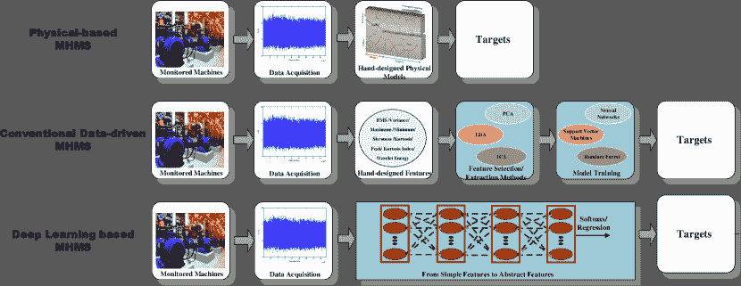
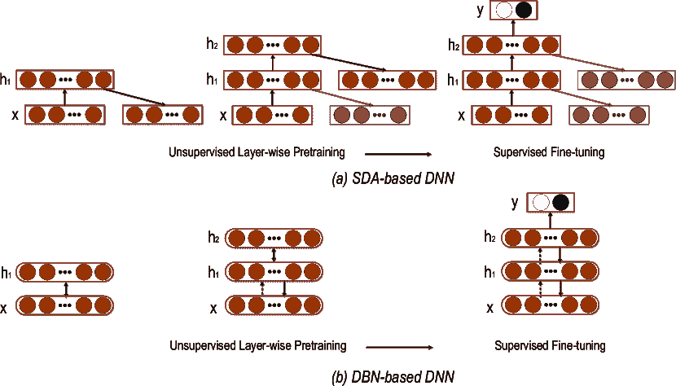
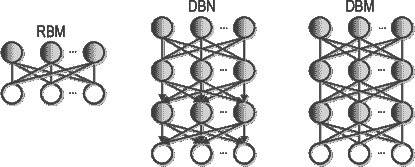
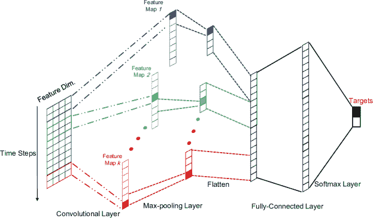
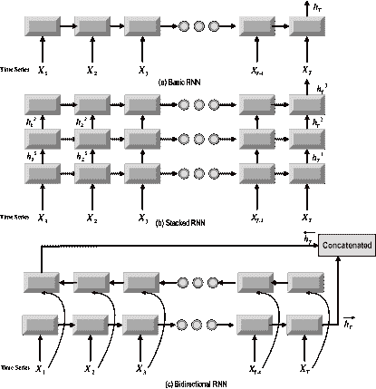
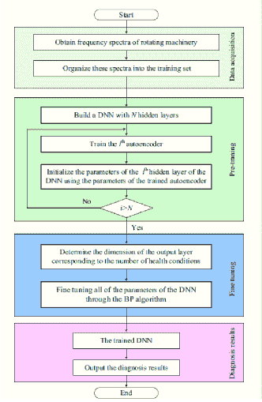
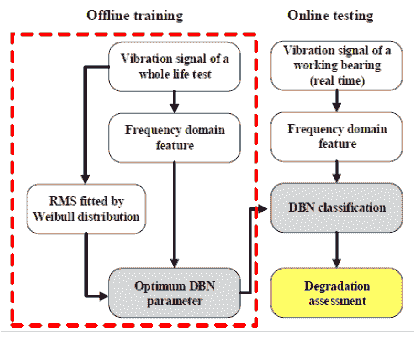
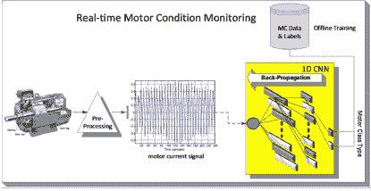
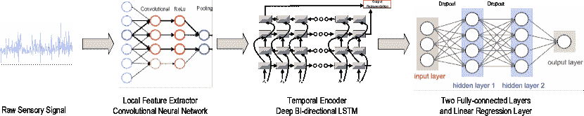

<!--yml

类别：未分类

日期：2024-09-06 20:09:10

-->

# [1612.07640] 深度学习及其在机器健康监测中的应用：综述

> 来源：[`ar5iv.labs.arxiv.org/html/1612.07640`](https://ar5iv.labs.arxiv.org/html/1612.07640)

# 《深度学习及其在机器健康监测中的应用：综述》

作者：**Rui Zhao**, **Ruqiang Yan**, **Zhenghua Chen**, **Kezhi Mao**, **Peng Wang**, 和 **Robert X. Gao**。**R. Yan** 是通讯作者。电子邮件：ruqiang@seu.edu.cn

本手稿已提交至《IEEE 神经网络与学习系统汇刊》

###### 摘要

自 2006 年以来，深度学习（DL）已成为一个快速发展的研究方向，在物体识别、图像分割、语音识别和机器翻译等多个领域重新定义了最先进的性能。在现代制造系统中，由于低成本传感器的广泛部署及其与互联网的连接，数据驱动的机器健康监测越来越受欢迎。同时，深度学习为处理和分析这些大型机械数据提供了有用的工具。本文的主要目的是回顾和总结深度学习在机器健康监测中的新兴研究成果。在对深度学习技术进行简要介绍之后，主要从以下几个方面回顾了深度学习在机器健康监测系统中的应用：自编码器（AE）及其变体、限制玻尔兹曼机及其变体，包括深度置信网络（DBN）和深度玻尔兹曼机（DBM）、卷积神经网络（CNN）和递归神经网络（RNN）。最后，讨论了一些基于深度学习的机器健康监测方法的新趋势。

###### 索引词：

深度学习，机器健康监测，大数据

## 引言

工业物联网（IoT）和数据驱动技术正在通过使计算机网络能够从连接的机器中收集大量数据并将这些大数据转化为可操作的信息，彻底改变制造业[1, 2, 3]。作为现代制造系统中的一个关键组成部分，机器健康监测已完全接受了大数据革命。与传统物理模型提供的自上而下的建模相比[4, 5, 6]，数据驱动的机器健康监测系统提供了一种新的自下而上的故障检测（诊断）和未来工作条件及剩余使用寿命（预测）的解决方案[1, 7]。众所周知，复杂和嘈杂的工作条件阻碍了物理模型的构建。而且这些基于物理的模型大多数无法用在线测量的数据进行更新，这限制了它们的有效性和灵活性。另一方面，随着传感器、传感器网络和计算系统的显著发展，数据驱动的机器健康监测模型变得越来越有吸引力。为了从大数据中提取有用的知识并做出适当的决策，机器学习技术被视为一种强大的解决方案。作为机器学习中最热门的子领域，深度学习能够充当大数据和智能机器健康监测之间的桥梁。

作为机器学习的一个分支，深度学习尝试通过在分层架构中堆叠多个信息处理模块来建模数据背后的高级表示，并对模式进行分类（预测）。最近，深度学习已经成功应用于计算机视觉、自动语音识别、自然语言处理、音频识别和生物信息学等多个领域[8, 9, 10, 11]。事实上，深度学习并不是一个新概念，它的历史可以追溯到 1940 年代[12, 13]。今天深度学习的流行可以归因于以下几点：

1.  *

    提升计算能力：图形处理单元（GPU）的出现、硬件成本的降低、软件基础设施的改善以及网络连接速度的加快，都显著减少了深度学习算法所需的运行时间。例如，正如[14]中报告的那样，训练一个具有 1 亿个自由参数的四层 DBN 的时间可以从几周缩短到大约一天。

1.  *

    数据规模的增加：毫无疑问，大数据时代即将到来。我们的活动几乎都已数字化，由计算机和传感器记录，通过互联网连接，并存储在云端。正如[1]所指出的，在工业相关应用中，如工业信息学和电子学，每年生成的数据显示几乎达到 1000 艾字节，预计在未来十年内将增长 20 倍。[3]的研究预测，到 2020 年将有 300 亿个设备联网。因此，大量的数据能够抵消深度学习带来的复杂性增加，并提升其泛化能力。

1.  *

    高级深度学习研究：深度学习的第一个突破是无监督预训练方法[15]，Hinton 提出通过受限玻尔兹曼机（RBM）逐层预训练，然后使用反向传播进行微调。这已被证明对训练多层神经网络是有效的。

考虑到深度学习处理大规模数据和学习高级表示能力的能力，深度学习可以成为机器健康监测系统（MHMS）的强大有效解决方案。传统的数据驱动型 MHMS 通常包括以下几个关键部分：手工特征设计、特征提取/选择和模型训练。设计出合适的特征集，然后将其提供给一些浅层机器学习算法，包括支持向量机（SVM）、朴素贝叶斯（NB）、逻辑回归[16, 17, 18]。研究表明，表示法定义了机器学习算法的性能上限[19]。然而，很难知道和确定应该设计哪种好的特征。为了缓解这个问题，执行特征提取/选择方法，可以看作是一种信息融合，它在手工特征设计和分类/回归模型之间执行[20, 21, 22]。然而，为复杂领域手动设计特征需要大量人力，并且无法在线更新。同时，特征提取/选择是另一个棘手的问题，涉及先验选择如潜在维度的超参数。最后，包括特征设计、特征提取/选择和模型训练在内的上述三个模块不能联合优化，这可能会阻碍整个系统的最终性能。基于深度学习的 MHMS（DL-based MHMS）旨在通过构建具有多层非线性变换的深度神经网络，从输入数据中提取分层表示。直观地，一个层操作可以被视为从输入值到输出值的转换。因此，一个层的应用可以学习输入数据的新表示，然后，多层堆叠结构可以使 MHMS 从原始输入中学习出复杂概念。此外，基于 DL 的 MHMS 实现端到端系统，可以自动从原始输入中学习内部表示并预测目标。与传统的数据驱动 MHMS 相比，DL-based MHMS 不需要大量的人力和知识来进行手工特征设计。所有模型参数，包括特征模块和模式分类/回归模块，可以联合训练。因此，DL-based 模型可以以非常普遍的方式应用于解决机器健康监测问题。例如，针对故障诊断问题训练的模型可以通过仅用线性回归层替换顶部 softmax 层来用于预测。在表 I 中给出了传统数据驱动 MHMS 与基于 DL 的 MHMS 的比较。上述讨论的这三种 MHMS 的原理的高层次图示如图 1 所示。

深度学习模型有几种变体，例如自动编码器 [23]、深度信念网络 [24]、深度玻尔兹曼机 [25]、卷积神经网络 [26] 和递归神经网络 [27]。近年来，各种研究者已经证明了这些深度学习模型在机器健康监测应用中的成功。本文试图对这些最新的基于深度学习的 MHMS 工作进行广泛的概述，这些工作对最先进的技术产生了影响。与包括计算机视觉和自然语言处理在内的深度学习前沿相比，机器健康监测领域正在迎头赶上，并且已经出现了新兴的研究。因此，本综述文章的目的是向机器健康监测系统领域的研究人员和工程师展示这一热门而活跃的话题的全球视角，并帮助他们获取基础知识，快速应用深度学习模型并开发新型的基于深度学习的 MHMS。本文其余部分的组织如下：第 II 节提供了上述深度学习模型的基本信息。接着，第 III 节回顾了深度学习模型在机器健康监测中的应用。最后，第 IV 节简要总结了基于深度学习的 MHMS 的近期成就，并讨论了深度学习在机器健康监测中的一些潜在趋势。

图 1：展示三种不同 MHMS 框架的图示，包括物理模型、传统数据驱动模型和深度学习模型。阴影框表示数据驱动组件。

表 I：传统数据驱动型机器健康监测系统（MHMS）与基于深度学习（DL）的 MHMS 的比较总结。

| MHMS |
| --- |
| 传统数据驱动方法 | 深度学习方法 |
| 需要专家知识和大量人工劳动进行手工特征提取 | 无需手工特征的端到端结构 |
| 各个模块逐步训练 | 所有参数联合训练 |
| 无法建模大规模数据 | 适用于大规模数据 |

## II 深度学习

源于人工神经网络，深度学习是机器学习的一个分支，其特点是具有多个非线性处理层。深度学习的目标是学习数据的层次表示。至今，深度学习有多种架构，这一研究领域发展迅速，每周都有新模型被开发出来。社区也非常开放，有大量优质的深度学习教程和书籍[28, 29]。因此，这里仅对一些已应用于机器健康监测的主要深度学习技术进行简要介绍。接下来，将分别回顾四种深度架构，包括自编码器（Auto-encoders）、RBM、CNN 和 RNN 及其对应的变体。

### II-A 自编码器（AE）及其变体

作为一个前馈神经网络，自编码器包括编码器和解码器两个阶段。编码器接受输入$\mathbf{x}$并通过非线性映射将其转换为隐藏表示$\mathbf{h}$，如下所示：

|  | $\mathbf{h}=\varphi(\mathbf{W}\mathbf{x}+\mathbf{b})$ |  | (1) |
| --- | --- | --- | --- |

其中$\varphi$是一个非线性激活函数。然后，解码器将隐藏表示以类似的方式映射回原始表示：

|  | $\mathbf{z}=\varphi(\mathbf{W}^{{}^{\prime}}\mathbf{h}+\mathbf{b}^{{}^{\prime}})$ |  | (2) |
| --- | --- | --- | --- |

模型参数包括$\theta=[\mathbf{W},\mathbf{b},\mathbf{W}^{{}^{\prime}},\mathbf{b}^{{}^{\prime}}]$被优化以最小化$\mathbf{z}=f_{\theta}(\mathbf{x})$和$\mathbf{x}$之间的重建误差。常用的平均重建误差度量是平方误差，对应的优化问题可以写成如下：

|  | $\min_{\theta}\frac{1}{N}\sum_{i}^{N}(\mathbf{x}_{i}-f_{\theta}(\mathbf{x}_{i}))^{2}$ |  | (3) |
| --- | --- | --- | --- |

其中$\mathbf{x}_{i}$是第$i$个样本。显然，自编码器可以以无监督的方式进行训练。隐藏表示$\mathbf{h}$可以被视为数据样本$\mathbf{x}$的更抽象、更有意义的表示。通常，自编码器中的隐藏层大小应设置大于输入层大小，这一点已经通过实验证实[30]。

稀疏性的加入：为了防止学习到的变换为恒等变换并对自编码器进行正则化，在隐藏单元上施加了稀疏性约束[31]。相应的优化函数更新为：

|  | $\min_{\theta}\frac{1}{N}\sum_{i}^{N}(\mathbf{x}_{i}-f_{\theta}(\mathbf{x}_{i}))^{2}+\sum_{j}^{m}KL(p&#124;&#124;p_{j})$ |  | (4) |
| --- | --- | --- | --- |

其中$m$是隐藏层的大小，第二项是对隐藏单元的 KL 散度的总和。第$j$个隐藏神经元的 KL 散度计算如下：

|  | $KL(p&#124;&#124;p_{j})=plog(\frac{p}{p_{j}})+(1-p)log(\frac{1-p}{1-p_{j}})$ |  | (5) |
| --- | --- | --- | --- |

其中 $p$ 是预定义的平均激活目标，$p_{j}$ 是 $j$-th 隐藏神经元在整个数据集上的平均激活。给定一个小的 $p$，添加稀疏性约束可以使学习到的隐藏表示成为稀疏表示。因此，AE 的变体被称为稀疏自编码器。

添加去噪：与传统的自编码器（AE）不同，去噪自编码器（Denoising AE）将损坏的数据版本作为输入，并被训练以从其损坏的样本 $\tilde{\mathbf{x}}$ 重建/去噪干净的输入 $\mathbf{x}$。最常用的噪声是 dropout 噪声/二进制掩码噪声，它将输入特征的某一部分随机设置为零 [23]。AE 的变体是去噪自编码器（DA），它可以学习更强的表示并防止其学习恒等变换。

堆叠结构：多个 DA 可以堆叠在一起形成深度网络，通过将第 $l$ 层的输出作为第 $(l+1)$ 层的输入来学习高级表示 [23]。训练是逐层贪婪地进行的。

由于自编码器可以以无监督方式进行训练，自编码器，特别是堆叠去噪自编码器（SDA），可以通过初始化深度神经网络（DNN）的权重来提供有效的预训练解决方案。经过 SDA 的逐层预训练后，自编码器的参数可以设置为 DNN 所有隐藏层的初始化。然后，进行监督微调，以最小化在标记训练数据上的预测误差。通常，在网络的顶部添加一个 softmax/回归层，以将 AE 的最后一层的输出映射到目标。整个过程如图 2 所示。基于 SDA 的预训练协议可以使 DNN 模型比任意随机初始化具有更好的收敛能力。

图 2：SAE-DNN (a) 和 DBN-DNN (b) 的无监督预训练和监督微调说明。

### II-B RBM 及其变体

作为一种特殊类型的马尔可夫随机场，限制玻尔兹曼机（RBM）是一个两层神经网络，形成一个二分图，该图包括两个组的单元，其中包括可见单元 $\mathbf{v}$ 和隐藏单元 $\mathbf{h}$，其约束条件是可见单元和隐藏单元之间存在对称连接，而同一组内的节点之间没有连接。

给定模型参数 $\theta=[\mathbf{W},\mathbf{b},\mathbf{a}]$，能量函数可以表示为：

|  | $E(\mathbf{v},\mathbf{h};\theta)=-\sum_{i=1}^{I}\sum_{j=1}^{J}w_{ij}v_{i}h_{j}-\sum_{i=1}^{I}b_{i}v_{i}-\sum_{j=1}^{J}a_{j}h_{j}$ |  | (6) |
| --- | --- | --- | --- |

其中$w_{ij}$是可见单元$v_{i}$（总数为$I$）和隐藏单元$h_{j}$（总数为$J$）之间的连接权重，$b_{i}$和$a_{j}$分别表示可见单元和隐藏单元的偏置项。所有单元的联合分布是基于能量函数$E(\mathbf{v},\mathbf{h};\theta)$计算的：

|  | $p(\mathbf{v},\mathbf{h};\theta)=\frac{exp(-E(\mathbf{v},\mathbf{h};\theta))}{Z}$ |  | (7) |
| --- | --- | --- | --- |

其中$Z=\sum_{\mathbf{h};\mathbf{v}}exp(-E(\mathbf{v},\mathbf{h};\theta))$是配分函数或归一化因子。然后，隐藏单元和可见单元$\mathbf{h}$和$\mathbf{v}$的条件概率可以计算为：

|  | $p(h_{j}=1&#124;v;\theta)=\delta(\sum_{i=1}^{I}w_{ij}v_{i}+a_{j})$ |  | (8) |
| --- | --- | --- | --- |
|  | $p(v_{i}=1&#124;v;\theta)=\delta(\sum_{j=1}^{J}w_{ij}h_{j}+b_{i})$ |  | (9) |

其中$\delta$被定义为逻辑函数，即$\delta(x)=\frac{1}{1+exp(x)}$。RBM（限制玻尔兹曼机）被训练以最大化联合概率。W 的学习通过一种称为对比散度（CD）的方法完成。

图 3：显示 RBM、DBN 和 DBM 的框架。阴影框表示隐藏单元。

深度置信网络：深度置信网络（DBN）可以通过堆叠多个 RBM 来构建，其中第$l$层（隐藏单元）的输出被用作第$(l+1)$层（可见单元）的输入。与 SDA 类似，DBN 可以以贪婪的逐层无监督方式进行训练。在预训练之后，可以进一步对这个深度结构的参数进行微调，以优化 DBN 对数似然的代理，或者通过添加一个 softmax 层作为顶层来利用训练数据的标签，如图 2 and its variants ‣ II Deep Learning ‣ Deep Learning and Its Applications to Machine Health Monitoring: A Survey")所示。(b)。

深度玻尔兹曼机：深度玻尔兹曼机（DBM）可以看作是一种深度结构化的 RMB，其中隐藏单元被分组为层级结构，而不是单层。并且遵循 RMB 的连接约束，只有后续层之间完全连接，不允许层内或非相邻层之间的连接。DBN 和 DBM 之间的主要区别在于 DBM 是完全无向图模型，而 DBN 是混合的有向/无向图模型。不同于可以逐层训练的 DBN，DBM 作为一个整体模型进行训练。因此，DBM 的训练比 DBN 更具计算开销。

### II-C 卷积神经网络

卷积神经网络（CNNs）最初由 LeCun 提出[32]用于图像处理，其特点是两个关键属性：空间共享权重和空间池化。CNN 模型在各种计算机视觉应用中显示了成功[32, 33, 34]，其中输入数据通常是二维数据。CNN 也被引入来处理序列数据，包括自然语言处理和语音识别[35, 36]。

CNN 旨在通过交替堆叠卷积核和池化操作来学习抽象特征。在 CNN 中，卷积层（卷积核）与原始输入数据卷积多个局部滤波器，生成不变的局部特征，而随后的池化层通过固定长度在原始输入数据的滑动窗口上提取最重要的特征。考虑到相较于 1D-CNN，2D-CNN 在之前的研究中已被广泛阐述，这里仅给出 1D-CNN 背后的数学细节：

首先，我们假设输入序列数据为 $\mathbf{x}=[\mathbf{x}_{1},\dots,\mathbf{x}_{T}]$，其中 $T$ 是序列的长度，每个时间步的 $\mathbf{x}_{i}\in{\mathbb{R}^{d}}$。

卷积：滤波器向量 $\mathbf{u}\in{\mathbb{R}^{md}}$ 和连接向量表示 $\mathbf{x}_{i:i+m-1}$ 之间的点积定义了卷积操作如下：

|  | $c_{i}=\varphi(\mathbf{u}^{T}\mathbf{x}_{i:i+m-1}+b)$ |  | (10) |
| --- | --- | --- | --- |

其中 ${\mathbf{*}}^{T}$ 表示矩阵 ${\mathbf{*}}$ 的转置，$b$ 和 $\varphi$ 分别表示偏置项和非线性激活函数。$\mathbf{x}_{i:i+m-1}$ 是从第 $i$ 个时间步开始的 $m$ 长度窗口，其描述如下：

|  | $\mathbf{x}_{i:i+m-1}=\mathbf{x}_{i}\oplus\mathbf{x}_{i+1}\oplus\dots\oplus\mathbf{x}_{i+m-1}$ |  | (11) |
| --- | --- | --- | --- |

如公式 (10) 中定义的，输出尺度 $c_{i}$ 可以视为滤波器 $\mathbf{u}$ 对应子序列 $\mathbf{x}_{i:i+m-1}$ 的激活。通过将过滤窗口从开始时间步滑动到结束时间步，可以得到如下的特征图作为向量：

|  | $\mathbf{c}_{j}=\left[c_{1},c_{2},\dots,c_{l-m+1}\right]$ |  | (12) |
| --- | --- | --- | --- |

其中索引 $j$ 表示第 $j$ 个滤波器。它对应于多个窗口，如 $\{\mathbf{x}_{1:m},\mathbf{x}_{2:m+1},\dots,\mathbf{x}_{l-m+1:l}\}$。

最大池化：池化层能够减少特征图的长度，这可以进一步最小化模型参数的数量。池化层的超参数是池化长度，记作 $s$。最大操作是在特征图 $\mathbf{c}_{j}$ 中取 $s$ 个连续值的最大值。

然后，可以获得压缩的特征向量：

|  | $\mathbf{h}=\left[h_{1},h_{2},\dots,h_{\frac{l-m}{s}+1}\right]$ |  | (13) |
| --- | --- | --- | --- |

其中 $h_{j}=\max(c_{(j-1)s},c_{(j-1)s+1},\dots,c_{js-1})$。然后，通过交替使用上述两个层：卷积层和最大池化层，通常在顶部添加全连接层和一个 softmax 层以进行预测。为了清楚说明，图 4 显示了一个单层 CNN 的框架。

图 4：包含一个卷积层、一个池化层、一个全连接层和一个 softmax 层的单层 CNN 的示意图。

### II-D 循环神经网络

如 [12] 所述，循环神经网络（RNN）是所有神经网络中最深的，它可以生成并处理任意长度序列的输入模式记忆。RNN 能够在有向循环之间建立连接。不同于只能从输入数据映射到目标向量的基本神经网络：多层感知机，RNN 能够从整个历史输入映射到目标向量，并允许将先前输入的记忆保留在网络的内部状态中。RNN 可以通过时间反向传播进行训练，以处理具有序列输入数据和目标输出的监督任务 [37, 27, 38]。

RNN 可以利用其内部记忆处理序列数据，如图 5 所示。 (a)。在每个时间步骤 $t$ 中定义的转移函数将当前时间信息 $\mathbf{x}_{t}$ 和之前的隐藏输出 $\mathbf{h}_{t-1}$ 结合起来，并更新当前隐藏输出，如下所示：

|  | $\mathbf{h}_{t}{}=\mathbb{H}(\mathbf{x}_{t},\mathbf{h}_{t-1})$ |  | (14) |
| --- | --- | --- | --- |

其中 $\mathbb{H}$ 定义了一个非线性且可微的转换函数。在处理完整个序列后，最后一个时间步骤的隐藏输出，即 $\mathbf{h}_{T}$，是输入序列数据的学习表示，其长度为 $T$。一个传统的多层感知机（MLP）被添加在顶部，以将获得的表示 $\mathbf{h}_{T}$ 映射到目标。

各种转移函数可以导致各种 RNN 模型。最简单的是 vanilla RNN，其定义如下：

|  | $\mathbf{h}_{t}=\varphi(\mathbf{W}\mathbf{x}_{t}+\mathbf{H}\mathbf{h}_{t-1}+\mathbf{b})$ |  | (15) |
| --- | --- | --- | --- |

其中，$\mathbf{W}$ 和 $\mathbf{H}$ 表示变换矩阵，$\mathbf{b}$ 是偏置向量。$\varphi$ 表示非线性激活函数，如 sigmoid 和 tanh 函数。由于模型训练中反向传播的消失梯度问题，传统 RNN 可能无法捕捉长期依赖。因此，提出了长短期记忆（LSTM）和门控递归神经网络（GRU）以防止反向传播错误消失或爆炸 [39, 40, 41, 42, 43]。这些高级 RNN 变体的核心思想是引入门控机制，以避免长期依赖问题，并使每个递归单元能够自适应地捕捉不同时间尺度的依赖关系。

除了这些提议的高级转换函数，如 LSTM 和 GRU，多层和双向递归结构可以增加模型的容量和灵活性。如图 5 (b)所示，多层结构可以使一个递归层的隐藏输出在时间上进行传播，并用作下一个递归层的输入数据。双向递归结构能够以前向和后向两种方向处理序列数据，具有两个独立的隐藏层，如图 5 (c)所示。以下方程定义了相应的隐藏层函数，$\rightarrow$ 和 $\leftarrow$ 分别表示前向和后向过程。

|  | <math   alttext="\displaystyle\begin{split}\overrightarrow{\mathbf{h}}_{t}&amp;=\overrightarrow{\mathbb{H}}(\mathbf{x}_{t},\overrightarrow{\mathbf{h}}_{t-1}),\\ \overleftarrow{\mathbf{h}}_{t}&amp;=\overleftarrow{\mathbb{H}}(\mathbf{x}_{t},\overleftarrow{\mathbf{h}}_{t+1}).\\

\end{split}" display="inline"><semantics ><mtable columnspacing="0pt" rowspacing="0pt" ><mtr ><mtd columnalign="right" ><msub ><mover accent="true"  ><mi >𝐡</mi><mo stretchy="false" >→</mo></mover><mi >t</mi></msub></mtd><mtd columnalign="left" ><mrow ><mrow ><mo  >=</mo><mrow ><mover accent="true" ><mi  >ℍ</mi><mo stretchy="false"  >→</mo></mover><mo lspace="0em" rspace="0em" >​</mo><mrow ><mo stretchy="false" >(</mo><msub ><mi  >𝐱</mi><mi >t</mi></msub><mo >,</mo><msub ><mover accent="true"  ><mi >𝐡</mi><mo stretchy="false" >→</mo></mover><mrow ><mi >t</mi><mo >−</mo><mn >1</mn></mrow></msub><mo stretchy="false" >)</mo></mrow></mrow></mrow><mo >,</mo></mrow></mtd></mtr><mtr ><mtd  columnalign="right" ><msub ><mover accent="true" ><mi  >𝐡</mi><mo stretchy="false"  >←</mo></mover><mi >t</mi></msub></mtd><mtd columnalign="left" ><mrow ><mrow ><mo  >=</mo><mrow ><mover accent="true" ><mi  >ℍ</mi><mo stretchy="false" id="S2.E16.m1.16.16.16.4

然后，最终向量 $\mathbf{h}^{T}$ 是前向和反向过程输出的连接向量，如下所示：

|  | $\mathbf{h}_{T}=\overrightarrow{\mathbf{h}}_{T}\oplus\overleftarrow{\mathbf{h}}_{1}$ |  | (17) |
| --- | --- | --- | --- |

图 5：正常 RNN、堆叠 RNN 和双向 RNN 的示意图。

## III 深度学习在机器健康监测中的应用

传统的多层感知器（MLP）在机器健康监测领域已经应用多年[44, 45, 46, 47]。近年来，深度学习技术已被广泛应用于机器健康监测系统中。基于自编码器（Auto-encoder）或限制玻尔兹曼机（RBM）的深度神经网络（DNN）逐层预训练可以促进 DNN 的训练，并提高其对机器数据的区分能力。卷积神经网络（CNN）和递归神经网络（RNN）提供了更先进和复杂的组合机制，以从机器数据中学习表示。在这些基于深度学习的 MHMS 系统中，顶层通常代表目标。对于目标是离散值的诊断，应用 softmax 层；对于目标是连续值的预后，添加线性回归层。此外，端到端的结构使基于深度学习的 MHMS 可以在较少的人力和专家知识下构建，因此这些模型不受特定机器或领域的限制。接下来，将简要介绍以上四种深度学习架构：AE、RBM、CNN 和 RNN 在 DL-based MHMS 中的应用。

### III-A AE 及其变体在机器健康监测中的应用

AE 模型，特别是堆叠 DA，可以以自动方式从机器数据中学习高层次的表示。Sun 等人提出了一种基于 AE 的单层神经网络，用于分类感应电动机故障[48]。由于训练数据的有限性，他们专注于如何防止过拟合。隐藏层的数量不仅设置为 1，还在隐藏层上应用了随机掩码输出神经元的 dropout 技术。然而，大多数提出的模型都是基于通过堆叠多个自编码器的深度架构。Lu 等人对用于旋转机械部件故障诊断的三层堆叠去噪自编码器进行了详细的实证研究[49]。具体而言，在他们的实验中，包括单一工作条件和交叉工作条件，评估了接收输入大小、深度架构、稀疏约束和 SDA 模型中的去噪操作的有效性。在[50]中，通过改变隐藏层大小和掩码概率设计了不同结构的两层 SAE-based DNN，并评估了其在故障诊断中的性能。

在上述工作中，AE 模型的输入特征是原始感测时间序列。因此，输入维度通常超过百甚至一千。高维度可能会引发一些潜在问题，例如计算成本高和由于模型参数巨大而导致的过拟合。因此，一些研究人员关注于基于从原始输入中提取的特征构建 AE 模型。贾等人将时间序列数据的频谱输入到 SAE 中用于旋转机械诊断[51]，考虑到频谱能够展示其组成部分在离散频率上的分布，并且可能对旋转机械的健康状况具有更高的辨别能力。贾等人提出的相应框架如图 6 所示。谭等人使用数字小波框架和非线性软阈值方法处理振动信号，并在预处理信号上构建了 SAE 用于滚子轴承故障诊断[52]。朱等人提出了一种基于 SAE 的 DNN 用于液压泵故障诊断，输入为傅里叶变换后的频域特征[53]。在实验中，分析了 ReLU 激活和 dropout 技术，实验结果显示有效防止了梯度消失和过拟合。在[54]中，STFT 生成的归一化声谱图被输入到两层 SAE-based DNN 中用于滚动轴承故障诊断。加洛韦等人基于原始振动数据生成的声谱图构建了一个两层 SAE-based DNN 用于潮汐涡轮振动故障诊断[55]。在[56]中，提出了一种基于 SAE 的 DNN，输入为主成分分析提取的数据的主成分，用于航天器故障诊断。多领域统计特征，包括时域特征、频域特征和时频域特征，被输入到 SAE 框架中，这可以视为一种特征融合[57]。类似地，Verma 等人也使用了这三种领域特征输入到基于 SAE 的 DNN 中用于空气压缩机故障诊断[58]。

除了应用多领域特征外，SAE 模型还处理了多传感器数据。Reddy 利用 SAE 从多个传感器的原始时间序列数据中学习表示，用于异常检测和飞行数据中的故障消歧。为了处理多传感器数据，首先在多模态时间序列上进行同步窗口的遍历，并且这些窗口有重叠，然后将每个传感器的窗口连接起来作为 SA 的输入 [59]。在 [60] 中，SAE 被用于多传感器数据融合，随后采用深度置信网络（DBN）进行轴承故障诊断，取得了令人满意的结果。通过从不同传感器的振动信号中提取的时间域和频率域的统计特征被用作输入到一个具有稀疏性约束的两层 SAE 神经网络中。然后，将学习到的表示输入到深度信念网络中进行模式分类。

此外，还提出了一些传统 SAE 的变体用于机器健康监测。在 [61] 中，Thirukovalluru 等人提出了一个两阶段框架，其中 SAE 仅用于学习表示，其他标准分类器如 SVM 和随机森林则执行分类。具体来说，在 SAE 模块中，基于 FFT 和 WPT 的手工特征被输入到基于 SAE 的 DNN 中。经过预训练和监督微调，这包括两个分开的过程：基于 softmax 的和基于中位数的微调方法，针对包括空气压缩机监测、钻头监测、轴承故障监测和钢板监测在内的五个数据集进行了广泛的实验，展示了基于深度学习的机器健康监测系统的泛化能力。王等人提出了一种新型连续稀疏自编码器（CSAE），作为变压器故障识别的无监督特征学习 [62]。与传统的稀疏自编码器不同，他们提出的 CSAE 在每个可见单元的激活函数中加入了随机单元，如下所示：

|  | $s_{j}=\varphi_{j}(\sum_{i}{w_{ij}x{i}}+a_{i}+\sigma N_{j}(0,1))$ |  | (18) |
| --- | --- | --- | --- |

其中 $s_{j}$ 是与输入 $x_{i}$ 对应的输出，$w_{ij}$ 和 $a_{i}$ 表示模型参数，$\varphi_{j}$ 代表激活函数，最后一项 $\sigma N_{j}(0,1))$ 是加入的随机单元，它是一个均值为零，方差为 $\sigma^{2}$ 的高斯分布。随机单元的引入能够改变梯度方向并防止过拟合。毛等人采用了一种基于极限学习机的自编码器变体，用于轴承故障诊断，这种方法比传统的稀疏自编码器（SAE）模型更高效，同时在故障诊断的准确性上没有妥协 [63]。与通过反向传播训练的自编码器不同，该编码器阶段的转换是随机生成的，而解码器阶段的转换则通过最小二乘拟合在一步中完成 [64]。

此外，Lu 等人专注于通过基于两层 SAE 的 DNN 可视化学习到的表示，这为评估基于 DL 的 MHMS 提供了一种新颖的视角[65]。在他们的论文中，随着层数的增加，学习到的表示的区分能力可以得到提升。

图 6：[51]中提出的 SAE-DNN 用于旋转机械诊断的示意图。

### III-B RBM 及其变体在机器健康监测中的应用

本节的一些工作专注于开发 RBM 和 DBM 以从机械数据中学习表示。这里介绍的大多数工作基于深度信念网络（DBN），可以预训练深度神经网络（DNN）。

在[66]中，提出了一种基于 RBM 的轴承剩余使用寿命（RUL）预测方法。在预训练后，在线性回归层被添加到 RBM 的顶部，以根据延迟的 RMS 值时间序列预测未来的均方根（RMS）。然后，利用预测的 RMS 和轴承的总寿命计算 RUL。Liao 等人提出了一种新的 RBM 用于表示学习，以预测机器的 RUL[67]。在他们的工作中，向 RBM 的训练目标函数中添加了一种新的正则化项，以建模隐藏节点的趋势性。随后，应用无监督自组织映射算法（SOM）将增强 RBM 学习到的表示转换为一种称为健康值的尺度。最后，使用基于相似度的寿命预测算法通过健康值预测 RUL。在[68]中，提出了一种多模态深度支持向量分类方法用于齿轮箱故障诊断。首先，从振动信号中提取了包括时间、频率和时间-频率在内的三种模态特征。然后，应用了三个高斯-伯努利深度玻尔兹曼机（GDBMS）分别处理上述三种模态。在每个 GDBMS 中，顶部使用了 softmax 层。经过预训练和微调过程后，这三个 GDBMS 的 softmax 层的概率输出通过支持向量分类（SVC）框架融合以进行最终预测。Li 等人直接在由时间、频率和时间-频率特征组成的连接特征上应用了一个 GDBMS，并在 GDBMS 上堆叠了一个 softmax 层，以识别故障类别[69]。Li 等人采用了一个两层 DBM 来学习原始传感信号的子波包变换（WPT）统计参数的深度表示，以进行齿轮箱故障诊断[70]。在这项专注于数据融合的工作中，两个 DBM 分别应用于声学和振动信号，并使用随机森林融合这两个 DBM 学习到的表示。

利用基于 DBN 的 DNN，Ma 等人提出了这个框架用于轴承加速寿命测试下的退化评估 [71]。统计特征是通过 Weibull 分布拟合的均方根（RMS），可以避免统计参数波动的区域，频域特征也被提取作为原始输入。为了清楚地说明，[71] 中的框架如图 7 所示。Shao 等人提出了用于感应电动机故障诊断的 DBN，直接使用振动信号作为输入 [72]。除了最终分类准确性的评估，t-SNE 算法被用来可视化 DBN 的学习表示和 DBN 中每一层的输出。他们发现增加隐藏层可以提高学习表示的区分能力。Fu 等人采用了深度信念网络来监测切削状态 [73]。在所提出的工作中，三种不同的特征集，包括原始振动信号、梅尔频率倒谱系数（MFCC）和小波特征，被输入到 DBN 中作为三种不同的输入，这些输入能够在原始振动信号上实现强健的比较性能，而无需过多的特征工程。Tamilselvan 等人提出了一个基于多传感器 DBN 的健康状态分类模型。该模型在基准分类问题和两个健康诊断应用（包括飞机发动机健康诊断和电力变压器健康诊断）中进行了验证 [74, 75]。Tao 等人提出了基于 DBN 的多传感器信息融合方案用于轴承故障诊断 [76]。首先，将从三个传感器获得的三个振动信号中提取的 14 个时域统计特征拼接在一起，作为 DBM 模型的输入向量。在预训练过程中，引入了一个预定义的阈值来确定其迭代次数。在 [77] 中，将包括负载和速度测量、时域特征和频域特征在内的特征向量输入到基于 DBN 的 DNN 中用于齿轮箱故障诊断。在 [78] 的工作中，Gan 等人建立了一个分层诊断网络，用于滚动体轴承的故障模式识别，包括两个连续阶段，其中首先识别四个不同的故障位置（包括一个健康状态），然后对每个故障条件中的离散故障严重性进行分类。在每个阶段中，由 WPT 生成的频带能量特征被输入到基于 DBN 的 DNN 中进行模式分类。在 [79] 中，原始振动信号经过预处理生成基于全向再生（ODR）技术的 2D 图像，然后对生成的图像应用原始梯度直方图（HOG）描述符，学习向量被输入到 DBN 中用于自动诊断滑动轴承转子系统。Chen 等人提出了一个包含多目标进化优化（MOEA/D）的 DBNs 集成，用于多变量传感数据的故障诊断 [80]。不同架构的 DBNs 可以视为基分类器，MOEA/D 被引入以调整集成权重，以在准确性和多样性之间实现权衡。Chen 等人随后将这一框架扩展到一个特定的预测任务：机械系统的 RUL 估计 [81]。

图 7: 提出的 DBN-DNN 用于评估轴承退化的示意图 [71]。

### III-C 用于机器健康监测的 CNN

在一些情况下，机械数据可以以二维格式呈现，如时频谱，而在其他情况下，它们是以一维格式，即时间序列呈现。因此，CNN 模型能够通过其卷积层学习复杂且鲁棒的表示。直观地，卷积层中的滤波器可以提取原始数据中的局部模式，并且堆叠这些卷积层可以进一步构建复杂的模式。Janssens 等人利用 2D-CNN 模型进行四类旋转机械状态识别，其输入是来自两个相互垂直的传感器的两个加速度计信号的 DFT。因此，输入的高度是传感器的数量。所采用的 CNN 模型包含一个卷积层和一个全连接层。然后，采用顶部的 softmax 层进行分类 [82]。在 [83] 中，Babu 等人构建了一个 2D 深度卷积神经网络，以基于传感器信号的标准化变量时间序列预测系统的 RUL，其中 2D 输入的一个维度是传感器的数量，如 [82] 中报告的设置。在他们的模型中，采用了平均池化而不是最大池化。由于 RUL 是一个连续值，顶层是线性回归层。Ding 等人提出了一种深度卷积网络（ConvNet），其中小波包能量（WPE）图像被用作主轴轴承故障诊断的输入 [84]。为了充分发现层次化表示，在最后的卷积层之后添加了一个多尺度层，该层将最后卷积层的输出与前一个池化层的输出进行连接。Guo 等人提出了一种分层自适应深度卷积神经网络（ADCNN） [85]。首先，将输入的时间序列数据作为信号向量转换为 $32\times 32$ 矩阵，这遵循 LeNet [86] 采用的典型输入格式。此外，他们设计了一个分层框架来识别故障模式和故障大小。在故障模式决策模块中，采用第一个 ADCNN 来识别故障类型。在故障大小评估层中，根据每种故障类型，使用结构相同的 ADCNN 来预测故障大小。这里仍然使用分类机制。预测值 $f$ 被定义为典型故障大小的概率总和，如下所示：

|  | $f=\sum_{j=1}^{c}{a_{j}p_{j}}$ |  | (19) |
| --- | --- | --- | --- |

其中 $[p_{1},\dots,p_{c}]$ 是由顶部 softmax 层产生的，表示每个样本属于每个类别的概率分数，而 $a_{j}$ 是对应于第 $j$ 个故障大小的故障尺寸。在 [87] 中，提出了一种用于机械故障诊断的增强型 CNN。为了预处理振动数据，使用了 morlet 小波对振动信号进行分解，并获得小波尺度图。然后，采用双线性插值将尺度图重新缩放为 $32\times 32$ 大小的灰度图像。此外，ReLU 和 dropout 的适应性都提升了模型的诊断性能。陈等人采用了 2D-CNN 进行齿轮箱故障诊断，其中 CNN 的输入矩阵大小为 $16\times 16$，由包含 256 个统计特征（包括 RMS 值、标准差、偏度、峰度、旋转频率和施加负载）的向量重塑 [88]。此外，在他们的实验中，评估了 11 种不同结构的 CNN。Weimer 等人对各种深度 CNN 设计配置进行了全面研究，用于视觉缺陷检测 [89]。在一个具体的应用中：工业光学检测，调查了包括深度（增加 conv-layer）和宽度（增加滤波器数量）在内的模型配置的两个方向。经过实验证实的最佳配置已在表 II 中展示。在 [90] 中，CNN 被应用于诊断前端控制风力发电机（FSCWG）的早期小故障，$784\times 784$ 的输入矩阵包括发电机输入轴（水平）和发电机输出轴（垂直）的振动数据。

正如我们在上面的章节 II-C 中回顾的，CNN 也可以应用于 1D 时间序列信号，相关操作已经详细阐述。在[91]中，1D CNN 成功地在原始时间序列数据上用于电机故障检测，其中特征提取和分类被整合在一起。相应的框架如图 8 所示。Abdeljaber 等人提出了在标准化振动信号上的 1D CNN，这可以实时执行基于振动的损伤检测和结构损伤定位。该方法的优点是能够自动从原始加速度信号中提取最佳损伤敏感特征，无需任何额外的预处理或信号处理方法[92]。

为了展示所有这些成功应用于 MHMS 领域的 CNN 模型的概述，其架构已在表 II 中总结。为解释所用缩写，Weimer 的工作[89]中应用的 CNN 结构表示为$\textnormal{Input}[32\times 32]-64\textnormal{C}[3\times 3]2-64\textnormal{P}[2\times 2]-128\textnormal{C}[3\times 3]3-128\textnormal{P}[2\times 2]-\textnormal{FC}[1024-1024]2$。这意味着输入的 2D 数据为$32\times 32$，CNN 首先应用了两个卷积层，设计相同，滤波器数量为 64，滤波器大小为$3\times 3$，然后堆叠一个最大池化层，池化大小为$2\times 2$，接着应用三个卷积层，设计相同，滤波器数量为 128，滤波器大小为$3\times 3$，然后应用一个池化层，池化大小为$2\times 2$，最后采用两个全连接层，隐藏神经元数量均为 1024。需要注意的是，这里没有给出输出层的大小，考虑到它是特定任务的，通常设置为类别数。

图 8：为实时电机故障检测提出的 1D-CNN 的插图，见[91]。

表 II：基于 CNN 的 MHMS 配置总结。符号 Input、C、P 和 FC 分别表示原始输入、卷积层、池化层和全连接层。

|  | 提出的模型 | CNN 结构配置 |
| --- | --- | --- |
| 2D CNN | Janssens 的工作 [82] | $\textnormal{Input}[5120\times 2]-32\textnormal{C}[64\times 2]-\textnormal{FC}[200]$ |
| Babu 的工作 [83] | $\textnormal{Input}[27\times 15]-8\textnormal{C}[27\times 4]-8\textnormal{P}[1\times 2]-14\textnormal{C}[1\times 3]-14\textnormal{P}[1\times 2]$ |
| Ding 的工作 [84] | $\textnormal{Input}[32\times 32]-20\textnormal{C}[7\times 7]-20\textnormal{P}[2\times 2]-10\textnormal{C}[6\times 6]-10\textnormal{P}[2\times 2]-6\textnormal{P}[2\times 2]-\textnormal{FC}[185-24]$ |
| Guo 的工作 [85] | $\textnormal{Input}[32\times 32]-5\textnormal{C}[5\times 5]-5\textnormal{P}[2\times 2]-10\textnormal{C}[5\times 5]-10\textnormal{P}[2\times 2]-10\textnormal{C}[2\times 2]-10\textnormal{P}[2\times 2]-\textnormal{FC}[100]-\textnormal{FC}[50]$ |
| Wang 的工作 [87] | $\textnormal{Input}[32\times 32]-64\textnormal{C}[3\times 3]-64\textnormal{P}[2\times 2]-64\textnormal{C}[4\times 4]-64\textnormal{P}[2\times 2]-128\textnormal{C}[3\times 3]-128\textnormal{P}[2\times 2]-\textnormal{FC}[512]$ |
| Chen 的工作 [88] | $\textnormal{Input}[16\times 16]-8\textnormal{C}[5\times 5]-8\textnormal{P}[2\times 2]$ |
| Weimer 的工作 [89] | $\textnormal{Input}[32\times 32]-64\textnormal{C}[3\times 3]2-64\textnormal{P}[2\times 2]-128\textnormal{C}[3\times 3]3-128\textnormal{P}[2\times 2]-\textnormal{FC}[1024-1024]$ |
| Dong 的工作 [90] | $\textnormal{Input}[784\times 784]-12\textnormal{C}[10\times 10]-12\textnormal{P}[2\times 2]-24\textnormal{C}[10\times 10]-24\textnormal{P}[2\times 2]-\textnormal{FC}[200]$ |
| 1D CNN | Ince 的工作 [91] | $\textnormal{Input}[240]-60\textnormal{C}[9]-60\textnormal{P}[4]-40\textnormal{C}[9]-40\textnormal{P}[4]-40\textnormal{C}[9]-40\textnormal{P}[4]-\textnormal{FC}[20]$ |
| Abdeljaber 的工作 [92] | $\textnormal{Input}[128]-64\textnormal{C}[41]-64\textnormal{P}[2]-32\textnormal{C}[41]-32\textnormal{P}[2]-\textnormal{FC}[10-10]$ |

### III-D RNN 用于机器健康监测

大多数机械数据属于传感器数据，本质上是时间序列。RNN 模型，包括 LSTM 和 GRU，已经成为处理顺序数据的一种流行架构，因其能够编码时间信息。这些先进的 RNN 模型被提出以缓解传统 RNN 训练的困难，并且最近应用于机器健康监测。在[93]中，Yuan 等人研究了包括传统 RNN、LSTM 和 GRU 模型在内的三种 RNN 模型用于航空发动机的故障诊断和预测。他们发现，先进的 RNN 模型 LSTM 和 GRU 的表现优于传统 RNN。另一个有趣的观察是，以上三种 RNN 变体的集成模型并未提升 LSTM 的性能。Zhao 等人展示了基于 LSTM 的机器健康监测系统在工具磨损测试中的实证评估[94]。应用的 LSTM 模型将原始传感数据编码为嵌入，并预测相应的工具磨损。Zhao 等人进一步设计了一个结合 CNN 和 LSTM 的更复杂的深度学习模型，称为卷积双向长短期记忆网络 (CBLSTM) [95]。如图 9 所示，CNN 用于从顺序输入中提取强健的局部特征，然后采用双向 LSTM 对 CNN 的顺序输出编码时间信息。最后，堆叠的全连接层和线性回归层被添加以预测目标值。在工具磨损测试中，所提模型能够超越包括传统 LSTM 模型在内的多个最先进的基准方法。在[96]中，Malhotra 提出了一个非常有趣的 RUL 预测结构。他们设计了一个基于 LSTM 的编码器-解码器结构，其中 LSTM 基编码器首先将多变量输入序列转换为固定长度的向量，然后 LSTM 解码器使用该向量生成目标序列。在 RUL 预测中，他们的假设是模型可以首先以无监督的方式在对应正常行为的原始信号上进行训练。然后，重建误差可以用来计算健康指数 (HI)，该指数用于 RUL 估计。直观地说，大的重建误差对应于更不健康的机器状态。

图 9：在[95]中提出的卷积双向长短期记忆网络的示意图。

## IV 总结与未来方向

在本文中，我们对基于深度学习（DL）的机械健康监测系统（MHMS）的最新进展进行了系统概述。深度学习作为机器学习的一个子领域，正作为大规模机械数据与数据驱动的 MHMS 之间的桥梁。因此，在过去四年中，它们已被应用于各种机器健康监测任务。这些提出的基于 DL 的 MHMS 根据 DL 架构的四个类别进行了总结，包括：自编码器模型、限制玻尔兹曼机模型、卷积神经网络和递归神经网络。由于基于 DL 的 MHMS 的研究势头迅速增长，我们希望这些 DL 技术的能力，特别是复杂机械数据的表征学习和各种机器健康监测任务的目标预测，能够传达给读者。通过这些之前的工作，可以发现基于 DL 的 MHMS 不需要大量的人力劳动和专家知识，即端到端结构能够将原始机械数据映射到目标。因此，深度学习模型的应用并不局限于特定类型的机器，这可以成为解决机器健康监测问题的通用解决方案。此外，还给出了一些研究趋势和潜在的未来研究方向：

1.  *

    开源大数据集：由于 DL 方法背后的模型复杂性巨大，基于 DL 的 MHMS 的性能在很大程度上依赖于数据集的规模和质量。另一方面，DL 模型的深度受到数据集规模的限制。因此，图像识别的基准 CNN 模型有 152 层，这得益于包含超过一千万张注释图像的大型数据集 ImageNet [97, 98]。相比之下，提出的 MHMS 的 DL 模型可能堆叠最多 5 层隐藏层。训练于这种大型数据集中的模型可以作为后续特定任务/数据集的模型初始化。因此，设计和发布大规模机械数据集是有意义的。

1.  *

    领域知识的利用：深度学习并不是所有机器健康监测问题的万能钥匙。领域知识可以促进 DL 模型在机器健康监测中的应用成功。例如，提取判别特征可以减少后续 DL 模型的规模，适当的任务特定正则化项可以提升最终性能 [67]。

1.  *

    模型与数据可视化：深度学习技术，特别是深度神经网络，被视为黑盒模型，即其内部计算机制无法解释。学习表示和应用模型的可视化可以为这些深度学习模型提供一些见解，通过这种交互获得的见解可以促进复杂机器健康监测问题的模型构建和配置。已经提出了一些可视化技术，包括用于高维数据可视化的 t-SNE 模型 [99]，以及通过正则化优化可视化每个层的激活和每个层特征的深度神经网络 [100]。

1.  *

    迁移学习：迁移学习尝试将在一个领域学到的知识应用到一个不同但相关的领域 [101]。这个研究方向在机器健康监测中具有意义，因为一些机器健康监测问题有足够的训练数据，而其他领域则缺乏训练数据。在一个领域训练的机器学习模型，包括深度学习模型，可以被迁移到另一个领域。一些先前的工作集中在迁移特征提取/降维上已经完成 [102, 103]。在 [104] 中，最大均值差异（MMD）度量被添加到深度神经网络目标函数中，评估源域和目标域之间的差异。

1.  *

    不平衡类别：实际生活中机械数据的类别分布通常是高度倾斜的，其中大多数数据样本属于少数几个类别。例如，在故障诊断中，故障数据的数量远远少于健康数据的数量。已经提出了一些增强型机器学习模型，包括 SVM 和 ELM，以解决机器健康监测中的不平衡问题 [105, 106]。最近，一些有趣的方法研究了在不平衡类别问题中应用深度学习的方法，包括具有类别重新采样或成本敏感训练的 CNN 模型 [107]，以及集成自举方法和 CNN 模型 [108] 的整合。

深度学习被认为将在未来越来越有前景地影响机器健康监测，特别是在大型机械数据时代。

## 致谢

本工作部分得到了中国国家自然科学基金（51575102 号）的支持。

## 参考文献

+   [1] S. Yin, X. Li, H. Gao, and O. Kaynak，“基于数据的现代工业技术：概述，” *IEEE 工业电子学报*，vol. 62, no. 1, pp. 657–667, 2015 年 1 月。

+   [2] S. Jeschke, C. Brecher, H. Song, and D. B. Rawat，“工业物联网。”

+   [3] D. Lund, C. MacGillivray, V. Turner 和 M. Morales, “全球和区域物联网（IoT）2014–2020 年预测：一个被验证的价值和需求的良性循环，” *国际数据公司（IDC），技术报告*，2014 年。

+   [4] Y. Li, T. Kurfess 和 S. Liang, “滚动元件轴承的随机预测，” *机械系统与信号处理*，第 14 卷，第 5 期，第 747–762 页，2000 年。

+   [5] C. H. Oppenheimer 和 K. A. Loparo, “基于物理的裂纹转子轴的诊断与预测，” 收录于 *AeroSense 2002*。国际光学与光子学学会，2002 年，第 122–132 页。

+   [6] M. Yu, D. Wang 和 M. Luo, “基于模型的混合系统预测，处理模式依赖的退化行为，” *工业电子学，IEEE 交易*，第 61 卷，第 1 期，第 546–554 页，2014 年。

+   [7] A. K. Jardine, D. Lin 和 D. Banjevic, “关于实施基于条件的维护的机械诊断和预测的综述，” *机械系统与信号处理*，第 20 卷，第 7 期，第 1483–1510 页，2006 年。

+   [8] S. Ren, K. He, R. Girshick 和 J. Sun, “Faster R-CNN：基于区域提议网络的实时目标检测，” 收录于 *神经信息处理系统进展*，2015 年，第 91–99 页。

+   [9] R. Collobert 和 J. Weston, “自然语言处理的统一架构：多任务学习的深度神经网络，” 收录于 *第 25 届国际机器学习会议论文集*。ACM，2008 年，第 160–167 页。

+   [10] G. Hinton, L. Deng, D. Yu, G. E. Dahl, A.-r. Mohamed, N. Jaitly, A. Senior, V. Vanhoucke, P. Nguyen, T. N. Sainath *等*，“用于语音识别的声学建模的深度神经网络：四个研究组的共享观点，” *IEEE 信号处理杂志*，第 29 卷，第 6 期，第 82–97 页，2012 年。

+   [11] M. K. Leung, H. Y. Xiong, L. J. Lee 和 B. J. Frey, “组织调控剪接密码的深度学习，” *生物信息学*，第 30 卷，第 12 期，第 i121–i129 页，2014 年。

+   [12] J. Schmidhuber, “神经网络中的深度学习：概述，” *神经网络*，第 61 卷，第 85–117 页，2015 年，2014 年在线发布；基于 TR arXiv:1404.7828 [cs.NE]。

+   [13] Y. LeCun, Y. Bengio 和 G. Hinton, “深度学习，” *自然*，第 521 卷，第 7553 期，第 436–444 页，2015 年。

+   [14] R. Raina, A. Madhavan 和 A. Y. Ng, “使用图形处理器的大规模深度无监督学习，” 收录于 *第 26 届年度国际机器学习会议论文集*。ACM，2009 年，第 873–880 页。

+   [15] G. E. Hinton, “学习多层次的表征，” *认知科学趋势*，第 11 卷，第 10 期，第 428–434 页，2007 年。

+   [16] A. Widodo 和 B.-S. Yang, “支持向量机在机器状态监测和故障诊断中的应用，” *机械系统与信号处理*，第 21 卷，第 6 期，第 2560–2574 页，2007 年。

+   [17] J. Yan 和 J. Lee, “使用逻辑回归进行退化评估和故障模式分类，” *制造科学与工程杂志*，第 127 卷，第 4 期，第 912–914 页，2005 年。

+   [18] V. Muralidharan 和 V. Sugumaran，“使用小波分析对单体离心泵故障诊断的朴素贝叶斯分类器与贝叶斯网络分类器的比较研究，” *应用软计算*，第 12 卷，第 8 期，第 2023–2029 页，2012 年。

+   [19] Y. Bengio, A. Courville 和 P. Vincent，“表示学习：综述与新视角，” *IEEE 模式分析与机器智能学报*，第 35 卷，第 8 期，第 1798–1828 页，2013 年。

+   [20] A. Malhi 和 R. X. Gao，“基于 PCA 的特征选择方案用于机器缺陷分类，” *IEEE 仪器与测量学报*，第 53 卷，第 6 期，第 1517–1525 页，2004 年。

+   [21] J. Wang, J. Xie, R. Zhao, L. Zhang 和 L. Duan，“基于多感官融合的虚拟工具磨损检测用于普适制造，” *机器人与计算机集成制造*，2016 年。

+   [22] J. Wang, J. Xie, R. Zhao, K. Mao 和 L. Zhang，“一种用于多感官数据融合的新型概率核因子分析：应用于工具状态监测，” *IEEE 仪器与测量学报*，第 65 卷，第 11 期，第 2527–2537 页，2016 年 11 月。

+   [23] P. Vincent, H. Larochelle, Y. Bengio 和 P.-A. Manzagol，“利用去噪自编码器提取和组合鲁棒特征，” 在 *第 25 届国际机器学习会议论文集*。 ACM，2008 年，第 1096–1103 页。

+   [24] G. E. Hinton, S. Osindero 和 Y.-W. Teh，“深度信念网络的快速学习算法，” *神经计算*，第 18 卷，第 7 期，第 1527–1554 页，2006 年。

+   [25] R. Salakhutdinov 和 G. E. Hinton，“深度玻尔兹曼机。” 在 *AISTATS*，第 1 卷，2009 年，第 3 页。

+   [26] P. Sermanet, S. Chintala 和 Y. LeCun，“卷积神经网络在房屋号码数字分类中的应用，” 在 *模式识别（ICPR），2012 年第 21 届国际会议*。 IEEE，2012 年，第 3288–3291 页。

+   [27] K.-i. Funahashi 和 Y. Nakamura，“通过连续时间递归神经网络对动态系统的逼近，” *神经网络*，第 6 卷，第 6 期，第 801–806 页，1993 年。

+   [28] L. Deng 和 D. Yu，“深度学习：方法与应用，” *信号处理基础与趋势*，第 7 卷，第 3–4 期，第 197–387 页，2014 年 6 月。[在线]. 可用链接: http://dx.doi.org/10.1561/2000000039

+   [29] I. Goodfellow, Y. Bengio 和 A. Courville，“深度学习，” *2015*，2016 年。

+   [30] Y. Bengio, P. Lamblin, D. Popovici, H. Larochelle *等*，“深度网络的贪婪逐层训练，” *神经信息处理系统进展*，第 19 卷，第 153 页，2007 年。

+   [31] A. Ng，“稀疏自编码器，” *CS294A 讲义*，第 72 卷，第 1–19 页，2011 年。

+   [32] B. B. Le Cun, J. S. Denker, D. Henderson, R. E. Howard, W. Hubbard 和 L. D. Jackel，“使用反向传播网络进行手写数字识别，” 在 *神经信息处理系统进展*。 Citeseer，1990 年。

+   [33] K. Jarrett, K. Kavukcuoglu, Y. Lecun *等*，“对象识别的最佳多阶段架构是什么？” 在 *2009 IEEE 第 12 届国际计算机视觉大会*。IEEE，2009 年，页 2146–2153。

+   [34] A. Krizhevsky, I. Sutskever, 和 G. E. Hinton，“使用深度卷积神经网络进行 Imagenet 分类，” 在 *Advances in Neural Information Processing Systems*，2012 年，页 1097–1105。

+   [35] O. Abdel-Hamid, A.-r. Mohamed, H. Jiang, 和 G. Penn，“将卷积神经网络概念应用于混合 NN-HMM 模型进行语音识别，” 在 *2012 IEEE 国际声学、语音和信号处理会议（ICASSP）*。IEEE，2012 年，页 4277–4280。

+   [36] Y. Kim，“用于句子分类的卷积神经网络，” *arXiv 预印本 arXiv:1408.5882*，2014 年。

+   [37] H. Jaeger，*递归神经网络训练教程，涵盖 BPPT、RTRL、EKF 和“回声状态网络”方法*。GMD-Forschungszentrum Informationstechnik，2002 年。

+   [38] C. L. Giles, C. B. Miller, D. Chen, H.-H. Chen, G.-Z. Sun, 和 Y.-C. Lee，“使用二阶递归神经网络学习和提取有限状态自动机，” *Neural Computation*，第 4 卷，第 3 期，页 393–405，1992 年。

+   [39] S. Hochreiter 和 J. Schmidhuber，“长短期记忆，” *Neural Computation*，第 9 卷，第 8 期，页 1735–1780，1997 年。

+   [40] F. A. Gers, J. Schmidhuber, 和 F. Cummins，“学习遗忘：使用 LSTM 进行持续预测，” *Neural Computation*，第 12 卷，第 10 期，页 2451–2471，2000 年。

+   [41] F. A. Gers, N. N. Schraudolph, 和 J. Schmidhuber，“使用 LSTM 递归网络学习精确时序，” *Journal of Machine Learning Research*，第 3 卷，第 8 期，页 115–143，2002 年。

+   [42] K. Cho, B. Van Merriënboer, C. Gulcehre, D. Bahdanau, F. Bougares, H. Schwenk, 和 Y. Bengio，“使用 RNN 编码器-解码器学习短语表示用于统计机器翻译，” *arXiv 预印本 arXiv:1406.1078*，2014 年。

+   [43] J. Chung, C. Gulcehre, K. Cho, 和 Y. Bengio，“对序列建模中门控递归神经网络的实证评估，” *arXiv 预印本 arXiv:1412.3555*，2014 年。

+   [44] H. Su 和 K. T. Chong，“利用神经网络建模进行感应机状态监测，” *IEEE Transactions on Industrial Electronics*，第 54 卷，第 1 期，页 241–249，2007 年 2 月。

+   [45] B. Li, M.-Y. Chow, Y. Tipsuwan, 和 J. C. Hung，“基于神经网络的电机滚动轴承故障诊断，” *IEEE Transactions on Industrial Electronics*，第 47 卷，第 5 期，页 1060–1069，2000 年。

+   [46] B. Samanta 和 K. Al-Balushi，“基于人工神经网络的滚动元件轴承故障诊断，使用时域特征，” *Mechanical Systems and Signal Processing*，第 17 卷，第 2 期，页 317–328，2003 年。

+   [47] M. Aminian 和 F. Aminian，“基于神经网络的模拟电路故障诊断，使用小波变换作为预处理器，” *IEEE Transactions on Circuits and Systems II: Analog and Digital Signal Processing*，第 47 卷，第 2 期，页 151–156，2000 年。

+   [48] W. Sun, S. Shao, R. Zhao, R. Yan, X. Zhang, 和 X. Chen，“基于稀疏自编码器的深度神经网络方法用于感应电机故障分类，” *测量*，第 89 卷，第 171–178 页，2016 年。

+   [49] C. Lu, Z.-Y. Wang, W.-L. Qin, 和 J. Ma，“使用堆叠去噪自编码器的旋转机械部件故障诊断，” *信号处理*，第 130 卷，第 377–388 页，2017 年。

+   [50] S. Tao, T. Zhang, J. Yang, X. Wang, 和 W. Lu，“基于堆叠自编码器和 Softmax 回归的轴承故障诊断方法，” 在 *控制会议（CCC），2015 第 34 届中国*。IEEE，2015 年，第 6331–6335 页。

+   [51] F. Jia, Y. Lei, J. Lin, X. Zhou, 和 N. Lu，“深度神经网络：用于大数据旋转机械故障特征挖掘与智能诊断的有前景工具，” *机械系统与信号处理*，第 72 卷，第 303–315 页，2016 年。

+   [52] T. Junbo, L. Weining, A. Juneng, 和 W. Xueqian，“基于小波变换和堆叠自编码器的滚动轴承故障诊断方法研究，” 在 *第 27 届中国控制与决策会议（2015 CCDC）*。IEEE，2015 年，第 4608–4613 页。

+   [53] Z. Huijie, R. Ting, W. Xinqing, Z. You, 和 F. Husheng，“基于堆叠自编码器的液压泵故障诊断，” 在 *2015 第 12 届 IEEE 国际电子测量仪器会议（ICEMI）*，第 01 卷，2015 年 7 月，第 58–62 页。

+   [54] H. Liu, L. Li, 和 J. Ma，“基于 STFT 深度学习和声音信号的滚动轴承故障诊断，” *冲击与振动*，第 2016 卷，2016 年。

+   [55] G. S. Galloway, V. M. Catterson, T. Fay, A. Robb, 和 C. Love，“通过深度神经网络诊断潮汐涡轮振动数据，” 2016 年。

+   [56] K. Li 和 Q. Wang，“基于深度学习方法的航天器信号识别与诊断研究，” 在 *预知与系统健康管理会议（PHM），2015*。IEEE，2015 年，第 1–5 页。

+   [57] L. Guo, H. Gao, H. Huang, X. He, 和 S. Li，“多特征融合与非线性降维用于智能轴承状态监测，” *冲击与振动*，第 2016 卷，2016 年。

+   [58] N. K. Verma, V. K. Gupta, M. Sharma, 和 R. K. Sevakula，“基于稀疏自编码器的旋转机器智能状态监测，” 在 *预知与健康管理（PHM），2013 IEEE 会议上*。IEEE，2013 年，第 1–7 页。

+   [59] v. v. kishore k. reddy, soumalya sarkar 和 michael giering，“大规模飞行数据中的异常检测与故障消歧：一种多模态深度自编码器方法，” 在 *预知与健康管理协会年会，科罗拉多州丹佛*，2016 年。

+   [60] Z. Chen 和 W. Li，“基于稀疏自编码器和深度信念网络的轴承故障诊断的多传感器特征融合，” *IEEE IM 交易*，2017 年。

+   [61] R. Thirukovalluru, S. Dixit, R. K. Sevakula, N. K. Verma, 和 A. Salour，“利用去噪堆叠自编码器生成故障诊断特征集，”收录于*预测与健康管理（ICPHM），2016 IEEE 国际会议*。IEEE，2016 年，第 1–7 页。

+   [62] L. Wang, X. Zhao, J. Pei, 和 G. Tang，“使用连续稀疏自编码器进行变压器故障诊断，”*SpringerPlus*，第 5 卷，第 1 期，第 1 页，2016 年。

+   [63] W. Mao, J. He, Y. Li, 和 Y. Yan，“使用自编码极限学习机进行轴承故障诊断：一项比较研究，”*机械工程师学会学报 C 部分：机械工程科学*，第 1–19 页，2016 年。

+   [64] E. Cambria, G. B. Huang, L. L. C. Kasun, H. Zhou, C. M. Vong, J. Lin, J. Yin, Z. Cai, Q. Liu, K. Li, V. C. M. Leung, L. Feng, Y. S. Ong, M. H. Lim, A. Akusok, A. Lendasse, F. Corona, R. Nian, Y. Miche, P. Gastaldo, R. Zunino, S. Decherchi, X. Yang, K. Mao, B. S. Oh, J. Jeon, K. A. Toh, A. B. J. Teoh, J. Kim, H. Yu, Y. Chen, 和 J. Liu，“极限学习机 [趋势争议]，”*IEEE 智能系统*，第 28 卷，第 6 期，第 30–59 页，2013 年 11 月。

+   [65] W. Lu, X. Wang, C. Yang, 和 T. Zhang，“一种基于深度神经网络的新型特征提取方法用于滚动轴承故障诊断，”收录于*第 27 届中国控制与决策会议（2015 CCDC）*。IEEE，2015 年，第 2427–2431 页。

+   [66] J. Deutsch 和 D. He，“使用基于深度学习的方法进行轴承剩余使用寿命预测，”2016 年。

+   [67] L. Liao, W. Jin, 和 R. Pavel，“具有预知能力正则化的增强限制玻尔兹曼机用于预测和健康评估，”*IEEE 工业电子学报*，第 63 卷，第 11 期，2016 年。

+   [68] C. Li, R.-V. Sanchez, G. Zurita, M. Cerrada, D. Cabrera, 和 R. E. Vásquez，“具有同源特征的多模态深度支持向量分类及其在齿轮箱故障诊断中的应用，”*神经计算*，第 168 卷，第 119–127 页，2015 年。

+   [69] C. Li, R.-V. Sánchez, G. Zurita, M. Cerrada, 和 D. Cabrera，“基于振动测量深度统计特征学习的旋转机械故障诊断，”*传感器*，第 16 卷，第 6 期，第 895 页，2016 年。

+   [70] C. Li, R.-V. Sanchez, G. Zurita, M. Cerrada, D. Cabrera, 和 R. E. Vásquez，“基于深度随机森林融合声学和振动信号的齿轮箱故障诊断，”*机械系统与信号处理*，第 76 卷，第 283–293 页，2016 年。

+   [71] M. Ma, X. Chen, S. Wang, Y. Liu, 和 W. Li，“基于威布尔分布和深度置信网络的轴承退化评估，”收录于*2016 年国际柔性自动化研讨会（ISFA）论文集*，2016 年，第 1–4 页。

+   [72] S. Shao, W. Sun, P. Wang, R. X. Gao, 和 R. Yan，“从振动信号中学习特征以进行感应电机故障诊断，”收录于*2016 年国际柔性自动化研讨会（ISFA）论文集*，2016 年，第 1–6 页。

+   [73] Y. Fu, Y. Zhang, H. Qiao, D. Li, H. Zhou, 和 J. Leopold, “基于深度信念网络的切削状态监测特征提取能力分析，” *Procedia CIRP*，第 31 卷，第 29–34 页，2015 年。

+   [74] P. Tamilselvan 和 P. Wang, “基于深度信念学习的健康状态分类用于故障诊断，” *可靠性工程与系统安全*，第 115 卷，第 124–135 页，2013 年。

+   [75] P. Tamilselvan, Y. Wang, 和 P. Wang, “基于深度信念网络的状态分类用于结构健康诊断，” 见于 *2012 年 IEEE 航空航天会议*。IEEE，2012 年，第 1–11 页。

+   [76] J. Tao, Y. Liu, 和 D. Yang, “基于深度信念网络和多传感器信息融合的轴承故障诊断，” *冲击与振动*，第 2016 卷，2016 年。

+   [77] Z. Chen, C. Li, 和 R.-V. Sánchez, “基于深度信念网络的多层神经网络用于齿轮箱故障诊断。” *振动工程学报*，第 17 卷，第 5 期，2015 年。

+   [78] M. Gan, C. Wang *等*，“基于深度学习的分层诊断网络的构建及其在滚动元件轴承故障模式识别中的应用，” *机械系统与信号处理*，第 72 卷，第 92–104 页，2016 年。

+   [79] H. Oh, B. C. Jeon, J. H. Jung, 和 B. D. Youn, “智能化的轴承转子系统诊断：深度学习的无监督特征提取方案，” 2016 年。

+   [80] C. Zhang, J. H. Sun, 和 K. C. Tan, “基于多目标优化的深度信念网络集成用于故障诊断，” 见于 *系统，人与控制论（SMC），2015 年 IEEE 国际会议*。IEEE，2015 年，第 32–37 页。

+   [81] C. Zhang, P. Lim, A. Qin, 和 K. C. Tan, “用于预后中剩余使用寿命估计的多目标深度信念网络集成，” *IEEE 神经网络与学习系统汇刊*，2016 年。

+   [82] O. Janssens, V. Slavkovikj, B. Vervisch, K. Stockman, M. Loccufier, S. Verstockt, R. Van de Walle, 和 S. Van Hoecke, “基于卷积神经网络的旋转机械故障检测，” *声学与振动学报*，2016 年。

+   [83] G. S. Babu, P. Zhao, 和 X.-L. Li, “基于深度卷积神经网络的回归方法用于剩余使用寿命的估计，” 见于 *国际先进应用数据库系统会议*。Springer，2016 年，第 214–228 页。

+   [84] X. Ding 和 Q. He, “基于深度卷积网络的能量波动多尺度特征学习用于智能主轴轴承故障诊断，” *IEEE 工业测量汇刊*，2017 年。

+   [85] X. Guo, L. Chen, 和 C. Shen, “层次自适应深度卷积神经网络及其在轴承故障诊断中的应用，” *测量*，第 93 卷，第 490–502 页，2016 年。

+   [86] Y. LeCun, L. Bottou, Y. Bengio, 和 P. Haffner, “应用于文档识别的基于梯度的学习，” *IEEE 汇刊*，第 86 卷，第 11 期，第 2278–2324 页，1998 年。

+   [87] J. Wang, j. Zhuang, L. Duan, 和 W. Cheng, “一种多尺度卷积神经网络用于无特征故障诊断，” 收录于 *2016 年国际灵活自动化研讨会（ISFA）*，2016 年，第 1–6 页。

+   [88] Z. Chen, C. Li, 和 R.-V. Sanchez, “基于卷积神经网络的齿轮箱故障识别与分类，” *冲击与振动*，第 2015 卷，2015 年。

+   [89] D. Weimer, B. Scholz-Reiter, 和 M. Shpitalni, “用于工业检测的深度卷积神经网络架构设计，” *CIRP 年鉴-制造技术*，2016 年。

+   [90] H.-Y. DONG, L.-X. YANG, 和 H.-W. LI, “基于深度学习的前端速度控制风力发电机的小故障诊断。”

+   [91] T. Ince, S. Kiranyaz, L. Eren, M. Askar, 和 M. Gabbouj, “通过 1-D 卷积神经网络实时检测电机故障，” *IEEE 工业电子学报*，第 63 卷，第 11 期，第 7067–7075 页，2016 年。

+   [92] O. Abdeljaber, O. Avci, S. Kiranyaz, M. Gabbouj, 和 D. J. Inman, “基于一维卷积神经网络的实时振动结构损伤检测，” *声音与振动杂志*，第 388 卷，第 154–170 页，2017 年。

+   [93] M. Yuan, Y. Wu, 和 L. Lin, “利用 LSTM 神经网络进行航空发动机故障诊断和剩余使用寿命预测，” 收录于 *2016 年 IEEE 航空器实用系统国际会议（AUS）*，2016 年 10 月，第 135–140 页。

+   [94] R. Zhao, J. Wang, R. Yan, 和 K. Mao, “基于 LSTM 网络的机器健康监测，” 收录于 *2016 年第十届国际传感技术会议（ICST）*。 IEEE，2016 年，第 1–6 页。

+   [95] R. Zhao, R. Yan, J. Wang, 和 K. Mao, “通过卷积双向 LSTM 网络学习监测机器健康，” *传感器*，2016 年。

+   [96] P. Malhotra, A. Ramakrishnan, G. Anand, L. Vig, P. Agarwal, 和 G. Shroff, “基于 LSTM 编码器-解码器的多传感器预测，” *arXiv 预印本 arXiv:1608.06154*，2016 年。

+   [97] K. He, X. Zhang, S. Ren, 和 J. Sun, “用于图像识别的深度残差学习，” *arXiv 预印本 arXiv:1512.03385*，2015 年。

+   [98] J. Deng, W. Dong, R. Socher, L.-J. Li, K. Li, 和 L. Fei-Fei, “ImageNet: 大规模分层图像数据库，” 收录于 *CVPR09*，2009 年。

+   [99] L. v. d. Maaten 和 G. Hinton, “使用 t-SNE 可视化数据，” *机器学习研究杂志*，第 9 卷，第 11 月期，第 2579–2605 页，2008 年。

+   [100] J. Yosinski, J. Clune, A. Nguyen, T. Fuchs, 和 H. Lipson, “通过深度可视化理解神经网络，” *arXiv 预印本 arXiv:1506.06579*，2015 年。

+   [101] S. J. Pan 和 Q. Yang, “迁移学习综述，” *IEEE 知识与数据工程学报*，第 22 卷，第 10 期，第 1345–1359 页，2010 年。

+   [102] F. Shen, C. Chen, R. Yan, 和 R. X. Gao, “基于 SVD 特征提取和迁移学习分类的轴承故障诊断，” 收录于 *预测与系统健康管理会议（PHM），2015*。 IEEE，2015 年，第 1–6 页。

+   [103] J. Xie, L. Zhang, L. Duan, and J. Wang，“基于传输成分分析的多域特征融合在变速箱故障诊断下各种工况”，在*2016 年 IEEE 预测健康管理国际会议（ICPHM）*，2016 年 6 月，第 1-6 页。

+   [104] W. Lu, B. Liang, Y. Cheng, D. Meng, J. Yang, and T. Zhang，“深度模型基于领域自适应的故障诊断”，*IEEE 工业电子学报*，2016。

+   [105] W. Mao, L. He, Y. Yan, and J. Wang，“极限学习机的轴承不平衡故障诊断的在线顺序预测”，*机械系统与信号处理*，第 83 卷，第 450-473 页，2017 年。

+   [106] L. Duan, M. Xie, T. Bai, and J. Wang，“一种新的支持向量数据描述方法用于不平衡数据集的机械故障诊断”，*专家系统与应用*，第 64 卷，第 239-246 页，2016 年。

+   [107] C. Huang, Y. Li, C. Change Loy, and X. Tang，“学习不平衡分类的深度表示”，在*IEEE 计算机视觉与模式识别会议论文集*，2016 年，第 5375-5384 页。

+   [108] Y. Yan, M. Chen, M.-L. Shyu, and S.-C. Chen，“不平衡多媒体数据分类的深度学习”，在*2015 年 IEEE 多媒体国际研讨会（ISM）*。IEEE，2015 年，第 483-488 页。
