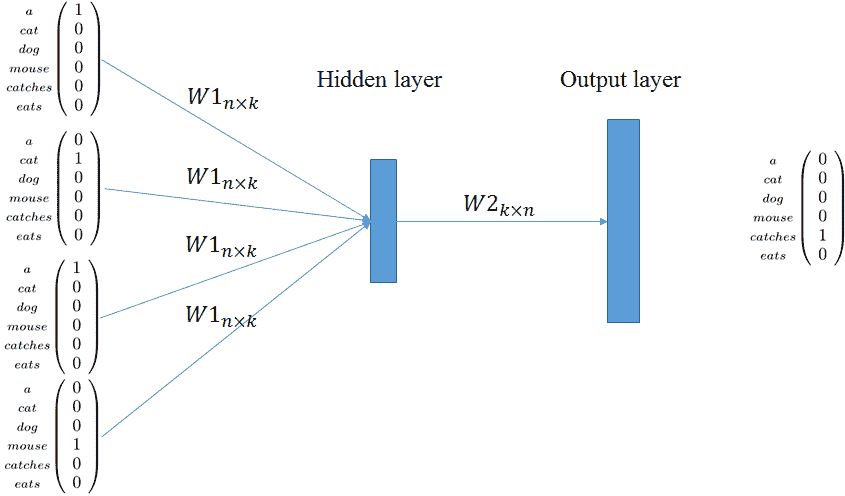
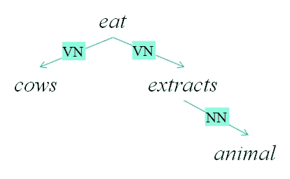
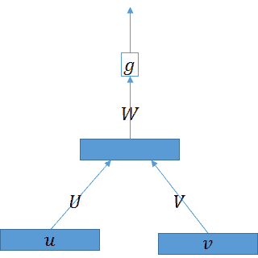

<!--yml

类别：未分类

日期：2024-09-06 20:09:06

-->

# [1702.00764] 符号、分布式和分布式表示在深度学习时代的自然语言处理中的调查

> 来源：[`ar5iv.labs.arxiv.org/html/1702.00764`](https://ar5iv.labs.arxiv.org/html/1702.00764)

\correspondance\extraAuth

# 符号、分布式和分布式表示在深度学习时代的自然语言处理中的调查

洛伦佐·费罗内¹ 和 法比奥·马西莫·赞佐托^(1,∗)

###### 摘要

## 1

自然语言本质上是人类知识的离散符号表示。最近在机器学习（ML）和自然语言处理（NLP）方面的进展似乎与上述直觉相矛盾：离散符号正在逐渐消失，被称为*分布式*和*分布式表示*的向量或张量所取代。然而，分布式/分布式表示和离散符号之间存在严格的联系，前者是后者的近似。对分布式/分布式表示和符号之间严格联系的更清晰理解，可能会导致全新深度学习网络的诞生。本文对符号表示和分布式/分布式表示之间的联系进行了综述。现在正是重振解释离散符号如何在神经网络内部表示的领域的最佳时机。

\helveticabold

## 2 关键字：

关键字，关键字，关键字，关键字，关键字，关键字，关键字，关键字

## 3 引言

自然语言本质上是人类知识的离散符号表示。声音被转化为字母或表意符号，这些离散符号被组合以形成单词。单词然后组成句子，句子组成文本、演讲、对话，最终传达知识、情感等。这些符号在单词中的组合以及单词在句子中的组合遵循了听者和说话者都知道的规则（乔姆斯基，1957）。因此，考虑那些不基于离散符号的自然语言理解系统似乎极其奇怪。

近期在自然语言处理（NLP）中应用的机器学习（ML）进展似乎与上述直觉相矛盾：离散符号正在消退，被称为*分布式*和*分布表征*的向量或张量所取代。在应用于 NLP 的 ML 中，*分布式表征*推动深度学习模型（LeCun 等，2015；Schmidhuber，2015）在许多高级任务中取得了惊人的结果，如图像生成（Goodfellow 等，2014），图像描述（Vinyals 等，2015b；Xu 等，2015），机器翻译（Bahdanau 等，2014；Zou 等，2013），句法分析（Vinyals 等，2015a；Weiss 等，2015）以及其他各种 NLP 任务（Devlin 等，2018）。在更传统的 NLP 中，*分布表征*被视为表示自然语言语义的更灵活方式，即所谓的*分布语义*（见（Turney 和 Pantel，2010））。单词和句子都被表示为实数的向量或张量。单词的向量通过观察这些单词在文档集合中与其他单词的共现情况来获得。此外，像传统组合表征一样，短语（Mitchell 和 Lapata，2008；Baroni 和 Zamparelli，2010；Clark 等，2008；Grefenstette 和 Sadrzadeh，2011；Zanzotto 等，2010）和句子的向量（Socher 等，2011，2012；Kalchbrenner 和 Blunsom，2013）是通过组合单词的向量来获得的。

分布式和分布表征在符号方法上的成功主要归因于新并行范式的出现，这推动了神经网络（Rosenblatt，1958；Werbos，1974）向深度学习（LeCun 等，2015；Schmidhuber，2015）的发展。运行在图形处理单元（GPU）（Chetlur 等，2014；Cui 等，2015）上的大规模并行算法比几十年前更快地处理向量、矩阵和张量。现在可以为复杂的大型神经网络计算反向传播算法。在“推理”过程中，即神经网络的学习和应用中，已不再需要符号。因此，离散符号仅作为这些神奇学习机器的输入和输出而存在。

然而，分布式/分配式表示与符号之间存在严格的联系，第一个是对第二个的近似（Fodor 和 Pylyshyn，1988；Plate，1994，1995；Ferrone 等，2015）。这些网络的输入和输出表示与其内部表示并没有太大差别。图像处理中的内部表示的相似性和解释更为清晰（Zeiler 和 Fergus，2014a）。事实上，网络通常通过可视化子部分如何代表目标图像的显著子部分来进行解释。输入图像和子部分都是实数张量。因此，这些网络可以被检查和理解。自然语言处理中的离散符号则不适用这种情况。

需要对分布式/分配式表示与离散符号之间的严格联系有更清晰的理解（Jang 等，2018；Jacovi 等，2018），以理解神经网络如何处理信息，并提出新的深度学习架构。模型可解释性正成为机器学习中的一个重要话题（Lipton，2016）。这种更清晰的理解标志着新可能性的曙光：理解当前自然语言处理符号技术的哪些部分在深度神经网络中有足够的表示；以及，*最终*，理解更类似大脑的模型——神经网络——是否与这些几十年来在计算语言学和自然语言处理领域定义的句法解析或语义处理方法兼容。因此，了解符号表示是否以及如何在大脑模型中使用和发射是一个巨大的机会。

在本文中，我们进行了一项调查，旨在建立符号表示与分布式/分配式表示之间的联系。现在正是振兴解释符号在神经网络内部如何表示的领域的最佳时机。在我们看来，这项调查将有助于设计能够利用现有和新型符号模型的深度神经网络，用于经典自然语言处理任务。

论文的结构如下：首先，我们介绍表示的非常一般的概念以及 *局部* 和 *分布式* 表示之间的区别（Plate，1995）。然后我们详细介绍每种技术。接下来，我们重点讨论分布式表示（Turney 和 Pantel，2010），我们将其视为分布式表示的一个特例。最后，我们深入讨论组合性的总体问题，分析了三种不同的解决方法：组合分布式语义（Clark 等，2008；Baroni 等，2014），全息减少表示（Plate，1994；Neumann，2001），以及递归神经网络（Kalchbrenner 和 Blunsom，2013；Socher 等，2012）。

## 符号与分布式表示：可解释性和 *连接* 组合性

*分布式表示* 将符号表达放置在度量空间中，通过使用神经网络或其他机器学习模型，利用示例之间的相似性来学习特定任务的规律。给定两个符号表达，它们的分布式表示应捕捉它们在对最终任务有用的特定特征上的相似性。例如，两个句子如 $s_{1}$=*“一只老鼠吃了一些奶酪”* 和 $s_{2}$=*“一只猫吞下了一只老鼠”* 可以从许多不同的方面看作是相似的：（1）共有的单词数量；（2）模式 “动物 吃 食物” 的实现。关键在于决定或让算法决定哪个是特定任务的最佳表示。

*分布式表示* 正在取代长期存在且成功的 *离散符号表示*，用于学习机器的知识表示，但这些表示对人类的 *可解释性* 较差。因此，讨论 *离散符号表示* 的基本明显属性并非毫无意义，因为这些属性可能会对分布式表示的成功提供保证，类似于离散符号表示。

离散符号表示对人类来说*易于解释*，因为*符号在表达式中未被改变*。这是这些表示的一个最重要、最明显的特征。无限的表达式集合，即符号的序列，可以*被解释*为这些表达式是通过按照某些串联规则将有限的基本符号集合连接而成的。在串联过程中，符号不会被改变，从而可以被识别。利用*语义组合性*原理，可以通过组合部分的意义来获得表达式的意义，从而递归地通过组合有限的基本符号的意义来获得。例如，给定基本符号集$\mathcal{D}$ = {*mouse*,*cat*,*a*,*swallows*,*(*,*)*}，表达式如$s_{1}$=*“一只猫吞食了一只老鼠”*或$t_{1}$=*((一只猫) (吞食 (一只老鼠)))*是完全合理且可解释的，前提是有用于生成自然语言发言或生成括号形式的树结构表示的规则。这强烈依赖于个别符号能够被识别的事实。

分布式表示在应用于符号输入时似乎会*改变符号*，因此，这些表示较难解释。事实上，符号以及表达式在这些度量空间中被表示为向量。观察分布式表示时，符号和表达式不会立即显现。此外，这些分布式表示可能通过矩阵乘法或非线性函数被转换。因此，一般来说，以下问题不明确：（1）初始符号或表达式与其分布式表示之间的关系是什么，以及（2）这些表达式在矩阵乘法或应用非线性函数过程中如何被操作。换句话说，尚不清楚符号是否可以在分布式表示中被识别。

因此，一个有争议的问题是离散符号表示和分布式表示是否由于*符号的改变*的不同而是两种截然不同的知识编码方式。这场辩论可以追溯到 80 年代末。对于 Fodor 和 Pylyshyn（1988），神经网络架构中的分布式表示是*“经典方法的仅仅一种实现”*，而经典方法与离散符号表示相关。相比之下，对于 Chalmers（1992），分布式表示提供了*“整体性”*地推理编码知识的重要机会。这意味着可以在不检索特定部分的情况下对存储知识的某些特定部分做出决定，而是对整个表示进行操作。然而，这并没有解决争议的问题，因为在分布式表示中到底包含了什么仍不清楚。

为了对上述争论问题做出贡献，Gelder (1990) 通过定义两种不同的组合性概念：*连接性*组合性和*函数性*组合性，形式化了*改变表达式中的符号*的属性。*连接性组合性*解释了离散符号表示如何组合符号以获得表达式。实际上，这种组合模式是并排的扩展概念，它提供了一种在不改变符号的情况下将连续符号连接在一起的方式。连接性组合性解释了离散符号表示，无论存储表达式的方式是纸张还是计算机内存。连接有时用一个如 $\circ$ 的运算符表示，该运算符可以用于中缀或前缀表示法，即一种带有参数的函数 $\circ(w_{1},...,w_{n})$。使用连接运算符，上述两个示例 $s_{1}$ 和 $t_{1}$ 可以表示为：

|  | $a\circ cat\circ swallows\circ a\circ mouse$ |  |
| --- | --- | --- |

这代表了中缀表示法中的一个序列和

|  | $\circ(\circ(a,cat),\circ(swallows,\circ(a,mouse)))$ |  |
| --- | --- | --- |

这代表了前缀表示法中的一个树。*函数性组合性*解释了分布式表示。在函数性组合性中，组合模式是一个函数 $\Phi$，它提供了一个可靠的、通用的过程来生成给定组成部分的表达式。在这种视角下，语义组合性是函数性组合性的一个特例，其中组合的目标是表示意义的方式 (Blutner et al., 2003)。

*局部分布式表示*（如（Plate, 1995) 所提到的）或 *独热编码* 是可视化*函数性组合性*如何作用于*分布式表示*的最简单方式。局部分布式表示在度量空间中对离散符号表示进行初步简单编码。给定一个符号集合 $\mathcal{D}$，局部分布式表示将 $\mathcal{D}$ 中第 $i$ 个符号映射到 $\mathbb{R}^{n}$ 中第 $i$ 个基单位向量 $\mathbf{e}_{i}$，其中 $n$ 是 $\mathcal{D}$ 的基数。因此，第 $i$ 个单位向量表示第 $i$ 个符号。在*函数性组合性*中，表达式 $s=w_{1}\ldots w_{k}$ 由向量 $\mathbf{s}$ 表示，该向量是应用于向量 $\mathbf{e}_{w_{1}}\ldots\mathbf{e}_{w_{k}}$ 的一个递归函数 $\Phi$ 获得的。函数 $f$ 可以非常简单，如求和，或者更复杂。如果函数 $\Phi$ 是求和，即：

|  | $\mathbf{func}_{\Sigma}(s)=\sum_{j=1}^{k}\mathbf{e}_{w_{j}}$ |  | (1) |
| --- | --- | --- | --- |

所得到的向量是经典的词袋向量空间模型（Salton, 1989）。而更复杂的函数 $f$ 可以涉及从不同的向量到向量操作，比如全息压缩表示中的循环卷积（Plate, 1995），到在如递归神经网络（Schuster 和 Paliwal, 1997；Hochreiter 和 Schmidhuber, 1997）中的矩阵乘法加非线性操作，或在具有注意力机制的神经网络中（Vaswani 等, 2017；Devlin 等, 2018）。上述示例可以用于描述 *连接性* 和 *功能性* 组合性。集合 $\mathcal{D}$= {*mouse*,*cat*,*a*,*swallows*,*eats*,*some*,*cheese*,*(*,*)*} 可以用基向量 $\mathbf{e}_{i}\in\mathbb{R}^{9}$ 表示，其中 $\mathbf{e}_{1}$ 是 *mouse* 的基向量，$\mathbf{e}_{2}$ 是 *cat* 的基向量，$\mathbf{e}_{3}$ 是 *a* 的基向量，$\mathbf{e}_{4}$ 是 *swallows* 的基向量，$\mathbf{e}_{5}$ 是 *eats* 的基向量，$\mathbf{e}_{6}$ 是 *some* 的基向量，$\mathbf{e}_{7}$ 是 *cheese* 的基向量，$\mathbf{e}_{8}$ 是 *(* 的基向量，$\mathbf{e}_{9}$ 是 *)* 的基向量。表达式 $s_{1}$=*a cat swallows a mouse* 的加性功能组合为：

| *在 $e_{i}$ 中的表达式* | *加性功能组合* |
| --- | --- |

|

&#124; a &#124; cat &#124; swallows &#124; a &#124; mouse &#124; 

&#124; <math   alttext="\begin{pmatrix}0\\ 0\\

1\\

0\\

0\\

0\\

0\\

0\\

0\\

\end{pmatrix}" display="inline"><semantics ><mrow ><mo >(</mo><mtable rowspacing="0pt"  ><mtr ><mtd ><mn mathsize="50%"  >0</mn></mtd></mtr><mtr ><mtd ><mn mathsize="50%"  >0</mn></mtd></mtr><mtr ><mtd ><mn mathsize="50%"  >1</mn></mtd></mtr><mtr ><mtd ><mn mathsize="50%"  >0</mn></mtd></mtr><mtr ><mtd ><mn mathsize="50%"  >0</mn></mtd></mtr><mtr ><mtd ><mn mathsize="50%"  >0</mn></mtd></mtr><mtr ><mtd ><mn mathsize="50%"  >0</mn></mtd></mtr><mtr ><mtd ><mn mathsize="50%"  xref="S4.p7.31.2.2.1.1.1.

0\\

0\\

0\\

0\\

0\\

0\\

0\\

\end{pmatrix}" display="inline"><semantics ><mrow ><mo >(</mo><mtable rowspacing="0pt"  ><mtr ><mtd ><mn mathsize="50%"  >0</mn></mtd></mtr><mtr ><mtd ><mn mathsize="50%"  >1</mn></mtd></mtr><mtr ><mtd ><mn mathsize="50%"  >0</mn></mtd></mtr><mtr ><mtd ><mn mathsize="50%"  >0</mn></mtd></mtr><mtr ><mtd ><mn mathsize="50%"  >0</mn></mtd></mtr><mtr ><mtd ><mn mathsize="50%"  >0</mn></mtd></mtr><mtr ><mtd ><mn mathsize="50%"  >0</mn></mtd></mtr><mtr ><mtd ><mn mathsize="50%"  xref="S4.p7.32.3.3.2.2.2.

0\\

1\\

0\\

0\\

0\\

0\\

0\\

\end{pmatrix}" display="inline"><semantics ><mrow ><mo >(</mo><mtable rowspacing="0pt"  ><mtr ><mtd ><mn mathsize="50%"  >0</mn></mtd></mtr><mtr ><mtd ><mn mathsize="50%"  >0</mn></mtd></mtr><mtr ><mtd ><mn mathsize="50%"  >0</mn></mtd></mtr><mtr ><mtd ><mn mathsize="50%"  >1</mn></mtd></mtr><mtr ><mtd ><mn mathsize="50%"  >0</mn></mtd></mtr><mtr ><mtd ><mn mathsize="50%"  >0</mn></mtd></mtr><mtr ><mtd ><mn mathsize="50%"  >0</mn></mtd></mtr><mtr ><mtd ><mn mathsize="50%"  xref="S4.p7.33.4.4.3.3.3.

1\\

0\\

0\\

0\\

0\\

0\\

0\\

\end{pmatrix}" display="inline"><semantics ><mrow ><mo >(</mo><mtable rowspacing="0pt"  ><mtr ><mtd ><mn mathsize="50%"  >0</mn></mtd></mtr><mtr ><mtd ><mn mathsize="50%"  >0</mn></mtd></mtr><mtr ><mtd ><mn mathsize="50%"  >1</mn></mtd></mtr><mtr ><mtd ><mn mathsize="50%"  >0</mn></mtd></mtr><mtr ><mtd ><mn mathsize="50%"  >0</mn></mtd></mtr><mtr ><mtd ><mn mathsize="50%"  >0</mn></mtd></mtr><mtr ><mtd ><mn mathsize="50%"  >0</mn></mtd></mtr><mtr ><mtd ><mn mathsize="50%"  xref="S4.p7.34.5.5.4.4.4.

0\\

0\\

0\\

0\\

0\\

0\\

0\\

\end{pmatrix}" display="inline"><semantics ><mrow ><mo >(</mo><mtable rowspacing="0pt"  ><mtr ><mtd ><mn mathsize="50%"  >1</mn></mtd></mtr><mtr ><mtd ><mn mathsize="50%"  >0</mn></mtd></mtr><mtr ><mtd ><mn mathsize="50%"  >0</mn></mtd></mtr><mtr ><mtd ><mn mathsize="50%"  >0</mn></mtd></mtr><mtr ><mtd ><mn mathsize="50%"  >0</mn></mtd></mtr><mtr ><mtd ><mn mathsize="50%"  >0</mn></mtd></mtr><mtr ><mtd ><mn mathsize="50%"  >0</mn></mtd></mtr><mtr ><mtd ><mn mathsize="50%"  xref="S4.p7.35.6.6.5.5.5.

|

&#124; $\mathbf{e_{3}}+\mathbf{e_{2}}+\mathbf{e_{4}}+\mathbf{e_{3}}+\mathbf{e_{1}}$ &#124;

&#124; <math   alttext="\mathbf{func_{\Sigma}(s_{1})}=\begin{pmatrix}1\\ 1\\

2\\

1\\

0\\

0\\

0\\

0\\

0\end{pmatrix}" display="inline"><semantics ><mrow ><mrow ><msub ><mi mathsize="50%"  >𝐟𝐮𝐧𝐜</mi><mi mathsize="50%"  >𝚺</mi></msub><mo lspace="0em" rspace="0em"  >​</mo><mrow ><mo maxsize="50%" minsize="50%" >(</mo><msub ><mi mathsize="50%" >𝐬</mi><mn mathsize="50%" >𝟏</mn></msub><mo maxsize="50%" minsize="50%" >)</mo></mrow></mrow><mo mathsize="50%"  >=</mo><mrow ><mo >(</mo><mtable rowspacing="0pt"  ><mtr ><mtd ><mn mathsize="50%"  >1</mn></mtd></mtr><mtr ><mtd ><mn mathsize="50%"  >1</mn></mtd></mtr><mtr ><mtd ><mn mathsize="50%"  xref="S4.p7.37.8.8.7.2.2.1.m1.1.1.1.1

|

其中连接操作符 $\circ$ 被加法 $+$ 替代。值得注意的是，在加法功能组合 $\mathbf{func_{\Sigma}(s_{1})}$ 中，符号仍然可见但序列丢失。因此，重现初始的离散符号表达式变得困难。然而，例如，加法组合函数提供了比较两个表达式的可能性。给定表达式 $s_{1}$ 和 $s_{2}$=*一只老鼠吃了一些奶酪*，$\mathbf{func_{\Sigma}(s_{1})}$ 和 $\mathbf{func_{\Sigma}(s_{2})}=\begin{pmatrix}1&amp;0&amp;1&amp;0&amp;1&amp;1&amp;1&amp;0&amp;0\end{pmatrix}^{T}$ 之间的点积计算了两个表达式之间的共同单词。在带有函数 $\Phi$ 的功能组合中，表达式 $s_{1}$ 可能会变成 $\mathbf{func_{\Phi}(s_{1})}=\Phi(\Phi(\Phi(\Phi(\mathbf{e_{3}},\mathbf{e_{2}}),\mathbf{e_{4}}),\mathbf{e_{3}}),\mathbf{e_{1}})$，这是通过遵循离散符号表达式的连接性组合原理实现的。相同的功能组合原理可以应用于离散符号树，如 $t_{1}$，通过生成这个分布式表示 $\Phi(\Phi(\mathbf{e_{3}},\mathbf{e_{2}}),\Phi(\mathbf{e_{4}},\Phi(\mathbf{e_{3}},\mathbf{e_{1}})))$。最后，在带有通用递归函数 $\mathbf{func_{\Phi}(s_{1})}$ 的功能组合中，函数 $\Phi$ 将对确定符号是否可以被识别以及序列是否得以保留至关重要。

*分布式表示* 在其一般形式上比分布式*局部*表示更具雄心，往往将 $\mathcal{D}$ 的基本符号编码在 $\mathbb{R}^{d}$ 中的向量中，其中 $d<<n$。这些向量通常会改变符号，因为符号与空间维度之间没有直接的联系。给定符号 $w$ 的分布式局部表示 $\mathbf{e}_{w}$，分布式表示的编码器是一个矩阵 $\mathbf{W_{d\times n}}$，它将 $\mathbf{x}_{w}$ 转换为 $\mathbf{y}_{w}=\mathbf{W_{d\times n}}\mathbf{e}_{w}$。例如，编码矩阵 $\mathbf{W_{d\times n}}$ 可以通过在三个维度上建模 $\mathcal{D}$ 中的单词来构建：元音数、辅音数，最后是非字母符号数。给定这些维度，示例中的矩阵 $\mathbf{W_{3\times 9}}$ 为：

|  | <math   alttext="\mathbf{W_{3\times 9}}=\begin{pmatrix}3&amp;1&amp;1&amp;2&amp;2&amp;2&amp;3&amp;0&amp;0\\ 2&amp;2&amp;0&amp;6&amp;2&amp;2&amp;3&amp;0&amp;0\\

0&amp;0&amp;0&amp;0&amp;0&amp;0&amp;0&amp;1&amp;1\\

\end{pmatrix}" display="block"><semantics ><mrow ><msub  ><mi >𝐖</mi><mrow ><mn  >𝟑</mn><mo lspace="0.222em" rspace="0.222em"  >×</mo><mn >𝟗</mn></mrow></msub><mo >=</mo><mrow ><mo  >(</mo><mtable columnspacing="5pt" displaystyle="true" rowspacing="0pt" ><mtr  ><mtd ><mn >3</mn></mtd><mtd  ><mn >1</mn></mtd><mtd ><mn >1</mn></mtd><mtd  ><mn >2</mn></mtd><mtd ><mn >2</mn></mtd><mtd  ><mn >2</mn></mtd><mtd ><mn >3</mn></mtd><mtd  ><mn >0</mn></mtd><mtd ><mn >0</mn></mtd></mtr><mtr ><mtd  ><mn >2</mn></mtd><mtd ><mn >2</mn></mtd><mtd  ><mn >0</mn></mtd><mtd ><mn >6</mn></mtd><mtd  ><mn >2</mn></mtd><mtd ><mn >2</mn></mtd><m

这是一个*分布式*表示的简单示例。在分布式表示（Plate, 1995; Hinton 等, 1986）中，信息内容在多个单元之间分布（因此得名），同时每个单元可以对多个元素的表示做出贡献。与分布式局部表示相比，分布式表示有两个明显的优势：它更高效（在这个示例中，表示只使用了 3 个数字而不是 9 个）且它不会将每个元素视为与其他元素同样不同。实际上，在这种表示中，*鼠标*和*猫*比*鼠标*和*a*更相似。换句话说，这种表示通过构造捕捉了关于符号集合的一些有趣的东西。缺点是符号被改变，因此，可能很难解释哪些符号是给定的分布式表示。在这个例子中，*吃*和*一些*的分布式表示是完全相同的向量 $\mathbf{W_{3\times 9}}\mathbf{e_{5}}=\mathbf{W_{3\times 9}}\mathbf{e_{6}}$。

即使是一般形式的分布式表示，也可以定义*连接性组合*和*功能组合*来表示表达式。在连接性组合性和功能组合性的定义中，向量 $\mathbf{W_{d\times n}}\mathbf{e_{i}}$ 应替换为向量 $\mathbf{e_{i}}$。方程 (LABEL:conc) 翻译为：

|  | $\mathbf{Y_{s}}=\mathbf{W_{d\times n}}\mathbf{conc(s)}=[\mathbf{W_{d\times n}}\mathbf{e}_{w_{1}}\ldots\mathbf{W_{d\times n}}\mathbf{e}_{w_{k}}]$ |  |
| --- | --- | --- |

方程 (1) 对于加法功能组合性变为：

|  | $\mathbf{y_{s}}=\mathbf{W_{d\times n}}\mathbf{func}_{\Sigma}(s)=\sum_{j=1}^{k}\mathbf{W_{d\times n}}\mathbf{e}_{j}$ |  |
| --- | --- | --- |

在运行示例中，句子 $s_{1}$ 的加法功能组合性是：

|  | <math   alttext="\mathbf{y_{s_{1}}}=\mathbf{W_{3\times 9}}\mathbf{func}_{\Sigma}(s_{1})=\begin{pmatrix}8\\ 12\\

`\mathbf{y_{s_{1}}}` = `\mathbf{W_{3\times 9}}` `\mathbf{func}_{\Sigma}(s_{1})` = `\begin{pmatrix}8\\ 12\\ 0\end{pmatrix}`

显然，在这种情况下，从最终的分布式表示中恢复生成的离散符号序列 $s_{1}$ 是极其困难的。

总结来说，离散符号表达 $s$ 的分布式表示 $y_{s}$ 是通过使用一种双重作用的编码器获得的：

+   •

    通过使用嵌入矩阵 $\mathbf{W_{d\times n}}$ 和 $w_{i}$ 的局部分布表示 $\mathbf{e_{i}}$，将符号 $w_{i}$ 转换为向量；

+   •

    将离散符号表达 $s$ 的串联组合性通过定义所使用的组合函数转置为功能组合性

在定义分布式表示时，我们需要定义两个要素：

+   •

    一个嵌入矩阵 $\mathbf{W}$ 应该平衡这两个不同的目标：（1）*最大化* 可解释性，即逆转；（2）*最大化* 在特定目的下不同符号之间的相似性。

+   •

    功能组合模型：加法的，全息缩减表示（Plate，1995），递归神经网络 Schuster 和 Paliwal（1997）；Hochreiter 和 Schmidhuber（1997）或带有注意力的 Vaswani 等（2017）；Devlin 等（2018）

最终的问题是：分布式表示中包含什么？究竟编码了什么？这些信息如何用于做出决策？因此，争论的问题变成了神经网络中的分布式表示在功能组合性上的串联程度如何？我们能否检索离散符号并重建序列？

为了回答上述问题，我们接着描述分布式表示的两个属性 *可解释性* 和 *串联组合性*。这两个属性旨在衡量分布式表示与符号表示之间的距离。

可解释性是解码分布式表示的可能性，即提取嵌入的符号表示。这是一个重要特性，但需要注意的是，这不是一个简单的“是”或“否”的分类问题。它更像是与特定表示相关的一个程度。实际上，即使一个向量表示的每个组件没有特定的意义，这并不意味着该表示整体上不可解释，或者无法从中恢复符号信息。因此，我们可以按如下方式对表示的可解释性程度进行分类：

+   *人类可解释的* — 表示的每个维度具有特定的意义；

+   *可解码* — 表示可能很模糊，但可以解码为可解释的符号表示。

分布式表示的串联组合性是将基本分布式表示按照强规则组合，并根据逆规则分解回组合表示的可能性。通常，在自然语言处理中，基本分布式表示指的是基本符号。

将使用*可解释性*和*分布式表示的连接组合性*这两个轴来描述所呈现的分布式表示，因为我们希望深入了解一个表示是否可以用于表示结构或序列，以及是否可以在给定分布式表示的情况下提取出潜在的结构或序列。显然，本地分布式表示比分布式表示更具可解释性。然而，当序列或结构被压缩成不依赖于表示序列或结构长度的向量或张量时，两种表示都缺乏连接组合性。例如，词袋局部表示没有考虑符号在序列中的顺序。

## 从符号中获取分布式表示的 5 种策略

转换符号表示为分布式表示的技术种类繁多。当结合自然语言处理和机器学习时，这是一个主要问题：将符号、符号序列或符号结构转换为可以在学习机器中使用的向量或张量。这些技术通常提出一个函数$\eta$，以将具有大量维度的*局部表示*转换为具有较少维度的*分布式表示*：

|  | $\eta\colon\mathbb{R}^{n}\to\mathbb{R}^{d}$ |  |
| --- | --- | --- |

这个函数通常被称为*编码器*。

我们建议将获取分布式表示的技术分为两个广泛的类别，并显示出一定程度的重叠：

+   •

    从降维技术中获得的表示；

+   •

    学到的表示

在本节的其余部分，我们将根据提出的分类介绍不同的策略。此外，我们将通过回答两个问题来强调每个表示及其相关函数$\eta$的解释程度：

+   •

    在$\mathbb{R}^{d}$中具有特定维度是否有明确含义？

+   •

    我们可以解码一个编码的符号表示吗？换句话说，假设有一个解码函数$\delta\colon\mathbb{R}^{d}\to\mathbb{R}^{n}$，那么表示符号表示的$v\in\mathbb{R}^{n}$距离$v^{\prime}=\delta(\eta(v))$有多远？

相反，结果表示的可组合性将在第七部分中进行分析。

### 5.1 随机投影的降维

*随机投影* (RP) (Bingham and Mannila, 2001; Fodor, 2002) 是一种基于随机矩阵 $W_{d}\in\mathbb{R}^{d\times n}$ 的技术。通常，矩阵 $W_{d}$ 的行从均值为零的高斯分布中采样，并归一化为单位长度（Johnson and Lindenstrauss, 1984），或者甚至从更简单的随机向量中采样（Achlioptas, 2003）。高斯分布中的随机投影大致保留点之间的成对距离（参见 *Johnson-Lindenstrauss 引理*（Johnson and Lindenstrauss, 1984），即，对于任何向量 $x,y\in X$：

|  | $(1-\varepsilon)\ \&#124;\mathbf{x}-\mathbf{y}\&#124;^{2}\leq\&#124;W\mathbf{x}-W\mathbf{y}\&#124;^{2}\leq(1+\varepsilon)\ \&#124;\mathbf{x}-\mathbf{y}\&#124;^{2}$ |  |
| --- | --- | --- |

其中近似因子 $\varepsilon$ 取决于投影的维度，即，为了确保近似因子为 $\varepsilon$，维度 $k$ 必须选择如下：

|  | $k\geq\frac{8\log(m)}{\varepsilon^{2}}$ |  |
| --- | --- | --- |

构建矩阵 $W$ 的约束可以显著放宽到更简单的随机向量（Achlioptas，2003）。矩阵的行可以从非常简单的零均值分布中采样，例如：

|  | <math   alttext="W_{ij}=\sqrt{3}\begin{cases}+1\ \text{ with probability }\frac{1}{6}\\ -1\ \text{ with probability }\frac{1}{6}\\

0\ \ \ \text{ with probability }\frac{2}{3}\\

`W_{ij}=\sqrt{3}\begin{cases}+1\ \text{ with probability }\frac{1}{6}\\ -1\ \text{ with probability }\frac{1}{6}\\ 0\ \ \ \text{ with probability }\frac{2}{3}\\ \end{cases}`

无需手动确保行的单位长度，同时由于投影的稀疏性，计算速度显著加快。

不幸的是，向量 $\eta(\mathbf{v})$ 并不是*人类可解释的*，即使它们的维度表示原始局部分布中的线性组合，这些维度也没有明确的解释或特定属性。

相反，向量 $\eta(\mathbf{v})$ 是*可解码的*。解码函数是：

|  | $\delta(\mathbf{v^{\prime}})=W_{d}^{T}\mathbf{v^{\prime}}$ |  |
| --- | --- | --- |

当 $W_{d}$ 是使用高斯随机向量得出的时，$W_{d}^{T}W_{d}\approx I$。因此，分布向量在 $\mathbb{R}^{d}$ 中可以大致解码回原始符号表示，近似度取决于 $d$ 之间的距离。

与 PCA 相比，RP 的主要优点在于，不需要所有数据点的矩阵 $X$ 来推导矩阵 $W_{d}$。此外，矩阵 $W_{d}$ 可以*按需*从编码过程中遇到的符号开始生成。实际上，当出现新符号时，只需生成新的高斯向量即可。

### 5.2 学习表示

学习的表示与降维技术的不同在于：（1）编码/解码函数可能不是线性的；（2）学习可以优化与 PCA 目标不同的函数；以及，（3）解决方案不是以封闭形式得出的，而是使用优化技术如*随机梯度下降*获得的。

学习的表示可以进一步分类为：

+   •

    *任务无关的表示*，通过独立算法（如*自编码器*（Socher 等，2011; Liou 等，2014））学习，这与任何任务无关，只学习依赖于使用的数据集的表示；

+   •

    *任务相关的表示* 作为另一算法的第一步学习（这称为*端到端训练*），通常是深度神经网络的第一层。在这种情况下，新表示是由任务驱动的。

#### 5.2.1 自编码器

自编码器是一种任务无关的技术，通过使用一组示例的局部表示来学习分布表示编码器 $\eta\colon\mathbb{R}^{n}\to\mathbb{R}^{d}$（Socher 等，2011; Liou 等，2014）。分布表示编码器 $\eta$ 是自编码器的一半。

自编码器是一个神经网络，旨在通过将输入向量 $\mathbb{R}^{n}$ 通过隐藏层传递，重建为输出。给定编码器 $\eta\colon\mathbb{R}^{n}\to\mathbb{R}^{d}$ 和解码器 $\delta\colon\mathbb{R}^{d}\to\mathbb{R}^{n}$，自编码器旨在最大化以下函数：

|  | $\mathcal{L}(\mathbf{x},\mathbf{x}^{\prime})=\&#124;\mathbf{x}-\mathbf{x}^{\prime}\&#124;^{2}$ |  |
| --- | --- | --- |

其中

|  | $\mathbf{x^{\prime}}=\delta(\eta(\mathbf{x}))$ |  |
| --- | --- | --- |

编码和解码模块是两个神经网络，这意味着它们是依赖于一组参数 $\theta$ 的函数，其形式为

|  | $\displaystyle\eta_{\theta}(x)=s(Wx+b)$ |  |
| --- | --- | --- |
|  | $\displaystyle\delta_{\theta^{\prime}}(y)=s(W^{\prime}y+b^{\prime})$ |  |

其中整个模型的参数为 $\theta,\theta^{\prime}=\left\{W,b,W^{\prime},b^{\prime}\right\}$，$W$ 和 $W^{\prime}$ 是矩阵，$b$ 和 $b^{\prime}$ 是向量，而 $s$ 是一个函数，可以是非线性 sigmoid 形状的函数，或者在某些情况下是恒等函数。在某些变体中，矩阵 $W$ 和 $W^{\prime}$ 被限制为 $W^{T}=W^{\prime}$。由于目标损失函数和非线性函数的使用，这个模型与 PCA 有所不同。

自编码器通过 *去噪自编码器*（Vincent et al., 2010, 2008; Masci et al., 2011）得到了进一步的改进，这是自编码器的一种变体，其目标是从损坏的版本中重构输入。直觉是较高层次的特征应该对输入中的小噪声具有鲁棒性。特别地，输入 $\mathbf{x}$ 通过随机函数进行损坏：

|  | $\tilde{\mathbf{x}}=g(\mathbf{x})$ |  |
| --- | --- | --- |

然后再次最小化重构误差，但相对于 *原始*（未损坏）输入：

|  | $\mathcal{L}(\mathbf{x},\mathbf{x}^{\prime})=\&#124;\mathbf{x}-\delta(\eta(g(\mathbf{x})))\&#124;^{2}$ |  |
| --- | --- | --- |

通常 $g$ 可以是以下之一：

+   •

    添加高斯噪声：$g(\mathbf{x})=\mathbf{x}+\varepsilon$，其中 $\varepsilon\sim\mathcal{N}(0,\sigma\mathbb{I})$；

+   •

    掩蔽噪声：将输入的给定分量 $\nu$ 设为 $0$

关于 *可解释性*，与随机投影一样，通过自编码器和去噪自编码器获得的分布式表示 $\eta(\mathbf{v})$ 并不 *人类可解释*，但可以 *解码*，因为这正是自编码器的特性。

此外，*组合性* 不包含在这个自编码器的表述中。

#### 5.2.2 嵌入层

嵌入层通常是更复杂神经网络的第一层，负责将初始的局部表示转换为第一个内部分布式表示。与自编码器的主要区别在于，这些层由整个学习过程塑造。学习过程通常依赖于任务。因此，这些首层嵌入层取决于最终任务。

有人认为，每一层学习其输入的更高级别的表示。这在应用于计算机视觉任务的卷积网络（Krizhevsky 等，2012）中尤为明显。在这些具有启发性的可视化（Zeiler 和 Fergus，2014b）中，隐藏层被视为对应于图像的抽象特征，从简单的边缘（在较低层）到更高层的面孔。

然而，这些嵌入层产生的编码函数，因此，当应用于符号时，这些分布式表示是不可解释的。事实上，这些分布式表示在维度与符号的具体聚合关系不明确时，无法被人类解释。此外，这些嵌入层自然不提供解码器。因此，这种分布式表示是不可解码的。

## 6 *分布式* 表示的另一面

*分布式* 语义是自然语言处理中的一个重要研究领域，旨在通过向量表示描述词汇和句子的意义（参见（Turney 和 Pantel，2010）的综述）。这些表示被称为*分布式表示*。

一个奇怪的历史巧合是，两个发音相似的名称——*分布式* 和 *分布*——被赋予了两个不应混淆的概念。也许，这种情况发生是因为这两个概念确实相关。我们认为，分布式表示不过是分布表示的一个子集，实际上可以整齐地归入前一节中提出的分类。

分布式语义基于一个著名的口号——*“你可以通过一个词所处的环境来判断它”*（Firth，1957）——以及*分布假设*（Harris，1964）——如果词汇在相似的上下文中使用，则具有相似的意义，即具有相同或相似的*分布*。因此，分布式这一名称以及核心假设源于语言学而非计算机科学背景。

分布式向量通过描述词汇出现的上下文信息来表示词汇。这样看来，分布式表示*是*分布表示的一个特定案例，不同的名称只是指示了这些技术起源的上下文。句子的表示通常是通过结合表示词汇的向量来获得的。

因此，分布语义学是分布式表示的一种特殊情况，其限制了可以在向量空间中作为特征使用的内容：特征代表了一些上下文信息。然后，最大的研究领域集中在应使用什么来表示上下文以及如何考虑这些上下文。一旦决定了这些内容，就会收集大量的矩阵$X$来表示上下文中的词汇，然后应用降维技术以获得可处理和更具辨别性的向量。

在本节的其余部分，我们展示了如何构建表示上下文中的词汇的矩阵，我们将简要回顾一下降维技术在分布语义学中的应用，最后，我们将介绍 word2vec（Mikolov et al., 2013），这是一种基于深度学习的新型分布语义学技术。

### 6.1 从语料库中构建词汇的分布式表示

分布语义学中的主要问题是如何通过观察文档集合中的词汇上下文来构建词汇的分布式表示。在本节中，我们将以表 1 中的语料库为例来描述这些技术。

| $s_{1}$ | *一只猫抓住了一只老鼠* |
| --- | --- |
| $s_{2}$ | *一只狗吃了一只老鼠* |
| $s_{3}$ | *一只狗抓住了一只猫* |

表 1：一个非常小的语料库

词汇的首个简单的分布语义表示是通过词汇与文档矩阵来实现的，这些矩阵在信息检索中很常见（Salton, 1989）。词汇上下文通过文档索引来表示。然后，如果这些词汇在文档中出现的方式相似，那么这些词汇就被认为是相似的。这通常被称为*主题相似性*（Landauer and Dumais, 1997），因为属于同一主题的词汇往往更相似。该方法的一个示例由公式 LABEL:first_distributional_representation 中的矩阵给出。实际上，这个矩阵已经是一个分布式和分布式的词汇表示，其中词汇在行中作为向量表示。

构建词的分布式表示的第二种策略是建立词与上下文特征矩阵。这些上下文特征代表了建模词的*代理*语义属性（Baroni 和 Lenci，2010）。例如，*dog*（狗）的上下文将与狗有四条腿、吠叫、吃东西等事实有关。在这种情况下，这些向量捕捉到一种更相关的相似性，即共上位词性，即共享相似属性的词是相似的。例如，*dog*（狗）与*cat*（猫）的相似性要高于与*car*（车）的相似性，因为*dog*和*cat*共享的属性比*dog*和*car*更多。这通常被称为*属性相似性*（Turney，2006）。

这第二种策略的一个简单示例是通过观察目标词的 n 词窗口获得的词对词矩阵。例如，考虑一个 1 词窗口，对表格 1 中的语料库获得的词对词矩阵如下：

|  | <math   alttext="X=\hbox{}\vbox{\kern 0.86108pt\hbox{$\kern 0.0pt\kern 2.5pt\kern-5.0pt\left(\kern 0.0pt\kern-2.5pt\kern-6.66669pt\vbox{\kern-0.86108pt\vbox{\vbox{ \halign{\kern\arraycolsep\hfil\@arstrut$\kbcolstyle#$\hfil\kern\arraycolsep&amp;

\kern\arraycolsep\hfil$\@kbrowstyle#$\ifkbalignright\relax\else\hfil\fi\kern\arraycolsep&amp;&amp;

\kern\arraycolsep\hfil$\@kbrowstyle#$\ifkbalignright\relax\else\hfil\fi\kern\arraycolsep\cr 5.0pt\hfil\@arstrut$\scriptstyle$\hfil\kern 5.0pt&amp;5.0pt\hfil$\scriptstyle a$\hfil\kern 5.0pt&amp;5.0pt\hfil$\scriptstyle cat$\hfil\kern 5.0pt&amp;5.0pt\hfil$\scriptstyle dog$\hfil\kern 5.0pt&amp;5.0pt\hfil$\scriptstyle mouse$\hfil\kern 5.0pt&amp;5.0pt\hfil$\scriptstyle catches$\hfil\kern 5.0pt&amp;5.0pt\hfil$\scriptstyle eats\\a$\hfil\kern 5.0pt&amp;5.0pt\hfil$\scriptstyle 0$\hfil\kern 5.0pt&amp;5.0pt\hfil$\scriptstyle 1$\hfil\kern 5.0pt&amp;5.0pt\hfil$\scriptstyle 2$\hfil\kern 5.0pt&amp;5.0pt\hfil$\scriptstyle 2$\hfil\kern 5.0pt&amp;5.0pt\hfil$\scriptstyle 2$\hfil\kern 5.0pt&amp;5.0pt\hfil$\scriptstyle 2\\cat$\hfil\kern 5.0pt&amp;5.0pt\hfil$\scriptstyle 2$\hfil\kern 5.0pt&amp;5.0pt\hfil$\scriptstyle 0$\hfil\kern 5.0pt&amp;5.0pt\hfil$\scriptstyle 0$\hfil\kern 5.0pt&amp;5.0pt\hfil$\scriptstyle 0$\hfil\kern 5.0pt&amp;5.0pt\hfil$\scriptstyle 1$\hfil\kern 5.0pt&amp;5.0pt\hfil$\scriptstyle 0\\dog$\hfil\kern 5.0pt&amp;5.0pt\hfil$\scriptstyle 2$\hfil\kern 5.0pt&amp;5.0pt\hfil$\scriptstyle 0$\hfil\kern 5.0pt&amp;5.0pt\hfil$\scriptstyle 0$\hfil\kern 5.0pt&amp;5.0pt\hfil$\scriptstyle 0$\hfil\kern 5.0pt&amp;5.0pt\hfil$\scriptstyle 1$\hfil\kern 5.0pt&amp;5.0pt\hfil$\scriptstyle 1\\mouse$\hfil\kern 5.0pt&amp;5.0pt\hfil$\scriptstyle 2$\hfil\kern 5.0pt&amp;5.0pt\hfil$\scriptstyle 0$\hfil\kern 5.0pt&amp;5.0pt\hfil$\scriptstyle 0$\hfil\kern 5.0pt&amp;5.0pt\hfil$\scriptstyle 0$\hfil\kern 5.0pt&amp;5.0pt\hfil$\scriptstyle 0$\hfil\kern 5.0pt&amp;5.0pt\hfil$\scriptstyle 0\\catches$\hfil\kern 5.0pt&amp;5.0pt\hfil$\scriptstyle 2$\hfil\kern 5.0pt&amp;5.0pt\hfil$\scriptstyle 1$\hfil\kern 5.0pt&amp;5.0pt\hfil$\scriptstyle 1$\hfil\kern 5.0pt&amp;5.0pt\hfil$\scriptstyle 0$\hfil\kern 5.0pt&amp;5.0pt\hfil$\scriptstyle 0$\hfil\kern 5.0pt&amp;5.0pt\hfil$\scriptstyle 0\\eats$\hfil\kern 5.0pt&amp;5.0pt\hfil$\scriptstyle 1$\hfil\kern 5.0pt&amp;5.0pt\hfil$\scriptstyle 0$\hfil\kern 5.0pt&amp;5.0pt\hfil$\scriptstyle 1$\hfil\kern 5.0pt&amp;5.0pt\hfil$\scriptstyle 0$\hfil\kern 5.0pt&amp;5.0pt\hfil$\scriptstyle 0$\hfil\kern 5.0pt&amp;5.0pt\hfil$\scriptstyle 0\\$\hfil\kern 5.0pt\crcr}}}}\right)$}}" display="block"><semantics ><mrow  ><mi >X</mi><mo  >=</mo> <mrow  ><mtext  ><xmath xmlns="http://dlmf.nist.gov/LaTeXML"  frag ><xmdual  frag ><xmref idref="S6.E2.m1.1.1.1.1.m1.43.43nest" frag ><xmwrap frag ><xmtok role="OPEN" stretchy="true"  frag >(</xmtok><xmarray vattach="bottom" frag ><xmrow frag ><xmcell align="left"   frag ><xmtext  frag ><xmtext  frag >\@arstrut</xmtext></xmtext></xmcell><xmcell align="left" frag ><xmtext frag ><xmtok role="UNKNOWN" fontsize="70%" font="italic"  frag >a</xmtok></xmtext></xmcell><xmcell align="left" class="ltx_nopad_l ltx_nopad_r"  frag ><xmtext  frag ><xmtok role="UNKNOWN" fontsize="70%" font="italic" frag >c</xmtok><xmtok role="UNKNOWN" fontsize="70%" font="italic"  frag >a</xmtok><xmtok role="UNKNOWN" fontsize="70%" font="italic" frag >t</xmtok></xmtext></xmcell><xmcell align="left"   frag ><xmtext  frag ><xmtok role="UNKNOWN" font="italic" fontsize="70%" frag >d</xmtok><xmtok role="UNKNOWN" font="italic" fontsize="70%"  frag >o</xmtok><xmtok role="UNKNOWN" font="italic" fontsize="70%" frag >g</xmtok></xmtext></xmcell><xmcell align="left"   frag ><xmtext  frag ><xmtok role="UNKNOWN" fontsize="70%" font="italic" frag >m</xmtok><xmtok role="UNKNOWN" fontsize="70%" font="italic"  frag >o</xmtok><xmtok role="UNKNOWN" font="italic" fontsize="70%" frag >u</xmtok><xmtok role="UNKNOWN" font="italic" fontsize="70%"  frag >s</xmtok><xmtok role="UNKNOWN" font="italic" fontsize="70%" frag >e</xmtok></xmtext></xmcell><xmcell align="left"   frag ><xmtext  frag ><xmtok role="UNKNOWN" font="italic" fontsize="70%" frag >c</xmtok><xmtok role="UNKNOWN" fontsize="70%" font="italic"  frag >a</xmtok><xmtok role="UNKNOWN" fontsize="70%" font="italic" frag >t</xmtok><xmtok role="UNKNOWN" font="italic" fontsize="70%"  frag >c</xmtok><xmtok role="UNKNOWN" fontsize="70%" font="italic" frag >h</xmtok><xmtok role="UNKNOWN" fontsize="70%" font="italic"  frag >e</xmtok><xmtok role="UNKNOWN" fontsize="70%" font="italic" frag >s</xmtok></xmtext></xmcell><xmcell align="left"   frag ><xmtext  frag ><xmtok role="UNKNOWN" fontsize="70%" font="italic" frag >e</xmtok><xmtok role="UNKNOWN" fontsize="70%" font="italic"  frag >a</xmtok><xmtok role="UNKNOWN" fontsize="70%" font="italic" frag >t</xmtok><xmtok role="UNKNOWN" font="italic" fontsize="70%"  frag >s</xmtok>\\<xmtok role="UNKNOWN" font="italic" fontsize="70%" frag >a</xmtok></xmtext></xmcell><xmcell align="left"   frag ><xmtext  frag ><xmtok meaning="0" role="NUMBER" fontsize="70%" frag >0</xmtok></xmtext></xmcell><xmcell align="left"   frag ><xmtext  frag ><xmtok meaning="1" role="NUMBER" fontsize="70%" frag >1</xmtok></xmtext></xmcell><xmcell align="left"   frag ><xmtext  frag ><xmtok

因此，单词*cat* 被表示为向量 $\mathbf{cat}=\begin{pmatrix}2&amp;0&amp;0&amp;0&amp;1&amp;0\end{pmatrix}$，并且*cat* 与*dog* 之间的相似性高于*cat* 与*mouse* 之间的相似性，因为余弦相似性 $cos(\mathbf{cat},\mathbf{dog})$ 高于余弦相似性 $cos(\mathbf{cat},\mathbf{mouse})$。

对分布式语义的研究集中在两个方面：（1）表示上下文的最佳特征；（2）目标单词与特征之间的最佳相关性度量。

如何表示上下文是分布式语义学中的一个关键问题。这个问题与机器学习中的特征定义和特征选择的经典问题密切相关。已经尝试了各种各样的特征。上下文被表示为相关单词的集合、涉及目标单词的相关句法三元组集合（Pado 和 Lapata，2007；Rothenhäusler 和 Schütze，2009）以及标记的词汇三元组集合（Baroni 和 Lenci，2010）。

另一个问题是找到目标单词及其上下文特征之间的最佳相关性度量。已经尝试了许多相关性度量。经典度量包括*词频-逆文档频率*（*tf-idf*）（Salton，1989）和*点对点互信息*（$pmi$）。这些度量，及其他一些度量，用于更好地捕捉上下文特征在表示单词的分布式语义中的重要性。

分布式语义的首次表述是一种*可解释*的分布式表示。事实上，特征表示的是上下文信息，它是目标单词语义属性的代理（Baroni 和 Lenci，2010）。

### 6.2 压缩分布式表示

作为分布式表示，*分布式表示* 可以通过主成分分析和随机索引进行降维处理。这个过程用于两个问题。第一个是经典的将表示维度减少以获得更紧凑表示的问题。第二个则是帮助表示集中于更具区分性的维度。后者问题关注特征选择和合并，这是使这些表示在最终相似性检测任务中更有效的重要任务。

主成分分析（PCA）在压缩分布式表示方面得到了广泛应用：潜在语义分析（LSA）是一个突出的例子（Landauer 和 Dumais，1997）。LSA 诞生于信息检索领域，旨在减少单词与文档的矩阵。因此，在这种紧凑表示中，单词上下文是文档，而单词的分布向量报告了单词出现的文档。这种或类似的矩阵降维技术随后也被应用于单词与单词的矩阵。

主成分分析（PCA）（Markovsky, 2012; Pearson, 1901）是一种线性方法，它通过将$\mathbb{R}^{n}$投影到一个给定维度$d$的*“最佳”*线性子空间中，从而减少维度数量，使用一组数据点。*“最佳”*线性子空间是一个使得数据点的方差最大化的子空间。PCA 可以被解释为一种概率方法，也可以被视为矩阵近似，通常被称为*截断奇异值分解*。我们在这里感兴趣的是将 PCA 描述为概率方法，因为它与*可解释性*和相关的*分布表示*有关。

作为一种概率方法，PCA 寻找一个正交投影矩阵$W_{d}\in\mathbb{R}^{n\times d}$，使得投影后的数据点集的方差最大化。数据点集被称为矩阵$X\in\mathbb{R}^{m\times n}$，其中每一行$\mathbf{x}_{i}^{T}\in\mathbb{R}^{n}$是一个单独的观测值。因此，最大化的方差是$\widehat{X}_{d}=XW_{d}^{T}\in\mathbb{R}^{m\times d}$。

更具体地说，考虑第一个权重向量$\mathbf{w_{1}}$，它将数据集中的一个元素$\mathbf{x}$映射为一个单一的数字$\langle\mathbf{x},\mathbf{w_{1}}\rangle$。最大化方差意味着$\mathbf{w}$是这样的：

|  | $\mathbf{w_{1}}=\operatorname*{arg\,max}_{\&#124;\mathbf{w}\&#124;=1}\sum_{i}\left(\langle\mathbf{x_{i}},\mathbf{w}\rangle\right)^{2}$ |  |
| --- | --- | --- |

可以证明，当$\mathbf{w}$是矩阵$X^{T}X$中具有最大特征值的特征向量时，达到最优值。这将产生一个投影数据集：

|  | $\widehat{X}_{1}=X^{T}W_{1}=X^{T}\mathbf{w_{1}}$ |  |
| --- | --- | --- |

然后，算法可以通过首先从$X$中减去已经计算的组件，迭代计算第二个及更多组件：

|  | $X-X\mathbf{w_{1}}\mathbf{w_{1}}^{T}$ |  |
| --- | --- | --- |

然后像之前一样继续。然而，事实证明，所有后续组件都与矩阵$X^{T}X$的特征向量有关，即，第$d$个权重向量是矩阵$X^{T}X$的第$d$大特征值对应的特征向量。

使用 PCA 方法得到的分布表示的编码矩阵是矩阵：

|  | <math   alttext="W_{d}=\left[\begin{array}[]{c}\mathbf{w}_{1}\\ \mathbf{w}_{2}\\

\ldots\\

\mathbf{w}_{d}\end{array}\right]\in\mathbb{R}^{d\times n}" display="block"><semantics ><mrow  ><msub ><mi >W</mi><mi  >d</mi></msub><mo >=</mo><mrow ><mo  >[</mo><mtable displaystyle="true" rowspacing="0pt"  ><mtr ><mtd  ><msub ><mi >𝐰</mi><mn  >1</mn></msub></mtd></mtr><mtr ><mtd  ><msub ><mi >𝐰</mi><mn  >2</mn></msub></mtd></mtr><mtr ><mtd  ><mi mathvariant="normal"  >…</mi></mtd></mtr><mtr ><mtd  ><msub ><mi >𝐰</mi><mi  >d</mi></msub></mtd></mtr></mtable><mo >]</mo></mrow><mo >∈</mo><msup  ><mi >ℝ</mi><mrow ><mi  >d</mi><mo lspace="0.222em" rspace="0.222em"  >×</mo><mi >n</mi></mrow></msup></mrow><annotation-xml encoding="MathML-Content" ><apply  ><apply ><apply ><csymbol cd="ambiguous"  >subscript</csymbol><ci >𝑊</ci><ci >𝑑</ci></apply><apply  ><csymbol cd="latexml"  >delimited-[]</csymbol><matrix ><matrixrow ><apply  ><csymbol cd="ambiguous"  >subscript</csymbol><ci xref="S6.Ex21.m1

其中 $\mathbf{w}_{i}$ 是特征向量，其特征值随 $i$ 递减。因此，局部表示 $\mathbf{v}\in\mathbb{R}^{n}$ 表示为分布式表示 $\mathbb{R}^{d}$：

|  | $\eta(\mathbf{v})=W_{d}\mathbf{v}$ |  |
| --- | --- | --- |

因此，向量 $\eta(\mathbf{v})$ 是*人类可解释的*，因为它们的维度代表了原始局部表示中维度的线性组合，这些维度根据在数据集中的重要性进行排序，即它们的方差。此外，每个维度是原始符号的线性组合。因此，矩阵 $W_{d}$ 报告了哪些原始符号的组合在区分数据点时更为重要。

此外，向量 $\eta(\mathbf{v})$ 是*可解码的*。解码函数为：

|  | $\delta(\mathbf{v^{\prime}})=W_{d}^{T}\mathbf{v^{\prime}}$ |  |
| --- | --- | --- |

并且 $W_{d}^{T}W_{d}=I$ 如果 $d$ 是矩阵 $X$ 的秩，否则它是退化的近似（有关更多详细信息，请参见 (Fodor, 2002; Sorzano et al., 2014 )）。因此，分布式向量在 $\mathbb{R}^{d}$ 中可以以一定程度的近似解码回原始符号表示，这取决于 $d$ 与矩阵 $X$ 的秩之间的距离。

PCA 的一个重要限制是必须使用所有数据点来获得编码/解码矩阵。这在两种情况下不可行。首先，当模型需要处理大数据时。其次，当需要编码的符号集合极其庞大时。在后一种情况下，局部表示不能用来生成矩阵 $X$ 以应用 PCA。

在分布式语义中，*随机索引* 已被用来解决在处理大词汇表和大语料库时自然出现的一些问题。PCA 存在一些可扩展性问题：

+   •

    原始共现矩阵的获取和存储成本很高，而且，后来仅需转换；

+   •

    降维也是非常昂贵的，而且，考虑到当前的维度，只能通过迭代方法来实现；

+   •

    整个方法不是增量的，如果我们要将新词添加到语料库中，我们必须重新计算整个共现矩阵，然后重新执行 PCA 步骤。

随机索引（Sahlgren, 2005）解决了这些问题：它是一种增量方法（可以在任何时间以低计算成本轻松添加新词），生成减少维度的词向量，而无需创建完整维度的矩阵。

压缩的分布式语义向量的可解释性与使用相同技术获得的分布式表示的可解释性相当。

### 6.3 学习表示：word2vec

图 1：word2vec: CBOW 模型

最近，*分布假设*已侵入神经网络：*word2vec*（Mikolov 等，2013）使用上下文信息来学习单词向量。因此，我们在*分布语义*部分讨论这一技术。

word2Vec 这个名字包括两种相似的技术，称为*skip grams*和*连续词袋*（CBOW）。这两种方法都是神经网络，前者以一个单词为输入并尝试预测其上下文，而后者则反向处理，从周围单词预测一个单词。使用这种技术，没有显式计算的共现矩阵，也没有显式的单词对关联特征，相反，单词的规律性和分布是由网络隐式学习的。

我们仅描述 CBOW，因为它在概念上更简单，而且两者的核心思想是相同的。完整的网络通常由两个层$W1_{n\times k}$和$W2_{k\times n}$以及一个 softmax 层来重建表示单词的最终向量。在学习阶段，网络的输入和输出是单词的局部表示。在 CBOW 中，网络旨在根据上下文单词预测目标单词。例如，给定表格 1 中的句子$s_{1}$，网络必须根据上下文预测*catches*（见图 1）。

因此，CBOW 提供了一个编码器$W1_{n\times k}$，即从数据中线性编码单词，其中$n$是词汇表的大小，$k$是分布式向量的大小。该编码器通过最大化网络的预测能力来建模上下文信息。关于这种方法与以往技术的关系的详细描述见（Goldberg 和 Levy，2014）。

显然，CBOW 分布式向量既不容易被人类也不容易被机器*解释*。实际上，向量的特定维度没有特定的含义，并且与自动编码器不同（见第 5.2.1 节），这些网络并未经过可逆性训练。

## 7 组合分布式表示

在前面的部分中，我们描述了一个符号或符号包如何被转化为分布式表示，重点是这些分布式表示是否是*可解释的*。在这一部分，我们想要探讨这些表示的第二个重要方面，即这些表示是否具有作为符号表示的*连接性组合性*？如果这些表示是*组合的*，它们是否仍然是*可解释的*？

*连接性组合性*是指符号表示通过按照特定规则组合符号来描述序列或结构的能力。在这个过程中，符号保持独立，组合规则也很明确。因此，最终的序列和结构可以作为知识库用于后续步骤。

*连接性组合性*是任何表示中的一个重要方面，因此也是分布式表示中的一个重要方面。理解一个分布式表示在多大程度上具备*连接性组合性*以及如何恢复信息是一个关键问题。事实上，Plate（Plate, 1995, 1994）已经强烈提出了这个问题，他分析了相同的特定分布式表示如何编码结构信息以及这些结构信息如何被恢复。

当前处理序列和结构的分布式/分布表示的方法将*“语义”*方面和*表示*方面混合在一个模型中。通常，语义方面占据主导地位，而表示方面则被忽略。对于*“语义”*方面，我们指的是为什么分布式符号会被组合：这是神经网络应用中的最终任务，或需要为词序列提供*分布语义向量*。后者是*组合分布语义*（Clark et al., 2008; Baroni et al., 2014）的情况。对于*表示*方面，我们指的是组合的分布式表示实际上表示了结构，并且这些表示可以被解码回来，以提取这些结构中的内容。

尽管*“语义”*方面在*组合模型*中似乎占据主导地位，*卷积猜想*（Zanzotto et al., 2015）却假设这两个方面是共存的，并且*表示*方面始终发挥着至关重要的作用。根据这一猜想，在任何组合模型中，结构信息都被保留，当通过点积比较两个分布式表示以确定它们的相似性时，结构信息会重新显现出来。

因此，考虑到*卷积猜想*，*组合模型*产生的分布式表示可以被解释回来。*可解释性*是这些*组合模型*中的一个非常重要的特征，将引导我们的分析。

本节将探讨表示的组合性所面临的问题，以及主要的“趋势”，这些趋势在某种程度上对应于已经呈现的类别。特别是，我们将从组合分布语义的工作开始，然后回顾全息降维表示（Plate, 1995; Neumann, 2001）的工作，最后分析使用递归和递归神经网络的最新方法。再次强调，这些类别并非完全独立，一个类别中介绍的方法通常可以解释为属于另一个类别。

### 7.1 组合分布语义学

在分布语义学中，*组合模型* 被称为 *组合分布语义模型*（CDSMs）（Baroni et al., 2014; Mitchell and Lapata, 2010），其目标是应用组合性原则（Frege, 1884; Montague, 1974）来计算短语的分布语义向量。这些 CDSMs 通过组合短语中词汇的分布向量来生成短语的分布语义向量。这些模型通常利用短语的*结构或句法表示*来推导它们的分布语义。因此，CDSMs 旨在为分布语义学提供完整的语义模型。

如同词汇的分布语义学一样，CDSMs 的目标是为语义相似的句子生成相似的向量，而不考虑它们的长度或结构。例如，词汇和词典中的词义应该具有类似的向量，正如（Zanzotto et al., 2010）中所讨论的那样。与分布语义学中的常规做法一样，相似性是通过分布向量之间的点积（或类似度量）来捕捉的。

这些 CDSMs 的应用包括多文档总结、识别文本蕴涵（Dagan et al., 2013）以及显然的语义文本相似性检测（Agirre et al., 2013）。

显然，这些 CDSMs 远未具有*串联组合性*，因为这些分布式表示可以*被解释*回去。在某种意义上，它们的本质要求结果向量忘记它们是如何获得的，专注于短语的最终分布语义。已有一些证据表明，这并非完全如此。

*卷积猜想*（Zanzotto et al., 2015）提出，许多 CDSMs 生成的分布向量中，结构信息和单词的向量仍然可以*被解释*。因此，许多 CDSMs 具有*串联组合性*属性和*可解释性*。

在本节的其余部分，我们将展示这些 CDSMs 的一些类别，并重点描述这些模型如何具有解释性。

#### 7.1.1 加性模型

*加法模型* 对于组合分布语义是 *组合模型* 的重要例子，其中 *语义* 和 *表征* 方面被明确分开。因此，这些模型可以具有很高的 *可解释性*。

这些加法模型已被正式纳入 Mitchell&Lapata 提出的两词序列的通用框架（Mitchell 和 Lapata，2008）。组合分布向量的通用框架如下：

|  | $\mathbf{p}=f(\mathbf{u},\mathbf{v};R;K)$ |  | (3) |
| --- | --- | --- | --- |

其中 $\mathbf{p}\in\mathbb{R}^{n}$ 是组合向量，$\mathbf{u}$ 和 $\mathbf{v}$ 是两个词 *u* 和 *v* 的向量，$R$ 是连接这两个词的语法关系，$K$ 是在组合操作中使用的任何其他附加知识。在加法模型中，这个方程具有以下形式：

|  | $\mathbf{p}=f(\mathbf{u},\mathbf{v};R;K)=A_{R}\mathbf{u}+B_{R}\mathbf{v}$ |  | (4) |
| --- | --- | --- | --- |

其中 $A_{R}$ 和 $B_{R}$ 是两个依赖于语法关系 $R$ 的方阵，这些方阵可以通过数据进行学习（Zanzotto 等，2010; Guevara，2010）。

在探讨这些模型是否具有可解释性之前，我们先引入一个可以应用于句子结构表示的加法模型的递归表述。为此，我们使用依赖树。依赖树可以定义为一个节点为词的树，类型化的链接是两个词之间的关系。树的根代表支配句子意义的词。一个依赖树 $T$ 是一个词，如果它是最终节点或者它具有根 $r_{T}$ 和链接 $(r_{T},R,C_{i})$，其中 $C_{i}$ 是节点 $r_{T}$ 的第 $i$ 个子树，$R$ 是将节点 $r_{T}$ 与 $C_{i}$ 连接的关系。两个示例句子的依赖树如图 2 中所示。递归表述如下：

|  | $f_{r}(T)=\sum_{i}(A_{R}\mathbf{r_{T}}+B_{R}f_{r}(C_{i}))$ |  |
| --- | --- | --- |

根据加法模型的递归定义，函数 $f_{r}(T)$ 结果是元素 $M_{s}\mathbf{w}_{s}$ 的线性组合，其中 $M_{s}$ 是 *表示结构* 的矩阵乘积，而 $\mathbf{w}_{s}$ 是该结构中一个词的 *分布语义*，即：

|  | $f_{r}(T)=\sum_{s\in S(T)}\mathbf{M}_{s}\mathbf{w}_{s}$ |  |
| --- | --- | --- |

$S(T)$ 是 $T$ 的相关子结构。在这种情况下，$S(T)$ 包含链式链接。例如，图中的第一句话 2 中的分布式向量是这样定义的：

|  | $\displaystyle f_{r}(\text{cows eat animal extracts})=$ |  |
| --- | --- | --- |
|  | $\displaystyle=A_{VN}\mathbf{eat}+B_{VN}\mathbf{cows}+A_{VN}\mathbf{eat}+$ |  |
|  | $\displaystyle+B_{VN}f_{r}(\text{animal extracts})=$ |  |
|  | $\displaystyle=A_{VN}\mathbf{eat}+B_{VN}\mathbf{cows}+A_{VN}\mathbf{eat}+$ |  |
|  | $\displaystyle+B_{VN}A_{NN}\mathbf{extracts}+B_{VN}B_{NN}\mathbf{animal}$ |  |

和的每一项都有一部分表示结构，一部分表示意义，例如：

|  | $\overbrace{B_{VN}B_{NN}}^{structure}\underbrace{\mathbf{beef}}_{meaning}$ |  |
| --- | --- | --- |

因此，这种用于组合语义的递归加法模型是一个 *组合模型*，原则上可以高度 *可解释*。通过选择矩阵 $\mathbf{M}_{s}$，使得：

|  | <math   alttext="\mathbf{M}_{s_{1}}^{T}\mathbf{M}_{s_{2}}\approx\begin{cases}\mathbf{I}&amp;s_{1}=s_{2}\\ \mathbf{0}&amp;s_{1}\neq s_{2}\\

\end{cases}" display="block"><semantics ><mrow ><mrow  ><msubsup ><mi >𝐌</mi><msub  ><mi >s</mi><mn >1</mn></msub><mi  >T</mi></msubsup><mo lspace="0em" rspace="0em"  >​</mo><msub ><mi >𝐌</mi><msub  ><mi >s</mi><mn >2</mn></msub></msub></mrow><mo >≈</mo><mrow  ><mo >{</mo><mtable columnspacing="5pt" displaystyle="true" rowspacing="0pt"  ><mtr ><mtd columnalign="left"  ><mi >𝐈</mi></mtd><mtd  columnalign="left" ><mrow ><msub  ><mi >s</mi><mn >1</mn></msub><mo >=</mo><msub  ><mi >s</mi><mn >2</mn></msub></mrow></mtd></mtr><mtr ><mtd  columnalign="left" ><mn  >𝟎</mn></mtd><mtd columnalign="left"  ><mrow ><msub ><mi  >s</mi><mn >1</mn></msub><mo >≠</mo><msub ><mi  xref="S7.E5.m1.4.4

可以恢复与结构中特定部分的单词相关的分布式语义向量。例如，图 2 中样本句子的主要动词与矩阵$A_{VN}^{T}$，即：

|  | $A_{VN}^{T}f_{r}(\text{cows eat animal extracts})\approx 2\mathbf{eat}$ |  |
| --- | --- | --- |

一般来说，为组合分布语义模型（Guevara, 2010; Zanzotto et al., 2010）推导出的矩阵并不具备这种属性，但可以通过应用乔恩逊-林登施特劳斯变换（Johnson and Lindenstrauss, 1984）或类似技术来获得具备这种属性的矩阵，相关讨论也可以参考（Zanzotto et al., 2015）。

|  |  |
| --- | --- |

图 2: 一个句子及其依赖图

#### 7.1.2 词汇功能组合分布语义模型

词汇功能模型是组合分布语义模型，其中单词是张量，每种单词类型由不同阶的张量表示。组合意义即是组合这些张量以获得向量。这些模型具有坚实的数学基础，将 Lambek 前群理论、形式语义学和分布式语义学（Coecke et al., 2010）联系起来。词汇功能模型是串接组合的，然而，在以下内容中，我们将检查这些模型是否产生可以*解释*的向量。

为了确定这些模型是否产生*可解释*的向量，我们从应用于两个单词序列的简单词汇功能模型开始。该模型在（Baroni and Zamparelli, 2010）中已经进行了广泛分析，因为矩阵被认为是编码*形容词*的更好线性模型。

在两个单词序列的词汇功能模型中，两个单词中的一个有一个 2 阶的张量（即矩阵），另一个单词则由一个向量表示。例如，在形容词-名词序列中，*形容词*是矩阵，而名词是向量（Baroni and Zamparelli, 2010）。因此，像*“黑猫”*或*“白狗”*这样的形容词-名词序列被表示为：

|  | $f(\text{black cat})=\mathbf{BLACK}\mathbf{cat}$ |  |
| --- | --- | --- |
|  | $f(\text{white dog})=\mathbf{WHITE}\mathbf{dog}$ |  |

其中$\mathbf{BLACK}$和$\mathbf{WHITE}$是表示两个形容词的矩阵，而$\mathbf{cat}$和$\mathbf{dog}$是表示两个名词的两个向量。

这两个词模型是*部分可解释*的：知道形容词可以提取名词，但反之不行。实际上，如果形容词的矩阵是可逆的，则可以提取与特定形容词相关的名词。例如，如果$\mathbf{BLACK}$是可逆的，则可以使用逆矩阵$\mathbf{BLACK}^{-1}$从向量$f(\text{black cat})$中提取*cat*的向量：

|  | $\mathbf{cat}=\mathbf{BLACK}^{-1}f(\text{black cat})$ |  |
| --- | --- | --- |

这有助于该模型的*可解释性*。此外，如果形容词的矩阵是使用 Jonson-Lindestrauss 变换（Johnson 和 Lindenstrauss，1984）构建的，即具有 Eq. 5 中属性的矩阵，则可以将句子的不同片段打包到一个向量中，然后仅选择相关信息，例如：

|  | $\mathbf{cat}\approx\mathbf{BLACK}^{T}(f(\text{black cat})+f(\text{white dog}))$ |  |
| --- | --- | --- |

相反，知道名词向量，不可能提取回形容词矩阵。这是解释性方面的一个重大限制。

用于较大结构的词汇功能模型是连接组合的，但完全不可解释。实际上，这些模型通常在中间有张量，这些张量是唯一可以被反转的部分。因此，通常这些模型是不可解释的。然而，通过使用*卷积猜想*（Zanzotto 等，2015），可以知道是否某些子部分包含在这些模型获得的最终向量中。

### 7.2 全息表示

全息缩减表示（HRRs）是*模型-组合*，专门设计为*可解释*的（Plate，1995；Neumann，2001）。实际上，这些模型用于编码表示断言的平面结构，并且这些断言应被搜索以恢复其中的知识。例如，这些表示被用来编码逻辑命题，如$eat(John,apple)$。在这种情况下，每个原子元素都有一个相关的向量，复合体的向量通过组合这些向量获得。这里主要的关注点是构建可以解码的编码函数，即应该能够从最终的分布式向量中检索组成元素，例如$eat(John,apple)$的向量。

在 HRRs 中，*几乎正交的单位向量*（Johnson 和 Lindenstrauss，1984）用于基本符号，*循环卷积* $\otimes$ 和 *循环相关* $\oplus$ 确保了 *可组合性* 和 *可解释性*。HRRs 是对随机索引的扩展（见 Sec. 5.1）。因此，符号通过从多元正态分布 $N(0,\frac{1}{d}I_{d})$ 中采样的向量进行表示。组合函数是循环卷积，表示为 $\otimes$ 并定义为：

|  | $z_{j}=(\mathbf{a}\otimes\mathbf{b})_{j}=\sum_{k=0}^{d-1}a_{k}b_{j-k}$ |  |
| --- | --- | --- |

其中下标取模 $d$。循环卷积是可交换且双线性的。这一操作也可以通过*circular matrices*计算：

|  | $\mathbf{z}=(\mathbf{a}\otimes\mathbf{b})=\mathbf{A}_{\circ}\mathbf{b}=\mathbf{B}_{\circ}\mathbf{a}$ |  |
| --- | --- | --- |

其中 $\mathbf{A}_{\circ}$ 和 $\mathbf{B}_{\circ}$ 是向量 $\mathbf{a}$ 和 $\mathbf{b}$ 的循环矩阵。考虑到向量 $\mathbf{a}$ 和 $\mathbf{b}$ 的性质，矩阵 $\mathbf{A}_{\circ}$ 和 $\mathbf{B}_{\circ}$ 具有等式 5 中的性质。因此，*循环卷积* 与 *循环相关* 函数 ($\oplus$) 的逆性近似如下：

|  | $c_{j}=(\mathbf{z}\oplus\mathbf{b})_{j}=\sum_{k=0}^{d-1}z_{k}b_{j+k}$ |  |
| --- | --- | --- |

其中下标再次取模 $d$。循环相关与循环矩阵的逆矩阵相关，即 $\mathbf{B}_{\circ}^{T}$。在用 $\oplus$ 进行解码时，部分结构可以以近似的方式推导，即：

|  | $(\mathbf{a}\otimes\mathbf{b})\oplus\mathbf{b}\approx\mathbf{a}$ |  |
| --- | --- | --- |

因此，循环卷积 $\otimes$ 和循环相关 $\oplus$ 允许建立可解释的表示。例如，具有向量 $\mathbf{e}$、$\mathbf{J}$ 和 $\mathbf{a}$ 对应于 $eat$、$John$ 和 $apple$，以下编码和解码产生了一个近似于 $John$ 的原始向量的向量：

|  | $\mathbf{J}\approx(\mathbf{J}\otimes\mathbf{e}\otimes\mathbf{a})\oplus(\mathbf{e}\otimes\mathbf{a})$ |  |
| --- | --- | --- |

这些表示的“可逆性”很重要，因为它允许我们不将这些表示视为黑箱。

然而，全息表示有严重的局限性，因为这些表示只能编码和解码简单、平坦的结构。实际上，这些表示基于循环卷积，它是一个交换函数；这意味着表示无法跟踪对象的组成顺序，而这一现象在编码嵌套结构时尤其重要。

分布式树（Zanzotto and Dell’Arciprete, 2012）已经展示了全息表示中表达的原则可以用于编码更大结构，克服了使用*洗牌循环卷积*函数作为组成算子时可靠编码元素组成顺序的问题。分布式树是将树转换为低维向量的编码函数，这些向量还包含树中每个子结构的编码。因此，这些分布式树特别有吸引力，因为它们可以用来表示线性学习机器中的结构，这在计算上是高效的。

分布式树，特别是分布式平滑树（Ferrone and Zanzotto, 2014），代表了组成分布式语义模型和全息表示之间的有趣折衷。

### 7.3 神经网络中的组成模型

当神经网络应用于序列或结构化数据时，这些网络实际上是*组成模型*。然而，这些模型产生的*组成模型*是不可解释的。事实上，组成函数是在特定任务上训练的，而不是为了重建结构化输入，除非在一些少见的情况下（Socher et al., 2011）。这些网络的输入是序列或结构化数据，其中基本符号嵌入在*局部*表示或通过词嵌入获得的*分布式*表示中（参见第 6.3 节）。输出是针对特定任务的分布式向量。因此，这些*组成模型*在我们看来不可解释，既因为它们的最终目标，也因为在神经网络的规范中采用了*非线性*函数。

在本节中，我们回顾了一些可以被解释为*组成模型*的显著神经网络架构：*递归神经网络*（Krizhevsky et al., 2012；He et al., 2016；Vinyals et al., 2015a；Graves, 2013）和*递归神经网络*（Socher et al., 2012）。

#### 7.3.1 递归神经网络

循环神经网络构成了一个非常广泛的神经网络架构家族，处理复杂对象的表示（和处理）。在其核心，循环神经网络（RNN）是一个网络，它接收序列中的当前元素作为输入，并根据依赖于先前输入的内部状态进行处理。目前，最强大的网络架构是用于视觉相关任务的卷积神经网络（Krizhevsky et al., 2012; He et al., 2016）和用于语言相关任务的 LSTM 类型网络（Vinyals et al., 2015a; Graves, 2013）。

循环神经网络将序列$\mathbf{x}=\left(\mathbf{x_{1}}\ \ldots\ \mathbf{x_{n}}\right)$作为输入，并生成一个单一的向量$\mathbf{y}\in\mathbb{R}^{n}$作为输出，表示整个序列。在每一步¹¹1，我们通常可以将其视为一个时间步，但并非所有循环神经网络的应用都有时间解释$t$。网络以当前元素$\mathbf{x_{t}}$、先前输出$\mathbf{h_{t-1}}$作为输入，并执行以下操作以生成当前输出$\mathbf{h_{t}}$。

|  | $\displaystyle h_{t}$ | $\displaystyle=$ | $\displaystyle\sigma(W\left[\mathbf{h_{t-1}}\ \mathbf{x_{t}}\right]+b)$ |  | (6) |
| --- | --- | --- | --- | --- | --- |

其中$\sigma$是非线性函数，如逻辑函数或双曲正切函数，$\left[\mathbf{h_{t-1}}\ \mathbf{x_{t}}\right]$表示向量$\mathbf{h_{t-1}}$和$\mathbf{x_{t}}$的拼接。模型的参数是矩阵$W$和偏置向量$b$。

因此，循环神经网络实际上是一个学习到的组合函数，它动态依赖于当前输入、所有先前输入以及训练数据集。然而，这个学习到的组合函数基本上无法以任何方式进行分析或解释。有时会提供一种“直观”的解释，关于学习到的权重表示的内容：一些权重表示必须记住或遗忘的信息。

即便是更复杂的循环神经网络，如长短期记忆网络（LSTM）（Hochreiter 和 Schmidhuber, 1997）也存在相同的可解释性问题。LSTM 是一种最近且成功的方法，使神经网络能够处理更长的输入序列，克服了 RNN 在训练阶段面临的一些困难。与 RNN 一样，LSTM 网络将序列$\mathbf{x}=\left(\mathbf{x_{1}}\ \ldots\ \mathbf{x_{n}}\right)$作为输入，并生成一个单一的向量$\mathbf{y}\in\mathbb{R}^{n}$作为输出，表示整个序列。在每一步$t$，网络以当前元素$\mathbf{x_{t}}$、先前输出$\mathbf{h_{t-1}}$作为输入，并执行以下操作以生成当前输出$\mathbf{h_{t}}$并更新内部状态$\mathbf{c_{t}}$。

|  | $\displaystyle f_{t}$ | $\displaystyle=\sigma(W_{f}\left[\mathbf{h_{t-1}}\ \mathbf{x_{t}}\right]+b_{f})$ |  |
| --- | --- | --- | --- |
|  | $\displaystyle i_{t}$ | $\displaystyle=\sigma(W_{i}\left[\mathbf{h_{t-1}}\ \mathbf{x_{t}}\right]+b_{i})$ |  |
|  | $\displaystyle o_{t}$ | $\displaystyle=\sigma(W_{o}\left[\mathbf{h_{t-1}}\ \mathbf{x_{t}}\right]+b_{o})$ |  |
|  | $\displaystyle\mathbf{\tilde{c_{t}}}$ | $\displaystyle=\tanh(W_{c}\left[\mathbf{h_{t-1}}\ \mathbf{x_{t}}\right]+b_{c})$ |  |
|  | $\displaystyle\mathbf{c_{t}}$ | $\displaystyle=f_{t}\odot\mathbf{c_{t-i}}+i_{t}\odot\mathbf{\tilde{c_{t}}}$ |  |
|  | $\displaystyle h_{t}$ | $\displaystyle=o_{t}\odot\tanh(\mathbf{c_{t}})$ |  |

其中 $\odot$ 表示逐元素乘法，模型的参数是矩阵 $W_{f},W_{i},W_{o},W_{c}$ 和偏置向量 $b_{f},b_{i},b_{o},b_{c}$。

通常，对于递归神经网络的解释是 *功能性* 或 *“心理学”* 的，而不是针对中间向量的内容。例如，对 LSTM 参数的解释如下：

+   •

    $f_{t}$ 是 *遗忘门*：在每一步中，它会考虑新的输入和当前计算出的输出，以决定内部状态中哪些信息必须被 *遗忘*（即，设置为 $0$）；

+   •

    $i_{t}$ 是 *输入门*：它决定了内部状态中的哪个位置将被更新，以及更新的量；

+   •

    $\tilde{c_{t}}$ 是提议的新内部状态，然后将通过组合前一个门来有效更新；

+   •

    $o_{t}$ 是 *输出门*：它决定如何调节内部状态以产生输出

这些 *组合模型* 在最终任务上表现出色，但确实不易解释。

#### 7.3.2 递归神经网络

\Tree

[.S [.cows ] [.VP [.eat ] [.NP [.animal ] [.extracts ] ] ] ]

图 3：一个简单的二叉树

图 4：递归神经网络

我们展示的最后一类 *组合模型* 是 *递归神经网络*（Socher 等人，2012）。这些网络应用于树状数据结构，并且实际上是在结构上递归应用。通常，网络的目标是一个最终任务，如 *情感分析* 或 *同义句检测*。

递归神经网络是一个基本模块（见图 4），它在树状结构上递归应用，如图 3 所示。其正式定义如下：

|  | $\mathbf{p}=f_{U,V}(\mathbf{u},\mathbf{v})=f(V\mathbf{u},U\mathbf{v})=g(W\begin{pmatrix}V\mathbf{u}\\ U\mathbf{v}\end{pmatrix})$ |  |
| --- | --- | --- |

其中 $g$ 是逐元素的 sigmoid 函数或 $\mathrm{tanh}$，$W$ 是一个矩阵，它将拼接向量映射到<math alttext="\begin{pmatrix}V\mathbf{u}\\

使其具有相同的维度。

该方法自然地处理递归：给定一个句子$s$的二叉解析树，算法为每个节点创建向量和矩阵表示，从终端节点开始。单词由分布式表示或局部表示表示。例如，图 3 中的树通过递归网络以以下方式处理。首先，将图 4 中的网络应用于*(animal,extracts)*对，得到$f_{UV}(\mathbf{animal},\mathbf{extract})$。然后，将网络应用于结果，得到*eat*和$f_{UV}(\mathbf{eat},f_{UV}(\mathbf{animal},\mathbf{extract}))$，依此类推。

递归神经网络即使与加性*组合分布性语义模型*相似，也不容易被解释，如第 7.1.1 节所述。实际上，非线性函数$g$使最终向量不易解释。

## 8 结论

自然语言是一种符号表示。考虑到非基于符号的自然语言理解系统似乎非常奇怪。然而，最近在机器学习（ML）和自然语言处理（NLP）领域的进展似乎与上述直觉相矛盾：符号正在消退，被称为*分布式*和*分布性表示*的向量或张量所取代。

我们做这项调查是为了展示符号表示与分布式/分布性表示之间的不惊讶的联系。现在正是重振解释符号如何在神经网络内部表示的领域的合适时机。在我们看来，这项调查将有助于设计新的深度神经网络，这些网络可以利用现有的和新的符号模型来处理经典的自然语言处理任务。我们相信，对分布式/分布性表示与符号之间严格联系的更清晰理解，可能会导致全新的深度学习网络。

## 参考文献

+   Achlioptas (2003) Achlioptas, D. (2003). 数据库友好的随机投影：带有二进制硬币的 Johnson-Lindenstrauss。*计算机与系统科学杂志* 66, 671–687

+   Agirre 等 (2013) Agirre, E., Cer, D., Diab, M., Gonzalez-Agirre, A., 和 Guo, W. (2013). *sem 2013 共享任务：语义文本相似性。在 *第二届词汇与计算语义学联合会议* (*SEM)，第 1 卷：主会议和共享任务：语义文本相似性论文集* （美国乔治亚州亚特兰大：计算语言学协会），32–43

+   Bahdanau 等 (2014) Bahdanau, D., Cho, K., 和 Bengio, Y. (2014). 通过联合学习对齐和翻译的神经机器翻译。 *arXiv 预印本 arXiv:1409.0473*

+   Baroni 等 (2014) Baroni, M., Bernardi, R., 和 Zamparelli, R. (2014). 空间中的弗雷格：组合分布语义的一个程序。 *LiLT (语言技术中的语言学问题)* 9

+   Baroni 和 Lenci (2010) Baroni, M. 和 Lenci, A. (2010). 分布式记忆：基于语料库语义的通用框架。 *计算语言学* 36, 673–721。 10.1162/coli_a_00016

+   Baroni 和 Zamparelli (2010) Baroni, M. 和 Zamparelli, R. (2010). 名词是向量，形容词是矩阵：在语义空间中表示形容词-名词构造。在 *2010 年自然语言处理实证方法会议论文集* （剑桥，MA：计算语言学协会），1183–1193

+   Belkin 和 Niyogi (2001) Belkin, M. 和 Niyogi, P. (2001). 拉普拉斯特征映射和谱技术在嵌入和聚类中的应用。在 *NIPS*。第 14 卷，585–591

+   Bellman 和 Corporation (1957) Bellman, R. 和 Corporation, R. (1957). *动态规划*。Rand Corporation 研究报告（Princeton University Press）

+   Bingham 和 Mannila (2001) Bingham, E. 和 Mannila, H. (2001). 维度缩减中的随机投影：图像和文本数据的应用。在 *第七届 ACM SIGKDD 国际知识发现与数据挖掘会议论文集* （ACM），245–250

+   Blutner 等 (2003) Blutner, R., Hendriks, P., 和 de Hoop, H. (2003). 关于组合性的一个新假设。在 *认知科学联合国际会议论文集*

+   Chalmers (1992) Chalmers, D. J. (1992). *分布式表示上的句法变换* （Dordrecht: Springer Netherlands）。46–55。 10.1007/978-94-011-2624-3_3

+   Chetlur 等 (2014) Chetlur, S., Woolley, C., Vandermersch, P., Cohen, J., Tran, J., Catanzaro, B., 等 (2014). cudnn：高效的深度学习原语。 *arXiv 预印本 arXiv:1410.0759*

+   Chomsky (1957) Chomsky, N. (1957). *句法理论的层面* （剑桥，马萨诸塞州：MIT Press）

+   Clark 等 (2008) Clark, S., Coecke, B., 和 Sadrzadeh, M. (2008). 语义的组合分布模型。 *第二届量子互动研讨会 (QI-2008) 论文集* ，133–140

+   Coecke 等 (2010) Coecke, B., Sadrzadeh, M., 和 Clark, S. (2010). 语义的组合分布模型的数学基础。 *CoRR* abs/1003.4394

+   Cui 等 (2015) Cui, H., Ganger, G. R., 和 Gibbons, P. B. (2015). *在分布式 GPU 上可扩展的深度学习，配有 GPU 专用参数服务器*。技术报告，CMU PDL 技术报告 (CMU-PDL-15-107)

+   Dagan 等 (2013) Dagan, I., Roth, D., Sammons, M., 和 Zanzotto, F. M. (2013). *识别文本蕴含: 模型与应用*。人类语言技术合成讲座（Morgan & Claypool Publishers）

+   Daum 和 Huang (2003) Daum, F. 和 Huang, J. (2003). 维度灾难与粒子滤波器。见 *航天会议，2003 年\. 论文集。2003 IEEE*（IEEE），第 4 卷，4_1979–4_1993

+   Devlin 等 (2018) Devlin, J., Chang, M., Lee, K., 和 Toutanova, K. (2018). BERT: 深度双向变换器的预训练用于语言理解。*CoRR* abs/1810.04805

+   Ferrone 和 Zanzotto (2014) Ferrone, L. 和 Zanzotto, F. M. (2014). 朝着语法感知的组合分布语义模型迈进。见 *COLING 2014, 第 25 届计算语言学国际会议: 技术论文集*（都柏林，爱尔兰: 都柏林城市大学和计算语言学协会），721–730

+   Ferrone 等 (2015) Ferrone, L., Zanzotto, F. M., 和 Carreras, X. (2015). 解码分布式树结构。见 *统计语言与语音处理 - 第三届国际会议，SLSP 2015，匈牙利布达佩斯，2015 年 11 月 24-26 日，会议论文集*。73–83. 10.1007/978-3-319-25789-1_8

+   Firth (1957) Firth, J. R. (1957). *语言学论文集*。（伦敦: 牛津大学出版社。）

+   Fodor (2002) Fodor, I. (2002). *降维技术概述*。技术报告。

+   Fodor 和 Pylyshyn (1988) Fodor, J. A. 和 Pylyshyn, Z. W. (1988). 连接主义与认知架构: 批判性分析。*认知* 28, 3 – 71. `doi.org/10.1016/0010-0277(88)90031-5`90031-5)

+   Frege (1884) Frege, G. (1884). *算术基础（The Foundations of Arithmetic）：关于数字概念的逻辑-数学研究*（布雷斯劳）

+   Friedman (1997) Friedman, J. H. (1997). 关于偏差、方差、0/1—损失和维度灾难。*数据挖掘与知识发现* 1, 55–77

+   Gelder (1990) Gelder, T. V. (1990). 组合性: 一种连接主义的古典主题变体。*认知科学* 384, 355–384. 10.1207/s15516709cog1403_2

+   Goldberg 和 Levy (2014) Goldberg, Y. 和 Levy, O. (2014). word2vec 解释: 推导 Mikolov 等的负采样词嵌入方法。*arXiv 预印本 arXiv:1402.3722*

+   Goodfellow 等 (2014) Goodfellow, I., Pouget-Abadie, J., Mirza, M., Xu, B., Warde-Farley, D., Ozair, S., 等 (2014). 生成对抗网络。见 *神经信息处理系统进展*。2672–2680

+   Graves (2013) Graves, A. (2013). 使用递归神经网络生成序列。*CoRR* abs/1308.0850

+   Grefenstette 和 Sadrzadeh (2011) Grefenstette, E. 和 Sadrzadeh, M. (2011). 对类别组合分布模型的实验支持。在 *自然语言处理经验方法会议论文集*（宾夕法尼亚州斯特劳兹堡：计算语言学协会），EMNLP ’11，1394–1404

+   Guevara (2010) Guevara, E. (2010). 分布语义中形容词-名词组合性的回归模型。在 *2010 年几何模型自然语言语义研讨会论文集*（瑞典乌普萨拉：计算语言学协会），33–37

+   Harris (1964) Harris, Z. (1964). 分布结构。在 *语言学哲学*，编辑 J. J. Katz 和 J. A. Fodor（纽约：牛津大学出版社）

+   He 等 (2016) He, K., Zhang, X., Ren, S., 和 Sun, J. (2016). 深度残差网络中的身份映射。*arXiv 预印本 arXiv:1603.05027*

+   Hinton 等 (1986) Hinton, G. E., McClelland, J. L., 和 Rumelhart, D. E. (1986). 分布式表示。在 *并行分布处理：认知微结构探索。第 1 卷：基础*，编辑 D. E. Rumelhart 和 J. L. McClelland（MIT Press, Cambridge, MA）

+   Hochreiter 和 Schmidhuber (1997) Hochreiter, S. 和 Schmidhuber, J. (1997). 长短期记忆。*神经计算* 9，1735–1780

+   Jacovi 等 (2018) Jacovi, A., Shalom, O. S., 和 Goldberg, Y. (2018). 理解卷积神经网络用于文本分类，56–65 doi:10.1046/j.1365-3040.2003.01027.x

+   Jang 等 (2018) Jang, K.-r., Kim, S.-b., 和 Corp, N. (2018). 可解释的词嵌入上下文化，341–343

+   Johnson 和 Lindenstrauss (1984) Johnson, W. 和 Lindenstrauss, J. (1984). 向希尔伯特空间的 Lipschitz 映射的扩展。 *Contemp. Math.* 26，189–206

+   Kalchbrenner 和 Blunsom (2013) Kalchbrenner, N. 和 Blunsom, P. (2013). 用于话语组合性的递归卷积神经网络。*2013 年连续向量空间模型及其组合性研讨会论文集*

+   Keogh 和 Mueen (2011) Keogh, E. 和 Mueen, A. (2011). 维度灾难。在 *机器学习百科全书*（Springer）。257–258

+   Krizhevsky 等 (2012) Krizhevsky, A., Sutskever, I., 和 Hinton, G. E. (2012). 使用深度卷积神经网络的 ImageNet 分类。在 *神经信息处理系统进展*。1097–1105

+   Landauer 和 Dumais (1997) Landauer, T. K. 和 Dumais, S. T. (1997). 解决柏拉图问题：潜在语义分析理论的知识获取、归纳和表示。*心理学评论* 104，211–240

+   LeCun 等 (2015) LeCun, Y., Bengio, Y., 和 Hinton, G. (2015). 深度学习。*自然* 521，436–444

+   Liou 等 (2014) Liou, C.-Y., Cheng, W.-C., Liou, J.-W., 和 Liou, D.-R. (2014). 词的自编码器。*神经计算* 139, 84 – 96. `dx.doi.org/10.1016/j.neucom.2013.09.055`

+   Lipton (2016) Lipton, Z. C. (2016). 模型可解释性的神话 10.1145/3233231

+   Markovsky (2012) Markovsky, I. (2012). 低秩逼近: 算法、实现、应用

+   Masci 等 (2011) Masci, J., Meier, U., Cireşan, D., 和 Schmidhuber, J. (2011). 用于分层特征提取的堆叠卷积自编码器。见 *国际人工神经网络大会* (Springer), 52–59

+   Mikolov 等 (2013) Mikolov, T., Chen, K., Corrado, G., 和 Dean, J. (2013). 向量空间中词表示的高效估计。*CoRR* abs/1301.3781

+   Mitchell 和 Lapata (2008) Mitchell, J. 和 Lapata, M. (2008). 基于向量的语义组合模型。见 *ACL-08: HLT 会议论文集* (俄亥俄州哥伦布市: 计算语言学协会), 236–244

+   Mitchell 和 Lapata (2010) Mitchell, J. 和 Lapata, M. (2010). 语义分布模型中的组合。*认知科学* 10.1111/j.1551-6709.2010.01106.x

+   Montague (1974) Montague, R. (1974). 英语作为形式语言。见 *形式哲学: 理查德·蒙塔古精选论文*, 编辑 R. Thomason (纽黑文: 耶鲁大学出版社). 188–221

+   Neumann (2001) Neumann, J. (2001). *连接主义网络中的层次结构的整体处理*. 博士论文, 爱丁堡大学

+   Pado 和 Lapata (2007) Pado, S. 和 Lapata, M. (2007). 基于依赖的语义空间模型构建。*计算语言学* 33, 161–199

+   Pearson (1901) Pearson, K. (1901). 主成分分析。*伦敦、爱丁堡和都柏林哲学杂志* 6, 566

+   Plate (1994) Plate, T. A. (1994). *分布式表示和嵌套组合结构*. 博士论文

+   Plate (1995) Plate, T. A. (1995). 全息降维表示。*IEEE 神经网络交易* 6, 623–641. 10.1109/72.377968

+   Rosenblatt (1958) Rosenblatt, F. (1958). 感知器: 一种用于信息存储和大脑组织的概率模型。*心理学评论* 65, 386–408

+   Rothenhäusler 和 Schütze (2009) Rothenhäusler, K. 和 Schütze, H. (2009). 基于依赖的无监督分类词空间。见 *自然语言语义几何模型研讨会论文集* (宾夕法尼亚州斯特劳兹堡市: 计算语言学协会), GEMS ’09, 17–24

+   Sahlgren (2005) Sahlgren, M. (2005). 随机索引简介。见 *第七届术语和知识工程国际会议 TKE 研讨会方法与应用论文集* (丹麦哥本哈根)

+   Salton (1989) Salton, G. (1989). *自动文本处理：计算机的信息转化、分析与检索* (Addison-Wesley)

+   Schmidhuber (2015) Schmidhuber, J. (2015). 神经网络中的深度学习：概述。*Neural Networks* 61, 85–117

+   Schuster and Paliwal (1997) Schuster, M. and Paliwal, K. (1997). 双向递归神经网络。*Trans. Sig. Proc.* 45, 2673–2681. 10.1109/78.650093

+   Socher et al. (2011) Socher, R., Huang, E. H., Pennington, J., Ng, A. Y., and Manning, C. D. (2011). 动态池化和展开递归自编码器用于同义句检测。载于 *神经信息处理系统进展 24*

+   Socher et al. (2012) Socher, R., Huval, B., Manning, C. D., and Ng, A. Y. (2012). 通过递归矩阵-向量空间的语义组合性。载于 *2012 年自然语言处理经验方法会议论文集（EMNLP）*

+   Sorzano et al. (2014) Sorzano, C. O. S., Vargas, J., and Montano, A. P. (2014). 维度缩减技术综述。*arXiv 预印本 arXiv:1403.2877*

+   Turney (2006) Turney, P. D. (2006). 语义关系的相似性。*Comput. Linguist.* 32, 379–416. `dx.doi.org/10.1162/coli.2006.32.3.379`

+   Turney and Pantel (2010) Turney, P. D. and Pantel, P. (2010). 从频率到意义：语义的向量空间模型。*J. Artif. Intell. Res. (JAIR)* 37, 141–188

+   Vaswani et al. (2017) Vaswani, A., Shazeer, N., Parmar, N., Uszkoreit, J., Jones, L., Gomez, A. N., et al. (2017). 注意力机制是你所需的一切。载于 *神经信息处理系统进展 30*，编辑 I. Guyon, U. V. Luxburg, S. Bengio, H. Wallach, R. Fergus, S. Vishwanathan, 和 R. Garnett (Curran Associates, Inc.)。5998–6008

+   Vincent et al. (2008) Vincent, P., Larochelle, H., Bengio, Y., and Manzagol, P.-A. (2008). 使用去噪自编码器提取和组合鲁棒特征。载于 *第 25 届国际机器学习大会论文集* (ACM)，1096–1103

+   Vincent et al. (2010) Vincent, P., Larochelle, H., Lajoie, I., Bengio, Y., and Manzagol, P.-A. (2010). 堆叠去噪自编码器：通过局部去噪准则在深度网络中学习有用表示。*J. Mach. Learn. Res.* 11, 3371–3408

+   Vinyals et al. (2015a) Vinyals, O., Kaiser, L. u., Koo, T., Petrov, S., Sutskever, I., and Hinton, G. (2015a). 语法作为外语。载于 *神经信息处理系统进展 28*，编辑 C. Cortes, N. D. Lawrence, D. D. Lee, M. Sugiyama, 和 R. Garnett (Curran Associates, Inc.)。2755–2763

+   Vinyals et al. (2015b) Vinyals, O., Toshev, A., Bengio, S., and Erhan, D. (2015b). 展示与讲述：一个神经图像描述生成器。载于 *IEEE 计算机视觉与模式识别会议论文集*。3156–3164

+   Weiss 等人（2015）Weiss, D., Alberti, C., Collins, M., 和 Petrov, S.（2015）。针对神经网络过渡式解析的结构化训练。*arXiv 预印本 arXiv:1506.06158*

+   Werbos（1974）Werbos, P.（1974）。超越回归：行为科学中的新预测与分析工具

+   Xu 等人（2015）Xu, K., Ba, J., Kiros, R., Cho, K., Courville, A., Salakhutdinov, R., 等人（2015）。展示、关注和讲述：带有视觉注意力的神经图像描述生成。*arXiv 预印本 arXiv:1502.03044* 2, 5

+   Zanzotto 和 Dell’Arciprete（2012）Zanzotto, F. M. 和 Dell’Arciprete, L.（2012）。分布式树核。见 *Proceedings of International Conference on Machine Learning*。

+   Zanzotto 等人（2015）Zanzotto, F. M., Ferrone, L., 和 Baroni, M.（2015）。当整体不大于其部分的组合时：对组合分布语义的“分解”视角。*Comput. Linguist.* 41, 165–173. 10.1162/COLI_a_00215

+   Zanzotto 等人（2010）Zanzotto, F. M., Korkontzelos, I., Fallucchi, F., 和 Manandhar, S.（2010）。估计用于组合分布语义的线性模型。见 *Proceedings of the 23rd International Conference on Computational Linguistics (COLING)*

+   Zeiler 和 Fergus（2014a）Zeiler, M. D. 和 Fergus, R.（2014a）。可视化与理解卷积网络。见 *Computer Vision – ECCV 2014*，编者 D. Fleet, T. Pajdla, B. Schiele, 和 T. Tuytelaars（Cham: Springer International Publishing），818–833

+   Zeiler 和 Fergus（2014b）Zeiler, M. D. 和 Fergus, R.（2014b）。可视化与理解卷积网络。见 *European Conference on Computer Vision*（Springer），818–833

+   Zou 等人（2013）Zou, W. Y., Socher, R., Cer, D. M., 和 Manning, C. D.（2013）。双语词嵌入用于基于短语的机器翻译。见 *EMNLP*，1393–1398
