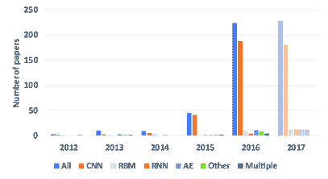
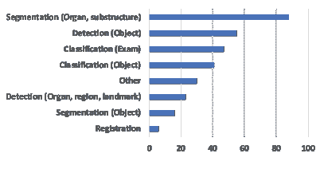
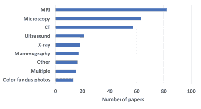
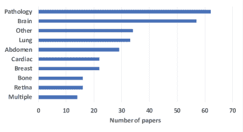
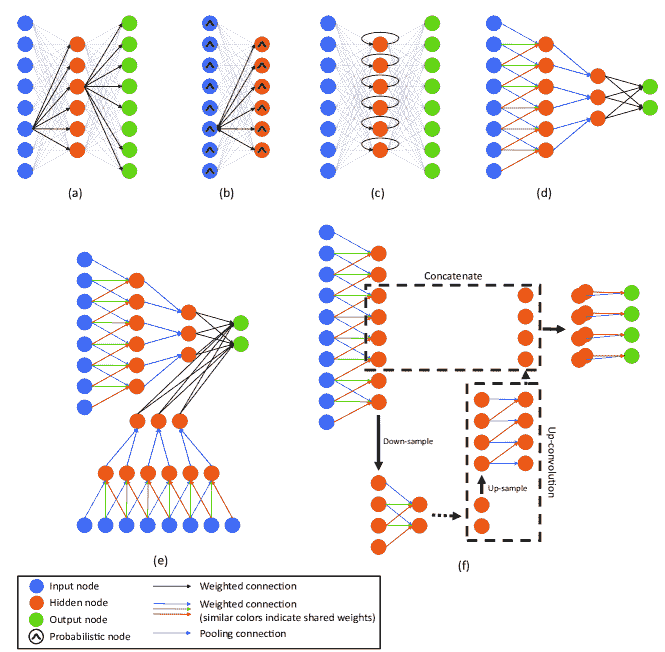
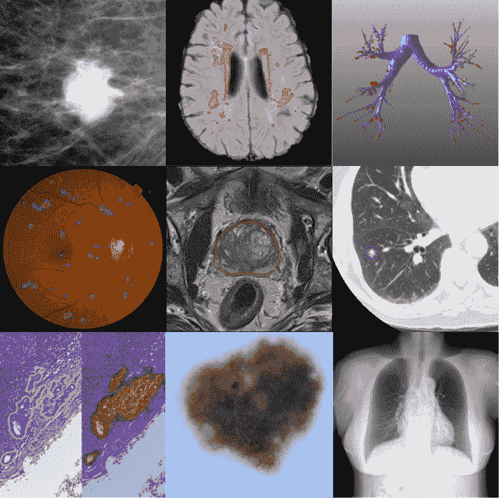

<!--yml

类别：未分类

日期：2024-09-06 20:09:03

-->

# [1702.05747] 关于深度学习在医学影像分析中的调查

> 来源：[`ar5iv.labs.arxiv.org/html/1702.05747`](https://ar5iv.labs.arxiv.org/html/1702.05747)

# 关于深度学习在医学影像分析中的调查

Geert Litjens, Thijs Kooi, Babak Ehteshami Bejnordi, Arnaud Arindra Adiyoso Setio, Francesco Ciompi,

Mohsen Ghafoorian, Jeroen A.W.M. van der Laak, Bram van Ginneken, Clara I. Sánchez

诊断影像分析组

拉德布德大学医学中心

尼梅根，荷兰

###### 摘要

深度学习算法，特别是卷积网络，迅速成为分析医学影像的首选方法。本文回顾了与医学影像分析相关的主要深度学习概念，并总结了 300 多篇相关领域的贡献，大多数出现在过去一年。我们调查了深度学习在图像分类、对象检测、分割、配准和其他任务中的应用。针对每个应用领域提供了简明的概述：神经影像、视网膜影像、肺部影像、数字病理、乳腺影像、心脏影像、腹部影像、肌肉骨骼影像。最后，我们总结了当前的最先进技术，对开放挑战和未来研究方向进行了批判性的讨论。

###### 关键词：

深度学习，卷积神经网络，医学影像，调查

## 1 引言

一旦可以将医学影像扫描并加载到计算机中，研究人员就开始建立自动化分析系统。最初，从 1970 年代到 1990 年代，医学影像分析是通过低级像素处理（边缘和线检测滤波器、区域生长）和数学建模（拟合线条、圆和椭圆）的顺序应用来构建复合规则基础系统，从而解决特定任务。这与同一时期人工智能中流行的包含许多 if-then-else 语句的专家系统相似。这些专家系统被称为 GOFAI（好老式人工智能）（Haugeland, 1985），并且往往很脆弱；类似于基于规则的图像处理系统。

在 1990 年代末期，监督技术（通过训练数据来开发系统）在医学图像分析中变得越来越流行。例子包括主动形状模型（用于分割）、图谱方法（通过与新数据匹配的图谱形成训练数据），以及特征提取和统计分类器的概念（用于计算机辅助检测和诊断）。这种模式识别或机器学习方法仍然非常受欢迎，并形成了许多成功的商业医学图像分析系统的基础。因此，我们看到系统从完全由人设计转变为通过计算机使用示例数据进行训练的系统，从中提取特征向量。计算机算法确定高维特征空间中的最佳决策边界。设计此类系统的关键步骤是从图像中提取判别特征。这个过程仍然由人类研究人员完成，因此，这些系统被称为具有手工制作特征的系统。

逻辑上的下一步是让计算机学习能够最佳表示问题数据的特征。这个概念是许多深度学习算法的基础：由多个层组成的模型（网络）将输入数据（例如图像）转换为输出（例如疾病有无），同时学习越来越高层次的特征。到目前为止，用于图像分析的最成功的模型类型是卷积神经网络（CNNs）。CNNs 包含许多层，这些层通过小范围的卷积滤波器来转换输入。自 70 年代末期以来，关于 CNNs 的研究已经展开（Fukushima, 1980），并且在 1995 年，Lo 等人（1995）已经将其应用于医学图像分析。它们在 LeNet（LeCun et al., 1998）中首次成功应用于手写数字识别。尽管有这些初步成功，直到开发出各种新技术以高效训练深度网络，并在核心计算系统上取得进展，CNNs 的使用才开始得到广泛关注。转折点是 Krizhevsky 等人（2012）在 2012 年 12 月的 ImageNet 挑战赛中的贡献。提出的 CNN 称为 AlexNet，以大幅领先赢得了那次比赛。随后几年，使用相关但更深层次的架构（Russakovsky et al., 2014）取得了进一步的进展。在计算机视觉领域，深度卷积网络现已成为首选技术。

医学图像分析社区已经注意到这些关键性进展。然而，从使用手工特征的系统到从数据中学习特征的系统的过渡是渐进的。在 AlexNet 突破之前，许多不同的特征学习技术曾经流行。Bengio 等人（2013）对这些技术进行了全面的回顾。其中包括主成分分析、图像块的聚类、字典方法等。Bengio 等人（2013）在回顾的最后部分的“深度模型的全局训练”一节中介绍了仅在这一部分训练的 CNN。在本调查中，我们特别关注这样的深度模型，而不包括那些已应用于医学图像的更传统的特征学习方法。有关深度学习在健康信息学中的应用的更广泛回顾，请参阅 Ravi 等人（2017），其中简要涉及了医学图像分析。

深度学习在医学图像分析中的应用最初出现在研讨会和会议上，然后在期刊中出现。2015 年和 2016 年论文数量迅速增长。图 1 中对此进行了说明。该主题现在在主要会议中占主导地位，并且 2016 年 5 月 IEEE 医学影像学交易的首个特刊已发布（Greenspan 等人，2016）。

图 1：本调查中所包含论文的出版年份、所涉及的任务（第三部分）、成像模式和应用领域（第四部分）的详细分解。2017 年的论文数量是通过对 1 月份发表的论文进行外推得出的。

Shen 等人发表了一篇关于深度学习在医学图像分析应用的专门综述 (2017)。虽然他们涵盖了大量的工作，但我们认为该领域的重要领域并未得到体现。举个例子，他们没有涵盖视网膜图像分析的工作。我们撰写这篇综述的动机是提供一个（几乎）所有医学成像领域的全面概述，涵盖应用和方法驱动的视角。这还包括所有出版物的概述表格，读者可以使用这些表格快速评估该领域。最后，我们利用自己在医学图像分析中应用深度学习方法的经验，为读者提供了一个专门讨论当前技术水平、面临的挑战以及未来将变得重要的研究方向和技术的讨论部分。

本调查包含了 300 多篇论文，其中大多数是近期的，涵盖了深度学习在医学图像分析中的广泛应用。为了识别相关贡献，我们查询了 PubMed 中标题或摘要包含（”卷积” OR ”深度学习”）的论文。我们还搜索了 ArXiv 中提到与医学成像相关的术语的论文。此外，我们根据论文标题搜索了 MICCAI（包括研讨会）、SPIE、ISBI 和 EMBC 的会议论文集。我们检查了所有选定论文中的参考文献，并咨询了同事。我们排除了那些未报告医学图像数据结果或仅使用标准前馈神经网络与手工特征的论文。当重复的工作在多篇出版物中报告时，只有被认为最重要的出版物被纳入。我们预计所使用的搜索词覆盖了大多数，如果不是全部的话，涉及深度学习方法的工作。所包含论文的最后更新是在 2017 年 2 月 1 日。附录中详细描述了搜索过程。

总结来说，我们的调查旨在：

+   1.

    证明深度学习技术已经渗透到医学图像分析的整个领域；

+   2.

    确定将深度学习成功应用于医学成像任务的挑战；

+   3.

    突出具体贡献，解决或绕过这些挑战。

本调查的其余部分结构如下。在 2 节中，我们介绍了用于医学图像分析的主要深度学习技术，并在整个调查中提到这些技术。3 节描述了深度学习在医学图像分析中的经典任务的贡献：分类、检测、分割、配准、检索、图像生成和增强。4 节讨论了在不同应用领域获得的结果和面临的挑战：神经、眼科、肺部、数字病理学和细胞成像、乳腺、心脏、腹部、肌肉骨骼以及其他杂项应用。我们以总结、批判性讨论和对未来研究的展望结束。

## 2 深度学习方法概述

本节的目标是提供一个正式的介绍和定义我们在医学图像分析论文中发现的深度学习概念、技术和架构。

### 2.1 学习算法

机器学习方法通常分为监督学习和无监督学习算法，尽管有许多细微差别。在监督学习中，模型会接收到一个数据集 $\mathcal{D}=\{{\bf x},y\}^{N}_{n=1}$，其中包含输入特征 ${\bf x}$ 和标签 $y$ 对，其中 $y$ 通常表示固定类别集合中的一个实例。在回归任务中，$y$ 也可以是具有连续值的向量。监督训练通常是找到最佳预测数据的模型参数 $\Theta$，基于损失函数 $L(y,\hat{y})$。这里 $\hat{y}$ 表示通过将数据点 ${\bf x}$ 输入到代表模型的函数 $f({\bf x};\Theta)$ 中得到的模型输出。

无监督学习算法处理没有标签的数据，并被训练以寻找模式，如潜在的子空间。传统的无监督学习算法的例子包括主成分分析和聚类方法。无监督训练可以在许多不同的损失函数下进行。一个例子是重构损失 $L({\bf x},\hat{{\bf x}})$，其中模型必须学会重构其输入，通常通过较低维度或噪声表示。

### 2.2 神经网络

神经网络是一种学习算法，构成了大多数深度学习方法的基础。一个神经网络由一些具有激活 $a$ 和参数 $\Theta=\{\mathcal{W},\mathcal{B}\}$ 的神经元或单元组成，其中 $\mathcal{W}$ 是一组权重，$\mathcal{B}$ 是一组偏置。激活表示输入 ${\bf x}$ 到神经元的线性组合和参数，随后是逐元素的非线性函数 $\sigma(\cdot)$，称为传递函数：

|  | $a=\sigma({\bf w}^{T}{\bf x}+b).$ |  | (1) |
| --- | --- | --- | --- |

传统神经网络的典型传递函数是 sigmoid 和双曲正切函数。多层感知机（MLP），作为最著名的传统神经网络，具有多个这些变换层：

|  | $f({\bf x};\Theta)=\sigma({\bf W}^{T}\sigma({\bf W}^{T}\ldots\sigma({\bf W}^{T}{\bf x}+b))+b).$ |  | (2) |
| --- | --- | --- | --- |

在这里，${\bf W}$ 是一个矩阵，包含列 ${\bf w}_{k}$，与输出中的激活 $k$ 相关联。输入层和输出层之间的层通常被称为“隐藏”层。当神经网络包含多个隐藏层时，通常被认为是“深层”神经网络，因此有了“深度学习”这个术语。

在网络的最终层，激活值通过 softmax 函数被映射到类别分布 $P(y|{\bf x};\Theta)$ 上：

|  | $P(y | {\bf x};\Theta)=\text{softmax}({\bf x};\Theta)=\frac{e^{{\bf w}_{i}^{T}{\bf x}+b_{i}}}{\sum^{K}_{k=1}e^{{\bf w}_{k}^{T}{\bf x}+b_{k}}},$ |  | (3) |
| --- | --- | --- | --- | --- |

其中 ${\bf w}_{i}$ 表示通向与类别 $i$ 相关联的输出节点的权重向量。三层 MLP 的示意图见图 2。

目前，最大似然估计与随机梯度下降是拟合参数 $\Theta$ 到数据集 $\mathcal{D}$ 的最流行方法。在随机梯度下降中，数据的一个小子集，即小批量，用于每次梯度更新，而不是整个数据集。实际中优化最大似然即是最小化负对数似然：

|  | $\arg\min_{\Theta}-\sum^{N}_{n=1}\log\big{[}P(y_{n} | {\bf x}_{n};\Theta)\big{]}.$ |  | (4) |
| --- | --- | --- | --- | --- |

这导致了二分类问题的二元交叉熵损失和多分类任务的分类交叉熵损失。这种方法的一个缺点是，它通常不会直接优化我们感兴趣的量，例如接收者操作特征（ROC）曲线下的面积或分割的常见评估指标，如 Dice 系数。

长时间以来，深度神经网络（DNN）被认为很难高效训练。直到 2006 年（Bengio 等，2007; Hinton 和 Salakhutdinov，2006; Hinton 等，2006）才开始流行，当时展示了以无监督的方式（预训练）逐层训练 DNN，再通过有监督的方式对堆叠网络进行微调，可以取得良好的性能。以这种方式训练的两个流行架构是堆叠自编码器（SAEs）和深度置信网络（DBNs）。然而，这些技术相当复杂，需要大量的工程工作才能生成令人满意的结果。

目前，最流行的模型是以有监督的方式进行端到端训练，大大简化了训练过程。最流行的架构是卷积神经网络（CNNs）和递归神经网络（RNNs）。CNNs 目前在（医学）图像分析中最为广泛使用，尽管 RNNs 正在获得越来越多的关注。接下来的部分将简要概述这些方法中的每一种，从最流行的开始，并讨论它们在应用于医学问题时的差异和潜在挑战。

### 2.3 卷积神经网络（CNNs）

MLPs 和 CNNs 之间有两个关键区别。首先，在 CNNs 中，网络中的权重是共享的，使得网络对图像执行卷积操作。这样，模型不需要为图像中不同位置出现的相同对象学习单独的检测器，从而使网络在输入的平移方面具有等变性。这也大大减少了需要学习的参数量（即权重的数量不再依赖于输入图像的大小）。图 1D CNN 的示例见图 2。

在每一层中，输入图像会与一组$K$个核$\mathcal{W}=\{{\bf W}_{1},{\bf W}_{2},\ldots,{\bf W}_{K}\}$和添加的偏置$\mathcal{B}=\{b_{1},\ldots,b_{K}\}$进行卷积，每个核生成一个新的特征图${\bf X}_{k}$。这些特征经过逐元素的非线性变换$\sigma(\cdot)$，然后对每个卷积层$l$重复相同的过程：

|  | ${\bf X}_{k}^{l}=\sigma\big{(}{\bf W}_{k}^{l-1}\ast{\bf X}^{l-1}+b_{k}^{l-1}\big{)}.$ |  | (5) |
| --- | --- | --- | --- |

CNN 和 MLP 之间的第二个主要区别是 CNN 中典型地包含池化层，其中邻域的像素值使用置换不变函数（通常是最大值或均值操作）进行聚合。这引入了一定程度的平移不变性，并再次减少了网络中的参数数量。在网络的卷积流的末尾，通常会添加全连接层（即常规神经网络层），在这些层中权重不再共享。类似于 MLP，通过将最终层的激活输入 softmax 函数生成类别分布，并使用最大似然法进行训练。

### 2.4 深度 CNN 架构

鉴于 CNN 在医学图像分析中的广泛应用，我们详细讨论了最常见的架构以及广泛使用模型之间的架构差异。

#### 2.4.1 通用分类架构

LeNet（LeCun 等，1998）和 AlexNet（Krizhevsky 等，2012）在十多年后被引入，本质上是非常相似的模型。这两个网络都相对较浅，分别由两个和五个卷积层组成，并且在接近输入的层中使用了大感受野的卷积核，而在接近输出的层中使用了较小的卷积核。AlexNet 确实采用了修正线性单元作为激活函数，而不是双曲正切函数。

2012 年后，探索新架构的工作开始加速，最近三年中更倾向于更深的模型。通过堆叠较小的卷积核，而不是使用单层大感受野的卷积核，可以用更少的参数表示类似的功能。这些更深的架构在推理过程中通常具有较低的内存占用，从而使其能够在如智能手机等移动计算设备上部署。Simonyan 和 Zisserman（2014）首次探索了更深的网络，并在每一层中使用了小的固定大小卷积核。一个常被称为 VGG19 或 OxfordNet 的 19 层模型赢得了 2014 年的 ImageNet 挑战。

在更深的网络之上，引入了更复杂的构建模块，这些模块提高了训练过程的效率，并再次减少了参数的数量。Szegedy 等人（2014）引入了一个名为 GoogLeNet 的 22 层网络，也称为 Inception，该网络利用了所谓的 inception 块（Lin 等，2013），这是一个用不同大小的卷积替代方程式中定义的映射的模块（见 Eq. (5 ‣ 2 Overview of deep learning methods ‣ A Survey on Deep Learning in Medical Image Analysis")）。类似于小卷积核的堆叠，这使得用更少的参数表示类似的功能成为可能。ResNet 架构（He 等，2015）在 2015 年赢得了 ImageNet 挑战赛，包含了所谓的 ResNet 块。Residual block 不是学习一个函数，而是学习残差，因此预先条件化为学习每层中接近恒等函数的映射。这样，即使是更深的模型也可以有效地训练。

自 2014 年以来，ImageNet 基准测试的表现已经趋于饱和，很难评估性能的小幅提升是否真的可以归因于“更好”的、更复杂的架构。这些模型提供的较低内存占用的优势通常对医疗应用并不那么重要。因此，尽管近期的重大研究都使用了一个叫做 Inception v3 的 GoogleNet 版本（Gulshan 等，2016；Esteva 等，2017；Liu 等，2017），但 AlexNet 或其他简单模型如 VGG 仍然在医疗数据中很受欢迎。是否由于架构的优越性或仅仅是因为该模型在流行的软件包中是默认选择，这一点仍然难以评估。

#### 2.4.2 多流架构

默认的 CNN 架构可以轻松容纳多种信息源或输入表示，以通道的形式呈现给输入层。这个想法可以进一步延伸，在网络中的任何点合并通道。基于不同任务需要不同融合方式的直觉，多流架构正在被探索。这些模型也被称为双通道架构（Kamnitsas 等，2017），目前有两个主要应用： (1) 多尺度图像分析和 (2) 2.5D 分类；这两者都与医疗图像处理任务相关。

对于异常检测，背景常常是一个重要的线索。增加背景的最直接方法是将更大的补丁输入网络，但这会显著增加网络的参数量和内存需求。因此，已经研究了在高分辨率局部信息的基础上添加缩放背景表示的架构。据我们了解，多流多尺度架构首次由 Farabet 等人（2013）探索，他们将其用于自然图像的分割。一些医学应用也成功地使用了这一概念（Kamnitsas 等人，2017；Moeskops 等人，2016a；Song 等人，2015；Yang 等人，2016c）。

由于许多方法仍在自然图像上开发，将深度学习技术应用于医学领域的挑战通常在于将现有架构适应于不同的输入格式，例如三维数据。在早期将 CNN 应用于这种体积数据时，通过将兴趣体积（VOI）划分为切片并作为不同的流输入网络，从而规避了全三维卷积和由此产生的大量参数。Prasoon 等人（2013）首次使用这种方法进行膝关节软骨分割。同样，网络可以以多流的方式从 3D 空间输入多个角度的补丁，这在医学成像的背景下被多个作者应用（Roth 等人，2016b；Setio 等人，2016）。这些方法也被称为 2.5D 分类。

#### 2.4.3 分割架构

分割是自然和医学图像分析中的常见任务，为此，可以简单地使用 CNN 来单独分类图像中的每个像素，通过将其呈现为提取的补丁。这个简单的“滑动窗口”方法的一个缺点是，相邻像素的输入补丁有大量重叠，相同的卷积被计算多次。幸运的是，卷积和点积都是线性运算符，因此内积可以被写作卷积，反之亦然。通过将全连接层重写为卷积，CNN 可以处理比其训练时更大的输入图像，并生成一个可能性图，而不是单个像素的输出。由此产生的“全卷积网络”（fCNN）可以有效地应用于整个输入图像或体积。

然而，由于池化层，这可能导致输出的分辨率远低于输入。‘Shift-and-stitch’（Long 等人，2015）是为防止分辨率下降而提出的几种方法之一。fCNN 被应用于输入图像的移位版本。通过将结果拼接在一起，可以获得最终输出的全分辨率版本，减去由于‘有效’卷积丢失的像素。

Ronneberger 等人 (2015) 将 fCNN 的概念进一步发展，提出了 U-net 架构，该架构包括一个“常规” fCNN，随后是一个上采样部分，其中使用“上”-卷积来增加图像大小，称为收缩路径和扩张路径。虽然这不是第一个在卷积神经网络中引入学习上采样路径的论文（例如 Long 等人 (2015))，但作者将其与所谓的跳跃连接结合在一起，直接连接对立的收缩和扩张卷积层。Çiçek 等人 (2016) 对 3D 数据使用了类似的方法。Milletari 等人 (2016b) 提出了 U-Net 布局的扩展，包含了类似 ResNet 的残差块和一个 Dice 损失层，而不是传统的交叉熵，直接最小化这一常用的分割误差度量。

### 2.5 循环神经网络（RNNs）

传统上，RNNs 是为离散序列分析而开发的。它们可以被看作是 MLPs 的一种推广，因为输入和输出都可以具有不同的长度，使其适合于机器翻译等任务，其中源语言和目标语言的句子作为输入和输出。在分类设置中，模型学习给定序列 ${\bf x}_{1},{\bf x}_{2},\ldots,{\bf x}_{T}$ 的类别分布 $P(y|{\bf x}_{1},{\bf x}_{2},\ldots,{\bf x}_{T};\Theta)$，而不是单一的输入向量 ${\bf x}$。

普通 RNN 在时间 $t$ 维持一个潜在或隐藏状态 ${\bf h}$，该状态是其输入 ${\bf x}_{t}$ 和前一状态 ${\bf h}_{t-1}$ 的非线性映射的输出：

|  | ${\bf h}_{t}=\sigma({\bf W}{\bf x}_{t}+{\bf R}{\bf h}_{t-1}+{\bf b}),$ |  | (6) |
| --- | --- | --- | --- |

其中权重矩阵 ${\bf W}$ 和 ${\bf R}$ 在时间上是共享的。对于分类，通常会添加一个或多个全连接层，然后通过 softmax 将序列映射到类别的后验概率。

|  | $P(y&#124;{\bf x}_{1},{\bf x}_{2},\ldots,{\bf x}_{T};\Theta)=\text{softmax}({\bf h}_{T};{\bf W}_{out},{\bf b}_{out}).$ |  | (7) |
| --- | --- | --- | --- |

由于梯度需要从输出通过时间进行反向传播，RNNs 天生具有深度（在时间上），因此面临与常规深度神经网络相同的训练问题（Bengio 等，1994）。为此，开发了几种专门的记忆单元，最早且最受欢迎的是长短期记忆（LSTM）单元（Hochreiter 和 Schmidhuber，1997）。门控递归单元（Cho 等，2014）是对 LSTM 的一种最近简化，并且也被广泛使用。

尽管最初是为一维输入提出的，但 RNNs 正越来越多地应用于图像。在自然图像中，‘pixelRNNs’ 被用作自回归模型，这些生成模型最终可以生成类似于训练集样本的新图像。对于医学应用，它们已被用于分割问题，并在 MRBrainS 挑战中取得了有希望的结果（Stollenga 等，2015）。

### 2.6 无监督模型

#### 2.6.1 自编码器（AEs）和堆叠自编码器（SAEs）

AEs 是简单的网络，通过一个隐藏层 ${\bf h}$ 被训练以重建输入 ${\bf x}$ 到输出层 ${\bf x}^{\prime}$。它们由从输入到隐藏状态的权重矩阵 ${\bf W}_{x,h}$ 和偏置 $b_{x,h}$ 以及从隐藏层到重建的权重矩阵 ${\bf W}_{h,x^{\prime}}$ 和相应的偏置 $b_{h,x^{\prime}}$ 控制。使用非线性函数来计算隐藏激活：

|  | ${\bf h}=\sigma({\bf W}_{x,h}{\bf x}+{\bf b}_{x,h}).$ |  | (8) |
| --- | --- | --- | --- |

此外，隐藏层的维度 $|{\bf h}|$ 被设定为小于 $|{\bf x}|$。这样，数据被投影到表示输入中主要潜在结构的低维子空间。可以使用正则化或稀疏约束来增强发现过程。如果隐藏层的大小与输入相同且没有添加其他非线性函数，模型将只是学习身份函数。

去噪自编码器（Vincent 等，2010）是防止模型学习到简单解决方案的另一种方法。这里，模型被训练以从噪声污染版本（通常是盐和胡椒噪声）中重建输入。SAEs（或深度 AEs）通过将自编码器层堆叠在一起形成。在本文调查的医学应用中，自编码器层通常被单独训练（“贪婪地”），然后使用监督训练对整个网络进行微调以进行预测。

#### 2.6.2 受限玻尔兹曼机（RBMs）和深度置信网络（DBNs）

RBMs（Hinton, 2010）是一种马尔可夫随机场（MRF），由一个输入层或可见层 ${\bf x}=(x_{1},x_{2},\ldots,x_{N})$ 和一个隐藏层 ${\bf h}=(h_{1},h_{2},\ldots,h_{M})$ 组成，该隐藏层携带潜在特征表示。节点之间的连接是双向的，因此给定一个输入向量 $\bf x$ 可以得到潜在特征表示 $\bf h$，反之亦然。因此，RBM 是一个生成模型，我们可以从中采样并生成新的数据点。类比于物理系统，为输入和隐藏单元的特定状态 $({\bf x},{\bf h})$ 定义了一个能量函数：

|  | $E({\bf x},{\bf h})={\bf h}^{T}{\bf W}{\bf x}-{\bf c}^{T}{\bf x}-{\bf b}^{T}{\bf h},$ |  | (9) |
| --- | --- | --- | --- |

其中 ${\bf c}$ 和 ${\bf b}$ 是偏置项。系统的‘状态’概率通过将能量传递到指数函数并进行归一化来定义：

|  | $p({\bf x},{\bf h})=\frac{1}{Z}\exp\{-E({\bf x},{\bf h})\}.$ |  | (10) |
| --- | --- | --- | --- |

计算分区函数 $Z$ 通常是不可处理的。然而，计算 ${\bf h}$ 在 ${\bf v}$ 条件下或反之的条件推断是可处理的，并且结果是一个简单的公式：

|  | $P(h_{j}&#124;{\bf x})=\frac{1}{1+\exp\{-b_{j}-{\bf W}_{j}{\bf x}\}}.$ |  | (11) |
| --- | --- | --- | --- |

由于网络是对称的，对于 $P(x_{i}|{\bf h})$ 也有类似的表达式。

DBNs（Bengio 等, 2007; Hinton 等, 2006）本质上是 SAEs，其中 AE 层被 RBMs 取代。个别层的训练再次以无监督的方式进行。最终的微调是通过在 DBN 的顶层添加线性分类器并进行监督优化来完成的。

#### 2.6.3 变分自编码器和生成对抗网络

最近，引入了两种新颖的无监督架构：变分自编码器（VAE）（Kingma 和 Welling, 2013）和生成对抗网络（GAN）（Goodfellow 等, 2014）。目前还没有同行评审的论文将这些方法应用于医学图像，但在自然图像中的应用前景很有希望。我们将在讨论中详细说明它们的潜力。

### 2.7 硬件和软件

深度学习急剧发展的主要原因之一是 GPU 和 GPU 计算库（CUDA, OpenCL）的广泛可用性。GPU 是高度并行的计算引擎，具有比中央处理单元（CPU）多一个数量级的执行线程。使用当前的硬件，GPU 上的深度学习通常比 CPU 上快 10 到 30 倍。

除了硬件之外，深度学习方法流行的另一个推动力是开源软件包的广泛可用性。这些库提供了神经网络中重要操作（如卷积）的高效 GPU 实现；使用户能够在高层次上实现想法，而无需担心低层次的高效实现。在撰写本文时，最受欢迎的软件包（按字母顺序排列）包括：

+   1.

    Caffe (Jia 等人, 2014)。提供 C++ 和 Python 接口，由 UC Berkeley 的研究生开发。

+   2.

    Tensorflow (Abadi 等人, 2016)。提供 C++ 和 Python 接口，由 Google 开发并由 Google 研究所使用。

+   3.

    Theano (Bastien 等人, 2012)。提供 Python 接口，由蒙特利尔的 MILA 实验室开发。

+   4.

    Torch (Collobert 等人, 2011)。提供 Lua 接口，Facebook AI 研究等也在使用。

在这些框架之上，还有第三方软件包，例如 Lasagne ([`github.com/Lasagne/Lasagne`](https://github.com/Lasagne/Lasagne)) 或 Keras ([`keras.io/`](https://keras.io/))。详细讨论这些软件包超出了本文的范围。

图 2：常用于医学影像的架构的 1D 表示的节点图。a) 自编码器，b) 限制玻尔兹曼机，c) 循环神经网络，d) 卷积神经网络，e) 多流卷积神经网络，f) U-net（具有单一下采样阶段）。

.

## 医学影像中的 3 种深度学习应用

### 3.1 分类

#### 3.1.1 图像/检查分类

图像或检查分类是深度学习对医学图像分析做出重大贡献的第一个领域之一。在检查分类中，通常以一个或多个图像（检查）作为输入，以单一的诊断变量作为输出（例如，疾病是否存在）。在这种情况下，每个诊断检查都是一个样本，并且数据集的规模通常较小，相比于计算机视觉领域（例如，数百/数千个样本对比于数百万个样本）。因此，对于这种应用，迁移学习的流行并不令人惊讶。

迁移学习本质上是利用预训练网络（通常是在自然图像上）来绕过对深度网络训练所需的大数据集的（感知）要求。确定了两种迁移学习策略：（1）使用预训练网络作为特征提取器和（2）在医学数据上微调预训练网络。前者策略的额外好处是完全不需要训练深度网络，使提取的特征能够轻松地插入现有的图像分析管道。两种策略都很受欢迎并且被广泛应用。然而，少数作者对哪种策略效果最佳进行了彻底调查。Antony 等（2016）和 Kim 等（2016a）这两篇论文提供了相互矛盾的结果。在 Antony 等（2016）的研究中，微调明显优于特征提取，在膝关节骨关节炎的多类分级评估中达到了 57.6%的准确率，而特征提取为 53.4%。然而，Kim 等（2016a）显示，在细胞病理图像分类准确率上，使用 CNN 作为特征提取器优于微调（70.5%对 69.1%）。如果有任何关于哪种策略可能最成功的指导，我们建议读者参考两篇最近发表在高排名期刊上的论文，它们在医学数据上微调了 Google 的 Inception v3 架构的预训练版本，并实现了（接近）人类专家的表现（Esteva 等，2017；Gulshan 等，2016）。据作者所知，仅使用预训练网络作为特征提取器尚未达到这样的结果。

对于在考试分类中常用的深度网络类型，类似于计算机视觉的时间线是显而易见的。医学影像界最初集中在无监督预训练和 SAE 及 RBM 等网络架构上。2013 年首次出现了应用这些技术进行考试分类的论文，重点在于神经影像学。Brosch 和 Tam（2013），Plis 等（2014），Suk 和 Shen（2013），以及 Suk 等（2014）应用 DBN 和 SAE 来根据脑部磁共振成像（MRI）对患者进行阿尔茨海默病的分类。最近，可以观察到明显的向 CNN 的转变。在 2015 年、2016 年和 2017 年发表的 47 篇关于考试分类的论文中，36 篇使用了 CNN，5 篇基于 AE，6 篇基于 RBM。这些方法的应用领域非常广泛，从脑部 MRI 到视网膜成像，再到数字病理学和肺部 CT。

在更近期使用 CNN 的论文中，作者们也经常从头开始训练自己的网络架构，而不是使用预训练的网络。Menegola 等人（2016）进行了比较从头训练与微调预训练网络的实验，并展示了在小数据集（大约 1000 张皮肤病变图像）上微调效果更好。然而，这些实验规模过小，无法得出任何普遍的结论。

三篇论文使用了利用医学数据独特属性的架构：其中两篇使用了 3D 卷积（Hosseini-Asl 等，2016; Payan 和 Montana，2015），而不是 2D 卷积来将患者分类为阿尔茨海默病；Kawahara 等人（2016b）将类似 CNN 的架构应用于从 MRI 扩散张量成像（DTI）得到的大脑连接图。为了实现这一点，他们开发了几种新层，这些层构成了他们网络的基础，即所谓的边到边、边到节点和节点到图层。他们使用他们的网络来预测大脑发展，并展示了在评估认知和运动评分方面超过了现有方法。

总结来说，在考试分类中，CNN（卷积神经网络）是目前的标准技术。尤其是那些在自然图像上预训练的 CNN 表现出了令人惊讶的强大效果，在某些任务中甚至挑战了人类专家的准确性。最后，作者们已经展示了 CNN 可以被调整以利用医学图像的内在结构。

#### 3.1.2 对象或病变分类

对象分类通常侧重于将医学图像中一个小的（先前识别出的）部分分类为两类或更多类别（例如，胸部 CT 中的结节分类）。对于这些任务，准确的分类通常需要病变外观的局部信息和病变位置的全局上下文信息。这种结合在通用的深度学习架构中通常是不可行的。一些作者使用了多流架构来以多尺度的方式解决这个问题（详见 2.4.2 节）。Shen 等人（2015b）使用了三种 CNN，每种 CNN 以不同尺度的结节补丁作为输入。这三种 CNN 的特征输出结果随后被连接起来形成最终的特征向量。Kawahara 和 Hamarneh（2016）采用了类似的方法，使用多流 CNN 来分类皮肤病变，其中每个流处理图像的不同分辨率。Gao 等人（2015）建议使用 CNN 和 RNN 的组合来对裂隙灯图像中的核性白内障进行分级，其中 CNN 过滤器是预训练的。这种组合允许处理所有的上下文信息，而不受图像大小的影响。将 3D 信息纳入也是医学影像对象分类任务中获得良好性能的一个必要条件。由于计算机视觉中的图像往往是 2D 自然图像，因此在这些场景下开发的网络并未直接利用 3D 信息。作者们使用了不同的方法来有效地将 3D 信息整合到定制架构中。Setio 等人（2016）使用了多流 CNN 来将胸部 CT 中的兴趣点分类为结节或非结节。从候选区域中提取的最多九个不同方向的补丁被用于不同的流，并在全连接层中合并以获得最终的分类输出。相比之下，Nie 等人（2016c）通过训练 3D CNN 来评估高等级胶质瘤患者的生存期，从而利用 MRI 的 3D 特性。

几乎所有近期的论文都倾向于使用端到端训练的 CNN。在某些情况下，也使用了其他架构和方法，如 RBMs（van Tulder 和 de Bruijne，2016；Zhang 等人，2016c），SAEs（Cheng 等人，2016a）和卷积稀疏自编码器（CSAE）（Kallenberg 等人，2016）。CSAE 和经典 CNN 之间的主要区别在于使用了稀疏自编码器的无监督预训练。

一种有趣的方法，尤其是在对象注释以生成训练数据昂贵的情况下，是多实例学习（MIL）与深度学习的结合。Xu 等人（2014）研究了使用 MIL 框架的监督和无监督特征学习方法以及手工特征。结果表明，MIL 框架的性能优于手工特征，而手工特征又接近于完全监督方法的性能。我们预计这种方法在未来也会受到欢迎，因为获取高质量的注释医学数据具有挑战性。

总体而言，与考试分类相比，对象分类较少使用预训练网络，这主要是由于需要结合上下文或三维信息。一些作者已经找到创新的方法将这些信息添加到深度网络中，并取得了良好的结果，因此我们预计深度学习在不久的将来会在这一任务中变得更加突出。

### 3.2 检测

#### 3.2.1 器官、区域和标志点定位

解剖对象定位（在空间或时间上），例如器官或标志点，一直是分割任务或临床治疗计划和干预中的重要预处理步骤。在医学成像中，定位通常需要解析 3D 体积。为了解决使用深度学习算法解析 3D 数据的问题，提出了几种方法，这些方法将 3D 空间视为 2D 正交平面的组合。Yang 等人（2015）通过使用常规 CNN 处理三个独立的 2D MRI 切片（每个平面一个）来识别远端股骨表面的标志点。标志点的 3D 位置被定义为三个 2D 切片中分类输出最高的交点。de Vos 等人（2016b）更进一步，通过在 2D 解析 3D CT 体积后识别矩形 3D 边界框，定位了解剖区域（心脏、主动脉弓和降主动脉）周围的感兴趣区域（ROI）。预训练的 CNN 架构以及 RBM 已被用于相同的目的（Cai 等人，2016b；Chen 等人，2015b；Kumar 等人，2016），克服了学习更好特征表示的数据不足问题。所有这些研究将定位任务视为分类任务，因此可以利用通用深度学习架构和学习过程。

其他作者尝试修改网络学习过程以直接预测位置。例如，Payer 等人 (2016) 提出了直接回归地标位置的 CNNs。他们使用地标图，其中每个地标由高斯表示，作为真实数据输入，并直接训练网络以预测该地标图。Ghesu 等人 (2016a) 发表了另一种有趣的方法，其中应用了强化学习来识别地标。作者在几个任务中展示了有希望的结果：2D 心脏 MRI 和超声（US）以及 3D 头/颈 CT。

由于其复杂性增加，只有少数方法处理了在 3D 图像空间中直接定位地标和区域的问题。Zheng 等人 (2015) 通过将 3D 卷积分解为三种一维卷积来降低这种复杂性，以检测 CT 数据中的颈动脉分叉。Ghesu 等人 (2016b) 提出了一个稀疏自适应深度神经网络，该网络由边际空间学习驱动，以应对 3D 经食道超声心动图中数据的复杂性。

CNNs 也被用于在时间数据中定位扫描平面或关键帧。Baumgartner 等人 (2016) 在视频帧数据上训练 CNNs 以检测中孕期胎儿超声中的多达 12 个标准化扫描平面。此外，他们使用显著性图来获得扫描平面中感兴趣对象的粗略定位（例如，大脑，脊柱）。RNNs，特别是 LSTM-RNNs，也被用于利用医学视频中的时间信息，这是一种高维数据类型。例如，Chen 等人 (2015a) 使用 LSTM 模型将超声视频中连续序列的时间信息纳入胎儿标准平面检测中。Kong 等人 (2016) 将 LSTM-RNN 与 CNN 结合，用于检测心脏的舒张末期和收缩末期帧。

总结来说，通过 CNNs 进行 2D 图像分类的定位似乎是识别器官、区域和地标的最流行策略，并取得了良好的结果。然而，几篇近期的论文通过修改学习过程扩展了这一概念，以便直接强调准确的定位，取得了令人期待的结果。我们预计这些策略将得到进一步探索，因为它们表明深度学习技术可以适应广泛的定位任务（例如多个地标）。RNNs 在时间域中的定位表现出良好的前景，且多维 RNNs 可能在空间定位中也会发挥作用。

#### 3.2.2 对象或病变检测

在图像中检测感兴趣的物体或病变是诊断的关键部分，并且是临床医生最为费力的任务之一。通常，这些任务包括在整个图像空间中定位和识别小病变。计算机辅助检测系统在自动检测病变、提高检测准确性或减少人工专家阅读时间方面有着悠久的研究传统。有趣的是，使用卷积神经网络（CNN）的第一个物体检测系统早在 1995 年就已经提出，使用了一个具有四层的 CNN 来检测 X 射线图像中的结节（Lo et al., 1995）。

大多数已发表的深度学习物体检测系统仍然使用 CNN 进行像素（或体素）分类，然后应用某种形式的后处理来获得物体候选区域。由于在每个像素上执行的分类任务本质上是物体分类，CNN 架构和方法与 3.1.2 节中的非常相似。上下文或 3D 信息的整合也使用多流 CNN（第 2.4.2 节），例如 Barbu et al. (2016)和 Roth et al. (2016b)。Teramoto et al. (2016)使用多流 CNN 来整合 CT 和正电子发射断层扫描（PET）数据。Dou et al. (2016c)使用 3D CNN 来发现脑部 MRI 中的微出血。最后，由于生成训练数据的标注负担可能与物体分类类似，Hwang 和 Kim (2016)探索了弱监督深度学习，他们采用了这种策略来检测胸部 X 光片中的结节和乳腺摄影中的病变。

物体检测与物体分类之间有一些显著不同的方面。一个关键点是，由于每个像素都被分类，因此在训练设置中，类别平衡通常严重偏向于非物体类别。更糟糕的是，通常大多数非物体样本容易区分，这阻止了深度学习方法专注于具有挑战性的样本。van Grinsven et al. (2016)提出了一种选择性数据采样方法，其中错误分类的样本被更频繁地反馈给网络，以专注于视网膜图像中的挑战性区域。最后，由于在滑动窗口方式中对每个像素进行分类会导致数量级的冗余计算，fCNNs，如 Wolterink et al. (2016)中使用的，是物体检测管道中的一个重要方面。

在目标检测中，深度学习算法的有意义应用面临的挑战通常与目标分类类似。只有少数论文直接解决了特定于目标检测的问题，如类别不平衡/难负样本挖掘或高效的像素/体素级图像处理。我们预计未来会更多关注这些领域，例如在全卷积方式下应用多流网络。

### 3.3 分割

#### 3.3.1 器官和子结构分割

器官和其他子结构在医学图像中的分割允许对与体积和形状相关的临床参数进行定量分析，例如在心脏或大脑分析中。此外，它通常是计算机辅助检测管道中的重要第一步。分割任务通常被定义为识别组成感兴趣对象的轮廓或内部的体素集。分割是将深度学习应用于医学成像的论文中最常见的主题（图 1），因此在方法论上也经历了最广泛的变化，包括独特的基于 CNN 的分割架构的发展以及 RNN 的广泛应用。

在医学图像分析中，最著名的这些新型 CNN 架构是 U-net，由 Ronneberger 等人发布（2015）（第 2.4.3 节）。U-net 的两个主要架构创新是等量的上采样层和下采样层的组合。虽然之前已经提出了学习的上采样层，但 U-net 将其与所谓的跳跃连接结合在一起，这些跳跃连接在相对的卷积层和反卷积层之间连接特征。这使得从收缩路径和扩展路径中连接特征。从训练的角度来看，这意味着整个图像/扫描可以在一次前向传递中被 U-net 处理，从而直接生成分割图。这使得 U-net 能够考虑图像的全部上下文，相较于基于补丁的 CNN，这可能是一种优势。此外，在Çiçek 等人（2016）的扩展论文中，显示通过用来自同一体积的少量 2D 标注切片喂入 U-net 可以实现完整的 3D 分割。其他作者也建立了 U-net 架构的衍生版本；例如，Milletari 等人（2016b）提出了一种 U-net 架构的 3D 变体，称为 V-net，使用 3D 卷积层进行 3D 图像分割，并且其目标函数直接基于 Dice 系数。Drozdzal 等人（2016）调查了在常规 U-net 中除了长跳跃连接之外使用短 ResNet-like 跳跃连接的效果。

RNNs 最近在分割任务中变得越来越受欢迎。例如，Xie 等人（2016b）使用空间时钟 RNN 分割 H&E 组织病理图像中的肌膜。这个网络考虑了当前补丁的行和列前驱的信息。为了结合来自左/上和右/下邻居的双向信息，RNN 在不同的方向上应用四次，最终结果被拼接并输入到一个全连接层。这生成了单个补丁的最终输出。Stollenga 等人（2015）是第一个在六个方向上使用带卷积层的 3D LSTM-RNN 的研究者。Andermatt 等人（2016）使用带门控递归单元的 3D RNN 来分割脑 MRI 数据集中的灰质和白质。Chen 等人（2016d）将双向 LSTM-RNN 与 2D U-net 类似架构结合，用于分割各向异性 3D 电子显微镜图像中的结构。最后，Poudel 等人（2016）将 2D U-net 架构与门控递归单元结合，执行 3D 分割。

尽管这些特定的分割架构提供了引人注目的优势，但许多作者也通过补丁训练的神经网络获得了出色的分割结果。最早的一篇涉及深度学习算法的医学图像分割论文使用了这样的策略，由 Ciresan 等人发布（2012）。他们在电子显微镜图像中以滑动窗口的方式应用了像素级分割膜的技术。最近的论文现在更倾向于使用 fCNNs（子节 2.4.3），而不是基于滑动窗口的分类，以减少冗余计算。

fCNNs 也被扩展到 3D，并应用于多个目标：Korez 等人（2016）使用 3D fCNNs 生成脊椎体可能性图，这些图驱动了脊椎体在 MR 图像中的变形模型分割，Zhou 等人（2016）在人体躯干中分割了十九个目标，而 Moeskops 等人（2016b）训练了一个单一的 fCNN 来分割脑 MRI、乳腺 MRI 中的胸肌和心脏 CT 血管造影（CTA）中的冠状动脉。

使用体素分类方法的一项挑战是它们有时会导致虚假的响应。为应对这一问题，研究小组尝试将 fCNNs 与图形模型如 MRFs (Shakeri 等人，2016; Song 等人，2015) 和条件随机场 (CRFs) (Alansary 等人，2016; Cai 等人，2016a; Christ 等人，2016; Dou 等人，2016c; Fu 等人，2016a; Gao 等人，2016c) 结合使用，以细化分割输出。在大多数情况下，图形模型应用于 CNNs 或 fCNNs 生成的似然图上，作为标签正则化器。

总结来说，医学成像中的分割方法已经出现了大量与深度学习相关的方法。定制的架构被创建来直接针对分割任务。这些方法取得了有前景的结果，与 fCNNs 得到的结果相媲美，并且通常有所改进。

#### 3.3.2 病灶分割

病灶分割结合了目标检测以及器官和子结构分割中的挑战，应用于深度学习算法。通常需要全球和局部上下文以进行准确的分割，因此使用了多流网络，具有不同的尺度或非均匀采样的补丁，例如 Kamnitsas 等人 (2017) 和 Ghafoorian 等人 (2016b)。在病灶分割中，我们还看到了 U-net 和类似架构的应用，以利用全球和局部上下文。Wang 等人 (2015) 使用的架构类似于 U-net，包含相同的下采样和上采样路径，但不使用跳跃连接。Brosch 等人 (2016) 使用了另一种类似 U-net 的架构来分割脑 MRI 中的白质病灶。然而，他们使用了 3D 卷积和在第一次卷积层和最后一次反卷积层之间的单一跳跃连接。

病灶分割与目标检测共享的另一个挑战是类别不平衡，因为图像中的大多数体素/像素来自非病变类别。一些论文通过调整损失函数来应对这一问题：Brosch 等人 (2016) 将其定义为灵敏度和特异性的加权组合，特异性的权重较大，以减少对数据不平衡的敏感性。其他研究通过对正样本进行数据增强来平衡数据集（Kamnitsas 等人，2017; Litjens 等人，2016; Pereira 等人，2016）。

因此，病灶分割结合了目标检测和器官分割中的各种方法。这两个领域的进展很可能会自然地传播到病灶分割，因为现有的挑战大多相似。

### 3.4 配准

医学图像的配准（即空间对齐）是一个常见的图像分析任务，其中计算从一幅医学图像到另一幅医学图像的坐标变换。这通常在一个迭代框架中进行，其中假设了一种特定类型的（非）参数变换，并优化一个预先确定的度量（例如 L2 范数）。虽然分割和病灶检测是深度学习中更受欢迎的主题，但研究人员发现深度网络在获得最佳配准性能方面是有益的。广泛来说，目前文献中流行两种策略：（1）使用深度学习网络估计两幅图像的相似性度量来驱动迭代优化策略，以及（2）使用深度回归网络直接预测变换参数。

Wu 等人 (2013)，Simonovsky 等人 (2016) 和 Cheng 等人 (2015) 采用了第一种策略来尝试优化配准算法。Cheng 等人 (2015) 使用了两种类型的堆叠自编码器来评估头部 CT 和 MRI 图像之间的局部相似性。这些自编码器接受 CT 和 MRI 的矢量化图像补丁，并通过四层进行重建。在使用无监督补丁重建进行预训练后，这些网络通过堆叠在第三层自编码器上的两个预测层进行微调。这些预测层确定两个补丁是否相似（类别 1）或不相似（类别 2）。Simonovsky 等人 (2016) 采用了类似的策略，但使用了卷积神经网络（CNN）来估计来自不同模态的两个补丁之间的相似性成本。然而，他们还提出了一种方法，利用该度量的导数直接优化变换参数，这些参数与网络本身解耦。最后，Wu 等人 (2013) 结合独立子空间分析和卷积层，以无监督的方式从输入补丁中提取特征。结果特征向量用于驱动 HAMMER 配准算法，而不是手工制作的特征。

Miao 等人 (2016) 和 Yang 等人 (2016d) 使用深度学习算法直接预测给定输入图像的配准变换参数。Miao 等人 (2016) 利用 CNNs 执行 3D 模型到 2D X 射线图像的配准，以评估手术中植入物的姿态和位置。总的来说，这个变换有 6 个参数，包括两个平移参数、1 个缩放参数和 3 个角度参数。他们将特征空间的角度参数分为每 20 度一步，并训练一个单独的 CNN 来预测变换参数的更新，给定 3D 模型的数字重建 X 射线图像和实际的术中 X 射线图像。这些 CNN 是通过手动调整变换参数生成的人工样本进行训练的。他们展示了他们的方法在配准成功率上明显高于使用传统的 - 纯基于强度的 - 配准方法。Yang 等人 (2016d) 使用 OASIS 数据集解决了脑 MRI 中的前期/当前配准问题。他们以大变形同胚度量映射（LDDMM）配准方法为基础。该方法以每个像素的初始动量值为输入，随后随着时间的推移演化以获得最终变换。然而，计算初始动量图通常是一个昂贵的过程。作者通过训练类似 U-net 的架构来预测给定输入图像的 x 和 y 动量图，从而绕过这一问题。他们获得了视觉上类似的结果，但执行时间显著缩短：2D 速度提高了 1500 倍，3D 速度提高了 66 倍。

与分类和分割不同，研究界似乎尚未确定将深度学习技术整合到配准方法中的最佳方式。关于该主题的文献不多，现有文献的处理方法各有不同。因此，给出哪种方法最具前景的建议似乎不太合适。然而，我们预计在不久的将来，深度学习将在医学图像配准领域做出更多贡献。

### 3.5 医学成像中的其他任务

#### 3.5.1 基于内容的图像检索

基于内容的图像检索（CBIR）是一种在大规模数据库中发现知识的技术，提供了识别相似病例、理解罕见疾病以及最终改善患者护理的可能性。CBIR 方法开发中的主要挑战是从像素级信息中提取有效的特征表示，并将其与有意义的概念关联起来。深度 CNN 模型在多个抽象层次上学习丰富特征的能力引起了 CBIR 社区的关注。

所有当前的方法都使用（预训练的）CNN 从医学图像中提取特征描述符。Anavi 等人（2016）和 Liu 等人（2016b）将他们的方法应用于 X 射线图像数据库。两者都使用了五层 CNN，并从全连接层中提取特征。Anavi 等人（2016）使用了最后一层和一个预训练的网络。他们通过将这些特征输入到一对多支持向量机（SVM）分类器中来获得距离度量，从而获得了最佳结果。他们展示了纳入性别信息比仅使用 CNN 特征能够获得更好的性能。Liu 等人（2016b）使用了倒数第二个全连接层和一个定制的 CNN，该 CNN 经过训练以在 193 个类别中对 X 射线进行分类，从而获得描述特征向量。经过描述符二值化和使用 Hamming 分离值的数据检索后，性能不如最先进的技术，作者将其归因于 96 像素的小补丁尺寸。Shah 等人（2016）提出的方法结合了 CNN 特征描述符和哈希森林。在前列腺 MRI 体积的重叠补丁中提取了 1000 个特征，然后在所有体积上构建了一个大型特征矩阵。随后使用哈希森林将其压缩为每个体积的描述符。

基于内容的图像检索整体上尚未见到许多深度学习方法的成功应用，但鉴于其他领域的结果，这似乎只是时间问题。一个有趣的研究方向可能是直接训练深度网络来执行检索任务本身。

图 3：一些医学影像应用的拼贴图，其中深度学习已实现最先进的结果。从左上角到右下角：乳腺肿块分类（Kooi 等人，2016），脑部病变分割（在 BRATS、ISLES 和 MRBrains 挑战中排名靠前，图像来自 Ghafoorian 等人（2016b）），气道树分割中的泄漏检测（Charbonnier 等人，2017），糖尿病视网膜病变分类（Kaggle 糖尿病视网膜病变挑战 2015，图像来自 van Grinsven 等人（2016）），前列腺分割（PROMISE12 挑战中的最高排名），结节分类（LUNA16 挑战中的最高排名），淋巴结中乳腺癌转移的检测（CAMELYON16 中的最高排名和人类专家表现），皮肤病变分类中的人类专家表现（Esteva 等人，2017），以及 X 射线中的最先进骨骼抑制，图像来自 Yang 等人（2016c）。

表 1：使用深度学习技术进行脑部图像分析的论文概述。除非另有说明，否则所有工作均使用 MRI。

| 参考文献 | 方法 | 应用；备注 |
| --- | --- | --- |
| 疾病分类（AD、MCI、精神分裂症） |
| Brosch 和 Tam (2013) | DBN | AD/HC 分类；用于流形学习的卷积 RBMs 的深度信念网络 |
| Plis 等人 (2014) | DBN | 在脑网络估计、精神分裂症和亨廷顿舞蹈症分类上评估的深度信念网络 |
| Suk 和 Shen (2013) | SAE | AD/MCI 分类；带有监督微调的堆叠自编码器 |
| Suk 等人 (2014) | RBM | AD/MCI/HC 分类；在 MRI 和 PET 模态上使用深度玻尔兹曼机 |
| Payan 和 Montana (2015) | CNN | AD/MCI/HC 分类；使用稀疏自编码器进行预训练的 3D CNN |
| Suk 等人 (2015) | SAE | AD/MCI/HC 分类；用于从 MRI 和 PET 的大量手工特征中提取潜在特征的 SAE |
| Hosseini-Asl 等人 (2016) | CNN | AD/MCI/HC 分类；使用 3D 卷积自编码器在 fMRI 数据上进行预训练的 3D CNN |
| Kim 等人 (2016b) | ANN | 精神分裂症/NH 分类（使用 fMRI）；神经网络展示了与 SAE 进行预训练的优势，并进行了 L1 稀疏化 |
| Ortiz 等人 (2016) | DBN | AD/MCI/HC 分类；深度信念网络的集成，其投票使用 SVM 分类器融合 |
| Pinaya 等人 (2016) | DBN | 精神分裂症/NH 分类；DBN 预训练后进行监督微调 |
| Sarraf 和 Tofighi (2016) | CNN | AD/HC 分类；在 fMRI 数据上调整后的 Lenet-5 架构 |
| Suk 等人 (2016) | SAE | fMRI 数据的 MCI/HC 分类；用于特征提取的堆叠自编码器，顶层为生成模型 HMM |
| Suk 和 Shen (2016) | CNN | AD/MCI/HC 分类；CNN 在回归模型创建的稀疏表示上 |
| Shi 等人 (2017) | ANN | AD/MCI/HC 分类；使用 MRI 和 PET 的多模态堆叠深度多项式网络与 SVM 分类器 |
| 组织/解剖/病变/肿瘤分割 |
| Guo 等人 (2014) | SAE | 海马体分割；用于目标/图谱补丁相似性测量的表示学习 SAE |
| de Brebisson 和 Montana (2015) | CNN | 解剖分割；使用 CNN 融合多尺度 2D 补丁与 3D 补丁 |
| Choi 和 Jin (2016) | CNN | 纹状体分割；使用 3D CNN 的两阶段（全局/局部）近似 |
| Stollenga 等人 (2015) | RNN | 组织分割；PyraMiD-LSTM，在 MRBrainS13 上取得了最佳的大脑分割结果（在 EM-ISBI12 上也有竞争力的结果） |
| Zhang 等人 (2015) | CNN | 组织分割；多模态 2D CNN |
| Andermatt 等人 (2016) | RNN | 组织分割；每个维度中具有不同方向的两个卷积门控递归单元 |
| Bao and Chung (2016) | CNN | 解剖分割；多尺度晚期融合 CNN 与随机游走作为新颖的标签一致性方法 |
| Birenbaum and Greenspan (2016) | CNN | 病变分割；多视图（2.5D）CNN 串联来自前一步的特征以进行纵向分析 |
| Brosch et al. (2016) | CNN | 病变分割；卷积编码器-解码器网络，具有快捷连接和卷积 RBM 预训练 |
| Chen et al. (2016a) | CNN | 组织分割；结合来自不同层的特征的 3D res-net |
| Ghafoorian et al. (2016b) | CNN | 病变分割；在非均匀采样的贴片上训练的 CNN，集成更大上下文与中心化效应 |
| Ghafoorian et al. (2016a) | CNN | 病变分割；多尺度 CNN 与晚期融合，集成解剖位置信息到网络中 |
| Havaei et al. (2016b) | CNN | 肿瘤分割；CNN 处理缺失模态，通过抽象层将特征图转换为其统计量 |
| Havaei et al. (2016a) | CNN | 肿瘤分割；两路径 CNN 具有不同的感受野 |
| Kamnitsas et al. (2017) | CNN | 肿瘤分割；3D 多尺度全卷积网络与 CRF 用于标签一致性 |
| Kleesiek et al. (2016) | CNN | 大脑提取；在多模态输入上的 3D 全卷积 CNN |
| Mansoor et al. (2016) | SAE | 视觉通路分割；从 SAE 学习外观特征以引导形状模型进行分割 |
| Milletari et al. (2016a) | CNN | 基于 MRI 和 US 的解剖分割；Hough 投票用于从 CNN 特征获取全贴片分割的映射 |
| Moeskops et al. (2016a) | CNN | 组织分割；在多种贴片尺寸上训练的 CNN |
| Nie et al. (2016b) | CNN | 婴儿组织分割；FCN 与晚期融合方法在不同模态上 |
| Pereira et al. (2016) | CNN | 肿瘤分割；多模态输入上的 CNN |
| Shakeri et al. (2016) | CNN | 解剖分割；FCN 后跟 Markov 随机场 |
| Zhao and Jia (2016) | CNN | 肿瘤分割；多尺度 CNN 与晚期融合架构 |
| 病变/肿瘤检测和分类 |
| Pan et al. (2015) | CNN | 肿瘤分级；使用 CNN 进行 2D 肿瘤贴片分类 |
| Dou et al. (2015) | ISA | 微出血检测；3D 堆叠独立子空间分析用于候选特征提取，SVM 分类 |
| Dou et al. (2016c) | CNN | 微出血检测；3D FCN 进行候选分割，随后用 3D CNN 进行假阳性减少 |
| Ghafoorian 等人 (2017) | CNN | 空洞检测；使用 FCN 进行候选分割，然后用具有解剖特征的多尺度 3D CNN 进行假阳性减少 |
| 生存/疾病活动/发展预测 |
| Kawahara 等人 (2016b) | CNN | 神经发育预测；CNN 具有专门设计的边缘到边缘、边缘到节点和节点到图的卷积层用于大脑网络 |
| Nie 等人 (2016c) | CNN | 生存预测；将来自多模态 3D CNN 的特征与手工制作的特征融合以训练 SVM |
| Yoo 等人 (2016) | CNN | 疾病活动预测；训练 CNN 以欧几里得距离变换的病灶掩模作为输入 |
| van der Burgh 等人 (2017) | CNN | 生存预测；在 MRI 上使用 DBN，并将其与临床特征和结构连接数据融合 |
| 图像构建/增强 |
| Li 等人 (2014) | CNN | 图像构建；用于从 MR 图像构建 PET 的 3D CNN |
| Bahrami 等人 (2016) | CNN | 图像构建；用于从 3T MRI 构建 7T 类图像的 3D CNN |
| Benou 等人 (2016) | SAE | 去噪 DCE-MRI；使用一组去噪 SAE（用 RBMs 预训练） |
| Golkov 等人 (2016) | CNN | 图像构建；每像素神经网络基于更少的测量来预测复杂的扩散参数 |
| Hoffmann 等人 (2016) | ANN | 图像构建；使用 SRelu 非线性的深度神经网络进行热图像构建 |
| Nie 等人 (2016a) | CNN | 图像构建；用于从 MR 图像构建 CT 的 3D 全卷积网络 |
| Sevetlidis 等人 (2016) | ANN | 图像构建；用于从一种 MR 模态合成另一种 MR 模态的编码-解码网络 |
| 其他 |
| Brosch 等人 (2014) | DBN | 流形学习；具有卷积 RBM 层的 DBN 用于建模大脑形态和 MS 中病变分布的变异性 |
| Cheng 等人 (2015) | ANN | 相似性测量；神经网络融合移动图像和参考图像块，使用 SAE 进行预训练 |
| Huang 等人 (2016) | RBM | fMRI 盲源分离；RBM 用于内部和功能相互作用诱导的潜在源检测 |
| Simonovsky 等人 (2016) | CNN | 相似性测量；3D CNN 估计参考图像和移动图像之间的相似性 |
| Wu 等人 (2013) | ISA | 变形配准中的对应检测；用于无监督特征学习的堆叠卷积 ISA |
| Yang 等人 (2016d) | CNN | 图像配准；卷积编码-解码网络预测 x 和 y 方向的动量，给定移动和固定图像块 |

#### 3.5.2 图像生成与增强

提出了各种使用深度架构的图像生成和增强方法，这些方法包括去除图像中的遮挡元素、图像归一化、提高图像质量、数据补全和模式发现。

在图像生成中，2D 或 3D CNN 用于将一个输入图像转换为另一个图像。这些架构通常缺少分类网络中的池化层。这些系统通常使用一个数据集进行训练，其中输入和期望输出都存在，并将生成的输出与期望输出之间的差异定义为损失函数。例如，Yang et al. (2016c) 的常规 X 射线和骨抑制 X 射线，Bahrami et al. (2016) 的 3T 和 7T 脑 MRI，Li et al. (2014) 的 MRI 中的 PET，以及 Nie et al. (2016a) 的 MRI 中的 CT。Li et al. (2014) 甚至展示了当原始数据丢失或未获取时，可以将这些生成的图像用于计算机辅助诊断系统。

使用多流 CNN 可以从多个低分辨率输入生成超分辨率图像（章节 2.4.2）。在 Oktay et al. (2016) 的研究中，多流网络从一个或多个低分辨率输入 MRI 数据重建了高分辨率的心脏 MRI。这种策略不仅可以用来推断缺失的空间信息，还可以在其他领域中发挥作用；例如，从有限的数据中推断高级 MRI 扩散参数（Golkov et al., 2016）。其他图像增强应用如强度归一化和去噪则仅限于深度学习算法的有限应用。Janowczyk et al. (2016a) 使用 SAE 来归一化 H&E 染色的组织病理图像，而 Benou et al. (2016) 使用 CNN 在 DCE-MRI 时间序列中进行去噪。

图像生成在任务显著不同的情况下展示了深度网络非常有创意的应用，取得了令人印象深刻的结果。可以预期，未来任务的数量将进一步增加。

表 2：使用深度学习技术进行视网膜图像分析的论文概述。所有工作都使用了 CNN。

| 彩色眼底图像：解剖结构的分割和质量评估 |
| --- |
| Fu et al. (2016b) | 血管分割；将 CNN 与 CRF 结合以建模长距离像素交互 |
| Fu et al. (2016a) | 血管分割；通过将 CRF 重构为 RNN 扩展 Fu et al. (2016b) 的方法 |
| Mahapatra et al. (2016) | 图像质量评估；使用基于 CNN 的特征结合显著性图的分类输出 |
| Maninis 等人 (2016) | 血管和视盘分割；VGG-19 网络扩展了每个分割任务的专用层 |
| Wu 等人 (2016) | 血管分割；基于补丁的 CNN，接着将最后一层特征图的 PCA 解决方案映射到完整分割上 |
| Zilly 等人 (2017) | 视盘和视杯的分割；简单 CNN，使用提升算法逐步学习滤波器 |
| 彩色眼底图像：异常和疾病检测 |
| Chen 等人 (2015d) | 青光眼检测；端到端 CNN，输入为以视盘为中心的补丁 |
| Abràmoff 等人 (2016) | 糖尿病视网膜病变检测；端到端 CNN，性能优于传统方法，基于公开数据集评估 |
| Burlina 等人 (2016) | 年龄相关性黄斑变性检测；使用 overfeat 预训练网络进行特征提取 |
| van Grinsven 等人 (2016) | 出血检测；CNN 动态训练，使用选择性数据采样进行困难负样本挖掘 |
| Gulshan 等人 (2016) | 糖尿病视网膜病变检测；Inception 网络，性能与七位认证眼科医生的面板相当 |
| Prentasic 和 Loncaric (2016) | 硬性渗出物检测；端到端 CNN 与传统分类器输出结合，用于地标检测 |
| Worrall 等人 (2016) | 早产儿视网膜病变检测；微调的 ImageNet 训练 GoogLeNet，特征图可视化以突出疾病 |
| 其他成像模态的工作 |
| Gao 等人 (2015) | 裂隙灯图像中的白内障分类；CNN 后接一组递归神经网络以提取更高阶特征 |
| Schlegl 等人 (2015) | OCT 中的液体分割；使用临床报告中的语义描述符改进的弱监督 CNN |
| Prentasic 等人 (2016) | OCT 血管造影中的血管分割；简单的 CNN，分割多个毛细血管网络 |

#### 3.5.3 结合图像数据与报告

文本报告和医学图像数据的结合导致了两个研究方向：（1）利用报告提高图像分类准确性（Schlegl 等人，2015），以及（2）从图像生成文本报告（Kisilev 等人，2016；Shin 等人，2015，2016a；Wang 等人，2016e）；后者受到最近自然图像标注论文的启发（Karpathy 和 Fei-Fei，2015）。据我们所知，Schlegl 等人 (2015) 是第一个迈出利用报告的步骤的人，他们认为大量标注数据可能难以获取，并建议将报告中的语义描述作为标签添加。该系统在图像及其文本描述集上进行了训练，并被教导在测试时预测语义类别标签。他们展示了语义信息如何提高光学相干断层扫描（OCT）图像中各种病理的分类准确性。

Shin 等人 (2015) 和 Wang 等人 (2016e) 从从 PACS 系统中提取的大数据集中挖掘了放射学报告与图像之间的语义交互。他们使用了潜在狄利克雷分配（LDA），这是一种基于文档中的单词生成主题词汇分布的随机模型。在后续工作中，Shin 等人 (2016a) 提出了一个从胸部 X 光片生成描述的系统。该系统使用卷积神经网络（CNN）逐个生成图像的表示，然后用这些表示训练递归神经网络（RNN）生成 MeSH 关键词的序列。Kisilev 等人 (2016) 采用了完全不同的方法，预测乳腺病变的分类 BI-RADS 描述符。在他们的工作中，他们集中于乳腺摄影中使用的三个描述符：形状、边缘和密度，每个描述符都有其自己的类别标签。系统接收图像数据和区域提议，并预测每个描述符的正确标签（例如，形状可以是椭圆、圆形或不规则）。

鉴于 PACS 系统中图像及其对应诊断报告的数据量丰富，这似乎是未来深度学习研究的理想方向。可以预期，自然图像的标注进展最终也会应用于这些数据集。

## 4 解剖学应用领域

本节概述了深度学习在医学影像各个应用领域的贡献。我们突出了一些关键贡献，并讨论了系统在大数据集和公共挑战数据集上的性能。所有这些挑战列在 http:

[www.grand-challenge.org。

### 4.1 大脑

在几个不同的应用领域中，DNNs 广泛用于大脑图像分析（表 1）。大量研究涉及阿尔茨海默病的分类和大脑组织及解剖结构（例如海马区）的分割。其他重要领域包括病变（例如肿瘤、白质病变、小梗死、微出血）的检测和分割。

除了旨在进行扫描级分类（例如阿尔茨海默病诊断）的方法之外，大多数方法都从局部补丁到表示的映射学习，然后从表示到标签的映射。然而，对于需要解剖信息至关重要的任务（例如白质病变分割），局部补丁可能缺乏所需的上下文信息。为了解决这个问题，Ghafoorian et al. (2016b)逐渐降低补丁边缘的采样率，以覆盖更大范围的上下文。许多团队采用的另一种替代策略是多尺度分析和在全连接层中融合表示。

尽管所有调查研究中的大脑图像都是 3D 体积，但大多数方法都是在 2D 平面上一层层地分析 3D 体积。这往往是由于减少的计算需求或在某些数据集中与平面分辨率相对较厚的切片所致。最近的出版物还采用了 3D 网络。

DNNs 已经完全接管了许多大脑图像分析挑战。在 2014 和 2015 年的脑肿瘤分割挑战（BRATS）、2015 年的多发性硬化症病灶分割挑战、2015 年的缺血性中风病灶分割挑战（ISLES）和 2013 年的 MR 脑图像分割挑战（MRBrains）中，迄今为止排名靠前的团队都使用了 CNN。几乎所有上述方法都集中在大脑 MR 图像上。我们预计其他大脑成像模态，如 CT 和 US，也可以从基于深度学习的分析中受益。

表 3：使用深度学习技术进行胸部 X 射线图像分析的论文概览。

| 参考 | 应用 | 备注 |
| --- | --- | --- |
| Lo et al. (1995) | 结节检测 | 用两层 CNN 从小补丁中分类候选补丁，每个补丁有 12 个$5\times 5$的滤波器 |
| Anavi et al. (2015) | 图像检索 | 使用 SVM 将经典特征和来自预训练 CNN 的特征结合起来进行图像检索 |
| Bar et al. (2015) | 病理学检测 | 使用预训练的 CNN 和低级特征来检测各种疾病的特征 |
| Anavi et al. (2016) | 图像检索 | 在 Anavi et al. (2015)的基础上，添加了年龄和性别作为特征 |
| Bar 等人 (2016) | 病理检测 | Bar 等人 (2015) 的继续，更多实验并添加特征选择 |
| Cicero 等人 (2016) | 病理检测 | GoogLeNet CNN 检测五种常见异常，在大数据集上训练和验证 |
| Hwang 等人 (2016) | 结核检测 | 使用一个经过微调的预训练网络处理整个放射线图，包含 6 层卷积层 |
| Kim 和 Hwang (2016) | 结核检测 | MIL 框架通过反卷积生成可疑区域的热图 |
| Shin 等人 (2016a) | 病理检测 | CNN 检测 17 种疾病，大数据集（7k 图像），递归网络生成简短说明 |
| Rajkomar 等人 (2017) | 正面/侧面分类 | 预训练 CNN 执行正面/侧面分类任务 |
| Yang 等人 (2016c) | 骨骼抑制 | 随着分辨率的增加，CNN 的级联从放射线图的梯度中学习骨骼图像 |
| Wang 等人 (2016a) | 结节分类 | 将经典特征与预训练 ImageNet CNN 的 CNN 特征结合 |

表 4：使用深度学习技术进行胸部 CT 图像分析的论文概述。

| 参考文献 | 应用；备注 |
| --- | --- |
| 分割 |
| Charbonnier 等人 (2017) | 气道分割，使用多视角 CNN 将候选分支分类为真实气道或泄漏 |
| 结节检测和分析 |
| Ciompi 等人 (2015) | 使用标准特征提取器和预训练 CNN 将检测到的病变分类为良性裂隙旁结节 |
| van Ginneken 等人 (2015) | 使用预训练 CNN 特征从候选结节周围的正交补丁中检测结节，使用 SVM 进行分类 |
| Shen 等人 (2015b) | 三个不同尺度的 CNN 估计放射科医生的结节恶性评分（LIDC-IDRI 数据集） |
| Chen 等人 (2016e) | 结合 CNN、SDAE 和经典特征来表征 LIDC-IDRI 数据集中的结节 |
| Ciompi 等人 (2016) | 多流 CNN 将结节分类为亚型：实性、部分实性、非实性、钙化、刺状、裂隙旁 |
| Dou 等人 (2016b) | 使用 3D CNN 处理结节候选；在 LUNA16 结节检测挑战中排名第一 |
| Li 等人 (2016a) | 使用 2D CNN 检测结节，该 CNN 处理结节周围的小补丁 |
| Setio 等人 (2016) | 使用端到端训练的多流 CNN 检测结节，每个候选有 9 个补丁 |
| Shen 等人 (2016) | 3D CNN 将围绕结节的体积分类为良性/恶性，结果合并到患者级别预测 |
| Sun 等人 (2016b) | 使用与 Shen 等人 (2015b) 相同的数据集，比较 CNN、DBN、SDAE 和经典计算机辅助诊断方案 |
| Teramoto 等人 (2016) | 结合从两个正交 CT 补丁和一个 PET 补丁中提取的特征 |
| 间质性肺疾病 |
| Anthimopoulos 等人 (2016) | 使用标准 CNN 将 2D 补丁分类为间质性肺纹理类别 |
| Christodoulidis 等人 (2017) | 使用预训练的 CNN 进行 2D 间质模式分类，训练数据集包含多种纹理数据 |
| Gao 等人 (2016c) | 使用 CNN 和 CRF 传播手动绘制的分割以获得更准确的间质性肺疾病参考 |
| Gao 等人 (2016a) | 将 AlexNet 应用于大范围的 2D CT 切片以检测间质模式的存在 |
| Gao 等人 (2016b) | 使用回归预测特定间质模式在 2D 切片中覆盖的区域 |
| Tarando 等人 (2016) | 结合现有的计算机辅助诊断系统和 CNN 对肺纹理模式进行分类。 |
| van Tulder 和 de Bruijne (2016) | 使用从 DBNs 和 RBMs 导出的最佳滤波器集对肺纹理和气道进行分类 |
| 其他应用 |
| Tajbakhsh 等人 (2015a) | 多流 CNN 用于检测从滑雪算法获得的肺栓塞候选区域 |
| Carneiro 等人 (2016) | 从厚切 CT 扫描和分割掩膜中预测 5 年死亡率 |
| de Vos 等人 (2016a) | 识别感兴趣的切片并确定 CT 切片之间的距离 |

### 4.2 眼科

眼科影像学在过去几年中迅速发展，但直到最近，深度学习算法才被应用于眼部图像理解。如表 2 所总结，大多数工作使用简单的 CNN 来分析彩色视网膜影像 (CFI)。解决了各种应用问题：解剖结构分割、视网膜异常的分割和检测、眼科疾病诊断以及图像质量评估。

2015 年，Kaggle 组织了一次糖尿病视网膜病变检测竞赛：提供了超过 35,000 张彩色视网膜图像，用于训练算法预测 53,000 张测试图像中的疾病严重程度。参加比赛的 661 支队伍中大多数应用了深度学习，有四支队伍的表现超过了人类水平，所有队伍均使用了端到端的 CNN。最近，Gulshan 等人 (2016) 对 Google Inception v3 网络在糖尿病视网膜病变检测中的表现进行了彻底分析，结果显示其表现与七名认证眼科医生的表现相当。

表 5：使用深度学习技术处理数字病理图像的论文概述。表中使用的染色和成像模态缩写如下：H&E：苏木精-伊红染色，TIL：肿瘤浸润淋巴细胞，BCC：基底细胞癌，IHC：免疫组织化学，RM：罗马诺夫斯基，EM：电子显微镜，PC：相位对比，FL：荧光，IFL：免疫荧光，TPM：双光子显微镜，CM：共聚焦显微镜，Pap：巴氏涂片。

| 参考 | 主题 | 染色\模态 | 方法 |
| --- | --- | --- | --- |
| 细胞核检测、分割和分类 |  |  |
| Cireşan et al. (2013) | 有丝分裂检测 | H&E | 基于 CNN 的像素分类器 |
| Cruz-Roa et al. (2013) | 基底细胞癌检测 | H&E | 卷积自编码神经网络 |
| Malon and Cosatto (2013) | 有丝分裂检测 | H&E | 结合基于形状的特征与 CNN |
| Wang et al. (2014) | 有丝分裂检测 | H&E | CNN 和手工特征的级联集成 |
| Ferrari et al. (2015) | 细菌菌落计数 | 培养皿 | 基于 CNN 的图像块分类器 |
| Ronneberger et al. (2015) | 细胞分割 | EM | 带有形变增强的 U-Net |
| Shkolyar et al. (2015) | 有丝分裂检测 | 实时成像 | 基于 CNN 的图像块分类器 |
| Song et al. (2015) | 胞质和细胞核分割 | H&E | 多尺度 CNN 和图分割方法 |
| Xie et al. (2015a) | 细胞核检测 | Ki-67 | 学习投票偏移向量和投票置信度的 CNN 模型 |
| Xie et al. (2015b) | 细胞核检测 | H&E, Ki-67 | 基于 CNN 的结构回归模型用于细胞检测 |
| Akram et al. (2016) | 细胞分割 | FL, PC, H&E | 用于细胞边界框提议的 fCNN 和用于分割的 CNN |
| Albarqouni et al. (2016) | 有丝分裂检测 | H&E | 将‘众包’层融入 CNN 框架 |
| Bauer et al. (2016) | 细胞核分类 | IHC | 基于 CNN 的图像块分类器 |
| Chen et al. (2016b) | 有丝分裂检测 | H&E | 深度回归网络（DRN） |
| Gao et al. (2016e) | 细胞核分类 | IFL | 使用 CNN 的 Hep2 细胞分类 |
| Han et al. (2016) | 细胞核分类 | IFL | 使用 CNN 的 Hep2 细胞分类 |
| Janowczyk et al. (2016b) | 细胞核分割 | H&E | 分辨率自适应深度层次学习方案 |
| Kashif et al. (2016) | 细胞核检测 | H&E | CNN 与手工特征的结合 |
| Mao and Yin (2016) | 有丝分裂检测 | PC | 用于图像块序列分类的层次 CNN |
| Mishra et al. (2016) | 线粒体分类 | EM | 基于 CNN 的图像块分类器 |
| Phan 等人 (2016) | 核分类 | FL | 使用迁移学习（预训练 CNN）的 Hep2 细胞分类 |
| Romo-Bucheli 等人 (2016) | 管状核检测 | H&E | 基于 CNN 的预选候选核分类 |
| Sirinukunwattana 等人 (2016) | 核检测和分类 | H&E | 带有空间约束回归的 CNN |
| Song 等人 (2017) | 细胞分割 | H&E | 多尺度 CNN |
| Turkki 等人 (2016) | TIL 检测 | H&E | 基于 CNN 的超像素分类 |
| Veta 等人 (2016) | 核面积测量 | H&E | CNN 直接测量细胞核面积，无需分割 |
| Wang 等人 (2016d) | 亚型细胞检测 | H&E | 两个 CNN 结合用于联合细胞检测和分类 |
| Xie 等人 (2016a) | 核检测和细胞计数 | FL 和 H&E | 使用全卷积回归网络的显微镜细胞计数 |
| Xing 等人 (2016) | 核分割 | H&E, IHC | CNN 和基于选择的稀疏形状模型 |
| Xu 等人 (2016b) | 核检测 | H&E | 堆叠稀疏自编码器 (SSAE) |
| Xu 和 Huang (2016) | 核检测 | 各种 | 通用深度学习框架用于检测全切片图像中的细胞 |
| Yang 等人 (2016b) | 胶质细胞分割 | TPM | 带有迭代 k-terminal cut 算法的 fCNN |
| Yao 等人 (2016) | 核分类 | H&E | 将细胞组织分类为肿瘤、淋巴细胞和基质 |
| Zhao 等人 (2016) | 白细胞分类 | RM | 基于 CNN 的补丁分类器 |
| 大型器官分割 |  |  |
| Ciresan 等人 (2012) | 神经膜分割 | EM | 多种架构的 CNN 集成 |
| Kainz 等人 (2015) | 结肠腺体分割 | H&E | 使用两个 CNN 分割腺体及其分隔结构 |
| Apou 等人 (2016) | 乳腺小叶结构检测 | IHC | 结合了 CNN 和纹理分类系统的输出 |
| BenTaieb 和 Hamarneh (2016) | 结肠腺体分割 | H&E | 带有平滑性和对象交互损失的 fCNN |
| BenTaieb 等人 (2016) | 结肠腺体分割 | H&E | 多损失 fCNN 同时执行分割和分类 |
| Chen 等人 (2016d) | 神经膜和真菌分割 | EM | 双向 LSTM-RNNs 和 kU-Nets 的结合 |
| Chen 等人 (2017) | 结肠腺体分割 | H&E | 深度轮廓感知 CNN |
| Çiçek 等人 (2016) | 非洲爪蟾肾脏分割 | CM | 3D U-Net |
| Drozdzal 等人 (2016) | 神经结构分割 | EM | 带有跳跃连接的 fCNN |
| Li 等人 (2016b) | 结肠腺体的分割 | H&E | 比较 CNN 与使用手工特征的 SVM |
| Teikari 等人 (2016) | 体积血管分割 | FL | 混合 2D-3D CNN 架构 |
| 王等人 (2016c) | 杂乱和肌肉区域的分割 | H&E | 与 fCNN 联合训练的条件随机场 |
| Xie 等人 (2016b) | 周围肌膜分割 | H&E | 2D 空间时钟 RNN |
| 徐等人 (2016d) | 结肠腺体的分割 | H&E | 使用三个 CNN 预测腺体和轮廓像素 |
| 徐等人 (2016a) | 上皮和基质的分割 | H&E, IHC | 应用 CNN 于过分割的图像区域（超像素） |
| 疾病检测与分类 |  |  |
| Cruz-Roa 等人 (2014) | 入侵性导管癌检测 | H&E | 基于 CNN 的补丁分类器 |
| 徐等人 (2014) | 结肠癌的补丁级分类 | H&E | 使用 CNN 特征的多实例学习框架 |
| Bychkov 等人 (2016) | 结直肠癌预后预测 | H&E | 从上皮组织中提取 CNN 特征进行预测 |
| Chang 等人 (2017) | 多种癌症组织分类 | 各种 | 使用多尺度卷积稀疏编码的迁移学习 |
| Günhan Ertosun 和 Rubin (2015) | 胶质瘤分级 | H&E | CNN 集成 |
| Källén 等人 (2016) | 预测 Gleason 评分 | H&E | 使用 OverFeat 预训练网络作为特征提取器 |
| Kim 等人 (2016a) | 甲状腺细胞病理分类 | H&E, RM & Pap | 微调预训练的 AlexNet |
| Litjens 等人 (2016) | 前列腺和乳腺癌检测 | H&E | 基于 fCNN 的像素分类器 |
| Quinn 等人 (2016) | 疟疾、结核和寄生虫检测 | 光学显微镜 | 基于 CNN 的补丁分类器 |
| Rezaeilouyeh 等人 (2016) | Gleason 分级和乳腺癌检测 | H&E | 系统将剪切波特征融入 CNN 中 |
| Schaumberg 等人 (2016) | 前列腺癌 SPOP 突变预测 | H&E | ResNets 集成 |
| 王等人 (2016b) | 淋巴结中的转移检测 | H&E | 结合硬负样本挖掘的 CNN 集成 |
| 其他病理应用 |  |  |
| Janowczyk 等人 (2016a) | 染色标准化 | H&E | 使用 SAE 进行组织分类和后续直方图匹配 |
| Janowczyk 和 Madabhushi (2016) | 深度学习教程 | 各种 | 涵盖不同的检测、分割和分类任务 |
| Sethi 等人 (2016) | 标准化算法的比较 | H&E | 展示染色标准化在 CNN 应用中的效果 |

### 4.3 胸部

在胸部影像分析中，无论是放射摄影还是计算机断层扫描，结节的检测、特征描述和分类都是最常涉及的应用。许多研究在现有特征集上增加了从深度网络中提取的特征，或将卷积神经网络（CNN）与使用手工特征的经典机器学习方法进行比较。在胸部 X 光中，一些团队使用单一系统检测多种疾病。在计算机断层扫描（CT）中，检测表明间质性肺病的纹理模式也是一个热门的研究主题。

胸部放射摄影是最常见的放射检查；一些研究使用大量的图像和文本报告来训练结合 CNN 的图像分析系统和 RNN 的文本分析系统。这是我们预计在不久的将来会看到更多的研究方向。

在最近的 CT 结节检测挑战赛 LUNA16 中，所有表现最好的系统都使用了 CNN 架构。这与之前的肺结节检测挑战赛 ANODE09 相比有所不同，在 ANODE09 中，使用了手工特征来分类结节候选体。LUNA16 中表现最好的系统仍然依赖于基于规则的图像处理计算的结节候选体，但使用深度网络进行候选体检测的系统也表现得非常好（例如 U-net）。从 CT 扫描中估计个体是否患有肺癌是一个重要的话题：这是 Kaggle 数据科学大赛 2017 的目标，奖金高达 100 万美元，参赛团队超过一千个。

表 6：使用深度学习技术进行乳腺影像分析的文献概览。MG = 乳腺摄影；TS = 断层合成；US = 超声；ADN = 自适应去卷积网络。

| 参考文献 | 模态 | 方法 | 应用；备注 |
| --- | --- | --- | --- |
| Sahiner 等 (1996) | MG | CNN | 首次将 CNN 应用于乳腺摄影 |
| Jamieson 等 (2012) | MG, US | ADN | 四层 ADN，早期形式的 CNN 用于肿块分类 |
| Fonseca 等 (2015) | MG | CNN | 预训练网络提取的特征通过 SVM 分类用于乳腺密度估计 |
| Akselrod-Ballin 等 (2016) | MG | CNN | 使用修改过的区域提议 CNN (R-CNN) 进行肿块的定位和分类 |
| Arevalo 等 (2016) | MG | CNN | 病变分类，与手工特征的结合表现最好 |
| Dalmis 等 (2017) | MRI | CNN | 乳腺和纤维腺组织分割 |
| Dubrovina 等 (2016) | MG | CNN | 使用常规 CNN 进行组织分类 |
| Dhungel 等 (2016) | MG | CNN | 结合不同的 CNN 和手工特征的组合 |
| Fotin 等 (2016) | TS | CNN | 改进的前沿技术用于断层合成中的肿块检测 |
| Hwang 和 Kim (2016) | MG | CNN | 用于肿块定位的弱监督 CNN |
| Huynh 等 (2016) | MG | CNN | 预训练 CNN 在自然图像块上应用于肿块分类 |
| Kallenberg 等 (2016) | MG | SAE | 无监督 CNN 特征学习与 SAE 结合用于乳腺密度分类 |
| Kisilev 等 (2016) | MG | CNN | 结合多类损失的 R-CNN 训练于潜在肿块的语义描述 |
| Kooi 等 (2016) | MG | CNN | 改进了肿块检测的最先进技术，并在图像块级别展示了人类表现 |
| Qiu 等 (2016) | MG | CNN | 基于负乳腺 X 光图像的未来癌症风险直接分类 CNN |
| Samala 等 (2016a) | TS | CNN | 微钙化检测 |
| Samala 等 (2016b) | TS | CNN | 预训练 CNN 在乳腺 X 光图像上的迁移应用于断层合成 |
| Sun 等 (2016a) | MG | CNN | 半监督 CNN 用于肿块分类 |
| Zhang 等 (2016c) | US | RBM | 利用剪切波弹性成像进行良恶性分类 |
| Kooi 等 (2017) | MG | CNN | 预训练 CNN 用于在肿块/正常图像上区分恶性肿块和（良性）囊肿 |
| Wang 等 (2017) | MG | CNN | 基于血管钙化的心血管疾病检测 |

### 4.4 数字病理学和显微镜

大规模千兆像素全切片图像（WSI）的日益可用性使得数字病理学和显微镜成为深度学习技术的热门应用领域。应用于该领域的技术集中在三个广泛的挑战上：（1）检测、分割或分类细胞核，（2）大器官的分割，以及（3）在病变或 WSI 级别检测和分类感兴趣的疾病。表 5 提供了每个类别的概述。

深度学习技术还被应用于组织病理图像的标准化。颜色标准化是组织病理图像分析中的一个重要研究领域。在 Janowczyk 等 (2016a) 的研究中，提出了一种基于深度稀疏自编码器的血红素和伊红（H&E）染色组织病理图像的染色标准化方法。最近，Sethi 等 (2016) 展示了颜色标准化在 H&E 染色图像中的 CNN 基础组织分类中的重要性。

引入数字病理学中的重大挑战促进了计算机化数字病理学技术的发展。这些挑战评估了现有和新方法在数字病理图像分析中的应用，包括：2012 年 EM 分割挑战，用于 2D 神经过程的分割，2012 年 ICPR 和 2013 年 AMIDA 的有丝分裂检测挑战，GLAS 用于腺体分割，以及 CAMELYON16 和 TUPAC 用于处理乳腺癌组织样本。

在 ICPR 2012 和 AMIDA13 有丝分裂检测挑战中，IDSIA 团队采用基于 CNN 的方法超越了其他算法（Cireşan et al., 2013）。同一团队在 EM 2012（Ciresan et al., 2012）中在 2D 神经过程分割方面也拥有最高性能的系统。他们的方法通过对 CNN 输出进行轻微平滑和阈值处理来分割神经膜，CNN 计算像素概率。

GLAS 解决了结直肠癌组织样本中腺体实例分割的问题。Xu et al. (2016d)使用三个 CNN 模型取得了最高排名。第一个 CNN 将像素分类为腺体与非腺体。通过使用全面嵌套边缘技术从第一个 CNN 的每个特征图中提取边缘信息，该技术使用侧卷积生成边缘图。最后，第三个 CNN 合并腺体图和边缘图以生成最终分割。

CAMELYON16 是第一个向参与者提供 WSI 的挑战。与其他医学成像应用不同，这个挑战中大量的标注数据使得训练非常深的模型成为可能，如 22 层的 GoogLeNet（Szegedy et al., 2014）、16 层的 VGG-Net（Simonyan and Zisserman, 2014）和 101 层的 ResNet（He et al., 2015）。表现最好的五个系统中使用了这些架构之一。Camelyon16 挑战中表现最佳的解决方案由 Wang et al. (2016b)提出。这种方法基于两个 GoogLeNet 架构的集成，一个使用硬负样本挖掘进行训练，另一个则没有。该团队最新提交的使用 WSI 标准化算法的结果（Ehteshami Bejnordi et al., 2016）在任务 2 中的 AUC 达到了 0.9935，超过了独立评分完整测试集的病理学家（AUC = 0.966）的 AUC。

最近举行的 TUPAC 挑战解决了乳腺癌组织中有丝分裂的检测，并预测了 WSI 级别的肿瘤分级。由 Paeng 等人（2016）开发的表现最佳系统在所有任务中表现最好。该方法有三个主要组成部分：（1）查找高细胞密度区域，（2）使用 CNN 在感兴趣区域检测有丝分裂，（3）将有丝分裂检测结果转换为每个 WSI 的特征向量，并使用 SVM 分类器计算肿瘤增殖和分子数据分数。

表 7：使用深度学习技术进行心脏图像分析的论文概述。

| 参考 | 模态 | 方法 | 应用；备注 |
| --- | --- | --- | --- |
| Emad 等人（2015） | MRI | CNN | 左心室切片检测；简单 CNN 指示结构是否存在 |
| Avendi 等人（2016） | MRI | CNN | 左心室分割；AE 用于初始化滤波器，因为训练数据集较小 |
| Kong 等人（2016） | MRI | RNN | 从心脏序列中识别舒张末期和收缩末期帧 |
| Oktay 等人（2016） | MRI | CNN | 超分辨率；U-net/ResNet 混合，与标准超分辨率方法相比具有优势 |
| Poudel 等人（2016） | MRI | RNN | 左心室分割；RNN 处理切片堆栈，在多个公共数据集上进行评估 |
| Rupprecht 等人（2016） | MRI | CNN | 心脏结构分割；基于补丁的 CNN 集成在活动轮廓框架中 |
| Tran（2016） | MRI | CNN | 左右心室分割；2D fCNN 结构，评估了多个公共数据集 |
| Yang 等人（2016a） | MRI | CNN | 左心室分割；CNN 结合多阿特拉斯分割 |
| Zhang 等人（2016b） | MRI | CNN | 识别心脏检查中顶点和底部切片的存在，用于质量评估 |
| Ngo 等人（2017） | MRI | DBN | 左心室分割；DBN 用于初始化水平集框架 |
| Carneiro 等人（2012） | 美国 | DBN | 左心室分割；DBN 嵌入系统中使用地标和非刚性配准 |
| Carneiro 和 Nascimento（2013） | 美国 | DBN | 左心室跟踪；Carneiro 等人（2012）的扩展用于跟踪 |
| Chen 等人（2016c） | 美国 | CNN | 在 5 种不同的 2D 视图中进行结构分割；采用迁移学习 |
| Ghesu 等人（2016b） | 美国 | CNN | 3D 主动脉瓣检测和分割；使用浅层和深层稀疏网络 |
| Nascimento 和 Carneiro（2016） | 美国 | DBN | 左心室分割；DBN 应用于路径指导多阿特拉斯分割过程 |
| Moradi 等人（2016a） | 美国 | CNN | 使用 doc2vec 自动为心脏瓣膜的多普勒超声图像生成文本描述 |
| Gülsün 等 (2016) | CT | CNN | 冠状动脉中心线提取；CNN 分类路径为正确或泄漏 |
| Lessmann 等 (2016) | CT | CNN | 使用多流 CNN (3 个视角) 在低剂量非门控 CT 中检测冠状动脉钙 |
| Moradi 等 (2016b) | CT | CNN | 标注心脏 CT 检查的 2D 切片；与手工特征比较 |
| de Vos 等 (2016b) | CT | CNN | 通过切片分类和结合 3 个正交的 2D CNN 检测边界框 |
| Wolterink 等 (2016) | CT | CNN | 在门控 CTA 中检测冠状动脉钙；比较 3D CNN 和多流 2D CNN |
| Zreik 等 (2016) | CT | CNN | 左心室分割；多流 CNN (3 个视角) 体素分类 |

### 4.5 乳腺

Sahiner 等 (1996) 早期的 DNN 应用之一是乳腺成像。最近，兴趣恢复，带来了显著的进展，达到了在感兴趣区域 (Kooi 等，2016) 的人类读者性能。由于大多数乳腺成像技术是二维的，因此成功于自然图像的方法可以轻松转移。除了一个例外，唯一处理的任务是乳腺癌检测；这包括三个子任务：（1）质量样本病变的检测和分类，（2）微钙化的检测和分类，以及（3）乳腺癌风险评分。乳腺摄影是最常见的方式，因此也受到了最多的关注。关于断层合成、超声和剪切波弹性成像的研究仍然稀少，我们只有一篇论文分析了乳腺 MRI 和深度学习；这些其他方式可能在未来几年得到更多关注。表 6 总结了文献和主要信息。

由于许多国家都开展了乳腺癌筛查计划，因此应该有大量的数据可用，尤其是乳腺摄影，因此也为深度模型的应用提供了足够的机会。不幸的是，缺乏大型公共数字数据库，导致较旧的扫描胶卷数据集仍在使用。诸如最近推出的 DREAM 挑战等挑战尚未取得预期的成功。

结果是，许多论文使用了小数据集，导致表现混合。一些项目通过探索半监督学习（Sun 等人，2016a）、弱监督学习（Hwang 和 Kim，2016）以及迁移学习（Kooi 等人，2017；Samala 等人，2016b）来解决这个问题。另一种方法将深度模型与手工特征相结合（Dhungel 等人，2016），即使对于非常大的数据集（Kooi 等人，2016），也显示出互补效果。最先进的大规模病变检测和分类技术往往采用两个阶段的流程，首先使用候选检测器；这种设计将图像减少为一组潜在的恶性病变，然后将这些病变输入深度 CNN（Fotin 等人，2016；Kooi 等人，2016）。替代方法使用区域建议网络（R-CNN）来绕过级联方法（Akselrod-Ballin 等人，2016；Kisilev 等人，2016）。

当数据集较大时，可以获得良好的结果。在 2016 年的 SPIE 医学成像会议上，来自领先乳腺 CAD 领域公司的研究员在座无虚席的会议室里介绍了使用标准架构（AlexNet）在公司专有数据库上进行几周实验的结果，该结果优于多年的手工特征系统工程成果（Fotin 等人，2016）。

表 8：使用深度学习进行腹部图像分析的论文概述。

| 参考文献 | 主题 | 模态 | 方法 | 备注 |
| --- | --- | --- | --- | --- |
| 多个 |  |  |  |  |
| Hu 等人 (2016a) | 分割 | CT | CNN | 具有时间隐式水平集的 3D CNN，用于肝脏、脾脏和肾脏的分割 |
| 肝脏成像中的分割任务 |  |  |
| Li 等人 (2015) | 病变 | CT | CNN | 基于 2D 17$\times$17 补丁的分类，Ben-Cohen 等人 (2016) 重复了这种方法 |
| Vivanti 等人 (2015) | 病变 | CT | CNN | 用于肝肿瘤分割的 2D CNN，将基线 CT 作为输入用于后续 CT |
| Ben-Cohen 等人 (2016) | 肝脏 | CT | CNN | 类似于 U-net 的 2D CNN，但没有交叉连接；在 SLIVER07 上表现良好 |
| Christ 等人 (2016) | 肝脏与肿瘤 | CT | CNN | U-net、级联 fCNN 和密集 3D CRF |
| Dou 等人 (2016a) | 肝脏 | CT | CNN | 具有条件随机场的 3D CNN；在 SLIVER07 上表现良好 |
| Hoogi 等人 (2016) | 病变 | CT/MRI | CNN | 2D CNN 获得的概率用于驱动主动轮廓模型 |
| Hu 等人 (2016b) | 肝脏 | CT | CNN | 具有形状先验的表面演变的 3D CNN；在 SLIVER07 上表现良好 |
| Lu 等人 (2017) | 肝脏 | CT | CNN | 3D CNN，在 SLIVER07 上表现竞争力 |
| 肾脏 |  |  |  |  |
| Lu 等 (2016) | 定位 | CT | CNN | 结合局部补丁和切片基础的 CNN |
| Ravishankar 等 (2016b) | 定位 | US | CNN | 结合 CNN 与经典特征检测肾脏周围区域 |
| Thong 等 (2016) | 分割 | CT | CNN | 43$\times$43 补丁的 2D CCN，在 20 个扫描中测试 |
| CT 中的胰腺分割 |  |  |
| Farag 等 (2015) | 分割 | CT | CNN | 方法类似于 Roth 等 (2015b) 的研究 |
| Roth 等 (2015b) | 分割 | CT | CNN | 从超像素区域中提取的正交补丁以三种不同方式输入 CNN |
| Cai 等 (2016a) | 分割 | CT | CNN | 2 个 CNN 检测器官的内部和边界，初始化条件随机场 |
| Roth 等 (2016a) | 分割 | CT | CNN | 2 个 CNN 检测胰腺内部和边界，结合随机森林 |
| 结肠 |  |  |  |  |
| Tajbakhsh 等 (2015b) | 息肉检测 | 胶囊内镜 | CNN | CNN 计算附加特征，改进现有方案 |
| Liu 等 (2016a) | 结肠炎检测 | CT | CNN | 预训练的 ImageNet CNN 生成特征供线性 SVM 使用 |
| Nappi 等 (2016) | 息肉检测 | CT | CNN | 使用预训练和微调的 CNN 大幅减少假阳性 |
| Tachibana 等 (2016) | 电子清除 | CT | CNN | 在双能 CT 中，去除除软组织以外的材料 |
| Zhang 等 (2017) | 息肉检测 | 胶囊内镜 | CNN | 预训练的 ImageNet CNN 用于特征提取，两个 SVM 进行级联分类 |
| MRI 中的前列腺分割 |  |  |
| Liao 等 (2013) | 应用堆叠独立子空间分析网络 |
| Cheng 等 (2016b) | CNN 生成 2D 切片基础的活动外观分割的能量图 |
| Guo 等 (2016) | 堆叠稀疏自编码器从补丁中提取特征，输入到图谱匹配和变形模型 |
| Milletari 等 (2016b) | 基于 3D U-net 的 CNN 架构，目标函数直接优化 Dice 系数，在 PROMISE12 中排名第 5 |
| Yu 等 (2017) | 3D 完全卷积网络，结合 ResNet 和 U-net 架构，在 PROMISE12 中排名第 1 |
| 前列腺 |  |  |  |  |
| Azizi 等 (2016)) | 病灶分类 | US | DBN | DBN 从时间序列 US 中学习特征，以分类前列腺病灶为良性/恶性 |
| Shah 等 (2016) | CBIR | MRI | CNN | 从预训练的 CNN 中提取的特征与哈希森林中的特征结合 |
| Zhu 等 (2017) | 病灶分类 | MRI | SAE | 从多个模态中学习特征，使用分层随机森林进行分类 |
| 膀胱 |  |  |  |  |
| Cha 等人 (2016) | 分割 | CT | 用于初始化级别集的 CNN 补丁分类 |

### 4.6 心脏

深度学习已应用于心脏图像分析的许多方面；文献总结见表 7。MRI 是研究最广泛的模式，左心室分割是最常见的任务，但应用种类非常多样：分割、跟踪、切片分类、图像质量评估、自动钙评分和冠状中心线跟踪，以及超分辨率。

大多数论文使用简单的 2D CNN，并逐片分析 3D 和通常的 4D 数据；唯一的例外是 Wolterink 等人 (2016) 使用了 3D CNN。DBN 在四篇论文中使用，但这些都源自同一作者组。DBN 仅用于特征提取，并集成在复合分割框架中。两篇论文是例外，因为它们将 CNN 与 RNN 结合：Poudel 等人 (2016) 在 U-net 架构中引入了递归连接，以逐片分割左心室，并在分割下一片时学习从前一片中记住哪些信息。Kong 等人 (2016) 使用了一个包含标准 2D CNN 和 LSTM 的架构，以进行时间回归，识别特定帧和心脏序列。许多论文使用公开数据。这个领域最大的挑战是 2015 年 Kaggle 数据科学大奖赛，其目标是自动测量心脏 MRI 中的舒张末期和收缩末期体积。192 支队伍争夺 20 万美元的奖金，排名前列的队伍都使用了深度学习，特别是 fCNN 或 U-net 分割方案。

### 4.7 腹部

大多数关于腹部的论文旨在定位和分割器官，主要是肝脏、肾脏、膀胱和胰腺（表 8）。两篇论文涉及肝脏肿瘤分割。主要模式是用于前列腺分析的 MRI 和用于所有其他器官的 CT。结肠是唯一一个涉及各种应用的区域，但总是以直接的方式：CNN 被用作特征提取器，这些特征被用于分类。

有趣的是，在两个分割挑战中——SLIVER07 针对肝脏和 PROMISE12 针对前列腺——直到 2016 年，更传统的图像分析方法占据主导地位。在 PROMISE12 中，目前自动方法中的第二和第三名使用了主动外观模型。IMorphics 的算法几乎连续五年排名第一（现在排名第二）。然而，类似 U-net 的 3D fCNN 最近取得了最高位置。该论文采用了一种有趣的方法，即使用加和操作代替了 U-net 中的拼接操作，使其成为 ResNet 和 U-net 架构之间的混合体。在 SLIVER07 中——一个已有 10 年历史的肝脏分割挑战——CNN 从 2016 年开始出现在排行榜的顶部，取代了以前专注于形状和外观建模的主导方法。

### 4.8 骨骼肌肉系统

表 9：使用深度学习进行骨骼肌肉图像分析的论文概述。

| 参考文献 | 成像方式 | 应用；备注 |
| --- | --- | --- |
| Prasoon 等人 (2013) | MRI | 使用多流 CNN 进行膝关节软骨分割 |
| Chen 等人 (2015c) | CT | 椎骨定位；使用 CNN 进行椎骨外观和邻域依赖的联合学习 |
| Roth 等人 (2015c) | CT | 硬化转移灶检测；CNN 分析随机的 2D 图像并进行聚合 |
| Shen 等人 (2015a) | CT | 椎骨定位和分割；CNN 用于椎骨分割和中心检测 |
| Suzani 等人 (2015) | MRI | 椎骨定位、识别和分割；CNN 用于初步定位 |
| Yang 等人 (2015) | MRI | 解剖标志检测；使用 CNN 对切片进行分类以检测标志的存在 |
| Antony 等人 (2016) | X-ray | 骨关节炎分级；预训练的 ImageNet CNN 在膝关节 X 光片上进行微调 |
| Cai 等人 (2016b) | CT, MRI | 椎骨定位；RBM 确定椎骨的位置、方向和标签 |
| Golan 等人 (2016) | US | 髋关节发育不良检测；带对抗组件的 CNN 检测结构并进行测量 |
| Korez 等人 (2016) | MRI | 椎体分割；使用 3D CNN 获得的体素概率输入到可变形模型中 |
| Jamaludin 等人 (2016) | MRI | 自动脊柱评分；VGG-19 CNN 分析椎间盘并寻找病灶热点 |
| Miao 等人 (2016) | X-ray | 通过 CNN 实时 2D/3D 配准进行全膝关节置换术运动学分析 |
| Roth 等人 (2016c) | CT | 后元素骨折检测；CNN 用于 2.5D 基于补丁的分析 |
| Štern 等人 (2016) | MRI | 手部年龄估计；2D 回归 CNN 分析 13 块骨骼 |
| Forsberg 等人 (2017) | MRI | 椎骨检测与标记；两个 CNN 的输出作为图形模型的输入 |
| Spampinato 等人 (2017) | X 光 | 骨龄评估；比较多种深度学习方法在此任务中的表现 |

骨骼肌肉图像也通过深度学习算法进行了分析，以分割和识别骨骼、关节及相关软组织的异常，涉及多种成像模式。这些工作总结在表 9 中。

大量具有良好结果的完整应用程序令人惊讶，其中一个突出的例子是 Jamaludin 等人 (2016)，他们用 12K 个磁盘训练了他们的系统，并声称在四种不同的放射学评分任务中达到了接近人类的表现。

### 4.9 其他

表 10：使用单一深度学习方法处理不同任务的文献概述。DQN = 深度 Q 网络

| 参考文献 | 任务 | 模态 | 方法 | 备注 |
| --- | --- | --- | --- | --- |
| Shin 等人 (2013) | 心脏、肾脏、肝脏分割 | MRI | SAE | SAE 用于学习 2D + 时间 DCE-MRI 上的时空特征 |
| Roth 等人 (2015a) | 2D 切片分类 | CT | CNN | 自动分类 5 个解剖区域中的切片 |
| Shin 等人 (2015) | 2D 关键图像标记 | CT, MRI | CNN | 对 78 万张图像集进行文本和 2D 图像分析 |
| Cheng 等人 (2016a) | 各种检测任务 | US, CT | AE, CNN | 检测 US 中的乳腺病变和 CT 中的肺结节 |
| Ghesu 等人 (2016a) | 标志点检测 | US, CT, MRI | CNN, DQN | 使用 CNN 特征的强化学习，涉及心脏 MR/US、头颈 CT |
| Liu 等人 (2016b) | 图像检索 | X 光 | CNN | 结合 CNN 特征与 Radon 变换，在 IRMA 数据库上进行评估 |
| Merkow 等人 (2016) | 血管网络分割 | CT, MRI | CNN | 发现各种血管网络的框架 |
| Moeskops 等人 (2016b) | 各种分割任务 | MRI, CT | CNN | 单一架构分割 6 种脑组织、胸肌及冠状动脉 |
| Roth 等人 (2016b) | 各种检测任务 | CT | CNN | 多流 CNN 用于检测硬化性病变、淋巴结和息肉 |
| Shin 等人 (2016b) | 异常检测 | CT | CNN | 比较检测间质疾病和淋巴结的架构 |
| Tajbakhsh 等人 (2016) | 异常检测 | CT, US | CNN | 比较预训练网络与完全训练网络在三个检测任务中的表现 |
| Wang 等人 (2016e) | 2D 关键图像标记 | CT, MRI | CNN | 文本概念聚类，与 Shin 等人 (2015) 相关 |
| Yan 等人 (2016) | 2D 切片分类 | CT | CNN | 自动分类 CT 切片在 12 个解剖区域中 |
| Zhou 等人 (2016) | 胸腹部分割 | CT | CNN | 使用 3 个正交的 2D fCNN 和多数投票分割 21 个结构 |

表 11: 使用深度学习进行各种图像分析任务的论文概述。

| 参考 | 任务 | 模态 | 方法 | 备注 |
| --- | --- | --- | --- | --- |
| 胎儿成像 |  |  |  |  |
| Chen 等人 (2015b) | 帧标注 | US | CNN | 从胎儿超声视频中定位腹部平面 |
| Chen 等人 (2015a) | 帧标注 | US | RNN | 与 Chen 等人 (2015b) 相同的任务，现在使用 RNN |
| Baumgartner 等人 (2016) | 帧标注 | US | CNN | 在 1003 个中期妊娠胎儿超声视频中标注 12 个标准帧 |
| Gao 等人 (2016d) | 帧标注 | US | CNN | 使用转移学习和预训练网络进行 4 类帧分类 |
| Kumar 等人 (2016) | 帧标注 | US | CNN | 12 个标准解剖平面，CNN 提取特征用于支持向量机 |
| Rajchl 等人 (2016b) | 使用非专家标签进行分割 | MRI | CNN | 众包注释工作用于分割脑结构 |
| Rajchl 等人 (2016a) | 给定边界框的分割 | MRI | CNN | CNN 和 CRF 用于结构的分割 |
| Ravishankar 等人 (2016a) | 量化 | US | CNN | 使用 CNN 和纹理特征的混合系统来查找腹围 |
| Yu 等人 (2016b) | 左心室分割 | US | CNN | 逐帧分割，通过动态微调 CNN 到最新帧 |
| 皮肤科 |  |  |  |  |
| Codella 等人 (2015) | 皮肤镜图像中的黑色素瘤检测 | CNN | 结合预训练 CNN 特征和其他特征 |
| Demyanov 等人 (2016) | 在皮肤镜图像中进行模式识别 | CNN | 与更简单的网络和简单的机器学习方法进行比较 |
| Kawahara 等人 (2016a) | 5 类和 10 类分类摄影图像 | CNN | 预训练的 CNN 用于两个图像分辨率的特征提取 |
| Kawahara 和 Hamarneh (2016) | 10 类分类摄影图像 | CNN | 扩展了 Kawahara 等人 (2016a)，现在训练多分辨率 CNN 端到端 |
| Yu 等人 (2016a) | 皮肤镜图像中的黑色素瘤检测 | CNN | 深度残差网络用于病变分割和分类，ISIC16 比赛获胜者 |
| Menegola 等人 (2016) | 皮肤镜图像分类 | CNN | 比较了各种预训练和微调策略 |
| Esteva 等人 (2017) | 摄影图像和皮肤镜图像分类 | CNN | 在 129k 图像上训练的 Inception CNN；与 29 名皮肤科医生的表现相当 |
| 淋巴结 |  |  |  |  |
| Roth et al. (2014) | 淋巴结检测 | CT | CNN | 引入了具有正交补丁的 2D CNN 的多流框架 |
| Barbu et al. (2016) | 淋巴结检测 | CT | CNN | 比较不同损失函数的效果 |
| Nogues et al. (2016) | 淋巴结检测 | CT | CNN | 2 个 fCNN，用于淋巴结的内部和轮廓，在 CRF 中组合 |
| Other |  |  |  |  |
| Wang et al. (2015) | 创伤分割 | 照片 | CNN | 附加感染风险和愈合进展的检测 |
| Ypsilantis et al. (2015) | 化疗反应预测 | PET | CNN | CNN 在食道癌患者中的表现优于传统放射组学特征 |
| Zheng et al. (2015) | 颈动脉分叉检测 | CT | CNN | 两阶段检测过程，CNN 与 Haar 特征结合 |
| Alansary et al. (2016) | 胎盘分割 | MRI | CNN | 具有运动校正扩展的 3D 多流 CNN |
| Fritscher et al. (2016) | 头颈部肿瘤分割 | CT | CNN | 2D CNN 中的 3 个正交补丁，结合其他特征 |
| Jaumard-Hakoun et al. (2016) | 舌头轮廓提取 | 超声 | RBM | 分析说话过程中的舌头运动，将自编码器与 RBM 结合 |
| Payer et al. (2016) | 手部标志检测 | X 光 | CNN | 比较了各种架构 |
| Quinn et al. (2016) | 疾病检测 | 显微镜 | CNN | 安装在显微镜上的智能手机检测疟疾、结核病和寄生虫卵 |
| Smistad and Løvstakken (2016) | 血管检测与分割 | 超声 | CNN | 股动脉和颈动脉用标准 fCNN 进行分析 |
| Twinanda et al. (2017) | 腹腔镜下任务识别 | 视频 | CNN | 应用微调的 AlexNet 于视频帧 |
| Xu et al. (2016c) | 宫颈上皮内瘤变 | cervigrams | CNN | 微调的预训练网络，增加了非成像特征 |
| Xue et al. (2016) | 食管微血管分类 | 显微镜 | CNN | 用于特征提取的简单 CNN |
| Zhang et al. (2016a) | 图像重建 | CT | CNN | 从有限角度测量中重建，减少重建伪影 |
| Lekadir et al. (2017) | 颈动脉斑块分类 | 超声 | CNN | 用于超声中颈动脉斑块组成特征描述的简单 CNN |
| Ma et al. (2017) | 甲状腺结节检测 | 超声 | CNN | CNN 与标准特征结合用于 2D 超声分析 |

本节列出了涉及多种应用的论文（表 10") 和各种其他应用的论文（表 11")。

值得注意的是，基于深度学习的单一架构或方法可以在不同任务中应用而无需修改，这说明了深度学习的多样性及其广泛适用性。在一些工作中，使用了预训练的架构，有时这些架构是用来自完全不同领域的图像进行训练的。几位作者分析了通过用小数据集的图像对网络进行微调的效果。将 CNN 提取的特征与“传统”特征结合的情况也很常见。

从表 11 可以看出，大量处理产科应用的论文尤为突出。大多数论文涉及基础工作，例如从超声波流中选择适当的帧。预计会有更多关于在这些超声序列中使用深度学习进行自动测量的工作。

CNN 在皮肤镜图像分析领域的快速进展是另一个提高艺术水平的领域。长期以来，从照片中诊断皮肤癌被认为是非常困难的，并且超出了计算机的能力范围。许多研究仅关注使用专用相机获得的图像，近期基于深度网络的系统产生了有希望的结果。Esteva 等人的一项近期工作（2017）通过在包括皮肤镜图像和标准照片图像的数据集上训练一种最新的标准架构（Google 的 Inception v3），展示了卓越的结果。该数据集的规模比以前文献中使用的要大两个数量级。在彻底评估中，所提出的系统的表现与 30 位认证皮肤科医生相当。

## 5 讨论

### 概述

从本次调查中审阅的 308 篇论文来看，深度学习已经渗透到医学图像分析的每个方面。这一变化发生得非常迅速：绝大多数的贡献，即 242 篇论文，发表于 2016 年或 2017 年的第一个月。涵盖了各种各样的深度架构。最早的研究使用了预训练的 CNN 作为特征提取器。这些预训练的网络可以直接下载并应用于任何医学图像，这一事实促进了它们的使用。此外，这种方法可以简单地扩展到已经存在的基于手工特征的系统中。然而，在过去两年中，我们看到端到端训练的 CNN 已经成为医学成像解读的首选方法（见图 1）。这些 CNN 通常集成到现有的图像分析流程中，并取代传统的手工机器学习方法。这是本次调查中最大一组论文所采用的方法，我们可以自信地说，这已经是当前的标准实践。

### 成功的深度学习方法的关键方面

在审阅了这么多论文后，人们可能会期望能够提炼出适用于每个单独任务和应用领域的完美深度学习方法和架构。尽管卷积神经网络（及其衍生品）现在显然是大多数医学图像分析竞赛中的顶尖表现者，但我们可以得出一个显著的结论：精确的架构并不是获得良好解决方案的最重要决定因素。例如，在像 Kaggle 糖尿病视网膜病变挑战这样的竞赛中，我们看到许多研究者使用完全相同的架构、相同类型的网络，却有着广泛不同的结果。一个经常被忽视的关键方面是，对任务的专家知识可以提供超越增加更多 CNN 层的优势。应用深度学习算法时获得良好表现的团队和研究者，通常在深度网络之外的方面有所区别，如新颖的数据预处理或增强技术。例如，在 CAMELYON16 挑战赛中，最佳表现的方法通过添加一个染色标准化预处理步骤来显著提高了泛化能力（AUC 从 0.92 提升到 0.99），而没有更改 CNN。其他论文则关注于数据增强策略，以使网络更加稳健，并报告这些策略对于获得良好表现至关重要。例如，在原始 U-Net 论文（Ronneberger 等人，2015）中应用了弹性变形。

增强和预处理当然不是获得良好解决方案的唯一关键因素。一些研究人员已经表明，设计包含独特任务特定属性的架构可以比简单的 CNN 获得更好的结果。我们遇到过的两个例子是多视图和多尺度网络。网络设计中其他常常被低估的部分包括网络输入大小和感受野（即对单一输出单元有贡献的输入空间区域）。输入大小应考虑所需的分辨率和上下文以解决问题。例如，可能需要增加补丁的大小以获得更多上下文，但如果不改变网络的感受野，这可能不会带来好处。作为标准的合理性检查，研究人员可以通过对网络输入进行视觉评估来完成相同的任务。如果他们或领域专家无法获得良好的性能，则需要修改网络输入或架构的可能性很高。

我们最后想讨论的一个方面是模型超参数优化（例如学习率、丢弃率），这可以帮助从网络中挤出额外的性能。我们认为与之前讨论的主题和训练数据质量相比，这在性能上是次要的。令人失望的是，没有明确的配方可以获得最佳的超参数组合，因为这是一项高度经验性的工作。大多数研究人员回归到基于直觉的随机搜索（Bergstra 和 Bengio，2012），这通常效果不错。Bengio（2012）之前已覆盖了一些基本提示。研究人员还研究了贝叶斯方法用于超参数优化（Snoek 等，2012），但据我们了解，这在医学图像分析中尚未得到应用。

### 医学图像分析中的独特挑战

显然，将深度学习算法应用于医学图像分析面临着几个独特的挑战。缺乏大型训练数据集通常被提到作为障碍。然而，这一观点仅部分正确。放射学中 PACS 系统的使用在大多数西方医院已经常规使用了至少十年，这些系统中充满了数百万张图像。很少有其他领域具有这种规模的成像数据，为特定目的而获取，并且在结构良好的档案中数字化可用。PACS 类系统在医学的其他专业领域，如眼科和病理学中并不那么广泛使用，但随着成像在各学科中变得越来越普遍，这种情况正在改变。我们还看到，越来越多的大型公共数据集被公开：Esteva 等人（2017）使用了 18 个公共数据集和超过 $10^{5}$ 张训练图像；在 Kaggle 糖尿病视网膜病变比赛中发布了类似数量的视网膜图像；几个胸部 X 光研究使用了超过 $10^{4}$ 张图像。

因此，主要挑战不在于图像数据本身的可用性，而在于获取这些图像的相关注释/标签。传统上，PACS 系统存储放射科医师描述其发现的自由文本报告。将这些报告转换为准确的注释或结构化标签的自动化方法需要复杂的文本挖掘方法，这本身就是一个重要的研究领域，而深度学习现在也被广泛应用于此。随着结构化报告在医学多个领域的引入，预计未来提取数据标签将变得更加容易。例如，已经有论文直接利用放射科医师的 BI-RADS 分类来训练深度网络（Kisilev et al., 2016）或在分析光学相干断层扫描图像中的语义描述（Schlegl et al., 2015）。我们预计在不久的将来，利用自由文本和结构化报告进行网络训练的研究量将会增加。

鉴于从 PACS 或类似系统中利用自由文本报告来训练算法的复杂性，研究人员通常会要求领域专家（如**放射科医师**、**病理学家**）为图像数据做特定任务的标注。标注一个足够大的数据集可能需要大量时间，这一点非常棘手。例如，为了训练放射学中的深度学习系统进行分割，通常需要逐切片进行 3D 标注，这非常耗时。因此，从有限数据中高效学习是医学图像分析中的一个重要研究领域。最近的一篇论文专注于使用稀疏的 2D 分割训练深度学习分割系统进行 3D 分割（Çiçek et al., 2016）。多实例或主动学习方法在某些情况下也可能有益，最近也在深度学习的背景下进行研究（Yan et al., 2016）。还可以考虑通过众包利用非专家标签（Rajchl et al., 2016b）。在医学领域内部也可以找到其他潜在的解决方案；在组织病理学中，有时可以使用特定的免疫组化染色来突出兴趣区域，从而减少对专家经验的需求（Turkki et al., 2016）。

即使数据是由领域专家注释的，标签噪声也可能成为开发算法的重要限制因素，而在计算机视觉中，图像标签的噪声通常相对较低。例如，用于评估图像分析算法以检测肺部 CT 结节的广泛使用的数据集是 LIDC-IDRI 数据集（Armato et al., 2011）。在这个数据集中，肺结节由四位放射科医生独立注释。随后，读者们审阅了彼此的注释，但没有强制达成共识。结果发现，他们未能一致同意的结节数量是完全一致同意的结节数量的三倍。对这样的数据进行深度学习系统的训练需要仔细考虑如何处理参考标准中的噪声和不确定性。可以考虑将标签不确定性直接纳入损失函数中，但这仍然是一个未解决的挑战。

在医学成像中，分类或分割通常被呈现为二分类任务：正常与异常、对象与背景。然而，这往往是一个粗略的简化，因为这两个类别可能具有很大的异质性。例如，正常类别通常包括完全正常的组织，但也包括几种良性发现，这些发现可能很少见，并且有时可能包括各种影像伪影。这通常导致系统在排除最常见的正常子类方面非常有效，但在一些稀有子类上表现糟糕。一个简单的解决方案是将深度学习系统转变为多类别系统，提供所有可能子类的详细注释。显然，这又加剧了专家注释时间有限的问题，因此通常不切实际。一些研究人员专门研究通过在训练过程中引入智能来解决这种不平衡，采用选择性采样（van Grinsven et al., 2016）或困难负样本挖掘（Wang et al., 2016b）。然而，这些策略通常在参考标准中存在大量噪声时效果不佳。额外的处理类内异质性的方法将非常受欢迎。

另一个与数据相关的挑战是类别不平衡。在医学影像中，根据具体任务，异常类别的图像可能很难找到。例如，乳腺癌筛查项目的实施在全球多个地点建立了大量乳腺 X 光照片数据库。然而，这些图像中的大多数都是正常的，并且不包含任何可疑的病变。当乳腺 X 光照片确实包含可疑病变时，这通常并非癌症，而且即使大多数癌性病变也不会导致患者死亡。设计能够处理这种类别不平衡的深度学习系统是另一个重要的研究领域。我们在当前文献中遇到的一个典型策略是对仅代表性不足的类别应用特定的数据增强算法，例如缩放和旋转变换以生成新的病变。Pereira 等人（2016）对用于脑部病变分割的数据增强策略进行了全面评估，以应对类别不平衡问题。

在医学图像分析中，有用的信息不仅仅存在于图像本身。医生通常会利用关于患者病史、年龄、人口统计信息等大量数据来做出更好的决策。一些作者已经研究了将这些信息以直接的方式融入深度学习网络（Kooi 等人，2017）。然而，正如这些作者所指出的，所获得的改进并没有达到预期的程度。一个挑战是平衡深度学习网络中的成像特征数量（通常为数千个）与临床特征数量（通常仅有几个），以防止临床特征被淹没。医生们通常还需要使用解剖信息来进行准确诊断。然而，许多医学影像中的深度学习系统仍基于补丁分类，其中补丁的解剖位置网络往往是未知的。一个解决方案是将整个图像输入深度网络，并使用不同类型的评估来驱动学习，例如 Milletari 等人（2016b）设计了一种基于 Dice 系数的损失函数。这也利用了医学图像通常使用相对静态的协议进行采集的事实，其中解剖结构总是大致处于相同的位置和相同的尺度。然而，如上所述，如果网络的感受野较小，输入整个图像没有任何好处。此外，由于内存限制，将完整图像输入网络并不总是可行。在某些情况下，这可能由于 GPU 技术的进步而在不久的将来得到解决，但在其他情况下，例如具有千兆像素图像的数字病理学，则需要发明其他策略。

### 展望

尽管上述大多数挑战尚未得到充分解决，但已有多项关于深度学习在医学影像中的成功案例被报道，例如 Esteva 等人（2017）和 Gulshan 等人（2016）在皮肤科和眼科领域的研究。两篇论文都显示，利用深度学习进行图像分类在某些任务上可以超越医学专家。然而，我们认为有必要将这些论文放在医学影像分析的一般背景中，因为大多数任务还远未被认为是“解决了”的。一方面需要考虑的是，Esteva 等人（2017）和 Gulshan 等人（2016）都专注于小型 2D 彩色图像分类，这与计算机视觉中处理的任务（例如 ImageNet）相对相似。这使得他们能够利用像 ResNet 和 VGG-Net 这样的成熟网络架构，这些架构在这些任务中表现出色。然而，这些架构在回归/检测任务中是否最优尚无保证。此外，这还使得作者能够使用在大量标记良好的自然图像数据集上预训练的网络，这有助于应对医学数据集的标记不足。相比之下，大多数医学影像任务使用的是 3D 灰度图像或多通道图像，对于这些图像，尚不存在预训练的网络或架构。此外，这些数据通常面临特定的挑战，如各向异性体素尺寸、不同通道之间的小注册误差（例如在多参数 MRI 中）或不同的强度范围。尽管许多医学影像分析任务可以被看作分类问题，但这可能不是最佳策略，因为这通常需要一些形式的后处理（例如计数、分割或回归任务）。一个有趣的例子是 Sirinukunwattana 等人（2016）的论文，该论文详细描述了一种直接预测细胞核中心位置的方法，并表明这种方法优于基于分类的中心定位。然而，Esteva 等人（2017）和 Gulshan 等人（2016）的论文确实展示了在特定医学影像分析任务中，深度学习方法在理想情况下的潜力。

从当前深度学习领域的趋势来看，我们识别出一个对医学成像具有高度相关性的关键领域，并且正在受到（重新）关注：无监督学习。神经网络的复兴始于 2006 年，当时无监督方式下神经网络的贪婪层次预训练开始普及。这很快被完全监督的方法所取代，后者在 2012 年 ImageNet 比赛中 AlexNet 的成功后成为了标准，而本次调查中的大多数论文都采用了监督方法。然而，对无监督训练策略的兴趣依然存在，并且最近重新获得了关注。

无监督方法具有吸引力，因为它们允许使用世界上丰富的未标记数据进行（初步）网络训练。另一个认为无监督方法仍将发挥重要作用的原因是类比于人类学习，人类学习似乎更加高效，且在某种程度上是以无监督的方式进行的；我们可以在不知道具体标签的情况下学习识别对象和结构。我们只需要非常有限的监督即可将这些识别出的对象分类到不同类别中。我们预计在医学成像中会产生影响的两种新型无监督策略是变分自编码器（VAEs），由 Kingma 和 Welling（2013）提出，以及生成对抗网络（GANs），由 Goodfellow 等（2014）提出。前者将变分贝叶斯图模型与神经网络作为编码器/解码器相结合。后者使用两个竞争的卷积神经网络，一个生成人工数据样本，另一个则区分人工样本与真实样本。两者都有随机组件，并且都是生成网络。最重要的是，它们可以端到端地训练，并以完全无监督的方式学习代表性特征。正如我们在前面的段落中讨论的那样，获取大量未标记的医学数据通常比获取标记数据容易得多，而无监督方法如 VAEs 和 GANs 可以充分利用这一信息财富。

最后，深度学习方法常被描述为“黑箱”。特别是在医学领域，其中责任至关重要，并且可能带来严重的法律后果，拥有一个好的预测系统往往还不够。该系统还必须以某种方式进行自我表述。已经开发了几种策略来理解卷积网络的中间层响应，例如反卷积网络（Zeiler 和 Fergus，2014）、引导反向传播（Springenberg 等，2014）或深度泰勒分解（Montavon 等，2017）。其他研究者将预测与图像的文本表示（即图像说明）相关联（Karpathy 和 Fei-Fei，2015），这也是理解网络感知内容的另一种有用途径。最后，一些小组尝试将贝叶斯统计与深度网络结合，以获得真实的网络不确定性估计（Kendall 和 Gal，2017）。这将使医生能够评估网络何时提供不可靠的预测。利用这些技术应用于医学图像分析中的深度学习方法，可能会加速临床医生和患者对深度学习应用的接受。我们还预见到深度学习方法将用于医学影像中相关的、主要未被探索的任务，例如图像重建（Wang，2016）。因此，深度学习不仅会对医学图像分析产生重大影响，也会对医学影像整体产生影响。

## 致谢

作者们感谢诊断影像分析组的成员们的讨论和建议。本研究由荷兰癌症协会的资助（KUN 2012-5577, KUN 2014-7032, 和 KUN 2015-7970）资助。

## 附录 A：文献选择

在 PubMed 中搜索包含“convolutional” OR “deep learning”的任何领域的论文。我们特意没有包含“neural network”这个术语，因为这会导致大量‘假阳性’论文涉及脑部研究。这次搜索最初得到了 700 多个结果。ArXiv 中搜索提到一组与医学影像相关的术语的论文。确切的搜索字符串是：’abs:((medical OR mri OR “magnetic resonance” OR CT OR “computed tomography” OR ultrasound OR pathology OR xray OR x-ray OR radiograph OR mammography OR fundus OR OCT) AND (“deep learning” OR convolutional OR cnn OR “neural network”))’。根据论文标题搜索了 MICCAI（包括研讨会）、SPIE、ISBI 和 EMBC 的会议论文集。再次寻找提到“deep learning”或“convolutional”或“neural network”的论文。我们查阅了所有这些论文，并排除了那些没有讨论医学影像的论文（例如，应用于遗传学、化学的论文），仅使用手工特征与神经网络结合的论文，或者仅将深度学习提及为未来工作的论文。在不确定论文是否应包含时，我们会阅读摘要，当确切的方法仍不清楚时，我们会阅读论文本身。我们迭代检查所有选定论文中的参考文献，并咨询同事以确定是否遗漏了我们初次搜索的论文。当在多篇出版物中报告了大致重叠的工作时，只包含了被认为最重要的出版物。一个典型的例子是，arXiv 预印本随后被发表或会议贡献被扩展并在期刊上发表的情况。

## 参考文献

## 参考文献

+   Abadi 等（2016）Abadi, M., Agarwal, A., Barham, P., Brevdo, E., Chen, Z., Citro, C., Corrado, G. S., Davis, A., Dean, J., Devin, M., Ghemawat, S., Goodfellow, I., Harp, A., Irving, G., Isard, M., Jia, Y., Jozefowicz, R., Kaiser, L., Kudlur, M., Levenberg, J., Mane, D., Monga, R., Moore, S., Murray, D., Olah, C., Schuster, M., Shlens, J., Steiner, B., Sutskever, I., Talwar, K., Tucker, P., Vanhoucke, V., Vasudevan, V., Viegas, F., Vinyals, O., Warden, P., Wattenberg, M., Wicke, M., Yu, Y., Zheng, X., 2016\. Tensorflow: 大规模机器学习在异构分布式系统上的应用。arXiv:1603.04467。

+   Abràmoff 等（2016）Abràmoff, M. D., Lou, Y., Erginay, A., Clarida, W., Amelon, R., Folk, J. C., Niemeijer, M., 2016\. 通过深度学习的整合，在一个公开可用的数据集上改进了糖尿病视网膜病变的自动检测。Invest Ophthalmol Vis Sci 57 (13), 5200–5206。

+   Akram 等（2016）Akram, S. U., Kannala, J., Eklund, L., Heikkilä, J., 2016\. 用于显微镜图像分析的细胞分割提案网络。载于：DLMIA。第 10008 卷的 Lect Notes Comput Sci，第 21–29 页。

+   Akselrod-Ballin 等（2016）Akselrod-Ballin, A., Karlinsky, L., Alpert, S., Hasoul, S., Ben-Ari, R., Barkan, E., 2016\. 基于区域的卷积网络用于乳腺 X 光中的肿瘤检测和分类。发表于：DLMIA。第 10008 卷，Lect Notes Comput Sci。第 197–205 页。

+   Alansary 等（2016）Alansary, A., Kamnitsas, K., Davidson, A., Khlebnikov, R., Rajchl, M., Malamateniou, C., Rutherford, M., Hajnal, J. V., Glocker, B., Rueckert, D., Kainz, B., 2016\. 快速全自动分割运动干扰下的胎盘 MRI。发表于：Med Image Comput Comput Assist Interv。第 9901 卷，Lect Notes Comput Sci。第 589–597 页。

+   Albarqouni 等（2016）Albarqouni, S., Baur, C., Achilles, F., Belagiannis, V., Demirci, S., Navab, N., 2016\. AggNet：基于人群的深度学习用于乳腺癌组织学图像中的有丝分裂检测。IEEE Trans Med Imaging 35, 1313–1321。

+   Anavi 等（2015）Anavi, Y., Kogan, I., Gelbart, E., Geva, O., Greenspan, H., 2015\. 使用二值纹理和深度学习分类的胸部 X 光图像检索比较研究。发表于：Conf Proc IEEE Eng Med Biol Soc。第 2940–2943 页。

+   Anavi 等（2016）Anavi, Y., Kogan, I., Gelbart, E., Geva, O., Greenspan, H., 2016\. 使用患者年龄和性别可视化和增强深度学习框架用于胸部 X 光图像检索。发表于：Medical Imaging。第 9785 卷，Proceedings of the SPIE。第 978510 页。

+   Andermatt 等（2016）Andermatt, S., Pezold, S., Cattin, P., 2016\. 用于生物医学三维数据分割的多维门控递归单元。发表于：DLMIA。第 10008 卷，Lect Notes Comput Sci。第 142–151 页。

+   Anthimopoulos 等（2016）Anthimopoulos, M., Christodoulidis, S., Ebner, L., Christe, A., Mougiakakou, S., 2016\. 使用深度卷积神经网络的间质性肺疾病肺部模式分类。IEEE Trans Med Imaging 35 (5), 1207–1216。

+   Antony 等（2016）Antony, J., McGuinness, K., Connor, N. E. O., Moran, K., 2016\. 使用深度卷积神经网络量化 X 光膝关节骨关节炎的严重程度。arXiv:1609.02469。

+   Apou 等（2016）Apou, G., Schaadt, N. S., Naegel, B., Forestier, G., Schönmeyer, R., Feuerhake, F., Wemmert, C., Grote, A., 2016\. 正常乳腺组织中的小叶结构检测。Comput Biol Med 74, 91–102。

+   Arevalo 等（2016）Arevalo, J., González, F. A., Ramos-Pollán, R., Oliveira, J. L., Guevara Lopez, M. A., 2016\. 使用卷积神经网络进行乳腺 X 光筛查肿块病变分类的表征学习。Comput Methods Programs Biomed 127, 248–257。

+   Armato 等（2011）Armato, S. G., McLennan, G., Bidaut, L., McNitt-Gray, M. F., Meyer, C. R., Reeves, A. P., Zhao, B., Aberle, D. R., Henschke, C. I., Hoffman, E. A., Kazerooni, E. A., MacMahon, H., Beek, E. J. R. V., Yankelevitz, D., Biancardi, A. M., Bland, P. H., Brown, M. S., Engelmann, R. M., Laderach, G. E., Max, D., Pais, R. C., Qing, D. P. Y., Roberts, R. Y., Smith, A. R., Starkey, A., Batrah, P., Caligiuri, P., Farooqi, A., Gladish, G. W., Jude, C. M., Munden, R. F., Petkovska, I., Quint, L. E., Schwartz, L. H., Sundaram, B., Dodd, L. E., Fenimore, C., Gur, D., Petrick, N., Freymann, J., Kirby, J., Hughes, B., Casteele, A. V., Gupte, S., Sallamm, M., Heath, M. D., Kuhn, M. H., Dharaiya, E., Burns, R., Fryd, D. S., Salganicoff, M., Anand, V., Shreter, U., Vastagh, S., Croft, B. Y., 2011\. 肺部影像数据库联盟（LIDC）和影像数据库资源倡议（IDRI）：一个完整的 CT 扫描肺结节参考数据库。医学物理 38, 915–931。

+   Avendi 等（2016）Avendi, M., Kheradvar, A., Jafarkhani, H., 2016\. 结合深度学习和可变形模型的方法进行心脏 MRI 左心室的完全自动分割。医学图像分析 30, 108–119。

+   Azizi 等（2016）Azizi, S., Imani, F., Ghavidel, S., Tahmasebi, A., Kwak, J. T., Xu, S., Turkbey, B., Choyke, P., Pinto, P., Wood, B., Mousavi, P., Abolmaesumi, P., 2016\. 使用超声数据的时间序列检测前列腺癌：一项大型临床可行性研究。计算辅助放射学与外科杂志 11 (6), 947–956。

+   Bahrami 等（2016）Bahrami, K., Shi, F., Rekik, I., Shen, D., 2016\. 基于外观和解剖特征的卷积神经网络，用于从 3T MRI 重建 7T 类图像。见：DLMIA。第 10008 卷，计算机科学讲义笔记。第 39–47 页。

+   Bao 和 Chung（2016）Bao, S., Chung, A. C., 2016\. 多尺度结构化卷积神经网络与标签一致性用于脑部 MR 图像分割。计算方法在生物力学和生物医学工程：成像与可视化，1–5。

+   Bar 等（2015）Bar, Y., Diamant, I., Wolf, L., Greenspan, H., 2015\. 使用非医学训练的深度学习进行胸部病理识别。见：医学成像。第 9414 卷，SPIE 会议录。第 94140V 页。

+   Bar 等（2016）Bar, Y., Diamant, I., Wolf, L., Lieberman, S., Konen, E., Greenspan, H., 2016\. 使用深度特征选择和非医学训练的胸部病理识别。计算方法在生物力学和生物医学工程：成像与可视化，1–5。

+   Barbu 等（2016）Barbu, A., Lu, L., Roth, H., Seff, A., Summers, R. M., 2016\. 用于计算机辅助诊断的卷积神经网络鲁棒成本函数分析。计算方法在生物力学和生物医学工程：成像与可视化 2016，1–6。

+   Bastien 等（2012）Bastien, F., Lamblin, P., Pascanu, R., Bergstra, J., Goodfellow, I., Bergeron, A., Bouchard, N., Warde-Farley, D., Bengio, Y., 2012\. Theano：新特性与速度提升。载于：深度学习与无监督特征学习 NIPS 2012 研讨会。

+   Bauer 等（2016）Bauer, S., Carion, N., Schäffler, P., Fuchs, T., Wild, P., Buhmann, J. M., 2016\. 多脏器癌症分类和生存分析。arXiv:1606.00897。

+   Baumgartner 等（2016）Baumgartner, C. F., Kamnitsas, K., Matthew, J., Smith, S., Kainz, B., Rueckert, D., 2016\. 使用全卷积神经网络进行胎儿超声实时标准扫描平面检测与定位。载于：医学图像计算与计算机辅助干预。Lecture Notes in Computer Science 第 9901 卷，第 203–211 页。

+   Ben-Cohen 等（2016）Ben-Cohen, A., Diamant, I., Klang, E., Amitai, M., Greenspan, H., 2016\. DLMIA。载于：大规模生物医学数据标注与专家标签合成国际研讨会。Lecture Notes in Computer Science 第 10008 卷，第 77–85 页。

+   Bengio（2012）Bengio, Y., 2012\. 基于梯度的深度架构训练的实用建议。载于：神经网络：实用技巧。Springer Berlin Heidelberg，第 437–478 页。

+   Bengio 等（2013）Bengio, Y., Courville, A., Vincent, P., 2013\. 表征学习：综述与新视角。IEEE Trans Pattern Anal Mach Intell 35 (8), 1798–1828。

+   Bengio 等（2007）Bengio, Y., Lamblin, P., Popovici, D., Larochelle, H., 2007\. 深度网络的贪婪逐层训练。载于：神经信息处理系统进展。第 153–160 页。

+   Bengio 等（1994）Bengio, Y., Simard, P., Frasconi, P., 1994\. 使用梯度下降学习长期依赖关系是困难的。IEEE Trans Neural Netw 5, 157–166。

+   Benou 等（2016）Benou, A., Veksler, R., Friedman, A., Raviv, T. R., 2016\. 通过专家深度神经网络集成去噪对比增强 MRI 序列。载于：DLMIA。Lecture Notes in Computer Science 第 10008 卷，第 95–110 页。

+   BenTaieb 和 Hamarneh（2016）BenTaieb, A., Hamarneh, G., 2016\. 顶层感知全卷积网络用于组织腺体分割。载于：医学图像计算与计算机辅助干预。Lecture Notes in Computer Science 第 9901 卷，第 460–468 页。

+   BenTaieb 等（2016）BenTaieb, A., Kawahara, J., Hamarneh, G., 2016\. 用于显微镜腺体分析的多损失卷积网络。载于：IEEE 生物医学影像国际研讨会。第 642–645 页。

+   Bergstra 和 Bengio（2012）Bergstra, J., Bengio, Y., 2012\. 超参数优化的随机搜索。J Mach Learn Res 13 (1), 281–305。

+   Birenbaum 和 Greenspan（2016）Birenbaum, A., Greenspan, H., 2016\. 使用多视角卷积神经网络的纵向多发性硬化损伤分割。载于：DLMIA。Lecture Notes in Computer Science 第 10008 卷，第 58–67 页。

+   Brosch 和 Tam（2013）Brosch, T., Tam, R., 2013\. 通过深度学习的脑 MRI 流形学习。载于：医学图像计算与计算机辅助干预。Lecture Notes in Computer Science 第 8150 卷，第 633–640 页。

+   Brosch 等（2016）Brosch, T., Tang, L. Y., Yoo, Y., Li, D. K., Traboulsee, A., Tam, R., 2016. 深度 3D 卷积编码网络结合短路用于多尺度特征集成，应用于多发性硬化病灶分割。IEEE 医学影像学报 35 (5), 1229–1239。

+   Brosch 等（2014）Brosch, T., Yoo, Y., Li, D. K. B., Traboulsee, A., Tam, R., 2014\. 通过深度学习建模多发性硬化中的脑形态学和病灶分布变异性。见：医学影像计算与计算机辅助干预。计算机科学讲义第 8674 卷，第 462–469 页。

+   Burlina 等（2016）Burlina, P., Freund, D. E., Joshi, N., Wolfson, Y., Bressler, N. M., 2016. 通过深度学习检测年龄相关性黄斑变性。见：IEEE 生物医学影像国际研讨会，第 184–188 页。

+   Bychkov 等（2016）Bychkov, D., Turkki, R., Haglund, C., Linder, N., Lundin, J., 2016\. 基于组织微阵列图像的结直肠癌患者深度学习预后预测。见：医学影像。SPIE 会议论文集第 9791 卷，第 979115 页。

+   Cai 等（2016a）Cai, J., Lu, L., Zhang, Z., Xing, F., Yang, L., Yin, Q., 2016a. 使用基于图的决策融合的卷积神经网络进行 MRI 中的胰腺分割。见：医学影像计算与计算机辅助干预。计算机科学讲义第 9901 卷，第 442–450 页。

+   Cai 等（2016b）Cai, Y., Landis, M., Laidley, D. T., Kornecki, A., Lum, A., Li, S., 2016b. 使用变换深度卷积网络进行多模态椎体识别。计算机医学影像图形 51, 11–19。

+   Carneiro 和 Nascimento（2013）Carneiro, G., Nascimento, J. C., 2013\. 结合多个动态模型和深度学习架构用于超声数据中左心室内膜的追踪。IEEE 模式分析与机器智能学报 35, 2592–2607。

+   Carneiro 等（2012）Carneiro, G., Nascimento, J. C., Freitas, A., 2012\. 使用深度学习架构和基于导数的搜索方法对超声数据中的左心室进行分割。IEEE 图像处理学报, 968–982。

+   Carneiro 等（2016）Carneiro, G., Oakden-Rayner, L., Bradley, A. P., Nascimento, J., Palmer, L., 2016\. 使用深度学习和放射组学特征从胸部 CT 图像自动预测 5 年死亡率。arXiv:1607.00267。

+   Cha 等（2016）Cha, K. H., Hadjiiski, L. M., Samala, R. K., Chan, H.-P., Cohan, R. H., Caoili, E. M., Paramagul, C., Alva, A., Weizer, A. Z., 2016 年 12 月。用于治疗反应评估的膀胱癌 CT 图像分割：深度学习卷积神经网络的应用——初步研究。断层扫描 2, 421–429。

+   Chang 等（2017）Chang, H., Han, J., Zhong, C., Snijders, A., Mao, J.-H., 2017 年 1 月。通过多尺度卷积稀疏编码进行无监督迁移学习，用于生物医学应用。IEEE 模式分析与机器智能学报。

+   夏尔博尼耶等（2017）夏尔博尼耶，范瑞克索特，塞提奥，谢弗-普罗科普，范金根，乔姆皮，2017。使用卷积网络的泄漏检测改进计算机断层扫描中的气道分割。Med Image Anal 36，52–60。

+   陈等（2015a）陈赫，窦强，倪丹，程军泽，秦洁，李舒，恒鹏安，2015a。使用知识迁移的递归神经网络进行自动胎儿超声标准平面检测。发表于：Med Image Comput Comput Assist Interv。第 9349 卷 Lect Notes Comput Sci。Cham，页码 507–514。

+   陈等（2016a）陈赫，窦强，俞丽，恒鹏安，2016a。VoxResNet：用于体积脑分割的深度体素残差网络。arXiv:1608.05895。

+   陈等（2015b）陈赫，倪丹，秦洁，李舒，杨晓，王腾，恒鹏安，2015b。通过领域迁移的深度神经网络进行胎儿超声标准平面定位。IEEE J Biomed Health Inform 19 (5)，1627–1636。

+   陈等（2017）陈赫，齐晓，俞丽，恒鹏安，2017。DCAN：用于准确腺体分割的深度轮廓感知网络。Med Image Anal 36，135–146。

+   陈等（2015c）陈赫，申超，秦洁，倪丹，史磊，程建伟，恒鹏安，2015c。通过与深度神经网络联合学习模型的脊柱 CT 中椎骨的自动定位和识别。发表于：Med Image Comput Comput Assist Interv。第 9349 卷 Lect Notes Comput Sci。页码 515–522。

+   陈等（2016b）陈赫，王旭，恒鹏安，2016b。基于深度回归网络的自动有丝分裂检测。发表于：IEEE Int Symp Biomedical Imaging。页码 1204–1207。

+   陈等（2016c）陈赫，郑勇，朴志豪，恒鹏安，周书康，2016c。迭代多领域正则化深度学习用于从超声图像中检测和分割解剖结构。发表于：Med Image Comput Comput Assist Interv。第 9901 卷 Lect Notes Comput Sci。页码 487–495。

+   陈等（2016d）陈骏，杨亮，张彦，阿尔伯特，陈丹祖，2016d。结合全卷积网络和递归神经网络进行 3D 生物医学图像分割。发表于：Advances in Neural Information Processing Systems。页码 3036–3044。

+   陈等（2016e）陈晟，秦洁，季鑫，雷斌，王腾，倪丹，程军泽，2016e。利用多任务特征利用的自动评分多个语义属性：关于 CT 图像中的肺结节的研究。IEEE Trans Med Imaging，待出版。

+   陈等（2015d）陈曦，徐杨，黄大伟，黄天宇，刘杰，2015d。基于深度卷积神经网络的青光眼检测。发表于：Conf Proc IEEE Eng Med Biol Soc。页码 715–718。

+   程等（2016a）程军泽，倪丹，周玉华，秦洁，涂承敏，张艺涵，黄昌盛，申东，陈超铭，2016a。基于深度学习架构的计算机辅助诊断：应用于超声图像中的乳腺病变和 CT 扫描中的肺结节。Nat Sci Rep 6，24454。

+   Cheng 等（2016b） Cheng, R., Roth, H. R., Lu, L., Wang, S., Turkbey, B., Gandler, W., McCreedy, E. S., Agarwal, H. K., Choyke, P., Summers, R. M., McAuliffe, M. J., 2016b. 主动外观模型和深度学习在 MRI 上实现更精确的前列腺分割。见：Medical Imaging. Proceedings of the SPIE 第 9784 卷，p. 97842I.

+   Cheng 等（2015） Cheng, X., Zhang, L., Zheng, Y., 2015\. 多模态医学图像的深度相似性学习。Computer Methods in Biomechanics and Biomedical Engineering, 1–5.

+   Cho 等（2014） Cho, K., Van Merriënboer, B., Gulcehre, C., Bahdanau, D., Bougares, F., Schwenk, H., Bengio, Y., 2014\. 使用 RNN 编码器-解码器进行统计机器翻译的短语表示学习。arXiv:1406.1078.

+   Choi 和 Jin（2016） Choi, H., Jin, K. H., 2016\. 使用深度卷积神经网络对纹状体进行快速而稳健的分割。Journal of Neuroscience Methods 274, 146–153.

+   Christ 等（2016） Christ, P. F., Elshaer, M. E. A., Ettlinger, F., Tatavarty, S., Bickel, M., Bilic, P., Rempfler, M., Armbruster, M., Hofmann, F., D’Anastasi, M., 等，2016\. 使用级联全卷积神经网络和 3D 条件随机场进行 CT 中的肝脏和病灶分割。见：Med Image Comput Comput Assist Interv. Lect Notes Comput Sci 第 9901 卷，pp. 415–423.

+   Christodoulidis 等（2017） Christodoulidis, S., Anthimopoulos, M., Ebner, L., Christe, A., Mougiakakou, S., 2017\. 使用卷积神经网络进行肺部模式分析的多源迁移学习。IEEE J Biomed Health Inform 21, 76–84.

+   Çiçek 等（2016） Çiçek, Ö., Abdulkadir, A., Lienkamp, S. S., Brox, T., Ronneberger, O., 2016\. 3D U-Net：从稀疏注释中学习密集体积分割。见：Med Image Comput Comput Assist Interv. Lect Notes Comput Sci 第 9901 卷，Springer，pp. 424–432.

+   Cicero 等（2016） Cicero, M., Bilbily, A., Colak, E., Dowdell, T., Gray, B., Perampaladas, K., Barfett, J., 2016\. 训练和验证深度卷积神经网络以辅助检测和分类正面胸部 X 光片中的异常。Invest Radiol, in press.

+   Ciompi 等（2016） Ciompi, F., Chung, K., van Riel, S. J., Setio, A. A. A., Gerke, P. K., Jacobs, C., Scholten, E. T., Schaefer-Prokop, C. M., Wille, M. M. W., Marchiano, A., Pastorino, U., Prokop, M., van Ginneken, B., 2016\. 面向肺癌筛查中肺结节自动管理的深度学习。arXiv:1610.09157.

+   Ciompi 等（2015） Ciompi, F., de Hoop, B., van Riel, S. J., Chung, K., Scholten, E. T., Oudkerk, M., de Jong, P. A., Prokop, M., van Ginneken, B., 2015\. 使用 2D 视图的集成和卷积神经网络进行计算机断层扫描中肺部裂隙周围结节的自动分类。Med Image Anal 26, 195–202.

+   Cireşan 等（2013）Cireşan, D. C., Giusti, A., Gambardella, L. M., Schmidhuber, J., 2013。利用深度神经网络检测乳腺癌组织学图像中的有丝分裂。载于：医学图像计算与计算机辅助干预。计算机科学讲义第 8150 卷。第 411–418 页。

+   Ciresan 等（2012）Ciresan, D., Giusti, A., Gambardella, L. M., Schmidhuber, J., 2012。深度神经网络在电子显微镜图像中分割神经膜。载于：神经信息处理系统进展。第 2843–2851 页。

+   Codella 等（2015）Codella, N., Cai, J., Abedini, M., Garnavi, R., Halpern, A., Smith, J. R., 2015。深度学习、稀疏编码和 SVM 用于皮肤镜图像中的黑色素瘤识别。载于：国际医学成像中的机器学习研讨会。第 118–126 页。

+   Collobert 等（2011）Collobert, R., Kavukcuoglu, K., Farabet, C., 2011。Torch7：一个类似 MATLAB 的机器学习环境。载于：神经信息处理系统进展。

+   Cruz-Roa 等（2014）Cruz-Roa, A., Basavanhally, A., González, F., Gilmore, H., Feldman, M., Ganesan, S., Shih, N., Tomaszewski, J., Madabhushi, A., 2014。利用卷积神经网络在整个幻灯片图像中自动检测侵袭性导管癌。载于：医学成像。SPIE 会议论文集第 9041 卷。第 904103 页。

+   Cruz-Roa 等（2013）Cruz-Roa, A. A., Ovalle, J. E. A., Madabhushi, A., Osorio, F. A. G., 2013。用于图像表示、视觉可解释性和自动化基底细胞癌检测的深度学习架构。载于：医学图像计算与计算机辅助干预。计算机科学讲义第 8150 卷。第 403–410 页。

+   Dalmis 等（2017）Dalmis, M., Litjens, G., Holland, K., Setio, A., Mann, R., Karssemeijer, N., Gubern-Mérida, A., 2017 年 2 月。使用深度学习分割 MRI 体积中的乳腺和纤维腺体组织。医学物理学 44，533–546。

+   de Brebisson 和 Montana（2015）de Brebisson, A., Montana, G., 2015。用于解剖脑分割的深度神经网络。载于：计算机视觉模式识别。第 20–28 页。

+   de Vos 等（2016a）de Vos, B. D., Viergever, M. A., de Jong, P. A., Išgum, I., 2016a. 在 3D 医学图像中使用 ConvNet 回归器进行自动切片识别。载于：DLMIA。计算机科学讲义第 10008 卷。第 161–169 页。

+   de Vos 等（2016b）de Vos, B. D., Wolterink, J. M., de Jong, P. A., Viergever, M. A., Išgum, I., 2016b. 2D 图像分类用于 3D 解剖定位：采用深度卷积神经网络。载于：医学成像。SPIE 会议论文集第 9784 卷。第 97841Y 页。

+   Demyanov 等（2016）Demyanov, S., Chakravorty, R., Abedini, M., Halpern, A., Garnavi, R., 2016. 使用深度卷积神经网络分类皮肤镜模式。载于：IEEE 国际生物医学成像研讨会。第 364–368 页。

+   Dhungel et al. (2016) Dhungel, N., Carneiro, G., Bradley, A. P., 2016. 从乳腺 X 光图像中自动学习深度特征以进行乳腺肿块分类。In: Med Image Comput Comput Assist Interv. Vol. 9901 of Lect Notes Comput Sci. Springer, pp. 106–114。

+   Dou et al. (2016a) Dou, Q., Chen, H., Jin, Y., Yu, L., Qin, J., Heng, P.-A., 2016a. 基于 3D 深度监督网络的 CT 体积自动肝脏分割。arXiv:1607.00582。

+   Dou et al. (2016b) Dou, Q., Chen, H., Yu, L., Qin, J., Heng, P. A., 2016b. 用于肺结节检测中假阳性减少的多级上下文 3D CNNs，正在印刷中。

+   Dou et al. (2015) Dou, Q., Chen, H., Yu, L., Shi, L., Wang, D., Mok, V. C., Heng, P. A., 2015. 基于独立子空间分析的层次特征从 MR 图像中自动检测脑微出血。Conf Proc IEEE Eng Med Biol Soc, 7933–7936。

+   Dou et al. (2016c) Dou, Q., Chen, H., Yu, L., Zhao, L., Qin, J., Wang, D., Mok, V. C., Shi, L., Heng, P.-A., 2016c. 通过 3D 卷积神经网络自动检测脑微出血。IEEE Trans Med Imaging 35, 1182–1195。

+   Drozdzal et al. (2016) Drozdzal, M., Vorontsov, E., Chartrand, G., Kadoury, S., Pal, C., 2016. 跳跃连接在生物医学图像分割中的重要性。In: DLMIA. Vol. 10008 of Lect Notes Comput Sci. pp. 179–187。

+   Dubrovina et al. (2016) Dubrovina, A., Kisilev, P., Ginsburg, B., Hashoul, S., Kimmel, R., 2016. 使用深度神经网络的计算机化乳腺摄影。计算方法在生物力学和生物医学工程中的应用：成像与可视化，1–5。

+   Ehteshami Bejnordi et al. (2016) Ehteshami Bejnordi, B., Litjens, G., Timofeeva, N., Otte-Holler, I., Homeyer, A., Karssemeijer, N., van der Laak, J., 2016 年 9 月。全滑动组织病理图像的染色特异性标准化。IEEE Trans Med Imaging 35 (2), 404–415。

    URL [`dx.doi.org/10.1109/TMI.2015.2476509`](http://dx.doi.org/10.1109/TMI.2015.2476509)

+   Emad et al. (2015) Emad, O., Yassine, I. A., Fahmy, A. S., 2015. 使用深度学习在心脏 MRI 图像中自动定位左心室。In: Conf Proc IEEE Eng Med Biol Soc. pp. 683–686。

+   Esteva et al. (2017) Esteva, A., Kuprel, B., Novoa, R. A., Ko, J., Swetter, S. M., Blau, H. M., Thrun, S., 2017. 皮肤癌的皮肤科医生级分类使用深度神经网络。Nature 542, 115–118。

+   Farabet et al. (2013) Farabet, C., Couprie, C., Najman, L., LeCun, Y., 2013. 学习用于场景标注的层次特征。IEEE Trans Pattern Anal Mach Intell 35 (8), 1915–1929。

+   Farag et al. (2015) Farag, A., Lu, L., Roth, H. R., Liu, J., Turkbey, E., Summers, R. M., 2015. 使用级联超级像素和（深度）图像补丁标注的胰腺分割自下而上的方法。arXiv:1505.06236。

+   Ferrari et al. (2015) Ferrari, A., Lombardi, S., Signoroni, A., 2015. 使用卷积神经网络的细菌菌落计数。Conf Proc IEEE Eng Med Biol Soc, 7458–7461。

+   Fonseca et al. (2015) Fonseca, P., Mendoza, J., Wainer, J., Ferrer, J., Pinto, J., Guerrero, J.and Castaneda, B., 2015. 使用卷积神经网络架构搜索程序进行自动乳腺密度分类。发表于《医学成像》。第 9413 卷，SPIE 会议录。第 941428 页。

+   Forsberg et al. (2017) Forsberg, D., Sjöblom, E., Sunshine, J. L., 2017. 使用深度学习和临床注释作为训练数据检测和标记 MR 图像中的脊椎。《数字成像期刊》，待刊。

+   Fotin et al. (2016) Fotin, S. V., Yin, Y., Haldankar, H., Hoffmeister, J. W., Periaswamy, S., 2016. 从数字乳腺断层合成图像中检测软组织密度：传统方法与深度学习方法的比较。发表于《医学成像》。第 9785 卷，SPIE 会议录。第 97850X 页。

+   Fritscher et al. (2016) Fritscher, K., Raudaschl, P., Zaffino, P., Spadea, M. F., Sharp, G. C., Schubert, R., 2016. 用于快速分割 3D 医学图像的深度神经网络。发表于《医学图像计算与计算机辅助干预》。第 9901 卷，《计算机科学讲义》。第 158–165 页。

+   Fu et al. (2016a) Fu, H., Xu, Y., Lin, S., Kee Wong, D. W., Liu, J., 2016a. Deepvessel：通过深度学习和条件随机场进行视网膜血管分割。发表于《医学图像计算与计算机辅助干预》。第 9901 卷，《计算机科学讲义》。第 132–139 页。

+   Fu et al. (2016b) Fu, H., Xu, Y., Wong, D. W. K., Liu, J., 2016b. 通过深度学习网络和全连接条件随机场进行视网膜血管分割。发表于《IEEE 国际生物医学成像研讨会》。第 698–701 页。

+   Fukushima (1980) Fukushima, K., 1980. Neocognitron：一种自组织神经网络模型，用于不受位置变化影响的模式识别机制。《生物网络》36 (4), 193–202。

+   Gao et al. (2016a) Gao, M., Bagci, U., Lu, L., Wu, A., Buty, M., Shin, H.-C., Roth, H., Papadakis, G. Z., Depeursinge, A., Summers, R. M., Xu, Z., Mollura, D. J., 2016a. 通过深度卷积神经网络对间质性肺疾病的 CT 衰减模式进行整体分类。《计算方法在生物力学和生物医学工程：成像与可视化》，第 1–6 页。

+   Gao et al. (2016b) Gao, M., Xu, Z., Lu, L., Harrison, A. P., Summers, R. M., Mollura, D. J., 2016b. 多标签深度回归和无序池化用于整体间质性肺疾病模式检测。发表于《医学成像中的机器学习》。第 10019 卷，《计算机科学讲义》。第 147–155 页。

+   Gao et al. (2016c) Gao, M., Xu, Z., Lu, L., Nogues, I., Summers, R., Mollura, D., 2016c. 使用深度卷积神经网络和密集条件随机场的分割标签传播。发表于《IEEE 国际生物医学成像研讨会》。第 1265–1268 页。

+   Gao et al. (2015) Gao, X., Lin, S., Wong, T. Y., 2015. 基于深度学习的自动特征学习来分级核性白内障。《IEEE 生物医学工程汇刊》62 (11), 2693–2701。

+   Gao 等人 (2016d) Gao, Y., Maraci, M. A., Noble, J. A., 2016d. 使用深度卷积神经网络描述超声视频内容。在：IEEE 国际生物医学成像研讨会。pp. 787–790。

+   Gao 等人 (2016e) Gao, Z., Wang, L., Zhou, L., Zhang, J., 2016e. 深度卷积神经网络在 Hep-2 细胞图像分类中的应用。生物医学与健康信息学杂志。

+   Ghafoorian 等人 (2017) Ghafoorian, M., Karssemeijer, N., Heskes, T., Bergkamp, M., Wissink, J., Obels, J., Keizer, K., de Leeuw, F.-E., van Ginneken, B., Marchiori, E., Platel, B., 2017\. 多尺度位置感知 3D 深度卷积神经网络用于自动检测疑似血管性原因的脑梗死。神经影像学：临床，待发表。

+   Ghafoorian 等人 (2016a) Ghafoorian, M., Karssemeijer, N., Heskes, T., van Uden, I., Sanchez, C., Litjens, G., de Leeuw, F.-E., van Ginneken, B., Marchiori, E., Platel, B., 2016a. 位置敏感的深度卷积神经网络用于白质高信号灶的分割。arXiv:1610.04834.

+   Ghafoorian 等人 (2016b) Ghafoorian, M., Karssemeijer, N., Heskes, T., van Uden, I. W. M., de Leeuw, F.-E., Marchiori, E., van Ginneken, B., Platel, B., 2016b. 使用深度卷积神经网络进行非均匀补丁采样的白质高信号灶分割。在：IEEE 国际生物医学成像研讨会。pp. 1414–1417。

+   Ghesu 等人 (2016a) Ghesu, F. C., Georgescu, B., Mansi, T., Neumann, D., Hornegger, J., Comaniciu, D., 2016a. 医学图像中解剖标志检测的人工智能代理。在：医学图像计算机辅助干预国际会议。计算机科学讲座文集第 9901 卷。

+   Ghesu 等人 (2016b) Ghesu, F. C., Krubasik, E., Georgescu, B., Singh, V., Zheng, Y., Hornegger, J., Comaniciu, D., 2016b. 边缘空间深度学习：用于体积图像分析的高效架构。IEEE 医学影像学期刊，35，1217–1228。

+   Golan 等人 (2016) Golan, D., Donner, Y., Mansi, C., Jaremko, J., Ramachandran, M., 2016\. 使用深度卷积神经网络完全自动化 Graf 方法进行 DDH 诊断。在：DLMIA. 计算机科学讲座文集第 10008 卷，pp. 130–141。

+   Golkov 等人 (2016) Golkov, V., Dosovitskiy, A., Sperl, J., Menzel, M., Czisch, M., Samann, P., Brox, T., Cremers, D., 2016\. q 空间深度学习：十二倍速度更快且无模型的扩散 MRI 扫描。IEEE 医学影像学期刊，35，1344–1351。

+   Goodfellow 等人 (2014) Goodfellow, I., Pouget-Abadie, J., Mirza, M., Xu, B., Warde-Farley, D., Ozair, S., Courville, A., Bengio, Y., 2014\. 生成对抗网络。arXiv:1406.2661.

+   Greenspan 等人 (2016) Greenspan, H., Summers, R. M., van Ginneken, B., 2016\. 医学影像中的深度学习：一种令人兴奋的新技术的概述和未来前景。IEEE 医学影像学期刊，35 (5)，1153–1159。

+   Gulshan et al. (2016) Gulshan, V., Peng, L., Coram, M., Stumpe, M. C., Wu, D., Narayanaswamy, A., Venugopalan, S., Widner, K., Madams, T., Cuadros, J., Kim, R., Raman, R., Nelson, P. C., Mega, J. L., Webster, D. R., Dec. 2016. 开发和验证用于检测视网膜基金照片中糖尿病视网膜病变的深度学习算法。JAMA 316, 2402–2410。

+   Gülsün et al. (2016) Gülsün, M. A., Funka-Lea, G., Sharma, P., Rapaka, S., Zheng, Y., 2016. 通过最佳流路径和 CNN 路径修剪提取冠状动脉中心线。在: Med Image Comput Comput Assist Interv. Vol. 9902 of Lect Notes Comput Sci. Springer, pp. 317–325。

+   Günhan Ertosun and Rubin (2015) Günhan Ertosun, M., Rubin, D. L., 2015. 使用深度学习在数字病理图像中自动分级胶质瘤：一种具有卷积神经网络集成的模块化方法。在: AMIA 年会。pp. 1899–1908。

+   Guo et al. (2016) Guo, Y., Gao, Y., Shen, D., 2016. 基于深度特征学习和稀疏补丁匹配的可变形 MR 前列腺分割。IEEE Trans Med Imaging 35 (4), 1077–1089。

+   Guo et al. (2014) Guo, Y., Wu, G., Commander, L. A., Szary, S., Jewells, V., Lin, W., Shen, D., 2014. 通过深度学习特征的稀疏补丁匹配从婴儿大脑中分割海马体。在: Med Image Comput Comput Assist Interv. Vol. 8674 of Lect Notes Comput Sci. pp. 308–315。

+   Han et al. (2016) Han, X.-H., Lei, J., Chen, Y.-W., 2016. 使用深度 CNN 中的 K 支持空间池化进行 HEp-2 细胞分类。在: DLMIA. Vol. 10008 of Lect Notes Comput Sci. pp. 3–11。

+   Haugeland (1985) Haugeland, J., 1985. 人工智能：一个非常的想法。MIT 出版社，剑桥，马萨诸塞州。

+   Havaei et al. (2016a) Havaei, M., Davy, A., Warde-Farley, D., Biard, A., Courville, A., Bengio, Y., Pal, C., Jodoin, P.-M., Larochelle, H., 2016a. 使用深度神经网络进行脑肿瘤分割。Med Image Anal 35, 18–31。

+   Havaei et al. (2016b) Havaei, M., Guizard, N., Chapados, N., Bengio, Y., 2016b. HeMIS: 异质模态图像分割。在: Med Image Comput Comput Assist Interv. Vol. 9901 of Lect Notes Comput Sci. pp. 469–477。

+   He et al. (2015) He, K., Zhang, X., Ren, S., Sun, J., 2015. 用于图像识别的深度残差学习。arXiv:1512.03385。

+   Hinton (2010) Hinton, G., 2010. 限制玻尔兹曼机的训练实用指南。Momentum 9 (1), 926。

+   Hinton et al. (2006) Hinton, G. E., Osindero, S., Teh, Y.-W., 2006. 一种快速的深度信念网络学习算法。Neural Comput 18, 1527–1554。

+   Hinton and Salakhutdinov (2006) Hinton, G. E., Salakhutdinov, R. R., 2006. 使用神经网络减少数据的维度。Science 313, 504–507。

+   Hochreiter and Schmidhuber (1997) Hochreiter, S., Schmidhuber, J., 1997. 长短期记忆。Neural Computation 9 (8), 1735–1780。

+   Hoffmann 等（2016）Hoffmann, N., Koch, E., Steiner, G., Petersohn, U., Kirsch, M., 2016\. 为缺血性中风期间的皮层灌注术中分析学习热过程表示。In: DLMIA. Vol. 10008 of Lect Notes Comput Sci. pp. 152–160。

+   Hoogi 等（2016）Hoogi, A., Subramaniam, A., Veerapaneni, R., Rubin, D., 2016\. 使用卷积神经网络和纹理分析的主动轮廓参数自适应估计。IEEE Trans Med Imaging。

+   Hosseini-Asl 等（2016）Hosseini-Asl, E., Gimel’farb, G., El-Baz, A., 2016\. 基于深度监督可适应 3D 卷积网络的阿尔茨海默病诊断。arXiv:1607.00556。

+   Hu 等（2016a）Hu, P., Wu, F., Peng, J., Bao, Y., Chen, F., Kong, D., 2016 年 11 月。使用深度卷积神经网络和时间隐式水平集的自动腹部多脏器分割。Int J Comput Assist Radiol Surg。

+   Hu 等（2016b）Hu, P., Wu, F., Peng, J., Liang, P., Kong, D., 2016 年 12 月。基于深度学习和全局优化表面演化的自动 3D 肝脏分割。Phys Med Biol 61, 8676–8698。

+   Huang 等（2016）Huang, H., Hu, X., Han, J., Lv, J., Liu, N., Guo, L., Liu, T., 2016\. 通过深度神经网络在 FMRI 数据中的潜在源挖掘。In: IEEE Int Symp Biomedical Imaging. pp. 638–641。

+   Huynh 等（2016）Huynh, B. Q., Li, H., Giger, M. L., 2016 年 7 月。使用来自深度卷积神经网络的迁移学习的数字乳腺肿瘤分类。J Med Imaging 3, 034501。

+   Hwang 和 Kim（2016）Hwang, S., Kim, H., 2016\. 完全弱监督目标定位的自我迁移学习。arXiv:1602.01625。

+   Hwang 等（2016）Hwang, S., Kim, H.-E., Jeong, J., Kim, H.-J., 2016\. 基于深度卷积神经网络的结核病筛查新方法。In: Medical Imaging. Vol. 9785 of Proceedings of the SPIE. pp. 97852W–1。

+   Jamaludin 等（2016）Jamaludin, A., Kadir, T., Zisserman, A., 2016\. SpineNet: 自动定位脊柱 MRI 中的分类证据。In: Med Image Comput Comput Assist Interv. Vol. 9901 of Lect Notes Comput Sci. pp. 166–175。

+   Jamieson 等（2012）Jamieson, A. R., Drukker, K., Giger, M. L., 2012\. 使用自适应反卷积网络的乳腺图像特征学习。In: Medical Imaging. Vol. 8315 of Proceedings of the SPIE. p. 831506。

+   Janowczyk 等（2016a）Janowczyk, A., Basavanhally, A., Madabhushi, A., 2016a. 使用稀疏自编码器（StaNoSA）的染色体归一化：应用于数字病理学。Comput Med Imaging Graph, in press。

+   Janowczyk 等（2016b）Janowczyk, A., Doyle, S., Gilmore, H., Madabhushi, A., 2016b. 应用于数字病理图像核分割的分辨率自适应深层层次（RADHicaL）学习方案。Computer Methods in Biomechanics and Biomedical Engineering: Imaging & Visualization, 1–7。

+   Janowczyk 和 Madabhushi（2016 年）Janowczyk, A., Madabhushi, A., 2016 年。数字病理学图像分析的深度学习：带有选定用例的全面教程。病理学信息学杂志 7, 29。

+   Jaumard-Hakoun 等人（2016 年）Jaumard-Hakoun, A., Xu, K., Roussel-Ragot, P., Dreyfus, G., Denby, B., 2016 年。基于深度神经网络的超声图像舌轮廓提取。arXiv:1605.05912。

+   Jia 等人（2014 年）Jia, Y., Shelhamer, E., Donahue, J., Karayev, S., Long, J., Girshick, R., Guadarrama, S., Darrell, T., 2014 年。Caffe：用于快速特征嵌入的卷积架构。在：第 22 届 ACM 国际多媒体会议。pp. 675–678。

+   Kainz 等人（2015 年）Kainz, P., Pfeiffer, M., Urschler, M., 2015 年。使用深度卷积神经网络和总变分分割的结肠腺体语义分割。arXiv:1511.06919。

+   Källén 等人（2016 年）Källén, H., Molin, J., Heyden, A., Lundstr, C., Aström, K., 2016 年。使用通用训练的深度卷积神经网络评分格利森分数。在：IEEE 国际生物医学成像研讨会。pp. 1163–1167。

+   Kallenberg 等人（2016 年）Kallenberg, M., Petersen, K., Nielsen, M., Ng, A., Diao, P., Igel, C., Vachon, C., Holland, K., Karssemeijer, N., Lillholm, M., 2016 年。无监督深度学习应用于乳房密度分割和乳腺 X 线摄影风险评分。IEEE 医学成像期刊 35, 1322–1331。

+   Kamnitsas 等人（2017 年）Kamnitsas, K., Ledig, C., Newcombe, V. F., Simpson, J. P., Kane, A. D., Menon, D. K., Rueckert, D., Glocker, B., 2017 年。高效多尺度 3D CNN 结合全连接 CRF 用于精确的脑损伤分割。医学图像分析 36, 61–78。

+   Karpathy 和 Fei-Fei（2015 年）Karpathy, A., Fei-Fei, L., 2015 年 6 月。用于生成图像描述的深度视觉-语义对齐。在：计算机视觉和模式识别会议。ArXiv:1412.2306。

+   Kashif 等人（2016 年）Kashif, M. N., Raza, S. E. A., Sirinukunwattana, K., Arif, M., Rajpoot, N., 2016 年。手工特征与卷积神经网络在组织学图像中检测肿瘤细胞。在：IEEE 国际生物医学成像研讨会。pp. 1029–1032。

+   Kawahara 等人（2016a 年）Kawahara, J., BenTaieb, A., Hamarneh, G., 2016a 年。深度特征用于分类皮肤病变。在：IEEE 国际生物医学成像研讨会。pp. 1397–1400。

+   Kawahara 等人（2016b 年）Kawahara, J., Brown, C. J., Miller, S. P., Booth, B. G., Chau, V., Grunau, R. E., Zwicker, J. G., Hamarneh, G., 2016b 年。BrainNetCNN：用于大脑网络的卷积神经网络；朝着预测神经发育。神经影像。

+   Kawahara 和 Hamarneh（2016 年）Kawahara, J., Hamarneh, G., 2016 年。多分辨率轨迹 CNN 与混合预训练和皮肤病变训练层。在：医学成像中的机器学习。Lect Notes Comput Sci 的第 10019 卷。pp. 164–171。

+   Kendall 和 Gal（2017 年）Kendall, A., Gal, Y., 2017 年。在计算机视觉中贝叶斯深度学习需要哪些不确定性？arXiv:1703.04977。

+   Kim 等人（2016a）Kim, E., Cortre-Real, M., Baloch, Z., 2016a\. 用于甲状腺细胞病理学的深度语义移动应用。在：医学成像。《SPIE 会议论文集》第 9789 卷。p. 97890A.

+   Kim 和 Hwang（2016）Kim, H., Hwang, S., 2016\. 使用反卷积神经网络进行尺度不变特征学习，用于弱监督语义分割。arXiv:1602.04984.

+   Kim 等人（2016b）Kim, J., Calhoun, V. D., Shim, E., Lee, J.-H., 2016b\. 具有权重稀疏控制和预训练的深度神经网络提取分层特征，并增强分类性能：基于精神分裂症整个脑部静息态功能连接模式的证据。《神经影像》124, 127–146.

+   Kingma 和 Welling（2013）Kingma, D. P., Welling, M., 2013\. 自编码变分贝叶斯。arXiv:1312.6114.

+   Kisilev 等人（2016）Kisilev, P., Sason, E., Barkan, E., Hashoul, S., 2016\. 使用多任务损失 CNN 进行医学图像描述。在：生物医学数据大规模注释和专家标签综合国际研讨会。Springer, pp. 121–129.

+   Kleesiek 等人（2016）Kleesiek, J., Urban, G., Hubert, A., Schwarz, D., Maier-Hein, K., Bendszus, M., Biller, A., 2016\. 深度 MRI 脑部提取：用于颅骨去除的 3D 卷积神经网络。《神经影像》129, 460–469.

+   Kong 等人（2016）Kong, B., Zhan, Y., Shin, M., Denny, T., Zhang, S., 2016\. 通过深度时间回归网络识别舒张末期和收缩末期帧。在：医学图像计算机辅助干预。《计算机科学讲义》第 9901 卷。pp. 264–272.

+   Kooi 等人（2016）Kooi, T., Litjens, G., van Ginneken, B., Gubern-Mérida, A., Sánchez, C. I., Mann, R., den Heeten, A., Karssemeijer, N., 2016\. 大规模深度学习用于乳腺摄影病变的计算机辅助检测。《医学图像分析》35, 303–312.

+   Kooi 等人（2017）Kooi, T., van Ginneken, B., Karssemeijer, N., den Heeten, A., 2017\. 使用预训练的深度卷积神经网络在乳房 X 线摄影中区分孤立囊肿和软组织病变。《医学物理学》。

+   Korez 等人（2016）Korez, R., Likar, B., Pernuš, F., Vrtovec, T., 2016\. 基于模型的 MR 图像中椎体分割，使用 3D CNN。在：医学图像计算机辅助干预。《计算机科学讲义》第 9901 卷。Springer, pp. 433–441.

+   Krizhevsky 等人（2012）Krizhevsky, A., Sutskever, I., Hinton, G., 2012\. 使用深度卷积神经网络进行 Imagenet 分类。在：神经信息处理系统进展。pp. 1097–1105.

+   Kumar 等人（2016）Kumar, A., Sridar, P., Quinton, A., Kumar, R. K., Feng, D., Nanan, R., Kim, J., 2016\. 使用显著性图和卷积神经网络在胎儿超声图像中识别平面。在：IEEE 国际生物医学成像研讨会。pp. 791–794.

+   LeCun 等人（1998）LeCun, Y., Bottou, L., Bengio, Y., Haffner, P., 1998\. 基于梯度的文档识别应用。《IEEE 会议论文集》86, 2278–2324.

+   Lekadir 等（2017）Lekadir, K., Galimzianova, A., Betriu, A., Del Mar Vila, M., Igual, L., Rubin, D. L., Fernandez, E., Radeva, P., Napel, S., 2017 年 1 月。用于自动表征颈动脉超声中斑块成分的卷积神经网络。IEEE J Biomed Health Inform 21, 48–55。

+   Lessmann 等（2016）Lessmann, N., Isgum, I., Setio, A. A., de Vos, B. D., Ciompi, F., de Jong, P. A., Oudkerk, M., Mali, W. P. T. M., Viergever, M. A., van Ginneken, B., 2016。用于低剂量胸部 CT 筛查研究中的自动冠状动脉钙评分的深度卷积神经网络。在：Medical Imaging。第 9785 卷的 Proceedings of the SPIE。第 978511–1 至 978511–6 页。

+   Li 等（2014）Li, R., Zhang, W., Suk, H.-I., Wang, L., Li, J., Shen, D., Ji, S., 2014。基于深度学习的成像数据补全以改进脑部疾病诊断。在：Med Image Comput Comput Assist Interv。第 8675 卷的 Lect Notes Comput Sci。第 305–312 页。

+   Li 等（2016a）Li, W., Cao, P., Zhao, D., Wang, J., 2016a。基于深度卷积神经网络的肺结节分类。Computational and Mathematical Methods in Medicine, 6215085。

+   Li 等（2015）Li, W., Jia, F., Hu, Q., 2015。使用深度卷积神经网络在 CT 图像中自动分割肝肿瘤。Journal of Computer and Communications 3 (11), 146–151。

+   Li 等（2016b）Li, W., Manivannan, S., Akbar, S., Zhang, J., Trucco, E., McKenna, S. J., 2016b。使用手工特征和卷积神经网络在结肠组织学图像中进行腺体分割。在：IEEE Int Symp Biomedical Imaging。第 1405–1408 页。

+   Liao 等（2013）Liao, S., Gao, Y., Oto, A., Shen, D., 2013 年。表征学习：一种统一的深度学习框架用于自动前列腺 MR 分割。在：Med Image Comput Comput Assist Interv。第 8150 卷的 Lect Notes Comput Sci。第 254–261 页。

+   Lin 等（2013）Lin, M., Chen, Q., Yan, S., 2013。网络中的网络。arXiv:1312.4400。

+   Litjens 等（2016）Litjens, G., Sánchez, C. I., Timofeeva, N., Hermsen, M., Nagtegaal, I., Kovacs, I., Hulsbergen-van de Kaa, C., Bult, P., van Ginneken, B., van der Laak, J., 2016。深度学习作为提高组织病理学诊断准确性和效率的工具。Nat Sci Rep 6, 26286。

+   Liu 等（2016a）Liu, J., Wang, D., Wei, Z., Lu, L., Kim, L., Turkbey, E., Summers, R. M., 2016a。使用区域卷积神经网络在计算机断层扫描中检测结肠炎。在：IEEE Int Symp Biomedical Imaging。第 863–866 页。

+   Liu 等（2016b）Liu, X., Tizhoosh, H. R., Kofman, J., 2016b。基于卷积网络和 Radon 变换的快速医学图像检索的二值标签生成。在：International Joint Conference on Neural Networks。ArXiv:1604.04676。

+   Liu 等（2017）Liu, Y., Gadepalli, K., Norouzi, M., Dahl, G. E., Kohlberger, T., Boyko, A., Venugopalan, S., Timofeev, A., Nelson, P. Q., Corrado, G. S., Hipp, J. D., Peng, L., Stumpe, M. C., 2017 年。检测千兆像素病理图像中的癌症转移。arXiv:1703.02442。

+   Lo 等（1995）Lo, S.-C., Lou, S.-L., Lin, J.-S., Freedman, M. T., Chien, M. V., Mun, S. K., 1995 年。人工卷积神经网络技术及其在肺结节检测中的应用。《IEEE 医学成像学报》，14 卷，711–718 页。

+   Long 等（2015）Long, J., Shelhamer, E., Darrell, T., 2015 年。用于语义分割的全卷积网络。arXiv:1411.4038。

+   Lu 等（2017）Lu, F., Wu, F., Hu, P., Peng, Z., Kong, D., 2017 年 2 月。通过卷积神经网络和图切割进行自动 3D 肝脏定位和分割。《计算辅助放射外科国际期刊》，12 卷，171–182 页。

+   Lu 等（2016）Lu, X., Xu, D., Liu, D., 2016 年。通过双重学习架构和融合进行鲁棒的 3D 器官定位。在《DLMIA》中，第 10008 卷，《计算机科学讲义》系列，12–20 页。

+   Ma 等（2017）Ma, J., Wu, F., Zhu, J., Xu, D., Kong, D., 2017 年 1 月。基于预训练卷积神经网络的方法用于甲状腺结节诊断。《超声学》，73 卷，221–230 页。

+   Mahapatra 等（2016）Mahapatra, D., Roy, P. K., Sedai, S., Garnavi, R., 2016 年。使用显著性图和 CNN 进行视网膜图像质量分类。在《医学成像中的机器学习》中，第 10019 卷，《计算机科学讲义》系列，172–179 页。

+   Malon 和 Cosatto（2013）Malon, C. D., Cosatto, E., 2013 年。使用卷积神经网络和种子斑点特征进行有丝分裂图像分类。《病理学信息学杂志》。

+   Maninis 等（2016）Maninis, K.-K., Pont-Tuset, J., Arbeláez, P., Gool, L., 2016 年。深度视网膜图像理解。在《医学图像计算与计算辅助干预》中，第 9901 卷，《计算机科学讲义》系列，140–148 页。

+   Mansoor 等（2016）Mansoor, A., Cerrolaza, J., Idrees, R., Biggs, E., Alsharid, M., Avery, R., Linguraru, M. G., 2016 年。深度学习指导的分区形状模型用于前视觉通路分割。《IEEE 医学成像学报》，35 卷（8），1856–1865 页。

+   Mao 和 Yin（2016）Mao, Y., Yin, Z., 2016 年。在相位对比显微镜图像中用于有丝分裂检测的层次卷积神经网络。在《医学图像计算与计算辅助干预》中，第 9901 卷，《计算机科学讲义》系列，685–692 页。

+   Menegola 等（2016）Menegola, A., Fornaciali, M., Pires, R., Avila, S., Valle, E., 2016 年。迈向自动化黑色素瘤筛查：探索迁移学习方案。arXiv:1609.01228。

+   Merkow 等（2016）Merkow, J., Kriegman, D., Marsden, A., Tu, Z., 2016 年。密集体积到体积血管边界检测。arXiv:1605.08401。

+   Miao 等（2016）Miao, S., Wang, Z. J., Liao, R., 2016 年。用于实时 2D/3D 配准的 CNN 回归方法。《IEEE 医学成像学报》，35 卷（5），1352–1363 页。

+   Milletari 等（2016a）Milletari, F., Ahmadi, S.-A., Kroll, C., Plate, A., Rozanski, V., Maiostre, J., Levin, J., Dietrich, O., Ertl-Wagner, B., Bötzel, K., Navab, N., 2016a. Hough-CNN：用于 MRI 和超声中深脑区域分割的深度学习。arXiv:1601.07014。

+   Milletari 等（2016b）Milletari, F., Navab, N., Ahmadi, S.-A., 2016b. V-Net：用于体积医学图像分割的全卷积神经网络。arXiv:1606.04797。

+   Mishra 等（2016）Mishra, M., Schmitt, S., Wang, L., Strasser, M. K., Marr, C., Navab, N., Zischka, H., Peng, T., 2016. 使用深度网络的基于结构的癌性线粒体评估。 In: IEEE Int Symp Biomedical Imaging. pp. 545–548。

+   Moeskops 等（2016a）Moeskops, P., Viergever, M. A., Mendrik, A. M., de Vries, L. S., Benders, M. J. N. L., Isgum, I., 2016a. 使用卷积神经网络自动分割 MR 脑图像。IEEE Trans Med Imaging 35 (5), 1252–1262。

+   Moeskops 等（2016b）Moeskops, P., Wolterink, J. M., Velden, B. H. M., Gilhuijs, K. G. A., Leiner, T., Viergever, M. A., Isgum, I., 2016b. 深度学习用于多任务医学图像分割的多模态应用。 In: Med Image Comput Comput Assist Interv. Vol. 9901 of Lect Notes Comput Sci. pp. 478–486。

+   Montavon 等（2017）Montavon, G., Lapuschkin, S., Binder, A., Samek, W., Müller, K.-R., 2017. 使用深度泰勒分解解释非线性分类决策。Pattern Recognition 65, 211–222。

+   Moradi 等（2016a）Moradi, M., Guo, Y., Gur, Y., Negahdar, M., Syeda-Mahmood, T., 2016a. 跨模态神经网络变换用于半自动医学图像注释。 In: Med Image Comput Comput Assist Interv. Vol. 9901 of Lect Notes Comput Sci. pp. 300–307。

+   Moradi 等（2016b）Moradi, M., Gur, Y., Wang, H., Prasanna, P., Syeda-Mahmood, T., 2016b. 一种用于心脏 CT 切片语义标注和身体位置识别的混合学习方法。 In: IEEE Int Symp Biomedical Imaging。

+   Nappi 等（2016）Nappi, J. J., Hironaka, T., Regge, D., Yoshida, H., 2016. 虚拟内腔视图的深度迁移学习用于 CT 结肠造影中的息肉检测。 In: Medical Imaging. Proceedings of the SPIE. p. 97852B。

+   Nascimento 和 Carneiro（2016）Nascimento, J. C., Carneiro, G., 2016. 使用流形学习和深度置信网络的多图谱分割。 In: IEEE Int Symp Biomedical Imaging. pp. 867–871。

+   Ngo 等（2017）Ngo, T. A., Lu, Z., Carneiro, G., 2017. 结合深度学习和水平集用于自动分割心脏磁共振成像的左心室。Med Image Anal 35, 159–171。

+   Nie 等（2016a）Nie, D., Cao, X., Gao, Y., Wang, L., Shen, D., 2016a. 使用 3D 全卷积网络从 MRI 数据估计 CT 图像。 In: DLMIA. Vol. 10008 of Lect Notes Comput Sci. pp. 170–178。

+   Nie 等人（2016b）Nie, D., Wang, L., Gao, Y., Shen, D., 2016b. 用于多模态等强信号婴儿脑图像分割的全卷积网络。在：IEEE Int Symp Biomedical Imaging. 第 1342–1345 页。

+   Nie 等人（2016c）Nie, D., Zhang, H., Adeli, E., Liu, L., Shen, D., 2016c. 用于多模态成像引导的脑肿瘤患者生存时间预测的 3D 深度学习。在：Med Image Comput Comput Assist Interv. Lect Notes Comput Sci 第 9901 卷，第 212–220 页。

+   Nogues 等人（2016）Nogues, I., Lu, L., Wang, X., Roth, H., Bertasius, G., Lay, N., Shi, J., Tsehay, Y., Summers, R. M., 2016\. 使用整体嵌套神经网络和结构优化在 CT 图像中自动淋巴结群分割。在：Med Image Comput Comput Assist Interv. Lect Notes Comput Sci 第 9901 卷，第 388–397 页。

+   Oktay 等人（2016）Oktay, O., Bai, W., Lee, M., Guerrero, R., Kamnitsas, K., Caballero, J., Marvao, A., Cook, S., O’Regan, D., Rueckert, D., 2016\. 使用卷积神经网络进行多输入心脏图像超分辨率。在：Med Image Comput Comput Assist Interv. Lect Notes Comput Sci 第 9902 卷，第 246–254 页。

+   Ortiz 等人（2016）Ortiz, A., Munilla, J., Górriz, J. M., Ramírez, J., 2016\. 深度学习架构集成用于早期诊断阿尔茨海默病。International Journal of Neural Systems 第 26 卷，1650025 页。

+   Paeng 等人（2016）Paeng, K., Hwang, S., Park, S., Kim, M., Kim, S., 2016\. 乳腺组织病理学中肿瘤增殖评分预测的统一框架。arXiv:1612.07180。

+   Pan 等人（2015）Pan, Y., Huang, W., Lin, Z., Zhu, W., Zhou, J., Wong, J., Ding, Z., 2015\. 基于神经网络和卷积神经网络的脑肿瘤分级。在：Conf Proc IEEE Eng Med Biol Soc. 第 699–702 页。

+   Payan 和 Montana（2015）Payan, A., Montana, G., 2015\. 预测阿尔茨海默病：一项带有三维卷积神经网络的神经影像学研究。arXiv:1502.02506。

+   Payer 等人（2016）Payer, C., Stern, D., Bischof, H., Urschler, M., 2016\. 使用卷积神经网络回归热图进行多个地标定位。在：Med Image Comput Comput Assist Interv. Lect Notes Comput Sci 第 9901 卷，第 230–238 页。

+   Pereira 等人（2016）Pereira, S., Pinto, A., Alves, V., Silva, C. A., 2016\. MRI 图像中使用卷积神经网络进行脑肿瘤分割。IEEE Trans Med Imaging.

+   Phan 等人（2016）Phan, H. T. H., Kumar, A., Kim, J., Feng, D., 2016\. 转移学习用于 HEp-2 细胞图像分类的卷积神经网络。在：IEEE Int Symp Biomedical Imaging. 第 1208–1211 页。

+   Pinaya 等人（2016）Pinaya, W. H. L., Gadelha, A., Doyle, O. M., Noto, C., Zugman, A., Cordeiro, Q., Jackowski, A. P., Bressan, R. A., Sato, J. R., 2016 年 12 月. 利用深度信念网络模型表征精神分裂症脑形态学差异。Nat Sci Rep 第 6 卷，38897 页。

+   Plis 等人（2014）Plis, S. M., Hjelm, D. R., Salakhutdinov, R., Allen, E. A., Bockholt, H. J., Long, J. D., Johnson, H. J., Paulsen, J. S., Turner, J. A., Calhoun, V. D., 2014 年。神经影像学的深度学习：验证研究。《Frontiers in Neuroscience》。

+   Poudel 等人（2016）Poudel, R. P. K., Lamata, P., Montana, G., 2016 年。用于多层 MRI 心脏分割的递归完全卷积神经网络。arXiv:1608.03974。

+   Prasoon 等人（2013）Prasoon, A., Petersen, K., Igel, C., Lauze, F., Dam, E., Nielsen, M., 2013 年。使用三平面卷积神经网络进行膝关节软骨分割的深度特征学习。在：Med Image Comput Comput Assist Interv。《Lect Notes Comput Sci》，第 8150 卷，页 246–253。

+   Prentasic 等人（2016）Prentasic, P., Heisler, M., Mammo, Z., Lee, S., Merkur, A., Navajas, E., Beg, M. F., Sarunic, M., Loncaric, S., 2016 年。使用深度学习网络分割中央凹微血管。《Journal of Biomedical Optics》，21，75008。

+   Prentasic 和 Loncaric（2016）Prentasic, P., Loncaric, S., 2016 年。使用深度神经网络和解剖标志检测融合检测眼底照片中的渗出物。《Comput Methods Programs Biomed》，137，281–292。

+   Qiu 等人（2016）Qiu, Y., Wang, Y., Yan, S., Tan, M., Cheng, S., Liu, H., Zheng, B., 2016 年。关于基于深度学习技术预测短期乳腺癌风险新方法的初步研究。在：医学成像。《SPIE 会议录》，第 9785 卷，第 978521 页。

+   Quinn 等人（2016）Quinn, J. A., Nakasi, R., Mugagga, P. K. B., Byanyima, P., Lubega, W., Andama, A., 2016 年。基于显微镜的点滴诊断的深度卷积神经网络。arXiv:1608.02989。

+   Rajchl 等人（2016a）Rajchl, M., Lee, M. C., Oktay, O., Kamnitsas, K., Passerat-Palmbach, J., Bai, W., Kainz, B., Rueckert, D., 2016a. DeepCut：使用卷积神经网络从边界框注释中进行对象分割。《IEEE Trans Med Imaging》，即将发表。

+   Rajchl 等人（2016b）Rajchl, M., Lee, M. C., Schrans, F., Davidson, A., Passerat-Palmbach, J., Tarroni, G., Alansary, A., Oktay, O., Kainz, B., Rueckert, D., 2016b. 基于分布式弱监督学习。arXiv:1606.01100。

+   Rajkomar 等人（2017）Rajkomar, A., Lingam, S., Taylor, A. G., Blum, M., Mongan, J., 2017 年。使用深度卷积神经网络对放射图像进行高通量分类。《J Digit Imaging》，30，95–101。

+   Ravi 等人（2017）Ravi, D., Wong, C., Deligianni, F., Berthelot, M., Andreu-Perez, J., Lo, B., Yang, G.-Z., 2017 年 1 月。健康信息学的深度学习。《IEEE J Biomed Health Inform》，21，4–21。

+   Ravishankar 等人（2016a）Ravishankar, H., Prabhu, S. M., Vaidya, V., Singhal, N., 2016a。混合方法自动分割胎儿腹部超声图像中的深度学习。在：IEEE Int Symp Biomedical Imaging。页 779–782。

+   Ravishankar 等（2016b）Ravishankar, H., Sudhakar, P., Venkataramani, R., Thiruvenkadam, S., Annangi, P., Babu, N., Vaidya, V., 2016b. 理解深度迁移学习在医学图像中的机制。见于：DLMIA. Lect Notes Comput Sci 第 10008 卷，第 188–196 页。

+   Rezaeilouyeh 等（2016）Rezaeilouyeh, H., Mollahosseini, A., Mahoor, M. H., 2016. 通过深度学习和剪切波变换的显微医学图像分类框架。Journal of Medical Imaging 第 3 卷（第 4 期），044501。

+   Romo-Bucheli 等（2016）Romo-Bucheli, D., Janowczyk, A., Gilmore, H., Romero, E., Madabhushi, A., 2016 年 9 月。自动管状核定量及与 ER+乳腺癌全切片图像中的 Oncotype DX 风险类别的相关性。Nat Sci Rep 第 6 卷，32706。

+   Ronneberger 等（2015）Ronneberger, O., Fischer, P., Brox, T., 2015. U-net: 用于生物医学图像分割的卷积网络。见于：Med Image Comput Comput Assist Interv. Lect Notes Comput Sci 第 9351 卷，第 234–241 页。

+   Roth 等（2015a）Roth, H. R., Lee, C. T., Shin, H.-C., Seff, A., Kim, L., Yao, J., Lu, L., Summers, R. M., 2015a. 使用深度卷积网络进行解剖特定的医学图像分类。见于：IEEE Int Symp Biomedical Imaging，第 101–104 页。

+   Roth 等（2015b）Roth, H. R., Lu, L., Farag, A., Shin, H.-C., Liu, J., Turkbey, E. B., Summers, R. M., 2015b. DeepOrgan: 多层深度卷积网络用于自动胰腺分割。见于：Med Image Comput Comput Assist Interv. Lect Notes Comput Sci 第 9349 卷，第 556–564 页。

+   Roth 等（2016a）Roth, H. R., Lu, L., Farag, A., Sohn, A., Summers, R. M., 2016a. 全面嵌套网络的空间聚合用于自动胰腺分割。见于：Med Image Comput Comput Assist Interv. Lect Notes Comput Sci 第 9901 卷，第 451–459 页。

+   Roth 等（2016b）Roth, H. R., Lu, L., Liu, J., Yao, J., Seff, A., Cherry, K., Kim, L., Summers, R. M., 2016b. 使用卷积神经网络和随机视图聚合改进计算机辅助检测。IEEE Trans Med Imaging 第 35 卷（第 5 期），1170–1181。

+   Roth 等（2014）Roth, H. R., Lu, L., Seff, A., Cherry, K. M., Hoffman, J., Wang, S., Liu, J., Turkbey, E., Summers, R. M., 2014. 使用深度卷积神经网络观察的随机集合进行淋巴结检测的新 2.5D 表示。见于：Med Image Comput Comput Assist Interv. Lect Notes Comput Sci 第 8673 卷，第 520–527 页。

+   Roth 等（2016c）Roth, H. R., Wang, Y., Yao, J., Lu, L., Burns, J. E., Summers, R. M., 2016c. 深度卷积网络用于自动检测脊柱 CT 上的后元素骨折。见于：Medical Imaging. SPIE 会议录第 9785 卷，第 97850P 页。

+   Roth 等 (2015c) Roth, H. R., Yao, J., Lu, L., Stieger, J., Burns, J. E., Summers, R. M., 2015c. 通过深度卷积神经网络分类的随机聚合检测硬化性脊柱转移瘤。收录于：脊柱成像的计算方法与临床应用最新进展。计算视觉与生物力学讲义第 20 卷，第 3–12 页。

+   Rupprecht 等 (2016) Rupprecht, C., Huaroc, E., Baust, M., Navab, N., 2016. 深度主动轮廓。arXiv:1607.05074。

+   Russakovsky 等 (2014) Russakovsky, O., Deng, J., Su, H., Krause, J., Satheesh, S., Ma, S., Huang, Z., Karpathy, A., Khosla, A., Bernstein, M., Berg, A. C., Fei-Fei, L., 2014. ImageNet 大规模视觉识别挑战。计算机视觉国际杂志 115 (3), 1–42。

+   Sahiner 等 (1996) Sahiner, B., Chan, H.-P., Petrick, N., Wei, D., Helvie, M. A., Adler, D. D., Goodsitt, M. M., 1996. 肿块与正常乳腺组织的分类：结合空间域和纹理图像的卷积神经网络分类器。IEEE 医学成像汇刊 15, 598–610。

+   Samala 等 (2016a) Samala, R. K., Chan, H.-P., Hadjiiski, L., Cha, K., Helvie, M. A., 2016a. 深度学习卷积神经网络用于数字乳腺断层合成中微钙化的计算机辅助检测。收录于：医学成像。SPIE 会议录第 9785 卷，第 97850Y 页。

+   Samala 等 (2016b) Samala, R. K., Chan, H.-P., Hadjiiski, L., Helvie, M. A., Wei, J., Cha, K., 2016b. 数字乳腺断层合成中的肿块检测：深度卷积神经网络结合乳腺摄影的迁移学习。医学物理 43 (12), 6654–6666。

+   Sarraf 和 Tofighi (2016) Sarraf, S., Tofighi, G., 2016. 使用 fMRI 数据和深度学习卷积神经网络对阿尔茨海默病进行分类。arXiv:1603.08631。

+   Schaumberg 等 (2016) Schaumberg, A. J., Rubin, M. A., Fuchs, T. J., 2016. H&E 染色全切片深度学习预测前列腺癌中的 SPOP 突变状态。bioRxiv:064279。

+   Schlegl 等 (2015) Schlegl, T., Waldstein, S. M., Vogl, W.-D., Schmidt-Erfurth, U., Langs, G., 2015. 从医学图像中预测语义描述的卷积神经网络。收录于：医学成像信息处理。计算机科学讲义第 9123 卷，第 437–448 页。

+   Sethi 等 (2016) Sethi, A., Sha, L., Vahadane, A. R., Deaton, R. J., Kumar, N., Macias, V., Gann, P. H., 2016. 颜色标准化方法在 H 和 E 图像上用于上皮-间质分类的经验比较。病理信息学杂志 7, 17。

+   Setio 等 (2016) Setio, A. A. A., Ciompi, F., Litjens, G., Gerke, P., Jacobs, C., van Riel, S., Wille, M. W., Naqibullah, M., Sanchez, C., van Ginneken, B., 2016. CT 图像中的肺结节检测：利用多视图卷积网络减少假阳性。IEEE 医学成像汇刊 35 (5), 1160–1169。

+   Sevetlidis 等人 (2016) Sevetlidis, V., Giuffrida, M. V., Tsaftaris, S. A., 2016 年 1 月。使用深度编码器-解码器网络的整体图像合成。在：医学成像中的模拟与合成。第 9968 卷，Lect Notes Comput Sci。第 127–137 页。

+   Shah 等人 (2016) Shah, A., Conjeti, S., Navab, N., Katouzian, A., 2016。用于前列腺 MR 图像内容检索的深度学习哈希森林。在：医学成像。第 9784 卷，SPIE 会议录。第 978414 页。

+   Shakeri 等人 (2016) Shakeri, M., Tsogkas, S., Ferrante, E., Lippe, S., Kadoury, S., Paragios, N., Kokkinos, I., 2016。使用 F-CNNs 的皮层下脑结构分割。在：IEEE 生物医学成像国际研讨会。第 269–272 页。

+   Shen 等人 (2017) Shen, D., Wu, G., Suk, H.-I., 2017 年 3 月。深度学习在医学图像分析中的应用。Annu Rev Biomed Eng。

+   Shen 等人 (2015a) Shen, W., Yang, F., Mu, W., Yang, C., Yang, X., Tian, J., 2015a. 基于卷积神经网络的自动脊椎定位。在：医学成像。第 9413 卷，SPIE 会议录。第 94132E 页。

+   Shen 等人 (2016) Shen, W., Zhou, M., Yang, F., Dong, D., Yang, C., Zang, Y., Tian, J., 2016. 从专家中学习：开发可转移的深度特征用于患者级别的肺癌预测。在：医学图像计算与计算机辅助干预。第 9901 卷，Lect Notes Comput Sci。第 124–131 页。

+   Shen 等人 (2015b) Shen, W., Zhou, M., Yang, F., Yang, C., Tian, J., 2015b. 用于肺结节分类的多尺度卷积神经网络。在：医学图像处理。第 9123 卷，Lect Notes Comput Sci。第 588–599 页。

+   Shi 等人 (2017) Shi, J., Zheng, X., Li, Y., Zhang, Q., Ying, S., 2017 年 1 月。用于阿尔茨海默病诊断的多模态神经影像特征学习与多模态堆叠深度多项式网络。IEEE J Biomed Health Inform, 即将发表。

+   Shin 等人 (2015) Shin, H.-C., Lu, L., Kim, L., Seff, A., Yao, J., Summers, R. M., 2015. 在大规模放射数据库上进行交错的文本/图像深度挖掘。在：计算机视觉与模式识别。第 1090–1099 页。

+   Shin 等人 (2013) Shin, H.-C., Orton, M. R., Collins, D. J., Doran, S. J., Leach, M. O., 2013. 堆叠自编码器用于无监督特征学习和在使用 4D 患者数据的试点研究中的多脏器检测。IEEE Trans Pattern Anal Mach Intell 35, 1930–1943。

+   Shin 等人 (2016a) Shin, H.-C., Roberts, K., Lu, L., Demner-Fushman, D., Yao, J., Summers, R. M., 2016a. 学习解读胸部 X 光片：用于自动化图像注释的递归神经级联模型。arXiv:1603.08486。

+   Shin 等人 (2016b) Shin, H.-C., Roth, H. R., Gao, M., Lu, L., Xu, Z., Nogues, I., Yao, J., Mollura, D., Summers, R. M., 2016b. 用于计算机辅助检测的深度卷积神经网络：CNN 架构、数据集特征和迁移学习。IEEE Trans Med Imaging 35 (5), 1285–1298。

+   Shkolyar 等（2015）Shkolyar, A., Gefen, A., Benayahu, D., Greenspan, H., 2015\. 使用卷积神经网络自动检测活体显微成像图像中的细胞分裂（有丝分裂）。发表于：Conf Proc IEEE Eng Med Biol Soc. pp. 743–746。

+   Simonovsky 等（2016）Simonovsky, M., Gutiérrez-Becker, B., Mateus, D., Navab, N., Komodakis, N., 2016\. 用于多模态配准的深度度量。发表于：Med Image Comput Comput Assist Interv. Vol. 9902 of Lect Notes Comput Sci. pp. 10–18。

+   Simonyan 和 Zisserman（2014）Simonyan, K., Zisserman, A., 2014\. 用于大规模图像识别的非常深的卷积网络。arXiv:1409.1556。

+   Sirinukunwattana 等（2016）Sirinukunwattana, K., Raza, S. E. A., Tsang, Y.-W., Snead, D. R., Cree, I. A., Rajpoot, N. M., 2016\. 用于例行结肠癌组织学图像中核检测和分类的局部敏感深度学习。IEEE Trans Med Imaging 35 (5), 1196–1206。

+   Smistad 和 Løvstakken（2016）Smistad, E., Løvstakken, L., 2016\. 使用深度卷积神经网络在超声图像中检测血管。发表于：DLMIA. Vol. 10008 of Lect Notes Comput Sci. pp. 30–38。

+   Snoek 等（2012）Snoek, J., Larochelle, H., Adams, R. P., 2012\. 机器学习算法的实用贝叶斯优化。发表于：Neural Information Processing Systems 进展. pp. 2951–2959。

+   Song 等（2017）Song, Y., Tan, E.-L., Jiang, X., Cheng, J.-Z., Ni, D., Chen, S., Lei, B., Wang, T., 2017 年 9 月\. 从重叠的团块中准确分割宫颈细胞。IEEE Trans Med Imaging 36, 288–300。

+   Song 等（2015）Song, Y., Zhang, L., Chen, S., Ni, D., Lei, B., Wang, T., 2015\. 基于多尺度卷积网络和图划分的宫颈细胞质和细胞核的准确分割。IEEE Trans Biomed Eng 62 (10), 2421–2433。

+   Spampinato 等（2017）Spampinato, C., Palazzo, S., Giordano, D., Aldinucci, M., Leonardi, R., 2017 年 2 月\. 用于 X 光图像中自动骨龄评估的深度学习。Med Image Anal 36, 41–51。

+   Springenberg 等（2014）Springenberg, J. T., Dosovitskiy, A., Brox, T., Riedmiller, M., 2014\. 追求简洁：全卷积网络。arXiv 预印本 arXiv:1412.6806。

+   Štern 等（2016）Štern, D., Payer, C., Lepetit, V., Urschler, M., 2016\. 使用深度学习从手部 MRI 体积中自动估计年龄。发表于：Med Image Comput Comput Assist Interv. Vol. 9901 of Lect Notes Comput Sci. pp. 194–202。

+   Stollenga 等（2015）Stollenga, M. F., Byeon, W., Liwicki, M., Schmidhuber, J., 2015\. 并行多维 LSTM，应用于快速生物医学体积图像分割。发表于：Neural Information Processing Systems 进展. pp. 2998–3006。

+   Suk 等（2014）Suk, H.-I., Lee, S.-W., Shen, D., 2014\. 层次特征表示和深度学习的多模态融合用于 AD/MCI 诊断。NeuroImage 101, 569–582。

+   Suk 等 (2015) Suk, H.-I., Lee, S.-W., Shen, D., 2015\. 使用堆叠自编码器的潜在特征表示进行 AD/MCI 诊断。脑结构与功能 220, 841–859。

+   Suk 和 Shen (2013) Suk, H.-I., Shen, D., 2013\. 基于深度学习的特征表示用于 AD/MCI 分类。在：医学图像计算与计算机辅助干预。计算机科学讲义第 8150 卷，第 583–590 页。

+   Suk 和 Shen (2016) Suk, H.-I., Shen, D., 2016\. 用于阿尔茨海默病诊断的深度集成稀疏回归网络。在：医学图像计算与计算机辅助干预。计算机科学讲义第 10019 卷，第 113–121 页。

+   Suk 等 (2016) Suk, H.-I., Wee, C.-Y., Lee, S.-W., Shen, D., 2016\. 基于深度学习的状态空间模型用于静息态 fMRI 的功能动态估计。神经影像 129, 292–307。

+   Sun 等 (2016a) Sun, W., Tseng, T.-L. B., Zhang, J., Qian, W., 2016a. 使用未标记数据增强深度卷积神经网络方案进行乳腺癌诊断。计算机医学成像与图形。

+   Sun 等 (2016b) Sun, W., Zheng, B., Qian, W., 2016b. 使用深度学习算法的计算机辅助肺癌诊断。在：医学成像。SPIE 会议录第 9785 卷，第 97850Z 页。

+   Suzani 等 (2015) Suzani, A., Rasoulian, A., Seitel, A., Fels, S., Rohling, R., Abolmaesumi, P., 2015\. 深度学习用于自动定位、识别和分割体积 MR 图像中的脊椎体。在：医学成像。SPIE 会议录第 9415 卷，第 941514 页。

+   Szegedy 等 (2014) Szegedy, C., Liu, W., Jia, Y., Sermanet, P., Reed, S., Anguelov, D., Erhan, D., Vanhoucke, V., Rabinovich, A., 2014\. 通过卷积深入学习。arXiv:1409.4842。

+   Tachibana 等 (2016) Tachibana, R., Näppi, J. J., Hironaka, T., Kim, S. H., Yoshida, H., 2016. 用于双能 CT 结肠成像的电子清洗深度学习。在：医学成像。SPIE 会议录第 9785 卷，第 97851M 页。

+   Tajbakhsh 等 (2015a) Tajbakhsh, N., Gotway, M. B., Liang, J., 2015a. 使用新型血管对齐多平面图像表示和卷积神经网络进行计算机辅助肺栓塞检测。在：医学图像计算与计算机辅助干预。计算机科学讲义第 9350 卷，第 62–69 页。

+   Tajbakhsh 等 (2015b) Tajbakhsh, N., Gurudu, S. R., Liang, J., 2015b. 一种用于结肠镜视频的综合计算机辅助息肉检测系统。在：信息处理医学成像。计算机科学讲义第 9123 卷，第 327–338 页。

+   Tajbakhsh 等 (2016) Tajbakhsh, N., Shin, J. Y., Gurudu, S. R., Hurst, R. T., Kendall, C. B., Gotway, M. B., Liang, J., 2016\. 用于医学图像分析的卷积神经网络：微调还是完全训练？IEEE 医学成像学报 35 (5), 1299–1312。

+   Tarando 等 (2016) Tarando, S. R., Fetita, C., Faccinetto, A., Yves, P., 2016\. 使用卷积网络提高 CAD 系统在肺部纹理分析中的效能。在：医学成像。SPIE 会议录第 9785 卷，第 97850Q–97850Q 页。

+   Teikari 等 (2016) Teikari, P., Santos, M., Poon, C., Hynynen, K., 2016\. 深度学习卷积网络用于多光子显微镜血管分割。arXiv:1606.02382.

+   Teramoto 等 (2016) Teramoto, A., Fujita, H., Yamamuro, O., Tamaki, T., 2016\. 在 PET/CT 图像中自动检测肺结节：使用卷积神经网络技术的集成假阳性减少。Med Phys 43, 2821–2827.

+   Thong 等 (2016) Thong, W., Kadoury, S., Piché, N., Pal, C. J., 2016\. 用于对比增强 CT 扫描中的肾脏分割的卷积网络。计算方法在生物力学和生物医学工程：成像与可视化, 1–6.

+   Tran (2016) Tran, P. V., 2016\. 用于短轴 MRI 中的心脏分割的全卷积神经网络。arXiv:1604.00494.

+   Turkki 等 (2016) Turkki, R., Linder, N., Kovanen, P. E., Pellinen, T., Lundin, J., 2016. 抗体监督深度学习用于在苏木精-伊红染色的乳腺癌样本中量化肿瘤浸润免疫细胞。病理信息学杂志 7, 38.

+   Twinanda 等 (2017) Twinanda, A. P., Shehata, S., Mutter, D., Marescaux, J., de Mathelin, M., Padoy, N., 2017\. Endonet：一种用于腹腔镜视频识别任务的深度架构。IEEE Trans Med Imaging 36, 86–97.

+   van der Burgh 等 (2017) van der Burgh, H. K., Schmidt, R., Westeneng, H.-J., de Reus, M. A., van den Berg, L. H., van den Heuvel, M. P., 2017\. 基于 MRI 的渐冻症存活预测的深度学习。NeuroImage. Clinical 13, 361–369.

+   van Ginneken 等 (2015) van Ginneken, B., Setio, A. A., Jacobs, C., Ciompi, F., 2015\. 使用现成卷积神经网络特征进行计算机断层扫描中的肺结节检测。In: IEEE Int Symp Biomedical Imaging. pp. 286–289.

+   van Grinsven 等 (2016) van Grinsven, M. J. J. P., van Ginneken, B., Hoyng, C. B., Theelen, T., Sánchez, C. I., 2016\. 使用选择性数据采样的快速卷积神经网络训练：应用于彩色视网膜图像中的出血检测。IEEE Trans Med Imaging 35 (5), 1273–1284.

+   van Tulder 和 de Bruijne (2016) van Tulder, G., de Bruijne, M., 2016\. 结合生成和判别表示学习用于卷积限制玻尔兹曼机的肺部 CT 分析。IEEE Trans Med Imaging 35 (5), 1262–1272.

+   Veta 等 (2016) Veta, M., van Diest, P. J., Pluim, J. P. W., 2016\. 去除中间人：在组织病理学切片中无分割测量核面积。In: Med Image Comput Comput Assist Interv. Vol. 9901 of Lect Notes Comput Sci. pp. 632–639.

+   Vincent 等 (2010) Vincent, P., Larochelle, H., Lajoie, I., Bengio, Y., Manzagol, P.-A., 2010. 堆叠去噪自编码器：在深度网络中使用局部去噪标准学习有用表示。J Mach Learn Res 11, 3371–3408.

+   Vivanti 等（2015）Vivanti, R., Ephrat, A., Joskowicz, L., Karaaslan, O., Lev-Cohain, N., Sosna, J., 2015 年。使用卷积神经网络在后续 CT 研究中自动分割肝肿瘤。见：Proc. Patch-Based Methods in Medical Image Processing Workshop, MICCAI–2015，第 54–61 页。

+   Wang 等（2016a）Wang, C., Elazab, A., Wu, J., Hu, Q., 2016 年 11 月。胸部 X 光中使用深度特征融合进行肺结节分类。《计算机医学成像与图形学》。

+   Wang 等（2015）Wang, C., Yan, X., Smith, M., Kochhar, K., Rubin, M., Warren, S. M., Wrobel, J., Lee, H., 2015 年。使用深度卷积神经网络的自动伤口分割与分析统一框架。见：Conf Proc IEEE Eng Med Biol Soc，第 2415–2418 页。

+   Wang 等（2016b）Wang, D., Khosla, A., Gargeya, R., Irshad, H., Beck, A. H., 2016 年。用于识别转移性乳腺癌的深度学习。arXiv:1606.05718。

+   Wang（2016）Wang, G., 2016 年。关于深度成像的展望。《IEEE Access》4 卷，第 8914–8924 页。

+   Wang 等（2014）Wang, H., Cruz-Roa, A., Basavanhally, A., Gilmore, H., Shih, N., Feldman, M., Tomaszewski, J., Gonzalez, F., Madabhushi, A., 2014 年。通过结合手工特征和卷积神经网络特征进行乳腺癌病理图像的有丝分裂检测。《医学成像》1 卷，第 034003 页。

+   Wang 等（2017）Wang, J., Ding, H., Azamian, F., Zhou, B., Iribarren, C., Molloi, S., Baldi, P., 2017 年。使用深度学习从乳腺 X 光片中检测心血管疾病。《IEEE 医学成像汇刊》。

+   Wang 等（2016c）Wang, J., MacKenzie, J. D., Ramachandran, R., Chen, D. Z., 2016 年。用于组织学图像语义分割的深度学习方法。见：Med Image Comput Comput Assist Interv。Lecture Notes Comput Sci 第 9901 卷，Springer，第 176–184 页。

+   Wang 等（2016d）Wang, S., Yao, J., Xu, Z., Huang, J., 2016 年。使用加速深度卷积神经网络进行亚型细胞检测。见：Med Image Comput Comput Assist Interv。Lecture Notes Comput Sci 第 9901 卷，第 640–648 页。

+   Wang 等（2016e）Wang, X., Lu, L., Shin, H.-c., Kim, L., Nogues, I., Yao, J., Summers, R., 2016 年。通过循环深度伪任务优化与大规模放射学图像数据库进行无监督类别发现。arXiv:1603.07965。

+   Wolterink 等（2016）Wolterink, J. M., Leiner, T., de Vos, B. D., van Hamersvelt, R. W., Viergever, M. A., Isgum, I., 2016 年。使用配对卷积神经网络的心脏 CT 血管钙评分自动化。《医学图像分析》34 卷，第 123–136 页。

+   Worrall 等（2016）Worrall, D. E., Wilson, C. M., Brostow, G. J., 2016 年。使用卷积神经网络的早产视网膜病自动检测。见：DLMIA。Lecture Notes Comput Sci 第 10008 卷，第 68–76 页。

+   Wu 等（2016）Wu, A., Xu, Z., Gao, M., Buty, M., Mollura, D. J., 2016 年。深度血管跟踪：通过深度学习的广义概率方法。见：IEEE Int Symp Biomedical Imaging，第 1363–1367 页。

+   Wu 等人（2013）Wu, G., Kim, M., Wang, Q., Gao, Y., Liao, S., Shen, D., 2013. 无监督的深度特征学习用于 MR 脑图像的可变形配准。在：医学图像计算机辅助干预。第 8150 卷 计算机科学讲义，pp. 649–656。

+   Xie 等人（2016a）Xie, W., Noble, J. A., Zisserman, A., 2016a. 利用完全卷积回归网络进行显微镜细胞计数和检测。生物力学和生物医学工程方法：成像与可视化，1–10。

+   Xie 等人（2015a）Xie, Y., Kong, X., Xing, F., Liu, F., Su, H., Yang, L., 2015a. 深度投票：显微镜图像中细胞核定位的稳健方法。在：医学图像计算机辅助干预。第 9351 卷 计算机科学讲义，pp. 374–382。

+   Xie 等人（2015b）Xie, Y., Xing, F., Kong, X., Su, H., Yang, L., 2015b. 超越分类：利用卷积神经网络进行稳健细胞检测的结构化回归。在：医学图像计算机辅助干预。第 9351 卷 计算机科学讲义，pp. 358–365。

+   Xie 等人（2016b）Xie, Y., Zhang, Z., Sapkota, M., Yang, L., 2016b. 用于肌肉周围结膜分割的空间钟摆递归神经网络。在：医学图像计算机辅助干预。第 9901 卷 计算机科学讲义，Springer，pp. 185–193。

+   Xing 等人（2016）Xing, F., Xie, Y., Yang, L., 2016. 一种用于稳健细胞核分割的自动学习框架。IEEE 交易医学成像 35（2），550–566。

+   Xu 等人（2016a）Xu, J., Luo, X., Wang, G., Gilmore, H., Madabhushi, A., 2016a. 用于分割和分类组织上皮和基质区域的深度卷积神经网络。神经计算 191，214–223。

+   Xu 等人（2016b）Xu, J., Xiang, L., Liu, Q., Gilmore, H., Wu, J., Tang, J., Madabhushi, A., 2016b. 堆叠稀疏自编码器（SSAE）用于乳腺癌组织病理图像中的细胞核检测。IEEE 交易医学成像 35, 119–130。

+   Xu 等人（2016c）Xu, T., Zhang, H., Huang, X., Zhang, S., Metaxas, D. N., 2016c. 宫颈畸形诊断的多模态深度学习。在：医学图像计算机辅助干预。第 9901 卷 计算机科学讲义，pp. 115–123。

+   Xu 等人（2016d）Xu, Y., Li, Y., Liu, M., Wang, Y., Lai, M., Chang, E. I.-C., 2016d. 深度多通道侧面监督用于腺体实例分割。arXiv:1607.03222。

+   Xu 等人（2014）Xu, Y., Mo, T., Feng, Q., Zhong, P., Lai, M., Chang, E. I. C., 2014. 利用多实例学习进行医学图像分析的特征表示深度学习。在：IEEE 国际会议声学、语音和信号处理（ICASSP）。pp. 1626–1630。

+   Xu 和黄（2016）Xu, Z., Huang, J., 2016. 一秒钟检测 10,000 个细胞。在：医学图像计算机辅助干预。第 9901 卷 计算机科学讲义，pp. 676–684。

+   Xue 等人（2016）Xue, D.-X., Zhang, R., Feng, H., Wang, Y.-L., 2016 年。利用数据增强的 CNN-SVM 微血管形态类型识别。J Med Biol Eng 36, 755–764。

+   Yan 等人（2016）Yan, Z., Zhan, Y., Peng, Z., Liao, S., Shinagawa, Y., Zhang, S., Metaxas, D. N., Zhou, X. S., 2016 年。多实例深度学习：发现用于身体部位识别的区分性局部解剖结构。IEEE Trans Med Imaging 35 (5), 1332–1343。

+   Yang 等人（2015）Yang, D., Zhang, S., Yan, Z., Tan, C., Li, K., Metaxas, D., 2015 年。利用卷积神经网络对远端股骨表面的自动解剖标志检测。在：IEEE Int Symp Biomedical Imaging. 页码 17–21。

+   Yang 等人（2016a）Yang, H., Sun, J., Li, H., Wang, L., Xu, Z., 2016 年。用于多图谱分割的深度融合网络：应用于心脏 MR 图像。在：Med Image Comput Comput Assist Interv. Vol. 9901 of Lect Notes Comput Sci. 页码 521–528。

+   Yang 等人（2016b）Yang, L., Zhang, Y., Guldner, I. H., Zhang, S., Chen, D. Z., 2016 年。利用全卷积网络和 k-terminal cut 对胶质细胞进行三维分割。在：Med Image Comput Comput Assist Interv. Vol. 9901 of Lect Notes Comput Sci. Springer，页码 658–666。

+   Yang 等人（2016c）Yang, W., Chen, Y., Liu, Y., Zhong, L., Qin, G., Lu, Z., Feng, Q., Chen, W., 2016 年。用于胸部 X 光片骨骼抑制的多尺度卷积神经网络级联。Med Image Anal 35, 421–433。

+   Yang 等人（2016d）Yang, X., Kwitt, R., Niethammer, M., 2016 年。快速预测图像配准。在：DLMIA. Vol. 10008 of Lect Notes Comput Sci. 页码 48–57。

+   Yao 等人（2016）Yao, J., Wang, S., Zhu, X., Huang, J., 2016 年。肺癌生存预测的影像生物标志物发现。在：Med Image Comput Comput Assist Interv. Vol. 9901 of Lect Notes Comput Sci. 页码 649–657。

+   Yoo 等人（2016）Yoo, Y., Tang, L. W., Brosch, T., Li, D. K. B., Metz, L., Traboulsee, A., Tam, R., 2016 年。利用深度学习预测多发性硬化早期症状患者的未来疾病活动。In: DLMIA. Vol. 10008 of Lect Notes Comput Sci. 页码 86–94。

+   Ypsilantis 等人（2015）Ypsilantis, P.-P., Siddique, M., Sohn, H.-M., Davies, A., Cook, G., Goh, V., Montana, G., 2015 年。利用卷积神经网络通过 PET 成像预测新辅助化疗的反应。PLoS ONE 10 (9), 1–18。

+   Yu 等人（2016a）Yu, L., Chen, H., Dou, Q., Qin, J., Heng, P. A., 2016 年。通过非常深度残差网络在皮肤镜图像中自动识别黑色素瘤。IEEE Trans Med Imaging，待发表。

+   Yu 等人（2016b）Yu, L., Guo, Y., Wang, Y., Yu, J., Chen, P., 2016 年 11 月。基于动态卷积神经网络的胎儿左心室超声序列分割。IEEE Trans Biomed Eng，待发表。

+   Yu et al. (2017) Yu, L., Yang, X., Chen, H., Qin, J., Heng, P. A., 2017 年。具有混合残差连接的体积卷积网络，用于自动化前列腺分割从 3D MR 图像中。在：第 31 届 AAAI 人工智能大会。

+   Zeiler and Fergus (2014) Zeiler, M. D., Fergus, R., 2014 年。可视化和理解卷积网络。在：欧洲计算机视觉会议。pp. 818–833。

+   Zhang et al. (2016a) Zhang, H., Li, L., Qiao, K., Wang, L., Yan, B., Li, L., Hu, G., 2016 年。通过卷积神经网络进行有限角度层析成像的图像预测。arXiv:1607.08707。

+   Zhang et al. (2016b) Zhang, L., Gooya, A., Dong, B. H. R., Petersen, S. E., Medrano-Gracia, K. P., Frangi, A. F., 2016 年。使用卷积神经网络自动评估心脏磁共振图像质量。在：SASHIMI。《计算机科学讲义》第 9968 卷。pp. 138–145。

+   Zhang et al. (2016c) Zhang, Q., Xiao, Y., Dai, W., Suo, J., Wang, C., Shi, J., Zheng, H., 2016 年。基于深度学习的剪切波弹性成像乳腺肿瘤分类。《超声波》72, 150–157。

+   Zhang et al. (2017) Zhang, R., Zheng, Y., Mak, T. W. C., Yu, R., Wong, S. H., Lau, J. Y. W., Poon, C. C. Y., 2017 年 1 月。通过从非医学领域传输低级别 CNN 特征的方法进行结肠息肉的自动检测和分类。《IEEE 生物医学与健康信息学》21, 41–47。

+   Zhang et al. (2015) Zhang, W., Li, R., Deng, H., Wang, L., Lin, W., Ji, S., Shen, D., 2015 年。多模态等强信号婴儿脑图像分割的深度卷积神经网络。《神经影像》108, 214–224。

+   Zhao et al. (2016) Zhao, J., Zhang, M., Zhou, Z., Chu, J., Cao, F., 2016 年 11 月。使用卷积神经网络自动检测和分类白细胞。《医学与生物工程与计算》。

+   Zhao and Jia (2016) Zhao, L., Jia, K., 2016 年。多尺度卷积神经网络用于脑肿瘤分割和诊断。《计算和数学方法在医学》2016, 8356294。

+   Zheng et al. (2015) Zheng, Y., Liu, D., Georgescu, B., Nguyen, H., Comaniciu, D., 2015 年。用于体积数据中高效和稳健的地标检测的三维深度学习。在：医学图像计算辅助干预。《计算机科学讲义》第 9349 卷。pp. 565–572。

+   Zhou et al. (2016) Zhou, X., Ito, T., Takayama, R., Wang, S., Hara, T., Fujita, H., 2016 年。通过将 2D 全卷积网络与 3D 多数投票结合进行的三维 CT 图像分割。在：DLMIA。《计算机科学讲义》第 10008 卷。pp. 111–120。

+   Zhu et al. (2017) Zhu, Y., Wang, L., Liu, M., Qian, C., Yousuf, A., Oto, A., Shen, D., 2017 年 1 月。基于 MRI 的前列腺癌检测与高级表征和分层分类。《医学物理学》，待出版。

+   Zilly et al. (2017) Zilly, J., Buhmann, J. M., Mahapatra, D., 2017 年。使用熵采样和集成学习进行青光眼检测，用于自动视盘和视盘分割。《计算医学影像与图形学》55, 28–41。

+   Zreik 等（2016）Zreik, M., Leiner, T., de Vos, B., van Hamersvelt, R., Viergever, M., Isgum, I., 2016\. 使用卷积神经网络在心脏 CT 血管造影中自动分割左心室。载于：IEEE 国际生物医学影像学会议。第 40–43 页。
