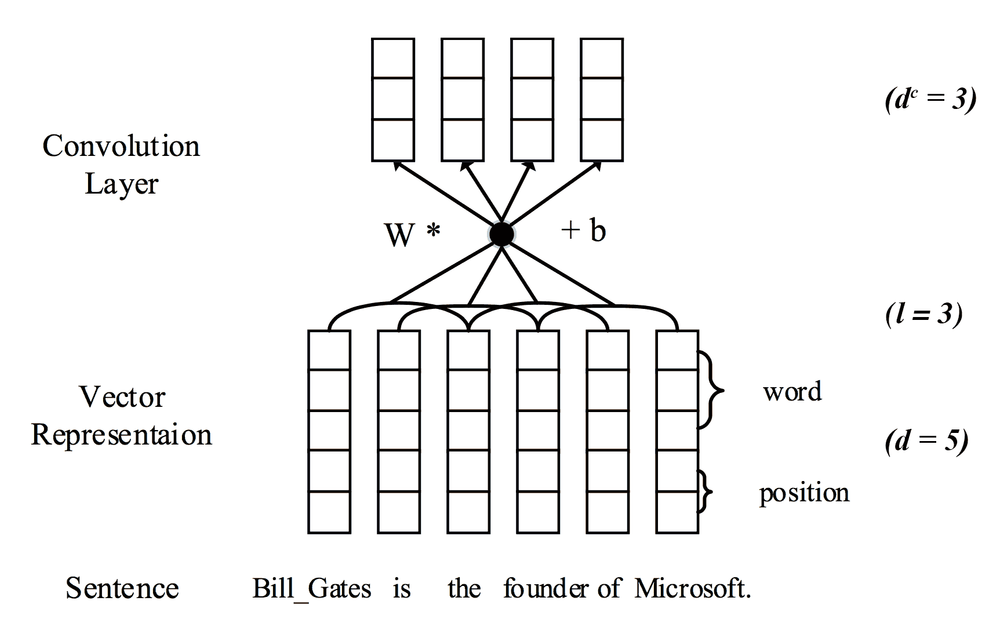
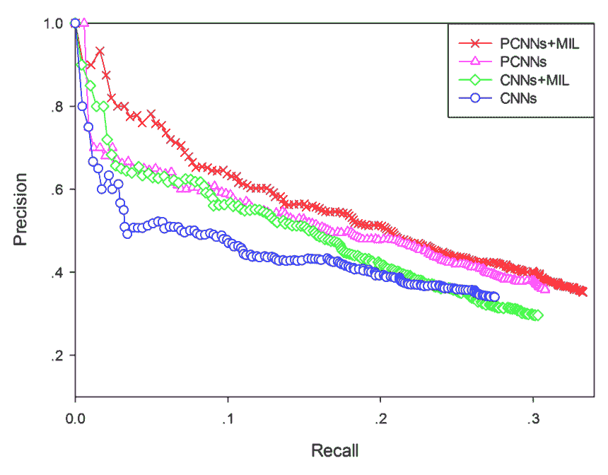
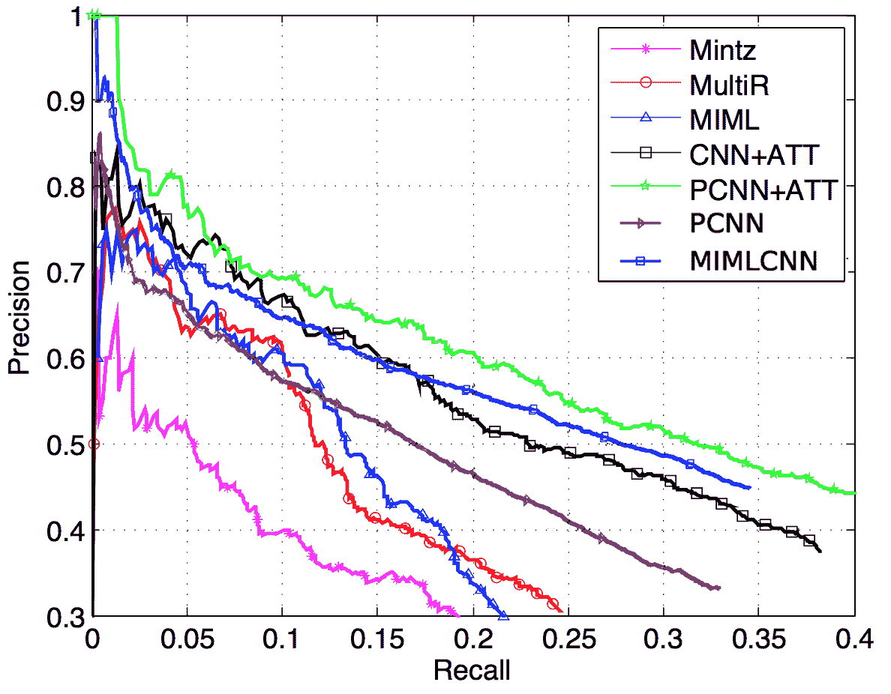

<!--yml

category: 未分类

date: 2024-09-06 20:09:00

-->

# [1705.03645] 深度学习方法综述：关系抽取

> 来源：[`ar5iv.labs.arxiv.org/html/1705.03645`](https://ar5iv.labs.arxiv.org/html/1705.03645)

# 深度学习方法综述：关系抽取

Shantanu Kumar

印度德里理工学院

ee1130798@iitd.ac.in

###### Abstract

关系抽取是信息抽取的重要子任务，有可能利用深度学习（DL）模型通过远程监督创建大型数据集。在本综述中，我们比较了用于该任务的各种 DL 模型的贡献和缺陷，以指导未来的发展道路。

## 1 Introduction

信息抽取（IE）是自然语言处理的任务，涉及从纯文本中提取结构化信息，这些信息可以被机器或程序轻松解释。由于互联网上充斥着大量文本数据，IE 系统非常重要。它们可以从这些文本中提取有意义的事实，然后用于搜索和问答等应用。像 Freebase（Bollacker 等人，2008）和 DBpedia（Auer 等人，2007）这样的知识库是有用信息的来源，但远未完善，可以使用这些系统进行扩展。信息抽取本身是一个包含多个子任务的巨大任务，如命名实体识别、关系抽取、事件抽取等。在本综述中，我们特别关注用于关系抽取子任务的深度学习方法。

信息抽取（IE）可以在无监督或半监督领域中进行，以 OpenIE 的形式进行，其中我们没有任何预定义的本体论或关系类别，我们从数据中提取事实以及关系短语。在监督领域中，关系抽取和分类任务特指将实体对分类到一组已知关系中，使用包含实体对提及的文档。关系抽取任务是指预测给定文档是否包含一个关系对（建模为二元分类）。关系分类是指预测文档指向给定本体中的哪个关系类别，假设文档确实包含一个关系（建模为多类分类问题）。这两个任务可以通过将多类分类问题与额外的 NoRelation 类结合来进行。

传统的非深度学习方法通常在监督范式中进行关系抽取。它们可以分为两类：基于特征的方法和基于核方法。在这两种方法中，提取的特征和精心设计的核函数使用预先存在的自然语言处理系统，这导致各模块的错误在下游累积。此外，手动构建的特征可能无法捕捉到所需的所有相关信息。进入深度学习领域后，这种需要手动工程特征的需求被消除。

机器学习的监督技术需要大量的训练数据来学习。使用手工标注的数据集进行关系抽取需要大量时间和精力来制作这些数据集。Mintz 等人（2009）提出了一种远程监督方法，通过将知识库事实与文本对齐来生成大量的训练数据。这样大规模的数据集允许学习更复杂的模型，例如卷积神经网络。通过远程监督生成的数据集中存在的噪音也需要特殊的建模方式来解决问题，如后续章节中讨论的多实例学习。

## 2 数据集

### 2.1 监督训练

使用深度学习进行关系抽取的早期作品采用了之前非深度学习模型使用过的监督训练数据集。这些数据集需要进行大量人工标注，这意味着数据中包含了高质量的元组，几乎没有噪音。但是人工标注可能非常耗时，因此这些数据集通常较小。下面提到的两个数据集都包含数据样本，其中文档句子已经标记了感兴趣的命名实体，并且需要预测实体对之间表达的关系类别。

ACE 2005 数据集

自动内容提取数据集包含 599 篇与新闻和电子邮件相关的文档，并包含分为 7 种主要类型的关系。其中 6 种主要关系类型包含足够数量的实例（每种关系类型平均 700 个实例），并用于训练和测试。

SemEval-2010 任务 8 数据集

这是由 Hendrickx 等人（2009）提供的免费数据集，包含 10,717 个样本，其中 8,000 个用于训练，2,717 个用于测试。它包含 9 种关系类型，这些是有序关系。由于关系的方向性，关系的数量有效地翻倍，因为只有当实体对的顺序也正确时，才认为标记正确。因此，最终数据集具有 19 种关系类别（2 $\times$ 9 + 1 表示其他类别）。

### 2.2 远程监督

为了避免手动构建关系提取数据集的繁琐任务，Mintz 等人（2009）提出了一种远程监督方法，用于自动生成大量训练数据。他们将文档与已知的知识库对齐，假设如果知识库中存在实体对之间的关系，那么每个包含该实体对提及的文档都会表达该关系。很容易意识到，这种远程监督假设是一个非常强的假设，并且每个包含实体对提及的文档可能并不表达实体对之间的关系。例如，对于数据库中的元组（Microsoft, Founder_of, Microsoft）和文档“比尔·盖茨转向慈善事业与微软在美国和欧盟的反垄断问题有关”，该文档尽管包含了两个实体，但并没有表达 Founder_of 关系。

为了缓解这个问题并减少噪声，Riedel 等人（2010）通过将问题建模为多实例学习问题来放宽远程监督假设（在随后的部分中描述）。他们使用的数据集是后续基于远程监督进行关系提取工作的最流行数据集。该数据集是通过将 Freebase 关系与纽约时报语料库（NYT）对齐形成的。在文档中使用斯坦福命名实体标注器找到实体提及，并进一步与 Freebase 实体名称匹配。共有 53 种可能的关系类别，包括一个特殊的 NA 关系，表示实体对之间没有关系。训练数据包含 522,611 个句子、281,270 个实体对和 18,252 个关系事实。测试集包含 172,448 个句子、96,678 个实体对和 1,950 个关系事实。

对于这个数据集的评估通常是通过将提取的事实与 Freebase 中的条目进行比较。然而，由于 Freebase 不是一个完整的知识库，评估方案受到假阴性影响，从而削弱了模型的性能。然而，对于比较研究来说，评估方案还是有效的。

## 3 基本概念

下一节讨论一些在大多数关系提取深度学习模型中常见的基本概念。

### 3.1 词嵌入

词嵌入（Mikolov 等人，2013；Pennington 等人，2014）是一种分布式表示形式，其中每个单词在一个低维空间中表示为一个向量（相对于词汇表的大小而言较低维）。词嵌入旨在捕捉单词的句法和语义信息。它们使用无监督方法在大规模未标记文本语料库上学习。它们使用嵌入矩阵$E\in\mathbb{R}^{|V|\times d_{w}}$实现，其中$d_{w}$是嵌入空间的维度，$|V|$是词汇表的大小。

### 3.2 位置信息嵌入

在关系抽取任务中，除了词嵌入外，模型的输入通常还编码每个词与句子中实体的相对距离，借助位置嵌入（如 Zeng 等人 (2014) 介绍的）。这有助于网络跟踪每个词与每个实体的距离。其思想是，距离目标实体较近的词通常包含更多有关关系类别的有用信息。位置嵌入包括当前词与实体的相对距离。例如，在句子 “Bill_Gates is the founder of Microsoft.” 中，词 “founder” 对主实体 “Bill_Gates” 的相对距离为 3，对尾实体 “Microsoft” 的相对距离为 -2。然后这些距离被编码在一个 $d_{p}$ 维的嵌入中。

最后，整体句子 $x$ 可以表示为向量序列 $x=\{w_{1},w_{2},...,w_{m}\}$，其中每个词 $w_{i}\in\mathbb{R}^{d}$，且 $d=d_{w}+2\times d_{p}$。

### 3.3 卷积神经网络

为了进一步编码句子，关系抽取的深度学习模型通常使用卷积神经网络层来捕捉 n-gram 级别的特征，这与 Collobert 等人 (2011) 的方法类似。卷积层的操作如下。给定输入句子 $x$ 为一系列向量 $x=\{w_{1},w_{2},...,w_{m}\},w_{i}\in\mathbb{R}^{d}$，如果 $l$ 是卷积层内核的窗口大小，则第 $i$ 个窗口的向量 ($q_{i}\in\mathbb{R}^{(d\times l)}$) 通过连接该窗口的输入向量来形成，

|  | $q_{i}=w_{i:i+l-1};(1\leq i\leq m-l+1)$ |  | (1) |
| --- | --- | --- | --- |

单个卷积核将由一个权重向量 $W\in\mathbb{R}^{(d\times l)}$ 和一个偏置 $b\in\mathbb{R}$ 组成，第 $i$ 个窗口的输出计算为，

|  | $p_{i}=f(W^{\prime}q_{i}+b)$ |  | (2) |
| --- | --- | --- | --- |

其中 $f$ 是激活函数。因此，卷积核 $p$ 的输出形状为 $p\in\mathbb{R}^{(m-l+1)}$。一个卷积层可以包含 $d_{c}$ 个卷积核，这样卷积层的输出形状将为 $\mathbb{R}^{d_{c}\times(m-l+1)}$。

图 1：具有词嵌入和位置嵌入的编码器结构，后跟卷积层。（来源于 (Lin 等人, 2016))

| 模型 |
| --- |

&#124; 多实例 &#124;

&#124; 学习 &#124;

|

&#124; 词汇 &#124;

&#124; 嵌入 &#124;

|

&#124; 位置 &#124;

&#124; 嵌入 &#124;

|

&#124; 额外 &#124;

&#124; 词汇 &#124;

&#124; 特征 &#124;

| 最大池化 |
| --- | --- | --- | --- | --- | --- |
| Liu 等人 (2013) | 否 | 随机 | 否 | 是 | 否 |
| Zeng 等人 (2014) | 否 | 预训练 |

&#124; 是 &#124;

&#124; （未训练） &#124;

| 是 | 是 |
| --- | --- |

|

&#124; Nguyen 和 &#124;

&#124; Grishman (2015) &#124;

| 否 | Word2Vec | 是 | 否 | 是 |
| --- | --- | --- | --- | --- |

|

&#124; PCNN &#124;

&#124; Zeng 等 (2015) &#124;

|

&#124; 是 &#124;

&#124; (1 句子 &#124;

&#124; 每个包) &#124;

| Word2Vec | 是 | 否 |
| --- | --- | --- |

&#124; 是 &#124;

&#124; (分段在 &#124;

&#124; 一个句子) &#124;

|

|

&#124; PCNN + Att &#124;

&#124; Lin 等 (2016) &#124;

|

&#124; 是 &#124;

&#124; (注意力加权 &#124;

&#124; 在包上求和) &#124;

| Word2Vec | 是 | 否 |
| --- | --- | --- |

&#124; 是 &#124;

&#124; (分段 &#124;

&#124; 和完整) &#124;

|

|

&#124; MIMLCNN &#124;

&#124; Jiang 等 (2016) &#124;

|

&#124; 是 &#124;

&#124; (每个 &#124;

&#124; 特征的最大值) &#124;

| Word2Vec | 是 | 否 |
| --- | --- | --- |

&#124; 是 &#124;

&#124; (跨句子 &#124;

&#124; 在包中) &#124;

|

表 1：使用 CNN 进行关系抽取的各种模型中使用的特征总结

## 4 使用 CNN 的监督学习

早期使用深度学习进行关系抽取的工作采用了之前提到的手工标注的语料库进行监督训练。这些模型尝试将关系类别标签分配给每个包含关注的实体对提及的句子，通过将问题建模为多类分类问题。

### 4.1 简单的 CNN 模型  (Liu 等，2013)

这项工作可能是最早尝试使用 CNN 自动学习特征而不是手工制作特征的研究。它构建了一个端到端的网络，首先使用词向量和词汇特征对输入句子进行编码，然后通过卷积核层、单层神经网络和 softmax 输出层来提供所有关系类别的概率分布。

该模型使用同义词向量而不是词向量，通过为每个同义词类别分配一个向量，而不是为每个单独的词分配一个向量。然而，它未能利用词嵌入的真正表示能力。这些嵌入没有在语料库上以无监督的方式进行训练，而是随机分配给每个同义词类别。此外，该模型还尝试使用词汇表、词性标签列表和实体类型列表来结合一些词汇特征。研究发现，该模型在 ACE 2005 数据集上比当时最先进的基于核的方法提高了 9 个 F 分数点。虽然该模型还有多个改进之处，但作为初步步骤，它证明了深度学习模型可以表现得与精心设计的基于特征或基于核的模型一样好，甚至更好。

### 4.2 带有最大池化的 CNN 模型  (Zeng 等，2014)

与之前的模型类似，本文使用 CNN 对句子级特征进行编码。但与之前的论文不同，他们使用了在大规模未标注语料库上预训练的词嵌入。本文也是首次使用前面描述的**位置嵌入**的工作，这些嵌入被标准化并应用于所有后续的关系提取深度学习模型。该模型还使用了词汇级特征，如句子中的名词信息以及名词的 WordNet 上位词。

该模型的重要贡献之一是对卷积网络输出应用了最大池化层。卷积层的输出$Z\in\mathbb{R}^{d_{c}\times(m-l+1)}$依赖于输入句子的大小$m$。为了使该输出独立于$m$并捕捉句子中每个维度的最有用特征，采用了最大操作将$Z$压缩为$Z^{\prime}\in\mathbb{R}^{d_{c}}$。因此，$Z^{\prime}$的维度不再与句子长度$m$相关。该模型被证明优于使用各种词汇特征的 SVM 和 MaxEnt 基模型。他们的消融研究还表明，位置嵌入在 F-score 上提高了近 9%。

### 4.3 使用多尺寸窗口核的 CNN（Nguyen 和 Grishman，2015）

这项工作是监督领域中关系提取的最后几项工作之一，建立在 Liu 等人（2013）和 Zeng 等人（2014）的工作基础上。该模型完全去除了外部词汇特征，以丰富输入句子的表示，并让 CNN 自行学习所需特征。他们的架构类似于 Zeng 等人（2014），包括词和位置嵌入，然后是卷积和最大池化。此外，他们还结合了不同窗口大小的卷积核，以捕捉更广泛的 n-gram 特征。通过实验不同的迭代，他们发现使用 2-3-4-5 窗口长度的卷积核可以获得最佳性能。作者还使用预训练的 word2vec（Mikolov 等人，2013）初始化词嵌入矩阵，这比随机向量和静态 word2vec 向量提供了显著提升。

## 5 多实例学习模型与远程监督

正如之前提到的，Riedel 等人 (2010) 通过将任务建模为多实例学习问题来放宽远程监督的假设，从而能够利用远程监督创建的大量训练数据，同时对标签中的噪声具有鲁棒性。多实例学习是一种监督学习形式，其中标签赋予给一组实例的包，而不是单个实例。在关系抽取的背景下，每个实体对定义一个包，包含所有包含实体对提及的句子。不是为每个句子赋予关系类标签，而是为每个关系实体的包赋予标签。Riedel 等人 (2010) 使用这一假设建模，即“如果实体对之间存在关系，则包中至少一个文档必须反映该关系”。

### 5.1 分段卷积神经网络 (Zeng 等人，2015)

PCNNs 模型采用多实例学习范式，使用神经网络模型基于远程监督数据构建关系提取器。神经网络的架构类似于之前讨论过的 (Zeng 等人，2014) 和 (Nguyen 和 Grishman，2015) 的模型，其中一个重要贡献是句子中的分段最大池化。作者声称，最大池化层显著减小了隐藏层的大小，但仍然不足以捕捉句子中实体之间的结构。这可以通过在句子的不同段落中进行最大池化来避免。据称，每个句子根据焦点实体的位置可以自然地分为 3 个段落。在每个段落内进行分段最大池化，我们可以获得更丰富的表示，同时仍然保持与输入句子长度无关的向量。

该模型的一个缺点是多实例问题在损失函数中的设置方式，这在后续模型中得到了解决。文中定义了模型训练的损失函数如下。给定 $T$ 个文档包，每个包含 $q_{i}$ 个文档并具有标签 $y_{i}$，$i=1,2..,T$，神经网络给出从包 $i$ 的文档 $j$ 中提取关系 $r$ 的概率，$d_{i}^{j}$ 表示为，

|  | $p(r&#124;d_{i}^{j},\theta);j=1,2,...,q_{i}$ |  | (3) |
| --- | --- | --- | --- |

这里 $\theta$ 是神经网络的权重参数。然后损失函数定义为，

|  | $J(\theta)=\sum_{i=1}^{T}\text{log}p(y_{i}&#124;d_{i}^{j^{*}},\theta)$ |  | (4) |
| --- | --- | --- | --- |
|  | $j^{*}=\text{arg}\text{max}_{j}p(y_{i}&#124;d_{i}^{j},\theta);j=1,2...,q_{i}$ |  | (5) |

因此，由于该方法假设“至少一个包中的文档表达了实体对之间的关系”，在训练和预测阶段仅使用实体对的最有可能的文档。这意味着该模型忽略了大量包中其他句子表达的有用数据和信息。尽管不是所有包中的句子都表达了实体对之间的正确关系，但仅使用一个句子是一个非常严格的限制。这个问题在后续的工作中得到了解决。

PCNNs 模型通过多实例学习显示出优于传统非深度学习模型，如 Mintz 等人（2009）基于远程监督的模型，Hoffmann 等人（2011）提出的多实例学习方法 MultiR，以及 Surdeanu 等人（2012）提出的多实例多标签模型 MIML，在 Riedel 等人（2010）的数据集上（见图 3）。这些结果在后文进一步讨论。他们的消融研究还显示出 PCNNs 相对于 CNNs 和传统学习的优势，两者都逐步添加到模型中，如图 2 所示。

图 2：分段最大池化和多实例学习的效果。（来源自(Zeng 等人，2015））

### 5.2 选择性注意力跨实例（Lin 等人，2016）

为了解决之前模型仅使用包中最相关句子的缺点，Lin 等人（2016）针对多实例问题使用了对袋中所有实例的注意力机制。在该模型中，袋中的每个句子$d_{i}^{j}$首先通过 PCNN 或 CNN 编码成向量表示$r_{i}^{j}$，如前所述。然后通过对袋中所有句子向量（$r_{i}^{j}, j=1,2...q_{i}$）进行加权平均来找到袋中句子的最终向量表示。模型为袋中的每个实例$d_{i}^{j}$计算权重$\alpha_{j}$。这些$\alpha$值在每个包中是动态的，取决于关系类型和文档实例。袋中句子的最终特征向量如下定义：

| -   |  | $r_{i}=\sum_{j=1}^{q_{i}}\alpha_{j}r_{i}^{j}$ |  | (6) |
| --- | --- | --- | --- | --- |

当使用这种关注加权表示袋中所有实例的损失时，模型能够固有地识别重要句子和噪声句子，利用袋中的所有信息来进行关系类别预测。

还可以观察到，PCNN 论文中使用的“只有一个最可能的句子”模型是选择性注意程序的特例，其中 $\alpha_{j^{*}}=1$ 仅对 $j^{*}$ 如公式 (5) 定义，所有其他 $\alpha$ 值为零（硬注意）。研究表明，使用这种选择性注意程序显著提高了 CNN 和 PCNN 模型的精确度召回曲线。模型能够以更高的置信度预测正确的关系，因为它能够在包中的多个句子上收集证据。

### 5.3 多实例多标签 CNNs (Jiang et al., 2016)

论文的作者通过使用跨文档最大池化层解决了 Zeng 等人 (2015) 的信息丢失问题。与注意力模型类似，他们首先为包 $i$ 的每个句子 $d_{i}^{j}$ 找到一个向量表示 $r_{i}^{j}$。然后通过对句子向量 ($r_{i}^{j},j=1,2...q_{i}$) 进行维度最大值来找到句子包的最终向量表示。句子包的最终特征向量表示为，

|  | $(r_{i})_{k}=\max_{j=1,2...q_{i}}(r_{i}^{j})_{k};k=1,2...D$ |  | (7) |
| --- | --- | --- | --- |

其中 $r_{i}^{j},r_{i}\in\mathbb{R}^{D}$。这使得最终特征向量中的每个特征都来自于该特征最突出的文档，而不是整个特征向量都来自于整体最突出的文档。

论文还讨论了多标签在关系抽取中的问题。到目前为止，所有模型都为实体对预测一个单一的关系类别。但同一实体对可能有多个关系（称为重叠关系），这些关系由不同文档支持。例如，(Steve_Jobs, Founded, Apple) 和 (Steve_Jobs, CEO_of, Apple) 都是同一实体对 (Steve_Jobs, Apple) 的有效关系，可能由不同的句子支持。作者将架构修改为在最终层使用 sigmoid 激活函数，而不是 softmax 激活函数，这意味着网络会独立预测每个关系类别的概率，而不是预测关系的概率分布。训练模型的损失定义为，

|  | $J(\theta)=\sum_{i=1}^{T}\sum_{r=1}^{R}y_{r}^{i}\text{log}p_{r}^{i}+(1-y_{r}^{i})\text{log}(1-p_{r}^{i})$ |  | (8) |
| --- | --- | --- | --- |

其中 $R$ 是关系类别的数量，$p_{r}^{i}$ 是网络预测包 $i$ 具有关系 $r$ 的概率，$y_{r}^{i}$ 是一个二元标签，表示包 $i$ 是否具有关系 $r$。

MIMLCNN 模型能够像选择性注意机制一样提高 PCNN 和 CNN 模型的性能，因为它能够利用包中多个文档的信息，通过对每个特征使用最突出的文档。结果将在下一节进一步讨论。

## 6 结果

图 3 总结了应用于 Riedel 等人（2010）创建的远程监督数据集的各种多实例学习模型的结果。它展示了 3 个非深度学习模型的结果，即 Mintz（Mintz et al., 2009）、MultiR（Hoffmann et al., 2011）和 MIML（Surdeanu et al., 2012）。我们还可以看到前述部分讨论的深度学习模型的表现。

观察到所有深度学习模型的表现明显优于非深度学习模型。使用多实例多标签（MIMLCNN）机制的 CNN 模型进一步改善了 PCNN 模型的曲线。然而，应用于 PCNN 模型的选择性注意机制在所有模型中表现最佳。值得注意的是，相较于 MIMLCNN 曲线，PCNN 曲线到 PCNN+Att 曲线的性能提升是有趣的。由于注意机制是一种软选择机制，它比 MIMLCNN 中使用的跨文档最大机制更具鲁棒性，能够更有效地利用句子之间的信息。

图 3：多实例学习模型的结果。（来源于（Lin et al., 2016）和（Jiang et al., 2016））

## 7 结论

随着 Mintz 等人（2009）引入的远程监督用于关系抽取，将任务建模为多实例问题已被广泛采用。使用这种机制还提供了足够的数据以在多实例设置中训练深度学习模型，这可以容纳数据中的标签噪声。后续的工作尝试通过选择性注意机制和跨文档最大池化等机制来处理噪声和远程监督假设，这些机制已显示出提升性能的效果。该领域一些非常新的工作也尝试通过利用关系路径（Zeng et al., 2016）和关系类联系（Ye et al., 2016）来进一步提升性能。例如，可以利用 Father_of 和 Mother_of 等关系来提取 Spouse_of 的实例。

然而，这些改进仅适用于模型的训练和推断方法。就深度学习方面而言，用于编码句子的 CNN 或 PCNN 架构在所有这些工作中都是相同的。令人惊讶的是，据我们所知，没有任何关系抽取任务的工作尝试使用递归神经网络（RNNs）来替代 CNNs 进行句子编码。RNNs 和 LSTMs 直观上更适合自然语言任务。尽管 NLP 文献并未明确区分 CNNs 和 RNNs 在哪些领域表现更好，但近期的研究表明，每种方法在文本分类任务中提供了互补的信息（Yin et al., 2017）。RNNs 在文档级情感分类中表现良好（Tang et al., 2015），而一些研究则表明 CNNs 在语言建模任务中优于 LSTMs（Dauphin et al., 2016）。因此，未来的关系抽取工作可以尝试使用 LSTMs 进行句子和关系的编码实验。

## 参考文献

+   Auer et al. (2007) Sören Auer, Christian Bizer, Georgi Kobilarov, Jens Lehmann, Richard Cyganiak, and Zachary Ives. 2007. Dbpedia：开放数据网络的核心。发表于《语义网》，Springer，第 722–735 页。

+   Bollacker et al. (2008) Kurt Bollacker, Colin Evans, Praveen Paritosh, Tim Sturge, and Jamie Taylor. 2008. Freebase：一个协作创建的图数据库，用于结构化人类知识。发表于 SIGMOD ’08。AcM，第 1247–1250 页。

+   Collobert et al. (2011) Ronan Collobert, Jason Weston, Léon Bottou, Michael Karlen, Koray Kavukcuoglu, and Pavel Kuksa. 2011. 从头开始的自然语言处理。机器学习研究杂志 12（8 月）：2493–2537。

+   Dauphin et al. (2016) Yann N Dauphin, Angela Fan, Michael Auli, and David Grangier. 2016. 使用门控卷积网络的语言建模。arXiv 预印本 arXiv:1612.08083。

+   Hendrickx et al. (2009) Iris Hendrickx, Su Nam Kim, Zornitsa Kozareva, Preslav Nakov, Diarmuid Ó Séaghdha, Sebastian Padó, Marco Pennacchiotti, Lorenza Romano, and Stan Szpakowicz. 2009. Semeval-2010 任务 8：名词对之间语义关系的多重分类。发表于《语义评估研讨会论文集》。ACL，第 94–99 页。

+   Hoffmann et al. (2011) Raphael Hoffmann, Congle Zhang, Xiao Ling, Luke Zettlemoyer, and Daniel S Weld. 2011. 基于知识的弱监督用于重叠关系的信息抽取。发表于《第 49 届计算语言学协会年会：人类语言技术-第 1 卷论文集》。ACL，第 541–550 页。

+   Jiang et al. (2016) Xiaotian Jiang, Quan Wang, Peng Li, and Bin Wang. 2016. 使用多实例多标签卷积神经网络进行关系抽取。发表于 COLING 2016，第 26 届国际计算语言学会议：技术论文集，第 1471–1480 页。

+   Lin 等人（2016）Yankai Lin，Shiqi Shen，Zhiyuan Liu，Huanbo Luan 和 Maosong Sun。2016 年。具有实例选择性注意力的神经关系抽取。在 ACL 会议论文集上的卷 1，页面 2124–2133。

+   Liu 等人（2013）ChunYang Liu，WenBo Sun，WenHan Chao 和 Wanxiang Che。2013 年。用于关系抽取的卷积神经网络。在国际高级数据挖掘与应用会议上。Springer，页面 231–242。

+   Mikolov 等人（2013）Tomas Mikolov，Ilya Sutskever，Kai Chen，Greg S Corrado 和 Jeff Dean。2013 年。词和短语的分布式表示及其组合性。在神经信息处理系统的进展中。页面 3111–3119。

+   Mintz 等人（2009）Mike Mintz，Steven Bills，Rion Snow 和 Dan Jurafsky。2009 年。远程监督关系抽取而不使用标记数据。在 ACL 年会和 AFNLP 国际联合会议的论文集上。ACL，页面 1003–1011。

+   Nguyen 和 Grishman（2015）Thien Huu Nguyen 和 Ralph Grishman。2015 年。关系抽取：来自卷积神经网络的视角。在 NAACL-HLT 的会议论文集上。页面 39–48。

+   Pennington 等人（2014）Jeffrey Pennington，Richard Socher 和 Christopher D. Manning。2014 年。[Glove：全局词向量表示](http://www.aclweb.org/anthology/D14-1162)。在自然语言处理的经验方法（EMNLP）上。页面 1532–1543。[`www.aclweb.org/anthology/D14-1162`](http://www.aclweb.org/anthology/D14-1162)。

+   Riedel 等人（2010）Sebastian Riedel，Limin Yao 和 Andrew McCallum。2010 年。在没有标记文本的情况下建模关系及其提及。在联合欧洲机器学习和数据库知识发现会议上。Springer，页面 148–163。

+   Surdeanu 等人（2012）Mihai Surdeanu，Julie Tibshirani，Ramesh Nallapati 和 Christopher D Manning。2012 年。关系抽取的多实例多标签学习。在 2012 年联合会议上的 ACL，页面 455–465。

+   Tang 等人（2015）Duyu Tang，Bing Qin 和 Ting Liu。2015 年。用门控循环神经网络进行情感分类的文档建模。在 EMNLP 上。页面 1422–1432。

+   Ye 等人（2016）Hai Ye，Wenhan Chao 和 Zhunchen Luo。2016 年。通过有效的深度排名共同提取具有类关系的关系。arXiv 预印本 arXiv:1612.07602。

+   Yin 等人（2017）Wenpeng Yin，Katharina Kann，Mo Yu 和 Hinrich Schütze。2017 年。卷积神经网络和循环神经网络在自然语言处理中的比较研究。arXiv 预印本 arXiv:1702.01923。

+   Zeng 等人（2015）Daojian Zeng，Kang Liu，Yubo Chen 和 Jun Zhao。2015 年。通过分段卷积神经网络进行远程监督关系抽取。在 EMNLP 上。页面 1753–1762。

+   Zeng 等人（2014）Daojian Zeng, Kang Liu, Siwei Lai, Guangyou Zhou, Jun Zhao 等人。2014 年。通过卷积深度神经网络进行关系分类。发表在 COLING 会议上。第 2335–2344 页。

+   Zeng 等人（2016）Wenyuan Zeng, Yankai Lin, Zhiyuan Liu 和 Maosong Sun。2016 年。将关系路径融入神经关系提取。arXiv 预印本 arXiv:1609.07479。
