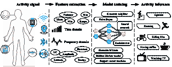
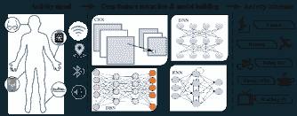

<!--yml

分类：未分类

日期：2024-09-06 20:08:56

-->

# [1707.03502] 基于传感器的活动识别中的深度学习：综述

> 来源：[`ar5iv.labs.arxiv.org/html/1707.03502`](https://ar5iv.labs.arxiv.org/html/1707.03502)

# 基于传感器的活动识别中的深度学习：综述

Jindong Wang Yiqiang Chen yqchen@ict.ac.cn Shuji Hao Xiaohui Peng Lisha Hu 北京市移动计算与普适设备重点实验室，计算技术研究所，中国科学院，北京，中国科学院大学，北京，新加坡 A*STAR 高性能计算研究所

###### 摘要

基于传感器的活动识别旨在从大量低级传感器读数中获取关于人类活动的深层次高级知识。传统的模式识别方法在过去几年取得了巨大进展。然而，这些方法往往严重依赖于启发式手工特征提取，这可能会妨碍它们的泛化性能。此外，现有方法在无监督和增量学习任务中效果不佳。近年来，深度学习的进展使得自动进行高级特征提取成为可能，从而在许多领域中取得了令人满意的性能。自那时起，基于深度学习的方法已被广泛应用于基于传感器的活动识别任务。本文综述了基于深度学习的传感器活动识别的最新进展。我们从传感器模态、深度模型和应用三个方面总结了现有文献。我们还对现有工作进行了详细的见解，并提出了未来研究的重大挑战。

关键词：深度学习；活动识别；模式识别；普适计算

^†^†期刊：模式识别快报

## 研究亮点（必填）

要创建您的亮点，请在每个`\item`命令下输入亮点。

这应是一个简短的要点集合，传达文章的核心发现。应包括 3 到 5 个要点（每个要点最多 85 个字符，包括空格）。 • 我们调查了基于深度学习的传感器模态、深度模型和应用中的人体活动识别。 • 我们全面讨论了深度学习模型在人体活动识别任务中的见解。 • 我们广泛研究了深度学习如何提升人体活动识别的性能。 • 我们还总结了用于研究目的的公共人体活动识别数据集。 • 我们提出了一些重大挑战和可行的解决方案，以推动基于深度学习的身体活动识别。

## 1 引言

人类活动识别（HAR）在日常生活中发挥着重要作用，因为它能够从原始传感器输入中学习到深层次的关于人类活动的知识。成功的 HAR 应用包括家庭行为分析（Vepakomma et al., 2015）、视频监控（Qin et al., 2016）、步态分析（Hammerla et al., 2016）和手势识别（Kim and Toomajian, 2016）。HAR 主要有两种类型：基于视频的 HAR 和基于传感器的 HAR（Cook et al., 2013）。基于视频的 HAR 分析来自摄像机的视频或图像中的人类动作，而基于传感器的 HAR 侧重于来自智能传感器（如加速度计、陀螺仪、蓝牙、声音传感器等）的运动数据。由于传感器技术和普遍计算的发展迅速，基于传感器的 HAR 正变得越来越流行，并且隐私得到了很好的保护。因此，在本文中，我们的主要关注点是基于传感器的 HAR。

HAR 可以视为一种典型的模式识别（PR）问题。传统的 PR 方法通过采用机器学习算法（如决策树、支持向量机、朴素贝叶斯和隐马尔可夫模型）在 HAR 领域取得了巨大进展（Lara and Labrador, 2013）。难怪在某些受控环境中，当标记数据稀少或需要特定领域知识（例如某些疾病问题）时，传统的 PR 方法能够取得令人满意的结果。然而，在大多数日常 HAR 任务中，这些方法可能严重依赖启发式的人工特征提取，这通常受到人工领域知识的限制（Bengio, 2013）。此外，这些方法只能学习浅层特征（Yang et al., 2015），导致无监督和增量任务的性能受到影响。由于这些局限性，传统 PR 方法在分类准确性和模型泛化方面的表现受到限制。

近年来，深度学习的发展迅速，在视觉对象识别、自然语言处理和逻辑推理等多个领域取得了无与伦比的成果（LeCun et al., 2015）。与传统的模式识别（PR）方法不同，深度学习在很大程度上减轻了特征设计的工作量，并且通过训练端到端的神经网络可以学习到更多高级和有意义的特征。此外，深层网络结构更适合进行无监督和增量学习。因此，深度学习是人类活动识别（HAR）的理想方法，并在现有的研究中得到了广泛的探索（Lane et al., 2015; Alsheikh et al., 2016; Plötz et al., 2011）。

尽管在深度学习（LeCun 等，2015；Schmidhuber，2015；Bengio，2013）和 HAR（Lara 和 Labrador，2013；Bulling 等，2014）领域已有一些调查研究，但尚无专门关注这两个领域交集的调查。根据我们所知，这是第一篇介绍深度学习基础的 HAR 最新进展的文章。我们希望这份调查能提供现有工作的有益总结，并提出潜在的未来研究方向。

本文的其余部分组织如下。在第二部分，我们简要介绍传感器基础活动识别，并解释为什么深度学习可以提高其性能。在第 3、4 和 5 节，我们从传感器模态、深度模型和应用三个方面回顾了深度学习基础的 HAR 的最新进展。我们还介绍了几个基准数据集。第六部分总结并深入探讨了现有工作。在第七部分，我们讨论了一些重大挑战和可行的解决方案。最后，本文在第八部分总结。

图 1：使用传统模式识别方法的传感器基础活动识别的示意图。

## 2 背景

### 2.1 传感器基础活动识别

HAR 旨在理解人类行为，从而使计算系统能够根据用户的需求主动提供帮助（Bulling 等，2014）。形式上，假设一个用户正在执行一些属于预定义活动集$A$的活动：

|  | $A=\{A_{i}\}^{m}_{i=1}$ |  | (1) |
| --- | --- | --- | --- |

其中$m$表示活动类型的数量。存在一个传感器读数序列捕获活动信息

|  | $\mathbf{s}=\{\mathbf{d}_{1},\mathbf{d}_{2},\cdots,\mathbf{d}_{t},\cdots\mathbf{d}_{n}\}$ |  | (2) |
| --- | --- | --- | --- |

其中$\mathbf{d}_{t}$表示时间$t$的传感器读数。

我们需要建立一个模型$\mathcal{F}$来预测基于传感器读数$s$的活动序列

|  | $\hat{A}=\{\hat{A}_{j}\}^{n}_{j=1}=\mathcal{F}(\mathbf{s}),\quad\hat{A}_{j}\in A$ |  | (3) |
| --- | --- | --- | --- |

而真实的活动序列（地面实况）表示为

|  | $A^{\ast}=\{A^{\ast}_{j}\}^{n}_{j=1},\quad A^{\ast}_{j}\in A$ |  | (4) |
| --- | --- | --- | --- |

其中$n$表示序列的长度，且$n\geq m$。

HAR 的目标是通过最小化预测活动 $\hat{A}$ 和地面真实活动 $A^{\ast}$ 之间的差异来学习模型 $\mathcal{F}$。通常会构建一个正的损失函数 $\mathcal{L}(\mathcal{F}(\textbf{s}),A^{\ast})$ 来反映它们的差异。$\mathcal{F}$ 通常不会直接以 $\textbf{s}$ 作为输入，而是假设存在一个投影函数 $\Phi$，将传感器读数数据 $\mathbf{d_{i}}\in\mathbf{s}$ 投影到一个 $d$ 维特征向量 $\Phi(\textbf{d}_{i})\in\mathbb{R}^{d}$。因此，目标变为最小化损失函数 $\mathcal{L}(\mathcal{F}(\Phi(\textbf{d}_{i})),A^{\ast})$。

图 1 展示了使用传统 PR 方法进行 HAR 的典型流程图。首先，从多种类型的传感器（智能手机、手表、Wi-Fi、蓝牙、声音等）获取原始信号输入。其次，基于人类知识（Bao 和 Intille，2004）从这些读数中手动提取特征，例如传统机器学习方法中的均值、方差、DC 和幅度（Hu 等，2016）。最后，这些特征作为输入用于训练一个 PR 模型，以在实际 HAR 任务中进行活动推断。

### 2.2 为什么要使用深度学习？

传统 PR 方法在 HAR 方面取得了巨大进展（Bulling 等，2014）。然而，传统 PR 方法存在几个缺点。

首先，特征始终是通过启发式和手工制作的方式提取的，这在很大程度上依赖于人类经验或领域知识。这些人类知识可能在特定任务设置中有所帮助，但对于更一般的环境和任务，这将导致构建成功的活动识别系统的机会较低，时间较长。

第二，根据人类专业知识，只能学习浅层特征（Yang 等，2015）。这些浅层特征通常指一些统计信息，包括均值、方差、频率和幅度等。它们只能用于识别低层次的活动，如行走或跑步，难以推断高层次或上下文感知的活动（Yang，2009）。例如，喝咖啡更为复杂，几乎不可能仅通过浅层特征来识别。

第三，传统 PR 方法通常需要大量的标记数据来训练模型。然而，在实际应用中，大多数活动数据仍然没有标记。因此，在无监督学习任务中，这些模型的性能受到影响（Bengio，2013）。相比之下，现有的深度生成网络能够利用未标记样本进行模型训练（Hinton 等，2006）。

此外，大多数现有的 PR 模型主要集中在从静态数据中学习；而现实生活中的活动数据是连续流动的，需要强大的在线和增量学习。

深度学习倾向于克服这些限制。图 2 展示了深度学习如何通过不同类型的网络进行 HAR。与图 1 相比，深度学习模型中的特征提取和模型构建程序通常是同时进行的。特征可以通过网络自动学习，而不需要手动设计。此外，深度神经网络还可以在深层提取高级表示，这使其更适合复杂的活动识别任务。当面临大量未标记的数据时，深度生成模型（Hinton 等，2006）能够利用未标记的数据进行模型训练。更重要的是，在大规模标记数据集上训练的深度学习模型通常可以迁移到新任务中，即使这些新任务中只有少量或没有标签。

图 2：使用深度学习方法的传感器基础活动识别示意图。

在接下来的章节中，我们主要总结了基于 HAR 流程的现有工作：（a）传感器模式，（b）深度模型，以及（c）应用。

## 3 传感器模式

虽然一些 HAR 方法可以推广到所有传感器模式，但大多数方法仅适用于特定类型的传感器。根据(Chavarriaga 等，2013)，我们主要将这些模式分类为三类：穿戴式传感器、物体传感器和环境传感器。表 1 简要概述了所有这些模式。

### 3.1 穿戴式传感器

穿戴式传感器是人类活动识别（HAR）中最常见的模式之一。这些传感器通常由用户佩戴，例如加速度计、磁力计和陀螺仪。加速度和角速度会根据人体运动而变化，因此它们可以推测人类活动。这些传感器通常可以在智能手机、手表、手环、眼镜和头盔上找到。

穿戴式传感器在基于深度学习的 HAR 研究中被广泛使用（Chen 和 Xue, 2015; Plötz 等, 2011; Zeng 等, 2014; Jiang 和 Yin, 2015; Yang 等, 2015）。在这些研究中，加速度计被广泛采用。陀螺仪和磁力计也常常与加速度计一起使用。这些传感器通常用于识别日常活动（ADL）和运动。与从运动数据中提取统计特征和频率特征不同，原始信号直接作为网络的输入。

表 1: HAR 任务的传感器模态

| 模态 | 描述 | 示例 |
| --- | --- | --- |
| 穿戴式 | 由用户佩戴以描述身体运动 | 智能手机、手表或手环的加速度计、陀螺仪等 |
| 物体 | 附着在物体上以捕捉物体运动 | RFID、杯子上的加速度计等 |
| 环境 | 应用于环境中以反映用户互动 | 声音、门传感器、WiFi、蓝牙等 |
| 混合 | 跨越传感器边界 | 类型的组合，通常部署在智能环境中 |

### 3.2 物体传感器

物体传感器通常放置在物体上以检测特定物体的运动（Chavarriaga 等, 2013）。与捕捉人类运动的穿戴式传感器不同，物体传感器主要用于检测某些物体的运动，以推断人类活动。例如，附着在杯子上的加速度计可以用于检测饮水活动。射频识别（RFID）标签通常用作物体传感器，并部署在智能家居环境（Vepakomma 等, 2015; Yang 等, 2015; Fang 和 Hu, 2014）和医疗活动（Li 等, 2016b; Wang 等, 2016a）中。RFID 可以提供更细粒度的信息以进行更复杂的活动识别。

应注意，由于部署困难，物体传感器的使用频率低于穿戴式传感器。此外，为了识别更多的高级活动，物体传感器与其他类型的组合正在兴起（Yang, 2009）。

### 3.3 环境传感器

环境传感器用于捕捉人类与环境之间的互动。它们通常嵌入在用户的智能环境中。有许多种环境传感器，如雷达、声音传感器、压力传感器和温度传感器。与测量物体运动的物体传感器不同，环境传感器用于捕捉环境的变化。

一些文献使用环境传感器来识别日常活动和手势（Lane et al., 2015；Wang et al., 2016a；Kim and Toomajian, 2016）。大多数工作在智能家居环境中进行了测试。与对象传感器一样，环境传感器的部署也很困难。此外，环境传感器容易受到环境的影响，只有某些类型的活动可以被可靠地推断。

### 3.4 混合传感器

一些研究结合了不同类型的传感器用于 HAR。如（Hayashi et al., 2015）所示，将加速度与声学信息结合可以提高 HAR 的准确性。环境传感器也与对象传感器一起使用，因此它们可以记录物体运动和环境状态。（Vepakomma et al., 2015）设计了一个名为 A-Wristocracy 的智能家居环境，其中多个占用者的大量精细复杂的活动可以通过佩戴式、对象和环境传感器识别。显然，传感器的组合能够捕捉丰富的人类活动信息，这在未来的智能家居系统中也是可能的。

## 4 深度模型

在本节中，我们调查了在 HAR 任务中使用的深度学习模型。表 2 列出了所有模型。

### 4.1 深度神经网络

深度神经网络（DNN）是从人工神经网络（ANN）发展而来的。传统的 ANN 通常包含很少的隐藏层（浅层），而 DNN 包含更多的隐藏层（深层）。随着层数的增加，DNN 能够从大量数据中学习更多。DNN 通常作为其他深度模型的密集层。例如，在卷积神经网络中，卷积层后通常会添加几个密集层。在这一部分，我们主要关注 DNN 作为单一模型，而在其他部分我们将讨论密集层。

（Vepakomma et al., 2015）首先从传感器中提取手工工程特征，然后将这些特征输入到 DNN 模型中。类似地，（Walse et al., 2016）在使用 DNN 之前进行了 PCA。在这些工作中，DNN 仅作为手工特征提取后的分类模型，因此它们可能不能很好地泛化。而且网络相当浅。（Hammerla et al., 2016）使用了一个 5 层隐藏层的 DNN 进行自动特征学习和分类，并取得了更好的性能。这些工作表明，当 HAR 数据是多维的且活动更复杂时，更多的隐藏层可以帮助模型更好地训练，因为它们的表示能力更强（Bengio, 2013）。然而，在某些情况下，还需考虑更多细节以帮助模型更好地微调。

### 4.2 卷积神经网络

卷积神经网络（ConvNets 或 CNN）利用了三个重要的思想：稀疏交互、参数共享和等变表示（LeCun 等，2015）。经过卷积后，通常会有池化和全连接层，这些层执行分类或回归任务。

CNN 擅长从信号中提取特征，并在图像分类、语音识别和文本分析中取得了良好效果。在应用于时间序列分类（如 HAR）时，CNN 相较于其他模型有两个优势：局部依赖性和尺度不变性。局部依赖性指的是 HAR 中的相邻信号可能相关，而尺度不变性指的是不同步伐或频率下的尺度不变。由于 CNN 的有效性，大多数调研工作集中在这一领域。

在将 CNN 应用于 HAR 时，需要考虑多个方面：输入适配、池化和权重共享。

1) 输入适配。与图像不同，大多数 HAR 传感器产生的是时间序列读数，例如加速度信号，这是时间上的多维 1D 读数。在将 CNN 应用于这些输入之前，输入适配是必要的。主要思想是将输入适配成虚拟图像。适配主要有两种类型：模型驱动和数据驱动。

+   •

    数据驱动方法将每个维度视为一个通道，然后对它们进行 1D 卷积。经过卷积和池化后，每个通道的输出被展平为统一的 DNN 层。一项较早的工作是（Zeng 等，2014），其中将加速度计的每个维度视为像图像的 RGB 一样的通道，然后分别进行卷积和池化。（Yang 等，2015）进一步提出通过在相同时间窗口内使用 1D 卷积来统一和共享多传感器 CNN 中的权重。在这方面，（Chen 和 Xue，2015）调整了卷积核的大小，以获得最佳的 HAR 数据卷积核。其他类似的工作包括（Hammerla 等，2016；Sathyanarayana 等，2016；Pourbabaee 等，2017）。这种数据驱动方法将 1D 传感器读数视为 1D 图像，简单易行。然而，这种方法的缺点是忽略了维度和传感器之间的依赖关系，这可能会影响性能。

+   •

    模型驱动方法将输入调整为虚拟的 2D 图像以采用 2D 卷积。这种方法通常涉及非平凡的输入调节技术。（Ha 等人，2015）将所有维度组合形成图像，而（Jiang 和 Yin，2015）设计了一个更复杂的算法将时间序列转换为图像。在（Singh 等人，2017）中，通过模态转换将压力传感器数据转化为图像。其他类似的工作包括（Ravi 等人，2016；Li 等人，2016b）。这种模型驱动方法可以利用传感器的时间相关性。但时间序列到图像的映射是一个非平凡的任务，需要领域知识。

2) 池化。卷积-池化组合在 CNN 中很常见，大多数方法在卷积后执行最大池化或平均池化（Ha 等人，2015；Kim 和 Toomajian，2016；Pourbabaee 等人，2017）。除了避免过拟合，池化还可以加速大数据上的训练过程（Bengio，2013）。

3) 权重共享。权重共享（Zebin 等人，2016；Sathyanarayana 等人，2016）是一种高效的加速新任务训练过程的方法。（Zeng 等人，2014）利用了一种放松的部分权重共享技术，因为在不同单元中出现的信号可能表现不同。（Ha 和 Choi，2016）采用了 CNN-pf 和 CNN-pff 结构来研究不同权重共享技术的性能。文献表明，部分权重共享可以提高 CNN 的性能。

表 2: 用于 HAR 任务的深度学习模型

| Model | 描述 |
| --- | --- |
| DNN | 深度全连接网络，具有深层的人工神经网络 |
| CNN | 卷积神经网络，通过多个卷积操作进行特征提取 |
| RNN | 循环神经网络，具有时间相关性和 LSTM 的网络 |
| DBN / RBM | 深度信念网络和限制玻尔兹曼机 |
| SAE | 堆叠自编码器，通过解码-编码自编码器进行特征学习 |
| Hybrid | 一些深度模型的组合 |

### 4.3 自编码器

自编码器通过隐藏层学习输入值的潜在表示，这可以被视为编码-解码过程。自编码器的目的是通过无监督学习方案学习更高级的特征表示。堆叠自编码器（SAE）是一些自编码器的堆叠。SAE 将每一层视为自编码器的基本模型。经过几轮训练后，学习到的特征与标签堆叠形成一个分类器。

（Almaslukh 等人，2017；Wang 等人，2016a）在 HAR 中使用 SAE，他们首先采用了贪婪逐层预训练（Hinton 等人，2006），然后进行了微调。与那些工作相比，（Li 等人，2014）通过在成本函数中添加 KL 散度和噪声来研究稀疏自编码器，这表明添加稀疏约束可以改善 HAR 的性能。SAE 的优势在于它可以进行无监督特征学习，这可能是特征提取的强大工具。但是 SAE 过于依赖其层和激活函数，可能很难找到最佳解决方案。

### 4.4 限制玻尔兹曼机

限制玻尔兹曼机（RBM）是一个二部图，全连接的无向图，由一个可见层和一个隐藏层组成（Hinton 等人，2006）。堆叠的 RBM 被称为深信网（DBN），将每两个连续的层视为一个 RBM。DBN/RBM 通常后面跟随全连接层。

在预训练中，大多数工作在第一层应用高斯 RBM，而在其余层应用二值 RBM（Plötz 等人，2011；Hammerla 等人，2015；Lane 等人，2015）。对于多模传感器，（Radu 等人，2016）设计了多模态 RBM，其中为每个传感器模态构建了一个 RBM，然后统一所有模态的输出。（Li 等人，2016a）在全连接层后添加了池化来提取重要特征。（Fang 和胡，2014）使用对比梯度（CG）方法在微调中更新权重，这有助于网络在所有方向上快速搜索和收敛。（Zhang 等人，2015b）进一步在手机上实现了离线训练的 RBM，表明 RBM 可以非常轻量化。与自编码器类似，RBM/DBN 也可以执行无监督特征学习用于 HAR。

### 4.5 循环神经网络

循环神经网络（RNN）广泛用于利用神经元之间的时间相关性进行语音识别和自然语言处理。长短期记忆（LSTM）单元通常与 RNN 结合使用，其中 LSTM 作为内存单元通过梯度下降进行服务。

少量作品使用 RNN 进行 HAR 任务（Hammerla et al., 2016; Inoue et al., 2016; Edel and Köppe, 2016; Guan and Ploetz, 2017)，其中学习速度和资源消耗是 HAR 的主要关注点。 （Inoue et al., 2016) 首先调查了几个模型参数，然后提出了一个相对良好的模型，可以以高吞吐量执行 HAR。 （Edel and Köppe, 2016) 提出了一个二进制化的 BLSTM-RNN 模型，其中所有隐藏层的权重参数、输入和输出都是二进制值。 RNN 基础的 HAR 模型的主线是处理资源受限环境，同时实现良好的性能。

表 3：公共 HAR 数据集（A=加速度计，G=陀螺仪，M=磁力计，O=物体传感器，AM=环境传感器，ECG=心电图）

| ID | 数据集 | 类型 | #主体 | S. Rate | #活动 | #样本 | 传感器 | 参考文献 |
| --- | --- | --- | --- | --- | --- | --- | --- | --- |
| D01 | OPPORTUNITY | ADL | 4 | 32 Hz | 16 | 701,366 | A, G, M, O, AM | (Ordóñez and Roggen, 2016) |
| D02 | Skoda Checkpoint | Factory | 1 | 96 Hz | 10 | 22,000 | A | (Plötz et al., 2011) |
| D03 | UCI Smartphone | ADL | 30 | 50 Hz | 6 | 10,299 | A, G | (Almaslukh et al., 2017) |
| D04 | PAMAP2 | ADL | 9 | 100 Hz | 18 | 2,844,868 | A, G, M | (Zheng et al., 2014) |
| D05 | USC-HAD | ADL | 14 | 100 Hz | 12 | 2,520,000 | A, G | (Jiang and Yin, 2015) |
| D06 | WISDM | ADL | 29 | 20 Hz | 6 | 1,098,207 | A | (Alsheikh et al., 2016) |
| D07 | DSADS | ADL | 8 | 25 Hz | 19 | 1,140,000 | A, G, M | (Zhang et al., 2015c) |
| D08 | Ambient kitchen | 食品准备 | 20 | 40 Hz | 2 | 55,000 | O | (Plötz et al., 2011) |
| D09 | Darmstadt Daily Routines | ADL | 1 | 100 Hz | 35 | 24,000 | A | (Plötz et al., 2011) |
| D10 | Actitracker | ADL | 36 | 20 Hz | 6 | 2,980,765 | A | (Zeng et al., 2014) |
| D11 | SHO | ADL | 10 | 50 Hz | 7 | 630,000 | A, G, M | (Jiang and Yin, 2015) |
| D12 | BIDMC | 心力衰竭 | 15 | 125 Hz | 2 | >20,000 | ECG | (Zheng et al., 2014) |
| D13 | MHEALTH | ADL | 10 | 50 Hz | 12 | 16,740 | A, C, G | (Ha and Choi, 2016) |
| D14 | Daphnet Gait | 步态 | 10 | 64 Hz | 2 | 1,917,887 | A | (Hammerla et al., 2016) |
| D15 | ActiveMiles | ADL | 10 | 50-200 Hz | 7 | 4,390,726 | A | (Ravì et al., 2017) |
| D16 | HASC | ADL | 1 | 200 Hz | 13 | NA | A | (Hayashi et al., 2015) |
| D17 | PAF | PAF | 48 | 128 Hz | 2 | 230,400 | EEG | (Pourbabaee et al., 2017) |
| D18 | ActRecTut | 手势 | 2 | 32 Hz | 12 | 102,613 | A, G | (Yang et al., 2015) |
| D19 | Heterogeneous | ADL | 9 | 100-200 Hz | 6 | 43,930,257 | A, G | (Yao et al., 2017) |

### 4.6 混合模型

混合模型是一些深度模型的组合。

一种新兴的混合模型是 CNN 与 RNN 的结合。（Ordóñez and Roggen, 2016; Yao et al., 2017）提供了如何结合 CNN 和 RNN 的良好示例。研究表明（Ordóñez and Roggen, 2016），‘CNN + recurrent dense layers’的表现优于‘CNN + dense layers’。类似的结果也在（Singh et al., 2017）中显示。原因是 CNN 能够捕捉空间关系，而 RNN 可以利用时间关系。结合 CNN 和 RNN 可以增强识别具有不同时间跨度和信号分布的活动的能力。其他工作将 CNN 与 SAE（Zheng et al., 2016）和 RBM（Liu et al., 2016）等模型结合。在这些工作中，CNN 执行特征提取，生成模型可以帮助加速训练过程。未来，我们期待在这一领域会有更多研究。

## 5 应用

HAR 通常不是应用的终极目标，但它在许多应用中，如技能评估和智能家居助手，作为一个重要步骤。在本节中，我们从应用角度调查基于深度学习的 HAR。

### 5.1 特色应用

调查的工作大多数集中在识别日常生活活动（ADL）和运动（Zeng et al., 2014; Chen and Xue, 2015; Ronao and Cho, 2016; Ravì et al., 2017）。这些简单动作的活动可以通过佩戴在身体上的传感器轻松捕捉。一些研究则探讨了人们的生活方式，如睡眠（Sathyanarayana et al., 2016）和呼吸（Khan et al., 2017; Hannink et al., 2017）。这种活动的检测通常需要一些物体和环境传感器，如 WiFi 和声音，这些与 ADL 有所不同。

将 HAR 应用于健康和疾病问题是一种发展趋势。一些开创性的工作已经完成，如帕金森病（Hammerla et al., 2015）、创伤复苏（Li et al., 2016a, b）和阵发性房颤（PAF）（Pourbabaee et al., 2017）。疾病问题总是与某些身体动作或功能的变化有关，因此可以使用相应的传感器进行检测。

在这些情况下，疾病与活动之间的关联应给予更多关注。使用适当的传感器非常重要。例如，帕金森病通常与步态僵硬有关，这可以通过附加在鞋子上的一些惯性传感器反映（Hammerla et al., 2015）。

除了健康和疾病，高级活动的识别对于了解更多丰富的信息非常有帮助。运动、行为、环境、情绪和思维是识别高级活动的关键部分。然而，大多数工作只集中在智能家居中的身体运动（Vepakomma 等人，2015; 方和胡，2014），这不足以识别高级活动。例如，（Vepakomma 等人，2015）结合活动和环境信号在智能家居中识别活动，但这些活动仅限于身体运动，缺乏关于用户情绪和状态等更多信息，这些信息同样重要。未来，我们预计在这一领域将有更多的研究。

### 5.2 基准数据集

我们广泛探讨了基于深度学习的 HAR 基准数据集。基本上，有两种数据采集方案：自我数据收集和公开数据集。

+   •

    自我数据收集：一些工作进行了自己的数据收集（例如（陈和薛，2015; 张等人，2015b; Bhattacharya 和 Lane，2016; 张等人，2015a））。自我数据收集需要非常详细的努力，并且处理收集到的数据相当繁琐。

+   •

    公开数据集：已有许多公开的 HAR 数据集被大多数研究人员采用（例如（Plötz 等人，2011; Ravi 等人，2016; Hammerla 等人，2016））。通过总结现有文献，我们在表 3 中列出了几个广泛使用的公开数据集。

表 4：基于三个方面的现有作品总结：传感器模态、深度模型和应用（按文献顺序）

| 文献 | 传感器模态 | 深度模型 | 应用 | 数据集 |
| --- | --- | --- | --- | --- |
| (Almaslukh 等人，2017) | 身体佩戴 | SAE | ADL | D03 |
| (Alsheikh 等人，2016) | 身体佩戴 | RBM | ADL、工厂、帕金森 | D02、D06、D14 |
| (Bhattacharya 和 Lane，2016) | 身体佩戴、环境 | RBM | 手势、ADL、交通 | 自我、D01 |
| (陈和薛，2015) | 身体佩戴 | CNN | ADL | 自我 |
| (陈等人，2016b) | 身体佩戴 | CNN | ADL | D06 |
| (程和苏格兰，2017) | 身体佩戴 | DNN | 帕金森 | 自我 |
| (埃德尔和克珀，2016) | 身体佩戴 | RNN | ADL | D01、D04、自我 |
| (方和胡，2014) | 物体、环境 | DBN | ADL | 自我 |
| (Gjoreski 等人，2016) | 身体佩戴 | CNN | ADL | 自我、D01 |
| (关和普莱茨, 2017) | 身体佩戴、物体、环境 | RNN | ADL、智能家居 | D01、D02、D04 |
| (哈等人，2015) | 身体佩戴 | CNN | 工厂、健康 | D02、D13 |
| (哈和崔，2016) | 身体佩戴 | CNN | ADL、健康 | D13 |
| (Hammerla et al., 2015) | 穿戴式 | RBM | 帕金森 | 自我 |
| (Hammerla et al., 2016) | 穿戴式、物体、环境 | DNN、CNN、RNN | ADL、智能家居、步态 | D01、D04、D14 |
| (Hannink et al., 2017) | 穿戴式 | CNN | 步态 | 自我 |
| (Hayashi et al., 2015) | 穿戴式、环境 | RBM | ADL、智能家居 | D16 |
| (Inoue et al., 2016) | 穿戴式 | RNN | ADL | D16 |
| (Jiang and Yin, 2015) | 穿戴式 | CNN | ADL | D03、D05、D11 |
| (Khan et al., 2017) | 环境 | CNN | 呼吸 | 自我 |
| (Kim and Toomajian, 2016) | 环境 | CNN | 手势 | 自我 |
| (Kim and Li, 2017) | 穿戴式 | CNN | ADL | 自我 |
| (Lane and Georgiev, 2015) | 穿戴式、环境 | RBM | ADL、情感 | 自我 |
| (Lane et al., 2015) | 环境 | RBM | ADL | 自我 |
| (Lee et al., 2017) | 穿戴式 | CNN | ADL | 自我 |
| (Li et al., 2016a) | 物体 | RBM | 患者复苏 | 自我 |
| (Li et al., 2016b) | 物体 | CNN | 患者复苏 | 自我 |
| (Li et al., 2014) | 穿戴式 | SAE | ADL | D03 |
| (Liu et al., 2016) | 穿戴式 | CNN、RBM | ADL | 自我 |
| (Mohammed and Tashev, 2017) | 穿戴式 | CNN | ADL、手势 | 自我 |
| (Morales and Roggen, 2016) | 穿戴式 | CNN | ADL、智能家居 | D01、D02 |
| (Murad and Pyun, 2017) | 穿戴式 | RNN | ADL、智能家居 | D01、D02、D05、D14 |
| (Ordóñez and Roggen, 2016) | 穿戴式 | CNN、RNN | ADL、手势、姿态、工厂 | D01、D02 |
| (Panwar et al., 2017) | 穿戴式 | CNN | ADL | 自我 |
| (Plötz et al., 2011) | 穿戴式、物体 | RBM | ADL、食物准备、工厂 | D01、D02、D08、D14 |
| (Pourbabaee et al., 2017) | 穿戴式 | CNN | PAF 疾病 | D17 |
| (Radu et al., 2016) | 穿戴式 | RBM | ADL | D19 |
| (Ravi et al., 2016) | 穿戴式 | CNN | ADL、工厂 | D02、D06、D14、D15 |
| (Ravì et al., 2017) | 穿戴式 | CNN | ADL、工厂、帕金森 | D02、D06、D14、D15 |
| (Ronao and Cho, 2015a, b, 2016) | 穿戴式 | CNN | ADL | D03 |
| (Sathyanarayana et al., 2016) | 穿戴式 | CNN、RNN、DNN | ADL、睡眠 | 自我 |
| (Singh et al., 2017) | 环境 | CNN、RNN | 步态 | NA |
| (Vepakomma et al., 2015) | 穿戴式、物体、环境 | DNN | ADL | 自我 |
| (Walse et al., 2016) | 穿戴式 | DNN | ADL | D03 |
| (Wang et al., 2016b) | 穿戴式、环境 | CNN | ADL、位置 | 自我 |
| (Wang et al., 2016a) | 物体、环境 | SAE | ADL | NA |
| (Yang et al., 2015) | 穿戴式、物体、环境 | CNN | ADL、智能家居、手势 | D01、D18 |
| (姚等人，2017) | 身体佩戴、物体 | CNN、RNN | 车辆追踪、ADL（日常活动） | 个人、D19 |
| (Zebin 等人，2016) | 身体佩戴 | CNN | ADL（日常活动） | 个人 |
| (曾等人，2014) | 身体佩戴、环境、物体 | CNN | ADL（日常活动）、智能家居、工厂 | D01、D02、D10 |
| (张等人，2015a) | 身体佩戴 | DNN | ADL（日常活动） | 个人 |
| (张等人，2015b) | 身体佩戴 | RBM | ADL（日常活动） | 个人 |
| (张等人，2015c) | 身体佩戴 | DBN | ADL（日常活动）、智能家居 | D01、D05、D07 |
| (张等人，2017b) | 物体 | CNN | 医疗 | 个人 |
| (张等人，2017a) | 身体佩戴 | DNN | ADL（日常活动） | 个人 |
| (郑等人，2016) | 身体佩戴 | CNN、SAE | ADL（日常活动） | D04 |
| (郑等人，2014) | 身体佩戴 | CNN | ADL（日常活动）、心力衰竭 | D04、D14 |

## 6 总结与讨论

表 4 展示了本文中调查的所有工作。根据该表可以得出几个观察结果。

1) 传感器部署和预处理。选择合适的传感器对成功的人体活动识别（HAR）至关重要。在调查的文献中，身体佩戴传感器作为最常见的模式，加速度计被广泛使用。原因有两点。首先，许多可穿戴设备如智能手机或手表配备了加速度计，易于获取。其次，加速度计能够识别许多类型的日常活动，因为大多数都是简单的身体运动。与身体佩戴传感器相比，物体和环境传感器更擅长识别与上下文和环境相关的活动，如喝咖啡。因此，建议在 ADL 和运动活动中使用身体佩戴传感器（主要是加速度计+陀螺仪）。如果活动涉及某种语义含义而不仅仅是简单的身体运动，则最好结合物体和环境传感器。此外，关于物体和环境传感器的公开数据集较少，可能是由于隐私问题和数据收集系统的部署困难。我们预期将会有更多关于这些传感器的开放数据集。  

传感器部署也很重要。大多数身体佩戴传感器放置在主导手腕、腰部和主导臀袋上。这种放置策略有助于识别大多数日常活动。然而，当涉及到物体和环境传感器时，非侵入性的部署方式至关重要。这些传感器通常不直接与用户交互，因此自然且非侵入地收集数据至关重要。

在使用深度模型之前，需要对原始传感器数据进行相应的预处理。有两个重要方面。第一个方面是滑动窗口。输入数据应根据采样率切割成单独的输入。这一过程类似于传统的 PR 方法。第二个方面是通道。不同的传感器模态可以视作独立的通道，每个传感器的每个轴也可以作为一个通道。使用多通道可以增强深度模型的表示能力，因为它可以反映传感器输入的隐藏知识。

2) 模型选择。本文调查了几种深度模型。于是，提出了一个自然的问题：哪种模型最适合用于 HAR？（Hammerla 等，2016）通过在一些公共 HAR 数据集上进行 4,000 次实验，早期研究了 DNN、CNN 和 RNN 的性能。我们结合他们的研究成果和我们的探索得出了一些结论：RNN 和 LSTM 推荐用于识别具有自然顺序的短期活动，而 CNN 更擅长推断长期重复活动（Hammerla 等，2016）。原因是 RNN 能够利用传感器读数之间的时间顺序关系，而 CNN 更能学习递归模式中包含的深层特征。对于多模态信号，使用 CNN 更为合适，因为通过多通道卷积可以整合特征（Zeng 等，2014；Zheng 等，2014；Ha 等，2015）。在调整 CNN 时，数据驱动的方法优于模型驱动的方法，因为当输入数据被转换为虚拟图像时，活动信号的内在特性可以被更好地利用。多个卷积和池化操作也有助于 CNN 的表现。RBM 和自编码器通常会在微调之前进行预训练。为了更准确的识别，通常推荐使用多层 RBM 或 SAE。

从技术上讲，没有任何模型能在所有情况下超越其他模型，因此建议根据场景选择模型。为了更好地说明一些深度模型的性能，表 5 提供了在公共数据集上的现有工作结果比较，如表 3¹¹1 所示。OPP 1、OPP 2、Skoda 和 UCI 智能手机遵循了(Hammerla et al., 2016)、(Plötz et al., 2011)、(Zeng et al., 2014)和(Ronao and Cho, 2016)中的协议。OPP 1 使用了加权 f1-score；OPP 2、Skoda 和 UCI 智能手机使用了准确率。在 Skoda 和 UCI 智能手机协议中，CNN 达到了最佳性能。在两个 OPPORTUNITY 协议中，DBN 和 RNN 超越了其他模型。这证实了没有模型能在所有任务中达到最佳。此外，混合模型往往比单一模型表现更好（例如 OPPORTUNITY 1 和 Skoda 中的 DeepConvLSTM）。对于单一模型而言，使用移位输入（傅里叶变换）的 CNN 相较于使用移位卷积核的模型产生了更好的结果。

表 5：现有深度模型的性能比较

| Protocol | Model | Result | Reference |
| --- | --- | --- | --- |
| OPP 1 | b-LSTM-S | 92.70 | (Hammerla et al., 2016) |
| CNN | 85.10 | (Yang et al., 2015) |
| CNN | 88.30 | (Ordóñez and Roggen, 2016) |
| DeepConvLSTM | 91.70 | (Ordóñez and Roggen, 2016) |
| OPP 2 | DBN | 73.20 | (Plötz et al., 2011) |
| CNN | 76.80 | (Zeng et al., 2014) |
| DBN | 83.30 | (Zhang et al., 2015c) |
| Skoda | CNN | 86.10 | (Zeng et al., 2014) |
| CNN | 89.30 | (Alsheikh et al., 2016) |
| DeepConvLSTM | 95.80 | (Ordóñez and Roggen, 2016) |
| UCI smartphone | CNN | 94.61 | (Ronao and Cho, 2016) |
| CNN | 95.18 | (Jiang and Yin, 2015) |
| CNN | 94.79 | (Ronao and Cho, 2015a) |
| CNN | 90.00 | (Ronao and Cho, 2015b) |

## 7 大挑战

尽管在之前的工作中取得了进展，但基于深度学习的 HAR（人类活动识别）仍面临挑战。在本节中，我们将介绍这些挑战，并提出一些可行的解决方案。

A. 在线和移动深度活动识别。深度活动识别面临两个关键问题：在线部署和移动应用。尽管一些现有工作在智能手机（Lane 等人，2015）和手表（Bhattacharya 和 Lane，2016）上采用了深度活动识别技术，但它们仍然远未实现在线和移动部署。因为模型通常是在某些远程服务器上离线训练，移动设备只是利用一个训练好的模型。这种方法既不是实时的，也不利于增量学习。解决这个问题有两种方法：减少移动设备与服务器之间的通信成本，以及增强移动设备的计算能力。

B. 更准确的无监督活动识别。深度学习的性能仍然严重依赖于标记样本。获取足够的活动标签是昂贵且耗时的。因此，无监督活动识别显得尤为迫切。

+   •

    利用群体优势。最新的研究表明，利用群体的知识将有助于完成任务（Prelec 等人，2017）。众包利用群体来注释未标记的活动。研究人员除了 passively 获取标签外，还可以开发更精心的、注重隐私的方式来收集有用的标签。

+   •

    深度迁移学习。迁移学习通过利用其他辅助领域的标记数据执行数据注释（Pan 和 Yang，2010; Cook 等人，2013; Wang 等人，2017）。人类活动相关的许多因素可以利用深度迁移学习作为辅助信息。需要解决的问题包括网络间权重共享、活动相关领域知识的利用以及如何找到更相关的领域。

C. 灵活模型以识别高级活动。除了简单的日常活动外，还需要识别更复杂的高级活动。确定高级活动的层次结构很困难，因为它们包含更多语义和上下文信息。现有方法经常忽视信号之间的相关性，因此无法取得良好的结果。

+   •

    混合传感器。混合传感器提供的详细信息对识别细粒度活动很有用（Vepakomma 等人，2015）。需要特别关注通过利用混合传感器的协作来识别细粒度活动。

+   •

    利用上下文信息。上下文是指用于描述实体情况的任何信息（Abowd 等人，1999）。诸如 Wi-Fi、蓝牙和 GPS 等上下文信息可以用来推断更多关于活动环境的知识。充分利用资源丰富的上下文信息将极大帮助识别用户状态及更具体的活动。

轻量级深度模型。深度模型通常需要大量计算资源，这在可穿戴设备上并不具备。此外，这些模型通常在离线环境中训练，无法实时执行。然而，像浅层神经网络和传统模式识别方法等较简单的模型无法实现良好的性能。因此，有必要开发轻量级深度模型以进行 HAR。

+   •

    人工特征和深度特征的结合。近期工作表明，人工特征和深度特征的结合可以实现更好的性能 (Plötz et al., 2011)。关于活动的一些先验知识将极大地有助于深度模型中的更强健的特征学习 (Stewart and Ermon, 2017)。研究人员应考虑将这两种特征应用于结合人类经验和机器智能的 HAR。

+   •

    深度模型和浅层模型的协作。深度模型具有强大的学习能力，而浅层模型则更高效。这两种模型的协作有潜力在实现准确且轻量级的 HAR 方面发挥作用。需要解决一些问题，例如如何在深度和浅层模型之间共享参数。

非侵入式活动感知。传统的活动采集策略需要更新为更多非侵入式的方法。非侵入式方法倾向于在不打扰受试者的情况下收集信息并推断活动，并且需要更灵活的计算资源。

+   •

    利用深度学习进行机会感知活动。机会感知可以动态利用非连续活动信号来完成活动推断 (Chen et al., 2016a)。在这种情况下，深度模型的反向传播应设计得很完善。

超越活动识别：评估和辅助。活动识别通常是许多应用中的初步步骤。例如，某些专业技能评估在健身运动中是必需的，而智能家居助手在医疗服务中发挥着重要作用。早期已经有一些关于攀岩评估的研究 (Khan et al., 2015)。随着深度学习的发展，应该开发更多超越单纯识别的应用。

## 8 结论

人体活动识别是模式识别和普适计算中的一个重要研究课题。在本文中，我们调查了基于传感器的活动识别中深度学习方法的最新进展。与传统模式识别方法相比，深度学习减少了对人工特征提取的依赖，并通过自动学习传感器数据的高级表示实现了更好的性能。我们重点介绍了三个重要类别的最新进展：传感器模式、深度模型和应用。随后，我们详细总结和讨论了调查的研究。最后，我们提出了未来研究的几个重大挑战和可行的解决方案。

## 致谢

本研究部分得到中国国家重点研发计划 (No.2017YFB1002801)、NSFC (No.61572471) 和广东省科技计划项目 (No.2015B010105001) 的支持。作者感谢审稿人提供的宝贵意见。

## 参考文献

+   Abowd 等 (1999) Abowd, G.D., Dey, A.K., Brown, P.J., Davies, N., Smith, M., Steggles, P., 1999. 朝着更好地理解上下文和上下文感知的方向，收录于：国际手持和普适计算研讨会，Springer 出版社，第 304–307 页。

+   Almaslukh 等 (2017) Almaslukh, B., AlMuhtadi, J., Artoli, A., 2017. 一种有效的深度自编码器方法用于在线智能手机的人类活动识别。国际计算机科学与网络安全期刊 17, 160。

+   Alsheikh 等 (2016) Alsheikh, M.A., Selim, A., Niyato, D., Doyle, L., Lin, S., Tan, H.P., 2016. 使用三轴加速度计的深度活动识别模型。AAAI 研讨会。

+   Bao 和 Intille (2004) Bao, L., Intille, S.S., 2004. 基于用户标注的加速度数据的活动识别，收录于：国际普适计算会议，Springer 出版社，第 1–17 页。

+   Bengio (2013) Bengio, Y., 2013. 表示学习的深度学习：展望，收录于：国际统计语言与语音处理会议，Springer 出版社，第 1–37 页。

+   Bhattacharya 和 Lane (2016) Bhattacharya, S., Lane, N.D., 2016. 从智能到深度：利用深度学习在智能手表上进行稳健的活动识别，收录于：2016 IEEE 国际普适计算与通信研讨会（PerCom Workshops），IEEE 出版社，第 1–6 页。

+   Bulling 等 (2014) Bulling, A., Blanke, U., Schiele, B., 2014. 使用体感惯性传感器进行人类活动识别的教程。ACM 计算调查（CSUR）46, 33。

+   Chavarriaga 等 (2013) Chavarriaga, R., Sagha, H., Calatroni, A., Digumarti, S.T., Tröster, G., Millán, J.d.R., Roggen, D., 2013. 机会挑战：一个用于基于体感传感器活动识别的基准数据库。模式识别快报 34, 2033–2042。

+   Chen 等 (2016a) Chen, Y., Gu, Y., Jiang, X., Wang, J., 2016a. Ocean：一种用于可穿戴活动识别的新型机会计算模型，收录于：UbiComp，ACM 出版社，第 33–36 页。

+   Chen 和 Xue (2015) Chen, Y., Xue, Y., 2015. 基于单个加速度计的人类活动识别的深度学习方法，收录于：系统、人工智能与控制（SMC），2015 IEEE 国际会议，IEEE 出版社，第 1488–1492 页。

+   Chen 等 (2016b) Chen, Y., Zhong, K., Zhang, J., Sun, Q., Zhao, X., 2016b. 用于移动人类活动识别的 Lstm 网络。

+   Cheng 和 Scotland (2017) Cheng, W.Y., Scotland, A.e.a., 2017. 基于传感器的大规模连续监测帕金森病患者的人类活动识别，收录于：连接健康：应用、系统与工程技术（CHASE），2017 IEEE/ACM 国际会议，第 249–250 页。

+   Cook 等人（2013 年）Cook, D., Feuz, K.D., Krishnan, N.C., 2013. 活动识别的迁移学习：一项调查。知识与信息系统 36, 537–556。

+   Edel 和 Köppe（2016 年）Edel, M., Köppe, E., 2016. 基于二值化 BLSTM-RNN 的人体活动识别，收录于：室内定位与室内导航（IPIN），2016 年国际会议，IEEE。页码 1–7。

+   Fang 和 Hu（2014 年）Fang, H., Hu, C., 2014. 利用深度学习算法在智能家居中识别人类活动，收录于：中国控制会议（CCC），页码 4716–4720。

+   Gjoreski 等人（2016 年）Gjoreski, H., Bizjak, J., Gjoreski, M., Gams, M., 2016. 比较手腕加速计进行人体活动识别的深度与经典机器学习方法，收录于：IJCAI-16 深度学习与人工智能研讨会（DLAI）。

+   Guan 和 Ploetz（2017 年）Guan, Y., Ploetz, T., 2017. 使用可穿戴设备进行活动识别的深度 LSTM 学习器集成。arXiv 预印本 arXiv:1703.09370 。

+   Ha 和 Choi（2016 年）Ha, S., Choi, S., 2016. 利用多个加速度计和陀螺仪传感器进行人体活动识别的卷积神经网络，收录于：神经网络（IJCNN），2016 年国际联合会议，IEEE。页码 381–388。

+   Ha 等人（2015 年）Ha, S., Yun, J.M., Choi, S., 2015. 多模态卷积神经网络用于活动识别，收录于：系统、人类与计算机联合（SMC），2015 年 IEEE 国际会议，IEEE。页码 3017–3022。

+   Hammerla 等人（2015 年）Hammerla, N.Y., Fisher, J., Andras, P., Rochester, L., Walker, R., Plötz, T., 2015. 使用深度学习在自然环境中进行帕金森病状态评估，收录于：第二十九届 AAAI 人工智能会议。

+   Hammerla 等人（2016 年）Hammerla, N.Y., Halloran, S., Ploetz, T., 2016. 使用可穿戴设备进行人体活动识别的深度、卷积和递归模型，收录于：IJCAI。

+   Hannink 等人（2017 年）Hannink, J., Kautz, T., Pasluosta, C.F., Gaßmann, K.G., 等，2017. 基于传感器的步态参数提取与深度卷积神经网络。IEEE 生物医学与健康信息学杂志 21, 85–93。

+   Hayashi 等人（2015 年）Hayashi, T., Nishida, M., Kitaoka, N., Takeda, K., 2015. 基于环境声音和加速度信号的 DNN 的日常活动识别，收录于：信号处理会议（EUSIPCO），第 23 届欧洲，页码 2306–2310。

+   Hinton 等人（2006 年）Hinton, G.E., Osindero, S., Teh, Y.W., 2006. 深度信念网络的快速学习算法。神经计算 18, 1527–1554。

+   Hu 等人（2016 年）Hu, L., Chen, Y., Wang, S., Wang, J., Shen, J., Jiang, X., Shen, Z., 2016. 使用上下文数据进行个性化活动识别的少标注方法，收录于：UIC，页码 327–332。

+   Inoue 等人（2016 年）Inoue, M., Inoue, S., Nishida, T., 2016. 高吞吐量移动人体活动识别的深度递归神经网络。arXiv 预印本 arXiv:1611.03607 。

+   Jiang 和 Yin (2015) Jiang, W., Yin, Z., 2015. 使用深度卷积神经网络通过可穿戴传感器进行人类活动识别，发表于：MM，ACM。第 1307–1310 页。

+   Khan 等 (2015) Khan, A., Mellor, S., Berlin, E., Thompson, R., McNaney, R., Olivier, P., Plötz, T., 2015. 超越活动识别：基于加速度计数据的技能评估，发表于：UbiComp，ACM。第 1155–1166 页。

+   Khan 等 (2017) Khan, U.M., Kabir, Z., Hassan, S.A., Ahmed, S.H., 2017. 使用被动 WiFi 感测的深度学习框架进行呼吸监测。arXiv 预印本 arXiv:1704.05708.

+   Kim 和 Li (2017) Kim, Y., Li, Y., 2017. 通过深度卷积神经网络利用体内天线的传输和反射系数进行人类活动分类。IEEE Transactions on Antennas and Propagation 65, 2764–2768.

+   Kim 和 Toomajian (2016) Kim, Y., Toomajian, B., 2016. 使用微多普勒签名和卷积神经网络的手势识别。IEEE Access.

+   Lane 和 Georgiev (2015) Lane, N.D., Georgiev, P., 2015. 深度学习能否革新移动感测？，发表于：第 16 届国际移动计算系统与应用研讨会，ACM。第 117–122 页。

+   Lane 等 (2015) Lane, N.D., Georgiev, P., Qendro, L., 2015. Deepear: 使用深度学习在非约束声学环境中进行鲁棒的智能手机音频感测，发表于：UbiComp，ACM。第 283–294 页。

+   Lara 和 Labrador (2013) Lara, O.D., Labrador, M.A., 2013. 使用可穿戴传感器的人类活动识别调查。IEEE Communications Surveys & Tutorials 15, 1192–1209.

+   LeCun 等 (2015) LeCun, Y., Bengio, Y., Hinton, G., 2015. 深度学习。自然 521, 436–444.

+   Lee 等 (2017) Lee, S.M., Yoon, S.M., Cho, H., 2017. 使用卷积神经网络从加速度计数据中进行人类活动识别，发表于：大数据与智能计算 (BigComp)，IEEE 国际会议，第 131–134 页。

+   Li 等 (2016a) Li, X., Zhang, Y., Li, M., Marsic, I., Yang, J., Burd, R.S., 2016a. 基于 RFID 的活动识别的深度神经网络，发表于：学生主办的无线通信 (S3) 研讨会，MobiCom。

+   Li 等 (2016b) Li, X., Zhang, Y., Marsic, I., Sarcevic, A., Burd, R.S., 2016b. 基于 RFID 的活动识别的深度学习，发表于：第 14 届 ACM 嵌入式网络传感器系统会议 CD-ROM，ACM。第 164–175 页。

+   Li 等 (2014) Li, Y., Shi, D., Ding, B., Liu, D., 2014. 使用智能手机传感器进行人类活动识别的无监督特征学习，发表于：智能挖掘与知识探索。Springer，第 99–107 页。

+   Liu 等 (2016) Liu, C., Zhang, L., Liu, Z., Liu, K., Li, X., Liu, Y., 2016. Lasagna: 实现对移动感测数据的深层次层次理解和搜索，发表于：第 22 届国际移动计算与网络会议，ACM。第 334–347 页。

+   Mohammed 和 Tashev（2017）Mohammed, S., Tashev, I., 2017. 无监督深度表示学习以消除自由模式身体传感器网络中的运动伪影，于：可穿戴和植入式身体传感器网络（BSN），2017 年 IEEE 第 14 届国际会议，IEEE。pp. 183–188。

+   Morales 和 Roggen（2016）Morales, F.J.O., Roggen, D., 2016. 深度卷积特征跨移动活动识别领域、传感器模态和位置传输，于：2016 年 ACM 国际可穿戴计算机大会论文集，ACM。pp. 92–99。

+   Murad 和 Pyun（2017）Murad, A., Pyun, J.Y., 2017. 用于人体活动识别的深度递归神经网络。传感器 17, 2556。

+   Ordóñez 和 Roggen（2016）Ordóñez, F.J., Roggen, D., 2016. 深度卷积和 lstm 递归神经网络用于多模式可穿戴活动识别。传感器 16, 115。

+   Pan 和 Yang（2010）Pan, S.J., Yang, Q., 2010. 关于迁移学习的调查。IEEE 交易知识与数据工程 22, 1345–1359。

+   Panwar 等人（2017）Panwar, M., Dyuthi, S.R., Prakash, K.C., Biswas, D., Acharyya, A., Maharatna, K., Gautam, A., Naik, G.R., 2017. 基于 CNN 的手腕佩戴加速度计活动识别方法，于：IEEE 工程医学与生物学会议（EMBC），2017 年第 39 届年会国际会议，IEEE。pp. 2438–2441。

+   Plötz 等人（2011）Plötz, T., Hammerla, N.Y., Olivier, P., 2011. 无处不在计算中活动识别的特征学习，于：IJCAI，p. 1729。

+   Pourbabaee 等人（2017）Pourbabaee, B., Roshtkhari, M.J., Khorasani, K., 2017. 深度卷积神经网络和学习心电图特征用于筛查阵发性心房颤动患者。IEEE 系统、人类和网络系统交易。

+   Prelec 等人（2017）Prelec, D., Seung, H.S., McCoy, J., 2017. 单问题众智问题的解决方案。自然 541, 532–535。

+   Qin 等人（2016）Qin, J., Liu, L., Zhang, Z., Wang, Y., Shao, L., 2016. 用于动作相似性标记的压缩顺序学习。IEEE 图像处理交易 25, 756–769。

+   Radu 等人（2016）Radu, V., Lane, N.D., Bhattacharya, S., Mascolo, C., Marina, M.K., Kawsar, F., 2016. 用于移动设备活动识别的多模态深度学习，于：UbiComp，ACM。pp. 185–188。

+   Ravi 等人（2016）Ravi, D., Wong, C., Lo, B., Yang, G.Z., 2016. 人体活动识别的深度学习：低功耗设备上的资源高效实现，于：可穿戴和植入式身体传感器网络（BSN），2016 年 IEEE 第 13 届国际会议，IEEE。pp. 71–76。

+   Ravì 等人（2017）Ravì, D., Wong, C., Lo, B., Yang, G.Z., 2017. 一种用于移动或可穿戴设备上节点传感器数据分析的深度学习方法。IEEE 生物医学与健康信息学杂志 21, 56–64。

+   Ronao 和 Cho（2015 年）Ronao, C.A., Cho, S.B., 2015a. 用于智能手机传感器的深度卷积神经网络进行人体活动识别，在：国际神经信息处理会议，Springer。pp. 46–53。

+   Ronao 和 Cho（2015 年）Ronao, C.A., Cho, S.B., 2015b. 评估用于智能手机传感器的人体活动识别的深度卷积神经网络架构，在：KIISE 韩国计算机大会论文集，pp. 858–860。

+   Ronao 和 Cho（2016 年）Ronao, C.A., Cho, S.B., 2016. 使用深度学习神经网络进行智能手机传感器的人体活动识别。Expert Systems with Applications 59, 235–244。

+   Sathyanarayana 等人（2016 年）Sathyanarayana, A., Joty, S., Fernandez-Luque, L., Ofli, F., Srivastava, J., Elmagarmid, A., Taheri, S., Arora, T., 2016. 身体活动对睡眠的影响：基于深度学习的探索。arXiv 预印本:1607.07034 。

+   Schmidhuber（2015 年）Schmidhuber, J., 2015. 神经网络中的深度学习：综述。神经网络 61, 85–117。

+   Singh 等人（2017 年）Singh, M.S., Pondenkandath, V., Zhou, B., Lukowicz, P., Liwicki, M., 2017. 将传感器数据转换到图像领域进行深度学习——以步态检测为例。arXiv 预印本 arXiv:1701.01077 。

+   Stewart 和 Ermon（2017 年）Stewart, R., Ermon, S., 2017. 无标签监督神经网络与物理和领域知识。在：AAAI，pp. 2576–2582。

+   Vepakomma 等人（2015 年）Vepakomma, P., De, D., Das, S.K., Bhansali, S., 2015. A-wristocracy：手腕穿戴传感器的深度学习，第 12 届国际穿戴和植入身体传感器网络会议（BSN）论文集，IEEE。pp. 1–6。

+   Walse 等人（2016 年）Walse, K.H., Dharaskar, R.V., Thakare, V.M., 2016. 基于 PCA 的最优 ANN 分类器用于使用移动传感器数据的人体活动识别，第一届智能系统信息与通信技术国际会议论文集，Springer。pp. 429–436。

+   Wang 等人（2016a 年）Wang, A., Chen, G., Shang, C., Zhang, M., Liu, L., 2016a. 在智能家居环境中使用堆叠降噪自编码器进行人体活动识别，国际 Web-Age 信息管理会议，Springer。pp. 29–40。

+   Wang 等人（2017 年）Wang, J., Chen, Y., Hao, S., Feng, W., Shen, Z., 2017. 平衡分布适应用于迁移学习，在：IEEE 国际数据挖掘会议（ICDM），pp. 1129–1134。

+   Wang 等人（2016b 年）Wang, J., Zhang, X., Gao, Q., Yue, H., Wang, H., 2016b. 无设备无线定位和活动识别：一种深度学习方法。IEEE Transactions on Vehicular Technology 。

+   Yang 等人（2015 年）Yang, J.B., Nguyen, M.N., San, P.P., Li, X.L., Krishnaswamy, S., 2015. 用于人体活动识别的多通道时间序列深度卷积神经网络，IJCAI，阿根廷布宜诺斯艾利斯，pp. 25–31。

+   Yang (2009) Yang, Q., 2009. 活动识别：将低级传感器与高级智能链接，见：IJCAI，第 20–25 页。

+   Yao et al. (2017) Yao, S., Hu, S., Zhao, Y., Zhang, A., Abdelzaher, T., 2017. Deepsense：一个统一的深度学习框架，用于时间序列移动传感数据处理，见：WWW，第 351–360 页。

+   Zebin et al. (2016) Zebin, T., Scully, P.J., Ozanyan, K.B., 2016. 使用深度学习方法和惯性传感器进行人体活动识别，见：传感器，第 1–3 页。

+   Zeng et al. (2014) Zeng, M., Nguyen, L.T., Yu, B., Mengshoel, O.J., Zhu, J., Wu, P., Zhang, J., 2014. 使用移动传感器的卷积神经网络进行人类活动识别，见：移动计算、应用与服务（MobiCASE），2014 年第六届国际会议，IEEE。第 197–205 页。

+   Zhang et al. (2015a) Zhang, L., Wu, X., Luo, D., 2015a. 使用 HMM-DNN 模型进行人体活动识别，见：认知信息学与认知计算（ICCI* CC），2015 IEEE 第 14 届国际会议，IEEE。第 192–197 页。

+   Zhang et al. (2015b) Zhang, L., Wu, X., Luo, D., 2015b. 使用深度神经网络进行智能手机上的实时活动识别，见：UIC，IEEE。第 1236–1242 页。

+   Zhang et al. (2015c) Zhang, L., Wu, X., Luo, D., 2015c. 使用深度神经网络从原始加速度计数据中识别人体活动，见：IEEE 第 14 届国际机器学习与应用会议（ICMLA），第 865–870 页。

+   Zhang et al. (2017a) Zhang, S., Ng, W.W., Zhang, J., Nugent, C.D., 2017a. 使用通过最小化局部化泛化误差训练的径向基函数神经网络进行人体活动识别，见：普适计算与环境智能国际会议，Springer。第 498–507 页。

+   Zhang et al. (2017b) Zhang, Y., Li, X., Zhang, J., 等，2017b. CAR：用于并发活动识别的深度学习结构，见：IPSN，第 299–300 页。

+   Zheng et al. (2014) Zheng, Y., Liu, Q., Chen, E., Ge, Y., Zhao, J.L., 2014. 使用多通道深度卷积神经网络进行时间序列分类，见：网络时代信息管理国际会议，Springer。第 298–310 页。

+   Zheng et al. (2016) Zheng, Y., Liu, Q., Chen, E., Ge, Y., Zhao, J.L., 2016. 利用多通道深度卷积神经网络进行多变量时间序列分类。《计算机科学前沿》10, 第 96–112 页。
