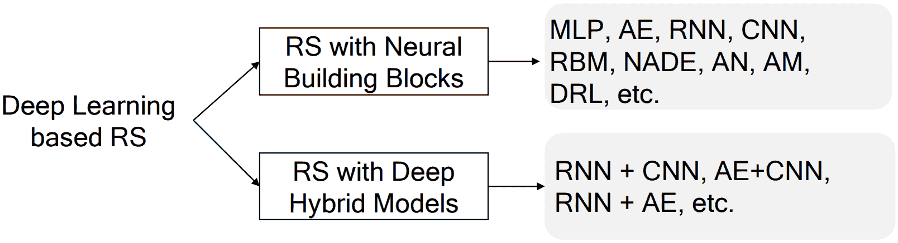

<!--yml

category: 未分类

date: 2024-09-06 20:08:54

-->

# [1707.07435] 基于深度学习的推荐系统：综述与新视角

> 来源：[`ar5iv.labs.arxiv.org/html/1707.07435`](https://ar5iv.labs.arxiv.org/html/1707.07435)

# 基于深度学习的推荐系统：综述与新视角

Shuai Zhang [1234-5678-9012](https://orcid.org/1234-5678-9012 "ORCID identifier") 新南威尔士大学 K17, CSE, UNSWSydneyNSW2052Australia shuai.zhang@unsw.edu.au , Lina Yao 新南威尔士大学 K17, CSE, UNSWSydneyNSW2052Australia lina.yao@unsw.edu.au , Aixin Sun 南洋理工大学新加坡 axsun@ntu.edu.sg 和 Yi Tay 南洋理工大学新加坡 ytay017@e.ntu.edu.sg

###### 摘要。

随着在线信息量的不断增长，推荐系统已成为应对信息过载的有效策略。推荐系统的效用不容小觑，鉴于其在许多网络应用中的广泛应用以及其改善过度选择相关问题的潜力。近年来，深度学习在计算机视觉和自然语言处理等多个研究领域引起了广泛关注，这不仅因为其卓越的表现，还因为其从头开始学习特征表示的吸引力特性。深度学习的影响也很广泛，最近在信息检索和推荐系统研究中显示了其有效性。显然，深度学习在推荐系统中的领域正在蓬勃发展。本文旨在提供对基于深度学习的推荐系统的近期研究工作的全面回顾。更具体地说，我们提供并设计了基于深度学习的推荐模型的分类体系，并提供了最前沿技术的全面总结。最后，我们扩展了当前趋势，并提供了关于该领域新兴发展的一些新视角。

推荐系统；深度学习；综述 Yi Tay 后来被添加为作者，帮助修订论文以进行重大修订。作者地址：S. Zhang 和 L. Yao，新南威尔士大学；电子邮件：shuai.zhang@unsw.edu.au；lina.yao@unsw.edu.au；A. Sun 和 Y. Tay，南洋理工大学；电子邮件：axsun@ntu.edu.sg；ytay017@e.ntu.edu.sg；^†^†期刊：CSUR^†^†期刊卷号：1^†^†期刊号：1^†^†文章：1^†^†期刊年份：2018^†^†出版月份：7^†^†文章序号：1^†^†版权：usgovmixed^†^†doi：0000001.0000001^†^†ccs：信息系统 推荐系统

## 1\. 引言

推荐系统是消费者在面对无数产品、电影或餐馆时的直观选择防线。因此，在网络上可获取的信息爆炸性增长的情况下，个性化是促进更好用户体验的关键策略。总之，这些系统在提升业务和促进决策过程中发挥了至关重要和不可替代的作用（Jannach 等，2010; Ricci 等，2015），并且在电子商务和/或媒体网站等多个网络领域广泛存在。

通常，推荐列表是基于用户偏好、物品特征、用户-物品过去互动以及一些其他额外信息（如时间（例如，序列感知推荐系统）和空间（例如，POI 推荐系统）数据）生成的。根据输入数据类型，推荐模型主要分为协同过滤、基于内容的推荐系统和混合推荐系统（Adomavicius 和 Tuzhilin，2005)。

深度学习目前正处于极大的热潮之中。过去几十年见证了深度学习（DL）在计算机视觉和语音识别等许多应用领域取得的巨大成功。学术界和工业界一直在竞相将深度学习应用于更广泛的应用程序，因为它在解决许多复杂任务并提供最先进结果方面具有能力（Covington 等，2016）。最近，深度学习显著革新了推荐架构，并带来了更多提升推荐性能的机会。基于深度学习的推荐系统的最新进展通过克服传统模型的障碍并实现高推荐质量而引起了重大关注。深度学习能够有效捕捉非线性和非平凡的用户-物品关系，并在更高层次的数据表示中实现更复杂的抽象编码。此外，它能够捕捉数据本身内部的复杂关系，例如来自上下文、文本和视觉信息等丰富的可访问数据源。

深度学习在推荐系统中的普遍性和广泛性。在工业界，推荐系统是许多在线网站和移动应用程序中提升用户体验和促进销售/服务的关键工具（Gomez-Uribe 和 Hunt, 2016; Davidson 等, 2010; Covington 等, 2016; Cheng 等, 2016; Okura 等, 2017）。例如，Netflix 上观看的电影中有 80%是通过推荐获得的（Gomez-Uribe 和 Hunt, 2016），YouTube 上的 60%视频点击来源于主页推荐（Davidson 等, 2010）。最近，许多公司采用深度学习进一步提升推荐质量（Covington 等, 2016; Cheng 等, 2016; Okura 等, 2017）。Covington 等（Covington 等, 2016）提出了一种基于深度神经网络的视频推荐算法用于 YouTube 的推荐。Cheng 等（Cheng 等, 2016）提出了一种基于宽度和深度模型的 Google Play 应用推荐系统。Shumpei 等（Okura 等, 2017）提出了一种基于 RNN 的 Yahoo 新闻推荐系统。所有这些模型都经过了在线测试，并且显示出相比传统模型有显著的改进。因此，我们可以看到深度学习在工业推荐应用中引发了一场显著的革命。

基于深度学习的推荐方法的研究出版物数量这些年来呈指数增长，这强有力地证明了深度学习在推荐系统研究中不可避免的普及。国际领先的推荐系统会议 RecSys¹¹1https://recsys.acm.org/，自 2016 年起开始组织关于推荐系统深度学习的定期研讨会²²2http://dlrs-workshop.org/。该研讨会旨在促进研究并鼓励基于深度学习的推荐系统的应用。

深度学习在推荐系统领域的成功，无论是在学术界还是工业界，都需要对这些模型的优势、劣势和应用场景进行全面的回顾和总结，以便后续研究人员和从业者更好地理解。

这项调查与之前的调查有什么不同？深度学习推荐领域已经进行了大量研究。然而，尽我们所知，目前很少有系统性的综述能够很好地概括该领域，定位现有工作和当前进展。虽然有些研究探索了基于深度学习技术的推荐应用，并尝试将该研究领域系统化，但很少有研究提供对当前努力的深入总结或详细描述该领域存在的开放问题。本调查旨在提供对深度学习推荐系统当前研究的全面总结，识别当前限制现实世界实施的开放问题，并指出未来的研究方向。

在过去几年中，传统推荐系统的调查已经呈现出一些。例如，Su 等人（Su 和 Khoshgoftaar，2009）对协同过滤技术进行了系统性的综述；Burke 等人（Burke，2002）提出了关于混合推荐系统的全面调查；Fernández-Tobías 等人（Fernández-Tobías 等人，2012）和 Khan 等人（Khan 等人，2017）回顾了跨领域推荐模型，仅举几例。然而，对基于深度学习的推荐系统缺乏广泛的综述。根据我们的知识，目前仅有两篇相关的简短调查（Liu 和 Wu，2017；Betru 等人，2017）正式发布。Betru 等人（Betru 等人，2017）介绍了三种基于深度学习的推荐模型（Salakhutdinov 等人，2007；Wang 等人，2015b；Van den Oord 等人，2013），尽管这三项工作在该研究领域具有影响力，但该调查忽视了其他新兴的高质量工作。Liu 等人（Liu 和 Wu，2017）回顾了 13 篇关于推荐的深度学习论文，并建议根据输入形式（使用内容信息的方法和不使用内容信息的方法）和输出（评分和排序）对这些模型进行分类。然而，随着新研究工作的不断出现，这一分类框架已不再适用，需要新的综合框架以更好地理解这一研究领域。鉴于深度学习在推荐系统中的日益普及和潜力，系统性的综述将具有很高的科学和实际价值。我们从不同的角度分析了这些工作，并提出了一些对该领域的新见解。为此，本调查精选并分类了 100 多项研究。

我们如何收集论文？在本调查中，我们收集了超过一百篇相关论文。我们使用了 Google Scholar 作为主要搜索引擎，还采用了 Web of Science 数据库作为发现相关论文的重要工具。此外，我们筛选了大多数相关的高水平会议，如 NIPS、ICML、ICLR、KDD、WWW、SIGIR、WSDM、RecSys 等，仅举几例，以了解最新的工作。我们使用的主要关键词包括：推荐系统、推荐、深度学习、神经网络、协同过滤、矩阵分解等。

本调查的贡献。本调查的目标是全面回顾深度学习基推荐系统的进展文献。它提供了一个全景，使读者可以快速理解并进入深度学习推荐领域。本调查奠定了促进推荐系统领域创新的基础，并挖掘了该研究领域的丰富性。本调查服务于对推荐系统感兴趣的研究人员、从业者和教育工作者，希望他们在选择解决推荐任务的深度神经网络时能有一个粗略的指导。总结起来，本调查的关键贡献有三点：（1）我们系统地回顾了基于深度学习技术的推荐模型，并提出了一个分类方案来定位和组织当前的工作；（2）我们提供了对最先进技术的概述和总结；（3）我们讨论了挑战和开放问题，并识别了这一研究领域的新趋势和未来方向，以分享愿景和拓展深度学习推荐系统研究的视野。

本文的其余部分组织如下：第二部分介绍了推荐系统和深度神经网络的基础知识，我们还讨论了基于深度神经网络的推荐模型的优缺点。第三部分首先介绍了我们的分类框架，然后详细介绍了最先进的技术。第四部分讨论了挑战和显著的开放研究问题。第五部分总结了论文。

## 2\. 推荐系统和深度学习概述

在我们深入调查的细节之前，我们从对推荐系统和深度学习技术的基本术语和概念的介绍开始。我们还讨论了将深度神经网络引入推荐系统的原因和动机。

### 2.1\. 推荐系统

推荐系统估计用户对项目的偏好，并主动推荐用户可能喜欢的项目（Adomavicius 和 Tuzhilin，2005；Ricci 等人，2015）。推荐模型通常分为三类（Adomavicius 和 Tuzhilin，2005；Jannach 等人，2010）：协同过滤、基于内容和混合推荐系统。协同过滤通过学习用户-项目历史交互来进行推荐，既可以是显式的（如用户的以前评分），也可以是隐式反馈（如浏览历史）。基于内容的推荐主要基于项目和用户的辅助信息进行比较。可以考虑各种辅助信息，如文本、图像和视频。混合模型指的是集成了两种或更多种推荐策略的推荐系统（Burke，2002；Jannach 等人，2010）。

假设我们有$M$个用户和$N$个项目，$R$表示交互矩阵，$\hat{R}$表示预测的交互矩阵。设$r_{ui}$表示用户$u$对项目$i$的偏好，$\hat{r}_{ui}$表示预测的分数。同时，我们使用部分观测向量（$R$的行）$\textbf{r}^{(u)}=\{r^{u1},...,r^{uN}\}$来表示每个用户$u$，使用部分观测向量（$R$的列）$\textbf{r}^{(i)}=\{r^{1i},...,r^{Mi}\}$来表示每个项目$i$。$\mathcal{O}$和$\mathcal{O^{-}}$分别表示观测和未观测的交互集。我们使用$U\in\mathcal{R}^{M\times k}$和$V\in\mathcal{R}^{N\times k}$来表示用户和项目的潜在因素。$k$是潜在因素的维度。此外，时间戳等序列信息也可以考虑，以实现序列感知推荐。其他符号和标记将在相应部分中介绍。

### 2.2\. 深度学习技术

深度学习通常被认为是机器学习的一个子领域。深度学习的典型定义本质在于它学习深层表示，即从数据中学习多个层次的表示和抽象。出于实际原因，我们将任何神经可微架构视为‘深度学习’，只要它使用随机梯度下降（SGD）的一种变体来优化一个可微的目标函数。神经架构在监督学习和无监督学习任务中都取得了巨大的成功（Deng 等人，2014）。在本小节中，我们将阐明与本调查密切相关的各种架构范式。

+   •

    多层感知机（MLP）是一种具有多个（一个或多个）隐藏层的前馈神经网络，位于输入层和输出层之间。感知机可以使用任意的激活函数，并不一定表示严格的二元分类器。MLP 可以被解释为堆叠的非线性转换层，学习分层特征表示。MLP 也被称为通用逼近器。

+   •

    自编码器（AE）是一种无监督模型，试图在输出层中重构其输入数据。通常，瓶颈层（中间最深的层）被用作输入数据的显著特征表示。自编码器有许多变体，如去噪自编码器、边缘化去噪自编码器、稀疏自编码器、收缩自编码器和变分自编码器（VAE）（Goodfellow 等人，2016; Chen 等人，2012）。

+   •

    卷积神经网络（CNN）（Goodfellow 等人，2016）是一种特殊的前馈神经网络，具有卷积层和池化操作。它能捕捉全局和局部特征，并显著提高效率和准确性。在处理具有网格拓扑结构的数据时表现良好。

+   •

    循环神经网络（RNN）（Goodfellow 等人，2016）适用于建模序列数据。与前馈神经网络不同，RNN 中有循环和记忆以记住先前的计算。在实践中，像长短期记忆（LSTM）和门控循环单元（GRU）网络等变体经常被用来克服梯度消失问题。

+   •

    受限玻尔兹曼机（RBM）是一个两层神经网络，由可见层和隐藏层组成。它可以轻松堆叠成深度网络。这里的"受限"意味着在可见层或隐藏层内部没有层间通信。

+   •

    神经自回归分布估计（NADE）（Larochelle 和 Murray，2011; Uria 等人，2016）是建立在自回归模型和前馈神经网络之上的无监督神经网络。它是一种可计算且高效的估计器，用于建模数据分布和密度。

+   •

    对抗网络（AN）（Goodfellow 等人，2014）是一种生成神经网络，由鉴别器和生成器组成。这两个神经网络通过在极小极大博弈框架中相互竞争同时进行训练。

+   •

    注意力模型（AM）是可微分的神经结构，基于输入序列（或图像）进行软内容寻址。注意机制通常普遍存在于计算机视觉和自然语言处理领域，并且在深度推荐系统研究中也是一种新兴趋势。

+   •

    深度强化学习（DRL）（Mnih et al., 2015）。强化学习基于试错范式。整个框架主要由以下组件组成：代理、环境、状态、动作和奖励。深度神经网络与强化学习的结合形成了 DRL，这在多个领域如游戏和自动驾驶汽车中达到了人类水平的表现。深度神经网络使代理能够从原始数据中获取知识，并在不依赖手工特征和领域启发式的情况下得出有效的表示。

请注意，每年都会出现大量先进模型，这里我们仅简要列出了一些重要的模型。对详细信息或更高级模型感兴趣的读者可以参考（Goodfellow et al., 2016）。

### 2.3\. 为什么对推荐系统使用深度神经网络？

在深入了解最近的进展之前，理解将深度学习技术应用于推荐系统的原因是有益的。显然，短短几年内已经提出了大量的深度推荐系统。该领域确实充满了创新。在这一点上，很容易质疑如此多不同架构的必要性以及神经网络在该问题领域中的实用性。同样，有必要明确每个提出的架构的合理性以及它最适合的场景。总的来说，这个问题与任务、领域和推荐场景紧密相关。神经架构最吸引人的特性之一是它们（1）端到端可微分，（2）提供适合输入数据类型的适当归纳偏置。因此，如果模型可以利用固有结构，那么深度神经网络应该是有用的。例如，CNNs 和 RNNs 长期以来利用了视觉（和/或人类语言）的内在结构。同样，session 或点击日志的序列结构非常适合递归/卷积模型提供的归纳偏置（Tang 和 Wang，2018a；Hidasi et al., 2015；Wu et al., 2017）。

此外，深度神经网络在某种意义上也是复合的，因为多个神经构建块可以组成一个单一的（巨大的）可微函数，并进行端到端的训练。这里的关键优势在于处理基于内容的推荐。这在建模网络上的用户/项目时是不可避免的，因为多模态数据已成为常态。例如，在处理文本数据（如评论（Zheng et al., 2017）、推文（Gong and Zhang, 2016）等）、图像数据（社交帖子、产品图片）时，CNNs/RNNs 成为不可或缺的神经构建块。在这里，传统的替代方案（如设计特定模态的特征等）显得显著不那么有吸引力，因此推荐系统无法利用联合（端到端）表示学习。在某种意义上，推荐系统领域的发展也与相关模态（如视觉或语言社区）的研究进展紧密相关。例如，为了处理评论，必须进行昂贵的预处理（如关键词提取、主题建模等），而更新的深度学习方法能够端到端地处理所有文本信息（Zheng et al., 2017）。总的来说，深度学习在这一方面的能力可以被视为范式转变，而在统一的联合框架中表示图像、文本和交互的能力（Zhang et al., 2017）在没有这些最新进展的情况下是不可能实现的。

关于仅涉及交互的设置（即矩阵补全或协同排序问题），这里的关键想法是，当存在大量复杂性或大量训练实例时，深度神经网络是合理的选择。在（He 等人，2017）中，作者们使用 MLP 来近似交互函数，并显示出相对传统方法如 MF 的性能提升。虽然这些神经模型表现更好，我们也注意到，标准的机器学习模型如 BPR、MF 和 CML 在仅基于交互数据进行动量梯度下降训练时也表现得相当不错（Tay 等人，2018a）。然而，我们也可以将这些模型视为神经架构，因为它们利用了 Adam、Dropout 或 Batch Normalization 等最新的深度学习进展（He 等人，2017; Zhang 等人，2018）。同时，传统的推荐算法（如矩阵分解、因子分解机等）也可以表达为神经/可微分架构（He 等人，2017; He 和 Tat-Seng，2017），并且可以在 Tensorflow 或 Pytorch 等框架下高效地进行 GPU 加速训练和自动微分。因此，在当今的研究氛围中（甚至是工业领域），没有理由不使用基于深度学习的工具来开发任何推荐系统。

总结一下，我们总结了基于深度学习的推荐模型的优势，读者在尝试实际应用时可能要牢记这些优点。

+   •

    非线性变换。与线性模型相反，深度神经网络能够利用非线性激活函数（如 relu、sigmoid、tanh 等）对数据中的非线性进行建模。这个特性使得它能够捕捉复杂和复杂的用户物品交互模式。传统方法如矩阵分解、因子分解机、稀疏线性模型本质上是线性模型。例如，矩阵分解通过线性组合用户和物品的潜在因子来建模用户-物品交互（He 等人，2017）；因子分解机是多元线性家族的一员（He 和 Tat-Seng，2017）；显然，SLIM 是一个具有稀疏约束的线性回归模型。线性假设作为许多传统推荐系统的基础，过于简化并且会大大限制它们的建模表达能力。众所周知，神经网络可以通过变化的激活选择和组合以任意精度逼近任何连续函数（Hornik 等人，1989; Hornik，1991）。这个特性使得它能够处理复杂的交互模式，并精确反映用户的偏好。

+   •

    表示学习。深度神经网络在从输入数据中学习潜在解释因素和有用表示方面非常有效。一般来说，现实应用中有大量关于项目和用户的描述性信息。利用这些信息提供了推进我们对项目和用户理解的途径，从而生成更好的推荐。因此，将深度神经网络应用于推荐模型中的表示学习是自然的选择。使用深度神经网络辅助表示学习的优势有两个方面：（1）它减少了手工特征设计的工作量。特征工程是一项劳动密集型工作，深度神经网络能够从原始数据中自动学习特征，无论是无监督还是有监督的方法；（2）它使推荐模型能够包括异质内容信息，如文本、图像、音频甚至视频。深度学习网络在多媒体数据处理方面取得了突破，并在从各种来源中学习表示方面展示了潜力。

+   •

    序列建模。深度神经网络在许多序列建模任务中表现出令人鼓舞的结果，如机器翻译、自然语言理解、语音识别、聊天机器人等。RNN 和 CNN 在这些任务中扮演了关键角色。RNN 通过内部记忆状态来实现这一点，而 CNN 通过时间上滑动的滤波器来实现。它们都在挖掘数据中的序列结构方面具有广泛的适用性和灵活性。建模序列信号是挖掘用户行为的时间动态和项目演变的重要主题。例如，下一项/购物篮预测和基于会话的推荐是典型的应用。因此，深度神经网络非常适合这个序列模式挖掘任务。

+   •

    灵活性。深度学习技术具有很高的灵活性，特别是随着许多流行深度学习框架的出现，如 Tensorflow³³3https://www.tensorflow.org/、Keras⁴⁴4https://keras.io/、Caffe⁵⁵5http://caffe.berkeleyvision.org/、MXnet⁶⁶6https://mxnet.apache.org/、DeepLearning4j⁷⁷7https://deeplearning4j.org/、PyTorch⁸⁸8https://pytorch.org/、Theano⁹⁹9http://deeplearning.net/software/theano/ 等。这些工具大多以模块化方式开发，并且具有活跃的社区和专业支持。良好的模块化使得开发和工程效率大大提高。例如，可以轻松地将不同的神经结构组合以形成强大的混合模型，或用其他模块替换一个模块。因此，我们可以轻松地构建混合和复合推荐模型，以同时捕捉不同的特征和因素。

### 2.4\. 关于潜在的局限性

使用深度学习进行推荐是否真的存在缺点和限制？在这一部分，我们旨在解决几个针对深度学习在推荐系统研究中使用的常见论点。

+   •

    可解释性。尽管取得了成功，深度学习仍然被认为是黑箱，提供可解释的预测似乎是一项非常具有挑战性的任务。一个反对深度神经网络的常见论点是隐藏的权重和激活通常是不可解释的，限制了可解释性。然而，随着神经注意力模型的出现，这一担忧通常得到了缓解，并为具有更好可解释性的深度神经模型铺平了道路（Seo 等，2017a；Xiao 等，2017；Tay 等，2018b）。虽然解释单个神经元仍然对神经模型（不仅仅是推荐系统）构成挑战，但目前的最先进模型已经具备了一定程度的可解释性，能够实现可解释的推荐。我们将在开放问题部分更详细地讨论这一问题。

+   •

    数据需求。第二个可能的限制是深度学习被认为是数据密集型的，即它需要足够的数据以充分支持其丰富的参数化。然而，与其他数据稀缺的领域（如语言或视觉）相比，在推荐系统研究的背景下相对容易获取大量数据。百万/十亿规模的数据集在行业中司空见惯，同时也被作为学术数据集发布。

+   •

    大规模的超参数调优。一个反对深度学习的第三个普遍论点是需要大量的超参数调优。然而，我们注意到超参数调优并不是深度学习独有的问题，而是机器学习的普遍问题（例如，传统矩阵分解等同样需要调整正则化因子和学习率）。诚然，深度学习在某些情况下可能会引入额外的超参数。例如，一项最近的研究（Tay 等，2018a）对传统度量学习算法（Hsieh 等，2017）进行了有关注扩展，仅引入了一个超参数。

## 3\. 基于深度学习的推荐：最先进技术

在这一部分，我们首先介绍基于深度学习的推荐模型的类别，然后重点介绍最先进的研究原型，旨在识别近年来最显著和最有前景的进展。

### 3.1\. 基于深度学习的推荐模型类别

图 1\. 基于深度神经网络的推荐模型类别。

为了提供该领域的鸟瞰视角，我们根据采用的深度学习技术类型对现有模型进行分类。我们进一步将基于深度学习的推荐模型分为以下两类。图表 1 总结了分类方案。

表格 1\. 已审查出版物的查找表。

| 类别 | 出版物 |
| --- | --- |
| 多层感知器（MLP） |

&#124; (黄等人，2015; 杨等人，2017; 阿拉什卡尔等人，2017; 维伦斯等人，2016; 王等人，2017; 何等人，2017; 陈等人，2017; 埃贝苏和方，2017; 程等人，2016; 连等人，2017; 科温顿等人，2016; 郭等人，2017; 梁等人，2015; 何和塔特-森，2017), &#124;

&#124; (埃尔卡赫等人，2015; 宋等人，2018; 陈等人，2017; 许等人，2016, 2017; 牛等人，2018; 连等人，2018; 瓦尔塔克等人，2017) &#124;

|

| 自编码器（Autoencoder） |
| --- |

&#124; (欧阳等人，2014; 谢代海等人，2015; 斯特鲁布和玛丽，2015; 吴等人，2016a; 斯特鲁布等人，2016; 易等人，2016; 庄等人，2017a; 铃木和尾崎，2017; 帕纳等人，2017; 王等人，2015b; 李和佘，2017; 李等人，2015; 董等人，2017), &#124;

&#124; (庄等人，2017b; 王等人，2015a; 白等人，2017; 英等人，2016; 张等人，2017; 魏等人，2016, 2017; 乌格尔，2015; 曹等人，2017; 左等人，2016; 乌格尔等人，2016; 邓等人，2017; 梁等人，2018) &#124;

|

| 卷积神经网络（CNNs） |
| --- |

&#124; (金等人，2016, 2017; 郑等人，2017; 范登·奥尔德等人，2013; SEO 等人，2017b; 刘等人，2017; 朱和蔡，2017; 沈等人，2016; 周等人，2016; 麦考利等人，2015; 何和麦考利，2016a, b; 温等人，2016; 王等人，2017), &#124;

&#124; (Gong 和 Zhang，2016；阮等，2017；王等，2017a；于等，2018；何等，2018a；Tang 和 Wang，2018a；Tuan 和 Phuong，2017；Ying 等，2018a；Berg 等，2017；李等，2018；Seo 等，2017a) &#124;

|

| RNNs |
| --- |

&#124; (Bansal 等，2016；Ko 等，2016；Smirnova 和 Vasile，2017；戴等，2016a；李等，2016；Tan 等，2016b；吴等，2016；Jing 和 Smola，2017；Hidasi 等，2016；吴等，2016b，2017；Hidasi 等，2015；Suglia 等，2017；Quadrana 等，2017；Donkers 等，2017) &#124;

&#124; (Tan 等，2016a；Musto 等，2016；谢等，2016a；吴等，2016c；Devooght 和 Bersini，2016；Soh 等，2017；戴等，2016b；Twardowski，2016；Okura 等，2017；Hidasi 和 Karatzoglou，2017；Jannach 和 Ludewig，2017；李等，2018；Christakopoulou 等，2018) &#124;

|

| RBM |
| --- |

&#124; (Salakhutdinov 等，2007；Georgiev 和 Nakov，2013；刘等，2015；谢等，2016b；贾等，2016；王和王，2014；贾等，2015) &#124;

|

| NADE | (郑等，2016，2016；杜等，2016) |
| --- | --- |
| 神经注意力 |

&#124; (陈等，2017b；Tay 等，2018a；Jhamb 等，2018；Gong 和 Zhang，2016；Seo 等，2017b；王等，2017a；李等，2016；Loyola 等，2017a；刘等，2018；Ying 等，2018b；周等，2017；张等，2018) &#124;

&#124; (Tay 等，2018b；张等，；胡等，2018) &#124;

|

| 对抗网络 | (王等，2017b；何等，2018b；蔡等，2018；王等，2018) |
| --- | --- |
| DRL | (赵等，2018a，b；郑等，2018；宗政等，2018；崔等，2018；王等，2014；陈等，2018) |
| 混合模型 |

&#124; (雷等人，2016; Rawat 和 Kankanhalli，2016; 张等人， ; 宋等人，2016; 张等人，2016; Ebesu 和 Fang，2017; 李等人，2017; 李等人，2017; 高等人，2014; 王等人，2016; 陈等人，2017a) &#124;

|

+   •

    采用神经网络构建推荐的方式。在这一类别中，模型根据前述的八种深度学习模型被分成八个子类别：MLP、AE、CNN、RNN、RBM、NADE、AM、AN 和基于 DRL 的推荐系统。所采用的深度学习技术决定了推荐模型的适用性。例如，MLP 能轻松建模用户和物品之间的非线性交互；CNN 能从文本和视觉等异构数据源中提取局部和全局表示；RNN 使得推荐系统能够建模内容信息的时间动态和顺序演变。

+   •

    采用深度混合模型的推荐。一些基于深度学习的推荐模型利用了多种深度学习技术。深度神经网络的灵活性使得能够将多个神经网络模块结合起来互补，形成更强大的混合模型。这些深度学习技术的组合方式有很多种，但并非所有都已被利用。请注意，这与（邓等人，2014）中提到的混合深度网络不同，后者指的是利用了生成和判别组件的深度结构。

表 2\. 特定应用领域中基于深度神经网络的推荐模型。

|

&#124; 数据 &#124;

&#124; 来源/任务 &#124;

| 注释 | 出版物 |
| --- | --- |
| 顺序信息 | 无用户 ID | (张等人，2018; Quadrana 等人，2017; Jing 和 Smola，2017; 唐和王，2018a; Ying 等人，2018b; Donkers 等人，2017; Soh 等人，2017; 吴等人，2016c, 2017; Devooght 和 Bersini，2016; 戴等人，2016b; 李等人，2018; 周等人，2017; 赵等人，2018a; 陈等人，2018; 王等人，2016) |

|

&#124; 基于会话 &#124;

&#124; 无用户 ID &#124;

| (Hidasi 等人，2015; 谭等人，2016b; Twardowski，2016; Hidasi 等人，2016; Jing 和 Smola，2017; Hidasi 和 Karatzoglou，2017; Quadrana 等人，2017; Loyola 等人，2017b, a; 刘等人，2018; Jannach 和 Ludewig，2017; Tuan 和 Phuong，2017) |
| --- |
| Check-In, POI | (Yang 等人，[2017](https://bib.bib186); Wang 等人，[2017](https://bib.bib166); Unger，[2015](https://bib.bib151); Unger 等人，[2016](https://bib.bib152)) |
| 文本 | 哈希标签 | ([Zhang 等人](https://bib.bib194) ; Rawat 和 Kankanhalli，[2016](https://bib.bib119); Gong 和 Zhang，[2016](https://bib.bib45); Wang 等人，[2015a](https://bib.bib159); Xu 等人，[2017](https://bib.bib184), [2016](https://bib.bib183); Zuo 等人，[2016](https://bib.bib210); Nguyen 等人，[2017](https://bib.bib111)) |
| 新闻 | (Chen 等人，[2017](https://bib.bib13); Wang 等人，[2017a](https://bib.bib170); Okura 等人，[2017](https://bib.bib114); Song 等人，[2016](https://bib.bib136); Zheng 等人，[2018](https://bib.bib201); Cao 等人，[2017](https://bib.bib11)) |
| 评论文本 | (Zheng 等人，[2017](https://bib.bib203); Catherine 和 Cohen，[2017](https://bib.bib12); Tay 等人，[2018b](https://bib.bib147); Zhang 等人，[2017](https://bib.bib198); Li 等人，[2017](https://bib.bib88); Wu 等人，[2016](https://bib.bib175); Seo 等人，[2017a](https://bib.bib127)) |
| 引用 | (Lee 等人，[2016](https://bib.bib83); Tan 等人，[2016a](https://bib.bib142)) |
| 图像 | 视觉特征 | (Zhang 等人，[2017](https://bib.bib198); Lei 等人，[2016](https://bib.bib85); Wen 等人，[2016](https://bib.bib173); Xie 等人，[2016a](https://bib.bib180); Yu 等人，[2018](https://bib.bib192); Niu 等人，[2018](https://bib.bib113); Wang 等人，[2017](https://bib.bib166); McAuley 等人，[2015](https://bib.bib106); He 和 McAuley，[2016a](https://bib.bib50); Alashkar 等人，[2017](https://bib.bib3); Liu 等人，[2017](https://bib.bib99); Chu 和 Tsai，[2017](https://bib.bib26); Zhou 等人，[2016](https://bib.bib207); He 和 McAuley，[2016b](https://bib.bib51); Chen 等人，[2017b](https://bib.bib15); Zhang 等人，[2016](https://bib.bib193)) |
| 音频 | 音乐 | (Van den Oord 等人，[2013](https://bib.bib154); Liang 等人，[2015](https://bib.bib96); Wang 和 Wang，[2014](https://bib.bib168); Wang 等人，[2014](https://bib.bib169)) |
| 视频 | 视频 | (Chen 等人，[2017a](https://bib.bib18); Lee 等人，[2018](https://bib.bib84); Covington 等人，[2016](https://bib.bib28); Chen 等人，[2017b](https://bib.bib15)) |
| 网络 | 引用网络 | (Ebesu 和 Fang，[2017](https://bib.bib39); Huang 等人，[2015](https://bib.bib67); Cai 等人，[2018](https://bib.bib10)) |
| 社交网络 | (Wang 等人，[2017](https://bib.bib167); Deng 等人，[2017](https://bib.bib33); Pana 等人，[2017](https://bib.bib117)) |
| 跨域 | (Lian 等人，[2017](https://bib.bib93); Elkahky 等人，[2015](https://bib.bib40); Wang 等人，[2017](https://bib.bib167)) |
| 其他 | 冷启动 | (Vartak 等人，[2017](https://bib.bib155); Volkovs 等人，[2017](https://bib.bib157); Wei 等人，[2016](https://bib.bib171), [2017](https://bib.bib172)) |
| 多任务 | (Bansal 等人，[2016](https://bib.bib6); Li 等人，[2017](https://bib.bib88); Jing 和 Smola，[2017](https://bib.bib74); Wu 等人，[2016](https://bib.bib175); Yi 等人，[2016](https://bib.bib188)) |
| 可解释性 | (Li 等人，[2017](https://bib.bib88); Seo 等人，[2017a](https://bib.bib127)) |

表 1 列出了所有审查过的模型，我们按照前述的分类方案对它们进行了整理。此外，我们还总结了一些从任务角度出发的出版物，见表 2。审查过的出版物涉及多种任务。一些任务由于使用了深度神经网络而开始受到关注，例如基于会话的推荐、图像、视频推荐等。一些任务可能对推荐研究领域并不新鲜（推荐系统的边缘信息详细审查可参见 (Shi 等人，2014)），但深度学习提供了更多找到更好解决方案的可能性。例如，处理图像和视频将是一项艰巨的任务，如果没有深度学习技术的帮助。深度神经网络的序列建模能力使得捕捉用户行为的序列模式变得容易。下文将讨论一些具体的任务。

### 3.2\. 基于多层感知器的推荐

MLP 是一种简洁而有效的网络，已被证明能够以任意精度逼近任何可测函数（Hornik 等人，1989）。因此，它是许多高级方法的基础，并广泛应用于许多领域。

传统推荐方法的神经扩展。许多现有的推荐模型本质上是线性方法。MLP 可以用于对现有的 RS 方法进行非线性变换，并将其解释为神经扩展。

(a)

(b)

图 2\. 示意图：(a) 神经协同过滤；(b) 深度因子分解机。

神经协同过滤。在大多数情况下，推荐被认为是用户偏好和物品特征之间的双向交互。例如，矩阵因子化将评分矩阵分解为低维用户/物品潜在因子。自然而然地构建一个双重神经网络来模拟用户和物品之间的双向交互。神经网络矩阵因子化（NNMF）（Dziugaite 和 Roy，2015）和神经协同过滤（NCF）（何等人，2017）是两个典型的工作。图 2a 显示了 NCF 架构。让 $s_{u}^{用户}$ 和 $s_{i}^{项目}$ 表示边缘信息（例如用户概况和物品特征），或者仅表示用户 $u$ 和物品 $i$ 的单热识别符。评分函数定义如下：

| (1) |  | $\hat{r}_{ui}=f(U^{T}\cdot s_{u}^{用户},V^{T}\cdot s_{i}^{项目}\vert U,V,\theta)$ |  |
| --- | --- | --- | --- |

其中函数 $f(\cdot)$ 表示多层感知器，$\theta$ 是该网络的参数。传统 MF 可以看作是 NCF 的特例。因此，将矩阵因子分解的神经解释与 MLP 融合，以构建一个更通用的模型，既利用了 MF 的线性特性，又利用了 MLP 的非线性特性来提升推荐质量是方便的。整个网络可以用加权平方损失（对显式反馈）或二元交叉熵损失（对隐式反馈）进行训练。交叉熵损失定义如下：

| (2) |  | $\mathcal{L}=-\sum_{(u,i)\in\mathcal{O}\cup\mathcal{O^{-}}}r_{ui}\log\hat{r}_{ui}+(1-r_{ui})\log(1-\hat{r}_{ui})$ |  |
| --- | --- | --- | --- |

负采样方法可以用于减少训练中未观察到的实例数量。后续研究（牛等人，2018; 宋等人，2018）提出使用成对排名损失来增强性能。何等人（王等人，2017; 廉等人，2017）扩展了 NCF 模型以进行跨领域推荐。薛等人（薛等人，2017）和张等人（张等人，2018）表明，可以用交互矩阵的列或行替换单热识别符以保留用户-物品交互模式。

深度因子分解机。DeepFM（Guo et al., 2017）是一个端到端模型，无缝集成了因子分解机和 MLP。它能够通过深度神经网络模拟高阶特征交互，并使用因子分解机模拟低阶交互。因子分解机（FM）利用加法和内积操作捕获特征之间的线性和成对交互（详情参见（Rendle, 2010）中的方程（1））。MLP 利用非线性激活和深层结构来模拟高阶交互。将 MLP 与 FM 结合的方式受到广泛与深度网络的启发。它用神经网络解释因子分解机来替换宽部件。与宽与深模型相比，DeepFM 不需要繁琐的特征工程。图 2b 展示了 DeepFM 的结构。DeepFM 的输入 $x$ 是一个包含用户和物品标识及特征对 $(u,i)$ 的 $m$-字段数据。为简单起见，FM 和 MLP 的输出分别记为 $y_{FM}(x)$ 和 $y_{MLP}(x)$。预测分数通过以下公式计算：

| (3) |  | $\hat{r}_{ui}=\sigma(y_{FM}(x)+y_{MLP}(x))$ |  |
| --- | --- | --- | --- |

其中 $\sigma(\cdot)$ 是 sigmoid 激活函数。

Lian 等人（Lian et al., 2018）通过提出极端深度因子分解机（eXtreme deep factorization machine）共同建模显式和隐式特征交互来改进 DeepMF。显式高阶特征交互通过压缩交互网络进行学习。He 等人（He and Tat-Seng, 2017）提出的并行工作用 MLP 替换了二阶交互，并建议使用 dropout 和批归一化对模型进行正则化。

使用 MLP 进行特征表示学习非常直观且高效，尽管可能不像自编码器、CNN 和 RNN 那样表达丰富。

宽度 & 深度学习。这个通用模型（如图 3a) 可以解决回归和分类问题，但最初是为了 Google Play 中的应用推荐而提出的 (Cheng et al., 2016)。宽度学习组件是一个单层感知机，也可以看作是广义线性模型。深度学习组件是多层感知机。结合这两种学习技术的原理在于，它使推荐系统能够同时捕捉记忆和泛化。宽度学习组件实现的记忆代表了从历史数据中捕捉直接特征的能力。同时，深度学习组件通过生成更一般和抽象的表示来捕捉泛化。这种模型可以提高推荐的准确性和多样性。

从形式上讲，宽度学习定义为：$y=W^{T}_{wide}\{x,\phi(x)\}+b$，其中 $W^{T}_{wide}$ 和 $b$ 是模型参数。输入 $\{x,\phi(x)\}$ 是由原始输入特征 $x$ 和经过转换（例如，通过交叉乘积转换以捕捉特征间的相关性）的特征 $\phi(x)$ 组成的连接特征集。深度神经组件的每一层形式为 $\alpha^{(l+1)}=f(W^{(l)}_{deep}a^{(l)}+b^{(l)})$，其中 $l$ 表示第 $l^{th}$ 层，$f(\cdot)$ 是激活函数。$W^{(l)}_{deep}$ 和 $b^{(l)}$ 是权重和偏置项。宽度 & 深度学习模型通过融合这两种模型获得：

| (4) |  | $P(\hat{r}_{ui}=1&#124;x)=\sigma(W^{T}_{wide}\{x,\phi(x)\}+W^{T}_{deep}a^{(l_{f})}+bias)$ |  |
| --- | --- | --- | --- |

其中 $\sigma(\cdot)$ 是 sigmoid 函数，$\hat{r}_{ui}$ 是二值评分标签，$a^{(l_{f})}$ 是最终激活。该联合模型通过随机反向传播（follow-the-regularized-leader 算法）进行优化。推荐列表是基于预测评分生成的。

通过扩展此模型，Chen et al. (Chen et al., 2017) 设计了一种用于大规模工业级推荐任务的局部连接宽度 & 深度学习模型。它采用高效的局部连接网络替代深度学习组件，从而将运行时间减少了一个数量级。部署宽度 & 深度学习的一个重要步骤是选择宽度和深度部分的特征。换句话说，系统应该能够确定哪些特征是被记忆的或被泛化的。此外，交叉乘积转换也需要手动设计。这些预步骤将极大地影响该模型的实用性。上述基于深度分解的模型可以减轻特征工程的工作量。

Covington 等人（Covington et al., 2016）探索了在 YouTube 推荐中应用 MLP。该系统将推荐任务分为两个阶段：候选生成和候选排名。候选生成网络从所有视频语料库中检索出一个子集（数百个）。排名网络根据候选项的最近邻分数生成一个前 n 名列表（数十个）。我们注意到工业界更关心特征工程（如转换、归一化、交叉）和推荐模型的可扩展性。

Alashkar 等人（Alashkar et al., 2017）提出了基于 MLP 的化妆品推荐模型。该工作使用两个相同的 MLP 分别建模标记示例和专家规则。这两个网络的参数通过最小化它们输出之间的差异来同时更新。它展示了在 MLP 框架中采用专家知识指导推荐模型学习过程的有效性。尽管专业知识获取需要大量人力投入，但其精度非常高。

(a)

(b)

图 3. 描述：(a) Wide & Deep Learning; (b) 多视角深度神经网络。

协同度量学习（CML）。CML（Hsieh et al., 2017）用欧几里得距离取代了 MF 的点积，因为点积不满足距离函数的三角不等式。用户和物品嵌入通过最大化用户与其不喜欢的物品之间的距离和最小化用户与其喜欢的物品之间的距离来学习。在 CML 中，MLP 用于从项目特征（如文本、图像和标签）中学习表示。

带有深度结构化语义模型的推荐。深度结构化语义模型（DSSM）（Huang et al., 2013）是一个用于学习实体在共同连续语义空间中语义表示并测量它们语义相似性的深度神经网络。它被广泛应用于信息检索领域，并且非常适合于前 n 推荐（Elkahky et al., 2015; Xu et al., 2016）。DSSM 将不同实体投射到一个共同的低维空间，并用余弦函数计算它们之间的相似性。基本的 DSSM 由 MLP 组成，因此我们将其放在本节中。请注意，更高级的神经层，如卷积和最大池化层，也可以轻松集成到 DSSM 中。

基于深度语义相似性的个性化推荐（DSPR）（Xu et al., 2016）是一种标签感知的个性化推荐器，其中每个用户$x_{u}$和物品$x_{i}$都由标签注释表示，并映射到一个共同的标签空间中。余弦相似度$sim(u,i)$用于决定物品和用户之间的相关性（或用户对物品的偏好）。DSPR 的损失函数定义如下：

| (5) |  | $\mathcal{L}=-\sum_{(u,i*)}[log(e^{sim(u,i*)})-log(\sum_{(u,i^{-})\in D^{-}}e^{sim(u,i^{-})})]$ |  |
| --- | --- | --- | --- |

其中 $(u,i^{-})$ 是从负用户物品对中随机抽样的负样本。作者（Xu 等，2017）进一步改进了 DSP 使用自编码器来从用户/物品档案中学习低维表示。

多视图深度神经网络（MV-DNN）（Elkahky 等，2015）设计用于跨域推荐。它将用户视为核心视图，将每个领域（假设我们有 $Z$ 个领域）视为辅助视图。显然，对于 $Z$ 个用户-领域对，有 $Z$ 个相似度评分。图 3b 说明了 MV-DNN 的结构。MV-DNN 的损失函数定义为：

| (6) |  | $\mathcal{L}=\underset{\theta}{argmin}\sum_{j=1}^{Z}\frac{exp(\gamma\cdot cosine(Y_{u},Y_{a,j}))}{\sum_{X^{\prime}\in R^{da}}exp(\gamma\cdot cosine(Y_{u},f_{a}(X^{\prime})))}$ |  |
| --- | --- | --- | --- |

其中 $\theta$ 是模型参数，$\gamma$ 是平滑因子，$Y_{u}$ 是用户视图的输出，$a$ 是活跃视图的索引。$R^{da}$ 是视图 $a$ 的输入域。MV-DNN 能够扩展到多个领域。然而，它基于的假设是用户在一个领域的相似口味应在其他领域中也具有相似口味。从直觉上讲，这个假设在许多情况下可能是不合理的。因此，我们需要对不同领域之间的相关性有一些初步了解，以充分利用 MV-DNN。

### 3.3\. 基于自编码器的推荐

应用自编码器到推荐系统通常有两种方法：（1）使用自编码器在瓶颈层学习低维特征表示；或（2）直接在重构层填补交互矩阵中的空缺。几乎所有自编码器变体，如去噪自编码器、变分自编码器、对比自编码器和边际自编码器，都可以应用于推荐任务。表 3 总结了基于自编码器类型的推荐模型。

基于自编码器的协同过滤。一个成功的应用是从自编码器的角度考虑协同过滤。

AutoRec （Sedhain 等人，2015）将用户部分向量 $\textbf{r}^{(u)}$ 或项部分向量 $\textbf{r}^{(i)}$ 作为输入，并旨在在输出层重建它们。显然，它有两个变体：基于项目的 AutoRec（I-AutoRec）和基于用户的 AutoRec（U-AutoRec），对应于两种输入类型。在这里，我们只介绍 I-AutoRec，而 U-AutoRec 可以相应地推导出来。图 4a 说明了 I-AutoRec 的结构。给定输入 $\textbf{r}^{(i)}$，重建为：$h(\textbf{r}^{(i)};\theta)=f(W\cdot g(V\cdot\textbf{r}^{(i)}+\mu)+b)$，其中 $f(\cdot)$ 和 $g(\cdot)$ 是激活函数，参数 $\theta=\{W,V,\mu,b\}$。I-AutoRec 的目标函数如下所示：

| (7) |  | $\underset{\theta}{argmin}\sum_{i=1}^{N}\parallel\textbf{r}^{(i)}-h(\textbf{r}^{(i)};\theta)\parallel_{\mathcal{O}}^{2}+\lambda\cdot\textit{reg}$ |  |
| --- | --- | --- | --- |

这里 $\parallel\cdot\parallel_{\mathcal{O}}^{2}$ 表示仅考虑观察到的评分。目标函数可以通过弹性传播（收敛速度更快且结果可比）或 L-BFGS（有限记忆 Broyden Fletcher Goldfarb Shanno 算法）进行优化。在部署前，有四点关于 AutoRec 的重要事项值得注意：（1）I-AutoRec 的性能优于 U-AutoRec，这可能是由于用户部分观察向量的方差较高。（2）激活函数 $f(\cdot)$ 和 $g(\cdot)$ 的不同组合会显著影响性能。（3）适度增加隐藏单元的大小将改善结果，因为扩展隐藏层的维度为 AutoRec 提供了更多建模输入特征的能力。（4）增加更多层以构建深度网络可以带来轻微的改进。

(a)

(b)

(c)

图 4\. 说明： (a) 基于项目的 AutoRec； (b) 协同去噪自编码器； (c) 深度协同过滤框架。

CFN (Strub et al., 2016; Strub and Mary, 2015) 是 AutoRec 的扩展，并具有以下两个优势：（1）它应用了去噪技术，使 CFN 更加鲁棒；（2）它融合了诸如用户资料和项目描述等附加信息，以减轻稀疏性和冷启动的影响。CFN 的输入也是部分观测向量，因此它还有两个变种：I-CFN 和 U-CFN，分别以 $\textbf{r}^{(i)}$ 和 $\textbf{r}^{(u)}$ 作为输入。强正则化的掩码噪声被施加以更好地处理缺失元素（其值为零）。作者引入了三种广泛使用的破坏方法来扰动输入：高斯噪声、掩码噪声和盐与胡椒噪声。CFN 的进一步扩展也融合了附加信息。然而，与仅在第一层中整合附加信息不同，CFN 在每一层中都注入附加信息。因此，重建过程变为：

| (8) |  | $h(\{\tilde{\textbf{r}}^{(i)},\textbf{s}_{i}\})=f(W_{2}\cdot\{g(W_{1}\cdot\{\textbf{r}^{(i)},\textbf{s}_{i}\}+\mu),\textbf{s}_{i}\}+b)$ |  |
| --- | --- | --- | --- |

其中 $\textbf{s}_{i}$ 是附加信息，$\{\tilde{\textbf{r}}^{(i)},\textbf{s}_{i}\}$ 表示 $\tilde{\textbf{r}}^{(i)}$ 和 $\textbf{s}_{i}$ 的拼接。融入附加信息提高了预测准确性，加快了训练过程，并使模型更加鲁棒。

表 3\. 四种基于自编码器的推荐模型总结

| Vanilla/Denoising AE | Variational AE | Contractive AE | Marginalized AE |
| --- | --- | --- | --- |

|

&#124; (Sedhain et al., 2015; Strub et al., 2016; Strub and Mary, 2015; Ouyang et al., 2014; Wu et al., 2016a; Wang et al., 2015b) &#124;

&#124; (Ying et al., 2016; Pana et al., 2017; Jhamb et al., 2018; Wei et al., 2016, 2017) &#124;

| (Liang et al., 2018; Li and She, 2017; Chen and de Rijke, 2018) | (Zhang et al., 2017) | (Li et al., 2015) |
| --- | --- | --- |

协同去噪自编码器（CDAE）。之前审查的三种模型主要用于评分预测，而 CDAE（Wu et al., 2016a）主要用于排序预测。CDAE 的输入是用户部分观察到的隐式反馈 $\textbf{r}^{(u)}_{pref}$。如果用户喜欢电影，则条目值为 1，否则为 0。它也可以被视为反映用户对项目兴趣的偏好向量。图 4b 说明了 CDAE 的结构。CDAE 的输入受到高斯噪声的污染。受污染的输入 $\tilde{\textbf{r}}^{(u)}_{pref}$ 是从条件高斯分布 $p(\tilde{\textbf{r}}^{(u)}_{pref}|\textbf{r}^{(u)}_{pref})$ 中抽取的。重构定义为：

| (9) |  | $h(\tilde{\textbf{r}}^{(u)}_{pref})=f(W_{2}\cdot g(W_{1}\cdot\tilde{\textbf{r}}^{(u)}_{pref}+V_{u}+b_{1})+b_{2})$ |  |
| --- | --- | --- | --- |

其中 $V_{u}\in\mathbb{R}^{K}$ 表示用户节点的权重矩阵（参见图 4b）。该权重矩阵对每个用户都是独特的，并且对模型性能有显著影响。CDAE 的参数也是通过最小化重构误差来学习的：

| (10) |  | $\underset{W_{1},W_{2},V,b_{1},b_{2}}{argmin}\frac{1}{M}\sum_{u=1}^{M}\mathbf{E}_{p(\tilde{\textbf{r}}^{(u)}_{pref}\mid\textbf{r}^{(u)}_{pref})}[\ell(\tilde{\textbf{r}}^{(u)}_{pref},h(\tilde{\textbf{r}}^{(u)}_{pref}))]+\lambda\cdot\textit{reg}$ |  |
| --- | --- | --- | --- |

其中损失函数 $\ell(\cdot)$ 可以是平方损失或逻辑损失。

CDAE 最初通过 SGD 更新其参数，遍历所有反馈。然而，作者认为在实际应用中考虑所有评分是不切实际的，因此他们提出了一种负采样技术，从负样本集中（用户未互动的项目）中采样一个小子集，这大大减少了时间复杂度而不降低排名质量。

Muli-VAE 和 Multi-DAE（Liang et al., 2018）提出了一种变分自编码器的变体，用于处理隐式数据的推荐，表现优于 CDAE。作者引入了一种有原则的贝叶斯推断方法进行参数估计，并显示出比常用的似然函数更为有利的结果。

根据我们的了解，基于自编码器的协同过滤（ACF）（Ouyang 等，2014）是首个基于自编码器的协同推荐模型。它不是使用原始的部分观察向量，而是通过整数评分来分解这些向量。例如，如果评分在 [1-5] 范围内，每个 $\textbf{r}^{(i)}$ 将被分解成五个部分向量。类似于 AutoRec 和 CFN，ACF 的成本函数旨在减少均方误差。然而，ACF 有两个缺点：（1）它无法处理非整数评分；（2）部分观察向量的分解增加了输入数据的稀疏性，从而导致预测准确度下降。

使用自编码器的特征表示学习。自编码器是一类强大的特征表示学习方法。因此，它也可以用于推荐系统，从用户/项目内容特征中学习特征表示。

协同深度学习（CDL）。CDL（Wang 等，2015b）是一个层次贝叶斯模型，将堆叠去噪自编码器（SDAE）整合到概率矩阵分解中。为了无缝结合深度学习和推荐模型，作者提出了一个通用贝叶斯深度学习框架（Wang 和 Yeung，2016），由两个紧密结合的组件组成：感知组件（深度神经网络）和任务特定组件。具体来说，CDL 的感知组件是序数 SDAE 的概率解释，而 PMF 作为任务特定组件。这种紧密结合使得 CDL 能够平衡侧面信息和交互历史的影响。CDL 的生成过程如下：

1.  (1)

    对于 SDAE 的每一层 $l$：（a）对于权重矩阵 $W_{l}$ 的每一列 $n$，抽取 $W_{l,*n}\sim\mathcal{N}(0,\lambda_{w}^{-1}\textbf{I}_{D_{l}})$；（b）抽取偏置向量 $b_{l}\sim\mathcal{N}(0,\lambda_{w}^{-1}\textbf{I}_{D_{l}})$；（c）对于 $X_{l}$ 的每一行 $i$，抽取 $X_{l,i*}\sim\mathcal{N}(\sigma(X_{l-1,i*}W_{l}+b_{l}),\lambda_{s}^{-1}\textbf{I}_{D_{l}})$。

1.  (2)

    对于每个项目 $i$：（a）抽取一个干净的输入 $X_{c,i*}\sim\mathcal{N}(X_{L,i*},\lambda_{n}^{-1}\textbf{I}_{I_{i}})$；（b）抽取一个潜在偏移向量 $\epsilon_{i}\sim\mathcal{N}(0,\lambda_{v}^{-1}\textbf{I}_{D})$ 并设置潜在项目向量：$V_{i}=\epsilon_{i}+X_{\frac{L}{2},i*}^{T}$。

1.  (3)

    为每个用户 $u$ 抽取一个潜在用户向量 $U_{u}\sim\mathcal{N}(0,\lambda_{u}^{-1}\textbf{I}_{D})$。

1.  (4)

    对于每个用户-项目对 $(u,i)$，抽取一个评分 $r_{ui}$，$r_{ui}\sim\mathcal{N}(U_{u}^{T}V_{i},C_{ui}^{-1})$。

其中 $W_{l}$ 和 $b_{l}$ 是第 $l$ 层的权重矩阵和偏置向量，$X_{l}$ 代表第 $l$ 层。$\lambda_{w}$, $\lambda_{s}$, $\lambda_{n}$, $\lambda_{v}$, $\lambda_{u}$ 是超参数，$C_{ui}$ 是用于确定观察置信度的参数 (Hu 等人，[2008](https://bib.bib64))。图 5（左）说明了 CDL 的图形模型。作者采用了一种类似 EM 的算法来学习参数。在每次迭代中，首先更新 $U$ 和 $V$，然后在固定 $U$ 和 $V$ 的情况下更新 $W$ 和 $b$。作者还引入了一种基于抽样的算法 (Wang 和 Yeung，[2016](https://bib.bib162)) 来避免局部最优解。

在 CDL 之前，Wang 等人 (Wang 等人，[2015a](https://bib.bib159)) 提出了一个类似模型，关系叠加去噪自编码器（RSDAE），用于标签推荐。CDL 与 RSDAE 的区别在于，RSDAE 用关系信息矩阵替换了 PMF。CDL 的另一个扩展是协作变分自编码器（CVAE） (Li 和 She，[2017](https://bib.bib90))，它用变分自编码器替换了 CDL 的深度神经组件。CVAE 为内容信息学习了概率潜变量，并可以轻松整合多媒体（视频、图像）数据源。

图 5\. 协作深度学习的图形模型（左）和协作深度排名（右）。

协作深度排名（CDR）。CDR (Ying 等人，[2016](https://bib.bib189)) 是专门设计用于排名推荐的成对框架。一些研究表明，成对模型更适合于生成排名列表 (Wu 等人，[2016a](https://bib.bib178); Ying 等人，[2016](https://bib.bib189); Rendle 等人，[2009](https://bib.bib121))。实验结果还表明，CDR 在排名预测方面优于 CDL。图 5（右）展示了 CDR 的结构。CDR 的第一和第二生成过程步骤与 CDL 相同。第三和第四步骤被以下步骤所取代：

+   •

    对于每个用户 $u$：（a）为 $u$ 绘制潜在用户向量，$U_{u}\sim\mathcal{N}(0,\lambda_{u}^{-1}\textbf{I}_{D})$；（b）对于每对偏好 $(i,j)\in P_{i}$，其中 $P_{i}=\{(i,j):r_{ui}-r_{uj}>0\}$，绘制估计器 $\delta_{uij}\sim\mathcal{N}(U_{u}^{T}V_{i}-U_{u}^{T}V_{j},C_{uij}^{-1})$。

其中 $\delta_{uij}=r_{ui}-r_{uj}$ 表示用户对物品 $i$ 和物品 $j$ 偏好的成对关系，$C_{uij}^{-1}$ 是一个置信度值，表明用户 $u$ 更偏好物品 $i$ 而不是物品 $j$。优化过程与 CDL 相同。

深度协同过滤框架。这是一个将深度学习方法与协同过滤模型统一的通用框架（Li 等人，2015）。该框架使得利用深度特征学习技术构建混合协同模型变得更加容易。前述的工作如（Wang 等人，2015b; Wang 和 Wang，2014; Van den Oord 等人，2013）可以视为这一通用框架的特例。具体来说，深度协同过滤框架定义如下：

| (11) |  | $\underset{U,V}{\arg\min}\ell(R,U,V)+\beta(\parallel U\parallel_{F}^{2}+\parallel V\parallel_{F}^{2})+\gamma\mathcal{L}(X,U)+\delta\mathcal{L}(Y,V)$ |  |
| --- | --- | --- | --- |

其中 $\beta$, $\gamma$ 和 $\delta$ 是平衡这三个组成部分影响的权衡参数，$X$ 和 $Y$ 是辅助信息，$\ell(\cdot)$ 是协同过滤模型的损失函数。$\mathcal{L}(X,U)$ 和 $\mathcal{L}(Y,V)$ 充当深度学习和协同模型的连接点，将辅助信息与潜在因子关联起来。在这个框架之上，作者提出了基于边缘去噪自编码器的协同过滤模型（mDA-CF）。与 CDL 相比，mDA-CF 探索了更为高效的自编码器变体：边缘去噪自编码器（Chen 等人，2012）。通过边缘化损坏输入来节省计算成本，使得 mDA-CF 比 CDL 更具可扩展性。此外，mDA-CF 嵌入了物品和用户的内容信息，而 CDL 只考虑了物品特征的影响。

AutoSVD++（Zhang 等人，2017）利用收缩自编码器（Rifai 等人，2011）学习物品特征表示，然后将其集成到经典推荐模型 SVD++ 中。该模型具有以下优势：（1）与其他自编码器变体相比，收缩自编码器捕捉了微小的输入变化；（2）模型了解隐式反馈以进一步提高准确性；（3）设计了有效的训练算法以减少训练时间。

HRCD（Wei 等人，2016, 2017）是基于自编码器和 timeSVD++ 的混合协同模型（Koren，2010）。它是一个考虑时间因素的模型，利用 SDAE 从原始特征学习物品表示，并旨在解决冷启动问题。

### 3.4\. 基于卷积神经网络的推荐系统

卷积神经网络在处理未结构化的多媒体数据时非常强大，通过卷积和池化操作实现。大多数基于 CNN 的推荐模型利用 CNNs 进行特征提取。

特征表示学习与 CNNs。CNNs 可以用于从多种来源（如图像、文本、音频、视频等）进行特征表示学习。

图像特征提取中的 CNNs。Wang 等人（Wang et al., 2017）研究了视觉特征对兴趣点（POI）推荐的影响，并提出了一种视觉内容增强的 POI 推荐系统（VPOI）。VPOI 采用 CNNs 提取图像特征。推荐模型基于 PMF，探索了以下两个方面的交互关系：（1）视觉内容与潜在用户因子；（2）视觉内容与潜在位置因子。Chu 等人（Chu and Tsai, 2017）利用了视觉信息（例如餐厅的食物图片和装潢）在餐厅推荐中的有效性。将 CNN 提取的视觉特征与文本表示结合，输入到 MF、BPRMF 和 FM 中以测试其性能。结果表明，视觉信息在一定程度上改善了性能，但提升不显著。He 等人（He and McAuley, 2016b）设计了一种视觉贝叶斯个性化排名（VBPR）算法，通过将视觉特征（通过 CNNs 学习）纳入矩阵分解中。He 等人（He and McAuley, 2016a）扩展了 VBPR，探索了用户的时尚意识及其在选择项目时考虑的视觉因素的演变。Yu 等人（Yu et al., 2018）提出了一种结合矩阵和张量分解的美学基础服装推荐模型，其中 CNNs 用于学习图像特征和美学特征。Nguyen 等人（Nguyen et al., 2017）提出了一种基于 CNNs 的个性化标签推荐模型。该模型利用卷积层和最大池化层从图像片段中提取视觉特征。通过注入用户信息生成个性化推荐。为了优化该网络，采用了 BPR 目标，以最大化相关标签和无关标签之间的差异。Lei 等人（Lei et al., 2016）提出了一种结合 CNNs 的比较深度学习模型用于图像推荐。该网络由两个 CNN 组成，用于图像表示学习，以及一个 MLP 用于用户偏好建模。它比较了两张图像（用户喜欢的正面图像和用户不喜欢的负面图像）。训练数据由三元组组成：$t$（用户 $U_{t}$，正面图像 $I^{+}_{t}$，负面图像 $I^{-}_{t}$）。假设用户与正面图像 $D(\pi(U_{t}),\phi(I^{+}_{t}))$ 之间的距离应比用户与负面图像 $D(\pi(U_{t}),\phi(I^{-}_{t}))$ 之间的距离更近，其中 $D(\cdot)$ 是距离度量（例如欧几里得距离）。ConTagNet（Rawat and Kankanhalli, 2016）是一个上下文感知的标签推荐系统。图像特征由 CNNs 学习。上下文表示由两层全连接前馈神经网络处理。两个神经网络的输出被连接并输入到 softmax 函数中，以预测候选标签的概率。

文本特征提取的 CNNs。DeepCoNN（Zheng 等人，2017）采用两个并行 CNN 来建模来自评论文本的用户行为和物品属性。该模型通过利用 CNN 对评论文本的丰富语义表示，缓解了稀疏问题，并增强了模型的可解释性。它利用词嵌入技术将评论文本映射到较低维度的语义空间，并保留词序列信息。提取的评论表示然后依次通过卷积层、最大池化层和全连接层。最终用户网络的输出$x_{u}$和物品网络的输出$x_{i}$被串联作为预测层的输入，在此处应用因子分解机以捕捉它们的交互以进行评分预测。Catherine 等人（Catherine 和 Cohen，2017）提到 DeepCoNN 只在测试时目标用户对目标物品的评论文本可用时才表现良好，这是不合理的。因此，他们通过引入潜在层来扩展它以表示目标用户-目标物品对。该模型在验证/测试期间不访问评论仍然能保持良好的准确性。Shen 等人（Shen 等人，2016）构建了一个电子学习资源推荐模型。它使用 CNN 从学习资源的文本信息（如学习材料的介绍和内容）中提取物品特征，并按照 Van den Oord 等人（2013）的相同过程进行推荐。ConvMF（Kim 等人，2016）以与 CDL 类似的方式将 CNN 与 PMF 结合。CDL 使用自编码器学习物品特征表示，而 ConvMF 则利用 CNN 学习高级别的物品表示。ConvMF 相对于 CDL 的主要优势在于，CNN 能够通过词嵌入和卷积核捕捉更精确的物品上下文信息。Tuan 等人（Tuan 和 Phuong，2017）提出使用 CNN 来学习物品内容信息（例如名称、描述、标识符和类别）的特征表示，以增强基于会话的推荐的准确性。

音频和视频特征提取的 CNNs。Van 等人（Van den Oord 等人，2013）提出使用 CNN 从音乐信号中提取特征。卷积核和池化层允许在多个时间尺度上进行操作。这种基于内容的模型可以缓解音乐推荐的冷启动问题（音乐尚未被消费）。Lee 等人（Lee 等人，2018）提出使用突出的 CNN 模型 ResNet 提取音频特征。推荐是在类似于 CML 的协作度量学习框架中执行。

基于 CNN 的协同过滤。直接将 CNN 应用于传统协同过滤也是可行的。例如，He 等人（He 等人，2018a）提出使用 CNN 改进 NCF，并介绍了 ConvNCF。该方法使用外积代替点积来建模用户与项目的交互模式。CNN 应用于外积的结果上，能够捕捉嵌入维度之间的高阶相关性。Tang 等人（Tang 和 Wang，2018a）提出了基于 CNN 的序列推荐（使用用户标识符），其中使用两个 CNN（层级和垂直）来建模联合级别的序列模式和跳过行为，以实现对序列的感知推荐。

图卷积网络用于推荐系统。图卷积网络是处理非欧几里得数据（如社交网络、知识图谱、蛋白质互动网络等）的强大工具（Kipf 和 Welling，2016）。推荐领域中的交互也可以视为这样的结构化数据集（双分图）。因此，它也可以应用于推荐任务。例如，Berg 等人（Berg 等人，2017）提出将推荐问题视为带图卷积网络的链接预测任务。这一框架使得将用户/项目侧信息（如社交网络和项目关系）整合到推荐模型中变得容易。Ying 等人（Ying 等人，2018a）建议在 Pinterest¹⁰¹⁰10https://www.pinterest.com 使用图卷积网络进行推荐。该模型从图结构和项目特征信息中生成项目嵌入，结合随机游走和图卷积网络，适用于大规模网页推荐。该模型已在 Pinterest 部署，以解决各种现实世界的推荐任务。

### 基于递归神经网络的推荐

RNN 非常适合处理序列数据。因此，它成为处理交互的时间动态和用户行为的序列模式，以及带有序列信号的侧信息（如文本、音频等）的自然选择。

基于会话的推荐而不使用用户标识符。在许多现实世界的应用或网站中，系统通常不会要求用户登录，因此无法访问用户的标识符及其长期消费习惯或长期兴趣。然而，会话或 Cookie 机制使这些系统能够获取用户的短期偏好。这是推荐系统中一个相对不被重视的任务，因为训练数据的稀疏性极高。最近的进展已经证明了 RNN 在解决这个问题上的有效性（Hidasi 等人，2015；Tan 等人，2016b；Wu 等人，2016b）。

GRU4Rec。Hidasi 等人 (Hidasi et al., 2015) 提出了一个基于会话的推荐模型 GRU4Rec，该模型基于 GRU (如图 6a) 。输入是会话的实际状态，使用 1-of-$N$ 编码，其中 $N$ 是物品的数量。如果相应的物品在此会话中处于活动状态，则坐标为 1，否则为 0。输出是每个物品在会话中成为下一个物品的可能性。为了有效地训练所提出的框架，作者提出了一种会话并行小批量算法和输出采样方法。排名损失也称为 TOP1，具有以下形式：

| (12) |  | $\mathcal{L}_{s}=\frac{1}{S}\sum_{j=1}^{S}\sigma(\hat{r}_{sj}-\hat{r}_{si})+\sigma(\hat{r}_{sj}^{2})$ |  |
| --- | --- | --- | --- |

其中 $S$ 是样本大小，$\hat{r}_{si}$ 和 $\hat{r}_{sj}$ 分别是会话 $s$ 中负物品 $i$ 和正物品 $j$ 的得分，$\sigma$ 是逻辑 sigmoid 函数。最后一项用作正则化。注意，BPR 损失也是可行的。最近的工作 (Hidasi 和 Karatzoglou, 2017) 发现原始的 TOP1 损失和 BPR 损失在 (Hidasi et al., 2015) 中存在梯度消失问题，因此提出了两种新颖的损失函数：TOP1-max 和 BPR-max。

后续工作 (Tan et al., 2016b) 提出了几种策略来进一步改进该模型：(1) 通过序列预处理和 dropout 正则化来增强点击序列；(2) 通过用完整的训练数据进行预训练，并用最新的点击序列进行微调来适应时间变化；(3) 使用教师模型对模型进行蒸馏，以获取特权信息；(4) 使用物品嵌入以减少参数数量，从而加快计算速度。

Wu 等人 (Wu et al., 2016b) 设计了一个基于会话的推荐模型，用于现实世界的电子商务网站。它利用基本的 RNNs 预测用户下一个购买的物品，基于点击历史。为了减少计算成本，它仅保留有限数量的最新状态，同时将较旧的状态合并为一个单一的历史状态。这种方法有助于平衡计算成本和预测准确性的权衡。Quadrana 等人 (Quadrana et al., 2017) 提出了一个用于基于会话推荐的层次递归神经网络。该模型可以处理存在用户标识符的会话感知推荐。

前述的三种会话模型并未考虑任何附加信息。两个扩展研究（Hidasi et al., 2016；Smirnova and Vasile, 2017）证明了附加信息对提高会话推荐质量的影响。Hidasi 等人（Hidasi et al., 2016）引入了一种会话推荐的并行架构，该架构利用三个 GRU 从身份独热向量、图像特征向量和文本特征向量中学习表示。这三个 GRU 的输出被加权拼接，并输入到非线性激活函数中，以预测该会话中的下一个项目。Smirnova 等人（Smirnova and Vasile, 2017）提出了一种基于条件 RNN 的上下文感知会话推荐系统。该系统将上下文信息注入输入层和输出层。这两种模型的实验结果表明，融入附加信息的模型在性能上优于那些仅基于历史交互的模型。

尽管 RNN 在会话推荐中取得了成功，Jannach 等人（Jannach and Ludewig, 2017）指出，简单的邻域方法可以达到与 GRU4Rec 相同的准确度结果。将邻域方法与 RNN 方法结合通常能得到最佳性能。这项工作表明，一些最近工作的基线并没有得到充分的合理化和正确评估。更全面的讨论可以参考（Ludewig and Jannach, 2018）。

带有用户标识的序列推荐。与通常不包含用户标识的会话推荐系统不同。以下研究处理的是已知用户标识的序列推荐任务。

循环推荐网络（RRN）（Wu et al., 2017）是一个基于 RNN 的非参数推荐模型（见图 6b）。它能够建模物品的季节性演变和用户偏好的变化。RRN 使用两个 LSTM 网络作为构建块来建模动态用户状态 $u_{ut}$ 和物品状态 $v_{it}$。同时，考虑到用户长期兴趣和物品静态特征等固定属性，该模型还融入了用户和物品的固定潜在属性：$u_{u}$ 和 $v_{i}$。用户 $i$ 在时间 $t$ 对物品 $j$ 的预测评分定义为：

| (13) |  | $\hat{r}_{ui&#124;t}=f(u_{ut},v_{it},u_{u},v_{i})$ |  |
| --- | --- | --- | --- |

其中，$u_{ut}$ 和 $v_{it}$ 从 LSTM 中学习得到，$u_{u}$ 和 $v_{i}$ 则通过标准矩阵分解学习得到。优化目标是最小化预测值与实际评分值之间的平方误差。

吴等人（Wu et al., 2016）通过同时建模文本评论和评分进一步改进了 RRNs 模型。与大多数增强文本评论推荐模型不同 （Zheng et al., 2017; Seo et al., 2017b）, 这个模型旨在利用基于字符级 LSTM 网络的用户和项目潜在状态来生成评论。评论生成任务可视为促进评分预测的辅助任务。这个模型能够提高评分预测的准确性，但不能生成连贯和可读的评论文本。接下来将介绍的 NRT （Li et al., 2017）能够生成可读的评论提示。荆等人（Jing and Smola, 2017）提出了一个多任务学习框架，同时预测用户的返回时间和推荐项目。返回时间预测受到生存分析模型的启发，该模型设计用于估计患者生存的概率。作者通过使用 LSTM 来估计顾客的返回时间来修改此模型。项目推荐也通过 LSTM 从用户过去的会话操作中进行。与侧重于在同一会话中推荐的前述会话推荐不同，这个模型旨在提供会话间推荐。李等人（Li et al., 2018）提出了一个行为密集型顺序推荐模型。该模型由两部分组成：神经项目嵌入和区分行为学习。后者由两个 LSTM 分别用于会话和偏好行为学习。克里斯塔科普洛（Christakopoulou et al., 2018）设计了一个带有 RNN 的交互式推荐系统。提出的框架旨在解决交互式推荐系统中的两个关键任务：提问和回应。RNN 被用于处理两个任务：基于用户最近行为（例如观看事件）预测用户可能会提出的问题，并预测回应。唐克斯等人（Donkers et al., 2017）设计了一种新型门控循环单元，明确表示个别用户用于下一个项目推荐。

(a)

(b)

(c)

图 6\. 描述：(a) 基于会话的推荐与 RNN; (b) 循环推荐网络; (c) 基于受限玻尔兹曼机的协同过滤。

使用 RNN 进行特征表示学习。对于具有序列模式的侧信息，使用 RNN 作为表示学习工具是一个明智的选择。

Dai 等人（Dai et al., 2016b）提出了一种共演化潜在模型，以捕捉用户和项目潜在特征的共演化特性。用户和项目之间的互动在推动用户偏好和项目状态变化方面起着重要作用。为了建模历史互动，作者建议使用 RNNs 自动学习用户和项目特征的漂移、演变和共演化的影响表示。

Bansal 等人（Bansal et al., 2016）提出使用 GRUs 将文本序列编码为潜在因素模型。该混合模型解决了温启动和冷启动问题。此外，作者采用了多任务正则化器，以防止过拟合并缓解训练数据的稀疏性。主要任务是评分预测，而辅助任务是项目元数据（例如标签、类别）预测。

Okura 等人（Okura et al., 2017）提出使用 GRUs 来学习用户浏览历史（浏览过的新闻）的更具表现力的聚合，并推荐基于潜在因素模型的新闻文章。结果显示，与传统的基于词的方法相比，显著提高了性能。该系统已全面部署到在线生产服务中，每天为超过一千万个独立用户提供服务。

Li 等人（Li et al., 2017）提出了一种多任务学习框架 NRT，用于同时预测评分和生成用户的文本建议。生成的建议提供简洁的建议，并预测用户对某些产品的体验和感受。评分预测任务通过对项目和用户潜在因素 $U\in\mathbb{R}^{k_{u}\times M}$、$V\in\mathbb{R}^{k_{v}\times M}$ 上的非线性层进行建模，其中 $k_{u}$ 和 $k_{v}$（不一定相等）是用户和项目的潜在因素维度。预测评分 $r_{ui}$ 和两个潜在因素矩阵被输入到 GRU 中以生成建议。在这里，$r_{ui}$ 用作上下文信息，以决定生成建议的情感。多任务学习框架使整个模型能够在端到端范式下高效训练。

Song 等人（Song et al., 2016）设计了一种时间序列 DSSM 模型，将 RNNs 集成到 DSSM 中以进行推荐。基于传统 DSSM，TDSSM 将左网络替换为项目静态特征，将右网络替换为两个子网络，以建模用户静态特征（使用 MLP）和用户时间特征（使用 RNNs）。

### 3.6\. 基于限制玻尔兹曼机的推荐

Salakhutdinov 等人 (Salakhutdinov et al., [2007](https://doi.org/10.1162/neco.2009.10-08-881)) 提出了基于受限玻尔兹曼机的推荐系统（见图 6c）。据我们所知，这是建立在神经网络上的第一个推荐模型。RBM 的可见单元仅限于二进制值，因此评分分数用一个独热向量表示以适应这一限制。例如，[0,0,0,1,0] 表示用户给这个物品评分 4。设 $h_{j},j=1,...,F$ 表示具有固定大小 $F$ 的隐藏单元。每个用户都有一个带有共享参数的独特 RBM。假设一个用户评价了 $m$ 部电影，则可见单元的数量为 $m$。设 $X$ 是一个 $K\times m$ 矩阵，其中如果用户 $u$ 给电影 $i$ 评分为 $y$，则 $x_{i}^{y}=1$，否则 $x_{i}^{y}=0$。那么：

| (14) |  | $p(v_{i}^{y}=1&#124;h)=\frac{exp(b_{i}^{y}+\sum_{j=1}^{F}h_{j}W_{ij}^{y})}{\sum_{l=1}^{K}exp(b_{i}^{l}+\sum_{j=1}^{F}h_{j}W_{ij}^{l})}\,\,\,\,\,,\,\,\,\,\,p(h_{j}=1&#124;X)=\sigma(b_{j}+\sum_{i=1}^{m}\sum_{y=1}^{K}x_{i}^{y}W_{ij}^{y})$ |  |
| --- | --- | --- | --- |

其中 $W_{ij}^{y}$ 表示电影 $i$ 的评分 $y$ 与隐藏单元 $j$ 之间的连接权重，$b_{i}^{y}$ 是电影 $i$ 的评分 $y$ 的偏置，$b_{j}$ 是隐藏单元 $j$ 的偏置。RBM 不易处理，但可以通过对比散度（CD）算法学习参数 (Goodfellow et al., [2016](https://doi.org/10.1016/j.dss.2020.113437))。作者进一步建议使用条件 RBM 来结合隐式反馈。这里的要点是，用户通过给予评分隐式表达了他们的偏好，而不管他们如何评价物品。

上述的 RBM-CF 是基于用户的，其中给定用户的评分固定在可见层上。类似地，如果我们在可见层上固定给定物品的评分，我们可以轻松设计基于物品的 RBM-CF。Georgiev 等人 (Georgiev and Nakov, [2013](https://doi.org/10.1007/978-3-642-30220-6_32)) 提出将基于用户和基于物品的 RBM-CF 结合到统一的框架中。在这种情况下，可见单元由用户和物品的隐藏单元共同确定。Liu 等人 (Liu et al., [2015](https://doi.org/10.1109/ICDM.2015.22)) 设计了一种混合 RBM-CF，该模型结合了物品特征（物品类别）。此模型还基于条件 RBM。这种混合模型与具有隐式反馈的条件 RBM-CF 有两个不同之处：（1）这里的条件层使用了二进制物品流派来建模；（2）条件层影响了隐藏层和可见层，并且具有不同的连接权重。

表格 4\. 基于神经注意力的推荐模型的分类。

| 原生注意力 | 协同注意力 |
| --- | --- |
| (Chen 等，2017b；Tay 等，2018a；Jhamb 等，2018；Gong 和 Zhang，2016；Seo 等，2017b；Wang 等，2017a；Li 等，2016；Loyola 等，2017a；Liu 等，2018；Ying 等，2018b) | (Zhou 等，2017；Zhang 等，2018；Tay 等，2018b；Zhang 等，；Hu 等，2018) |

### 3.7\. 基于神经注意力的推荐系统

注意力机制的灵感来自于人类视觉注意力。例如，人们只需专注于视觉输入的特定部分即可理解或识别它们。注意力机制能够从原始输入中过滤掉无信息的特征，并减少噪声数据的副作用。这是一种直观但有效的技术，近年来在计算机视觉（Ba 等，2014）、自然语言处理（Vaswani 等，2017；Luong 等，2015）和语音识别（Chorowski 等，2015，2014）等领域引起了相当大的关注。神经注意力不仅可以与 MLP、CNNs 和 RNNs 结合使用，还可以独立解决一些任务（Vaswani 等，2017）。将注意力机制集成到 RNNs 中使 RNNs 能够处理长且嘈杂的输入（Chorowski 等，2015）。虽然 LSTM 在理论上可以解决长时记忆问题，但在处理长范围依赖时仍然存在问题。注意力机制提供了更好的解决方案，帮助网络更好地记忆输入。基于注意力的 CNNs 能够捕捉输入中最具信息量的元素（Seo 等，2017b）。通过将注意力机制应用于推荐系统，可以利用注意力机制过滤掉无信息的内容，选择最具代表性的项目（Chen 等，2017b），同时提供良好的可解释性。尽管神经注意力机制不完全是独立的深度神经技术，但由于其广泛应用，仍然值得单独讨论。

注意力模型通过注意力分数学习关注输入。计算注意力分数是神经注意力模型的核心。根据计算注意力分数的方式，我们将神经注意力模型分为（1）标准的普通注意力和（2）共同注意力。普通注意力利用参数化的上下文向量进行学习，而共同注意力则关注于从两个序列中学习注意力权重。自注意力是共同注意力的一个特殊情况。最近的工作（陈等人，2017b；龚和张，2016；肖等人，2017b）展示了注意力机制在增强推荐性能方面的能力。表格 4 总结了基于注意力的推荐模型。

使用普通注意力的推荐

陈等人（陈等人，2017b）提出了一种引入两级注意力机制的协同过滤模型。该模型包括项目级和组件级注意力。项目级注意力用于选择最具代表性的项目来描述用户。组件级注意力旨在从多媒体辅助信息中捕捉每个用户最具信息性的特征。泰等人（泰等人，2018a）提出了一种基于记忆的注意力用于协同度量学习。它通过注意力引入了一个潜在的关系向量到 CML。詹姆布等人（詹姆布等人，2018）提出了使用注意力机制来提高基于自编码器的协同过滤的性能。刘等人（刘等人，2018）提出了一种短期注意力和记忆优先级模型，其中将长期和短期用户兴趣整合用于会话推荐。应等人（应等人，2018b）提出了一种用于序列推荐的分层注意力模型。两个注意力网络用于建模用户的长期和短期兴趣。

引入注意力机制到 RNN 中可以显著提高其性能。李等人（李等人，2016）提出了一种基于注意力的 LSTM 模型用于标签推荐。这项工作结合了 RNN 和注意力机制的优点，以捕捉序列特性并识别来自微博帖子中的信息性词汇。洛约拉等人（洛约拉等人，2017a）提出了一种带有注意力的编码器-解码器架构，用于用户会话和意图建模。该模型由两个 RNN 组成，可以以更具表现力的方式捕捉过渡规律。

Vanilla attention 还可以与 CNN 结合用于推荐任务。Gong 等人（Gong 和 Zhang，2016）提出了一种基于注意力的 CNN 系统，用于微博的标签推荐。它将标签推荐视为一个多标签分类问题。所提出的模型由一个全局通道和一个局部注意力通道组成。全局通道由卷积滤波器和最大池化层组成。所有单词都在全局通道的输入中编码。局部注意力通道具有一个具有给定窗口大小和阈值的注意力层，用于选择信息量大的单词（在这项工作中称为触发词）。因此，只有触发词在后续层中起作用。在后续工作（Seo 等人，2017b）中，Seo 等人利用与（Gong 和 Zhang，2016）相同的两个神经网络（去掉最后两层）来学习用户和项目评论文本的特征表示，并在最终层通过点积预测评分。Wang 等人（Wang 等人，2017a）提出了一种结合模型用于文章推荐，其中 CNN 用于学习文章表示，而注意力则用于处理编辑选择行为的多样性。

使用共同注意力的推荐 Zhang 等人（Zhang 等人，2018）提出了一种结合模型 AttRec，通过利用自注意力和度量学习的优势来提高序列推荐性能。它使用自注意力从用户的最近互动中学习短期意图，并利用度量学习来学习更具表现力的用户和项目嵌入。Zhou 等人（Zhou 等人，2017）提出了使用自注意力进行用户异质行为建模。自注意力是一种简单而有效的机制，在序列推荐任务中表现出比 CNN 和 RNN 更优越的性能。我们相信它有能力替代许多复杂的神经模型，期待更多的研究。Tay 等人（Tay 等人，2018b）提出了一种基于评论的推荐系统，具有多指针共同注意力。共同注意力使模型能够通过从用户和项目评论中共同学习来选择信息评论。Zhang 等人（Zhang 等人，）提出了一种基于共同注意力的标签推荐模型，结合了视觉和文本信息。Shi 等人（Hu 等人，2018）提出了一种用于个性化排名任务的神经共同注意力模型。

### 3.8\. 基于神经自回归的推荐

如上所述，RBM（受限玻尔兹曼机）不可解，因此我们通常使用对比散度算法来近似参数上的对数似然梯度（Larochelle 和 Murray，2011），这也限制了 RBM-CF 的使用。所谓的神经自回归分布估计器（NADE）是一种可解的分布估计器，为 RBM 提供了一个理想的替代方案。受 RBM-CF 启发，郑等人（Zheng et al., 2016）提出了一种基于 NADE 的协同过滤模型（CF-NADE）。CF-NADE 对用户评分的分布进行建模。这里，我们展示一个详细的例子来说明 CF-NADE 的工作原理。假设我们有 4 部电影：m1（评分为 4），m2（评分为 2），m3（评分为 3）和 m4（评分为 5）。CF-NADE 通过链式规则对评分向量$r$的联合概率进行建模：$p(\textbf{r})=\prod_{i=1}^{D}p(r_{m_{o_{i}}}|\textbf{r}_{m_{o_{<i}}})$，其中$D$是用户评分的项目数量，$o$是$(1,2,...,D)$的排列中的$D$-元组，$m_{i}$是第$\textit{i}^{th}$个评分项目的索引，$r_{m_{o_{i}}}$是用户给项目$m_{o_{i}}$的评分。更具体地，程序如下：（1）用户在没有任何条件下给$m1$打 4 星的概率；（2）在给$m1$打 4 星的条件下，用户给$m2$打 2 星的概率；（3）在给$m1$打 4 星和$m2$打 2 星的条件下，用户给$m3$打 3 星的概率；（4）在给$m1$打 4 星、$m2$打 2 星和$m3$打 3 星的条件下，用户给$m4$打 5 星的概率。

理想情况下，电影的顺序应遵循评分的时间戳。然而，经验研究表明，随机抽样也能获得良好的表现。该模型可以进一步扩展为深度模型。在后续论文中，郑等人（Zheng et al., 2016）提出了结合隐式反馈以克服评分矩阵的稀疏问题。杜等人（Du et al., 2016）进一步改进了该模型，采用了用户-项目协同自回归方法，在评分估计和个性化排序任务中均取得了更好的性能。

### 3.9\. 深度强化学习推荐

大多数推荐模型将推荐过程视为一个静态过程，这使得捕捉用户的时间意图和及时响应变得困难。近年来，DRL 开始受到关注 (Zhao et al., 2018a, b; Zheng et al., 2018; Munemasa et al., 2018; Choi et al., 2018; Wang et al., 2014) 在个性化推荐方面。Zhao et al. (Zhao et al., 2018b) 提出了一个 DRL 框架 DEERS，用于在顺序交互设置中处理正反馈和负反馈。Zhao et al. (Zhao et al., 2018a) 探索了利用 DRL 的页面级推荐场景，提出的框架 DeepPage 能够基于用户的实时行为自适应地优化一个页面的项目。Zheng et al. (Zheng et al., 2018) 提出了一个新闻推荐系统 DRN，使用 DRL 解决以下三个挑战：（1）新闻内容和用户偏好的动态变化；（2）用户的返回模式（到服务的返回）；（3）增加推荐的多样性。Chen et al. (Chen et al., 2018) 提出了一个鲁棒的深度 Q 学习算法，采用分层采样重放和近似遗憾奖励两种策略来解决不稳定的奖励估计问题。Choi et al. (Choi et al., 2018) 提出了通过 RL 和双聚类解决冷启动问题。Munemasa et al (Munemasa et al., 2018) 提出了使用 DRL 进行商店推荐。

强化学习技术，如上下文赌博机方法 (Li et al., 2010) 在现实应用中显示出了优越的推荐性能。深度神经网络增加了 RL 的实用性，并使得建模各种额外信息以设计实时推荐策略成为可能。

### 3.10\. 基于对抗网络的推荐

IRGAN (Wang et al., 2017b) 是第一个将 GAN 应用于信息检索领域的模型。具体而言，作者展示了其在三个信息检索任务中的能力，包括：网页搜索、项目推荐和问答。在这项调查中，我们主要关注如何使用 IRGAN 来推荐项目。

首先，我们介绍了 IRGAN 的一般框架。传统的 GAN 包括一个判别器和一个生成器。类似地，信息检索领域有两种思路，即生成检索和判别检索。生成检索假设文档和查询之间存在潜在的生成过程，检索任务可以通过生成给定查询 $q$ 的相关文档 $d$ 来实现。判别检索学习预测给定标记的相关查询-文档对的相关性分数 $r$。IRGAN 的目标是将这两种思路结合成一个统一模型，并使它们像 GAN 中的生成器和判别器一样进行极小极大博弈。生成检索的目标是生成类似于地面真实的相关文档，以欺骗判别检索模型。

形式上，让 $p_{true}(d|q_{n},r)$ 指代用户的相关性（偏好）分布。生成检索模型 $p_{\theta}(d|q_{n},r)$ 尝试近似真实的相关性分布。判别检索 $f_{\phi}(q,d)$ 尝试区分相关文档和非相关文档。类似于 GAN 的目标函数，总体目标被表述如下：

| (15) |  | $J^{G^{*},D^{*}}=\underset{\theta}{min}\ \underset{\phi}{max}\sum_{n=1}^{N}(\mathbb{E}_{d\sim p_{true}(d | q_{n},r)}[logD(d | q_{n})]+\mathbb{E}_{d\sim p_{\theta}(d | q_{n},r)}[log(1-D(d | q_{n}))])$ |  |
| --- | --- | --- | --- | --- | --- | --- | --- |

其中 $D(d|q_{n})=\sigma(f_{\phi}(q,d))$，$\sigma$ 代表 sigmoid 函数，$\theta$ 和 $\phi$ 分别是生成和判别检索的参数。参数 $\theta$ 和 $\phi$ 可以通过梯度下降交替学习。

上述客观方程用于逐点相关性估计。在某些特定任务中，应采用成对范式以生成更高质量的排名列表。假设 $p_{\theta}(d|q_{n},r)$ 由 softmax 函数给出：

| (16) |  | $p_{\theta}(d_{i} | q,r)=\frac{exp(g_{\theta}(q,d_{i}))}{\sum_{d_{j}}exp(g_{\theta}(q,d_{j}))}$ |  |
| --- | --- | --- | --- | --- |

$g_{\theta}(q,d)$ 表示文档 $d$ 从查询 $q$ 生成的概率。在真实世界的检索系统中，$g_{\theta}(q,d)$ 和 $f_{\phi}(q,d)$ 都是任务特定的。它们可以具有相同或不同的表达方式。作者为方便起见采用相同函数对它们进行建模，并定义为：$g_{\theta}(q,d)=s_{\theta}(q,d)$ 和 $f_{\phi}(q,d)=s_{\phi}(q,d)$。在物品推荐场景中，作者采用矩阵分解来形成 $s(\cdot)$。它可以用其他高级模型如因子分解机或神经网络替代。

He et al. (He et al., 2018b) 提出了一个对抗性个性化排名方法，该方法通过对抗训练增强了贝叶斯个性化排名。它在原始 BPR 目标与对手之间进行最小化最大化博弈，对手通过添加噪声或排列来最大化 BPR 损失。Cai et al. (Cai et al., 2018) 提出了基于 GAN 的异质文献网络表示学习方法，该方法能有效解决个性化引用推荐任务。Wang et al. (Wang et al., 2018) 提出了使用 GAN 为基于记忆网络的流式推荐器生成负样本。实验表明，所提出的基于 GAN 的采样器能显著提高性能。

### 3.11\. 深度混合模型用于推荐系统

由于深度神经网络的良好灵活性，许多神经网络模块可以集成以形成更强大和更具表现力的模型。尽管组合方式众多，但我们建议混合模型应针对特定任务进行合理和谨慎的设计。在这里，我们总结了在某些应用领域已被证明有效的现有模型。

CNN 和自编码器。基于协同知识的嵌入（CKE）(Zhang et al., 2016) 将 CNN 与自编码器结合用于图像特征提取。CKE 可以视为 CDL 的进一步发展。CDL 仅考虑项目文本信息（例如文章摘要和电影情节），而 CKE 利用结构内容、文本内容和视觉内容，采用不同的嵌入技术。结构信息包括项目的属性以及项目与用户之间的关系。CKE 采用 TransR (Lin et al., 2015)，一种异构网络嵌入方法，用于解释结构信息。同样，CKE 使用 SDAE 从文本信息中学习特征表示。对于视觉信息，CKE 采用堆叠卷积自编码器（SCAE）。SCAE 通过用卷积层替换 SDAE 的全连接层来高效利用卷积。推荐过程以类似 CDL 的概率形式进行。

CNN 和 RNN。Lee et al. (Lee et al., 2016) 提出了一个结合 RNN 和 CNN 的深度混合模型，用于引用推荐。引用推荐被视为根据查询文本或对话（每个对话包含一系列推文）生成排名列表的任务。它应用 CNN 来学习推文中的重要局部语义，并将其映射到分布向量。这些分布向量进一步由 LSTM 处理，以计算目标引用与给定推文对话的相关性。整体架构如图 12(a) 所示。

Zhang 等人（Zhang et al.,）提出了一个基于 CNNs 和 RNNs 的混合模型用于 hashtag 推荐。给定一个带有相应图像的推文，作者利用 CNNs 从图像中提取特征，并用 LSTM 从推文中学习文本特征。同时，作者提出了一种共同注意机制来建模文本和图像的相关影响，并平衡它们的贡献。

Ebsesu 等人（Ebesu and Fang, 2017）提出了一个神经引用网络，它将 CNNs 和 RNNs 集成在编码器-解码器框架中用于引用推荐。在这个模型中，CNNs 作为编码器捕捉引用上下文中的长期依赖关系。RNNs 作为解码器，学习在给定所有先前单词及 CNNs 获得的表示的情况下，引用论文标题中单词的概率。

Chen 等人（Chen et al., 2017a）提出了一个集成了 CNNs 和 RNNs 的框架用于个性化关键帧（视频中的）推荐，其中 CNNs 用于从关键帧图像中学习特征表示，RNNs 用于处理文本特征。

RNNs 和自编码器。前面提到的协同深度学习模型缺乏鲁棒性，不能建模文本信息的序列。Wang 等人（Wang et al., 2016）进一步探讨了将 RNNs 和去噪自编码器结合起来以克服这些限制。作者首先设计了一种名为鲁棒递归网络的 RNNs 泛化模型。在鲁棒递归网络的基础上，作者提出了一个分层贝叶斯推荐模型，称为 CRAE。CRAE 也包括编码和解码部分，但它用 RNNs 替代了前馈神经层，使 CRAE 能够捕捉项目内容信息的序列信息。此外，作者设计了一个通配符去噪和一个 beta-pooling 技术来防止模型过拟合。

RNNs 与 DRL。Wang 等人（Wang et al., 2018）提出了将监督深度强化学习与 RNNs 结合用于治疗推荐的框架。该框架可以从指标信号和评估信号中学习处方策略。实验表明，该系统可以自动推断和发现最佳治疗方案。我们认为这是一个有价值的主题，对社会有益。

## 4\. 未来研究方向与开放性问题

尽管现有的工作为深度推荐系统研究奠定了坚实的基础，本节概述了几个有前途的未来研究方向。我们还详细阐述了几个开放性问题，我们认为这些问题对于当前领域的状态至关重要。

### 4.1\. 从用户和项目内容信息中进行联合表示学习

精确的推荐需要深入了解项目特性以及用户的实际需求和偏好（Leskovec, 2015; Adomavicius 和 Tuzhilin, 2005）。自然地，这可以通过利用丰富的辅助信息来实现。例如，环境信息根据用户的情况和周围环境量身定制服务和产品（Unger 等, 2016），并减轻冷启动的影响；隐式反馈指示用户的隐含意图，并且比收集显式反馈更易于获取，而收集显式反馈则是一个资源密集型任务。尽管现有工作已经研究了深度学习模型在挖掘用户和项目档案中的效果（Zhang 等, 2017; Lian 等, 2017），隐式反馈（Ying 等, 2016; Zheng 等, 2016; He 和 McAuley, 2016b; Zhang 等, 2017），上下文信息（Unger 等, 2016; Kim 等, 2016; Rawat 和 Kankanhalli, 2016; Twardowski, 2016; Ebesu 和 Fang, 2017），以及评论文本（Zheng 等, 2017; Seo 等, 2017b; Wu 等, 2016; Li 等, 2017）在推荐中的应用，它们并未全面利用这些多样的辅助信息，也没有充分发挥可用数据的优势。此外，关于从社交媒体（例如推文或 Facebook 帖子）（Hsieh 等, 2016）和物理世界（例如物联网）（Yao 等, 2016）中研究用户足迹的工作较少。可以从这些辅助数据资源中推断用户的时间兴趣或意图，而深度学习方法是整合这些额外信息的理想且强大的工具。深度学习在处理异构数据源的能力也带来了更多的机会，用于推荐带有非结构化数据的多样化项目，例如文本、视觉、音频和视频特征。

此外，特征工程在推荐研究社区中尚未得到充分研究，但它在工业应用中至关重要且被广泛使用（Covington 等, 2016; Cheng 等, 2016）。然而，大多数现有模型需要手工制作和选择特征，这既耗时又繁琐。深度神经网络是通过减少人工干预来进行自动特征制作的有前途的工具（Shan 等, 2016）。从自由文本、图像或“野外”数据中进行表示学习还有一个额外的好处，即无需设计复杂的特征工程管道。预计对推荐系统特定的深度特征工程进行更多的深入研究将节省人力并提高推荐质量。

一个有趣的前瞻性研究问题是如何设计最好利用其他数据模式可用性的神经结构。一项最近的工作可能为这种类型的模型铺平了道路，即联合表示学习框架（Zhang 等人，2017）。学习用户和项目的联合（可能是多模态的）表示很可能成为推荐系统研究的下一个新兴趋势。为此，一个涉及这一方面的深度学习将是如何设计更好的归纳偏差（混合神经结构）的端到端方法。例如，通过不同模态（文本、图像、互动）数据进行推理，以提高推荐性能。

### 4.2\. 深度学习中的可解释推荐

深度神经网络通常被认为是高度不可解释的。因此，做出可解释的推荐似乎是一项艰巨的任务。在同一条路线上，也很自然地假设，大型复杂的神经模型只是在拟合数据，而没有真正的理解（见推荐机器推理的后续部分）。这正是为什么这个方向既令人兴奋又至关重要的原因。解释性深度学习的重要性主要体现在两个方面。第一，是向用户提供可解释的预测，使他们能够理解网络推荐背后的因素（即，为什么推荐这个项目/服务？）（Xiao 等人，2017; Seo 等人，2017a）。第二个方向主要集中在向从业者解释能力，探究权重和激活以更多了解模型（Tay 等人，2018a）。

就目前而言，注意力模型（Tay 等人，2018b; Seo 等人，2017a; Xiao 等人，2017）已经或多或少地缓解了神经模型的不可解释性问题。如果说有什么，注意力模型反而引领了更深入的可解释性，因为注意力权重不仅提供了关于模型内部工作的见解，还能为用户提供可解释的结果。虽然这已经是研究的现有方向‘深度学习前’，但注意力模型不仅能够提升性能，而且享有更大的可解释性。这进一步促使了深度学习在推荐中的使用。

值得注意的是，模型的可解释性和可解释性强烈依赖于应用领域和内容信息的使用。例如（Seo 等人，2017a; Tay 等人，2018b）主要使用评论作为解释的媒介（哪些评论导致了哪些预测）。许多其他媒体/模态也可以被考虑，如图像（Chen 等人，2018）。

为此，一个有前景的方向和下一步是设计更好的注意机制，可能达到提供对话式或生成性解释的水平（类似于 (Li 等, 2017 )）。鉴于模型已经能够突出显示影响决策的因素，我们相信这是下一个前沿。

### 4.3\. 推荐的深入探讨

从以前的研究（He 等, 2017, 2017; Wu 等, 2016a; Zhang 等, 2018）中，我们发现大多数神经协同过滤模型的性能在三到四层时趋于平稳。虽然在许多任务中，深入层次的网络比浅层网络表现出更有前途的性能（He 等, 2016; Huang 等, 2017），然而，在深度神经网络推荐系统的背景下，深入层次仍然 largely unclear。如果深入层次能带来良好的结果，我们如何训练深度架构？如果不能，背后的原因是什么？一种可能性是类似于（Trinh 等, 2018）的方法，但在层次结构上而非顺序上查看不同层次的辅助损失。另一种可能性是为深度网络的每一层变更逐层学习率或应用一些残差策略。

### 4.4\. 推荐的机器推理

近年来，在深度学习领域，机器推理有了众多的进展，这些进展通常涉及对自然语言或视觉输入的推理（Hudson 和 Manning, 2018; Santoro 等, 2017; Xiong 等, 2016）。我们相信，像机器阅读、推理、问答甚至视觉推理这样的任务将对推荐系统领域产生重大影响。这些任务通常被忽视，因为它们似乎与推荐系统完全无关。然而，推荐系统往往需要对单一（或多个）模态（评论、文本、图像、元数据）进行推理，这最终需要借鉴（并适应）这些相关领域的技术。从根本上说，推荐和推理（例如，问答）在信息检索问题的意义上是高度相关的。

神经网络架构中最具影响力的架构创新是注意力机制的关键思想（Vaswani 等，2017；Xiong 等，2016）。值得注意的是，这一关键直觉已在几个推荐问题上（且非常最近）展示了有效性。Tay 等（Tay 等，2018b）提出了一种用于评论推理的共注意力架构，并展示了不同推荐领域具有不同的“证据聚合”模式。对于仅基于交互的推荐，类似的推理架构已经利用类似的共注意力机制来推理元路径（Hu 等，2018）。为此，推荐系统的下一个前沿可能是适应需要多步骤推理和推断的情况。一个简单的例子是对用户的社交资料、购买等进行推理，通过多模态推理来推荐产品。总的来说，我们可以预期推理架构将开始在推荐系统研究中占据重要地位。

### 4.5\. 使用深度神经网络的跨领域推荐

目前，许多大型公司向客户提供多样化的产品或服务。例如，Google 提供网页搜索、移动应用和新闻服务；我们可以在 Amazon 上购买书籍、电子产品和衣物。单一领域的推荐系统只关注一个领域，而忽略了用户在其他领域的兴趣，这也加剧了稀疏性和冷启动问题（Khan 等，2017）。跨领域推荐系统通过利用源领域学到的知识来辅助目标领域的推荐，为这些问题提供了理想的解决方案。跨领域推荐中的一个广泛研究的主题是迁移学习，它旨在通过利用从其他领域转移来的知识来改善一个领域中的学习任务（Fernández-Tobías 等，2012；Pan 等，2010）。深度学习非常适合迁移学习，因为它学习的高级抽象可以解开不同领域的变化。现有的几项工作（Elkahky 等，2015；Lian 等，2017）表明，深度学习在捕捉不同领域之间的普遍性和差异方面效果显著，并能在跨领域平台上生成更好的推荐。因此，这是一个有前景但仍然未被充分探索的领域，期望有更多的研究。

### 4.6\. 用于推荐的深度多任务学习

多任务学习已经在许多深度学习任务中取得了成功，从计算机视觉到自然语言处理（Deng 等人，2014; Collobert 和 Weston，2008）。在审查的研究中，一些工作（Jing 和 Smola，2017; Bansal 等人，2016; Li 等人，2017; Yi 等人，2016）也在深度神经框架中将多任务学习应用于推荐系统，并在单任务学习上取得了一些改进。应用基于深度神经网络的多任务学习的优点有三个方面：（1）同时学习多个任务可以通过泛化共享隐藏表示来防止过拟合；（2）辅助任务提供可解释的输出，用于解释推荐结果；（3）多任务为减轻稀疏问题提供了隐式数据增强。多任务可以在传统推荐系统中利用（Ning 和 Karypis，2010），而深度学习使它们能够更紧密地集成。除了引入附加任务外，我们还可以将多任务学习用于跨领域推荐，每个特定任务生成每个领域的推荐。

### 4.7\. 深度神经网络在推荐系统中的可扩展性

在大数据时代，不断增长的数据量给实际应用带来了挑战。因此，推荐模型的可扩展性对于实际系统的实用性至关重要，同时时间复杂度也是选择模型的主要考虑因素。幸运的是，深度学习已经证明在大数据分析中（Najafabadi 等人，2015）特别有效和有前景，尤其是随着 GPU 计算能力的增强。然而，未来需要更多的研究来有效地解决以下问题：（1）增量学习，适用于非稳态和流式数据，例如大量的新用户和物品；（2）高维张量和多媒体数据源的计算效率；（3）在参数指数增长的情况下，模型复杂性和可扩展性的平衡。在这一领域的一个有前景的研究方向涉及知识蒸馏，这在（Tang 和 Wang，2018b）中已经探索，用于学习推荐系统中推理的小型/紧凑模型。关键思想是训练一个较小的学生模型，从大型教师模型中吸收知识。鉴于推理时间对百万/亿级用户规模的实时应用至关重要，我们相信这是另一个有前景的方向，值得进一步研究。另一个有前景的方向涉及压缩技术（Serrà和 Karatzoglou，2017）。高维输入数据可以压缩为紧凑的嵌入，以减少模型学习期间的空间和计算时间。

### 4.8\. 该领域需要更好、更统一和更严格的评估。

每次提出新模型时，期望出版物能提供与几个基线的评估和比较。大多数论文中基线和数据集的选择似乎是任意的，作者通常可以自由选择数据集/基线。这其中存在几个问题。

首先，这导致了分数报告的不一致，每个作者报告他们自己的一组结果。直到今天，似乎没有对模型的一般排名达成共识（值得注意的是，我们承认无免费午餐定理的存在）。有时，我们发现结果可能存在冲突，相对位置变化非常频繁。例如，NCF 在（郑等，2018）中的分数与提出该模型的原始论文（贺等，2017）相比，排名相对较低。这使得新的神经模型的相对基准极具挑战性。问题是我们如何解决这个问题？观察邻近领域（计算机视觉或自然语言处理），这确实令人困惑。为什么推荐系统没有 MNIST、ImageNet 或 SQuAD？因此，我们认为应该提出一套标准化的评估数据集。

我们还注意到，像 MovieLens 这样的数据集被许多从业者用来评估他们的模型。然而，测试拆分通常是任意的（随机化）。第二个问题是对评估过程没有控制。为此，我们呼吁推荐系统社区效仿计算机视觉/NLP 社区，建立一个隐藏/盲测集，预测结果只能通过网页接口（如 Kaggle）提交。

最后，第三个反复出现的问题是对推荐系统结果中测试样本的难度没有控制。按时间拆分是否最佳？我们如何知道测试样本是否过于简单或无法推断？没有设计适当的测试集，我们认为很难估计和衡量该领域的进展。为此，我们相信推荐系统领域有很多可以向计算机视觉或 NLP 社区学习的地方。

## 5. 结论

在本文中，我们提供了迄今为止关于基于深度学习的推荐系统的最重要工作的广泛回顾。我们提出了一个分类方案来组织和聚类现有的出版物，并突出了一些有影响力的研究原型。我们还讨论了使用深度学习技术进行推荐任务的优缺点。此外，我们详细介绍了一些最紧迫的未解决问题和有前景的未来扩展。深度学习和推荐系统是近几十年来持续热门的研究主题。每年都有大量新兴的技术和模型。我们希望这项调查能够为读者提供对该领域关键方面的全面理解，澄清最显著的进展，并为未来的研究提供一些启示。

## 参考文献

+   （1）

+   Adomavicius 和 Tuzhilin（2005）Gediminas Adomavicius 和 Alexander Tuzhilin. 2005. 面向下一代推荐系统：现状调查及可能的扩展。IEEE 知识与数据工程学报 17, 6 (2005), 734–749。

+   Alashkar 等（2017）Taleb Alashkar, Songyao Jiang, Shuyang Wang 和 Yun Fu. 2017. 基于示例规则引导的深度神经网络化妆推荐。在 AAAI 会议中。941–947。

+   Ba 等（2014）Jimmy Ba, Volodymyr Mnih 和 Koray Kavukcuoglu. 2014. 具有视觉注意的多目标识别。arXiv 预印本 arXiv:1412.7755（2014）。

+   Bai 等（2017）Bing Bai, Yushun Fan, Wei Tan 和 Jia Zhang. 2017. DLTSR：一种深度学习框架用于推荐长尾网页服务。IEEE 服务计算学报（2017）。

+   Bansal 等（2016）Trapit Bansal, David Belanger 和 Andrew McCallum. 2016. 询问 gru：用于深度文本推荐的多任务学习。在第 10 届 ACM 推荐系统会议中。107–114。

+   Berg 等（2017）Rianne van den Berg, Thomas N Kipf 和 Max Welling. 2017. 图卷积矩阵补全。arXiv 预印本 arXiv:1706.02263（2017）。

+   Betru 等（2017）Basiliyos Tilahun Betru, Charles Awono Onana 和 Bernabe Batchakui. 2017. 推荐系统中的深度学习方法：最先进技术的调查。国际计算机应用期刊 162, 10 (2017 年 3 月)。

+   Burke（2002）Robin Burke. 2002. 混合推荐系统：调查与实验。用户建模与用户适应互动 12, 4 (2002), 331–370。

+   Cai 等（2018）Xiaoyan Cai, Junwei Han 和 Libin Yang. 2018. 基于生成对抗网络的异质文献网络表示用于个性化引用推荐。在 AAAI 会议中。

+   Cao 等（2017）S. Cao, N. Yang 和 Z. Liu. 2017. 基于堆叠自编码器的在线新闻推荐系统。在 ICIS 会议中。721–726。

+   Catherine 和 Cohen（2017）Rose Catherine 和 William Cohen. 2017. Transnets：学习转换以进行推荐。在 Recsys 会议中。288–296。

+   Chen et al. (2017) Cheng Chen, Xiangwu Meng, Zhenghua Xu 和 Thomas Lukasiewicz. 2017. 基于深度语义分析的位置感知个性化新闻推荐。IEEE Access 5 (2017), 1624–1638.

+   Chen et al. (2017) Cen Chen, Peilin Zhao, Longfei Li, Jun Zhou, Xiaolong Li 和 Minghui Qiu. 2017. 工业规模推荐系统的局部连接深度学习框架。在 WWW 中。

+   Chen et al. (2017b) Jingyuan Chen, Hanwang Zhang, Xiangnan He, Liqiang Nie, Wei Liu 和 Tat-Seng Chua. 2017b. 注意力协同过滤：多媒体推荐与项目和组件级注意力。 (2017).

+   Chen et al. (2012) Minmin Chen, Zhixiang Xu, Kilian Weinberger 和 Fei Sha. 2012. 用于域适应的边缘去噪自动编码器。arXiv 预印本 arXiv:1206.4683 (2012).

+   Chen et al. (2018) Shi-Yong Chen, Yang Yu, Qing Da, Jun Tan, Hai-Kuan Huang 和 Hai-Hong Tang. 2018. 在动态环境中稳定强化学习，并应用于在线推荐。在 SIGKDD 中。1187–1196.

+   Chen et al. (2017a) Xu Chen, Yongfeng Zhang, Qingyao Ai, Hongteng Xu, Junchi Yan 和 Zheng Qin. 2017a. 个性化关键帧推荐。在 SIGIR 中。

+   Chen et al. (2018) Xu Chen, Yongfeng Zhang, Hongteng Xu, Yixin Cao, Zheng Qin 和 Hongyuan Zha. 2018. 可视化可解释推荐。arXiv 预印本 arXiv:1801.10288 (2018).

+   Chen and de Rijke (2018) Yifan Chen 和 Maarten de Rijke. 2018. 使用侧面信息的 Top-$N$ 推荐的集体变分自动编码器。arXiv 预印本 arXiv:1807.05730 (2018).

+   Cheng et al. (2016) Heng-Tze Cheng, Levent Koc, Jeremiah Harmsen, Tal Shaked, Tushar Chandra, Hrishi Aradhye, Glen Anderson, Greg Corrado, Wei Chai, Mustafa Ispir 等。2016. 宽深度学习用于推荐系统。在 Recsys 中。7–10.

+   Choi et al. (2018) Sungwoon Choi, Heonseok Ha, Uiwon Hwang, Chanju Kim, Jung-Woo Ha 和 Sungroh Yoon. 2018. 使用双聚类技术的强化学习推荐系统。arXiv 预印本 arXiv:1801.05532 (2018).

+   Chorowski et al. (2014) Jan Chorowski, Dzmitry Bahdanau, Kyunghyun Cho 和 Yoshua Bengio. 2014. 基于注意力的循环神经网络端到端连续语音识别：首次结果。arXiv 预印本 arXiv:1412.1602 (2014).

+   Chorowski et al. (2015) Jan K Chorowski, Dzmitry Bahdanau, Dmitriy Serdyuk, Kyunghyun Cho 和 Yoshua Bengio. 2015. 基于注意力的模型用于语音识别。在神经信息处理系统进展中。577–585.

+   Christakopoulou et al. (2018) Konstantina Christakopoulou, Alex Beutel, Rui Li, Sagar Jain 和 Ed H Chi. 2018. Q&R：一种向交互式推荐迈进的两阶段方法。在 SIGKDD 中。139–148.

+   Chu and Tsai (2017) Wei-Ta Chu 和 Ya-Lun Tsai. 2017. 考虑视觉信息的混合推荐系统，以预测喜爱的餐馆。WWWJ (2017)，1–19.

+   Collobert and Weston (2008) Ronan Collobert 和 Jason Weston. 2008. 自然语言处理的统一架构：具有多任务学习的深度神经网络。In 第 25 届国际机器学习会议论文集。160–167。

+   Covington et al. (2016) Paul Covington, Jay Adams, 和 Emre Sargin. 2016. YouTube 推荐的深度神经网络。In Recsys. 191–198。

+   Dai et al. (2016a) Hanjun Dai, Yichen Wang, Rakshit Trivedi, 和 Le Song. 2016a. 深度共演化网络：嵌入用户和项目特征以进行推荐。arXiv 预印本。arXiv 预印本 arXiv:1609.03675 (2016)。

+   Dai et al. (2016b) Hanjun Dai, Yichen Wang, Rakshit Trivedi, 和 Le Song. 2016b. 连续时间推荐的递归共演化潜在特征过程。In Recsys. 29–34。

+   Davidson et al. (2010) James Davidson, Benjamin Liebald, Junning Liu, Palash Nandy, Taylor Van Vleet, Ullas Gargi, Sujoy Gupta, Yu He, Mike Lambert, Blake Livingston, 和 Dasarathi Sampath. 2010. YouTube 视频推荐系统。In Recsys。

+   Deng et al. (2014) Li Deng, Dong Yu, 和其他人。2014. 深度学习：方法与应用。Foundations and Trends® in Signal Processing 7, 3–4 (2014), 197–387。

+   Deng et al. (2017) Shuiguang Deng, Longtao Huang, Guandong Xu, Xindong Wu, 和 Zhaohui Wu. 2017. 关于社交网络中信任感知推荐的深度学习。IEEE 神经网络与学习系统交易 28, 5 (2017), 1164–1177。

+   Devooght and Bersini (2016) Robin Devooght 和 Hugues Bersini. 2016. 使用递归神经网络的协同过滤。arXiv 预印本 arXiv:1608.07400 (2016)。

+   Dong et al. (2017) Xin Dong, Lei Yu, Zhonghuo Wu, Yuxia Sun, Lingfeng Yuan, 和 Fangxi Zhang. 2017. 具有深度结构的混合协同过滤模型用于推荐系统。In AAAI. 1309–1315。

+   Donkers et al. (2017) Tim Donkers, Benedikt Loepp, 和 Jürgen Ziegler. 2017. 基于用户的递归神经网络推荐。In Recsys. 152–160。

+   Du et al. (2016) Chao Du, Chongxuan Li, Yin Zheng, Jun Zhu, 和 Bo Zhang. 2016. 基于用户-项目共自回归模型的协同过滤。arXiv 预印本 arXiv:1612.07146 (2016)。

+   Dziugaite and Roy (2015) Gintare Karolina Dziugaite 和 Daniel M Roy. 2015. 神经网络矩阵分解。arXiv 预印本 arXiv:1511.06443 (2015)。

+   Ebesu and Fang (2017) Travis Ebesu 和 Yi Fang. 2017. 神经引文网络用于上下文感知的引文推荐。 (2017)。

+   Elkahky et al. (2015) Ali Mamdouh Elkahky, Yang Song, 和 Xiaodong He. 2015. 跨域用户建模的多视角深度学习方法。In WWW. 278–288。

+   Fernández-Tobías et al. (2012) Ignacio Fernández-Tobías, Iván Cantador, Marius Kaminskas, 和 Francesco Ricci. 2012. 跨域推荐系统：现状调查。In 西班牙信息检索会议。24。

+   Gao et al. (2014) Jianfeng Gao, Li Deng, Michael Gamon, Xiaodong He, 和 Patrick Pantel. 2014. 使用深度神经网络建模兴趣度. (2014 年 6 月 13 日). 美国专利申请号 14/304,863。

+   Georgiev and Nakov (2013) Kostadin Georgiev 和 Preslav Nakov. 2013. 一种用于协同过滤的非独立同分布框架，基于限制玻尔兹曼机. 在 ICML 会议上. 1148–1156。

+   Gomez-Uribe and Hunt (2016) Carlos A Gomez-Uribe 和 Neil Hunt. 2016. Netflix 推荐系统：算法、商业价值与创新. TMIS 6, 4 (2016), 13。

+   Gong and Zhang (2016) Yuyun Gong 和 Qi Zhang. 2016. 使用基于注意力的卷积神经网络的标签推荐. 在 IJCAI 会议上. 2782–2788。

+   Goodfellow et al. (2016) Ian Goodfellow, Yoshua Bengio, 和 Aaron Courville. 2016. 深度学习. MIT Press. [`www.deeplearningbook.org`](http://www.deeplearningbook.org)。

+   Goodfellow et al. (2014) Ian Goodfellow, Jean Pouget-Abadie, Mehdi Mirza, Bing Xu, David Warde-Farley, Sherjil Ozair, Aaron Courville, 和 Yoshua Bengio. 2014. 生成对抗网络. 在 NIPS 会议上. 2672–2680。

+   Guo et al. (2017) Huifeng Guo, Ruiming Tang, Yunming Ye, Zhenguo Li, 和 Xiuqiang He. 2017. DeepFM：基于因子分解机的 CTR 预测神经网络. 在 IJCAI 会议上. 2782–2788。

+   He et al. (2016) Kaiming He, Xiangyu Zhang, Shaoqing Ren, 和 Jian Sun. 2016. 图像识别的深度残差学习. 在 IEEE 计算机视觉与模式识别会议论文集. 770–778。

+   He and McAuley (2016a) Ruining He 和 Julian McAuley. 2016a. 起伏：利用一类协同过滤建模时尚趋势的视觉演变. 在 WWW 会议上. 507–517。

+   He and McAuley (2016b) Ruining He 和 Julian McAuley. 2016b. VBPR：基于隐式反馈的视觉贝叶斯个性化排序. 在 AAAI 会议上. 144–150。

+   He et al. (2018a) Xiangnan He, Xiaoyu Du, Xiang Wang, Feng Tian, Jinhui Tang, 和 Tat-Seng Chua. 2018a. 基于外积的神经协同过滤. (2018)。

+   He et al. (2018b) Xiangnan He, Zhankui He, Xiaoyu Du, 和 Tat-Seng Chua. 2018b. 针对推荐的对抗性个性化排序. 在 SIGIR 会议上. 355–364。

+   He et al. (2017) Xiangnan He, Lizi Liao, Hanwang Zhang, Liqiang Nie, Xia Hu, 和 Tat-Seng Chua. 2017. 神经协同过滤. 在 WWW 会议上. 173–182。

+   He and Tat-Seng (2017) Xiangnan He 和 Chua Tat-Seng. 2017. 稀疏预测分析的神经因子分解机. (2017)。

+   Hidasi and Karatzoglou (2017) Balázs Hidasi 和 Alexandros Karatzoglou. 2017. 带有 top-k 增益的递归神经网络用于基于会话的推荐. arXiv 预印本 arXiv:1706.03847 (2017)。

+   Hidasi et al. (2015) Balázs Hidasi, Alexandros Karatzoglou, Linas Baltrunas, 和 Domonkos Tikk. 2015. 基于会话的推荐系统与递归神经网络. 国际学习表征会议 (2015)。

+   Hidasi 等人（2016）Balázs Hidasi、Massimo Quadrana、Alexandros Karatzoglou 和 Domonkos Tikk。2016 年。用于特征丰富的会话推荐的并行递归神经网络架构。发表于 Recsys。241–248。

+   Hornik（1991）Kurt Hornik。1991 年。多层前馈网络的逼近能力。神经网络 4, 2（1991），251–257。

+   Hornik 等人（1989）Kurt Hornik、Maxwell Stinchcombe 和 Halbert White。1989 年。多层前馈网络是普适逼近器。神经网络 2, 5（1989），359–366。

+   Hsieh 等人（2017）Cheng-Kang Hsieh、Longqi Yang、Yin Cui、Tsung-Yi Lin、Serge Belongie 和 Deborah Estrin。2017 年。协同度量学习。发表于 WWW。193–201。

+   Hsieh 等人（2016）Cheng-Kang Hsieh、Longqi Yang、Honghao Wei、Mor Naaman 和 Deborah Estrin。2016 年。沉浸式推荐：基于个人数字痕迹的新闻和事件推荐。发表于 WWW。51–62。

+   Hu 等人（2018）Binbin Hu、Chuan Shi、Wayne Xin Zhao 和 Philip S Yu。2018 年。利用基于元路径的上下文进行 Top-N 推荐，使用神经共注意力模型。发表于 SIGKDD。1531–1540。

+   Hu 等人（2008）Yifan Hu、Yehuda Koren 和 Chris Volinsky。2008 年。用于隐式反馈数据集的协同过滤。发表于 ICDM。

+   Huang 等人（2017）Gao Huang、Zhuang Liu、Laurens Van Der Maaten 和 Kilian Q Weinberger。2017 年。密集连接卷积网络。发表于 CVPR，第 1 卷。3。

+   Huang 等人（2013）Po-Sen Huang、Xiaodong He、Jianfeng Gao、Li Deng、Alex Acero 和 Larry Heck。2013 年。使用点击数据学习深度结构语义模型进行网络搜索。发表于 CIKM。2333–2338。

+   Huang 等人（2015）Wenyi Huang、Zhaohui Wu、Liang Chen、Prasenjit Mitra 和 C Lee Giles。2015 年。一种用于基于上下文的引用推荐的神经概率模型。发表于 AAAI。2404–2410。

+   Hudson 和 Manning（2018）Drew A Hudson 和 Christopher D Manning。2018 年。用于机器推理的组合注意力网络。arXiv 预印本 arXiv:1803.03067（2018）。

+   Jannach 和 Ludewig（2017）Dietmar Jannach 和 Malte Ludewig。2017 年。当递归神经网络遇上邻域时的会话推荐。发表于 Recsys。

+   Jannach 等人（2010）Dietmar Jannach、Markus Zanker、Alexander Felfernig 和 Gerhard Friedrich。2010 年。推荐系统：导论。

+   Jhamb 等人（2018）Yogesh Jhamb、Travis Ebesu 和 Yi Fang。2018 年。用于推荐的注意力上下文去噪自编码器。（2018）。

+   Jia 等人（2016）X. Jia、X. Li、K. Li、V. Gopalakrishnan、G. Xun 和 A. Zhang。2016 年。用于社交事件推荐的协同限制玻尔兹曼机。发表于 ASONAM。402–405。

+   Jia 等人（2015）Xiaowei Jia、Aosen Wang、Xiaoyi Li、Guangxu Xun、Wenyao Xu 和 Aidong Zhang。2015 年。基于移动应用使用的多模态视频推荐学习。发表于 2015 IEEE 国际大数据会议（Big Data）。837–842。

+   Jing 和 Smola（2017）How Jing 和 Alexander J Smola。2017 年。神经生存推荐器。发表于 WSDM。515–524。

+   Khan et al. (2017) Muhammad Murad Khan, Roliana Ibrahim, 和 Imran Ghani. 2017. 跨领域推荐系统：系统文献综述。ACM 计算机调查。50, 3 (2017 年 6 月)。

+   Kim et al. (2016) Donghyun Kim, Chanyoung Park, Jinoh Oh, Sungyoung Lee, 和 Hwanjo Yu. 2016. 用于文档上下文感知推荐的卷积矩阵分解。在 Recsys 会议上。233–240。

+   Kim et al. (2017) Donghyun Kim, Chanyoung Park, Jinoh Oh, 和 Hwanjo Yu. 2017. 通过利用文档上下文和项的统计数据的深度混合推荐系统。信息科学（2017）。

+   Kipf and Welling (2016) Thomas N Kipf 和 Max Welling. 2016. 使用图卷积网络的半监督分类。arXiv 预印本 arXiv:1609.02907 (2016)。

+   Ko et al. (2016) Young-Jun Ko, Lucas Maystre, 和 Matthias Grossglauser. 2016. 用于动态推荐系统的协同递归神经网络。在亚洲机器学习会议上。366–381。

+   Koren (2008) Yehuda Koren. 2008. 因子分解遇上邻域：一种多面协同过滤模型。在 SIGKDD 会议上。426–434。

+   Koren (2010) Yehuda Koren. 2010. 具有时间动态的协同过滤。Commun. ACM 53, 4 (2010), 89–97。

+   Larochelle and Murray (2011) Hugo Larochelle 和 Iain Murray. 2011. 神经自回归分布估计器。在第十四届国际人工智能与统计会议论文集中。29–37。

+   Lee et al. (2016) Hanbit Lee, Yeonchan Ahn, Haejun Lee, Seungdo Ha, 和 Sang-goo Lee. 2016. 使用深度神经网络的对话推荐。 在 SIGIR 会议上。957–960。

+   Lee et al. (2018) Joonseok Lee, Sami Abu-El-Haija, Balakrishnan Varadarajan, 和 Apostol Paul Natsev. 2018. 用于视频理解的协同深度度量学习。（2018）。

+   Lei et al. (2016) Chenyi Lei, Dong Liu, Weiping Li, Zheng-Jun Zha, 和 Houqiang Li. 2016. 图像推荐的混合表示的比较深度学习。在 IEEE 计算机视觉与模式识别会议论文集中。2545–2553。

+   Leskovec (2015) Jure Leskovec. 2015. 推荐系统的新方向。在 WSDM 会议上。

+   Li et al. (2010) Lihong Li, Wei Chu, John Langford, 和 Robert E Schapire. 2010. 基于上下文的赌博策略用于个性化新闻文章推荐。在第 19 届国际万维网会议论文集中。661–670。

+   Li et al. (2017) Piji Li, Zihao Wang, Zhaochun Ren, Lidong Bing, 和 Wai Lam. 2017. 带有抽象提示生成的神经评分回归推荐。（2017）。

+   Li et al. (2015) Sheng Li, Jaya Kawale, 和 Yun Fu. 2015. 通过边缘去噪自编码器的深度协同过滤。在 CIKM 会议上。811–820。

+   Li and She (2017) Xiaopeng Li 和 James She. 2017. 用于推荐系统的协同变分自编码器。在 SIGKDD 会议上。

+   Li et al. (2016) Yang Li, Ting Liu, Jing Jiang, 和 Liang Zhang. 2016. 基于主题注意力的 LSTM 的标签推荐。在 COLING 会议上。

+   Li 等 (2018) Zhi Li, Hongke Zhao, Qi Liu, Zhenya Huang, Tao Mei, 和 Enhong Chen. 2018. 从历史和现在中学习：通过区分性利用用户行为进行下一个项目推荐. 在 SIGKDD. 1734–1743.

+   Lian 等 (2017) Jianxun Lian, Fuzheng Zhang, Xing Xie, 和 Guangzhong Sun. 2017. CCCFNet: 一种内容增强的协同过滤神经网络用于跨领域推荐系统. 在 WWW. 817–818.

+   Lian 等 (2018) Jianxun Lian, Xiaohuan Zhou, Fuzheng Zhang, Zhongxia Chen, Xing Xie, 和 Guangzhong Sun. 2018. xDeepFM: 结合显式和隐式特征交互的推荐系统. arXiv 预印本 arXiv:1803.05170 (2018).

+   Liang 等 (2018) Dawen Liang, Rahul G Krishnan, Matthew D Hoffman, 和 Tony Jebara. 2018. 用于协同过滤的变分自编码器. arXiv 预印本 arXiv:1802.05814 (2018).

+   Liang 等 (2015) Dawen Liang, Minshu Zhan, 和 Daniel PW Ellis. 2015. 使用预训练神经网络的内容感知协同音乐推荐. 在 ISMIR. 295–301.

+   Lin 等 (2015) Yankai Lin, Zhiyuan Liu, Maosong Sun, Yang Liu, 和 Xuan Zhu. 2015. 学习实体和关系嵌入以完成知识图谱. 在 AAAI. 2181–2187.

+   Liu 和 Wu (2017) Juntao Liu 和 Caihua Wu. 2017. 基于深度学习的推荐：综述.

+   Liu 等 (2017) Qiang Liu, Shu Wu, 和 Liang Wang. 2017. DeepStyle: 学习用户偏好以进行视觉推荐. (2017).

+   Liu 等 (2018) Qiao Liu, Yifu Zeng, Refuoe Mokhosi, 和 Haibin Zhang. 2018. STAMP: 短期注意力/记忆优先模型用于基于会话的推荐. 在 SIGKDD. 1831–1839.

+   Liu 等 (2015) Xiaomeng Liu, Yuanxin Ouyang, Wenge Rong, 和 Zhang Xiong. 2015. 项目类别感知条件限制玻尔兹曼机推荐. 在国际神经信息处理会议. 609–616.

+   Loyola 等 (2017a) Pablo Loyola, Chen Liu, 和 Yu Hirate. 2017a. 使用基于注意力的编码器-解码器架构建模用户会话和意图. 在 Recsys. 147–151.

+   Loyola 等 (2017b) Pablo Loyola, Chen Liu, 和 Yu Hirate. 2017b. 使用基于注意力的编码器-解码器架构建模用户会话和意图. 在 Recsys (RecSys ’17).

+   Ludewig 和 Jannach (2018) Malte Ludewig 和 Dietmar Jannach. 2018. 会话基础推荐算法的评估. CoRR abs/1803.09587 (2018).

+   Luong 等 (2015) Minh-Thang Luong, Hieu Pham, 和 Christopher D Manning. 2015. 基于注意力的神经机器翻译的有效方法. arXiv 预印本 arXiv:1508.04025 (2015).

+   McAuley 等 (2015) Julian McAuley, Christopher Targett, Qinfeng Shi, 和 Anton Van Den Hengel. 2015. 基于图像的风格和替代品推荐. 在 SIGIR. 43–52.

+   Mnih 等 (2015) Volodymyr Mnih, Koray Kavukcuoglu, David Silver, Andrei A Rusu, Joel Veness, Marc G Bellemare, Alex Graves, Martin Riedmiller, Andreas K Fidjeland, Georg Ostrovski, 和其他人。2015. 通过深度强化学习实现人类水平的控制。自然 518, 7540 (2015), 529。

+   Munemasa 等 (2018) Isshu Munemasa, Yuta Tomomatsu, Kunioki Hayashi, 和 Tomohiro Takagi. 2018. 推荐系统的深度强化学习。（2018）。

+   Musto 等 (2016) Cataldo Musto, Claudio Greco, Alessandro Suglia, 和 Giovanni Semeraro. 2016. 任何评分都问我: 基于递归神经网络的内容推荐系统。发表于 IIR。

+   Najafabadi 等 (2015) Maryam M Najafabadi, Flavio Villanustre, Taghi M Khoshgoftaar, Naeem Seliya, Randall Wald, 和 Edin Muharemagic. 2015. 深度学习在大数据分析中的应用与挑战。大数据期刊 2, 1 (2015), 1。

+   Nguyen 等 (2017) Hanh T. H. Nguyen, Martin Wistuba, Josif Grabocka, Lucas Rego Drumond, 和 Lars Schmidt-Thieme. 2017. 个性化深度学习用于标签推荐。

+   Ning 和 Karypis (2010) Xia Ning 和 George Karypis. 2010. 推荐系统的多任务学习。发表于第二届亚洲机器学习会议论文集。269–284。

+   Niu 等 (2018) Wei Niu, James Caverlee, 和 Haokai Lu. 2018. 基于神经网络的个性化图像推荐排序。发表于第十一届 ACM 国际网络搜索与数据挖掘会议论文集。423–431。

+   Okura 等 (2017) Shumpei Okura, Yukihiro Tagami, Shingo Ono, 和 Akira Tajima. 2017. 基于嵌入的新闻推荐系统，服务于百万用户。发表于 SIGKDD。

+   Ouyang 等 (2014) Yuanxin Ouyang, Wenqi Liu, Wenge Rong, 和 Zhang Xiong. 2014. 基于自编码器的协同过滤。发表于神经信息处理国际会议。284–291。

+   Pan 等 (2010) Weike Pan, Evan Wei Xiang, Nathan Nan Liu, 和 Qiang Yang. 2010. 协同过滤中的迁移学习用于稀疏性减少。发表于 AAAI, Vol. 10。230–235。

+   Pana 等 (2017) Yiteng Pana, Fazhi Hea, 和 Haiping Yua. 2017. 可信任的协同去噪自编码器用于 Top-N 推荐。arXiv 预印本 arXiv:1703.01760 (2017)。

+   Quadrana 等 (2017) Massimo Quadrana, Alexandros Karatzoglou, Balázs Hidasi, 和 Paolo Cremonesi. 2017. 使用层次递归神经网络个性化基于会话的推荐。发表于 Recsys。130–137。

+   Rawat 和 Kankanhalli (2016) Yogesh Singh Rawat 和 Mohan S Kankanhalli. 2016. ConTagNet: 利用用户上下文进行图像标签推荐。发表于 2016 ACM 多媒体会议论文集。1102–1106。

+   Rendle (2010) S. Rendle. 2010. 因子分解机。发表于 2010 IEEE 国际数据挖掘会议。

+   Rendle 等 (2009) Steffen Rendle, Christoph Freudenthaler, Zeno Gantner, 和 Lars Schmidt-Thieme. 2009. BPR: 基于隐式反馈的贝叶斯个性化排序。发表于第二十五届人工智能不确定性会议论文集。452–461。

+   Ricci et al. (2015) 弗朗切斯科·里奇、利奥尔·罗卡赫和布拉查·夏皮拉。2015 年。推荐系统：介绍和挑战。发表于推荐系统手册，1–34。

+   Rifai et al. (2011) 萨拉赫·里法伊、帕斯卡尔·文森特、泽维尔·穆勒、泽维尔·格洛罗和约书亚·本吉奥。2011 年。收缩自编码器：特征提取中的显式不变性。发表于 ICML，833–840。

+   Salakhutdinov et al. (2007) 鲁斯兰·萨拉胡丁诺夫、安德烈·姆尼赫和杰弗里·辛顿。2007 年。用于协同过滤的限制玻尔兹曼机。发表于 ICML，791–798。

+   Santoro et al. (2017) 亚当·桑托罗、大卫·拉波索、大卫·G·巴雷特、马特乌什·马利诺夫斯基、拉兹万·帕斯卡努、彼得·巴塔利亚和蒂姆·利利克拉普。2017 年。用于关系推理的简单神经网络模块。发表于 NIPS，4967–4976。

+   Sedhain et al. (2015) 苏瓦什·塞戴因、阿迪蒂亚·克里希纳·梅农、斯科特·桑纳和莱辛·谢。2015 年。Autorec：自编码器遇上协同过滤。发表于 WWW，111–112。

+   Seo et al. (2017a) 崔永镕、景黄、郝洋和阎柳。2017a 年。具有双重局部和全局注意力的可解释卷积神经网络用于评论评分预测。发表于 Recsys，297–305。

+   Seo et al. (2017b) 崔永镕、景黄、郝洋和阎柳。2017b 年。基于注意力的卷积神经网络用户和项目的表示学习用于评论评分预测。发表于 MLRec。

+   Serrà and Karatzoglou (2017) 乔安·塞拉和亚历山德罗斯·卡拉佐格卢。2017 年。让深度推荐适应：稀疏二进制输入/输出网络的 Bloom 嵌入。发表于 Recsys，279–287。

+   Shan et al. (2016) 营珊、T·瑞安·霍恩斯、简·焦和海静·王。2016 年。Deep Crossing：无需手动设计组合特征的网页规模建模。发表于 SIGKDD，255–262。

+   Shen et al. (2016) 邪晓轩、鲍林·易、赵力·张、蒋波·舒和海刘。2016 年。用于学习资源的自动推荐技术与卷积神经网络。发表于国际教育技术研讨会，30–34。

+   Shi et al. (2014) 岳·施、玛莎·拉尔森和艾伦·汉贾利奇。2014 年。超越用户-项目矩阵的协同过滤：现状调查及未来挑战。ACM 计算调查（CSUR）47, 1（2014），3。

+   Smirnova and Vasile (2017) 埃琳娜·斯米尔诺娃和弗拉维安·瓦西勒。2017 年。用于推荐的上下文序列建模与递归神经网络。 (2017)。

+   Soh et al. (2017) 哈罗德·索、斯科特·桑纳、玛德琳·怀特和格雷格·贾米森。2017 年。个性化自适应用户界面的深度序列推荐。发表于第 22 届国际智能用户界面会议，589–593。

+   Song et al. (2018) 博·宋、辛·杨、易·曹和从福·徐。2018 年。神经协作排序。arXiv 预印本 arXiv:1808.04957（2018）。

+   Song et al. (2016) 杨松、阿里·曼杜赫·艾尔卡基和肖栋·赫。2016 年。用于时间推荐的多速率深度学习。发表于 SIGIR，909–912。

+   Strub et al. (2016) Florian Strub, Romaric Gaudel, 和 Jérémie Mary. 2016. 基于自编码器的混合推荐系统。发表于第 1 届深度学习推荐系统研讨会。11–16。

+   Strub and Mary (2015) Florian Strub 和 Jeremie Mary. 2015. 使用堆叠去噪自编码器和稀疏输入的协同过滤。发表于 NIPS 研讨会。

+   Su and Khoshgoftaar (2009) Xiaoyuan Su 和 Taghi M Khoshgoftaar. 2009. 协同过滤技术的综述。人工智能进展 2009 (2009), 4。

+   Suglia et al. (2017) Alessandro Suglia, Claudio Greco, Cataldo Musto, Marco de Gemmis, Pasquale Lops, 和 Giovanni Semeraro. 2017. 利用递归神经网络的内容推荐深度架构。发表于第 25 届用户建模、适应和个性化会议。202–211。

+   Suzuki and Ozaki (2017) Yosuke Suzuki 和 Tomonobu Ozaki. 2017. 基于堆叠去噪自编码器的深度协同过滤，利用相似度的变化。发表于 WAINA。498–502。

+   Tan et al. (2016a) Jiwei Tan, Xiaojun Wan, 和 Jianguo Xiao. 2016a. 一种用于文献中的引文推荐的神经网络方法。发表于第 25 届 ACM 国际信息与知识管理会议。65–74。

+   Tan et al. (2016b) Yong Kiam Tan, Xinxing Xu, 和 Yong Liu. 2016b. 改进的递归神经网络用于会话推荐。发表于 Recsys。17–22。

+   Tang and Wang (2018a) Jiaxi Tang 和 Ke Wang. 2018a. 通过卷积序列嵌入进行个性化的 top-n 序列推荐。发表于 WSDM。565–573。

+   Tang and Wang (2018b) Jiaxi Tang 和 Ke Wang. 2018b. 排名蒸馏：为推荐系统学习高性能的紧凑排名模型。发表于 SIGKDD。

+   Tay et al. (2018a) Yi Tay, Luu Anh Tuan, 和 Siu Cheung Hui. 2018a. 通过基于记忆的注意力进行潜在关系度量学习，以进行协同排名。发表于 WWW。

+   Tay et al. (2018b) Yi Tay, Anh Tuan Luu, 和 Siu Cheung Hui. 2018b. 用于推荐的多指针协同注意力网络。发表于 SIGKDD。

+   Trinh et al. (2018) Trieu H Trinh, Andrew M Dai, Thang Luong, 和 Quoc V Le. 2018. 使用辅助损失学习递归神经网络中的长期依赖。arXiv 预印本 arXiv:1803.00144 (2018)。

+   Tuan and Phuong (2017) Trinh Xuan Tuan 和 Tu Minh Phuong. 2017. 具有内容特征的会话推荐的 3D 卷积网络。发表于 Recsys。138–146。

+   Twardowski (2016) Bartlomiej Twardowski. 2016. 使用神经网络建模会话感知推荐系统中的上下文信息。发表于 Recsys。

+   Unger (2015) Moshe Unger. 2015. 潜在上下文感知推荐系统。发表于 Recsys。383–386。

+   Unger et al. (2016) Moshe Unger, Ariel Bar, Bracha Shapira, 和 Lior Rokach. 2016. 面向潜在上下文感知推荐系统的研究。知识基础系统 104 (2016), 165–178。

+   Uria 等人（2016）Benigno Uria，Marc-Alexandre Côté，Karol Gregor，Iain Murray 和 Hugo Larochelle。2016。神经自回归分布估计。机器学习研究杂志 17, 205（2016），1–37。

+   Van den Oord 等人（2013）Aaron Van den Oord，Sander Dieleman 和 Benjamin Schrauwen。2013。基于内容的深度音乐推荐。在 NIPS。2643–2651。

+   Vartak 等人（2017）Manasi Vartak，Arvind Thiagarajan，Conrado Miranda，Jeshua Bratman 和 Hugo Larochelle。2017。冷启动项目推荐的元学习视角。在神经信息处理系统进展中。6904–6914。

+   Vaswani 等人（2017）Ashish Vaswani，Noam Shazeer，Niki Parmar，Jakob Uszkoreit，Llion Jones，Aidan N Gomez，Łukasz Kaiser 和 Illia Polosukhin。2017。注意力就是一切。在神经信息处理系统进展中。5998–6008。

+   Volkovs 等人（2017）Maksims Volkovs，Guangwei Yu 和 Tomi Poutanen。2017。DropoutNet：解决推荐系统中的冷启动问题。在神经信息处理系统进展中。4957–4966。

+   Vuurens 等人（2016）Jeroen B. P. Vuurens，Martha Larson 和 Arjen P. de Vries。2016。探索深空：在语义空间中学习个性化排名。在 Recsys。

+   Wang 等人（2015a）Hao Wang，Xingjian Shi 和 Dit-Yan Yeung。2015a。关系堆叠去噪自编码器用于标签推荐。在 AAAI。3052–3058。

+   Wang 等人（2015b）Hao Wang，Naiyan Wang 和 Dit-Yan Yeung。2015b。面向推荐系统的协作深度学习。在 SIGKDD。1235–1244。

+   Wang 等人（2016）Hao Wang，SHI Xingjian 和 Dit-Yan Yeung。2016。协作递归自编码器：边学边推荐。在 NIPS。415–423。

+   Wang 和 Yeung（2016）Hao Wang 和 Dit-Yan Yeung。2016。向贝叶斯深度学习迈进：框架和一些现有方法。TKDE 28, 12（2016），3395–3408。

+   Wang 等人（2017b）Jun Wang，Lantao Yu，Weinan Zhang，Yu Gong，Yinghui Xu，Benyou Wang，Peng Zhang 和 Dell Zhang。2017b。IRGAN：统一生成和判别信息检索模型的极小极大博弈。（2017）。

+   Wang 等人（2018）Lu Wang，Wei Zhang，Xiaofeng He 和 Hongyuan Zha。2018。用于动态治疗推荐的监督强化学习与递归神经网络。在 SIGKDD。2447–2456。

+   Wang 等人（2018）Qinyong Wang，Hongzhi Yin，Zhiting Hu，Defu Lian，Hao Wang 和 Zi Huang。2018。神经记忆流推荐网络与对抗训练。在 SIGKDD。

+   Wang 等人（2017）Suhang Wang，Yilin Wang，Jiliang Tang，Kai Shu，Suhas Ranganath 和 Huan Liu。2017。你的图像揭示了什么：利用视觉内容进行兴趣点推荐。在 WWW。

+   Wang 等人（2017）Xiang Wang，Xiangnan He，Liqiang Nie 和 Tat-Seng Chua。2017。商品丝绸之路：从信息领域推荐到社交用户。（2017）。

+   Wang 和 Wang（2014）Xinxi Wang 和 Ye Wang。2014。利用深度学习改进基于内容和混合音乐推荐。在 MM。627–636。

+   Wang 等人（2014）Xinxi Wang，Yi Wang，David Hsu 和 Ye Wang。2014。交互式个性化音乐推荐中的探索：一种强化学习方法。TOMM 11, 1（2014），7。

+   Wang 等人（2017a）Xuejian Wang，Lantao Yu，Kan Ren，Guangyu Tao，Weinan Zhang，Yong Yu 和 Jun Wang。2017a。通过学习人类编辑示范的动态注意深度模型进行文章推荐。在 SIGKDD 中。

+   Wei 等人（2016）Jian Wei，Jianhua He，Kai Chen，Yi Zhou 和 Zuoyin Tang。2016。基于协同过滤和深度学习的混合推荐系统解决冷启动问题。IEEE，874–877。

+   Wei 等人（2017）Jian Wei，Jianhua He，Kai Chen，Yi Zhou 和 Zuoyin Tang。2017。基于协同过滤和深度学习的推荐系统解决冷启动问题。Expert Systems with Applications 69（2017），29–39。

+   Wen 等人（2016）Jiqing Wen，Xiaopeng Li，James She，Soochang Park 和 Ming Cheung。2016。使用舞者共享图像为舞蹈表演进行视觉背景推荐。521–527。

+   Wu 等人（2016c）Caihua Wu，Junwei Wang，Juntao Liu 和 Wenyu Liu。2016c。基于递归神经网络的时间异构反馈推荐。知识基础系统 109（2016），90–103。

+   Wu 等人（2016）Chao-Yuan Wu，Amr Ahmed，Alex Beutel 和 Alexander J Smola。2016。用递归推荐网络联合训练评分和评论。（2016）。

+   Wu 等人（2017）Chao-Yuan Wu，Amr Ahmed，Alex Beutel，Alexander J Smola 和 How Jing。2017。递归推荐网络。在 WSDM 中。495–503。

+   Wu 等人（2016b）Sai Wu，Weichao Ren，Chengchao Yu，Gang Chen，Dongxiang Zhang 和 Jingbo Zhu。2016b。网易中使用深度递归神经网络进行个性化推荐。在 ICDE 中。1218–1229。

+   Wu 等人（2016a）Yao Wu，Christopher DuBois，Alice X Zheng 和 Martin Ester。2016a。协同去噪自编码器用于前 n 推荐系统。在 WSDM 中。153–162。

+   Xiao 等人（2017）Jun Xiao，Hao Ye，Xiangnan He，Hanwang Zhang，Fei Wu 和 Tat-Seng Chua。2017。注意力因子分解机：通过注意力网络学习特征交互的权重。arXiv 预印本 arXiv:1708.04617（2017）。

+   Xie 等人（2016a）Ruobing Xie，Zhiyuan Liu，Rui Yan 和 Maosong Sun。2016a。对话系统中的神经表情符号推荐。arXiv 预印本 arXiv:1612.04609（2016）。

+   Xie 等人（2016b）Weizhu Xie，Yuanxin Ouyang，Jingshuai Ouyang，Wenge Rong 和 Zhang Xiong。2016b。基于用户职业感知的条件限制玻尔兹曼机推荐。454–461。

+   Xiong 等人（2016）Caiming Xiong，Victor Zhong 和 Richard Socher。2016。动态协同注意力网络用于问答。arXiv 预印本 arXiv:1611.01604（2016）。

+   Xu 等人（2016）Zhenghua Xu，Cheng Chen，Thomas Lukasiewicz，Yishu Miao 和 Xiangwu Meng。2016。使用深度语义相似度模型和负采样的标签感知个性化推荐。在 CIKM 中。1921–1924。

+   Xu et al. (2017) Zhenghua Xu, Thomas Lukasiewicz, Cheng Chen, Yishu Miao, 和 Xiangwu Meng. 2017. 基于标签的个性化推荐使用混合深度模型。(2017)。

+   Xue et al. (2017) Hong-Jian Xue, Xinyu Dai, Jianbing Zhang, Shujian Huang, 和 Jiajun Chen. 2017. 用于推荐系统的深度矩阵分解模型。发表于 IJCAI. 3203–3209。

+   Yang et al. (2017) Carl Yang, Lanxiao Bai, Chao Zhang, Quan Yuan, 和 Jiawei Han. 2017. 桥接协同过滤和半监督学习：一种用于 POI 推荐的神经方法。发表于 SIGKDD。

+   Yao et al. (2016) Lina Yao, Quan Z Sheng, Anne HH Ngu, 和 Xue Li. 2016. 利用物联网中的异构关系进行兴趣推荐。ACM 互联网技术论文 (TOIT) 16, 2 (2016), 9。

+   Yi et al. (2016) Baolin Yi, Xiaoxuan Shen, Zhaoli Zhang, Jiangbo Shu, 和 Hai Liu. 2016. 扩展自编码器推荐框架及其在电影推荐中的应用。发表于 SKIMA. 298–303。

+   Ying et al. (2016) Haochao Ying, Liang Chen, Yuwen Xiong, 和 Jian Wu. 2016. 协同深度排序：一种具有隐式反馈的混合对偶推荐算法。发表于 PAKDD. 555–567。

+   Ying et al. (2018b) Haochao Ying, Fuzhen Zhuang, Fuzheng Zhang, Yanchi Liu, Guandong Xu, Xing Xie, Hui Xiong, 和 Jian Wu. 2018b. 基于层次注意力网络的序列推荐系统。发表于 IJCAI。

+   Ying et al. (2018a) Rex Ying, Ruining He, Kaifeng Chen, Pong Eksombatchai, William L Hamilton, 和 Jure Leskovec. 2018a. 用于网页规模推荐系统的图卷积神经网络。arXiv 预印本 arXiv:1806.01973 (2018)。

+   Yu et al. (2018) Wenhui Yu, Huidi Zhang, Xiangnan He, Xu Chen, Li Xiong, 和 Zheng Qin. 2018. 基于审美的服装推荐。发表于 WWW. 649–658。

+   Zhang et al. (2016) Fuzheng Zhang, Nicholas Jing Yuan, Defu Lian, Xing Xie, 和 Wei-Ying Ma. 2016. 协同知识库嵌入推荐系统。发表于 SIGKDD. 353–362。

+   (194) Qi Zhang, Jiawen Wang, Haoran Huang, Xuanjing Huang, 和 Yeyun Gong. 多模态微博的标签推荐使用共同注意力网络。发表于 IJCAI。

+   Zhang et al. (2018) Shuai Zhang, Yi Tay, Lina Yao, 和 Aixin Sun. 2018. 使用自注意力的下一个项目推荐。arXiv 预印本 arXiv:1808.06414 (2018)。

+   Zhang et al. (2018) Shuai Zhang, Lina Yao, Aixin Sun, Sen Wang, Guodong Long, 和 Manqing Dong. 2018. NeuRec：个性化排序的非线性变换。arXiv 预印本 arXiv:1805.03002 (2018)。

+   Zhang et al. (2017) Shuai Zhang, Lina Yao, 和 Xiwei Xu. 2017. AutoSVD++：一种通过收缩自编码器的高效混合协同过滤模型。(2017)。

+   Zhang et al. (2017) Yongfeng Zhang, Qingyao Ai, Xu Chen, 和 W Bruce Croft. 2017. 结合异构信息源的 top-n 推荐联合表示学习。发表于 CIKM. 1449–1458。

+   Zhao et al. (2018a) Xiangyu Zhao, Long Xia, Liang Zhang, Zhuoye Ding, Dawei Yin, 和 Jiliang Tang. 2018a. 用于页面级推荐的深度强化学习. arXiv 预印本 arXiv:1805.02343 (2018).

+   Zhao et al. (2018b) Xiangyu Zhao, Liang Zhang, Zhuoye Ding, Long Xia, Jiliang Tang, 和 Dawei Yin. 2018b. 通过成对深度强化学习的负反馈推荐. arXiv 预印本 arXiv:1802.06501 (2018).

+   Zheng et al. (2018) Guanjie Zheng, Fuzheng Zhang, Zihan Zheng, Yang Xiang, Nicholas Jing Yuan, Xing Xie, 和 Zhenhui Li. 2018. DRN: 用于新闻推荐的深度强化学习框架. 在 WWW. 167–176.

+   Zheng et al. (2018) Lei Zheng, Chun-Ta Lu, Lifang He, Sihong Xie, Vahid Noroozi, He Huang, 和 Philip S Yu. 2018. MARS: 记忆注意力感知推荐系统. arXiv 预印本 arXiv:1805.07037 (2018).

+   Zheng et al. (2017) Lei Zheng, Vahid Noroozi, 和 Philip S. Yu. 2017. 使用评论的用户和项目的联合深度建模用于推荐. 在 WSDM.

+   Zheng et al. (2016) Yin Zheng, Cailiang Liu, Bangsheng Tang, 和 Hanning Zhou. 2016. 神经自回归协同过滤用于隐式反馈. 在 Recsys.

+   Zheng et al. (2016) Yin Zheng, Bangsheng Tang, Wenkui Ding, 和 Hanning Zhou. 2016. 一种神经自回归方法用于协同过滤. 在 ICML.

+   Zhou et al. (2017) Chang Zhou, Jinze Bai, Junshuai Song, Xiaofei Liu, Zhengchao Zhao, Xiusi Chen, 和 Jun Gao. 2017. ATRank: 基于注意力的用户行为建模框架用于推荐. arXiv 预印本 arXiv:1711.06632 (2017).

+   Zhou et al. (2016) Jiang Zhou, Cathal Gurrin, 和 Rami Albatal. 2016. 应用视觉用户兴趣档案进行推荐和个性化. (2016).

+   Zhuang et al. (2017a) Fuzhen Zhuang, Dan Luo, Nicholas Jing Yuan, Xing Xie, 和 Qing He. 2017a. 带有成对约束的表示学习用于协同排序. 在 WSDM. 567–575.

+   Zhuang et al. (2017b) Fuzhen Zhuang, Zhiqiang Zhang, Mingda Qian, Chuan Shi, Xing Xie, 和 Qing He. 2017b. 通过双重自编码器的表示学习用于推荐. Neural Networks 90 (2017), 83–89.

+   Zuo et al. (2016) Yi Zuo, Jiulin Zeng, Maoguo Gong, 和 Licheng Jiao. 2016. 基于深度神经网络的标签感知推荐系统. Neurocomputing 204 (2016), 51–60.
