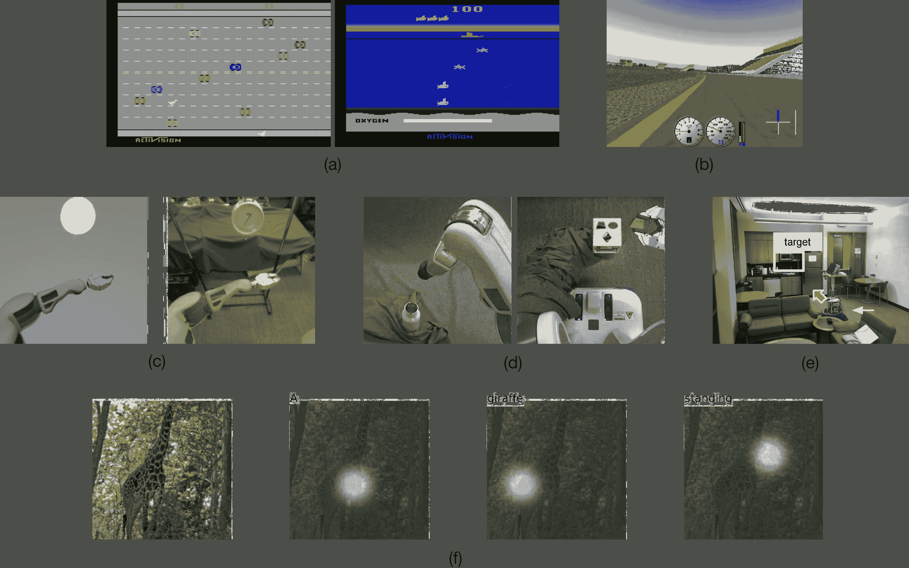
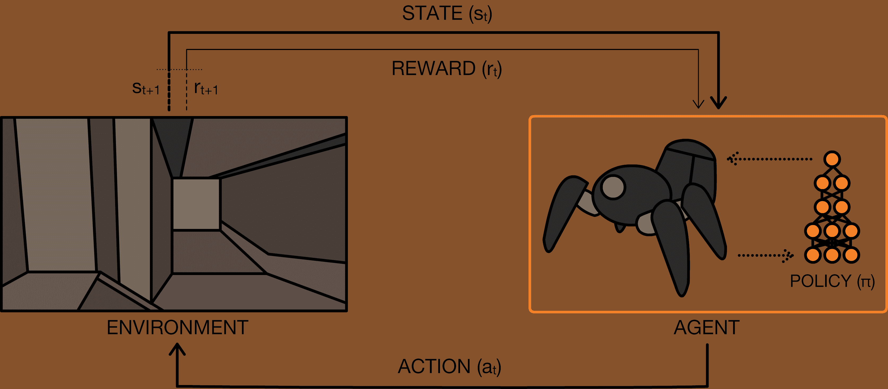
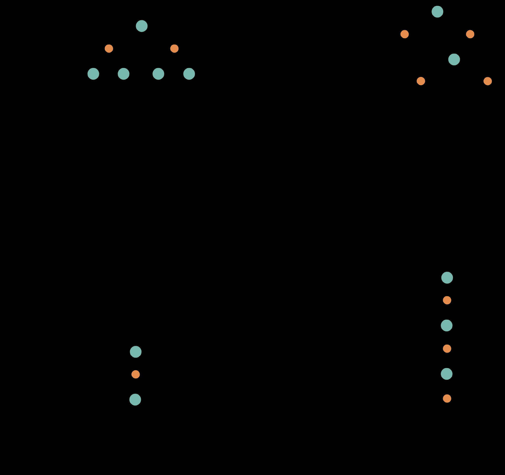
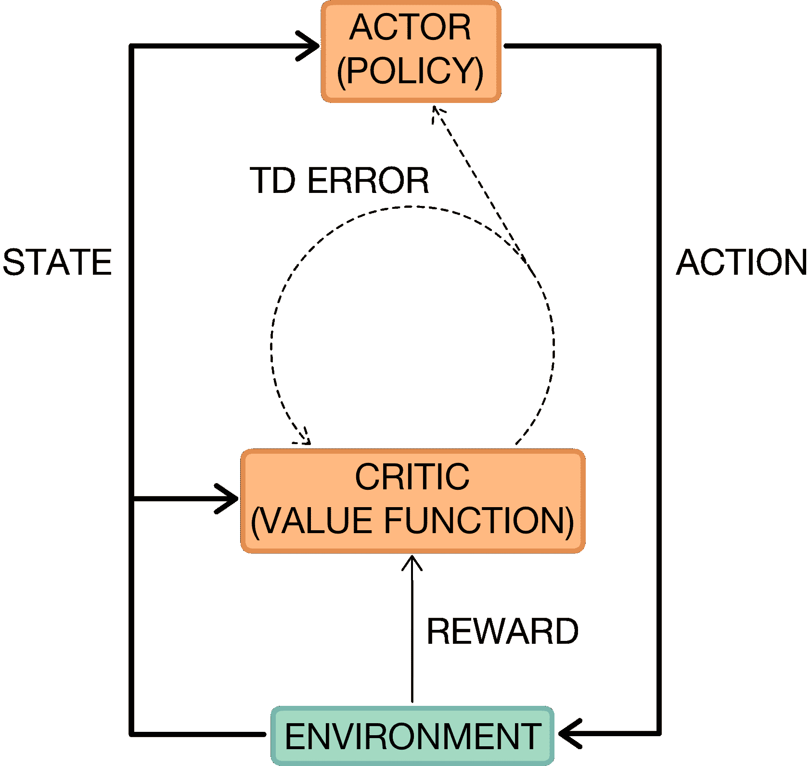
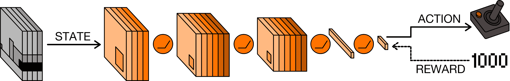
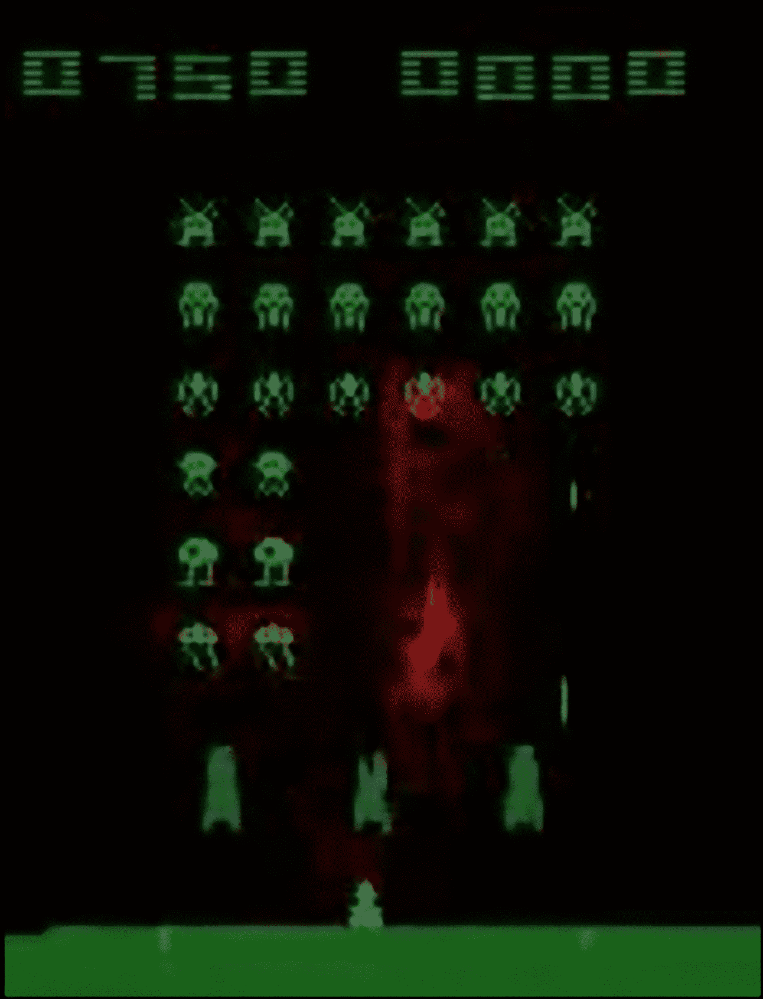

<!--yml

分类：未分类

日期：2024-09-06 20:08:50

-->

# [1708.05866] 深度强化学习的简要调查

> 来源：[`ar5iv.labs.arxiv.org/html/1708.05866`](https://ar5iv.labs.arxiv.org/html/1708.05866)

# 深度强化学习的简要调查

Kai Arulkumaran, Marc Peter Deisenroth, Miles Brundage, Anil Anthony Bharath

###### 摘要

深度强化学习有望彻底改变人工智能领域，并代表了构建具有更高视觉世界理解能力的自主系统的一步。当前，深度学习使得强化学习能够扩展到以前难以解决的问题，例如直接从像素中学习玩视频游戏。深度强化学习算法也应用于机器人技术，使得机器人控制策略可以直接从现实世界的相机输入中学习。在这项调查中，我们首先介绍了强化学习的通用领域，然后逐步介绍了基于价值的方法和基于策略的方法。我们的调查将涵盖深度强化学习中的核心算法，包括深度$Q$-网络、信任区域策略优化和异步优势演员-评论家。同时，我们突出深度神经网络的独特优势，重点关注通过强化学习进行视觉理解。最后，我们描述了该领域内几个当前的研究方向。

## I 引言

人工智能（AI）领域的主要目标之一是生产完全自主的智能体，使其能够与环境互动，以学习最佳行为，通过试错不断改进。设计响应性强且能够有效学习的 AI 系统一直是一个长期挑战，这包括能够感知和反应周围世界的机器人，以及能够与自然语言和多媒体交互的纯软件代理。一个原则性的经验驱动的自主学习数学框架是强化学习（RL）[135]。虽然 RL 在过去取得了一些成功[141, 129, 62, 93]，但之前的方法缺乏可扩展性，且固有地局限于较低维度的问题。这些限制的存在是因为 RL 算法与其他算法共享相同的复杂性问题：内存复杂性、计算复杂性，以及在机器学习算法中，样本复杂性[133]。我们近年来所见到的——深度学习的兴起，依赖于深度神经网络强大的*函数逼近*和*表示学习*属性——为我们提供了克服这些问题的新工具。

深度学习的出现对机器学习的许多领域产生了重大影响，显著提高了物体检测、语音识别和语言翻译等任务的最先进水平[70]。深度学习最重要的特性是深度神经网络能够自动找到高维数据（例如图像、文本和音频）的紧凑低维表示（特征）。通过在神经网络架构中引入归纳偏置，特别是层级表示，机器学习从业者在解决维度诅咒问题上取得了有效进展[15]。深度学习同样加速了强化学习的进展，深度学习算法在强化学习中的应用定义了“深度强化学习”（DRL）领域。本次综述旨在涵盖深度强化学习的基础和最新发展，传达神经网络如何以创新方式推动我们接近开发自主代理的目标。有关深度强化学习近期努力的更全面的综述，包括 DRL 在自然语言处理等领域的应用[106, 5]，我们推荐读者参考 Li 的概述[78]。

深度学习使得强化学习能够扩展到以前难以处理的决策问题，即具有高维状态和动作空间的设置。在深度强化学习领域的近期工作中，有两个突出的成功案例。第一个是启动了深度强化学习革命的算法，这个算法能够从图像像素中直接学习并以超人类水平玩各种 Atari 2600 视频游戏[84]。这个工作提供了解决强化学习中函数逼近技术不稳定性的问题的方案，并首次令人信服地展示了强化学习代理可以仅根据奖励信号在原始的高维观察数据上进行训练。第二个突出成功是混合深度强化学习系统 AlphaGo 的开发，它在围棋中击败了人类世界冠军[128]，这一成就与 20 年前 IBM 的深蓝在国际象棋中的历史性胜利[19]以及 IBM 的 Watson DeepQA 系统战胜顶级人类《危险边缘!》选手[31]相媲美。与主导棋类游戏系统的手工规则不同，AlphaGo 由神经网络组成，这些网络结合了监督学习和强化学习，并配合传统启发式搜索算法进行训练。

DRL 算法已经被应用于广泛的问题领域，例如机器人技术，现在可以直接从现实世界的相机输入中学习机器人的控制策略[74, 75]，取代了以前由手工设计或从机器人状态的低维特征中学习的控制器。为了创建更强大的智能体，DRL 被用来创建能够元学习（“学习如何学习”）的智能体[29, 156]，使它们能够泛化到以前从未见过的复杂视觉环境[29]。在图 1 中，我们展示了 DRL 应用的一些领域，从玩视频游戏[84]到室内导航[167]。

图 1: 一系列视觉 RL 领域。 (a) 两款经典的 Atari 2600 视频游戏，“Freeway”和“Seaquest”，来自于 Arcade Learning Environment (ALE) [10]。由于支持的游戏范围涵盖不同的类型、视觉效果和难度，ALE 已成为 DRL 算法的标准测试平台[84, 95, 44, 122, 132, 157, 85]。正如我们稍后将讨论的那样，ALE 是现在用于标准化 RL 评估的几个基准之一。 (b) TORCS 赛车模拟器，已被用于测试可以输出连续动作的 DRL 算法[64, 79, 85]（因为 ALE 的游戏仅支持离散动作）。 (c) 利用在机器人模拟器中可以积累的潜在无限的训练数据，一些方法旨在将知识从模拟器转移到现实世界[22, 115, 146]。 (d) Levine 等人设计的四个机器人任务中的两个[74]：拧瓶盖和将形状块放入正确的孔中。Levine 等人[74] 能够以端到端的方式训练视觉运动策略，展示了通过使用深度神经网络，可以直接从原始相机输入中学习视觉伺服。 (e) 一个真实的房间，其中一个训练过的轮式机器人在导航建筑物时接收视觉线索作为输入，必须找到相应的位置[167]。 (f) 一个自然图像，通过一个使用强化学习来选择查看位置的神经网络进行描述[166]。通过处理图像中的小部分来生成每个词，网络可以将注意力集中在最突出的点上。图像转载自[10, 79, 146, 74, 167, 166]。

视频游戏可能是一个有趣的挑战，但学习如何玩游戏并不是 DRL 的终极目标。DRL 的推动力之一是创建能够在现实世界中自适应学习的系统。从管理电力消耗[142]到挑选和存放物体[75]，DRL 有望通过学习增加可以自动化的物理任务的数量。然而，DRL 不仅仅止步于此，因为 RL 是一种通过试错方法解决优化问题的一般方式。从设计最先进的机器翻译模型[168]到构建新的优化函数[76]，DRL 已经被用于处理各种机器学习任务。正如深度学习在许多机器学习分支中得到应用一样，未来 DRL 也可能成为构建通用 AI 系统的重要组成部分[68]。

## II 奖励驱动的行为

图 2：感知-行动-学习循环。在时间$t$，智能体从环境中接收状态$\mathbf{s}_{t}$。智能体使用其策略选择一个动作$\mathbf{a}_{t}$。一旦动作被执行，环境转移一步，提供下一个状态$\mathbf{s}_{t+1}$以及奖励$r_{t+1}$形式的反馈。智能体利用状态转移的知识，如$(\mathbf{s}_{t},\mathbf{a}_{t},\mathbf{s}_{t+1},r_{t+1})$，以学习和改进其策略。

在考察深度神经网络对强化学习（RL）的贡献之前，我们将首先介绍强化学习的基本领域。强化学习的本质是通过*互动*进行学习。RL 智能体与环境互动，并在观察到其行为的后果后，能够根据获得的奖励调整自己的行为。这种试错学习的范式根源于行为心理学，是 RL 的主要基础之一[135]。另一个对 RL 有关键影响的领域是最优控制，它提供了支撑这一领域的数学形式化方法（尤其是动态规划[13]）。

在强化学习的设置中，一个由机器学习算法控制的自主*智能体*在时间步 $t$ 从其*环境*中观察一个*状态* $\mathbf{s}_{t}$。智能体通过在状态 $\mathbf{s}_{t}$ 下采取一个*动作* $\mathbf{a}_{t}$ 来与环境互动。当智能体采取一个动作时，环境和智能体根据当前状态和选择的动作过渡到一个新状态 $\mathbf{s}_{t+1}$。状态是环境的充分统计量，因此包含了智能体采取最佳动作所需的所有信息，这可能包括智能体的部分内容，如其执行器和传感器的位置。在最优控制文献中，状态和动作通常分别用 $\mathbf{x}_{t}$ 和 $\mathbf{u}_{t}$ 表示。

最佳动作序列由环境提供的*奖励*来决定。每次环境过渡到新状态时，它还向智能体提供一个标量奖励 $r_{t+1}$ 作为反馈。智能体的目标是学习一个*策略*（控制策略） $\pi$，以最大化预期的*回报*（累积的折扣奖励）。给定一个状态，策略返回一个要执行的动作；*最优策略*是任何最大化环境中预期回报的策略。在这方面，强化学习旨在解决与最优控制相同的问题。然而，在强化学习中，挑战在于智能体需要通过试错学习了解动作在环境中的后果，因为与最优控制不同，智能体没有状态转移动态的模型。每次与环境的互动都提供了信息，智能体利用这些信息更新其知识。这个*感知-动作-学习循环*在图 2 中有所示。

### II-A 马尔可夫决策过程

从形式上讲，强化学习（RL）可以被描述为一个马尔可夫决策过程（MDP），该过程包括：

+   •

    一组状态 $\mathcal{S}$，以及一个初始状态分布 $p(\mathbf{s}_{0})$。

+   •

    一组动作 $\mathcal{A}$。

+   •

    转移动态 $\mathcal{T}(\mathbf{s}_{t+1}|\mathbf{s}_{t},\mathbf{a}_{t})$，将时间 $t$ 的状态-动作对映射到时间 $t+1$ 的状态分布上。

+   •

    一个即时/瞬时奖励函数 $\mathcal{R}(\mathbf{s}_{t},\mathbf{a}_{t},\mathbf{s}_{t+1})$。

+   •

    一个折扣因子 $\gamma\in[0,1]$，较低的值更强调即时奖励。

通常，策略 $\pi$ 是从状态到动作概率分布的映射：$\pi:\mathcal{S}\rightarrow p(\mathcal{A}=\mathbf{a}|\mathcal{S})$。如果 MDP 是*episodic*的，即每一集的状态在长度为 $T$ 后会被重置，则一集中的状态、动作和奖励序列构成了策略的*轨迹*或*滚动*。每一次策略的滚动都会从环境中累积奖励，导致回报 $R=\sum_{t=0}^{T-1}\gamma^{t}r_{t+1}$。强化学习的目标是找到一个最优策略 $\pi^{*}$，它能够从所有状态中实现最大的期望回报：

|  | $\pi^{*}=\operatorname*{argmax}_{\pi}\mathbb{E}[R&#124;\pi].$ |  | (1) |
| --- | --- | --- | --- |

也可以考虑非*episodic* MDP，其中 $T=\infty$。在这种情况下，$\gamma<1$ 防止奖励的无限累积。此外，依赖于完整轨迹的方法不再适用，但使用有限转移集合的方法仍然有效。

强化学习的一个关键概念是马尔可夫性质——只有当前状态影响下一个状态，换句话说，给定当前状态，未来与过去是条件独立的。这意味着在 $\mathbf{s}_{t}$ 时做出的任何决策都可以仅基于 $\mathbf{s}_{t-1}$，而不是 $\{\mathbf{s}_{0},\mathbf{s}_{1},\ldots,\mathbf{s}_{t-1}\}$。虽然大多数强化学习算法都遵循这一假设，但它在某种程度上是不现实的，因为它要求状态是*完全可观测的*。MDP 的一种推广是部分可观测 MDP（POMDP），其中代理接收观察 $\mathbf{o}_{t}\in\Omega$，观察的分布 $p(\mathbf{o}_{t+1}|\mathbf{s}_{t+1},\mathbf{a}_{t})$ 依赖于当前状态和之前的动作 [56]。在控制和信号处理的背景下，观察会由一个状态空间模型中的测量/观察映射描述，该映射依赖于当前状态和先前应用的动作。

POMDP 算法通常在给定之前的信念状态、采取的动作和当前观察的情况下，维护对当前状态的*信念*。在深度学习中，更常见的方法是利用递归神经网络（RNNs）[163, 44, 45, 85, 96]，与前馈神经网络不同，递归神经网络是动态系统。这种解决 POMDP 的方法与其他使用动态系统和状态空间模型的问题相关，其中真实状态只能被估计 [16]。

### II-B 强化学习中的挑战

强调一些强化学习中面临的挑战是很有启发性的：

+   •

    最优策略必须通过与环境的试错交互来推断。代理接收到的唯一学习信号是奖励。

+   •

    代理的观察依赖于其动作，并可能包含强烈的时间相关性。

+   •

    代理必须处理长期时间依赖性：通常，一个行动的后果只有在环境经过多次转变后才会显现。这被称为（时间）*信用分配问题* [135]。

我们将在室内机器人视觉导航任务的背景下说明这些挑战：如果目标位置已指定，我们可能能够估计剩余距离（并将其用作奖励信号），但不太可能确切知道机器人需要采取什么系列动作才能到达目标。由于机器人在导航建筑物时必须选择去哪里，它的决策会影响它看到哪些房间，从而影响捕获的视觉序列的统计数据。最后，在经过几个交叉口后，机器人可能会发现自己处于死胡同。存在从学习行动后果到在探索与利用之间平衡的一系列问题，但最终这些都可以在 RL 框架内正式解决。

## III 强化学习算法

到目前为止，我们已经介绍了 RL 中使用的关键形式化工具，即 MDP，并简要提到了一些 RL 中的挑战。接下来，我们将区分不同类别的 RL 算法。解决 RL 问题的主要方法有两种：基于*价值函数*的方法和基于*策略搜索*的方法。还有一种混合的*演员-评论家*方法，它同时采用价值函数和策略搜索。我们现在将解释这些方法和其他解决 RL 问题的有用概念。

### III-A 价值函数

价值函数方法基于估计处于给定状态的价值（期望回报）。*状态价值函数* $V^{\pi}(\mathbf{s})$ 是从状态 $\mathbf{s}$ 开始并遵循 $\pi$ 的期望回报：

|  | $\displaystyle V^{\pi}(\mathbf{s})=\mathbb{E}[R | \mathbf{s},\pi]$ |  | (2) |
| --- | --- | --- | --- | --- |

最优策略 $\pi^{*}$ 有一个对应的状态价值函数 $V^{*}(\mathbf{s})$，反之亦然，最优状态价值函数可以定义为

|  | $\displaystyle V^{*}(\mathbf{s})=\max_{\pi}V^{\pi}(\mathbf{s})\quad\forall\mathbf{s}\in\mathcal{S}.$ |  | (3) |
| --- | --- | --- | --- |

如果我们有 $V^{*}(\mathbf{s})$ 可用，最优策略可以通过在 $\mathbf{s}_{t}$ 处选择所有可用动作中的最大值，并选择使 $\mathbb{E}_{\mathbf{s}_{t+1}\sim\mathcal{T}(\mathbf{s}_{t+1}|\mathbf{s}_{t},\mathbf{a})}[V^{*}(\mathbf{s}_{t+1})]$ 最大化的动作 $\mathbf{a}$ 来检索。

在 RL 设置中，转移动态 $\mathcal{T}$ 是不可用的。因此，我们构造了另一个函数，*状态-动作值*或*质量函数* $Q^{\pi}(\mathbf{s},\mathbf{a})$，它类似于 $V^{\pi}$，只是提供了初始动作 $\mathbf{a}$，并且 $\pi$ 仅从后续状态开始遵循：

|  | $\displaystyle Q^{\pi}(\mathbf{s},\mathbf{a})=\mathbb{E}[R | \mathbf{s},\mathbf{a},\pi].$ |  | (4) |
| --- | --- | --- | --- | --- |

给定$Q^{\pi}(\mathbf{s},\mathbf{a})$，可以通过在每个状态下贪婪地选择$\mathbf{a}$来找到最佳策略：$\operatorname*{argmax}_{\mathbf{a}}Q^{\pi}(\mathbf{s},\mathbf{a})$。在此策略下，我们还可以通过最大化$Q^{\pi}(\mathbf{s},\mathbf{a})$来定义$V^{\pi}(\mathbf{s})$：$V^{\pi}(\mathbf{s})=\max_{\mathbf{a}}Q^{\pi}(\mathbf{s},\mathbf{a})$。

动态规划：为了实际学习$Q^{\pi}$，我们利用马尔可夫性质，并将函数定义为 Bellman 方程[13]，其递归形式如下：

|  | $\displaystyle Q^{\pi}(\mathbf{s}_{t},\mathbf{a}_{t})=\mathbb{E}_{\mathbf{s}_{t+1}}[r_{t+1}+\gamma Q^{\pi}(\mathbf{s}_{t+1},\pi(\mathbf{s}_{t+1}))].$ |  | (5) |
| --- | --- | --- | --- |

这意味着$Q^{\pi}$可以通过*自助法*得到改进，即我们可以利用当前$Q^{\pi}$估计的值来改进我们的估计。这是$Q$-学习[159]和状态-动作-奖励-状态-动作（SARSA）算法[112]的基础：

|  | $\displaystyle Q^{\pi}(\mathbf{s}_{t},\mathbf{a}_{t})\leftarrow Q^{\pi}(\mathbf{s}_{t},\mathbf{a}_{t})+\alpha\delta,$ |  | (6) |
| --- | --- | --- | --- |

其中，$\alpha$是学习率，$\delta=Y-Q^{\pi}(\mathbf{s}_{t},\mathbf{a}_{t})$是时间差（TD）误差；这里，$Y$是标准回归问题中的目标。SARSA 是一种*在策略*学习算法，用于通过使用行为策略（从$Q^{\pi}$推导出的策略）生成的过渡来改进$Q^{\pi}$的估计，这导致设置$Y=r_{t}+\gamma Q^{\pi}(\mathbf{s}_{t+1},\mathbf{a}_{t+1})$。$Q$-学习是*离策略*的，因为$Q^{\pi}$是通过不一定由推导策略生成的过渡来更新的。相反，$Q$-学习使用$Y=r_{t}+\gamma\max_{\mathbf{a}}Q^{\pi}(\mathbf{s}_{t+1},\mathbf{a})$，直接逼近$Q^{*}$。

要从任意的$Q^{\pi}$中找到$Q^{*}$，我们使用*广义策略迭代*，其中策略迭代包括*策略评估*和*策略改进*。策略评估通过最小化跟随策略的轨迹中的 TD 误差来改进价值函数的估计。随着估计的改进，策略可以通过基于更新后的价值函数贪婪地选择动作自然地得到改进。与单独执行这些步骤直至收敛（如在策略迭代中）不同，广义策略迭代允许交替执行这些步骤，从而使进展更快。

### III-B 采样

与使用动态规划方法引导价值函数不同，蒙特卡罗方法通过平均多个策略回合的回报来估计来自状态的预期回报（2）。因此，纯蒙特卡罗方法也可以应用于非马尔科夫环境。另一方面，它们只能用于回合式 MDP，因为必须终止回合才能计算回报。通过将 TD 学习和蒙特卡罗策略评估结合在一起，例如在 TD($\lambda$) 算法中[135]，可以获得两种方法的最佳效果。与折扣因子类似，TD($\lambda$) 中的 $\lambda$ 用于在蒙特卡罗评估和引导法之间进行插值。如图 4 所示，这导致了围绕采样量的整个 RL 方法谱。

图 3：RL 算法的两个维度，基于用于学习或构建策略的*备份*方法。这些维度的极端情况是（a）动态规划，（b）穷举搜索，（c）一步 TD 学习和（d）纯蒙特卡罗方法。引导法从（c）1 步 TD 学习扩展到 $n$ 步 TD 学习方法[135]，而（d）纯蒙特卡罗方法完全不依赖于引导法。另一种可能的变化维度是选择（c，d）采样动作与（a，b）对所有选择的期望。重新创建自[135]。

图 4：演员-评论家设置。演员（策略）从环境中接收一个状态，并选择一个动作来执行。与此同时，评论家（价值函数）接收来自先前交互的状态和奖励。评论家利用从这些信息中计算出的 TD 误差来更新自己和演员。重新创建自[135]。

另一个主要的基于价值函数的方法依赖于学习*优势*函数 $A^{\pi}(\mathbf{s},\mathbf{a})$ [6, 43]。与产生绝对状态-动作值（如 $Q^{\pi}$）不同，$A^{\pi}$ 表示的是相对状态-动作值。学习相对值类似于去除信号的基线或平均水平；更直观地说，学习一个动作比另一个动作有更好的后果比学习采取该动作的实际回报要容易。$A^{\pi}$ 通过简单关系 $A^{\pi}=Q^{\pi}-V^{\pi}$ 表示动作的相对优势，并且与梯度基础的策略搜索方法中的方差减少基线方法紧密相关[164]。优势更新的思想已被许多近期的深度强化学习算法所利用[157, 40, 85, 123]。

### III-C 策略搜索

策略搜索方法不需要维持价值函数模型，而是直接搜索最优策略 $\pi^{*}$。通常，选择一个参数化策略 $\pi_{\theta}$，其参数通过使用梯度基础或无梯度优化来最大化期望回报 $\mathbb{E}[R|\theta]$ [26]。编码策略的神经网络已经成功地使用无梯度[37, 23, 64] 和梯度基础[164, 163, 46, 79, 122, 123, 74] 方法进行训练。无梯度优化可以有效覆盖低维参数空间，但尽管在将其应用于大网络[64]方面取得了一些成功，梯度基础训练仍然是大多数深度强化学习算法的首选方法，因为它在策略参数较多时更具样本效率。

在直接构建策略时，常常会输出概率分布的参数；对于连续动作，这可能是高斯分布的均值和标准差，而对于离散动作，这可能是多项式分布的各个概率。结果是一个随机策略，我们可以直接从中采样动作。使用无梯度方法时，寻找更好的策略需要在预定义的模型类别中进行启发式搜索。诸如进化策略的方法本质上在策略的一个子空间中进行爬升[116]，而更复杂的方法，如压缩网络搜索，则施加额外的归纳偏差[64]。无梯度策略搜索的最大优势之一是它们还可以优化不可微分的策略。

政策梯度：梯度可以提供强大的学习信号，指导如何改进参数化政策。然而，为了计算期望回报（1），我们需要对当前政策参数化诱导的合理轨迹进行平均。这种平均需要确定性近似（例如，线性化）或通过采样的随机近似[26]。确定性近似只能在模型基础的设置中应用，其中需要一个底层转移动态的模型。在更常见的无模型 RL 设置中，确定期望回报的蒙特卡罗估计被使用。对于基于梯度的学习，这种蒙特卡罗近似带来了挑战，因为梯度无法通过这些随机函数的样本。因此，我们转向梯度的估计器，在 RL 中称为 REINFORCE 规则[164]，在其他地方称为得分函数[34]或似然比估计器[36]。后一个名称很有说明性，因为使用估计器类似于在监督学习中优化对数似然。直观地说，使用估计器的梯度上升增加了采样动作的对数概率，加权由回报。更正式地，REINFORCE 规则可以用来计算对随机变量$X$的函数$f$的期望的梯度，相对于参数$\theta$：

|  | $\displaystyle\nabla_{\theta}\mathbb{E}_{X}[f(X;\theta)]=\mathbb{E}_{X}[f(X;\theta)\nabla_{\theta}\log p(X)].$ |  | (7) |
| --- | --- | --- | --- |

由于该计算依赖于轨迹的经验回报，结果梯度具有较高的方差。通过引入噪声较少的无偏估计，可以减少方差。执行这一过程的一般方法是减去基线，这意味着通过优势而不是纯回报来加权更新。最简单的基线是取多个回合的平均回报[164]，但还有许多其他选项[123]。

演员-评论家方法：可以将价值函数与政策的显式表示结合，形成演员-评论家方法，如图 4 所示。“演员”（政策）通过使用来自“评论家”（价值函数）的反馈进行学习。这样，这些方法在政策梯度的方差减少与来自价值函数方法的偏差引入之间进行权衡[63, 123]。

演员-评论家方法使用价值函数作为策略梯度的基准，因此演员-评论家方法与其他基准方法的唯一根本区别在于演员-评论家方法利用了 *学习到的* 价值函数。因此，稍后我们将把演员-评论家方法作为策略梯度方法的一个子集来讨论。

### III-D 规划与学习

给定环境模型，可以利用动态规划对所有可能的动作进行计算（图 4 (a)），进行启发式搜索（如 AlphaGo [128]所做），甚至进行穷尽性搜索（图 4 (b)）。Sutton 和 Barto [135] 定义 *规划* 为任何利用模型来生成或改进策略的方法。这包括 *分布模型*，包括 $\mathcal{T}$ 和 $\mathcal{R}$，以及 *样本模型*，从中只能抽取状态转移样本。

在强化学习（RL）中，我们专注于在没有环境基本模型的情况下进行学习。然而，与环境的交互可以用来学习价值函数、策略，以及模型。无模型的强化学习方法直接从与环境的交互中学习，但基于模型的强化学习方法可以使用学习到的模型模拟状态转移，从而提高样本效率。这在每次与环境的交互成本很高的领域尤为重要。然而，学习一个模型会引入额外的复杂性，并且总是存在遭受模型误差的风险，这反过来会影响学习到的策略；在这种情况下，一种常见但部分的解决方案是使用模型预测控制，即在实际环境中经过小序列动作后重复规划[16]。尽管深度神经网络有可能产生非常复杂和丰富的模型[95, 132, 32]，有时更简单、更数据高效的方法更为可取[40]。这些考虑因素在使用学习到的价值函数的演员-评论家方法中也起着作用[63, 123]。

### III-E 深度强化学习的兴起

在深度强化学习（DRL）中，许多成功的案例基于将先前的强化学习（RL）工作扩展到高维问题。这是由于神经网络在低维特征表示学习和强大的函数逼近特性上的优势。通过表示学习，DRL 能够有效处理维度灾难，这与表格型和传统的非参数方法不同[15]。例如，卷积神经网络（CNNs）可以作为 RL 代理的组成部分，使其能够直接从原始的高维视觉输入中学习。一般而言，DRL 基于训练深度神经网络来逼近最优策略$\pi^{*}$和/或最优值函数$V^{*}$、$Q^{*}$和$A^{*}$。

尽管已经有使用无梯度方法取得成功的 DRL 案例[37, 23, 64]，但绝大多数当前的工作依赖于梯度，因此使用反向传播算法[162, 111]。主要原因是，当可用时，梯度提供了强大的学习信号。实际上，这些梯度是基于近似值、采样或其他方式估算的，因此我们必须设计具有有用归纳偏差的算法，使其可处理。

反向传播的另一个好处是将期望回报的优化视为随机函数的优化[121, 46]。这个函数可以包含多个部分——模型、策略和价值函数——可以以各种方式组合。个别部分，如价值函数，可能不会直接优化期望回报，但可以包含关于 RL 领域的有用信息。例如，使用可微分的模型和策略，可以在整个回合中进行前向传播和反向传播；另一方面，随着时间步长的延长，误差可能会累积，因此可能需要使用价值函数来总结回合的统计数据[46]。我们之前提到表示学习和函数逼近是 DRL 成功的关键，但也可以说，深度学习领域激发了对 RL 的新思维方式。

在回顾了 RL 后，我们将把调查的下一部分分为 DRL 中的值函数和策略搜索方法，从著名的深度$Q$-网络（DQN）[84]开始。在这些部分中，我们将关注最先进的技术，以及它们所建立的历史工作。最先进技术的重点将是那些通过视觉输入传达状态空间的技术，例如图像和视频。最后，我们将考察正在进行的研究领域和开放挑战。

## IV 值函数

神经网络的众所周知的函数近似特性自然导致了深度学习在 RL 代理中回归函数的应用。事实上，RL 中的早期成功案例之一是 TD-Gammon，它在 90 年代初期在飞行棋中达到了专家级别的表现 [141]。使用 TD 方法，网络接受棋盘状态以预测黑白方获胜的概率。尽管这个简单的想法在后来的工作中有所延续 [128]，但 RL 研究的进展更倾向于明确使用价值函数，这些函数可以捕捉环境的底层结构。从早期在 DRL 中的简单状态输入的价值函数方法 [109] 到现在能够处理视觉和概念上复杂环境的现有方法 [84, 122, 85, 96, 167]。

### IV-A 函数近似与 DQN

我们开始调查基于价值函数的深度强化学习（DRL）算法，其中包括 DQN [84]，如图 5 所示。DQN 在多个经典的 Atari 2600 视频游戏[10]中的得分与专业视频游戏测试员相当。DQN 的输入是四帧时间上串联的灰度图像，这些图像最初由多个卷积层处理，以提取时空特征，例如“乒乓球”或“打砖块”中的球的运动。卷积层的最终特征图通过几个全连接层处理，这些层更隐式地编码了动作的效果。这与使用固定预处理步骤的传统控制器形成对比，后者无法根据学习信号调整其状态处理方式。

图 5: 深度 $Q$-网络 [84]。该网络接收状态——来自视频游戏的灰度帧堆栈——并通过卷积层和全连接层进行处理，每层之间有 ReLU 非线性激活。在最终层，网络输出一个离散动作，该动作对应于游戏的一个可能控制输入。给定当前状态和选择的动作，游戏返回一个新的得分。DQN 使用奖励——即新得分与之前得分的差值——来从其决策中学习。更准确地说，奖励用于更新其 $Q$ 的估计值，并将其之前估计与新估计之间的误差通过网络反向传播。

DQN 的前身——神经网络拟合$Q$迭代（NFQ）——涉及训练一个神经网络，以在给定状态-动作对时返回$Q$值[109]。NFQ 后来被扩展为训练一个网络来驾驶小车，利用来自摄像头的原始视觉输入，并通过结合深度自编码器来减少输入的维度，以及一个单独的分支来预测$Q$值[69]。尽管之前的网络可以同时训练重建和强化学习任务，但分开训练网络的两个部分在可靠性和计算效率上都更优。

DQN[84]与 Lange 等人提出的模型[69]密切相关，但它是第一个被证明可以直接从原始视觉输入和在各种环境中工作的强化学习算法。它被设计成最终的全连接层输出离散动作集合中所有动作的$Q^{\pi}(\mathbf{s},\cdot)$——在这种情况下，是摇杆的各种方向和火按钮。这不仅使得在网络的单次前向传递后可以选择最佳动作$\operatorname*{argmax}_{\mathbf{a}}Q^{\pi}(\mathbf{s},\mathbf{a})$，还使网络能够更容易地在较低的卷积层中编码与动作无关的知识。DQN 仅以最大化其在视频游戏中的得分为目标，学习提取显著的视觉特征，联合编码对象、其运动，最重要的是它们的交互。利用最初为解释 CNN 在对象识别任务中的行为而开发的技术，我们还可以检查代理认为重要的视图部分（见图 6）。

图 6：训练后的 DQN[84]玩“太空侵略者”[10]的显著性图。通过将训练信号反向传播到图像空间，可以看到基于神经网络的代理正在关注什么。在这个帧中，最显著的点——以红色覆盖显示——是代理最近发射的激光，以及它预期在几个时间步骤后击中的敌人。

游戏的真实底层状态包含在 128 字节的 Atari 2600 RAM 中。然而，DQN 设计为直接从视觉输入 ($210\times 160\text{pixel}$ 8 位 RGB 图像) 中学习，将其作为状态 $\mathbf{s}$。准确地将 $Q^{\pi}(\mathbf{s},\mathbf{a})$ 表示为查找表是不切实际的：与 18 种可能的动作结合时，我们得到一个大小为 $|\mathcal{S}|\times|\mathcal{A}|=18\times 256^{3\times 210\times 160}$ 的 $Q$ 表。即使能够创建这样的表，它也会稀疏填充，并且从一个状态-动作对获得的信息无法传播到其他状态-动作对。DQN 的优势在于其利用深度神经网络紧凑地表示高维观察和 $Q$-函数的能力。如果没有这种能力，从原始视觉输入中处理离散的 Atari 领域将是不可行的。

DQN 通过使用两种技术来解决 RL 中使用函数逼近的基本不稳定性问题 [145]：经验回放 [80] 和目标网络。经验回放内存在循环缓冲区中存储形式为 $(\mathbf{s}_{t},\mathbf{a}_{t},\mathbf{s}_{t+1},r_{t+1})$ 的转换，使 RL 代理可以从先前观察到的数据中进行离线采样和训练。这不仅大大减少了与环境的交互量，而且可以从批量经验中采样，降低学习更新的方差。此外，通过从大型内存中均匀采样，打破了可能对 RL 算法产生不利影响的时间相关性。最后，从实际角度来看，现代硬件可以高效地并行处理数据批次，提高吞吐量。虽然原始 DQN 算法使用了均匀采样 [84]，但后来的工作表明，基于 TD 误差优先采样对学习更有效 [118]。我们注意到，尽管经验回放通常被认为是一种无模型技术，但它实际上可以被视为一种简单的模型 [150]。

第二种稳定化方法由 Mnih 等人提出 [84]，即使用目标网络，该网络最初包含实施策略的网络的权重，但在较长时间内保持不变。与其根据自身快速波动的 $Q$ 值估计来计算 TD 误差不同，策略网络使用固定的目标网络。在训练过程中，目标网络的权重在固定的步骤数后更新以匹配策略网络。经验回放和目标网络已被后续的 DRL 工作所采用 [40, 79, 158, 89]。

### IV-B $Q$-函数修改

考虑到 DQN 的关键组成部分之一是 $Q$-函数的函数近似器，它可以从 RL 的基本进展中获益。van Hasselt [148] 显示，$Q$-学习更新规则中使用的单一估计器由于使用最大动作值作为最大 *期望* 动作值的近似，导致过度估计预期回报。双重 $Q$ 学习通过使用双重估计器 [148] 提供了更好的估计。尽管双重 $Q$ 学习需要额外的函数来学习，但后来的一项工作建议使用 DQN 算法中已经存在的目标网络，这使得更新步骤只需进行小幅修改就能获得显著更好的结果 [149]。Bellemare 等人 [12] 的更激进的提议是实际学习完整的 *价值分布*，而不仅仅是期望值；这提供了额外的信息，例如潜在奖励是否来自于偏斜或多峰分布。尽管基于学习分类分布的结果算法用于构建分类 DQN，但其优势可能适用于任何利用学习价值函数的 RL 算法。

调整 DQN 架构的另一种方法是将 $Q$-函数分解为有意义的函数，例如通过将计算状态值函数 $V^{\pi}$ 和优势函数 $A^{\pi}$ 的不同层相加来构造 $Q^{\pi}$ [157]。与其对所有动作计算准确的 $Q$-值，双重 DQN [157] 从 $V^{\pi}$ 形式的状态基准中受益，并且在 $A^{\pi}$ 形式的相对值中更容易学习。将双重 DQN 与优先经验回放 [118] 结合，是离散动作设置中的最先进技术之一。Gu 等人对 $A^{\pi}$ 属性的进一步洞察 [40] 使他们修改了 DQN，引入了一个凸优势层，将算法扩展到连续动作集上，从而创建了归一化优势函数 (NAF) 算法。NAF 通过经验回放、目标网络和优势更新获益，是解决连续控制问题的几种最先进技术之一 [40]。

一些强化学习领域，如推荐系统，具有非常大的离散动作空间，因此可能很难直接处理。Dulac-Arnold 等人[30]提出在原始动作的大集合上学习“动作嵌入”，然后使用$k$-最近邻生成可以与传统强化学习方法一起使用的“原型动作”。使用表示学习创建分布式嵌入是深度强化学习的一个特殊优势，并已成功用于其他目的[161, 100]。强化学习中的另一个相关场景是需要同时进行许多动作，例如在多关节机器人中指定扭矩，这会导致动作空间呈指数级增长。一种简单但合理的方法是对策略进行因子分解，将每个动作独立处理[115]。另一种选择是构建自回归策略，其中在一个时间步中每个动作是条件预测的，基于状态和同一时间步中之前选择的动作[106, 5, 168]。Metz 等人[81]利用这个想法构建了顺序 DQN，使他们能够对大型动作空间进行离散化，并在连续控制问题中超越了 NAF——其受限于其二次优势函数。在更广泛的背景下，与其直接处理原始动作，不如选择从更高层次的策略中调用“子策略”[136]；这一概念，称为层次强化学习（HRL），将在后续讨论中涉及。

## V 策略搜索

策略搜索方法旨在通过无梯度或基于梯度的方法直接找到策略。在当前对深度强化学习（DRL）的关注激增之前，DRL 中有几个成功的方法避开了常用的反向传播算法，而选择了进化算法[37, 23, 64]，这些都是无梯度的策略搜索算法。进化方法依赖于评估一组代理的表现。因此，对于大规模的人群或具有许多参数的代理来说，它们是昂贵的。然而，作为黑箱优化方法，它们可以用于优化任意的、不可微分的模型，并自然地允许更多的参数空间探索。结合神经网络权重的压缩表示，进化算法甚至可以用于训练大型网络；这种技术产生了第一个能够直接从高维视觉输入中学习强化学习任务的深度神经网络[64]。最近的研究重新点燃了对进化方法在强化学习中的兴趣，因为它们可以比依赖梯度的技术在更大规模上分布[116]。

### V-A 通过随机函数的反向传播

然而，DRL 的主力依然是反向传播[162, 111]。前面讨论的 REINFORCE 规则[164]允许神经网络以任务相关的方式学习随机策略，例如决定在图像中哪里查看以进行跟踪[120]、分类[83]或对对象进行描述[166]。在这些情况下，随机变量将决定图像的一个小区域的坐标，从而减少所需的计算量。使用 RL 对输入进行离散的、随机的决策被称为*硬注意力*，这是近年来基本策略搜索方法的一个更具吸引力的应用，有许多应用在传统 RL 领域之外。更一般地，能够通过随机函数进行反向传播，使用如 REINFORCE[164]或“重参数化技巧”[61, 108]等技术，使神经网络可以被视为可以优化的随机计算图[121]，这是诸如随机值梯度（SVGs）[46]等算法的关键概念。

### V-B 累积误差

直接搜索由参数非常多的神经网络表示的策略可能会很困难，并且可能会遭遇严重的局部最小值。一种解决方法是使用引导策略搜索（GPS），它利用来自其他控制器（可以使用如最优控制等单独的方法构建）的几个动作序列。GPS 通过结合监督学习和重要性采样从这些序列中学习，重要性采样纠正了偏离策略的样本[73]。这种方法有效地将搜索偏向于一个良好的（局部）最优解。GPS 通过优化策略以匹配采样的轨迹，并优化轨迹分布以匹配策略和最小化成本来工作。最初，GPS 用于在模拟的连续 RL 问题上训练神经网络[72]，但后来被用于基于视觉输入训练真实机器人策略[74]。Levine 等人[74]的研究表明，可以从相机的 RGB 像素到电机扭矩“端到端”地训练机器人视觉运动策略，因此，这项研究是 DRL 领域的重要工作之一。

一种更常用的方法是使用信任区域，其中优化步骤被限制在一个近似真实成本函数仍然有效的区域内。通过防止更新的策略过于偏离先前的策略，可以降低灾难性坏更新的机会，并且许多使用信任区域的算法保证或实际上导致策略性能的单调改善。将每次策略梯度更新限制在当前策略与建议策略之间的 Kullback-Leibler (KL)散度的历史在强化学习中已有悠久的历史[57, 4, 59, 103]。这一研究方向中的一种较新算法，信任区域策略优化（TRPO），已被证明在高维输入领域中相对鲁棒且适用[122]。为实现这一点，TRPO 优化一个*代理*目标函数——具体来说，它优化一个（重要性抽样的）优势估计，并使用 KL 散度的二次近似进行约束。虽然 TRPO 可以作为一种纯粹的策略梯度方法与简单基线一起使用，但 Schulman 等人后来的工作[123]引入了广义优势估计（GAE），提出了几种更先进的方差减少基线。TRPO 与 GAE 的结合仍然是连续控制中的最先进的强化学习技术之一。然而，TRPO 的约束优化需要计算二阶梯度，这限制了它的适用性。相比之下，较新的近端策略优化（PPO）算法执行无约束优化，仅需要一阶梯度信息[1, 47, 125]。主要的两个变体包括对 KL 散度的自适应惩罚，以及一个与 KL 散度无关的启发式剪切目标[125]。由于 PPO 在保留 TRPO 性能的同时成本较低，因此在各种强化学习任务中（无论是否使用 GAE）越来越受欢迎[47, 125]。

### V-C 演员-评论家方法

相较于利用多个蒙特卡罗回报的平均值作为策略梯度方法的基线，演员-评论家方法作为一种有效结合策略搜索方法和学习值函数的手段变得越来越受欢迎，后者能够从完整的回报和/或时序差分（TD）误差中学习。它们可以从策略梯度方法（如 GAE[123]）和值函数方法（如目标网络[84]）的改进中受益。在过去几年里，深度强化学习（DRL）演员-评论家方法已经从学习模拟物理任务[46, 79]扩展到实际机器人视觉导航任务[167]，直接从图像像素中学习。

在演员-评论家算法的背景下，最近的一个发展是确定性策略梯度（DPGs）[127]，它将标准策略梯度定理从随机策略[164]扩展到确定性策略。DPGs 的一个主要优点是，虽然随机策略梯度在状态空间和动作空间上进行积分，但 DPGs 仅在状态空间上进行积分，从而在具有大动作空间的问题中需要较少的样本。在 DPGs 的初步工作中，Silver 等人[127] 引入并展示了一种离策略演员-评论家算法，这在高维连续控制问题中显著优于随机策略梯度的等效算法。后来，深度 DPG（DDPG）应运而生，它利用神经网络在高维视觉状态空间上进行操作[79]。与 DPGs 同样，Heess 等人[46] 设计了一种通过“重新参数化”[61, 108] 将随机性从网络中剥离来计算梯度以优化随机策略的方法，从而允许使用标准梯度（而不是高方差的 REINFORCE 估计器 [164]）。由此产生的 SVG 方法具有灵活性，可以与（SVG(0) 和 SVG(1)）和不与（SVG($\infty$)）值函数评论家一起使用，以及与（SVG($\infty$) 和 SVG(1)）和不与（SVG(0)）模型一起使用。后来，工作继续将 DPGs 和 SVGs 与 RNNs 集成，使其能够在 POMDPs 中解决连续控制问题，直接从像素中学习[45]。

值函数在演员-评论家方法中引入了一项广泛适用的好处——使用离策略数据的能力。在线策略方法可能更稳定，而离策略方法则可能更具数据效率，因此有几次尝试将两者合并[158, 94, 41, 39, 42]。早期的工作要么利用在线和离策略梯度更新的混合[158, 94, 39]，要么使用离策略数据训练值函数，以减少在线策略梯度更新的方差[41]。Gu 等人的最新工作[42] 在插值策略梯度（IPGs）下统一了这些方法，产生了最新的最先进的连续 DRL 算法之一，并为该领域未来的研究提供了见解。IPGs 和 SVGs（DPGs 可视为一个特例）背后的思想共同构成了改进 DRL 学习效率的算法方法。

提高学习速度的另一个正交方法是利用并行计算。特别是，已经开发出用于单台机器 [107] 和分布式系统 [25] 的异步梯度更新训练网络的方法。通过保持一个规范的参数集，该参数集由多个相同网络的副本以异步方式读取和更新，计算可以高效地分布在单个 CPU 的处理核心上以及机器集群中的 CPU 上。使用分布式系统，Nair 等人 [91] 开发了一个用于并行训练多个 DQN 的框架，实现了更好的性能和训练时间的减少。然而，简化的异步优势 actor-critic (A3C) 算法 [85]，旨在单机和分布式机器设置下使用，已经成为最近最流行的 DRL 技术之一。A3C 结合了优势更新和 actor-critic 表述，依赖于异步更新的策略和价值函数网络，这些网络在多个处理线程上并行训练。多个代理在各自独立的环境中，不仅稳定了参数的改进，还带来了额外的好处，使更多的探索得以进行。A3C 已作为许多后续工作的标准起点，包括 Zhu 等人 [167] 的工作，他们通过视觉输入将其应用于现实世界的机器人导航。为了简便，底层算法可以只用一个代理，即优势 actor-critic (A2C) [156]。或者，可以收集和处理多个代理的轨迹片段，批处理可以通过 GPU 更高效地实现；这种同步版本也被称为 A2C [125]。

对原始 A3C 算法的若干重大改进反映了 DRL 领域中的各种动机。首先是带有经验回放的 actor-critic [158, 39]，该方法在基于 $Q$ 值的 A3C 中添加了 Retrace($\lambda$) 离线策略偏差修正 [88]，使其能够利用经验回放以提高样本复杂度。其他研究者尝试弥合基于值和基于策略的 RL 之间的差距，利用理论进展改进原始的 A3C [89, 94, 124]。最后，越来越多的趋势是利用辅助任务来改善 DRL 代理学习的表示，从而提高这些代理的学习速度和最终性能 [77, 54, 82]。

## VI 当前研究与挑战

总结一下，我们将重点介绍当前 DRL（深度强化学习）研究中的一些领域以及仍然存在的挑战。之前，我们主要关注于无模型方法，但现在我们将更详细地研究一些基于模型的 DRL 算法。基于模型的强化学习算法在提高 RL（强化学习）的数据效率和权衡探索与利用方面发挥着重要作用。在解决探索策略后，我们将讨论 HRL（层次强化学习），它通过将最终策略明确地分解为多个层级，给最终策略施加了归纳偏差。当可能时，可以利用其他控制器的轨迹来引导学习过程，这引导我们进入模仿学习和逆强化学习（IRL）。在 RL 的最终专题中，我们将探讨多智能体系统，这些系统有其特殊的考虑因素。然后，我们将关注两个更广泛的领域——RNN 的使用以及转移学习——在 DRL 的背景下。接着，我们将讨论评估 RL 的问题，以及 DRL 的当前基准。

### VI-A 基于模型的强化学习

基于模型的 RL 的核心思想是学习一个转移模型，该模型允许在不直接与环境交互的情况下对环境进行模拟。基于模型的 RL 并不假设具体的先验知识。然而，在实践中，我们可以结合先验知识（例如，基于物理的模型 [58]）来加速学习。模型学习在减少与（真实）环境交互的必要次数方面发挥着重要作用，这在实践中可能是有限的。例如，在合理的时间内进行数百万次实验并且不产生显著的硬件磨损是不现实的。有多种方法可以使用像素信息来学习动态系统的预测模型。基于深度动态模型 [154]，其中高维观测通过自编码器嵌入到低维空间中，已经提出了几种基于模型的 DRL 算法，用于从像素信息中学习模型和策略 [95, 160, 155]。如果能够学习到足够准确的环境模型，那么即使是简单的控制器也可以用来直接从相机图像中控制机器人 [32]。学习到的模型也可以用于仅基于环境模拟来引导探索，深度模型使这些技术能够扩展到高维视觉领域 [132]。

神经网络模型的一个引人注目的好处是它们可以克服使用不完美模型进行规划时遇到的一些问题；实际上，通过*嵌入*这些模型的激活和预测（输出）到一个向量中，DRL 代理不仅可以获得比任何模型模拟的最终结果更多的信息，而且如果它认为模型不准确，它还可以学会贬低这些信息[161]。这可能比贝叶斯方法传播不确定性[52]更高效，但原理性较差。利用神经网络模型的灵活性的一种方法是让它们决定何时进行规划，即在有限的计算量下，是否值得建模一个长的轨迹、几个短的轨迹、介于两者之间的轨迹，还是仅仅在真实环境中采取行动[100]。

尽管深度神经网络可以在模拟环境中对数百个时间步做出合理预测[21]，它们通常需要许多样本来调整其包含的大量参数。训练这些模型通常需要比简单模型更多的样本（与环境的互动）。因此，Gu 等人[40]为 NAF 算法（DQN[84]的连续等效物）训练了局部线性模型，以提高在样本昂贵的机器人领域中算法的样本复杂性。为了促进深度模型在基于模型的 DRL 中的应用，有必要找到可以提高其数据效率的策略[90]。

一种较少见但可能有用的范式存在于无模型和基于模型的方法之间——后继表示（SR）[24]。与直接选择行动或使用模型进行规划不同，学习$\mathcal{T}$被替换为学习预期的（折扣）未来占用率（SR），这些可以与$\mathcal{R}$线性结合以计算最佳行动；这种分解使 SR 在奖励结构变化时比无模型方法更为稳健（但在$\mathcal{T}$变化时仍然可能出错）。扩展 SR 到深度神经网络的研究已经证明了它在多任务环境中的有用性，同时在复杂视觉环境中[66]。

### VI-B 探索与利用

强化学习中的一个最大困难是*探索与开发*的基本困境：代理何时应该尝试（感知的）非最优动作以探索环境（并可能改善模型），以及何时应该利用最优动作以取得有用的进展？离线策略算法，例如 DQN [84]，通常使用简单的 $\epsilon$-贪婪探索策略，该策略以概率 $\epsilon\in[0,1]$ 选择一个随机动作，否则选择最优动作。通过随着时间减少 $\epsilon$，代理向开发方向发展。尽管在连续控制问题中添加独立噪声以进行探索是可用的，但更复杂的策略注入随时间相关的噪声（例如来自随机过程）以更好地保持动量 [79]。

时间相关性的重要性观察促使 Osband 等人 [97] 提出了引导式 DQN，该方法维护多个 $Q$-值“头”，通过不同权重初始化和从经验回放记忆中引导式采样的组合来学习不同的值。在每次训练开始时，选择不同的头，从而实现时间上扩展的探索。Usunier 等人 [147] 后来提出了一种类似的方法，该方法通过向单一输出头添加噪声，在策略空间中进行探索，使用零阶梯度估计来允许通过策略进行反向传播。

主要的原则性探索策略之一是*上置信界*（UCB）算法，该算法基于“在不确定性面前的乐观”原则 [67]。UCB 的思想是选择最大化 $\mathbb{E[R]}+\kappa\sigma[R]$ 的动作，其中 $\sigma[R]$ 是回报的标准差，$\kappa>0$。因此，UCB 鼓励在高不确定性和适度预期回报的区域进行探索。虽然在小型表格案例中很容易实现，但使用强大的密度模型 [11]，或者相反，哈希 [139]，使得该算法能够扩展到具有 DRL 的高维视觉领域。UCB 只是贝叶斯优化上下文中探索与开发权衡的一种技术 [126]；未来在 DRL 的研究中可能会受益于调查其他在贝叶斯优化中成功使用的技术。

UCB 也可以被视为实现*内在动机*的一种方式，这是一个提倡减少不确定性/在学习环境中取得进展的普遍概念 [119]。已经有一些 DRL 算法尝试通过最小化模型预测误差 [132, 101] 或最大化信息增益 [86, 52] 来实现内在动机。

### VI-C 层次化强化学习

就像深度学习依赖于特征的层次结构一样，HRL（层次化强化学习）依赖于策略的层次结构。早期的工作引入了*选项*，在这种情况下，除了*基本动作*（单时间步动作），策略还可以运行其他策略（多时间步“动作”）[136]。这种方法允许顶层策略专注于更高层次的*目标*，而*子策略*负责细致控制。DRL（深度强化学习）中的几项工作尝试了 HRL，通过使用一个顶层策略在子策略之间进行选择，状态或目标的划分到子策略要么是手动完成[2, 143, 65]，要么是自动完成[3, 151, 152]。构建子策略的一种方法是专注于发现和实现目标，这些目标是环境中的特定状态；它们通常是位置，智能体应当导航到这些位置。无论是否利用 HRL，目标的发现和泛化也是一个重要的研究领域[117, 66, 152]。

### VI-D 模仿学习与逆向强化学习

人们可能会问，如果给定来自专家演示的“最佳”动作序列，为什么无法以直截了当的方式使用监督学习——即“从示范中学习”的情况。这确实是可能的，并且在传统 RL 文献中被称为*行为克隆*。利用监督学习问题中可用的强信号，行为克隆在早期神经网络研究中取得了成功，其中最著名的成功是 ALVINN，它是最早的自动驾驶汽车之一[104]。然而，行为克隆不能适应新情况，学习的策略在执行过程中从示范中产生的小偏差可能会积累，导致策略无法恢复。一个更具泛化性的解决方案是使用提供的轨迹来指导适合的状态-动作对的学习，但使用 RL 进行微调[49]。或者，如果在训练过程中专家仍然可以查询，智能体可以使用主动学习在不确定时收集额外数据，从而允许它从远离最佳轨迹的状态中学习[110]。这已被应用于深度学习设置，其中在视觉导航任务中使用主动学习训练的 CNN 显著改善了纯模仿学习基线[53]。

逆强化学习（IRL）的目标是从观察到的轨迹中估计一个未知的奖励函数，这些轨迹特征化了期望的解决方案[92]；IRL 可以与强化学习结合使用，以改善展示的行为。利用深度神经网络的强大功能，现在可以学习复杂的、非线性的奖励函数用于 IRL[165]。Ho 和 Ermon [51] 显示了策略可以通过其*占据度*（访问的状态和动作分布）独特地表征，从而将 IRL 简化为度量匹配的问题。凭借这一见解，他们能够使用生成对抗训练[38]以更灵活的方式促进奖励函数学习，从而得到了生成对抗模仿学习（GAIL）算法。GAIL 后来被扩展，使得 IRL 即便在接收到来自与 RL 代理不同视觉视角的专家轨迹时也能应用[131]。在互补的工作中，Baram 等人[7]利用了在 GAIL 中未使用的梯度信息来学习 IRL 过程中的模型。

### VI-E 多智能体强化学习

通常，强化学习（RL）考虑的是在静态环境中单一学习代理。与此相对，多智能体强化学习（MARL）则涉及多个代理通过强化学习进行学习，并且通常会因为其他代理在学习过程中行为变化而引入非静态性[18]。在深度强化学习（DRL）中，重点是使代理之间能够进行（可微分的）通信，这允许它们进行合作。为此，提出了几种方法，包括按顺序向代理传递消息[33]，使用双向通道（提供有序性且信号损失较少）[102]，以及全对全通道[134]。增加通信通道是将其应用于复杂场景中的 MARL 的自然策略，并不排除在 MARL 文献中应用于建模合作或竞争代理的常规做法[18]。其他在 MARL 中值得注意的 DRL 工作探讨了在博弈论中学习和顺序决策的影响[48, 71]。

### VI-F 记忆与注意力

作为 DRL 的最早工作之一，DQN 产生了许多扩展。最早的扩展之一是将 DQN 转换为 RNN，这使得网络能够通过整合长期信息来更好地处理 POMDPs。像递归滤波器一样，递归连接提供了一种有效的手段，基于时间上遥远的先前观测进行条件操作。通过在隐藏单元之间使用递归连接，Hausknecht 和 Stone[44] 提出的深度递归 $Q$-网络（DRQN）能够成功推断游戏“Pong”中的球速，即使游戏的帧被随机遮蔽。进一步的改进通过引入 *注意力*——一种从递归单元到较低层添加额外连接的技术——到 DRQN，形成了深度注意力递归 $Q$-网络（DARQN）[130]。注意力使网络能够选择下一个输入的哪个部分进行关注，并使 DARQN 在需要长期规划的游戏中击败了 DQN 和 DRQN。然而，在需要快速反应的游戏中，DQN 超过了 DRQN 和 DARQN，因为 $Q$-值可以更快速地波动。

在递归处理的基础上，可以向 DQN 添加可微记忆，这使得它能够更灵活地处理其“工作记忆”中的信息[96]。在传统的 RNN 中，递归单元负责执行计算和存储信息。可微记忆添加了用于存储信息的大矩阵，并可以通过可微读写操作访问，类似于计算机内存。Oh 等人[96] 使用基于键值的记忆 $Q$-网络（MQN）构建了一个代理，能够解决在 Minecraft 中构建的简单迷宫，其中每个回合的正确目标由迷宫开始处附近显示的彩色块指示。MQN，尤其是其更复杂的变体，显著优于 DQN 和 DRQN 基线，突显了使用解耦记忆存储的重要性。最近的工作将记忆赋予 2D 结构，以类似于空间地图的方式，暗示了未来研究将开发更专门的记忆结构以解决特定问题，如 2D 或 3D 导航[98]。或者，可微记忆可以用作近似哈希表，允许 DRL 算法存储和检索成功经验，以促进快速学习[105]。

注意，RNN 不仅限于基于价值函数的方法，还成功应用于策略搜索[163]和演员-评论家方法[45, 85]。

### VI-G 迁移学习

尽管 DRL 算法可以处理高维输入，但由于所需样本量庞大，直接在现实世界的视觉输入上训练 RL 代理几乎不可行。为了加速 DRL 学习，可以利用从相关任务中获得的先前知识，这有几种形式：迁移学习、多任务学习 [20] 和课程学习 [14] 等。人们对将学习从一个任务迁移到另一个任务特别感兴趣，尤其是从物理模拟器中的视觉渲染器训练和在现实世界中微调模型。这可以以朴素的方式实现，即在模拟和真实阶段直接使用相同的网络 [167]，也可以采用更复杂的训练程序，通过在迁移领域时添加额外的层来直接尝试减轻神经网络“灾难性遗忘”旧知识的问题 [114, 115]。其他方法则涉及直接学习模拟和真实视觉之间的对齐 [146]，甚至是两个不同相机视点之间的对齐 [131]。

可以利用不同形式的迁移来帮助 RL，如多任务训练 [77, 54, 82]。尤其是在神经网络中，监督学习和无监督学习任务可以帮助训练 RL 代理所需的特征，从而使优化 RL 目标变得更容易实现。例如，基于 A3C 的“无监督强化学习和辅助学习”代理还使用了“像素控制”（最大限度地改变像素输入），加上从经验回放中进行的奖励预测和价值函数学习 [54]。与此同时，Mirowski 等人的 A3C 基于代理 [82] 额外训练了在给定 RGB 输入的情况下构建深度图，这有助于其学习在 3D 环境中导航的任务。在一次消融研究中，Mirowski 等人 [82] 表明，预测深度比将深度作为额外输入更有用，这进一步支持了辅助任务引发的梯度在提升 DRL 方面的极端有效性。

迁移学习还可以用来构建更加数据和参数高效的策略。在机器学习中的师生范式中，可以先训练一个更强大的“教师”模型，然后利用它来指导训练一个能力较弱的“学生”模型。虽然这一技术最初应用于监督学习，但被称为*蒸馏*的神经网络知识迁移技术 [50] 已被用于将大型 DQN 学到的策略转移到较小的 DQN 中，以及将多个在不同游戏中训练的 DQN 学到的策略转移到一个单一的 DQN 中 [99, 113]。结合多任务学习和迁移学习可以提高当前 DRL 算法的样本效率和鲁棒性 [140]。这些都是重要的话题，因为如果我们希望构建能够完成多种任务的智能体，简单地同时在多个 RL 目标上进行训练可能是不切实际的。

### VI-H 基准测试

在机器学习的任何领域中，开发标准化的评估新技术的方法是一个挑战。虽然早期的工作主要集中在简单的自定义 MDP 上，但很快出现了可以作为测试新算法的标准基准的问题，例如 Cartpole [8] 和 Mountain Car [87] 领域。

然而，这些问题限制在相对较小的状态空间，因此未能捕捉到大多数现实场景中的复杂性。可以说，最初推动 DRL 的 ALE 提供了一个 Atari 2600 视频游戏的接口，最初版本中提供了访问超过 50 款游戏的代码 [10]。由于视频游戏可以大相径庭，但仍为人类提供有趣且具有挑战性的目标，因此它们为 RL 代理提供了一个绝佳的测试平台。作为第一个成功直接从视觉信息中玩这些游戏的算法，DQN [84] 已经在 RL 算法的发展中确立了里程碑地位。这个成功故事引发了使用视频游戏作为标准化 RL 测试平台的趋势，现在有几个有趣的选项可供选择。ViZDoom 提供了一个 Doom 第一人称射击游戏的接口 [60]，并且呼应了电子竞技比赛的流行，ViZDoom 比赛现在在每年的 IEEE 计算智能与游戏会议上举行。Facebook 的 TorchCraft [137] 和 DeepMind 的 StarCraft II Learning Environment [153] 分别提供了 StarCraft 和 StarCraft II 实时战略游戏的接口，在微观管理和长期规划方面都提出了挑战。为了提供更灵活的环境，DeepMind Lab 在 Quake III Arena 第一人称射击引擎 [9] 的基础上开发，微软的 Project Malmo 暴露了 Minecraft 沙盒游戏 [55] 的接口。这两个环境为 3D 环境中的 RL 代理提供了可定制的平台。

大多数深度强化学习（DRL）方法集中于离散动作，但也有一些解决方案被开发用于连续控制问题。许多关于连续控制的 DRL 论文 [122, 46, 79, 85, 7, 131] 使用了 MuJoCo 物理引擎来获得相对真实的多关节连续控制问题的动态 [144]，现在也有一些努力在于标准化这些问题 [28]。

为了帮助标准化和可重复性，大多数上述的强化学习（RL）领域及其他更多领域已被整合进 OpenAI Gym，这是一种库和在线服务，允许人们轻松地与这些领域的 RL 算法接口并公开分享结果 [17]。

## VII 结论：超越模式识别

尽管 DRL 取得了成功，但在这些技术能够应用于广泛复杂的现实世界问题之前，仍需解决许多问题[68]。最近在（非深度）生成因果模型上的研究在一些基准测试中显示出比标准 DRL 算法更优的泛化能力[85, 114]，这是通过对环境中因果关系的推理实现的[58]。例如，Kanksy 等人的模式网络[58]在“Breakout”游戏上训练后，能立即适应一个在目标块前放置了小墙的变体，而渐进（A3C）网络[114]即便在新领域中训练后仍未能匹配模式网络的表现。尽管 DRL 已与 AI 技术，如搜索[128]和规划[138]相结合，但与其他传统 AI 方法的更深度整合承诺带来如更好的样本复杂性、泛化能力和可解释性[35]等好处。我们也希望，随着时间的推移，我们对神经网络（特别是 DRL 中）的理论理解能有所提高，因为目前其理论水平远远落后于实践。

总结来说，值得重新审视所有这些研究的总体目标：创建能够与周围世界互动并从中学习的通用 AI 系统。与环境的互动既是 RL 的优势也是劣势。尽管理解我们复杂而不断变化的世界面临许多挑战，但 RL 允许我们选择探索的方式。实际上，RL 赋予代理进行实验的能力，以更好地理解其周围环境，使其能够学习甚至是高层次的因果关系。高质量的视觉渲染器和物理引擎的可用性现在使我们能够朝这个方向迈进，其中包括尝试在视觉环境中学习直观物理模型的工作[27]。尽管在现实世界中实现这一目标仍面临挑战，但通过观察和行动来学习世界基本原则的代理正在稳步进展。因此，也许我们离能够在日益复杂的环境中以更类似于人类的方式学习和行动的 AI 系统并不远。

## 致谢

作者感谢审稿人和更广泛社区对本调查的反馈；特别感谢 Nicolas Heess 对若干点的澄清。Kai Arulkumaran 感谢帝国理工学院生物工程系的博士资助。该研究部分由 Google Faculty Research Award 资助给 Marc Deisenroth。

## 参考文献

+   Abbeel 和 Schulman [2016] Pieter Abbeel 和 John Schulman。通过策略优化的深度强化学习，2016 年。NIPS 2016 的教程。

+   Arulkumaran 等 [2016] Kai Arulkumaran、Nat Dilokthanakul、Murray Shanahan 和 Anil Anthony Bharath。深度强化学习的选项分类。发表于 *IJCAI Workshop on Deep Reinforcement Learning: Frontiers and Challenges*，2016。

+   Bacon 等 [2017] Pierre-Luc Bacon、Jean Harb 和 Doina Precup。选项-评论员架构。发表于 *AAAI*，2017。

+   Bagnell 和 Schneider [2003] J Andrew Bagnell 和 Jeff Schneider。协方差策略搜索。发表于 *IJCAI*，2003。

+   Bahdanau 等 [2017] Dzmitry Bahdanau、Philemon Brakel、Kelvin Xu、Anirudh Goyal、Ryan Lowe、Joelle Pineau、Aaron Courville 和 Yoshua Bengio。用于序列预测的演员-评论员算法。发表于 *ICLR*，2017。

+   Baird III [1993] Leemon C Baird III。优势更新。技术报告，DTIC，1993。

+   Baram 等 [2016] Nir Baram、Oron Anschel 和 Shie Mannor。基于模型的对抗模仿学习。发表于 *NIPS Workshop on Deep Reinforcement Learning*，2016。

+   Barto 等 [1983] Andrew G Barto、Richard S Sutton 和 Charles W Anderson。类似神经元的自适应元素能够解决困难的学习控制问题。*IEEE Trans. on Systems, Man, and Cybernetics*，(5):834–846，1983。

+   Beattie 等 [2016] Charles Beattie、Joel Z Leibo、Denis Teplyashin、Tom Ward、Marcus Wainwright、Heinrich Küttler、Andrew Lefrancq、Simon Green、Víctor Valdés、Amir Sadik 等。DeepMind Lab。*arXiv:1612.03801*，2016。

+   Bellemare 等 [2015] Marc G Bellemare、Yavar Naddaf、Joel Veness 和 Michael Bowling。街机学习环境：通用智能体的评估平台。发表于 *IJCAI*，2015。

+   Bellemare 等 [2016] Marc G Bellemare、Sriram Srinivasan、Georg Ostrovski、Tom Schaul、David Saxton 和 Rémi Munos。统一基于计数的探索与内在动机。发表于 *NIPS*，2016。

+   Bellemare 等 [2017] Marc G Bellemare、Will Dabney 和 Rémi Munos。强化学习的分布视角。发表于 *ICML*，2017。

+   Bellman [1952] Richard Bellman。动态规划理论。*PNAS*，38(8):716–719，1952。

+   Bengio 等 [2009] Yoshua Bengio、Jérôme Louradour、Ronan Collobert 和 Jason Weston。课程学习。发表于 *ICML*，2009。

+   Bengio 等 [2013] Yoshua Bengio、Aaron Courville 和 Pascal Vincent。表示学习：综述与新视角。*IEEE Trans. on Pattern Analysis and Machine Intelligence*，35(8):1798–1828，2013。

+   Bertsekas [2005] Dimitri P Bertsekas。动态规划与次优控制：从 ADP 到 MPC 的调查。*European Journal of Control*，11(4-5):310–334，2005。

+   Brockman 等 [2016] Greg Brockman、Vicki Cheung、Ludwig Pettersson、Jonas Schneider、John Schulman、Jie Tang 和 Wojciech Zaremba。OpenAI Gym。*arXiv:1606.01540*，2016。

+   Busoniu 等 [2008] Lucian Busoniu、Robert Babuska 和 Bart De Schutter。多智能体强化学习的综合调查。*IEEE Trans. on Systems, Man, And Cybernetics*，2008。

+   Campbell et al. [2002] Murray Campbell, A Joseph Hoane 和 Feng-hsiung Hsu. 深蓝。*人工智能*，134(1-2):57–83，2002 年。

+   Caruana [1997] Rich Caruana. 多任务学习。*机器学习*，28(1):41–75，1997 年。

+   Chiappa et al. [2017] Silvia Chiappa, Sébastien Racaniere, Daan Wierstra 和 Shakir Mohamed. 循环环境模拟器。在 *ICLR*，2017 年。

+   Christiano et al. [2016] Paul Christiano, Zain Shah, Igor Mordatch, Jonas Schneider, Trevor Blackwell, Joshua Tobin, Pieter Abbeel 和 Wojciech Zaremba. 通过学习深度逆动态模型实现从模拟到现实世界的迁移。*arXiv:1610.03518*，2016 年。

+   Cuccu et al. [2011] Giuseppe Cuccu, Matthew Luciw, Jürgen Schmidhuber 和 Faustino Gomez. 基于视觉的强化学习的内在动机神经进化。在 *ICDL*，第 2 卷，2011 年。

+   Dayan [1993] Peter Dayan. 改进时间差分学习的泛化：继任者表示。*神经计算*，5(4):613–624，1993 年。

+   Dean et al. [2012] Jeffrey Dean, Greg Corrado, Rajat Monga, Kai Chen, Matthieu Devin, Mark Mao, Andrew Senior, Paul Tucker, Ke Yang, Quoc V Le 等。大规模分布式深度网络。在 *NIPS*，2012 年。

+   Deisenroth et al. [2013] Marc P Deisenroth, Gerhard Neumann 和 Jan Peters. 机器人政策搜索综述。*机器人学基础与趋势®*，2(1–2)，2013 年。

+   Denil et al. [2017] Misha Denil, Pulkit Agrawal, Tejas D Kulkarni, Tom Erez, Peter Battaglia 和 Nando de Freitas. 通过深度强化学习进行物理实验学习。在 *ICLR*，2017 年。

+   Duan et al. [2016a] Yan Duan, Xi Chen, Rein Houthooft, John Schulman 和 Pieter Abbeel. 连续控制的深度强化学习基准测试。在 *ICML*，2016 年。

+   Duan et al. [2016b] Yan Duan, John Schulman, Xi Chen, Peter L Bartlett, Ilya Sutskever 和 Pieter Abbeel. RL²：通过慢强化学习实现快速强化学习。在 *NIPS Workshop on Deep Reinforcement Learning*，2016 年。

+   Dulac-Arnold et al. [2015] Gabriel Dulac-Arnold, Richard Evans, Hado van Hasselt, Peter Sunehag, Timothy Lillicrap, Jonathan Hunt, Timothy Mann, Theophane Weber, Thomas Degris 和 Ben Coppin. 大规模离散动作空间中的深度强化学习。*arXiv:1512.07679*，2015 年。

+   Ferrucci et al. [2010] David Ferrucci, Eric Brown, Jennifer Chu-Carroll, James Fan, David Gondek, Aditya A Kalyanpur, Adam Lally, J William Murdock, Eric Nyberg, John Prager 等。构建 Watson：DeepQA 项目概述。*AI Magazine*，31(3):59–79，2010 年。

+   Finn et al. [2016] Chelsea Finn, Xin Yu Tan, Yan Duan, Trevor Darrell, Sergey Levine 和 Pieter Abbeel. 用于视觉运动学习的深度空间自编码器。在 *ICRA*，2016 年。

+   Foerster et al. [2016] Jakob Foerster, Yannis M Assael, Nando de Freitas 和 Shimon Whiteson. 利用深度多智能体强化学习进行通信学习。在 *NIPS*，2016 年。

+   Fu [2006] Michael C Fu. 梯度估计。*运筹学与管理科学手册*，13:575–616，2006 年。

+   Garnelo 等 [2016] Marta Garnelo, Kai Arulkumaran 和 Murray Shanahan. 朝向深度符号强化学习。在 *NIPS 深度强化学习研讨会*，2016 年。

+   Glynn [1990] Peter W Glynn. 随机系统的似然比梯度估计。*ACM 通讯*，33(10):75–84，1990 年。

+   Gomez 和 Schmidhuber [2005] Faustino Gomez 和 Jürgen Schmidhuber. 进化模块化快速权重网络用于控制。在 *ICANN*，2005 年。

+   Goodfellow 等 [2014] Ian Goodfellow, Jean Pouget-Abadie, Mehdi Mirza, Bing Xu, David Warde-Farley, Sherjil Ozair, Aaron Courville 和 Yoshua Bengio. 生成对抗网络。在 *NIPS*，2014 年。

+   Gruslys 等 [2017] Audrunas Gruslys, Mohammad Gheshlaghi Azar, Marc G Bellemare 和 Rémi Munos. Reactor：一种样本高效的演员-评论员架构。*arXiv:1704.04651*，2017 年。

+   Gu 等 [2016] Shixiang Gu, Timothy Lillicrap, Ilya Sutskever 和 Sergey Levine. 使用基于模型的加速的连续深度 Q 学习。在 *ICLR*，2016 年。

+   Gu 等 [2017a] Shixiang Gu, Timothy Lillicrap, Zoubin Ghahramani, Richard E Turner 和 Sergey Levine. Q-Prop：使用离策略评论员的样本高效策略梯度。在 *ICLR*，2017a 年。

+   Gu 等 [2017b] Shixiang Gu, Timothy Lillicrap, Zoubin Ghahramani, Richard E Turner, Bernhard Schölkopf 和 Sergey Levine. 插值策略梯度：合并策略梯度和离策略梯度估计用于深度强化学习。在 *NIPS*，2017b 年。

+   Harmon 和 Baird III [1996] Mance E Harmon 和 Leemon C Baird III. 使用通用函数近似的多玩家残差优势学习。技术报告，DTIC，1996 年。

+   Hausknecht 和 Stone [2015] Matthew Hausknecht 和 Peter Stone. 部分可观察 MDP 的深度递归 Q 学习。在 *AAAI 秋季研讨会系列*，2015 年。

+   Heess 等 [2015a] Nicolas Heess, Jonathan J Hunt, Timothy P Lillicrap 和 David Silver. 基于记忆的控制与递归神经网络。在 *NIPS 深度强化学习研讨会*，2015a 年。

+   Heess 等 [2015b] Nicolas Heess, Gregory Wayne, David Silver, Tim Lillicrap, Tom Erez 和 Yuval Tassa. 通过随机值梯度学习连续控制策略。在 *NIPS*，2015b 年。

+   Heess 等 [2017] Nicolas Heess, Srinivasan Sriram, Jay Lemmon, Josh Merel, Greg Wayne, Yuval Tassa, Tom Erez, Ziyu Wang, Ali Eslami, Martin Riedmiller 等. 在丰富环境中行为的出现。*arXiv:1707.02286*，2017 年。

+   Heinrich 和 Silver [2016] Johannes Heinrich 和 David Silver. 从自我对弈中学习深度强化学习。2016 年。

+   Hester 等 [2017] Todd Hester, Matej Vecerik, Olivier Pietquin, Marc Lanctot, Tom Schaul, Bilal Piot, Andrew Sendonaris, Gabriel Dulac-Arnold, Ian Osband, John Agapiou 等. 从示范中学习以应对现实世界的强化学习。*arXiv:1704.03732*，2017 年。

+   Hinton 等 [2014] Geoffrey Hinton, Oriol Vinyals 和 Jeff Dean. 提炼神经网络中的知识。2014 年。

+   Ho and Ermon [2016] 乔纳森·霍和斯特凡诺·厄蒙。生成对抗模仿学习。在*NIPS*，2016 年。

+   Houthooft et al. [2016] 莱因·侯思霍夫特、习·陈、燕·段、约翰·舒尔曼、菲利普·德·图尔克和皮特·阿比尔。VIME：变分信息最大化探索。在*NIPS*，2016 年。

+   Hussein et al. [2016] 艾哈迈德·侯赛因、穆罕默德·梅赫拉特·加贝尔和艾亚德·埃利安。用于自主导航的深度主动学习。在*EANN*，2016 年。

+   Jaderberg et al. [2017] 马克斯·贾德伯格、弗拉基米尔·米赫、沃伊切赫·玛丽安·察尔内基、汤姆·绍尔、乔尔·Z·雷博、大卫·银和科雷·卡武克丘奥卢。具有无监督辅助任务的强化学习。在*ICLR*，2017 年。

+   Johnson et al. [2016] 马修·约翰逊、卡特娅·霍夫曼、蒂姆·赫顿和大卫·比格内尔。马尔默人工智能实验平台。在*IJCAI*，2016 年。

+   Kaelbling et al. [1998] 莱斯利·P·凯尔布林、迈克尔·L·利特曼和安东尼·R·坎德拉。部分可观察随机领域中的规划与行动。*人工智能*，101(1):99–134，1998 年。

+   Kakade [2002] 沙姆·M·卡卡德。一种自然策略梯度。在*NIPS*，2002 年。

+   Kansky et al. [2017] 肯·坎斯基、汤姆·西尔弗、大卫·A·梅利、穆罕默德·埃尔达维、米格尔·拉萨罗-格雷迪利亚、邢华·楼、尼姆罗德·多夫曼、斯蒙·西多尔、斯科特·菲尼克斯和迪利普·乔治。模式网络：使用直观物理的生成因果模型进行零样本迁移。在*ICML*，2017 年。

+   Kappen [2005] 希尔伯特·J·卡彭。路径积分和对称破缺的最优控制理论。*JSTAT*，2005 年(11):P11011，2005 年。

+   Kempka et al. [2016] 米哈乌·凯姆普卡、马雷克·维德穆赫、格热戈日·伦茨、雅库布·托切克和沃伊切赫·雅斯科夫斯基。ViZDoom：基于 Doom 的视觉强化学习 AI 研究平台。在*CIG*，2016 年。

+   Kingma and Welling [2014] 迪德里克·P·金马和马克斯·韦林。自动编码变分贝叶斯。在*ICLR*，2014 年。

+   Kohl and Stone [2004] 内特·科尔和彼得·斯通。用于快速四足运动的策略梯度强化学习。在*ICRA*，第 3 卷，2004 年。

+   Konda and Tsitsiklis [2003] 维贾伊·R·孔达和约翰·N·齐齐克利斯。关于演员-评论员算法。*SICON*，42(4):1143–1166，2003 年。

+   Koutník et al. [2013] 扬·库特尼克、朱塞佩·库丘、于尔根·施密德胡伯和福斯蒂诺·戈麦斯。为基于视觉的强化学习进化大规模神经网络。在*GECCO*，2013 年。

+   Kulkarni et al. [2016a] 泰贾斯·D·库尔卡尼、卡尔蒂克·纳拉辛汉、阿尔达万·赛义迪和乔什·特嫩鲍姆。层次化深度强化学习：整合时间抽象和内在动机。在*NIPS*，2016a 年。

+   Kulkarni et al. [2016b] 泰贾斯·D·库尔卡尼、阿尔达万·赛义迪、希曼塔·高塔姆和塞缪尔·J·格尔斯曼。深度后继强化学习。在*NIPS 深度强化学习研讨会*，2016b 年。

+   Lai and Robbins [1985] 李子良和赫伯特·罗宾斯。渐近有效的自适应分配规则。*应用数学进展*，6(1):4–22，1985 年。

+   Lake et al. [2016] Brenden M Lake, Tomer D Ullman, Joshua B Tenenbaum, 和 Samuel J Gershman. 构建像人类一样学习和思考的机器。*行为与脑科学*，第 1 页，2016 年。

+   Lange et al. [2012] Sascha Lange, Martin Riedmiller, 和 Arne Voigtlander. 在实际应用中对原始视觉输入数据的自主强化学习。发表于*IJCNN*，2012 年。

+   LeCun et al. [2015] Yann LeCun, Yoshua Bengio, 和 Geoffrey Hinton. 深度学习。*自然*，521(7553):436–444，2015 年。

+   Leibo et al. [2017] Joel Z Leibo, Vinicius Zambaldi, Marc Lanctot, Janusz Marecki, 和 Thore Graepel. 在顺序社会困境中的多智能体强化学习。发表于*AAMAS*，2017 年。

+   Levine and Abbeel [2014] Sergey Levine 和 Pieter Abbeel. 在未知动态下，通过引导策略搜索学习神经网络策略。发表于*NIPS*，2014 年。

+   Levine and Koltun [2013] Sergey Levine 和 Vladlen Koltun. 引导策略搜索。发表于*ICLR*，2013 年。

+   Levine et al. [2016a] Sergey Levine, Chelsea Finn, Trevor Darrell, 和 Pieter Abbeel. 端到端训练深度视觉运动策略。*JMLR*，17(39):1–40，2016a 年。

+   Levine et al. [2016b] Sergey Levine, Peter Pastor, Alex Krizhevsky, 和 Deirdre Quillen. 使用深度学习和大规模数据收集学习机器人抓取的手眼协调。发表于*ISER*，2016b 年。

+   Li and Malik [2017] Ke Li 和 Jitendra Malik. 学习优化。2017 年。

+   Li et al. [2015] Xiujun Li, Lihong Li, Jianfeng Gao, Xiaodong He, Jianshu Chen, Li Deng, 和 Ji He. 循环强化学习：一种混合方法。*arXiv:1509.03044*，2015 年。

+   Li [2017] Yuxi Li. 深度强化学习：概述。*arXiv:1701.07274*，2017 年。

+   Lillicrap et al. [2016] Timothy P Lillicrap, Jonathan J Hunt, Alexander Pritzel, Nicolas Heess, Tom Erez, Yuval Tassa, David Silver, 和 Daan Wierstra. 通过深度强化学习进行连续控制。发表于*ICLR*，2016 年。

+   Lin [1992] Long-Ji Lin. 基于强化学习、规划和教学的自我改进反应代理。*机器学习*，8(3–4):293–321，1992 年。

+   Metz et al. [2017] Luke Metz, Julian Ibarz, Navdeep Jaitly, 和 James Davidson. 针对深度强化学习的离散顺序预测连续动作。*arXiv:1705.05035*，2017 年。

+   Mirowski et al. [2017] Piotr Mirowski, Razvan Pascanu, Fabio Viola, Hubert Soyer, Andy Ballard, Andrea Banino, Misha Denil, Ross Goroshin, Laurent Sifre, Koray Kavukcuoglu, 等人. 在复杂环境中学习导航。发表于*ICLR*，2017 年。

+   Mnih et al. [2014] Volodymyr Mnih, Nicolas Heess, Alex Graves, 和 Koray Kavukcuoglu. 视觉注意的递归模型。发表于*NIPS*，2014 年。

+   Mnih et al. [2015] Volodymyr Mnih, Koray Kavukcuoglu, David Silver, Andrei A Rusu, Joel Veness, Marc G Bellemare, Alex Graves, Martin Riedmiller, Andreas K Fidjeland, Georg Ostrovski, 等人. 通过深度强化学习实现人类水平的控制。*自然*，518(7540):529–533，2015 年。

+   Mnih 等人 [2016] Volodymyr Mnih, Adria Puigdomenech Badia, Mehdi Mirza, Alex Graves, Timothy P Lillicrap, Tim Harley, David Silver 和 Koray Kavukcuoglu。深度强化学习的异步方法。发表于 *ICLR*，2016 年。

+   Mohamed 和 Jimenez Rezende [2015] Shakir Mohamed 和 Danilo Jimenez Rezende。用于内在激励强化学习的变分信息最大化。发表于 *NIPS*，2015 年。

+   Moore [1990] Andrew William Moore。机器人控制的高效记忆基础学习。技术报告，剑桥大学计算机实验室，1990 年。

+   Munos 等人 [2016] Rémi Munos, Tom Stepleton, Anna Harutyunyan 和 Marc G Bellemare。安全高效的离策略强化学习。发表于 *NIPS*，2016 年。

+   Nachum 等人 [2017] Ofir Nachum, Mohammad Norouzi, Kelvin Xu 和 Dale Schuurmans。弥合价值和策略基础强化学习之间的差距。*arXiv:1702.08892*，2017 年。

+   Nagabandi 等人 [2017] Anusha Nagabandi, Gregory Kahn, Ronald S Fearing 和 Sergey Levine。基于模型的深度强化学习中的神经网络动态与无模型微调。*arXiv:1708.02596*，2017 年。

+   Nair 等人 [2015] Arun Nair, Praveen Srinivasan, Sam Blackwell, Cagdas Alcicek, Rory Fearon, Alessandro De Maria, Vedavyas Panneershelvam, Mustafa Suleyman, Charles Beattie, Stig Petersen 等。大规模并行方法用于深度强化学习。发表于 *ICML Workshop on Deep Learning*，2015 年。

+   Ng 和 Russell [2000] Andrew Y Ng 和 Stuart J Russell。逆向强化学习算法。发表于 *ICML*，2000 年。

+   Ng 等人 [2006] Andrew Y Ng, Adam Coates, Mark Diel, Varun Ganapathi, Jamie Schulte, Ben Tse, Eric Berger 和 Eric Liang。通过强化学习实现自主倒置直升机飞行。*Experimental Robotics*，第 363–372 页，2006 年。

+   O’Donoghue 等人 [2017] Brendan O’Donoghue, Rémi Munos, Koray Kavukcuoglu 和 Volodymyr Mnih。PGQ：结合策略梯度和 Q 学习。发表于 *ICLR*，2017 年。

+   Oh 等人 [2015] Junhyuk Oh, Xiaoxiao Guo, Honglak Lee, Richard L Lewis 和 Satinder Singh。在 Atari 游戏中使用深度网络进行动作条件视频预测。发表于 *NIPS*，2015 年。

+   Oh 等人 [2016] Junhyuk Oh, Valliappa Chockalingam, Satinder Singh 和 Honglak Lee。Minecraft 中的记忆控制、主动感知和行动。发表于 *ICLR*，2016 年。

+   Osband 等人 [2016] Ian Osband, Charles Blundell, Alexander Pritzel 和 Benjamin Van Roy。通过自助法 DQN 进行深度探索。发表于 *NIPS*，2016 年。

+   Parisotto 和 Salakhutdinov [2017] Emilio Parisotto 和 Ruslan Salakhutdinov。神经地图：用于深度强化学习的结构化记忆。*arXiv:1702.08360*，2017 年。

+   Parisotto 等人 [2016] Emilio Parisotto, Jimmy L Ba 和 Ruslan Salakhutdinov。Actor-Mimic：深度多任务与迁移强化学习。发表于 *ICLR*，2016 年。

+   Pascanu 等人 [2017] 拉兹万·帕斯卡努、余佳、奥里奥尔·维尼亚尔斯、尼古拉斯·赫斯、拉尔斯·布辛、塞巴斯蒂安·拉卡尼耶、戴维·赖希特、泰奥芬·韦伯、达安·维尔斯特拉 和 彼得·巴塔利亚。基于模型的规划从零开始学习。*arXiv:1707.06170*，2017 年。

+   Pathak 等人 [2017] 迪帕克·帕塔克、普尔基特·阿格拉瓦尔、亚历克谢·A·埃弗罗斯 和 特雷沃·达雷尔。通过自监督预测驱动的好奇心探索。发表于*ICML*，2017 年。

+   Peng 等人 [2017] 彭鹏、盈文、姚东杨、全远、郑坤唐、海涛·龙 和 军·王。多智能体双向协调网络：在学习玩《星际争霸》战斗游戏中出现的人类级协调能力。*arXiv:1703.10069*，2017 年。

+   Peters 等人 [2010] 扬·彼得斯、卡塔琳娜·穆林 和 雅塞敏·阿尔吞。相对熵策略搜索。发表于*AAAI*，2010 年。

+   Pomerleau [1989] 迪恩·A·波梅罗。ALVINN，一种神经网络中的自主地面车辆。技术报告，卡内基梅隆大学，计算机科学系，1989 年。

+   Pritzel 等人 [2017] 亚历山大·普里策尔、本尼尼奥·乌里亚、斯里拉姆·斯里尼瓦桑、阿德里亚·普伊格多门内赫、奥里奥尔·维尼亚尔斯、德米斯·哈萨比斯、达安·维尔斯特拉 和 查尔斯·布伦德尔。神经情节控制。发表于*ICML*，2017 年。

+   Ranzato 等人 [2016] 马克·奥雷利奥·兰扎托、苏米特·乔普拉、迈克尔·奥利 和 沃伊切赫·扎伦巴。使用递归神经网络的序列级训练。发表于*ICLR*，2016 年。

+   Recht 等人 [2011] 本杰明·雷赫特、克里斯托弗·瑞、斯蒂芬·赖特 和 冯·牛。Hogwild: 一种无锁并行化随机梯度下降的方法。发表于*NIPS*，2011 年。

+   Rezende 等人 [2014] 丹尼洛·吉门尼斯·雷泽恩德、沙基尔·穆罕默德 和 达安·维尔斯特拉。深度生成模型中的随机反向传播和近似推断。发表于*ICML*，2014 年。

+   Riedmiller [2005] 马丁·里德米勒。神经拟合 Q 迭代—数据高效的神经强化学习方法的初步经验。发表于*ECML*，2005 年。

+   Ross 等人 [2011] 斯特凡·罗斯、杰弗里·J·戈登 和 德鲁·巴尼尔。将模仿学习和结构化预测减少为无悔的在线学习。发表于*AISTATS*，2011 年。

+   Rumelhart 等人 [1988] 大卫·E·鲁梅尔哈特、杰弗里·E·辛顿 和 罗纳德·J·威廉姆斯。通过反向传播错误来学习表示。*认知建模*，5(3):1，1988 年。

+   Rummery 和 Niranjan [1994] 加文·A·拉梅里 和 马赫桑·尼兰贾恩。*在线 Q 学习使用连接主义系统*。剑桥大学，工程系，1994 年。

+   Rusu 等人 [2016a] 安德烈·A·鲁苏、塞尔吉奥·戈麦斯·科尔门纳雷霍、卡格拉尔·古尔切赫、纪尧姆·德贾丹、詹姆斯·柯克帕特里克、拉兹万·帕斯卡努、弗拉基米尔·米赫 和 科雷·卡夫克佐格鲁。策略蒸馏。发表于*ICLR*，2016a 年。

+   Rusu 等人 [2016b] 安德烈·A·鲁苏、尼尔·C·拉宾诺维茨、纪尧姆·德贾丹、休伯特·索耶、詹姆斯·柯克帕特里克、科雷·卡夫克佐格鲁、拉兹万·帕斯卡努 和 拉亚·哈德塞尔。渐进神经网络。*arXiv:1606.04671*，2016b 年。

+   Rusu 等 [2017] Andrei A Rusu、Matej Vecerik、Thomas Rothörl、Nicolas Heess、Razvan Pascanu 和 Raia Hadsell。从像素到现实的机器人学习：渐进网络。发表于*CoRL*，2017。

+   Salimans 等 [2017] Tim Salimans、Jonathan Ho、Xi Chen 和 Ilya Sutskever。演化策略作为一种可扩展的强化学习替代方法。*arXiv:1703.03864*，2017。

+   Schaul 等 [2015] Tom Schaul、Daniel Horgan、Karol Gregor 和 David Silver。通用价值函数近似器。发表于*ICML*，2015。

+   Schaul 等 [2016] Tom Schaul、John Quan、Ioannis Antonoglou 和 David Silver。优先经验重放。发表于*ICLR*，2016。

+   Schmidhuber [1991] Jürgen Schmidhuber。模型构建神经控制器中实现好奇心和厌倦感的一种可能性。发表于*SAB*，1991。

+   Schmidhuber 和 Huber [1991] Jürgen Schmidhuber 和 Rudolf Huber。学习生成用于目标检测的人工中心凹轨迹。*IJNS*，2(01n02)：125–134，1991。

+   Schulman 等 [2015a] John Schulman、Nicolas Heess、Theophane Weber 和 Pieter Abbeel。使用随机计算图的梯度估计。发表于*NIPS*，2015a。

+   Schulman 等 [2015b] John Schulman、Sergey Levine、Pieter Abbeel、Michael Jordan 和 Philipp Moritz。信任区域策略优化。发表于*ICML*，2015b。

+   Schulman 等 [2016] John Schulman、Philipp Moritz、Sergey Levine、Michael Jordan 和 Pieter Abbeel。使用广义优势估计进行高维连续控制。发表于*ICLR*，2016。

+   Schulman 等 [2017a] John Schulman、Pieter Abbeel 和 Xi Chen。策略梯度与软 Q 学习的等价性。*arXiv:1704.06440*，2017a。

+   Schulman 等 [2017b] John Schulman、Filip Wolski、Prafulla Dhariwal、Alec Radford 和 Oleg Klimov。近端策略优化算法。*arXiv:1707.06347*，2017b。

+   Shahriari 等 [2016] Bobak Shahriari、Kevin Swersky、Ziyu Wang、Ryan P Adams 和 Nando de Freitas。摆脱人工干预：贝叶斯优化的综述。*IEEE 会议录*，104(1)：148–175，2016。

+   Silver 等 [2014] David Silver、Guy Lever、Nicolas Heess、Thomas Degris、Daan Wierstra 和 Martin Riedmiller。确定性策略梯度算法。发表于*ICML*，2014。

+   Silver 等 [2016] David Silver、Aja Huang、Chris J Maddison、Arthur Guez、Laurent Sifre、George van den Driessche、Julian Schrittwieser、Ioannis Antonoglou、Veda Panneershelvam、Marc Lanctot 等。通过深度神经网络和树搜索掌握围棋。*Nature*，529(7587)：484–489，2016。

+   Singh 等 [2002] Satinder Singh、Diane Litman、Michael Kearns 和 Marilyn Walker。通过强化学习优化对话管理：NJFun 系统的实验。*JAIR*，16：105–133，2002。

+   Sorokin 等 [2015] Ivan Sorokin、Alexey Seleznev、Mikhail Pavlov、Aleksandr Fedorov 和 Anastasiia Ignateva。深度注意力递归 Q 网络。发表于*NIPS Workshop on Deep Reinforcement Learning*，2015。

+   Stadie 等人 [2017] Bradley C Stadie、Pieter Abbeel 和 Ilya Sutskever. 第三人模仿学习。在 *ICLR*，2017 年。

+   Stadie 等人 [2015] Bradly C Stadie、Sergey Levine 和 Pieter Abbeel. 通过深度预测模型激励强化学习中的探索。在 *NIPS 深度强化学习研讨会*，2015 年。

+   Strehl 等人 [2006] Alexander L Strehl、Lihong Li、Eric Wiewiora、John Langford 和 Michael L Littman. PAC 无模型强化学习。在 *ICML*，2006 年。

+   Sukhbaatar 等人 [2016] Sainbayar Sukhbaatar、Arthur Szlam 和 Rob Fergus. 使用反向传播学习多智能体通信。在 *NIPS*，2016 年。

+   Sutton 和 Barto [1998] Richard S Sutton 和 Andrew G Barto. *强化学习：导论*。MIT Press，1998 年。

+   Sutton 等人 [1999] Richard S Sutton、Doina Precup 和 Satinder Singh. MDPs 与半 MDPs 之间：强化学习中时间抽象的框架。*人工智能*，112(1–2)：181–211，1999 年。

+   Synnaeve 等人 [2016] Gabriel Synnaeve、Nantas Nardelli、Alex Auvolat、Soumith Chintala、Timothée Lacroix、Zeming Lin、Florian Richoux 和 Nicolas Usunier. TorchCraft：用于实时策略游戏机器学习研究的库。*arXiv:1611.00625*，2016 年。

+   Tamar 等人 [2016] Aviv Tamar、Yi Wu、Garrett Thomas、Sergey Levine 和 Pieter Abbeel. 值迭代网络。在 *NIPS*，2016 年。

+   Tang 等人 [2017] Haoran Tang、Rein Houthooft、Davis Foote、Adam Stooke、Xi Chen、Yan Duan、John Schulman、Filip De Turck 和 Pieter Abbeel. #Exploration：一种基于计数的探索研究用于深度强化学习。在 *NIPS*，2017 年。

+   Teh 等人 [2017] Yee Whye Teh、Victor Bapst、Wojciech Marian Czarnecki、John Quan、James Kirkpatrick、Raia Hadsell、Nicolas Heess 和 Razvan Pascanu. Distral：鲁棒的多任务强化学习。在 *NIPS*，2017 年。

+   Tesauro [1995] Gerald Tesauro. 时间差分学习与 TD-Gammon。*ACM 通信*，38(3)：58–68，1995 年。

+   Tesauro 等人 [2008] Gerald Tesauro、Rajarshi Das、Hoi Chan、Jeffrey Kephart、David Levine、Freeman Rawson 和 Charles Lefurgy. 使用强化学习管理计算系统的功耗和性能。在 *NIPS*，2008 年。

+   Tessler 等人 [2017] Chen Tessler、Shahar Givony、Tom Zahavy、Daniel J Mankowitz 和 Shie Mannor. 一种深度层次方法用于 Minecraft 的终身学习。在 *AAAI*，2017 年。

+   Todorov 等人 [2012] Emanuel Todorov、Tom Erez 和 Yuval Tassa. MuJoCo：一个用于基于模型控制的物理引擎。在 *IROS*，2012 年。

+   Tsitsiklis 和 Van Roy [1997] John N Tsitsiklis 和 Benjamin Van Roy. 基于函数逼近的时间差分学习分析。在 *NIPS*，1997 年。

+   Tzeng 等人 [2016] Eric Tzeng、Coline Devin、Judy Hoffman、Chelsea Finn、Xingchao Peng、Sergey Levine、Kate Saenko 和 Trevor Darrell. 朝着将深度视觉运动表征从模拟环境适应到真实环境的方向发展。在 *WAFR*，2016 年。

+   Usunier et al. [2017] Nicolas Usunier, Gabriel Synnaeve, Zeming Lin 和 Soumith Chintala。针对深度确定性策略的情节探索：应用于 StarCraft 微观管理任务。在 *ICLR*，2017。

+   van Hasselt [2010] Hado van Hasselt。双重 Q 学习。在 *NIPS*，2010。

+   van Hasselt et al. [2016] Hado van Hasselt, Arthur Guez 和 David Silver。双重 Q 学习的深度强化学习。在 *AAAI*，2016。

+   Vanseijen 和 Sutton [2015] Harm Vanseijen 和 Rich Sutton。深入探讨规划作为从回放中学习。在 *ICML*，2015。

+   Vezhnevets et al. [2016] Alexander Vezhnevets, Volodymyr Mnih, Simon Osindero, Alex Graves, Oriol Vinyals, John Agapiou 和 Koray Kavukcuoglu。战略注意力写入器用于学习宏动作。在 *NIPS*，2016。

+   Vezhnevets et al. [2017] Alexander Sasha Vezhnevets, Simon Osindero, Tom Schaul, Nicolas Heess, Max Jaderberg, David Silver 和 Koray Kavukcuoglu。用于层次化强化学习的 FeUdal 网络。在 *ICML*，2017。

+   Vinyals et al. [2017] Oriol Vinyals, Timo Ewalds, Sergey Bartunov, Petko Georgiev, Alexander Sasha Vezhnevets, Michelle Yeo, Alireza Makhzani, Heinrich Küttler, John Agapiou, Julian Schrittwieser 等。StarCraft II：强化学习的新挑战。*arXiv:1708.04782*，2017。

+   Wahlström et al. [2015a] Niklas Wahlström, Thomas B Schön 和 Marc P Deisenroth。从图像像素学习深度动态模型。*IFAC SYSID*，48(28)，2015a。

+   Wahlström et al. [2015b] Niklas Wahlström, Thomas B Schön 和 Marc P Deisenroth。从像素到扭矩：使用深度动态模型的策略学习。在 *ICML Workshop on Deep Learning*，2015b。

+   Wang et al. [2017a] Jane X Wang, Zeb Kurth-Nelson, Dhruva Tirumala, Hubert Soyer, Joel Z Leibo, Rémi Munos, Charles Blundell, Dharshan Kumaran 和 Matt Botvinick。学习强化学习。在 *CogSci*，2017a。

+   Wang et al. [2016] Ziyu Wang, Nando de Freitas 和 Marc Lanctot。用于深度强化学习的对抗网络架构。在 *ICLR*，2016。

+   Wang et al. [2017b] Ziyu Wang, Victor Bapst, Nicolas Heess, Volodymyr Mnih, Rémi Munos, Koray Kavukcuoglu, 和 Nando de Freitas。样本高效的 Actor-Critic 与经验回放。发表于 *ICLR*，2017b。

+   Watkins 和 Dayan [1992] Christopher JCH Watkins 和 Peter Dayan。Q 学习。*Machine Learning*，8(3-4):279–292，1992。

+   Watter et al. [2015] Manuel Watter, Jost Springenberg, Joschka Boedecker 和 Martin Riedmiller。嵌入控制：一种用于从原始图像控制的局部线性潜在动态模型。在 *NIPS*，2015。

+   Weber et al. [2017] Théophane Weber, Sébastien Racanière, David P Reichert, Lars Buesing, Arthur Guez, Danilo Jimenez Rezende, Adria Puigdomènech Badia, Oriol Vinyals, Nicolas Heess, Yujia Li 等。增强想象的代理用于深度强化学习。在 *NIPS*，2017。

+   Werbos [1974] Paul John Werbos。超越回归：行为科学中的新预测和分析工具。技术报告，哈佛大学，应用数学，1974。

+   Wierstra et al. [2010] 丹·维尔斯特拉，亚历山大·福斯特，简·彼得斯和尤尔根·施密德胡伯。递归策略梯度。*逻辑期刊 IGPL*，18(5):620–634，2010 年。

+   Williams [1992] 罗纳德·J·威廉姆斯。用于连接主义强化学习的简单统计梯度跟随算法。*机器学习*，8(3-4):229–256，1992 年。

+   Wulfmeier et al. [2015] 马库斯·伍尔夫迈尔，彼得·翁德鲁斯卡和英玛·波斯纳。最大熵深度逆向强化学习。发表于*NIPS Workshop on Deep Reinforcement Learning*，2015 年。

+   Xu et al. [2015] 凯尔文·徐，吉米·巴，瑞安·基罗斯，崔恩·具，亚伦·C·库维尔，鲁斯兰·萨拉赫胡丁诺夫，理查德·S·泽梅尔和约书亚·本吉奥。展示、关注与讲述：带有视觉注意的神经图像标题生成。发表于*ICML*，第 14 卷，2015 年。

+   Zhu et al. [2017] 俞克·朱，鲁兹贝赫·莫塔希，埃里克·科尔夫，约瑟夫·J·林，阿布希纳夫·古普塔，李飞飞和阿里·法赫迪。使用深度强化学习进行室内场景的目标驱动视觉导航。发表于*ICRA*，2017 年。

+   Zoph 和 Le [2017] 巴雷特·佐夫和阮国伟。使用强化学习进行神经网络架构搜索。发表于*ICLR*，2017 年。

| Kai Arulkumaran (ka709@imperial.ac.uk) 是帝国理工学院生物工程系的博士研究生。他在 2012 年获得剑桥大学计算机科学学士学位，并在 2014 年获得帝国理工学院生物医学工程硕士学位。他曾在 2017 年担任 Twitter Magic Pony 和微软研究院的研究实习生。他的研究重点是视觉运动控制的深度强化学习和迁移学习。 |
| --- |
| Marc Peter Deisenroth (m.deisenroth@imperial.ac.uk) 是帝国理工学院计算系和 PROWLER.io 的统计机器学习讲师。他在 2006 年获得卡尔斯鲁厄大学计算机科学硕士学位，并在 2009 年获得卡尔斯鲁厄理工学院机器学习博士学位。他曾获得 2014 年帝国理工学院研究奖学金，并在 2014 年 ICRA 和 2016 年 ICCAS 会议上获得最佳论文奖。他还是 Google Faculty Research Award 和微软博士奖学金的获得者。他的研究集中在数据高效的机器学习用于自主决策。 |
| Miles Brundage (miles.brundage@philosophy.ox.ac.uk) 是亚利桑那州立大学人类与社会科学技术方向的博士研究生，同时也是牛津大学人类未来研究所的研究员。他在 2010 年获得乔治·华盛顿大学政治科学学士学位。他的研究重点是与人工智能相关的治理问题。 |
| Anil Anthony Bharath（a.bharath@imperial.ac.uk）是伦敦帝国学院生物工程系的讲师，并且是工程技术学会的会员。他于 1988 年获得伦敦大学学院的电子与电气工程学士学位，并于 1993 年获得伦敦帝国学院的信号处理博士学位。他在 2006 年曾担任剑桥大学信号处理组的学术访问者。他是 Cortexica Vision Systems 的联合创始人。他的研究兴趣在于用于视觉推理的深度架构。 |
