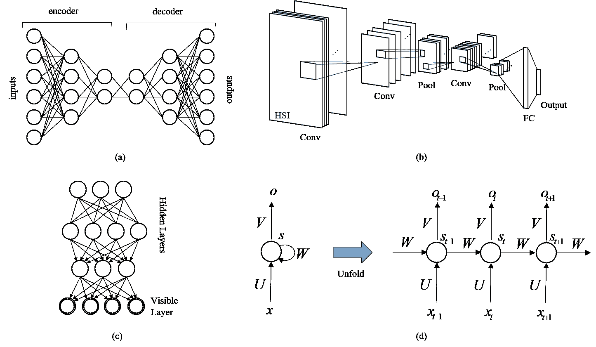

<!--yml

类别: 未分类

日期: 2024-09-06 20:08:43

-->

# [1709.00308] 深度学习在遥感中的全面综述：理论、工具与社区挑战

> 来源：[`ar5iv.labs.arxiv.org/html/1709.00308`](https://ar5iv.labs.arxiv.org/html/1709.00308)

\cftpagenumbersoff

图 \cftpagenumbersofftable

# 深度学习在遥感中的全面综述：理论、工具与社区挑战

John E. Ball 密西西比州立大学，电气与计算机工程系，406 Hardy Rd., Mississippi State, MS, USA, 39762 Derek T. Anderson 密西西比州立大学，电气与计算机工程系，406 Hardy Rd., Mississippi State, MS, USA, 39762 Chee Seng Chan 马来亚大学，计算机科学与信息技术学院，50603 Lembah Pantai, Kuala Lumpur, Malaysia

###### 摘要

近年来，深度学习（DL），即神经网络（NNs）的新名称，在计算机视觉（CV）、语音识别、自然语言处理等多个领域中迅速崛起。尽管遥感（RS）面临许多独特的挑战，主要与传感器和应用相关，但 RS 不可避免地借鉴了许多与 CV 相同的理论，例如统计学、融合和机器学习等等。这意味着 RS 社区应该了解，甚至处于深度学习等技术的前沿。本文提供了对最先进的 RS DL 研究的最全面综述。我们还回顾了 DL 领域的最新进展，这些进展可以应用于 RS 的 DL 中。具体来说，我们关注于 RS 社区的理论、工具和挑战。特别地，我们关注与以下方面相关的未解决的挑战和机会：（i）数据集不足，（ii）对物理现象建模的可理解解决方案，（iii）大数据，（iv）非传统的异构数据源，（v）用于光谱、空间和时间数据的 DL 架构和学习算法，（vi）迁移学习，（vii）对 DL 系统的理论理解的提升，（viii）高门槛，以及（ix）DL 的训练和优化。

###### 关键词:

遥感、深度学习、高光谱、多光谱、大数据、计算机视觉

*John E. Ball, \linkablejeball@ece.msstate.edu

## 1 引言

近年来，深度学习（DL）在计算机视觉（CV）、语音识别和自然语言处理等领域取得了飞跃性进展，而不是逐步提升。讽刺的是，DL 作为神经网络（NNs）的替代品，实际上是人工智能的一个古老分支，由于算法进步、高性能计算和大数据等因素而被复兴。DL 的理念很简单；机器学习特征和决策（分类），而不是人工手动设计系统。本文的存在是为了遥感（RS）。现实是，RS 借鉴了核心理论，如物理学、统计学、融合技术和机器学习等。这意味着 RS 社区应该了解，甚至站在 DL 等进展的前沿。本文的目的是提供关于理论、工具和挑战的资源，特别是我们关注于未解决的挑战和机会，涉及以下方面：（i）数据集不足，（ii）对物理现象建模的易理解解决方案，（iii）大数据，（iv）非传统的异质数据源，（v）用于光谱、空间和时间数据的 DL 架构和学习算法，（vi）迁移学习，（vii）对 DL 系统的理论理解的提升，（viii）高门槛，以及（ix）DL 的训练和优化。

在这里，遥感（RS）是一项技术挑战，其中对象或场景通过远程手段进行分析。这包括传统的遥感领域，例如基于卫星和航空影像。这一定义还包括非传统领域，如无人机（UAVs）、众包（手机影像、推文等）、先进驾驶辅助系统（ADAS）等。这些类型的遥感提供了不同类型的数据，并具有不同的处理需求，因此也带来了对数据分析算法的新挑战。

本文的贡献如下：

1.  1.

    深度学习（DL）遥感（RS）中的挑战和未解决问题的全面列表。我们关注于未解决的挑战和机会，涉及以下方面：（i）数据集不足，（ii）对物理现象建模的易理解解决方案，（iii）大数据，（iv）非传统的异质数据源，（v）用于光谱、空间和时间数据的 DL 架构和学习算法，（vi）迁移学习，（vii）对 DL 系统的理论理解的提升，（viii）高门槛，以及（ix）DL 的训练和优化。这些观察基于对遥感 DL 和特征学习文献的调查，以及大量遥感调查论文。这个话题是我们论文的大部分内容，并在 4 节中讨论。

1.  2.

    详细的文献调查。在这里，我们回顾了 207 篇遥感应用论文和 57 篇遥感与深度学习的综述论文。此外，还引用了许多相关的深度学习论文。我们的工作将之前的深度学习综述论文 [1, 2, 3] 扩展得更为全面。我们还将深度学习方法聚类到不同的应用领域，并在章节 3 中提供了对这些领域中一些相关示例论文的详细讨论。

1.  3.

    讨论修改深度学习（DL）架构以应对遥感（RS）问题的详细内容。我们强调了在遥感中的深度学习方法，包括新架构、工具和深度学习组件，这些都是当前遥感研究人员在深度学习中实现的。这在章节 4.5 中进行了讨论。

1.  4.

    深度学习概述。对于不熟悉深度学习的遥感研究人员，章节 2 提供了深度学习的高层次概述，并列出了许多对感兴趣的读者有帮助的参考文献。

1.  5.

    深度学习工具列表。工具是深度学习的一个重要推动因素，我们回顾了更受欢迎的深度学习工具。我们还列出了几个最受欢迎的工具集的优缺点，并提供了一个总结工具的表格，其中包含参考文献和链接（参见表 2）。更多详细信息，请参见章节 2.4.4。

1.  6.

    在线总结了 RS 数据集和 DL RS 论文的内容。首先，提供了一个详细的在线表格，包含我们审查的每篇 DL RS 论文的细节：传感器模态、使用的数据集汇编、主要贡献的总结以及参考文献。其次，提供了本文分析的所有 DL RS 论文的数据集总结，包含数据集名称、描述、网址（如果有的话）和参考文献列表。由于本文的文献综述非常广泛，这些表格过大，不便放在主文章中，但为了读者的方便，提供了在线访问。这些表格位于 [`www.cs-chan.com/source/FADL/Online_Dataset_Summary_Table.pdf`](http://www.cs-chan.com/source/FADL/Online_Dataset_Summary_Table.pdf) 和 [`www.cs-chan.com/source/FADL/Online_Paper_Summary_Table.pdf`](http://www.cs-chan.com/source/FADL/Online_Paper_Summary_Table.pdf)。

作为读者的辅助，表 LABEL:table:Acronyms 列出了本文中使用的缩略语。

表 1：缩略语列表。

| 缩略语 | 含义 | 缩略语 | 含义 |
| --- | --- | --- | --- |
| ADAS | 高级驾驶辅助系统 | AE | 自编码器 |
| ANN | 人工神经网络 | ATR | 自动目标识别 |
| AVHRR | 高级非常高分辨率辐射计 | AVIRIS | 空载可见/红外成像光谱仪 |
| BP | 反向传播 | CAD | 计算机辅助设计 |
| CFAR | 恒虚警率 | CG | 共轭梯度 |
| ChI | 乔凯积分 | CV | 计算机视觉 |
| CNN | 卷积神经网络 | DAE | 去噪自编码器 |
| DAG | 有向无环图 | DBM | 深度玻尔兹曼机 |
| DBN | 深度置信网络 | DeconvNet | 反卷积神经网络 |
| DEM | 数字高程模型 | DIDO | 决策中的决策输出 |
| DL | 深度学习 | DNN | 深度神经网络 |
| DSN | 深度堆叠网络 | DWT | 离散小波变换 |
| FC | 全连接 | FCN | 全卷积网络 |
| FC-CNN | 全卷积 CNN | FC-LSTM | 全连接 LSTM |
| FIFO | 特征输入特征输出 | FL | 特征学习 |
| GBRCN | 梯度提升随机卷积网络 | GIS | 地理信息系统 |
| GPU | 图形处理单元 | HOG | 有序梯度直方图 |
| HR | 高分辨率 | HSI | 高光谱影像 |
| ILSVRC | ImageNet 大规模视觉识别挑战赛 | L-BGFS | 有限内存 BGFS |
| LBP | 局部二值模式 | LiDAR | 激光雷达 |
| LR | 低分辨率 | LSTM | 长短期记忆 |
| LWIR | 长波红外 | MKL | 多核学习 |
| MLP | 多层感知器 | MSDAE | 修改的稀疏去噪自编码器 |
| MSI | 多光谱影像 | MWIR | 中波红外 |
| NASA | 国家航空航天局 | NN | 神经网络 |
| NOAA | 国家海洋和大气管理局 | PCA | 主成分分析 |
| PGM | 概率图模型 | PReLU | 参数化整流线性单元 |
| RANSAC | 随机采样一致性 | RBM | 限制玻尔兹曼机 |
| ReLU | 修正线性单元 | RGB | 红色、绿色和蓝色图像 |
| RGBD | RGB + 深度图像 | RF | 感受野 |
| RICNN | 旋转不变卷积神经网络 | RNN | 循环神经网络 |
| RS | 遥感 | R-VCANet | 滚动引导滤波器顶点组件分析网络 |
| S-MSDAE | 堆叠 MSDAE | SAE | 堆叠自编码器 |
| SAR | 合成孔径雷达 | SDAE | 堆叠去噪自编码器 |
| SIDO | 信号输入输出 | SIFT | 尺度不变特征变换 |
| SISO | 信号输入信号输出 | SGD | 随机梯度下降 |
| SPI | 标准化降水指数 | SSAE | 堆叠稀疏自编码器 |
| SVM | 支持向量机 | UAV | 无人驾驶飞行器 |
| VGG | 视觉几何组 | VHR | 超高分辨率 |

本文组织如下。第二部分讨论了计算机视觉中的相关工作。本节对比了深度学习和“浅层”学习，并讨论了深度学习架构。本节还讨论了深度学习成功的主要原因。第三部分概述了遥感中的深度学习，强调了遥感中许多不同领域的深度学习方法。第四部分讨论了将深度学习应用于遥感中的独特挑战和开放问题。结论和建议列在第五部分。

## 2 计算机视觉中的相关工作

计算机视觉（CV）是一个通过计算机图像分析实现视觉理解的研究领域。过去，典型的方法采用了一个处理链，通常以图像去噪或增强开始，接着进行特征提取（采用人工编码特征），然后是特征优化阶段，最后对提取的特征进行处理。这些架构大多是“浅层”的，因为它们通常只有一到两层处理层在特征和输出之间。浅层学习者（如支持向量机（SVMs）、高斯混合模型、隐马尔可夫模型、条件随机场等）多年来一直是传统研究的主干[2]。相比之下，深度学习（DL）通常有许多层（“浅层”与“深层”学习的确切界限并没有固定的数字），这使得从数据中可以学习到丰富的、非常复杂的、非线性和分层的特征。以下部分对比了深度学习和浅层学习，讨论了深度学习方法和深度学习的推动因素，并最终讨论了深度学习在遥感以外领域的成功。

### 2.1 深度学习与浅层学习

浅层学习是用来描述通常只有一到两层的学习网络的术语。浅层学习者的例子包括流行的支持向量机（SVM）、高斯混合模型、隐马尔可夫模型、条件随机场、逻辑回归模型以及极限学习机[2]。浅层学习模型通常只有一层或两层，用于计算输入数据（通常是手工设计的特征）的线性或非线性函数。另一方面，深度学习（DL）通常意味着一个更深的网络，具有许多（通常是）非线性变换的层。尽管没有普遍接受的“深度”学习者的层数定义，但典型的网络通常至少有四层或五层。深度学习系统的三个主要特点是：深度学习系统（1）可以直接从数据本身中学习特征，而不是依赖于人工设计的特征，（2）可以学习通过深度网络增加复杂性的层次化特征，以及（3）与浅层神经网络方法相比，具有更好的泛化能力和更高效的模型编码；也就是说，浅层系统需要指数级增加的神经元（以及更多的自由参数）和更多的训练数据[4, 5]。Ba 和 Caruana [6] 提供了一项关于深度和浅层网络的有趣研究，他们通过训练一个深度神经网络（DNN）来进行模型压缩。然后用 DNN 评估未标记的数据，并将该模型生成的分数用于训练一个压缩（较浅层）模型。如果压缩模型能够完美地模仿大模型，它会做出与复杂模型完全相同的预测和错误。关键在于压缩模型必须具有足够的复杂性以再现更复杂模型的输出。

DL 系统通常被设计为松散地模仿人类或动物的处理方式，其中包含许多互联的层，例如人类视觉。因此，在计算机视觉相关问题中使用深度架构具有自然的动机。对于感兴趣的读者，我们提供了一些有用的调查论文参考。Arel 等人提供了一篇关于 DL 的综述论文 [7]。Deng 等人 [2] 提出了 DL 成功的两个重要原因：（1）图形处理单元（GPU）和（2）DL 研究的最新进展。他们讨论了生成性、判别性和混合深度架构，并表明当前的 DL 优化技术仍有广阔的改进空间。Liu 等人 [8] 概述了自编码器、卷积神经网络（CNN）和 DL 应用。Wang 等人提供了 DL 的历史 [4]。Yu 等人 [9] 综述了 DL 在信号和图像处理中的应用。与浅层学习进行了比较，并给出了 DL 的优势。两篇较好的 DL 概述文章是 Schmidhuber 等人的综述论文 [10] 和 Goodfellow 等人的书籍 [11]。Zhang 等人 [3] 提出了一个 DL 在遥感中的通用框架，涵盖了四个遥感视角：（1）图像处理，（2）基于像素的分类，（3）目标识别和（4）场景理解。此外，他们还回顾了许多 DL 在遥感中的应用。Cheng 等人讨论了浅层和 DL 方法在特征提取中的应用 [1]。一些好的 DL 论文包括 Arnold 等人的 DL 入门论文 [12] 和 Wang 等人的论文 [4]，Goodfellow 等人的 DL 书籍 [11]，以及 DL 综述论文 [10, 13, 14, 15, 2, 8, 16, 4, 5]。

### 2.2 传统特征学习方法

传统的特征提取方法涉及手工编码的特征，以根据空间、光谱、纹理、形态学内容等提取信息。这些传统方法在以下参考文献中有详细讨论，本文不提供详细的算法细节。所有这些手工提取的特征都是为特定任务设计的，例如特征化图像纹理。相比之下，DL 系统从数据本身派生出复杂的（通常是）非线性和层次化的特征。

Cheng 等人 [1] 讨论了传统的手工特征，如有序梯度直方图（HOG）、尺度不变特征变换（SIFT）及其变体、颜色直方图等。他们还讨论了无监督的 FL 方法，如主成分分析、$k$-均值聚类、稀疏编码等。其他优秀的综述论文讨论了高光谱图像（HSI）数据分析 [17]，基于核的方法 [18]，HSI 中的统计学习方法 [19]，光谱距离函数 [20]，行人检测 [21]，多分类器系统 [22]，光谱空间分类 [23]，变化检测 [24, 25]，RS 中的机器学习 [26]，流形学习 [27]，迁移学习 [28]，端成员提取 [29]，以及光谱混合 [30, 31, 32, 33, 34]。

### 2.3 DL 方法

迄今为止，自动编码器（AE）、卷积神经网络（CNN）、深度置信网络（DBN）和递归神经网络（RNN）已成为四种主流的 DL 架构。去卷积神经网络（DeconvNet）是 DL 社区中的相对新手。以下章节将高层次地讨论这些架构。提供了许多良好的参考文献供感兴趣的读者参考。

#### 2.3.1 自动编码器（AE）

AE 是一个旨在从无监督数据中学习有用特征的网络。AE 的一个早期应用是降维，这在许多 RS 应用中是必需的。通过减少相邻层的大小，AE 被迫学习数据的紧凑表示。AE 通过编码器函数 $f$ 将输入映射为内部（潜在）表示或代码 $h$，即 $h=f(\textbf{x})$。自动编码器还具有解码器函数 $g$，将 $h$ 映射到输出 $\hat{\textbf{x}}$。一般来说，AE 被约束，无论是通过其架构，还是通过稀疏约束（或两者），以学习有用的映射（但不是简单的恒等映射）。损失函数 $L$ 衡量 AE 能重构输出的接近程度：$L$ 是 $x$ 和 $\hat{\textbf{x}}=g(f(\textbf{x}))$ 的函数。也可以向损失函数中添加正则化函数 $\Omega(h)$，以强制更稀疏的解决方案。正则化函数可以涉及模型复杂度、模型先验信息、基于导数的惩罚，或基于其他标准如监督分类结果的惩罚等的惩罚项（参考 [11] 的 §14.2）。

去噪自编码器（DAE）是一种旨在去除信号或图像噪声的自编码器。陈等人开发了一种高效的 DAE，该 DAE 能够减少噪声，并且具有计算上高效的闭式解 [35]。为了提供鲁棒性，该系统使用加性高斯噪声或二进制掩蔽噪声（将某些输入强制设为零）进行训练。许多 RS 应用利用自编码器进行去噪。图 1 ‣ 2.3 DL Approaches ‣ 2 Related work in CV ‣ A Comprehensive Survey of Deep Learning in Remote Sensing: Theories, Tools and Challenges for the Community")(a)展示了一个自编码器的示例。二阶锥形状导致了维度的减少。

图 1：深度学习架构的块图。(a) 自编码器。 (b) 卷积神经网络。 (c) 深度置信网络。 (d) 循环神经网络。

#### 2.3.2 卷积神经网络（CNN）

CNN 是受到人类视觉皮层启发的网络。典型的 CNN 由多个卷积掩膜的双层组成，后跟池化层，这些层通常后跟全连接层或部分连接层，进行分类或类别概率估计。一些 CNN 还利用数据归一化层。卷积掩膜的系数由 CNN 学习。分析灰度图像的 CNN 将采用二维卷积掩膜，而使用红绿蓝（RGB）图像的 CNN 将使用三维掩膜。通过训练，这些掩膜直接从数据中学习提取特征，与传统的机器学习方法（利用“手工制作”的特征）形成鲜明对比。池化层是非线性操作符（通常是最大操作符），这使得 CNN 能够学习非线性特征，极大地提高了其学习能力。图 1 ‣ 2.3 DL Approaches ‣ 2 Related work in CV ‣ A Comprehensive Survey of Deep Learning in Remote Sensing: Theories, Tools and Challenges for the Community")(b)展示了一个 CNN 的示例，其中输入是 HSI，有两个卷积和池化层，后跟两个全连接（FC）层。

卷积掩膜的数量、掩膜的大小和池化函数都是 CNN 的参数。CNN 的第一层掩膜通常学习基本特征，随着网络深度的增加，特征变得更加复杂，并以层次结构构建。归一化层提供正则化，并可以帮助训练。全连接层（或部分连接层）通常位于 CNN 网络的末端，允许从前面层次的层次输出中学习复杂的非线性函数。这些最终层通常输出类别标签或类别标签概率的估计。

卷积神经网络（CNN）在许多感知任务中占据了主导地位。根据 Ujjwalkarn [36] 的研究，图像识别社区对 CNN 表现出浓厚的兴趣。从 1990 年代开始，LeCun 等人开发了 LeNet [37]，该网络设计用于读取邮政编码。这在图像处理社区引起了极大的关注。2012 年，Krizhevsky 等人 [38] 引入了深度 CNN AlexNet。它在 2012 年以显著的优势赢得了 ImageNet 大规模视觉识别挑战赛（ILSVRC）。2013 年，Zeiler 和 Fergus [39] 创建了 ZFNet，这是一种对 AlexNet 参数进行微调的网络，并赢得了 ILSVRC。Szegedy 等人 [40] 在 2014 年通过 GoogLeNet 赢得了 ILSVRC，该网络使用的参数数量（400 万）远少于 AlexNet（6000 万）。2015 年，He 等人 [41] 开发了 ResNets，使 CNN 能够拥有非常深的网络结构。2016 年，Huang 等人 [42] 发表了 DenseNet，其中每一层都以前馈的方式直接连接到其他所有层。这种架构还消除了梯度消失问题，使得非常深的网络成为可能。以上示例只是 CNN 的一些实例。

#### 2.3.3 深度信念网络（DBN）

深度置信网络（DBN）是一种（生成的）概率图模型（PGM），是概率与图论的结合。具体来说，DBN 是一个“大型”（深度的）有向无环图（DAG）。在 PGM 中，存在许多著名的算法用于精确和近似推断（推断未观察到的（隐藏的）变量的状态）和学习（学习变量之间的交互）。DBN 也可以被视为一种深度神经网络（NN）。在 [43] 中，Hinton 证明了 DBN 可以被视为并训练（以贪婪方式）为一系列简单的无监督网络，即限制玻尔兹曼机（RBM）或生成自编码器（AE）。迄今为止，CNN 在各种基准计算机视觉数据集上表现出了更好的性能。然而，从理论上讲，DBN 可以被认为是更优的。CNN 通常具有更多的“约束”。随着 DBN 学习算法的改进，DBN 与 CNN 的比较话题可能会发生变化。图 1(c) 展示了一个由 RBM 层和一个可见层组成的 DBN。

#### 2.3.4 循环神经网络（RNN）

RNN 是一个连接形成定向循环的网络。RNN 主要用于分析非平稳过程，如语音和时间序列分析。RNN 具有记忆，因此 RNN 具有持久性，而 AE 和 CNN 不具备。RNN 可以展开并作为处理时间序列数据的一系列互连网络进行分析。RNN 的一个重大突破是 Hochreiter 和 Schmidhuber 的开创性工作[44]，即长短期记忆（LSTM）单元，它允许信息写入单元、从单元输出并存储在单元中。LSTM 允许信息流动，并帮助应对非常深层网络中的梯度消失/爆炸问题。图 1 ‣ 2.3 DL Approaches ‣ 2 Related work in CV ‣ A Comprehensive Survey of Deep Learning in Remote Sensing: Theories, Tools and Challenges for the Community")(d) 显示了 RNN 及其展开版本。

#### 2.3.5 反卷积神经网络（DeconvNet）

CNN 通常只用于分类。然而，除了分类之外，还有许多问题存在，例如，我们的滤波器真正学习了什么，这些滤波器的迁移性如何，哪些滤波器在给定图像中最为活跃，给定图像（或图像）中滤波器最活跃的地方在哪里，或者更整体地，我们图像中的兴趣对象（软分割或硬分割）在哪里。为此，研究人员最近探索了反卷积神经网络（DeconvNet）[39, 45, 46, 47]。而 CNN 使用池化，帮助我们过滤噪声激活并解决仿射变换，DeconvNet 则使用反池化——池化的“逆”。反池化利用“开关变量”，帮助我们将层 $l$ 中的激活放回层 $l-1$ 中的原始池化位置。反池化产生一个扩大但稀疏的激活图，该图被输入到反卷积滤波器中（这些滤波器可以是学习的或源自 CNN 滤波器）。在 [47] 中，视觉几何组（VGG）开发了 VGG 16 层 CNN，因此没有反卷积，其最后的分类层被去除，作为计算机视觉在非遥感数据上的应用。结果，DeconvNet 的大小是 VGG CNN 的两倍。网络的第一部分是 VGG CNN，第二部分是 VGG CNN 的架构逆向副本，池化被反池化取代。整个网络被训练并用于语义图像分割。在另一项工作中，Zeiler 等人展示了 DeconvNet 可用于可视化单个 CNN 滤波器在任何层中的表现，或可视化多个 CNN 滤波器在一个或多个图像中的表现[45, 39]。关键是，相关的 DeconvNet 研究在计算机视觉文献中存在。

有两个高级评论值得注意。首先，DeconvNets 已被一些人用来帮助理清它们在滤镜之间的影响的视觉探索中的架构和操作选择，例如，单一主导特征的存在与多样特征集的对比。在许多情况下，这并不是对最终网络性能的合理化，而是 DeconvNet 是一个有用的工具，帮助他们在设计网络时探索广阔的选择空间。其次，虽然 DeconvNet 在许多情况下可以用于分割，但它们并不总是产生我们可能期望的分割。这意味着，如果 CNN 学到的是部分而非完整对象，则这些部分或其子集的激活可能不等于整体，而且这些部分在图像中可能空间上分离。后者使得构建高质量的完整对象分割或当图像中有多个该对象实例时的分割变得具有挑战性。DeconvNets 基本上是非常新的，并且尚未（尚未）被 RS 社区广泛采用。

### 2.4 DL 遇见现实世界

理解 DL 的兴起和成功相关的不同“因素”是很重要的。本节讨论这些因素：GPU、DL NN 表达力、大数据和工具。

#### 2.4.1 GPUs

GPUs 是专门优化用于快速并行处理的硬件设备。GPU 通过将计算从计算机的主处理器（基本上优化用于串行任务）转移出来，并高效地执行许多 DL 算法核心的矩阵计算，从而使 DL 成为可能。DL 社区可以利用个人电脑游戏行业，这个行业对相对便宜且强大的 GPU 有需求。CNN 研究兴趣的一个主要驱动力是 Imagenet 竞赛，它有超过一百万张训练图像和 1000 个类别 [48] 。DNN 本质上是并行的，利用矩阵操作，并使用大量的浮点操作每秒。GPU 与之匹配，因为它们具有相同的特征 [49] 。GPU 的加速已被测量为 8.5 到 9 [49]，甚至更高，具体取决于 GPU 和优化的代码。CNN 的卷积、池化和激活计算操作都可以轻松移植到 GPU 上。

#### 2.4.2 DL NN 表达力

Cybenko [50] 证明了多层感知器（MLPs）是通用函数逼近器。具体而言，Cybenko 显示了一个具有有限神经元数目的单隐层前馈网络可以在 $\Re^{n}$ 的紧致子集上逼近连续函数，并且对于激活函数的假设相对简单。然而，Cybenko 的证明是存在性定理，这意味着它告诉我们一个解决方案存在，但没有告诉我们如何设计或学习这样的网络。关键在于，神经网络（NNs）具有引人入胜的数学基础，使其在机器学习中具有吸引力。此外，在理论工作中，Telgarsky [51] 表明，对于具有修正线性单元（ReLU）的神经网络，(1) 少波动的函数对多波动的函数的逼近效果较差，(2) 少（多）层的神经网络计算的函数具有少（多）波动。基本上，深层网络允许具有高波动的决策函数。这为深度学习在分类任务中表现良好的原因提供了证据，并且较浅的网络在处理高波动函数时存在限制。Sharir 等人 [52] 显示，具有重叠局部感受野和更广泛的密集连接会使神经网络的表现能力呈指数增长。Liang 等人 [53] 表示，浅层网络需要比深层网络多得多的神经元才能实现函数逼近的精度。

#### 2.4.3 大数据

每天，大约有 $350$ 万张图片被上传到 Facebook [49]，沃尔玛每天收集大约 $2.5$ PB 的数据 [49]，而美国国家航空航天局（NASA）仅在进行中的任务中，就活跃地传输 $1.73$ GB 的航天器观察数据 [54]。IBM 报告称，现在每天生成的数据量达到 $2.5$ 恩字节，这意味着“今天世界上 $90\%$ 的数据是在过去两年内创建的” [55]。关键在于，由于遥感、智能手机、廉价数据存储等技术，存在着前所未有的大量（质量各异的）数据。过去，研究人员使用数十到数百，甚至可能是几千个数据训练样本，但没有达到今天这样的大量级。在计算机视觉等领域，高数据量和多样性一直是性能进步的核心。这意味着，报告的结果反映了数据和机器学习的进步。

至今，已经探索了许多与大规模深度网络（例如，数百层）和大数据（例如，大量数据）相关的方法。例如，在[56]中，Raina 等人提出了加速 DBNs 和稀疏编码的 CPU 和 GPU 方案。他们报告了对于拥有超过 1 亿参数的网络，与之前仅使用几百万参数的工作相比，速度提高了 5 到 15 倍。另一方面，CNN 通常使用反向传播，并且可以通过拉取或推送来实现[57]。此外，像循环缓冲区[58]和基于多 GPU 的 CNN 架构（例如，Krizhevsky [38]）等理念也被提出。除了硬件加速外，像 ReLUs 这样的操作符已经显示出比其他常见非线性函数快数倍。在[59]中，Deng 等人提出了一种深度堆叠网络（DSN），由多个专门的 NN（称为模块）组成，每个模块只有一个隐藏层。Hutchinson 等人提出了 Tensor-DSN，这是 DSN 在 CPU 集群上的高效并行扩展[60]。此外，DistBelief 是一个用于大模型（数十亿参数）和大规模数据集的深度网络分布式训练和学习库[61]。DistBelief 利用机器集群通过多线程、消息传递、同步和机器间通信等方法来管理数据和并行性。DistBelief 使用不同的优化方法，即 SGD 和 Sandblaster[62]。最后但同样重要的是，还有像高速公路网络、残差网络和密集网络[63, 64, 65, 66, 67]这样的网络架构。例如，高速公路网络基于 LSTM 递归网络，并允许基于梯度下降的深度网络有效训练，网络层数可达数百层[64, 65, 66]。

#### 2.4.4 工具

工具也是深度学习研究和开发中的一个重要因素。Wan 等人观察到深度学习位于 NN、图形建模、优化、模式识别和信号处理的交叉点[5]，这意味着该领域需要相当高的背景知识。好的深度学习工具使研究人员和学生能够更高效地尝试一些基本架构并创建新的架构。

表 2 列出了一些流行的深度学习工具包和代码链接。在此，我们回顾了一些深度学习工具，下面的工具分析基于我们对这些工具的使用经验。感谢我们的研究生提供了对这些工具的详细反馈。

AlexNet [38] 是一篇具有革命性的论文，它重新向世界展示了深度学习能提供的成果。AlexNet 使用 ReLU，因为它的计算速度比双曲正切函数快几倍。AlexNet 通过结合一些数据增强技术，揭示了预处理的重要性，并且通过使用最大池化和 dropout 层来对抗过拟合。

Caffe [68] 是第一个广泛使用的深度学习工具包。Caffe 基于 C++，可以在各种设备上编译，并提供命令行、Python 和 Matlab 接口。提供了许多有用的示例。Caffe 的缺点是相对较难安装，由于缺乏文档且不是由有组织的公司开发。对于那些对图像处理以外的内容感兴趣的用户（例如图像分类、图像分割），它并不适合其他领域，例如音频信号处理。

TensorFlow [69] 可以说是目前最受欢迎的深度学习工具。它的优点是 TensorFlow (1) 在 Ubuntu 上安装相对简单，包括 CPU 和 GPU 版本（GPU 版本需要提前安装 CUDA 和 cuDNN，这有点复杂）；(2) 实现了大多数最先进的模型，虽然一些原始实现没有在 TensorFlow 中实现，但相对容易找到 TensorFlow 中的重新实现；(3) 文档非常好，并且定期更新；(4) 支持 Python 和 C++ 接口；(5) 相对容易扩展到图像处理以外的其他领域，只要你理解张量处理。TensorFlow 的一个缺点是它确实局限于 Linux 应用程序，因为 Windows 版本几乎不可用。

MatConvNet [70] 是一个方便的工具，为那些非常熟悉使用 Matlab 的用户提供了独特的抽象实现。它提供了许多流行的训练过的 CNN 及其训练所用的数据集。安装相对简单。一旦 GPU 设置完成（安装驱动程序 + CUDA 支持），使用 GPU 进行训练非常简单。它还支持 Windows。缺点是 (1) 与 TensorFlow 和 Caffe 相比，在线社区相对较小，(2) 代码文档不够详细，一般没有好的在线教程，除了手册之外。除了一个非常简单的示例之外，没有“入门”帮助，(3) GPU 设置可能相当繁琐。对于 Windows，由于 Matlab 及其 mex 设置的限制以及 Nvidia 驱动程序和 CUDA 支持，需要 Visual Studio。在 Linux 上，用户有更多的自由，但必须愿意适应 Nvidia 驱动程序、CUDA 支持等的手动安装。

表 2：一些流行的深度学习工具。

| 工具与引用 | 工具总结与网站 |
| --- | --- |
| AlexNet [38] | 一个大规模的 CNN，具有非饱和神经元，并且在卷积操作的 GPU 并行实现上非常高效，从而加快了训练速度。 |
|  | 网站: [`code.google.com/p/cuda-convnet/`](http://code.google.com/p/cuda-convnet/) |
| Caffe [68] | 一个具有 Python 和 Matlab 接口的 C++ 库。 |
|  | 网站: [`caffe.berkeleyvision.org/`](http://caffe.berkeleyvision.org/) |
| cuda-convnet2 [38] | DL 工具 cuda-convnet2 是一个快速的 C++/CUDA CNN 实现，也可以建模任何有向无环图。训练使用反向传播进行。提供在 Kepler 代 GPU 上更快的训练速度和多 GPU 训练支持。 |
|  | 网站: [`code.google.com/p/cuda-convnet2/`](https://code.google.com/p/cuda-convnet2/) |
| gvnn [71] | DL 包 gvnn 是一个 Torch 中的 NN 库，旨在弥合经典几何计算机视觉与 DL 之间的差距。此 DL 包用于识别、端到端视觉里程计、深度估计等。 |
|  | 网站: [`github.com/ankurhanda/gvnn`](https://github.com/ankurhanda/gvnn) |
| Keras [72] | Keras 是一个高级 Python NN 库，能够在 TensorFlow 或 Theano 上运行，开发时着重于快速实验。Keras (1) 允许轻松和快速的原型开发，(2) 支持卷积网络和递归网络，(3) 支持任意连接方案，以及 (4) 能在 CPU 和 GPU 上无缝运行。 |
|  | 网站: [`keras.io/`](https://keras.io/) 和 [`github.com/fchollet/keras`](https://github.com/fchollet/keras) |
| MatConvNet [70] | 一个实现 CNN 的 Matlab 工具箱，包含许多用于图像分类、分割等的预训练 CNN。 |
|  | 网站: [`www.vlfeat.org/matconvnet/`](http://www.vlfeat.org/matconvnet/) |
| MXNet [73] | MXNet 是一个 DL 库。其特点包括声明式符号表达与命令式张量计算和微分以导出梯度。MXNet 可以在移动设备到分布式 GPU 集群上运行。 |
|  | 网站: [`github.com/dmlc/mxnet/`](https://github.com/dmlc/mxnet/) |
| TensorFlow [69] | 一个开源的软件库，用于张量数据流图计算。灵活的架构允许你在桌面、服务器或移动设备上将计算部署到一个或多个 CPU 或 GPU。 |
|  | 网站: [`www.tensorflow.org/`](https://www.tensorflow.org/) |
| Theano [74] | 一个 Python 库，允许你定义、优化并高效评估涉及多维数组的数学表达式。Theano 具有以下特点：(1) 与 NumPy 的紧密集成，(2) 透明的 GPU 使用，(3) 高效的符号微分，以及 (4) 动态 C 代码生成。 |
|  | 网站: [`deeplearning.net/software/theano`](http://deeplearning.net/software/theano) |
| Torch [75] | Torch 是一个可嵌入的科学计算框架，具有 GPU 优化，使用 LuaJIT 脚本语言和 C/CUDA 实现。Torch 包括（1）优化的线性代数和数值例程，（2）神经网络和基于能量的模型，（3）GPU 支持。 |
|  | 网站：[`torch.ch/`](http://torch.ch/) |

### 2.5 DL 在其他领域

DL 已经在遥感以外的其他领域得到了应用，即人类行为分析[76, 77, 78, 79]，语音识别[80, 81, 82]，立体视觉[83]，机器人技术[84]，信号转文本[85, 86, 87, 88, 89]，物理学[90, 91]，癌症检测[92, 93, 94]，时间序列分析[95, 96, 97]，图像合成[98, 99, 100, 101, 102, 103, 104]，股票市场分析[105]，以及安全应用[106]。这些多样化的应用展示了 DL 的强大能力。

## 遥感中的 3 种 DL 方法

有许多遥感任务利用遥感数据，包括自动目标检测、全色融合、土地覆盖和土地利用分类、时间序列分析、变化检测等。许多这些任务利用形状分析、物体识别、降维、图像增强等技术，这些技术都适合 DL 方法。表 3 将本文回顾的 DL 论文分为这些基本类别。从表中可以看出，应用领域非常广泛，这表明遥感研究人员在许多不同领域看到了使用 DL 方法的价值。几个代表性论文被回顾和讨论。

表 3：遥感中的 DL 论文主题领域。

| 领域 | 参考文献 | 领域 | 参考文献 |
| --- | --- | --- | --- |
| 3D（深度和形状）分析 | [107, 108, 109, 110, 111, 112, 113, 114, 115] | 高级驾驶员辅助系统 | [116, 117, 118, 119, 120] |
| 动物检测 | [121] | 异常检测 | [122] |
| 自动目标识别 | [123, 124, 125, 126, 127, 128, 129, 130, 131, 132, 133, 134] | 变化检测 | [135, 136, 137, 138, 139] |
| 分类 | [140, 141, 142, 143, 144, 145, 146, 147, 148, 149, 150, 151, 152, 153, 154, 155, 156, 157, 158, 159, 160, 161, 162, 163, 164, 165, 166, 167, 168, 169, 170, 171, 172, 173, 174, 175, 176, 177, 178, 179, 180, 181, 182, 183, 184, 185, 186, 187, 188, 189, 190] | 数据融合 | [191] |
| 降维 | [192, 193] | 灾难分析/评估 | [194] |
| 环境和水分析 | [195, 196, 197, 198] | 地理信息提取 | [199] |
| 人体检测 | [200, 201, 202, 203] | 图像去噪/增强 | [204, 205] |
| 图像配准 | [206] | 土地覆盖分类 | [207, 208, 209, 210, 211] |
| 土地使用/分类 | [212, 213, 214, 215, 216, 217, 218, 219, 220, 221, 222] | 目标识别和检测 | [223, 224, 225, 226, 227, 228, 229, 230, 231, 232, 233] |
| 目标跟踪 | [234, 235] | 全色锐化 | [236] |
| 行星研究 | [237] | 植物和农业分析 | [238, 239, 240, 241, 242, 243] |
| 道路分割/提取 | [244, 245, 246, 247, 248, 249, 250] | 场景理解 | [251, 252, 253] |
| 语义分割/标注 | [254, 255, 256, 257, 258, 259, 260, 261, 262, 263, 264, 265, 266] | 分割 | [267, 268, 269, 270, 271, 272] |
| 船只分类/检测 | [273, 274, 275] | 超分辨率 | [276, 277, 278, 279] |
| 交通流量分析 | [280, 281] | 水下探测 | [282, 283, 284, 285] |
| 城市/建筑 | [286, 287, 288, 289, 290, 291, 292, 293, 294, 295, 296] | 车辆检测/识别 | [297, 298, 299, 300, 301, 302, 303, 304, 305, 306, 307, 308, 309, 310] |
| 天气预报 | [311, 312, 313] |  |  |

由于最近 RS 领域的论文数量众多，我们无法审查所有在 RS 应用中利用 DL 或 FL 的论文。相反，本节重点介绍了几个在不同兴趣领域提供创新解决方案的论文，这些解决方案解决了 DL 和 FL 中遇到的问题，并且应当对读者具有广泛的兴趣。我们确实提供了我们在线审阅的所有 DL 在 RS 论文的总结，见[`www.cs-chan.com/source/FADL/Online_Paper_Summary_Table.pdf`](http://www.cs-chan.com/source/FADL/Online_Paper_Summary_Table.pdf)。

### 3.1 分类

分类是将像素（或图像中的区域）标记为几个类别中的一种的任务。以下概述的深度学习（DL）方法利用多种形式的 DL 从数据本身学习特征，并在最先进的水平上执行分类。以下讨论了 HSI、3D、卫星图像、交通标志检测和合成孔径雷达（SAR）中的分类。

HSI：HSI 数据分类对遥感应用至关重要，因此我们审查的许多深度学习结果都集中在 HSI 分类上。HSI 处理面临许多挑战，包括数据维度高且通常训练样本数量少。陈等人 [314] 提出了一个基于 DBN 的 HSI 分类框架。输入数据被转换为一维向量，并通过具有三层 RBM 的 DBN 进行处理，类别标签则通过一个两层的逻辑回归神经网络输出。一个空间分类器使用主成分分析（PCA）对光谱维度进行处理，接着对三维盒子进行一维展平，然后是三层 DBN 和两层逻辑回归分类器。第三种架构结合了一维光谱和空间分类器架构。何等人 [151] 开发了一种 DBN，用于 HSI 分类，该方法不需要随机梯度下降（SGD）训练。DBN 中的非线性层允许适应 HSI 数据的非线性特性，逻辑回归分类器用于对 DBN 层的输出进行分类。一项参数化深度研究表明，九层深度产生了最佳结果，相比于深度为 1 到 15 的层数，增加更多层数没有带来改进。

一些 HSI DL 方法利用了光谱和空间信息。Ma 等人[169]创建了一种 HSI 空间更新的深度自动编码器，该方法集成了空间信息。通过基于协作的表示分类器减少了小训练集的影响，并且通过基于图割的空间正则化减少了椒盐噪声。他们的方法比可比较的基于核的方法更为高效，而基于协作表示的分类使得他们的系统对小训练集相对稳健。Yang 等人[181]使用了一个双通道 CNN 来共同学习光谱和空间特征。当训练样本数量有限时，采用了迁移学习，在这种情况下，从其他场景转移了低级和中级特征。网络包括一个光谱 CNN 和一个空间 CNN，并且结果在三个 FC 层中组合。Softmax 分类器生成最终的类标签。Pan 等人[175]提出了所谓的滚动引导滤波器和顶点成分分析网络（R-VCANet），试图解决 HSI 训练数据缺乏的常见问题。该网络结合了光谱和空间信息。滚动引导滤波器是一种保持边缘的滤波器，用于去除图像中的噪声和小细节。VCANet 是顶点成分分析[315]和 PCANet[316]的组合。对于训练样本数量、滚动次数以及卷积核的数量和大小进行了参数分析。即使训练比例仅为 4%，该系统也表现出色。Lee 等人[158]设计了一个具有十四层的上下文深度全卷积 DL 网络，共同利用了空间和 HSI 光谱特征。利用可变尺寸的卷积特征创建了光谱-空间特征图。该架构的一个新特点是初始层同时使用了$[3\times 3\times B]$的卷积掩模来学习空间特征，以及$[1\times 1\times B]$用于光谱特征，其中$B$是光谱波段数。该系统用极少量的训练样本（每类 200 个）进行了训练。

3D：在 3D 分析中，有几种有趣的深度学习方法。Chen 等人 [317] 使用了基于 3D CNN 的特征提取模型，并通过正则化来提取 HSI 的有效光谱-空间特征。使用 $L_{2}$ 正则化和 dropout 来帮助防止过拟合。此外，还通过虚拟增强方法来输入训练样本。研究了三种不同的 CNN 架构：（1）仅使用光谱信息的 1D CNN，包括卷积、池化、卷积、池化、堆叠和逻辑回归；（2）具有空间特征的 2D CNN，包括 2D 卷积、池化、2D 卷积、池化、堆叠和逻辑回归；（3）3D 卷积（空间维度为 2D，第三维度为光谱）；结构与 2D 情况相同，只是使用了 3D 卷积。3D CNN 在数据集上实现了近乎完美的分类。

Chen 等人 [191] 提出了一个新颖的 3D CNN，用于提取 HSI 数据的光谱-空间特征，一个深度 2D CNN 用于提取光学雷达（LiDAR）数据的高程特征，然后使用全连接深度神经网络（FC DNN）融合 2D 和 3D CNN 的输出。HSI 数据经过两层 3D 卷积处理，然后进行池化。LiDAR 高程数据经过两层 2D 卷积处理，然后进行池化。结果被堆叠并通过一个全连接层处理，最后经过一个逻辑回归层。

Cheng 等人 [226] 开发了一种旋转不变的卷积神经网络（RICNN），该网络通过优化目标函数来进行训练，目标函数具有正则化约束，明确地强制训练特征表示在旋转前后相互映射接近。通过对原始样本进行 $k$ 个旋转角度的旋转来输入新的训练样本。该系统基于 AlexNet [38]，AlexNet 包含五个卷积层和三个全连接层。AlexNet 的架构通过添加一个旋转不变层来进行修改，该层使用 AlexNet 的 FC7 层的输出，并将 1000 类的 softmax 分类层替换为一个 $(C+1)$ 层的 softmax 分类器层。AlexNet 先进行预训练，然后使用少量的 HSI 训练样本进行微调。Haque 等人 [109] 开发了一种基于注意力的人的身体检测器，该检测器利用 4D 时空特征，在黑暗中（没有 RGB 内容的深度图像）检测人。其深度学习系统首先提取体素，然后使用卷积神经网络（CNN）对数据进行编码，接着是长短期记忆网络（LSTM）。一个动作网络提供类别标签，一个位置网络选择下一个瞥见位置。这个过程在下一个时间步重复进行。

交通标志识别：在交通标志识别领域，Ciresan 等人[119]取得了一个很好的结果，他们创建了一个生物学上合理的 DNN，基于猫的视觉皮层。该网络由多个 DNN 列组成，编码为并行 GPU 加速。列的输出被平均化。它在交通标志识别中比人类表现高出两倍。

卫星图像：在卫星图像分析领域，Zhang 等人[186]提出了一种梯度提升随机卷积网络（GBRCN），用于分类非常高分辨率（VHR）卫星图像。在 GBRCN 中，优化了多个函数（称为提升）。使用修改后的多类 softmax 函数进行优化，使优化任务更容易。使用 SGD 进行优化。未来工作的建议是将该方法的变体应用于 HSI。Zhong 等人[190]使用高效的小 CNN 内核和深层架构来学习卫星图像中的层次空间关系。softmax 分类器根据 CNN DL 输出的类别标签。CPU 负责预处理（数据拆分和归一化），而 GPU 执行卷积、ReLU 和池化操作，CPU 负责 dropout 和 softmax 分类。分析了具有一个到三个卷积层的网络，接收场为$10\times 10$到$1000\times 1000$。使用 SGD 进行优化。还对学习率、动量、训练与测试比例以及第一个卷积层中的内核数量进行了超参数分析。

SAR：在 SAR 处理领域，De 等人[288]使用深度学习（DL）对城市区域进行分类，即使在旋转的情况下也是如此。旋转的城市目标表现出不同的散射机制，网络从 HH、VV 和 HV 波段（H=水平，V=垂直极化）中学习$\alpha$和$\gamma$参数。Bentes 等人[124]在 SAR 数据上使用恒定虚警率（CFAR）处理器，随后使用$N$个自编码器（AEs）。最终层将学习到的特征与类别标签关联。Geng 等人[149]使用一个八层网络，其中包含一个卷积层来从 SAR 图像中提取纹理特征，一个尺度变换层来聚合邻域特征，四个堆叠自编码器（SAE）层进行特征优化和分类，以及一个两层后处理器。还提取了灰度共现矩阵和 Gabor 特征，并在第二层使用平均池化来减少噪声。

### 3.2 迁移学习

迁移学习利用在一个图像（或领域）上的训练来在另一个图像（或领域）上实现更好的结果。如果学习跨领域进行，则可以在另一个领域利用从一个领域学习的低到中级特征。

Marmanis 等人 [259] 通过跨领域迁移学习解决了遥感领域中有限训练数据的常见问题。他们利用在 ImageNet 数据集上预训练的 CNN，并从正射影像中提取初始的表示。这些表示然后被转移到 CNN 分类器中。本文开发了一个新颖的跨领域特征融合系统。该系统有七个卷积层，接着是两个长的 MLP 层，三个卷积层，两个更大的 MLP 层，最后是一个 softmax 分类器。他们从最后一层提取特征，因为 Donahue 等人 [318] 的研究表明，大部分判别信息存在于更深的层次。此外，他们从大型 ($1\times 1\times 4096$) MLP 中提取特征，该 MLP 是一个非常长的向量输出，并将其转换为 2D 数组，随后通过一个大卷积 ($91\times$91) 掩膜层进行处理。这么做是因为大型特征向量是计算瓶颈，而 2D 数据可以通过第二个 CNN 高效处理。如果第二个 CNN 能够通过其层次学习（解开）2D 表示中的信息，这种方法将有效。这种方法非常独特，并提出了一些关于替代深度学习架构的有趣问题。这种方法也取得了成功，因为原始 CNN 学到的特征在新的图像领域中表现有效。

Penatti 等人 [219] 询问深度特征是否能从日常物体泛化到遥感和空中场景领域？一个 CNN 被训练用于识别日常物体，使用的是 ImageNet。CNN 的分析表现良好，甚至在训练之外的区域也表现出色。类似地，Salberg [121] 使用在 ImageNet 上预训练的 CNN 来检测空中遥感图像中的海豹幼崽。使用了线性 SVM 进行分类。该系统能够高准确度地检测到海豹。

### 3.3 3D 处理与深度估计

Cadena 等人 [107] 利用多模态自编码器（AE）处理 RGB 图像、深度图像和语义标签。通过自编码器，系统学习了不同输入的共享表示。自编码器首先对给定的输入进行去噪处理。深度信息被处理为反向深度（以便可以处理天空区域）。研究了三种不同的架构。他们的系统能够通过融合 RGB 数据使稀疏的深度图变得更密集。

Feng 等人 [108] 开发了一个基于内容的 3D 形状检索系统。该系统使用低成本的 3D 传感器（如 Kinect 或 Realsense）和 3D 对象数据库。一个自编码器（AE）集合学习 3D 对象的压缩表示，自编码器作为概率模型输出可能性得分。一个领域适应层使用弱监督学习来学习跨领域表示（噪声图像和 3D 计算机辅助设计（CAD））。该系统使用自编码器编码的对象来重建这些对象，然后额外的层根据相似性得分对输出进行排名。Segaghat 等人 [114] 使用一个 3D 体素网络来预测对象的姿态以及其类别标签，因为 3D 对象在不同姿态下可能会显得非常不同。结果在 LiDAR 数据、CAD 模型和 RGB 加深度（RGBD）图像上进行了测试。最后，Zelener 等人 [319] 对缺失的 3D LiDAR 点进行标记，以提高 CNN 的准确性。该方法的主要贡献是从 3D LiDAR 点云中创建归一化的低级特征补丁。LiDAR 数据被分割成多个扫描线和正负样本。补丁被随机选择用于训练。使用滑动块方案来对整个图像进行分类。

### 3.4 分割

分割指的是处理图像并根据内容将其划分为区域（段）。Basaeed 等人 [269] 使用一个 CNN 委员会对每个波段进行多尺度分析，以估计区域边界置信度图，然后将这些图进行融合以生成总体置信度图。一个形态学方案将这些图整合为一个分层分割图用于卫星图像。

Couprie 等人 [254] 利用多尺度 CNN 直接从 RGBD 图像中学习特征。图像的 RGB 通道和深度图像通过拉普拉斯金字塔方法进行转换，每个尺度的图像被送入一个 3 阶卷积网络以创建特征图。所有尺度的特征图被连接在一起（较粗尺度的特征图被上采样以匹配最细尺度的特征图大小）。图像的平行超像素分割被计算以利用图像的自然轮廓。最终的标记通过将分类器预测聚合到超像素中来获得。

在他的硕士论文中，Kaiser [257] (1) 为三个不同城市生成了新的真实数据集，这些数据集包括地面采样距离为厘米级别的高分辨率航拍图像及其对应的像素级物体标签；(2) 开发了全卷积网络（FCNs），用于执行像素密集的语义分割；(3) 创造了两种 FCN 架构的修改，发现这些修改提高了性能；(4) 利用迁移学习，通过 FCN 模型在三个城市的庞大且多样化的真实数据上进行训练，展示了迁移学习的效果，这实现了对未用于训练区域的良好语义分割。

Längkvist 等人 [157] 将卷积神经网络（CNN）应用于正射校正的多光谱影像（MSI）和小城市的数字表面模型，实现了全面、快速且准确的每像素分类。预测的低级像素类别随后用于改善高级分割。评估和分析了 CNN 架构的各种设计选择。

### 3.5 物体检测与跟踪

物体检测和跟踪在许多遥感应用中都很重要。它需要比像素级别更高层次的理解。跟踪进一步推动了这一过程，并估计了物体随时间的位置信息。

Diao 等人 [228] 提出了用于物体识别的像素级 DBN。稀疏的限制玻尔兹曼机（RBM）以无监督的方式进行训练。通过堆叠多个 RBM 层生成 DBN。为了细化，DBN 的顶部附加了一层有监督的层，并使用带有稀疏惩罚约束的 BP 进行训练。Ondruska 等人 [234] 使用递归神经网络（RNN）跟踪来自 2D 激光数据的多个物体。该系统不使用手工编写的植物或传感器模型（这些模型在卡尔曼滤波器中是必需的）。他们的系统使用端到端的 RNN 方法，将原始传感器数据映射到隐藏的传感器空间。然后，系统根据传感器空间数据预测未遮挡的状态。该系统直接从数据中学习，不需要植物或传感器模型。

Schwegmann 等人 [273] 使用了一个非常深的 Highway Network 来对 SAR 图像中的船只进行分类，并提供了一个三类 SAR 数据集。测试了 2、20、50 和 100 层的深度网络，结果发现 20 层网络表现最佳。Tang 等人 [274] 在特征提取和机器学习中采用了混合方法。在特征提取方面，利用了 JPEG2000 CDF9/7 编码器的离散小波变换（DWT）LL、LH、HL 和 HH（L=低频，H=高频）特征。LL 特征作为输入进入一个 Stacked DAE（SDAE）。高频 DWT 子带 LH、HL 和 HH 作为输入进入第二个 SDAE。因此，手工编码的小波提供了特征，而两个 SDAE 从小波数据中学习特征。初步分割后，还使用经典的机器学习特征，如分割区域、长轴与短轴比和紧凑度，来减少假阳性。训练数据被标准化为零均值和单位方差，小波特征被标准化到 $[0,1]$ 范围内。训练批次具有不同的类别混合，20% 的输入被丢弃到 SDAE 中，隐藏单元中有 50% 的 dropout。极限学习机用于融合低频和高频子带。用于分类的在线序列极限学习机是一个前馈浅层神经网络。

两个最有趣的结果是处理不完整训练数据的方法，以及物体检测器如何从 CNN 场景分类器中出现。Mnih 等人[246]开发了两个鲁棒的损失函数来处理不完整的训练标记和不准确的误配（地图上物体的位置）。使用神经网络（NN）来建模像素分布（假设它们是独立的）。优化是通过期望最大化进行的。Zhou 等人[233]表明，物体检测器从训练有素的 CNN 场景分类器中出现。他们展示了同一个 CNN 可以在单次前向传递中同时进行场景识别和物体定位，而无需明确地学习物体的概念。图像的边缘被去除，使得每次边缘去除对分类判别函数的变化最小。这个过程重复进行，直到图像被误分类。该分析的最终产物是一组简化的图像，这些图像仍然具有高分类准确率。例如，在卧室场景中，87%的图像包含一张床。为了估计经验接收场（RF），图像被复制，随机的$11\times 11$遮挡块被叠加。每个遮挡图像输入训练好的 DL 网络，观察激活函数的变化；较大的差异表明该块对分类任务很重要。从这个分析中，为每个图像建立了一个差异图。随着网络层的加深，RF 的大小逐渐增加，激活区域具有语义意义。最后，出现在特定层中的对象表明网络正在学习对象类别（如狗、人等）。这项工作表明，该领域仍有广泛的研究要进行。

### 3.6 超分辨率

超分辨率分析试图从数据中推断子像素信息。Dong 等人[277]利用了一种深度学习（DL）网络，该网络学习低分辨率和高分辨率图像之间的映射。CNN 以低分辨率（LR）图像作为输入，输出高分辨率（HR）图像。在这种方法中，DL 系统的所有层都是联合优化的。在典型的超分辨率流程中，通过稀疏字典学习，从图像中密集地采样图像块，并在稀疏字典中进行编码。DL 系统没有明确地学习用于建模图像块的稀疏字典或流形。提出的系统提供了比传统方法更好的结果，并具有快速的在线实现。当有更多数据可用或使用更深的网络时，结果会得到改善。

### 3.7 天气预报

天气预报试图利用物理定律结合大气测量来预测天气模式、降水等。天气几乎影响地球上的每一个人，因此自然会有几个 RS 论文利用 DL 来改进天气预报。DL 从数据中学习并理解高度非线性行为的能力在这一领域展示了很大的潜力。

陈等人[195]利用 DBNs 进行干旱预测。该过程分为三个步骤：（1）计算标准化降水指数（SPI），这实际上是降水的概率；（2）对 SPI 进行归一化；（3）通过实验确定最佳网络架构（隐藏层数量）。Firth [311]提出了一种由传统 NN 和加权求和层组成的差分积分时间步网络，用于生成天气预测。NN 计算输入的导数。这些基本构建块用于建模支配天气的各种方程。利用时间序列数据，预测卷积喂入时间导数网络，这些网络执行时间积分。输出图像随后被反馈到下一个时间步的输入。递归深度网络可以展开。该网络使用反向传播进行训练。还开发了一种流水线并行版本，以提高计算效率。该模型优于标准模型。该模型高效且适用于区域级别，而以前的模型仅限于局部级别。

Kovordanyi 等人[312]在气旋路径预测中利用了神经网络。该系统使用多层神经网络，设计用于模拟部分人类视觉系统，分析美国国家海洋和大气管理局（NOAA）高分辨率辐射计（AVHRR）图像。在第一网络级别上，形状识别侧重于狭窄的空间区域，例如检测小云片段。图像中的区域可以使用矩阵特征检测器架构并行处理。在体现旋转变化的架构中，旋转变化被引入。后续阶段结合先前的激活来学习更复杂和更大的结构。处理系统末端的输出是气旋运动的方向估计器。使用仿真工具 Leabra++ ([`ccnbook.colorado.edu/`](http://ccnbook.colorado.edu/))。该工具设计用于模拟类似大脑的人工神经网络（ANNs）。系统共有五层：一个输入层，三个处理层和一个输出层。在训练期间，图像被分成较小的块并进行旋转、移动和放大。在训练期间，网络首先接收输入并稳定到稳定状态。弱激活被抑制，最多允许$k$个节点保持活动。然后将输入和正确的输出呈现给网络，权重全部归零。学到的权重是两种方案的结合。条件 PCA 和对比性 Hebbian 学习用于训练网络。如果气旋中心变化约为原始图像尺寸的 6%或更少，该系统效果非常好，如果变化更大，则效果较差。

Shi 等人[198]扩展了他们称之为 ConvLSTM 的 FC LSTM（FC-LSTM）网络，该网络在输入到状态和状态到状态的转换中具有卷积结构。应用于现在天气预报，该系统使用天气数据预测即将发生的降水。ConvLSTM 使用 3D 张量，其最后两个维度是空间维度，将空间数据编码到系统中。编码的 LSTM 将输入序列压缩为潜在张量，而预测的 LSTM 提供预测。

### 3.8 自动目标和目标检测与识别

自动对象和自动目标检测与识别是军事应用、边境安全、入侵检测、高级驾驶员辅助系统等遥感任务中的重要任务。自动目标检测和识别都是艰巨的任务，因为通常目标的训练样本很少（但几乎所有训练数据样本都可以作为非目标），而且往往在方位角、光照等方面存在很大的变化。

Ghazi 等人[238] 使用深度学习（DL）通过传递参数优化来识别照片中的植物。这项工作的主要贡献有：（1）一种最先进的植物检测迁移学习系统，以及（2）对微调、迭代大小、批量大小和数据增强（旋转、平移、反射和缩放）的广泛研究。研究发现，迁移学习（及微调）比从头开始训练提供了更好的结果。此外，如果从头开始训练，较小的网络表现更好，这可能是由于训练数据较少。作者建议在这些情况下使用较小的网络。性能还直接与网络的深度相关。通过改变迭代大小，发现验证准确率最初快速上升，然后缓慢增长。研究中的网络都对过拟合具有较强的抗性。批量大小有所不同，较大的批量大小导致性能更高，但训练时间更长。数据增强对性能也有显著影响。迭代次数对输出影响最大，其次是补丁数量，批量大小的影响最小。系统的训练时间差异显著。Li 等人[122] 使用深度学习进行异常检测。在这项工作中，需要一个带有像素对的参考图像（同类样本对和不同类别样本对）。通过使用迁移学习，该系统可以在来自同一传感器的另一张图像上进行应用。通过使用近邻像素，算法将中心像素识别为异常。一个 16 层的网络包含卷积层和 ReLU 层，然后由一个全连接层提供输出标签。

### 3.9 图像增强

图像增强包括许多领域，如全色融合、去噪、图像配准等。图像增强通常在特征提取或其他图像处理步骤之前进行。Huang 等人[236] 利用修改后的稀疏去噪自编码器（SPDAE），表示为 MSDA，该方法使用 SPDAE 将 HR 图像补丁之间的关系表示为干净数据，而较低空间分辨率、高光谱分辨率的 MSI 图像作为被损坏数据。重建误差驱动成本函数，并采用逐层训练。Quan 等人[206] 使用深度学习进行 SAR 图像配准，这通常比 RGB 图像配准更难，因为存在高斑点噪声。RBM 学习对图像配准有用的特征，随机样本一致性（RANSAC）算法被多次运行以减少离群点。

Wei 等人 [204] 应用了一个五层深度学习网络来进行图像质量改善。在他们的方法中，退化图像被建模为经过模糊函数和加性噪声退化的下采样图像。深度学习网络并不尝试估计逆函数，而是在第一层进行特征提取，然后第二层学习一个核和偏置矩阵以对第一层输出执行非线性操作。第三层和第四层重复第一层和第二层的操作。最后，一个输出层重建增强后的图像。他们展示了在非均匀雾霾去除和随机高斯噪声处理方面的结果。Zhang 等人 [205] 采用深度学习增强热成像图像，首先补偿相机传递函数（小尺度和大尺度非线性），然后通过深度学习进行超分辨率目标特征增强。从低分辨率图像中提取补丁，深度学习网络从这些图像中学习特征图。然后学习这些特征图到高分辨率图像的非线性映射。使用 SGD 训练网络。

### 3.10 变化检测

变化检测是利用在不同时间拍摄的两幅注册的遥感图像来检测变化的过程，这些变化可能是由于自然现象如干旱或洪水，也可能是由于人为现象，如新增道路或拆除旧建筑。我们注意到，关于变化检测的深度学习研究相对较少。Pacifici 等人 [137] 使用深度学习对高分辨率卫星图像进行变化检测。深度学习系统利用了图像的多光谱和多时间特性。通过将数据标准化到 $[-1,1]$ 范围来避免饱和。为了缓解光照变化，使用了如蓝色/绿色等波段比。这些图像根据（1）人工表面，（2）绿色植被，（3）裸土和干燥植被，以及（4）水进行分类。每幅图像经过分类处理，随后一个多时相操作符创建一个变化掩膜。这两幅分类图和变化掩膜通过 AND 操作符融合在一起。

### 3.11 语义标注

语义标记试图对场景或对象进行语义标记，例如“卡车在树旁边”。Sherrah 等人 [263] 利用了 Long 等人 [320] 开发的最新 FC NNs（全卷积神经网络，FC-CNNs）。FC-CNNs 应用于遥感的超高分辨率图像。在他们的网络中，没有下采样。系统逐像素地对图像进行语义标记。Xie 等人 [293] 利用迁移学习来避免由于训练数据稀缺而引起的训练问题。FC CNN 在白天图像训练并预测夜间光亮度。系统还可以从夜间光亮度推断贫困数据，以及描绘人造结构如道路、建筑物和农田。CNN 在 ImageNet 上训练，并使用 NOAA 夜间遥感卫星图像。贫困数据来源于乌干达的生活水平调查。采用了带动量的小批量梯度下降、随机镜像数据增强和 50% 的 dropout 以帮助避免过拟合。迁移学习方法在准确性、F1 分数、精确度和曲线下面积上表现更好。

### 3.12 降维

HSI 本质上具有高维特性，并且通常包含高度相关的数据。降维可以显著改善 HSI 处理结果。Ran 等人 [192] 根据相关性将光谱分成组，然后并行应用 $m$ 个 CNN，每个波段组一个。CNN 的输出被串联起来，然后通过两层 FC-CNN 进行分类。Zabalza 等人 [193] 使用分段 SAEs 来进行降维。光谱数据被分成 $k$ 个区域，每个区域有一个 SAE 用于降维。然后将特征串联成一个减少的配置文件向量。分段区域是通过使用光谱的相关矩阵确定的。在 Ball 等人 [321] 中，显示波段选择是任务和数据相关的，通常通过融合相似性度量来获得更好的结果，而不是使用相关性，因此可以通过类似的方法改进这两种方法。降维是许多分类算法 [322, 323] 、像素解混合 [31, 30, 324, 325, 326, 327, 328] 等的重要处理步骤。

## 4 深度学习在遥感中的未解决挑战和机遇

深度学习在遥感（RS）中的应用面临许多挑战和未解决的问题。表格 4 列出了一些代表性的深度学习和联邦学习调研论文，并讨论了它们的主要内容。基于这些评审，以及对遥感领域许多调研论文的评审，我们确定了深度学习在遥感中存在的以下主要未解决问题。在此，我们关注与以下方面相关的未解决挑战和机遇：(i) 不足的数据集 (4.1)，(ii) 模拟物理现象的可理解解决方案 (4.2)，(iii) 大数据 (4.3)，(iv) 非传统异质数据源 (4.4)，(v) 针对光谱、空间和时间数据的深度学习架构和学习算法 (4.5)，(vi) 迁移学习 (4.6)，(vii) 深度学习系统的理论理解改进 (4.7)，(viii) 高门槛 (4.8)，以及 (ix) 深度学习的训练和优化 (4.9)。

表 4：代表性的深度学习（DL）和联邦学习（FL）调研论文。

| Ref. | 论文内容 |
| --- | --- |
| [7] | 关于深度学习的调查论文。涵盖了卷积神经网络（CNN）、深度玻尔兹曼机（DBN）等。 |
| [329] | 遥感中神经网络的简要介绍。 |
| [13] | 无监督特征学习和深度学习的概述。提供了概率模型（无向图模型、RBM、自编码器（AE）、堆叠自编码器（SAE）、去噪自编码器（DAE）、收缩自编码器、流形学习、训练深度网络的困难、高维输入的处理、性能评估等）的概述。 |
| [330] | 检视大数据对 SVM 机器学习的影响。 |
| [1] | 涵盖了大约 170 篇关于场景分类的出版物，并讨论了数据集的局限性和高分辨率图像相关的问题。他们讨论了手工特征的局限性，如纹理描述符、GIST、SIFT、HOG。 |
| [2] | 关于深度学习架构、算法和应用的良好概述。深度学习成功的三个重要原因是（1）GPU 单元，（2）最近在深度学习研究中的进展。此外，我们注意到（3）是深度学习在许多图像处理挑战中的成功。深度学习位于机器学习、神经网络、优化、图形建模、模式识别、概率论和信号处理的交汇点。他们讨论了生成、判别和混合深度架构。他们展示了深度学习中当前优化技术有广泛的改进空间。 |
| [331] | 图像处理中的神经网络概述。 |
| [332] | 讨论了极限学习机的趋势，极限学习机是线性、单隐层前馈神经网络。与支持向量机（SVM）在泛化能力方面相当或更好。在某些情况下，极限学习机的性能与深度学习方法相当。它们通常具有高泛化能力，是通用逼近器，不需要迭代学习，并且有统一的学习理论。 |
| [333] | 提供了遥感图像中特征降维的概述。 |
| [8] | 深度神经网络的调查，包括自编码器（AE）、卷积神经网络（CNN）及其应用。 |
| [334] | 遥感图像分类方法的调查。 |
| [335] | 关于高光谱遥感中深度学习的简要调查。特别是在一项研究中，深度学习的深度显示出了明显的甜点。 |
| [336] | 浅层 HSI 处理的概述。 |
| [29] | 浅层端成员提取算法的概述。 |
| [10] | 深度学习的深入历史概述。 |
| [4] | 深度学习的历史。 |
| [337] | 遥感图像中道路提取的综述。 |
| [9] | 深度学习在信号和图像处理中的综述。与浅层学习进行比较，并给出了深度学习的优势。 |
| [3] | 提供了一个遥感深度学习的通用框架。涵盖了四个遥感视角：（1）图像处理，（2）基于像素的分类，（3）目标识别，以及（4）场景理解。 |

### 4.1 不足的数据集

开放问题 #1a：深度学习系统如何在有限的数据集上表现良好？

大多数当前遥感数据集存在两个主要问题。表 5 提供了一个总结，列出了利用 HSI 数据的深度学习论文中较为常见的开源数据集。其中许多论文使用了自定义数据集，而这些数据集并未被报告。表 5 显示，使用最频繁的数据集是印第安纳松林、帕维亚大学、帕维亚市中心和萨利纳斯。

表 5：HSI 数据集使用情况。

| 数据集和参考 | 使用次数 |
| --- | --- |
| IEEE GRSS 2013 数据融合竞赛 [338] | 4 |
| IEEE GRSS 2015 数据融合竞赛 [339] | 1 |
| IEEE GRSS 2016 数据融合竞赛 [340] | 2 |
| 印第安纳松林 [341] | 27 |
| 肯尼迪航天中心 [342] | 8 |
| 帕维亚市中心 [343] | 13 |
| 帕维亚大学 [343] | 19 |
| 萨利纳斯 [344] | 11 |
| 华盛顿特区购物中心 [345] | 2 |

提供了一个非常详细的在线表格（过于庞大以至于无法放入本文），列出了表 3 中引用的每篇论文。每篇论文都有贡献总结，列出了使用的数据集，并按领域（如 HSI/MSI、SAR、3D 等）对论文进行分类。感兴趣的读者可以在 [`www.cs-chan.com/source/FADL/Online_Dataset_Summary_Table.pdf`](http://www.cs-chan.com/source/FADL/Online_Dataset_Summary_Table.pdf) 找到该表格。

尽管这些数据集都很好，但许多 DL 论文中的准确率几乎已经饱和。这在表 6 中显示得非常清楚。表 6 展示了 HSI DL 论文在常用数据集印度松、肯尼迪航天中心、帕维亚市中心、帕维亚大学、萨利纳斯和华盛顿特区购物中心的结果。首先，OA 结果必须谨慎对待，因为（1）每篇论文的每类训练样本数量可能不同，（2）测试样本数量也可能不同，（3）相对训练样本较少的类别甚至可能有 0%的总体准确率，而如果其他类别有大量的测试样本，最终的总体准确率仍可能很高。然而，从表格的检查结果来看，印度松、帕维亚市中心、帕维亚大学和萨利纳斯数据集基本上已经饱和。

一般来说，将新方法与常用数据集进行比较是很好的，同时也需要新的和具有挑战性的数据集。Cheng 等人 [1, 346] 指出，许多现有的 RS 数据集缺乏图像变化和多样性，并且类别数量较少。数据集的准确率也趋于饱和。他们创建了一个大规模基准数据集，”NWPU-RESISC45”，旨在解决这些问题，并向 RS 社区提供。RS 社区还可以借鉴 CV 社区的一个常见做法：在线发布数据集和算法，允许更多的比较。一个典型的 RS 论文可能只会在两到三张图像上测试其算法，并与少数其他方法进行比较。而在 CV 社区，论文通常会与大量其他方法和许多数据集进行比较，这可能提供更多关于提议解决方案的洞察，并与以往的工作进行对比。

表 6：HSI 总体准确率结果（百分比）。IP = 印度松，KSC = 肯尼迪航天中心，PaCC = 帕维亚市中心，Pau = 帕维亚大学，Sal = 萨利纳斯，DCM = 华盛顿特区购物中心。结果高于 99%的用粗体显示。

| Ref | IP | KSC | PaCC | PaU | Sal | DCM |
| --- | --- | --- | --- | --- | --- | --- |
| [267] | 93.4 |  |  |  |  |  |
| [141] | 98.0 | 98.0 |  | 98.4 |  | 95.4 |
| [142] | 97.6 |  |  |  |  |  |
| [143] | 97.6 |  |  |  |  |  |
| [347] |  | 98.8 | 98.5 |  |  |  |
| [314] | 96.0 |  | 99.1 |  |  |  |
| [148] |  |  |  | 94.3 |  |  |
| [191] | 89.6 |  |  | 87.1 |  |  |
| [151] |  | 96.6 |  |  |  |  |
| [153] | 90.2 |  |  | 92.6 | 92.6 |  |
| [155] |  | 84.2 |  |  |  |  |
| [158] | 92.1 |  |  | 94.0 |  |  |
| [159] |  |  |  | 99.9 |  |  |
| [160] | 96.3 |  |  |  |  |  |
| [162] | 94.3 |  |  | 96.5 | 94.8 |  |
| [163] | 97.6 |  |  | 99.4 | 98.8 |  |
| [164] |  | 96.0 | 85.6 |  |  |  |
| [167] | 91.9 |  | 99.8 | 96.7 | 95.5 |  |
| [168] |  |  | 94.0 | 93.5 |  |  |
| [216] | 86.5 |  |  | 82.6 |  |  |
| [169] | 99.2 |  | 99.9 |  |  |  |
| [170] |  |  | 96.0 |  |  | 83.8 |
| [211] | 98.9 |  | 99.9 |  | 99.5 |  |
| [172] | 95.7 |  |  | 99.6 | 97.4 |  |
| [173] | 96.8 |  |  |  |  |  |
| [217] | 79.3 |  |  |  |  |  |
| [175] | 97.9 | 97.9 |  | 96.8 |  |  |
| [179] |  | 80.5 |  |  |  |  |
| [192] | 93.1 |  |  | 95.6 |  |  |
| [348] | 96.6 |  |  |  |  |  |
| [221] | 73.0 | 89.0 |  |  |  |  |
| [180] | 93.1 |  |  | 90.4 | 99.4 |  |
| [181] | 95.6 |  |  |  |  |  |
| [183] |  |  |  | 67.9 | 85.2 |  |
| [184] |  |  | 95.2 |  |  |  |
| [193] | 82.1 |  | 97.4 |  |  |  |
| [187] | 99.7 |  |  | 98.8 |  |  |
| [188] |  |  | 99.7 | 96.8 |  |  |

一个包含所有在本调查论文中审查的论文所使用数据集的详细表格已经在线提供，因为它太大而无法包含在本文中。表格可以在 [`www.cs-chan.com/source/FADL/Online_Dataset_Summary_Table.pdf`](http://www.cs-chan.com/source/FADL/Online_Dataset_Summary_Table.pdf) 处找到。该表格列出了数据集名称，简要描述了数据集，提供了网址（如果有的话），以及参考文献。希望这个表格能帮助研究人员开始工作并寻找公开可用的数据集。

开放性问题 #1b：深度学习系统如何在有限的训练数据下良好运作？

第二个问题是大多数 RS 数据只有很少的训练数据。具有讽刺意味的是，在计算机视觉领域，深度学习对更大数据集（数百万或数千万的训练图像）有着难以满足的需求，而在 RS 领域，虽然也有大量图像，但通常只有少量标记的训练样本。RS 训练数据昂贵、易出错，并且通常需要一些专家解释，这通常是昂贵的（从时间、精力和金钱方面来看），并且通常需要大量的实地工作和许多小时或几天的后处理。许多深度学习系统，尤其是那些具有大量参数的系统，需要大量的训练数据，否则它们可能会过度训练而无法很好地泛化。这个问题也困扰着其他浅层系统，例如支持向量机。

缓解小训练样本的方法有 (1) 迁移学习，通过对其他图像进行训练以获得低级到中级特征，这些特征仍然可以使用，或对来自相同传感器的其他图像进行训练 - 迁移学习在下面的 4.6 节中进行了讨论；(2) 数据增强，包括仿射变换、旋转、小补丁去除等；(3) 使用辅助数据，例如来自其他传感器模态的数据（如 LiDAR、数字高程模型（DEMs）等）；(4) 无监督训练，不需要训练标签，例如 AEs 和 SAEs。具有沙漏形状的 SAEs 将强制 AE 网络学习低维表示。

Ma 等人 [169] 利用 DAE 并采用基于协同表示的分类方法，其中每个测试样本可以通过同一类别中的训练样本线性表示，从而得到最小残差。在分类中，每个样本的特征通过类别内所有训练样本特征的线性组合来近似，标签可以根据最能近似测试特征的类别来推导。感兴趣的读者可以参阅 [169] 中的参考文献 $46$–$48$ 以获取关于协同表示的更多信息。Tao 等人 [349] 利用了一种堆叠稀疏自编码器（SSAE），这被证明具有很好的泛化能力，并在训练样本有限的情况下表现良好。Ghamasi 等人 [207] 结合了达尔文粒子群优化和 CNNs 来选择用于分类 HSI 数据的最佳波段集。通过减少输入维度，所需的训练样本更少。Yang 等人 [181] 利用双 CNNs 和迁移学习来提高性能。在这种方法中，较低层和中间层可以在其他场景上进行训练，而在有限的训练样本上训练顶层。Ma 等人 [170] 在 SAE DL 网络上施加了相对距离先验，以处理训练不稳定性。这种方法通过添加新的距离先验项和相应的 SGD 优化来扩展 SAE。LeCun 回顾了多种使用 AEs 的无监督学习算法，这可能在训练数据有限时提供帮助 [350]。Pal [351] 回顾了 RS 中的核方法，并认为在训练样本数量较少的情况下，SVMs 是一个不错的选择。Petersson 等人 [335] 建议使用 SAEs 来处理 HSI 处理中的小训练样本。

### 4.2 可理解的物理现象建模解决方案

开放问题 #2a：深度学习如何改善基于模型的遥感？

许多遥感（RS）应用依赖于模型（例如，在给定降雨、肥料和土壤氮含量及年份的情况下的作物产量模型），其中许多模型非常复杂且通常高度非线性。如果模型没有充分捕捉真实输入数据并正确处理输入变量之间复杂的相互关系，则模型输出可能非常不准确。

Abdel-Rahman 等人 [352] 指出，更准确的氮含量和水分可用性估算有助于生物物理参数估算，从而改善植物产量模型。Ali 等人 [353] 研究了生物质估算，这是一个非线性且高度复杂的问题。检索问题是病态的，电磁响应是多种因素复杂作用的结果。数据像素通常是混合的，使得这个问题很难解决。人工神经网络（ANNs）和支持向量回归已显示出良好的结果。他们预测深度学习（DL）模型能够提供良好的结果。Adam 等人 [354] 和 Ozesmi 等人 [355] 都同意湿地植物绘图需要改进。与陆生植物相比，湿地物种更难以检测和识别。具有窄带宽的高光谱传感可以提供帮助。像冠层光谱这样的像素解混至关重要，因为冠层光谱相似并且与底层水文状态和大气蒸汽结合。植物光谱在物种之间高度相关，使得分离变得困难。Dorigo 等人 [356] 分析了用于植物分析的反演模型，这本质上是一个病态且困难的任务。他们发现，使用 ANN 反演技术已显示出良好的结果。深度学习可能有助于改善结果。冠层反射受大量冠层元素相互作用和外部因素的影响。由于深度学习网络可以学习非常复杂的非线性系统，应用深度学习模型似乎有很大的改进空间。深度置信网络（DBNs）或其他深度学习系统似乎很适合这些类型的问题。

Kuenzer 等人 [357] 和 Wang 等人 [358] 评估了生物多样性建模。生物多样性发生在从分子到个体动物，到生态系统，再到全球的所有层面。这需要各种传感器和多个尺度的分析。然而，一个主要挑战是低时间分辨率。需要关注超越像素级处理，并利用空间模式和对象。深度学习系统已显示能够学习层次特征，在网络的开始阶段学习较小尺度的特征，在更深层次学习更复杂和抽象的特征。

开放性问题 #2b：理解深度学习（DL）工作原理需要哪些工具和技术？

值得一提的是，这些应用中的许多涉及生物和科学领域的最终用户，他们肯定希望了解深度学习系统是如何工作的。例如，建模某些生物过程的线性模型很容易理解——数学模型和通过估计模型参数得到的统计结果都被科学家和生物学家很好地理解。然而，深度学习系统可能复杂到无法进行分析。我们指出，这不仅仅是推荐系统（RS）的特有问题，而是深度学习（DL）领域的普遍问题。

许多研究人员，特别是科学家和推荐系统最终用户，将深度学习系统视为一个难以理解其“内部运作”的黑箱。Egmont-Peterson 等人[331] 和 Fassnacht 等人[359] 都表示，神经网络的劣势在于理解它们实际上在做什么，这可能很难理解。在许多推荐系统应用中，仅仅做出决策是不够的；人们需要了解决策的可靠性以及系统是如何得出这个决策的。Ali 等人[360] 在他们关于改进生物量估计的综述论文中也表达了这一观点。可视化工具，如显示卷积滤波器、学习率的工具，以及具备去卷积能力的工具来定位卷积激发，都是有帮助的[361, 362, 39, 363, 364]。深度学习实际学习内容的可视化仍是一个开放的研究领域。能够可视化网络所学习内容的工具和技术，以及衡量网络鲁棒性（估计其泛化能力）的工具，将对推荐系统社区（以及广泛的深度学习社区）大有裨益。

### 4.3 大数据

开放问题 #3：当深度学习遇到大数据时会发生什么？

如 2.4.3 节中讨论的那样，至今已经提出了许多与大规模深度学习网络和大数据中的深度学习相关的数学、算法和硬件。然而，这一挑战离解决还有很远。到目前为止，大多数方法集中在 RGB 或 RGBD 数据的大数据挑战上，例如面部和物体检测或语音处理。关于遥感，我们面临与计算机视觉相似的许多问题，但也存在与不同传感器和数据相关的独特挑战。首先，我们可以将大数据分解为不同的所谓“部分”，例如体积、种类和速度。关于深度置信网络（DBNs）、卷积神经网络（CNNs）、自编码器（AEs）等，我们主要关注的是创建新的、健壮的和分布式的数学、算法和硬件，这些可以处理来自不同来源（如传感器、人工和机器）的大量、缺失、噪声数据流。这意味着能够将图像静帧、视频、音频、文本等与符号和语义变异相结合。此外，我们还需要实时评估和可能的在线学习。由于深度学习中的大数据是一个庞大的话题，我们在这里将重点关注遥感中的独特因素。

我们关注的第一个因素是高空间和更高的光谱维度。传统的深度学习（DL）处理的是相对较小的灰度或 RGB 图像。然而，SAR 图像由于噪声而面临挑战，而多光谱成像（MSI）和高光谱成像（HSI）可能拥有从四个到数百甚至可能上千个通道。正如 Arel 等人[7]指出的那样，一个非常困难的问题是深度学习架构在维度扩展方面的表现如何。迄今为止，初步研究尝试通过在深度学习之前应用降维或特征选择来应对维度问题，例如，Benediktsson 等人[365]在 HSI 遥感中参考了不同的波段选择、分组、特征提取和子空间识别。

具有讽刺意味的是，大多数遥感领域都缺乏训练数据。尽管它们可能拥有大量的时间和空间数据，但可能缺乏季节性变化、时间段、物体变异（例如，植物、作物等）以及其他因素，这些因素最终会导致训练深度学习模型所需的足够多样性。例如，大多数在线高光谱数据集几乎没有多样性，对于它们能学习到什么内容存在疑问。与之形成鲜明对比的是，大多数计算机视觉领域的深度学习系统使用非常大的训练集，例如，数百万或数十亿张不同光照、姿态、内部类变化等的面孔。除非遥感深度学习应用了类似迁移学习的方法，否则遥感领域的深度学习通常拥有非常有限的训练数据。例如，在[170]中，Ma 等人尝试通过开发一种新的先验来应对小样本训练下高光谱图像分类参数估计的不稳定性。该 SAE 通过在微调过程中添加相对距离先验来对样本进行聚类，以便将具有相同标签的样本聚集在一起，并分开不同标签的样本。这个网络不是最小化分类错误，而是强化了类内紧凑性，并试图增加类间差异。

### 4.4 非传统异构数据源

开放问题 #4a：深度学习如何处理非传统数据源？

非传统数据源，如 Twitter、YouTube 等，提供的数据对遥感可能有用。这些方法可能永远无法替代遥感，但通常能提供增强遥感数据的好处，或者在遥感方法（通常需要更长时间）能够提供基于遥感的数据之前，提供高质量的实时数据。

Fohringer 等人 [366] 利用从社交媒体照片中提取的信息来增强用于洪水评估的遥感数据。他们发现一个主要挑战是将帖子筛选到一个可管理的相关数量，以便进一步评估。来自 Twitter 和 Flickr 的数据在遥感方法之前，通常需要 24-28 小时的情况下，对于洪水深度估计 proved proved proved proved proved proved proved proved proved proved proved proved proved proved proved proved proved proved proved proved proved proved proved proved proved proved proved proved proved proved proved proved proved proved proved proved proved proved proved proved proved proved proved proved proved proved proved proved proved proved proved proved proved proved proved proved proved proved proved proved proved proved proved proved proved proved proved proved proved proved proved proved proved proved proved proved proved proved proved proved proved proved proved proved proved proved proved proved proved proved proved proved proved proved proved proved proved proved proved proved proved proved proved proved proved proved proved proved proved proved proved proved proved proved proved proved proved proved proved proved proved proved proved proved proved proved proved proved proved proved proved proved proved proved proved proved proved proved proved proved proved proved proved proved proved proved proved proved proved proved proved proved proved proved proved proved proved proved proved proved proved proved proved proved proved proved proved proved proved proved proved proved proved proved proved proved proved proved proved proved proved proved proved proved proved proved proved proved proved proved proved proved proved proved proved proved proved proved proved proved proved proved proved proved proved proved proved proved proved proved proved proved proved proved proved proved proved proved proved proved proved proved proved proved proved proved proved proved proved proved proved proved proved proved proved proved proved proved proved proved proved proved proved proved proved proved proved proved proved proved proved proved proved proved proved proved proved proved proved proved proved proved proved proved proved proved proved proved proved proved proved proved proved proved proved proved proved proved proved proved proved proved proved proved proved proved proved proved proved proved proved proved proved proved proved proved proved proved proved proved proved proved proved proved proved proved proved proved proved proved proved proved proved proved proved proved proved proved proved proved proved proved proved proved proved proved proved proved proved proved proved proved proved proved proved proved proved proved proved proved proved proved proved proved proved proved proved proved proved proved proved proved proved proved proved proved proved proved proved proved proved proved proved proved proved proved proved proved proved proved proved proved proved proved proved proved proved proved proved proved proved proved proved proved proved proved proved proved proved proved proved proved proved proved proved proved proved proved proved proved proved proved proved proved proved proved proved proved proved proved proved proved proved proved proved proved proved proved proved proved proved proved proved proved proved proved proved proved proved proved proved proved proved proved proved proved proved proved proved proved proved proved proved proved proved proved proved proved proved proved proved proved proved proved proved proved proved proved proved proved proved proved proved proved proved proved proved proved proved proved proved proved proved proved proved proved proved proved proved proved proved proved proved proved proved proved proved proved proved proved proved proved proved proved proved proved proved proved proved proved proved proved proved proved proved proved proved proved proved proved proved proved proved proved proved proved proved proved proved proved proved proved proved proved proved proved proved proved proved proved proved proved proved proved proved proved proved proved proved proved proved proved proved proved proved proved proved proved proved proved proved proved proved proved proved proved proved proved proved proved proved proved proved proved proved proved proved proved proved proved proved proved proved proved proved proved proved proved proved proved proved proved proved proved proved proved proved proved proved proved proved proved proved proved proved proved proved proved proved proved-   Fohringer 等人 [366] 利用从社交媒体照片中提取的信息来增强用于洪水评估的遥感数据。他们发现一个主要挑战是将帖子筛选到一个可管理的相关数量，以便进一步评估。来自 Twitter 和 Flickr 的数据在遥感方法通常需要 24-28 小时的情况下，证明了在洪水深度估计中的有效性。Frias-Martinez 等人 [367] 通过分析 Twitter 推文，利用社交媒体中大量的地理定位内容，作为城市土地使用规划的补充数据来源。使用自组织地图 [368] 和 Voronoi 分割分析了来自曼哈顿（美国纽约）、伦敦（英国）和马德里（西班牙）的数据。Middleton 等人 [369] 匹配了地理定位的推文，并通过统计分析创建了实时危机地图，这些地图与美国国家地理空间情报局的事件后影响评估进行了比较。一个主要问题是只有大约 $1\%$ 的推文包含地理定位数据。这些推文通常遵循少量的第一手报告和大量的转发和评论的模式。取得了高精度的结果。Singh 等人 [370] 将用户对特定主题的社交兴趣从特定地点汇聚成所谓的“社交像素”，这些像素适用于媒体处理技术（例如，分割、卷积），从而可以推导出语义信息。他们还开发了一组声明性操作符，以便查询、可视化、描述和分析社交媒体数据。他们的方法将成为任何社交媒体分析系统的一个有前途的前端。在 Sui 和 Goodchild 的调查论文 [371] 中，探讨了地理信息系统（GIS）与社交媒体的融合。他们观察到 GIS 从帮助用户在桌面上的软件，转变为向大众传达地球表面数据的手段（例如 OpenStreetMap、Google Maps 等）。

在上述所有方法中，深度学习可以在数据解析、数据分析和结果估计中发挥重要作用。社交媒体似乎不会消失，而且社交媒体中的数据经常可以用于增强遥感数据在许多应用中的效果。因此，问题是，研究人员在使用深度学习结合非传统数据源与遥感方面，还会遇到哪些新颖的工作？

开放性问题 #4b：深度学习如何处理异构数据？

融合可以发生在多个所谓的“层次”上，包括信号、特征、算法和决策。例如，信号输入信号输出（SISO）是指使用多个信号来生成一个输出信号。对于$\Re$-值信号数据，一个常见的例子是它们底层向量数据的简单连接，即$X=\{\hat{x}_{1},...,\hat{x}_{N}\}$变成$[\hat{x}_{1}\hat{x}_{2}...\hat{x}_{N}]$，长度为$|\hat{x}_{1}|+...+|\hat{x}_{N}|$。特征输入特征输出（FIFO），通常与 SISO 相关或相同，是指将多个特征组合在一起，例如 HOG 和局部二值模式（LBP），结果是一个新的特征。一个例子是多核学习（MKL），例如$\ell$-$p$范数遗传算法 MKL（GAMKLp）[372]。通常输入是$N$个$\Re$-值的笛卡尔空间，结果是一个笛卡尔空间。通常，人们会进行 MKL 以搜索模式遵循某些属性的空间，例如它们是良好线性可分的，并且可以使用像 SVM 这样的机器学习工具。另一方面，决策输入决策输出（DIDO），例如 Choquet 积分（ChI），通常用于融合来自*决策者*的输入，例如人类专家、算法、分类器等[373]。从技术上讲，CNN 通常是信号输入决策输出（SIDO）或特征输入决策输出（FIDO）系统。在内部，CNN 的*特征学习*部分是 SIFO 或 FIFO，分类器是 FIDO。到目前为止，大多数 DL 方法通过（1）将$\Re$-值输入数据的连接（SISO 或 FIFO）相对于单一 DL，（2）每个源都有自己的 DL，去除分类，然后合并为一个单一 DL，或（3）使用多个 DL，每个源一个，然后将它们的结果再次连接并提交给分类器（MLP、SVM 或其他分类器）。

在这里，我们突出了句法和语义融合的挑战。迄今为止，大多数 DL 方法在句法上已经解决了 $N$ 个通常在数学上是同质的事物如何被 DL 吸收的问题。然而，更困难的挑战在于语义上如何将这些来源结合起来，什么是适当的架构，学到了什么（我们能理解吗）以及我们为何应该信任这个解决方案。这对许多需要物理上有意义/有根源的解决方案的遥感挑战尤为重要，例如基于模型的方法。遥感中最典型的融合例子是将来自两个（或更多）传感器的数据结合起来。虽然可能存在语义变异，但语义变化很小，例如，两个可能都是 $\Re$-值向量数据，现实是大多数传感器记录了关于我们宇宙的客观证据。然而，如果涉及人类信息（例如语言或文本）或算法输出（例如二元决策、标签/符号、概率等），融合在句法和语义上变得越来越困难。许多理论（数学和哲学）研究，这些超出了本工作的范围，关注如何有意义地结合客观与主观数据/信息、定性与定量数据/信息，或证据与信念等其他多种信息。认为可以简单地将数据/信息“填充”到 DL 中并获得有意义和有用的结果是一种幼稚且危险的信念。融合是如何发生的？在哪里发生？如果使用不确定的信息，例如概率、可能性或其他区间或分布型输入，融合问题会进一步复杂化。关键是，无论是数学表示、相关不确定性等，异质性都是一个真实且严重的挑战。如果 DL 社区希望融合多个输入或来源（人类、传感器和算法），那么 DL 必须在理论上迎接挑战，以确保架构和随后的学习结果是有用且有意义的。例如，到目前为止，与 DL 相关的初步工作包括融合高光谱与 LiDAR [374]（两个传感器产生的客观数据）和文本与图像或视频 [375]（因此是高层次的人类信息传感器数据），仅举几例。关键问题是，DL 如何/是否融合来自一个或多个来源的数据/信息？

### 4.5 DL 架构和学习算法用于光谱、空间和时间数据

DL 开放问题 #5：DL 系统需要什么架构扩展才能处理复杂的 RS 问题？

当前的深度学习（DL）架构、组件（例如卷积）和优化技术可能不足以解决复杂的遥感（RS）问题。在许多情况下，研究人员已经开发出了新型网络架构、新的层结构及其关联的 SGD 或 BP 方程用于训练，或多种深度学习网络的新组合。这个问题在更广泛的计算机视觉（CV）社区中也是一个开放性问题。这个问题是深度学习研究的核心。与这些开放性问题相关的其他问题包括：

+   •

    应该使用什么架构？

+   •

    深度学习系统应该有多深，什么样的架构元素能够使其在这个深度下有效工作？

+   •

    为了解决这个问题，需要什么样的建筑扩展（新组件）？

+   •

    解决这个问题需要什么样的训练方法？

我们检查了几个深度学习系统已发展以处理遥感数据的领域：(i) 多传感器处理，(ii) 利用多个深度学习系统，(iii) 旋转和位移不变的深度学习系统，(iv) 新的深度学习架构，(v) 合成孔径雷达（SAR），(vi) 海洋和大气处理，(vii) 3D 处理，(viii) 光谱空间处理，以及 (ix) 多时相分析。此外，我们还考察了在几篇遥感综述论文中提到的一些深度学习可以受益的特定遥感应用：(a) 油污检测，(b) 行人检测，(c) 城市结构检测，(d) 像素解混，和 (e) 道路提取。这并不是一个详尽无遗的列表，而是旨在突出一些重要领域。

多传感器处理：Chen 等人[191]利用了两个深度网络，一个分析高光谱影像（HSI）像素邻域（空间数据），另一个分析激光雷达（LiDAR）数据。这些输出被堆叠在一起，通过全连接层和逻辑回归层提供结果。Huang 等人[236]使用了修改后的稀疏去噪自编码器（MSDAE）来训练高分辨率（HR）和低分辨率（LR）图像块之间的关系。堆叠的 MSDAE（S-MSDAE）用于预训练深度神经网络（DNN）。然后使用训练好的 DNN 从观测到的低分辨率 MSI 图像中重建高分辨率 MSI 图像。

多重深度学习系统：在某些问题中，多重深度学习系统可以提供显著的好处。Chen 等人[298] 使用了多个没有交叉连接的并行深度神经网络（DNN），以加快处理速度并在卫星图像中的车辆检测中提供良好的结果。Ciresan 等人[119] 使用了多个并行的 DNN，这些 DNN 经过平均用于图像分类。Firth 等人[311] 使用了 186 个递归神经网络（RNN）进行准确的天气预测。Hou 等人[152] 使用了限制玻尔兹曼机（RBM）从极化 SAR 数据中进行训练，并使用三层深度信念网络（DBN）进行分类。Kira 等人[376] 使用了立体成像进行机器人人体检测，采用了在外观和立体视差特征上训练的 CNN，并且使用了一个用于长距离检测的第二个 CNN。Marmanis 等人[260] 利用 CNN 的集成来分割超高分辨率（VHR）航空影像，使用全卷积网络（FCN）进行基于像素的分类。他们训练了多个网络，使用不同的初始化方法，并对集成结果进行了平均。作者还发现了数据集中存在错误，Vaihingen[377]。

旋转和位移不变系统：一些遥感问题需要系统具备旋转和位移不变性。卷积神经网络（CNN）对平移具有一定的鲁棒性，但对旋转则通常不够鲁棒。Cheng 等人[226] 在深度学习 CNN 架构中引入了一个旋转不变层，以检测卫星图像中的物体。Du 等人[127] 开发了一种位移和旋转不敏感的深度 CNN，用于 SAR 自动目标识别（ATR）处理，该 CNN 通过增强数据集和专业的训练程序进行训练。

新颖的深度学习架构：一些遥感问题需要新颖的深度学习架构。Dong 等人[277] 使用了一个 CNN，该 CNN 接受低分辨率图像并输出高分辨率图像。He 等人[151] 提出了一个用于高光谱图像分类的深度堆叠网络，该网络在隐藏层中利用了非线性激活，并且不需要随机梯度下降（SGD）进行训练。Kontschieder 等人[156] 开发了深度神经决策森林，这是一种使用随机且可微分的决策树模型来引导表示学习的模型，通常在深度 CNN 的初始层中进行。Lee 等人[158] 通过应用多个不同尺寸的局部 3D 卷积滤波器，联合利用空间和光谱特征，然后通过全卷积层预测像素类别，来分析高光谱图像。Zhang 等人[186] 提出了 GBRCN 来分类超高分辨率卫星影像。Ouyang 等人[202] 开发了一种基于概率部分检测器的模型，利用区分性 RBM 来学习重叠部分之间的可见性关系，从而稳健地处理具有遮挡和大变形的人体检测。RBM 具有处理不同尺寸部件的三层。他们的结果可能通过增加额外的旋转不变性来进一步改进。

新颖的深度学习合成孔径雷达（SAR）架构：SAR 图像由于噪声和图像的颗粒状特性面临独特的挑战。Geng 等人 [149] 开发了一种深度卷积自编码器（AE），它结合了卷积神经网络（CNN）、自编码器（AE）、分类和后处理层，用于分类高分辨率 SAR 图像。Hou 等人 [152] 开发了一种极化 SAR 深度玻尔兹曼机（DBN）。从受限玻尔兹曼机（RBM）中提取的过滤器与最终的三层 DBN 一起进行分类。Liu 等人 [210] 利用深度稀疏过滤网络来分类使用极化 SAR 数据的地形。所提议的网络基于稀疏过滤 [378] ，并对输出的 $L_{1}$ 范数进行最小化以强制稀疏性。Qin 等人 [178] 使用 RBM 对极化 SAR 数据进行面向对象的分类，并构建了自适应增强框架（AdaBoost [379] ）以处理小样本训练数据。他们还提出了 RBM-AdaBoost 算法。Schwegmann 等人 [273] 利用非常深的高速公路网络配置作为 SAR 船舶检测的船舶鉴别阶段。他们还展示了一个三类 SAR 数据集，以便对船舶鉴别性能进行更有意义的分析。Zhou 等人 [380] 提出了一个基于 RBM 的三类变化检测方法，用于多时相 SAR 图像。这些图像中的反向散射值会发生增加或减少，因此所提议的方法将变化区域分类为正变化和负变化类，如果没有检测到变化则标记为无变化。

海洋和大气研究：海洋和大气研究对深度学习系统提出了独特的挑战，需要新的发展。Ducournau 等人 [278] 开发了一种卷积神经网络（CNN）架构，该架构分析海面温度场，并在峰值信噪比方面相较于经典的降尺度技术提供了显著的提升。Shi 等人 [198] 扩展了他们称之为 ConvLSTM 的全连接长短期记忆网络（FC-LSTM），该网络在降水短期预报中具有输入到状态和状态到状态转换中的卷积结构。

三维处理：Guan 等人 [239] 使用基于体素的过滤方法从 LiDAR 数据中移除地面点，然后使用深度学习架构从树木的三维几何结构中生成高级特征。Haque 等人 [109] 利用卷积神经网络（CNN）和递归神经网络（RNN）处理 4D 时空特征，以在黑暗中识别人体。

光谱-空间 HSI 处理：通过融合光谱和空间信息，可以改善 HSI 处理。Ma 等人 [169] 提出了一个空间更新深度自编码器（AE），该编码器在能量函数中添加了一个相似性正则化项，以强制保持光谱相似性。这个正则化项是图形边缘之间的余弦相似度项（基本上是光谱角映射器），图的节点是样本，这样可以强制保持样本相关性。Ran 等人 [192] 通过为每组相关的波段学习多个基于 CNN 的子模型来对 HSI 数据进行分类，同时一个传统的 CNN 并行地学习空间-光谱特征。这些模型在最后被结合在一起。Li 等人 [162] 通过结合中心像素和邻近像素，并利用投票策略来分类像素，从而融入了邻近像素信息。

多时相分析：多时相分析是遥感分析的一个子集，具有其自身的挑战。数据重访率通常较长，地面实况数据更为昂贵，因为必须分析多个影像集，并且在大多数应用中图像必须共同注册。

Jianya 等人 [25] 综述了多时相分析，并观察到这一过程是困难的，因为变化通常是非线性的，并且变化发生在不同的时间尺度（季节、周、年等）。从地面对象到图像的过程是不可逆的，而图像变化到地球变化是一个非常困难的任务。涉及分类、对象分析、物理建模和时间序列分析的混合方法都有可能从深度学习（DL）方法中受益。Arel 等人 [7] 询问深度学习框架是否能够理解短期、中期和长期的趋势？这是一个 RNN 的开放问题。

变化检测是多时相分析的一个重要子集。Hussain 等人 [24] 认为变化检测可以从纹理分析、准确分类和检测异常的能力中受益。深度学习在解决这些问题方面具有巨大的潜力，但已认识到深度学习算法在该领域的图像处理软件中并不常见，可能还需要大规模的训练集和较长的训练时间。在非正常分布的情况下，人工神经网络（ANNs）已显示出优于其他统计方法的结果。他们还认识到，基于深度学习的变化检测可以超越传统的基于像素的变化检测方法。Tewkesbury 等人 [381] 观察到，变化检测可以发生在像素、核（像素组）、图像-对象、多时相图像-对象（通过时间序列分割创建）、矢量-多边形以及混合层级上。虽然像素级适用于许多应用，但混合方法在许多情况下可以产生更好的结果。变化检测的方法可以利用深度学习来 (1) 共同注册图像和 (2) 在层次结构（例如，不仅仅是像素级别）上检测变化。

一些特定的应用可以从深度学习分析中受益：本节讨论了一些可以从深度学习中受益的应用。这并不是一个详尽无遗的列表，许多其他领域也可能从深度学习方法中受益。在石油泄漏检测中，Brekke 等人 [382] 指出训练数据稀缺。石油泄漏非常稀少，这通常意味着石油泄漏检测方法是异常检测器。物理接近性、油污形状和纹理扮演重要角色。SAR 影像非常有用，但存在类似现象导致假阳性。来自光学传感器和概率模型的藻类信息融合可以辅助检测。目前的算法不可靠，深度学习在这一领域有很大潜力。

在行人检测领域，Dollar 等人 [21] 讨论了许多含有行人的图像只有少量像素。稳健的检测器必须处理遮挡问题。运动特征可以达到非常高的性能，但很少有人利用这些特征。需要背景（地面平面）方法，尤其是在较低分辨率下。需要更多的数据集，特别是包含遮挡的。深度学习在这一领域可以提供显著的结果。

对于城市结构分析，Mayer 等人 [383] 报告说，由于城市结构的不同尺度，需要进行尺度空间分析。分析中可以利用局部背景。分析部分（如天窗、窗户等）可以改善结果。传感器融合可以帮助提高结果。对象的变异性处理不足（例如，高度非平面的屋顶）。深度学习系统学习分层组件和部件的能力使其成为改善这一领域结果的良好候选者。

在像素解混中，Shi 等人 [34] 和 Somers 等人 [384] 的综述论文都指出，无论解混系统使用光谱库还是从影像中提取端元光谱，准确性都高度依赖于适当端元的选择。添加空间邻域的信息可以增强解混结果。深度学习方法如 CNNs 或其他定制系统可以潜在地将光谱和空间信息结合起来。利用去噪、迭代解混、特征选择、光谱加权和光谱变换的深度学习系统可以使解混受益。

最后，在道路提取领域，Wang 等人 [337] 指出道路具有较大的变异性，通常是曲线，并且可能会改变大小。在恶劣天气条件下，道路可能很难识别。对象阴影、遮挡等可能导致道路分割遗漏部分。多个模型和多个特征可以改善结果。深度学习自然从数据中学习复杂分层特征的能力也使其成为这一应用领域的良好候选者。

### 4.6 迁移学习

开放问题 #6：深度学习如何在遥感中成功利用迁移学习？

总的来说，我们注意到迁移学习在深度学习领域也是一个未解的问题，不仅仅是与遥感相关的深度学习。第 4.9 节讨论了在整个深度学习领域的更广泛背景下的迁移学习，本节则讨论了遥感背景下的迁移学习。

根据 Tuia 等人 [385] 和 Pan 等人 [28] 的研究，迁移学习有四种方式：实例迁移、特征表示迁移、参数迁移和关系知识迁移。在遥感中，通常在更换传感器或切换到大图像的不同部分或在不同时间收集的其他影像时，迁移会失败。遥感系统需要具有鲁棒性，但不一定要求近乎完美的知识。当高光谱图像中的 endmembers 数量和类型不同的情况下，迁移学习的研究非常少。Ghazi 等人 [238] 建议迁移学习的两种选择是（1）利用预训练网络并在待分析的影像中学习新特征，或（2）通过待分析的影像微调预训练网络的权重。选择取决于训练和测试数据集的大小和相似性。

关于高光谱遥感中的迁移学习，仍存在许多未解的问题：

+   •

    当 endmembers 的数量和类型不同，高光谱遥感的迁移如何进行？

+   •

    深度学习系统如何将低级特征转移到中级特征，从其他领域应用到遥感中？

+   •

    如何使深度学习的迁移学习在不同时间和不同大气条件下采集的影像中保持鲁棒性？

尽管这些开放问题通常仍然存在，但我们注意到以下论文成功地在遥感应用中利用了迁移学习：Yang 等人 [181] 通过在其他遥感图像上训练，将低级到中级特征转移到其他图像上。Othman 等人 [218] 利用迁移学习，通过在 ILSVRC-12 挑战数据集上训练，该数据集包含 120 万张 $224\times 224$ RGB 图像，属于 1,000 个类别。训练后的系统被应用于 UC Merced 土地利用 [386] 和 Banja-Luka [387] 数据集。Iftene 等人 [154] 在 ImageNet 数据集上应用了预训练的 CaffeNet 和 GoogleNet 模型，然后将结果应用于标记为 WHU-RS 数据集 [388, 389] 的 VHR 图像。Xie 等人 [293] 在夜间图像上训练了一个 CNN 并用于贫困映射。Ghazi 等人 [238] 和 Lee 等人 [390] 在 LifeCLEF 2015 植物任务数据集 [391] 和 MalayaKew 数据集 [392] 上使用了预训练的网络 AlexNet、GoogLeNet 和 VGGNet 进行植物识别。Alexandre [223] 使用了四个独立的 CNN，每个 CNN 对应 RGBD 的一个通道，而不是使用一个接收四个输入通道的单一 CNN。然后，四个独立的 CNN 通过使用训练好的 CNN 的权重作为起点来训练其他 CNN，从而按顺序进行训练，这些 CNN 将处理其余的通道。Ding 等人 [393] 利用迁移学习实现了从中波红外（MWIR）到长波红外（LWIR）的自动目标识别。Li 等人 [122] 通过利用基于参考数据的像素对进行迁移学习，这些参考数据使用了 Airborne Visible / Infrared Imaging Spectrometer (AVIRIS) 高光谱数据。

### 4.7 对深度学习系统的理论理解的改进

深度学习开放问题 #7：哪些新进展将使研究人员能够更好地从理论上理解深度学习系统？

CV 和 NN 图像处理社区理解 BP 和 SGD，但直到最近，研究人员仍在为训练深度网络而挣扎。其中一个问题被确定为梯度消失或爆炸[394，395]。使用标准化初始化和标准化层可以帮助缓解这个问题。使用特殊架构，如深度残差学习[41]或高速公路网络[396]将数据输入更深的层，从而使非常深的网络能够进行训练。FC 网络[320]在基于像素的语义分割任务中取得了成功，是另一个深度学习的替代方案。Sokolić等人[397]确定，为了使网络具有良好的泛化能力，NN 的 Jacobian 矩阵在训练样本邻域的谱范数必须被界限。所有这些方法都涉及到训练非常深的 NN 中的一个核心问题：梯度不能消失、爆炸或变得过于不相关，否则学习将受到严重阻碍。

DL 领域需要实际的（以及理论上的）方法来深入研究，并寻找高效训练且具有良好泛化能力的方法。许多 DL 推荐系统可能需要新的组件，而这些带有新组件的网络需要被分析，以确定上述方法（或尚未发明的新方法）是否能实现高效且稳健的网络训练。Egmont-Peterson 等人[331]指出，DL 训练对初始训练样本非常敏感，这在 SGD 和 BP 中是一个众所周知的问题，即可能达到局部最小值而非全局最小值。过去，像 Hinton 的[398]这样的开创性论文允许网络的高效训练，使研究人员能够突破之前难以逾越的障碍。哪些新的算法和理论发展将促进 DL 领域的下一个重大飞跃？

### 4.8 高入门门槛

DL 开放问题 #8：如何最好地处理 DL 的高入门门槛？

大多数 DL 论文假设读者对 DL 概念、反向传播等已有了解。实际上，这是一个需要长时间掌握的陡峭学习曲线。良好的教程和在线培训可以帮助愿意学习的学生和从业者。在大型 DL 系统上实现 BP 或 SGD 是一项困难的任务，简单的错误可能难以确定。此外，BP 在大型网络中可能失败，因此通常需要采用诸如高速公路网络等替代架构。

许多深度学习系统有大量的参数需要学习，并且通常需要大量的训练数据。配备 GPU 和支持 GPU 的深度学习程序的计算机可以通过将计算任务转移到 GPU 上来大大受益。然而，多 GPU 系统价格昂贵，学生们通常使用无法配备 GPU 的笔记本电脑。一些深度学习系统在 Microsoft Windows 下运行，而其他则在不同的 Linux 变种（如 Ubuntu 或 Red Hat）下运行。此外，深度学习系统用多种语言编程，包括 Matlab、C、C++、Lua、Python 等。因此，实践者和研究人员在创建定制的深度学习解决方案时可能面临陡峭的学习曲线。

最后，遥感中的数据类型种类繁多，包括 RGB 图像、RGBD 图像、MSI、HSI、SAR、LiDAR、立体图像、推文、GPS 数据等，这些都可能需要不同架构的深度学习系统。通常，遥感社区中的许多任务需要的组件不在标准深度学习库工具中。需要对深度学习系统和编程有良好的理解，以将这些组件集成到现成的深度学习系统中。

### 4.9 训练

开放问题 #9：如何训练和优化深度学习系统？

训练深度学习系统可能很困难。大型系统可以有数百万个参数。深度学习研究人员使用许多方法来有效地训练系统。以下将讨论这些方法。

数据填补：数据填补[398]在推荐系统中非常重要，因为训练样本通常很少。在图像处理中，可以提取和拉伸图像补丁，进行仿射变换，旋转，并调整亮度或暗度（缩放）。此外，也可以将补丁置为零（移除），以帮助深度学习系统更好地应对遮挡。数据还可以通过模拟进行增强。另一个在某些情况下可能有用的方法是领域迁移，下面会讨论（迁移学习）。

预训练：Erhan 等人[399]进行了详细研究，试图回答“无监督预训练是如何工作的？”和“无监督预训练为何有助于深度学习？”他们的实证分析表明，无监督预训练将学习引导到支持更好泛化的最小值吸引盆地，并且预训练也作为一种正则化器。此外，早期的训练样本对整体深度学习性能有很大影响。当然，这些是实验结果，其他数据集或使用其他深度学习方法的结果可能会有所不同。许多深度学习系统采用预训练后进行微调。

迁移学习：迁移学习也在 4.6 节中讨论。迁移学习尝试将从一个图像中学到的特征（也可以看作是深度学习层的激活或输出）转移到另一个图像、图像的另一部分，或从一个传感器转移到另一个传感器。这在遥感中是一个特别棘手的问题，因为大气、光照条件等的变化。潘等人 [28] 指出，在遥感中，当更换传感器或更换到大图像的不同部分或其他时间收集的图像时，迁移通常会失败。遥感系统需要具有鲁棒性，但不一定要求近乎完美的知识。此外，图像之间的迁移，其中终极目标的数量和类型不同的研究非常少。张等人 [3] 还将迁移学习列为深度学习中的一个开放问题，而不仅仅是在遥感中。

正则化：Goodfellow 等人 [11] 将正则化定义为“我们对学习算法所做的任何修改，其目的是减少其泛化误差而不是训练误差。” 正则化有多种形式 - 参数大小惩罚项（如 $L_{2}$ 或 $L_{1}$ 范数，以及其他强制稀疏解的正则化器）；矩阵的对角加载，使得矩阵的逆（某些算法所需）更好地条件化；Dropout 和提前停止（这两者在下文中描述）；向权重或输入中添加噪声；半监督学习，这通常意味着神经网络学习与同一类别的示例具有非常相似表示的某些函数；Bagging（组合多个模型）；以及对抗训练，其中使用样本和对抗样本的加权和来提高性能。感兴趣的读者可以参阅 [11] 的第七章以获取更多信息。一个有趣的深度学习遥感例子是，梅等人 [172] 使用了参数化整流线性单元（PReLu） [400]，这种方法可以在不增加计算成本且过拟合风险较小的情况下改善模型拟合。

提前停止：提前停止是一种方法，其中监控训练验证误差并记录先前的系数值。一旦训练水平达到停止标准，就使用这些系数。提前停止有助于减轻过度训练。它还作为正则化器，约束参数空间接近初始配置 [399]。

Dropout：Dropout 通常使用一些随机选择的连接数量（或连接被丢弃的概率）[401]。随着网络的训练，这些连接被置零，基本上阻止数据从浅层流向深层。Dropout 基本上允许类似于 bagging 的效果，但不同的是，个体网络并非独立，它们共享值，而混合发生在 dropout 层，个体子网络共享参数[11]。

批量归一化：批量归一化由 Ioffe 等人[402]开发。批量归一化将数据划分为小批量，然后将数据标准化为零均值和单位方差。批量归一化也可以作为网络中的内部层添加。批量归一化减少了每个训练小批量的所谓内部协方差偏移问题。应用批量归一化有以下好处：（1）允许更高的学习率；（2）深度学习网络对初始化不那么敏感；（3）不需要 dropout 来缓解过拟合；（4）$L_{2}$权重正则化可以减少，提高准确性。添加批量归一化会增加每个激活两个额外的参数。

优化：深度学习网络的优化是深度学习中的一个主要研究领域。训练深度学习网络并非易事，更不用说在训练和测试数据集上获得高性能。SGD 是一种训练方法，利用小批量的训练数据生成梯度估计。Li 等人[403]认为 SGD 本质上不是并行的，通常需要训练多个模型并选择在验证集上表现最佳的那个。他们还表明，没有一种方法在所有情况下都表现最佳。他们发现优化性能因问题而异。Ruder[404]提供了许多梯度下降算法的综述论文。根据 Ruder 的说法，梯度下降算法的复杂性包括：

+   •

    如何选择适当的学习率？

+   •

    如何正确调整学习率的时间表以获得最佳性能？

+   •

    如何为每个参数独立调整学习率？

+   •

    如何避免在一个维度上升而另一个维度下降时陷入局部最小值和鞍点（梯度可能非常小，训练中断）

各种梯度下降方法，如 Adagrad [405]，它根据参数调整学习率，AdaDelta [406]，它使用固定大小的过去数据窗口，以及 Adam [407]，它也有均值和方差项用于梯度下降，都可以用于训练。Schaul 等人[408]描述了一种最新方法，旨在从数据中优化学习率。最后，Sokolić等人[397]通过实验得出结论：为了使 DNN 具有良好的泛化能力，NN 雅可比矩阵在训练样本附近的谱范数必须被限制。他们进一步表明，只要雅可比谱范数是有限的，泛化误差可以在 DL 网络的深度或宽度无关的情况下被界限。他们还分析了残差网络、权重归一化网络、具有批归一化和雅可比正则化的 CNN，以及具有雅可比正则化的残差网络。感兴趣的读者可以参阅[11]第八章获取更多信息。

数据传播：高速公路网络[409]和残差网络[410]都是从一个层获取数据并将其直接（高速公路网络）或以差异形式（残差网络）纳入更深层的方法。这些方法都允许非常深的网络进行训练，但代价是增加了一些额外的组件。Balduzzi 等人[411]检查了网络并确定 DNN 中存在所谓的“碎裂梯度”问题，其表现为梯度相关性随着深度的增加而指数衰减，因此梯度类似于白噪声。开发了一种“看似线性”的初始化方法来防止梯度碎裂。这种方法似乎不需要跳跃连接（高速公路网络、残差网络）。

## 5 结论

在这封信中，我们对 207 篇利用 FL 和 DL 的 RS 论文以及 57 篇 DL 和 RS 领域的调查论文进行了彻底的回顾和分析。我们为研究者提供了一个包含 12 个领域的集群，其中 DL RS 论文得到了应用。我们考察了 DL 为何受欢迎以及 DL 的驱动因素。我们审查了许多 DL 工具，并提供了对这些工具优缺点的意见。我们批判性地审视了 DL RS 领域，并确定了九个存在未解挑战和机会的常见领域，特别列出了该领域的 11 个困难且引人深思的开放性问题。我们回顾了当前在 CV 中的 DL 研究，并讨论了可以在 RS 中的 DL 中利用的近期方法。我们提供了一个覆盖 DL 在 RS 中的应用及 RS 中特征学习的 DL 调查论文表格。

### 披露

作者声明没有利益冲突。

###### 致谢。

作者感谢研究生 Vivi Wei、Julie White 和 Charlie Veal 对 DL 工具的宝贵意见。

## 参考文献

+   [1] G. Cheng, J. Han 和 X. Lu, “遥感图像场景分类：基准与现状，”arXiv:1703.00121 [cs.CV] (2017). DOI:10.1109/JPROC.2017.2675998.

+   [2] L. Deng, “深度学习架构、算法和应用的教程综述，”《APSIPA 信号与信息处理交易》3 (e2)(一月), 1–29 (2014).

+   [3] L. Zhang, L. Zhang 和 V. Kumar, “遥感数据的深度学习，”《IEEE 地球科学与遥感杂志》4(六月), 22–40 (2016). DOI:10.1155/2016/7954154.

+   [4] H. Wang 和 B. Raj, “综述：深度学习领域的时间旅行：深度学习模型的介绍及其演变历程，”arXiv 预印本 arXiv:1510.04781 abs/1510.04781 (2015).

+   [5] J. Wan, D. Wang, S. C. H. Hoi 等, “基于内容的图像检索的深度学习：全面研究，”在第 22 届 ACM 国际多媒体会议论文集，157–166 (2014).

+   [6] J. Ba 和 R. Caruana, “深度网络真的需要很深吗？”，在《神经信息处理系统进展》，2654–2662 (2014).

+   [7] I. Arel, D. C. Rose 和 T. P. Karnowski, “深度机器学习 - 人工智能研究的新前沿，”《IEEE 计算智能杂志》5(4), 13–18 (2010). DOI:10.1109/MCI.2010.938364.

+   [8] W. Liu, Z. Wang, X. Liu 等, “深度神经网络架构及其应用的综述，”《神经计算》234, 11–26 (2016). DOI:10.1016/j.neucom.2016.12.038.

+   [9] D. Yu 和 L. Deng, “深度学习及其在信号与信息处理中的应用 [探索性 DSP]，”《IEEE 信号处理杂志》28(1), 145–154 (2011). DOI:10.1109/MSP.2010.939038.

+   [10] J. Schmidhuber, “深度学习在神经网络中的概述，”《神经网络》61, 85–117 (2015). DOI:10.1016/j.neunet.2014.09.003.

+   [11] I. Goodfellow, Y. Bengio 和 A. Courville, 《深度学习》，麻省理工学院出版社 (2016).

+   [12] L. Arnold, S. Rebecchi, S. Chevallier 等, “深度学习简介，”在 2012 年第 11 届国际信息科学、信号处理及其应用会议，ISSPA 2012, (四月), 1438–1439 (2012).

+   [13] Y. Bengio, A. C. Courville 和 P. Vincent, “无监督特征学习和深度学习：综述与新视角，”《CoRR》，abs/1206.5538 1 (2012).

+   [14] X.-w. Chen 和 X. Len, “大数据深度学习：挑战与展望，”《IEEE 访问》2, 514–525 (2014). DOI:10.1109/ACCESS.2014.2325029.

+   [15] L. Deng 和 D. Yu, “深度学习：方法与应用，”《信号处理基础与趋势®》7(3-4), 197–387 (2013).

+   [16] M. M. Najafabadi, F. Villanustre, T. M. Khoshgoftaar 等, “深度学习在大数据分析中的应用与挑战，”《大数据杂志》2(1), 1–21 (2015).

+   [17] J. M. Bioucas-dias, A. Plaza, G. Camps-valls 等, “高光谱遥感数据分析及未来挑战，”《IEEE 地球科学与遥感杂志》 (六月), 6–36 (2013).

+   [18] G. Camps-Valls 和 L. Bruzzone， “用于高光谱图像分类的基于核的方法，” IEEE 地球科学与遥感学报 43(6), 1351–1362 (2005)。

+   [19] G. Camps-Valls, D. Tuia, L. Bruzzone 等， “高光谱图像分类的进展：利用统计学习方法进行地球监测，” IEEE 信号处理杂志 31(1), 45–54 (2013)。 DOI:10.1109/MSP.2013.2279179。

+   [20] H. Deborah, N. Richard 和 J. Y. Hardeberg， “光谱距离函数和度量在高光谱图像处理中的全面评估，” IEEE 应用地球观测与遥感精选主题学报 8(6), 3224–3234 (2015)。

+   [21] P. Dollar, C. Wojek, B. Schiele 等， “行人检测：对当前技术状态的评估，” IEEE 模式分析与机器智能学报 34(4), 743–761 (2012)。 DOI:10.1109/TPAMI.2011.155。

+   [22] P. Du, J. Xia, W. Zhang 等， “遥感图像分类的多重分类器系统：综述，” Sensors 12(4), 4764–4792 (2012)。

+   [23] M. Fauvel, Y. Tarabalka, J. A. Benediktsson 等， “高光谱图像的光谱-空间分类进展，” Proceedings of the IEEE 101(3), 652–675 (2013)。

+   [24] M. Hussain, D. Chen, A. Cheng 等， “从遥感图像中的变化检测：从基于像素的方法到基于对象的方法，” ISPRS 摄影测量与遥感杂志 80, 91–106 (2013)。 DOI:10.1016/j.isprsjprs.2013.03.006。

+   [25] G. Jianya, S. Haigang, M. Guorui 等， “多时相遥感数据变化检测算法的综述，” 国际摄影测量、遥感与空间信息科学档案 37(B7), 757–762 (2008)。

+   [26] D. J. Lary, A. H. Alavi, A. H. Gandomi 等， “地球科学与遥感中的机器学习，” Geoscience Frontiers 7(1), 3–10 (2016)。

+   [27] D. Lunga, S. Prasad, M. M. Crawford 等， “基于流形学习的高光谱数据分类特征提取：流形学习进展的综述，” IEEE 信号处理杂志 31(1), 55–66 (2014)。

+   [28] S. J. Pan 和 Q. Yang， “迁移学习综述，” IEEE 知识与数据工程学报 22(10), 1345–1359 (2010)。 DOI:10.1109/TKDE.2009.191。

+   [29] A. Plaza, P. Martinez, R. Pérez 等， “从高光谱数据中提取端元算法的定量和比较分析，” IEEE 地球科学与遥感学报 42(3), 650–663 (2004)。 DOI:10.1109/TGRS.2003.820314。

+   [30] N. Keshava 和 J. F. Mustard， “光谱解混，” IEEE 信号处理杂志 19(1), 44–57 (2002)。

+   [31] N. Keshava， “光谱解混算法综述，” 林肯实验室学报 14(1), 55–78 (2003)。

+   [32] M. Parente 和 A. Plaza， “高光谱图像几何和统计解混算法的综述，” 2010 年第二届高光谱图像与信号处理研讨会（WHISPERS），1–4，IEEE (2010)。

+   [33] A. Plaza, G. Martín, J. Plaza 等，“端成员提取和光谱解混的最新进展”，在光学遥感中，S. Prasad, L. M. Bruce 和 J. Chanussot 编著，235–267，Springer (2011)。 DOI:10.1007/978-3-642-14212-3_12。

+   [34] C. Shi 和 L. Wang, “在光谱解混中结合空间信息：综述”，环境遥感 149, 70–87 (2014)。 DOI:10.1016/j.rse.2014.03.034。

+   [35] M. Chen, Z. Xu, K. Weinberger 等，“用于领域适应的边际去噪自编码器”，arXiv 预印本 arXiv:1206.4683 (2012)。

+   [36] ujjwalkarn, “卷积神经网络的直观解释。” https://ujjwalkarn.me/2016/08/11/intuitive-explanation-convnets/ (2016)。

+   [37] Y. LeCun, L. Bottou, Y. Bengio 等，“应用于文档识别的基于梯度的学习”，IEEE 会议论文集 86(11), 2278–2324 (1998)。

+   [38] A. Krizhevsky, I. Sutskever 和 G. E. Hinton, “使用深度卷积神经网络进行 Imagenet 分类”，在神经信息处理系统进展中，1097–1105 (2012)。

+   [39] M. D. Zeiler 和 R. Fergus, “可视化与理解卷积网络”，在欧洲计算机视觉大会中，818–833，Springer (2014)。

+   [40] C. Szegedy, W. Liu, Y. Jia 等，“通过卷积深入探索”，在 IEEE 计算机视觉与模式识别大会论文集中，1–9 (2015)。

+   [41] K. He, X. Zhang, S. Ren 等，“深度残差学习用于图像识别”，在 IEEE 计算机视觉与模式识别大会论文集中，770–778 (2016)。

+   [42] G. Huang, Z. Liu, K. Q. Weinberger 等，“密集连接卷积网络”，arXiv 预印本 arXiv:1608.06993 (2016)。

+   [43] G. Hinton 和 R. Salakhutdinov, “利用神经网络降低数据维度”，Science 313(5786), 504 – 507 (2006)。

+   [44] S. Hochreiter 和 J. Schmidhuber, “长短期记忆”，Neural computation 9(8), 1735–1780 (1997)。

+   [45] M. D. Zeiler, G. W. Taylor 和 R. Fergus, “用于中高层特征学习的自适应反卷积网络”，在 2011 年国际计算机视觉大会中，2018–2025 (2011)。

+   [46] M. D. Zeiler, D. Krishnan, G. W. Taylor 等，“反卷积网络”，在 CVPR 中，(2010)。

+   [47] H. Noh, S. Hong 和 B. Han, “学习反卷积网络进行语义分割”，CoRR abs/1505.04366 (2015)。

+   [48] O. Russakovsky, J. Deng, H. Su 等，“Imagenet 大规模视觉识别挑战”，国际计算机视觉杂志 115(3), 211–252 (2015)。

+   [49] L. Brown, “使用 GPU 的深度学习。” www.nvidia.com/content/events/geoInt2015/

    LBrown_DL.pdf (2015)。

+   [50] G. Cybenko, “通过 sigmoid 函数的叠加进行近似”，控制、信号与系统的数学 2(4), 303–314 (1989)。

+   [51] M. Telgarsky, “神经网络中深度的好处”，arXiv 预印本 arXiv:1602.04485 (2016)。

+   [52] O. Sharir 和 A. Shashua，“深度网络重叠操作的表达能力，”arXiv 预印本 arXiv:1703.02065（2017 年）。

+   [53] S. Liang 和 R. Srikant，“为什么深度神经网络用于函数逼近？，”arXiv 预印本 arXiv:1610.04161（2016 年）。

+   [54] Y. Ma, H. Wu, L. Wang, 等，“遥感大数据计算：挑战与机遇，”《未来一代计算机系统》51，47–60（2015 年）。特别部分：现代 HPC 系统中的数据感知调度和资源配置的新趋势说明。

+   [55] M. Chi, A. Plaza, J. A. Benediktsson, 等，“遥感大数据：挑战与机遇，”《IEEE 汇刊》104，2207–2219（2016 年）。

+   [56] R. Raina, A. Madhavan, 和 A. Y. Ng，“使用图形处理器的大规模深度无监督学习，”发表于第 26 届国际机器学习大会论文集，ICML ’09，873–880，ACM，（纽约，NY，美国）（2009 年）。

+   [57] D. C. Cireşan, U. Meier, J. Masci, 等，“灵活的高性能卷积神经网络用于图像分类，”发表于第二十二届国际人工智能联合会议——第二卷，IJCAI’11，1237–1242，AAAI Press（2011 年）。

+   [58] D. Scherer, A. Müller, 和 S. Behnke，“在卷积架构中评估池化操作用于目标识别，”发表于第 20 届国际人工神经网络大会：第三部分，ICANN’10，92–101，Springer-Verlag，（柏林，海德堡）（2010 年）。

+   [59] L. Deng, D. Yu, 和 J. Platt，“用于构建深度架构的可扩展堆叠与学习，”发表于 2012 年 IEEE 国际声学、语音与信号处理会议（ICASSP），2133–2136（2012 年）。

+   [60] B. Hutchinson, L. Deng, 和 D. Yu，“张量深度堆叠网络，”《IEEE 模式分析与机器智能汇刊》35，1944–1957（2013 年）。

+   [61] J. Dean, G. S. Corrado, R. Monga, 等，“大规模分布式深度网络，”发表于第 25 届神经信息处理系统国际会议，NIPS’12，1223–1231，Curran Associates Inc.，（美国）（2012 年）。

+   [62] J. Dean, G. Corrado, R. Monga, 等，“大规模分布式深度网络，”发表于神经信息处理系统进展，1223–1231（2012 年）。

+   [63] K. He, X. Zhang, S. Ren, 等，“用于图像识别的深度残差学习，”CoRR abs/1512.03385（2015 年）。

+   [64] R. K. Srivastava, K. Greff, 和 J. Schmidhuber，“高速公路网络，”CoRR abs/1505.00387（2015 年）。

+   [65] K. Greff, R. K. Srivastava, 和 J. Schmidhuber，“高速公路和残差网络学习展开的迭代估计，”CoRR abs/1612.07771（2016 年）。

+   [66] J. G. Zilly, R. K. Srivastava, J. Koutník, 等，“递归高速公路网络，”CoRR abs/1607.03474（2016 年）。

+   [67] R. K. Srivastava, K. Greff, 和 J. Schmidhuber，“训练非常深的网络，”CoRR abs/1507.06228（2015 年）。

+   [68] Y. Jia, E. Shelhamer, J. Donahue, 等，“Caffe: 快速特征嵌入的卷积架构，” 在 ACM 国际多媒体会议论文集中，675–678 (2014)。

+   [69] M. Abadi, P. Barham, J. Chen, 等，“TensorFlow: 一个用于大规模机器学习的系统，” 在第 12 届 USENIX 操作系统设计与实现（OSDI）研讨会论文集中，乔治亚州萨凡纳，美国 (2016)。

+   [70] A. Vedaldi 和 K. Lenc，“Matconvnet: 用于 Matlab 的卷积神经网络，” 在第 23 届 ACM 国际多媒体会议论文集中，689–692，ACM (2015)。

+   [71] A. Handa, M. Bloesch, V. Patraucean, 等，“Gvnn: 用于几何计算机视觉的神经网络库，” 在计算机视觉-ECCV 2016 研讨会中，67–82，Springer International (2016)。

+   [72] F. Chollet，“Keras，” (2015)。 https://github.com/fchollet/keras。

+   [73] T. Chen, M. Li, Y. Li, 等，“MXNet: 一种灵活高效的异构分布式系统机器学习库，” eprint arXiv:1512.01274，1–6 (2015)。

+   [74] R. Al-Rfou, G. Alain, A. Almahairi, 等，“Theano: 一种用于快速计算数学表达式的 Python 框架，” arXiv 预印本 arXiv:1605.02688 (2016)。

+   [75] “Deep Learning with Torch: The 60-minute Blitz。” https://github.com/soumith/

    cvpr2015/blob/master/Deep Learning with Torch.ipynb。

+   [76] M. Baccouche, F. Mamalet, C. Wolf, 等，“用于人类动作识别的序列深度学习，” 在国际人类行为理解研讨会中，29–39，Springer (2011)。

+   [77] Z. Shou, J. Chan, A. Zareian, 等，“Cdc: 卷积-反卷积网络用于未裁剪视频中的精确时序动作定位，” arXiv 预印本 arXiv:1703.01515 (2017)。

+   [78] D. Tran, L. Bourdev, R. Fergus, 等，“使用 3D 卷积网络学习时空特征，” 在计算机视觉（ICCV）中，2015 IEEE 国际会议，4489–4497 (2015)。

+   [79] L. Wang, Y. Xiong, Z. Wang, 等，“时间段网络：深度动作识别的良好实践，” 在欧洲计算机视觉会议中，20–36 (2016)。

+   [80] G. E. Dahl, D. Yu, L. Deng, 等，“用于大词汇量语音识别的上下文相关预训练深度神经网络，” IEEE 音频、语音和语言处理汇刊 20(1)，30–42 (2012)。

+   [81] G. Hinton, L. Deng, D. Yu, 等，“语音识别中的深度神经网络：四个研究小组的共同观点，” IEEE 信号处理杂志 29(6)，82–97 (2012)。

+   [82] A. Graves, A.-r. Mohamed, 和 G. Hinton，“基于深度递归神经网络的语音识别，” 在声学、语音和信号处理（icassp）中，2013 IEEE 国际会议，6645–6649，IEEE (2013)。

+   [83] W. Luo, A. G. Schwing, 和 R. Urtasun，“高效深度学习用于立体匹配，” 在 IEEE 计算机视觉与模式识别会议论文集中，5695–5703 (2016)。

+   [84] S. Levine，P. Pastor，A. Krizhevsky 等，"利用深度学习和大规模数据收集学习手眼协调以进行机器人抓取"，arXiv 预印本 arXiv:1603.02199 (2016)。

+   [85] S. Venugopalan，M. Rohrbach，J. Donahue 等，"序列到序列-视频到文本"，发表于 IEEE 国际计算机视觉会议论文集，4534–4542 (2015)。

+   [86] R. Collobert，"高效判别解析的深度学习"，发表于 AISTATS，15，224–232 (2011)。

+   [87] S. Venugopalan，H. Xu，J. Donahue 等，"使用深度递归神经网络将视频翻译为自然语言"，arXiv 预印本 arXiv:1412.4729 (2014)。

+   [88] Y. H. Tan 和 C. S. Chan，"phi-lstm：一种用于图像描述的基于短语的层次化 LSTM 模型"，发表于第十三届亚洲计算机视觉大会（ACCV），101–117 (2016)。

+   [89] A. Karpathy 和 L. Fei-Fei，"深度视觉-语义对齐生成图像描述"，发表于 IEEE 计算机视觉与模式识别会议（CVPR）论文集，3128–3137 (2015)。

+   [90] P. Baldi，P. Sadowski 和 D. Whiteson，"在高能物理中使用深度学习寻找异质粒子"，自然通讯 5 (2014)。

+   [91] J. Wu，I. Yildirim，J. J. Lim 等，"Galileo：通过将物理引擎与深度学习结合感知物理对象属性"，发表于神经信息处理系统进展，127–135 (2015)。

+   [92] A. A. Cruz-Roa，J. E. A. Ovalle，A. Madabhushi 等，"用于图像表示、视觉可解释性和自动化基底细胞癌检测的深度学习架构"，发表于国际医学图像计算与计算机辅助手术会议，403–410，Springer (2013)。

+   [93] R. Fakoor，F. Ladhak，A. Nazi 等，"使用深度学习增强癌症诊断与分类"，发表于国际机器学习会议论文集，(2013)。

+   [94] K. Sirinukunwattana，S. E. A. Raza，Y.-W. Tsang 等，"用于常规结肠癌组织学图像中核检测与分类的局部敏感深度学习"，IEEE 医学影像学期刊 35(5)，1196–1206 (2016)。

+   [95] M. Längkvist，L. Karlsson 和 A. Loutfi，"时间序列建模中的无监督特征学习和深度学习综述"，模式识别快报 42，11–24 (2014)。

+   [96] S. Sarkar，K. G. Lore，S. Sarkar 等，"通过深度学习和符号时间序列分析从高速火焰图像中早期检测燃烧不稳定性"，发表于预测与健康管理年会，(2015)。

+   [97] T. Kuremoto，S. Kimura，K. Kobayashi 等，"使用限制玻尔兹曼机的深度信念网络进行时间序列预测"，神经计算 137，47–56 (2014)。

+   [98] A. Dosovitskiy，J. Tobias Springenberg 和 T. Brox，"利用卷积神经网络生成椅子"，发表于 IEEE 计算机视觉与模式识别会议论文集，1538–1546 (2015)。

+   [99] J. Zhao, M. Mathieu, 和 Y. LeCun, “基于能量的生成对抗网络,” arXiv 预印本 arXiv:1609.03126 (2016)。

+   [100] S. E. Reed, Z. Akata, S. Mohan 等, “学习绘制的内容和位置,” 见神经信息处理系统进展, 217–225 (2016)。

+   [101] D. Berthelot, T. Schumm, 和 L. Metz, “Began：边界平衡生成对抗网络,” arXiv 预印本 arXiv:1703.10717 (2017)。

+   [102] W. R. Tan, C. S. Chan, H. Aguirre 等, “Artgan：条件类别 GAN 的艺术品合成,” arXiv 预印本 arXiv:1702.03410 (2017)。

+   [103] K. Gregor, I. Danihelka, A. Graves 等, “Draw：用于图像生成的递归神经网络,” arXiv 预印本 arXiv:1502.04623 (2015)。

+   [104] A. Radford, L. Metz, 和 S. Chintala, “基于深度卷积生成对抗网络的无监督表示学习,” arXiv 预印本 arXiv:1511.06434 (2015)。

+   [105] X. Ding, Y. Zhang, T. Liu 等, “面向事件驱动的股票预测深度学习,” 见 IJCAI, 2327–2333 (2015)。

+   [106] Z. Yuan, Y. Lu, Z. Wang 等, “Droid-sec：安卓恶意软件检测中的深度学习,” 见 ACM SIGCOMM 计算机通信评论, 44(4), 371–372, ACM (2014)。

+   [107] C. Cadena, A. Dick, 和 I. D. Reid, “作为联合估计器的多模态自编码器用于机器人场景理解,” 见机器人科学与系统会议论文集 (RSS), (2016)。

+   [108] J. Feng, Y. Wang, 和 S.-F. Chang, “使用单个深度图像从低成本传感器进行 3D 形状检索,” 见 2016 IEEE 计算机视觉应用冬季会议 (WACV), 1–9 (2016)。

+   [109] A. Haque, A. Alahi, 和 L. Fei-fei, “基于深度的递归注意力模型用于人脸识别,” 见 2016 IEEE 计算机视觉与模式识别大会 (CVPR), 1229–1238 (2016)。

+   [110] V. Hegde Stanford 和 R. Zadeh Stanford, “FusionNet：使用多种数据表示进行 3D 物体分类,” arXiv 预印本 arXiv:1607.05695 (2016)。

+   [111] J. Huang 和 S. You, “使用 3D 卷积神经网络进行点云标记,” 见国际模式识别大会, (12 月) (2016)。

+   [112] W. Kehl, F. Milletari, F. Tombari 等, “用于 3D 物体检测和 6D 位姿估计的局部 RGB-D 贴片深度学习,” 见欧洲计算机视觉大会, 205–220 (2016)。

+   [113] C. Li, A. Reiter, 和 G. D. Hager, “超越空间池化：多领域中的精细化表示学习,” 见 IEEE 计算机视觉与模式识别会议论文集 2(1), 4913–4922 (2015)。

+   [114] N. Sedaghat, M. Zolfaghari, 和 T. Brox, “方向增强体素网络用于 3D 物体识别,” arXiv 预印本 arXiv:1604.03351 (2016)。

+   [115] Z. Xie, K. Xu, W. Shan 等, “基于多视角深度图的 3D 形状投影特征学习,” 见计算机图形学论坛, 34(7), 1–11, Wiley Online Library (2015)。

+   [116] C. Chen，“DeepDriving : 学习自动驾驶中的直接感知能力，”见于 IEEE 国际计算机视觉会议论文集, 2722–2730 (2015)。

+   [117] X. Chen, H. Ma, J. Wan 等，“用于自动驾驶的多视图 3D 目标检测网络，”arXiv 预印本 arXiv:1611.07759 (2016)。

+   [118] A. Chigorin 和 A. Konushin，“大规模自动交通标志识别与映射系统，”CMRT13–城市模型、道路与交通 2013, 13–17 (2013)。

+   [119] D. Ciresan, U. Meier 和 J. Schmidhuber，“用于图像分类的多列深度神经网络，”见于 2012 IEEE 计算机视觉与模式识别会议 (CVPR), (2 月), 3642–3649 (2012)。

+   [120] Y. Zeng, X. Xu, Y. Fang 等，“使用极限学习分类器和深度卷积特征的交通标志识别，”见于 2015 国际智能科学与大数据工程会议 (IScIDE 2015), 苏州, 中国 (2015)。

+   [121] A.-B. Salberg，“使用深度卷积神经网络提取的特征检测遥感图像中的海豹，”见于 2015 IEEE 国际地球科学与遥感研讨会 (IGARSS), (0373), 1893–1896 (2015)。

+   [122] W. Li, G. Wu 和 Q. Du，“用于高光谱图像异常检测的迁移深度学习，”IEEE 地球科学与遥感快报 PP(99), 1–5 (2017)。

+   [123] J. Becker, T. C. Havens, A. Pinar 等，“用于前视地面穿透雷达中虚警拒绝的深度置信网络，”见于 SPIE Defense+ Security, 94540W–94540W, 国际光学与光子学学会 (2015)。

+   [124] C. Bentes, D. Velotto 和 S. Lehner，“基于深度神经网络的海洋 SAR 图像目标分类：架构和初步结果，”见于 2015 IEEE 国际地球科学与遥感研讨会 (IGARSS), 3703–3706, IEEE (2015)。

+   [125] L. E. Besaw，“使用手持 GPR 和深度学习检测埋藏的爆炸性危险，”见于 SPIE Defense+ Security, 98230N–98230N, 国际光学与光子学学会 (2016)。

+   [126] L. E. Besaw 和 P. J. Stimac，“用于检测地面穿透雷达数据中爆炸性危险的深度学习算法，”见于 SPIE Defense+ Security, 90720Y–90720Y, 国际光学与光子学学会 (2014)。

+   [127] K. Du, Y. Deng, R. Wang 等，“基于位移和旋转不敏感 CNN 的 SAR ATR，”遥感快报 7(9), 895–904 (2016)。DOI:10.1080/2150704X.2016.1196837。

+   [128] S. Chen 和 H. Wang，“基于深度学习的 SAR 目标识别，”见于 数据科学与高级分析 (DSAA), 2014 国际会议, 541–547, IEEE (2014)。DOI:10.1109/dsaa.2014.7058124。

+   [129] D. A. E. Morgan，“用于 SAR 图像的深度卷积神经网络自动目标识别，”见于 SPIE Defense+ Security, 94750F–94750F, 国际光学与光子学学会 (2015)。DOI:10.1117/12.2176558。

+   [130] J. C. Ni 和 Y. L. Xu，“基于视觉皮层系统的 SAR 自动目标识别”，发表于 2013 年第六届国际图像与信号处理大会（CISP），2，778–782，IEEE（2013）。DOI:10.1109/cisp.2013.6745270。

+   [131] Z. Sun, L. Xue, 和 Y. Xu，“基于多层自编码器和 SNN 的 SAR 目标识别”，《国际创新计算、信息与控制杂志》9(11)，4331–4341（2013）。

+   [132] H. Wang, S. Chen, F. Xu, 等，“深度学习算法在 MSTAR 数据中的应用”，发表于 2015 年 IEEE 国际地球科学与遥感研讨会（IGARSS），3743–3745，IEEE（2015）。DOI:10.1109/igarss.2015.7326637。

+   [133] L. Zhang, L. Zhang, D. Tao, 等，“一种多特征张量用于遥感目标识别”，《IEEE 地球科学与遥感快报》8(2)，374–378（2011）。DOI:10.1109/LGRS.2010.2077272。

+   [134] L. Zhang, Z. Shi, 和 J. Wu，“一种针对高分辨率光学卫星图像的具有深度周边特征的分层油罐检测器”，《IEEE 应用地球观测与遥感精选主题杂志》8(10)，4895–4909（2015）。

+   [135] P. F. Alcantarilla, S. Stent, G. Ros, 等，“使用反卷积网络进行街景变化检测”，发表于机器人：科学与系统会议（RSS）（2016）。

+   [136] M. Gong, Z. Zhou, 和 J. Ma，“基于深度神经网络的合成孔径雷达图像变化检测”，《IEEE 神经网络与学习系统汇刊》27(4)，2141–2151（2016）。

+   [137] F. Pacifici, F. Del Frate, C. Solimini, 等，“一种创新的神经网络方法用于检测高分辨率光学卫星图像中的时间变化”，《IEEE 地球科学与遥感汇刊》45(9)，2940–2952（2007）。

+   [138] S. Stent, “用于多视角长期表面检测的变化检测”，发表于 2015 年英国机器视觉会议（BCMV）论文集，1–12（2015）。

+   [139] J. Zhao, M. Gong, J. Liu, 等，“使用深度学习对差异图像进行分类以进行图像变化检测”，发表于 2014 年国际联合神经网络会议（IJCNN），411–417，IEEE（2014）。

+   [140] S. Basu, S. Ganguly, S. Mukhopadhyay, 等，“DeepSat - 卫星影像学习框架”，发表于第 23 届 SIGSPATIAL 国际地理信息系统进展会议论文集，1–22（2015）。

+   [141] Y. Bazi, N. Alajlan, F. Melgani, 等，“用于高光谱图像分类的差分进化极限学习机”，《IEEE 地球科学与遥感快报》11(6)，1066–1070（2014）。

+   [142] J. Cao, Z. Chen, 和 B. Wang，“结合超像素分割的深度卷积网络用于高光谱图像分类”，发表于 2016 年 IEEE 地球科学与遥感研讨会（IGARSS），3310–3313（2016）。

+   [143] J. Cao, Z. Chen, 和 B. Wang，“基于图的深度卷积网络与超像素分割用于高光谱图像分类”，发表于 2016 年 IEEE 地球科学与遥感研讨会（IGARSS），3310–3313（2016）。

+   [144] C. Chen, W. Li, H. Su, 等，“基于核极限学习机的高光谱图像光谱空间分类”，遥感 6(6)，5795–5814（2014 年）。

+   [145] G. Cheng, C. Ma, P. Zhou, 等，“使用卷积神经网络的高分辨率遥感图像场景分类”，见于 2016 IEEE 地球科学与遥感研讨会（IGARSS），767–770（2016 年）。

+   [146] F. Del Frate, F. Pacifici, G. Schiavon, 等，“使用神经网络进行高分辨率图像的自动分类”，IEEE 地球科学与遥感汇刊 45(4)，800–809（2007 年）。

+   [147] Z. Fang, W. Li, 和 Q. Du，“使用基于 CNN 的高级特征进行遥感场景分类”，见于 IEEE 地球科学与遥感研讨会（IGARSS），2610–2613（2016 年）。

+   [148] Q. Fu, X. Yu, X. Wei, 等，“基于堆叠自编码器的高光谱图像半监督分类”，见于第八届数字图像处理国际会议（ICDIP 2016），100332B–100332B，国际光学与光子学学会（2016 年）。

+   [149] J. Geng, J. Fan, H. Wang, 等，“通过深度卷积自编码器进行高分辨率 SAR 图像分类”，IEEE 地球科学与遥感快报 12(11)，2351–2355（2015 年）。

+   [150] X. Han, Y. Zhong, B. Zhao, 等，“基于分层卷积稀疏自编码器的高空间分辨率图像场景分类”，国际遥感杂志 38(2)，514–536（2017 年）。

+   [151] M. He, X. Li, Y. Zhang, 等，“基于深度堆叠网络的高光谱图像分类”，见于 2016 IEEE 地球科学与遥感研讨会（IGARSS），3286–3289（2016 年）。

+   [152] B. Hou, X. Luo, S. Wang, 等，“使用深度信念网络与学习特征的极化 SAR 图像分类”，见于 2015 IEEE 国际地球科学与遥感研讨会（IGARSS），（2），2366–2369（2015 年）。

+   [153] W. Hu, Y. Huang, L. Wei, 等，“用于高光谱图像分类的深度卷积神经网络”，传感器期刊 2015，1–12（2015 年）。

+   [154] M. Iftene, Q. Liu, 和 Y. Wang，“通过微调深度卷积神经网络进行超高分辨率图像分类”，见于第八届数字图像处理国际会议（ICDIP 2016），100332D–100332D，国际光学与光子学学会（2016 年）。

+   [155] P. Jia, M. Zhang, Wenbo Yu, 等，“基于卷积神经网络的高光谱数据分类”，见于 2016 IEEE 地球科学与遥感研讨会（IGARSS），5075–5078（2016 年）。

+   [156] P. Kontschieder, M. Fiterau, A. Criminisi, 等，“深度神经决策森林”，见于 IEEE 国际计算机视觉会议论文集，1467–1475（2015 年）。

+   [157] M. Längkvist, A. Kiselev, M. Alirezaie, 等，“使用卷积神经网络的卫星正射影像分类与分割”，遥感 8(4)，1–21（2016 年）。

+   [158] H. Lee 和 H. Kwon, “基于上下文深度卷积神经网络的高光谱分类，” 见于 2016 IEEE 地球科学与遥感研讨会 (IGARSS), 1604.03519, 2–4 (2016)。

+   [159] J. Li, “基于堆叠自编码器的神经网络进行高光谱图像分类的主动学习，” 见于 2016 IEEE 国际图像处理大会 (ICIP), 1062–1065 (2016)。

+   [160] J. Li, L. Bruzzone 和 S. Liu, “高光谱图像分类的深度特征表示，” 见于 2015 IEEE 国际地球科学与遥感研讨会 (IGARSS), 4951–4954 (2015)。

+   [161] T. Li, J. Zhang 和 Y. Zhang, “基于深度置信网络的高光谱图像分类，” 见于 2014 IEEE 国际图像处理大会 (ICIP), 5132–5136 (2014)。

+   [162] W. Li, G. Wu, F. Zhang 等, “使用深度像素对特征的高光谱图像分类，” 《IEEE 地球科学与遥感学报》 55(2), 844–853 (2017)。

+   [163] Y. Li, W. Xie 和 H. Li, “通过深度卷积神经网络进行高光谱图像重建以进行分类，” 《模式识别》 63(2016 年 8 月), 371–383 (2016)。

+   [164] Z. Lin, Y. Chen, X. Zhao 等, “使用自编码器的高光谱图像光谱空间分类，” 见于信息、通信与信号处理 (ICICS) 2013 年第九届国际会议, 1–5, IEEE (2013)。

+   [165] Z. Lin, Y. Chen, X. Zhao 等, “使用自编码器的高光谱图像光谱空间分类，” 见于 2013 年第九届国际信息、通信与信号处理会议, (61301206), 1–5 (2013)。

+   [166] Y. Liu, G. Cao, Q. Sun 等, “通过深度网络和超像素分割进行高光谱分类，” 《国际遥感杂志》 36(13), 3459–3482 (2015)。

+   [167] Y. Liu, P. Lasang, M. Siegel 等, “通过学习特征进行高光谱分类，” 见于国际图像处理大会 (ICIP), 1–5 (2015)。

+   [168] P. Liu, H. Zhang 和 K. B. Eom, “用于高光谱图像分类的主动深度学习，” 《IEEE 应用地球观测与遥感精选专题期刊》 10(2), 712–724 (2016)。

+   [169] X. Ma, H. Wang 和 J. Geng, “基于深度自编码器的高光谱图像光谱空间分类，” 《IEEE 应用地球观测与遥感精选专题期刊》 9(9), 4073–4085 (2016)。

+   [170] X. Ma, H. Wang, J. Geng 等, “通过深度网络和相对距离先验对小训练集的高光谱图像分类，” 见于 2016 IEEE 地球科学与遥感研讨会 (IGARSS), 3282–3285, IEEE (2016)。

+   [171] X. Mei, Y. Ma, F. Fan 等, “基于具有稀疏和先验约束的限制玻尔兹曼机的红外超光谱特征分类，” 《国际遥感杂志》 36(18), 4724–4747 (2015)。

+   [172] S. Mei, J. Ji, Q. Bi 等，"将光谱和空间信息整合到深度卷积神经网络中用于高光谱分类"，见于 2016 IEEE 地球科学与遥感会议 (IGARSS), 5067–5070 (2016)。

+   [173] A. Merentitis 和 C. Debes，"使用随机森林和深度学习提取的特征进行自动融合与分类"，见于 2015 IEEE 国际地球科学与遥感会议 (IGARSS), 2943–2946 (2015)。

+   [174] K. Nogueira, O. A. B. Penatti, 和 J. A. dos Santos，"更好地利用卷积神经网络进行遥感场景分类"，模式识别 61, 539–556 (2017)。

+   [175] B. Pan, Z. Shi, 和 X. Xu，"R-VCANet：一种基于深度学习的新型高光谱图像分类方法"，IEEE 应用地球观测与遥感精选专题期刊 PP(99), 1–12 (2017)。

+   [176] M. Papadomanolaki, M. Vakalopoulou, S. Zagoruyko 等，"深度学习框架在超高分辨率卫星多光谱数据分类中的基准测试"，ISPRS 摄影测量与遥感学报，83–88 (2016)。

+   [177] S. Piramanayagam, W. Schwartzkopf, F. W. Koehler 等，"使用随机森林和深度学习框架进行遥感图像分类"，见于 SPIE Remote Sensing, 100040L–100040L, 国际光学与光子学学会 (2016)。

+   [178] F. Qin, J. Guo, 和 W. Sun，"面向对象的集成分类用于极化合成孔径雷达图像，使用限制玻尔兹曼机"，遥感快报 8(3), 204–213 (2017)。

+   [179] S. Rajan, J. Ghosh, 和 M. M. Crawford，"一种主动学习方法用于高光谱数据分类"，IEEE 地球科学与遥感汇刊 46(4), 1231–1242 (2008)。

+   [180] Z. Wang, N. M. Nasrabadi, 和 T. S. Huang，"使用带拉普拉斯正则化的任务驱动字典学习进行半监督高光谱分类"，IEEE 地球科学与遥感汇刊 53(3), 1161–1173 (2015)。

+   [181] J. Yang, Y. Zhao, J. Cheung 等，"使用双通道深度卷积神经网络进行高光谱图像分类"，见于 2016 IEEE 地球科学与遥感会议 (IGARSS), 5079–5082 (2016)。

+   [182] S. Yu, S. Jia, 和 C. Xu，"用于高光谱图像分类的卷积神经网络"，神经计算 219, 88–98 (2017)。

+   [183] J. Yue, S. Mao, 和 M. Li，"一种用于高光谱图像分类的深度学习框架，采用空间金字塔池化"，遥感快报 7(9), 875–884 (2016)。

+   [184] J. Yue, W. Zhao, S. Mao 等，"使用深度卷积神经网络进行高光谱图像的光谱-空间分类"，遥感快报 6(6), 468–477 (2015)。

+   [185] A. Zeggada 和 F. Melgani，"使用卷积神经网络对无人机图像进行多标签分类"，见于 2016 IEEE 地球科学与遥感会议 (IGARSS), 5083–5086, IEEE (2016)。

+   [186] F. Zhang, B. Du, 和 L. Zhang， “通过梯度提升随机卷积网络框架进行场景分类，” IEEE 地球科学与遥感学报 54(3)，1793–1802（2016）。

+   [187] H. Zhang, Y. Li, Y. Zhang, 等， “使用双通道卷积神经网络的高光谱图像光谱空间分类，” 遥感快报 8(5)，438–447（2017）。

+   [188] W. Zhao 和 S. Du， “学习多尺度和深层表示以分类遥感图像，” ISPRS 摄影测量与遥感期刊 113（3 月），155–165（2016）。

+   [189] Y. Zhong, F. Fei, 和 L. Zhang， “用于高空间分辨率图像场景分类的大块卷积神经网络，” 应用遥感期刊 10(2)，25006（2016）。

+   [190] Y. Zhong, F. Fei, Y. Liu, 等， “SatCNN：使用灵活卷积神经网络的卫星图像数据集分类，” 遥感快报 8(2)，136–145（2017）。

+   [191] Y. Chen, C. Li, P. Ghamisi, 等， “高光谱和 Lidar 数据深度融合用于主题分类，” 见于 2016 年 IEEE 地球科学与遥感研讨会（IGARSS），3591–3594（2016）。

+   [192] L. Ran, Y. Zhang, W. Wei, 等， “用于高光谱图像分类的波段敏感卷积网络，” 见于国际互联网多媒体计算与服务会议论文集，268–272，ACM（2016）。

+   [193] J. Zabalza, J. Ren, J. Zheng, 等， “用于高光谱成像的有效降维和特征提取的新型分段堆叠自编码器，” 神经计算 185，1–10（2016）。

+   [194] Y. Liu 和 L. Wu， “使用深度学习的光学遥感图像地质灾害识别，” 计算机科学程序 91，566–575（2016）。

+   [195] J. Chen, Q. Jin, 和 J. Chao， “基于淮河流域数据的短期干旱指数预测深度信念网络设计，” 工程中的数学问题 2012（2012）。

+   [196] P. Landschützer, N. Gruber, D. C. E. Bakker, 等， “基于神经网络的北大西洋碳汇季节性至年际变率估计，” 生物地球化学 10(11)，7793–7815（2013）。

+   [197] M. Shi, F. Xie, Y. Zi, 等， “深度学习的遥感图像云检测，” 见于 2016 年 IEEE 地球科学与遥感研讨会（IGARSS），701–704，IEEE（2016）。

+   [198] X. Shi, Z. Chen, H. Wang, 等， “卷积 LSTM 网络：一种用于降水即时预报的机器学习方法，” 神经信息处理系统进展 28，802–810（2015）。

+   [199] S. Lee, H. Zhang, 和 D. J. Crandall， “使用卷积神经网络预测大规模图像集合中的地理信息属性，” 见于 2015 年 IEEE 计算机视觉应用冬季会议（WACV），550–557（2015）。

+   [200] W. Kehl, F. Milletari, F. Tombari, 等， “用于 3D 物体检测和 6D 姿态估计的局部 RGB-D 补丁深度学习，” 见于欧洲计算机视觉大会，205–220（2016）。

+   [201] Y. Kim 和 T. Moon，“基于微多普勒特征的行人检测与活动分类，使用深度卷积神经网络，”IEEE 地球科学与遥感快报 13(1)，1–5 (2015)。

+   [202] W. Ouyang 和 X. Wang，“一种处理遮挡的行人检测的判别性深度模型，”在 2012 IEEE 计算机视觉与模式识别会议 (CVPR)，3258–3265，IEEE (2012)。

+   [203] D. Tomè, F. Monti, L. Baroffio 等人，“用于行人检测的深度卷积神经网络，”信号处理：图像通信 47，482–489 (2016)。

+   [204] Y. Wei, Q. Yuan, H. Shen 等人，“基于深度学习的通用遥感图像质量改进方法，”在 2016 IEEE 地球科学与遥感研讨会 (IGARSS)，6950–6953 (2016)。

+   [205] H. Zhang, P. Casaseca-de-la Higuera, C. Luo 等人，“使用基于深度学习的技术系统性改进红外图像质量，”在 SPIE 遥感，100080P–100080P，国际光学与光子学学会 (2016)。

+   [206] D. Quan, S. Wang, M. Ning 等人，“使用深度神经网络进行合成孔径雷达图像配准，”在 2016 IEEE 地球科学与遥感研讨会 (IGARSS)，2799–2802 (2016)。

+   [207] P. Ghamisi, Y. Chen 和 X. X. Zhu，“自我改进的卷积神经网络用于高光谱数据分类，”IEEE 地球科学与遥感快报 13(10)，1–5 (2016)。

+   [208] N. Kussul, A. Shelestov, M. Lavreniuk 等人，“基于遥感数据融合的大规模土地覆盖映射深度学习方法，”在 2016 IEEE 地球科学与遥感研讨会 (IGARSS)，198–201，IEEE (2016)。

+   [209] W. Li, H. Fu, L. Yu 等人，“基于堆叠自编码器的深度学习用于遥感图像分类：以非洲土地覆盖映射为案例研究，”国际遥感杂志 37(23)，5632–5646 (2016)。

+   [210] H. Liu, Q. Min, C. Sun 等人，“基于深度稀疏滤波网络的极化 SAR 地形分类，”在 2016 IEEE 地球科学与遥感研讨会 (IGARSS)，64–67 (2016)。

+   [211] K. Makantasis, K. Karantzalos, A. Doulamis 等人，“通过卷积神经网络进行高光谱数据分类的深度监督学习，”2015 IEEE 国际地球科学与遥感研讨会 (IGARSS)，4959–4962 (2015)。

+   [212] M. Castelluccio, G. Poggi, C. Sansone 等人，“通过卷积神经网络在遥感图像中进行土地利用分类，”arXiv 预印本 arXiv:1508.00092，1–11 (2015)。

+   [213] G. Cheng, J. Han, L. Guo 等人，“使用 VHR 遥感图像的有效且高效的中级视觉元素导向土地利用分类，”IEEE 地球科学与遥感事务 53(8)，4238–4249 (2015)。

+   [214] F. P. S. Luus, B. P. Salmon, F. Van Den Bergh 等人，“多视角深度学习用于土地利用分类，”IEEE 地球科学与遥感快报 12(12)，2448–2452 (2015)。

+   [215] Q. Lv, Y. Dou, X. Niu, 等人，“使用遥感 SAR 数据通过深度信念网络进行城市土地利用和覆盖分类”，Journal of Sensors 2015 (2015).

+   [216] X. Ma, H. Wang, 和 J. Wang，“基于多决策标签和深度特征学习的半监督高光谱图像分类”，ISPRS Journal of Photogrammetry and Remote Sensing 120, 99–107 (2016).

+   [217] M. E. Midhun, S. R. Nair, V. T. N. Prabhakar, 等人，“使用受限玻尔兹曼机的深度模型进行高光谱图像分类”，in Proceedings of the 2014 International Conference on Interdisciplinary Advances in Applied Computing - ICONIAAC ’14，1–7 (2014).

+   [218] E. Othman, Y. Bazi, N. Alajlan, 等人，“使用卷积特征和稀疏自编码器进行土地利用场景分类”，International Journal of Remote Sensing 37(10), 1977–1995 (2016).

+   [219] A. B. Penatti, K. Nogueira, 和 J. A. Santos，“深度特征从日常物体到遥感和航空场景领域的泛化能力？”，in Proceedings of the IEEE Conference on Computer Vision and Pattern Recognition Workshops，44–51 (2015).

+   [220] A. Romero, C. Gatta, 和 G. Camps-Valls，“遥感图像分类的无监督深度特征提取”，IEEE Transactions on Geoscience and Remote Sensing 54(3), 1349–1362 (2016).

+   [221] Y. Sun, J. Li, W. Wang, 等人，“基于主动学习的高光谱图像分类自编码器”，in 2016 IEEE Geoscience and Remote Sensing Symposium (IGARSS)，469–472 (2016).

+   [222] N. K. Uba，“使用深度学习技术的土地利用和覆盖分类”，博士论文，Arizona State University (2016).

+   [223] L. Alexandre，“使用卷积神经网络进行 3D 物体识别，输入通道之间的迁移学习”，in 13th International Conference on Intelligent Autonomous Systems，889–898，Springer International (2016).

+   [224] X. Chen, S. Xiang, C. L. Liu, 等人，“飞机检测的深度信念网络”，in Proceedings - 2nd IAPR Asian Conference on Pattern Recognition, ACPR 2013，54–58 (2013).

+   [225] X. Chen 和 Y. Zhu, “准确的物体类别检测的 3D 物体提议,” Advances in Neural Information Processing Systems , 424–432 (2015).

+   [226] G. Cheng, P. Zhou, 和 J. Han，“学习旋转不变的高分辨率光学遥感图像中的物体检测的卷积神经网络”，IEEE Transactions on Geoscience and Remote Sensing 54(12), 7405–7415 (2016).

+   [227] M. Dahmane, S. Foucher, M. Beaulieu, 等人，“使用深度特征在 Pleiades 图像中进行物体检测”，in 2016 IEEE Geoscience and Remote Sensing Symposium (IGARSS)，1552–1555 (2016).

+   [228] W. Diao, X. Sun, F. Dou, 等人，“使用稀疏深度信念网络在遥感图像中进行物体识别”，Remote Sensing Letters 6(10), 745–754 (2015).

+   [229] G. Georgakis, M. A. Reza, A. Mousavian 等人，“用于物体实例检测的多视角 RGB-D 数据集”，在 2016 年 IEEE 第四届国际 3D 视觉会议（3DV）上，426–434 (2016)。

+   [230] D. Maturana 和 S. Scherer，“用于着陆区检测的 3D 卷积神经网络来自 LiDAR”，国际机器人与自动化会议（图 1），3471–3478 (2015)。

+   [231] C. Wang 和 K. Siddiqi，“微分几何提升卷积神经网络的物体检测”，在 IEEE 计算机视觉与模式识别会议研讨会上，51–58 (2016)。

+   [232] Q. Wu, W. Diao, F. Dou 等人，“基于形状的对象提取在高分辨率遥感图像中使用深度玻尔兹曼机”，《国际遥感杂志》37(24)，6012–6022 (2016)。

+   [233] B. Zhou, A. Khosla, A. Lapedriza 等人，“在深度场景 CNN 中出现的对象检测器。” http://hdl.handle.net/1721.1/96942 (2015)。

+   [234] P. Ondruska 和 I. Posner，“深度跟踪：使用递归神经网络超越视觉的视角”，在第 30 届人工智能会议（AAAI 2016）上，3361–3367 (2016)。

+   [235] G. Masi, D. Cozzolino, L. Verdoliva 等人，“通过卷积神经网络进行全色锐化”，《遥感》8(7)，594 (2016)。

+   [236] W. Huang, L. Xiao, Z. Wei 等人，“一种基于深度神经网络的新全色锐化方法”，IEEE《地球科学与遥感通讯》12(5)，1037–1041 (2015)。

+   [237] L. Palafox, A. Alvarez, 和 C. Hamilton，“使用卷积神经网络和支持向量机在火星卫星图像中自动检测撞击坑和火山无根锥”，在第 46 届月球与行星科学会议上，1–2 (2015)。

+   [238] M. M. Ghazi, B. Yanikoglu 和 E. Aptoula，“通过优化迁移学习参数的深度神经网络进行植物识别”，《神经计算》 (2017)。

+   [239] H. Guan, Y. Yu, Z. Ji 等人，“基于深度学习的树木分类使用移动 LiDAR 数据”，《遥感通讯》6(11)，864–873 (2015)。

+   [240] P. K. Goel, S. O. Prasher, R. M. Patel 等人，“通过决策树和人工神经网络分类高光谱数据以识别玉米的杂草压力和氮状态”，《计算机与农业电子学》39(2)，67–93 (2003)。

+   [241] K. Kuwata 和 R. Shibasaki，“利用深度学习和遥感数据估算作物产量”，在 2015 年 IEEE 国际地球科学与遥感研讨会（IGARSS）上，858–861 (2015)。

+   [242] J. Rebetez, H. F. Satizábal, M. Mota 等人，“通过局部直方图增强卷积神经网络——以高分辨率 UAV 图像中的作物分类为案例研究”，在欧洲人工神经网络、计算智能与机器学习研讨会上，515–520 (2016)。

+   [243] S. Sladojevic, M. Arsenovic, A. Anderla 等人，“基于深度神经网络的植物病害识别通过叶片图像分类”，《计算智能与神经科学》2016，1–11 (2016)。

+   [244] D. Levi, N. Garnett, 和 E. Fetaya，“StixelNet：用于障碍物检测和道路分割的深度卷积网络，”在 BMCV 会议上，（2015 年）。

+   [245] P. Li, Y. Zang, C. Wang 等，“通过深度学习和线积分卷积进行道路网络提取，”在地球科学与遥感会议（IGARSS）上，2016 年 IEEE 国际，1599–1602，IEEE（2016 年）。

+   [246] V. Mnih 和 G. Hinton，“从噪声数据中学习标记航空图像，”在第 29 届国际机器学习会议（ICML-12）论文集中，567–574（2012 年）。

+   [247] J. Wang, J. Song, M. Chen 等，“道路网络提取：基于深度学习和有限状态机的神经动态框架，”《遥感国际杂志》36(12), 3144–3169（2015 年）。

+   [248] Y. Yu, J. Li, H. Guan 等，“从移动 LiDAR 点云中自动提取 3D 树木，”ISPRS - 国际摄影测量、遥感与空间信息科学档案 XL-5（6 月），629–632（2014 年）。

+   [249] Y. Yu, H. Guan, 和 Z. Ji，“利用移动激光扫描数据自动提取城市道路井盖，”《IEEE 智能交通系统汇刊》16(4), 1–12（2015 年）。

+   [250] Z. Zhong, J. Li, W. Cui 等，“用于建筑物和道路提取的全卷积网络：初步结果，”在 2016 年 IEEE 地球科学与遥感会议（IGARSS）上，1591–1594（2016 年）。

+   [251] R. Hadsell, P. Sermanet, J. Ben 等，“用于自主越野驾驶的长距离视觉学习，”《现场机器人学杂志》26(2), 120–144（2009 年）。

+   [252] L. Mou 和 X. X. Zhu，“通过深度神经网络和轨迹分析进行空间视频的时空场景解释，”在 2016 年 IEEE 地球科学与遥感会议（IGARSS）上，1823–1826，IEEE（2016 年）。

+   [253] Y. Yuan, L. Mou, 和 X. Lu，“通过流形正则化深度学习架构进行场景识别，”《IEEE 神经网络与学习系统汇刊》26(10), 2222–2233（2015 年）。

+   [254] C. Couprie, C. Farabet, L. Najman 等，“使用深度信息进行室内语义分割，”arXiv 预印本 arXiv:1301.3572，1–8（2013 年）。

+   [255] Y. Gong, Y. Jia, T. Leung 等，“用于多标签图像标注的深度卷积排序，”arXiv 预印本 arXiv:1312.4894，1–9（2013 年）。

+   [256] M. Kampffmeyer, A.-B. Salberg, 和 R. Jenssen，“使用深度卷积神经网络对城市遥感图像中的小物体进行语义分割和不确定性建模，”在 IEEE 计算机视觉与模式识别会议研讨会上，1–9（2016 年）。

+   [257] P. Kaiser, “从在线地图学习城市结构，”硕士论文，苏黎世联邦理工学院（2016 年）。

+   [258] A. Lagrange, B. L. Saux, A. Beaup 等，“地球观测数据分类基准测试：从显式特征学习到卷积网络，”在 2015 年 IEEE 国际地球科学与遥感会议（IGARSS）上，4173–4176（2015 年）。

+   [259] D. Marmanis, M. Datcu, T. Esch 等，“使用 ImageNet 预训练网络进行深度学习地球观测分类，”《IEEE 地球科学与遥感学通讯》13(1)，105–109 (2016)。

+   [260] D. Marmanis, J. D. Wegner, S. Galliani 等，“使用 CNN 集成对航空图像进行语义分割，”在《ISPRS 摄影测量、遥感与空间信息科学年鉴》，2016，3，473–480 (2016)。

+   [261] S. Paisitkriangkrai, J. Sherrah, P. Janney 等，“结合卷积网络和条件随机场的有效语义像素标注，”在 IEEE 计算机学会计算机视觉与模式识别会议研讨会，2015 年 10 月，36–43 (2015)。

+   [262] B. Qu, X. Li, D. Tao 等，“高分辨率遥感图像的深度语义理解，”在计算机、信息与电信系统国际会议（CITS），1–5 (2016)。

+   [263] J. Sherrah，“用于高分辨率航空图像密集语义标注的全卷积网络，”arXiv 预印本 arXiv:1606.02585 (2016)。

+   [264] C. Vaduva, I. Gavat 和 M. Datcu，“非常高分辨率遥感图像信息挖掘中的深度学习通信概念，”在信号处理会议（EUSIPCO），2012 年第 20 届欧洲会议论文集，2506–2510，IEEE (2012)。

+   [265] M. Volpi 和 D. Tuia，“使用卷积神经网络对亚分米分辨率图像进行密集语义标注，”《IEEE 地球科学与遥感学报》，1–13 (2016)。

+   [266] D. Zhang, J. Han, C. Li 等，“通过深度和广度检测共同显著性，”《IEEE 计算机学会计算机视觉与模式识别会议论文集》07-12-June，2994–3002 (2015)。

+   [267] F. I. Alam, J. Zhou, A. W.-C. Liew 等，“结合 CNN 特征的 CRF 学习用于高光谱图像分割，”在 2016 IEEE 地球科学与遥感学研讨会（IGARSS），6890–6893 (2016)。

+   [268] N. Audebert, B. L. Saux 和 S. Lefèvre，“基于区域的遥感图像分类在深度学习框架中有多大用处？”，在 2016 IEEE 地球科学与遥感学研讨会（IGARSS），5091–5094 (2016)。

+   [269] E. Basaeed, H. Bhaskar, P. Hill 等，“使用多尺度卷积神经网络委员会进行监督层次分割的遥感图像，”《国际遥感杂志》37(7)，1671–1691 (2016)。

+   [270] E. Basaeed, H. Bhaskar 和 M. Al-Mualla，“使用提升卷积神经网络进行监督遥感图像分割，”《知识基础系统》99，19–27 (2016)。

+   [271] S. Pal, S. Chowdhury 和 S. K. Ghosh，“DCAP：一种用于城市增长预测的深度卷积架构，”在 2016 IEEE 国际地球科学与遥感学研讨会（IGARSS），1812–1815，IEEE (2016)。

+   [272] J. Wang, Q. Qin, Z. Li 等，“高分辨率遥感图像的深层次分层表示与分割，”在 2015 年 IEEE 国际地球科学与遥感研讨会（IGARSS），4320–4323 页（2015）。

+   [273] C. P. Schwegmann, W. Kleynhans, B. P. Salmon 等，“用于合成孔径雷达图像中船舶识别的深度学习，”在 2016 年 IEEE 地球科学与遥感研讨会（IGARSS），104–107 页，IEEE（2016）。

+   [274] J. Tang, C. Deng, G.-b. Huang 等，“基于深度神经网络和极限学习机的压缩域船舶检测，”《IEEE 地球科学与遥感汇刊》53(3)，1174–1185 页（2015）。

+   [275] R. Zhang, J. Yaoa, K. Zhang 等，“基于 S-CNN 的高分辨率遥感图像船舶检测，”《国际摄影测量、遥感与空间信息科学档案》XLI-B7 卷，423–430 页（2016）。

+   [276] Z. Cui, H. Chang, S. Shan 等，“用于图像超分辨率的深度网络级联，”《计算机科学讲义（包括人工智能和生物信息学讲义子系列）》8693 LNCS（第五部分），49–64 页（2014）。

+   [277] C. Dong, C. C. Loy, K. He 等，“使用深度卷积网络的图像超分辨率，”《IEEE 模式分析与机器智能汇刊》38(2)，295–307 页（2016）。

+   [278] A. Ducournau 和 R. Fablet，“海洋遥感中的深度学习：卷积神经网络在卫星衍生 SST 数据上的超分辨率应用，”在第 9 届遥感模式识别研讨会，（十月）（2016）。

+   [279] L. Liebel 和 M. Körner，“使用卷积神经网络进行多光谱遥感数据的单图像超分辨率，”在第 XXIII 届 ISPRS 大会论文集，XXIII（七月），883–890 页（2016）。

+   [280] W. Huang, G. Song, H. Hong 等，“用于交通流量预测的深度结构：具有多任务学习的深度置信网络，”《IEEE 智能交通系统汇刊》15(5)，2191–2201 页（2014）。

+   [281] Y. Lv, Y. Duan, W. Kang 等，“基于大数据的交通流量预测：一种深度学习方法，”《IEEE 智能交通系统汇刊》16(2)，865–873 页（2015）。

+   [282] M. Elawady，《使用深度卷积神经网络的稀疏珊瑚分类》。博士学位论文，勃艮第大学，赫罗特瓦特大学（2014）。

+   [283] H. Qin, X. Li, J. Liang 等，“DeepFish：基于深度结构的准确水下实时鱼类识别，”《神经计算》187 卷，49–58 页（2016）。

+   [284] H. Qin, X. Li, Z. Yang 等，“当水下图像分析遇上深度学习：大视觉数据时代的解决方案，”在 2011 年第七届图像与信号处理分析国际研讨会（ISPA），259–264 页（2015）。

+   [285] D. P. Williams, “在合成孔径声纳图像中使用深度卷积神经网络进行水下目标分类,” 在第 23 届国际模式识别大会 (ICPR) 论文集中, (2016)。

+   [286] F. Alidoost 和 H. Arefi, “基于知识的三维建筑模型识别，使用来自激光雷达和航空影像的卷积神经网络,” ISPRS-国际摄影测量、遥感与空间信息科学档案 XLI-B3（7 月），833–840 (2016)。

+   [287] C.-A. Brust, S. Sickert, M. Simon 等, “用于场景理解的高效卷积补丁网络,” 在 CVPR 研讨会, 1–9 (2015)。

+   [288] S. De 和 A. Bhattacharya, “使用 PolSAR 数据和深度学习进行城市分类,” 在 2015 IEEE 国际地球科学与遥感研讨会 (IGARSS), 353–356, IEEE (2015)。

+   [289] Z. Huang, G. Cheng, H. Wang 等, “通过深度去卷积神经网络从多源遥感图像中提取建筑物,” 在地球科学与遥感研讨会 (IGARSS), 2016 IEEE 国际, 1835–1838, IEEE (2016)。

+   [290] D. Marmanis, F. Adam, M. Datcu 等, “用于超高空间分辨率数字高程模型的地面以上检测的深度神经网络,” ISPRS 摄影测量、遥感与空间信息科学年刊 II-3/W4（3 月），103–110 (2015)。

+   [291] S. Saito 和 Y. Aoki, “从大规模航空影像中进行建筑物和道路检测,” 在 SPIE/IS&T 电子成像, 94050K–94050K, 国际光学与光子学学会 (2015)。

+   [292] M. Vakalopoulou, K. Karantzalos, N. Komodakis 等, “利用深度学习特征在极高分辨率多光谱数据中进行建筑检测,” 2015 IEEE 国际地球科学与遥感研讨会 (IGARSS), 1873–1876 (2015)。

+   [293] M. Xie, N. Jean, M. Burke 等, “从深度特征中进行迁移学习，用于遥感和贫困地图制作,” arXiv 预印本 arXiv:1510.00098 , 16 (2015)。

+   [294] W. Yao, P. Poleswki, 和 P. Krzystek, “基于像素标记的城市航空数据分类，采用深度卷积神经网络和逻辑回归,” 国际摄影测量、遥感与空间信息科学档案 - ISPRS 档案 41（7 月），405–410 (2016)。

+   [295] Q. Zhang, Y. Wang, Q. Liu 等, “基于 CNN 的郊区建筑检测，使用单目高分辨率 Google Earth 图像,” 在地球科学与遥感研讨会 (IGARSS), 2016 IEEE 国际, 661–664, IEEE (2016)。

+   [296] Z. Zhang, Y. Wang, Q. Liu 等, “一种基于 CNN 的功能区分类方法用于航空图像,” 在地球科学与遥感研讨会 (IGARSS), 2016 IEEE 国际, 5449–5452, IEEE (2016)。

+   [297] L. Cao, Q. Jiang, M. Cheng 等, “通过将深度特征与样本分类相结合实现稳健的车辆检测,” Neurocomputing 215, 225–231 (2016)。

+   [298] X. Chen, S. Xiang, C.-L. Liu, 等, “通过混合深度卷积神经网络进行卫星图像中的车辆检测，” IEEE 地球科学与遥感快报 11(10), 1797–1801 (2014)。

+   [299] K. Goyal 和 D. Kaur, “一种用于城市交通监控的新型车辆分类模型，” 国际教育与管理工程期刊 6(1), 18–31 (2016)。

+   [300] A. Hu, H. Li, F. Zhang, 等, “基于深度玻尔兹曼机的车辆识别，” 在第 26 届中国控制与决策会议（2014 CCDC），3033–3038 (2014)。

+   [301] J. Huang 和 S. You, “使用正交视角卷积神经网络在城市点云中进行车辆检测，” 在 2016 IEEE 国际图像处理会议（ICIP），(2)，2593–2597 (2016)。

+   [302] B. Huval, T. Wang, S. Tandon, 等, “对高速公路驾驶中深度学习的实证评估，” arXiv 预印本 arXiv:1504.01716，1–7 (2015)。

+   [303] Q. Jiang, L. Cao, M. Cheng, 等, “基于深度神经网络的卫星图像车辆检测，” 在生物电子学与生物信息学（ISBB），2015 年国际研讨会，184–187，IEEE (2015)。

+   [304] G. V. Konoplich, E. O. Putin, 和 A. A. Filchenkov, “将深度学习应用于无人机图像中的车辆检测问题，” 在软计算和测量（SCM），2016 年第十九届 IEEE 国际会议上，4–6，IEEE (2016)。

+   [305] A. Krishnan 和 J. Larsson, “使用深度学习进行车辆检测和道路场景分割。” 博士学位论文，查尔姆斯理工大学 (2016)。

+   [306] S. Lange, F. Ulbrich, 和 D. Goehring, “使用深度神经网络和基于激光雷达的预选图像块进行在线车辆检测，” IEEE 智能车辆研讨会, 2016 年 8 月（Iv），954–959 (2016)。

+   [307] B. Li, “用于点云中车辆检测的 3D 全卷积网络，” arXiv 预印本 arXiv:1611.08069 (2016)。

+   [308] H. Wang, Y. Cai, 和 L. Chen, “基于深度置信网络的车辆检测算法，” 科学世界期刊 2014 (2014)。

+   [309] J.-G. Wang, L. Zhou, Y. Pan, 等, “基于外观的刹车灯识别使用深度学习和车辆检测，” 在智能车辆研讨会（IV），2016 IEEE，(Iv)，815–820，IEEE (2016)。

+   [310] H. Wang, Y. Cai, X. Chen, 等, “基于深度学习的远红外图像夜间车辆感知，” 传感器期刊 2016 (2015)。

+   [311] R. J. Firth, “一种新型递归卷积神经网络用于海洋和天气预测。” 博士学位论文，路易斯安那州立大学 (2016)。

+   [312] R. Kovordányi 和 C. Roy, “基于卫星图像的气旋轨迹预测使用人工神经网络，” ISPRS 摄影测量与遥感期刊 64(6), 513–521 (2009)。

+   [313] C. Yang 和 J. Guo, “改进的云相位检索方法用于中国 FY-3A/VIRR 多通道数据，采用人工神经网络，” 光学-国际光学与电子光学期刊 127(4), 1797–1803 (2016)。

+   [314] Y. Chen, X. Zhao 和 X. Jia，“基于深度置信网络的高光谱数据光谱–空间分类，”《IEEE 应用地球观测与遥感精选杂志》8(6)，2381–2392 (2015)。

+   [315] J. M. P. Nascimento 和 J. M. B. Dias，“顶点分量分析：一种快速的高光谱数据解混算法，”《IEEE 地球科学与遥感汇刊》43(4)，898–910 (2005)。

+   [316] T. H. Chan, K. Jia, S. Gao 等，“PCANet：一种用于图像分类的简单深度学习基准？”，《IEEE 图像处理汇刊》24(12)，5017–5032 (2015)。

+   [317] Y. Chen, H. Jiang, C. Li 等，“基于卷积神经网络的高光谱图像深度特征提取与分类，”《IEEE 地球科学与遥感汇刊》54(10)，6232–6251 (2016)。

+   [318] J. Donahue, Y. Jia, O. Vinyals 等，“DeCAF：用于通用视觉识别的深度卷积激活特征，”《ICML 32》，647–655 (2014)。

+   [319] A. Zelener 和 I. Stamos，“基于 CNN 的城市 LIDAR 对象分割与缺失点，”发表于 2016 年第四届国际 3D 视觉会议（3DV），417–425，IEEE (2016)。

+   [320] J. Long, E. Shelhamer 和 T. Darrell，“用于语义分割的全卷积网络，”发表于《IEEE 计算机视觉与模式识别会议论文集》，3431–3440 (2015)。

+   [321] J. E. Ball, D. T. Anderson 和 S. Samiappan，“基于接近度测量汇聚的高光谱波段选择用于自动目标检测，”发表于 SPIE 国防+安全，908814–908814，国际光学与光子学学会 (2014)。

+   [322] J. E. Ball 和 L. M. Bruce，“基于最佳波段分析的高光谱图像分类，”《IEEE 地球科学与遥感汇刊》45(10)，3022–3027 (2007)。 DOI:10.1109/TGRS.2007.905629。

+   [323] J. E. Ball, L. M. Bruce, T. West 等，“基于光谱信息散度的最佳波段选择的高光谱图像分割，”发表于地球科学与遥感研讨会，2007 年 IGARSS 2007 IEEE 国际会议，4053–4056，IEEE (2007)。 DOI:10.1109/IGARSS.2007.4423739。

+   [324] D. T. Anderson 和 A. Zare，“多组端成员的光谱解混集群有效性指数，”《IEEE 应用地球观测与遥感精选杂志》5(4)，1282–1295 (2012)。

+   [325] M. E. Winter，“高光谱数据中端成员确定方法的比较，”发表于《航空航天会议论文集》，2000 IEEE，第 3 卷，305–313，IEEE (2000)。

+   [326] A. S. Charles, B. A. Olshausen 和 C. J. Rozell，“为高光谱图像学习稀疏编码，”《IEEE 信号处理精选杂志》5(5)，963–978 (2011)。

+   [327] A. Romero, C. Gatta 和 G. Camps-Valls，“高光谱图像的无监督深度特征提取，”发表于第六届高光谱图像信号处理演变遥感研讨会（WHISPERS），(2014)。

+   [328] J. E. Ball, L. M. Bruce, 和 N. H. Younan, “通过光谱带选择和 DC-不敏感奇异值分解进行高光谱像素解混合，” IEEE 地球科学与遥感快报 4(3), 382–386 (2007)。

+   [329] P. M. Atkinson 和 A. Tatnall, “遥感中的神经网络介绍，” 国际遥感杂志 18(4), 699–709 (1997). DOI:10.1080/014311697218700。

+   [330] G. Cavallaro, M. Riedel, M. Richerzhagen, 等, “理解大数据对遥感图像分类的影响，使用支持向量机方法，” IEEE 遥感应用选题期刊 8(10), 4634–4646 (2015). DOI:10.1109/JSTARS.2015.2458855。

+   [331] M. Egmont-Petersen, D. DeRidder, 和 H. Handels, “使用神经网络的图像处理 - 综述，” 模式识别 35, 2279–2301 (2002). DOI:10.1016/S0031-3203(01)00178-9。

+   [332] G. Huang, G.-B. Huang, S. Song, 等, “极限学习机的发展趋势：综述，” 神经网络 61, 32–48 (2015). DOI:10.1016/j.neunet.2014.10.001。

+   [333] X. Jia, B.-C. Kuo, 和 M. M. Crawford, “用于高光谱图像分类的特征挖掘，” IEEE 101(3), 676–697 (2013). DOI:10.1109/JPROC.2012.2229082。

+   [334] D. Lu 和 Q. Weng, “图像分类方法及提高分类性能的技术综述，” 国际遥感杂志 28(5), 823–870 (2007). DOI:10.1080/01431160600746456。

+   [335] H. Petersson, D. Gustafsson, 和 D. Bergstrom, “使用深度学习的高光谱图像分析 - 综述，” 在图像处理理论工具与应用（IPTA），2016 年第六届国际会议上，1–6，IEEE（2016）。DOI:10.1109/ipta.2016.7820963。

+   [336] A. Plaza, J. A. Benediktsson, J. W. Boardman, 等, “高光谱图像处理技术的最新进展，” 环境遥感 113, S110–S122 (2009). DOI:10.1016/j.rse.2007.07.028。

+   [337] W. Wang, N. Yang, Y. Zhang, 等, “遥感图像中道路提取的综述，” 交通与运输工程学报（英文版） 3(3), 271–282 (2016)。

+   [338] “2013 IEEE GRSS 数据融合竞赛。” http://www.grss-ieee.org/community/technical-committees/data-fusion/.

+   [339] “2015 IEEE GRSS 数据融合竞赛。” http://www.grss-ieee.org/community/technical-committees/data-fusion/.

+   [340] “2016 IEEE GRSS 数据融合竞赛。” http://www.grss-ieee.org/community/ technical-committees/data-fusion/.

+   [341] “印度松数据集。” http://dynamo.ecn.purdue.edu/biehl/MultiSpec.

+   [342] “肯尼迪航天中心。” http://www.ehu.eus/ccwintco/index.php?title=Hyperspectral

    _ 遥感场景#肯尼迪航天中心（KSC）。

+   [343] “帕维亚数据集。” http://www.ehu.eus/ccwintco/index.php?title=Hyperspectral

    _ 遥感场景#帕维亚中心与大学。

+   [344] “萨利纳斯数据集。” http://www.ehu.eus/ccwintco/index.php?title=Hyperspectral

    _ 遥感场景#萨利纳斯。

+   [345] “华盛顿特区国家广场。” https://engineering.purdue.edu/ biehl/MultiSpec/hyperspectral.html。

+   [346] G. Cheng 和 J. Han，“光学遥感图像中的目标检测综述，”《ISPRS 摄影测量与遥感期刊》117, 11–28 (2016)。DOI:10.1016/j.isprsjprs.2016.03.014。

+   [347] Y. Chen, Z. Lin, X. Zhao, 等，“基于深度学习的高光谱数据分类，”《IEEE 应用地球观测与遥感精选主题期刊》7(6), 2094–2107 (2014)。

+   [348] V. Slavkovikj, S. Verstockt, W. De Neve, 等，“使用卷积神经网络进行高光谱图像分类，”收录于《第 23 届 ACM 国际多媒体会议论文集》，1159–1162，ACM (2015)。

+   [349] C. Tao, H. Pan, Y. Li, 等，“基于堆叠稀疏自编码器的高光谱图像分类的无监督光谱-空间特征学习，”《IEEE 地球科学与遥感快报》12(12), 2438–2442 (2015)。

+   [350] Y. LeCun，“学习不变特征层次结构，”收录于《计算机视觉–ECCV 2012：研讨会和演示》，496–505，Springer (2012)。

+   [351] M. Pal，“遥感中的核方法：综述，”《ISH 水利工程期刊》15(sup1), 194–215 (2009)。

+   [352] E. M. Abdel-Rahman 和 F. B. Ahmed，“遥感技术在甘蔗（Saccharum spp. hybrid）生产中的应用：文献综述，”《国际遥感期刊》29(13), 3753–3767 (2008)。

+   [353] I. Ali, F. Greifeneder, J. Stamenkovic, 等，“机器学习方法在遥感数据中生物量和土壤湿度反演中的综述，”《遥感》7(12), 16398–16421 (2015)。

+   [354] E. Adam, O. Mutanga, 和 D. Rugege，“多光谱和高光谱遥感在湿地植被识别与制图中的应用：综述，”《湿地生态与管理》18(3), 281–296 (2010)。

+   [355] S. L. Ozesmi 和 M. E. Bauer，“卫星遥感在湿地中的应用，”《湿地生态与管理》10(5), 381–402 (2002)。DOI:10.1023/A:1020908432489。

+   [356] W. A. Dorigo, R. Zurita-Milla, A. J. W. de Wit, 等，“反射遥感和数据同化技术在增强农业生态系统建模中的综述，”《国际应用地球观测与地理信息期刊》9(2), 165–193 (2007)。DOI:10.1016/j.jag.2006.05.003。

+   [357] C. Kuenzer, M. Ottinger, M. Wegmann, 等，“用于生物多样性监测的地球观测卫星传感器：潜力与瓶颈，”《国际遥感期刊》35(18), 6599–6647 (2014)。DOI:10.1080/01431161.2014.964349。

+   [358] K. Wang, S. E. Franklin, X. Guo, 等，“生态学、生物多样性和保护的遥感：从遥感专家的视角综述，”《传感器》10(11), 9647–9667 (2010)。DOI:10.3390/s101109647。

+   [359] F. E. Fassnacht, H. Latifi, K. Stereńczak 等，“基于遥感数据的树种分类研究综述，” Remote Sensing of Environment 186, 64–87 (2016)。DOI:10.1016/j.rse.2016.08.013。

+   [360] I. Ali, F. Greifeneder, J. Stamenkovic 等，“基于遥感数据的生物量和土壤湿度检索的机器学习方法综述，” Remote Sensing 7(12), 16398–16421 (2015)。DOI:10.3390/rs71215841。

+   [361] A. Mahendran 和 A. Vedaldi，“通过反转深度图像表示进行理解，” 载于 IEEE 计算机视觉与模式识别会议论文集，5188–5196 (2015)。

+   [362] J. Yosinski, J. Clune, A. Nguyen 等，“通过深度可视化理解神经网络，” arXiv 预印本 arXiv:1506.06579 (2015)。

+   [363] K. Simonyan, A. Vedaldi 和 A. Zisserman，“深入卷积网络内部：可视化图像分类模型和显著性图，” arXiv 预印本 arXiv:1312.6034 (2013)。

+   [364] D. Erhan, Y. Bengio, A. Courville 等，“可视化深度网络的高层特征，” University of Montreal 1341, 3 (2009)。

+   [365] J. A. Benediktsson, J. Chanussot 和 W. W. Moon，“超高分辨率遥感：挑战与机遇，” Proceedings of the IEEE 100(6), 1907–1910 (2012)。DOI:10.1109/JPROC.2012.2190811。

+   [366] J. Fohringer, D. Dransch, H. Kreibich 等，“社交媒体作为快速洪水淹没映射的信息来源，” Natural Hazards and Earth System Sciences 15(12), 2725–2738 (2015)。

+   [367] V. Frias-Martinez 和 E. Frias-Martinez，“基于 Twitter 活动的城市土地使用光谱聚类，” Engineering Applications of Artificial Intelligence 35, 237–245 (2014)。

+   [368] T. Kohonen，“自组织映射，” Neurocomputing 21(1), 1–6 (1998)。

+   [369] S. E. Middleton, L. Middleton 和 S. Modafferi，“利用社交媒体进行实时自然灾害危机映射，” IEEE Intelligent Systems 29(2), 9–17 (2014)。

+   [370] V. K. Singh，“社交像素：起源与评估，” 载于第 18 届 ACM 国际多媒体会议（ACMM）论文集，481–490 (2010)。

+   [371] D. Sui 和 M. Goodchild，“GIS 与社交媒体的融合：对 GIS 科学的挑战，” International Journal of Geographical Information Science 25(11), 1737–1748 (2011)。

+   [372] A. J. Pinar, J. Rice, L. Hu 等，“利用特征和决策层融合的高效多核分类，” IEEE Transactions on Fuzzy Systems PP(99), 1–1 (2016)。

+   [373] D. T. Anderson, T. C. Havens, C. Wagner 等，“模糊积分的扩展以处理一般模糊集值信息，” IEEE Transactions on Fuzzy Systems 22, 1625–1639 (2014)。

+   [374] P. Ghamisi, B. Höfle 和 X. X. Zhu，“利用消光谱和深度卷积神经网络的高光谱与激光雷达数据融合，” IEEE Journal of Selected Topics in Applied Earth Observations and Remote Sensing PP(99), 1–14 (2016)。

+   [375] J. Ngiam, A. Khosla, M. Kim, 等人，“多模态深度学习”，收录于 ICML，L. Getoor 和 T. Scheffer，主编，689–696 页，Omnipress（2011 年）。

+   [376] Z. Kira, R. Hadsell, G. Salgian, 等人，“使用立体视觉和级联卷积网络分类器的远程行人检测”，收录于 IEEE 智能机器人与系统国际会议，2396–2403 页（2012 年）。

+   [377] F. Rottensteiner, G. Sohn, J. Jung, 等人，“ISPRS 城市对象分类和三维建筑重建基准”，《ISPRS 年度摄影测量、遥感与空间信息科学》1，293–298 页（2012 年）。

+   [378] J. Ngiam, Z. Chen, S. A. Bhaskar, 等人，“稀疏滤波”，收录于神经信息处理系统进展，1125–1133 页（2011 年）。

+   [379] Y. Freund 和 R. E. Schapire，“在线学习的决策理论泛化及其在增强中的应用”，收录于欧洲计算学习理论会议，23–37 页，Springer（1995 年）。

+   [380] Q. Zhao, M. Gong, H. Li, 等人，“基于深度信念网络的合成孔径雷达图像三类变化检测”，收录于生物启发计算理论与应用，696–705 页，Springer（2015 年）。

+   [381] A. P. Tewkesbury, A. J. Comber, N. J. Tate, 等人，“遥感光学图像变化检测技术的关键综合评述”，《遥感环境》160，1–14 页（2015 年）。

+   [382] C. Brekke 和 A. H. S. Solberg，“卫星遥感油污检测”，《遥感环境》95(1)，1–13 页（2005 年）。[DOI:10.1016/j.rse.2004.11.015]。

+   [383] H. Mayer，“航空影像自动物体提取——关注建筑物的调查”，《计算机视觉与图像理解》74(2)，138–149 页（1999 年）。DOI:10.1006/cviu.1999.0750。

+   [384] B. Somers, G. P. Asner, L. Tits, 等人，“光谱混合分析中的端元变异性：综述”，《遥感环境》115(7)，1603–1616 页（2011 年）。DOI:10.1016/j.rse.2011.03.003。

+   [385] D. Tuia, C. Persello 和 L. Bruzzone，“远程感知数据分类的域适应：最近进展综述”，《IEEE 地球科学与遥感杂志》4(2)，41–57 页（2016 年）。DOI:10.1109/MGRS.2016.2548504。

+   [386] Y. Yang 和 S. Newsam，“视觉词袋及其空间扩展用于土地利用分类”，收录于第 18 届 SIGSPATIAL 国际地理信息系统进展会议，270–279 页，ACM（2010 年）。

+   [387] V. Risojević, S. Momić 和 Z. Babić，“用于航空图像分类的 Gabor 描述符”，收录于自适应与自然计算算法国际会议，51–60 页，Springer（2011 年）。

+   [388] K. Chatfield, K. Simonyan, A. Vedaldi, 等人，“细节中的魔鬼重现：深入探讨卷积网络”，arXiv 预印本 arXiv:1405.3531（2014 年）。

+   [389] G. Sheng, W. Yang, T. Xu, 等人，“基于稀疏编码多特征组合的高分辨率卫星场景分类”，《遥感国际期刊》33(8)，2395–2412 页（2012 年）。

+   [390] S. H. Lee, C. S. Chan, S. J. Mayo 等， “深度学习如何提取和学习植物分类的叶片特征”，《模式识别》71，1 – 13（2017 年）。

+   [391] A. Joly, H. Goëau, H. Glotin 等， “LifeCLEF 2016：多媒体物种识别挑战”，在欧洲语言跨语言评估论坛国际会议，286–310，Springer（2016 年）。

+   [392] S. H. Lee, C. S. Chan, P. Wilkin 等， “Deep-plant：利用卷积神经网络进行植物识别”，在 2015 年 IEEE 国际图像处理会议（ICIP），452–456（2015 年）。

+   [393] Z. Ding, N. Nasrabadi, 和 Y. Fu， “用于自动目标分类的深度迁移学习：MWIR 到 LWIR”，在 SPIE 防御+安全会议，984408，国际光学与光子学学会（2016 年）。

+   [394] Y. Bengio, P. Simard, 和 P. Frasconi， “使用梯度下降学习长期依赖性是困难的”，《IEEE 神经网络学报》5（2），157–166（1994 年）。

+   [395] X. Glorot 和 Y. Bengio， “理解训练深度前馈神经网络的难度”，在 Aistats，9，249–256（2010 年）。

+   [396] R. K. Srivastava, K. Greff, 和 J. Schmidhuber， “训练非常深的网络”，在神经信息处理系统进展中，2377–2385（2015 年）。

+   [397] J. Sokolic, R. Giryes, G. Sapiro 等， “鲁棒的大边距深度神经网络”，arXiv 预印本 arXiv:1605.08254（2016 年）。

+   [398] G. E. Hinton, S. Osindero, 和 Y.-W. Teh， “深度信念网络的快速学习算法”，《神经计算》18（7），1527–1554（2006 年）。

+   [399] D. Erhan, A. Courville, 和 P. Vincent， “为什么无监督预训练有助于深度学习？”，《机器学习研究期刊》11，625–660（2010 年）。 DOI:10.1145/1756006.1756025。

+   [400] K. He, X. Zhang, S. Ren 等， “深入研究激活函数：在 Imagenet 分类中超越人类水平的表现”，在 IEEE 国际计算机视觉会议论文集中，1026–1034（2015 年）。

+   [401] N. Srivastava, G. E. Hinton, A. Krizhevsky 等， “Dropout：一种防止神经网络过拟合的简单方法”，《机器学习研究期刊》（JMLR）15（1），1929–1958（2014 年）。

+   [402] S. Ioffe 和 C. Szegedy， “批量归一化：通过减少内部协变量偏移来加速深度网络训练”，arXiv 预印本 arXiv:1502.03167（2015 年）。

+   [403] Q. V. Le, A. Coates, B. Prochnow 等， “深度学习的优化方法”，在第 28 届国际机器学习会议（ICML）论文集中，265–272（2011 年）。

+   [404] S. Ruder， “梯度下降优化算法概述”，arXiv 预印本 arXiv:1609.04747（2016 年）。

+   [405] J. Duchi, E. Hazan, 和 Y. Singer， “适应性子梯度方法用于在线学习和随机优化”，《机器学习研究期刊》12（七月），2121–2159（2011 年）。

+   [406] M. D. Zeiler， “Adadelta：一种自适应学习率方法”，arXiv 预印本 arXiv:1212.5701（2012 年）。

+   [407] D. Kingma 和 J. Ba，"Adam: 一种随机优化方法"，arXiv 预印本 arXiv:1412.6980 (2014)。

+   [408] T. Schaul, S. Zhang 和 Y. LeCun，"不再麻烦的学习率"，ICML (3) 28, 343–351 (2013)。

+   [409] R. K. Srivastava, K. Greff 和 J. Schmidhuber，"高速公路网络"，arXiv 预印本 arXiv:1505.00387 (2015)。

+   [410] K. He, X. Zhang, S. Ren 等，"用于图像识别的深度残差学习"，arXiv 预印本 arXiv:1512.03385 (2015)。

+   [411] D. Balduzzi, B. McWilliams 和 T. Butler-Yeoman，"神经泰勒逼近：在整流网络中的收敛与探索"，arXiv 预印本 arXiv:1611.02345 (2016)。

John E. Ball 是美国密西西比州立大学 (MSU) 电气与计算机工程的助理教授。他于 2007 年在密西西比州立大学获得电气工程博士学位，并获得遥感证书。他是 MSU 传感器分析与智能实验室 (SAIL) 的共同主任，同时也是 Simrall 雷达实验室的主任。他发表了 45 篇期刊和会议论文，22 篇技术教程、白皮书和技术报告，并撰写了一章书籍。他在 2016 年获得了兽医与比较骨科学及创伤学年度最佳研究论文奖，并在 2012 年获得了乔治亚理工学院研究所年度技术论文奖。他当前的研究兴趣包括深度学习、遥感、机器学习、数字信号和图像处理以及雷达系统。Ball 博士是 SPIE 应用遥感期刊的副编辑。

**Derek T. Anderson** 于 2010 年获得美国密苏里州哥伦比亚市密苏里大学的电气与计算机工程博士学位。他目前是美国密西西比州立大学电气与计算机工程系的副教授及罗伯特·D·盖顿讲席教授，同时担任海军研究实验室的兼职教员、密西西比州立大学传感器分析与智能实验室（SAIL）共同主任，并且是 IEEE 模糊系统学报的副编辑。他的研究兴趣包括模式识别和自动决策中的数据/信息融合新前沿，特别是信号/图像理解和计算机视觉中的不确定性和异质性。**Anderson** 教授迄今为止的主要研究贡献包括多源（传感器、算法和人类）融合、Choquet 积分（扩展、嵌入、学习）、信号/图像特征学习、多核学习、聚类验证、高光谱图像理解以及视频的语言总结。他已发表 100 多篇（期刊、会议和书籍章节）文章，是 2019 年 FUZZ-IEEE 的程序共同主席，合著了 2013 年 SPIE 自动目标识别最佳学生论文，并获得了 2012 年 IEEE 国际模糊系统会议（FUZZ-IEEE）最佳整体论文奖，以及 2008 年 FUZZ-IEEE 最佳学生论文奖。

**Chee Seng Chan** 于 2008 年获得英国汉普郡朴茨茅斯大学的博士学位。他目前是马来西亚吉隆坡马来亚大学计算机科学与信息技术学院人工智能系的高级讲师。他的当前研究兴趣包括计算机视觉和模糊定性推理，重点是图像和视频理解。**Chan** 博士曾获得 2010 年马来西亚工程与技术学会青年工程师奖、2013 年日立研究奖学金以及 2015 年马来西亚科学院青年科学家网络奖。他是 IEEE 计算智能学会马来西亚分会的创始主席，以及马来西亚图像分析与机器智能协会的创始人。他是英国工程与技术学会的特许工程师。

###### 图表列表

1.  1 深度学习架构的框图。(a) 自编码器。(b) 卷积神经网络。(c) 深度信念网络。(d) 循环神经网络。

###### 表格列表

1.  1 缩略语列表。

1.  2 一些流行的深度学习工具。

1.  3 遥感中的 DL 论文主题领域。

1.  4 代表性的 DL 和 FL 调查论文。

1.  5 HSI 数据集使用。

1.  6 HSI 总体准确性结果百分比。IP = 印第安纳州松树林，KSC = 肯尼迪航天中心，PaCC = 帕维亚市中心，Pau = 帕维亚大学，Sal = 萨利纳斯，DCM = 华盛顿 DC 商场。结果高于 99% 的用粗体标记。
