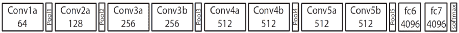

<!--yml

类别：未分类

日期：2024-09-06 20:08:38

-->

# [1711.08362] 基于 RGB-D 的人体运动识别与深度学习：综述

> 来源：[`ar5iv.labs.arxiv.org/html/1711.08362`](https://ar5iv.labs.arxiv.org/html/1711.08362)

# 基于 RGB-D 的人体运动识别与深度学习：综述

Pichao Wang pw212@uowmail.edu.au Wanqing Li wanqing@uow.edu.au Philip Ogunbona philipo@uow.edu.au Jun Wan jun.wan@nlpr.ia.ac.cn Sergio Escalera sergio@maia.ub.es 高级多媒体研究实验室，伍伦贡大学，澳大利亚 Motovis Inc.，阿德莱德，澳大利亚 生物特征识别与安全研究中心（CBSR）& 自动化研究所（NLPR），中国科学院（CASIA），北京， 中国 巴萨罗那大学及计算机视觉中心，UAB 校园，巴萨罗那，西班牙

###### 摘要

人体运动识别是以人为中心的研究活动中最重要的分支之一。近年来，基于 RGB-D 数据的运动识别引起了广泛关注。随着人工智能的发展，深度学习技术在计算机视觉领域取得了显著成功。特别是，卷积神经网络（CNN）在基于图像的任务中取得了巨大成功，而递归神经网络（RNN）则以其在序列问题上的卓越表现而闻名。具体而言，基于 CNN 和 RNN 架构的深度学习方法已被用于 RGB-D 数据的运动识别。本文详细概述了基于 RGB-D 的运动识别的最新进展。所述方法大致分为四类，具体取决于用于识别的模态：基于 RGB、基于深度、基于骨架和基于 RGB+D。作为一项专注于深度学习在 RGB-D 运动识别中的应用的综述，我们明确讨论了现有技术的优缺点。特别是，我们强调了编码视频序列中固有的时空结构信息的方法，并讨论了未来研究的潜在方向。

###### 关键词：

人体运动识别，RGB-D 数据，深度学习，综述^†^†期刊：计算机视觉与图像理解

## 1 引言

在计算机视觉中的几个人体中心研究活动（例如，人类检测、跟踪、姿态估计和运动识别）中，人类运动识别尤其重要，因为它在视频监控、人机接口、环境辅助生活、人机交互、智能驾驶等领域具有潜在应用。人类运动识别任务可以总结为从图像或视频序列中自动识别人的行为。涉及的运动的复杂性和持续时间可以作为广泛分类的基础，分为手势、动作、交互和群体活动四类。手势可以定义为传达思想、情感等的手、手臂、身体或头部的基本运动或定位。“挥手”和“点头”是手势的一些典型例子。通常，手势的持续时间相对较短。动作被认为是一种由单个人在短时间内执行的运动，并涉及多个身体部位，相比之下，手势只涉及少量身体部位。活动由一系列动作组成。交互是一种由两个参与者执行的运动；一个参与者是人类，而另一个可以是人类或物体。这意味着交互类别将包括人类与人类或人类与物体的交互。“互相拥抱”和“弹吉他”分别是这两种交互的例子。群体活动是最复杂的活动类型，它可能是手势、动作和交互的组合。它必然涉及两个以上的人类以及零到多个物体。群体活动的例子包括“两个队伍打篮球”和“团队会议”。

对人类运动识别的早期研究主要集中在静态图像或视频的分析[2, 144, 132, 99, 44, 176]。这些研究大多使用了 2D 图像中的颜色和纹理线索进行识别。然而，由于背景杂乱、部分遮挡、视角、光照变化、执行速度和生物特征变化等问题，这项任务仍然具有挑战性。即使使用当前的深度学习方法，这一挑战依然存在[49, 4]。

随着微软 Kinect™ 和华硕 Xtion™ 等成本效益高的 RGB-D 传感器的近期发展，基于 RGB-D 的运动识别引起了广泛关注。这主要是因为额外的维度（深度）对光照变化不敏感，并且包含了场景的丰富 3D 结构信息。此外，可以从深度图中估计身体关节的 3D 位置[114]。因此，已经提出了几种基于 RGB-D 数据的方法，这一方法已被证明是人类运动分析的一个有前途的方向。

几篇综述论文总结了使用 RGB-D 数据进行人类运动识别的研究[14, 166, 3, 16, 172, 28, 100, 46]。具体而言，陈等人[14] 关注于深度传感器、深度数据的预处理、基于深度的动作识别方法和数据集。在他们的工作中，叶等人[166] 提供了使用深度和骨架模态的方法概述，涵盖了活动识别、头部/手部姿势估计、面部特征检测和手势识别等任务。Aggarwal 和 Xia[3] 提出的综述总结了五类基于 3D 轮廓、骨架关节/身体部位位置、局部时空特征、场景流特征和局部占用特征的表示方法。程等人[16] 的工作重点是基于 RGB-D 的手势识别数据集，并从三个角度总结了相应的方法：静态手势识别、手部轨迹手势识别和连续手势识别。在另一个研究中，Escalera 等人[28] 综述了使用多模态数据进行手势识别的挑战和方法。一些综述专注于 RGB-D 研究中的可用数据集。例如，张等人[172] 描述了用于动作/活动识别的可用基准 RGB-D 数据集，包括 27 个单视图数据集、10 个多视图数据集和 7 个多人数据集。其他工作如 Presti 和 La Cascia[100] 以及 Han 等人[46] 主要回顾了基于骨架的动作识别表示和方法。最近在[4] 中提出了一项关于使用深度学习进行 RGB-D 动作识别的简短综述，分析了 RGB 和深度线索在 2DCNN、3DCNN 和深度时间方法中的应用。

图 1：使用深度学习进行 RGB-D 基础的运动识别方法的分类。

上述调查主要集中在手工特征分析上。在这里，我们提供了基于 RGB-D 的深度学习方法的人体动作识别的全面综述。即使专注于深度学习方法，输入数据的性质仍然很重要。用于人体动作分析的 RGB-D 数据包括三种模态：RGB、深度和骨架。RGB 数据的主要特征是其形状、颜色和纹理，这带来了提取有趣点和光流的好处。与 RGB 视频相比，深度模态对光照变化不敏感，对颜色和纹理变化不变，可靠地估计身体轮廓和骨架，并提供场景的丰富 3D 结构信息。与 RGB 和深度不同，包含人体关节位置的骨架数据是用于动作识别的相对高级特征。这三种模态的不同特性激发了文献中出现的各种方法。例如，基于光流的卷积神经网络（CNN）方法对 RGB 通道非常有效[27]; 基于深度排名池化的 CNN 方法是深度模态的一个好选择[152]; 基于序列的递归神经网络（RNN）方法[82]和基于图像的 CNN 方法[155]对骨架有效; 使用 CNN 的场景流方法对 RGB+D 通道有前景[151]。这些方法对特定模态非常有效，但并非总适用于所有模态。鉴于这些观察结果，本综述根据用于人体动作识别的模态确定了四个广泛的类别。这些类别包括基于 RGB 的、基于深度的、基于骨架的和基于 RGB+D 的。

在每个类别中，进一步识别了两个子类别，即分段人体动作识别和连续/在线动作识别。对于分段动作识别，问题的场景可以简单描述为将一段明确划分的视频帧序列分类为一组动作类型之一。这与连续/在线人体动作识别形成对比，后者没有给定的动作执行边界。在线情况还受到视频序列未被记录的事实的影响，算法必须处理在捕获过程中出现的帧，可能仅保存一个小的数据缓存。

在执行特定动作时，可以识别出空间信息，即在某一时刻人体的空间配置（例如，人体部位的相对位置）。类似地，还有时间信息，它描述了身体随时间变化的空间配置（即身体的动态）。最后，结构信息编码了在执行动作期间身体部位的协调与同步。它描述了在不同时间段内人体空间配置的关系。

在评审各种方法时，考虑了如何利用空间、时间和结构信息。因此，调查从空间-时间-结构编码的角度讨论了所评审方法的优点和局限性，并提出了未来研究的潜在方向。

本调查的一个关键创新点是关注于所评审的各种深度学习方法中使用的三种神经网络架构，即基于 CNN、基于 RNN 和其他结构化网络。图 1 展示了支撑本调查的分类法。

这是首批专注于基于 RGB-D 的深度学习人体运动识别的调查之一。除了这一声明外，本调查还通过以下贡献与其他调查区分开来：

+   1.

    对过去五年中开发的最新和最先进的基于深度学习的方法进行了全面覆盖，从而为读者提供了对近期研究成果和最先进方法的完整概述。

+   2.

    根据模态的不同属性，对方法进行了有见地的分类和分析；从空间-时间-结构编码的角度突出了所述方法的优缺点。

+   3.

    讨论了基于 RGB-D 的运动识别的挑战；分析了现有方法的局限性并讨论了潜在的研究方向。

此外，还调查了与深度学习相关的几种最近发布或常用的 RGB-D 基准数据集。本调查论文主要关注基于 RGB-D 数据的人体运动识别，包括手势识别、动作/活动识别和交互识别。由于缺乏专注于基于 RGB-D 的群体活动识别的数据集，因此该主题的研究相对稀缺，本调查未涵盖此主题。其他基于 RGB-D 的以人为中心的应用，如人体检测、跟踪和姿态估计，也不是本文的重点。关于 RGB-D 数据获取的调查，请参考[14、16、46]。

本调查的后续部分组织如下。常用的基于 RGB-D 的基准数据集在第二部分中描述。第 3 至 6 节讨论了从四个角度：基于 RGB 的运动识别、基于深度的运动识别、基于骨骼的运动识别和基于 RGB+D 的运动识别，使用深度学习进行 RGB-D 基于的运动识别的方法。RGB-D 基于的运动识别的挑战和未来方向的指引在第七部分中介绍。调查在第八部分中提供了结论性评论。

## 2 基准数据集

在过去十年中，已经收集了许多 RGB-D 基准数据集，并公开提供给研究社区。这些数据集的来源主要分为三类[14, 16, 46]：运动捕捉系统（Mocap）、结构光相机（例如 Kinect v1）和飞行时间（ToF）相机（例如 Kinect v2）。因此，这些数据集的模式涵盖了 RGB、深度、骨骼及其组合。随着深度学习的发展，已经开发出用于直接从单幅图像或视频序列中估计骨骼的深度方法，如 DeepPose[129]、Deepercut[58]和 Adversarial PoseNet[15]。文献中已经出现了这些数据集的综合调查（例如，参见[16]的手势和[172]的动作识别）。在本调查中，仅描述了 15 个被广泛采用用于评估基于深度学习的方法的大规模数据集。读者可以参考表 LABEL:performance，查看使用这些数据集的部分工作（出版物）。为了本调查的目的，这些数据集被分为两组：分段数据集和连续/在线数据集。

### 2.1 分段数据集

所谓分段数据集，是指样本对应于整个开始-结束动作/手势，每个分段代表一个动作。它们主要用于分类目的。以下是几个常用的分段数据集，用于评估基于深度学习的方法。

#### 2.1.1 CMU Mocap

CMU Graphics Lab Motion Capture Database (CMU Mocap) [1]([`mocap.cs.cmu.edu/`](http://mocap.cs.cmu.edu/)) 是最早的数据源之一，涵盖了广泛的人类动作，包括两个主体之间的互动、人类运动、与不平坦地形的互动、体育运动及其他人类动作。该数据集包括 RGB 和骨架模态。

#### 2.1.2 HDM05

动作捕捉数据库 HDM05 [94] ([`resources.mpi-inf.mpg.de/HDM05/`](http://resources.mpi-inf.mpg.de/HDM05/)) 是通过光学标记技术以 120 Hz 的频率捕捉的，包含了 2337 个序列，记录了 5 名非专业演员执行的 130 个动作，每帧包含 31 个关节。除了骨架数据，该数据集还提供了 RGB 数据。

#### 2.1.3 MSR-Action3D

MSR-Action3D [77] ([`www.uow.edu.au/~wanqing/#MSRAction3DDatasets`](http://www.uow.edu.au/~wanqing/#MSRAction3DDatasets)) 是第一个由微软研究院、雷德蒙德和卧龙岗大学在 2010 年收集的公共基准 RGB-D 动作数据集。该数据集包含 20 个动作：高臂挥动、水平臂挥动、锤子、手抓、前拳、高抛、画 X、画勾、画圈、拍手、双手挥动、侧击、弯腰、前踢、侧踢、慢跑、网球发球、高尔夫挥杆、捡起和抛掷。十名受试者重复执行这些动作三次。所有视频都从一个固定的视角录制，受试者在执行动作时面向摄像头。数据集的背景经过一些后处理移除。具体而言，如果一个动作需要用一只手或一条腿来完成，演员被要求使用右手或右腿进行表演。

#### 2.1.4 MSRC-12

MSRC-12 数据集 [36](%****␣CVIU-arxiv.tex␣Line␣400␣****http://research.microsoft.com/en-us/um/cambridge/projects/msrc12/) 是由微软研究院剑桥分部和剑桥大学于 2012 年收集的。作者为参与者提供了三种熟悉且易于准备的指令模态及其组合。这些模态包括（1）分解动作运动学的描述性文本，（2）一个人执行手势的静态图像序列，并用箭头适当标注，以及（3）一个人执行手势的视频（动态图像）。共有 30 名参与者，对于每个手势，数据被收集为：文本（10 人）、图像（10 人）、视频（10 人）、带文本的视频（10 人）、带文本的图像（10 人）。数据集使用一个 Kinect™传感器捕捉，仅提供骨架数据。

#### 2.1.5 MSRDailyActivity3D

MSRDailyActivity3D 数据集 [142]([`www.uow.edu.au/~wanqing/#MSRAction3DDatasets`](http://www.uow.edu.au/~wanqing/#MSRAction3DDatasets)) 由微软和西北大学于 2012 年收集，专注于日常活动。其动机是涵盖客厅中的人类日常活动。10 名演员在沙发上坐着或靠近沙发站立时执行动作。相机固定在沙发前方。除了深度数据外，还记录了骨架数据，但由于演员坐在沙发上或靠近沙发，跟踪器提取的关节位置非常嘈杂。

#### 2.1.6 UTKinect

UTKinect 数据集 [162]([`cvrc.ece.utexas.edu/KinectDatasets/HOJ3D.html`](http://cvrc.ece.utexas.edu/KinectDatasets/HOJ3D.html)) 由德克萨斯大学奥斯汀分校于 2012 年收集。10 名受试者执行了 10 种类型的人类动作，每种动作重复执行两次。受试者从不同的视角执行这些动作。该数据集的一个挑战在于动作执行中存在较大的演员依赖性变异。此外，人类与物体的遮挡以及身体部位超出视野范围也进一步增加了数据集的难度。提供了关于动作标签和序列分割的真实数据。

#### 2.1.7 G3D

Gaming 3D 数据集 (G3D) [7]([`dipersec.king.ac.uk/G3D/`](http://dipersec.king.ac.uk/G3D/)) 由金斯顿大学于 2012 年收集，专注于游戏场景中的实时动作识别。数据集包含 10 名受试者执行 20 种游戏动作。每名受试者执行这些动作三次。提供了两种标签作为真实数据：每个动作的开始和结束时间以及每个动作的峰值帧。

#### 2.1.8 SBU Kinect Interaction Dataset

SBU Kinect Interaction 数据集 [169]([`www3.cs.stonybrook.edu/~kyun/research/kinect_interaction/index.html`](http://www3.cs.stonybrook.edu/~kyun/research/kinect_interaction/index.html)) 由石溪大学于 2012 年收集。该数据集包含八种类型的互动。所有视频都在相同的室内背景下录制。七名参与者执行了两名演员之间的互动活动。数据集被分割成 21 组，每组包含一个或两个每个动作类别的序列。提供了两种真实数据：每个分段视频的动作标签和“主动”演员与“非主动”演员的识别。

#### 2.1.9 Berkeley MHAD

Berkeley Multimodal Human Action Database (Berkeley MHAD) [[96](http://tele-immersion.citris-uc.org/berkeley_mhad#dl)]，由加州大学伯克利分校和约翰斯·霍普金斯大学在 2013 年收集，使用五种不同的模式进行捕捉，以扩展应用领域。这些模式包括：光学动作捕捉系统、四台多视角立体视觉摄像头、两台微软 Kinect v1 摄像头、六个无线加速度计和四个麦克风。十二名受试者执行了 11 个动作，每个动作 5 次。包含三类动作：(1) 全身部位运动的动作，如原地跳跃、开合跳、投掷等，(2) 上肢高动态动作，如挥手、拍手等，以及(3) 下肢高动态动作，如坐下、站立。动作执行时具有风格和速度的变化。

#### 2.1.10 Northwestern-UCLA Multiview Action 3D

Northwestern-UCLA Multiview Action 3D [[143](http://users.eecs.northwestern.edu/~jwa368/my_data.html)]是由西北大学和加州大学洛杉矶分校在 2014 年收集的。该数据集包含从各种视角获取的数据。动作由 10 名演员表演，并由三台同时工作的 Kinect™v1 摄像头捕捉。

#### 2.1.11 ChaLearn LAP IsoGD

ChaLearn LAP IsoGD 数据集 [[139](http://www.cbsr.ia.ac.cn/users/jwan/database/isogd.html)]是一个用于分段手势识别的大型 RGB-D 数据集，由 Kinect v1 摄像头收集。它包括 47933 个 RGB-D 深度序列，每个 RGB-D 视频表示一个手势实例。数据集中包含 21 个不同个体执行的 249 个手势。数据集分为训练集、验证集和测试集。所有三部分集由不同受试者的样本组成，以确保验证集和测试集中的一个受试者的手势不会出现在训练集中。

#### 2.1.12 NTU RGB+D

NTU RGB+D 数据集 [[109](https://github.com/shahroudy/NTURGB-D)]目前是按每个动作样本数量计算的最大动作识别数据集。RGB-D 数据是由 Kinect v2 摄像头捕捉的。数据集包含超过 56,000 个序列和 400 万帧，包含 40 名年龄在 10 到 35 岁之间的受试者执行的 60 个动作。数据集包括正面视图、两个侧面视图和左、右 45 度视图。

### 2.2 连续/在线数据集

连续/在线数据集指的是那些每个视频序列可能包含一个或多个动作/手势，并且不同运动类别之间的分段位置是未知的。这些数据集主要用于动作检测、定位和在线预测。此类型的数据集较少。

#### 2.2.1 ChaLearn2014 多模态手势识别

ChaLearn2014 多模态手势识别 [29] ([`gesture.chalearn.org/2014-looking-at-people-challenge`](http://gesture.chalearn.org/2014-looking-at-people-challenge)) 是一个由 Kinect v1 传感器收集的多模态数据集，包括 RGB、深度、骨架和音频模态。在所有序列中，一个用户在摄像头前进行自然的意大利手势。每个手势的开始和结束帧都被标注，并附有手势类别标签。该数据集包含近 14K 手动标注的（开始和结束帧）手势表演，视频序列连续，词汇量为 20 种意大利手势类别。数据集共有 1,720,800 标注帧，跨 13,858 个约 1 到 2 分钟的视频片段，采样频率为 20 Hz。手势由 27 个不同个体在多种条件下执行，包括不同的衣物、位置、背景和光照。

表 1：用于深度学习评估的公共基准数据集的统计信息。标题的符号说明：Seg: 分割，Con: 连续，D: 深度，S: 骨架，Au: 音频，Ac: 加速度计，IR: 红外视频，#: 数量，JI: 杰卡德指数。

| 数据集 | 年份 |
| --- | --- |

&#124; 获取 &#124;

&#124; 设备 &#124;

| 分割/连续 | 模态 | #类别 | #受试者 | #样本 | #视角 | 量度 |
| --- | --- | --- | --- | --- | --- | --- |
| CMU 动作捕捉 | 2001 | 动作捕捉 | 分割 | RGB,S | 45 | 144 | 2,235 | 1 | 准确度 |
| HDM05 | 2007 | 动作捕捉 | 分割 | RGB,S | 130 | 5 | 2337 | 1 | 准确度 |
| MSR-Action3D | 2010 | Kinect v1 | 分割 | S,D | 20 | 10 | 567 | 1 | 准确度 |
| MSRC-12 | 2012 | Kinect v1 | 分割 | S | 12 | 30 | 594 | 1 | 准确度 |

|

&#124; MSR &#124;

&#124; DailyActivity3D &#124;

| 2012 | Kinect v1 | 分割 | RGB,D,S | 16 | 10 | 320 | 1 | 准确度 |
| --- | --- | --- | --- | --- | --- | --- | --- | --- |
| UTKinect | 2012 | Kinect v1 | 分割 | RGB,D,S | 10 | 10 | 200 | 1 | 准确度 |
| G3D | 2012 | Kinect v1 | 分割 | RGB,D,S | 5 | 5 | 200 | 1 | 准确度 |

|

&#124; SBU Kinect &#124;

&#124; 互动 &#124;

| 2012 | Kinect v1 | 分割 | RGB,D,S | 7 | 8 | 300 | 1 | 准确度 |
| --- | --- | --- | --- | --- | --- | --- | --- | --- |
| 伯克利 MHAD | 2013 |

&#124; 动作捕捉 &#124;

&#124; Kinect v1 &#124;

| 分割 | RGB,D,S,Au,Ac | 12 | 12 | 660 | 4 | 准确度 |
| --- | --- | --- | --- | --- | --- | --- |

|

&#124; 多视角 &#124;

&#124; Action3D &#124;

| 2014 | Kinect v1 | 分割 | RGB,D,S | 10 | 10 | 1475 | 3 | 准确度 |
| --- | --- | --- | --- | --- | --- | --- | --- | --- |

|

&#124; ChaLearn LAP &#124;

&#124; IsoGD &#124;

| 2016 | Kinect v1 | 分割 | RGB,D | 249 | 21 | 47933 | 1 | 准确度 |
| --- | --- | --- | --- | --- | --- | --- | --- | --- |
| NTU RGB+D | 2016 | Kinect v2 | 分割 | RGB,D,S,IR | 60 | 40 | 56880 | 80 | 准确度 |
| ChaLearn2014 | 2014 | Kinect v1 | 连续 | RGB,D,S,Au | 20 | 27 | 13858 | 1 |

&#124; 准确度 &#124;

&#124; JI 等 &#124;

|

|

&#124; ChaLearn LAP &#124;

&#124; ConGD &#124;

| 2016 | Kinect v1 | 连续 | RGB,D | 249 | 21 | 22535 | 1 | JI |
| --- | --- | --- | --- | --- | --- | --- | --- | --- |
| PKU-MMD | 2017 | Kinect v2 | 连续 | RGB,D,S,IR | 51 | 66 | 1076 | 3 | JI 等 |

#### 2.2.2 ChaLearn LAP ConGD

ChaLearn LAP ConGD 数据集 [139] ([`www.cbsr.ia.ac.cn/users/jwan/database/congd.html`](http://www.cbsr.ia.ac.cn/users/jwan/database/congd.html)) 是一个用于连续手势识别的大型 RGB-D 数据集。该数据集由 Kinect v1 传感器收集，包含 47933 个 RGB-D 手势实例，分布在 22535 个 RGB-D 手势视频中。每个 RGB-D 视频可能包含一个或多个手势，共有 249 种手势，由 21 个不同的个体执行。数据集分为训练集、验证集和测试集。三个数据集中的样本均来自不同的受试者，以确保验证集和测试集中的某一受试者的手势不会出现在训练集中。

#### 2.2.3 PKU-MMD

PKU-MMD [19] ([`www.icst.pku.edu.cn/struct/Projects/PKUMMD.html`](http://www.icst.pku.edu.cn/struct/Projects/PKUMMD.html)) 是一个大规模的连续多模态 3D 人体动作理解数据集，涵盖了广泛的复杂人类活动，并附有详细的注释信息。该数据集通过 Kinect v2 传感器捕获，包含 1076 个长视频序列，分为 51 个动作类别，由 66 名受试者在三个摄像机视角下执行。它包含近 20,000 个动作实例和总计 540 万帧。数据集提供了多模态数据源，包括 RGB、深度、红外辐射和骨架。

表 2 显示了常用于深度学习算法评估的公开基准数据集的统计数据。可以看到，调查的数据集涵盖了多种不同类型的动作，包括手势、简单动作、日常活动、人机交互和人际交互。它还涵盖了分段和连续/在线数据集，使用不同的采集设备、模态和视角。来自不同数据集的示例图像见图 2。

图 2：来自不同数据集的示例图像。

在本节中，我们介绍了与基于 RGB-D 的运动识别相关或已应用的深度学习概念和架构。对于更详细的背景和技术，感兴趣的读者可以参考 [41] 的书籍。

## 基于 RGB 的深度学习运动识别

RGB 是 RGB-D 数据中的一个重要通道，其特性包括形状、颜色和纹理，包含丰富的特征。这些特性也使得直接使用网络（如 2D CNNs [68, 117, 47]）提取帧级特征变得有效。尽管本节中大多数调查的方法并未针对 RGB-D 数据集进行调整，但我们认为以下方法可以直接适应 RGB-D 数据集的 RGB 模态。我们定义了三类方法，即基于 CNN、基于 RNN 和其他架构的分段运动识别方法；前两类方法用于连续/在线运动识别。

### 3.1 分段运动识别

#### 3.1.1 基于 CNN 的方法

对于这一组方法，目前主要有四种编码空间-时间-结构信息的方法。第一种方法应用 CNN 从单个帧中提取特征，然后融合时间信息。例如 [64] 研究了四种时间融合方法，并提出了慢融合的概念，其中较高的层逐步获取更多的空间和时间维度的全局信息（见图 4）。此外，还探讨了几种时间池化方法，建议在时间域中使用最大池化较为可取 [95]。

图 3：C3D 网络包含 8 个卷积层、5 个最大池化层和 2 个全连接层，最后是一个 softmax 输出层。所有 3D 卷积核都是 3$\times$3$\times$3，在空间和时间维度上步幅均为 1。每个框中标示了滤波器的数量。3D 池化层如从 pool1 到 pool5 所示。所有池化核为 2$\times$2$\times$2，除了 pool1 为 1$\times$2$\times$2。每个全连接层有 4096 个输出单元。图源 [130]。

图 4：通过网络在时间维度上融合信息的不同方法。红色、绿色和蓝色框分别表示卷积层、归一化层和池化层。在 Slow Fusion 模型中，所示的列共享参数。图源 [64]。

第二种方法将卷积操作扩展到时间域。在一种实现中，Ji 等人[61] 提出了使用沿时间轴扩展的 3D 核（滤波器）来提取空间和时间维度的特征。这项工作通过实验证明，3D 卷积网络优于其 2D 帧基的对应物。结合现代深度架构，如 VGG[117]，以及大规模监督训练数据集，如 Sports-1M[64]，Tran 等人[130] 在[61]的基础上扩展了工作，加入了 3D 池化层，并提出了一个名为 C3D 的通用描述符，通过平均网络的第一个全连接层的输出（见图 3）。然而，这些工作都将视频序列分解为短片段，并通过后期得分融合来聚合视频级信息。在考虑到一些长时间动作序列时，比如持续几秒钟的行走或游泳，这种方法可能是次优的。为了处理这个问题，Varol 等人[133] 研究了长期视频表示的学习，并提出了长时间卷积（LTC），以降低空间分辨率，从而保持网络复杂度的可处理性。尽管这种方法直接且主流，但将空间核扩展到 3D 时空导数不可避免地增加了网络的参数数量。为了缓解 3D 核的缺点，Sun 等人[125] 将 3D 滤波器分解为 2D 和 1D 滤波器的组合。

第三种方法是将视频编码为包含时空信息的动态图像，然后应用 CNN 进行基于图像的识别。Bilen 等人[6] 提出了采用排名池化[34] 将视频编码为一组动态图像，并使用在 ImageNet[68] 上预训练的模型进行微调（见图 6）。采用排名池化的端到端学习方法也在[6, 35]中提出。与原始工作相比，分层排名池化[33] 被提出用于学习更高阶和非线性的表示。广义排名池化[17] 被引入以通过二次排名函数改进原始方法，该函数同时提供输入数据的低秩近似并保留其在子空间中的时间顺序。

图 5：基于 RGB 的运动识别的双流架构。图源自 [116]。

图 6：排名池化将 RGB 视频编码成一个动态图像，并采用 CNN 进行特征提取和分类。图源自 [6]。

除了上述旨在采用单一网络来利用视频中包含的时空信息的工作，第四种方法将这两个因素分开，并采用多个流网络。Simonyan 等人[116] 提出了一个空间流网络，该网络以原始视频帧作为输入，还有一个时间流网络，该网络接受光流场作为输入。这两个流通过 softmax 分数融合在一起（见图。5 以实现双流架构）。Wang 等人[145] 通过将改进的轨迹[141] 集成到双流网络中扩展了该网络，其中使用轨迹约束采样和池化来将从深度 CNN 架构中学习到的深度特征编码为有效描述符。为了使用双流网络整合长范围时间结构，Wang 等人[147] 设计了一个时间段网络（TSN），该网络使用稀疏采样方案从长视频序列中提取短片段。通过去除连续帧中的冗余和段落结构，从采样的片段中获得聚合信息。为了减少光流的昂贵计算，Zhang 等人[170] 通过用可以直接从压缩视频中获得的运动矢量替代光流来加速这一双流结构，从而避免了额外的计算。Wang 等人[158] 通过使用双流语义区域基础 CNNs（SR-CNNs）利用视频中的语义线索，将人类/物体检测结果融入框架。在他们的工作中，Chéron 等人[18] 利用人体姿态的空间结构，并从 RGB 帧和光流中提取基于姿态的卷积神经网络（P-CNN）特征，以进行细粒度的动作识别。[157] 中提出的工作从新视角构建了动作识别问题，并将动作建模为一种转变，即在动作之前环境的状态变化为动作后的状态。他们设计了一个 Siamese 网络，该网络基于双流模型在高级特征空间上建模动作的转变。基于双流框架，[180] 提出了一个关键体积挖掘深度框架用于动作识别，在其中识别关键体积并同时进行分类。受到残差网络（ResNets）[47] 成功的启发，Feichtenhofer 等人[31] 在两个流之间注入了残差连接，以允许它们之间的时空交互。[72] 采用了运动历史图像（MHI）[8] 作为运动线索，替代了时间流中的光流。MHI 与 RGB 帧结合在一个时空 CNN 中用于细粒度动作识别。然而，以上所有回顾的方法都将两个流合并于不同的训练阶段；对两个流的任何配准都被忽视了。为了填补这一空白并提出一种新的空间-时间融合架构，Feichtenhofer 等人[32] 调查了双流融合的三个方面：（i）如何融合两个网络以考虑空间配准，（ii）在哪里融合这两个网络，以及（iii）如何在时间上融合这两个网络。他们的结论之一是结果表明学习高度抽象的 ConvNet 特征之间的空间和时间对应的重要性。

#### 3.1.2 基于 RNN 的方法

对于基于 RNN 的方法，Baccouche 等人 [5] 通过级联的 3D CNN 和 LSTM 解决了动作识别的问题，其中这两个网络是分别训练的。与单独训练不同，Donahue 等人 [22] 提出了一个长短期递归卷积网络（LRCN），以利用这两个网络的端到端训练（参见图示 7）。为了充分利用 CNN 和 RNN，Ng 等人 [95] 聚合了 CNN 特征，并结合了时间池化和 LSTM 进行时间利用，同时融合了特征池化和 LSTM 网络的输出得分以进行最终的动作识别。Pigou 等人 [98] 提出了一个端到端可训练的神经网络架构，该架构结合了时间卷积和双向 LSTM 用于手势识别。这提供了挖掘时间信息的机会，这对于手势识别具有很大的区分性。在他们的工作中，Sharma 等人 [111] 提出了一个基于 LSTM 的软注意力模型用于动作识别（见图 8）。该注意力模型学习帧中与当前任务相关的部分，并赋予它们更高的权重。以往基于注意力的方法仅利用视频级类别作为监督来训练 LSTM。这种策略可能缺乏详细和动态的指导，从而限制了其在视频中建模复杂动作的能力。Du 等人 [23] 通过提出一个递归姿态注意力网络（RPAN）来解决这个问题，用于视频中的动作识别，该网络可以自适应地学习每一步动作预测的高度区分性姿态相关特征。为了利用 Fisher Vector [108] 和 RNN，Lev 等人 [74] 引入了一个递归神经网络 Fisher Vector（RNN-FV），在这里 Fisher Vector 中的 GMM 概率模型被 RNN 替代，从而避免了对 GMM 数据分布的假设。尽管 RNN 在建模时间依赖性方面表现出色，但它缺乏直观的高层次时空结构。Jain 等人 [59] 通过结合时空图和 RNN 的优势挖掘了时空结构信息用于动作识别。最近，Sun 等人 [124] 提出了一个 Lattice-LSTM (L2STM) 网络，该网络通过学习独立的记忆单元隐状态转移来扩展 LSTM，以处理个体空间位置。该方法有效地增强了跨时间建模动态的能力，并解决了长期运动动态的非平稳问题，而不显著增加模型复杂性。与之前仅使用前馈连接的方法不同，Shi 等人 [112] 提出了一个生物学启发的深度网络，称为 ShuttleNet1。与传统的 RNN 不同，ShuttleNet 中的所有处理器都以循环方式连接，以模拟人脑的前馈和反馈连接。通过这种方式，处理器在循环连接中共享多个路径。然后使用注意力机制来选择最佳的信息流路径。

图 7：LRCN 使用 CNN 处理可变长度的视觉输入，其输出被输入到一组递归序列模型中。输出是可变长度的预测。图来自 [22]。

图 8：CNN 以视频帧作为输入，并生成特征管道。模型将当前输入 $\boldsymbol{x}_{t}$ 计算为按位置 softmax $\boldsymbol{I}_{t}$ 权重加权的特征切片的平均值。在每个时间步 $t$，递归网络以特征切片 $\boldsymbol{x}_{t}$ 作为输入。然后，它通过三层 LSTM 传播 $\boldsymbol{x}_{t}$ 并预测下一个位置概率 $\boldsymbol{I}_{t+1}$ 和类别标签 $\boldsymbol{y}_{t}$。图来自 [111]。

图 9：深度动作提议算法可以在视频中定位不同持续时间的片段，而无需对多个时间尺度进行详尽的探索。图来自 [30]。

图 10：LSTM 自编码器模型和 LSTM 未来预测模型。图来自 [122]。

#### 3.1.3 基于其他架构的方法

除了基于 CNN 和 RNN 的 RGB 模态运动识别常用方法外，还有一些其他结构被采用于这一任务。Jhuang 等人[60] 使用了一种前馈层次模板匹配架构进行动作识别，在第一层中使用预定义的时空滤波器。在他的论文中，Chen [13] 采用了卷积式 RBM (CRBM) 作为基本处理单元，并提出了所谓的时空深度置信网络 (ST-DBN)，该网络交替聚合空间和时间信息，使得更高层次能够捕捉空间和时间上的长程统计依赖。Taylor 等人[126] 扩展了门控 RBM (GRBM) [91] 为卷积式 GRBM (convGRBM)，它在图像的所有位置共享权重，并通过卷积进行推理。Le 等人[70] 提出了独立子空间分析算法[128] 的扩展，以从未标记的视频数据中学习不变的时空特征。他们通过采用卷积神经网络的两个重要思想：卷积和堆叠，将原始的 ISA 扩展到更大的输入数据。这种卷积堆叠思想使算法能够学习适合识别的分层数据表示。Yan 等人[164] 提出了 Dynencoder，一种三层自编码器，用于捕捉视频动态。Dynencoder 在合成动态纹理方面表现成功，可以将 Dynencoder 视为表示视频时空信息的紧凑方式。类似地，Srivastava 等人[122] 介绍了一种 LSTM 自编码器模型。LSTM 自编码器模型由两个 RNN 组成，即编码器 LSTM 和解码器 LSTM。编码器 LSTM 接受序列作为输入，并学习相应的紧凑表示。编码器 LSTM 的状态包含序列的外观和动态。解码器 LSTM 接收学习到的表示来重建输入序列。受生成对抗网络 (GAN) [42] 启发，Mathieu 等人[90] 采用了对抗机制来训练多尺度卷积网络，以在给定输入序列的情况下生成未来帧。为了解决标准均方误差 (MSE) 损失函数固有的模糊预测，他们提出了三种不同且互补的特征学习策略：多尺度架构、对抗训练方法和图像梯度差异损失函数。

### 3.2 连续/在线运动识别

上述大多数动作识别方法在模型训练中都严重依赖于分段视频。然而，获取大规模的裁剪视频数据集非常昂贵且耗时。未裁剪视频数据集（例如 [48, 167, 21, 139, 19]）的可用性促进了该领域动作识别的研究以及挑战/竞赛。

#### 3.2.1 基于 CNN 的方法

受到基于区域提议的对象检测成功的启发，例如使用 R-CNN[39, 38, 103]，提出了几种基于提议的动作识别方法，这些方法来源于未修剪的视频。这些方法首先生成较少的候选时间窗口，然后一个动作分类器将每个提议独立地区分为感兴趣的动作之一。例如，基于双流概念[116], [40]，通过静态和运动线索分类了基于帧的区域提议。然后根据预测和空间重叠将区域在帧之间进行连接，从而为每个动作和视频分别生成动作管道。Weinzaepfel 等[159]也从帧级别的提议开始，选择了得分最高的提议，跟踪了整个视频，并采用多尺度滑动窗口方法对轨迹进行操作以检测动作的时间内容。Shou 等[115]提出了一种多阶段基于段的 3D CNN 来生成候选段，用于识别动作和定位时间边界。Peng 和 Schimd[97]通过使用区域提议网络进行帧级动作检测，生成了来自 RGB 和光流数据的丰富提议，并堆叠了光流以增强运动 R-CNN 的辨别能力。Wang 等[146]提出了一种 UntrimmedNet 来生成可能包含动作实例的剪辑提议，用于未修剪动作识别。基于这些剪辑级别的表示，分类模块旨在预测每个剪辑提议的得分，选择模块则尝试选择或排名这些剪辑提议。同样，在相同方向上，Zhao 等[175]在时间维度上采用了明确的结构建模。在他们的模型中，每个完整的活动实例被视为由三个主要阶段组成，即开始、过程和结束，并引入了结构化的时间金字塔池化来生成整个提议的全局表示。与以前的方法不同，Zhu 等[179]提出了一个将互补的空间和时间信息集成到端到端可训练的视频动作提议系统中的框架，并提出了一种新颖而高效的路径修剪方法，通过检查动作性和背景分数模式来处理未修剪的视频，而无需使用额外的检测器。为了将 R-CNN 从 2D 推广到 3D，Hou 等[52]提出了一种基于 3D CNN 的端到端动作检测方法。引入了 Tube Proposal Network 以利用时间域的跳跃池化来保留 3D 体积中的时间信息，并提出了 Tube-of-Interest 池化层，以有效缓解提议的空间和时间尺寸变异问题。Saha 等[106]提出了一个深度网络框架，能够回归和分类跨越两个连续视频帧的 3D 区域提议。该框架的核心是将经典区域提议网络（RPNs）演化为 3D RPNs。类似地，Kalogeiton 等[63]通过提出一个动作管道检测器，将 Single Shot MultiBox Detector (SSD)[84]框架从 2D 扩展到 3D。为了快速准确地生成时间动作提议，Gao 等[37]提出了一种 Temporal Unit Regression Network (TURN)模型，该模型通过 CNN 联合预测动作提议并通过时间坐标回归来细化时间边界。类似地，Singh 等[119]设计了一种高效的在线算法，以增量方式构建和标记来自 SSD 帧级检测的‘动作管道’，使其成为第一个能够在未修剪的视频上实时（高达 40fps）执行在线 S/T 动作定位的系统。除了上述基于提议的方法外，Lea 等[71]引入了一类新的时间模型，称为时间卷积网络（TCNs），它使用时间卷积的层次结构来执行细粒度动作分割或检测。

图 11：解决了弱监督动作标注的问题，其中仅在训练期间给出了发生动作的顺序。通过最大化所有可能的帧到标签对齐的概率来训练时间模型。在测试时，没有给出注释。学习到的模型编码了视频的时间结构，并可以在没有进一步信息的情况下预测动作。图来源于[55]。

#### 3.2.2 基于 RNN 的方法

除了使用 CNN 的基于提案的方法外，还有几种使用 RNN 进行时间建模的基于提案的方法。Escorcia 等人[30]提出了深度动作提案（DAPs），它从长时间未修剪的视频中生成时间动作提案，用于动作检测和分类（见图 9）。他们采用了 C3D 网络[130]作为视觉编码器，并采用 LSTM 作为序列编码器。然而，所有这些方法都是通过滑动窗口方法生成提案的，将视频划分为短的重叠时间窗口，这在计算上很昂贵。为了减少提案的数量，Buch 等人[9]提出了一种单流时间动作提案生成方法，该方法不需要将输入划分为短的重叠剪辑或时间窗口进行批处理。

除了基于提议的方法，还有几种不依赖提议的方法。Yeung 等人 [168] 提出了一个端到端训练模型，该模型被构建为基于递归神经网络的代理。该代理学习一个策略，以根据对动作实例的直觉形成和改进假设，因为检测动作的过程本质上是观察和改进的过程。他们为此采用了两个网络，即观察网络和递归网络。Singh 等人 [118] 提出了一个多流双向递归神经网络，用于细粒度动作检测。他们采用了一种跟踪算法来定位围绕人的边界框，并在剪裁到跟踪边界框的运动和外观上训练两个流。视频序列被分割成固定长度的片段，以供双流网络输入，使用双向 LSTM 来建模动作内和动作间的长期时间动态。Ma 等人 [87] 在 RNN 目标中引入了一种新颖的排名损失，使训练模型能够更好地捕捉活动的进展。排名损失约束正确类别的检测分数随着活动的进行单调不减。与此同时，正确活动类别与所有其他类别之间的检测分数差距也单调不减。Huang 等人 [55] 提出了一个弱监督框架，用于视频中的动作标注（见图 11），其中在训练过程中仅要求动作的发生顺序。他们提出了一个扩展的连接主义时间分类（ECTC）框架，通过动态编程有效评估输入和标签序列之间的所有可能对齐，并明确强制它们与帧间视觉相似性的一致性。受到经典线性动态系统理论对时间序列建模的启发，Dave 等人 [20] 推导出一系列递归神经网络，这些网络依次对未来做出自上而下的预测，然后通过自下而上的观察来修正这些预测。他们的预测-修正架构允许从时间序列分析中获得见解：自适应地将计算重点放在需要大幅修正的“意外”帧上；简化学习，使得只需学习“残差型”修正项，并以分层方式自然解相关输入流，为每一层网络的学习提供更可靠的信号。

## **基于深度学习的深度运动识别**

与 RGB 视频相比，深度模态对光照变化不敏感，对颜色和纹理变化具有不变性，可靠地估计身体轮廓和骨架，并提供场景的丰富 3D 结构信息。然而，关于基于深度的动作识别的深度学习方法的已发布结果很少。造成这种情况的原因有两个。首先，深度图中缺乏颜色和纹理削弱了 CNN 模型的辨别表现力[85]。其次，现有的深度数据相对较小规模。传统的处理流程完全是数据驱动的，直接从像素中学习表征。这样的模型在有限的训练数据上优化时容易出现过拟合。目前，仅有基于 CNN 的方法用于深度动作识别。

### 4.1 分段动作识别

#### 4.1.1 基于 CNN 的方法

Wang 等人[149, 150] 提出了一种称为加权层次深度运动地图（WHDMM）+ 3ConvNet 的方法，用于在小型训练数据集上从深度图中识别人类动作。他们开发了三种策略来利用 ConvNet 在识别中挖掘辨识特征的能力。首先，通过旋转捕获的深度图的三维点来模仿不同视角。这不仅增加了数据的多样性，还使训练的 ConvNet 具有视角容忍性。其次，构建了多个时间尺度的 WHDMM，以将动作的时空运动模式编码为二维空间结构。通过将 WHDMM 转换为伪彩色图像，进一步增强了这些二维空间结构以进行识别。最后，三个 ConvNet 使用从 ImageNet 获取的模型进行初始化，并在三个正交平面上构建的彩色编码 WHDMM 上独立进行微调。受 rank pooling 方法在 RGB 数据上取得的有前途的结果[6]的启发，Wang 等人[152]使用 rank pooling 将深度图序列编码为三种动态图像: 动态深度图像（DDI）、动态深度正常图像（DDNI）和动态深度运动正常图像（DDMNI）。这三种表示分别从三个不同的层次捕获姿势和运动信息。特别是，DDI 利用时间内的姿势动态，而 DDNI 和 DDMNI 则利用深度图捕获的三维结构信息。Wang 等人[148]将[152]中的双向 rank pooling 替换为层次化和双向 rank pooling，以有效捕获姿势和动作识别中的高阶和非线性动态。最近，Wang 等人[156]提出了通过双向 rank pooling 将深度图序列表示为身体、部分和关节级别的三对结构化动态图像。与以往将一个 ConvNet 分别应用于每个部分/关节的方法不同，每个粒度级别都从深度图中构建一对结构化动态图像，并作为 ConvNet 的输入。这种结构化动态图像不仅保留了时空信息，还增强了身体部位/关节和不同时间尺度上的结构信息。此外，构建它所需的计算成本和内存开销低。这种新的表示称为空间结构化动态深度图像（S²DDI），从全局到细粒度的运动和结构信息在深度序列中聚合，并使我们能够微调已经在图像数据上训练的现有 ConvNet 模型，以用于深度序列的分类，而无需重新训练模型。类似地，Hou 等人[54]将 S²DDI 扩展为空间和时间结构化动态深度图像（STSDDI），采用分层双向 rank pooling 方法来利用深度序列中包含的时空结构信息，并将其应用于两个主体的交互。与上述纹理图像编码方法不同，Rahmani 等人[102]提出了基于深度序列的跨视角动作识别方法。他们的方法包括两个步骤: (i) 从合成深度图像学习通用的视角不变人体姿势模型，以及 (ii) 建模时间动作变化。为了扩大 CNN 的训练数据，他们通过将逼真的合成 3D 人体模型拟合到真实的 mocap 数据，并从大量视角渲染每个姿势来合成训练数据。对于时空表示，他们使用组稀疏傅立叶时间金字塔，该金字塔编码了建议的人体姿势模型的动作特定辨识输出特征。

图 12：深度图序列通过使用深度运动图（DMM）[165]和伪彩色技术被编码为纹理颜色图像，同时通过 3D 点云上的场景旋转扩大了训练数据。采用三通道 CNN 进行特征提取和分类。图来源于[150]。

### 4.2 连续/在线动作识别

#### 4.2.1 基于 CNN 的方法

对于连续手势识别，Wang 等人[153]首先使用运动量（QOM）[62]将连续深度序列分段，然后采用改进的 DMM（IDMM）将深度序列的动态编码为纹理图像，以进行大规模的连续手势识别。为了提高深度序列的编码质量，Wang 等人[148]提出了三种简单、紧凑但有效的深度序列表示，分别称为动态深度图像（DDI）、动态深度法线图像（DDNI）和动态深度运动法线图像（DDMNI），用于连续动作识别。这些动态图像是通过分段的深度图序列使用层次双向排名池化构建的，以有效捕捉时空信息。具体而言，DDI 利用姿势随时间变化的动态，而 DDNI 和 DDMNI 提取深度图捕捉的 3D 结构信息。基于图像的表示使我们能够对现有的在图像数据上训练的 ConvNet 模型进行微调，而无需从头开始训练大量参数。

## 5 基于骨架的动作识别与深度学习

与 RGB 和深度不同，骨架数据包含人体关节的位置，这些位置可以被视为相对高级的动作识别特征。估计骨架有两种常见的方法，一种是使用 MOCAP 系统，另一种是直接从深度图或 RGB 图像/视频中估计骨架。MOCAP 系统得到的骨架通常对尺度和光照变化具有鲁棒性，并且对视角以及人体旋转和动作速度具有不变性；从深度图或 RGB 图像/视频估计的骨架容易受到视角和遮挡等多个因素的影响，因为这些因素可能导致相同行为的外观差异很大。目前，使用深度学习的骨架动作识别主要有三种方法：（i）基于 RNN 的方法，（ii）基于 CNN 和其他架构的方法用于分段动作识别，以及（iii）基于 RNN 的方法用于连续/在线动作识别。

### 5.1 分段动作识别

图 13：基于 CNN 的骨架动作识别的 JTM 框架。图来源于[155]。

#### 5.1.1 基于 CNN 的方法

这种方法的主要步骤是将骨架序列转换为图像，其中时空信息通过图像的颜色和纹理等属性体现出来。Du et al. [24] 通过在每个时刻连接关节坐标并按时间顺序排列向量表示，将骨架序列表示为矩阵。然后将矩阵量化为图像，并进行归一化处理以解决变量长度问题。最终图像被输入到 CNN 模型中进行特征提取和识别。Wang et al. [155] 提出了将骨架序列中的时空信息编码为多张纹理图像，即关节轨迹图（JTM），通过将轨迹映射到 HSV（色调、饱和度、明度）空间。使用在 Imagenet 上预训练的模型对 JTM 进行微调以提取特征并识别动作。类似地，Hou et al. [53] 用特定的笔在三个正交画布上绘制骨架关节，并用颜色编码对骨架序列中的动态信息进行编码。Li et al. [75] 提出了将单个或多个对象的骨架关节的成对距离编码为纹理图像，即关节距离图（JDM），作为 CNN 进行动作识别的输入。与[155]和[53]报道的工作相比，JDM 对视角变化的敏感性较低。liu et al. [83] 引入了一种增强的骨架可视化方法，将骨架序列表示为一系列视觉和运动增强的彩色图像。他们提出了一种基于序列的视图不变变换来处理视角变化问题，并采用了多流 CNN 融合方法进行识别。Ke et al. [65] 为每个身体部位设计了基于向量的特征，这些特征具有平移、缩放和旋转不变性，并将这些特征转换为图像输入到 CNN 中，以学习高级和区分性的表示。在另一项工作中，Ke et al. [66] 将序列表示为每个 3D 坐标通道的若干灰度图像的剪辑，反映了关节的多种空间结构信息。这些图像被输入到深度 CNN 中以学习高级特征，并将所有三个剪辑在相同时间步的 CNN 特征串联成一个特征向量。每个特征向量表示整个骨架序列的时间信息和关节的特定空间关系。采用了多任务学习网络（MTLN）来并行处理所有时间步的特征向量以进行动作识别。Kim 和 Reiter [67] 从不同的角度解决了这个问题，并提出使用时间卷积神经网络（TCN）[71] 进行基于骨架的动作识别。他们通过将原始 TCN 重新设计为 Res-TCN，将更深层次的层次分解为加法残差项，从而获得了既可解释的隐藏表示又可解释的模型参数。

图 14：LSTM 自编码器模型和 LSTM 未来预测模型。图源自 [26]。

#### 5.1.2 基于 RNN 的方法

在这一类方法中，骨架特征被输入到 RNN 中，以利用时间演变。例如，在 Du 等人的一系列工作中[26, 25]，他们根据人体结构将整个骨架序列划分为五部分，并分别输入到五个双向 RNNs/LSTMs 中。随着层数的增加，子网络提取的表示被层次性地融合以构建更高级别的表示。该过程如图 14 所示。这种方法显式地将时空结构信息编码为高级表示。Veeriah 等人[134] 提出了一个差分门控方案，用于 LSTM 神经网络，强调了连续帧之间显著运动所导致的信息增益变化。这项工作是首批旨在展示通过状态的高阶导数学习复杂时间序列表示的研究之一。Zhu 等人[181] 设计了两种正则化方法来学习有效的特征和运动动态。在全连接层中，他们引入了正则化，以驱动模型学习不同层次上的关节共现特征。此外，他们推导了一种新的 dropout，并将其应用于最后一层 LSTM 神经元，这有助于网络学习复杂的运动动态。Shahroudy 等人[109] 提出了一个基于部分的 LSTM 人体动作学习模型（P-LSTM），其中记忆被拆分到基于部分的单元中。他们认为，将每个身体部位的上下文保持独立，并将 P-LSTM 单元的输出表示为独立身体部位上下文信息的组合更加高效。以前基于 RNN 的 3D 动作识别方法采用 RNN 来建模时间域中的长期上下文信息，以进行基于运动的动态表示。然而，关节在空间域中也存在强依赖性。此外，视频帧中关节的空间配置对 3D 动作识别任务可能具有高度的辨别力。为了利用这种依赖性，Liu 等人[81] 提出了一个时空 LSTM（ST-LSTM）网络，该网络将传统的 LSTM 基于学习扩展到时间域和空间域。ST-LSTM 不仅连接关节基输入特征，还显式建模关节之间的依赖关系，并同时对空间和时间域进行递归分析。此外，他们引入了一个信任门控机制，使 LSTM 对噪声输入数据更具鲁棒性。Song 等人[120] 提出了一个带有 LSTM 的时空注意模型，用于自动挖掘辨别性关节，并学习沿时间轴每帧的相应和不同注意力。类似地，Liu 等人[82] 提出了一个全局上下文感知注意 LSTM（GCA-LSTM），以在全局上下文信息的帮助下选择性地关注动作序列中的信息关节。与以前采用关节坐标作为输入的工作不同，Zhang 等人[174] 使用 3 层 LSTM 框架研究了一组简单的骨架几何特征，并表明使用关节线距离作为输入需要较少的训练数据。基于 LSTM 网络可以很好地建模不同时间步长属性的概念，Lee 等人[73] 提出了一个用于骨架动作识别的集成时间滑动 LSTM（TS-LSTM）网络。该网络由多个部分组成，包括短期、中期和长期 TS-LSTM 网络。Li 等人[76] 提出了一个自适应和分层框架，用于细粒度、大规模骨架动作识别。这项工作是由需要区分细粒度动作类别（使用单个网络难以处理）和通过模型扩展适应新动作类别的需求驱动的。在该框架中，多个 RNN 被有效地纳入树状层次结构中，以减轻辨别挑战，从而采用分而治之的策略。为了处理捕获的人体动作中的大视角变化，Zhang 等人[173] 提出了一个自我调节视角适配方案，该方案动态重新定位观察视点，并将所提的视角适配方案集成到端到端的 LSTM 网络中，该网络在识别过程中自动确定“最佳”观察视点。

图 15：用于在线动作检测和预测的联合分类-回归 RNN 框架。图自[78]。

图 16：LieNet 架构的概念图。在网络结构中，每个 RotMap/RotPooling 层的数据空间对应一个李群，而 RotMap 层的权重空间也是李群。图自[56]。

#### 5.1.3 其他架构基础的方法

除了基于 RNN 和 CNN 的方法，还有几种其他基于深度学习的方法。Salakhutdinov 等人[107] 提出了一个新的组合学习架构，将深度学习模型与结构化的层次贝叶斯模型相结合。具体而言，该方法在深度玻尔兹曼机（DBM）的顶层特征活动上学习层次狄利克雷过程（HDP）[127] 先验。这个复合的 HDP-DBM 模型通过以下方式从非常少的训练样本中学习新概念：（i）低级通用特征，（ii）捕捉低级特征之间相关性的高级特征，以及（iii）用于共享先验的类别层次结构，这些先验通常适用于不同类型的概念。Wu 和 Shao [161] 采用了深度信念网络（DBN）来建模骨架关节位置的分布，并提取高级特征以在 3D 空间的每一帧中表示人类。Ijina 等人[57] 采用堆叠自编码器来学习输入骨架数据的潜在特征。Huang 等人[56] 将李群结构纳入深度学习架构中，以学习更适合骨架基础动作识别的李群特征（见图 16）。

图 17：深度架构由五个组件组成：（a）输入预处理；（b）3D CNN（C3D）；（c）ConvLSTM；（d）空间金字塔池化和全连接层；（e）多模态得分融合。图自[178]。

### 5.2 连续/在线动作识别

#### 5.2.1 基于 RNN 的方法

与之前从分段骨架序列中识别运动的方法不同，Li 等人[78] 提出了一个多任务端到端的联合分类-回归递归神经网络，以探索动作类型和时间定位信息。他们采用了 LSTM 来捕捉复杂的长时程动态，这避免了典型的滑动窗口设计，从而确保了高计算效率。此外，回归优化的子任务提供了在动作发生之前进行预测的能力。该框架如图所示。15

## 6 基于 RGB+D 的深度学习运动识别

如前面章节所讨论的，RGB、深度和骨架模态各自具有特定的属性，如何将这些模态的优势与深度学习方法结合起来是很重要的。为了解决这个问题，已经提出了几种方法。通常，这些方法可以分为 (i) 基于 CNN 的方法，(ii) 基于 RNN 的分段运动识别方法以及 (iii) 基于 RNN 的连续/在线运动识别方法。

### 6.1 分段运动识别

#### 6.1.1 基于 CNN 的方法

Zhu 等人[177] 在基于 C3D[130]的金字塔 3D 卷积网络中融合了 RGB 和深度信息用于手势识别。他们为每种模态设计了金字塔输入和金字塔融合，并采用了后期得分融合进行最终识别。Duan 等人[27] 提出了一个卷积双流共识投票网络（2SCVN），该网络显式地建模了 RGB 序列的短期和长期结构。为了减少背景的干扰，3D 深度显著性 ConvNet 流（3DDSN）被并行聚合，以识别微妙的运动特征。后期得分融合被用于最终识别。到目前为止，描述的方法将 RGB 和深度视为独立通道，然后再进行融合。Wang 等人[151] 采取了不同的方法，采用场景流从一开始就提取融合 RGB 和深度的特征。基于 CNN 的新表示，命名为场景流到动作映射（SFAM），用于动作识别。与之前的方法不同，Wang 等人[154] 提出了协同训练一个单一卷积神经网络（命名为 c-ConvNet），同时处理 RGB 和深度特征，并深入地聚合这两种特征以进行动作识别。虽然传统的 ConvNet 仅通过一个 softmax 损失函数来学习基于同质模态的深度可分特征以进行分类，但 c-ConvNet 通过联合优化对同质和异质模态都适用的排序损失和 softmax 损失，增强了深度学习特征的区分能力，并减弱了不希望出现的模态差异。Rahmani 等人[101] 提出了一个端到端的学习模型，用于从深度和骨骼数据中进行动作识别。该模型学习融合深度和骨骼数据的特征，捕捉身体部位之间和/或与环境对象的交互，并在端到端学习框架中建模人体动作的时间结构。通过引入深度 CNN，该方法使得对视点变化具有鲁棒性，该深度 CNN 将从不同未知视角获得的人体部位视觉外观转移到一个视角不变的空间。

#### 6.1.2 基于 RNN 的方法

对于 RGB 和深度融合，Pigou 等人[98] 直接将深度视为第四个通道，并采用 CNN 提取基于帧的外观特征。结合了时间卷积和 RNN 以捕捉时间信息。Li 等人[79] 采用 C3D[130] 分别从 RGB 和深度模态中提取特征，并使用拼接的特征进行 SVM 分类。Zhu 等人[178] 提出了一种基于深度和 RGB 模态的手势识别方法，使用 C3D[130] 和卷积 LSTM (convLSTM)[163]（见图 17）。传统 LSTM 在处理时空数据时的主要缺点是其在输入到状态和状态到状态的转换中使用全连接，而没有编码空间信息。ConvLSTM 通过网格中某个单元的输入和其局部邻居的过去状态来确定未来状态。采用平均分数融合将两个模态的两个独立通道网络进行融合。Luo 等人[86] 提出了使用基于 RNN 的编码器-解码器框架，通过预测一系列描述为原子 3D 流的基本动作来学习视频表示。然后从生成的模型中提取学习到的表示以识别活动。

图 18：使用场景流进行运动识别的框架。场景流向量首先被转换为场景流图 (SFM)，然后使用通道转换核将 SFM 转换为类似 RGB 的空间，以利用 ImageNet 上的预训练模型。图示来自[151]。

图 19：基于 PI 的 RNN 框架。包括三个步骤：（1）预训练步骤，将深度图和骨架作为输入。嵌入编码器在标准的 CNN-RNN 流水线中进行训练。（2）使用训练好的编码器初始化学习步骤。应用多任务损失在回归项中利用 PI 作为次要任务。（3）最后，细化步骤旨在通过定义桥接矩阵发现潜在 PI，以最大化 PI 的有效性。潜在 PI 被用于弥合不同信息之间的差距。潜在 PI、桥接矩阵和网络在 EM 过程中进行迭代优化。图示来自[113]。

Shi 等人 [113] 在一种称为特权信息 (PI) 基于 RNN (PRNN) 的方法中融合了深度图和骨架信息，该方法利用骨架序列的额外知识来更好地估计网络参数。通过在细化步骤中发现潜在的 PI，定义了一个桥接矩阵来连接 softmax 分类损失和回归损失。整个过程如图 19 所示。

对于 RGB 和骨架融合，Mahassein 和 Todorovic [89] 提出了 LSTM 学习的正则化，其中另一编码器 LSTM (eLSTM) 的输出基于 3D 人体骨架训练数据作为正则化。该正则化基于这样一个假设：由于视频和骨架序列涉及人体运动，它们的特征表示应该相似。骨架序列由于独立于视角且没有背景杂乱，预计可以有助于捕捉人体关节在 3D 空间中的重要运动模式。

#### 6.1.3 其他架构基础的方法

Shahroudy 等人 [110] 从 RGB 和深度图中提取了既不独立也不完全相关的手工特征，并将输入特征嵌入到一个由因子化的共同和模态特定组件组成的空间中。输入特征中共享和特定组件的组合可能非常复杂且高度非线性。为了解开这些组件，他们堆叠了非线性自编码器基础的组件因子化层，形成了一个深度共享-特定分析网络。

在 RGB、深度和骨架融合方法中，Wu 等人 [160] 采用了高斯-伯努利深度置信网络 (DBN) 来提取高级骨架关节特征，学习到的表示用于估计推断手势序列所需的发射概率。使用了 3D 卷积神经网络 (3DCNN) 从 2D 多通道输入（如沿 1D 时间域堆叠的深度图和 RGB 图像）中提取特征。此外，还结合时间建模研究了中间和晚期融合策略。两种机制的结果表明，多通道融合可以优于单个模块。

### 6.2 连续/在线动作识别

#### 6.2.1 基于 RNN 的方法

Chai 等人 [12] 提出了将 RGB 和深度融合到一个双流 RNN（2S-RNN）中用于手势识别。他们在 LSTM 层之前设计了一个用于深度和 RGB 的融合层。 [93] 提出了一个用于从连续视频流中联合分割和分类动态手势的算法。他们提出了一个使用连接主义时序分类（CTC）的递归 C3D 网络 [43]。他们为每种模态训练了一个单独的网络，并平均它们的分数以进行最终识别。除了 RGB 和深度模态外，他们的工作还采用了立体 IR 模态。

## 7 讨论

我们对基于 RGB-D 的运动识别进行了全面概述，使用深度学习定义了一个包含两个组的分类法：分段和连续/在线运动识别，每个组中基于所采用的模式有四个类别。从编码视频序列中包含的时空结构信息的角度来看，讨论了在每个类别中用于运动识别的 CNN、RNN 和其他网络。在后续章节中，我们分析了不同方法在几个常用 RGB-D 数据集上的相对性能，并从比较中突出了某些挑战。对性能和挑战的讨论为概述潜在的未来研究方向提供了基础。

### 7.1 当前方法的性能分析

在本节中，我们使用多个常用数据集比较不同方法的准确性，这些数据集包括 CMU Mocap、HDM05、MSR-Action3D、MSRC-12、MSRDailyActivity3D、UTKinect、G3D、SBU Kinect Interaction、Berkeley MHAD、Northwestern-UCLA Multiview Action3D、ChaLearn LAP IsoGD、NTU RGB+D、ChaLearn2014、ChaLearn LAP ConGD 和 PKU-MMD。这些数据集涵盖了运动捕捉传感器系统、结构光摄像机（Kinect v1）和 ToF 摄像机（Kinect v2）。后三个数据集是连续数据集，而其他数据集是分段数据集。性能评估采用分段运动识别的准确率，并且在连续运动识别中增加了 Jaccard 指数作为另一标准。准确率计算为标记正确的样本的比例。Jaccard 指数测量的是给定手势/动作的真实帧序列和预测帧序列之间的平均相对重叠。对于序列 $s$，设 $G_{s,i}$ 和 $P_{s,i}$ 为二进制指示向量，其中 1 值对应于执行第 $i$ 个手势/动作标签的帧。第 $i$ 类的 Jaccard 指数对于序列 $s$ 定义为：

|  | $J_{s,i}=\frac{G_{s,i}\bigcap P_{s,i}}{G_{s,i}\bigcup P_{s,i}},$ |  | (1) |
| --- | --- | --- | --- |

其中 $G_{s,i}$ 是序列 $s$ 中第 $i$ 个手势/动作标签的真实值，$P_{s,i}$ 是序列 $s$ 中第 $i$ 个标签的预测值。当 $G_{s,i}$ 和 $P_{s,i}$ 为空时，$J_{(s,i)}$ 定义为 0。然后，对于具有 $l_{s}$ 个真实标签的序列 $s$，Jaccard 指数 $J_{s}$ 计算为：

|  | $J_{s}=\frac{1}{l_{s}}\sum_{i=1}^{L}J_{s,i}.$ |  | (2) |
| --- | --- | --- | --- |

对于所有测试序列 $S={s_{1},...,s_{n}}$，其中 $n$ 是手势/动作的数量，平均 Jaccard 指数 $\overline{J_{S}}$ 被用作评估标准，计算公式为：

|  | $\overline{J_{S}}=\frac{1}{n}\sum_{j=1}^{n}J_{s_{j}}.$ |  | (3) |
| --- | --- | --- | --- |

不同方法的详细比较见下表 LABEL:performance。从表中可以看出，没有一种方法能够在所有数据集上都产生最佳性能。一般来说，使用多模态信息的方法比其单一模态对应方法有更好的性能，因为三种不同模态的互补特性。在某些数据集上，如 NTU RGB+D 数据集，目前的结果表明，基于 CNN 的方法往往比基于 RNN 的方法更好。这可能是因为 CNN 基于的方法在编码过程中包含了人类的经验知识，并且可以利用在大规模图像集（如 ImageNet）上预训练的模型。CNN 和 RNN 的组合似乎是动作识别的一个不错选择，例如，C3D+ConvLSTM [178] 方法在 ChaLearn LAP IsoGD 数据集上取得了令人满意的结果。对于连续动作识别，基于 RNN 的方法往往能取得良好的效果。

### 7.2 挑战

低成本 RGB-D 传感器的出现，能够获取额外的深度和骨架数据，促进了人类动作识别的显著发展。在几个受限的简单数据集上，如 MSR-Action3D、Berkeley MHAD 和 SBU Kinect Interaction，深度学习方法 [150, 174, 81] 已取得了有希望的结果。尽管如此，在一些大型复杂数据集上，如 ChaLearn LAP IsoGD 和 NTU RGB+D 数据集，尤其是连续/在线数据集上的结果仍然远未令人满意。实际上，建立一个实用的智能识别系统仍然非常困难。这一目标面临几个挑战：

编码时间信息。如前所述，有几种方法来编码时间信息。我们可以使用 CNN 提取基于帧的特征，然后进行时间融合[64]，或采用 3D 滤波器和 3D 池化层来学习运动特征[130]，或使用光流/场景流提取运动信息[116, 151]，或将视频编码为图像[6, 150, 155]，或使用 RNN/LSTM 建模时间依赖关系[22, 26, 82]。然而，这些方法各有其缺点。时间融合方法往往忽略时间顺序；3D 滤波器和 3D 池化滤波器有非常僵硬的时间结构，仅接受预定义数量的帧作为输入，且通常较短；光流/场景流方法计算开销大；将序列转换为图像的方法在编码过程中不可避免地丢失时间信息；RNN/LSTM 方法的权重共享机制使得序列匹配不够精确，而是近似的，因此必须使用适当的距离函数来预测匹配概率。实际上，尚无完美的时间编码方法，如何建模时间信息仍然是一个重大挑战。

小规模训练数据。大多数现有的深度学习方法依赖于大量标记的训练数据[64, 130]。然而，在实际场景中，获取大量标记的训练数据成本高昂且费时，甚至在医学相关应用中几乎不可能。已有研究表明，使用空间数据（ImageNet）对基于运动的网络进行微调比从头开始训练更有效[116, 155, 6, 151]。数据增强策略也被广泛使用[150]。同样，避免过拟合和控制学习率的训练机制也已被研究[121]。然而，如何有效地从小规模训练数据中训练深度网络仍然是一个挑战。

视角变化和遮挡。当从 RGB 图像/视频或深度图估计骨架时，视角变化可能会导致相同动作的外观显著不同，而遮挡会“破坏”骨架数据。遮挡包括由其他主体或物体引起的相互遮挡，以及由对象/主体自身造成的自我遮挡。大多数现有数据集要求主体在可见和受限的视角下执行动作，以避免遮挡，这导致了有限的视角数据收集和较少的遮挡。然而，在实际场景中，尤其是交互中，遮挡是不可避免的。这使得在重叠区域中隔离个体并提取独特的特征变得具有挑战性；导致许多现有方法的效果不佳 [26, 109, 75]。处理视角变化和遮挡的可能解决方案包括使用多传感器系统 [96, 143, 109, 19]。多摄像头系统能够生成多视角数据，但缺点是需要在不同视角之间进行同步和特征/识别融合。这通常会增加处理复杂性和计算成本。已有几种方法被提出以处理视角变化和遮挡。Wang 等人 [149] 提出了通过不同角度旋转深度数据点云来处理视角不变性；开发了与身体中心对应的球面坐标系统以实现视角独立的动作识别 [56]。然而，当发生遮挡时，这些方法的效果会降低。如何有效使用深度学习方法处理遮挡是一个新的挑战。

执行率的变化和重复性。执行率可能因个体的不同表现风格和状态而有所不同。这种变化会导致相同动作的不同帧。重复性也会引发这个问题。由于重复，全球编码方法 [53, 65, 83] 的效果会降低。常用的处理方法是上下采样 [181, 174, 75]。然而，采样方法不可避免地带来冗余或有用信息的丢失。有效处理这个问题仍然是一项挑战。

跨数据集。许多研究工作已被开展，以从 RGB-D 视频片段中识别人体动作。为了学习一个有效的动作分类器，大多数先前的方法依赖于足够的训练标签。当需要在不同的数据集中识别动作时，这些方法必须使用新标签重新训练模型。然而，标记视频序列是一项非常繁琐且耗时的任务，尤其是当需要详细的空间位置和时间持续时。尽管一些研究已经探讨了这个主题[11, 123, 171]，但它们都是基于手工制作的特征，由于不同数据集之间的分布差异，包括不同的场景、不同的模态、不同的视角、不同的人甚至不同的动作，结果远未令人满意。如何处理跨数据集的 RGB-D 动作识别是一个巨大的挑战。

在线动作识别。大多数现有方法依赖于分段数据，它们在在线识别方面的能力相当有限。即使连续动作识别是一种改进版，其中视频未经过剪辑，它仍假设在处理之前所有视频都可用。因此，可以采用基于提议的方法[115, 146]进行离线处理。与连续动作识别不同，在线动作识别旨在接收连续的未处理视觉数据流，并从未分段的数据流中以连续的方式识别动作。迄今为止，可以识别出两种主要的在线识别方法，滑动窗口方法和基于 RNN 的方法。滑动窗口方法[19]是分段动作识别方法的简单扩展。它们通常考虑窗口内的时间一致性进行预测，并将基于窗口的预测进一步融合以实现在线识别。然而，这些方法的性能对窗口大小很敏感，窗口大小依赖于动作且难以设置。窗口大小过大或过小都会导致识别率显著下降。对于基于 RNN 的方法[93, 78]，尽管取得了有希望的结果，但在性能方面仍远未令人满意。如何设计有效的实际在线识别系统是一个巨大的挑战。

动作预测。我们面临许多情况，需要预测其他人即将采取的动作。预测未来动作在实际执行之前是使我们能够有效与他人互动的关键因素[104, 51, 69, 137, 105]。这个任务主要面临两个挑战：首先，我们需要捕捉人类动作中可能暗示未来动作的细微细节；其次，在社交世界中，预测通常需要在有限的先前观察下尽可能快地进行。预测一个人在实际执行之前的动作在自主机器人、监控和健康护理中有广泛的应用。开发有效的动作预测算法确实具有挑战性。

### 7.3 未来研究方向

对现有方法面临挑战的讨论使我们能够概述几种未来研究方向，以推动深度学习方法在运动识别中的发展。虽然列表并不详尽，但它们指出了可能推动该领域进步的研究活动。

混合网络。之前的大多数方法采用了一种类型的神经网络进行运动识别。如前所述，单一网络在时间编码方面没有完美的解决方案。尽管已有工作如 C3D+ConvLSTM[178]使用了两种网络，但级联连接使它们在训练过程中相互依赖。如何协同训练不同类型的网络将是一个良好的研究方向；例如，利用 CNN 的输出来规范化 RNN 的并行训练。

同时利用时空结构信息。视频序列具有三个重要的固有属性，这些属性在运动分析中应被考虑：空间信息、时间信息和结构信息。之前的一些方法倾向于利用时空信息进行运动识别，但视频中的结构信息很少被明确挖掘。未来深度学习中同时挖掘这三种信息将是一个有趣的主题[59]。

多模态融合。虽然单独使用 RGB、骨架或深度模态已经取得了显著进展，但有效的深度网络用于融合多模态数据将是一个有前景的方向。例如，SFAM[151]和 PRNN[113]等方法在这一方向上开创了研究。SFAM[151]提出了提取场景流进行动作分析的策略。最初融合 RGB 和深度模态的策略允许捕捉丰富的 3D 动作信息。在 PRNN[113]中，引入了特权信息（附加信息）用于深度网络训练，并显示出一些潜力。Zolfaghari 等人[182]提出通过马尔可夫链整合不同模态，这导致了动作标签的顺序精炼。迄今为止，大多数方法将三种模态视为独立通道，并在后续或评分阶段使用不同的融合方法进行融合，而没有合作利用它们的互补特性。使用不同模态进行协作训练将是一个有前途的研究领域。

大规模数据集。随着对数据需求巨大的深度学习方法的发展，对大规模 RGB-D 数据集的需求不断增加。尽管已有几个大型数据集，如 NTU RGB+D 数据集[109]和 ChaLearn LAP IsoGD 数据集[139]，但它们都集中于特定任务。需要各种大规模 RGB-D 数据集以促进这一领域的研究。例如，大规模的细粒度 RGB-D 动作识别数据集和大规模基于遮挡的 RGB-D 动作识别数据集急需出现。

零样本/一样本学习。如前所述，收集大规模标注数据并不总是容易。从少量样本中学习仍然是机器学习中的一个关键挑战。尽管在视觉和语言等重要领域取得了最近的进展，标准的监督深度学习范式仍未能提供从少量数据中快速学习新概念的令人满意的解决方案。如何采用深度学习方法进行零样本/一样本 RGB-D 基于动作的识别将是一个有趣的研究方向。零样本/一样本学习是指能够识别从未见过的或每个类别仅有一个训练样本的手势/动作类别。这种识别应包含对所有其他手势/动作通用的信息。在过去几年中，有一些关于零样本/一样本学习的研究。例如，Wan 等人[138]提出了用于一样本学习手势识别的新型时空特征，并在 Chalearn Gesture Dataset (CGD)[45]上取得了良好的表现。对于零样本学习，Madapana 和 Wachs[88]提出了一种基于自适应学习的新范式，可以确定算法执行的迁移学习量以及新手势观察中获得的知识量。然而，提到的工作使用了传统方法（如视觉单词模型[140]）。Mettes 等人[92]提出了一种空间感知对象嵌入用于零样本动作定位和分类。空间感知嵌入通过结合词嵌入、演员和物体的框位置及其空间关系来生成动作管道。然而，如何有效地采用深度学习方法进行零样本/一样本 RGB-D 基于动作的识别仍将是一个有趣的研究方向，尤其是在仅使用非常少的训练样本时。

户外实际场景。尽管在过去几年中收集了大量 RGB-D 数据集，但由于环境设置受限以及类别和样本不足，收集的数据集与自然环境之间存在较大差距。例如，大多数现有数据集未涉及多遮挡情况，这可能是由于遮挡情况下骨架数据集的崩溃。然而，在实际场景中，遮挡是不可避免的。如何从多模态数据中恢复或找到线索以进行这种识别任务将是一个有趣的研究方向。此外，随着深度传感器的发展，可以捕捉更远的距离，户外实际场景中的识别将引起研究人员的关注。

无监督学习/自我学习。收集标注数据集既耗时又昂贵，因此需要从无监督的视频数据中进行学习。配备 RGB-D 摄像头的移动机器人需要不断从环境中学习且无需人工干预。如何自动从未标记的数据流中学习以提高深度网络的学习能力将是一个富有成效且有用的研究方向。生成对抗网络（GAN）[50] 在图像生成任务中最近取得了许多进展，如人脸生成、文本到图像任务。此外，它也可以用于识别任务。例如，Luan 等人[131] 提出了用于姿态不变人脸识别的解耦表示学习生成对抗网络（DR-GAN）。因此，我们相信基于 GAN 的技术也可以用于动作/手势识别，这是一个非常令人兴奋的研究方向。Carl 等人[136] 提出了一个具有时空卷积结构的视频生成对抗网络，该网络将场景的前景与背景分离。这是一个初步的工作，旨在利用大量未标记的视频来学习场景动态模型，以用于视频识别任务（如动作分类）和视频生成任务（如未来预测）。未来几年将有更多关于基于 GAN 的视频识别方法的研究报告。

在线动作识别与预测。实际应用中需要在线动作识别与预测，这也可以说是动作识别系统的最终目标。与分段识别不同，在线动作识别要求对人类行为进行连续分析，而预测旨在识别或预测将要发生的动作。如何利用深度学习方法设计有效的在线识别与预测系统已引起一定关注。例如，Vondrick 等人[135] 引入了一个利用未标记视频中的时间结构来学习预测人类动作和物体的框架，基于 CNN，这可能会成为一个活跃的研究领域。

## 8 结论

本文提供了基于 RGB-D 的动作识别的全面综述，利用深度学习。我们简要回顾了现有的常用数据集，并指出了主要关注数据集的综述。根据模态，将现有方法分为四类：基于 RGB、基于深度、基于骨架和 RGB+D。三种模态具有各自的特点，并导致不同的深度学习方法以利用其特性。定义了视频序列中固有的空间、时间和结构信息，并从时空结构编码的角度分析了现有方法的优缺点。根据从综述中得出的见解，描述了若干潜在的研究方向，尽管迄今已取得进展，但在这一领域仍有众多机会。

## 致谢

Jun Wan 部分由中国国家自然科学基金 [61502491] 支持。Sergio Escalera 部分由西班牙项目 [TIN2016-74946-P]（MINECO/FEDER, UE）和 CERCA 计划/加泰罗尼亚自治区政府支持。

## 参考文献

+   CMU [2001] , 2001. CMU 图形实验室动作捕捉数据库，http://mocap.cs.cmu.edu/。

+   Aggarwal 和 Cai [1999] Aggarwal, J., Cai, Q., 1999. 人体运动分析：综述，见：计算机视觉与图像理解。

+   Aggarwal 和 Xia [2014] Aggarwal, J.K., Xia, L., 2014. 基于 3D 数据的人类活动识别：综述。模式识别通讯 48, 70–80。

+   Asadi-Aghbolaghi 等 [2017] Asadi-Aghbolaghi, M., Clapes, A., Bellantonio, M., Escalante, H.J., Ponce-López, V., Baró, X., Guyon, I., Kasaei, S., Escalera, S., 2017. 基于深度学习的方法在图像序列中的动作和手势识别的综述，见：自动面部与姿态识别（FG 2017），2017 年第 12 届 IEEE 国际会议，IEEE. 页 476–483。

+   Baccouche 等 [2011] Baccouche, M., Mamalet, F., Wolf, C., Garcia, C., Baskurt, A., 2011. 序列深度学习用于人类动作识别，见：国际人类行为理解研讨会，Springer. 页 29–39。

+   Bilen 等 [2016] Bilen, H., Fernando, B., Gavves, E., Vedaldi, A., Gould, S., 2016. 动态图像网络用于动作识别，见：CVPR。

+   Bloom 等 [2012] Bloom, V., Makris, D., Argyriou, V., 2012. G3D：一个游戏动作数据集和实时动作识别评估框架，见：CVPRW。

+   Bobick 和 Davis [2001] Bobick, A.F., Davis, J.W., 2001. 使用时间模板的人体运动识别。IEEE 模式分析与机器智能汇刊 23, 257–267。

+   Buch 等 [2017] Buch, S., Escorcia, V., Shen, C., Ghanem, B., Niebles, J.C., 2017. Sst：单流时间动作提案，见：CVPR。

+   Camgoz 等 [2016] Camgoz, N.C., Hadfield, S., Koller, O., Bowden, R., 2016. 使用卷积 3D 神经网络进行用户独立的连续手势识别, 见: 2016 第 23 届国际模式识别会议 (ICPR), 第 49–54 页。

+   Cao 等 [2010] Cao, L., Liu, Z., Huang, T.S., 2010. 跨数据集动作检测, 见: 计算机视觉与模式识别 (CVPR), IEEE。第 1998–2005 页。

+   Chai 等 [2016] Chai, X., Liu, Z., Yin, F., Liu, Z., Chen, X., 2016. 用于大规模连续手势识别的双流递归神经网络, 见: 国际模式识别会议研讨会。

+   Chen [2010] Chen, B., 2010. 从视频中深度学习不变的时空特征。博士学位论文。英属哥伦比亚大学。

+   Chen 等 [2013] Chen, L., Wei, H., Ferryman, J., 2013. 使用深度图像进行人体运动分析的综述。模式识别通讯 34, 1995–2006。

+   Chen 等 [2017] Chen, Y., Shen, C., Wei, X.S., Liu, L., Yang, J., 2017. 对抗性姿态网络：一种结构感知的卷积网络用于人体姿态估计, 见: IEEE 国际计算机视觉会议 (ICCV)。

+   Cheng 等 [2016] Cheng, H., Yang, L., Liu, Z., 2016. 3D 手势识别的综述。IEEE 视频技术电路与系统学报 26, 1659–1673。

+   Cherian 等 [2017] Cherian, A., Fernando, B., Harandi, M., Gould, S., 2017. 活动识别的广义排名池化, 见: CVPR。

+   Chéron 等 [2015] Chéron, G., Laptev, I., Schmid, C., 2015. P-cnn：基于姿态的 cnn 特征用于动作识别, 见: ICCV, 第 3218–3226 页。

+   Chunhui 等 [2017] Chunhui, L., Yueyu, H., Yanghao, L., Sijie, S., Jiaying, L., 2017. Pku-mmd：一个大规模的连续多模态人体动作理解基准。arXiv 预印本 arXiv:1703.07475。

+   Dave 等 [2017] Dave, A., Russakovsky, O., Ramanan, D., 2017. 用于动作检测的预测-校正网络, 见: CVPR。

+   De Geest 等 [2016] De Geest, R., Gavves, E., Ghodrati, A., Li, Z., Snoek, C., Tuytelaars, T., 2016. 在线动作检测, 见: ECCV, 第 269–284 页。

+   Donahue 等 [2015] Donahue, J., Anne Hendricks, L., Guadarrama, S., Rohrbach, M., Venugopalan, S., Saenko, K., Darrell, T., 2015. 用于视觉识别和描述的长期递归卷积网络, 见: CVPR。

+   Du 等 [2017] Du, W., Wang, Y., Qiao, Y., 2017. Rpan：一个端到端递归姿态注意网络用于视频中的动作识别, 见: IEEE 计算机视觉与模式识别会议论文集, 第 3725–3734 页。

+   Du 等 [2015a] Du, Y., Fu, Y., Wang, L., 2015a. 基于骨架的动作识别与卷积神经网络, 见: 模式识别 (ACPR), 2015 第 3 届 IAPR 亚洲会议, IEEE。第 579–583 页。

+   Du 等 [2016] Du, Y., Fu, Y., Wang, L., 2016. 基于骨架的动作识别的时间动态表示学习。IEEE 图像处理学报 25, 3010–3022。

+   Du 等人 [2015b] Du, Y., Wang, W., Wang, L., 2015b. 用于骨架基础动作识别的层次递归神经网络, 在: CVPR.

+   Duan 等人 [2016] Duan, J., Zhou, S., Wan, J., Guo, X., Li, S.Z., 2016. 基于共识投票和 3D 卷积的多模态融合用于孤立手势识别. arXiv 预印本 arXiv:1611.06689.

+   Escalera 等人 [2016] Escalera, S., Athitsos, V., Guyon, I., 2016. 多模态手势识别中的挑战. 机器学习研究杂志 17, 1–54.

+   Escalera 等人 [2014] Escalera, S., Baró, X., Gonzalez, J., Bautista, M.A., Madadi, M., Reyes, M., Ponce-López, V., Escalante, H.J., Shotton, J., Guyon, I., 2014. Chalearn 2014 人物挑战：数据集与结果, 在: 欧洲计算机视觉会议工作坊, Springer. 页码 459–473.

+   Escorcia 等人 [2016] Escorcia, V., Heilbron, F.C., Niebles, J.C., Ghanem, B., 2016. Daps: 深度动作提案用于动作理解, 在: 欧洲计算机视觉会议, Springer. 页码 768–784.

+   Feichtenhofer 等人 [2016a] Feichtenhofer, C., Pinz, A., Wildes, R., 2016a. 用于视频动作识别的时空残差网络, 在: 神经信息处理系统进展, 页码 3468–3476.

+   Feichtenhofer 等人 [2016b] Feichtenhofer, C., Pinz, A., Zisserman, A., 2016b. 用于视频动作识别的卷积双流网络融合, 在: IEEE 计算机视觉与模式识别会议论文集, 页码 1933–1941.

+   Fernando 等人 [2016a] Fernando, B., Anderson, P., Hutter, M., Gould, S., 2016a. 用于活动识别的判别性层次排名池化, 在: CVPR.

+   Fernando 等人 [2016b] Fernando, B., Gavves, S., Mogrovejo, O., Antonio, J., Ghodrati, A., Tuytelaars, T., 2016b. 用于动作识别的排名池化. IEEE 模式分析与机器智能学报.

+   Fernando 和 Gould [2016] Fernando, B., Gould, S., 2016. 使用排名池化进行端到端视频分类, 在: ICML.

+   Fothergill 等人 [2012] Fothergill, S., Mentis, H.M., Nowozin, S., Kohli, P., 2012. 指导人们进行手势交互系统的训练, 在: ACM 计算机-人类互动会议 (ACM HCI).

+   Gao 等人 [2017] Gao, J., Yang, Z., Sun, C., Chen, K., Nevatia, R., 2017. Turn tap: 时间单元回归网络用于时间动作提案, 在: ICCV.

+   Girshick [2015] Girshick, R., 2015. 快速 R-CNN, 在: IEEE 国际计算机视觉会议论文集, 页码 1440–1448.

+   Girshick 等人 [2014] Girshick, R., Donahue, J., Darrell, T., Malik, J., 2014. 精确物体检测和语义分割的丰富特征层次, 在: 计算机视觉与模式识别会议.

+   Gkioxari 和 Malik [2015] Gkioxari, G., Malik, J., 2015. 寻找动作管道, 在: IEEE 计算机视觉与模式识别会议论文集, 页码 759–768.

+   Goodfellow et al. [2016] 古德费洛，本吉奥，库维尔，2016. 深度学习。麻省理工学院出版社。[`www.deeplearningbook.org`](http://www.deeplearningbook.org)。

+   Goodfellow et al. [2014] 古德费洛，普吉特-阿巴迪，米尔扎，许，华德-法利，奥赛尔，库维尔，本吉奥，2014. 生成对抗神经网络，见：神经信息处理系统进展，第 2672–2680 页。

+   Graves et al. [2006] Graves，A.，费尔南德兹，S.，戈麦斯，F.，施密德胡伯，J.，2006. 连接主义时序分类：用循环神经网络对非分割序列数据进行标记，见：第 23 届国际机器学习会议论文集，ACM。第 369–376 页。

+   郭，G.，赖，A.，2014. 基于静止图像的人体动作识别综述。图案识别 47，3343–3361。

+   Guyon et al. [2014] Guyon，I.，Athitsos，V.，Jangyodsuk，P.，埃斯卡兰特，H.J.，2014. Chalearn 手势数据集（CGD 2011）。机器视觉与应用 25，1929–1951。

+   Han et al. [2017] 韩，F.，莱利，B.，霍夫，W.，张，H.，2017. 基于 3D 骨骼数据的人的时空表示：综述。计算机视觉与图像理解。

+   He et al. [2016] 何，K.，张，X.，任，S.，孙，J.，2016. 深度残差学习用于图像识别，见：IEEE 计算机视觉与模式识别大会论文集，第 770–778 页。

+   Heilbron et al. [2015] Heilbron，F.C.，恩斯科西亚，V.，加内姆，B.，尼布尔斯，J.C.，2015. Activitynet：人类活动理解的大规模视频基准，见：IEEE 计算机视觉与模式识别大会论文集，第 961–970 页。

+   Herath et al. [2017] Herath，S.，Harandi，M.，Porikli，F.，2017. 对动作识别的更深入研究：一项调查。图像与视觉计算 60，4–21。

+   Ho and Ermon [2016] 何宏，埃尔蒙斯，2016. 对抗性生成模仿学习，见：神经信息处理系统进展，第 4565–4573 页。

+   Hoai and De la Torre [2014] Hoai，M.，De la Torre，F.，2014. 最大间隔早期事件探测器。计算机视觉国际期刊 107，191–202。

+   Hou et al. [2017a] 侯荣，陈诚，沙马，2017a. 用于视频动作检测的 Tube 卷积神经网络（t-cnn）, 见：国际计算机视觉大会。

+   Hou et al. [2016] 侯，Y.，李，Z.，王，P.，李，W.，2016. 基于骨架光谱的动作识别使用卷积神经网络，见：视频技术电路与系统，IEEE 交易，第 1–5 页。

+   Hou et al. [2017b] 侯，Y.，王，S.，王，P.，高，Z.，李，W.，2017b. 动作识别的空间和时间结构化全局到本地聚合的动态深度信息。IEEE 通讯。

+   Huang et al. [2016] 黄大 A，费 – 菲，尼布尔斯，J.C.，2016. 用于弱监督动作标签的连接主义时间建模, 见：欧洲计算机视觉大会，斯普林格。第 137–153 页。

+   Huang 等 [2017] Huang, Z., Wan, C., Probst, T., Van Gool, L., 2017. 基于 Lie 群的骨架动作识别深度学习，见：CVPR。

+   Ijjina 和 Krishna Mohan [2016] Ijjina, E.P., Krishna Mohan, C., 2016. 基于姿态特征和堆叠自编码器的人类动作分类。《模式识别通讯》83, 268–277。

+   Insafutdinov 等 [2016] Insafutdinov, E., Pishchulin, L., Andres, B., Andriluka, M., Schiele, B., 2016. Deepercut: 更深、更强、更快的多人体姿态估计模型，见：欧洲计算机视觉会议，Springer. 第 34–50 页。

+   Jain 等 [2016] Jain, A., Zamir, A.R., Savarese, S., Saxena, A., 2016. Structural-rnn: 在时空图上的深度学习，见：IEEE 计算机视觉与模式识别会议论文集，第 5308–5317 页。

+   Jhuang 等 [2007] Jhuang, H., Serre, T., Wolf, L., Poggio, T., 2007. 一种生物启发的动作识别系统，见：IEEE 第 11 届国际计算机视觉大会论文集，第 1–8 页。

+   Ji 等 [2013] Ji, S., Xu, W., Yang, M., Yu, K., 2013. 用于人类动作识别的 3D 卷积神经网络。《TPAMI》35, 221–231。

+   Jiang 等 [2015] Jiang, F., Zhang, S., Wu, S., Gao, Y., Zhao, D., 2015. 基于 Kinect 的多层手势识别。《机器学习研究杂志》16, 227–254。

+   Kalogeiton 等 [2017] Kalogeiton, V., Weinzaepfel, P., Ferrari, V., Schmid, C., 2017. 用于时空动作定位的动作管道检测器，见：ICCV。

+   Karpathy 等 [2014] Karpathy, A., Toderici, G., Shetty, S., Leung, T., Sukthankar, R., Fei-Fei, L., 2014. 使用卷积神经网络的大规模视频分类，见：IEEE 计算机视觉与模式识别会议（CVPR）论文集，第 1725–1732 页。

+   Ke 等 [2017a] Ke, Q., An, S., Bennamoun, M., Sohel, F., Boussaid, F., 2017a. Skeletonnet: 挖掘用于 3D 动作识别的深层部件特征。《IEEE 信号处理快报》。

+   Ke 等 [2017b] Ke, Q., Bennamoun, M., An, S., Sohel, F., Boussaid, F., 2017b. 用于 3D 动作识别的骨架序列新表示，见：CVPR。

+   Kim 和 Reiter [2017] Kim, T.S., Reiter, A., 2017. 使用时间卷积网络的可解释 3D 人类动作分析，见：CVPR。

+   Krizhevsky 等 [2012] Krizhevsky, A., Sutskever, I., Hinton, G.E., 2012. 使用深度卷积神经网络的 Imagenet 分类，见：神经信息处理系统年会（NIPS）论文集，第 1106–1114 页。

+   Lan 等 [2014] Lan, T., Chen, T.C., Savarese, S., 2014. 用于未来动作预测的分层表示，见：欧洲计算机视觉会议，Springer. 第 689–704 页。

+   Le 等 [2011] Le, Q.V., Zou, W.Y., Yeung, S.Y., Ng, A.Y., 2011. 通过独立子空间分析学习用于动作识别的层次不变时空特征，见：计算机视觉与模式识别（CVPR），2011 IEEE 会议，IEEE. 第 3361–3368 页。

+   Lea et al. [2017] Lea, C., Flynn, M.D., Vidal, R., Reiter, A., Hager, G.D., 2017. 动作分割与检测的时间卷积网络，见：CVPR.

+   Lea et al. [2016] Lea, C., Reiter, A., Vidal, R., Hager, G.D., 2016. 用于精细动作分割的分段时空卷积神经网络，见：欧洲计算机视觉大会，Springer. 页 36–52.

+   Lee et al. [2017] Lee, I., Kim, D., Kang, S., Lee, S., 2017. 基于骨架的动作识别的集成深度学习，使用时间滑动 LSTM 网络，见：ICCV，页 1012–1020.

+   Lev et al. [2016] Lev, G., Sadeh, G., Klein, B., Wolf, L., 2016. 用于动作识别和图像注释的 RNN Fisher 向量，见：欧洲计算机视觉大会，Springer. 页 833–850.

+   Li et al. [2017a] Li, C., Hou, Y., Wang, P., Li, W., 2017a. 基于联合距离图的动作识别与卷积神经网络. IEEE 信号处理快报 24, 624–628.

+   Li et al. [2017b] Li, W., Wen, L., Chang, M.C., Nam Lim, S., Lyu, S., 2017b. 用于大规模人体动作识别的自适应 RNN 树，见：IEEE 计算机视觉与模式识别会议论文集，页 1444–1452.

+   Li et al. [2010] Li, W., Zhang, Z., Liu, Z., 2010. 基于 3D 点袋的动作识别，见：CVPRW.

+   Li et al. [2016a] Li, Y., Lan, C., Xing, J., Zeng, W., Yuan, C., Liu, J., 2016a. 使用联合分类-回归递归神经网络的在线人体动作检测，见：欧洲计算机视觉大会，Springer. 页 203–220.

+   Li et al. [2016b] Li, Y., Miao, Q., Tian, K., Fan, Y., Xu, X., Li, R., Song, J., 2016b. 基于 C3D 模型的 RGB-D 数据融合的大规模手势识别，见：图案识别（ICPR），2016 第 23 届国际会议，IEEE. 页 25–30.

+   Li et al. [2016c] Li, Y., Miao, Q., Tian, K., Fan, Y., Xu, X., Li, R., Song, J., 2016c. 基于 C3D 模型的 RGB-D 数据融合的大规模手势识别，见：ICP 会议论文集.

+   Liu et al. [2016a] Liu, J., Shahroudy, A., Xu, D., Wang, G., 2016a. 带有信任门的时空 LSTM 用于 3D 人体动作识别，见：ECCV.

+   Liu et al. [2017a] Liu, J., Wang, G., Hu, P., Duan, L.Y., Kot, A.C., 2017a. 用于 3D 动作识别的全局上下文感知注意力 LSTM 网络，见：CVPR.

+   Liu et al. [2017b] Liu, M., Liu, H., Chen, C., 2017b. 增强的骨架可视化用于视角不变的人体动作识别. 图案识别 68, 346–362.

+   Liu et al. [2016b] Liu, W., Anguelov, D., Erhan, D., Szegedy, C., Reed, S., Fu, C.Y., Berg, A.C., 2016b. SSD: 单次多框检测器，见：ECCV，Springer. 页 21–37.

+   Liu et al. [2016c] Liu, Z., Zhang, C., Tian, Y., 2016c. 基于深度卷积神经网络的 3D 动作识别与深度序列. 图像与视觉计算 55, 93–100.

+   Luo et al. [2017] Luo, Z., Peng, B., Huang, D.A., Alahi, A., Fei-Fei, L., 2017. 视频长时态运动动态的无监督学习，见：CVPR.

+   Ma 等人 [2016] Ma, S., Sigal, L., Sclaroff, S., 2016. 在 LSTM 中学习活动进展以进行活动检测和早期检测，见：IEEE 计算机视觉与模式识别会议论文集，第 1942–1950 页。

+   Madapana 和 Wachs [2017] Madapana, N., Wachs, J.P., 2017. 零样本手势学习的语义与分析方法，见：FG 研讨会。

+   Mahasseni 和 Todorovic [2016] Mahasseni, B., Todorovic, S., 2016. 使用 3D 人体骨架序列正则化长短期记忆网络以进行动作识别，见：IEEE 计算机视觉与模式识别会议论文集，第 3054–3062 页。

+   Mathieu 等人 [2016] Mathieu, M., Couprie, C., LeCun, Y., 2016. 超越均方误差的深度多尺度视频预测，见：国际学习表征会议 (ICLR) 论文集。

+   Memisevic 和 Hinton [2007] Memisevic, R., Hinton, G., 2007. 无监督学习图像变换，见：计算机视觉与模式识别，IEEE 会议，IEEE，第 1–8 页。

+   Mettes 和 Snoek [2017] Mettes, P., Snoek, C.G., 2017. 空间感知对象嵌入用于零样本定位和动作分类，见：ICCV。

+   Molchanov 等人 [2016] Molchanov, P., Yang, X., Gupta, S., Kim, K., Tyree, S., Kautz, J., 2016. 使用递归 3D 卷积神经网络在线检测和分类动态手势，见：IEEE 计算机视觉与模式识别会议论文集，第 4207–4215 页。

+   Müller 等人 [2007] Müller, M., Röder, T., Clausen, M., Eberhardt, B., Krüger, B., Weber, A., 2007. 文档 Mocap 数据库 HDM05。技术报告 CG-2007-2. 波恩大学。

+   Ng 等人 [2015] Ng, J., Hausknecht, M., Vijayanarasimhan, S., Vinyals, O., Monga, R., Toderici, G., 2015. 超越短片段：用于视频分类的深度网络，见：CVPR。

+   Ofli 等人 [2013] Ofli, F., Chaudhry, R., Kurillo, G., Vidal, R., Bajcsy, R., 2013. Berkeley MHAD：一个综合性的多模态人类动作数据库，见：IEEE 计算机视觉应用研讨会 (WACV) 论文集，第 53–60 页。

+   Peng 和 Schmid [2016] Peng, X., Schmid, C., 2016. 用于动作检测的多区域双流 R-CNN，见：欧洲计算机视觉会议，Springer，第 744–759 页。

+   Pigou 等人 [2016] Pigou, L., Van Den Oord, A., Dieleman, S., Van Herreweghe, M., Dambre, J., 2016. 超越时间池化：用于视频中手势识别的递归和时间卷积。《计算机视觉国际期刊》，第 1–10 页。

+   Poppe [2010] Poppe, R., 2010. 基于视觉的人类动作识别调查。图像与视觉计算 28, 976–990。

+   Presti 和 La Cascia [2016] Presti, L.L., La Cascia, M., 2016. 基于 3D 骨架的人类动作分类：一项综述。模式识别 53, 130–147。

+   Rahmani 和 Bennamoun [2017] Rahmani, H., Bennamoun, M., 2017. 从深度和骨架视频中学习动作识别模型，见：ICCV，第 5832–5841 页。

+   Rahmani 和 Mian [2016] Rahmani, H., Mian, A., 2016. 从新视角进行 3D 动作识别, 见: IEEE 计算机视觉与模式识别会议论文集, 第 1506–1515 页。

+   Ren 等人 [2015] Ren, S., He, K., Girshick, R., Sun, J., 2015. Faster r-cnn: 通过区域提议网络实现实时目标检测, 见: Advances in neural information processing systems, 第 91–99 页。

+   Ryoo [2011] Ryoo, M.S., 2011. 人类活动预测: 从流媒体视频中早期识别正在进行的活动, 见: Computer Vision (ICCV), 2011 IEEE 国际会议, IEEE. 第 1036–1043 页。

+   Sadegh Aliakbarian 等人 [2017] Sadegh Aliakbarian, M., Sadat Saleh, F., Salzmann, M., Fernando, B., Petersson, L., Andersson, L., 2017. 鼓励 LSTMs 早期预测动作, 见: ICCV, 第 280–289 页。

+   Saha 等人 [2017] Saha, S., Singh, G., Cuzzolin, F., 2017. AMTNet: 通过端到端可训练深度架构进行动作微管回归, 见: ICCV。

+   Salakhutdinov 等人 [2013] Salakhutdinov, R., Tenenbaum, J.B., Torralba, A., 2013. 使用层次化深度模型进行学习。IEEE Transactions on Pattern Analysis and Machine Intelligence 35, 1958–1971。

+   Sánchez 等人 [2013] Sánchez, J., Perronnin, F., Mensink, T., Verbeek, J., 2013. 使用费舍尔向量的图像分类: 理论与实践。国际计算机视觉期刊 105, 222–245。

+   Shahroudy 等人 [2016] Shahroudy, A., Liu, J., Ng, T.T., Wang, G., 2016. NTU RGB+ D: 用于 3D 人类活动分析的大规模数据集, 见: CVPR。

+   Shahroudy 等人 [2017] Shahroudy, A., Ng, T.T., Gong, Y., Wang, G., 2017. 针对 RGB+ D 视频中的动作识别的深度多模态特征分析。IEEE Transactions on Pattern Analysis and Machine Intelligence。

+   Sharma 等人 [2016] Sharma, S., Kiros, R., Salakhutdinov, R., 2016. 使用视觉注意力进行动作识别。ICLRW。

+   Shi 等人 [2017] Shi, Y., Tian, Y., Wang, Y., Zeng, W., Huang, T., 2017. 使用生物启发的深度网络学习长期依赖性进行动作识别, 见: ICCV, 第 716–725 页。

+   Shi 和 Kim [2017] Shi, Z., Kim, T.K., 2017. 基于特权信息的 RNN 学习与优化用于深度序列中的动作识别, 见: Proc. IEEE Conference on Computer Vision and Pattern Recognition (CVPR)。

+   Shotton 等人 [2011] Shotton, J., Fitzgibbon, A., Cook, M., Sharp, T., Finocchio, M., Moore, R., Kipman, A., Blake, A., 2011. 从单一深度图像中实时识别部位的人体姿势, 见: Proc. IEEE Conference on Computer Vision and Pattern Recognition (CVPR), 第 1297–1304 页。

+   Shou 等人 [2016] Shou, Z., Wang, D., Chang, S.F., 2016. 通过多阶段 CNN 在未裁剪视频中进行时间动作定位, 见: IEEE 计算机视觉与模式识别会议论文集, 第 1049–1058 页。

+   Simonyan 和 Zisserman [2014a] Simonyan, K., Zisserman, A., 2014a. 用于视频中动作识别的双流卷积网络, 见: NIPS。

+   Simonyan 和 Zisserman [2014b] Simonyan, K., Zisserman, A., 2014b. 用于大规模图像识别的非常深的卷积网络。arXiv 预印本 arXiv:1409.1556。

+   Singh 等人 [2016] Singh, B., Marks, T.K., Jones, M., Tuzel, O., Shao, M., 2016. 用于细粒度动作检测的多流双向递归神经网络，见：IEEE 计算机视觉与模式识别会议论文集，页 1961–1970。

+   Singh 等人 [2017] Singh, G., Saha, S., Sapienza, M., Torr, P., Cuzzolin, F., 2017. 在线实时多时空动作定位与预测，见：ICCV。

+   Song 等人 [2017] Song, S., Lan, C., Xing, J., Zeng, W., Liu, J., 2017. 从骨架数据中进行人类动作识别的端到端时空注意力模型，见：第 Thirty-First 届 AAAI 人工智能会议。

+   Srivastava 等人 [2014] Srivastava, N., Hinton, G.E., Krizhevsky, A., Sutskever, I., Salakhutdinov, R., 2014. Dropout：防止神经网络过拟合的简单方法。机器学习研究杂志 15，页 1929–1958。

+   Srivastava 等人 [2015] Srivastava, N., Mansimov, E., Salakhudinov, R., 2015. 使用 LSTM 的视频表示无监督学习，见：ICML，页 843–852。

+   Sultani 和 Saleemi [2014] Sultani, W., Saleemi, I., 2014. 通过前景加权直方图分解进行跨数据集的人类动作识别，见：IEEE 计算机视觉与模式识别会议 (CVPR)，页 764–771。

+   Sun 等人 [2017] Sun, L., Jia, K., Chen, K., Yeung, D.Y., Shi, B.E., Savarese, S., 2017. 用于人类动作识别的格状长短期记忆网络。arXiv 预印本 arXiv:1708.03958。

+   Sun 等人 [2015] Sun, L., Jia, K., Yeung, D.Y., Shi, B.E., 2015. 使用分解时空卷积网络的人类动作识别，见：IEEE 国际计算机视觉会议论文集，页 4597–4605。

+   Taylor 等人 [2010] Taylor, G.W., Fergus, R., LeCun, Y., Bregler, C., 2010. 时空特征的卷积学习，见：欧洲计算机视觉会议 (ECCV) 论文集，页 140–153。

+   Teh 等人 [2004] Teh, Y.W., Jordan, M.I., Beal, M.J., Blei, D.M., 2004. 相关组之间的簇共享：层次狄利克雷过程，见：NIPS，页 1385–1392。

+   Theis [2007] Theis, F.J., 2007. 面向通用独立子空间分析，见：神经信息处理系统进展，页 1361–1368。

+   Toshev 和 Szegedy [2014] Toshev, A., Szegedy, C., 2014. Deeppose：通过深度神经网络进行人体姿态估计，见：IEEE 计算机视觉与模式识别会议论文集，页 1653–1660。

+   Tran 等人 [2015] Tran, D., Bourdev, L., Fergus, R., Torresani, L., Paluri, M., 2015. 使用 3D 卷积网络学习时空特征，见：ICCV。

+   Tran 等人 [2017] Tran, L., Yin, X., Liu, X., 2017. 用于姿态不变面部识别的解耦表示学习 GAN，见：CVPR，第 7 页。

+   Turaga 等人 [2008] Turaga, P., Chellappa, R., Subrahmanian, V.S., Udrea, O., 2008. 机器识别人体活动：综述。IEEE 电路与系统视频技术学报 18, 1473–1488。

+   Varol 等人 [2016] Varol, G., Laptev, I., Schmid, C., 2016. 用于动作识别的长期时间卷积。arXiv 预印本 arXiv:1604.04494。

+   Veeriah 等人 [2015] Veeriah, V., Zhuang, N., Qi, G.J., 2015. 用于动作识别的差分递归神经网络，见：ICCV。

+   Vondrick 等人 [2016a] Vondrick, C., Pirsiavash, H., Torralba, A., 2016a. 从未标记的视频中预测视觉表示，见：IEEE 计算机视觉与模式识别会议论文集, pp. 98–106。

+   Vondrick 等人 [2016b] Vondrick, C., Pirsiavash, H., Torralba, A., 2016b. 生成具有场景动态的视频，见：神经信息处理系统进展, pp. 613–621。

+   Vu 等人 [2014] Vu, T.H., Olsson, C., Laptev, I., Oliva, A., Sivic, J., 2014. 从静态场景中预测动作，见：欧洲计算机视觉会议，Springer. pp. 421–436。

+   Wan 等人 [2016a] Wan, J., Guo, G., Li, S.Z., 2016a. 从 RGB-D 数据中探索高效的局部特征用于一次性学习手势识别。IEEE 计算机学会模式分析与机器智能学报 38, 1626–1639。

+   Wan 等人 [2016b] Wan, J., Li, S.Z., Zhao, Y., Zhou, S., Guyon, I., Escalera, S., 2016b. Chalearn 看人 RGB-D 隔离和连续数据集用于手势识别，见：CVPRW。

+   Wan 等人 [2013] Wan, J., Ruan, Q., Li, W., Deng, S., 2013. 从 RGB-D 数据中使用特征袋进行一次性学习手势识别。机器学习研究学报 14, 2549–2582。

+   Wang 等人 [2013] Wang, H., Kläser, A., Schmid, C., Liu, C.L., 2013. 密集轨迹和运动边界描述符用于动作识别。国际计算机视觉学报 103, 60–79。

+   Wang 等人 [2012] Wang, J., Liu, Z., Wu, Y., Yuan, J., 2012. 使用深度摄像头的动作集成挖掘用于动作识别，见：CVPR。

+   Wang 等人 [2014] Wang, J., Nie, X., Xia, Y., Wu, Y., Zhu, S.C., 2014. 跨视角动作建模、学习与识别，见：IEEE 计算机视觉与模式识别会议论文集, pp. 2649–2656。

+   Wang 等人 [2003] Wang, L., Hu, W., Tan, T., 2003. 人体运动分析的最新进展。模式识别 36, 585–601。

+   Wang 等人 [2015a] Wang, L., Qiao, Y., Tang, X., 2015a. 使用轨迹池化深度卷积描述符进行动作识别，见：CVPR, pp. 4305–4314。

+   Wang 等人 [2017a] Wang, L., Xiong, Y., Lin, D., Van Gool, L., 2017a. 用于弱监督动作识别和检测的 Untrimmednets，见：CVPR。

+   Wang 等人 [2016a] Wang, L., Xiong, Y., Wang, Z., Qiao, Y., Lin, D., Tang, X., Van Gool, L., 2016a. 时间段网络：朝向良好的深度动作识别实践，见：欧洲计算机视觉会议, pp. 20–36。

+   Wang et al. [2018a] Wang, P., Li, W., Gao, Z., Tang, C., Ogunbona, P., 2018a. 基于深度池化的大规模 3D 动作识别，使用卷积神经网络。IEEE 多媒体交易。

+   Wang et al. [2015b] Wang, P., Li, W., Gao, Z., Tang, C., Zhang, J., Ogunbona, P.O., 2015b. 基于 ConvNets 的深度图像动作识别，通过虚拟摄像头和伪着色，见：ACM MM。

+   Wang et al. [2016b] Wang, P., Li, W., Gao, Z., Zhang, J., Tang, C., Ogunbona, P., 2016b. 使用深度卷积神经网络从深度图像中识别动作。THMS 46, 498–509。

+   Wang et al. [2017b] Wang, P., Li, W., Gao, Z., Zhang, Y., Tang, C., Ogunbona, P., 2017b. 场景流至动作图：RGB-D 动作识别的新表示，使用卷积神经网络，见：CVPR。

+   Wang et al. [2016c] Wang, P., Li, W., Liu, S., Gao, Z., Tang, C., Ogunbona, P., 2016c. 使用卷积神经网络进行大规模孤立手势识别，见：模式识别（ICPR），2016 年第 23 届国际会议，IEEE。第 7–12 页。

+   Wang et al. [2016d] Wang, P., Li, W., Liu, S., Zhang, Y., Gao, Z., Ogunbona, P., 2016d. 使用卷积神经网络进行大规模连续手势识别，见：2016 年第 23 届国际会议，模式识别（ICPR），第 13–18 页。

+   Wang et al. [2018b] Wang, P., Li, W., Wan, J., Ogunbona, P., Liu, X., 2018b. 深度聚合网络的协同训练，用于 RGB-D 动作识别，见：AAAI。

+   Wang et al. [2016e] Wang, P., Li, Z., Hou, Y., Li, W., 2016e. 基于卷积神经网络的联合轨迹图动作识别，见：ACM MM。

+   Wang et al. [2017c] Wang, P., Wang, S., Gao, Z., Hou, Y., Li, W., 2017c. 用于 RGB-D 动作识别的结构化图像，见：IEEE 计算机视觉与模式识别会议论文，第 1005–1014 页。

+   Wang et al. [2016f] Wang, X., Farhadi, A., Gupta, A., 2016f. 动作~变换，见：IEEE 计算机视觉与模式识别会议论文，第 2658–2667 页。

+   Wang et al. [2016g] Wang, Y., Song, J., Wang, L., Van Gool, L., Hilliges, O., 2016g. 用于视频动作识别的双流 SR-CNNs，BMVC。

+   Weinzaepfel et al. [2015] Weinzaepfel, P., Harchaoui, Z., Schmid, C., 2015. 学习跟踪以进行时空动作定位，见：IEEE 国际计算机视觉会议论文，第 3164–3172 页。

+   Wu et al. [2016] Wu, D., Pigou, L., Kindermans, P.J., Le, N.D.H., Shao, L., Dambre, J., Odobez, J.M., 2016. 用于多模态手势分割和识别的深度动态神经网络。IEEE 模式分析与机器智能交易 38, 1583–1597。

+   Wu and Shao [2014] Wu, D., Shao, L., 2014. 利用层次化参数网络进行骨骼关节基础的动作分割和识别，见：2014 IEEE 计算机视觉与模式识别会议，第 724–731 页。

+   Xia et al. [2012] Xia, L., Chen, C.C., Aggarwal, J., 2012. 使用 3D 关节直方图进行视角不变的人体动作识别，见：CVPRW。

+   Xingjian et al. [2015] Xingjian, S., Chen, Z., Wang, H., Yeung, D.Y., Wong, W.K., Woo, W.c., 2015. 卷积 LSTM 网络：用于降水即时预报的机器学习方法，见：神经信息处理系统进展，第 802–810 页。

+   Yan et al. [2014] Yan, X., Chang, H., Shan, S., Chen, X., 2014. 使用深度动态编码器建模视频动态，见：欧洲计算机视觉会议，Springer. 第 215–230 页。

+   Yang et al. [2012] Yang, X., Zhang, C., Tian, Y., 2012. 使用基于深度运动图的方向梯度直方图识别动作，见：ACM MM。

+   Ye et al. [2013] Ye, M., Zhang, Q., Wang, L., Zhu, J., Yang, R., Gall, J., 2013. 基于深度数据的人体运动分析综述，见：飞行时间和深度成像。传感器、算法和应用，第 149–187 页。

+   Yeung et al. [2017] Yeung, S., Russakovsky, O., Jin, N., Andriluka, M., Mori, G., Fei-Fei, L., 2017. 每一刻都重要：复杂视频中动作的密集详细标注。国际计算机视觉期刊。

+   Yeung et al. [2016] Yeung, S., Russakovsky, O., Mori, G., Fei-Fei, L., 2016. 从视频中的帧片段进行端到端动作检测学习，见：IEEE 计算机视觉与模式识别会议论文集，第 2678–2687 页。

+   Yun et al. [2012] Yun, K., Honorio, J., Chattopadhyay, D., Berg, T.L., Samaras, D., 2012. 使用体态特征和多实例学习进行双人互动检测，见：计算机视觉与模式识别研讨会（CVPRW），2012 IEEE 计算机学会会议，IEEE. 第 28–35 页。

+   Zhang et al. [2016a] Zhang, B., Wang, L., Wang, Z., Qiao, Y., Wang, H., 2016a. 使用增强运动向量 CNN 进行实时动作识别，见：IEEE 计算机视觉与模式识别会议论文集，第 2718–2726 页。

+   Zhang et al. [2017a] Zhang, J., Li, W., Ogunbona, P., 2017a. 视觉领域适应的联合几何和统计对齐，见：CVPR。

+   Zhang et al. [2016b] Zhang, J., Li, W., Ogunbona, P.O., Wang, P., Tang, C., 2016b. 基于 RGB-D 的动作识别数据集：综述。模式识别 60, 86–105。

+   Zhang et al. [2017b] Zhang, P., Lan, C., Xing, J., Zeng, W., Xue, J., Zheng, N., 2017b. 基于骨架数据的高性能人类动作识别的视角自适应递归神经网络，见：ICCV。

+   Zhang et al. [2017c] Zhang, S., Liu, X., Xiao, J., 2017c. 基于几何特征的骨架动作识别，使用多层 LSTM 网络，见：WACV。

+   Zhao et al. [2017] Zhao, Y., Xiong, Y., Wang, L., Wu, Z., Lin, D., Tang, X., 2017. 使用结构化分段网络进行时序动作检测，见：ICCV。

+   Zhu et al. [2016a] Zhu, F., Shao, L., Xie, J., Fang, Y., 2016a. 从手工特征到学习特征的人体动作识别：综述。图像与视觉计算 55, 42–52。

+   Zhu et al. [2016b] Zhu, G., Zhang, L., Mei, L., Shao, J., Song, J., Shen, P., 2016b. 使用金字塔 3D 卷积网络的大规模孤立手势识别，见于：模式识别（ICPR），2016 年第 23 届国际会议，IEEE，第 19–24 页。

+   Zhu et al. [2017a] Zhu, G., Zhang, L., Shen, P., Song, J., 2017a. 使用 3D 卷积和卷积 LSTM 的多模态手势识别，IEEE Access。

+   Zhu et al. [2017b] Zhu, H., Vial, R., Lu, S., 2017b. Tornado：一种用于视频动作提议的时空卷积回归网络，见于：IEEE 计算机视觉与模式识别会议论文集，第 5813–5821 页。

+   Zhu et al. [2016c] Zhu, W., Hu, J., Sun, G., Cao, X., Qiao, Y., 2016c. 一种用于动作识别的关键体积挖掘深度框架，见于：IEEE 计算机视觉与模式识别会议论文集，第 1991–1999 页。

+   Zhu et al. [2016d] Zhu, W., Lan, C., Xing, J., Zeng, W., Li, Y., Shen, L., Xie, X., 2016d. 基于骨架的动作识别的共现特征学习，使用正则化的深度 LSTM 网络，见于：AAAI。

+   Zolfaghari et al. [2017] Zolfaghari, M., Oliveira, G.L., Sedaghat, N., Brox, T., 2017. 链式多流网络利用姿态、运动和外观进行动作分类和检测，见于：IEEE 计算机视觉与模式识别会议论文集。
