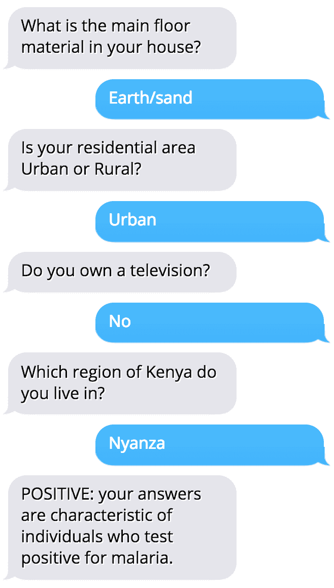
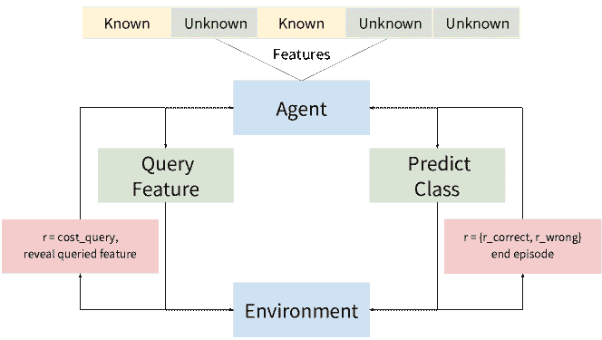
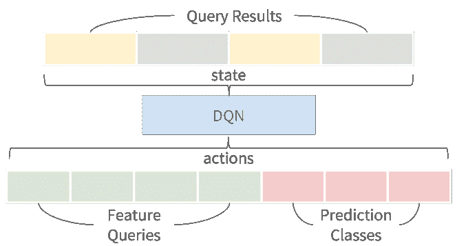
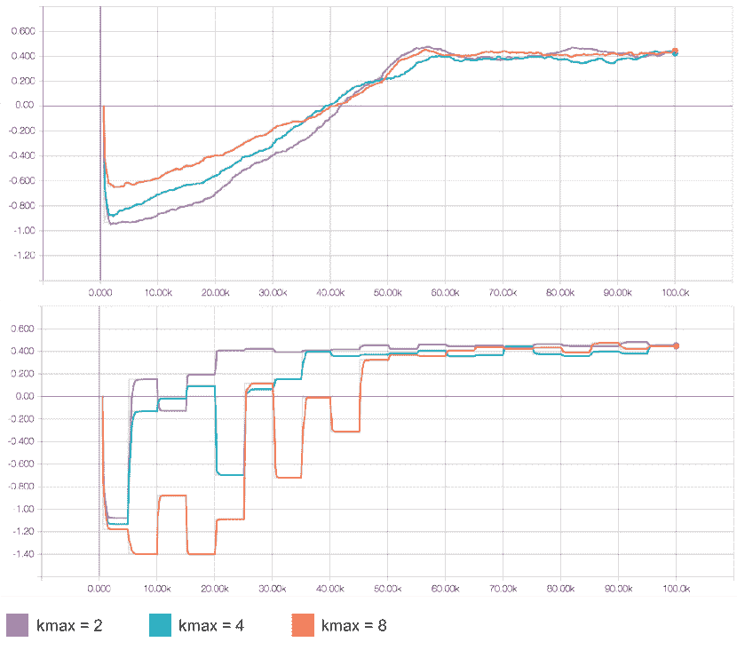

<!--yml

category: 未分类

日期：2024-09-06 20:08:34

-->

# [1711.09223] 通过深度强化学习有效调查家庭来预测疟疾可能性

> 来源：[`ar5iv.labs.arxiv.org/html/1711.09223`](https://ar5iv.labs.arxiv.org/html/1711.09223)

# 通过深度强化学习有效调查家庭来预测疟疾可能性

Pranav Rajpurkar

计算机科学系

斯坦福大学

pranavsr@cs.stanford.edu

\And Vinaya Polamreddi

计算机科学系

斯坦福大学

vinaya.polamreddi@cs.stanford.edu

\AND Anusha Balakrishnan

计算机科学系

斯坦福大学

anusha@cs.stanford.edu

###### 摘要

我们构建了一个深度强化学习（RL）代理，能够通过询问有关家庭的问题来预测个体感染疟疾的可能性。RL 代理学习确定接下来应该问哪个调查问题，以及何时停止以根据迄今为止的回答做出关于疟疾可能性的预测。代理每问一个问题会遭受小的惩罚，并且在做出正确/错误预测时会获得大的奖励/惩罚；因此，它必须学会平衡调查的长度与最终预测的准确性。我们的 RL 代理是一个深度 Q 网络，它直接从问题的回答中学习策略，为每个可能的调查问题和每个可能的预测类别定义一个动作。我们重点关注肯尼亚，在那里疟疾是一项巨大的健康负担，并在 2015 年肯尼亚疟疾指标调查的 6481 个家庭数据集上训练 RL 代理。为了调查调查问题适应响应的重要性，我们将我们的 RL 代理与一个先验固定调查问题集的监督学习（SL）基线进行比较。我们在一个保留集上评估预测准确性和问卷问题数量，发现 RL 代理能够以 80%的准确率进行预测，平均只使用 2.5 个问题。此外，RL 代理学会了根据响应进行自适应调查，并且能够在减少调查长度的同时与 SL 基线匹配预测准确性。

图 1：RL 代理能够通过询问有关家庭的问题，有效地调查个体，以确定他们感染疟疾的可能性。在这个例子中，代理正确预测被调查者感染了疟疾。

## 1 引言

我们建立了一个简短的移动问卷，告知个人他们的疟疾风险，旨在改善国家和个人层面的疟疾管理。使问卷简短且可在移动设备上使用可以加快、降低成本并更及时地进行疾病监测（Game, 2013）。此外，让人们意识到他们的疟疾风险可以促进健康寻求行为（Torfin, 2017）。我们专注于肯尼亚的疟疾指标调查（MIS），该调查在评估和指导针对性疟疾干预的公共政策方面发挥着核心作用（Torfin, 2017）。

我们使用强化学习（RL）来训练一个智能体，该智能体学习对个人进行调查，以准确预测他们的疟疾阳性概率。智能体被允许做出$k$个连续的决策：每次可以决定是否向个人提出另一个问题，或根据已回答的问卷问题对其疟疾血涂片检测结果做出预测。智能体每询问一个问题都会受到一个小的负奖励，对错误预测会受到大的负奖励，而对正确预测则会给予大的正奖励。因此，智能体必须学会在提出问题的成本和做出准确预测的收益之间取得平衡。

我们的 RL 智能体是一个深度 Q 网络，它直接从问卷状态中学习策略：对迄今为止提出的问题的回答作为输入，输入到卷积神经网络中，该网络为每个行动输出一个$Q$值。我们定义动作空间，使得每个可以提问的问题和每个可能的预测类别都有一个对应的动作。为了训练 RL 智能体，我们使用了 2015 年肯尼亚的 MIS 数据，其中包含了对家庭中个人的详细问卷调查和包括疟疾血涂片检测结果在内的生物标志物。

我们通过将 RL 智能体与一个固定问卷长度和内容的监督学习（SL）基准进行比较，研究自适应问卷的好处。SL 基准使用对一组固定的$k$个问题的回答作为输入，输入到卷积神经网络中，该网络输出疟疾检测结果的阴性和阳性概率。随着$k$的增加，SL 模型的准确度更高，但询问更多问题会累积更高的成本。在一个保留集上，我们评估智能体的预测准确率和平均问卷长度，发现 RL 智能体能够以$80\%$的准确率预测疟疾测试结果，平均只需询问$2.5$个问题，其准确度与 SL 基准相匹配，但在问卷长度上表现更佳。

## 2 数据

我们使用 2015 年肯尼亚疟疾指标调查，这是一项全国性代表性调查，旨在评估疟疾干预措施的进展并监测目标人群中的流行情况（NMCP 和肯尼亚国家统计局，KNBS）。调查包含有关 6,481 户家庭的数据，包括家庭中疟疾网的使用情况、家庭资产如电视的拥有情况以及电力供应情况、生物标志物测试结果，包括快速诊断测试和显微镜血涂片测试，以检测疟疾寄生虫的存在。我们关注的是家庭成员重新编码调查，该调查记录了家庭中每个人的信息。

### 处理

我们处理数据以仅保留类别变量，这些变量的类别数不超过 10 个，并且记录中没有缺失数据。由于我们的重点是可以通过移动调查远程收集的数据，因此我们排除了只能面对面获取的变量，例如生物标志物测试结果。我们将输出变量固定为显微镜血涂片测试结果，用于检测疟疾。

我们使用皮尔逊的卡方独立性检验来筛选每个类别变量与输出变量（个人血涂片测试结果）之间的相关性，保留$8$个最相关的变量。处理后的类别变量见附录。

图 2：代理与环境互动，决定是否在做出预测之前执行额外查询。

## 3 设置

代理任务是一个$c=2$类预测问题，但无法访问任何输入特征（所有特征初始为$0$）。相反，它可以从环境中一次查询一个输入特征$F_{n}=[f_{0},..,f_{m}],m=8$，查询的成本为$cost_{query}=-0.05$。代理查询输入特征$f_{i}$类似于询问并获得调查问题$q_{i}$的回答。

在$T=k$次查询内，代理必须做出预测，如果正确则获得$ r_{correct}=+1 $的奖励，如果错误则获得$ r_{wrong}=-1 $的奖励。做出预测将终止这一回合。如果代理在$2$个时间步之前做出预测，或在回合结束时$t=k$之前没有做出预测，则会受到错误预测的惩罚。最后，我们设置问题，使得未来的奖励不打折扣（$ \gamma=1 $）。

## 4 强化学习代理

我们训练深度 Q 网络 (DQN) Mnih 等人 (2013) 以直接从到目前为止进行的输入特征查询结果中学习策略。DQN 为动作空间中的每个动作输出一个 $Q$ 值，定义为每个可能的查询 ($k$) 和每个可能的预测类别 ($c$) 都有一个动作，总共 $k+c$ 个动作。DQN 使用一个 $1\times 1$ 卷积层 Szegedy 等人 (2014)，后接 $3$ 个全连接层。每个层有 $k+c$ 个隐藏单元，每个隐藏层之后都有一个 ReLU 激活函数。

我们按照 Mnih 等人 (2013) 的工作训练 DQN，使用经验回放和目标网络来平滑学习并避免参数的发散。我们使用 Adam 优化器 Kingma & Ba (2014)，小批量大小为 $32$，学习率线性衰减从 $0.00025$ 到 $0.00005$。训练期间的行为策略是 $\epsilon$-贪婪的，其中 $\epsilon$ 在线性衰减从 $1$ 到 $0.01$，持续 $50k$ 训练样本，然后固定为 $0.01$。我们总共训练了 $100k$ 个样本，使用最新的 $5k$ 个样本作为回放记忆。

## 5 监督学习基线

SL 基线方法预先固定了它所使用的查询集，并且可以被解释为一种非自适应策略，其中调查问题的回答不会影响问题的选择或数量。它使用与 RL 网络相同架构的神经网络，只是最终层只有 $c$ 个输出：网络学习将查询结果映射到正确的预测类别。

我们训练网络以最小化预测与真实标签之间的交叉熵损失。训练样本从 $~{}8k$ 个样本的训练集抽取，每个类别分配相等的概率。我们使用 Adam 优化器 (Kingma & Ba, 2014)，小批量大小为 $32$，学习率在线性衰减从 $0.0025$ 到 $0.0005$，共 $20$ 个周期。

| 模型 | 准确率 | 平均查询次数 | 平均回合奖励 |
| --- | --- | --- | --- |
| SL 网络 ($k=2$) | 0.73 | 2 | +0.36 |
| SL 网络 ($k=4$) | 0.77 | 4 | +0.35 |
| SL 网络 ($k=8$) | 0.80 | 8 | +0.20 |
| RL 网络 ($kmax=2$) | 0.78 | 2 | +0.45 |
| RL 网络 ($kmax=4$) | 0.78 | 2.30 | +0.45 |
| RL 网络 ($kmax=8$) | 0.80 | 2.35 | +0.47 |

表 1：RL 网络表现优于 SL 网络，不仅能做出更准确的预测，而且平均查询数量更少。与预先固定的 SL 网络不同，RL 网络能够有效地平衡额外查询的成本与增加的预测准确性带来的好处。

## 6 实验与结果

我们评估了模型在预测准确性和查询数量方面的表现。我们还报告了之前设置定义的平均回合奖励。模型在一个 $2k$ 个样本的测试集上进行评估，样本被重新抽样以确保从每个类别中以相等的概率抽取。

我们研究了限制代理可以进行的查询数量的效果。在 RL 方法中，我们设置了最大查询数量（$kmax={2,4,8}$），而在 SL 方法中，我们固定查询数量（$k={2,4,8}$）。查询按与输出变量的相关性递减排序，因此使用 $k$ 个查询指的是使用前 $k$ 个相关变量。

随着 $k$ 的增加，SL 基准模型的准确度也提高，但代价是查询数量的增加。在 $k=2$ 和 $k=4$ 时，权衡产生了可比的平均回合分数，但在 $k=8$ 时进行更多查询的成本超过了准确度提高的好处。

随着 $kmax$ 的增加，RL 代理的准确度也提高；然而，它们能够保持较小的平均查询数量。因此，代理能够获得更高的回合奖励。

## 7 相关工作

训练 RL 代理在做出预测之前进行查询的想法最近在强化学习文献中得到探索。Shen 等人（2016）训练代理在机器理解任务中动态决定是否继续或终止推理过程。Buck 等人（2017）训练代理系统地扰动一个问题以聚合证据，直到它可以自信地回答。Guo 和 Brunskill（2017）提出了一种算法来找到解决特定任务所需的特征。

## 8 结论

我们构建了一个深度强化学习（RL）代理，该代理可以通过询问家庭相关问题来预测个人感染疟疾的可能性。我们提出了一种算法，能够自适应地决定下一个要询问的问题，以及何时停止，以基于回答预测感染疟疾的可能性。我们展示了可以以高准确度进行预测，并且自适应调查可以显著减少获得高准确度所需的问题数量，从而通过短信调查实现大规模和成本效益的疟疾监测。

## 参考文献

+   Buck 等人（2017） Buck, Christian, Bulian, Jannis, Ciaramita, Massimiliano, Gesmundo, Andrea, Houlsby, Neil, Gajewski, Wojciech, 和 Wang, Wei. 提问正确的问题：使用强化学习进行主动问题重构。*CoRR*, abs/1705.07830, 2017。网址 [`arxiv.org/abs/1705.07830`](http://arxiv.org/abs/1705.07830)。

+   Game (2013) Game, Eddie. 移动文本调查：衡量保护对人们影响的更智能方式？*Nature*, 2013。网址 [`blog.nature.org/science/2013/09/30/mobile-text-survey-conservation-people-human-wellbeing/`](http://blog.nature.org/science/2013/09/30/mobile-text-survey-conservation-people-human-wellbeing/)。

+   Guo & Brunskill (2017) Guo, Zhaohan Daniel 和 Brunskill, Emma. 针对因式分解 MDP 的样本高效特征选择。 *CoRR*, abs/1703.03454, 2017。网址 [`arxiv.org/abs/1703.03454`](http://arxiv.org/abs/1703.03454)。

+   Kingma & Ba (2014) Kingma, Diederik 和 Ba, Jimmy. Adam: 一种随机优化方法。 *arXiv 预印本 arXiv:1412.6980*, 2014。

+   Mnih 等 (2013) Mnih, Volodymyr, Kavukcuoglu, Koray, Silver, David, Graves, Alex, Antonoglou, Ioannis, Wierstra, Daan, 和 Riedmiller, Martin. 使用深度强化学习玩 Atari 游戏。 *arXiv 预印本 arXiv:1312.5602*, 2013。

+   NMCP & 肯尼亚国家统计局 (KNBS) NMCP 和肯尼亚国家统计局 (KNBS) 及 ICF 国际。*肯尼亚疟疾指标调查 2015*。NMCP, KNBS, ICF 国际，肯尼亚内罗毕和马里兰州洛克维尔。

+   Shen 等 (2016) Shen, Yelong, Huang, Po-Sen, Gao, Jianfeng, 和 Chen, Weizhu. Reasonet: 学习在机器理解中停止阅读。 *CoRR*, abs/1609.05284, 2016。网址 [`arxiv.org/abs/1609.05284`](http://arxiv.org/abs/1609.05284)。

+   Szegedy 等 (2014) Szegedy, Christian, Liu, Wei, Jia, Yangqing, Sermanet, Pierre, Reed, Scott E., Anguelov, Dragomir, Erhan, Dumitru, Vanhoucke, Vincent, 和 Rabinovich, Andrew. 深入卷积。 *CoRR*, abs/1409.4842, 2014。网址 [`arxiv.org/abs/1409.4842`](http://arxiv.org/abs/1409.4842)。

+   Torfin (2017) Torfin, Svenn. 在肯尼亚，消除疟疾的道路上布满了良好的预防措施。 *WHO*, 2017。网址 [`www.who.int/features/2017/vector-control-kenya/en/`](http://www.who.int/features/2017/vector-control-kenya/en/)。

## 附录 A 附录

| 问题 | 变量名称 | 类别数量 |
| --- | --- | --- |
| 1 | 区域 | 8 |
| 2 | 主层材料 | 9 |
| 3 | 是否拥有可用于农业的土地 | 2 |
| 4 | 是否有电 | 2 |
| 5 | 是否有电视 | 2 |
| 6 | 该社区是否交替使用网 | 2 |
| 7 | 社区中的大多数人是否总是使用 ITN | 4 |
| 8 | 居住地点的类型 | 2 |

表 2: 处理过的分类变量列表，按与输出变量（血涂片测试结果）的相关性降序排列。

图 3: DQN 为每一个可能的查询和从其输入状态的预测输出提供一个 Q 值。

图 4: RL 代理在训练过程中平均训练（上）和评估（下）回报。训练回合的行为策略是 $\epsilon-$贪婪的，$\epsilon$ 线性退火；对于测试回合，我们设定 $\epsilon=0$，并根据 DQN 输出的 $Q$ 值进行贪婪动作。
