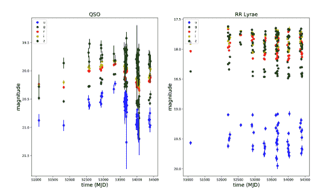
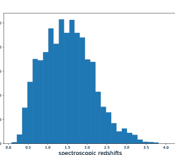
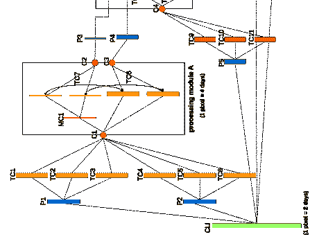
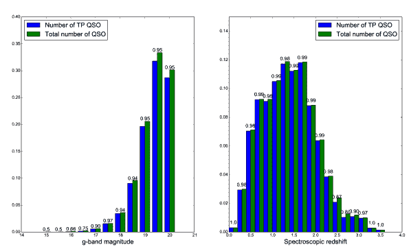
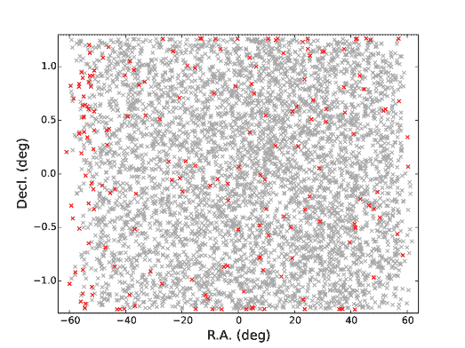
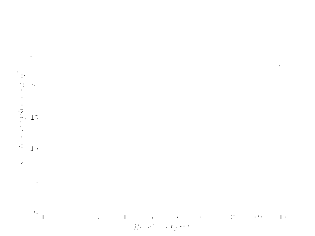
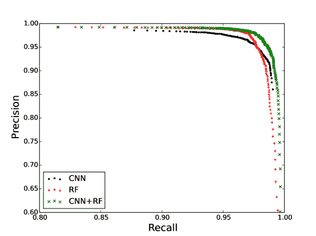
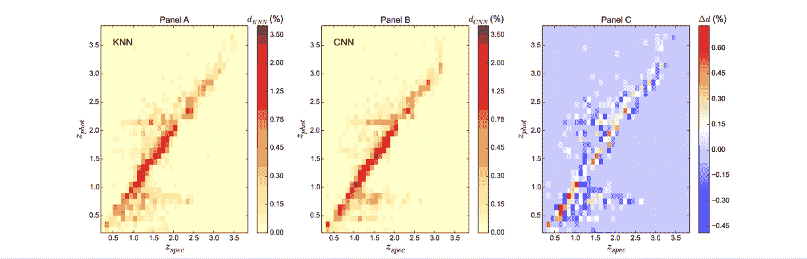
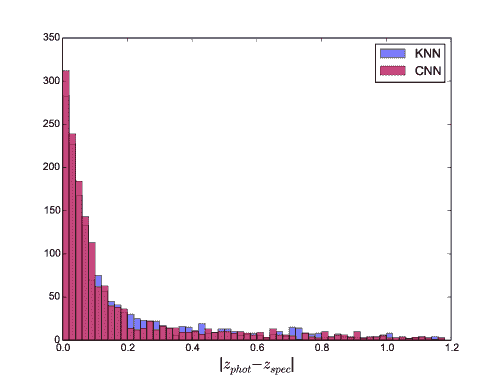

<!--yml

类别：未分类

日期：2024-09-06 20:08:32

-->

# [1712.02777] 基于深度学习的方法用于分类、检测和预测斯隆数字天空调查条纹 82 中的类星体光度红移

> 来源：[`ar5iv.labs.arxiv.org/html/1712.02777`](https://ar5iv.labs.arxiv.org/html/1712.02777)

¹¹机构：LUPM UMR 5299 CNRS/UM，蒙彼利埃大学，CC 72，34095 蒙彼利埃 Cedex 05，法国 ²²机构：CPPM，CNRS-IN2P3，普罗旺斯-阿尔卑斯-蓝色海岸大学，CC 907，13288 马赛 Cedex 9，法国

²²电子邮件：pasquet@cppm.in2p3.fr ³³机构：LIRMM UMR 5506 - ICAR 团队，蒙彼利埃大学，圣普里斯特校区，34090 蒙彼利埃 ⁴⁴机构：LSIS UMR 7296，CNRS，ENSAM，托龙大学和艾克斯-马赛大学，Polytech 大楼，13397 马赛

⁴⁴电子邮件：jerome.pasquet@lsis.org

+

# 基于深度学习的方法用于分类、检测和预测斯隆数字天空调查条纹 82 中的类星体光度红移

J. Pasquet-Itam 1122    J. Pasquet 3344（接受于 2017 年 11 月 3 日）

我们应用卷积神经网络（CNN）来分类和检测斯隆数字天空调查条纹 82 中的类星体，并预测类星体的光度红移。该网络通过将光曲线转换为图像来考虑对象的变化性。图像的宽度，记作$w$，对应于五个光度 ugriz，图像的高度，记作$h$，代表观测日期。CNN 表现良好，因为其精度为$0.988$，召回率为$0.90$，而随机森林分类器的精度为$0.985$，召回率相同。此外，CNN 还发现了 175 个新的类星体候选者，固定召回率为$0.97$。CNN 和随机森林结合的概率使得性能更佳，精度为$0.99$，召回率为$0.90$。

对于红移预测，CNN 表现出优异的结果，优于通过特征提取步骤和不同分类器（K 近邻、支持向量机、随机森林和高斯过程分类器）获得的结果。实际上，CNN 在$|\Delta z|<0.1$时的准确率可达 78.09$\%$，在$|\Delta z|<0.2$时为 86.15$\%$，在$|\Delta z|<0.3$时为 91.2$\%$，而 rms 值为 0.359。KNN 在三个$|\Delta z|$区域的性能下降，因为在$|\Delta z|<0.1$、$|\Delta z|<0.2$和$|\Delta z|<0.3$的准确率分别为 73.72$\%$、82.46$\%$和 90.09$\%$，而 rms 值为 0.395。因此，CNN 成功减少了类星体的离散性和灾难性红移。这种新方法对像大型巡天望远镜这样的大型数据库未来非常有前景。

###### 关键词：

方法：数据分析 – 技术：光度学 – 技术：图像处理 – 类星体：一般 – 调查

## 1 引言

类星体由位于其宿主星系动力学中心的超大质量黑洞的吸积驱动，产生跨越广泛频率范围的高光度。它们在天文学中具有至关重要的意义。例如，它们的研究可以提供关于大质量黑洞的信息（例如 Portinari 等人 (2012)）。此外，作为最明亮的活动星系核（AGN），它们可以在宇宙中遥远处被观测到。因此，它们为星系的演化和结构提供线索（例如 Hopkins 等人 (2006)）。它们也被用作背景天体来研究视线中的银河系间物质的吸收，这在宇宙学中有许多应用（例如 Lopez 等人 (2008)）。随着大型专门调查如 Sloan Digital Sky Survey (SDSS; York 等人 (2000)) 和 2dF Quasar Redshift Survey (2QZ; Croom 等人 (2009)) 的出现，已知的类星体数量迅速增加。因此，SDSS DR7 类星体目录（Schneider 等人 (2010)) 包含了 105,783 个光谱确认的类星体。该目录覆盖了 $\simeq 9380\,\,\textrm{deg}^{2}$ 的区域，类星体的红移范围从 0.065 到 5.46。

随着大型同步测光望远镜（LSST Science Collaboration (2009)) 的即将到来，鉴于未来数据量巨大，开发类星体检测的分类工具变得尤为重要。因此，机器学习算法的使用越来越多。这些算法通过提取不同的特征（例如源的颜色）来预测对象的标签。天文学中现在常用的几个分类器包括随机森林（Quinlan (1986))、朴素贝叶斯（Duda & Hart (1973))、神经网络（Rumelhart 等人 (1986)) 和支持向量机（Cortes & Vapnik (1995))。这些方法在天文学中的分类和变星检测中非常强大（例如 Eyer & Blake (2005); Dubath 等人 (2011); Blomme 等人 (2011); Rimoldini 等人 (2012); Peng 等人 (2012); Peters 等人 (2015)）。我们还可以提到 Hernitschek 等人 (2016) 在 Pan-STARR S1 (PS1) $3\pi$ 调查中关于 QSO 的分类和检测的最新工作。这是一个多时期调查，覆盖了从 2010 年到 2014 年初之间的三分之四的天空，通常为 35 个时期，使用五个滤光片（$g_{P1}$, $r_{P1}$, $i_{P1}$, $z_{P1}$, $y_{P1}$）。他们使用随机森林分类器和颜色以及结构函数作为特征，来识别 1,000,000 个 QSO 候选体。

本工作的主要动机是提出一种新的分类和检测方法，用于斯隆数字天空巡天 Stripe 82 中的类星体，该方法可以轻松适应未来的大型调查，如 LSST 或 DES（暗能量调查合作组 (2005））。上述算法涉及特征提取步骤，但特征集可能不足以表征类星体的变异性。这就是为什么我们提出使用另一种机器学习方法，即深度学习。它是一种监督学习方法，能够考虑原始数据，并自行提取给定问题的最佳特征。这种方法在许多领域都取得了非常好的结果。特别是我们使用了一种卷积神经网络（CNN）架构，它在多个信号处理挑战中表现出色，如 Imagenet（Russakovsky et al. (2015））、LifeClef（Joly et al. (2016））等……这种方法在天文学中非常新颖，其首次应用显示了良好的结果，例如用于从天文图像中分类银河系形态（Huertas-Company et al. (2015））。

在这项工作中，我们提出了一种基于 CNN 的创新架构，用于从光变曲线中检测和分类类星体，从而考虑了物体的变异性。我们还应用这种架构来估计类星体的光度红移。通过 CNN 分类器估计光度红移是一种非常有前景的原创方法。本文的组织结构如下：第二部分介绍了 Stripe 82 数据集；第三部分描述了 CNN 架构和处理；第四部分提出了我们用于类星体检测和分类的 CNN 架构；第五部分分析并讨论了我们方法检测到的新类星体候选者。然后，我们将我们的算法与随机森林分类器进行比较并进行组合；第六部分提出使用类似的 CNN 架构来预测类星体的光度红移；最后，在第七部分中总结我们的结果。

## 2 数据

图 1：UWVSC 目录中两种变量物体类型的示例。左侧面板是类星体光变曲线，右侧面板是 RR Lyrae 光变曲线。

图 2：UWVSC 目录中已知类星体的光谱红移分布。

斯隆数字天空调查（SDSS）是一个多滤光器成像和光谱红移调查，使用位于新墨西哥州 Apache Point 天文台的 2.5 米专用望远镜。它提供了五个通带（ugriz）中的深度光度测量（$r<22.5$）。SDSS 对南方银河帽沿天球赤道的 2.5 度宽的条带进行了多次成像，称为 Stripe 82。它是 275 $\textrm{deg}^{2}$ 的更深层调查。2000 到 2005 年间，它每年成像约 1 到 3 次（SDSS-I），然后在 2005 到 2008 年期间，每年成像增加到 10-20 次（SDSS-II），作为 SDSS-II 超新星调查的一部分（Frieman et al. (2008))。平均有 53 个观测时段，跨越 5 到 10 年的时间跨度（Abazajian et al. (2009)）。

我们工作中使用的成像数据仅包含来自华盛顿大学研究人员构建的公开可用的变星源目录（UWVSC; Ivezić et al. (2007), Sesar et al. (2007)) 的对象。该目录包含 67,507 个未解决的变星候选体，$g\leq 20.5\,\,\textrm{mag}$，在 g 和 r 波段都有至少 10 次观测，并且光曲线的均方根（rms）$>0.05$ mag 和每个自由度的$\chi^{2}$在 g 和 r 波段中都$>3$。在这些数据中，一些变星对象已被识别，它们基本上是类星体和脉动星（见图 1）。然而，数据中很大一部分是未知的变星对象。因此，这个目录对于识别新的变星对象非常有趣。该目录和所有光曲线都是公开可用的。¹¹1http://www.astro.washington.edu/users/ivezic/sdss/catalogs/S82variables.html 我们使用 UWVSC 作为学习和测试的基础有几个原因：1）它包含超过 9000 个已知的光谱确认的类星体（Meusinger et al. (2011))，其红移分布如图 2 所示；2）这是一个具有良好光度测量的稳健的变星目录；3）该目录是时间域科学的有用测试平台，用于准备未来的数据集，例如 LSST。

## 3 卷积神经网络

在这项工作中，我们特别感兴趣的是卷积神经网络（CNN），这是一种深度学习方法，已经在许多研究领域证明了其价值。

### 3.1 光曲线图像

由于 CNN 以图像作为输入，我们需要找到一种方法将光变曲线转换为图像，同时考虑到物体的变化，这对变量物体的分类提供了关键的信息。因此，我们建议创建图像，其宽度由五个亮度（u、g、r、i 和 z）表示，高度则对应于观察日期。在 Stripe 82 中，最多有 3340 天的观测，因此图像的尺寸应为 5$\times$3340 像素。然而，处理这些图像在 VRAM 内存中非常昂贵，所以我们通过平均处理在连续两天内获取的观测值来划分光变曲线的时间间隔，从而得到 5$\times$1670 像素的图像。然后在图像的边缘附加了 60 像素以避免副作用。因此，最终图像的大小，以下简称 LCI（光变曲线图像），为 5$\times$1700 像素。

为了提高网络的鲁棒性，学习需要不受点位置的影响。为此，我们通过对给定光变曲线上的所有点进行时间平移来生成新的光变曲线。因此，只考虑光变曲线的整体形状，不将任何点的位置视为比其他点更重要。这一过程类似于 CNN 学习中的经典数据增强（Le Guennec et al. (2016); Krizhevsky et al. (2012))，并将数据库的大小增加了 13 倍。

### 3.2 CNN 简介

图 3：网络中两个卷积层的表示。第一层由 3 个神经元组成，对输入图像及其卷积核进行卷积。第二层包括两个神经元，对卷积结果进行求和，如方程 1 中定义。

人工神经元是一个受自然神经元启发的计算模型。自然神经元是一个电激活的细胞，通过与其他细胞相连的突触处理和传递信息。当接收到的信号足够强（高于特定阈值）时，神经元被激活并发出信号，这可能会激活其他神经元。人工神经元并没有再现真实神经元的复杂性，但整体结构相似。实际上，输入数据会被权重乘以，然后通过一个数学函数计算，该函数决定神经元的激活。人工神经网络由不同的神经元层组成，这些层彼此连接。一个排名为 $n$ 的层将接收排名为 $n-1$ 的层的输出作为输入。层的命名规则如下：i) 输入未连接到另一个层的输出，而是连接到原始数据的层称为输入层；ii) 输出未连接的层称为输出层；iii) 如果一个层既有输入又有输出，则称为“隐藏层”。每一层由数万个人工神经元组成。在卷积神经网络（CNN）的特定情况下，神经元执行卷积操作（见 3.2.1 节）和池化操作（见 3.2.2 节）。层按以下顺序处理：首先，对原始输入数据应用卷积操作；然后，通过非线性函数修改输出信号；最后，可以处理池化操作。注意，层的输出可以视为一组图像。在 CNN 术语中，每个图像称为特征图。在所有卷积和池化层之后，最后的卷积层连接到一系列称为“全连接层”的层，并作为经典神经网络运行。最后一层使用 softmax 操作来给出输入光度曲线是类星体光度曲线还是其他对象的概率。为了执行学习阶段，卷积层和全连接层的参数通过特定于问题的随机梯度下降进行调优，在这种情况下是类星体光度曲线的识别。这个优化过程非常昂贵，但具有很高的并行性。我们使用 Caffe（Jia 等人（2014））框架来训练我们的 CNN。结果是使用 GTX Titan X 显卡获得的，该卡具有 3,072 个核心和 1 GHz 的基准频率。

#### 3.2.1 卷积

如果我们将一个层或一组特征图视为输入，第一步是应用卷积。对于第一层，卷积是在输入图像和一个滤波器之间进行的。每个滤波器都会产生一个滤波后的图像。卷积层由卷积神经元组成。每个卷积神经元对输入特征图和其卷积核进行二维卷积的求和。在仅有一个特征图传递给输入卷积神经元的简单情况下，大小为 $w\times h$ 的卷积核 $K$ 与输入特征图 $I\in\mathbb{R}^{2}$ 之间的二维卷积记作 $\mathbf{I}*\mathbf{K}$，其定义为：$(I*K)_{x,y}=\sum_{x^{\prime}=x-\frac{w}{2}}^{x+\frac{w}{2}}\,\,\sum_{y^{\prime}=y-\frac{h}{2}}^{y+\frac{h}{2}}\mathbf{K}_{x^{\prime}+\frac{w}{2}-x,\,y^{\prime}+\frac{h}{2}-y}\mathbf{I}_{x^{\prime},y^{\prime}}$，其中 (x,y) 是输出特征图中给定像素的坐标。

在卷积神经网络的情况下，一个神经元以先前层的每个 $p$ 个特征图 $I^{l}$ 作为输入，其中 $l\in\{0...p\}$。结果特征图是 $p$ 个二维卷积的和，卷积核为 $K^{l}$，特征图为 $I^{l}$（见图 3），定义为：

|  | $(\mathbf{I}*\mathbf{K})=\sum_{l=0}^{p}(\mathbf{K}^{l}\mathbf{*I}^{l})$ |  | (1) |
| --- | --- | --- | --- |

在这项工作中，我们提议使用两种我们称之为“时间卷积”和“滤波器卷积”的卷积类型。时间卷积使用尺寸为 1 像素的 x-维卷积核，因此五个幅度（u、g、r、i 和 z）被单独卷积，并且 y-维度在 {5, 11, 21, 41} 像素的区间内可变。因此，时间卷积考虑了在不同时间和不同分辨率下的幅度值。这种卷积的优点是创建一个能够检测短期和长期变异模式的网络。

滤波器卷积使用尺寸为 $5\times 1$ 像素的卷积核，因此它们合并了五个幅度的值，以整合颜色信息，这是描述可变对象的重要特征，在特定时间内。

#### 3.2.2 池化

网络可以由池化层组成，这些层在减少数据量的同时量化信息。池化层在每个特征图上独立操作。在每个特征图上，它滑动一个表示局部分布的特定滤波器。最常用的两种方法是选择局部区域内的数据的最大值或均值。由于观察数据在时间上不是连续的，LCI 中的几个像素等于零。因此，我们决定通过均值来适应池化，即在计算均值时不考虑零像素。我们的架构在网络的第一层池化层中包含了这一池化改进。其他层包含最大池化。

#### 3.2.3 激活函数

卷积层后面跟随非线性变换，其目标是解决非线性分类问题。最常用的两个函数是**ReLU**（线性整流单元，Nair & Hinton (2010))，定义为 $f(x)=max(x,0)$ 和双曲正切函数。在我们的网络中，为了饱和输入信号，我们在所有第一层卷积层上应用双曲正切函数。其他层使用**PReLU**（He et al. (2015)) 函数，定义为：<math alttext="f(x)=\begin{cases}\alpha x&amp;x<0\\

\( f(x)=\begin{cases}\alpha x & x < 0\\ x & x \geq 0\end{cases} \)，其中 $\alpha$ 是一个通过反向传播定义的超参数。

## 4 我们的 CNN 架构

图 4：我们所提议的架构的表示。该结构被细分为五个连续的处理块，具有不同的时间分辨率。使用了两种类型的卷积：具有四种内核大小的时间卷积：$41\times 1$、$21\times 1$、$11\times 1$ 和 $5\times 1$，以及内核大小为$5\times 1$的滤波器卷积。

总体结构可以细分为在不同时间分辨率（4、8、16、32 和 64 天）下的连续处理块，如图 4 所示，共五个深度层级。LCI 的初始分辨率为每像素两天。在每个处理层级，这一分辨率通过最大池化降低一倍。此外，每个处理块由一组来自平均池化的特征图提供，这些特征图从第一条光曲线图像中并行检索而来。这些特征图随后经过三种类型的时间卷积处理，使用三种不同的滤波器大小处理图像。这组时间卷积类似于现代架构中使用的多分辨率过程，如 GoogleNet 网络（Szegedy et al. (2015))。得到的特征图然后传输到相应分辨率的处理块。我们用$\mathbb{F}_{i}$表示传输到处理块$i$的特征图集。如图 4 所示，表示每个像素为 4 天的特征图被传输到模块 A，表示每个像素为 8 天的特征图被传输到模块 B，等等…

在第一步中，对$\mathbb{F}_{A}$应用了一个滤波卷积（MC1，见 4）。MC1 得到的特征图记作$\mathbb{F}^{\prime}_{A}$。接下来，我们对其应用了两个时间卷积（TC7 和 TC8），其权重被称为“共享”。这个术语可以通过应用于集合$\mathbb{F}_{A}$和$\mathbb{F}^{\prime}_{A}$的卷积核的差异来解释。我们修改了标准卷积，以便一个给定的卷积核可以应用于两个不同大小的特征图集合。目标是突出显示两个特征图集合$\mathbb{F}_{A}$和$\mathbb{F}^{\prime}_{A}$之间的相似时间模式，从而突出混合和未混合的量之间的差异。来自卷积层 TC7 和 TC8 对集合$\mathbb{F}_{A}$的特征图被连接起来，然后在池化层 P4 中池化。得到的特征图记作$\Omega_{B}$，然后传递到处理块 B。对特征图集合$\mathbb{F}^{\prime}_{A}$应用相同的过程，得到集合$\Omega^{\prime}_{B}$。

第二个处理块对$\mathbb{F}_{B}$执行了一个带有不同大小的两个卷积核（TC12 和 TC13）的时间卷积。得到的特征图然后被传递到两个层：C7 和 MC2。在 C7 层，它们与集合$\Omega_{B}$连接。在 MC2 层，它们被一个滤波器卷积。得到的特征图与集合$\Omega^{\prime}_{B}$的特征图连接。生成的特征图集合在 TC14 层进行时间卷积，使用共享权重。结果然后被池化并传递到处理块 C。

其余块的功能类似于块 B。每层的特征图数量和大小记载在附录中的表 A1。我们可以注意到处理块 E 只传递幅度已合并的特征图，这些特征图随后被时间卷积并传递到完全连接层。在卷积层之后，特征图的大小为 53$\times$1 像素。

在网络架构中，我们使用了两个过程来避免过拟合。首先，所有的特征图都使用批量归一化（Ioffe & Szegedy (2015))进行归一化。其次，完全连接层的输出会随机丢弃（Srivastava et al. (2014))。在反向传播处理中，网络需要确定大量的参数，即卷积层中为 1,802,032，完全连接层中为 11,468,80。

## 5 分类结果

### 5.1 实验协议

我们对数据库进行了五次交叉验证，每次交叉验证都选择了 75$\%$的 LCI 作为学习集和 25$\%$作为测试集。对于每个交叉验证，每个 CNN 进行了 60 个 epoch 的学习（在一个 epoch 期间，将每个 LCI 传递给网络并进行误差反向传播）。每个 CNN 在 softmax 层上有三个输出，分别对应以下类别：类星体、脉动星（RR Lyrae 和$\delta$ Scuti）和其他物体。在测试阶段，每个 CNN 在测试集中给出一个探测到的类星体列表。我们将每个 CNN 给出的列表合并成一个列表进行评估。

### 5.2 结果

图 5：左侧直方图显示了 CNN 性能与中位 g-band 幅度的关系。右侧直方图显示了 CNN 性能与红移的函数关系。在每个直方图上，蓝色柱代表 CNN 正确探测到的类星体数量，绿色柱代表相应区间内的类星体总数。每对柱子上方标明了召回率。

CNN 的性能在图 5 中以幅度和红移的函数给出。我们可以注意到，对于 g-band 幅度低于 17，召回率的值下降到 50%。这是因为训练集中非常明亮的类星体的样本数量太少。实际上，训练数据库中在 15 至 17 幅度之间只有 22 个类星体的光变曲线。然而，对于 g-band 幅度高于 17，召回率是相似的。这是一个非常有趣的结果，因为它意味着 CNN 的性能并不取决于幅度，而只取决于训练数据库中的物体数量。这种效应在图 5 的右侧直方图上不太明显。实际上，只需考虑训练数据库的 5%就能达到 98%至 99%之间的召回率。这个实验证明了 CNN 对红移不变。

在测试集中，对于固定召回率 0.97，CNN 检测到的 175 个新类星体以前从未被鉴定出。我们称之为类星体候选对象。图 6 表示 CNN 在测试集中发现的类星体的空间分布。红色十字标志着新的类星体候选对象。

图 6：CNN 在测试阶段检测到的类星体的空间分布。灰色的交叉点表示已知的检测到的类星体，红色的交叉点是 175 个新的类星体候选者。它们在天空中均匀分布。

如我们所见，CNN 检测到的类星体分布均匀。图 7 显示了 CNN 检测到的天空每平方度的类星体平均数量与召回率的关系。

图 7：CNN 检测到的天空每平方度的类星体平均数量与召回率的关系。召回率越大，检测到的类星体数量越高。对于 0.92 的召回率，每平方度的检测到的类星体平均数量为 20 个。然后这个数字急剧增加，因为精度降低，非类星体源的污染增加。

随着召回率的提高，每平方度的类星体数量增加，这与我们检测到越来越多的类星体是一致的。对于约 0.92 的召回率，每平方度的类星体平均数量约为 20 个。然后，由于精度降低且样本中混入了非类星体的源，这个数字急剧增加。

还值得指出的是，新类星体候选者符合一个已知的类星体特性，即“更亮时更蓝”的趋势。这一趋势在类星体的 UV/光学颜色变化中已经得到很好的验证（例如，Cristiani 等人 (1997)，Giveon 等人 (1999)，Vanden Berk 等人 (2004)）。图 8 显示了在不同召回率下，u 带滤光片与 r 带滤光片检测到的类星体的变化幅度。我们注意到，在召回率为 0.90 和 0.97 时，u 带滤光片中的变化幅度分别比 r 带滤光片大$83.6\%$和$88.7\%$。因此，检测到的类星体在蓝光带中的变化幅度更大，表现出强的波长依赖性。

图 8：CNN 从 u 带滤光片检测到的类星体的变化幅度与从 r 带滤光片检测到的类星体在三种不同召回率（0.90、0.95 和 0.97）下的变化幅度。黑色交叉点表示测试阶段所有已知的类星体。红色交叉点是 175 个新的类星体候选者。虚线表示线 $y=x$。类星体在蓝光带中的变化幅度较大。这种趋势突显了强的波长依赖性。

### 5.3 与随机森林分类器的比较

我们将我们的算法性能与随机森林分类器的性能进行比较，我们在相同数据库上通过经验方法估计了其最佳参数。该分类器包含 400 棵决策树，深度不限。使用的特征包含在一个名为 FATS（Feature Analysis for Time Series, Nun et al. (2015））的 Python 库中，该库是一些现有光变曲线特征的汇编。

在固定召回率为 0.90 的情况下，CNN 的精度为 0.988，而随机森林的精度为 0.985。然后，在固定召回率为 0.97 的情况下，CNN 和随机森林的精度分别为 0.964 和 0.973。这两种方法的表现接近，而随机森林稍微更好。一种可能的解释涉及自由度的数量。实际上，对于随机森林，大约定义了 640,000 个参数，而对于 CNN，参数数量约为 13,000,000。因此，由于 CNN 需要通过反向传播确定大量参数，在数据量更多的情况下，CNN 应该能有更好的表现，特别是在大型调查中。

### 5.4 CNN 和随机森林的结合

我们通过对 CNN 和随机森林给出的概率进行平均来进行组合。对于固定的召回率 0.90，精度为 0.99，而对于召回率 0.97，精度为 0.98。因此，两个分类器的组合使得良好的性能更上一层楼。图 9 显示了接收者操作特征曲线（ROC 曲线），这是一种图形化的绘图方法，用于通过绘制精度与召回率的关系来展示分类器的性能。我们可以看到，随机森林的性能（红色曲线）优于 CNN（黑色曲线），直到召回率为 0.978，此时 CNN 的性能略微下降。此外，代表两个分类器组合的 ROC 曲线（绿色曲线）高于其他两条曲线，显示了组合 CNN 分类器和随机森林分类器可以提供更好的分类性能。CNN 和随机森林的组合所获得的改进可以通过随机森林提供的特征和 CNN 提取的特征之间的互补性来解释。实际上，随机森林使用的特征由用户定义，通常针对变量对象的光度曲线分类，但它们可能无法完美地设计用于我们考虑的分类问题。而 CNN 从头开始学习，没有任何先验知识。CNN 发现了对所用数据库特定的相关特征，从而补充了 RF 使用的特征所提供的信息。然而，由于 CNN 从数据中学习特征，如果某种对象的样本数量不多，例如高红移类星体，CNN 可能无法找到并学习最佳特征。在这种情况下，利用随机森林的结果来改善分类是有意义的。因此，根据数据的数量，随机森林特征或 CNN 特征可以互相补充。

图 9：ROC 曲线绘制了分类器的精度与召回率的关系。CNN 分类器的性能由黑点表示，随机森林的性能由红色加号表示，而两个分类器组合的性能由绿色交叉表示。

## 6 个类星体的光度红移

光度红移是一种通过仅使用不同滤光片或光度图像中的视星等确定物体红移的方法。它们是一种强大的技术，因为它们可以不依赖受限于源的亮度和仪器成本的光谱学数据。这种方法由 Baum（Baum (1962）提出，通过观察维尔戈星系团中六个椭圆星系在 3730Å到 9875Å的九个频段的光谱能量分布（SED）。使用模板拟合模型的方法提取天文观测信息的特征，然后将其与由理论模型或真实观测构建的设计模板进行匹配已经得到广泛应用（例如 Bolzonella et al. (2000), Coupon et al. (2009) Ilbert et al. (2010)）。然而，该方法的准确性在很大程度上取决于模拟数据或真实数据。此外，多个大规模天空调查获得的大规模光度数据的出现表明需要自动方法，如机器学习算法。已经使用了几种方法来估计星系或类星体的光度红移，例如 K 最近邻方法（例如 Zhang et al. (2013), Kügler et al. (2015)），人工神经网络方法（例如 Firth et al. (2003), Collister & Lahav (2004), Blake et al. (2007), Oyaizu et al. (2008), Yèche et al. (2010), Zhang et al. (2009)），以及同时使用 K 最近邻和支持向量机的方法（Han et al. (2016))。

我们提出使用卷积神经网络来预测类星体的光度红移。为此，我们将 80%的类星体光变曲线用于训练数据库，将 20%用于测试数据库。为了减少变异性，我们进行交叉验证实验，仅展示结果的均值。已知光谱红移的分布被切分成 60 个 0.04 宽度的 bin。我们使用了一个类似的网络架构，如图 4 所示。Softmax 给出了属于每个红移类别的概率。为了预测最终的回归值，通过使用 Softmax 给出的概率对每个类别的结果进行加权求和。同样，网络以 LCI 作为输入（参见第 3.1 节），以便在估计红移时包含物体变异性的信息。

为了评估提出的方法，我们将其与使用特征提取的经典方法进行比较。为此，我们比较了四种分类器的性能，即 K-最近邻（KNN）、支持向量机（SVM，具有线性和高斯核）、随机森林（RF）和高斯过程分类器。

| 特征 | 绝对误差 | $\chi^{2}$ | 最佳 K |
| --- | --- | --- | --- |
| 平均值 | 0.282 | 0.239 | 2 |
| 平均值+误差 | 0.283 | 0.240 | 2 |
| 平均值+颜色+误差 | 0.263 | 0.199 | 3 |
| 平均值+颜色幅度+误差 | 0.253 | 0.182 | 4 |
|  |
| 颜色+误差 | 0.226 | 0.163 | 4 |
| 颜色 | 0.226 | 0.156 | 6 |

表 1：使用不同特征评估 K-最近邻分类器的效率，基于绝对误差和$\chi^{2}$测试给出的误差。K 是 KNN 算法中考虑的邻居数量。

对于这些分类器，我们使用了特征的最佳组合，包括幅度均值、幅度误差、幅度幅度、颜色以及所有包含在 Python 库 FATS 中的特征。在评估中，使用 KNN 且仅以颜色作为特征可以获得最佳结果。实际上，如表 1 所示，只有颜色作为特征的学习阶段显示了最低的绝对误差 0.226 和$\chi^{2}$测试的最低残差值 0.156。在这种情况下，表 1 中的 K 值等于 6。因此，我们使用 KNN 提取的颜色性能与 CNN 的性能进行比较（参见表 1）。

|  | $&#124;\Delta z&#124;<0.1$ (%) | $&#124;\Delta z&#124;<0.2$ (%) | $&#124;\Delta z&#124;<0.3$ (%) | RMS |
| --- | --- | --- | --- | --- |
| CNN | 79.32 | 86.64 | 91.69 | 0.352 |
| KNN | 73.72 | 82.46 | 90.09 | 0.395 |
| KNN+CNN | 80.43 | 87.07 | 91.75 | 0.349 |

表 2：通过计算不同$|\Delta z|$范围内的百分比和均方根（RMS），比较 CNN、KNN 以及 KNN 和 CNN 的合并的准确性和离散度。

图 10：面板 A 和 B 分别比较了 KNN 和 CNN 预测的光度红移与光谱红移。颜色表示类星体的密度百分比。颜色越红，类星体的密度越高。线$y=x$是红色的，意味着类星体的密度最高，因此这两种方法对大多数光度红移的估计都较好。面板 C 是 CNN 给出的类星体密度与 KNN 获得的类星体密度之间的百分比差异，记作$\Delta d$。换句话说，当$\Delta d$为正（或负）时，颜色为红色（或蓝色），这意味着 CNN（或 KNN）给出的类星体密度高于 KNN（或 CNN）获得的密度。

图 10 对比了 KNN（面板 A）和 CNN（面板 B）预测的光度红移与约 9000 个类星体的光谱红移。颜色表示类星体的密度百分比。我们用$d_{CNN}$和$d_{KNN}$表示 CNN 和 KNN 方法给出的类星体密度百分比。颜色越红，类星体的密度越高。对于这两种方法，类星体的密度在 y=x 线上的值最高，显示出这两种分类器对大多数光度红移的估计都很好。我们注意到在红移小于 2.5 时密度最高，因为数据库中包含的高红移数量较少，不到 10$\%$，这些数据在训练和测试数据库中有所划分。

图 10 中的面板 C 比较了两种方法在光度红移估计中的差异，因为它表示了百分比密度差异，$d_{CNN}$ 和 $d_{KNN}$ 记为 $\Delta d$。当 $\Delta d$ 的值为正（在图中以红色表示），CNN 给出的类星体密度高于 KNN。相反，当 $\Delta d$ 的值为负（在图中以蓝色表示），KNN 给出的类星体密度高于 CNN。我们可以看到直线 $y=x$ 以红色显示，因此 $\Delta d$ 的值为正，显示 CNN 比 KNN 更好地预测等于光谱红移的红移。相反，围绕直线 $y=x$ 的区域为蓝色，意味着 KNN 比 CNN 有更高的误差率，并且预测了更多的灾难性红移。

如果我们比较两种方法在光度红移估计中绝对误差分布的话，CNN 的更好精度也是显而易见的（见图 11）。事实上，我们可以看到 CNN 进行的光度红移估计的直方图（红色直方图）比 KNN（蓝色直方图）更窄。此外，对于绝对误差大于 0.1、0.2 和 0.3 的红移估计百分比分别为 38.03%、24.06%和 19.07%（CNN），而对于 KNN 则分别为 45.78%、30.04%和 22.89%。因此，使用 CNN 可以显著减少灾难性光度红移的数量。

图 11：蓝色和红色的直方图分别代表了使用 KNN 和 CNN 分类器进行光度红移估计的绝对误差分布。随着 CNN 的使用，灾难性红移的数量减少，因为绝对误差大于 0.1 的红移估计百分比约为 45.78%（KNN）和 38.03%（CNN）。

我们还定义了两个用于评估所使用方法精度和离散度的经常使用的量，即在不同 $|\Delta z|$ 范围内的百分比，定义为：

|  | $\Delta z=\frac{z_{spec}-z_{phot}}{1+z_{spec}}$ |  | (2) |
| --- | --- | --- | --- |

以及根均方差（RMS）$|\Delta z|$用于测试我们的红移预测方法。CNN 的准确性得到了确认（见表 2），因为 CNN 的$|\Delta z|$的比例分别为 78.09$\%$、86.15$\%$、91.2$\%$，而 KNN 的比例分别为 73.72$\%$、82.46$\%$、90.09$\%$。这意味着 CNN 对更多光度红移的低误差估计优于 KNN。此外，CNN 的光度红移的离散度也较低，因为 CNN 的 RMS 为 0.352，而 KNN 为 0.395。

然而，CNN 在预测红移高于 2.5 的情况下表现不如 KNN（这在图 10 中的 C 面板中可见）。这是由于数据库中高于 2.5 的红移数量较少。在学习数据库中，只有 600 个$z_{spec}>2.5$的类星体，而 CNN 需要大量示例才能收敛。

为了解决这个问题，我们在 KNN 和 CNN 的训练后将这两种方法结合在一个 KNN+CNN 架构中。KNN+CNN 架构的最终预测将取决于 KNN 模型预测的红移。如果 KNN 预测的红移高于 2.5，则该预测值作为最终预测值。否则，CNN 给出的预测值将作为最终预测值。我们用$p_{KNN}$和$p_{CNN}$分别表示 KNN 和 CNN 给出的预测值。KNN+CNN 架构给出的预测值，记作$p_{KNN+CNN}$，定义如下：

|  | <math   alttext="p_{KNN+CNN}=\begin{cases}p_{KNN}&amp;\textrm{如果 }p_{KNN}>2.5\\ p_{CNN}&amp;\textrm{否则}\\

`p_{KNN+CNN}=\begin{cases}p_{KNN}&\textrm{如果 }p_{KNN}>2.5\\ p_{CNN}&\textrm{否则}\\ \end{cases}`

因此，当 CNN 没有足够的例子来学习一个稳健的模型时，即用于高红移估计，KNN 模型会被使用。

KNN+CNN 架构所给出的性能是非常有趣的结果，如表 2 所示。确实，两种分类器的结合减少了灾难性红移和离散度，因为$|\Delta z|$的比例现在分别为 80.43$\%$，87.07$\%$，91.75$\%$，而 RMS 值为 0.349。

## 7 结论

首先，我们提出了一种基于卷积神经网络的原创方法来分类和识别 Stripe 82 中的类星体。该网络以光曲线图像作为输入，这些图像是由五个 ugriz 过滤器中的每个对象的光曲线构建的，以便在网络的学习中包含变异性和颜色的关键信息。CNN 分类器在类星体分类方面表现良好，在固定召回率为 0.90 的情况下，精确度为 0.988。对于相同的召回率，随机森林（RF）提供的精确度为 0.985。通过结合 CNN 和 RF，获得了非常有前景的结果，在召回率为 0.90 时精确度为 0.99。

然后，在测试阶段，CNN 检测到了 175 个新的类星体候选者，固定召回率为 0.97。这些候选者均匀地空间分布，并验证了“更亮时更蓝”的趋势。

最后，我们使用 CNN 来预测类星体的光度红移。CNN 的性能高于 KNN，在红移低于 2.5 时，最佳参数通过实验确定。确实，CNN 的$|\Delta z|$比例和预测光度红移的 RMS 误差分别为 78.09$\%$，86.15$\%$，91.2$\%$和 0.359；而 KNN 的分别为 73.72$\%$，82.46$\%$，90.09$\%$和 0.395。使用 CNN 也减少了灾难性红移的数量，因为 CNN 的绝对误差大于 0.1 的光度红移数量约为 38.03$\%$，而 KNN 为 45.78$\%$。此外，CNN 与 KNN 的结合是一种非常有前景的方法，可以更好地估计高于 2.5 的红移，减少离散度和灾难性红移的数量。

进一步研究可以做出几项改进。最简单的是使用数据量更大的其他目录，因为深度学习通常在信息更多时显示更好的结果。第二项改进是在创建 LCI 时不通过平均两天连续观测值来进行，因为这是一种减少计算成本的近似方法，但评估其对结果的影响可能会很有趣。另一个有趣的改进是在学习阶段考虑误差，这可能会提供重要的信息。

总结来说，我们希望强调的是，开发一种仅使用光度信息即可准确估计光度红移的方法，对于像 LSST 这样的庞大数据库的未来至关重要。理解到深度学习随着数据量的增加变得越来越高效，这种方法的未来非常有前途。

## 参考文献

+   Abazajian 等（2009）Abazajian, K. N., Adelman-McCarthy, J. K., Agüeros, M. A., 等 2009, ApJS, 182, 543

+   Baum（1962）Baum, W. A. 1962, 在 IAU 研讨会，第 15 卷，外银河研究问题，编辑 G. C. McVittie, 390

+   Blake 等（2007）Blake, C., Collister, A., Bridle, S., & Lahav, O. 2007, MNRAS, 374, 1527

+   Blomme 等（2011）Blomme, J., Sarro, L. M., O’Donovan, F. T., 等 2011, MNRAS, 418, 96

+   Bolzonella 等（2000）Bolzonella, M., Miralles, J.-M., & Pelló, R. 2000, A&A, 363, 476

+   Collister & Lahav（2004）Collister, A. A. & Lahav, O. 2004, PASP, 116, 345

+   Cortes & Vapnik（1995）Cortes, C. & Vapnik, V. 1995, Mach. Learn., 20, 273

+   Coupon 等（2009）Coupon, J., Ilbert, O., Kilbinger, M., 等 2009, A&A, 500, 981

+   Cristiani 等（1997）Cristiani, S., Trentini, S., La Franca, F., & Andreani, P. 1997, A&A, 321, 123

+   Croom 等（2009）Croom, S. M., Richards, G. T., Shanks, T., 等 2009, MNRAS, 392, 19

+   Dubath 等（2011）Dubath, P., Rimoldini, L., Süveges, M., 等 2011, MNRAS, 414, 2602

+   Duda & Hart（1973）Duda, R. O. & Hart, P. E. 1973, 模式分类与场景分析，Wiley-与科学出版物（J. Wiley & Sons）

+   Eyer & Blake（2005）Eyer, L. & Blake, C. 2005, MNRAS, 358, 30

+   Firth 等（2003）Firth, A. E., Lahav, O., & Somerville, R. S. 2003, MNRAS, 339, 1195

+   Frieman 等（2008）Frieman, J. A., Bassett, B., Becker, A., 等 2008, AJ, 135, 338

+   Giveon 等（1999）Giveon, U., Maoz, D., Kaspi, S., Netzer, H., & Smith, P. S. 1999, MNRAS, 306, 637

+   Han 等（2016）Han, B., Ding, H.-P., Zhang, Y.-X., & Zhao, Y.-H. 2016, 天文学与天体物理研究，16, 074

+   He 等（2015）He, K., Zhang, X., Ren, S., & Sun, J. 2015, 在 2015 年 IEEE 国际计算机视觉大会（ICCV）论文集，ICCV ’15（华盛顿特区，美国：IEEE 计算机协会），1026–1034

+   Hernitschek 等（2016）Hernitschek, N., Schlafly, E. F., Sesar, B., 等 2016, ApJ, 817, 73

+   Hopkins 等 (2006) Hopkins, P. F., Hernquist, L., Cox, T. J., 等. 2006, ApJS, 163, 1

+   Huertas-Company 等 (2015) Huertas-Company, M., Gravet, R., Cabrera-Vives, G., 等. 2015, ApJS, 221, 8

+   Ilbert 等 (2010) Ilbert, O., Salvato, M., Le Floc’h, E., 等. 2010, ApJ, 709, 644

+   Ioffe & Szegedy (2015) Ioffe, S. & Szegedy, C. 2015, 见于第 32 届国际机器学习会议（ICML-15）论文集，由 D. Blei & F. Bach 编（JMLR Workshop and Conference Proceedings），448–456

+   Ivezić 等 (2007) Ivezić, Ž., Smith, J. A., Miknaitis, G., 等. 2007, AJ, 134, 973

+   Jia 等 (2014) Jia, Y., Shelhamer, E., Donahue, J., 等. 2014, arXiv 预印本 arXiv:1408.5093

+   Joly 等 (2016) Joly, A., Goëau, H., Glotin, H., 等. 2016, LifeCLEF 2016: 多媒体生命物种识别挑战, 由 N. Fuhr, P. Quaresma, T. Gonçalves, B. Larsen, K. Balog, C. Macdonald, L. Cappellato, & N. Ferro 编（Cham: Springer International Publishing），286–310

+   Krizhevsky 等 (2012) Krizhevsky, A., Sutskever, I., & Hinton, G. E. 2012, 见于《神经信息处理系统进展 25: 2012 年神经信息处理系统年会》. 会议论文集, 2012 年 12 月 3-6 日, 内华达州湖 Tahoe, 美国, 1106–1114

+   Kügler 等 (2015) Kügler, S. D., Polsterer, K., & Hoecker, M. 2015, A&A, 576, A132

+   Le Guennec 等 (2016) Le Guennec, A., Malinowski, S., & Tavenard, R. 2016, 见于 ECML/PKDD 关于时间数据高级分析和学习的研讨会，意大利 Riva Del Garda

+   Lopez 等 (2008) Lopez, S., Barrientos, L. F., Lira, P., 等. 2008, ApJ, 679, 1144

+   LSST Science Collaboration (2009) LSST Science Collaboration. 2009, [arXiv :0912.0201]

+   Meusinger 等 (2011) Meusinger, H., Hinze, A., & de Hoon, A. 2011, A&A, 525, A37

+   Nair & Hinton (2010) Nair, V. & Hinton, G. E. 2010, 见于第 27 届国际机器学习会议（ICML-10）论文集，由 J. Fürnkranz & T. Joachims 编（Omnipress），807–814

+   Nun 等 (2015) Nun, I., Protopapas, P., Sim, B., 等. 2015 [arXiv:1506.00010]

+   Oyaizu 等 (2008) Oyaizu, H., Lima, M., Cunha, C. E., 等. 2008, ApJ, 674, 768

+   Peng 等 (2012) Peng, N., Zhang, Y., Zhao, Y., & Wu, X.-b. 2012, MNRAS, 425, 2599

+   Peters 等 (2015) Peters, C. M., Richards, G. T., Myers, A. D., 等. 2015, ApJ, 811, 95

+   Portinari 等 (2012) Portinari, L., Kotilainen, J., Falomo, R., & Decarli, R. 2012, MNRAS, 420, 732

+   Quinlan (1986) Quinlan, J. R. 1986 (Hingham, MA, 美国: Kluwer Academic Publishers), 81–106

+   Rimoldini 等 (2012) Rimoldini, L., Dubath, P., Süveges, M., 等. 2012, MNRAS, 427, 2917

+   Rumelhart 等 (1986) Rumelhart, D. E., Hinton, G. E., & Williams, R. J. 1986 (剑桥, MA, 美国: MIT Press), 318–362

+   Russakovsky 等 (2015) Russakovsky, O., Deng, J., Su, H., 等. 2015, 国际计算机视觉杂志 (IJCV), 115, 211

+   Schneider 等 (2010) Schneider, D. P., Richards, G. T., Hall, P. B., 等. 2010, AJ, 139, 2360

+   Sesar 等（2007）Sesar, B., Ivezić, Ž., Lupton, R. H., 等. 2007, AJ, 134, 2236

+   Srivastava 等（2014）Srivastava, N., Hinton, G., Krizhevsky, A., Sutskever, I., & Salakhutdinov, R. 2014, 机器学习研究期刊, 15, 1929

+   Szegedy 等（2015）Szegedy, C., Liu, W., Jia, Y., 等. 2015, 在 2015 IEEE 计算机视觉与模式识别大会（CVPR），1–9

+   The Dark Energy Survey Collaboration（2005）The Dark Energy Survey Collaboration. 2005, ArXiv Astrophysics e-prints [astro-ph/0510346]

+   Vanden Berk 等（2004）Vanden Berk, D. E., Wilhite, B. C., Kron, R. G., 等. 2004, ApJ, 601, 692

+   Yèche 等（2010）Yèche, C., Petitjean, P., Rich, J., 等. 2010, A&A, 523, A14

+   York 等（2000）York, D. G., Adelman, J., Anderson, Jr., J. E., 等. 2000, AJ, 120, 1579

+   Zhang 等（2009）Zhang, Y., Li, L., & Zhao, Y. 2009, MNRAS, 392, 233

+   Zhang 等（2013）Zhang, Y., Ma, H., Peng, N., Zhao, Y., & Wu, X.-b. 2013, AJ, 146, 22

## 附录 A 附录

| 层 | 输入 | 核大小 | $h\times w$ | #特征图 |
| --- | --- | --- | --- | --- |
| P1, P2 | LCI |

&#124; $5\times 1$, $11\times 1$ &#124;

&#124;（步幅 2）&#124;

| $850\times 5$ | 1, 1 |
| --- | --- |
| TC1, TC2, TC3 | P1 | $11\times 1$, $21\times 1$, $41\times 1$ | $850\times 5$ | 16, 16,16 |
| TC4, TC5, TC6 | P2 | $11\times 1$, $21\times 1$, $41\times 1$ | $850\times 5$ | 16, 16, 16 |
| MC1 | C1 | $1\times 5$ | $850\times 1$ | 96 |
| TC7, TC8 | MC1 和 C1 | $11\times 1$, $21\times 1$ | $850\times 5$ 或 $850\times 1$ | 24, 24 |
| P3 | C2 | $3\times 1$（步幅 2） | $425\times 1$ | 48 |
| P4 | C3 | $3\times 1$（步幅 2） | $425\times 5$ | 48 |
| P5 | LCI | $21\times 1$（步幅 4） | $425\times 5$ | 1 |
| TC9, TC10, TC11 | P5 | $5\times 1$, $11\times 1$, $21\times 1$ | $425\times 5$ | 16,16,16 |
| TC12, TC13 | C4 | $11\times 1$, $21\times 1$ | $425\times 5$ | 24, 24 |
| MC2 | C5 | $1\times 5$ | $425\times 1$ | 48 |
| TC14 | C6 和 C7 | $11\times 1$ | $425\times 1$ 或 $425\times 5$ | 96, 96 |
| P6 | TC14 | $3\times 1$（步幅 2） | $212\times 1$ | 96 |
| P7 | TC14 | $3\times 1$（步幅 2） | $212\times 5$ | 96 |
| TC15 | P6 和 P7 | $11\times 1$ | $425\times 1$ 或 $425\times 5$ | 48, 48 |
| P8 | TC15 | $3\times 1$（步幅 2） | $106\times 1$ | 48 |
| P9 | TC15 | $3\times 1$（步幅 2） | $106\times 5$ | 48 |
| P10 | LCI | $41\times 1$（步幅 16） | $106\times 5$ | 1 |
| TC16, TC17, TC18 | P10 | $5\times 1$, $11\times 1$, $21\times 1$ | $106\times 5$ | 16, 16, 16 |
| TC19 | C8 | $11\times 1$ | $106\times 5$ | 48 |
| MC3 | TC19 | $1\times 5$ | $106\times 1$ | 48 |
| TC20 | C9 和 C10 | $11\times 1$ | $106\times 1$ 或 $106\times 5$ | 128, 128 |
| P11 | TC20 | $3\times 1$（步幅 2） | $53\times 1$ | 48 |
| P12 | TC20 | $3\times 1$（步幅 2） | $53\times 5$ | 48 |
| P13 | LCI | $61\times 1$（步幅 32） | $53\times 5$ | 1 |
| TC21, TC22, TC23 | P13 | $5\times 1$, $11\times 1$, $21\times 1$ | $53\times 5$ | 16, 16, 16 |
| TC24 | C11 | $11\times 1$ | $53\times 5$ | 64 |
| TC25, TC26 | C12 | $11\times 1$, $21\times 1$ | $53\times 5$ | 64, 64 |
| MC4 | C13 | $1\times 5$ | $53\times 1$ | 64 |
| TC27, TC28, TC29, TC30 | C14 | $5\times 1$, $11\times 1$, $21\times 1$, $41\times 1$ | $53\times 1$ | 48, 48, 48, 48 |
| FC1, FC2 | C15, FC1 | - | - | 1024, 1024 |

表 A1：CNN 架构每层的特征：层的名称、输入层、卷积核的大小（以像素为单位）、结果特征图的大小（高度$\times$宽度）以及结果特征图的数量。这里未表示连接层，但它们在图 4 中存在。
