<!--yml

分类：未分类

日期：2024-09-06 20:08:28

-->

# [1712.04301] 深度学习在物联网大数据和流数据分析中的应用：一项综述

> 来源：[`ar5iv.labs.arxiv.org/html/1712.04301`](https://ar5iv.labs.arxiv.org/html/1712.04301)

# 深度学习在物联网大数据和流数据分析中的应用：一项综述

Mehdi Mohammadi、Ala Al-Fuqaha、Sameh Sorour、Mohsen Guizani 手稿收到日期：2017 年 9 月 19 日；修订日期：2018 年 3 月 30 日；接受日期：2018 年 5 月 23 日。Mehdi Mohammadi 和 Ala Al-Fuqaha 供职于美国密歇根州西密歇根大学计算机科学系 (电子邮件：{mehdi.mohammadi,ala.al-fuqaha}@wmich.edu.)。Sameh Sorour (电子邮件：samehsorour@uidaho.edu) 和 Mohsen Guizani (电子邮件：mguizani@ieee.org) 供职于美国爱达荷大学电气与计算机工程系。

###### 摘要

在物联网 (IoT) 时代，大量传感设备会在各种领域和应用中不断收集和/或生成各种感知数据。根据应用的性质，这些设备会产生大规模或快速/实时的数据流。对这些数据流进行分析，以发现新信息、预测未来洞察和做出控制决策，是使物联网成为商业值得投资的范式和改善生活质量技术的关键过程。本文详细概述了使用一类先进的机器学习技术——深度学习 (DL)——来促进物联网领域的分析和学习。我们首先阐述物联网数据的特征，并从机器学习的角度识别物联网数据的两种主要处理方式，即物联网大数据分析和物联网流数据分析。我们还讨论了为何 DL 是实现这些数据和应用中期望分析的有前景的方法。接着讨论了使用新兴 DL 技术进行物联网数据分析的潜力，并介绍了其前景和挑战。我们提供了关于不同 DL 架构和算法的全面背景。我们还分析并总结了在物联网领域利用 DL 的主要研究尝试。讨论了已将 DL 纳入其智能背景的智能物联网设备。还调查了在支持物联网应用的雾计算和云中心上的 DL 实施方法。最后，我们揭示了一些挑战和未来研究的潜在方向。在每个部分的末尾，我们总结了基于实验和最近文献综述的经验教训。

###### 关键词：

深度学习、深度神经网络、物联网、设备端智能、物联网大数据、快速数据分析、基于云的分析。

## I 引言

物联网（IoT）的愿景是通过利用各种先进技术，将传统物体转变为智能设备，从嵌入式设备和通信技术到互联网协议、数据分析等[1]。预计物联网的潜在经济影响将带来许多商业机会，并加速基于 IoT 服务的经济增长。根据麦肯锡关于全球物联网经济影响的报告[2]，$2025$年物联网的年经济影响将在$$2.7$万亿到$$6.2$万亿之间。医疗保健占据了市场的主要部分，约$41$%，其次是工业和能源，分别占$33$%和$7$%的物联网市场。其他领域，如交通、农业、城市基础设施、安全和零售，合计约占物联网市场的$15$%。这些预期暗示了未来物联网服务及其生成的数据以及相关市场的巨大而迅猛的增长。

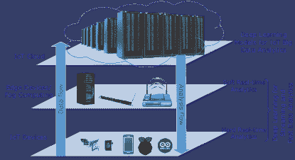

图 1：不同层级的 IoT 数据生成及深度学习模型应对其知识抽象。

确实，机器学习（ML）将对就业和劳动力产生影响，因为许多工作的部分可能“适合 ML 应用”[3]。这将导致对某些 ML 产品的需求增加，并产生对完成这些产品所需任务、平台和专家的派生需求。麦肯锡报告中机器学习的经济影响[2]被定义为知识工作自动化；“利用计算机执行依赖于复杂分析、微妙判断和创造性问题解决的任务”。报告提到，深度学习和神经网络等 ML 技术的进步是知识工作自动化的主要推动因素。自然用户界面，如语音和手势识别，也是高度受益于 ML 技术的推动因素。预计知识工作自动化的潜在经济影响到$2025$年可能达到$\$5.2$万亿到$\$6.7$万亿。图表显示了这一估计在不同职业中的细分情况。与物联网（IoT）的经济影响相比，这一估计强调了对从数据中提取价值的更多关注以及 ML 对个人和社会经济状况的潜在影响。这些经济影响对个人和国家有严重后果，因为人们需要适应适合他们的新收入来源，以维持他们期望的生活标准。

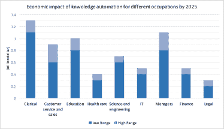

图 2：$2025$年机器学习的预计经济影响从$5.2$万亿到$6.7$万亿的细分。

近年来，许多 IoT 应用出现在不同的垂直领域，例如健康、交通、智能家居、智能城市、农业、教育等。这些应用的主要元素是用于预测（即回归、分类和聚类）、数据挖掘、模式识别或一般数据分析的智能学习机制。在众多机器学习方法中，深度学习（DL）近年来被积极应用于许多 IoT 应用中。这两种技术（即 DL 和 IoT）被列为 2017 年 Gartner Symposium/ITxpo 2016 宣布的三大战略技术趋势之一 [4]。对 DL 的广泛宣传原因在于传统机器学习方法无法满足 IoT 系统的新兴分析需求。相反，IoT 系统根据 IoT 数据生成和管理的层次结构，需要不同的现代数据分析方法和人工智能（AI）方法，如图 1 所示。

对物联网（IoT）及其衍生的大数据的日益关注需要相关方清晰地了解它们的定义、构建块、潜力和挑战。IoT 和大数据之间有双向关系。一方面，IoT 是大数据的主要来源，另一方面，它也是大数据分析的一个重要目标，以改进 IoT 的过程和服务 [5]。此外，IoT 大数据分析已被证明对社会有价值。例如，据报道，通过检测损坏的管道并进行修复，迈阿密公园管理部门节省了约一百万美元的水费 [6]。

IoT 数据不同于一般的大数据。为了更好地理解 IoT 数据分析的要求，我们需要深入探讨 IoT 数据的特性以及它们与一般大数据的不同之处。IoT 数据表现出以下特征 [6]：

+   •

    大规模流数据：大量数据捕获设备分布并部署于 IoT 应用中，不断生成数据流。这导致了巨大的连续数据量。

+   •

    异质性：各种 IoT 数据采集设备收集不同的信息，导致数据的异质性。

+   •

    时间和空间相关性：在大多数 IoT 应用中，传感器设备附着在特定位置，因此每个数据项都有一个位置和时间戳。

+   •

    高噪声数据：由于 IoT 应用中的数据量较小，许多数据在获取和传输过程中可能会受到错误和噪声的影响。

尽管从大数据中获取隐藏的知识和信息有望提升我们的生活质量，但这并不是一项简单明了的任务。对于这种超出传统推理和学习方法能力的复杂且具有挑战性的任务，需要新的技术、算法和基础设施[7]。幸运的是，近期在快速计算和先进机器学习技术方面的进展，为适用于物联网应用的大数据分析和知识提取开辟了新天地。

除了大数据分析，物联网数据还需要另一类新的分析，即快速和流数据分析，以支持具有高速数据流并要求时间敏感（即实时或近实时）操作的应用。实际上，如自动驾驶、火灾预测、驾驶员/老年人的姿势（从而意识和/或健康状况）识别等应用需要快速处理输入数据并迅速采取行动以实现目标。几位研究人员提出了利用云基础设施和服务能力的快速流数据分析方法和框架[8, 9]。然而，对于上述物联网应用等，我们需要在较小规模的平台（即在系统边缘）或甚至在物联网设备本身上进行快速分析。例如，自动驾驶汽车需要快速决策，如车道或速度变化。实际上，这种决策应该通过可能来自多个来源的多模态数据流的快速分析来支持，包括多个车载传感器（例如，相机、雷达、激光雷达、速度计、左/右转向信号等）、其他车辆的通信以及交通实体（例如，交通信号灯、交通标志）。在这种情况下，将数据传输到云服务器进行分析并返回响应会受到延迟的影响，这可能导致交通违规或事故。更为关键的场景是车辆对行人的检测。为了防止致命事故，必须在严格的实时条件下进行准确识别。这些场景表明，物联网的快速数据分析必须靠近或位于数据源处，以消除不必要和有害的通信延迟。

### I-A 调查范围

DL 模型在训练和预测这两个阶段相比于传统机器学习方法带来了两个重要的改进。首先，它们减少了在训练过程中需要手工设计和构建特征集的需求[10]。因此，一些对人类视角来说不明显的特征可以被 DL 模型轻松提取。此外，DL 模型提高了准确率¹¹1 准确率在本工作中通常指的是预测结果与真实值的一致程度。读者还可能遇到 top-2 或 top-3 准确率。在一般情况下，top-N 准确率指的是考虑预测模型的 N 个最高概率答案，并检查该集合是否包含预期的值。因此，top-1 准确率指的是最高概率的输出。类似地，top-3 准确率指的是三个最可能的预测。例如，如果我们将一张老虎的照片输入到识别动物图像的模型中，它返回的可能输出列表为狗:$0.72$，老虎:$0.69$，猫:$0.58$，则 top-1 准确率将输出仅包含“狗”的答案集，这被视为错误。另一方面，top-2 和 top-3 准确率将产生包含“老虎”的输出集，因此被视为正确。

在本文中，我们回顾了广泛的深度神经网络（DNN）架构，并探讨了从 DL 算法中受益的 IoT 应用。本文确定了五个主要的基础 IoT 服务，这些服务可以在不同的垂直领域中使用，超越了每个领域中的特定服务。它还将讨论 IoT 应用的特点以及如何将它们与最合适的 DL 模型匹配。本次调查专注于两种新兴技术的汇合，一种是在通信网络中的 IoT，另一种是在人工智能中的 DL，详细说明了它们的潜在应用和开放问题。调查不涵盖 IoT 数据分析的传统机器学习算法，因为在 I-B 节中提到了其他尝试，这些尝试已经涵盖了这些方法。此外，本调查也没有从通信和网络的角度深入探讨 IoT 基础设施。

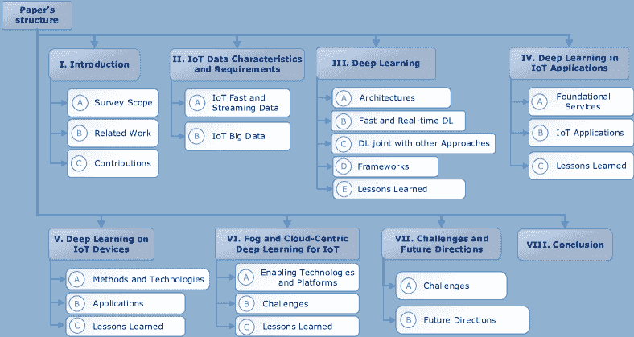

图 3：调查结构。

### I-B 相关工作

据我们所知，文献中并不存在专门调查物联网数据与深度学习之间的具体关系以及深度学习方法在物联网中的应用的文章。很少有工作展示了在物联网环境中使用的常见数据挖掘和机器学习方法。Tsai 等人[11]提出的工作专注于物联网中的数据挖掘方法。它涉及了物联网基础设施和服务中的不同分类、聚类和频繁模式挖掘算法。然而，该工作未考虑深度学习方法，这是我们综述的重点。此外，他们的重点主要是离线数据挖掘，而我们还考虑了实时（即快速）和大数据分析中的学习和挖掘。

在[12]中，Perera 等人回顾了上下文感知计算系统推理阶段的不同机器学习方法（监督学习和无监督学习、规则、模糊逻辑等），并讨论了将这些方法应用于物联网系统的潜力。然而，他们也没有研究深度学习在上下文推理中的作用。

[13]中，Alsheikh 等人提供了针对无线传感器网络（WSNs）的机器学习方法的综述。在这项工作中，作者研究了无线传感器网络在功能方面（如路由、定位和聚类）以及非功能需求（如安全性和服务质量）的机器学习方法。他们回顾了几种监督学习、无监督学习和强化学习方法。该工作侧重于无线传感器网络的基础设施（这是一种实现物联网应用的潜在基础设施），而我们的工作不依赖于数据源（即物联网基础设施），覆盖了广泛的物联网应用和服务。此外，[13]的重点是传统的机器学习方法，而本文则专注于先进的深度学习技术。

最终，Fadlullah 等人[14]探讨了深度学习在网络流量控制系统中的应用。虽然这项工作主要关注网络的基础设施，但与我们专注于深度学习在物联网应用中的使用不同。

除了对物联网的具体研究，Qiu 等人[15]回顾了几种传统机器学习技术以及包括深度学习在内的几种先进技术，用于处理一般的大数据。具体来说，他们强调了不同机器学习技术与信号处理技术的结合，以处理和分析及时的大数据应用。

### I-C 贡献

本文旨在为希望在其物联网基础设施上构建分析、人工智能系统和学习解决方案的物联网研究人员和开发人员提供指导，使用新兴的深度学习机器学习方法。本文的贡献可以总结如下：

+   •

    为了在物联网生态系统中采用 DL 方法，我们识别了物联网数据的关键特征和问题。

+   •

    与文献中一些相关的工作相比，这些工作涉及了物联网的机器学习，我们回顾了最先进的 DL 方法及其在物联网领域的适用性，无论是对于大数据还是流数据分析。

+   •

    我们回顾了在其上下文中使用 DL 的各种物联网应用。我们还提供了不同物联网领域和应用中使用不同类型 DNN 的比较和指导。

+   •

    我们回顾了在从资源受限设备到雾计算和云计算等所有物联网（IoT）层级上部署深度学习（DL）的最新方法和技术。

+   •

    我们强调了成功且富有成效地融合 DL 与物联网应用的挑战和未来研究方向。

本文的其余部分组织如下。在第 II 节中，我们强调了物联网数据的特征，并描述了物联网大数据以及快速流数据的定义及其与一般大数据的区别。第 III 节介绍了几种常见且成功的深度神经网络（DNN）架构。还包括对实时和快速 DL 架构的进展以及与 DL 相关的最先进算法的简要描述。还简要回顾了几种具有不同能力和算法的框架和工具，这些框架和工具支持 DNN。第 IV 节将调查在不同领域（如医疗保健、农业、智能交通系统等）中使用 DL 的物联网应用。第 V 节回顾了将 DNN 应用于资源受限设备的尝试。第 VI 节解释了将 DNN 模型扩展到雾计算和云计算规模的研究工作。第 VII 节介绍了未来研究方向和面临的挑战。本文在第 VIII 节以总结主要结论作结。图 3 描绘了论文的结构。

## II 物联网数据特征及分析需求

IoT 数据可以连续流动或作为大数据的来源进行积累。流数据指的是在很短时间间隔内生成或捕获的数据，需要迅速分析以提取即时见解和/或做出快速决策。大数据指的是常用的硬件和软件平台无法存储、管理、处理和分析的庞大数据集。这两种方法应被区别对待，因为它们对分析响应的要求不同。大数据分析的见解可以在数据生成后几天交付，但流数据分析的见解应在几百毫秒到几秒钟的范围内准备好。

数据融合和共享在基于 IoT 数据的普遍环境开发中起着至关重要的作用。对于时间敏感的 IoT 应用，这一作用尤为关键，因为需要及时融合数据，将所有数据整合进行分析，从而提供可靠且准确的可操作见解。Alam 等人 [16] 提出了一个调查论文，回顾了 IoT 环境中的数据融合技术，并讨论了若干机会和挑战。

### II-A IoT 快速流数据

许多研究尝试建议使用流数据分析，主要可以在高性能计算系统或云平台上部署。这些框架上的流数据分析基于数据并行性和增量处理 [17]。通过数据并行性，大数据集被分割成几个较小的数据集，并对这些数据集同时进行并行分析。增量处理指的是获取一小批数据并在计算任务的管道中快速处理。尽管这些技术减少了从流数据分析框架返回响应的时间延迟，但它们并不是时间敏感 IoT 应用的最佳解决方案。通过将流数据分析更接近数据源（即 IoT 设备或边缘设备），对数据并行性和增量处理的需求就不那么明显，因为数据源中的数据量允许其快速处理。然而，在 IoT 设备上进行快速分析带来了自身的挑战，例如数据源处计算、存储和电力资源的限制。

### II-B IoT 大数据

物联网被广泛认为是大数据的主要来源之一，因为它基于将大量智能设备连接到互联网，以报告它们频繁捕获的环境状态。从庞大的原始输入数据中识别和提取有意义的模式是大数据分析的核心作用，因为它可以提供更高层次的洞察力，用于决策和趋势预测。因此，从大数据中提取这些洞察和知识对许多企业来说极为重要，因为这使它们能够获得竞争优势。在社会科学领域，Hilbert[18]将大数据分析的影响与望远镜和显微镜对天文学和生物学的影响相提并论。

许多研究从不同方面描述了大数据的一般特征[18, 19, 20, 21]，如体量、速度和多样性。然而，我们采用大数据的一般定义，通过以下“6V”的特征来表征物联网大数据：

+   •

    **体量**：数据体量是将数据集视为大数据还是传统的大规模/非常大数据的决定性因素。使用物联网设备生成的数据量比以往更多，明显符合这一特征。

+   •

    **速度**：物联网大数据的生产和处理速率足够高，以支持大数据的实时可用性。这说明需要先进的工具和技术来高效地处理这种高数据生产率。

+   •

    **多样性**：通常，大数据以不同的形式和类型存在。它可能包括结构化、半结构化和非结构化数据。物联网可能会产生各种数据类型，如文本、音频、视频、传感器数据等。

+   •

    **真实性**：真实性指的是数据的质量、一致性和可信度，这些因素会导致准确的分析。这一特性在物联网应用中需要特别注意，尤其是那些涉及人群感知数据的应用。

+   •

    **变异性**：这一特性指的是数据流的不同速率。根据物联网应用的性质，不同的数据生成组件可能会有不一致的数据流。此外，数据源在特定时间内可能会有不同的数据负载速率。例如，利用物联网传感器的停车服务应用在高峰时段可能会有数据负载的高峰。

+   •

    价值：价值是将大数据转化为有用的信息和洞察，从而为组织带来竞争优势。数据价值高度依赖于基础流程/服务以及数据处理方式。例如，某些应用（如医疗生命体征监测）可能需要捕捉所有传感器数据，而天气预报服务可能只需随机采样传感器的数据。另一个例子是，信用卡提供商可能需要保留数据一定时间后再丢弃。

除了上述属性，研究人员[18][20]还识别了其他特性，例如：

+   •

    大数据可以是数字活动或物联网互动的副产品或痕迹。使用谷歌的常见搜索词来预测季节性流感就是这种数字副产品的一个好例子[22]。

+   •

    大数据系统应该具备横向扩展性，即大数据源应能够扩展到多个数据集。这一属性也导致了大数据的复杂性，从而带来了如数据传输和清洗等其他挑战。

对连续数据流进行分析通常被称为流处理或有时在文献中称为复杂事件处理（CEP）。Strohbach 等人[23]提出了一个针对物联网的大数据分析框架，以支持物联网数据分析的体量和速度属性。物联网大数据和流数据分析的集成是一个需要进一步研究的开放问题，也作为该工作的一个部分进行了研究。然而，他们提出的框架设计用于在云基础设施上部署。此外，他们的重点是框架的数据管理方面，并未使用如深度学习（DL）这样的先进机器学习模型。其他现成的产品，如 Apache Storm，也可用于云上的实时分析。该领域的一个主要问题是缺乏可以部署在雾计算（即系统边缘）甚至物联网设备上的框架和算法。当 DL 在这些情况下发挥作用时，应考虑 DNN 的深度与性能之间的权衡。

## III 深度学习

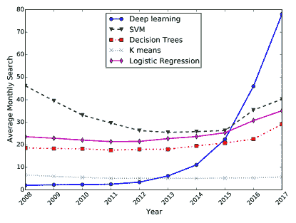

图 4：谷歌趋势显示近年来对深度学习的关注度增加。

深度学习（DL）由基于多层人工神经网络（ANNs）的有监督或无监督学习技术组成，这些网络能够在深度架构中学习层次化表示。DL 架构包含多个处理层，每一层能够基于其输入层的数据产生非线性响应。DL 的功能模仿了人脑和神经元处理信号的机制。

近年来，深度学习（DL）架构相比于其他传统机器学习方法获得了更多关注。这些方法被认为是 DL 的浅层结构学习架构版本（即一个有限的子集）。图 4 展示了 Google 趋势中五种流行机器学习算法的搜索趋势，其中 DL 在其他算法中变得越来越受欢迎。尽管 ANNs 在过去几十年里已经引入，但对深度神经网络（DNNs）的增长趋势始于 2006 年，当时 G. Hinton 等人提出了深度信念网络的概念[24]。此后，这项技术在人工智能的不同领域（包括图像识别、图像检索、搜索引擎和信息检索以及自然语言处理）中展示了最先进的性能。

深度学习（DL）技术是在传统人工神经网络（ANNs）的基础上发展的。过去几十年里，前馈神经网络（FNNs）[25]（也称为多层感知机 - MLPs）被用于训练系统，但当层数增加时，它们变得难以训练[26]。训练数据的较小规模是导致模型过拟合的另一个因素。此外，当时计算能力的限制也阻碍了高效深层 FNNs 的实现。这些计算限制最近已由于硬件进步（尤其是图形处理单元（GPUs）和硬件加速器的发展）而得到解决。除了深度学习架构的结构方面和深度的意义外，以及硬件进步，深度学习技术还受益于深层网络有效训练算法的进步，包括：

+   •

    使用整流线性单元（ReLUs）作为激活函数[27]，

+   •

    引入丢弃法[28]，

+   •

    网络权重的随机初始化[29]，

+   •

    通过残差学习网络解决训练准确性下降的问题[30]，

+   •

    通过引入和增强长短期记忆网络（LSTM）解决梯度消失问题以及梯度爆炸问题[31, 32]。

与传统的人工神经网络（ANNs）相比，DL 架构的一个优势在于，DL 技术可以从原始数据中学习隐藏特征[10]。每一层都基于前一层的输出来训练一组特征。最内层可以识别更复杂的特征，因为它们聚合并重新组合来自前一层的特征。这被称为特征的层次结构。例如，在人脸识别模型中，人像的原始图像数据作为像素向量被输入到模型的输入层。然后，每个隐藏层可以从前一层的输出中学习更抽象的特征，例如，第一个隐藏层识别线条和边缘，第二层识别人脸部位如鼻子、眼睛等，第三层结合所有先前的特征生成一个完整的人脸。

然而，关于 DL 模型的报告改进都基于经验评估，目前还没有确凿的分析基础来解释为什么 DL 技术胜过其浅层对应物。此外，基于隐藏层数量，深度和浅层网络之间也没有明确的界限。通常来说，包括最近先进的训练算法的两个或更多隐藏层的神经网络被认为是深度模型。此外，由于它们在隐藏层的单元上有一个循环，可以将递归神经网络与一个隐藏层视为深度网络。

### III-A 架构

在这一节中，我们简要概述了几种常见的深度学习模型以及近年来引入的最前沿的架构。感兴趣的读者可以参考其他详细调研深度学习模型和架构的文献，例如[33]。表 I 总结了这些模型、它们的属性、特征以及一些示例应用。

一个 DNN 包括一个输入层，几个隐藏层和一个输出层。每一层都包括多个称为神经元的单元。神经元接收多个输入，对其输入进行加权求和，然后得到的总和通过激活函数产生输出。每个神经元都有一个与其输入大小相关的权重向量，以及在训练过程中应该优化的偏置。图 5 描述了神经元的结构。

在训练过程中，输入层将权重（通常是随机的）分配给输入训练数据，并传递到下一层。每个后续层也将权重分配给它们的输入并生成输出，作为下一层的输入。在最后一层，产生表示模型预测的最终输出。损失函数通过计算预测值和真实值之间的误差率来确定预测的正确性。像随机梯度下降（SGD）[34]这样的优化算法用于通过计算损失函数的梯度来调整神经元的权重。误差率通过网络向输入层反向传播（称为反向传播算法[35, 36]）。网络然后重复这个训练周期，在每个周期中平衡每个神经元的权重，直到误差率低于期望的阈值。此时，DNN 已经训练完成，准备进行推断。在图 6 中，展示了 DL 模型训练的高级机制。

从广义上讲，DL 模型分为三类，即生成型、判别型和混合型模型。尽管没有明确的界限，判别型模型通常提供监督学习方法，而生成型模型用于无监督学习。混合型模型结合了判别型和生成型模型的优点。

表 I: 深度学习模型总结。

| 模型 | 类别 | 学习模型 | 典型输入数据 | 特点 | 样本 IoT 应用 |
| --- | --- | --- | --- | --- | --- |
| AE | 生成型 | 无监督 | 各种 |

&#124; •  适用于特征提取， &#124;

&#124; 降维 &#124;

&#124; •  输入和输出数目相同 &#124;

&#124; 输出单元 &#124;

&#124; •  输出重构 &#124;

&#124; 输入数据 &#124;

&#124; •  处理未标记数据 &#124;

|

&#124; •  机械故障诊断 &#124;

&#124; •  情感识别 &#124;

|

| RNN | 判别型 | 监督 | 序列，时间序列 |
| --- | --- | --- | --- |

&#124; •  处理数据序列 &#124;

&#124; 通过内部记忆 &#124;

&#124; •  在 IoT 应用中有用 &#124;

&#124; 带时间依赖数据 &#124;

|

&#124; •  识别运动模式 &#124;

&#124; •  行为检测 &#124;

|

| RBM | 生成型 |
| --- | --- |

&#124; 无监督， &#124;

&#124; 监督 &#124;

| 各种 |
| --- |

&#124; •  适用于特征 &#124;

&#124; 提取，降维 &#124;

&#124; 降维和分类 &#124;

&#124; •  训练过程昂贵 &#124;

|

&#124; •  室内定位 &#124;

&#124; •  能耗 &#124;

&#124; 预测 &#124;

|

| DBN | 生成型 |
| --- | --- |

&#124; 无监督， &#124;

&#124; 监督 &#124;

| 各种 |
| --- |

&#124; •  适用于分层 &#124;

&#124; 特征发现 &#124;

&#124; • 贪婪训练 &#124;

&#124; 网络逐层构建 &#124;

|

&#124; • 故障检测分类 &#124;

&#124; • 安全威胁识别 &#124;

|

| LSTM | 判别型 | 监督型 |
| --- | --- | --- |

&#124; 序列、时间序列 &#124;

&#124; 长时间依赖数据 &#124;

|

&#124; • 对数据性能良好 &#124;

&#124; 长时间滞后的 &#124;

&#124; • 对内存单元的访问是 &#124;

&#124; 受门控保护 &#124;

|

&#124; • 人类活动识别 &#124;

&#124; • 移动预测 &#124;

|

| CNN | 判别型 | 监督型 | 2-D (图像、声音等) |
| --- | --- | --- | --- |

&#124; • 卷积层需要 &#124;

&#124; 计算的最大部分 &#124;

&#124; • 相比之下连接较少 &#124;

&#124; 到 DNNs。 &#124;

&#124; • 需要大量训练 &#124;

&#124; 数据集用于视觉任务。 &#124;

|

&#124; • 植物疾病检测 &#124;

&#124; • 交通标志检测 &#124;

|

| VAE | 生成型 | 半监督 | 各种 |
| --- | --- | --- | --- |

&#124; • 一类自编码器 &#124;

&#124; • 适用于稀缺的 &#124;

&#124; 带标签的数据 &#124;

|

&#124; • 入侵检测 &#124;

&#124; • 故障检测 &#124;

|

| GAN | 混合型 | 半监督 | 各种 |
| --- | --- | --- | --- |

&#124; • 适用于噪声数据 &#124;

&#124; • 由两个网络组成： &#124;

&#124; 生成器和判别器 &#124;

|

&#124; • 定位和路径寻找 &#124;

&#124; • 图像到文本 &#124;

|

| 阶梯网络 | 混合型 | 半监督 | 各种 |
| --- | --- | --- | --- |

&#124; • 适用于噪声数据 &#124;

&#124; • 由三个网络组成： &#124;

&#124; 两个编码器和一个解码器 &#124;

|

&#124; • 人脸识别 &#124;

&#124; • 身份认证 &#124;

|

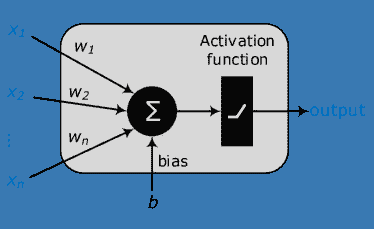

图 5：神经元是人工神经网络的一个单元，具有多个输入和可训练的权重及偏差。

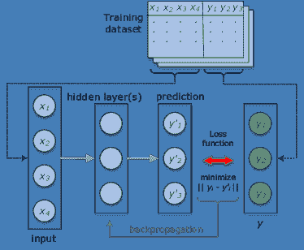

图 6：深度学习模型训练的整体机制。

#### III-A1 卷积神经网络 (CNNs)

对于基于视觉的任务，具有层间密集连接的 DNN 很难训练，并且扩展性较差。一个重要的原因是这类模型的平移不变性特性。因此，它们无法学习可能在图像中发生变化的特征（例如，姿态检测中的手部旋转）。CNN 通过支持平移等变计算解决了这个问题。CNN 接收一个二维输入（例如，图像或语音信号），并通过一系列隐藏层提取高级特征。隐藏层包括卷积层以及最后的全连接层。卷积层是 CNN 的核心，由一组可学习的参数（称为滤波器）组成，这些参数与输入的形状相同，但维度更小。在训练过程中，每个卷积层的滤波器遍历整个输入体积（例如，对于图像，它遍历图像的宽度和长度），并计算输入和滤波器的内积。这种对整个输入的计算会产生一个滤波器的特征图。

CNN 的另一个构建模块是池化层，它对特征图进行操作。设置池化层的目的是为了减少表示的空间大小，以减少参数数量和计算时间，并降低过拟合的可能性。最大池化是一种常见的方法，它将输入空间划分为不重叠的区域，并为每个区域选择最大值。

CNN 中最后一个重要的组件是 ReLU，它由激活函数形式为 $f(x)=\max(0,x)$ 的神经元组成。在 CNN 中引入这种激活函数导致训练时间更快，而不会以明显负面的方式影响网络的泛化能力 [37]。图 7 ‣ III-A Architectures ‣ III Deep Learning ‣ Deep Learning for IoT Big Data and Streaming Analytics: A Survey") 描述了 CNN 的结构。

CNN 与全连接网络之间的主要区别在于 CNN 中的每个神经元仅连接到输入的一个小子集。这减少了网络中的总参数数量，并提高了训练过程的时间复杂度。这种特性称为局部连接性。

许多物联网设备，例如无人机、智能手机和智能联网汽车，都配备了摄像头。CNN 架构及其变体已经在涉及这些设备的各种应用场景中进行了研究。一些典型的应用包括通过无人机图像进行洪水或滑坡预测、使用智能手机上的植物图片进行植物病害检测以及使用车辆摄像头进行交通标志检测。

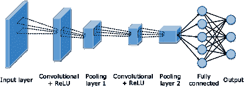

图 7：CNN 的架构。

#### III-A2 循环神经网络（RNNs）

在许多任务中，预测依赖于多个先前的样本，因此除了对单个样本进行分类外，我们还需要分析输入序列。在这些应用中，前馈神经网络并不适用，因为它假设输入层和输出层之间没有依赖关系。循环神经网络（RNNs）已经被开发出来以解决这一问题，尤其是在序列（例如，语音或文本）或时间序列（传感器数据）问题中，长度可以不同。智能车辆中驾驶行为的检测、个体运动模式的识别以及家庭能耗的估算都是 RNNs 可以应用的一些例子。RNN 的输入由当前样本和之前观察到的样本组成。换句话说，RNN 在时间步$t-1$的输出会影响时间步$t$的输出。每个神经元都配备了一个反馈回路，将当前输出作为下一步的输入。这个结构可以表述为 RNN 中的每个神经元都有一个内部记忆，保持来自前一个输入的计算信息。

为了训练网络，使用了一种称为时间反向传播（BPTT）的反向传播算法扩展[38]。由于神经元上存在循环，我们不能在这里使用原始的反向传播，因为它基于相对于其上层权重的误差导数，而 RNN 没有堆叠层模型。BPTT 算法的核心是一种称为展开 RNN 的技术，使我们可以在时间跨度上得到一个前馈网络。图 8 描绘了 RNN 的结构和展开概念。

传统的 RNN 可以被视为深度模型，因为当它们在时间上展开时，可以看作是输入层和输出层之间的若干个非线性神经元层[39]。然而，考虑到 RNN 的架构和功能，RNN 中的隐藏层应该提供记忆，而不是特征的层次表示[40]。有几种方法可以使 RNN 变得更深，包括在输入层和隐藏层之间添加更多层、堆叠更多隐藏层以及在隐藏层和输出层之间添加更多层[39]。

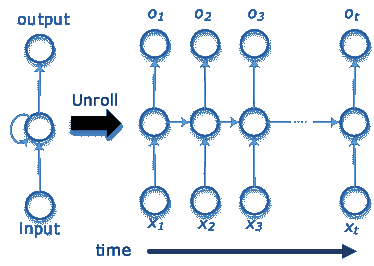

图 8：递归神经网络的结构。

#### III-A3 长短期记忆（LSTM）

LSTM 是 RNN 的扩展。虽然提出了不同的 LSTM 变体，但大多数都遵循了原始网络的相同设计 [31]。LSTM 使用门的概念，每个门根据其输入计算一个介于 0 和 1 之间的值。除了存储信息的反馈回路，每个 LSTM 神经元（也称为记忆单元）都有一个乘法遗忘门、读取门和写入门。这些门用于控制对记忆单元的访问，并防止其被无关输入扰动。当遗忘门激活时，神经元将其数据写入自身。当遗忘门通过发送 $0$ 关闭时，神经元会忘记其上一个内容。当写入门设置为 $1$ 时，其他连接的神经元可以写入该神经元。如果读取门设置为 $1$，连接的神经元可以读取该神经元的内容。图 9 ‣ III-A Architectures ‣ III Deep Learning ‣ Deep Learning for IoT Big Data and Streaming Analytics: A Survey") 描述了这一结构。

LSTM 相比于 RNN 的一个重要区别是，LSTM 单元利用遗忘门来主动控制细胞状态，并确保它们不会退化。这些门可以使用 sigmoid 或 tanh 作为其激活函数。实际上，这些激活函数会在其他使用它们的模型的训练阶段造成梯度消失问题。通过学习在 LSTM 中记住哪些数据，存储在记忆单元中的计算不会随着时间的推移而扭曲。BPTT 是训练网络以最小化误差的常用方法。

当数据表现出长时间的依赖特性时，LSTM 模型的表现优于 RNN 模型 [41]。这种长时间的依赖可以在 IoT 应用中观察到，例如人类活动识别、预测在线项目中的教育表现以及基于环境监测的灾难预测等。

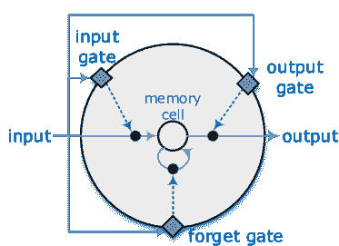

图 9：LSTM 记忆单元的结构。实箭头线表示数据流动，虚箭头线表示来自门的信号。

#### III-A4 自编码器（AEs）

AEs 包括一个输入层和一个输出层，它们通过一个或多个隐藏层连接。AEs 的输入和输出单元数量相同。该网络旨在通过最简单的方式将输入转换为输出来重构输入，使得它不会对输入造成太大的扭曲。这种类型的神经网络主要用于解决无监督学习问题以及迁移学习[42]。由于它们在输出层构建输入的行为，AEs 主要用于诊断和故障检测任务。这对于工业物联网尤为重要，可以用于硬件设备和机器的故障诊断，以及装配线性能异常检测等多种应用。

AEs 有两个主要组成部分：编码器和解码器。编码器接收输入并将其转换为一个新的表示，通常称为代码或潜变量。解码器接收编码器生成的代码，并将其转换为原始输入的重构。AEs 的训练过程涉及最小化重构误差，即输出和输入之间显示的最小差异。图 10 ‣ III-A Architectures ‣ III Deep Learning ‣ Deep Learning for IoT Big Data and Streaming Analytics: A Survey") 说明了典型 AE 的结构。AE 还有多种变体和扩展，如去噪 AE、收缩 AE、堆叠 AE、稀疏 AE 和变分 AE。

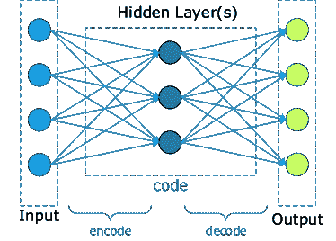

图 10：自编码器网络的结构。

#### III-A5 变分自编码器（VAEs）

VAEs，于 2013 年引入，是一种流行的生成模型框架，对数据结构的假设不强，同时通过反向传播具有快速的训练过程[43]。此外，该模型已用于半监督学习[44]。因此，它非常适合处理多样化数据和标记数据稀缺的物联网解决方案。这些应用包括在感知或执行级别进行故障检测，以及在安全系统中进行入侵检测。对于每个数据点 $\mathbf{x}$，都有一个对应的潜变量向量 $\mathbf{z}$。VAE 的训练架构包括具有参数 $\phi$ 和 $\theta$ 的编码器和解码器。固定形式的分布 $q_{\phi}(\mathbf{z}|\mathbf{x})$ 帮助编码器估计后验分布 $p_{\theta}(\mathbf{z}|\mathbf{x})$。模型由两个网络组成：一个生成样本，另一个执行近似推断。VAE 的示意图如图 11 ‣ III-A Architectures ‣ III Deep Learning ‣ Deep Learning for IoT Big Data and Streaming Analytics: A Survey") 所示。

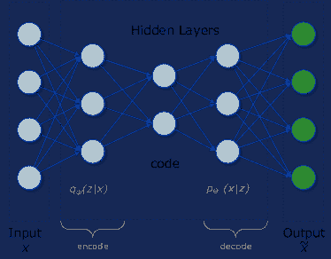

图 11：变分自编码器网络的结构。

#### III-A6 生成对抗网络（GANs）

生成对抗网络（GANs），由 Goodfellow 等人引入[45]，由两个神经网络组成，即生成网络和判别网络，这两个网络协同工作以生成合成且高质量的数据。前者网络（即生成器）负责在从训练数据集中学习数据分布后生成新数据。后者网络（即判别器）则在真实数据（来自训练数据）和虚假输入数据（来自生成器）之间进行区分。生成网络的优化目标是生成对判别器具有欺骗性的输入数据（即判别器难以区分数据是虚假还是现实的）。换句话说，生成网络与对抗的判别网络竞争。图 12 ‣ III-A Architectures ‣ III Deep Learning ‣ Deep Learning for IoT Big Data and Streaming Analytics: A Survey")展示了 GANs 的概念。

GANs 中的目标函数基于极小极大游戏，其中一个网络尝试最大化价值函数，另一个网络则试图最小化它。在这个虚拟游戏的每一步中，生成器通过从随机噪声中生成样本数据来欺骗判别器。另一方面，判别器从训练集中接收几个真实数据示例以及来自生成器的样本。它的任务是区分真实和虚假的数据。如果判别器的分类是正确的，则认为其表现令人满意。如果生成器的示例成功欺骗了判别器，则生成器也表现良好。然后更新判别器和生成器的参数，以为下一轮游戏做好准备。判别器的输出帮助生成器优化其生成的数据，以便进行下一轮。

在物联网应用中，GANs 可以用于需要从现有数据中创建新事物的场景。这可以包括定位和路径规划应用，其中 GAN 中的生成网络生成两个点之间的潜在路径，而判别器则识别哪些路径看起来可行。GANs 在为视力受损者开发服务方面也非常有用，例如使用 GANs 将图像转换为描述性文本[46]，并使用另一个深度学习模型进行文本转语音转换。在使用 GANs 的图像处理研究中，分析了大量真实的名人快照，以创建新的虚假图像，使得人类无法识别这些图像是否真实[47]。

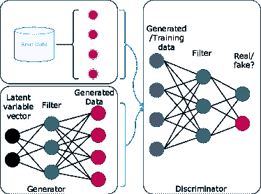

图 12：生成对抗网络的概念。

#### III-A7 限制玻尔兹曼机（RBMs）

RBM 是一种随机 ANN，包括两个层：一个包含已知输入的可见层和一个包含潜在变量的隐藏层。与玻尔兹曼机相比，RBMs 在神经元连接上施加了限制。RBMs 应该建立一个二分图，使每个可见神经元都与所有隐藏神经元连接，反之亦然，但同一层中的任何两个单元之间没有连接。此外，偏置单元连接到所有可见和隐藏神经元。RBMs 可以堆叠形成深度神经网络（DNNs）。它们也是深度置信网络的构建块。

训练数据分配给可见单元。训练过程可以使用反向传播和梯度下降算法来优化网络的权重。训练 RBM 的目标是最大化所有可见单元概率的乘积。RBM 的功能类似于自动编码器（AEs），因为它使用前馈计算潜在变量，然后使用反向传播重建输入。RBM 的结构如图 13 ‣ III-A Architectures ‣ III Deep Learning ‣ Deep Learning for IoT Big Data and Streaming Analytics: A Survey") 所示。

RBMs 可以从输入数据中执行特征提取。这通过对一组输入建模概率分布来实现，该分布表示在一组隐藏单元中。例如，拥有一组个人喜爱的电影，RBM 模型可以有一个可见层，包含与可用电影数量相等的神经元，并且一个隐藏层包含三个神经元，以表示戏剧、动作和喜剧三种不同的类型。因此，根据应用，隐藏层可以被视为输出层。或者，它可以通过额外的分类器层来补充，以基于提取的特征进行分类。

在 RBMs 可以用于的潜在应用类型中，我们提到室内定位、能耗预测、交通拥堵预测、姿态分析，以及一般从中提取最重要特征的任何应用。

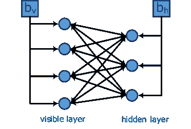

图 13：受限玻尔兹曼机的结构。可见层和隐藏层具有独立的偏置。

#### III-A8 深度置信网络 (DBNs)

DBNs 是一种生成型人工神经网络（ANNs），由一个可见层（对应于输入）和几个隐藏层（对应于潜在变量）组成。它们可以提取训练数据的层次表示，并重建其输入数据。通过添加像 softmax 这样的分类器层，可以用于预测任务。

DBN 的训练是逐层进行的，每一层都被视为在先前训练的层上训练的 RBM。这一机制使 DBN 成为一种高效且快速的深度学习算法[48]。对于 DBN 中的给定隐藏层，前一 RBM 的隐藏层充当输入层。图 14 ‣ III-A 体系结构 ‣ III 深度学习 ‣ 深度学习在物联网大数据和流媒体分析中的应用：综述")显示了典型 DBN 的结构。

许多应用可以从深度置信网络（DBN）的结构中受益，例如工业环境中的故障检测分类、安保警报系统中的威胁识别，以及从图像中提取情感特征。

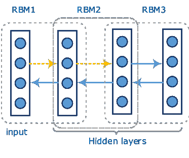

图 14: 深度信念网络的结构。虚线箭头表示特征提取路径，实线箭头表示生成路径。

#### III-A9 梯形网络

梯形网络由 Valpola 等人在 2015 年提出[49]，以支持无监督学习。后来，它们被扩展到半监督环境中[50]，并在多个任务中展示了最先进的性能，例如手写数字识别和图像分类。梯形网络的架构包括两个编码器和一个解码器。编码器充当网络的监督部分，而解码器进行无监督学习。其中一个编码器称为干净编码器，执行正常计算，而另一个编码器称为损坏编码器，则向所有层添加高斯噪声。

使用去噪函数，解码器可以在每一层根据相应的损坏数据重建表示。每一层重建数据与干净数据之间的差异用于计算该层的去噪成本。在编码器端，成本函数使用编码器层的损坏输出与相应的干净输出之间的差异。训练目标是最小化监督部分和无监督网络中的成本总和。

梯形网络的初步实验评估[49]局限于一些标准任务，如对修改国家标准与技术研究所（MNIST）数据集[51]进行的手写数字分类，或在加拿大高级研究所（CIFAR）-10 数据集[52]上进行的图像识别任务。尽管在物联网场景中尚未广泛使用，但梯形网络有潜力用于许多基于视觉的物联网分析，其中半监督学习是一大优势。图 15 显示了梯形网络的结构。

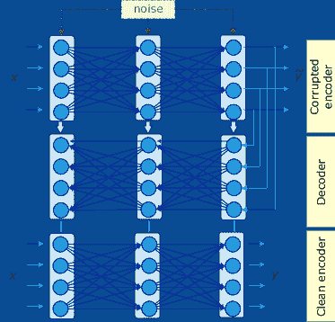

图 15：具有两层的梯形网络结构。

### III-B 快速和实时深度学习架构

利用深度学习模型进行快速和实时分析的研究仍处于初期阶段。在这一领域的初步工作由 Liang 等人 [53] 完成。该工作扩展了极限学习机（ELM）网络，应用于单隐层前馈网络的在线序列学习算法。他们的框架，称为 OS-ELM，逐一学习训练数据以及分块学习，只有新到达的数据会经过训练过程。这一架构是 [54] 中提出的实时制造执行系统的基础。在这项工作中，OS-ELM 被用于使用 RFID 技术进行车间物体定位。Zou 等人 [55] 还报告了使用这种架构进行基于 WiFi 指纹的室内定位算法，其中 OS-ELM 模型能够很好地适应动态环境变化，同时仍保持良好的准确性。

对于卷积网络，Ren 等人提出的架构，称为 Faster R-CNN [56]（基于 Fast R-CNN [57]），旨在实时检测图像中的物体。与图像分类任务相比，图像中的物体检测需要更多的计算，因此消耗更多的能源，因为系统需要评估大量潜在的物体建议。所提出的架构基于在完整的 CNN 中应用区域建议算法，同时执行物体边界预测和物体评分计算。他们对所提物体检测架构的评估表明，当原始输入帧被重新缩放到图像的最短边为 $600$ 像素时，系统的运行时间在 $5$-$17$ 帧每秒（fps）之间。Mao 等人 [58] 也使用了 Fast R-CNN 在嵌入式平台上报告，运行时间为 $1.85$ fps，帧缩放到最短边 $600$ 像素的嵌入式 CPU+GPU 平台，这些平台已被证明具有接近实时性能的能源效率。然而，对于图像处理任务，当处理和分析 $30$ fps 或更好的性能时，我们可以认为这种方法是真正的实时的。Redmon 等人 [59] 开发了 You Only Look Once (YOLO)，该方法在输入图像被调整为 $448\times 448$ 时达到了 $45$ fps 的性能，甚至更小的版本 Fast YOLO 达到了 $155$ fps，适用于智能相机。

### III-C 结合其他方法的深度学习

DL 架构还在其他机器学习方法中联合使用，以提高其效率。DL 模型的非线性函数逼近能够支持数千甚至数十亿个参数，这一特点成为将这种方法应用于需要此类函数的其他机器学习方法中的强大动因。此外，深度模型中的自动特征提取是联合使用这些模型和其他方法的另一个激励因素。在以下小节中，提供了适合物联网场景的此类方法的总结。

#### III-C1 深度强化学习

深度强化学习（DRL）[60] 是强化学习（RL）与深度神经网络（DNNs）的结合。其目标是创建能够自我学习以建立成功策略以获得最大长期奖励的软件代理。在这种方法中，RL 从 DNN 模型中找到环境中一组状态的最佳动作策略。当底层环境可以通过大量状态来表示时，RL 模型中对 DNN 的需求变得显而易见。在这种情况下，传统的 RL 不够高效。相反，可以使用 DL 模型来逼近动作值，从而估计在给定状态下动作的质量。虽然在其背景下使用 DRL 的系统还处于起步阶段，但已经显示出了非常有前景的结果。在物联网领域，[61] 中提出的工作在智能校园环境中使用 DRL 进行半监督定位。该工作的目标是基于来自多个蓝牙低能耗（BLE）iBeacons 的接收信号来定位用户。学习代理使用 DRL 来找到最佳的执行动作（即，从起始点向北、北西等方向移动）。奖励函数是到预定义目标的距离误差的倒数，从而学习代理在接近其预期目标时会获得更多的奖励，反之亦然。图 16 显示了这种方法的一个示例，当 DNN 模型在半监督设置中帮助获得更多奖励时（图 16 的左侧子图）及其对准确度的奖励解释（右侧子图）。

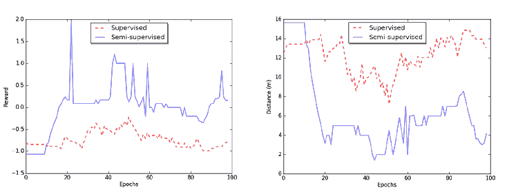

图 16: 深度强化学习（监督和半监督）：获得奖励（左）及其相应的准确度测量（右）[61]。

#### III-C2 深度模型的迁移学习

迁移学习，属于领域适应和多任务学习的范围，涉及通过转移从相关领域的数据中学习到的知识表示来适应和改进在新领域中的学习[62]。迁移学习是许多物联网应用中一个有趣的潜在解决方案，因为获取训练数据并非易事。例如，考虑通过 BLE 或 WiFi 指纹技术使用智能手机训练定位系统，不同平台（如 iOS 和 Android）在相同时间和地点的 RSSI 值会有所不同。如果我们已经为一个平台训练了模型，可以将该模型迁移到另一个平台，而无需为新平台重新收集一组训练数据。

深度学习模型由于能够从输入数据中学习低层次和抽象的表征，因此非常适合迁移学习。具体来说，堆叠去噪自编码器[62]及其其他变体[63]在这一领域表现出色。利用深度神经网络的迁移学习仍然是人工智能社区中的一个活跃研究领域，我们尚未看到在物联网中有相关的实际应用报告。

#### III-C3 在线学习算法与深度学习的结合

随着来自物联网应用生成的数据流经云平台进行分析，在线机器学习算法的作用变得更加突出，因为训练模型需要通过增量数据来更新。这与当前技术支持的批量学习技术相对立，后者要求训练数据集在训练时必须完全可用，此后训练模型不能通过新数据进行演化。若干研究工作报告了在各种深度学习模型上应用在线学习技术，包括堆叠去噪自编码器[64]、和积和网络[65]，以及受限玻尔兹曼机[66]。

### III-D 框架

对于在不同领域中使用深度学习架构的兴趣的迅速增长，得益于近年来引入的多个深度学习框架。每个框架都有其自身的优势，基于其支持的深度学习架构、优化算法以及开发和部署的便利性[67]。其中几个框架在研究中被广泛使用，用于高效训练深度神经网络。在本节中，我们回顾了一些这些框架。

H2O: H2O 是一个机器学习框架，提供了 R、Python、Scala、Java、JSON 和 CoffeeScript/JavaScript 的接口 [68]。H2O 可以在独立模式、Hadoop 上或在 Spark 集群中运行。除了常见的机器学习算法，H2O 还包括一个基于前馈神经网络的 DL 算法，可以通过 SGD 和反向传播进行训练。H2O 的 DL AE 基于标准的深度（多层）神经网络架构，整个网络一起学习，而非逐层堆叠。

Tensorflow: 最初为 Google Brain 项目开发，Tensorflow 是一个用于机器学习系统的开源库，支持各种类型的深度神经网络 [69]。它被许多 Google 产品使用，包括 Google 搜索、Google 地图和街景、Google 翻译、YouTube 等。Tensorflow 使用图表示来构建神经网络模型。开发者还可以利用 TensorBoard 这个工具包来可视化神经网络模型和观察学习过程，包括更新参数。Keras²²2https://keras.io/ 也为 Tensorflow 提供了高级的编程抽象。

Torch: Torch 是一个开源的机器学习框架，包含大量的深度学习算法，用于方便地开发 DNN 模型 [70]。它基于 Lua 编程语言开发，具有轻量级和快速训练深度学习算法的特性。Torch 被多家公司和研究实验室如 Google、Facebook 和 Twitter 使用。它支持在 CPU 和 GPU 上开发机器学习模型，并提供强大的并行化包用于训练 DNNs。

Theano: Theano 是一个基于 Python 的开源框架，用于高效的机器学习算法，支持编译运行在 CPU 和 GPU 上 [71]。它使用 CUDA 库优化需要在 GPU 上运行的复杂代码，并允许在 CPU 上进行并行处理。Theano 使用图表示来处理符号数学表达式。通过这种表示，支持在 Theano 中进行符号微分。多个包装器，包括 Pylearn2、Keras 和 Lasagne，提供了在 Theano 上更简单的编程体验 [72]。

Caffe: Caffe [73] 是一个用于深度学习算法和一组参考模型的开源框架。它基于 C++ 实现，支持 CUDA 进行 GPU 计算，并提供 Python 和 Matlab 的接口。Caffe 将模型表示与实现分离，通过配置定义模型而非在源代码中硬编码实现。仅通过更改标志即可轻松在不同平台（例如 CPU 到 GPU 或移动设备）之间切换。据报道，Caffe 在 GPU 上的预测速度为每张图像约 $1$ 毫秒，训练速度为每张图像约 $4$ 毫秒。

Neon：Neon³³3http://neon.nervanasys.com 是另一个基于 Python 的开源 DL 框架，具有高性能，适用于现代 DNNs，如 AlexNet [37]、Visual Geometry Group (VGG) [74] 和 GoogleNet [75]。它支持开发多种常用模型，如 CNNs、RNNs、LSTMs 和 AEs，在 CPU 和 GPU 上均可运行。随着他们实现半监督学习使用 DL 模型的 GANs，该列表正在扩展。它还支持易于更改的硬件平台后端。

Bahrampour 等人在 [67] 提供了对四种前述工具的比较研究，分别是 Caffe、Neon、Theano 和 Torch。尽管每种工具在不同场景下的性能各有不同，但 Torch 和 Theano 在大多数场景中表现最佳。另一项基准测试在 [76] 中提供，比较了 Caffe、TensorFlow、Torch、CNTK 和 MXNet 的运行性能。表 II 总结并比较了不同的深度学习框架。

表 II：开发深度学习框架的特性（截至 2017 年 9 月）。

| 框架 |
| --- |

&#124; 核心 &#124;

&#124; 语言 &#124;

| 接口 | 优点 | 缺点 |
| --- | --- | --- |

&#124; 用于 IoT &#124;

&#124; 应用 &#124;

|

| --- | --- | --- | --- | --- | --- |
| --- | --- | --- | --- | --- | --- |
| H2O | Java |

&#124; R, Python, &#124;

&#124; Scala, REST API &#124;

| •  广泛的接口范围 |
| --- |

&#124; •  有限数量的 &#124;

&#124; 支持的模型 &#124;

&#124; •  不够灵活 &#124;

| [77] |
| --- |
| Tensorflow | C++ |

&#124; Python, Java, &#124;

&#124; C, C++, Go &#124;

|

&#124; •  在 LSTM 训练上快速 &#124;

&#124; •  支持可视化 &#124;

&#124; 网络 &#124;

|

&#124; •  较慢的训练 &#124;

&#124; 相对于其他的 &#124;

&#124; 基于 Python 的框架 &#124;

| [78] |
| --- |
| Theano | Python | Python |

&#124; •  支持各种模型 &#124;

&#124; •  在 LSTM 训练上快速 &#124;

&#124; 在 GPU 上 &#124;

|

&#124; •  许多低级 API &#124;

| [79] |
| --- |
| Torch | Lua | C, C++ |

&#124; •  支持各种模型 &#124;

&#124; •  良好的文档 &#124;

&#124; •  有助于错误调试 &#124;

&#124; 消息 &#124;

|

&#124; •  学习一门新语言 &#124;

| [78] [80] |
| --- |
| Caffe | C++ |

&#124; Python, &#124;

&#124; Matlab &#124;

|

&#124; •  提供一系列的 &#124;

&#124; 参考模型 &#124;

&#124; •  易于平台切换 &#124;

&#124; •  在卷积上非常擅长 &#124;

&#124; 网络 &#124;

|

&#124; •  不太适合 &#124;

&#124; 循环网络 &#124;

| [81, 82, 83] |
| --- |
| Neon | Python | Python |

&#124; •  快速的训练时间 &#124;

&#124; •  易于平台切换 &#124;

&#124; •  支持现代化 &#124;

&#124; GAN 等架构 &#124;

|

&#124; •  不支持 CPU &#124;

&#124; 多线程 &#124;

| [84] |
| --- |
| Chainer [85] | Python | Python |

&#124; • 支持现代 &#124;

&#124; 架构 &#124;

&#124; • 更容易实现 &#124;

&#124; 复杂架构 &#124;

&#124; • 模型的动态变化 &#124;

|

&#124; • 更慢的前向计算 &#124;

&#124; 在某些场景中 &#124;

| [86] |
| --- |
| Deeplearning4j | Java |

&#124; Python, Scala, &#124;

&#124; Clojure &#124;

|

&#124; • 分布式训练 &#124;

&#124; • 从 &#124; 导入模型

&#124; 主要框架 &#124;

&#124; (例如，TensorFlow, Caffe, &#124;

&#124; Torch 和 Theano) &#124;

&#124; • 可视化工具 &#124;

|

&#124; • 更长的训练时间 &#124;

&#124; 相比其他工具 &#124;

| [87, 88] |
| --- |

### III-E 经验教训

在本节中，我们回顾了几种常见的深度学习（DL）架构，这些架构可以用于各种物联网（IoT）应用的分析组件。大多数这些架构与由物联网应用生成的各种类型的输入数据一起工作。然而，为了获得更好的序列数据或时间序列数据的性能，建议使用递归神经网络（RNN）及其变体。特别是，对于数据点之间的长期依赖关系，长短期记忆网络（LSTM）由于其记忆单元的门控机制，更加适用。对于输入数据维度超过一维的情况，卷积神经网络（CNN）的变体效果更好。限制玻尔兹曼机（RBM）、深度信念网络（DBN）以及自编码器（AE）的变体在处理高维数据降维和层级特征提取方面表现良好。结合分类层，它们可以用于各种检测和预测场景。包括变分自编码器（VAE）、生成对抗网络（GAN）和阶梯网络（Ladder Networks）在内的更近期架构预计将对物联网应用产生巨大影响，因为它们涉及半监督学习。这些架构更适合于生成大量数据而仅有少量数据可以用于机器学习的物联网应用。可以通过了解到 2012 年只有约$3$%的全宇宙数据被标注，且因此对监督机器学习有用，来强调这些架构的作用 [89]。表 I 总结了 DL 架构。

还讨论了一些尝试使深度学习架构更快和实时响应的尝试。这个领域需要更多的探索和研究，以便在许多时间敏感的物联网应用中适用。还突出了新兴的机器学习架构和技术，这些技术既从深度学习中受益，又能满足特定物联网应用的需求。确实，深度强化学习（DRL）可以支持物联网应用的自主性，迁移学习可以填补缺乏训练数据集的空白，而在线学习则满足物联网数据流分析的需求。

我们还回顾了几种用于深度学习模型开发的常见而强大的框架。对于物联网应用，训练时间、运行时间和训练模型的动态更新是可靠且高效分析模块的决定性因素。大多数当前的框架遵循“定义-运行”的模式，而不是“定义-运行中”[85]。前者不允许模型的动态更新，而后者支持这种修改。Chainer [85] 是一个遵循后者模式的框架，可以处理模型的动态变化。

## IV 物联网中的深度学习应用

深度学习方法在信号处理、自然语言处理和图像识别等几个领域已显示出良好的前景。物联网垂直领域的趋势在上升。一些神经网络模型在特定领域表现更佳。例如，卷积网络在与视觉相关的应用中表现更好，而自编码器（AEs）在异常检测、数据去噪和数据可视化的降维方面表现非常出色。重要的是要在每种不同应用领域中找到最适合的神经网络模型。

在本节中，我们回顾了深度学习在物联网领域的成功应用。根据我们的观察，许多物联网相关应用利用视觉和图像分类（例如交通标志识别，或我们将在 IV-B 节讨论的植物疾病检测）作为其基础智能服务。还有其他服务，如人体姿态检测，被用于智能家居应用或智能汽车辅助系统。我们将这些服务中的几种确定为其他物联网应用可以建立的基础服务。这些服务的共同特性是，它们应以快速分析模式处理，而不是将数据堆积以备后续分析。确实，每个领域可能有超出这些基础服务的特定服务。图 17 展示了基础服务及其之上的物联网应用。

在以下子章节中，我们首先回顾使用深度学习（DL）作为智能引擎的物联网（IoT）基础服务，然后突出展示那些可能结合基础服务及特定服务的物联网应用和领域。

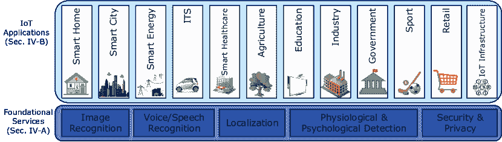

图 17：物联网应用及其基础服务。

### IV-A 基础服务

#### IV-A1 图像识别

许多物联网应用场景处理的输入数据形式为视频或图像。配备高分辨率摄像头的移动设备无处不在，方便每个人随时随地生成图像和视频。此外，智能摄像头在智能家居、校园和制造商等许多地方用于不同的应用。图像识别/分类和目标检测是这些设备的基本用途之一。

处理图像识别的物联网相关系统存在一个问题，即使用特定的源数据集来评估其性能。这些系统大多使用可用的公共图像数据集，如手写数字的 MNIST 数据集[51]、VGG 人脸数据集[74]、CIFAR-10 和 CIFAR-100 小图像数据集等。虽然这些数据集在与其他方法比较时表现良好，但它们未能展示物联网系统的特定特征。例如，智能联网汽车的车辆检测任务的输入不总是清晰的图像，可能在夜间或雨天、雾天的情况下。这些情况没有通过现有数据集处理，因此基于这些数据集训练的模型不够全面。

#### IV-A2 语音/声音识别

随着智能移动设备和可穿戴设备的广泛普及，自动语音识别正成为人们与设备互动的更自然、更便捷的方式[90]。此外，如今移动设备和可穿戴设备的体积较小，减少了触摸屏和键盘作为输入和互动方式的可能性。然而，在资源受限的设备上提供语音/声音识别功能的主要问题是其能源消耗，特别是当数据通过神经网络处理时。在典型的语音识别神经网络模型中，语音数据作为原始输入提供给网络。数据通过隐藏层处理，语音数据与特定语音声音的可能性在输出层呈现。

Price 等人 [91] 报告了他们为自动语音识别构建了一个专用的低功耗 DL 芯片。这个新型专用芯片消耗的能量极少，介于 0.2 到 10 毫瓦之间，比当前手机上运行语音识别工具的能量消耗少 100 倍。在这个新芯片中，实现了用于语音识别的深度神经网络（DNN）。为了节省能量，设计了三个不同复杂度的语音活动识别级别，每个级别都有一个不同复杂度的神经网络。最低复杂度的网络，因此消耗最低的能量，通过监测环境中的噪音来检测语音活动。如果该网络识别到语音，芯片会运行下一个复杂度级别的识别网络，其任务是声学建模，以确定语音是否类似于语言。如果这个网络的输出结果具有较高的可能性，则触发消耗最高能量的第三个网络运行，以识别单个词汇。

#### IV-A3 室内定位

提供位置感知服务，例如室内导航和零售商中的位置感知营销，正在室内环境中变得越来越普遍。室内定位也可能在物联网的其他领域中具有应用，例如智能家居、智能校园或医院。这些应用生成的输入数据通常来自不同的技术，如视觉、可见光通信（VLC）、红外、超声波、WiFi、RFID、超宽带和蓝牙。对于基于 WiFi 或蓝牙的方法，大多数文献使用了移动电话来接收来自固定发射器（即接入点或 iBeacons）的信号，这些信号称为指纹。在这些指纹识别方法中，几个尝试报告了使用 DL 模型来预测位置 [92, 93, 94]。

深度学习（DL）已被成功用于高精度室内定位。在一个名为 DeepFi 的系统中 [92]，采用了基于指纹的 WiFi 信道状态信息数据的 DL 方法来识别用户位置。该系统包括离线训练和在线定位两个阶段。在离线训练阶段，DL 被用来基于之前存储的信道状态信息指纹训练所有权重。其他研究 [93], [94] 报告了在提取特征和估计位置时使用了 DL 模型的变体与其他学习方法的结合。这些实验表明，DL 模型中的隐藏层数量和单元对定位精度有直接影响。在 [95] 中，通过融合磁性和视觉感知数据使用了卷积神经网络（CNN）进行室内定位。此外，在 [96] 中，通过分析周围场景的图像训练了 CNN 以确定用户的室内位置。

Lu 等人还使用 LSTM 网络来定位足球机器人[97]。在这个应用中，来自多个传感器的数据，即惯性导航系统（INS）和视觉感知，经过分析以预测机器人位置。作者报告称，与两种基线方法，即标准扩展卡尔曼滤波（EKF）和静态粒子滤波相比，准确性和效率得到了改善。

#### IV-A4 生理和心理状态检测

物联网（IoT）结合深度学习（DL）技术也被用于检测人类的各种生理和心理状态，如姿势、活动和情绪。许多 IoT 应用程序集成了一个用于人体姿势估计或活动识别的模块，以提供其服务，例如智能家居、智能汽车、娱乐（如 Xbox）、教育、康复和健康支持、体育以及工业制造。例如，智能家居中的便利应用是基于对居住者姿势的分析构建的。摄像头将居住者的视频传输到 DNN，以找出人物的姿势，并据此采取最合适的行动。Toshev 等人[98]报告了一个使用 CNN 模型实现此目标的系统。这类服务还可以用于教育中监测学生的注意力，以及在零售店中预测顾客的购物行为[99]。

Ordonez 等人[100]提出了一种 DL 框架，该框架结合了 CNN 和 LSTM 神经网络的优势，用于从可穿戴传感器数据（加速度计、陀螺仪等）中进行人类活动识别。他们的模型包括四个带 ReLU 的卷积层，后跟两个 LSTM 层和一个 softmax 层。他们显示这种组合在平均上比仅基于卷积层的基线模型提高了$4\%$。Tao 等人的研究[101]也使用了 LSTM 架构来基于手机传感器数据进行人类活动识别。Li 等人[102]还报告了基于深度 CNN 使用来自被动 FRID 标签的原始数据来检测创伤室中的医疗活动（例如血压测量、口腔检查、心电图导联放置等）。

在[103]中，提出了一种结合 CNN 和 RNN 的模型用于视频帧中的手势识别。与没有这种组合的模型相比，该模型显示出更好的结果，并强调了递归组件对这种任务的重要性。在[104]中，Fragkiadaki 等人提出了一种名为 Encoder-Recurrent-Decoder（ERD）的 DNN 模型，用于视频和动作捕捉数据集中的人体姿势识别和运动预测。该模型由一个在递归层之前的编码器和一个在递归层之后的解码器组成。这个架构在此应用中表现出比条件限制玻尔兹曼机（CRBMs）更好的效果。

除了物理运动之外，从视频帧中估计人类情感也在 [105] 中进行了研究，该模型包括卷积神经网络（CNN）、深度置信网络（DBN）和自编码器（AE）。此外，[106] 中的研究使用了移动惯性传感器数据进行运动检测。研究确认，人类运动模式可以用作用户身份识别和认证的来源。该系统中使用的模型是卷积层和时钟递归神经网络（RNN）的组合。

#### IV-A5 安全性和隐私

安全性和隐私是所有物联网（IoT）领域和应用中的主要关注点。智能家居、智能交通系统、工业、智能电网以及许多其他领域都将安全性视为一个关键要求。实际上，系统功能的有效性依赖于保护其机器学习工具和过程免受攻击者的侵害。

虚假数据注入（FDI）是对数据驱动系统的一种常见攻击类型。在 [107] 中，He 等人提出了一种条件深度置信网络（DBN），从智能电网的历史数据中提取 FDI 攻击特征，并利用这些特征进行实时攻击检测。[108] 中的工作也与可能发生在车辆网络中的异常检测有关。

智能手机作为物联网数据和应用的重要贡献者，也面临着严重的黑客攻击威胁。因此，保护这些设备免受各种安全问题的影响，对于物联网的视角来说，不仅仅是用户关注的问题。袁等人 [109] 提出了一个深度学习框架，用于识别 Android 应用中的恶意软件。他们的架构基于深度置信网络（DBN），报告了检测恶意软件应用的准确率为 96.5%。

深度机器学习方法的安全性和隐私保护是这些方法在物联网领域被接受的最重要因素。Shokri 等人 [110] 提出了一个方法来解决深度学习模型在分布式学习时的隐私保护问题。他们的方法能够同时保护参与者训练数据的隐私和模型的准确性。他们的方法核心基于这样一个事实：许多深度学习架构中使用的随机梯度下降优化算法可以并行和异步地执行。各个参与者可以独立地在自己的数据上训练模型，并将部分模型参数与其他参与者共享。Abadi 等人 [111] 也提出了一种使用差分隐私随机梯度下降算法来保证深度学习模型隐私的方法。

### IV-B 应用

#### IV-B1 智能家居

智能家居的概念涉及基于物联网的一系列应用，这些应用可以提高家庭的能源使用效率，以及住户的便利性、生产力和生活质量。如今，家电可以连接到互联网并提供智能服务。例如，微软和 Liebherr 在一个合作项目中应用了 Cortana 深度学习来分析从冰箱内部收集的信息[112]。这些分析和预测可以帮助家庭更好地控制家庭用品和开支，并且结合其他外部数据，可以用于监测和预测健康趋势。

在美国，超过三分之一的发电电力被住宅部门消耗[113]，其中暖通空调（HVAC）和照明设备是建筑物中最大的一部分消费来源。预计通过智能能源管理和家电效率提升，这种需求将以较慢的速度增长。因此，控制和提高能源效率及预测未来需求是智能家居系统的必要功能。在智能家居应用中，电力负荷预测是最常见的应用之一，它采用不同的深度学习网络来解决任务。Manic 等人[113]对三种深度学习架构（包括 LSTM、LSTM Sequence-to-Sequence（S2S）和 CNN）的家庭能源消费负荷预测进行了比较分析。他们的结果表明，LSTM S2S 对未来使用的预测优于其他架构，其次是 CNN，然后是 LSTM。他们还将相同的数据集与传统的人工神经网络（ANN）进行了比较，所有上述模型均优于 ANN 模型。

#### IV-B2 智能城市

智能城市服务涵盖了多个物联网领域，如交通、能源、农业[114]等。然而，从机器学习的角度来看，这一领域更具吸引力，因为来自不同领域的异质数据会形成大数据，通过深度学习模型分析可以产生高质量的输出。智能城市通过其他领域的进展实现了对整个城市的高效资源管理。例如，为了改善公共交通基础设施并提供改进的服务，分析和提取公共交通行为中的模式对地方当局来说非常重要。

东芝最近与戴尔技术公司共同开发了一个深度学习测试平台，并在日本川崎的智能社区中心使用该测试平台，以评估在中心收集的数据[115]。运行测试平台的目的是衡量在物联网生态系统中使用深度学习架构的有效性，并确定服务改进的最佳实践，包括提高机器可用性、优化监测传感器和降低维护费用。供给测试平台的大数据来自建筑管理、空调和建筑安全。

智慧城市中的一个重要问题是预测人群移动模式及其在公共交通中的应用。宋等人[116]开发了一个基于深度神经网络（DNN）模型的系统，以实现这一目标。他们的系统建立在四层 LSTM 神经网络之上，从人类移动数据（GPS 数据）及其交通转换模式（如停留、步行、自行车、汽车、火车）中学习。他们将人们的移动预测和交通模式预测视为两个独立的任务，而不是将所有特征结合在一起。因此，他们的学习系统基于多任务深度 LSTM 架构，以联合学习这两组特征。选择 LSTM 是因为人类移动模式的时空特性。作者断言，他们基于多任务深度 LSTM 的方法比仅有单层 LSTM 的浅层 LSTM 以及没有多任务处理的深层 LSTM 更具优势。

梁等人[117]提出了一个实时人群密度预测系统，该系统在交通站点利用手机用户的通信数据，即呼叫详细记录（CDR）。CDR 数据是在用户进行通信操作（如电话、短信、彩信和互联网访问）时收集的，通常包括用户 ID、时间、位置和用户的通信行为。他们基于 RNN 模型构建了这个系统，用于地铁站，并报告了比非线性自回归神经网络模型更准确的预测结果。

废物管理和垃圾分类是智慧城市的另一个相关任务。一种实现这种自动化的简单方法是通过基于深度 CNN 的视觉分类，正如[81]所做的那样。监测空气质量和预测污染是城市管理的另一个方向。李等人[118]开发了一个基于深度学习（DL）的空气质量预测模型，使用堆叠自编码器（AE）进行无监督特征提取，并使用逻辑回归模型进行最终预测的回归。

Amato 等人在 [119] 开发了一个去中心化系统，用于通过智能摄像头和深度 CNN 识别停车场的占用和空闲车位。作者在配备有 Raspberry Pi 2 型号的智能摄像头上部署了一个小型 CNN 架构。这些嵌入式设备可以在每个设备上运行 CNN，将单个停车位的图像分类为占用或空闲。然后，摄像头仅将分类结果发送到中央服务器。Valipour 等人 [120] 也开发了一种使用 CNN 检测停车位的系统，与 SVM 基线相比，结果有所改善。表 III 总结了上述尝试。

表 III: 智能城市中的典型基于 IoT 的服务

| 服务 | 参考文献 | 输入数据 |
| --- | --- | --- |

&#124; DL &#124;

&#124; 模型 &#124;

|

| --- | --- | --- | --- |
| --- | --- | --- | --- |
| 人群密度/交通预测 | [116] | GPS/过渡模式 | LSTM |
| [117] |

&#124; 电信 &#124;

&#124; 数据/CDR &#124;

| RNN |
| --- |

|

&#124; 废物 &#124;

&#124; 管理 &#124;

| [81] | 垃圾图像 | CNN |
| --- | --- | --- |

|

&#124; 停车场 &#124;

&#124; 管理 &#124;

| [119, 120] |
| --- |

&#124; 停车场的图像 &#124;

&#124; 空间 &#124;

| CNN |
| --- |

#### IV-B3 能源

能源消费者和智能电网之间的双向通信是 IoT 大数据的来源。在这种背景下，智能电表在精细化能源消耗测量方面发挥了数据生成和采集的作用。能源供应商希望了解当地的能源消耗模式，预测需求，并基于实时分析做出适当的决策。Mocanu 等人 [121] 开发了一种 RBM 实时识别和预测建筑的能源灵活性。能源灵活性涉及在最小化对住户和操作的影响的同时调整家庭电力消耗。在上述工作中，预测了使用时间和单个电器的消耗，以实现灵活的能源控制。除了表现良好和准确性高之外，该模型的优点是可以同时进行灵活性识别和预测。在 [122] 中，使用了两种 RBM 变体来预测住宅的短期能耗。模型包括条件 RBM (CRBM) 和因子条件 RBM (FCRBM)。结果表明，FCRBM 的表现优于 CRBM、RNN 和 ANN。此外，通过扩展预测范围，FCRBM 和 CRBM 比 RBM 和 ANN 展示了更准确的预测。

在智能电网方面，预测太阳能、风能或其他类型的自然可持续能源的电力是一个活跃的研究领域。**深度学习**（DL）在该领域的许多应用中被越来越多地使用。例如，在[123]中，Gensler 等人研究了几种 DL 模型的性能，如 DBN、AE 和 LSTM，以及 MLP，用于预测 21 个光伏电站的太阳能发电量。在太阳能发电预测中，输入的主要元素是给定时间范围内的天气预报数值。从他们的评估来看，AE 和 LSTM 的组合（Auto-LSTM）相较于其他模型表现最好，其次是 DBN。Auto-LSTM 能取得良好预测成绩的原因在于它们能够从原始数据中提取特征，而 ANN 和 MLP 则无法做到这一点。在[86]中，提出了一种基于 LSTM 的在线预测系统，以预测 24 小时后的太阳耀斑能量。

#### IV-B4 智能交通系统

智能交通系统（ITS）数据是另一种每天变得无处不在的大数据来源。Ma 等人[79]提出了一个基于 DL 的交通网络分析系统。他们在并行计算环境中使用了 RBM 和 RNN 架构作为模型，并将参与的出租车的 GPS 数据作为模型的输入。他们的系统对交通拥堵演变的预测准确率报告为$88\%$，且计算时间不到 6 分钟。[124]也报告了短期交通流预测的研究。他们使用 LSTM 作为学习模型，并报告 LSTM 的准确率优于其他方法，包括 SVM、简单的前馈神经网络和堆叠 AE。对于不同的时间间隔（$15$、$30$、$45$和$60$分钟），LSTM 显示出最低的平均绝对百分比误差（MAPE）率。然而，对于 15 分钟的短时间间隔，SVM 的错误率略高于 LSTM 模型。这一结果可以通过短时间间隔内数据点较少，导致 LSTM 模型的分类任务中判别边界不如 SVM 模型来解释。在另一项研究[108]中，ITS 数据通过基于 DNN 的入侵检测系统，以提高车载网络通信的安全性。

ITS 也推动了交通标志检测和识别方法的发展。诸如自动驾驶、驾驶员辅助系统和移动地图等应用需要这种机制来提供可靠的服务。Cireşan 等人 [125] 提出了基于卷积和最大池化层的 DNNs 的交通标志识别系统。他们引入了一种包含多个独立 DNN 列的多列 DNN 架构，并报告了该方法的准确性有所提高。输入通过多个不同的预处理器进行预处理，然后随机选择几个列接收预处理后的输入以进行训练。最终预测输出是所有 DNN 输出的平均值。他们的结果表明，这种提出的方法以 $99.46\%$ 的识别率，能够比人类在该任务上多出 $0.62\%$ 的准确率来识别交通标志。

为了在实际场景中应用，这些分析需要实时进行。Lim 等人在 [126] 提出了基于 CNN 的实时交通标志检测，并已与通用 GPU 集成。他们报告了在光照变化的数据中，F1 测量值至少为 0.89。为了拥有更快的推理引擎，他们使用了具有两个卷积层的 CNN。

此外，自驾车使用 DNN 执行许多任务，如检测行人、交通标志、障碍物等。有几个初创公司在其自驾车中使用 DL 来执行街道驾驶中的不同任务 [127]。

#### IV-B5 医疗保健和健康

物联网（IoT）结合深度学习（DL）也被用于为个人和社区提供医疗保健和健康解决方案。例如，开发基于移动应用程序的解决方案以准确测量饮食摄入量是一个研究方向，可以帮助控制个人的健康和福祉。Liu 等人 [82] 和 [128] 开发了一个系统来识别食物图像及其相关信息，如种类和份量。他们的图像识别算法基于 CNN，并取得了与基准系统相媲美的结果。

医学图像分类和分析的深度学习是医疗领域的热门话题。例如，Pereira 等人[129]借鉴了 CNN 识别手写图像的思想，帮助早期识别帕金森病。他们的模型从智能笔的信号中学习特征，该笔使用传感器测量个体检查期间的手写动态。Muhammad 等人[130]提出了一种使用物联网和云框架的声音病理检测系统，其中患者的语音信号通过传感器设备捕获，并发送到云服务器进行分析。他们使用了通过语音信号训练的极限学习机来诊断病理。在[131]中，DL 被应用于从乳房 X 线摄影中检测心血管疾病。在他们的研究中，Wang 等人使用乳房动脉钙化（BAC）在乳房 X 线摄影中的表现作为冠状动脉疾病的标志。他们开发了一个有十二层的 CNN 来识别患者是否存在 BAC。他们的结果显示，他们的 DL 模型的准确性与人类专家一样好。尽管这项工作是离线进行的，但显示了在物联网环境中开发或扩展乳房 X 线摄影设备以进行这类疾病的在线和早期检测的潜力。

Feng 等人[132]报告了在家庭护理环境中使用 RBM 和 DBN 进行跌倒检测的情况。在这样的环境中，正常的姿势包括站立、坐着、弯腰和躺下。在地板上躺着超过阈值被认为是跌倒姿势。他们的评估显示，RBM 在分类准确度方面优于 DBN。其方法的限制包括缺乏大型数据集和执行离线检测。

研究人员还结合基于 RNN 的模型使用时间序列医学数据进行疾病的早期诊断和预测。Lipton 等人[133]研究了 LSTM 网络在分析和识别医疗测量多变量时间序列模式中的表现。他们系统的输入数据包括生命体征传感器数据以及实验室检测结果。他们的性能结果显示，基于原始时间序列数据训练的 LSTM 模型优于 MLP 网络。关于健康信息学中的 DL 的调查见[134]。

#### IV-B6 农业

生产健康的作物和开发高效的植物生长方式是健康社会和可持续环境的要求。利用 DNN 进行植物疾病识别已被证明是一种可行的解决方案。在 Sladojevic 等人[83]的研究中，作者开发了一种基于叶片图像分类的植物疾病识别系统。他们使用了基于 Caffe 框架实现的深度卷积网络模型。在这个模型中，可以以约$96\%$的准确率将$13$个类别的病叶与健康叶区分开。这种识别模型可以作为智能移动应用程序，帮助农民根据其移动设备拍摄的叶片图像识别水果、蔬菜或植物疾病。它还可以让他们根据补充数据选择治疗方法或农药。

DL 还被用于土地和作物检测与分类的遥感[135] [136] [137]。这些工作的方向使得大规模农业土地的自动化监控和管理成为可能。在大多数这类工作中，深度卷积网络用于从土地或作物的图像中学习。在[135]中，报告指出，使用 CNN 在检测主要作物（包括小麦、向日葵、大豆和玉米）时达到了$85\%$的准确率，同时超越了 MLP 和随机森林（RF）等其他方法。

此外，DL 已被报告用于自动农业的预测和检测任务。例如，[138]使用了基于深度 CNN 的 DL 模型进行农业领域的障碍物检测，这使得自主机器可以在其中安全操作。该系统能够以$90.8\%$到$99.9\%$的准确率检测标准化物体，具体取决于领域（例如，行作物或草坪修剪）。

此外，水果检测和确定水果的成熟阶段（生或熟）对自动化采摘至关重要。在[139]中，Sa 等人使用了一种称为基于区域的 CNN 的 CNN 变体，用于水果的图像分析。系统的输入图像有两种模式：一种包含 RGB 颜色，另一种是近红外的。这些图像的信息在模型中结合，并且相较于基于像素的训练模型，检测效果有所提升。

#### IV-B7 教育

IoT 和 DL 促进了从幼儿园到高等教育的教育系统效率。移动设备可以收集学习者的数据，深度分析方法可以用于预测和解释学习者的进展和成就。增强现实技术结合可穿戴设备和移动设备也是 DL 方法在该领域的潜在应用，以激励学生，使课程和学习变得有趣，并使教育学习方法更高效 [140, 141]。此外，DL 可以作为个性化推荐模块 [142]，向教育者推荐更相关的内容。DL 在其他领域的应用，如自然语言翻译和文本摘要，也将有助于智能教育，尤其是在移动设备上的在线学习。

此外，大规模开放在线课程（MOOCs）的出现及其在学生中的流行导致从这些课程的学习者行为中生成了大量数据。MOOCs 分析可以帮助识别在课程早期阶段有困难的学生，并为这些学生提供足够的支持和关注，以实现更好的表现。Yang 等人 [143] 提出了一种预测 MOOCs 中学生成绩的方法。他们使用了从学生观看视频和与之互动时收集的点击流数据。点击流数据被输入到一个时间序列 RNN 中，该网络从以往的表现和点击流数据中学习。此外，Piech 等人应用了 RNN 和 LSTM 网络来建模对练习和测验的教育者回答的预测，基于他们在 MOOCs 中的过去活动和互动 [144]。结果显示，相较于使用隐马尔可夫模型（HMM）更新单一概念概率的贝叶斯知识追踪（BKT）方法，改进了预测效果。Mehmood 等人 [77] 还利用 DNN 实现了基于 IoT 技术的个性化普适电子教学和学习框架，旨在智能城市中开发和提供教育内容。他们提出的框架建立在 IoT 基础设施（如智能手机传感器、智能手表传感器、虚拟现实技术）之上，连接用户以优化教学和学习过程。他们使用 DNN 进行人类活动识别，以向学生提供自适应教育内容。

课堂占用监测是 Conti 等人[145] 研究的另一个应用。在这项工作中，作者提出了基于 CNN 架构的两种方法用于头部检测和密度估计，以计数教室中的学生。这些算法已经在现成的嵌入式移动 ARM 平台上部署。他们的算法接收来自三个教室的摄像头拍摄的图像，图像采集率为每 $10$ 分钟三张照片。他们报告称，算法的均方根（RMS）误差最大为 $8.55$。

#### IV-B8 工业

对于工业部门，物联网（IoT）和网络物理系统（CPS）是推动制造技术向智能制造（即工业 $4.0$）发展的核心要素。在这些应用中，提供高精度智能系统至关重要，因为这直接导致了装配/生产线效率和生产力的提升，以及维护费用和操作成本的降低。因此，深度学习（DL）可以在这一领域发挥关键作用。实际上，工业中的广泛应用（如生产线的视觉检查、物体检测和追踪、控制机器人、故障诊断等）都可以受益于深度学习模型的引入。

在[78]中，使用包含 AlexNet 和 GoogLeNet 的 CNN 架构在不同平台（Caffe、Tensorflow 和 Torch）上进行了视觉检查。在这项工作中，多个生产线上的车辆图像及其注释被提交给一个深度学习系统。结果发现，使用 Tensorflow 时性能最佳，准确率达到 $94\%$。此外，Tensorflow 在训练时间方面是最快的框架，其模型在更短时间内达到了最高准确率，其次是 Torch，然后是 Caffe。

Shao 等人[146] 使用深度神经网络（DNNs）进行旋转设备故障诊断（也称为故障检测与分类（FDC））系统中的特征提取。开发了使用去噪自编码器（DAE）和压缩自编码器（CAE）的模型。这些模型学到的特征都使用了一种称为局部保持投影（LPP）的方法进行了优化，并输入到一个软最大分类器中进行故障诊断。系统的输入是旋转设备的振动数据。在他们的系统中，考虑了七种操作条件，包括正常操作、摩擦故障、四种不平衡故障和复合故障（摩擦和不平衡）。根据振动数据，诊断系统识别设备是否处于正常状态或其中一种故障状态。根据他们对转子和机车轴承设备故障诊断的实验，提出的方法报告显示优于卷积神经网络（CNN）和浅层学习方法。

在 Lee [147] 报告的另一项研究中，提出了一种与物联网（IoT）部署和云平台结合的 DBN 模型，用于支持汽车前大灯模块中缺陷类型的故障检测。结果确认 DBN 模型在测试数据集的错误率方面优于使用 SVM 和径向基函数（RBF）的两种基线方法。然而，DBN 模型在训练数据集上的错误率与 SVM 模型相当。

针对噪声环境中的故障检测和分类（FDC）问题，[148] 使用了堆叠去噪自编码器（SdA），以减少机械和电气干扰引起的传感数据噪声，并进行故障分类。他们的系统被应用于光刻工艺中晶圆样品的故障检测。结果表明，SdA 在噪声环境中比包括 K-最近邻和 SVM 在内的几种基线方法准确度提高了$14\%$。Yan 等人[149]也将 SdA 与极限学习机结合用于燃气涡轮燃烧系统行为的异常检测。根据他们的结果，使用 SdA 学习到的特征比系统中手工制作的特征具有更好的分类准确性。

#### IV-B9 政府

政府可以通过物联网（IoT）和深度学习（DL）的融合带来的增强和智能连接获得巨大的潜在优势。确实，各种与政府或城市管理当局相关的任务需要精确的分析和预测。例如，自然灾害（如滑坡、飓风、森林火灾等）的识别和预测以及环境监测对于政府采取适当措施至关重要。Liu 等人[150] 提出了将光学遥感图像输入深度自编码器网络和 softmax 分类器的方法来预测地质滑坡。该方法的准确率报告为$97.4\%$，因此超越了 SVM 和 ANN 模型。在另一项研究[151]中，使用了 LSTM 网络来预测地震。他们使用了来自美国地质调查网站的历史数据进行训练。该系统显示出 1-D 和 2-D 输入数据下分别达到$63\%$和$74\%$的准确率。在 Liu 等人[84]的另一项研究中，使用了 CNN 架构来检测极端气候事件，如热带气旋、大气河流和天气锋面。他们系统中的训练数据包括气候事件的图像模式。作者在 Neon 框架中开发了他们的系统，达到了$89\%$-$99\%$的准确率。

此外，城市基础设施如道路、水管等的损坏检测也是物联网（IoT）和深度学习（DL）可以为政府带来好处的另一个领域。在[152]中，使用深度神经网络（DNNs）解决了道路损坏检测问题，这些网络通过众包获得数据，而这一过程可以通过物联网设备实现。市民可以通过移动应用将损坏情况报告给平台。然而，这些市民缺乏准确评估道路损坏状态的专业知识，这可能导致不确定或错误的评估。为了消除这些情况，应用程序可以通过分析现场图像来确定道路损坏的状态。这一分析由一个深度卷积神经网络（CNN）执行，该网络通过市民报告和道路管理者检查结果进行训练。由于训练阶段超出了手机的能力，深度学习模型在服务器上创建并每天进行训练。然后，Android 应用程序可以在每次启动时从服务器下载最新模型，并识别通过图像报告的道路损坏状态。评估显示在移动设备上进行 $1$ 秒分析时，损坏分类的准确率为 $81.4\%$。

#### IV-B10 体育与娱乐

体育分析近年来迅速发展，并在为团队或球员带来竞争优势方面发挥了重要作用。如今，专业体育团队都有专门的部门或员工负责分析工作[153]。这一领域的分析和预测可以用于跟踪球员的行为、表现、得分捕捉等。深度学习在这一领域是新的，只有少数工作使用了深度神经网络（DNNs）进行不同的运动分析。

在[154]中，提出了一种深度学习方法，用于创建智能篮球场。该系统利用支持向量机（SVM）从场地周围的可用摄像机中选择最佳摄像机进行实时广播。他们还将篮球能量图像⁴⁴篮球能量图像是篮球在热点区域的时空轨迹。热点区域包括篮球架、篮筐和篮筐。输入到一个卷积神经网络（CNN）中，以区分投篮和未得分的片段，从而提供准确的在线得分报告和有趣的高光片段。该系统在捕捉得分片段时显示出 $94.59\%$ 的准确率，每帧处理时间为 $45$ 毫秒。

在 Wang 等人的另一项研究中[155]，使用了 RNN 对 NBA 比赛中的进攻篮球动作进行分类。作者使用了来自 SportVU⁵⁵5http://go.stats.com/sportvu 数据集的视频片段。该数据集提供了每秒 $25$ 帧的视频，以检测球员的唯一 ID、他们在场上的位置以及篮球的位置。他们的模型显示，顶级准确率和前三准确率分别达到了 $66\%$ 和 $80\%$。类似地，[156] 使用了带有 LSTM 单元的 RNN 对相同数据集进行了三分球成功率的预测，并报告了比梯度提升机（GBM）和广义线性模型（GLM）更好的分类准确率。

Kautz 等人[157]研究了排球运动员活动的识别。采用了可穿戴传感器数据和 CNN 来完成这项任务，并观察到 $83.2\%$ 的分类准确率来识别运动员活动。

群体活动识别是体育团队的另一个有趣方向。Ibrahim 等人[158]使用层次 LSTM 模型在排球团队中研究了这一选项。在这项工作中，建立了一个单一的 LSTM 模型来推断每个球员的活动，并设计了一个顶级 LSTM 模型来聚合各个模型，以识别团队的整体行为。CNN 模型被用来从视频帧中提取特征，并将这些特征输入到各个 LSTM 模型中。与多个基线模型相比，提出的层次模型获得了更好的分类结果。

#### IV-B11 零售

由于移动设备的普及，在线购物大幅增加。最近观察到了一种通过视觉搜索技术进行产品图像检索的趋势[159]。CNN 被用于服装和时尚市场的视觉搜索，以查找在线商店中与您在电影[160]或街道[161]上看到的相同或相似的商品。

此外，视力障碍人士的购物需要变得更加便利。包括智能购物车在内的 IoT 技术与 DL 方法相结合，可以解决这个问题。在[162]中，设计了一种视觉购物辅助系统，包括智能眼镜、手套和购物车，以帮助视力障碍人士购物。该系统还使用 CNN 来检测过道中的商品。

此外，零售店的结账柜台通常是人们排队付款的瓶颈。智能购物车的发展可以实现实时自助结账，通过增强这种系统的预测能力，可以根据顾客的过往购物记录提供可能需要的商品。

此外，向购物者推荐商品是 IoT 在零售中的一个热门应用，它使用不同的技术，如 BLE 信号或视觉摄像头。后一种方法可以通过识别商店商品或购物者动作（例如，伸手拿到货架上的商品、从货架上撤回等）[163]，并提供与检测到的动作相关的商品列表。

为了分析顾客对商品的兴趣，Liu 等人[99] 提出了一个基于 DNN 的顾客姿态和方向估计系统，该系统由 CNN 和 RNN 组成。输入数据来自监控摄像头。CNN 网络用于提取图像特征。然后，将图像特征和最后预测的方向特征输入 RNN，以获得输出姿态和方向。

#### IV-B12 智能 IoT 基础设施

IoT 环境包括大量传感器、执行器、媒体以及其他生成大规模 M2M 和网络流量数据的设备。因此，这些设备的管理、监控和协调需要处理这些大数据，运用先进的机器学习技术，以识别瓶颈、提高性能，并保证服务质量。

基础设施管理中一个常见的任务是异常检测。例如，Feng 等人提出了使用 AE 进行无线通信中的频谱异常检测[164]。在这项工作中，开发了一个 AE 模型来检测可能由于通信通道信噪比的突然变化而发生的异常。该模型基于输入信号的时频图训练。结果表明，深层 AE 比传统的浅层网络表现更好。Lopez-Martin 等人[165] 和 Shone 等人[166] 分别使用条件 VAE 和深层 AE 进行网络入侵检测。在条件 VAE 中，样本标签作为额外输入与潜在变量一起传递到解码器网络。

IoT 流量的微小痕迹可能不会导致骨干网络拥堵。然而，大量 IoT 设备同时访问频道的需求可能会导致频道访问阶段的竞争。当访问延迟增加时，频道访问中的竞争会变成严重问题[167]。因此，负载均衡是一个可行的解决方案，DL 模型可以通过预测流量指标和建议备用路线来实现负载均衡。Kim 等人[168]使用 DBN 进行 IoT 中的负载均衡。他们的 DL 模型在大量用户数据和网络负载上进行训练。干扰识别也可以由 DNN 处理，正如 Schmidt 等人[169]所示，提出了一种基于 CNN 的无线干扰识别系统。Ahad 等人[170]提供了一项专注于神经网络在无线网络中应用的调查。他们回顾了关于服务质量和体验质量、负载均衡、改进的安全性等相关文献。

由于新兴的第五代（5G）蜂窝网络构成了 IoT 基础设施的主要支柱之一，因此有必要利用尖端技术来提升蜂窝网络的各个方面，包括无线资源管理、移动性管理、服务提供管理、自组织，并寻找复杂配置问题的高效准确解决方案[171]。作为这些努力的一部分，使用众包蜂窝网络数据（例如信号强度）可以帮助提出可靠的解决方案。例如，这些大数据可以用于创建更精确的蜂窝网络覆盖图，以提高网络性能[172]，正如 OpenSignal 移动应用程序所做的[173]。

### IV-C 经验教训

在本节中，我们识别了五类 IoT 服务作为可以广泛应用于各种 IoT 应用的基础服务。我们讨论了深度学习（DL）如何被用来实现这些服务。此外，我们还深入探讨了多个 IoT 领域，以了解它们如何利用 DL 提供智能服务。表格 IV 显示了在 IoT 领域中利用基础服务的工作。

许多物联网领域和应用从图像识别中受益匪浅。预计随着嵌入智能手机的高分辨率相机将使图像和视频数据的生成变得更容易，兴趣会增长得更快。其他基础应用的使用，特别是生理和心理检测以及本地化，已经在不同领域得到了体现。然而，安全和隐私服务的利用显然有限。这是智能物联网应用开发中的一个缺口，因为潜在的黑客和攻击者活动被忽视了。此外，深度学习（DL）中的语音识别在智能家居、教育、智能交通系统（ITS）和行业等多个领域的物联网应用中尚未得到广泛应用。尽管有些工作使用了传统的机器学习方法进行语音识别，但深度学习中的语音识别已经取得了显著的进展。语音识别技术在物联网应用中出现较少的一个原因是缺乏针对每个领域的全面训练数据集，因为训练语音识别深度神经网络（DNNs）需要大量的训练数据集。

基础服务需要快速的数据分析才能在其背景下高效。尽管在这一方向上已有若干研究，但基于深度学习（DL）的物联网快速数据分析仍有许多算法和架构的发展空间。

表 IV：物联网领域基础服务的使用情况。

|  | 物联网基础服务 |
| --- | --- |
| 图像识别 | 语音识别 |

&#124; 生理与 &#124;

&#124; 心理 &#124;

&#124; 检测 &#124;

| 本地化 |
| --- |

&#124; 安全与 &#124;

&#124; 隐私 &#124;

|

| 物联网领域 | 智能家居 |  |  |  |  |  |
| --- | --- | --- | --- | --- | --- | --- |
| 智能城市 | [81, 119, 120] |  |  | [116, 117] |  |
| 能源 |  |  |  |  | [107] |
| 智能交通系统（ITS） | [125, 126] |  |  |  | [108] |
| 医疗保健 | [82, 128, 129, 131] | [130] | [132] |  |  |
| 农业 | [83, 135, 136, 137, 138, 139] |  |  |  |  |
| 教育 | [145] |  | [77] |  |  |
| 行业 | [78, 147] |  |  | [54] |  |
| 政府 | [150, 152, 84] |  |  |  |  |
| 体育 | [154, 155, 156] |  | [157, 158] | [97] |  |
| 零售 | [159, 160, 161, 162] |  | [99] | [163] |  |

表 V 总结了各领域的研究及其深度学习（DL）模型。图 18 还展示了在不同研究工作中使用不同模型的频率。约 $43\%$ 的论文在构建其提出的系统时使用了卷积神经网络（CNN），而深度置信网络（DBN）使用较少（约 $7\%$）。作为时间序列模型的递归神经网络（RNN）和长短期记忆网络（LSTM）一起，在 $30\%$ 的工作中被使用。该表还强调了与图像识别相关的工作对物联网（IoT）应用的巨大影响。此外，三分之一的物联网应用与时间序列或序列数据相关，其中使用 RNN 是一种有帮助的方法。

#### IV-C1 复杂度与性能

Canziani 等人 [174] 分析了几种最先进的深度神经网络（DNN）模型，以找出它们的准确性、内存使用、操作次数、推理时间和功耗之间的关系。他们发现，准确性和推理时间呈双曲线关系，即准确性略微提高会导致计算时间大幅增加。他们还说明了网络模型中的操作次数与推理时间之间存在线性关系。他们的结果还表明，施加能量限制会限制可达到的最高准确性。关于内存占用和批量大小，结果显示，在模型的初始内存分配阶段，最大内存使用量是恒定的，随后随着批量大小的增加而线性增长。鉴于神经元是执行操作的模型的主要构建块，操作次数与神经元数量成正比。因此，复杂度可以用网络中的神经元数量来表示，增加神经元数量会直接影响运行时间。

然而，准确性与层数（即深度）或神经元数量之间并没有明确的关系。有报告指出，在将层数增加到某个点后，准确性会下降。例如，Zhang 等人[94] 主张隐藏层和神经元的数量直接影响定位系统的准确性。最初增加层数会得到更好的结果，但当网络变得更深时，结果开始下降。他们的最佳结果是在一个具有三个隐藏层的网络中获得的。另一方面，表示的深度已被证明对许多图像识别任务最为有利[30]。视觉任务的高准确性部分是由于引入了具有更大参数数量（例如，在[30, 175]中介绍的超过 $1000$ 层）的更深网络。还有许多超参数需要优化（例如，迭代次数、损失函数、激活函数、优化函数、学习率等），这些都使得开发优秀且准确的深度学习模型变得复杂。表 VI 总结了 DNN 模型在若干应用中的特性。在表中，测试时间是针对一个样本，除非另有说明。

#### IV-C2 陷阱与批评

深度学习（DL）模型被证明是朝着创建强大 AI 系统的一大步，但它们并不是解决所有问题的唯一方案。深度学习技术被认为是黑箱，虽然具有高预测性，但解释性较低。从科学角度来看，强大的预测能力是最理想的，而从商业角度来看，则更倾向于模型的可解释性和可说明性[176]。在[177]中，Chollet 认为需要推理、长期规划和类似算法的数据操作的问题，无法通过深度学习模型解决。这是因为深度学习技术的本质是将一个向量空间转换成另一个向量空间，无论你输入多少数据。

此外，关于 DNN 模型的性能也有批评意见，认为传统模型可能取得相当的结果，甚至超越深度模型[178]。Chatfield 等人[179] 认为卷积层的维度可以缩小，而不会对性能产生不利影响。他们还讨论了，如果浅层技术使用常见于基于 CNN 的方法的数据增强技术，其性能可以达到类似于深度 CNN 模型的水平。Ba 等人[180] 通过多个实证测试表明，浅层 FNN 可以学习复杂函数并达到以前只有深度模型才能实现的准确率。在他们关于光通信系统的研究中，Eriksson 等人[181] 显示使用伪随机比特序列或短重复序列可能会导致对信噪比的过高估计。

通常，DL 模型对数据的结构和大小非常敏感。与浅层模型相比，当训练数据量大且属性范围广时，它们表现更好。否则，浅层模型通常能取得更好的结果。

表 V: 不同 DNN 模型在物联网领域的常见使用情况。

| 领域 | DNN 使用情况 |
| --- | --- |
| AE | CNN | DBN | LSTM | RBM | RNN |
| --- | --- | --- | --- | --- | --- |
| 图像识别 | [150] |

&#124; [81, 82, 83, 119, 120] &#124;

&#124; [125, 126, 129, 131] &#124;

&#124; [135, 138, 145] &#124;

&#124; [154, 158, 160] &#124;

| [147] | [156] |  | [155, 156] |
| --- | --- | --- | --- |

|

&#124; 生理学 & &#124;

&#124; 心理检测 &#124;

| [104, 105] |
| --- |

&#124; [98, 100, 102] &#124;

&#124; [103, 105, 106] &#124;

| [105] | [100, 101] |  | [103, 104, 106] |
| --- | --- | --- | --- |
| 定位 | [93, 94] | [95, 96] |  | [97] | [92] |  |
| 隐私和安全 |  | [110] | [107, 109] |  |  |  |
| 智能家居 |  | [113] |  | [113] |  |  |
| 智慧城市 |  | [81, 119, 120] |  | [116] |  | [117] |
| 能源 | [123] |  | [123] | [123] [86] | [121] [122] | [122] |
| 智能交通系统 |  | [125, 126] | [108] | [124] | [79] | [79] |
| 医疗保健 |  | [128, 82, 129, 131] | [132] | [133] | [132] |  |
| 农业 |  | [83, 135, 136, 137, 138, 139] |  |  |  |  |
| 教育 |  | [145] |  | [144] |  | [143, 144] |
| 行业 | [146, 148, 149] | [78] | [147] |  |  |  |
| 政府 | [150] | [152, 84] |  | [151] |  |  |
| 体育 |  | [154, 157, 158] |  | [156, 158] |  | [155] |
| 零售 |  | [159, 160, 161, 162] |  |  |  | [163] |
| 物联网基础设施 | [164, 165, 166] | [169] | [168] |  |  |  |

表 VI：不同应用中的 DNN 大小和复杂度。 (NA: 不可用, C: 卷积层, F: 全连接层, FF: 前馈层, SG: 汇总（折叠）层, P: 池化层, LRN: 局部响应归一化层, SM: Softmax 层, L: LSTM 层, R: RNN 层, RBM: RBM 隐藏层)

| 工作 | 应用 | DNN 类型 | 深度 | 层大小 | 训练时间 | 测试时间 |
| --- | --- | --- | --- | --- | --- | --- |
| [79] | 交通分析 | RNN+RBM | 2 |

&#124; R(100)-RBM(150) &#124;

| NA | 354 (s), 整个测试集 |
| --- | --- |
| [92] | 本地化 |

&#124; RBM &#124;

&#124; DBN &#124;

|

&#124; 4 &#124;

&#124; 4 &#124;

|

&#124; 500-300-150-50 &#124;

&#124; 300-150-100-50 &#124;

| NA | NA |
| --- | --- |
| [93] | 本地化 |

&#124; SdA &#124;

&#124; DBN &#124;

&#124; ML-ELM &#124;

&#124; SDELM &#124;

|

&#124; 4 &#124;

&#124; 3 &#124;

&#124; 5 &#124;

&#124; 5 &#124;

|

&#124; 26-200-200-71 &#124;

&#124; 26-300-71 &#124;

&#124; 26-300-300-1500-71 &#124;

&#124; 26-300-300-1500-71 &#124;

|

&#124; 451 (s) &#124;

&#124; 110 (s) &#124;

&#124; 14 (s) &#124;

&#124; 24 (s) &#124;

| NA |
| --- |
| [94] | 本地化 | SdA | 5 | 163-200-200-200-91 | NA | 0.25 (s) |
| [98] | 姿态检测 | CNN | 12 |

&#124; C(55$\times$55$\times$96)-LRN-P- &#124;

&#124; C(27$\times$27$\times$256)-LRN-P- &#124;

&#124; C(13$\times$13$\times$384)- &#124;

&#124; C(13$\times$13$\times$384)- &#124;

&#124; C(13$\times$13$\times$256)-P- &#124;

&#124; F(4096)-F(4096)-SM &#124;

| NA | 0.1 (s) |
| --- | --- |
| [100] | 人类活动检测 | CNN+LSTM | 7 |

&#124; C(384)-C(20544)-C(20544)- &#124;

&#124; C(20544)-L(942592)- &#124;

&#124; L(33280)-SM &#124;

| 340 (min) | 7 (s), 整个测试集 |
| --- | --- |
| [101] | 人体活动检测 | LSTM | 5 |

&#124; L(4)-FF(6)-L(10)-SG-SM &#124;

| NA | 2.7 (毫秒) |
| --- | --- |
| [107] | FDI 检测 | DBN | 4 |

&#124; 50-50-50-50 &#124;

| NA | 1.01 (毫秒) |
| --- | --- |
| [109] | 恶意软件检测 | DBN | 3 |

&#124; 150-150-150 &#124;

| NA | NA |
| --- | --- |
| [120] | 停车位 | CNN | 8 |

&#124; C(64$\times$11$\times$11)-C(256$\times$5$\times$5)- &#124;

&#124; C(256$\times$3$\times$3)-C(256$\times$3$\times$3)- &#124;

&#124; C(256$\times$3$\times$3)-F(4096)-F(2)-SM &#124;

| NA | 0.22 (秒) |
| --- | --- |
| [126] | 交通标志检测 | CNN | 6 |

&#124; C(36$\times$36$\times$20)-P- &#124;

&#124; C(14$\times$14$\times$50)-P- &#124;

&#124; FC(250)-SM &#124;

| NA |
| --- |

&#124; 在 GPU 上 29.6 (毫秒) &#124;

&#124; 在 CPU 上 4264 (毫秒) &#124;

|

| [128] | 食品识别 | CNN | 22 |
| --- | --- | --- | --- |

&#124; 使用了 GoogLeNet [75] &#124;

| NA |
| --- |

&#124; 50 (秒) &#124;

|

| [135] | 作物识别 | CNN | 6 |
| --- | --- | --- | --- |

&#124; C(96$\times$7$\times$7)-P- &#124;

&#124; C(96$\times$4$\times$4)-P-F(96)-F(96) &#124;

| 12 (小时) | NA |
| --- | --- |
| [145] | 教室占用 | CNN | 5 |

&#124; C(6$\times$28$\times$28)-P- &#124;

&#124; C(16$\times$10$\times$10)-P-F(120) &#124;

| 2.5 (小时) | 2 (秒) (4 线程) |
| --- | --- |
| [146] | 故障诊断 | AE | 4 |

&#124; 300-300-300-300 &#124;

| NA | 91 (秒) |
| --- | --- |
| [152] | 道路损坏检测 | CNN | 8 |

&#124; 使用了 AlexNet [37] &#124;

| NA | 1.08 (秒) |
| --- | --- |
| [155] | 进攻动作分类 | RNN | 3 |

&#124; 10-10-11 &#124;

| NA | 10 (毫秒) |
| --- | --- |

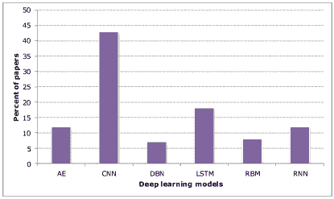

图 18: 使用深度学习模型的调查论文百分比

## V 物联网设备上的深度学习

在物联网时代之前，大多数深度学习研究的重点是改进其模型和算法，以便在问题规模增长到大数据时高效运行，通过尝试在云平台上部署高效模型。物联网的出现则开启了一个完全不同的方向，当问题规模缩小到资源受限的设备并且需要实时分析时。

智能对象需要支持某种轻量级的智能。由于 DL 在语音和视频应用中的成功结果，这些应用是物联网的基本服务和常见用途，将其模型和方法适应于资源受限设备成为一个非常关键的研究点。目前，DL 方法几乎无法用于物联网和资源受限设备的训练，因为 DL 模型需要大量的资源，如处理器、电池能量和内存。在某些情况下，现有的资源甚至不足以运行预训练的 DL 算法进行推理任务[80]。幸运的是，最近的研究显示，许多存储在 DNN 中的参数可能是冗余的[182]。有时也不需要使用大量的隐藏层来获得高准确性[180]。因此，高效地移除这些参数和/或层将显著降低这些 DNN 的复杂性，而不会显著降低输出质量[182, 180]，使其适合物联网。在本节的剩余部分，我们将探讨实现这些结果的方法和技术，并展示它们在不同领域的应用。

### V-A 方法与技术

DL 模型可能包含数百万甚至数十亿个参数，这需要复杂的计算和大量的存储资源。在这一部分，我们将深入探讨几种将 DL 模型应用于物联网嵌入式和资源受限设备的前沿方法。

#### V-A1 网络压缩

将 DNN 适应资源受限设备的一种方式是通过网络压缩，其中密集网络被转换为稀疏网络。这种方法有助于减少 DNN 在物联网设备上进行分类或其他推理时的存储和计算需求。这种方法的主要限制在于它们不够通用，无法支持所有类型的网络。它仅适用于能够表现出这种稀疏性的特定网络模型。

另一个有趣的研究是 Lane 等人 [80] 进行的，将压缩的深度学习模型应用于物联网设备。在这项研究中，作者测量了嵌入式、移动和可穿戴设备在运行深度学习算法时可以承受的不同因素。这些因素包括运行时间、能耗和内存占用。研究重点调查了 CNN 和 DNN 在三个用于物联网、移动和可穿戴应用的硬件平台上的表现，即一些智能手机和平板电脑中使用的 Snapdragon 800、用于可穿戴和形式因素敏感物联网的 Intel Edison，以及在智能手机和物联网车辆中使用的 Nvidia Tegra K1。Torch 被用于开发和训练 DNN，而 AlexNet [37] 是这些平台上使用的主要模型。他们的能耗测量表明，包括最弱的 Intel Edison 在内的所有平台都能够运行压缩模型。就 CNN 的执行时间而言，已显示后续卷积层的时间消耗趋向于随着其维度的减少而减少。

此外，已知前馈层比 CNN 中的卷积层要快得多。因此，改进资源受限设备上的 CNN 模型的一个好方法是尽可能将卷积层替换为前馈层。此外，选择 DNN 中使用的激活函数对时间效率有很大的影响。例如，几项测试表明，ReLU 函数比 Tanh 更具时间效率，其次是 Sigmoid。然而，相比于层的执行时间（至少 $25\%$），这种选择带来的整体运行时间减少并不显著（不到 $7\%$）。在内存使用方面，由于卷积层中存储的参数较少，CNN 使用的存储比 DNN 要少。

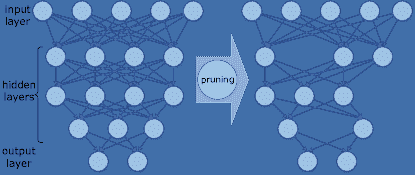

图 19：修剪 DNN 的总体概念。

如前所述，通过修剪冗余和不重要的参数来减少 DNN 中使用的参数数量，是使 DNN 在资源受限设备上可实施的另一个重要方法。这方面的首批工作之一是 $1989$ 年的《最优脑损伤》[183]。该方法的核心是使用参数的二阶导数来计算参数的重要性，并从网络中修剪掉不重要的参数。[184] 中提出的方法也基于修剪冗余和不必要的连接及神经元，以及使用权重共享机制。权重共享用来自共享表的 $n$ 位索引替代每个权重，该表具有 $2^{n}$ 种可能值。Han 等人 [184] 描述的修剪网络步骤包括：

+   •

    训练网络以查找高权重连接。

+   •

    修剪权重大于阈值的非重要连接。

+   •

    修剪后，可能会剩下一些没有输入或输出连接的神经元。修剪过程识别这些神经元并将它们及其所有剩余连接删除。

+   •

    重新训练网络以微调更新模型的权重。权重应从先前的训练步骤中转移，而不是初始化它们，否则性能会在一定程度上下降。

作者在四个与视觉相关的模型上评估了这种方法，即 AlexNet、VGG-16、LeNet-300-100 和 LeNet-5。模型在 AlexNet 上压缩了至少 9 倍，在 VGG-16 上压缩了 13 倍，而模型的准确度几乎得以保留。这种方法的一个限制是不能用于其他类型的 DNN 模型。此外，结果压缩后的网络在所有硬件平台和 CPU 架构上效率不够，因此需要能够处理动态激活稀疏性和权重共享的新型加速器。图 19 展示了修剪 DNN 的概念。

在 [185] 中，设计了一种名为 EIE 的推理引擎，采用了特殊的硬件架构和 SRAM 而非 DRAM，并显示其在压缩网络模型上表现良好。在这种架构中，定制的稀疏矩阵向量乘法和权重共享得到了处理，而不损失网络的效率。该引擎由可扩展的处理元素（PEs）数组组成，每个 PE 保留网络的一部分在 SRAM 中并执行相应的计算。由于神经网络使用的大部分能量用于访问内存，因此与相应原始网络的能量消耗相比，这种设计的加速器能量使用量减少了 120 倍。

表 VII：将深度学习应用于物联网设备的方法和技术

| 方法 / 技术 | 参考文献 | 优势 | 缺点 |
| --- | --- | --- | --- |
| 网络压缩 | [184] [186] [187] | •  减少存储和计算 |

&#124; •  对所有深度学习模型不通用 &#124;

&#124; •  需要特定的硬件 &#124;

&#124; •  修剪过程带来 &#124;

&#124; 训练过载 &#124;

|

| 近似计算 | [188, 189] |
| --- | --- |

&#124; •  制作快速的深度学习模型 &#124;

&#124; •  节省能源 &#124;

| •  不适合精确系统 |
| --- |
| 加速器 |

&#124; [91] [185] [190] &#124;

&#124; [191] [192] [193] &#124;

|

&#124; •  将深度学习模型与硬件集成 &#124;

&#124; •  高效计算 &#124;

| •

&#124; 不适用于传统的 &#124;

&#124; 硬件平台 &#124;

|

| DL 下的 Tinymote | [194] |
| --- | --- |

&#124; • 适合时间关键的物联网应用 &#124;

&#124; • 节能 &#124;

&#124; • 为数据提供更多的安全性和隐私 &#124;

|

&#124; • 特殊用途网络 &#124;

|

在 HashedNets[186]中，神经网络连接权重被随机分组到使用哈希函数生成的哈希桶中。所有落在同一桶中的连接由一个参数表示。反向传播用于在训练过程中微调这些参数。测试结果显示，这种基于哈希的压缩模型的准确性优于所有其他压缩基线方法。

Courbariaux 等人[187]的工作提议在推断阶段和整个训练阶段都将网络权重和神经元二值化，以减少内存占用和访问次数。该网络还可以通过位操作执行大部分算术运算，从而降低功耗。MNIST、CIFAR-10 和街景房屋号码（SVHN）[195] 数据集在 Torch7 和 Theano 框架下使用这种方法进行了测试，结果显示前景可期。

#### V-A2 近似计算

近似计算是另一种在物联网设备上实现机器学习工具并有助于其宿主设备节能的方法[188, 189]。这一方法的有效性源于这样一个事实：在许多物联网应用中，机器学习输出（例如预测）不必完全准确，而是要在一个可接受的范围内提供所需的质量。实际上，这些方法需要定义质量阈值，以确保输出不会超出这一范围。将深度学习模型与近似计算结合起来，可以为资源受限的设备提供更高效的深度学习模型。Venkataramani 等人[188] 提出了将近似计算扩展到神经网络，并将神经网络转换为近似神经网络。在他们的方法中，作者扩展了反向传播算法，以识别对输出准确性影响最小的神经元。然后，通过用近似神经元替换原网络中不重要的神经元来形成近似神经网络。制造近似神经元是通过一种叫做精度缩放的近似设计技术完成的。该技术不是使用典型的固定位数（16 位或 32 位格式）来进行计算，而是使用不同位数（$4$ - $10$ 位）。在形成近似网络后，调整神经元输入和权重的精度，以在准确性和能量之间取得最佳权衡。还有其他尝试报道了在卷积神经网络（CNNs）[189]和深度置信网络（DBNs）[196]中应用精度缩放的近似计算。然而，目前的实践要求在资源丰富的平台上进行模型的训练和转换为近似深度学习模型的过程，然后将转换后的模型部署到资源受限的设备上。

#### V-A3 加速器

设计特定的硬件和电路是另一个积极的研究方向，旨在优化物联网设备中深度学习模型的能效[191]和内存占用[192]。这类研究的重点是深度学习模型的推理时间，因为复杂模型的训练过程既费时又耗能。在[197]中，提出了几种提高物联网设备智能的方法，包括为深度神经网络（DNN）设计加速器，以及使用后 CMOS 技术如利用电子自旋机制的自旋电子学[198]。后者技术建议了向开发混合设备的方向发展，这些设备可以在相同的材料技术中进行数据存储、计算和通信。

在[190]和[191]的研究中，分别探讨了为深度神经网络（DNNs）和卷积神经网络（CNNs）开发加速器。除了硬件加速器之外，[193]中的工作提出了在移动设备上用于深度学习模型推理阶段的软件加速器。它在运行时采用了两种资源控制算法，一种用于压缩层，另一种用于在可用处理器之间分解深度架构模型。该软件加速器可以作为硬件加速器设计的补充方案。

#### V-A4 微型传感器

除了之前所有的解决方案之外，开发具有强大深度学习能力的微型处理器（微型传感器）正逐渐兴起[194] [199]。这些处理器设计在一个立方毫米的范围内，可以由电池驱动，在使用深度网络加速器进行板载分析和预测时仅消耗约$300$微瓦。通过这一技术，许多时间关键的物联网应用可以在设备上进行决策，而不是将数据发送到高性能计算机并等待响应。对于数据安全和隐私是主要关切的应用，这种硬件与深度学习的集成在一定程度上缓解了这些担忧，因为不需要或仅需有限的数据发送到云端进行分析。Moons 等人[200]还开发了一种用于 CNN 的微型处理器（总活跃面积为$1.2\times 2$ mm²），具有高效的能耗（功耗范围为$25$至$288$ mW）。

### V-B 应用

现有的移动应用程序使用预训练的深度神经网络进行分析和预测任务，例如使用 CNN 识别图像中的垃圾[81]。然而，这些应用程序的资源消耗仍然很高。实际上，[81]报告称返回预测响应的时间约为$5.6$秒，同时消耗$83$%的 CPU 和$67$ MB 的内存。Howard 等人[201]提出了用于移动和嵌入式视觉应用的 MobileNets 架构。通过将标准卷积层分解为深度卷积和$1\times 1$卷积，他们能够为 GoogleNet 和 VGG16 模型实现更小且计算效率更高的模型。他们还展示了模型的多个应用案例，包括目标检测、图像分类和识别面部特征。

Amato 等人 [119] 在 Raspberry Pi 板上运行了一个卷积神经网络（CNN），该网络被集成在智能摄像头中，以寻找空闲停车位。Ravi 等人在 [202] 中报告了一个移动设备的健身应用，该应用使用深度学习来分类人类活动。深度学习模型在标准计算机上训练，然后转移到移动平台进行活动识别。然而，为了提高准确性，深度学习模型的输入与几个工程特征混合在一起。正如作者所描述的，专门为资源受限设备设计的深度神经网络（DNN）模型的层数较少，可能是导致其性能较差的潜在原因。此外，如果训练数据未能充分代表整个生态系统，性能也将不令人满意。

Nguyen 等人 [203] 提出了一个概念性的软硬件框架，以支持物联网智能应用。该框架由一个认知引擎和一个智能连接组件组成。认知引擎为智能对象提供认知功能，利用了深度学习算法和博弈论决策分析。为了适应物联网，这些算法必须部署在低功耗的专用处理器上。智能连接组件与认知无线电收发器和基带处理器集成，以提供灵活且可靠的物联网智能对象连接。

### V-C 经验教训

在本节中，讨论了支持物联网（IoT）嵌入式和资源受限设备上的深度学习（DL）的需求。由于物联网设备的对手特征和深度学习技术使得这个方向更加具有挑战性，因为物联网设备由于资源限制，几乎无法承载深度学习模型，甚至无法仅仅进行预测。为了应对这些挑战，最近的文献中介绍了几种方法，包括：

+   •

    DNN 压缩

+   •

    深度学习的近似计算

+   •

    加速器

+   •

    Tinymotes 与深度学习。

这些方法集中于现有或预训练深度学习模型的推理功能。因此，在资源受限和嵌入式设备上训练深度学习模型仍然是一个开放的挑战。将训练过程转移到物联网设备上是实现物联网设备可扩展和分布式部署的目标。例如，在一个社区中部署数百个智能安防摄像头进行基于面部的认证，每个摄像头的训练过程可以在现场进行。网络压缩涉及通过多个训练轮次识别深度神经网络中的不重要连接和神经元。虽然这是一个接近物联网设备实时分析的有前途的方法，但需要进行更多研究以处理诸如以下挑战：

+   •

    尚不清楚网络压缩方法是否适合数据流，特别是当深度学习模型是动态的并且可能随时间演变时。

+   •

    时间序列架构（如 RNN 和 LSTM）的压缩方法尚未得到充分研究，存在一个缺口，尚不清楚现有的压缩方法是否适用于这些 DL 架构。

+   •

    需要明确 DNN 的压缩率和准确性之间的权衡，因为更多的压缩会导致准确性的下降。

最近，近似计算方法也被用于简化 DL 模型并提高能效，以便在资源受限的设备上运行。与网络压缩技术类似，这些方法也利用了不重要的神经元。然而，它们并不改变网络结构，而是通过减少位长来改变计算表示。因此，这些方法似乎适用于各种 DL 架构，甚至可以涵盖网络模型在运行时的动态演变。保持准确性和能量使用之间的平衡是它们的共同目标。尽管如此，仍需进一步研究以确定这些方法中哪一种在将 DL 模型嵌入到 IoT 设备中的优越性。

此外，我们讨论了旨在高效运行 DL 模型于嵌入式和资源受限设备上的特殊小型硬件的出现。这些架构由于其较低的资源需求和对时间敏感 IoT 应用的适用性，可以应用于可穿戴设备、移动设备和 IoT 设备。然而，它们对任何类型的 DNN 的通用性以及与现有硬件平台的互操作性和兼容性仍然是明显的挑战。

表 VII 总结了近期文献中用于在 IoT 设备上托管 DL 分析的方法和技术，以及它们的优缺点。

我们还回顾了一些在资源受限设备上实施 DL 的应用。由于上述挑战，这一类别的成熟应用并不多。然而，通过解决这些挑战和障碍，我们将看到许多 IoT 应用的崛起，其中核心 DL 模型被嵌入到传感器、执行器和 IoT 智能对象中。

## VI 雾计算和云计算中心的 DL 用于 IoT

云计算被认为是 IoT 大数据分析的一个有前景的解决方案。然而，对于具有安全、法律/政策限制（例如，数据不应传输到国家领土之外的云中心）或时间限制的 IoT 数据，这可能并不理想。另一方面，为了某些分析目的，数据的高级抽象应该通过汇总多个 IoT 数据源来获得；因此，在这些情况下，仅在单个 IoT 节点上部署分析解决方案是不够的。

不仅仅依赖云计算，最近提出了将计算和分析更接近最终用户/设备的理念，这被称为雾计算。依赖雾计算分析，我们可以在享受云计算优势的同时，减少/避免其缺点，如网络延迟和安全风险。研究表明，通过在雾计算节点上托管数据分析，可以提高整体性能，因为避免了将大量原始数据传输到远程云节点 [204]。由于雾计算托管在离数据源本地的地方，实时分析在一定程度上也是可能的。智能应用网关是这一新雾技术的核心元素，执行一些目前由云计算完成的任务，如数据聚合、分类、集成和解释，从而促进了物联网本地计算资源的使用。

工作[205]提出了一种智能物联网网关，支持用户控制应用协议以优化性能。该智能网关主要支持不同类型物联网和资源丰富设备的互操作，使它们被类似对待。在提出的智能网关中，嵌入了一种轻量级分析工具，以提高应用级别的性能。为物联网网关和边缘节点配备高效的深度学习算法可以将许多复杂的分析任务本地化，这些任务目前在云端执行。表 VIII 总结了几种将深度学习纳入其智能核心的产品，可以服务于雾计算或云计算中的物联网领域。

在以下小节中，我们回顾几种促进雾计算和云平台上深度学习的最新技术。

### VI-A 促进技术和平台

尽管在雾计算基础设施上引入了深度学习分析，云计算仍然是许多无法由雾计算处理的物联网应用中唯一可行的分析解决方案。例如，视频分析等复杂任务需要大量复杂的模型和计算资源。因此，设计可扩展和高性能的以云为中心的深度神经网络（DNN）模型和算法，这些模型和算法可以在大规模物联网数据上执行分析，仍然是一个重要的研究领域。Coates 等人[206]提出了一个基于 GPU 服务器集群的大规模系统，该系统可以在几天内在 3 台机器上训练具有 $1$ 亿参数的神经网络。该系统也可以扩展到在 16 台机器上训练具有 $11$ 亿参数的网络。

Project Adam [207] 是另一个尝试开发可扩展和高效深度学习模型的项目。该系统基于分布式深度学习，其中整个系统的计算和通信经过优化，以实现高扩展性和高效率。使用$120$台机器的集群对该系统进行评估表明，与基线系统相比，训练一个具有$20$亿连接的大型 DNN 可以实现两倍更高的准确率，同时使用的机器数量少$30$倍。

谷歌的张量处理单元（TPU）[208] 是一个用于谷歌数据中心中深度神经网络（DNN）的专用协处理器。它在$2015$年设计，旨在加速由 TensorFlow 框架编写的 DNN 推断阶段。在其数据中心中，$95\%$的 DNN 代表中，卷积神经网络（CNN）仅占$5\%$的工作负载，而多层感知器（MLP）和长短期记忆网络（LSTM）占据了其余$90\%$。性能评估显示，TPU 在平均性能上优于其同时代的 GPU 或 CPU，操作执行速度快 15 到$30$倍，同时每 TeraOps/秒消耗的能量少$30$到$80$倍。

除了在云平台上托管可扩展的深度学习（DL）模型的基础设施进展外，还需要一些机制和方法，使得深度学习模型能够通过 API 访问，从而方便地集成到物联网应用中。这一方面的研究较少，目前仅有一些产品，如亚马逊的 AWS DL AMIs⁶⁶6https://aws.amazon.com/amazon-ai/amis/，谷歌云 ML⁷⁷7https://cloud.google.com/products/machine-learning/，以及 IBM Watson⁸⁸8https://www.ibm.com/watson/。这为云服务提供商提供了将“深度学习模型作为服务”作为软件即服务（SaaS）新子类别的机会。然而，这给云服务提供商带来了几个挑战，因为深度学习任务计算密集，可能会影响其他云服务。此外，由于深度学习模型对数据的需求量大，数据传输到云端可能成为瓶颈。为了在云端提供深度学习分析，图 20 展示了深度学习模型作为服务的一般架构。不同的提供商可能会使用他们定制的智能架构 [209] [210]。

### VI-B 挑战

当深度学习分析进入雾节点时，需要解决几个挑战，包括：

+   •

    深度学习服务发现：雾节点在地理区域中密集分布，每个节点可能具有特定的分析能力（例如，一个节点运行用于图像检测的 CNN 模型，另一个节点运行用于时间序列数据预测的 RNN 模型等）。因此，设备需要通过某种扩展服务发现协议来识别适当的分析提供商。

+   •

    深度学习模型与任务分配：在雾节点之间分配深度学习模型和任务的执行，并在可用节点之间优化分配数据流，对于时间敏感的应用至关重要[211]。从计算节点汇总最终结果，并以最小延迟返回操作是另一个方面。

+   •

    设计因素：由于雾计算环境尚处于起步阶段并预计将会发展，值得研究雾计算环境的设计因素（如架构、资源管理等）以及在此环境中部署深度学习模型如何影响分析服务的质量。或者，了解这些设计因素能在多大程度上调整/扩展以提升深度学习分析的操作和质量也很有趣。

+   •

    移动边缘：由于移动边缘计算环境的普遍存在及其对物联网分析的贡献，在设计边缘辅助深度学习分析时，考虑这些环境的动态性是重要的，因为移动设备可能会加入或离开系统。此外，当分析任务委派给移动边缘设备时，这些设备的能量管理应当准确。

一些尝试报告了在物联网生态系统中将深度学习集成到雾节点上的情况。例如，Qaisar 等人提出了一种在雾节点上部署卷积神经网络（CNN）模型以进行机器健康预测的概念验证[212]。在他们的工作中，对雾节点进行了彻底搜索，以寻找可用节点来委派分析任务。此外，Li 等人[213] 提出了一个系统，利用运行 CNN 模型的移动和边缘设备进行对象识别的协作。

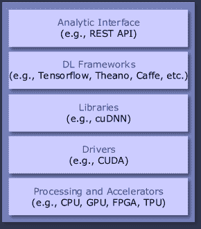

图 20：云平台上的深度学习模型服务的通用堆栈。

表 VIII：在雾计算或云中使用深度学习和服务物联网领域的一些产品。

| 产品 | 描述 | 应用 | 平台 |
| --- | --- | --- | --- |
| Amazon Alexa |

&#124; 智能 &#124;

&#124; 个人 &#124;

&#124; 助手 (IPA) &#124;

| 智能家居 | 雾计算 |
| --- | --- |
| Microsoft Cortana | IPA | 智能汽车, XBox | 雾计算 |
| Google Assistant | IPA |

&#124; 智能汽车, &#124;

&#124; 智能家居 &#124;

| 雾计算 |
| --- |
| IBM Watson |

&#124; 认知 &#124;

&#124; 框架 &#124;

| 物联网领域 | 云 |
| --- | --- |

### VI-C 经验教训

在这一部分中，我们强调了云计算和雾计算的作用及其使能技术、平台和挑战，以将 DL 分析交付到物联网应用中。云计算在支持 DL 方面的巨大成功得益于神经网络优化处理器的进步和应用以及可扩展的分布式 DL 算法。将 DL 模型部署到雾计算平台上用于物联网应用，如智能家居和智能电网，将会引起最终用户的关注，因为它们易于访问且响应时间快。然而，基于云的 DL 分析对于超出雾计算能力的长期和复杂数据分析具有重要意义。一些智慧城市应用、政府部门和全国范围的物联网部署需要利用基于云的 DL 基础设施。

目前，DL 分析与物联网应用的集成仅限于基于 HTTP 协议的 RESTful API。虽然在物联网应用中还有其他几种广泛使用的应用协议，如消息队列遥测传输（MQTT）、受限应用协议（CoAP）、可扩展消息和存在协议（XMPP）和高级消息队列协议（AMQP），但将这些协议与 DL 分析接口集成需要提高它们与上述协议的兼容性，以消除对消息转换代理的需求，这会对分析响应时间产生额外的开销。

我们识别了与在雾节点上支持分析的深度学习（DL）模型的部署和使用相关的若干挑战。由于雾节点的密集部署，DL 服务发现是一个必要的要求，这使得对可用服务的暴力搜索成为一种低效的方法。目前在物联网（IoT）应用中使用的服务发现协议，如多播 DNS（mDNS）或 DNS 服务发现（DNS-SD）[1]，需要扩展以支持 DL 服务发现（例如，声明分析类型、DL 模型、输入形状等）。DL 模型和任务的高效分发，数据流在雾节点上的分发以及结果的聚合是需要解决的其他要求。

表 IX：物联网中的深度学习常见数据集。

| 数据集名称 | 领域 | 提供者 | 备注 | 地址/链接 |
| --- | --- | --- | --- | --- |
| CGIAR 数据集 |

&#124; 农业，&#124;

&#124; 气候 &#124;

| CCAFS |
| --- |

&#124; 高分辨率气候 &#124;

&#124; 多种数据集 &#124;

&#124; 包括农业领域 &#124;

| http://www.ccafs-climate.org/ |
| --- | --- | --- | --- | --- |

|

&#124; 教育 &#124;

&#124; 过程 &#124;

&#124; 采矿 &#124;

| 教育 |
| --- |

&#124; 大学 &#124;

&#124; of Genova &#124;

|

&#124; 115 个受试者的记录 &#124;

&#124; 通过日志记录的活动 &#124;

&#124; 学习时的应用 &#124;

&#124; 使用教育模拟器 &#124;

|

&#124; http://archive.ics.uci.edu/ml/ &#124;

&#124; 数据集/教育+过程+ &#124;

&#124; 矿业+%28EPM%29%3A+ &#124;

&#124; A+学习分析数据集 &#124;

|

|

&#124; 商业 &#124;

&#124; 建筑 &#124;

&#124; 能源数据集 &#124;

|

&#124; 能源, &#124;

&#124; 智能建筑 &#124;

| IIITD |
| --- |

&#124; 能源相关数据集 &#124;

&#124; 来自一个商业建筑的 &#124;

&#124; 数据采样位置 &#124;

&#124; 每分钟多于一次。 &#124;

| http://combed.github.io/ |
| --- |

|

&#124; 个体 &#124;

&#124; 家庭 &#124;

&#124; 电力 &#124;

&#124; 消耗 &#124;

|

&#124; 能源 &#124;

&#124; 智能家居 &#124;

|

&#124; EDF R&D, &#124;

&#124; Clamart, &#124;

&#124; 法国 &#124;

|

&#124; 一分钟采样率 &#124;

&#124; 几乎持续了 &#124;

&#124; 4 年 &#124;

|

&#124; http://archive.ics.uci.edu/ml/ &#124;

&#124; 数据集/个体+家庭+ &#124;

&#124; 电力+消耗 &#124;

|

| AMPds 数据集 |
| --- |

&#124; 能源, &#124;

&#124; 智能家居 &#124;

| S. Makonin |
| --- |

&#124; AMPds 包含电力, &#124;

&#124; 水和天然气 &#124;

&#124; 一分钟的测量 &#124;

&#124; 2 年的测量间隔 &#124;

&#124; 监控 &#124;

| http://ampds.org/ |
| --- |

|

&#124; 英国家庭 &#124;

&#124; 设备级别 &#124;

&#124; 电力 &#124;

|

&#124; 能源, &#124;

&#124; 智能家居 &#124;

|

&#124; Kelly 和 &#124;

&#124; Knottenbelt &#124;

|

&#124; 来自五个的电力需求 &#124;

&#124; 房屋中每个房子都 &#124;

&#124; 全屋主电源 &#124;

&#124; 电力需求以及 &#124;

&#124; 来自个体的电力需求 &#124;

&#124; 记录了电器的使用。 &#124;

|

&#124; http://www.doc.ic.ac.uk/ &#124;

&#124; $\sim$dk3810/data/ &#124;

|

|

&#124; PhysioBank &#124;

&#124; 数据库 &#124;

| 医疗保健 | PhysioNet |
| --- | --- |

&#124; 超过 80 个的档案 &#124;

&#124; 生理数据集。 &#124;

|

&#124; https://physionet.org/physiobank &#124;

&#124; /database/ &#124;

|

|

&#124; Saarbruecken &#124;

&#124; 语音数据库 &#124;

| 医疗保健 |
| --- |

&#124; Universität &#124;

&#124; des &#124;

&#124; Saarlandes &#124;

|

&#124; 语音集合 &#124;

&#124; 来自超过的记录 &#124;

&#124; 2000 人用于病理 &#124;

&#124; 语音检测。 &#124;

|

&#124; http://www.stimmdatenbank. &#124;

&#124; coli.uni-saarland.de/ &#124;

&#124; help_en.php4 &#124;

|

| T-LESS | 行业 |
| --- | --- |

&#124; CMP 在 &#124;

&#124; 捷克 &#124;

&#124; 技术 &#124;

&#124; 大学 &#124;

|

&#124; RGB-D 数据集和 &#124;

&#124; 评估方法 &#124;

&#124; 检测和 6D 姿态 &#124;

&#124; 无纹理估计 &#124;

&#124; 对象 &#124;

| http://cmp.felk.cvut.cz/t-less/ |
| --- |

|

&#124; CityPulse 数据集 &#124;

&#124; 收藏 &#124;

| 智能城市 |
| --- |

&#124; CityPulse &#124;

&#124; 欧盟第七框架计划 &#124;

&#124; 项目 &#124;

|

&#124; 道路交通数据, 污染 &#124;

&#124; 数据, 天气, 停车 &#124;

|

&#124; http://iot.ee.surrey.ac.uk:8080 &#124;

&#124; /datasets.html &#124;

|

|

&#124; 开放数据 &#124;

&#124; 研究所 - 节点 &#124;

&#124; 特伦托 &#124;

| 智能城市 |
| --- |

&#124; 电信 &#124;

&#124; 意大利 &#124;

|

&#124; 天气、空气质量，&#124;

&#124; 电力，&#124;

&#124; 电信 &#124;

| http://theodi.fbk.eu/openbigdata/ |
| --- |
| 马拉加数据集 | 智能城市 |

&#124; 城市的 &#124;

&#124; 马拉加 &#124;

|

&#124; 广泛的类别 &#124;

&#124; 如能源、ITS，&#124;

&#124; 天气、行业、体育等。&#124;

|

&#124; http://datosabiertos.malaga.eu &#124;

&#124; /dataset &#124;

|

|

&#124; 气体传感器 &#124;

&#124; 家庭活动 &#124;

&#124; 监测 &#124;

| 智能家居 |
| --- |

&#124; 大学 &#124;

&#124; 加利福尼亚州 &#124;

&#124; 圣地亚哥 &#124;

|

&#124; 8 个气体传感器的记录 &#124;

&#124; 在三种条件下 &#124;

&#124; 包括背景、酒 &#124;

&#124; 和香蕉展示。&#124;

|

&#124; http://archive.ics.uci.edu/ml &#124;

&#124; /datasets/Gas+sensors+for+ &#124;

&#124; 家庭+活动+监测 &#124;

|

|

&#124; CASAS 数据集 &#124;

&#124; 活动的 &#124;

&#124; 日常生活 &#124;

| 智能家居 |
| --- |

&#124; 华盛顿 &#124;

&#124; 州 &#124;

&#124; 大学 &#124;

|

&#124; 一些与 &#124;

&#124; 活动日常生活 &#124;

&#124; (ADL) 在两年的 &#124;

&#124; 故事家居、一间公寓，&#124;

&#124; 和办公室环境。&#124;

|

&#124; http://ailab.wsu.edu/casas/ &#124;

&#124; datasets.html &#124;

|

|

&#124; ARAS 人类 &#124;

&#124; 活动数据集 &#124;

| 智能家居 |
| --- |

&#124; 博加兹奇 &#124;

&#124; 大学 &#124;

|

&#124; 人类活动识别 &#124;

&#124; 来自两个 &#124;

&#124; 实际房屋的多个 &#124;

&#124; 居民的两个月数据。&#124;

|

&#124; https://www.cmpe.boun.edu.tr &#124;

&#124; /aras/ &#124;

|

| MERLSense 数据 |
| --- |

&#124; 智能家居相关的公共数据集，&#124;

&#124; 建筑 &#124;

|

&#124; 三菱 &#124;

&#124; 电气 &#124;

&#124; 研究 &#124;

&#124; 实验室 &#124;

|

&#124; 来自 &#124;

&#124; 残留痕迹来自 &#124;

&#124; 超过 200 个传感器的网络 &#124;

&#124; 两年内，包含 &#124;

&#124; 超过 5000 万条记录。&#124;

| http://www.merl.com/wmd |
| --- |
| SportVU | 体育 | Stats LLC |

&#124; 篮球和 &#124;

&#124; 足球比赛捕捉自 &#124;

&#124; 6 个摄像头。&#124;

| http://go.stats.com/sportvu |
| --- |
| RealDisp | 体育 | O. Banos |

&#124; 包括广泛的 &#124;

&#124; 体育活动（热身，&#124;

&#124; 冷却和健身 &#124;

&#124; 练习）。&#124;

|

&#124; http://orestibanos.com/ &#124;

&#124; datasets.htm &#124;

|

| 表 IX – 继续上页内容。 |
| --- |
| 数据集名称 | 领域 | 提供者 | 备注 | 地址/链接 |
| --- | --- | --- | --- | --- |

|

&#124; 出租车服务 &#124;

&#124; 轨迹 &#124;

| 交通 |
| --- |

&#124; 预测 &#124;

&#124; 挑战， &#124;

&#124; ECML &#124;

&#124; PKDD 2015 &#124;

|

&#124; 由 &#124;

&#124; 所有 442 辆出租车 &#124;

&#124; 在城市中运行 &#124;

&#124; 葡萄牙的波尔图。 &#124;

|

&#124; http://www.geolink.pt/ &#124;

&#124; ecmlpkdd2015-challenge/ &#124;

&#124; dataset.html &#124;

|

|

&#124; GeoLife GPS &#124;

&#124; 轨迹 &#124;

| 交通 | 微软 |
| --- | --- |

&#124; 由一名 &#124;

&#124; 时间戳序列 &#124;

&#124; 点 &#124;

|

&#124; https://www.microsoft.com &#124;

&#124; /en-us/download/details.aspx? &#124;

&#124; id=52367 &#124;

|

|

&#124; T-Drive 轨迹 &#124;

&#124; 数据 &#124;

| 交通 | 微软 |
| --- | --- |

&#124; 包含一周 &#124;

&#124; 10,357 辆出租车的轨迹 &#124;

|

&#124; https://www.microsoft.com/ &#124;

&#124; en-us/research/publication/ &#124;

&#124; t-drive-trajectory-data-sample/ &#124;

|

|

&#124; 芝加哥公交 &#124;

&#124; 轨迹数据 &#124;

| 交通 |
| --- |

&#124; M. Doering &#124;

|

&#124; 来自 &#124;

&#124; 芝加哥运输局 &#124;

&#124; 为期 18 天，速率 &#124;

&#124; 在 20 到 40 秒之间。 &#124;

|

&#124; http://www.ibr.cs.tu-bs.de/ &#124;

&#124; 用户/mdoering/bustraces/ &#124;

|

|

&#124; Uber 行程 &#124;

&#124; 数据 &#124;

| 交通 |
| --- |

&#124; FiveThirty- &#124;

&#124; 八 &#124;

|

&#124; 约 2000 万 Uber &#124;

&#124; 纽约市的接送 &#124;

&#124; 为期 12 个月。 &#124;

|

&#124; https://github.com/fivethirtyeight/ &#124;

&#124; uber-tlc-foil-response &#124;

|

|

&#124; 交通标志 &#124;

&#124; 识别 &#124;

| 交通 |
| --- |

&#124; K. Lim &#124;

|

&#124; 三个数据集：韩国 &#124;

&#124; 白天，韩国夜间， &#124;

&#124; 和德国白天 &#124;

&#124; 基于交通标志的 &#124;

&#124; 维也纳交通规则。 &#124;

|

&#124; https://figshare.com/articles &#124;

&#124; /Traffic_Sign_Recognition_ &#124;

&#124; Testsets/4597795 &#124;

|

|

&#124; DDD17 &#124;

| 交通 |
| --- |

&#124; J. Binas &#124;

|

&#124; 端到端 DAVIS &#124;

&#124; 驾驶数据集。 &#124;

|

&#124; http://sensors.ini.uzh.ch/ &#124;

&#124; databases.html &#124;

|

## VII 物联网深度学习挑战及未来方向

在本节中，我们首先回顾从机器学习角度来看，实现和开发物联网分析的重要挑战。然后，我们指出可以填补现有物联网分析空白的研究方向，基于深度学习方法。

### VII-A 挑战

#### VII-A1 大型物联网数据集缺乏

物联网应用中缺乏大量真实世界数据集是将深度学习模型纳入物联网的主要障碍，因为深度学习需要更多的数据来实现更高的准确性。此外，更多的数据可以防止模型的过拟合。这一短缺阻碍了基于深度学习的物联网分析的部署和接受，因为系统的实证验证和评估应在自然界中表现出良好前景。获取版权数据集或隐私问题是更常见的负担，尤其是在如医疗和教育等涉及人类数据的领域。同时，适当的数据集组合对开发人员和研究人员将非常有帮助。维基百科编制了一般有用数据集的列表[214]。为了方便物联网中机器学习应用的研究人员，表 IX 展示了一系列适合用于深度学习的常见数据集。

#### VII-A2 预处理

为深度学习模型准备适当表示的原始数据是物联网应用的另一个挑战。大多数深度学习方法需要某种形式的预处理才能产生良好的结果。例如，卷积神经网络（CNN）在图像处理时，输入数据在像素级别被归一化、缩放到特定范围或转换为标准表示时效果更佳[37][60]。对于物联网应用，预处理更加复杂，因为系统处理的数据来自不同的来源，可能具有各种格式和分布，同时还存在缺失数据。

#### VII-A3 安全与隐私保护深度学习

确保数据安全和隐私是许多 IoT 应用中的主要关注点，因为 IoT 大数据会通过互联网传输进行分析，因此可以被全球观察。虽然许多应用中使用了匿名化，但这些技术仍然可能被破解并重新识别为匿名数据。此外，深度学习训练模型也容易受到恶意攻击，如虚假数据注入或对抗样本输入，这可能会危及 IoT 系统的许多功能或非功能要求（例如可用性、可靠性、有效性、可信度等）。实际上，深度学习模型从原始数据中学习特征，因此可以从任何无效的数据中学习。在这种情况下，深度学习模型必须增强一些机制来发现异常或无效数据。一个数据监控的深度学习模型应随主模型一起工作。Papernot 等人[215]研究了深度神经网络在对抗环境中的脆弱性，其中对手试图提供一些输入，这些输入导致不正确的输出分类，从而破坏分类的完整性。开发进一步的技术以防御和防止这类攻击对深度学习模型的影响对于可靠的 IoT 应用是必要的。

#### VII-A4 6V 挑战

尽管近年来在大数据深度学习方面取得了进展，但仍然存在显著的挑战需要解决，以使这项技术成熟。每个 IoT 大数据的特性对深度学习技术都提出了挑战。以下我们将重点介绍这些挑战。

数据的庞大体量对深度学习提出了巨大的挑战，特别是在时间和结构复杂性方面。输入数据的数量庞大，属性种类繁多，以及高度的分类程度导致了非常复杂的深度学习模型，并影响了运行时间性能。在分布式框架或并行处理的 CPU 集群上运行深度学习是一种已经开发的可行解决方案[7]。IoT 大数据的高容量还带来了另一个挑战，即噪声和未标记的数据。尽管深度学习在处理噪声数据和学习未标记数据方面表现出色，但尚不清楚深度学习模型在存在这种异常数据时的准确性。

来自不同来源的 IoT 数据格式的多样性带来了管理不同数据源之间冲突的挑战。如果数据源之间没有冲突，深度学习能够有效处理异构数据。

IoT 大数据的高速度，即数据生成的高速率，也带来了数据处理和分析的高速挑战。在线学习是应对高速度的一种解决方案，并已被提议用于 DNN。然而，还需要更多的研究来增强深度学习与在线学习和序列学习技术的结合。

物联网大数据的真实性同样对深度学习分析提出了挑战。如果输入数据来源不可靠，物联网大数据分析将无法发挥作用。数据验证和可信度应该在每一个大数据分析层面进行检查，特别是在处理输入数据的在线流时[216]。

此外，物联网大数据的变异性（数据流速的变化）对在线分析提出了挑战。对于大量的数据流，深度学习技术，特别是在线技术，能够处理这些数据。在这种情况下，数据采样技术会很有帮助。

最终，商业管理者采纳大数据面临的主要挑战是如何利用大数据分析来获得价值并改善业务还不明确[217]。此外，分析引擎可能会产生对利益相关者不重要或不够明确的抽象结果。

#### VII-A5 物联网设备的深度学习

在物联网设备上开发深度学习对物联网设备设计师提出了新的挑战，即考虑在资源受限的设备中处理深度神经网络的需求。随着数据集大小的不断增长以及新算法的出现，这些需求预计会增加，并成为物联网深度学习解决方案的一部分。

#### VII-A6 深度学习的局限性

尽管在许多应用中表现出令人印象深刻的结果，深度学习模型仍然有若干局限性。Nguyen 等人[218] 报告了深度神经网络在预测人类无法识别的图像时的虚假信心。通过生成完全无法被人类识别的欺骗性示例，深度神经网络将其分类为熟悉的对象。

另一个局限性是深度学习模型专注于分类，而许多物联网应用（如电力负荷预测、温度预测）在其分析核心需要某种回归。少量研究尝试为深度神经网络添加回归功能，例如[219] 提出的集成深度置信网络和支持向量回归（SVR）的回归任务。然而，仍需更多研究来澄清深度学习中的回归问题。

### VII-B 未来方向

#### VII-B1 物联网移动数据

物联网数据的一个显著部分来自移动设备。研究如何有效利用移动大数据与深度学习方法结合，以在物联网领域，特别是智能城市场景中提供更好的服务。在[220]中，使用分布式学习框架对移动大数据分析中的深度学习模型能力进行了研究，该框架在多个并行的 Spark 工作节点上执行迭代的 MapReduce 任务。

#### VII-B2 结合上下文信息

仅依靠物联网传感器数据无法理解环境的情况。因此，需要将物联网数据与其他数据源，即补充环境理解的上下文信息进行融合[12]。这种集成也有助于快速数据分析和快速推理，因为推理引擎的搜索空间是有限的。例如，具有人脸姿态识别能力的智能相机可以在各种上下文中执行其任务，例如在智能家居或政府建筑的安全门，或在智能汽车中提供驾驶辅助。在所有这些情况下，补充性的上下文信息（例如，日内时间、日常习惯等）帮助系统根据检测到的人员姿态推理出最佳行动。

#### VII-B3 物联网分析的在线资源供应

基于深度学习（DL）的快速数据分析在边缘计算和云计算中的部署需要在线供应边缘或云资源以托管数据流。由于物联网数据的流式特性，事先了解数据序列的体积是不现实的。在这方面，我们需要一类新的算法，它们基于当前的数据流工作，而不依赖于数据流的先验知识。文献[88]和[221]分别提出了一种深度学习机制和一种在线拍卖算法，以支持物联网应用中边缘和云资源的在线供应。

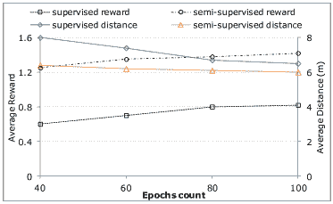

图 21：仅使用标记数据（监督学习）与使用标记和未标记数据（半监督学习）的深度强化学习。在每个训练周期中，半监督模型在总奖励和接近目标方面均优于监督模型。

#### VII-B4 半监督分析框架

大多数分析算法都是受监督的，因此需要大量训练标记数据，但这些数据要么不可得，要么成本高昂。根据 IDC 的报告[89]，到$2012$年，数字宇宙中仅约有$3\%$的数据被标记，这意味着 DL 的训练数据集来源匮乏。针对半监督设置设计的先进机器学习算法组合非常适合智能城市系统，在这些系统中，可以利用少量训练数据集，同时通过大量未标记数据来提高学习代理的准确性 [5]。图 21 展示了半监督学习在室内定位实验中提高深度强化学习输出准确性的作用 [61]。在他们的实验中，仅有$15\%$的数据被标记，但通过算法利用未标记数据加强了结果。

#### VII-B5 可依赖和可靠的物联网分析

随着我们在大规模中依赖 CPS 和物联网，确保系统对恶意攻击和故障的安全机制需求变得更加重要 [222]。DL 方法可以通过分析 CPS 和物联网系统的大量日志跟踪，识别和预测系统弱点，即攻击可能发生或功能缺陷的地方。这将有助于系统预防或从故障中恢复，从而提高 CPS 和物联网系统的可依赖性水平。

#### VII-B6 自组织通信网络

随着大量物联网设备的增加，它们底层物理 M2M 通信和网络的配置与维护变得更加困难。虽然庞大的网络节点及其关系对传统机器学习方法构成挑战，但它为 DL 架构提供了机会，在此领域展示其竞争力，提供一系列自服务功能，如自配置、自优化、自愈和自负载平衡。Valente 等人[223]为自组织蜂窝网络提供了传统机器学习方法的调查报告。

#### VII-B7 新兴物联网应用

无人机：无人机（UAVs）的使用是一种有前景的应用，能够改善在难以到达的地区或关键情况下的服务交付。无人机还被用于许多实时图像分析任务，如监视、搜救行动和基础设施检查[224]。这些设备在采用过程中面临多个挑战，包括路线规划、节能、避免私人区域和障碍物避让[225]等。深度学习在这个领域可以对无人机的任务预测和决策产生重大影响。此外，无人机还可以被视为即时分析平台，潜在地提供临时雾计算分析服务以及分布式分析。

虚拟/增强现实：虚拟/增强现实是另一个可以受益于物联网（IoT）和深度学习（DL）的应用领域。后者可以用于提供诸如对象跟踪[226]、活动识别、图像分类和对象识别[227]等服务。增强现实可以在教育、博物馆、智能联网汽车等多个领域产生重大影响。

移动机器人：移动机器人在许多商业和工业环境中被用于移动材料或在危险环境中执行任务。许多研究工作已经从深度学习中受益，以开发移动机器人的智能控制软件[228] [229]。通过 LIDAR 和摄像头等不同类型的传感器感知环境，使得移动机器人成为评估卷积神经网络（CNN）技术在各种视觉任务中的表现的热门话题。对移动机器人的一个严格要求是深度学习模型应该能够提供实时响应。

## VIII 结论

近年来，深度学习（DL）和物联网（IoT）引起了研究人员和商业领域的关注，因为这两种技术趋势已被证明对我们的生活、城市和世界产生了积极的影响。物联网和深度学习构成了一个数据生产者-消费者链，其中物联网生成原始数据，深度学习模型分析这些数据，深度学习模型提供的高级抽象和见解被反馈到物联网系统中，以便于微调和改进服务。

在本次调查中，我们回顾了物联网数据的特征及其对深度学习方法的挑战。具体来说，我们突出了物联网快速流数据和物联网大数据作为物联网数据生成的两大主要类别及其分析要求。我们还展示了在物联网应用背景下使用的几种深度学习主要架构，随后介绍了用于开发深度学习架构的几个开源框架。回顾了在物联网的不同领域中利用深度学习的各种应用是本次调查的另一个部分，其中我们识别出了五个基础服务以及十一种应用领域。通过区分基础服务以及物联网垂直应用，并回顾它们的深度学习方法和用例，作者为其他研究人员提供了理解物联网智能服务原则组件的基础，并将相关技术应用于他们的问题。调查了在物联网设备上实现深度学习的新范式，并介绍了实现该目标的几种方法。基于雾计算和云基础设施的深度学习以支持物联网应用是本次调查的另一个部分。我们还识别了深度学习在物联网应用中的挑战和未来研究方向。

## 缩略词列表

| 5G | 第五代（蜂窝网络） |
| --- | --- |
| AE | 自编码器 |
| AI | 人工智能 |
| AMQP | 高级消息队列协议 |
| ANN | 人工神经网络 |
| BAC | 乳腺动脉钙化 |
| BLE | 蓝牙低能耗 |
| BPTT | 时间反向传播 |
| CAE | 收缩自编码器 |
| CDR | 呼叫详细记录 |
| CIFAR | 加拿大高级研究所 |
| CNN | 卷积神经网络 |
| CoAP | 受限应用协议 |
| CPS | 网络物理系统 |
| CRBM | 条件限制玻尔兹曼机 |
| DAE | 去噪自编码器 |
| DBN | 深度信念网络 |
| DL | 深度学习 |
| DNN | 深度神经网络 |
| DNS-SD | DNS 服务发现 |
| DRL | 深度强化学习 |
| ELM | 极限学习机 |
| FDC | 故障检测与分类 |
| FDI | 虚假数据注入 |
| FNN | 前馈神经网络 |
| GAN | 生成对抗网络 |
| GBM | 梯度提升机 |
| GLM | 广义线性模型 |
| GPU | 图形处理单元 |
| HMM | 隐马尔可夫模型 |
| HVAC | 暖通空调 |
| INS | 惯性导航系统 |
| IoT | 物联网 |
| IPA | 智能个人助理 |
| ITS | 智能交通系统 |
| LSTM | 长短期记忆 |
| M2M | 机器对机器 |
| MAPE | 平均绝对百分比误差 |
| mDNS | 多播 DNS |
| ML | 机器学习 |
| MLP | 多层感知器 |
| MNIST | 修改版国家标准与技术研究所数据集 |
| MOOC | 大规模开放在线课程 |
| MQTT | 消息队列遥测传输 |
| RBN | 限制玻尔兹曼机 |
| ReLU | 修正线性单元 |
| RL | 强化学习 |
| RNN | 循环神经网络 |
| SaaS | 软件即服务 |
| SdA | 堆叠去噪自编码器 |
| SGD | 随机梯度下降 |
| SVM | 支持向量机 |
| SVR | 支持向量回归 |
| TPU | 张量处理单元 |
| UAV | 无人机 |
| VAE | 变分自编码器 |
| VGG | 视觉几何组 |
| VLC | 可见光通信 |
| WSN | 无线传感器网络 |
| XMPP | 可扩展消息和即时通讯协议 |

## References

+   [1] A. Al-Fuqaha, M. Guizani, M. Mohammadi, M. Aledhari, 和 M. Ayyash, “物联网：关于启用技术、协议和应用的调查,” *IEEE Communications Surveys & Tutorials*, vol. 17, no. 4, pp. 2347–2376, 2015.

+   [2] J. Manyika, M. Chui, J. Bughin, R. Dobbs, P. Bisson, 和 A. Marrs, *Disruptive technologies: Advances that will transform life, business, and the global economy*.   McKinsey Global Institute San Francisco, CA, 2013, vol. 180.

+   [3] E. Brynjolfsson 和 T. Mitchell, “机器学习能做什么？劳动力影响,” *Science*, vol. 358, no. 6370, pp. 1530–1534, 2017.

+   [4] K. Panetta. (2016) Gartner's top 10 strategic technology trends for 2017. [Online]. Available: http://www.gartner.com/smarterwithgartner/gartners-top-10-technology-trends-2017/

+   [5] M. Mohammadi 和 A. Al-Fuqaha, “利用大数据和机器学习实现认知智慧城市：方法和挑战,” *IEEE Communications Magazine*, vol. 56, no. 2, pp. 94–101, 2018.

+   [6] M. Chen, S. Mao, Y. Zhang, 和 V. C. Leung, *Big data: related technologies, challenges and future prospects*.   Springer, 2014.

+   [7] X.-W. Chen 和 X. Lin, “大数据深度学习：挑战与展望,” *IEEE Access*, vol. 2, pp. 514–525, 2014.

+   [8] M. Zaharia, M. Chowdhury, T. Das, A. Dave, J. Ma, M. Mccauley, M. Franklin, S. Shenker, 和 I. Stoica, “通过 Spark 对 Hadoop 数据进行快速和交互式分析,” *USENIX Login*, vol. 37, no. 4, pp. 45–51, 2012.

+   [9] C. Engle, A. Lupher, R. Xin, M. Zaharia, M. J. Franklin, S. Shenker, 和 I. Stoica, “Shark: 利用粗粒度分布式内存进行快速数据分析,” in *Proceedings of the 2012 ACM SIGMOD International Conference on Management of Data*.   ACM, 2012, pp. 689–692.

+   [10] Y. LeCun, Y. Bengio, 和 G. Hinton, “深度学习,” *nature*, vol. 521, no. 7553, p. 436, 2015.

+   [11] C.-W. Tsai, C.-F. Lai, M.-C. Chiang, L. T. Yang *et al.*, “物联网数据挖掘：一项调查,” *IEEE Communications Surveys and Tutorials*, vol. 16, no. 1, pp. 77–97, 2014.

+   [12] C. Perera, A. Zaslavsky, P. Christen, 和 D. Georgakopoulos, “物联网的上下文感知计算：一项调查,” *IEEE Communications Surveys & Tutorials*, vol. 16, no. 1, pp. 414–454, 2014.

+   [13] M. A. Alsheikh, S. Lin, D. Niyato, 和 H.-P. Tan, “机器学习在无线传感器网络中的应用：算法、策略和应用,” *IEEE Communications Surveys & Tutorials*, vol. 16, no. 4, pp. 1996–2018, 2014.

+   [14] Z. Fadlullah, F. Tang, B. Mao, N. Kato, O. Akashi, T. Inoue, 和 K. Mizutani, “最先进的深度学习：将机器智能发展至明天的智能网络流量控制系统，” *IEEE 通讯调查与教程*，第 PP 卷，第 99 期，2017 年。

+   [15] J. Qiu, Q. Wu, G. Ding, Y. Xu, 和 S. Feng, “大数据处理的机器学习综述，” *EURASIP 信号处理前沿期刊*，第 2016 卷，第 1 期，第 67 页，2016 年。

+   [16] F. Alam, R. Mehmood, I. Katib, N. N. Albogami, 和 A. Albeshri, “数据融合与物联网在智能普遍环境中的应用：综述，” *IEEE Access*，第 5 卷，第 9533–9554 页，2017 年。

+   [17] B. Li, Y. Diao, 和 P. Shenoy, “在延迟约束下支持可扩展分析，” *VLDB 基金会会议录*，第 8 卷，第 11 期，第 1166–1177 页，2015 年。

+   [18] M. Hilbert, “发展中的大数据：承诺与挑战的回顾，” *发展政策评论*，第 34 卷，第 1 期，第 135–174 页，2016 年。

+   [19] W. Fan 和 A. Bifet, “挖掘大数据：当前状态及未来预测，” *ACM sIGKDD Explorations Newsletter*，第 14 卷，第 2 期，第 1–5 页，2013 年。

+   [20] H. Hu, Y. Wen, T.-S. Chua, 和 X. Li, “面向大数据分析的可扩展系统：技术教程，” *IEEE Access*，第 2 卷，第 652–687 页，2014 年。

+   [21] Y. Demchenko, P. Grosso, C. De Laat, 和 P. Membrey, “解决科学数据基础设施中的大数据问题，” 收录于 *2013 国际会议：协作技术与系统（CTS）*。 IEEE，2013 年，第 48–55 页。

+   [22] J. Ginsberg, M. H. Mohebbi, R. S. Patel, L. Brammer, M. S. Smolinski, 和 L. Brilliant, “利用搜索引擎查询数据检测流感疫情，” *自然*，第 457 卷，第 7232 期，第 1012 页，2009 年。

+   [23] M. Strohbach, H. Ziekow, V. Gazis, 和 N. Akiva, “面向物联网和智能城市应用的大数据分析框架，” 收录于 *下一代大数据技术的建模与处理*。  Springer，2015 年，第 257–282 页。

+   [24] G. E. Hinton 和 R. R. Salakhutdinov, “通过神经网络降低数据的维度，” *科学*，第 313 卷，第 5786 期，第 504–507 页，2006 年。

+   [25] D. Svozil, V. Kvasnicka, 和 J. Pospichal, “多层前馈神经网络导论，” *化学计量学与智能实验室系统*，第 39 卷，第 1 期，第 43–62 页，1997 年。

+   [26] J. Schmidhuber, “深度学习在神经网络中的应用：概述，” *神经网络*，第 61 卷，第 85–117 页，2015 年。

+   [27] X. Glorot, A. Bordes, 和 Y. Bengio, “深度稀疏修正神经网络，” 收录于 *第十四届国际人工智能与统计会议论文集*，2011 年，第 315–323 页。

+   [28] G. E. Hinton, N. Srivastava, A. Krizhevsky, I. Sutskever, 和 R. R. Salakhutdinov, “通过防止特征检测器的共同适应来改进神经网络，” *arXiv 预印本 arXiv:1207.0580*，2012 年。

+   [29] I. Sutskever, J. Martens, G. Dahl, 和 G. Hinton，“初始化和动量在深度学习中的重要性，” 见于 *国际机器学习会议*，2013 年，pp. 1139–1147。

+   [30] K. He, X. Zhang, S. Ren, 和 J. Sun，“用于图像识别的深度残差学习，” 见于 *IEEE 计算机视觉与模式识别会议录*，2016 年，pp. 770–778。

+   [31] S. Hochreiter 和 J. Schmidhuber，“长短期记忆，” *神经计算*，卷. 9，第 8 期，pp. 1735–1780，1997 年。

+   [32] T. Mikolov, A. Joulin, S. Chopra, M. Mathieu, 和 M. Ranzato，“在递归神经网络中学习更长的记忆，” *arXiv 预印本 arXiv:1412.7753v2 [cs.NE]*，2014 年。

+   [33] L. Deng，“深度学习的架构、算法和应用的教程调查，” *APSIPA 信号与信息处理杂志*，卷. 3，pp. 1–29，2014 年。

+   [34] L. Bottou，“使用随机梯度下降的大规模机器学习，” 见于 *COMPSTAT’2010 会议录*。施普林格，2010 年，pp. 177–186。

+   [35] D. E. Rumelhart, G. E. Hinton, 和 R. J. Williams，“通过反向传播学习表示，” *自然*，卷. 323，第 6088 期，p. 533，1986 年。

+   [36] Y. Chauvin 和 D. E. Rumelhart，*反向传播：理论、架构和应用*。心理学出版社，1995 年。

+   [37] A. Krizhevsky, I. Sutskever, 和 G. E. Hinton，“使用深度卷积神经网络进行 Imagenet 分类，” 见于 *神经信息处理系统进展*，2012 年，pp. 1097–1105。

+   [38] P. J. Werbos，“时间反向传播：它做了什么以及如何做，” *IEEE 会议录*，卷. 78，第 10 期，pp. 1550–1560，1990 年。

+   [39] R. Pascanu, C. Gulcehre, K. Cho, 和 Y. Bengio，“如何构建深度递归神经网络，” *arXiv 预印本 arXiv:1312.6026v5 [cs.NE]*，2013 年。

+   [40] M. Hermans 和 B. Schrauwen，“训练和分析深度递归神经网络，” 见于 *神经信息处理系统进展*，2013 年，pp. 190–198。

+   [41] J. Chung, C. Gulcehre, K. Cho, 和 Y. Bengio，“门控递归神经网络在序列建模中的实证评估，” *arXiv 预印本 arXiv:1412.3555v1 [cs.NE]*，2014 年。

+   [42] P. Baldi，“自编码器、无监督学习和深度架构。” *ICML 无监督和迁移学习*，卷. 27，第 37-50 期，p. 1，2012 年。

+   [43] C. Doersch，“变分自编码器教程，” *arXiv 预印本 arXiv:1606.05908v2 [stat.ML]*，2016 年。

+   [44] D. P. Kingma, S. Mohamed, D. J. Rezende, 和 M. Welling，“使用深度生成模型的半监督学习，” 见于 *神经信息处理系统进展*，2014 年，pp. 3581–3589。

+   [45] I. Goodfellow, J. Pouget-Abadie, M. Mirza, B. Xu, D. Warde-Farley, S. Ozair, A. Courville, 和 Y. Bengio，“生成对抗网络，” 见于 *神经信息处理系统进展*，2014 年，pp. 2672–2680。

+   [46] B. Dai, S. Fidler, R. Urtasun 和 D. Lin，“通过条件 GAN 实现多样且自然的图像描述”，发表于*IEEE 计算机视觉与模式识别会议论文集*，2017 年，第 2970–2979 页。

+   [47] C. Metz 和 K. Collins. 如何通过 A.I. “猫捉老鼠游戏”生成逼真的假照片。（访问日期：2018-02-09）。[在线]. 可用: https://www.nytimes.com/interactive/2018/01/02/technology/ai-generated-photos.html

+   [48] Y. Bengio *等*，“为 AI 学习深度架构”，*机器学习的基础与趋势®*，第 2 卷，第 1 期，第 1–127 页，2009 年。

+   [49] H. Valpola，“从神经 PCA 到深度无监督学习”，*独立成分分析与学习机器进展*，第 143–171 页，2015 年。

+   [50] A. Rasmus, M. Berglund, M. Honkala, H. Valpola 和 T. Raiko，“带状网络的半监督学习”，发表于*神经信息处理系统进展*，2015 年，第 3546–3554 页。

+   [51] Y. LeCun, C. Cortes 和 C. J. Burges. MNIST 手写数字数据库。（访问日期：2018-02-01）。[在线]. 可用: http://yann.lecun.com/exdb/mnist/

+   [52] A. Krizhevsky，“从小图像中学习多层特征”，*硕士论文，计算机科学系，多伦多大学*，2009 年。

+   [53] N.-Y. Liang, G.-B. Huang, P. Saratchandran 和 N. Sundararajan，“一种快速准确的在线序列学习算法用于前馈网络”，*IEEE 神经网络汇刊*，第 17 卷，第 6 期，第 1411–1423 页，2006 年。

+   [54] Z. Yang, P. Zhang 和 L. Chen，“使用 OS-ELM 的 RFID 启用实时制造执行系统的室内定位方法”，*神经计算*，第 174 卷，第 121–133 页，2016 年。

+   [55] H. Zou, H. Jiang, X. Lu 和 L. Xie，“基于 wifi 的室内定位的在线序列极限学习机方法”，发表于*物联网（WF-IoT），2014 IEEE 世界论坛*。IEEE，2014 年，第 111–116 页。

+   [56] S. Ren, K. He, R. Girshick 和 J. Sun，“Faster R-CNN：面向实时目标检测的区域提议网络”，*IEEE 模式分析与机器智能汇刊*，第 39 卷，第 6 期，第 1137–1149 页，2017 年。

+   [57] R. Girshick，“Fast R-CNN”，发表于*IEEE 国际计算机视觉会议论文集*，2015 年，第 1440–1448 页。

+   [58] H. Mao, S. Yao, T. Tang, B. Li, J. Yao 和 Y. Wang，“面向嵌入式系统的实时目标检测”，*IEEE 新兴计算主题汇刊*，第 PP 卷，第 99 期，第 1–15 页，2017 年。

+   [59] J. Redmon, S. Divvala, R. Girshick 和 A. Farhadi，“你只看一次：统一的实时目标检测”，发表于*IEEE 计算机视觉与模式识别会议论文集*，2016 年，第 779–788 页。

+   [60] V. Mnih, K. Kavukcuoglu, D. Silver, A. Graves, I. Antonoglou, D. Wierstra 和 M. Riedmiller，“使用深度强化学习玩 Atari”，*arXiv 预印本 arXiv:1312.5602v1 [cs.LG]*，2013 年。

+   [61] M. Mohammadi, A. Al-Fuqaha, M. Guizani, 和 J.-S. Oh, “支持物联网和智慧城市服务的半监督深度强化学习”， *IEEE 互联网事务期刊*，第 PP 卷，第 99 期，第 1–12 页，2017 年。

+   [62] Y. Bengio *等*, “用于无监督和迁移学习的表示深度学习。” *ICML 无监督与迁移学习*，第 27 卷，第 17–36 页，2012 年。

+   [63] J. Deng, R. Xia, Z. Zhang, Y. Liu, 和 B. Schuller, “引入共享隐藏层自编码器用于迁移学习及其在声学情感识别中的应用”，收录于 *声学、语音与信号处理（ICASSP），2014 IEEE 国际会议*。 IEEE，2014 年，第 4818–4822 页。

+   [64] P. Wu, S. C. Hoi, H. Xia, P. Zhao, D. Wang, 和 C. Miao, “用于图像检索的在线多模态深度相似性学习”，收录于 *第 21 届 ACM 国际多媒体会议论文集*。 ACM，2013 年，第 153–162 页。

+   [65] P. Jaini, A. Rashwan, H. Zhao, Y. Liu, E. Banijamali, Z. Chen, 和 P. Poupart, “针对连续变量的和-积网络的在线算法”，收录于 *第八届国际概率图模型会议论文集*，2016 年，第 228–239 页。

+   [66] G. Chen, R. Xu, 和 S. N. Srihari, “基于在线深度学习的序列标注：探索模型初始化”，收录于 *第六届欧洲机器学习与数据库知识发现联合会议*。 施普林格，2016 年，第 772–788 页。

+   [67] S. Bahrampour, N. Ramakrishnan, L. Schott, 和 M. Shah, “深度学习软件框架的比较研究”， *arXiv 预印本 arXiv:1511.06435v3 [cs.LG]*，2016 年。

+   [68] A. Candel, V. Parmar, E. LeDell, 和 A. Arora, “使用 h2o 的深度学习”，2015 年。

+   [69] M. Abadi, A. Agarwal, P. Barham, E. Brevdo, Z. Chen, C. Citro, G. S. Corrado, A. Davis, J. Dean, M. Devin *等*, “Tensorflow：异构分布式系统上的大规模机器学习”， *arXiv 预印本 arXiv:1603.04467v2 [cs.DC]*，2016 年。

+   [70] R. Collobert, K. Kavukcuoglu, 和 C. Farabet, “Torch7：一个类似 MATLAB 的机器学习环境”，收录于 *BigLearn，NIPS 研讨会*，编号 EPFL-CONF-192376，2011 年。

+   [71] F. Bastien, P. Lamblin, R. Pascanu, J. Bergstra, I. Goodfellow, A. Bergeron, N. Bouchard, D. Warde-Farley, 和 Y. Bengio, “Theano：新特性和速度改进”， *arXiv 预印本 arXiv:1211.5590v1 [cs.SC]*，2012 年。

+   [72] S. Raschka 和 V. Mirjalili, *Python 机器学习*，第 2 版。 伯明翰，英国：Packt 出版社，2017 年。

+   [73] Y. Jia, E. Shelhamer, J. Donahue, S. Karayev, J. Long, R. Girshick, S. Guadarrama, 和 T. Darrell, “Caffe：用于快速特征嵌入的卷积架构”，收录于 *第 22 届 ACM 国际多媒体会议论文集*。 ACM，2014 年，第 675–678 页。

+   [74] O. M. Parkhi, A. Vedaldi, A. Zisserman *等*, “深度人脸识别”，收录于 *英国机器视觉会议*，第 1 卷，第 3 期，2015 年，第 6 页。

+   [75] C. Szegedy, W. Liu, Y. Jia, P. Sermanet, S. Reed, D. Anguelov, D. Erhan, V. Vanhoucke, A. Rabinovich, J.-H. Rick Chang *等*, “深入卷积网络，” 见于 *IEEE 计算机视觉与模式识别会议（CVPR）*。

+   [76] S. Shi, Q. Wang, P. Xu 和 X. Chu, “基于深度学习的最先进软件工具基准测试，” *arXiv 预印本 arXiv:1608.07249v7 [cs.DC]*, 2016。

+   [77] R. Mehmood, F. Alam, N. N. Albogami, I. Katib, A. Albeshri 和 S. M. Altowaijri, “Utilearn: 针对智能社会的个性化普适教学和学习系统，” *IEEE Access*, 第 5 卷，第 2615–2635 页, 2017。

+   [78] A. Luckow, M. Cook, N. Ashcraft, E. Weill, E. Djerekarov 和 B. Vorster, “汽车行业中的深度学习：应用与工具，” 见于 *2016 年 IEEE 国际大数据会议*。IEEE，2016 年，第 3759–3768 页。

+   [79] X. Ma, H. Yu, Y. Wang 和 Y. Wang, “利用深度学习理论进行大规模交通网络拥堵演变预测，” *PloS one*, 第 10 卷，第 3 期，页码 e0119044, 2015。

+   [80] N. D. Lane, S. Bhattacharya, P. Georgiev, C. Forlivesi 和 F. Kawsar, “关于可穿戴设备、智能手机和物联网设备的深度学习早期资源特征分析，” 见于 *2015 年国际物联网应用研讨会论文集*。ACM，2015 年，第 7–12 页。

+   [81] G. Mittal, K. B. Yagnik, M. Garg 和 N. C. Krishnan, “Spotgarbage: 使用深度学习检测垃圾的智能手机应用程序，” 见于 *2016 年 ACM 国际普适计算与无处不在计算联合会议论文集*。ACM，2016 年，第 940–945 页。

+   [82] C. Liu, Y. Cao, Y. Luo, G. Chen, V. Vokkarane, Y. Ma, S. Chen 和 P. Hou, “基于深度学习的新型食品识别系统，用于边缘计算服务基础设施上的饮食评估，” *IEEE 服务计算汇刊*, 2017。

+   [83] S. Sladojevic, M. Arsenovic, A. Anderla, D. Culibrk 和 D. Stefanovic, “基于深度神经网络的植物疾病叶片图像分类识别，” *计算智能与神经科学*, 第 2016 卷, 2016。

+   [84] Y. Liu, E. Racah, J. Correa, A. Khosrowshahi, D. Lavers, K. Kunkel, M. Wehner 和 W. Collins, “应用深度卷积神经网络检测气候数据集中的极端天气，” *国际大数据分析进展会议*, 2016。

+   [85] S. Tokui, K. Oono, S. Hido 和 J. Clayton, “Chainer: 下一代深度学习开源框架，” 见于 *第 29 届神经信息处理系统（NIPS）年会机器学习系统研讨会论文集（LearningSys）*，2015。

+   [86] Y. Hada-Muranushi, T. Muranushi, A. Asai, D. Okanohara, R. Raymond, G. Watanabe, S. Nemoto 和 K. Shibata, “用于自动化实时火焰预报的深度学习方法，” *空间天气*, 2016。

+   [87] J. A. C. Soto, M. Jentsch, D. Preuveneers 和 E. Ilie-Zudor，“Ceml：将复杂事件处理和机器学习结合并移动到物联网应用的网络边缘”，收录于*第六届国际物联网大会论文集*。ACM，2016 年，第 103–110 页。

+   [88] M. Borkowski, S. Schulte 和 C. Hochreiner，“预测云资源利用”，收录于*第九届国际实用与云计算会议论文集*。ACM，2016 年，第 37–42 页。

+   [89] J. Gantz 和 D. Reinsel，“2020 年的数字宇宙：大数据、更大的数字阴影以及远东的最大增长”，*IDC iView: IDC Analyze the future*，第 2007 卷，第 2012 期，第 1–16 页，2012 年。

+   [90] H. Larry. (2017) 语音控制无处不在：低功耗专用芯片可能使语音识别在电子设备中无处不在。[在线]. 可用： http://news.mit.edu/2017/low-power-chip-speech-recognition-electronics-0213

+   [91] M. Price, J. Glass 和 A. Chandrakasan，“具有深度神经网络声学模型和语音激活功率门控的可扩展语音识别器”，收录于*IEEE ISSCC2017 会议论文集*，2017 年。

+   [92] X. Wang, L. Gao, S. Mao 和 S. Pandey，“Deepfi：基于通道状态信息的深度学习室内指纹识别”，收录于*2015 IEEE 无线通信与网络会议（WCNC）*。IEEE，2015 年，第 1666–1671 页。

+   [93] Y. Gu, Y. Chen, J. Liu 和 X. Jiang，“用于 Wi-Fi 定位的半监督深度极限学习机”，*神经计算*，第 166 卷，第 282–293 页，2015 年。

+   [94] W. Zhang, K. Liu, W. Zhang, Y. Zhang 和 J. Gu，“用于室内和室外环境的深度神经网络无线定位”，*神经计算*，第 194 卷，第 279–287 页，2016 年。

+   [95] Z. Liu, L. Zhang, Q. Liu, Y. Yin, L. Cheng 和 R. Zimmermann，“磁场和视觉传感器的融合用于室内定位：无基础设施且更有效”，*IEEE 多媒体期刊*，第 19 卷，第 4 期，第 874–888 页，2017 年。

+   [96] M. Becker，“完全基于用户视线的室内定位”，收录于*国际信息科学与应用会议*。Springer，2017 年，第 76–83 页。

+   [97] W. Lu, J. Zhang, X. Zhao, J. Wang 和 J. Dang，“基于长短期记忆递归神经网络的足球机器人自我定位的多模态传感融合”，*环境智能与人性化计算期刊*，第 1–9 页，2017 年。

+   [98] A. Toshev 和 C. Szegedy，“Deeppose：通过深度神经网络进行人体姿态估计”，收录于*IEEE 计算机视觉与模式识别会议论文集*，2014 年，第 1653–1660 页。

+   [99] J. Liu, Y. Gu 和 S. Kamijo，“基于深度神经网络的监控摄像头联合顾客姿态和方向估计”，收录于*多媒体（ISM），2016 IEEE 国际研讨会*。IEEE，2016 年，第 216–221 页。

+   [100] F. J. Ordóñez 和 D. Roggen，“用于多模态可穿戴活动识别的深度卷积和 LSTM 递归神经网络”，*传感器*，第 16 卷，第 1 期，第 115 页，2016 年。

+   [101] D. Tao, Y. Wen 和 R. Hong，“基于移动设备的人体活动识别的多列双向长短期记忆网络，” *IEEE 物联网期刊*，2016 年。

+   [102] X. Li, Y. Zhang, I. Marsic, A. Sarcevic 和 R. S. Burd，“基于 RFID 的活动识别的深度学习，” 见 *第 14 届 ACM 嵌入式网络传感器系统会议论文集*。 ACM，2016 年，页码 164–175。

+   [103] L. Pigou, A. Van Den Oord, S. Dieleman, M. Van Herreweghe 和 J. Dambre，“超越时间池化：视频手势识别中的递归和时间卷积，” *计算机视觉国际期刊*，页码 1–10，2015 年。

+   [104] K. Fragkiadaki, S. Levine, P. Felsen 和 J. Malik，“人类动态的递归网络模型，” 见 *IEEE 国际计算机视觉会议论文集*，2015 年，页码 4346–4354。

+   [105] S. E. Kahou, X. Bouthillier, P. Lamblin, C. Gulcehre, V. Michalski, K. Konda, S. Jean, P. Froumenty, Y. Dauphin, N. Boulanger-Lewandowski *等*，“Emonets：用于视频情感识别的多模态深度学习方法，” *多模态用户界面期刊*，第 10 卷，第 2 期，页码 99–111，2016 年。

+   [106] N. Neverova, C. Wolf, G. Lacey, L. Fridman, D. Chandra, B. Barbello 和 G. Taylor，“从运动模式中学习人类身份，” *IEEE Access*，第 4 卷，页码 1810–1820，2016 年。

+   [107] Y. He, G. J. Mendis 和 J. Wei，“智能电网中虚假数据注入攻击的实时检测：基于深度学习的智能机制，” *IEEE 智能电网汇刊*，2017 年。

+   [108] M.-J. Kang 和 J.-W. Kang，“基于深度神经网络的车载网络安全入侵检测系统，” *PloS one*，第 11 卷，第 6 期，页码 e0155781，2016 年。

+   [109] Z. Yuan, Y. Lu, Z. Wang 和 Y. Xue，“Droid-sec：安卓恶意软件检测中的深度学习，” 见 *ACM SIGCOMM 计算机通信评论*，第 44 卷，第 4 期。 ACM，2014 年，页码 371–372。

+   [110] R. Shokri 和 V. Shmatikov，“隐私保护的深度学习，” 见 *第 22 届 ACM SIGSAC 计算机与通信安全会议论文集*。 ACM，2015 年，页码 1310–1321。

+   [111] M. Abadi, A. Chu, I. Goodfellow, H. B. McMahan, I. Mironov, K. Talwar 和 L. Zhang，“带有差分隐私的深度学习，” 见 *2016 年 ACM SIGSAC 计算机与通信安全会议论文集*。 ACM，2016 年，页码 308–318。

+   [112] T. J. Hazen. (2016) 微软和 Liebherr 合作开发新一代智能冰箱。 [在线]。 可用网址：http://blogs.technet.microsoft.com/machinelearning/2016/09/02/

+   [113] M. Manic, K. Amarasinghe, J. J. Rodriguez-Andina, 和 C. Rieger，“未来智能建筑：网络意识、深度学习驱动和人机交互，” *IEEE 工业电子杂志*，第 10 卷，第 4 期，页码 32–49，2016 年。

+   [114] H. Yoshida. (2016) 相关的物联网：将智能城市与智能农业整合。 Digitalist Magazine. [在线]. 可用链接: http://www.digitalistmag.com/iot/2016/05/19/internet-of-things-that-matter-integrating-smart-cities-with-smart-agriculture-04221203

+   [115] Toshiba:Press-Release. (2016) 东芝和戴尔技术公司为物联网提供的深度学习测试平台获得工业互联网联盟首次批准。[在线]. 可用链接: https://www.toshiba.co.jp/about/press/2016_10/pr1702.htm

+   [116] X. Song, H. Kanasugi, 和 R. Shibasaki，“Deeptransport：在城市级别预测和模拟人类移动和交通模式。” IJCAI，2016 年。

+   [117] V. C. Liang, R. T. Ma, W. S. Ng, L. Wang, M. Winslett, H. Wu, S. Ying, 和 Z. Zhang，“Mercury：基于递归神经网络的地铁密度预测，使用流式 CDR 数据，” 在 *数据工程（ICDE），2016 年 IEEE 第 32 届国际会议上*。 IEEE，2016 年，第 1374–1377 页。

+   [118] X. Li, L. Peng, Y. Hu, J. Shao, 和 T. Chi，“用于空气质量预测的深度学习架构，” *环境科学与污染研究*，第 23 卷，第 22 期，第 22 408–22 417 页，2016 年。

+   [119] G. Amato, F. Carrara, F. Falchi, C. Gennaro, C. Meghini, 和 C. Vairo，“用于去中心化停车场占用检测的深度学习，” *专家系统与应用*，2017 年。

+   [120] S. Valipour, M. Siam, E. Stroulia, 和 M. Jagersand，“基于深度卷积神经网络的停车位空闲指示系统，” 在 *2016 年 IEEE 第 3 届物联网世界论坛（WF-IoT）*，2016 年，第 655–660 页。

+   [121] D. C. Mocanu, E. Mocanu, P. H. Nguyen, M. Gibescu, 和 A. Liotta，“用于实时建筑能耗拆分的大数据物联网挖掘，” 在 *IEEE 国际系统、人类与控制论会议论文集*，2016 年，第 9–12 页。

+   [122] E. Mocanu, P. H. Nguyen, M. Gibescu, 和 W. L. Kling，“用于估计建筑能耗的深度学习，” *可持续能源、网络和电网*，第 6 卷，第 91–99 页，2016 年。

+   [123] A. Gensler, J. Henze, B. Sick, 和 N. Raabe，“用于太阳能预测的深度学习——一种使用自编码器和 LSTM 神经网络的方法，” 在 *系统、人类与控制论（SMC），2016 年 IEEE 国际会议上*。 IEEE，2016 年，第 2858–2865 页。

+   [124] Y. Tian 和 L. Pan，“通过长短期记忆递归神经网络预测短期交通流量，” 在 *智能城市/社会计算/可持续计算（SmartCity），2015 年 IEEE 国际会议上*。 IEEE，2015 年，第 153–158 页。

+   [125] D. Cireşan, U. Meier, J. Masci, 和 J. Schmidhuber，“用于交通标志分类的多列深度神经网络，” *神经网络*，第 32 卷，第 333–338 页，2012 年。

+   [126] K. Lim, Y. Hong, Y. Choi, 和 H. Byun，“基于通用 GPU 和深度学习的实时交通标志识别，” *PLoS one*，第 12 卷，第 3 期，第 e0173317 页，2017 年。

+   [127] E. Ackerman 和 A. Pagano，“深度学习优先：Drive.ai 的自动驾驶之路，” *IEEE Spectrum*，2017 年。

+   [128] C. Liu, Y. Cao, Y. Luo, G. Chen, V. Vokkarane, 和 Y. Ma, “Deepfood：基于深度学习的食品图像识别用于计算机辅助饮食评估，” 在 *智能家居与健康远程医疗国际会议* 中。 Springer, 2016 年, pp. 37–48。

+   [129] C. R. Pereira, D. R. Pereira, J. P. Papa, G. H. Rosa, 和 X.-S. Yang, “卷积神经网络在帕金森病识别中的应用，” 在 *健康信息学的机器学习* 中。 Springer, 2016 年, pp. 377–390。

+   [130] G. Muhammad, S. M. M. Rahman, A. Alelaiwi, 和 A. Alamri, “集成物联网和云的智能健康解决方案：语音病理监测的案例研究，” *IEEE 通信杂志*, 第 55 卷，第 1 期, pp. 69–73, 2017 年。

+   [131] J. Wang, H. Ding, F. Azamian, B. Zhou, C. Iribarren, S. Molloi, 和 P. Baldi, “通过深度学习从乳腺 X 光片中检测心血管疾病，” *IEEE 医学影像学交易*, 2017 年。

+   [132] P. Feng, M. Yu, S. M. Naqvi, 和 J. A. Chambers, “深度学习在跌倒检测中的姿态分析，” 在 *数字信号处理（DSP），2014 年第 19 届国际会议* 中。 IEEE, 2014 年, pp. 12–17。

+   [133] Z. C. Lipton, D. C. Kale, C. Elkan, 和 R. Wetzell, “利用 LSTM 递归神经网络学习诊断，” 在 *ICLR 2016* 中, 2016 年。

+   [134] D. Ravì, C. Wong, F. Deligianni, M. Berthelot, J. Andreu-Perez, B. Lo, 和 G.-Z. Yang, “健康信息学中的深度学习，” *IEEE 生物医学与健康信息学杂志*, 第 21 卷，第 1 期, pp. 4–21, 2017 年。

+   [135] N. Kussul, M. Lavreniuk, S. Skakun, 和 A. Shelestov, “利用遥感数据进行土地覆盖和作物类型的深度学习分类，” *IEEE 地球科学与遥感快报*, 2017 年。

+   [136] K. Kuwata 和 R. Shibasaki, “利用深度学习和遥感数据估算作物产量，” 在 *地球科学与遥感研讨会（IGARSS），2015 年 IEEE 国际会议* 中。 IEEE, 2015 年, pp. 858–861。

+   [137] G. J. Scott, M. R. England, W. A. Starms, R. A. Marcum, 和 C. H. Davis, “训练深度卷积神经网络用于高分辨率影像的土地覆盖分类，” *IEEE 地球科学与遥感快报*, 第 14 卷，第 4 期, pp. 549–553, 2017 年。

+   [138] K. A. Steen, P. Christiansen, H. Karstoft, 和 R. N. Jørgensen, “利用深度学习挑战农业中高度自主机器的安全标准，” *成像学杂志*, 第 2 卷，第 1 期, p. 6, 2016 年。

+   [139] I. Sa, Z. Ge, F. Dayoub, B. Upcroft, T. Perez, 和 C. McCool, “Deepfruits：一种使用深度神经网络的水果检测系统，” *传感器*, 第 16 卷，第 8 期, p. 1222, 2016 年。

+   [140] M. B. Ibáñez, Á. Di Serio, D. Villarán, 和 C. D. Kloos, “利用增强现实实验电磁学：对学生体验和教育效果的影响，” *计算机与教育*, 第 71 卷, pp. 1–13, 2014 年。

+   [141] L.-f. Kwok, “i-campus 发展的愿景，” *智能学习环境*, 第 2 卷, pp. 1–12, 2015 年。

+   [142] H. Wang、N. Wang 和 D.-Y. Yeung，“面向推荐系统的协作深度学习，” 收录于 *第 21 届 ACM SIGKDD 国际知识发现与数据挖掘会议论文集*。 ACM，2015，pp. 1235–1244。

+   [143] T.-Y. Yang、C. G. Brinton、C. Joe-Wong 和 M. Chiang，“基于行为的 MOOC 成绩预测：基于时间序列的神经网络，” *IEEE 信号处理选刊*，2017。

+   [144] C. Piech、J. Bassen、J. Huang、S. Ganguli、M. Sahami、L. J. Guibas 和 J. Sohl-Dickstein，“深度知识追踪，” 收录于 *神经信息处理系统进展*，2015，pp. 505–513。

+   [145] F. Conti、A. Pullini 和 L. Benini，“基于脑启发的低功耗移动平台教室占用监测，” 收录于 *IEEE 计算机视觉与模式识别会议论文集*，2014，pp. 610–615。

+   [146] H. Shao、H. Jiang、F. Wang 和 H. Zhao，“一种用于旋转机械故障诊断的增强深度特征融合方法，” *知识为基础的系统*，第 119 卷，pp. 200–220，2017。

+   [147] H. Lee，“利用物联网设备和云环境的故障检测分类框架与发展，” *制造系统杂志*，2017。

+   [148] H. Lee、Y. Kim 和 C. O. Kim，“一种用于带有传感器测量噪声的稳健晶圆故障监测的深度学习模型，” *IEEE 半导体制造汇刊*，第 30 卷，第 1 期，pp. 23–31，2017。

+   [149] W. Yan 和 L. Yu，“关于燃气轮机燃烧室的准确可靠异常检测：一种深度学习方法，” 收录于 *预后与健康管理协会年度会议论文集*，2015。

+   [150] Y. Liu 和 L. Wu，“利用深度学习对光学遥感图像进行地质灾害识别，” *计算机科学程序集*，第 91 卷，pp. 566–575，2016。

+   [151] Q. Wang、Y. Guo、L. Yu 和 P. Li，“基于时空数据挖掘的地震预测：一种 LSTM 网络方法，” *IEEE 新兴计算主题汇刊*，2017。

+   [152] H. Maeda、Y. Sekimoto 和 T. Seto，“轻量级道路管理器：基于智能手机的深度神经网络自动确定道路损坏状态，” 收录于 *第 5 届 ACM SIGSPATIAL 国际移动地理信息系统研讨会论文集*。 ACM，2016，pp. 37–45。

+   [153] L. Steinberg. (2015) 《福布斯 - 改变游戏：体育分析的崛起》。 [在线] 可用： https://www.forbes.com/sites/leighsteinberg/2015/08/18/changing-the-game-the-rise-of-sports-analytics

+   [154] W. Liu、J. Liu、X. Gu、K. Liu、X. Dai 和 H. Ma，“基于深度学习的智能篮球场及能量图像，” 收录于 *国际多媒体建模会议*。 Springer，2017，pp. 601–613。

+   [155] K.-C. Wang 和 R. Zemel，“利用神经网络对 NBA 进攻战术进行分类，” 收录于 *麻省理工学院斯隆体育分析会议论文集*，2016。

+   [156] R. Shah 和 R. Romijnders，“将深度学习应用于篮球轨迹，” 收录于 *ACM KDD’16*，2016。

+   [157] T. Kautz, B. H. Groh, J. Hannink, U. Jensen, H. Strubberg, 和 B. M. Eskofier, “使用深度卷积神经网络进行沙滩排球活动识别，” *数据挖掘与知识发现*，第 1–28 页，2017 年。

+   [158] M. S. Ibrahim, S. Muralidharan, Z. Deng, A. Vahdat, 和 G. Mori, “用于群体活动识别的层次深度时间模型，” 见于 *IEEE 计算机视觉与模式识别会议论文集*，2016 年，第 1971–1980 页。

+   [159] S. Bell 和 K. Bala, “使用卷积神经网络学习产品设计的视觉相似性，” *ACM 图形学交易 (TOG)*，第 34 卷，第 4 期，第 98 页，2015 年。

+   [160] L. Xiao 和 X. Yichao, “基于深度神经网络的精确服装检索方法，” 见于 *信息技术、网络、电子与自动化控制会议，IEEE*。 IEEE，2016 年，第 396–400 页。

+   [161] M. Hadi Kiapour, X. Han, S. Lazebnik, A. C. Berg, 和 T. L. Berg, “在哪里购买：在在线商店中匹配街头服装照片，” 见于 *IEEE 国际计算机视觉会议论文集*，2015 年，第 3343–3351 页。

+   [162] S. Advani, P. Zientara, N. Shukla, I. Okafor, K. Irick, J. Sampson, S. Datta, 和 V. Narayanan, “为视障人士设计的多任务杂货辅助系统：智能眼镜、手套和购物车提供听觉和触觉反馈，” *IEEE 消费电子杂志*，第 6 卷，第 1 期，第 73–81 页，2017 年。

+   [163] B. Singh, T. K. Marks, M. Jones, O. Tuzel, 和 M. Shao, “用于细粒度动作检测的多流双向递归神经网络，” 见于 *IEEE 计算机视觉与模式识别会议论文集*，2016 年，第 1961–1970 页。

+   [164] Q. Feng, Y. Zhang, C. Li, Z. Dou, 和 J. Wang, “通过深度自编码器检测无线通信中的频谱异常，” *超级计算期刊*，第 73 卷，第 7 期，第 3161–3178 页，2017 年。

+   [165] M. Lopez-Martin, B. Carro, A. Sanchez-Esguevillas, 和 J. Lloret, “条件变分自编码器用于预测和特征恢复，应用于物联网入侵检测，” *传感器*，第 17 卷，第 9 期，第 1967 页，2017 年。

+   [166] N. Shone, T. N. Ngoc, V. D. Phai, 和 Q. Shi, “一种深度学习方法用于网络入侵检测，” *森林 (RF)*，第 2 卷，2017 年。

+   [167] M. Hasan, E. Hossain, 和 D. Niyato, “LTE-Advanced 网络中的机器间通信的随机接入：问题与方法，” *IEEE 通讯杂志*，第 51 卷，第 6 期，第 86–93 页，2013 年。

+   [168] H.-Y. Kim 和 J.-M. Kim, “基于深度学习的物联网负载均衡方案，” *集群计算*，第 20 卷，第 1 期，第 873–878 页，2017 年。

+   [169] M. Schmidt, D. Block, 和 U. Meier, “使用卷积神经网络识别无线干扰，” *arXiv 预印本 arXiv:1703.00737v1 [cs.LG]*，2017 年。

+   [170] N. Ahad, J. Qadir, 和 N. Ahsan, “无线网络中的神经网络：技术、应用与指南，” *网络与计算机应用杂志*，第 68 卷，第 1–27 页，2016 年。

+   [171] R. Li, Z. Zhao, X. Zhou, G. Ding, Y. Chen, Z. Wang 和 H. Zhang，“智能 5G：当蜂窝网络遇上人工智能”，*IEEE 无线通信*，第 24 卷，第 5 期，第 175–183 页，2017 年。

+   [172] M.-R. Fida, A. Lutu, M. K. Marina 和 Ö. Alay，“Zipweave：朝着高效和可靠的基于测量的移动覆盖地图迈进”，收录于 *INFOCOM 2017-IEEE 计算机通信会议，IEEE*。IEEE，2017 年，第 1–9 页。

+   [173] OpenSignal. 全球蜂窝覆盖地图。（访问日期：2018-02-06）。[在线]。可用网址: http://opensignal.com/networks

+   [174] A. Canziani, A. Paszke 和 E. Culurciello，“深度神经网络模型的实际应用分析”，*arXiv 预印本 arXiv:1605.07678v4 [cs.CV]*，2016 年。

+   [175] K. He, X. Zhang, S. Ren 和 J. Sun，“深度残差网络中的身份映射”，收录于 *《计算机视觉 – ECCV 2016》*，B. Leibe, J. Matas, N. Sebe 和 M. Welling 编，Springer 国际出版公司，2016 年，第 630–645 页。

+   [176] C. Bourguignat.（2014 年）《可解释性与强大预测模型：我们为何都需要它们》。 （访问日期：2018-02-15）。[在线]。可用网址: https://medium.com/@chris_bour/interpretable-vs-powerful-predictive-models-why-we-need-them-both-990340074979

+   [177] F. Chollet，*《使用 Python 进行深度学习》*。Manning 出版公司，2018 年。

+   [178] V. J. Hellendoorn 和 P. Devanbu，“深度神经网络是建模源代码的最佳选择吗？”收录于 *《2017 年第 11 届软件工程基础联合会议论文集》*，ACM，2017 年，第 763–773 页。

+   [179] K. Chatfield, K. Simonyan, A. Vedaldi 和 A. Zisserman，“细节中的恶魔重现：深入探讨卷积网络”，*arXiv 预印本 arXiv:1405.3531v4 [cs.CV]*，2014 年。

+   [180] J. Ba 和 R. Caruana，“深度网络真的需要很深吗？”收录于 *《神经信息处理系统进展》*，2014 年，第 2654–2662 页。

+   [181] T. A. Eriksson, H. Bülow 和 A. Leven，“在光通信系统中应用神经网络：可能的陷阱”，*IEEE 光子技术快报*，第 29 卷，第 23 期，第 2091–2094 页，2017 年。

+   [182] M. Denil, B. Shakibi, L. Dinh, N. de Freitas *等人*，“深度学习中的参数预测”，收录于 *《神经信息处理系统进展》*，2013 年，第 2148–2156 页。

+   [183] Y. LeCun, J. S. Denker, S. A. Solla, R. E. Howard 和 L. D. Jackel，“最佳脑损伤”，收录于 *NIPs*，第 2 卷，1989 年，第 598–605 页。

+   [184] S. Han, J. Pool, J. Tran 和 W. Dally，“学习权重和连接以实现高效的神经网络”，收录于 *《神经信息处理系统进展》*，2015 年，第 1135–1143 页。

+   [185] S. Han, X. Liu, H. Mao, J. Pu, A. Pedram, M. A. Horowitz 和 W. J. Dally，“Eie：在压缩深度神经网络上的高效推断引擎”，*arXiv 预印本 arXiv:1602.01528v2 [cs.CV]*，2016 年。

+   [186] W. Chen, J. T. Wilson, S. Tyree, K. Q. Weinberger 和 Y. Chen，“使用哈希技巧压缩神经网络”，收录于 *《第 32 届国际机器学习会议论文集》*，第 37 卷。JMLR: W&CP，2015 年。

+   [187] M. Courbariaux 和 Y. Bengio，“二值化神经网络：训练深度神经网络，权重和激活被限制为+1 或-1”，*arXiv 预印本 arXiv:1602.02830v3 [cs.LG]*，2016。

+   [188] S. Venkataramani, A. Ranjan, K. Roy, 和 A. Raghunathan，“AxNN：使用近似计算的节能神经形态系统”，见于 *2014 年低功耗电子与设计国际研讨会会议录*。ACM，2014，第 27–32 页。

+   [189] B. Moons, B. De Brabandere, L. Van Gool, 和 M. Verhelst，“通过近似计算提高卷积神经网络的能效”，见于 *2016 IEEE 冬季计算机视觉应用会议 (WACV)*。IEEE，2016，第 1–8 页。

+   [190] S. G. Ramasubramanian, R. Venkatesan, M. Sharad, K. Roy, 和 A. Raghunathan，“Spindle：用于大规模神经形态计算的自旋电子深度学习引擎”，见于 *2014 年低功耗电子与设计国际研讨会会议录*。ACM，2014，第 15–20 页。

+   [191] Y.-H. Chen, T. Krishna, J. S. Emer, 和 V. Sze，“Eyeriss：一种节能可重构加速器，用于深度卷积神经网络”，*IEEE 固态电路期刊*，第 52 卷，第 1 期，第 127–138 页，2017。

+   [192] T. Chen, Z. Du, N. Sun, J. Wang, C. Wu, Y. Chen, 和 O. Temam，“Diannao：一种小型高吞吐量加速器，用于无处不在的机器学习”，见于 *ACM Sigplan 通知*，第 49 卷，第 4 期。ACM，2014，第 269–284 页。

+   [193] N. D. Lane, S. Bhattacharya, P. Georgiev, C. Forlivesi, L. Jiao, L. Qendro, 和 F. Kawsar，“Deepx：一种软件加速器，用于低功耗深度学习推断在移动设备上”，见于 *信息处理传感器网络 (IPSN), 2016 年第 15 届 ACM/IEEE 国际会议*。IEEE，2016，第 1–12 页。

+   [194] S. Bang, J. Wang, Z. Li, C. Gao, Y. Kim, Q. Dong, Y.-P. Chen, L. Fick, X. Sun, R. Dreslinski *等人*，“14.7 a 288$\mu$w 可编程深度学习处理器，具有 270kb 片上权重存储，使用非均匀内存层次结构以实现移动智能”，见于 *固态电路会议 (ISSCC), 2017 IEEE 国际会议*。IEEE，2017，第 250–251 页。

+   [195] Y. Netzer, T. Wang, A. Coates, A. Bissacco, B. Wu, 和 A. Y. Ng。街景号码 (SVHN) 数据集。（访问日期：2018-02-09）。[在线]。可用网址：http://ufldl.stanford.edu/housenumbers/

+   [196] X. Xu, S. Das, 和 K. Kreutz-Delgado，“ApproxDBN：用于判别性深度置信网络的近似计算”，*arXiv 预印本 arXiv:1704.03993v3 [cs.NE]*，2017。

+   [197] S. Venkataramani, K. Roy, 和 A. Raghunathan，“物联网设备的高效嵌入式学习”，见于 *2016 年第 21 届亚洲及南太平洋设计自动化会议 (ASP-DAC)*。IEEE，2016，第 308–311 页。

+   [198] D. D. Awschalom 和 M. E. Flatté，“半导体自旋电子学的挑战”，*自然物理*，第 3 卷，第 3 期，第 153–159 页，2007。

+   [199] K. Bourzac，“微型计算机：现在配备深度学习 [新闻]”，*IEEE Spectrum*，第 54 卷，第 4 期，第 13–15 页，2017。

+   [200] B. Moons 和 M. Verhelst，“用于实时大规模卷积网络的 0.3–2.6 TOPS/W 精度可扩展处理器”，在*VLSI 电路（VLSI-Circuits），2016 年 IEEE 研讨会上*。IEEE，2016 年，第 1–2 页。

+   [201] A. G. Howard, M. Zhu, B. Chen, D. Kalenichenko, W. Wang, T. Weyand, M. Andreetto 和 H. Adam，“移动视觉应用的高效卷积神经网络 Mobilenets”，*arXiv 预印本 arXiv:1704.04861v1 [cs.CV]*，2017 年。

+   [202] D. Ravi, C. Wong, B. Lo 和 G.-Z. Yang，“移动或可穿戴设备的节点传感器数据分析的深度学习方法”，*IEEE 生物医学与健康信息学杂志*，2016 年。

+   [203] N. Nguyen-Thanh, L. Yang, D. H. Nguyen, C. Jabbour, B. Murmann *等*，“认知计算和通信：物联网的云补充解决方案”，在*通信高级技术（ATC），2016 年国际会议上*。IEEE，2016 年，第 222–230 页。

+   [204] B. Tang, Z. Chen, G. Hefferman, S. Pei, W. Tao, H. He 和 Q. Yang，“在雾计算中融入智能以进行智能城市的大数据分析”，*IEEE 工业信息学习杂志*，2017 年。

+   [205] A. Al-Fuqaha, A. Khreishah, M. Guizani, A. Rayes 和 M. Mohammadi，“IoT 服务之间更好的水平集成”，*IEEE 通信杂志*，第 53 卷，第 9 期，第 72–79 页，2015 年。

+   [206] A. Coates, B. Huval, T. Wang, D. J. Wu, A. Y. Ng 和 B. Catanzaro，“用 COTS HPC 系统进行深度学习”，在*第 30 届国际机器学习会议*，第 28 卷。JMLR: W & CP，2013 年。

+   [207] T. M. Chilimbi, Y. Suzue, J. Apacible, and K. Kalyanaraman，“项目亚当：构建高效可扩展的深度学习训练系统”，*第 11 届 USENIX 操作系统设计与实现研讨会*，第 14 卷，2014 年，第 571–582 页。

+   [208] N. P. Jouppi, C. Young, N. Patil, D. Patterson, G. Agrawal, R. Bajwa, S. Bates, S. Bhatia, N. Boden, A. Borchers *等*，“数据中心中张量处理单元的性能分析”，在*第 44 届国际计算机体系结构研讨会（ISCA）*，2017 年。

+   [209] K. Daniel，“从规模上部署深度学习的经验教训”，O’Reilly 人工智能大会，2016 年。[在线]。Available: http://conferences.oreilly.com/artificial-intelligence/ai-ny-2016/public/schedule/detail/54098

+   [210] N. Hemsoth，“GPU 平台推动深度学习的进展”，*下一个平台*，2015 年。[在线]。Available: http://www.nextplatform.com/2015/12/07/gpu-platforms-emerge-for-longer-deep-learning-reach/

+   [211] Y. Simmhan 和 S. Perera，“物联网实时应用的大数据分析平台”，在*大数据分析*。Springer，2016 年，第 115–135 页。

+   [212] S. B. Qaisar 和 M. Usman，“机器健康预测的雾计算：深度学习视角”，在*计算科学及其应用国际会议*。Springer，2017 年，第 212–219 页。

+   [213] D. Li, T. Salonidis, N. V. Desai 和 M. C. Chuah，“Deepcham：面向移动物体识别的协作边缘介导自适应深度学习，”发表于 *边缘计算（SEC），IEEE/ACM 研讨会*。IEEE，2016，第 64–76 页。

+   [214] Wikipedia. (2017) 机器学习研究的数据集列表。 [在线]. 可用: https://en.wikipedia.org/wiki/List_of_datasets_for_machine_learning_research

+   [215] N. Papernot, P. McDaniel, S. Jha, M. Fredrikson, Z. B. Celik 和 A. Swami，“对抗环境下深度学习的局限性，”发表于 *2016 IEEE 欧洲安全与隐私研讨会（EuroS&P）*。IEEE，2016，第 372–387 页。

+   [216] M. M. Najafabadi, F. Villanustre, T. M. Khoshgoftaar, N. Seliya, R. Wald 和 E. Muharemagic，“深度学习在大数据分析中的应用与挑战，”*大数据杂志*，第 2 卷，第 1 期，第 1 页，2015。

+   [217] S. LaValle, E. Lesser, R. Shockley, M. S. Hopkins 和 N. Kruschwitz，“大数据、分析与从洞察到价值的路径，”*麻省理工学院斯隆管理评论*，第 52 卷，第 2 期，第 21 页，2011。

+   [218] A. Nguyen, J. Yosinski 和 J. Clune，“深度神经网络容易被欺骗：对不可识别图像的高置信度预测，”发表于 *IEEE 计算机视觉与模式识别会议论文集*，2015，第 427–436 页。

+   [219] X. Qiu, L. Zhang, Y. Ren, P. N. Suganthan 和 G. Amaratunga，“回归与时间序列预测的集成深度学习，”发表于 *2014 IEEE 集成学习（CIEL）研讨会*。IEEE，2014，第 1–6 页。

+   [220] M. A. Alsheikh, D. Niyato, S. Lin, H.-P. Tan 和 Z. Han，“使用深度学习和 Apache Spark 的移动大数据分析，”*IEEE 网络*，第 30 卷，第 3 期，第 22–29 页，2016。

+   [221] A. Gharaibeh, A. Khreishah, M. Mohammadi, A. Al-Fuqaha, I. Khalil 和 A. Rayes，“支持物联网的云资源在线拍卖，”*IEEE 物联网杂志*，第 PP 卷，第 99 期，第 1–14 页，2017。

+   [222] National Science Foundation. (2017) 网络物理系统（CPS）- 计划征集（NSF 17-529）。 [在线]. 可用: https://www.nsf.gov/pubs/2017/nsf17529/nsf17529.pdf

+   [223] P. Valente Klaine, M. A. Imran, O. Onireti 和 R. D. Souza，“应用于自组织蜂窝网络的机器学习技术调查，”*IEEE 通信调查与教程*，第 PP 卷，2017。

+   [224] J. Lee, J. Wang, D. Crandall, S. Šabanović 和 G. Fox，“用于无人机的实时云端物体检测，”发表于 *机器人计算（IRC），IEEE 国际会议*。IEEE，2017，第 36–43 页。

+   [225] L. Tai, S. Li 和 M. Liu，“一种无模型障碍规避的深度网络解决方案，”发表于 *2016 IEEE/RSJ 智能机器人与系统（IROS）国际会议*。IEEE，2016，第 2759–2764 页。

+   [226] O. Akgul, H. I. Penekli, and Y. Genc, “在增强现实追踪中应用深度学习，” 见 *信号图像技术与基于互联网的系统（SITIS），2016 年第 12 届国际会议*。 IEEE, 2016, 页 47–54。

+   [227] R. E. Sutanto, L. Pribadi, 和 S. Lee, “基于 3D 积分成像的增强现实与通过 faster R-CNN 实现的深度学习，” 见 *移动与无线技术国际会议*。 Springer, 2017, 页 241–247。

+   [228] L. Tai 和 M. Liu, “移动机器人中的深度学习——从感知到控制系统：为什么和为什么不的调查，” *arXiv 预印本 arXiv:1612.07139v3 [cs.RO]*，2016。

+   [229] R. Goeddel 和 E. Olson, “利用 CNN 从占用网格中学习语义位置标签，” 见 *智能机器人与系统（IROS），2016 IEEE/RSJ 国际会议*。 IEEE, 2016, 页 3999–4004。

| ![[未标注的图像]](img/bcf60a6938ce0b2a3cb1b0aae15723f1.png) | Mehdi Mohammadi (S’14) 于 2003 年在伊朗德黑兰的哈拉子米大学获得计算机工程学士学位，并于 2010 年在伊朗伊斯法罕的谢赫巴哈伊大学获得计算机工程（软件）硕士学位。他在美国密歇根州卡拉马祖的西密歇根大学（WMU）获得计算机科学博士学位。他的研究兴趣包括物联网、物联网数据分析、机器学习和云计算。他曾担任多个期刊的审稿人，包括《IEEE 物联网期刊》、《IEEE 通信杂志》、《IEEE 通信快报》、《IEEE 计算智能新兴主题交易》、《Wiley 的安全与无线通信网络期刊》和《Wiley 的无线通信与移动计算期刊》。他曾获得六次国家科学基金会（NSF）的旅行资助。 |
| --- | --- |
| ![[未标注的图像]](img/4df30aac73d797c1f8468536b3ea027a.png) | Ala Al-Fuqaha (S’00-M’04-SM’09) 于密苏里大学哥伦比亚分校获得硕士学位，并在密苏里大学堪萨斯城分校获得博士学位。目前，他是西密歇根大学计算机科学系 NEST 研究实验室的教授和主任。他的研究兴趣包括在数据驱动和自驱动的大规模物联网和智慧城市基础设施及服务部署中，特别是深度学习在无线车载网络（VANETs）、认知无线电网络中的合作与频谱接入礼仪、软件定义网络（SDN）的管理和规划等方面的应用。他是 IEEE 的高级会员和 ABET 项目评估员（PEV）。他曾担任多个国际期刊和会议的编辑委员会和技术程序委员会成员。 |
| ![[无标题图像]](img/c9f1e573836fc39dbbaad17555f303f9.png) | Sameh Sorour（S’98，M’11，SM’16）是爱达荷大学电气与计算机工程系的助理教授。他分别于 2002 年和 2006 年从埃及亚历山大大学获得电气工程学士和硕士学位。2011 年，他在加拿大多伦多大学获得电气与计算机工程博士学位。在在多伦多大学和阿卜杜拉国王科技大学（KAUST）进行两次博士后研究后，他于 2013 年加入沙特阿拉伯国王法赫德石油与矿产大学（KFUPM），并于 2016 年转至爱达荷大学。他的研究兴趣广泛，涵盖智能城市应用的先进通信/网络/计算/学习技术领域，包括物联网和物联网启用系统、云和雾计算网络、网络编码、设备对设备网络、自动驾驶和自动系统、智能交通系统，以及智能系统的数学建模与优化。 |
| ![[无标题图像]](img/0130d6dc328ccd0e620b62d2acd42e5d.png) | Mohsen Guizani（S’85，M’89，SM’99，F’09）于 1984 年、1986 年、1987 年和 1990 年分别从美国纽约州锡拉丘兹大学获得电气工程学士（优等）、硕士和计算机工程硕士、博士学位。他目前是美国爱达荷大学电气与计算机工程系主任和教授。此前，他曾担任卡塔尔大学研究生院副院长、西密歇根大学计算机科学系主任和西佛罗里达大学计算机科学系主任，并在密苏里大学堪萨斯城分校、科罗拉多大学博尔德分校、锡拉丘兹大学和科威特大学等学术职位。他的研究兴趣包括无线通信与移动计算、计算机网络、移动云计算、安全和智能电网。他目前担任多个国际技术期刊的编委会成员，并担任《无线通信与移动计算》期刊（Wiley）的创始人和主编。他是九本书籍的作者，以及在评议期刊和会议上发表了 450 多篇文章。他曾担任 IEEE 期刊和杂志的特刊编辑。他还曾担任多个国际会议的成员、主席和大会主席。他曾多次获得不同机构的教学奖，并从三个机构获得最佳研究奖。他曾担任 IEEE 通信学会无线技术委员会主席和 TAOS 技术委员会主席。他曾担任 IEEE 计算机学会杰出讲师（2003 年至 2005 年）。他是 IEEE 的会士和 ACM 的高级会员。 |
