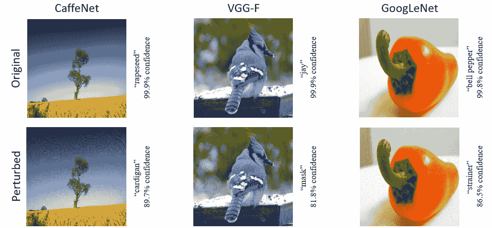
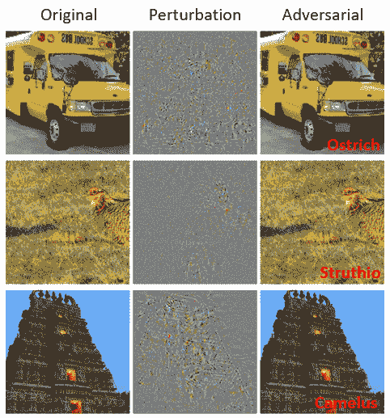
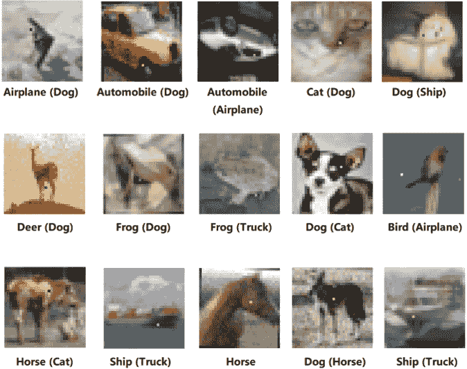
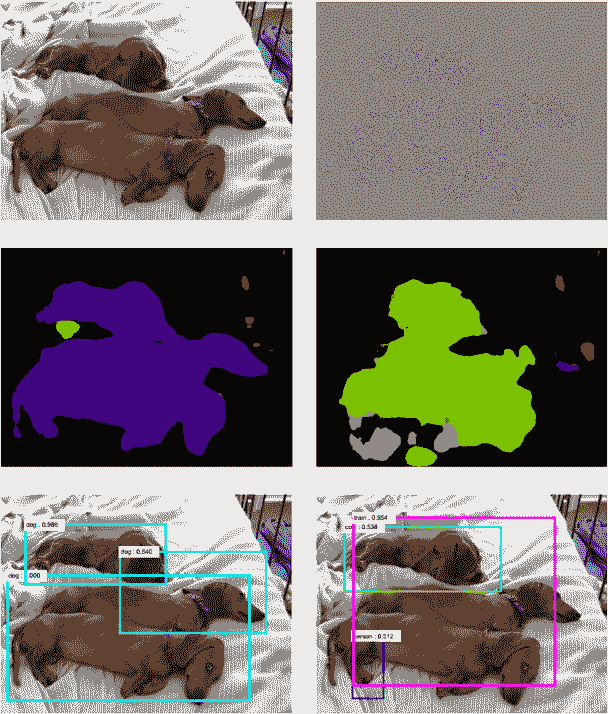
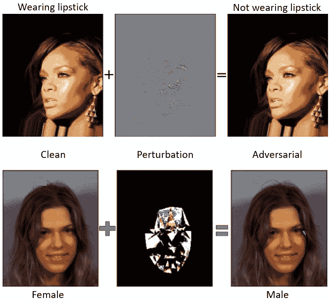
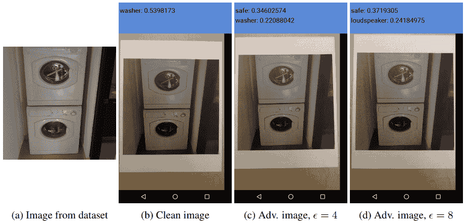
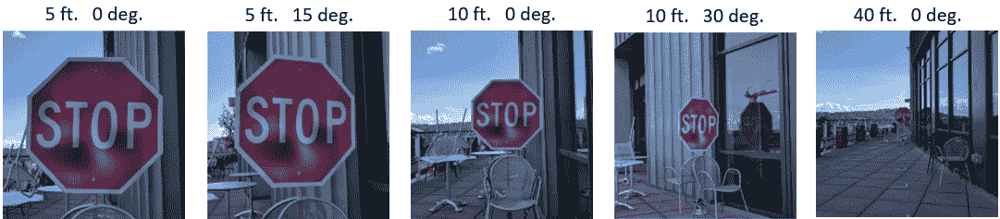
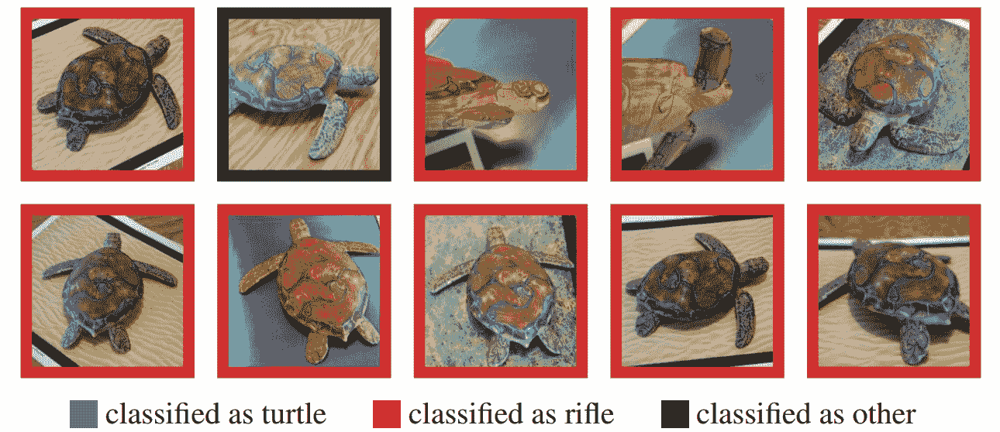
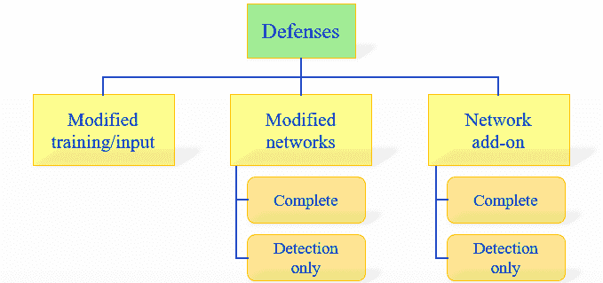
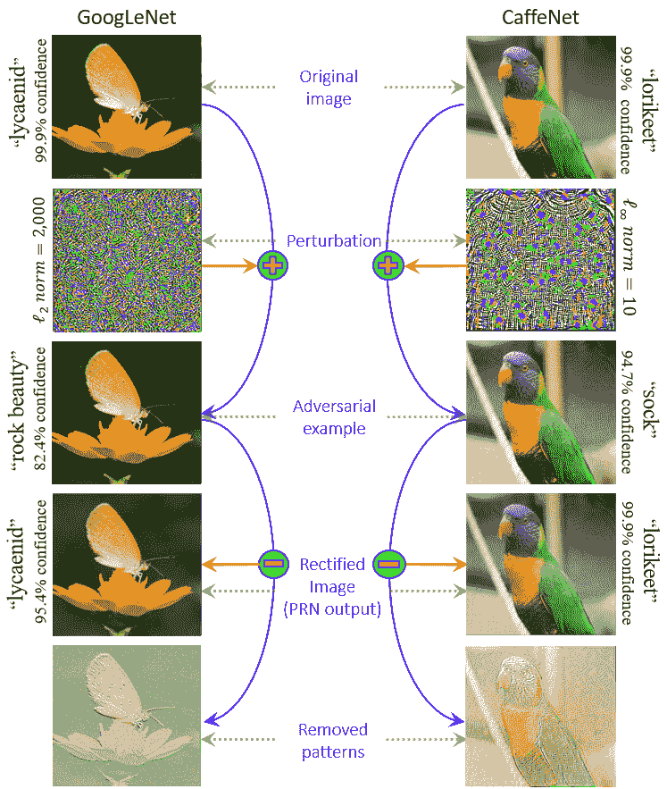

<!--yml

分类：未分类

日期：2024-09-06 20:08:23

-->

# [1801.00553] 《深度学习在计算机视觉中的对抗攻击威胁：综述》

> 来源：[`ar5iv.labs.arxiv.org/html/1801.00553`](https://ar5iv.labs.arxiv.org/html/1801.00553)

# 《深度学习在计算机视觉中的对抗攻击威胁：综述》

Naveed Akhtar 和 Ajmal Mian

致谢：作者感谢 Nicholas Carlini（加州大学伯克利分校）和 Dimitris Tsipras（麻省理工学院）对提升综述质量的反馈。我们还感谢 X. Huang（利物浦大学）、K. R. Reddy（印度科学研究所）、E. Valle（UNICAMP）、Y. Yoo（CLAIR）及其他人提供的建议，使综述更加全面。本研究得到了 ARC 资助 DP160101458 的支持。N. Akhtar 和 A. Mian 在西澳大学计算机科学与软件工程学院工作。

电子邮件：{naveed.akhtar, ajmal.mian}@uwa.edu.au 手稿接收于 2017 年 8 月，修订中…

###### 摘要

深度学习是当前人工智能崛起的核心。在计算机视觉领域，它已成为从自动驾驶汽车到监控和安全等应用的主力。尽管深度神经网络在解决复杂问题方面取得了惊人的成功（常常超越人类能力），但最近的研究显示，它们容易受到对抗攻击，这种攻击通过对输入进行细微扰动，使模型预测出错误的输出。对于图像而言，这种扰动通常过于微小，以至于不可察觉，但却完全欺骗了深度学习模型。对抗攻击对深度学习的实际成功构成了严重威胁。这一事实最近引发了大量相关研究。本文首次全面综述了计算机视觉中深度学习的对抗攻击。我们回顾了设计对抗攻击的研究，分析了这些攻击的存在，并提出了防御措施。为了强调对抗攻击在实际条件下是可能的，我们分别回顾了评估真实世界场景中的对抗攻击的贡献。最后，基于回顾的文献，我们提供了对这一研究方向的更广泛展望。

###### 索引词：

深度学习，对抗扰动，黑箱攻击，白箱攻击，对抗学习，扰动检测。

## 1 引言

深度学习 [1] 正在解决许多机器学习和人工智能领域过去难以突破的问题。因此，它目前被用于以空前的规模解读复杂的科学问题，例如 脑电路重建 [2]; DNA 突变分析 [3]; 预测潜在药物分子的结构-活性 [4]，以及分析粒子加速器数据 [5] [6]。深度神经网络也成为解决语音识别 [7] 和自然语言理解 [8] 等许多具有挑战性的任务的首选。

在计算机视觉领域，深度学习在 2012 年引起了广泛关注，此前 Krizhevsky 等人 [9] 展示了基于卷积神经网络（CNN） [10] 的模型在一个非常具有挑战性的大规模视觉识别任务 [11] 上的卓越表现。当前深度学习流行度的显著归功于这项开创性工作。自 2012 年以来，计算机视觉社区为深度学习研究做出了大量宝贵贡献，使其能够为从医学科学 [21] 到移动应用 [181] 等领域的问题提供解决方案。AlphaGo Zero [14] 在人工智能领域的突破性进展也得益于深度残差网络（ResNets） [147]，这一网络最初是为图像识别任务提出的。

随着深度神经网络模型的不断改进 [145], [147], [168]; 高效深度学习软件库的开放获取 [177], [178], [179]; 以及训练复杂模型所需硬件的易得性，深度学习正迅速成熟，进入安全和保密关键应用领域，例如 自动驾驶汽车 [12], [182], 监控 [13], 恶意软件检测 [34], [107], 无人机和机器人 [157], [180], 以及语音命令识别 [7]。随着近期如面部识别 ATM [183] 和手机上的 Face ID 安全性 [184]等现实世界的发展，深度学习解决方案，特别是那些源于计算机视觉问题的解决方案，显然将在我们的日常生活中发挥重要作用。

图 1：使用“通用对抗扰动”攻击深度学习模型的示例 [16]：攻击展示了 CaffeNet [9]、VGG-F 网络 [17] 和 GoogLeNet [18] 的情况。所有网络都以高度信心正确识别了原始干净图像。在对图像添加了小的扰动后，网络以类似的高信心预测了错误的标签。请注意，这些扰动对于人眼几乎不可察觉，但它们对深度学习模型的影响却是灾难性的。

尽管深度学习在执行各种计算机视觉任务时表现出色，但 Szegedy 等人 [22] 首次发现了深度神经网络在图像分类中的一个有趣弱点。他们表明，尽管现代深度网络具有很高的准确率，但它们对小的扰动攻击（这些扰动对人眼几乎不可察觉）却出奇地敏感。这些攻击可以导致神经网络分类器完全改变对图像的预测。更糟糕的是，被攻击的模型会对错误的预测报告高度自信。此外，相同的图像扰动可以欺骗多个网络分类器。这些结果的深远影响引起了研究人员对深度学习对抗攻击及其防御的广泛关注。

自从 Szegedy 等人 [22] 的研究发现以来，计算机视觉领域出现了关于深度学习对抗攻击的若干有趣结果。例如，除了图像特定的对抗扰动 [22] 外，Moosavi-Dezfooli 等人 [16] 还展示了“通用扰动”的存在，这些扰动能够欺骗任何图像上的网络分类器（例如见图 1）。类似地，Athalye 等人 [65] 证明了甚至可以 3-D 打印真实世界中的物体，以欺骗深度神经网络分类器（见第 4.3 节）。鉴于深度学习研究在计算机视觉中的重要性及其在现实生活中的潜在应用，本文首次全面综述了计算机视觉中对深度学习的对抗攻击。本文面向比计算机视觉社区更广泛的读者，因此仅假设对深度学习和图像处理有基本知识。然而，本文也讨论了感兴趣读者可能关注的重要贡献的技术细节。

我们首先在第二部分中描述与对抗性攻击相关的常见术语。在第三部分中，我们回顾了图像分类及其他任务中的对抗性攻击。一个单独的部分专门讨论在现实世界条件下处理对抗性攻击的方法。这些方法在第四部分中进行了回顾。在文献中，也有一些工作主要集中于分析对抗性攻击的存在性。我们在第五部分中讨论这些贡献。以防御对抗性攻击为中心的研究方法在第六部分中进行讨论。在第七部分中，我们根据回顾的文献提供了研究方向的更广泛展望。最后，我们在第八部分中得出结论。

## 2 术语定义

在本节中，我们描述了与计算机视觉中对抗性攻击相关的文献中使用的常见技术术语。余下的文章也遵循相同的术语定义。

+   •

    对抗性示例/图像是干净图像的修改版，通过有意的扰动（例如添加噪声）来混淆/欺骗机器学习技术，例如深度神经网络。

+   •

    对抗性扰动是加在干净图像上的噪声，使其变成对抗性示例。

+   •

    对抗性训练除了使用干净图像外，还使用对抗性图像来训练机器学习模型。

+   •

    对手通常指的是创建对抗性示例的代理。然而，在某些情况下，示例本身也被称为对手。

+   •

    黑箱攻击向目标模型输入在不了解该模型的情况下生成的对抗性示例（在测试期间）。在某些情况下，假设对手对模型有有限了解（例如其训练过程和/或架构），但绝对不知道模型参数。在其他情况下，使用关于目标模型的任何信息被称为“半黑箱”攻击。我们在本文中使用前者的定义。

+   •

    检测器是一个机制，用于（仅）检测图像是否为对抗性示例。

+   •

    欺骗率/比例表示在对图像进行扰动后，训练模型更改其预测标签的图像百分比。

+   •

    一次性/一步法方法通过执行单步计算来生成对抗扰动，例如，仅计算模型损失的梯度。相反的是迭代方法，它们执行相同的计算多次以获得一个扰动。后者通常计算开销较大。

+   •

    几乎不可察觉的扰动对人类感知的图像影响非常轻微。

+   •

    校正器修改对抗样本，以将目标模型的预测恢复到该样本的干净版本上的预测。

+   •

    定向攻击欺骗模型错误地预测对抗图像的特定标签。它们与非定向攻击相对，后者只要不是正确标签，对抗图像的预测标签无关紧要。

+   •

    威胁模型指的是方法考虑的潜在攻击类型，例如黑盒攻击。

+   •

    迁移性指的是对抗样本在生成它的模型之外仍然有效的能力。

+   •

    通用扰动能够以高概率欺骗给定模型在“任何”图像上。请注意，通用性指的是扰动具有“图像无关性”的特性，而不是具有良好的迁移性。

+   •

    白盒攻击假设对目标模型具有完全知识，包括其参数值、架构、训练方法以及在某些情况下的训练数据。

## 3 对抗攻击

在这一部分，我们回顾了计算机视觉领域的文献，这些文献介绍了对深度学习的对抗攻击方法。回顾的文献主要涉及在“实验室环境”中欺骗深度神经网络的艺术，其中开发了用于典型计算机视觉任务（例如识别）的方法，并使用标准数据集（例如 MNIST）展示其有效性[10]。关注于现实世界条件下攻击深度学习的技术在第四部分中单独回顾。然而，需要注意的是，本节回顾的方法构成了现实世界攻击的基础，而且几乎每一种方法都可能在实践中显著影响深度学习。我们的划分基于原始贡献中攻击的评估条件。

本节的回顾主要按时间顺序组织，少数例外以保持讨论的连贯性。为了向读者提供核心概念的技术理解，我们还深入探讨了流行方法及其代表性技术，以及该领域新兴方向的一些技术。其他方法则简要讨论。有关这些技术的详细信息，请参阅原始论文。本节分为两个部分。在部分 3.1 中，我们回顾了攻击深度神经网络的那些方法，这些网络执行计算机视觉中最常见的任务，即分类/识别。在部分 3.2 中，我们讨论了主要设计用于攻击深度学习以外任务的方法。

### 3.1 分类攻击

#### 3.1.1 有盒约束的 L-BFGS

Szegedy 等人 [22] 首次演示了对图像进行小扰动的存在，以至于这些扰动后的图像可以欺骗深度学习模型进行错误分类。令${\bf I}_{c}\in\mathbb{R}^{m}$表示一个向量化的干净图像——下标‘$c$’强调图像是干净的。为了计算一个加性扰动$\boldsymbol{\rho}\in\mathbb{R}^{m}$，该扰动会略微扭曲图像以欺骗网络，Szegedy 等人提出解决以下问题：

|  | $\displaystyle\min_{\boldsymbol{\rho}}&#124;&#124;\boldsymbol{\rho}&#124;&#124;_{2}\hskip 5.69054pt\text{s.t.}~{}\mathcal{C}({\bf I}_{c}+\boldsymbol{\rho})=\ell;~{}{\bf I}_{c}+\boldsymbol{\rho}\in[0,1]^{m},$ |  | (1) |
| --- | --- | --- | --- |

其中‘$\ell$’表示图像的标签，而$\mathcal{C}(.)$是深度神经网络分类器。作者提出解决(1)的非平凡解，其中‘$\ell$’与原始标签${\bf I}_{c}$不同。在这种情况下，(1)变成了一个难题，因此通过使用有盒约束的 L-BFGS [20]寻求近似解。这是通过寻找最小的$c>0$来完成的，对于该$c$，以下问题的最小化器$\boldsymbol{\rho}$满足条件$\mathcal{C}({\bf I}_{c}+\boldsymbol{\rho})=\ell$：

|  | $\displaystyle\min_{\boldsymbol{\rho}}~{}~{}c&#124;\boldsymbol{\rho}&#124;+\mathcal{L}({\bf I}_{c}+\boldsymbol{\rho},\ell)~{}~{}s.t.~{}{\bf I}_{c}+\boldsymbol{\rho}\in[0,1]^{m},$ |  | (2) |
| --- | --- | --- | --- |

其中 $\mathcal{L}(.,.)$ 计算分类器的损失。我们注意到 (2) 结果对于具有凸损失函数的分类器提供了精确的解决方案。然而，对于深度神经网络，通常情况并非如此。计算出的扰动被简单地添加到图像中，使其成为对抗样本。

如图 2 所示，上述方法能够计算出扰动，当这些扰动添加到干净图像中时，可以欺骗神经网络，但对抗样本在人的视觉系统中与干净图像类似。Szegedy 等人观察到，对一个神经网络计算出的扰动也能欺骗多个网络。这些惊人的结果揭示了深度学习中的一个盲点。在这一发现时，计算机视觉界正快速适应于深度学习特征定义了感知距离在欧几里得距离下的空间。因此，这些矛盾的结果引发了研究人员对计算机视觉中深度学习的对抗攻击的广泛兴趣。

图 2：使用 [22] 为 AlexNet [9] 生成的对抗样本示意图。为了更好地可视化，扰动被放大了 10 倍（值偏移了 128 并被限制）。对抗样本的预测标签也被显示出来。

#### 3.1.2 快速梯度符号方法（FGSM）

Szegedy 等人观察到 [22] 深度神经网络对对抗样本的鲁棒性可以通过对抗训练得到改善。为了实现有效的对抗训练，Goodfellow 等人 [23] 开发了一种方法，通过解决以下问题来高效计算给定图像的对抗扰动：

|  | $\displaystyle\boldsymbol{\rho}=\epsilon~{}\text{sign}\left(\nabla\mathcal{J}(\boldsymbol{\theta},{\bf I}_{c},\ell)\right),$ |  | (3) |
| --- | --- | --- | --- |

其中 $\nabla\mathcal{J}(.,.,.)$ 计算损失函数在模型参数 $\boldsymbol{\theta}$ 当前值下对 ${\bf I}_{c}$ 的梯度，sign$(.)$ 表示符号函数，$\epsilon$ 是一个限制扰动范数的小标量值。解决该问题的方法在原始工作中被称为“快速梯度符号方法”（FGSM）。

有趣的是，FGSM 生成的对抗样本利用了深度网络模型在高维空间中的‘线性’特性，而当时这些模型通常被认为是高度非线性的。Goodfellow 等人[23]假设现代深度神经网络的设计（故意）鼓励线性行为以获得计算上的好处，也使它们易受廉价的分析扰动。在相关文献中，这一观点通常被称为‘线性假设’，FGSM 方法验证了这一假设。

Kurakin 等人[80]指出，在流行的大规模图像识别数据集 ImageNet[11]上，FGSM 生成的对抗样本的 top-1 错误率约为$63-69\%$，对于$\epsilon\in[2,32]$。作者还提出了 FGSM 的‘单步目标类’变体，其中不是使用图像的真实标签$\ell$（在 3 ‣ 3.1 Attacks for classification ‣ 3 Adversarial attacks ‣ Threat of Adversarial Attacks on Deep Learning in Computer Vision: A Survey")中），而是使用网络预测的最不可能的类标签$\ell_{\text{target}}$。然后，将计算出的扰动从原始图像中减去，以使其成为对抗样本。对于具有交叉熵损失的神经网络，这样做最大化了网络将$\ell_{\text{target}}$预测为对抗样本标签的概率。建议可以使用随机类作为欺骗网络的目标类，但这可能导致较少有趣的欺骗，例如将一种犬种误分类为另一种犬种。作者还展示了对抗训练提高了深度神经网络对 FGSM 及其提出的变体生成的攻击的鲁棒性。

FGSM 通过扰动图像来增加分类器在生成图像上的损失。符号函数确保损失的幅度被最大化，而$\epsilon$实际上限制了扰动的$\ell_{\infty}$-范数。Miyato 等人[103]提出了一种密切相关的方法来计算扰动，如下所示。

|  | $\displaystyle\boldsymbol{\rho}=\epsilon\frac{\nabla\mathcal{J}(\boldsymbol{\theta},{\bf I}_{c},\ell)}{&#124;&#124;\nabla\mathcal{J}(\boldsymbol{\theta},{\bf I}_{c},\ell)&#124;&#124;_{2}}.$ |  | (4) |
| --- | --- | --- | --- |

在上述方程中，计算出的梯度通过其$\ell_{2}$-范数进行了归一化。Kurakin 等人[80]将这一技术称为‘快速梯度 L[2]’方法，还提出了使用$\ell_{\infty}$-范数进行归一化的替代方法，并将结果技术称为‘快速梯度 L[∞]’方法。广义而言，所有这些方法在计算机视觉领域的对抗攻击相关文献中被视为‘单步’或‘一步’方法。

#### 3.1.3 基本与最不可能类别迭代方法

一步法通过在增加分类器损失的方向上迈出一个大的步伐来扰动图像（即一步梯度上升）。这个想法的直观扩展是迭代地迈出多个小步，同时在每一步后调整方向。基本迭代方法（BIM） [35] 正是这样做的，并迭代地计算以下内容：

|  | $\displaystyle{\bf I}_{\boldsymbol{\rho}}^{i+1}=\text{Clip}_{\epsilon}\left\{{\bf I}_{\boldsymbol{\rho}}^{i}+\alpha~{}\text{sign}(\nabla\mathcal{J}(\boldsymbol{\theta},{\bf I}_{\boldsymbol{\rho}}^{i},\ell)\right\},$ |  | (5) |
| --- | --- | --- | --- |

其中 ${\bf I}_{\boldsymbol{\rho}}^{i}$ 表示第 $i^{\text{th}}$ 次迭代中的扰动图像，Clip${}_{\epsilon}\{.\}$ 将图像在其参数处的像素值限制在 $\epsilon$ 范围内，$\alpha$ 决定步长（通常，$\alpha=1$）。BIM 算法从 ${\bf I}_{\boldsymbol{\rho}}^{0}={\bf I}_{c}$ 开始，并运行至由公式 $\lfloor\min(\epsilon+4,1.25\epsilon)\rfloor$ 确定的迭代次数。Madry 等人 [55] 指出，BIM 等同于（$\ell_{\infty}$ 版本的）投影梯度下降（PGD），这是一种标准的凸优化方法。

类似于将 FGSM 扩展到其“单步目标类别”变体，Kurakin 等人 [35] 还将 BIM 扩展到了迭代最不可能类别方法（ILCM）。在这种情况下，图像的标签 $\ell$（参见 5）被分类器预测的最不可能类别的目标标签 $\ell_{\text{target}}$ 替代。使用 ILCM 方法生成的对抗样本已被证明严重影响现代深度架构 Inception v3 [145] 的分类准确性，即使对于非常小的 $\epsilon$ 值，例如 $<16$。

#### 3.1.4 基于雅可比矩阵的显著性图攻击（JSMA）

在文献中，通过限制$\ell_{\infty}$或$\ell_{2}$-范数的扰动来生成对抗样本，以使其对人类几乎不可察觉是更为常见的。然而，Papernot 等人[60]还通过限制扰动的$\ell_{0}$-范数创建了一种对抗攻击。从物理角度来看，这意味着目标是仅修改图像中的几个像素，而不是扰动整个图像来欺骗分类器。他们生成所需对抗图像的算法核心可以理解如下。该算法一次修改干净图像中的一个像素，并监视变化对分类结果的影响。监视是通过计算网络层输出的梯度来生成显著性图完成的。在此图中，较大的值表示欺骗网络将$\ell_{\text{target}}$预测为修改后图像的标签而非原始标签$\ell$的可能性更高。因此，该算法执行了有针对性的欺骗。一旦计算出图，算法选择对欺骗网络最有效的像素并对其进行更改。此过程重复进行，直到在对抗图像中更改的像素达到最大允许数量或欺骗成功为止。

#### 3.1.5 单像素攻击

对于对抗攻击的一个极端情况是，仅改变图像中的一个像素来欺骗分类器。有趣的是，Su 等人[68]声称，通过每张图像仅更改一个像素，成功欺骗了三种不同的网络模型，在$70.97\%$的测试图像上。他们还报告了网络对错误标签的平均置信度为$97.47\%$。我们在图 3 中展示了来自[68]的对抗图像的代表性示例。Su 等人通过使用差分进化[148]的概念计算了对抗样本。对于干净图像${\bf I}_{c}$，他们首先创建了一组$400$个在$\mathbb{R}^{5}$中的向量，其中每个向量包含了一个任意候选像素的$xy$-坐标和 RGB 值。然后，他们随机修改这些向量的元素以创建子代，使得子代在下一次迭代中与其父代竞争适应度，同时网络的概率预测标签作为适应度标准。最后幸存的子代用于更改图像中的像素。

图 3：单像素对抗攻击的示意图[68]：每张图像都标有正确的标签。相应的预测标签以括号形式给出。

尽管采用如此简单的进化策略，Su 等人 [68] 仍然成功展示了对深度网络的欺骗效果。请注意，差分进化使得他们的方法在没有网络参数值或梯度信息的情况下生成对抗样本。他们的方法唯一需要的输入是目标模型预测的概率标签。

#### 3.1.6 Carlini 和 Wagner 攻击（C&W）

Carlini 和 Wagner [36] 在防御蒸馏针对对抗扰动 [38] 的背景下介绍了一组三种对抗攻击。这些攻击通过限制其 $\ell_{2}$、$\ell_{\infty}$ 和 $\ell_{0}$ 范数，使扰动几乎不可感知，且显示出针对目标网络的防御蒸馏几乎完全失败。此外，还显示了使用未蒸馏（未处理）网络生成的对抗样本在安全（蒸馏）网络上传递良好，这使得计算出的扰动适合用于黑箱攻击。

尽管利用对抗样本的迁移性属性来生成黑箱攻击更为常见，但 Chen 等人 [41] 也提出了基于“零阶优化（ZOO）”的攻击，该方法直接估计目标模型的梯度以生成对抗样本。这些攻击受到 C&W 攻击的启发。有关 C&W 和 ZOO 攻击的更多细节，请参阅原始论文。

#### 3.1.7 DeepFool

Moosavi-Dezfooli 等人 [72] 提出了以迭代方式计算给定图像的最小范数对抗扰动。他们的算法，即 DeepFool，以被假定位于分类器决策边界所限制区域内的干净图像作为初始化。该区域决定了图像的类别标签。在每次迭代中，算法通过计算得到的小向量来扰动图像，使得结果图像接近由线性化区域边界形成的多面体边界。每次迭代中添加到图像的扰动被累积，以计算最终扰动，直到扰动图像根据网络的原始决策边界改变标签为止。作者展示了 DeepFool 算法能够计算出比 FGSM [23] 计算的扰动范数更小的扰动，同时拥有类似的欺骗率。

#### 3.1.8 通用对抗扰动

与 FGSM [23]、ILCM [35]、DeepFool [72] 等方法通过计算扰动来欺骗网络的单张图像不同，Moosavi-Dezfooli 等人 [16] 计算的‘通用’对抗扰动能够以高概率欺骗网络上的‘任何’图像。这些与图像无关的扰动对于人类视觉系统仍然几乎不可察觉，如图 1 所示。为了正式定义这些扰动，假设干净的图像是从分布 $\boldsymbol{\Im}_{c}$ 中采样的。一个扰动 $\boldsymbol{\rho}$ 是‘通用’的，如果它满足以下约束：

|  | $\displaystyle\underset{{\bf I}_{c}\sim\boldsymbol{\Im}_{c}}{\mathrm{\text{P}}}\Big{(}\mathcal{C}({\bf I}_{c})\neq\mathcal{C}({\bf I}_{c}+\boldsymbol{\rho})\Big{)}\geq\delta~{}~{}~{}\text{s.t.}~{}~{}&#124;&#124;\boldsymbol{\rho}&#124;&#124;_{p}\leq\xi,$ |  | (6) |
| --- | --- | --- | --- |

其中 P(.) 表示概率，$\delta\in(0,1]$ 是欺骗率，$||.||_{p}$ 表示 $\ell_{p}$-范数，$\xi$ 是预定义常量。$\xi$ 的值越小，图像中扰动的感知难度越大。严格来说，满足 (6) 的扰动应称为 $(\delta,\xi)$-通用，因为它们对这些参数有很强的依赖。然而，这些扰动在文献中通常被称为‘通用对抗扰动’。

作者通过限制其 $\ell_{2}$-范数以及 $\ell_{\infty}$-范数来计算通用扰动，并展示了其范数上界为图像范数的 $4\%$ 的扰动在最先进的图像分类器中已经实现了约 0.8 或更高的显著欺骗率。他们的迭代计算扰动的方法与 DeepFool 策略 [72] 相关，该策略通过逐步推送数据点（即图像）到其类别的决策边界来计算扰动。然而，在这种情况下，‘所有’训练数据点都被顺序推送到各自的决策边界，并且计算的扰动通过每次将累加器反投影到所需的 $\ell_{p}$ 半径为 $\xi$ 的球体上来逐步累积。

Moosavi-Dezfooli 等人[16] 提出的算法在针对单一网络模型（例如 ResNet [147]）时计算扰动。然而，研究表明这些扰动在不同网络（特别是那些具有相似架构的网络）上也能很好地泛化。从这个意义上讲，作者认为这些扰动在某种程度上是“二重通用的”。此外，还表明通过仅使用约 $2,000$ 张训练图像可以实现高欺骗比率（例如 $\delta\geq 0.5$）。

Khrulkov 等人[190] 还提出了一种方法，通过网络的特征图雅可比矩阵的奇异向量来构建通用对抗扰动，这种方法只需少量图像即可实现相对较高的欺骗率。另一种生成通用扰动的方法是 Mopuri 等人[135] 提出的快速特征欺骗（fast-feature-fool）。他们的方法生成的通用扰动与数据无关。

#### 3.1.9 UPSET 和 ANGRI

Sarkar 等人[146] 提出了两种黑箱攻击算法，即 UPSET: Universal Perturbations for Steering to Exact Targets（通用扰动引导到精确目标）和 ANGRI: Antagonistic Network for Generating Rogue Images（敌对网络生成恶意图像）用于针对深度神经网络的欺骗。对于‘n’个类别，UPSET 旨在生成‘n’种图像无关的扰动，使得当这些扰动添加到不属于目标类别的图像上时，分类器将把扰动图像归为该类别。UPSET 的威力来自于一个残差生成网络 R(.)，它以目标类别‘t’作为输入，并生成扰动 R(t) 用于欺骗。整体方法使用所谓的 UPSET 网络解决以下优化问题：

|  | $\displaystyle{\bf I}_{\boldsymbol{\rho}}=\max(\min(s\text{R(t)}+{\bf I}_{c},1),-1),$ |  | (7) |
| --- | --- | --- | --- |

其中，${\bf I}_{c}$ 中的像素值被归一化到 $[-1,1]$ 区间，而‘s’是一个标量。为了确保 ${\bf I}_{\boldsymbol{\rho}}$ 是有效图像，所有超出区间 $[-1,1]$ 的值都被剪裁。与 UPSET 的图像无关扰动相比，ANGRI 以类似的方式计算图像特定的扰动，具体方法请参阅原始工作。ANGRI 产生的扰动也用于有针对性的欺骗。这两种算法在 MNIST [10] 和 CIFAR-10 [152] 数据集上均报告了高欺骗比率。

#### 3.1.10 Houdini

Cisse 等人 [131] 提出了 ‘Houdini’——一种通过生成可针对任务损失进行定制的对抗样本来欺骗基于梯度的学习机器的方法。典型的对抗样本生成算法使用网络的可微分损失函数的梯度来计算扰动。然而，任务损失通常不适用于这种方法。例如，语音识别的任务损失基于词错误率，这不允许直接利用损失函数梯度。Houdini 被定制用于生成此类任务的对抗样本。除了成功生成用于分类的对抗图像外，Houdini 还成功攻击了一个流行的深度自动语音识别系统 [151]。作者还通过在黑盒攻击场景中欺骗 Google Voice 展示了攻击在语音识别中的可转移性。此外，还展示了对人类姿态估计的深度学习模型成功的定向和非定向攻击。

#### 3.1.11 对抗变换网络 (ATNs)

Baluja 和 Fischer [42] 训练了前馈神经网络，以生成针对其他定向网络或网络组的对抗样本。这些训练后的模型被称为对抗变换网络 (ATNs)。这些网络生成的对抗样本是通过最小化包含两个部分的联合损失函数来计算的。第一部分限制对抗样本与原始图像在感知上的相似性，而第二部分则旨在改变目标网络对结果图像的预测。

在相同方向上，Hayex 和 Danezis [47] 也使用了攻击者神经网络来生成黑盒攻击的对抗样本。在展示的结果中，攻击者网络计算出的样本在感知上与干净图像无异，但被定向网络以压倒性的概率错误分类——使 MNIST 数据集上的分类准确率从 99.4% 降至 0.77%，而 CIFAR-10 数据集上的分类准确率从 91.4% 降至 6.8% [10]，[152]。

表 I: 各种攻击方法属性的总结：‘扰动范数’指的是为了使扰动不可感知的受限 $\ell_{p}$-范数。强度（更多星号表示更强）基于所审阅文献中的印象。

| 方法 | 黑盒/白盒 | 定向/非定向 | 特定/通用 | 扰动范数 | 学习 | 强度 |
| --- | --- | --- | --- | --- | --- | --- |
| L-BFGS [22] | 白盒 | 定向攻击 | 图像特定 | $\ell_{\infty}$ | 一次性 | $***$ |
| FGSM [23] | 白盒 | 定向攻击 | 图像特定 | $\ell_{\infty}$ | 一次性 | $***$ |
| BIM & ILCM [35] | 白盒 | 非定向攻击 | 图像特定 | $\ell_{\infty}$ | 迭代式 | $**$$**$ |
| JSMA [60] | 白盒 | 定向攻击 | 图像特定 | $\ell_{0}$ | 迭代式 | $***$ |
| One-pixel [68] | 黑盒 | 非定向攻击 | 图像特定 | $\ell_{0}$ | 迭代式 | $**$ |
| C&W 攻击 [36] | 白盒 | 定向攻击 | 图像特定 | $\ell_{0},\ell_{2},\ell_{\infty}$ | 迭代式 | $*****$ |
| DeepFool [72] | 白盒 | 非定向攻击 | 图像特定 | $\ell_{2},\ell_{\infty}$ | 迭代式 | $**$$**$ |
| Uni. 扰动 [16] | 白盒 | 非定向攻击 | 通用 | $\ell_{2},\ell_{\infty}$ | 迭代式 | $*****$ |
| UPSET [146] | 黑盒 | 定向攻击 | 通用 | $\ell_{\infty}$ | 迭代式 | $**$$**$ |
| ANGRI [146] | 黑盒 | 定向攻击 | 图像特定 | $\ell_{\infty}$ | 迭代式 | $**$$**$ |
| Houdini [131] | 黑盒 | 定向攻击 | 图像特定 | $\ell_{2},\ell_{\infty}$ | 迭代式 | $**$$**$ |
| ATNs [42] | 白盒 | 定向攻击 | 图像特定 | $\ell_{\infty}$ | 迭代式 | $**$$**$ |

#### 3.1.12 杂项攻击

上述讨论的对抗攻击要么是最近文献中的流行攻击，要么是代表性地快速变得流行的研究方向。这些攻击的主要特征的总结也提供在表 I ‣ 3.1 Attacks for classification ‣ 3 Adversarial attacks ‣ Threat of Adversarial Attacks on Deep Learning in Computer Vision: A Survey")中。为了全面研究，下面我们提供进一步生成对抗攻击深度神经网络的技术的简要描述。我们注意到，这一研究领域目前非常活跃。尽管尽力回顾了尽可能多的方法，但我们不声称回顾是详尽的。由于这一研究方向的高活动性，未来可能会出现更多攻击。

Sabour 等人 [26] 展示了通过改变深度神经网络的内部层可以生成对抗性示例的可能性。作者们证明了可以使对抗性图像的内部网络表示与来自不同类别的图像的表示相似。Papernot 等人 [109] 研究了对深度学习以及其他机器学习技术的对抗性攻击的可转移性，并引入了进一步的可转移攻击。Narodytska 和 Kasiviswanathan [54] 也引入了进一步的黑盒攻击方法，这些攻击方法通过仅更改图像中的少数像素值就能成功愚弄神经网络。Liu 等人 [31] 提出了‘epsilon-邻域’攻击方法，已被证明可以以$100\%$的成功率愚弄防御性精馏网络 [108] 进行白盒攻击。Oh 等人 [133] 从‘博弈论’的角度对对抗性攻击进行了研究，并推导出了对抗性攻击深度神经网络所采取的反措施的策略。Mpouri 等人 [135] 开发了一种数据独立的方法来生成深度网络模型的通用对抗扰动。Hosseini 等人 [98] 提出了‘语义对抗性示例’的概念 - 输入图像对于人类来说代表语义相同的对象，但深度神经网络会误分类它们。他们使用图像的负面作为语义对抗性示例。Kanbak 等人 [73] 在 DeepFool 方法 [72] 后提出了‘ManiFool’算法，用于测量深度神经网络对几何扰动图像的稳健性。Dong 等人 [170] 提出了一种迭代方法，以增强黑盒场景下的对抗攻击。最近，Carlini 和 Wagner [59] 也证明了十种不同的抵御扰动的方法可以通过使用新的损失函数构造的新攻击再次被打败。Rozsa 等人 [94] 还提出了一种‘热/冷’方法，用于生成单个图像的多个可能对抗性示例。有趣的是，对抗性扰动不仅仅是为了降低深度学习分类器的准确性。Yoo 等人 [195] 最近提出了一种方法，通过对图像进行微小扰动，还能略微提高分类性能。

我们注意到，本文中回顾的许多工作的作者已将其实现的源代码公开。这是当前该研究方向兴起的主要原因之一。除了这些资源，还有一些库，例如 Cleverhans [111], [112]，也开始出现，以进一步推动这一研究方向。Adversarial-Playground ([`github.com/QData/AdversarialDNN-Playground`](https://github.com/QData/AdversarialDNN-Playground)) 是由 Norton 和 Qi [142] 公开的另一个工具箱示例，用于理解对抗攻击。

### 3.2 分类/识别之外的攻击

除了 Houdini [131] 之外，所有在第 3.1 节中回顾的主流对抗攻击都直接集中在分类任务上 - 通常是欺骗基于 CNN 的 [10] 分类器。然而，由于对抗威胁的严重性，攻击也在积极调查分类/识别任务之外的计算机视觉任务。下面，我们回顾了在分类任务之外攻击深度神经网络的方法。

#### 3.2.1 对自动编码器和生成模型的攻击

Tabacof 等人 [128] 研究了对自动编码器 [154] 的对抗攻击，并提出了一种扭曲输入图像（使其具有对抗性）的方法，这会误导自动编码器重建出完全不同的图像。他们的方法攻击神经网络的内部表示，使得对抗图像的表示与目标图像的表示变得相似。然而，[128] 中报告称，自动编码器似乎比典型的分类器网络对对抗攻击更加稳健。Kos 等人 [121] 还探讨了计算深度生成模型（如变分自动编码器（VAE）和 VAE-生成对抗网络（VAE-GANs））的对抗示例的方法。由于 GANs，如 [153]，在计算机视觉应用中因其学习数据分布并使用这些分布生成逼真图像的能力而变得极受欢迎。作者介绍了对 VAE 和 VAE-GANs 的三种不同攻击类别。由于这些攻击的成功，得出的结论是深度生成模型也易受对抗攻击，这些攻击能使输入变成完全不同的输出。这项工作进一步支持了“对抗示例是当前神经网络架构的普遍现象”的假设。

#### 3.2.2 对递归神经网络的攻击

Papernot 等人[110]成功生成了针对递归神经网络（RNNs）的对抗输入序列。RNNs 是特别适合学习序列输入和输出之间映射的深度学习模型[155]。Papernot 等人展示了计算前馈神经网络（例如 FGSM[23]）的对抗样本的算法也可以被调整用来欺骗 RNNs。特别是，作者展示了成功欺骗了流行的长短期记忆（LSTM）RNN 架构[156]。结论是，像 RNNs 这样的循环神经网络模型也无法抵御最初在非循环神经网络（即 CNNs）背景下发现的对抗扰动。

#### 3.2.3 深度强化学习中的攻击

Lin 等人[134]提出了两种不同的对抗攻击方法，针对的是通过深度强化学习训练的代理[157]。第一种攻击称为“策略性定时攻击”，对手通过在一个回合中的小部分时间步骤进行攻击，来最小化代理的奖励。提出了一种方法来确定何时应该制作和应用对抗样本，从而使攻击能够未被发现。第二种攻击，称为“诱导攻击”，对手通过结合生成模型和规划算法，将代理诱导到指定的目标状态。生成模型用于预测代理的未来状态，而规划算法生成诱导其的动作。这些攻击已成功地测试了最新深度强化学习算法训练的代理[157]，[158]。有关此工作的详细信息和对抗攻击的示例视频可以在以下网址找到：[`yclin.me/adversarial_attack_RL/`](http://yclin.me/adversarial_attack_RL/)。

在另一项工作中，Huang 等人[62]展示了 FGSM[23]也可以用来显著降低在深度强化学习背景下训练策略的性能。他们的威胁模型考虑了能够对策略的原始输入引入微小扰动的对手。实验表明，即使在黑箱场景中，也很容易用对抗样本混淆神经网络策略。有关此工作的更多视频和详细信息可在[`rll.berkeley.edu/adversarial/`](http://rll.berkeley.edu/adversarial/)找到。

#### 3.2.4 对语义分割和目标检测的攻击

语义图像分割和目标检测是计算机视觉中的主流问题。受 Moosavi-Dezfooli [16]的启发，Metzen 等人[67] 展示了存在图像无关的准不可感知的扰动，这些扰动可以欺骗深度神经网络，从而显著破坏图像的预测分割。此外，他们还展示了可以计算噪声向量，从而去除分割类别中的特定类别，同时保持大部分图像分割不变（例如，从道路场景中去除行人）。尽管有观点认为“语义图像分割的对抗扰动空间可能小于图像分类”，但这些扰动已被证明能够在未见过的验证图像中表现出较高的泛化能力。Arnab 等人[51] 还评估了基于 FGSM [23] 的对抗攻击对于语义分割的效果，并指出许多关于这些攻击的观察结果对于分割任务并不直接适用。

Xie 等人[115] 在观察到这些任务可以被表述为对图像中多个目标的分类——目标是分割中的像素或感受野，检测中的目标提议——后，计算了用于语义分割和目标检测的对抗样本。在这种视角下，他们的方法被称为“密集对抗生成”，通过对一组像素/提议优化损失函数来生成对抗样本。生成的样本经过测试以欺骗多种基于深度学习的分割和检测方法。他们的实验评估不仅展示了成功欺骗目标网络，还表明生成的扰动在不同网络模型中表现出良好的泛化能力。在图 4 中，我们展示了使用[115]中的方法对分割和检测进行网络欺骗的一个代表性例子。

图 4：用于语义分割和目标检测的对抗样本[115]。FCN [159] 和 Faster-RCNN [150] 分别用于分割和检测。左列（从上到下）：干净的图像、正常分割（紫色区域被预测为狗）和检测结果。右列（从上到下）：扰动 10 倍、欺骗性的分割（浅绿色区域被预测为火车，粉色区域被预测为人）和检测结果。

图 5：顶部行：使用快速翻转属性方法将面部属性“涂口红”更改为“不涂口红”的示例[130]。底部行：使用[162]生成的扰动来改变性别的示例。

## 4 攻击在现实世界中

图 6：对移动电话摄像头的对抗攻击示例：拍摄并使用 TensorFlow 相机演示应用程序[181]对生成的不同对抗图像进行分类。干净图像（a）通过摄像头正确识别为“垫圈”，而对抗图像（c）和（d）被错误分类。图像还显示了每张图像的网络置信度在区间[0,1]内。给出了$\epsilon$的值（3）。

#### 4.0.1 对面部属性的攻击

面部属性是现代安全系统中新兴的软生物特征之一。尽管面部属性识别也可以归类为分类问题，但我们单独审视这个方向中的一些有趣攻击，因为面部识别本身在计算机视觉中被视为主流问题。

Rozsa 等人[130]、[160]通过生成对抗性示例来改变面部属性识别结果，探索了使用 CelebA 基准[161]的多种深度学习方法的稳定性，参见图 5 的顶行。通过用他们所谓的‘快速翻转属性’技术攻击深度网络分类器，他们发现深度神经网络对对抗性攻击的鲁棒性在面部属性之间差异很大。声称对抗性攻击在将目标属性的标签更改为相关属性方面非常有效。Mirjalili 和 Ross[162]提出了一种技术，修改面部图像，使得其性别（对于性别分类器）被改变，而其在面部匹配系统中的生物识别效用保持不变，参见图 5 的底行。同样，Shen 等人[144]提出了两种不同的技术来生成面部的对抗性示例，这些示例可以在深度神经网络的面部吸引力评估中具有高‘吸引力分数’但低‘主观分数’。有关面部识别任务的进一步攻击，请参考[185]。

第三部分中审阅的文献假设了对手直接向深度神经网络输入扰动图像的环境。此外，攻击的有效性也通过标准图像数据库进行评估。尽管这些设置已经足以让许多研究人员相信对抗性攻击确实是深度学习在实际应用中的一个真实问题，但我们也发现了一些文献（例如[48]、[30]）中对此问题的关注被淡化，并且对抗性示例被认为‘仅仅是好奇心的问题’，与实际关切关系不大。因此，本节特别致力于处理在实际现实条件下的对抗性攻击文献，以帮助解决这一争论。

### 4.1 手机摄像头攻击

Kurakin 等人[35] 首次证明了物理世界中也存在对抗攻击的威胁。为了说明这一点，他们打印了对抗性图像，并用手机相机拍摄了快照。这些图像被输入到使用谷歌的 Inception 模型[145] 进行对象分类的 TensorFlow Camera Demo 应用[181] 中。结果显示，即使通过相机观察，很多图像也被误分类了。在图 6 中展示了原始论文中的一个例子。另有一个视频可在以下网址 [`youtu.be/zQ_uMenoBCk`](https://youtu.be/zQ_uMenoBCk) 中查看，展示了对抗攻击的威胁及更多图像。这项工作研究了 FGSM[23]、BIM 和 ILCM[35] 方法在物理世界中的攻击。

图 7: 路标攻击示例[75]：在所有显示的图像中欺骗 LISA-CNN[75] 分类器的成功率为 $100\%$。图中还展示了距离和角度。分类器使用 LISA 数据集进行训练，该数据集用于路标[176]。

### 4.2 路标攻击

Etimov 等人 [75] 基于 [36] 和 [88] 提出的攻击，设计了针对物理世界的鲁棒扰动。他们展示了在物理条件下，如视角、距离和分辨率变化下，攻击的鲁棒性。所提出的算法称为 RP[2]（鲁棒物理扰动），用于生成针对道路标志识别系统的对抗样本，并在实际行驶环境中取得了较高的欺骗率。在这项工作中，介绍了两类针对物理道路标志的攻击：（a）海报打印：攻击者打印一个扰动的道路标志海报并将其贴在真实标志上（见图 7），（b）贴纸扰动：将打印在纸上的扰动纸贴在真实标志上。对于（b），研究了两种类型的扰动，（b1）细微扰动：占据整个标志，（b2）伪装扰动：呈现为标志上的涂鸦贴纸。因此，所有这些扰动都需要一个彩色打印机，而不需要其他特殊硬件。成功生成针对（a）和（b）的扰动，并且这些扰动对物理世界中的自然变化保持鲁棒，展示了对抗样本在现实世界中的威胁。有关更多细节和相关视频，请参见以下网址：[`iotsecurity.eecs.umich.edu/#roadsigns`](https://iotsecurity.eecs.umich.edu/#roadsigns)。

需要注意的是，Lu 等人 [30] 之前声称，对抗样本在自主驾驶车辆中的目标检测中不是问题，因为车内物理条件变化。然而，他们使用的攻击方法 [22], [23], [35] 有些原始。Etimov 等人 [75] 的发现与 [66] 的结果是正交的。然而，在后续工作中，Lu 等人 [19] 显示像 YOLO 9000 [149] 和 FasterRCNN [150] 这样的检测器“目前”没有被 Etimov 等人 [75] 引入的攻击所欺骗。Zeng 等人 [87] 也认为图像空间中的对抗扰动在现实世界的物理空间中不能很好地泛化。然而，Athalye 等人 [65] 显示我们实际上可以打印 3D 物理对象来成功实施现实世界中的对抗攻击。我们在第 4.3 节中讨论了 [65]。

Gu 等人 [33] 还探索了一个有趣的概念，即在欺骗街道标志上的神经网络的背景下，外包训练的威胁。他们展示了可以训练一个网络（*BadNet*），该网络在用户的训练和验证样本上表现出最先进的性能，但在攻击者选择的输入上表现不佳。他们通过创建一个街道标志分类器来演示这种攻击，当在停止标志上添加一个特殊的贴纸时，它会将停止标志识别为限速标志。此外，发现即使在网络后续通过额外的训练数据进行微调时，对抗性欺骗仍能在合理的程度上持续存在。

### 4.3 通用对抗性 3D 物体

Athalye 等人 [65] 提出了一种构建 3D 物体的方法，该方法可以在各种角度和视角下欺骗神经网络。他们的“期望变换” (EOT) 框架能够构建对整个图像/物体变换分布具有对抗性的示例。他们的端到端方法可以打印任意对抗性 3D 物体。在我们看来，这项工作的结果确认了对深度学习在物理世界中对抗性攻击的真正关注。在图 Fig. 8 中，我们展示了一个由 EOT 框架修改的 3D 打印乌龟示例，它被分类为步枪。演示 EOT 在物理世界中欺骗的影片可在以下网址查看: [`www.youtube.com/watch?v=YXy6oX1iNoA&feature=youtu.be`](https://www.youtube.com/watch?v=YXy6oX1iNoA&feature=youtu.be)。

图 8：不同随机姿态的 3D 打印乌龟被 EOT [65] 扰动后被 ImageNet 分类器分类为步枪。未扰动的版本（未显示）以 $100\%$ 的概率被正确分类。

### 4.4 网络空间攻击

Papernot 等人[39] 在现实世界环境中对深度神经网络分类器发起了最早的攻击之一。他们为目标黑箱分类器在合成数据上训练了一个替代网络，并对 MetaMind、Amazon 和 Google 远程托管的神经网络发起了攻击。他们展示了各个目标网络对其方法生成的对抗样本的误分类率分别为 $84.24\%$、$96.19\%$ 和 $88.94\%$。实际上，在他们的威胁模型中，攻击者唯一能够获得的信息是目标网络对输入图像的输出标签。在相关工作中，Liu 等人[88] 开发了一种基于集成的攻击，并展示了其对 Clarifai.com（一家提供最先进图像分类服务的商业公司）的成功。作者声称，他们的针对性和非针对性欺骗攻击都能实现高成功率。

Grosse 等人[61] 展示了针对用作恶意软件分类器的神经网络的有效对抗攻击的构造。与图像识别相比，恶意软件分类领域在对抗设置中引入了额外的约束，例如连续输入域被离散输入所替代，视觉相似性的条件被要求具有等效的功能行为所替代。然而，Grosse 等人[61] 表明，对于恶意软件分类，创建有效的对抗样本仍然是可能的。有关基于深度学习的恶意软件分类成功对抗攻击的进一步示例，可以在 [64]、[107]、[125] 中找到。

### 4.5 机器人视觉与视觉问答攻击

Melis 等人[63] 通过使用 [22] 中的方法，展示了机器人对输入图像对抗性操控的脆弱性。作者认为，需要策略来促使深度神经网络学习更稳定的表征，以确保机器人安全。Xu 等人[40] 为视觉图灵测试（也称为“视觉问答”（VQA））生成了对抗攻击。作者表明，常用的组成性和非组成性 VQA 架构，特别是那些使用深度神经网络的架构，易受到对抗攻击。此外，对抗样本在模型之间是可转移的。他们得出结论，“对抗样本对图像分类模型以及更复杂的 VQA 模型构成了真正的威胁”[63]。

## 5 对抗样本的存在

在与计算机视觉中的深度学习对抗攻击相关的文献中，对对抗样本存在的看法各不相同。这些观点通常与研究人员在攻击或防御深度神经网络时所做的局部经验观察较为一致。然而，它们在泛化方面往往存在不足。例如，Goodfellow 等人 [23] 的流行线性假设很好地解释了 FGSM 和相关攻击。然而，Tanay 和 Griffin [74] 展示了线性分类器下不受对抗样本影响的图像类别，这与线性假设不符。更不用说，线性假设本身也与之前的普遍观点，即对抗样本源自深度神经网络引起的高度非线性决策边界，存在很大偏差。文献中还有其他例子表明线性假设并没有直接得到支持 [119]。

决策边界的平坦性 [69]、决策边界的大局部曲率 [70] 和网络的低灵活性 [71] 是一些关于对抗样本存在的观点，这些观点彼此之间并不完全一致。尽管显而易见，对抗样本可以通过修改图像中的一个像素来形成，但当前的文献似乎对对抗样本存在的原因缺乏共识。这一事实也使得对抗样本的分析成为一个积极的研究方向，预计将探索并解释由深度神经网络引起的决策边界的本质，这些网络目前更常被视作黑箱模型。以下，我们回顾了主要集中于分析深度学习中的对抗扰动存在性的研究工作。我们注意到，除了下面回顾的文献外，与对抗攻击（第三部分）和防御（第六部分）相关的工作通常会简要分析对抗扰动，同时对导致对抗样本存在的现象进行猜测。

### 5.1 对对抗鲁棒性的限制

Fawzi 等人 [118] 引入了一个框架来研究分类器对对抗扰动的不稳定性。他们建立了分类器鲁棒性的基本限制，这些限制是通过数据集类别之间的“可区分性度量”来定义的，其中可区分性被定义为线性分类器中两个类别均值之间的距离以及所研究的非线性分类器中二阶矩阵之间的距离。这项工作表明，对抗样本也存在于深度神经网络之外的分类器中。所展示的分析将对抗不稳定性的现象追溯到分类器的低灵活性，这与当时普遍认为网络的高非线性使其容易受到对抗样本影响的观点并不完全正交。

### 5.2 对抗样本空间

Tabacof 和 Eduardo [25] 在 MNIST [10] 和 ImageNet [11] 数据集上为浅层和深层网络分类器生成了对抗样本，并通过使用不同分布和强度的噪声探测了对抗样本的像素空间。作者通过实验证明，对抗样本在像素空间中出现于大范围区域，这与 [23] 中的类似主张一致。然而，与线性假设有些相反的是，他们认为弱、浅层且更线性的分类器也和强大的深层分类器一样容易受到对抗样本的影响。

Tramer 等人 [132] 提出了一个方法来估计对抗样本空间的维度。该方法声称对抗样本在一个连续的高维空间中分布（例如，维度约为 $\approx 25$）。由于高维度，不同分类器的子空间可能会相交，这导致了对抗样本的可转移性。有趣的是，他们的分析表明，即使分类器对直接攻击脆弱，也可能防御基于转移的攻击。

### 5.3 边界倾斜视角

Tanay 和 Griffin [74] 提出了一个关于深度神经网络中对抗样本存在的‘边界倾斜’视角。他们认为，通常情况下，为了学习和评估分类器而采样的单类数据存在于该类别的一个子流形中，当分类边界接近该子流形时，对该类别的对抗样本就会存在。他们将分类器的‘对抗强度’的概念形式化，并将其简化为所考虑的分类器与最近质心分类器之间的‘偏差角度’。随后显示，分类器的对抗强度可以通过决策‘边界倾斜’来变化。作者还认为，分类器的对抗稳定性与其正则化有关。在 Tanay 和 Griffin 看来，关于对抗样本存在的线性假设[23]是“令人不信服的”。

### 5.4 预测不确定性和训练的进化停滞导致对抗攻击

Cubuk 等人[91] 认为，“对抗样本的起源主要是由于神经网络对其预测存在固有的不确定性”。他们经验性地计算了一种不确定性的函数形式，并表明这种形式独立于网络架构、训练协议和数据集。有人认为这种形式仅依赖于网络 logit 差异的统计数据。这最终导致对抗攻击引起的欺骗率表现出相对于扰动大小的普遍缩放。他们研究了 FGSM [23]、ILCM 和 BIM [35] 基于的攻击以证实他们的主张。还声称网络在干净图像上的准确性与其对抗鲁棒性相关（有关此方向更多论证，请参见第 5.5 节）。

Rozsa 等人[102] 假设，对抗扰动的存在是由于训练图像上的决策边界进化停滞。他们认为，一旦单个训练样本被正确分类，这些样本便停止对模型（即神经网络）训练损失的贡献，这最终可能使它们接近决策边界。因此，通过添加小的扰动，有可能将这些（以及类似）样本抛到错误的类别区域。他们提出了一种批量调整网络梯度（BANG）算法，以训练网络来缓解训练过程中的进化停滞。

### 5.5 准确性与对抗鲁棒性相关性

为了解释对抗扰动的存在，Rozsa 等人 [97] 通过实证分析了八种深度网络分类器的准确性与它们对三种在 [23] 和 [94] 中提出的对抗攻击的鲁棒性之间的相关性。研究的分类器包括 AlexNet [9]、VGG-16 和 VGG-19 网络 [163]、伯克利训练版的 GoogLeNet 和普林斯顿 GoogeLeNet [18]、ResNet-52；ResNet-101；以及 ResNet-152 [147]。对抗样本是利用大规模 ImageNet 数据集 [11] 和 [23]、[94] 中提出的技术生成的。他们的实验结果表明，具有更高分类准确性的网络通常在对抗样本面前表现出更好的鲁棒性。他们还得出结论，对抗样本在类似网络拓扑之间的迁移效果更好。

### 5.6 更多关于线性作为来源

Kortov 和 Hopfield [127] 在 Dense Associative Memory (DAM) 模型 [164] 的背景下检查了对抗扰动的存在。与典型的现代深度神经网络相比，DAM 模型采用了神经元之间的高阶（多于二次）交互。作者已经证明，使用 DAM 模型生成的对抗样本，其交互作用力较小，这类似于使用 ReLU 激活 [165] 的深度神经网络来诱导线性，无法欺骗具有高阶交互的模型。作者提供了对抗样本存在的实证证据，这与 FGSM [23] 攻击无关，但支持了 Goodfellow 等人 [23] 的线性假设。

### 5.7 通用扰动的存在

Moosavi-Dezfooli 等人 [16] 最初提出，通用对抗扰动利用了分类器引起的决策边界之间的几何相关性。它们的存在部分归因于包含决策边界法线的子空间，使得这些法线也包围自然图像。在 [70] 中，他们进一步发展了他们的理论，展示了存在共同方向（在数据点间共享），沿这些方向，分类器的决策边界可以高度正曲。作者认为这些方向在通用扰动的存在中起着关键作用。根据他们的发现，作者还提出了一种新的几何方法来高效计算通用对抗扰动。

值得注意的是，之前 Fawzi 等人[69] 也将分类器的鲁棒性理论界限与决策边界的曲率相关联。类似地，Tramer 等人[77] 也认为数据点附近的决策边界曲率导致了神经网络对黑箱攻击的脆弱性。在另一项近期研究中，Mopuri 等人[193] 提出了一个类似于 GAN 的模型，以学习给定目标模型的通用对抗扰动的分布。所学分布还显示出在模型之间的良好迁移性。

## 对抗攻击的防御

目前，对抗攻击的防御正沿着三个主要方向进行开发：

1.  1.

    在学习过程中使用修改后的训练或在测试过程中使用修改后的输入。

1.  2.

    修改网络，例如通过添加更多的层/子网络、更改损失/激活函数等。

1.  3.

    在对未见示例进行分类时，使用外部模型作为网络附加组件。

第一类方法不直接处理学习模型。另一方面，另外两类方法更关注神经网络本身。这些类别下的技术可以进一步分为两种类型；即（a）完全防御和（b）仅检测。‘完全防御’方法旨在使目标网络在对抗示例上实现其原始目标，例如分类器以可接受的准确度预测对抗示例的标签。另一方面，‘仅检测’方法旨在对潜在的对抗示例发出警报，以在进一步处理时拒绝它们。所描述类别的分类法也显示在图 9 中。剩余部分根据这一分类法进行组织。在使用的分类法中，‘修改’网络和使用‘附加组件’之间的区别在于前者在训练过程中对原始深度神经网络架构/参数进行更改。另一方面，后者在测试过程中保持原始模型不变，并将外部模型附加到它上面。

图 9：旨在防御对抗攻击的深度神经网络方法的广泛分类。

### 6.1 修改训练/输入

#### 6.1.1 强力对抗训练

自从深度神经网络的对抗样本被发现 [22] 以来，相关文献普遍认为，通过对抗训练可以提高神经网络对这些样本的鲁棒性。因此，大多数引入新的对抗攻击的研究成果，例如 [22], [23], [72]（见第三部分），同时提出对抗训练作为防御这些攻击的第一道防线。尽管对抗训练可以提高网络的鲁棒性，但要真正有效，需要使用强攻击进行训练，并且网络架构要足够表达能力。由于对抗训练需要增加训练/数据规模，我们将其称为‘暴力’策略。

文献中还普遍观察到，暴力对抗训练导致网络正则化（例如见 [23], [90]），从而减少过拟合，进而提高网络对抗攻击的鲁棒性。受此观察启发，宫户等人 [113] 提出了一种‘虚拟对抗训练’方法，以平滑神经网络的输出分布。郑等人还提出了相关的‘稳定性训练’方法 [116]，以提高神经网络对输入图像小扭曲的鲁棒性。值得注意的是，尽管对抗训练已知可以提高神经网络的鲁棒性，但穆萨维-德佐福利 [16] 表明，对已经进行对抗训练的网络仍然可以计算出有效的对抗样本。

#### 6.1.2 数据压缩作为防御措施

Dziugaite 等人 [123] 指出，大多数流行的图像分类数据集由 JPG 图像组成。基于这一观察，他们研究了 JPG 压缩对 FGSM [23] 计算的扰动的影响。据报道，JPG 压缩实际上可以在很大程度上逆转 FGSM 扰动所导致的分类精度下降。然而，得出的结论是，仅凭压缩远不能作为有效的防御手段。Guo 等人 [82] 也研究了 JPEG 压缩对减轻对抗图像效果的作用。Das 等人 [37] 采用了类似的方法，使用 JPEG 压缩去除图像中的高频分量，并提出了一种基于集成的方法来对抗由 FGSM [23] 和 DeepFool 方法 [72] 生成的对抗攻击。虽然 [37] 中报告了令人鼓舞的结果，但对于更强攻击（例如 C&W 攻击 [36]）没有提供分析。此外，Shin 和 Song [186] 证明了存在能够在 JPEG 压缩下生存的对抗样本。我们之前的研究 [81] 也发现，离散余弦变换 (DCT) 下的压缩对于对抗性扰动 [16] 作为防御手段也是不够的。基于压缩的防御的一个主要限制是，较大的压缩会导致干净图像的分类精度下降，而较小的压缩通常不能有效去除对抗性扰动。

在另一种相关方法中，Bhagoji 等人 [169] 提出了使用主成分分析对输入数据进行压缩以增强对抗鲁棒性。然而，Xu 等人 [140] 指出，这种压缩也会破坏图像的空间结构，从而常常对分类性能产生不利影响。

#### 6.1.3 基于注视的防御

Luo 等人 [119] 证明了使用 L-BFGS [22] 和 FGSM [23] 的对抗攻击具有显著的鲁棒性，这是通过“注视”机制实现的——在图像的不同区域应用神经网络。假设基于 CNN 的分类器在大规模数据集（如 ImageNet [11]）上训练，一般对图像中对象的尺度和位移变化具有鲁棒性。然而，这种不变性并不适用于图像中的对抗模式。这使得注视成为减少对抗攻击有效性的一个可行选择，如 [22] 和 [23] 中所提。然而，注视尚未证明其对更强攻击的有效性。

#### 6.1.4 数据随机化和其他方法

Xie 等人 [115] 证明了随机调整对抗样本的大小可以降低其有效性。此外，对这些样本添加随机填充也会降低网络的欺骗率。Wang 等人 [138] 使用一个单独的数据转换模块来转换输入数据，以去除图像中可能存在的对抗扰动。在文献中，我们还发现数据增强（例如高斯数据增强 [46]）在训练过程中也有助于提高神经网络对对抗攻击的鲁棒性，尽管效果只是稍微有所改善。

### 6.2 修改网络

对于那些修改神经网络以防御对抗攻击的方法，我们首先讨论“完全防御”方法。‘仅检测’的方法在第 6.2.8 节中单独审查。

#### 6.2.1 深度收缩网络

在早期尝试使深度学习对抗对抗攻击时，Gu 和 Rigazio [24] 引入了深度收缩网络（DCN）。研究表明，去噪自编码器 [154] 可以减少对抗噪声，但将它们与原始网络堆叠在一起会使得结果网络对扰动更加脆弱。基于这一观察，DCN 的训练过程使用了类似于收缩自编码器 [173] 的平滑性惩罚。虽然对 DCN 对抗 L-BGFS [22] 基于攻击表现出了合理的鲁棒性，但自 DCN 初次提出以来，已经出现了许多更强的攻击。有关使用自编码器来提高神经网络对对抗鲁棒性的相关概念也可以在 [141] 中找到。

#### 6.2.2 梯度正则化/遮蔽

Ross 和 Doshi-Velez [52] 研究了输入梯度正则化 [167] 作为对抗鲁棒性的方法。他们的方法训练可微模型（例如深度神经网络），同时惩罚由于输入变化导致的输出变化程度。这意味着，小的对抗扰动不容易使训练模型的输出发生剧烈变化。研究表明，当这种方法与蛮力对抗训练结合时，可以对像 FGSM [23] 和 JSMA [60] 这样的攻击表现出非常好的鲁棒性。然而，这些方法几乎使网络的训练复杂度增加了一倍，这在很多情况下已经是过于昂贵的。

此前，Lyu 等人 [28] 也利用了惩罚网络模型输入的损失函数梯度的概念，以增强网络对 L-BFGS [22] 和 FGSM [23] 基于攻击的鲁棒性。类似地，Shaham 等人 [27] 通过在每次参数更新时最小化模型在对抗样本上的损失，尝试提高神经网络的局部稳定性。他们最小化了模型在最坏情况下的对抗样本上的损失，而不是原始数据。在相关工作中，Nguyen 和 Sinha [44] 通过在网络的 logit 输出中添加噪声，提出了一种针对 C&W 攻击 [36] 的掩蔽防御方法。

#### 6.2.3 防御性蒸馏

Papernot 等人 [38] 利用“蒸馏”的概念 [166] 使深度神经网络在面对对抗攻击时更具鲁棒性。蒸馏由 Hinton 等人 [166] 引入，作为一种将复杂网络的知识转移到较小网络的训练程序。Papernot 等人 [38] 引入的这一程序变体本质上利用了网络的知识来提升其自身的鲁棒性。这些知识以训练数据的类概率向量的形式提取，并反馈到原始模型的训练中。研究表明，这种做法能提升网络对图像中小扰动的抗扰动能力。在 [108] 中还提供了进一步的实证证据。此外，在后续工作中，Papernot 等人 [84] 还通过解决 [38] 中遇到的数值不稳定性，扩展了防御性蒸馏方法。值得注意的是，在第 3.1 节介绍的“Carlini 和 Wagner”（C&W）攻击 [36] 被声称能成功攻击防御性蒸馏技术。我们还注意到，防御性蒸馏也可以视为一种“梯度掩蔽”技术的例子。然而，我们单独描述它，以便考虑到其在文献中的受欢迎程度。

#### 6.2.4 生物启发的保护

Nayebi 和 Ganguli [124] 展示了神经网络在面对高度非线性激活（类似于非线性树突计算）时对抗攻击的自然鲁棒性。值得注意的是，Krotov 和 Hopfield 的 Dense Associative Memory 模型 [127] 也采用类似的原则来增强对抗对抗样本的鲁棒性。考虑到 Goodfellow 等人 [23] 的线性假设，[124] 和 [127] 似乎进一步推动了现代神经网络对对抗样本的易受攻击性是激活函数线性效应的观念。我们注意到 Brendel 和 Bethge [187] 认为，由于计算的数值限制，对生物学启发的保护 [124] 的攻击会失败。稳定计算再次允许对受保护的网络进行成功攻击。

#### 6.2.5 Parseval Networks

Cisse 等人 [131] 提出了‘Parseval’网络作为对抗攻击的防御。这些网络通过控制网络的全局 Lipschitz 常数来进行逐层正则化。考虑到网络可以看作是各层函数的组合，通过保持这些函数的小 Lipschitz 常数来实现对小输入扰动的鲁棒性。Cisse 等人提议通过将网络的权重矩阵参数化为‘parseval tight frames’ [172] 来实现这一点，因此得名‘Parseval’网络。

#### 6.2.6 DeepCloak

Gao 等人 [139] 提议在处理分类的层之前立即插入一个掩蔽层。新增的层通过正向传递干净和对抗图像对进行显式训练，并对这些图像对的前一层的输出特征之间的差异进行编码。有人认为，新增层中最主要的权重对应于网络中最敏感的特征（就对抗操控而言）。因此，在分类时，通过强制新增层的主要权重为零来对这些特征进行掩蔽。

#### 6.2.7 其他方法

在使神经网络对对抗攻击具有鲁棒性的其他显著努力中，Zantedeschi 等人[46] 提出了使用有界 ReLU [174] 来减少图像中对抗模式的有效性。Jin 等人[120] 介绍了一种前馈 CNN，该 CNN 使用附加噪声来减轻对抗样本的影响。Sun 等人[56] 提出了“HyperNetworks”，它们使用统计过滤作为一种使网络具有鲁棒性的方法。Madry 等人[55] 从鲁棒优化的角度研究了对抗防御。他们展示了使用 PGD 对手的对抗训练可以成功防御一系列其他对手。后来，Carlini 等人[59] 也验证了这一观察结果。Na 等人[85] 使用了一个通过统一嵌入进行分类和低级相似性学习的网络。该网络通过清洁与对应对抗嵌入之间的距离进行惩罚。Strauss 等人[89] 研究了防御网络对扰动的集成方法。Kadran 等人[136] 修改了神经网络的输出层，以提高对对抗攻击的鲁棒性。Wang 等人[129], [122] 通过利用网络中的不可逆数据变换开发了抗对抗攻击的神经网络。Lee 等人[106] 开发了流形正则化网络，使用训练目标最小化干净图像和对抗图像的多层嵌入结果之间的差异。Kotler 和 Wong [96] 提出了学习基于 ReLU 的分类器，该分类器表现出对小对抗扰动的鲁棒性。他们训练了一个神经网络，该网络在经典设置中（$\epsilon=0.1$ 对 MNIST 上的 $\ell_{\infty}$-范数扰动）可以证明实现高准确率（¿90%）对抗任何对手。Raghunathan 等人[189] 研究了具有一个隐藏层的神经网络的防御问题。他们的方法在 MNIST 数据集上生成一个网络和一个证书，使得任何攻击图像像素扰动最多 $\epsilon=0.1$ 的攻击都不会导致超过 35% 的测试错误。Kolter 和 Wong [96] 以及 Raghunathan 等人[189] 是为数不多的对抗攻击中具有可证明方法的研究之一。鉴于这些方法在更大网络上的计算开销不可行，唯一经过广泛评估的防御方法是 Madry 等人[55] 的方法，该方法在 MNIST 上对大 $\epsilon$（0.3/1）提供了 89% 的准确率，在 CIFAR 上对中等 $\epsilon$（8/255）提供了 45% 的准确率。另一类可以视为具有保证的对抗攻击/防御的工作与深度神经网络的验证相关，例如[191], [192]。在他们的方法中，OrOrbia 等人[194] 展示了许多不同的对抗训练方案是更一般的正则化目标的实例，他们将其称为 DataGrad。提出的 DataGrad 框架可以视为逐层收缩自编码器惩罚的扩展。

#### 6.2.8 仅检测方法

SafetyNet：Lu 等人 [66] 假设对抗样本在网络的（后期）阶段产生的 ReLU 激活模式与干净图像产生的模式不同。基于这一假设，他们建议在目标模型中附加一个径向基函数支持向量机（SVM）分类器，使得 SVM 使用网络后期 ReLU 计算的离散代码。为了检测测试图像中的扰动，其代码与训练样本的代码通过 SVM 进行比较。他们的框架 SafetyNet 有效检测了由 [23]、[35]、[72] 生成的对抗样本。

检测器子网络：Metzen 等人 [78] 提出了用一个针对检测对抗扰动的二分类任务训练的子网络来增强目标网络。研究表明，将这种网络附加到模型的内部层并使用对抗训练，可以帮助检测使用 FGSM [23]、BIM [35] 和 DeepFool [72] 方法生成的扰动。然而，Lu 等人 [66] 后来展示了这种方法对反对措施仍然脆弱。

利用卷积滤波器统计信息：Li 和 Li [105] 使用 CNN 基于神经网络中的卷积滤波器统计信息将输入图像分类为干净或对抗性图像。设计了一个级联分类器，使用这些统计信息，结果表明能够检测到超过 $85\%$ 由 [22]、[114] 方法生成的对抗图像。

额外类别增强：Grosse 等人 [57] 提出了通过额外的类别增强可能的目标神经网络模型，其中模型被训练来分类所有对抗样本。Hosseini 等人 [32] 也采用了类似的策略来检测黑箱攻击。

### 6.3 网络附加组件

#### 6.3.1 防御通用扰动

Akhtar 等人[81] 提出了一个对抗使用通用扰动生成的对抗攻击的防御框架[16]。该框架在目标网络中添加额外的“前置输入”层，并训练这些层来修正扰动图像，使分类器的预测与同一图像的干净版本的预测一致。前置输入层被称为扰动修正网络（PRN），并且在训练时不更新目标网络的参数。通过提取 PRN 的输入输出差异特征来训练一个单独的检测器。测试图像首先通过 PRN，然后使用其特征来检测扰动。如果检测到对抗扰动，则使用 PRN 的输出对测试图像进行分类。图 10 展示了 PRN 执行的修正。移除的模式会单独分析以进行检测。

图 10：对抗通用扰动的防御示意图[81]：该方法对图像进行修正，以恢复网络预测。通过修正移除的模式进行单独分析，以检测扰动。

#### 6.3.2 基于 GAN 的防御

Lee 等人[101] 使用了流行的生成对抗网络框架[153]来训练一个对 FGSM[23] 类攻击具有鲁棒性的网络。作者提出直接训练一个生成器网络，该网络试图为该网络生成扰动。在训练过程中，分类器不断尝试正确分类干净图像和扰动图像。我们将这种技术归类为“附加”方法，因为作者建议始终以这种方式训练任何网络。在另一种基于 GAN 的防御中，Shen 等人[58] 使用网络的生成器部分来修正扰动图像。

#### 6.3.3 仅检测方法

特征挤压：Xu 等人 [43] 提出了使用特征挤压来检测图像的对抗扰动。他们向分类器网络中添加了两个外部模型，这些模型减少了图像中每个像素的颜色位深，并对图像进行空间平滑处理。比较原始图像与挤压图像的预测结果。如果预测结果之间存在较大差异，则该图像被视为对抗样本。虽然 [43] 证明了这种方法在对抗更经典攻击 [23] 中的有效性，但后续工作 [140] 也声称该方法在面对更强大的 C&W 攻击 [36] 时表现良好。He 等人 [76] 还将特征挤压与 [175] 中提出的集成方法结合，显示出防御的强度并不总是通过组合来增加。

MagNet：Meng 和 Chen [45] 提出了一个框架，使用一个或多个外部检测器将输入图像分类为对抗样本或干净样本。在训练期间，框架旨在学习干净图像的流形。在测试阶段，发现远离流形的图像被视为对抗样本并被拒绝。接近流形（但不完全在其上）的图像总是被重新调整以位于流形上，分类器则使用这些调整后的图像。将附近图像吸引到干净图像的流形上并丢弃远离图像的概念也激发了该框架的名称，即 MagNet。值得注意的是，Carlini 和 Wagner [188] 最近证明，这种防御技术也可以被稍大一点的扰动击败。

杂项方法：Liang 等人 [50] 将对图像的扰动视为噪声，并使用标量量化和空间平滑滤波器来分别检测这些扰动。在相关方法中，Feinman 等人 [86] 提出了通过利用不确定性估计（来自 dropout 神经网络）和在神经网络特征空间中执行密度估计来检测对抗扰动。最终，训练出独立的二分类器作为对抗样本检测器。Gebhart 和 Schrater [92] 将神经网络计算视为图中的信息流，并提出了一种通过对诱导图应用持久同调来检测对抗扰动的方法。

## 7 研究方向展望

在前面的章节中，我们对深度学习中的对抗攻击的最新文献进行了全面回顾。虽然这些章节报告了若干有趣的事实和技术细节，但下面我们将对这一新兴研究方向进行更一般性的观察。讨论向读者展示了一个更广泛的视角，而无需对该领域有深入的技术知识。我们的论点基于上述回顾的文献。

威胁是真实的：虽然有少数研究表明对深度学习的对抗攻击可能不是一个严重的问题，但大量相关文献却表明情况并非如此。第 3 和 4 节中回顾的文献明确表明，对抗攻击可以严重降低深度学习技术在多个计算机视觉任务上的表现，甚至更广泛。特别是，第四部分中回顾的文献确认，深度学习在现实物理世界中容易受到对抗攻击。因此，我们可以明确地认为，对抗攻击对实际中的深度学习构成了真实的威胁。

对抗脆弱性是一个普遍现象：回顾的文献展示了在各种计算机视觉任务（如识别、分割、检测）中，成功欺骗了不同类型的深度神经网络，例如 MLPs、CNNs、RNNs。尽管大多数现有工作集中在欺骗深度学习的分类/识别任务上，但根据调查的文献，我们可以轻松观察到深度学习方法普遍对对抗攻击存在脆弱性。

对抗样本通常具有良好的泛化能力：文献中报告的对抗样本的一个最常见特性是它们在不同的神经网络之间能很好地迁移。这在结构相对类似的网络中尤其如此。对抗样本的泛化特性常常在黑盒攻击中被利用。

对抗脆弱性的原因需要更多调查：关于深度神经网络对微妙对抗扰动的脆弱性原因，文献中存在各种观点。这些观点通常彼此不太一致。显然，需要在这个方向上进行系统性的调查。

线性确实促进了脆弱性：Goodfellow 等人[23]首先建议，现代深度神经网络的设计迫使它们在高维空间中表现出线性行为，这也使它们容易受到敌对攻击。尽管这一观点很流行，但在文献中也遇到了一些反对意见。我们的调查指出了多个独立的贡献，这些贡献将神经网络的线性特性归咎于其对敌对攻击的脆弱性。基于这一事实，我们可以争辩说，线性确实促进了深度神经网络对敌对攻击的脆弱性。然而，这似乎不是深度神经网络受到廉价分析扰动成功欺骗的唯一原因。

反制措施是可能的：尽管存在多种防御技术来对抗敌对攻击，但文献中经常显示，被防御的模型仍然可以通过设计反制措施再次成功攻击，例如参见[49]。这一观察结果要求新的防御措施还需要提供对明显反制措施的鲁棒性评估。

高度活跃的研究方向：深度神经网络对敌对扰动的脆弱性的深远影响使得对敌对攻击及其防御的研究在最近时间内高度活跃。本调查中审阅的大部分文献都出现在过去两年，并且目前在这一方向上不断有新的贡献出现。一方面，提出了保护神经网络免受已知攻击的技术；另一方面，更加强大的攻击手段也在不断被设计。最近，还组织了一场针对敌对攻击的防御的 Kaggle 竞赛（[`www.kaggle.com/c/nips-2017-defense-against-adversarial-attack/`](https://www.kaggle.com/c/nips-2017-defense-against-adversarial-attack/)）。可以期望，这一高水平的研究活动最终将使深度学习方法足够稳健，以用于现实世界中的安全和保密应用。

## 8 结论

本文介绍了计算机视觉中对深度学习的对抗攻击的第一个全面调查。尽管深度神经网络在各种计算机视觉任务中具有很高的准确率，但它们在面对微小的输入扰动时容易出现输出完全改变的情况。随着深度学习成为当前机器学习和人工智能进步的核心，这一发现导致了大量针对深度学习的对抗攻击及其防御的最新贡献。本文回顾了这些贡献，主要关注文献中最具影响力和最有趣的工作。从回顾的文献中明显可以看出，对抗攻击对深度学习实践构成了真正的威胁，尤其是在安全和保密关键应用中。现有文献表明，目前深度学习不仅在网络空间中容易受到攻击，而且在物理世界中也会受到威胁。然而，由于该研究方向的活动非常高，可以希望未来深度学习能够展示出对对抗攻击的相当鲁棒性。

## 参考文献

+   [1] Y. LeCun, Y. Bengio 和 G. Hinton，*深度学习*，《自然》，第 521 卷，第 7553 期，页 436-444，2015 年。

+   [2] M. Helmstaedter, K. L. Briggman, S. C. Turaga, V. Jain, H. S. Seung 和 W. Denk，*小鼠视网膜内层的连接组重建*，《自然》，第 500 卷，第 7461 期，页 168-174，2013 年。

+   [3] H. Y. Xiong, B. Alipanahi, J. L. Lee, H. Bretschneider, D. Merico, R. K. Yuen 和 Q. Morris，*人类剪接密码揭示了疾病遗传决定因素的新见解*，《科学》，第 347 卷，第 6218 期，1254806 2015 年。

+   [4] J. Ma, R. P. Sheridan, A. Liaw, G. E. Dahl 和 V. Svetnik，*深度神经网络作为定量结构-活性关系的方法*，《化学信息与建模杂志》，第 55 卷，第 2 期，页 263-274，2015 年。

+   [5] T. Ciodaro, D. Deva, J. de Seixas 和 D. Damazio，*基于拓扑量热学信息的神经网络在线粒子检测*。《物理学杂志：会议系列》。第 368 卷，第 1 期。IOP 出版公司，2012 年。

+   [6] Kaggle. Higgs boson 机器学习挑战。Kaggle [`www.kaggle.com/c/higgs-boson`](https://www.kaggle.com/c/higgs-boson)，2014 年。

+   [7] G. Hinton, L. Deng, D. Yu, G. E. Dahl, A. R. Mohamed, N. Jaitly 和 B. Kingsbury，*用于语音识别的声学建模的深度神经网络：四个研究组的共同观点*，《IEEE 信号处理杂志》，第 29 卷，第 6 期，页 82-97，2012 年。

+   [8] I. Sutskever, O. Vinyals 和 Q. V. Le，*基于神经网络的序列到序列学习*。在《神经信息处理系统进展》中，页 3104-3112，2014 年。

+   [9] A. Krizhevsky, I. Sutskever 和 G. E. Hinton，*使用深度卷积神经网络的 Imagenet 分类*。在《神经信息处理系统进展》中，页 1097-1105，2012 年。

+   [10] Y. LeCun, B. Boser, J. S. Denker, D. Henderson, R. E. Howard, W. Hubbard 和 L. D. Jackel，*反向传播应用于手写邮政编码识别*，《神经计算》，第 1 卷，第 4 期，pp. 541-551，1989 年。

+   [11] J. Deng, W. Dong, R. Socher, L. J. Li, K. Li 和 L. Fei-Fei，*Imagenet: 大规模层次化图像数据库*。发表于 IEEE 计算机视觉与模式识别会议，pp. 248-255，2009 年。

+   [12] E. Ackerman，*Drive.ai 如何通过深度学习掌握自主驾驶*，[`spectrum.ieee.org/cars-that-think/transportation/self-driving/how-driveai-is-mastering-autonomous-driving-with-deep-learning`](https://spectrum.ieee.org/cars-that-think/transportation/self-driving/how-driveai-is-mastering-autonomous-driving-with-deep-learning)，访问日期：2017 年 12 月。

+   [13] M. M. Najafabadi, F. Villanustre, T. M. Khoshgoftaar, N. Seliya, R. Wald 和 E. Muharemagic，*大数据分析中的深度学习应用和挑战*，《大数据杂志》，第 2 卷，第 1 期，2015 年。

+   [14] D. Silver, J. Schrittwieser, K. Simonyan, I. Antonoglou, A. Huang, A. Guez, Y. Chen，*无须人类知识掌握围棋游戏*，《自然》，第 550 卷，第 7676 期，pp. 354-359，2017 年。

+   [15] K. He, X. Zhang, S. Ren, J. Sun，*图像识别的深度残差学习*。发表于 IEEE 计算机视觉与模式识别会议，pp. 770-778，2016 年。

+   [16] S. M. Moosavi-Dezfooli, A. Fawzi, O. Fawzi 和 P. Frossard，*通用对抗性扰动*。发表于 IEEE 计算机视觉与模式识别会议（CVPR），2017 年。

+   [17] K. Chatfield, K. Simonyan, A. Vedaldi, A. Zisserman，*细节中的魔鬼重现：深入探讨卷积网络*，arXiv 预印本 arXiv:1405.3531，2014 年。

+   [18] C. Szegedy, W. Liu, Y. Jia, P. Sermanet, S. Reed, D. Anguelov, A. Rabinovich，*通过卷积深入*。发表于 IEEE 计算机视觉与模式识别会议，pp. 1-9，2015 年。

+   [19] J. Lu, H. Sibai, E. Fabry, D. Forsyth，*标准检测器当前不会被物理对抗性停车标志欺骗*，arXiv 预印本 arXiv:1710.03337，2017 年。

+   [20] R. Fletcher，*优化的实用方法*，John Wiley & Sons，2013 年。

+   [21] A. Esteva, B. Kuprel, R. A. Novoa, J. Ko, S. M. Swetter, H. M. Blau, S. Thrun，*利用深度神经网络实现皮肤癌的皮肤科医生级分类*，《自然》，第 542 卷，pp. 115 - 118，2017 年。

+   [22] C. Szegedy, W. Zaremba, I. Sutskever, J. Bruna, D. Erhan, I. Goodfellow, R. Fergus，*神经网络的有趣特性*，arXiv 预印本 arXiv:1312.6199，2014 年。

+   [23] I. J. Goodfellow, J. Shlens, C. Szegedy，*解释和利用对抗性样本*，arXiv 预印本 arXiv:1412.6572，2015 年。

+   [24] S. Gu, L. Rigazio, *面向对抗性样本的深度神经网络架构*，arXiv 预印本 arXiv:1412.5068，2015。

+   [25] P. Tabacof, E. Valle, *探索对抗性图像的空间*，发表于 IEEE 国际联合神经网络会议，pp. 426-433，2016 年。

+   [26] S. Sabour, Y. Cao, F. Faghri, 和 D. J. Fleet, *对深度表示的对抗性操控*，arXiv 预印本 arXiv:1511.05122，2015 年。

+   [27] U. Shaham, Y. Yamada, S. Negahban, *理解对抗性训练：通过鲁棒优化提高神经网络的局部稳定性*，arXiv 预印本 arXiv:1511.05432，2016 年。

+   [28] C. Lyu, K. Huang, H. Liang, *对抗性样本的统一梯度正则化家族*，在 IEEE 国际数据挖掘会议论文集中，第 301-309 页，2015 年。

+   [29] I. Evtimov, K. Eykholt, E. Fernandes, T. Kohno, B. Li, A. Prakash, A. Rahmati, D. Song, *对深度学习模型的鲁棒物理世界攻击*，arXiv 预印本 arXiv:1707.08945，2017 年。

+   [30] J. Lu, H. Sibai, E. Fabry, D. Forsyth, *在自动驾驶车辆中，不必担心目标检测中的对抗性样本*，arXiv 预印本 arXiv:1707.03501，2017 年。

+   [31] Y. Liu, W. Zhang, S. Li, N. Yu, *对防御性蒸馏深度神经网络的增强攻击*，arXiv 预印本 arXiv:1711.05934，2017 年。

+   [32] H. Hosseini, Y. Chen, S. Kannan, B. Zhang, R. Poovendran, *对黑箱学习系统中对抗性样本的阻断可迁移性*，arXiv 预印本 arXiv:1703.04318，2017 年。

+   [33] T. Gu, B. Dolan-Gavitt, S. Garg, *BadNets：识别机器学习模型供应链中的漏洞*，arXiv 预印本 arXiv:1708.06733，2017 年。

+   [34] N. Papernot, P. McDaniel, A. Sinha, M. Wellman, *迈向机器学习中的安全与隐私科学*，arXiv 预印本 arXiv:1611.03814，2016 年。

+   [35] A. Kurakin, I. Goodfellow, S. Bengio, *物理世界中的对抗性样本*，arXiv 预印本 arXiv:1607.02533，2016 年。

+   [36] N. Carlini, D. Wagner, *评估神经网络鲁棒性*，arXiv 预印本 arXiv:1608.04644，2016 年。

+   [37] N. Das, M. Shanbhogue, S. Chen, F. Hohman, L. Chen, M. E. Kounavis, D. H. Chau, *防止坏人入侵：用 JPEG 压缩保护和疫苗化深度学习*，arXiv 预印本 arXiv:1705.02900，2017 年。

+   [38] N. Papernot, P. McDaniel, X. Wu, S. Jha, A. Swami, *将蒸馏作为对抗性扰动对深度神经网络的防御*，在 IEEE 安全与隐私研讨会（SP）论文集中，第 582-597 页，2016 年。

+   [39] N. Papernot, P. McDaniel, I. Goodfellow, S. Jha, Z. B. Celik, A. Swami, *对机器学习的实用黑箱攻击*，在 ACM 亚洲计算机与通信安全会议论文集中，第 506-519 页，ACM，2017 年。

+   [40] X. Xu, X. Chen, C. Liu, A. Rohrbach, T. Darell, D. Song, *你能通过对抗性样本在视觉图灵测试中愚弄 AI 吗？*，arXiv 预印本 arXiv:1709.08693，2017 年。

+   [41] P. Chen, H. Zhang, Y. Sharma, J. Yi, C. Hsieh, *ZOO：基于零阶优化的黑箱攻击，针对深度神经网络而无需训练替代模型*，在第 10 届 ACM 人工智能与安全工作坊（AISEC）论文集中，2017 年。

+   [42] S. Baluja, I. Fischer, *对抗变换网络：学习生成对抗样本*, arXiv 预印本 arXiv:1703.09387, 2017.

+   [43] W. Xu, D. Evans, Y. Qi, *特征挤压：在深度神经网络中检测对抗样本*, arXiv 预印本 arXiv:1704.01155, 2017.

+   [44] L. Nguyen, A. Sinha, *一种学习和掩蔽方法以实现安全学习*, arXiv 预印本 arXiv:1709.04447, 2017.

+   [45] Dongyu Meng, Hao Chen, *MagNet：一种双管齐下的对抗样本防御方法*, 发表在 ACM 计算机与通信安全会议（CCS）论文集中, 2017.

+   [46] V. Zantedeschi, M. Nicolae, A. Rawat, *针对对抗攻击的高效防御*, arXiv 预印本 arXiv:1707.06728, 2017.

+   [47] J. Hayes, G. Danezis, *机器学习作为对抗服务：学习黑箱对抗样本*, arXiv 预印本 arXiv:1708.05207, 2017.

+   [48] A. Graese, A. Rozsa, T. E. Boult, *评估对深度神经网络对抗样本的威胁*, 发表在 IEEE 国际机器学习与应用会议论文集中, 第 69-74 页, 2016.

+   [49] N. Carlini, D. Wagner, *对抗样本并不容易被检测：绕过十种检测方法*, arXiv 预印本 arXiv:1705.07263, 2017.

+   [50] B. Liang, H. Li, M. Su, X. Li, W. Shi, X. Wang, *在深度网络中检测对抗样本的自适应噪声减小方法*, arXiv 预印本 arXiv:1705.08378, 2017.

+   [51] A. Arnab, O. Miksik, P. H. S. Torr, *语义分割模型对对抗攻击的鲁棒性研究*, arXiv 预印本 arXiv:1711.09856, 2017.

+   [52] A. S. Ross, F. Doshi-Velez, *通过正则化输入梯度来提高深度神经网络的对抗鲁棒性和可解释性*, arXiv 预印本 arXiv:1711.09404, 2017.

+   [53] Y. Song, T. Kim, S. Nowozin, S. Ermon, N. Kushman, *PixelDefend：利用生成模型理解和防御对抗样本*, arXiv 预印本 arXiv:1710.10766, 2017.

+   [54] N. Narodytska, S. P. Kasiviswanathan, *针对深度网络的简单黑箱对抗扰动*, arXiv 预印本 arXiv:1612.06299, 2016.

+   [55] A. Madry, A. Makelov, L. Schmidt, D. Tsipras, A. Vladu, *迈向对抗攻击具有抵抗力的深度学习模型*, arXiv 预印本 arXiv:1706.06083, 2017.

+   [56] Z. Sun, M. Ozay, T. Okatani, *使用统计过滤的超网络防御对抗样本*, arXiv 预印本 arXiv:1711.01791, 2017.

+   [57] K. Grosse, P. Manoharan, N. Papernot, M. Backes, P. McDaniel, *关于（统计）对抗样本的检测*, arXiv 预印本 arXiv:1702.06280, 2017.

+   [58] S. Shen, G. Jin, K. Gao, Y. Zhang, *APE-GAN：利用 GAN 消除对抗扰动*, arXiv 预印本 arXiv:1707.05474, 2017.

+   [59] N. Carlini, G. Katz, C. Barrett, D. L. Dill, *真实对抗样本*, arXiv 预印本 arXiv:1709.10207, 2017.

+   [60] N. Papernot, P. McDaniel, S. Jha, M. Fredrikson, Z. B. Celik, A. Swami, *深度学习在对抗环境中的局限性*，发表于 IEEE 欧洲安全与隐私研讨会论文集，2016 年。

+   [61] K. Grosse, N. Papernot, P. Manoharan, M. Backes, P. McDaniel, *针对深度神经网络的对抗扰动用于恶意软件分类*，arXiv 预印本 arXiv:1606.04435，2016 年。

+   [62] S. Huang, N. Papernot, I. Goodfellow, Y. Duan, P. Abbeel, *对神经网络策略的对抗攻击*，arXiv 预印本 arXiv:1702.02284，2017 年。

+   [63] M. Melis, A. Demontis, B. Biggio, G. Brown, G. Fumera, F. Roli, *深度学习对于机器人视觉安全吗？针对 iCub 类人机器人对抗样本*，arXiv 预印本 arXiv:1708.06939，2017 年。

+   [64] I. Rosenberg, A. Shabtai, L. Rokach, Y. Elovici, *针对 RNN 和其他 API 调用的通用黑箱端到端攻击*，arXiv 预印本 arXiv:1707.05970，2017 年。

+   [65] A. Athalye, L. Engstrom, A. Ilyas, K. Kwok, *合成鲁棒的对抗样本*，arXiv 预印本 arXiv:1707.07397，2017 年。

+   [66] J. Lu, T. Issaranon, D. Forsyth, *SafetyNet：鲁棒地检测和拒绝对抗样本*，arXiv 预印本 arXiv:1704.00103，2017 年。

+   [67] J. H. Metzen, M. C. Kumar, T. Brox, V. Fischer *对语义图像分割的普遍对抗扰动*，发表于 IEEE 计算机视觉与模式识别大会论文集，第 2755-2764 页，2017 年。

+   [68] J. Su, D. V. Vargas, S. Kouichi, *一种像素攻击方法以欺骗深度神经网络*，arXiv 预印本 arXiv:1710.08864，2017 年。

+   [69] A. Fawzi, S. Moosavi-Dezfooli, P. Frossard, *分类器的鲁棒性：从对抗噪声到随机噪声*，发表于神经信息处理系统进展，第 1632-1640 页，2016 年。

+   [70] S. Moosavi-Dezfooli, A. Fawzi, O. Fawzi, P. Frossard, S. Soatto, *对通用对抗扰动的分析*，arXiv 预印本 arXiv:1705.09554，2017 年。

+   [71] A. Fawzi, O. Fawzi, P. Frossard, *分类器对对抗扰动的鲁棒性分析*，arXiv 预印本 arXiv:1502.02590，2015 年。

+   [72] S. Moosavi-Dezfooli, A. Fawzi, P. Frossard, *DeepFool：一种简单而准确的欺骗深度神经网络的方法*，发表于 IEEE 计算机视觉与模式识别大会论文集，第 2574-2582 页，2016 年。

+   [73] C. Kanbak, SS. Moosavi-Dezfooli, P. Frossard, *深度网络的几何鲁棒性：分析与改进*，arXiv 预印本 arXiv:1711.09115，2017 年。

+   [74] T. Tanay, L. Griffin, *对抗样本现象的边界倾斜视角*，arXiv 预印本 arXiv:1608.07690，2016 年。

+   [75] I. Evtimov, K. Eykholt, E. Fernandes, T. Kohno, B. Li, A. Prakash, A. Rahmati, D. Song, *对深度学习模型的鲁棒物理世界攻击*，arXiv 预印本 arXiv:1707.08945，2017 年。

+   [76] W. He, J. Wei, X. Chen, N. Carlini, D. Song, *对抗样本防御：弱防御的集合并不强*，arXiv 预印本 arXiv:1706.04701，2017 年。

+   [77] F. Tramer, A. Kurakin, N. Papernot, D. Boneh, P. McDaniel, *集成对抗训练：攻击与防御*，arXiv 预印本 arXiv:1705.07204，2017 年。

+   [78] J. H. Metzen, T. Genewein, V. Fischer, B. Bischoff, *检测对抗扰动*，arXiv 预印本 arXiv:1702.04267，2017 年。

+   [79] C. Xie, J. Wang, Z. Zhang, Z. Ren, A. Yuille, *通过随机化减轻对抗效应*，arXiv 预印本 arXiv:1711.01991，2017 年。

+   [80] A. Kurakin, I. Goodfellow, S. Bengio, *大规模对抗机器学习*，arXiv 预印本 arXiv:1611.01236，2017 年。

+   [81] N. Akhtar, J. Liu, A. Mian, *防御通用对抗扰动*，arXiv 预印本 arXiv:1711.05929，2017 年。

+   [82] C. Guo, M. Rana, M. Cisse, L. Maaten, *通过输入变换对抗对抗图像*，arXiv 预印本 arXiv:1711.00117，2017 年。

+   [83] A. Galloway, G. W. Taylor, M. Moussa, *攻击二值化神经网络*，arXiv 预印本 arXiv:1711.00449，2017 年。

+   [84] N. Papernot, P. McDaniel, *扩展防御蒸馏*，arXiv 预印本 arXiv:1705.05264，2017 年。

+   [85] T. Na, J. H. Ko, S. Mukhopadhyay, *通过统一嵌入的级联对抗机器学习正则化*，arXiv 预印本 arXiv:1708.02582，2017 年。

+   [86] R. Feinman, R. R. Curtin, S. Shintre, A. B. Gardner, *从伪影中检测对抗样本*，arXiv 预印本 arXiv:1703.00410，2017 年。

+   [87] X. Zeng, C. Liu, Y. Wang, W. Qiu, L. Xie, Y. Tai, C. K. Tang, A. L. Yuille, *超越图像空间的对抗攻击*，arXiv 预印本 arXiv:1711.07183，2017 年。

+   [88] Y. Liu, X. Chen, C. Liu, D. Song, *深入探讨可转移的对抗样本和黑箱攻击*，arXiv 预印本 arXiv:1611.02770，2017 年。

+   [89] T. Strauss, M. Hanselmann, A. Junginger, H. Ulmer, *集成方法作为对抗扰动的防御策略*，arXiv 预印本 arXiv:1709.03423，2017 年。

+   [90] S. Sankaranarayanan, A. Jain, R. Chellappa, S. N. Lim, *使用高效的逐层对抗训练来正则化深度网络*，arXiv 预印本 arXiv:1705.07819，2017 年。

+   [91] E. D. Cubuk, B. Zoph, S. S. Schoenholz, Q. V. Le, *对抗样本的有趣特性*，arXiv 预印本 arXiv:1711.02846，2017 年。

+   [92] T. Gebhart, P. Schrater, *通过持久同调在神经网络中检测对抗者*，arXiv 预印本 arXiv:1711.10056，2017 年。

+   [93] J. Bradshaw, A. G. Matthews, Z. Ghahramani, *对抗样本、不确定性以及高斯过程混合深度网络中的转移测试鲁棒性*，arXiv 预印本 arXiv:1707.02476，2017 年。

+   [94] A. Rozsa, E. M. Rudd, T. E. Boult, *对抗多样性与困难正样本生成*，arXiv 预印本 arXiv:1605.01775，2016 年。

+   [95] O. Bastani, Y. Ioannou, L. Lampropoulos, D. Vytiniotis, A. Nori, A. Criminisi, *通过约束测量神经网络的鲁棒性*，arXiv 预印本 arXiv:1605.07262，2017 年。

+   [96] J. Z. Kolter, E. Wong, *通过凸外对抗多面体的可证明防御*，arXiv 预印本 arXiv:1711.00851，2017 年。

+   [97] A. Rozsa, M. Geunther, T. E. Boult, *准确性与鲁棒性是否相关？*，发表于 IEEE 国际机器学习与应用会议，pp. 227-232，2016 年。

+   [98] H. Hosseini, B. Xiao, M. Jaiswal, R. Poovendran, *卷积神经网络在识别负图像方面的局限性*，arXiv 预印本 arXiv:1703.06857，2017 年。

+   [99] M. Cisse, P. Bojanowski, E. Grave, Y. Dauphin, N. Usunier, *Parseval 网络：提升对抗样本的鲁棒性*，arXiv 预印本 arXiv:1704.08847，2017 年。

+   [100] N. Cheney, M. Schrimpf, G. Kreiman, *卷积神经网络对内部结构和权重扰动的鲁棒性*，arXiv 预印本 arXiv:1703.08245，2017 年。

+   [101] H. Lee, S. Han, J. Lee, *生成对抗训练器：利用 GAN 防御对抗扰动*，arXiv 预印本 arXiv:1705.03387，2017 年。

+   [102] A. Rozsa, M. Gunther, T. E. Boult, *实现鲁棒的深度神经网络使用 BANG*，arXiv 预印本 arXiv:1612.00138，2017 年。

+   [103] T. Miyato, S. Maeda, M. Koyama, S. Ishii, *虚拟对抗训练：监督与半监督学习的正则化方法*，arXiv 预印本 1704.03976，2017 年。

+   [104] D. Arpit, S. Jastrzebski, N. Ballas, D. Krueger, E. Bengio, M. S. Kanwal, T. Maharaj, A. Fischer, A. Courville, Y. Bengio, S. Lacoste-Julien, *深入了解深度网络中的记忆*，arXiv 预印本 arXiv:1706.05394，2017 年。

+   [105] X. Li, F. Li, *深度网络中的对抗样本检测与卷积滤波器统计*，发表于 2017 年国际计算机视觉会议。

+   [106] T. Lee, M. Choi, S. Yoon, *使用对抗样本的流形正则化深度神经网络*，arXiv 预印本 arXiv:1511.06381，2016 年。

+   [107] K. Grosse, N. Papernot, P. Manoharan, M. Backes, 和 P. McDaniel, *用于恶意软件检测的对抗样本*，发表于欧洲计算机安全研究研讨会，pp. 62-79，2017 年。

+   [108] N. Papernot, 和 P. McDaniel, *防御蒸馏的有效性*，arXiv 预印本 arXiv:1607.05113，2016 年。

+   [109] N. Papernot, Patrick McDaniel, 和 Ian Goodfellow, *机器学习中的迁移性：从现象到利用对抗样本的黑箱攻击*，arXiv 预印本 arXiv:1605.07277，2016 年。

+   [110] N. Papernot, P. McDaniel, A. Swami, 和 R. Harang, *为递归神经网络设计对抗输入序列*，发表于 IEEE 军事通信会议，pp. 49-54，2016 年。

+   [111] N. Papernot, I. Goodfellow, R. Sheatsley, R. Feinman, 和 P. McDaniel，*cleverhans v1\. 0.0: 对抗机器学习库*，arXiv 预印本 arXiv:1610.00768，2016 年。

+   [112] I. Goodfellow, N. Papernot, 和 P. McDaniel, *cleverhans v0\. 1: 对抗机器学习库*，arXiv 预印本 arXiv:1610.00768，2016 年。

+   [113] T. Miyato, A. M. Dai, 和 Ian Goodfellow, *半监督文本分类的对抗训练方法*，arXiv 预印本 arXiv:1605.07725，2016 年。

+   [114] A. Nguyen, J. Yosinski, 和 J. Clune，*深度神经网络易被欺骗：对不可识别图像的高置信度预测*，在 IEEE 计算机视觉与模式识别会议论文集中，页码 427-436，2015 年。

+   [115] C. Xie, J. Wang, Z. Zhang, Y. Zhou, L. Xie, 和 A. Yuille，*语义分割和目标检测的对抗样本*，arXiv 预印本 arXiv:1703.08603，2017 年。

+   [116] S. Zheng, Y. Song, T. Leung, 和 I. Goodfellow，*通过稳定性训练提高深度神经网络的鲁棒性*，在 IEEE 计算机视觉与模式识别会议论文集中，页码 4480-4488，2016 年。

+   [117] P. Tabacof, 和 E. Valle，*探索对抗图像的空间*，在 IEEE 国际联合神经网络会议上，页码 426-433，2016 年。

+   [118] A. Fawzi, O. Fawzi, 和 P. Frossard，*对抗鲁棒性的基本限制*，在 ICML 会议上，深度学习研讨会，2015 年。

+   [119] Y. Luo, Xavier Boix, Gemma Roig, Tomaso Poggio, 和 Qi Zhao，*基于注视机制缓解对抗样本*，arXiv 预印本 arXiv:1511.06292，2015 年。

+   [120] J. Jin, A. Dundar, 和 E. Culurciello，*在对抗噪声下的鲁棒卷积神经网络*，arXiv 预印本 arXiv:1511.06306，2015 年。

+   [121] J. Kos, I. Fischer, 和 D. Song，*生成模型的对抗样本*，arXiv 预印本 arXiv:1702.06832，2017 年。

+   [122] Q. Wang, W. Guo, K. Zhang, I. I. Ororbia, G. Alexander, X. Xing, C. L. Giles, 和 X Liu，*具有对抗抵抗能力的深度神经网络及其在恶意软件检测中的应用*，arXiv 预印本 arXiv:1610.01239，2016 年。

+   [123] G. K. Dziugaite, Z. Ghahramani, 和 D. M. Roy，*JPG 压缩对对抗图像的影响研究*，arXiv 预印本 arXiv:1608.00853，2016 年。

+   [124] A. Nayebi, 和 S. Ganguli，*受生物启发的深度网络对抗攻击保护*，arXiv 预印本 arXiv:1703.09202，2017 年。

+   [125] W. Hu, 和 Y. Tan，*基于 GAN 生成对抗恶意软件示例以进行黑盒攻击*，arXiv 预印本 arXiv:1702.05983，2017 年。

+   [126] G. Katz, C. Barrett, D. L. Dill, K. Julian, 和 M. J. Kochenderfer，*迈向证明深度神经网络对抗鲁棒性*，arXiv 预印本 arXiv:1709.02802，2017 年。

+   [127] D. Krotov, 和 J. J. Hopfield，*密集关联记忆对对抗输入具有鲁棒性*，arXiv 预印本 arXiv:1701.00939，2017 年。

+   [128] P. Tabacof, T. Julia, E. Valle，*变分自编码器的对抗图像*，arXiv 预印本 arXiv:1612.00155，2016 年。

+   [129] Q. Wang, W. Guo, I. I. Ororbia, G. Alexander, X. Xing, L. Lin, C. L. Giles, X. Liu, P. Liu, 和 G. Xiong，*利用不可逆数据变换构建对抗抵抗的深度神经网络*，arXiv 预印本 arXiv:1610.01934，2016 年。

+   [130] A. Rozsa, M. Geunther, E. M. Rudd, 和 T. E. Boult。“面部属性：准确性与对抗鲁棒性。”模式识别信函（2017 年）。

+   [131] M. Cisse, Y. Adi, N. Neverova 和 J. Keshet，*Houdini：愚弄深度结构预测模型*，arXiv 预印本 arXiv:1707.05373，2017 年。

+   [132] F. Tramer, N. Papernot, I. Goodfellow, D. Boneh 和 P. McDaniel，*可转移对抗样本的空间*，arXiv 预印本 arXiv:1704.03453，2017 年。

+   [133] S. J. Oh, M. Fritz 和 B. Schiele，*对抗性图像扰动用于隐私保护——博弈论视角*，arXiv 预印本 arXiv:1703.09471，2017 年。

+   [134] Y. Lin, Z. Hong, Y. Liao, M. Shih, M. Liu 和 M. Sun，*深度强化学习代理的对抗攻击战术*，arXiv 预印本 arXiv:1703.06748，2017 年。

+   [135] K. R. Mopuri, U. Garg 和 R. V. Babu，*快速特征愚弄：一种数据独立的通用对抗扰动方法*，arXiv 预印本 arXiv:1707.05572，2017 年。

+   [136] N. Kardan 和 K. O. Stanley，*通过竞争过完备输出层神经网络减轻愚弄*，发表于国际联合神经网络大会，第 518-525 页，2017 年。

+   [137] Y. Dong, H. Su, J. Zhu 和 F. Bao，*通过利用对抗样本实现可解释的深度神经网络*，arXiv 预印本 arXiv:1708.05493，2017 年。

+   [138] Q. Wang, W. Guo, K. Zhang, I. I. Ororbia, G. Alexander, X. Xing, C. L. Giles 和 X. Liu，*学习对抗抗性深度神经网络*，arXiv 预印本 arXiv:1612.01401，2016 年。

+   [139] J. Gao, B. Wang, Z. Lin, W. Xu 和 Y. Qi，*DeepCloak：为对抗样本提供鲁棒性的深度神经网络模型掩码*，（2017 年）。

+   [140] W. Xu, D. Evans 和 Y. Qi，*特征压缩缓解和检测 Carlini/Wagner 对抗样本*，arXiv 预印本 arXiv:1705.10686，2017 年。

+   [141] W. Bai, C. Quan 和 Z. Luo，*通过卷积自编码器减轻对抗攻击*，发表于国际软件工程、人工智能、网络及并行/分布式计算会议（SNPD），第 53-58 页，2017 年。

+   [142] A. P. Norton 和 Y. Qi，*对抗性游乐场：一个可视化套件展示对抗样本如何欺骗深度学习*，发表于 IEEE 网络安全可视化研讨会，第 1-4 页，2017 年。

+   [143] Y. Dong, F. Liao, T. Pang, X. Hu 和 J. Zhu，*通过动量发现对抗样本*，arXiv 预印本 arXiv:1710.06081，2017 年。

+   [144] S. Shen, R. Furuta, T. Yamasaki 和 K. Aizawa，*在面部吸引力评估中愚弄神经网络：具有高吸引力评分但低主观评分的对抗样本*，发表于 IEEE 第三届国际多媒体大数据会议，第 66-69 页，2017 年。

+   [145] C. Szegedy, V. Vincent, S. Ioffe, J. Shlens 和 Z. Wojna，*重新思考计算机视觉的 inception 结构*，发表于 IEEE 计算机视觉与模式识别大会论文集，第 2818-282 页，2016 年。

+   [146] S. Sarkar, A. Bansal, U. Mahbub 和 R. Chellappa，*UPSET 和 ANGRI：突破高性能图像分类器*，arXiv 预印本 arXiv:1707.01159，2017 年。

+   [147] K. He, X. Zhang, S. Ren, 和 J. Sun，*深度残差学习用于图像识别*，在 IEEE 计算机视觉与模式识别会议论文集中，页码 770-778，2016。

+   [148] S. Das 和 P. N. Suganthan，*差分进化：一种状态-of-the-art 的调查*，IEEE 进化计算学报，卷 15，期 1，页码 4-31，2011。

+   [149] J. Redmon 和 A. Farhadi，*Yolo9000：更好、更快、更强*，arXiv 预印本 arXiv:1612.08242，2016。

+   [150] S. Ren, K. He, R. Girshick 和 J. Sun，*Faster R-CNN：基于区域提议网络的实时目标检测*，在神经信息处理系统进展中，页码 91-99，2015。

+   [151] D. Amodei, R. Anubhai, E. Battenberg, C. Case, J. Casper, B. Catanzaro, J. Chen, M. Chrzanowski, A. Coates, G. Diamos，*深度语音 2：端到端的英语和普通话语音识别*，arXiv 预印本 arXiv:1512.02595，2015。

+   [152] A. Krizhevsky，*从微小图像中学习多层特征*，2009。

+   [153] Diederik P Kingma 和 Max Welling，*自编码变分贝叶斯*，arXiv 预印本 arXiv:1312.6114，2013。

+   [154] Y. Bengio，*为人工智能学习深度架构*，机器学习基础与趋势，卷 2，期 1，页码 1-127，2009。

+   [155] D. E. Rumelhart, G. E. Hinton 和 R. J. Williams，*通过反向传播错误学习表征*，认知建模，卷 5，1988。

+   [156] S. Hochreiter 和 J. Schmidhuber，*长短期记忆*，神经计算，卷 9，期 8，页码 1735-1780，1997。

+   [157] M. Volodymyr, K. Kavukcuoglu, D. Silver, A. A. Rusu, J. Veness, M. G. Bellemare, A. Graves, M. Riedmiller, A. K. Fidjeland, G. Ostrovski，*通过深度强化学习实现人类级控制*，自然，卷 518，期 7540，页码 529-533，2015。

+   [158] M. Volodymyr, A. P. Badia 和 M. Mirza，*用于深度强化学习的异步方法*，在国际机器学习会议上，2016。

+   [159] J. Long, E. Shelhamer 和 T. Darrell，*用于语义分割的全卷积网络*，在 IEEE 计算机视觉与模式识别会议论文集中，2015。

+   [160] A. Rozsa, M. Gunther, E. M. Rudd 和 T. E. Boult，*面部属性是否具有对抗鲁棒性？*，在国际模式识别会议上，页码 3121-3127，2016。

+   [161] Z. Liu, P. Luo, X. Wang, X. Tang，*在实际环境中学习面部属性*，国际计算机视觉会议，页码 3730-3738，2015。

+   [162] V. Mirjalili 和 A. Ross，*软生物特征隐私：在扰动性别的同时保留面部图像的生物特征实用性*，在国际联合生物特征识别会议上，2017。

+   [163] K. Simonyan 和 A. Zisserman，*用于大规模图像识别的非常深的卷积网络*，在国际学习表征会议论文集中，2015。

+   [164] D. Krotov 和 J.J. Hopfield，*用于模式识别的密集关联记忆*，在神经信息处理系统进展中，2016。

+   [165] R. Hahnloser, R. Sarpeshkar, M. A. Mahowald, R. J. Douglas, H.S. Seung，*数字选择和模拟放大在类皮层硅电路中共存*，自然，卷. 405，页. 947-951。

+   [166] G. Hinton, O. Vinyals, 和 J. Dean，*提炼神经网络中的知识*，在 NIPS 2014 深度学习与表示学习研讨会中。arXiv 预印本 arXiv:1503.02531，2014 年。

+   [167] H. Drucker, Y.Le Cun，*通过双重反向传播提高泛化性能*，IEEE 神经网络事务，卷. 3，第 6 期，页. 991-997，1992 年。

+   [168] G. Huang, Z. Liu, K. Q. Weinberger, 和 L. Maaten，*密集连接卷积网络*，arXiv 预印本 arXiv:1608.06993，2016 年。

+   [169] A. N. Bhagoji, D. Cullina, C. Sitawarin, P. Mittal，*通过数据变换增强机器学习系统的鲁棒性*，arXiv 预印本 arXiv:1704.02654，2017 年。

+   [170] Y. Dong, F. Liao, T. Pang, H. Su, X. Hu, J. Li, J. Zhu, *利用动量提升对抗攻击*，arXiv 预印本 arXiv:1710.06081，2017 年。

+   [171] I. Goodfellow, J. P. Abadie, M. Mirza, B. Xu, D. Warde-Farley, S. Ozair, A. Courville, 和 Y. Bengio，*生成对抗网络*，在神经信息处理系统进展中，页. 2672-2680，2014 年。

+   [172] K. Jelena 和 C. Amina，*帧介绍*。信号处理基础与趋势，2008 年。

+   [173] S. Rifai, P. Vincent, X. Muller, X. Glorot, 和 Y. Bengio，*收缩自编码器：特征提取过程中的显式不变性*，在国际机器学习会议论文集中，页. 833 - 840，2011 年。

+   [174] S. S. Liew, M. Khalil-Hani, 和 R. Bakhteri，*用于提升深度神经网络在视觉模式识别问题上训练稳定性的有界激活函数*，神经计算，卷. 216，页. 718-734，2016 年。

+   [175] M. Abbasi, C. Gagne，*通过专家集成提升对抗样本的鲁棒性*，arXiv 预印本 arXiv:1702.06856，2017 年。

+   [176] A. Mogelmose, M. M. Trivedi, 和 T. B. Moeslund，*基于视觉的交通标志检测与分析，用于智能驾驶辅助系统：视角与综述*，在 IEEE 智能交通系统事务中，卷. 13，第 4 期，页. 1484-1497，2012 年。

+   [177] A. Vedaldi 和 K. Lenc，*MatConvNet – MATLAB 的卷积神经网络*，在 ACM 国际多媒体会议论文集中，2015 年。

+   [178] J. Yangqing, E. Shelhamer, J. Donahue, S. Karayev, J. Long, R. Girshick, S. Guadarrama, T. Darrell，*Caffe: 快速特征嵌入的卷积架构*，arXiv 预印本 arXiv:1408.5093，2014 年。

+   [179] M. Abadi, A. Agarwal, P. Barham, E. Brevdo, Z. Chen, C. Citro, G. S. Corrado, A. Davis, J. Dean, M. Devin, S. Ghemawat, I. Goodfellow, A. Harp, G. Irving, M. Isard, R. Jozefowicz, Y. Jia, L. Kaiser, M. Kudlur, J. Levenberg, D. Mane, M. Schuster, R. Monga, S. Moore, D. Murray, C. Olah, J. Shlens, B. Steiner, I. Sutskever, K. Talwar, P. Tucker, V. Vanhoucke, V. Vasudevan, F. Viegas, O. Vinyals, P. Warden, M. Wattenberg, M. Wicke, Y. Yu 和 X. Zheng, *TensorFlow：异构系统上的大规模机器学习*，2015 年。软件可从 tensorflow.org 获得。

+   [180] A. Giusti, J. Guzzi, D. C. Ciresan, F. He, J. P. Rodriguez, F. Fontana, M. Faessler，*一种用于移动机器人视觉感知森林小径的机器学习方法*，IEEE Robotics and Automation Letters，第 1 卷，第 2 期，第 661-667 页，2016 年。

+   [181] 对象检测机器学习 TensorFlow 演示，[`play.google.com/store/apps/details?id=org.tensorflow.detect&hl=en`](https://play.google.com/store/apps/details?id=org.tensorflow.detect&hl=en)，访问时间 2017 年 12 月。

+   [182] Class central，*自动驾驶汽车的深度学习*，[`www.class-central.com/mooc/8132/6-s094-deep-learning-for-self-driving-cars`](https://www.class-central.com/mooc/8132/6-s094-deep-learning-for-self-driving-cars)，访问时间 2017 年 12 月。

+   [183] C. Middlehurst，*中国推出世界首个面部识别 ATM*，[`www.telegraph.co.uk/news/worldnews/asia/china/11643314/China-unveils-worlds-first-facial-recognition-ATM.html`](http://www.telegraph.co.uk/news/worldnews/asia/china/11643314/China-unveils-worlds-first-facial-recognition-ATM.html)，2015 年。

+   [184] 关于 Face ID 高级技术，[`support.apple.com/en-au/HT208108`](https://support.apple.com/en-au/HT208108)，访问时间 2017 年 12 月。

+   [185] M. Sharif, S. Bhagavatula, L. Bauer 和 M. K. Reiter，*为犯罪配件：对最先进的面部识别技术的真实且隐秘的攻击*，发表于 ACM SIGSAC 计算机与通信安全会议论文集，第 1528-1540 页，2016 年。

+   [186] R. Shin 和 D. Song, *抗 JPEG 的对抗图像*，发表于机器学习与计算机安全研讨会，2017 年。

+   [187] W. Brendel 和 M. Bethge *对“生物启发的深度网络对抗攻击的保护”一文的评论*，arXiv 预印本 arXiv:1704.01547，2017 年。

+   [188] N. Carlini, D. Wagner，*MagNet 和“对抗攻击的有效防御”对对抗样本不具鲁棒性*，arXiv 预印本 arXiv:1711.08478，2017 年。

+   [189] A. Raghunathan, J. Steinhardt, P. Liang，*对抗样本的认证防御*，arXiv 预印本 arXiv:1801.09344，2018 年。

+   [190] V. Khrulkov 和 I. Oseledets，*奇异向量与通用对抗扰动的艺术*，arXiv 预印本 arXiv:1709.03582，2017 年。

+   [191] X. Huang, M. Kwiatkowska, S. Wang, M. Wu，*深度神经网络的安全性验证*，在第 29 届计算机辅助验证国际会议上，页面 3-29，2017 年。

+   [192] M. Wicker, X. Huang 和 M. Kwiatkowska，*特征引导的黑箱深度神经网络安全测试*，发表于第 24 届系统构建与分析工具和算法国际会议，2018 年。

+   [193] K. R. Mopuri, U. Ojha, U. Garg, V. Babu，*NAG：对抗生成网络*，arXiv 预印本 arXiv:1712.03390，2017 年。

+   [194] A. G. Ororbia II, C. L. Giles 和 D Kifer，*统一对抗训练算法与灵活深度数据梯度正则化*，arXiv 预印本 arXiv:1601.07213，2016 年。

+   [195] Y. Yoo, S. Park, J. Choi, S. Yun, N. Kwak，*蝴蝶效应：通过小的加性扰动双向控制分类性能*，arXiv 预印本 arXiv:1711.09681，2017 年。

| ![[未标注的图像]](img/107c4671c54048f865e382e829fc4892.png) | Naveed Akhtar 获得了西澳大学（UWA）计算机视觉博士学位和德国霍恩海姆-莱茵-西格大学（HBRS）计算机科学硕士学位。他在计算机视觉和模式识别方面的研究已发表在该领域的知名期刊中，包括 IEEE CVPR 和 IEEE TPAMI。他还曾担任这些期刊的审稿人。在博士期间，他获得了多项奖学金，并于 2015 年获得了佳能极限成像竞赛的亚军。目前，他自 2017 年 7 月起担任 UWA 的研究员，之前也曾在澳大利亚国立大学担任同一职位一年。他当前的研究兴趣包括对抗机器学习、动作识别和高光谱图像分析。 |
| --- | --- |
| ![[未标注的图像]](img/26bb29c1831543e1cf9a814f6897655b.png) | Ajmal Mian 于 2006 年以优异成绩从西澳大学获得博士学位，并获得了澳大利亚计算研究与教育协会的澳大利亚杰出博士论文奖。他于 2008 年和 2011 年分别获得了澳大利亚博士后奖学金和澳大利亚研究奖学金。他于 2011 年获得了 UWA 杰出青年研究员奖，2012 年获得了西澳大利亚年度早期职业科学家奖，并于 2014 年获得了副校长中期研究奖。他获得了七项澳大利亚研究委员会资助和一项国家健康与医学研究委员会资助，总资助金额超过 300 万美元。他目前在西澳大学计算机科学与软件工程学院工作，并担任《模式识别》、《计算机视觉与图像理解》和《图像与视觉计算》期刊的客座编辑。他的研究兴趣包括计算机视觉、机器学习、3D 形状分析、高光谱图像分析、模式识别和多模态生物识别。 |
