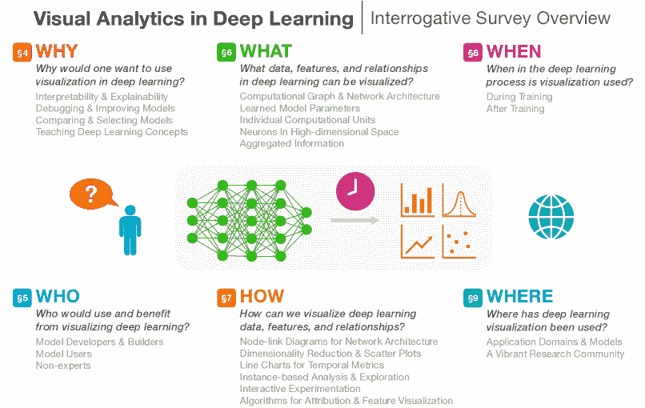
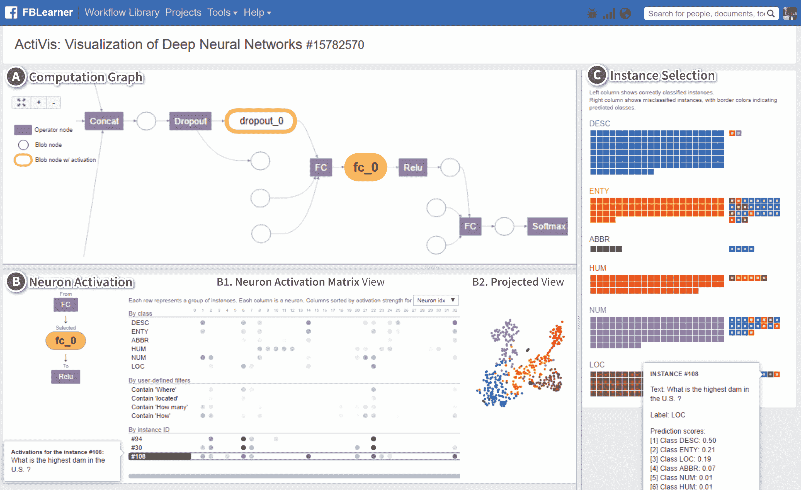
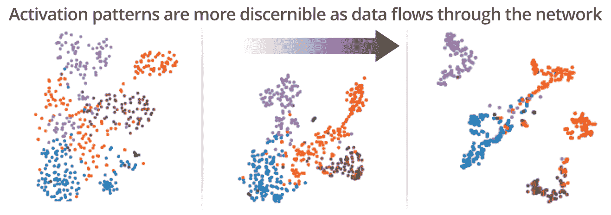
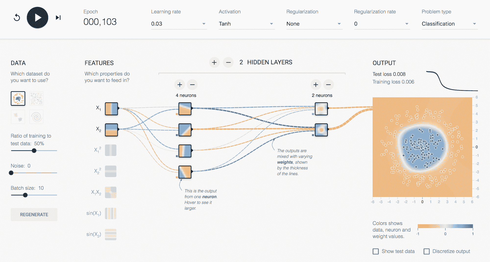
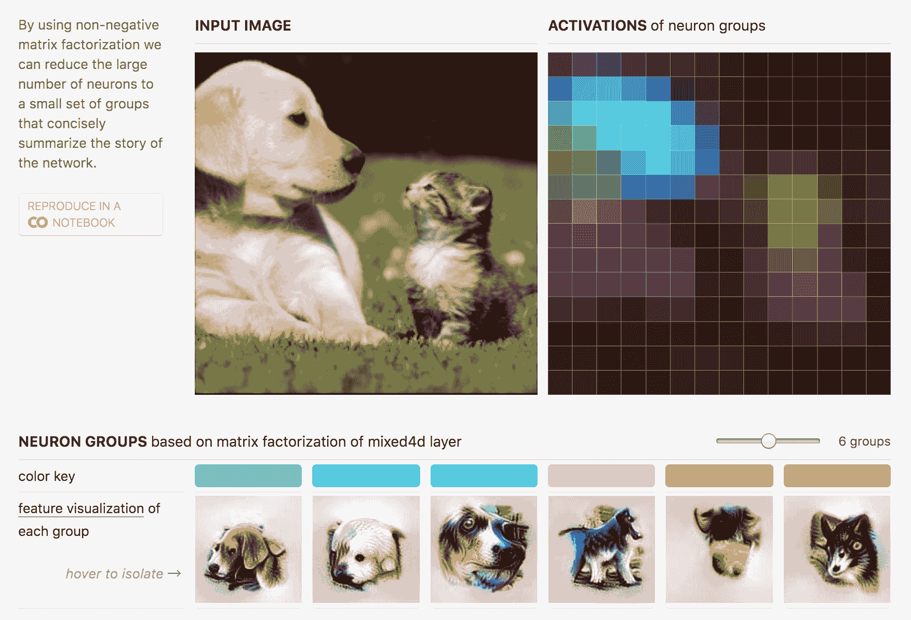

<!--yml

分类: 未分类

日期: 2024-09-06 20:08:19

-->

# [1801.06889] 深度学习中的视觉分析：针对下一前沿的问卷调查

> 来源：[`ar5iv.labs.arxiv.org/html/1801.06889`](https://ar5iv.labs.arxiv.org/html/1801.06889)

# 深度学习中的视觉分析：

针对下一前沿的问卷调查

Fred Hohman,  Minsuk Kahng,  Robert Pienta,  和 Duen Horng Chau F. Hohman, M. Kahng, R. Pienta, 和 D. H. Chau 均来自乔治亚理工学院计算学院，位于美国乔治亚州亚特兰大，邮政编码 30332。

电子邮件: {fredhohman, kahng, pientars, polo}@gatech.edu

###### 摘要

深度学习近年来发展迅速，并因其在曾被认为难题上的卓越表现而受到广泛关注。然而，由于深度神经网络的内部复杂性和非线性结构，解释这些模型为何能够取得如此表现的决策过程既具有挑战性，有时也令人困惑。随着深度学习在各领域的普及，至关重要的是，我们需要为深度学习用户提供工具，以了解模型何时正常工作、何时失败，以及最终如何提升其性能。标准化的神经网络构建工具包已帮助普及深度学习；如今已开发出视觉分析系统以支持模型解释、解读、调试和改进。我们呈现了深度学习研究中视觉分析的作用的调查，突出了其虽短但影响深远的历史，并通过以人为中心的问卷框架，重点关注五个 W 和一个 H（为什么、谁、什么、如何、何时和哪里），全面总结了最新的技术。我们总结了研究方向和开放的研究问题。这项调查帮助视觉分析和深度学习领域的研究人员和从业者迅速了解这一年轻且快速发展的研究领域的关键方面，其影响涵盖了多个领域。

###### 索引词:

深度学习、视觉分析、信息可视化、神经网络 

图 1：我们问卷调查的视觉概述，以及“为什么、谁、什么、如何、何时和哪里”这六个问题如何相互关联。每个问题对应本调查的一个部分，标有编号标签，位于每个问题标题附近。每个部分列出了调查中讨论的主要子部分。

## 1 引言

深度学习是机器学习（ML）广泛领域中的一组特定技术，专注于研究和使用深度人工神经网络来学习数据的结构化表示。早在 1940 年代就首次提到的[1]，人工神经网络有着丰富的历史[2]，并且最近在许多研究领域中出现了主导和广泛的复兴[3, 4, 5]，在多个多样的大数据任务上取得了最先进的结果[6, 7]。例如，自 2010 年代初以来，顶级机器学习、深度学习和人工智能（AI）会议的参会人数和论文提交量都大幅增长。此外，用于构建、训练和评估深度神经网络的开源工具包和编程库已经变得更加强大和易于使用，使深度学习变得更加民主化。因此，开发深度学习模型的门槛比以往任何时候都要低，深度学习应用也变得越来越普遍。

尽管这一技术进步令人印象深刻，但也带来了独特而新颖的挑战。例如，神经网络的可解释性和透明度问题，从学习到的表示到底层决策过程，都是需要解决的重要问题。理解为什么某个模型会错误分类测试数据实例或在某些时候表现不佳是模型开发者面临的挑战任务。类似地，使用依赖深度学习进行关键决策的应用的最终用户，如果模型没有给出解释，可能会质疑其可靠性，或者如果解释复杂晦涩，可能会感到困惑。虽然解释神经网络决策很重要，但深度学习还带来了许多其他问题，例如 AI 安全性和安全性（例如，在自动驾驶车辆等应用中使用模型时），以及由于模型和数据集中的偏见导致的信任受损，仅举几例。这些挑战往往由于训练大多数深度学习模型所需的大数据集而加剧。尽管这些问题令人担忧，但随着越来越多的 AI 驱动系统在世界范围内部署，这些问题可能会变得更加普遍。因此，模型的一般理解不仅有益，而且往往是解决上述问题所必需的。

数据可视化和视觉分析通过使用编码将抽象数据转化为有意义的表示，擅长于知识传递和洞察发现。在 Zeiler 和 Fergus 的开创性工作中[10]，一种叫做去卷积网络的技术使得从模型学习的特征空间投影回像素空间成为可能。他们的技术和结果提供了对深度神经网络在特定层次学习到的特征类型的洞察，同时也作为改进模型的调试工具。这项工作通常被认为在近年来使得可视化在机器学习和计算机视觉领域广受欢迎，突显了它作为一个帮助人们理解和改进深度学习模型的强大工具。然而，神经网络的可视化研究早在[11、12、13]之前就已开始。在短短几年间，许多不同的技术被提出以帮助解释神经网络所学习的内容。许多这样的技术生成静态图像，如用于图像分类的注意力图和热图，指出图像的哪些部分对分类最为重要。然而，互动也已被纳入视觉分析工具中的模型理解过程中，以帮助人们获得洞察[14、15、16]。这个混合研究领域在学术界和工业界都得到了发展，形成了许多新的研究论文、学术研讨会和部署的行业工具的基础。

在这项调查中，我们使用“五个 W 和一个 H”（为什么、谁、什么、如何、何时和哪里）总结了大量的深度学习可视化工作。图 1 展示了这些提问如何揭示和组织深度学习可视化研究的各个方面及其相关主题的可视化概述。通过这种方式框架调查，许多现有工作符合以下虚构示例的描述：

> 为了解释深度模型学到的表示（为什么），模型开发者（谁）在训练阶段后（何时）使用 t-SNE 嵌入（如何）可视化卷积神经网络中的神经元激活（什么），以解决城市规划问题（哪里）。

这种框架捕捉了深度学习可视化的需求、受众和技术，并将新工作的贡献置于现有文献的背景中。

我们通过突出重要的研究方向和未解的问题来结束。我们希望这项调查能够作为研究人员和实践者理解可视化如何支持深度学习研究和应用的参考资料。

## 2 我们的贡献与调查方法

### 2.1 我们的贡献

+   C1.

    我们提供了一个全面且及时的调查，关于深度学习研究中的可视化和视觉分析，使用以人为本的、询问式框架。这种方法使我们能够根据五个 W 和如何（为什么、谁、什么、如何、何时和哪里）定位每项工作，并灵活地讨论和突出现有工作的多方面贡献。

    +   $\bullet$

        我们基于五个 W 和如何的以人为本的方法——基于我们如何在日常环境中熟悉新话题——使读者能够迅速掌握这一年轻且迅速发展的研究领域的重要方面。

    +   $\bullet$

        我们的询问过程提供了一个描述现有工作的框架，同时也是新工作的基础模型。

+   C2.

    为了突出和对齐视觉分析在深度学习中对广泛领域的跨切影响，我们的调查超越了以可视化为中心的场所，扩展到涵盖人工智能、机器学习、深度学习和计算机视觉等许多顶级场所的大部分相关工作。我们突出显示了视觉分析在解决一些人工智能现代最大问题中的关键作用，如神经网络的可解释性、信任和安全性。

+   C3.

    随着深度学习以及更广泛的人工智能影响着我们日常生活的更多方面，我们突出了从调查中提炼出的重要研究方向和未解决的问题。这些包括提高视觉分析系统的能力以促进可解释性，进行更有效的设计研究以评估系统的可用性和实用性，倡导人在人工智能驱动系统中的重要作用，并推动人工智能应用的正确和伦理使用以造福社会。

### 2.2 调查方法与总结过程

我们选择了来自顶级计算机科学期刊和会议的现有工作，涉及可视化（例如，IEEE 可视化与计算机图形学学报 (TVCG)）、视觉分析（例如，IEEE 视觉分析科学与技术会议 (VAST)）和深度学习（例如，神经信息处理系统会议 (NIPS) 和国际机器学习大会 (ICML)）。由于深度学习可视化相对较新，相关工作大多出现在上述场所的研讨会上，因此我们也在调查中包含了这些工作。表 I 列出了部分最突出的出版场所及其缩写。我们还检查了 arXiv 上发布的预印本 ([`arxiv.org/`](https://arxiv.org/))，这是一个开放访问的电子预印本存储库，其计算机科学主题已成为新兴深度学习研究的中心。最后，除了传统的上述场所外，我们还包括了具有重要关注的非学术场所，如 Distill、行业实验室研究博客和有影响力人物的研究博客。由于深度学习研究的快速增长和这一混合领域出版传播的缺乏完美匹配，因此，纳入这些非传统来源对评审非常重要，因为它们对该领域具有重要影响和影响力。

表 I: 相关可视化和人工智能场所的分类，顺序为：期刊、会议、研讨会、开放获取期刊和预印本存储库。在每个类别中，可视化场所优先于人工智能场所。

| TVCG | IEEE 可视化与计算机图形学学报 |
| --- | --- |
| VAST | IEEE 视觉分析科学与技术会议 |
| InfoVis | IEEE 信息可视化 |
| VIS | IEEE 可视化会议 (VAST+InfoVis+SciVis) |
| CHI | ACM 计算机系统中的人因会议 |
| NIPS | 神经信息处理系统会议 |
| ICML | 国际机器学习大会 |
| CVPR | 计算机视觉与模式识别大会 |
| ICLR | 国际学习表示会议 |
| VADL | IEEE VIS 深度学习可视化研讨会 |
| HCML | CHI 人机中心机器学习研讨会 |
| IDEA | KDD 交互数据探索与分析研讨会 |
|  | ICML 深度学习可视化研讨会 |
| WHI | ICML 机器学习中的人类可解释性研讨会 |
|  | NIPS 深度学习解释、解释与可视化研讨会 |
|  | NIPS 可解释机器学习研讨会 |
| FILM | NIPS 互动学习机器的未来研讨会 |
|  | ACCV 深度神经网络解释与可视化研讨会 |
|  | ICANN 机器学习与可解释性研讨会 |
| Distill | Distill: Journal for Supporting Clarity in Machine Learning |
| arXiv | arXiv.org e-Print Archive |

视觉化在深度学习文献中有多种形式。本调查专注于深度学习的视觉分析。我们还包括了来自人工智能和计算机视觉社区的相关工作，这些工作提供了新的静态视觉化。目前，大多数工作围绕卷积神经网络（CNNs）和图像数据展开；最近的工作开始可视化其他模型，例如递归神经网络（RNNs）、长短期记忆单元（LSTMs）和生成对抗网络（GANs）。对于每项工作，如果有，我们记录了以下信息：

+   •

    元数据（标题、作者、刊物和出版年份）

+   •

    一般方法和简要总结

+   •

    明确的贡献

+   •

    未来工作

+   •

    设计组件（例如用户中心设计方法、访谈、评估）

+   •

    行业参与和开源代码

有了这些信息，我们使用了“五个 W 和一个 H”（为什么、谁、什么、如何、何时和哪里）来组织这些现有工作和深度学习中的视觉化与视觉分析的最新状态。

### 2.3 相关调查

尽管关于机器学习的视觉化文献较多，包括预测性视觉分析[17, 18, 19]和人机交互式机器学习[20, 21]，但据我们了解，没有针对深度学习的视觉化和视觉分析的全面调查。关于深度神经网络，相关调查包括最近一本书的章节，讨论了与计算机视觉领域相关的深度神经网络的可视化[22]，一篇未发表的论文提出了视觉化技术的初步分类法[23]，以及一篇专注于描述交互式模型分析的文章，在描述通用机器学习模型的高级框架时提到了一些深度学习的背景[24]。Choo 和 Liu 最近的一篇概述文章[25]在精神上最接近我们的调查。我们的调查提供了更广泛的覆盖和更详细的文献分析。

与上述所有相关文献不同，我们的调查提供了一个全面的、人本中心的、探究性框架来描述深度学习视觉分析工具，讨论了快速增长的新兴社区，并呈现了从现有文献中综合出的主要研究轨迹。

### 2.4 调查概述与组织

第三部分介绍了常见的深度学习术语。图 1 展示了本调查结构的视觉概述，表 II 总结了代表性工作。每个质疑性问题（为什么、谁、什么、如何、何时和哪里）都分配了一个单独的章节进行讨论，按顺序排列，以最佳方式阐明为什么深度学习中的可视化和视觉分析是一个如此丰富且令人兴奋的研究领域。

+   <svg   height="20.06" overflow="visible" version="1.1" width="33.06"><g transform="translate(0,20.06) matrix(1 0 0 -1 0 0)" fill="#000000" stroke="#000000" stroke-width="0.4pt"><g fill-opacity="1.0" transform="matrix(1.0 0.0 0.0 1.0 3.46 6.92)"><foreignobject width="15.37" height="12.3" transform="matrix(1 0 0 -1 0 16.6)" overflow="visible" color="#000000">$\boldsymbol{\S}$ 4</foreignobject></g></g></svg>

    我们为什么要可视化深度学习？为什么以及出于什么目的需要在深度学习中使用可视化？

+   <svg   height="20.06" overflow="visible" version="1.1" width="33.06"><g transform="translate(0,20.06) matrix(1 0 0 -1 0 0)" fill="#000000" stroke="#000000" stroke-width="0.4pt"><g fill-opacity="1.0" transform="matrix(1.0 0.0 0.0 1.0 3.46 6.92)"><foreignobject width="15.37" height="12.3" transform="matrix(1 0 0 -1 0 16.6)" overflow="visible" color="#000000">$\boldsymbol{\S}$ 5</foreignobject></g></g></svg>

    谁希望可视化深度学习？哪些人群和用户会使用并从深度学习可视化中受益？

+   <svg   height="20.06" overflow="visible" version="1.1" width="33.06"><g transform="translate(0,20.06) matrix(1 0 0 -1 0 0)" fill="#000000" stroke="#000000" stroke-width="0.4pt"><g fill-opacity="1.0" transform="matrix(1.0 0.0 0.0 1.0 3.46 6.92)"><foreignobject width="15.37" height="12.3" transform="matrix(1 0 0 -1 0 16.6)" overflow="visible" color="#000000">$\boldsymbol{\S}$ 6</foreignobject></g></g></svg>

    我们可以在深度学习中可视化什么？深度学习中固有的数据、特征和关系是什么，可以被可视化？

+   <svg   height="20.06" overflow="visible" version="1.1" width="33.06"><g transform="translate(0,20.06) matrix(1 0 0 -1 0 0)" fill="#000000" stroke="#000000" stroke-width="0.4pt"><g fill-opacity="1.0" transform="matrix(1.0 0.0 0.0 1.0 3.46 6.92)"><foreignobject width="15.37" height="12.3" transform="matrix(1 0 0 -1 0 16.6)" overflow="visible" color="#000000">$\boldsymbol{\S}$ 7</foreignobject></g></g></svg>

    我们如何进行深度学习可视化？我们如何可视化上述数据、特征和关系？

+   <svg   height="20.06" overflow="visible" version="1.1" width="33.06"><g transform="translate(0,20.06) matrix(1 0 0 -1 0 0)" fill="#000000" stroke="#000000" stroke-width="0.4pt"><g fill-opacity="1.0" transform="matrix(1.0 0.0 0.0 1.0 3.46 6.92)"><foreignobject width="15.37" height="12.3" transform="matrix(1 0 0 -1 0 16.6)" overflow="visible" color="#000000">$\boldsymbol{\S}$ 8</foreignobject></g></g></svg>

    我们什么时候可以进行深度学习可视化？在深度学习过程中，什么时候使用可视化最为合适？

+   <svg   height="20.06" overflow="visible" version="1.1" width="33.06"><g transform="translate(0,20.06) matrix(1 0 0 -1 0 0)" fill="#000000" stroke="#000000" stroke-width="0.4pt"><g fill-opacity="1.0" transform="matrix(1.0 0.0 0.0 1.0 3.46 6.92)"><foreignobject width="15.37" height="12.3" transform="matrix(1 0 0 -1 0 16.6)" overflow="visible" color="#000000">$\boldsymbol{\S}$ 9</foreignobject></g></g></svg>

    深度学习可视化在哪里被使用？深度学习可视化曾经在哪里使用过？

第十部分介绍了我们从文献调研中收集和提炼的研究方向和未解决的问题。第十一部分总结了本次调研。

## 3 常见术语

为了提升本调查的可读性，并为新手快速提供深度学习的参考，我们已经将相关和常见的深度学习术语制成了表格，见表 III。读者可以在本调查过程中参考表 III，了解技术术语、含义及各种讨论背景下的同义词。该表格作为最前沿技术的介绍和总结。对于详细的技术和数学描述，我们鼓励读者参考优秀的深度学习和神经网络设计教材，如《深度学习》[26]。

表 II：深度学习可视分析的代表性工作的概述。每一行代表一项工作；这些工作按第一作者的姓氏字母顺序排序。每一列对应于六个质询问题中的一个子部分。工作相关的子部分由彩色单元格表示。

|  | 为什么 | 谁 | 什么 | 如何 | 何时 | 哪里 |
| --- | --- | --- | --- | --- | --- | --- |

| 工作 | <svg   height="20.06" overflow="visible" version="1.1" width="22.29"><g transform="translate(0,20.06) matrix(1 0 0 -1 0 0)" fill="#000000" stroke="#000000" stroke-width="0.4pt"><g fill-opacity="1.0" transform="matrix(1.0 0.0 0.0 1.0 3.46 6.92)"><foreignobject width="15.37" height="13.84" transform="matrix(1 0 0 -1 0 16.6)" overflow="visible" color="#000000">4.1</foreignobject></g></g></svg>

解释性与可解释性 | <svg   height="20.06" overflow="visible" version="1.1" width="22.29"><g transform="translate(0,20.06) matrix(1 0 0 -1 0 0)" fill="#000000" stroke="#000000" stroke-width="0.4pt"><g fill-opacity="1.0" transform="matrix(1.0 0.0 0.0 1.0 3.46 6.92)"><foreignobject width="15.37" height="13.84" transform="matrix(1 0 0 -1 0 16.6)" overflow="visible" color="#000000">4.2</foreignobject></g></g></svg>

调试与改进模型  | <svg   height="20.06" overflow="visible" version="1.1" width="22.29"><g transform="translate(0,20.06) matrix(1 0 0 -1 0 0)" fill="#000000" stroke="#000000" stroke-width="0.4pt"><g fill-opacity="1.0" transform="matrix(1.0 0.0 0.0 1.0 3.46 6.92)"><foreignobject width="15.37" height="13.84" transform="matrix(1 0 0 -1 0 16.6)" overflow="visible" color="#000000">4.3</foreignobject></g></g></svg>

比较与选择模型  | <svg   height="20.06" overflow="visible" version="1.1" width="22.29"><g transform="translate(0,20.06) matrix(1 0 0 -1 0 0)" fill="#000000" stroke="#000000" stroke-width="0.4pt"><g fill-opacity="1.0" transform="matrix(1.0 0.0 0.0 1.0 3.46 6.92)"><foreignobject width="15.37" height="13.84" transform="matrix(1 0 0 -1 0 16.6)" overflow="visible" color="#000000">4.4</foreignobject></g></g></svg>

教授深度学习概念  | <svg   height="20.06" overflow="visible" version="1.1" width="22.29"><g transform="translate(0,20.06) matrix(1 0 0 -1 0 0)" fill="#000000" stroke="#000000" stroke-width="0.4pt"><g fill-opacity="1.0" transform="matrix(1.0 0.0 0.0 1.0 3.46 6.92)"><foreignobject width="15.37" height="13.84" transform="matrix(1 0 0 -1 0 16.6)" overflow="visible" color="#000000">5.1</foreignobject></g></g></svg>

模型开发者与构建者  | <svg   height="20.06" overflow="visible" version="1.1" width="22.29"><g transform="translate(0,20.06) matrix(1 0 0 -1 0 0)" fill="#000000" stroke="#000000" stroke-width="0.4pt"><g fill-opacity="1.0" transform="matrix(1.0 0.0 0.0 1.0 3.46 6.92)"><foreignobject width="15.37" height="13.84" transform="matrix(1 0 0 -1 0 16.6)" overflow="visible" color="#000000">5.2</foreignobject></g></g></svg>

模型用户  | <svg   height="20.06" overflow="visible" version="1.1" width="22.29"><g transform="translate(0,20.06) matrix(1 0 0 -1 0 0)" fill="#000000" stroke="#000000" stroke-width="0.4pt"><g fill-opacity="1.0" transform="matrix(1.0 0.0 0.0 1.0 3.46 6.92)"><foreignobject width="15.37" height="13.84" transform="matrix(1 0 0 -1 0 16.6)" overflow="visible" color="#000000">5.3</foreignobject></g></g></svg>

非专家  | <svg   height="20.06" overflow="visible" version="1.1" width="22.29"><g transform="translate(0,20.06) matrix(1 0 0 -1 0 0)" fill="#000000" stroke="#000000" stroke-width="0.4pt"><g fill-opacity="1.0" transform="matrix(1.0 0.0 0.0 1.0 3.46 6.92)"><foreignobject width="15.37" height="13.84" transform="matrix(1 0 0 -1 0 16.6)" overflow="visible" color="#000000">6.1</foreignobject></g></g></svg>

计算图与网络架构  | <svg   height="20.06" overflow="visible" version="1.1" width="22.29"><g transform="translate(0,20.06) matrix(1 0 0 -1 0 0)" fill="#000000" stroke="#000000" stroke-width="0.4pt"><g fill-opacity="1.0" transform="matrix(1.0 0.0 0.0 1.0 3.46 6.92)"><foreignobject width="15.37" height="13.84" transform="matrix(1 0 0 -1 0 16.6)" overflow="visible" color="#000000">6.2</foreignobject></g></g></svg>

已学习的模型参数  | <svg   height="20.06" overflow="visible" version="1.1" width="22.29"><g transform="translate(0,20.06) matrix(1 0 0 -1 0 0)" fill="#000000" stroke="#000000" stroke-width="0.4pt"><g fill-opacity="1.0" transform="matrix(1.0 0.0 0.0 1.0 3.46 6.92)"><foreignobject width="15.37" height="13.84" transform="matrix(1 0 0 -1 0 16.6)" overflow="visible" color="#000000">6.3</foreignobject></g></g></svg>

单独计算单元  | <svg   height="20.06" overflow="visible" version="1.1" width="22.29"><g transform="translate(0,20.06) matrix(1 0 0 -1 0 0)" fill="#000000" stroke="#000000" stroke-width="0.4pt"><g fill-opacity="1.0" transform="matrix(1.0 0.0 0.0 1.0 3.46 6.92)"><foreignobject width="15.37" height="13.84" transform="matrix(1 0 0 -1 0 16.6)" overflow="visible" color="#000000">6.4</foreignobject></g></g></svg>

高维空间中的神经元  | <svg   height="20.06" overflow="visible" version="1.1" width="22.29"><g transform="translate(0,20.06) matrix(1 0 0 -1 0 0)" fill="#000000" stroke="#000000" stroke-width="0.4pt"><g fill-opacity="1.0" transform="matrix(1.0 0.0 0.0 1.0 3.46 6.92)"><foreignobject width="15.37" height="13.84" transform="matrix(1 0 0 -1 0 16.6)" overflow="visible" color="#000000">6.5</foreignobject></g></g></svg>

聚合信息  | <svg   height="20.06" overflow="visible" version="1.1" width="22.29"><g transform="translate(0,20.06) matrix(1 0 0 -1 0 0)" fill="#000000" stroke="#000000" stroke-width="0.4pt"><g fill-opacity="1.0" transform="matrix(1.0 0.0 0.0 1.0 3.46 6.92)"><foreignobject width="15.37" height="13.84" transform="matrix(1 0 0 -1 0 16.6)" overflow="visible" color="#000000">7.1</foreignobject></g></g></svg>

网络架构的节点-链接图  | <svg   height="20.06" overflow="visible" version="1.1" width="22.29"><g transform="translate(0,20.06) matrix(1 0 0 -1 0 0)" fill="#000000" stroke="#000000" stroke-width="0.4pt"><g fill-opacity="1.0" transform="matrix(1.0 0.0 0.0 1.0 3.46 6.92)"><foreignobject width="15.37" height="13.84" transform="matrix(1 0 0 -1 0 16.6)" overflow="visible" color="#000000">7.2</foreignobject></g></g></svg>

降维与散点图 | <svg   height="20.06" overflow="visible" version="1.1" width="22.29"><g transform="translate(0,20.06) matrix(1 0 0 -1 0 0)" fill="#000000" stroke="#000000" stroke-width="0.4pt"><g fill-opacity="1.0" transform="matrix(1.0 0.0 0.0 1.0 3.46 6.92)"><foreignobject width="15.37" height="13.84" transform="matrix(1 0 0 -1 0 16.6)" overflow="visible" color="#000000">7.3</foreignobject></g></g></svg>

时间指标的折线图 | <svg   height="20.06" overflow="visible" version="1.1" width="22.29"><g transform="translate(0,20.06) matrix(1 0 0 -1 0 0)" fill="#000000" stroke="#000000" stroke-width="0.4pt"><g fill-opacity="1.0" transform="matrix(1.0 0.0 0.0 1.0 3.46 6.92)"><foreignobject width="15.37" height="13.84" transform="matrix(1 0 0 -1 0 16.6)" overflow="visible" color="#000000">7.4</foreignobject></g></g></svg>

基于实例的分析与探索 | <svg   height="20.06" overflow="visible" version="1.1" width="22.29"><g transform="translate(0,20.06) matrix(1 0 0 -1 0 0)" fill="#000000" stroke="#000000" stroke-width="0.4pt"><g fill-opacity="1.0" transform="matrix(1.0 0.0 0.0 1.0 3.46 6.92)"><foreignobject width="15.37" height="13.84" transform="matrix(1 0 0 -1 0 16.6)" overflow="visible" color="#000000">7.5</foreignobject></g></g></svg>

交互式实验 | <svg   height="20.06" overflow="visible" version="1.1" width="22.29"><g transform="translate(0,20.06) matrix(1 0 0 -1 0 0)" fill="#000000" stroke="#000000" stroke-width="0.4pt"><g fill-opacity="1.0" transform="matrix(1.0 0.0 0.0 1.0 3.46 6.92)"><foreignobject width="15.37" height="13.84" transform="matrix(1 0 0 -1 0 16.6)" overflow="visible" color="#000000">7.6</foreignobject></g></g></svg>

特征归因与可视化算法  | <svg   height="20.06" overflow="visible" version="1.1" width="22.29"><g transform="translate(0,20.06) matrix(1 0 0 -1 0 0)" fill="#000000" stroke="#000000" stroke-width="0.4pt"><g fill-opacity="1.0" transform="matrix(1.0 0.0 0.0 1.0 3.46 6.92)"><foreignobject width="15.37" height="13.84" transform="matrix(1 0 0 -1 0 16.6)" overflow="visible" color="#000000">8.1</foreignobject></g></g></svg>

训练期间  | <svg   height="20.06" overflow="visible" version="1.1" width="22.29"><g transform="translate(0,20.06) matrix(1 0 0 -1 0 0)" fill="#000000" stroke="#000000" stroke-width="0.4pt"><g fill-opacity="1.0" transform="matrix(1.0 0.0 0.0 1.0 3.46 6.92)"><foreignobject width="15.37" height="13.84" transform="matrix(1 0 0 -1 0 16.6)" overflow="visible" color="#000000">8.2</foreignobject></g></g></svg>

训练后  |  <svg   height="20.06" overflow="visible" version="1.1" width="22.29"><g transform="translate(0,20.06) matrix(1 0 0 -1 0 0)" fill="#000000" stroke="#000000" stroke-width="0.4pt"><g fill-opacity="1.0" transform="matrix(1.0 0.0 0.0 1.0 3.46 6.92)"><foreignobject width="15.37" height="13.84" transform="matrix(1 0 0 -1 0 16.6)" overflow="visible" color="#000000">9.2</foreignobject></g></g></svg>

发布场所  |

| Abadi 等, 2016 [27] |  |  |  |  |  |  |  |  |  |  |  |  |  |  |  |  |  |  |  |  |  arXiv |
| --- | --- | --- | --- | --- | --- | --- | --- | --- | --- | --- | --- | --- | --- | --- | --- | --- | --- | --- | --- | --- | --- |
| Bau 等, 2017 [28] |  |  |  |  |  |  |  |  |  |  |  |  |  |  |  |  |  |  |  |  |  CVPR |
| Bilal 等, 2017 [29] |  |  |  |  |  |  |  |  |  |  |  |  |  |  |  |  |  |  |  |  |  TVCG |
| Bojarski 等, 2016 [30] |  |  |  |  |  |  |  |  |  |  |  |  |  |  |  |  |  |  |  |  |  arXiv |
| Bruckner, 2014 [31] |  |  |  |  |  |  |  |  |  |  |  |  |  |  |  |  |  |  |  |  |  MS 论文 |
| Carter 等, 2016 [32] |  |  |  |  |  |  |  |  |  |  |  |  |  |  |  |  |  |  |  |  |  Distill |
| Cashman 等, 2017 [33] |  |  |  |  |  |  |  |  |  |  |  |  |  |  |  |  |  |  |  |  |  VADL |
| Chae 等, 2017 [34] |  |  |  |  |  |  |  |  |  |  |  |  |  |  |  |  |  |  |  |  |  VADL |
| Chung 等, 2016 [35] |  |  |  |  |  |  |  |  |  |  |  |  |  |  |  |  |  |  |  |  |  FILM |
| Goyal 等，2016 [36] |  |  |  |  |  |  |  |  |  |  |  |  |  |  |  |  |  |  |  |  |  arXiv |
| Harley，2015 [37] |  |  |  |  |  |  |  |  |  |  |  |  |  |  |  |  |  |  |  |  |  ISVC |
| Hohman 等，2017 [38] |  |  |  |  |  |  |  |  |  |  |  |  |  |  |  |  |  |  |  |  |  CHI |
| Kahng 等，2018 [39] |  |  |  |  |  |  |  |  |  |  |  |  |  |  |  |  |  |  |  |  |  TVCG |
| Karpathy 等，2015 [40] |  |  |  |  |  |  |  |  |  |  |  |  |  |  |  |  |  |  |  |  |  arXiv |
| Li 等，2015 [41] |  |  |  |  |  |  |  |  |  |  |  |  |  |  |  |  |  |  |  |  |  arXiv |
| Liu 等，2017 [14] |  |  |  |  |  |  |  |  |  |  |  |  |  |  |  |  |  |  |  |  |  TVCG |
| Liu 等，2018 [42] |  |  |  |  |  |  |  |  |  |  |  |  |  |  |  |  |  |  |  |  |  TVCG |
| Ming 等，2017 [43] |  |  |  |  |  |  |  |  |  |  |  |  |  |  |  |  |  |  |  |  |  VAST |
| Norton & Qi，2017 [44] |  |  |  |  |  |  |  |  |  |  |  |  |  |  |  |  |  |  |  |  |  VizSec |
| Olah，2014 [45] |  |  |  |  |  |  |  |  |  |  |  |  |  |  |  |  |  |  |  |  |  Web |
| Olah 等，2018 [46] |  |  |  |  |  |  |  |  |  |  |  |  |  |  |  |  |  |  |  |  |  Distill |
| Pezzotti 等，2017 [47] |  |  |  |  |  |  |  |  |  |  |  |  |  |  |  |  |  |  |  |  |  TVCG |
| Rauber 等，2017 [48] |  |  |  |  |  |  |  |  |  |  |  |  |  |  |  |  |  |  |  |  |  TVCG |
| Robinson 等，2017 [49] |  |  |  |  |  |  |  |  |  |  |  |  |  |  |  |  |  |  |  |  |  GeoHum. |
| Rong & Adar，2016 [50] |  |  |  |  |  |  |  |  |  |  |  |  |  |  |  |  |  |  |  |  |  ICML VIS |
| Smilkov 等，2016 [51] |  |  |  |  |  |  |  |  |  |  |  |  |  |  |  |  |  |  |  |  |  NIPS WS. |
| Smilkov 等，2017 [16] |  |  |  |  |  |  |  |  |  |  |  |  |  |  |  |  |  |  |  |  |  ICML VIS |
| Strobelt 等，2018 [52] |  |  |  |  |  |  |  |  |  |  |  |  |  |  |  |  |  |  |  |  |  TVCG |
| Tzeng & Ma，2005 [13] |  |  |  |  |  |  |  |  |  |  |  |  |  |  |  |  |  |  |  |  |  VIS |
| Wang 等，2018 [53] |  |  |  |  |  |  |  |  |  |  |  |  |  |  |  |  |  |  |  |  |  TVCG |
| Webster 等，2017 [54] |  |  |  |  |  |  |  |  |  |  |  |  |  |  |  |  |  |  |  |  |  Web |
| Wongsuphasawat 等，2018 [15] |  |  |  |  |  |  |  |  |  |  |  |  |  |  |  |  |  |  |  |  |  TVCG |
| Yosinski 等，2015 [55] |  |  |  |  |  |  |  |  |  |  |  |  |  |  |  |  |  |  |  |  |  ICML DL |
| Zahavy 等，2016 [56] |  |  |  |  |  |  |  |  |  |  |  |  |  |  |  |  |  |  |  |  |  ICML |
| Zeiler 等，2014 [10] |  |  |  |  |  |  |  |  |  |  |  |  |  |  |  |  |  |  |  |  |  ECCV |
| Zeng 等，2017 [57] |  |  |  |  |  |  |  |  |  |  |  |  |  |  |  |  |  |  |  |  |  VADL |
| Zhong 等，2017 [58] |  |  |  |  |  |  |  |  |  |  |  |  |  |  |  |  |  |  |  |  |  ICML VIS |
| Zhu 等，2016 [59] |  |  |  |  |  |  |  |  |  |  |  |  |  |  |  |  |  |  |  |  |  ECCV |

表 III：本文使用的基础深度学习术语，按重要性排序。在术语的“含义”（最后一列）中，已定义的术语以*斜体*显示。

| 技术术语 | 同义词 | 含义 |
| --- | --- | --- |
| 神经网络 | 人工神经网络，网络 | 受生物启发的模型，形成深度学习的基础；近似依赖于大量且未知输入的函数，由神经元层组成 |
| 神经元 | 计算单元，节点 | 神经网络的基本构件，可以应用激活函数 |
| 权重 | 边缘 | 神经网络模型中训练和更新的参数，将神经元相互连接 |
| 层 | 隐藏层 | 尝试从数据中提取特征的神经元堆叠集合；一层的输入连接到前一层的输出 |
| 计算图 | 数据流图 | 有向图，其中节点表示操作，边缘表示数据路径；在实现神经网络模型时，通常将其表示为这些图 |
| 激活函数 | 转换函数 | 嵌入到神经网络每一层的函数，使网络能够表示复杂的非线性决策边界 |
| 激活 | 内部表示 | 给定一个训练好的网络，可以传入数据并恢复网络任何层的激活，以获得网络内部的当前表示 |
| 卷积神经网络 | CNN，convnet | 一种由卷积层组成的神经网络类型，这些层通常以图像数据作为输入；这些层具有深度，与仅具有宽度（层中的神经元数量）的典型层不同；它们使用滤波器（特征和模式检测器）来提取空间不变的表示 |
| 长短期记忆 | LSTM | 一种神经网络，常用于文本分析，通过使用记忆门来解决梯度消失问题，以便在网络中传播梯度，从而学习长期依赖关系 |
| 损失函数 | 目标函数，成本函数，误差 | 在一般机器学习背景下也会见到，定义了在学习表示时成功的标准，即神经网络的预测与真实值之间的差异度量 |
| 嵌入 | 编码 | 将输入数据（例如图像、文本、音频、时间序列）表示为高维空间中的数字向量；通常会减少以便数据点（即它们的向量）可以更容易地进行分析（例如计算相似性） |
| 循环神经网络 | RNN | 一种神经网络类型，通过递归连接允许网络内部状态中之前输入的持久性（或“记忆”），这些状态用于影响网络输出 |
| 生成对抗网络 | GAN | 一种通过让生成网络与判别网络对抗来进行无监督学习的方法；第一个网络模仿训练数据集的概率分布，以欺骗判别网络，使其判断生成的数据实例属于训练集 |
| 训练轮次 | 数据遍历 | 完整遍历给定数据集的过程；在一个训练轮次结束时，神经网络将每个数据都见过一次 |

## 4 为什么要可视化深度学习

### 4.1 解释性与可解释性

人们希望可视化深度学习的最主要原因之一，是为了理解深度学习模型如何做出决策以及它们学到了什么表示，这样我们才能对模型建立信任[60]。这种对模型的通用理解的概念被称为解释性或可解释性，在提到机器学习模型时[60, 61, 62]。然而，神经网络尤其面临这个问题，因为实际世界中的高性能模型通常包含大量参数（数百万个），并通过在训练过程中的不同阶段使用许多非线性变换而展现出极端的内部复杂性。许多研究通过使用“打开并窥视黑箱”、“透明度”和“可解释的神经网络”等短语来激励这个问题[13, 63, 56]，这些短语指的是神经网络的内部复杂性。

#### 4.1.1 解释性定义的分歧

不幸的是，深度学习中的解释性和可解释性没有普遍正式化和达成一致的定义，这使得对解释和说明的分类和定性变得麻烦。在 Lipton 的工作《模型解释性的神话[60]》中，他调查了与解释性相关的文献，并发现了对解释性为何重要的不同动机，并且这些动机有时不一致。尽管存在这种模糊性，他试图通过迈出第一步来提供解释性研究中愿望和方法的综合分类，来细化解释性的概念。Lipton 指出的一个重要点是解释性与解释之间的区别；解释可以展示预测结果，但不能阐明模型工作的机制[60]。

在另一篇最初作为教程在国际声学、语音和信号处理会议上由 Montavona 等人[61]提出的工作中，作者提出了对解释和说明的精确定义。首先，解释是“将一个抽象概念（例如，预测类别）映射到一个人类能够理解的领域。” 然后，他们提供了一些可解释领域的例子，如图像（像素数组）和文本（单词序列），以及不可解释领域的例子，如抽象向量空间（词嵌入）。其次，说明是“可解释领域的特征集合，这些特征对给定示例的决策（例如，分类或回归）产生了贡献。” 例如，说明可以是一个热图，突出显示输入图像中哪些像素最强烈地支持图像分类决策，或者在自然语言处理过程中，说明可以突出某些文本短语。

然而，前述的工作都由 AI 领域的成员撰写，而 Miller 的工作《人工智能中的解释：社会科学的见解》[62]则假设目前的大部分研究仅使用 AI 研究人员对“良好”解释的直觉。他建议，如果目标是向人类观察者解释决策或行为，那么如果这些技术要成功，它们生成的解释应具有被人类接受的结构。Miller 的许多工作突出了哲学、心理学和认知科学中有关人们如何定义、生成、选择、评估和呈现解释的大量宝贵研究，他认为可解释性和解释性研究应当利用并基于这一历史[62]。在另一篇文章中，Offert[64]认为，为了使可解释性更为严格，我们必须首先识别它在直觉考量下的缺陷。也就是说，我们必须“准确地考虑它是什么而不是它是什么。” 虽然多个研究带来了不同的视角，但 Lipton 敏锐地观察到，为了推动该领域的发展，社区必须批判性地参与这一问题的制定[60]。进一步的研究将有助于巩固解释和说明的概念。

#### 4.1.2 解释作为各种应用领域模型评估的定性支持

尽管对解释本身的研究相对较新，但其影响已经在应用深度学习的背景中显现出来。许多应用数据科学和人工智能项目使用深度学习模型时，包括解释部分以定性评估和支持模型的预测及整体工作的声明。例如，端到端神经机器翻译的一种方法。在 Johnson 等人的工作中[65]，作者们提出了一种简单高效的方法，利用多语言数据来改进所有涉及语言的神经机器翻译。作者们可视化文本序列的嵌入，例如来自多种语言的句子，以支持和暗示一种通用的中间语表示。另一篇可视化大型机器学习嵌入的工作是由 Zahavy 等人完成的[56]，他们分析了深度 Q 网络（DQN），这是一种流行的强化学习模型，用于理解和描述 DQN 在三款不同的 Atari 2600 视频游戏中学到的策略。Robinson 等人的社会公益应用[49]展示了如何将深度神经网络应用于卫星图像，进行人口预测和分解，共同回答“人们居住在哪里？”和“那里有多少人居住？”的问题。总体上，他们展示了他们的方法论如何成为从固有的非结构化遥感数据中提取信息的有效工具，以提供社会问题的解决方案。

这些只是可视化和深度学习解释成功应用的几个领域。其他领域包括建立对自动驾驶车辆的信任[30]，解释医学成像模型（如 MRI 在脑部扫描中的决策），为医学专家提供更多诊断信息[66]，以及使用视觉分析来探索从街道图像中自动学习的特征，以了解城市空间的身份、功能、人口统计和富裕度，这对城市设计和规划非常有用[67]。

在本次调研中，我们经常提到解释和解释，因为它们是深度学习可视化最常见的动机。稍后，我们将讨论不同的可视化技术和专注于神经网络可解释性的视觉分析系统，包括嵌入[51]、文本[41, 40, 32]、量化解释性[28]，以及源自 AI 社区的许多不同的基于图像的技术[68, 10, 69, 4, 70]。

### 4.2 调试与改进模型

构建机器学习模型是一个迭代设计过程[71, 72, 73]，深度神经网络的开发也不例外。虽然数学基础已奠定，但深度学习仍然有许多未解的研究问题。例如，找到模型深度、层宽和精细调整的超参数的确切组合并非易事。对此，许多可视化分析系统被提出，以帮助模型开发人员构建和调试他们的模型，希望能加快迭代实验过程，从而最终提高性能[15, 52, 47]。这通常需要在训练阶段监控模型[58, 42]，识别误分类的实例，并测试一些著名的数据实例以观察性能[39, 29, 50]，并允许系统建议模型开发人员探索的潜在方向[34]。这种对可视化深度学习的需求最终为工程师和研究人员提供了更好的工具，以加快模型开发，从而迅速识别和修复模型中的问题，提升整体性能。

### 4.3 比较与选择模型

虽然模型比较和选择与模型调试和改进确实相关，但它们是稍有不同的任务，其中可视化可以发挥作用[74, 75, 76]。通常，模型比较涉及从一组表现良好的模型中选择一个单一模型。也就是说，不需要进行调试；所有模型已经“学习”过或已被半成功地训练。因此，选择一个表现最佳的单一模型需要检查模型指标和可视化模型的各个部分，以挑选出准确率最高、损失最低或最具泛化能力的模型，同时避免如记忆训练数据或过拟合等陷阱。

一些系统采用高级方法，比较用户定义的模型指标，如准确率和损失，并在交互式图表上汇总这些指标以进行性能比较[27]。其他框架比较在不同随机初始化下训练的神经网络（模型设计中的一个重要步骤），以发现它们如何影响性能，同时量化性能和解释[28]。有些方法比较图像生成技术中的模型，例如从不同网络的每层的内部表示中进行图像重建，以比较不同的网络架构[77]。类似于比较模型架构，一些系统仅依赖于数据可视化表示和编码来比较模型[43]，而其他系统比较单个模型在训练过程中的不同快照，即比较模型在$n_{1}$个周期后的状态和在$n_{2}$个周期后的状态[57]。

### 4.4 教授深度学习概念

除了 AI 专家之外，我们可能希望可视化深度学习的另一个重要原因是为了教育非专家用户关于 AI 的知识。非专家的具体定义因来源而异，并在第 5.3 节中进一步讨论。一个针对普通公众的例子是 Teachable Machines[54]，这是一个基于 Web 的 AI 实验，探索并教授图像分类器的基础知识。用户通过使用计算机的摄像头生成训练数据来训练一个三分类图像分类器。在提供三种不同的物体示例（例如，举起一支铅笔、一杯咖啡和一部手机）之后，系统会对摄像头视野中的物体进行实时推理，并显示一个带有相应分类得分的条形图。由于推理是实时计算的，因此当用户移除物体（例如铅笔）并改为举起咖啡杯时，条形图会摇摆并前后跳动。使用的可视化是一个简单的条形图，它提供了对图像分类的易于接近的介绍，这是一个现代计算机视觉和 AI 问题。

作为教授深度学习概念的另一个例子，深度可视化工具箱[55]，在本次调查中稍后讨论，也使用了网络摄像头以便在与神经网络交互时提供即时反馈。在即时反馈的基础上，有些工作进一步利用直接操控来吸引非专家参与学习过程。TensorFlow Playground [16] 是一个稳健的基于网络的视觉分析工具，用于探索简单的神经网络，它通过直接操控来强化深度学习概念，并且重要的是，引发用户对神经网络如何工作的直觉。其他非传统媒介也被用于教授深度学习概念，并建立对神经网络行为的直觉。以交互式滚动叙事为重点，关注特定 AI 主题并使用互动可视化作为支持证据的长篇形式正在获得越来越多的关注。例如，“如何有效使用 t-SNE”，用户可以玩转数百个小数据集并调整单个参数以观察其对嵌入的影响[78]，以及一个类似的交互式文章 titled “Visualizing MNIST”，它可视化了不同算法生成的不同类型的嵌入[45]。

## 5 谁在使用深度学习可视化

本节描述了可能从深度学习可视化和视觉分析中获益的人员群体。我们将他们根据深度学习知识水平（从多到少）大致分为三个不相互排斥的群体：模型开发者、模型用户和非专家。请注意，许多讨论中的工作可以惠及多个群体，例如，模型开发者可以使用旨在非专家的工具来加强自己对神经网络学习方式的直觉。

### 5.1 模型开发者与构建者

使用深度学习可视化的第一组人是那些主要从事开发、实验和部署深度神经网络的个体。这些模型开发者和构建者，无论是研究人员还是工程师，都对深度学习技术有深刻的理解，并且在模型构建方面拥有较为成熟的直觉。他们的知识加速了深度学习工作流程中的关键决策，例如识别哪种类型的模型在何种数据上表现最佳。这些人掌握模型的使用，例如，知道如何以正确的方式调整超参数以实现更好的性能。这些个体通常在构建大规模模型并在高性能计算机上进行训练，以解决现实世界的问题方面经验丰富[24]。因此，这些用户的工具和研究更多地集中在技术层面，例如，提供许多超参数以实现详细的模型控制。

在现有的深度学习视觉分析工具中，一些工具解决了为模型开发者开发工具的问题，但很少有工具得到了广泛采用。可以说，最著名的系统是 TensorBoard [27]：Google 提供的开源可视化平台，用于其数据流图库 TensorFlow。TensorBoard 包含多个内置组件，帮助模型开发者理解、调试和优化 TensorFlow 程序。它包括实时绘制定量模型指标、实例级预测以及计算图的可视化。计算图组件由 Wongsuphasawat 等人 [15] 单独发布，通过应用一系列图形变换，使标准布局技术能够生成 TensorFlow 模型的交互式图表。

其他工具，如 DeepEyes [47]，在模型构建任务中提供帮助，例如识别训练过程中的稳定层、识别对模型决策没有贡献的多余层和退化滤波器、修剪这些实体，以及识别网络未检测到的模式，提示可能需要更多的滤波器或层。另一个工具，Blocks [29]，通过可视化类别级混淆模式，帮助模型构建者加速模型收敛并减轻过拟合。其他研究则开发了超越损失和准确率等指标的新度量，帮助开发者在训练模型时检查和评估网络 [58]。

一些工具还解决了训练神经网络固有的迭代性质。例如，ML-o-scope [31] 利用时间推移引擎检查模型的训练动态，以更好地调整超参数，而 Chae 等人 [34] 的工作可视化了训练过程中的分类结果，并建议改进模型构建流程的潜在方向。最后，视觉分析工具开始为希望使用更具挑战性的模型的专家用户构建。例如，DGMTracker [42] 是一个视觉分析工具，旨在帮助用户理解和诊断深度生成模型的训练过程：这些强大的网络执行无监督和半监督学习，主要关注发现数据的隐藏结构，而无需依赖外部标签。

图 2：ActiVis [39]：一个用于解释神经网络结果的视觉分析系统，使用一种新颖的可视化方法，将实例级和子集级的神经元激活检查统一起来，该系统在 Facebook 部署。

### 5.2 模型用户

可能从深度学习可视化中受益的第二类人群是模型用户。这些用户可能有一些技术背景，但对神经网络是新手。常见任务包括使用知名神经网络架构开发领域特定应用、训练小规模模型以及在线下载预训练模型权重以作为起点。这个用户群体还包括使用模型来实现和展示新的艺术表达形式的机器学习艺术家。

一个针对这些模型用户的示例视觉分析系统是 ActiVis [39]：这是一个用于解释神经网络结果的视觉分析系统，采用了一种新的视觉表示方法，统一了对神经元激活的实例级和子集级检查。模型用户可以灵活地使用输入特征、标签或机器学习流程中的任何中间结果来指定子集。ActiVis 是为 Facebook 的工程师和数据科学家构建的，用于探索和解释深度学习模型的结果，并部署在 Facebook 的内部系统上。LSTMVis [52] 是一个针对递归神经网络的视觉分析工具，重点在于理解序列建模中的隐藏状态动态。该工具允许模型用户通过选择输入范围来集中关注局部状态变化，然后将这些状态变化与大型数据集中的类似模式匹配，最后将结果与结构注释对齐。LSTMVis 的工作描述了三种用户类型：架构师，即那些希望开发新的深度学习方法的人；训练者，即那些希望将 LSTM 应用于他们所在领域任务的人；以及终端用户，即那些使用预训练模型进行各种任务的人。最后，Embedding Projector [51]，虽然并不专门用于深度学习，但它是一个支持大规模嵌入交互可视化和解释的工具，这些嵌入是神经网络模型的常见输出。该工作提出了模型用户在使用嵌入时经常执行的三项重要任务；包括探索局部邻域、查看全球几何以查找集群以及在嵌入中找到有意义的方向。

### 5.3 非专家

第三类可能从可视化中受益的人群是深度学习的非专家。这些人通常对深度学习没有先验知识，并且可能有也可能没有技术背景。针对这个人群的大部分研究是为了教育目的，试图高层次地解释什么是神经网络以及它如何工作，有时不揭示深度学习的存在。这个群体还包括那些仅仅使用 AI 驱动的设备和消费应用的人。

除了第 4.4 节中提到的 Teachable Machines [54] 和 Deep Visualization Toolbox [55]外，TensorFlow Playground [16]，这是一个基于网页的简单密集网络的互动可视化工具，已经成为理解神经网络学习方式的首选工具。TensorFlow Playground 使用直接操作实验而非编码，使用户能够快速建立对神经网络的直觉。该系统已被用于通过“活的课程”向学生教授基础神经网络特性，并且使创建动态、互动的教育体验变得简单。另一个基于网页的系统 ShapeShop [38]允许用户探索和理解输入数据与网络学习表示之间的关系。ShapeShop 使用一种称为类激活最大化的特征可视化技术来可视化图像分类器的特定类别。该系统允许用户从一组简单形状中交互选择类别，选择几个超参数，训练模型，并实时查看生成的可视化。

针对非专家，特别是具有教育性质的工具在网络上越来越受欢迎。开发了一些基于网页的 JavaScript 框架用于训练神经网络和推理；然而，ConvNetJS ([`cs.stanford.edu/people/karpathy/convnetjs/`](http://cs.stanford.edu/people/karpathy/convnetjs/)) 和 TensorFlow.js ([`js.tensorflow.org/`](https://js.tensorflow.org/)) 是使用最广泛的，它们使开发者能够创建高度互动的可探索性解释以便于深度学习模型。

## 6 深度学习中的可视化内容

本节讨论了神经网络中可以可视化的技术组件。本节与下一节，即第七部分“如何”紧密相关，该节描述了这些网络组件在现有工作中的可视化方式。通过首先描述可能的可视化内容（本节），我们可以更容易地为如何可视化它们（下一节）的讨论奠定基础。

### 6.1 计算图与网络架构

深度学习模型中可以视觉化的第一件事是模型架构。这包括定义神经网络模型如何训练、测试、保存数据到磁盘以及在迭代周期后进行检查点的计算图[27]。也称为数据流图[27]，它定义了数据如何从一个操作流向另一个操作，以成功训练和使用模型。这不同于神经网络的边缘和权重，后者是训练过程中要调整的参数。数据流图的视觉化可以潜在地帮助模型开发者了解其模型中发生的计算类型，如第 7.1 节所述。

### 6.2 学习到的模型参数

其他可以被视觉化的组件是网络在训练过程中及之后学习到的参数。

#### 6.2.1 神经网络边缘权重

神经网络模型由许多，且有时是多样化的计算单元层构成[26]。这些层通过连接层与层之间的边缘来传递信息，通常是线性的方式，但一些较新的架构已经表明，跳过某些层并以独特的方式结合信息可以提高性能。无论如何，每个节点都有一个带权重的外发边缘，该边缘将信号从层中的一个神经元传递到相邻层中可能有数千个神经元[16]。这些是训练深度模型时在反向传播阶段调整的参数，视觉化这些参数可能有助于理解模型所学习的内容，如第 7.1 节所示。

#### 6.2.2 卷积滤波器

卷积神经网络是通过一种特定类型的层构建的，这种层被称为卷积层。这些卷积层对输入数据应用滤波器，通常是表示为二维矩阵的图像，以生成更小的数据表示并传递给网络中的后续层。这些滤波器，像之前提到的传统权重一样，在训练过程中会被更新，即被网络学习，以支持特定任务。因此，视觉化已学习的滤波器可能作为模型已学习内容的替代解释是有用的[10, 55]，如第 7.6 节所示。

### 6.3 个体计算单元

尽管具有还原主义特征，神经网络可以被看作是由边权重连接的神经元层的集合。如上所述，边缘可以被可视化，但神经元也可以成为调查数据的来源。

#### 6.3.1 激活

在给定一个训练好的模型时，可以使用新的数据实例对模型进行推断，以获得神经网络的输出，例如分类结果或特定的预测值。在整个网络中，神经元使用激活函数（例如加权和）计算激活，将来自前一层的信号组合成一个新的节点[26, 55]。这种映射是神经网络学习的特征之一。在推断过程中，我们可以恢复在每一层产生的激活。我们可以以多种方式使用激活，例如作为单个神经元的集合、空间位置或通道[46]。尽管这些特征表示通常是网络中某一阶段的输入数据的高维向量[46]，但它们可能有助于帮助人们可视化输入数据如何转化为更高级别的特征，如在第 7.2 节所见。特征表示也可能揭示网络及其组件如何响应特定的数据实例[55]，这通常被称为实例级观察；我们将在第 7.4 节和 7.5 节中详细讨论。

#### 6.3.2 错误测量的梯度

训练神经网络时，我们通常使用一种称为反向传播的过程[26]。反向传播，或有时称为误差反向传播，是一种计算指定损失函数梯度的方法。当与优化算法（例如梯度下降）结合使用时，我们可以计算神经网络输出层的误差，并通过使用计算出的梯度来更新模型权重，从而重新分配误差。这些梯度沿着网络中定义的相同边缘流动，这些边缘包含权重，但流动方向相反，例如，从输出层到输入层。因此，可视化网络的梯度可能很有用，以了解在某些输出处产生了多少误差以及它是如何分布的[35，33]，如第 7.6 节中提到的。

### 6.4 高维空间中的神经元

继续讨论数据实例激活的可视化时，我们可以将恢复的特征向量视为高维空间中的向量。每一层的神经元就成为了一个“维度”。这种视角的转换非常强大，因为我们现在可以利用高维可视化技术来可视化提取的激活[48，79]。有时，人们仅仅将神经网络用作特征向量生成器，并将实际任务委托给其他计算技术，例如传统的机器学习模型[49，4]。从这个角度来看，我们现在可以将深度神经网络视为特征生成器，其输出嵌入值得探索。一个常见的技术是使用降维技术，将激活所展开的空间嵌入到 2D 或 3D 中以便于可视化[79，51，48]，如第 7.2 节所讨论的。

### 6.5 聚合信息

#### 6.5.1 实例组

如前所述，实例级激活允许从数据输入恢复到特征向量输出的映射。虽然这可以针对单个数据实例进行，但也可以针对实例集合进行。虽然起初这似乎与之前没有重大区别，但实例组提供了一些独特的优势 [39, 43]。例如，由于实例组由许多实例组成，因此可以同时计算所有激活。利用可视化，我们现在可以比较这些个体激活，查看它们彼此的相似或不同之处。更进一步，通过实例组，我们现在可以选择多个组，可能来自不同类别，并比较一个组的激活分布与另一个组的比较或差异。这种将已知实例聚合到更高层次组的做法可能有助于揭示分类任务中的学习决策边界，如第 7.2 节和第 7.4 节所示。

#### 6.5.2 模型指标

虽然实例级和组级激活有助于研究神经网络如何对特定结果作出响应，但由于深度学习模型通常处理大量数据，这些方法存在可扩展性问题。另一种可视化对象是模型指标，包括损失、准确率以及其他错误测量 [27]。这些汇总统计通常在每个周期计算，并在模型训练阶段以时间序列形式表示。通过一个或几个数字来表示模型状态，虽然抽象了深度神经网络的许多微妙和有趣的特征，但这些指标是传达网络在训练阶段进展的关键指标 [47]。例如，网络是否“学习”到任何东西，还是“过度学习”并仅仅记忆数据导致过拟合？这些指标不仅描述了单个模型随时间的表现，还在模型比较中变得更加重要，因为它们可以提供一种快速、简便的方法来同时比较多个模型。因此，如第 7.3 节所述，可视化模型指标可能是视觉分析中一个重要且强大的工具。

## 7 如何可视化深度学习

在上一节中，我们描述了神经网络的哪些技术组件可以进行可视化。在本节中，我们总结了现有文献中这些组件是如何被可视化和交互的。对于大多数神经网络组件，它们通常使用一些常见的方法进行可视化。例如，网络架构通常表示为节点-链接图；许多激活的嵌入通常表示为散点图；模型在周期时间上的度量几乎总是表示为折线图。在本节中，我们还将讨论其他表示方法，超越典型的方法。

### 7.1 网络架构的节点-链接图

给定神经网络的数据流图或模型架构，最常见的可视化数据流动和边缘权重大小的方法是节点-链接图。神经元被显示为节点，边缘权重则为链接。对于计算和数据流图，Kahng 等人[39]描述了两种创建节点-链接图的方法。第一种方法仅将操作表示为节点，而第二种方法将操作和数据都表示为节点。由于 TensorBoard 的普及[27]及其交互式数据流图可视化[15]，第一种方法正逐渐成为标准。然而，显示复杂模型的大量链接可能会生成“毛球”可视化，其中许多边缘交叉会妨碍模式发现。为了解决这个问题，Wongsuphasawat 等人[15]提取了高阶节点（负责许多边缘交叉），将它们与主图分开可视化，并允许用户在代码中定义超组。另一种减少混乱的方法是对每个节点放置更多信息；DGMTracker[42]通过可视化节点内部的激活，提供节点数据流入和流出的快速快照。

关于神经网络架构，许多视觉分析系统使用节点-链接图（神经元作为节点，权重作为链接）[13, 16, 37, 14, 35]。权重的大小和符号可以通过颜色或链接的粗细来编码。这种技术是最早被提出的技术之一[13]，并且这一趋势在文献中持续存在。基于这一技术，Harley [37] 通过可视化每一层的卷积窗口以及激活如何通过网络传播以进行最终分类。类似于上述的数据流图示例，一些研究在每个节点中包含了更多的信息，除了激活值之外，例如显示高度激活该神经元的图像列表或以矩阵形式展示神经元的激活[14]。正如数据流图可视化中所提到的，网络架构的节点-链接图适用于较小的网络[16]，但它们也面临可扩展性问题。CNNVis [14]，一个可视化卷积神经网络的视觉分析系统，提出使用基于双聚类的边缘捆绑技术来减少由于链接过多而造成的视觉混乱。

图 3：每个点代表数据实例在神经网络特定层的高维激活，经过降维处理并绘制在 2D 中。注意随着数据在网络中的流动，激活模式变得更加明显（从左到右）[39]。

### 7.2 降维与散点图

在第六部分中，“What”，我们讨论了不同类型的高维嵌入：文本可以在自然语言处理中的词嵌入中表示为向量，图像可以在神经网络中表示为特征向量。这两种嵌入类型在数学上都表示为大型张量，有时也表示为 2D 矩阵，其中每一行可能对应一个实例，每一列对应一个特征。

可视化这些嵌入的最常见技术是执行降维，将列数（例如特征）减少到二或三。投影到二维意味着为每个数据实例计算$(x,y)$坐标；对于三维，我们计算额外的$z$分量，得到$(x,y,z)$。在 2D 情况下，我们可以将所有数据实例绘制为散点图中的点，坐标轴可能具有解释意义，也可能没有，具体取决于使用的降维技术，例如主成分分析（PCA）或 t 分布随机邻域嵌入（t-SNE）[79]。在 3D 情况下，我们仍然可以将每个数据实例绘制为 3D 空间中的一个点，并使用交互操作来平移、旋转和导航这个空间[51]。这些类型的嵌入通常被包含在视觉分析系统中作为主要视图之一[47, 35]，也在应用论文中作为静态图形使用[65, 56]。然而，在 2D 介质（例如计算机屏幕）上查看 3D 空间可能不适合进行精确距离比较等任务。

由于每个减少后的点对应一个原始数据实例，另一种常见的方法是检索原始图像并将其放置在减少的坐标位置。尽管图像大小必须大大缩小以防止过度重叠，但一次查看所有图像可以提供对深度学习模型所学内容的洞察，例如在[77]中的示例，作者可视化了 ImageNet 测试数据，或在[80]中，作者从单一类别创建了许多合成图像，并比较了生成算法在多个随机初始种子下的方差。我们讨论了每个散点图中的点是数据实例的典型情况，但也有工作将层中的神经元可视化为单独的数据实例[58]。另一项工作详细研究了数据实例在通过深度网络传递信息时的转换过程，这实际上可视化了神经网络如何沿近似决策边界分离不同类别[48]。还可以使用时间相关数据来可视化嵌入随时间的变化，或在深度学习的情况下，随着训练周期的变化[81]。这对于评估训练阶段嵌入的质量非常有用。

然而，这些散点图也会带来问题。嵌入的质量很大程度上取决于用于执行降维的算法。一些研究已经探讨了 PCA 和 t-SNE 在数学和视觉上的不同，并提出了新的降维技术，以捕捉词嵌入中的语义和句法特征[82]。还显示了流行的降维技术如 t-SNE 对超参数空间的变化非常敏感。Wattenberg 详细探讨了 t-SNE 的超参数空间，并为希望使用降维方法的人提供了经验教训和实际建议[78]。虽然这些技术很常见，但仍然可以通过巧妙的交互设计进行迭代改进，例如找到与目标实例相似的实例，即在投影空间中“接近”目标的实例，这有助于人们建立数据空间排列的直观理解[51]。

### 7.3 时间序列指标的折线图

模型开发者通过监控和观察在每个训练周期后计算的不同指标（包括损失、准确率和各种误差测量）来跟踪其深度学习模型的进展。这对于诊断深度学习模型的长时间训练过程非常有用。可视化这些数据的最常见技术是将指标视为时间序列，并以折线图的形式绘制[27]。这种方法在深度学习可视化分析工具中被广泛使用[47, 35]。每个周期后，会计算出时间序列中的新条目，因此一些工具，如 TensorBoard，会在模型训练时并行运行，并更新最新状态[27]。TensorBoard 将大量屏幕空间用于这些类型的图表，并支持绘制多个指标的小图、在同一图上绘制多个模型、过滤不同模型、提供准确的指标值工具提示，并调整图表以便更仔细地检查。这项技术出现在许多可视化分析系统中，并已成为模型训练、比较和选择的基础。

### 7.4 基于实例的分析与探索

另一种帮助解释和调试深度学习模型的技术是测试特定的数据实例，以了解它们在模型中的进展情况。许多专家随着时间的推移建立了自己的数据实例集合，发展了对这些实例在模型中预期行为的深刻了解，同时也知道它们的真实标签 [39, 19]。例如，由单张图片或单个文本短语组成的实例比由从最终用户数据中提取的成千上万的数值特征构成的整个图像数据集或词嵌入要容易理解得多。这被称为实例级观察，其中对单个数据实例在网络中的转换过程进行深入分析和审查，最终得出其最终输出。

#### 7.4.1 识别与分析错误分类实例

实例级分析的一种应用是将实例用作深度学习模型的单元测试。在最佳情况下，所有熟悉的实例都被正确分类或预测；然而，了解特定实例何时失败以及如何失败是重要的。例如，在从卫星图像预测人口的任务中，作者通过在卫星图像上叠加半透明热图展示了三个错误率较高的区域 [49]。检查这些实例揭示了三个包含大量人为特征和活动迹象但没有登记住户的地理区域：一个军营，一个国家实验室和华特迪士尼世界。可视化结果有助于展示所提出的模型确实在学习关于输入数据的高级特征。另一种技术，HOGgles [83]，使用算法通过使用物体检测器来可视化特征空间，同时将视觉特征反向转换回自然图像。作者发现，当可视化错误分类图像的特征时，尽管在图像空间中的分类是错误的，但它们在特征空间中看起来与真正的正例非常相似。因此，通过可视化错误分类实例的特征空间，我们可以更直观地理解识别系统。

对于文本数据，一种流行的分析特定数据实例的技术是使用颜色作为主要编码。例如，句子中某些字符的背景会根据某些标准使用发散色彩方案进行着色，通常是它们的激活幅度 [40, 32, 36]。这有助于识别可能需要更深入检查的特定数据实例（例如，被错误分类的实例） [19]。

当预定义的数据实例不可用时（例如，在分析新数据集时），我们如何引导用户关注重要且有趣的实例？为了解决这个问题，一个名为 Blocks [29] 的可视分析系统使用混淆矩阵，这是一种总结分类算法性能的技术，并结合矩阵级排序交互来揭示类错误通常发生在层次结构中。Blocks 将这些技术与用户界面的样本查看器结合起来，展示潜在值得探索的选定样本。

#### 7.4.2 分析实例组

与使用单个数据实例进行模型测试和调试不同，专家也常常使用实例组执行类似的任务 [19]。虽然在执行组级分析时可能会丢失一些细节，但它允许专家通过评估模型在不同组中的平均和汇总性能来进一步测试模型。

使用这种技术的大部分工作是基于文本数据，使用 LSTM 模型 [52]。一些方法计算模型中词汇组的显著性，并将这些值可视化为矩阵 [41]，而其他方法则使用矩阵可视化来展示在词嵌入中作为特征向量表示的词汇组的激活 [50, 84]。一个系统 ActiVis [39]，将实例组分析置于其交互界面的核心，允许用户比较预设和用户定义的激活组。类似于 CNNVis [14] 总结每个类别激活的矩阵可视化，ActiVis 还使用滚动矩阵可视化将实例级和组级分析统一到一个视图中，用户可以在其中比较用户定义实例的激活。

然而，有时为图像或文本定义组可能具有挑战性。对于文本数据，人们通常使用词语对文档进行分组并提供汇总数据。ConceptVector [85] 通过提供一个交互式界面来创建有趣的概念组以供模型测试，从而解决了实例组生成问题。此外，该系统还建议将额外的词汇包含在用户定义的组中，帮助指导用户创建语义上合理的概念。

### 7.5 交互式实验

交互式实验，另一种有趣的深度学习可视化集成领域，广泛利用用户交互来实验模型 [86]。通过直接操作进行模型测试，用户可以提出“如果……会怎么样？”的问题，并观察输入数据如何影响结果。这种被称为可探索解释 [87] 的视觉实验类型，在理解复杂概念和系统方面非常受欢迎。

#### 7.5.1 响应用户提供的输入数据的模型

为了使用户能够掌握所需的概念，许多系统要求用户提供某种输入数据以获得结果。一些视觉分析系统使用网络摄像头捕捉实时视频，并可视化神经网络模型如何响应这些动态输入[55]。另一个例子是对在经典 MNIST 数据集上训练的 CNN 进行的 3D 可视化¹¹1MNIST 是一个小型流行的数据集，由成千上万张 28$\times$28 像素的手写数字（0 到 9）图像组成。MNIST 通常作为图像分类模型的基准。该可视化展示了卷积窗口和用户手绘图像上的激活[37]。例如，在指定区域绘制一个“5”会将该示例传递通过网络，并使用节点-链接图填充相应的激活。另一个使用图像数据的例子是 ShapeShop[38]，一个允许用户从简单形状库中选择数据进行分类的系统。该系统随后训练一个神经网络，并使用类激活最大化技术生成模型学习特征的可视化。这可以实时完成，因此用户可以快速训练多个不同形状的模型，以观察添加更多多样化数据对改进内部模型表示的效果。

图 4：TensorFlow Playground[16]：一个基于 Web 的视觉分析工具，用于探索简单的神经网络，通过直接操作而非编程来教授深度学习概念，并培养对神经网络行为的直觉。

使用文本数据的一个例子是在线互动的 Distill 文章，用于手写预测[32]，该文章允许用户在屏幕上书写单词，并实时绘制多个待绘制曲线以预测用户的下一个笔画，同时可视化模型的激活。另一个系统使用 GANs 根据用户的草图互动生成图像[59]。通过绘制几条彩色线条，该系统为用户展示多个合成图像，使用草图作为生成的指导。最后一个例子是对抗性游乐场[44]，一个视觉分析系统，允许用户比较对抗性扰动图像，以帮助用户理解为什么对抗性示例会欺骗 CNN 图像分类器。用户可以从 MNIST 数字中选择一个，并调整对抗攻击的强度。系统随后在条形图中比较分类得分，以观察简单的扰动如何显著影响分类准确性。

#### 7.5.2 超参数如何影响结果

尽管深度学习模型会自动调整其内部参数，但其超参数仍需细致调整。这些超参数可能对模型性能和鲁棒性产生重大影响。一些视觉分析系统向用户暴露模型超参数，以便进行互动实验。一个之前提到的例子是 TensorFlow Playground[16]，用户可以通过直接操作来调整简单的全连接神经网络的架构，以及与训练相关的超参数，如学习率、激活函数和正则化。另一个例子是 Distill 文章，详细探讨了 t-SNE 降维方法的超参数[78]。这篇文章测试了数十种不同排列的合成数据集，同时调整了如 t-SNE 困惑度和算法运行迭代次数等超参数。

### 7.6 归因和特征可视化的算法

最终的深度学习可视化方法源于人工智能和计算机视觉社区。这些是涉及图像生成的算法技术。给定一个训练好的模型，可以选择单个图像实例，并使用其中一种算法技术生成一个大小相同的新图像，该图像可以突出显示图像的重要区域（通常称为归因）或是一个完全新的图像，代表相同类别（通常称为特征可视化）[88, 46]。在这些工作中，常见的是大型的整页图像，由数百张对应多个图像类别的图像组成[89]。然而，这些工作中很少见到互动性，因为主要贡献通常是算法，而不是互动技术或系统。由于本次调查重点在于深度学习中的视觉分析，我们不会详细讨论各种算法技术。而是提到一些最突出的技术，因为它们对深度学习可视化领域的成长具有重大影响，并且可能会被纳入未来的视觉分析系统中。关于这些技术的更多细节，如输入修改、反卷积方法[10]和输入重建方法，我们建议读者参考分类法[90]和 CNN 中学习特征可视化的文献综述[22, 91]，以及一个介绍许多这些解释技术背后理论的教程，并讨论了在真实数据上有效使用这些技术的技巧和建议[61]。

#### 7.6.1 归因、注意力和显著性的热图

一个研究领域生成半透明的热图，这些热图覆盖图像以突出重要区域，这些区域对分类贡献及其敏感性 [4, 92, 93, 69, 94]。一种叫做视觉反向传播的技术试图可视化图像的哪些部分对分类做出了贡献，并且可以在自动驾驶车辆的模型调试工具中实时实现 [30]。另一种技术是反向表示，即尝试使用特征向量重建图像，以理解 CNN 学到了什么 [95, 96, 77]。预测差异分析是一种突出图像中特征的方法，用于提供证据支持或反对某一类别[66]。其他工作回溯到更传统的计算机视觉技术，通过探索 CNN 中如何出现目标检测器，并尝试赋予人类目标检测器的视觉能力，以更好地对齐人类和深度学习图像视觉 [97, 83]。可视化 CNN 滤波器也很受欢迎，著名地生成了梦幻般的图像，成为艺术任务中的热门 [98, 99]。一些解释视觉问答（VQA）模型和任务的工作使用这些热图来解释 VQA 模型在回答给定的文本问题时，图像的哪些部分与文本激活图同时被关注 [36]。然而，最近的研究表明，其中一些方法未能提供正确的结果，并主张我们应开发在简单模型上有效的解释方法，然后再扩展到更复杂的模型 [91]。

#### 7.6.2 特征可视化

对于特征可视化，虽然一些技术已经证明非常有趣 [100]，但最被研究的技术之一是类别激活最大化，它通过优化方案（如梯度上升）最大化选定特定神经元的激活，并生成代表模型对选定类别所学内容的合成图像 [68]。这导致了一些改进生成图像质量的工作。一些研究生成了数百张这些非确定性的合成图像，并对它们进行聚类，以观察类别激活最大化算法的变化如何影响输出图像 [80]。在他们最近的一些工作中，Ngyuen 等人 [70] 使用深度生成网络展示了数百张高质量图像，以提高现有技术水平，并包括了将他们的技术与许多现有和之前尝试改进生成图像质量的方法进行比较的图表。这些研究领域开发的技术在过去几年中取得了显著进展，现在可以合成生成逼真的图像 [101]。最近对特征可视化技术的比较突显了它们的有用性 [88]；然而，作者指出他们对其可靠性持怀疑态度，例如，神经元是否在不同输入之间具有一致的含义，如果有的话，这种含义是否被特征可视化准确体现 [46]？

## 8 深度学习过程中的可视化时机

本节描述了在何时可视化深度学习可能最相关和有用。我们的讨论主要集中在训练过程：一个用于深度学习模型的迭代、基础程序。我们确定了两个不同的、并不相互排斥的可视化时机：训练过程中和训练之后。一些工作建议在训练期间和训练之后都使用可视化。

### 8.1 训练过程中的可视化

人工神经网络学习到的高级特征对于类别区分在训练过程中非常有用 [102]。通过在训练过程中使用可视化技术，有可能监控模型的学习过程，以密切观察和跟踪模型的性能 [48]。

该类别中的许多系统在训练过程中通过单独的网页浏览器运行，并与底层模型接口以查询最新的模型状态。这样，用户可以实时可视化地探索和严格监控他们的模型，而模型则在其他地方进行训练。这些可视化系统会动态更新图表，显示每个周期后重新计算的指标，例如损失、准确性和训练时间。这些指标对模型开发者至关重要，因为他们依赖这些指标来确定模型（1）是否已经开始学习；（2）是否正在收敛并达到性能巅峰；或（3）是否可能过拟合并记住了训练数据。因此，许多在训练期间使用的视觉分析系统将这些更新的可视化作为接口中的主要视图进行支持和显示 [27, 16, 35, 47, 42, 34]。其中一个系统，Deep View [58]，在训练过程中可视化模型指标，并使用其自己定义的监控指标（而非损失）：一种可分辨性指标，用于评估神经元演变，以及一种密度指标，用于评估输出特征图。这样，用户无需长时间等待即可检测到过拟合；他们只需在训练早期观察神经元密度即可。

同样，一些系统通过可视化指标来减少开发时间和节省计算资源，这些指标指示模型是否成功学习，使用户能够提前停止训练过程 [16]。通过在模型训练期间使用可视化，用户可以通过模型引导 [35] 和利用模型改进建议 [34] 来节省开发时间。最后，另一个减少模型开发时间的方法侧重于诊断训练不正确或错误分类数据实例的神经元和层。例如，DeepEyes [47] 是一个识别稳定和不稳定层及神经元的系统，用户可以修剪他们的模型以加速训练；Blocks [29] 是一个可视化类别混淆的系统，揭示了混淆模式在类别间遵循层次结构，这些可以被利用来设计具有层次感知的架构；DGMTracker [42] 是一个提出了信用分配算法的系统，该算法指示其他神经元如何对特定失败神经元的输出作出贡献。

### 8.2 训练后

虽然有些工作在迭代模型构建过程中支持神经网络设计，但也有其他工作将其可视化努力集中在模型训练后。换句话说，这些工作假设一个训练好的模型作为系统或可视化技术的输入。请注意，许多（如果不是大多数）先前提到的 AI 领域中开发的算法技术，如归因和特征可视化，都是在训练后进行的。这些技术在第 7.6 节中讨论得更为详细。

Embedding Projector [51] 专注于可视化由训练好的神经网络生成的 2D 和 3D 嵌入。虽然用户可以在这个工具中可视化典型的高维数据集，但 Embedding Projector 将体验定制为深度学习中常用的嵌入。一旦神经网络模型经过训练，就可以计算给定测试数据集的激活，并在 Embedding Projector 中可视化这些激活，从而可视化和探索网络所学习的空间。与生成概览嵌入的系统不同，之前讨论过的 Deep Visualization Toolbox [55] 使用训练好的模型在一个大规模的小多重视图中可视化实时激活，以了解卷积网络学习了什么类型的过滤器。

更传统的可视化分析系统也已开发出来，用于检查模型训练完成后的情况。ActiVis [39] 是一个用于神经网络解释的可视化分析系统，在 Facebook 部署，报告称 Facebook 工程师和数据科学家在其正常工作流程中经常使用可视化分析系统。另一个系统，RNNVis [43]，用于可视化和比较用于各种自然语言处理任务的不同 RNN 模型。该系统将自己定位为 TensorFlow 的自然扩展；通过使用多个 TensorFlow 模型作为输入，该系统分析训练好的模型以提取隐藏状态中的学习表示，并进一步处理评估结果以进行可视化。最后，LSTMVis [52] 系统是一个用于 RNN 可解释性的可视化分析工具，将模型训练与可视化分开。该系统接收一个必须单独训练的模型，并从模型中收集所需信息，以生成将在基于 Web 的前端呈现的交互式可视化。

## 9 深度学习可视化在哪里

对于问卷调查的最后一个问题，我们将“Where”分为两个子部分：深度学习可视化研究已经应用的地方，以及进行深度学习可视化研究的地方，描述了新的和混合的社区。这种划分为希望调查所述技术在自身工作中应用的从业者提供了简明的总结，也为新研究人员提供了主要的研究领域，以调查现有文献。

### 9.1 应用领域与模型

尽管许多非神经网络方法被应用于实际场景中，深度学习在多个领域中成功达到了**最先进的性能**。之前在第 4.1.2 节中，我们介绍了将神经网络应用于特定领域的工作，并使用可视化手段为其通常的定量结果提供**定性支持**，以增强用户对模型的信任。这些领域包括神经机器翻译[65]、强化学习[56]、社会公益[49]、自动驾驶车辆[30]、医学影像诊断[66]和城市规划[67]。

接下来，我们总结了在深度学习可视化中使用的模型类型。现有的研究大多使用基于图像的数据和模型，即 CNNs，来生成模型从图像数据集中学到的归因和特征可视化解释。虽然 CNNs 并不完全用于图像，但它们在计算机视觉社区中变得非常流行，通常用于图像分类和互动的图像创意任务 [59, 103]。除了图像之外，序列数据（如文本、时间序列数据和音乐）也得到了研究。这项研究源于自然语言处理社区，在这里，研究人员通常偏好 RNNs 来学习大规模文本语料库的表示。这些研究人员通过使用支持降维技术的互动工具来理解大规模的词嵌入，以解决诸如序列到序列转换、翻译和音频识别等问题。结合图像和文本数据的研究也已展开，例如图像描述和视觉问答 [104, 105]。更复杂的是一种称为生成对抗网络的新型网络，简称 GANs，这些网络在数据生成方面取得了显著成果 [106]，例如生成逼真的但虚假的图像 [107]。尽管 GANs 仅存在了几年，但它们现在正受到显著的研究关注。为了理解从 GANs 学到的特征和分布，两个可视化分析系统，DGMTracker [42] 和 GANViz [53]，专注于理解 GANs 的训练动态，以帮助模型开发人员更好地训练这些复杂的模型，这些模型通常由多个对抗神经网络组成。

### 9.2 充满活力的研究社区：混合、快速、开源

从这项调查中可以看出，将可视化社区与 AI 社区结合起来，促成了许多工具和技术的设计与开发，以提高深度学习的可解释性和民主化。由于其广泛的影响，这一混合研究领域受到了加速关注和兴趣，这从仅在短短几年内发表的大量作品中可以看出，如表 II 所示。这一快速进展的结果是，深度学习可视化研究正在多个相关场所传播。在学术界，深度学习可视化研究的主要场所包括两个主要群体：信息可视化和视觉分析社区；以及人工智能和深度学习社区。此外，由于这一领域相对较新，它在前述学术会议的多个研讨会上受到了更多关注，具体见表 I。

这个迅速发展的领域的另一个结果是，新工作会立即被公开和开源，而无需等待其在会议、期刊等地的“正式”发表。这些发布中许多以预印本形式出现在 arXiv 上，在这里深度学习的影响力蓬勃发展。学术研究实验室和个人在 arXiv 上发布工作已是常态，工业界的公司也在发布结果、代码和工具。例如，最受欢迎的库²²²受欢迎的库包括 TensorFlow [27]、Keras、Caffe、PyTorch 和 Theano，用于实现神经网络的开源库不断改进代码库的各个领域，如安装、计算和特定编程语言开源环境中的部署。

一些工作在行业研究博客上有对应的博客文章³³3 高影响力的行业博客包括：Google Research Blog、OpenAI、Facebook Research Blog、Apple Machine Learning Journal、NVIDIA Deep Learning AI 和 Uber AI，这些博客虽然不传统，但由于其显著的可见性和广泛的读者群体，影响力巨大。虽然发布预印本可能有其缺点（例如，质量控制不足），但社区已经提倡开放源代码和在预印本中包含直接链接的良好做法；这两种做法现在已成为常态。尽管每天发布的大量新研究可能让人不知所措，但能够获取带有代码的工作可以促进研究的可重复性，并使社区能够更快地进步。总之，鉴于深度学习可视化研究的兴趣不断增加及其重要性，我们相信我们的社区将继续蓬勃发展，并对未来几年内的许多领域产生积极影响。

## 10 个研究方向与未解决的问题

现在我们呈现从调查的工作中提炼出的未来研究方向和未解决的问题。

### 10.1 进一步推动可解释性

毫无意外地，考虑到在深度学习可视化文献中对可解释性和解释性的关注和重要性，未来工作的第一个领域是继续创建新的深度学习模型的可解释方法。对于信息可视化和视觉分析社区，这可能包括为深度学习模型中的组件创建新的视觉表示，或开发新的交互技术以揭示模型的更深层次洞察。对于 AI 社区，可以将更多有洞察力的归因和特征可视化技术（这些技术计算上便宜且快速）融入到可视化系统中。将视觉表示、有效的交互以及最先进的归因和特征可视化技术结合到丰富的用户界面中，可能会在理解神经网络方面带来重大突破[46]。

图 5：Distill: 可解释性的构建块[46]：一个结合特征可视化和归因技术以解释神经网络的互动用户界面。

### 10.2 系统与视觉可扩展性

在本次调查中，我们覆盖了许多促进解释和模型理解的可视分析系统。然而，一些系统存在可扩展性问题。处理大数据时，视觉可扩展性挑战就会出现，例如，深度神经网络中的大量超参数和百万级参数。一些研究已经开始解决这一问题，通过简化复杂的数据流图和网络权重来提供更好的模型解释 [15, 14, 52]。但在处理激活和嵌入时，维度降低技术在可视化点数方面有其局限性 [48]。我们认为这是一个重要的研究方向，特别是考虑到信息可视化社区已经开发出可用于可视化大型、高维数据的技术，这些技术可能适用于深度学习 [108]。

除了视觉可扩展性，一些工具还面临系统可扩展性问题。虽然这些问题中的一些可能更偏向于工程技术，但我们认为，为了让视觉分析系统被广泛采用，它们需要处理最先进的深度模型，而不影响性能或增加模型开发时间。此外，这些系统（通常是基于网络的）将从快速计算中大大受益，支持实时、丰富的用户互动 [50]。对于需要在呈现可视化之前进行预计算的视觉系统，这一点尤为重要。

### 10.3 评估设计研究：实用性与可用性

可视化研究的一个重要方面是评估视觉表示的效用和实用性。同样重要的是评估已部署系统及其交互式视觉分析技术的可用性。看到许多视觉分析系统认识到这一点并在构建工具之前与 AI 专家进行设计研究以了解用户及其需求，这令人鼓舞[15, 39, 52, 14, 43, 19]。常见的做法是展示示例用例或说明性的使用场景，以展示交互系统的能力。一些研究超越了这些，进行用户研究来评估效用和可用性[31]。在 AI 社区中，大多数研究未包括用户研究。对于那些包括用户研究的工作，通过展示为什么他们提出的方法优于对比方法，他们获得了极大的好处[69, 109, 89, 110]。将这一思想推向量化的极端，评估这些技术的相关途径是量化可解释性的概念，这一概念最近得到了研究[28, 111]。其他领域已经认识到，可解释的深度学习研究可能需要对其解释进行评估技术，并认为来自哲学、认知科学和社会心理学等领域的大量工作可以被利用[62, 112]。

在调查深度学习视觉分析工具的界面时，许多工具包含多个协调视图和多种视觉表示。一次显示这么多信息可能会让人不知所措，当可解释性是主要关注点时，这些系统必须具有卓越的可用性。因此，我们认为未来的工作可以进一步受益于包括更多人机交互社区的成员，包括界面和用户体验设计师，他们可以帮助组织和优先考虑界面，使用经过充分研究的指南[86]。

### 10.4 可解释性中的人类角色

#### 10.4.1 人类与机器对世界的理解

在深度学习可解释性工作中，研究人员正在开发方法来提供更好的解释，以“透视黑箱”，但不幸的是，这些方法中一些虽然在视觉上有趣且引人深思[98]，却无法被人类观众完全理解。这是深度学习可解释性的一个重要方面，即生成易于人类理解的可视化和解释[88]。一些方法通过将算法结果与经验上得出的人工基准进行比较，从而实现机器和人类对世界中物体（特别是图像）的响应比较[113]。最终，研究人员寻求理解人类和机器在观察和分解世界时的共性和差异[114]。我们调查的一些工具通过使用实时视频来比较输入图像与神经网络的激活和过滤器，从而实现这一点[55]。其他工具通过训练多个小模型，仅暴露少量超参数，自动生成可视化，然后查看输入数据对学习表示的影响，从而为用户提供明确的实验控制[38]。这些“如果”工具和场景可能会扩展到将人类反馈纳入神经网络的训练或模型指导过程中，以更好地提升性能。

#### 10.4.2 人工智能与人类配对

本调查的大部分内容致力于审查深度学习视觉分析领域的**最新技术**，重点关注可解释性。这些工作利用可视化来解释、探索和调试模型，以选择适用于特定任务的最佳表现模型，通常通过将人类纳入循环来实现。然而，这一理念的略微转变回到计算机的最初设想，促使了一个新研究领域的出现——一个任务不仅由人类或机器单独执行，而是两者相互补充的领域。这个新领域最近被称为人工智能增强，描述了利用 AI 系统帮助开发智能增强的新方法[103]。我们已涵盖的一些相关工作已经提出了人工智能增强的想法，例如一个系统，它建议在高维 3D 嵌入中探索的潜在有趣方向[51]，预测并显示手写文本时下一个笔划的位置[32]，根据用户提供的草图自动生成图像[59]，以及在训练过程中动态改变和引导神经网络模型[35]。我们相信这是一个丰富的、尚未充分探索的未来研究领域：利用精心设计的界面让人类与机器学习模型进行互动，以及让这些机器学习模型增强创造性的人类任务。

### 10.5 社会公益与偏见检测

人类与机器的理想配对是一个长期的研究努力。为了加快步伐，我们必须继续通过教育工具来普及人工智能，也许通过直接操作作为邀请人们参与 AI[16, 46]，为模型决策提供明确的解释，以及为人们开发此类模型提供强大的工具和库[27, 15]。在做到这一点的同时，我们还必须确保 AI 应用保持伦理、公平、安全、透明，并对社会产生积极的影响[63]。

另一个重要的未来研究考量是检测偏见。这被识别为深度学习中的一个主要问题[115, 116]，一些研究人员正在使用可视化来理解模型为何可能存在偏见[117]。一个旨在检测数据偏见的例子是谷歌的 Facets 工具[118]，这是一个专门设计的可视化分析系统，用于在训练前预览和可视化机器学习数据集。这使得人们可以通过探索不同的类别或数据实例来检查大型数据集，以查看类或数据分布是否存在任何高层次的不平衡。

其他研究开始探讨数学算法本身是否对特定决策存在偏见。例如，一篇题为“用更智能的机器学习对抗歧视”的互动文章[117]探讨了如何在像贷款批准这样的任务中创建公平和不公平的阈值分类器，其中银行可能会根据一个自动计算的数字（如信用评分）来批准或拒绝贷款。文章旨在突出*平等机会*[119]并非由机器学习算法保障，并且随着 AI 系统在核心社会领域中做出重要决策，确保决策不具歧视性是至关重要的。

最终，除了数据和模型偏差之外，人类往往本身就是偏见的决策者。为此，越来越多的研究致力于检测和理解视觉分析中的偏见⁴⁴4The DECISIVe Workshop ([`decisive-workshop.dbvis.de/`](http://decisive-workshop.dbvis.de/))在 IEEE VIS 上专注于理解可视化中的认知偏见及其对决策过程的影响[120]。一些研究开发了度量标准，以在数据分析过程中向用户展示偏见类型[120]，这些方法未来也可能应用于深度学习的可视化工具。一些研究采用了发展心理学和认知心理学分析技术，深入了解人类如何学习，揭示人类偏见是如何形成并影响学习的，从而*最终*影响人工神经网络设计[112]。

### 10.6 保护免受对抗性攻击

尽管人工智能系统给社会带来了许多好处，但我们不应立即对它们产生完全信任；与大多数技术一样，人工智能也存在安全漏洞。已有开创性的研究显示，深度学习模型如图像分类器可以通过扰动输入图像轻易被欺骗 [121, 122, 123]。更令人担忧的是，一些扰动细微到人眼无法察觉，却足以使模型完全误分类 [122]。这引起了人工智能社区的极大关注，许多研究致力于理解深度神经网络图像分类器的脆弱性，识别它们可能出现故障的方式，并探索保护它们的方法。Norton 等人 [44] 展示了如何在一个交互式工具中向图像添加对抗性扰动，用户可以调整攻击的类型和强度，并观察结果的（误）分类。这是利用可视化识别潜在攻击的一个很好的起点，但我们认为，可视化在这一研究领域的影响可能更为深远，不仅能展示攻击的工作原理和检测攻击，还能采取行动保护人工智能系统免受攻击。虽然一些主要来自人工智能社区的研究提出了保护人工智能免受攻击的计算技术，例如在分类前识别对抗样本 [124]，修改网络结构 [125]，修改训练过程 [126, 122]，以及在分类前进行预处理 [127, 128]，我们认为可视化在对抗性机器学习方面可以发挥重要作用。

## 结论

我们对深度学习研究中的可视化和视觉分析进行了全面且及时的综述，采用以人为本的质询框架。我们的方法帮助研究人员和从业者迅速了解这一新兴且迅速发展的研究领域的关键方面，其影响涉及广泛的领域。我们的综述不仅关注可视化，还扩展到涵盖人工智能、机器学习和计算机视觉领域的顶级作品。我们强调了视觉分析在解决现代人工智能中紧迫问题中的重要性，帮助发现和传达见解，从辨别模型偏差、理解模型到促进人工智能安全。我们总结时指出了有影响力的研究方向和待解决的问题。

## 致谢

本工作得到了 NSF 资助 IIS-1563816、CNS-1704701 和 TWC-1526254；NIBIB 资助 U54EB020404；NSF GRFP DGE-1650044；NASA 太空技术研究奖学金；以及来自 Intel、Google、Symantec 的捐赠。

## 参考文献

+   [1] W. S. McCulloch 和 W. Pitts，“神经活动中固有思想的逻辑演算，” *数学生物物理学公报*，第 5 卷，第 4 期，1943 年。

+   [2] W. Rawat 和 Z. Wang，“图像分类的深度卷积神经网络：全面综述，” *神经计算*，第 29 卷，第 9 期，2017 年。

+   [3] A. Krizhevsky, I. Sutskever 和 G. E. Hinton，“利用深度卷积神经网络进行 ImageNet 分类，” 在 *NIPS*，2012 年。

+   [4] K. Simonyan, A. Vedaldi 和 A. Zisserman，“深入卷积网络内部：可视化图像分类模型和显著性图，” *arXiv:1312.6034*，2013 年。

+   [5] C. Szegedy, W. Liu, Y. Jia, P. Sermanet, S. Reed, D. Anguelov, D. Erhan, V. Vanhoucke 和 A. Rabinovich，“通过卷积深入探索，” 在 *CVPR*，2015 年。

+   [6] A. Karpathy，“我从与 ImageNet 上的卷积网络竞争中学到了什么，” 2014 年。 [在线]. 可用：[`karpathy.github.io/2014/09/02/what-i-learned-from-eompeting-against-a-convnet-on-imagenet`](http://karpathy.github.io/2014/09/02/what-i-learned-from-eompeting-against-a-convnet-on-imagenet)

+   [7] K. He, X. Zhang, S. Ren 和 J. Sun，“用于图像识别的深度残差学习，” 在 *CVPR*，2016 年。

+   [8] J. Deng, W. Dong, R. Socher, L.-J. Li, K. Li 和 L. Fei-Fei，“ImageNet：大规模层次图像数据库，” 在 *CVPR*，2009 年。

+   [9] O. Russakovsky, J. Deng, H. Su, J. Krause, S. Satheesh, S. Ma, Z. Huang, A. Karpathy, A. Khosla, M. Bernstein *等*，“ImageNet 大规模视觉识别挑战，” *IJCV*，第 115 卷，第 3 期，2015 年。

+   [10] M. D. Zeiler 和 R. Fergus，“可视化和理解卷积网络，” 在 *ECCV*。Springer，2014 年。

+   [11] M. W. Craven 和 J. W. Shavlik，“在人工神经网络中可视化学习和计算，” *国际人工智能工具期刊*，第 1 卷，第 03 期，1992 年。

+   [12] M. J. Streeter, M. O. Ward 和 S. A. Alvarez，“NVIS：一个用于神经网络的交互式可视化工具，” 在 *视觉数据探索与分析 VIII*，第 4302 卷。国际光学和光子学学会，2001 年。

+   [13] F.-Y. Tzeng 和 K.-L. Ma，“打开黑箱：神经网络的数据驱动可视化，” 在 *IEEE 可视化*，2005 年。

+   [14] M. Liu, J. Shi, Z. Li, C. Li, J. Zhu 和 S. Liu，“朝着更好的深度卷积神经网络分析，” *IEEE TVCG*，第 23 卷，第 1 期，2017 年。

+   [15] K. Wongsuphasawat, D. Smilkov, J. Wexler, J. Wilson, D. Mané, D. Fritz, D. Krishnan, F. B. Viégas 和 M. Wattenberg，“在 TensorFlow 中可视化深度学习模型的数据流图，” *IEEE TVCG*，第 24 卷，第 1 期，2018 年。

+   [16] D. Smilkov, S. Carter, D. Sculley, F. B. Viegas 和 M. Wattenberg，“深度网络的直接操控可视化，” 在 *ICML 深度学习可视化工作坊*，2016 年。

+   [17] J. Lu, W. Chen, Y. Ma, J. Ke, Z. Li, F. Zhang 和 R. Maciejewski，“预测视觉分析的最新进展和趋势，” *计算机科学前沿*，2017 年。

+   [18] Y. Lu, R. Garcia, B. Hansen, M. Gleicher, 和 R. Maciejewski，“预测性可视分析的最新进展，”见 *计算机图形论坛*，第 36 卷，第 3 期。Wiley Online Library, 2017.

+   [19] D. Ren, S. Amershi, B. Lee, J. Suh, 和 J. D. Williams，“Squares：支持多类别分类器的交互式性能分析，” *IEEE TVCG*，第 23 卷，第 1 期，2017.

+   [20] S. Amershi, M. Cakmak, W. B. Knox, 和 T. Kulesza，“赋予人们权力：人类在交互式机器学习中的角色，” *AI 杂志*，第 35 卷，第 4 期，2014.

+   [21] D. Sacha, M. Sedlmair, L. Zhang, J. A. Lee, D. Weiskopf, S. North, 和 D. Keim，“通过交互式可视化实现以人为本的机器学习，”见 *ESANN*，2016.

+   [22] C. Seifert, A. Aamir, A. Balagopalan, D. Jain, A. Sharma, S. Grottel, 和 S. Gumhold，“计算机视觉中深度神经网络的可视化：综述，”见 *透明数据挖掘：大数据与小数据*。Springer, 2017.

+   [23] H. Zeng，“通过可视化更好地理解深度学习，” *香港科技大学*，2016.

+   [24] S. Liu, X. Wang, M. Liu, 和 J. Zhu，“朝向更好的机器学习模型分析：一个可视分析的视角，” *视觉信息学*，第 1 卷，第 1 期，2017.

+   [25] J. Choo 和 S. Liu，“可解释深度学习的可视分析，” *IEEE 计算机图形与应用*，2018.

+   [26] I. Goodfellow, Y. Bengio, 和 A. Courville, *深度学习*。MIT Press, 2016, [`www.deeplearningbook.org`](http://www.deeplearningbook.org).

+   [27] M. Abadi, A. Agarwal, P. Barham, E. Brevdo, Z. Chen, C. Citro, G. S. Corrado, A. Davis, J. Dean, M. Devin *等*，“TensorFlow：异构分布式系统上的大规模机器学习，” *arXiv:1603.04467*，2016.

+   [28] D. Bau, B. Zhou, A. Khosla, A. Oliva, 和 A. Torralba，“网络解剖：量化深度视觉表征的可解释性，”见 *CVPR*，2017.

+   [29] A. Bilal, A. Jourabloo, M. Ye, X. Liu, 和 L. Ren，“卷积神经网络是否学习类别层次结构？” *IEEE TVCG*，第 24 卷，第 1 期，第 152–162 页，2018.

+   [30] M. Bojarski, A. Choromanska, K. Choromanski, B. Firner, L. Jackel, U. Muller, 和 K. Zieba，“Visualbackprop: 可视化用于自动驾驶的卷积神经网络，” *arXiv:1611.05418*，2016.

+   [31] D. Bruckner，“Ml-o-scope：深度机器学习管道的诊断可视化系统，”硕士论文，加州大学伯克利分校 EECS 系，2014 年 5 月。[在线]. 可用：[`www2.eecs.berkeley.edu/Pubs/TechRpts/2014/EECS-2014-99.html`](http://www2.eecs.berkeley.edu/Pubs/TechRpts/2014/EECS-2014-99.html)

+   [32] S. Carter, D. Ha, I. Johnson, 和 C. Olah，“用神经网络进行手写实验，” *Distill*，2016.

+   [33] D. Cashman, G. Patterson, A. Mosca, 和 R. Chang，“RNNbow：通过回传梯度可视化递归神经网络的学习，”见 *深度学习可视分析研讨会*，2017.

+   [34] J. Chae, S. Gao, A. Ramanthan, C. Steed, 和 G. D. Tourassi，“深度神经网络分类的可视化，”在*Workshop on Visual Analytics for Deep Learning*，2017 年。

+   [35] S. Chung, C. Park, S. Suh, K. Kang, J. Choo, 和 B. C. Kwon，“ReVACNN: 通过实时视觉分析引导卷积神经网络，”在*NIPS Workshop on Future of Interactive Learning Machines*，2016 年。

+   [36] Y. Goyal, A. Mohapatra, D. Parikh, 和 D. Batra，“迈向透明的人工智能系统：解释视觉问答模型，”*arXiv:1608.08974*，2016 年。

+   [37] A. W. Harley，“卷积神经网络的互动节点-链接可视化，”在*ISVC*，2015 年，第 867–877 页。

+   [38] F. Hohman, N. Hodas, 和 D. H. Chau，“ShapeShop: 通过互动实验理解深度学习表示，”在*CHI, Extended Abstracts*，2017 年。

+   [39] M. Kahng, P. Andrews, A. Kalro, 和 D. H. Chau，“ActiVis: 行业规模深度神经网络模型的可视化探索，”*IEEE TVCG*，第 24 卷，第 1 期，2018 年。

+   [40] A. Karpathy, J. Johnson, 和 L. Fei-Fei，“可视化和理解递归网络，”*arXiv:1506.02078*，2015 年。

+   [41] J. Li, X. Chen, E. Hovy, 和 D. Jurafsky，“可视化和理解 NLP 中的神经模型，”*arXiv:1506.01066*，2015 年。

+   [42] M. Liu, J. Shi, K. Cao, J. Zhu, 和 S. Liu，“分析深度生成模型的训练过程，”*IEEE TVCG*，第 24 卷，第 1 期，2018 年。

+   [43] Y. Ming, S. Cao, R. Zhang, Z. Li, 和 Y. Chen，“理解递归神经网络的隐藏记忆，”*VAST*，2017 年。

+   [44] A. P. Norton 和 Y. Qi，“Adversarial-Playground: 一个展示对抗样本如何欺骗深度学习的可视化套件，”在*VizSec*。IEEE，2017 年。

+   [45] C. Olah，“可视化 MNIST，”*Olah’s Blog*，2014 年。[在线]. 可用链接: [`colah.github.io/posts/2014-10-Visualizing-MNIST/`](http://colah.github.io/posts/2014-10-Visualizing-MNIST/)

+   [46] C. Olah, A. Satyanarayan, I. Johnson, S. Carter, L. Schubert, K. Ye, 和 A. Mordvintsev，“可解释性的构建块，”*Distill*，2018 年。

+   [47] N. Pezzotti, T. Höllt, J. Van Gemert, B. P. Lelieveldt, E. Eisemann, 和 A. Vilanova，“DeepEyes: 进阶视觉分析用于设计深度神经网络，”*IEEE TVCG*，第 24 卷，第 1 期，2018 年。

+   [48] P. E. Rauber, S. G. Fadel, A. X. Falcao, 和 A. C. Telea，“可视化人工神经网络的隐藏活动，”*IEEE TVCG*，第 23 卷，第 1 期，2017 年。

+   [49] C. Robinson, F. Hohman, 和 B. Dilkina，“一种基于深度学习的卫星图像人口估计方法，”在*SIGSPATIAL Workshop on Geospatial Humanities*，2017 年。

+   [50] X. Rong 和 E. Adar，“用于调试神经语言模型的视觉工具，”在*ICML Workshop on Vis for Deep Learning*，2016 年。

+   [51] D. Smilkov, N. Thorat, C. Nicholson, E. Reif, F. B. Viégas, 和 M. Wattenberg，“Embedding Projector: 嵌入的互动可视化和解释，”在*NIPS Workshop on Interpretable ML in Complex Systems*，2016 年。

+   [52] H. Strobelt, S. Gehrmann, H. Pfister, 和 A. M. Rush，“LSTMVis：一个用于递归神经网络隐状态动态可视化的工具”，*IEEE TVCG*，第 24 卷，第 1 期，2018 年。

+   [53] J. Wang, L. Gou, H. Yang, 和 H.-W. Shen，“GANViz：一种用于理解对抗游戏的可视分析方法”，*IEEE TVCG*，2018 年。

+   [54] B. Webster，“现在任何人都可以探索机器学习，无需编码”，*谷歌官方博客*，2017 年。[在线]. 可用: [`www.blog.google/topics/machine-learning/now-anyone-can-explore-machine-learning-no-coding-required/`](https://www.blog.google/topics/machine-learning/now-anyone-can-explore-machine-learning-no-coding-required/)

+   [55] J. Yosinski, J. Clune, A. Nguyen, T. Fuchs, 和 H. Lipson，“通过深度可视化理解神经网络”，在*ICML 深度学习研讨会*，2015 年。

+   [56] T. Zahavy, N. Ben-Zrihem, 和 S. Mannor，“揭开黑箱：理解 DQN”，在*ICML*，2016 年。

+   [57] H. Zeng, H. Haleem, X. Plantaz, N. Cao, 和 H. Qu，“CNNComparator：卷积神经网络的比较分析”，在*视觉分析与深度学习研讨会*，2017 年。

+   [58] W. Zhong, C. Xie, Y. Zhong, Y. Wang, W. Xu, S. Cheng, 和 K. Mueller，“深度神经网络的进化视觉分析”，在*ICML 视觉与深度学习研讨会*，2017 年。

+   [59] J.-Y. Zhu, P. Krähenbühl, E. Shechtman, 和 A. A. Efros，“在自然图像流形上的生成视觉操控”，在*ECCV*。Springer，2016 年。

+   [60] Z. C. Lipton，“模型可解释性的神话”，*arXiv:1606.03490*，2016 年。

+   [61] G. Montavon, W. Samek, 和 K.-R. Müller，“解释和理解深度神经网络的方法”，*数字信号处理*，2017 年。

+   [62] T. Miller，“人工智能中的解释：来自社会科学的见解”，*arXiv:1706.07269*，2017 年。

+   [63] A. Weller，“透明性的挑战”，*ICML 人类可解释性研讨会*，2017 年。

+   [64] F. Offert，““我知道我看到的是什么”。可视化和直观可解释性”，*NIPS 可解释机器学习研讨会*，2017 年。

+   [65] M. Johnson, M. Schuster, Q. V. Le, M. Krikun, Y. Wu, Z. Chen, N. Thorat, F. Viégas, M. Wattenberg, G. Corrado *等*，“谷歌的多语言神经机器翻译系统：实现零样本翻译”，*arXiv:1611.04558*，2016 年。

+   [66] L. M. Zintgraf, T. S. Cohen, T. Adel, 和 M. Welling，“可视化深度神经网络决策：预测差异分析”，*arXiv:1702.04595*，2017 年。

+   [67] L. Li, J. Tompkin, P. Michalatos, 和 H. Pfister，“城市街景数据集的层次视觉特征分析”，在*视觉分析与深度学习研讨会*，2017 年。

+   [68] D. Erhan, Y. Bengio, A. Courville, 和 P. Vincent，“可视化深度网络的高级特征”，*蒙特利尔大学*，第 1341 卷，2009 年。

+   [69] R. R. Selvaraju, A. Das, R. Vedantam, M. Cogswell, D. Parikh, 和 D. Batra，“Grad-CAM：你为什么这么说？通过基于梯度的定位获得深度网络的视觉解释，” *arXiv:1610.02391*，2016。

+   [70] A. Nguyen, A. Dosovitskiy, J. Yosinski, T. Brox, 和 J. Clune，“通过深度生成网络合成神经网络中神经元的首选输入，” 在 *NIPS*，2016。

+   [71] K. Patel, J. Fogarty, J. A. Landay, 和 B. Harrison，“研究统计机器学习作为软件开发工具，” 在 *CHI*，2008。

+   [72] T. Kulesza, M. Burnett, W.-K. Wong, 和 S. Stumpf，“解释性调试原则以个性化交互式机器学习，” 在 *IUI*，2015。

+   [73] B. Nushi, E. Kamar, E. Horvitz, 和 D. Kossmann，“论人类智能与机器故障：排查集成机器学习系统，” 在 *AAAI*，2017。

+   [74] E. Alexander 和 M. Gleicher，“任务驱动的主题模型比较，” *IEEE TVCG*，第 22 卷，第 1 期，2016。

+   [75] H. B. McMahan, G. Holt, D. Sculley, M. Young, D. Ebner, J. Grady, L. Nie, T. Phillips, E. Davydov, D. Golovin, S. Chikkerur, D. Liu, M. Wattenberg, A. M. Hrafnkelsson, T. Boulos, 和 J. Kubica，“广告点击预测：来自战壕的视角，” 在 *KDD*，2013。

+   [76] M. Kahng, D. Fang, 和 D. H. P. Chau，“使用数据立方体分析进行机器学习结果的可视化探索，” 在 *SIGMOD Workshop on Human-In-the-Loop Data Analytics*，2016。

+   [77] W. Yu, K. Yang, Y. Bai, H. Yao, 和 Y. Rui，“可视化和比较卷积神经网络，” *arXiv:1412.6631*，2014。

+   [78] M. Wattenberg, F. Viégas, 和 I. Johnson，“如何有效使用 t-SNE，” *Distill*，2016。

+   [79] L. v. d. Maaten 和 G. Hinton，“使用 t-SNE 可视化数据，” *JMLR*，第 9 卷，第 Nov 期，2008。

+   [80] A. Nguyen, J. Yosinski, 和 J. Clune，“多面特征可视化：揭示深度神经网络中每个神经元学习的不同类型特征，” 在 *ICML Workshop on Vis for Deep Learning*，2016。

+   [81] P. E. Rauber, A. X. Falcão, 和 A. C. Telea，“使用动态 t-SNE 可视化时间相关数据，” *EuroVis*，第 2 卷，第 5 期，2016。

+   [82] S. Liu, P.-T. Bremer, J. J. Thiagarajan, V. Srikumar, B. Wang, Y. Livnat, 和 V. Pascucci，“在神经词嵌入中可视化语义关系，” *IEEE TVCG*，第 24 卷，第 1 期，2018。

+   [83] C. Vondrick, A. Khosla, T. Malisiewicz, 和 A. Torralba，“Hoggles：可视化对象检测特征，” 在 *ICCV*，2013。

+   [84] X. Rong，“word2vec 参数学习解释，” *arXiv:1411.2738*，2014。

+   [85] D. Park, S. Kim, J. Lee, J. Choo, N. Diakopoulos, 和 N. Elmqvist，“ConceptVector：通过使用词嵌入的交互式词汇构建进行文本可视分析，” *IEEE TVCG*，第 24 卷，第 1 期，2018。

+   [86] D. S. Weld 和 G. Bansal，“可理解的人工智能，” *arXiv:1803.04263*，2018。

+   [87] C. Olah 和 S. Carter，“研究债务，” *Distill*，2017。

+   [88] C. Olah, A. Mordvintsev, 和 L. Schubert，“特征可视化，” *Distill*，2017。

+   [89] A. Mahendran 和 A. Vedaldi，“使用自然预图像可视化深度卷积神经网络”，*《计算机视觉国际期刊》*，第 120 卷，第 3 期，2016 年。

+   [90] F. Grün, C. Rupprecht, N. Navab 和 F. Tombari，“用于可视化卷积神经网络中学习特征的分类法和库”，*ICML 深度学习可视化研讨会*，2016 年。

+   [91] P.-J. Kindermans, K. T. Schütt, M. Alber, K.-R. Müller 和 S. Dähne，“学习如何解释神经网络：Patternnet 和 patternattribution”，*arXiv:1705.05598*，2017 年。

+   [92] H. Li, K. Mueller 和 X. Chen，“超越显著性：从显著性预测到逐层相关传播理解卷积神经网络”，*arXiv:1712.08268*，2017 年。

+   [93] D. Smilkov, N. Thorat, B. Kim, F. Viégas 和 M. Wattenberg，“SmoothGrad：通过添加噪声去除噪声”，在 *ICML 深度学习可视化研讨会*，2017 年。

+   [94] B. Zhou, A. Khosla, A. Lapedriza, A. Oliva 和 A. Torralba，“为判别性定位学习深度特征”，在 *CVPR*，2016 年。

+   [95] A. Dosovitskiy 和 T. Brox，“用卷积网络反转视觉表示”，在 *CVPR*，2016 年。

+   [96] A. Mahendran 和 A. Vedaldi，“通过反转理解深度图像表示”，在 *CVPR*，2015 年。

+   [97] B. Zhou, A. Khosla, A. Lapedriza, A. Oliva 和 A. Torralba，“对象检测器在深度场景 CNN 中出现”，*arXiv:1412.6856*，2014 年。

+   [98] A. Mordvintsev, C. Olah 和 M. Tyka，“Inceptionism：深入神经网络”，*Google Research Blog*，2015 年。

+   [99] J. T. Springenberg, A. Dosovitskiy, T. Brox 和 M. Riedmiller，“追求简洁：全卷积网络”，*arXiv:1412.6806*，2014 年。

+   [100] D. Wei, B. Zhou, A. Torrabla 和 W. Freeman，“理解 CNN 内的类内知识”，*arXiv:1507.02379*，2015 年。

+   [101] A. Nguyen, J. Yosinski, Y. Bengio, A. Dosovitskiy 和 J. Clune，“即插即用生成网络：在潜在空间中条件迭代生成图像”，*arXiv:1612.00005*，2016 年。

+   [102] Y. Bengio *等人*，“为 AI 学习深度架构”，*《机器学习中的基础与趋势》*，第 2 卷，第 1 期，2009 年。

+   [103] S. Carter 和 M. Nielsen，“使用人工智能增强人类智能”，*Distill*，2017 年。

+   [104] O. Vinyals, A. Toshev, S. Bengio 和 D. Erhan，“展示与讲述：一个神经图像字幕生成器”，在 *CVPR*，2015 年。

+   [105] S. Antol, A. Agrawal, J. Lu, M. Mitchell, D. Batra, C. Lawrence Zitnick 和 D. Parikh，“VQA：视觉问答”，在 *ICCV*，2015 年。

+   [106] I. Goodfellow, J. Pouget-Abadie, M. Mirza, B. Xu, D. Warde-Farley, S. Ozair, A. Courville 和 Y. Bengio，“生成对抗网络”，在 *NIPS*，2014 年。

+   [107] I. Goodfellow，“NIPS 2016 教程：生成对抗网络”，*arXiv:1701.00160*，2016 年。

+   [108] S. Liu, D. Maljovec, B. Wang, P.-T. Bremer 和 V. Pascucci，“高维数据可视化：过去十年的进展”，*IEEE TVCG*，第 23 卷，第 3 期，2017 年。

+   [109] W. Samek, A. Binder, G. Montavon, S. Lapuschkin, 和 K.-R. Müller, “评估深度神经网络所学内容的可视化,” *IEEE transactions on neural networks and learning systems*, 2017。

+   [110] M. T. Ribeiro, S. Singh, 和 C. Guestrin, “我为什么要信任你?: 解释任何分类器的预测,” 收录于 *KDD*, 2016。

+   [111] C.-Y. Tsai 和 D. D. Cox, “卷积神经网络中的视觉表示特征: 朝向量化方法,” *ICML Workshop on Vis for Deep Learning*, 2016。

+   [112] S. Ritter, D. G. Barrett, A. Santoro, 和 M. M. Botvinick, “深度神经网络的认知心理学: 形状偏差案例研究,” *arXiv:1706.08606*, 2017。

+   [113] A. Das, H. Agrawal, L. Zitnick, D. Parikh, 和 D. Batra, “视觉问答中的人类注意力: 人类和深度网络是否关注相同区域?” *Computer Vision and Image Understanding*, 2017。

+   [114] G. K. Tam, V. Kothari, 和 M. Chen, “分类中的机器与人类分析的比较,” *IEEE TVCG*, vol. 23, no. 1, 2017。

+   [115] S. Barocas 和 A. D. Selbst, “大数据的不同影响,” *Calif. L. Rev.*, vol. 104, 页码 671–769, 2016。

+   [116] A. Caliskan, J. J. Bryson, 和 A. Narayanan, “从语言语料库自动生成的语义包含类人偏差,” *Science*, vol. 356, no. 6334, 2017。

+   [117] M. Wattenberg, F. Viegas, 和 M. Hardt, “通过更智能的机器学习攻击歧视,” *Google Research Website*, 2016\. [在线]. 可用: [`research.google.com/bigpicture/attacking-discrimination-in-ml/`](https://research.google.com/bigpicture/attacking-discrimination-in-ml/)

+   [118] “Facets,” *Google PAIR*, 2017\. [在线]. 可用: [`pair-code.github.io/facets/`](https://pair-code.github.io/facets/)

+   [119] M. Hardt, E. Price, N. Srebro *et al.*, “监督学习中的机会平等,” 收录于 *NIPS*, 2016。

+   [120] E. Wall, L. Blaha, L. Franklin, 和 A. Endert, “警告，可能会出现偏差: 一种检测互动可视分析中认知偏差的建议方法,” *VAST*, 2017。

+   [121] C. Szegedy, W. Zaremba, I. Sutskever, J. Bruna, D. Erhan, I. Goodfellow, 和 R. Fergus, “神经网络的有趣属性,” *arXiv:1312.6199*, 2013。

+   [122] I. J. Goodfellow, J. Shlens, 和 C. Szegedy, “解释和利用对抗样本,” *ICLR*, 2014。

+   [123] A. Nguyen, J. Yosinski, 和 J. Clune, “深度神经网络容易被愚弄: 高置信度对不可识别图像的预测,” 收录于 *CVPR*, 2015。

+   [124] J. H. Metzen, T. Genewein, V. Fischer, 和 B. Bischoff, “检测对抗扰动的研究,” 收录于 *ICLR*, 2017。

+   [125] S. Gu 和 L. Rigazio, “朝向对抗样本鲁棒的深度神经网络架构,” *arXiv:1412.5068*, 2014。

+   [126] N. Papernot, P. McDaniel, X. Wu, S. Jha, 和 A. Swami, “蒸馏作为对抗深度神经网络的防御,” 收录于 *Security and Privacy*, 2016。

+   [127] N. Das, M. Shanbhogue, S.-T. Chen, F. Hohman, S. Li, L. Chen, M. E. Kounavis, 和 D. H. Chau, “Shield: 快速、实用的深度学习防御和疫苗接种，使用 JPEG 压缩，” *arXiv:1802.06816*，2018 年。 |

+   [128] A. Kurakin, I. Goodfellow, 和 S. Bengio, “物理世界中的对抗样本，” *arXiv:1607.02533*，2016 年。

| ![[未标注的图片]](img/4c15581baa77108eb45c66351abd7738.png) | Fred Hohman 是乔治亚理工学院计算学院的博士生。他的研究结合了 HCI 原则和 ML 技术，以提高深度学习的可解释性。他获得了 NASA 太空技术研究奖学金。他获得了数学和物理学的学士学位。他获得了 SIGMOD'17 最佳演示奖，荣誉提名；微软 AI for Earth 奖，因使用 AI 改善可持续性；以及总统奖学金，授予顶级新进博士生。 |
| --- | --- |
| ![[未标注的图片]](img/96bbfa2e1fbaf0d882784bd8f86a7df3.png) | Minsuk Kahng 是乔治亚理工学院的计算机科学博士生。他的论文研究专注于通过结合信息可视化、机器学习和数据库的方法，构建用于探索、解释和与复杂机器学习模型及结果互动的视觉分析工具。他获得了 Google 博士生奖学金和 NSF 研究生奖学金。他的 ActiVis 深度学习可视化系统已经在 Facebook 的机器学习平台上部署。 |
| ![[未标注的图片]](img/5032f16dab9b44b982a296a0d1fca350.png) | Robert Pienta 是一位从事应用机器学习和视觉分析的行业研究员。他于 2017 年获得乔治亚理工学院计算科学与工程的博士学位。他曾是 NSF FLAMEL 奖学金获得者和乔治亚理工学院的总统学者。他的研究兴趣包括视觉分析、图形分析和机器学习，特别是互动图形查询和探索的算法和设计技术。 |
| ![[未标注的图片]](img/a6519b46820b2b5cb798eb1eeb205cb6.png) | Duen Horng (Polo) Chau 是乔治亚理工学院的副教授。他的研究桥接数据挖掘和 HCI，以理解大规模数据集。他的论文获得了卡内基梅隆大学的计算机科学论文奖，荣誉提名。他获得了 Intel、Google、Yahoo、LexisNexis 和 Symantec 的奖项；并在 SIGMOD、KDD 和 SDM 上获得了论文奖。他是 ACM IUI 指导委员会成员，IUI’15 联席主席和 IUI’19 程序联席主席。他的研究被 Facebook、Symantec 和 Yahoo 部署。 |
