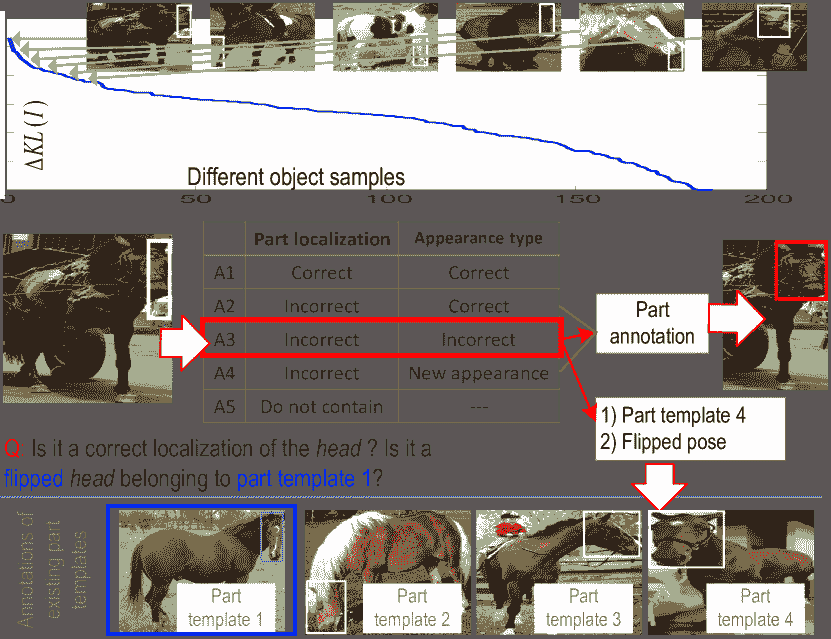

<!--yml

分类：未分类

日期：2024-09-06 20:08:13

-->

# [1802.00614] 深度学习的可视解释性：综述

> 来源：[`ar5iv.labs.arxiv.org/html/1802.00614`](https://ar5iv.labs.arxiv.org/html/1802.00614)

# 深度学习的可视解释性：综述

张全实和朱松纯

加利福尼亚大学洛杉矶分校

###### 摘要

本文回顾了最近关于理解神经网络表示和学习具有可解释/解缠结中间层表示的神经网络的研究。虽然深度神经网络在各种任务中表现出色，但可解释性始终是深度神经网络的致命弱点。目前，深度神经网络在获得高判别能力的同时，黑箱表示的可解释性较低。我们认为，高模型可解释性可能有助于突破深度学习的几个瓶颈，如*例如*从非常少的标注中学习、通过人机语义层面交流进行学习，以及对网络表示进行语义调试。我们专注于卷积神经网络（CNNs），并重新审视 CNN 表示的可视化、诊断预训练 CNN 表示的方法、解缠结预训练 CNN 表示的方法、学习具有解缠结表示的 CNN 以及基于模型可解释性的中到端学习。最后，我们讨论了可解释人工智能的前景趋势。

## 1 引言

卷积神经网络（CNNs）LeCun 等人 (1998a); Krizhevsky 等人 (2012); He 等人 (2016); Huang 等人 (2017) 在许多视觉任务中取得了优异的表现，如目标分类和检测。然而，端到端学习策略使得 CNN 表示成为一个黑箱。除了最终的网络输出之外，人们很难理解隐藏在网络内部的 CNN 预测逻辑。近年来，越来越多的研究者意识到，高模型可解释性在理论和实践中具有重要价值，并开发了具有可解释知识表示的模型。

本文对当前理解神经网络表示和学习具有可解释/解缠结表示的神经网络的研究进行了调查。我们可以大致将综述的范围定义为以下六个研究方向。

+   •

    CNN 表示在中间网络层的可视化。这些方法主要合成最大化预训练 CNN 中给定单元分数的图像，或将卷积层的特征图反演回输入图像。详细讨论请参见第二部分。

+   •

    CNN 表示的诊断。相关研究可能会诊断 CNN 的特征空间以区分不同的对象类别，或发现卷积层中的潜在表示缺陷。有关详细信息，请参见第三部分。

+   •

    解析卷积神经网络（CNN）中每个滤波器编码的“模式混合”。这些研究主要是解开卷积层中的复杂表示，并将网络表示转化为可解释的图形。有关详细信息，请参见第四部分。

+   •

    构建可解释的模型。我们讨论了可解释的 CNN Zhang 等人（2017c）、胶囊网络 Sabour 等人（2017）、可解释的 R-CNNs Wu 等人（2017）和 InfoGAN Chen 等人（2016），详细信息请参见第五部分。

+   •

    通过人机交互进行的语义级中到端学习。CNN 表示的清晰语义解构可能进一步使得通过弱监督进行神经网络的“中到端”学习成为可能。第七部分介绍了通过人机交互学习新模型的方法 Zhang 等人（2017b）和在非常有限的人工监督下的主动问答 Zhang 等人（2017a）。

在上述所有方面中，CNN 表示的可视化是探索网络表示的最直接方式。网络可视化还为诊断 CNN 表示的许多方法提供了技术基础。对预训练 CNN 的特征表示的解构和可解释网络表示的学习对最先进的算法提出了更大的挑战。最后，可解释或解构的网络表示也是弱监督中到端学习的起点。

模型可解释性的价值：高卷积层中的清晰语义可以帮助人们信任网络的预测。正如 Zhang 等人（2018b）所讨论的那样，考虑到数据集和表示偏差，即使在测试图像上具有高准确率，仍然不能确保 CNN 会编码正确的表示。例如，CNN 可能使用不可靠的上下文——眼部特征——来识别面部图像的“口红”属性。因此，除非 CNN 能够在语义上或视觉上解释其逻辑，*例如*用于预测的模式，否则人们通常无法完全信任网络。

此外，基于可解释或解耦网络表示的神经网络中后期学习或调试可能会显著减少对人工标注的需求。此外，基于网络的语义表示，未来有可能在语义层面上将多个 CNN 合并为一个通用网络（*即* 一个编码不同任务的通用知识表示的网络）。

在接下来的章节中，我们将回顾上述研究方向，并讨论技术发展的潜在未来。

## 2 CNN 表示的可视化

在 CNN 中对滤波器的可视化是探索神经单元内部隐藏视觉模式的最直接方式。已开发出不同类型的可视化方法用于网络可视化。

首先，基于梯度的方法 Zeiler 和 Fergus (2014)；Mahendran 和 Vedaldi (2015)；Simonyan 等人 (2013)；Springenberg 等人 (2015) 是网络可视化的主流。这些方法主要计算给定 CNN 单元相对于输入图像的分数的梯度。它们使用这些梯度来估计最大化单元分数的图像外观。Olah 等人 (2017) 提供了一个工具箱，包含现有技术，用于可视化预训练 CNN 中不同卷积层编码的模式。

其次，Dosovitskiy 和 Brox (2016) 提出的上卷积网络是另一种典型的技术，用于可视化 CNN 表示。上卷积网络将 CNN 特征图反转为图像。我们可以将上卷积网络视为一种工具，间接说明特征图对应的图像外观，尽管与基于梯度的方法相比，上卷积网络无法在数学上确保可视化结果完全反映 CNN 中的实际表示。类似地，Nguyen 等人 (2017) 进一步向对抗生成网络引入了一个额外的先验，该先验控制合成图像的语义含义。我们可以使用 CNN 特征图作为可视化的先验。

此外，Zhou 等人 (2015) 提出了一个方法来准确计算特征图中神经激活的图像分辨率感受野。神经激活的实际感受野比使用滤波器大小计算的理论感受野要小。对感受野的准确估计有助于人们理解滤波器的表示。

## 3 CNN 表示的诊断

一些方法超越了 CNN 的可视化，通过诊断 CNN 表示来获得对 CNN 编码特征的深入理解。我们大致将所有相关研究分为以下五个方向。

第一研究方向的研究分析了来自全局视角的 CNN 特征。Szegedy 等人（2014）已探索了每个滤波器的语义含义。Yosinski 等人（2014）分析了中间卷积层中滤波器表示的可传递性。Lu（2015）；Aubry 和 Russell（2015）计算了预训练 CNN 特征空间中不同类别/属性的特征分布。

第二研究方向提取直接为标签/属性对网络输出贡献的图像区域，以解释标签/属性的 CNN 表示。这类似于 CNN 的可视化。Fong 和 Vedaldi 的方法（2017）；Selvaraju 等人（2017）已提出通过将特征映射相对于最终损失的梯度反向传播到图像平面来估计图像区域。Ribeiro 等人提出的 LIME 模型（2016）提取对网络输出高度敏感的图像区域。Zintgraf 等人的研究（2017）；Kindermans 等人（2017）；Kumar 等人（2017）发明了可视化输入图像中对 CNN 决策过程贡献最大的区域的方法。Wang 等人（2017）；Goyal 等人（2016）尝试解释编码在神经网络中的视觉问答逻辑。这些研究列出了从图像中检测到的重要对象（或感兴趣的区域）以及问题中关键词作为输出答案解释的说明。

在诊断网络表示方面，估计 CNN 特征空间中的脆弱点也是一个热门研究方向。Su 等人（2017）；Koh 和 Liang（2017）的方法已开发出计算 CNN 的对抗样本。*即*，这些研究旨在估计能改变最终预测的输入图像的最小噪声扰动。特别是 Koh 和 Liang（2017）提出的影响函数可以用于计算对抗样本。影响函数还可以提供创建攻击 CNN 学习、修复训练集以及进一步调试 CNN 表示的合理方式。

第四个研究方向是基于网络特征空间的分析来细化网络表示。针对一个用于对象分类的预训练 CNN，Lakkaraju 等人（2017）提出了一种方法，以弱监督的方式发现 CNN 的知识盲点（未知模式）。该方法将 CNN 的整个特征空间中的所有样本点分组为数千个伪类别。它假设一个学习良好的 CNN 会使用每个伪类别的子空间来专门表示特定对象类别的子集。通过这种方式，本研究随机展示了每个子空间中的对象样本，并利用子空间中的样本纯度来发现预训练 CNN 中隐藏的潜在表示缺陷。为了将教师网络的表示提炼到学生网络中以进行情感分析，Hu 等人（2016）提出使用自然语言的逻辑规则（*例如* I-ORG 不能跟在 B-PER 后面）来构建提炼损失，以监督神经网络的知识提炼，从而获得更有意义的网络表示。

图 1：CNN 中的偏倚表示 Zhang 等人（2018b）。考虑到潜在的数据集偏差，高测试图像的准确率并不能总是确保 CNN 学习到正确的表示。CNN 可能会使用不可靠的共同出现上下文进行预测。例如，人们可能通过遮盖嘴部区域或粘贴另一个嘴部来手动修改两个面孔的嘴部外观，但这些修改不会显著改变对口红属性的预测分数。此图显示了口红属性的推理模式热图，其中红色/蓝色的模式与属性分数为正/负。CNN 错误地将无关的模式视为推断口红的上下文。

最后，Zhang 等人（2018b）提出了一种发现 CNN 潜在偏倚表示的方法。图 1 显示了一个用于面部属性估计的 CNN 的偏倚表示。当一个属性通常与训练图像中的特定视觉特征共同出现时，CNN 可能会使用这些共同出现的特征来表示该属性。当使用的共同出现特征与目标属性在语义上无关时，这些特征可以被视为偏倚表示。

给定一个预训练的 CNN（例如，一个用于估计面部属性的 CNN），张等人（2018b）要求人们注释某些属性之间的地面真实关系，例如，口红属性与浓妆属性正相关，与黑发属性无关。然后，该方法挖掘每个属性输出从卷积层中推断出的推理模式，并使用推理模式计算编码在 CNN 中的实际属性关系。地面真实性与挖掘属性关系之间的冲突表明偏见表示。

## 4 将 CNN 表示解释为解释性图表和决策树

### 4.1 将 CNN 表示解释为解释性图表

相比于前几节网络表示的可视化和诊断，将 CNN 特征解释为人类可解释的图形表示（即解释性图表），提供了对网络表示更为彻底的解释。张等人（2018a，2016）提出了在预训练的 CNN 的卷积层中解开特征，并使用图形模型来表示 CNN 内部隐藏的语义层次。

图 2：使用不同输入图像获得的一个滤波器的特征图，张等人（2018a）。为了可视化特征图，该方法将激活单元的感受野传播回图像平面。在每个子特征中，该滤波器被图像中各种部分模式激活。这使得理解滤波器的语义含义变得困难。

如图 2 所示，CNN 中高卷积层中的每个滤波器通常表示一种模式的混合。例如，该滤波器可能被对象的头部和尾部部分同时激活。因此，为了全面了解预训练的 CNN 中视觉知识的组织方式，张等人的研究（2018a，2016）旨在回答以下三个问题。

+   •

    每个卷积滤波器记忆了多少种视觉模式（这里，视觉模式可以描述特定对象部分或某种纹理）？

+   •

    描述一个对象部分的哪些模式同时被激活？

+   •

    两个同时激活的模式之间的空间关系是什么？

图 3：解释性图 张等人（2018a）。解释性图表示了隐藏在 CNN 卷积层中的知识层级。预训练 CNN 中的每个滤波器可能会被不同的物体部分激活。张等人（2018a）以无监督的方式将每个滤波器中的部分模式解开，从而阐明了知识表示。

图 4：与解释性图中不同节点对应的图像补丁 张等人（2018a）。

图 5：模式的热图 张等人（2018a）。热图可视化了解释性图第 $L$ 层中前 50%模式的空间分布，这些模式具有最高的推断分数。

图 6：解释性图中每个节点推断的图像区域 张等人（2018a）。张等人（2018a）的方法成功地将物体部分模式从每个单独滤波器的表示中解开。

如图 3 所示，解释性图解释了 CNN 内部隐藏的知识语义。解释性图解开了每个滤波器特征图中的部分模式混合，并使用每个图节点表示一个部分。

+   •

    解释性图有多个层级。每个图层对应于 CNN 的特定卷积层。

+   •

    卷积层中的每个滤波器可能代表不同物体部分的外观。该算法自动解开编码在单个滤波器中的部分模式混合，并使用解释性图中的一个节点表示每个部分模式。

+   •

    解释性图中的每个节点在不同图像中始终代表相同的物体部分。我们可以使用该节点在输入图像上定位相应的部分。在某种程度上，该节点对形状变形和姿势变化具有鲁棒性。

+   •

    每条边编码了相邻层中两个节点之间的共同激活关系和空间关系。

+   •

    我们可以将解释性图视为卷积层特征图的压缩。一个卷积神经网络（CNN）有多个卷积层。每个卷积层可能有数百个滤波器，每个滤波器可能生成一个包含数百个神经单元的特征图。我们可以使用解释性图中的数万个节点来表示这些特征图中所有几千万个神经单元所包含的信息，*即*特征图被激活的部分模式，以及这些部分模式在输入图像中的位置。

+   •

    就像字典一样，每张输入图像只能激发解释图中的一小部分部分模式（节点）。每个节点描述了一种具有高度可转移性的常见部分模式，这种模式被数百或数千张训练图像共享。

图 4 列出了对应于解释图中不同节点的顶级图像块。图 5 可视化了由解释图第 $L$ 层中具有最高推理分数的前 50% 节点推断的物体部分的空间分布。图 6 显示了由单个节点推断出的物体部分。

#### 4.1.1 应用：多次拍摄部分定位

基于解释图有许多潜在应用。例如，我们可以将解释图视为一种类别的视觉字典，并将图节点转移到其他应用中，如多次拍摄的部分定位。

给定非常少的物体部分边界框，Zhang 等人 (2018a) 提出了从解释图中检索与部分注释相关的数百个节点，然后利用检索到的节点在以前未见过的图像中定位物体部分。由于解释图中的每个节点编码了许多训练图像共享的部分模式，检索到的节点描述了目标部分的一般外观，而不会过度拟合到有限的部分边界框注释上。对于每个物体部分给定三个注释，基于解释图的方法展示了优越的部分定位性能，相比第二好的基线减少了约 1/3 的定位误差 *w.r.t.*。

### 4.2 将 CNN 表示解缠为决策树

图 7: 决策树在语义层面解释 CNN 预测的示意图 Zhang 等 (2018c)。CNN 被用于对象分类，其顶层卷积层具有解耦的表示，每个滤波器代表一个特定的对象部分。决策树以粗到细的方式编码隐藏在 CNN 全连接层中的各种决策模式。给定一个输入图像，决策树推断出一个解析树（红线），用于定量分析 CNN 预测的理由，*即* 哪些对象部分（或滤波器）用于预测，以及一个对象部分（或滤波器）对预测的贡献程度。

Zhang 等 (2018c) 进一步提出了一个决策树来编码全连接层中的决策模式。该决策树并非用于分类，而是用于定量解释每个 CNN 预测的逻辑。*即* 给定一个输入图像，我们使用 CNN 进行预测。决策树告诉人们在卷积层中哪些滤波器被用于预测，以及它们对预测的贡献程度。

如图 7 所示，该方法挖掘了在全连接层中记忆的潜在决策模式。决策树以粗到细的方式组织这些潜在决策模式。此外，本研究采用 Zhang 等 (2017c) 的方法解耦顶层卷积层中的滤波器表示，*即* 使每个滤波器代表一个特定的对象部分。通过这种方式，人们可以使用决策树在语义层面解释每个 CNN 预测的理由，*即* 哪些对象部分被 CNN 用于预测。

## 5 学习具有可解释/解耦表示的神经网络

前面章节中提到的几乎所有方法都集中于对预训练网络的理解。在本节中，我们回顾了学习解耦表示的神经网络的研究，其中中层表示不再是黑箱，而具有明确的语义意义。与对预训练网络的理解相比，学习具有解耦表示的网络带来了更多挑战。到目前为止，仅有少数研究在这一方向上发表。

图 8: 普通卷积层和可解释卷积层的结构 Zhang 等 (2017c)。绿色和红色线分别表示前向传播和反向传播。

图 9: 模板 Zhang 等 (2017c)。每个模板 $T_{\mu_{i}}$ 当目标部分主要激活特征图中的第 $i$ 个单元时与特征图匹配。

图 10：张等人（2017c）在顶部卷积层中可解释滤波器的可视化。我们使用了周等人（2015）来估计特征图中激活的图像分辨率感受野，以可视化滤波器的语义。可解释的 CNN 通常在其顶部卷积层中编码动物的头部特征用于分类。

### 5.1 可解释卷积神经网络

如图 9 所示，张等人（2017c）开发了一种方法，通过向卷积层中的每个滤波器添加损失，将普通 CNN 修改为获得高卷积层中的解耦表示。这种损失用于规范化特征图以表示特定的物体部件。

注意，人们不需要注释任何物体部件或纹理来监督可解释 CNN 的学习。相反，损失在端到端学习过程中自动将物体部件分配给每个滤波器。如图 9 所示，该方法设计了一些模板。每个模板$T_{\mu_{i}}$是一个与特征图大小相同的矩阵。$T_{\mu_{i}}$描述了当目标部件主要触发特征图中的第$i$个单元时，特征图的理想激活分布。

给定将特征图拟合到模板的联合概率，滤波器的损失被公式化为特征图与模板之间的互信息。这种损失鼓励低的类别间激活熵。*即*卷积层中的每个滤波器都被分配到某一类别。如果输入图像属于目标类别，则损失期望滤波器的特征图与模板匹配良好；否则，滤波器需要保持未激活。此外，损失还鼓励神经激活的空间分布熵低。*即*当输入图像属于目标类别时，特征图应独占地拟合单个模板。换句话说，滤波器需要在特征图上激活一个单一位置。

本研究假设，如果一个滤波器重复激活不同的特征图区域，则该滤波器更可能描述低级纹理（*例如*颜色和边缘），而不是高级部件。例如，左眼和右眼可能由不同的滤波器表示，因为两个眼睛的背景是对称的，但不完全相同。

图 10 显示了由不同过滤器产生的可解释 CNN 的特征图。每个过滤器通过各种图像一致地表示相同的目标部件。

图 11：Wu 等人（2017）提出的方法的检测示例。除了预测的边界框外，该方法还输出潜在的解析树和部件配置，作为检测中定性提取的依据。解析树在潜在结构的空间中即时推断，遵循 AOG 的自上而下组合语法。

### 5.2 可解释的 R-CNN

Wu 等人（2017）提出了基于 R-CNN 的定性可解释模型的学习。目标是在目标检测过程中自动展开目标部件的潜在配置。该方法在学习过程中没有使用任何部件注释作为监督。Wu 等人（2017）使用自上而下的层次化和组合语法，即 And-Or 图（AOG），来建模目标部件的潜在配置。该方法使用基于 AOG 的解析操作符来替代 R-CNN 中使用的 RoI-Pooling 操作符。基于 AOG 的解析利用了对象的可解释组合结构，并保持了 R-CNN 的判别能力。这一思想与预测中的局部、底层和自上而下信息组件的解耦相关，见 Wu 等人（2007）；Yang 等人（2009）；Wu 和 Zhu（2011）。

在检测过程中，边界框被解释为从 AOG 即时推导出的最佳解析树。在学习过程中，使用折叠-展开方法以端到端的方式训练 AOG 和 R-CNN。

图 11 展示了一个目标检测的示例。该方法检测目标的边界框，同时确定目标的潜在解析树和部件配置，作为检测中的定性提取依据。

### 5.3 胶囊网络

Sabour 等人 (2017) 设计了新型神经单元，即胶囊，以替代传统的神经单元构建胶囊网络。每个胶囊输出一个活动向量而不是标量。活动向量的长度表示胶囊的激活强度，活动向量的方向编码实例化参数。下层的活跃胶囊向相邻的上层胶囊发送消息。这种方法使用迭代的基于一致性的路由机制，为输出更符合高层胶囊实例化参数的低层胶囊分配更高的权重。

实验表明，当人们使用 MNIST 数据集 LeCun 等人 (1998b) 训练胶囊网络时，一个胶囊编码了特定的语义概念。胶囊的活动向量的不同维度控制不同的特征，包括 1) 尺寸和厚度，2) 局部部分，3) 笔划厚度，4) 局部倾斜，以及 5) 宽度和位移。

### 5.4 信息最大化生成对抗网络

信息最大化生成对抗网络 Chen 等人 (2016)，即 InfoGAN，是生成对抗网络的一种扩展。InfoGAN 最大化潜在表示的某些维度与图像观察之间的互信息。InfoGAN 将生成器的输入变量分为两种类型，即不可压缩的噪声 $z$ 和潜在代码 $c$。本研究旨在以无监督的方式学习潜在代码 $c$，以编码特定的语义概念。

InfoGAN 已使用 MNIST 数据集 LeCun 等人 (1998b)、CelebA 数据集 Liu 等人 (2015)、SVHN 数据集 Netzer 等人 (2011)、3D 面部数据集 Paysan 等人 (2009) 和 3D 椅子数据集 Aubry 等人 (2014) 进行训练。实验表明，潜在代码成功编码了 MNIST 数据集中数字的类型、旋转和宽度，SVHN 数据集中的光照条件和背景，CelebA 数据集中的方位、眼镜存在、发型和情感，以及 3D 面部和椅子数据集中的宽度和 3D 旋转。

## 6 网络可解释性的评估指标

模型可解释性的评估指标对解释性模型的开发至关重要。这是因为与传统的明确定义的视觉应用（*例如*物体检测和分割）不同，网络可解释性更难以定义和评估。网络可解释性的评估指标可以帮助人们定义网络可解释性的概念，并指导学习可解释网络表示的开发。到目前为止，仅有很少的研究讨论了网络可解释性的评估。提出一个有前景的评估指标仍然是当前最先进算法面临的重大挑战。在这一部分，我们简要介绍了两种最新的卷积神经网络（CNN）滤波器可解释性评估指标，*即* Bau 等人提出的滤波器可解释性（2017）和张等人提出的位置不稳定性（2018a）。

### 6.1 滤波器可解释性

Bau 等人（2017）定义了 CNN 滤波器的六种语义类型，*即*对象、部件、场景、纹理、材料和颜色。滤波器可解释性的评估要求人们在测试图像的像素级别上标注这六种语义类型。评估指标衡量滤波器神经激活的图像分辨率感受野¹¹1 该方法将滤波器特征图中每个激活单元的感受野传播回图像平面，以作为滤波器的图像分辨率感受野。与图像上的像素级语义标注之间的适配度。例如，如果滤波器神经激活的感受野通常与通过不同图像获得的特定语义概念的真实图像区域高度重叠，那么我们可以认为该滤波器表示了这一语义概念。

对于每个滤波器 $f$，该方法计算其在不同测试图像上的特征图 ${\bf X}=\{x=f(I)|I\in{\bf I}\}$。然后，计算所有特征图所有位置的激活分数分布。Bau 等人（2017）设置了一个激活阈值 $T_{f}$，使得 $p(x_{ij}>T_{f})=0.005$，从所有特征图 $x\in{\bf X}$ 的所有空间位置 $[i,j]$ 中选择最高激活作为与 $f$ 的语义对应的有效图区域。然后，该方法将低分辨率的有效图区域放大到图像分辨率，从而获得每个图像上有效激活的感受野。我们用 $S_{f}^{I}$ 来表示 $f$ 相对于图像 $I$ 的有效激活的感受野。

过滤器$f$与特定语义概念之间的兼容性通过交并比得分$IoU_{f,k}^{I}\!=\!\frac{\|S_{f}^{I}\cap S_{k}^{I}\|}{\|S_{f}^{I}\cup S_{k}^{I}\|}$来报告，其中$S_{k}^{I}$表示图像$I$上第$k$个语义概念的真实掩码。给定图像$I$，如果$IoU_{f,k}^{I}>0.04$，则过滤器$f$与第$k$个概念相关联。第$k$个概念与过滤器$f$相关联的概率为$P_{f,k}={\textrm{mean}}_{I:\textrm{with k-th concept}}{\bf 1}(IoU_{f,k}^{I}>0.04)$。因此，我们可以使用$P_{f,k}$来评估$f$的过滤器可解释性。

### 6.2 位置不稳定性

图 12：计算过滤器位置不稳定性的符号说明 Zhang 等人（2018a）。

另一个评估指标是位置不稳定性。这个指标由 Zhang 等人（2018a）提出，用于评估 CNN 过滤器与物体部分表示之间的适配度。给定输入图像$I$，CNN 计算过滤器$f$的特征图$x\in\mathbb{R}^{N\times N}$。我们可以将激活值最高的单位$x_{i,j}$（$1\leq i,j\leq N$）视为$f$的位置信息，其中$N\times N$表示特征图的大小。我们用$\hat{\bf p}$表示与推断出的特征图位置$(i,j)$对应的图像位置，*即*当我们将感受野向图像平面反向传播时，单位$x_{i,j}$的感受野中心。评估假设如果$f$在不同物体上始终表示相同的物体部分（该物体部分可能没有明确名称），那么图像位置$\hat{\bf p}$与一些物体地标之间的距离在不同物体中应该不会变化太大。例如，如果过滤器$f$表示肩膀，那么肩膀与头部之间的距离在不同物体中应该保持稳定。

因此，人们可以计算推断位置 $\hat{\bf p}$ 与不同图像中的特定地面真实标志之间的距离偏差。相对于各种标志的平均偏差 *w.r.t.* 可以用来评估 $f$ 的位置不稳定性。如图 12 所示，设 $d_{I}({\bf p}_{k},\hat{\bf p})=\frac{\|{\bf p}_{k}-\hat{\bf p}\|}{\sqrt{w^{2}+h^{2}}}$ 表示推断部分与图像 $I$ 上第 $k$ 个标志 ${\bf p}_{k}$ 之间的归一化距离。$\sqrt{w^{2}+h^{2}}$ 表示输入图像的对角线长度。因此，$D_{f,k}=\sqrt{{\textrm{var}}_{I}[d_{I}({\bf p}_{k},\hat{\bf p})]}$ 被报告为滤波器 $f$ 相对于第 $k$ 个标志的相对位置偏差，其中 ${\textrm{var}}_{I}[d_{I}({\bf p}_{k},\hat{\bf p})]$ 被称为距离 $d_{I}({\bf p}_{k},\hat{\bf p})$ 的变化量。由于每个标志不能出现在所有测试图像中，对于每个滤波器 $f$，该指标仅使用在包含第 $k$ 个标志的图像上激活分数最高的前 $M$ 个推断结果来计算 $D_{f,k}$。通过这种方式，卷积层中所有滤波器相对于所有标志的相对位置偏差的平均值，即 ${\textrm{mean}}_{f}{\textrm{mean}}_{k=1}^{K}D_{f,k}$，测量 CNN 的位置不稳定性，其中 $K$ 表示标志的数量。

## 7 网络可解释性：从中到端学习

根据在第 4 和第五部分中讨论的研究，人们可以解构预训练 CNN 的表示，或者学习一个具有可解释、解构表示的新网络。这种可解释/解构的网络表示可以进一步支持从中到端的模型学习，在没有强监督的情况下达到语义层级。我们简要回顾了两个典型的从中到端学习的研究，Zhang 等人 (2017a, b) 如下。

图 13：在预训练 CNN 上生成的 And-Or 图作为语义分支 Zhang 等人 (2017a)。AOG 将特定 CNN 单元与某些图像区域关联。红色线条表示解析图。

### 7.1 主动问答用于学习 And-Or 图

基于 Zhang 等人 (2016) 提出的语义 And-Or 表示，Zhang 等人 (2017a) 开发了一种方法，使用主动问答将预训练 CNN 的卷积层中的神经模式语义化，并建立一个用于层次化对象理解的模型。

如图 13 所示，CNN 是针对对象分类进行预训练的。该方法旨在提取一个四层的可解释的 And-Or 图（AOG），以解释隐藏在 CNN 中的语义层次结构。AOG 编码了四层语义，涵盖了语义部件（OR 节点）、部件模板（AND 节点）、潜在模式（OR 节点）和特征图上的神经单元（终端节点）。在 AOG 中，AND 节点表示部件的组成区域，而 OR 节点编码了局部部件的替代模板/变形候选项列表。顶部部件节点（OR 节点）使用其子节点表示一些部件的模板候选项。第二层中的每个部件模板（AND 节点）使用子节点潜在模式来表示其组成区域。第三层中的每个潜在模式（OR 节点）自然地对应于滤波器特征图中的某个范围的单元。潜在模式选择该范围内的一个单元，以考虑其几何变形。

图 14：QA 过程的示意图 Zhang 等人 (2017a)。 （上）该方法对未解释的对象进行排序和选择。 （下）每个目标对象的问题。

图 15：Pascal VOC Part 数据集上的部件定位性能 Zhang 等人 (2017a)。

为了学习 AOG，张等人（2017a）允许计算机主动识别和询问那些当前 AOG 无法解释的物体的神经模式。如图 15 所示，在每一步主动问答中，当前 AOG 用于在所有未注释的图像中定位物体部件。该方法主动选择那些无法很好适应 AOG 的物体，即无法解释的物体。该方法预测询问每个无法解释物体的潜在收益，从而确定最佳的提问顺序（*例如* 询问无法解释物体部件的模板类型和边界框）。通过这种方式，该方法利用答案来修正现有的部件模板或挖掘新物体部件模板的潜在模式，以扩展 AOG 分支。图 15 比较了不同方法的部件定位性能。基于 QA 的学习展示了比其他基准显著更高的效率。所提出的方法使用了大约 1/6 到 1/3 的部件注释进行训练，但达到了与 fast-RCNN 方法相似或更好的部件定位性能。

### 7.2 CNN 模式的互动操控

图 16：人机交互前后头部部件模式的可视化 张等人（2017b）。

让 CNN 通过物体边界框的注释进行预训练以进行物体分类。张等人（2017b）探索了一种互动方法来诊断 CNN 的知识表示，以便将 CNN 模式转移到模型物体部件上。与传统的端到端 CNN 学习需要大量训练样本不同，该方法在单次/多次学习的场景中从 CNN 中挖掘物体部件模式。

更具体地说，该方法使用极少的（例如三张）对象图像上的部分注释进行监督。给定部分的边界框注释，所提出的方法首先使用 Zhang 等人（2016）从 CNN 的卷积层中挖掘与注释部分相关的潜在模式。使用 AOG 组织所有挖掘出的模式作为目标部分的表示。该方法可视化挖掘出的潜在模式，并要求人们互动地去除与目标部分无关的潜在模式。通过这种方式，人们可以简单地从 AOG 分支中修剪不正确的潜在模式以细化 AOG。图 16 可视化了最初挖掘的模式和人类交互后的剩余模式。在人类交互的指导下，Zhang 等人（2017b）展示了出色的部分定位性能。

## 8 个前景趋势和结论

在本文中，我们回顾了网络可解释性的几个研究方向。神经单元模式的可视化是早期理解网络表示的起点。随后，人们逐渐发展了分析神经网络特征空间的方法，并诊断隐藏在神经网络内部的潜在表示缺陷。目前，将卷积层混乱表示解开为图形模型和/或符号逻辑已成为一种新兴的研究方向，旨在揭开神经网络的黑箱。已提出将预训练的 CNN 转换为解释性图的方式，并在知识迁移和弱监督学习中展示了显著的效率。

端到端学习的可解释神经网络，其中间层编码了可理解的模式，也是一个前景趋势。已经开发出可解释的 CNN，其中高卷积层中的每个滤波器表示特定的对象部分。

此外，基于 CNN 模式的可解释表示，已经提出了语义层级的中间到结束学习方法，以加快学习过程。与传统的端到端学习相比，中间到结束学习允许人类交互引导学习过程，并且可以在仅有很少注释的情况下进行监督。

未来，我们相信中间到结束的学习将持续成为一个基础研究方向。此外，基于可解释网络的语义层级，在语义层面上调试 CNN 表示将创造新的视觉应用。

## 致谢

本研究得到了 ONR MURI 项目 N00014-16-1-2007 和 DARPA XAI 奖 N66001-17-2-4029，以及 NSF IIS 1423305 的资助支持。

## 参考文献

+   Aubry 和 Russell [2015] Mathieu Aubry 和 Bryan C. Russell。通过计算机生成的图像理解深度特征。在 ICCV，2015。

+   Aubry 等人 [2014] M. Aubry、D. Maturana、A. Efros、B. Russell 和 J. Sivic。观察 3D 椅子：利用大型 CAD 模型数据集进行示例部分基础的 2D-3D 对齐。在 CVPR，2014。

+   Bau 等人 [2017] David Bau、Bolei Zhou、Aditya Khosla、Aude Oliva 和 Antonio Torralba。网络剖析：量化深度视觉表示的可解释性。在 CVPR，2017。

+   Chen 等人 [2016] Xi Chen、Yan Duan、Rein Houthooft、John Schulman、Ilya Sutskever 和 Pieter Abbeel。InfoGAN：通过信息最大化生成对抗网络进行可解释表示学习。在 NIPS，2016。

+   Dosovitskiy 和 Brox [2016] Alexey Dosovitskiy 和 Thomas Brox。利用卷积网络逆转视觉表示。在 CVPR，2016。

+   Fong 和 Vedaldi [2017] Ruth C. Fong 和 Andrea Vedaldi。通过有意义的扰动解释黑箱模型。在 ICCV，2017。

+   Goyal 等人 [2016] Yash Goyal、Akrit Mohapatra、Devi Parikh 和 Dhruv Batra。迈向透明的 AI 系统：解释视觉问答模型。在 arXiv:1608.08974，2016。

+   He 等人 [2016] Kaiming He、Xiangyu Zhang、Shaoqing Ren 和 Jian Sun。用于图像识别的深度残差学习。在 CVPR，2016。

+   Hu 等人 [2016] Zhiting Hu、Xuezhe Ma、Zhengzhong Liu、Eduard Hovy 和 Eric P. Xing。利用逻辑规则驾驭深度神经网络。在 ACL，2016。

+   Huang 等人 [2017] Gao Huang、Zhuang Liu、Kilian Q. Weinberger 和 Laurens van der Maaten。密集连接卷积网络。在 CVPR，2017。

+   Kindermans 等人 [2017] Pieter-Jan Kindermans、Kristof T. Schütt、Maximilian Alber、Klaus-Robert Müller、Dumitru Erhan、Been Kim 和 Sven Dähne。学习如何解释神经网络：PatternNet 和 PatternAttribution。在 arXiv: 1705.05598，2017。

+   Koh 和 Liang [2017] PangWei Koh 和 Percy Liang。通过影响函数理解黑箱预测。在 ICML，2017。

+   Krizhevsky 等人 [2012] A. Krizhevsky、I. Sutskever 和 G. E. Hinton。使用深度卷积神经网络进行 ImageNet 分类。在 NIPS，2012。

+   Kumar 等人 [2017] Devinder Kumar、Alexander Wong 和 Graham W. Taylor。解释未解释的：一种基于类别增强的注意响应（CLEAR）方法来理解深度神经网络。在 CVPR 解释性计算机视觉和求职候选人筛选竞赛工作坊，2017。

+   Lakkaraju 等人 [2017] Himabindu Lakkaraju、Ece Kamar、Rich Caruana 和 Eric Horvitz。识别开放世界中的未知未知：用于引导探索的表示和策略。在 AAAI，2017。

+   LeCun 等人 [1998a] Yann LeCun、Lèon Bottou、Yoshua Bengio 和 Patrick Haffner。应用于文档识别的基于梯度的学习。在 IEEE 会议录，1998。

+   LeCun 等人 [1998b] Yann LeCun、Corinna Cortes 和 Christopher JC Burges。MNIST 手写数字数据库。技术报告，1998。

+   Liu 等人 [2015] Ziwei Liu、Ping Luo、Xiaogang Wang 和 Xiaoou Tang。深度学习在实际环境中的人脸属性。在 ICCV，2015 年。

+   Lu [2015] Yao Lu。神经网络输出的无监督学习。在 arXiv:1506.00990v9，2015 年。

+   Mahendran 和 Vedaldi [2015] Aravindh Mahendran 和 Andrea Vedaldi。通过反转理解深度图像表示。在 CVPR，2015 年。

+   Netzer 等人 [2011] Yuval Netzer、Tao Wang、Adam Coates、Alessandro Bissacco、Bo Wu 和 Andrew Y. Ng。通过无监督特征学习读取自然图像中的数字。在 NIPS 深度学习和无监督特征学习研讨会，2011 年。

+   Nguyen 等人 [2017] Anh Nguyen、Jeff Clune、Yoshua Bengio、Alexey Dosovitskiy 和 Jason Yosinski。即插即用生成网络：在潜在空间中条件性迭代生成图像。CVPR，2017 年。

+   Olah 等人 [2017] Chris Olah、Alexander Mordvintsev 和 Ludwig Schubert。特征可视化。Distill，2017 年。https://distill.pub/2017/feature-visualization。

+   Paysan 等人 [2009] P. Paysan、R. Knothe、B. Amberg、S. Romdhani 和 T. Vetter。一个用于姿态和光照不变人脸识别的 3D 人脸模型。在 AVSS，2009 年。

+   Ribeiro 等人 [2016] Marco Tulio Ribeiro、Sameer Singh 和 Carlos Guestrin。“我为什么应该信任你？”解释任何分类器的预测。在 KDD，2016 年。

+   Sabour 等人 [2017] Sara Sabour、Nicholas Frosst 和 Geoffrey E. Hinton。胶囊之间的动态路由。在 NIPS，2017 年。

+   Selvaraju 等人 [2017] Ramprasaath R. Selvaraju、Michael Cogswell、Abhishek Das、Ramakrishna Vedantam、Devi Parikh 和 Dhruv Batra。Grad-CAM：通过基于梯度的定位从深度网络中获得视觉解释。在 ICCV，2017 年。

+   Simonyan 等人 [2013] Karen Simonyan、Andrea Vedaldi 和 Andrew Zisserman。深入卷积网络：可视化图像分类模型和显著性图。在 arXiv:1312.6034，2013 年。

+   Springenberg 等人 [2015] Jost Tobias Springenberg、Alexey Dosovitskiy、Thomas Brox 和 Martin Riedmiller。追求简洁：全卷积网络。ICLR 研讨会，2015 年。

+   Su 等人 [2017] Jiawei Su、Danilo Vasconcellos Vargas 和 Sakurai Kouichi。通过一个像素攻击来欺骗深度神经网络。在 arXiv:1710.08864，2017 年。

+   Szegedy 等人 [2014] Christian Szegedy、Wojciech Zaremba、Ilya Sutskever、Joan Bruna、Dumitru Erhan、Ian Goodfellow 和 Rob Fergus。神经网络的有趣特性。在 arXiv:1312.6199，2014 年。

+   Wang 等人 [2017] Peng Wang、Qi Wu、Chunhua Shen 和 Anton van den Hengel。VQA-Machine：学习如何利用现有视觉算法回答新问题。在 CVPR，2017 年。

+   Wu 和 Zhu [2011] Tianfu Wu 和 Song-Chun Zhu。底向上和顶向下推理过程的数值研究。在《国际计算机视觉杂志》，93(2):226–252，2011 年。

+   Wu 等人 [2007] Tian-Fu Wu、Gui-Song Xia 和 Song-Chun Zhu。用于计算层次图像结构的组合增强。在 CVPR，2007 年。

+   Wu 等人 [2017] Tianfu Wu, Xilai Li, Xi Song, Wei Sun, Liang Dong, 和 Bo Li. 可解释的 R-CNN。在 arXiv:1711.05226, 2017。

+   Yang 等人 [2009] Xiong Yang, Tianfu Wu, 和 Song-Chun Zhu. 评估自下而上和自上而下过程的信息贡献。ICCV, 2009。

+   Yosinski 等人 [2014] Jason Yosinski, Jeff Clune, Yoshua Bengio, 和 Hod Lipson. 深度神经网络中的特征可转移性如何？在 NIPS, 2014。

+   Zeiler 和 Fergus [2014] Matthew D. Zeiler 和 Rob Fergus. 可视化和理解卷积网络。在 ECCV, 2014。

+   Zhang 等人 [2016] Q. Zhang, R. Cao, Y. N. Wu, 和 S.-C. Zhu. 通过多次学习在卷积网络上生成可解释的部分图。在 AAAI, 2016。

+   Zhang 等人 [2017a] Quanshi Zhang, Ruiming Cao, Ying Nian Wu, 和 Song-Chun Zhu. 通过主动问答挖掘 CNN 中的物体部件。在 CVPR, 2017。

+   Zhang 等人 [2017b] Quanshi Zhang, Ruiming Cao, Shengming Zhang, Mark Edmonds, Ying Nian Wu, 和 Song-Chun Zhu. 交互式转移 CNN 模式以进行部分定位。在 arXiv:1708.01783, 2017。

+   Zhang 等人 [2017c] Quanshi Zhang, Ying Nian Wu, 和 Song-Chun Zhu. 可解释的卷积神经网络。在 arXiv:1710.00935, 2017。

+   Zhang 等人 [2018a] Q. Zhang, R. Cao, F. Shi, Y.N. Wu, 和 S.-C. Zhu. 通过解释性图解释 CNN 知识。在 AAAI, 2018。

+   Zhang 等人 [2018b] Q. Zhang, W. Wang, 和 S.-C. Zhu. 检查 CNN 表示与数据集偏见的关系。在 AAAI, 2018。

+   Zhang 等人 [2018c] Quanshi Zhang, Yu Yang, Ying Nian Wu, 和 Song-Chun Zhu. 通过决策树解释 CNN。在 arXiv:1802.00121, 2018。

+   Zhou 等人 [2015] Bolei Zhou, Aditya Khosla, Agata Lapedriza, Aude Oliva, 和 Antonio Torralba. 物体检测器在深度场景 CNN 中出现。在 ICRL, 2015。

+   Zintgraf 等人 [2017] Luisa M Zintgraf, Taco S Cohen, Tameem Adel, 和 Max Welling. 可视化深度神经网络决策：预测差异分析。在 ICLR, 2017。
