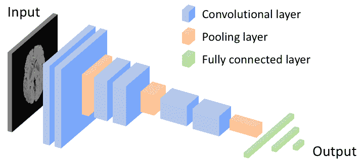
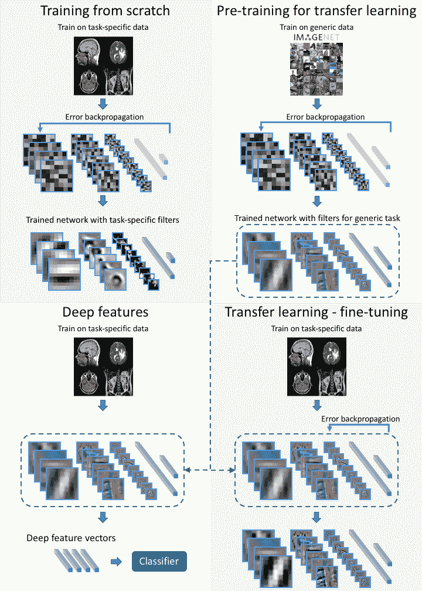
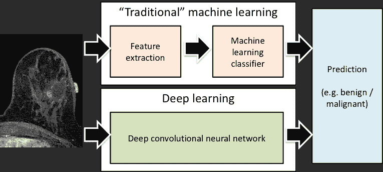

<!--yml

分类：未分类

日期：2024-09-06 20:08:08

-->

# [1802.08717] 0.1 术语

> 来源：[`ar5iv.labs.arxiv.org/html/1802.08717`](https://ar5iv.labs.arxiv.org/html/1802.08717)

## 0.1 术语

要理解深度学习，首先了解人工智能和机器学习的相关概念是有帮助的。人工智能是一组能够执行复杂任务或需要人类智慧的任务的计算机算法。机器学习是人工智能算法的一个子集，它能够从提供的数据中学习，不需要预定义的推理规则，以执行这些复杂的任务。机器学习领域非常广泛，已经在医学影像[Erickson2017]中有了显著应用。深度学习是机器学习的一个子学科，它依赖于简单互联单元的网络。在深度学习模型中，这些单元连接形成多个层，能够生成对提供输入（如图像）的越来越高级的表示。下面，为了说明深度学习模型的架构，我们介绍了人工神经网络的一般概念以及一种具体类型：卷积神经网络。然后，我们详细描述了这些网络的“学习”过程，即将从数据中提取的模式融入深度神经网络的过程。

## 0.2 人工神经网络

人工神经网络（ANNs）是基于 1940 年代的基本概念的机器学习模型，1970 年代和 1980 年代有显著发展，1990 年代和 2000 年代有较高的流行度，随后被其他机器学习算法所掩盖。ANNs 由大量相互连接的处理单元（称为神经元）组成，通常组织成层。一个传统的 ANN 通常包含 2 到 3 层神经元。每个神经元执行非常简单的操作。虽然提出了许多神经元模型，但一个典型的神经元只是将每个输入乘以某个权重，然后将所有输入的乘积相加，最后应用一个简单的非递减函数。尽管每个神经元执行的是非常基础的计算，但网络的互联特性使得可以执行非常复杂的计算并实现非常复杂的功能。

## 0.3 卷积神经网络

深度神经网络是人工神经网络的一种特殊类型。最常见的深度神经网络类型是深度卷积神经网络 (CNN)。深度卷积神经网络虽然继承了通用人工神经网络的特性，但也有其特定的特点。首先，它是深度的。典型的层数为 10\nobreakdash-30 层，但在极端情况下可能超过 1 000 层。其次，神经元的连接方式使得多个神经元共享权重。这使得网络能够对输入图像进行卷积（或模板匹配）操作，使用 CNN 内部的滤波器（由权重定义）。CNN 的另一个特殊特征是它们在一些层之间执行池化操作，使网络对图像的小幅移动不变。最后，与传统的人工神经网络相比，CNN 通常使用不同的激活函数。

图 1: 说明卷积神经网络典型架构的示意图。

图 1 显示了典型 CNN 的一个小型架构示例。可以看到，前几层是卷积层，它们的作用是生成用于分类的有用特征。这些层可以看作是实现图像滤波的，从简单的边缘匹配滤波器到最终匹配更复杂形状（如眼睛或肿瘤）的滤波器。网络输入处更远的层被称为全连接层（类似于传统的人工神经网络），它们利用卷积层提取的特征生成决策（例如，分配标签）。已经提出了各种深度学习架构，通常由手头任务的特征驱动（例如，用于图像分割的全卷积神经网络）。这些在本文中回顾当前最先进技术的部分有更详细的描述。

## 0.4 卷积神经网络中的学习过程

上述内容描述了传统神经网络和深度学习的旗舰：卷积神经网络的一般特征。接下来，我们将深入探讨如何使这些网络执行有用的任务。这是在所谓的学习或训练过程中实现的。卷积神经网络的学习过程简单地包括根据提供的数据改变各个神经元的权重。在最流行的学习过程中，称为监督学习，训练示例包含一个感兴趣的对象（例如肿瘤的图像）和一个标签（例如肿瘤的病理：良性或恶性）。在我们的示例中，图像被呈现给网络的输入，计算在网络内进行，以基于当前的网络权重生成预测。然后，将网络的预测与对象的实际标签进行比较，并计算错误。这个错误随后在网络中传播，以改变网络权重的值，使得下一次网络分析这个示例时，错误减少。实际上，权重的调整是在一组示例（一个批次）呈现给网络后进行的。这个过程称为误差反向传播或随机梯度下降。已经开发了各种随机梯度下降算法的修改版 [ruder2016overview]。原则上，这个迭代过程包括计算模型输出与期望输出之间的误差，并调整权重以减少误差的方向。

图 2：深度神经网络中不同训练方法的示意图。

训练最直接的方法是从随机的权重集开始，并使用特定于问题的数据进行训练（从头开始训练）。然而，由于网络中参数（权重）的数量往往超过 1000 万，并且训练数据有限（在医学影像中常见），网络可能会过拟合这些数据，导致在测试数据上的表现不佳。为解决此问题，已经开发了两种训练方法：迁移学习 [yosinski2014transferable]和现成特征（即深度特征） [sharif2014cnn]。图 2 展示了从头开始训练与迁移学习和现成深度特征的比较图。

在迁移学习方法中，网络首先使用不同的数据集进行训练，例如 ImageNet 集合。然后，通过使用特定于待解决问题的数据进行额外训练，将网络“微调”。这种方法的想法是解决不同的视觉任务共享某些级别的处理，例如边缘或简单形状的识别。这种方法已在预测脑部 MRI 中的生存时间（例如，胶质母细胞瘤患者 [ahmed2017fine]）或皮肤病变分类 [Esteva] 中证明了成功。另一个解决有限训练数据问题的方法是深度“现成”特征方法，它使用在不同数据集上训练过的卷积神经网络来提取图像特征。这是通过提取网络最终层之前的层的输出完成的。这些层通常具有数百或数千个输出。然后，这些输出被用作“传统”分类器的输入，例如线性判别分析、支持向量机或决策树。这类似于迁移学习（有时被认为是迁移学习的一部分），区别在于 CNN 的最后几层被传统分类器替代，早期层则不再进行额外训练。

## 0.5 深度学习与“传统”机器学习

我们越来越频繁地听到深度学习与“传统”机器学习之间的区别（见图 3）。这种差异非常重要，特别是在医学成像的背景下。在传统机器学习中，典型的第一步是特征提取。这意味着为了对一个对象进行分类，必须决定对象的哪些特征是重要的，并实现能够捕捉这些特征的算法。在计算机视觉领域，已经提出了一些复杂的算法用于此目的，并提取了各种大小、形状、纹理及其他特征。这一过程在很大程度上是随意的，因为机器学习研究人员或从业者通常必须猜测哪些特征对特定任务有用，并且有可能包含无用和冗余的特征，更重要的是，可能遗漏真正有用的特征。在深度学习中，特征提取和决策过程被合并并且可训练，因此无需决定提取哪些特征；这一决定由网络在训练过程中做出。然而，允许神经网络选择自己的特征的代价是需要更大的训练数据集。

图 3: “传统”机器学习与深度学习之间差异的示意图。
