<!--yml

category: 未分类

date: 2024-09-06 20:08:05

-->

# [1803.04311] 移动与无线网络中的深度学习：一项调查

> 来源：[`ar5iv.labs.arxiv.org/html/1803.04311`](https://ar5iv.labs.arxiv.org/html/1803.04311)

# 移动与无线网络中的深度学习：一项调查

Chaoyun Zhang, Paul Patras, and Hamed Haddadi C. Zhang and P. Patras are with the Institute for Computing Systems Architecture (ICSA), School of Informatics, University of Edinburgh, Edinburgh, UK. Emails: {chaoyun.zhang, paul.patras}@ed.ac.uk. H. Haddadi is with the Dyson School of Design Engineering at Imperial College London. Email: h.haddadi@imperial.ac.uk.

###### 摘要

移动设备的迅速普及和移动应用与服务的日益流行，对移动和无线网络基础设施提出了前所未有的需求。即将到来的 5G 系统正在演变，以支持爆炸性增长的移动流量、实时提取细粒度分析以及网络资源的灵活管理，从而最大化用户体验。完成这些任务具有挑战性，因为移动环境日益复杂、异构并且不断演化。一种潜在的解决方案是借助先进的机器学习技术，以帮助管理数据量增长和算法驱动应用的兴起。深度学习的最新成功为这一领域内的问题提供了新的强大工具。

本文通过展示两个领域之间的交叉，填补了深度学习与移动与无线网络研究之间的差距。我们首先简要介绍了深度学习技术的基本背景和最新进展，以及其在网络中潜在的应用。然后讨论了几种促进深度学习有效部署到移动系统的技术和平台。随后，我们根据不同领域提供了一篇全面的基于深度学习的移动与无线网络研究的百科全书式评论。根据我们的经验，我们讨论了如何将深度学习定制到移动环境中。最后，我们通过指出当前的挑战和未来研究的方向来完成本调查。

###### 索引词：

深度学习，机器学习，移动网络，无线网络，移动大数据，5G 系统，网络管理。

## I 引言

互联网连接的移动设备渗透到个人生活、工作和娱乐的各个方面。智能手机数量的增加和越来越多样化的应用程序的出现引发了移动数据流量的激增。事实上，最新的行业预测表明，到 2021 年，全球年度 IP 流量消耗将达到 3.3 泽字节（10¹⁵ MB），到同一年，智能手机流量将超过 PC 流量 [1]。鉴于用户偏好向无线连接的转变，当前的移动基础设施面临巨大的容量需求。为了应对这种增长需求，早期的努力提议敏捷地配置资源 [2] 并分布式处理移动管理 [3]。然而，从长远来看，互联网服务提供商（ISPs）必须开发能够孵化第五代移动系统（5G）并逐步满足更严格的端用户应用要求的*智能*异构架构和工具 [4, 5]。

移动网络架构的多样性和复杂性的增长使得监控和管理大量网络元素变得棘手。因此，将多功能机器智能嵌入未来的移动网络引起了前所未有的研究兴趣 [6, 7]。这一趋势在基于机器学习（ML）的解决方案中得到了体现，涉及从无线接入技术（RAT）选择 [8] 到恶意软件检测 [9]，以及支持机器学习实践的网络化系统的发展（例如 [10, 11]）。ML 使得可以系统地从流量数据中挖掘有价值的信息，并自动发现人类专家难以提取的相关性 [12]。作为机器学习的旗舰，深度学习在计算机视觉等领域取得了显著的性能表现 [13]，并在自然语言处理（NLP）中也如此 [14]。网络研究人员也开始意识到深度学习的力量和重要性，并探索其解决移动网络领域特定问题的潜力 [15, 16]。

将深度学习嵌入到 5G 移动和无线网络中是完全合理的。特别是，移动环境产生的数据日益异构，因为这些数据通常来自各种来源，具有不同的格式，并展示复杂的相关性 [17]。因此，许多特定问题对于传统机器学习工具（例如浅层神经网络）而言变得过于困难或不切实际。这是因为*(i)*如果提供更多数据，它们的性能不会提高 [18]，并且*(ii)*它们无法处理控制问题中高维状态/动作空间 [19]。相比之下，大数据推动了深度学习的性能，因为它消除了领域专业知识，而是采用分层特征提取。从本质上讲，这意味着信息可以高效地被提炼，从数据中获取越来越抽象的相关性，同时减少预处理工作量。基于图形处理单元（GPU）的并行计算进一步使得深度学习能够在毫秒内进行推理。这有助于以高精度和及时的方式进行网络分析和管理，克服了传统数学技术（例如凸优化、博弈论、元启发式）的运行时限制。

尽管移动网络领域对深度学习越来越感兴趣，现有的研究成果分散在不同的研究领域中，并缺乏综合性的调查。本文通过展示深度学习与移动和无线网络交集处的最新研究，填补了这一空白。除了回顾最相关的文献外，我们还讨论了各种深度学习架构的主要优缺点，并概述了在解决移动网络问题时的深度学习模型选择策略。我们进一步研究了将深度学习定制到各个移动网络任务的方法，以在复杂环境中获得最佳性能。最后，我们通过指出未来研究方向和尚未解决但值得用深度神经网络追求的重要问题来总结本文。我们的最终目标是为网络研究人员和从业者提供明确的指南，他们打算利用深度学习解决感兴趣的问题。

调查组织：我们以自上而下的方式构建本文，如图 1 所示。我们首先讨论对深度学习、未来移动网络和基于深度学习构建的网络应用的高层次概述，这有助于定义本文的范围和贡献（第 II 节）。由于深度学习技术在移动网络社区中相对较新，我们在第 III 节中提供了基本的深度学习背景，突出展示了其在解决移动网络问题中的即时优势。实现深度学习以用于移动网络应用的因素有很多（包括专用深度学习库、优化算法等）。我们在第 IV 节中讨论了这些促进因素，旨在帮助移动网络研究人员和工程师选择合适的软件和硬件平台用于深度学习部署。

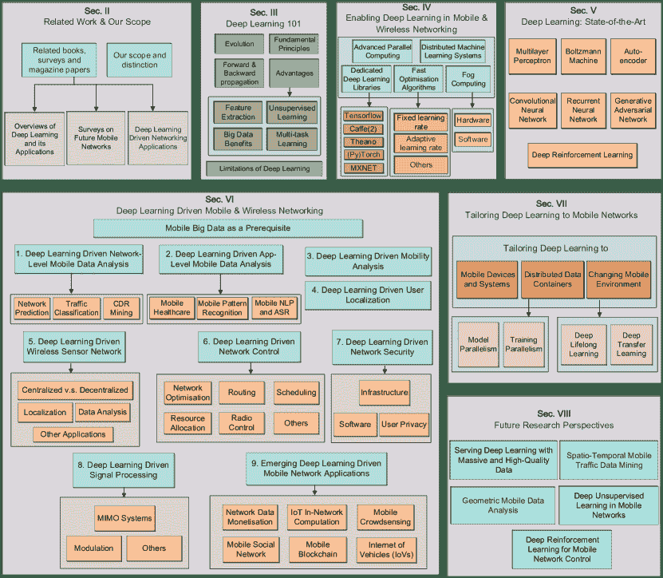

图 1：本调查组织的示意图。

在第 V 节中，我们介绍并比较了最先进的深度学习模型，并提供了有关选择模型以解决网络问题的指南。在第 VI 节中，我们回顾了最近的深度学习应用于移动和无线网络的情况，并根据不同的场景从移动流量分析到安全和新兴应用进行分类。然后我们讨论如何将深度学习模型调整到移动网络问题（第 VII 节），并以对开放挑战的简要讨论和对未来研究方向的展望（第 VIII 节）来结束本文。¹¹1 我们在表 I 中列出了本文中使用的缩写。

表 I：按字母顺序排列的缩写列表。

| 缩写 | 解释 |
| --- | --- |
| 5G | 第五代移动网络 |
| A3C | 异步优势演员-评论员 |
| AdaNet | 神经网络的自适应学习 |
| AE | 自编码器 |
| AI | 人工智能 |
| AMP | 近似消息传递 |
| ANN | 人工神经网络 |
| ASR | 自动语音识别 |
| BSC | 基站控制器 |
| BP | 反向传播 |
| CDR | 通话详单 |
| CNN 或 ConvNet | 卷积神经网络 |
| ConvLSTM | 卷积长短期记忆 |
| CPU | 中央处理单元 |
| CSI | 信道状态信息 |
| CUDA | 统一计算设备架构 |
| cuDNN | CUDA 深度神经网络库 |
| D2D | 设备对设备通信 |
| DAE | 去噪自编码器 |
| DBN | 深度信念网络 |
| OFDM | 正交频分复用 |
| DPPO | 分布式近端策略优化 |
| DQN | 深度 Q 网络 |
| DRL | 深度强化学习 |
| DT | 决策树 |
| ELM | 极限学习机 |
| GAN | 生成对抗网络 |
| GP | 高斯过程 |
| GPS | 全球定位系统 |
| GPU | 图形处理单元 |
| GRU | 门控循环单元 |
| HMM | 隐马尔可夫模型 |
| HTTP | 超文本传输协议 |
| IDS | 入侵检测系统 |
| IoT | 物联网 |
| IoV | 车联网 |
| ISP | 互联网服务提供商 |
| LAN | 局域网 |
| LTE | 长期演进 |
| LSTM | 长短期记忆 |
| LSVRC | 大规模视觉识别挑战 |
| MAC | 媒体访问控制 |
| MDP | 马尔可夫决策过程 |
| MEC | 移动边缘计算 |
| ML | 机器学习 |
| MLP | 多层感知器 |
| MIMO | 多输入多输出 |
| MTSR | 移动流量超分辨率 |
| NFL | 无免费午餐定理 |
| NLP | 自然语言处理 |
| NMT | 神经机器翻译 |
| NPU | 神经处理单元 |
| PCA | 主成分分析 |
| PIR | 被动红外 |
| QoE | 体验质量 |
| RBM | 限制玻尔兹曼机 |
| ReLU | 修正线性单元 |
| RFID | 射频识别 |
| RNC | 无线网络控制器 |
| RNN | 循环神经网络 |
| SARSA | 状态-动作-奖励-状态-动作 |
| SELU | 缩放指数线性单元 |
| SGD | 随机梯度下降 |
| SON | 自组织网络 |
| SNR | 信噪比 |
| SVM | 支持向量机 |
| TPU | 张量处理单元 |
| VAE | 变分自编码器 |
| VR | 虚拟现实 |
| WGAN | Wasserstein 生成对抗网络 |
| WSN | 无线传感器网络 |

## II 相关高级文章和

调查范围

移动网络和深度学习问题大多是独立研究的。直到最近，两者之间才出现了交叉。几项显著的工作描绘了深度学习和/或移动网络研究的全面图景。我们将这些工作分为*(i)* 纯深度学习技术概述，*(ii)* 现代移动网络中的分析和管理技术回顾，以及*(iii)* 深度学习与计算机网络交叉领域的回顾。我们在表 II 中总结了这些早期努力，并在本节讨论了每个类别中最具代表性的出版物。

TABLE II: 现有的深度学习和移动网络相关调查、期刊论文和书籍的总结。符号✓表示出版物在某一领域的范围内；✗表示论文不直接涵盖该领域，但读者可以从中获得一些相关见解。涉及深度学习和移动网络的出版物已被标记阴影。

| 出版物 | 一句话总结 | 范围 |
| --- | --- | --- |
| 机器学习 | 移动网络 |
| 深度学习 | 其他机器学习方法 | 移动大数据 | 5G 技术 |
| LeCun *et al.* [20] | 深度学习的里程碑式概述。 | ✓ |  |  |  |
| Schmidhuber [21] | 综合深度学习调查。 | ✓ |  |  |  |
| Liu *et al.* [22] | 深度学习及其应用的调查。 | ✓ |  |  |  |
| Deng *et al.* [23] | 深度学习方法和应用的概述。 | ✓ |  |  |  |
| Deng [24] | 深度学习教程。 | ✓ |  |  |  |
| Goodfellow *et al.* [18] | 必备的深度学习教科书。 | ✓ | ✗ |  |  |
| Pouyanfar *et al.* [25] | 近期的深度学习调查。 | ✓ | ✓ |  |  |
| Arulkumaran *et al.* [26] | 深度强化学习的调查。 | ✓ | ✗ |  |  |
| Hussein *et al.* [27] | 模仿学习的调查。 | ✓ | ✓ |  |  |
| Chen *et al.* [28] | 大数据的深度学习入门。 | ✓ | ✗ | ✗ |  |
| Najafabadi [29] | 大数据分析的深度学习应用概述。 | ✓ | ✗ | ✗ |  |
| Hordri *et al.* [30] | 大数据应用的深度学习简要调查。 | ✓ | ✗ | ✗ |  |
| Gheisari *et al.* [31] | 大数据分析的深度学习高级文献综述。 | ✓ |  | ✗ |  |
| Zhang *et al.* [32] | 推荐系统的深度学习调查与展望。 | ✓ | ✗ | ✗ |  |
| Yu *et al.* [33] | 网络大数据的调查。 |  |  | ✓ |  |
| Alsheikh *et al.* [34] | 无线传感器网络中的机器学习调查。 |  | ✓ | ✓ |  |
| Tsai *et al.* [35] | IoT 中数据挖掘的综述。 |  | ✓ | ✓ |  |
| Cheng *et al.* [36] | 移动大数据及其应用的介绍。 |  |  | ✓ | ✗ |
| Bkassiny *et al.* [37] | 认知无线电中机器学习的综述。 |  | ✓ | ✗ | ✗ |
| Andrews *et al.* [38] | 5G 网络的介绍及展望。 |  |  |  | ✓ |
| Gupta *et al.* [5] | 5G 架构和技术的综述。 |  |  |  | ✓ |
| Agiwal *et al.* [4] | 5G 移动网络技术的综述。 |  |  |  | ✓ |
| Panwar *et al.* [39] | 5G 网络特性、研究进展及开放问题的综述。 |  |  |  | ✓ |
| Elijah *et al.* [40] | 5G MIMO 系统的综述。 |  |  |  | ✓ |
| Buzzi *et al.* [41] | 5G 节能技术的综述。 |  |  |  | ✓ |
| Peng *et al.* [42] | 5G 中的无线接入网络概述。 |  |  | ✗ | ✓ |
| Niu *et al.* [43] | 5G 毫米波通信的综述。 |  |  |  | ✓ |
| Wang *et al.* [2] | 5G 回传技术和无线资源管理。 |  |  |  | ✓ |
| Giust *et al.* [3] | 5G 分布式移动管理的概述。 |  |  |  | ✓ |
| Foukas *et al.* [44] | 5G 中网络切片的综述及见解。 |  |  |  | ✓ |
| Taleb *et al.* [45] | 5G 边缘架构和编排的综述。 |  |  |  | ✓ |
| Mach and Becvar [46] | MEC 的综述。 |  |  |  | ✓ |
| Mao *et al.* [47] | 移动边缘计算的综述。 |  |  | ✓ | ✓ |
| Wang *et al.* [48] | 5G 中个性化 QoE 管理的架构。 |  |  | ✓ | ✓ |
| Han *et al.* [49] | 移动云感知、大数据和 5G 的见解。 |  |  | ✓ | ✓ |
| Singh *et al.* [50] | 5G 中的社交网络综述。 |  | ✗ | ✓ | ✓ |
| Chen *et al.* [51] | 5G 认知系统在医疗保健中的介绍。 | ✗ | ✗ | ✗ | ✓ |
| Chen *et al.* [52] | 蜂窝网络中流量卸载的机器学习。 |  | ✓ |  | ✓ |
| Wu *et al.* [53] | 面向绿色蜂窝网络的大数据。 |  | ✓ | ✓ | ✓ |
| Buda *et al.* [54] | 机器学习辅助的 5G 用例和场景。 |  | ✓ | ✓ | ✓ |
| Imran *et al.* [55] | 自组织网络（SON）中大数据分析的介绍。 |  | ✓ | ✓ | ✓ |
| Keshavamurthy *et al.* [56] | 5G 中 SON 的机器学习视角。 |  | ✓ | ✓ | ✓ |
| Klaine *et al.* [57] | SON 中机器学习应用的综述。 | ✗ | ✓ | ✓ | ✓ |
| Jiang *et al.* [7] | 5G 中的机器学习范式。 | ✗ | ✓ | ✓ | ✓ |
| Li *et al.* [58] | 智能 5G 的见解。 | ✗ | ✓ | ✓ | ✓ |
| Bui *et al.* [59] | 未来移动网络分析与优化的调查。 | ✗ | ✓ | ✓ | ✓ |
| Kasnesis *et al.* [60] | 深度学习在移动数据分析中的应用见解。 | ✓ |  | ✓ |  |
| Alsheikh *et al.* [17] | 应用深度学习和 Apache Spark 进行移动数据分析。 | ✓ |  | ✓ |  |
| Cheng *et al.* [61] | 移动大数据分析和展望调查。 | ✓ | ✓ | ✓ | ✗ |
| Wang 和 Jones [62] | 深度学习驱动的网络入侵检测调查。 | ✓ | ✓ | ✓ | ✗ |
| Kato *et al.* [63] | 网络流量控制的概念验证深度学习。 | ✓ |  |  | ✓ |
| Zorzi *et al.* [64] | 机器学习驱动网络优化介绍。 | ✓ | ✓ |  | ✓ |
| Fadlullah *et al.* [65] | 网络流量控制的深度学习综合调查。 | ✓ | ✓ | ✓ | ✗ |
| Zheng *et al.* [6] | 大数据驱动的 5G 优化介绍。 | ✓ | ✓ | ✓ | ✓ |

TABLE III: 从表 II 继续

| 出版物 | 一句话总结 | 范围 |
| --- | --- | --- |
|  |  | 机器学习 | 移动网络 |
| --- | --- | --- | --- |
|  |  | 深度学习 | 其他 ML 方法 | 移动大数据 | 5G 技术 |
| Mohammadi *et al.* [66] | 物联网数据分析中的深度学习调查。 | ✓ | ✓ | ✓ |  |
| Ahad *et al.* [67] | 神经网络在无线网络中的调查。 | ✓ | ✗ | ✗ | ✓ |
| Mao *et al.* [68] | 无线网络的深度学习调查。 | ✓ | ✓ | ✓ |  |
| Luong *et al.* [69] | 网络强化学习的调查。 | ✓ | ✓ |  | ✓ |
| Zhou *et al.* [70] | ML 和认知无线通信的调查。 | ✓ | ✓ | ✓ | ✓ |
| Chen *et al.* [71] | 无线网络神经网络教程。 | ✓ | ✓ | ✓ | ✓ |
| Gharaibeh *et al.* [72] | 智慧城市调查。 | ✓ | ✓ | ✓ | ✓ |
| Lane *et al.* [73] | 深度学习驱动的移动感知概述和介绍。 | ✓ | ✓ | ✓ |  |
| Ota *et al.* [74] | 移动多媒体深度学习的调查。 | ✓ |  | ✓ | ✓ |
| Mishra *et al.* [75] | 机器学习驱动的入侵检测调查。 | ✓ | ✓ | ✓ | ✓ |
| 我们的工作 | 移动和无线网络深度学习的综合调查。 | ✓ | ✓ | ✓ | ✓ |

### II-A 深度学习及其应用概述

大数据时代引发了各研究领域对深度学习的广泛兴趣[28, 29, 31, 30]，并且越来越多的调查和教程正在涌现（例如[23, 24]）。**LeCun et al.** 给出了深度学习的里程碑式概述，介绍了几种流行模型，并展望了深度神经网络的潜力[20]。**Schmidhuber** 进行了一次百科全书式的深度学习调查，可能是迄今为止最全面的，涵盖了进展、方法、应用和未解的研究问题[21]。**Liu et al.** 总结了几种深度学习模型的基本原理，并回顾了在语音处理、模式识别和计算机视觉等选定应用中的深度学习进展[22]。

**Arulkumaran et al.** 提出了几种深度强化学习的架构和核心算法，包括深度 Q 网络、信任区域策略优化和异步优势演员评论家[26]。他们的调查强调了深度神经网络在不同控制问题中的卓越表现（例如，视频游戏、围棋等）。同样，深度强化学习也在[76]中进行了调查，作者进一步阐明了应用情况。**Zhang et al.** 调查了深度学习在推荐系统中的发展[32]，这些系统有可能在移动广告中发挥重要作用。随着深度学习的日益流行，**Goodfellow et al.** 在一本书中提供了深度学习的全面教程，涵盖了前置知识、基本原理和流行应用[18]。

### II-B 未来移动网络的调查

新兴的 5G 移动网络采用了一系列新技术，以克服当前部署的性能限制并满足新的应用需求。迄今为止，该领域的进展已经通过调查、教程和杂志论文进行总结（例如[38, 4, 5, 39, 47]）。**Andrews et al.** 突出了 5G 与以往移动网络架构的区别，对 5G 技术进行了全面的回顾，并讨论了未来发展的研究挑战[38]。**Agiwal et al.** 回顾了 5G 网络的新架构，调查了新兴无线技术，并指出了尚未解决的研究问题[4]。**Gupta et al.** 也回顾了关于 5G 蜂窝网络架构的现有工作，随后提出了一个框架，包含了如设备对设备（D2D）通信、小型基站、云计算和物联网等网络要素[5]。

智能移动网络正成为一个热门研究领域，相关工作在文献中已有回顾（例如 [7, 54, 56, 34, 58, 37, 59, 57]）。Jiang *等人* 讨论了将机器学习应用于 5G 网络应用的潜力，包括大规模 MIMO 和智能电网 [7]。这项工作进一步识别了 ML 与 5G 之间的若干未被探索的研究空白。Li *等人* 讨论了将人工智能（AI）纳入未来网络架构的机会和挑战，并强调了 AI 在 5G 时代的重要性 [58]。Klaine *等人* 展示了自组织网络（SONs）中几个成功的 ML 实践，讨论了不同算法的利弊，并确定了该领域的未来研究方向 [57]。有潜力将 AI 和大数据用于提高能源效率 [53]。Chen *等人* 调查了无线网络中的流量卸载方法，并提出了一种基于强化学习的新解决方案 [52]。这为将机器学习嵌入到绿色蜂窝网络中开辟了新的研究方向。

### II-C 深度学习驱动的网络应用

越来越多的论文调查了将深度学习引入计算机网络领域的最新研究。Alsheikh *等人* 确定了使用大数据进行移动分析的好处和挑战，并提出了一个基于 Spark 的深度学习框架 [17]。Wang 和 Jones 讨论了网络入侵检测的评估标准、数据流处理和深度学习实践，并指出了这些应用固有的研究挑战 [62]。Zheng *等人* 提出了一个基于大数据的 5G 网络优化框架，以提升 QoE 性能 [6]。最近，Fadlullah *等人* 对深度学习在广泛领域的进展进行了综述，突出了其在网络流量控制系统中的潜在应用 [65]。他们的工作还强调了若干值得未来研究的未解研究问题。

Ahad *等* 介绍了应用神经网络到无线网络问题的技术、应用和指南[67]。尽管识别了神经网络的几个局限性，本文主要集中在旧的神经网络模型上，忽视了深度学习的最新进展和当前移动网络中的成功应用。Lane *等* 研究了在移动感知中应用深度学习的适用性和好处，并强调了在移动设备上进行准确推断的潜力[73]。Ota *等* 报告了移动多媒体中的新颖深度学习应用。他们的调查涵盖了移动健康和福利、移动安全、移动环境智能、语言翻译和语音识别领域的最先进深度学习实践。Mohammadi *等* 调查了物联网（IoT）数据分析的最新深度学习技术[66]。他们全面回顾了将深度学习纳入物联网领域的现有努力，并阐明了当前的研究挑战和未来方向。Mao *等* 重点关注无线网络中的深度学习[68]。他们的工作调查了无线网络中的最先进深度学习应用，并讨论了未来需要解决的研究挑战。

### II-D 我们的范围

本次调查的目标是提供关于移动网络领域最先进的深度学习实践的全面视角。我们旨在回答以下关键问题：

1.  1.

    为什么深度学习对解决移动网络问题具有前景？

1.  2.

    与移动和无线网络相关的前沿深度学习模型有哪些？

1.  3.

    在移动网络领域，最近有哪些成功的深度学习应用？

1.  4.

    研究人员如何将深度学习定制到特定的移动网络问题？

1.  5.

    哪些是最重要和最有前途的研究方向？

我们之前提到的研究论文和书籍只能部分回答这些问题。本文超越了这些之前的工作，专注于深度学习与移动网络的交叉点。我们涵盖了一系列越来越重要的神经网络（NN）结构，这些结构在早期教程中并未明确讨论，例如[77]。这包括自编码器和生成对抗网络。与现有教程不同，我们还回顾了用于部署和训练神经网络的开源库、各种优化算法，以及在大量移动设备上进行神经网络模型和训练的并行化。我们还回顾了其他相关调查中未涉及的应用，包括流量/用户分析、安全性和隐私、移动健康等。

尽管我们的主要范围仍然是移动网络领域，但为了完整性，我们还讨论了深度学习在无线网络中的应用，并识别与这些领域紧密相关的新兴应用领域。我们区分了移动网络（指设备可移动、电池供电、可能是可穿戴的，并且通常连接到蜂窝基础设施）和无线网络（指设备大多固定，属于分布式基础设施（包括 WLAN 和 WSN），并服务于单一应用）。总体而言，我们的论文在以下方面与早期的调查有所区别：

1.  *（i）*

    我们特别关注深度学习在移动网络分析和管理中的应用，而不是广泛讨论深度学习方法（例如，[20、21]）或专注于单一应用领域，例如，具有特定平台的移动大数据分析[17]。

1.  *（ii）*

    我们从移动网络的角度（例如，[78、79]）讨论前沿深度学习技术，重点关注这些技术在该领域的适用性，而对可能过时的传统深度学习模型关注较少。

1.  *（iii）*

    我们分析了现有非网络问题与移动网络特定问题之间的相似性；基于这一分析，我们提供了关于最佳深度学习架构选择策略和适应方法的见解，以利用移动网络的特征进行分析和管理任务。

据我们所知，这是第一次从深度学习角度对移动网络分析和管理进行联合审视。我们还首次提供了如何将深度学习调整到移动网络问题中的见解。

## III 深度学习基础

我们首先简要介绍深度学习，强调该领域计算技术背后的基本原理，以及导致其成功的关键优势。深度学习本质上是机器学习的一个子分支，允许算法基于数据进行预测、分类或决策，而无需明确编程。经典例子包括线性回归、k-最近邻分类器和 Q 学习。与依赖领域专家定义特征的传统机器学习工具相比，深度学习算法通过多个层次的非线性处理单元从原始数据中层次提取知识，以根据某些目标进行预测或采取行动。最著名的深度学习模型是神经网络（NNs），但只有具有足够隐藏层（通常超过一个）的 NN 才能被视为“深度”模型。除了深度 NN，其他具有多层的架构，如深度高斯过程[80]、神经过程[81]和深度随机森林[82]，也可以被视为深度学习结构。因此，深度学习相较于传统机器学习的主要优点在于自动特征提取，从而避免了昂贵的手工特征工程。我们在图 2 中高层次地说明了深度学习、机器学习和人工智能（AI）之间的关系。

一般来说，人工智能是一种计算范式，使机器具备智能，旨在教会它们如何像人类一样工作、反应和学习。许多技术都属于这一广泛范畴，包括机器学习、专家系统和进化算法。在这些技术中，机器学习使人工过程能够从数据中吸收知识并做出决策，而无需明确编程。机器学习算法通常分为监督学习、无监督学习和强化学习。深度学习是一类模拟生物神经系统的机器学习技术，通过多层转换进行表征学习，扩展到之前提到的所有三种学习范式。由于深度学习在移动和无线网络中应用日益增多，这些领域之间的交叉构成了本文的范围。

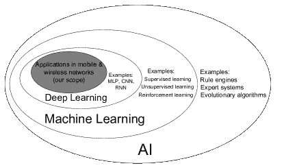

图 2：深度学习、机器学习和人工智能之间关系的维恩图。本调查特别关注深度学习在移动和无线网络中的应用。

### III-A 深度学习的演变

该学科可以追溯到 75 年前，当时阈值逻辑被用于生成神经网络的计算模型[83]。然而，直到 1980 年代末，神经网络（NNs）才引起关注，因为 Rumelhart *et al.* 证明了多层 NNs 可以通过反向传播错误来有效地进行训练[84]。随后，LeCun 和 Bengio 提出了现在流行的卷积神经网络（CNN）架构[85]，但由于当时系统的计算能力限制，进展停滞。随着 GPU 的最近成功，CNN 被用于大幅度降低大规模视觉识别挑战（LSVRC）的错误率[86]。这引起了前所未有的深度学习兴趣，并在计算机科学的广泛领域继续出现突破。

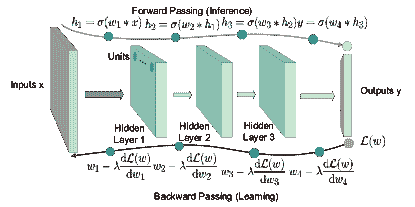

图 3：4 层 CNN 的学习和推断过程示意图。$w_{(\cdot)}$表示每个隐藏层的权重，$\sigma(\cdot)$是激活函数，$\lambda$表示学习率，$*(\cdot)$表示卷积操作，$\mathcal{L}(w)$是要优化的损失函数。

### III-B 深度学习的基本原理

深度神经网络的关键目标是通过简单且预定义的单元（或神经元）操作的组合来逼近复杂函数。这样的目标函数几乎可以是任何类型，例如图像与其类别标签之间的映射（分类）、基于历史值计算未来股票价格（回归），甚至在当前棋盘状态下决定下一个最佳棋步（控制）。执行的操作通常由一组特定隐藏单元的加权组合和非线性激活函数定义，具体取决于模型的结构。这些操作以及输出单元被称为“层”。神经网络架构类似于大脑中的感知过程，在当前环境下激活特定的单元，从而影响神经网络模型的输出。

### III-C 前向传播与反向传播

从数学术语来看，深度神经网络的架构通常是可微的，因此可以通过使用梯度下降方法通过反向传播来最小化损失函数，从而学习模型的权重（或参数），遵循基本的链式法则[84]。我们在图 3 中展示了深度神经网络学习和推断过程的原理，其中我们以二维（2D）卷积神经网络（CNN）为例。

正向传播：图中展示了一个具有 5 层的卷积神经网络（CNN），即一个输入层（灰色）、3 个隐藏层（蓝色）和一个输出层（橙色）。在正向传播中，一个 2D 输入 $\mathbf{x}$（例如图像）首先通过卷积层处理，该卷积层执行以下卷积操作：

|  | $h_{1}=\sigma(w_{1}\ast\mathbf{x}).$ |  | (1) |
| --- | --- | --- | --- |

这里 $h_{1}$ 是第一个隐藏层的输出，$w_{1}$ 是卷积滤波器，$\sigma(\cdot)$ 是激活函数，旨在提高模型的非线性和表达能力。输出 $h_{1}$ 随后作为输入提供给接下来的两个卷积层，并由其处理，最终产生一个最终输出 $\mathbf{y}$。这可以是例如图像输入中发现的不同可能模式（形状）的概率向量。为了适当地训练 CNN，使用损失函数 $\mathcal{L}(w)$ 来衡量输出 $\mathbf{y}$ 与真实值 $\mathbf{y^{*}}$ 之间的距离。训练的目的是找到最佳权重 $\mathbf{w}$，以最小化损失函数 $\mathcal{L}(w)$。这可以通过梯度下降的反向传播来实现。

反向传播：在反向传播过程中，计算损失函数 $\mathcal{L}(w)$ 对最后一个隐藏层权重的梯度，并通过计算更新权重：

|  | $w_{4}=w_{4}-\lambda\frac{\mathrm{d}\mathcal{L}(w)}{\mathrm{d}w_{4}}.$ |  | (2) |
| --- | --- | --- | --- |

这里 $\lambda$ 表示学习率，它控制在梯度指示的方向上移动的步长。对于每个权重都执行相同的操作，遵循链式法则。这个过程会不断重复，最终梯度下降将导致一组最小化 $\mathcal{L}(w)$ 的权重 $w$。

对于其他神经网络结构，训练和推理过程是相似的。为了帮助不太专业的读者，我们在第 V 节详细讲解了各种深度学习技术的原理和计算细节。

表 IV：将深度学习应用于解决移动和无线网络问题的好处总结。

| 关键方面 | 描述 | 好处 |
| --- | --- | --- |
| 特征提取 | 深度神经网络可以通过不同深度的层自动提取高级特征。 | 减少在处理异构和噪声移动大数据时昂贵的手工特征工程。 |
| 大数据利用 | 与传统机器学习工具不同，深度学习的性能通常会随着训练数据规模的增大显著提升。 | 高效利用以高速率生成的大量移动数据。 |
| 无监督学习 | 深度学习在处理未标记/半标记数据时有效，支持无监督学习。 | 处理在移动系统中常见的大量未标记数据。 |
| 多任务学习 | 神经网络通过隐层学习到的特征可以通过迁移学习应用于不同任务。 | 减少在移动系统中执行多任务学习时的计算和内存需求。 |
| 几何移动数据学习 | 存在专门的深度学习架构来建模几何移动数据 | 革新几何移动数据分析 |

### III-D 深度学习在移动和无线网络中的优势

我们认识到采用深度学习解决网络工程问题的若干好处，如表 IV 所总结的。具体来说：

1.  1.

    广泛认可的是，尽管特征工程对传统机器学习算法的性能至关重要，但其成本高昂 [87]。深度学习的一个关键优势是它能够自动从具有复杂结构和内部相关性的数据显示高级特征。学习过程不需要由人工设计，这极大简化了之前的特征手工制作 [20]。在移动网络的背景下，这一点尤为重要，因为移动数据通常由异构来源生成，通常是嘈杂的，并且表现出复杂的空间/时间模式 [17]，否则需要大量人力进行标注。

1.  2.

    其次，深度学习能够处理大量数据。移动网络以快速的速度生成大量不同类型的数据。训练传统的机器学习算法（如支持向量机 (SVM) [88] 和高斯过程 (GP) [89]）有时需要将所有数据存储在内存中，在大数据场景下这是计算上不可行的。此外，机器学习的性能在数据量大时不会显著提高，通常会迅速达到平稳状态 [18]。相比之下，用于训练神经网络的随机梯度下降 (SGD) 只需在每个训练步骤中使用数据的子集，这保证了深度学习在大数据下的可扩展性。大数据训练还使得深度神经网络受益，因为它防止了模型过拟合。

1.  3.

    传统的监督学习仅在有足够标注数据时才有效。然而，目前大多数移动系统生成的都是未标注或半标注的数据 [17]。深度学习提供了多种方法，使得可以利用未标注的数据以无监督的方式学习有用的模式，例如，限制玻尔兹曼机 (RBM) [90]，生成对抗网络 (GAN) [91]。应用包括聚类 [92]，数据分布近似 [91]，有/无监督学习 [93, 94]，以及一/零样本学习 [95, 96]等。

1.  4.

    深度神经网络学习到的压缩表示可以在不同任务之间共享，而在其他机器学习范式（例如线性回归、随机森林等）中，这种情况是有限的或难以实现的。因此，单一模型可以被训练来完成多个目标，而无需为不同任务重新完全训练模型。我们认为这对于移动网络工程至关重要，因为它减少了在执行多任务学习应用时对移动系统的计算和内存要求[97]。

1.  5.

    深度学习在处理几何移动数据方面非常有效[98]，而这对于其他机器学习方法来说是一个难题。几何数据指的是由坐标、拓扑、度量和顺序表示的多变量数据[99]。移动数据，如移动用户位置和网络连接，可以自然地用点云和图形表示，这些数据具有重要的几何特性。这些数据可以通过专用的深度学习架构有效建模，例如 PointNet++ [100]和 Graph CNN [101]。使用这些架构具有革命性地分析几何移动数据的巨大潜力[102]。

### III-E 深度学习在移动和无线网络中的局限性

尽管深度学习在解决移动网络问题时具有独特的优势，但它也存在一些缺点，这在一定程度上限制了它在这一领域的应用。具体来说，

1.  1.

    一般来说，深度学习（包括深度强化学习）易受到对抗样本的攻击[103, 104]。这些对抗样本是攻击者故意设计的伪造输入，目的是让机器学习模型出错[103]。虽然很难将这些样本与真实样本区分开来，但它们很可能会导致模型产生错误调整。我们在图 4 中展示了这样一个对抗攻击的示例。深度学习，特别是卷积神经网络（CNNs），容易受到这些类型的攻击。这也可能影响深度学习在移动系统中的适用性。例如，黑客可能会利用这一漏洞，构造网络攻击来颠覆深度学习基础的检测器[105]。构建对抗样本具有鲁棒性的深度模型是必要的，但仍然具有挑战性。

    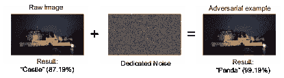

    图 4：深度学习中的对抗攻击示例。

1.  2.

    深度学习算法大多是黑箱，并且解释性较低。它们的主要突破体现在准确性上，因为它们显著提高了许多领域任务的性能。然而，尽管深度学习使得“机器”在特定任务中具有高准确性，我们仍然对神经网络为什么做出某些决定知之甚少。这限制了深度学习的适用性，例如在网络经济学中。因此，企业更愿意继续使用解释性强的统计方法，尽管这会牺牲准确性。研究人员已认识到这个问题，并持续投入努力解决深度学习的这一局限性（例如[106, 107, 108]）。

1.  3.

    深度学习在很大程度上依赖于数据，这有时可能比模型本身更重要。深度模型还可以从训练数据增强中受益[109]。这确实是移动网络的一个机会，因为网络生成了大量的数据。然而，数据收集可能成本高昂，并且面临隐私问题，因此可能难以获得足够的信息用于模型训练。在这种情况下，使用深度学习的好处可能会被成本所抵消。

1.  4.

    深度学习可能计算需求很高。先进的并行计算（例如 GPU，高性能芯片）促进了深度学习的发展和流行，但深度学习也在很大程度上依赖于这些技术。深度神经网络通常需要复杂的结构才能获得令人满意的准确性。然而，在将神经网络部署到嵌入式和移动设备时，必须考虑能量和能力的限制。非常深的神经网络可能不适合这种场景，这不可避免地会影响准确性。正在开发解决方案来缓解这个问题，我们将在第 IV 和第 VII 节中深入探讨这些问题。

1.  5.

    深度神经网络通常具有许多超参数，找到它们的最佳配置可能很困难。对于单个卷积层，我们至少需要配置用于过滤器数量、形状、步长和膨胀，以及残差连接的超参数。这些超参数的数量随着模型深度的增加呈指数增长，并且可以极大地影响其性能。找到一组好的超参数配置就像大海捞针一样困难。AutoML 平台²²2AutoML – 通过使用渐进式神经架构搜索 [110]，提供了首个解决方案。然而，这项任务仍然成本高昂。

为了避免上述一些问题，并允许在移动网络中进行有效部署，深度学习需要某些系统和软件支持。我们将在下一节中审视和讨论这些支持者。

## IV 在移动网络中实现深度学习

5G 系统旨在提供高吞吐量和超低延迟的通信服务，以改善用户的 QoE [4]。将深度学习应用于 5G 系统中，以实现这些目标是昂贵的。这是因为需要强大的硬件和软件来支持在复杂环境中进行训练和推断。幸运的是，出现了几种工具，使得在移动网络中实现深度学习成为可能；即 *(i)* 高级并行计算， *(ii)* 分布式机器学习系统， *(iii)* 专用深度学习库， *(iv)* 快速优化算法以及 *(v)* 雾计算。这些工具可以被看作形成了一个层次结构，如图 5 所示；它们之间存在协同作用，使得基于深度学习的解决方案对网络问题变得可行。通过使用这些工具，一旦训练完成，推断可以在毫秒级的时间内完成，正如已有的多篇论文针对各种任务报告的那样（例如，[111, 112, 113]）。我们在表 V 中总结了这些进展，并在接下来的内容中进行了回顾。

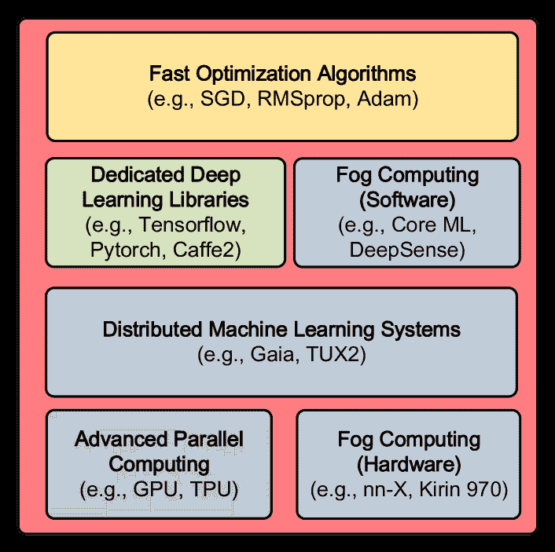

图 5：深度学习支持者的分层视图。雾计算中的并行计算和硬件为深度学习奠定基础。分布式机器学习系统可以在此基础上构建，以支持深度学习的大规模部署。深度学习库运行在软件层，以实现快速深度学习实现。更高级别的优化器用于训练神经网络，以实现特定的目标。

表 V：支持在移动系统中部署深度学习的工具和技术总结。

| 技术 | 示例 | 范围 | 功能 | 性能改进 | 能耗 | 经济成本 |
| --- | --- | --- | --- | --- | --- | --- |
| 高级并行计算 | GPU，TPU [114], CUDA [115], cuDNN [116] | 移动服务器，工作站 | 实现移动应用中深度学习模型的快速并行训练/推理 | 高 | 高 | 中等（硬件） |
| 专用深度学习库 | TensorFlow [117], Theano [118], Caffe [119], Torch [120] | 移动服务器和设备 | 高级工具箱，使网络工程师能够构建特定目的的深度学习架构 | 中等 | 与硬件相关 | 低（软件） |
| 边缘计算 | nn-X [121], ncnn [122], Kirin 970 [123], Core ML [124] | 移动设备 | 支持边缘计算的深度学习 | 中等 | 低 | 中等（硬件） |
| 快速优化算法 | Nesterov [125], Adagrad [126], RMSprop, Adam [127] | 深度架构的训练 | 加速和稳定模型优化过程 | 中等 | 与硬件相关 | 低（软件） |
| 分布式机器学习系统 | MLbase [128], Gaia [10], Tux² [11], Adam [129], GeePS [130] | 分布式数据中心，跨服务器 | 支持数据中心内移动系统的深度学习框架 | 高 | 高 | 高（硬件） |

### IV-A 高级并行计算

与传统的机器学习模型相比，深度神经网络具有显著更大的参数空间、中间输出和梯度值的数量。这些都需要在每次训练步骤中进行更新，要求强大的计算资源。训练和推理过程涉及大量的矩阵乘法和其他操作，尽管这些操作可以大规模并行化。传统的中央处理单元（CPU）核心数量有限，因此仅支持有限的计算并行性。将 CPU 用于深度学习实现效率极低，无法满足移动系统的低延迟要求。

工程师通过利用 GPU 的性能来解决这些问题。GPU 最初设计用于高性能视频游戏和图形渲染，但 NVIDIA 开发的新技术，如 Compute Unified Device Architecture（CUDA） [115] 和 CUDA 深度神经网络库（cuDNN） [116]，增加了这类硬件的灵活性，允许用户为特定目的定制其用途。GPU 通常包含数千个核心，在训练神经网络所需的快速矩阵乘法中表现出色。与 CPU 相比，GPU 提供更高的内存带宽，并显著加速了学习过程。Google 最新推出的高级 Tensor 处理单元（TPU）甚至显示出比 CPU 和 GPU 高 15-30 倍的处理速度和 30-80 倍的性能功耗比 [114]。

最近引入了完全依赖光通信的衍射神经网络（D²NNs），以实现零消耗和零延迟深度学习 [131]。D²NN 由几个透射层组成，其中这些层上的点作为神经网络中的神经元。结构经过训练以优化传输/反射系数，这些系数相当于神经网络中的权重。一旦训练完成，透射层将通过 3D 打印实现物质化，并随后用于推断。

服务器端还有许多工具箱可以帮助深度学习的计算优化。Spring 和 Shrivastava 引入了一种基于哈希的技术，大大减少了深度网络实现的计算要求 [132]。Mirhoseini 等人利用强化学习方案使机器能够学习混合硬件上的最优操作放置，他们的解决方案实现了比人类专家设计的相同放置方式高达 20%的更快计算速度 [133]。

重要的是，这些系统易于部署，因此移动网络工程师无需从头开始重建移动服务器以支持深度学习计算。这使得在移动系统中实现深度学习成为可能，并加速了移动数据流的处理。

### IV-B 分布式机器学习系统

移动数据来自异构数据源（例如移动设备、网络探针等），存储在多个分布式数据中心中。随着数据量的增加，将所有移动数据移动到中央数据中心运行深度学习应用变得不切实际 [10]。因此，运行全网深度学习算法需要支持不同接口（例如操作系统、编程语言、库）的分布式机器学习系统，以便在地理分布的服务器上同时高效低成本地进行深度模型的训练和评估。

部署深度学习在分布式环境中必然引入几个系统级问题，这些问题需要满足以下特性：

**一致性** – 确保模型参数和计算过程在所有机器上保持一致。**容错性** – 有效处理大规模分布式机器学习系统中的设备故障。**通信** – 优化集群节点之间的通信，避免拥塞。**存储** – 设计适应不同环境（如分布式集群、单台机器、GPU）的高效存储机制，考虑到输入/输出和数据处理的多样性。**资源管理** – 分配工作负载，并确保节点协调良好。**编程模型** – 设计编程接口，支持多种编程语言。

存在几种分布式机器学习系统，可以促进在移动网络应用中进行深度学习。Kraska *等人*介绍了一个名为 MLbase 的分布式系统，该系统能够智能地指定、选择、优化和并行化机器学习算法 [128]。他们的系统帮助非专家部署各种机器学习方法，允许在不同服务器上优化和运行机器学习应用。Hsieh *等人*开发了一个名为 Gaia 的地理分布式机器学习系统，通过在广域网上采用先进的通信机制打破吞吐量瓶颈，同时保持机器学习算法的准确性 [10]。他们的提议支持多功能的机器学习接口（如 TensorFlow、Caffe），无需对机器学习算法本身进行重大更改。该系统能够在大规模移动网络上部署复杂的深度学习应用。

Xing 等人开发了一个支持大数据应用的大规模机器学习平台 [134]。他们的架构实现了高效的模型和数据并行化，能够以低通信成本实现参数状态同步。Xiao 等人提出了一个名为 TUX² 的分布式图引擎，用于跨机器优化数据布局并减少机器间通信 [11]。他们在包含高达 640 亿条边的大型数据集上展示了显著的运行时性能和收敛性能。Chilimbi 等人构建了一个名为 "Adam"³³3 请注意，这与第 IV-D 节中讨论的 Adam 优化器不同，后者专门用于深度模型训练 [129] 的分布式、高效、可扩展的系统。他们的架构在吞吐量、延迟和容错性能方面表现出色。Cui 等人开发了一款名为 GeePS 的专用分布式深度学习系统 [130]。他们的框架允许在分布式 GPU 上进行数据并行化，并展示了更高的训练吞吐量和更快的收敛速度。最近，Moritz 等人设计了一个名为 Ray 的专用分布式框架，以支持强化学习应用 [135]。他们的框架由动态任务执行引擎支持，结合了 Actor 和任务并行抽象。他们进一步引入了自下而上的分布式调度策略和专用状态存储方案，以提升可伸缩性和容错性。

### IV-C 专用深度学习库

TABLE VI: 主流深度学习库的总结与比较。

| 库 | 低层语言 | 可用接口 | 优点 | 缺点 | 移动支持 | 流行度 | 上层库 |
| --- | --- | --- | --- | --- | --- | --- | --- |
| TensorFlow | C++ |

&#124; Python, Java, &#124;

&#124; C, C++, Go &#124;

|

&#124; $\bullet$ 庞大的用户社区 &#124;

&#124; $\bullet$ 文档编写良好 &#124;

&#124; $\bullet$ 完备功能 &#124;

&#124; $\bullet$ 提供可视化 &#124;

&#124; 工具（TensorBoard） &#124;

&#124; $\bullet$ 支持多接口 &#124;

&#124; $\bullet$ 支持分布式训练 &#124;

&#124; 和模型服务 &#124;

|

&#124; $\bullet$ 调试困难 &#124;

&#124; $\bullet$ 软件包体积庞大 &#124;

&#124; $\bullet$ 高门槛 &#124;

&#124; 适合初学者 &#124;

| 是 | 高 |
| --- | --- |

&#124; Keras, TensorLayer, &#124;

&#124; Luminoth &#124;

|

| Theano | Python | Python |
| --- | --- | --- |

&#124; $\bullet$ 灵活 &#124;

&#124; $\bullet$ 良好的运行速度 &#124;

|

&#124; $\bullet$ 学习曲线陡峭 &#124;

&#124; $\bullet$ 编译时间长 &#124;

&#124; $\bullet$ 已不再维护 &#124;

| 否 | 低 | Keras, Blocks, Lasagne |
| --- | --- | --- |
| Caffe(2) | C++ | Python, Matlab |

&#124; $\bullet$ 快速运行时 &#124;

&#124; $\bullet$ 多平台 &#124;

&#124; 支持 &#124;

|

&#124; $\bullet$ 小型用户基础 &#124;

&#124; $\bullet$ 文档有限 &#124;

| 是 | 中等 | 无 |
| --- | --- | --- |
| (Py)Torch | Lua, C++ | Lua, Python, C, C++ |

&#124; $\bullet$ 易于构建模型 &#124;

&#124; $\bullet$ 灵活 &#124;

&#124; $\bullet$ 文档完善 &#124;

&#124; $\bullet$ 易于调试 &#124;

&#124; $\bullet$ 丰富的预训练模型 &#124;

&#124; 可用 &#124;

&#124; $\bullet$ 声明式数据并行 &#124;

|

&#124; $\bullet$ 资源有限 &#124;

&#124; $\bullet$ 缺乏模型服务 &#124;

&#124; $\bullet$ 缺乏可视化工具 &#124;

| 是 | 高 | 无 |
| --- | --- | --- |
| MXNET | C++ | C++, Python, Matlab, R |

&#124; $\bullet$ 轻量级 &#124;

&#124; $\bullet$ 内存高效 &#124;

&#124; $\bullet$ 快速训练 &#124;

&#124; $\bullet$ 简单的模型服务 &#124;

&#124; $\bullet$ 高度可扩展 &#124;

|

&#124; $\bullet$ 小型用户基础 &#124;

&#124; $\bullet$ 难以学习 &#124;

| 是 | 低 | Gluon |
| --- | --- | --- |

从头构建深度学习模型对于工程师来说可能会很复杂，因为这需要定义每层的前向行为和梯度传播操作，还需要为 GPU 并行化编写 CUDA 代码。随着深度学习的日益普及，一些专用库简化了这一过程。这些工具箱大多数支持多种编程语言，并具有 GPU 加速和自动微分支持。这消除了手动定义梯度传播的需求。我们在下面总结了这些库，并在表 VI 中对它们进行了比较。

TensorFlow⁴⁴4TensorFlow，https://www.tensorflow.org/ 是由 Google 开发的机器学习库[117]。它能够在 CPU、GPU 甚至移动设备上部署计算图[136]，支持单机和分布式架构下的机器学习实现。这使得在云端和边缘服务上快速实现深度神经网络成为可能。尽管最初设计用于机器学习和深度神经网络应用，TensorFlow 也适用于其他数据驱动的研究目的。它提供了 TensorBoard，⁵⁵5TensorBoard – 用于 TensorFlow 的可视化工具，https://www.tensorflow.org/guide/summaries_and_tensorboard，一个复杂的可视化工具，帮助用户理解模型结构和数据流，并进行调试。有详细的 Python 文档和教程，同时也支持其他编程语言如 C、Java 和 Go。目前它是最流行的深度学习库。在 TensorFlow 基础上，发布了几个专用的深度学习工具箱，提供更高级的编程接口，包括 Keras⁶⁶6Keras 深度学习库，https://github.com/fchollet/keras，Luminoth ⁷⁷7Luminoth 计算机视觉深度学习库，https://github.com/tryolabs/luminoth 和 TensorLayer[137]。

Theano 是一个 Python 库，允许高效地定义、优化和评估涉及多维数据的数值计算[118]。它提供 GPU 和 CPU 模式，使用户能够根据各自的需求调整程序。学习 Theano 很困难，并且使用它构建神经网络需要大量的编译时间。虽然 Theano 拥有庞大的用户群体和支持社区，并且在某个阶段曾是最流行的深度学习工具之一，但它的流行度正在迅速下降，因为其核心思想和特性被 TensorFlow 所吸收。

Caffe(2)是由伯克利人工智能研究所开发的专用深度学习框架[119]，最新版本 Caffe2⁸⁸8Caffe2，https://caffe2.ai/ 最近由 Facebook 发布。继承了旧版本的所有优点，Caffe2 已经成为一个非常灵活的框架，能够帮助用户高效地构建模型。它还允许在分布式系统中的多个 GPU 上训练神经网络，并支持在 iOS 和 Android 等移动操作系统上实现深度学习。因此，它有潜力在未来的移动边缘计算中发挥重要作用。

(Py)Torch 是一个支持广泛机器学习模型和算法的科学计算框架 [120]。它最初是在 Lua 语言中开发的，但开发者后来发布了改进的 Python 版本 [138]。本质上，PyTorch 是一个可以在嵌入式系统（如智能手机）上运行的轻量级工具箱，但缺乏全面的文档。由于在 PyTorch 中构建神经网络很直接，这个库的受欢迎程度正在迅速增长。它还提供了丰富的预训练模型和易于重用和组合的模块。PyTorch 现在由 Facebook 官方维护，主要用于研究目的。

MXNET 是一个灵活且可扩展的深度学习库，提供多种语言接口（如 C++、Python、Matlab、R 等）[139]。它支持不同层次的机器学习模型，从逻辑回归到 GANs。MXNET 为单机和分布式生态系统提供快速的数值计算。它将深度学习中常用的工作流封装成高级函数，使得标准神经网络能够在没有大量编码工作的情况下轻松构建。然而，短时间内掌握如何使用这个工具箱是困难的，因此，偏好这个库的用户相对较少。MXNET 是亚马逊的官方深度学习框架。

尽管不如其他库流行，但仍有一些优秀的深度学习库，如 CNTK,⁹⁹9MS Cognitive Toolkit, https://www.microsoft.com/en-us/cognitive-toolkit/ Deeplearning4j,¹⁰¹⁰10Deeplearning4j, http://deeplearning4j.org Blocks,¹¹¹¹11Blocks, A Theano 框架用于构建和训练神经网络 https://github.com/mila-udem/blocks Gluon,¹²¹²12Gluon, 深度学习库 https://gluon.mxnet.io/ 和 Lasagne,¹³¹³13Lasagne, https://github.com/Lasagne ，这些库也可以在移动系统中使用。选择这些库取决于具体应用。对于打算在网络领域使用深度学习的 AI 初学者，PyTorch 是一个不错的选择，因为在这个环境中构建神经网络比较容易，且该库对 GPU 进行了良好的优化。另一方面，对于追求高级操作和大规模实现的人，Tensorflow 可能是更好的选择，因为它已经成熟、维护良好，并经受住了许多 Google 工业项目的考验。

### IV-D 快速优化算法

深度学习中需要优化的目标函数通常非常复杂，因为它们涉及到大量数据的似然函数的和。随着模型的深度增加，这些函数通常表现出较高的非凸性，并具有多个局部极小值、关键点和鞍点。在这种情况下，传统的随机梯度下降（SGD）算法 [140] 收敛速度较慢，这会限制它们在延迟受限的移动系统中的应用。为了解决这个问题并稳定优化过程，许多算法对传统的 SGD 进行了改进，使神经网络模型能够更快地训练用于移动应用。我们在表 VII 中总结了这些优化器的关键原理，并对它们进行了比较。接下来我们将深入探讨它们的操作细节。

表 VII: 不同优化算法的总结和比较。

| 优化算法 | 核心思想 | 优点 | 缺点 |
| --- | --- | --- | --- |
| SGD [140] | 迭代计算小批量的梯度并更新参数 | $\bullet$ 实现简单 |

&#124; $\bullet$ 需要设置全局学习率 &#124;

&#124; $\bullet$ 算法可能会陷入鞍点 &#124;

&#124; 点或局部极小值 &#124;

&#124; $\bullet$ 收敛速度慢 &#124;

&#124; $\bullet$ 不稳定 &#124;

|

| Nesterov 动量 [125] | 引入动量以保持上一个梯度方向用于下一个更新 |
| --- | --- |

&#124; $\bullet$ 稳定 &#124;

&#124; $\bullet$ 学习速度更快 &#124;

&#124; $\bullet$ 可以逃脱局部极小值 &#124;

| $\bullet$ 需要设置学习率 |
| --- |
| Adagrad [126] | 对不同参数应用不同的学习率 |

&#124; $\bullet$ 学习率针对每个 &#124;

&#124; 参数 &#124;

&#124; $\bullet$ 处理稀疏梯度良好 &#124;

|

&#124; $\bullet$ 仍需设置全局 &#124;

&#124; 学习率 &#124;

&#124; $\bullet$ 梯度对正则化器敏感 &#124;

&#124; $\bullet$ 学习率在 &#124; 中变得非常慢

&#124; 后期阶段 &#124;

|

| Adadelta [141] | 通过应用自适应学习率来改进 Adagrad |
| --- | --- |

&#124; $\bullet$ 不依赖于全局学习率 &#124;

&#124; $\bullet$ 收敛速度更快 &#124;

&#124; $\bullet$ 调整的超参数更少 &#124;

| $\bullet$ 在训练后期可能会陷入局部极小值 |
| --- |
| RMSprop [140] | 使用均方根作为学习率的约束 |

&#124; $\bullet$ 学习率针对每个 &#124;

&#124; 参数 &#124;

&#124; $\bullet$ 学习率不会减少 &#124;

&#124; 在训练后期显著变化 &#124;

&#124; $\bullet$ 在 RNN 训练中表现良好 &#124;

|

&#124; $\bullet$ 仍然需要全局学习率 &#124;

&#124; $\bullet$ 不擅长处理稀疏梯度 &#124;

|

| Adam [127] | 采用动量机制来存储过去梯度的指数衰减平均值 |
| --- | --- |

&#124; $\bullet$ 学习率针对每个 &#124;

&#124; 参数 &#124;

&#124; $\bullet$ 擅长处理稀疏梯度和 &#124;

&#124; 非平稳问题 &#124;

&#124; $\bullet$ 内存高效 &#124;

&#124; $\bullet$ 收敛速度快 &#124;

| $\bullet$ 在训练过程中可能会变得不稳定 |
| --- |
| Nadam [142] | 将 Nesterov 加速梯度整合到 Adam 中 | $\bullet$ 在 RNN 训练中表现良好 | — |
| 学习优化 [143] | 将优化问题视为使用 RNN 的学习问题 | $\bullet$ 不需要手动设计学习 | $\bullet$ 需要额外的 RNN 用于优化器中的学习 |
| 量化训练 [144] | 将梯度量化为{-1, 0, 1}进行训练 |

&#124; $\bullet$ 适合分布式训练 &#124;

&#124; $\bullet$ 内存高效 &#124;

| $\bullet$ 训练精度下降 |
| --- |
| 稳定梯度下降 [145] | 采用差分隐私机制来比较训练和验证梯度，以重用样本并保持其新鲜。 |

&#124; $\bullet$ 更稳定 &#124;

&#124; $\bullet$ 较少的过拟合 &#124;

&#124; $\bullet$ 收敛速度快于 SGD &#124;

| $\bullet$ 仅在凸函数上验证过 |
| --- |

固定学习率 SGD 算法：Suskever *et al.* 引入了一种带有 Nesterov 动量的 SGD 优化器变体，该方法在应用当前速度后评估梯度 [125]。他们的方法在优化凸函数时表现出更快的收敛速度。另一种方法是 Adagrad，它根据更新频率对模型参数进行自适应学习。此方法适用于处理稀疏数据，并在鲁棒性方面显著优于 SGD [126]。Adadelta 改进了传统的 Adagrad 算法，使其收敛更快，并且不依赖全局学习率 [141]。RMSprop 是 G. Hinton 提出的一种流行的 SGD 方法。RMSprop 通过梯度的指数平滑平均来划分学习率，不需要为每个训练步骤设置学习率 [140]。

自适应学习率 SGD 算法：Kingma 和 Ba 提出了一种自适应学习率优化器 Adam，它通过梯度的一阶矩来整合动量 [127]。该算法在收敛速度上表现迅速，对模型结构具有高度鲁棒性，被认为是无法决定使用何种算法时的首选。通过将动量融入 Adam 中，Nadam 对梯度施加了更强的约束，从而实现了更快的收敛 [142]。

其他优化器：Andrychowicz *等人* 提出优化过程甚至可以动态学习 [143]。他们将梯度下降问题视为一个可训练的学习问题，这在神经网络训练中表现出良好的泛化能力。Wen *等人* 提出了一个针对分布式系统的训练算法 [146]。他们在训练过程中将浮点梯度值量化为{-1, 0 和 +1}，理论上需要的节点间梯度通讯减少了 20 倍。作者证明这种梯度近似机制使得目标函数以概率 1 收敛到最优解，而在他们的实验中，GoogleLeNet [144] 训练时平均仅观察到 2%的准确率损失。Zhou *等人* 使用差分隐私机制来比较训练和验证梯度，以重用样本并保持其新鲜 [145]。这可以显著减少训练过程中的过拟合现象。

### IV-E 雾计算

雾计算范式为在移动系统中实现深度学习提供了新的机会。雾计算指的是一组允许在网络边缘 [147] 部署应用程序或数据存储的技术，例如在各个移动设备上。这减少了通信开销，减轻了数据流量，减少了用户端延迟，并减轻了服务器端计算负担 [148, 149]。在 [150] 中给出了雾计算的正式定义，其中将其解释为 *“大量异构（无线且有时自主）的普遍存在和去中心化设备，它们之间以及与网络进行通信并可能合作，以执行存储和处理任务而无需第三方干预。”* 更具体地说，它可以指存储、分析和交换数据的智能手机、可穿戴设备和车辆，以减轻云端的负担并执行更多延迟敏感的任务 [151, 152]。由于雾计算涉及边缘部署，参与的设备通常具有有限的计算资源和电池电量。因此，需要特殊的硬件和软件来实现深度学习，下面我们将对此进行解释。

硬件：目前存在几项努力，旨在将深度学习计算从云端转移到移动设备[153]。例如，Gokhale *等人* 开发了一种名为神经网络 neXt（nn-X）的移动协处理器，该处理器在移动设备上加速深度神经网络的执行，同时保持低能耗[121]。Bang *等人* 介绍了一种低功耗和可编程的深度学习处理器，用于在边缘设备上部署移动智能[154]。他们的硬件仅消耗 288 $\mu$W，但实现了 374 GOPS/W 的效率。IBM 提出了一个名为 TrueNorth 的神经突触芯片[155]。他们的解决方案旨在支持在嵌入式电池供电的移动设备上进行计算密集型应用。高通推出了 Snapdragon 神经处理引擎，以实现针对移动设备的深度学习计算优化。¹⁴¹⁴14 高通帮助使您的移动设备更智能，推出新的 Snapdragon 机器学习软件开发工具包：https://www.qualcomm.com/news/releases/2016/05/02/qualcomm-helps-make-your-mobile-devices-smarter-new-snapdragon-machine 他们的硬件允许开发人员在 Snapdragon 820 板上执行神经网络模型，以服务于各种应用。与 Google 紧密合作，Movidius¹⁵¹⁵15Movidius，一家英特尔公司，提供用于在超低功耗设备上部署深度学习和计算机视觉算法的尖端解决方案。https://www.movidius.com/ 开发了一个嵌入式神经网络计算框架，允许用户在移动网络边缘进行深度学习的定制部署。他们的产品在超低功耗要求下能够实现令人满意的运行时效率，并进一步支持多种框架，如 TensorFlow 和 Caffe，为用户提供了在工具包之间选择的灵活性。最近，华为正式宣布了 Kirin 970，作为一种移动 AI 计算系统芯片。¹⁶¹⁶16 华为宣布 Kirin 970 – 新旗舰 SoC 具备 AI 能力 http://www.androidauthority.com/huawei-announces-kirin-970-797788/ 他们的创新框架包含专用的神经处理单元（NPUs），大幅加速了神经网络计算，使得在移动设备上每秒分类 2,000 张图像成为可能。

软件：除了这些硬件进步之外，还有一些旨在优化移动设备上深度学习的软件平台（例如，[156]）。我们在表 VIII 中对所有这些平台进行比较和总结。¹⁷¹⁷17 来源于 https://mp.weixin.qq.com/s/3gTp1kqkiGwdq5olrpOvKw 除了移动版的 TensorFlow 和 Caffe 之外，腾讯还发布了一款轻量高性能的针对移动平台的神经网络推断框架，依赖于 CPU 计算。¹⁸¹⁸18ncnn 是一款专为移动平台优化的高性能神经网络推断框架，详情请见 https://github.com/Tencent/ncnn 该工具箱在推断速度方面优于所有已知的基于 CPU 的开源框架。苹果开发了“Core ML”，这是一个专用的机器学习框架，用于在 iOS 11 上实现移动深度学习。¹⁹¹⁹19Core ML：将机器学习模型集成到您的应用中，详情请见 https://developer.apple.com/documentation/coreml 这降低了希望在苹果设备上部署 ML 模型的开发者的门槛。姚等人开发了一个名为 DeepSense 的深度学习框架，专门用于处理与移动感知相关的数据，提供了一个通用的机器学习工具箱，适用于广泛的边缘应用。它能耗适中，延迟低，因此适合部署在智能手机上。

表 VIII：移动深度学习平台比较。

| 平台 | 开发者 | 支持的移动硬件 | 速度 | 代码大小 | 移动兼容性 | 开源 |
| --- | --- | --- | --- | --- | --- | --- |
| TensorFlow | Google | CPU | 慢 | 中 | 中 | 是 |
| Caffe | Facebook | CPU | 慢 | 大 | 中 | 是 |
| ncnn | 腾讯 | CPU | 中 | 小 | 良好 | 是 |
| CoreML | Apple | CPU/GPU | 快 | 小 | 仅支持 iOS 11+ | 否 |
| DeepSense | 姚等 | CPU | 中 | 未知 | 中 | 否 |

上述技术和工具箱使得在移动网络应用中部署深度学习实践成为可能。接下来，我们简要介绍几种代表性的深度学习架构，并讨论它们在移动网络问题中的适用性。

## V 深度学习：现状和前沿

重新查看图 2，机器学习方法可以自然地分为三类，即监督学习、无监督学习和强化学习。深度学习架构在所有这些领域中都取得了显著的性能。在本节中，我们介绍支撑几种深度学习模型的关键原理，并讨论它们在解决移动网络问题中的潜力，这在很大程度上是未被探索的。为那些希望更深入理解神经网络的读者提供了经典模型的技术细节。更有经验的读者可以继续阅读第 VI 节 VI。我们在图 6 和表 IX 中分别说明和总结了我们展示的最显著的架构。

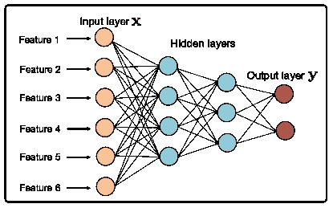

(a) 有 2 个隐藏层的 MLP 结构（蓝色圆圈）。

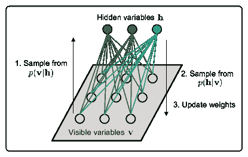

(b) RBM 的图形模型和训练过程。$\mathbf{v}$和$\mathbf{h}$分别表示可见变量和隐藏变量。

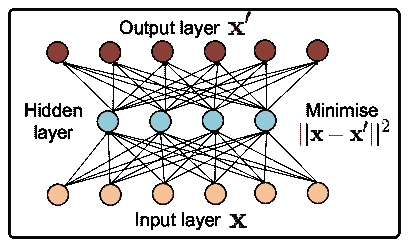

(c) 自编码器的操作原理，其旨在从隐藏层重新构建输入。

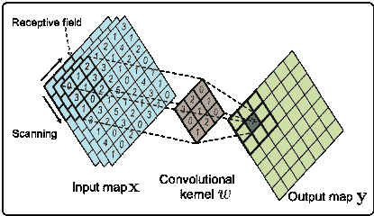

(d) 卷积层的操作原理。

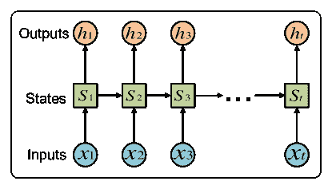

(e) 循环层 – $x_{1:t}$是按时间$t$索引的输入序列，$s_{t}$表示状态向量，$h_{t}$表示隐藏输出。

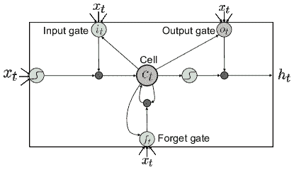

(f) LSTM 层的内部结构。

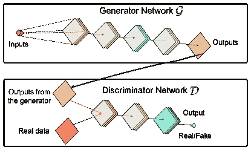

(g) 生成对抗网络（GAN）的基本原理。

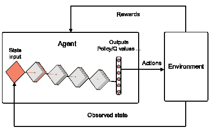

(h) 典型的深度强化学习架构。代理是一个神经网络模型，用于近似所需函数。

图 6：MLP、RBM、AE、CNN、RNN、LSTM、GAN 和 DRL 的典型结构和操作原理。

TABLE IX：不同深度学习架构的总结。GAN 和 DRL 被阴影标记，因为它们建立在其他模型之上。

| 模型 | 学习场景 | 示例架构 | 适用问题 | 优点 | 缺点 | 移动网络的潜在应用 |
| --- | --- | --- | --- | --- | --- | --- |
| MLP | 监督学习、无监督学习、强化学习 | ANN, AdaNet [157] | 用简单的关联建模数据 | 结构简单，易于构建 | 高复杂度，中等性能，收敛慢 | 多属性移动数据建模；其他深度架构的辅助或组件 |
| RBM | 无监督学习 | DBN [158], 卷积 DBN [159] | 提取鲁棒表示 | 可以生成虚拟样本 | 难以训练好 | 从未标记的移动数据中学习表示；模型权重初始化；网络流预测 |
| AE | 无监督学习 | DAE [160], VAE [161] | 学习稀疏和紧凑的表示 | 强大且有效的无监督学习 | 使用大数据预训练代价高 | 模型权重初始化；移动数据降维；移动异常检测 |
| CNN | 监督学习、无监督学习、强化学习 | AlexNet [86], ResNet [162], 3D-ConvNet [163], GoogLeNet [144], DenseNet [164] | 空间数据建模 | 权重共享；仿射不变性 | 高计算成本；难以找到最优超参数；复杂任务需要深度结构 | 空间移动数据分析 |
| RNN | 监督学习、无监督学习、强化学习 | LSTM [165], 基于注意力的 RNN [166], ConvLSTM [167] | 序列数据建模 | 擅长捕捉时间依赖性 | 模型复杂度高；梯度消失和爆炸问题 | 单独流量分析；网络范围内（时空）数据建模 |
| GAN | 无监督学习 | WGAN [79], LS-GAN [168], BigGAN [169] | 数据生成 | 可以从目标分布中生成逼真的样本 | 训练过程不稳定（收敛困难） | 虚拟移动数据生成；辅助网络数据分析中的监督学习任务 |
| DRL | 强化学习 | DQN [19], 深度策略梯度 [170], A3C [78], Rainbow [171], DPPO [172] | 高维输入的控制问题 | 适用于高维环境建模 | 收敛速度慢 | 移动网络控制和管理 |

### V-A 多层感知机

多层感知机（MLPs）是最初的人工神经网络（ANN）设计，包含至少三层操作 [173]。每层的单元都是密集连接的，因此需要配置大量的权重。我们在图 6(a)中展示了一个具有两个隐藏层的 MLP。请注意，通常只有包含多个隐藏层的 MLP 才被认为是深度学习结构。

给定输入向量 $\mathbf{x}$，标准的 MLP 层执行以下操作：

|  | $\mathbf{y}=\sigma(W\cdot\mathbf{x}+b).$ |  | (3) |
| --- | --- | --- | --- |

这里 $\mathbf{y}$ 表示层的输出，$W$ 是权重，$b$ 是偏置。$\sigma(\cdot)$ 是激活函数，旨在提高模型的非线性。常用的激活函数有 sigmoid，

|  | $\textbf{sigmoid}(\mathbf{x})=\frac{1}{1+e^{-\mathbf{x}}},$ |  |
| --- | --- | --- |

修正线性单元（ReLU） [174]，

|  | $\textbf{ReLU}(\mathbf{x})=\max(\mathbf{x},0),$ |  |
| --- | --- | --- |

tanh，

|  | $\textbf{tanh}(\mathbf{x})=\frac{e^{\mathbf{x}}-e^{\mathbf{-x}}}{e^{\mathbf{x}}+e^{\mathbf{-x}}},$ |  |
| --- | --- | --- |

和缩放指数线性单元（SELUs） [175]，

|  | $\textbf{SELU}(\mathbf{x})=\lambda\begin{cases}\mathbf{x},&amp;\text{如果}\>\mathbf{x}>0;\\ \alpha e^{\mathbf{x}}-\alpha,&amp;\text{如果}\>\mathbf{x}\leq 0,\end{cases}$ |  |
| --- | --- | --- |

其中参数 $\lambda=1.0507$ 和 $\alpha=1.6733$ 经常被使用。此外，在进行分类时，softmax 函数通常用于最后一层：

|  | $\textbf{softmax}(\mathbf{x}_{i})=\frac{e^{\mathbf{x}_{i}}}{\sum_{j=0}^{k}e^{\mathbf{x}_{k}}},$ |  |
| --- | --- | --- |

其中 $k$ 是分类中涉及的标签数量。直到最近，sigmoid 和 tanh 一直是使用最广泛的激活函数。然而，它们存在已知的梯度消失问题，这阻碍了梯度在层间传播。因此，这些函数越来越多地被 ReLU 或 SELU 替代。SELU 能够对每层的输出进行标准化，这大大加快了训练的收敛速度，可以视为 Batch Normalization 的替代 [176]。

MLP 可用于监督学习、无监督学习，甚至强化学习。尽管这种结构曾经是最流行的神经网络，但由于其涉及高复杂度（全连接结构）、性能一般以及收敛效率低，其受欢迎程度正在下降。MLP 主要用作基线或集成到更复杂的架构中（例如，用于分类的 CNN 的最后一层）。构建 MLP 十分简单，它可以用于例如帮助在移动网络应用中构建的特定目标模型的特征提取。先进的自适应学习神经网络（AdaNet）使 MLP 能够动态训练其结构以适应输入 [157]。这种新架构有可能用于分析不断变化的移动环境。

### V-B 玻尔兹曼机

受限玻尔兹曼机（RBMs）[90] 最初是为无监督学习目的设计的。它们本质上是一种基于能量的无向图模型，包括一个可见层和一个隐藏层，其中每个单元只能取二进制值（即 0 和 1）。这些值的概率由以下公式给出：

|  | $\displaystyle P(h_{j}=1\vert v)=\frac{1}{1+e^{-\mathbf{W\cdot v+b_{j}}}}$ |  |
| --- | --- | --- |
|  | $\displaystyle P(v_{j}=1\vert h)=\frac{1}{1+e^{-\mathbf{W^{T}\cdot h+a_{j}}}},$ |  |

其中 $h,v$ 分别是隐藏单元和可见单元，$\mathbf{W}$ 是权重，$\mathbf{a},\mathbf{b}$ 是偏置。可见单元在条件上与隐藏单元独立，*反之亦然*。RBM 的典型结构如图 6(b) 所示。一般来说，输入数据分配给可见单元 $v$。隐藏单元 $h$ 是不可见的，它们通过权重 $W$ 完全连接到所有 $v$，这类似于标准的前馈神经网络。然而，与 MLPs 不同的是，在 MLPs 中只有输入向量可以影响隐藏单元，而在 RBMs 中，$v$ 的状态可以影响 $h$ 的状态，*反之亦然*。

RBMs 可以使用对比散度算法 [177] 通过多次 Gibbs 采样 [178] 有效训练。我们在图 6(b) 中展示了 RBM 的结构和训练过程。基于 RBM 的模型通常用于在更近期的应用中初始化神经网络的权重。预训练的模型可以随后使用标准的反向传播算法进行微调以用于监督学习。一个 RBM 堆栈被称为深度置信网络（DBN）[158]，它执行逐层训练，并在许多应用中表现出比 MLPs 更优的性能，包括时间序列预测 [179]、比率匹配 [180] 和语音识别 [181]。这种结构甚至可以扩展到卷积架构，以学习层次化的空间表示 [159]。

### V-C 自编码器

自编码器（AEs）也用于无监督学习，并尝试将输入复制到输出。AE 的基本原理如图 6(c) 所示。AEs 常用于学习数据的紧凑表示以进行维度减少 [182]。扩展版本可以进一步用于初始化深度架构的权重，例如去噪自编码器（DAE）[160]，并从目标数据分布中生成虚拟样本，例如变分自编码器（VAEs）[161]。

VAE 通常包含两个神经网络——一个编码器和一个解码器。编码器的输入是一个数据点 $\mathbf{x}$（例如图像），其功能是将这个输入编码成潜在表示空间 $\mathbf{z}$。设 $f_{\Theta}(\mathbf{z}|\mathbf{x})$ 是一个由 $\Theta$ 参数化的编码器，并且 $\mathbf{z}$ 从高斯分布中采样，编码器的目标是输出高斯分布的均值和方差。类似地，记 $g_{\Omega}(\mathbf{x}|\mathbf{z})$ 为由 $\Omega$ 参数化的解码器，该解码器接受潜在表示 $\mathbf{z}$ 作为输入，并输出 $\mathbf{x}$ 的分布参数。VAE 的目标是最小化数据的重建误差以及 $p(\mathbf{z})$ 与 $f_{\Theta}(\mathbf{z}|\mathbf{x})$ 之间的 Kullback-Leibler (KL) 散度。一旦训练完成，VAE 可以通过 *(i)* 采样潜在变量 $z_{i}\sim p(\mathbf{z})$ 和 *(ii)* 采样新的数据点 $x_{i}\sim p(\mathbf{x}|\mathbf{z})$ 来生成新的数据点样本。

自编码器（AEs）可以用于解决网络安全问题，多个研究论文证实了它们在不同情况下检测异常的有效性 [183, 184, 185]，我们将在子章节 VI-H 中进一步讨论。RBMs 和 AEs 的结构基于 MLPs、CNNs 或 RNNs。它们的目标类似，但学习过程不同。两者都可以用来从未标记的移动数据中提取模式，随后可用于各种监督学习任务，例如路由 [186]、移动活动识别 [187, 188]、眼周验证 [189] 和基站用户数量预测 [190]。

### V-D 卷积神经网络

卷积神经网络（CNNs 或 ConvNets）不同于全连接层，它们利用一组局部连接的核（滤波器）来捕捉不同数据区域之间的相关性。数学上，对于输出 $\mathbf{y}$ 的每个位置 $\boldsymbol{p}_{y}$，标准卷积执行以下操作：

|  | $\mathbf{y}(\boldsymbol{p}_{y})=\sum_{\boldsymbol{p}_{G}\in\mathbb{G}}\mathbf{w}(\boldsymbol{p}_{G})\cdot\mathbf{x}(\boldsymbol{p}_{y}+\boldsymbol{p}_{G}),$ |  | (4) |
| --- | --- | --- | --- |

其中 $\boldsymbol{p}_{G}$ 表示卷积滤波器 $W$ 在接受域 $\mathbb{G}$ 中的所有位置，有效地代表每个神经元对卷积层输入的感受范围。这里的权重 $W$ 在输入图像的不同位置共享。我们在图 6(d) 中展示了二维卷积层的操作。具体来说，二维卷积神经网络层的输入是多个具有不同通道的二维矩阵（例如图像的 RGB 表示）。卷积层采用多个共享在不同位置的滤波器来“扫描”输入并生成输出映射。一般情况下，如果输入和输出分别具有 $M$ 和 $N$ 个滤波器，则卷积层将需要 $M\times N$ 个滤波器来执行卷积操作。

卷积神经网络通过利用三个重要的思想，即 *(i)* 稀疏交互，*(ii)* 参数共享，和 *(iii)* 等变表示 [18]，改进了传统的多层感知器（MLP）。这显著减少了模型参数的数量，并保持了仿射不变性（即对对象的仿射变换具有鲁棒的识别结果）。稀疏交互意味着权重核的大小小于输入。它执行移动滤波以生成当前层的输出（大致与输入相同大小）。参数共享指的是使用相同的核来扫描整个输入图。这显著减少了所需的参数数量，减轻了过拟合的风险。等变表示表明卷积操作在平移、缩放和形状方面是不变的。这对图像处理特别有用，因为关键特征可能会出现在图像的不同位置，并具有各种仿射模式。

由于上述特性，卷积神经网络（CNNs）在成像应用中表现出色。Krizhevsky *等人* [86] 利用 CNN 对 ImageNet 数据集上的图像进行分类 [191]。他们的方法将 top-5 错误率降低了 39.7%，并在成像分类领域引发了革命。GoogLeNet [144] 和 ResNet [162] 显著增加了 CNN 结构的深度，并提出了 inception 和残差学习技术，以解决由“深度”引入的过拟合和梯度消失等问题。他们的结构通过密集卷积网络（DenseNet） [164] 进一步改进，该网络重复使用每一层的特征图，从而在需要更少层的情况下，相比于其他基于 CNN 的模型取得了显著的准确性提升。CNNs 还扩展到了视频应用。Ji *等人* 提出了用于视频活动识别的 3D 卷积神经网络 [163]，与 2D CNN 相比，展示了更优越的准确性。更近期的研究则集中在学习卷积核的形状 [192, 193, 194]。这些动态架构允许自动关注输入图中的重要区域。这些特性在分析表现出集群行为的大规模移动环境（例如与热门事件相关的移动流量激增）中尤为重要。

鉴于图像数据和空间移动数据（例如，移动流量快照、用户移动性等）之间的高度相似性，基于 CNN 的模型在网络范围内的移动数据分析中具有巨大潜力。这是一个有前景的未来方向，我们将在第 VIII 节中进一步讨论。

### V-E 循环神经网络

循环神经网络（RNNs）被设计用于建模序列数据，其中样本之间存在顺序相关性。在每一个时间步骤，它们通过隐藏单元之间的递归连接生成输出 [18]，如图 6(e) 所示。给定输入序列 $\mathbf{x}=\{x_{1},x_{2},\cdots,x_{T}\}$，标准的 RNN 执行以下操作：

|  | $\displaystyle s_{t}=\sigma_{s}(W_{x}x_{t}+W_{s}s_{t-1}+b_{s})$ |  |
| --- | --- | --- |
|  | $\displaystyle h_{t}=\sigma_{h}(W_{h}s_{t}+b_{h}),$ |  |

其中$s_{t}$表示时间$t$时网络的状态，并为网络构建一个记忆单元。其值由输入$x_{t}$和前一状态$s_{t-1}$的函数计算得出。$h_{t}$是时间$t$时网络的输出。在自然语言处理应用中，这通常表示一个语言向量，并在经过嵌入层处理后，成为$t+1$时的输入。权重$W_{x},W_{h}$和偏置$b_{s},b_{h}$在不同时间位置间共享。这减少了模型复杂度和过拟合的程度。

RNN 通过时间反向传播（BPTT）算法进行训练。然而，传统 RNN 中经常报告梯度消失和爆炸问题，这使得它们特别难以训练[195]。长短期记忆（LSTM）通过引入一组“门”[165]来减轻这些问题，这在许多应用中已被证明成功（例如，语音识别[196]、文本分类[197]和可穿戴活动识别[112]）。标准 LSTM 执行以下操作：

|  | $\displaystyle i_{t}=\sigma(W_{xi}X_{t}+W_{hi}H_{t-1}+W_{ci}\odot C_{t-1}+b_{i}),$ |  |
| --- | --- | --- |
|  | $\displaystyle f_{t}=\sigma(W_{xf}X_{t}+W_{hf}H_{t-1}+W_{cf}\odot C_{t-1}+b_{f}),$ |  |
|  | $\displaystyle C_{t}=f_{t}\odot C_{t-1}+i_{t}\odot\tanh(W_{xc}X_{t}+W_{hc}H_{t-1}+b_{c}),$ |  |
|  | $\displaystyle o_{t}=\sigma(W_{xo}X_{t}+W_{ho}H_{t-1}+W_{co}\odot C_{t}+b_{o}),$ |  |
|  | $\displaystyle H_{t}=o_{t}\odot\tanh(C_{t}).$ |  |

这里，‘$\odot$’表示 Hadamard 积，$C_{t}$表示细胞输出，$H_{t}$是隐藏状态，$i_{t}$、$f_{t}$和$o_{t}$分别是输入门、遗忘门和输出门。这些门减轻了梯度问题，并显著改善了 RNN。我们在图 6(f)中展示了 LSTM 的结构。

Sutskever *et al.* 引入了注意力机制到 RNN 中，实现了在分词预测中的卓越准确性[166]。Shi *et al.* 用卷积操作替代 LSTM 中的稠密矩阵乘法，设计了卷积长短期记忆（ConvLSTM）[167]。他们的提案降低了传统 LSTM 的复杂性，并在降水短期预报（即预报降水量）中表现出显著更低的预测误差。

移动网络从各种来源产生大量的序列数据，如数据流量、移动网络用户轨迹的演变和应用延迟。探索 RNN 家族有望提升对移动网络中时间序列数据的分析。

### V-F 生成对抗网络

算法 1 典型 GAN 训练算法。

1: 输入：2:      批量大小 $m$。判别器的步数 $K$。学习率 $\lambda$ 和优化器 Opt($\cdot$) 噪声向量 $z\sim p_{g}(z)$。目标数据集 $x\sim p_{data}(x)$。3: 初始化：4:      生成模型和判别模型，$\mathcal{G}$ 和 $\mathcal{D}$，由 $\Theta_{\mathcal{G}}$ 和 $\Theta_{\mathcal{D}}$ 参数化。5: 当 $\Theta_{\mathcal{G}}$ 和 $\Theta_{\mathcal{D}}$ 尚未收敛时，执行：6:      对于 $k=1$ 到 $K$：7: 从噪声先验 $p_{g}(z)$ 中抽取 $m$ 元素的噪声向量 $\{z^{(1)},\cdots,z^{(m)}\}$ 8: 从目标数据分布 $p_{data}(x)$ 中抽取 $m$ 个数据点 $\{x^{(1)},\cdots,x^{(m)}\}$ 9:          $g_{\mathcal{D}}\leftarrow\Delta_{\Theta_{\mathcal{D}}}[\frac{1}{m}\sum_{i=1}^{m}\log\mathcal{D}(x^{(i)})+$ 12:                  $+\frac{1}{m}\sum_{i=1}^{m}\log(1-\mathcal{D}(\mathcal{G}(z^{(i)})))]$。13:          $\Theta_{\mathcal{D}}\leftarrow\Theta_{\mathcal{D}}+\lambda\cdot\text{Opt}(\Theta_{\mathcal{D}},g_{\mathcal{D}})$。14:      结束 循环 15: 从噪声先验 $p_{g}(z)$ 中抽取 $m$ 元素的噪声向量 $\{z^{(1)},\cdots,z^{(m)}\}$ 16:      $g_{\mathcal{G}}\leftarrow\frac{1}{m}\sum_{i=1}^{m}\log(1-\mathcal{D}(\mathcal{G}(z^{(i)})))$ 17:      $\Theta_{\mathcal{G}}\leftarrow\Theta_{\mathcal{G}}-\lambda\cdot\text{Opt}(\Theta_{\mathcal{G}},g_{\mathcal{G}})$。18: 结束 循环

生成对抗网络（GAN）是一个通过以下对抗过程训练生成模型的框架。它同时训练两个模型：一个生成模型 $\mathcal{G}$，其目标是从训练数据中逼近目标数据分布，和一个判别模型 $\mathcal{D}$，其目的是估计样本来自真实训练数据的概率，而不是 $\mathcal{G}$ 的输出 [91]。$\mathcal{G}$ 和 $\mathcal{D}$ 通常是神经网络。训练过程的目标是最大化 $\mathcal{D}$ 出错的概率。总体目标是解决以下极小化最大化问题 [91]：

|  | $\displaystyle\min\limits_{\mathcal{G}}\max\limits_{\mathcal{D}}\mathbb{E}_{x\sim P_{r}(x)}[\log\mathcal{D}(x)]+\mathbb{E}_{z\sim P_{n}(z)}[\log(1-\mathcal{D}(\mathcal{G}(z)))].$ |  |
| --- | --- | --- |

算法 1 展示了训练简单 GAN 的典型流程。在训练过程中，生成器和判别器是交替训练的，每次固定一个。最终，如果模型收敛，$\mathcal{G}$ 可以生成接近目标分布（与训练示例相同）的数据。我们在图 6(g) 中展示了 GAN 的整体结构。在实践中，生成器 $\mathcal{G}$ 以噪声向量 $z$ 作为输入，并生成遵循目标分布的输出 $\mathcal{G}(z)$。判别器 $\mathcal{D}$ 将尝试区分 $\mathcal{G}(z)$ 是真实样本还是伪造的 [198]。这有效地构建了一个动态博弈，当 $\mathcal{G}$ 和 $\mathcal{D}$ 都达到最优时，将达到纳什均衡，$\mathcal{G}$ 可以生成 $\mathcal{D}$ 无法再区分的逼真数据，即 $\mathcal{D}(\mathcal{G}(z))=0.5,\forall z$。

传统 GAN 的训练过程对模型结构、学习率和其他超参数极为敏感。研究人员通常需要使用大量特定的“技巧”来实现收敛并提高生成数据的真实性。为缓解这一问题，存在几种解决方案，例如 Wasserstein 生成对抗网络（WGAN） [79]、损失敏感生成对抗网络（LS-GAN） [168] 和 BigGAN [169]，但对 GAN 理论的研究仍然较为浅薄。近期的研究确认，通过最小化推断数据分布与真实数据分布之间的差异，GAN 可以提升一些监督任务的性能（例如，超分辨率 [199]、目标检测 [200] 和面部补全 [201]）。利用 GAN 的无监督学习能力，在生成合成移动数据以进行模拟或辅助移动网络应用中的特定监督任务方面具有很大潜力。在缺乏合适数据集的任务中，这一点尤为重要，因为运营商通常不愿意共享其网络数据。

### V-G 深度强化学习

深度强化学习（Deep Reinforcement Learning，DRL）是一组通过深度神经网络逼近值函数（深度 Q 学习）或策略函数（策略梯度方法）的方法。代理（神经网络）与环境持续交互，并通过奖励信号作为反馈。代理在每一步选择一个动作，这会改变环境的状态。神经网络的训练目标是优化其参数，使其能够选择潜在带来最佳未来回报的动作。我们在图 6(h)中阐述了这一原理。DRL 非常适合具有大量可能状态（即环境维度高）的问题。代表性的 DRL 方法包括深度 Q 网络（DQNs）[19]、深度策略梯度方法[170]、异步优势演员-评论者（A3C）[78]、Rainbow [171] 和分布式近端策略优化（DPPO）[172]。这些方法在人工智能游戏（例如 Gym²⁰²⁰20Gym 是一个用于开发和比较强化学习算法的工具包。它支持教授代理从行走到玩 Pong 或 Pinball 等游戏。与 NS3 模拟器结合使用，Gym 可以应用于网络研究。[202] https://gym.openai.com/）、机器人和自动驾驶[203, 204, 205, 206]领域取得了令人振奋的深度学习突破。

特别是，DQN [19] 首先由 DeepMind 提出用于玩 Atari 视频游戏。然而，传统的 DQN 需要进行几项重要的调整才能发挥良好效果。A3C [78] 使用演员-评论者机制，演员根据环境的状态选择动作，评论者估计给定状态和动作的值，然后向演员提供反馈。A3C 在 CPU 的不同线程上部署不同的演员和评论者以打破数据的依赖性。这显著提高了训练的收敛性，使得 DRL 代理在 CPU 上快速训练成为可能。Rainbow [171] 结合了 DQN 的不同变体，并发现它们在某种程度上是互补的。这一发现在许多 Atari 游戏中提高了性能。为了解决策略梯度方法中的步长问题，Schulman 等人提出了分布式近端策略优化（DPPO）方法来约束新策略的更新步骤，并在分布式方式下在多线程 CPU 上实施[172]。基于这一方法，OpenAI 开发的一个代理在 Dota2 团队的 5v5 比赛中击败了人类专家。²¹²¹21Dota2 是一款流行的多人在线战斗竞技游戏。

许多移动网络问题可以被表述为马尔可夫决策过程（MDPs），其中强化学习可以发挥重要作用（例如，基站开关策略[207]、路由[208]和自适应跟踪控制[209]）。尽管如此，这些问题中的一些涉及高维输入，这限制了传统强化学习算法的适用性。深度强化学习（DRL）技术扩展了传统强化学习算法处理高维数据的能力，适用于以前认为难以处理的场景。因此，采用 DRL 有望解决复杂、多变和异质的移动环境下的网络管理和控制问题。我们进一步在第 VIII 节讨论了这一潜力。

## VI 深度学习驱动的移动和无线网络

深度学习在移动和无线网络中有广泛的应用。接下来，我们展示了不同移动网络领域的最重要的研究贡献，并比较了它们的设计和原则。特别是，我们首先讨论了一个关键前提，即移动大数据，然后将相关工作的综述组织成九个小节，重点关注深度学习取得进展的具体领域。具体来说，

1.  1.

    深度学习驱动的网络级移动数据分析专注于基于网络内收集的移动大数据构建的深度学习应用，包括网络预测、流量分类和呼叫详细记录（CDR）挖掘。

1.  2.

    深度学习驱动的应用级移动数据分析将注意力转向边缘设备上的移动数据分析。

1.  3.

    深度学习驱动的用户移动性分析阐明了使用深度神经网络来理解移动用户的移动模式，无论是在群体还是个体层面上的好处。

1.  4.

    深度学习驱动的用户定位回顾了使用深度神经网络在室内或室外环境中定位用户的文献，基于从移动设备或无线通道接收到的不同信号。

1.  5.

    深度学习驱动的无线传感器网络讨论了深度学习在无线传感器网络（WSNs）中的应用，从四个不同的角度，即集中式与分散式感知、WSN 数据分析、WSN 定位和其他应用。

1.  6.

    深度学习驱动的网络控制研究了深度强化学习和深度模仿学习在网络优化、路由、调度、资源分配和无线控制方面的应用。

1.  7.

    深度学习驱动的网络安全展示了利用深度学习提高网络安全的工作，我们根据关注点将其分为基础设施、软件和隐私相关。

1.  8.

    深度学习驱动的信号处理审查了从深度学习中受益的物理层方面，并回顾了相关的信号处理工作。

1.  9.

    新兴的深度学习驱动的移动网络应用结束了本节内容，展示了在移动网络中其他有趣的深度学习应用。

对于每个领域，我们以表格形式广泛总结工作，为读者提供对各个主题的一般性概述。每个领域中最重要的工作在文本中有更详细的讨论。每个子部分的末尾也讨论了所学到的经验教训。我们在图 7 中给出了本节回顾的文献所涉及主题的示意图。

\smartdiagramset

距离文本中心气泡=0.15 厘米，气泡中心节点大小=3 厘米，气泡节点大小=2 厘米，中心/其他气泡距离=1.2 厘米，气泡中心节点字体=，气泡节点字体=，气泡中心节点颜色=bittersweet，模块 y 间隔=13，设置颜色列表=saffron、mediumaquamarine、salmonpink、limegreen、persianorange、violet、cyan、darkgray \smartdiagram[bubble diagram]深度学习驱动

移动和无线

网络，网络层移动

数据分析

[210、211、212、213、214、215、216、217、218、77、219、220、221、222、223、224、225、226、227、228、229、102、230、231、232、233、234]，应用层移动数据

分析

[235、236、237、238、239、240、241、242、243、244、245、246、247、248、249、250、251、252、253、254、255、256、112、257、258、259、260、261、262、263、264、265、266、17]

[267, 268, 269, 270, 271, 187, 272, 273, 274, 275, 276, 277, 278, 279, 280, 281, 97, 282, 283, 284, 285, 286, 287, 288, 289, 73, 290, 291], 移动性分析

[292, 293, 294, 295, 227, 296, 297, 298, 299, 300, 301, 302, 303, 304, 305, 306, 307, 308, 309, 310], 用户定位

[311, 272, 273, 312, 313, 314, 315]

[316, 317, 318, 319, 320, 321, 322, 111, 323, 324, 325, 326, 327, 328, 329, 330, 331, 332, 333, 334], 无线传感器网络

[335, 336, 337, 338, 339, 340, 341, 342, 343, 344, 345, 346, 347, 348, 349, 350, 351, 352, 353, 346, 354, 355, 356], 网络控制

[357, 358, 359, 360, 361, 362, 363, 364, 365, 293, 186, 366, 367, 368]

[369、368、370、371、372、373、374、375、376、377、378、379、380、381、382、383、384、385、386、387、388、389、390、391、392、393、234、394、395、396、397、398、399、400、401、402、403]，网络安全

[404、185、405、406、407、408、409、410、411、345、412、413、414、415、416、417、418、419]

[420、421、223、422、423、424、425、426、427、428、429、430、431、432、429、433、434、435、436]，信号处理

[378、380、437、438、439、440、441、442、443、444]

[322、445、446、447、448、449、450、451、452、453、454、455、456、457、458]，新兴应用

[459、460、461、462、463]

图 7：第 VI 节回顾文献的分类。

### VI-A 移动大数据作为前提

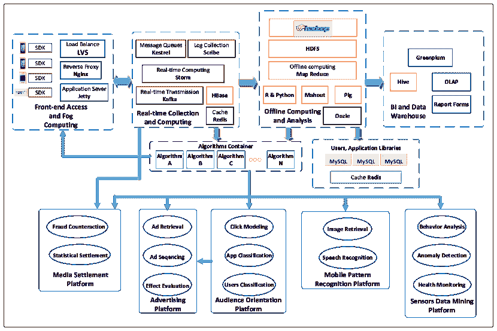

图 8：典型的应用级移动数据处理系统的流程图。

移动技术的发展（例如智能手机、增强现实等）迫使移动运营商升级移动网络基础设施。因此，移动网络的云端和边缘端变得越来越复杂，以适应日常产生和消耗大量移动数据的用户。这些数据可能由记录个体用户行为的移动设备传感器生成，或来自反映城市环境动态的移动网络基础设施。恰当地挖掘这些数据可以使跨学科研究领域和行业在移动网络管理、社会分析、公共交通、个人服务提供等方面受益[36]。然而，网络运营商可能在管理和分析大量异构移动数据时感到不堪重负[464]。深度学习可能是克服这一负担的最强大方法。因此，我们首先介绍移动大数据的特征，然后对深度学习驱动的移动数据分析研究进行全面回顾。

Yazti 和 Krishnaswamy 提议将移动数据分为两组，即*网络级*数据和*应用级*数据[465]。它们之间的关键区别在于，前者的数据通常由边缘移动设备收集，而后者则通过网络基础设施获得。我们在表 X 中总结了这两种数据类型及其包含的信息。在深入探讨移动数据分析之前，我们在图 9 中说明了典型的数据收集过程。

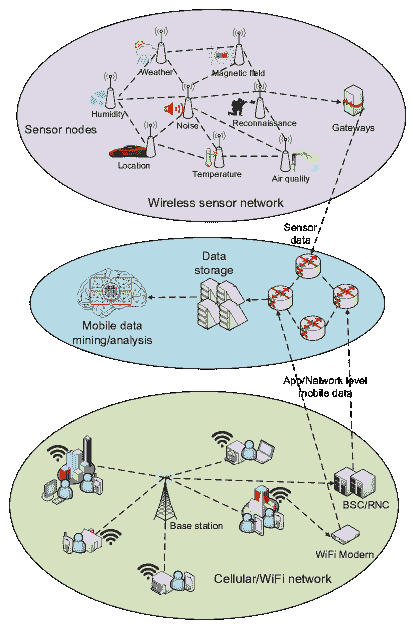

图 9: 在蜂窝、WiFi 和无线传感器网络中移动数据收集过程的示意图。BSC: 基站控制器; RNC: 无线网络控制器。

表 X: 移动大数据的分类。

| 移动数据 | 来源 | 信息 |
| --- | --- | --- |
| 网络级数据 | 基础设施 | 基础设施位置、能力、设备持有者等 |
| 性能指标 | 数据流量、端到端延迟、QoE、抖动等 |
| 通话详单记录 (CDR) | 会话开始和结束时间、类型、发送者和接收者等 |
| 无线电信息 | 信号功率、频率、频谱、调制等 |
| 应用级数据 | 设备 | 设备类型、使用情况、媒体访问控制 (MAC) 地址等 |
| 个人资料 | 用户设置、个人信息等 |
| 传感器 | 移动性、温度、磁场、运动等 |
| 应用程序 | 图片、视频、语音、健康状况、偏好等 |
| 系统日志 | 软件和硬件故障日志等。 |

*网络级别* 的移动数据由网络基础设施生成，不仅提供了移动网络性能的全球视图（例如吞吐量、端到端延迟、抖动等），还通过通话详单记录（CDRs）记录了每个会话的时间、通信类型、发送者和接收者信息。网络级数据通常表现出显著的时空变化，这些变化源于用户的行为[466]，可以用于网络诊断和管理、用户移动性分析以及公共交通规划[216]。一些网络级数据（例如移动流量快照）可以视为由“全景相机”拍摄的照片，为城市感知提供了城市级别的感知系统。

另一方面，*应用层*数据直接由各种移动设备中安装的传感器或移动应用程序记录。这些数据通常通过来自异质来源的众包方案收集，如全球定位系统（GPS）、移动摄像头和视频记录仪以及便携式医疗监测仪。移动设备充当传感器集线器，负责数据的收集和预处理，并根据需要将这些数据分发到特定位置[36]。我们在图 8 中展示了一个典型的应用层数据处理系统。应用层移动数据由安装在移动设备上的软件开发工具包（SDK）生成和收集。这些数据随后由实时收集和计算服务（如 Storm²²²²22Storm 是一个免费开源的分布式实时计算系统，http://storm.apache.org/，Kafka²³²³23Kafka^®用于构建实时数据管道和流媒体应用，https://kafka.apache.org/，HBase²⁴²⁴24Apache HBase™ 是 Hadoop 数据库，一个分布式、可扩展的大数据存储，https://hbase.apache.org/，Redis²⁵²⁵25Redis 是一个开源的内存数据结构存储，用作数据库、缓存和消息代理，https://redis.io/等）进行处理。进一步的离线存储和计算可以使用各种工具，如 Hadoop 分布式文件系统（HDFS）²⁶²⁶26Hadoop 分布式文件系统（HDFS）是一个设计用于在商品硬件上运行的分布式文件系统，https://hadoop.apache.org/docs/r1.2.1/hdfs_design.html，Python，Mahout²⁷²⁷27Apache Mahout™ 是一个分布式线性代数框架，https://mahout.apache.org/，Pig²⁸²⁸28Apache Pig 是一个高级平台，用于创建在 Apache Hadoop 上运行的程序，https://pig.apache.org/，或 Oozie²⁹²⁹29Oozie 是一个工作流调度系统，用于管理 Apache Hadoop 作业，http://oozie.apache.org/。原始数据和分析结果将进一步转移到数据库（如 MySQL³⁰³⁰30MySQL 是开源数据库，https://www.oracle.com/technetwork/database/mysql/index.html），商业智能（如在线分析处理 – OLAP）以及数据仓库（如 Hive³¹³¹31Apache Hive™ 是一个数据仓库软件，https://hive.apache.org/）。在这些系统中，算法容器是整个系统的核心，因为它连接到前端访问和雾计算、实时收集和计算以及离线计算和分析模块，同时直接链接到移动应用程序，如移动医疗、模式识别和广告平台。深度学习逻辑可以放置在算法容器内。

应用级数据可能直接或间接反映用户行为，如移动性、偏好和社交联系 [61]。分析个体的应用级数据可以帮助重建一个人的个性和偏好，这些可以用于推荐系统和用户定向广告。其中一些数据包含关于个体身份的显式信息。不适当的分享和使用可能引发重大的隐私问题。因此，在不损害用户隐私的情况下，从多模态感知设备中提取有用模式仍然是一个具有挑战性的努力。

与传统数据分析技术相比，深度学习拥有几个独特的特点，以应对上述挑战 [17]。即：

1.  1.

    深度学习在各种数据分析任务中表现出色，无论是结构化还是非结构化数据。某些类型的移动数据可以被表示为类似图像的形式（例如[216]），或者是序列数据[224]。

1.  2.

    深度学习在从原始数据中提取特征方面表现出色。这节省了大量手工特征工程的工作，允许更多时间用于模型设计，而不是仅仅整理数据本身。

1.  3.

    深度学习为处理标记数据提供了优秀的工具（例如 RBM、AE、GAN），这在移动网络日志中是常见的。

1.  4.

    多模态深度学习允许学习多种模态上的特征 [467]，这使其在利用来自异构传感器和数据源收集的数据建模方面非常强大。

这些优势使深度学习成为移动数据分析的强大工具。

表 XI：关于网络级移动数据分析工作的总结。

| 领域 | 参考文献 | 应用 | 模型 | 优化器 | 主要贡献 |
| --- | --- | --- | --- | --- | --- |
| 网络预测 | Pierucci 和 Micheli [210] | QoE 预测 | MLP | 未知 | 使用神经网络相关联服务质量参数和 QoE 估计。 |
| Gwon 和 Kung [211] | 推断 Wi-Fi 流量模式 | 稀疏编码 + 最大池化 | SGD | 半监督学习。 |
| Nie *et al.* [212] | 无线网格网络流量预测 | DBN + 高斯模型 | SGD | 考虑了长期依赖性和短期波动。 |
| Moyo 和 Sibanda [213] | TCP/IP 流量预测 | MLP | 未知 | 调查了在流量预测中学习的影响。 |
| Wang *et al.* [214] | 移动流量预测 | AE + LSTM | SGD | 使用 AE 建模空间相关性，LSTM 建模时间相关性 |
| Zhang 和 Patras [215] | 长期移动流量预测 | ConvLSTM + 3D-CNN | Adam | 结合 3D-CNN 和 ConvLSTM 进行长期预测 |
| Zhang *et al.* [216] | 移动流量超分辨率 | CNN + GAN | Adam | 引入了 MTSR 概念，并应用图像处理技术进行移动流量分析 |
| Huang *et al.* [217] | 移动流量预测 | LSTM + 3D-CNN | 未知 | 结合 CNN 和 RNN 提取移动流量的地理和时间特征。 |
| Zhang *et al.* [218] | 蜂窝流量预测 | 密集连接 CNN | Adam | 使用独立的 CNN 模型捕捉时间依赖中的紧密性和周期性。 |
| Chen *et al.* [77] | 云 RAN 优化 | 多变量 LSTM | 未知 | 利用移动流量预测来辅助云无线接入网络优化。 |
| Navabi *et al.* [219] | 无线 WiFi 信道特征预测 | MLP | SGD | 从可观测特征推断不可观测的信道信息。 |
| Feng *et al.* [233] | 移动蜂窝流量预测 | LSTM | Adam | 使用独立模块提取空间和时间依赖性。 |
| Alawe *et al.* [468] | 移动流量负载预测 | MLP, LSTM | 未知 | 利用流量预测提升 5G 网络的可扩展性。 |
| Wang *et al.* [102] | 蜂窝流量预测 | 图神经网络 | Pineda 算法 | 通过图表示时空依赖性，首次使用图神经网络进行流量预测。 |
|  | Fang *et al.* [230] | 移动需求预测 | 图 CNN, LSTM, 时空图 ConvLSTM | 未知 | 使用依赖图建模单元之间的空间相关性。 |
|  | Luo *et al.* [231] | 信道状态信息预测 | CNN 和 LSTM | RMSprop | 采用两阶段离线-在线训练方案，提高框架的稳定性。 |
| 流量分类 | Wang [220] | 流量分类 | MLP, 堆叠 AE | 未知 | 同时进行特征学习、协议识别和异常协议检测。 |
| Wang *et al.* [221] | 加密流量分类 | CNN | SGD | 采用端到端深度学习方法进行加密流量分类。 |
| Lotfollahi *et al.* [222] | 加密流量分类 | CNN | Adam | 可以同时进行流量特征化和应用识别。 |
| Wang *et al.* [223] | 恶意软件流量分类 | CNN | SGD | 首次使用表征学习对原始流量进行恶意软件分类。 |
| Aceto *et al.* [469] | 移动加密流量分类 | MLP, CNN, LSTM | SGD, Adam | 综合评估了不同神经网络架构，并取得了优异的性能。 |
| Li *et al.* [232] | 网络流量分类 | 贝叶斯自编码器 | SGD | 应用贝叶斯概率理论获取模型参数的后验分布。 |
| CDR 挖掘 | Liang *et al.* [224] | 地铁密度预测 | RNN | SGD | 采用地理空间数据处理、权重共享 RNN 和并行流分析编程。 |
| Felbo *et al.* [225] | 人口统计预测 | CNN | Adam | 利用移动电话元数据固有的时间相关性。 |
| Chen *et al.* [226] | 游客下一次访问地点预测 | MLP, RNN | 缩放共轭梯度下降 | LSTM 表现显著优于其他机器学习方法。 |
| Lin *et al.* [227] | 人类活动链生成 | 输入-输出 HMM + LSTM | Adam | 首次使用 RNN 生成的人类活动链工作。 |
| 其他 | Xu *et al.* [228] | Wi-Fi 热点分类 | CNN | 未知 | 将深度学习与频率分析相结合。 |
| Meng *et al.* [229] | 基于 QoE 的大数据分析 | CNN | SGD | 探讨高维大数据分析的准确性与模型训练速度之间的权衡。 |

### VI-B 深度学习驱动的网络级移动数据分析

网络级移动数据广义上指互联网服务提供商记录的日志，包括基础设施元数据、网络性能指标和呼叫详细记录（CDRs）（见表 XI）。深度学习的近期显著成功引发了全球对利用这一方法进行移动网络级数据分析的兴趣，以优化移动网络配置，从而提升终端用户的 QoE。这些工作可以分为四类：网络状态预测、网络流量分类、CDR 挖掘和无线电分析。接下来，我们回顾这些方向的工作，并在表 XI 中首先总结和比较。

网络状态预测指的是根据历史测量数据或相关数据来推测移动网络的流量或性能指标。Pierucci 和 Micheli 研究了关键目标指标与用户体验（QoE）之间的关系 [210]。他们利用 MLP 来预测移动通信中的用户体验，基于平均用户吞吐量、每个小区的活跃用户数量、每个用户的平均数据量和信道质量指标，展现了高预测准确率。网络流量预测是另一个深度学习逐渐重要的领域。通过利用稀疏编码和最大池化，Gwon 和 Kung 开发了一个半监督深度学习模型，用于分类接收到的帧/数据包模式，并推断 WiFi 网络中流的原始特性 [211]。他们的提案显示出优于传统机器学习技术的表现。Nie *等* 研究了无线网状网络中的流量需求模式 [212]。他们设计了一个 DBN 以及高斯模型，以准确估计流量分布。

除了上述内容外，一些研究者还采用深度学习方法来预测城市规模的移动流量，通过考虑地理移动流量测量的时空相关性。我们在图 10 中说明了其基本原理。在[214]中，Wang *等人* 提出使用基于自编码器（AE）的架构和长短期记忆网络（LSTMs）分别建模移动流量分布的空间和时间相关性。具体来说，作者使用全局和多个局部堆叠的自编码器进行空间特征提取、维度减少和训练并行化。提取的压缩表示随后由 LSTMs 处理，以进行最终的预测。与实际数据集的实验表明，该方法在性能上优于支持向量机（SVM）和自回归积分滑动平均（ARIMA）模型。在[215]中的工作将移动流量预测扩展到较长时间范围。作者结合了卷积长短期记忆网络（ConvLSTMs）和三维卷积神经网络（3D CNNs），构建了捕捉城市规模复杂时空特征的时空神经网络。他们进一步引入了微调方案和轻量级方法，将预测与历史均值融合，从而显著延长了可靠预测步骤的长度。深度学习也被应用于[217, 468, 233]和[77]中，作者采用卷积神经网络（CNNs）和长短期记忆网络（LSTMs）进行移动流量预测。通过有效提取时空特征，他们的方法在准确性上显著高于传统方法，如 ARIMA。Wang *等人* 使用图表示移动流量中的时空依赖关系，并使用图神经网络[102]学习这些依赖关系。除了他们研究中实现的准确推断外，该工作还展示了对精确社会事件推断的潜力。

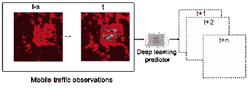

图 10: 城市规模移动流量预测的基本原理。深度学习预测器以一个区域的移动流量测量序列（快照 $t-s$ 到 $t$）作为输入，并预测未来 $t+1$ 到 $t+n$ 实例中相同区域的移动流量消耗情况。

最近，张等人提出了一种原创的移动流量超分辨率（MTSR）技术，通过探测获取的粗粒度对应物推断网络范围内细粒度移动流量消耗，从而减少流量测量开销[216]。我们在图 11 中阐述了 MTSR 的原理。受到图像超分辨率技术的启发，他们设计了一个专用的卷积神经网络，该网络在层之间具有多个跳跃连接，称为深层拉链网络，并配备生成对抗网络（GAN）来执行精确的 MTSR，并提高推断流量快照的保真度。通过对真实数据集的实验表明，这种架构可以将城市内移动流量测量的粒度提高多达 100 倍，同时显著优于其他插值技术。

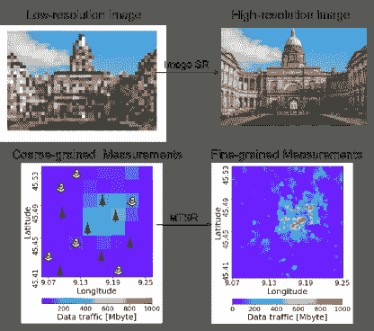

图 11: 图像超分辨率（SR）原理的说明（上）和移动流量超分辨率（MTSR）技术（下）。图片改编自[216]。

流量分类旨在在网络流量中识别特定的应用程序或协议。王（Wang）认识到深度神经网络强大的特征学习能力，并使用深度自编码器（deep AE）在 TCP 流数据集中识别协议，达到了出色的精度和召回率 [220]。工作 [221] 提出使用一维卷积神经网络（1D CNN）进行加密流量分类。作者指出，这种结构适合建模顺序数据，并具有较低的复杂度，因此在解决流量分类问题上具有潜力。同样，Lotfollahi 等人提出了基于 CNN 的 Deep Packet 用于加密流量分类 [222]。他们的框架减少了手工特征工程的量，并达到了很高的准确度。改进的堆叠自编码器被应用于 [232]，李（Li）等人将贝叶斯方法融入自编码器中，以增强网络流量分类的推断准确性。更近期，Aceto 等人采用 MLPs、CNNs 和 LSTMs 对加密移动流量进行分类 [469]，认为深度神经网络能够自动提取移动流量中的复杂特征。根据他们的结果显示，基于深度学习的解决方案在 Android、IOS 和 Facebook 流量的分类中比 RFs 获得了更高的准确性。CNNs 也被用于识别恶意软件流量，其中 [223] 的工作将流量数据视为图像，并通过表示学习分类恶意软件流量展示出的异常模式。关于移动恶意软件检测的类似工作将在子章节 VI-H 进一步讨论。

CDR 挖掘涉及从特定的电信事务实例（如电话号码、小区 ID、会话起止时间、流量消耗等）中提取知识。利用深度学习从 CDR 数据中挖掘有用信息可以服务于多种功能。例如，梁（Liang）等人提出 Mercury 来估算从流动 CDR 数据中的城市密度，使用了 RNNs [224]。他们将手机用户的轨迹视为位置序列；基于 RNN 的模型在处理这类序列数据时表现良好。同样，Felbo 等人利用 CDR 数据研究人口统计学 [225]。他们使用 CNN 预测手机用户的年龄和性别，展示了这些结构在准确性上优于其他机器学习工具。更近期，陈（Chen）等人比较了不同的机器学习模型，通过分析 CDR 数据来预测游客的下一个访问地点 [226]。他们的实验表明，基于 RNN 的预测器显著优于传统的 ML 方法，包括朴素贝叶斯、支持向量机、随机森林和多层感知器（MLP）。

经验教训：网络级移动数据，如移动流量，通常涉及基本的时空相关性。这些相关性可以通过卷积神经网络（CNNs）和递归神经网络（RNNs）有效地学习，因为它们专门用于建模空间和时间数据（例如，图像、流量序列）。一个重要的观察是，大规模移动网络流量可以被处理为连续的快照，如[216, 215]所建议，这些快照类似于图像和视频。因此，利用图像处理技术进行网络级分析是有潜力的。然而，以往用于成像的技术通常不能直接应用于移动数据。必须对这些技术进行调整以适应移动网络领域的特殊性。我们在第 VIII-B 节中详细讨论了这一未来研究方向。

另一方面，尽管深度学习在网络级移动数据分析中带来了精准度，但由于模型解释性有限，进行因果推断仍然具有挑战性。例如，一个神经网络可能预测在不久的将来某个地区会出现流量激增，但很难解释这种情况发生的原因以及是什么触发了这种激增。需要额外的努力来实现解释和自信的决策。在这一阶段，社区应该将深度学习算法作为智能助手来进行准确的推断和减少人工工作，而不是完全依赖这些算法。

### VI-C 深度学习驱动的应用级移动数据分析

受到物联网（IoT）日益普及的推动，目前的移动设备捆绑了越来越多的应用程序和传感器，这些应用程序和传感器可以收集大量的应用级移动数据[470]。利用人工智能从这些数据中提取有用的信息可以扩展设备的功能[74, 471, 472]，从而大大惠及用户、移动运营商，甚至间接的设备制造商。因此，移动数据分析成为移动网络领域一个重要且受欢迎的研究方向。然而，移动设备通常在嘈杂、不确定和不稳定的环境中操作，其中用户移动迅速并频繁改变位置和活动背景。因此，应用级移动数据分析对于传统的机器学习工具来说变得困难，这些工具的表现相对较差。先进的深度学习实践为应用级数据挖掘提供了一种强大的解决方案，因为它们在物联网应用中表现出更好的精度和更高的鲁棒性[473]。

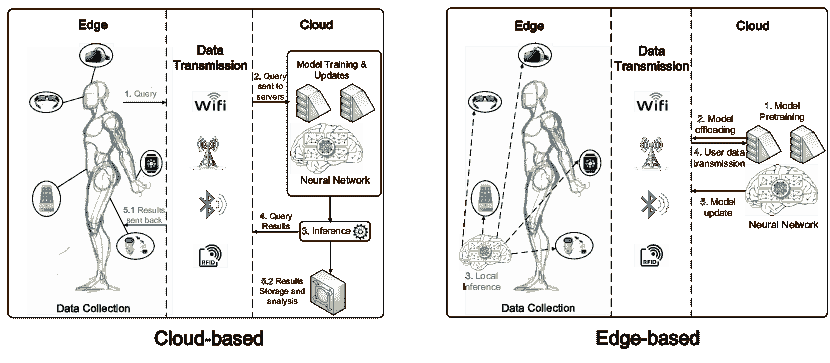

图 12：应用级移动数据分析的两种部署方法示意图，即基于云（左侧）和基于边缘（右侧）。基于云的方法在云端进行推断并将结果发送到边缘设备。相反，基于边缘的方法将模型部署在边缘设备上，这些设备可以进行本地推断。

应用级移动数据分析存在两种方法，即*(i)* 基于云计算和*(ii)* 基于边缘计算。我们在图 12 中展示了这些场景之间的区别。³¹³¹脚注：人类轮廓来源：https://lekeart.deviantart.com/art/male-body-profile-251793336 如图的左侧部分所示，基于云计算的方法将移动设备视为数据收集器和信息传递者，这些设备通过具有有限数据预处理能力的本地接入点不断将数据发送到云服务器。这种场景通常包括以下步骤：*(i)* 用户在本地移动设备上查询/交互；*(ii)* 查询被传输到云中的服务器；*(iii)* 服务器收集接收到的数据进行模型训练和推断；*(iv)* 查询结果随后返回到每个设备，或者根据特定应用需求存储并分析而不进一步传播。这个场景的缺点是，互联网中不断发送和接收消息会引入开销，可能导致严重的延迟。相比之下，在基于边缘计算的场景中，预训练的模型从云端卸载到各个移动设备，从而可以在本地进行推断。如图 12 的右侧部分所示，这种场景通常包括以下步骤：*(i)* 服务器使用离线数据集预训练模型；*(ii)* 预训练模型被卸载到边缘设备；*(iii)* 移动设备使用模型在本地进行推断；*(iv)* 云服务器接收来自本地设备的数据；*(v)* 模型根据需要使用这些数据进行更新。虽然这种场景需要与云的交互较少，但其适用性受到边缘硬件计算和电池能力的限制。因此，它只能支持需要轻量计算的任务。

许多研究人员使用深度学习进行应用级移动数据分析。我们根据应用领域对所审阅的工作进行了分类，即移动医疗、移动模式识别以及移动自然语言处理（NLP）和自动语音识别（ASR）。表格 XII 给出了现有研究工作的高级总结，接下来我们讨论代表性的工作。

表格 XII: 应用级移动数据分析工作的总结。

| 主题 | 参考文献 | 应用 | 部署 | 模型 |
| --- | --- | --- | --- | --- |
| 移动医疗 | Liu 和 Du [235] | 移动耳 | 基于边缘 | CNN |
| Liu *等* [236] | 移动耳 | 基于边缘 | CNN |
| Jindal [237] | 心率预测 | 基于云 | DBN |
| Kim *等* [238] | 细胞病理学分类 | 基于云 | CNN |
| Sathyanarayana *等* [239] | 睡眠质量预测 | 基于云 | MLP, CNN, LSTM |
| Li 和 Trocan [240] | 健康状况分析 | 基于云 | 堆叠 AE |
| Hosseini *等* [241] | 癫痫病灶定位 | 基于云 | CNN |
| Stamate *等* [242] | 帕金森症状管理 | 基于云 | MLP |
| Quisel *等* [243] | 移动健康数据分析 | 基于云 | CNN, RNN |
| Khan *等*[244] | 呼吸监测 | 基于云 | CNN |
| 移动模式识别 | Li *等* [245] | 移动对象识别 | 基于边缘 | CNN |
| Tobías *等* [246] | 移动对象识别 | 基于边缘及基于云 | CNN |
| Pouladzadeh 和 Shirmohammadi [247] | 食物识别系统 | 基于云 | CNN |
| Tanno *等* [248] | 食物识别系统 | 基于边缘 | CNN |
| Kuhad *等* [249] | 食物识别系统 | 基于云 | MLP |
| Teng 和 Yang [250] | 面部识别 | 基于云 | CNN |
| Wu *等* [291] | 移动视觉搜索 | 基于边缘 | CNN |
| Rao *等* [251] | 移动增强现实 | 基于边缘 | CNN |
| Ohara *等* [290] | WiFi 驱动的室内变化检测 | 基于云 | CNN, LSTM |
| Zeng *等* [252] | 活动识别 | 基于云 | CNN, RBM |
| Almaslukh *等* [253] | 活动识别 | 基于云 | AE |
| Li *等* [254] | 基于 RFID 的活动识别 | 基于云 | CNN |
| Bhattacharya 和 Lane [255] | 智能手表活动识别 | 基于边缘 | RBM |
| Antreas 和 Angelov [256] | 移动监控系统 | 基于边缘及基于云 | CNN |
| Ordóñez 和 Roggen [112] | 活动识别 | 基于云 | ConvLSTM |
| Wang *et al.* [257] | 手势识别 | 基于边缘 | CNN, RNN |
| Gao *et al.* [258] | 进食检测 | 基于云 | DBM, MLP |
| Zhu *et al.* [259] | 用户能量消耗估计 | 基于云 | CNN, MLP |
| Sundsøy *et al.* [260] | 个人收入分类 | 基于云 | MLP |
| Chen 和 Xue [261] | 活动识别 | 基于云 | CNN |
| Ha 和 Choi [262] | 活动识别 | 基于云 | CNN |
| Edel 和 Köppe [263] | 活动识别 | 基于边缘 | Binarized-LSTM |
| Okita 和 Inoue [266] | 多重重叠活动识别 | 基于云 | CNN+LSTM |
| Alsheikh *et al.* [17] | 使用 Apache Spark 的活动识别 | 基于云 | MLP |
| Mittal *et al.* [267] | 垃圾检测 | 基于边缘 & 基于云 | CNN |
| Seidenari *et al.* [268] | 艺术品检测与检索 | 基于边缘 | CNN |
| Zeng *et al.* [269] | 移动药丸分类 | 基于边缘 | CNN |
| Lane 和 Georgiev [73] | 移动活动识别、情感识别和说话人识别 | 基于边缘 | MLP |
| Yao *et al.* [289] | 车辆跟踪、异构人体活动识别和用户识别 | 基于边缘 | CNN, RNN |
| Zou *et al.* [270] | IoT 人体活动识别 | 基于云 | AE, CNN, LSTM |
| Zeng [271] | 移动物体识别 | 基于边缘 | Unknown |
| Katevas *et al.* [288] | 通知出勤预测 | 基于边缘 | RNN |
| Radu *et al.* [187] | 活动识别 | 基于边缘 | RBM, CNN |
| Wang *et al.* [272, 273] | 活动和手势识别 | 基于云 | Stacked AE |
| Feng *et al.* [274] | 活动检测 | 基于云 | LSTM |
| Cao *et al.* [275] | 情绪检测 | 基于云 | GRU |
| Ran *et al.* [276] | AR 应用的物体检测 | 基于边缘 & 基于云 | CNN |
| Zhao *et al.* [287] | 从无线信号估计 3D 人体骨架 | 基于云 | CNN |
| Mobile NLP 和 ASR | Siri [277] | 语音合成 | 基于边缘 | Mixture density networks |
| McGraw *et al.* [278] | 个性化语音识别 | 基于边缘 | LSTM |
| Prabhavalkar *et al.* [279] | 嵌入式语音识别 | 基于边缘 | LSTM |
| Yoshioka *et al.* [280] | 移动语音识别 | 基于云 | CNN |
| Ruan *et al.* [281] | 从打字转向语音 | 基于云 | Unknown |
| Georgiev *et al.* [97] | 多任务移动音频感知 | 基于边缘 | MLP |
| Others | Ignatov *et al.* [282] | 移动图像质量增强 | 基于云 | CNN |
| Lu *et al.* [283] | 从视频中检索信息 | 基于云 | CNN |
| Lee *et al.* [284] | 减少智能手表用户的干扰 | 基于云 | MLP |
| Vu *et al.* [285] | 交通模式检测 | 基于云 | RNN |
| Fang *et al.* [286] | 交通模式检测 | 基于云 | MLP |
| Xue *et al.* [264] | 移动应用分类 | 基于云 | AE, MLP, CNN 和 LSTM |
| Liu *et al.* [265] | 移动运动传感器指纹识别 | 基于云 | LSTM |

移动健康。市场上推出的可穿戴健康监测设备种类越来越多。通过集成医疗传感器，这些设备可以捕捉佩戴者的身体状况，并提供实时反馈（例如心率、血压、呼吸状态等），或触发警报提醒用户采取医疗行动[474]。

Liu 和 Du 设计了一个深度学习驱动的 MobiEar，旨在帮助听障人士感知紧急情况[235]。他们的提案接受声学信号作为输入，允许用户注册不同的声学事件。MobiEar 在智能手机上高效运行，只需要偶尔与服务器通信进行更新。同样，Liu *et al.* 开发了一个名为 UbiEar 的应用程序，该程序在 Android 平台上运行，以帮助听力受损者识别声学事件，而无需位置信息[236]。他们的设计采用轻量级 CNN 架构来加速推理，并且在准确性方面与传统 CNN 模型相当。

Hosseini *et al.* 设计了一种用于健康监测和治疗的边缘计算系统[241]。他们使用 CNN 从移动传感器数据中提取特征，这在他们的癫痫发作定位应用中发挥了重要作用。Stamate *et al.* 开发了一款名为 cloudUPDRS 的移动 Android 应用程序，以管理帕金森症的症状[242]。在他们的工作中，使用 MLP 来确定智能手机收集的数据的接受度，以保持高质量的数据样本。所提方法优于其他机器学习方法，如 GPs 和 RFs。Quisel *et al.* 认为深度学习可以有效地用于移动健康数据分析[243]。他们利用 CNN 和 RNN 对志愿者的生活方式和环境特征进行分类。他们的模型在六个数据集上表现出比 RFs 和逻辑回归更高的预测准确性。

随着深度学习在医学数据分析中表现出色[475]，我们期待越来越多基于深度学习的医疗设备出现，以改善身体监测和疾病诊断。

移动模式识别。最近的先进移动设备为人们提供了便携式智能助手，这促进了多种应用的开发，这些应用可以根据从移动摄像头或其他传感器的输出中观察到的模式来分类周围的物体（例如[245，246，250，247]）或用户的行为（例如[252，476，261，255，112，262，477]）。我们在这一部分回顾并比较了最近在移动模式识别方面的工作。

*对象分类* 在移动设备拍摄的图片中引起了越来越多的研究兴趣。Li *et al.* 开发了 DeepCham 作为一个移动对象识别框架[245]。他们的架构涉及一个众包标记过程，旨在减少人工标记的工作量，以及一个为在移动设备上部署而构建的协作训练实例生成管道。对原型系统的评估表明，该框架在训练和推理方面是高效和有效的。Tobías *et al.* 探讨了在移动设备上应用 CNN 方案进行对象识别任务的适用性[246]。他们在三个不同的模型部署场景中进行实验，即在 GPU、CPU 以及移动设备上，使用两个基准数据集。获得的结果表明，深度学习模型可以高效地嵌入移动设备中，以进行实时推理。

移动分类器还可以辅助虚拟现实（VR）应用。在[250]中提出了一个 CNN 框架，用于在用户佩戴头戴显示器的 VR 环境中进行面部表情识别。Rao *et al.* 将深度学习目标检测器集成到移动增强现实（AR）系统中[251]。他们的系统在户外环境中检测和增强地理对象方面表现出色。进一步关注移动 AR 应用的工作在[478]中介绍，作者在其中描述了对象检测的准确性、延迟和能效之间的权衡。

*活动识别* 是另一个有趣的领域，它依赖于通过移动运动传感器收集的数据[477，479]。这指的是根据通过视频捕捉、加速度计读数、运动 – 被动红外（PIR）传感、特定动作和活动等收集的数据来进行分类。收集的数据将被传送到服务器进行模型训练，然后该模型将被部署用于特定领域的任务。

神经网络可以自动提取传感器数据的基本特征。基于深度学习的首个工作使用 CNN 捕捉局部依赖并保持运动传感器数据中的尺度不变性[252]。作者在 3 个离线数据集上评估了他们的提案，表明该提案比统计方法和主成分分析（PCA）具有更高的准确性。Almaslukh *等*使用深度 AE 通过分析从加速度计和陀螺仪传感器收集的离线智能手机数据来进行人体活动识别[253]。Li *等*考虑了不同的活动识别场景[254]。在他们的实现中，无线射频识别（RFID）数据直接发送到 CNN 模型以识别人体活动。尽管他们的机制在不同应用中实现了高准确度，但实验表明基于 RFID 的方法在金属物体或液体容器中效果较差。

[255]利用 RBM 预测人体活动，给定 7 种由智能手表收集的传感器数据。原型设备上的实验表明，该方法可以在可接受的功耗要求下有效地完成识别目标。Ordóñez 和 Roggen 构建了一个先进的 ConvLSTM 来融合来自多个传感器的数据并执行活动识别[112]。通过利用 CNN 和 LSTM 结构，ConvLSTM 可以自动将时空传感器数据压缩成低维表示，而无需大量的数据后处理工作。Wang *等*利用 Google Soli 构建一个移动用户-机器交互平台[257]。通过分析毫米波雷达捕获的无线电频率信号，他们的架构能够高精度识别 11 种手势。他们的模型在服务器端进行训练，推断则在移动设备上进行。最近，Zhao *等*设计了一个 4D CNN 框架（空间维度的 3D + 时间维度的 1D）来使用无线电频率信号重建人体骨架[287]。这种新颖的方法类似于虚拟“X 光”，可以准确估计人体姿势，无需实际摄像头。

移动 NLP 和 ASR。深度学习在自然语言处理（NLP）和自动语音识别（ASR）领域的近期显著成果也被应用于移动设备中。

在深度学习的支持下，苹果开发的智能个人助理 Siri 使用了深度混合密度网络 [480] 来解决典型的机器人语音问题，并合成更像人类的声音 [277]。谷歌发布的 Android 应用支持移动个性化语音识别 [278]；它对 LSTM 模型压缩中的参数进行量化，使该应用能够在低功耗手机上运行。同样，Prabhavalkar *等人* 提出了一个数学 RNN 压缩技术，该技术将 LSTM 声学模型的大小缩小了三分之二，同时只会影响微不足道的准确性 [279]。这使得在移动设备上构建既节省内存又节能的 ASR 应用成为可能。

Yoshioka *等人* 提出了一个将网络内网络架构融入 CNN 模型的框架，这使得在嘈杂环境中使用移动多麦克风设备进行 ASR 成为可能 [280]。移动 ASR 也可以加速移动设备上的文本输入，Ruan *等人* 的研究显示，在 ASR 的帮助下，英语和普通话的输入速度分别比标准键盘输入快 3.0 倍和 2.8 倍 [281]。最近，深度学习在多任务音频感知中的适用性在 [97] 中得到了研究，Georgiev *等人* 提出了并评估了一种新颖的深度学习建模和优化框架，针对嵌入式音频感知任务。为此，他们在不同任务之间有选择性地共享压缩表示，这减少了训练和数据存储开销，同时没有显著影响单一任务的准确性。作者在一个内存受限的智能手机上评估了他们的框架，进行四个音频任务（即，扬声器识别、情感识别、压力检测和环境场景分析）。实验表明，该提案在能源、运行时间和内存方面可以实现高效率，同时保持出色的准确性。

其他应用。深度学习在涉及应用层数据分析的其他应用中也发挥着重要作用。例如，Ignatov *等人* 显示深度学习可以提升手机拍摄图片的质量。通过使用 CNN，他们成功地将不同手机设备拍摄的图像质量提高到了数码单反相机的水平 [282]。Lu *等人* 关注无线网络下的视频后处理 [283]，他们的框架利用定制的 AlexNet 来回答关于检测对象的问题。这个框架进一步包括一个优化器，指示移动设备卸载视频，以减少查询响应时间。

另一个有趣的应用展示在[284]中，Lee *et al.* 表明深度学习可以帮助智能手表用户通过消除不必要的通知来减少分心。具体来说，作者们使用一个 11 层 MLP 来预测通知的重要性。Fang *et al.* 利用 MLP 从高维和异构的传感器数据中提取特征，包括加速度计、磁力计和陀螺仪测量[286]。他们的架构在识别人类交通模式（静止、步行、跑步、骑行和乘车）方面达到了 95%的准确率。

课程学习：应用级数据是异构的，并且来自分布式移动设备，有一种趋势将推断过程卸载到这些设备上。然而，由于计算和电池功率的限制，边缘场景中使用的模型受到轻量级架构的限制，这些架构较不适合复杂的任务。因此，模型复杂性和准确性之间的权衡应该仔细考虑[66]。已经进行了许多工作，以调整深度学习以适应移动设备，以使算法在嵌入设备上更快、更少能耗。例如，模型压缩、修剪和量化通常用于此目的。移动设备制造商也正在开发新的软件和硬件来支持基于深度学习的应用程序。我们将在第 VII 节详细讨论这项工作。

同时，应用级数据通常包含重要的用户信息，处理这些数据会带来显著的隐私问题。尽管有努力致力于保护用户隐私，正如我们在第 VI-H 节讨论的那样，针对保护分布式训练中用户信息的研究工作还很新。我们期待未来在这方面会有更多的努力。

### VI-D 深度学习驱动的移动性分析

理解群体和个体的运动模式对流行病学、城市规划、公共服务提供以及移动网络资源管理变得至关重要 [481]。深度学习在这一领域日益受到关注，无论从群体还是个体层面（参见图 13 中进行了总结。

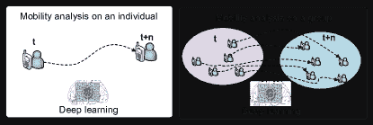

Figure 13: 个体（左）和群体（右）层面的移动性分析范式插图。

TABLE XIII: 深度学习驱动的移动性分析工作总结。

| 参考 | 应用 | 移动性水平 | 模型 | 主要贡献 |
| --- | --- | --- | --- | --- |
| Ouyang *et al.* [292] | 移动用户轨迹预测 | 个体 | CNN | 数据流处理的在线框架。 |
| Yang *et al.* [293] | 社交网络和移动轨迹建模 | 移动自组织网络 | RNN, GRU | 多任务学习。 |
| Tkačík and Kordík [305] | 移动建模和预测 | 个体 | 神经图灵机 | 神经图灵机能自动存储历史数据并执行“读”和“写”操作。 |
| Song *et al.* [294] | 城市范围内的移动预测和交通建模 | 城市范围 | 多任务 LSTM | 多任务学习。 |
| Zhang *et al.* [295] | 城市范围内人群流动预测 | 城市范围 | 深度时空残差网络（基于 CNN） | 利用移动事件的时空特征。 |
| Lin *et al.* [227] | 生成人类活动链 | 用户群体 | Input-Output HMM + LSTM | 生成模型。 |
| Subramanian and Sadiq [296] | 移动运动预测 | 个体 | MLP | 较少的位置更新和较低的寻呼信令成本。 |
| Ezema and Ani [297] | 移动位置估计 | 个体 | MLP | 在 GSM 接收信号强度下操作。 |
| Shao *et al.* [298] | CNN 驱动的计步器 | 个体 | CNN | 减少周期性运动引起的假阴性和较低的初始响应时间。 |
| Yayeh *et al.* [299] | 移动自组织网络中的移动性预测 | 个体 | MLP | 在随机路点移动模型下实现高预测精度。 |
| Chen *et al.* [300] | 移动驱动的交通事故风险预测 | 城市范围 | 堆叠去噪自编码器 | 自动学习人类移动和交通事故风险之间的相关性。 |
| 宋 *等* [301] | 人类紧急行为和移动建模 | 城市范围 | DBN | 实现了在各种灾害事件（包括地震、海啸和核事故）中的准确预测。 |
| 姚 *等* [302] | 轨迹聚类 | 用户群体 | 序列到序列 AE 和 RNN | 学习到的表示能够稳健地编码对象的运动特征，并生成时空不变的聚类。 |
| 刘 *等* [303] | 城市交通预测 | 城市范围 | CNN, RNN, LSTM, AE 和 RBM | 揭示了利用深度学习进行城市交通预测的潜力。 |
| 威克拉马苏里亚 *等* [304] | 主动移动管理的基站预测 | 个体 | RNN | 采用主动和预测性移动管理，用于动态基站选择。 |
| 金和宋 [306] | 用户移动和个性建模 | 个体 | MLP, RBM | 为基于位置的服务定制奠定了基础。 |
| 姜 *等* [307] | 短期城市移动预测 | 城市范围 | RNN | 预测精度优越，并验证为高度可部署的原型系统。 |
| 王 *等* [308] | 密集网络中的移动管理 | 个体 | LSTM | 在手 over 过程中提高了移动用户的服务质量，同时保持网络能效。 |
| 姜 *等* [309] | 城市人类移动预测 | 城市范围 | RNN | 首个利用城市感兴趣区域来建模城市范围人类移动的研究。 |
| 冯 *等* [310] | 人类移动预测 | 个体 | Attention RNN | 使用注意力机制，结合异质转移规律和多层周期性。 |

由于深度学习能够捕捉序列数据中的空间依赖关系，它正成为移动分析的强大工具。深度学习在轨迹预测中的适用性在[482]中进行了研究。通过共享 RNN 和门控循环单元（GRU）学习到的表示，该框架可以在社交网络和移动轨迹建模上执行多任务学习。具体来说，作者首先使用深度学习重建用户的社交网络表示，随后利用 RNN 和 GRU 模型学习具有不同时间粒度的移动轨迹模式。重要的是，这两个组件共同共享学习到的表示，这使得整体架构更加紧凑，并且实现效率更高。欧阳*等人*认为，移动数据通常是高维的，这可能对传统机器学习模型造成问题。因此，他们基于深度学习的进展，提出了一种在线学习方案，以训练一个层次化的 CNN 架构，从而实现数据流处理的模型并行化[292]。通过分析使用记录，他们的框架“DeepSpace”在与天真的 CNN 相比时，能够以更高的准确度预测个人的轨迹，这在实际数据集上的实验中得到了验证。在[305]中，Tkačík 和 Kordík 设计了一个神经图灵机[483]，利用移动电话数据预测个人轨迹。神经图灵机包含两个主要组件：一个用于存储历史轨迹的内存模块，以及一个用于管理内存中“读”和“写”操作的控制器。实验表明，他们的架构在通用性上优于堆叠 RNN 和 LSTM，同时在轨迹预测的精度上也优于$n$-grams 和$k$最近邻方法。

相比于关注单个轨迹，宋*等*人关注了更大范围内的移动性分析[294]。在他们的工作中，利用 LSTM 网络联合建模大规模人群和车辆的城市级移动模式。他们的多任务架构在预测准确性上优于标准 LSTM。城市范围的移动模式在[295]中也有所研究，作者构建了深度时空残差网络来预测人群的移动。为了捕捉与人类移动相关的时空关联的独特特征，他们的框架摒弃了基于 RNN 的模型，并构建了三个 ResNet 来提取城市内的近邻和远距离空间依赖。这一方案学习时间特征，并融合所有模型提取的表示来进行最终预测。通过结合外部事件信息，他们的提案在所有深度学习和非深度学习方法中达到了最高的准确度。在[307]中也使用了 RNN，其中姜*等*人在从实际部署收集的大数据集上进行短期城市移动预测。他们的模型在准确度上优于$n$-gram 和马尔可夫方法。

林*等*人考虑从蜂窝数据中生成人体运动链，以支持交通规划[227]。具体而言，他们首先采用输入-输出隐马尔可夫模型（HMM）对 CDR 数据进行预处理标记活动档案。随后，设计了一个 LSTM 用于生成活动链，给定标记的活动序列。他们进一步利用生成模型合成城市移动计划，模拟结果显示合理的拟合准确性。姜*等*人基于 RNN 模型设计了 24 小时移动预测系统[309]。他们为每小时采用动态感兴趣区域（ROI），通过从原始轨迹数据库中进行分裂和合并挖掘，这带来了高预测准确性。冯*等*人将注意机制结合到 RNN 中[310]，以捕捉人类移动的复杂序列过渡。通过结合异质转移规律和多级周期性，他们的模型在准确性上比最先进的预测模型提高了多达 10%。

Yayeh *et al.* 使用 MLP 预测移动自组网络中移动设备的移动性，考虑先前观察到的暂停时间、速度和移动方向 [299]。使用随机路径移动模型进行的模拟表明，他们的提议达到了较高的预测准确度。在 [306] 中，Kim 和 Song 也采用 MLP 模型来建模人类移动性与个性之间的关系，并取得了高预测准确度。Yao *et al.* 发现相似轨迹组以促进基于更高级移动性驱动的应用，使用了 RNNs [302]。特别地，他们采用序列到序列的 AE 来学习移动用户轨迹的固定长度表示。实验显示，他们的方法能有效捕捉真实和合成数据集中的时空模式。Shao *et al.* 设计了一个复杂的步数计算器，使用了 CNN [298]。通过减少周期性运动造成的误判步数，他们的提议显著提高了步数计算器的鲁棒性。

在 [300] 中，Chen *et al.* 结合 GPS 记录和交通事故数据，理解人类移动性与交通事故之间的相关性。为此，他们设计了一个堆叠去噪 AE 来学习人类移动性的紧凑表示，并随后用于预测交通事故风险。他们的提议能够在大区域内提供准确的实时预测。GPS 记录也被用于其他移动性驱动的应用中。Song *et al.* 使用 DBNs 来预测和模拟自然灾害中人类紧急行为和移动性，从 160 万用户的 GPS 记录中学习 [301]。他们的提议在不同的灾害场景如地震、海啸和核事故中提供了准确的预测。在 [303] 中，Liu *et al.* 也利用 GPS 数据研究了利用深度学习进行城市交通预测的潜力。

学到的经验：移动性分析关注单个用户或大型用户群体的移动轨迹。感兴趣的数据是基本的时间序列，但具有额外的空间维度。移动性数据通常受到随机性、丢失和噪声的影响，因此精确建模并不简单。由于深度学习能够进行自动特征提取，它成为人类移动性建模的一个强有力的候选者。其中，CNN 和 RNN 是这类应用中最成功的架构（例如，[292, 293, 294, 295, 227]），因为它们能够有效地利用时空相关性。

### VI-E 深度学习驱动的用户定位

表 XIV：利用深度学习进行用户定位

| 参考文献 | 应用 | 输入数据 | 模型 | 主要贡献 |
| --- | --- | --- | --- | --- |
| 王*等* [311] | 室内指纹定位 | CSI | RBM | 首个基于 CSI 的深度学习驱动的室内定位 |
| 王*等* [272, 273] | 室内定位 | CSI | RBM | 与校准的 CSI 相位信息一起使用 |
| 王*等* [312] | 室内定位 | CSI | CNN | 使用更鲁棒的到达角进行估计 |
| 王*等* [313] | 室内定位 | CSI | RBM | 使用到达角和 CSI 的平均幅度的双模态框架 |
| 诺威基和维特里科夫斯基 [314] | 室内定位 | WiFi 扫描 | 堆叠 AE | 需要较少的系统调优或过滤工作 |
| 王*等* [315, 316] | 室内定位 | 接收信号强度 | 堆叠 AE | 无设备框架，多任务学习 |
| 莫哈默迪*等* [317] | 室内定位 | 接收信号强度 | VAE+DQN | 处理未标记数据；强化学习辅助的半监督学习 |
| 安祖姆*等* [318] | 室内定位 | 接收信号强度 | 反向传播神经网络 | 解决区域间的模糊性 |
| 王*等* [319] | 室内定位 | 智能手机磁场和光传感器 | LSTM | 采用双模态磁场和光强数据 |
| 库马尔*等* [320] | 室内车辆定位 | 相机图像 | CNN | 专注于车辆应用 |
| 郑和翁 [321] | 室外导航 | 相机图像和 GPS | 发展网络 | 在线学习方案；基于边缘 |
| 张*等* [111] | 室内和室外定位 | 接收信号强度 | 堆叠 AE | 在室内和室外环境下均可操作 |
| 维埃拉*等* [322] | 大规模 MIMO 指纹定位 | 关联通道指纹 | CNN | 适用于大规模 MIMO 通道 |
| 许*等* [333] | 活动识别、定位和睡眠监测 | RF 信号 | CNN | 多用户、无设备定位和睡眠监测 |
| 王*等* [323] | 室内定位 | CSI | RBM | 探索无线信道数据的特征并获得作为指纹的最优权重 |
| 王*等* [331] | 室内定位 | CSI | CNN | 利用到达角实现稳定的室内定位 |
| 肖*等* [332] | 3D 室内定位 | 蓝牙相对接收信号强度 | 去噪 AE | 低成本且鲁棒的定位 |
| 尼托苏*等* [330] | 室内定位 | 原始通道脉冲响应数据 | CNN | 对多径传播环境具有鲁棒性 |
| 易卜拉欣*等* [329] | 室内定位 | 接收信号强度 | CNN | 在建筑和楼层识别中达到 100%准确率 |
| Adege *等* [328] | 室内定位 | 接收信号强度 | MLP + 线性判别分析 | 在多建筑环境中准确 |
| Zhang *等* [327] | 室内定位 | 普遍磁场和 CSI | MLP | 使用磁场提高定位精度 |
| Zhou *等* [326] | 室内定位 | CSI | MLP | 无设备定位 |
| Shokry *等* [325] | 室外定位 | 群体感知的接收信号强度信息 | MLP | 比蜂窝定位更准确，同时能耗更低 |
| Chen *等* [324] | 室内定位 | CSI | CNN | 将 CSI 表示为特征图像 |
| Guan *等* [334] | 室内定位 | 视距和非视距无线电信号 | MLP | 结合深度学习与遗传算法 |

基于位置的服务和应用（例如移动增强现实、GPS）需要精确的个人定位技术 [484]。因此，用户定位研究正在迅速发展，众多技术不断涌现 [485]。一般来说，用户定位方法可以分为基于设备和无设备 [486]。我们在图 14 中展示了这两种不同的范式。具体而言，在第一类中，用户携带的特定设备成为实现应用定位功能的前提。这类方法依赖于来自设备的信号来识别位置。相反，不需要设备的方法属于无设备类别。这些方法使用专门的设备来监控信号变化，以便定位感兴趣的实体。深度学习可以使这两种范式都实现高定位精度。我们在表 XIV 中总结了最显著的贡献，并接下来详细探讨这些工作的细节。

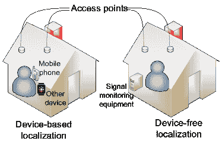

图 14：设备基础（左）和无设备（右）室内定位系统的示意图。

为克服信号强度基础方法的变异性和粗粒度限制，王*等*提出了一种深度学习驱动的指纹识别系统，名为“DeepFi”，用于基于通道状态信息（CSI）的室内定位[311]。他们的工具箱相比传统方法，如 FIFS [487]、Horus [488]和最大似然法 [489]，具有更高的准确性。同一组作者在[272、273]和[312、313]中扩展了他们的工作，更新了定位系统，使其能够与 CSI 的校准相位信息 [272、273、323]配合使用。他们进一步使用更复杂的 CNN [312、331]和双模态结构 [313]来提高准确性。

Nowicki 和 Wietrzykowski 提出了一个定位框架，显著减少了系统调试或过滤的工作量，并获得了令人满意的预测性能[314]。王*等*建议可以在不依赖移动设备的情况下实现室内定位。在[316]中，作者采用 AE 从 WiFi 信号中学习有用的模式。通过自动特征提取，他们生产了一个可以同时完成多任务的预测器，包括室内定位、活动和手势识别。在[326]中提出了类似的工作，周*等*采用 MLP 结构利用 CSI 进行无设备的室内定位。Kumar*等*使用深度学习解决室内车辆定位问题[320]。他们采用 CNN 分析视觉信号并在停车场中定位车辆。这可以帮助驾驶辅助系统在地下环境中操作，尤其是在系统视觉能力有限的情况下。

在[332]中，肖*等人*使用蓝牙技术实现了低成本的室内定位。作者设计了一种去噪自动编码器（AE）从蓝牙低能耗信标的接收信号强度中提取指纹特征，并将其投影到三维空间中的准确位置。在会议室进行的实验表明，所提出的框架能够实时在垂直和水平维度上进行精确定位。尼特索*等人*采用卷积神经网络（CNN）根据原始通道脉冲响应数据进行定位[330]。他们的框架对多径传播环境具有鲁棒性，比基于信号处理的方法更为精确。在[329]中也采用了 CNN，作者使用接收信号强度序列，并在建筑物和楼层识别方面实现了 100%的预测准确率。在[328]中，工作结合了深度学习和线性判别分析用于特征降维，在多建筑环境中实现了低定位误差。张*等人*结合普遍的磁场和 WiFi 指纹进行室内定位，使用多层感知器（MLP）[327]。实验表明，与仅基于 WiFi 指纹的解决方案相比，将磁场信息添加到模型输入中可以提高预测准确性。

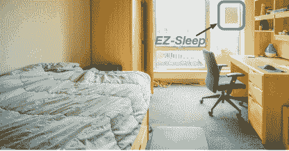

图 15：受试者卧室中的 EZ-Sleep 设置。图源自[333]。

许*等人*使用深度学习提供基于射频的用户定位、睡眠监测和失眠分析，适用于可能没有单独睡眠监测设备的多用户家庭场景[333]。他们使用具有 14 层残差网络模型的 CNN 分类器进行睡眠监测，并结合隐马尔可夫模型，准确跟踪用户何时进入或离开床铺。通过在 8 个家庭中部署称为 EZ-Sleep 的睡眠传感器（见图 15），在一个月内收集 100 晚的睡眠数据，并使用基于脑电图的睡眠监测仪进行交叉验证，作者证明他们的解决方案的性能与单独的脑电图设备相当。

大多数移动设备只能生成未标记的位置数据，因此无监督学习和半监督学习变得至关重要。Mohammadi *等人*通过利用 DRL 和 VAE 解决了这个问题。特别是，他们的框架设想了一个在室内环境中的虚拟代理[317]，该代理在训练过程中可以不断接收状态信息，包括信号强度指示器、当前代理位置，以及到目标的真实（标记数据）和推断（通过 VAE）距离。代理在每个时间步骤可以在八个方向上虚拟移动。每当它采取行动时，代理会接收到一个奖励信号，以确定它是否朝正确的方向移动。通过使用深度 Q 学习，代理最终可以准确定位用户，结合标记数据和未标记数据。

除了室内定位，还有一些研究工作将深度学习应用于户外场景。例如，Zheng 和 Weng 介绍了一种用于移动设备户外导航应用的轻量级发展网络[321]。与 CNN 相比，他们的架构需要更新的权重少 100 倍，同时保持了相当的准确性。这使得移动设备上的高效户外导航成为可能。[111]中的工作研究了室内和户外环境下的定位。他们使用 AE 对四层 MLP 进行预训练，以避免手工特征工程。随后，MLP 用于估计目标的大致位置。作者进一步引入 HMM，以根据数据的时间属性对预测进行微调。这提高了 Wi-Fi 信号下的室内/室外定位的准确性。最近，Shokry *等人*提出了 DeepLoc，一个基于深度学习的户外定位系统，使用众包的地理标记接收信号强度信息[325]。通过使用 MLP 来学习蜂窝信号和用户位置之间的相关性，他们的框架可以在城市地区提供 18.8 米以内的中位定位准确度，在乡村地区提供 15.7 米以内的准确度，同时要求适度的能源预算。

经验总结：定位依赖于传感输出、信号强度或 CSI。这些数据通常具有复杂的特征，因此需要大量数据进行学习[314]。由于深度学习可以以无监督的方式提取特征，因此它已成为定位任务的有力候选者。另一方面，可以观察到，通过融合多种信号类型作为输入，可以提高定位准确性和系统鲁棒性（例如，参见[327]）。使用深度学习自动提取特征并关联来自不同来源的信息用于定位正成为一种趋势。

### VI-F 深度学习驱动的无线传感网络

表 XV: 基于深度学习驱动的无线传感网络工作总结。

| 视角 | 参考文献 | 应用 | 模型 | 优化器 | 主要贡献 |
| --- | --- | --- | --- | --- | --- |
| 集中式 vs. 分布式 | 科拉萨尼和纳吉 [343] | 数据聚合 | MLP | 未知 | 改善聚合过程中的能效 |
| 李等人 [344] | 分布式数据挖掘 | MLP | 未知 | 在分布节点上进行数据分析，能耗降低 58.31% |
| WSN 定位 | 伯纳斯和普拉塞克 [336] | 室内定位 | MLP | 弹性反向传播 | 大幅减少接收信号强度图存储的内存消耗 |
| 佩亚尔等人 [337] | 节点定位 | MLP | 一阶和二阶梯度下降算法 | 比较不同的 MLP 训练算法在 WSN 定位中的效果 |
| 董等人 [338] | 水下定位 | MLP | RMSprop | 在水下环境中进行 WSN 定位 |
| 波侬丰等人 [348] | WSN 节点定位 | 逻辑模糊系统 + ELM | 文献 [348] 描述的算法 4 | 结合逻辑模糊系统和 ELM 实现鲁棒的无标志 WSN 节点定位 |
| 巴尼哈希米安等人 [349] | 无标志 WSN 节点定位 | MLP, ELM | 基于共轭梯度的方法 | 采用粒子群优化算法同时优化基于神经网络的存储成本和定位精度 |
| 康等人 [351] | 水泄漏检测与定位 | CNN + SVM | SGD | 提出了一种增强的基于图的本地搜索算法，使用虚拟节点方案选择最近的泄漏位置 |
| 阿尔等人 [354] | 异向信号衰减下的 WSN 定位 | MLP | 未知 | 对抗异向信号衰减的强健性 |
| WSN 数据分析 | 阎等人 [339] | 烟雾与明火燃烧识别 | MLP | SGD | 利用烟雾、$CO_{2}$ 和温度传感器，在森林中检测火灾的高准确率 |
| 王等人 [340] | 温度校正 | MLP | SGD | 利用深度学习学习极化辐射与空气温度误差之间的相关性 |
| 李等人 [341] | 在线查询处理 | CNN | 未知 | 采用自适应查询优化实现实时分析 |
| 李和塞尔彭 [342] | 自适应无线传感器网络 | 霍普菲尔德网络 | 未知 | 将霍普菲尔德神经网络嵌入静态优化器以解决弱连接主导问题 |
| 科拉萨尼和纳吉 [343] | 数据聚合 | MLP | 未知 | 改善聚合过程中的能效 |
| 李等人 [344] | 分布式数据挖掘 | MLP | 未知 | 分布式数据挖掘 |
| 罗和纳加拉尼 [345] | 分布式无线传感器网络异常检测 | AE | SGD | 采用分布式异常检测技术，从云端卸载计算任务 |
| 其他 | Heydari *等人* [347] | 无线多媒体传感器网络中的能耗优化和安全通信 | 堆叠 AE | 未知 | 使用深度学习实现快速数据传输并减少能耗 |
| Mehmod *等人* [352] | WSN 中污染监测的鲁棒路由 | MLP | SGD | 高度节能 |
| Alsheikh *等人* [353] | WSN 的率-失真平衡数据压缩 | AE | 有限内存 Broyden Fletcher Goldfarb Shann 算法 | 高效能耗和受限重建误差 |
| 王 *等人* [355] | WSN 的盲漂移校准 | 投影-恢复网络（基于 CNN） | Adam | 利用来自所有传感器的数据的空间和时间相关性；首个在 WSN 数据校准中采用深度学习的工作 |
|  | 贾 *等人* [356] | 氨气监测 | LSTM | Adam | 低功耗且准确的氨气监测 |

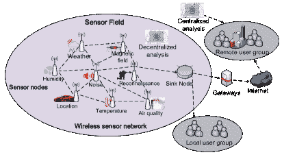

图 16：WSN 数据收集和（集中式与分散式）分析的示例框架。

无线传感器网络（WSN）由一组分布在地理区域的独特或异质传感器组成。这些传感器协作监测物理或环境状态（例如，温度、压力、运动、污染等），并通过无线信道将收集的数据传输到集中服务器（见图 9 中的顶部圆圈以进行说明）。一个 WSN 通常涉及三个关键核心任务，即感知、通信和分析。深度学习在 WSN 应用中也越来越受欢迎 [346]。接下来，我们回顾了在这一领域采用深度学习的工作，涵盖不同的角度，即：集中式与分散式分析范式、WSN 数据分析本身、WSN 定位和其他应用。请注意，这些工作的贡献不同于在子节 VI-B 和 VI-C 中讨论的移动数据分析，因为在本节中我们只关注 WSN 应用。我们首先总结表 XV 中最重要的工作。

中心化与去中心化分析方法：在 WSN 中存在两种数据处理场景，即中心化和去中心化。前者简单地将传感器视为数据收集器，只负责收集数据并发送到中央位置进行处理。后者假设传感器具有一定的计算能力，主服务器将部分工作卸载到边缘，每个传感器独立进行数据处理。我们在图 16 中展示了一个 WSN 数据收集和分析的示例框架，通过各种节点收集感兴趣领域的传感器数据。这些数据被传送到一个汇聚节点，汇聚并可能进一步处理这些数据。在 [343] 中的工作侧重于中心化方法，作者应用了一个三层 MLP 来减少数据冗余，同时保留数据汇聚的关键点。这些数据被发送到中央服务器进行分析。相反，Li 等人提出将数据挖掘分布到各个传感器节点 [344]。他们将深度神经网络分割成不同层，并将层操作卸载到传感器节点。进行的模拟表明，通过使用 NN 进行预处理，他们的框架在高故障检测精度的同时，减少了中央服务器的功耗消耗。

WSN 定位：在 WSN 中，定位也是一项重要且具有挑战性的任务。Chuang 和 Jiang 利用神经网络定位传感器节点在 WSN 中 [335]。为了适应特定的网络拓扑结构，他们采用在线训练方案和相关的拓扑训练数据，实现了高效的模型实施和精确的位置估计。基于此，Bernas 和 Płaczek 构建了一个涉及多个 MLP 的集成系统，用于在不同的兴趣区域进行位置估计 [336]。在这种情况下，由多个 MLP 推断的节点位置通过融合算法进行融合，从而提高了定位的准确性，特别是对于位于区域边界周围的传感器节点有益。对应用基于 MLP 的节点定位的不同训练算法进行了全面比较，结果显示贝叶斯正则化算法通常表现最佳 [337]。Dong 等人考虑了水下节点定位场景 [338]。由于声学信号受吸收、散射、噪声和干扰的影响，水下定位并不直接。通过采用深度神经网络，他们的框架成功解决了上述挑战，并实现了比 SVM 和广义最小二乘方法更高的推断精度。

Phoemphon *等* [348] 通过粒子群优化技术结合模糊逻辑系统和 ELM，实现了对传感器节点的稳健无范围定位估计。特别地，模糊逻辑系统用于调整传统质心的权重，而 ELM 则用于优化定位精度。他们的方法在准确性上优于其他基于软计算的方法。类似地，Banihashemian *等* 结合粒子群优化技术和 MLPs 进行无范围 WSN 定位，取得了较低的定位误差 [349]。Kang *等* 探讨了水分配系统中的水泄漏和定位 [351]。他们将水管网络表示为图，并假设泄漏事件发生在顶点处。他们结合 CNN 和 SVM 在无线传感器网络测试平台上进行检测和定位，实现了 99.3% 的泄漏检测准确率和少于 3 米的定位误差。

WSN 数据分析：深度学习也被应用于森林中慢燃和明燃阶段的识别。在 [339] 中，Yan *等* 将一组传感器嵌入森林中，以监测 CO[2]、烟雾和温度。他们建议，不同的燃烧场景会释放出不同的气体，这些气体可以在分类慢燃和明燃时加以考虑。Wang *等* 认为深度学习可以纠正空气温度的测量不准确 [340]。他们发现太阳辐射与实际空气温度之间有密切的关系，这可以通过神经网络有效学习。在 [350] 中，Sun *等* 使用基于小波神经网络的解决方案来评估智能电网中 WSN 的无线电链路质量。他们的提议比传统方法更精确，并可以为智能电网应用提供端到端的可靠性保障。

在 WSN 数据收集中，缺失数据或失同步是常见的问题。这些问题可能会导致分析中的严重问题，因为数据的不一致性。Lee *等* 通过在基于深度学习的 WSN 分析系统中插入查询优化组件来解决这个问题 [341]。他们采用指数平滑来推断缺失数据，从而在不显著影响准确性的情况下保持深度学习分析的数据完整性。为了提升 WSN 的智能性，Li 和 Serpen 将人工神经网络嵌入 WSN，使其能够灵活地应对潜在的变化并在现场部署 [342]。为此，他们使用最小弱连通支配集来表示 WSN 拓扑，随后使用 Hopfield 递归神经网络作为静态优化器，以便在必要时调整网络基础设施。这项工作代表了将机器智能嵌入 WSN 的重要一步。

其他应用： 深度学习的好处在其他 WSN 应用中也得到了证明。[[347](https://bib.bib347)]中的工作专注于在无线多媒体传感器网络中降低能耗同时保持安全性。使用堆叠自编码器（AE）对图像进行连续片段分类，随后通过网络发送数据，从而实现更快的数据传输速率和更低的能耗。Mehmood *等人* 使用 MLP 在 WSNs 中实现稳健的路由，以便促进污染监测[[352](https://bib.bib352)]。他们的提议使用神经网络提供效率阈值，并切换消耗低于此阈值的节点，从而提高能效。Alsheikh *等人* 引入了一种 WSNs 算法，使用 AEs 来最小化能量消耗[[353](https://bib.bib353)]。他们的架构利用时空相关性来减少原始数据的维度，并提供重构误差边界保证。

Wang *等人* 设计了一个专用的投影恢复神经网络，以在线方式盲目校准传感器测量[[355](https://bib.bib355)]。他们的提议可以从传感器数据中自动提取特征，并利用所有传感器信息的空间和时间相关性，实现高精度。这是首次在 WSN 数据校准中采用深度学习的尝试。Jia *等人* 在深度学习中介绍了氨监测[[356](https://bib.bib356)]。在他们的设计中，使用 LSTM 预测传感器在非常短的加热脉冲期间的电阻，而不是等待平衡状态。这大大降低了传感器在等待过程中的能耗。在 38 个原型传感器和自制气流系统的实验中，显示出所提出的 LSTM 可以在不同氨浓度下精确预测平衡状态电阻，从而将总能耗降低约 99.6%。

Lessons learned: 集中和分散的无线传感器网络（WSN）数据分析范式类似于其他领域的云计算和雾计算哲学。分散的方法利用传感器节点的计算能力，在本地执行轻量级处理和分析。这减轻了云端的负担，显著减少了数据传输开销和存储需求。然而，目前集中式方法主导着 WSN 数据分析领域。随着嵌入式设备上深度学习实现的普及，未来我们预计会见证分散方案的普及增长。

另一方面，从表格 XV 可以看到，大多数无线传感器网络中的深度学习实践使用了 MLP 模型。由于 MLP 架构简单且表现合理，它仍然是无线传感器网络应用的良好选择。然而，由于大多数传感器数据是序列性的，我们预计基于 RNN 的模型将在这一领域扮演更重要的角色。

### VI-G 深度学习驱动的网络控制

在这一部分，我们将注意力转向移动网络控制问题。由于强大的函数逼近机制，深度学习在提升传统强化学习 [26] 和模仿学习 [490] 方面取得了显著突破。这些进展有可能解决复杂且之前被认为难以处理的移动网络控制问题 [491, 492]。回顾一下，在强化学习中，智能体不断与环境交互以学习最佳动作。通过不断的探索和利用，智能体学会最大化其期望回报。模仿学习则采用不同的学习范式，称为“通过示范学习”。这种学习范式依赖于一个‘教师’，在训练过程中告诉智能体在特定观察下应执行什么动作。经过足够的示范后，智能体学习到一种策略，模仿教师的行为，并可以在没有监督的情况下独立操作。例如，智能体被训练模仿人类行为（例如，在游戏、自动驾驶车辆或机器人应用中），而不是像纯强化学习那样通过与环境互动学习。这是因为在这些应用中，犯错可能会产生致命的后果 [27]。

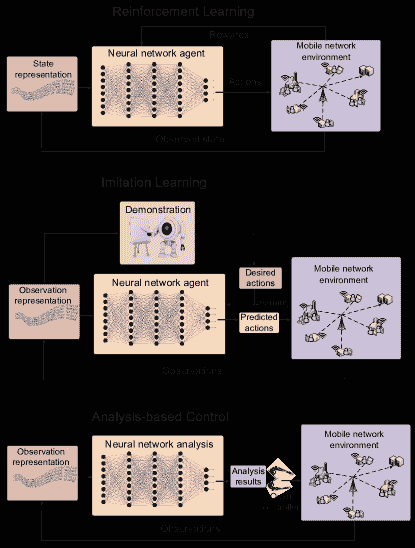

图 17：三种控制方法在移动和无线网络控制中的应用原理，即强化学习（上）、模仿学习（中）和基于分析的控制（下）。

表格 XVI：关于深度学习驱动的网络控制工作的总结。

| 领域 | 参考文献 | 应用 | 控制方法 | 模型 |
| --- | --- | --- | --- | --- |
| 网络优化 | 刘 *等人* [357] | 需求受限的能源最小化 | 基于分析 | DBN |
| Subramanian 和 Banerjee [358] | 机器对机器系统优化 | 基于分析 | 深度多模态网络 |
| He *等人* [359, 360] | 缓存和干扰对齐 | 强化学习 | 深度 Q 学习 |
| Masmar 和 Evans [361] | mmWave 通信性能优化 | 强化学习 | 深度 Q 学习 |
| Wang *等* [362] | 无线系统中的切换优化 | 强化学习 | 深度 Q 学习 |
| Chen 和 Smith [363] | 蜂窝网络随机接入优化 | 强化学习 | 深度 Q 学习 |
| Chen *等* [364] | 自动交通优化 | 强化学习 | 深度策略梯度 |
| 路由 | Lee *等* [365] | 虚拟路由分配 | 基于分析 | MLP |
| Yang *等* [293] | 路由优化 | 基于分析 | Hopfield 神经网络 |
| Mao *等* [186] | 软件定义路由 | 模仿学习 | DBN |
| Tang *等* [366] | 无线网络路由 | 模仿学习 | CNN |
|  | Mao *等* [394] | 智能数据包路由 | 模仿学习 | 基于张量的 DBN |
|  | Geyer *等* [395] | 分布式路由 | 模仿学习 | 图查询神经网络 |
|  | Pham *等* [402] | 知识定义网络的路由 | 强化学习 | 深度确定性策略梯度 |
| 调度 | Zhang *等* [367] | 混合动态电压和频率缩放调度 | 强化学习 | 深度 Q 学习 |
| Atallah *等* [368] | 路边通信网络调度 | 强化学习 | 深度 Q 学习 |
| Chinchali *等* [369] | 蜂窝网络流量调度 | 强化学习 | 策略梯度 |
| Atallah *等* [368] | 路边通信网络调度 | 强化学习 | 深度 Q 学习 |
| Wei *等* [370] | 移动边缘网络的用户调度和内容缓存 | 强化学习 | 深度策略梯度 |
|  | Mennes *等* [392] | 预测多频段时分多址 (MF-TDMA) 网络中的空闲槽位 | 模仿学习 | MLP |
| 资源分配 | Sun *等* [371] | 无线网络中的资源管理 | 模仿学习 | MLP |
| Xu *等* [372] | 云无线接入网络中的资源分配 | 强化学习 | 深度 Q 学习 |
| Ferreira *等* [373] | 认知通信中的资源管理 | 强化学习 | 深度 SARSA |
| Challita *等* [375] | LTE 的主动资源管理 | 强化学习 | 深度策略梯度 |
| Ye 和 Li [374] | 车对车通信中的资源分配 | 强化学习 | 深度 Q 学习 |
| Li *等* [391] | 移动边缘计算中的计算卸载和资源分配 | 强化学习 | 深度 Q 学习 |
|  | Zhou *等* [393] | 无线资源分配 | 基于分析 | LSTM |
| 无线电控制 | 纳帕斯特克和科恩 [376] | 动态频谱接入 | 强化学习 | 深度 Q 学习 |
| 奥谢和克兰西 [377] | 无线电控制和信号检测 | 强化学习 | 深度 Q 学习 |
| 威亚*等人* [378, 380] | 小区间干扰消除和发射功率优化 | 模仿学习 | RBM |
| 鲁塔格瓦*等人* [379] | 动态频谱对齐 | 基于分析 | RNN |
|  | 余*等人* [387] | 无线网络的多重接入 | 强化学习 | 深度 Q 学习 |
|  | 李*等人* [397] | 认知无线电中频谱共享的功率控制 | 强化学习 | DQN |
|  | 刘*等人* [401] | 动态和未知环境中的抗干扰通信 | 强化学习 | DQN |
|  | 刘*等人* [396] | 认知无线电区块链中的交易传输和信道选择 | 强化学习 | 双重 DQN |
|  | 费尔南德斯*等人* [493] | 卫星通信中的无线电发射设置选择 | 强化学习 | 深度多目标强化学习 |
| 其他 | 毛*等人* [381] | 自适应视频比特率 | 强化学习 | A3C |
| 小田*等人* [382, 383] | 移动演员节点控制 | 强化学习 | 深度 Q 学习 |
| 金 [384] | 物联网负载平衡 | 基于分析 | DBN |
| 查利塔*等人* [385] | 空中车辆网络的路径规划 | 强化学习 | 多智能体回声状态网络 |
| 罗*等人* [386] | 无线在线功率控制 | 强化学习 | 深度 Q 学习 |
| 许*等人* [388] | 流量工程 | 强化学习 | 深度策略梯度 |
| 刘*等人* [389] | 基站休眠控制 | 强化学习 | 深度 Q 学习 |
| 赵*等人* [390] | 网络切片 | 强化学习 | 深度 Q 学习 |
| 朱*等人* [234] | 移动边缘缓存 | 强化学习 | A3C |
|  | 刘*等人* [399] | 无人机控制 | 强化学习 | DQN |
|  | 李*等人* [398] | 设备到设备通信中的发射功率控制 | 模仿学习 | MLP |
|  | 贺*等人* [400] | 网络、缓存和计算的动态编排 | 强化学习 | DQN |

除了这两种方法，基于分析的控制在移动网络中正获得越来越多的关注。具体而言，该方案使用机器学习模型进行网络数据分析，并随后利用结果来辅助网络控制。与强化/模仿学习不同，基于分析的控制不会直接输出动作。相反，它提取有用的信息并将其传递给代理，以执行动作。我们在图 17 中说明了三种控制范式之间的原则。接下来，我们回顾了目前在这一领域提出的工作，并在表 XVI 中总结了这些努力。

网络优化指的是在特定环境下对网络资源和功能进行管理，旨在提高网络性能。深度学习最近在这一领域取得了若干成功的成果。例如，刘*等*利用 DBN 来发现多商品流需求信息与无线网络中链路使用之间的关联[357]。根据所做的预测，他们移除那些不太可能被调度的链路，从而减少需求约束能量最小化的数据规模。他们的方法将运行时间减少了多达 50%，而不会影响**最优性**。Subramanian 和 Banerjee 建议使用深度学习来预测机器间通信中异构设备的健康状态[358]。获得的结果随后用于优化健康感知的策略变更决策。

他*等*利用深度强化学习解决无线网络中的缓存和干扰对齐问题[359, 360]。特别地，他们将时间变化的信道视为有限状态马尔可夫信道，并应用深度 Q 网络学习最佳用户选择策略。这一新颖框架在总速率和能源效率上比现有方法有显著提高。陈*等*利用深度强化学习方法对自动流量优化进行了研究[364]。具体而言，他们构建了一个两层 DRL 框架，模仿动物的外周和中央神经系统，以解决数据中心规模的可扩展性问题。在他们的设计中，多个外周系统被部署在所有终端主机上，以便对短流量进行本地决策。一个中央系统进一步用于决定长流量的优化，因为这些流量对较长延迟具有更高的容忍度。在一个 32 台服务器的测试平台上的实验表明，与现有方法相比，所提设计显著减少了流量优化的周转时间和流量完成时间。

路由：深度学习也可以提高路由规则的效率。李*等*利用一个 3 层深度神经网络对节点度进行分类，给定路由节点的详细信息[365]。分类结果和临时路由被用于通过维特比算法生成后续虚拟路由。毛*等*利用 DBN 决定下一个路由节点并构建了一个软件定义路由器[186]。通过将开放最短路径优先作为最优路由策略，他们的方法在准确率上达到了 95%，同时显著减少了开销和延迟，并在 240 毫秒的信令间隔下实现了更高的吞吐量。在后续工作中，作者使用张量表示 DBN 中的隐藏层、权重和偏置，从而进一步提高了路由性能[394]。

在[293]中也得到了类似的结果，作者们采用 Hopfield 神经网络进行路由，在移动自组织网络应用场景中实现了更好的可用性和生存能力。Geyer *等*人使用图表示网络，并设计了专用的图查询神经网络来解决分布式路由问题 [395]。这种新颖的架构以图作为输入，并在图中的节点之间进行消息传递，使其能够适应各种网络拓扑结构。Pham *等*人在知识定义网络中阐述了路由协议，采用基于强化学习的深度确定性策略梯度算法 [402]。他们的代理以交通条件作为输入，并将 QoS 纳入奖励函数。仿真表明，他们的框架能够有效地学习流量之间的相关性，从而实现更好的路由配置。

调度：有几项研究探讨了深度学习在调度中的应用。张 *等*人介绍了一种深度 Q 学习驱动的混合动态电压频率调整调度机制，以减少实时系统（如 Wi-Fi、物联网、视频应用）的能耗 [367]。在他们的提议中，使用自编码器来近似 Q 函数，并且框架执行经验重放 [494] 来稳定训练过程并加速收敛。仿真表明，这种方法将传统的 Q 学习方法的能耗减少了 4.2%。类似地，[368]中的工作使用深度 Q 学习来调度路边通信网络。特别是，将车辆环境之间的交互（包括动作序列、观察和奖励信号）构建为马尔可夫决策过程。通过近似 Q 值函数，代理学习到了一种调度策略，实现了比传统调度方法更低的延迟和繁忙时间，以及更长的电池寿命。

最近，Chinchali *等人* 提出了一个基于策略梯度的调度器来优化蜂窝网络流量 [369]。具体而言，他们将调度问题表述为一个 MDP，并利用 RF 来预测网络吞吐量，这些吞吐量随后作为奖励函数的一个组成部分。通过现实的网络模拟器进行评估表明，该提案能够动态适应流量变化，使移动网络能够承载多 14.7% 的数据流量，同时比启发式调度器的性能高出 2$\times$ 以上。Wei *等人* 同时解决了用户调度和内容缓存的问题 [370]。特别地，他们训练了一个 DRL 代理，该代理包括一个决定哪个基站应该提供某些内容的演员，以及是否保存这些内容的演员。一个评论者进一步用于估计价值函数并向演员提供反馈。对一组基站的模拟显示，该代理可以产生低传输延迟。Li *等人* 揭示了多用户移动计算场景中的资源分配问题 [391]。他们使用深度 Q 学习框架来联合优化卸载决策和计算资源分配，以最小化所有用户设备的延迟和能量消耗的总成本。模拟显示，他们的提案相比于完全本地、完全卸载和简单 Q 学习方法可以减少系统的总成本。

资源分配：Sun *等人* 使用深度神经网络来近似加权最小均方误差资源分配算法的输入和输出之间的映射 [495]，用于干扰限制的无线网络环境 [371]。通过有效的模仿学习，神经网络近似达到接近其教师的性能。深度学习也已应用于云无线接入网络，Xu *等人* 采用深度 Q 学习来确定远程无线头的开/关模式，给定当前模式和用户需求 [372]。与单基站关联和完全协调关联方法的比较表明，所提出的 DRL 控制器使系统能够满足用户需求，同时显著减少能源消耗。

Ferreira *et al.* 采用深度状态-行动-奖励-状态-行动（SARSA）来解决认知通信中的资源分配管理问题[373]。通过预测无线电参数的效果，该框架避免了对不良参数的试错，从而减少了所需的计算资源。在[392]中，Mennes *et al.* 采用 MLPs 精确预测多频分时多址（MF-TDMA）网络中的空闲时隙，从而实现高效调度。作者在一个 100$\times$100 的房间中部署了网络进行仿真，结果表明他们的解决方案可以有效地将碰撞减少一半。Zhou *et al.* 采用 LSTMs 预测超密集网络中的基站流量负载[393]。根据预测结果，他们的方法调整资源分配策略以避免拥堵，从而降低了数据包丢失率，提高了吞吐量和平均意见评分。

无线电控制：在[376]中，作者通过深度强化学习解决了多信道无线网络环境中的动态频谱接入问题。在这种设置下，他们将 LSTM 嵌入到深度 Q 网络中，以保持和记忆历史观测，从而使架构能够在部分观测下进行精确的状态估计。训练过程分布到每个用户，这使得训练可以有效地并行化，并为各个用户学习良好的策略。实验表明，该框架的通道吞吐量是基准方法的两倍。Yu *et al.* 将深度强化学习应用于解决无线多路访问控制中的挑战[387]，认识到在这些任务中，DRL 代理在收敛速度和对非最佳参数设置的鲁棒性方面表现良好。Li *et al.* 研究了使用 DRL 进行认知无线电中的功率控制。在他们的设计中，构建了一个 DQN 代理来调整认知无线电系统的发射功率，从而最大化整体的信号与干扰加噪声比。

[377]中的研究揭示了无线电控制和信号检测问题的一些见解。特别是，作者们基于 Gym 强化学习平台引入了一个无线电信号搜索环境。他们的代理展示了稳定的学习过程，并且能够学习无线电信号搜索策略。Rutagemwa *et al.* 利用 RNN 进行交通预测，随后可以帮助移动网络中的动态频谱分配[379]。通过准确的交通预测，他们的提议改善了动态无线环境中频谱共享的性能，实现接近最优的频谱分配。在[401]中，Liu *et al.* 针对动态和未知环境中的反干扰通信问题，采用了带有 CNN 的 DQN 代理。他们的系统以原始频谱信息作为输入，需要有限的关于环境的先验知识，以改善网络在这种对抗性情况下的整体吞吐量。

Luong *et al.* 将区块链技术融入认知无线电网络[396]，采用双重 DQN 代理以最大化次要用户的成功交易传输数量，同时最小化信道成本和交易费用。模拟显示，DQN 方法在成功交易、信道成本和学习速度方面明显优于朴素的 Q 学习。深度强化学习还可以进一步解决卫星通信领域的问题。在[493]中，Ferreira *et al.* 将多目标强化学习[403]与深度神经网络结合，以在动态变化的卫星通信信道中选择多个无线电发射机设置，同时尝试实现多个冲突的目标。具体而言，使用两组 NN 分别进行探索和开发利用。这建立了一个集成系统，使得框架更能够适应变化的环境。模拟表明，他们的系统几乎可以优化六个不同的目标（即误比特率、吞吐量、带宽、频谱效率、额外功耗和功率效率），与理想解决方案相比，性能误差很小。

其他应用：深度学习在其他网络控制问题中也发挥着重要作用。毛*等人*开发了 Pensieve 系统，该系统使用深度强化学习生成自适应视频比特率算法[381]。具体而言，Pensieve 采用了最先进的深度强化学习算法 A3C，该算法以带宽、比特率和缓冲区大小作为输入，并选择能够带来最佳预期回报的比特率。该模型在离线环境中进行训练，并部署在自适应比特率服务器上，证明该系统在用户体验方面比现有最佳方案提高了 12%-25%。刘*等人*应用深度 Q 学习来减少蜂窝网络中的能耗[389]。他们训练一个代理，根据感兴趣区域的流量消耗动态开关基站。此外，还设计了一种逐行动作经验重放机制，以平衡不同的流量行为。实验表明，他们的方案可以显著减少基站的能耗，优于简单的基于表格的 Q 学习方法。在[399]中提出了一种使用 DQN 的无人机控制机制，其中针对多个目标：最大化能效、通信覆盖、公平性和连通性。作者在一个虚拟环境中进行了广泛的模拟，显示出他们的代理能够学习环境的动态，相较于随机和贪婪控制基线，表现更为优越。

Kim 和 Kim 将深度学习与物联网中的负载均衡问题联系起来 [384]。作者建议 DBN（深度贝叶斯网络）可以有效地分析网络负载并处理结构配置，从而实现物联网中的高效负载均衡。Challita *et al.* 采用基于回声状态网络的深度强化学习算法，为一组无人机进行路径规划 [385]。他们的提案相比于启发式基线具有更低的延迟。Xu *et al.* 采用 DRL 代理从网络动态中学习如何控制流量 [388]。他们主张 DRL 适合这个问题，因为它在处理动态环境和复杂状态空间方面表现出色。对三种网络拓扑进行的仿真验证了这一观点，因为 DRL 代理显著减少了延迟，同时提供了与传统方法相当的吞吐量。Zhu *et al.* 采用 A3C 算法解决移动边缘计算中的缓存问题。他们的方法在三个基线缓存方法上获得了更优的缓存命中率和流量卸载性能。还指出了几个值得未来研究的开放挑战。在 [400] 中也讨论了边缘缓存问题，He *et al.* 架构了一个 DQN 代理，以执行网络、缓存和计算的动态协调。他们的方法为移动虚拟网络运营商带来了高收益。

经验教训：使用深度学习进行网络控制有三种方法，即强化学习、模仿学习和基于分析的控制。强化学习需要与环境进行互动，尝试不同的操作并获取反馈以进行改进。代理在训练过程中会犯错，通常需要大量的步骤才能变得聪明。因此，大多数工作不会在真实基础设施上训练代理，因为犯错通常会对网络产生严重后果。相反，会建立一个模拟器来模拟真实网络环境，并利用该模拟器离线训练代理。这对模拟器提出了很高的真实性要求，因为代理无法在与训练环境不同的环境中正常工作。另一方面，尽管深度强化学习（DRL）在许多应用中表现出色，但训练一个可用的代理需要大量的时间和计算资源。这一点在实际应用中应予以考虑。

相比之下，模仿学习机制“通过示范学习”。它需要一个提供标签的教师，告诉智能体在特定情况下应该做什么。在网络环境中，这种机制通常用于减少计算时间[186]。具体来说，在一些网络应用（例如路由）中，计算最优解决方案是耗时的，这不能满足移动网络的延迟限制。为了解决这个问题，可以离线生成大量数据集，并使用神经网络代理来学习最优行动。

另一方面，基于分析的控制适用于那些决策不能仅基于网络环境状态的问题。可以使用神经网络（NN）提取额外的信息（例如，流量预测），这些信息随后有助于决策。例如，动态频谱分配可以从基于分析的控制中受益。

### VI-H 深度学习驱动的网络安全

随着无线连接的普及，保护用户、网络设备和数据免受恶意攻击、未经授权的访问和信息泄露变得至关重要。网络安全系统通过防火墙、杀毒软件和入侵检测系统（IDS）[496]来保护移动设备和用户。防火墙是一个访问安全网关，根据预定义的规则允许或阻止上行和下行网络流量。杀毒软件检测并移除计算机病毒、蠕虫、木马和恶意软件。IDS 识别信息系统中的未经授权和恶意活动或规则违规行为。每个系统执行其自身的功能以保护网络通信、中央服务器和边缘设备。

表 XVII：深度学习驱动的网络安全工作的总结。

| 级别 | 参考文献 | 应用 | 考虑的问题 | 学习范式 | 模型 |
| --- | --- | --- | --- | --- | --- |
| Infrastructure | Azar *等人* [404] | 网络安全应用 | 恶意软件分类 & 拒绝服务、探测、远程到用户 & 用户到根 | 无监督 & 监督 | 堆叠 AE |
| Thing [185] | IEEE 802.11 网络异常检测和攻击分类 | 洪泛、注入和冒充攻击 | 无监督 & 监督 | 堆叠 AE |
| Aminanto 和 Kim [405] | Wi-Fi 冒充攻击检测 | 洪泛、注入和冒充攻击 | 无监督 & 监督 | MLP, AE |
| Feng *等人* [406] | 频谱异常检测 | 通信频道中的突然信噪比变化 | 无监督 & 监督 | AE |
| Khan *等人* [407] | 无线网状网络中的洪泛攻击检测 | 中等和严重的分布式洪泛攻击 | 监督 | MLP |
| Diro 和 Chilamkurti [408] | IoT 分布式攻击检测 | 拒绝服务、探测、远程到用户 & 用户到根 | 监督 | MLP |
| Saied *等* [409] | 分布式拒绝服务攻击检测 | 已知和未知的分布式拒绝服务攻击 | 监督 | MLP |
| Martin *等* [410] | IoT 入侵检测 | 拒绝服务、探测、远程到用户 & 用户到根 | 无监督 & 监督 | Conditional VAE |
| Hamedani *等* [411] | 延迟反馈网络中的攻击检测 | 使用储备计算进行智能电网中的攻击检测 | 监督 | MLP |
| Luo 和 Nagarajany [345] | WSN 中的异常 | 温度和相对湿度传感器记录的尖峰和突发 | 无监督 | AE |
| Das *等* [412] | IoT 认证 | 长时间信号缺陷 | 监督 | LSTM |
| Jiang *等* [413] | MAC 欺骗检测 | 来自不同硬件的数据包使用相同的 MAC 地址 | 监督 | CNN |
|  | Jiang *等* [419] | 移动云计算中的网络攻击检测 | 来自 3 个不同数据集的各种网络攻击 | 无监督 + 监督 | RBM |
| 软件 | Yuan *等* [414] | Android 恶意软件检测 | Contagio Mobile 和 Google Play Store 的应用 | 无监督 & 监督 | RBM |
| Yuan *等* [415] | Android 恶意软件检测 | Contagio Mobile、Google Play Store 和 Genome Project 的应用 | 无监督 & 监督 | DBN |
| Su *等* [416] | Android 恶意软件检测 | Drebin、Android Malware Genome Project、Contagio Community 和 Google Play Store 的应用 | 无监督 & 监督 | DBN + SVM |
| Hou *等* [417] | Android 恶意软件检测 | 来自 Comodo Cloud Security Center 的应用样本 | 无监督 & 监督 | Stacked AE |
| Martinelli [418] | Android 恶意软件检测 | Drebin、Android Malware Genome Project 和 Google Play Store 的应用 | 监督 | CNN |
| McLaughlin *等* [420] | Android 恶意软件检测 | Android Malware Genome project 和 Google Play Store 的应用 | 监督 | CNN |
| Chen *等* [421] | 网络边缘的恶意应用检测 | 公开的恶意应用 | 无监督 & 监督 | RBM |
| Wang *等* [223] | 恶意软件流量分类 | 从 9 种恶意软件中提取的流量 | 监督 | CNN |
| Oulehla *等* [422] | 移动僵尸网络检测 | 客户端-服务器和混合僵尸网络 | 未知 | 未知 |
| Torres *等* [423] | 僵尸网络检测 | 垃圾邮件、HTTP 和未知流量 | 监督 | LSTM |
| Eslahi *等* [424] | 移动僵尸网络检测 | HTTP 僵尸网络流量 | 监督 | MLP |
| Alauthaman *等* [425] | 点对点僵尸网络检测 | Waledac 和 Strom Bots | 监督 | MLP |
| 用户隐私 | Shokri 和 Shmatikov [426] | 隐私保护深度学习 | 避免在协作模型训练中共享数据 | 监督式 | MLP, CNN |
| Phong*等*[427] | 隐私保护深度学习 | 解决[426]中引入的信息泄漏 | 监督式 | MLP |
| Ossia*等*[428] | 隐私保护移动分析 | 从云中卸载特征提取 | 监督式 | CNN |
| Abadi*等*[429] | 具有差分隐私的深度学习 | 防止训练数据中的私人信息暴露 | 监督式 | MLP |
| Osia*等*[430] | 隐私保护个人模型训练 | 从云中卸载个人数据 | 无监督 & 监督式 | MLP |
| Servia*等*[431] | 隐私保护模型推断 | 分解大型模型以进行隐私保护分析 | 监督式 | CNN |
| Hitaj*等*[432] | 从协作深度学习中窃取信息 | 破解普通和差分隐私的协作深度学习 | 无监督 | GAN |
| Hitaj*等*[429] | 密码猜测 | 从泄露的密码集生成密码 | 无监督 | GAN |
| Greydanus [433] | Enigma 学习 | 重建多字母密码的函数 | 监督式 | LSTM |
| Maghrebi [434] | 破解加密 | 边信道攻击 | 监督式 | MLP, AE, CNN, LSTM |
| 刘*等*[435] | 密码猜测 | 采用对抗生成来猜测密码 | 无监督 | LSTM |
|  | 宁*等*[436] | 移动应用嗅探 | 通过噪声注入防御移动应用嗅探 | 监督式 | CNN |
|  | Wang*等*[497] | 移动云中的私人推断 | 计算卸载和隐私保护的移动推断 | 监督式 | MLP, CNN |

现代网络安全系统越来越受益于深度学习[498]，因为它能够使系统*(i)* 自动从经验中学习签名和模式并推广到未来的入侵（监督学习）；或*(ii)* 识别明显不同于常规行为的模式（无监督学习）。这大大减少了区分入侵的预定义规则的工作量。除了保护网络免受攻击外，深度学习还可以用于攻击目的，带来窃取或破解用户密码或信息的巨大潜力。在本小节中，我们从基础设施、软件和用户隐私三个角度回顾了深度学习驱动的网络安全。具体而言，基础设施层安全工作侧重于检测物理网络中发生的异常，软件层工作则集中于识别移动网络中的恶意软件和僵尸网络。从用户隐私角度，我们讨论了如何使用深度学习保护私人信息免受泄露。据我们所知，没有其他综述总结这些工作。我们在表格 XVII 中总结了这些工作。

基础设施层安全：我们主要关注基础设施层的异常检测，即识别与预期行为不符的网络事件（例如，攻击、意外访问和数据使用）。许多研究人员利用自编码器（AEs）的出色无监督学习能力[404]。例如，Thing 研究了 IEEE 802.11 网络中存在的攻击和威胁特征[185]。作者采用了堆叠自编码器将网络流量分类为 5 种类型（即合法流量、洪水流量、注入流量和冒充流量），实现了 98.67%的总体准确率。AEs 也被应用于[405]，其中 Aminanto 和 Kim 使用多层感知器（MLP）和堆叠自编码器进行特征选择和提取，表现出显著的性能。同样，Feng *et al.* 使用 AEs 来检测无线通信中的异常频谱使用[406]。他们的实验表明，检测准确性可以显著受益于 AEs 的深度。

分布式攻击检测也是移动网络安全中的一个重要问题。汗*等*专注于检测无线网状网络中的洪水攻击 [407]。他们模拟了一个包含 100 个节点的无线环境，并人工注入了中度和严重的分布式洪水攻击，以生成合成数据集。他们的深度学习方法在假阳性和假阴性率方面表现出色。分布式攻击也在[408]中进行了研究，作者关注于物联网场景。另一项工作[409]使用 MLPs 检测分布式拒绝服务攻击。通过特征化典型的攻击事件模式，所提出的模型在检测已知和未知的分布式拒绝服务攻击方面表现良好。最近，阮*等*采用 RBMs 在线分类移动云中的网络攻击 [419]。通过无监督的逐层预训练和微调，他们的方法在三个不同的数据集上获得了超过 90%的分类准确率，显著优于其他机器学习方法。

马丁*等*提出了一种条件 VAE 来识别物联网中的入侵事件 [410]。为了提高检测性能，他们的 VAE 推断与不完整测量相关的缺失特征，这在物联网环境中很常见。真实数据标签被嵌入到解码器层中，以辅助最终分类。在著名的 NSL-KDD 数据集 [499] 上的评估显示，他们的模型在识别拒绝服务、探测、从用户到用户和从用户到根攻击方面取得了显著的准确性，在 F1 得分方面比传统的机器学习方法高出 0.18。哈梅达尼*等*使用 MLPs 来检测延迟反馈网络中的恶意攻击 [411]。该提案在 10,000 次模拟中实现了超过 99%的准确率。

软件层级安全性：如今，移动设备承载着大量私人信息。这些信息可能会被恶意应用程序窃取并利用，用于不当目的 [500]。深度学习正被用来分析和检测这些威胁。

袁*等*使用标记和未标记的移动应用程序来训练 RBM [414]。通过从 300 个样本中学习，他们的模型可以以显著的准确性对 Android 恶意软件进行分类，比传统的机器学习工具高出多达 19%。他们在[415]中进行的后续研究名为 Droiddetector，进一步提高了 2%的检测准确率。类似地，苏*等*分析了 Android 应用程序的关键特征，即请求的权限、使用的权限、敏感的应用程序接口调用、动作和应用组件 [416]。他们采用 DBNs 来提取恶意软件的特征，并使用 SVM 进行分类，达到了很高的准确率，并且每个推断实例仅需 6 秒钟。

Hou *et al.* 从不同的角度攻克恶意软件检测问题。他们的研究指出，基于签名的检测方法不足以应对复杂的 Android 恶意软件 [417]。为了解决这个问题，他们提出了组件遍历方法，这可以自动执行代码例程来构建加权有向图。通过使用堆叠自编码器（Stacked AE）进行图分析，他们的框架 Deep4MalDroid 能够准确检测那些故意重新打包和混淆以绕过签名并阻碍分析的 Android 恶意软件。随后，Martinelli *et al.* 的研究利用卷积神经网络（CNN）来发现应用类型与从真实移动设备中提取的系统调用跟踪之间的关系 [418]。CNN 也被用于 [420]，其中作者从自然语言处理（NLP）中汲取灵感，将应用程序的反汇编字节码作为文本进行分析。他们的实验表明，CNN 能有效学习检测指示恶意软件的操作码序列。Chen *et al.* 将位置数据整合进检测框架，并利用限制玻尔兹曼机（RBM）进行特征提取和分类 [421]。他们的方案提升了其他机器学习方法的性能。

僵尸网络是对移动网络的另一个重要威胁。僵尸网络实际上是由被恶意软件感染的机器组成的网络。这些机器通常由一个僵尸主控者控制，僵尸主控者利用这些机器人来危害公共服务和系统 [501]。检测僵尸网络具有挑战性，并且现在成为网络安全中的一个紧迫任务。深度学习在这一领域发挥了重要作用。例如，Oulehla *et al.* 提出使用神经网络从移动僵尸网络行为中提取特征 [422]。他们设计了一个并行检测框架，用于识别客户端-服务器型和混合型僵尸网络，并展示了令人鼓舞的性能。Torres *et al.* 调查了僵尸网络在其生命周期中表现出的常见行为模式，使用长短期记忆网络（LSTMs） [423]。他们使用了欠采样和过采样方法来解决数据集中僵尸网络与正常流量之间的类别不平衡，这在异常检测问题中很常见。类似的问题也在 [424] 和 [425] 中进行了研究，作者分别使用标准多层感知机（MLPs）进行移动和点对点僵尸网络检测，实现了高总体准确率。

用户隐私级别：在训练和评估深度神经网络时保护用户隐私是另一个重要的研究问题[502]。初步研究在[426]中进行，作者使用户能够参与神经网络的训练和评估，而无需共享其输入数据。这允许在不妨碍所有用户的情况下保护个人隐私，因为他们共同改进模型性能。该框架在[427]中进行了回顾和改进，另一组研究人员采用加性同态加密来解决[426]中忽略的信息泄露问题，而不影响模型准确性。这显著提升了系统的安全性。最近，Wang *et al.* [497] 提出了一个名为 ARDEN 的框架，以在移动云深度学习应用中保护用户隐私，同时减少通信开销。ARDEN 将神经网络划分在云和移动设备之间，重计算在云端进行，而移动设备仅执行简单的数据转换和扰动，使用差分隐私机制。这同时保证了用户隐私，提高了推理准确性，并减少了资源消耗。

Osia *et al.* 关注使用深度学习的隐私保护移动分析。他们设计了一个基于 Siamese 架构的客户端-服务器框架[503]，该框架在移动设备中包含特征提取器，在云端包含分类器[428]。通过将特征提取任务从云端卸载，他们的系统提供了强大的隐私保障。[429]中的一项创新工作表明，深度神经网络可以在差分隐私下进行训练。作者引入了差分隐私 SGD，以避免泄露训练数据的私人信息。在两个公开的图像识别数据集上的实验表明，他们的算法能够维护用户隐私，同时在复杂性、效率和性能方面具有可控的成本。这种方法对于基于边缘的隐私过滤技术如分布式单类学习[504]也非常有用。

Servia *等人* 考虑在分布式设备上训练深度神经网络而不违反隐私约束[431]。具体来说，作者在本地重新训练一个初始模型，针对个体用户进行定制。这避免了将个人数据转移到不可信的实体，从而保证了用户隐私。Osia *等人* 专注于从推断的角度保护用户个人数据。特别是，他们将整个深度神经网络拆分为特征提取器（在客户端）和分析器（在云端），以最小化敏感信息的暴露。通过对原始输入数据的本地处理，敏感的个人信息被转化为抽象特征，从而避免直接泄露到云端。在性别分类和情感检测的实验中，表明该框架可以有效地保护用户隐私，同时保持显著的推断准确性。

深度学习也被用于网络攻击，包括尝试泄露私人用户信息和猜测密码。在[432]中，Hitaj *等人* 认为协作学习深度模型是不可靠的。通过训练一个 GAN，他们的攻击者能够影响这一学习过程，并通过注入虚假训练样本诱使受害者泄露私人信息。他们的 GAN 甚至成功破解了[429]中的差分隐私协作学习。作者进一步研究了使用 GAN 进行密码猜测。在[505]中，他们设计了 PassGAN，该模型学习了一组泄露密码的分布。一旦在数据集上训练完毕，PassGAN 能够在不同的测试集中匹配超过 46%的密码，无需用户干预或加密知识。这一新技术有潜力彻底改变当前的密码猜测算法。

Greydanus 使用 LSTM 网络破解了解密规则 [433]。他们将解密视为序列到序列的翻译任务，并使用大量的密码对训练了一个框架。提出的 LSTM 在学习多表密码方面表现出了显著的性能。Maghrebi 等人利用各种深度学习模型（如 MLP、AE、CNN、LSTM）构建了一个精确的分析系统，并进行了侧信道密钥恢复攻击 [434]。令人惊讶的是，基于深度学习的方法在破解未保护和受保护的高级加密标准实现效率方面远远超过其他模板机器学习攻击。在 [436] 中，Ning 等人展示了一个攻击者可以使用 CNN 推断智能手机上运行的应用程序及其使用情况的准确度超过 84%，基于磁力计或方向传感器数据。如果还考虑运动传感器信息，准确度可以增加到 98%，这威胁到用户的隐私。为了缓解这一问题，作者建议向磁力计和方向传感器数据注入高斯噪声，从而将推断准确度降低到 15%，有效地减少隐私泄露的风险。

学到的教训：大多数基于深度学习的解决方案侧重于现有的网络攻击，然而新的攻击每天都在涌现。由于这些新攻击可能具有不同的特征并表现出“正常”行为，旧的神经网络模型可能不容易检测到它们。因此，一种有效的深度学习技术应能够 *(i)* 快速将旧攻击的知识转移到检测新攻击上；以及 *(ii)* 不断吸收新来者的特征并更新基础模型。迁移学习和终身学习是解决这些问题的强有力候选，我们将在第 VII-C 节中讨论。目前这方面的研究仍然不够深入，因此我们期待未来会有更多的努力。

另一个需要注意的问题是，神经网络容易受到对抗性攻击的影响。这个问题在第 III-E 节中简要讨论过。虽然目前缺乏正式的报告，但黑客可能会利用神经网络模型和训练过程中的弱点进行攻击，从而破坏基于深度学习的网络防御系统。这是一个在实际实施中应考虑的重要潜在陷阱。

### VI-I 深度学习驱动的信号处理

深度学习在信号处理中也越来越受到关注，应用包括多输入多输出（MIMO）和调制。MIMO 已成为当前无线通信中的基础技术，在蜂窝网络和 WiFi 网络中广泛应用。通过深度学习，MIMO 的性能可以根据环境条件智能优化。调制识别也在通过深度学习实现更高的准确性。我们在表 XVIII 中概述了该领域的相关工作。

TABLE XVIII: 深度学习驱动的信号处理总结。

| 领域 | 参考文献 | 应用 | 模型 |
| --- | --- | --- | --- |
| MIMO 系统 | Samuel *et al.*  [446] | MIMO 检测 | MLP |
|  | Yan *et al.*  [447] | MIMO-OFDM 系统中的信号检测 | AE+ELM |
|  | Vieira *et al.*  [322] | 基于大规模 MIMO 指纹的定位 | CNN |
|  | Neumann *et al.*  [445] | MIMO 信道估计 | CNN |
|  | Wijaya *et al.*  [378, 380] | 小区间干扰消除和发送功率优化 | RBM |
|  | O’Shea *et al.*  [437] | 表示和编解码过程的优化 | AE |
|  | Borgerding *et al.*  [438] | MIMO 中的稀疏线性逆问题 | CNN |
|  | Fujihashi *et al.*  [439] | MIMO 非线性均衡 | MLP |
|  | Huang *et al.*  [457] | 超分辨率信道和到达方向估计 | MLP |
| 调制 | Rajendran *et al.*  [440] | 自动调制分类 | LSTM |
|  | West and O’Shea [441] | 调制识别 | CNN, ResNet, Inception CNN, LSTM |
|  | O’Shea *et al.*  [442] | 调制识别 | 无线变换网络 |
|  | O’Shea and Hoydis [448] | 调制分类 | CNN |
|  | Jagannath *et al.*  [449] | 在软件定义无线电测试平台中的调制分类 | MLP |
| 其他 | O’Shea *et al.*  [450] | 无线电流量序列识别 | LSTM |
|  | O’Shea *et el.*  [451] | 学习在受损通道上进行通信 | AE + 无线变换网络 |
|  | Ye *et al.*  [452] | OFDM 系统中的信道估计和信号检测 | MLP |
|  | Liang *et al.*  [453] | 信道解码 | CNN |
|  | Lyu *et al.*  [454] | 用于信道解码的神经网络 | MLP, CNN 和 RNN |
|  | Dörner *et al.*  [455] | 空中通信系统 | AE |
|  | Liao *et al.*  [456] | 瑞利衰落信道预测 | MLP |
|  | 黄*等*  [458] | 发光二极管（LED）可见光下行链路错误校正 | AE |
|  | 阿尔哈提布*等*  [444] | 高度移动毫米波系统的协调波束形成 | MLP |
|  | 甘特*等*  [443] | 毫米波定位 | CNN |
|  | 叶*等*  [506] | 通道无关的端到端学习基础通信系统 | 条件 GAN |

MIMO 系统：塞缪尔*等*建议深度神经网络可以很好地估计 MIMO 信道中的传输向量。通过展开投影梯度下降方法，他们设计了一种基于 MLP 的检测网络来执行二进制 MIMO 检测[446]。该检测网络可以在单次训练后应用于多个通道。仿真结果表明，所提出的架构在实现接近最优的准确度的同时，要求计算轻量，无需信噪比（SNR）的先验知识。严*等*从不同的角度利用深度学习解决了类似的问题[447]。通过考虑信号的特征不变性，他们利用 AE 作为特征提取器，并随后使用极限学习机（ELM）在 MIMO 正交频分复用（OFDM）系统中分类信号源。他们的提案在检测准确度上优于几种传统方法，同时保持了类似的复杂度。

维埃拉*等*展示了在蜂窝网络中，海量 MIMO 信道测量可以用于基于指纹的用户位置推断[322]。具体而言，他们设计了具有权重正则化的 CNN，以利用信道指纹的稀疏性和信息不变性，从而实现精确的位置推断。CNN 也被用于 MIMO 信道估计。诺伊曼*等*利用 MIMO 信道模型的结构，设计了一种轻量级的近似最大似然估计器，用于特定的信道模型[445]。他们的方法在计算成本上优于传统估计器，并减少了需要调整的超参数数量。在[452]中实现了类似的想法，其中叶*等*使用 MLP 在 OFDM 系统中执行信道估计和信号检测。

Wijaya *等* 考虑将深度学习应用于不同的场景 [378, 380]。作者提出使用非迭代神经网络在基站执行发射功率控制，从而防止由于小区间干扰而导致网络性能下降。神经网络被训练以估计每个数据包传输的最佳发射功率，并选择具有最高激活概率的功率。模拟表明，该提议的框架在 MIMO 系统中的发射功率控制方面显著优于常用的信念传播算法，同时具有较低的计算成本。

最近，O’Shea *等* 将深度学习引入物理层设计 [437]。他们将无监督深度自编码器集成到单用户端到端 MIMO 系统中，以优化表示和编码/解码过程，用于在瑞利衰落信道上进行传输。我们在图 18 中展示了采用的 AE-based 框架。该设计包括一个由 MLP 组成的发射机，后跟一个归一化层，确保信号上的物理约束得到保证。经过加性白高斯噪声信道传输后，接收机使用另一个 MLP 来解码消息，并选择出现概率最高的消息。系统可以通过 SGD 算法进行端到端训练。实验结果表明，AE 系统在信噪比方面比空时编码方法表现提高约 15 dB。在 [438] 中，Borgerding *等* 提议在 MIMO 环境中从噪声线性测量中恢复稀疏信号使用深度学习。该方案在压缩随机接入和大规模 MIMO 信道估计上得到评估，在准确性方面优于传统算法和 CNNs。

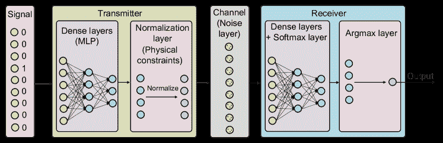

图 18：一个表示为自编码器的加性白高斯噪声信道上的通信系统。

调制：West 和 O’Shea 比较了不同深度学习架构的调制识别准确性，包括传统 CNN、ResNet、Inception CNN 和 LSTM[441]。他们的实验表明，LSTM 是调制识别的最佳候选者，因为它达到了最高的准确率。由于其卓越的性能，LSTM 也被用于[440]中的类似任务。O’Shea *等人* 随后专注于将深度学习架构量身定制到无线电特性上。他们在[442]中改进了之前的工作，设计了一种新型的深度无线电变换网络，用于精确的调制识别。具体而言，他们将无线电领域特定的参数化变换引入到空间变换网络中，这有助于接收信号的标准化，从而实现了优越的性能。该框架还展示了自动同步能力，减少了对传统专家系统和昂贵信号分析过程的依赖。在[448]中，O’Shea 和 Hoydis 引入了几个新颖的深度学习应用于网络物理层。他们展示了一个概念验证，其中他们使用 CNN 进行调制分类，并获得了令人满意的准确率。

其他信号处理应用：深度学习也被应用于无线电信号分析。在[450]中，O’Shea *等人* 使用 LSTM 来替代无线电发射器和接收器之间的序列翻译程序。虽然他们的框架在理想环境中表现良好，但引入现实信道效应后，其性能显著下降。随后，作者在[451]中考虑了另一种场景，他们利用正则化 AE 实现了在受损信道上可靠通信。他们进一步在解码器端引入无线电变换网络进行信号重构，从而实现接收器同步。模拟结果表明，这种方法是可靠的，并且可以高效实施。

在[453]中，梁*等人*利用噪声相关性通过深度学习方法解码信道。具体来说，他们使用 CNN 来通过学习噪声相关性减少信道噪声估计误差。实验表明，他们的框架可以显著提高解码性能。在[454]中比较了 MLPs、CNNs 和 RNNs 的解码性能。通过在不同设置下进行实验，获得的结果表明 RNN 实现了最佳的解码性能，但也带来了最高的计算开销。Liao*等人*采用 MLPs 进行准确的 Rayleigh 衰落信道预测[456]。作者进一步为他们的方案配备了稀疏信道样本构建方法，以节省系统资源而不影响精度。深度学习可以进一步促进可见光通信。在[458]中，Huang*等人*采用基于深度学习的系统进行光通信中的错误校正。具体来说，他们的工作中使用 AE 对发光二极管（LED）可见光下行链路进行维度缩减，从而最大化信道带宽。该方案遵循[448]中的理论，O’Shea*等人*展示了深度学习驱动的信号处理系统可以达到与传统编码和/或调制系统相当的效果。

深度学习在毫米波波束形成中的应用进一步发展。在[444]中，Alkhateeb*等人*提出了一种毫米波通信系统，该系统利用 MLPs 从分布式基站接收的信号中预测波束形成向量。通过用深度学习替代天才辅助的解决方案，他们的框架减少了协调开销，实现了广覆盖和低延迟的波束形成。同样，Gante*等人*采用 CNNs 推断设备的位置，基于接收到的毫米波辐射。他们的初步模拟表明，基于 CNN 的系统在现实的户外场景中能够实现小的估计误差，显著优于现有的预测方法。

经验教训：深度学习在信号处理应用中开始发挥重要作用，早期原型展示的性能非常出色。这是因为深度学习在性能、复杂性和泛化能力方面具有优势。然而，目前这一领域的研究仍处于初期阶段。我们只能期望深度学习在这一领域将变得越来越受欢迎。

### VI-J 移动网络中的新兴深度学习应用

在这一部分，我们回顾了基于深度学习的其他移动网络领域的研究，这些领域超出了目前讨论的范围。这些新兴应用开辟了几个新的研究方向，如下文所述。这些工作的总结见表 XIX。

表 XIX：新兴深度学习驱动的移动网络应用总结。

| 参考文献 | 应用 | 模型 | 关键贡献 |
| --- | --- | --- | --- |
| Gonzalez *等* [459] | 网络数据货币化 | - | 一个名为 Net2Vec 的平台，用于促进深度学习在通信网络中的部署。 |
| Kaminski *等* [460] | IoT 的网络内计算 | MLP | 实现协作数据处理并减少延迟。 |
| Xiao *等* [461] | 移动众包感知 | 深度 Q 学习 | 缓解移动众包感知系统的脆弱性。 |
| Luong *等* [462] | 移动区块链中的资源分配 | MLP | 使用深度学习对矿工的竞标进行单调变换，并输出最佳拍卖中的分配和条件支付规则。 |
| Gulati *等* [463] | 车辆互联网（IoV）中的数据传播 | CNN | 研究数据传播性能与社交评分、能量水平、车辆数量及其速度之间的关系。 |

网络数据货币化：Gonzalez *等* 使用无监督深度学习来生成实时准确的用户档案 [459]，该平台称为 Net2Vec [507]。具体来说，他们实时分析用户浏览数据，并使用产品类别生成用户档案。这些档案随后可以与用户感兴趣的产品关联，并用于在线广告。

IoT 网络内计算：Kaminski *等* 通过将神经网络嵌入到 IoT 部署中，允许节点协作处理生成的数据，而不是将 IoT 节点视为数据生产者或处理信息的最终消费者 [460]。这实现了低延迟通信，同时减少了对云端的数据存储和处理。在特定情况下，作者将预训练神经网络的每个隐藏单元映射到 IoT 网络中的一个节点，并研究导致最小通信开销的最佳投影。他们的框架实现了类似于 WSNs 中的网络内计算的功能，并开辟了雾计算的新研究方向。

移动众包感知：Xiao *等* 研究了在移动网络环境中众包感知面临的脆弱性。他们认为，存在恶意移动用户故意向服务器提供虚假的感知数据，以节省成本并保护隐私，从而使移动众包感知系统变得脆弱 [461]。作者将服务器-用户系统建模为 Stackelberg 博弈，其中服务器充当领导者，负责评估个人的感知努力，通过分析每个感知报告的准确性。用户的报酬基于其努力的评估，因此作弊用户将被处罚零奖励。为了设计最佳支付策略，服务器采用深度 Q 网络，从经验感知报告中获取知识，而不需要特定的感知模型。模拟结果表明，与传统的 Q 学习和随机支付策略相比，感知质量、抗攻击能力和服务器效用方面表现更佳。

移动区块链：大量计算资源要求和能量消耗限制了区块链在移动网络环境中的应用。为解决这个问题，Luong *等* 基于最优拍卖在[462]中阐明了移动区块链网络中的资源管理。他们设计了一个 MLP，首先对矿工的竞标进行单调转换，然后输出分配方案和每个矿工的条件支付规则。通过在不同设置下进行实验，结果表明，提出的基于深度学习的框架能为边缘计算服务提供商带来比二价拍卖基准更高的利润。

车联网（IoV）：Gulati *等* 将深度学习的成功扩展到 IoV [463]。作者设计了一种基于深度学习的内容中心数据传播方法，该方法包括三个步骤，即 *(i)* 对能够进行数据传播的选定车辆进行能量估计； *(ii)* 使用 Weiner 过程模型识别车辆之间稳定可靠的连接；以及 *(iii)* 利用 CNN 预测车辆之间的社会关系。实验揭示，传播的数据量与社会评分、能量水平和车辆数量正相关，而车辆的速度对连接概率有负面影响。

经验教训：深度学习在移动和无线网络领域的应用令人兴奋，毫无疑问，许多进展尚未出现。然而，如第 III-E 节所讨论，深度学习解决方案并不是普遍适用的，可能并不适合所有问题。我们应该将深度学习视为一种强大的工具，它可以辅助快速而准确的推理，并促进一些以前需要人工干预的过程的自动化。然而，深度学习算法也会犯错，它们的决策可能不容易解释。在需要高可解释性和低容错性的任务中，深度学习仍然任重道远，这对于大多数机器学习算法也是如此。

## VII 将深度学习量体裁衣到移动网络

尽管深度学习在许多移动网络领域表现出色，但“无免费午餐”（NFL）定理表明，没有一个单一的模型可以在所有问题上都能普遍良好地工作 [508]。这意味着，对于任何特定的移动和无线网络问题，我们可能需要调整不同的深度学习架构以实现最佳性能。在本节中，我们从三个方面讨论如何将深度学习量体裁衣到移动网络应用中，即移动设备和系统、分布式数据中心以及变化的移动网络环境。

### VII-A 将深度学习量体裁衣到移动设备和系统

未来 5G 网络的超低延迟要求移动系统执行的所有操作都必须具有运行时效率。这同样适用于深度学习驱动的应用程序。然而，目前的移动设备硬件能力有限，这意味着在这样的设备上实现复杂的深度学习架构可能在计算上不可行，除非进行适当的模型调整。为了解决这个问题，正在进行的研究改进现有的深度学习架构 [509]，以确保推理过程不违反延迟或能量约束 [510, 511]，并且不引发任何隐私问题 [512]。我们在表格 XX 中概述了这些工作，并接下来讨论它们的主要贡献。

表 XX：关于改进移动设备和系统深度学习的工作总结。

| 参考文献 | 方法 | 目标模型 |
| --- | --- | --- |
| Iandola *等人* [513] | 滤波器尺寸缩小、减少输入通道和延迟下采样 | CNN |
| Howard *等人* [514] | 深度可分离卷积 | CNN |
| Zhang *等* [515] | 点对点组卷积和通道洗牌 | CNN |
| Zhang *等* [516] | Tucker 分解 | AE |
| Cao *等* [517] | 通过 RenderScript 进行数据并行化 | RNN |
| Chen *等* [518] | 数据可重用性和内核冗余去除的空间探索 | CNN |
| Rallapalli *等* [519] | 内存优化 | CNN |
| Lane *等* [520] | 运行时层压缩和深度结构分解 | MLP, CNN |
| Huynh *等* [521] | 缓存、Tucker 分解和计算卸载 | CNN |
| Wu *等* [522] | 参数量化 | CNN |
| Bhattacharya 和 Lane [523] | 完全连接层的稀疏化和卷积核的分离 | MLP, CNN |
| Georgiev *等* [97] | 表示共享 | MLP |
| Cho 和 Brand [524] | 卷积操作优化 | CNN |
| Guo 和 Potkonjak [525] | 滤波器和类别修剪 | CNN |
| Li *等* [526] | 云协助和增量学习 | CNN |
| Zen *等* [527] | 权重量化 | LSTM |
| Falcao *等* [528] | 并行化和内存共享 | 堆叠 AE |
| Fang *等* [529] | 模型修剪和恢复方案 | CNN |
| Xu *等* [530] | 可重用区域查找和可重用区域传播方案 | CNN |
| Liu *等* [531] | 使用基于深度 Q 学习的优化器在移动平台上实现准确性、延迟、存储和能耗的适当平衡 | CNN |
| Chen *等* [532] | 基于机器学习的优化系统以自动探索和搜索优化的张量操作符 | 所有 NN 架构 |
| Yao *等* [533] | 学习模型执行时间和执行模型压缩 | MLP, CNN, GRU 和 LSTM |

Iandola*等人*为嵌入式系统设计了一种紧凑的架构，命名为 SqueezeNet，其准确度与经典 CNN AlexNet [86] 相似，但参数减少了 50 倍 [513]。SqueezeNet 也基于 CNN，但其显著较小的模型大小 *(i)* 使其能更高效地在分布式系统上进行训练； *(ii)* 减少了在客户端更新模型时的传输开销； *(iii)* 促进了在资源有限的嵌入式设备上的部署。Howard*等人*扩展了这项工作，引入了一种高效的简化 CNN 系列，称为 MobileNet，它使用深度可分离卷积操作来大幅减少所需计算量和模型大小 [514]。这种新设计可以低延迟运行，满足移动和嵌入式视觉应用的要求。作者进一步引入了两个超参数来控制乘法器的宽度和分辨率，这有助于在准确性和效率之间找到合适的权衡。张*等人*提出的 ShuffleNet 通过采用逐点组卷积和通道混洗来提高 MobileNet 的准确性，同时保持相似的模型复杂度 [515]。特别是，作者发现更多的卷积操作组可以减少计算需求。

张*等人*关注于通过减少具有全连接层的结构中的参数数量来进行移动多媒体特征学习 [516]。这通过将 Trucker 分解应用于模型中的权重子张量来实现，同时保持良好的重建能力。Trucker 分解也在 [521] 中被采用，作者寻求用更少的参数来逼近模型，以节省内存。进一步研究了 RNN 模型的移动优化。在 [517] 中，曹*等人*使用了一种名为 RenderScript³²³²32Android Renderscript https://developer.android.com/guide/topics/renderscript/compute.html 的移动工具箱，以并行化特定数据结构，并使移动 GPU 能够进行计算加速。他们的提案减少了在 Android 智能手机上运行 RNN 模型时的延迟。陈*等人*阐明了在 iOS 移动设备上实现 CNN 的方法 [518]。特别是，他们通过空间探索以实现数据重用和内核冗余移除来减少模型执行延迟。前者缓解了卷积层对带宽的高要求，而后者则减少了内存和计算需求，性能降级可以忽略不计。

Rallapalli *等人* 通过在移动 CPU 和 GPU 上采用内存优化，研究了将 *非常深* 的 CNN 从云端卸载到边缘设备[519]。他们的框架使得在移动对象检测应用中运行具有大内存需求的深度 CNN 时可以高速进行。Lane *等人* 开发了一种软件加速器 DeepX，以辅助移动设备上的深度学习实现。所提出的方法利用了两种推理时间资源控制算法，即运行时层压缩和深度架构分解[520]。运行时层压缩技术通过扩展模型压缩原理来控制推理阶段的内存和计算运行时间。这在移动设备中非常重要，因为将推理过程卸载到边缘设备上在当前硬件平台下更为实际。此外，深度架构设计了“分解计划”，旨在将数据和模型操作最佳分配到本地和远程处理器。通过将这两者结合，DeepX 实现了在给定计算和内存约束下的能效和运行时效率最大化。Yao *等人* [533] 设计了一个名为 FastDeepIoT 的框架，该框架首先学习目标设备上 NN 模型的执行时间，然后进行模型压缩以减少运行时间而不影响推理准确性。通过这一过程，与最先进的压缩算法相比，执行时间最多减少了 78%，能耗减少了 69%。

最近，Fang *等人* 设计了一个名为 NestDNN 的框架，以提供在移动设备上的灵活资源-准确性权衡[529]。为此，NestDNN 首先采用了一种模型剪枝和恢复方案，将深度神经网络（NNs）转换为单一紧凑型多容量模型。通过这种方法，在六个移动视觉应用中可以实现高达 4.22% 的推理准确率，同时视频帧处理速度提高了 2.0$\times$，能耗减少了 1.7$\times$。在[530]中，Xu *等人* 从缓存的角度加速了移动视觉的深度学习推理。特别是，所提出的框架称为 DeepCache，将最近的输入帧作为缓存键，个别 CNN 层的特征图作为缓存值进行存储。作者进一步采用了可重复区域查找和可重复区域传播，以使区域匹配器仅在每个输入视频帧上运行一次，并加载 CNN 内所有层的缓存特征图。这使得推理时间平均减少了 18%，能耗减少了 20%。Liu *等人* 开发了一个名为 AdaDeep 的使用驱动框架，以选择在移动平台上针对特定深度 NN 的压缩技术组合[531]。通过使用深度 Q 学习优化器，他们的提案可以在准确性、延迟、存储和能耗之间实现适当的权衡。

除这些工作外，研究人员还通过其他设计和复杂优化成功地调整了深度学习架构，如参数量化 [522, 527]，稀疏化和分离 [523]，表示和内存共享 [97, 528]，卷积操作优化 [524]，剪枝 [525]，云端辅助 [526] 和编译器优化 [532]。这些技术在将深度神经网络嵌入移动系统时具有重要意义。

### VII-B 深度学习与分布式数据容器的适配

表 XXI：移动系统和设备上的模型与训练并行性的工作总结。

| 并行范式 | 参考文献 | 目标 | 核心思想 | 改进 |
| --- | --- | --- | --- | --- |
| 模型并行性 | Dean *等人* [126] | 分布式系统中的非常大规模深度神经网络。 | 采用下雨 SGD 支持大量模型副本，并使用 Sandblaster 框架支持各种批量优化。 | 模型训练速度提高至 12$\times$，使用 81 台机器。 |
| Teerapittayanon *等人* [534] | 云端和终端设备上的神经网络。 | 将深度神经网络映射到分布式设置，并联合训练每个部分。 | 通信成本减少高达 20$\times$。 |
| De Coninck *等人* [113] | IoT 设备上的神经网络。 | 从预训练的 NN 中提取得到一个更小的 NN，用于对整个空间的子集进行分类。 | 移动设备上的推理延迟为 10 毫秒。 |
| Omidshafiei *等人* [535] | 部分可观察条件下的多任务多智能体强化学习。 | 深度递归 Q 网络和谨慎乐观学习者用于近似动作价值函数；去中心化的并发经验重放轨迹用于稳定训练。 | 接近最优的执行时间。 |
| 训练并行性 | Recht *等人* [536] | 并行 SGD。 | 消除分布式 SGD 中的锁定开销。 | 分布式训练速度提高至 10$\times$。 |
| Goyal *等人* [537] | 分布式同步 SGD。 | 采用无超参数的学习规则来调整学习率，并使用预热机制解决早期优化问题。 | 每天训练数十亿张图像。 |
| Zhang *等人* [538] | 异步分布式 SGD。 | 结合了随机方差减少梯度算法和延迟的近端梯度算法。 | 速度提高至 6$\times$ |
| Hardy *等人* [539] | 边缘设备上的分布式深度学习。 | 压缩技术 (*AdaComp*) 减少参数服务器的流量。 | 流量减少高达 191$\times$。 |
| -   | McMahan *et al.*  [540] | 在移动设备上的分布式训练。 | 用户共同享受由大数据训练的共享模型的好处，无需集中存储。 | 高达 64.3$\times$ 的训练加速。 |
| -   | Keith *et al.*  [541] | 移动设备上的数据计算。 | 安全多方计算，以在分布式移动设备上获取模型参数。 | 高达 1.98$\times$ 的通信扩展。 |

移动系统每天生成和消耗海量移动数据。这可能涉及相似内容，但分布在全球各地。将这些数据移动到集中服务器进行模型训练和评估必然会引入通信和存储开销，这是不可扩展的。然而，在模型训练过程中忽视嵌入在移动数据中的特征，例如本地文化、人类移动性、地理拓扑等，可能会损害模型的鲁棒性，从而隐含影响构建在这些模型基础上的移动网络应用程序的性能。解决方案是将模型执行卸载到分布式数据中心或边缘设备，以保证良好的性能，同时减轻云端的负担。

因此，在移动网络环境下，并行性面临的挑战之一是在大量由电池供电、计算能力有限且特别是缺少 GPU 的移动设备上训练神经网络。这种范式的关键目标是使用大量移动 CPU 进行训练，至少与使用 GPU 一样有效。训练速度仍然重要，但成为次要目标。

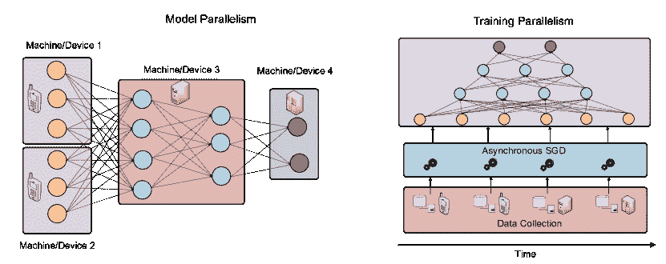

图 19：模型并行（左）和训练并行（右）的基本原则。

-   通常，解决这一问题有两种途径，即 *(i)* 分解模型本身，以单独训练（或进行推断）其组件；或者 *(ii)* 扩展训练过程，以在与数据容器相关联的不同位置执行模型更新。这两种方案允许单一模型训练，而无需将所有数据集中。我们在图 19 中阐明了这两种方法的原理，并在表 XXI 中总结了现有工作。

模型并行。大规模分布式深度学习首次在[126]中进行了研究，作者开发了一个名为*DistBelief*的框架，该框架使得在数千台机器上训练复杂的神经网络成为可能。在他们的框架中，完整的模型被分割成较小的组件，并分布在各种机器上。只有跨越机器边界的节点（例如层之间的连接）需要进行参数更新和推理的通信。该系统还涉及一个参数服务器，使得每个模型副本能够在训练过程中获取最新的参数。实验表明，与在单个 GPU 上训练相比，该提议的框架在 CPU 集群上可以显著加速训练，并在 ImageNet 数据集上达到了最先进的分类性能[191]。

Teerapittayanon *等人*提出了专为分布式系统定制的深度神经网络，包括云服务器、雾层和地理分布设备[534]。作者从云到端设备分层缩放整体神经网络架构，并分布其组件。该模型利用本地聚合器和二进制权重，以减少计算存储和通信开销，同时保持良好的准确性。在多视角多摄像头数据集上的实验表明，该提议可以进行高效的基于云的训练和本地推理。重要的是，深度神经网络在不违反延迟约束的情况下，获得了分布式系统相关的重要优势，如容错性和隐私。

Coninck *等人*考虑将深度学习分布在物联网上进行分类应用[113]。具体而言，他们将一个小型神经网络部署到本地设备上，执行粗略分类，这使得快速响应过滤数据可以发送到中央服务器。如果本地模型无法分类，则激活云端的较大神经网络进行细粒度分类。总体架构保持良好的准确性，同时显著降低了通常由大型模型推理引入的延迟。

去中心化方法也可以应用于深度强化学习。在[535]中，Omidshafiei *等人*考虑了具有部分可观察性和有限通信的多智能体系统，这在移动系统中很常见。他们结合了一系列复杂的方法和算法，包括滞后学习器、深度递归 Q 网络、并发经验重播轨迹和蒸馏，以使多智能体在一组分散式部分可观察的马尔可夫决策过程下能够使用单一联合策略进行协调。他们的框架有望在解决分布式移动系统中的控制问题中发挥重要作用。

训练并行性对于移动系统同样至关重要，因为移动数据通常异步来自不同来源。然而，在保持一致性、快速收敛和准确性的同时有效训练模型仍然具有挑战性 [542]。

解决这个问题的一个实际方法是进行异步 SGD。基本思想是使维护模型的服务器能够接受来自工作节点的延迟信息（例如数据、梯度更新）。在每次更新迭代中，服务器只需等待较少数量的工作节点。这对于在移动系统中分布式机器训练深度神经网络至关重要。异步 SGD 首次研究于 [536]，其中作者提出了一种无锁并行 SGD 称为 HOGWILD，显示出明显比锁定对应方法更快的收敛速度。Downpour SGD 在 [126] 中提高了训练过程的鲁棒性，当工作节点故障时，每个模型副本都会请求最新版本的参数。因此，少数机器故障对训练过程没有显著影响。类似的思想也被应用在 [537] 中，Goyal 等人研究了一系列技术（例如学习率调整、预热、批归一化），这些技术为在分布式系统上训练大规模深度神经网络提供了重要见解。最终，他们的框架可以在 1 小时内训练出一个 ImageNet 网络，与传统算法相比令人印象深刻。

张等人认为，大多数异步随机梯度下降（SGD）算法由于随机梯度固有的方差而收敛速度较慢 [538]。他们提出了一种改进的带有方差减少的 SGD，以加速收敛。在使用 Google 云计算平台训练深度神经网络时，他们的算法在收敛速度方面优于其他异步 SGD 方法。异步方法还被应用于深度强化学习。在 [78] 中，作者创建了多个环境，使得代理可以对主结构进行异步更新。新的 A3C 算法打破了顺序依赖关系，显著加快了传统的 Actor-Critic 算法的训练速度。在 [539] 中，Hardy 等人进一步研究了在云端和边缘设备上的分布式深度学习。特别是，他们提出了一个训练算法*AdaComp*，允许压缩目标模型的工作更新。这显著减少了云端与边缘之间的通信开销，同时保持良好的容错性。

联邦学习是一种新兴的并行方法，允许移动设备共同学习共享模型，同时保留所有训练数据在各自的设备上 [540, 543]。除了将训练数据从中央服务器卸载外，这种方法还使用安全聚合协议进行模型更新 [541]，仅在足够多的用户参与时解密平均更新，而不检查单个更新。

### VII-C 适应变化的移动网络环境的深度学习定制

移动网络环境经常随时间变化展示不同的模式。例如，一个地区移动数据流量的空间分布可能在一天中的不同时间显著变化 [544]。在变化的移动环境中应用深度学习模型需要具备终身学习能力，持续吸收新特征，而不遗忘旧的但至关重要的模式。此外，新型针对智能手机的病毒通过移动网络迅速传播，可能严重威胁用户隐私和业务利润。这给当前的异常检测系统和反病毒软件带来了前所未有的挑战，因为这些工具必须及时对新威胁做出反应，使用有限的信息。因此，模型应具备迁移学习能力，可以将预训练模型的知识快速转移到不同的工作或数据集上。这将允许模型在有限的威胁样本（一次学习）或新威胁的有限元数据描述（零次学习）下良好运行。因此，终身学习和迁移学习对于在不断变化的移动网络环境中的应用至关重要。我们在图 20 中说明了这两种学习范式，并回顾了本小节中的重要研究。

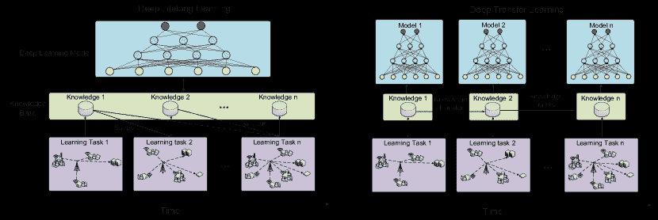

图 20：深度终身学习（左）和深度迁移学习（右）的基本原理。终身学习保留所学知识，而迁移学习则利用一个领域的标记数据在新的目标领域中学习。

深度终身学习模拟了人类行为，并寻求构建一个可以持续适应新环境、从以往学习经验中保留尽可能多知识的机器[545]。有几项研究努力将传统深度学习适应于终身学习。例如，Lee *等* 提出了一个用于终身学习日常人类行为的双重记忆深度学习架构，适用于非平稳数据流[546]。为了使预训练模型在使用新数据进行训练时保留旧知识，他们的架构包括两个记忆缓冲区，即深度记忆和快速记忆。深度记忆由多个深度网络组成，当来自未见分布的数据量积累并达到阈值时建立。快速记忆组件是一个小型神经网络，当遇到新数据样本时会立即更新。这两个记忆模块允许进行持续学习而不会遗忘旧知识。在非平稳图像数据流上的实验证明了该模型的有效性，因为它显著优于其他在线深度学习算法。记忆机制也应用于[547]。特别地，作者介绍了一种可微分的神经计算机，它允许神经网络动态地读取和写入外部记忆模块。这使得像人类一样从外部来源终身查阅和遗忘知识成为可能。

Parisi *等* 在[548]中考虑了一个不同的终身学习场景。他们放弃了[546]中的记忆模块，并设计了一个具有递归神经元的自组织架构来处理时间变化的模式。在每一层中采用了 Growing When Required 网络的变体，以预测来自上一网络层的神经激活序列。这允许在输入和标签之间学习时间变化的相关性，而不需要预定义的类别数量。重要的是，这个框架具有鲁棒性，因为它对缺失和损坏的样本标签具有容忍性，这在移动数据中很常见。

另一种有趣的深度终身学习架构在[549]中提出，其中 Tessler *et al.* 构建了一个 DQN 代理，该代理可以保留在玩著名计算机游戏《Minecraft》时学到的技能。总体框架包括一个预训练模型，即深度技能网络，该网络在游戏的各种子任务上进行预训练。在学习新任务时，通过一个深度技能模块（包括一个深度技能网络阵列和一个多技能蒸馏网络）来维护旧知识。这些模块允许代理选择性地转移知识以解决新任务。实验表明，他们的提案在准确性和收敛性方面显著优于传统的双重 DQN。这项技术有可能被用于解决移动网络问题，因为它可以不断获得新知识。

深度迁移学习：与终身学习不同，迁移学习仅寻求利用特定领域的知识来帮助目标领域的学习。应用迁移学习可以加快新的学习过程，因为新的任务不需要从头开始学习。这对移动网络环境至关重要，因为这些环境需要灵活地响应新的网络模式和威胁。在计算机网络领域出现了许多重要应用[57]，如网络挖掘[550]、缓存[551]和基站睡眠策略[207]。

存在两种极端的迁移学习范式，即一次学习和零次学习。一-shot 学习指的是在仅有一个或少量样本的情况下，从中获取尽可能多的关于一个类别的信息，前提是已有一个预训练模型[552]。另一方面，零-shot 学习则不需要任何来自某类别的样本[553]。它旨在通过新的类别的元描述和与现有训练数据的关联来学习新的分布。虽然对深度一-shot 学习[95, 554]和深度零-shot 学习[555, 556]的研究还处于起步阶段，但这两种范式在检测移动网络中的新威胁或流量模式方面都非常有前景。

## VIII 未来研究展望

随着深度学习在移动网络领域取得越来越有前景的成果，未来仍需解决若干重要的研究问题。我们通过讨论这些挑战并指出可以通过新颖的深度学习工具来解决的关键移动网络研究问题来总结我们的调查。

### VIII-A 用海量高质量数据服务深度学习

深度神经网络依赖于大规模高质量的数据以实现良好的性能。在训练大型复杂架构时，数据量和质量非常重要，因为较深的模型通常有大量参数需要学习和配置。在移动网络应用中，这个问题仍然存在。不幸的是，与计算机视觉和自然语言处理等其他研究领域不同，移动网络应用仍然缺乏高质量和大规模的标记数据集，因为服务提供商和运营商将收集的数据保密，并不愿意发布数据集。尽管这从用户隐私的角度讲是合理的，但在一定程度上限制了解决移动网络领域问题的深度学习机制的发展。此外，通过传感器和网络设备收集的移动数据经常存在丢失、冗余、误标记和类别不平衡等问题，因此不能直接用于训练目的。

要构建智能的 5G 移动网络架构，需要高效成熟的移动数据处理平台。这需要大量的研究工作来进行数据收集、传输、清理、聚类、转换和匿名化。如果研究人员和行业利益相关者发布更多数据集，可以推动移动网络领域的深度学习应用的进步，从而造福更广泛的社区。

### VIII-B 深度学习用于时空移动数据挖掘

对地理区域内移动流量数据进行准确分析，对事件定位、网络资源分配、基于上下文的广告和城市规划越来越重要[544]。然而，由于智能手机用户的移动性，移动流量的时空分布[557]和应用程序流行度[558]难以理解（参见图 21 中的城市尺度流量快照示例）。

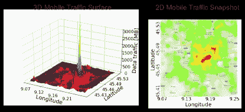

图 21: 意大利米兰的 3D 移动流量表面示例（左）和 2D 投影（右）。图片改编自[216]，使用[559]的数据。

最近的研究表明，通过移动传感器（例如移动交通数据），在城市上收集的数据可以被视为全景摄像机拍摄的图片，这为城市监视提供了一个城市尺度的感知系统[560]。这些交通感知图像包含与个体活动相关的信息[466]。

从空间和时间维度的角度来看，我们认识到移动流量数据与视频或语音具有重要的相似性，这种类比最近在文献[216]中也有提到，并且在图 22 中有所示。

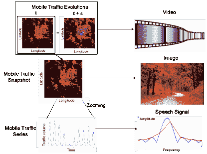

图 22：城市中移动流量数据消费（左）与其他类型数据（右）的类比。

具体而言，视频和移动流量的大规模演变都由“帧”序列组成。此外，如果我们放大小区域来测量长期的交通消费，我们可以观察到单一的交通消费序列看起来类似于自然语言序列。这些观察结果表明，在某种程度上，计算机视觉（如 CNN）或自然语言处理（如 RNN、LSTM）中已经建立的工具有望成为移动流量分析的有力候选。

除了这些相似之处，我们还观察到移动流量的几个特性使其在与图像或语言序列的比较中独具特色。具体来说，

1.  1.

    在精细的交通快照中，相邻的‘像素’值通常在一般情况下并无显著差异，而在自然图像的边缘处却经常发生这种情况。

1.  2.

    单一的移动流量序列通常表现出一定的周期性（既日周期性又周周期性），但在视频像素中却很少见。

1.  3.

    由于用户的移动性，交通消费在不久的将来更有可能停留或转移到相邻的小区，这在视频中不太可能看到。

移动流量中的这种时空相关性可以作为模型设计的先验知识加以利用。我们认识到，采用深度学习进行移动流量数据挖掘具有几个独特优势：

1.  1.

    CNN 结构在图像应用中表现良好，因此在提到的类比情况下，也可以用于移动流量分析任务。

1.  2.

    LSTM 很好地捕捉了时间序列数据（如自然语言）中的时间相关性；因此，这种结构也可以适应交通预测问题。

1.  3.

    GPU 计算使得神经网络的快速训练成为可能，并且与并行化技术一起，可以通过深度学习工具支持低延迟的移动流量分析。

本质上，我们预期专门为移动网络定制的深度学习工具将克服传统回归和插值工具（如指数平滑[561]、自回归积分移动平均模型[562]或均匀插值）的局限性，这些工具通常在运营网络中使用。

### VIII-C 几何移动数据挖掘的深度学习

如第 III-D 节所述，某些移动数据具有重要的几何属性。例如，移动用户或基站的位置及其携带的数据可以视为二维平面上的点云。如果还加入时间维度，这将导致三维点云表示，位置可以是固定的或者变化的。此外，移动设备、路由器、基站、网关等的连接可以自然地构建一个有向图，其中实体表示为顶点，它们之间的连接可以看作边，数据流可以给这些边指定方向。我们在图 23 中展示了几何移动数据及其潜在的表示方法。在图的顶部，一组移动用户被表示为点云。同样地，移动网络实体（例如基站、网关、用户）在下方被视为图，按照下文所述的理论进行解释。由于这些表示的复杂性，传统的机器学习工具通常难以解释几何数据并进行可靠的推断。

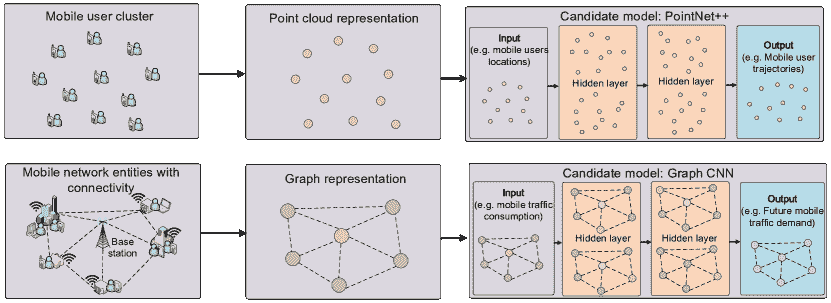

图 23：移动数据示例具有几何属性（左），它们的几何表示（中）以及分析候选模型（右）。当提供用户位置的点云表示时，可以使用 PointNet++ 推断用户轨迹（上）；使用 GraphCNN 可以预测基站级别的未来移动流量需求（下）。

相比之下，虽然存在各种用于建模几何数据的深度学习工具箱，但它们在移动网络中的应用尚不广泛。例如，PointNet[563]和后续的 PointNet++[100]是首批将深度学习应用于 3D 点云任务的解决方案，包括分类和分割[564]。我们认为类似的思想可以应用于几何移动数据分析，例如移动用户或基站的聚类，或用户轨迹预测。此外，深度学习在图形数据分析中的应用也在快速发展[565]。这得益于对图卷积网络（Graph CNNs）[101]的研究，它将卷积概念引入到图结构数据中。图卷积网络的适用性还可以扩展到时间域[566]。一个可能的应用是预测单个基站级别的未来流量需求。我们预计，这些新颖的架构将在网络图分析和移动网络图上的异常检测等应用中发挥越来越重要的作用。

### VIII-D 移动网络中的深度无监督学习

我们观察到，目前在移动网络中的深度学习实践主要采用监督学习和强化学习。然而，由于移动网络每天生成大量未标记的数据，数据标记成本高且需要领域特定知识。为了促进原始移动网络数据的分析，无监督学习在从未标记数据中提取见解变得至关重要[567]，以优化移动网络功能，提高用户体验（QoE）。

一系列无监督深度学习工具的潜力，包括 AE、RBM 和 GAN，尚待进一步探索。一般来说，这些模型需要较少的特征工程，因此对从异构和非结构化的移动数据中学习具有很大的潜力。例如，深度 AE 在无监督异常检测中表现良好[568]。虽然不如其他模型流行，但 RBM 可以进行逐层无监督预训练，从而加快整体模型训练过程。GAN 擅长模拟数据分布，因此可以用来模拟真实的移动网络环境。近期研究表明，GAN 甚至可以通过制作定制加密技术来保护通信，以避免窃听[569]。所有这些工具都需要进一步研究，以发挥其在移动网络领域的全部潜力。

### VIII-E 移动网络控制的深度强化学习

许多移动网络控制问题都是通过受限优化、动态规划和博弈理论方法来解决的。不幸的是，这些方法要么对于目标函数（例如函数凸性）或数据分布（例如高斯或泊松分布）做出了强烈的假设，要么饱受高时间和空间复杂度的困扰。随着移动网络变得越来越复杂，这些假设有时变得不切实际。目标函数受到它们日益庞大的变量集的进一步影响，这给现有的数学方法带来严重的计算和内存挑战。

相比之下，深度强化学习不对目标系统做出强烈的假设。它采用函数逼近，明确解决了大状态-动作空间的问题，使强化学习能够扩展到以前被认为很困难的网络控制问题。受 Atari[19]和围棋[570]游戏的显著成就的启发，一些研究人员开始探索 DRL 来解决复杂的网络控制问题，就像我们在第 VIG 节中所讨论的那样。然而，这些工作只是触及到了表面，DRL 解决移动网络控制问题的潜力仍然很大部分尚未开发。例如，当 DeepMind 训练一个 DRL 代理以减少谷歌的数据中心冷却费用，³³³³33DeepMind AI Reduces Google Data Center Cooling Bill by 40% https://deepmind.com/blog/deepmind-ai-reduces-google-data-centre-cooling-bill-40/ DRL 可以被利用来从蜂窝网络中提取丰富的特性，并实现智能的基站开关，以减少基础设施的能耗。这样激动人心的应用使我们坚信，即将出现的 DRL 的进展可能会彻底改变未来移动网络的自动控制。

### 八-F 总结

深度学习在移动和无线网络领域发挥着越来越重要的作用。在本文中，我们对深度学习和移动网络交集处的最新研究进行了全面调查。我们总结了各种深度学习模型的基本概念和高级原则，然后回顾了在不同应用场景下移动网络的相关工作。我们讨论了如何将深度学习模型定制到通用移动网络应用中，这是以前调查所忽视的一个方面。最后，我们指出了几个开放的研究问题和有希望的方向，这可能会带来有价值的未来研究成果。我们希望本文能成为对于希望将机器智能应用到移动网络环境中复杂问题的研究人员和实践者的明确指南。

## 致谢

我们感谢宗作·王分享了有关深度学习的宝贵见解，这帮助提高了本文的质量。我们还感谢匿名评审，他们详细而深思熟虑的反馈帮助我们使这篇综述更具深度和广度。

## 参考文献

+   [1] 思科。思科视觉网络指数：预测与方法论，2016-2021，2017 年 6 月。

+   [2] 宁王、艾克拉姆·霍赛因和维杰·K·巴尔伽瓦。回传 5G 小基站：无线资源管理视角。IEEE 无线通信，22(5)：41–49，2015。

+   [3] 法比奥·朱斯特、卢卡·科敏纳尔迪和卡洛斯·J·贝尔纳多斯。面向未来 5G 网络的分布式移动性管理：现有方法概述与分析。IEEE 通信杂志，53(1)：142–149，2015。

+   [4] 曼塔·阿吉瓦尔、阿比舍克·罗伊和纳夫拉蒂·萨克塞纳。下一代 5G 无线网络：全面调查。IEEE 通信调查与教程，18(3)：1617–1655，2016。

+   [5] 阿基尔·古普塔和拉凯什·库马尔·贾。5G 网络调查：架构和新兴技术。IEEE 访问，3：1206–1232，2015。

+   [6] 阮坎、杨哲、张宽、佩里克利斯·查齐米修斯、杨坎和肖伟。基于大数据的移动网络优化，面向 5G。IEEE 网络，30(1)：44–51，2016。

+   [7] 春晓·姜、海军·张、永·任、朱·汉、康-程·陈和拉约什·汉佐。下一代无线网络的机器学习范式。IEEE 无线通信，24(2)：98–105，2017。

+   [8] 杜翁·D·阮、洪·X·阮和兰福德·B·怀特。通过网络辅助反馈进行异构比特选择的强化学习。IEEE 无线通信学报，2017。

+   [9] 法伊鲁兹·阿玛丽娜·纳鲁丁、阿里·费佐拉、诺·巴德鲁尔·阿努阿尔和阿卜杜拉·加尼。移动恶意软件检测的机器学习分类器评估。软计算，20(1)：343–357，2016。

+   [10] 凯文·谢、亚伦·哈拉普、南迪塔·维贾库马尔、迪米特里斯·科诺米斯、格雷戈里·R·甘格、菲利普·B·吉本斯和奥努尔·穆特卢。Gaia：接近局域网速度的地理分布式机器学习。见 USENIX 网络系统设计与实施研讨会（NSDI），第 629–647 页，2017。

+   [11] 温聪·肖、吉龙·薛、有山·苗、臻·李、程·陈、明·吴、伟·李和利东·周。Tux2：用于机器学习的分布式图计算。见 USENIX 网络系统设计与实施研讨会（NSDI），第 669–682 页，2017。

+   [12] 帕奥利尼、莫尼卡和菲利、森扎。掌握分析：如何从大数据和网络复杂性中获益：分析师报告。RCR 无线新闻，2017。

+   [13] 赵云·张、潘·周、程华·李和李俊·刘。基于数据增强的叶子识别卷积神经网络。见 IEEE 国际普及智能与计算会议（PICOM）论文集，第 2143–2150 页，2015。

+   [14] 理查德·索彻、约书亚·本吉奥和克里斯托弗·D·曼宁。自然语言处理的深度学习（无魔法）。见 ACL 2012 教程摘要，第 5–5 页。计算语言学协会。

+   [15] IEEE Network 特刊：探索深度学习以实现高效和可靠的移动感知。http://www.comsoc.org/netmag/cfp/exploring-deep-learning-efficient-and-reliable-mobile-sensing, 2017。[在线; 访问日期：2017 年 7 月 14 日]。

+   [16] Mowei Wang, Yong Cui, Xin Wang, Shihan Xiao 和 Junchen Jiang. 网络中的机器学习：工作流、进展和机遇。IEEE Network, 32(2):92–99, 2018。

+   [17] Mohammad Abu Alsheikh, Dusit Niyato, Shaowei Lin, Hwee-Pink Tan 和 Zhu Han. 使用深度学习和 Apache Spark 进行移动大数据分析。IEEE Network, 30(3):22–29, 2016。

+   [18] Ian Goodfellow, Yoshua Bengio 和 Aaron Courville. 深度学习。MIT Press, 2016。

+   [19] Volodymyr Mnih, Koray Kavukcuoglu, David Silver, Andrei A. Rusu, Joel Veness, Marc G. Bellemare, Alex Graves, Martin Riedmiller, Andreas K. Fidjeland, Georg Ostrovski, Stig Petersen, Charles Beattie, Amir Sadik, Ioannis Antonoglou, Helen King, Dharshan Kumaran, Daan Wierstra, Shane Legg 和 Demis Hassabis. 通过深度强化学习实现人类级别的控制。Nature, 518(7540):529–533, 2015。

+   [20] Yann LeCun, Yoshua Bengio 和 Geoffrey Hinton. 深度学习。Nature, 521(7553):436–444, 2015。

+   [21] Jürgen Schmidhuber. 神经网络中的深度学习：概述。Neural Networks, 61:85–117, 2015。

+   [22] Weibo Liu, Zidong Wang, Xiaohui Liu, Nianyin Zeng, Yurong Liu 和 Fuad E Alsaadi. 深度神经网络架构及其应用综述。Neurocomputing, 234:11–26, 2017。

+   [23] Li Deng, Dong Yu 等. 深度学习：方法与应用。Foundations and Trends® in Signal Processing, 7(3–4):197–387, 2014。

+   [24] Li Deng. 深度学习架构、算法和应用的教程综述。APSIPA Transactions on Signal and Information Processing, 3, 2014。

+   [25] Samira Pouyanfar, Saad Sadiq, Yilin Yan, Haiman Tian, Yudong Tao, Maria Presa Reyes, Mei-Ling Shyu, Shu-Ching Chen 和 S. S. Iyengar. 深度学习综述：算法、技术与应用。ACM Computing Surveys (CSUR), 51(5):92:1–92:36, 2018。

+   [26] Kai Arulkumaran, Marc Peter Deisenroth, Miles Brundage 和 Anil Anthony Bharath. 深度强化学习：简要综述。IEEE Signal Processing Magazine, 34(6):26–38, 2017。

+   [27] Ahmed Hussein, Mohamed Medhat Gaber, Eyad Elyan 和 Chrisina Jayne. 模仿学习：学习方法综述。ACM Computing Surveys (CSUR), 50(2):21:1–21:35, 2017。

+   [28] Xue-Wen Chen 和 Xiaotong Lin. 大数据深度学习：挑战与展望。IEEE Access, 2:514–525, 2014。

+   [29] Maryam M Najafabadi, Flavio Villanustre, Taghi M Khoshgoftaar, Naeem Seliya, Randall Wald 和 Edin Muharemagic. 深度学习在大数据分析中的应用和挑战。Journal of Big Data, 2(1):1, 2015。

+   [30] NF Hordri, A Samar, SS Yuhaniz 和 SM Shamsuddin. 大数据分析中深度学习特征的系统文献综述。International Journal of Advances in Soft Computing & Its Applications, 9(1), 2017。

+   [31] Mehdi Gheisari, Guojun Wang, 和 Md Zakirul Alam Bhuiyan. 大数据中的深度学习综述。发表于 IEEE 国际计算科学与工程会议（CSE）和嵌入式与普适计算（EUC），第 2 卷，页 173–180, 2017。

+   [32] Shuai Zhang, Lina Yao, 和 Aixin Sun. 基于深度学习的推荐系统：综述与新视角。arXiv 预印本 arXiv:1707.07435, 2017。

+   [33] Shui Yu, Meng Liu, Wanchun Dou, Xiting Liu, 和 Sanming Zhou. 大数据网络：综述。IEEE Communications Surveys & Tutorials, 19(1):531–549, 2017。

+   [34] Mohammad Abu Alsheikh, Shaowei Lin, Dusit Niyato, 和 Hwee-Pink Tan. 无线传感器网络中的机器学习：算法、策略与应用。IEEE Communications Surveys & Tutorials, 16(4):1996–2018, 2014。

+   [35] Chun-Wei Tsai, Chin-Feng Lai, Ming-Chao Chiang, Laurence T Yang, 等。物联网的数据挖掘：综述。IEEE Communications Surveys and Tutorials, 16(1):77–97, 2014。

+   [36] Xiang Cheng, Luoyang Fang, Xuemin Hong, 和 Liuqing Yang. 利用移动大数据：来源、特征及应用。IEEE Network, 31(1):72–79, 2017。

+   [37] Mario Bkassiny, Yang Li, 和 Sudharman K Jayaweera. 认知无线电中的机器学习技术调查。IEEE Communications Surveys & Tutorials, 15(3):1136–1159, 2013。

+   [38] Jeffrey G Andrews, Stefano Buzzi, Wan Choi, Stephen V Hanly, Angel Lozano, Anthony CK Soong, 和 Jianzhong Charlie Zhang. 5G 将是什么？IEEE Journal on Selected Areas in Communications, 32(6):1065–1082, 2014。

+   [39] Nisha Panwar, Shantanu Sharma, 和 Awadhesh Kumar Singh. 5G 综述：下一代移动通信。Physical Communication, 18:64–84, 2016。

+   [40] Olakunle Elijah, Chee Yen Leow, Tharek Abdul Rahman, Solomon Nunoo, 和 Solomon Zakwoi Iliya. 大规模 MIMO–5G 系统中导频污染的综合调查。IEEE Communications Surveys & Tutorials, 18(2):905–923, 2016。

+   [41] Stefano Buzzi, I Chih-Lin, Thierry E Klein, H Vincent Poor, Chenyang Yang, 和 Alessio Zappone. 5G 网络的节能技术综述及面临的挑战。IEEE Journal on Selected Areas in Communications, 34(4):697–709, 2016。

+   [42] Mugen Peng, Yong Li, Zhongyuan Zhao, 和 Chonggang Wang. 5G 异构云无线接入网络的系统架构和关键技术。IEEE Network, 29(2):6–14, 2015。

+   [43] Yong Niu, Yong Li, Depeng Jin, Li Su, 和 Athanasios V Vasilakos. 毫米波通信（mmwave）在 5G 中的综述：机会与挑战。Wireless Networks, 21(8):2657–2676, 2015。

+   [44] Xenofon Foukas, Georgios Patounas, Ahmed Elmokashfi, 和 Mahesh K Marina. 5G 网络切片：综述与挑战。IEEE Communications Magazine, 55(5):94–100, 2017。

+   [45] Tarik Taleb, Konstantinos Samdanis, Badr Mada, Hannu Flinck, Sunny Dutta 和 Dario Sabella。关于多接入边缘计算：新兴 5G 网络边缘架构与编排的调查。IEEE 通信调查与教程，2017 年。

+   [46] Pavel Mach 和 Zdenek Becvar。移动边缘计算：关于架构和计算卸载的调查。IEEE 通信调查与教程，2017 年。

+   [47] Yuyi Mao, Changsheng You, Jun Zhang, Kaibin Huang 和 Khaled B Letaief。关于移动边缘计算的调查：通信视角。IEEE 通信调查与教程，2017 年。

+   [48] Ying Wang, Peilong Li, Lei Jiao, Zhou Su, Nan Cheng, Xuemin Sherman Shen 和 Ping Zhang。用于 5G 无线网络个性化 QoE 管理的数据驱动架构。IEEE 无线通信，24(1):102–110，2017 年。

+   [49] Qilong Han, Shuang Liang 和 Hongli Zhang。移动云感知、大数据和 5G 网络构建了一个智能和智能的世界。IEEE 网络，29(2):40–45，2015 年。

+   [50] Sukhdeep Singh, Navrati Saxena, Abhishek Roy 和 HanSeok Kim。从社会视角看 5G 网络技术的调查。IETE 技术评论，34(1):30–39，2017 年。

+   [51] Min Chen, Jun Yang, Yixue Hao, Shiwen Mao 和 Kai Hwang。用于医疗保健的 5G 认知系统。大数据与认知计算，1(1):2，2017 年。

+   [52] Xianfu Chen, Jinsong Wu, Yueming Cai, Honggang Zhang 和 Tao Chen。面向能源效率的无线网络流量卸载：异构蜂窝网络的简要调查与学习方法。IEEE 选定领域通信杂志，33(4):627–640，2015 年。

+   [53] Jinsong Wu, Song Guo, Jie Li 和 Deze Zeng。大数据遇见绿色挑战：大数据推动绿色应用。IEEE 系统杂志，10(3):888–900，2016 年。

+   [54] Teodora Sandra Buda, Haytham Assem, Lei Xu, Danny Raz, Udi Margolin, Elisha Rosensweig, Diego R Lopez, Marius-Iulian Corici, Mikhail Smirnov, Robert Mullins 等人。机器学习能否帮助在 5G 中提供新的用例和场景？发表于 IEEE/IFIP 网络操作与管理研讨会（NOMS），页码 1279–1284，2016 年。

+   [55] Ali Imran, Ahmed Zoha 和 Adnan Abu-Dayya。5G 挑战：如何利用大数据增强 SON 实现 5G。IEEE 网络，28(6):27–33，2014 年。

+   [56] Bharath Keshavamurthy 和 Mohammad Ashraf。基于大数据框架的主动 SON 概念设计：一种促进 SON 模式转变的新型机器学习视角。在 IEEE 国际系统建模与研究趋势进展会议（SMART）上发表，页码 298–304，2016 年。

+   [57] Paulo Valente Klaine, Muhammad Ali Imran, Oluwakayode Onireti 和 Richard Demo Souza。应用于自组织蜂窝网络的机器学习技术的调查。IEEE 通信调查与教程，2017 年。

+   [58] **李荣鹏**，**赵智锋**，**周轩**，**丁国儒**，**陈燕**，**王仲耀**，以及**张红刚**。智能 5G：当蜂窝网络遇到人工智能。IEEE Wireless communications，24(5)：175–183，2017。

+   [59] **Nicola Bui**，**Matteo Cesana**，**S Amir Hosseini**，**Qi Liao**，**Ilaria Malanchini**，以及**Joerg Widmer**。预测性移动网络的调查：基于背景的分类，预测方法和优化技术。IEEE Communications Surveys & Tutorials，19(3)：1790–1821，2017。

+   [60] **Panagiotis Kasnesis**，**Charalampos Patrikakis**，以及**Iakovos Venieris**。用深度学习改变移动数据分析的游戏。IT Professional，2017。

+   [61] **程翔**，**方洛阳**，**杨柳青**，以及**崔曙光**。移动大数据：数据驱动的无线战略。IEEE Internet of Things Journal，4(5)：1489–1516，2017。

+   [62] **王利东**，以及**Randy Jones**。网络入侵检测的大数据分析：一项调查。International Journal of Networks and Communications，7(1)：24–31，2017。

+   [63] **Nei Kato**，**Zubair Md Fadlullah**，**Bomin Mao**，**Fengxiao Tang**，**Osamu Akashi**，**Takeru Inoue**，以及**Kimihiro Mizutani**。深度学习在异构网络流量控制中的愿景：提案，挑战和未来展望。IEEE Wireless Communications，24(3)：146–153，2017。

+   [64] **Michele Zorzi**，**Andrea Zanella**，**Alberto Testolin**，**Michele De Filippo De Grazia**，以及**Marco Zorzi**。基于认知的网络：利用学习和分布式智能进行网络优化的新视角。IEEE Access，3：1512–1530，2015。

+   [65] **Zubair Fadlullah**，**Fengxiao Tang**，**Bomin Mao**，**Nei Kato**，**Osamu Akashi**，**Takeru Inoue**，以及**Kimihiro Mizutani**。最新技术的深度学习：迈向明天智能网络流量控制系统的机器智能进化。IEEE Communications Surveys & Tutorials，19(4)：2432–2455，2017。

+   [66] **Mehdi Mohammadi**，**Ala Al-Fuqaha**，**Sameh Sorour**，以及**Mohsen Guizani**。用于物联网大数据和流媒体分析的深度学习：一项调查。IEEE Communications Surveys & Tutorials，2018。

+   [67] **Nauman Ahad**，**Junaid Qadir**，以及**Nasir Ahsan**。神经网络在无线网络中的技术，应用和指南。Journal of Network and Computer Applications，68：1–27，2016。

+   [68] **钱毛**，**胡飞**，以及**郝琦**。智能无线网络的深度学习：综合调查。IEEE Communications Surveys & Tutorials，2018。

+   [69] **Nguyen Cong Luong**，**Dinh Thai Hoang**，**Shimin Gong**，**Dusit Niyato**，**Ping Wang**，**Ying-Chang Liang**，以及**Dong In Kim**。深度强化学习在通信和网络中的应用：一项调查。arXiv 预印本 arXiv:1810.07862，2018。

+   [70] **周祥伟**，**孙明轩**，**李跃**，以及**卢彼红**。认知无线电和机器学习实现的智能无线通信。arXiv 预印本 arXiv:1710.11240，2017。

+   [71] Mingzhe Chen, Ursula Challita, Walid Saad, Changchuan Yin 和 Mérouane Debbah. 人工智能无线网络中的机器学习：神经网络教程。arXiv 预印本 arXiv:1710.02913, 2017。

+   [72] Ammar Gharaibeh, Mohammad A Salahuddin, Sayed Jahed Hussini, Abdallah Khreishah, Issa Khalil, Mohsen Guizani 和 Ala Al-Fuqaha. 智能城市：数据管理、安全和支持技术的调查。IEEE 通信调查与教程，19(4):2456–2501, 2017。

+   [73] Nicholas D Lane 和 Petko Georgiev. 深度学习能否革新移动传感？第 16 届 ACM 国际移动计算系统与应用研讨会论文集，页码 117–122, 2015。

+   [74] Kaoru Ota, Minh Son Dao, Vasileios Mezaris 和 Francesco GB De Natale. 移动多媒体的深度学习：综述。ACM 多媒体计算、通信与应用事务（TOMM），13(3s):34, 2017。

+   [75] Preeti Mishra, Vijay Varadharajan, Uday Tupakula 和 Emmanuel S Pilli. 使用机器学习技术进行入侵检测的详细调查与分析。IEEE 通信调查与教程，2018。

+   [76] Yuxi Li. 深度强化学习：概述。arXiv 预印本 arXiv:1701.07274, 2017。

+   [77] Longbiao Chen, Dingqi Yang, Daqing Zhang, Cheng Wang, Jonathan Li 等人。深度移动流量预测与补充基站聚类用于 C-RAN 优化。网络与计算机应用杂志，121:59–69, 2018。

+   [78] Volodymyr Mnih, Adria Puigdomenech Badia, Mehdi Mirza, Alex Graves, Timothy Lillicrap, Tim Harley, David Silver 和 Koray Kavukcuoglu. 用于深度强化学习的异步方法。国际机器学习大会（ICML）论文集，页码 1928–1937, 2016。

+   [79] Martin Arjovsky, Soumith Chintala 和 Léon Bottou. Wasserstein 生成对抗网络。国际机器学习大会论文集，页码 214–223, 2017。

+   [80] Andreas Damianou 和 Neil Lawrence. 深度高斯过程。在人工智能与统计学，页码 207–215, 2013。

+   [81] Marta Garnelo, Jonathan Schwarz, Dan Rosenbaum, Fabio Viola, Danilo J Rezende, SM Eslami 和 Yee Whye Teh. 神经过程。arXiv 预印本 arXiv:1807.01622, 2018。

+   [82] Zhi-Hua Zhou 和 Ji Feng. 深度森林：一种替代深度神经网络的方法。第 26 届国际人工智能联合会议论文集，页码 3553–3559\. AAAI Press, 2017。

+   [83] W. McCulloch 和 W. Pitts. 神经活动中固有思想的逻辑演算。数学生物物理学通报，（5）。

+   [84] David E Rumelhart, Geoffrey E Hinton 和 Ronald J Williams. 通过反向传播错误学习表示。自然，323(6088):533, 1986。

+   [85] Yann LeCun, Yoshua Bengio 等人。用于图像、语音和时间序列的卷积网络。大脑理论与神经网络手册，3361(10):1995, 1995。

+   [86] Alex Krizhevsky, Ilya Sutskever 和 Geoffrey E Hinton. 使用深度卷积神经网络的 Imagenet 分类。在 Advances in neural information processing systems，页码 1097–1105，2012。

+   [87] Pedro Domingos. 关于机器学习的几个有用的事情。Communications of the ACM，55(10)：78–87，2012。

+   [88] Ivor W Tsang, James T Kwok 和 Pak-Ming Cheung. 核向量机：在非常大的数据集上进行快速 SVM 训练。Journal of Machine Learning Research，6：363–392，2005。

+   [89] Carl Edward Rasmussen 和 Christopher KI Williams. 用于机器学习的高斯过程，volume 1。MIT press Cambridge，2006。

+   [90] Nicolas Le Roux 和 Yoshua Bengio. 受限玻尔兹曼机和深信念网络的表示能力。Neural computation，20(6)：1631–1649，2008。

+   [91] Ian Goodfellow, Jean Pouget-Abadie, Mehdi Mirza, Bing Xu, David Warde-Farley, Sherjil Ozair, Aaron Courville 和 Yoshua Bengio. 生成对抗网络。在 Advances in neural information processing systems，页码 2672–2680，2014。

+   [92] Florian Schroff, Dmitry Kalenichenko 和 James Philbin. Facenet：用于人脸识别和聚类的统一嵌入。在 Proc. IEEE Conference on Computer Vision and Pattern Recognition，页码 815–823，2015。

+   [93] Diederik P Kingma, Shakir Mohamed, Danilo Jimenez Rezende 和 Max Welling. 使用深度生成模型的半监督学习。在 Advances in Neural Information Processing Systems，页码 3581–3589，2014。

+   [94] Russell Stewart 和 Stefano Ermon. 使用物理学和领域知识对神经网络进行无标签监督。在 Proc. National Conference on Artificial Intelligence (AAAI)，页码 2576–2582，2017。

+   [95] Danilo Rezende, Ivo Danihelka, Karol Gregor, Daan Wierstra 等人。深度生成模型中的一次通用化。在 Proc. International Conference on Machine Learning (ICML)，页码 1521–1529，2016。

+   [96] Richard Socher, Milind Ganjoo, Christopher D Manning 和 Andrew Ng. 通过跨模态转移实现零样本学习。在 Advances in neural information processing systems，页码 935–943，2013。

+   [97] Petko Georgiev, Sourav Bhattacharya, Nicholas D Lane 和 Cecilia Mascolo. 通过共享的深度神经网络表示实现移动和嵌入设备的低资源多任务音频感知。Proc. ACM on Interactive, Mobile, Wearable and Ubiquitous Technologies (IMWUT)，1(3)：50，2017。

+   [98] Federico Monti, Davide Boscaini, Jonathan Masci, Emanuele Rodola, Jan Svoboda 和 Michael M Bronstein. 基于图和流形的几何深度学习，使用混合模型 CNNs。在 Proc. IEEE Conference on Computer Vision and Pattern Recognition (CVPR)，volume 1，页码 3，2017。

+   [99] Brigitte Le Roux 和 Henry Rouanet. 几何数据分析：从对应分析到结构化数据分析。Springer Science & Business Media，2004。

+   [100] Charles R. Qi, Li Yi, Hao Su, 和 Leonidas J Guibas. PointNet++：在度量空间中的点集上进行深度分层特征学习。见于神经信息处理系统进展，第 5099–5108 页, 2017。

+   [101] Thomas N Kipf 和 Max Welling. 图卷积网络的半监督分类。见于国际学习表征会议（ICLR）论文集, 2017。

+   [102] Xu Wang, Zimu Zhou, Fu Xiao, Kai Xing, Zheng Yang, Yunhao Liu, 和 Chunyi Peng. 大都市中蜂窝流量的时空分析与预测。IEEE 移动计算学报, 2018。

+   [103] Anh Nguyen, Jason Yosinski, 和 Jeff Clune. 深度神经网络容易被欺骗：对无法识别图像的高置信度预测。见于 IEEE 计算机视觉与模式识别会议论文集，第 427–436 页, 2015。

+   [104] Vahid Behzadan 和 Arslan Munir. 深度强化学习对策略诱导攻击的脆弱性。见于国际机器学习与模式识别数据挖掘会议论文集，第 262–275 页。Springer, 2017。

+   [105] Pooria Madani 和 Natalija Vlajic. 在对抗性污染下，深度自编码器在入侵检测中的鲁棒性。见于第 5 届 ACM 年度科学安全热点主题研讨会论文集，第 1 页, 2018。

+   [106] David Bau, Bolei Zhou, Aditya Khosla, Aude Oliva, 和 Antonio Torralba. 网络解剖：量化深度视觉表示的可解释性。见于 IEEE 计算机视觉与模式识别会议（CVPR）论文集，第 3319–3327 页, 2017。

+   [107] Mike Wu, Michael C Hughes, Sonali Parbhoo, Maurizio Zazzi, Volker Roth, 和 Finale Doshi-Velez. 超越稀疏性：深度模型的树正则化以提高可解释性。2018 年。

+   [108] Supriyo Chakraborty, Richard Tomsett, Ramya Raghavendra, Daniel Harborne, Moustafa Alzantot, Federico Cerutti, Mani Srivastava, Alun Preece, Simon Julier, Raghuveer M Rao 等. 深度学习模型的可解释性：结果调查。见于 IEEE 智能世界大会研讨会：DAIS, 2017。

+   [109] Luis Perez 和 Jason Wang. 在图像分类中使用深度学习的数据增强效果。arXiv 预印本 arXiv:1712.04621, 2017。

+   [110] Chenxi Liu, Barret Zoph, Jonathon Shlens, Wei Hua, Li-Jia Li, Li Fei-Fei, Alan Yuille, Jonathan Huang, 和 Kevin Murphy. 渐进式神经架构搜索。arXiv 预印本 arXiv:1712.00559, 2017。

+   [111] Wei Zhang, Kan Liu, Weidong Zhang, Youmei Zhang, 和 Jason Gu. 用于室内外环境无线定位的深度神经网络。神经计算, 194:279–287, 2016。

+   [112] Francisco Javier Ordóñez 和 Daniel Roggen. 用于多模态可穿戴活动识别的深度卷积和 LSTM 递归神经网络。传感器, 16(1):115, 2016。

+   [113] Elias De Coninck, Tim Verbelen, Bert Vankeirsbilck, Steven Bohez, Pieter Simoens, Piet Demeester, 和 Bart Dhoedt. 分布式神经网络用于物联网：大-小方法。在物联网。IoT 基础设施：第二届国际峰会，IoT 360^∘ 2015，罗马，意大利，2015 年 10 月 27-29 日，修订选定的论文，第 II 部分，页码 484–492\. Springer，2016 年。

+   [114] Norman P Jouppi, Cliff Young, Nishant Patil, David Patterson, Gaurav Agrawal, Raminder Bajwa, Sarah Bates, Suresh Bhatia, Nan Boden, Al Borchers 等。数据中心中张量处理单元的性能分析。在 ACM/IEEE 第 44 届年度国际计算机架构研讨会（ISCA）上，页码 1–12，2017 年。

+   [115] John Nickolls, Ian Buck, Michael Garland, 和 Kevin Skadron. 可伸缩的 CUDA 并行编程。Queue，6(2)：40–53，2008 年。

+   [116] Sharan Chetlur, Cliff Woolley, Philippe Vandermersch, Jonathan Cohen, John Tran, Bryan Catanzaro, 和 Evan Shelhamer. cuDNN：深度学习的高效基元。arXiv 预印本 arXiv:1410.0759，2014 年。

+   [117] Martín Abadi, Paul Barham, Jianmin Chen, Zhifeng Chen, Andy Davis, Jeffrey Dean, Matthieu Devin, Sanjay Ghemawat, Geoffrey Irving, Michael Isard 等。TensorFlow：大规模机器学习系统。在 USENIX 操作系统设计与实现研讨会（OSDI）上，第 16 卷，页码 265–283，2016 年。

+   [118] Theano 开发团队。Theano：用于快速计算数学表达式的 Python 框架。arXiv 电子打印版，abs/1605.02688，2016 年 5 月。

+   [119] Yangqing Jia, Evan Shelhamer, Jeff Donahue, Sergey Karayev, Jonathan Long, Ross Girshick, Sergio Guadarrama, 和 Trevor Darrell. Caffe：用于快速特征嵌入的卷积架构。arXiv 预印本 arXiv:1408.5093，2014 年。

+   [120] R. Collobert, K. Kavukcuoglu, 和 C. Farabet. Torch7：用于机器学习的类似 Matlab 的环境。在 BigLearn 会议论文集，NIPS Workshop，2011 年。

+   [121] Vinayak Gokhale, Jonghoon Jin, Aysegul Dundar, Berin Martini, 和 Eugenio Culurciello. 用于深度神经网络的 240 G-ops/s 移动协处理器。在 IEEE 计算机视觉与模式识别会议论文集，页码 682–687，2014 年。

+   [122] ncnn – 为移动平台优化的高性能神经网络推理框架。https://github.com/Tencent/ncnn，2017 年。[在线；访问日期 2017 年 7 月 25 日]。

+   [123] 华为宣布 Kirin 970- 具有人工智能功能的新旗舰 SoC。http://www.androidauthority.com/huawei-announces-kirin-970-797788/，2017 年。[在线；访问日期 2017 年 9 月 1 日]。

+   [124] Core ML：将机器学习模型集成到您的应用程序中。https://developer.apple.com/documentation/coreml，2017 年。[在线；访问日期 2017 年 7 月 25 日]。

+   [125] Ilya Sutskever, James Martens, George E Dahl, 和 Geoffrey E Hinton. 初始化和动量在深度学习中的重要性。国际机器学习会议（ICML）论文集，第 28 卷：1139–1147，2013 年。

+   [126] Jeffrey Dean, Greg Corrado, Rajat Monga, Kai Chen, Matthieu Devin, Mark Mao, Andrew Senior, Paul Tucker, Ke Yang, Quoc V Le 等。大规模分布式深度网络。发表于神经信息处理系统进展，第 1223–1231 页，2012 年。

+   [127] Diederik Kingma 和 Jimmy Ba. Adam: 一种用于随机优化的方法。发表于国际学习表示会议（ICLR），2015 年。

+   [128] Tim Kraska, Ameet Talwalkar, John C Duchi, Rean Griffith, Michael J Franklin 和 Michael I Jordan. MLbase: 一个分布式机器学习系统。发表于 CIDR，第 1 卷，第 2–1 页，2013 年。

+   [129] Trishul M Chilimbi, Yutaka Suzue, Johnson Apacible 和 Karthik Kalyanaraman. Project adam: 构建一个高效且可扩展的深度学习训练系统。发表于 USENIX 操作系统设计与实现（OSDI）研讨会，第 14 卷，第 571–582 页，2014 年。

+   [130] Henggang Cui, Hao Zhang, Gregory R Ganger, Phillip B Gibbons 和 Eric P Xing. Geeps: 在分布式 GPU 上进行可扩展深度学习的 GPU 专用参数服务器。发表于第十一届 ACM 欧洲计算机系统会议，第 4 页，2016 年。

+   [131] Xing Lin, Yair Rivenson, Nezih T. Yardimci, Muhammed Veli, Yi Luo, Mona Jarrahi 和 Aydogan Ozcan. 使用衍射深度神经网络的全光机器学习。科学，2018 年。

+   [132] Ryan Spring 和 Anshumali Shrivastava. 通过随机哈希实现可扩展和可持续的深度学习。发表于 ACM SIGKDD 知识发现与数据挖掘会议，2017 年。

+   [133] Azalia Mirhoseini, Hieu Pham, Quoc V Le, Benoit Steiner, Rasmus Larsen, Yuefeng Zhou, Naveen Kumar, Mohammad Norouzi, Samy Bengio 和 Jeff Dean. 使用强化学习进行设备布局优化。发表于国际机器学习会议，2017 年。

+   [134] Eric P Xing, Qirong Ho, Wei Dai, Jin Kyu Kim, Jinliang Wei, Seunghak Lee, Xun Zheng, Pengtao Xie, Abhimanu Kumar 和 Yaoliang Yu. Petuum: 一个用于大数据分布式机器学习的新平台。IEEE 大数据学报，1(2):49–67，2015 年。

+   [135] Philipp Moritz, Robert Nishihara, Stephanie Wang, Alexey Tumanov, Richard Liaw, Eric Liang, Melih Elibol, Zongheng Yang, William Paul, Michael I Jordan 等。Ray: 用于新兴 AI 应用的分布式框架。发表于第 13 届 USENIX 操作系统设计与实现（OSDI）研讨会，第 561–577 页，2018 年。

+   [136] Moustafa Alzantot, Yingnan Wang, Zhengshuang Ren 和 Mani B Srivastava. RSTensorFlow: 为商品 Android 设备上的深度学习提供 GPU 支持的 TensorFlow。发表于首届 ACM 国际移动系统与应用深度学习研讨会，第 7–12 页，2017 年。

+   [137] Hao Dong, Akara Supratak, Luo Mai, Fangde Liu, Axel Oehmichen, Simiao Yu 和 Yike Guo. TensorLayer: 一个多功能库，用于高效的深度学习开发。发表于 ACM 多媒体会议，MM ’17，第 1201–1204 页，2017 年。

+   [138] Adam Paszke, Sam Gross, Soumith Chintala, Gregory Chanan, Edward Yang, Zachary DeVito, Zeming Lin, Alban Desmaison, Luca Antiga 和 Adam Lerer. PyTorch 中的自动微分。2017 年。

+   [139] Tianqi Chen, Mu Li, Yutian Li, Min Lin, Naiyan Wang, Minjie Wang, Tianjun Xiao, Bing Xu, Chiyuan Zhang 和 Zheng Zhang. Mxnet：一个灵活高效的异构分布式系统机器学习库。arXiv 预印本 arXiv:1512.01274，2015 年。

+   [140] Sebastian Ruder. 梯度下降优化算法概述。arXiv 预印本 arXiv:1609.04747，2016 年。

+   [141] Matthew D Zeiler. ADADELTA：一种自适应学习率方法。arXiv 预印本 arXiv:1212.5701，2012 年。

+   [142] Timothy Dozat. 将 Nesterov 动量融入 Adam。2016 年。

+   [143] Marcin Andrychowicz, Misha Denil, Sergio Gomez, Matthew W Hoffman, David Pfau, Tom Schaul 和 Nando de Freitas. 通过梯度下降学习梯度下降。在神经信息处理系统进展中，页码 3981–3989，2016 年。

+   [144] Christian Szegedy, Wei Liu, Yangqing Jia, Pierre Sermanet, Scott Reed, Dragomir Anguelov, Dumitru Erhan, Vincent Vanhoucke 和 Andrew Rabinovich. 通过卷积深入研究。在 IEEE 计算机视觉与模式识别会议论文集中，页码 1–9，2015 年。

+   [145] Yingxue Zhou, Sheng Chen 和 Arindam Banerjee. 稳定的梯度下降。见于人工智能不确定性会议论文集，2018 年。

+   [146] Wei Wen, Cong Xu, Feng Yan, Chunpeng Wu, Yandan Wang, Yiran Chen 和 Hai Li. TernGrad：三值梯度以减少分布式深度学习中的通信。在神经信息处理系统进展中，2017 年。

+   [147] Flavio Bonomi, Rodolfo Milito, Preethi Natarajan 和 Jiang Zhu. 雾计算：物联网和分析的平台。在《大数据与物联网：智能环境的路线图》中，页码 169–186。Springer，2014 年。

+   [148] Jiachen Mao, Xiang Chen, Kent W Nixon, Christopher Krieger 和 Yiran Chen. MoDNN：用于深度神经网络的本地分布式移动计算系统。在 IEEE 设计、自动化与测试欧洲会议与展览（DATE）论文集中，页码 1396–1401，2017 年。

+   [149] Mithun Mukherjee, Lei Shu 和 Di Wang. 雾计算综述：基础，网络应用和研究挑战。IEEE 通信调查与教程，2018 年。

+   [150] Luis M Vaquero 和 Luis Rodero-Merino. 在雾中找到你的方向：迈向雾计算的全面定义。ACM SIGCOMM 计算机通信评论，44(5)：27–32，2014 年。

+   [151] Mohammad Aazam, Sherali Zeadally 和 Khaled A Harras. 物联网中雾计算的卸载：综述、使能技术和研究机会。未来一代计算机系统，87：278–289，2018 年。

+   [152] Rajkumar Buyya, Satish Narayana Srirama, Giuliano Casale, Rodrigo Calheiros, Yogesh Simmhan, Blesson Varghese, Erol Gelenbe, Bahman Javadi, Luis Miguel Vaquero, Marco A. S. Netto, Adel Nadjaran Toosi, Maria Alejandra Rodriguez, Ignacio M. Llorente, Sabrina De Capitani Di Vimercati, Pierangela Samarati, Dejan Milojicic, Carlos Varela, Rami Bahsoon, Marcos Dias De Assuncao, Omer Rana, Wanlei Zhou, Hai Jin, Wolfgang Gentzsch, Albert Y. Zomaya, 和 Haiying Shen。未来一代云计算宣言：下一十年的研究方向。发表于《ACM 计算调查》，51(5)：105:1–105:38，2018 年。

+   [153] Vivienne Sze, Yu-Hsin Chen, Tien-Ju Yang, 和 Joel S Emer。深度神经网络的高效处理：教程与调研。发表于《IEEE 期刊》，105(12)：2295–2329，2017 年。

+   [154] Suyoung Bang, Jingcheng Wang, Ziyun Li, Cao Gao, Yejoong Kim, Qing Dong, Yen-Po Chen, Laura Fick, Xun Sun, Ron Dreslinski, 等。14.7 a 288$\mu$w 可编程深度学习处理器，具有 270kb 片上权重存储，使用非均匀内存层次结构以实现移动智能。发表于《IEEE 国际固态电路会议（ISSCC）》会议录，第 250–251 页，2017 年。

+   [155] Filipp Akopyan。IBM Truenorth 的设计与工具流程：一个超低功耗可编程神经突触芯片，拥有 100 万个神经元。发表于《国际物理设计研讨会》会议录，第 59–60 页。ACM，2016 年。

+   [156] Seyyed Salar Latifi Oskouei, Hossein Golestani, Matin Hashemi, 和 Soheil Ghiasi。Cnndroid：在 Android 上加速执行训练的深度卷积神经网络。发表于《ACM 多媒体会议》会议录，第 1201–1205 页，2016 年。

+   [157] Corinna Cortes, Xavi Gonzalvo, Vitaly Kuznetsov, Mehryar Mohri, 和 Scott Yang。Adanet：人工神经网络的自适应结构学习。发表于《国际机器学习会议（ICML）》，2017 年。

+   [158] Geoffrey E Hinton, Simon Osindero, 和 Yee-Whye Teh。深度置信网络的快速学习算法。发表于《神经计算》，18(7)：1527–1554，2006 年。

+   [159] Honglak Lee, Roger Grosse, Rajesh Ranganath, 和 Andrew Y Ng。卷积深度置信网络：可扩展的无监督学习层次表示。发表于《第 26 届 ACM 年度国际机器学习会议》会议录，第 609–616 页，2009 年。

+   [160] Pascal Vincent, Hugo Larochelle, Isabelle Lajoie, Yoshua Bengio, 和 Pierre-Antoine Manzagol。堆叠去噪自编码器：在具有局部去噪标准的深度网络中学习有用表示。发表于《机器学习研究期刊》，11(12)：3371–3408，2010 年。

+   [161] Diederik P Kingma 和 Max Welling。自编码变分贝叶斯。发表于《国际学习表示会议（ICLR）》，2014 年。

+   [162] Kaiming He, Xiangyu Zhang, Shaoqing Ren, 和 Jian Sun。用于图像识别的深度残差学习。发表于《IEEE 计算机视觉与模式识别会议》会议录，第 770–778 页，2016 年。

+   [163] Shuiwang Ji、Wei Xu、Ming Yang 和 Kai Yu。用于人类动作识别的 3D 卷积神经网络。IEEE 模式分析与机器智能汇刊，35(1):221–231，2013 年。

+   [164] Gao Huang、Zhuang Liu、Kilian Q Weinberger 和 Laurens van der Maaten。密集连接卷积网络。IEEE 计算机视觉与模式识别会议，2017 年。

+   [165] Felix A Gers、Jürgen Schmidhuber 和 Fred Cummins。学习遗忘：使用 LSTM 的持续预测。1999 年。

+   [166] Ilya Sutskever、Oriol Vinyals 和 Quoc V Le。利用神经网络进行序列到序列学习。发表于神经信息处理系统进展，页面 3104–3112，2014 年。

+   [167] Shi Xingjian、Zhourong Chen、Hao Wang、Dit-Yan Yeung、Wai-Kin Wong 和 Wang-chun Woo。卷积 LSTM 网络：用于降水即时预报的机器学习方法。发表于神经信息处理系统进展，页面 802–810，2015 年。

+   [168] Guo-Jun Qi。对 Lipschitz 密度的损失敏感生成对抗网络。arXiv 预印本 arXiv:1701.06264，2017 年。

+   [169] Andrew Brock、Jeff Donahue 和 Karen Simonyan。大规模 GAN 训练用于高保真自然图像合成。arXiv 预印本 arXiv:1809.11096，2018 年。

+   [170] David Silver、Aja Huang、Chris J Maddison、Arthur Guez、Laurent Sifre、George Van Den Driessche、Julian Schrittwieser、Ioannis Antonoglou、Veda Panneershelvam、Marc Lanctot 等。利用深度神经网络和树搜索掌握围棋游戏。Nature, 529(7587):484–489，2016 年。

+   [171] Matteo Hessel、Joseph Modayil、Hado Van Hasselt、Tom Schaul、Georg Ostrovski、Will Dabney、Dan Horgan、Bilal Piot、Mohammad Azar 和 David Silver。Rainbow：结合深度强化学习中的改进。2017 年。

+   [172] John Schulman、Filip Wolski、Prafulla Dhariwal、Alec Radford 和 Oleg Klimov。邻近策略优化算法。arXiv 预印本 arXiv:1707.06347，2017 年。

+   [173] Ronan Collobert 和 Samy Bengio。感知机、MLP 和 SVM 之间的联系。发表于第 21 届 ACM 国际机器学习会议，页面 23，2004 年。

+   [174] Xavier Glorot、Antoine Bordes 和 Yoshua Bengio。深度稀疏整流神经网络。发表于第 14 届国际人工智能与统计会议，页面 315–323，2011 年。

+   [175] Günter Klambauer、Thomas Unterthiner、Andreas Mayr 和 Sepp Hochreiter。自我归一化神经网络。发表于神经信息处理系统进展，页面 971–980，2017 年。

+   [176] Sergey Ioffe 和 Christian Szegedy。批量归一化：通过减少内部协变量偏移加速深度网络训练。发表于国际机器学习会议，页面 448–456，2015 年。

+   [177] Geoffrey E Hinton。通过最小化对比散度训练专家产品。《神经计算》，14(8):1771–1800，2002 年。

+   [178] George Casella 和 Edward I George。解释 Gibbs 采样器。《美国统计学家》，46(3):167–174，1992 年。

+   [179] Takashi Kuremoto, Masanao Obayashi, Kunikazu Kobayashi, Takaomi Hirata 和 Shingo Mabu. 通过 DBNs 预测混沌时间序列数据。见于第七届 IEEE 国际图像与信号处理大会（CISP）论文集，页码 1130–1135，2014 年。

+   [180] Yann Dauphin 和 Yoshua Bengio. 用于稀疏高维输入的 RBMs 随机比率匹配。见于神经信息处理系统进展，页码 1340–1348，2013 年。

+   [181] Tara N Sainath, Brian Kingsbury, Bhuvana Ramabhadran, Petr Fousek, Petr Novak 和 Abdel-rahman Mohamed. 使深度置信网络在大词汇量连续语音识别中有效。见于 IEEE 自动语音识别与理解研讨会（ASRU）论文集，页码 30–35，2011 年。

+   [182] Yoshua Bengio 等. 学习深度架构用于 AI。机器学习基础与趋势，2(1):1–127，2009 年。

+   [183] Mayu Sakurada 和 Takehisa Yairi. 使用带有非线性降维的自编码器进行异常检测。见于机器学习感官数据分析研讨会（MLSDA）论文集，页码 4。ACM，2014 年。

+   [184] Miguel Nicolau, James McDermott 等. 用于异常检测的混合自编码器和密度估计模型。见于国际自然问题求解并行会议论文集，页码 717–726。Springer，2016 年。

+   [185] Vrizlynn LL Thing. IEEE 802.11 网络异常检测与攻击分类：一种深度学习方法。见于 IEEE 无线通信与网络会议（WCNC）论文集，页码 1–6，2017 年。

+   [186] Bomin Mao, Zubair Md Fadlullah, Fengxiao Tang, Nei Kato, Osamu Akashi, Takeru Inoue 和 Kimihiro Mizutani. 路由还是计算？基于深度学习的智能计算机网络包传输的范式转变。IEEE 计算机学报，66(11):1946–1960，2017 年。

+   [187] Valentin Radu, Nicholas D Lane, Sourav Bhattacharya, Cecilia Mascolo, Mahesh K Marina 和 Fahim Kawsar. 朝向多模态深度学习用于移动设备上的活动识别。见于 ACM 国际联合会议：普适与无处不在计算：附录，页码 185–188，2016 年。

+   [188] Valentin Radu, Catherine Tong, Sourav Bhattacharya, Nicholas D Lane, Cecilia Mascolo, Mahesh K Marina 和 Fahim Kawsar. 多模态深度学习用于活动和上下文识别。见于 ACM 互动、移动、可穿戴和普适技术会议（IMWUT），1(4):157，2018 年。

+   [189] Ramachandra Raghavendra 和 Christoph Busch. 学习深度耦合自编码器用于基于智能手机的鲁棒性眼部验证。见于 IEEE 国际图像处理会议（ICIP）论文集，页码 325–329，2016 年。

+   [190] Jing Li, Jingyuan Wang 和 Zhang Xiong. 基于小波的堆叠去噪自编码器用于手机基站用户数量预测。见于 IEEE 国际物联网会议（iThings）、IEEE 绿色计算与通信会议（GreenCom）、IEEE 网络、物理与社会计算会议（CPSCom）及 IEEE 智能数据会议（SmartData）论文集，页码 833–838，2016 年。

+   [191] Olga Russakovsky, Jia Deng, Hao Su, Jonathan Krause, Sanjeev Satheesh, Sean Ma, Zhiheng Huang, Andrej Karpathy, Aditya Khosla, Michael Bernstein, Alexander C. Berg, 和 Li Fei-Fei. ImageNet 大规模视觉识别挑战。国际计算机视觉杂志(IJCV)，115(3):211–252，2015 年。

+   [192] Junmo Kim Yunho Jeon. 主动卷积：学习用于图像分类的卷积形状。在 IEEE 计算机视觉与模式识别会议上的论文集，2017 年。

+   [193] Jifeng Dai, Haozhi Qi, Yuwen Xiong, Yi Li, Guodong Zhang, Han Hu, 和 Yichen Wei. 可变形卷积网络。在 IEEE 国际计算机视觉会议上，页码 764–773，2017 年。

+   [194] Xizhou Zhu, Han Hu, Stephen Lin, 和 Jifeng Dai. 可变形卷积网络 v2：更可变形，更好的结果。arXiv 预印本 arXiv:1811.11168, 2018 年。

+   [195] Yoshua Bengio, Patrice Simard, 和 Paolo Frasconi. 使用梯度下降学习长期依赖关系困难。IEEE 神经网络交易，5(2):157–166，1994 年。

+   [196] Alex Graves, Navdeep Jaitly, 和 Abdel-rahman Mohamed. 混合语音识别与深度双向 LSTM。在 IEEE 自动语音识别与理解研讨会上，页码 273–278，2013 年。

+   [197] Rie Johnson 和 Tong Zhang. 使用 LSTM 进行监督和半监督文本分类的区域嵌入。在国际机器学习会议上的论文集，页码 526–534，2016 年。

+   [198] Ian Goodfellow. NIPS 2016 教程：生成对抗网络。arXiv 预印本 arXiv:1701.00160, 2016.

+   [199] Christian Ledig, Lucas Theis, Ferenc Huszár, Jose Caballero, Andrew Cunningham, Alejandro Acosta, Andrew Aitken, Alykhan Tejani, Johannes Totz, Zehan Wang, 等人。基于生成对抗网络的照片逼真单图超分辨率。在 IEEE 计算机视觉与模式识别会议上的论文集，2017 年。

+   [200] Jianan Li, Xiaodan Liang, Yunchao Wei, Tingfa Xu, Jiashi Feng, 和 Shuicheng Yan. 感知生成对抗网络用于小目标检测。在 IEEE 计算机视觉与模式识别会议上的论文集，2017 年。

+   [201] Yijun Li, Sifei Liu, Jimei Yang, 和 Ming-Hsuan Yang. 生成人脸补全。在 IEEE 计算机视觉与模式识别会议上，2017 年。

+   [202] Piotr Gawłowicz 和 Anatolij Zubow. NS3-Gym：扩展 OpenAI Gym 用于网络研究。arXiv 预印本 arXiv:1810.03943, 2018.

+   [203] Shixiang Gu, Timothy Lillicrap, Ilya Sutskever, 和 Sergey Levine. 基于模型加速的连续深度 Q 学习。在国际机器学习会议上的论文集，页码 2829–2838，2016 年。

+   [204] Matej Moravčík, Martin Schmid, Neil Burch, Viliam Lisỳ, Dustin Morrill, Nolan Bard, Trevor Davis, Kevin Waugh, Michael Johanson, 和 Michael Bowling. Deepstack：头等无限制德州扑克中的专家级人工智能。Science，356(6337):508–513，2017 年。

+   [205] Sergey Levine、Peter Pastor、Alex Krizhevsky、Julian Ibarz 和 Deirdre Quillen。利用深度学习和大规模数据收集进行机器人抓取的手眼协调学习。《国际机器人研究期刊》，37(4-5):421–436，2018 年。

+   [206] Ahmad EL Sallab、Mohammed Abdou、Etienne Perot 和 Senthil Yogamani。用于自动驾驶的深度强化学习框架。《电子成像》，(19):70–76，2017 年。

+   [207] Rongpeng Li、Zhifeng Zhao、Xianfu Chen、Jacques Palicot 和 Honggang Zhang。Tact：一个用于蜂窝无线接入网络节能的迁移演员-评论家学习框架。《IEEE 无线通信汇刊》，13(4):2000–2011，2014 年。

+   [208] Hasan AA Al-Rawi、Ming Ann Ng 和 Kok-Lim Alvin Yau。强化学习在分布式无线网络路由中的应用：综述。《人工智能评论》，43(3):381–416，2015 年。

+   [209] Yan-Jun Liu、Li Tang、Shaocheng Tong、CL Philip Chen 和 Dong-Juan Li。基于强化学习设计的适应性跟踪控制，适用于非线性离散时间 MIMO 系统，学习参数较少。《IEEE 神经网络与学习系统汇刊》，26(1):165–176，2015 年。

+   [210] Laura Pierucci 和 Davide Micheli。用于移动通信中的体验质量估计的神经网络。《IEEE 多媒体》，23(4):42–49，2016 年。

+   [211] Youngjune L Gwon 和 HT Kung。在 Wi-Fi 中利用深度学习推断源流模式。在第 11 届 IEEE 国际自适应计算会议（ICAC）会议记录中，页 73–83，2014 年。

+   [212] Laisen Nie、Dingde Jiang、Shui Yu 和 Houbing Song。基于深度信念网络的无线网状骨干网络流量预测。在 IEEE 无线通信与网络会议（WCNC）会议记录中，页 1–5，2017 年。

+   [213] Vusumuzi Moyo 等。人工神经网络在预测 TCP/IP 流量趋势中的泛化能力：学习率的大小有多重要？《计算机科学与应用国际期刊》，2015 年。

+   [214] Jing Wang、Jian Tang、Zhiyuan Xu、Yanzhi Wang、Guoliang Xue、Xing Zhang 和 Dejun Yang。在蜂窝网络中的时空建模与预测：一种大数据驱动的深度学习方法。在第 36 届 IEEE 国际计算机通信会议（INFOCOM）会议记录中，2017 年。

+   [215] Chaoyun Zhang 和 Paul Patras。使用深度时空神经网络进行长期移动流量预测。在第十八届 ACM 移动自组织网络与计算国际研讨会会议记录中，页 231–240，2018 年。

+   [216] Chaoyun Zhang、Xi Ouyang 和 Paul Patras。ZipNet-GAN：通过生成对抗神经网络推断精细化移动流量模式。在第 13 届 ACM 网络实验与技术会议记录中，2017 年。

+   [217] 黄志伟、蒋秋弟 和 李秋辉。关于移动流量预测的深度学习网络研究。见于第 28 届 IEEE 年度国际个人、室内和移动无线电通信研讨会 (PIMRC) 论文集，页 1–6，2017 年。

+   [218] 张传婷、张海霞、袁东风 和 张名高。基于密集连接卷积神经网络的全市范围内蜂窝流量预测。IEEE 通信快报，2018 年。

+   [219] Shiva Navabi、Chenwei Wang、Ozgun Y Bursalioglu 和 Haralabos Papadopoulos。使用神经网络预测无线信道特征。arXiv 预印本 arXiv:1802.00107，2018 年。

+   [220] 王占义。深度学习在流量识别中的应用。BlackHat USA，2015 年。

+   [221] 王伟、朱明、王金林、曾学文 和 杨忠震。基于一维卷积神经网络的端到端加密流量分类。见于 IEEE 国际智能与安全信息学会议论文集，2017 年。

+   [222] Mohammad Lotfollahi、Ramin Shirali、Mahdi Jafari Siavoshani 和 Mohammdsadegh Saberian。Deep packet：一种使用深度学习进行加密流量分类的新方法。arXiv 预印本 arXiv:1709.02656，2017 年。

+   [223] 王伟、朱明、曾学文、叶晓舟 和 盛义强。使用卷积神经网络进行恶意软件流量分类。见于 IEEE 国际信息网络会议 (ICOIN) 论文集，页 712–717，2017 年。

+   [224] Victor C Liang、Richard TB Ma、Wee Siong Ng、Li Wang、Marianne Winslett、Huayu Wu、Shanshan Ying 和 Zhenjie Zhang。Mercury：基于流式 CDR 数据的递归神经网络地铁密度预测。见于 IEEE 第 32 届国际数据工程会议 (ICDE) 论文集，页 1374–1377，2016 年。

+   [225] Bjarke Felbo、Pål Sundsøy、Alex‘Sandy’ Pentland、Sune Lehmann 和 Yves-Alexandre de Montjoye。使用深度学习从手机元数据中预测人口统计信息。见于国际学习表征会议 (ICLR) 研讨会论文集，2016 年。

+   [226] 陈乃春、谢婉勤、Roy E Welsch、Kent Larson 和 Jenny Xie。基于通话详单记录的游客下一个访问地点的综合预测，采用机器学习和深度学习方法。见于 IEEE 国际大数据大会 (BigData Congress) 论文集，页 1–6，2017 年。

+   [227] 林子恒、尹默更、Sidney Feygin、Madeleine Sheehan、Jean-Francois Paiement 和 Alexei Pozdnoukhov。城市出行的深度生成模型。IEEE 智能交通系统学报，2017 年。

+   [228] Chang Xu、Kuiyu Chang、Khee-Chin Chua、Meishan Hu 和 Zhenxiang Gao。通过深度学习进行大规模 Wi-Fi 热点分类。见于第 26 届国际万维网会议伴侣会议论文集，页 857–858。国际万维网会议指导委员会，2017 年。

+   [229] 孟倩宇、王坤、刘博、宫崎俊和贺晓明。在普遍边缘环境中基于 QoE 的大数据分析与深度学习。见于 IEEE 国际通信会议（ICC）论文集，页码 1–6，2018 年。

+   [230] 洛阳·方、向城、浩楠·王和刘青·杨。通过深度图序列时空建模进行移动需求预测。IEEE 物联网期刊，2018 年。

+   [231] 庞丽、金龙·姬、王乾龙、陈旭辉和李潘。5G 无线通信中的信道状态信息预测：一种深度学习方法。IEEE 网络科学与工程学报，2018 年。

+   [232] 彭力、陈志奎、劳伦斯·T·杨、姜高、张青晨和 M·贾马尔·丁。改进的堆叠自编码器用于网络流量分类。IEEE 网络，32(6)：22–27，2018 年。

+   [233] 姜锋、陈新磊、冉东·高、孟增和李勇。DeepTP：一种用于移动蜂窝流量预测的端到端神经网络。IEEE 网络，32(6)：108–115，2018 年。

+   [234] 朱浩、曹阳、王伟、姜涛和金世。移动边缘缓存的深度强化学习：综述、新特性与开放问题。IEEE 网络，32(6)：50–57，2018 年。

+   [235] 思聪·刘和军昭·杜。海报：Mobiear—构建一个基于深度学习的环境独立声学感知平台，专为聋人设计。见于第 14 届 ACM 年度国际移动系统、应用和服务会议附录，页码 50–50，2016 年。

+   [236] 刘思聪、周子木、杜军昭、上官龙飞、韩俊和王鑫。Ubiear：通过智能手机为听障人士提供不受位置限制的声音感知。见于 ACM 互动、移动、可穿戴及普适技术（IMWUT）会议，1(2)：17，2017 年。

+   [237] 瓦苏·金达尔。集成移动和云计算以选择 PPG 信号监测在高强度体育锻炼期间的心率。见于 ACM 国际移动软件工程与系统研讨会论文集，页码 36–37，2016 年。

+   [238] 爱德华·金、米格尔·科特-里尔和祖拜尔·巴洛赫。用于甲状腺细胞病理学的深度语义移动应用。见于《医学成像 2016：PACS 与成像信息学：下一代与创新》，卷 9789，第 97890A 页。国际光学与光子学学会，2016 年。

+   [239] 阿尔提·萨提亚纳拉亚纳、沙菲克·乔提、路易斯·费尔南德斯-卢克、费尔达·奥夫利、贾伊迪普·斯里瓦斯塔瓦、艾哈迈德·艾尔马加米德、特雷莎·阿罗拉和沙赫拉德·塔赫里。利用深度学习从可穿戴数据中预测睡眠质量。JMIR mHealth 和 uHealth，4(4)，2016 年。

+   [240] 李宏贵和玛利亚·特罗坎。通过智能手机传感器数据的深度学习进行个人健康指标分析。见于第 3 届 IEEE 国际控制论会议（CYBCONF）论文集，页码 1–5，2017 年。

+   [241] Mohammad-Parsa Hosseini, Tuyen X Tran, Dario Pompili, Kost Elisevich, 和 Hamid Soltanian-Zadeh. 结合边缘计算的深度学习用于利用多模态 rs-fMRI 和 EEG 大数据定位癫痫源。发表于 IEEE 国际自主计算会议（ICAC），页码 83–92，2017 年。

+   [242] Cosmin Stamate, George D Magoulas, Stefan Küppers, Effrosyni Nomikou, Ioannis Daskalopoulos, Marco U Luchini, Theano Moussouri, 和 George Roussos. 从智能手机数据中深度学习帕金森病。发表于 IEEE 国际普适计算与通信会议（PerCom），页码 31–40，2017 年。

+   [243] Tom Quisel, Luca Foschini, Alessio Signorini, 和 David C Kale. 收集和分析数百万个 mhealth 数据流。发表于第 23 届 ACM SIGKDD 国际知识发现与数据挖掘会议，页码 1971–1980，2017 年。

+   [244] Usman Mahmood Khan, Zain Kabir, Syed Ali Hassan, 和 Syed Hassan Ahmed. 使用被动 WiFi 传感的深度学习框架用于呼吸监测。发表于 IEEE 全球通信会议（GLOBECOM），页码 1–6，2017 年。

+   [245] Dawei Li, Theodoros Salonidis, Nirmit V Desai, 和 Mooi Choo Chuah. Deepcham：协作边缘介导的自适应深度学习用于移动对象识别。发表于 IEEE/ACM 边缘计算研讨会（SEC），页码 64–76，2016 年。

+   [246] Luis Tobías, Aurélien Ducournau, François Rousseau, Grégoire Mercier, 和 Ronan Fablet. 移动设备上的卷积神经网络对象识别：案例研究。发表于第 23 届 IEEE 国际模式识别会议（ICPR），页码 3530–3535，2016 年。

+   [247] Parisa Pouladzadeh 和 Shervin Shirmohammadi. 基于深度学习的移动多食品识别。ACM 多媒体计算、通信与应用（TOMM），13(3s):36，2017 年。

+   [248] Ryosuke Tanno, Koichi Okamoto, 和 Keiji Yanai. DeepFoodCam：基于 DCNN 的实时移动食品识别系统。发表于第 2 届 ACM 国际多媒体辅助饮食管理研讨会，页码 89–89，2016 年。

+   [249] Pallavi Kuhad, Abdulsalam Yassine, 和 Shervin Shimohammadi. 使用距离估计和深度学习简化食品卡路里测量中的标定。发表于 IEEE 国际计算智能与虚拟环境测量系统及应用会议（CIVEMSA），页码 1–6，2015 年。

+   [250] Teng Teng 和 Xubo Yang. 基于卷积神经网络的移动虚拟现实面部表情识别。发表于第 15 届 ACM SIGGRAPH 虚拟现实连续体及其在工业中的应用会议-第 1 卷，页码 475–478，2016 年。

+   [251] Jinmeng Rao, Yanjun Qiao, Fu Ren, Junxing Wang, 和 Qingyun Du. 结合深度学习目标检测和空间关系的移动户外增强现实方法用于地理可视化。传感器，17(9):1951，2017 年。

+   [252] Ming Zeng, Le T Nguyen, Bo Yu, Ole J Mengshoel, Jiang Zhu, Pang Wu, 和 Joy Zhang. 基于移动传感器的人体活动识别的卷积神经网络. 见于第六届 IEEE 国际移动计算、应用与服务会议（MobiCASE），第 197–205 页，2014 年。

+   [253] Bandar Almaslukh, Jalal AlMuhtadi, 和 Abdelmonim Artoli. 一种有效的深度自编码器方法用于在线智能手机基础上的人体活动识别. 《计算机科学与网络安全国际期刊》（IJCSNS），17(4):160，2017 年。

+   [254] Xinyu Li, Yanyi Zhang, Ivan Marsic, Aleksandra Sarcevic, 和 Randall S Burd. 基于 RFID 的活动识别的深度学习. 见于第 14 届 ACM 嵌入式网络传感系统会议 CD-ROM，第 164–175 页，2016 年。

+   [255] Sourav Bhattacharya 和 Nicholas D Lane. 从智能到深度：使用深度学习在智能手表上进行鲁棒活动识别. 见于 IEEE 国际普适计算与通信研讨会（PerCom Workshops），第 1–6 页，2016 年。

+   [256] Antreas Antoniou 和 Plamen Angelov. 基于深度学习的移动设备通用智能监控系统. 见于 IEEE 国际联合神经网络会议（IJCNN），第 2879–2886 页，2016 年。

+   [257] Saiwen Wang, Jie Song, Jaime Lien, Ivan Poupyrev, 和 Otmar Hilliges. 与 Soli 互动：探索射频谱中细粒度动态手势识别. 见于第 29 届 ACM 用户界面软件与技术年会（UIST），第 851–860 页，2016 年。

+   [258] Yang Gao, Ning Zhang, Honghao Wang, Xiang Ding, Xu Ye, Guanling Chen, 和 Yu Cao. ihear food: 使用商品蓝牙耳机进行进食检测. 见于 IEEE 第一次国际连接健康：应用、系统与工程技术会议（CHASE），第 163–172 页，2016 年。

+   [259] Jindan Zhu, Amit Pande, Prasant Mohapatra, 和 Jay J Han. 使用深度学习进行穿戴传感器的能量消耗估计. 见于第 17 届 IEEE 国际电子健康网络、应用与服务会议（HealthCom），第 501–506 页，2015 年。

+   [260] Pål Sundsøy, Johannes Bjelland, B Reme, A Iqbal, 和 Eaman Jahani. 应用于移动电话数据的深度学习进行个人收入分类. ICAITA doi，第 10 页，2016 年。

+   [261] Yuqing Chen 和 Yang Xue. 基于单一加速度计的人体活动识别的深度学习方法. 见于 IEEE 国际系统、人类与控制论会议（SMC），第 1488–1492 页，2015 年。

+   [262] Sojeong Ha 和 Seungjin Choi. 基于多加速度计和陀螺仪传感器的人体活动识别的卷积神经网络. 见于 IEEE 国际联合神经网络会议（IJCNN），第 381–388 页，2016 年。

+   [263] Marcus Edel 和 Enrico Köppe. 基于 Binarized-BLSTM-RNN 的人体活动识别. 见于 IEEE 国际室内定位与室内导航会议（IPIN），第 1–7 页，2016 年。

+   [264] Shuangshuang Xue, Lan Zhang, Anran Li, Xiang-Yang Li, Chaoyi Ruan, 和 Wenchao Huang. AppDNA：基于图的深度学习进行应用行为分析。发表于 IEEE 计算机通信会议，页面 1475–1483, 2018.

+   [265] Huiqi Liu, Xiang-Yang Li, Lan Zhang, Yaochen Xie, Zhenan Wu, Qian Dai, Ge Chen, 和 Chunxiao Wan. 在烟花中寻找星星：对运动传感器指纹的深刻理解。发表于 IEEE 计算机通信会议，页面 126–134, 2018.

+   [266] Tsuyoshi Okita 和 Sozo Inoue. 使用组合 CNN-LSTM 模型识别多个重叠活动。发表于 ACM 国际普及计算与无处不在计算联合会议及 ACM 国际可穿戴计算研讨会，页面 165–168\. ACM, 2017.

+   [267] Gaurav Mittal, Kaushal B Yagnik, Mohit Garg, 和 Narayanan C Krishnan. Spotgarbage：使用深度学习检测垃圾的智能手机应用。发表于 ACM 国际普及计算与无处不在计算联合会议，页面 940–945, 2016.

+   [268] Lorenzo Seidenari, Claudio Baecchi, Tiberio Uricchio, Andrea Ferracani, Marco Bertini, 和 Alberto Del Bimbo. 深度艺术品检测与检索用于自动上下文感知音频导览。ACM 多媒体计算、通信与应用（TOMM），13(3s):35, 2017.

+   [269] Xiao Zeng, Kai Cao, 和 Mi Zhang. Mobiledeeppill：用于识别不受约束的药丸图像的小型移动深度学习系统。发表于第 15 届 ACM 年度国际移动系统、应用和服务会议，页面 56–67, 2017.

+   [270] Han Zou, Yuxun Zhou, Jianfei Yang, Hao Jiang, Lihua Xie, 和 Costas J Spanos. Deepsense：通过自编码器长期递归卷积网络进行无设备人类活动识别。2018.

+   [271] Xiao Zeng. 通过深度学习进行移动感知。发表于 MobiSys 博士论坛研讨会，页面 5–6\. ACM, 2017.

+   [272] Xuyu Wang, Lingjun Gao, 和 Shiwen Mao. PhaseFi：使用深度学习方法进行室内定位的相位指纹识别。发表于 IEEE 全球通信会议 (GLOBECOM)，页面 1–6, 2015.

+   [273] Xuyu Wang, Lingjun Gao, 和 Shiwen Mao. 使用深度学习方法进行室内定位的 CSI 相位指纹识别。IEEE 物联网期刊, 3(6):1113–1123, 2016.

+   [274] Chunhai Feng, Sheheryar Arshad, Ruiyun Yu, 和 Yonghe Liu. 使用递归神经网络评估和改进活动检测系统。发表于 IEEE 国际通信会议 (ICC)，页面 1–6, 2018.

+   [275] Bokai Cao, Lei Zheng, Chenwei Zhang, Philip S Yu, Andrea Piscitello, John Zulueta, Olu Ajilore, Kelly Ryan, 和 Alex D Leow. Deepmood：建模手机打字动态以进行情绪检测。发表于第 23 届 ACM SIGKDD 国际知识发现与数据挖掘大会，页面 747–755, 2017.

+   [276] Xukan Ran, Haoliang Chen, Xiaodan Zhu, Zhenming Liu, 和 Jiasi Chen。Deepdecision：用于边缘视频分析的移动深度学习框架。在 IEEE 国际计算机通信会议上的论文集，2018 年。

+   [277] Siri 团队。Siri 语音的深度学习：基于设备的混合单元选择合成的深度混合密度网络。https://machinelearning.apple.com/2017/08/06/siri-voices.html，2017 年。[在线；访问日期：2017 年 9 月 16 日]。

+   [278] Ian McGraw, Rohit Prabhavalkar, Raziel Alvarez, Montse Gonzalez Arenas, Kanishka Rao, David Rybach, Ouais Alsharif, Haşim Sak, Alexander Gruenstein, Françoise Beaufays, 等。个性化手机设备上的语音识别。在 IEEE 国际声学、语音和信号处理会议（ICASSP）中的论文集，页码 5955–5959，2016 年。

+   [279] Rohit Prabhavalkar, Ouais Alsharif, Antoine Bruguier, 和 Lan McGraw。关于压缩递归神经网络的研究，以及嵌入式语音识别的 LVCSR 声学建模应用。在 IEEE 国际声学、语音和信号处理会议（ICASSP）中的论文集，页码 5970–5974，2016 年。

+   [280] Takuya Yoshioka, Nobutaka Ito, Marc Delcroix, Atsunori Ogawa, Keisuke Kinoshita, Masakiyo Fujimoto, Chengzhu Yu, Wojciech J Fabian, Miquel Espi, Takuya Higuchi, 等。NTT CHiME-3 系统：移动多麦克风设备上语音增强和识别的进展。在 IEEE 自动语音识别和理解研讨会（ASRU）中的论文集，页码 436–443，2015 年。

+   [281] Sherry Ruan, Jacob O Wobbrock, Kenny Liou, Andrew Ng, 和 James Landay。英语和汉语文本在手机设备上的语音输入速度比打字快 3 倍。arXiv 预印本 arXiv:1608.07323，2016 年。

+   [282] Andrey Ignatov, Nikolay Kobyshev, Radu Timofte, Kenneth Vanhoey, 和 Luc Van Gool。使用深度卷积网络在手机设备上实现 DSLR 质量的照片。在 IEEE 国际计算机视觉会议（ICCV）中，2017 年。

+   [283] Zongqing Lu, Noor Felemban, Kevin Chan, 和 Thomas La Porta。演示摘要：利用无线网络中的深度学习从视频中提取按需信息。在 IEEE/ACM 第二届物联网设计与实施国际会议（IoTDI）中的论文集，页码 279–280，2017 年。

+   [284] Jemin Lee, Jinse Kwon, 和 Hyungshin Kim。利用深度学习减少智能手表用户的分心。在第 18 届 ACM 移动设备与服务的人机交互国际会议上的论文集，页码 948–953，2016 年。

+   [285] Toan H Vu, Le Dung, 和 Jia-Ching Wang。使用递归网络在手机设备上进行交通方式检测。在 ACM 多媒体会议上的论文集，页码 392–396，2016 年。

+   [286] Shih-Hau Fang, Yu-Xaing Fei, Zhezhuang Xu, 和 Yu Tsao。基于智能手机传感器的深度神经网络学习交通模式。IEEE 传感器期刊，17(18)：6111–6118，2017 年。

+   [287] Mingmin Zhao, Yonglong Tian, Hang Zhao, Mohammad Abu Alsheikh, Tianhong Li, Rumen Hristov, Zachary Kabelac, Dina Katabi 和 Antonio Torralba. 基于 RF 的 3D 骨架。发表于 ACM 数据通信特别兴趣小组会议（SIGCOMM）论文集，页码 267–281，2018 年。

+   [288] Kleomenis Katevas, Ilias Leontiadis, Martin Pielot 和 Joan Serrà. 移动传感器数据的实际处理用于持续深度学习预测。发表于第 1 届 ACM 国际移动系统与应用深度学习研讨会论文集，2017 年。

+   [289] Shuochao Yao, Shaohan Hu, Yiran Zhao, Aston Zhang 和 Tarek Abdelzaher. Deepsense：一个统一的深度学习框架用于时间序列移动传感数据处理。发表于第 26 届国际万维网会议论文集，页码 351–360。国际万维网会议指导委员会，2017 年。

+   [290] Kazuya Ohara, Takuya Maekawa 和 Yasuyuki Matsushita. 使用 Wi-Fi 通道状态信息检测室内日常物体的状态变化。发表于 ACM 互动移动可穿戴和无处不在技术（IMWUT）论文集，1(3):88，2017 年。

+   [291] Wu Liu, Huadong Ma, Heng Qi, Dong Zhao 和 Zhineng Chen. 移动视觉搜索的深度学习哈希。EURASIP 图像与视频处理期刊，(1):17，2017 年。

+   [292] Xi Ouyang, Chaoyun Zhang, Pan Zhou 和 Hao Jiang. DeepSpace：一个在线深度学习框架用于移动大数据以理解人类流动模式。arXiv 预印本 arXiv:1610.07009，2016 年。

+   [293] Hua Yang, Zhimei Li 和 Zhiyong Liu. 用于 MANET AODV 的神经网络：一种优化方法。集群计算，页码 1–9，2017 年。

+   [294] Xuan Song, Hiroshi Kanasugi 和 Ryosuke Shibasaki. DeepTransport：在城市范围内预测和模拟人类流动性及交通模式。发表于国际人工智能联合会议论文集，页码 2618–2624，2016 年。

+   [295] Junbo Zhang, Yu Zheng 和 Dekang Qi. 城市范围内人群流动预测的深度时空残差网络。发表于全国人工智能会议（AAAI）论文集，2017 年。

+   [296] J Venkata Subramanian 和 M Abdul Karim Sadiq. 基于人工神经网络的移动运动预测实现。印度科学与技术期刊，7(6):858–863，2014 年。

+   [297] Longinus S Ezema 和 Cosmas I Ani. 基于人工神经网络的 GSM 网络移动位置估计方法。国际电子与电信期刊，63(1):39–44，2017 年。

+   [298] Wenhua Shao, Haiyong Luo, Fang Zhao, Cong Wang, Antonino Crivello 和 Muhammad Zahid Tunio. DePedo：基于深度卷积神经网络的抗周期性负步伐运动计步器。发表于 IEEE 国际通信会议（ICC）论文集，页码 1–6，2018 年。

+   [299] Yirga Yayeh, Hsin-piao Lin, Getaneh Berie, Abebe Belay Adege, Lei Yen 和 Shiann-Shiun Jeng. 使用深度学习进行移动 Ad-hoc 网络中的流动性预测。发表于 IEEE 应用系统发明国际会议（ICASI）论文集，页码 1203–1206，2018 年。

+   [300] Quanjun Chen, Xuan Song, Harutoshi Yamada, 和 Ryosuke Shibasaki. 学习来自大规模和异构数据的深度表示，用于交通事故推断。在 Proc. 国际人工智能会议 (AAAI) 上，页码 338–344，2016 年。

+   [301] Xuan Song, Ryosuke Shibasaki, Nicholos Jing Yuan, Xing Xie, Tao Li, 和 Ryutaro Adachi. DeepMob: 从大规模和异构数据中学习人类紧急行为和移动的深层知识。ACM Transactions on Information Systems (TOIS)，35(4):41，2017 年。

+   [302] Di Yao, Chao Zhang, Zhihua Zhu, Jianhui Huang, 和 Jingping Bi. 通过深度表示学习的轨迹聚类。在 Proc. IEEE 国际联合神经网络会议 (IJCNN) 上，页码 3880–3887，2017 年。

+   [303] Zhidan Liu, Zhenjiang Li, Kaishun Wu, 和 Mo Li. 使用深度学习从移动数据中预测城市交通情况。IEEE Network，32(4):40–46，2018 年。

+   [304] Dilranjan S Wickramasuriya, Calvin A Perumalla, Kemal Davaslioglu, 和 Richard D Gitlin. 使用递归神经网络进行基站预测和主动移动管理在虚拟小区中。在 Proc. IEEE 无线和微波技术会议 (WAMICON) 上，页码 1–6。

+   [305] Jan Tkačík 和 Pavel Kordík. 用于顺序学习人类移动模式的神经图灵机。在 Proc. IEEE 国际联合神经网络会议 (IJCNN) 上，页码 2790–2797，2016 年。

+   [306] Dong Yup Kim 和 Ha Yoon Song. 使用深度学习预测人类移动模式的方法。Neurocomputing，280:56–64，2018 年。

+   [307] Renhe Jiang, Xuan Song, Zipei Fan, Tianqi Xia, Quanjun Chen, Satoshi Miyazawa, 和 Ryosuke Shibasaki. DeepUrbanMomentum: 一种在线深度学习系统，用于短期城市流动性预测。在 Proc. 国际人工智能会议 (AAAI) 上，2018 年。

+   [308] Chujie Wang, Zhifeng Zhao, Qi Sun, 和 Honggang Zhang. 基于深度学习的智能双连接用于密集网络的移动管理。arXiv 预印本 arXiv:1806.04584，2018 年。

+   [309] Renhe Jiang, Xuan Song, Zipei Fan, Tianqi Xia, Quanjun Chen, Qi Chen, 和 Ryosuke Shibasaki. 基于深度 ROI 模型的城市人类移动预测。在 Proc. ACM 交互式、移动、可穿戴和普适技术会议 (IMWUT) 上，2(1):14，2018 年。

+   [310] Jie Feng, Yong Li, Chao Zhang, Funing Sun, Fanchao Meng, Ang Guo, 和 Depeng Jin. DeepMove: 使用注意力递归网络预测人类移动性。在 Proc. 万维网会议 (WWW) 上，页码 1459–1468，2018 年。

+   [311] Xuyu Wang, Lingjun Gao, Shiwen Mao, 和 Santosh Pandey. DeepFi: 使用信道状态信息进行室内指纹定位的深度学习。在 Proc. IEEE 无线通信和网络会议 (WCNC) 上，页码 1666–1671，2015 年。

+   [312] Xuyu Wang, Xiangyu Wang, 和 Shiwen Mao. CiFi: 使用 5 GHz Wi-Fi 进行室内定位的深度卷积神经网络。在 Proc. IEEE 国际通信会议 (ICC) 上，页码 1–6，2017 年。

+   [313] Xuyu Wang、Lingjun Gao 和 Shiwen Mao。BiLoc：基于双模态深度学习的消费级 5GHz WiFi 室内定位。IEEE Access，5：4209–4220，2017 年。

+   [314] Michał Nowicki 和 Jan Wietrzykowski。使用深度学习的低努力 WiFi 指纹位置识别。见于国际自动化会议论文集，页码 575–584。Springer，2017 年。

+   [315] Xiao Zhang、Jie Wang、Qinghua Gao、Xiaorui Ma 和 Hongyu Wang。基于深度学习的无设备无线定位和活动识别。见于 IEEE 国际计算与通信研讨会（PerCom Workshops）论文集，页码 1–5，2016 年。

+   [316] Jie Wang、Xiao Zhang、Qinhua Gao、Hao Yue 和 Hongyu Wang。基于深度学习的无设备无线定位和活动识别。IEEE 车辆技术学报，66(7)：6258–6267，2017 年。

+   [317] Mehdi Mohammadi、Ala Al-Fuqaha、Mohsen Guizani 和 Jun-Seok Oh。支持物联网和智慧城市服务的半监督深度强化学习。IEEE 物联网学报，2017 年。

+   [318] Nafisa Anzum、Syeda Farzia Afroze 和 Ashikur Rahman。基于区域的室内定位使用神经网络：来自真实测试平台的视角。见于 IEEE 国际通信大会（ICC）论文集，页码 1–7，2018 年。

+   [319] Xuyu Wang、Zhitao Yu 和 Shiwen Mao。DeepML：基于深度 LSTM 的智能手机磁场和光传感器室内定位。见于 IEEE 国际通信大会（ICC）论文集，页码 1–6，2018 年。

+   [320] Anil Kumar Tirumala Ravi Kumar、Bernd Schäufele、Daniel Becker、Oliver Sawade 和 Ilja Radusch。使用深度学习的车辆室内定位。见于第 17 届 IEEE 国际无线、移动和多媒体网络世界研讨会（WoWMoM）论文集，页码 1–6。

+   [321] Zejia Zhengj 和 Juyang Weng。基于移动设备的户外导航与在线学习神经网络：与卷积神经网络的比较。见于 IEEE 计算机视觉与模式识别研讨会论文集，页码 11–18，2016 年。

+   [322] Joao Vieira、Erik Leitinger、Muris Sarajlic、Xuhong Li 和 Fredrik Tufvesson。用于大规模 MIMO 指纹定位的深度卷积神经网络。见于第 28 届 IEEE 年度国际个人、室内和移动无线电通信研讨会论文集，2017 年。

+   [323] Xuyu Wang、Lingjun Gao、Shiwen Mao 和 Santosh Pandey。基于 CSI 的指纹识别室内定位：一种深度学习方法。IEEE 车辆技术学报，66(1)：763–776，2017 年。

+   [324] Hao Chen、Yifan Zhang、Wei Li、Xiaofeng Tao 和 Ping Zhang。ConFi：基于卷积神经网络的室内 Wi-Fi 定位使用通道状态信息。IEEE Access，5：18066–18074，2017 年。

+   [325] Ahmed Shokry、Marwan Torki 和 Moustafa Youssef。DeepLoc：一种普遍准确且低开销的户外蜂窝定位系统。见于第 26 届 ACM SIGSPATIAL 国际地理信息系统进展会议论文集，页码 339–348，2018 年。

+   [326] 周锐、孟浩、刘翔、唐明杰和傅杨。基于 CSI 指纹和深度神经网络的无设备定位。在第 15 届 IEEE 国际传感、通信和网络年度会议（SECON）上，页码 1–9，2018 年。

+   [327] 张伟、拉胡尔·森古普塔、约翰·福德罗和李晓林。DeepPositioning：通过深度学习智能融合普遍磁场和 WiFi 指纹进行智能手机室内定位。在第 16 届 IEEE 国际机器学习与应用会议（ICMLA）上，页码 7–13，2017 年。

+   [328] 阿贝贝·阿德吉、林新标、盖塔内赫·塔雷根和蒋贤勋。在多建筑环境中应用深度神经网络（DNN）进行鲁棒的室内定位。应用科学，8(7):1062，2018 年。

+   [329] 迈·易卜拉欣、马尔万·托尔基和穆斯塔法·艾尔内纳伊。基于 CNN 的 RSS 时间序列室内定位。在 IEEE 计算机与通信研讨会（ISCC）上，页码 1044–1049，2018 年。

+   [330] 阿尔内·尼特苏、托尔斯滕·艾德尔豪斯和克里斯托弗·穆奇勒。卷积神经网络用于 TDoA 定位系统中的位置估计。在 IEEE 室内定位与室内导航国际会议（IPIN）上，页码 1–8，2018 年。

+   [331] 王旭宇、王向宇和毛世文。基于 CSI 图像的室内定位的深度卷积神经网络。IEEE 网络科学与工程学报，2018 年。

+   [332] 萧超、杨代勤、陈振中和谭光。基于去噪自编码器的 3-D BLE 室内定位。IEEE Access，5:12751–12760，2017 年。

+   [333] 陈宇、阿育什·阿胡贾、石超·岳、鲁门·赫里斯托夫、扎卡里·卡贝拉克和迪娜·卡塔比。零努力家庭睡眠和失眠监测使用无线电信号。ACM 互动、移动、可穿戴和无处不在技术会议（IMWUT）论文集，1(3)，2017 年 9 月。

+   [334] 闵伟鹏、吴宇翔、谢灿宇、陈浩、叶彩和陈迎聪。基于人工神经网络和改进遗传算法的可见光通信定位方案的高精度方法。光学工程，56(10):106103，2017 年。

+   [335] 莫仁庄和江毅军。基于神经网络的无线传感器网络节点定位方案。IET 无线传感器系统，4(2):97–103，2014 年。

+   [336] 马尔辛·贝尔纳斯和巴特洛梅·普拉切克。具有信号强度聚类的全连接神经网络集成用于无线传感器网络中的室内定位。国际分布式传感器网络期刊，11(12):403242，2015 年。

+   [337] 阿希什·帕亚尔、昌德拉·谢赫拉·赖和 BV·拉马纳·雷迪。分析一些前馈人工神经网络训练算法用于开发无线传感器网络中的定位框架。无线个人通信，82(4):2519–2536，2015 年。

+   [338] 董宇涵、李政、王锐和张凯。在水下无线传感器网络中基于范围的定位使用深度神经网络。在 IPSN 会议上，页码 321–322，2017 年。

+   [339] Xiaofei Yan, Hong Cheng, Yandong Zhao, Wenhua Yu, Huan Huang, and Xiaoliang Zheng. 利用基于无线传感器网络的多传感器系统和人工神经网络实时识别森林中闷烧和明火燃烧阶段。Sensors, 16(8):1228, 2016.

+   [340] Baowei Wang, Xiaodu Gu, Li Ma, and Shuangshuang Yan. 气象无线传感器网络中基于 BP 神经网络的温度误差校正。International Journal of Sensor Networks, 23(4):265–278, 2017.

+   [341] Ki-Seong Lee, Sun-Ro Lee, Youngmin Kim, and Chan-Gun Lee. 基于深度学习的无线传感器网络实时查询处理。International Journal of Distributed Sensor Networks, 13(5), 2017.

+   [342] Jiakai Li and Gursel Serpen. 基于神经网络的自适应智能无线传感器网络：以 Hopfield 网络为例进行基础设施适应性说明。Applied Intelligence, 45(2):343–362, 2016.

+   [343] Fereshteh Khorasani and Hamid Reza Naji. 利用神经网络实现无线传感器网络中的能源高效数据聚合。International Journal of Sensor Networks, 24(1):26–42, 2017.

+   [344] Chunlin Li, Xiaofu Xie, Yuejiang Huang, Hong Wang, and Changxi Niu. 基于深度神经网络的无线传感器网络分布式数据挖掘。International Journal of Distributed Sensor Networks, 11(7):157453, 2015.

+   [345] Tie Luo and Sai G Nagarajany. 利用自编码器神经网络进行物联网中无线传感器网络的分布式异常检测。In Proc. IEEE International Conference on Communications (ICC), pages 1–6, 2018.

+   [346] D Praveen Kumar, Tarachand Amgoth, and Chandra Sekhara Rao Annavarapu. 无线传感器网络的机器学习算法：一项调查。Information Fusion, 49:1–25, 2019.

+   [347] Nasim Heydari and Behrouz Minaei-Bidgoli. 利用多层水印和深度学习技术降低能源消耗并安全传输数据的无线多媒体传感器网络。International Journal of Computer Science and Network Security (IJCSNS), 17(2):98–105, 2017.

+   [348] Songyut Phoemphon, Chakchai So-In, and Dusit Tao Niyato. 利用模糊逻辑和矢量粒子群优化的极限学习机混合模型进行无线传感器网络定位。Applied Soft Computing, 65:101–120, 2018.

+   [349] Seyed Saber Banihashemian, Fazlollah Adibnia, and Mehdi A Sarram. 利用神经网络在无线传感器网络中实现新的无需测距和存储效率高的定位算法。Wireless Personal Communications, 98(1):1547–1568, 2018.

+   [350] Wei Sun, Wei Lu, Qiyue Li, Liangfeng Chen, Daoming Mu, and Xiaojing Yuan. 用于智能电网无线传感器网络的小波神经网络基于链路质量估计的 WNN-LQE。IEEE Access, 5:12788–12797, 2017.

+   [351] Jiheon Kang, Youn-Jong Park, Jaeho Lee, Soo-Hyun Wang, and Doo-Seop Eom. 基于集成 CNN-SVM 和基于图的定位在水配系统中的新型泄漏检测。IEEE Transactions on Industrial Electronics, 65(5):4279–4289, 2018。

+   [352] Amjad Mehmood, Zhihan Lv, Jaime Lloret 和 Muhammad Muneer Umar. ELDC：一种基于人工神经网络的能效和稳健路由方案，用于 WSN 中的污染监测。IEEE 计算领域新兴主题学报，2017 年。

+   [353] Mohammad Abu Alsheikh, Shaowei Lin, Dusit Niyato 和 Hwee-Pink Tan. 无线传感器网络中的速率-失真平衡数据压缩。IEEE 传感器学报，16(12):5072–5083，2016 年。

+   [354] Ahmad El Assaf, Slim Zaidi, Sofiène Affes 和 Nahi Kandil. 在各向异性信号衰减下的基于人工神经网络的 WSN 定位。IEEE 无线通信通讯，5(5):504–507，2016 年。

+   [355] Yuzhi Wang, Anqi Yang, Xiaoming Chen, Pengjun Wang, Yu Wang 和 Huazhong Yang. 一种用于传感器网络盲漂移校准的深度学习方法。IEEE 传感器学报，17(13):4158–4171，2017 年。

+   [356] Zhenhua Jia, Xinmeng Lyu, Wuyang Zhang, Richard P Martin, Richard E Howard 和 Yanyong Zhang. 使用长短期记忆神经网络进行连续低功耗氨监测。见于第 16 届 ACM 嵌入式网络传感系统会议，第 224–236 页，2018 年。

+   [357] Lu Liu, Yu Cheng, Lin Cai, Sheng Zhou 和 Zhisheng Niu. 基于深度学习的无线网络优化。见于 IEEE 国际通信会议（ICC），第 1–6 页，2017 年。

+   [358] Shivashankar Subramanian 和 Arindam Banerjee. 海报：深度学习驱动的 M2M 网关用于网络优化。见于第 14 届 ACM 年度国际移动系统、应用和服务会议附录，第 144–144 页，2016 年。

+   [359] Ying He, Chengchao Liang, F Richard Yu, Nan Zhao 和 Hongxi Yin. 基于大数据深度强化学习方法的缓存启用机会干扰对齐无线网络优化。见于 2017 年 IEEE 国际通信会议（ICC），第 1–6 页。

+   [360] Ying He, Zheng Zhang, F Richard Yu, Nan Zhao, Hongxi Yin, Victor CM Leung 和 Yanhua Zhang. 基于深度强化学习的缓存启用机会干扰对齐无线网络优化。IEEE 车载技术学报，2017 年。

+   [361] Faris B Mismar 和 Brian L Evans. 提高下行毫米波通信性能的深度强化学习。arXiv 预印本 arXiv:1707.02329，2017 年。

+   [362] Zhi Wang, Lihua Li, Yue Xu, Hui Tian 和 Shuguang Cui. 通过异步多用户深度强化学习进行切换优化。见于 IEEE 国际通信会议（ICC），第 1–6 页，2018 年。

+   [363] Ziqi Chen 和 David B Smith. 蜂窝网络中的异构机器类型通信：通过深度强化学习优化随机接入。见于 IEEE 国际通信会议（ICC），第 1–6 页，2018 年。

+   [364] Li Chen, Justinas Lingys, Kai Chen 和 Feng Liu. AuTO：用于数据中心规模自动流量优化的深度强化学习。在 Proc. ACM Conference of the ACM Special Interest Group on Data Communication (SIGCOMM) 上的论文集中，页码 191–205，2018 年。

+   [365] YangMin Lee. 基于深度学习和路由方法的节点度分类及虚拟路由分配。Ad Hoc Networks，58：70–85，2017 年。

+   [366] Fengxiao Tang, Bomin Mao, Zubair Md Fadlullah, Nei Kato, Osamu Akashi, Takeru Inoue 和 Kimihiro Mizutani. 关于未来无线网络移除路由协议的实时深度学习方法用于智能交通控制。IEEE Wireless Communications，2017 年。

+   [367] Qingchen Zhang, Man Lin, Laurence T Yang, Zhikui Chen 和 Peng Li. 基于深度 Q 学习模型的能效实时系统调度。IEEE Transactions on Sustainable Computing，2017 年。

+   [368] Ribal Atallah, Chadi Assi 和 Maurice Khabbaz. 基于深度强化学习的路边通信网络调度方法。在 Proc. 15th IEEE International Symposium on Modeling and Optimization in Mobile, Ad Hoc, and Wireless Networks (WiOpt) 上的论文集中，页码 1–8，2017 年。

+   [369] Sandeep Chinchali, Pan Hu, Tianshu Chu, Manu Sharma, Manu Bansal, Rakesh Misra, Marco Pavone 和 Katti Sachin. 基于深度强化学习的移动网络流量调度。在 Proc. National Conference on Artificial Intelligence (AAAI) 上的论文集中，2018 年。

+   [370] Yifei Wei, Zhiqiang Zhang, F Richard Yu 和 Zhu Han. 移动边缘网络的联合用户调度和内容缓存策略：基于深度强化学习。在 Proc. IEEE International Conference on Communications Workshops (ICC Workshops) 上的论文集中，2018 年。

+   [371] Haoran Sun, Xiangyi Chen, Qingjiang Shi, Mingyi Hong, Xiao Fu 和 Nikos D Sidiropoulos. 学习优化：用于无线资源管理的深度神经网络训练。在 Proc. 18th IEEE International Workshop on Signal Processing Advances in Wireless Communications (SPAWC) 上的论文集中，页码 1–6，2017 年。

+   [372] Zhiyuan Xu, Yanzhi Wang, Jian Tang, Jing Wang 和 Mustafa Cenk Gursoy. 云 RAN 中功耗高效资源分配的基于深度强化学习的框架。在 Proc. 2017 IEEE International Conference on Communications (ICC) 上的论文集中，页码 1–6。

+   [373] Paulo Victor R Ferreira, Randy Paffenroth, Alexander M Wyglinski, Timothy M Hackett, Sven G Bilén, Richard C Reinhart 和 Dale J Mortensen. 基于多目标强化学习的深度神经网络在认知空间通信中的应用。在 Proc. Cognitive Communications for Aerospace Applications Workshop (CCAA) 上的论文集中，页码 1–8，IEEE，2017 年。

+   [374] Hao Ye 和 Geoffrey Ye Li. 深度强化学习在 V2V 通信资源分配中的应用。在 Proc. IEEE International Conference on Communications (ICC) 上的论文集中，页码 1–6，2018 年。

+   [375] Ursula Challita, Li Dong 和 Walid Saad. LTE 无许可频谱的主动资源管理：深度学习视角。IEEE Transactions on Wireless Communications，2018 年。

+   [376] Oshri Naparstek 和 Kobi Cohen。深度多用户强化学习在多通道无线网络中的动态频谱接入。发表于 IEEE 全球通信会议，页码 1–7，2017 年。

+   [377] Timothy J O’Shea 和 T Charles Clancy。深度强化学习无线电控制与信号检测，使用 KeRLym，一个 gym RL 代理。arXiv 预印本 arXiv:1605.09221，2016 年。

+   [378] Michael Andri Wijaya、Kazuhiko Fukawa 和 Hiroshi Suzuki。MIMO 通道的干扰消除和神经网络传输功率优化。发表于 IEEE 第 82 届车辆技术会议（VTC Fall），页码 1–5，2015 年。

+   [379] Humphrey Rutagemwa、Amir Ghasemi 和 Shuo Liu。使用深度递归神经网络的土地移动无线电动态频谱分配。发表于 IEEE 国际通信会议研讨会（ICC Workshops），2018 年。

+   [380] Michael Andri Wijaya、Kazuhiko Fukawa 和 Hiroshi Suzuki。基于神经网络的 MIMO 小区网络中的传输功率控制和干扰消除。《IEICE 通信杂志》，99(5)：1157–1169，2016 年。

+   [381] Hongzi Mao、Ravi Netravali 和 Mohammad Alizadeh。基于 Pensieve 的神经自适应视频流。《ACM 数据通信特别兴趣组会议》（SIGCOMM），页码 197–210。ACM，2017 年。

+   [382] Tetsuya Oda、Ryoichiro Obukata、Makoto Ikeda、Leonard Barolli 和 Makoto Takizawa。基于深度 Q 网络的无线传感器和执行者网络中移动演员节点控制的模拟系统设计与实现。发表于第 31 届 IEEE 国际高级信息网络与应用工作坊（WAINA），页码 195–200，2017 年。

+   [383] Tetsuya Oda、Donald Elmazi、Miralda Cuka、Elis Kulla、Makoto Ikeda 和 Leonard Barolli。基于深度 Q 网络的模拟系统在无线传感器和执行者网络中对演员节点移动控制的性能评估，考虑三维环境。发表于国际智能网络与协作系统会议，页码 41–52。Springer，2017 年。

+   [384] Hye-Young Kim 和 Jong-Min Kim。基于深度学习的物联网负载均衡方案。《集群计算》，20(1)：873–878，2017 年。

+   [385] Ursula Challita、Walid Saad 和 Christian Bettstetter。用于干扰感知的深度强化学习路径规划用于蜂窝连接无人机。发表于 IEEE 国际通信会议（ICC），2018 年。

+   [386] Changqing Luo、Jinlong Ji、Qianlong Wang、Lixing Yu 和 Pan Li。5G 无线通信中的在线功率控制：一种深度 Q 网络方法。发表于 IEEE 国际通信会议（ICC），页码 1–6，2018 年。

+   [387] Yiding Yu、Taotao Wang 和 Soung Chang Liew。异构无线网络中的深度强化学习多路访问。发表于 IEEE 国际通信会议（ICC），页码 1–7，2018 年。

+   [388] 徐智远、唐剑、孟景松、张伟义、王艳之、刘奇·哈罗德、杨德军。经验驱动的网络：一种基于深度强化学习的方法。见于 IEEE 国际计算机通信会议论文集，2018 年。

+   [389] 刘静初、巴斯卡·克里希纳马查里、盛周、牛志胜。DeepNap：通过深度强化学习驱动的数据驱动基站休眠操作。IEEE 物联网杂志，2018 年。

+   [390] 赵志峰、李荣鹏、孙琦、杨晨、陈显福、赵敏建、张洪刚等。网络切片的深度强化学习。arXiv 预印本 arXiv:1805.06591，2018 年。

+   [391] 李峥、郝辉、吕铁军、陆越名。基于深度强化学习的计算卸载和资源分配用于 MEC。见于 IEEE 无线通信与网络会议（WCNC）论文集，页码 1–6，2018 年。

+   [392] 鲁本·梅内斯、米格尔·卡梅洛、马克西姆·克拉耶斯、史蒂文·拉特雷。基于神经网络的 MF-TDMA MAC 调度器用于协作无线网络。见于 IEEE 无线通信与网络会议（WCNC）论文集，页码 1–6，2018 年。

+   [393] 周逸博、扎比尔·Md. 法德鲁拉、毛博敏、加藤内。用于 5G 超密集网络的深度学习基无线资源分配技术。IEEE 网络，32(6):28–34，2018 年。

+   [394] 毛博敏、扎比尔·Md. 法德鲁拉、唐凤晓、加藤内、明石修、井上武、和水谷公宏。一种基于张量的深度学习技术用于智能数据包路由。见于 IEEE 全球通信会议论文集，页码 1–6。IEEE，2017 年。

+   [395] 法比安·盖耶和乔治·卡勒。使用图基深度学习学习和生成分布式路由协议。见于 ACM 大数据分析与机器学习数据通信网络研讨会论文集，页码 40–45，2018 年。

+   [396] 阮功隆、段德安、黄氏清彬、杜斯特·尼亚托、金东银、梁英昌。在认知无线电基础上的区块链网络中联合事务传输和信道选择：一种深度强化学习方法。arXiv 预印本 arXiv:1810.10139，2018 年。

+   [397] 李兴健、方军、程文、段慧平、陈智、李洪斌。认知无线电中的频谱共享智能功率控制：一种深度强化学习方法。IEEE Access，2018 年。

+   [398] 李雄燮、金敏浩、曹东浩。基于深度学习的嵌入式设备间通信的传输功率控制。IEEE 系统杂志，2018 年。

+   [399] 刘奇·哈罗德、陈哲宇、唐剑、许杰、彭成哲。有效且公平通信覆盖的节能无人机控制：一种深度强化学习方法。IEEE 选择领域通信杂志，36(9):2059–2070，2018 年。

+   [400] 何颖、F·理查德·余、赵楠、维克多·CM·梁、尹洪熙。具有移动边缘计算和缓存的智能城市软件定义网络：一种大数据深度强化学习方法。IEEE 通信杂志，55(12):31–37，2017 年。

+   [401] Xin Liu, Yuhua Xu, Luliang Jia, Qihui Wu, 和 Alagan Anpalagan. 使用频谱瀑布的抗干扰通信：一种深度强化学习方法。IEEE 通信快报，22(5):998–1001, 2018。

+   [402] Quang Tran Anh Pham, Yassine Hadjadj-Aoul, 和 Abdelkader Outtagarts. 基于深度强化学习的 QoS 感知路由在知识定义网络中的应用。在 Qshine EAI 国际会议论文集，页 1–13, 2018。

+   [403] Paulo Ferreira, Randy Paffenroth, Alexander Wyglinski, Timothy M Hackett, Sven Bilén, Richard Reinhart, 和 Dale Mortensen. 基于认知无线电的卫星通信多目标强化学习。在第 34 届 AIAA 国际通信卫星系统会议论文集，页 5726, 2016。

+   [404] Mahmood Yousefi-Azar, Vijay Varadharajan, Len Hamey, 和 Uday Tupakula. 基于自编码器的特征学习用于网络安全应用。IEEE 国际神经网络联合会议论文集 (IJCNN)，页 3854–3861, 2017。

+   [405] Muhamad Erza Aminanto 和 Kwangjo Kim. 使用深度学习方法检测 WiFi 网络中的伪装攻击。在信息安全应用国际研讨会论文集，页 136–147。Springer, 2016。

+   [406] Qingsong Feng, Zheng Dou, Chunmei Li, 和 Guangzhen Si. 通过深度自编码器进行无线通信中频谱的异常检测。在计算机科学及其应用国际会议论文集，页 259–265。Springer, 2016。

+   [407] Muhammad Altaf Khan, Shafiullah Khan, Bilal Shams, 和 Jaime Lloret. 使用人工神经网络在无线网状网络中检测分布式洪水攻击机制。安全与通信网络，9(15):2715–2729, 2016。

+   [408] Abebe Abeshu Diro 和 Naveen Chilamkurti. 使用深度学习方法的分布式攻击检测方案，适用于物联网。未来计算机系统，2017。

+   [409] Alan Saied, Richard E Overill, 和 Tomasz Radzik. 使用人工神经网络检测已知和未知的 DDoS 攻击。神经计算，172:385–393, 2016。

+   [410] Manuel Lopez-Martin, Belen Carro, Antonio Sanchez-Esguevillas, 和 Jaime Lloret. 条件变分自编码器用于预测和特征恢复，应用于物联网入侵检测。传感器，17(9):1967, 2017。

+   [411] Kian Hamedani, Lingjia Liu, Rachad Atat, Jinsong Wu, 和 Yang Yi. 水库计算与智能电网的结合：使用延迟反馈网络进行攻击检测。IEEE 工业信息学交易，14(2):734–743, 2018。

+   [412] Rajshekhar Das, Akshay Gadre, Shanghang Zhang, Swarun Kumar, 和 Jose MF Moura. 一种深度学习方法用于物联网认证。在 IEEE 国际通信会议 (ICC) 论文集，页 1–6, 2018。

+   [413] Peng Jiang, Hongyi Wu, Cong Wang, 和 Chunsheng Xin. 通过深度学习检测虚拟 MAC 欺骗。在 IEEE 国际通信会议 (ICC) 论文集，页 1–6, 2018。

+   [414] Zhenlong Yuan, Yongqiang Lu, Zhaoguo Wang, and Yibo Xue. Droid-Sec: Android 恶意软件检测中的深度学习。在 ACM SIGCOMM 计算机通信评论中，第 44 卷，第 371–372 页，2014 年。

+   [415] Zhenlong Yuan，Yongqiang Lu 和 Yibo Xue。Droiddetector：Android 恶意软件的特征化和检测，使用深度学习。清华科技，21(1)：114–123 页，2016 年。

+   [416] Xin Su，Dafang Zhang，Wenjia Li 和 Kai Zhao。一种用于 Android 恶意软件特征学习和检测的深度学习方法。在 IEEE Trustcom/BigDataSE/ISPA 上，第 244–251 页，2016 年。

+   [417] Shifu Hou，Aaron Saas，Lifei Chen 和 Yanfang Ye。Deep4MalDroid：基于 Linux 内核系统调用图的 Android 恶意软件检测的深度学习框架。在 IEEE/WIC/ACM 国际网络情报会议（WIW）上的论文集，第 104–111 页，2016 年。

+   [418] Fabio Martinelli，Fiammetta Marulli 和 Francesco Mercaldo。评估卷积神经网络在移动恶意软件检测中的有效性。Procedia 计算机科学，第 112 卷，第 2372–2381 页，2017 年。

+   [419] Khoi Khac Nguyen，Dinh Thai Hoang，Dusit Niyato，Ping Wang，Diep Nguyen 和 Eryk Dutkiewicz。移动云计算中的网络攻击检测：一种深度学习方法。在 IEEE 无线通信与网络会议（WCNC）上的论文集，第 1–6 页，2018 年。

+   [420] Niall McLaughlin，Jesus Martinez del Rincon，BooJoong Kang，Suleiman Yerima，Paul Miller，Sakir Sezer，Yeganeh Safaei，Erik Trickel，Ziming Zhao，Adam Doupé等人。深度 Android 恶意软件检测。在第七届 ACM 数据与应用安全与隐私会议上，第 301–308 页，2017 年。

+   [421] Yuanfang Chen，Yan Zhang 和 Sabita Maharjan。用于安全移动边缘计算的深度学习。arXiv 预印本 arXiv:1709.08025，2017 年。

+   [422] Milan Oulehla，Zuzana Komínková Oplatková和 David Malanik。使用神经网络检测移动僵尸网络。在 IEEE 未来技术大会（FTC）上，第 1324–1326 页，2016 年。

+   [423] Pablo Torres，Carlos Catania，Sebastian Garcia 和 Carlos Garcia Garino。关于使用递归神经网络进行僵尸网络检测行为分析。在 IEEE 阿根廷双年会议（ARGENCON）上，第 1–6 页，2016 年。

+   [424] Meisam Eslahi，Moslem Yousefi，Maryam Var Naseri，YM Yussof，NM Tahir 和 H Hashim。基于回顾性模式识别的移动僵尸网络检测模型。国际安全及其应用期刊，10(9)：39–+页，2016 年。

+   [425] Mohammad Alauthaman，Nauman Aslam，Li Zhang，Rafe Alasem 和 MA Hossain。基于决策树和自适应多层神经网络的 P2P 僵尸网络检测方案。神经计算与应用，第 1–14 页，2016 年。

+   [426] Reza Shokri 和 Vitaly Shmatikov。隐私保护的深度学习。在第 22 届 ACM SIGSAC 计算机与通信安全会议上，第 1310–1321 页，2015 年。

+   [427] Yoshinori Aono, Takuya Hayashi, Lihua Wang, Shiho Moriai 等。隐私保护深度学习：重新审视和增强。发表于国际信息安全应用与技术会议，第 100–110 页，Springer，2017 年。

+   [428] Seyed Ali Ossia, Ali Shahin Shamsabadi, Ali Taheri, Hamid R Rabiee, Nic Lane 和 Hamed Haddadi。用于隐私保护移动分析的混合深度学习架构。arXiv 预印本 arXiv:1703.02952，2017 年。

+   [429] Martín Abadi, Andy Chu, Ian Goodfellow, H Brendan McMahan, Ilya Mironov, Kunal Talwar 和 Li Zhang。带有差分隐私的深度学习。发表于 ACM SIGSAC 计算机与通信安全会议，第 308–318 页，ACM，2016 年。

+   [430] Seyed Ali Osia, Ali Shahin Shamsabadi, Ali Taheri, Kleomenis Katevas, Hamed Haddadi 和 Hamid R Rabiee。使用混合边缘-云深度学习的私密且可扩展的个人数据分析。IEEE 计算机杂志移动和嵌入式深度学习特刊，2018 年。

+   [431] Sandra Servia-Rodriguez, Liang Wang, Jianxin R Zhao, Richard Mortier 和 Hamed Haddadi。在隐私约束下的个人模型训练。发表于第 3 届 ACM/IEEE 国际物联网设计与实施会议，2018 年 4 月。

+   [432] Briland Hitaj, Giuseppe Ateniese 和 Fernando Perez-Cruz。在 GAN 下的深度模型：来自协作深度学习的信息泄露。发表于 ACM SIGSAC 计算机与通信安全会议， 第 603–618 页，2017 年。

+   [433] Sam Greydanus。通过递归神经网络学习谜题。arXiv 预印本 arXiv:1708.07576，2017 年。

+   [434] Houssem Maghrebi, Thibault Portigliatti 和 Emmanuel Prouff。使用深度学习技术破解密码实现。发表于国际安全、隐私和应用密码学工程会议，第 3–26 页，Springer，2016 年。

+   [435] Yunyu Liu, Zhiyang Xia, Ping Yi, Yao Yao, Tiantian Xie, Wei Wang 和 Ting Zhu。GENPass：一种基于 PCFG 规则和对抗生成的通用深度学习模型用于密码猜测。发表于 IEEE 国际通信会议（ICC），第 1–6 页，2018 年。

+   [436] Rui Ning, Cong Wang, ChunSheng Xin, Jiang Li 和 Hongyi Wu。Deepmag：通过深度卷积神经网络在磁场中嗅探移动应用。发表于 IEEE 国际普及计算与通信会议（PerCom），第 1–10 页，2018 年。

+   [437] Timothy J O’Shea, Tugba Erpek 和 T Charles Clancy。基于深度学习的 MIMO 通信。arXiv 预印本 arXiv:1707.07980，2017 年。

+   [438] Mark Borgerding, Philip Schniter 和 Sundeep Rangan。受 AMP 启发的用于稀疏线性逆问题的深度网络。IEEE 信号处理学报，2017 年。

+   [439] Takuya Fujihashi, Toshiaki Koike-Akino, Takashi Watanabe 和 Philip V Orlik。用于多用途视觉 MIMO 通信的深度学习非线性均衡。发表于 IEEE 国际通信会议（ICC），第 1–6 页，2018 年。

+   [440] Sreeraj Rajendran, Wannes Meert, Domenico Giustiniano, Vincent Lenders 和 Sofie Pollin. 基于分布式低成本谱传感器的无线信号分类深度学习模型。IEEE 认知通信与网络交易，2018。

+   [441] Nathan E West 和 Tim O’Shea. 调制识别的深度架构。发表于 IEEE 国际动态频谱接入网络研讨会（DySPAN）论文集，页码 1–6，2017。

+   [442] Timothy J O’Shea, Latha Pemula, Dhruv Batra 和 T Charles Clancy. 无线系统中学习同步的注意力模型：无线变换网络。发表于第 50 届 Asilomar 信号、系统与计算机会议论文集，页码 662–666，2016。

+   [443] João Gante, Gabriel Falcão 和 Leonel Sousa. 波束成形指纹学习以实现毫米波精准定位。arXiv 预印本 arXiv:1804.04112，2018。

+   [444] Ahmed Alkhateeb, Sam Alex, Paul Varkey, Ying Li, Qi Qu 和 Djordje Tujkovic. 针对高移动性毫米波系统的深度学习协作波束成形。IEEE Access，6:37328–37348，2018。

+   [445] David Neumann, Wolfgang Utschick 和 Thomas Wiese. 深度通道估计。发表于第 21 届国际 ITG 智能天线研讨会论文集，页码 1–6，VDE，2017。

+   [446] Neev Samuel, Tzvi Diskin 和 Ami Wiesel. 深度 MIMO 检测。arXiv 预印本 arXiv:1706.01151，2017。

+   [447] Xin Yan, Fei Long, Jingshuai Wang, Na Fu, Weihua Ou 和 Bin Liu. 基于自动编码器和极限学习机的 MIMO-OFDM 系统信号检测。发表于 IEEE 国际联合神经网络会议（IJCNN）论文集，页码 1602–1606，2017。

+   [448] Timothy O’Shea 和 Jakob Hoydis. 物理层深度学习介绍。IEEE 认知通信与网络交易，3(4):563–575，2017。

+   [449] Jithin Jagannath, Nicholas Polosky, Daniel O’Connor, Lakshmi N Theagarajan, Brendan Sheaffer, Svetlana Foulke 和 Pramod K Varshney. 基于人工神经网络的软件定义无线电测试平台上的自动调制分类。发表于 IEEE 国际通信会议（ICC）论文集，页码 1–6，2018。

+   [450] Timothy J O’Shea, Seth Hitefield 和 Johnathan Corgan. 使用递归神经网络的端到端无线电流量序列识别。发表于 IEEE 全球信号与信息处理大会（GlobalSIP）论文集，页码 277–281，2016。

+   [451] Timothy J O’Shea, Kiran Karra 和 T Charles Clancy. 学习通信：通道自动编码器、领域特定正则化器和注意力。发表于 IEEE 国际信号处理与信息技术研讨会（ISSPIT）论文集，页码 223–228，2016。

+   [452] Hao Ye, Geoffrey Ye Li 和 Biing-Hwang Juang. 深度学习在 OFDM 系统中的通道估计和信号检测中的作用。IEEE 无线通信快报，7(1):114–117，2018。

+   [453] Fei Liang, Cong Shen 和 Feng Wu. 利用噪声相关性进行卷积神经网络通道解码。

+   [454] Wei Lyu, Zhaoyang Zhang, Chunxu Jiao, Kangjian Qin, 和 Huazi Zhang. 基于深度神经网络的信道解码性能评估。在 IEEE 国际通信会议（ICC）论文集中，第 1–6 页，2018 年。

+   [455] Sebastian Dörner, Sebastian Cammerer, Jakob Hoydis, 和 Stephan ten Brink. 基于深度学习的无线通信。IEEE 选择信号处理主题杂志，12(1):132–143，2018 年。

+   [456] Run-Fa Liao, Hong Wen, Jinsong Wu, Huanhuan Song, Fei Pan, 和 Lian Dong. 基于深度学习的瑞利衰落信道预测。无线通信与移动计算，2018 年。

+   [457] Huang Hongji, Yang Jie, Song Yiwei, Huang Hao, 和 Gui Guan. 用于超分辨率信道估计和方向到达（DOA）估计的深度学习基于大规模 MIMO 系统。IEEE 车辆技术交易，2018 年。

+   [458] Sihao Huang 和 Haowen Lin. 完全光学航天器通信：实现全向光伏电池接收器和 8 Mb/s LED 可见光下行链路，结合深度学习误差校正。IEEE 航空航天与电子系统杂志，33(4):16–22，2018 年。

+   [459] Roberto Gonzalez, Alberto Garcia-Duran, Filipe Manco, Mathias Niepert, 和 Pelayo Vallina. 使用 Net2Vec 的网络数据货币化。在 ACM SIGCOMM 海报和演示会议论文集中，第 37–39 页，2017 年。

+   [460] Nichoas Kaminski, Irene Macaluso, Emanuele Di Pascale, Avishek Nag, John Brady, Mark Kelly, Keith Nolan, Wael Guibene, 和 Linda Doyle. 基于神经网络的物联网内计算实现。在 IEEE 国际通信会议（ICC）论文集中，第 1–6 页，2017 年。

+   [461] Liang Xiao, Yanda Li, Guoan Han, Huaiyu Dai, 和 H Vincent Poor. 基于深度强化学习的安全移动众包游戏。IEEE 信息取证与安全交易，2017 年。

+   [462] Nguyen Cong Luong, Zehui Xiong, Ping Wang, 和 Dusit Niyato. 移动区块链网络中边缘计算资源管理的最优拍卖：一种深度学习方法。在 IEEE 国际通信会议（ICC）论文集中，第 1–6 页，2018 年。

+   [463] Amuleen Gulati, Gagangeet Singh Aujla, Rajat Chaudhary, Neeraj Kumar, 和 Mohammad S Obaidat. 基于深度学习的内容中心数据传播方案用于车联网。在 IEEE 国际通信会议（ICC）论文集中，第 1–6 页，2018 年。

+   [464] Ejaz Ahmed, Ibrar Yaqoob, Ibrahim Abaker Targio Hashem, Junaid Shuja, Muhammad Imran, Nadra Guizani, 和 Sheikh Tahir Bakhsh. 移动大数据的最新进展与挑战。IEEE 通信杂志，56(2):102–108，2018 年。

+   [465] Demetrios Zeinalipour Yazti 和 Shonali Krishnaswamy. 移动大数据分析：研究、实践和机会。在第 15 届 IEEE 国际移动数据管理会议（MDM）论文集中，第 1 卷，第 1–2 页，2014 年。

+   [466] Diala Naboulsi, Marco Fiore, Stephane Ribot, 和 Razvan Stanica. 大规模移动流量分析：综述。IEEE 通信调查与教程，18(1):124–161，2016 年。

+   [467] Jiquan Ngiam, Aditya Khosla, Mingyu Kim, Juhan Nam, Honglak Lee 和 Andrew Y Ng. 多模态深度学习。发表于第 28 届国际机器学习会议 (ICML), 页 689–696, 2011。

+   [468] Imad Alawe, Adlen Ksentini, Yassine Hadjadj-Aoul 和 Philippe Bertin. 改进 5G 核心网络可扩展性的流量预测：一种机器学习方法。IEEE Network, 32(6):42–49, 2018。

+   [469] Giuseppe Aceto, Domenico Ciuonzo, Antonio Montieri 和 Antonio Pescapé. 使用深度学习的移动加密流量分类。发表于第二届 IEEE 网络流量测量与分析会议, 2018。

+   [470] Ala Al-Fuqaha, Mohsen Guizani, Mehdi Mohammadi, Mohammed Aledhari 和 Moussa Ayyash. 物联网：启用技术、协议和应用的综述。IEEE 通信调查与教程, 17(4):2347–2376, 2015。

+   [471] Suranga Seneviratne, Yining Hu, Tham Nguyen, Guohao Lan, Sara Khalifa, Kanchana Thilakarathna, Mahbub Hassan 和 Aruna Seneviratne. 可穿戴设备及其挑战的调查。IEEE 通信调查与教程, 19(4):2573–2620, 2017。

+   [472] He Li, Kaoru Ota 和 Mianxiong Dong. 边缘计算中的物联网学习：边缘计算下的深度学习。IEEE Network, 32(1):96–101, 2018。

+   [473] Nicholas D Lane, Sourav Bhattacharya, Petko Georgiev, Claudio Forlivesi 和 Fahim Kawsar. 穿戴设备、智能手机和物联网设备上深度学习的早期资源特征分析。发表于 ACM 国际物联网应用研讨会, 页 7–12, 2015。

+   [474] Daniele Ravì, Charence Wong, Fani Deligianni, Melissa Berthelot, Javier Andreu-Perez, Benny Lo 和 Guang-Zhong Yang. 健康信息学中的深度学习。IEEE 生物医学与健康信息学期刊, 21(1):4–21, 2017。

+   [475] Riccardo Miotto, Fei Wang, Shuang Wang, Xiaoqian Jiang 和 Joel T Dudley. 健康护理中的深度学习：综述、机会与挑战。生物信息学简报, 2017。

+   [476] Charissa Ann Ronao 和 Sung-Bae Cho. 基于深度学习神经网络的智能手机传感器人类活动识别。应用专家系统, 59:235–244, 2016。

+   [477] Jindong Wang, Yiqiang Chen, Shuji Hao, Xiaohui Peng 和 Lisha Hu. 基于传感器的活动识别中的深度学习：综述。模式识别快报, 2018。

+   [478] Xukan Ran, Haoliang Chen, Zhenming Liu 和 Jiasi Chen. 通过卸载将深度学习带入移动设备。发表于 ACM 虚拟现实与增强现实网络研讨会, 页 42–47, 2017。

+   [479] Vishakha V Vyas, KH Walse 和 RV Dharaskar. 使用智能手机的人类活动识别调查。国际期刊, 5(3), 2017。

+   [480] Heiga Zen 和 Andrew Senior. 用于统计参数语音合成的深度混合密度网络的声学建模。发表于 IEEE 国际声学、语音与信号处理会议 (ICASSP), 页 3844–3848, 2014。

+   [481] Kai Zhao, Sasu Tarkoma, Siyuan Liu 和 Huy Vo. 城市人类移动数据挖掘：概述。在 IEEE 国际大数据会议（Big Data）上，页码 1911–1920，2016 年。

+   [482] Cheng Yang, Maosong Sun, Wayne Xin Zhao, Zhiyuan Liu 和 Edward Y Chang. 一种神经网络方法用于联合建模社交网络和移动轨迹。ACM 信息系统交易（TOIS），35(4):36，2017 年。

+   [483] Alex Graves, Greg Wayne 和 Ivo Danihelka. 神经图灵机。arXiv 预印本 arXiv:1410.5401，2014 年。

+   [484] Shixiong Xia, Yi Liu, Guan Yuan, Mingjun Zhu 和 Zhaohui Wang. 基于 Wi-Fi 的室内指纹定位：概述。ISPRS 国际地理信息杂志，6(5):135，2017 年。

+   [485] Pavel Davidson 和 Robert Piché. 选定的智能手机室内定位方法调查。IEEE 通信调查与教程，19(2):1347–1370，2017 年。

+   [486] Jiang Xiao, Zimu Zhou, Youwen Yi 和 Lionel M Ni. 从设备视角对无线室内定位的调查。ACM 计算调查（CSUR），49(2):25，2016 年。

+   [487] Jiang Xiao, Kaishun Wu, Youwen Yi 和 Lionel M Ni. FIFS: 细粒度室内指纹系统。在第 21 届国际计算机通信与网络会议（ICCCN）上，页码 1–7，2012 年。

+   [488] Moustafa Youssef 和 Ashok Agrawala. Horus WLAN 位置确定系统。在第 3 届 ACM 国际移动系统、应用和服务会议上，页码 205–218，2005 年。

+   [489] Mauro Brunato 和 Roberto Battiti. 无线局域网中位置指纹的统计学习理论。计算机网络，47(6):825–845，2005 年。

+   [490] Jonathan Ho 和 Stefano Ermon. 生成对抗模仿学习。在神经信息处理系统进展上，页码 4565–4573，2016 年。

+   [491] Michele Zorzi, Andrea Zanella, Alberto Testolin, Michele De Filippo De Grazia 和 Marco Zorzi. COBANETS: 认知通信系统的新范式。在 IEEE 国际计算、网络与通信会议（ICNC）上，页码 1–7，2016 年。

+   [492] Mehdi Roopaei, Paul Rad 和 Mo Jamshidi. 复杂大规模云系统的深度学习控制。智能自动化与软计算，页码 1–3，2017 年。

+   [493] Paulo Victor R Ferreira, Randy Paffenroth, Alexander M Wyglinski, Timothy M Hackett, Sven G Bilén, Richard C Reinhart 和 Dale J Mortensen. 基于深度神经网络集成的多目标强化学习用于认知卫星通信。IEEE 选定领域通信杂志，2018 年。

+   [494] Tom Schaul, John Quan, Ioannis Antonoglou 和 David Silver. 优先经验回放。在国际学习表示会议（ICLR）上，2016 年。

+   [495] Qingjiang Shi, Meisam Razaviyayn, Zhi-Quan Luo 和 Chen He. 针对 MIMO 干扰广播信道的分布式和效用最大化的迭代加权 MMSE 方法。IEEE 信号处理汇刊，59(9):4331–4340，2011 年。

+   [496] Anna L Buczak 和 Erhan Guven. 网络安全入侵检测的数据挖掘和机器学习方法调查。IEEE 通信调查与教程，18(2):1153–1176，2016 年。

+   [497] Ji Wang, Jianguo Zhang, Weidong Bao, Xiaomin Zhu, Bokai Cao, 和 Philip S Yu. 不仅仅是隐私：提升移动云中私有深度学习的性能。发表于第 24 届 ACM SIGKDD 国际知识发现与数据挖掘大会，页码 2407–2416，2018 年。

+   [498] Donghwoon Kwon, Hyunjoo Kim, Jinoh Kim, Sang C Suh, Ikkyun Kim, 和 Kuinam J Kim. 基于深度学习的网络异常检测调查。Cluster Computing，页码 1–13，2017 年。

+   [499] Mahbod Tavallaee, Ebrahim Bagheri, Wei Lu, 和 Ali A Ghorbani. KDD Cup 99 数据集的详细分析。发表于 IEEE 安全与防御应用计算智能研讨会，页码 1–6，2009 年。

+   [500] Kimberly Tam, Ali Feizollah, Nor Badrul Anuar, Rosli Salleh, 和 Lorenzo Cavallaro. 安卓恶意软件的演变及安卓分析技术。ACM Computing Surveys (CSUR)，49(4):76，2017 年。

+   [501] Rafael A Rodríguez-Gómez, Gabriel Maciá-Fernández, 和 Pedro García-Teodoro. 机器人网络研究的调查与分类。ACM Computing Surveys (CSUR)，45(4):45，2013 年。

+   [502] Menghan Liu, Haotian Jiang, Jia Chen, Alaa Badokhon, Xuetao Wei, 和 Ming-Chun Huang. 分布式移动环境中的协作隐私保护深度学习系统。发表于 IEEE 国际计算科学与计算智能会议（CSCI），页码 192–197，2016 年。

+   [503] Sumit Chopra, Raia Hadsell, 和 Yann LeCun. 学习相似度度量并进行区分性验证，应用于面部验证。发表于 IEEE 计算机视觉与模式识别会议（CVPR），第 1 卷，页码 539–546，2005 年。

+   [504] Ali Shahin Shamsabadi, Hamed Haddadi, 和 Andrea Cavallaro. 分布式单类学习。发表于 IEEE 国际图像处理会议（ICIP），2018 年。

+   [505] Briland Hitaj, Paolo Gasti, Giuseppe Ateniese, 和 Fernando Perez-Cruz. PassGAN: 一种用于密码猜测的深度学习方法。arXiv 预印本 arXiv:1709.00440，2017 年。

+   [506] Hao Ye, Geoffrey Ye Li, Biing-Hwang Fred Juang, 和 Kathiravetpillai Sivanesan. 基于条件 GAN 的通道无关端到端学习通信系统。arXiv 预印本 arXiv:1807.00447，2018 年。

+   [507] Roberto Gonzalez, Filipe Manco, Alberto Garcia-Duran, Jose Mendes, Felipe Huici, Saverio Niccolini, 和 Mathias Niepert. Net2Vec: 网络的深度学习。发表于 ACM Workshop on Big Data Analytics and Machine Learning for Data Communication Networks，页码 13–18，2017 年。

+   [508] David H Wolpert 和 William G Macready. 优化的无免费午餐定理。IEEE 进化计算期刊，1(1):67–82，1997 年。

+   [509] Yu Cheng, Duo Wang, Pan Zhou, 和 Tao Zhang。深度神经网络的模型压缩与加速：原理、进展与挑战。IEEE《信号处理杂志》，35(1):126–136，2018 年。

+   [510] Nicholas D Lane, Sourav Bhattacharya, Akhil Mathur, Petko Georgiev, Claudio Forlivesi, 和 Fahim Kawsar。将深度学习挤入移动和嵌入式设备中。IEEE《普适计算》，16(3):82–88，2017 年。

+   [511] Jie Tang, Dawei Sun, Shaoshan Liu, 和 Jean-Luc Gaudiot。在物联网设备上实现深度学习。计算机，50(10):92–96，2017 年。

+   [512] Ji Wang, Bokai Cao, Philip Yu, Lichao Sun, Weidong Bao, 和 Xiaomin Zhu。面向移动应用的深度学习。在第 38 届 IEEE 国际分布式计算系统会议（ICDCS）论文集中，第 1385–1393 页，2018 年。

+   [513] Forrest N Iandola, Song Han, Matthew W Moskewicz, Khalid Ashraf, William J Dally, 和 Kurt Keutzer。SqueezeNet：具有 50 倍更少参数和< 0.5 MB 模型大小的 AlexNet 级别精度。在国际学习表示会议（ICLR）会议论文集中，2017 年。

+   [514] Andrew G Howard, Menglong Zhu, Bo Chen, Dmitry Kalenichenko, Weijun Wang, Tobias Weyand, Marco Andreetto, 和 Hartwig Adam。Mobilenets：用于移动视觉应用的高效卷积神经网络。arXiv 预印本 arXiv:1704.04861，2017 年。

+   [515] Xiangyu Zhang, Xinyu Zhou, Mengxiao Lin, 和 Jian Sun。ShuffleNet：一种极其高效的卷积神经网络，适用于移动设备。在 IEEE 计算机视觉与模式识别会议（CVPR），2018 年 6 月。

+   [516] Qingchen Zhang, Laurence T Yang, Xingang Liu, Zhikui Chen, 和 Peng Li。移动多媒体特征学习的 Tucker 深度计算模型。ACM《多媒体计算、通讯与应用交易》（TOMM），13(3s):39，2017 年。

+   [517] Qingqing Cao, Niranjan Balasubramanian, 和 Aruna Balasubramanian。MobiRNN：在移动 GPU 上高效执行递归神经网络。在第 1 届 ACM 国际移动系统与应用深度学习研讨会论文集中，第 1–6 页，2017 年。

+   [518] Chun-Fu Chen, Gwo Giun Lee, Vincent Sritapan, 和 Ching-Yung Lin。在 iOS 移动设备上的深度卷积神经网络。在 IEEE 国际信号处理系统研讨会（SiPS）论文集中，第 130–135 页，2016 年。

+   [519] S Rallapalli, H Qiu, A Bency, S Karthikeyan, R Govindan, B Manjunath, 和 R Urgaonkar。非常深层的神经网络在移动设备上是否可行。IEEE《电路与系统视频技术汇刊》，2016 年。

+   [520] Nicholas D Lane, Sourav Bhattacharya, Petko Georgiev, Claudio Forlivesi, Lei Jiao, Lorena Qendro, 和 Fahim Kawsar。DeepX：一种用于移动设备低功耗深度学习推理的软件加速器。在第 15 届 ACM/IEEE 国际传感器网络信息处理会议（IPSN）论文集中，第 1–12 页，2016 年。

+   [521] 阮洛恩、拉杰什·克里希纳·巴兰和李勇基。DeepMon：为持续视觉应用构建移动 GPU 深度学习模型。发表于第 15 届 ACM 年度国际移动系统、应用与服务会议，页码 186–186，2017 年。

+   [522] 吴家祥、冷聪、汪雨航、胡青浩和程建。针对移动设备的量化卷积神经网络。发表于 IEEE 计算机视觉与模式识别会议，页码 4820–4828，2016 年。

+   [523] 索拉夫·巴塔查里亚和尼古拉斯·D·莱恩。用于受限资源推断的深度学习层的稀疏化和分离。发表于第 14 届 ACM 嵌入式网络传感器系统会议 CD-ROM，页码 176–189，2016 年。

+   [524] 曹敏锡和丹尼尔·布兰德。MEC：深度神经网络的内存高效卷积。发表于国际机器学习会议（ICML），页码 815–824，2017 年。

+   [525] 郭佳和米奥德拉格·波特科尼亚克。修剪滤波器和类别：迈向设备上的卷积神经网络定制。发表于第 1 届 ACM 国际移动系统与应用深度学习研讨会，页码 13–17，2017 年。

+   [526] 李世名、刘多、向超能、刘剑锋、凌颖剑、廖天军和梁梁。Fitcnn：一个云辅助的轻量级卷积神经网络框架，用于移动设备。发表于第 23 届 IEEE 国际嵌入式与实时计算系统与应用会议（RTCSA），页码 1–6，2017 年。

+   [527] 善家岑、雅尼斯·阿吉欧米尔吉安纳基斯、尼尔斯·埃格伯茨、费格斯·亨德森和普热梅斯瓦夫·施采潘尼亚克。用于移动设备的快速、紧凑且高质量的基于 LSTM-RNN 的统计参数语音合成器。arXiv 预印本 arXiv:1606.06061，2016 年。

+   [528] 加布里埃尔·法尔考、路易斯·A·亚历山大、J·马尔克斯、泽维尔·弗拉索和若昂·玛利亚。使用堆叠自编码器在移动 GPU 上评估节能深度学习。发表于第 25 届 IEEE 欧罗微国际并行、分布式和网络处理会议，页码 270–273，2017 年。

+   [529] 方碧毅、曾晓和张蜜。NestDNN：资源感知的多租户设备深度学习用于持续移动视觉。发表于第 24 届 ACM 年度国际移动计算与网络会议，页码 115–127，2018 年。

+   [530] 许梦伟、朱孟泽、刘云鑫、林晓猪和刘轩哲。DeepCache：移动深度视觉的原则性缓存。发表于第 24 届 ACM 年度国际移动计算与网络会议，页码 129–144，2018 年。

+   [531] 刘思聪、林颖燕、周子穆、南开铭、刘慧和杜俊钊。按需深度模型压缩用于移动设备：一种基于使用的模型选择框架。发表于第 16 届 ACM 年度国际移动系统、应用与服务会议，页码 389–400，2018 年。

+   [532] Tianqi Chen, Thierry Moreau, Ziheng Jiang, Lianmin Zheng, Eddie Yan, Haichen Shen, Meghan Cowan, Leyuan Wang, Yuwei Hu, Luis Ceze, Carlos Guestrin 和 Arvind Krishnamurthy。TVM：一个自动化的端到端优化编译器用于深度学习。发表于第 13 届 USENIX 操作系统设计与实现研讨会（OSDI 18），页码 578–594，2018 年。

+   [533] Shuochao Yao, Yiran Zhao, Huajie Shao, ShengZhong Liu, Dongxin Liu, Lu Su 和 Tarek Abdelzaher。FastDeepIoT：理解与优化移动和嵌入式设备上神经网络执行时间。发表于第 16 届 ACM 嵌入式网络传感系统会议，页码 278–291，2018 年。

+   [534] Surat Teerapittayanon, Bradley McDanel 和 HT Kung。云端、边缘和终端设备上的分布式深度神经网络。发表于第 37 届 IEEE 国际分布式计算系统会议（ICDCS），页码 328–339，2017 年。

+   [535] Shayegan Omidshafiei, Jason Pazis, Christopher Amato, Jonathan P How 和 John Vian。部分可观测下的深度去中心化多任务多智能体强化学习。发表于国际机器学习会议（ICML），页码 2681–2690，2017 年。

+   [536] Benjamin Recht, Christopher Re, Stephen Wright 和 Feng Niu。Hogwild：一种无锁的并行化随机梯度下降方法。发表于神经信息处理系统进展，页码 693–701，2011 年。

+   [537] Priya Goyal, Piotr Dollár, Ross Girshick, Pieter Noordhuis, Lukasz Wesolowski, Aapo Kyrola, Andrew Tulloch, Yangqing Jia 和 Kaiming He。准确的大批量 SGD：1 小时内训练 ImageNet。arXiv 预印本 arXiv:1706.02677，2017 年。

+   [538] Shuai Zheng, Ruiliang Zhang 和 James T Kwok。异步分布式半随机梯度优化。发表于全国人工智能会议（AAAI），2016 年。

+   [539] Corentin Hardy, Erwan Le Merrer 和 Bruno Sericola。边缘设备上的分布式深度学习：通过自适应压缩的可行性。发表于第 16 届 IEEE 网络计算与应用国际研讨会（NCA），页码 1–8，2017 年。

+   [540] Brendan McMahan, Eider Moore, Daniel Ramage, Seth Hampson 和 Blaise Aguera y Arcas。来自分散数据的深度网络的通信高效学习。发表于第 20 届国际人工智能与统计会议，卷 54，页码 1273–1282，佛罗里达州劳德代尔堡，美国，2017 年 4 月 20–22 日。

+   [541] Keith Bonawitz, Vladimir Ivanov, Ben Kreuter, Antonio Marcedone, H. Brendan McMahan, Sarvar Patel, Daniel Ramage, Aaron Segal 和 Karn Seth。隐私保护机器学习的实用安全聚合。密码学 ePrint 档案，报告 2017/281，2017 年。https://eprint.iacr.org/2017/281。

+   [542] Suyog Gupta, Wei Zhang 和 Fei Wang。分布式深度学习中的模型准确性与运行时权衡：一个系统性研究。发表于 IEEE 第 16 届数据挖掘国际会议（ICDM），页码 171–180，2016 年。

+   [543] B McMahan 和 Daniel Ramage. 联邦学习：无需集中训练数据的协作机器学习。谷歌研究博客，2017 年。

+   [544] Angelo Fumo, Marco Fiore, 和 Razvan Stanica. 移动流量需求的空间和时间联合分类。见于 IEEE 计算机通信会议论文集，页码 1–9，2017 年。

+   [545] Zhiyuan Chen 和 Bing Liu. 终身机器学习。人工智能与机器学习综合讲座，10(3):1–145，2016 年。

+   [546] Sang-Woo Lee, Chung-Yeon Lee, Dong-Hyun Kwak, Jiwon Kim, Jeonghee Kim, 和 Byoung-Tak Zhang. 用于终身学习日常人类行为的双重记忆深度学习架构。见于国际人工智能联合会议论文集，页码 1669–1675，2016 年。

+   [547] Alex Graves, Greg Wayne, Malcolm Reynolds, Tim Harley, Ivo Danihelka, Agnieszka Grabska-Barwińska, Sergio Gómez Colmenarejo, Edward Grefenstette, Tiago Ramalho, John Agapiou, 等人。使用动态外部记忆的神经网络混合计算。自然，538(7626):471–476，2016 年。

+   [548] German I Parisi, Jun Tani, Cornelius Weber, 和 Stefan Wermter. 使用深度神经网络自组织的终身学习。神经网络，2017 年。

+   [549] Chen Tessler, Shahar Givony, Tom Zahavy, Daniel J Mankowitz, 和 Shie Mannor. 一种深层次层次化方法在 Minecraft 中的终身学习。见于国家人工智能会议论文集（AAAI），页码 1553–1561，2017 年。

+   [550] Daniel López-Sánchez, Angélica González Arrieta, 和 Juan M Corchado. 应用于多媒体网络挖掘的深度神经网络和迁移学习。见于第 14 届国际分布式计算与人工智能会议论文集，第 620 卷，第 124 页。Springer，2018 年。

+   [551] Ejder Baştuğ, Mehdi Bennis, 和 Mérouane Debbah. 一种用于缓存启用无线网络的迁移学习方法。见于第 13 届 IEEE 国际移动、自组织和无线网络建模与优化研讨会论文集，页码 161–166，2015 年。

+   [552] Li Fei-Fei, Rob Fergus, 和 Pietro Perona. 对象类别的一次性学习。IEEE 模式分析与机器智能交易，28(4):594–611，2006 年。

+   [553] Mark Palatucci, Dean Pomerleau, Geoffrey E Hinton, 和 Tom M Mitchell. 带有语义输出代码的零样本学习。见于神经信息处理系统进展，页码 1410–1418，2009 年。

+   [554] Oriol Vinyals, Charles Blundell, Tim Lillicrap, Daan Wierstra, 等人。一次性学习的匹配网络。见于神经信息处理系统进展，页码 3630–3638，2016 年。

+   [555] Soravit Changpinyo, Wei-Lun Chao, Boqing Gong, 和 Fei Sha. 零样本学习的合成分类器。见于 IEEE 计算机视觉与模式识别会议论文集，页码 5327–5336，2016 年。

+   [556] Junhyuk Oh, Satinder Singh, Honglak Lee, 和 Pushmeet Kohli。基于多任务深度强化学习的零样本任务泛化。在国际机器学习会议（ICML）论文集中，页码 2661–2670，2017 年。

+   [557] Huandong Wang, Fengli Xu, Yong Li, Pengyu Zhang, 和 Depeng Jin。理解城市环境中大规模蜂窝塔的移动流量模式。在 ACM 互联网测量会议论文集中，页码 225–238，2015 年。

+   [558] Cristina Marquez, Marco Gramaglia, Marco Fiore, Albert Banchs, Cezary Ziemlicki, 和 Zbigniew Smoreda。并非所有应用程序都是平等的：全国范围内移动服务使用的时空异质性分析。在第十三届 ACM 新兴网络实验与技术会议论文集中，2017 年。

+   [559] Gianni Barlacchi, Marco De Nadai, Roberto Larcher, Antonio Casella, Cristiana Chitic, Giovanni Torrisi, Fabrizio Antonelli, Alessandro Vespignani, Alex Pentland, 和 Bruno Lepri。米兰市和特伦蒂诺省城市生活的多源数据集。科学数据，2，2015 年。

+   [560] Liang Liu, Wangyang Wei, Dong Zhao, 和 Huadong Ma。城市分辨率：衡量城市感知质量的新指标。IEEE 移动计算学报，14(12):2560–2575，2015 年。

+   [561] Denis Tikunov 和 Toshikazu Nishimura。使用 Holt-Winter 指数平滑的移动网络流量预测。在第十五届 IEEE 国际软件、电信与计算机网络会议论文集中，页码 1–5，2007 年。

+   [562] Hyun-Woo Kim, Jun-Hui Lee, Yong-Hoon Choi, Young-Uk Chung, 和 Hyukjoon Lee。利用基于 ARIMA 的流量预测进行动态带宽配置。计算机通信，34(1):99–106，2011 年。

+   [563] R Qi Charles, Hao Su, Mo Kaichun, 和 Leonidas J Guibas。Pointnet：针对 3D 分类和分割的点集深度学习。在 IEEE 计算机视觉与模式识别会议（CVPR）论文集中，页码 77–85，2017 年。

+   [564] Anastasia Ioannidou, Elisavet Chatzilari, Spiros Nikolopoulos, 和 Ioannis Kompatsiaris。计算机视觉中的深度学习进展与 3D 数据：综述。ACM 计算机调查（CSUR），50(2):20，2017 年。

+   [565] Franco Scarselli, Marco Gori, Ah Chung Tsoi, Markus Hagenbuchner, 和 Gabriele Monfardini。图神经网络模型。IEEE 神经网络学报，20(1):61–80，2009 年。

+   [566] Yuan Yuan, Xiaodan Liang, Xiaolong Wang, Dit-Yan Yeung, 和 Abhinav Gupta。用于动作驱动视频目标检测的时间动态图 LSTM。在 IEEE 国际计算机视觉会议（ICCV）论文集中，页码 1819–1828，2017 年。

+   [567] Muhammad Usama, Junaid Qadir, Aunn Raza, Hunain Arif, Kok-Lim Alvin Yau, Yehia Elkhatib, Amir Hussain, 和 Ala Al-Fuqaha。网络中的无监督机器学习：技术、应用与研究挑战。arXiv 预印本 arXiv:1709.06599，2017 年。

+   [568] 重庆周和兰迪·C·帕芬罗思。使用稳健的深度自编码器进行异常检测。见于第 23 届 ACM SIGKDD 国际知识发现与数据挖掘大会论文集，页码 665–674，2017 年。

+   [569] 马丁·阿巴迪和大卫·G·安德森。学习使用对抗性神经加密保护通信。见于国际学习表征会议（ICLR），2017 年。

+   [570] 大卫·银，托马斯·休伯特，朱利安·施里特维瑟，伊奥尼斯·安东诺格鲁，马修·赖，亚瑟·盖兹，马克·兰克托，洛朗·西弗，达尔尚·库马兰，托尔·格雷佩尔，蒂莫西·利利克拉普，凯伦·西蒙尼安，和德米斯·哈萨比斯。一个通用的强化学习算法，通过自我对弈掌握国际象棋、将棋和围棋。《科学》，362(6419)：1140–1144，2018 年。
