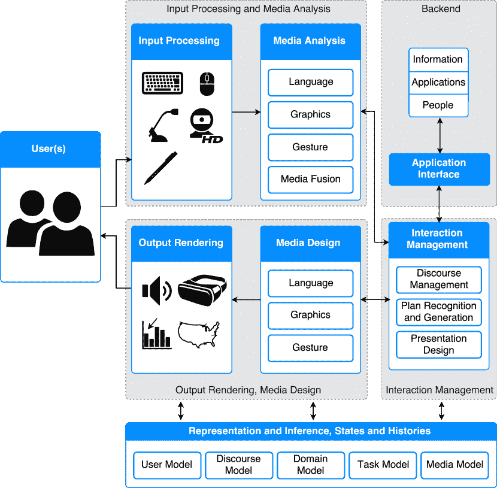

<!--yml

分类：未分类

日期：2024-09-06 20:07:58

-->

# [1803.04818] 关于智能用户界面的深度学习工具包和库的调查

> 来源：[`ar5iv.labs.arxiv.org/html/1803.04818`](https://ar5iv.labs.arxiv.org/html/1803.04818)

\toappear

# 关于深度学习工具包和库的调查

用于智能用户界面

Jan Zacharias

Michael Barz

Daniel Sonntag 德国人工智能研究中心（DFKI）萨尔布吕肯，德国 jan.zacharias@dfki.de 德国人工智能研究中心（DFKI）萨尔布吕肯，德国 michael.barz@dfki.de 德国人工智能研究中心（DFKI）萨尔布吕肯，德国 daniel.sonntag@dfki.de(2018)

###### 摘要

本文概述了主要的深度学习工具包，特别是报告了最近的出版物，这些出版物贡献了用于实现智能用户界面（IUI）中常见任务的开源软件。我们为计划在其 IUI 研究和开发项目中利用深度学习技术的研究人员和软件工程师提供了科学参考。

###### 分类：

H.5.2 信息界面和展示（例如 HCI）：用户界面

###### 关键词：

人工智能；机器学习；深度学习；互动机器学习；超参数调优；卷积神经网络

## 1 引言

智能用户界面（IUI）旨在在人机交互（HCI）中融入智能自动化能力，其净影响是提升性能或可用性的交互方式。深度学习技术可以用于 IUI 中，实施有效利用人类技能和能力的人工智能（AI）组件，从而使应用程序中的人类表现突出[55]。

许多智能用户界面，特别是在智能手机领域，使用多种输入和输出模式以实现更高效、灵活和可靠的用户交互[45]。它们允许用户选择合适的输入模式，或在物理环境和连续移动使用的需求变化时在模式之间切换。

深度学习有可能通过支持语音、笔、（多点）触摸、手势和注视等模式的用户和适应模型来增加这种灵活性，并可以学习这些模式的适当对齐，以实现相互消歧。这确保了更高的理解用户输入的精度，并克服了单一信号或交互模式的局限[42]。

深度学习系统能够通过使用逐层概念层次结构来处理非常复杂的现实世界输入数据[26]。多模态智能用户界面可以从深度学习技术中大大受益，因为高层事件检测和多模态信号处理的复杂性可以通过同样复杂的深度网络结构建模，并利用现今可用的 GPU 基础设施进行高效训练。特别是递归模型架构适合处理连续的多模态信号流，例如自然对话和长期自主代理[53]。

本文为 IUI 研究人员和从业者提供了一个关于可在开源许可下使用的深度学习工具包和库的概述，并描述了它们如何应用于智能多模态交互（考虑图 1 中的架构模块进行分类）。相关的深度学习综述集中在医疗领域[22]或技术[46, 5, 51]。

所有 AI 系统面临的主要挑战是从封闭环境转向开放世界环境。在一个环境中达到超人性能可能在另一个环境中导致意外行为和危险情况。

> >>人工智能系统的“智能”
> 
> 可能是深度但狭窄。<< [18]

这一点暗示了对长期自主系统的高效学习方法和适应性模型的需求。 promising 技术包括主动学习[49]、强化学习[28]、交互式机器学习[4]和机器教学[52]。我们推动使用交互式培训方法，实现对机器学习模型的高效和持续更新。这对于增强用户交互尤为重要，因为它能有效处理多样化的信号流，并对来自多个模态和传感器的数据进行联合分析，以理解复杂的用户行为。

图 1：智能用户界面关键组件的分类，基于概念架构[60]和 DFKI 的 Smartweb 系统[56]。

## 2 工具包和库

我们简要介绍了用于实现深度学习算法的最流行框架（总结在表格 1）。我们包含了有关许可证和支持的编程语言的信息，以便快速进行兼容性或偏好检查。然后，我们展示并定性评估了基于这些框架并实现 IUI 关键元素的开源贡献。工作根据适应版的高层次 IUI 架构进行分类，如图 1 所示。根据具体使用案例，应用所描述的系统的其他方式当然也是可能和适当的。

### 2.1 深度学习框架

大多数深度学习贡献的核心是如 TensorFlow [2] 和 Caffe [31] 等复杂的机器学习框架。这些软件包大多数以开源形式发布，允许独立审查、验证以及在 IUI 项目中的民主使用。这并不意味着当前实现中没有错误，但开放性特征使每个人都能搜索并最终识别错误结果或性能差的根本原因。同样，新的功能也可以被提议和贡献。表 1 列出了工具包和库，这些是代表性选择的开源解决方案。该表按 Keras 深度学习工具包作者 François Chollet 提出的流行度评分排序。GitHub 指标被使用并按系数加权，以使每个指标的相对关联性反映用户数量。为建模这些因素，Chollet 非正式地考虑了 Keras 项目网站的 Google Analytics 数据、PyPI 下载数据、ArXiv 提及数据以及 Google Trends 数据等其他来源。评分计算为 GitHub Contributions$\times 30$、Issues$\times 20$、Forks$\times 3$ 和 Stars 的总和，按以 TensorFlow 为基准的 $100\%$ 进行缩放。虽然确切的数字是手动选择的，但如同在集成模型中，系数的相对量级也很重要，除了使用多个数据源的事实之外。

| 名称 | 网站 | GitHub 网址 | 许可证 | 语言 | APIs | 评分 [%] |
| --- | --- | --- | --- | --- | --- | --- |
| TensorFlow [2] | [`tensorflow.org`](http://tensorflow.org) | [tensorflow/ tensorflow](http://github.com/tensorflow/tensorflow) | Apache-2.0 | C++，Python | Python，C++，Java，Go | 100 |
| Keras [15] | [`keras.io/`](http://keras.io/) | [fchollet/keras](http://github.com/fchollet/keras) | MIT | Python | Python, R | 46.1 |
| Caffe [31] | [`caffe.berkeleyvision.org`](http://caffe.berkeleyvision.org) | [BVLC/caffe](http://github.com/BVLC/caffe) | BSD | C++ | Python, MATLAB | 38.1 |
| MXNet [14] | [`mxnet.io`](http://mxnet.io) | [apache/incubator-mxnet](http://github.com/apache/incubator-mxnet) | Apache-2.0 | C++ | Python, Scala, R, JavaScript, Julia, MATLAB, Go, C++, Perl | 34 |
| Theano [3] | [`deeplearning.net/ software/theano`](http://deeplearning.net/software/theano) | [Theano/Theano](http://github.com/Theano/Theano) | BSD | Python | Python | 19.3 |
| CNTK [62] | [`docs.microsoft.com/ en-us/cognitive-toolkit`](https://docs.microsoft.com/en-us/cognitive-toolkit) | [Microsoft/CNTK](http://github.com/Microsoft/CNTK) | MIT | C++ | Python, C++, C#, Java | 18.4 |
| DeepLearning4J [21] | [`deeplearning4j.org`](https://deeplearning4j.org) | [deeplearning4j/ deeplearning4j](http://github.com/deeplearning4j/deeplearning4j) | Apache-2.0 | Java, Scala | Java, Scala, Clojure, Kotlin | 17.8 |
| PaddlePaddle | [`www.paddlepaddle.org`](http://www.paddlepaddle.org) | [baidu/paddle](http://github.com/baidu/paddle) | Apache-2.0 | C++ | C++ | 16.3 |
| PyTorch | [`pytorch.org`](http://pytorch.org) | [pytorch/pytorch](http://github.com/pytorch/pytorch) | BSD | C++, Python | Python | 14.3 |
| Chainer [59] | [`chainer.org`](https://chainer.org) | [pfnet/chainer](http://github.com/pfnet/chainer) | MIT | Python | Python | 7.9 |
| Torch7 [17] | [`torch.ch/`](http://torch.ch) | [torch/torch7](http://github.com/torch/torch7) | BSD | C, Lua | C, Lua, LuaJIT | 7.8 |
| DIGITS [61] | [`developer.nvidia.com/ digits`](https://developer.nvidia.com/digits) | [NVIDIA/DIGITS](http://github.com/NVIDIA/DIGITS) | BSD | Python | REST/Json | 7.8 |
| TFLearn [19] | [`tflearn.org`](http://tflearn.org) | [tflearn/tflearn](http://github.com/tflearn/tflearn) | MIT | Python | Python | 7.5 |
| Caffe2 | [`caffe2.ai`](https://caffe2.ai) | [caffe2/caffe2](http://github.com/caffe2/caffe2) | Apache-2.0 | C++, Python | Python, C++ | 7.4 |
| dlib [36] | [`dlib.net`](http://dlib.net) | [davisking/dlib](http://github.com/davisking/dlib) | Boost | C++ | C++, Python | 5.7 |

表 1：基于 GitHub 指标的开源软件概览及评级

### 2.2 深度学习在交互用户界面中的应用

网页上可以找到大量的深度学习软件，初看这些包是否在 IUI 项目中有用且易于设置尚不清楚。通过这项工作，我们希望通过提供概述并分享我们在实用性和易用性方面的经验，来阐明一些精选的开源贡献。我们根据 Wahlster 和 Maybury 长期认可的概念架构[60]及其参考实现[56]对相关工作进行分组，该架构定义了 IUI 的基本部分和模块（见图 1）。

我们将功能上连贯的元素 *输入处理与媒体分析*；*互动管理、输出渲染与媒体设计* 和 *后端* 服务视为主要构建块。许多工作可以在不同阶段应用或一次性实现多个角色，特别是经过端到端训练的深度学习系统。推断机制和当前“信息状态”以及元模型历史的表示在所有 IUI 组件中是共享的。

#### 2.2.1 输入处理与媒体分析

实现此角色的组件通过包括可用的模式并在适当时将它们融合，帮助分析和理解用户。例如，需要自然语言理解 (NLU) 组件的 IUI 用于从非结构化文本中提取结构化语义信息，例如，用于分类用户意图和提取实体。

Hauswald 等人[29] 实现了 Tonic Suite，提供基于 DjiNN 的不同分类服务，DjiNN 是一个用于深度神经网络 (DNN) 的基础设施。它可以处理图像分类的视觉刺激，基于 AlexNet [37] 和通过复制 Facebook 的 DeepFace [58] 进行面部识别。自然语言输入方面，支持基于 MNIST [38] 的数字识别和基于 Kaldi¹¹1https://github.com/kaldi-asr/kaldi ASR 工具包 [47] 的自动语音识别（ASR），该工具包在 VoxForge²²2http://www.voxforge.org 开源的大规模语音语料库上进行训练。此外，还提供了几种自然语言处理技术：词性标注、命名实体识别和词块划分——这些技术均基于 NEC 的 SENNA³³3http://ml.nec-labs.com/senna 项目首次引入的神经网络。Tonic Suite 依赖于 Caffe 框架。

BSD 3-Clause 许可证的 C++ 源代码⁴⁴4https://github.com/claritylab/djinn 的注释不一致，提升文档质量的 TODO 尚未解决。DjiNN 和 Tonic 的详细安装说明分别托管在⁵⁵5http://djinn.clarity-lab.org/djinn/^,⁶⁶6http://djinn.clarity-lab.org/tonic-suite/。这两个软件包自 2015 年以来没有更新，依赖于过时的 Caffe 版本，并且有许多其他遗留依赖，因此安装时间大大延长。

关系抽取是自然语言处理（NLP）的一个重要部分：从普通文本中提取关系事实。例如，这项任务在从用户输入中自动填充和扩展知识库时是必需的。Lin 等人 [41] 发布了一个基于 MIT 许可证的神经关系抽取实现⁷⁷7https://github.com/thunlp/NRE。该仓库还托管了 Zeng 等人 [64, 63] 的关系抽取器的重实现。C++ 代码完全没有文档，ReadMe 文件列出了比较结果，而所需资源无法直接访问，依赖项也没有列出。最近，作者发布了一个文档更完善的关系抽取器⁸⁸8https://github.com/thunlp/TensorFlow-NRE，灵感来源于 [41, 65]，该工具使用 TensorFlow 并用 Python 编写——代码有注释，并且依赖项被适当列出。同样，Nguyen 和 Grishman [43] 提出了通过多数投票将卷积神经网络和递归神经网络结合在混合模型中进行关系抽取。作者发布了他们的源代码⁹⁹9https://github.com/anoperson/DeepIE，该代码基于 Theano 框架，允许他人验证和潜在地改进他们的方法，涉及 ACE 2005 语料库¹⁰¹⁰10https://catalog.ldc.upenn.edu/ldc2006t06。Python 源代码没有包含许可信息，并且没有注释。ReadMe 文件概述了如何进行评估，并指出需要单独获取数据集，费用为 $$4000$。

Chen 和 Manning 提出了一个使用神经网络的依赖解析器，该解析器分析句子的语法结构，并试图建立“头”词与修饰这些头词的词之间的关系 [13]。该软件是 Stanford Parser¹¹¹¹11https://nlp.stanford.edu/software/lex-parser.html 和 CoreNLP¹²¹²12https://github.com/stanfordnlp/CoreNLP 的一部分，CoreNLP 是一个 Java 工具包，用于 NLP，使计算机能够分析、理解、修改或生成自然语言。因此，CoreNLP 也与 IUI 的媒体设计元素相关。构建说明包含在 ReadMe 文件中，并且提供了编写良好的 HTML 文档¹³¹³13https://stanfordnlp.github.io/CoreNLP/。

开源项目 RASA_NLU¹⁴¹⁴14https://github.com/RasaHQ/rasa_nlu [9]，由 Python 编写并在 Apache-2.0 许可证下发布，执行自然语言理解，包括意图分类和实体提取。可以使用几种机器学习后端：spaCy¹⁵¹⁵15https://github.com/explosion/spaCy，它使用 thinc¹⁶¹⁶16https://github.com/explosion/thinc，一个深度学习能力的库；MITIE¹⁷¹⁷17https://github.com/mit-nlp/MITIE，使用 dlib 作为后端；以及 scikit-learn¹⁸¹⁸18https://github.com/scikit-learn/scikit-learn。使用 docker¹⁹¹⁹19https://www.docker.com/ 时，安装过程非常简单。一个命令可以下载所有所需的组件和依赖项，并在几分钟内启动带有 NLU 服务的容器（具体时间取决于互联网连接）。完整的安装和入门指南可以在 ReadMe 中找到。由于源代码始终被注释，自动生成的 Sphinx²⁰²⁰20http://www.sphinx-doc.org HTML 文档可以访问²¹²¹21https://rasahq.github.io/rasa_nlu/master/。简短的问题可以在 gitter chat²²²²22https://gitter.im/RasaHQ/rasa_nlu 中提出。

在普适计算中，理解用户如何与环境互动至关重要。Bertasius 等人[7] 使用 Caffe²³²³23https://github.com/gberta/EgoNet 设计了一个深度神经网络模型，处理用户的视觉和触觉互动以识别行动对象。作者提供了一个预训练模型和 Python 代码，预测 RGB(D)图像中的动作对象区域，即深度信息是可选的，并可以用于提高准确性。不幸的是，作者创建的用于训练和测试模型的标注数据集尚未公开，从而阻碍了第三方对结果和模型改进的完全验证。发布的来源已经充分注释，但缺乏许可信息和详细的依赖信息。在随后的出版物中，Bertasius 等人[8] 证明通过使用分割和识别代理来创建训练数据集的监督过程可以省略，这些代理作为视觉空间网络（VSN）中的交叉通路架构实现。无监督学习是可取的，因为动作对象检测模型的训练需要人类对捕获图像进行逐像素标注，这既耗时又昂贵。实现的 VSN 从未标记的自我中心捕获图像数据中学习检测可能的动作对象。GitHub 仓库²⁴²⁴24https://github.com/gberta/Visual-Spatial-Network 包含预训练模型、进行预测的 Python 代码以及用于分割代理所需的多尺度组合分组的 matlab 源代码。与第一个贡献类似，代码缺乏许可证，而代码注释足够。ReadMe 文件包含一般训练说明，实际的训练工具链设置非常繁琐，仅给出了指针。

在[6]中，Barz 和 Sonntag 使用 Caffe 将注视点和自我中心摄像头数据与基于 GPU 的物体分类和注意力检测结合起来，以实时构建自我中心事件的情节记忆。代码尚未公开，但计划于 2018 年中作为 Pupil Labs 眼动追踪套件的插件发布[35]²⁵²⁵25https://github.com/pupil-labs/pupil。

#### 2.2.2 互动管理、输出渲染与媒体设计

用户输入根据当前模型的状态进行解释，例如话语背景，以便识别和计划未来的行动，并设计适当的 IUI 输出。这里描述的组件实现了一个核心对话管理功能，并为用户生成多模态自然语言生成（NLG）的输出。

RASA_CORE²⁶²⁶26https://github.com/RasaHQ/rasa_core [9] 是一个开源话语/对话管理框架，使用 Python 编写，利用 Keras 的 LSTM 实现来支持上下文相关的分层对话。虽然没有提供 docker 镜像，但文档质量²⁷²⁷27https://core.rasa.ai/ 与 RASA_NLU 相当，类似地可以进行聊天²⁸²⁸28https://gitter.im/RasaHQ/rasa_core。提供了四个示例聊天机器人²⁹²⁹29https://github.com/RasaHQ/rasa_core/tree/master/examples，以便轻松入门，并有多个教程³⁰³⁰30https://core.rasa.ai/tutorial_basics.html。在一项评估中，Braun 等人[10]发现 RASA 集成系统在与商业闭源系统比较时得分第二。请注意，RASA_CORE 也适用于媒体设计模块，因为它可以在对话系统中独立生成响应和澄清问题。通过使用更复杂的 NLG 技术，可以扩展其功能（参见 Gatt 和 Kramer [24]的最新概述）。

在[20, 57]中，使用 TensorFlow 实现了一个深度强化学习系统，以优化视觉基础的目标导向对话系统。GuessWhat?!³¹³¹31https://github.com/GuessWhatGame/guesswhat/，其对应的开源贡献，注释适中，并包含一个 ReadMe 文件，通过概述重现结果所需的步骤来验证已发布的结果。预训练模型可以下载，基本的安装说明也包含其中。不幸的是，作者省略了正确的 Python 依赖版本信息，这导致安装过程中需要一些试错。这一贡献使用 Apache-2.0 许可证。³²³²32 未来修订更新： https://github.com/voicy-ai/DialogStateTracking

#### 2.2.3 后端

视觉场景理解是交互式用户界面（IUI）的一个重要特性，需要处理图像或视频输入。从技术角度来看，这要求图像分类和准确的区域建议，以便对具有多个对象的场景进行有意义的分割。Sonntag 等人贡献了 py-faster-rcnn-ft³³³³33https://github.com/DFKI-Interactive-Machine-Learning/py-faster-rcnn-ft Python 库，使得深度学习模型的便捷微调成为可能，从而提供这种功能。例如，VGG_CNN_M_1024 模型 [12] 可以在 MS COCO [40] 图像数据集的特定类别上进行微调，从而提高分类准确性 [25]。虽然该库可以完全在后台运行，但它也提供了一个用户界面，允许选择类别并以图形方式检查结果。该软件使用 Caffe 框架，并采用 GPL-3 许可证。它包含一个详细的 ReadMe 文件，其中包含安装和入门指南、示例列表以及用于快速评估的可选预训练模型资源。这项工作基于 py-faster-rcnn³⁴³⁴34https://github.com/rbgirshick/py-faster-rcnn [48]。

Nvidia 的 DIGITS³⁵³⁵35https://github.com/NVIDIA/DIGITS 使深度学习初学者能够设计和训练模型以解决图像分类问题，并将这些模型投入使用。该 Python 软件具有智能的 Web (HTML/JS) 界面，允许用户对神经网络进行高度交互式的修改，并进行数据管理和现有模型的微调。DIGITS 界面实时显示性能统计信息，以便用户可以快速识别和选择最佳的模型进行部署。另一方面，DIGITS 还可以通过其 REST API 作为 IUI 的后端组件，用于对训练好的模型进行推断。该软件采用 BSD-3 许可证，可以使用 Caffe、Torch 和 Tensorflow 作为深度学习框架。通过 docker 安装几乎不需要额外努力，随附的 ReadMe 文件链接到多个成熟的教程指南。Nvidia 提供了图形丰富的文档和深度学习入门介绍³⁶³⁶36https://devblogs.nvidia.com/parallelforall/digits-deep-learning-gpu-training-system/。

## 3 展望：交互式机器学习

为了开发人工智能的积极方面，管理其风险和挑战，并确保每个人都有机会参与建设 AI 增强社会并分享其成果，我们建议采用一种方法论，其中人类智能与机器学习处于中心位置：交互式机器学习是设计和实现算法和智能用户界面框架，以便通过人类互动促进机器学习。

这一研究领域探讨了帮助 AI 系统发挥其全部潜力的可能性，基于与人类的互动。目前的误解是，人工智能更倾向于以性能为导向而非以学习为导向。通过机器教学[52]，我们可以“辅助”AI 系统成为自我维持的“终身”学习者[39, 55]，正如领域专家通过封装机器学习所需的机制来训练复杂模型。这种资源导向的方法有助于弥合对机器学习模型的需求与能够创建这些模型的专家数量之间的差距。

互动机器学习（IML）包括实时反馈，通过与用户的智能互动，实现快速的迭代模型改进[4]。正如 Sonntag 所示，当在 IUI 中使用人工智能（AI）实施智能自动化功能时，必须考虑对 HCI 的影响，以防止如预测能力下降和可控性丧失等负面副作用，这些最终会影响 IUI 的可用性[54]。通过在构建 IUI 时采纳双目视角的概念，这种不利影响可以得到缓解：同时解决 AI 和 HCI 方面的问题，从而使系统智能和用户与之交互的方式得到最佳同步[30]。

许多在主动学习中使用的原则被采纳，例如用于选择最具影响力样本的查询策略，这些样本将被标注[23, 50]，以及在置信约束下标签自动传播的半监督学习[50]。IML 从支持用户训练/教学模型的 IUI 中受益，同时，这对于构建和维护智能和多模态交互模型是必不可少的。

最近的研究结合深度学习和主动或被动用户输入，以改进模型训练或性能：Green 等人[27]将 IML 概念应用于语言翻译任务，该任务受益于人类用户和机器代理：人类在环中可以产生更高质量的翻译，同时机器翻译的建议会随着人类纠正建议而不断改进。Venkitasubramanian 等人[44]提出了一种通过观看纪录片学习识别动物的模型。他们通过将人类的注视信号与电影字幕结合作为弱监督信号来隐式地涉及人类。其分类器使用来自预训练卷积神经网络（CNN）的图像表示进行学习。姜等人[33]提出了一种算法，用于在基于 CNN 特征的人机对话中学习新的对象类别及其相应的关系。这些关系用于推理未来场景，其中已知的面孔和对象被识别。Cognolato 等人[16]利用人类的注视和手部动作来采样被操作的物体图像，并使用这些数据对 CNN 进行微调。在主动学习的背景下，Käding 等人[34]研究了模型质量与对不断变化的模型进行微调的计算成本之间的权衡。姜等人[32]提出了一个 GPU 加速的互动式机器学习框架，允许轻松地采纳模型，并提供多种结果可视化以支持用户。

在[32]中提出了定制化和互动式模型优化的技术。姜和坎尼使用了基于 Caffe 构建的 BIDMach 框架[11]，该框架提供了一个模块化的机器学习架构，支持主损失函数和次损失函数。该系统的用户能够在训练过程中直接调整深度学习模型参数。用户可以通过网络接口的互动可视化工具和控制进行模型优化。然而，将互动式机器学习的概念转移到深度学习算法上，并研究其对模型性能和可用性的影响，尤其是在 IUIs 和多模态设置中的影响，仍然具有挑战性。

## 参考文献

+   [1]

+   [2] Martín Abadi, Ashish Agarwal, Paul Barham, Eugene Brevdo, Zhifeng Chen, Craig Citro, Greg S. Corrado, Andy Davis, Jeffrey Dean, Matthieu Devin, Sanjay Ghemawat, Ian Goodfellow, Andrew Harp, Geoffrey Irving, Michael Isard, Rafal Jozefowicz, Yangqing Jia, Lukasz Kaiser, Manjunath Kudlur, Josh Levenberg, Dan Mané, Mike Schuster, Rajat Monga, Sherry Moore, Derek Murray, Chris Olah, Jonathon Shlens, Benoit Steiner, Ilya Sutskever, Kunal Talwar, Paul Tucker, Vincent Vanhoucke, Vijay Vasudevan, Fernanda Viégas, Oriol Vinyals, Pete Warden, Martin Wattenberg, Martin Wicke, Yuan Yu, 和 Xiaoqiang Zheng。2015 年。《TensorFlow: Large-Scale Machine Learning on Heterogeneous Distributed Systems》。 (2015). [`www.tensorflow.org/`](https://www.tensorflow.org/)

+   [3] Rami Al-Rfou, Guillaume Alain, Amjad Almahairi, Christof Angermueller, Dzmitry Bahdanau, Nicolas Ballas, Frédéric Bastien, Justin Bayer, Anatoly Belikov, Alexander Belopolsky, Yoshua Bengio, Arnaud Bergeron, James Bergstra, Valentin Bisson, Josh Bleecher Snyder, Nicolas Bouchard, Nicolas Boulanger-Lewandowski, Xavier Bouthillier, Alexandre de Brébisson, Olivier Breuleux, Pierre-Luc Carrier, Kyunghyun Cho, Jan Chorowski, Paul Christiano, Tim Cooijmans, Marc-Alexandre Côté, Myriam Côté, Aaron Courville, Yann N. Dauphin, Olivier Delalleau, Julien Demouth, Guillaume Desjardins, Sander Dieleman, Laurent Dinh, Mélanie Ducoffe, Vincent Dumoulin, Samira Ebrahimi Kahou, Dumitru Erhan, Ziye Fan, Orhan Firat, Mathieu Germain, Xavier Glorot, Ian Goodfellow, Matt Graham, Caglar Gulcehre, Philippe Hamel, Iban Harlouchet, Jean-Philippe Heng, Balázs Hidasi, Sina Honari, Arjun Jain, Sébastien Jean, Kai Jia, Mikhail Korobov, Vivek Kulkarni, Alex Lamb, Pascal Lamblin, Eric Larsen, César Laurent, Sean Lee, Simon Lefrancois, Simon Lemieux, Nicholas Léonard, Zhouhan Lin, Jesse A. Livezey, Cory Lorenz, Jeremiah Lowin, Qianli Ma, Pierre-Antoine Manzagol, Olivier Mastropietro, Robert T. McGibbon, Roland Memisevic, Bart van Merriënboer, Vincent Michalski, Mehdi Mirza, Alberto Orlandi, Christopher Pal, Razvan Pascanu, Mohammad Pezeshki, Colin Raffel, Daniel Renshaw, Matthew Rocklin, Adriana Romero, Markus Roth, Peter Sadowski, John Salvatier, François Savard, Jan Schlüter, John Schulman, Gabriel Schwartz, Iulian Vlad Serban, Dmitriy Serdyuk, Samira Shabanian, Étienne Simon, Sigurd Spieckermann, S. Ramana Subramanyam, Jakub Sygnowski, Jérémie Tanguay, Gijs van Tulder, Joseph Turian, Sebastian Urban, Pascal Vincent, Francesco Visin, Harm de Vries, David Warde-Farley, Dustin J. Webb, Matthew Willson, Kelvin Xu, Lijun Xue, Li Yao, Saizheng Zhang, 和 Ying Zhang。2016 年。《Theano: A Python framework for fast computation of mathematical expressions》。 (2016), 1–19. [`arxiv.org/abs/1605.02688`](http://arxiv.org/abs/1605.02688)

+   [4] Saleema Amershi、Maya Cakmak、William Bradley Knox 和 Todd Kulesza。2014。赋权于人民：人类在互动机器学习中的作用。AI 杂志 35，第 4 期（2014 年 12 月），105。DOI：[`dx.doi.org/10.1609/aimag.v35i4.2513`](http://dx.doi.org/10.1609/aimag.v35i4.2513)

+   [5] Soheil Bahrampour、Naveen Ramakrishnan、Lukas Schott 和 Mohak Shah。2016。Caffe、Neon、Theano 和 Torch 的深度学习比较研究。（2016），1–11。

+   [6] Michael Barz 和 Daniel Sonntag。2016。利用深度神经网络进行注视引导的对象分类。发表于 2016 年 ACM 国际联合会议论文集 - UbiComp ’16。ACM Press，纽约，美国，253–256。DOI：[`dx.doi.org/10.1145/2968219.2971389`](http://dx.doi.org/10.1145/2968219.2971389)

+   [7] Gedas Bertasius、Hyun Soo Park、Stella X. Yu 和 Jianbo Shi。2017a。使用 EgoNet 的第一人称动作-对象检测。发表于机器人：科学与系统会议论文集。[`arxiv.org/abs/1603.04908`](http://arxiv.org/abs/1603.04908)

+   [8] Gedas Bertasius、Hyun Soo Park、Stella X. Yu 和 Jianbo Shi。2017b。无监督学习从第一人称视频中提取重要对象。发表于 IEEE 计算机视觉与模式识别会议论文集。1956–1964。DOI：[`dx.doi.org/10.1109/ICCV.2017.216`](http://dx.doi.org/10.1109/ICCV.2017.216)

+   [9] Tom Bocklisch、Joey Faulkner、Nick Pawlowski 和 Alan Nichol。2017。Rasa：开源语言理解与对话管理。（2017 年 12 月）。[`arxiv.org/abs/1712.05181`](http://arxiv.org/abs/1712.05181)

+   [10] Daniel Braun 和 Manfred Langen。2017。评估对话问答系统的自然语言理解服务。8 月（2017），174–185。

+   [11] John Canny 和 Huasha Zhao。2013。小脚印的大数据分析：平方云。发表于第 19 届 ACM SIGKDD 国际知识发现与数据挖掘会议论文集。ACM（2013），95–103。DOI：[`dx.doi.org/10.1145/2487575.2487677`](http://dx.doi.org/10.1145/2487575.2487677)

+   [12] Ken Chatfield、Karen Simonyan、Andrea Vedaldi 和 Andrew Zisserman。2014。细节中的魔鬼归来：深入探讨卷积网络。英国机器视觉会议（2014）。DOI：[`dx.doi.org/10.5244/C.28.6`](http://dx.doi.org/10.5244/C.28.6)

+   [13] Danqi Chen 和 Christopher Manning。2014。使用神经网络的快速准确依存解析器。发表于 2014 年自然语言处理实证方法会议（EMNLP）论文集，740–750。DOI：[`dx.doi.org/10.3115/v1/D14-1082`](http://dx.doi.org/10.3115/v1/D14-1082)

+   [14] Tianqi Chen、Mu Li、Yutian Li、Min Lin、Naiyan Wang、Minjie Wang、Tianjun Xiao、Bing Xu、Chiyuan Zhang 和 Zheng Zhang。2015。MXNet：一个灵活高效的异构分布式系统机器学习库。（2015），1–6。DOI：[`dx.doi.org/10.1145/2532637`](http://dx.doi.org/10.1145/2532637)

+   [15] François Chollet 等人。2015。Keras。（2015）。[`github.com/fchollet/keras`](https://github.com/fchollet/keras)

+   [16] Matteo Cognolato, Mara Graziani, Francesca Giordaniello, Gianluca Saetta, Franco Bassetto, Peter Brugger, Barbara Caputo, Henning Müller 和 Manfredo Atzori。2017。使用凝视追踪和加速度计在场景相机数据中半自动训练物体识别系统。在国际计算机视觉系统会议（ICVS）。

+   [17] Ronan Collobert, Koray Kavukcuoglu 和 Clément Farabet。2011。Torch7: 类似 Matlab 的机器学习环境。BigLearn, NIPS 研讨会（2011），1–6。[`infoscience.epfl.ch/record/192376/files/Collobert`](http://infoscience.epfl.ch/record/192376/files/Collobert)

+   [18] 技术委员会。2016。为人工智能的未来做准备。技术报告。美国总统执行办公室，国家科学技术委员会，技术委员会。[`obamawhitehouse.archives.gov/sites/default/files/whitehouse`](https://obamawhitehouse.archives.gov/sites/default/files/whitehouse)

+   [19] Aymeric Damien 等人。2016。TFLearn。（2016）。[`github.com/tflearn/tflearn`](https://github.com/tflearn/tflearn)

+   [20] Harm de Vries, Florian Strub, Sarath Chandar, Olivier Pietquin, Hugo Larochelle 和 Aaron Courville。2017。GuessWhat?! 通过多模态对话发现视觉对象。计算机视觉与模式识别会议（2017）。DOI:[`dx.doi.org/10.1109/CVPR.2017.475`](http://dx.doi.org/10.1109/CVPR.2017.475)

+   [21] Deeplearning4j 开发团队。2018。Deeplearning4j: JVM 上的开源分布式深度学习。（2018）。[`deeplearning4j.org`](http://deeplearning4j.org)

+   [22] Bradley J. Erickson, Panagiotis Korfiatis, Zeynettin Akkus, Timothy Kline 和 Kenneth Philbrick。2017。深度学习的工具包和库。数字成像期刊 30, 4（2017），400–405。DOI:[`dx.doi.org/10.1007/s10278-017-9965-6`](http://dx.doi.org/10.1007/s10278-017-9965-6)

+   [23] James Fogarty, Desney Tan, Ashish Kapoor 和 Simon Winder。2008。CueFlik: 图像搜索中的互动概念学习。在第二十六届年度 CHI 会议论文集 - CHI ’08。ACM Press，纽约，美国，29。DOI:[`dx.doi.org/10.1145/1357054.1357061`](http://dx.doi.org/10.1145/1357054.1357061)

+   [24] Albert Gatt 和 Emiel Krahmer。2018。自然语言生成的现状调查：核心任务、应用和评估。人工智能研究期刊 61（2018 年 3 月），65–170。[`dx.doi.org/10.1613/jair.5477http://arxiv.org/abs/1703.09902`](http://dx.doi.org/10.1613/jair.5477http://arxiv.org/abs/1703.09902)

+   [25] Ross Girshick、Jeff Donahue、Trevor Darrell 和 Jitendra Malik. 2014. 用于准确目标检测和语义分割的丰富特征层次. 《IEEE 计算机视觉与模式识别会议论文集》（2014），580–587。DOI:[`dx.doi.org/10.1109/CVPR.2014.81`](http://dx.doi.org/10.1109/CVPR.2014.81)

+   [26] Ian Goodfellow、Yoshua Bengio 和 Aaron Courville. 2016. 深度学习. MIT Press.

+   [27] Spence Green、Jeffrey Heer 和 Christopher D. Manning. 2015. 在 AI 和 HCI 交汇处的自然语言翻译. 《Queue》13，6（2015），1–13。DOI:[`dx.doi.org/10.1145/2791301.2798086`](http://dx.doi.org/10.1145/2791301.2798086)

+   [28] Dylan Hadfield-Menell、Stuart J Russell、Pieter Abbeel 和 Anca Dragan. 2016. 合作逆强化学习. 收录于《神经信息处理系统进展 29》，由 D D Lee、M Sugiyama、U V Luxburg、I Guyon 和 R Garnett 编集。Curran Associates, Inc.，3909–3917。[`papers.nips.cc/paper/6420-cooperative-inverse-reinforcement-learning.pdf`](http://papers.nips.cc/paper/6420-cooperative-inverse-reinforcement-learning.pdf)

+   [29] Johann Hauswald、Yiping Kang、Michael A. Laurenzano、Quan Chen、Cheng Li、Trevor Mudge、Ronald G. Dreslinski、Jason Mars 和 Lingjia Tang. 2015. DjiNN 和 Tonic: 将 DNN 作为服务及其对未来仓库级计算机的影响. 收录于《第 42 届国际计算机架构年会 - ISCA ’15 论文集》。ACM，27–40。DOI:[`dx.doi.org/10.1145/2749469.2749472`](http://dx.doi.org/10.1145/2749469.2749472)

+   [30] Anthony Jameson、Aaron Spaulding 和 Neil Yorke-Smith. 2009. “可用 AI” 特刊导言. 《AI 杂志》30，4（2009），11–15.

+   [31] Yangqing Jia、Evan Shelhamer、Jeff Donahue、Sergey Karayev、Jonathan Long、Ross Girshick、Sergio Guadarrama 和 Trevor Darrell. 2014. Caffe: 快速特征嵌入的卷积架构.（2014）。DOI:[`dx.doi.org/10.1145/2647868.2654889`](http://dx.doi.org/10.1145/2647868.2654889)

+   [32] Biye Jiang 和 John Canny. 2017. 通过 GPU 加速工具包进行交互式机器学习. 收录于《第 22 届智能用户界面国际会议论文集 - IUI ’17》。ACM Press, New York, New York, USA，535–546。DOI:[`dx.doi.org/10.1145/3025171.3025172`](http://dx.doi.org/10.1145/3025171.3025172)

+   [33] Shuqiang Jiang、Weiqing Min、Xue Li、Huayang Wang、Jian Sun 和 Jiaqi Zhou. 2017. 通过人机交互的双轨多模态自动学习. 收录于《第二十六届国际联合人工智能会议论文集》。国际联合人工智能组织，4485–4491。DOI:[`dx.doi.org/10.24963/ijcai.2017/626`](http://dx.doi.org/10.24963/ijcai.2017/626)

+   [34] Christoph Käding, Erik Rodner, Alexander Freytag, and Joachim Denzler. 2017. Fine-Tuning Deep Neural Networks in Continuous Learning Scenarios. In Computer Vision – ACCV 2016 Workshops: ACCV 2016 International Workshops, Taipei, Taiwan, November 20-24, 2016, Revised Selected Papers, Part III, Chu-Song Chen, Jiwen Lu, and Kai-Kuang Ma (Eds.). Springer International Publishing, Cham, 588–605. DOI:[`dx.doi.org/10.1007/978-3-319-54526-4_43`](http://dx.doi.org/10.1007/978-3-319-54526-4_43)

+   [35] Moritz Kassner, William Patera, and Andreas Bulling. 2014. Pupil: An Open Source Platform for Pervasive Eye Tracking and Mobile Gaze-based Interaction. In Adjunct Proceedings of the 2014 ACM International Joint Conference on Pervasive and Ubiquitous Computing (UbiComp ’14 Adjunct). ACM, New York, NY, USA, 1151–1160. DOI:[`dx.doi.org/10.1145/2638728.2641695`](http://dx.doi.org/10.1145/2638728.2641695)

+   [36] Davis. E. King. 2009. Dlib-ml: A Machine Learning Toolkit. Journal of Machine Learning Research 10 (2009), 1755–1758. DOI:[`dx.doi.org/10.1145/1577069.1755843`](http://dx.doi.org/10.1145/1577069.1755843)

+   [37] Alex Krizhevsky, Ilya Sutskever, and Geoffrey E Hinton. 2012. ImageNet Classification with Deep Convolutional Neural Networks. Advances In Neural Information Processing Systems (2012), 1–9. DOI:[`dx.doi.org/10.1016/j.protcy.2014.09.007`](http://dx.doi.org/10.1016/j.protcy.2014.09.007)

+   [38] Yann LeCun, Léon Bottou, Yoshua Bengio, and Patrick Haffner. 1998. Gradient-based learning applied to document recognition. Proc. IEEE 86, 11 (1998), 2278–2324.

+   [39] Henry Lieberman, Bonnie A Nardi, and David J Wright. 2001. Chapter 12 - Training Agents to Recognize Text by Example. In Your Wish is My Command, Henry Lieberman (Ed.). Morgan Kaufmann, San Francisco, 227 – XII. DOI:[`dx.doi.org/https://doi.org/10.1016/B978-155860688-3/50013-0`](http://dx.doi.org/https://doi.org/10.1016/B978-155860688-3/50013-0)

+   [40] Tsung Yi Lin, Michael Maire, Serge Belongie, James Hays, Pietro Perona, Deva Ramanan, Piotr Dollár, and C. Lawrence Zitnick. 2014. Microsoft COCO: Common objects in context. European conference on computer vision (2014), 740–755. DOI:[`dx.doi.org/10.1007/978-3-319-10602-1_48`](http://dx.doi.org/10.1007/978-3-319-10602-1_48)

+   [41] Yankai Lin, Shiqi Shen, Zhiyuan Liu, Huanbo Luan, and Maosong Sun. 2016. Neural Relation Extraction with Selective Attention over Instances. Proceedings of ACL (2016), 2124–2133. DOI:[`dx.doi.org/10.18653/v1/P16-1200`](http://dx.doi.org/10.18653/v1/P16-1200)

+   [42] Jiquan Ngiam, Aditya Khosla, Mingyu Kim, Juhan Nam, Honglak Lee, and Andrew Y Ng. 2011. Multimodal Deep Learning. In Proceedings of the 28th International Conference on International Conference on Machine Learning (ICML’11). Omnipress, USA, 689–696. [`dl.acm.org/citation.cfm?id=3104482.3104569`](http://dl.acm.org/citation.cfm?id=3104482.3104569)

+   [43] Thien Huu Nguyen 和 Ralph Grishman。2015。结合神经网络和对数线性模型以改进关系提取。arXiv 预印本 arXiv:1511.05926（2015）。[`arxiv.org/abs/1511.05926`](http://arxiv.org/abs/1511.05926)

+   [44] Aparna Nurani Venkitasubramanian, Tinne Tuytelaars, 和 Marie-Francine Moens。2017。通过观看纪录片学习识别动物：使用字幕作为弱监督。在 EACL 2016 第 6 届视觉与语言研讨会（VL'17）上。

+   [45] Sharon Oviatt, Björn Schuller, Philip R Cohen, Daniel Sonntag, Gerasimos Potamianos, 和 Antonio Krüger。2017。《多模态多传感器接口手册》。计算机协会和 Morgan & Claypool，纽约，美国，第一章，1–15。DOI:[`dx.doi.org/10.1145/3015783.3015785`](http://dx.doi.org/10.1145/3015783.3015785)

+   [46] Aniruddha Parvat, Jai Chavan, Siddhesh Kadam, Souradeep Dev, 和 Vidhi Pathak。2017。深度学习框架调查。发明系统与控制国际会议（ICISC）（2017），7。DOI:[`dx.doi.org/10.1109/ICISC.2017.8068684`](http://dx.doi.org/10.1109/ICISC.2017.8068684)

+   [47] Daniel Povey, Arnab Ghoshal, Gilles Boulianne, Lukas Burget, Ondrej Glembek, Nagendra Goel, Mirko Hannemann, Petr Motlicek, Yanmin Qian, Petr Schwarz, Jan Silovsky, Georg Stemmer, 和 Karel Vesely。2011。Kaldi 语音识别工具包。在 IEEE 2011 自动语音识别与理解研讨会。IEEE 信号处理学会。

+   [48] Shaoqing Ren, Kaiming He, Ross Girshick, 和 Jian Sun。2015。Faster R-CNN：使用区域提议网络实现实时目标检测。在神经信息处理系统（NIPS）进展中。

+   [49] Burr Settles。2010。主动学习文献综述。威斯康星大学，麦迪逊 52，55-66（2010），11。

+   [50] Burr Settles。2011。闭环：快速、互动的半监督注释，带有特征和实例查询。在自然语言处理经验方法会议论文集中。计算语言学协会，1467–1478。[`dl.acm.org/citation.cfm?id=2145588`](http://dl.acm.org/citation.cfm?id=2145588)

+   [51] Shaohuai Shi, Qiang Wang, Pengfei Xu, 和 Xiaowen Chu。2016。最先进深度学习软件工具的基准测试。（2016）。DOI:[`dx.doi.org/10.1109/CCBD.2016.029`](http://dx.doi.org/10.1109/CCBD.2016.029)

+   [52] Patrice Simard, Saleema Amershi, Max Chickering, Alicia Edelman Pelton, Soroush Ghorashi, Chris Meek, Gonzalo Ramos, Jina Suh, Johan Verwey, Mo Wang, 和 John Wernsing。2017。机器教学：构建机器学习系统的新范式。（2017）。[`arxiv.org/abs/1707.06742`](https://arxiv.org/abs/1707.06742)

+   [53] Daniel Sonntag。2009。内省与可适应模型集成用于基于对话的问答系统。在 IJCAI。1549–1554。

+   [54] Daniel Sonntag。2012 年。《Collaborative Multimodality》。KI - Künstliche Intelligenz 26, 2012 年 5 月（2012），161–168。DOI：[`dx.doi.org/10.1007/s13218-012-0169-4`](http://dx.doi.org/10.1007/s13218-012-0169-4)

+   [55] Daniel Sonntag。2017 年。《Intelligent User Interfaces - A Tutorial》。CoRR abs/1702.0（2017）。[`arxiv.org/abs/1702.05250`](http://arxiv.org/abs/1702.05250)

+   [56] Daniel Sonntag, Ralf Engel, Gerd Herzog, Alexander Pfalzgraf, Norbert Pfleger, Massimo Romanelli, 和 Norbert Reithinger。2007 年。《SmartWeb Handheld - Multimodal Interaction with Ontological Knowledge Bases and Semantic Web Services》。在人工智能与人类计算，ICMI 2006 和 IJCAI 2007 国际研讨会，Banff, Canada，2006 年 11 月 3 日，Hyderabad, India，2007 年 1 月 6 日，修订版和邀请论文（Lecture Notes in Computer Science），Thomas S. Huang, Anton Nijholt, Maja Pantic, 和 Alex Pentland（编辑），第 4451 卷。Springer, 272–295。DOI：[`dx.doi.org/10.1007/978-3-540-72348-6_14`](http://dx.doi.org/10.1007/978-3-540-72348-6_14)

+   [57] Florian Strub, Harm de Vries, Jérémie Mary, Bilal Piot, Aaron Courville, 和 Olivier Pietquin。2017 年。《End-to-end optimization of goal-driven and visually grounded dialogue systems》。在第二十六届国际联合人工智能会议论文集。国际联合人工智能组织，2765–2771。DOI：[`dx.doi.org/10.24963/ijcai.2017/385`](http://dx.doi.org/10.24963/ijcai.2017/385)

+   [58] Yaniv Taigman, Marc Aurelio Ranzato, 特拉维夫和门洛帕克。2014 年。《DeepFace: Closing the Gap to Human-Level Performance in Face Verification》。Cvpr (2014)。DOI：[`dx.doi.org/10.1109/CVPR.2014.220`](http://dx.doi.org/10.1109/CVPR.2014.220)

+   [59] Seiya Tokui, Kenta Oono, Shohei Hido, 和 Justin Clayton。2015 年。《Chainer: a Next-Generation Open Source Framework for Deep Learning》。在第二十九届神经信息处理系统年会（NIPS）机器学习系统研讨会（LearningSys）论文集（2015），1–6。

+   [60] Wolfgang Wahlster 和 Mark Maybury。1998 年。《Intelligent User Interfaces: An Introduction》。RUIU（1998），1–13。

+   [61] Luke Yeager。2015 年。《DIGITS : the Deep learning GPU Training System》。ICML AutoML Workshop（2015）。

+   [62] Dong Yu, Adam Eversole, Mike Seltzer, Kaisheng Yao, Zhiheng Huang, Brian Guenter, Oleksii Kuchaiev, Yu Zhang, Frank Seide, Huaming Wang, Jasha Droppo, Geoffrey Zweig, Chris Rossbach, Jon Currey, Jie Gao, Avner May, Baolin Peng, Andreas Stolcke, 和 Malcolm Slaney。2015 年。《An Introduction to Computational Networks and the Computational Network Toolkit》。微软技术报告 112，MSR-TR-2014-112（2015）。

+   [63] Daojian Zeng, Kang Liu, Yubo Chen, and Jun Zhao. 2015. 使用分段卷积神经网络进行关系抽取的远程监督。2015 年自然语言处理会议论文集（2015 年 9 月），1753–1762。DOI:[`dx.doi.org/10.18653/v1/D15-1203`](http://dx.doi.org/10.18653/v1/D15-1203)

+   [64] Daojian Zeng, Kang Liu, Siwei Lai, Guangyou Zhou, and Jun Zhao. 2014. 使用卷积深度神经网络进行关系分类。Coling 2011（2014），2335–2344。[`www.nlpr.ia.ac.cn/cip/liukang.files/camera`](http://www.nlpr.ia.ac.cn/cip/liukang.files/camera)

+   [65] Peng Zhou, Wei Shi, Jun Tian, Zhenyu Qi, Bingchen Li, Hongwei Hao, and Bo Xu. 2016. 基于注意力的双向长短期记忆网络进行关系分类。第 54 届计算语言学年会短论集（2016），207–212。[`anthology.aclweb.org/P16-2034`](http://anthology.aclweb.org/P16-2034)
