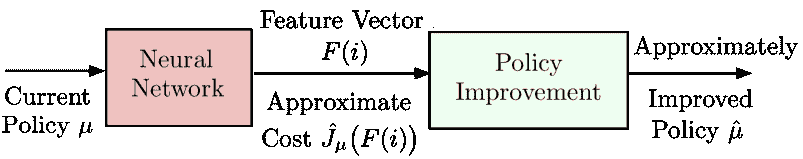
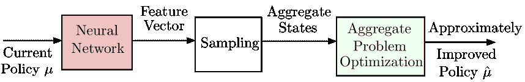

<!--yml

分类：未分类

日期：2024-09-06 20:07:52

-->

# [1804.04577] 无标题文档

> 来源：[`ar5iv.labs.arxiv.org/html/1804.04577`](https://ar5iv.labs.arxiv.org/html/1804.04577)

2018 年 4 月（2018 年 8 月修订）麻省理工学院/LIDS 报告

基于特征的聚合与深度强化学习：

调查与一些新的实现

Dimitri P. Bertsekas^†^†† Dimitri Bertsekas 在麻省理工学院电气工程与计算机科学系以及信息与决策系统实验室工作，地址为剑桥，马萨诸塞州，02139。本文的一个版本将出现在 IEEE/CAA 自动化学报中。

摘要

在本文中，我们讨论了用于有限状态折扣马尔可夫决策问题的近似解的策略迭代方法，重点关注基于特征的聚合方法及其与深度强化学习方案的联系。我们引入了原始问题状态的特征，并制定了一个较小的“聚合”马尔可夫决策问题，其状态与这些特征相关。我们讨论了这种聚合类型的属性和可能的实现，包括一种新的近似策略迭代方法。在这种方法中，策略改进操作结合了基于特征的聚合与使用深度神经网络或其他计算方法进行的特征构建。我们认为，通过聚合提供的特征的非线性函数可以比通过基于神经网络的强化学习提供的特征的线性函数更准确地近似策略的成本函数，从而有可能导致更有效的策略改进。

目录

1. 介绍

1.1 替代的近似策略迭代方法

1.2 术语

2. 近似策略迭代：概述

2.1 策略评估的直接和间接近似方法

2.2 基于投影方程的间接方法

2.3 基于聚合的间接方法

2.4 实施问题

3. 基于神经网络的近似策略评估

4. 基于特征的聚合框架

4.1 聚合问题

4.2 使用基于模拟的方法解决聚合问题

4.3 通过评分函数形成特征

4.4 使用启发式方法生成特征 - 确定性优化和回滚

4.5 随机最短路径问题 - 说明性示例

4.6 多步聚合

5. 基于特征的聚合与神经网络的策略迭代

6. 总结

7. 参考文献

1. 引言

我们考虑一个折扣无限时域动态规划（DP）问题，包含 $n$ 个状态，我们用 $i=1,\ldots,n$ 表示。控制 $u$ 下的状态转移 $(i,j)$ 发生在离散时间，根据转移概率 $p_{ij}(u)$ 生成一个在时间 $k$ 的成本 $\alpha^{k}g(i,u,j)$，其中 $\alpha\in(0,1)$ 是折扣因子。我们考虑确定性平稳政策 $\mu$，对于每个 $i$，$\mu(i)$ 是属于约束集合 $U(i)$ 的控制。我们用 $J_{\mu}(i)$ 表示从状态 $i$ 开始的无限期内政策 $\mu$ 的总折扣期望成本，用 $J^{\raise 0.04pt\hbox{\sevenrm*}}(i)$ 表示所有 $\mu$ 的 $J_{\mu}(i)$ 的最小值。我们用 $J_{\mu}$ 和 $J^{\raise 0.04pt\hbox{\sevenrm*}}$ 表示具有 $J_{\mu}(i)$ 和 $J^{\raise 0.04pt\hbox{\sevenrm*}}(i)$ 分量的 $n$ 维向量，$i=1,\ldots,n$。众所周知，$J_{\mu}$ 是政策 $\mu$ 的 Bellman 方程的唯一解：

|  | $J_{\mu}(i)=\sum_{j=1}^{n}p_{ij}\bigl{(}\mu(i)\bigr{)}\Big{(}g\bigl{(}i,\mu(i),j\bigr{)}+\alpha J_{\mu}(j)\Big{)},\qquad i=1,\ldots,n,$ |  | (1.1) |
| --- | --- | --- | --- |

同时 $J^{\raise 0.04pt\hbox{\sevenrm*}}$ 是 Bellman 方程的唯一解

|  | $J^{\raise 0.04pt\hbox{\sevenrm*}}(i)=\min_{u\in U(i)}\sum_{j=1}^{n}p_{ij}(u)\big{(}g(i,u,j)+\alpha J^{\raise 0.04pt\hbox{\sevenrm*}}(j)\big{)},\qquad i=1,\ldots,n.$ |  | (1.2) |
| --- | --- | --- | --- |

在本文中，我们调查了几种基于聚合的近似 DP 和深度强化学习的思想，这些思想已被基本了解，但在这里以一种新的方式组合。我们将关注近似政策迭代（简称 PI）的方法，通过这些方法，我们对每个生成的政策 $\mu$ 的成本向量 $J_{\mu}$ 进行近似评估。我们的成本近似使用每个状态 $i$ 的特征向量 $F(i)$，并用一个依赖于 $F(i)$ 的函数替代 $J_{\mu}(i)$，即一种形式的函数

|  | $\hat{J}_{\mu}\big{(}F(i)\big{)}\approx J_{\mu}(i),\qquad i=1,\ldots,n.$ |  |
| --- | --- | --- |

我们将这种 $\hat{J}_{\mu}$ 称为基于特征的近似架构。

在我们的方法的典型迭代中，当前政策 $\mu$ 的成本向量 $J_{\mu}$ 使用基于特征的架构 $\hat{J}_{\mu}$ 进行近似，然后通过政策“改进”过程生成新的政策 $\hat{\mu}$；见图 1.1。我们方法的显著特征有两个：

(a) 特征向量 $F(i)$ 可以通过神经网络或其他自动构建特征的计算方法获得。

(b) 政策改进生成的 $\hat{\mu}$ 基于涉及特征聚合的 DP 问题。

相比之下，标准的政策改进方法基于一步前瞻最小化

|  | $\hat{\mu}(i)\in\arg\min_{u\in U(i)}\sum_{j=1}^{n}p_{ij}(u)\Big{(}g(i,u,j)+\alpha\hat{J}_{\mu}\big{(}F(j)\big{)}\Big{)},\qquad i=1,\ldots,n,$ |  | (1.3) |
| --- | --- | --- | --- |

或者，可以基于多步前瞻，可能结合蒙特卡洛树搜索。我们将论证我们的基于特征的聚合方法有潜力生成更好的策略，但代价是计算密集的策略改进阶段。

![[未标注的图像]](img/9d8541b575044a2fb233b79db9ce7e23.png)

图 1.1 特征基础的近似 PI 的示意图。当前策略$\mu$从状态$i$开始的成本$J_{\mu}(i)$被一个依赖于状态$i$的近似值${\hat{J\mkern 5.0mu}\mkern-5.0mu}{}_{\mu}\big{(}F(i)\big{)}$所替代，这个近似值通过其特征向量$F(i)$依赖于$i$。在此图中，假设特征向量与当前策略$\mu$无关，但通常可能依赖于$\mu$。

1.1 替代的近似策略迭代方法

2011 年，作者[Ber11a]对近似 PI 方法进行了综述，重点是线性特征基础架构。这些架构中$F(i)$是一个$s$维向量

|  | $F(i)=\big{(}F_{1}(i),\ldots,F_{s}(i)\big{)},$ |  |
| --- | --- | --- |

并且$\hat{J}_{\mu}$在线性上依赖于$F$，即，

|  | $\hat{J}_{\mu}\big{(}F(i)\big{)}=\sum_{\ell=1}^{s}F_{\ell}(i)r_{\ell},\qquad i=1,\ldots,n,$ |  |
| --- | --- | --- |

对于一些标量权重$r_{1},\ldots,r_{s}$。我们在[Ber11a]中考虑了两种方法：

(a) 投影方程方法，包括时间差分方法，其中策略评估基于模拟矩阵反演方法如 LSTD($\lambda$)，或基于 TD($\lambda$)的随机迭代方法，或$\lambda$-策略迭代的变体，如 LSPE($\lambda$)]。

(b) 一般的聚合方法（不仅仅是这里考虑的基于特征的方法）。

这些方法将在第二部分中简要讨论。本文与综述[Ber11a]互补，涉及基于特征的非线性架构的近似 PI，包括一些通过神经网络或其他启发式计算生成特征的方法。

线性特征基础架构的一个重要优势是，给定特征向量$F(\cdot)$的形式，它们可以通过线性最小二乘类型的方法进行训练。然而，确定良好的特征可能是一项挑战。神经网络通过训练解决了这一挑战，该训练自动构建特征并同时用权重线性组合特征的各个组件。这通常通过成本拟合/非线性回归完成，使用大量状态-成本样本对，这些样本对通过一系列交替线性和非线性层进行处理（参见第三部分）。最终非线性层的输出是特征，然后由最终线性层处理，提供特征的线性组合作为成本函数的近似。

将成本函数表示为状态特征的想法，在我们现在可能称之为“价值空间中的近似”或“近似动态规划”的背景下，可以追溯到香农在国际象棋上的工作 [Sha50]。塞缪尔 [Sam59]，[Sam67] 在跳棋上的工作扩展了香农的一些算法方案，并引入了时间差分的思想，这些思想激发了许多后续研究。早期强化学习中也研究了同时提取最优或策略成本函数特征并构造这些成本函数近似值的神经网络的使用；一些最初的贡献，包括 Werbos [Wer77]、Barto、Sutton 和 Anderson [BSA83]、Christensen 和 Korf [ChK86]、Holland [Hol86] 和 Sutton [Sut88]，为许多后续工作提供了动机。神经网络作为挑战性动态规划问题的成本函数逼近器的使用，最早由 Tesauro [Tes92]、[Tes94]、[Tes95]、[Tes02] 在掼蛋游戏的背景下引人注目地展示。在 Tesauro 的工作中，网络的参数通过使用时间差分（TD）学习的形式进行训练，神经网络构造的特征得到了某些手工特征的补充。^†^†† Tesauro 还构造了一个不同的掼蛋玩家，该玩家由神经网络训练，但采用了监督学习方法，使用了来自人类专家游戏的示例 [Tes89a]、[Tes89b]（他称这种方法为“比较学习”）。然而，他的基于 TD 的算法表现显著更好，而且它的成功已被其他研究和商业程序复制。Tesauro 和 Galperin [TeG96] 提出了另一种基于回合策略的掼蛋方法，结果得到一个更好的游戏程序（有关回合作为一般近似动态规划方法的详细讨论，请参见 [Ber17]）。目前，基于回合的掼蛋程序在性能方面被视为最强大，但对于实时游戏来说太耗时。它们已被用作有限的诊断方式来评估基于神经网络的程序的质量。有关计算机掼蛋的文章列表可以在 http://www.bkgm.com/articles/page07.html 找到。

随着 Tesauro 的研究工作，使用神经网络或其他架构的近似和动态规划技术的协同潜力变得显而易见，这在 Barto、Bradtke 和 Singh [BBS95] 的一篇具有影响力的综述论文中进行了阐述。随后，这一领域在 Bertsekas 和 Tsitsiklis [BeT96] 的神经动态规划书籍以及 Sutton 和 Barto [SuB98] 的强化学习书籍中得到了系统化的发展。随后关于近似动态规划和强化学习的书籍，包括 Cao [Cao07]，Busoniu 等人 [BBD10]，Szepesvari [Sze10]，Powell [Pow11]，Chang、Fu、Hu 和 Marcus [CFH13]，Vrabie、Vamvoudakis 和 Lewis [VVL13]，以及 Gosavi [Gos15]，讨论了近似 PI 和其他技术。除此之外，还有 Si、Barto、Powell 和 Wunsch [SBP04]，Lewis、Liu 和 Lendaris [LLL08]，以及 Lewis 和 Liu [LeL12] 编辑的集合，其中包含几篇综述论文。

对于近似 PI 的原始想法，通过进一步的研究思想得到了丰富，例如展开方法（Abramson [Abr90]，Tesauro 和 Galperin [TeG96]，Bertsekas、Tsitsiklis 和 Wu [BTW97]，Bertsekas 和 Castanon [BeC99]；见 [Ber13]，[Ber17] 的综述），自适应模拟和蒙特卡洛树搜索（Chang、Hu、Fu 和 Marcus [CFH05]，[CFH13]，Coulom [Cou06]；见 Browne 等人 [BPW12] 的综述），以及深度神经网络（即具有许多适当专业层的神经网络；例如，见 Goodfellow、Bengio 和 Courville [GBC16] 的书，讨论 [Ber17] 第六章的教材，以及 Schmidhuber [Sch15]、Arulkumaran 等人 [ADB17]、Liu 等人 [LWL17] 和 Li [Li17] 的最新综述）。

深度神经网络基于近似 PI 方法的一个令人印象深刻的最近成功是 AlphaZero 程序，该程序在国际象棋、围棋等游戏中达到了超越人类水平的表现（参见 Silver 等人的 [SHS17]）。这个程序的一个显著特点是它不使用领域特定的知识（即手工制作的特征），而是完全依赖深度神经网络来构建成本函数近似的特征（至少据 [SHS17] 报告）。是否仅仅依赖神经网络来提供特征是一个开放的问题，因为其他调查，包括 Tesauro 等人的调查，表明在近似 DP 的背景下使用额外的问题特定手工制作的特征可以非常有帮助。除了使用深度而不是浅层神经网络（后者用于黑白棋），AlphaZero 算法与文献中提出和/或过去开发的几种其他算法类似。它可以被看作是近似 PI 的概念上直接的实现，使用蒙特卡洛树搜索和单个神经网络来构建成本和策略的近似，并且不依赖于任何根本上新的想法或深刻的理论分析。从概念上看，它与 Tesauro 的 TD-Gammon 程序有相当大的相似性。它的惊人成功可能归因于对已知思想的有效混合的熟练实现，再加上强大的计算能力。

我们注意到同时提取特征并优化它们的线性组合的能力并不局限于神经网络。已经提出了其他使用多层架构的方法（参见 Schmidhuber 的综述 [Sch15]），包括基于多项式（而不是 Sigmoid 函数）非线性的 Group Method for Data Handling (GMDH)。GMDH 方法从 60 年代后期苏联的 Ivakhnenko 的工作开始得到广泛研究；详见例如 [Iva68]。它已在大量应用中使用，并且已注意到它与神经网络方法的相似之处（参见 Ivakhnenko 的综述 [Iva71] 和网站 http://www.gmdh.net 上的大量文献总结）。大多数 GMDH 研究涉及推理类型问题。我们不知道在近似 DP 的背景下是否有任何 GMDH 的应用，但我们认为这是一个有成果的研究领域。无论如何，本文的基于特征的 PI 思想同样适用于 GMDH 网络以及第三部分中描述的神经网络。

虽然自动特征提取是神经网络架构中一个至关重要的方面，但最终层特征组件组合的线性可能是一个限制。非线性的替代方法基于聚合，这是解决大规模问题的降维方法。这种方法在科学计算和运筹学中有着悠久的历史（例如 Bean、Birge 和 Smith [BBS87]、Chatelin 和 Miranker [ChM82]、Douglas 和 Douglas [DoD93]、Mendelssohn [Men82]、以及 Rogers 等 [RPW91]）。它最早在基于仿真的近似 DP 上下文中引入，主要以价值迭代的形式出现；参见 Singh、Jaakkola 和 Jordan [SJJ95]、Gordon [Gor95]、Tsitsiklis 和 Van Roy [TsV96]（另见书籍 [BeT96]，第 3.1.2 节和第 6.7 节）。最近，聚合在涉及“选项”概念的强化学习上下文中被 Ciosek 和 Silver [CiS15] 讨论，在涉及“瓶颈模拟器”概念的上下文中被 Serban 等 [SSP18] 讨论；在这两种情况下，都展示了令人鼓舞的计算结果。基于特征的聚合架构在神经动态规划书籍 [BeT96] 的第 3.1.2 节和作者的 DP 书籍 [Ber12]（及早期版本）的第 6.5 节中进行了讨论，包括本论文重点关注的基于特征的架构。它们能够生成特征组件的非线性函数的策略成本函数近似，从而提供潜在更准确的近似。基本上，在基于特征的聚合中，原始问题被近似为一个涉及相对较少的“特征状态”的问题。

基于特征的聚合假设给定了特征向量的形式，因此对于那些特征不明显的问题，它需要进行修改或补充一种可以从训练数据中构建特征的方法。受到深度强化学习在神经网络中成功案例的启发，我们提出了一种两阶段的过程：首先使用神经网络或其他方案构建用于成本近似的良好特征，然后使用这些特征构建一个非线性的特征基础聚合架构。实际上，我们提出了一种实现近似 PI 的新方法：保留使用神经网络或其他方案的策略评估阶段，但将策略改进阶段替换为解决一个聚合 DP 问题。这个 DP 问题涉及由神经网络或其他方案（可能还包括其他手工特征）生成的特征。其维度可以通过采样减少到可管理的水平，而其成本函数值通过线性插值推广到整个特征空间。总之，我们建议的策略改进阶段可能更复杂，但可能更强大，因为它依赖于由特征的非线性组合提供的潜在更准确的函数近似。

除了非线性组合特征所带来的强大能力外，还要注意一些对聚合来说通用的其他优势。特别是：

(a) 聚合旨在解决一个“聚合”DP 问题，该问题本身是原始 DP 问题的近似，符合大状态空间问题的粗网格离散化精神。因此，聚合方法享有与精确 PI 相同的稳定性和策略收敛保证。相比之下，基于时间差的和其他 PI 方法可能会遭遇收敛困难，例如策略振荡和抖动（参见例如，[BeT96]，[Ber11a]，[Ber12]）。由此推论，当聚合方案表现不佳时，很容易识别原因：是由于用较小的“聚合”空间来近似较大的状态空间造成的量化误差。改进的可能方向（当然会有计算成本）也很明确：引入额外的聚合状态，并增加/改进这些特征。

(b) 聚合方法的特点是误差界限，这些误差界限是对 PI 方法的通用保证，确保生成策略的收敛。这些误差界限比需要策略收敛的方法的相应误差界限好一个因子$(1-\alpha)$，例如线性成本函数近似的通用时间差方法[参见下一节的方程(2.2)和(2.3)]。

最后要注意的是，利用深度神经网络提取特征以用于其他近似架构的想法早已被使用。特别是，它在 David、Netanyahu 和 Wolf [DNW16] 的 Deepchess 程序中发挥了核心作用，该程序估计达到强大大师级别，与一些最强的计算机棋类程序相当。在这项工作中，这些特征与监督学习和人类大师棋局选择相结合，用于训练深度神经网络，以比较给定棋局中的任意一对合法棋步，符合 Tesauro 的比较训练方法[Ts89b]。相比之下，在我们的提议中，这些特征被用来制定一个聚合 DP 问题，可以通过精确的方法来解决，包括一些基于模拟的方法。

论文组织如下。在第二部分中，我们提供了后续发展的背景，并总结了近似策略迭代方法中的一些实施问题。在第三部分中，我们回顾了基于神经网络的近似策略迭代的一些核心思想。在第四部分中，我们讨论了基于特征聚合的策略迭代思想，假设已知良好的特征。在这一节中，我们还讨论了如何在一个或多个“评分函数”上构建特征，这些函数是由神经网络或启发式方法提供的策略的成本函数估计值。我们还特别关注确定性离散优化问题。最后，在第五部分中，我们描述了将深度神经网络的特征提取能力与聚合提供的非线性近似可能性结合的一些方法。

1.2 术语

近似动态规划在处理具有挑战性的规模应用方面的成功，很大程度上归功于决策与控制领域与人工智能领域的思想交叉融合。这些领域之间的界限因对基础问题以及相关方法和核心应用的更深入理解而减少。然而，不幸的是，人工智能与优化/决策/控制领域之间存在显著的符号和术语差异，包括前者领域中的最大化/价值函数/奖励的典型使用，以及后者领域中的最小化/成本函数/每阶段成本的使用。本文使用的符号和术语在动态规划和最优控制中是标准的，为了避免让习惯于强化学习或最优控制术语的读者产生混淆，我们提供了一些在强化学习中常用的术语（例如，Sutton 和 Barto 的热门书籍 [SuB98] 及其 2018 年在线第二版）及其最优控制对等术语的列表。

(a) 代理 = 控制器或决策者。

(b) 行动 = 控制。

(c) 环境 = 系统。

(d) 阶段奖励 = （阶段的）成本的相反数。

(e) 状态价值 = （状态的）成本的相反数。

(f) 价值（或状态价值）函数 = （成本函数的）相反数。

(g) 最大化价值函数 = 最小化成本函数。

(h) 行动（或状态-行动）价值 = 状态-控制对的 $Q$-因子。

(i) 规划 = 使用已知数学模型解决动态规划问题。

(j) 学习 = 以无模型的方式解决动态规划问题。

(k) 自学习（或在游戏背景下的自对弈） = 使用策略迭代解决动态规划问题。

(l) 深度强化学习 = 使用深度神经网络进行价值和/或策略近似的近似动态规划。

(m) 预测 = 策略评估。

(n) 广义策略迭代 = 乐观策略迭代。

(o) 状态抽象 = 聚合。

(p) 情节任务或情节 = 有限步系统轨迹。

(q) Continuing task = Infinite-step system trajectory.

(r) Afterstate = Post-decision state.

2. 近似策略迭代：概述

许多近似动态规划算法基于 PI 的原则：保持 PI 的策略评估/策略改进结构，但是策略评估是通过模拟和一些逼近结构来进行的。在方法的标准形式中，每次迭代时，我们计算当前策略$\mu$的成本函数$J_{\mu}$的逼近$\tilde{J}_{\mu}(\cdot,r)$，并生成一个“改进”的策略$\hat{\mu}$，使用^†^†† 策略改进阶段的最小化可能会涉及多步展望，可能与蒙特卡罗树搜索结合。也可以通过$Q$因子逼近来进行近似。我们的讨论直接延伸到包括多步展望或近似策略改进的方案。

|  | $\hat{\mu}(i)\in\arg\min_{u\in U(i)}\sum_{j=1}^{n}p_{ij}(u)\bigl{(}g(i,u,j)+\alpha\tilde{J}_{\mu}(j,r)\bigr{)},\qquad i=1,\ldots,n.$ |  | (2.1) |
| --- | --- | --- | --- |

这里的$\tilde{J}_{\mu}$是某种选择形式的函数（逼近结构），它依赖于状态和一个维度相对较小的参数向量$r=(r_{1},\ldots,r_{s})$。

该方法的理论基础在神经动态规划书籍[BeT96]，Prop. 6.2（另见[Ber12]，Section 2.5.6，或[Ber18a]，Sections 2.4.1 和 2.4.2）中有所讨论。在那里指出，如果策略评估在$\delta$（在 sup-范数意义上）内准确，则对于$\alpha$-折现问题，该方法虽然不是收敛的，但在稳定性上表现良好，极限情况下（经过无限次策略评估后）将产生最优的稳态策略，这些策略在某种程度上是最优的

|  | ${2\alpha\delta\over(1-\alpha)^{2}},$ |  | (2.2) |
| --- | --- | --- | --- |

这里$\alpha$是折现因子。此外，如果生成的策略序列实际上收敛到某个$\bar{\mu}$，那么$\bar{\mu}$在某种程度上是最优的

|  | ${2\alpha\delta\over 1-\alpha}$ |  | (2.3) |
| --- | --- | --- | --- |

（见[BeT96]，Section 6.4.1）；这是一个显著改进的误差界限。一般来说，策略收敛性可能无法保证，尽管本文的聚合方法保证了这一点。实验数据表明，这些界限通常是保守的，大部分最终成本改进只需少数策略迭代即可实现。

2.1    直接和间接逼近方法用于策略评估

给定一个定义了近似架构的函数类${\cal J}$，有两种一般的方法来近似固定策略$\mu$在${\cal J}$中的成本函数$J_{\mu}$。最直接的方法称为直接（或成本拟合），是找到一个$\tilde{J}_{\mu}\in{\cal J}$，使其在某种最小二乘误差意义上与$J_{\mu}$匹配，即^†^†† 也可以使用非二次优化标准，但在实践中，最常采用的是简单的二次成本函数。

|  | $\tilde{J}_{\mu}\in\arg\min_{\tilde{J}\in{\cal J}}\&#124;\tilde{J}-J_{\mu}\&#124;^{2}.$ |  | (2.4) |
| --- | --- | --- | --- |

通常$\|\cdot\|$是某种带有正权重$\xi_{i}$的加权欧几里得范数，$i=1,\ldots,n$，而${\cal J}$由一个参数化的函数类$\tilde{J}(i,r)$组成，其中$r=(r_{1},\ldots,r_{s})\in\Re^{s}$是参数向量，即^†^†‡ 我们使用标准的向量表示法。特别地，$\Re^{s}$表示$s$维实向量的欧几里得空间，而$\Re$表示实数线。

|  | ${\cal J}=\big{\{}\tilde{J}(\cdot,r)\mid r\in\Re^{s}\big{\}}.$ |  |
| --- | --- | --- |

然后，公式(2.4)中的最小化问题被写成

|  | $\min_{r\in\Re^{s}}\sum_{i=1}^{n}\xi_{i}\big{(}\tilde{J}(i,r)-J_{\mu}(i)\big{)}^{2},$ |  | (2.5) |
| --- | --- | --- | --- |

并且可以视为非线性回归的一个实例。

在基于模拟的方法中，前述的最小化通常被近似为形式的最小二乘法

|  | $\min_{r\in\Re^{s}}\sum_{m=1}^{M}\big{(}\tilde{J}(i_{m},r)-\beta_{m}\big{)}^{2},$ |  | (2.6) |
| --- | --- | --- | --- |

其中$(i_{m},\beta_{m})$，$m=1,\ldots,M$，是一大批状态-成本样本对，即对于每个$m$，$i_{m}$是一个样本状态，$\beta_{m}$等于$J_{\mu}(i_{m})$加上一些模拟噪声。在对样本收集过程的轻微统计假设下，基于样本的最小化（2.6）在极限情况下等同于精确最小化（2.5）。如第三部分所述的基于神经网络的近似是一个使用状态-成本训练对的直接近似的重要例子。

常见的选择是将${\cal J}$取为由$n\times s$矩阵$\Phi$的列张成的子空间$\{\Phi r\mid r\in\Re^{s}\}$，这可以视为基函数（见图 2.1 左侧）。然后，近似问题（2.6）变成线性最小二乘问题

|  | $\min_{(r_{1},\ldots,r_{s})\in\Re^{s}}\sum_{m=1}^{M}\left(\sum_{\ell=1}^{s}\phi_{i_{m}\ell}r_{\ell}-\beta_{m}\right)^{2},$ |  | (2.7) |
| --- | --- | --- | --- |

其中$\phi_{i\ell}$是矩阵$\Phi$的$i\ell$项，$r_{\ell}$是$r$的$\ell$项。该问题的解可以通过解析方法获得，并且可以写成闭式形式（参见例如，[BeT96]，第 3.2.2 节）。注意，$\Phi$的第$i$行可以视为状态$i$的特征向量，$\Phi r$可以视为基于线性特征的架构。

在第三部分中，我们将看到基于神经网络的策略评估结合了线性和非线性架构的元素。非线性体现在神经网络通过训练构造的特征中，但一旦特征给定，神经网络可以视为线性特征基础架构。

![[无标题图像]](img/fbfddd4364cce54ae83896fcb1827bc5.png)

图 2.1 两种将成本函数$J_{\mu}$近似为基函数的线性组合的方法。近似架构是子空间${\cal J}=\{\Phi r\mid r\in\Re^{s}\}$，其中$\Phi$是列为基函数的矩阵。在直接方法中（参见左侧图），$J_{\mu}$被投影到${\cal J}$上。在间接方法的一个示例中，通过解决贝尔曼方程的投影形式$\Phi r=\Pi T_{\mu}\Phi r$来获得近似，其中$T_{\mu}\Phi r$是具有分量的向量$(T_μΦr)(i)=∑_j=1^n p_ij(μ(i))(g(i,μ(i),j) + α(Φr)(j))，i=1,…,n$，而$(\Phi r)(j)$是向量$\Phi r$的第$j$个分量（参见右侧图）。

模拟基础直接近似的一个常被提及的弱点是最小二乘法优化中使用的成本样本$\beta_{m}$的过度模拟噪声。这促使了固有地涉及较少噪声的策略评估的替代方法。这类方法的一种主要方式，称为间接（或方程拟合），是对策略$\mu$的贝尔曼方程进行近似。

|  | $J(i)=\sum_{j=1}^{n}p_{ij}\bigl{(}\mu(i)\bigr{)}\Big{(}g\bigl{(}i,\mu(i),j\bigr{)}+\alpha J(j)\Big{)},\qquad i=1,\ldots,n,$ |  | (2.8) |
| --- | --- | --- | --- |

使用定义在集合${\cal J}$上的另一个方程。然后，近似方程的解被用作原始方程解的近似。最常见的间接方法假设线性近似架构，即${\cal J}$是子空间${\cal J}=\{\Phi r\mid r\in\Re^{s}\}$，并用另一个变量更少的方程来近似贝尔曼方程，$s$个参数$r_{1},\ldots,r_{s}$。这种方法的两个主要示例是投影方程方法和聚合方法，我们将继续讨论。

2.2    基于投影方程的间接方法

使用投影方程的近似在数值计算（例如，偏微分方程）中有着悠久的历史，其中被称为 Galerkin 近似[参见例如，[KVZ72]，[Fle84]，[Saa03]，[Kir11]]。投影方程方法是所谓的 Bubnov-Galerkin 方法的特例，正如在论文[Ber11a]，[Ber11b]和[YuB10]中所述。在近似 DP 的背景下，它与时间差分方法相关，并在许多来源中详细讨论（参见例如，[BeT96]，[BBD10]，[Ber12]，[Gos15]）。

为了陈述投影方程，引入变换 $T_{\mu}$，它由贝尔曼方程 (2.8) 的右侧定义；即，对于任何 $J\in\Re^{n}$，$T_{\mu}J$ 是 $\Re^{n}$ 的向量，其分量为

|  | $(T_{\mu}J)(i)=\sum_{j=1}^{n}p_{ij}\bigl{(}\mu(i)\bigr{)}\Big{(}g\bigl{(}i,\mu(i),j\bigr{)}+\alpha J(j)\Big{)},\qquad i=1,\ldots,n.$ |  | (2.9) |
| --- | --- | --- | --- |

注意 $T_{\mu}$ 是从 $\Re^{n}$ 到 $\Re^{n}$ 的线性变换，实际上在紧凑的向量-矩阵符号中，它写作

|  | $T_{\mu}J=g_{\mu}+\alpha P_{\mu}J,\qquad J\in\Re^{n},$ |  | (2.10) |
| --- | --- | --- | --- |

其中 $P_{\mu}$ 是 $\mu$ 的转移概率矩阵，$g_{\mu}$ 是 $\mu$ 的期望成本向量，即包含以下分量的向量

|  | $\sum_{j=1}^{n}p_{ij}\bigl{(}\mu(i)\bigr{)}g\bigl{(}i,\mu(i),j\bigr{)},\qquad i=1,\ldots,n.$ |  |
| --- | --- | --- |

此外，贝尔曼方程 (2.8) 可写为固定点方程

|  | $J=T_{\mu}J.$ |  |
| --- | --- | --- |

设 $\Pi J$ 为向量 $J\in\Re^{n}$ 在某些加权欧几里得范数下的投影，并考虑 $\Pi T_{\mu}\Phi r$，即 $T_{\mu}\Phi r$ 的投影（这里 $T_{\mu}\Phi r$ 被视为 $\Re^{n}$ 中的一个向量，而 $\Pi$ 被视为一个 $n\times n$ 的矩阵对该向量进行乘法运算）。投影方程的形式为

|  | $\Phi r=\Pi T_{\mu}\Phi r;$ |  | (2.11) |
| --- | --- | --- | --- |

见图 2.1 的右侧。通过这个方程，我们希望找到一个向量 $\Phi r$，它属于 ${\cal J}$，经过 $T_{\mu}$ 变换后再投影回 ${\cal J}$，得到自身。这是一个超定的线性方程组（$n$ 个方程，$s$ 个未知数 $r_{1},\ldots,r_{s}$），可以等效地写作

|  | $\sum_{\ell=1}^{s}\phi_{i\ell}r_{\ell}=\sum_{m=1}^{n}\pi_{im}\sum_{j=1}^{n}p_{mj}\big{(}\mu(m)\big{)}\left(g\big{(}m,\mu(m),j\big{)}+\alpha\sum_{\ell=1}^{s}\phi_{j\ell}r_{\ell}\right),\qquad i=1,\ldots,n;$ |  | (2.12) |
| --- | --- | --- | --- |

这里 $\phi_{i\ell}$ 是矩阵 $\Phi$ 的 $i\ell$ 元素，$\pi_{im}$ 是投影矩阵 $\Pi$ 的 ${im}$ 元素。系统可以在一些可能较为严格的条件下证明具有唯一解，例如，假设与策略 $\mu$ 相对应的马尔可夫链具有唯一的稳态分布且所有分量为正，该投影范数涉及该分布，并且 $\Phi$ 具有线性无关的列（参见例如 [Ber12]，第 6.3 节）。

一个重要的扩展是将投影方程 (2.11) 替换为方程

|  | $\Phi r=\Pi T_{\mu}^{(\lambda)}\Phi r,$ |  | (2.13) |
| --- | --- | --- | --- |

其中 $\lambda$ 是一个标量，$0\leq\lambda<1$，变换 $T_{\mu}^{(\lambda)}$ 定义为

|  | $\big{(}T_{\mu}^{(\lambda)}J\big{)}(i)=(1-\lambda)\sum_{\ell=0}^{\infty}\lambda^{\ell}(T_{\mu}^{\ell+1}J)(i),\qquad i=1,\ldots,n,\ J\in\Re^{n},$ |  | (2.14) |
| --- | --- | --- | --- |

而 $T_{\mu}^{\ell}J$ 是对向量 $J$ 应用的 $T_{\mu}$ 的 $\ell$-次组合。对 Bellman 方程的近似解法得到了广泛的理论和实践经验的支持（参见前述教科书）。特别是，TD($\lambda$) 算法以及其他相关的时间差分方法，如 LSTD($\lambda$) 和 LSPE($\lambda$)，旨在通过模拟来求解投影方程 (2.13)。$\lambda$ 的选择体现了重要的偏差-方差权衡：较大的 $\lambda$ 值可以更好地逼近 $J_{\mu}$，但由于增加的模拟噪声，需要更多的模拟样本（参见 [Ber12] 第 6.3.6 节的讨论）。一个重要的见解是，操作符 $T_{\mu}^{(\lambda)}$ 与凸分析中的近端操作符密切相关（其中 $\lambda$ 对应于近端操作符的惩罚参数），如作者的论文 [Ber16a] 所示（另见专著 [Ber18a] 第 1.2.5 节以及论文 [Ber18b]）。特别是，TD($\lambda$) 可以看作是基于随机模拟的近端算法版本。

投影方程方法中的一个主要问题是线性变换 $\Pi T_{\mu}$ [或 $\Pi T_{\mu}^{(\lambda)}$] 是否是一个收缩映射，在这种情况下，方程 (2.11) [或方程 (2.13)，分别] 有唯一解，这可能通过迭代不动点算法获得。这取决于投影范数，事实证明，存在一些特殊范数，使得 $\Pi T_{\mu}^{(\lambda)}$ 是收缩的（这些与系统在 $\mu$ 下的马尔科夫链的稳态分布有关；参见 [Ber11a] 或 [Ber12] 第 6.3 节的讨论）。一个重要的事实是，对于任何投影范数，只要 $\lambda$ 足够接近 1\，$\Pi T_{\mu}^{(\lambda)}$ 就是收缩的。然而，关于 $\Pi T_{\mu}^{(\lambda)}$ 的收缩问题仍然很重要，并且在实际实施对应的近似 PI 方法时会产生显著影响。

另一个重要问题是投影矩阵 $\Pi$ 可能包含一些负值条目 [即，方程 (2.12) 中的一些组件 $\pi_{im}$ 可能为负]，因此线性变换 $\Pi T_{\mu}$ 和 $\Pi T_{\mu}^{(\lambda)}$ 可能缺乏对于对应近似 PI 方法收敛至关重要的单调性。实际上，缺乏单调性（即可能存在 $\Pi T_{\mu}J\geq\Pi T_{\mu}J^{\prime}$ 对于两个向量 $J,J^{\prime}$，其中 $J\geq J^{\prime}$）是基于时间差分的 PI 方法中策略震荡的基本数学原因（参见 [Ber11a]，[Ber12]）。我们在文献中查阅关于投影方程 (2.11) 和 (2.13) 的更多细节和分析，因为我们将重点讨论聚合方法，接下来我们将讨论这些方法。

2.3    基于聚合的间接方法

聚合是另一种主要的间接方法，起源于数值线性代数。简单的聚合例子包括无限维方程的有限维近似、定义在密集网格上的线性方程组的粗网格近似以及其他相关的高维系统降维方法。在动态规划（DP）的背景下，聚合思想通过用一个定义在近似子空间${\cal J}=\{\Phi r\mid r\in\Re^{s}\}$上的低维“聚合”方程替代贝尔曼方程$J=T_{\mu}J$ [参见方程(2.8)]来实现。投影方程$\Phi r=\Pi T_{\mu}\Phi r$的聚合对应方程是

|  | $\Phi r=\Phi DT_{\mu}\Phi r,$ |  | (2.15) |
| --- | --- | --- | --- |

其中$\Phi$和$D$是一些矩阵，$T_{\mu}$是由方程(2.9)给出的线性变换。^†^†† 结果表明，在一些广泛适用的条件下，包括第四部分的假设，投影方程和聚合方程之间有紧密的关系。特别地，可以在这些条件下证明，出现在聚合方程(2.15)中的矩阵$\Phi D$是相对于适当加权的欧几里得半范数的投影（见[YuB12]，第四部分，或书籍[Ber12]；在硬聚合的情况下是范数投影）。除了确立这两种主要间接近似方法之间的关系，投影方程和聚合外，这一结果还为将诸如 TD($\lambda$)等时间差分方法的丰富方法学转移到聚合背景中提供了基础。这是一个针对$ s $个变量$r_{1},\ldots,r_{s}$的$n$个方程的线性系统的向量-矩阵表示。

|  | $\sum_{k=1}^{s}\phi_{ik}r_{k}=\sum_{k=1}^{s}\phi_{ik}\sum_{m=1}^{n}d_{km}\sum_{j=1}^{n}p_{mj}\big{(}\mu(m)\big{)}\left(g\big{(}m,\mu(m),j\big{)}+\alpha\sum_{\ell=1}^{s}\phi_{j\ell}r_{\ell}\right),\qquad i=1,\ldots,n,$ |  |
| --- | --- | --- |

其中$\phi_{i\ell}$是矩阵$\Phi$的第$i\ell$项，$d_{km}$是矩阵$D$的第${km}$项。

对于应用于动态规划（DP）的聚合方法，一个关键限制是$D$和$\Phi$的行应当是概率分布。这些分布在具体的聚合方案中通常有直观的解释；有关讨论请参见[Ber12]，第 6.5 节。假设$\Phi$具有线性无关的列，这对于最常见的聚合方案类型是正确的，那么方程(2.15)可以视为等价于

|  | $r=DT_{\mu}\Phi r,$ |  | (2.16) |
| --- | --- | --- | --- |

或

|  | $r_{k}=\sum_{m=1}^{n}d_{km}\sum_{j=1}^{n}p_{mj}\big{(}\mu(m)\big{)}\left(g\big{(}m,\mu(m),j\big{)}+\alpha\sum_{\ell=1}^{s}\phi_{j\ell}r_{\ell}\right),\qquad k=1,\ldots,s.$ |  | (2.17) |
| --- | --- | --- | --- |

在大多数重要的聚合方法中，包括第四部分中的方法，$D$和$\Phi$被选择使得$D\Phi$是单位矩阵：

|  | $D\Phi=I.$ |  |
| --- | --- | --- |

假设这是真的，那么聚合方程 (2.16) 的算子 $I-DT_{\mu}\Phi$ 是通过用 $D$ 和 $\Phi$ 预乘和后乘贝尔曼方程 $I-T_{\mu}$ 的算子得到的。从数学上讲，这可以解释如下：

(a) 通过 $\Phi$ 后乘：我们用系统 (2.15) 中 $s$ 个变量 $r_{\ell}$ 的凸组合来替代贝尔曼方程 $J=T_{\mu}J$ 中的 $n$ 个变量 $J(j)$，使用 $\Phi$ 的行 $(\phi_{j1},\ldots,\phi_{js})$：

|  | $J(j)\approx\sum_{\ell=1}^{s}\phi_{j\ell}\,r_{\ell}.$ |  |
| --- | --- | --- |

(b) 通过 $D$ 预乘：我们通过使用 $D$ 的行将 $n\times n$ 贝尔曼方程的 $n$ 个分量的凸组合形成 $s$ 个聚合系统方程。

我们现在将描述如何将方程 (2.17) 的聚合系统与具有 $s$ 个状态的折扣 DP 问题相关联，这些状态在下面将被称为聚合状态。在抽象层面上，聚合状态可以视为与 $D$ 的 $s$ 行或 $\Phi$ 的 $s$ 列相关联的实体。事实上，由于 $T_{\mu}$ 的形式为 $T_{\mu}J=g_{\mu}+\alpha P_{\mu}J$ [参见方程 (2.10)]，因此聚合系统 (2.17) 变为

|  | $r=\hat{g}_{\mu}+\alpha\hat{P}_{\mu}r,$ |  | (2.18) |
| --- | --- | --- | --- |

其中

|  | $\hat{g}_{\mu}=Dg_{\mu},\qquad\hat{P}_{\mu}=DP_{\mu}\Phi.$ |  | (2.19) |
| --- | --- | --- | --- |

直接验证 $\hat{P}_{\mu}$ 是一个转移概率矩阵是很简单的，因为 $D$ 和 $\Phi$ 的行是概率分布。这意味着聚合方程 (2.18) [或等效的方程 (2.17)] 表示了一个带有转移矩阵 $\hat{P}_{\mu}$ 和成本向量 $\hat{g}_{\mu}$ 的折扣问题的策略评估/贝尔曼方程。这个问题在下面将被称为与策略 $\mu$ 相关的聚合 DP 问题。相应的聚合状态成本是 $r_{1},\ldots,r_{s}$。这有一些重要的后果：

(a) 聚合方程 (2.18)-(2.19) 继承了贝尔曼方程 $J=T_{\mu}J$ 的有利特性，即其单调性和收缩性，以及解的唯一性。

(b) 精确的动态规划（DP）方法可以用来解决聚合 DP 问题。这些方法通常比基于投影方程的对策表现得更加规整。

(c) 近似 DP 方法，如基于模拟的 PI 的变体，也可以用来近似解决聚合 DP 问题。

聚合方法的前述特性可能会带来显著的优势，并且可能会抵消对 $D$ 和 $\Phi$ 结构的限制（它们的行必须是概率分布，如前所述）。

2.4 实施问题

近似 PI 方法的实现涉及几个微妙的问题，这些问题已被广泛研究但尚未完全解决，并且仍在持续研究中。我们将在本节接下来的内容中简要讨论其中的一些问题。我们在讨论之前指出，所有这些问题在直接逼近和聚合框架中更容易和更有效地解决，而在时间差分/投影方程框架中则较难，因为与$\Pi T_{\mu}$的单调性和收缩性相关的缺陷，如我们在第 2.2 节中指出的。

探索问题

基于模拟的 PI 的一个重要通用难点是，为了评估策略$\mu$，我们可能需要使用该策略生成成本样本，但这可能会通过低估在$\mu$下不太可能出现的状态来偏倚模拟。因此，这些低估的状态的成本预测可能非常不准确，可能导致通过策略改进方程（2.1）计算改进控制策略$\hat{\mu}$时出现严重错误。

刚刚描述的情况被称为系统动态的探索不足。当系统是确定性的（即，$p_{ij}(u)$对于单一后继状态$j$等于 1）或当前策略的转移概率中体现的随机性“相对较小”时，这种困难尤其严重，因为当当前策略被模拟时，从给定的初始状态可能到达的状态很少。

确保充分探索状态空间的一种可能性是将模拟分解为多个短轨迹（参见[Ber11c]，[Ber12]，[YuB12]），并确保使用的初始状态形成一个丰富且具有代表性的子集。这在直接逼近和聚合框架中自然完成，但在时间差分框架中则较少，因为理论收敛分析依赖于生成一个单一的长轨迹。

另一个探索的可能性是通过偶尔生成使用与$\mu$不同的策略的随机转移，在当前策略的模拟中人为引入一些额外的随机性（这被称为脱策略方法，其实现已经成为广泛讨论的主题；参见书籍[SuB98]，[Ber12]）。蒙特卡洛树搜索实现自然可以提供一定程度的这种随机化，并且在游戏播放场景中表现良好，例如用于国际象棋、围棋和其他游戏的 AlphaZero 架构（Silver 等，[SHS17]）。基于生成多个短轨迹以改进探索的其他相关方法在[Ber12]的 6.4.1 节和 6.4.2 节中讨论。

有限采样/乐观策略迭代

在迄今为止讨论的近似 PI 方法中，当前策略 $\mu$ 的评估必须完全进行。另一种选择是乐观 PI，在这种方法中，相邻策略更改和相应参数更新之间处理的模拟样本相对较少。

带有成本函数近似的乐观 PI 在实际应用中经常被使用。特别是，包括非线性架构版本在内的极端乐观方案，以及在参数更新之间涉及单次或非常少的 $Q$-因子更新，已被广泛推荐；参见，例如，[BeT96]，[SuB98]，[BBD10]（在这些书中称为 SARSA，即状态-动作-奖励-状态-动作的简写）。这些方案的行为非常复杂，其理论收敛性质尚不清楚。特别是，它们可能表现出迷人且反直觉的行为，包括自然倾向于策略振荡。这种倾向在乐观和非乐观 PI 中都很常见，正如我们将要讨论的，但在极端乐观 PI 方案中，振荡往往以不寻常的形式显现，我们可能会在参数空间中收敛而在策略空间中振荡（参见 [BeT96]，第 6.4.2 节，或 [Ber12]，第 6.4.3 节）。

另一方面，乐观 PI 在某些情况下可能更好地解决前面讨论的探索问题。原因在于，随着策略的快速变化，可能较少倾向于将模拟偏向于任何单一策略所偏爱的特定状态。

策略振荡和颤动

与精确 PI 相对，精确 PI 以相当规则的方式收敛到最优策略，近似 PI 可能会发生振荡。这里的意思是，在经过几次迭代后，策略趋向于循环重复。对应于振荡策略的参数向量 $r$ 也可能会振荡，尽管在乐观近似 PI 方法中，参数空间可能会收敛而策略空间中振荡，这是一种称为颤动的特殊现象。

振荡和颤动已通过将参数空间“贪婪划分”成对应于相同改进策略的子集来解释（参见 [BeT96]，第 6.4.2 节，或 [Ber12]，第 6.4.3 节）。当生成的参数序列跨越划分集合的边界时，会发生策略振荡。振荡可能非常有害，因为无法保证涉及振荡的策略是“好”的策略，而且通常无法验证这些策略与最优策略的比较效果。

我们注意到，振荡现象被避免，并且在特定条件下，近似 PI 可以证明会收敛到单一策略，这些条件特别是在使用聚合进行策略评估时出现。这些条件涉及某些单调性假设 [例如，方程 (2.12) 中投影矩阵的分量 $\pi_{im}$ 的非负性]，在聚合情况下得到满足（见 [Ber11a]）。然而，对于时间差分方法，策略振荡倾向于普遍发生，并且通常发生在非常简单的问题中，涉及少量状态（如 [Ber11a] 中给出的两状态示例，以及 [Ber12] 第 6.4.3 节）。这是一种可能的重要的聚合方法的优势。

无模型实现

在许多问题中，数学模型 [转移概率 $p_{ij}(u)$ 和成本向量 $g$] 不可用或难以构建，但系统和成本结构可以更容易地进行模拟。特别地，假设有一个计算机程序，它对任意给定的状态 $i$ 和控制 $u$，根据 $p_{ij}(u)$ 模拟转移到后继状态 $j$，并生成转移成本 $g(i,u,j)$。

如前所述，直接和间接的方法可以通过模拟生成当前策略所需的成本样本，从而以无模型的方式近似评估单一策略。然而，给定近似策略评估的结果 $\tilde{J}_{\mu}(\cdot)$，策略改进的最小化

|  | $\hat{\mu}(i)\in\arg\min_{u\in U(i)}\sum_{j=1}^{n}p_{ij}(u)\bigl{(}g(i,u,j)+\alpha\tilde{J}_{\mu}(j)\bigr{)},\qquad i=1,\ldots,n,$ |  | (2.20) |
| --- | --- | --- | --- |

仍然需要转移概率 $p_{ij}(u)$，因此这不是无模型的。为了提供无模型版本，我们可以使用参数回归方法。特别地，假设对于任意状态 $i$ 和控制 $u$，状态转移 $(i,j)$，以及相应的转移成本 $g(i,u,j)$ 和 $\tilde{J}_{\mu}(j)$ 的值，可以在需要时通过使用真实系统的模拟器以无模型的方式生成。那么我们可以引入一个 $Q$-因子函数的参数家族/近似架构 $\tilde{Q}_{\mu}(i,u,\theta)$，其中 $\theta$ 是参数向量，并使用正则化最小二乘拟合/回归来近似在 Eq. (2.20) 中最小化的期望值。步骤如下：

(a) 使用模拟器收集大量“代表性”的样本状态-控制对 $(i_{m},u_{m})$，以及后继状态 $j_{m}$，$m=1,\ldots,M$，并获得相应的样本 $Q$-因子

|  | $\beta_{m}=g(i_{m},u_{m},j_{m})+\alpha\tilde{J}_{\mu}(j_{m}),\qquad m=1,\ldots,M.$ |  | (2.21) |
| --- | --- | --- | --- |

(b) 使用最小二乘法确定参数向量 $\tilde{\theta}$

|  | $\tilde{\theta}\in\arg\min_{\theta}\sum_{m=1}^{M}\big{(}\tilde{Q}_{\mu}(i_{m},u_{m},\theta)-\beta_{m}\big{)}^{2}$ |  | (2.22) |
| --- | --- | --- | --- |

（或者一个正则化的最小化，其中在上述二次目标中添加了一个二次正则化项）。

(c) 使用策略

|  | $\hat{\mu}(i)\in\arg\min_{u\in U(i)}\tilde{Q}_{\mu}(i,u,\tilde{\theta}),\qquad i=1,\ldots,n.$ |  | (2.23) |
| --- | --- | --- | --- |

当控制约束集 $U(i)$ 包含一个合理小的元素数量时，可以在线生成此策略。否则，需要在策略空间中进行近似，以使用策略近似架构表示策略 $\hat{\mu}$。这样的架构可以基于神经网络，在这种情况下，通常称为“动作网络”或“演员网络”，以区别于其成本函数近似对称的“价值网络”或“评论员网络”。

请注意关于前述近似过程的一些重要点：

(1) 通过最小化（2.23）生成策略 $\hat{\mu}$ 不需要转移概率 $p_{ij}(u)$。仅使用样本收集模拟器（2.21）就足够了。

(2) 通过最小化（2.23）获得的策略 $\hat{\mu}$ 与通过最小化（2.20）获得的策略不同。原因有两个。一是由 $Q$-因子架构 $\tilde{Q}_{\mu}$ 引入的近似误差，另一是由有限样本回归（2.22）引入的模拟误差。我们必须接受这些误差源，作为不需要数学模型的便利代价。

(3) 可能需要两个近似：一个用于计算 $\tilde{J}_{\mu}$，这对于样本 $\beta_{m}$ 是必要的 [参见 Eq. (2.21)]，另一个用于通过最小二乘法最小化（2.22）计算 $\tilde{Q}_{\mu}$，以及随后的策略生成公式（2.23）。获得 $\tilde{J}_{\mu}$ 和 $\tilde{Q}_{\mu}$ 的近似方法可能不相同，实际上可能没有关联（例如 $\tilde{J}_{\mu}$ 不一定涉及参数近似，例如，它可以通过某种问题近似方法获得）。

另一种方法是首先计算 $\tilde{J}_{\mu}(\cdot)$，然后通过过程（2.21）-（2.23）计算 $\tilde{Q}_{\mu}(\cdot,\cdot,\theta)$，是跳过计算 $\tilde{J}_{\mu}(\cdot)$，仅使用参数近似架构来表示策略 $Q$-因子 $\tilde{Q}_{\mu}(i,u,\theta)$。然后我们可以使用状态-控制 $Q$-因子样本来训练这个 $Q$-因子架构，无论是直接方法还是间接方法。一般来说，近似策略成本函数的算法可以调整为近似策略 $Q$-因子函数。

作为示例，可以通过方程（2.22）-（2.23）定义一个直接的无模型近似 PI 方案，使用 $M$ 个状态-控制样本 $(i_{m},u_{m})$，根据概率 $p_{i_{m}j}(u_{m})$ 生成的相应后继状态 $j_{m}$，以及样本成本 $\beta_{m}$，其等于以下之和：

(a) 第一阶段成本 $g(i_{m},u_{m},j_{m})$。

(b) 一个$\alpha$-折扣的模拟样本，表示从$j_{m}$开始并使用$\mu$的无限期成本[代替方程(2.21)中的$\alpha\tilde{J}_{\mu}(j_{m})$]。

这种类型的 PI 方案由 Fern、Yoon 和 Givan [FYG06] 提出，并且被其他一些作者讨论；参见[Ber17]，第 6.3.4 节。特别是，该方法的一个变体用于训练一个玩俄罗斯方块的计算机程序，该程序的表现显著优于基于其他近似 PI 变体和各种其他方法的程序；参见 Scherrer [Sch13]、Scherrer 等[SGG15]和 Gabillon、Ghavamzadeh 和 Scherrer [GGS13]，他们也提供了分析。

3. 基于神经网络的近似策略评估

在本节中，我们将描述神经网络方法的一些基本思想，它应用于固定策略$\mu$的成本向量$J_{\mu}$的近似。由于$\mu$在本节中是固定的，我们在以下内容中省略下标$\mu$。神经网络提供了一种形式的架构

|  | $\tilde{J}(i,v,r)=\sum_{\ell=1}^{s}F_{\ell}(i,v)r_{\ell}$ |  | (3.1) |
| --- | --- | --- | --- |

这依赖于参数向量$v$和参数向量$r=(r_{1},\ldots,r_{s})$。在这里，对于每个状态$i$，$\tilde{J}(i,v,r)$近似于$J_{\mu}(i)$，而向量

|  | $F(i,v)=\big{(}F_{1}(i,v),\ldots,F_{s}(i,v)\big{)}$ |  |
| --- | --- | --- |

可以被视为状态$i$的特征向量。注意两个参数向量的不同作用：$v$参数化$F(i,v)$，而$r$是一个权重向量，线性组合$F(i,v)$的各个分量。这个想法是通过训练同时获得特征和线性权重。

与第 2.1 节的直接近似框架一致，为了训练神经网络，我们生成一个包含大量状态-成本对$(i_{m},\beta_{m})$的训练集，$m=1,\ldots,M$，并找到$(v,r)$以最小化

|  | $\sum_{m=1}^{M}\big{(}\tilde{J}(i_{m},v,r)-\beta_{m}\big{)}^{2}.$ |  | (3.2) |
| --- | --- | --- | --- |

训练对$(i_{m},\beta_{m})$由某种计算或模拟生成，它们可能包含噪声，即$\beta_{m}$是从状态$i_{m}$开始的策略的成本加上一些误差。^†^†† 还有一些神经网络实现的间接/投影方程近似方法，它们利用时间差分，例如 TD($\lambda$)的非线性版本。我们参考了相关教科书文献，例如，[SuB98]。在本文中，我们将重点讨论基于最小化二次成本函数(3.2)的神经网络训练。

最简单的神经网络类型是单层感知机；参见图 3.1。这里状态$i$被编码为数值向量$y(i)$，其分量为$y_{1}(i),\ldots,y_{k}(i)$，然后线性变换为

|  | $Ay(i)+b,$ |  |
| --- | --- | --- |

其中 $A$ 是一个 $m\times k$ 矩阵，$b$ 是一个 $\Re^{m}$ 中的向量。$y(i)$ 的一些分量可能是已知的状态 $i$ 的有趣特征，这些特征可以基于特定问题的知识或先前的训练经验进行设计。这一变换将被称为神经网络的线性层。我们将 $A$ 和 $b$ 的分量视为待确定的参数，并将它们组合成参数向量 $v=(A,b)$。

线性层的每一个 $s$ 个标量输出分量，

|  | $\big{(}Ay(i)+b\big{)}_{\ell},\qquad\ell=1,\ldots,s,$ |  |
| --- | --- | --- |

变成一个将标量映射到标量的非线性可微函数 $\sigma$ 的输入。通常 $\sigma$ 是单调递增的。一种简单而流行的选择是整流线性单元，它只是函数 $\max\{0,\xi\}$，通过某种形式的平滑操作“整流”成一个可微函数；例如

|  | $\sigma(\xi)=\ln(1+e^{\xi}).$ |  |
| --- | --- | --- |

从神经网络早期就开始使用的其他函数具有以下特性

|  | $-\infty<\lim_{\xi\to-\infty}\sigma(\xi)<\lim_{\xi\to\infty}\sigma(\xi)<\infty.$ |  |
| --- | --- | --- |

这些函数被称为 sigmoid 函数，一些常见的选择是双曲正切函数

|  | $\sigma(\xi)=\tanh(\xi)={e^{\xi}-e^{-\xi}\over e^{\xi}+e^{-\xi}},$ |  |
| --- | --- | --- |

以及逻辑函数

|  | $\sigma(\xi)={1\over 1+e^{-\xi}}.$ |  |
| --- | --- | --- |

接下来，我们将忽略函数 $\sigma$ 的特性（除了可微性要求），并将其称为“非线性单元”，相应的层称为“非线性层”。

![[无标题图片]](img/072216ca0be42eac3db032db3e1d6c52.png)

图 3.1  一个包含线性层和非线性层的感知器。它提供了一种计算状态特征的方法，这些特征可以用于近似给定策略的成本函数。状态 $i$ 被编码为数值向量 $y(i)$，然后在线性层中线性变换为 $Ay(i)+b$。线性层的标量输出分量，成为单输入单输出非线性函数的输入，这些函数产生 $s$ 个标量 $F_{\ell}(i,v)=\sigma\big{(}(Ay(i)+b)_{\ell}\big{)},$ 这些标量可以被视为特征分量，这些特征分量又与参数 $r_{\ell}$ 线性加权。

在非线性单元的输出处，我们得到标量

|  | $F_{\ell}(i,v)=\sigma\big{(}(Ay(i)+b)_{\ell}\big{)},\qquad\ell=1,\ldots,s.$ |  |
| --- | --- | --- |

一种可能的解释是将这些标量视为状态 $i$ 的特征，这些特征通过权重 $r_{\ell}$, $\ell=1,\ldots,s$ 线性组合，以产生最终输出。

|  | $\sum_{\ell=1}^{s}F_{\ell}(i,v)r_{\ell}=\sum_{\ell=1}^{s}\sigma\Big{(}\big{(}Ay(i)+b\big{)}_{\ell}\Big{)}\,r_{\ell}.$ |  | (3.3) |
| --- | --- | --- | --- |

注意，每个值 $F_{\ell}(i,v)$ 仅依赖于 $A$ 的第 $\ell$ 行和 $b$ 的第 $\ell$ 个分量，而不是整个向量 $v$。在某些情况下，这会激励对 $A$ 和 $b$ 的个别分量施加一些约束，以实现特殊问题依赖的“手工制作”效果。

给定一组状态-成本训练对 $(i_{m},\beta_{m})$，$m=1,\ldots,M$，神经网络的参数 $A$、$b$ 和 $r$ 通过解决训练问题 (3.2) 获得，即：

|  | $\min_{A,b,r}\sum_{m=1}^{M}\left(\sum_{\ell=1}^{s}\sigma\Big{(}\big{(}Ay(i_{m})+b\big{)}_{\ell}\Big{)}\,r_{\ell}-\beta_{m}\right)^{2}.$ |  | (3.4) |
| --- | --- | --- | --- |

这个问题的成本函数通常是非凸的，因此可能存在多个局部最小值。

通常会将此问题的成本函数与正则化函数一起增加，例如对参数 $A$、$b$ 和 $r$ 的二次函数。这在最小二乘问题中是惯例，以使问题在算法上更容易解决。然而，在神经网络训练的背景下，正则化主要因另一个原因而重要：它有助于避免过拟合，过拟合指的是神经网络模型对训练数据的匹配非常好，但在新数据上表现不佳。这是机器学习中的一个著名困难，可能发生在神经网络的参数数量相对较大时（大致与训练集的大小相当）。我们参考机器学习和神经网络的教科书，以讨论有关正则化和其他与训练过程实际实现相关的算法问题。无论如何，训练问题 (3.4) 是一个无约束的非凸可微优化问题，从原则上讲，可以通过标准的梯度型方法来解决。

现在我们简要讨论刚才描述的神经网络公式和训练过程的两个问题：

(a) 一个主要问题是如何解决训练问题 (3.4)。这个问题的成本函数的显著特征是其形式为可能非常大的数量 $M$ 的组件函数之和。这种结构可以通过梯度方法的变体来利用，称为增量法，有时最近的名称“随机梯度下降”也用来指代这种方法。然而，一旦训练集已经生成，可能是通过某些确定性过程生成的，该方法不一定具有随机特征，并且它也不保证每次迭代都能降低成本函数。该方法仅计算单个平方误差组件的梯度。

|  | $\left(\sum_{\ell=1}^{s}\sigma\Big{(}\big{(}Ay(i_{m})+b\big{)}_{\ell}\Big{)}\,r_{\ell}-\beta_{m}\right)^{2}$ |  |
| --- | --- | --- |

在每次迭代中对公式(3.4)中的和进行计算，然后使用某个步长在梯度的相反方向上更新当前迭代值；书籍[Ber15]、[Ber16b]提供了广泛的描述，而理论分析包括与随机梯度方法的联系则在书籍[BeT96]和论文[BeT00]中给出。经验表明，在神经网络训练中，增量梯度方法可以远远优于普通（非增量）梯度方法，实际上在实践中最常用的方法是增量的。

(b) 另一个重要的问题是，在假设我们可以将非线性单元的数量$s$选择得足够大时，我们能多好地用神经网络结构来逼近策略的成本函数。对此问题的答案相当乐观，由所谓的普适逼近定理提供。大致而言，该定理表示，假设$i$是欧几里得空间$X$的一个元素且$y(i)\equiv i$，那么形式上描述的神经网络可以在闭合有界子集$S\subset X$上任意接近（在适当的数学意义下）任何分段连续函数$J:S\mapsto\Re$，前提是非线性单元的数量$s$足够大。有关该定理在不同普遍性水平上的证明，请参见 Cybenko [Cyb89]、Funahashi [Fun89]、Hornik、Stinchcombe 和 White [HSW89]，以及 Leshno 等人 [LLP93]。有关直观解释，请参见 Bishop ([Bis95]，第 129-130 页) 和 Jones [Jon90]。

虽然普适逼近定理提供了一些关于神经网络结构适用性的保障，但它并未预测我们可能需要的非线性单元的数量以获得“良好”的性能。不幸的是，这个问题甚至难以精确提出，更不用说充分回答。在实践中，人们往往需要尝试越来越多的单元数量，直到确信任务的性能达到满意为止。经验表明，在许多情况下，所需的非线性单元数量和相应的$A$维度可能非常大，显著增加了训练问题的解决难度。这促使了对神经网络结构的各种修改建议。其中一种可能性是将多个单层感知器串联起来，使一个感知器的非线性层的输出成为下一个感知器的线性层的输入，正如我们现在将讨论的那样。

多层和深度神经网络

单层感知器架构的一个重要推广是深度神经网络，它涉及多个线性和非线性函数层。层数可以非常大，因此称之为“深度”。每个非线性层的输出成为下一个线性层的输入；见图 3.2。在某些情况下，可能需要将状态 $i$ 或状态编码 $y(i)$ 的某些组件作为额外输入。

多层网络的训练问题的形式是

|  | $\min_{v,r}\,\sum_{m=1}^{M}\left(\sum_{\ell=1}^{s}F_{\ell}(i,v)r_{\ell}-\beta_{m}\right)^{2},$ |  |
| --- | --- | --- |

其中 $v$ 表示线性层所有参数的集合，$F_{\ell}(i,v)$ 是最终非线性层输出的第 $\ell$ 个特征组件。各种类型的增量梯度方法也可以应用于此，特别适应于多层结构，它们是实践中最常用的方法，并结合了寻找良好起点等技术。一个重要的事实是，相对于 $v$ 的每个特征组件 $F_{\ell}(i,v)$ 的梯度可以使用一种称为反向传播的特殊程序高效计算，这是一种计算上高效的链式法则应用方式。我们参考专业文献以获取更多详细信息（见例如，[Bis95]，[BeT96]，[HOT06]，[Hay08]，[LZX17]）。

![[未标注图像]](img/951fb5968829e385ced7b3d864686df7.png)

图 3.2 多层神经网络。每个非线性层构建一组特征作为下一个线性层的输入。最终非线性层输出的特征线性组合以得到成本函数的近似。

由于通用逼近性质，拥有多个非线性层的原因并不是立刻显而易见的。一个常见的解释是，多层网络提供了一种分层特征序列，其中序列中的每组特征都是前一组特征的函数。在具体应用的背景下，这种分层结构可以被利用以专门化某些层的角色，并增强状态的特定特性。另一个常见的原因是，使用多个线性层时，可以考虑使用具有特定稀疏模式的矩阵 $A$，或其他体现特殊线性操作如卷积的结构。当使用这些结构时，训练问题通常变得更容易，因为线性层中的参数数量可以大幅减少。

深度神经网络还有另一个优势，这对于本文中与聚合相关的目的非常重要：作为最后一个非线性层输出的最终特征趋向于更复杂，因此随着非线性层数量的增加，它们的数量可以变得更少。这有助于实现我们接下来将讨论的基于特征的聚合方案。

4. 基于特征的聚合框架

在本节中，我们将通过在矩阵$D$和$\Phi$的定义中引入特征，来专门化第 2.3 节的一般聚合框架。起点是给定的特征映射，即一个将状态$i$映射到其特征向量$F(i)$的函数$F$。我们假设$F$是以某种方式构造的（包括手工设计或基于神经网络），但暂时不具体说明其构造方式。

我们将形成原始问题的低维 DP 近似，为此我们引入不相交的状态特征对$S_{1},\ldots,S_{q}$，我们称之为聚合状态。原始系统状态的子集$I_{\ell}$与$S_{\ell}$对应，

|  | $I_{\ell}=\big{\{}i\mid(i,F(i))\in S_{\ell}\big{\}},\qquad\ell=1,\ldots,q,$ |  | (4.1) |
| --- | --- | --- | --- |

称为$S_{\ell}$的解聚合集合。另一种等效的定义是，给定$F$，从不相交的状态子集$I_{\ell}$（$\ell=1,\ldots,q$）开始，并通过以下方式定义聚合状态$S_{\ell}$：

|  | $S_{\ell}=\big{\{}(i,F(i))\mid i\in I_{\ell}\big{\}},\qquad\ell=1,\ldots,q.$ |  | (4.2) |
| --- | --- | --- | --- |

从数学上讲，聚合状态是特征映射在解聚合集合$I_{\ell}$上的限制。简单来说，我们可以将聚合状态$S_{\ell}$视为特征映射$F$的图的一些“片段”；见图 4.1。

为了预览我们的框架，我们将构建一个聚合 DP 问题，其状态将是聚合状态$S_{1},\ldots,S_{q}$，其最优成本记为$r^{*}_{1},\ldots,r^{*}_{q}$，将用于构造函数近似$\tilde{J}$，以逼近最优成本函数$J^{\raise 0.04pt\hbox{\sevenrm*}}$。这种近似将在每个解聚合集合上保持恒定；见图 4.1。我们的最终目标是使$\tilde{J}$紧密地逼近$J^{\raise 0.04pt\hbox{\sevenrm*}}$，这作为一般指导方针表明，聚合状态应选择使得$J^{\raise 0.04pt\hbox{\sevenrm*}}$在每个解聚合集合$I_{1},\ldots,I_{q}$上几乎保持不变。这也将通过我们随后的分析得以体现。

![[无标题图片]](img/274d0c576b9156d3335d8e39f90bf01f.png)

图 4.1 聚合状态及其对应的成本近似的示意图，这在每个解聚合集合上是恒定的。这里有三个聚合状态，解聚合集合分别标记为$I_{1},I_{2},I_{3}$。

为了制定符合第 2.3 节框架的聚合模型，我们需要指定矩阵 $\Phi$ 和 $D$。我们将与聚合状态 $S_{\ell}$ 对应的 $D$ 的行称为 $S_{\ell}$ 的去聚合分布，其元素 $d_{\ell 1},\ldots,d_{\ell n}$ 称为 $S_{\ell}$ 的去聚合概率。类似地，我们将与状态 $j$ 对应的 $\Phi$ 的行 $\{\phi_{j\ell}\mid\ell=1,\ldots,q\}$ 称为 $j$ 的聚合分布，其元素称为 $j$ 的聚合概率。我们对 $D$ 和 $\Phi$ 的分量施加一些限制，接下来我们将描述这些限制。

|  |   特征基础聚合架构的定义：给定聚合状态集合 $S_{1},\ldots,S_{q}$ 和相应的去聚合集合 $I_{1},\ldots,I_{q}$，聚合和去聚合概率满足以下条件：（a）去聚合概率将每个聚合状态映射到其去聚合集合。我们所指的是，与聚合状态 $S_{\ell}$ 对应的矩阵 $D$ 的行是一个概率分布 $(d_{\ell 1},\ldots,d_{\ell n})$，该分布对不在去聚合集合 $I_{\ell}$ 内的状态赋予零概率：d_ℓi=0,  ∀ i∉I_ℓ, ℓ=1,…,q。（例如，在没有特殊问题特定考虑的情况下，一个合理且方便的选择是对 $I_{\ell}$ 中的所有状态赋予相等的概率，而对其他状态赋予零概率。） （b）聚合概率将每个属于去聚合集合的原始系统状态映射到该集合的聚合状态。我们所指的是，与原始系统状态 $j$ 对应的矩阵 $\Phi$ 的行 $\{\phi_{j\ell}\mid\ell=1,\ldots,q\}$ 如下规定：（i）如果 $j$ 属于某个去聚合集合，例如 $I_{\ell}$，则 ϕ_jℓ=1，而 $\phi_{j\ell{{}^{\prime}}}=0$ 对于所有 $\ell{{}^{\prime}}\neq\ell$。 （ii）如果 $j$ 不属于任何去聚合集合，则行 $\{\phi_{j\ell}\mid\ell=1,\ldots,q\}$ 是一个任意的概率分布。 |  | (4.3)(4.4) |
| --- | --- | --- | --- |

选择聚合状态的方法有几种可能性。一般来说，如前所述，目标是形成去聚合集合，以使成本函数值 [$J^{\raise 0.04pt\hbox{\sevenrm*}}(i)$ 或 $J_{\mu}(i)$，具体情况而定] 变化尽可能小。我们在下文中列出三种一般方法，并将通过示例进一步说明这些方法：

(a) 状态和特征基础方法：以某种方式抽样原始系统状态集 $i$，计算相应的特征向量 $F(i)$，并将得到的对 $\big{(}i,F(i)\big{)}$ 划分为子集 $S_{1},\ldots,S_{q}$。可以使用一些特定问题的知识来组织状态抽样，同时适当考虑足够的探索和对视为重要的状态空间部分的充分表示。此方案适用于具有类似特征向量的状态具有类似成本函数值的问题，并且通常是我们与神经网络构造的特征结合使用的方案（见第五部分）。

(b) 特征基础方法：从所有可能的特征值集合的若干不相交子集 $F_{\ell}$, $\ell=1,\ldots,q$ 开始。

|  | ${\cal F}=\big{\{}F(i)\mid i=1,\ldots,n\big{\}},$ |  |
| --- | --- | --- |

以某种方式计算不相交的状态子集 $I_{1},\ldots,I_{q}$，使得

|  | $F(i)\in F_{\ell},\qquad\forall\ i\in I_{\ell},\ \ell=1,\ldots,q,$ |  |
| --- | --- | --- |

并获得聚合状态。

|  | $S_{\ell}=\big{\{}(i,F(i))\mid i\in I_{\ell}\big{\}},\qquad\ell=1,\ldots,q,$ |  |
| --- | --- | --- |

以及相应的拆解集 $I_{1},\ldots,I_{q}$。此方案适用于可以实施的情况下，其中每个拆解集 $I_{\ell}$ 由具有类似成本函数值的状态组成；将在第 4.3 节中给出示例。

(c) 状态基础方法：从状态 $I_{1},\ldots,I_{q}$ 的若干不相交子集开始，并引入一个人工特征向量 $F(i)$，对于状态 $i\in I_{\ell}$，$\ell=1,\ldots,q$ 其值等于索引 $\ell$，对于不属于 $\cup_{\ell=1}^{q}I_{\ell}$ 的状态，其值等于某个默认索引，例如 0。然后使用作为聚合状态的子集

|  | $S_{\ell}=\big{\{}(i,\ell)\mid i\in I_{\ell}\big{\}},\qquad\ell=1,\ldots,q,$ |  |
| --- | --- | --- |

其中 $I_{1},\ldots,I_{q}$ 作为相应的拆解集。在此方案中，特征向量扮演了辅助角色，但使用具有类似成本函数值的拆解子集的思想仍然是核心，如我们即将讨论的那样。（在[Ber12]第 6.5 节中，将聚合状态识别为原系统状态子集 $I_{1},\ldots,I_{q}$ 的方案称为“代表特征的聚合”，其中讨论了它与特征基础聚合的联系。）

刚刚描述的形成聚合状态的方法涵盖了大多数实际应用中的聚合方案。状态基础方法的两个经典例子如下：

|  |    硬聚合：这里的起点是状态空间的一个划分，该划分由不相交的状态子集 $I_{1},\ldots,I_{q}$ 组成，其中 $I_{1}\cup\cdots\cup I_{q}=\{1,\ldots,n\}$。状态 $i$ 的特征向量 $F(i)$ 确定 $i$ 所属的划分集：F(i)=ℓ，  ∀ i∈I_ℓ， ℓ=1,…,q。聚合状态是子集 S_ℓ={(i,ℓ)∣i∈I_ℓ}，  ℓ=1,…,q，及其解构集合是子集 $I_{1},\ldots,I_{q}$。解构概率 $d_{i\ell}$ 仅对状态 $i\in I_{\ell}$ 为正值 [参见 Eq. (4.3)]。聚合概率等于 0 或 1，根据 ϕ_jℓ={1 如果 $j\in I_{\ell}$,0 其他情况，  j=1,…,n， ℓ=1,…,q，[参见 Eq. (4.4)]。 |  | (4.5)(4.6) |
| --- | --- | --- | --- |

以下的聚合示例是离散化或粗网格方案中各种方案的典型例子，其中通过丢弃一些原始系统状态来获得较小的问题。这种方案的本质是解决一个减少的 DP 问题，通过使用未丢弃的状态成本的插值来近似丢弃状态的成本。

|  |    代表性状态的聚合：这里的起点是一个状态集合 $i_{1},\ldots,i_{q}$，我们视为“代表性”的状态。非代表性状态的成本通过对代表性状态成本的插值来进行近似，使用聚合概率。特征映射是 F(i)={ℓ如果 $i=i_{\ell},\ \ell=1,\ldots,q$,0 其他情况。聚合状态是 $S_{\ell}=\big{\{}(i_{\ell},\ell)\big{\}}$， $\ell=1,\ldots,q$，解构集合是 $I_{\ell}=\{i_{\ell}\}$， $\ell=1,\ldots,q$，解构概率等于 0 或 1，根据 d_ℓi={1 如果 $i=i_{\ell}$,0 其他情况，  i=1,…,n, ℓ=1,…,q， |  | (4.7) |
| --- | --- | --- | --- |
|  |   [参见 Eq. (4.3)]。聚合概率必须满足约束条件 $\phi_{j\ell}=1$ 如果 $j=i_{\ell}$， $\ell=1,\ldots,q$ [参见 Eq. (4.4)]，且对于状态 $j\notin\{i_{1},\ldots,i_{q}\}$ 可以是任意值。   |  |

一个重要的代表性状态聚合框架的类别出现在部分观测的马尔可夫决策问题（POMDP）中，其中来自受控马尔可夫链的观察数据随着时间的推移逐步获得。在这里，原始高维 DP 问题的状态要么是信息向量（过去测量的组），要么是“信念状态”（给定可用信息的马尔可夫链状态的条件概率分布）。特征可能是状态估计（给定信息）及其方差，或者是相对较少的代表性信念状态（参见例如 [Ber12] 的第 5.1 节或 Yu 和 Bertsekas [YuB04] 的论文及其中引用的参考文献）。

**解构概率的选择**

在前述的两种聚合方案中，对于所有 $i\notin I_{\ell}$，要求 $d_{\ell i}=0$（参见 Eq. (4.3)），这为离散化概率的选择留下了很大的空间。简单的例子表明，这些概率的值可以显著影响基于聚合的近似质量；Van Roy 的论文 [Van06] 提供了相关讨论。因此，找到一组好的离散化概率是一个有趣的问题。

通常，特定问题的知识和直觉对于设计聚合方案可能是有帮助的，但基于某种梯度或随机搜索优化的更系统的方法可能是更为理想的。特别是，对于给定的聚合状态集和矩阵 $\Phi$，我们可以引入一个参数向量 $\theta$ 和一个关于 $\theta$ 可微的参数化离散化矩阵 $D(\theta)$。然后，对于给定的策略 $\mu$，我们可以尝试找到使某个成本函数 $F\big{(}\Phi r(\theta)\big{)}$ 最小化的 $\theta$，其中 $r(\theta)$ 定义为相应聚合方程 $r=D(\theta)T_{\mu}\Phi r$ 的唯一解。例如，我们可以使用 Bellman 方程残差的平方作为成本函数 $F$。

|  | $F\big{(}\Phi r(\theta)\big{)}=\big{\&#124;}\Phi r(\theta)-\Phi D(\theta)T_{\mu}\Phi r(\theta)\big{\&#124;}^{2}.$ |  |
| --- | --- | --- |

关键点在于，我们可以通过使用基于聚合的模拟和低维计算来计算 $r(\theta)$ 对 $\theta$ 中每个分量的梯度。然后，我们可以使用链式法则来计算 $F$ 对 $\theta$ 的梯度，以用于一些基于梯度的优化方法。这种方法在 Menache、Mannor 和 Shimkin [MMS06]、Yu 和 Bertsekas [YuB09] 以及 Di Castro 和 Mannor [DiM10] 的相关投影方程背景下已得到发展，但在聚合背景下尚未尝试过。论文 [MMS06] 还建议在基函数优化背景下使用随机搜索算法，如交叉熵法。对离散化概率或聚合框架中其他结构元素的参数优化的进一步讨论超出了本文的范围，但可能是一个有趣的研究课题。

4.1    聚合问题

给定一个基于特征的聚合框架（即，聚合状态$S_{1},\ldots,S_{q}$、相应的解聚集合$I_{1},\ldots,I_{q}$以及聚合和解聚分布），我们可以考虑一个涉及聚合状态之间转换的聚合 DP 问题。特别地，转换概率$p_{ij}(u)$，以及解聚和聚合概率指定了一个控制动态系统，涉及原始系统状态和聚合状态（参见 Fig. 4.2）。^†^†† 我们将考虑在每个状态有多个可能控制的情况的聚合问题。然而，也可以考虑为寻找给定策略$\mu$的成本函数$J_{\mu}$的近似而研究聚合问题；这是控制约束集$U(i)$在每个状态$i$由单一控制$\mu(i)$组成的特例。

![[无标题图片]](img/3fe1ed359fcb9ec817d77106397a8109.png)

图 4.2. 聚合问题的转换机制及每阶段的成本示意图。

(i) 从聚合状态$S_{\ell}$，我们根据$d_{\ell i}$生成一个到原始系统状态$i$的转换（注意，$i$必须属于解聚集合$I_{\ell}$，因为要求$d_{\ell i}>0$仅当$i\in I_{\ell}$时）。

(ii) 从原始系统状态$i$，我们根据$p_{ij}(u)$生成一个到原始系统状态$j$的转换，成本为$g(i,u,j)$。

(iii) 从原始系统状态$j$，我们根据$\phi_{j\ell}$生成一个到聚合状态$S_{\ell}$的转换[注意这里的要求是如果$j\in I_{\ell}$，则$\phi_{j\ell}=1$；参见 Eq. (4.4)]。

这是一个具有扩展状态空间的 DP 问题，该状态空间包括两个原始状态空间$\{1,\ldots,n\}$的副本以及$q$个聚合状态。我们引入相应的最优向量$\tilde{J}_{0}$、$\tilde{J}_{1}$，以及$r^{*}=\{r^{*}_{1},\ldots,r^{*}_{q}\}$，其中：

$r^{*}_{\ell}$是从聚合状态$S_{\ell}$开始的最优成本。

$\tilde{J}_{0}(i)$是从原始系统状态$i$开始的最优成本，这个状态刚刚从聚合状态生成（见图 4.3 的左侧）。

$\tilde{J}_{1}(j)$是从原始系统状态$j$开始的最优成本，这个状态刚刚从原始系统状态生成（见图 4.3 的右侧）。

注意，由于中间的聚合状态转换，$\tilde{J}_{0}$和$\tilde{J}_{1}$是不同的。

这三个向量满足以下三条贝尔曼方程：

|  | $r^{*}_{\ell}=\sum_{i=1}^{n}d_{\ell i}\tilde{J}_{0}(i),\qquad\ell=1,\ldots,q,$ |  | (4.8) |
| --- | --- | --- | --- |
|  | $\tilde{J}_{0}(i)=\min_{u\in U(i)}\sum_{j=1}^{n}p_{ij}(u)\big{(}g(i,u,j)+\alpha\tilde{J}_{1}(j)\big{)},\qquad i=1,\ldots,n,$ |  | (4.9) |
|  | $\tilde{J}_{1}(j)=\sum_{m=1}^{q}\phi_{j\ell}r^{*}_{m},\qquad j=1,\dots,n.$ |  | (4.10) |

通过结合这些方程，我们看到$r^{*}$满足

|  | $r^{*}_{\ell}=\sum_{i=1}^{n}d_{\ell i}\min_{u\in U(i)}\sum_{j=1}^{n}p_{ij}(u)\left(g(i,u,j)+\alpha\sum_{m=1}^{q}\phi_{jm}\,r^{*}_{m}\right),\qquad\ell=1,\ldots,q,$ |  | (4.11) |
| --- | --- | --- | --- |

或者等效地 $r^{*}=Hr^{*}$，其中 $H$ 是将向量 $r$ 映射到具有分量的向量 $Hr$ 的映射。

|  | $(Hr)(\ell)=\sum_{i=1}^{n}d_{\ell i}\min_{u\in U(i)}\sum_{j=1}^{n}p_{ij}(u)\left(g(i,u,j)+\alpha\sum_{m=1}^{q}\phi_{jm}\,r_{m}\right),\qquad\ell=1,\ldots,q.$ |  | (4.12) |
| --- | --- | --- | --- |

可以证明 $H$ 是一个关于 sup-范数的收缩映射，因此 $r^{*}$ 是其唯一的不动点。这是由于标准的收缩论证以及 $d_{\ell i}$、$p_{ij}(u)$ 和 $\phi_{j\ell}$ 是概率的事实。注意 $r^{*}_{\ell}$ 的性质：它是聚合状态 $S_{\ell}$ 的最优成本，$S_{\ell}$ 是特征映射 $F$ 在去聚合集 $I_{\ell}$ 上的限制。因此，大致来说，$r^{*}_{\ell}$ 是与 $I_{\ell}$ 中的状态相关的近似最优成本。

![[未标注的图片]](img/30c783b63492856884e4c028e8e4fefb.png)

图 4.3. 聚合问题的过渡机制和成本函数。

聚合问题的解决方案

尽管聚合问题涉及的状态比原始动态规划问题更多，但在一些重要方面实际上更简单。原因在于，它可以通过在较小的聚合状态空间上执行的算法来解决。特别是，可以使用精确和近似的基于仿真的算法来找到低维向量 $r^{*}$，而不需要计算高维向量 $\tilde{J}_{0}$ 和 $\tilde{J}_{1}$。我们在第 4.2 节描述了一些这些方法，并参考[Ber12]第六章，以获得关于计算与给定策略 $\mu$ 相对应的聚合状态成本向量 $r_{\mu}$ 的仿真方法的更详细讨论。这些方法使用的仿真器基于图 4.2 和 4.3：状态的聚合和去聚合概率分别用于生成聚合状态之间的过渡，而原始系统状态之间的过渡 $(i,j)$ 是通过原始系统的仿真器生成的（假设可以获得）。

一旦找到 $r^{*}$，原始问题的最优成本函数可以通过方程 (4.10) 的向量 $\tilde{J}_{1}$ 进行近似。注意，$\tilde{J}_{1}$ 是 $J^{\raise 0.04pt\hbox{\sevenrm*}}$ 的“分段线性”成本近似：它在每个去聚合集合 $I_{\ell}$，$\ell=1,\ldots,q$ 上是常数 [并且等于聚合状态 $S_{\ell}$ 的最优成本 $r^{*}_{\ell}$；参见方程 (4.4) 和 (4.10)]，在去聚合集合外是插值/线性 [参见方程 (4.10)]。在 $\cup_{\ell=1}^{q}I_{\ell}=\{1,\ldots,n\}$（例如，在硬聚合中）的情况下，去聚合集合 $I_{\ell}$ 形成原系统状态空间的一个划分，$\tilde{J}_{1}$ 是分段常数的。图 4.4 说明了近似成本函数 $\tilde{J}_{1}$ 的一个简单例子。

![[未标注图像]](img/d86c51a0c3dabae99df128a156c54ec3.png)

图 4.4.  近似成本函数 ${\tilde{J\mkern 5.0mu}\mkern-5.0mu}{}_{1}$ 的示意图。这里原始状态是 1 到 50 之间的整数。在此图中，有三个总状态编号为 $1,2,3$。相应的去聚合集合是 $I_{1}=\{1,\ldots,10\}$、$I_{2}=\{20,\ldots,30\}$、$I_{3}=\{40,\ldots,50\}$，如图所示。近似成本函数 ${\tilde{J\mkern 5.0mu}\mkern-5.0mu}{}_{1}(i)$ 在每个去聚合集合 $I_{\ell}$ 内是常数，$\ell=1,2,3$，对于不属于任何一个集合 $I_{\ell}$ 的状态 $i$ 通过线性插值获得。如果集合 $I_{\ell}$，$\ell=1,2,3$，包含所有状态 $1,\ldots,50$，则为硬聚合的情况。如果每个集合 $I_{\ell}$，$\ell=1,2,3$，由单一状态组成，则为代表状态的聚合情况。

我们还应注意，对于使用基于特征的聚合来改进给定策略 $\mu$ 的目的，不必将总问题求解到完成。相反，我们可以执行一次或几次 PI，并将最终获得的策略作为新的“改进”策略。此类策略的质量取决于总问题对原始 DP 问题的近似程度。虽然量化相关的近似误差并不容易，但通常可以实现较小的误差，如果：

(a) 特征映射 $F$ “符合”最优成本函数 $J^{\raise 0.04pt\hbox{\sevenrm*}}$，即在 $J^{\raise 0.04pt\hbox{\sevenrm*}}$ 变化很小的状态空间区域中，$F$ 变化也很小。

(b) 聚合状态的选择使得 $F$ 在每个去聚合集合 $I_{1},\ldots,I_{q}$ 上变化很小。

这是直观的，并且得到了后续讨论和分析的支持。

给定最优的总成本 $r^{*}_{\ell}$，$\ell=1,\ldots,q$，相应的最优策略是隐式定义的，使用一步前瞻最小化。

|  | $\hat{\mu}(i)\in\arg\min_{u\in U(i)}\sum_{j=1}^{n}p_{ij}(u)\left(g(i,u,j)+\alpha\sum_{\ell=1}^{q}\phi_{j\ell}\,r^{*}_{\ell}\right),\qquad i=1,\ldots,n,$ |  | (4.13) |
| --- | --- | --- | --- |

[参见方程（4.9）]或多步前瞻变体。也可以使用无模型实现，如下所述。

聚合问题最优策略的无模型实现

通过方程（4.13）计算聚合问题的最优策略需要知道转移概率$p_{ij}(u)$和成本函数$g$。另外，可以使用$Q$-因子架构$\tilde{Q}(i,u,\theta)$以无模型的方式实现该策略，如第 2.4 节所述，即计算样本近似$Q$-因子。

|  | $\beta_{m}=g(i_{m},u_{m},j_{m})+\alpha\sum_{\ell=1}^{q}\phi_{j_{m}\ell}\,r^{*}_{\ell},\qquad m=1,\ldots,M,$ |  | (4.14) |
| --- | --- | --- | --- |

参见方程（2.21），通过最小二乘回归计算$\tilde{\theta}$

|  | $\tilde{\theta}\in\arg\min_{\theta}\sum_{m=1}^{M}\big{(}\tilde{Q}(i_{m},u_{m},\theta)-\beta_{m}\big{)}^{2}$ |  | (4.15) |
| --- | --- | --- | --- |

（或其正则化版本），参见方程（2.22），并通过以下方式近似聚合问题的最优策略

|  | $\hat{\mu}(i)\in\arg\min_{u\in U(i)}\tilde{Q}(i,u,\tilde{\theta}),\qquad i=1,\ldots,n,$ |  | (4.16) |
| --- | --- | --- | --- |

参见方程（2.23）。

错误界限

直观地，如果拆分集合几乎覆盖整个状态空间（即$\cup_{\ell=1,\ldots,q}I_{\ell}$包含“绝大多数”状态$1,\ldots,n$），并且$J^{\raise 0.04pt\hbox{\sevenrm*}}$在每个拆分集合上几乎是常数，那么$\tilde{J}_{0}$和$\tilde{J}_{1}$应该接近$J^{\raise 0.04pt\hbox{\sevenrm*}}$。特别地，在硬聚合的情况下，我们有如下错误界限，由 Tsitsiklis 和 VanRoy [TsV96]提供。我们将他们的证明调整为本文的符号和术语。

|  |    命题 4.1：在硬聚合的情况下，其中$\cup_{\ell=1}^{q}I_{\ell}=\{1,\ldots,n\}$，且方程（4.5）、（4.6）成立，我们有—$J^* (i)-r^*_{\ell}$—≤$\epsilon/(1-\alpha)$，  对所有$i$使得$i∈I_{\ell}$，$\ell=1,…,q$，其中$\epsilon=\max_{\ell=1,…,q}\max_{i,j∈I_{\ell}}—J^* (i)-J^* (j)—$。  |  | (4.17)(4.18) |
| --- | --- | --- | --- |

证明：考虑由方程（4.12）定义的映射$H$，并考虑由以下分量定义的向量$\overline{r}$

|  | $\overline{r}_{\ell}=\min_{i\in I_{\ell}}J^{\raise 0.04pt\hbox{\sevenrm*}}(i)+{\epsilon\over 1-\alpha},\qquad\ell\in 1,\ldots,q.$ |  |
| --- | --- | --- |

设$\ell(j)$为$j$所属拆分集合的索引，即$j\in I_{\ell(j)}$，我们对所有$\ell$有，

|  | $\eqalignno{(H\overline{r})(\ell)&amp;=\sum_{i=1}^{n}d_{\ell i}\min_{u\in U(i)}\sum_{j=1}^{n}p_{ij}(u)\Big{(}g(i,u,j)+\alpha\overline{r}_{\ell(j)}\Big{)}\cr&amp;\leq\sum_{i=1}^{n}d_{\ell i}\min_{u\in U(i)}\sum_{j=1}^{n}p_{ij}(u)\left(g(i,u,j)+\alpha J^{\raise 0.04pt\hbox{\sevenrm*}}(j)+{\alpha\epsilon\over 1-\alpha}\right)\cr&amp;=\sum_{i=1}^{n}d_{\ell i}\left(J^{\raise 0.04pt\hbox{\sevenrm*}}(i)+{\alpha\epsilon\over 1-\alpha}\right)\cr&amp;\leq\min_{i\in I_{\ell}}\bigl{(}J^{\raise 0.04pt\hbox{\sevenrm*}}(i)+\epsilon\bigr{)}+{\alpha\epsilon\over 1-\alpha}\cr&amp;=\min_{i\in I_{\ell}}J^{\raise 0.04pt\hbox{\sevenrm*}}(i)+{\epsilon\over 1-\alpha}\cr&amp;=\overline{r}_{\ell},\cr}$ |  |
| --- | --- | --- |

在第二个等式中，我们使用了原始系统的贝尔曼方程，该方程由$J^{\raise 0.04pt\hbox{\sevenrm*}}$满足；在第二个不等式中，我们使用了公式（4.18）。因此，我们有$H\overline{r}\leq\overline{r}$，由此可以推导出$r^{*}\leq\overline{r}$（因为$H$是单调的，这意味着序列$\{H^{k}\overline{r}\}$是单调递减的，我们有

|  | $r^{*}=\lim_{k\to\infty}H^{k}\overline{r}$ |  |
| --- | --- | --- |

由于$H$是一个收缩映射。这证明了期望误差界的一侧。另一侧类似地得到。 Q.E.D.

标量$\epsilon$在公式（4.18）中表示硬聚合方案划分集合内最优成本的最大变化。因此，前述命题的含义是，如果最优成本函数$J^{\raise 0.04pt\hbox{\sevenrm*}}$在每个划分集合内变化不超过$\epsilon$，则硬聚合方案提供了一个分段常数的最优成本函数近似值，该近似值在${\epsilon/(1-\alpha)}$以内。我们知道，对于每个在每个分解集合内常数的$J^{\raise 0.04pt\hbox{\sevenrm*}}$的近似值$\tilde{J}$，误差

|  | $\max_{i=1,\ldots,n}\big{&#124;}J^{\raise 0.04pt\hbox{\sevenrm*}}(i)-\tilde{J}(i)\big{&#124;}$ |  |
| --- | --- | --- |

至少等于$\epsilon/2$。基于界限（4.17），对于通过硬聚合获得的情况，这个误差的实际值涉及一个额外的乘法因子，该因子最大为$2/(1-\alpha)$，并且依赖于分解概率。实际上，界限（4.17）通常是保守的，没有已知的例子表明它是紧的。此外，即使是硬聚合，误差$J^{\raise 0.04pt\hbox{\sevenrm*}}-\tilde{J}_{1}$如何依赖于分解分布也是复杂的，这是一个有趣的研究课题。

下述命题将前述命题的结果扩展到聚合概率全部为 0 或 1 的情况，此时通过聚合得到的成本函数 $\tilde{J}_{1}$ 是一个分段常数函数，但解聚集合不一定形成状态空间的划分。这种类型的方案的例子包括那些由“最近邻”方案生成的聚合概率的情况，以及状态 $j\notin\cup_{\ell=1}^{q}I_{\ell}$ 的成本 $\tilde{J}_{1}(j)$ 被认为等于在 $\cup_{\ell=1}^{q}I_{\ell}$ 内“最近”状态的成本。

|  |    命题 4.2： 假设每个聚合概率 $\phi_{j\ell}$, $j=1,\ldots,n$, $\ell=1,\ldots,q$，都等于 0 或 1，并考虑集合 `^I_ℓ={j∣ϕ_jℓ=1}`，  ℓ=1,…,q。 |  |
| --- | --- | --- |
|  |   然后我们有—`J^* (i)-r^*_ℓ—≤ϵ1-α`，  ∀ i∈`^I_ℓ`， ℓ=1,…,q，其中 `ϵ=max_ℓ=1,…,q max_i,j∈^I_ℓ—J^* (i)-J^* (j)—`。 |  |

证明： 我们首先注意到，根据基于特征的聚合方案的定义，我们有 $I_{\ell}\subset\hat{I}_{\ell}$ 对于所有的 $\ell=1,\ldots,q$，同时集合 $\hat{I}_{\ell}$, $\ell=1,\ldots,q$ 形成了原始状态空间的一个划分，这是基于我们对聚合概率的假设。我们用另一个特征向量 $\hat{F}$ 替换特征向量 $F$，形式为

|  | $\hat{F}(i)=\ell,\qquad\forall\ i\in\hat{I}_{\ell},\ \ell=1,\ldots,q.$ |  |
| --- | --- | --- |

由于聚合概率都为 0 或 1，将 $I_{\ell}$ 替换为 $\hat{I}_{\ell}$ 后，结果的聚合方案，且聚合和解聚概率保持不变，是一个硬聚合方案。当将命题 4.1 应用于这个硬聚合方案时，本命题的结果随之得出。 Q.E.D.

前述命题提示了特征基聚合方案的主要指导原则。它应该被设计成使得属于同一解聚集合的状态具有几乎相等的最优成本。在第 4.3 节中，我们将详细讨论基于这一思想的方案。在下一节中，我们将讨论通过基于模拟的方法解决聚合问题。

4.2    用基于模拟的方法解决聚合问题

我们现在将关注于计算与聚合状态对应的聚合问题的**最优成本向量**$r^{*}$的方法。这是方程式 (4.11) 的唯一解。我们首先注意到，由于$r^{*}$与成本函数$\tilde{J}_{0}$和$\tilde{J}_{1}$一起，形成了贝尔曼方程 (4.8)-(4.10) 的解，因此它们可以通过经典的（精确的）策略和价值迭代方法（简称 PI 和 VI）来计算。然而，在本节中，我们将讨论 PI 和 VI 的专门版本，这些版本仅计算$r^{*}$（其维度相对较低），而不计算$\tilde{J}_{0}$和$\tilde{J}_{1}$（可能具有天文数字级别的维度）。这些方法基于随机模拟，因为它们涉及聚合问题，而聚合问题是随机的，因为存在分解和聚合概率，即使原始问题是确定性的。

我们从基于模拟的 PI 版本开始，其中策略评估是通过查找表版本的经典方法，如 LSTD(0)，LSPE(0)，和 TD(0) 完成的，这些方法应用于一个简化规模的 DP 问题，其状态仅为聚合状态。

基于模拟的策略迭代

计算 $r^{*}$ 的一种可能方法是 PI 类算法，它生成原始问题的策略序列 $\{\mu^{k}\}$ 和向量 $\{r^{k}\}$，这些序列和向量分别收敛到最优策略和 $r^{*}$。该算法不计算任何高维向量 $\tilde{J}_{0}$ 和 $\tilde{J}_{1}$ 的中间估计值。它从原始问题的静态策略 $\mu^{0}$ 开始，给定 $\mu^{k}$ 后，通过找到收缩映射 $H_{\mu^{k}}=DT_{\mu^{k}}\Phi$ 的唯一不动点，执行策略评估步骤，该映射将向量 $r$ 映射到向量 $H_{\mu^{k}}r$，其分量为

|  | $(H_{\mu^{k}}r)(\ell)=\sum_{i=1}^{n}d_{\ell i}\sum_{j=1}^{n}p_{ij}\bigl{(}\mu^{k}(i)\bigr{)}\left(g\bigl{(}i,\mu^{k}(i),j\bigr{)}+\alpha\sum_{m=1}^{q}\phi_{jm}\,r_{m}\right),\qquad\ell=1,\ldots,q,$ |  |
| --- | --- | --- |

cf. 方程式 (4.12) 生成 $\mu^{k+1}$

|  | $r^{k}=H_{\mu^{k}}r^{k}=DT_{\mu^{k}}\Phi r^{k}=D\big{(}g_{\mu^{k}}+\alpha P_{\mu^{k}}\Phi r^{k}\big{)},$ |  | (4.19) |
| --- | --- | --- | --- |

其中 $P_{\mu^{k}}$ 是对应于 $\mu^{k}$ 的转移概率矩阵，$g_{\mu^{k}}$ 是 $\mu^{k}$ 的期望成本向量，即，其第 $i$ 个分量为

|  | $\sum_{j=1}^{n}p_{ij}\bigl{(}\mu^{k}(i)\bigr{)}g\bigl{(}i,\mu^{k}(i),j\bigr{)},\qquad i=1,\ldots,n,$ |  |
| --- | --- | --- |

$D$ 和 $\Phi$ 是矩阵，其行分别为分解和聚合分布。根据策略评估步骤，算法通过

|  | $\mu^{k+1}(i)=\arg\min_{u\in U(i)}\sum_{j=1}^{n}p_{ij}(u)\left(g(i,u,j)+\alpha\sum_{m=1}^{q}\phi_{jm}r^{k}_{m}\right),\qquad i=1,\ldots,n;$ |  | (4.20) |
| --- | --- | --- | --- |

这是策略改进步骤。在前面的最小化中我们使用了一步前瞻，但也可以使用多步前瞻或蒙特卡罗树搜索。

可以证明，该算法有限地收敛于方程 (4.11) 的唯一解（等价地是映射 $H$ 的唯一不动点，见方程 (4.12)）。一种间接的证明方法是利用应用于整体问题的 PI 收敛性来生成序列 $\{\mu^{k},r^{k},\tilde{J}_{0}^{k},\tilde{J}_{1}^{k}\}$。我们提供了一种更直接的证明，这实际上是 [Ber11a] 中 Prop. 3.1 所给的一般收敛证明的特例。关键事实是线性映射 $DT_{\mu}\Phi$ 和 $\Phi DT_{\mu}$ 是上确界范数收缩映射，并且具有 DP 映射的单调性，这在标准的普通 PI 收敛证明中以基本方式被使用。

|  | 命题 4.3：  设 $\mu^{0}$ 为任意策略，且 $\{\mu^{k},r^{k}\}$ 为由 PI 算法（4.19）-(4.20) 生成的序列。那么序列 $\{r^{k}\}$ 是单调非递增的（即，对于所有的 $\ell$ 和 $k$，都有 $r_{\ell}^{k}\geq r_{\ell}^{k+1}$），并且存在一个索引 $\bar{k}$ 使得 $r^{\bar{k}}$ 等于 $r^{*}$，这是方程 (4.11) 的唯一解。 |  |
| --- | --- | --- |

证明： 对于每个策略 $\mu$，我们考虑线性映射 $\Phi DT_{\mu}:\Re^{n}\mapsto\Re^{n}$，其定义为

|  | $\Phi DT_{\mu}J=\Phi D(g_{\mu}+\alpha P_{\mu}J),\qquad J\in\Re^{n}.$ |  |
| --- | --- | --- |

该映射在所有向量 $J$ 和 $J^{\prime}$ 满足 $J\geq J^{\prime}$ 的情况下是单调的。

|  | $\Phi DT_{\mu}J\geq\Phi DT_{\mu}J^{\prime},$ |  |
| --- | --- | --- |

由于映射的矩阵 $\alpha\Phi DP_{\mu}$ 具有非负分量。此外，该映射在上确界范数下是一个模量为 $\alpha$ 的收缩映射。原因在于矩阵 $\Phi DP_{\mu}$ 是一个转移概率矩阵，即，它具有非负分量且其行和均为 1。可以通过直接计算验证这一点，使用了 $\Phi$ 和 $D$ 的行是概率分布的事实，而 $P_{\mu}$ 是转移概率矩阵。也可以从整体问题的结构直观验证：$\Phi DP_{\mu}$ 是在策略 $\mu$ 下，对于 Markov 链的状态矩阵，其 $n$ 个状态在图 4.2 的右上角。

由于映射 $DT_{\mu^{k}}\Phi$ 具有 $r^{k}$ 作为其唯一不动点 [参见方程 (4.19)]，我们有 $r^{k}=DT_{\mu^{k}}\Phi r^{k}$，因此向量

|  | $\tilde{J}_{\mu^{k}}=\Phi r^{k}$ |  |
| --- | --- | --- |

满足

|  | $\tilde{J}_{\mu^{k}}=\Phi DT_{\mu^{k}}\tilde{J}_{\mu^{k}}.$ |  |
| --- | --- | --- |

因此，$\tilde{J}_{\mu^{k}}$ 是收缩映射 $\Phi DT_{\mu^{k}}$ 的唯一不动点。利用定义

|  | $T_{\mu^{k+1}}\tilde{J}_{\mu^{k}}=T\tilde{J}_{\mu^{k}}$ |  |
| --- | --- | --- |

的 $\mu^{k+1}$ [参见方程 (4.20)]，我们有

|  | $\tilde{J}_{\mu^{k}}=\Phi DT_{\mu^{k}}\tilde{J}_{\mu^{k}}\geq\Phi DT\tilde{J}_{\mu^{k}}=\Phi DT_{\mu^{k+1}}\tilde{J}_{\mu^{k}}.$ |  | (4.21) |
| --- | --- | --- | --- |

将单调映射$\Phi DT_{\mu^{k+1}}$重复应用于这个关系，我们对于所有$m\geq 1$有，

|  | $\tilde{J}_{\mu^{k}}\geq(\Phi DT_{\mu^{k+1}})^{m}\tilde{J}_{\mu^{k}}\geq\lim_{m\to\infty}(\Phi DT_{\mu^{k+1}})^{m}\tilde{J}_{\mu^{k}}=\tilde{J}_{\mu^{k+1}},$ |  | (4.22) |
| --- | --- | --- | --- |

这里的等式来源于事实，即$\tilde{J}_{\mu^{k+1}}$是收缩映射$\Phi DT_{\mu^{k+1}}$的固定点。因此，$\tilde{J}_{\mu^{k}}\geq\tilde{J}_{\mu^{k+1}}$，或者等价地

|  | $\Phi r^{k}\geq\Phi r^{k+1},\qquad k=0,1,\ldots.$ |  |
| --- | --- | --- |

根据特征基础聚合架构的定义 [参见方程（4.4）]，$\Phi$的每一列至少有一个分量等于 1。因此对于所有$k$我们有

|  | $r^{k}\geq r^{k+1},$ |  |
| --- | --- | --- |

此外，当且仅当$\tilde{J}_{\mu^{k}}=\tilde{J}_{\mu^{k+1}}$时，等式$r^{k}=r^{k+1}$成立。

不等式$\tilde{J}_{\mu^{k}}\geq\tilde{J}_{\mu^{k+1}}$意味着，只要$\tilde{J}_{\mu^{k}}\neq\tilde{J}_{\mu^{k+1}}$，策略$\mu^{k}$就不能重复。由于策略的数量是有限的，因此我们最终必须有$\tilde{J}_{\mu^{k}}=\tilde{J}_{\mu^{k+1}}$。根据方程（4.21）-（4.22），我们看到

|  | $\tilde{J}_{\mu^{k}}=\Phi DT\tilde{J}_{\mu^{k}}$ |  |
| --- | --- | --- |

或

|  | $\Phi r^{k}=\Phi DT\Phi r^{k}.$ |  |
| --- | --- | --- |

由于$\Phi$的每一列至少有一个分量等于 1，因此$r^{k}$是方程（4.12）中的映射$H=DT\Phi$的固定点，而根据方程（4.11），它是$r^{*}$。 Q.E.D.

为了避免 PI 算法（4.19）-（4.20）中的政策评估步骤的$n$维计算，可以使用模拟。特别地，政策评估方程$r=H_{\mu}r$是形式为

|  | $r=Dg_{\mu}+\alpha DP_{\mu}\Phi r,$ |  | (4.23) |
| --- | --- | --- | --- |

[参见方程（4.19）]。我们将这个方程写作$Cr=b$，其中

|  | $C=I-\alpha DP_{\mu}\Phi,\qquad b=Dg_{\mu},$ |  |
| --- | --- | --- |

并且注意这是对于策略的贝尔曼方程，其每阶段成本向量等于$Dg_{\mu}$，转移概率矩阵等于$DP_{\mu}\Phi$。这是策略$\mu$下的马尔可夫链的转移矩阵，其中状态是聚合状态。策略评估方程（4.23）的解$r_{\mu}$是对应于该马尔可夫链的成本向量，可以通过使用基于模拟的方法和查找表表示来找到。

特别是，我们可以使用无模型模拟来近似 $C$ 和 $b$，然后近似地求解系统 $Cr=b$。为此，我们首先生成一个状态序列 $\{i_{1},i_{2},\ldots\}$，按照某些分布 $\{\xi_{i}\mid i=1,\ldots,n\}$（对所有 $i$，$\xi_{i}>0$），然后对于每个 $m\geq 1$，生成一个样本转移 $(i_{m},j_{m})$，按照分布 $\{p_{i_{m}j}\mid j=1,\ldots,n\}$。给定前 $M$ 个样本，我们形成矩阵 $\widehat{C}_{M}$ 和向量 $\hat{b}_{M}$，由下列公式给出

|  | $\widehat{C}_{M}=I-{\alpha\over M}\sum_{m=1}^{M}{1\over\xi_{i_{m}}}d(i_{m})\phi(j_{m})^{\prime},\qquad\hat{b}_{M}={1\over M}\sum_{m=1}^{M}{1\over\xi_{i_{m}}}d(i_{m})g\big{(}i_{m},\mu(i_{m}),j_{m}\big{)},$ |  | (4.24) |
| --- | --- | --- | --- |

其中 $d(i)$ 是 $D$ 的第 $i$ 列，$\phi(j)^{\prime}$ 是 $\Phi$ 的第 $j$ 行。然后，我们可以使用大数法则的论证来展示 $\widehat{C}_{M}\to C$ 和 $\hat{b}_{M}\to d$，即写作

|  | $C=I-\alpha\sum_{i=1}^{n}\sum_{j=1}^{n}p_{ij}\big{(}\mu(i)\big{)}d(i)\phi(j)^{\prime},\qquad b=\sum_{i=1}^{n}\sum_{j=1}^{n}p_{ij}\big{(}\mu(i)\big{)}d(i)g\bigl{(}i,\mu(i),j\bigr{)},$ |  |
| --- | --- | --- |

通过将 $p_{ij}\big{(}\mu(i)\big{)}$ 乘以 $\xi_{i}$ 以适当地将这些表达式视为期望值，并使用关系

|  | $\lim_{M\to\infty}{\hbox{从时间 $m=1$ 到 $m=M$ 的 $i$ 到 $j$ 转移的次数}\over M}=\xi_{i}\,p_{ij}\big{(}\mu(i)\big{)}.$ |  |
| --- | --- | --- |

相应的估计

|  | $\hat{r}_{M}=\widehat{C}_{M}^{-1}\hat{b}_{M}$ |  |
| --- | --- | --- |

收敛到政策评估方程 (4.23) 的唯一解，且提供 $\mu$ 的成本向量 $J_{\mu}$ 的估计 $\Phi\hat{r}_{M}$：

|  | $\tilde{J}_{\mu}=\Phi\hat{r}_{M}.$ |  |
| --- | --- | --- |

这是 LSTD(0) 方法的聚合对等物。也可以使用基于迭代模拟的 LSPE(0)-型方法或 TD(0)-型方法来解决方程 $Cr=b$；见 [Ber12]。

请注意，我们可以选择不使用概率 $\xi_{i}$ 直接抽样原系统状态，而是根据某些分布 $\{\zeta_{\ell}\mid\ell=1,\ldots,q\}$ 抽样聚合状态 $S_{\ell}$，生成一系列聚合状态 $\{S_{\ell_{1}},S_{\ell_{2}},\ldots\}$，然后使用分解概率生成状态序列 $\{i_{1},i_{2},\ldots\}$。在这种情况下，方程 (4.24) 应修改如下：

|  | $\widehat{C}_{M}=I-{\alpha\over M}\sum_{m=1}^{M}{1\over\zeta_{\ell_{m}}d_{\ell_{m}i_{m}}}d(i_{m})\phi(j_{m})^{\prime},\qquad\hat{b}_{M}={1\over M}\sum_{m=1}^{M}{1\over\zeta_{\ell_{m}}d_{\ell_{m}i_{m}}}d(i_{m})g\big{(}i_{m},\mu(i_{m}),j_{m}\big{)}.$ |  |
| --- | --- | --- |

在给定状态 $i$ 的策略改进步骤中的主要困难是需要计算 $Q$-因子表达式中的期望值

|  | $\sum_{j=1}^{n}p_{ij}(u)\left(g(i,u,j)+\alpha\sum_{\ell=1}^{q}\phi_{j\ell}r^{k}_{\ell}\right)$ |  |
| --- | --- | --- |

这在 $u\in U(i)$ 上被最小化。如果转移概率 $p_{ij}(u)$ 可用，并且后继状态的数量 [即 $p_{ij}(u)>0$ 的状态 $j$] 较小，则可以容易地计算这个期望值（一个重要的情况是当系统是确定性时）。否则，可以考虑使用第 2.4 节中描述的无模型方案来近似这个期望值。

基于仿真的价值迭代和 $Q$-学习

一个精确的 VI 算法用于获得 $r^{*}$ 是固定点迭代

|  | $r^{k+1}=Hr^{k},$ |  |
| --- | --- | --- |

从某个初始猜测 $r^{0}$ 开始，其中 $H$ 是方程 (4.12) 的收缩映射。基于这种固定点迭代的随机逼近类型算法通过某种概率机制生成一系列汇总状态 $\{S_{\ell_{0}},S_{\ell_{1}},\ldots\}$，这确保所有汇总状态被无限次生成。给定 $r^{k}$ 和 $S_{\ell_{k}}$，它根据概率 $d_{\ell i}$ 独立生成一个原始系统状态 $i_{k}$，并根据

|  | $r^{k+1}_{\ell_{k}}=(1-\gamma_{k})r^{k}_{\ell_{k}}+\gamma_{k}\min_{u\in U(i)}\sum_{j=1}^{n}p_{i_{k}j}(u)\left(g(i_{k},u,j)+\alpha\sum_{\ell=1}^{q}\phi_{j\ell}r^{k}_{\ell}\right),$ |  |
| --- | --- | --- |

其中 $\gamma_{k}$ 是递减的正步长，并保持所有其他组件不变：

|  | $r^{k+1}_{\ell}=r^{k}_{\ell},\qquad\hbox{如果 }\ell\neq\ell_{k}.$ |  |
| --- | --- | --- |

这个算法可以视为 VI 的异步随机逼近版本。步长 $\gamma_{k}$ 应该是递减的（通常为 $1/k$ 的速率），其证明和收敛机制与 $Q$-学习算法的类似。我们参考 Tsitsiklis 和 VanRoy 的论文 [TsV96] 以获得进一步的讨论和分析（参见 [BeT96]，第 3.1.2 节和 6.7 节）。

在硬聚合的情况下，如果对于每个 $\ell$，集合 $U(i)$ 对于分解集合 $I_{\ell}$ 中的所有状态 $i$ 都相同，则可能会有一种稍微不同的算法。然后，如 [BeT96] 第 6.7.7 节中讨论的，我们可以引入在每个集合 $I_{\ell}$ 内是常数的 $Q$-因子，其形式为

|  | $\tilde{Q}(i,u)=Q(\ell,u),\qquad\ i\in I_{\ell},\ u\in U(i).$ |  |
| --- | --- | --- |

然后我们得到一个更新 $Q$-因子 $Q(\ell,u)$ 的算法，采用类似 $Q$-学习的迭代形式

|  | $Q(\ell,u):=(1-\gamma)Q(\ell,u)+\gamma\Big{(}g(i,u,j)+\alpha\min_{v\in U(j)}Q\big{(}{m(j)},v\big{)}\Big{)},$ |  |
| --- | --- | --- |

其中$i$是从$I_{\ell}$中选择的一个状态，其选择概率为$d_{\ell i}$，$j$是根据转移概率$p_{ij}(u)$模拟的转移结果，索引$m(j)$对应于$j$所属的聚合状态$S_{m(j)}$，$\gamma$是步长。可以看出，该算法与$Q$-学习的查找表表示一致，应用于一个仅涉及聚合状态的低维聚合动态规划问题。在适当递减的步长$\gamma$下，并且假设每对$(\ell,u)$被模拟无限次，则$Q$-学习的标准收敛结果[Tsi94]适用。

然而，我们注意到，刚刚描述的$Q$-学习算法有一个显著的缺陷。它解决的是一个与第 4.1 节描述的聚合问题不同的聚合问题，因为算法中隐含的限制是，在属于同一去聚合集合的所有状态$i$上应用相同的控制。实际上，我们是将控制分配给状态的子集（去聚合集合），而不是原问题的单个状态。显然，这是一种更粗糙的控制形式，在性能上较差。然而，$Q$-学习算法可能在初始化其他追求更好性能的算法时找到一些用处。

4.3    使用评分函数进行特征形成

特征映射$F$的选择和获得聚合状态的方法显然对于基于特征的聚合的成功至关重要。在随后的第五部分中，我们将讨论如何利用深度神经网络架构来实现这一目的。在本节的其余部分，我们考虑一些简单的特征映射形式，这些形式可以在我们已经对最优成本函数$J^{\raise 0.04pt\hbox{\sevenrm*}}$或某些策略$\mu$的成本函数$J_{\mu}$有合理估计时使用，这样我们可以将具有相似估计最优成本的状态组合在一起。然后，聚合方法可以提供改进的分段常数或分段线性成本近似。在第 4.5 节中，我们提供了这种方法的一些简单示例。

具体地，假设我们以某种方式获得了状态 $i$ 的实值评分函数 $V(i)$，该评分函数作为状态 $i$ 作为起始状态的不良指数（较小的 $V$ 值分配给更可取的状态，这与 $V$ 作为某种“成本”函数的观点一致）。一种可能性是将 $V$ 用作某个“良好”（例如，接近最优）策略的成本函数的近似值。另一种可能性是将 $V$ 作为对原始问题的近似的某种合理策略的成本函数来获得（例如，解决更容易的相关问题，无论是通过解析还是计算方法；见 [Ber17], 第 6.2 节）。还有一种可能性是通过使用软件或人工专家获得的状态-成本对样本，以及某种监督学习技术（例如 Tesauro 的比较学习方案 [Tes89b], [Tes01]）来训练神经网络或其他架构来获得 $V$。最后，可以使用某种形式的策略评估算法，如 TD($\lambda$) 来计算 $V$。

给定评分函数 $V$，我们将构造一个特征映射，将状态 $i$ 按照大致相等的评分 $V(i)$ 进行分组。具体地，我们令 $R_{1},\ldots,R_{q}$ 为 $q$ 个不相交的区间，这些区间形成 $V$ 值可能范围的划分 [即，对于任何状态 $i$，存在一个唯一的区间 $R_{\ell}$ 使得 $V(i)\in R_{\ell}$]。我们根据如下定义状态 $i$ 的特征向量 $F(i)$

|  | $F(i)=\ell,\qquad\forall\ i\hbox{ such that }V(i)\in R_{\ell},\quad\ell=1,\ldots,q.$ |  | (4.25) |
| --- | --- | --- | --- |

这个特征向量进而定义了状态空间的划分为这些集合

|  | $I_{\ell}=\big{\{}i\mid F(i)=\ell\big{\}}=\big{\{}i\mid V(i)\in R_{\ell}\big{\}},\qquad\ell=1,\ldots,q.$ |  | (4.26) |
| --- | --- | --- | --- |

假设所有的集合 $I_{\ell}$ 都非空，因此我们得到一个硬聚合方案，其聚合概率由公式 (4.6) 定义；见图 4.5。

![[未标注的图像]](img/293e23cea932477ae3b6c55ac19cd4f5.png)

图 4.5. 基于单一评分函数的硬聚合方案。我们引入 $q$ 个不相交的区间 $R_{1},\ldots,R_{q}$，这些区间形成 $V$ 值的可能范围的划分，并且我们根据 $F(i)=ℓ,\forall i \text{ 使得 } V(i)\in R_ℓ,\ell=1,…,q$ 定义状态 $i$ 的特征向量。这个特征向量进而定义了状态空间的划分为集合 $I_ℓ={i\mid F(i)=ℓ}={i\mid V(i)∈R_ℓ},\qquadℓ=1,…,q$。聚合问题的解提供了对原始问题的最优成本函数的分段常数近似。

相关的评分函数方案可以基于代表性状态。在这里，通过形成一个相当大的状态样本集 $\{i_{m}\mid m=1,\ldots,M\}$，计算它们对应的评分，从而获得聚合状态和拆分概率。

|  | $\big{\{}V(i_{m})\mid m=1,\ldots,M\big{\}},$ |  |
| --- | --- | --- |

并通过适当地将这些分数的范围划分为不相交的区间 $R_{1},\ldots,R_{q}$ 以形成聚合状态，类似于方程 (4.25)-(4.26)。同时，我们获得采样状态的子集 $\hat{I}_{\ell}\subset I_{\ell}$，对这些子集我们可以分配正的去聚合概率。图 4.6 展示了这一思想，其中每个子集 $\hat{I}_{\ell}$ 由一个单一（代表性）状态组成。这是一种基于状态分数值的原始状态空间的“离散化”形式。如图所示，评分函数的作用是帮助形成一个小的（以保持聚合 DP 问题计算可管理）但具有代表性的状态集合（以在 $J^{\raise 0.04pt\hbox{\sevenrm*}}$ 的近似中提供足够的细节，即，在 $J^{\raise 0.04pt\hbox{\sevenrm*}}$ 变化剧烈的状态空间部分密集，而在其他部分稀疏）。

![[无标题图片]](img/52d7d6a6ff0e4e895b621c60d9470909.png)

图 4.6. 基于采样状态的聚合示意图，并使用评分函数 $V$ 形成代表性集合 $i_{1},\ldots,i_{q}$。通过使用相应的聚合成本 $r^{*}_{1},\ldots,r^{*}_{q}$ 和聚合概率，可以获得 $J^{*}$ 的分段线性近似。

以下命题说明了量化误差的重要作用，其定义为

|  | $\delta=\max_{\ell=1,\ldots,q}\max_{i,j\in I_{\ell}}\big{&#124;}V(i)-V(j)\big{&#124;}.$ |  | (4.27) |
| --- | --- | --- | --- |

它表示通过用子集内范围的单一值来近似 $V$ 时可能产生的最大误差。

|  |    命题 4.4: 考虑由上述评分函数 $V$ 定义的硬聚合方案。假设 $J^{\raise 0.04pt\hbox{\sevenrm*}}$ 和 $V$ 在集合 $I_{1},\ldots,I_{q}$ 上的变化在一个因子 $\beta\geq 0$ 之内，即——J^* (i)-J^* (j)—≤β  —V(i)-V(j)—,  ∀ i,j∈I_ℓ, ℓ=1,…,q。 (a) 我们有 —J^* (i)-r^*_ℓ—≤βδ1-α,  ∀ i∈I_ℓ, ℓ=1,…,q，其中 $\delta$ 是方程 (4.27) 的量化误差。 (b) 假设没有量化误差，即 $V$ 和 $J^{\raise 0.04pt\hbox{\sevenrm*}}$ 在每个集合 $I_{\ell}$ 内是常数。则聚合方案准确地给出了最优成本函数 $J^{\raise 0.04pt\hbox{\sevenrm*}}$，即 J^* (i)=r^*_ℓ,  ∀ i∈I_ℓ, ℓ=1,…,q.  |  |
| --- | --- | --- |

证明: (a) 由于我们处理的是硬聚合方案，因此 Prop. 4.1 的结果适用。根据我们的假设，$J^{\raise 0.04pt\hbox{\sevenrm*}}$ 在去聚合集合 $I_{\ell}$ 上的最大变化由 $\epsilon=\beta\delta$ 进行界定，部分 (a) 的结果来自 Prop. 4.1。

(b) 这是 (a) 部分的一个特殊情况，其中 $\delta=\epsilon=0$。 Q.E.D.

在各种设置中可能有用的评分函数的例子包括几乎最优策略的成本函数，或通过神经网络或其他近似方案提供的这些成本函数的近似。另一个例子是，Bertsekas 和 Castanon [BeC89] 提出的自适应聚合方案中，使用作为 $V(i)$ 的残差向量 $(TJ)(i)-J(i)$，其中 $J$ 是对最优成本函数 $J^{\raise 0.04pt\hbox{\sevenrm*}}$ 的某种近似，或者残差向量 $(T_{\mu}J)(i)-J(i)$，其中 $J$ 是对策略 $\mu$ 的成本函数的某种近似；另见 Keller、Mannor 和 Precup [KMP06]。注意，$V$ 很好地近似 $J^{\raise 0.04pt\hbox{\sevenrm*}}$ 或 $J_{\mu}$ 并不是至关重要的。重要的是具有类似 $J^{\raise 0.04pt\hbox{\sevenrm*}}$ 或 $J_{\mu}$ 值的状态也具有类似的 $V$ 值。

基于状态空间分区的评分函数方案

另一个有用的方案基于评分函数 $V$，该函数在构成状态空间分区的每个不相交子集 $C_{1},\ldots,C_{m}$ 上单独定义。我们定义一个特征向量 $F(i)$，它不仅依赖于 $V(i)$ 的值，还依赖于 $i$ 在分区子集中的成员身份。特别地，对于每个 $\theta=1,\ldots,m$，令 $R_{1\theta},\ldots,R_{q\theta}$ 为 $q$ 个不相交的区间，这些区间形成了 $V$ 在集合 $C_{\theta}$ 上可能值的分区。然后我们定义

|  | $F(i)=(\ell,\theta),\qquad\forall\ i\in C_{\theta}\hbox{ such that }V(i)\in R_{\ell\theta}.$ |  | (4.28) |
| --- | --- | --- | --- |

该特征向量进一步定义了状态空间的分区为 $qm$ 个集合

|  | $I_{\ell\theta}=\big{\{}i\mid F(i)=(\ell,\theta)\big{\}}=\big{\{}i\in C_{\theta}\mid V(i)\in R_{\ell\theta}\big{\}},\qquad\ell=1,\ldots,q,\ \theta=1,\ldots,m,$ |  |
| --- | --- | --- |

这表示最终硬聚合方案的去聚合集。在此方案中，聚合状态不仅依赖于 $V$ 的值，还依赖于分区的子集 $C_{\theta}$。

使用多重评分函数

使用单一评分函数形成特征的方法可以扩展到我们拥有评分函数向量 $V(i)=\big{(}V_{1}(i),\ldots,V_{s}(i)\big{)}$ 的情况。然后我们可以将 $V(i)$ 的可能值集合分割成 $s$ 维空间 $\Re^{s}$ 的 $q$ 个不相交的子集 $R_{1},\ldots,R_{q}$，并根据定义特征向量 $F(i)$。

|  | $F(i)=\ell,\qquad\forall\ i\hbox{ such that }V(i)\in R_{\ell},\ \ell=1,\ldots,q,$ |  | (4.29) |
| --- | --- | --- | --- |

并按标量评分函数的情况继续，即，构造具有由以下给出的去聚合集的硬聚合方案

|  | $I_{\ell}=\big{\{}i\mid F(i)=\ell\big{\}}=\big{\{}i\mid V(i)\in R_{\ell}\big{\}},\qquad\ell=1,\ldots,q.$ |  |
| --- | --- | --- |

获取多个评分函数的一种可能性是从一个相当简单的评分函数开始，获得之前描述的聚合状态，解决相应的聚合问题，并使用该问题的最优成本函数作为额外的评分函数。这类似于特征迭代，这一思想在一些近似动态规划工作中曾被提出。

一种相关且互补的可能性是以某种方式构造多个策略，评估这些策略中的每一个（可能使用神经网络进行近似），并将策略成本函数评估用作评分函数。对于确定性离散优化问题，这种可能性可能特别有趣。原因是问题的确定性特征可能消除了对昂贵的模拟和神经网络训练的需求，如我们在下一节中讨论的那样。

4.4    使用启发式方法生成特征 - 确定性优化与回滚

使用多个评分函数的一个重要背景是有限搜索空间的一般确定性优化问题。对于这些问题，通常可以使用简单的启发式方法从各种初始条件中获得次优解，例如各种贪婪算法。在将问题转换为有限视界的动态规划问题后，可以将每个启发式方法的成本作为评分函数。我们在本节中使用的形式非常通用，因此动态规划问题的状态数量可能非常大。通过利用问题的结构，可以获得具有较少状态的替代动态规划重构。例如，最短路径类型问题和离散时间有限状态确定性最优控制问题可以自然地表述为具有比这里给出的更简单、更经济的动态规划问题。在这种情况下，将描述的方法可以适当地调整以利用问题特定的结构特征。

我们在本节中考虑的一般离散优化问题是

|  | $\eqalign{&amp;\hbox{最小化\ \ }G(u)\cr&amp;\hbox{约束条件\ \ }u\in U,\cr}$ |  | (4.30) |
| --- | --- | --- | --- |

其中 $U$ 是一个有限的可行解集，$G(u)$ 是一个成本函数。我们假设每个解 $u$ 有 $N$ 个分量；即，它的形式为 $u=(u_{1},\ldots,u_{N})$，其中 $N$ 是一个正整数。我们可以将问题视为一个序贯决策问题，其中分量 $u_{1},\ldots,u_{N}$ 是逐一选择的。由前 $m$ 个分量组成的 $m$-元组 $(u_{1},\ldots,u_{m})$ 被称为 $m$-解。我们将 $m$-解与有限时域动态规划问题的第 $m$ 阶段关联起来。^†^†† 我们在第 4.1 节的聚合框架可以直接扩展到有限状态有限时域问题。主要的不同之处在于，最优成本函数、特征向量和评分函数不仅依赖于状态，还依赖于阶段。实际上，状态是所有 $m$ 值的 $m$-解。特别地，对于 $m=1,\ldots,N$，第 $m$ 阶段的状态形式为 $(u_{1},\ldots,u_{m})$。初始状态是一个虚拟（人工）状态。从这个状态我们可以转移到任何状态 $(u_{1})$，其中 $u_{1}$ 属于该集合

|  | $U_{1}=\bigl{\{}\tilde{u}_{1}\mid\hbox{存在形如 }(\tilde{u}_{1},\tilde{u}_{2},\ldots,\tilde{u}_{N})\in U\text{ 的解}\bigr{\}}.$ |  |
| --- | --- | --- |

因此 $U_{1}$ 是与可行性一致的 $u_{1}$ 的选择集。

更一般地，从状态 $(u_{1},\ldots,u_{m})$，我们可以转移到任何形式为 $(u_{1},\ldots,u_{m},u_{m+1})$ 的状态，其中 $u_{m+1}$ 属于该集合

|  | ${U_{m+1}(u_{1},\ldots,u_{m})=\big{\{}\tilde{u}_{m+1}\mid\ \hbox{存在形如 }(u_{1},\ldots,u_{m},\tilde{u}_{m+1},\ldots,\tilde{u}_{N})\in U\text{ 的解}\big{\}}.}$ |  | (4.31) |
| --- | --- | --- | --- |

在状态 $(u_{1},\ldots,u_{m})$ 下可用的选择是 $u_{m+1}\in U_{{m+1}}(u_{1},\ldots,u_{m})$。这些是与前面的选择 $u_{1},\ldots,u_{m}$ 一致的 $u_{m+1}$ 的选择，并且也符合可行性。终态对应于 $N$-解 $u=(u_{1},\ldots,u_{N})$，且唯一的非零成本是终端成本 $G(u)$。这一终端成本在从 $u$ 过渡到人工终止状态时产生；见图 4.7。

![[未标注图像]](img/ec2cd8fa382325c9bab5e133e9f78152.png)

图 4.7. 将离散优化问题表述为动态规划问题。只有在连接 $N$-解 $u=(u_{1},\ldots,u_{N})$ 与人工终止状态的弧的终端阶段才有成本 $G(u)$。替代的表述可以利用问题的结构，使用更少的状态。

令$J^{\raise 0.04pt\hbox{\sevenrm*}}(u_{1},\ldots,u_{m})$表示从$m$-解$(u_{1},\ldots,u_{m})$开始的最优成本，即问题的最优成本，约束条件是前$m$个分量必须等于$u_{i}$，$i=1,\ldots,m$。如果我们知道最优的前瞻成本函数$J^{\raise 0.04pt\hbox{\sevenrm*}}(u_{1},\ldots,u_{m})$，我们可以通过一系列$N$次单组件最小化来构建最优解。特别地，可以通过算法从$u_{1}^{*}$开始，逐步前进到$u_{N}^{*}$，获得最优解$(u_{1}^{*},\ldots,u_{N}^{*})$。

|  | $u_{m+1}^{*}\in\arg\min_{u_{m+1}\in U_{m+1}(u_{1}^{*},\ldots,u_{m}^{*})}J^{\raise 0.04pt\hbox{\sevenrm*}}(u_{1}^{*},\ldots,u_{m}^{*},u_{m+1}),\qquad m=0,\ldots,N-1.$ |  |
| --- | --- | --- |

不幸的是，这通常不可行，因为获得函数$J^{\raise 0.04pt\hbox{\sevenrm*}}(u_{1},\ldots,u_{m})$所需的计算成本过于高昂。

假设我们有$s$种不同的启发式算法，我们可以将其应用于次优解。我们假设这些算法中的每一个都可以从任何$m$-解$(u_{1},\ldots,u_{m})$开始，生成一个$N$-解$(u_{1},\ldots,u_{m},u_{m+1},\ldots,u_{N})$。由$s$种启发式算法生成的成本分别记为$V_{1}(u_{1},\ldots,u_{m}),\ldots,V_{s}(u_{1},\ldots,u_{m})$，相应的启发式成本向量记为

|  | $V(u_{1},\ldots,u_{m})=\big{(}V_{1}(u_{1},\ldots,u_{m}),\ldots,V_{s}(u_{1},\ldots,u_{m})\big{)}.$ |  |
| --- | --- | --- |

请注意，启发式算法可能非常复杂，在给定的部分解$(u_{1},\ldots,u_{m})$中，可能涉及从$(u_{m+1},\ldots,u_{N})$中选择多个组件和/或依赖于之前选择$u_{1},\ldots,u_{m}$的复杂子优化。实际上，启发式算法可能需要一些初步实验和训练，例如使用神经网络等。

主要思想是使用启发式成本函数作为评分函数来构建基于特征的硬聚合框架。^†^†† 该方案有几种变体，例如涉及第 4.3 节中的状态空间划分。此外，将决策向量$u$划分为其组成部分$u_{1},\ldots,u_{N}$的方法在特定应用中可能至关重要。特别地，对于每个$m=1,\ldots,N-1$，我们将$V(u_{1},\ldots,u_{m})$的可能值集合划分为$q$个不相交的子集$R_{1}^{m},\ldots,R_{q}^{m}$，并根据

|  | $F(u_{1},\ldots,u_{m})=\ell,\qquad\forall\ (u_{1},\ldots,u_{m})\hbox{ such that }V(u_{1},\ldots,u_{m})\in R_{\ell}^{m},\ \ell=1,\ldots,q,$ |  | (4.32) |
| --- | --- | --- | --- |

我们构建了一个针对每个$m=1,\ldots,N-1$的硬聚合方案，给出

|  | $I_{\ell}^{m}=\big{\{}(u_{1},\ldots,u_{m})\mid V(u_{1},\ldots,u_{m})\in R_{\ell}^{m}\big{\}},\qquad\ell=1,\ldots,q.$ |  |
| --- | --- | --- |

请注意，每个$N-1$阶段的聚合状态数量大致相似。相比之下，原始问题的状态数量可能随着$N$的增加而非常快速地增加（指数级增长）；参见图 4.7。

聚合方案如图 4.8 所示。它涉及$N-1$次连续过渡，从$m$-解到$(m+1)$-解（$m=1,\ldots,N-1$），并交替进行到对应的聚合状态。聚合问题在选择了聚合状态和解聚概率后完全定义。阶段$m$的过渡机制涉及以下步骤。

（1）从阶段$m$的聚合状态$\ell$，我们根据解聚概率生成一些状态$(u_{1},\ldots,u_{m})\in I_{\ell}^{m}$。

（2）通过选择控制$u_{m+1}$，我们过渡到下一个状态$(u_{1},\ldots,u_{m},u_{m+1})$。

（3）我们运行$s$启发式方法，从$(m+1)$-解$(u_{1},\ldots,u_{m},u_{m+1})$中确定下一个聚合状态，即阶段$m+1$的划分集合的索引，该向量

|  | $V(u_{1},\ldots,u_{m},u_{m+1})=\big{(}V_{1}(u_{1},\ldots,u_{m},u_{m+1}),\ldots,V_{s}(u_{1},\ldots,u_{m},u_{m+1})\big{)}$ |  |
| --- | --- | --- |

所属的。

一个关键问题是每个阶段的解聚概率选择。这需要对每个$m$值构造一个合适的$m$-解样本，其中解聚集合$I_{\ell}^{m}$得到充分表示。

![[未标注图像]](img/9ae6414fe3ee8360f6582727a28651a6.png)

图 4.8。基于启发式的离散优化聚合方案的示意图。聚合状态由评分函数/启发式方法定义，最优的聚合成本通过从最后一个阶段开始的动态规划获得，然后向后推导。

通过动态规划求解聚合问题从最后一个阶段开始，以计算每个聚合状态$\ell$的相应聚合成本$r^{*}_{\ell(N-1)}$，使用$G(u)$作为终端成本函数。然后，它继续进行到倒数第二个阶段，以计算相应的聚合成本$r^{*}_{\ell(N-2)}$，使用先前计算的聚合成本$r^{*}_{\ell(N-1)}$，依此类推。

阶段$m$的最优成本函数$J^{\raise 0.04pt\hbox{\sevenrm*}}(u_{1},\ldots,u_{m})$被近似为一个分段常数函数，该函数通过解决聚合问题获得。这是该函数

|  | $\tilde{J}(u_{1},\ldots,u_{m})=r^{*}_{\ell m},\qquad\forall\ (u_{1},\ldots,u_{m})\hbox{ with }V(u_{1},\ldots,u_{m})\in R_{\ell}^{m},$ |  | (4.33) |
| --- | --- | --- | --- |

其中$r^{*}_{\ell m}$是聚合问题中阶段$m$的聚合状态$\ell$的最优成本。

![[未标注图像]](img/0341363c4d23a425baf7522072108a76.png)

图 4.9. 在解决了聚合问题之后，为原始问题顺序构造一个次优的$N$-解$(\tilde{u}_{1},\ldots,\tilde{u}_{N})$。给定$m$-解$(\tilde{u}_{1},\ldots,\tilde{u}_{m})$，我们从每个候选$(m+1)$-解$(\tilde{u}_{1},\ldots,\tilde{u}_{m},u_{m+1})$运行$s$个启发式算法，并计算该候选$(m+1)$-解的聚合状态和聚合成本。然后，我们选择$\tilde{u}_{m+1}$，即对应于具有最小聚合成本的候选$(m+1)$-解。

一旦为成本$r^{*}_{\ell m}$解决了聚合问题，就可以顺序地得到原始问题的次优$N$-解$(\tilde{u}_{1},\ldots,\tilde{u}_{N})$，从阶段 1 开始并进行到阶段$N$，通过最小化。

|  | $\tilde{u}_{1}\in\arg\min_{u_{1}}\tilde{J}(u_{1}),$ |  | (4.34) |
| --- | --- | --- | --- |
|  | $\tilde{u}_{m+1}\in\arg\min_{u_{m+1}\in U_{m+1}(\tilde{u}_{1},\ldots,\tilde{u}_{m})}\tilde{J}(\tilde{u}_{1},\ldots,\tilde{u}_{m},u_{m+1}),\quad m=1,\ldots,N-1.$ |  | (4.35) |

请注意，为了评估每个所需的成本$\tilde{J}(\tilde{u}_{1},\ldots,\tilde{u}_{m},u_{m+1})$以进行这次最小化，我们需要执行以下操作（见图 4.9）：

(1) 从$(m+1)$-解$(\tilde{u}_{1},\ldots,\tilde{u}_{m},u_{m+1})$运行$s$个启发式算法，以评估启发式成本的评分向量。

|  | $V(\tilde{u}_{1},\ldots,\tilde{u}_{m},u_{m+1})=\big{(}V_{1}(\tilde{u}_{1},\ldots,\tilde{u}_{m},u_{m+1}),\ldots,V_{s}(\tilde{u}_{1},\ldots,\tilde{u}_{m},u_{m+1})\big{)}.$ |  |
| --- | --- | --- |

(2) 将$\tilde{J}(\tilde{u}_{1},\ldots,\tilde{u}_{m},u_{m+1})$设置为与此评分向量对应的聚合状态$S_{\ell(m+1)}$的聚合成本$r^{*}_{\ell(m+1)}$，即集合$R_{\ell}^{(m+1)}$，满足

|  | $V(\tilde{u}_{1},\ldots,\tilde{u}_{m},u_{m+1})\in R_{\ell}^{(m+1)}.$ |  |
| --- | --- | --- |

一旦为所有${u_{m+1}\in U_{m+1}(\tilde{u}_{1},\ldots,\tilde{u}_{m})}$计算了$\tilde{J}(\tilde{u}_{1},\ldots,\tilde{u}_{m},u_{m+1})$，我们通过最小化(4.35)选择$\tilde{u}_{m+1}$，并从$(m+1)$-解$(\tilde{u}_{1},\ldots,\tilde{u}_{m},\tilde{u}_{m+1})$开始重复。请注意，即使只有一个启发式算法，$\tilde{u}_{m+1}$也会最小化聚合成本$r^{*}_{\ell(m+1)}$，这与对应于启发式算法的成本不同。

最后，我们提到一个关于构造$N$-解的方案的简单改进。在算法过程中，许多其他的$N$-解会在训练和最终解选择过程中获得。可能这些解中的一些实际上比通过使用聚合问题公式构造的最终$N$-解$(\tilde{u}_{1},\ldots,\tilde{u}_{N})$更好[具有更低的成本$G(u)$]。这可能是因为聚合方案会受到量化误差的影响。因此，保持算法过程中生成的最佳$N$-解，并在最后与通过聚合方案获得的$N$-解进行比较是有意义的。这类似于所谓的“强化”版本的展开算法（参见[BTW97]或[Ber17]）。

与展开算法的关系

使用一个或多个启发式算法作为生成改进的离散优化问题解的起点的想法是其他次优控制方法所共有的。一个主要的例子是展开算法，在某些背景下可以被视为单次策略迭代；有关离散优化问题展开的分析，请参见[BTW97]，以及教科书[Ber17]，其中对控制系统设计中重要的模型预测控制方法进行了广泛讨论，并提供了许多应用的参考文献。

基本上，展开算法使用图 4.9 的方案，在$N$步内逐步构造一个次优解$(\tilde{u}_{1},\ldots,\tilde{u}_{N})$，每次添加一个组件，但以更简单的方式将新的决策$\tilde{u}_{m+1}$添加到当前的$m$-解$(\tilde{u}_{1},\ldots,\tilde{u}_{m})$中。它从每个候选的$(m+1)$-解$(\tilde{u}_{1},\ldots,\tilde{u}_{m},u_{m+1})$中运行$s$个启发式方法，并计算相应的启发式成本

|  | $V_{1}(\tilde{u}_{1},\ldots,\tilde{u}_{m},u_{m+1}),\ldots,V_{s}(\tilde{u}_{1},\ldots,\tilde{u}_{m},u_{m+1}).$ |  |
| --- | --- | --- |

然后，它选择作为下一个决策$\tilde{u}_{m+1}$的方案是最小化${u_{m+1}\in U_{m+1}(\tilde{u}_{1},\ldots,\tilde{u}_{m})}$的最佳启发式成本

|  | $\hat{V}(\tilde{u}_{1},\ldots,\tilde{u}_{m},u_{m+1})=\min\big{\{}V_{1}(\tilde{u}_{1},\ldots,\tilde{u}_{m},u_{m+1}),\ldots,V_{s}(\tilde{u}_{1},\ldots,\tilde{u}_{m},u_{m+1})\big{\}},$ |  |
| --- | --- | --- |

即，它在方程（4.34）-（4.35）中使用$\hat{V}$代替$\tilde{J}$。在实践中，展开算法的启发式方法可能涉及复杂的次优化，这在特定问题的背景下可能是合理的。

注意，最终$N$-解的构造在展开和基于评分向量的聚合方法中是类似且同样复杂的。然而，聚合方法在构造$N$-解之前需要额外的一层计算，即解决聚合问题。这可能是一个艰巨的问题，因为它是随机的（由于使用了去聚合概率）并且必须准确解决（至少在理论上）。不过，聚合问题的状态数可能是相当合理的，而且其解决方案非常适合并行计算。

另一方面，撇开聚合问题的计算解决方案，基于启发式的聚合算法有潜力远远优于展开算法，这和基于聚合的近似策略改进可以远远优于基于一步前瞻的策略改进是同样的原因。特别是，当聚合状态的数量足够大以消除量化误差的影响时，基于特征的聚合将找到一个最优解，无论所用的启发式方法质量如何。相比之下，策略迭代和展开算法只能期望产生比启发式方法更好的解。

使用多步前瞻和蒙特卡罗树搜索

一旦基于多个评分函数的聚合问题被解决，最终$N$-解可以以比图 4.9 所描述的更复杂的方式构造。可以看出，方程式(4.34)-(4.35)和图 4.9 的方案是基于一步前瞻的。可以改用多步前瞻或随机版本，如蒙特卡罗树搜索。

![[无标题图片]](img/27d935ccbcb84c9ba2d0c362e90b77b6.png)

图 4.10。 在解决聚合问题后，通过使用两步前瞻 sequential 构造一个次优的$N$-解 $(\tilde{u}_{1},\ldots,\tilde{u}_{N})$。给定$m$-解 $(\tilde{u}_{1},\ldots,\tilde{u}_{m})$，我们从所有候选的$(m+2)$-解 $(\tilde{u}_{1},\ldots,\tilde{u}_{m},u_{m+1},u_{m+2})$中运行$s$个启发式算法，并选择作为$\tilde{u}_{m+1}$的两步序列中对应于最小聚合成本的第一个组件。

作为一个例子，在两步前瞻方案中，我们再次为原始问题获得一个次优解 $(\tilde{u}_{1},\ldots,\tilde{u}_{N})$，分为$N$个阶段，从第 1 阶段开始，直到第$N$阶段。在第 1 阶段，我们进行两步最小化

|  | $(\tilde{u}_{1},\tilde{u}_{2})\in\arg\min_{u_{1},u_{2}}\tilde{J}(u_{1},u_{2}),$ |  | (4.36) |
| --- | --- | --- | --- |

并固定结果的第一个组件$\tilde{u}_{1}$，参见图 4.10。然后我们按顺序进行：对于$m=1,\ldots,N-2$，给定当前$m$-解 $(\tilde{u}_{1},\ldots,\tilde{u}_{m})$，我们进行两步最小化

|  | $(\tilde{u}_{m+1},\tilde{u}_{m+2})\in\arg\min_{u_{m+1},u_{m+2}}\tilde{J}(\tilde{u}_{1},\ldots,\tilde{u}_{m},u_{m+1},u_{m+2}),\quad m=1,\ldots,N-2,$ |  | (4.37) |
| --- | --- | --- | --- |

并固定结果的第一个组件$\tilde{u}_{m+1}$，参见图 4.10。在最终阶段，给定$(N-1)$-解$(\tilde{u}_{1},\ldots,\tilde{u}_{N-1})$，我们进行一步最小化

|  | $\tilde{u}_{N}\in\arg\min_{u_{N}}\tilde{J}(\tilde{u}_{1},\ldots,\tilde{u}_{N-1},u_{N}),$ |  | (4.38) |
| --- | --- | --- | --- |

并获得最终的$N$-解$(\tilde{u}_{1},\ldots,\tilde{u}_{N})$。

多步前瞻生成了一个固定深度的树，该树以当前$m$-解的最后一个节点$\tilde{u}_{m}$为根，然后从树的每个叶节点运行启发式算法。我们可以仅从这些叶节点中选择一个子集来运行启发式算法，从而节省计算。选择可能基于某些启发式标准。蒙特卡罗树搜索类似地使用多步前瞻，但根据某些标准仅选择随机样本的叶节点进行搜索。

在蒙特卡罗树搜索的更一般版本中，我们维持多个部分解，可能长度不同。在每一步中，从当前最“有前景”的部分解中生成一个一步或多步前瞻树，该部分解通过随机化机制进行选择。启发式算法从前瞻树的叶节点中运行，类似于图 4.10。然后，根据启发式算法产生的结果，扩展当前的一些部分解。已建议将这种类型的蒙特卡罗树搜索与回滚一起使用（见论文[RSS12]），并且它也可以与基于特征的聚合类似使用。

4.5    随机最短路径问题 - 说明性示例

我们的聚合框架可以直接扩展到随机最短路径（简称 SSP）问题，其中没有折扣，并且除了状态$1,\ldots,n$之外，还有一个额外的无成本且吸收的终止状态，记为$0$（前文提到的文本详细讨论了此类问题）。主要的变化是通过引入一个额外的聚合状态及其相应的分解集合$\{0\}$来考虑终止状态。如之前所述，还有其他聚合状态$S_{1},\ldots,S_{q}$，其分解集合$I_{1},\ldots,I_{q}$是$\{1,\ldots,n\}$的子集。通过这种特殊处理终止状态，聚合问题变成了一个标准的 SSP 问题，其终止状态是对应于$0$的聚合状态。聚合问题的贝尔曼方程为

|  | $r_{\ell}=\sum_{i=1}^{n}d_{\ell i}\min_{u\in U(i)}\sum_{j=1}^{n}p_{ij}(u)\left(g(i,u,j)+\sum_{m=1}^{q}\phi_{jm}\,r_{m}\right),\qquad\ell=1,\ldots,q,$ |  | (4.39) |
| --- | --- | --- | --- |

[参见 Eq. (4.12)]。在一些著名的条件下，它有一个唯一的解，这些条件可以追溯到 Bertsekas 和 Tsitsiklis 的论文 [BeT91]（至少存在一个适当的策略，即一个从每个初始状态以概率 1 保证最终终止的平稳策略；此外，所有不适当的平稳策略在某些初始状态下具有无限成本）。特别地，如果所有平稳策略都是适当的，那么这些条件就会得到满足。

我们现在将提供两个简单的 SSP 示例，这些示例在作者的论文 [Ber95] 中作为 TD($\lambda$) 和其他基于投影方程和时间差的方法的表现不佳的实例。在这些示例中，策略的成本函数将通过使用特征基础聚合和使用 TD(1) 或 TD(0) 算法获得的评分函数来进行近似。通过聚合计算的近似成本函数将与 TD(1) 和 TD(0) 的结果进行比较。我们将展示聚合提供了更好的近似，从而在 PI 上下文中建议更好的策略改进结果。

我们的示例涉及一个单一策略 $\mu$ 的问题，其中对应的马尔可夫链是具有 $n$ 个状态加一个终止状态 0 的确定性链。在 $\mu$ 下，当在状态 $i=1,\ldots,n$ 时，我们以成本 $g_{i}$ 移动到状态 $i-1$。因此，从状态 $i$ 开始，我们遍历每个状态 $i-1,\ldots,1$ 并在状态 0 终止，成本分别为 $g_{i},g_{i-1},\ldots,g_{1}$，同时累计总成本

|  | $J_{\mu}(i)=g_{i}+\cdots+g_{1},\qquad i=1,\ldots,n,$ |  |
| --- | --- | --- |

并且 $J_{\mu}(0)=0$。我们考虑对这个成本函数的线性近似，我们用 $V$ 表示：

|  | $V(i)=ri,\qquad i=1,\ldots,n,$ |  |
| --- | --- | --- |

其中 $r$ 是一个标量参数。这个参数可以通过使用任何可用于训练线性架构的基于仿真的方法获得，包括 TD($\lambda$)。在随后的讨论中，我们将假设 TD($\lambda$) 以理想化形式应用，其中仿真样本不含噪声。

TD(1) 算法基于最小化所有状态中 $J_{\mu}$ 和 $V$ 之间差异的平方和，得到近似值

|  | $\hat{V}_{1}(i)=\hat{r}_{1}i,\qquad i=0,1,\ldots,n,$ |  |
| --- | --- | --- |

其中

|  | $\hat{r}_{1}\in\arg\min_{r\in\Re}\sum_{i=1}^{n}\big{(}J_{\mu}(i)-ri\big{)}^{2}.$ |  | (4.40) |
| --- | --- | --- | --- |

在这里，与我们理想化的无噪声仿真设置一致，我们假设 $J_{\mu}(i)$ 对所有 $i$ 都是准确计算的。TD(0) 算法基于最小化所有状态中满足 Bellman 方程 $V(i)=g_{i}+V(i-1)$（或时间差）的误差的平方和，得到近似值

|  | $\hat{V}_{0}(i)=\hat{r}_{0}i,\qquad i=0,1,\ldots,n,$ |  |
| --- | --- | --- |

其中

|  | $\hat{r}_{0}=\in\arg\min_{r\in\Re}\sum_{i=1}^{n}\big{(}g_{i}+r(i-1)-ri\big{)}^{2}.$ |  | (4.41) |
| --- | --- | --- | --- |

再次假设时间差 $\big{(}g_{i}+r(i-1)-ri\big{)}$ 对于所有 $i$ 都是精确计算的。

最小化方程 (4.40) 和 (4.41) 中问题的直接解为

|  | $\hat{r}_{1}={n(g_{1}+\cdots+g_{n})+(n-1)(g_{1}+\cdots+g_{n-1})+\cdots+g_{1}\over n^{2}+(n-1)^{2}+\cdots+1},$ |  |
| --- | --- | --- |

和

|  | $\hat{r}_{0}={ng_{n}+(n-1)g_{n-1}+\cdots+g_{1}\over n+(n-1)+\cdots+1}.$ |  |
| --- | --- | --- |

现在考虑两种不同的单阶段成本 $g_{i}$ 选择：

(a) $g_{1}=1$，对于所有 $i\neq 1$，$g_{i}=0$。

(b) $g_{n}=-(n-1)$，对于所有 $i\neq n$，$g_{i}=1$。

图 4.11 和 4.12 展示了 $J_{\mu}(i)$ 以及这两个案例中的近似 $\hat{V}_{1}(i)$ 和 $\hat{V}_{0}(i)$（这些图来自 [Ber95]，其中使用的状态数量为 $n=50$）。可以看出，$\hat{V}_{1}(i)$ 和特别是 $\hat{V}_{0}(i)$ 对 $J_{\mu}(i)$ 的近似效果较差，这表明如果用于策略改进，可能会产生较差的继任策略。

![[无标题图像]](img/6ae57a391a1ecfe3ded24ec79f29439f.png)

图 4.11. $J_{\mu}(i)$ 的形式以及案例 (a) 中 $\hat{V}_{1}(i)$ 和 $\hat{V}_{0}(i)$ 的线性近似：$g_{1}=1$，对于所有 $i=2,\ldots,n$，$g_{i}=0$。

![[无标题图像]](img/3c36748dc9b8774aeb25fefdb104bee2.png)

图 4.12. $J_{\mu}(i)$ 的形式以及案例 (b) 中 $\hat{V}_{1}(i)$ 和 $\hat{V}_{0}(i)$ 的线性近似：$g_{n}=-(1-n)$，对于所有 $i=1,\ldots,n-1$，$g_{i}=1$。

我们现在将考虑一个基于使用 $\hat{V}_{1}$ 和 $\hat{V}_{0}$ 作为评分函数的硬聚合方案。这样的方案的聚合状态实际上包括了离散化子集 $I_{1},\ldots,I_{q}$，其中 $\cup_{\ell=1}^{q}I_{\ell}=\{1,\ldots,n\}$，加上作为聚合问题终止状态的子集 $\{0\}$。无论是 $\hat{V}_{1}$ 还是 $\hat{V}_{0}$ 作为评分函数，这些子集 $I_{1},\ldots,I_{q}$ 由连续状态组成。为了保证在聚合问题中最终到达终止状态，我们假设每个子集 $I_{1},\ldots,I_{q}$ 内最小状态的离散化概率是严格正的；这是一个温和的限制，通常在将所有状态分配相等概率的离散化方案中自然满足。

首先考虑案例 (a)（参见图 4.11）。然后，因为策略成本函数 $J_{\mu}$ 在每个子集 $I_{1},\ldots,I_{q}$ 内是常数，Prop. 4.1 中的标量 $\epsilon$ 等于 0，这意味着硬聚合方案产生了最优成本函数，即 $r^{*}_{\ell}=J_{\mu}(i)$ 对于所有 $i\in I_{\ell}$。总而言之，在案例 (a) 中，TD(0) 方法产生了非常差的线性成本函数近似，TD(1) 方法产生了较差的线性成本函数近似，但聚合方案准确地产生了非线性策略成本函数 $J_{\mu}$。

接下来考虑情况(b)（参见图 4.12）。然后，硬聚合方案提供了对最优成本函数的分段常数近似。近似的质量受到量化效应的影响。特别是，当$J_{\mu}$、$\hat{V}_{1}$或$\hat{V}_{0}$在离散化集$I_{1},\ldots,I_{q}$上的变化增加时，近似的质量会恶化，正如 Prop. 4.4 所预测的那样。类似地，当离散化集$I_{1},\ldots,I_{q}$中的状态数量减少时，近似质量会改善，如图 4.13 所示。在极端情况下，每个离散化集只有一个状态时，聚合方案正好给出$J_{\mu}$。

总结一下，在情况(b)中，TD(0)方法产生了非常差的线性成本函数近似，TD(1)方法产生了相当好的线性成本函数近似，而聚合方案产生了一个分段常数近似，其质量取决于量化的粗糙程度，这在选择离散化子集数量$q$时隐含。情况(b)的例子还说明了评分函数的质量如何影响聚合方案提供的近似质量。尽管$\hat{V}_{1}$和$\hat{V}_{0}$形式非常不同，但它们作为评分函数表现良好，因为具有相似$J_{\mu}$值的状态也具有相似的$\hat{V}_{1}$和$\hat{V}_{0}$值（参见 Prop. 4.4）。

![[未标注的图片]](img/9824ac338adf486c29efeac44ad75380.png)

图 4.13. 硬聚合基于评分函数$\hat{V}_{1}$和$\hat{V}_{0}$提供的$J_{\mu}$的分段常数近似的示意图。

4.6 多步聚合

迄今为止讨论的聚合方法基于图 4.2 中的聚合问题马尔可夫链，该链在原始链的单次转移后返回到聚合状态。我们可以通过考虑不同的马尔可夫链来获得替代的聚合框架，该链从一个聚合状态开始，在返回到聚合状态之前涉及多个原始系统状态的转移。我们讨论了两种可能性：

(a) $k$-步聚合：这里我们要求在返回到聚合状态之前原始系统状态之间的固定转移次数$k$。

(b) $\lambda$-聚合：这里返回到聚合状态之前的转移次数$k$由某种随机机制控制。在$k$以参数$\lambda\in(0,1)$呈几何分布的情况下，该方法涉及在时间差分上下文中出现的多步映射，并促进了时间差分方法的使用。

另一种相关的可能性（我们在本文中不讨论）是将时间抽象（更快的/多步骤“宏动作”和在选定状态之间的过渡，带有适当计算的过渡成本）引入图 4.2 的聚合问题 Markov 链的上层（原始系统）部分。这类提议在强化学习文献中已有很多，以各种名称出现；代表性工作包括 Hauskrecht 等人 [HMK98]、Sutton、Precup 和 Singh [SPS99]、Parr 和 Russell [PaR98]、Dietterich [Die00]、Konidaris 和 Barto [KoB09]、Ciosek 和 Silver [CiS15]、Mann、Mannor 和 Precup [MMP15]、Serban 等人 [SSP18] 和其中引用的参考文献。这些提议中的一些可能会在我们基于特征的聚合背景下得到有效应用，这是一个有趣的进一步研究课题。

$k$-步聚合

这个方案由[Ber11a] 提出并在图 4.14 中说明，依旧由之前的解聚和聚合概率指定，但涉及 $k>1$ 次原始系统状态之间的过渡。该方案的聚合 DP 问题涉及 $k+1$ 个原始状态空间副本，以及聚合状态。我们因此引入向量 $\tilde{J}_{0},\tilde{J}_{1},\ldots,\tilde{J}_{k}$ 和 $r^{*}=\{r^{*}_{1},\ldots,r^{*}_{q}\}$，其中：

$r^{*}_{\ell}$ 是从聚合状态 $S_{\ell}$ 出发的最优前向成本。

$\tilde{J}_{0}(i)$ 是从原始系统状态 $i$ 出发的最优前向成本，该状态刚刚从聚合状态生成（图 4.14 左侧）。

$\tilde{J}_{1}(j_{1})$ 是从原始系统状态 $j_{1}$ 出发的最优前向成本，该状态刚刚从原始系统状态 $i$ 生成。

$\tilde{J}_{m}(j_{m})$, $m=2,\ldots,k$，是从原始系统状态 $j_{m}$ 出发的最优前向成本，该状态刚刚从原始系统状态 $j_{m-1}$ 生成。

这些向量满足以下一组 Bellman 方程：

|  | $r^{*}_{\ell}=\sum_{i=1}^{n}d_{\ell i}\tilde{J}_{0}(i),\qquad\ell=1,\ldots,q,$ |  |
| --- | --- | --- |
|  | $\tilde{J}_{0}(i)=\min_{u\in U(i)}\sum_{j_{1}=1}^{n}p_{ij_{1}}(u)\big{(}g(i,u,j_{1})+\alpha\tilde{J}_{1}(j_{1})\big{)},\qquad i=1,\ldots,n,$ |  | (4.42) |
|  | $\eqalign{\tilde{J}_{m}(j_{m})=\min_{u\in U(j_{m})}\sum_{j_{m+1}=1}^{n}p_{j_{m}j_{m+1}}&(u)\big{(}g(j_{m},u,j_{m+1})+\alpha\tilde{J}_{m+1}(j_{m+1})\big{)},\cr&\ \ \ \ \ \ \ \ \ \ \ \ \ j_{m}=1,\ldots,n,\ m=1,\ldots,k-1,\cr}$ |  | (4.43) |
|  | $\tilde{J}_{k}(j_{k})=\sum_{\ell=1}^{q}\phi_{j_{k}\ell}r^{*}_{\ell},\qquad j_{k}=1,\ldots,n.$ |  | (4.44) |

通过结合这些方程，我们得到 $r^{*}$ 的方程：

|  | $r^{*}=DT^{k}(\Phi r^{*}),$ |  |
| --- | --- | --- |

其中$T$是原问题的常规 DP 映射[案例$k=1$对应方程(4.11)-(4.12)]。如前所述，可以看出相关的映射$DT^{k}\Phi$是在上确界范数下的收缩映射，但其收缩模数是$\alpha^{k}$而不是$\alpha$。

![[未标注的图片]](img/806f44799a64da5e8f6e5cd4afdf85ba.png)

图 4.14 多步聚合的过渡机制。它基于一个动态系统，该系统涉及原始系统状态之间的$k$次过渡，并在从和到聚合状态之间交替进行。

存在一个类似的映射对应于固定策略，可以用来实现 PI 算法，该算法通过计算相应的参数向量$r$来评估策略，然后改进它。然而，与单步聚合情况有一个主要区别：一个策略涉及一组$k$个控制函数$\{\mu_{0},\ldots,\mu_{k-1}\}$，虽然已知策略可以很容易地进行模拟，但其改进涉及多步预见，使用方程(4.42)-(4.44)的最小化，可能是昂贵的。因此，前述基于多步聚合的 PI 实现仅对那些多步预见最小化（对于一个给定的初始状态）成本不高的情况是有用的。

另一方面，从理论角度来看，多步聚合方案提供了一种更好地逼近真实最优成本向量$J^{\raise 0.04pt\hbox{\sevenrm*}}$的方法，这与使用大量聚合状态无关。这可以从方程(4.42)-(4.44)中看出，通过经典的值迭代收敛结果，这些方程表明$\tilde{J}_{0}(i)\to J^{\raise 0.04pt\hbox{\sevenrm*}}(i)$当$k\to\infty$时，无论聚合状态的选择如何。此外，由于底层收缩的模数为$\alpha^{k}$，我们可以验证一个改进的误差界限，替代命题 4.1 的界限(4.17)，该界限对应于$k=1$：

|  | $\big{&#124;}J^{\raise 0.04pt\hbox{\sevenrm*}}(i)-r^{*}_{\ell}\big{&#124;}\leq{\epsilon\over 1-\alpha^{k}},\qquad\forall\ i\hbox{ such that }i\in I_{\ell},\ \ell=1,\ldots,q,$ |  |
| --- | --- | --- |

其中$\epsilon$由方程(4.18)给出。证明过程与命题 4.1 的证明非常相似。

$\lambda$-聚合

多步聚合不一定涉及在原始系统状态之间的固定数量的过渡序列。过渡的数量可能依赖于状态或可能由某些随机机制控制。在一种这样的可能性中，称为$\lambda$-聚合，我们引入一个参数$\lambda\in(0,1)$，并考虑一个马尔可夫链，它在每一步以概率$1-\lambda$从原始系统状态过渡到聚合状态，而不是像图 4.14 中那样在$k$步后以确定性进行过渡。然后可以证明，给定的固定策略$\mu$的成本向量可以通过$\Phi r_{\mu}$进行近似评估，其中$r_{\mu}$是方程的解

|  | $r=DT_{\mu}^{(\lambda)}(\Phi r),$ |  | (4.45) |
| --- | --- | --- | --- |

其中 $T_{\mu}^{(\lambda)}$ 是由 Eq. (2.14) 给出的映射。这个方程有唯一解，因为映射 $DT_{\mu}^{(\lambda)}\Phi$ 可以被证明是相对于 sup-norm 的收缩映射。

如前所述，聚合方程

|  | $\Phi r=\Phi DT_{\mu}(\Phi r)$ |  |
| --- | --- | --- |

是一个投影方程，因为 $\Phi D$ 是相对于适当的加权欧几里得半范数的投影映射（见 [YuB12]，第四部分；在硬聚合的情况下，它是范数投影）。类似地，$\lambda$-聚合方程

|  | $\Phi r=\Phi DT_{\mu}^{(\lambda)}(\Phi r)$ |  |
| --- | --- | --- |

是一个投影方程，与 proximal 算法 [Ber16a]，[Ber18b] 相关，可以通过使用时间差分法解决。因此，我们可以在近似 PI 方案中使用增强探索的 LSTD($\lambda$) 和 LSPE($\lambda$) 方法来解决 $\lambda$-聚合方程。更多讨论请参考 [Ber12]。

5. 基于特征聚合和神经网络的策略迭代

我们在第三部分中提到，神经网络可以用于在最后一个非线性层的输出处构建特征。神经网络训练过程还会产生最后一层输出的特征向量 $F(i)$ 的线性加权参数，从而获得给定策略 $\mu$ 的成本函数的近似 $\hat{J}_{\mu}\big{(}F(i)\big{)}$。因此，给定当前策略 $\mu$，典型的 PI 使用近似策略改进操作 (1.3) 或多步变体来生成新策略 $\hat{\mu}$，如图 5.1 所示。

可以基于特征聚合构建类似的 PI 方案，特征由相同的神经网络提供；见图 5.2。主要思想是将（近似）策略改进操作替换为聚合问题的解，这提供了（近似）改进的策略 $\hat{\mu}$。这是一个更复杂的策略改进操作，但基于更准确的成本函数近似计算新策略 $\hat{\mu}$：这是一个特征的非线性函数，而不是线性的。此外，$\hat{\mu}$ 不仅希望相对于 $\mu$ 成为改进的策略，还希望基于聚合问题成为最优策略，后者本身是原始 DP 问题的近似。特别地，假设神经网络完美地逼近了 $J_{\mu}$。那么图 5.1 的方案将从 $\mu$ 开始复制 PI 算法的单步，而图 5.2 的聚合方案，在足够数量的聚合状态下，将生成一个任意接近最优的策略。

现在让我们解释图 5.2 中基于聚合的 PI 过程的每一个步骤，从当前策略 $\mu$ 开始。

(a) 特征映射构建：我们使用使用当前策略$\mu$生成的状态成本对训练集对神经网络进行训练。这提供了一个特征向量$F(i)$，如第三部分所述。

(b) 获得细分集合的抽样：我们对状态空间进行抽样，生成状态子集$I\subset\{1,\ldots,n\}$。我们对应的状态特征对集合进行划分

|  | $\big{\{}(i,F(i))\mid i\in I\big{\}}$ |  |
| --- | --- | --- |

将状态集合$S_{1},\ldots,S_{q}$划分为子集合。我们接下来考虑以$S_{1},\ldots,S_{q}$作为聚合状态的聚合框架，并根据第四部分中描述的相应聚合问题进行描述。为了确保包含足够代表性的状态集合，可以将获得状态集$I$的抽样与探索结合起来。

图 5.1. 使用基于神经网络的成本近似的 PI 的示意图。从使用当前策略$\mu$生成的状态成本对训练集开始，神经网络生成一组特征，并使用特征的线性组合进行近似成本评估${\hat{J\mkern 5.0mu}\mkern-5.0mu}{}_{\mu}$。然后，使用${\hat{J\mkern 5.0mu}\mkern-5.0mu}{}_{\mu}$进行策略改进，生成新策略$\hat{\mu}$。

图 5.2. 使用神经网络提供的基于特征的聚合进行 PI 的示例。从使用当前策略$\mu$生成的状态成本对训练集开始，神经网络生成一组特征，这些特征用于构建基于特征的聚合框架。相应聚合问题的最优策略被用作新策略$\hat{\mu}$。

(c) 聚合问题解决方案：通过使用基于模拟的方法解决聚合 DP 问题，以产生（可能是近似的）聚合状态的最优成本$r^{*}_{\ell}$，$\ell=1,\ldots,q$（参见第 4.2 节）。

(d) “改进”策略的定义：“改进”策略就是聚合问题的最优策略（或其近似值，例如在大约几次近似模拟的 PI 迭代后获得）。这个策略通过聚合成本$r^{*}_{\ell}$，$\ell=1,\ldots,q$隐含地定义，使用一步展望最小化

|  | $\hat{\mu}(i)\in\arg\min_{u\in U(i)}\sum_{j=1}^{n}p_{ij}(u)\left(g(i,u,j)+\alpha\sum_{\ell=1}^{q}\phi_{j\ell}\,r^{*}_{\ell}\right),\qquad i=1,\ldots,n,$ |  |
| --- | --- | --- |

[参见方程(4.9)]或多步展望的变体。或者，可以以无模型方式实现“改进”的策略，使用$Q$因子架构$\tilde{Q}(i,u,\theta)$，如 2.4 节和 4.1 节描述的那样，参见方程(4.14)-(4.16)。

还要注意，本节的算法思想有几种实现选项。

(1) 可以执行任意次数的基于神经网络的特征构造过程，每次之后都进行一次聚合问题的求解，从而构建一个新的策略，然后用这个策略生成新的神经网络训练数据。或者，神经网络训练和特征构造过程也可以只进行一次，然后求解相应的基于特征的聚合问题。

(2) 可以执行多个基于深度神经网络的 PI 循环，从中生成的特征子集可能被选择，并且仅解决一次相应的聚合问题，以改善由深度强化学习过程生成的最终策略。

(3) 在每个基于神经网络的特征评估循环之后，可以用额外的问题特定手工特征和/或来自之前循环的特征来补充生成的特征。这是一种在前一节中提到的特征迭代形式。

最后，我们提到使用神经网络最后一层非线性层输出的特征在聚合背景下可能存在的潜在弱点：这些特征的数量可能非常大，以至于最终的聚合状态数量可能变得过多。为了解决这种情况，可以考虑剪枝某些特征，或使用某种形式的回归来减少特征数量，可能会损失一些近似精度。在这方面，我们还要强调之前提到的深度（而非浅层）神经网络的一个优点：因为每增加一层，生成的特征通常更复杂，所以随着层数增加，最终非线性层输出的特征数量可以变得更少。一个极端的情况是将神经网络输出的成本函数近似作为单一特征/评分函数，符合第 4.3 节的精神。

将神经网络与启发式方法结合使用

我们在第 4.3 节末尾提到另一种将神经网络与聚合结合使用的方法：以某种方式构造多个策略，使用神经网络评估每一个策略，并将策略成本函数评估作为特征基聚合方案中的多个评分函数。在第 4.4 节中，我们对这一思想在确定性离散优化问题中的应用进行了详细阐述。

|  | $\eqalign{&amp;\hbox{最小化\ \ }G(u_{1},\ldots,u_{N})\cr&amp;\hbox{满足\ \ }(u_{1},\ldots,u_{N})\in U,\cr}$ |  |
| --- | --- | --- |

其中 $U$ 是一个有限的可行解集合，而 $G$ 是一个成本函数 [参见 Eq. (4.30)]。我们描述了使用多种启发式方法来构造相应的评分函数。在任何给定的 $m$-解中，通过运行每一个启发式方法来计算评分函数值。一种潜在的节省时间的替代方案是使用神经网络来近似这些评分函数。

特别是，对于每个启发式方法，我们可以通过使用由$m$-解和相应启发式成本对组成的训练集来训练一个单独的神经网络。这样，我们可以获得近似评分函数。

|  | $\tilde{V}_{1}(u_{1},\ldots,u_{m};\theta_{1}),\ldots,\tilde{V}_{s}(u_{1},\ldots,u_{m};\theta_{s}),$ |  |
| --- | --- | --- |

其中$\theta_{1},\ldots,\theta_{s}$是相应的神经网络权重向量。然后，我们可以使用近似评分函数作为特征来代替精确的启发式成本函数，从而构建一个类似于第 4.4 节所描述的聚合问题。聚合问题的解可以用于定义一个新的政策，该政策可以选择性地添加到当前的启发式方法集合中，如前所述。

注意，每个启发式方法和阶段都需要一个单独的神经网络，因此组装训练数据和训练本身可能会非常耗时。然而，数据收集和训练过程可以通过并行化大大受益。

最后，我们注意到，使用神经网络获取近似评分函数的方法也可以与使用有限视野的回滚方案结合使用。在这种方案中，从一个$m$-解开始，我们可以通过将每个$s$启发式方法运行到深度为$d$步[而不是全深度为$(N-m-1)$步]来评估所有可能的后续$(m+1)$-解，然后通过使用神经网络估计来近似后续启发式成本[从阶段$(m+1+d)$到阶段$N$]。

6. **结论**

我们调查了近似 PI 方法的一些方面，重点关注一种新的政策改进思路：基于特征的聚合，使用由神经网络或启发式方案提供的特征，或许结合其他手工特征。我们认为，这种政策改进虽然更耗时，但可能会产生更有效的政策，这得益于聚合问题的动态规划特性和使用非线性基于特征的架构。本文的算法思路在小规模示例中似乎效果良好。然而，需要用具有挑战性的问题进行测试，以全面评估其优点，特别是因为解决聚合动态规划问题比标准的一步前瞻政策改进方案（如方程(2.20)）或其多步前瞻变体更耗时。

在本文中，我们重点关注了有限状态折扣马尔可夫决策问题，但我们的方法显然可以扩展到涉及随机不确定性的其他类型有限状态动态规划问题，包括有限时间、随机最短路径和半马尔可夫决策问题。也值得考虑扩展到无限状态问题，包括那些在连续空间最优控制、最短路径和部分观察马尔可夫决策问题中出现的问题。通常，构建连续空间问题的聚合框架在概念上是简单的，并遵循本文针对有限状态问题讨论的模式。例如，硬聚合方案涉及将连续状态空间划分为有限数量的子集/聚合状态，而代表状态方案则涉及使用有限数量的状态对连续状态空间进行离散化。然而，需要注意的是，从数学角度来看，可能存在一致性问题，即随着聚合状态数量的增加，聚合问题的解是否“收敛”到连续空间问题的解。部分原因与连续空间问题的贝尔曼方程可能没有唯一解有关。作者的专著[Ber18a]，第 4.5 节和第 4.6 节，对连续状态空间中的最短路径和最优控制问题进行了分析，并识别出更适合于近似动态规划解决方法的问题类别。

最后，我们注意到特征构造的关键问题可以通过多种方式来解决。在本文中，我们重点关注了使用深度神经网络和启发式方法来近似最优成本函数或策略的成本函数。然而，我们也可以使用任何能够以合理计算成本自动构造良好特征的方法。

7. 参考文献

[ADB17] Arulkumaran, K., Deisenroth, M. P., Brundage, M. 和 Bharath, A. A.，2017 年。“深度强化学习简要综述”，arXiv 预印本 arXiv:1708.05866。

[Abr90] Abramson, B.，1990 年。“期望结果：静态评估的一般模型”，IEEE 模式分析与机器智能学报，第 12 卷，第 182-193 页。

[BBD10] Busoniu, L., Babuska, R., De Schutter, B. 和 Ernst, D.，2010 年。使用函数近似器的强化学习与动态规划，CRC 出版社，纽约。

[BBS87] Bean, J. C., Birge, J. R.，和 Smith, R. L.，1987 年。“动态规划中的聚合”，运筹学，第 35 卷，第 215-220 页。

[BBS95] Barto, A. G., Bradtke, S. J., 和 Singh, S. P.，1995 年。“实时学习与控制使用异步动态规划”，人工智能，第 72 卷，第 81-138 页。

[BPW12] Browne, C., Powley, E., Whitehouse, D., Lucas, L., Cowling, P. I., Rohlfshagen, P., Tavener, S., Perez, D., Samothrakis, S., 和 Colton, S., 2012. “蒙特卡罗树搜索方法综述，”IEEE 计算智能与游戏中的 AI 学报，第 4 卷，第 1-43 页。

[BSA83] Barto, A. G., Sutton, R. S., 和 Anderson, C. W., 1983. “可解决复杂学习控制问题的类神经元元素，”IEEE 系统、人工与控制论学报，第 13 卷，第 835-846 页。

[BTW97] Bertsekas, D. P., Tsitsiklis, J. N., 和 Wu, C., 1997. “组合优化的回滚算法，”启发式，第 3 卷，第 245-262 页。

[BeC89] Bertsekas, D. P., 和 Castanon, D. A., 1989. “无限时间视野动态规划的自适应聚合方法，”IEEE 自动控制学报，第 AC-34 卷，第 589-598 页。

[BeC99] Bertsekas, D. P., 和 Castanon, D. A., 1999. “用于随机调度问题的回滚算法，”启发式，第 5 卷，第 89-108 页。

[BeT91] Bertsekas, D. P., 和 Tsitsiklis, J. N., 1991. “随机最短路径问题的分析，”数学运筹研究，第 16 卷，第 580-595 页。

[BeT96] Bertsekas, D. P., 和 Tsitsiklis, J. N., 1996. 神经动态规划，雅典娜科学出版社，贝尔蒙特，马萨诸塞州。

[BeT00] Bertsekas, D. P., 和 Tsitsiklis, J. N., 2000. “梯度方法中的梯度收敛，”SIAM 优化学报，第 10 卷，第 627-642 页。

[Ber95] Bertsekas, D. P., 1995. “时间差分学习的反例，”神经计算，第 7 卷，第 270-279 页。

[Ber11a] Bertsekas, D. P., 2011. “近似策略迭代：综述与一些新方法，”控制理论与应用杂志，第 9 卷，第 310-335 页。

[Ber11b] Bertsekas, D. P., 2011. “通用投影方程的时间差分方法，”IEEE 自动控制学报，第 56 卷，第 2128-2139 页。

[Ber11c] Bertsekas, D. P., 2011. “$\lambda$-策略迭代：综述与新实现，”信息与决策系统实验室报告 LIDS-P-2874，麻省理工学院；见《强化学习与近似动态规划用于反馈控制》，由 F. Lewis 和 D. Liu (编)，IEEE 出版社，计算智能系列，2012 年。

[Ber12] Bertsekas, D. P., 2012. 动态规划与最优控制，第 II 卷：近似动态规划，第 4 版，雅典娜科学出版社，贝尔蒙特，马萨诸塞州。

[Ber13] Bertsekas, D. P., 2013. “离散优化的回滚算法：综述，”组合优化手册，Springer 出版社。

[Ber15] Bertsekas, D. P., 2015. 凸优化算法，雅典娜科学出版社，贝尔蒙特，马萨诸塞州。

[Ber16a] Bertsekas, D. P., 2016. “大规模线性系统的近端算法与时间差分：外推、近似与仿真，”报告 LIDS-P-3205，麻省理工学院；arXiv 预印本 arXiv:1610.05427。

[Ber16b] Bertsekas, D. P., 2016. 非线性编程，第 3 版，雅典娜科学出版社，贝尔蒙特，马萨诸塞州。

[Ber17] Bertsekas, D. P., 2017. 动态规划与最优控制，第 I 卷，第 4 版，雅典娜科学出版社，贝尔蒙特，马萨诸塞州。

[Ber18a] Bertsekas, D. P., 2018. 抽象动态规划, Athena Scientific, Belmont, MA。

[Ber18b] Bertsekas, D. P., 2018. “解决固定点问题的近端算法和时序差分方法”，计算优化与应用期刊, 第 70 卷, 页 709-736。

[Bis95] Bishop, C. M., 1995. 模式识别中的神经网络, Oxford University Press, N. Y.

[CFH05] Chang, H. S., Hu, J., Fu, M. C., 和 Marcus, S. I., 2005. “解决马尔可夫决策过程的自适应采样算法”，运筹学, 第 53 卷, 页 126-139。

[CFH13] Chang, H. S., Hu, J., Fu, M. C., 和 Marcus, S. I., 2013. 基于仿真的马尔可夫决策过程算法（第 2 版），Springer, N. Y.

[Cao07] Cao, X. R., 2007. 随机学习与优化：基于灵敏度的方法, Springer, N. Y.

[ChK86] Christensen, J., 和 Korf, R. E., 1986. “启发式评价函数的统一理论及其在学习中的应用”，AAAI-86 会议论文集，页 148-152。

[ChM82] Chatelin, F., 和 Miranker, W. L., 1982. “通过聚合的加速逐次逼近方法”，线性代数及其应用, 第 43 卷, 页 17-47。

[CiS15] Ciosek, K., 和 Silver, D., 2015. “具有选项和状态聚合的价值迭代”，报告，伦敦大学计算统计与机器学习中心。

[Cou06] Coulom, R., 2006. “蒙特卡罗树搜索中的高效选择性和备份操作”，国际计算机与游戏会议，Springer，页 72-83。

[Cyb89] Cybenko, 1989. “通过超叠加的 Sigmoidal 函数的逼近”，Math. of Control, Signals, and Systems, 第 2 卷, 页 303-314。

[DNW16] David, O. E., Netanyahu, N. S., 和 Wolf, L., 2016. “Deepchess：用于棋类自动学习的端到端深度神经网络”，国际人工神经网络会议，页 88-96，Springer。

[DiM10] Di Castro, D., 和 Mannor, S., 2010. “强化学习的自适应基函数”，机器学习与数据库中的知识发现, 第 6321 卷, 页 312-327。

[Die00] Dietterich, T., 2000. “MAXQ 值函数分解的分层强化学习”，人工智能研究期刊, 第 13 卷, 页 227-303。

[FYG06] Fern, A., Yoon, S. 和 Givan, R., 2006. “具有策略语言偏差的近似策略迭代：解决关系马尔可夫决策过程”，人工智能研究期刊, 第 25 卷, 页 75-118。

[DoD93] Douglas, C. C. 和 Douglas, J., 1993. “统一收敛理论用于抽象多重网格或多级算法，串行和并行”，SIAM J. Num. Anal., 第 30 卷, 页 136-158。

[Fle84] Fletcher, C. A. J., 1984. 计算 Galerkin 方法, Springer, N. Y.

[Fun89] Funahashi, K., 1989. “神经网络对连续映射的近似实现”，神经网络, 第 2 卷, 页 183-192。

[GBC16] Goodfellow, I., Bengio, J., 和 Courville, A., 深度学习, MIT Press, Cambridge, MA。

[GGS13] Gabillon, V., Ghavamzadeh, M., 和 Scherrer, B., 2013. “近似动态规划在俄罗斯方块游戏中终于表现良好,” 见神经信息处理系统进展, 页 1754-1762.

[Gor95] Gordon, G. J., 1995. “动态规划中的稳定函数逼近,” 见《机器学习：第 12 届国际会议论文集》，Morgan Kaufmann, San Francisco, CA.

[Gos15] Gosavi, A., 2015. 《基于仿真的优化：参数优化技术和强化学习》，第 2 版, Springer, N. Y.

[HMK98] Hauskrecht, M., Meuleau, N., Kaelbling, L. P., Dean, T., 和 Boutilier, C., 1998. “使用宏动作的马尔可夫决策过程的层次解决方案,” 见第 14 届人工智能不确定性会议论文集, 页 220-229.

[HOT06] Hinton, G. E., Osindero, S., 和 Teh, Y. W., 2006. “深度置信网络的快速学习算法,” 神经计算, 第 18 卷, 页 1527-1554.

[HSW89] Hornick, K., Stinchcombe, M., 和 White, H., 1989. “多层前馈网络是通用逼近器,” 神经网络, 第 2 卷, 页 359-159.

[Hay08] Haykin, S., 2008. 《神经网络与学习机器》，（第 3 版），Prentice-Hall, Englewood-Cliffs, N. J.

[Hol86] Holland, J. H., 1986. “摆脱脆弱性：将通用学习算法应用于基于规则的系统的可能性,” 见《机器学习：人工智能方法》，Michalski, R. S., Carbonell, J. G., 和 Mitchell, T. M., （编），Morgan Kaufmann, San Mateo, CA, 页 593-623.

[Iva68] Ivakhnenko, A. G., 1968. “数据处理的群体方法：随机近似法的竞争者,” 苏联自动控制, 第 13 卷, 页 43-55.

[Iva71] Ivakhnenko, A. G., 1971. “复杂系统的多项式理论,” IEEE 系统、人类与控制论杂志, 第 4 卷, 页 364-378.

[Jon90] Jones, L. K., 1990. “神经网络的构造性近似，通过 Sigmoidal 函数,” IEEE 会议录, 第 78 卷, 页 1586-1589.

[KMP06] Keller, P. W., Mannor, S., 和 Precup, D., 2006. “用于近似动态规划和强化学习的自动基函数构建,” 见第 23 届国际机器学习大会论文集, ACM, 页 449-456.

[KVZ72] Krasnoselskii, M. A., Vainikko, G. M., Zabreyko, R. P., 和 Ruticki, Ya. B., 1972. 《算子方程的近似解》，翻译：D. Louvish, Wolters-Noordhoff 出版公司, Groningen.

[Kir11] Kirsch, A., 2011. 《逆问题的数学理论导论》，（第 2 版），Springer, N. Y.

[KoB09] Konidaris, G., 和 Barto, A., 2009. “使用抽象选择的高效技能学习,” 见第 21 届国际人工智能联合会议.

[LLL08] Lewis, F. L., Liu, D., 和 Lendaris, G. G., 2008. 自适应动态规划和反馈控制中的强化学习特刊, IEEE 系统、人类与控制论杂志 B 部分, 第 38 卷, 第 4 期.

[LLP93] Leshno, M.，Lin, V. Y.，Pinkus, A. 和 Schocken, S., 1993.《具有非多项式激活函数的多层前馈网络可以逼近任何函数》，《神经网络》，第 6 卷，第 861-867 页。

[LWL17] Liu, W.，Wang, Z.，Liu, X.，Zeng, N.，Liu, Y. 和 Alsaadi, F. E., 2017.《深度神经网络架构及其应用的调查》，《神经计算》，第 234 卷，第 11-26 页。

[LeL12] Lewis, F. L. 和 Liu, D., 2012.《反馈控制中的强化学习与近似动态规划》，IEEE Press 计算智能系列，纽约。

[Li17] Li, Y., 2017.《深度强化学习概述》，arXiv 预印本 ArXiv:1701.07274v5。

[MMP15] Mann, T.A.，Mannor, S. 和 Precup, D., 2015.《带时间扩展动作的近似值迭代》，《人工智能研究杂志》，第 53 卷，第 375-438 页。

[MMS06] Menache, I.，Mannor, S. 和 Shimkin, N., 2005.《时间差分强化学习中的基函数适应》，《运筹学年刊》，第 134 卷，第 215-238 页。

[Men82] Mendelssohn, R., 1982.《Markov 决策过程的迭代聚合程序》，《运筹学》，第 30 卷，第 62-73 页。

[PaR98] Parr, R. 和 Russell, S. J., 1998.《具有机器层次的强化学习》，收录于《神经信息处理系统进展》，第 1043-1049 页。

[Pow11] Powell, W. B., 2011.《近似动态规划：解决维度灾难》，第二版，J. Wiley and Sons，霍博肯，新泽西州。

[RPW91] Rogers, D. F.，Plante, R. D.，Wong, R. T. 和 Evans, J. R., 1991.《优化中的聚合与解聚技术及方法论》，《运筹学》，第 39 卷，第 553-582 页。

[SBP04] Si, J.，Barto, A.，Powell, W. 和 Wunsch, D. (编), 2004.《学习与近似动态规划》，IEEE Press，纽约。

[SGG15] Scherrer, B.，Ghavamzadeh, M.，Gabillon, V.，Lesner, B. 和 Geist, M., 2015.《近似修改策略迭代及其在俄罗斯方块游戏中的应用》，《机器学习研究杂志》，第 16 卷，第 1629-1676 页。

[SHS17] Silver, D.，Hubert, T.，Schrittwieser, J.，Antonoglou, I.，Lai, M.，Guez, A.，Lanctot, M.，Sifre, L.，Kumaran, D.，Graepel, T. 和 Lillicrap, T., 2017.《通过自我博弈与通用强化学习算法掌握国际象棋和将棋》，arXiv 预印本 arXiv:1712.01815。

[SJJ95] Singh, S. P.，Jaakkola, T. 和 Jordan, M. I., 1995.《带软状态聚合的强化学习》，收录于《神经信息处理系统进展第 7 卷》，MIT Press，剑桥，马萨诸塞州。

[SPS99] Sutton, R.，Precup, D. 和 Singh, S., 1999.《MDP 与半 MDP 之间：强化学习中的时间抽象框架》，《人工智能》，第 112 卷，第 181-211 页。

[SSP18] Serban, I. V.，Sankar, C.，Pieper, M.，Pineau, J.，Bengio, J., 2018.《瓶颈模拟器：一种基于模型的深度强化学习方法》，arXiv 预印本 arXiv:1807.04723.v1。

[Saa03] Saad, Y., 2003.《稀疏线性系统的迭代方法》，SIAM，费城，宾夕法尼亚州。

[Sam59] Samuel, A. L., 1959. “使用跳棋游戏的机器学习研究，”《IBM 研究与开发杂志》，第 210-229 页。

[Sam67] Samuel, A. L., 1967. “使用跳棋游戏的机器学习研究。II – 近期进展，”《IBM 研究与开发杂志》，第 601-617 页。

[Sch13] Scherrer, B., 2013. “Lambda 策略迭代的性能界限及其在俄罗斯方块游戏中的应用，”《机器学习研究杂志》，第 14 卷，第 1181-1227 页。

[Sch15] Schmidhuber, J., 2015. “神经网络中的深度学习：概述，”《神经网络》，第 61 卷，第 85-117 页。

[Sha50] Shannon, C., 1950. “为数字计算机编程以玩国际象棋，”《哲学杂志》，第 41 卷，第 356-375 页。

[SuB98] Sutton, R. S., 和 Barto, A. G., 1998. 《强化学习》，麻省理工学院出版社，剑桥，马萨诸塞州。（第二版草稿可在线获取。）

[Sut88] Sutton, R. S., 1988. “通过时间差方法学习预测，”《机器学习》，第 3 卷，第 9-44 页。

[Sze10] Szepesvari, C., 2010. 《强化学习算法》，Morgan and Claypool Publishers，旧金山，加州。

[TeG96] Tesauro, G., 和 Galperin, G. R., 1996. “使用蒙特卡罗搜索的在线策略改进，”在 1996 年神经信息处理系统会议上展示，丹佛，科罗拉多州；亦见 M. Mozer 等（编），《神经信息处理系统进展 9》，麻省理工学院出版社（1997 年）。

[Tes89a] Tesauro, G. J., 1989. “Neurogammon 赢得计算机奥林匹克，”《神经计算》，第 1 卷，第 321-323 页。

[Tes89b] Tesauro, G. J., 1989. “通过比较训练的连接主义学习专家偏好，”见《神经信息处理系统进展》，第 99-106 页。

[Tes92] Tesauro, G. J., 1992. “时间差学习中的实际问题，”《机器学习》，第 8 卷，第 257-277 页。

[Tes94] Tesauro, G. J., 1994. “TD-Gammon，一种自我教学的掼蛋程序，实现了大师级游戏水平，”《神经计算》，第 6 卷，第 215-219 页。

[Tes95] Tesauro, G. J., 1995. “时间差学习与 TD-Gammon，”《ACM 通讯》，第 38 卷，第 58-68 页。

[Tes01] Tesauro, G. J., 2001. “国际象棋评估函数的比较训练，”见《学习玩游戏的机器》，Nova Science Publishers，第 117-130 页。

[Tes02] Tesauro, G. J., 2002. “使用自我教学神经网络编程掼蛋，”《人工智能》，第 134 卷，第 181-199 页。

[TsV96] Tsitsiklis, J. N., 和 Van Roy, B., 1996. “用于大规模动态规划的特征基础方法，”《机器学习》，第 22 卷，第 59-94 页。

[Tsi94] Tsitsiklis, J. N., 1994. “异步随机逼近与 Q 学习，”《机器学习》，第 16 卷，第 185-202 页。

[VVL13] Vrabie, V., Vamvoudakis, K. G., 和 Lewis, F. L., 2013. 《基于强化学习原则的最优自适应控制与微分游戏》，工程与技术学会，伦敦。

[Van06] Van Roy, B., 2006. “带状态聚合的近似值迭代的性能损失界限，”《运筹学数学》，第 31 卷，第 234-244 页。

[Wer77] Werbös, P. J., 1977. “全球危机预警的高级预测方法和智能模型，”《系统年鉴》，第 22 卷，第 25-38 页。

[YuB04] Yu, H., 和 Bertsekas, D. P., 2004. “带平均成本的 POMDP 的离散化近似，”第 20 届人工智能不确定性会议论文集，班夫，加拿大。

[YuB09] Yu, H., 和 Bertsekas, D. P., 2009. “MDP 中成本近似的基函数自适应方法，”2009 年 IEEE 近似动态规划与强化学习研讨会（ADPRL 2009）论文集，纳什维尔，田纳西州。

[YuB10] Yu, H., 和 Bertsekas, D. P., 2010. “基于投影线性方程的近似误差界限，”《运筹学数学》，第 35 卷，第 306-329 页。

[YuB12] Yu, H., 和 Bertsekas, D. P., 2012. “加权贝尔曼方程及其在动态规划中的应用，”信息与决策系统实验室报告 LIDS-P-2876，麻省理工学院。
