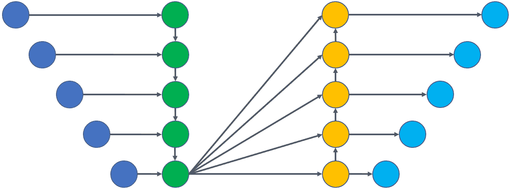
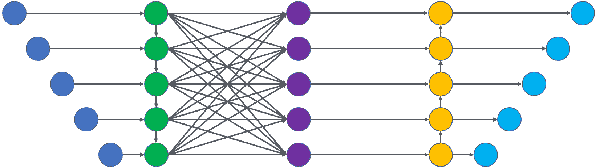
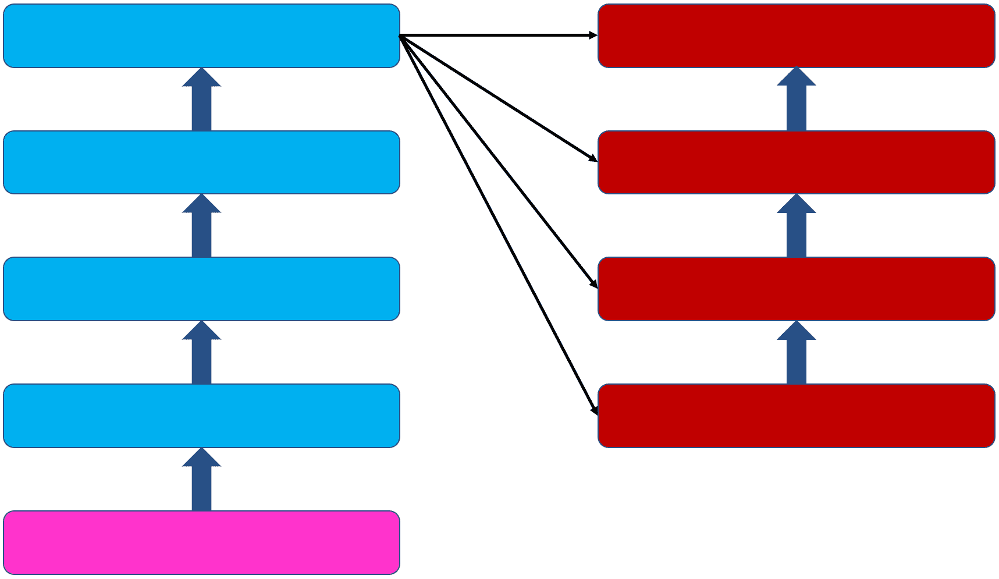
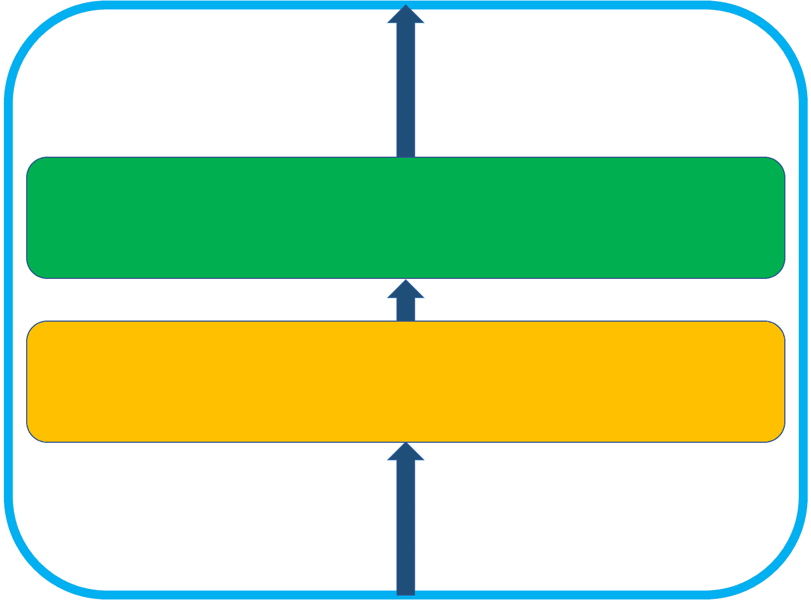
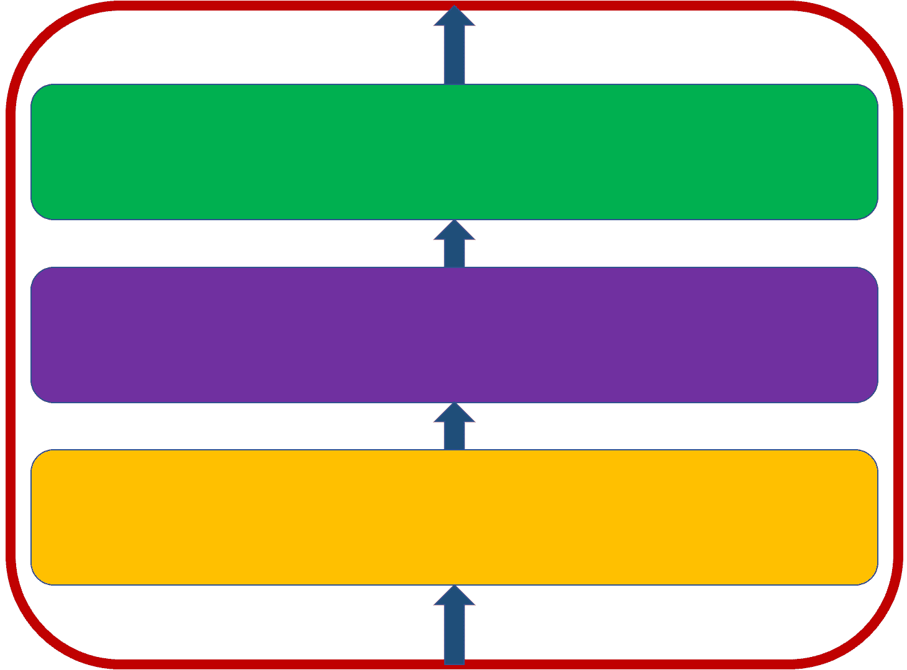
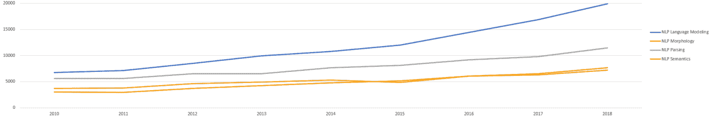
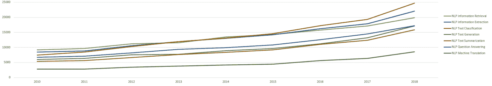

<!--yml

分类：未分类

日期：2024-09-06 20:07:45

-->

# [1807.10854] 深度学习在自然语言处理中的应用概述

> 来源：[`ar5iv.labs.arxiv.org/html/1807.10854`](https://ar5iv.labs.arxiv.org/html/1807.10854)

# 深度学习在自然语言处理中的应用概述

Daniel W. Otter, Julian R. Medina, 和 Jugal K. Kalita 手稿接收日期：MONTH DD, YYYY；修订日期：MONTH DD, YYYY。作者所在机构：科罗拉多大学科罗拉多 Springs 分校，1420 Austin Bluffs Pkwy，科罗拉多 Springs，科罗拉多州 80918，美国。通讯作者：Jugal K. Kalita（电子邮件：jkalita@uccs.edu）。本调查部分由国家科学基金会资助，资助编号为 IIS-1359275 和 IIS-1659788。本文所表达的任何观点、发现、结论和建议均为作者个人观点，不一定反映国家科学基金会的意见。

###### 摘要

在过去的几年里，自然语言处理领域由于深度学习模型的广泛应用而取得了巨大的进展。本调查简要介绍了该领域，并快速概述了深度学习架构和方法。然后，深入探讨了大量近期研究，并总结了大量相关贡献。分析的研究领域包括几个核心语言处理问题以及计算语言学的一些应用。接着提供了当前最先进技术的讨论，并对未来的研究方向提出了建议。

###### 索引词：

深度学习，神经网络，自然语言处理，计算语言学，机器学习

## I 引言

自然语言处理（NLP）领域涵盖了涉及人类语言的计算处理和理解的各种主题。自 1980 年代以来，该领域越来越依赖数据驱动的计算，包括统计、概率和机器学习 [1, 2]。近年来，计算能力和并行化的提升，通过图形处理单元（GPU） [3, 4]，使得“深度学习”成为可能，它利用人工神经网络（ANNs），有时具有数十亿个可训练的参数 [5]。此外，现代大数据集的可用性，通过复杂的数据收集过程，支持了这种深度结构的训练 [6, 7, 8]。

最近几年，NLP（自然语言处理）领域的研究人员和从业者充分利用了现代人工神经网络（ANNs）的强大功能，取得了许多有利的成果，这在很大程度上始于 Collobert 等人的开创性工作[9]。在最近，深度学习的使用显著增加了[10, 11]。这导致了 NLP 核心领域及其直接应用于实现实际有用目标的领域的重大进展。本文综述了自然语言处理和深度神经网络的简要介绍，并对深度学习如何用于解决当前 NLP 问题进行了广泛的讨论。虽然已有几篇其他相关论文和书籍[12, 10]，但没有一篇在如此多领域中广泛覆盖最先进的技术。此外，没有其他综述既探讨深度学习在计算语言学中的应用，也涉及其理论基础和传统 NLP 任务。除了讨论该领域最近的革命性进展外，这篇综述对于那些希望在进行进一步的高级研究和实践之前快速了解当前技术状态的读者将非常有用。

自然语言处理和人工智能的主题，包括深度学习，在第 II 节中介绍。第 III 节介绍了深度学习如何被用于解决自然语言处理核心领域中的问题。该节被分为几个小节，即自然语言建模（III-A）、形态学（III-B）、句法分析（III-C）和语义学（III-D）。第 IV 节讨论了深度学习在更实际领域中的应用。具体讨论了信息检索（IV-A）、信息抽取（IV-B）、文本分类（IV-C）、文本生成（IV-D）、摘要生成（IV-E）、问答系统（IV-F）和机器翻译（IV-G）。最后，在第 V 节中总结了现状，并对这一动态发展的领域做出预测、建议以及其他相关想法。

## II 自然语言处理与深度学习概述

本节介绍了引起研究人员和从业者关注的重要问题，并简要解释了在该领域常用的深度学习架构。

(

(a)

(

(b)

a)  b) 

图 1：编码器-解码器架构。尽管有多种编码器和解码器的选项可用，但 RNN 变体是每种选项的常见选择，尤其是后者。这样的网络在(a)中显示。注意机制，例如(b)中存在的机制，使解码器能够确定在每个输出步骤中哪些编码部分最相关。

### II-A 自然语言处理

自然语言处理（NLP）领域，也称为计算语言学，涉及计算模型和过程的工程，以解决理解人类语言中的实际问题。这些解决方案用于构建有用的软件。NLP 的工作可以分为两个广泛的子领域：核心领域和应用领域，尽管有时很难明确区分问题属于哪个领域。核心领域解决基础问题，例如语言建模，它强调量化自然出现的单词之间的关联；形态处理，处理单词有意义组成部分的分割以及确定单词的真实词性；句法处理或解析，构建句子图作为语义处理的可能前奏；以及语义处理，试图提炼文本中单词、短语和更高层次组件的含义。应用领域涉及诸如提取有用信息（例如命名实体和关系）、文本翻译、书面作品总结、通过推断答案自动回答问题以及文档分类和聚类等主题。通常需要成功处理一个或多个核心问题，并将这些想法和程序应用于解决实际问题。

目前，自然语言处理（NLP）主要是一个数据驱动的领域，使用统计和概率计算以及机器学习。过去，诸如朴素贝叶斯、$k$-最近邻、隐马尔可夫模型、条件随机场、决策树、随机森林和支持向量机等机器学习方法被广泛使用。然而，在过去几年中，这些方法经历了彻底的转变，已经完全被神经模型取代，或者至少得到了增强，接下来将讨论这些模型。

### II-B 神经网络与深度学习

(

(a)

(

(b)

(

(c)

a)  b)  c) 

图 2：变换器模型。(a) 显示了一个带有四个“编码器”的变换器，后面跟着四个“解码器”，所有这些都跟随一个“位置编码器”。(b) 显示了每个“编码器”的内部工作原理，其中包含一个自注意力层，后面跟着一个前馈层。(c) 显示了每个“解码器”的内部工作原理，其中包含一个自注意力层，后面跟着一个注意力编码器-解码器层，然后是一个前馈层。

神经网络由互连的节点或神经元组成，每个节点接收一定数量的输入并提供输出。输出层中的每个节点对从输入节点接收到的值执行加权和计算，然后使用简单的非线性变换函数对这些求和结果生成输出。根据网络在输出节点处表现出的个别错误或损失，权重会进行修正。现代网络通常使用随机梯度下降来进行这些修正，考虑节点处的误差导数，这种方法称为反向传播[13]。不同类型网络的主要区别在于节点的连接方式和层数。所有节点可以组织成顺序层，每个节点仅从早期层的节点接收输入的基本网络称为前馈神经网络（FFNNs）。虽然对深度神经网络（DNN）的定义没有明确的共识，但一般认为具有多个隐藏层的网络是深度的，层数多的网络被认为是非常深的[7]。

#### II-B1 卷积神经网络

卷积神经网络（CNNs）[14, 15]，建立在福岛的神经认知网络[16, 17]的基础上，得名于数学和信号处理中的卷积操作。CNNs 使用被称为滤波器的函数，从而允许同时分析数据中的不同特征[18, 19]。CNNs 被广泛应用于图像和视频处理、以及语音和自然语言处理[20, 21, 22, 23]。通常，某些特征出现的位置并不重要，而是这些特征是否出现在特定的局部区域。因此，池化操作可以用来最小化特征图的大小（卷积滤波器的输出）。这些池的大小通常较小，以防止过多精度的丧失。

#### II-B2 递归神经网络

类似于 CNNs，递归网络 [24, 25] 使用一种权重共享的形式来最小化训练。然而，尽管 CNNs 在同一层内水平共享权重，递归网络在不同层之间垂直共享权重。这一点特别吸引人，因为它允许对诸如解析树之类的结构进行简单建模。在递归网络中，可以在树的低层使用单一的张量（或广义矩阵）作为权重，然后在逐渐更高的层次上递归使用 [26]。

#### II-B3 递归神经网络和长短期记忆网络

一种被广泛使用的递归神经网络是递归神经网络（RNN） [27, 28]。由于自然语言处理的很多任务依赖于单词或其他元素如音素或句子的顺序，因此在处理新元素时能够记住之前的元素是有用的 [29, 30, 31]。有时，存在反向依赖，即某些单词的正确处理可能依赖于后续的单词。因此，使用两个 RNN 层来双向查看句子，并结合它们的输出是有益的。这种 RNN 的排列称为双向 RNN。如果有一系列的 RNN 层，这也可能导致更好的最终表示。这种设置允许输入的效果持续比单一的 RNN 层更长，从而允许长期效应。这种顺序的 RNN 单元设置称为 RNN 堆栈 [32, 33]。

一种高度工程化的 RNN 是长短期记忆（LSTM）网络 [34, 35]。在 LSTM 中，递归节点由若干个单独的神经元组成，这些神经元以设计的方式连接，以保留、遗忘或暴露特定的信息。虽然通用的 RNN 具有反馈给自身的单个神经元在技术上对长时间过去的结果有一些记忆，但这些结果在每次迭代中都被稀释。通常，记住远古的过去信息是重要的，同时，其他非常近期的信息可能并不重要。通过使用 LSTM 块，这些重要的信息可以保留得更久，而无关的信息则可以被遗忘。一种稍微简单的 LSTM 变体，称为门控递归单元（GRU），在许多任务中表现得与标准 LSTM 一样好甚至更好 [36, 37]。

#### II-B4 注意力机制和 Transformer

对于机器翻译、文本摘要或图像描述等任务，输出是以文本形式呈现的。通常，这通过使用编码器-解码器对来完成。一个编码 ANN 用于生成一个特定长度的向量，而一个解码 ANN 则用于基于这个向量返回可变长度的文本。该方案的问题如图 1 (a) 所示，是 RNN 被迫将整个序列编码为一个有限长度的向量，而不考虑任何输入是否比其他输入更重要。

对此的一个稳健解决方案是注意力机制。注意力机制的首次使用[38]采用了一个密集层来对 RNN 的隐藏状态进行加权注释，使得网络能够根据当前隐藏状态和注释学习该关注什么。这样的机制存在于图 1 (b) 中。该机制的变体已经被提出，其中流行的包括卷积 [39]、时间内 [40]、门控 [41] 和自注意力 [42]。自注意力涉及对同一句子中的词进行注意。例如，在对输入句子中的一个词进行编码时，将注意力投射到句子中的其他词上是有益的。在解码以生成结果句子时，给予已经产生的词适当的注意力是有意义的。特别是，自注意力已经在一种名为 Transformer [42] 的最先进的编码器-解码器模型中得到了广泛使用。Transformer 模型如图 2 所示，包含了许多堆叠在一起的编码器和解码器单元，每个编码器和解码器单元中都有自注意力，并且编码器和解码器之间有交叉注意力。它并行使用多个注意力实例，并摒弃了递归和卷积的使用。Transformer 已成为大多数最先进的自然语言处理神经网络中的典型组件。

#### II-B5 残差连接和丢弃法

在通过反向传播训练的深度网络中[13]，用于纠正误差的梯度经常会消失或爆炸[43]。这可以通过选择激活函数来缓解，例如修正线性单元（ReLU）[44]，它们没有陡峭的区域或梯度非常小的区域。此外，为了应对这一问题及其他问题[45]，通常会使用残差连接。这些连接简单来说就是跳过层（通常是一个）。如果在每个交替层中使用，这将减少梯度必须反向传播的层数一半。这样的网络被称为残差网络（ResNet）。存在许多变体，包括高速公路网络[46]和密集网络[47]。

另一个在训练人工神经网络（ANNs）中使用的重要方法是 dropout。在 dropout 中，一些连接甚至可能连同节点被停用，通常是随机的，每个训练批次（小的样本集）都会有所不同，每个批次停用的节点也会有所不同。这迫使网络在多个路径上分配其记忆，有助于提高泛化能力，并减少对训练数据的过拟合可能性。

## III 深度学习在自然语言处理核心领域

图 3：自然语言处理核心领域的出版量。过去十年中，Google Scholar 索引的与每个主题相关的出版物数量如图所示。尽管所有领域都有增长，但语言建模的增长最多。

核心问题是任何计算语言学系统中固有存在的。为了执行翻译、文本摘要、图像描述或任何其他语言任务，必须对基础语言有一定的理解。这种理解可以分解为至少四个主要领域：语言建模、形态学、句法分析和语义学。过去十年中每个领域的学术工作数量如图 3 所示。

语言建模可以从两个方面来观察。首先，它确定哪些词跟随哪些词。然而，从延伸来看，这也可以视为确定词的含义，因为单个词只有在与其他词互动时才具有完整的意义。形态学研究词汇本身是如何形成的。它考虑了词的词根以及前缀和后缀、复合词和其他词内部的设备，以展示时态、性别、复数以及其他语言结构。句法分析考虑了哪些词修饰其他词，形成成分，从而导致句子的结构。语义学领域研究词汇的含义。它考虑了单个词的含义以及它们如何与其他词相关联和修改，同时还考虑了这些词出现的上下文以及一定程度的世界知识，即“常识”。

这些领域之间有显著的重叠。因此，许多分析过的模型可以归类为多个部分。作为这样，它们在最相关的部分中进行讨论，并与其他地方的逻辑联系进行讨论。

### III-A 语言建模与词嵌入

可以说，NLP 中最重要的任务是语言建模。语言建模（LM）几乎是任何 NLP 应用中的关键部分。语言建模是创建一个模型，以便在给定前一个词或组件的情况下预测词汇或简单的语言成分[48]。这对用户输入时提供快速文本输入的预测能力非常有用。然而，它的力量和多功能性来源于它能够隐式捕捉词汇或组件之间的句法和语义关系，使其在机器翻译或文本摘要等任务中变得非常有用。通过预测，这些程序能够生成更相关、更像人类语言的句子。

#### III-A1 神经语言建模

统计语言模型的一个问题是无法很好地处理同义词或训练语料库中不存在的词汇（OOV）。通过引入神经语言模型[49]，解决了这些问题。虽然 NLP 领域花了十年时间才开始广泛使用 ANN，但 LM 社区立即利用了这些技术，并继续开发复杂的模型，其中许多模型由 DeMulder 等人总结[50]。

#### III-A2 语言模型评估

尽管神经网络在语言模型（LM）领域取得了突破，但很难量化改进。理想情况下，应该独立于语言模型出现的应用来评估它们。已经提出了许多评估指标，但尚未找到完美的解决方案 [51, 52, 53]。最常用的指标是困惑度，它是测试集的逆概率，并由单词数量进行归一化。困惑度是对在相同数据集上训练的 LM 的合理测量，但当它们在不同的词汇上训练时，这个指标就变得不那么有意义了。幸运的是，该领域有几个基准数据集可以进行比较。其中两个数据集是 Penn Treebank (PTB) [54] 和 Billion Word Benchmark [55]。

#### III-A3 记忆网络和语言建模中的注意力机制

Daniluk 等人 [56] 使用了几种注意力机制的变体来测试多个网络。第一个网络采用了一个简单的注意力机制，这个机制并不完全连接，窗口长度为五。他们假设，使用单一值来预测下一个标记、编码注意力单元中的信息以及解码注意力单元中的信息会阻碍网络，因为很难训练一个参数同时执行三个不同的任务。因此，在第二个网络中，他们设计了每个节点具有两个输出：一个用于编码和解码注意力单元中的信息，另一个用于显式预测下一个标记。在第三个网络中，他们进一步分离了输出，使用独立的值来编码进入注意力单元的信息和解码从中检索的信息。对维基百科语料库的测试表明，与基准相比，注意力机制提高了困惑度，而连续添加第二和第三个参数进一步提高了结果。还注意到，只有之前的五个标记携带了较大的价值（因此选择了五的窗口大小）。因此，他们测试了一个第四个网络，该网络仅使用了来自之前五个单元的残差连接。结果发现，这个网络也提供了与许多更大 RNN 和 LSTM 相当的结果，这表明使用更简单的网络也能获得合理的结果。

最近的另一项研究探讨了在语言模型中使用残差记忆网络（RMNs）[57]。作者发现，跳过两个层的残差连接最为有效，其次是跳过单层的残差连接。特别是，第一层和第四层之间存在残差连接，第五层和第八层之间也有，此外，第九层和第十二层之间也有。研究发现，增加网络深度能够改善结果，但在使用大批量时会遇到内存限制。网络宽度对性能的影响不大，但宽网络的训练更为困难。研究还发现，RMNs 能够超越类似规模的 LSTMs。

#### III-A4 卷积神经网络在语言建模中的应用

最近在语言模型中使用的 CNN 将池化层替换为全连接层[58]。这些层允许特征图被缩减到较低维度的空间，就像池化层一样。然而，虽然池化层会丢失特征位置的任何引用，全连接层在某种程度上保留了这些信息。实现了三种不同的架构：多层感知器 CNN（MLPConv），其中滤波器不仅是线性的，而是小型的 MLPs[59]；多层 CNN（ML-CNN），其中多个卷积层堆叠在一起；以及这些网络的组合称为 COM，其中滤波器的卷积核大小有所变化（在这种情况下为三和五）。结果显示，堆叠卷积层在语言模型中是有害的，但 MLPConv 和 COM 都降低了困惑度。将 MLPConv 与 COM 的不同卷积核大小结合起来取得了更好的结果。分析显示，这些网络学习了特定的词语模式，例如，“as . . . as”。最后，这项研究表明，CNN 可以用于捕捉句子中的长期依赖关系。较近的词语被发现最为重要，但较远的词语也有一定意义。

#### III-A5 特征感知神经语言模型

尽管大多数用于自然语言处理的 CNN 接受词嵌入（第 III-A6 节）作为输入，最近的网络分析则改为字符级输入。例如，Kim 等人 [60] 不像之前的网络 [61]，只接受字符级输入，而不是将其与词嵌入结合。使用 CNN 处理字符级输入，以提供词的表示。类似于词嵌入，这些表示随后被输入到由高速公路网络（类似于 LSTM 的门控网络） [46] 和 LSTM 组成的编码器-解码器对中。他们在英语 Penn Treebank 以及捷克语、德语、西班牙语、法语、俄语和阿拉伯语的数据集上训练了该网络。除俄语外的每种非英语语言中，该网络在大数据集和小数据集上的表现都优于先前公布的结果 [61]。在 Penn Treebank 上，结果与现有的最先进技术相当 [62]。然而，该网络仅有 1900 万个可训练参数，明显低于其他网络。由于网络专注于字符级分析产生的形态相似性，它比以前的模型更能够处理稀有词。分析表明，如果没有使用高速公路层，许多词的最近邻在形态上相似，但不一定在语义上相似。此外，网络能够识别拼写错误的词或不标准拼写的词（例如，looooook 代替 look）以及识别词汇外的词。分析还显示，网络能够识别前缀、词根和后缀，并理解带连字符的词，使其成为一个强大的模型。

Jozefowicz 等人 [63] 测试了多种产生字符级输出的架构 [64, 55, 65, 66]。尽管这些模型中的许多只在小规模语言建模上进行了测试，本研究却在大规模的环境中进行了测试，使用了十亿词基准。最有效的模型是一个大型 LSTM，使用字符级 CNN 作为输入网络，它在 10.4 亿可训练参数下达到了 30.0 的最先进的困惑度（相比于先前单个模型的最佳结果 51.3，参数为 200 亿 [55]）。然而，最佳性能是在使用十个 LSTM 的集成模型下取得的。这个集成模型的困惑度为 23.7，远超之前最先进的集成模型 [65]，其困惑度为 41.0。

#### III-A6 词嵌入的发展

神经语言模型不仅允许预测未见过的同义词，还能够建模词与词之间的关系 [67, 68]。由语言模型技术获得的、表示单个词的数值分量的向量称为嵌入。通常，这通过主成分分析（Principle Component Analysis）或通过捕捉神经语言模型中的内部状态来实现。（注意，这些不是标准的语言模型，而是专门为此目的构建的语言模型。）通常，词嵌入的维度在 50 到 300 之间。一个被过度使用的例子是单词“king”、“queen”、“man”和“woman”的分布式表示。如果对这些单词的嵌入向量进行计算，可以得到非常合理的结果。如果这些单词的向量分别表示为 $\vec{k}$、$\vec{q}$、$\vec{m}$ 和 $\vec{w}$，可以观察到 $\vec{k}-\vec{q}\approx\vec{m}-\vec{w}$，这对人类推理来说是非常直观的。近年来，词嵌入已经成为自然语言处理系统的标准输入形式。

#### III-A7 最近的进展和挑战

语言建模正在每周不断演变，从 Radford 等人的工作 [69] 和 Peters 等人的工作 [70] 开始。Radford 等人介绍了生成预训练（Generative Pre-Training, GPT），它基于 Transformer 模型 [42] 预训练了一个语言模型（见第 IV-G 节），学习句子和更长文本片段中词的依赖关系，而不仅仅是立即周围的词。Peters 等人在他们的语言模型嵌入（Embeddings from Language Models, ELMo）中引入了双向性，以捕捉向前和向后的上下文。此外，他们在多个层次上捕捉了向量化，而不仅仅是最终层。这允许捕捉相同信息的多重编码，这在经验上显示出显著提升了性能。

Devlin 等人 [71] 增加了一项额外的无监督训练任务，即随机遮蔽邻近词预测和下一个句子预测（NSP），其中给定一个句子（或其他连续文本片段），预测另一个句子是否为下一个句子。这些来自双向编码器表示的变换器（BERT）进一步由 Liu 等人 [72] 构建，创造了多任务深度神经网络（MT-DNN）表示，这在语言模型中代表了当前的最先进技术。该模型在类似 BERT 的模型之上使用了随机答案网络（SAN）[73, 74]。在预训练之后，该模型在多个不同的任务上进行训练，然后根据当前任务进行微调。使用 MT-DNN 作为语言模型，他们在十个尝试的任务中取得了最先进的结果。

尽管这些预训练模型在“理解”语言方面取得了很好的进展，例如在蕴涵推理等任务中，但一些人假设这些模型学习的是数据集中的模板或句法模式，与逻辑或推理无关。当新数据集被创建以仔细移除这些模式时，模型的表现不佳 [75]。此外，尽管最近在跨语言建模和通用语言建模方面有一些工作，但还需要增加工作量和水平，以应对低资源语言的挑战。

### III-B 形态学

形态学关注的是在单词内部找到词缀，包括词根、词干、前缀、后缀以及—在某些语言中—插入成分。词缀（前缀、后缀或插入成分）用于显著修改词干的性别、数量、人称等。

Luong 等人 [76] 构建了一个具有形态学意识的语言模型。使用 RvNN 来建模形态学结构，然后在 RvNN 之上建立了神经语言模型。该模型在 WordSim-353 数据集 [77] 上进行训练，分词使用了 Morfessor [78]。构建了两个模型—一个使用上下文，一个不使用。发现不敏感于上下文的模型过度考虑了某些形态学结构。特别是，相同词干的词被聚类在一起，即使它们是反义词。对上下文敏感的模型表现更好，考虑了词干之间的关系，还考虑了其他特征，如前缀“un”。该模型还在几个其他流行的数据集 [79, 80, 81] 上进行了测试，显著超越了之前的嵌入模型。

一个好的形态分析器对于许多自然语言处理任务通常是重要的。因此，Belinkov 等人进行了一项最近的研究[82]，研究了形态学在各种神经机器翻译模型中的学习和使用程度。构建了多个翻译模型，所有模型都从英语翻译成法语、德语、捷克语、阿拉伯语或希伯来语。编码器和解码器是基于 LSTM 的模型（有些带有注意力机制）或字符感知的 CNN，这些模型在 WIT³语料库[83, 84]上进行了训练。然后将解码器替换为词性（POS）标注器和形态标注器，固定编码器的权重以保留内部表示。研究检查了编码器的效果以及训练过程中附加的解码器的效果。研究得出结论，注意力机制的使用会降低编码器的性能，但会提高解码器的性能。此外，发现字符感知模型在学习形态学方面优于其他模型，并且输出语言会影响编码器的性能。具体而言，输出语言的形态学越丰富，编码器创建的表示效果越差。

Morita 等人[85]分析了一种用于未分词语言（如日语）的新型形态学语言模型。他们构建了一个基于 RNN 的模型，配有束搜索解码器，并在自动标注[86]的语料库和手动标注的语料库上进行了训练。该模型共同执行了多个任务，包括形态分析、POS 标注和词形还原。该模型随后在京都文本语料库[87]和京都大学网页文档领先语料库[88]上进行了测试，在所有任务上都超越了所有基线模型。

形态学的一个近期研究方向是普遍形态学。这项任务考虑了不同语言形态学之间的关系及其相互关系，旨在实现最终目标——单一形态分析器。然而，据作者所知，只有一项研究将深度学习应用于这一领域[89]，即使如此，也仅作为普遍解析的辅助任务（第 III-C4 节）。对于那些希望将深度学习应用于这一任务的人，已经有几个数据集可用，包括来自 CoNLL 共享任务的一个数据集[90]。

除了通用形态学外，考虑到单词结构的形态嵌入的发展可能有助于多语言处理。它们可能在同源语言间使用，这在某些语言资源更丰富时特别有价值。此外，形态结构在处理如生物医学文献中使用的专业语言时可能也很重要。由于深度学习在自然语言处理（NLP）中已相当根深蒂固，更好地处理形态成分可能会提升整体模型的性能。

### III-C 解析

解析检查句子中不同单词和短语之间的关系。解析至少有两种不同形式：短语结构解析和依赖解析 [48]。在短语结构解析中，短语成分以分层的方式从句子中提取出来。依赖解析则查看单个词对之间的关系。

最近在解析中使用深度学习大多集中于依赖解析，其中存在另一种主要的解决方案类型划分。基于图的解析构建多个解析树，然后进行搜索以找到正确的解析树。大多数基于图的方法是生成模型，其中使用基于自然语言的形式语法来构建树 [48]。近年来，比起基于图的方法，基于转换的方法更为流行，这些方法通常只构建一个解析树。尽管提出了许多修改方案，但基于转换的依赖解析的标准方法是创建一个包含句子中所有单词的缓冲区和一个仅包含 ROOT 标签的栈。然后，将单词推入栈中，顶部的两个项目之间会建立连接，称为弧。一旦依赖关系被确定，单词就从栈中弹出。这个过程持续进行，直到缓冲区为空且栈上只剩下 ROOT 标签。三种主要方法用于调节先前描述的每个操作的条件。在 arc-standard 方法 [91, 92] 中，所有的依赖项在连接到其父词之前都先连接到一个词。在 arc-eager 方法 [91, 92] 中，无论其子词是否全部连接到该词，词都会尽可能快地与其父词连接。最后，在 swap-lazy 方法 [93] 中，arc-standard 方法被修改以允许在栈上交换位置，这使得绘制非投影边成为可能。

#### III-C1 早期神经解析

深度学习在 NLP 中的早期应用之一是 Socher 等人[94, 95]提出的，其中包括使用带有概率上下文无关文法（PCFGs）[96, 97]的 RNN。根据作者了解，首个在解析中实现技术前沿性能的神经模型是 Le 和 Zuidema[98]提出的。该性能在宾州树库上通过使用 Inside-Out 递归神经网络实现，该网络使用两个向量表示（一个内层和一个外层），允许数据的自上而下和自下而上的流动。Vinyals 等人[99]在句法成分解析器中创建了一个带有注意力机制的 LSTM，并在来自不同领域的数据（如英语网页树库[100]和问答树库[101]，而非宾州树库的华尔街日报部分[54]）上进行了测试，显示神经模型能够在领域之间进行泛化。Stenetorp[102]首次在依赖解析中使用了嵌入。这种方法使用 RNN 创建了一个有向无环图。尽管该模型在 CoNLL 2008 共享任务数据集的华尔街日报部分[103]上产生了接近技术前沿的结果，但在句子结束时，它似乎难以记住句子开头的短语。

#### III-C2 基于过渡的依赖解析

陈和曼宁[104]在英语宾州树库的英语和中文数据集上推动了 UAS 和 LAS 的技术前沿。他们通过在过渡基础解析器中使用简单的前馈神经网络作为决策者来实现这一点。这样，他们能够规避统计模型中普遍存在的稀疏性问题。

陈和曼宁使用了简单的贪婪搜索，这一方法被周等人[105]的束搜索所取代，实现了显著的改进。魏斯等人[106]在陈和曼宁的工作基础上进行了改进，使用了具有残差连接的更深层神经网络，并在 softmax 层之后放置了一个感知机层。他们通过使用三重训练[107]，在训练时使用显著更多的示例，这一过程涉及将潜在的数据样本提供给另外两个解析器，并利用两个解析器都同意的样本来训练主要解析器。

另一个模型使用了 LSTM 而不是前馈网络 [108]。与之前的模型不同，该模型能够获取整个缓冲区和整个栈的信息，并了解所有过渡决策的历史。这使得模型能够做出更好的预测，在斯坦福依赖树库 [109] 上生成了最先进的结果，同时在 CTB5 中文数据集 [110] 上也取得了最先进的结果。最后，Andor 等人 [111] 使用了具有全局归一化的前馈网络，处理了包括词性标注、句子压缩和依赖解析在内的多个任务。在华尔街日报数据集上，所有任务均取得了最先进的结果。值得注意的是，他们的模型所需的计算量显著低于可比模型。

类似于 Stenentorp [102]，Wang 等人 [112] 使用了一种替代算法来生成有向无环图，进行一种称为语义解析的任务，在该任务中找到单词之间的更深层次的关系。该任务旨在识别正在发生的动作类型以及单词如何互相修饰。除了在基于转换的解析中使用的典型栈和缓冲区，该算法还使用了一个双端队列（deque）。这使得能够表示多父节点单词，虽然在英语中这种情况较少见，但在许多自然语言中很常见。此外，它还允许多个 ROOT 标签的子节点。除了生成上述图形外，这项工作还创新性地使用了两种新的基于 LSTM 的技术：Bi-LSTM 减法和增量 Tree-LSTM。Bi-LSTM 减法基于之前的工作 [41, 113]，将缓冲区表示为来自 LSTM 头部和尾部的向量的减法，并使用额外的 LSTM 来表示双端队列。增量 Tree-LSTM 是 Tree-LSTM [114] 的扩展，针对有向无环图进行了修改，通过逐步连接子节点到父节点，而不是同时将所有子节点连接到一个父节点。该模型在 SemEval-2015 任务 18（英语） [115] 和 SemEval-2016 任务 9（中文） [116] 的十六项评估指标中取得了当时发布的最佳成绩。虽然深度学习已在特定领域（如问答系统 [117, 118]）应用于语义解析，但据作者所知，这是首次大规模应用于整体语义解析。

#### III-C3 生成依赖和成分解析

Dyer 等人 [119] 提出了一个使用递归神经网络语法进行解析和语言建模的模型。尽管大多数方法采取自下而上的解析方法，这个模型采用了自上而下的方法，除了当前的解析树，还将整个句子作为输入。这使得句子可以整体视角看待，而不仅仅是考虑局部短语。这个模型在英语生成解析和单句语言建模中取得了当时最好的结果，也在中文生成解析中达到了接近最佳的结果。

Choe 和 Charniak [120] 将解析视为语言建模问题，并使用 LSTM 为解析树分配概率，取得了最先进的成果。Fried 等人 [121] 想要确定模型的力量是否来自重新排序过程，还是仅仅来自两个模型的组合力量。他们发现，使用一个解析器生成候选树，另一个解析器进行排名优于单一解析器方法，但显式地组合两个解析器是更好的选择。他们使用两个解析器来选择候选者并重新排序，取得了最先进的结果。他们将该模型扩展到使用三个解析器，取得了更好的结果。最后，构建了一个由八个此类模型（使用两个解析器）组成的集成模型，并在当时的 Penn Treebank 上取得了最佳结果。

Dozat 和 Manning [122] 创建的模型使用了基于图的自注意网络方法。同样，Tan 等人 [123] 采用了自注意模型进行语义角色标注，这是语义解析的一个子任务，取得了优秀的结果。他们尝试了递归和卷积替代自注意机制的前馈部分，发现前馈变体表现最好。另一种新颖的方法是 Duong 等人 [124] 使用主动学习。虽然不是完美的，这仍然是解决语义解析中最大问题之一——数据可用性——的一个可能解决方案。

#### III-C4 通用解析

像通用形态学、通用依赖解析或通用解析一样，通用依赖解析是一个相对较新的任务，它使用标准化的一组标签和关系来解析所有语言。虽然当前的解析在语言之间差异很大，但这个任务试图使其在语言之间统一，以便更容易进行处理。Nivre [125] 讨论了通用语法的最新发展，并介绍了面临的挑战，主要是开发更多语言的树库以及不同（甚至相同）语言的树库之间标签的一致性。由于过去两年它一直是 CoNLL 共享任务，这个任务得到了很大关注 [126]。2018 年任务中的一些方法包括使用深度转换解析 [127]、基于图的神经解析 [128] 和使用单一神经模型而非集成模型的竞争模型 [129]。该任务已经开始在 CoNLL 之外进行研究，Liu 等人 [130] 将通用依赖应用于推文解析，使用双向 LSTM 的集成模型。

#### III-C5 剩余挑战

除了通用解析之外，需要进一步研究的解析挑战是构建句法结构而不使用树库进行训练。已经尝试使用注意力评分和树 LSTM，以及“外部-内部”自编码器。如果这些方法成功，它们在许多环境中，包括低资源语言和领域外场景中，具有潜在的应用价值。虽然还有许多其他挑战存在，但这些是最大的，预计会得到最多关注。

### III-D 语义学

语义处理涉及在某种程度上理解单词、短语、句子或文档的意义。词嵌入，如 Word2Vec [67, 68] 和 GloVe [131]，声称捕捉了单词的意义，遵循了意义的分布假设 [132]。作为推论，当处理与短语、句子或其他文本组成部分相对应的向量时，使用神经网络计算出一个可以大致认为是语义代表的表示是组合性的。在本节中，神经语义处理研究分为两个不同领域：比较两段文本的语义相似性的工作，以及捕捉和转移高层次成分（特别是句子）中的意义的工作。

#### III-D1 语义比较

测试计算语义方法有效性的一种方式是观察两个被人类评判为具有相似意义的短语、句子或文档，是否也会被程序评判为相似。

胡等人[133]提出了两个 CNN 模型来执行语义比较任务。第一个模型 ARC-I，受到 Bordes 等人[134]的启发，使用了一个 Siamese 网络，其中两个共享权重的 CNN 并行评估两个句子。在第二个网络中，两个网络之间放置了连接，在 CNN 的最终状态之前允许共享。这种方法在英文和中文任务中优于许多现有模型。

在之前工作的基础上[26, 21, 133]，Yin 和 Schütze[135]提出了一个 Bi-CNN-MI（MI 为多粒度交互特征），包括一个预训练的 CNN 句子模型、一个 CNN 交互模型和一个逻辑回归器。他们修改了使用 Dynamic CNNs[21]的 Siamese 网络（第 III-D2 节）。此外，比较时使用了每一层的特征图，而不仅仅是顶层特征图。他们在微软研究释义语料库（MSRP）[136]上取得了最先进的结果。

He 等人[137]构建了特征图，然后使用“相似性测量层”进行比较，随后是全连接层和 CNN 中的 log-softmax 输出层。卷积层中使用的窗口长度从一到四不等。该网络在三个数据集上进行了训练和评估：MSRP、涉及组合知识的句子（SICK）数据集[138]和微软视频释义语料库（MSRVID）[139]。在第一个和第三个数据集上取得了最先进的结果。

Tai 等人设计了一个使用类似 LSTM 节点的 RvNN 模型[114]，称为 Tree-LSTM。研究了两种变体（基于成分和基于依赖）并在 SICK 数据集和斯坦福情感树库[94]上进行了测试。基于成分的模型在斯坦福情感树库上达到了最先进的结果，而基于依赖的模型在 SICK 上达到了最先进的结果。

He 等人提出了另一个模型[140]，在 SICK 上优于 Tai 等人的模型。该模型在应用“相似性关注层”之前，首先形成两个句子的矩阵，然后是一个十九层的 CNN，接着是密集层和 softmax 输出。相似性关注层匹配了输入句子中语义相似的词对，并对表示词对之间关系的矩阵位置应用权重。他们还在 MSRVID、SemEval 2014 任务 10[141]、WikiQA[142]和 TreeQA[143]数据集上获得了最先进的结果。

#### III-D2 句子建模

从神经语言建模扩展而来的句子建模试图将句子的意义捕捉为向量。进一步发展的是像 Le 和 Mikolov [144]的模型，这些模型试图以这种方式对段落或更大文本块进行建模。

Kalchbrenner 等人 [21] 使用动态卷积神经网络（DCNN）生成句子的表示，这种网络使用了多个滤波器和动态$k$-max 池化层。由于动态池化，能够在具有不同结构的句子中识别不同类型和长度的特征，而无需对输入进行填充。这不仅允许识别短程依赖关系，还允许识别长程依赖关系。DCNN 在需要语义理解的应用任务中进行了测试。在斯坦福情感树库 [95] 中预测电影评论的情感以及在推文 [145] 中识别情感时，其表现优于所有比较模型。它在使用 TREC 数据库 [146] 分类问题类型时也表现为顶尖。

由于对这种理解的要求以及它们由于通常的编码器-解码器结构而易于检查，神经机器翻译（NMT）系统（第 IV-G 节）是研究内部语义表示的绝佳测试平台。Poliak 等人 [147] 对四种不同语言对的编码器进行了训练：英语和阿拉伯语、英语和西班牙语、英语和中文、以及英语和德语。解码分类器在四个不同的数据集上进行了训练：Multi-NLI [148]，这是 SNLI [149] 的扩展版本，以及来自 JHU Decompositional Semantics Initiative [150] 的三个重构数据集（FrameNet Plus 或 FN+ [151]，Definite Pronoun Resolution 或 DPR [152]，以及 Semantic Proto-Roles 或 SPR [153]）。虽然结果没有特别强，但在 SPR 中表现最好。这导致了 NMT 模型在捕捉同义信息方面表现不佳，并且未能捕捉有助于指代解析的推理（例如，解决性别问题）。然而，他们发现模型能够学习关于原型角色的信息（例如，谁或什么是动作的接受者）。一项相关工作 [154] 分析了用于自然语言推理的许多数据集的质量。

Herzig 和 Berant [155] 发现，在单一领域上训练语义解析器，如常做的那样，效果不如在多个领域上训练。这个结论是在测试了三个基于 LSTM 的模型后得出的。第一个模型是一个一对一模型，其中使用了一个编码器和一个解码器，要求网络自行确定输入的领域。在第二个模型中，使用了一个多对多模型，每个领域使用一个解码器，并且有两个编码器：领域特定编码器和多领域编码器。第三个模型是一个一对多模型，使用一个编码器，但每个领域使用单独的解码器。每个模型都在“OVERNIGHT”数据集[156] 上进行训练。所有模型均取得了卓越的结果，其中一对一模型展示了最先进的性能。

Brunner 等人[157] 得出了类似的结论。他们创建了几个基于 LSTM 的编码器–解码器网络，并分析了产生的嵌入向量。使用了一个接受英语句子作为输入的编码器，以及四个不同的解码器。第一个解码器是一个复制解码器，它复现了原始的英语输入。第二个和第三个解码器将文本翻译成德语和法语。最后，第四个解码器是一个 POS 标注器。使用了不同组合的解码器；一个模型只有复制解码器，而其他模型则有两个、三个或全部四个解码器。使用了来自 EuroParl 数据集[158] 的十四种不同结构的句子来训练网络。然后，将一组测试句子输入到编码器中，并分析其输出。在所有情况下，形成了十四个簇，每个簇对应一种句子结构。分析显示，添加更多解码器会导致更多正确且更明确的簇。特别是，使用所有四个解码器可以达到零错误。此外，研究人员确认了一个假设，即正如可以在词嵌入上进行逻辑算术一样，也可以在句子嵌入上进行。

#### III-D3 语义挑战

除了已提到的挑战，研究人员认为，能够很好地解决任务并不代表实际理解。将深度网络与通用词图（如 WordNet [159]）或知识图谱（如 DBPedia [160]）结合起来，可能能够赋予理解感。图嵌入是一个活跃的研究领域[161]，关于语言模型与图模型的结合的工作最近才开始起步，这给更好的机器理解带来了希望。

### III-E 核心问题总结

深度学习一般表现非常出色，超越了许多核心 NLP 任务的现有技术水平，因此为有用的自然语言应用打下了基础。然而，从审视这里回顾的研究可以看出，自然语言是一个极其复杂的主题，具有无数核心或基本任务，而深度学习仅仅触及了表面。如何将有效执行个别核心任务的架构综合起来，以构建一个可能更复杂的分布式神经架构，从而在多个或“所有”核心任务中表现出能力，目前也不清楚。从更根本的角度来看，掌握基本任务如何可能导致在应用任务中表现优异，这些应用任务才是终极工程目标，特别是在构建有效和高效的深度学习模型的背景下，也不清楚。许多，甚至大多数，成功的深度学习架构对于应用任务，在下一节中讨论的，似乎放弃了核心任务的明确架构组件，而是隐式地学习这些任务。因此，一些研究人员认为，大量关于核心问题的工作相关性并不完全充分，而其他人则认为，在这些领域进行进一步的广泛研究是必要的，以更好地理解和开发那些更完美地执行这些任务的系统，无论是显式的还是隐式的。

## IV 深度学习应用于自然语言处理

图 4：应用 NLP 领域的出版量。所有讨论的自然语言处理应用领域近年来都见证了增长，其中最大增长发生在过去两到三年。

尽管研究 NLP 的核心领域对于理解神经模型的工作原理非常重要，但从工程学的角度来看，这本身并没有意义，工程学更看重那些对人类有益的应用，而非纯粹的哲学和科学探究。这里总结了几项当前对解决一些立即有用的 NLP 任务的现有方法。请注意，这里讨论的问题仅涉及文本处理，而不包括语音处理。因为语音处理[162, 163]需要涉及其他多个领域的专业知识，包括声学处理，所以通常被视为一个独立的领域，与 NLP 领域有许多共性。过去十年中讨论的每个领域的研究数量见图 4。

### IV-A 信息检索

信息检索（IR）系统的目的是帮助人们在正确的时间（当他们需要时）以正确的格式（最方便的格式）找到正确（最有用）的信息[164]。在 IR 的众多问题中，一个主要的问题是需要解决如何根据查询字符串对文档进行排名，以便进行临时检索任务，这类似于搜索引擎的工作方式。

深度学习模型用于临时检索，通过匹配查询文本和文档文本来获得相关性评分。因此，这些模型必须专注于生成查询与文档中单个词之间交互的表示。一些关注表示的方法构建深度学习模型以生成文本的良好表示，然后直接匹配这些表示[165, 133, 166]，而关注交互的方法则首先直接构建局部交互，然后使用深度神经网络学习基于词语交互的文本匹配[133, 167, 168]。在将长文档与短查询进行匹配时，相关部分可能出现在长文档的任何位置，并且可能是分布式的，因此，找到查询中的每个词如何与文档的各个部分相关是很有帮助的。

鉴于信息检索（IR）的特定需求，郭等人[169] 构建了一种名为 DRMM 的神经网络架构，该架构增强了一种以交互为重点的模型，该模型将局部交互强度的量化直方图输入到多层感知机（MLP）进行匹配。同时，查询词会通过一个小的子网络单独处理，以确定词语的重要性和词语之间的依赖关系。两个并行网络的输出在顶部进行混合，从而可以更好地学习文档与查询的相关性。DRMM 在其时达到了最先进的性能。

当前大多数神经 IR 模型不是端到端的相关性排序器，而是对第一阶段高效传统排序器认为与查询相关的文档进行重新排序。神经重新排序器学习的表示对于文档和查询都是稠密的，即大多数文档似乎与查询相关，导致无法使用此类 ANNs 对整个文档集合进行排序。相比之下，Zamani 等人 [170] 提出了一个独立的神经排序模型 SNRM_PRF，它为查询和文档学习了稀疏表示，模拟了传统方法的做法。由于查询比文档短得多且包含的信息比文档少，因此查询表示更稠密是合理的。这是通过在训练过程中使用结合了铰链损失的稀疏目标来实现的。特别是，为查询和文档使用了 $n$-gram 表示。它将每个单词的嵌入单独通过一个 MLP，并在顶部进行平均池化。在训练过程中，该方法使用通过现有模型如 TF-IDF 和 BM25 检索的伪相关文档，因为缺乏足够的正确标注文档来训练大型 ANN 模型。该方法使用训练网络为每个文档创建了 20,000 位长的倒排索引，就像传统的端到端方法一样。为了检索，计算查询和文档表示之间的点积以获得检索相关性评分。SNRM_PRF 系统在两个大型数据集 Robust 和 ClueWeb 上获得了最好的指标（通过 MAP、P@20、nDCG@20 和 Recall 测量）。

MacAveney 等人 [171] 从两个预训练的上下文语言模型 ELMo [70] 和 BERT [71] 提取了查询词的表示，并利用这些表示来增强三种现有的竞争性神经排序架构用于即时文档排序，其中之一是 DRMM [169]。他们还提出了一个联合模型，将 BERT 的分类向量与这些架构结合，以获得两种方法的优势。MacAveney 的系统 CEDR（上下文化嵌入文档排序）提升了所有三种之前模型的性能，并利用 BERT 的 token 表现取得了最先进的结果。

### IV-B 信息提取

信息提取从文本中提取明确或隐含的信息。系统的输出有所不同，但提取的数据及其关系通常保存在关系型数据库中 [172]。常提取的信息包括命名实体及其关系、事件及其参与者、时间信息和事实元组。

#### IV-B1 命名实体识别

命名实体识别（NER）指的是识别专有名词以及诸如日期、时间、价格和产品 ID 等信息。Collobert 等人的多任务方法[9]包括了这一任务，尽管没有报告结果。在他们的方法中，使用了一个简单的前馈网络，该网络具有一个固定大小窗口的上下文环绕每个单词。可以推测，这使得捕捉单词之间的远程关系变得困难。

LSTM 首次由 Hammerton [173] 用于 NER。该模型由于当时计算能力不足，网络规模较小。此外，复杂的数值向量模型尚未出现。结果在英语中略好于基线，在德语中远好于基线。Dos Santos 等人[174] 使用了一种深度神经网络架构，称为 CharWNN，该架构联合使用了词级和字符级输入来执行序列分类。在这项研究中，使用了 HAREM I 注释的葡萄牙语语料库[175]和 SPA CoNLL2002 注释的西班牙语语料库[176]进行了一些实验。对于葡萄牙语语料库，CharWNN 在十个命名实体类别中超越了之前的最先进系统。在西班牙语中也取得了最先进的性能。作者指出，当单独使用时，词嵌入和字符级嵌入都不起作用。这验证了一个早已知晓的事实：联合使用词级和字符级特征对有效的 NER 性能至关重要。

Chiu 和 Nichols [177] 使用了一个双向 LSTM 和一个字符级 CNN，类似于 dos Santos 等人使用的那些[174]。在没有使用任何私有词典、详细信息链接实体或在 CoNLL-2003 [178] 和 OntoNotes [179, 180] 数据集上产生最先进结果的情况下，进行了一些研究。

Lample 等人[181]开发了一种基于双向 LSTM 和条件随机场（CRF）的架构。该模型同时使用了字符级输入和词嵌入。这些输入被结合起来，然后传递给一个双向 LSTM，其输出再传递到一个执行 CRF 计算的层[182]。该模型在使用 dropout 进行训练时，在德语和西班牙语中取得了最先进的性能。LSTM-CRF 模型在英语和荷兰语中的表现也非常接近。这项研究声称，在没有使用任何手工设计特征或词典的情况下取得了最先进的结果。

Akbik 等人[183] 使用预训练的双向字符语言模型，在德语和英语 NER 中取得了最先进的性能。他们为每个单词检索了一个上下文嵌入，并将其传递给 BiLSTM-CRF 序列标注器以执行 NER。

#### IV-B2 事件抽取

事件提取关注于识别提及事件发生的词或短语，以及参与者如施事者、对象、接收者和发生时间。事件提取通常涉及四个子任务：识别事件提及，即描述事件的短语；识别事件触发词，这些是主要词汇——通常是动词或动名词——指定事件的发生；识别事件的论元；以及识别论元在事件中的角色。

Chen 等人[184]认为，使用最大池化的 CNN 可能只会捕捉句子中最重要的信息，因此，在考虑提到多个事件的句子时，可能会遗漏有价值的事实。为了应对这一缺陷，他们将特征图分为三部分，并且不是使用一个最大值，而是保留每部分的最大值。在第一阶段，他们将每个词分类为触发词或非触发词。如果发现了触发词，第二阶段将对论元的角色进行对齐。结果表明，这种方法显著优于当时的其他最先进方法。次年，Nguyen 等人[185]使用基于 RNN 的编码器-解码器对来识别事件触发词和角色，超越了早期的结果。Liu 等人[186]提出了一种潜变量神经模型，用于诱导事件模式和提取开放领域事件，在他们创建并发布的数据集上取得了最佳结果。

#### IV-B3 关系提取

从文本中提取的另一类重要信息是关系。这些关系可能是所有格的、反义的或同义的，或更自然的、家庭的或地理的关系。最早的深度学习方法是由 Zeng 等人提出的[23]，他们使用了一个简单的 CNN 来分类句子中元素之间的关系。仅使用了两层、窗口大小为三以及只有五十维的词嵌入，他们取得了比任何之前的方法更好的结果。之后，Zheng 等人[187]使用了双向 LSTM 和 CNN 进行关系分类以及实体识别。最近，Sun 等人[188]使用了基于注意力的 GRU 模型，并配备了复制机制。该网络在使用一种称为覆盖机制的数据结构[189]上具有新颖性，这有助于确保所有重要信息被正确提取。Lin 等人[190]在使用预训练 BERT[71]模型对生物医学数据集进行监督训练时，取得了临床时间关系提取的最先进性能。

### IV-C 文本分类

自然语言处理的另一个经典应用是文本分类，即将自由文本文档分配到预定义的类别中。文档分类有众多应用。

Kim [20] 是第一个在 CNN 中使用预训练词向量进行句子级分类的人。Kim 的工作很有启发性，显示了简单的 CNN，采用一个卷积层加上一个带有 dropout 和 softmax 输出的密集层，能够在多个基准测试中取得优秀的结果，且只需少量超参数调优。提出的 CNN 模型在 7 个不同的任务中有 4 个任务（包括情感分析和问题分类）的表现优于现有技术。后来，Conneau 等人 [191] 显示，使用大量卷积层的网络在文档分类中表现良好。

Jiang [192] 使用了一种混合架构，结合了深度置信网络 [193] 和 softmax 回归 [194]。 （深度置信网络是一种前馈网络，其中一对隐藏层设计成类似于受限玻尔兹曼机 [195]，这些机器通过无监督学习进行训练，旨在增加或减少数据的维度。）这是通过多次进行前向和后向传播的过程来实现的，直到找到最小能量损失。这一过程与任务的标记或分类部分无关，因此最初在没有 softmax 回归输出层的情况下进行训练。一旦两个架构部分都预训练完成，它们被结合并像常规深度神经网络一样使用反向传播和拟牛顿方法 [196] 进行训练。

Adhikari 等人 [197] 使用 BERT [71] 在四个文档数据集上获得了最先进的分类结果。

尽管深度学习在包括文本分类在内的许多 NLP 领域中表现出色，但它并非万无一失，仍然存在许多障碍。Worsham 和 Kalita [198] 发现，在按类别分类长篇书籍的任务中，梯度提升树优于神经网络，包括 CNN 和 LSTM。

### IV-D 文本生成

许多 NLP 任务需要生成类似人类的语言。摘要和机器翻译以序列到序列（seq2seq）的方式将一种文本转换成另一种文本。其他任务，如图像和视频标注以及自动天气和体育报道，则将非文本数据转换为文本。然而，一些任务在没有任何输入数据可转换（或仅使用少量数据作为主题或指南）的情况下生成文本。这些任务包括诗歌生成、笑话生成和故事生成。

#### IV-D1 诗歌生成

诗歌生成可以说是所有生成子任务中最困难的，因为除了要创作富有创意的内容外，内容还必须以美学的方式呈现，通常遵循特定的结构。与大多数需要文本输出的任务一样，递归模型是标准选择。然而，虽然递归网络在学习内部语言模型方面表现出色，但它们在生成结构化输出或遵循单一风格方面表现不佳。Wei 等人 [199] 通过训练特定诗人并控制风格解决了风格问题。他们发现，只要训练数据足够，能够取得满意的结果。结构问题则由 Hopkins 和 Kiela [200] 解决，他们通过仅训练网络于单一类型的诗歌以确保生成的诗歌遵循单一的韵律结构。人类评估者判断生成的诗歌质量低于但无法与人工诗歌区分。

今年开始，另一种诗歌生成的方法是使用预训练语言模型。具体来说，Radford 等人的 GPT-2 模型 [201]，作为 GPT 模型的继任者（详见 III-A7）已被使用。Radford 等人假设，除了序列到序列学习和注意力机制，语言模型在对大量数据集进行训练时，能够本质上开始学习文本生成。到 2019 年末，这些预训练的 GPT-2 模型可以说是最有效和最具生产力的神经自然语言生成器。Bena 和 Kalita [202] 使用了 7.74 亿参数的 GPT-2 模型来生成高质量的英文诗歌，展示并引发了读者的情感反应。（还有两种其他模型：3.55 亿参数，以及截至 2019 年 11 月，15 亿参数。）Tucker 和 Kalita [203] 也使用 7.74 亿模型生成了多种语言的诗歌——包括英文、西班牙文、乌克兰文、印地文、孟加拉文和阿萨姆文。这项研究提供了惊人的结果，因为 GPT-2 是在一个大型英文语料库上预训练的，但经过在另一种语言中的几百首诗歌的进一步训练后，它竟然能在该语言中生成可信的诗歌。

#### IV-D2 笑话和双关语生成

另一个鲜有关注的领域是使用深度学习生成笑话和双关语。Yu 等人[204]使用一个小型 LSTM 生成同形双关语（使用相同书写单词的多个含义的双关语）。网络生成的句子通过具有多个含义的词引入了歧义，尽管它在制造幽默方面表现较差。生成的双关语大多数时间被人工评估者分类为机器生成。作者指出，仅仅在双关语数据上训练是不够的，不能生成好的双关语。Ren 和 Yang[205]使用 LSTM 生成笑话，在两个数据集上进行训练，其中一个数据集包含了 Conan O’Brien 的短笑话。由于这些笑话中许多涉及当前事件，因此网络还在一组新闻文章上进行了训练。这为示例笑话提供了背景。Chippada 和 Saha[206]使用相同的神经网络生成笑话、名言和推文，使用额外的输入来指定应生成哪种类型。发现提供更多关于其他类型语言的一般知识和非笑话的示例，提升了生成笑话的质量。

#### IV-D3 故事生成

尽管诗歌，尤其是幽默生成尚未受到广泛关注，但故事生成最近引起了兴趣。Jain 等人[207]使用带有注意力机制的 RNN 变体从“一句话”故事描述生成短篇故事。另一个值得关注的最近研究是 Peng 等人[208]的研究，他们使用 LSTM 生成故事，并提供输入以指定故事应有快乐或悲伤的结局。他们的模型成功实现了这一点，同时比非控制故事提供了更好的连贯性。最近在这个任务上的尝试使用了专门的机制，关注故事中的“事件”（或行动）[209]或实体（角色和重要对象）[210]。即使有这样的约束，生成的故事通常还是会很快变得不连贯或失去方向。Xu 等人[211]通过使用基于“骨架”的模型来构建一般句子并填补重要信息来解决这一问题。这很好地捕捉了最重要的信息，但在人类评估中仍然只提供了适度的最终结果。Drissi 等人[212]采用了类似的方法。

迄今为止最强大的模型集中在创建故事的高层次概述，然后将其分解成更小的部分以转换为文本。黄等人[213] 使用了一个双层网络从图像生成短篇故事。第一个层次构建了概念概述，而第二个层次则将概述转换为文字。范等人[214] 使用了基于卷积神经网络（CNNs）的分层方法，这在盲目比较中优于非分层方法，并且他们发现自注意力机制能带来更好的困惑度。他们还开发了一个与预训练语言模型融合的模型，带来了更大的改进。这些结果与李等人[215] 的早期研究结果一致，该研究以分层方式阅读和再现文档，取得了优异的成果。

#### IV-D4 使用 GANs 生成文本

为了使故事看起来更具人类特征，何等人[216] 使用了生成对抗网络（GANs）来衡量生成文本的类人程度，推动网络生成更自然的阅读输出。生成对抗网络基于一种极小极大双人游戏的概念，其中生成网络和判别网络设计成相互对抗，判别器尝试确定样本是否来自生成网络或训练集，而生成器则试图最大化判别器犯错的次数。研究中使用的 RankGAN 在嵌入空间中测量差异，而非在输出标记中。这意味着故事内容被更直接地评估，而不考虑讲述故事时使用的具体单词和语法。Tambwekar 等人[217] 并非仅使用标准指标和最小化损失，而是使用强化学习训练文本生成模型。这使模型不仅优化指标，还生成被人类评估为有意义的故事。张等人[218] 使用了另一种修改过的 GAN，即 textGAN，用于文本生成，采用了 LSTM 生成器和 CNN 判别器，取得了有希望的 BLEU 分数和较高的再现现实句子的倾向。生成对抗网络在文本生成中的使用最近逐渐增加[219, 220]。

#### IV-D5 使用 VAEs 生成文本

另一种有趣的网络类型是变分自编码器（VAE）[221]。尽管 GANs 试图生成与实际样本不可区分的输出（至少对模型的判别器而言），VAE 则试图创建与训练集样本相似的输出[222]。最近的一些研究使用了 VAE 进行文本生成[223, 224]，包括 Wang 等人[225]，他们通过添加一个学习指导主题的模块来改进 VAE，取得了良好的结果。

#### IV-D6 文本生成的总结

幽默和诗歌生成仍然是研究不足的话题。随着机器生成文本的改进，对文本中更多个性、特点和色彩的渴望几乎肯定会出现。因此，可以预期这些领域的研究将会增加。

尽管故事生成在不断改进，但连贯性仍然是一个主要问题，特别是对于较长的故事。Haltzman 等人[226] 部分解决了这个问题，他们提出了“核采样”来帮助应对这个问题，并使用 GPT-2 模型进行了实验。

除了缺乏创造力和连贯性的问题外，创建衡量任何创造性任务的度量标准也是困难的，因此人类评估是常规做法，通常利用亚马逊的 Mechanical Turk。然而，最近的工作提出了一些度量标准，大大迈向了对生成文本的可靠自动评估[227, 228]。除了这里调查的更具创造性的任务外，Gatt 和 Krahmer[229] 还讨论了许多其他任务。最近对图像标题生成的深度学习应用进行了调查[230, 231]，以下小节将讨论根据文本输入生成文本的任务。

### IV-E 摘要生成

摘要生成通过识别文档中的兴趣元素来产生最重要内容的概述。摘要生成主要有两种类型：抽取式和生成式。抽取式摘要侧重于句子的提取、简化、重新排序和拼接，利用直接从文档中提取的文本传递重要信息。生成式摘要则通过生成风格的抽象来表达文档内容，可能使用文档中未出现过的词汇[48]。

Rush 等人[39] 将深度学习引入摘要生成中，使用了前馈神经网络。语言模型使用了编码器和生成式束搜索解码器。初始输入直接提供给语言模型和卷积注意力编码器，后者确定了总结句子和短语的上下文重要性。该模型的性能与当时的其他最先进模型相当。

如同其他领域一样，注意力机制提升了编码器–解码器模型的性能。Krantz 和 Kalita [232] 比较了用于抽象总结的各种注意力模型。Paulus 等人 [40] 开发了一种最先进的方法，采用了多重时间内注意力编码机制，该机制不仅考虑输入文本标记，还考虑解码器用于以前生成词的输出标记。他们还使用了类似于 Ranzato 等人 [233] 提出的混合交叉熵损失函数，这使得训练和执行时间缩短了几个数量级。最后，他们建议使用在强化学习中看到的策略来修改梯度并减少暴露偏差，这在仅通过监督学习训练的模型中已被注意到。注意力的使用也提升了 Gehring 等人 [234] 提出的全卷积模型的准确性，他们为每一层实现了注意力机制。

Zhang 等人 [235] 提出了一个编码器-解码器框架，该框架以两阶段的方式生成基于输入序列的输出序列。他们使用 BERT [71] 对输入序列进行编码。解码器有两个阶段。在第一阶段，基于 Transformer 的解码器生成了一个草稿输出序列。在第二阶段，他们对草稿序列的每个词进行了掩码，并将其输入 BERT，然后结合输入序列和 BERT 生成的草稿表示，使用基于 Transformer 的解码器预测每个掩码位置的精炼词。他们的模型在 CNN/Daily Mail 和纽约时报数据集上达到了最先进的性能。

### IV-F 问答

类似于总结和信息提取，问答（QA）从文档中收集相关的词语、短语或句子。QA 以连贯的方式响应请求返回这些信息。当前的方法类似于总结方法。

Wang 等人 [41] 使用了基于门控注意力的递归网络来将问题与包含答案的段落匹配。使用了自匹配注意力机制，通过映射整个段落来细化机器表示。指针网络被用来预测答案的位置和边界。这些网络使用了段落的注意力池化向量表示，以及正在分析的词汇，以建模必要的关键标记或短语。

Dong 等人 [236] 使用了多列 CNN 来自动从多个视角分析问题。并行网络用于从输入问题中提取相关信息。独立的网络用于寻找上下文信息和关系，并确定应返回哪些形式的答案。这些网络的输出被合并并用于对可能的答案进行排序。

Santoro 等人 [237] 使用了关系网络（RNs）进行摘要生成。关系网络最初由 Raposo 等人 [238] 提出，建立在多层感知机（MLP）架构上，重点关注关系推理，即定义数据中实体之间的关系。这些前馈网络在所有对象对之间实现类似功能，以便聚合它们之间的相关性。作为输入，RNs 采用了文档句子的最终 LSTM 表示。这些输入进一步与给定的信息请求的表示配对 [237]。

BERT [71] 在 SQuAD 1.1 和 SQuAD 2.0 数据集的 QA 实验中取得了最先进的成果。Yang 等人 [239] 展示了一个端到端的问题回答系统，将 BERT 与开源的 Anserini 信息检索工具包集成。该系统能够从大量的维基百科文章中识别答案，并在标准基准测试集上取得了最佳结果。

### IV-G 机器翻译

机器翻译（MT）是自然语言处理（NLP）的典型应用。它涉及使用数学和算法技术将一种语言的文档翻译成另一种语言。即使是对人类来说，进行有效翻译也是一项繁重的任务，需要掌握形态学、句法和语义等领域的知识，并且对两种语言（及其相关社会）的文化敏感性有充分的理解和辨别能力 [48]。

神经机器翻译（NMT）的首次尝试是由 Schwenk [240] 进行的，尽管之前已经使用神经模型处理类似的任务，即将文本中的某些部分（如专有名词）转换为不同的语言 [241]。Schwenk 使用了一个前馈网络，处理七个词的输入和输出，必要时进行填充和修剪。通过引入编码器-解码器模型，实现了从一个长度的句子翻译到另一个长度的句子的能力。

这种模型的首次应用，由 Kalchbrenner 和 Blumson [242] 提出，源于连续递归表示在捕捉句法、语义和形态学方面的成功 [243]，以及 RNNs 在构建强大语言模型方面的能力 [29]。这个最初的 NMT 编码器-解码器模型使用了生成卷积层和递归层的组合来编码和优化源语言模型，并将其转化为目标语言。该模型很快被 Cho 等人 [244] 重新设计并进一步研究，自那时起，对该模型进行了众多新颖而有效的改进 [38, 245]。编码器-解码器模型不断定义了技术的前沿，被扩展为包含数十层，具有残差连接、注意机制，甚至残差注意机制，使得最终的解码层能够关注到第一个编码层 [246]。通过在编码器和解码器中使用大量卷积层，也达到了最先进的结果，使得信息可以在几个层次中查看，而不是在多个递归步骤中 [234]。这种派生模型持续改进，解决了其前身的不足，并克服了对手工工程的需求 [247]。最近的进展包括有效的解码器隐藏状态初始化、条件门控注意单元的使用、嵌入层中的偏差移除、替代解码阶段的使用、嵌入的分解以及测试时使用束搜索算法 [248, 249]。

解码器状态的标准初始化方法是 Bahdanau 等人提出的[38]，使用最后的反向编码器状态。然而，正如 Britz 等人所指出的[247]，使用嵌入层或注释层的平均值似乎能得到最佳的翻译。门控递归单元一直是序列到序列任务的金标准，其中一种变体是条件 GRU（cGRU）[248]，最有效地与注意力机制结合使用。cGRU 单元由三个关键组件组成：两个 GRU 转换块和它们之间的注意力机制。这三个块结合了先前的隐藏状态以及注意力上下文窗口来生成下一个隐藏状态。将解码过程从“查看输入，生成输出令牌，更新隐藏表示”改为“查看，更新，生成”可以简化最终的解码。添加额外的源属性如形态分割标签、POS 标签和句法依赖标签可以改进模型，而将这些与嵌入进行连接或分解进一步提高了鲁棒性[250, 248]。为了记住长期依赖关系，垂直堆叠的递归单元一直是标准，其中最佳的层数被确定在大约两到十六层之间[247]，这取决于所需的输入长度以及残差连接的存在和密度。在测试时，可以在最终的 softmax 层旁边使用束搜索算法来考虑多个目标预测，以贪婪的方式找到最佳预测，而无需遍历整个假设空间[249]。

在与之前工作的方向有所不同的情况下，Vaswani 等人[42, 251] 提出了丢弃大量的递归和卷积层，转而专注于仅使用注意力机制来从输入到输出全局地编码语言。选择这种“自注意力”机制而非传统层的原因有三个：减少每层所需计算的复杂性，最小化顺序训练步骤，以及减少从输入到输出的路径长度及其对学习长距离依赖的影响，这在许多序列任务中是必要的[252]。除了在翻译任务中提高准确率，自注意力模型还允许在架构中进行更多的并行化，减少训练时间并最小化所需的顺序步骤。在撰写时，为英语到德语和英语到法语的 IWSLT（国际口语语言翻译研讨会）2014 测试语料库[253] 生成最佳结果的最先进模型是 Medina 和 Kalita[254]的模型，该模型对 Vaswani 提出的模型进行了修改，使用并行自注意力机制，而不是像原始模型那样堆叠它们。除了提高 BLEU（双语评价替代）分数[255]外，这也减少了训练时间。Ghazvininejad 等人[256] 最近将 BERT 应用于机器翻译任务，使用了常数时间模型。他们能够在极短的时间内实现相对竞争力的性能。Lample 等人[257] 达到了最先进的结果，在他们的语言模型预训练中执行了多语言的无监督机器翻译。

陈等人对最近的几种最先进的模型进行了检验[258]。他们对这些模型进行了详细分析，以确定哪些特性真正负责它们的优势，并进行公平比较。随后，利用这些知识创建了混合模型，将每个先前模型的最佳部分整合在一起，从而超越了之前的模型。除了创建两个同时具有自注意力组件和递归组件的模型（一个模型中它们是堆叠的，另一个模型中是并行的），他们还确定了四种技术，这些技术在他们看来应始终使用，因为它们对一些模型至关重要，最糟情况下对所有研究过的模型都是中立的。这些技术是标签平滑、多头注意力、层归一化和同步训练。另一项由 Denkowski 等人进行的研究[259]检验了其他一些技术，推荐了三种：使用 Adam 优化、进行多次重启并进行学习率退火；执行子词翻译；以及使用解码器集成。此外，他们对本来就强大的模型测试了多种常见技术，发现其中三种技术对模型没有额外好处，甚至有害，这三种技术是词汇偏置（用直接翻译的词填充输出）、预翻译（使用另一个模型的翻译，通常质量较低，作为额外输入）和 dropout。然而，他们发现数据自举（使用训练样本的短语作为额外独立的小样本）即使对已经高性能的模型也是有利的。他们建议未来的开发应在顶级性能模型上进行测试，以确定其有效性范围。

除了提出建议的研究之外，还有一项研究列出了该领域面临的若干挑战[260]。尽管神经机器翻译模型优于其他形式的统计机器翻译模型（以及基于规则的模型），但它们需要显著更多的数据，表现不佳于训练领域之外，对稀有词汇处理不足，且长句子（超过大约六十个词）处理效果差。此外，注意机制在对齐单词方面的表现不如其统计学对手，且用于解码的束搜索仅在搜索空间较小时有效。这六个缺点无疑将成为未来几年研究的重点。此外，如 III-D2 部分所提到，NMT 模型仍然在某些语义概念上存在困难，这也将是未来几年的研究重点。虽然检查 NMT 的一些失败之处可以提供帮助，但预测该领域未来的研究和发展几乎是不可能的。

每天都有新模型和方法被报道，进展迅速以至于难以全面调查，最先进的实践在几个月内就会过时。近期值得注意的进展包括利用缓存提供比单个句子更丰富的上下文[261]，更好地处理稀有词汇[262, 263]，以及能够翻译到和从未充分研究的语言（如合成语语言）[264]。此外，还对超参数的选择、敏感性和调优[265]、数据去噪[266]及其他神经机器翻译相关的重要主题进行了研究。最后，突破性的研究开辟了机器翻译的新分支：多语种翻译。

最近的一项研究[267]表明，一个简单（但规模较大）的神经网络可以被训练来相互转换多种语言（至少达到十二种），自动识别源语言，仅需一个输入标记来识别输出语言。此外，研究发现该模型至少在一定程度上能够理解多语言输入，并在给定多个语言标记时生成混合输出，有时甚至是与选定语言相关但不完全相同的语言。这表明，深度神经网络可能能够学习信息的普遍表示，而不依赖于语言，甚至可能能够学习一些词源学和不同语言家族之间的关系。

### IV-H 深度学习自然语言处理应用总结

自然语言处理还有许多其他应用，包括语法纠正（如在文字处理软件中）和作者模仿。给定足够的数据，这些应用能够生成复制特定作家风格的文本。许多这些应用很少使用、研究不足，或者尚未接触深度学习。然而，情感分析领域值得注意，因为它正变得越来越受欢迎，并利用深度学习。情感分析主要是一项语义任务，即提取作家的情感——他们对某个主题或思想的积极、消极或中立倾向[268]。应用包括产品研究、期货预测、社交媒体分析和垃圾邮件分类[269, 270]。当前的最先进技术使用包括 LSTM 和 CNN 的集成方法[271]。

本节提供了一些深度学习在自然语言处理中的应用示例。在这些及类似领域中，已经进行了无数研究，记录了深度学习如何促进自然语言在各种应用中的成功使用。本调查中仅提及了这些工作的极小一部分。

尽管一些具体的建议在某些子章节中已有讨论，但当前所有应用领域的最先进模型趋势是使用预训练的 Transformer 单元堆栈，无论是在编码器-解码器配置中还是仅作为编码器。因此，作为 Transformer 支柱的自注意力已经成为常态，加上编码器和解码器单元之间的交叉注意力（如果存在解码器）。实际上，在许多近期论文中（如果不是大多数），Transformer 已经开始取代几个月前占主导地位的 LSTM 单元。对这些大型 Transformer 模型的预训练也已成为赋予模型语言通用知识的公认方式。像 BERT 这样的模型，已经在数十亿单词的语料库上进行训练，可以下载，从而为从业者提供了一个已经具有大量语言通用知识的模型。若需要，从业者可以进一步用自己的一般语料库进行训练，但鉴于下载模型已接受的大量预训练，这种训练并非总是必要的。为了使模型在执行某项特定任务时表现良好，从业者必须经历的最后一步是使用可下载的任务特定语料库，或建立自己的任务特定语料库。这最后的训练步骤通常是有监督的。如果需要执行多个任务，还建议尽可能使用多任务训练。

## V 结论

自然语言处理的早期应用包括一个受到广泛好评但相对简单的代数文字问题解决程序，称为 STUDENT[272]，以及一些有趣但极为受限的对话系统，如 Eliza，它充当了一个“心理治疗师”[273]，还有另一个在微观世界中讨论操作块的系统[274]。如今，高度先进的 NLP 应用无处不在。这些应用包括 Google 和微软的机器翻译器，它们能从一种语言翻译成多个其他语言，基本上都能胜任，以及许多处理语音命令并作出回应的设备。这些复杂应用的出现，特别是在实际部署中，证明了在过去六十多年里该领域取得了令人印象深刻的成就。毫无疑问，特别是在最近几年，取得了令人难以置信的进步。

正如所展示的，这一近期进展与人工神经网络的显著进步有着明显的因果关系。仅仅十年前被认为是“旧”技术的这些机器学习构造，已经以空前的速度带来了进展，在各种领域的多种任务中打破了性能记录。特别是，深度神经架构在自然语言任务中提供了更高的性能，就“缺陷”指标而言。对所有调查过的模型进行分析，可以总结出一些普遍趋势。卷积和递归模型在近期的最前沿中都有贡献，但最近，堆叠的基于注意力的 Transformer 单元作为编码器和通常作为解码器，在 NLP 领域的丰富多变的环境中 consistently produced superior results。这些模型通常在无监督或监督的方式下对一般语言知识进行大量预训练，在特定任务上则进行相对较少的监督训练。其次，单独的注意力机制（没有递归或卷积）似乎提供了编码器和解码器之间最佳的连接。第三，迫使网络检查不同特征（通过执行多个任务）通常会改善结果。最后，尽管高度工程化的网络通常能优化结果，但没有什么可以替代用大量高质量数据来培养网络，尽管在大规模通用语料上的预训练似乎有极大的帮助。根据这一最终观察，可能更有用的是将更多的研究精力投入到预训练方法上，而不是开发高度专业化的组件以从复杂模型中榨取最后一滴性能。

虽然每个月提出的众多卓越架构竞争激烈，使得识别获胜架构的过程变得混乱，但用于评估的方法同样增加了问题的复杂性。用于评估新模型的数据集通常是专门为这些模型生成的，之后仅被使用几次，即使有，也多是这样，尽管涵盖多个任务的整合数据集如 GLUE [275] 已经开始出现。由于这些数据集的特征和规模差异极大，这使得比较变得困难。自然语言处理（NLP）的大多数子领域，以及整个领域，都将从对这些数据集必要内容的广泛、大规模讨论中受益，接着编制这样的数据集。除了评估数据的高度变异性，还有众多用于评估每个任务表现的指标。由于不同模型报告的指标不同，比较类似模型往往很困难。对特定指标集的达成一致将大大有助于确保领域内的清晰比较。

此外，度量通常仅针对最佳情况报告，且很少提及平均情况和变异性，或者最坏情况。虽然了解新模型可能的性能很重要，但了解标准性能同样重要。如果模型产生高度可变的结果，它们可能需要多次尝试才能训练到报告的前沿水平。在大多数情况下，这种情况是不理想的，能够一致地训练到相对较高性能水平的模型更为可取。虽然越来越多的随机参数确实减少了性能的变异，但总会存在一些变异，这需要报告的不仅仅是最佳情况度量。

对未来工作的最后一个建议是，将其方向扩展到比现在更多样化的语言。目前，大多数自然语言处理的研究都集中在英语上，另一部分则使用普通话。在翻译任务中，英语几乎总是作为输入或输出语言，另一端通常是十几种主要的欧洲或东亚语言之一。这忽略了整个语言家族，以及讲这些语言的人。许多语言的细微差别可能不会在任何使用的语言中表达出来，因此也没有被当前的自然语言处理软件捕捉到。此外，世界上有数千种语言，其中至少有八十种语言的使用者超过 1000 万人，这意味着当前的研究排除了大量人群。在未充分分析的语言中收集和验证数据，以及使用这些数据测试自然语言处理模型，将对自然语言处理领域及整个人类社会作出巨大的贡献。

由于许多语言的数据量较少，作者不预见深度学习会在不久的将来完全取代传统的自然语言处理模型。深度学习模型（甚至是浅层人工神经网络）对数据的需求极大。相比之下，许多传统模型只需要相对较少的训练数据。然而，从长远来看，可以预期深度学习模型将成为计算语言学中的常态，预训练和迁移学习将发挥重要作用。Collobert 等人[9]引发了自然语言处理中的深度学习革命，尽管他们工作的一个关键贡献——统一模型——并未广泛实现。相反，神经网络被引入到传统的自然语言处理任务中，现在才开始重新连接。例如，在解析领域，大多数模型仍继续实现非神经结构，只是将人工神经网络作为辅助来做出以前由规则和概率模型做出的决策。虽然更通用和多功能的架构显然越来越成为现实，但理解这些网络处理的抽象概念对于了解如何构建和训练更好的网络非常重要。此外，由于抽象是人类智能的标志，理解人工神经网络内部发生的抽象过程可能有助于理解人类智能及其底层过程。正如人类语言能力只是我们知觉的一部分，语言处理也是人工智能的一小部分。理解这些组件如何相互关联对于构建更完整的人工智能系统至关重要，而创建一个统一的自然语言处理架构则是实现这一系统的又一步。

这个目标还将通过计算设备的进一步进展得到帮助。虽然 GPU 显著提高了训练深度网络的能力，但这仅仅是朝着正确方向迈出的第一步[276]。下一步是更广泛地使用专门为此目的设计的芯片，如谷歌的张量处理单元（TPU）、微软的 Catapult 和英特尔的 Lake Crest[277]。**最终**，以传统冯·诺依曼风格计算机实现的人工神经网络可能无法发挥其全部潜力。幸运的是，计算机科学和工程领域的另一条旧路线近年来又出现了复兴：神经形态计算。随着神经形态芯片（在硬件层面实现神经结构）的预期广泛应用[278]，深度学习的延续和成功的持久性可以被高度期待，这确保了自然语言处理领域持续进步的机会。

## 参考文献

+   [1] K. S. Jones，《自然语言处理：历史回顾》，见于*计算语言学的当前问题：献给唐·沃克*。Springer，1994，第 3–16 页。

+   [2] E. D. Liddy，《自然语言处理》，2001 年。

+   [3] A. Coates, B. Huval, T. Wang, D. Wu, B. Catanzaro, 和 N. Andrew，《使用商用 HPC 系统的深度学习》，见于*ICML*，2013 年，第 1337–1345 页。

+   [4] R. Raina, A. Madhavan, 和 A. Y. Ng，《使用图形处理器的大规模深度无监督学习》，见于*ICML*，2009 年，第 873–880 页。

+   [5] I. Goodfellow, Y. Bengio, A. Courville, 和 Y. Bengio，*深度学习*。MIT Press，剑桥，2016 年，第 1 卷。

+   [6] Y. LeCun, Y. Bengio, 和 G. Hinton，《深度学习》，*自然*，第 521 卷，第 7553 期，第 436–444 页，2015 年。

+   [7] J. Schmidhuber，《神经网络中的深度学习：概述》，*神经网络*，第 61 卷，第 85–117 页，2015 年。

+   [8] D. Ciresan, U. Meier, J. Masci, L. Maria Gambardella, 和 J. Schmidhuber，《用于图像分类的灵活、高性能卷积神经网络》，见于*IJCAI*，第 22 卷，第 1 期，2011 年，第 1237 页。

+   [9] R. Collobert, J. Weston, L. Bottou, M. Karlen, K. Kavukcuoglu, 和 P. Kuksa，《从头开始的自然语言处理》，*机器学习研究期刊*，第 12 卷，第 2493–2537 页，2011 年。

+   [10] Y. Goldberg，《自然语言处理的神经网络方法》，*人类语言技术讲座综合*，第 10 卷，第 1 期，第 1–309 页，2017 年。

+   [11] Y. Liu 和 M. Zhang，《自然语言处理的神经网络方法》，2018 年。

+   [12] T. Young, D. Hazarika, S. Poria, 和 E. Cambria，《基于深度学习的自然语言处理的最新趋势》，*IEEE 计算智能杂志*，第 13 卷，第 3 期，第 55–75 页，2018 年。

+   [13] D. Rumelhart, G. Hinton, 和 R. Williams，《通过误差传播学习内部表征》，UCSD，技术报告，1985 年。

+   [14] Y. LeCun, B. Boser, J. S. Denker, D. Henderson, R. E. Howard, W. Hubbard, 和 L. D. Jackel，《反向传播应用于手写邮政编码识别》，*神经计算*，第 1 卷，第 4 期，1989 年。

+   [15] Y. LeCun, L. Bottou, Y. Bengio, 和 P. Haffner，《基于梯度的学习应用于文档识别》，*IEEE 汇刊*，第 86 卷，第 11 期，第 2278–2324 页，1998 年。

+   [16] K. Fukushima，《Neocognitron：一种自组织神经网络模型，机制不受位置偏移影响的模式识别》，*生物控制论*，第 36 卷，第 193–202 页，1980 年。

+   [17] K. Fukushima 和 S. Miyake，《Neocognitron：一种对变形和位置偏移具有容忍性的模式识别新算法》，*模式识别*，第 15 卷，第 6 期，第 455–469 页，1982 年。

+   [18] Y. LeCun, Y. Bengio *等*，《用于图像、语音和时间序列的卷积网络》，*大脑理论与神经网络手册*，第 3361 卷，第 10 期，1995 年。

+   [19] A. Krizhevsky，《并行化卷积神经网络的一个奇怪技巧》，*arXiv 预印本 arXiv:1404.5997*，2014 年。

+   [20] Y. Kim，“用于句子分类的卷积神经网络，” *arXiv 预印本 arXiv:1408.5882*，2014 年。

+   [21] N. Kalchbrenner, E. Grefenstette, 和 P. Blunsom，“用于建模句子的卷积神经网络，” *arXiv 预印本 arXiv:1404.2188*，2014 年。

+   [22] C. N. Dos Santos 和 M. Gatti，“用于短文本情感分析的深度卷积神经网络。” 见 *COLING*，2014 年，页 69–78。

+   [23] D. Zeng, K. Liu, S. Lai, G. Zhou, J. Zhao *等*，“通过卷积深度神经网络进行关系分类。” 见 *COLING*，2014 年。

+   [24] M. Kawato, K. Furukawa, 和 R. Suzuki，“一个用于控制和学习自愿运动的层次神经网络模型，” *生物网络学*，第 57 卷，第 3 期，页 169–185，1987 年。

+   [25] C. Goller 和 A. Kuchler，“通过结构反向传播学习任务依赖的分布式表示，” 见 *IEEE 国际神经网络大会*，第 1 卷，1996 年，页 347–352。

+   [26] R. Socher, E. Huang, J. Pennin, C. Manning, 和 A. Ng，“动态池化和展开递归自编码器用于释义检测，” 见 *NIPS*，2011 年，页 801–809。

+   [27] J. L. Elman，“时间中的结构发现，” *认知科学*，第 14 卷，第 2 期，页 179–211，1990 年。

+   [28] L. Fausett, *神经网络基础：架构、算法和应用*。 Prentice-Hall, Inc.，1994 年。

+   [29] T. Mikolov, M. Karafiát, L. Burget, J. Černockỳ, 和 S. Khudanpur，“基于递归神经网络的语言模型，” 见 *国际语音通信协会年会*，第 2 卷，2010 年，页 3。

+   [30] T. Mikolov, S. Kombrink, L. Burget, J. Černockỳ, 和 S. Khudanpur，“递归神经网络语言模型的扩展，” 见 *IEEE ICASSP*，2011 年，页 5528–5531。

+   [31] T. Mikolov, A. Deoras, D. Povey, L. Burget, 和 J. Černockỳ，“训练大规模神经网络语言模型的策略，” 见 *IEEE 自动语音识别与理解研讨会*，2011 年。

+   [32] J. Schmidhuber，“使用历史压缩原则学习复杂的扩展序列，” *神经计算*，第 4 卷，第 2 期，页 234–242，1992 年。

+   [33] S. El Hihi 和 Y. Bengio，“用于长期依赖的层次递归神经网络，” 见 *NIPS*，1996 年，页 493–499。

+   [34] S. Hochreiter 和 J. Schmidhuber，“长短期记忆，” *神经计算*，第 9 卷，第 8 期，页 1735–1780，1997 年。

+   [35] K. Greff, R. K. Srivastava, J. Koutník, B. R. Steunebrink, 和 J. Schmidhuber，“LSTM：搜索空间的奥德赛，” *IEEE 神经网络与学习系统汇刊*，第 28 卷，第 10 期，2017 年。

+   [36] K. Cho, B. Van Merriënboer, D. Bahdanau, 和 Y. Bengio，“神经机器翻译的属性：编码器-解码器方法，” *arXiv 预印本 arXiv:1409.1259*，2014 年。

+   [37] J. Chung, C. Gulcehre, K. Cho, 和 Y. Bengio，“门控递归神经网络在序列建模中的实证评估，” *arXiv 预印本 arXiv:1412.3555*，2014 年。

+   [38] D. Bahdanau, K. Cho 和 Y. Bengio，“通过联合学习对齐和翻译的神经机器翻译”，*arXiv 预印本 arXiv:1409.0473*，2014 年。

+   [39] A. Rush, S. Chopra 和 J. Weston，“用于抽象句子总结的神经注意力模型”，*arXiv 预印本 arXiv:1509.00685*，2015 年。

+   [40] R. Paulus, C. Xiong 和 R. Socher，“用于抽象总结的深度强化模型”，*arXiv 预印本 arXiv:1705.04304*，2017 年。

+   [41] W. Wang, N. Yang, F. Wei, B. Chang 和 M. Zhou，“用于阅读理解和问题回答的门控自匹配网络”，在*ACL*，第 1 卷，2017 年，页 189–198。

+   [42] A. Vaswani, N. Shazeer, N. Parmar, J. Uszkoreit, L. Jones, A. N. Gomez, Ł. Kaiser 和 I. Polosukhin，“注意力机制才是你所需要的一切”，在*NIPS*，2017 年，页 6000–6010。

+   [43] Y. Bengio, P. Simard 和 P. Frasconi，“用梯度下降学习长期依赖关系是困难的”，*IEEE 神经网络汇刊*，第 5 卷，第 2 期，1994 年。

+   [44] V. Nair 和 G. E. Hinton，“修正线性单元改善限制玻尔兹曼机”，在*ICML*，2010 年，页 807–814。

+   [45] K. He, X. Zhang, S. Ren 和 J. Sun，“用于图像识别的深度残差学习”，在*IEEE CVPR*，2016 年，页 770–778。

+   [46] R. K. Srivastava, K. Greff 和 J. Schmidhuber，“高速公路网络”，*arXiv 预印本 arXiv:1505.00387*，2015 年。

+   [47] G. Huang, Z. Liu, K. Q. Weinberger 和 L. van der Maaten，“密集连接卷积网络”，在*IEEE CVPR*，第 1 卷，第 2 期，2017 年。

+   [48] D. Jurafsky 和 J. Martin，*语音与语言处理*。Pearson 教育，2000 年。

+   [49] Y. Bengio, R. Ducharme, P. Vincent 和 C. Jauvin，“一个神经概率语言模型”，*机器学习研究期刊*，第 3 卷，2003 年。

+   [50] W. De Mulder, S. Bethard 和 M.-F. Moens，“递归神经网络在统计语言建模中的应用调查”，*计算机语音与语言*，第 30 卷，第 1 期，页 61–98，2015 年。

+   [51] R. Iyer, M. Ostendorf 和 M. Meteer，“分析和预测语言模型的改进”，在*IEEE 自动语音识别与理解研讨会*，1997 年，页 254–261。

+   [52] S. F. Chen, D. Beeferman 和 R. Rosenfeld，“语言模型的评估指标”，1998 年。

+   [53] P. Clarkson 和 T. Robinson，“通过更好的语言模型评估措施改进语言建模”，*计算机语音与语言*，第 15 卷，第 1 期，页 39–53，2001 年。

+   [54] M. Marcus, M. A. Marcinkiewicz 和 B. Santorini，“建立大规模的英语注释语料库：Penn Treebank”，*计算语言学*，第 19 卷，第 2 期，页 313–330，1993 年。

+   [55] C. Chelba, T. Mikolov, M. Schuster, Q. Ge, T. Brants, P. Koehn 和 T. Robinson，“用于测量统计语言建模进展的十亿字基准”，*arXiv 预印本 arXiv:1312.3005*，2013 年。

+   [56] M. Daniluk, T. Rocktäschel, J. Welbl 和 S. Riedel，“神经语言建模中的短暂注意力跨度”，*arXiv 预印本 arXiv:1702.04521*，2017 年。

+   [57] K. Beneš, M. K. Baskar, 和 L. Burget，“语言建模中的残差记忆网络：改善前馈网络的声誉”，*Interspeech 2017*，第 284–288 页，2017 年。

+   [58] N.-Q. Pham, G. Kruszewski, 和 G. Boleda，“卷积神经网络语言模型”，在*EMNLP*，2016 年，第 1153–1162 页。

+   [59] M. Lin, Q. Chen, 和 S. Yan，“网络中的网络”，*arXiv preprint arXiv:1312.4400*，2013 年。

+   [60] Y. Kim, Y. Jernite, D. Sontag, 和 A. M. Rush，“字符感知神经语言模型”，在*AAAI*，2016 年，第 2741–2749 页。

+   [61] J. Botha 和 P. Blunsom，“用于词表示和语言建模的组合形态学”，在*ICML*，2014 年，第 1899–1907 页。

+   [62] W. Zaremba, I. Sutskever, 和 O. Vinyals，“递归神经网络正则化”，*arXiv preprint arXiv:1409.2329*，2014 年。

+   [63] R. Jozefowicz, O. Vinyals, M. Schuster, N. Shazeer, 和 Y. Wu，“探索语言建模的极限”，2016 年。

+   [64] Y. Ji, T. Cohn, L. Kong, C. Dyer, 和 J. Eisenstein，“文档上下文语言模型”，*arXiv preprint arXiv:1511.03962*，2015 年。

+   [65] N. Shazeer, J. Pelemans, 和 C. Chelba，“用于跳字的稀疏非负矩阵语言建模”，在*Interspeech 2015*，2015 年。

+   [66] W. Williams, N. Prasad, D. Mrva, T. Ash, 和 T. Robinson，“扩展递归神经网络语言模型”，在*IEEE ICASSP*，2015 年。

+   [67] T. Mikolov, K. Chen, G. Corrado, 和 J. Dean，“在向量空间中高效估计词表示”，*arXiv preprint arXiv:1301.3781*，2013 年。

+   [68] T. Mikolov, I. Sutskever, K. Chen, G. S. Corrado, 和 J. Dean，“词汇和短语的分布式表示及其组合性”，在*NIPS*，2013 年，第 3111–3119 页。

+   [69] A. Radford, K. Narasimhan, T. Salimans, 和 I. Sutskever，“通过生成预训练提高语言理解”，*URL https://s3-us-west-2.amazonaws.com/openai-assets/research-covers/language-unsupervised/language_understanding_paper.pdf*，2018 年。

+   [70] M. E. Peters, M. Neumann, M. Iyyer, M. Gardner, C. Clark, K. Lee, 和 L. Zettlemoyer，“深度上下文化词表示”，*arXiv preprint arXiv:1802.05365*，2018 年。

+   [71] J. Devlin, M.-W. Chang, K. Lee, 和 K. Toutanova，“Bert：用于语言理解的深度双向变换器预训练”，*arXiv preprint arXiv:1810.04805*，2018 年。

+   [72] X. Liu, P. He, W. Chen, 和 J. Gao，“用于自然语言理解的多任务深度神经网络”，*arXiv preprint arXiv:1901.11504*，2019 年。

+   [73] X. Liu, Y. Shen, K. Duh, 和 J. Gao，“用于机器阅读理解的随机答案网络”，*arXiv preprint arXiv:1712.03556*，2017 年。

+   [74] X. Liu, K. Duh, 和 J. Gao，“用于自然语言推理的随机答案网络”，*arXiv preprint arXiv:1804.07888*，2018 年。

+   [75] R. T. McCoy, E. Pavlick, 和 T. Linzen，“错误的原因对的：诊断自然语言推理中的句法启发式”，*ACL*，2019 年。

+   [76] T. Luong, R. Socher 和 C. Manning, “利用递归神经网络改进词表示以适应形态学，” 见于 *CoNLL*, 2013 年。

+   [77] L. Finkelstein, E. Gabrilovich, Y. Matias, E. Rivlin, Z. Solan, G. Wolfman 和 E. Ruppin, “将搜索置于上下文中：重新审视概念，” 见于 *Intnl Conf on World Wide Web*, 2001 年, 第 406–414 页。

+   [78] M. Creutz 和 K. Lagus, “用于词素分割和形态学习的无监督模型，” *ACM TSLP*, 第 4 卷，第 1 期, 2007 年。

+   [79] G. A. Miller 和 W. G. Charles, “语义相似性的上下文相关性，” *Language and Cognitive Processes*, 第 6 卷，第 1 期, 1991 年。

+   [80] H. Rubenstein 和 J. B. Goodenough, “同义词的上下文相关性，” *CACM*, 第 8 卷，第 10 期, 第 627–633 页, 1965 年。

+   [81] R. Huang, Eric Hand Socher, C. Manning 和 A. Ng, “通过全局上下文和多个词汇原型改进词表示，” 见于 *ACL: Vol 1*, 2012 年, 第 873–882 页。

+   [82] Y. Belinkov, N. Durrani, F. Dalvi, H. Sajjad 和 J. Glass, “神经机器翻译模型对形态学的学习？” *arXiv preprint arXiv:1704.03471*, 2017 年。

+   [83] M. Cettolo, C. Girardi 和 M. Federico, “Wit3: 网络转录和翻译演讲的库存，” 见于 *Conf of European Assoc. for Machine Translation*, 2012 年, 第 261–268 页。

+   [84] M. Cettolo, “阿拉伯语-希伯来语平行语料库的 TED 演讲，” *arXiv preprint arXiv:1610.00572*, 2016 年。

+   [85] H. Morita, D. Kawahara 和 S. Kurohashi, “使用递归神经网络语言模型进行未分割语言的形态分析，” 见于 *EMNLP*, 2015 年, 第 2292–2297 页。

+   [86] D. Kawahara 和 S. Kurohashi, “利用高性能计算从网络编译案例框架，” 见于 *LREC*, 2006 年, 第 1344–1347 页。

+   [87] D. Kawahara, S. Kurohashi 和 K. Hasida, “构建一个带有相关性标记的日语语料库，” 见于 *LREC*, 2002 年。

+   [88] M. Hangyo, D. Kawahara 和 S. Kurohashi, “构建一个带有语义关系注释的多样化文档语料库，” 见于 *Pacific-Asia Conf on Language, Information, & Computation*, 2012 年, 第 535–544 页。

+   [89] M. Dehouck 和 P. Denis, “理解形态学在通用依赖解析中的作用的框架，” 2018 年。

+   [90] A. More, Ö. Çetinoğlu, Ç. Çöltekin, N. Habash, B. Sagot, D. Seddah, D. Taji 和 R. Tsarfaty, “Conll-ul: 适用于通用依赖解析的通用形态学格，” 见于 *Proceedings of the Eleventh International Conference on Language Resources and Evaluation*, 2018 年。

+   [91] J. Nivre, “一个高效的投影依赖解析算法，” 见于 *Intnl Workshop on Parsing Technologies*, 2003 年。

+   [92] ——, “确定性依赖解析中的增量性，” 见于 *Workshop on Incremental Parsing: Bringing Engineering and Cognition Together*, 2004 年, 第 50–57 页。

+   [93] J. Nivre, M. Kuhlmann 和 J. Hall, “一个改进的在线重排序依赖解析 oracle，” 见于 *Intnl Conf on Parsing Technologies*, 2009 年, 第 73–76 页。

+   [94] R. Socher, A. Perelygin, J. Wu, J. Chuang, C. D. Manning, A. Ng, 和 C. Potts, “在情感树库上进行语义组合性的递归深度模型”，在 *EMNLP*，2013 年，第 1631–1642 页。

+   [95] R. Socher, J. Bauer, C. Manning *等*，“使用组合向量语法的解析”，在 *ACL*，第 1 卷，2013 年，第 455–465 页。

+   [96] T. Fujisaki, F. Jelinek, J. Cocke, E. Black, 和 T. Nishino, “用于句子消歧的概率解析方法”，在 *当前解析技术问题*，1991 年，第 139–152 页。

+   [97] F. Jelinek, J. Lafferty, 和 R. Mercer, “概率上下文无关文法的基本方法”，在 *语音识别与理解*。Springer，1992 年，第 345–360 页。

+   [98] P. Le 和 W. Zuidema, “用于依赖解析的内外递归神经网络模型”，在 *EMNLP*，2014 年，第 729–739 页。

+   [99] O. Vinyals, Ł. Kaiser, T. Koo, S. Petrov, I. Sutskever, 和 G. Hinton, “语法作为外语”，在 *NIPS*，2015 年，第 2773–2781 页。

+   [100] S. Petrov 和 R. McDonald, “2012 年网页解析共享任务概述”，在 *第 1 届非规范语言句法分析研讨会笔记*，第 59 卷，2012 年。

+   [101] J. Judge, A. Cahill, 和 J. Van Genabith, “Questionbank：创建一个解析注释的问题语料库”，在 *COLING*，2006 年，第 497–504 页。

+   [102] P. Stenetorp, “使用递归神经网络的过渡依赖解析”，在 *NIPS 深度学习研讨会*，2013 年。

+   [103] M. Surdeanu, R. Johansson, A. Meyers, L. Màrquez, 和 J. Nivre, “CONLL-2008 共享任务：句法和语义依赖的联合解析”，在 *CONLL*，2008 年，第 159–177 页。

+   [104] D. Chen 和 C. Manning, “使用神经网络的快速而准确的依赖解析器”，在 *EMNLP*，2014 年，第 740–750 页。

+   [105] H. Zhou, Y. Zhang, S. Huang, 和 J. Chen, “用于过渡依赖解析的神经概率结构预测模型”，在 *ACL 和 IJCNLP*，第 1 卷，2015 年，第 1213–1222 页。

+   [106] D. Weiss, C. Alberti, M. Collins, 和 S. Petrov, “神经网络过渡解析的结构化训练”，*arXiv 预印本 arXiv:1506.06158*，2015 年。

+   [107] Z. Li, M. Zhang, 和 W. Chen, “面向半监督依赖解析的模糊性感知集成训练”，在 *ACL*，第 1 卷，2014 年。

+   [108] C. Dyer, M. Ballesteros, W. Ling, A. Matthews, 和 N. A. Smith, “基于堆栈长短期记忆的过渡依赖解析”，*arXiv 预印本 arXiv:1505.08075*，2015 年。

+   [109] M.-C. De Marneffe 和 C. D. Manning, “斯坦福类型依赖表示”，在 *COLING 跨框架和跨领域解析器评估研讨会*，2008 年，第 1–8 页。

+   [110] N. Xue, F. Xia, F.-D. Chiou, 和 M. Palmer, “Penn Chinese Treebank：大型语料库的短语结构注释”，*自然语言工程*，第 11 卷，第 2 期，第 207–238 页，2005 年。

+   [111] D. Andor, C. Alberti, D. Weiss, A. Severyn, A. Presta, K. Ganchev, S. Petrov, 和 M. Collins, “全局归一化的过渡神经网络”，*arXiv 预印本 arXiv:1603.06042*，2016 年。

+   [112] Y. Wang, W. Che, J. Guo, 和 T. Liu, “一种基于神经过渡的方法用于语义依赖图解析，” 2018 年。

+   [113] J. Cross 和 L. Huang, “使用双向 LSTM 进行增量解析，特征最小化，” *arXiv 预印本 arXiv:1606.06406*，2016 年。

+   [114] K. S. Tai, R. Socher, 和 C. D. Manning, “来自树结构长短期记忆网络的改进语义表示，” *arXiv 预印本 arXiv:1503.00075*，2015 年。

+   [115] S. Oepen, M. Kuhlmann, Y. Miyao, D. Zeman, S. Cinková, D. Flickinger, J. Hajic, 和 Z. Uresova, “Semeval 2015 任务 18：广覆盖语义依赖解析，” 在 *国际语义评估研讨会*，2015 年，第 915–926 页。

+   [116] W. Che, M. Zhang, Y. Shao, 和 T. Liu, “Semeval-2012 任务 9：中文语义依赖解析，” 在 *词汇与计算语义会议*，2012 年，第 378–384 页。

+   [117] W.-t. Yih, X. He, 和 C. Meek, “单一关系问答的语义解析，” 在 *第 52 届 ACL 年会论文集（第 2 卷：短文集）*，2014 年，第 643–648 页。

+   [118] J. Krishnamurthy, P. Dasigi, 和 M. Gardner, “带有类型约束的神经语义解析用于半结构化表格，” 在 *2017 年 NLP 实证方法会议论文集*，2017 年，第 1516–1526 页。

+   [119] C. Dyer, A. Kuncoro, M. Ballesteros, 和 N. A. Smith, “递归神经网络语法，” *arXiv 预印本 arXiv:1602.07776*，2016 年。

+   [120] D. K. Choe 和 E. Charniak, “将解析作为语言建模，” 在 *EMNLP*，2016 年，第 2331–2336 页。

+   [121] D. Fried, M. Stern, 和 D. Klein, “通过解开模型组合和重排名效应来改进神经解析，” *arXiv 预印本 arXiv:1707.03058*，2017 年。

+   [122] T. Dozat 和 C. D. Manning, “更简单但更准确的语义依赖解析，” *arXiv 预印本 arXiv:1807.01396*，2018 年。

+   [123] Z. Tan, M. Wang, J. Xie, Y. Chen, 和 X. Shi, “自注意力的深度语义角色标注，” 在 *第三十二届 AAAI 人工智能大会*，2018 年。

+   [124] L. Duong, H. Afshar, D. Estival, G. Pink, P. Cohen, 和 M. Johnson, “深度语义解析的主动学习，” 在 *第 56 届 ACL 年会论文集（第 2 卷：短文集）*，2018 年，第 43–48 页。

+   [125] J. Nivre, “朝着自然语言处理的通用语法迈进，” 在 *国际智能文本处理与计算语言学会议*。 Springer，2015 年，第 3–16 页。

+   [126] D. Zeman, J. Hajič, M. Popel, M. Potthast, M. Straka, F. Ginter, J. Nivre, 和 S. Petrov, “Conll 2018 共享任务：从原始文本到通用依赖的多语言解析，” 2018 年。

+   [127] D. Hershcovich, O. Abend, 和 A. Rappoport, “使用通用过渡基 DAG 解析器的通用依赖解析，” *arXiv 预印本 arXiv:1808.09354*，2018 年。

+   [128] T. Ji, Y. Liu, Y. Wang, Y. Wu 和 M. Lan，“Antnlp 在 CoNLL 2018 共享任务中的表现：一种基于图的通用依赖解析器”，发表于 *CoNLL 2018 共享任务论文集：从原始文本到通用依赖的多语言解析*，2018 年，第 248–255 页。

+   [129] P. Qi, T. Dozat, Y. Zhang 和 C. D. Manning，“从头开始的通用依赖解析”，*arXiv 预印本 arXiv:1901.10457*，2019 年。

+   [130] Y. Liu, Y. Zhu, W. Che, B. Qin, N. Schneider 和 N. A. Smith，“将推文解析为通用依赖”，*arXiv 预印本 arXiv:1804.08228*，2018 年。

+   [131] J. Pennington, R. Socher 和 C. Manning，“GloVe：全球词向量表示”，发表于 *EMNLP*，2014 年，第 1532–1543 页。

+   [132] Z. S. Harris，“分布结构”，*Word*，第 10 卷，第 2-3 期，第 146–162 页，1954 年。

+   [133] B. Hu, Z. Lu, H. Li 和 Q. Chen，“用于匹配自然语言句子的卷积神经网络架构”，发表于 *NIPS*，2014 年，第 2042–2050 页。

+   [134] A. Bordes, X. Glorot, J. Weston 和 Y. Bengio，“用于多关系数据学习的语义匹配能量函数”，*机器学习*，第 94 卷，第 2 期，第 233–259 页，2014 年。

+   [135] W. Yin 和 H. Schütze，“用于同义句识别的卷积神经网络”，发表于 *NAACL: HLT*，2015 年，第 901–911 页。

+   [136] B. Dolan, C. Quirk 和 C. Brockett，“无监督构建大规模同义句语料库：利用大规模并行新闻源”，发表于 *COLING*，2004 年，第 350 页。

+   [137] H. He, K. Gimpel 和 J. Lin，“使用卷积神经网络的多角度句子相似性建模”，发表于 *EMNLP*，2015 年。

+   [138] M. Marelli, L. Bentivogli, M. Baroni, R. Bernardi, S. Menini 和 R. Zamparelli，“Semeval-2014 任务 1：通过语义相关性和文本蕴含评估句子的组合分布语义模型”，发表于 *国际语义评估研讨会*，2014 年，第 1–8 页。

+   [139] E. Agirre, M. Diab, D. Cer 和 A. Gonzalez-Agirre，“Semeval-2012 任务 6：语义文本相似性的初步研究”，发表于 *Lexical and Computational Semantics-Vol 1 联合会议*，2012 年，第 385–393 页。

+   [140] H. He 和 J. Lin，“使用深度神经网络建模词对交互以进行语义相似性测量”，发表于 *NAACL: HLT*，2016 年，第 937–948 页。

+   [141] E. Agirre, C. Banea, C. Cardie, D. Cer, M. Diab, A. Gonzalez-Agirre, W. Guo, R. Mihalcea, G. Rigau 和 J. Wiebe，“Semeval-2014 任务 10：多语言语义文本相似性”，发表于 *国际语义评估研讨会*，2014 年，第 81–91 页。

+   [142] Y. Yang, W.-t. Yih 和 C. Meek，“Wikiqa：一个开放领域问答的挑战数据集”，发表于 *EMNLP*，2015 年，第 2013–2018 页。

+   [143] M. Wang, N. A. Smith 和 T. Mitamura，“什么是危险模式？一种准同步语法用于问答”，发表于 *EMNLP 和 CoNLL 联合会议*，2007 年。

+   [144] Q. Le 和 T. Mikolov，“句子和文档的分布式表示”，发表于 *ICML*，2014 年，第 1188–1196 页。

+   [145] A. Go, R. Bhayani, 和 L. Huang, “使用远程监督的 Twitter 情感分类，” *CS224N 项目报告，斯坦福大学*，第 1 卷，第 12 期，2009 年。

+   [146] X. Li 和 D. Roth, “学习问题分类器，” 见 *COLING-第 1 卷*，2002 年，页 1–7。

+   [147] A. Poliak, Y. Belinkov, J. Glass, 和 B. Van Durme, “使用自然语言推理评估神经机器翻译中的语义现象，” *arXiv 预印本 arXiv:1804.09779*，2018 年。

+   [148] A. Williams, N. Nangia, 和 S. Bowman, “通过推理进行句子理解的广泛覆盖挑战语料库，” *arXiv 预印本 arXiv:1704.05426*，2017 年。

+   [149] N. Nangia, A. Williams, A. Lazaridou, 和 S. R. Bowman, “Repeval 2017 共享任务：多体裁自然语言推理与句子表示，” *arXiv 预印本 arXiv:1707.08172*，2017 年。

+   [150] A. S. White, P. Rastogi, K. Duh, 和 B. Van Durme, “推理即一切：将语义资源重新构建为统一的评估框架，” 见 *IJCNLP*，第 1 卷，2017 年，页 996–1005。

+   [151] E. Pavlick, T. Wolfe, P. Rastogi, C. Callison-Burch, M. Dredze, 和 B. Van Durme, “Framenet+: 快速生成 Framenet 的同义短语，” 见 *ACL*，第 2 卷，2015 年，页 408–413。

+   [152] A. Rahman 和 V. Ng, “解决定指代复杂案例：Winograd 语料库挑战，” 见 *联合 EMNLP 和 CoNLL*，2012 年。

+   [153] D. Reisinger, R. Rudinger, F. Ferraro, C. Harman, K. Rawlins, 和 B. Van Durme, “语义原型角色，” *ACL 交易*，第 3 卷，页 475–488，2015 年。

+   [154] A. Poliak, J. Naradowsky, A. Haldar, R. Rudinger, 和 B. Van Durme, “自然语言推理中的假设基线，” *arXiv 预印本 arXiv:1805.01042*，2018 年。

+   [155] J. Herzig 和 J. Berant, “多知识库上的神经语义解析，” *arXiv 预印本 arXiv:1702.01569*，2017 年。

+   [156] Y. Wang, J. Berant, 和 P. Liang, “一夜之间构建语义解析器，” 见 *ACL 和 IJCNLP*，第 1 卷，2015 年，页 1332–1342。

+   [157] G. Brunner, Y. Wang, R. Wattenhofer, 和 M. Weigelt, “自然语言多任务：分析和改进隐藏表示的句法显著性，” *arXiv 预印本 arXiv:1801.06024*，2018 年。

+   [158] P. Koehn, “Europarl: 用于统计机器翻译的平行语料库，” 见 *MT 峰会*，第 5 卷，2005 年，页 79–86。

+   [159] G. A. Miller, “Wordnet: 英语词汇数据库，” *ACM 通讯*，第 38 卷，第 11 期，页 39–41，1995 年。

+   [160] S. Auer, C. Bizer, G. Kobilarov, J. Lehmann, R. Cyganiak, 和 Z. Ives, “DBpedia: 开放数据网络的核心，” 见 *语义网*。 Springer，2007 年，页 722–735。

+   [161] Q. Wang, Z. Mao, B. Wang, 和 L. Guo, “知识图谱嵌入：方法与应用综述，” *IEEE 知识与数据工程汇刊*，第 29 卷，第 12 期，页 2724–2743，2017 年。

+   [162] G. Hinton, L. Deng, D. Yu, G. E. Dahl, A.-r. Mohamed, N. Jaitly, A. Senior, V. Vanhoucke, P. Nguyen, T. N. Sainath *et al.*，“用于语音识别的深度神经网络：四个研究小组的共享观点，”*IEEE Signal Processing Magazine*，第 29 卷，第 6 期，第 82–97 页，2012。

+   [163] A. Graves, A.-r. Mohamed, 和 G. Hinton，“使用深度递归神经网络的语音识别，”在 *IEEE International Conf on Acoustics, Speech and Signal Processing*，2013，第 6645–6649 页。

+   [164] T. Kenter, A. Borisov, C. Van Gysel, M. Dehghani, M. de Rijke, 和 B. Mitra，“信息检索中的神经网络，”在 *Proceedings of the 40th International ACM SIGIR Conference on Research and Development in Information Retrieval*。ACM，2017，第 1403–1406 页。

+   [165] P.-S. Huang, X. He, J. Gao, L. Deng, A. Acero, 和 L. Heck，“使用点击数据学习深度结构化语义模型进行网页搜索，”在 *ACM CIKM*，2013，第 2333–2338 页。

+   [166] Y. Shen, X. He, J. Gao, L. Deng, 和 G. Mesnil，“使用卷积神经网络进行网页搜索的语义表示学习，”在 *Intnl Conf on World Wide Web*，2014，第 373–374 页。

+   [167] Z. Lu 和 H. Li，“用于匹配短文本的深度架构，”在 *Advances in neural information processing systems*，2013。

+   [168] L. Pang, Y. Lan, J. Guo, J. Xu, S. Wan, 和 X. Cheng，“将文本匹配作为图像识别，”在 *Thirtieth AAAI Conference on Artificial Intelligence*，2016。

+   [169] J. Guo, Y. Fan, Q. Ai, 和 W. B. Croft，“用于临时检索的深度相关匹配模型，”在 *Proceedings of the 25th ACM International on Conference on Information and Knowledge Management*。ACM，2016，第 55–64 页。

+   [170] H. Zamani, M. Dehghani, W. B. Croft, E. Learned-Miller, 和 J. Kamps，“从神经重排序到神经排序：学习稀疏表示以进行倒排索引，”在 *27th ACM International Conference on Information and Knowledge Management*。ACM，2018。

+   [171] S. MacAvaney, A. Yates, A. Cohan, 和 N. Goharian，“CEDR：用于文档排序的上下文化嵌入，”*CoRR*，2019。

+   [172] J. Cowie 和 W. Lehnert，“信息提取，”*CACM*，第 39 卷，第 1 期，第 80–91 页，1996。

+   [173] J. Hammerton，“使用长短期记忆的命名实体识别，”在 *HLT-NAACL 2003-Volume 4*，2003，第 172–175 页。

+   [174] C. N. d. Santos 和 V. Guimaraes，“通过神经字符嵌入提升命名实体识别，”*arXiv 预印本 arXiv:1505.05008*，2015。

+   [175] D. Santos, N. Seco, N. Cardoso, 和 R. Vilela，“Harem：一种先进的葡萄牙语 NER 评估竞赛，”在 *LREC, Genoa*，2006。

+   [176] X. Carreras, L. Marquez, 和 L. Padró，“使用 Adaboost 的命名实体提取，”在 *CoNLL*，2002，第 1–4 页。

+   [177] J. Chiu 和 E. Nichols，“使用双向 LSTM-CNNs 的命名实体识别，”*arXiv 预印本 arXiv:1511.08308*，2015。

+   [178] E. F. Tjong Kim Sang 和 F. De Meulder，“CONLL-2003 共享任务简介：语言独立的命名实体识别，”发表在*HLT-NAACL-第 4 卷*，2003 年，页码 142–147。

+   [179] E. Hovy, M. Marcus, M. Palmer, L. Ramshaw, 和 R. Weischedel，“Ontonotes：90%解决方案，”发表在*人类语言技术会议，补充卷*，2006 年，页码 57–60。

+   [180] S. Pradhan, A. Moschitti, N. Xue, H. T. Ng, A. Björkelund, O. Uryupina, Y. Zhang, 和 Z. Zhong，“通过 Ontonotes 实现稳健的语言分析，”发表在*CoNLL*，2013 年，页码 143–152。

+   [181] G. Lample, M. Ballesteros, S. Subramanian, K. Kawakami, 和 C. Dyer，“用于命名实体识别的神经架构，”*arXiv 预印本 arXiv:1603.01360*，2016 年。

+   [182] J. Lafferty, A. McCallum, 和 F. C. Pereira，“条件随机场：用于分割和标注序列数据的概率模型，”2001 年。

+   [183] A. Akbik, D. Blythe, 和 R. Vollgraf，“用于序列标注的上下文字符串嵌入，”发表在*COLING*，2018 年，页码 1638–1649。

+   [184] Y. Chen, L. Xu, K. Liu, D. Zeng, 和 J. Zhao，“通过动态多池化卷积神经网络进行事件提取，”发表在*ACL*，第 1 卷，2015 年，页码 167–176。

+   [185] T. H. Nguyen, K. Cho, 和 R. Grishman，“通过递归神经网络进行联合事件提取，”发表在*北美 ACL 会议：人类语言技术*，2016 年，页码 300–309。

+   [186] X. Liu, H. Huang, 和 Y. Zhang，“使用神经潜变量模型的开放域事件提取，”*arXiv 预印本 arXiv:1906.06947*，2019 年。

+   [187] S. Zheng, Y. Hao, D. Lu, H. Bao, J. Xu, H. Hao, 和 B. Xu，“基于混合神经网络的联合实体和关系提取，”*神经计算*，第 257 卷，页码 59–66，2017 年。

+   [188] M. Sun, X. Li, X. Wang, M. Fan, Y. Feng, 和 P. Li，“Logician: 一种统一的端到端神经方法用于开放域信息提取，”发表在*ACM 国际网络搜索与数据挖掘会议*，2018 年。

+   [189] Z. Tu, Z. Lu, Y. Liu, X. Liu, 和 H. Li，“神经机器翻译的覆盖建模，”*arXiv 预印本 arXiv:1601.04811*，2016 年。

+   [190] C. Lin, T. Miller, D. Dligach, S. Bethard, 和 G. Savova，“基于 BERT 的通用模型用于句内和跨句临床时间关系提取，”发表在*临床自然语言处理工作坊*，2019 年，页码 65–71。

+   [191] A. Conneau, H. Schwenk, L. Barrault, 和 Y. Lecun，“用于文本分类的非常深的卷积网络，”发表在*欧洲 ACL*，第 1 卷，2017 年，页码 1107–1116。

+   [192] M. Jiang, Y. Liang, X. Feng, X. Fan, Z. Pei, Y. Xue, 和 R. Guan，“基于深度信念网络和 Softmax 回归的文本分类，”*神经计算与应用*，第 29 卷，第 1 期，页码 61–70，2018 年。

+   [193] G. Hinton, S. Osindero, 和 Y.-W. Teh，“深度信念网络的快速学习算法，”*神经计算*，第 18 卷，第 7 期，2006 年。

+   [194] R. S. Sutton 和 A. G. Barto，*强化学习：导论*。MIT 出版社剑桥，1998 年，第 1 卷，第 1 期。

+   [195] P. Smolensky，“动态系统中的信息处理：和谐理论的基础，”技术报告，1986 年。

+   [196] R. Fletcher，*优化的实用方法*。Wiley & Sons，2013。

+   [197] A. Adhikari, A. Ram, R. Tang, 和 J. Lin，“Docbert：用于文档分类的 Bert”，*arXiv 预印本 arXiv:1904.08398*，2019。

+   [198] J. Worsham 和 J. Kalita，“文学中的体裁识别及体裁的组合效应”，在*COLING*，2018，第 1963–1973 页。

+   [199] J. Wei, Q. Zhou, 和 Y. Cai，“基于诗人的诗歌生成：用递归神经网络控制个人风格”，在*2018 年国际计算、网络和通信会议（ICNC）*。IEEE，2018，第 156–160 页。

+   [200] J. Hopkins 和 D. Kiela，“使用神经网络自动生成节奏诗歌”，在*第 55 届 ACL 年会会议记录（第 1 卷：长篇论文）*，2017，第 168–178 页。

+   [201] A. Radford, J. Wu, R. Child, D. Luan, D. Amodei, 和 I. Sutskever，“语言模型是无监督的多任务学习者”，*OpenAI 博客*，第 1 卷，第 8 期，2019。

+   [202] B. Bena 和 J. Kalita，“在自动诗歌生成中引入创造力的方面”，在*国际自然语言处理会议*，2019。

+   [203] S. Tucker 和 J. Kalita，“使用 gpt-2 生成多语言的可信诗歌”，在*科罗拉多大学科罗拉多斯普林斯分校技术报告*，2019。

+   [204] Z. Yu, J. Tan, 和 X. Wan，“一种神经网络方法生成双关语”，在*第 56 届计算语言学协会年会（第 1 卷：长篇论文）*，2018，第 1650–1660 页。

+   [205] H. Ren 和 Q. Yang，“神经网络笑话生成”，*CS224n 课程最终项目报告*，2017。

+   [206] B. Chippada 和 S. Saha，“知识融合：生成笑话和名言”，*arXiv 预印本 arXiv:1806.04387*，2018。

+   [207] P. Jain, P. Agrawal, A. Mishra, M. Sukhwani, A. Laha, 和 K. Sankaranarayanan，“从独立的简短描述序列生成故事”，*arXiv 预印本 arXiv:1707.05501*，2017。

+   [208] N. Peng, M. Ghazvininejad, J. May, 和 K. Knight，“迈向可控的故事生成”，在*首次讲故事工作坊会议记录*，2018，第 43–49 页。

+   [209] L. J. Martin, P. Ammanabrolu, X. Wang, W. Hancock, S. Singh, B. Harrison, 和 M. O. Riedl，“用于自动化故事生成的事件表示与深度神经网络”，在*第 32 届 AAAI 人工智能大会*，2018。

+   [210] E. Clark, Y. Ji, 和 N. A. Smith，“在故事中使用实体表示作为上下文的神经文本生成”，在*2018 年北美 ACL 会议会议记录：人类语言技术，第 1 卷（长篇论文）*，2018，第 2250–2260 页。

+   [211] J. Xu, Y. Zhang, Q. Zeng, X. Ren, X. Cai, 和 X. Sun，“一种基于骨架的模型以促进叙事故事生成中的句子一致性”，*arXiv 预印本 arXiv:1808.06945*，2018。

+   [212] M. Drissi, O. Watkins, 和 J. Kalita，“使用大纲的层次文本生成”，*国际自然语言处理会议*，2018。

+   [213] Q. Huang, Z. Gan, A. Celikyilmaz, D. Wu, J. Wang, 和 X. He，“用于主题一致视觉故事生成的层次结构强化学习，” *arXiv 预印本 arXiv:1805.08191*，2018。

+   [214] A. Fan, M. Lewis, 和 Y. Dauphin，“层次神经故事生成，” *arXiv 预印本 arXiv:1805.04833*，2018。

+   [215] J. Li, M.-T. Luong, 和 D. Jurafsky，“用于段落和文档的层次神经自编码器，” *arXiv 预印本 arXiv:1506.01057*，2015。

+   [216] K. Lin, D. Li, X. He, Z. Zhang, 和 M.-T. Sun，“用于语言生成的对抗排序，” 见于 *神经信息处理系统进展*，2017, 第 3155–3165 页。

+   [217] P. Tambwekar, M. Dhuliawala, A. Mehta, L. J. Martin, B. Harrison, 和 M. O. Riedl，“通过奖励塑造进行可控神经故事生成，” *arXiv 预印本 arXiv:1809.10736*，2018。

+   [218] Y. Zhang, Z. Gan, K. Fan, Z. Chen, R. Henao, D. Shen, 和 L. Carin，“用于文本生成的对抗特征匹配，” 见于 *第 34 届国际机器学习会议-第 70 卷*。 JMLR, 2017。

+   [219] L. Chen, S. Dai, C. Tao, H. Zhang, Z. Gan, D. Shen, Y. Zhang, G. Wang, R. Zhang, 和 L. Carin，“通过特征移动者距离进行对抗文本生成，” 见于 *神经信息处理系统进展*，2018, 第 4666–4677 页。

+   [220] J. Guo, S. Lu, H. Cai, W. Zhang, Y. Yu, 和 J. Wang，“通过对抗训练和泄露信息进行长文本生成，” 见于 *第三十二届 AAAI 人工智能会议*，2018。

+   [221] D. P. Kingma 和 M. Welling，“自动编码变分贝叶斯，” *arXiv 预印本 arXiv:1312.6114*，2013。

+   [222] C. Doersch，“变分自编码器教程，” *arXiv 预印本 arXiv:1606.05908*，2016。

+   [223] I. V. Serban, A. Sordoni, R. Lowe, L. Charlin, J. Pineau, A. Courville, 和 Y. Bengio，“用于生成对话的层次潜变量编码解码模型，” 见于 *第三十一届 AAAI 人工智能会议*，2017。

+   [224] Z. Hu, Z. Yang, X. Liang, R. Salakhutdinov, 和 E. P. Xing，“朝向受控文本生成，” 见于 *第 34 届国际机器学习会议-第 70 卷*。 JMLR. org, 2017, 第 1587–1596 页。

+   [225] W. Wang, Z. Gan, H. Xu, R. Zhang, G. Wang, D. Shen, C. Chen, 和 L. Carin，“基于主题引导的变分自编码器用于文本生成，” *arXiv 预印本 arXiv:1903.07137*，2019。

+   [226] A. Holtzman, J. Buys, M. Forbes, 和 Y. Choi，“神经文本退化的奇怪案例，” *arXiv 预印本 arXiv:1904.09751*，2019。

+   [227] E. Clark, A. Celikyilmaz, 和 N. A. Smith，“句子移动者，相似性：多句文本的自动评估，” 见于 *第 57 届计算语言学协会年会论文集*，2019, 第 2748–2760 页。

+   [228] T. B. Hashimoto, H. Zhang, 和 P. Liang，“统一人类和统计评估自然语言生成，” *arXiv 预印本 arXiv:1904.02792*，2019。

+   [229] A. Gatt 和 E. Krahmer，"自然语言生成的最新进展调查：核心任务、应用和评估"，*人工智能研究期刊*，第 61 卷，第 65–170 页，2018 年。

+   [230] M. Hossain, F. Sohel, M. F. Shiratuddin 和 H. Laga，"深度学习在图像字幕生成中的综合调查"，*ACM 计算机调查（CSUR）*，第 51 卷，第 6 期，第 118 页，2019 年。

+   [231] X. Liu, Q. Xu 和 N. Wang，"基于深度神经网络的图像字幕生成调查"，*视觉计算*，第 35 卷，第 3 期，2019 年。

+   [232] J. Krantz 和 J. Kalita，"使用注意力神经技术的抽象摘要"，*国际自然语言处理会议*，2018 年。

+   [233] M. Ranzato, S. Chopra, M. Auli 和 W. Zaremba，"使用递归神经网络的序列级训练"，*arXiv 预印本 arXiv:1511.06732*，2015 年。

+   [234] J. Gehring, M. Auli, D. Grangier, D. Yarats 和 Y. N. Dauphin，"卷积序列到序列学习"，*arXiv 预印本 arXiv:1705.03122*，2017 年。

+   [235] H. Zhang, Y. Gong, Y. Yan, N. Duan, J. Xu, J. Wang, M. Gong 和 M. Zhou，"基于预训练的自然语言生成用于文本摘要"，*arXiv 预印本 arXiv:1902.09243*，2019 年。

+   [236] L. Dong, F. Wei, M. Zhou 和 K. Xu，"使用多列卷积神经网络在 Freebase 上进行问答"，在*ACL 和国际联合自然语言处理会议*，第 1 卷，2015 年，第 260–269 页。

+   [237] A. Santoro, D. Raposo, D. G. Barrett, M. Malinowski, R. Pascanu, P. Battaglia 和 T. Lillicrap，"用于关系推理的简单神经网络模块"，在*NIPS*，2017 年，第 4974–4983 页。

+   [238] D. Raposo, A. Santoro, D. Barrett, R. Pascanu, T. Lillicrap 和 P. Battaglia，"从纠缠的场景表示中发现对象及其关系"，*arXiv 预印本 arXiv:1702.05068*，2017 年。

+   [239] W. Yang, Y. Xie, A. Lin, X. Li, L. Tan, K. Xiong, M. Li 和 J. Lin，"基于 bertserini 的端到端开放域问答"，*arXiv 预印本 arXiv:1902.01718*，2019 年。

+   [240] H. Schwenk，"基于短语的统计机器翻译中的连续空间翻译模型"，*COLING*，第 1071–1080 页，2012 年。

+   [241] T. Deselaers, S. Hasan, O. Bender 和 H. Ney，"深度学习方法用于机器音译"，在*统计机器翻译研讨会*，ACL，2009 年，第 233–241 页。

+   [242] N. Kalchbrenner 和 P. Blunsom，"递归连续翻译模型"，在*EMNLP*，2013 年，第 1700–1709 页。

+   [243] R. Collobert 和 J. Weston，"自然语言处理的统一架构：具有多任务学习的深度神经网络"，在*ICML*，2008 年，第 160–167 页。

+   [244] K. Cho, B. Van Merriënboer, C. Gulcehre, D. Bahdanau, F. Bougares, H. Schwenk 和 Y. Bengio，"使用 RNN 编码器-解码器学习短语表示，用于统计机器翻译"，*arXiv 预印本 arXiv:1406.1078*，2014 年。

+   [245] I. Sutskever, O. Vinyals 和 Q. V. Le，"使用神经网络的序列到序列学习"，在*NIPS*，2014 年，第 3104–3112 页。

+   [246] Y. Wu, M. Schuster, Z. Chen, Q. V. Le, M. Norouzi, W. Macherey, M. Krikun, Y. Cao, Q. Gao, K. Macherey *等*，“谷歌的神经机器翻译系统：弥合人类翻译和机器翻译之间的差距，” *arXiv 预印本 arXiv:1609.08144*，2016 年。

+   [247] D. Britz, A. Goldie, T. Luong 和 Q. Le，“神经机器翻译架构的大规模探索，” *arXiv 预印本 arXiv:1703.03906*，2017 年。

+   [248] R. Sennrich, O. Firat, K. Cho, A. Birch, B. Haddow, J. Hitschler, M. Junczys-Dowmunt, S. Läubli, A. V. M. Barone, J. Mokry *等*，“Nematus：神经机器翻译工具包，” *arXiv 预印本 arXiv:1703.04357*，2017 年。

+   [249] G. Klein, Y. Kim, Y. Deng, J. Senellart 和 A. M. Rush，“Opennmt：神经机器翻译的开源工具包，” *arXiv 预印本 arXiv:1701.02810*，2017 年。

+   [250] R. Sennrich 和 B. Haddow，“语言输入特征改善神经机器翻译，” *arXiv 预印本 arXiv:1606.02892*，2016 年。

+   [251] K. Ahmed, N. S. Keskar 和 R. Socher，“用于机器翻译的加权变换器网络，” *arXiv 预印本 arXiv:1711.02132*，2017 年。

+   [252] S. Hochreiter, Y. Bengio, P. Frasconi, J. Schmidhuber *等*，“递归网络中的梯度流：学习长期依赖的难度，”2001 年。

+   [253] M. Cettolo, J. Niehues, S. Stüker, L. Bentivogli 和 M. Federico，“第 11 届 iwslt 评估活动报告，iwslt 2014，”在 *国际口语语言翻译研讨会，河内*，2014 年。

+   [254] J. R. Medina 和 J. Kalita，“神经机器翻译中的并行注意机制，” *arXiv 预印本 arXiv:1810.12427*，2018 年。

+   [255] K. Papineni, S. Roukos, T. Ward 和 W.-J. Zhu，“Bleu：一种自动评估机器翻译的方法，”在 *ACL*，2002 年，页码 311–318。

+   [256] M. Ghazvininejad, O. Levy, Y. Liu 和 L. Zettlemoyer，“使用条件掩码语言模型的常数时间机器翻译，” *arXiv 预印本 arXiv:1904.09324*，2019 年。

+   [257] G. Lample 和 A. Conneau，“跨语言语言模型预训练，” *arXiv 预印本 arXiv:1901.07291*，2019 年。

+   [258] M. X. Chen, O. Firat, A. Bapna, M. Johnson, W. Macherey, G. Foster, L. Jones, N. Parmar, M. Schuster, Z. Chen *等*，“两全其美：结合神经机器翻译的最新进展，” *arXiv 预印本 arXiv:1804.09849*，2018 年。

+   [259] M. Denkowski 和 G. Neubig，“神经机器翻译中的强基线以获得可靠结果，” *arXiv 预印本 arXiv:1706.09733*，2017 年。

+   [260] P. Koehn 和 R. Knowles，“神经机器翻译的六大挑战，” *arXiv 预印本 arXiv:1706.03872*，2017 年。

+   [261] S. Kuang, D. Xiong, W. Luo 和 G. Zhou，“通过动态和主题缓存建模神经机器翻译的连贯性，”在 *COLING*，2018 年，页码 596–606。

+   [262] M.-T. Luong, I. Sutskever, Q. V. Le, O. Vinyals 和 W. Zaremba，“解决神经机器翻译中的稀有词问题，” *arXiv 预印本 arXiv:1410.8206*，2014 年。

+   [263] R. Sennrich, B. Haddow, 和 A. Birch，“使用子词单元的稀有词神经机器翻译，” *arXiv 预印本 arXiv:1508.07909*，2015 年。

+   [264] M. Mager, E. Mager, A. Medina-Urrea, I. Meza, 和 K. Kann，“翻译中的信息丢失：多合成语言与融合语言之间的机器翻译分析，” *arXiv 预印本 arXiv:1807.00286*，2018 年。

+   [265] M. Ott, M. Auli, D. Granger, 和 M. Ranzato，“分析神经机器翻译中的不确定性，” *arXiv 预印本 arXiv:1803.00047*，2018 年。

+   [266] W. Wang, T. Watanabe, M. Hughes, T. Nakagawa, 和 C. Chelba，“使用可信数据和在线数据选择进行神经机器翻译训练去噪，” *arXiv 预印本 arXiv:1809.00068*，2018 年。

+   [267] M. Johnson, M. Schuster, Q. V. Le, M. Krikun, Y. Wu, Z. Chen, N. Thorat, F. Viégas, M. Wattenberg, G. Corrado *等*，“谷歌的多语言神经机器翻译系统：实现零样本翻译，” *arXiv 预印本 arXiv:1611.04558*，2016 年。

+   [268] D. Jurafsky 和 J. Martin，*语音与语言处理（第 3 版草稿）*。Pearson Education，2017 年。

+   [269] L. Zheng, H. Wang, 和 S. Gao，“中文在线评论的情感特征选择，” *国际机器学习与网络学报*，第 9 卷，第 1 期，页 75–84，2018 年。

+   [270] M. Etter, E. Colleoni, L. Illia, K. Meggiorin, 和 A. D’Eugenio，“在社交媒体中衡量组织合法性：通过情感分析评估公民的判断，” *商业与社会*，第 57 卷，第 1 期，页 60–97，2018 年。

+   [271] M. Cliche，“Bb_twtr 在 semeval-2017 任务 4 中：使用 CNN 和 LSTM 的推特情感分析，” *arXiv 预印本 arXiv:1704.06125*，2017 年。

+   [272] D. G. Bobrow，“计算机问题解决系统的自然语言输入，” 1964 年。

+   [273] J. Weizenbaum，“Eliza：一个用于研究人机自然语言交流的计算机程序，” *CACM*，第 9 卷，第 1 期，页 36–45，1966 年。

+   [274] T. Winograd，“作为数据表示的程序：用于理解自然语言的计算机程序，” MIT，技术报告，1971 年。

+   [275] A. Wang, A. Singh, J. Michael, F. Hill, O. Levy, 和 S. R. Bowman，“Glue：用于自然语言理解的多任务基准和分析平台，” *arXiv 预印本 arXiv:1804.07461*，2018 年。

+   [276] C. D. Schuman, T. E. Potok, R. M. Patton, J. D. Birdwell, M. E. Dean, G. S. Rose, 和 J. S. Plank，“神经形态计算和硬件神经网络的调查，” *arXiv 预印本 arXiv:1705.06963*，2017 年。

+   [277] J. Hennessy 和 D. Patterson，*计算机体系结构：定量方法*。Elsevier，2017 年。

+   [278] D. Monroe，“神经形态计算准备迎接（真正的）大时代，” *CACM*，第 57 卷，第 6 期，页 13–15，2014 年。
