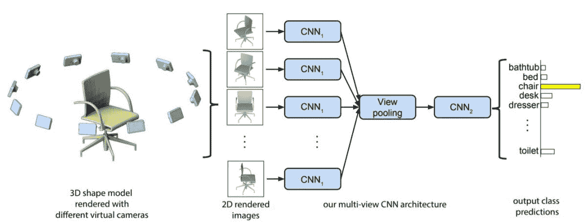
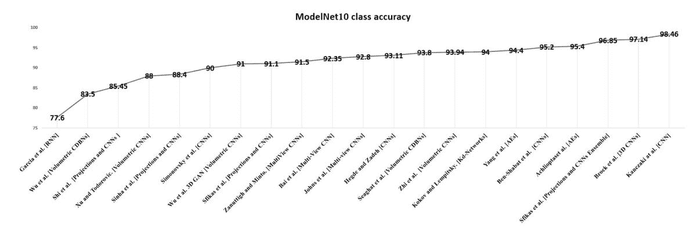
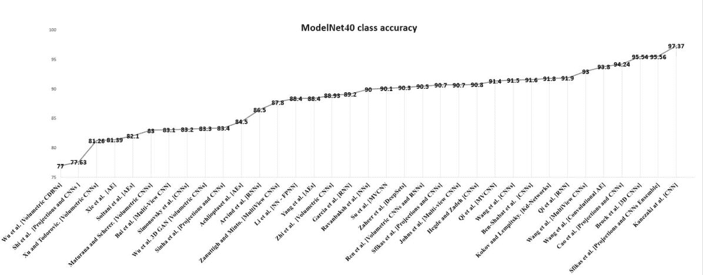
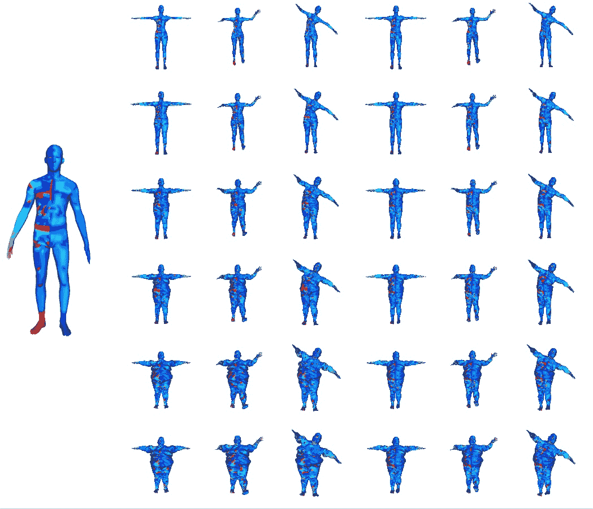
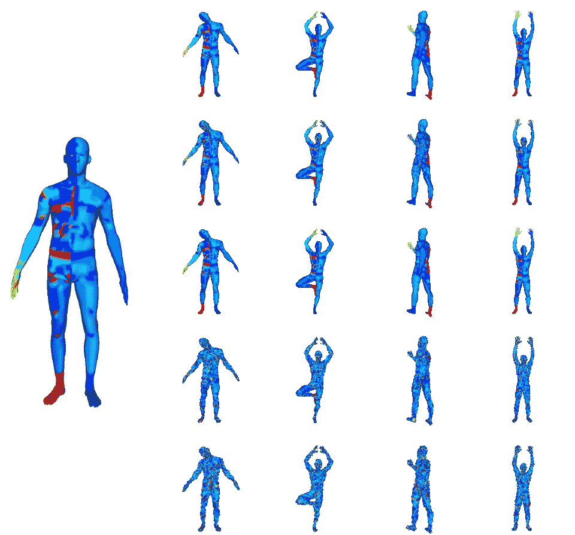
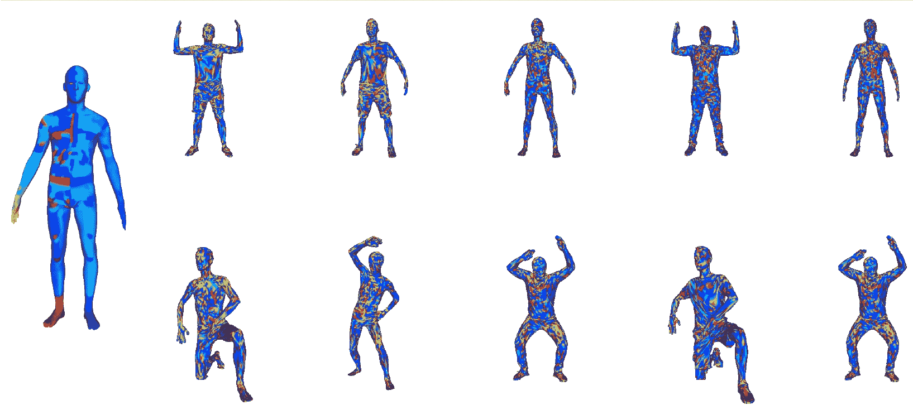

<!--yml

类别：未分类

日期：2024-09-06 20:07:39

-->

# [1808.01462] 关于不同 3D 数据表示的深度学习进展综述

> 来源：[`ar5iv.labs.arxiv.org/html/1808.01462`](https://ar5iv.labs.arxiv.org/html/1808.01462)

# 关于不同 3D 数据表示的深度学习进展综述

Eman Ahmed [1234-5678-9012-3456](https://orcid.org/1234-5678-9012-3456 "ORCID identifier") SnT，卢森堡大学 eman.ahmed@uni.lu ，Alexandre Saint SnT，卢森堡大学 alexandre.saint@uni.lu ，Abdelrahman Shabayek SnT，卢森堡大学 abdelrahman.shabayek@uni.lu ，Kseniya Cherenkova SnT，卢森堡大学；Artec 组，卢森堡 kcherenkova@artec-group.com ，Rig Das SnT，卢森堡大学 rig.das@uni.lu ，Gleb Gusev Artec 组卢森堡 gleb@artec-group.com 和 Djamila Aouada SnT，卢森堡大学 djamila.aouada@uni.lu

###### 摘要。

摘要：3D 数据是计算机视觉领域的宝贵资产，因为它提供了关于被感知物体和场景完整几何信息的丰富数据。近年来，随着大规模 3D 数据集和计算能力的出现，现如今可以考虑将深度学习应用于 3D 数据的特定任务，如分割、识别和对应。根据考虑的 3D 数据表示，使用现有深度学习架构可能会面临不同的挑战。在这项工作中，我们提供了关于各种 3D 数据表示的全面概述，突出展示了欧几里得和非欧几里得表示之间的区别。我们还讨论了深度学习方法如何应用于每种表示，并分析了需要克服的挑战。

\useunder

\ul

#### 0.0.1\. 多视角数据上的深度学习架构

尽管体积深度学习方法有效，但大多数这些方法由于卷积滤波器的体积特性而计算开销巨大，这种特性使得计算复杂度随着体素分辨率立方增长，从而限制了 3D 体积深度学习模型的使用。这就是为什么利用 3D 对象的多视角是实际可行的。事实上，它使得利用已建立的 2D 深度学习范式成为可能，而无需设计针对 3D 体积数据的高计算复杂度的专门模型，如在图示的流程图中所示（见 Fig. LABEL:fig:taxonomy）。Leng 等人首次尝试利用 2D 深度学习模型学习多视角 3D 数据（见 Leng et al., 2014），他们在各种基于视角的深度图像上应用了 DBN，以提取 3D 对象的高层特征。采用了渐进式训练方式来训练 DBN，使用了“收缩散度”方法。所提出的模型比在 Daras 和 Axenopoulos（见 2010）中使用的复合描述符方法表现更好。Xie 等人（见 Xie et al., 2015）提出了“多视角深度极限学习机（MVD-ELM）”。所提出的 MVD-ELM 应用于 20 张均匀捕获的多视角深度图像，这些图像围绕 3D 对象的中心球体捕获。所提出的 MVD-ELM 包含在所有视角间共享权重的卷积层。输出激活权重根据提取的特征图进行优化。这项工作已经扩展为完全卷积的形式， resulting in（FC-MVD-ELM）。FC-MVD-ELM 使用多视角深度图像进行训练，以进行 3D 分割测试。训练阶段的预测标签随后被投影回 3D 对象，并使用图割优化方法对最终结果进行平滑处理。MVD-ELM 和 FC-MVD-ELM 都在 3D 形状分类和分割任务上进行了测试，并超越了先前的工作（见 Wu et al., 2015a），显著减少了处理时间。

Leng 等人进行了更多的研究，利用深度学习（DL）范式处理多视角 3D 数据。在 (Leng et al., 2015a) 中，Leng 等人提出了一种类似于卷积神经网络（CNN）架构的经典自编码器（AEs）扩展。他们提出的框架称为“堆叠局部卷积自编码器（SLCAE）”。SLCAE 在 3D 物体的多个多视角深度图像上运行。在 SLCAE 中，全连接层被通过卷积操作局部连接的层所替代。多个自编码器被堆叠，其中最后一个自编码器的输出作为 3D 物体的最终表示。在不同数据集上的实验：SHREC’09、NTU 和 PSB 证明了该模型的能力。作为对先前工作的扩展，Leng 等人提出了一种“3D 卷积神经网络（3DCNN）”来同时处理 3D 物体的不同 2D 视图 (Leng et al., 2015b)。不同视图按特定顺序排序，以确保所有物体的视图在训练时遵循相同的规范。提出的 3DCNN 由四个卷积层、三个子采样层和两个全连接层组成。提出的网络在与测试相同的数据集上进行了检索任务的测试 (Leng et al., 2015a)。然而，结果显示，后者模型在三个数据集上表现更好，这意味着先前的模型能够学习到更多区分特征来表示不同的 3D 物体。

Su 等人在 (Su et al., 2015) 中提出了一种新颖的“多视角卷积神经网络（MVCNN）”用于 3D 物体的检索和识别/分类任务。与 Leng 的模型 (Leng et al., 2015b) 相比，MVCNN 处理 3D 物体的多个视角不按特定顺序，使用视图池化层。1 展示了模型的完整架构。测试了捕捉 3D 物体多视角的两种不同设置。第一种通过将 12 个等距虚拟摄像头环绕物体来渲染 12 个视图，而另一种设置包括 80 个虚拟视图。MVCNN 使用 $ImageNet1K$ 数据集进行预训练，并在 $ModelNet40$ 上进行了微调 (Wu et al., 2015a)。提出的网络分为两部分，第一部分是处理物体视图，第二部分是视图池化层中进行的最大池化操作，结果是 3D 形状的单一紧凑表示。在视图池化层中，只有激活最大的视图被考虑，而忽略所有其他激活不最大化的视图。这意味着只有少数视图对形状的最终表示有贡献，这导致了视觉信息的丢失。为了解决这个问题，

实验表明，带有最大视图池化层的 MVCNN 在分类和检索任务中显著超越了 ShapeNet (Wu et al., 2015a)。在(Johns et al., 2016)中，Johns 等人利用 CNNs 通过一组 2D 图像对表示在不受约束的相机轨迹下的 3D 对象，从而利用多视图数据表示。他们提出的方法对每对图像分别进行分类，然后加权每对图像的贡献以得到最终结果。该框架采用了 VGG-M 架构，由五个卷积层和三个全连接层组成。3D 对象的视图可以表示为深度图像、灰度图像或两者兼有。该模型超越了 Su et al. (Su et al., 2015) 提出的 MVCNN 和基于体素的 ShapeNet 架构 (Wu et al., 2015a)。

多视图深度学习模型的高效性推动了研究人员探索更多基于 GPU 的方法来学习多视图 3D 数据特征。这也促使 Bai et al. (Bai et al., 2016)提出了一种实时基于 GPU 的 CNN 搜索引擎，用于 3D 对象的多 2D 视图。该模型称为$GIFT$，利用了两个反向的文件：第一个加速多视图匹配过程，第二个对初步结果进行排序。处理的查询在一秒内完成。$GIFT$在一组不同的数据集上进行了测试：ModelNet, $PSB$, $SHREC14LSGTB$, $McGill$和$SHREC^{\prime}07$密闭模型。与最先进的方法相比，GIFT 表现更佳。

学习多视角三维数据表示的努力不断发展，2017 年，Zanuttigh 和 Minto 提出了一种用于分类三维物体的多分支 CNN。该模型的输入是来自不同视角的渲染深度图像。每个 CNN 分支包括五个卷积层来处理一个深度图像，生成一个分类向量。产生的分类向量是线性分类器的输入，用于识别三维物体的类别。该提出的模型产生了与最先进技术相媲美的结果。基于主导集合，Wang 等人在 2017 年提出了递归视图聚类和汇聚层。该模型的关键概念是汇集相似视角并通过递归地对其进行聚类来构建一个汇集特征向量。然后，构建的汇集特征向量以递归训练的方式作为输入传入递归聚类层中的同一层。在该层内，计算视图相似性图，其中节点表示特征向量，边表示视图之间的相似度权重。在构建的图中展示了不同视图之间的相似性和不同性，这对于三维形状识别任务非常有效。所提出的模型在表现上达到了与以往方法高度相当的结果，如附录中的表 1 所示。在多视角深度学习模型的推动下，Qi 等人在 2016 年提供了多视角深度学习技术和体积式深度学习技术的比较研究，用于目标识别任务。作为研究的一部分，作者提出了一个$Sphererendering$方法，用于在多个尺度上过滤多分辨率三维物体。通过数据增强，作者成功地提升了 MVCNNs 在$ModelNet40$上的结果。最近，Kanezaki 等人利用$RotationNet$在$ModelNet10$和$ModelNet40$上实现了最先进的分类结果。$RotationNet$训练了一组多视角图像用于三维物体，但不需要同时获取所有视图。相反，它允许顺序输入并相应地更新物体类别的可能性。

多视角表示法表现比体积表示法稍好，且需要较少的计算资源。然而，这种表示法也带来了一些挑战。视角的充分数量及其获取方式对于表达三维形状至关重要。此外，多视角表示法无法保留三维形状的固有几何属性。这促使人们定义新的卷积概念，以捕捉其固有属性。

图 1\. MVCNN 架构（Su 等，2015）应用于无特定顺序的三维对象多视角。图源自（Su 等，2015），已获得作者许可。

#### 0.0.2\. 深度学习架构在混合数据表示上的应用

一些努力旨在结合各种 3D 数据表示，以利用每种表示所带来的优势。最近，王等人提出了（王等人，2015），其中每个 3D 对象由一对多视图和 2D 草图表示。该学习模型由 Siamese CNNs 组成，这是一种有两个相同的子卷积网络；一个用于处理多视图输入，另一个用于处理 2D 草图。这些网络中的每一个都由三个卷积层组成，每个卷积层后接一个最大池化层和一个全连接层。网络使用“随机梯度下降（SGD）”方法单独训练。所提出的模型在 SHREC'13 数据集上进行了 3D 形状检索测试，并与之前的方法相比取得了有竞争力的结果。王等人继续对混合 3D 数据表示进行研究，在（王等人，2016）中，作者提出了“卷积自编码极限学习机（CAE-ELM）”3D 描述符，该描述符融合了卷积网络、自动编码器（AEs）和“极限学习机（ELM）”的学习能力（黄等人，2006）。ELM 是一种高效的无监督学习技术，它学习关于输入数据的高级区分特征。与大多数深度学习模型相比，ELM 速度更快（卡松等人，2013），这在处理大规模 3D 数据时非常实用。CAE-ELM 架构的输入是两种数据表示：体素数据和“符号距离场数据（SDF）”。体素数据描述了 3D 对象的结构，而 SDF 提取了有关 3D 对象的局部和全局特征。CAE-ELM 在$ModelNet40$和$ModelNet10$数据集上进行了分类任务的测试，并与之前的方法相比取得了卓越的性能。CAE-ELM 被视为一种混合方法，除了 3D 描述符外，还利用了 3D 对象的结构。Ben-Shabat 等人（Ben-Shabat 等人，2017）提出了一种名为“3D 修改费舍尔向量（3DmFV）”的新型 3D 点云表示，这是一种使用混合数据表示的深度学习模型，结合了离散网格的结构与费舍尔向量的连续泛化来表示 3D 数据。混合输入数据通过深度卷积网络处理，用于分类和部分分割任务。3DmFV 有两个模块：第一个模块将输入点云转换为 3D 修改的“费舍尔向量（FV）”，这可以视为基于描述符的表示，第二个模块是以 CNN 表示的深度学习模块。FV 数据表示使得所提出的框架在顺序、输入数据样本大小和结构上具有不变性。网络架构由一个引导模块（Szegedy et al., 2017）、最大池化层和四个全连接层组成。该网络与最先进的技术相比取得了更好的结果。

受到 3D 卷积和 2D 多视图 CNN 性能的启发，一些研究考察了这两种表示的融合。Hedge 和 Zadeh (Hegde and Zadeh, 2016) 提出了将体积表示（体素）和 2D 表示（2D 视图）融合用于对象分类任务。作者研究了不同的模型来处理数据进行$ModelNet$分类。第一个模型是结合了两种模态（3D 和 2D）的模型，同时使用两个 3D CNN 处理 3D 体素，使用 AlexNet 处理 2D 视图。另一个实验则仅处理 3D 体素，并与 AlexNet 在 2D 视图上的表现进行比较。实验结果表明，结合两种模态的网络（称为$FusionNet$）表现最好。然而，多视图网络的表现优于体积 CNN。尽管 Brock 等人在(Brock et al., 2016)上在$ModelNet$分类中取得了最先进的结果，$FusionNet$取得了可比的结果，并且不需要数据增强或 Brock 模型中所需的重计算。这表明，在实际应用中，2D 和 3D 表示超越了体积方法，并且计算量较少。

### 0.1\. 在 3D 非欧几里得结构数据上的深度学习架构

第二种 3D 深度学习方法是非欧几里得方法，试图将深度学习概念扩展到几何数据中。然而，数据的性质对如何执行主要的深度学习操作（如卷积）提出了挑战。已经提出了一些架构，尝试将深度学习扩展到 3D 几何领域。其中一些架构涉及“3D 点云”，旨在学习 3D 形状的几何信息并用于建模任务。结果鼓励研究人员利用 3D 网格中提供的表面信息，在该网格中，顶点之间的连接可以被利用来定义局部伪坐标，从而对 3D 网格进行类似卷积的操作。同时，一些努力也致力于研究基于图的 3D 数据，试图利用图的谱特性来定义用于深度学习框架的内在描述符。在这一部分，我们将探讨在非欧几里得 3D 数据上应用深度学习的最新创新。

#### 0.1.1\. 点云

点云提供了一种表达性、同质且紧凑的 3D 表面几何表示，没有网格的组合不规则性和复杂性。这就是为什么点云容易学习的原因。然而，由于点云的双重性质，处理点云很棘手。点云可以在考虑点及其邻域（点的子集）时被视为具有欧几里得结构的数据，这样点之间的交互形成一个具有距离度量的欧几里得空间，对诸如平移、旋转等变换不变。然而，考虑到点云的全局结构，它是一个没有特定顺序的无序点集，这对数据的全局结构施加了不规则的非欧几里得特性。

最近的研究考虑了点云作为具有不同大小集合的集合。Vinyals 等人在 (Vinyals et al., 2015) 中使用了一个读取-处理-写入网络来处理点集，以展示网络学习如何排序数字的能力。这是深度学习在自然语言处理 (NLP) 应用中的无序集合的直接应用。受此工作的启发，Ravanbakhsh 等人 (Ravanbakhsh et al., 2016) 提出了他们所称的置换等变层，在监督和半监督设置中。这一层通过参数共享来学习置换不变性以及跨数据的刚性变换。该网络进行了 3D 分类和 MNIST 数字加法。尽管该网络相对简单，但在 ModelNet 数据集上的 3D 分类任务表现不佳。在 (Zaheer et al., 2017) 中，提出了 $DeepSet$ 框架的更深版本，在 $ModelNet$ 数据集上的 3D 分类任务中比最先进的方法取得了更好的结果。这是由于置换等变层为先前模型带来的置换不变性属性。(Qi et al., 2016a) 也使用了类似的层，但主要区别在于置换等变层是最大值归一化的。

$PointNet$ （齐等人，2017a）是将点云直接作为输入的先驱，其中每个点使用$(x,y,z)$坐标表示。作为预处理步骤，特征变换和输入被馈送到$PointNet$架构中。$PointNet$由三个主要模块组成：一个“空间变换网络（STN）”模块，一个 RNN 模块和一个简单的对称函数，聚合点云中每个点的所有信息。STN 在将数据馈送到 RNN 之前将数据规范化，即将所有数据处理成一个规范形式，并学习点云的关键点，这大致对应于 3D 对象的骨架。然后是 RNN 模块，它像处理序列信号一样学习点云，并在使用一些随机排列序列训练该模型时，该 RNN 对点云点的输入顺序不变。最后，网络使用最大池化操作聚合所有生成的点特征，这也是置换不变的。$PointNet$证明了它对部分数据和输入扰动具有鲁棒性。它在分类和分割任务上进行了测试，在这些任务中，它证明可以产生与最先进技术相媲美的结果，如补充材料表 1 所示。

尽管$PointNet$取得了竞争性的结果，但由于聚合所有点特征，无法充分利用点的局部结构来捕获详细的细粒度模式。为了解决这一点，PointNet++ （齐等人，2017b）通过递归地将其应用于输入点集的嵌套分区，构建在$PointNet$的基础上。尽管捕获了更多特征，结果的架构变得复杂，增加了更高级特征和计算时间的大小。

相较于直接处理点云结构，Klokov 等人（Klokov 和 Lempitsky，2017）提出的 Kd-Networks 建议对输入点云施加 kd 树结构，以便学习树中点的共享权重。Kd-tree 是一种前馈网络，具有与树节点权重相关的可学习参数。该模型在形状分类、形状检索和形状部分分割中进行了测试，产生了具有竞争力的结果。沿用不直接处理点云结构的相同概念，Roveri 等人（Roveri 等人，2018）建议从点云的不同视图中提取一组 2D 深度图，并使用 Residual Nets（$ResNet50$）（He 等人，2015）对其进行处理。该框架包含 3 个模块。第一个模块负责学习输入点云的$k$个方向视图，以便在第二个模块中生成深度图。第三个也是最后一个模块则处理生成的$k$个深度图以进行对象分类。该框架的创新点主要在于自动将无序点云转换为有信息的 2D 深度图，无需调整网络模块以适应置换不变性和输入数据的不同变换。

最近，少量文章报告了他们在点云上进行无监督学习的工作。在$FoldingNet$（Yang 等人，2018）中，Yang 等人提出使用 AE 来建模不同的 3D 对象，这些对象以点云形式表示，通过一种新型的基于折叠的解码器，将 2D 规范网格变形为 3D 点云的底层表面。$FoldingNet$能够学习如何在 2D 网格上生成切口以创建 3D 表面，并对相同 3D 对象类别的一些类别内变异进行泛化。在$FoldingNet$之上使用了 SVM 用于 3D 分类，证明了它在不同 3D 对象的学习判别表示上表现良好。$FoldingNet$在$ModelNet40$上达到了高分类准确率。另一个由 Li 等人提出的无监督模型是 SO-Net（Li 等人，2018）。SO-Net 是一个置换不变网络，能够容忍无序点云输入。SO-Net 使用“自组织映射（SOMs）”构建点云中点的空间分布。然后，对点云中的点和 SOM 节点进行分层特征提取，产生一个代表整个点云的唯一特征向量。局部特征聚合根据可调整的接收场进行，其中重叠受控，以获取更有效的特征。SO-Net 在分类和分割任务中进行了测试，产生了与最先进技术高度可比的有希望的结果，如补充材料中的表 1 所示。

正如所有先前提出的方法中所注意到的，处理点云的主要问题是其表示的无序结构，研究人员正在努力使学习过程对点云的顺序不变。大多数这些方法依赖于聚类技术，以选择相似的点并一起处理。

#### 0.1.2\. 图和网格

对于图和网格的理想表示方法是能够捕捉对象所有固有结构并且能够通过梯度下降方法学习的表示方法。这是由于它们在卷积神经网络中的稳定性和频繁使用所致。然而，学习这些不规则表示是一项具有挑战性的任务，这是由于这些表示的结构特性。受卷积神经网络在广泛的计算机视觉任务中的成功启发，最近的研究工作集中于将卷积神经网络推广到这种不规则结构上。分析这些数据的特性表明，网格可以转换为图，如第 LABEL:dataRep_3D_meshes_and_graphs 节所述。因此，提出的图模型可以应用于网格结构数据，但反之则不行。现有工作大部分明确地处理图结构数据，少数工作专门针对网格表示进行了定制。在此，我们概述了每种表示的最新工作，并基于使用的方法对现有方法进行了广泛分类。

图：研究图和网格的结构特性表明，为图提出的学习方法也适用于网格。现有的图卷积神经网络（GCNN）方法可以大致分为两个主要方向：谱过滤方法和空间过滤方法。这里我们讨论了每种方法背后的概念，并概述了在每个方向上的工作。这两个方向之间的区别在于过滤器的应用方式以及如何组合本地处理的信息。

+   •

    光谱过滤方法。光谱卷积在图结构数据上的概念是由布鲁纳等人在（布鲁纳等人，2013）中引入的，作者提出了在图上操作的光谱 CNN（SCNN）。光谱过滤方法的基础是使用图拉普拉斯的光谱特征分解来定义类似卷积的算子。这将卷积操作重新定义到光谱域，其中两个核心要素是类似的：欧几里得域中信号的片段对应于定义在图节点上的函数，例如特征，通过在图拉普拉斯的特征向量上投影映射到光谱域。过滤操作本身发生在欧几里得域中，并且对信号在特征基中的缩放对应。这个定义意味着卷积是一个线性算子，与拉普拉斯算子交换（布朗斯坦等人，2017）。尽管布鲁纳模型具有创新性，但由于依赖基础和计算昂贵，它具有严重的局限性。依赖基础意味着如果光谱滤波器的系数是根据特定基础学习的，将学习的系数应用于具有另一个基础的另一个域将产生非常不同的结果，如布朗斯坦等人在（布朗斯坦等人，2017）中所示。计算昂贵的另一个限制来自于光谱过滤是一个涉及整个图数据的非局部操作，除此之外，图拉普拉斯的计算昂贵。这构成了向其他基础泛化和处理大规模图的计算负担。

    在(Kovnatsky et al., 2013)的工作中，通过联合对角化构建了跨各种领域的兼容正交基，从而解决了基础依赖问题。然而，这需要事先了解领域之间的对应关系。对于一些应用，如社交网络，这是一个有效的假设，因为可以很容易计算出在添加了新边和新顶点的两个时间点之间的对应关系。然而，将其应用于网格是不太合理的，因为在两个网格之间找到对应关系本身就是一个具有挑战性的任务。因此，在这种情况下假设领域之间的对应关系是不切实际的(Bronstein et al., 2017)。由于光谱滤波的非局部性质和涉及所有图数据处理的需要，最近的工作提出了近似的概念，以生成局部光谱滤波器(Defferrard et al., 2016) (Kipf and Welling, 2016)。这些方法建议通过多项式展开来表示滤波器，而不是直接在光谱域上操作。Defferrard et al. 在(Defferrard et al., 2016)中通过使用切比雪夫多项式在图上进行局部光谱滤波，以近似光谱图滤波器。然后，卷积操作产生的特征使用图池化操作进行粗化。Kipf 和 Welling (Kipf and Welling, 2016)简化了(Defferrard et al., 2016)中提出的多项式近似，并使用图光谱滤波器的一阶线性近似来生成局部光谱滤波器，这些滤波器随后被用于两层 GCNN 中。每一层使用局部光谱滤波器并聚合来自顶点的直接邻域的信息。请注意，(Defferrard et al., 2016) 和 (Kipf and Welling, 2016)中提出的滤波器在 r-或 1 跳邻域上应用，这些构造被带回空间域。

    在局部光谱过滤模型取得成功的驱动下，王等人（Wang et al., 2018）建议在 pointNet++框架（Qi et al., 2017b）中利用光谱 GCNN 的优势来处理无序点云。这种模型将 pointNet++框架的创新与局部光谱过滤相融合，同时解决了这些模型各自的两个缺点。因此，不同于 pointNet++中建议的对点云中的每个点独立处理，这种模型采用光谱过滤作为学习技术，改变每个点邻域的结构信息。此外，不同于图最大池化操作中的贪婪胜者全拿策略，该方法采用递归池化和聚类策略。与先前的光谱过滤方法不同，该方法不需要任何预计算，并且可以通过端到端的方式进行训练，允许动态构建图并即时计算图拉普拉斯和池化层次，不像(Bruna et al., 2013; Defferrard et al., 2016; Kipf and Welling, 2016)那样。该方法已经能够在多样的数据集上取得比现有最先进技术更好的识别结果，详见补充材料的表 1。

+   •

    空间滤波方法。图空间滤波的概念始于（Scarselli 等人，2009），当时 GNN 首次被提出，试图将 DL 模型推广到图形数据上。GNN 是一种简单的结构，通过图的权重尝试推广图的空间滤波的概念。GNN 由多个层组成，每一层都是图高通和低通操作符的线性组合。这种表述表明，学习图特征依赖于每个顶点的邻域。类似于欧几里得 CNN，非线性函数应用于图的所有节点，函数的选择取决于任务的性质。改变顶点非线性函数的性质导致了丰富的架构（Li 等，2015; Sukhbaatar 等，2016; Duvenaud 等，2015; Chang 等，2016; Battaglia 等，2016）。此外，类似于 CNN，可以通过图的粗化在图结构数据上使用池化操作。图池化层可以通过交错的图学习层执行。与谱图滤波相比，空间滤波方法有两个关键点，使其与谱方法有所区别。空间方法直接基于图的拓扑结构聚合邻域节点的特征向量，考虑输入图的空间结构。然后，通过附加操作对聚合特征进行总结。在（Scarselli 等人，2009; Gori 等人，2005）提出的 GNN 框架中，建议将图中的每个顶点嵌入到欧几里得空间中，并使用 RNN。作者未使用 RNN 中的递归连接，而是使用了简单的扩散函数作为它们的过渡函数，重复传播节点表示直到其稳定固定。得到的节点表示被认为是分类和回归问题的特征。在这个框架中，节点特征的重复传播构成了一个计算负担，这在 Li 等人提出的工作中得到了缓解（Li 等，2015）。他们提出了一个先前模型的变体，该模型使用门控循环单元执行状态更新以学习最优的图表示。在（Bruna 等人，2013）中，Bruna 等人将空间局部接受域应用于 GNN，以生成他们的 GNN 的局部空间表述。局部接受域背后的主要思想是通过基于相似度测量将类似特征分组来减少学习参数的数量（Coates 和 Ng，2011; Gregor 和 LeCun，2010）。在（Bruna 等人，2013）中，作者使用了这个概念来计算图的多尺度聚类，然后将其馈送到池化层中。这种模型对处理特征施加了局部性，并减少了处理参数的数量。然而，它不像 2D CNN 那样执行任何权重共享。在（Niepert 等人，2016）中，Niepert 等人通过将图局部地转换为序列，并将这些序列馈送到 1D CNN 中来执行简单的空间图卷积。这种方法简单但需要在预处理步骤中明确定义图的节点顺序。在（Venkatakrishnan 等人，2018）中，作者提供了一项详细的研究，证明了谱方法和空间方法在其表示能力上在数学上是等价的。差异在于如何执行卷积和学习特征的聚合。根据任务，形成 GCNN 的架构（谱或空间），其中卷积层可以与粗化和池化层交错以总结卷积滤波器的输出，以获得图的紧凑表示。这在分类应用中至关重要，其中输出仅是从学习特征推断出的一个类（Bruna 等人，2013）。一些其他应用需要每个节点的决策，如社区检测。在这种情况下的常见做法是具有多个卷积层，这些卷积层在节点级别计算图表示（Khalil 等人，2017; Nowak 等人，2017; Bruna 和 Li，2017）。所有这些 GCNN 都是端到端可微分的方法，可以在监督、半监督或强化学习技术中进行训练。

网格：在欧几里得域上，卷积操作通过在空间域的每一点上传递模板并使用在该点定义的函数记录模板之间的相关性来完成。这是可行的，因为欧几里得域具有平移不变性属性。然而，不幸的是，由于缺乏平移不变性属性，这种方法不能直接应用于网格。这推动了定义局部补丁的工作，这些补丁以一种允许执行卷积的方式表示三维表面。然而，由于非欧几里得数据缺乏

Geodesic CNN (Masci 等人，2015) 是对三角网格上经典 CNN 的一般化引入。该方法的主要思想是在局部极坐标中构造局部补丁。将网格中每个顶点周围的函数值映射到局部极坐标中，使用补丁运算符定义补丁，在此处应用测地卷积。测地卷积遵循模板乘法的思想。然而，在这个框架中，卷积滤波器由于角坐标的歧义性而受到某些任意旋转的影响 (Masci 等人，2015)。这种方法为将 CNN 范式扩展到三角网格开辟了新的创新空间。然而，这个框架存在多个缺点。首先，它只能应用于三角网格，在这种情况下对网格的三角化敏感，如果网格极不规则，可能会失败。其次，构建的测地补丁的半径必须相对于实际形状的单射半径足够小，以确保结果的补丁在拓扑上是一个圆盘。第三，卷积滤波器上的旋转使得该框架在计算上昂贵，限制了这种框架的使用。提出了各向异性 CNN (ACNN) (Boscaini 等人，2016) 以克服测地 CNN 的一些限制。与测地 CNN 相比，ACNN 框架不局限于三角网格，也可以应用于图形。此外，局部补丁的构建更简单，并且与网格的单射半径无关。ACNN 使用了谱滤波的概念，其中通过加权函数来提取定义在网格上的局部函数。学习得到的谱滤波器应用于各向异性拉普拉斯-贝尔特拉米算子 (LBO) 的特征值，而各向异性热核作为空间加权函数用于卷积滤波器。该方法在局部对应任务中表现出非常好的性能。Monti 等人 (Monti 等人，2017) 提出了 $MoNet$ 作为补丁的一般构造。作者们建议在每个顶点周围定义一个伪坐标或加权函数的局部坐标系。在这些坐标上，一组参数化核函数被应用于这些伪坐标，以定义每个顶点的加权函数。因此，前述方法 (Masci 等人，2015; Boscaini 等人，2016) 可以被认为是 $MoNet$ 的具体实例。一些最近的工作提出了消除在图形或网格上明确定义局部补丁的需要的方法，如 SplineCNN (Fey 等人，2017)。SplineCNN 是一个可以应用于任意维度有向图的卷积框架。因此，它也可以应用于网格。与之前的方法类似，SplineCNN 不是通过基于图表的方法来定义局部补丁，而是使用图的 1-hop 邻域环特征作为卷积滤波器可以操作的补丁。卷积滤波器本身是基于 B-Spline 基函数的空间连续滤波器，具有局部支持。由于 B-Spline 基函数的局部支持，这个框架在保持计算时间独立于核大小的同时产生了最先进的对应任务结果。

## 1. 分析和讨论

DL 范式已成功构建并应用于各种 3D 数据表示，如前文所讨论的。已经提出了几种方法。我们在这里讨论主要的 3D 数据集及其在各种 3D 计算机视觉任务中的利用。此外，我们介绍了 DL 在三个主要任务中的进展：3D 识别/分类、检索和对应。

### 1.1. 3D 数据集

我们在下面概述了最新的 3D 数据集。研究社区使用的数据主要有两大类：真实世界数据集和从 CAD 模型渲染的合成数据。优先使用真实世界数据；然而，真实数据的收集成本高，并且通常存在噪声和遮挡问题。相比之下，合成数据可以生成大量清晰的数据，建模问题有限。虽然这被认为是有利的，但对模型在真实世界测试数据上的泛化能力有一定限制。同样值得注意的是，大多数 3D 数据集比大型 2D 数据集（如$ImageNet$ (Deng et al., 2009)）要小。然而，下面描述了一些最近的例外。

ModelNet (Wu et al., 2015a) 是最常用的 3D 物体识别和分类数据集。它包含约 130k 个标注的 CAD 模型，覆盖 662 个不同的类别。该数据集是通过在线搜索引擎查询每个类别收集的。然后，这些数据被手动标注。ModelNet 提供了形状的 3D 几何信息，但没有纹理信息。ModelNet 有两个子集：ModelNet10 和 ModelNet40。这些子集在最近发表的工作中被广泛使用，如补充材料中的表 1 和表 2 所示。在第 1.2.1 节中，我们提供了对 ModelNet 数据集在识别和检索任务中所使用方法的深入分析，重点介绍了 DL 方法在学习这些数据方面的发展。

SUNCG（宋等人，2017）包含约 400K 个完整的房间模型。这个数据集是合成的，但每个模型都经过验证是现实的，并且经过处理以带有标记的对象模型注释。这个数据集对学习“场景-对象”关系以及为场景理解任务微调真实世界数据非常重要。SceneNet（Handa 等人，2016）也是一个使用合成室内房间的 RGB-D 数据集。该数据集包含约 5M 个从分布中随机抽样的场景，以反映真实世界。然而，并非所有生成的场景都是现实的，在实践中，有些场景是高度不现实的。尽管如此，这个数据集可以用于微调和预训练。相比之下，ScanNet（戴等人，2017）是一个非常丰富的真实世界场景数据集。它是一个带有一些语义分割、摄像机方向和从真实室内场景的 3D 视频序列中收集的 3D 信息标注数据集。它包括 2.5M 个视角，可以直接在其他数据集上进行训练而不需要预训练，这与其他数据集的情况不同。

此外，3D 网格数据集可供 3D 计算机视觉社区使用。大多数 3D 网格数据集用于 3D 对象、身体模型或面部数据。TOSCA（Bronstein 等人，2008）数据集为非刚性形状提供高分辨率的 3D 合成网格。它包含多个姿势的共 80 个对象。同一类别内的对象具有相同数量的顶点和相同的三角形连接。TOSCA（Bronstein 等人，2008）对网格施加艺术变形以模拟真实扫描的真实世界变形。SHREC（Bronstein 等人，2010）在 TOSCA 扫描上添加了各种人工噪声和艺术变形。然而，这些人工噪声和变形并不现实，不能泛化到新的未见真实世界数据，这是实际解决方案的要求。FAUST（Bogo 等人，2014）数据集提供了 10 个人物在不同姿势下的 300 个真实扫描。最近提出的 3DBodyTex 数据集（Saint 等人，2018）带有 200 个真实的 3D 人体扫描，具有高分辨率的纹理。3DBodyTex 是一个带有 3D 人体模型标记的注册数据集。

BU 系列数据集在各种表情下的 3D 面部数据中非常受欢迎。BU-3DFE（Yin 等，2006）是一个静态数据集，包含 100 名受试者（56 名女性和 44 名男性），他们的年龄和种族各不相同。每个受试者除了中性面孔外，还有六种表情（快乐、悲伤、愤怒、厌恶、恐惧和惊讶），每种表情有不同的强度。每个受试者总共有 25 个网格，共形成 2500 个 3D 面部表情数据集。另一个非常受欢迎的数据集是 BU-4DFE（Yin 等，2008），这是一个动态面部表情数据集，总共有 101 名受试者（58 名女性和 43 名男性）。与 BU-3DFE 类似，每个受试者有六种表情。还有其他 3D 面部数据集，如 BP4D-Spontanous（Zhang 等，2014）和 BP4D+（Zhang 等，2016）。

### 1.2\. 3D 计算机视觉任务

在 DL 方法在 2D 领域的各种计算机视觉任务中取得巨大成功后，DL 方法因其在不同任务中表现出色而获得了更多的关注。在这里，我们概述了 3D DL 在 3D 物体识别/分类、检索和匹配任务中的进展。

#### 1.2.1\. 3D 识别/分类

3D 识别/分类任务在计算机视觉中是基础性的。给定一个 3D 形状，目标是识别该形状所属的类别（3D 分类），或者给定一个 3D 场景，识别场景中的不同 3D 形状及其位置（3D 识别和定位）。目前，利用深度神经网络（DNNs）进行 3D 物体识别/分类的研究十分活跃。现有的方法可以根据其输入来学习任务，如补充材料中的表 1 和表 2 所示。多视角方法通过对每个视角应用 2D CNN 后，使用学习到的特征进行分类。通常，多视角方法的表现优于其他方法；然而，仍然存在一些未解决的问题。例如，近期的多视角 CNN（MVCNN）（Su 等，2015）对每个视角的特征应用了最大池化操作，以生成代表 3D 物体的全局特征。最大池化忽略了非最大激活值，仅保留来自特定视角的最大值，从而导致丢失一些视觉线索（Su 等，2015）。Yu 等（Yu 等，2018）尝试通过求和池化操作来结合其他视角。然而，其效果不如最大池化。

考虑到识别和分类任务，（王等人，2017b）通过应用循环聚类和汇聚策略提高了对象之间的区分度，增加了多视角聚合激活输出的变化可能性。他们的目标是捕捉激活函数空间中的细微变化。类似地，$GIFT$（白等人，2016）从每个视角提取特征，但不应用任何汇聚。它匹配视角以找到两个三维对象之间的相似性。它只计算最佳匹配的视角，然而贪婪地选择最佳匹配视角可能会丢弃有用信息。另一个名为 Group View CNN（GVCNN）的框架（冯等人，2018）包含了从视角级别、视角组级别到形状级别的内容描述的分层体系结构。该框架根据它们的区分能力定义组，并相应地调整权重。另一项非常新的工作（于等人，2018）提出了一个名为 Multi-view Harmonized Bilinear Network（MHBN）的方法，通过利用补丁特征而非视角特征来提高两个三维对象之间的相似性水平。

体积方法通过直接使用形状体素来对三维对象进行分类。它们通过对输入点云进行体素化来缓解无序点的挑战，例如 3D ShapeNets（吴等人，2015b）、体积 CNNs（齐等人，2016b）、$OctNet$（Riegler 等人，2017）和 VRN Ensemble（布罗克等人，2016）。尽管 VRN Ensemble 优于多视角方法，这种性能要归功于模型集成及其先进的基础模型，因为它集成了五个 ResNet 模型和一个 Inception 模型，而大多数现有的多视角方法则依赖于单个 VGG-M 模型。总体而言，这些方法的准确性不如多视角方法。由于数据稀疏性和复杂的三维卷积计算，它们受到分辨率的严重限制。

$Pointset$（非欧几里得）方法直接分类无序点集，以解决体积方法中发现的稀疏性问题，正如$PointNet$（齐等人，2017a）所提出的那样。对于每个点，$PointNet$学习空间编码并将所有特征聚合到全局表示中。PointNet++（齐等人，2017b）通过利用由度量空间形成的局部结构来改进$PointNet$。点被划分为重叠的局部区域，这些区域的距离度量形成了分层的细到粗的过程中提取特征。与$PointNet$同时提出的 Kd-networks（Klokov 和 Lempitsky，2017）通过执行乘法变换并共享其参数来识别三维模型，这些模型由 kd 树强制实施的点云细分决定。

给定任何现有的输入模式，可以直接学习一组描述符。3D 表示也可以重新定义为一组 2D 几何投影，然后提取一组描述符。有一种方向是通过结合不同的输入模式来充分利用所有领域，以实现高效的特征提取。一个好的例子是 (Bu et al., 2017) 的工作，其中他们的方案包括基于视图的特征学习、基于几何的特征学习从体积表示中以及通过限制玻尔兹曼机 (RBM) 关联的模式特征融合。 

在补充材料的表 1 中提供了近期最先进方法的全面比较，并在图 2 和图 3 中基于 $ModelNet10$ 和 $ModelNet40$ 数据集的实验进行了比较。两图中的结果突出显示了多视角技术在两个数据集上（$ModelNet10$（98.46%）和 $ModelNet40$（97.37%））的分类任务上实现了最先进水平的能力。同时，它展示了这些方法与体积方法如 Brock 等（Brock et al., 2016）之间的竞争关系，后者在多视角方法（$ModelNet10$（97.14%）和 $ModelNet40$（95.54%））中取得了非常有竞争力的结果，但由于模型复杂性，架构更为复杂且需要大量的数据增强。

图 2\. 在 ModelNet10 数据集上进行分类/识别任务的类别准确率改进。

图 3\. 在 ModelNet40 数据集上进行分类/识别任务的类别准确率改进。

#### 1.2.2\. 3D 检索

3D 对象检索是形状分析中的另一个基础任务。目标是从数据库中找到最相似的 3D 对象，以匹配被测试的对象。然而，在文献中，大多数深度神经网络（DNN）专注于利用这些网络的判别能力进行分类和识别任务。专门为 3D 形状检索设计的 DNN 较少，见附录中的表 2。从概念上讲，输入处理类似于分类和识别任务。通常，3D 对象检索方法类似于其他图像或对象检索方法，其中训练了几个损失函数以学习嵌入空间，使元素彼此接近。一个非常近期的工作（He 等，2018）专门训练了中心损失（Wen 等，2016）和三元组损失（Schroff 等，2015）来进行距离度量，超越了 $ModelNet40$ 和 $ShapeNet$ 上的现有技术水平。多视角方法通常在检索准确性方面优于其他方法。附录中的表 2 提供了最近的 3D 对象检索最先进方法的全面列表。

#### 1.2.3\. 3D 对应

3D 对应的目标是预测测试网格的一组顶点与参考或模板网格之间的映射。有两种类型的对应：稀疏对应和密集对应。稀疏对应意味着只有测试网格的部分顶点被映射到参考网格。然而，在密集对应中，测试网格的所有顶点都被映射到参考网格。

几项研究（Fey 等，2017；Verma 等，2018）在 FAUST 数据集（Bogo 等，2014）的注册网格上执行 3D 形状对应。仅考虑数据集中的注册网格，因为它们处于密集的点对点对应中，提供了真实的基础数据。数据集中总共有 100 个注册网格，来自 10 个人，每个人有 10 种不同姿势。由于这些网格是模板网格的注册，因此顶点的数量是固定的，连接模式是相同的。在以前的研究中，这一任务被设定为分类问题。模型必须将 $N$ 个输入顶点映射到模板网格上的对应顶点。这通过对每个输入顶点的目标顶点进行一热编码来实现。

在 (Fey 等，2017) 报告的实验中，FAUST 数据集被分为 80 个用于训练的网格和 20 个用于测试的网格。结果显示了非常高的对应预测准确性。这些结果非常准确，但似乎主要反映了实验的简单性。实际上，数据集的网格都具有相同的拓扑结构，即，顶点的顺序相同，连接模式也相同。此外，由于已经进行了配准，顶点已经是密集的一对一对应。因此，在邻近顶点的可能分配中没有歧义。这使得对应任务变得简单，因为从输入顶点到输出顶点的映射只是一个简单的拷贝，而不是学习 3D 网格的实际拓扑结构。

为评估用于对应任务的最新技术的性能，我们在 SplineCNN（Fey 等，2017）上进行了实验。我们在不同的测试数据上测试了 SplineCNN 的预训练模型，以验证其在不同条件下的性能。我们进行了三种不同的实验：1) 数据具有相同的拓扑结构，但形状、姿势和几何特征不同，这些数据由 Skinned Multi-Person Linear Model (SMPL) 模型（Loper 等，2015）生成。2) 从 FAUST 数据集中获取的测试数据，带有不同强度的合成噪声。3) 来自 3DBodyTex 数据集（Saint 等，2018）的各种裸体全身扫描，以及在类似设置下获取的一些额外着装扫描。

图 4\. 在从 SMPL 模型（Loper 等，2015）生成的网格上测试 SplineCNN 预训练模型（Fey 等，2017）的对应结果

在第一个测试案例中，我们使用 SMPL 模型（Loper 等，2015）生成了形状和姿势都不同的 3D 网格，考虑了男性和女性两种性别。生成的网格具有与 FAUST 数据集相同的拓扑结构，即，顶点数量和连接方式相同。生成的形状在从瘦到胖的范围内变化，从而改变了生成主体的几何特征。我们使用了诸如 SplineCNN 这样的预训练模型来测试生成的数据以完成对应任务。测试对象中的每个顶点都被分配到参考网格中的一个特定顶点，然后每个顶点都被分配一个特定的颜色以可视化结果。

如图 4 所示，左侧显示了参考网格，右侧显示了生成的测试数据上的所有对应结果。正如图 4 中所示，该模型无法推广到新的但非常相似的未见数据，并且没有像在 (Fey 等，2017) 中报告的那样良好的结果。即使在像第一列和第四列中显示的 $T$ 姿势这样简单的姿势上，这种性能也是显而易见的，该姿势实际上包含在 FAUST 数据集中。此外，结果显示，与参考网格相比，改变形状的大小对结果的影响最大，因为有更多的错误着色面。然而，改变姿势或形状（男性或女性）并不会对性能产生太大影响。

图 5\. 在给 SplineCNN 预训练模型测试 FAUST 数据后，添加了四个不同级别的合成噪声的对应结果（Fey 等，2017）。第一行是未添加任何噪声的 FAUST 数据。从第二行到第五行，噪声逐渐从最低到最高添加。

FAUST 数据集的注册扫描平滑、干净且无噪声。所有在 (Fey 等，2017) 中报告的实验都是在干净的 FAUST 数据上进行的。这些实验表明，调查给定模型对噪声的鲁棒性是很重要的。

在另一个实验中，我们在添加不同级别的合成噪声后，对 FAUST 数据集中的四个网格进行了测试，如图 5 所示。初始行显示了四个原始测试网格，未添加任何噪声。接下来的行显示了从级别 1（最低噪声）到级别 4（最高噪声）的不同噪声级别。左侧的网格表示参考网格，右侧的网格集合显示了对应结果。对于级别 1 噪声（第二行），网格的几何形状几乎没有相对于原始网格（第一行）发生变化，只是脸部有一些噪声。然而，对应结果显示在‘举手姿势’（最左侧姿势）中，手臂有一些错误区域，这不应该发生，因为手臂没有变化。此外，网格的噪声越多，对应结果在错误标记顶点方面的错误就越多，这在参考网格与测试网格之间的颜色图差异上表现得很明显。

图 6\. 在 3DBodyTexdata（Saint et al., 2018）数据集中对一些穿衣和未穿衣的扫描进行预训练模型 SplineCNN（Fey et al., 2017）的测试。

真实网格数据更具挑战性，因为它更嘈杂、不完整且不规则，采样变量大。由于噪声，输入网格的顶点与模板网格之间没有确切的对应关系，导致对应关系模糊。此外，即使重新采样到相同数量的顶点，网格的连接模式通常也会有所不同。数据中的可能空洞使得找到与参考网格的确切对应关系变得困难。采样的变化需要能够适应不同尺度并处理不同特征级别的稳健方法。最近，Monte Carlo Convolution（Hermosilla et al., 2018）被提出用于处理点云学习中的不同级别的采样。本文的作者提出将卷积核表示为“多层感知机（MLP）”，其中卷积被公式化为 Monte Carlo 积分问题。这一概念使得可以将来自不同级别的多次采样的点云信息结合起来，其中使用了 Poisson 圆盘采样作为分层点云学习的可扩展手段。这在所有训练数据非均匀采样的情况下表现出了鲁棒性。与 PointNet++（Qi et al., 2017b）相比，这种方法实现了相对更好的结果。

为了测试 SplineCNN 模型对所有这些挑战的鲁棒性，我们在 3DBodyTex 数据集中的真实穿衣和未穿衣扫描上进行了测试（Saint 等，2018），如图 6 所示。我们将 3DBodyTex 数据集中的 10 个网格降采样至 6890 个顶点，以便与 FAUST 数据集的顶点数量相当。然而，降采样的数据与 FAUST 数据具有不同的连接模式，这使得对应任务变得更加困难。如图 6 所示，SplineCNN 模型无法处理具有不同拓扑结构的 3DBodyTex 数据。这导致了高度错误的对应结果，其中测试数据上的颜色图与参考网格的颜色图相差甚远。

## 2\. 结论

扫描设备的持续演变导致了 3D 计算机视觉研究领域中 3D 数据量的大幅增加。这为探索不同 3D 物体的属性和学习其几何特性打开了新的机会，尽管数据本身带来了挑战。幸运的是，深度学习（DL）技术在各种 2D 计算机视觉任务上的表现发生了革命性变化，这鼓励了 3D 研究社区采用相同的方法。然而，将 2D DL 扩展到 3D 数据并不是一项简单的任务，这取决于数据表示本身和具体任务。在这项工作中，我们根据其内部结构将 3D 数据表示分类为欧几里得和非欧几里得表示。按照相同的分类，我们讨论了应用于 3D 数据的不同 DL 技术，这些技术依据数据表示以及数据的内部结构处理方法。在欧几里得 DL 家族中，文献中报告的结果表明，多视图表示达到了最先进的分类性能，并优于其他利用 3D 形状全几何信息（即体积方法）的技术，提供了更高效的 3D 形状属性学习方式。另一方面，在非欧几里得 DL 技术的分支中，最近的一些论文（例如（Fey et al., 2017; Verma et al., 2018）报告了在对应任务上的近乎完美的结果。这些对应实验是在干净、光滑和理想的数据上进行的。在本文中，最先进的 SplineCNN（Fey et al., 2017）方法在不同的数据集和不同条件下进行了测试，这些条件模拟了实际世界的场景。结果显示，即使在相同的拓扑和类似的姿态下，该模型也无法对新数据或噪声数据进行有效泛化。显然，需要进一步研究改进 3D DL 模型的鲁棒性，并确保其对实际数据的泛化，同时利用不同的 3D 数据表示。

## 3\. 致谢

本工作得到了 FNR 项目 IDform 的资助，协议编号 CPP17/IS/11643091/IDform/

Aouada, Luxembourg 和 Artec Europe SARL。

## 参考文献

+   (1)

+   Abdul-Rahman 和 Pilouk（2007）Alias Abdul-Rahman 和 Morakot Pilouk. 2007. *3D GIS 空间数据建模*。Springer Science & Business Media。

+   Afzal 等人（2014）H. Afzal, D. Aouada, D. Font, B. Mirbach, 和 B. Ottersten. 2014. RGB-D 多视图系统标定用于全 3D 场景重建。*2014 年第 22 届国际模式识别大会*。IEEE，2459–2464。 [`doi.org/10.1109/ICPR.2014.425`](https://doi.org/10.1109/ICPR.2014.425)

+   Aldoma 等（2012） Aitor Aldoma, Federico Tombari, Radu Bogdan Rusu, 和 Markus Vincze. 2012. OUR-CVFH–定向、唯一且可重复的集群视点特征直方图用于对象识别和 6DOF 位姿估计。载于 *联合 DAGM（德国模式识别协会）和 OAGM 研讨会*。Springer，113–122。

+   Alexandre（2016） Luís A Alexandre. 2016. 使用卷积神经网络和输入通道间的迁移学习进行 3D 对象识别。载于 *智能自主系统 13*。Springer，889–898。

+   Aouada 等（2008） D. Aouada, D. W. Dreisigmeyer, 和 H. Krim. 2008. 使用全局测地函数进行刚性和非刚性 3D 形状的几何建模。载于 *2008 IEEE 计算机学会计算机视觉与模式识别研讨会*。IEEE，1–8。 [`doi.org/10.1109/CVPRW.2008.4563075`](https://doi.org/10.1109/CVPRW.2008.4563075)

+   Aouada 等（2007） D. Aouada, S. Feng, 和 H. Krim. 2007. 全球测地函数的统计分析用于 3D 对象分类。载于 *2007 IEEE 国际声学、语音和信号处理会议 - ICASSP ’07*，第 1 卷。IEEE，I–645–I–648。 [`doi.org/10.1109/ICASSP.2007.365990`](https://doi.org/10.1109/ICASSP.2007.365990)

+   Aouada 和 Krim（2010） D. Aouada 和 H. Krim. 2010. 用于精细和紧凑建模 3D 形状的 Squigraphs。*IEEE 图像处理学报* 19，第 2 期（2010 年 2 月），306–321。 [`doi.org/10.1109/TIP.2009.2034693`](https://doi.org/10.1109/TIP.2009.2034693)

+   Aubry 等（2011） Mathieu Aubry, Ulrich Schlickewei, 和 Daniel Cremers. 2011. 波动核签名：一种量子力学方法用于形状分析。载于 *计算机视觉研讨会（ICCV Workshops），2011 IEEE 国际会议*。IEEE，1626–1633。

+   Bai 等（2016） Song Bai, Xiang Bai, Zhichao Zhou, Zhaoxiang Zhang, 和 Longin Jan Latecki. 2016. Gift：实时且可扩展的 3D 形状搜索引擎。载于 *计算机视觉与模式识别（CVPR），2016 IEEE 会议*。IEEE，5023–5032。

+   Battaglia 等（2016） Peter Battaglia, Razvan Pascanu, Matthew Lai, Danilo Jimenez Rezende 等. 2016. 学习对象、关系和物理的交互网络。载于 *神经信息处理系统进展*。arXiv，4502–4510。

+   Ben-Shabat 等（2017） Yizhak Ben-Shabat, Michael Lindenbaum, 和 Anath Fischer. 2017. 使用 3D 修改过的 Fisher 向量表示法进行 3D 点云分类和分割以适应卷积神经网络。*arXiv:1711.08241* abs/1711.08241（2017）。

+   Berger（2013） Kai Berger. 2013. RGB-D 基准数据集的角色：概述。*arXiv 预印本 arXiv:1310.2053*（2013）。

+   Bogo 等（2014） Federica Bogo, Javier Romero, Matthew Loper, 和 Michael J. Black. 2014. FAUST：3D 网格配准的数据集和评估。载于 *IEEE 计算机视觉与模式识别会议（CVPR）*。IEEE，Piscataway, NJ, USA。

+   Boscaini 等 (2016) Davide Boscaini, Jonathan Masci, Emanuele Rodolà, 和 Michael Bronstein. 2016. 使用各向异性卷积神经网络学习形状对应。 在 *Advances in Neural Information Processing Systems*。NIPS, 3189–3197。

+   Brock 等 (2016) Andrew Brock, Theodore Lim, James M Ritchie, 和 Nick Weston. 2016. 使用卷积神经网络的生成和判别体素建模。*arXiv preprint arXiv:1608.04236* (2016)。

+   Bronstein 和 Bronstein (2007) Alexander Bronstein 和 Michael Bronstein. 2007. [`vision.mas.ecp.fr/Personnel/iasonas/descriptors.html`](http://vision.mas.ecp.fr/Personnel/iasonas/descriptors.html)

+   Bronstein 和 Bronstein (2018) Alexander Bronstein 和 Michael Bronstein. 2018. 离散几何教程 1。

+   Bronstein 等 (2010) AM Bronstein, MM Bronstein, U Castellani, B Falcidieno, A Fusiello, A Godil, LJ Guibas, I Kokkinos, Zhouhui Lian, M Ovsjanikov, 等. 2010. Shrec 2010: 鲁棒的大规模形状检索基准。*Proc. 3DOR* 5 (2010), 4。

+   Bronstein 等 (2008) Alexander M Bronstein, Michael M Bronstein, 和 Ron Kimmel. 2008. *非刚性形状的数值几何*。Springer Science & Business Media。

+   Bronstein 等 (2017) Michael M Bronstein, Joan Bruna, Yann LeCun, Arthur Szlam, 和 Pierre Vandergheynst. 2017. 几何深度学习：超越欧几里得数据。*IEEE Signal Processing Magazine* 34, 4 (2017), 18–42。

+   Bronstein 和 Kokkinos (2010) Michael M Bronstein 和 Iasonas Kokkinos. 2010. 用于非刚性形状识别的尺度不变热核签名。在 *Computer Vision and Pattern Recognition (CVPR), 2010 IEEE Conference on*。IEEE, 1704–1711。

+   Bruna 和 Li (2017) Joan Bruna 和 Xiang Li. 2017. 使用图神经网络进行社区检测。*arXiv preprint arXiv:1705.08415* (2017)。

+   Bruna 等 (2013) Joan Bruna, Wojciech Zaremba, Arthur Szlam, 和 Yann LeCun. 2013. 谱网络和图上的局部连接网络。*arXiv preprint arXiv:1312.6203* (2013)。

+   Bu 等 (2015) Shuhui Bu, Pengcheng Han, Zhenbao Liu, Junwei Han, 和 Hongwei Lin. 2015. 用于三维形状的局部深度特征学习框架。*Computers & Graphics* 46 (2015), 117–129。

+   Bu 等 (2014) Shuhui Bu, Zhenbao Liu, Junwei Han, Jun Wu, 和 Rongrong Ji. 2014. 通过深度信念网络学习高层特征用于三维模型检索和识别。*IEEE Transactions on Multimedia* 16 (2014), 2154–2167。

+   Bu 等 (2017) Shuhui Bu, Lei Wang, Pengcheng Han, Zhenbao Liu, 和 Ke Li. 2017. 基于多模态深度学习的三维形状识别和检索。*Neurocomputing* 259 (2017), 183 – 193. 多模态媒体数据理解与分析。

+   Cao 等 (2017) Zhangjie Cao, Qixing Huang, 和 Karthik Ramani. 2017. 通过球面投影进行三维物体分类。*arXiv preprint arXiv:1712.04426* (2017)。

+   Chang 等 (2016) Michael B Chang, Tomer Ullman, Antonio Torralba, 和 Joshua B Tenenbaum. 2016. 基于组成对象的物理动态学习方法。*arXiv 预印本 arXiv:1612.00341* (2016)。

+   Chen 等 (2015) Chen Chen, Roozbeh Jafari, 和 Nasser Kehtarnavaz. 2015. Utd-mhad：利用深度摄像头和可穿戴惯性传感器的人类动作识别多模态数据集。见 *图像处理 (ICIP)，2015 IEEE 国际会议*。IEEE, 168–172。

+   Chen 等 (2003) Ding-Yun Chen, Xiao-Pei Tian, Yu-Te Shen, 和 Ming Ouhyoung. 2003. 基于视觉相似性的三维模型检索。见 *计算机图形学论坛*，第 22 卷。Wiley Online Library, 223–232。

+   Coates 和 Ng (2011) Adam Coates 和 Andrew Y Ng. 2011. 在深度网络中选择感受野。见 *神经信息处理系统的进展*。NIPS, 2528–2536。

+   Cosmo 等 (2016) L Cosmo, E Rodolà, MM Bronstein, A Torsello, D Cremers, 和 Y Sahillioglu. 2016. SHREC’16：可变形形状的部分匹配。*Proc. 3DOR* 2, 9 (2016), 12。

+   Couprie 等 (2013) Camille Couprie, Clément Farabet, Laurent Najman, 和 Yann LeCun. 2013. 使用深度信息进行室内语义分割。*arXiv 预印本 arXiv:1301.3572* (2013)。

+   Dai 等 (2017) Angela Dai, Angel X Chang, Manolis Savva, Maciej Halber, Thomas Funkhouser, 和 Matthias Nießner. 2017. Scannet：丰富标注的室内场景三维重建。见 *IEEE 计算机视觉与模式识别会议 (CVPR)* 论文集，第 1 卷。

+   Daras 和 Axenopoulos (2010) Petros Daras 和 Apostolos Axenopoulos. 2010. 支持多模态查询的三维形状检索框架。*国际计算机视觉杂志* 89, 2-3 (2010), 229–247。

+   Defferrard 等 (2016) Michaël Defferrard, Xavier Bresson, 和 Pierre Vandergheynst. 2016. 图上的卷积神经网络与快速局部谱过滤。见 *神经信息处理系统的进展*。NIPS, 3844–3852。

+   Deng 等 (2009) J. Deng, W. Dong, R. Socher, L.-J. Li, K. Li, 和 L. Fei-Fei. 2009. ImageNet：一个大规模层次图像数据库。见 *CVPR09*。

+   Dong (1996) Feng Dong. 1996. 三维模型及其在地下建模中的应用。 (1996)。

+   Duvenaud 等 (2015) David K Duvenaud, Dougal Maclaurin, Jorge Iparraguirre, Rafael Bombarell, Timothy Hirzel, Alán Aspuru-Guzik, 和 Ryan P Adams. 2015. 用于学习分子指纹的图上的卷积网络。见 *神经信息处理系统的进展*。NIPS, 2224–2232。

+   Eitel 等 (2015) Andreas Eitel, Jost Tobias Springenberg, Luciano Spinello, Martin Riedmiller, 和 Wolfram Burgard. 2015. 用于稳健 RGB-D 物体识别的多模态深度学习。见 *智能机器人与系统 (IROS)，2015 IEEE/RSJ 国际会议*。IEEE, 681–687。

+   Erdogmus 和 Marcel (2013) Nesli Erdogmus 和 Sebastien Marcel. 2013. 用 3D 面具进行 2D 人脸识别的欺骗和使用 Kinect 进行反欺骗。在*生物识别：理论、应用和系统（BTAS），2013 年 IEEE 第六届国际会议*中。IEEE, 1–6.

+   Fanelli 等 (2011) Gabriele Fanelli, Thibaut Weise, Juergen Gall, 和 Luc Van Gool. 2011. 来自消费者深度摄像头的实时头部姿态估计。在*联合模式识别研讨会*中。Springer, 101–110.

+   Farabet 等 (2013) Clement Farabet, Camille Couprie, Laurent Najman, 和 Yann LeCun. 2013. 用于场景标记的学习分层特征。*IEEE 模式分析与机器智能交易* 35, 8 (2013), 1915–1929.

+   Feng 等 (2016) Jie Feng, Yan Wang, 和 Shih-Fu Chang. 2016. 使用单一深度图像进行 3D 形状检索。在*应用计算机视觉会议（WACV）2016 年 IEEE 冬季会议*中。IEEE, 1–9.

+   Feng 等 (2018) Yifan Feng, Zizhao Zhang, Xibin Zhao, Rongrong Ji, 和 Yue Gao. 2018. GVCNN: 用于 3D 形状识别的群视图卷积神经网络。在*IEEE 计算机视觉与模式识别会议（CVPR）*中。

+   Fey 等 (2017) Matthias Fey, Jan Eric Lenssen, Frank Weichert, 和 Heinrich Müller. 2017. SplineCNN：使用连续 B 样条核快速几何深度学习。*arXiv preprint arXiv:1711.08920* (2017).

+   Firman (2016) Michael Firman. 2016. RGBD 数据集：过去、现在和未来。在*CVPR 大规模 3D 数据获取、建模和分析研讨会*中。

+   Geng (2011) Jason Geng. 2011. 结构光 3D 表面成像：教程。*光学与光子学进展* 3, 2 (2011 年 6 月), 128–160。[`doi.org/10.1364/AOP.3.000128`](https://doi.org/10.1364/AOP.3.000128)

+   Gori 等 (2005) Marco Gori, Gabriele Monfardini, 和 Franco Scarselli. 2005. 图领域学习的新模型。在*神经网络，2005. IJCNN’05. 2005 IEEE 国际联合会议*中，Vol. 2. IEEE, 729–734.

+   Gregor 和 LeCun (2010) Karo Gregor 和 Yann LeCun. 2010. 在具有局部感受域的时间乘积网络中复杂细胞的出现。*arXiv preprint arXiv:1006.0448* (2010).

+   Guo 等 (2013) Yulan Guo, Ferdous Sohel, Mohammed Bennamoun, Min Lu, 和 Jianwei Wan. 2013. 用于 3D 局部表面描述和物体识别的旋转投影统计。*国际计算机视觉期刊* 105, 1 (2013), 63–86.

+   Guo 等 (2014) Yulan Guo, Jun Zhang, Min Lu, Jianwei Wan, 和 Yanxin Ma. 2014. 用于 3D 计算机视觉的基准数据集。在*2014 年 IEEE 工业电子与应用会议(ICIEA)*中。IEEE, 1846–1851.

+   Han 等 (2017b) Xiaoguang Han, Zhen Li, Haibin Huang, Evangelos Kalogerakis, 和 Yizhou Yu. 2017b. 使用深度神经网络进行高分辨率形状补全，用于全局结构和局部几何推断。在*IEEE 国际计算机视觉会议（ICCV）*中的论文集。

+   Han et al. (2017a) Xian-Feng Han, Jesse S Jin, Ming-Jie Wang, 和 Wei Jiang。2017a 年。引导 3D 点云过滤。*多媒体工具与应用*（2017），1–15。

+   Han et al. (2017c) Zhizhong Han, Zhenbao Liu, Junwei Han, Chi-Man Vong, Shuhui Bu, 和 Chun Lung Philip Chen。2017c 年。网格卷积限制玻尔兹曼机用于具有结构保持的无监督特征学习。*IEEE 神经网络与学习系统汇刊* 28, 10（2017 年），2268–2281。

+   Handa et al. (2016) Ankur Handa, Viorica Pătrăucean, Simon Stent, 和 Roberto Cipolla。2016 年。Scenenet: 一个用于室内场景理解的注释模型生成器。发表于 *机器人与自动化（ICRA），2016 IEEE 国际会议*。IEEE，5737–5743。

+   Hansard et al. (2012) Miles Hansard, Seungkyu Lee, Ouk Choi, 和 Radu Horaud。2012 年。*飞行时间相机：原理、方法与应用*。Springer 出版公司。

+   He et al. (2015) Kaiming He, Xiangyu Zhang, Shaoqing Ren, 和 Jian Sun。2015 年。深度残差学习用于图像识别。*arXiv 预印本 arXiv:1512.03385*（2015 年）。

+   He et al. (2016) Kaiming He, Xiangyu Zhang, Shaoqing Ren, 和 Jian Sun。2016 年。深度残差学习用于图像识别。发表于 *IEEE 计算机视觉与模式识别会议*。770–778。

+   He et al. (2018) Xinwei He, Yang Zhou, Zhichao Zhou, Song Bai, 和 Xiang Bai。2018 年。三元组中心损失用于多视角 3D 物体检索。发表于 *IEEE 计算机视觉与模式识别会议（CVPR）*。

+   Hegde and Zadeh (2016) Vishakh Hegde 和 Reza Zadeh。2016 年。Fusionnet：使用多种数据表示的 3D 物体分类。*arXiv 预印本 arXiv:1607.05695*（2016 年）。

+   Hermosilla et al. (2018) Pedro Hermosilla, Tobias Ritschel, Pere-Pau Vázquez, Àlvar Vinacua, 和 Timo Ropinski。2018 年。蒙特卡罗卷积用于非均匀采样点云上的学习。*arXiv 预印本 arXiv:1806.01759*（2018 年）。

+   Huang et al. (2016) Gao Huang, Yu Sun, Zhuang Liu, Daniel Sedra, 和 Kilian Q Weinberger。2016 年。具有随机深度的深度网络。发表于 *欧洲计算机视觉会议*。Springer，646–661。

+   Huang et al. (2006) Guang-Bin Huang, Qin-Yu Zhu, 和 Chee-Kheong Siew。2006 年。极限学习机：理论与应用。*神经计算* 70, 1-3（2006 年），489–501。

+   Ioannidou et al. (2017) Anastasia Ioannidou, Elisavet Chatzilari, Spiros Nikolopoulos, 和 Ioannis Kompatsiaris。2017 年。深度学习在 3D 数据计算机视觉中的进展：综述。*ACM 计算调查（CSUR）* 50, 2（2017 年），20。

+   Ioffe and Szegedy (2015) Sergey Ioffe 和 Christian Szegedy。2015 年。批量归一化：通过减少内部协变量偏移来加速深度网络训练。*arXiv 预印本 arXiv:1502.03167*（2015 年）。

+   Johns et al. (2016) Edward Johns, Stefan Leutenegger, 和 Andrew J Davison. 2016. 图像序列的成对分解用于主动多视图识别。见 *计算机视觉与模式识别 (CVPR)，2016 IEEE 会议*。IEEE，3813–3822。

+   Johnson and Hebert (1999) Andrew E. Johnson 和 Martial Hebert. 1999. 使用旋转图像在混乱的 3D 场景中进行高效的物体识别。*IEEE 模式分析与机器智能汇刊* 21, 5 (1999), 433–449。

+   Kanezaki et al. (2016) Asako Kanezaki, Yasuyuki Matsushita, 和 Yoshifumi Nishida. 2016. RotationNet: 利用来自无监督视角的多视图进行物体分类和姿态估计。*arXiv 预印本 arXiv:1603.06208* (2016)。

+   Kasun et al. (2013) Liyanaarachchi Lekamalage Chamara Kasun, Hongming Zhou, Guang-Bin Huang, 和 Chi Man Vong. 2013. 使用 ELM 进行大数据的表征学习。 (2013)。

+   Kazmi et al. (2013) Ismail Khalid Kazmi, Lihua You, 和 Jian Jun Zhang. 2013. 2D 和 3D 形状描述符综述。见 *计算机图形学、成像与视觉 (cgiv)，2013 第 10 届国际会议*。IEEE，1–10。

+   Khalil et al. (2017) Elias Khalil, Hanjun Dai, Yuyu Zhang, Bistra Dilkina, 和 Le Song. 2017. 在图上学习组合优化算法。见 *神经信息处理系统进展*。NIPS，6351–6361。

+   Kipf and Welling (2016) Thomas N Kipf 和 Max Welling. 2016. 使用图卷积网络进行半监督分类。*arXiv 预印本 arXiv:1609.02907* (2016)。

+   Klokov and Lempitsky (2017) Roman Klokov 和 Victor Lempitsky. 2017. 摆脱束缚：用于识别 3D 点云模型的深度 kd-网络。见 *2017 IEEE 国际计算机视觉会议 (ICCV)*。IEEE，863–872。

+   Kovnatsky et al. (2013) Artiom Kovnatsky, Michael M Bronstein, Alexander M Bronstein, Klaus Glashoff, 和 Ron Kimmel. 2013. 配对的准谐波基。见 *计算机图形学论坛*，第 32 卷。Wiley 在线图书馆，439–448。

+   Krizhevsky et al. (2012) Alex Krizhevsky, Ilya Sutskever, 和 Geoffrey E Hinton. 2012. 使用深度卷积神经网络进行 Imagenet 分类。见 *神经信息处理系统进展*。1097–1105。

+   Lai et al. (2011) Kevin Lai, Liefeng Bo, Xiaofeng Ren, 和 Dieter Fox. 2011. 大规模分层多视图 RGB-D 物体数据集。见 *机器人与自动化 (ICRA)，2011 IEEE 国际会议*。IEEE，1817–1824。

+   Lee et al. (2009) Honglak Lee, Roger Grosse, Rajesh Ranganath, 和 Andrew Y Ng. 2009. 卷积深度置信网络用于可扩展的无监督学习层次表征。见 *第 26 届年度国际机器学习会议论文集*。ACM，609–616。

+   Leng et al. (2015a) Biao Leng, Shuang Guo, Xiangyang Zhang, 和 Zhang Xiong. 2015a. 使用堆叠的局部卷积自编码器进行 3D 物体检索。*信号处理* 112 (2015), 119–128。

+   Leng et al. (2015b) Biao Leng, Yu Liu, Kai Yu, Xiangyang Zhang, 和 Zhang Xiong。2015b 年。使用 3D 卷积神经网络的 3D 对象理解。*信息科学* 366 (2015)，第 188–201 页。

+   Leng et al. (2014) Biao Leng, Xiangyang Zhang, Ming Yao, 和 Zhang Xiong。2014 年。使用深度信念网络的 3D 对象分类。发表于*国际多媒体建模会议*。Springer，第 128–139 页。

+   Li et al. (2018) Jiaxin Li, Ben M Chen, 和 Gim Hee Lee。2018 年。SO-Net：用于点云分析的自组织网络。*arXiv 预印本 arXiv:1803.04249* (2018)。

+   Li et al. (2015) Yujia Li, Daniel Tarlow, Marc Brockschmidt, 和 Richard Zemel。2015 年。门控图序列神经网络。*arXiv 预印本 arXiv:1511.05493* (2015)。

+   Ling and Jacobs (2007) Haibin Ling 和 David W Jacobs。2007 年。使用内距的形状分类。*IEEE 模式分析与机器智能汇刊* 29, 2 (2007)，第 286–299 页。

+   Liu et al. (2014) Zhenbao Liu, Shaoguang Chen, Shuhui Bu, 和 Ke Li。2014 年。基于深度信念网络的 3D 形状高层语义特征。发表于*2014 IEEE 国际多媒体与展览会议（ICME）*。IEEE，第 1–6 页。

+   Liu et al. (2013) Zhen-Bao Liu, Shu-Hui Bu, Kun Zhou, Shu-Ming Gao, Jun-Wei Han, 和 Jun Wu。2013 年。3D 形状部分检索的综述。*计算机科学与技术杂志* 28, 5 (2013)，第 836–851 页。

+   Long et al. (2015) Jonathan Long, Evan Shelhamer, 和 Trevor Darrell。2015 年。用于语义分割的全卷积网络。发表于*IEEE 计算机视觉与模式识别会议论文集*。第 3431–3440 页。

+   Loper et al. (2015) Matthew Loper, Naureen Mahmood, Javier Romero, Gerard Pons-Moll, 和 Michael J. Black。2015 年。SMPL：一种皮肤多人人体线性模型。*ACM 图形学汇刊（SIGGRAPH 亚洲会议论文集）* 34, 6 (2015 年 10 月)，第 248:1–248:16 页。

+   Maron et al. (2017) Haggai Maron, Meirav Galun, Noam Aigerman, Miri Trope, Nadav Dym, Ersin Yumer, Vladimir G Kim, 和 Yaron Lipman。2017 年。通过无缝环面覆盖的表面卷积神经网络。*ACM 图形学汇刊* 36, 4 (2017)。

+   Marton et al. (2011) Zoltan-Csaba Marton, Dejan Pangercic, Nico Blodow, 和 Michael Beetz。2011 年。用于多模态感知系统的 2D–3D 组合分类。*国际机器人研究杂志* 30, 11 (2011)，第 1378–1402 页。

+   Masci et al. (2015) Jonathan Masci, Davide Boscaini, Michael Bronstein, 和 Pierre Vandergheynst。2015 年。黎曼流形上的测地卷积神经网络。发表于*IEEE 国际计算机视觉会议论文集*。IEEE，第 37–45 页。

+   Maturana and Scherer (2015) Daniel Maturana 和 Sebastian Scherer。2015 年。Voxnet：一种用于实时对象识别的 3D 卷积神经网络。发表于*2015 IEEE/RSJ 国际智能机器人与系统会议*。IEEE，第 922–928 页。

+   Monti 等（2017）Federico Monti, Davide Boscaini, Jonathan Masci, Emanuele Rodola, Jan Svoboda 和 Michael M Bronstein。2017。使用混合模型 CNN 的图形和流形上的几何深度学习。在 *CVPR 会议论文集*，第 1 卷。IEEE，3。

+   Niepert 等（2016）Mathias Niepert, Mohamed Ahmed 和 Konstantin Kutzkov。2016。学习用于图形的卷积神经网络。在 *国际机器学习会议*。JMLR.org，2014–2023。

+   Noh 等（2015）Hyeonwoo Noh, Seunghoon Hong 和 Bohyung Han。2015。学习用于语义分割的去卷积网络。在 *IEEE 国际计算机视觉会议论文集*。1520–1528。

+   Nowak 等（2017）Alex Nowak, Soledad Villar, Afonso S Bandeira 和 Joan Bruna。2017。关于使用图神经网络进行二次分配学习算法的注释。*arXiv 预印本 arXiv:1706.07450*（2017）。

+   Park 等（2011）Jaesik Park, Hyeongwoo Kim, Yu-Wing Tai, Michael S Brown 和 Inso Kweon。2011。用于 3D-TOF 相机的高质量深度图上采样。在 *计算机视觉（ICCV），2011 IEEE 国际会议*。IEEE，1623–1630。

+   Qi 等（2016a）Charles R Qi, Hao Su, Kaichun Mo 和 Leonidas J Guibas。2016a。PointNet：对点集进行 3D 分类和分割的深度学习。*arXiv 预印本 arXiv:1612.00593*（2016）。

+   Qi 等（2017a）Charles R Qi, Hao Su, Kaichun Mo 和 Leonidas J Guibas。2017a。Pointnet：对点集进行 3D 分类和分割的深度学习。*计算机视觉与模式识别会议论文集（CVPR），IEEE* 1, 2（2017），4。

+   Qi 等（2016b）Charles R Qi, Hao Su, Matthias Nießner, Angela Dai, Mengyuan Yan 和 Leonidas J Guibas。2016b。用于 3D 数据对象分类的体积和多视图 CNN。在 *IEEE 计算机视觉与模式识别会议论文集*。IEEE，5648–5656。

+   Qi 等（2017b）Charles Ruizhongtai Qi, Li Yi, Hao Su 和 Leonidas J Guibas。2017b。Pointnet++：在度量空间中对点集进行深度分层特征学习。在 *神经信息处理系统进展*。NIPS，5105–5114。

+   Rangel 等（2017）José Carlos Rangel, Vicente Morell, Miguel Cazorla, Sergio Orts-Escolano 和 José García-Rodríguez。2017。利用 GNG 在噪声 RGB-D 数据中进行物体识别。*模式分析与应用* 20, 4（2017），1061–1076。

+   Ravanbakhsh 等（2016）Siamak Ravanbakhsh, Jeff Schneider 和 Barnabas Poczos。2016。利用集合和点云的深度学习。*arXiv 预印本 arXiv:1611.04500*（2016）。

+   Riegler 等（2017）Gernot Riegler, Ali Osman Ulusoy 和 Andreas Geiger。2017。OctNet：在高分辨率下学习深度 3D 表征。在 *IEEE 计算机视觉与模式识别会议（CVPR）*。

+   Roveri 等（2018）Riccardo Roveri, Lukas Rahmann, A Cengiz Oztireli 和 Markus Gross。2018。用于点云分类的网络架构，通过自动生成深度图像。在 *IEEE 计算机视觉与模式识别会议论文集*。4176–4184。

+   Rusu 等人（2009）Radu Bogdan Rusu、Nico Blodow 和 Michael Beetz。2009 年。用于 3D 配准的快速点特征直方图（FPFH）。发表于*机器人与自动化，2009 年 ICRA’09 IEEE 国际会议*。IEEE，3212–3217。

+   Rusu 等人（2008）Radu Bogdan Rusu、Nico Blodow、Zoltan Csaba Marton 和 Michael Beetz。2008 年。使用持久特征直方图对齐点云视图。发表于*智能机器人与系统，2008 年 IROS 2008 IEEE/RSJ 国际会议*。IEEE，3384–3391。

+   Saint 等人（2018）Alexandre Fabian A Saint、Eman Ahmed、Abd El Rahman Shabayek、Kseniya Cherenkova、Gleb Gusev、Djamila Aouada 和 Björn Ottersten。2018 年。3DBodyTex: 纹理化 3D 人体数据集。发表于*2018 年第六届国际 3D 视觉会议（3DV 2018）*。 [`cvdatasets.uni.lu/datasets/`](https://cvdatasets.uni.lu/datasets/) 访问时间：2019 年 4 月 5 日。

+   Saito 等人（2016）Shunsuke Saito、Tianye Li 和 Hao Li。2016 年。从 RGB 输入中进行实时面部分割和性能捕捉。发表于*欧洲计算机视觉会议*。Springer，244–261。

+   Samet（1984）Hanan Samet。1984 年。四叉树及相关的层次数据结构。*ACM 计算调查（CSUR）* 16, 2（1984 年），187–260。

+   Scarselli 等人（2009）Franco Scarselli、Marco Gori、Ah Chung Tsoi、Markus Hagenbuchner 和 Gabriele Monfardini。2009 年。图神经网络模型。*IEEE 神经网络汇刊* 20, 1（2009 年），61–80。

+   Schroff 等人（2015）Florian Schroff、Dmitry Kalenichenko 和 James Philbin。2015 年。FaceNet: 用于面部识别和聚类的统一嵌入。发表于*IEEE 计算机视觉与模式识别会议（CVPR）*。

+   Schwarz 等人（2015）Max Schwarz、Hannes Schulz 和 Sven Behnke。2015 年。基于预训练卷积神经网络特征的 RGB-D 对象识别和姿态估计。发表于*机器人与自动化（ICRA），2015 IEEE 国际会议*。IEEE，1329–1335。

+   Sedaghat 等人（2016）Nima Sedaghat、Mohammadreza Zolfaghari、Ehsan Amiri 和 Thomas Brox。2016 年。用于 3D 对象识别的方向增强体素网络。*arXiv 预印本 arXiv:1604.03351*（2016 年）。

+   Sermanet 等人（2013）Pierre Sermanet、David Eigen、Xiang Zhang、Michaël Mathieu、Rob Fergus 和 Yann LeCun。2013 年。Overfeat: 使用卷积网络进行集成识别、定位和检测。*arXiv 预印本 arXiv:1312.6229*（2013 年）。

+   Sfikas 等人（2017a）Konstantinos Sfikas、Ioannis Pratikakis 和 Theoharis Theoharis。2017a 年。基于 PANORAMA 的卷积神经网络集成用于 3D 模型分类和检索。*计算机与图形学*（2017 年）。

+   Sfikas 等人（2017b）Konstantinos Sfikas、Theoharis Theoharis 和 Ioannis Pratikakis。2017b 年。利用 PANORAMA 表示进行卷积神经网络分类和检索。发表于*Eurographics 3D 对象检索研讨会*。欧洲图形学协会。

+   Sharma 等（2016）Abhishek Sharma, Oliver Grau, 和 Mario Fritz。2016。《VConv-DAE: 无需物体标签的深度体积形状学习》。发表于 *Geometry Meets Deep Learning Workshop at European Conference on Computer Vision (ECCV-W)*。

+   Shi 等（2015）Baoguang Shi, Song Bai, Zhichao Zhou, 和 Xiang Bai。2015。《Deeppano: 用于 3D 形状识别的深度全景表示》。*IEEE Signal Processing Letters* 22，第 12 期（2015），2339–2343。

+   Sinha 等（2016）Ayan Sinha, Jing Bai, 和 Karthik Ramani。2016。《利用几何图像进行深度学习 3D 形状表面》。发表于 *European Conference on Computer Vision*。Springer，223–240。

+   Socher 等（2012）Richard Socher, Brody Huval, Bharath Bath, Christopher D Manning, 和 Andrew Y Ng。2012。《用于 3D 物体分类的卷积递归深度学习》。发表于 *Advances in Neural Information Processing Systems*。NIPS，656–664。

+   Song 和 Xiao（2016）Shuran Song 和 Jianxiong Xiao。2016。《用于 RGB-D 图像中的无模态 3D 物体检测的深度滑动形状》。发表于 *CVPR*。IEEE。

+   Song 等（2017）Shuran Song, Fisher Yu, Andy Zeng, Angel X Chang, Manolis Savva, 和 Thomas Funkhouser。2017。《从单一深度图像中进行语义场景补全》。发表于 *Computer Vision and Pattern Recognition (CVPR), 2017 IEEE Conference on*。IEEE，190–198。

+   Su 等（2015）Hang Su, Subhransu Maji, Evangelos Kalogerakis, 和 Erik Learned-Miller。2015。《用于 3D 形状识别的多视角卷积神经网络》。发表于 *Proceedings of the IEEE International Conference on Computer Vision*。945–953。

+   Sukhbaatar 等（2016）Sainbayar Sukhbaatar, Rob Fergus 等。2016。《通过反向传播学习多智能体通信》。发表于 *Advances in Neural Information Processing Systems*。NIPS，2244–2252。

+   Sun 等（2009）Jian Sun, Maks Ovsjanikov, 和 Leonidas Guibas。2009。《基于热扩散的简洁且可以证明有效的多尺度特征》。发表于 *Computer Graphics Forum*，第 28 卷。Wiley Online Library，1383–1392。

+   Sylvain Lefebvre 和 Neyret（2005）Samuel Hornus Sylvain Lefebvre 和 Fabrice Neyret。2005 年 4 月。[`developer.nvidia.com/gpugems/GPUGems2.html`](https://developer.nvidia.com/gpugems/GPUGems2.html)

+   Szegedy 等（2017）Christian Szegedy, Sergey Ioffe, Vincent Vanhoucke, 和 Alexander A Alemi。2017。《Inception-v4, inception-resnet 及残差连接对学习的影响》。发表于 *AAAI*，第 4 卷。AAAI，12。

+   Tangelder 和 Veltkamp（2004）Johan WH Tangelder 和 Remco C Veltkamp。2004。《基于内容的 3D 形状检索方法综述》。发表于 *Shape Modeling Applications, 2004. Proceedings*。IEEE，145–156。

+   Tatarchenko 等（2017）Maxim Tatarchenko, Alexey Dosovitskiy, 和 Thomas Brox。2017。《八叉树生成网络：用于高分辨率 3D 输出的高效卷积架构》。*CoRR, abs/1703.09438*（2017）。

+   Venkatakrishnan 等（2018）Shaileshh Bojja Venkatakrishnan, Mohammad Alizadeh, 和 Pramod Viswanath。2018。《Graph2Seq: Scalable Learning Dynamics for Graphs》。*arXiv 预印本 arXiv:1802.04948*（2018）。

+   Verma et al. (2018) Nitika Verma, Edmond Boyer, 和 Jakob Verbeek. 2018. FeaStNet: 3D 形状分析的特征引导图卷积. 见 *IEEE 计算机视觉与模式识别会议论文集*，2598–2606。

+   Vinyals et al. (2015) Oriol Vinyals, Samy Bengio, 和 Manjunath Kudlur. 2015. 顺序很重要：集的序列到序列. *arXiv 预印本 arXiv:1511.06391* (2015)。

+   Wang et al. (2017b) Chu Wang, Marcello Pelillo, 和 Kaleem Siddiqi. 2017b. 主导集聚类和多视图 3D 物体识别的池化. 见 *英国机器视觉会议论文集 (BMVC)*。BMVC。

+   Wang et al. (2018) Chu Wang, Babak Samari, 和 Kaleem Siddiqi. 2018. 点集特征学习的局部谱图卷积. *arXiv 预印本 arXiv:1803.05827* (2018)。

+   Wang et al. (2015) Fang Wang, Le Kang, 和 Yi Li. 2015. 基于草图的 3D 形状检索使用卷积神经网络. 见 *计算机视觉与模式识别 (CVPR) 2015 IEEE 会议*。IEEE, 1875–1883。

+   Wang et al. (2017a) Weiyue Wang, Qiangui Huang, Suya You, Chao Yang, 和 Ulrich Neumann. 2017a. 使用 3D 生成对抗网络和递归卷积网络的形状修复. *arXiv 预印本 arXiv:1711.06375* abs/1711.06375 (2017)。

+   Wang et al. (2016) Yueqing Wang, Zhige Xie, Kai Xu, Yong Dou, 和 Yuanwu Lei. 2016. 高效且有效的卷积自编码极限学习机网络用于 3D 特征学习. *神经计算* 174 (2016), 988–998。

+   Wen et al. (2016) Yandong Wen, Kaipeng Zhang, Zhifeng Li, 和 Yu Qiao. 2016. 一种用于深度人脸识别的判别特征学习方法. 见 *计算机视觉 – ECCV 2016*，Bastian Leibe, Jiri Matas, Nicu Sebe, 和 Max Welling (编)。施普林格国际出版公司，查姆，499–515。

+   Wohlkinger and Vincze (2011) Walter Wohlkinger 和 Markus Vincze. 2011. 3D 物体分类的形状函数集成. 见 *2011 IEEE 国际机器人与生物仿真会议*。IEEE, 2987–2992。

+   Wu et al. (2016) Jiajun Wu, Chengkai Zhang, Tianfan Xue, Bill Freeman, 和 Josh Tenenbaum. 2016. 通过 3D 生成对抗建模学习物体形状的概率潜在空间. 见 *神经信息处理系统进展*。NIPS, 82–90。

+   Wu et al. (2015a) Zhirong Wu, Shuran Song, Aditya Khosla, Fisher Yu, Linguang Zhang, Xiaoou Tang, 和 Jianxiong Xiao. 2015a. 3D ShapeNets: 体积形状的深度表示. 见 *IEEE 计算机视觉与模式识别会议论文集*。IEEE, 1912–1920。

+   Wu et al. (2015b) Zhirong Wu, Shuran Song, Aditya Khosla, Fisher Yu, Linguang Zhang, Xiaoou Tang, 和 Jianxiong Xiao. 2015b. 3D ShapeNets: 体积形状的深度表示. 见 *IEEE 计算机视觉与模式识别会议*。IEEE。

+   Xiang et al. (2015) Yu Xiang、Wongun Choi、Yuanqing Lin 和 Silvio Savarese。2015 年。数据驱动的 3D 体素模式用于对象类别识别。发表于*IEEE 计算机视觉与模式识别会议论文集*。IEEE，1903–1911。

+   Xie et al. (2015) Zhige Xie、Kai Xu、Wen Shan、Ligang Liu、Yueshan Xiong 和 Hui Huang。2015 年。基于多视角深度图像的 3D 形状投影特征学习。*计算机图形学论坛* 34，第 7 期（2015 年），1–11。

+   Xu and Todorovic (2016) Xu Xu 和 Sinisa Todorovic。2016 年。用于学习 3D 形状深度卷积神经网络的束搜索。发表于*模式识别（ICPR），2016 年第 23 届国际会议*。IEEE，3506–3511。

+   Yan et al. (2018) Chenggang Yan、Hongtao Xie、Dongbao Yang、Jian Yin、Yongdong Zhang 和 Qionghai Dai。2018 年。基于深度神经网络的有监督哈希编码用于智能车辆的环境感知。*IEEE 智能交通系统汇刊* 19，第 1 期（2018 年），284–295。

+   Yang et al. (2018) Yaoqing Yang、Chen Feng、Yiru Shen 和 Dong Tian。2018 年。FoldingNet：通过深度网格变形的点云自动编码器。发表于*IEEE 计算机视觉与模式识别会议（CVPR）论文集*，第 3 卷。IEEE。

+   Yi et al. (2016) Li Yi、Vladimir G Kim、Duygu Ceylan、I Shen、Mengyan Yan、Hao Su、Cewu Lu、Qixing Huang、Alla Sheffer、Leonidas Guibas 等。2016 年。一种用于 3D 形状集合区域注释的可扩展主动框架。*ACM 图形学汇刊（TOG）* 35，第 6 期（2016 年），210。

+   Yin et al. (2008) Lijun Yin、Xiaochen Chen、Yi Sun、Tony Worm 和 Michael Reale。2008 年。高分辨率 3D 动态面部表情数据库。发表于*自动面部与手势识别，2008 年\. FG’08\. 第 8 届 IEEE 国际会议*。IEEE，1–6。

+   Yin et al. (2006) Lijun Yin、Xiaozhou Wei、Yi Sun、Jun Wang 和 Matthew J Rosato。2006 年。用于面部行为研究的 3D 面部表情数据库。发表于*自动面部与手势识别，2006 年\. FGR 2006\. 第 7 届国际会议*。IEEE，211–216。

+   Yu et al. (2018) Tan Yu、Meng、Jingjing、Yuan 和 Junsong。2018 年。多视角协调双线性网络用于 3D 对象识别。发表于*IEEE 计算机视觉与模式识别会议论文集*。IEEE，186–194。

+   Zaheer et al. (2017) Manzil Zaheer、Satwik Kottur、Siamak Ravanbakhsh、Barnabas Poczos、Ruslan R Salakhutdinov 和 Alexander J Smola。2017 年。深度集合。发表于*神经信息处理系统进展*。Curran Associates, Inc.，3394–3404。

+   Zanuttigh and Minto (2017) P. Zanuttigh 和 L. Minto。2017 年。基于多深度图的 3D 形状分类的深度学习。发表于*2017 年 IEEE 国际图像处理会议（ICIP）*。IEEE，3615–3619。 [`doi.org/10.1109/ICIP.2017.8296956`](https://doi.org/10.1109/ICIP.2017.8296956)

+   Zhang 等（2007）Lisha Zhang, M João da Fonseca, Alfredo Ferreira, 和 Combinando Realidade Aumentada e Recuperação。2007。3D 形状描述符的综述。*FundaÃgao para a Cincia ea Tecnologia, Lisboa, Portugal, Tech. Rep. Technical Report, DecorAR (FCT POSC/EIA/59938/2004)* 3（2007）。

+   Zhang 等（2014）Xing Zhang, Lijun Yin, Jeffrey F Cohn, Shaun Canavan, Michael Reale, Andy Horowitz, Peng Liu, 和 Jeffrey M Girard。2014。Bp4d-spontaneous：一个高分辨率自发 3D 动态面部表情数据库。*Image and Vision Computing* 32, 10（2014），692–706。

+   Zhang 等（2016）Zheng Zhang, Jeff M Girard, Yue Wu, Xing Zhang, Peng Liu, Umur Ciftci, Shaun Canavan, Michael Reale, Andy Horowitz, Huiyuan Yang, 等。2016。用于人类行为分析的多模态自发情感语料库。在 *IEEE 计算机视觉与模式识别会议论文集* 中。IEEE，3438–3446。

+   Zhao 等（2017）Jing Zhao, Xijiong Xie, Xin Xu, 和 Shiliang Sun。2017。多视角学习概述：最近的进展和新挑战。*Information Fusion* 38（2017），43–54。

+   Zhi 等（2018）Shuaifeng Zhi, Yongxiang Liu, Xiang Li, 和 Yulan Guo。2018。面向实时 3D 物体识别：一种使用多任务学习的轻量级体积 CNN 框架。*Computers & Graphics* 71（2018），199 – 207。 [`doi.org/10.1016/j.cag.2017.10.007`](https://doi.org/10.1016/j.cag.2017.10.007)

+   Zhu 等（2016）Zhuotun Zhu, Xinggang Wang, Song Bai, Cong Yao, 和 Xiang Bai。2016。使用自编码器的深度学习表示用于 3D 形状检索。*Neurocomputing* 204（2016），41–50。

+   Zollhöfer 等（2014）Michael Zollhöfer, Matthias Nießner, Shahram Izadi, Christoph Rehmann, Christopher Zach, Matthew Fisher, Chenglei Wu, Andrew Fitzgibbon, Charles Loop, Christian Theobalt, 等。2014。使用 RGB-D 相机的实时非刚性重建。*ACM Transactions on Graphics (TOG)* 33, 4（2014），156。
