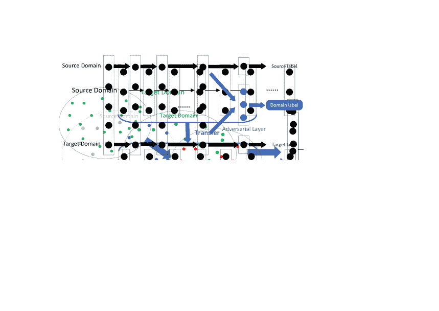

<!--yml

分类：未分类

日期：2024-09-06 20:07:35

-->

# [1808.01974] 深度迁移学习调查

> 来源：[`ar5iv.labs.arxiv.org/html/1808.01974`](https://ar5iv.labs.arxiv.org/html/1808.01974)

¹¹机构文本：智能技术与系统国家重点实验室

清华大学国家信息科学技术实验室（TNList）

计算机科学与技术系，清华大学

¹{tcq15, kt14, zhangwc14, yang-c15}@mails.tsinghua.edu.cn

²{fcsun, cfliu1985}@tsinghua.edu.cn

作者说明

# 深度迁移学习调查

田传启¹    孙富春²    孔涛¹    张文昌¹    杨超¹    刘春芳²

###### 摘要

作为一个新的分类平台，深度学习最近受到了越来越多研究人员的关注，并已成功应用于许多领域。在某些领域，如生物信息学和机器人技术，由于数据采集和标注成本高昂，构建大规模的标注数据集非常困难，这限制了其发展。迁移学习放宽了训练数据必须与测试数据独立且同分布（i.i.d.）的假设，这激励我们使用迁移学习来解决训练数据不足的问题。本调查聚焦于回顾当前基于深度神经网络的迁移学习研究及其应用。我们定义了深度迁移学习，分类，并回顾了基于深度迁移学习技术的最新研究工作。

###### 关键词：

深度迁移学习，迁移学习，调查。

## 1 引言

深度学习最近受到越来越多研究人员的关注，并已成功应用于许多实际应用中。深度学习算法试图从大量数据中学习高层次的特征，这使得深度学习超越了传统的机器学习。它可以通过无监督或半监督特征学习算法以及层次化特征提取自动提取数据特征。相比之下，传统的机器学习方法需要手动设计特征，这严重增加了用户的负担。可以说，深度学习是一种基于大规模数据的机器学习中的表示学习算法。

数据依赖是深度学习中最严重的问题之一。与传统机器学习方法相比，深度学习对大量训练数据的依赖非常强，因为它需要大量数据来理解数据的潜在模式。一个有趣的现象是模型规模和所需数据量之间几乎呈线性关系。一个可以接受的解释是，对于特定问题，模型的表达空间必须足够大，以发现数据中的模式。模型中的预处理层可以识别训练数据的高级特征，随后层可以识别帮助做出最终决策所需的信息。

不足的训练数据是一些特殊领域中不可避免的问题。数据收集复杂且昂贵，使得建立大规模、高质量注释数据集极其困难。例如，生物信息学数据集中的每个样本通常展示了临床试验或痛苦的患者。此外，即使我们通过支付高昂价格获得了训练数据集，它也很容易过时，因此无法有效应用于新任务。

迁移学习放宽了训练数据必须与测试数据独立同分布（i.i.d.）的假设，这激励我们使用迁移学习来解决训练数据不足的问题。在迁移学习中，训练数据和测试数据不需要是 i.i.d.，并且目标领域的模型不需要从头开始训练，这可以显著减少目标领域对训练数据和训练时间的需求。

过去，大多数迁移学习研究都在传统机器学习方法中进行。由于深度学习在现代机器学习方法中的主导地位，对深度迁移学习及其应用的调查尤其重要。这篇调查论文的贡献如下：

+   •

    我们首次定义了深度迁移学习，并将其分类为四类。

+   •

    我们回顾了深度迁移学习每个类别的当前研究工作，并给出了每个类别的标准化描述和示意图。

## 2 深度迁移学习

迁移学习是机器学习中解决训练数据不足基本问题的重要工具。它试图通过放宽训练数据和测试数据必须是 i.i.d.的假设，将知识从源领域转移到目标领域。这将对许多因训练数据不足而难以改进的领域产生积极的影响。迁移学习的学习过程如图 1 所示。

图 1：迁移学习的学习过程。

本调查中使用的一些符号需要明确说明。首先，我们分别给出领域和任务的定义：一个领域可以表示为$\mathcal{D}=\{\chi,P(X)\}$，它包含两个部分：特征空间$\chi$和边缘概率分布$P(X)$，其中$X=\{x_{1},...,x_{n}\}\in\chi$。一个任务可以表示为$\mathcal{T}=\{y,f(x)\}$。它由两部分组成：标签空间$y$和目标预测函数$f(x)$。$f(x)$也可以被视为条件概率函数$P(y|x)$。然后，迁移学习可以正式定义如下：

###### 定义 1

(迁移学习)。给定一个基于$\mathcal{D}_{t}$的学习任务$\mathcal{T}_{t}$，我们可以利用$\mathcal{D}_{s}$来帮助学习任务$\mathcal{T}_{s}$。迁移学习旨在通过从$\mathcal{D}_{s}$和$\mathcal{T}_{s}$中发现和迁移潜在知识，来提高预测函数$f_{\mathcal{T}}(\cdot)$在学习任务$\mathcal{T}_{t}$上的性能，其中$\mathcal{D}_{s}\neq\mathcal{D}_{t}$和/或$\mathcal{T}_{s}\neq\mathcal{T}_{t}$。此外，在大多数情况下，$\mathcal{D}_{s}$的大小远大于$\mathcal{D}_{t}$的大小，$N_{s}\gg N_{t}$。

调查[19]和[25]将迁移学习方法分为三个主要类别，基于源领域和目标领域之间的关系，这一点已被广泛接受。这些调查很好地总结了过去在迁移学习领域的工作，并介绍了一些经典的迁移学习方法。此外，最近提出了许多更新、更好的方法。近年来，迁移学习研究社区主要集中在以下两个方面：领域适应和多源领域迁移。

目前，深度学习在近年来的许多研究领域中已取得主导地位。重要的是要找出如何通过深度神经网络有效地迁移知识，这就是所谓的深度迁移学习，其定义如下：

###### 定义 2

(深度迁移学习)。给定一个由$\langle\mathcal{D}_{s},\mathcal{T}_{s},\mathcal{D}_{t},\mathcal{T}_{t},f_{\mathcal{T}}(\cdot)\rangle$定义的迁移学习任务。这是一个深度迁移学习任务，其中$f_{\mathcal{T}}(\cdot)$是一个非线性函数，反映了深度神经网络。

## 3 类别

深度迁移学习研究如何通过深度神经网络利用其他领域的知识。由于深度神经网络在各个领域中变得非常流行，已经提出了大量的深度迁移学习方法，因此对其进行分类和总结非常重要。根据深度迁移学习中使用的技术，本文将深度迁移学习分为四类：基于实例的深度迁移学习、基于映射的深度迁移学习、基于网络的深度迁移学习和基于对抗的深度迁移学习，如表 1 所示。

表 1：深度迁移学习的分类。

| 方法类别 | 简要描述 | 一些相关工作 |
| --- | --- | --- |
| 基于实例的 | 通过适当的权重利用源领域中的实例。 | [4], [27], [20], [24], [10], [26], [11] |
| 基于映射的 | 将两个领域的实例映射到具有更好相似性的新数据空间。 | [23], [12], [8], [14], [2] |
| 基于网络的 | 重用在源领域预训练的部分网络。 | [9], [17], [15], [30], [3], [6], [28] |
| 基于对抗的 | 使用对抗技术寻找适用于两个领域的可迁移特征。 | [1], [5], [21], [22], [13], [16] |

### 3.1 基于实例的深度迁移学习

基于实例的深度迁移学习指使用特定的权重调整策略，通过为选定的源领域实例分配适当的权重，将这些实例作为目标领域训练集的补充。它基于假设“虽然两个领域之间存在差异，但源领域中的部分实例可以通过适当的权重被目标领域利用。” 基于实例的深度迁移学习的示意图如图 2 所示。

图 2：基于实例的深度迁移学习的示意图。源领域中浅蓝色的实例表示与目标领域含义不相似，排除在训练数据集中；源领域中深蓝色的实例表示与目标领域含义相似，包含在训练数据集中并赋予适当的权重。

[4]提出的 TrAdaBoost 使用基于 AdaBoost 的技术来过滤源领域中与目标领域不相似的实例。重新加权源领域中的实例，以组成一个与目标领域相似的分布。最后，使用来自源领域的重新加权实例和来自目标领域的原始实例训练模型。它可以减少在不同分布领域上的加权训练误差，同时保持 AdaBoost 的特性。[27]提出的 TaskTrAdaBoost 是一种快速算法，促进在新目标上快速重训练。与 TrAdaBoost 不同，TaskTrAdaBoost 是为分类问题设计的，而[20]提出的 ExpBoost.R2 和 TrAdaBoost.R2 则覆盖了回归问题。[24]提出的双重加权领域适应（BIW）可以将两个领域的特征空间对齐到公共坐标系统中，然后为源领域的实例分配适当的权重。[10]提出了一种增强的 TrAdaBoost，以处理区域间砂岩显微图像分类的问题。[26]提出了一种度量迁移学习框架，以平行框架学习实例权重和两个不同领域之间的距离，从而使跨领域知识迁移更加有效。[11]引入了一种集合迁移学习方法，以深度神经网络为基础，可以利用源领域的实例。

### 3.2 基于映射的深度迁移学习

基于映射的深度迁移学习指的是将源领域和目标领域的实例映射到一个新的数据空间。在这个新的数据空间中，两个领域的实例在某种程度上相似，并且适用于联合深度神经网络。它基于以下假设：“虽然两个原始领域之间存在差异，但它们可以在一个精细的新数据空间中变得更为相似。”基于实例的深度迁移学习的示意图见图 3。

图 3：基于映射的深度迁移学习的示意图。同时，源领域和目标领域的实例被映射到一个更为相似的新数据空间中。将新数据空间中的所有实例视为神经网络的训练集。

由[18]提出的迁移成分分析（TCA）以及基于 TCA 的方法[29]已经在许多传统迁移学习应用中得到了广泛使用。一个自然的想法是将 TCA 方法扩展到深度神经网络中。[23]通过引入适应层和额外的领域混淆损失来扩展 MMD，以便在深度神经网络中比较分布，从而学习到一个在语义上有意义且领域不变的表示。本文中使用的 MMD 距离定义为

|  | $D_{\mathcal{MMD}}(X_{S},X_{T})=\left\|\left\|\dfrac{1}{ | X_{S} | }\sum_{x_{s}\in X_{S}}\phi(x_{s})-\dfrac{1}{ | X_{T} | }\sum_{x_{t}\in X_{T}}\phi(x_{t})\right\|\right\|$ |  | (1) |
| --- | --- | --- | --- | --- | --- | --- | --- |

且损失函数定义为

|  | $\mathcal{L}=\mathcal{L}_{C}(X_{L},y)+\lambda D^{2}_{\mathcal{MMD}}(X_{S},X_{T}).$ |  | (2) |
| --- | --- | --- | --- |

[12] 通过用 [8] 提出的多核变体 MMD（MK-MMD）距离替代了之前的 MMD 距离，从而改进了之前的工作。卷积神经网络（CNN）中与学习任务相关的隐藏层被映射到再生核希尔伯特空间（RKHS），并通过多核优化方法最小化不同领域之间的距离。[14] 提出了联合最大均值离散度（JMMD）来度量联合分布的关系。JMMD 用于推广深度神经网络（DNN）的迁移学习能力，以适应不同领域的数据分布，并改进了之前的工作。[2] 提出的 Wasserstein 距离可以作为领域之间新距离测量的手段，以寻找更好的映射。

### 3.3 基于网络的深度迁移学习

基于网络的深度迁移学习指的是重用在源领域预训练的部分网络，包括其网络结构和连接参数，将其转移到目标领域中作为深度神经网络的一部分。这基于这样的假设：“神经网络类似于人脑的处理机制，是一个迭代和持续的抽象过程。网络的前层可以视为特征提取器，提取的特征是通用的。” 基于网络的深度迁移学习的示意图如图 4 所示。

图 4：基于网络的深度迁移学习示意图。首先，在源领域用大规模训练数据集训练网络。其次，将源领域预训练的部分网络转移为目标领域新网络的一部分。最后，转移后的子网络可以在微调策略中更新。

[9]将网络分为两个部分，前半部分是语言无关的特征变换，最后一层是语言相关的分类器。语言无关的特征变换可以在多种语言之间迁移。[17]重用在 ImageNet 数据集上训练的前层，以计算其他数据集图像的中间图像表示，CNN 被训练以学习可以有效迁移到其他视觉识别任务中的图像表示，尽管训练数据量有限。[15]提出了一种方法，从源领域的标记数据和目标领域的未标记数据中共同学习自适应分类器和可迁移特征，通过将多个层插入深度网络中，显式地学习残差函数以参考目标分类器。[30]在深度神经网络中同时学习领域适应和深度哈希特征。[3]提出了一种新颖的多尺度卷积稀疏编码方法。该方法可以以联合方式自动学习不同尺度的滤波器组，并强制学习模式的尺度特异性，为学习可迁移的基础知识并在目标任务中进行微调提供了一种无监督解决方案。[6]将深度迁移学习应用于将知识从现实世界的物体识别任务迁移到多重引力波信号探测器的故障分类器。它证明了 DNN 可以作为优秀的特征提取器，用于无监督聚类方法以根据形态识别新类别，而不需要任何标记示例。

另一个非常值得注意的结果是[28]指出了网络结构与可迁移性之间的关系。它证明了一些模块可能不会影响领域内准确性，但会影响可迁移性。它指出了在深度网络中哪些特征是可迁移的，以及哪种类型的网络更适合迁移。结论是 LeNet、AlexNet、VGG、Inception 和 ResNet 是网络基深度迁移学习中的良好选择。

### 3.4 对抗性深度迁移学习

对抗性深度迁移学习指的是引入受生成对抗网络（GAN）[7]启发的对抗性技术，以寻找适用于源领域和目标领域的可迁移表示。其基于这样的假设：“为了有效迁移，好的表示应当在主要学习任务中具有区分性，并且在源领域和目标领域之间无差别。” 对抗性深度迁移学习的示意图如图 5 所示。

图 5：基于对抗的深度迁移学习的示意图。在源领域的大规模数据集训练过程中，网络的前层被视为特征提取器。它从两个领域提取特征并将其发送到对抗层。对抗层试图区分特征的来源。如果对抗网络的表现更差，则意味着两种特征之间的差异较小，迁移性更好，反之亦然。在后续的训练过程中，将考虑对抗层的表现，以迫使迁移网络发现具有更高迁移性的通用特征。

基于对抗的深度迁移学习近年来由于其良好的效果和强大的实用性取得了蓬勃发展。[1] 引入了对抗技术用于领域适应，通过在损失函数中使用领域适应正则化项。[5] 提出了适用于大多数前馈神经网络模型的对抗训练方法，通过添加少量标准层和一个简单的新梯度反转层进行增强。[21] 提出了跨领域和跨任务同时转移知识的方法，用于稀疏标记的目标领域数据。在这项工作中使用了一个特殊的联合损失函数，强制 CNN 优化定义为$\mathcal{L}_{D}=\mathcal{L}_{c}+\lambda\mathcal{L}_{adver}$的领域间距离，其中$\mathcal{L}_{c}$是分类损失，$\mathcal{L}_{adver}$是领域对抗损失。由于这两种损失相互对立，因此引入了一种迭代优化算法，以在固定一个损失时更新另一个损失。[22] 提出了新的 GAN 损失，并结合判别建模形成一种新的领域适应方法。[13] 提出了随机多线性对抗网络，利用多个特征层和基于随机多线性对抗的分类器层，以实现深度和判别对抗适应。[16] 利用领域对抗损失，并使用基于度量学习的方法将嵌入推广到新任务中，以在深度迁移学习中发现更多可处理的特征。

## 4 结论

在这篇综述论文中，我们回顾并分类了当前的深度转移学习研究。深度转移学习首次被分类为四类：基于实例的深度转移学习、基于映射的深度转移学习、基于网络的深度转移学习以及基于对抗的深度转移学习。在大多数实际应用中，上述多种技术通常结合使用以获得更好的结果。目前大多数研究集中在监督学习上，如何通过深度神经网络在无监督或半监督学习中转移知识可能会受到越来越多的关注。负转移和转移度量在传统转移学习中是重要问题。这两个问题在深度转移学习中的影响也需要我们进一步研究。此外，一个非常有吸引力的研究领域是寻找对深度神经网络中转移知识的更强物理支持，这需要物理学家、神经科学家和计算机科学家的合作。可以预测，随着深度神经网络的发展，深度转移学习将被广泛应用于解决许多具有挑战性的问题。

## 参考文献

+   [1] Ajakan, H., Germain, P., Larochelle, H., Laviolette, F., Marchand, M.: 域对抗神经网络。arXiv 预印本 arXiv:1412.4446 (2014)

+   [2] Arjovsky, M., Chintala, S., Bottou, L.: Wasserstein GAN。arXiv 预印本 arXiv:1701.07875 (2017)

+   [3] Chang, H., Han, J., Zhong, C., Snijders, A., Mao, J.H.: 通过多尺度卷积稀疏编码进行无监督转移学习，应用于生物医学领域。IEEE 模式分析与机器智能交易 (2017)

+   [4] Dai, W., Yang, Q., Xue, G.R., Yu, Y.: 转移学习的提升方法。发表于第 24 届国际机器学习会议论文集。第 193–200 页。ACM (2007)

+   [5] Ganin, Y., Lempitsky, V.: 通过反向传播进行无监督领域适应。arXiv 预印本 arXiv:1409.7495 (2014)

+   [6] George, D., Shen, H., Huerta, E.: 深度转移学习：一种新的深度学习故障分类方法，适用于高级 LIGO。arXiv 预印本 arXiv:1706.07446 (2017)

+   [7] Goodfellow, I., Pouget-Abadie, J., Mirza, M., Xu, B., Warde-Farley, D., Ozair, S., Courville, A., Bengio, Y.: 生成对抗网络。发表于神经信息处理系统进展。第 2672–2680 页 (2014)

+   [8] Gretton, A., Sejdinovic, D., Strathmann, H., Balakrishnan, S., Pontil, M., Fukumizu, K., Sriperumbudur, B.K.: 大规模双样本检验的最佳核选择。发表于神经信息处理系统进展。第 1205–1213 页 (2012)

+   [9] Huang, J.T., Li, J., Yu, D., Deng, L., Gong, Y.: 使用共享隐藏层的多语言深度神经网络进行跨语言知识转移。发表于声学、语音与信号处理（ICASSP），2013 IEEE 国际会议。第 7304–7308 页。IEEE (2013)

+   [10] Li, N., Hao, H., Gu, Q., Wang, D., Hu, X.：一种用于自动识别砂岩显微图像的迁移学习方法。计算机与地球科学 103, 111–121 (2017)

+   [11] Liu, X., Liu, Z., Wang, G., Cai, Z., Zhang, H.：集成迁移学习算法。IEEE Access 6, 2389–2396 (2018)

+   [12] Long, M., Cao, Y., Wang, J., Jordan, M.：使用深度适应网络学习可迁移特征。在：国际机器学习会议。第 97–105 页 (2015)

+   [13] Long, M., Cao, Z., Wang, J., Jordan, M.I.：使用随机多线性对抗网络的领域适应。arXiv 预印本 arXiv:1705.10667 (2017)

+   [14] Long, M., Wang, J., Jordan, M.I.：带有联合适应网络的深度迁移学习。arXiv 预印本 arXiv:1605.06636 (2016)

+   [15] Long, M., Zhu, H., Wang, J., Jordan, M.I.：具有残差迁移网络的无监督领域适应。在：神经信息处理系统进展。第 136–144 页 (2016)

+   [16] Luo, Z., Zou, Y., Hoffman, J., Fei-Fei, L.F.：跨领域和任务的标签高效学习可迁移表征。在：神经信息处理系统进展。第 164–176 页 (2017)

+   [17] Oquab, M., Bottou, L., Laptev, I., Sivic, J.：使用卷积神经网络学习和迁移中级图像表征。在：计算机视觉与模式识别 (CVPR)，2014 IEEE 会议。第 1717–1724 页。IEEE (2014)

+   [18] Pan, S.J., Tsang, I.W., Kwok, J.T., Yang, Q.：通过迁移分量分析进行领域适应。IEEE 神经网络汇刊 22(2), 199–210 (2011)

+   [19] Pan, S.J., Yang, Q.：迁移学习综述。IEEE 知识与数据工程汇刊 22(10), 1345–1359 (2010)

+   [20] Pardoe, D., Stone, P.：回归迁移的提升。在：第 27 届国际机器学习会议论文集。第 863–870 页。Omnipress (2010)

+   [21] Tzeng, E., Hoffman, J., Darrell, T., Saenko, K.：跨领域和任务的同时深度迁移。在：计算机视觉 (ICCV)，2015 IEEE 国际会议。第 4068–4076 页。IEEE (2015)

+   [22] Tzeng, E., Hoffman, J., Saenko, K., Darrell, T.：对抗性判别领域适应。在：计算机视觉与模式识别 (CVPR)。第 1 卷，第 4 页 (2017)

+   [23] Tzeng, E., Hoffman, J., Zhang, N., Saenko, K., Darrell, T.：深度领域混淆：最大化领域不变性。arXiv 预印本 arXiv:1412.3474 (2014)

+   [24] Wan, C., Pan, R., Li, J.：用于跨语言文本分类的双重加权领域适应。在：IJCAI 论文集-国际人工智能联合会议。第 22 卷，第 1535 页 (2011)

+   [25] Weiss, K., Khoshgoftaar, T.M., Wang, D.：迁移学习综述。大数据杂志 3(1), 9 (2016)

+   [26] Xu, Y., Pan, S.J., Xiong, H., Wu, Q., Luo, R., Min, H., Song, H.：度量迁移学习的统一框架。IEEE 知识与数据工程汇刊 29(6), 1158–1171 (2017)

+   [27] 姚野，Doretto，G.：《多源迁移学习的提升》。发表于：计算机视觉与模式识别（CVPR），2010 年 IEEE 会议. 第 1855–1862 页。IEEE（2010 年）

+   [28] Yosinski，J.，Clune，J.，Bengio，Y.，Lipson，H.：《深度神经网络中的特征可迁移性如何？》。发表于：神经信息处理系统进展。第 3320–3328 页（2014 年）

+   [29] 张杰，李伟，Ogunbona，P.：《视觉领域适应的几何与统计联合对齐》。发表于：CVPR（2017 年）

+   [30] 朱华，龙铭，王杰，曹阳：《深度哈希网络用于高效相似性检索》。发表于：AAAI. 第 2415–2421 页（2016 年）
