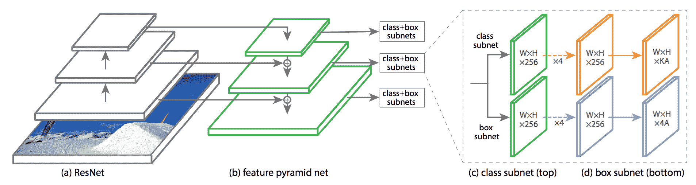

<!--yml

分类：未分类

日期：2024-09-06 20:07:33

-->

# [1808.07256] 现代目标检测文献综述：深度学习方法

> 来源：[`ar5iv.labs.arxiv.org/html/1808.07256`](https://ar5iv.labs.arxiv.org/html/1808.07256)

# 现代目标检测文献综述：深度学习方法

Karanbir Chahal¹ 和 Kuntal Dey² *本研究未获得任何组织的支持¹ Karanbir 是一名独立研究员 ² Kuntal Dey 是 IBM 技术学院 (AoT) 的成员*

###### 摘要

目标检测是识别图像中的物体及其定位和分类。它有广泛的应用，是基于视觉的软件系统的关键组件。本文旨在对使用深度学习的现代目标检测算法进行严格的综述。作为综述的一部分，探索的主题包括各种算法、质量指标、速度/大小权衡和训练方法。本文重点关注两类目标检测算法——SSD 类单步检测器和 Faster R-CNN 类两步检测器。通过探索新的轻量级卷积基础架构，本文还解决了在低功耗设备上构建便携且快速检测器的技术。最终，对每种检测器的优缺点进行严格审查，得出了目前的最新技术状态。

## I 引言

### I-A 背景和动机

深度学习已经彻底改变了计算领域，从而根本性地改变了应用程序的创建方式。Andrej Karpathy 正确地将其称为软件 2.0\. 应用程序正在快速变得智能，能够执行复杂的任务——这些任务最初被认为超出了计算机的能力。这些复杂任务的例子包括在图像中检测和分类物体、总结大量文本、回答段落中的问题、生成艺术作品以及在复杂的游戏如围棋和国际象棋中战胜人类玩家。人脑处理大量不同模式的数据。它识别这些模式，对其进行推理，并采取特定于该模式的行动。人工智能旨在通过深度学习复制这种方法。深度学习在准确率上对不同模式的数据理解方面被证明非常有效。这一能力是理解语言和图像的大多数创新的关键。随着深度学习研究的快速推进，新发现和算法导致了众多领域的颠覆。其中一个受到深度学习显著影响的领域是目标检测。

### I-B 目标检测

物体检测是在图像中识别对象及其定位和分类的过程。能够执行这些任务的软件系统称为物体检测器。物体检测具有重要的应用。许多需要人工监督的任务可以通过能够在图像中检测对象的软件系统实现自动化。这些任务包括监控、疾病识别和驾驶。深度学习的出现对我们实施计算机视觉的方式带来了深远的变化。 [22]

不幸的是，这项技术有着高度的不负责任使用的潜力。特别是物体检测器在军事应用中的使用令人担忧。因此，尽管其有着相当有用的应用，仍需时刻保持谨慎和负责任的使用。

### I-C 进展与未来工作

物体检测器在准确性、速度和内存占用方面取得了快速进展。自 2015 年首次引入基于深度学习的物体检测器以来，该领域已取得长足的进步。最早的深度学习物体检测器处理一张图像需要$47s$，而现在处理时间不到$30ms$，已经优于实时。与速度类似，准确性也在稳步提高。从$29$ mAP（混合平均精度）的检测准确率，现代物体检测器已达到$43$ mAP。物体检测器在体积上也有所改进。得益于智能而保守的模型设计，检测器可以在低功耗手机上良好运行。由于 Tensorflow[34]和 Caffe[35]等框架的支持，模型在手机上的运行得到了改进。可以合理地认为，物体检测器已经接近人类水平。然而，与任何深度学习模型一样，这些检测器仍然容易受到对抗性攻击，如果图像具有对抗性质，则可能会误分类。正在努力使物体检测器和深度学习模型在这些攻击面前更为鲁棒。准确性、速度和大小将不断改进，但这已不再是最紧迫的目标。检测器已达到令人尊敬的质量，使其能够在今天投入生产。现在的目标应该是使这些模型在对抗攻击面前更为鲁棒，并确保这项技术得到负责任的使用。

## II 物体检测模型

### II-A 早期工作

第一款物体检测器于 2001 年问世，称为 Viola-Jones 物体检测器 [7]。尽管它在技术上被归类为物体检测器，但其主要用途是面部检测。它提供了实时解决方案，并被当时的许多计算机视觉库所采用。随着深度学习的出现，该领域得到了实质性的加速。第一个深度学习物体检测器模型称为 Overfeat 网络 [13]，它使用了卷积神经网络（CNNs）以及滑动窗口方法。它将图像的每一部分分类为物体/非物体，并随后将结果结合生成最终的预测集。这种使用 CNNs 进行检测的方法引入了新的网络，使技术水平更上一层楼。我们将在下一节中探讨这些网络。

### II-B 最近的工作

目前有两种构建物体检测器的方法——单步方法和两步方法。两步方法的准确率优于前者，而单步方法则更快且显示出更高的内存效率。单步方法在一步中同时分类图像中的物体及其位置。另一方面，两步方法将这个过程分为两步。第一步生成图像中具有高概率为物体的区域。第二步则通过将这些区域作为输入来执行最终的检测和分类。这两步分别称为区域提议步骤和物体检测步骤。或者，单步方法将这两个步骤结合在一起，直接预测类别概率和物体位置。

从 2012 年以来，物体检测模型经历了各种变化。物体检测的第一次突破是 RCNN [1]，这使得相对于之前的技术水平提高了近 30%。我们将通过首先探讨这个检测器来开始调查。

### II-C 物体检测问题陈述

构建深度学习模型总是包括两个组件。第一个组件负责将训练数据划分为输入和目标。第二个组件则是确定神经网络架构和训练方案。这些模型的输入是图像。目标是一个对象类别的列表，表示对象所属的类别及其对应的坐标。这些坐标标示出对象在图像中的位置。有 4 种坐标——中心的 x 和 y 坐标以及边界框的高度和宽度。我们将使用边界框一词来表示通过在图像上应用这 4 个坐标形成的框。网络被训练以预测一个物体列表及其对应的边界框坐标位置。

## 两步模型

## III 区域卷积网络（R-CNN）

图 1：区域卷积网络

RCNN 模型 [1] 是一个具有高度影响力的模型，它塑造了现代目标检测器的结构。它是第一个提出两步法的检测器。我们将首先查看区域提议模型。

### III-A 区域提议模型

在该模型中，图像作为输入。区域提议系统会在图像中找到一组具有高概率为对象的斑点或区域。R-CNN 的区域提议系统使用一个非深度学习模型，称为选择性搜索 [12]。选择性搜索找到一系列其认为最有可能包含对象的区域。它找到了大量的区域，这些区域然后从输入图像中裁剪出来，并调整为 7×7 像素的大小。这些斑点随后被送入目标检测模型。选择性搜索输出约 2,000 个不同尺度的区域提议，执行时间大约为 27 秒。

### III-B 目标检测模型

本文将每个深度学习模型分为 5 个子部分。这些部分包括模型的输入、模型需要学习的目标、架构、损失函数以及用于训练模型的训练过程。

+   •

    输入：目标检测模型将区域提议模型计算出的 7×7 尺寸的区域作为输入。

+   •

    目标：RCNN 网络的目标是一个包含每个区域的类别概率和偏移坐标的列表，这些区域由选择性搜索提出。盒子坐标的偏移量被计算出来，以使网络能够更好地拟合对象。换句话说，偏移量用于修改边界框的原始形状，以便准确地包围对象。通过计算区域与真实标注之间的交并比（IOU）来分配类别。如果 IOU $\geq$ 0.7，则为该区域分配类别。如果多个真实标注与区域的 IOU $\geq$ 0.7，则将具有最高 IOU 的真实标注分配给该区域。如果 IOU $\leq$ 0.3，则该区域被分配为背景类。其他区域不用于损失计算，因此在训练过程中被忽略。只有在区域被分配前景类时，才计算真实标注与该区域之间的偏移量。计算这些偏移量的方法有所不同。在 RCNN 系列中，它们的计算方式如下：

    |  | $t_{x}=(x_{g}-x_{a})/w_{a}$ |  | <math display="inline"><semantics ><mrow ><mo stretchy="false" >(</mo><mn  >1</mn><mo stretchy="false" >)</mo></mrow><annotation-xml encoding="MathML-Content" ><cn type="integer"  >1</cn></annotation-xml></semantics></math> |
    | --- | --- | --- | --- |
    |  | $t_{y}=(y_{g}-y_{a})/h_{a}$ |  | <math display="inline"><semantics ><mrow ><mo stretchy="false" >(</mo><mn  >2</mn><mo stretchy="false" >)</mo></mrow><annotation-xml encoding="MathML-Content" ><cn type="integer"  >2</cn></annotation-xml></semantics></math> |
    |  | $t_{w}=log(w_{g}/w_{a})$ |  | <math display="inline"><semantics ><mrow ><mo stretchy="false" >(</mo><mn  >3</mn><mo stretchy="false" >)</mo></mrow><annotation-xml encoding="MathML-Content" ><cn type="integer"  >3</cn></annotation-xml></semantics></math> |
    |  | $t_{h}=log(h_{g}/h_{a})$ |  | <math display="inline"><semantics ><mrow ><mo stretchy="false" >(</mo><mn  >4</mn><mo stretchy="false" >)</mo></mrow><annotation-xml encoding="MathML-Content" ><cn type="integer"  >4</cn></annotation-xml></semantics></math> |

    其中 $x_{g}$、$y_{g}$、$w_{g}$ 和 $h_{g}$ 是实际框的 x、y 坐标、宽度和高度，而 $x_{a}$、$y_{a}$、$w_{a}$ 和 $h_{a}$ 是区域的 x、y 坐标、宽度和高度。四个值 $t_{x}$、$t_{y}$、$t_{w}$ 和 $t_{h}$ 是目标偏移量。

+   •

    架构：目标检测器模型的架构包括一系列卷积层和最大池化层，配有激活函数。上述步骤中的一个区域经过这些层处理后生成一个特征图。该特征图表示区域的高级格式，模型可以解释。特征图被展开并输入到两个全连接层中，生成一个 4,078 维的向量。然后，将该向量输入到两个独立的小型 SVM 网络 [41] - 分类网络头和回归网络头。分类头负责预测区域所属的对象类别，而回归头负责预测区域坐标的偏移量，以更好地拟合对象。

+   •

    损失：RCNN 中计算了两个损失 - 分类损失和回归损失。分类损失是交叉熵损失，回归损失是 L2 损失。RCNN 使用多步训练管道来使用这两个损失训练网络。

    交叉熵损失定义为：

    |  | $CE({\boldsymbol{y}},\hat{\boldsymbol{y}})=-\sum^{\textrm{N}_{c}}_{i=1}y_{i}\log(\hat{y}_{i})$ |  | <math   display="inline"><semantics ><mrow ><mo stretchy="false" >(</mo><mn >5</mn><mo stretchy="false" >)</mo></mrow><annotation-xml encoding="MathML-Content" ><cn type="integer"  >5</cn></annotation-xml></semantics></math> |
    | --- | --- | --- | --- |

    其中 ${\boldsymbol{y}}\in\mathbb{R}^{5}$ 是一个独热编码标签向量，$\textrm{N}_{c}$ 是类别的数量。

    L2 或均方误差（MSE）损失定义为：

    |  | $L2(x_{1},x_{2})=\frac{1}{n}\left\|x_{1}-x_{2}\right\|_{2}^{2}=\frac{1}{n}\sum_{i}(x_{1_{i}}-x_{2_{i}})^{2}$ |  | <math   display="inline"><semantics ><mrow ><mo stretchy="false" >(</mo><mn >6</mn><mo stretchy="false" >)</mo></mrow><annotation-xml encoding="MathML-Content" ><cn type="integer"  >6</cn></annotation-xml></semantics></math> |
    | --- | --- | --- | --- |

+   •

    模型训练流程：模型使用两步流程进行训练。在训练之前，使用在 ImageNet 上预训练的卷积基础。第一步包括使用交叉熵损失训练 SVM 分类头部。回归头部的权重不进行更新。在第二步中，使用 L2 损失训练回归头部。分类头部的权重是固定的。这个过程大约需要 84 小时，因为计算并存储每个区域提案的特征。大量的区域占用大量空间，输入/输出操作增加了相当大的开销。

+   •

    突出特点：RCNN 模型处理单张图像需要 47 秒，因为它拥有复杂的多步骤训练流程，需要仔细调整参数。训练在时间和空间上都非常昂贵。计算的数据集特征占用数百吉字节，训练时间大约为 84 小时。RCNN 提供了一个很好的基础，通过提供结构来解决目标检测问题。然而，由于其时间和空间的限制，需要一个更好的模型。

## IV 快速 RCNN

图 2：快速 RCNN

快速 RCNN [3] 在 RCNN 之后不久推出，并在原始模型上进行了显著改进。快速 RCNN 也是一个两步模型，与 RCNN 十分相似，它使用选择性搜索来找到一些区域，然后将每个区域通过目标检测网络。该网络由一个卷积基础和两个用于分类和回归的 SVM 头部组成。对每个区域的类别和偏移量进行预测。RCNN 模型对每个区域提案都通过卷积基础进行处理。由于每次处理区域提案时都增加了通过卷积基础的开销，这种方法效率较低。快速 RCNN 旨在通过仅运行一次卷积基础来减少这一开销。它在整个图像上运行卷积基础以生成特征图。区域从该特征图中裁剪，而不是从输入图像中裁剪。因此，特征被共享，从而在空间和时间上都得到了减少。这一裁剪过程是通过一种称为 ROI 池化的新算法完成的。

Fast RCNN 还引入了单步训练管道和多任务损失，使分类和回归头能够同时训练。这些变化导致训练时间和所需内存的大幅减少。Fast RCNN 更多的是速度的提升，而非准确性的提升。它将 RCNN 的理念打包到一个更紧凑的架构中。模型的改进包括使用单步端到端训练管道代替多步骤管道，将训练时间从 84 小时减少到 9 小时。它还减少了内存占用，不再需要将特征存储在磁盘上。Fast RCNN 的主要创新在于共享卷积网络的特征。通过使用多任务损失构建单步训练管道，而不是多步骤训练管道，也是一个新颖而优雅的解决方案。

### IV-A ROI 池化

区域兴趣（ROI）池化是一种算法，它利用通过选择性搜索获得的区域坐标，直接从原始图像的特征图中裁剪出这些区域。ROI 池化允许对所有区域共享计算，因为卷积基不需要为每个区域单独运行。卷积基仅对输入图像运行一次，以生成一个特征图。通过裁剪这个特征图来计算各个区域的特征。

在 ROI 池化算法中，提出的区域坐标通过一个压缩因子$h$来进行划分。压缩因子是图像经过卷积基处理后被压缩的程度。如果使用 VGGNet [47] 作为卷积基，则$h$的值为 16。这个值是因为 VGGNet 将图像压缩到其原始宽度和高度的$1/16^{th}$。

压缩坐标的计算如下：

|  | $x_{new}=x_{old}/h$ |  |
| --- | --- | --- |
|  | $y_{new}=y_{old}/h$ |  |
|  | $w_{new}=w_{old}/h$ |  |
|  | $h_{new}=h_{old}/h$ |  |

其中，$x_{new}$、$y_{new}$、$w_{new}$ 和 $h_{new}$ 是压缩后的 x、y 坐标、宽度和高度。

一旦压缩坐标计算完成，它们将被绘制在图像特征图上。区域从特征图上裁剪并调整大小为 7 乘 7。实际操作中，这种调整大小是通过各种方法完成的。在 ROI 池化中，将绘制在特征图上的区域划分为 7 乘 7 的网格。对每个网格中的单元进行最大池化。在实际操作中，常常使用一种称为 ROI 平均的 ROI 池化变体。它简单地将最大池化替换为平均池化。将特征图划分为 49 个网格的过程是近似的。一个网格包含比其他网格更多单元并不罕见。

一些物体检测器简单地使用常见的图像算法将特征图上的裁剪区域调整为 7x7 的大小，而不是经过 ROI Pooling 步骤。在实际应用中，这样做对准确性影响不大。一旦这些区域被裁剪出来，就可以输入到物体检测器模型中。

### IV-B 物体检测器模型

Fast RCNN 中的物体检测器模型与 RCNN 中使用的检测器非常相似。

+   •

    输入：物体检测器模型接收来自区域提议模型的区域提议。这些区域提议通过 ROI Pooling 进行裁剪。

+   •

    目标：类别目标和框回归偏移量的计算方式与 RCNN 中完全相同。

+   •

    架构：在 ROI Pooling 步骤之后，裁剪后的区域会通过一个小型卷积网络。该网络由一组卷积层和全连接层组成。这些层输出一个 4,078 维的向量，该向量进一步作为分类和回归 SVM 头部的输入，用于分类和偏移量预测。

+   •

    损失：该模型使用一个多任务损失，其定义如下：

    |  | $L=l_{c}+\alpha*\lambda*l_{r}$ |  | <math display="inline"><semantics ><mrow ><mo stretchy="false" >(</mo><mn >7</mn><mo stretchy="false" >)</mo></mrow><annotation-xml encoding="MathML-Content" ><cn type="integer" >7</cn></annotation-xml></semantics></math> |
    | --- | --- | --- | --- |

    其中 $\alpha$ 和 $\lambda$ 是超参数。如果区域被分类为前景类别，则将 $\alpha$ 超参数设置为 1；如果区域被分类为背景类别，则将其设置为 0。直观上，只有当区域中实际存在物体时，回归头生成的损失才应被考虑。$\lambda$ 超参数是一个权重因子，用于控制这些损失的权重。在训练网络时，$\lambda$ 被设置为 1。这个损失使得联合训练成为可能。分类损失 ($l_{c}$) 是常规的对数损失，回归损失 ($l_{r}$) 是平滑的 $L_{1}$ 损失。平滑的 $L_{1}$ 损失是对 RCNN 中用于回归的 $L_{2}$ 损失的改进。研究发现，平滑的 $L_{1}$ 损失对异常值的敏感性较低，因为训练时使用无界回归目标会导致梯度爆炸。因此，需要仔细调整学习率。使用平滑的 $L_{1}$ 损失可以解决这个问题。

    平滑的 $L_{1}$ 损失定义如下：

    |  | $\textrm{Smooth}_{L_{1}}(x)=\begin{cases}0.5x^{2}&\text{如果 } | x | <1\\ | x | -0.5&\text{否则}\end{cases}$ |  | <math   display="inline"><semantics ><mrow ><mo stretchy="false" >(</mo><mn >8</mn><mo stretchy="false" >)</mo></mrow><annotation-xml encoding="MathML-Content" ><cn type="integer"  >8</cn></annotation-xml></semantics></math> |
    | --- | --- | --- | --- | --- | --- | --- | --- |

    这是一种稳健的$L_{1}$损失，相较于 R-CNN 中使用的$L_{2}$损失对离群值的敏感性较低。

+   •

    模型训练过程：在 RCNN 中，训练有两个不同的步骤。Fast RCNN 引入了一个单步训练管道，其中分类和回归子网络可以使用上述的多任务损失一起训练。网络使用同步梯度下降（SGD）进行训练，迷你批次大小为 2 张图像。从每张图像中随机取 64 个区域建议，结果是迷你批次大小为 128 个区域建议。

+   •

    显著特征：首先，Fast RCNN 通过 ROI Pooling 步骤共享计算，从而显著提高了速度和内存效率。更具体地说，它将训练时间从 84 小时减少到 9 小时，同时将推理时间从 47 秒减少到 0.32 秒。其次，它引入了一个更简单的单步训练管道和一个新的损失函数。这个损失函数更易于训练，不会遇到梯度爆炸问题。

    目标检测步骤报告实时速度。然而，区域建议步骤证明是一个瓶颈。更具体地说，比选择性搜索更好的解决方案是必要的，因为它被认为对实时系统计算要求过高。下一个模型旨在解决这一点。

## V Faster RCNN

图 3: Faster RCNN

Faster RCNN [6]在 Fast RCNN 论文发布后不久出现。它旨在代表 RCNN 设定的最终阶段。它提出了一个端到端学习的检测器。这意味着不再使用算法区域建议选择方法，而是构建一个学习预测良好区域建议的网络。选择性搜索虽然可用，但耗时较长，并且成为精度的瓶颈。理论上，学习预测更高质量区域的网络将具有更高质量的预测。

Faster RCNN 引入了区域建议网络（RPN）来替代选择性搜索。RPN 需要能够预测图像中多尺度和纵横比的区域。这是通过一种新颖的锚点概念实现的。

### V-A 锚点

锚点是图像中具有预定义形状和大小的一组区域，即锚点只是图像的矩形裁剪。为了对各种形状和大小的物体进行建模，锚点具有多样的维度。这些不同的形状通过设定一组长宽比和尺度来决定。作者使用 32px、64px、128px 的尺度和 1:1、1:2、2:1 的长宽比，结果生成了 9 种锚点。一旦确定了图像中的一个位置，就从该位置裁剪出这 9 个锚点。

锚点在图像中的每 $x$ 像素后被裁剪。该过程从左上角开始，到图像的右下角结束。窗口从左到右滑动，每次滑动 $x$ 像素，每完成一次水平扫描后，向下移动 $x$ 像素。这个过程也称为滑动窗口。

锚点被裁剪的像素数由上述特征图的压缩因子（$h$）决定。在 VGGNet 中，这个数字是 16。在 Faster RCNN 论文中，图像中每 16 像素（在高度和宽度方向）裁剪 9 个不同尺寸的锚点，采用滑动窗口的方式。通过这种方式，锚点可以很好地覆盖图像。

### V-B 区域提议模型

+   •

    输入：模型的输入是输入图像。图像的大小固定为 224 x 224，模型的训练数据通过使用标准技巧如水平翻转来增强。为了减少训练时间，将图像批量输入网络。GPU 可以并行处理矩阵乘法，因此可以同时处理多张图像。

+   •

    目标：一旦图像中所有的锚点被裁剪出来，将为每个锚点计算两个参数——类别概率目标和框坐标偏移目标。每个锚点的类别概率目标通过计算锚点与真实值的 IOU 来确定。如果 IOU $\geq$ 0.7，则将锚点分配为真实值对象的类别。如果有多个真实值的 IOU $\geq$ 0.7，则取最大值。如果 IOU $\leq$ 0.3，则将其分配为背景类别。如果 0.3 $\leq$ IOU $\leq$ 0.7，则填入 0 值，因为这些锚点在计算损失时不会被考虑，从而不会影响训练。如果锚点被分配了前景类别，则计算真实值与锚点之间的偏移量。这些框偏移目标被计算出来，以使网络学习如何通过修改锚点的形状来更好地拟合真实值。偏移量的计算方式与 RCNN 模型相同。

+   •

    架构：RPN 网络由一个卷积基础组成，该卷积基础与 RCNN 目标检测模型中使用的类似。这个卷积基础输出一个特征图，然后将其输入到两个子网络中——一个分类子网络和一个回归子网络。

    分类和回归头由少量卷积层组成，这些层分别生成分类和回归特征图。两个网络的架构唯一的不同是最终特征图的形状。分类特征图的维度为 $w*h*(k*m)$，其中 $w$、$h$ 和 $k*m$ 是宽度、高度和深度。 $k$ 表示每个像素点的锚点数量，在本例中为 9，$m$ 代表类别数量。回归头的特征图的维度为 $w*h*(k*4)$。4 表示每个锚点的四个偏移坐标的预测。特征图中的单元表示从中裁剪出锚点的像素集。每个单元具有一个深度，表示每种锚点类型的框回归偏移。与分类头类似，回归头也有几个卷积层，这些层生成回归特征图。

+   •

    损失：锚点旨在表示对象检测器模型将进一步分类的良好区域提议。该模型使用简单的对数损失进行分类头训练，并使用 Smooth L1 损失进行回归头训练。存在一个加权因子 $\lambda$，以类似于 Fast RCNN 损失的方式平衡两个头生成的损失的权重。模型在所有锚点计算的损失上训练时无法收敛。原因是训练集被前景/背景样本主导，这个问题也称为类别不平衡。为避免这个问题，训练集通过收集 256 个锚点来进行，其中 128 个是前景锚点，其余的是背景锚点。保持这个训练集平衡已经遇到了一些挑战，使其成为一个活跃的研究领域。

### V-C 目标检测器模型

目标检测器模型与 Fast RCNN 中使用的模型相同。唯一的区别是模型的输入来自 RPN 生成的提议，而不是 Selective Search。

+   •

    突出特征：Faster RCNN 更快，并且具有端到端的深度学习管道。由于引入了 RPN，网络提高了最先进的准确性，从而改进了区域提议质量。

## VI Faster RCNN 的扩展

对 Faster RCNN 网络进行了多种扩展，使其更快且具有更好的尺度不变性。为了使 Faster RCNN 具有尺度不变性，原始论文将输入图像调整为不同的尺寸，然后将这些图像输入网络中。该方法并不理想，因为网络对一张图像进行了多次处理，从而使目标检测器变得更慢。特征金字塔网络提供了一种强大的方法来处理不同尺度的图像，同时仍能保持实时速度。Faster RCNN 框架的另一个扩展是区域全卷积网络（R-FCN）。它通过将原始网络重构为全卷积网络，从而实现更快的速度。我们将在接下来的章节中详细讲解这两种架构。

### VI-A 特征金字塔网络（FPN）

图 4：特征金字塔网络

尺度不变性是计算机视觉系统的一个重要特性。系统应该能够在近距离和远距离识别物体。特征金字塔网络 [9]（FPN）提供了这样一种神经网络架构。

图 5：区域全卷积网络（R-FCN）

在原始 Faster RCNN 中，创建了单个特征图。一个分类头和一个回归头附加到这个特征图上。然而，使用 FPN 时，有多个特征图设计用来表示不同尺度的图像。回归头和分类头在这些多尺度特征图上运行。锚点不再需要处理尺度问题。它们只需表示各种长宽比，因为尺度由这些多尺度特征图隐式处理。

+   •

    架构：FPN 模型接收输入图像并通过卷积基进行处理。卷积基将输入图像通过不同的尺度，逐步将图像的高度和宽度缩小，但通道深度增加。这一过程也称为自下而上的路径。例如，在 ResNet 中，图像经过五个尺度，分别是 224、56、28、14 和 7。这对应于作者版本中的四个特征图（第一个特征图被忽略，因为它占用了太多空间）。这些特征图负责锚点的尺度为 32px、64px、128px 和 256px。这些特征图取自每个尺度的最后一层——直觉上，最深层的特征包含了该尺度的最显著信息。每个特征图经过 1x1 卷积，将通道深度变为 $C$。作者在其实现中使用了 $C=256$ 通道。这些图像然后与上一个尺度的上采样版本逐元素相加。这一过程也称为横向连接。上采样使用邻近采样，因子为 2。这一上采样过程也称为自上而下的路径。完成每个尺度的横向连接后，更新后的特征图经过 3x3 卷积以生成最终的特征图集。这种将自下而上的路径和自上而下的路径融合的横向连接过程，确保了特征图具有高水平的信息，同时保留了每个像素的低层定位信息。这在获取更显著的特征的同时，还能保持该尺度下图像的整体结构，提供了良好的折中。

    在生成这些多个特征图后，Faster RCNN 网络在每个尺度上运行。每个尺度生成预测，主要变化在于回归和分类头现在在多个特征图上运行而不是一个。FPN 允许在测试和训练图像中实现尺度不变性。以前，Faster RCNN 在多尺度图像上进行训练，但测试是在单一尺度图像上进行的。现在，由于 FPN 的结构，多尺度测试隐式完成。

+   •

    突出点：通过将 FPNs 集成到预先存在的模型中，在目标检测、分割和分类方面取得了新的最先进的结果。

图 6：单次检测多框检测器（SSD）

### VI-B 区域 - 全卷积网络（R-FCN）

在 Faster RCNN 的 RPN 阶段之后，每个区域提议必须从特征图中裁剪出来并调整大小，然后输入到 Fast RCNN 网络中。这被证明是模型中最耗时的步骤，研究界集中在改进这一点。R-FCN 尝试通过使 Faster RCNN 网络完全卷积化并推迟这个裁剪步骤来提高其速度。

完全卷积网络有几个优点。其中之一是速度：计算卷积比计算全连接层更快。另一个优点是网络变得尺度不变。由于缺少全连接层，可以将不同大小的图像输入网络而无需修改架构。完全卷积网络首次因分割网络而受到关注 [48]。R-FCN 通过使 Faster RCNN 网络完全卷积化来重构它。

+   •

    架构：R-FCN 模型并不裁剪特征图中的每个区域提议，而是将整个特征图输入到回归和分类头中，使其深度分别达到 $z_{r}$ 和 $z_{c}$。$z_{c}$ 的值为 $k*k*(x)$，其中 $k$ 为 7，代表 ROI Pooling 后裁剪的边长，而 $x$ 代表类别总数。$z_{r}$ 的值为 $k*k*4$，其中 4 代表框偏移的数量。

    裁剪一个区域的过程类似于 ROI Pooling。然而，与在单一特征图上对每个 bin 的值进行最大池化不同，最大池化是在不同的特征图上进行的。这些特征图的选择取决于 bin 的位置。例如，如果需要对 $i^{th}$ 个 bin （在 $k*k$ 个 bin 中）进行最大池化，则每个类别将使用第 $i^{th}$ 个特征图。该 bin 的坐标将被映射到特征图上，并计算出一个最大池化值。使用这种方法，可以从特征图中创建一个 ROI 图。然后，通过简单地找出该 ROI 图的平均值或最大值来计算 ROI 的概率值。分类头上计算出一个 softmax，以给出最终的类别概率。

    因此，R-FCN 修改了 ROI Pooling，并将其置于卷积操作的末尾。ROI Pooling 后没有额外的卷积层。R-FCN 在共享特征方面优于 Faster RCNN，同时也报告了速度上的改进。它保留了与 Faster RCNN 相同的准确性。

+   •

    突出特征：R-FCN 在两步检测器的速度上设立了新的技术标准。它实现了 170ms 的推理速度，比 Faster RCNN 快 2.5 到 20 倍。

## 单步目标检测器

单步目标检测器已经流行了一段时间。它们的简单性和速度，加上合理的准确性，是它们受欢迎的强大理由。单步检测器类似于 RPN 网络，但不是预测对象/非对象，而是直接预测对象类别和坐标偏移。

## VII 单次多框检测器（SSD）

单次多框检测器[5] [18]于 2015 年推出，当时以最先进的结果和实时速度而自豪。SSD 使用锚点来定义图像中的默认区域数量。如前所述，这些锚点预测类别分数和框坐标偏移。使用了一个骨干卷积基础（VGG16），并计算了多任务损失来训练网络。这个损失类似于 Faster RCNN 的损失函数——使用平滑 L1 损失来预测框的偏移量，以及交叉熵损失来训练类别概率。SSD 与其他架构的主要区别在于它是第一个提出在特征金字塔上进行训练的模型。

网络在$n$个特征图上进行训练，而不仅仅是一个。这些特征图来自每一层，类似于 FPN 网络，但有一个重要的区别。它们不使用自上而下的路径来丰富特征图的高层信息。每个尺度都提取一个特征图，并计算损失并进行反向传播。研究表明，自上而下的路径在消融研究中是重要的。现代目标检测器通过用 FPN 替换 SSD 特征金字塔来修改原始的 SSD 架构。SSD 网络以独特的方式计算每个尺度的锚点。网络使用纵横比和尺度的概念，每个特征图上的单元生成 6 种类型的锚点，类似于 Faster RCNN。这些锚点在纵横比上有所不同，尺度由多个特征图捕捉，类似于 FPN。SSD 使用这个特征金字塔来实现高准确率，同时保持市场上最快的检测器。它的变体如今在需要快速低内存目标检测器的生产系统中被使用。最近，SSD 架构的一个调整被引入，进一步改善了模型的内存消耗和速度，而不牺牲准确性。新网络称为金字塔池化网络[38]。PPN 用计算更快的最大池化层替换了计算特征图所需的卷积层。

图 7：你只看一次（YOLO）

## VIII 你只看一次（YOLO）

YOLO [10][11] 架构组的构建方式与 SSD 架构类似。图像经过几个卷积层处理以构建特征图。这里也使用了锚点的概念，每个网格单元充当原始图像上的一个像素点。YOLO 算法为每个网格单元生成 2 个锚点。与 Fast RCNN 不同，YOLO 只有一个头部。该头部输出大小为 7 乘 7 乘 $(x+1+5*(k))$ 的特征图，其中 $k$ 是锚点的数量，$x+1$ 是包括背景类在内的总类数。数字 5 来源于 $x$、$y$、高度、宽度的四个偏移量和一个额外的参数，该参数检测区域是否包含物体。YOLO 将其称为锚点的“物体性”。

+   •

    偏移量计算：YOLO 使用与 Faster RCNN 和 SSD 架构不同的公式来计算偏移量。Faster RCNN 使用以下公式：

    |  | $t_{x}=(x_{g}-x_{a})/w_{a}$ |  | <math display="inline"><semantics ><mrow ><mo stretchy="false" >(</mo><mn >1</mn><mo stretchy="false" >)</mo></mrow><annotation-xml encoding="MathML-Content" ><cn type="integer" >1</cn></annotation-xml></semantics></math> |
    | --- | --- | --- | --- |
    |  | $t_{y}=(y_{g}-y_{a})/h_{a}$ |  | <math display="inline"><semantics ><mrow ><mo stretchy="false" >(</mo><mn >2</mn><mo stretchy="false" >)</mo></mrow><annotation-xml encoding="MathML-Content" ><cn type="integer" >2</cn></annotation-xml></semantics></math> |
    |  | $t_{w}=log(w_{g}/w_{a})$ |  | <math display="inline"><semantics ><mrow ><mo stretchy="false" >(</mo><mn >3</mn><mo stretchy="false" >)</mo></mrow><annotation-xml encoding="MathML-Content" ><cn type="integer" >3</cn></annotation-xml></semantics></math> |
    |  | $t_{h}=log(h_{g}/h_{a})$ |  | <math display="inline"><semantics ><mrow ><mo stretchy="false" >(</mo><mn >4</mn><mo stretchy="false" >)</mo></mrow><annotation-xml encoding="MathML-Content" ><cn type="integer" >4</cn></annotation-xml></semantics></math> |

    这种表述效果很好，但 YOLO 的作者指出，这种表述是无约束的。偏移量可以预测，使其能够修改锚点以任意位置的图像。使用这种表述，模型训练时间长，才开始预测合理的偏移量。YOLO 假设，不需要锚点的位置，只需负责修改其周围结构，而不是整个图像中的任何位置。

    YOLO 为偏移引入了一种新的表述，约束这些偏移量的预测接近锚框。新的表述通过训练网络来预测这 5 个值，修改了上述目标。

    |  | $b_{x}=\sigma(t_{x})+c_{x}$ |  | <math display="inline"><semantics ><mrow ><mo stretchy="false" >(</mo><mn >21</mn><mo stretchy="false" >)</mo></mrow><annotation-xml encoding="MathML-Content" ><cn type="integer" >21</cn></annotation-xml></semantics></math> |
    | --- | --- | --- | --- |
    |  | $b_{y}=\sigma(t_{y})+c_{y}$ |  | <math display="inline"><semantics ><mrow ><mo stretchy="false" >(</mo><mn >22</mn><mo stretchy="false" >)</mo></mrow><annotation-xml encoding="MathML-Content" ><cn type="integer" >22</cn></annotation-xml></semantics></math> |
    |  | $b_{w}=w_{a}*e^{t_{w}}$ |  | <math display="inline"><semantics ><mrow ><mo stretchy="false" >(</mo><mn >23</mn><mo stretchy="false" >)</mo></mrow><annotation-xml encoding="MathML-Content" ><cn type="integer" >23</cn></annotation-xml></semantics></math> |
    |  | $b_{h}=h_{a}*e^{t_{h}}$ |  | <math display="inline"><semantics ><mrow ><mo stretchy="false" >(</mo><mn >24</mn><mo stretchy="false" >)</mo></mrow><annotation-xml encoding="MathML-Content" ><cn type="integer" >24</cn></annotation-xml></semantics></math> |
    |  | $b_{o}=\sigma(p_{o})$ |  | <math display="inline"><semantics ><mrow ><mo stretchy="false" >(</mo><mn >25</mn><mo stretchy="false" >)</mo></mrow><annotation-xml encoding="MathML-Content" ><cn type="integer" >25</cn></annotation-xml></semantics></math> |

    其中 $b_{x}$、$b_{y}$、$b_{w}$、$b_{h}$、$b_{x}$ 和 $b_{o}$ 分别是目标的 x、y 坐标、宽度、高度和对象性。$p_{o}$ 的值表示对象性的预测。$c_{x}$ 和 $c_{y}$ 的值表示特征图中 x 和 y 轴的单元格偏移。这种新公式将预测约束在锚框周围，并报告称可以减少训练时间。

图 8：Retina Net

## IX Retina Net

RetinaNet 是一种单步目标检测器，目前通过引入一种新颖的损失函数[15]，展现了最先进的结果。该模型代表了单步检测器首次在准确度上超越双步检测器，同时保持了更快的速度。

作者意识到单步检测器在准确度上落后于双步检测器的原因是训练过程中遇到的隐性类别不平衡问题。RetinaNet 通过引入名为 Focal Loss 的损失函数来解决这个问题。

### IX-A 类别不平衡

类别不平衡发生在训练样本类型数量不等时。在目标检测的情况下，单步检测器遭受极端的前景/背景不平衡，数据严重偏向背景示例。

类别不平衡发生在单阶段检测器密集地从图像的各个区域进行采样时。这导致大多数区域属于背景类别。两阶段检测器通过使用注意力机制（RPN）来避免这个问题，RPN 使网络集中训练在少量的样本上。SSD [5] 尝试通过使用固定的前景背景比例 1:3、在线困难样本挖掘 [8][21][13] 或自举 [19] [20] 等技术来解决这个问题。这些技术在单阶段实现中执行，以维持前景和背景样本之间的可管理平衡。然而，即使在应用这些技术后，训练数据仍然被易于分类的背景样本所主导，这使得它们效率低下。

RetinaNet 提出了一个动态损失函数，该函数降低了易于分类的样本所贡献的损失。缩放因子在预测某个类别的信心增加时衰减为零。该损失函数可以在训练过程中自动降低易样本的贡献，并迅速将模型的重点放在难样本上。

由于 RetinaNet 是一个单阶段检测器，它仅包含一个模型，即物体检测器模型。

### IX-B 物体检测器模型

RetinaNet 通过结合从先前研究中获得的最佳实践来使用简单的物体检测器。

+   •

    输入：将输入图像作为模型的输入。

+   •

    目标：网络使用锚点的概念来预测区域。由于模型中集成了 FPN，锚点尺寸不需要考虑不同的尺度，因为多个特征图处理了这个问题。特征金字塔的每一层在每个位置使用 9 种锚点形状。原始的三种长宽比 ${{1:1,1:2,2:1}}$ 已通过 ${{1,2^{1}/3,2^{2}/3}}$ 这些因子进行了扩展，以获得更丰富的边界框形状选择。类似于 RPN，每个锚点从 $K$ 个物体类别（包括背景类别）中预测一个类别概率和 4 个边界框偏移量。

    网络的目标是按如下方式为每个锚点计算。若地面真值框与锚点的 IOU $\geq$ 0.5，则将地面真值类别分配给锚点。如果 IOU $\leq$ 0.4，则分配为背景类别，如果 0.4 $\leq$ IOU $\leq$ 0.5，则在训练过程中忽略该锚点。框回归目标通过计算每个锚点与其分配的地面真值框之间的偏移量来确定，使用的方法与 Faster RCNN 相同。对于背景类别的锚点不计算目标，因为模型不训练预测背景区域的偏移量。

    表 I：物体检测比较表

    | 物体检测器类型 | 主干网络 | $AP$ | $AP_{50}$ | $AP_{75}$ | $AP_{S}$ | $AP_{M}$ | $AP_{L}$ |
    | --- | --- | --- | --- | --- | --- | --- | --- |
    |  Faster R-CNN+++ [6] | ResNet-101-C4 | 34.9 | 55.7 | 37.4 | 15.6 | 38.7 | 50.9 |
    |  Faster R-CNN w FPN [6] | ResNet-101-FPN | 36.2 | 59.1 | 39.0 | 18.2 | 39.0 | 48.2 |
    |  Faster R-CNN by G-RMI [6] | Inception-ResNet-v2 [3] | 34.7 | 55.5 | 36.7 | 13.5 | 38.1 | 52.0 |
    |  Faster R-CNN w TDM [6] | Inception-ResNet-v2-TDM | 36.8 | 57.7 | 39.2 | 16.2 | 39.8 | 52.1 |
    |  YOLOv2 [11] | DarkNet-19 [11] | 21.6 | 44.0 | 19.2 | 5.0 | 22.4 | 35.5 |
    |  SSD513 [5, 4] | ResNet-101-SSD | 31.2 | 50.4 | 33.3 | 10.2 | 34.5 | 49.8 |
    |  DSSD513 [18, 4] | ResNet-101-DSSD | 33.2 | 53.3 | 35.2 | 13.0 | 35.4 | 51.1 |
    |  RetinaNet[16, 4] | ResNet-101-FPN | 39.1 | 59.1 | 42.3 | 21.8 | 42.7 | 50.2 |
    |  RetinaNet[16, 17] | ResNeXt-101-FPN | 40.8 | 61.1 | 44.1 | 24.1 | 44.2 | 51.2 |

+   •

    架构：检测器使用由骨干网络和两个任务特定子网络组成的单一统一网络。第一个子网络预测区域的类别，第二个子网络预测坐标偏移。该架构类似于通过 FPN 增强的 RPN。

    在论文中，作者使用了一个 Resnet 作为卷积基础，通过 FPN 增强以创建图像的丰富特征金字塔。分类和回归子网络在结构上非常相似。每个金字塔层都附有这些子网络，头部的权重在所有层之间共享。分类子网络的架构由一个小型 FCN 组成，该 FCN 包含 4 个卷积层，滤波器大小为 3x3。每个卷积层附有 relu [49] 激活函数，并保持与输入特征图相同的通道大小。最后，sigmoid 激活函数被附加以输出深度为$A*K$的特征图。$A=9$表示每个锚点的长宽比数量，$K$表示对象类别的数量。盒子回归子网络与分类子网络完全相同，除了最后一层。最后一层的深度为$4*A$。4 表示宽度、高度以及 x 和 y 坐标偏移。作者声称，尽管具有较少的参数，像上述的无类别盒子回归器依然准确。

+   •

    损失：该论文首创了一种称为焦点损失的新损失函数。此损失用于训练整个网络，是 RetinaNet 的核心创新。正是由于这个损失，网络能够在保持实时速度的同时达到最先进的准确性。在描述损失之前，简要介绍一下反向传播。反向传播是神经网络学习的算法。它略微调整网络的权重，使损失最小化。因此，损失控制梯度调整的程度。一个物体的高损失使得网络对该物体更敏感，反之亦然。

    焦点损失的引入是为了解决类别不平衡问题。以往用于应对类别不平衡的方法有很多，其中最常见的是平衡交叉熵损失。平衡交叉熵损失函数降低背景类别生成的损失，从而减少它对网络参数的影响。这是通过一个称为$\alpha$的超参数来实现的。平衡交叉熵$B_{c}$的表达式如下：

    |  | $B_{c}=\alpha*c$ |  | <math   display="inline"><semantics ><mrow ><mo stretchy="false" >(</mo><mn >26</mn><mo stretchy="false" >)</mo></mrow><annotation-xml encoding="MathML-Content" ><cn type="integer"  >26</cn></annotation-xml></semantics></math> |
    | --- | --- | --- | --- |

    其中$c$是交叉熵。$\alpha$的值对前景类别保持不变，对背景类别为$1-\alpha$。$\alpha$的值可以是逆类频率，也可以视为在交叉验证过程中设置的超参数。它用于平衡前景和背景。然而，问题在于，这种损失没有区分简单/困难样本，尽管它确实平衡了正负样本的重要性。

    作者发现梯度主要由容易分类的样本主导。因此，他们决定降低高置信度预测的损失。这使得网络能够关注困难样本并学习如何对它们进行分类。为实现这一目标，作者将平衡交叉熵损失与这种降低容易分类样本权重的发现相结合，形成了焦点损失$F_{L}$。

    |  | $F_{L}=(1-p)^{\gamma}*B_{c}$ |  | <math display="inline"><semantics ><mrow ><mo stretchy="false" >(</mo><mn >27</mn><mo stretchy="false" >)</mo></mrow><annotation-xml encoding="MathML-Content" ><cn type="integer" >27</cn></annotation-xml></semantics></math> |
    | --- | --- | --- | --- |

    其中 $(1-p)^{\gamma}$ 被称为 $F_{L}$ 的调节因子。调节因子降低了当样本易于预测时损失的影响。$\gamma$ 因子为尺度添加了一个指数因子，也称为缩放因子，通常设置为 2。例如，对于一个预测置信度为 0.9 的样本，焦点损失会被一个 100 的因子缩小，而对于预测置信度为 0.99 的样本，焦点损失会被一个 1000 的因子缩小。

+   •

    训练和推断：训练使用随机梯度下降 (SGD)，初始学习率为 0.01，在 60k 样本后除以 10，再在 80k 样本后除以 10。SGD 初始化时的权重衰减为 0.0001，动量为 0.9。水平翻转图像是唯一使用的数据增强技术。在训练开始时，焦点损失无法收敛，并在训练初期发散。为了解决这个问题，在开始时，网络对每个前景类别预测 0.01 的概率，以稳定训练。

    推断通过将图像传递到网络中来执行。仅在阈值为 0.05 后取每个特征级别的前 1k 个预测。使用 0.5 的阈值进行非极大值抑制 (NMS) [1]，并将框叠加在图像上以形成最终输出。这种技术被认为可以改善在严重类别不平衡情况下交叉熵和焦点损失的训练稳定性。

+   •

    重点内容

    RetinaNet 目前拥有最先进的准确度，并以约 60 FPS 运行。它使用焦点损失，使得其设计简单且易于实现。表 1 对不同目标检测器进行了比较和对比。

## X 评估目标识别模型的指标

研究界使用了几种指标来评估目标检测模型。最重要的指标是混合平均精度和平均精度。

### X-A 精度与召回率

|  | $T_{P}=TruePositive$ |  | <math display="inline"><semantics ><mrow ><mo stretchy="false" >(</mo><mn >28</mn><mo stretchy="false" >)</mo></mrow><annotation-xml encoding="MathML-Content" ><cn type="integer" >28</cn></annotation-xml></semantics></math> |
| --- | --- | --- | --- |
|  | $T_{N}=TrueNegative$ |  | <math display="inline"><semantics ><mrow ><mo stretchy="false" >(</mo><mn >29</mn><mo stretchy="false" >)</mo></mrow><annotation-xml encoding="MathML-Content" ><cn type="integer" >29</cn></annotation-xml></semantics></math> |
|  | $F_{P}=FalsePositive$ |  | <math display="inline"><semantics ><mrow ><mo stretchy="false" >(</mo><mn >30</mn><mo stretchy="false" >)</mo></mrow><annotation-xml encoding="MathML-Content" ><cn type="integer" >30</cn></annotation-xml></semantics></math> |
|  | $F_{N}=FalseNegative$ |  | <math display="inline"><semantics ><mrow ><mo stretchy="false" >(</mo><mn >31</mn><mo stretchy="false" >)</mo></mrow><annotation-xml encoding="MathML-Content" ><cn type="integer" >31</cn></annotation-xml></semantics></math> |
|  | $P=T_{P}/(T_{P}+F_{P})$ |  | <math display="inline"><semantics ><mrow ><mo stretchy="false" >(</mo><mn >32</mn><mo stretchy="false" >)</mo></mrow><annotation-xml encoding="MathML-Content" ><cn type="integer" >32</cn></annotation-xml></semantics></math> |
|  | $R=T_{P}/(T_{P}+F_{N})$ |  | <math display="inline"><semantics ><mrow ><mo stretchy="false" >(</mo><mn >33</mn><mo stretchy="false" >)</mo></mrow><annotation-xml encoding="MathML-Content" ><cn type="integer" >33</cn></annotation-xml></semantics></math> |

其中精度是 $P$，召回率是 $R$

从直观上讲，精度衡量预测的准确性，而召回率衡量模型做出的正预测的质量。在构建机器学习模型时通常会存在权衡，理想的情况是模型具有高精度和高召回率。然而，有些应用场景要求更高的精度或召回率，或两者之一。

### X-B 平均精度

平均精度是通过取模型对一个对象的前 11 个预测来计算的。对于这 11 个预测，测量每个预测的精度和召回率，前提是已知实验的 $T_{P}$。如果预测的 IOU 高于某个阈值，则认为预测是正确的。这些 IOU 值通常在 0.5 和 0.95 之间变化。

一旦计算了这 11 个步骤中的精度和召回率，就会计算从 0 到 1 的召回值范围内的最大精度，步长为 0.1。使用这些值，通过对所有这些最大精度值取平均来计算平均精度。

以下公式用于计算模型的平均精度。

|  | $AP_{r}(i)=\max_{i\leq j}(P_{j})$ |  | <math display="inline"><semantics ><mrow ><mo stretchy="false" >(</mo><mn >34</mn><mo stretchy="false" >)</mo></mrow><annotation-xml encoding="MathML-Content" ><cn type="integer" >34</cn></annotation-xml></semantics></math> |
| --- | --- | --- | --- |
|  | $AP=(1/11)*\sum_{r=0}^{1}(AP_{r}(i))$ |  | <math display="inline"><semantics ><mrow ><mo stretchy="false" >(</mo><mn >35</mn><mo stretchy="false" >)</mo></mrow><annotation-xml encoding="MathML-Content" ><cn type="integer" >35</cn></annotation-xml></semantics></math> |

其中 $AP$ 是平均精度。它在 11 个量上取平均，因为 $i$ 的步长为 0.1。

### X-C 均值平均精度 (mAP)

平均平均精度（Mean Average Precision）是评判目标检测器的流行指标之一。在最近的论文中，目标检测器通过其`$mAP$`分数进行比较。不幸的是，这一指标被赋予了不同的含义。YOLO 论文和 PASCAL VOC [36] 数据集将 `$mAP$` 视为与 AP 相同的量。而 COCO 数据集 [37] 使用了一种称为混合平均度量（Mixed Average Metric）的指标修正方法。COCO `$mAP$` 的 AP 值是针对不同 IOU 值计算的。这些 IOU 值范围从 0.5 到 0.95，步长为 0.05。然后将这些 AP 值进行平均，以得到 COCO 混合平均精度指标。YOLO 模型在简单的 AP 0.5 指标上报告了更好的准确率，但在 `$mAP$` 指标上则不然。本文将 COCO `$mAP$` 视为混合平均精度。

## XI 卷积基

所有现代目标检测器都有一个卷积基。这个基负责创建一个包含图像显著信息的特征图。目标检测器的准确性与卷积基捕捉图像有意义信息的能力密切相关。基通过一系列卷积处理图像，使图像变得更小、更深。这一过程使网络能够理解图像中的各种形状。

卷积网络构成了大多数现代计算机视觉模型的基础。过去几年中出现了许多具有不同架构的卷积网络。它们大致根据三个因素进行评估，即准确性、速度和内存。

卷积基根据使用案例进行选择。例如，手机上的目标检测器需要基数小且快速。相反，云上的强大 GPU 将使用更大的基数。大量研究致力于使这些卷积网络更快、更准确。一些流行的基数将在接下来的部分中描述。虽然更大的网络在准确率上领先，但已取得进展以压缩和优化神经网络，在准确率上做最小的权衡。

### XI-A Resnet

Resnet [4] 是一个极其流行的卷积网络。它推广了卷积网络中跳跃连接的概念。跳跃连接将前一层的特征添加到当前层。这样可以使网络在反向传播过程中更有效地传播梯度。Resnets 在发布时是当时的最先进技术，至今仍然相当受欢迎。

引入跳跃连接的创新使得训练极其深的网络而不会过拟合。Resnets 通常与强大的 GPU 一起使用，因为在 CPU 上处理的时间要长得多。这些网络是强大云服务器上卷积基的不错选择。

### XI-B Resnext

Resnext [17] 网络是 Resnet 的一种进化。它们引入了一个新的概念，称为分组卷积。传统卷积在三个维度上操作——宽度、高度和深度。分组卷积引入了一个新的维度，称为 cardinality。

Cardinality 提倡将任务划分为 $n$ 个较小的子任务。网络的每个块都经过类似于 Resnet 的 1x1 卷积，以减少维度。下一步略有不同。网络将 $m$ 个通道（其中 $m$ 是 1x1 卷积后特征图的深度）分成 $n$ 组，其中 $n$ 是 cardinality。对每个这些 $n$ 组（每组有 $m/n$ 个通道）执行 3x3 卷积，之后将这 $n$ 组连接在一起。连接后，这个聚合经过另一个 1x1 卷积层以调整通道大小。类似于 Resnet，这个结果还添加了一个跳过连接。

在 Resnext 网络中使用分组卷积提高了分类准确性，同时仍保持 Resnet 网络的速度。它们确实是 Resnets 的下一版本。

### XI-C MobileNets

这些网络是一系列以速度和内存效率为重点的卷积网络。正如名称所示，MobileNet [14][16] 类网络用于低功耗设备，如智能手机和嵌入式系统。

MobileNets 引入了深度可分离卷积，这导致浮点操作的大量减少，同时仍然保持准确性。将 16 个通道转换为 32 个通道的传统方法是一次完成。对于 3x3 卷积，浮点操作是 $(w*h*3*3*16*32)$。

深度卷积使特征图通过 3x3 卷积而不合并任何东西， resulting in 16 个特征图。对这 16 个特征图应用 32 通道的 1x1 滤波器，得到 32 个特征图。因此，总计算量为 $(3*3*16+16*32*1*1)$，远低于以前的方法。

深度可分离卷积构成了 MobileNets 的基础，并在不牺牲整体质量的情况下加速了特征图的计算。最近发布了新一代 MobileNets，名为 MobileNetsV2 [16]。除了使用深度卷积外，它们还增加了两个新的结构修改——线性瓶颈和这些线性瓶颈上的跳跃连接。线性瓶颈层是压缩来自上一层的通道数的层。这种压缩已被实验证明有效，它使 MobileNetsV2 更小但同样准确。MobileNetV2 [16] 相对于 V1 [14] 的另一个创新是跳跃连接，这些连接由 Resnet 推广。研究表明，MobileNetsV2 比以前的版本快 30-40%。

论文提出了使用 MobileNets 的物体检测系统，称为 SSDLite 框架。SSDLite 在效率上比 Yolo 架构高出 20%，且体积缩小了 10%。像 Effnet [39] 和 Shufflenet [40] 等网络也是朝着这个方向的有前途的步骤。

## XII 训练

近年来在训练神经网络方面取得了显著创新。本节简要概述了一些新的有前途的技术。

### XII-A 超收敛

超收敛是指在相同硬件下，模型在指数减少的时间内达到相同的准确度。超收敛的一个例子是在约 70 个 epoch 内将 Cifar10 网络的准确度提升到 94%，而原始论文需要约 700 个 epoch。通过使用 1 Cycle 策略来训练神经网络，可以实现超收敛。

要使用 1 Cycle 策略 [27]，需要解释学习率查找器的概念。学习率查找器旨在找到最高的学习率以训练模型而不发生发散。这是有帮助的，因为这样可以确保模型训练在可能的最快速率下进行。实现学习率查找器时，按照以下步骤进行：

+   •

    从极小的学习率（大约 1e-8）开始，并线性增加学习率。

+   •

    绘制每一步的学习率损失图。

+   •

    当损失不再减少而开始增加时，停止学习率查找器。

观察图表后，通过取损失仍在减少时的学习率最大值来决定学习率值。现在，一旦发现最优学习率（L），就可以使用 1 Cycle 策略。

图 9：学习率查找器

1 Cycle 策略 [27] [46] 指出，为了训练模型，应该遵循以下步骤：

+   •

    从比学习率查找器找到的学习率低 L/10 开始。

+   •

    在每个训练周期结束后，将学习率线性增加到 L。

+   •

    达到 L 后，开始将学习率逐步降低回 L/10。

图 10：特征金字塔网络

### XII-B 分布式训练

在单台机器上训练巨大的模型是不切实际的。如今，训练工作分布在多台机器上。分布式训练有助于并行计算，从而显著提高训练时间。分布式训练 [42][43][44] 使得像 ImageNet 这样的数据集能够在短至 4 分钟内完成训练。这得益于使用了诸如逐层自适应学习率缩放（LARS）等技术。主要的直觉是神经网络的所有层不应以相同的速率进行训练。在训练初期，前面几层应该比后面的层训练得更快，而当模型训练了一段时间后则相反。使用自适应学习率也大大改善了训练过程。目前，训练网络的最流行方法是使用较小的学习率来预热网络，然后使用较高的学习率并应用衰减策略。

目前，LARS 和 1 Cycle 策略等技术尚未用于训练目标检测算法。探索这些新训练技术在目标检测用例中的应用将是非常有用的。

## XIII 未来工作

目标检测已经达到了其发展的成熟阶段。这篇论文中描述的算法在大多数情况下具有与人类能力匹敌的最先进的准确性。尽管如此，像所有神经网络一样，它们对对抗样本仍然敏感。更好的可解释性和可解释性 [33] 仍然是当前的开放研究课题。

可以探索使模型更快且资源消耗更少的技术。减少训练这些模型的时间是另一项研究方向。将超收敛 [27]、循环学习率 [23] 和 SGDR [28] 等新技术应用于这些模型，可能会揭示新的最先进的训练时间。除了减少训练时间外，还可以通过使用量化 [24][25] 技术和实验新架构来减少推理时间。自动化架构搜索是朝着这个方向迈出的有希望的一步。

神经网络架构搜索（NAS）[29] [30] [31] 尝试各种架构组合，以获得适用于任务的最佳架构。NASNets 在各种计算机视觉任务中实现了最先进的结果，探索 NASNets 用于物体检测问题可能会揭示一些新的见解。NASNets 的一个警告是，它们需要极长的时间来发现这些架构，因此，需要采用更快的搜索方法来在有意义的时间范围内获得结果。

弱监督训练技术 [32] 用于在没有标签的情况下训练模型是另一个有前景的研究方向。在现实世界中，好的物体检测数据集是稀缺的。最近出现了将未标记数据结合起来训练检测器的论文。研究了使用不同的未标记数据转换来获取自动标签的技术。这些自动生成的标签与已知标签一起训练，以在物体检测中获得最先进的结果。可以探索这种技术的一些变体，例如使用显著性图来汇总预测，这可能会生成更高质量的标签。深度学习领域正在快速发展或更确切地说，爆炸式增长。在未来几年中，上述技术将会持续改进。

## 结论

总之，本文综述了各种物体检测深度学习模型和技术，其中 Retina Net 被认为是迄今为止最好的。本文还探讨了通过使用更轻量的卷积基础使网络可移植的技术。最后，还综述了使这些网络更容易训练和收敛的各种训练技术。诸如循环学习率、随机权重平均 [45] 和超级收敛等技术，将导致单台机器的训练时间更短。对于分布式设置的训练，诸如 LARS [43] 和线性批量大小缩放 [44][42] 等技术已被证明能显著提高效率。

## 参考文献

+   [1] R. Girshick, J. Donahue, T. Darrell 和 J. Malik. 丰富的特征层次结构用于准确的物体检测和语义分割。发表于 CVPR, 2014。

+   [2] R. Girshick, J. Donahue, T. Darrell 和 J. Malik. 基于区域的卷积网络用于准确的物体检测和分割。TPAMI, 2015。

+   [3] R. Girshick. Fast R-CNN。ICCV 2015。

+   [4] K. He, X. Zhang, S. Ren 和 J. Sun. 深度残差学习用于图像识别。发表于 CVPR, 2016。

+   [5] W. Liu, D. Anguelov, D. Erhan, C. Szegedy 和 S. Reed. SSD: 单次多框检测器。arXiv:1512.02325v2, 2015。

+   [6] S. Ren, K. He, R. Girshick 和 J. Sun. Faster R-CNN: 基于区域提议网络的实时物体检测。发表于 NIPS, 2015。

+   [7] P. Sermanet, D. Eigen, X. Zhang, M. Mathieu, R. Fergus 和 Y. LeCun. Overfeat: 使用卷积网络进行集成识别、定位和检测。在 ICLR，2014。

+   [8] A. Shrivastava, A. Gupta 和 R. Girshick. 通过在线难例挖掘训练基于区域的物体检测器。在 CVPR，2016。

+   [9] T.-Y. Lin, P. Dollar, R. Girshick, K. He, B. Hariharan 和 ´ S. Belongie. 用于物体检测的特征金字塔网络。在 CVPR，2017。

+   [10] J. Redmon, S. Divvala, R. Girshick 和 A. Farhadi. 你只看一次: 统一的实时物体检测。在 CVPR，2016。

+   [11] J. Redmon 和 A. Farhadi. YOLO9000: 更好、更快、更强。在 CVPR，2017。

+   [12] J. R. Uijlings, K. E. van de Sande, T. Gevers 和 A. W. Smeulders. 物体识别的选择性搜索。IJCV，2013。

+   [13] P. Viola 和 M. Jones. 使用增强级联简单特征的快速物体检测。在 CVPR，2001。

+   [14] MobileNets: 用于移动视觉应用的高效卷积神经网络

+   [15] Tsung-Yi Lin, Priya Goyal, Ross Girshick, Kaiming He, Piotr Dollar. 用于密集物体检测的焦点损失

+   [16] Mark Sandler, Andrew Howard, Menglong Zhu, Andrey Zhmoginov, Liang-Chieh Chen. MobileNetV2: 反向残差和线性瓶颈

+   [17] Saining Xie, Ross Girshick, Piotr Dollár, Zhuowen Tu, Kaiming He. 深度神经网络的聚合残差变换

+   [18] C.-Y. Fu, W. Liu, A. Ranga, A. Tyagi 和 A. C. Berg. DSSD: 解卷积单次检测器。arXiv:1701.06659，2016。

+   [19] K.-K. Sung 和 T. Poggio. 用于物体和模式检测的学习和例子选择。在 MIT A.I. Memo No. 1521，1994。

+   [20] H. Rowley, S. Baluja 和 T. Kanade. 视觉场景中的人脸检测。技术报告 CMU-CS-95-158R，卡内基梅隆大学，1995。

+   [21] P. F. Felzenszwalb, R. B. Girshick 和 D. McAllester. 使用可变形部件模型的级联物体检测。在 CVPR，2010。

+   [22] A. Krizhevsky, I. Sutskever 和 G. Hinton. 使用深度卷积神经网络进行 ImageNet 分类。在 NIPS，2012。

+   [23] 用于训练神经网络的循环学习率。Leslie N. Smith，2015

+   [24] 神经网络的量化和训练以实现高效的整数算术推理 Benoit Jacob, Skirmantas Kligys, Bo Chen, Menglong Zhu, Matthew Tang, Andrew Howard, Hartwig Adam, Dmitry Kalenichenko; IEEE 计算机视觉与模式识别会议（CVPR），2018，第 2704-2713 页

+   [25] 对深度卷积网络进行量化以实现高效推理: 一份白皮书 Raghuraman Krishnamoorthi，2018

+   [26] 用于物体检测的池化金字塔网络 Pengchong Jin, Vivek Rathod, Xiangxin Zhu, 2018

+   [27] 超收敛：使用大学习率的神经网络快速训练 Leslie N. Smith, Nicholay Topin，2017

+   [28] SGDR: 带有热启动的随机梯度下降。Ilya Loshchilov, Frank Hutter。ICLR 2017 会议论文

+   [29] DARTS: 可微分架构搜索。Hanxiao Liu, Karen Simonyan, Yiming Yang

+   [30] 通过强化学习进行神经网络架构搜索 Barret Zoph, Quoc V. Le

+   [31] 高效的神经网络架构搜索通过参数共享 Hieu Pham, Melody Y. Guan, Barret Zoph, Quoc V. Le, Jeff Dean

+   [32] 数据蒸馏：迈向全监督学习 Ilija Radosavovic, Piotr Dollár, Ross Girshick, Georgia Gkioxari, 和 Kaiming He。技术报告，arXiv，2017 年 12 月

+   [33] https://distill.pub/，Chris Olah

+   [34] TensorFlow：在异构分布式系统上的大规模机器学习 Mart´ın Abadi, Ashish Agarwal, Paul Barham, Eugene Brevdo, Zhifeng Chen, Craig Citro, Greg S. Corrado, Andy Davis, Jeffrey Dean, Matthieu Devin, Sanjay Ghemawat, Ian Goodfellow, Andrew Harp, Geoffrey Irving, Michael Isard, Yangqing Jia, Rafal Jozefowicz, Lukasz Kaiser, Manjunath Kudlur, Josh Levenberg, Dan Mane, Rajat Monga, Sherry Moore, Derek Murray, ´ Chris Olah, Mike Schuster, Jonathon Shlens, Benoit Steiner, Ilya Sutskever, Kunal Talwar, Paul Tucker, Vincent Vanhoucke, Vijay Vasudevan, Fernanda Viegas, Oriol Vinyals, ´ Pete Warden, Martin Wattenberg, Martin Wicke, Yuan Yu, 和 Xiaoqiang Zheng

+   [35] Caffe：用于快速特征嵌入的卷积架构∗ Yangqing Jia∗ , Evan Shelhamer∗ , Jeff Donahue, Sergey Karayev, Jonathan Long, Ross Girshick, Sergio Guadarrama, Trevor Darrell

+   [36] PASCAL 视觉对象类别（VOC）挑战 Mark Everingham, Luc Van Gool, Christopher K. I. Williams, John Winn, Andrew Zisserman

+   [37] Microsoft COCO：上下文中的常见对象 Tsung-Yi Lin, Michael Maire, Serge Belongie, Lubomir Bourdev, Ross Girshick, James Hays, Pietro Perona, Deva Ramanan, C. Lawrence Zitnick, Piotr Dollar

+   [38] 用于目标检测的池化金字塔网络 Pengchong Jin, Vivek Rathod, Xiangxin Zhu

+   [39] ShuffleNet：一种极为高效的移动设备卷积神经网络 Xiangyu Zhang, Xinyu Zhou, Mengxiao Lin, Jian Sun

+   [40] EffNet：卷积神经网络的高效结构 Ido Freeman, Lutz Roese-Koerner, Anton Kummert

+   [41] 支持向量机 Marti A. Hearst 加州大学伯克利分校

+   [42] 精确的大规模小批量 SGD：1 小时内训练 ImageNet Priya Goyal, Piotr Dollár, Ross Girshick, Pieter Noordhuis, Lukasz Wesolowski, Aapo Kyrola, Andrew Tulloch, Yangqing Jia, Kaiming He

+   [43] 大批量训练卷积网络 Yang You, Igor Gitman, Boris Ginsburg

+   [44] 高度可扩展的深度学习训练系统与混合精度：四分钟内训练 ImageNet Xianyan Jia, Shutao Song, Wei He, Yangzihao Wang, Haidong Rong, Feihu Zhou, Liqiang Xie, Zhenyu Guo, Yuanzhou Yang, Liwei Yu, Tiegang Chen, Guangxiao Hu, Shaohuai Shi, Xiaowen Chu

+   [45] 平均权重导致更广的最优解和更好的泛化 Pavel Izmailov, Dmitrii Podoprikhin, Timur Garipov, Dmitry Vetrov, Andrew Gordon Wilson

+   [46] 对神经网络超参数的有序方法：第一部分 – 学习率、批量大小、动量和权重衰减 Leslie Smith

+   [47] 非常深度的卷积网络用于大规模图像识别 **卡伦·西蒙尼扬**、**安德鲁·齐瑟曼**

+   [48] 用于语义分割的全卷积网络 **乔纳森·隆**、**埃文·谢尔哈默**、**特雷弗·达雷尔**

+   [49] 使用深度卷积神经网络的 ImageNet 分类 **亚历克斯·克里日夫斯基**、**伊利亚·苏茨克夫**、**杰弗里·E·辛顿**
