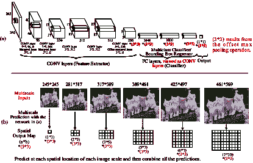

<!--yml

类别：未分类

日期：2024 年 9 月 6 日 20:07:30

-->

# [1809.02165] 深度学习在通用目标检测中的应用：综述

> 来源：[`ar5iv.labs.arxiv.org/html/1809.02165`](https://ar5iv.labs.arxiv.org/html/1809.02165)

∎

¹¹institutetext: ✉ Li Liu (li.liu@oulu.fi)

Wanli Ouyang (wanli.ouyang@sydney.edu.au)

Xiaogang Wang (xgwang@ee.cuhk.edu.hk)

Paul Fieguth (pfieguth@uwaterloo.ca)

Jie Chen (jie.chen@oulu.fi)

Xinwang Liu (xinwangliu@nudt.edu.cn)

Matti Pietikäinen (matti.pietikainen@oulu.fi)

中国国防科技大学

芬兰奥卢大学

澳大利亚悉尼大学

中国香港中文大学

加拿大滑铁卢大学

# 深度学习在通用目标检测中的应用：综述

Li Liu ^(1,2)    Wanli Ouyang ³    Xiaogang Wang ⁴    Paul Fieguth ⁵    Jie Chen ²    Xinwang Liu ¹    Matti Pietikäinen ²(收到日期：2018 年 9 月 12 日)

###### 摘要

目标检测是计算机视觉中最基本且最具挑战性的问题之一，它旨在从大量预定义类别中定位自然图像中的目标实例。深度学习技术作为一种强大的策略，通过直接从数据中学习特征表示，在通用目标检测领域取得了显著突破。鉴于这一快速发展的时期，本文的目标是提供对深度学习技术在该领域所带来的最新成就的全面综述。本文综述包含了 300 多项研究贡献，涵盖了通用目标检测的多个方面：检测框架、目标特征表示、目标提议生成、上下文建模、训练策略和评估指标。我们通过确定未来研究的有前景方向来结束综述。

###### 关键词：

目标检测 深度学习 卷积神经网络 目标识别

###### 论文类型：

通用文章

## 介绍

作为计算机视觉中的一个长期存在、基础且具有挑战性的问题，目标检测（如图 1 所示）已经成为活跃的研究领域数十年。目标检测的目标是确定图像中是否存在来自给定类别（如人类、汽车、自行车、狗或猫）的任何物体实例，如果存在，则返回每个物体实例的空间位置和范围（*例如*，通过边界框 Everingham 等 (2010); Russakovsky 等 (2015))。作为图像理解和计算机视觉的基石，目标检测为解决复杂或高级视觉任务如分割、场景理解、目标跟踪、图像描述、事件检测和活动识别奠定了基础。目标检测支持广泛的应用，包括机器人视觉、消费电子、安保、自动驾驶、人机交互、基于内容的图像检索、智能视频监控和增强现实。

最近，深度学习技术 Hinton 和 Salakhutdinov (2006); LeCun 等 (2015) 已成为从数据中自动学习特征表示的强大方法。特别是，这些技术在目标检测中提供了重大改进，如图 3 所示。

如图 2 所示，目标检测可以分为两种类型 Grauman 和 Leibe (2011); Zhang 等 (2013)：特定实例检测与广泛类别检测。第一种类型旨在检测特定物体的实例（例如特朗普的脸、埃菲尔铁塔或邻居的狗），本质上是一个匹配问题。第二种类型的目标是检测一些预定义物体类别（例如人类、汽车、自行车和狗）的实例（通常是以前未见过的）。历史上，目标检测领域的大部分努力集中在检测单一类别（通常是人脸和行人）或少数特定类别上。相比之下，近年来，研究界已经开始向建立通用目标检测系统的更具挑战性的目标迈进，其中目标检测能力的广度与人类相匹敌。

图 1：2016 至 2018 年 ICCV 和 CVPR 会议论文中最常出现的关键词。每个词的大小与该关键词的频率成正比。我们可以看到，目标检测近年来受到了显著关注。

图 2：物体检测包括定位特定对象的实例（上图），以及对一般物体类别进行检测（下图）。本调查重点关注后者，即通用物体检测的最新进展。

图 3：近期物体检测性能概览：我们可以观察到自 2012 年深度学习出现以来，性能（以平均精度作为度量）显著提高。（a）VOC2007-2012 竞赛中获胜条目的检测结果，以及（b）ILSVRC2013-2017 中的顶级物体检测竞赛结果（两面板中的结果仅使用提供的训练数据）。

图 4：物体检测和识别的里程碑，包括特征表示 Csurka 等（2004）；Dalal 和 Triggs（2005）；He 等（2016）；Krizhevsky 等（2012a）；Lazebnik 等（2006）；Lowe（1999，2004）；Perronnin 等（2010）；Simonyan 和 Zisserman（2015）；Sivic 和 Zisserman（2003）；Szegedy 等（2015）；Viola 和 Jones（2001）；Wang 等（2009），检测框架 Felzenszwalb 等（2010b）；Girshick 等（2014）；Sermanet 等（2014）；Uijlings 等（2013）；Viola 和 Jones（2001），以及数据集 Everingham 等（2010）；Lin 等（2014）；Russakovsky 等（2015）。截至 2012 年的时间段主要由手工特征主导，2012 年随着 Krizhevsky 等（2012a）开发的用于图像分类的 DCNN 的出现，发生了转变，2012 年后的方法则由相关深度网络主导。大多数列举的方法被广泛引用，并赢得了主要的 ICCV 或 CVPR 奖项。详细信息见第 2.3 节。

2012 年，Krizhevsky *等* (2012a) 提出了一个名为 AlexNet 的深度卷积神经网络（DCNN），该网络在大规模视觉识别挑战赛（ILSVRC）中取得了破纪录的图像分类准确率 Russakovsky 等 (2015)。自那时以来，大多数计算机视觉领域的研究重点都专注于深度学习方法，包括通用目标检测领域 Girshick 等 (2014)；He 等 (2014)；Girshick (2015)；Sermanet 等 (2014)；Ren 等 (2017a)。尽管取得了巨大进展，如图 3 所示，但我们尚未发现过去五年内对此主题的全面调查。鉴于进展的极快速度，本文试图跟踪近期的进展，并总结其成就，以便更清晰地了解当前的通用目标检测全景。

表 1：自 2000 年以来相关目标检测综述的总结

|      No. | 综述标题 | 参考文献 | 年份 | 会议 | 内容    |
| --- | --- | --- | --- | --- | --- |
|    1 | 单目行人检测：综述与实验 | Enzweiler 和 Gavrila (2009) | 2009 | PAMI | 三种行人检测器的评估    |
|    2 | 高级驾驶辅助系统中的行人检测综述 | Geronimo 等 (2010) | 2010 | PAMI | 高级驾驶辅助系统中行人检测的综述    |
|    3 | 行人检测：技术现状评估 | Dollar 等 (2012) | 2012 | PAMI | 单目图像中检测器的全面详细评估    |
|    4 | 图像中的面部检测：综述 | Yang 等 (2002) | 2002 | PAMI | 单张图像面部检测的首个综述    |
|    5 | 野外面部检测综述：过去、现在与未来 | Zafeiriou 等 (2015) | 2015 | CVIU | 自 2000 年以来野外面部检测的综述    |
|    6 | 公路车辆检测：综述 | Sun 等 (2006) | 2006 | PAMI | 基于视觉的公路车辆检测系统的综述    |
|    7 | 图像中的文本检测与识别：综述 | Ye 和 Doermann (2015) | 2015 | PAMI | 关于彩色图像中文本检测与识别的综述    |
|    8 | 面向类别级别的目标识别 | Ponce 等 (2007) | 2007 | 书籍 | 关于物体分类、检测和分割的代表性论文    |
|    9 | 物体分类的演变与图像抽象的挑战 | Dickinson 等 (2009) | 2009 | 书籍 | 追踪四十年来物体分类的演变    |
|    10 | 基于上下文的目标分类：批判性调查 | Galleguillos 和 Belongie (2010) | 2010 | CVIU | 目标分类的上下文信息综述    |
|    11 | 50 年的目标识别：未来方向 | Andreopoulos 和 Tsotsos (2013) | 2013 | CVIU | 目标识别系统在五十年中的演变综述    |
|    12 | 视觉目标识别 | Grauman 和 Leibe (2011) | 2011 | 教程 | 实例和类别目标识别技术    |
|    13 | 目标类别检测：调查 | Zhang 等人 (2013) | 2013 | ACM CS | 2011 年前通用目标检测方法的综述    |
|    14 | 基于统计学习的目标检测的特征表示：综述 | Li 等人 (2015b) | 2015 | PR | 统计学习基于的目标检测中的特征表示方法，包括手工设计和深度学习特征    |
|    15 | 显著目标检测：综述 | Borji 等人 (2014) | 2014 | arXiv | 显著目标检测的综述    |
|    16 | 表示学习：综述与新视角 | Bengio 等人 (2013) | 2013 | PAMI | 无监督特征学习和深度学习、概率模型、自编码器、流形学习以及深度网络    |
|    17 | 深度学习 | LeCun 等人 (2015) | 2015 | Nature | 深度学习及其应用的介绍    |
|    18 | 深度学习在医学图像分析中的调查 | Litjens 等人 (2017) | 2017 | MIA | 深度学习在医学图像分类、目标检测、分割和配准中的调查    |
|    19 | 卷积神经网络的最新进展 | Gu 等人 (2017) | 2017 | PR | 关于 CNN 及其在计算机视觉、语音和自然语言处理中的应用的广泛综述    |
|    20 | 教程：高效目标检测工具 | $-$ | 2015 | ICCV15 | 一门简短的课程，仅涵盖目标检测的最新进展    |
|    21 | 教程：目标与场景的深度学习 | $-$ | 2017 | CVPR17 | 关于目标和场景视觉识别的深度学习近期工作的高级总结    |
|    22 | 教程：实例级别识别 | $-$ | 2017 | ICCV17 | 关于实例级别识别的最新进展的简短课程，包括目标检测、实例分割和人体姿态预测    |
|    23 | 教程：视觉识别及其延伸 | $-$ | 2018 | CVPR18 | 关于图像分类、目标检测、实例分割和语义分割的原理和方法的教程    |
|    24 | 通用目标检测的深度学习 | 我们 | 2019 | VISI | 关于通用目标检测的深度学习的全面综述    |
|      |  |  |  |  |  |

### 1.1 与之前综述的比较

许多著名的目标检测综述已经出版，如表 1 中总结的。这些包括了许多针对特定目标检测问题的优秀综述，如行人检测 Enzweiler 和 Gavrila (2009)；Geronimo et al. (2010)；Dollar et al. (2012)，人脸检测 Yang et al. (2002)；Zafeiriou et al. (2015)，车辆检测 Sun et al. (2006) 和文本检测 Ye 和 Doermann (2015)。近年来，直接关注通用目标检测问题的综述相对较少，除了 Zhang *等* Zhang et al. (2013) 对目标类别检测进行的综述。然而，Grauman 和 Leibe (2011)、Andreopoulos 和 Tsotsos (2013) 和 Zhang et al. (2013) 评审的研究大多是 2012 年前的，因此在深度学习及相关方法最近的显著成功和主导之前。

深度学习使计算模型能够学习极其复杂、微妙和抽象的表征，在视觉识别、目标检测、语音识别、自然语言处理、医学图像分析、药物发现和基因组学等广泛问题中推动了显著进展。在不同类型的深度神经网络中，DCNNs LeCun et al. (1998); Krizhevsky et al. (2012a); LeCun et al. (2015) 在处理图像、视频、语音和音频方面带来了突破性进展。可以肯定的是，已经有许多关于深度学习的发表综述，包括 Bengio *等* Bengio et al. (2013)，LeCun *等* LeCun et al. (2015)，Litjens *等* Litjens et al. (2017)，Gu *等* Gu et al. (2017)，以及最近在 ICCV 和 CVPR 的教程中。

相比之下，尽管已经提出了许多基于深度学习的方法用于目标检测，但我们尚未发现任何全面的近期综述。对现有工作的彻底回顾和总结对目标检测的进一步进展至关重要，特别是对于希望进入该领域的研究人员。由于我们关注的是通用目标检测，因此对于特定目标检测（如人脸检测 Li et al. (2015a); Zhang et al. (2016a); Hu and Ramanan (2017)，行人检测 Zhang et al. (2016b); Hosang et al. (2015)，车辆检测 Zhou et al. (2016b) 和交通标志检测 Zhu et al. (2016b)）的广泛工作将不予考虑。

图 5：与通用目标检测相关的识别问题：（a）图像级目标分类，（b）边界框级通用目标检测，（c）像素级语义分割，（d）实例级语义分割。

### 1.2 范围

基于深度学习的通用目标检测论文数量令人惊叹。实际上，它们如此之多，以至于编写任何全面的前沿综述超出了合理长度论文的范围。因此，有必要建立选择标准，以便我们将重点限制在顶级期刊和会议论文上。由于这些限制，我们对未被纳入本文的作者的作品深表歉意。有关相关主题工作的综述，请参见表格中的文章 1。本综述主要关注过去五年的重大进展，并将注意力限制在静态图片上，将视频目标检测这一重要主题留待未来单独考虑。

本文的主要目标是提供一个关于深度学习基础的通用目标检测技术的全面综述，并呈现一定程度的分类法、高层次视角和组织，主要基于流行的数据集、评估指标、上下文建模和检测提议方法。我们的意图是使我们的分类有助于读者便捷地理解各种策略之间的相似性和差异。提出的分类法为研究人员提供了一个理解当前研究并识别未来研究开放挑战的框架。

本文的其余部分组织如下。第二部分总结了相关背景和过去二十年的进展。第三部分简要介绍了深度学习。第四部分总结了流行的数据集和评估标准。第五部分描述了重要的物体检测框架。从第六部分到第九部分，讨论了设计物体检测器时涉及的基本子问题和相关问题。最后，第十部分总结了物体检测的总体讨论、最新性能和未来的研究方向。

## 2 通用物体检测

### 2.1 问题

*通用物体检测*，也称为通用物体类别检测、物体类别检测或物体分类检测 Zhang 等人 (2013)，定义如下。给定一张图像，确定是否存在来自预定义类别（通常是 *许多* 类别，例如 ILSVRC 物体检测挑战中的 200 类别）的物体实例，如果存在，返回每个实例的空间位置和范围。重点在于检测广泛的自然类别，而不是仅仅特定物体类别检测，其中可能只存在较窄的预定义兴趣类别（*例如，* 脸部、行人或汽车）。尽管我们生活的视觉世界中存在成千上万的物体，但目前研究界主要关注高结构化物体的定位（*例如，* 汽车、脸部、自行车和飞机）和关节物体（*例如，* 人类、牛和马），而非非结构化场景（如天空、草地和云朵）。

对象的空间位置和范围可以粗略地通过边界框（一个轴对齐的矩形紧密包围对象）来定义，参考 Everingham 等人（2010）；Russakovsky 等人（2015），或者精确的像素级分割掩码，参考 Zhang 等人（2013），或封闭边界，参考 Lin 等人（2014）；Russell 等人（2008），如图 5 所示。根据我们所知，在通用对象检测算法的评估中，目前文献中最广泛使用的是边界框，参考 Everingham 等人（2010）；Russakovsky 等人（2015），因此我们在这项调查中也采用了这种方法。然而，随着研究界逐步向更深入的场景理解（从图像级别对象分类到单一对象定位，再到通用对象检测，最后到像素级对象分割）发展，预计未来的挑战将会在像素级别，参考 Lin 等人（2014）。

有许多问题与通用物体检测密切相关¹¹1 据我们所知，文献中对各种视觉子任务的定义没有统一的意见。术语如检测、定位、识别、分类、类别化、验证、识别、注释、标记和理解经常有不同的定义 Andreopoulos 和 Tsotsos (2013)。*物体分类* 或 *物体类别化*（图 5（a））的目标是评估图像中是否存在来自给定对象类别集合的物体；*即，* 将一个或多个物体类别标签分配给给定图像，在不需要位置的情况下确定存在性。定位图像中的实例的额外要求使得检测比分类更具挑战性。*物体识别* 问题表示识别/定位图像中所有存在物体的更一般性问题，涵盖了物体检测和分类的问题 Everingham et al. (2010); Russakovsky et al. (2015); Opelt et al. (2006); Andreopoulos 和 Tsotsos (2013)。通用物体检测与 *语义图像分割* （图 5（c））密切相关，后者旨在将图像中的每个像素分配给一个语义类别标签。*物体实例分割* （图 5（d））旨在区分同一物体类别的不同实例，与不区分实例的语义分割不同。

图 6：通用物体检测中的挑战分类。

图 7：同一类别在成像条件变化下的外观变化（a-h）。单一物体类别的定义存在惊人的变化（i）。相比之下，（j）中的四张图像看起来非常相似，但实际上来自四个*d*ifferent 物体类别。大多数图像来自 ImageNet Russakovsky et al. (2015) 和 MS COCO Lin et al. (2014)。

### 2.2 主要挑战

通用目标检测的理想是开发一个通用算法，旨在实现*高质量/准确性*和*高效率*这两个相互竞争的目标（见图 6）。如图 7 所示，高质量检测必须准确地定位和识别图像或视频帧中的对象，以便区分现实世界中各种不同的对象类别（*即，*高区分度），以及来自同一类别的对象实例，尽管存在类别内的外观变化，也能够被定位和识别（*即，*高鲁棒性）。高效率要求整个检测任务能够实时运行，同时满足可接受的内存和存储需求。

#### 2.2.1 准确性相关挑战

检测准确性挑战源于 1) 类别内变异的广泛范围和 2) 大量的对象类别。

类别内变异可以分为两种类型：内在因素和成像条件。在内在因素方面，每个对象类别可能有许多不同的对象实例，这些实例在颜色、纹理、材料、形状和大小等一个或多个方面可能有所不同，例如图 7 中显示的“椅子”类别（*i*）。即使在更窄定义的类别中，例如人类或马，对象实例也可能出现不同的姿势，受到非刚性变形或附加衣物的影响。

成像条件变异由环境对对象外观的显著影响引起，例如光照（黎明、白天、黄昏、室内）、物理位置、天气条件、相机、背景、照明、遮挡和观看距离。这些条件都会导致对象外观的显著变化，例如照明、姿势、尺度、遮挡、杂乱、阴影、模糊和运动，图 7 中有示例（*a*-*h*）。进一步的挑战可能还包括数字化伪影、噪声干扰、分辨率低和过滤失真。

除了*类内*变化外，物体类别的数量达到$10^{4}-10^{5}$级别，需要探测器具有极大的辨别能力，以区分微妙的*类间*变化，如图 7 (j)所示。实际上，当前的探测器主要集中在结构化物体类别上，例如 PASCAL VOC Everingham et al. (2010)、ILSVRC Russakovsky et al. (2015)和 MS COCO Lin et al. (2014)中的 20、200 和 91 个物体类别。显然，现有基准数据集中考虑的物体类别数量远远少于人类可以识别的数量。

#### 2.2.2 效率和可扩展性相关挑战

社交媒体网络和移动/可穿戴设备的普及导致了对视觉数据分析的需求增加。然而，移动/可穿戴设备的计算能力和存储空间有限，使得高效的物体检测变得至关重要。

效率挑战源于需要进行定位和识别，计算复杂性随着物体类别数量的（可能很大）增加，以及图像中位置和尺度的（可能非常大）数量而增长，例如图 7 (c, d)中的示例。

另一个挑战是可扩展性：探测器应能处理以前未见过的物体、未知情况以及高数据速率。随着图像数量和类别数量的不断增加，手动标注可能变得不可能，迫使我们依赖于弱监督策略。

图 8： (a) 典型 CNN 反复应用的三个操作的示意图：使用多个线性滤波器的卷积；非线性操作（*例如* ReLU）；和局部池化（*例如* 最大池化）。前一层的 $M$ 个特征图与 $N$ 个不同的滤波器（此处显示为 $3\times 3\times M$ 的大小）进行卷积，步幅为 1。得到的 $N$ 个特征图然后通过非线性函数（*例如* ReLU），并进行池化（*例如* 在 $2\times 2$ 区域内取最大值），以给出分辨率降低的 $N$ 个特征图。 (b) VGGNet Simonyan 和 Zisserman (2015) 的架构示意图，这是一个典型的具有 11 个权重层的 CNN。输入为具有 3 个颜色通道的图像。网络有 8 个卷积层，3 个全连接层，5 个最大池化层和一个 softmax 分类层。最后三个全连接层以向量形式从顶部卷积层获取特征。最终层是一个 $C$ 维 softmax 函数，$C$ 为类别数。整个网络可以通过优化目标函数（*例如* 均方误差或交叉熵损失）来从标记训练数据中学习，方法是随机梯度下降。

### 2.3 过去二十年的进展

对象识别的早期研究基于模板匹配技术和简单的基于部分的模型 Fischler 和 Elschlager (1973)，专注于空间布局大致刚性的特定对象，如人脸。在 1990 年前，对象识别的主流范式基于几何表示 Mundy (2006); Ponce 等 (2007)，后来研究重点从几何学和先前模型转向使用统计分类器（如神经网络 Rowley 等 (1998)，SVM Osuna 等 (1997) 和 Adaboost Viola 和 Jones (2001); Xiao 等 (2003))，基于外观特征 Murase 和 Nayar (1995a); Schmid 和 Mohr (1997)。这一成功的对象检测器家族为后续大多数研究奠定了基础。

最近几年物体检测的里程碑展示在图. 4 中，其中突出了两个主要时代（SIFT *vs.* DCNN）。外观特征从全局表示（Murase and Nayar (1995b)；Swain and Ballard (1991)；Turk and Pentland (1991)）转变为局部表示，这些局部表示设计为对平移、缩放、旋转、照明、视角和遮挡变化不变。手工制作的局部不变特征从尺度不变特征变换（SIFT）特征（Lowe (1999)）开始获得了极大的流行，视觉识别任务的进展在很大程度上依赖于局部描述符（Mikolajczyk and Schmid (2005)），例如 Haar-like 特征（Viola and Jones (2001)）、SIFT（Lowe (2004)）、形状上下文（Belongie et al. (2002)）、梯度直方图（HOG）（Dalal and Triggs (2005)）、局部二值模式（LBP）（Ojala et al. (2002)）以及区域协方差（Tuzel et al. (2006)）。这些局部特征通常通过简单的拼接或特征池化编码器进行聚合，如视觉词袋方法（Bag of Visual Words），由 Sivic 和 Zisserman（Sivic and Zisserman (2003)）提出，以及 Csurka *et al.*（Csurka et al. (2004)）、BoW 模型的空间金字塔匹配（SPM）（Lazebnik et al. (2006)）和 Fisher 向量（Perronnin et al. (2010)）。

多年来，手工调节的多阶段管道结合手工制作的局部描述符和判别分类器在计算机视觉的各种领域（包括物体检测）中占据了主导地位，直到 2012 年 DCNN（Krizhevsky et al. (2012a)）在图像分类中取得了突破性的成果，标志着一个重要的转折点。

CNN 用于检测和定位的应用可以追溯到 1990 年代，当时使用了少量隐藏层进行物体检测（Vaillant et al. (1994)；Rowley et al. (1998)；Sermanet et al. (2013)），在诸如人脸检测等限制性领域取得了成功。然而，最近更深层次的 CNN 在检测更多通用物体类别方面取得了突破性的进展，这一转变发生在成功应用 DCNN 进行图像分类（Krizhevsky et al. (2012a)）之后，最终催生了具有里程碑意义的区域卷积神经网络（RCNN）检测器（Girshick *et al.* Girshick et al. (2014)）。

深度检测器的成功在很大程度上依赖于大量的训练数据和具有数百万甚至数十亿个参数的大型网络。具备极高计算能力的 GPU 和大规模检测数据集（例如 ImageNet Deng et al. (2009); Russakovsky et al. (2015) 和 MS COCO Lin et al. (2014))在这些成功中发挥了关键作用。大规模数据集使研究人员能够针对具有大类内变异和类间相似性的图像中的更现实和复杂的问题 Lin et al. (2014); Russakovsky et al. (2015)。然而，准确的标注获取需要大量劳动，因此检测器必须考虑能够减轻标注难度或能够在较小训练数据集上学习的方法。

研究界已经开始朝着建立通用目标检测系统的挑战性目标迈进，该系统能够检测的目标类别数量与人类相匹配。这是一个重大挑战：根据认知科学家，人类可以识别大约 3,000 个入门级类别和总计 30,000 个视觉类别，并且具有领域专长的可区分类别数量可能达到$10^{5}$ Biederman (1987a)。尽管近年来取得了显著进展，设计一个准确、可靠、高效的检测和识别系统，使其在$10^{4}-10^{5}$类别上的性能接近人类水平，无疑仍是一个未解决的问题。

## 3 深度学习简要介绍

深度学习已经彻底改变了广泛的机器学习任务，从图像分类和视频处理到语音识别和自然语言理解。鉴于这种极其迅速的演变，存在许多关于深度学习的最新综述论文 Bengio et al. (2013); Goodfellow et al. (2016); Gu et al. (2017); LeCun et al. (2015); Litjens et al. (2017); Pouyanfar et al. (2018); Wu et al. (2019); Young et al. (2018); Zhang et al. (2018d); Zhou et al. (2018a); Zhu et al. (2017)。这些综述从不同的角度回顾了深度学习技术 Bengio et al. (2013); Goodfellow et al. (2016); Gu et al. (2017); LeCun et al. (2015); Pouyanfar et al. (2018); Wu et al. (2019); Zhou et al. (2018a)，或应用于医学图像分析 Litjens et al. (2017)，自然语言处理 Young et al. (2018)，语音识别系统 Zhang et al. (2018d)，以及遥感 Zhu et al. (2017)。

卷积神经网络（CNNs），作为深度学习的最具代表性的模型，能够利用自然信号的基本属性：平移不变性、局部连接性和组合层次结构 LeCun 等人 (2015)。典型的 CNN，如图 8 所示，具有层次结构，并由若干层组成，以学习具有多个抽象层次的数据表示 LeCun 等人 (2015)。我们从卷积开始

|  | $\textbf{\emph{x}}^{l-1}*\textbf{\emph{w}}^{l}$ |  | (1) |
| --- | --- | --- | --- |

在来自前一层$l-1$的输入特征图$\textbf{\emph{x}}^{l-1}$与二维卷积核（或滤波器或权重）$\textbf{\emph{w}}^{l}$进行卷积之间，这种卷积出现在一系列层上，经过非线性操作$\sigma$，这样

|  | $\textbf{\emph{x}}^{l}_{j}=\sigma(\sum_{i=1}^{N^{l-1}}\textbf{\emph{x}}^{l-1}_{i}*\textbf{\emph{w}}^{l}_{i,j}+b^{l}_{j}),$ |  | (2) |
| --- | --- | --- | --- |

现在进行卷积操作，将$N^{l-1}$个输入特征图$\textbf{\emph{x}}^{l-1}_{i}$与相应的核$\textbf{\emph{w}}^{l}_{i,j}$进行卷积，再加上偏置项$b^{l}_{j}$。逐元素的非线性函数$\sigma(\cdot)$通常是每个元素的修正线性单元（ReLU），

|  | $\sigma(x)=\max\{x,0\}.$ |  | (3) |
| --- | --- | --- | --- |

最后，池化对应于特征图的下采样/上采样。这三种操作（卷积、非线性、池化）在图 8 (a) 中进行了说明；具有大量层的卷积神经网络（CNNs），即“深度”网络，被称为深度卷积神经网络（DCNNs），其典型的 DCNN 架构在图 8 (b) 中进行了说明。

CNN 的大多数层由若干特征图组成，其中每个像素都像一个神经元。卷积层中的每个神经元通过一组权重 $\textbf{\emph{w}}_{i,j}$（本质上是一组 2D 滤波器）与前一层的特征图相连。如图 8 (b) 所示，早期 CNN 层通常由卷积层和池化层组成，而后续层通常是全连接层。从早期到后期层，输入图像会重复进行卷积，并且每层的感受野或支持区域会增加。通常，初始 CNN 层提取低级特征 (*例如,* 边缘)，后续层提取更一般的、复杂度递增的特征 Zeiler 和 Fergus (2014); Bengio 等人 (2013); LeCun 等人 (2015); Oquab 等人 (2014).

DCNNs 具有许多突出的优势：一个分层结构可以学习具有多层抽象的数据表示，能够学习非常复杂的函数，并且能够直接和自动地从数据中学习特征表示，几乎不需要领域知识。使 DCNNs 特别成功的因素是大规模标记数据集的可用性和计算能力非常高的 GPU。

尽管取得了巨大的成功，但仍存在已知的不足之处。特别是，对标记训练数据的极度需求和昂贵计算资源的要求，以及选择合适的学习参数和网络架构仍然需要相当的技能和经验。训练后的网络解释性差，对退化缺乏鲁棒性，许多 DCNNs 在面对攻击时表现出严重的脆弱性 Goodfellow 等人 (2015)，这些因素目前限制了 DCNNs 在实际应用中的使用。

表 2: 每个检测挑战中的最常见对象类别。每个单词的大小与该类别在训练数据集中的频率成正比。

|      ![[无标题图片]](img/a2c11f40b24591745d16260db2801546.png)    | ![[无标题图片]](img/a4ef712ba48d2bf2bbbd1822a306c279.png)    |
| --- | --- |
|        (a) PASCAL VOC (20 类别)      | (b) MS COCO (80 类别) |
|            ![[无标题图片]](img/04ae0f104fafc2d350a893c0b695d8d6.png)    |
|           (c) ILSVRC (200 类别) |
|            ![[无标题图片]](img/75f6c5ba0cd2a4feaf3d3f438ea12393.png)    |
|           (d) Open Images Detection Challenge (500 类别) |

## 4 数据集与性能评估

### 4.1 数据集

数据集在目标识别研究历史中发挥了关键作用，不仅作为测量和比较竞争算法性能的共同基础，还推动了领域向越来越复杂和具有挑战性的问题发展。尤其是，最近深度学习技术在许多视觉识别问题上取得了巨大成功，而大量的标注数据在这些成功中发挥了关键作用。通过互联网访问大量图像，使得构建全面的数据集成为可能，从而捕捉到对象的丰富性和多样性，实现了目标识别的前所未有的性能。

对于通用目标检测，有四个著名的数据集：PASCAL VOC Everingham 等 (2010, 2015)，ImageNet Deng 等 (2009)，MS COCO Lin 等 (2014) 和 Open Images Kuznetsova 等 (2018)。这些数据集的属性汇总在表 3 中，选定的示例图像见图 9。创建大规模标注数据集有三个步骤：确定目标对象类别集合，收集多样化的候选图像以代表选定类别，通常通过设计众包策略对收集的图像进行标注。鉴于篇幅限制，我们建议感兴趣的读者查阅原始论文 Everingham 等 (2010, 2015)；Lin 等 (2014)；Russakovsky 等 (2015)；Kuznetsova 等 (2018)，以获得有关这些数据集构建和属性的详细描述。

表 3: 用于目标识别的流行数据库。图像示例来自 PASCAL VOC、ImageNet、MS COCO 和 Open Images，见图 9。

|      数据集名称 | 总图像数 | 类别 | 每类别图像数 | 每图像对象数 | 图像尺寸 | 开始年份 | 亮点    |
| --- | --- | --- | --- | --- | --- | --- | --- |
|    PASCAL VOC (2012) Everingham 等 (2015) | $11,540$ | $20$ | $303\sim 4087$ | $2.4$ | $470\times 380$ | $2005$ | 仅涵盖 20 个日常生活中的常见类别；大量训练图像；接近实际应用；类别内部变化显著；场景中的对象；每图像包含多个对象；包含许多难度样本。    |
|     ImageNet Russakovsky 等 (2015) | 1400 万+ | $21,841$ | $-$ | $1.5$ | $500\times 400$ | $2009$ | 大量的对象类别；每张图像中对象的实例和类别更多；比 PASCAL VOC 更具挑战性；ILSVRC 挑战的基础；图像以对象为中心。    |
|     MS COCO Lin 等 (2014) | $328,000+$ | $91$ | $-$ | $7.3$ | $640\times 480$ | $2014$ | 更接近现实世界场景；每张图像包含更多对象实例和更丰富的对象标注信息；包含 ImageNet 数据集中未提供的对象分割标注数据。    |
|     Places Zhou 等 (2017a) | 1000 万+ | $434$ | $-$ | $-$ | $256\times 256$ | $2014$ | 最大的场景识别标注数据集；四个子集：Places365 Standard、Places365 Challenge、Places 205 和 Places88 作为基准。    |
|     Open Images Kuznetsova 等 (2018) | 900 万+ | $6000$+ | $-$ | $8.3$ | 各异 | $2017$ | 具有图像级标签、对象边界框和视觉关系的标注；Open Images V5 支持大规模对象检测、对象实例分割和视觉关系检测。    |

|       |  |  |  |  |  |  |  | 

图 9：PASCAL VOC、ILSVRC、MS COCO 和 Open Images 中的一些带有对象标注的示例图像。有关这些数据集的摘要，请参见表 3。

这四个数据集构成了各自检测挑战的基础。每个挑战包括一个公开可用的图像数据集，附有真实标注和标准化评估软件，以及一个年度竞赛和相关工作坊。训练、验证和测试数据集中图像和对象实例的统计数据²²2 测试集的标注未公开，除非是 PASCAL VOC2007。请参见表 4。VOC、COCO、ILSVRC 和 Open Images 检测数据集中最频繁的对象类别在表 2 中可视化展示。

PASCAL VOC Everingham 等人（2010, 2015）是一个多年的努力，致力于创建和维护一系列分类和物体检测的基准数据集，为识别算法的标准化评估设立了年度竞赛的先例。从 2005 年只有四个类别开始，该数据集已经增加到 20 个日常生活中常见的类别。自 2009 年以来，图像数量每年增长，但保留所有先前的图像以便进行年度测试结果的比较。由于 ImageNet、MS COCO 和 Open Images 等大型数据集的出现，PASCAL VOC 逐渐失去了流行。

ILSVRC，即 ImageNet 大规模视觉识别挑战赛 Russakovsky 等人（2015），源自 ImageNet Deng 等人（2009），在物体类别和图像数量上将 PASCAL VOC 的标准化训练和检测算法评估目标扩大了一个数量级。ImageNet1000，是 ImageNet 的一个子集，包含 1000 种不同物体类别，总计 120 万张图像，为 ILSVRC 图像分类挑战提供了一个标准化的基准。

MS COCO 是对 ImageNet 批评的回应，批评意见认为其数据集中的物体往往较大且中心化，使得 ImageNet 数据集在现实场景中不典型。为了推动更丰富的图像理解，研究人员创建了 MS COCO 数据库 Lin 等人（2014），包含复杂的日常场景以及自然背景下的常见物体，更接近现实生活，其中物体使用完全分割的实例进行标记，以提供更准确的检测器评估。COCO 物体检测挑战 Lin 等人（2014）包含两个物体检测任务：使用边界框输出或物体实例分割输出。COCO 引入了三个新挑战：

1.  1.

    它包含各种尺度的物体，包括高比例的小物体 Singh 和 Davis（2018）；

1.  2.

    物体较少标志性，且处于杂乱或重度遮挡中；

1.  3.

    评估指标（见表 5）鼓励更准确的物体定位。

就像当年的 ImageNet 一样，MS COCO 现在已经成为物体检测的标准。

OICOD（开放图像挑战对象检测）源于 Open Images V4（现在是 2019 年的 V5）Kuznetsova 等人 (2018)，目前是最大公开的对象检测数据集。OICOD 与以前的大规模对象检测数据集如 ILSVRC 和 MS COCO 不同，不仅在于类别、图像、边界框标注和实例分割掩膜标注数量的大幅增加，还包括标注过程。在 ILSVRC 和 MS COCO 中，数据集中的所有类别实例都经过详尽标注，而在 Open Images V4 中，每张图像都应用了分类器，只有那些得分足够高的标签才会被送去人工验证。因此，在 OICOD 中，只有人类确认的正标签的对象实例才会被标注。

表 4：常用对象检测数据集的统计信息。VOC 挑战中的对象统计列出了评估中使用的非困难对象（所有标注对象）。对于 COCO 挑战，2017 年之前，测试集有四个拆分（*Dev*，*Standard*，*Reserve* 和 *Challenge*），每个拆分大约有 20K 张图像。从 2017 年开始，测试集只有 *Dev* 和 *Challenge* 拆分，其他两个拆分被移除。从 2017 年起，训练和验证集的安排有所不同，测试集被分为两个大致相等的拆分，每个拆分约 $20,000$ 张图像：Test Dev 和 Test Challenge。请注意，2017 年的 Test Dev/Challenge 拆分包含与 2015 年的 Test Dev/Challenge 拆分相同的图像，因此跨年度的结果是直接可比的。

|      挑战 | 对象类别 | 图像数量    | 标注对象数量    | 摘要（训练$+$验证）    |
| --- | --- | --- | --- | --- |
|   | 训练 | 验证 | 测试    | 训练 | 验证    | 图像 | 框 | 框/图像    |
|                                  PASCAL VOC 对象检测挑战    |
|    VOC07 | $20$ | $2,501$ | $2,510$ | $4,952$  | $6,301(7,844)$ | $6,307(7,818)$  | $5,011$ | $12,608$ | $2.5$  |
|    VOC08 | $20$ | $2,111$ | $2,221$ | $4,133$  | $5,082(6,337)$ | $5,281(6,347)$  | $4,332$ | $10,364$ | $2.4$  |
|    VOC09 | $20$ | $3,473$ | $3,581$ | $6,650$  | $8,505(9,760)$ | $8,713(9,779)$  | $7,054$ | $17,218$ | $2.3$  |
|    VOC10 | $20$ | $4,998$ | $5,105$ | $9,637$  | $11,577(13,339)$ | $11,797(13,352)$  | $10,103$ | $23,374$ | $2.4$  |
|    VOC11 | $20$ | $5,717$ | $5,823$ | $10,994$  | $13,609(15,774)$ | $13,841(15,787)$  | $11,540$ | $27,450$ | $2.4$  |
|    VOC12 | $20$ | $5,717$ | $5,823$ | $10,991$  | $13,609(15,774)$ | $13,841(15,787)$  | $11,540$ | $27,450$ | $2.4$  |
|                                  ILSVRC 对象检测挑战    |
|    ILSVRC13 | $200$ | $395,909$ | $20,121$ | $40,152$  | $345,854$ | $55,502$  | $416,030$ | $401,356$ | $1.0$  |
|    ILSVRC14 | $200$ | $456,567$ | $20,121$ | $40,152$  | $478,807$ | $55,502$  | $476,668$ | $534,309$ | $1.1$  |
|    ILSVRC15 | $200$ | $456,567$ | $20,121$ | $51,294$  | $478,807$ | $55,502$  | $476,668$ | $534,309$ | $1.1$  |
|    ILSVRC16 | $200$ | $456,567$ | $20,121$ | $60,000$  | $478,807$ | $55,502$  | $476,668$ | $534,309$ | $1.1$  |
|    ILSVRC17 | $200$ | $456,567$ | $20,121$ | $65,500$  | $478,807$ | $55,502$  | $476,668$ | $534,309$ | $1.1$  |
|                                  MS COCO 目标检测挑战    |
|    MS COCO15 | $80$ | $82,783$ | $40,504$ | $81,434$  | $604,907$ | $291,875$  | $123,287$ | $896,782$ | $7.3$  |
|    MS COCO16 | $80$ | $82,783$ | $40,504$ | $81,434$  | $604,907$ | $291,875$  | $123,287$ | $896,782$ | $7.3$  |
|    MS COCO17 | $80$ | $118,287$ | $5,000$ | $40,670$  | $860,001$ | $36,781$  | $123,287$ | $896,782$ | $7.3$  |
|    MS COCO18 | $80$ | $118,287$ | $5,000$ | $40,670$  | $860,001$ | $36,781$  | $123,287$ | $896,782$ | $7.3$  |
|                                  开放图像挑战目标检测 (OICOD) (基于 Open Images V4 Kuznetsova 等 (2018))    |
|    OICOD18 | $500$ | $1,643,042$ | $100,000$ | $99,999$  | $11,498,734$ | $696,410$  | $1,743,042$ | $12,195,144$ | $7.0$  |
|      |  |  |  |  |  |  |  |  |  |

### 4.2 评估标准

评估检测算法性能有三个标准：每秒帧数 (FPS)、精确度和召回率。最常用的度量是*平均精度* (AP)，由精确度和召回率得出。AP 通常按类别特定的方式评估，即对每个目标类别单独计算。为了比较所有目标类别的性能，采用所有目标类别的*平均 AP* (mAP) 作为最终性能指标³³在目标检测挑战中，如 PASCAL VOC 和 ILSVRC，每个目标类别的获胜条目是 AP 分数最高的那个，而挑战的获胜者是赢得最多目标类别的团队。mAP 也被用作团队表现的衡量标准，并且被证明合理，因为按 mAP 排名的团队排名总是与按赢得的目标类别数量的排名一致 Russakovsky 等 (2015).. 关于这些指标的更多细节请参见 Everingham 等 (2010, 2015); Russakovsky 等 (2015); Hoiem 等 (2012)。

图 10：通过贪婪地将目标检测结果与真实框匹配来确定真正例和假正例的算法。

探测器应用于测试图像 I 的标准输出是预测的检测结果 $\{(b_{j},c_{j},p_{j})\}_{j}$，由目标 $j$ 索引，包括边界框 (BB) $b_{j}$、预测类别 $c_{j}$ 和置信度 $p_{j}$。如果预测的检测 $(b,c,p)$ 的预测类别 $c$ 等于真实标签 $c_{g}$，则被视为真正例 (TP)。

+   $\bullet$

    预测类别 $c$ 等于真实标签 $c_{g}$。

+   $\bullet$

    重叠率 IOU（Intersection Over Union）由 Everingham 等人（2010）和 Russakovsky 等人（2015）提出。

    |  | $\textrm{IOU}(b,b^{g})=\frac{area(b\cap b^{g})}{area(b\cup b^{g})},$ |  | (4) |
    | --- | --- | --- | --- |

    预测的边界框 $b$ 和真实标注 $b^{g}$ 之间的 IOU 不小于预定义的阈值 $\varepsilon$，其中 $\cap$ 和 $cup$ 分别表示交集和并集。$\varepsilon$ 的典型值为 0.5。

否则，该结果被视为假阳性（FP）。置信度水平 $p$ 通常与某个阈值 $\beta$ 进行比较，以确定预测的类别标签 $c$ 是否被接受。

AP 是根据 *精确度* 和 *召回率* 分别计算的。对于给定的物体类别 $c$ 和测试图像 $\textbf{I}_{i}$，设 $\{(b_{ij},p_{ij})\}_{j=1}^{M}$ 表示由检测器返回的检测结果，按置信度 $p_{ij}$ 递减排序。每个检测 $(b_{ij},p_{ij})$ 是 TP 还是 FP 可以通过算法确定⁴⁴4 值得注意的是，对于给定的阈值 $\beta$，同一图像中的多个检测结果不会被视为全部正确检测，只有置信度最高的检测结果被视为 TP，其余的视为 FP。见图 10。根据 TP 和 FP 检测，精确度 $P(\beta)$ 和召回率 $R(\beta)$（Everingham 等人（2010））可以作为置信度阈值 $\beta$ 的函数进行计算，因此通过调整置信度阈值可以获得不同的 (P, R) 对，从而使得精确度可以视为召回率的函数，即 $P(R)$，从中可以找到平均精度（AP）（Everingham 等人（2010）；Russakovsky 等人（2015））。

自 MS COCO 引入以来，更多的关注被放在了边界框位置的准确性上。MS COCO 引入了几个指标（总结见表 5）来表征目标检测器的性能。比如，与传统在 IOU $0.5$下计算的 mAP 相比，$AP_{coco}$在所有物体类别和从$0.5$到$0.95$（步长为$0.05$）的多个 IOU 值上取平均。由于 MS COCO 中$41\%$的对象为小型且$24\%$为大型，因此还引入了指标$AP_{coco}^{small}$、$AP_{coco}^{medium}$和$AP_{coco}^{large}$。最后，表 5 总结了 PASCAL、ILSVRC 和 MS COCO 目标检测挑战中使用的主要指标，并提出了 Kuznetsova 等（2018）为 Open Images 挑战提出的指标修改方案。

表 5: 评估目标检测器常用指标的总结。

|       指标 | 含义 | 定义与描述    |
| --- | --- | --- |
|   TP | 真阳性 | 真阳性检测，如图 10 所示。    |
|   FP | 假阳性 | 假阳性检测，如图 10 所示。    |
|   $β$ | 置信度阈值 | 用于计算$P(\beta)$和$R(\beta)$的置信度阈值。    |
|   $\varepsilon$ | IOU 阈值 | VOC | 通常在$0.5$左右    |
|   | ILSVRC | $\min(0.5,\frac{wh}{(w+10)(h+10)})$; $w\times h$是 GT 框的大小。    |
|   | MS COCO | 十个 IOU 阈值 $\varepsilon\in\{0.5:0.05:0.95\}$    |
|   $P(\beta)$ | 精度 | 在检测器返回的所有检测中，置信度至少为$\beta$的正确检测的比例。    |
|   $R(\beta)$ | 召回率 | 检测器检测到的所有$N_{c}$对象中，置信度至少为$\beta$的比例。    |
|   AP | 平均精度 | 在通过改变置信度$\beta$来获得的不同召回率水平上计算。    |
|   mAP | 平均平均精度 | VOC | 在单一 IOU 下的 AP，并对所有类别取平均。    |
|   | ILSVRC | 在修改后的 IOU 下的 AP，并对所有类别取平均。    |
|   | MS COCO | $\bullet AP_{coco}$: 在十个 IOU 值上取平均的 mAP: $\{0.5:0.05:0.95\}$；    |
|   | $\bullet$ $AP^{\textrm{IOU}=0.5}_{coco}$: IOU=0.50 时的 mAP（PASCAL VOC 指标）； |
|   | $\bullet$ $AP^{\textrm{IOU}=0.75}_{coco}$: IOU=0.75 时的 mAP（严格指标）； |
|   | $\bullet$ $AP^{\textrm{small}}_{coco}$: 对于面积小于 $32^{2}$ 的小物体的 mAP； |
|   | $\bullet$ $AP^{\textrm{medium}}_{coco}$: 对于面积在 $32^{2}$ 和 $96^{2}$ 之间的物体的 mAP； |
|   | $\bullet$ $AP^{\textrm{large}}_{coco}$: 对于面积大于 $96^{2}$ 的大物体的 mAP； |
|    AR | 平均召回率 | 在每张图像上给定固定数量的检测时的最大召回率，平均所有类别和 IOU 阈值。    |
|    AR | 平均召回率 | MS COCO | $\bullet AR^{\textrm{max}=1}_{coco}$: 每张图像检测 1 次时的平均召回率；    |
|   | $\bullet$ $AR^{\textrm{max}=10}_{coco}$: 每张图像检测 10 次时的平均召回率； |
|   | $\bullet$ $AR^{\textrm{max}=100}_{coco}$: 每张图像检测 100 次时的平均召回率； |
|   | $\bullet$ $AR^{\textrm{small}}_{coco}$: 对于面积小于 $32^{2}$ 的小物体的平均召回率； |
|   | $\bullet$ $AR^{\textrm{medium}}_{coco}$: 对于面积在 $32^{2}$ 和 $96^{2}$ 之间的物体的平均召回率； |
|   | $\bullet$ $AR^{\textrm{large}}_{coco}$: 对于面积大于 $96^{2}$ 的大物体的平均召回率； |
|      |  |  |  |

## 5 个检测框架

在对象特征表示和分类器方面已经取得了稳步进展，这从手工特征到学习的 DCNN 特征的显著变化中可以看出，例如 Viola 和 Jones (2001)；Dalal 和 Triggs (2005)；Felzenszwalb 等 (2008)；Harzallah 等 (2009)；Vedaldi 等 (2009) 变为 Girshick 等 (2014)；Ouyang 等 (2015)；Girshick (2015)；Ren 等 (2015)；Dai 等 (2016c)。相比之下，在定位方面，基本的“滑动窗口”策略 Dalal 和 Triggs (2005)；Felzenszwalb 等 (2010b, 2008) 仍然是主流，尽管有一些努力来避免穷举搜索 Lampert 等 (2008)；Uijlings 等 (2013)。然而，窗口的数量很大，并且随着图像像素数量的增加而呈二次增长，而需要在多个尺度和纵横比上进行搜索进一步增加了搜索空间。因此，设计高效且有效的检测框架在降低计算成本方面发挥了关键作用。常用的策略包括级联、共享特征计算和减少每个窗口的计算。

本节回顾了检测框架，列于图 11 和表 11 中，这些里程碑方法自深度学习进入该领域以来出现，分为两个主要类别：

1.  a.

    两阶段检测框架，包括用于生成目标提议的预处理步骤；

1.  b.

    一阶段检测框架，或称为区域提议自由框架，具有单一的提议方法，该方法并不将检测提议的过程分开。

第六部分到第九部分将更详细地讨论检测框架中涉及的基本子问题，包括 DCNN 特征、检测提议和上下文建模。

图 11：通用目标检测中的里程碑。

### 5.1 基于区域的（两阶段）框架

在基于区域的框架中，类别无关的区域提议⁵⁵5 物体提议，也称为区域提议或检测提议，是图像中可能包含物体的一组候选区域或边界框。Chavali 等人 (2016); Hosang 等人 (2016) 是从图像中生成的，从这些区域中提取 CNN Krizhevsky 等人 (2012a) 特征，然后使用类别特定的分类器来确定提议的类别标签。如图 11 所示，DetectorNet Szegedy 等人 (2013)、OverFeat Sermanet 等人 (2014)、MultiBox Erhan 等人 (2014) 和 RCNN Girshick 等人 (2014) 独立且几乎同时地提出了使用 CNN 进行通用目标检测。

图 12：RCNN 检测框架 Girshick 等人 (2014, 2016) 的示意图。

图 13：通用目标检测的主要框架的高级示意图。这些方法的属性在表格 11 中进行了总结。

RCNN Girshick 等人 (2014)：受 CNN 在图像分类结果突破以及 Uijlings 等人 (2013) 在手工特征的区域提议方面成功的启发，Girshick *等人* 是最早探索 CNN 用于通用目标检测的研究者之一，并开发了 RCNN Girshick 等人 (2014, 2016)，该方法将 AlexNet Krizhevsky 等人 (2012a) 与区域提议选择性搜索 Uijlings 等人 (2013) 集成在一起。如图 12 Frameworks ‣ 5 Detection Frameworks ‣ Deep Learning for Generic Object Detection: A Survey") 详细说明，训练 RCNN 框架包含多阶段的流程：

1.  1.

    *区域提议计算：* 通过选择性搜索 Uijlings 等人（2013）获得的与类别无关的区域提议，这些是可能包含对象的候选区域。

1.  2.

    *CNN 模型微调：* 从图像中裁剪并变形为相同大小的区域提议用作微调 CNN 模型的输入，该模型是使用如 ImageNet 等大规模数据集预训练的。在这一阶段，所有与真实框有$\geqslant 0.5$ IOU ⁶⁶6 请参考第 4.2 节定义的 IOU 重叠的区域提议被定义为该真实框类别的正样本，其余为负样本。

1.  3.

    *类别特定 SVM 分类器训练：* 使用 CNN 提取的固定长度特征训练一组类别特定的线性 SVM 分类器，替代了通过微调学习的 softmax 分类器。在训练 SVM 分类器时，正样本被定义为每个类别的真实框。与该类别的所有真实框重叠小于 0.3 IOU 的区域提议对该类别来说是负样本。请注意，用于训练 SVM 分类器的正负样本与用于微调 CNN 的样本不同。

1.  4.

    *类别特定的边界框回归器训练：* 对每个对象类别使用 CNN 特征学习边界框回归。

尽管达到了高质量的目标检测，RCNN 仍然存在显著的缺点 Girshick（2015）：

1.  1.

    训练是一个多阶段的管道，速度慢且难以优化，因为每个独立阶段必须分别训练。

1.  2.

    对于 SVM 分类器和边界框回归器的训练，在磁盘空间和时间上都是昂贵的，因为需要从每张图像中的每个对象提议中提取 CNN 特征，这对大规模检测构成了巨大挑战，特别是对于非常深的网络，如 VGG16 Simonyan 和 Zisserman（2015）。

1.  3.

    测试速度慢，因为每张测试图像中的 CNN 特征是对每个对象提议单独提取的，没有共享计算。

所有这些缺点促使了后续的创新，导致了许多改进的检测框架，如 SPPNet、Fast RCNN、Faster RCNN *等*，如下所示。

SPPNet He 等人 (2014)：在测试过程中，CNN 特征提取是 RCNN 检测管道的主要瓶颈，因为它需要从每张图像中的数千个变形区域提案中提取 CNN 特征。因此，He *等人* He 等人 (2014) 将传统的空间金字塔池化（SPP） Grauman 和 Darrell (2005); Lazebnik 等人 (2006) 引入到 CNN 架构中。由于卷积层可以接受任意大小的输入，CNN 中对固定大小图像的要求仅由于全连接（FC）层，因此 He *等人* 在最后一个卷积（CONV）层上添加了一个 SPP 层，以获取固定长度的特征用于 FC 层。使用这个 SPPNet，RCNN 实现了显著的加速而不牺牲任何检测质量，因为它只需在整个测试图像上运行一次卷积层即可为任意大小的区域提案生成固定长度的特征。虽然 SPPNet 将 RCNN 评估的速度提高了几个数量级，但它没有带来检测器训练的相应加速。此外，SPPNet He 等人 (2014) 中的微调无法更新 SPP 层之前的卷积层，这限制了非常深网络的准确性。

Fast RCNN Girshick (2015)：Girshick 提出了 Fast RCNN Girshick (2015)，它解决了 RCNN 和 SPPNet 的一些缺点，同时提高了检测速度和质量。如图 13 Frameworks ‣ 5 Detection Frameworks ‣ Deep Learning for Generic Object Detection: A Survey") 所示，Fast RCNN 通过开发一个简化的训练过程来实现端到端的检测器训练，这个过程同时学习了 softmax 分类器和类别特定的边界框回归，而不是像 RCNN/SPPNet 中那样单独训练 softmax 分类器、SVM 和边界框回归器（BBRs）。Fast RCNN 采用了在区域提案中共享卷积计算的思想，并在最后一个 CONV 层和第一个 FC 层之间添加了一个兴趣区域（RoI）池化层，以提取每个区域提案的固定长度特征。从 RoI 池化层获得的特征会输入到一系列 FC 层中，最后分支为两个姐妹输出层：用于物体类别预测的 softmax 概率，以及用于提案精细化的类别特定边界框回归偏移。与 RCNN/SPPNet 相比，Fast RCNN 显著提高了效率——训练速度通常快 3 倍，测试速度快 10 倍。因此，检测质量更高，单一训练过程可以更新所有网络层，并且不需要存储特征缓存。

Faster RCNN Ren et al. (2015, 2017a)：尽管 Fast RCNN 显著加快了检测过程，但它仍然依赖于外部区域建议，而这些建议的计算暴露了 Fast RCNN 中的新速度瓶颈。最近的研究表明，CNN 在 CONV 层中具有显著的物体定位能力 Zhou et al. (2015, 2016a); Cinbis et al. (2017); Oquab et al. (2015); Hariharan et al. (2016)，这种能力在 FC 层中减弱。因此，选择性搜索可以被 CNN 替代，用于生成区域建议。Ren *et al.* 提出的 Faster RCNN 框架 Ren et al. (2015, 2017a) 提供了一个高效且准确的区域建议网络（RPN）来生成区域建议。他们利用相同的骨干网络，使用最后一个共享卷积层的特征来完成 RPN 的区域建议任务和 Fast RCNN 的区域分类任务，如图 13 Frameworks ‣ 5 Detection Frameworks ‣ Deep Learning for Generic Object Detection: A Survey")所示。

RPN 首先在每个 CONV 特征图位置初始化$k$个参考框（*即*所谓的*anchors*），这些框具有不同的尺度和长宽比。锚点的位置与图像内容无关，但从锚点中提取的特征向量则依赖于图像内容。每个锚点被映射到一个低维向量，输入到两个兄弟 FC 层——一个对象类别分类层和一个框回归层。与 Fast RCNN 中的检测相比，RPN 中用于回归的特征与锚框的形状相同，因此$k$个锚点产生$k$个回归器。RPN 与 Fast RCNN 共享 CONV 特征，从而实现了高效的区域建议计算。实际上，RPN 是一种全卷积网络（FCN） Long et al. (2015); Shelhamer et al. (2017); Faster RCNN 因此是一个纯粹基于 CNN 的框架，没有使用手工特征。

对于 VGG16 模型 Simonyan 和 Zisserman (2015)，Faster RCNN 可以在 GPU 上以 5 FPS 的速度测试（包括所有阶段），同时在 PASCAL VOC 2007 上使用每张图像 300 个建议实现了最先进的目标检测精度。Ren et al. (2015)中的初始 Faster RCNN 包含几个交替训练阶段，后在 Ren et al. (2017a)中简化。

与 Faster RCNN 的发展同步，Lenc 和 Vedaldi（2015）质疑了区域提议生成方法（如选择性搜索）的作用，研究了区域提议生成在基于 CNN 的检测器中的作用，并发现 CNN 在 CONV 层中包含足够的几何信息以实现准确的物体检测，而不是在 FC 层中。他们展示了构建集成的、更简单且更快速的仅依赖 CNN 的物体检测器的可能性，从而移除了诸如选择性搜索的区域提议生成方法。

RFCN（基于区域的全卷积网络）：尽管 Faster RCNN 的速度比 Fast RCNN 快一个数量级，但由于区域级子网络仍需在每个 RoI（每张图像有数百个 RoI）上应用，这促使 Dai *et al.*（Dai et al. (2016c)）提出了 RFCN 检测器，它是*全卷积*的（没有隐藏的 FC 层），几乎所有计算都在整张图像上共享。如图 13 Frameworks ‣ 5 Detection Frameworks ‣ Deep Learning for Generic Object Detection: A Survey")所示，RFCN 与 Faster RCNN 的区别仅在于 RoI 子网络。在 Faster RCNN 中，RoI 池化层后的计算不能被共享，因此 Dai *et al.*（Dai et al. (2016c)）提出使用所有 CONV 层构建一个共享的 RoI 子网络，RoI 裁剪是在预测之前从 CONV 特征的最后一层获取的。然而，Dai *et al.*（Dai et al. (2016c)）发现这一简单设计的检测准确度相当低，推测是因为更深的 CONV 层对类别语义更敏感，对平移不那么敏感，而物体检测需要尊重平移不变性的定位表示。基于这一观察，Dai *et al.*（Dai et al. (2016c)）通过使用一组专门的 CONV 层作为 FCN 输出，构建了一组位置敏感的得分图，在其上添加了一个位置敏感的 RoI 池化层。他们展示了 RFCN 与 ResNet101（He et al. (2016)）能够达到与 Faster RCNN 相媲美的准确度，且通常具有更快的运行时间。

Mask RCNN：**He et al.** (2017) 提出了 Mask RCNN，通过扩展 Faster RCNN 来处理像素级别的物体实例分割。Mask RCNN 采用了相同的两阶段流程，第一阶段（RPN）相同，但在第二阶段，除了预测类别和框偏移之外，Mask RCNN 增加了一个分支，该分支为每个 RoI 输出二进制掩膜。这个新分支是一个全卷积网络（FCN），由 **Long et al.** (2015) 和 **Shelhamer et al.** (2017) 提出的，建立在 CNN 特征图之上。为了避免由原始 RoI 池化（RoIPool）层引起的错位，提出了 RoIAlign 层以保留像素级的空间对应关系。在一个骨干网络 ResNeXt101-FPN **Xie et al.** (2017); **Lin et al.** (2017a) 的支持下，Mask RCNN 在 COCO 物体实例分割和边界框物体检测中取得了最佳结果。它训练简单，泛化效果良好，并且仅对 Faster RCNN 增加了少量开销，以每秒 5 帧的速度运行 **He et al.** (2017)。

链式级联网络和级联 RCNN：级联的本质 **Felzenszwalb et al.** (2010a); **Bourdev and Brandt** (2005); **Li and Zhang** (2004) 是通过使用多阶段分类器来学习更具辨别力的分类器，使早期阶段丢弃大量容易的负样本，以便后续阶段可以专注于处理更困难的例子。两阶段物体检测可以被视为级联，第一阶段检测器去除大量背景，第二阶段对剩余区域进行分类。最近，**Ouyang et al.** (2017a) 在链式级联网络中提出了对两个以上级联分类器和 DCNN 的端到端学习，**Cai and Vasconcelos** (2018) 在级联 RCNN 中进行了扩展，**Chen et al.** (2019a) 最近将其应用于同时物体检测和实例分割，赢得了 COCO 2018 检测挑战赛。

Light Head RCNN：为了进一步提高 RFCN **Dai et al.** (2016c) 的检测速度，**Li et al.** (2018c) 提出了 Light Head RCNN，使检测网络的头尽可能轻量化，以减少 RoI 计算。特别是，**Li et al.** (2018c) 应用了卷积来生成具有小通道数的细特征图（*例如*，COCO 的 490 个通道）和一个廉价的 RCNN 子网络，从而实现了速度和准确性的优良折中。

### 5.2 统一（单阶段）框架

自 RCNN Girshick 等（2014）以来，第 5.1 节 Frameworks ‣ 5 Detection Frameworks ‣ Deep Learning for Generic Object Detection: A Survey")的区域基础管道策略已经主导了领域，因此在流行基准数据集上的领先结果都基于 Faster RCNN Ren 等（2015）。然而，对于当前的移动/可穿戴设备而言，区域基础方法在计算上非常昂贵，这些设备具有有限的存储和计算能力，因此，研究人员开始开发*统一*检测策略，而不是尝试优化复杂区域基础管道的各个组件。

统一管道指的是一种架构，该架构通过一个单一的前馈卷积神经网络（CNN）从完整图像中直接预测类别概率和边界框偏移量，在一个不涉及区域提议生成或后期分类/特征重采样的单体设置中，将所有计算封装在一个网络中。由于整个管道是一个单一的网络，它可以直接在检测性能上进行端到端优化。

DetectorNet: Szegedy *等* Szegedy 等（2013）是最早探索用于目标检测的 CNN 的研究者之一。DetectorNet 将目标检测公式化为对目标边界框掩膜的回归问题。他们使用了 AlexNet Krizhevsky 等（2012a），并将最终的 softmax 分类层替换为回归层。给定一个图像窗口，他们使用一个网络来预测粗网格上的前景像素，同时使用另外四个网络来预测对象的顶部、底部、左侧和右侧。然后，分组过程将预测的掩膜转换为检测到的边界框。网络需要针对每种对象类型和掩膜类型进行训练，并且无法扩展到多个类别。DetectorNet 必须对图像进行许多裁剪，并且对每个裁剪的每个部分运行多个网络，因此速度较慢。

图 14：OverFeat Sermanet 等（2014）检测框架的示意图。

OverFeat，由 Sermanet *等人* 提出的 Sermanet 等人（2014）并在图 14 Frameworks ‣ 5 Detection Frameworks ‣ Deep Learning for Generic Object Detection: A Survey") 中说明，可以被视为基于全卷积深度网络的第一个单阶段目标检测器之一。它是最具影响力的目标检测框架之一，赢得了 ILSVRC2013 定位和检测竞赛。OverFeat 通过网络中的全卷积层进行单次前向传播来执行目标检测（*即* “特征提取器”，如图 14 Frameworks ‣ 5 Detection Frameworks ‣ Deep Learning for Generic Object Detection: A Survey") (a) 所示）。测试时的关键步骤可以总结如下：

1.  1.

    *通过在多尺度图像上采用滑动窗口方式进行目标分类来生成目标候选。* OverFeat 使用类似 AlexNet Krizhevsky 等人（2012a）的 CNN，这需要固定大小的输入图像，因为其全连接层。为了使滑动窗口方法在计算上更高效，OverFeat 将网络（如图 14 Frameworks ‣ 5 Detection Frameworks ‣ Deep Learning for Generic Object Detection: A Survey") (a) 所示）转换为全卷积网络，接受任意大小的输入，通过将全连接层视为 $1\times 1$ 大小的卷积。OverFeat 利用多尺度特征通过网络传递最多六个原始图像的放大尺度（如图 14 Frameworks ‣ 5 Detection Frameworks ‣ Deep Learning for Generic Object Detection: A Survey") (b) 所示），从而显著增加评估的上下文视图数量。对于每个多尺度输入，分类器输出一个预测网格（类别和置信度）。

1.  2.

    *通过偏移最大池化增加预测数量。* 为了提高分辨率，OverFeat 在最后一个 CONV 层后应用偏移最大池化，*即* 在每个偏移处执行下采样操作，产生更多的视图进行投票，提高了鲁棒性，同时保持了高效性。

1.  3.

    *边界框回归。* 一旦识别出目标，就应用单一的边界框回归器。分类器和回归器共享相同的特征提取（CONV）层，只有在计算分类网络后需要重新计算 FC 层。

1.  4.

    *合并预测。* OverFeat 使用贪婪合并策略来结合所有位置和尺度的单个边界框预测。

OverFeat 具有显著的速度优势，但其准确性低于 RCNN Girshick 等人（2014），因为当时训练完全卷积网络是困难的。速度优势来自于在完全卷积网络中共享重叠窗口的卷积计算。OverFeat 与后来的框架如 YOLO Redmon 等人（2016）和 SSD Liu 等人（2016）类似，不同之处在于 OverFeat 中的分类器和回归器是按顺序训练的。

YOLO: Redmon *et al.* Redmon 等人（2016）提出了 YOLO（You Only Look Once），这是一个统一的检测器，将物体检测视为从图像像素到空间分离的边界框及其相关类别概率的回归问题，如图 13 Frameworks ‣ 5 Detection Frameworks ‣ Deep Learning for Generic Object Detection: A Survey")所示。由于完全省略了区域提议生成阶段，YOLO 直接使用一小组候选区域进行检测⁷⁷7YOLO 使用的边界框远少于选择性搜索的约 2000 个，每张图像仅使用 98 个。与基于区域的方法（*例如* Faster RCNN）根据局部区域的特征预测检测不同，YOLO 使用整个图像的全局特征。特别是，YOLO 将图像划分为一个$S\times S$网格，每个网格预测$C$类别概率、$B$边界框位置和置信度分数。通过完全省略区域提议生成步骤，YOLO 在设计上是快速的，实时运行在 45 FPS，Fast YOLO Redmon 等人（2016）则在 155 FPS 下运行。由于 YOLO 在进行预测时查看整个图像，它隐式地编码了关于物体类别的上下文信息，并且在背景中预测虚假正例的可能性较小。YOLO 的定位误差比 Fast RCNN 多，原因在于边界框位置、尺度和纵横比的粗略划分。如 Redmon 等人（2016）所讨论的，YOLO 可能会未能定位一些物体，尤其是小物体，这可能是由于网格划分粗略以及每个网格单元只能包含一个物体。YOLO 在具有每张图像多个物体的数据集上（如 MS COCO）的表现如何，尚不清楚。

YOLOv2 和 YOLO9000：Redmon 和 Farhadi Redmon 和 Farhadi (2017) 提出了 YOLOv2，这是 YOLO 的改进版，其中将自定义的 GoogLeNet Szegedy 等人 (2015) 网络替换为更简单的 DarkNet19，并增加了批量归一化 He 等人 (2015)，去除了全连接层，并使用经过 *k*均值和多尺度训练学习的优质锚框⁸⁸8Boxes，具有各种大小和纵横比作为物体候选框。YOLOv2 在标准检测任务中实现了最先进的性能。Redmon 和 Farhadi Redmon 和 Farhadi (2017) 还推出了 YOLO9000，该方法通过提出一种联合优化方法来同时在 ImageNet 分类数据集和 COCO 检测数据集上进行训练，并结合 WordTree 来整合来自多个来源的数据，从而实现了实时检测超过 9000 种物体类别。这种联合训练使 YOLO9000 能够进行弱监督检测，即检测没有边界框注释的物体类别。

SSD：为了在不牺牲太多检测准确性的情况下保持实时速度，Liu *et al.* Liu 等人 (2016) 提出了 SSD（Single Shot Detector），其速度比 YOLO Redmon 等人 (2016) 更快，且准确性与基于区域的检测器（如 Faster RCNN Ren 等人 (2015)）相当。SSD 有效地结合了 Faster RCNN Ren 等人 (2015)、YOLO Redmon 等人 (2016) 和多尺度 CONV 特征 Hariharan 等人 (2016) 的思想，实现了快速检测速度，同时保持了高检测质量。与 YOLO 类似，SSD 预测固定数量的边界框和分数，然后进行 NMS 步骤以生成最终检测。SSD 中的 CNN 网络是全卷积的，其早期层基于标准架构，如 VGG Simonyan 和 Zisserman (2015)，随后是几个逐渐减小的辅助 CONV 层。最后一层的信息可能在空间上过于粗糙，无法进行精确定位，因此 SSD 通过在多个 CONV 特征图上操作来进行多尺度检测，每个特征图预测适当大小边界框的类别分数和框偏移量。对于 $300\times 300$ 的输入，SSD 在 VOC2007 测试中以 59 FPS 实现 $74.3\%$ 的 mAP，而 Faster RCNN 为 7 FPS / mAP $73.2\%$ 或 YOLO 为 45 FPS / mAP $63.4\%$。

CornerNet: 最近，Law *et al.* Law 和 Deng (2018) 对锚框在当前最先进对象检测框架中扮演的主导角色提出了质疑（Girshick (2015); He et al. (2017); Redmon et al. (2016); Liu et al. (2016)）。Law *et al.* Law 和 Deng (2018) 认为，使用锚框，尤其是在单阶段检测器中（Fu et al. (2017); Lin et al. (2017b); Liu et al. (2016); Redmon et al. (2016)），存在一些缺陷（Law 和 Deng (2018); Lin et al. (2017b)），例如导致正负样本之间的巨大不平衡，训练速度变慢，并引入额外的超参数。借鉴了在多人体姿态估计中的关联嵌入工作（Newell et al. (2017)），Law *et al.* Law 和 Deng (2018) 提出了 CornerNet，将边界框对象检测形式化为检测成对的左上角和右下角关键点⁹⁹9 使用关键点进行对象检测的想法早在 DeNet 中就出现了（Tychsen-Smith 和 Petersson (2017)）。在 CornerNet 中，骨干网络由两个堆叠的 Hourglass 网络（Newell et al. (2016)）组成，使用简单的角点池化方法以更好地定位角点。CornerNet 在 MS COCO 上取得了 $42.1\%$ 的 AP，优于所有之前的单阶段检测器；然而，其平均推理时间约为 4FPS，在 Titan X GPU 上，比 SSD Liu et al. (2016) 和 YOLO Redmon et al. (2016) 慢得多。CornerNet 生成不正确的边界框，因为决定哪些关键点对应该归为同一对象是具有挑战性的。为了进一步改进 CornerNet，Duan *et al.* Duan et al. (2019) 提出了 CenterNet，通过在提议的中心引入一个额外的关键点，将每个对象检测为一个由三个关键点组成的三元组，将 MS COCO 的 AP 提高到 $47.0\%$，但推理速度比 CornerNet 慢。

## 6 对象表示

作为任何检测器中的主要组件之一，良好的特征表示在对象检测中至关重要（Dickinson et al. (2009); Girshick et al. (2014); Gidaris and Komodakis (2015); Zhu et al. (2016a)）。过去，许多精力被投入到设计局部描述符（*例如，* SIFT Lowe (1999) 和 HOG Dalal 和 Triggs (2005))，并探索方法（*例如，* Bag of Words Sivic 和 Zisserman (2003) 和 Fisher Vector Perronnin et al. (2010))，以将描述符归类并抽象为更高层次的表示，以便使区分性的部分能够显现；然而，这些特征表示方法需要精心设计和相当的领域专业知识。

相比之下，深度学习方法（尤其是深度 CNN）可以直接从原始图像中学习具有多层抽象的强大特征表示 Bengio et al. (2013)；LeCun et al. (2015)。由于学习过程减少了对特定领域知识和传统特征工程中复杂程序的依赖 Bengio et al. (2013)；LeCun et al. (2015)，特征表示的负担已转移到更好的网络架构和训练程序的设计上。

在第五部分中回顾的领先框架（RCNN Girshick et al. (2014)，Fast RCNN Girshick (2015)，Faster RCNN Ren et al. (2015)，YOLO Redmon et al. (2016)，SSD Liu et al. (2016))持续推动了检测准确性和速度的提升，其中普遍接受的观点是 CNN 架构（第 6.1 节和表 15）发挥了关键作用。因此，最近检测准确性的大多数改进都通过对新型网络的研究实现。因此，我们首先回顾了用于泛用目标检测的流行 CNN 架构，然后审视了致力于改进对象特征表示的工作，例如开发不变特征以适应对象尺度、姿态、视角、部分变形的几何变化，并进行多尺度分析以提高在各种尺度下的目标检测能力。

图 15：2011 年至 2017 年 ILSVRC 竞赛中图像分类任务获胜条目的性能。

表 6：用于泛用目标检测的常见 DCNN 架构。关于“参数数量”和“层数”的统计，最终的 FC 预测层未被考虑。“测试误差”列表示在 ImageNet1000 上的 Top 5 分类测试误差。当存在歧义时，“参数数量”，“层数”和“测试误差”指：OverFeat（准确模型），VGGNet16，ResNet101 DenseNet201（增长率 32，DenseNet-BC），ResNeXt50（32*4d），和 SE ResNet50。

|      编号 | DCNN 架构 | 参数数量 ($\times 10^{6}$) | 层数（CONV+FC） | 测试误差（Top 5） | 首次使用于 | 亮点    |
| --- | --- | --- | --- | --- | --- | --- |
|      $1$ | AlexNet Krizhevsky et al. (2012b) | $57$ | $5+2$ | $15.3\%$ | Girshick et al. (2014) | 第一个在 ImageNet 分类中表现有效的 DCNN；从手工特征到 CNN 的历史转折点；赢得了 ILSVRC2012 图像分类竞赛。    |
|    $2$ | ZFNet (fast) Zeiler 和 Fergus (2014) | $58$ | $5+2$ | $14.8\%$ | He 等人 (2014) | 类似于 AlexNet，但在卷积步幅、滤波器大小和某些层的滤波器数量上有所不同。    |
|    $3$ | OverFeat Sermanet 等人 (2014) | $140$ | $6+2$ | $13.6\%$ | Sermanet 等人 (2014) | 类似于 AlexNet，但在卷积步幅、滤波器大小和某些层的滤波器数量上有所不同。    |
|    $4$ | VGGNet Simonyan 和 Zisserman (2015) | $134$ | $13+2$ | $6.8\%$ | Girshick (2015) | 通过堆叠 $3\times 3$ 卷积滤波器显著增加网络深度，并逐步增加网络深度。    |
|    $5$ | GoogLeNet Szegedy 等人 (2015) | $6$ | $22$ | $6.7\%$ | Szegedy 等人 (2015) | 使用 Inception 模块，它使用具有不同滤波器大小的多个卷积层分支，然后连接这些分支产生的特征图。首次引入了瓶颈结构和全局平均池化。    |
|    $6$ | Inception v2 Ioffe 和 Szegedy (2015) | $12$ | $31$ | $4.8\%$ | Howard 等人 (2017) | 通过引入批量归一化，加快了训练速度。    |
|    $7$ | Inception v3 Szegedy 等人 (2016) | $22$ | $47$ | $3.6\%$ |  | 包含可分离卷积和空间分辨率降低。    |
|    $8$ | YOLONet Redmon 等人 (2016) | $64$ | $24+1$ | $-$ | Redmon 等人 (2016) | 受 GoogLeNet 启发的网络，用于 YOLO 检测器。    |
|    $9$ | ResNet50 He 等人 (2016) | $23.4$ | $49$ | $3.6\%$ | He 等人 (2016) | 通过身份映射，可以学习到实质上更深的网络。    |
|    $10$ | ResNet101 He 等人 (2016) | $42$ | $100$ | (ResNets) | He 等人 (2016) | 通过使用全局平均池化和在 GoogLeNet 中引入的瓶颈结构，比 VGG 需要更少的参数。    |
|    $11$ | InceptionResNet v1 Szegedy 等人 (2017) | $21$ | $87$ | $3.1\%$ |  | 结合了身份映射和 Inception 模块，计算成本与 Inception v3 类似，但训练过程更快。    |
|    $12$ | InceptionResNet v2 Szegedy 等人 (2017) | $30$ | $95$ | (Ensemble) | Huang 等人 (2017b) | 成本更高的 Inception 残差版本，识别性能显著提升。    |
|    $13$ | Inception v4 Szegedy 等人 (2017) | $41$ | $75$ |  |  | 一种没有残差连接的 Inception 变体，识别性能与 InceptionResNet v2 大致相同，但显著较慢。    |
|    $14$ | ResNeXt Xie 等人 (2017) | $23$ | $49$ | $3.0\%$ | Xie 等人 (2017) | 重复一个构建块，聚合具有相同拓扑的变换集合。    |
|    $15$ | DenseNet201 Huang et al. (2017a) | $18$ | $200$ | $-$ | Zhou et al. (2018b) | 以前馈的方式将每一层与其他每一层连接。缓解梯度消失问题，鼓励特征重用，减少参数数量。    |
|    $16$ | DarkNet Redmon and Farhadi (2017) | $20$ | $19$ | $-$ | Redmon and Farhadi (2017) | 类似于 VGGNet，但参数显著更少。    |
|    $17$ | MobileNet Howard et al. (2017) | $3.2$ | $27+1$ | $-$ | Howard et al. (2017) | 使用深度可分离卷积的轻量级深度 CNN。    |
|    $18$ | SE ResNet Hu et al. (2018b) | $26$ | $50$ | $2.3\%$ (SENets) | Hu et al. (2018b) | 通过一种名为*Squeeze and Excitation*的新颖模块进行通道级注意力。补充现有的主干 CNN。    |
|      |  |  |  |  |  |  |

### 6.1 流行的 CNN 架构

CNN 架构（第三部分）作为第五部分中检测框架使用的网络主干。代表性框架包括 AlexNet Krizhevsky et al. (2012b)，ZFNet Zeiler 和 Fergus (2014)，VGGNet Simonyan 和 Zisserman (2015)，GoogLeNet Szegedy et al. (2015)，Inception 系列 Ioffe 和 Szegedy (2015)；Szegedy et al. (2016, 2017)，ResNet He et al. (2016)，DenseNet Huang et al. (2017a) 和 SENet Hu et al. (2018b)，总结在表 6 中，时间上的改进见于图 15。对近期 CNN 进展的进一步综述可以在 Gu et al. (2017)中找到。

架构演变的趋势是更大的深度：AlexNet 有 8 层，VGGNet 有 16 层，最近 ResNet 和 DenseNet 都超过了 100 层，VGGNet 的 Simonyan 和 Zisserman (2015) 以及 GoogLeNet 的 Szegedy et al. (2015) 显示了增加深度可以提高表示能力。从表 6 可以观察到，像 AlexNet、OverFeat、ZFNet 和 VGGNet 这样的网络尽管层数较少，但由于 FC 层占用了大量参数，所以参数数量巨大。新型网络如 Inception、ResNet 和 DenseNet，尽管深度很大，但通过避免使用 FC 层实际上具有更少的参数。

使用 Inception 模块（Szegedy et al. (2015））在精心设计的拓扑结构中，GoogLeNet 的参数数量相比 AlexNet、ZFNet 或 VGGNet 显著减少。类似地，ResNet 展示了跳跃连接在学习具有数百层的极深网络中的有效性，赢得了 ILSVRC 2015 分类任务。受到 ResNet（He et al. (2016））的启发，InceptionResNets（Szegedy et al. (2017））将 Inception 网络与快捷连接结合在一起，基于快捷连接可以显著加速网络训练。扩展 ResNets，Huang *et al.*（Huang et al. (2017a））提出了 DenseNets，这些网络由密集块组成，将每一层与其他层以前向传播的方式连接，从而带来了参数效率、隐式深度监督¹⁰

CNN 的训练需要一个大规模的带标签数据集，并且具有类内多样性。与图像分类不同，检测需要从图像中定位（可能是多个）对象。Ouyang 等人（2017b）的研究表明，用一个具有对象级注释的大规模数据集（如 ImageNet）预训练深度模型，而不是仅使用图像级注释，可以提高检测性能。然而，收集边界框标签成本高昂，尤其是对于数十万类别的情况。一个常见的场景是将 CNN 在一个带有图像级标签的大数据集上进行预训练；然后将预训练的 CNN 直接应用于一个小数据集，作为通用特征提取器 Razavian 等人（2014）；Azizpour 等人（2016）；Donahue 等人（2014）；Yosinski 等人（2014），这可以支持更广泛的视觉识别任务。对于检测，通常对预训练的网络进行微调¹¹¹¹11 微调是通过初始化一个具有针对大规模带标签数据集如 ImageNet 优化的权重的网络来完成的，然后使用目标任务训练集更新网络的权重。以适应给定的检测数据集 Donahue 等人（2014）；Girshick 等人（2014，2016）。几个大规模图像分类数据集被用于 CNN 预训练，其中包括 ImageNet1000 Deng 等人（2009）；Russakovsky 等人（2015），包含 120 万张图像和 1000 个对象类别，Places Zhou 等人（2017a），它比 ImageNet1000 大得多，但类别较少，还有最近的 Places-Imagenet 混合数据集 Zhou 等人（2017a），或 JFT300M Hinton 等人（2015）；Sun 等人（2017）。

Donahue 等人（2014）；Girshick 等人（2016）；Agrawal 等人（2014）探讨了未微调的预训练 CNN 在对象分类和检测中的表现，其中显示不同层提取的特征的检测准确性不同；例如，对于在 ImageNet 上预训练的 AlexNet，FC6 / FC7 / Pool5 的检测准确性依次递减 Donahue 等人（2014）；Girshick 等人（2016）。微调预训练网络可以显著提高检测性能 Girshick 等人（2014，2016），尽管在 AlexNet 的情况下，微调性能提升在 FC6 / FC7 中比在 Pool5 中更大，表明 Pool5 特征更为通用。此外，源数据集和目标数据集之间的关系起着关键作用，例如，基于 ImageNet 的 CNN 特征在对象检测中比在人类动作检测中表现更好 Zhou 等人（2015）；Azizpour 等人（2016）。

Table 7: 代表性方法在提升 DCNN 特征表示用于通用目标检测的属性总结。第 6.2 节提供了第 (1)、(2) 和 (3) 组的详细信息。缩略词：选择性搜索 (SS)、边缘框 (EB)、InceptionResNet (IRN)。*Conv-Deconv* 表示使用上采样和带有侧向连接的卷积层来补充标准主干网络。在 VOC07、VOC12 和 COCO 上报告了检测结果，mAP@IoU=0.5，额外的 COCO 结果是计算 IoU 阈值从 0.5 到 0.95 的 mAP 平均值。训练数据：“07”$\leftarrow$VOC2007 训练集；“07T”$\leftarrow$VOC2007 训练集和测试集；“12”$\leftarrow$VOC2012 训练集；CO$\leftarrow$ COCO 训练集。COCO 检测结果报告使用了 COCO2015 Test-Dev，除了 MPN Zagoruyko 等 (2016) 外，报告使用了 COCO2015 Test-Standard。

|      | 检测器 | 区域 | 主干网络 | 流水线 | mAP@IoU=0.5 | mAP | 发布 |    |
| --- | --- | --- | --- | --- | --- | --- | --- | --- |
|    组 | 名称 | 提议 | DCNN | 使用 | VOC07 | VOC12 | COCO | COCO | 在 | 亮点    |
|      (1) 多层特征单次检测 | ION Bell 等 (2016) | SS+EB MCG+RPN | VGG16 | Fast RCNN | $79.4$ (07+12) | $76.4$ (07+12) | $55.7$ | $33.1$ | CVPR16 | 使用多个层的特征；使用空间递归神经网络建模上下文信息；最佳学生作品，COCO 检测挑战赛 2015 年总体第$3^{\textrm{rd}}$。    |
|   | HyperNet Kong 等 (2016) | RPN | VGG16 | Faster RCNN | $76.3$ (07+12) | $71.4$ (07T+12) | $-$ | $-$ | CVPR16 | 在区域提议和区域分类中使用多个层的特征。    |
|   | PVANet Kim 等 (2016) | RPN | PVANet | Faster RCNN | 84.9 (07+12+CO) | 84.2 (07T+12+CO) | $-$ | $-$ | NIPSW16 | 深度但轻量；结合了来自连接 ReLU Shang 等 (2016)、Inception Szegedy 等 (2015) 和 HyperNet Kong 等 (2016) 的理念。    |
|      (2) 多层级检测 | SDP+CRC Yang 等 (2016b) | EB | VGG16 | Fast RCNN | $69.4$ (07) | $-$ | $-$ | $-$ | CVPR16 | 使用多个层的特征通过 CRC 拒绝简单的负样本，然后使用 SDP 对剩余提议进行分类。    |
|   | MSCNN Cai 等 (2016) | RPN | VGG | Faster RCNN | 仅在 KITTI 上测试 | ECCV16 | 在多个层中进行区域提议和分类；包括特征上采样；端到端学习。    |
|   | MPN Zagoruyko et al. (2016) | SharpMask Pinheiro et al. (2016) | VGG16 | Fast RCNN | $-$ | $-$ | $51.9$ | $33.2$ | BMVC16 | 将来自不同卷积层的特征和不同上下文区域的特征连接起来；针对多个重叠阈值的损失函数；在 COCO15 检测和分割挑战中排名第$2^{\textrm{nd}}$。    |
|   | DSOD Shen et al. (2017) | 免费 | DenseNet | SSD | $77.7$ (07+12) | $72.2$ (07T+12) | $47.3$ | $29.3$ | ICCV17 | 特征按顺序连接，类似于 DenseNet。在目标数据集上从头训练，无需预训练。    |
|   | RFBNet Liu et al. (2018b) | 免费 | VGG16 | SSD | $82.2$ (07+12) | $81.2$ (07T+12) | $55.7$ | $34.4$ | ECCV18 | 提出了一个类似于 Inception Szegedy et al. (2015) 的多分支卷积块，但使用了扩张卷积。    |
|      (3) 组合 (1) 和 (2)                                      | DSSD Fu et al. (2017) | 免费 | ResNet101 | SSD | $81.5$ (07+12) | $80.0$ (07T+12) | $53.3$ | $33.2$ | 2017 | 使用 Conv-Deconv，如图 17 (c1, c2) 所示。    |
|   | FPN Lin et al. (2017a) | RPN | ResNet101 | Faster RCNN | $-$ | $-$ | $59.1$ | $36.2$ | CVPR17 | 使用 Conv-Deconv，如图 17 (a1, a2) 所示；广泛应用于检测器。    |
|   | TDM Shrivastava et al. (2017) | RPN | ResNet101 VGG16 | Faster RCNN | $-$ | $-$ | $57.7$ | $36.8$ | CVPR17 | 使用 Conv-Deconv，如图 17 (b2) 所示。    |
|   | RON Kong et al. (2017) | RPN | VGG16 | Faster RCNN | $81.3$ (07+12+CO) | $80.7$ (07T+12+CO) | $49.5$ | $27.4$ | CVPR17 | 使用 Conv-deconv，如图 17 (d2) 所示；增加对象性先验以显著减少对象搜索空间。    |
|   | ZIP Li 等人 (2018a) | RPN | Inceptionv2 | Faster RCNN | $79.8$ (07+12) | $-$ | $-$ | $-$ | IJCV18 | 使用 Conv-Deconv，如图 17 (f1) 所示。提出了一种用于不同层特征的地图注意力决策（MAD）单元。    |
|   | STDN Zhou 等人 (2018b) | Free | DenseNet169 | SSD | $80.9$ (07+12) | $-$ | $51.0$ | $31.8$ | CVPR18 | 一种新的尺度转移模块，将不同尺度的特征并行调整为相同的尺度。    |
|   | RefineDet Zhang 等人 (2018a) | RPN | VGG16 ResNet101 | Faster RCNN | $83.8$ (07+12) | $83.5$ (07T+12) | $62.9$ | $41.8$ | CVPR18 | 使用级联获得更好且更少的锚点。使用 Conv-deconv，如图 17 (e2) 所示，改进特征。    |
|   | PANet Liu 等人 (2018c) | RPN | ResNeXt101 +FPN | Mask RCNN | $-$ | $-$ | 67.2 | 47.4 | CVPR18 | 如图 17 (g) 所示。基于 FPN，添加另一个自底向上的路径以在低层和最上层之间传递信息；自适应特征池化。COCO 2017 任务中排名第 $1^{st}$ 和第 $2^{nd}$。    |
|   | DetNet Li 等人 (2018b) | RPN | DetNet59+FPN | Faster RCNN | $-$ | $-$ | $61.7$ | $40.2$ | ECCV18 | 在 ResNet 主干中引入膨胀卷积，以在更深的层中保持高分辨率；如图 17 (i) 所示。    |
|   | FPR Kong 等人 (2018) | $-$ | VGG16 ResNet101 | SSD | $82.4$ (07+12) | $81.1$ (07T+12) | $54.3$ | $34.6$ | ECCV18 | 融合不同空间位置和尺度的任务导向特征，包括全局和局部特征；如图 17 (h) 所示。    |
|   | M2Det Zhao 等人 (2019) | $-$ | SSD | VGG16 ResNet101 | $-$ | $-$ | $64.6$ | $44.2$ | AAAI19 | 如图 17 (j) 所示，设计了一条新的自顶向下路径来学习一组多层级特征，并重新组合构建物体检测的特征金字塔。   |
|      (4) 模型几何变换    | DeepIDNet Ouyang 等人 (2015) | SS+ EB | AlexNet ZFNet OverFeat GoogLeNet | RCNN | $69.0$ (07) | $-$ | $-$ | $25.6$ | CVPR15 | 引入一个与现有深度卷积神经网络中的卷积层联合学习的变形约束池化层。利用以下模块，这些模块不是端对端训练的：级联、上下文建模、模型平均以及多阶段检测管道中的边界框位置细化。   |
|   | DCN Dai 等人 (2017) | RPN | ResNet101 IRN | RFCN | $82.6$ (07+12) | $-$ | $58.0$ | $37.5$ | CVPR17 | 设计了可替代现有深度卷积神经网络中普通卷积的变形卷积和变形 RoI 池化模块。   |
|   | DPFCN Mordan 等人 (2018) | AttractioNet Gidaris 和 Komodakis (2016) | ResNet | RFCN | $83.3$ (07+12) | $81.2$ (07T+12) | $59.1$ | $39.1$ | IJCV18 | 设计了一个基于变形部件的 RoI 池化层，用于明确选择围绕对象提议的区域。   |
|      |  |  |  |  |  |  |  |  |  |  |

### 6.2 提高对象表示的方法

基于深度卷积神经网络的检测器，例如 RCNN Girshick 等人 (2014)、Fast RCNN Girshick (2015)、Faster RCNN Ren 等人 (2015)和 YOLO Redmon 等人 (2016)，通常使用表 6 中列出的深度卷积神经网络结构作为主干网络，并使用来自 CNN 顶层的特征作为对象表示；然而，在跨越大范围尺度的对象检测方面是一个基本挑战。解决此问题的经典策略是在多个缩放的输入图像上运行检测器（*例如*，图像金字塔）Felzenszwalb 等人 (2010b); Girshick 等人 (2014); He 等人 (2014)，通常能够产生更精确的检测结果，但推理时间和内存消耗显然有明显的限制。

#### 6.2.1 处理对象尺度变化

由于 CNN 逐层计算特征层级，特征层级中的子采样层已经形成了固有的多尺度金字塔，产生不同空间分辨率的特征图，但面临挑战 Hariharan 等人 (2016); Long 等人 (2015); Shrivastava 等人 (2017)。特别是，高层具有较大的感受野和强的语义特征，对如目标姿态、光照和部件变形等变化最为稳健，但分辨率较低，几何细节丢失。相比之下，低层具有较小的感受野和丰富的几何细节，但分辨率较高，对语义的敏感度较低。直观上，物体的语义概念可以在不同层次中出现，这取决于物体的大小。因此，如果目标物体较小，它需要早期层中的细节信息，而在后期层中可能会消失，这使得小物体检测非常具有挑战性，为此，提出了扩张或“atrous”卷积 Yu 和 Koltun (2016); Dai 等人 (2016c); Chen 等人 (2018b)，以提高特征分辨率，但增加了计算复杂性。另一方面，如果目标物体较大，则语义概念将在较晚的层次中出现。已有一些方法 Shrivastava 等人 (2017); Zhang 等人 (2018e); Lin 等人 (2017a); Kong 等人 (2017) 被提出，以通过利用多个 CNN 层来提高检测精度，广泛分为三种多尺度目标检测类型：

1.  1.

    利用多个层次的组合特征进行检测；

1.  2.

    在多个层次上进行检测；

1.  3.

    以上两种方法的组合。

图 16：HyperNet 和 ION 的比较。LRN 是局部响应归一化，它通过对局部输入区域进行归一化来实现一种“侧向抑制” Jia 等人 (2014)。

(1) 使用多个 CNN 层的组合特征进行检测：许多方法，包括 Hypercolumns Hariharan et al. (2016)，HyperNet Kong et al. (2016)，以及 ION Bell et al. (2016)，在进行预测之前结合了多个层的特征。这种特征组合通常通过连接实现，这是一种经典的神经网络思想，通过连接来自不同层的特征，这些架构最近在语义分割中变得流行 Long et al. (2015)；Shelhamer et al. (2017)；Hariharan et al. (2016)。如图 16 (a)所示，ION Bell et al. (2016)使用 RoI 池化从多个层中提取 RoI 特征，然后使用连接的特征对选择性搜索和边缘盒生成的目标提案进行分类。HyperNet Kong et al. (2016)，如图 16 (b)所示，采用类似的思想，将深层、中间层和浅层特征集成，以生成目标提案并通过端到端的联合训练策略预测目标。结合的特征更具描述性，有利于定位和分类，但计算复杂度增加。

图 17：沙漏结构：Conv1 到 Conv5 是 VGG 或 ResNet 等主干网络中的主要卷积块。该图比较了最近方法中常用的一些特征融合块（FFB）：FPN Lin et al. (2017a)，TDM Shrivastava et al. (2017)，DSSD Fu et al. (2017)，RON Kong et al. (2017)，RefineDet Zhang et al. (2018a)，ZIP Li et al. (2018a)，PANet Liu et al. (2018c)，FPR Kong et al. (2018)，DetNet Li et al. (2018b) 和 M2Det Zhao et al. (2019)。FFM：特征融合模块，TUM：细化的 U 形模块

(2) 在多个 CNN 层上进行检测：最近的一些方法通过在不同层上预测不同分辨率的对象并将这些预测结果结合起来来提高检测精度：SSD Liu et al. (2016) 和 MSCNN Cai et al. (2016)、RBFNet Liu et al. (2018b) 和 DSOD Shen et al. (2017)。SSD Liu et al. (2016) 将不同尺度的默认框分布到 CNN 的多个层上，并强制每一层专注于预测特定尺度的对象。RFBNet Liu et al. (2018b) 用接受域块（RFB）替换了 SSD 的后期卷积层，以增强特征的辨别能力和鲁棒性。RFB 是一个多分支卷积块，类似于 Inception 块 Szegedy et al. (2015)，但结合了具有不同卷积核和卷积层的多个分支 Chen et al. (2018b)。MSCNN Cai et al. (2016) 在 CNN 的多个层上应用反卷积，以在使用这些层进行区域提议和特征池化之前增加特征图分辨率。类似于 RFBNet Liu et al. (2018b)，TridentNet Li et al. (2019b) 构建了一个并行的多分支结构，其中每个分支共享相同的变换参数，但具有不同的接受域；使用不同膨胀率的膨胀卷积来调整接受域，以适应不同尺度的对象。

(3) 上述两种方法的组合：不同层的特征互补，可以提高检测精度，正如 Hypercolumns Hariharan 等人 (2016)、HyperNet Kong 等人 (2016) 和 ION Bell 等人 (2016) 所示。然而，使用大致相同大小的特征来检测不同尺度的物体是自然的，这可以通过从缩小的特征图中检测大物体，同时从放大的特征图中检测小物体来实现。因此，为了兼顾两者的优势，一些最新的研究提议在多个层级上检测物体，并将不同层的特征进行组合。这种方法被发现对分割 Long 等人 (2015); Shelhamer 等人 (2017) 和人体姿态估计 Newell 等人 (2016) 是有效的，已被单阶段和双阶段检测器广泛利用，以缓解物体实例尺度变化的问题。代表性方法包括 SharpMask Pinheiro 等人 (2016)、Deconvolutional Single Shot Detector (DSSD) Fu 等人 (2017)、Feature Pyramid Network (FPN) Lin 等人 (2017a)、Top Down Modulation (TDM) Shrivastava 等人 (2017)、Reverse connection with Objectness prior Network (RON) Kong 等人 (2017)、ZIP Li 等人 (2018a)、Scale Transfer Detection Network (STDN) Zhou 等人 (2018b)、RefineDet Zhang 等人 (2018a)、StairNet Woo 等人 (2018)、Path Aggregation Network (PANet) Liu 等人 (2018c)、Feature Pyramid Reconfiguration (FPR) Kong 等人 (2018)、DetNet Li 等人 (2018b)、Scale Aware Network (SAN) Kim 等人 (2018)、Multiscale Location aware Kernel Representation (MLKP) Wang 等人 (2018) 和 M2Det Zhao 等人 (2019)，如表 7 所示，并在图 17 中对比。

早期的研究如 FPN Lin et al. (2017a)、DSSD Fu et al. (2017)、TDM Shrivastava et al. (2017)、ZIP Li et al. (2018a)、RON Kong et al. (2017) 和 RefineDet Zhang et al. (2018a) 根据骨干网固有的多尺度金字塔结构构建特征金字塔，并取得了令人鼓舞的结果。从图 17 (a1) 到 (f1) 可以观察到，这些方法具有非常相似的检测架构，它们结合了自上而下的网络和横向连接，以补充标准的自下而上的前馈网络。具体来说，在自下而上的传递之后，最终的高层语义特征通过自上而下的网络传回，与经过横向处理的中间层自下而上的特征结合，合成后的特征用于检测。从图 17 (a2) 到 (e2) 可以看出，主要差异在于简单特征融合块（FFB）的设计，它处理来自不同层的特征选择和多层特征的结合。

FPN Lin et al. (2017a) 作为通用特征提取器在多个应用中表现出显著的改进，包括目标检测 Lin et al. (2017a, b) 和实例分割 He et al. (2017)。在基本的 Faster RCNN 系统中使用 FPN 取得了 COCO 检测数据集的最先进结果。STDN Zhou et al. (2018b) 使用 DenseNet Huang et al. (2017a) 结合了不同层的特征，并设计了一个尺度转移模块以获得具有不同分辨率的特征图。尺度转移模块可以直接嵌入 DenseNet，且几乎没有额外的成本。

更近期的研究，如 PANet Liu et al. (2018c)、FPR Kong et al. (2018)、DetNet Li et al. (2018b) 和 M2Det Zhao et al. (2019)（见图 17 (g-j)），提出了以不同方式进一步改进像 FPN 这样的金字塔结构。基于 FPN，Liu *et al.* 设计了 PANet Liu et al. (2018c)（图 17 (g1)），通过添加另一条从低层到高层的底向上路径，并保持清晰的横向连接，以缩短信息路径并增强特征金字塔。随后，提出了一种自适应特征池化方法，用于将来自所有特征层的特征聚合到每个提案中。此外，在提案子网络中，创建了一个补充分支来捕捉每个提案的不同视角，从而进一步改善掩膜预测。这些额外的步骤仅带来略微的计算开销，但有效且使 PANet 在 COCO 2017 挑战实例分割任务中获得了第一名，在目标检测任务中获得了第二名。Kong *et al.* 提出了 FPR Kong et al. (2018)，通过以高度非线性但高效的方式将特征金字塔构建过程（*例如* FPN Lin et al. (2017a)) 显式重新表述为特征重配置函数。正如图 17 (h1) 所示，FPR 不是像 FPN 那样使用自上而下的路径从最顶层向下传播强语义特征，而是通过自适应拼接从骨干网络中的多个层提取特征，然后设计了一个更复杂的 FFB 模块（图 17 (h2)），将强语义传播到所有尺度。Li *et al.* 提出了 DetNet Li et al. (2018b)（图 17 (i1)），通过将膨胀卷积引入到骨干网络的后续层，以在更深层保持高空间分辨率。Zhao *et al.* Zhao et al. (2019) 提出了多层次特征金字塔网络（MLFPN），以构建更有效的特征金字塔来检测不同尺度的物体。正如图 17 (j1) 所示，首先将来自骨干网络的两个不同层的特征融合为基础特征，然后创建一个从基础特征开始的自上而下路径，并具有横向连接来构建特征金字塔。正如图 17 (j2) 和 (j5) 所示，FFB 模块比像 FPN 这样的模块要复杂得多，因为 FFB 涉及一个稀疏的 U 形模块（TUM）来生成第二个金字塔结构，然后将来自多个 TUM 的等效尺寸的特征图结合起来进行目标检测。作者通过将 MLFPN 整合到 SSD 中提出了 M2Det，并取得了比其他单阶段检测器更好的检测性能。

### 6.3 其他类别内变化的处理

强大的对象表示应结合独特性和鲁棒性。最近的大量工作致力于处理对象尺度的变化，如第 6.2.1 节中回顾的那样。如第 2.2 节中讨论并在图 6 中总结的，对象检测仍然需要对除尺度以外的实际变化具备鲁棒性，这些变化我们将其分为三类：

+   $\bullet$

    几何变换，

+   $\bullet$

    遮挡，以及

+   $\bullet$

    图像退化。

为了处理这些类别内的变化，最直接的方法是通过在训练数据集中增加足够多的变化来进行数据增强；例如，通过将许多方向上的旋转对象添加到训练数据中，可以实现对旋转的鲁棒性。通常可以通过这种方式学习鲁棒性，但通常需要昂贵的训练和复杂的模型参数。因此，研究人员提出了这些问题的替代解决方案。

几何变换的处理：深度卷积神经网络（DCNNs）由于无法对输入数据的几何变换具有空间不变性而本质上受到限制 Lenc 和 Vedaldi (2018)；Liu 等 (2017)；Chellappa (2016)。局部最大池化层的引入使得 DCNNs 在一定程度上具备了平移不变性，但中间特征图实际上对输入数据的大尺度几何变换并不不变 Lenc 和 Vedaldi (2018)。因此，已经提出了许多方法来增强鲁棒性，旨在学习对不同类型的变换（如尺度 Kim 等 (2014)；Bruna 和 Mallat (2013)，旋转 Bruna 和 Mallat (2013)；Cheng 等 (2016)；Worrall 等 (2017)；Zhou 等 (2017b)，或两者兼具 Jaderberg 等 (2015)）不变的 CNN 表示。一个代表性的工作是空间变换网络（STN） Jaderberg 等 (2015)，它引入了一个新的可学习模块来处理缩放、裁剪、旋转以及非刚性变形，通过全局参数化变换进行处理。STN 现在已经应用于旋转文本检测 Jaderberg 等 (2015)，旋转人脸检测以及通用对象检测 Wang 等 (2017)。

尽管旋转不变性在某些应用中可能很有吸引力，例如场景文本检测 He 等人 (2018); Ma 等人 (2018)、人脸检测 Shi 等人 (2018) 和航空影像 Ding 等人 (2018); Xia 等人 (2018)，但在通用物体检测工作中关注旋转不变性的研究有限，因为流行的基准检测数据集（*例如* PASCAL VOC、ImageNet、COCO）实际上并不呈现旋转图像。

在深度学习之前，Deformable Part based Models (DPMs) Felzenszwalb 等人 (2010b) 在通用物体检测中取得了成功，通过可变形配置排列的组件部分来表示物体。虽然 DPMs 已被更新的物体检测器显著超越，但其精神仍然深刻影响了许多近期的检测器。DPM 建模对物体姿态、视角和非刚性变形的变化不太敏感，这激励了研究人员 Dai 等人 (2017); Girshick 等人 (2015); Mordan 等人 (2018); Ouyang 等人 (2015); Wan 等人 (2015) 明确建模物体组成，以改进基于 CNN 的检测。最初的尝试 Girshick 等人 (2015); Wan 等人 (2015) 通过使用 AlexNet 学习到的深度特征将 DPMs 与 CNNs 结合在 DPM 基础检测中，但没有区域提议。为了使 CNN 能够利用建模物体部件变形的内在能力，提出了许多方法，包括 DeepIDNet Ouyang 等人 (2015)、DCN Dai 等人 (2017) 和 DPFCN Mordan 等人 (2018)（见表 7）。尽管在精神上类似，但变形的计算方式不同：DeepIDNet Ouyang 等人 (2017b) 设计了一种变形约束池化层以替代常规的最大池化，以学习不同物体类别中的共享视觉模式及其变形特性；DCN Dai 等人 (2017) 设计了一个可变形卷积层和一个可变形 RoI 池化层，这两者都基于增强特征图中常规网格采样位置的思想；而 DPFCN Mordan 等人 (2018) 提出了一个可变形基于部件的 RoI 池化层，通过同时优化所有部件的潜在位移来选择物体提议周围的判别部件。

处理遮挡：在实际图像中，遮挡是常见的，导致对象实例的信息丢失。可变形部件的想法对处理遮挡可能有用，因此提出了可变形 RoI 池化 Dai 等 (2017); Mordan 等 (2018); Ouyang 和 Wang (2013) 和可变形卷积 Dai 等 (2017)，通过给通常固定的几何结构更多灵活性来缓解遮挡。Wang *et al.* Wang 等 (2017) 提出学习一个生成带有遮挡和变形示例的对抗网络，并且上下文可能对处理遮挡有帮助 Zhang 等 (2018b)。尽管有这些努力，但遮挡问题仍远未解决；将 GANs 应用于此问题可能是一个有前景的研究方向。

处理图像退化：图像噪声是许多实际应用中的常见问题。它通常由光线不足、低质量摄像头、图像压缩或边缘设备和可穿戴设备上的廉价传感器引起。虽然低图像质量可能会降低视觉识别的性能，但大多数当前方法在无退化和干净的环境中评估，PASCAL VOC、ImageNet、MS COCO 和 Open Images 都关注相对高质量的图像。据我们所知，目前针对这一问题的研究非常有限。

## 7 上下文建模

表 8：利用上下文信息的检测器总结，标注细节见表 7。

|      | 检测器 | 区域 | 主干 | 管道化 | mAP@IoU=0.5 | mAP | 发布 |    |
| --- | --- | --- | --- | --- | --- | --- | --- | --- |
|    组别 | 名称 | 提案 | DCNN | 使用 | VOC07 | VOC12 | COCO | 位置 | 亮点    |
|      全球上下文 | SegDeepM Zhu 等 (2015) | SS+CMPC | VGG16 | RCNN | VOC10 | VOC12 | $-$ | CVPR15 | 从放大的对象提案中提取附加特征作为上下文信息。    |
|   | DeepIDNet Ouyang 等 (2015) | SS+EB | AlexNet ZFNet | RCNN | $69.0$ (07) | $-$ | $-$ | CVPR15 | 使用图像分类分数作为全球上下文信息来细化每个对象提案的检测分数。    |
|   | ION Bell 等 (2016) | SS+EB | VGG16 | Fast RCNN | $80.1$ | $77.9$ | $33.1$ | CVPR16 | 使用空间递归神经网络整合兴趣区域外的上下文信息。    |
|   | CPF Shrivastava 和 Gupta (2016) | RPN | VGG16 | Faster RCNN | $76.4$ (07+12) | $72.6$ (07T+12) | $-$ | ECCV16 | 使用语义分割提供自上而下的反馈。    |
|      局部上下文 | MRCNN Gidaris 和 Komodakis (2015) | SS | VGG16 | SPPNet | $78.2$ (07+12) | $73.9$ (07+12) | $-$ | ICCV15 | 从围绕或位于物体提议内的多个区域中提取特征。整合语义分割感知特征。    |
|   | GBDNet Zeng 等人 (2016, 2017) | CRAFT Yang 等人 (2016a) | Inception v2 ResNet269 PolyNet Zhang 等人 (2017) | Fast RCNN | $77.2$ (07+12) | $-$ | $27.0$ | ECCV16 TPAMI18 | 一个 GBDNet 模块，用于学习围绕物体提议的多尺度上下文区域的关系；GBDNet 通过两个方向之间相邻支持区域的卷积在不同上下文区域之间传递信息。    |
|   | ACCNNLi 等人 (2017b) | SS | VGG16 | Fast RCNN | $72.0$ (07+12) | $70.6$ (07T+12) | $-$ | TMM17 | 使用 LSTM 捕捉全局上下文。从围绕物体提议的多尺度上下文区域中连接特征。全局和局部上下文特征用于识别。    |
|   | CoupleNetZhu 等人 (2017a) | RPN | ResNet101 | RFCN | 82.7 (07+12) | 80.4 (07T+12) | $34.4$ | ICCV17 | 从围绕物体提议的多尺度上下文区域中连接特征。不同上下文区域的特征通过卷积和逐元素求和进行组合。    |
|   | SMN Chen 和 Gupta (2017) | RPN | VGG16 | Faster RCNN | $70.0$ (07) | $-$ | $-$ | ICCV17 | 通过空间记忆网络有效建模对象-对象关系。自动学习 NMS 的功能。    |
|   | ORN Hu 等人 (2018a) | RPN | ResNet101 +DCN | Faster RCNN | $-$ | $-$ | 39.0 | CVPR18 | 通过对象提议的外观特征和几何形状之间的交互建模一组对象提议的关系。自动学习 NMS 的功能。    |
|   | SIN Liu 等人 (2018d) | RPN | VGG16 | Faster RCNN | $76.0$ (07+12) | $73.1$ (07T+12) | $23.2$ | CVPR18 | 将对象检测形式化为图结构推理，其中对象是图节点，关系是边。 |

|      |  |  |  |  |  |  |  |  |  | 

图 18：探索局部周围上下文特征的代表性方法：MRCNN Gidaris 和 Komodakis (2015)，GBDNet Zeng 等人 (2016, 2017)，ACCNN Li 等人 (2017b) 和 CoupleNet Zhu 等人 (2017a)；另见表 8。

在物理世界中，视觉物体通常出现在特定的环境中，并且通常与其他相关物体共存。有强有力的心理学证据（Biederman (1972); Bar (2004）表明，上下文在人的物体识别中扮演着重要角色，并且已认识到，适当的上下文建模有助于物体检测和识别（Torralba (2003); Oliva and Torralba (2007); Chen et al. (2018b, 2015a); Divvala et al. (2009); Galleguillos and Belongie (2010)），特别是在物体外观特征因物体尺寸过小、物体遮挡或图像质量差而不足时。许多不同类型的上下文已经被讨论（Divvala et al. (2009); Galleguillos and Belongie (2010)），可以大致分为三类：

1.  1.

    语义上下文：某个物体在某些场景中出现的可能性，而在其他场景中则不出现；

1.  2.

    空间上下文：在场景中，相对于其他物体，某个物体出现在某个位置的可能性；

1.  3.

    尺度上下文：物体相对于场景中的其他物体具有有限的尺寸集合。

在深度学习普及之前，进行了大量的工作（Chen et al. (2015b); Divvala et al. (2009); Galleguillos and Belongie (2010); Malisiewicz and Efros (2009); Murphy et al. (2003); Rabinovich et al. (2007); Parikh et al. (2012），这些工作中大部分仍未在基于 DCNN 的物体检测器中得到探讨（Chen and Gupta (2017); Hu et al. (2018a)）。

当前的物体检测技术（Ren et al. (2015); Liu et al. (2016); He et al. (2017)）在不明确利用任何上下文信息的情况下检测物体。普遍认为，深度卷积神经网络（DCNNs）隐式地利用了上下文信息（Zeiler and Fergus (2014); Zheng et al. (2015)），因为它们学习了具有多个抽象层次的层级表示。然而，探索在基于 DCNN 的检测器中显式利用上下文信息是有价值的（Hu et al. (2018a); Chen and Gupta (2017); Zeng et al. (2017)），因此以下内容回顾了在基于 DCNN 的物体检测器中利用上下文线索的近期研究，并按全球和局部上下文的类别进行组织，受到 Zhang et al. (2013); Galleguillos and Belongie (2010)等早期工作的启发。代表性的方法总结在表 8 中。

### 7.1 全球上下文

全局上下文 Zhang et al. (2013); Galleguillos 和 Belongie (2010) 指的是图像或场景级别的上下文，这些上下文可以作为对象检测的线索（*例如*，一个卧室会预测床的存在）。在 DeepIDNet Ouyang et al. (2015) 中，图像分类分数被用作上下文特征，并与对象检测分数连接以改进检测结果。在 ION Bell et al. (2016) 中，Bell *et al.* 提议使用空间递归神经网络（RNNs）来探索整个图像的上下文信息。在 SegDeepM Zhu et al. (2015) 中，Zhu *et al.* 提出了一个马尔科夫随机场模型，该模型对每个检测进行外观以及上下文评分，并允许每个候选框从大量对象分割提案中选择一个分割，并对它们之间的一致性进行评分。在 Shrivastava 和 Gupta (2016) 中，语义分割被用作一种上下文引导的形式。

### 7.2 本地上下文

本地上下文 Zhang et al. (2013); Galleguillos 和 Belongie (2010); Rabinovich et al. (2007) 考虑了局部附近对象之间的关系，以及对象与其周围区域的互动。一般来说，建模对象关系具有挑战性，需要推理不同类别、位置、尺度的边界框 *等*。明确建模对象关系的深度学习研究相当有限，具有代表性的有空间记忆网络（SMN）Chen 和 Gupta (2017)，对象关系网络 Hu et al. (2018a)，以及结构推断网络（SIN）Liu et al. (2018d)。在 SMN 中，空间记忆实质上将对象实例重新组装成一个伪图像表示，这样就可以将其输入到另一个 CNN 中进行对象关系推理，从而形成一种新的序列推理架构，其中图像和记忆并行处理，以获得检测结果并进一步更新记忆。受到自然语言处理中的注意力模块最近成功的启发 Vaswani et al. (2017)，ORN 通过对象外观特征和几何形状之间的互动同时处理一组对象。它不需要额外的监督，并且容易嵌入到现有网络中，能够有效提高现代对象检测管道中的对象识别和重复去除步骤，从而催生了第一个完全端到端的对象检测器。SIN Liu et al. (2018d) 考虑了两种上下文：场景上下文信息和单幅图像中的对象关系。它将对象检测表述为图推断问题，其中对象被视为图中的节点，对象之间的关系被建模为边。

更广泛的方法已经采用更简单的思路来应对上下文挑战：扩大检测窗口大小以提取某种形式的局部上下文。代表性的方法包括 MRCNN Gidaris 和 Komodakis (2015)，Gated BiDirectional CNN (GBDNet) Zeng 等 (2016，2017)，Attention to Context CNN (ACCNN) Li 等 (2017b)，CoupleNet Zhu 等 (2017a)，以及 Sermanet *et al.* Sermanet 等 (2013)。在 MRCNN Gidaris 和 Komodakis (2015) (图 18 (a)) 中，除了从主干网络最后 CONV 层提取的原始对象提案特征外，Gidaris 和 Komodakis 提议从对象提案的多个不同区域（半区域、边界区域、中心区域、上下文区域和语义分割区域）提取特征，以获得更丰富和更强健的对象表示。所有这些特征通过连接进行组合。

自那时起，提出了许多方法，这些方法都与 MRCNN 紧密相关。Zagoruyko 等人（2016）的方法仅使用了四个上下文区域，这些区域以中心结构组织，其中沿多条路径的分类器共同进行端到端训练。Zeng *et al.* 提出了 GBDNet Zeng 等人（2016，2017）（图 18 (b)）以从环绕目标提案的多尺度上下文区域中提取特征，从而提高检测性能。与将 CNN 特征分别学习每个区域然后进行拼接的较为天真的方法相比，GBDNet 在不同上下文区域的特征之间传递信息。注意到消息传递并不总是有帮助，而是依赖于个体样本，Zeng *et al.* Zeng 等人（2016）使用门控函数来控制消息传递。Li *et al.* Li 等人（2017b）提出了 ACCNN（图 18 (c)），利用了全球和局部上下文信息：全球上下文通过多尺度局部上下文（MLC）子网络捕获，该子网络递归生成一个注意力图以突出有前景的上下文位置；局部上下文采用类似于 MRCNN Gidaris 和 Komodakis（2015）的方法。如图 18 (d)所示，CoupleNet Zhu 等人（2017a）在概念上类似于 ACCNN Li 等人（2017b），但基于 RFCN Dai 等人（2016c），RFCN 通过位置敏感的 RoI 池化来捕获目标信息，CoupleNet 添加了一个分支，用于通过 RoI 池化编码全球上下文。

## 8 种检测提案方法

对象可以在图像中的任何位置和尺度上被定位。在手工特征描述符（SIFT Lowe (2004), HOG Dalal 和 Triggs (2005) 和 LBP Ojala 等 (2002)) 的鼎盛时期，最成功的目标检测方法（*例如* DPM Felzenszwalb 等 (2008)) 使用了*滑动窗口*技术 Viola 和 Jones (2001); Dalal 和 Triggs (2005); Felzenszwalb 等 (2008); Harzallah 等 (2009); Vedaldi 等 (2009)。然而，窗口的数量巨大，随着图像中像素数量的增加而增长，并且需要在多个尺度和纵横比下搜索进一步增加了搜索空间¹²¹²12 基于滑动窗口的检测需要对每个图像分类大约$10^{4}$-$10^{5}$个窗口。当考虑多个尺度和纵横比时，窗口的数量显著增长到$10^{6}$-$10^{7}$个窗口。因此，应用复杂的分类器在计算上代价过高。

大约在 2011 年，研究人员提出通过使用*检测提议*¹³¹³13 我们使用术语*检测提议*、*对象提议*和*区域提议*可互换。Van de Sande 等 (2011); Uijlings 等 (2013)来缓解计算可行性与高检测质量之间的紧张关系。源于 Alexe 等 (2010) 提出的*对象性*概念，对象提议是一组图像中的候选区域，这些区域可能包含对象，并且如果可以通过适量的对象提议（如一百个）实现高对象召回率，则可以显著加快速度，超越滑动窗口方法，从而允许使用更复杂的分类器。检测提议通常作为预处理步骤使用，限制了检测器需要评估的区域数量，并应具备以下特征：

1.  1.

    高召回率，这可以通过仅几个提议来实现；

1.  2.

    准确的定位，使得提议尽可能准确地匹配对象边界框；并且

1.  3.

    低计算成本。

基于检测提议 Van de Sande 等人 (2011)；Uijlings 等人 (2013) 的目标检测成功引起了广泛关注 Carreira 和 Sminchisescu (2012)；Arbeláez 等人 (2014)；Alexe 等人 (2012)；Cheng 等人 (2014)；Zitnick 和 Dollár (2014)；Endres 和 Hoiem (2010)；Krähenbühl1 和 Koltun (2014)；Manen 等人 (2013)。全面回顾目标提议算法超出了本文的范围，因为目标提议在目标检测之外还有其他应用 Arbeláez 等人 (2012)；Guillaumin 等人 (2014)；Zhu 等人 (2017b)。我们建议感兴趣的读者参考最近的调查报告 Hosang 等人 (2016)；Chavali 等人 (2016)，它们对许多经典目标提议算法及其对检测性能的影响进行了深入分析。我们这里的兴趣是回顾基于 DCNNs 的目标提议方法，这些方法输出与类别无关的提议，并与通用目标检测相关。

在 2014 年，目标提议 Van de Sande 等人 (2011)；Uijlings 等人 (2013) 与 DCNN 特征 Krizhevsky 等人 (2012a) 的整合带来了里程碑式的 RCNN Girshick 等人 (2014) 在通用目标检测中的成功。从那时起，检测提议迅速成为标准预处理步骤，因为自 2014 年以来，PASCAL VOC Everingham 等人 (2010)、ILSVRC Russakovsky 等人 (2015) 和 MS COCO Lin 等人 (2014) 目标检测挑战赛的所有获胜作品都使用了检测提议 Girshick 等人 (2014)；Ouyang 等人 (2015)；Girshick (2015)；Ren 等人 (2015)；Zeng 等人 (2017)；He 等人 (2017)。

基于传统低级线索（*例如*，颜色、纹理、边缘和梯度）的目标提议方法中，选择性搜索 Uijlings 等人 (2013)、MCG Arbeláez 等人 (2014) 和 EdgeBoxes Zitnick 和 Dollár (2014) 是较为流行的方法。随着领域的快速发展，传统目标提议方法 Uijlings 等人 (2013)；Hosang 等人 (2016)；Zitnick 和 Dollár (2014)，作为独立于检测器的外部模块，成为了检测管道的速度瓶颈 Ren 等人 (2015)。一类新兴的目标提议算法 Erhan 等人 (2014)；Ren 等人 (2015)；Kuo 等人 (2015)；Ghodrati 等人 (2015)；Pinheiro 等人 (2015)；Yang 等人 (2016a) 使用 DCNNs 已引起广泛关注。

表 9：使用 DCNN 的对象提议方法汇总。蓝色表示对象提议的数量。COCO 上的检测结果基于 mAP@IoU[0.5, 0.95]，除非另有说明。

|      | 提出者 | 主干网络 | 检测器 | Recall@IoU (VOC07) | 检测结果 (mAP) | 发表年份 |    |
| --- | --- | --- | --- | --- | --- | --- | --- |
|   | 名称 | 网络 | 测试 | $0.5$ | $0.7$ | $0.9$ | VOC07 | VOC12 | COCO | 在 | 高亮    |
|    边界框对象提议方法                         | MultiBox1Erhan et al. (2014) | AlexNet | RCNN | $-$ | $-$ | $-$ | $29.0$ (10) (12) | $-$ | $-$ | CVPR14 | 在小量的 800 个预定义锚框上学习一个类别无关的回归器。不共享检测特征。    |
|   | DeepBox Kuo et al. (2015) | VGG16 | Fast RCNN | $0.96$ (1000) | $0.84$ (1000) | $0.15$ (1000) | $-$ | $-$ | $37.8$ (500) (IoU@0.5) | ICCV15 | 使用轻量级 CNN 学习重新排序由 EdgeBox 生成的提议。每张图像运行时间为 0.26 秒。不共享检测特征。    |
|   | RPNRen et al. (2015, 2017a) | VGG16 | Faster RCNN | $0.97$ (300) 0.98 (1000) | $0.79$ (300) 0.84 (1000) | $0.04$ (300) 0.04 (1000) | $73.2$ (300) (07+12) | $70.4$ (300) (07++12) | $21.9$ (300) | NIPS15 | 首次通过与检测共享完整的图像卷积特征生成对象提议。最广泛使用的对象提议方法。显著提高检测速度。    |
|   | DeepProposalGhodrati et al. (2015) | VGG16 | Fast RCNN | $0.74$ (100) 0.92 (1000) | $0.58$ (100) 0.80 (1000) | $0.12$ (100) 0.16 (1000) | $53.2$ (100) (07) | $-$ | $-$ | ICCV15 | 在多尺度下生成 DCNN 内部的提议。与检测网络共享特征。    |
|   | CRAFT Yang et al. (2016a) | VGG16 | Faster RCNN | $0.98$ (300) | $0.90$ (300) | $0.13$ (300) | $75.7$ (07+12) | 71.3 (12) | $-$ | CVPR16 | 引入了一个分类网络（*即* 两类 Fast RCNN）级联在 RPN 之后。未共享为检测提取的特征。    |
|   | AZNet Lu et al. (2016) | VGG16 | Fast RCNN | $0.91$ (300) | $0.71$ (300) | $0.11$ (300) | $70.4$ (07) | $-$ | $22.3$ | CVPR16 | 使用粗到细的搜索方法：从大区域开始，然后递归搜索可能包含对象的子区域。自适应地引导计算资源，集中在可能的子区域上。    |
|   | ZIP Li et al. (2018a) | Inception v2 | Faster RCNN | $0.85$ (300) COCO | $0.74$ (300) COCO | $0.35$ (300) COCO | $79.8$ (07+12) | $-$ | $-$ | IJCV18 | 使用具有多层的卷积-反卷积网络生成提议；提出了一种映射注意力决策 (MAD) 单元，以为不同层的特征分配权重。    |
|   | DeNetTychsenSmith 和 Petersson (2017) | ResNet101 | Fast RCNN | $0.82$ (300) | $0.74$ (300) | $0.48$ (300) | $77.1$ (07+12) | $73.9$ (07++12) | $33.8$ | ICCV17 | 比 Faster RCNN 快很多；引入了一个边界框角点估计来高效预测目标提议，以取代 RPN；不需要预定义的锚点。    |
|      | 提议者名称 | 主干网络 | 测试检测器 | 框提议 (AR, COCO) | 分割提议 (AR, COCO) | 发表在 | 亮点    |
|    分割提议方法        | DeepMask Pinheiro 等 (2015) | VGG16 | Fast RCNN | $0.33$ (100), $0.48({\color[rgb]{0,0,1}1000})$ | $0.26$ (100), $0.37({\color[rgb]{0,0,1}1000})$ | NIPS15 | 首次使用 DCNN 生成目标掩模提议；推理时间较慢；需要分割注释进行训练；与检测网络不共享特征；使用 Fast RCNN 达到了 $69.9\%$ (500) 的 mAP。    |
|   | InstanceFCN Dai 等 (2016a) | VGG16 | $-$ | $-$ | $0.32$ (100), $0.39({\color[rgb]{0,0,1}1000})$ | ECCV16 | 结合了 FCN Long 等 (2015) 和 DeepMask Pinheiro 等 (2015) 的思想。引入了实例敏感分数图。需要分割注释来训练网络。    |
|   | SharpMask Pinheiro 等 (2016) | MPN Zagoruyko 等 (2016) | Fast RCNN | $0.39$ (100), $0.53({\color[rgb]{0,0,1}1000})$ | $0.30$ (100), $0.39({\color[rgb]{0,0,1}1000})$ | ECCV16 | 通过引入自上而下的细化模块，利用多个卷积层的特征。与检测网络不共享特征。需要分割注释进行训练。    |
|   | FastMaskHu 等 (2017) | ResNet39 | $-$ | $0.43$ (100), $0.57({\color[rgb]{0,0,1}1000})$ | $0.32$ (100), $0.41({\color[rgb]{0,0,1}1000})$ | CVPR17 | 以类似 SSD Liu 等 (2016) 的一体化方式高效生成实例分割提议。使用多尺度卷积特征。使用分割注释进行训练。    |
|      |  |  |  |  |  |  |  |  |  |  |  |

最近基于 DCNN 的目标提议方法通常分为两类：基于边界框的和基于目标分割的，代表性方法总结在表 9 中。

图 19：Ren 等 (2015) 介绍的区域提议网络 (RPN) 的示意图。

边界框提议方法的最佳示例是 Ren *et al.* Ren 等人（2015）的 RPC 方法，如图 19 所示。RPN 通过在最后共享的 CONV 层的特征图上滑动一个小网络来预测物体提议。在每个滑动窗口位置，使用$k$个锚点框预测$k$个提议，每个锚点框¹⁴¹⁴14“锚点”这一概念首次出现在 Ren 等人（2015）的研究中。都以图像中的某个位置为中心，并与特定的尺度和长宽比相关联。Ren *et al.* Ren 等人（2015）提出将 RPN 和 Fast RCNN 集成到一个网络中，通过共享其卷积层，形成了 Faster RCNN，这是第一个端到端检测管道。RPN 已被许多最先进的目标检测器广泛选用，如表 7 和表 8 所示。

相比于固定一组先验锚点的方法，如 MultiBox Erhan 等人（2014）；Szegedy 等人（2014）和 RPN Ren 等人（2015），Lu *et al.* Lu 等人（2016）提出了通过递归搜索策略生成锚点位置的方法，该策略能够自适应地引导计算资源聚焦于可能包含物体的子区域。从整个图像开始，在搜索过程中访问的所有区域都作为锚点。对于在搜索过程中遇到的任何锚点区域，使用一个标量缩放指示器来决定是否进一步划分该区域，并通过一个邻接与缩放网络（AZNet）计算一组带有物体性得分的边界框，该网络通过添加一个与现有分支并行计算标量缩放指示器的分支来扩展 RPN。

进一步的工作尝试通过利用多层卷积特征来生成对象提议。与 RPN Ren 等人 (2015) 同时，Ghodrati *et al.* Ghodrati 等人 (2015) 提出了 DeepProposal，该方法通过使用多个卷积特征的级联来生成对象提议，建立一个逆级联以选择最有前途的对象位置，并以粗到细的方式精炼其边界框。RPN 的改进变体 HyperNet Kong 等人 (2016) 设计了 Hyper Features，这些特征汇聚了多层卷积特征，并通过端到端的联合训练策略在生成提议和检测对象时共享。Yang *et al.* 提出了 CRAFT Yang 等人 (2016a)，该方法也使用了级联策略，首先训练一个 RPN 网络生成对象提议，然后使用这些提议训练另一个二分类 Fast RCNN 网络，以进一步区分对象和背景。Li *et al.* Li 等人 (2018a) 提出了 ZIP，以通过在不同网络深度上预测对象提议的多个卷积特征图来改进 RPN，以整合低级细节和高级语义。ZIP 中使用的骨干网是受 conv 和 deconv 结构启发的“放大和缩小”网络 Long 等人 (2015)。

最后，值得一提的近期工作包括 Deepbox Kuo 等人 (2015)，该工作提出了一种轻量级 CNN，用于学习重新排序由 EdgeBox 生成的提议；以及 DeNet TychsenSmith 和 Petersson (2017)，它引入了边界框角点估计，以高效预测对象提议，取代 Faster RCNN 风格检测器中的 RPN。

对象分割建议方法 Pinheiro 等人（2015, 2016）旨在生成可能与对象对应的分割建议。分割建议比边界框建议更具信息量，并且在对象实例分割 Hariharan 等人（2014）；Dai 等人（2016b）；Li 等人（2017e）上更进一步。此外，使用实例分割监督可以提高边界框对象检测的性能。DeepMask 的开创性工作由 Pinheiro *et al.* 提出的 Pinheiro 等人（2015），通过深度网络直接从原始图像数据中学习分割建议。与 RPN 类似，在若干共享卷积层之后，DeepMask 将网络分为两个分支，以预测无类别掩码和相关物体得分。类似于 OverFeat Sermanet 等人（2014）中的高效滑动窗口策略，训练后的 DeepMask 网络在推断期间以滑动窗口的方式应用于图像（及其重新缩放版本）。更近期，Pinheiro *et al.* 提出的 Pinheiro 等人（2016）通过增强 DeepMask 架构的细化模块提出了 SharpMask，类似于图 17（b1）和（b2）中所示的架构，通过自上而下的细化过程增强了前馈网络。SharpMask 能够高效地将来自早期特征的空间丰富信息与后期层中编码的强语义信息集成，以生成高保真度的对象掩码。

受到用于语义分割的全卷积网络（FCN）Long 等人（2015）和 DeepMask Pinheiro 等人（2015）的启发，Dai *et al.* 提出了 InstanceFCN Dai 等人（2016a）以生成实例分割建议。类似于 DeepMask，InstanceFCN 网络被分为两个全卷积分支，一个用于生成实例敏感的得分图，另一个用于预测物体得分。Hu *et al.* 提出了 FastMask Hu 等人（2017），以一种类似于 SSD Liu 等人（2016）的一次性方式高效生成实例分割建议，利用多尺度卷积特征。多尺度卷积特征图中提取的滑动窗口被输入到一个尺度容忍的注意力头模块中，以预测分割掩码和物体得分。FastMask 宣称在 $800\times 600$ 图像上以 13 FPS 运行。

表 10：训练策略和类别不平衡处理的代表性方法。COCO 上的结果报告为 Test Dev。COCO 上的检测结果基于 mAP@IoU[0.5, 0.95]。

|      检测器名称 | 区域提议 | 主干 DCNN | 使用的流水线 | VOC07 结果 | VOC12 结果 | COCO 结果 | 发布年份 | 亮点    |
| --- | --- | --- | --- | --- | --- | --- | --- | --- |
|      MegDet Peng 等人 (2018) | RPN | ResNet50 +FPN | Faster RCNN | $-$ | $-$ | $52.5$ | CVPR18 | 通过引入跨 GPU 批量归一化，允许使用比以前更大的小批量大小进行训练；可以在 128 GPU 上在 4 小时内完成 COCO 训练，并取得了更好的准确性；赢得了 COCO2017 检测挑战赛。    |
|    SNIP Singh 等人 (2018b) | RPN | DPN Chen 等人 (2017b) +DCN Dai 等人 (2017) | RFCN | $-$ | $-$ | $48.3$ | CVPR18 | 一种新的多尺度训练方案。实证检查了小物体检测中的上采样效果。在训练过程中，仅选择适合特征尺度的物体作为正样本。    |
|    SNIPER Singh 等人 (2018b) | RPN | ResNet101 +DCN | Faster RCNN | $-$ | $-$ | $47.6$ | 2018 | 一种高效的多尺度训练策略。以适当的尺度处理地面实况的上下文区域。    |
|    OHEM Shrivastava 等人 (2016) | SS | VGG16 | Fast RCNN | $78.9$ (07+12) | $76.3$ (07++12) | $22.4$ | CVPR16 | 一种简单有效的在线困难样本挖掘算法，以提高基于区域的检测器的训练效果。    |
|    FactorNet Ouyang 等人 (2016) | SS | GooglNet | RCNN | $-$ | $-$ | $-$ | CVPR16 | 识别不同物体类别样本数量的不平衡；提出了一种分治特征学习方案。    |
|    Chained Cascade Cai 和 Vasconcelos (2018) | SS CRAFT | VGG Inceptionv2 | Fast RCNN, Faster RCNN | $80.4$ (07+12) (SS+VGG) | $-$ | $-$ | ICCV17 | 联合学习 DCNN 和多个级联分类器阶段。使用不同的区域提议方法提高了 PASCAL VOC 2007 和 ImageNet 上 Fast RCNN 和 Faster RCNN 的检测准确性。    |
|    Cascade RCNN Cai 和 Vasconcelos (2018) | RPN | VGG ResNet101 +FPN | Faster RCNN | $-$ | $-$ | $42.8$ | CVPR18 | 联合学习 DCNN 和多个级联分类器阶段，使用不同的定位精度来选择正样本。在多个阶段堆叠边界框回归。    |
|    RetinaNet Lin 等人 (2017b) | $-$ | ResNet101 +FPN | RetinaNet | $-$ | $-$ | $39.1$ | ICCV17 | 提出了新颖的 Focal Loss，将训练集中于困难样本。有效处理了训练单阶段检测器时正负样本不平衡的问题。    |
|      |  |  |  |  |  |  |  |  |

## 9 其他问题

数据增强。进行数据增强以学习 DCNNs Chatfield 等人 (2014)；Girshick (2015)；Girshick 等人 (2014) 通常被认为对视觉识别至关重要。简单的数据增强指的是通过一些变换来扰动图像，同时保持其基础类别不变，例如裁剪、翻转、旋转、缩放、平移、颜色扰动和添加噪声。通过人工增加样本数量，数据增强有助于减少过拟合并提高泛化能力。它可以在训练时、测试时或两者都用。然而，它有一个明显的限制，即训练所需的时间显著增加。数据增强可能会合成完全新的训练图像 Peng 等人 (2015)；Wang 等人 (2017)，但很难保证这些合成图像能够很好地泛化到真实图像上。一些研究人员 Dwibedi 等人 (2017)；Gupta 等人 (2016) 提出了通过将真实的分割对象粘贴到自然图像中来增强数据集；实际上，Dvornik *et al.* Dvornik 等人 (2018) 显示，适当地建模对象周围的视觉环境对于将其放置在正确的环境中至关重要，并提出了一种上下文模型来自动找到图像上的合适位置，以便放置新对象进行数据增强。

新颖的训练策略。检测对象在各种尺度变化下，尤其是非常小的对象检测，是一个关键挑战。已有研究表明**黄等**（2017b）；**刘等**（2016）发现，图像分辨率对检测精度有显著影响，因此，尺度变换在数据增强中被广泛使用，因为更高的分辨率增加了检测小物体的可能性**黄等**（2017b）。最近，**辛格*等**提出了先进高效的数据增强方法 SNIP **辛格**和**戴维斯**（2018）和 SNIPER **辛格*等**（2018b），以阐明尺度不变性问题，如表 10 所总结。基于直观理解，即在较小和较大尺度下，小物体和大物体分别很难被检测到，SNIP 引入了一种新颖的训练方案，可以减少训练过程中尺度变化，但不减少训练样本；SNIPER 允许高效的多尺度训练，仅处理围绕真实物体的上下文区域，而不是处理整个图像金字塔。**彭*等** **彭等**（2018）研究了训练中的一个关键因素——小批量大小，并提出了 MegDet，一个大规模小批量目标检测器，能够进行比以前更大的小批量训练（从 16 增加到 256）。为避免收敛失败并显著加快训练过程，**彭*等** **彭等**（2018）提出了学习率策略和跨 GPU 批量归一化，并有效利用了 128 个 GPU，使 MegDet 能够在 128 个 GPU 上完成 COCO 训练，赢得了 COCO 2017 检测挑战。

图 20：定位误差可能源于重叠不足或重复检测。定位误差是虚假正例的一个常见原因。

降低定位误差。在目标检测中，检测到的边界框与其真实边界框之间的交并比¹⁵¹⁵15 有关 IOU 的定义，请参考第 4.2 节。 (IOU) 是最受欢迎的评估指标，需要一个 IOU 阈值 (*例如*，典型值为 $0.5$) 来定义正样本和负样本。从图 13 框架 ‣ 5 检测框架 ‣ 深度学习在通用目标检测中的应用：综述") 可以看出，在大多数先进的检测器中，Girshick (2015); Liu 等 (2016); He 等 (2017); Ren 等 (2015); Redmon 等 (2016) 目标检测被公式化为一个多任务学习问题，*即*，联合优化一个软最大分类器，该分类器将目标提议分配类标签以及边界框回归器，通过最大化 IOU 或其他指标来定位目标，检测结果与真实情况之间的差异。边界框仅是对关节目标的粗略近似，因此背景像素几乎总是包含在边界框中，这会影响分类和定位的准确性。Hoiem 等 (2012) 的研究表明，除了相似物体之间的混淆外，目标定位误差是最具影响力的错误形式之一。定位误差可能来源于重叠不足（小于所需的 IOU 阈值，如图 20 中的绿色框）或重复检测 (*即*，一个目标实例的多个重叠检测)。通常，像非极大值抑制（NMS）Bodla 等 (2017); Hosang 等 (2017) 这样的后处理步骤用于消除重复检测。然而，由于对齐不准确，定位较好的边界框可能在 NMS 过程中被抑制，导致较差的定位质量（如图 20 中的紫色框）。因此，有相当多的方法旨在通过减少定位误差来提高检测性能。

MRCNN Gidaris 和 Komodakis (2015) 引入了迭代边界框回归，其中一个 RCNN 被应用多次。CRAFT Yang 等人 (2016a) 和 AttractioNet Gidaris 和 Komodakis (2016) 使用多阶段检测子网络来生成准确的提议，并将其传递给 Fast RCNN。Cai 和 Vasconcelos 提出了 Cascade RCNN Cai 和 Vasconcelos (2018)，这是 RCNN 的多阶段扩展，其中一系列检测器按序列训练，IOU 阈值逐渐增加，基于观察到的，使用某个 IOU 训练的检测器的输出是训练下一个更高 IOU 阈值的检测器的良好分布，以便在对接近的假阳性进行更具选择性的处理。该方法可以与任何基于 RCNN 的检测器一起构建，并被证明能够在计算量仅略有增加的情况下，独立于基线检测器的强度，实现一致的提升（大约 2 到 4 分）。还有最近的工作 Jiang 等人 (2018)；Rezatofighi 等人 (2019)；Huang 等人 (2019) 直接将 IOU 作为优化目标进行公式化，并提出改进的 NMS 结果 Bodla 等人 (2017)；He 等人 (2019)；Hosang 等人 (2017)；TychsenSmith 和 Petersson (2018)，例如 Soft NMS Bodla 等人 (2017) 和学习 NMS Hosang 等人 (2017)。

类别不平衡处理。与图像分类不同，目标检测面临另一个独特的问题：标记对象实例数量与背景示例数量（不属于任何感兴趣的对象类别的图像区域）之间的严重不平衡。大多数背景示例是容易的负样本，但这种不平衡可能使训练变得非常低效，并且大量的容易负样本往往会淹没训练。过去，通常通过引导法等技术来解决这一问题，如 Sung 等人（1994）。最近，这一问题也受到了一些关注，如 Li 等人（2019a）；Lin 等人（2017b）；Shrivastava 等人（2016）。由于区域提议阶段会快速过滤掉大多数背景区域，并提出少量对象候选框，这种类别不平衡问题在两阶段检测器中得到了某种程度的缓解，如 Girshick 等人（2014）；Girshick（2015）；Ren 等人（2015）；He 等人（2017），尽管例子挖掘方法，如在线困难例子挖掘（OHEM）Shrivastava 等人（2016），可能会被用来保持前景与背景之间的合理平衡。在单阶段目标检测器的情况下，如 Redmon 等人（2016）；Liu 等人（2016），这种不平衡极为严重（*例如* 每个对象对应 100,000 个背景示例）。Lin *等人* Lin 等人（2017b）提出了 Focal Loss，通过修正交叉熵损失来解决这个问题，从而降低分配给正确分类示例的损失。Li *等人* Li 等人（2019a）从梯度范数分布的角度研究了这一问题，并提出了梯度协调机制（GHM）来处理它。

## 10 讨论与结论

通用物体检测是计算机视觉中的一个重要而具有挑战性的问题，受到了相当多的关注。得益于深度学习技术的显著进展，物体检测领域已发生了重大变化。作为关于通用物体检测深度学习的全面综述，本文突出了最近的成就，根据方法在检测中的角色提供了结构化分类法，总结了现有的流行数据集和评估标准，并讨论了最具代表性方法的性能。我们在第 10.1 节中总结了最先进的性能，在第 10.2 节中讨论了关键问题的整体情况，并在第 10.3 节中建议了未来的研究方向。

### 10.1 最先进的性能

过去几年中出现了各种各样的检测器，标准基准的引入，例如 PASCAL VOC Everingham 等人 (2010、2015)、ImageNet Russakovsky 等人 (2015) 和 COCO Lin 等人 (2014)，使得检测器之间的比较变得更容易。从我们在第五部分到第九部分的早期讨论可以看出，在比较检测器时，依据它们最初报告的性能（*例如* 准确性、速度）可能具有误导性，因为它们可能在基本/上下文方面存在差异，包括以下选择：

+   $\bullet$

    元检测框架，例如 RCNN Girshick 等人 (2014)、Fast RCNN Girshick (2015)、Faster RCNN Ren 等人 (2015)、RFCN Dai 等人 (2016c)、Mask RCNN He 等人 (2017)、YOLO Redmon 等人 (2016) 和 SSD Liu 等人 (2016)；

+   $\bullet$

    主干网络，例如 VGG Simonyan 和 Zisserman (2015)、Inception Szegedy 等人 (2015)；Ioffe 和 Szegedy (2015)；Szegedy 等人 (2016)，ResNet He 等人 (2016)，ResNeXt Xie 等人 (2017) 和 Xception Chollet (2017) *等* 列在表 6；

+   $\bullet$

    创新如多层特征组合 Lin 等 (2017a)；Shrivastava 等 (2017)；Fu 等 (2017)，可变形卷积网络 Dai 等 (2017)，可变形 RoI 池化 Ouyang 等 (2015)；Dai 等 (2017)，更重的头 Ren 等 (2017b)；Peng 等 (2018)，以及更轻的头 Li 等 (2018c)；

+   $\bullet$

    使用数据集如 ImageNet Russakovsky 等 (2015)，COCO Lin 等 (2014)，Places Zhou 等 (2017a)，JFT Hinton 等 (2015) 和 Open Images Krasin 等 (2017) 进行预训练；

+   $\bullet$

    不同的检测提议方法和不同数量的目标提议；

+   $\bullet$

    训练/测试数据增强、新颖的多尺度训练策略 Singh 和 Davis (2018)；Singh 等 (2018b) *等*，以及模型集成。

尽管可能不切实际对每一个最近提出的检测器进行比较，但将具有代表性且公开可用的检测器整合到一个共同的平台中，并以统一的方式进行比较仍然是有价值的。除 Huang 的研究 Huang 等 (2017b) 外，在这方面的工作非常有限，该研究通过变化骨干网络、图像分辨率和框提议数量，对三大类检测器（Faster RCNN Ren 等 (2015)，RFCN Dai 等 (2016c) 和 SSD Liu 等 (2016)）进行了比较。

图 21：COCO 上目标检测性能的演变（Test-Dev 结果）。结果引用自 Girshick (2015)；He 等 (2017)；Ren 等 (2017a)。骨干网络、检测框架的设计以及良好且大规模数据集的可用性是检测准确性的三个最重要因素。

从表 7，8，9，10，11 可以看出，我们总结了许多方法在三个广泛使用的标准基准上的最佳报告性能。这些方法的结果是在相同的测试基准上报告的，尽管它们在上述一个或多个方面存在差异。

图 3 和 21 简要概述了最先进的技术，总结了 PASCAL VOC、ILSVRC 和 MSCOCO 挑战的最佳检测结果；更多结果可以在检测挑战网站找到，如 ILSVRC 检测挑战结果 (2018)；MS COCO 检测排行榜 (2018)；PASCAL VOC 检测排行榜 (2018)。公开排行榜上的开放图像挑战物体检测任务的竞赛获胜者在公共排行榜上达到了 $61.71\%$ mAP，在私人排行榜上达到了 $58.66\%$ mAP，这是通过结合包括 Fast RCNN Girshick (2015)、Faster RCNN Ren et al. (2015)、FPN Lin et al. (2017a)、Deformable RCNN Dai et al. (2017) 和 Cascade RCNN Cai 和 Vasconcelos (2018) 在内的多个两阶段检测器的检测结果获得的。总之，主干网络、检测框架以及大规模数据集的可用性是影响检测准确性的三大重要因素。多个模型的集成、上下文特征的融合以及数据增强都有助于实现更好的准确性。

自从 AlexNet Krizhevsky et al. (2012a) 提出以来，不到五年的时间里，ImageNet 分类 Russakovsky et al. (2015) 在 1000 个类别上的 Top5 错误率从 16% 降至 2%，如图 15 所示。然而，最佳检测器 Peng et al. (2018) 在 COCO Lin et al. (2014) 上的 mAP 仅为 $73\%$，即使在 0.5 IoU 下，这也说明物体检测比图像分类要困难得多。现有最先进检测器的准确性和鲁棒性远未满足实际应用的需求，因此未来仍有很大的改进空间。

### 10.2 总结与讨论

由于本文涉及了数百个参考文献和数十种方法，我们现在希望聚焦于基于深度学习的通用物体检测中的关键因素。

(1) 检测框架：两阶段与单阶段

在第五部分中，我们识别了两种主要的检测框架类别：基于区域的（两阶段）和统一的（单阶段）：

+   $\bullet$

    当允许大量计算成本时，两阶段检测器通常比一阶段产生更高的检测精度，这一事实已被证明，因为大多数在著名检测挑战中获胜的方法主要基于两阶段框架，因为其结构更灵活，更适合基于区域的分类。最广泛使用的框架包括 Faster RCNN Ren 等（[2015](https://bib.bib229)），RFCN Dai 等（[2016c](https://bib.bib50)）和 Mask RCNN He 等（[2017](https://bib.bib102)）。

+   $\bullet$

    在 Huang 等（[2017b](https://bib.bib120)）的研究中表明，与典型的两阶段框架相比，单阶段 SSD Liu 等（[2016](https://bib.bib175)）的检测精度对主干网络质量不太敏感。

+   $\bullet$

    像 YOLO Redmon 等（[2016](https://bib.bib227)）和 SSD Liu 等（[2016](https://bib.bib175)）这样的单阶段检测器通常比两阶段的速度更快，因为它们避免了预处理算法，使用轻量级的主干网络，通过更少的候选区域进行预测，并使分类子网络完全卷积化。然而，引入类似技术后，两阶段检测器也可以实时运行。无论是一阶段还是两阶段，最耗时的步骤都是特征提取器（主干网络）Law 和 Deng（[2018](https://bib.bib146)）；Ren 等（[2015](https://bib.bib229)）。

+   $\bullet$

    Huang 等（[2017b](https://bib.bib120)）；Redmon 等（[2016](https://bib.bib227)）；Liu 等（[2016](https://bib.bib175)）的研究表明，YOLO 和 SSD 这样的单阶段框架在检测小物体时通常性能较差，而在检测大物体方面则具有竞争力，与 Faster RCNN 和 RFCN 等两阶段架构相比。

通过攻击检测框架的每个阶段，已经进行了许多尝试来构建更好（更快、更准确或更强大）的检测器。无论是一阶段、两阶段还是多阶段，检测框架的设计都朝着一些关键的设计选择趋于统一：

+   $\bullet$

    完全卷积的流水线

+   $\bullet$

    探索来自其他相关任务的补充信息，*例如*，Mask RCNN He 等（[2017](https://bib.bib102)）。

+   $\bullet$

    滑动窗口 Ren 等（[2015](https://bib.bib229)）。

+   $\bullet$

    融合来自主干网络不同层的信息。

近年来级联在目标检测 Cai 和 Vasconcelos（[2018](https://bib.bib23)）；Cheng 等（2018a，[b](https://bib.bib41)）和 COCO 实例分割 Chen 等（[2019a](https://bib.bib31)）等方面的成功证据表明，多阶段目标检测可能是速度与准确性的未来框架。在 2019 年的 WIDER 挑战中正在进行一项引人注目的研究 Loy 等（[2019](https://bib.bib180)）。

（2）主干网络

如第 6.1 节中讨论的，骨干网络是检测性能迅速提升的主要驱动力之一，因为它们在区分物体特征表示中发挥了关键作用。一般来说，像 ResNet He 等人 (2016)、ResNeXt Xie 等人 (2017)、InceptionResNet Szegedy 等人 (2017) 等更深的骨干网络表现更好；然而，它们计算开销更大，训练需要更多的数据和大量的计算。一些骨干网络 Howard 等人 (2017)；Iandola 等人 (2016)；Zhang 等人 (2018c) 被提出用于专注于速度，比如 MobileNet Howard 等人 (2017)，该网络在 ImageNet 上以仅为 $\frac{1}{30}$ 的计算成本和模型大小实现了 VGGNet16 的准确性。随着更多训练数据和更好的训练策略的可用，骨干网络从头开始训练可能变得可行 Wu 和 He (2018)；Luo 等人 (2019, 2018)。

(3) 提高物体表示的鲁棒性 现实世界图像的变化是物体识别中的一个关键挑战。这些变化包括光照、姿态、变形、背景杂乱、遮挡、模糊、分辨率、噪声和相机畸变。

(3.1) 物体尺度和小物体尺寸

物体尺度的大变异，特别是小物体的变异，提出了很大的挑战。以下是第 6.2 节中识别的主要策略的总结和讨论：

+   $\bullet$

    使用图像金字塔：它们简单且有效，有助于放大小物体并缩小大物体。虽然计算开销较大，但在推断过程中仍被广泛使用以提高准确性。

+   $\bullet$

    使用来自不同分辨率卷积层的特征：在早期工作如 SSD Liu 等人 (2016) 中，预测是独立进行的，且没有结合或合并来自其他层的信息。现在，结合来自不同层的特征已成为相当标准的做法，例如在 FPN Lin 等人 (2017a) 中。

+   $\bullet$

    使用扩张卷积 Li 等人 (2018b, 2019b)：一种简单且有效的方法，用于整合更广泛的上下文并保持高分辨率特征图。

+   $\bullet$

    使用不同尺度和长宽比的锚框：存在许多参数的缺点，锚框的尺度和长宽比通常是通过启发式方法确定的。

+   $\bullet$

    放大：特别是在小物体检测方面，可以开发高分辨率网络 Sun et al. (2019a, b)。目前尚不清楚超分辨率技术是否能提高检测精度。

尽管取得了最近的进展，小物体的检测精度仍远低于大物体。因此，小物体的检测仍然是目标检测中的一个关键挑战。也许需要将定位要求泛化为尺度的函数，因为某些应用，例如自动驾驶，只需要在较大区域内识别小物体的存在，而不需要精确的定位。

(3.2) 变形、遮挡和其他因素

在第 2.2 节中讨论了处理几何变换、遮挡和变形的方法，这些方法主要基于两种范式。第一种是空间变换网络，它使用回归来获得变形场，然后根据变形场对特征进行扭曲 Dai et al. (2017)。第二种是基于可变形部件模型 Felzenszwalb et al. (2010b)，该模型在考虑空间约束的情况下，寻找对部件滤波器的最大响应 Ouyang et al. (2015); Girshick et al. (2015); Wan et al. (2015)。

在某些应用中，旋转不变性可能具有吸引力，但关于旋转不变性的通用目标检测工作较少，因为流行的基准检测数据集（PASCAL VOC、ImageNet、COCO）没有大幅度的旋转变化。遮挡处理在面部检测和行人检测中得到了广泛研究，但对通用目标检测的遮挡处理研究非常有限。总体而言，尽管有了最近的进展，深度网络仍然受到对多种变化缺乏鲁棒性的限制，这大大限制了其在现实世界中的应用。

(4) 上下文推理

如在第七部分中介绍的那样，野外的物体通常与其他物体和环境共存。已经认识到，上下文信息（物体关系、全局场景统计）有助于物体检测和识别。特别是对于小物体、遮挡物体和图像质量差的情况。在深度学习之前就有大量工作，如 Malisiewicz 和 Efros（2009）；Murphy 等（2003）；Rabinovich 等（2007）；Divvala 等（2009）；Galleguillos 和 Belongie（2010）；以及深度学习时代的许多工作，如 Gidaris 和 Komodakis（2015）；Zeng 等（2016, 2017）；Chen 和 Gupta（2017）；Hu 等（2018a）。如何高效有效地整合上下文信息仍然需要探索，可能会受到人类视觉如何使用上下文的启发，基于场景图 Li 等（2017d），或通过全景分割对物体和场景进行完全分割 Kirillov 等（2018）。

(5) 检测提议

检测提议显著减少了搜索空间。正如 Hosang 等（2016）建议的那样，未来的检测提议必须在可重复性、召回率、定位精度和速度方面有所改进。自 RPN 的成功 Ren 等（2015）以来，将提议生成和检测整合到一个通用框架中的方法已经主导了基于 CNN 的检测提议生成方法。建议新的检测提议应该被评估用于物体检测，而不仅仅是评估检测提议本身。

(6) 其他因素

如在第九部分中讨论的那样，有许多其他因素影响物体检测质量：数据增强、新颖的训练策略、骨干模型的组合、多个检测框架、整合来自其他相关任务的信息、减少定位错误的方法、处理正负样本巨大不平衡、挖掘难负样本以及改进损失函数。

### 10.3 研究方向

尽管物体检测领域最近取得了巨大的进展，但该技术仍然比人类视觉显著原始，尚无法令人满意地应对真实世界的挑战，例如第 2.2 节的挑战。我们看到一些长期存在的挑战：

+   $\bullet$

    在开放世界中工作：对任何环境变化都具有鲁棒性，能够进化或适应。

+   $\bullet$

    在约束条件下的物体检测：从弱标记数据或少量边界框注释中学习，穿戴设备，未见过的物体类别等。

+   $\bullet$

    其他模态下的物体检测：视频，RGBD 图像，3D 点云，激光雷达，遥感影像*等*。

基于这些挑战，我们可以看到未来研究的以下方向：

(1) 开放世界学习：最终目标是开发能够准确高效地识别和定位开放世界场景中成千上万种物体类别的物体检测技术，达到与人类视觉系统竞争的水平。物体检测算法通常无法识别训练数据集中之外的物体类别，尽管理想情况下应该能够识别新的物体类别 Lake 等人 (2015)；Hariharan 和 Girshick (2017)。当前的检测数据集 Everingham 等人 (2010)；Russakovsky 等人 (2015)；Lin 等人 (2014) 仅包含几十到几百个类别，远少于人类可以识别的类别。需要开发新的更大规模的数据集 Hoffman 等人 (2014)；Singh 等人 (2018a)；Redmon 和 Farhadi (2017)，这些数据集包含的类别显著更多。

(2) 更好且更高效的检测框架：在通用物体检测成功的原因之一是开发了更优的检测框架，包括基于区域的（RCNN Girshick 等人 (2014)，Fast RCNN Girshick (2015)，Faster RCNN Ren 等人 (2015)，Mask RCNN He 等人 (2017)) 和单阶段检测器（YOLO Redmon 等人 (2016)，SSD Liu 等人 (2016)）。基于区域的检测器具有更高的准确性，而单阶段检测器通常更快且更简单。物体检测器严重依赖于基础骨干网络，这些网络已经针对图像分类进行了优化，可能导致学习偏差；从头学习物体检测器可能对新检测框架有帮助。

(3) 紧凑且高效的 CNN 特征：CNN 的深度显著增加，从几个层（AlexNet Krizhevsky 等人 (2012b)) 到数百层（ResNet He 等人 (2016), DenseNet Huang 等人 (2017a))。这些网络拥有数百万到数亿个参数，需要大量数据和 GPU 进行训练。为了减少或消除网络冗余，设计紧凑且轻量化的网络引起了越来越多的研究兴趣 Chen 等人 (2017a); Alvarez 和 Salzmann (2016); Huang 等人 (2018); Howard 等人 (2017); Lin 等人 (2017c); Yu 等人 (2018) 和网络加速 Cheng 等人 (2018c); Hubara 等人 (2016); Song Han (2016); Li 等人 (2017a, c); Wei 等人 (2018)。

(4) 自动化神经网络架构搜索：深度学习绕过了需要具备强大领域知识的人类专家的手工特征工程，但 DCNN 也同样需要显著的专业知识。自然地，我们考虑自动化设计检测骨干架构，例如最近的自动化机器学习（AutoML）Quanming 等人 (2018)，已应用于图像分类和目标检测 Cai 等人 (2018); Chen 等人 (2019c); Ghiasi 等人 (2019); Liu 等人 (2018a); Zoph 和 Le (2017); Zoph 等人 (2018)。

(5) 目标实例分割：为了更丰富和详细地理解图像内容，需要处理像素级的目标实例分割 Lin 等人 (2014); He 等人 (2017); Hu 等人 (2018c)，这在需要精确物体边界的潜在应用中发挥着重要作用。

(6) 弱监督检测：当前最先进的检测器使用从带有目标边界框或分割掩模的标注数据中学习的完全监督模型 Everingham 等人 (2015); Lin 等人 (2014); Russakovsky 等人 (2015); Lin 等人 (2014)。然而，完全监督学习存在严重的局限性，特别是在收集边界框标注工作量大以及图像数量庞大的情况下。完全监督学习在缺乏完全标注训练数据的情况下不可扩展，因此了解如何在仅提供弱标注/部分标注数据的情况下利用 CNN 的能力至关重要 Bilen 和 Vedaldi (2016); Diba 等人 (2017); Shi 等人 (2017)。

(7) 少量 / 零样本目标检测：深度检测器的成功在很大程度上依赖于庞大的标注训练数据。当标注数据稀缺时，深度检测器的性能经常会下降，无法很好地泛化。相比之下，人类（甚至是孩子）可以从极少的示例中快速学习视觉概念，并且通常可以很好地泛化（Biederman (1987b); Lake et al. (2015); FeiFei et al. (2006)）。因此，仅凭少量示例学习的能力，*少量*样本检测，非常吸引人（Chen et al. (2018a); Dong et al. (2018); Finn et al. (2017); Kang et al. (2018); Lake et al. (2015); Ren et al. (2018); Schwartz et al. (2019)）。更为苛刻的是，*零*样本目标检测可以定位和识别以前从未见过的对象类别（Bansal et al. (2018); Demirel et al. (2018); Rahman et al. (2018b, a)），这对于需要智能和逐步发现新对象类别的终身学习机器非常重要。

(8) 其他模态中的目标检测：大多数检测器基于静态的 2D 图像；在其他模态中的目标检测在自动驾驶车辆、无人机和机器人等领域具有高度相关性。这些模态在有效利用深度（Chen et al. (2015c); Pepik et al. (2015); Xiang et al. (2014); Wu et al. (2015)）、视频（Feichtenhofer et al. (2017); Kang et al. (2016)）和点云（Qi et al. (2017, 2018)）方面带来了新的挑战。

(9) 通用对象检测：最近，人们在学习*通用表示*方面投入了越来越多的努力，这些表示在多个图像领域（如自然图像、视频、航空图像和医学 CT 图像）中都非常有效（Rebuffi et al. (2017, 2018)）。大多数此类研究集中于图像分类，很少关注目标检测（Wang et al. (2019)），而且开发的检测器通常是特定领域的。独立于图像领域的对象检测和跨领域对象检测代表着重要的未来方向。

通用目标检测研究领域仍然远未完成。然而，考虑到过去五年的突破，我们对未来的发展和机会持乐观态度。

表 11：用于通用目标检测的里程碑检测框架的属性和性能总结。详细讨论见第五部分。一些架构在图 13 Frameworks ‣ 5 Detection Frameworks ‣ Deep Learning for Generic Object Detection: A Survey")中有所说明。主干 DCNN 的属性可以在表 6 中找到。

|      | 检测器名称 | RP | 主干 DCNN | 输入图像大小 | VOC07 结果 | VOC12 结果 | 速度（FPS） | 发表在 | 源代码 | 亮点和缺点    |
| --- | --- | --- | --- | --- | --- | --- | --- | --- | --- | --- |
|      基于区域的（第 5.1 Frameworks ‣ 5 Detection Frameworks ‣ Deep Learning for Generic Object Detection: A Survey")节） | RCNN Girshick 等人（2014） | SS | AlexNet | 固定 | $58.5$ (07) | $53.3$ (12) | $<0.1$ | CVPR14 | Caffe Matlab | 亮点：首次将 CNN 与 RP 方法集成；相较于之前的技术，性能大幅提升。缺点：多阶段流水线的顺序训练（外部 RP 计算、CNN 微调、每个扭曲的 RP 通过 CNN、SVM 和 BBR 训练）；训练在空间和时间上代价高；测试速度慢。    |
|   | SPPNet He 等人（2014） | SS | ZFNet | 任意 | $60.9$ (07) | $-$ | $<1$ | ECCV14 | Caffe Matlab | 亮点：首次将 SPP 引入 CNN 架构；启用卷积特征共享；在不牺牲性能的情况下，加速 RCNN 评估；比 OverFeat 更快。缺点：继承了 RCNN 的缺点；训练加速效果不明显；微调无法更新 SPP 层之前的 CONV 层。    |
|   | Fast RCNN Girshick（2015） | SS | AlexNet VGGM VGG16 | 任意 | $70.0$ (VGG) (07+12) | $68.4$ (VGG) (07++12) | $<1$ | ICCV15 | Caffe Python | 亮点：首次实现了端到端检测器训练（忽略 RP 生成）；设计了 RoI 池化层；比 SPPNet 更快更准确；不需要磁盘存储用于特征缓存。缺点：外部 RP 计算暴露为新的瓶颈；仍然对于实时应用程序过于缓慢。    |
|   | Faster RCNN Ren et al. (2015) | RPN | ZFnet VGG | 任意 | $73.2$ (VGG) (07+12) | $70.4$ (VGG) (07++12) | $<5$ | NIPS15 | Caffe Matlab Python | 亮点：提出了 RPN 以生成几乎无需成本的高质量 RP，而不是选择性搜索；在 RPN 中引入了平移不变和多尺度锚框作为参考；通过共享 CONV 层将 RPN 和 Fast RCNN 统一为一个网络；比 Fast RCNN 快一个数量级，且没有性能损失；使用 VGG16 时可以以 5 FPS 的速度进行测试。缺点：训练复杂，不流畅；仍然无法满足实时需求。    |
|   | RCNN$\ominus$R Lenc 和 Vedaldi (2015) | 新 | ZFNet + SPP | 任意 | $59.7$ (07) | $-$ | $<5$ | BMVC15 | $-$ | 亮点：用静态 RP 替代选择性搜索；证明了仅依靠 CNN 构建集成、简单且快速检测器的可能性。缺点：无法满足实时需求；由于 RP 质量差，准确性下降。    |
|   | RFCN Dai et al. (2016c) | RPN | ResNet101 | 任意 | $80.5$ (07+12) $83.6$ (07+12+CO) | $77.6$ (07++12) $82.0$ (07++12+CO) | $<10$ | NIPS16 | Caffe Matlab | 亮点：完全卷积检测网络；使用一组位置敏感得分图来设计一系列专用的 CONV 层；比 Faster RCNN 更快，同时不牺牲太多准确性。缺点：训练过程不流畅；仍然无法满足实时需求。    |
|   | Mask RCNN He et al. (2017) | RPN | ResNet101 ResNeXt101 | 任意 | $50.3$ (ResNeXt101) (COCO 结果) | $<5$ | ICCV17 | Caffe Matlab Python | 亮点：一个简单、灵活且有效的物体实例分割框架；通过增加另一个分支来预测物体掩码，从而扩展了 Faster RCNN；利用了特征金字塔网络（FPN）；表现出色。缺点：无法满足实时应用的需求。    |
|      统一 (第 5.2 Frameworks ‣ 5 Detection Frameworks ‣ Deep Learning for Generic Object Detection: A Survey") 节)                    | OverFeat Sermanet et al. (2014) | $-$ | 类似于 AlexNet | 任意 | $-$ | $-$ | $<0.1$ | ICLR14 | c++ | 亮点：卷积特征共享；多尺度图像金字塔 CNN 特征提取；赢得了 ISLVRC2013 定位竞赛；比 RCNN 显著更快。缺点：多阶段管道顺序训练；单一的边界框回归器；无法处理同一类别的多个物体实例；对于实时应用来说太慢。    |
|   | YOLO Redmon 等人 (2016) | $-$ | 类似于 GoogLeNet | 固定 | $66.4$ (07+12) | $57.9$ (07++12) | $<25$ (VGG) | CVPR16 | DarkNet | 亮点：首个高效的统一检测器；完全省略了 RP 过程；优雅且高效的检测框架；比之前的检测器显著更快；YOLO 运行在 45 FPS，Fast YOLO 运行在 155 FPS；缺点：准确性远远落后于最新的检测器；难以定位小物体。    |
|   | YOLOv2Redmon 和 Farhadi (2017) | $-$ | DarkNet | 固定 | $78.6$ (07+12) | $73.5$ (07++12) | $<50$ | CVPR17 | DarkNet | 亮点：提出了更快的 DarkNet19；使用了多种现有策略来提高速度和准确性；实现了高准确性和高速度；YOLO9000 能够实时检测超过 9000 个目标类别。缺点：不擅长检测小物体。    |
|   | SSD Liu 等人 (2016) | $-$ | VGG16 | 固定 | $76.8$ (07+12) $81.5$ (07+12+CO) | $74.9$ (07++12) $80.0$ (07++12+CO) | $<60$ | ECCV16 | Caffe Python | 亮点：首个准确且高效的统一检测器；有效结合了 RPN 和 YOLO 的思想，在多尺度 CONV 层上进行检测；比 YOLO 更快且准确得多；可在 59 FPS 下运行；缺点：不擅长检测小物体。    |
|                                                              |

*表中的缩写：区域提议（RP），选择性搜索（SS），区域提议网络（RPN），RCNN$\ominus$R 表示“RCNN 减去 R”，并使用了一个简单的 RP 方法。训练数据：“07”$\leftarrow$VOC2007 训练和验证；“07T”$\leftarrow$VOC2007 训练和测试；“12”$\leftarrow$VOC2012 训练和验证；“CO”$\leftarrow$COCO 训练和验证。“速度”列大致估算了使用单个 Nvidia Titan X GPU 的检测速度。*

## 11 致谢

作者们感谢了在通用目标检测及其他相关领域的开创性研究者。作者们还要衷心感谢副编辑 Jiří Matas 教授以及匿名审稿人对他们的意见和建议。这项工作得到了芬兰奥卢大学机器视觉与信号分析中心（Center for Machine Vision and Signal Analysis）的支持，以及中国国家自然科学基金资助（项目编号：61872379）。

## 参考文献

+   Agrawal 等人（2014）Agrawal P., Girshick R., Malik J.（2014）《分析用于目标识别的多层神经网络性能》。在：ECCV，pp. 329–344

+   Alexe 等人（2010）Alexe B., Deselaers T., Ferrari V.（2010）《什么是物体？》。在：CVPR，pp. 73–80

+   Alexe 等人（2012）Alexe B., Deselaers T., Ferrari V.（2012）《测量图像窗口的物体性》。IEEE TPAMI 34(11):2189–2202

+   Alvarez 和 Salzmann（2016）Alvarez J., Salzmann M.（2016）《学习深度网络中的神经元数量》。在：NIPS，pp. 2270–2278

+   Andreopoulos and Tsotsos (2013) Andreopoulos A., Tsotsos J. (2013) 50 年的目标识别：未来的方向。《计算机视觉与图像理解》117(8):827–891

+   Arbeláez et al. (2012) Arbeláez P., Hariharan B., Gu C., Gupta S., Bourdev L., Malik J. (2012) 使用区域和部件的语义分割。在：CVPR，第 3378–3385 页

+   Arbeláez et al. (2014) Arbeláez P., Pont-Tuset J., Barron J., Marques F., Malik J. (2014) 多尺度组合分组。在：CVPR，第 328–335 页

+   Azizpour et al. (2016) Azizpour H., Razavian A., Sullivan J., Maki A., Carlsson S. (2016) 通用卷积网络表示的迁移性因素。《IEEE TPAMI》38(9):1790–1802

+   Bansal et al. (2018) Bansal A., Sikka K., Sharma G., Chellappa R., Divakaran A. (2018) 零样本目标检测。在：ECCV

+   Bar (2004) Bar M. (2004) 语境中的视觉对象。《自然评论神经科学》5(8):617–629

+   Bell et al. (2016) Bell S., Lawrence Z., Bala K., Girshick R. (2016) Inside Outside Net：通过跳跃池化和递归神经网络检测上下文中的目标。在：CVPR，第 2874–2883 页

+   Belongie et al. (2002) Belongie S., Malik J., Puzicha J. (2002) 使用形状上下文进行形状匹配和目标识别。《IEEE TPAMI》24(4):509–522

+   Bengio et al. (2013) Bengio Y., Courville A., Vincent P. (2013) 表示学习：回顾与新视角。《IEEE TPAMI》35(8):1798–1828

+   Biederman (1972) Biederman I. (1972) 感知真实世界场景。《IJCV》177(7):77–80

+   Biederman (1987a) Biederman I. (1987a) 通过组件识别：人类图像理解理论。《心理学评论》94(2):115

+   Biederman (1987b) Biederman I. (1987b) 通过组件识别：人类图像理解理论。《心理学评论》94(2):115

+   Bilen and Vedaldi (2016) Bilen H., Vedaldi A. (2016) 弱监督深度检测网络。在：CVPR，第 2846–2854 页

+   Bodla et al. (2017) Bodla N., Singh B., Chellappa R., Davis L. S. (2017) SoftNMS：用一行代码改进目标检测。在：ICCV，第 5562–5570 页

+   Borji et al. (2014) Borji A., Cheng M., Jiang H., Li J. (2014) 显著目标检测：综述。arXiv: 14115878v1 1:1–26

+   Bourdev and Brandt (2005) Bourdev L., Brandt J. (2005) 通过软级联的鲁棒目标检测。在：CVPR，第 2 卷，第 236–243 页

+   Bruna and Mallat (2013) Bruna J., Mallat S. (2013) 不变散射卷积网络。《IEEE TPAMI》35(8):1872–1886

+   Cai et al. (2018) Cai H., Yang J., Zhang W., Han S., Yu Y. (2018) 路径级网络转换以进行高效架构搜索

+   Cai and Vasconcelos (2018) Cai Z., Vasconcelos N. (2018) Cascade RCNN：深入探讨高质量目标检测。在：CVPR

+   Cai et al. (2016) Cai Z., Fan Q., Feris R., Vasconcelos N. (2016) 用于快速目标检测的统一多尺度深度卷积神经网络。在：ECCV，第 354–370 页

+   Carreira and Sminchisescu (2012) Carreira J., Sminchisescu C. (2012) CMPC：使用约束参数化最小割进行自动目标分割。《IEEE TPAMI》34(7):1312–1328

+   Chatfield 等（2014）Chatfield K.、Simonyan K.、Vedaldi A.、Zisserman A.（2014）细节中的恶魔回归：深入研究卷积网络。发表于：BMVC

+   Chavali 等（2016）Chavali N.、Agrawal H.、Mahendru A.、Batra D.（2016）物体提议评估协议是可以被操控的。发表于：CVPR，第 835–844 页

+   Chellappa（2016）Chellappa R.（2016）模式识别和计算机视觉的变化命运。图像与视觉计算 55：3–5

+   陈等（2017a）陈 G.、Choi W.、Yu X.、Han T.、Chandraker M.（2017a）通过知识蒸馏学习高效的目标检测模型。发表于：NIPS

+   陈等（2018a）陈 H.、Wang Y.、Wang G.、Qiao Y.（2018a）LSTD：用于目标检测的低样本迁移检测器。发表于：AAAI

+   陈等（2019a）陈 K.、Pang J.、Wang J.、Xiong Y.、Li X.、Sun S.、Feng W.、Liu Z.、Shi J.、Ouyang W. 等（2019a）用于实例分割的混合任务级联。发表于：CVPR

+   陈等（2015a）陈 L.、Papandreou G.、Kokkinos I.、Murphy K.、Yuille A.（2015a）使用深度卷积网络和全连接 CRF 的语义图像分割。发表于：ICLR

+   陈等（2018b）陈 L.、Papandreou G.、Kokkinos I.、Murphy K.、Yuille A.（2018b）DeepLab：使用深度卷积网络、空洞卷积和全连接 CRF 的语义图像分割。IEEE TPAMI 40(4)：834–848

+   陈等（2015b）陈 Q.、Song Z.、Dong J.、Huang Z.、Hua Y.、Yan S.（2015b）上下文化的目标检测与分类。IEEE TPAMI 37(1)：13–27

+   陈和 Gupta（2017）陈 X.、Gupta A.（2017）用于目标检测的空间记忆和上下文推理。发表于：ICCV

+   陈等（2015c）陈 X.、Kundu K.、Zhu Y.、Berneshawi A. G.、Ma H.、Fidler S.、Urtasun R.（2015c）用于准确的物体类别检测的 3d 物体提议。发表于：NIPS，第 424–432 页

+   陈等（2017b）陈 Y.、Li J.、Xiao H.、Jin X.、Yan S.、Feng J.（2017b）双路径网络。发表于：NIPS，第 4467–4475 页

+   陈等（2019b）陈 Y.、Rohrbach M.、Yan Z.、Yan S.、Feng J.、Kalantidis Y.（2019b）基于图的全局推理网络。发表于：CVPR

+   陈等（2019c）陈 Y.、Yang T.、Zhang X.、Meng G.、Pan C.、Sun J.（2019c）DetNAS：针对目标检测的神经网络架构搜索。arXiv:190310979

+   程等（2018a）程 B.、Wei Y.、Shi H.、Feris R.、Xiong J.、Huang T.（2018a）解耦分类细化：用于目标检测的困难假阳性抑制。arXiv:181004002

+   程等（2018b）程 B.、Wei Y.、Shi H.、Feris R.、Xiong J.、Huang T.（2018b）重访 RCNN：唤醒 Faster RCNN 的分类能力。发表于：ECCV

+   程等（2016）程 G.、Zhou P.、Han J.（2016）RIFDCNN：用于目标检测的旋转不变和 Fisher 判别卷积神经网络。发表于：CVPR，第 2884–2893 页

+   程等（2014）程 M.、Zhang Z.、Lin W.、Torr P.（2014）BING：用于物体性估计的二值化归一化梯度，300fps。发表于：CVPR，第 3286–3293 页

+   Cheng 等 (2018c) Cheng Y., Wang D., Zhou P., Zhang T. (2018c) 深度神经网络的模型压缩与加速：原则、进展与挑战。IEEE 信号处理杂志 35(1):126–136

+   Chollet (2017) Chollet F. (2017) Xception：深度学习与深度可分离卷积。在：CVPR，第 1800–1807 页

+   Cinbis 等 (2017) Cinbis R., Verbeek J., Schmid C. (2017) 具有多重实例学习的弱监督目标定位。IEEE TPAMI 39(1):189–203

+   Csurka 等 (2004) Csurka G., Dance C., Fan L., Willamowski J., Bray C. (2004) 用于视觉分类的关键点袋。在：ECCV 统计学习研讨会

+   Dai 等 (2016a) Dai J., He K., Li Y., Ren S., Sun J. (2016a) 实例敏感全卷积网络。在：ECCV，第 534–549 页

+   Dai 等 (2016b) Dai J., He K., Sun J. (2016b) 通过多任务网络级联进行实例感知语义分割。在：CVPR，第 3150–3158 页

+   Dai 等 (2016c) Dai J., Li Y., He K., Sun J. (2016c) RFCN：基于区域的全卷积网络进行目标检测。在：NIPS，第 379–387 页

+   Dai 等 (2017) Dai J., Qi H., Xiong Y., Li Y., Zhang G., Hu H., Wei Y. (2017) 形变卷积网络。在：ICCV

+   Dalal 和 Triggs (2005) Dalal N., Triggs B. (2005) 用于人体检测的梯度方向直方图。在：CVPR，卷 1，第 886–893 页

+   Demirel 等 (2018) Demirel B., Cinbis R. G., Ikizler-Cinbis N. (2018) 通过混合区域嵌入进行零样本目标检测。在：BMVC

+   Deng 等 (2009) Deng J., Dong W., Socher R., Li L., Li K., Li F. (2009) ImageNet：大规模层次图像数据库。在：CVPR，第 248–255 页

+   Diba 等 (2017) Diba A., Sharma V., Pazandeh A. M., Pirsiavash H., Van Gool L. (2017) 弱监督级联卷积网络。在：CVPR，卷 3，第 9 页

+   Dickinson 等 (2009) Dickinson S., Leonardis A., Schiele B., Tarr M. (2009) 目标分类的发展及*目标分类：计算机与人类视觉视角*中的图像抽象挑战。剑桥大学出版社

+   Ding 等 (2018) Ding J., Xue N., Long Y., Xia G., Lu Q. (2018) 学习 RoI 转换器以检测航拍图像中的方向目标。在：CVPR

+   Divvala 等 (2009) Divvala S., Hoiem D., Hays J., Efros A., Hebert M. (2009) 对目标检测中上下文的实证研究。在：CVPR，第 1271–1278 页

+   Dollar 等 (2012) Dollar P., Wojek C., Schiele B., Perona P. (2012) 行人检测：对现有技术的评估。IEEE TPAMI 34(4):743–761

+   Donahue 等 (2014) Donahue J., Jia Y., Vinyals O., Hoffman J., Zhang N., Tzeng E., Darrell T. (2014) DeCAF：一种用于通用视觉识别的深度卷积激活特征。在：ICML，卷 32，第 647–655 页

+   Dong 等 (2018) Dong X., Zheng L., Ma F., Yang Y., Meng D. (2018) 使用模型通信的少样本目标检测。IEEE TPAMI

+   Duan 等（2019）Duan K., Bai S., Xie L., Qi H., Huang Q., Tian Q. (2019) CenterNet：用于对象检测的关键点三元组。arXiv 预印本 arXiv:190408189

+   Dvornik 等（2018）Dvornik N., Mairal J., Schmid C. (2018) 建模视觉上下文是增强对象检测数据集的关键。载于：ECCV，第 364–380 页

+   Dwibedi 等（2017）Dwibedi D., Misra I., Hebert M. (2017) 剪切、粘贴和学习：令人惊讶的简单实例检测合成方法。载于：ICCV，第 1301–1310 页

+   Endres 和 Hoiem（2010）Endres I., Hoiem D. (2010) 类别无关的对象提议

+   Enzweiler 和 Gavrila（2009）Enzweiler M., Gavrila D. M. (2009) 单目行人检测：调查和实验。IEEE TPAMI 31(12):2179–2195

+   Erhan 等（2014）Erhan D., Szegedy C., Toshev A., Anguelov D. (2014) 使用深度神经网络进行可扩展的对象检测。载于：CVPR，第 2147–2154 页

+   Everingham 等（2010）Everingham M., Gool L. V., Williams C., Winn J., Zisserman A. (2010) Pascal 视觉对象类别（VOC）挑战。IJCV 88(2):303–338

+   Everingham 等（2015）Everingham M., Eslami S., Gool L. V., Williams C., Winn J., Zisserman A. (2015) Pascal 视觉对象类别挑战：回顾。IJCV 111(1):98–136

+   Feichtenhofer 等（2017）Feichtenhofer C., Pinz A., Zisserman A. (2017) 检测跟踪和跟踪检测。载于：ICCV，第 918–927 页

+   FeiFei 等（2006）FeiFei L., Fergus R., Perona P. (2006) 对象类别的一次性学习。IEEE TPAMI 28(4):594–611

+   Felzenszwalb 等（2008）Felzenszwalb P., McAllester D., Ramanan D. (2008) 一种具有多尺度、可变形部件模型的判别训练方法。载于：CVPR，第 1–8 页

+   Felzenszwalb 等（2010a）Felzenszwalb P., Girshick R., McAllester D. (2010a) 具有可变形部件模型的级联对象检测。载于：CVPR，第 2241–2248 页

+   Felzenszwalb 等（2010b）Felzenszwalb P., Girshick R., McAllester D., Ramanan D. (2010b) 使用判别训练的基于部件的模型进行对象检测。IEEE TPAMI 32(9):1627–1645

+   Finn 等（2017）Finn C., Abbeel P., Levine S. (2017) 模型无关的元学习用于深度网络的快速适应。载于：ICML，第 1126–1135 页

+   Fischler 和 Elschlager（1973）Fischler M., Elschlager R. (1973) 图像结构的表示和匹配。IEEE 计算机学报 100(1):67–92

+   Fu 等（2017）Fu C.-Y., Liu W., Ranga A., Tyagi A., Berg A. C. (2017) DSSD：去卷积单次检测器。载于：arXiv 预印本 arXiv:1701.06659

+   Galleguillos 和 Belongie（2010）Galleguillos C., Belongie S. (2010) 基于上下文的对象分类：一项关键调查。计算机视觉与图像理解 114:712–722

+   Geronimo 等（2010）Geronimo D., Lopez A. M., Sappa A. D., Graf T. (2010) 高级驾驶辅助系统中的行人检测调查。IEEE TPAMI 32(7):1239–1258

+   Ghiasi 等（2019）Ghiasi G., Lin T., Pang R., Le Q. (2019) NASFPN：学习可扩展特征金字塔架构用于对象检测。arXiv:190407392

+   Ghodrati 等人（2015 年）Ghodrati A., Diba A., Pedersoli M., Tuytelaars T., Van Gool L.（2015 年）DeepProposal：通过级联深度卷积层寻找对象。在：ICCV，第 2578–2586 页

+   Gidaris 和 Komodakis（2015 年）Gidaris S., Komodakis N.（2015 年）通过多区域和语义分割感知 CNN 模型进行对象检测。在：ICCV，第 1134–1142 页

+   Gidaris 和 Komodakis（2016 年）Gidaris S., Komodakis N.（2016 年）通过进出定位进行主动边界框提议生成。在：BMVC

+   Girshick（2015 年）Girshick R.（2015 年）快速 R-CNN。在：ICCV，第 1440–1448 页

+   Girshick 等人（2014 年）Girshick R., Donahue J., Darrell T., Malik J.（2014 年）用于精确目标检测和语义分割的丰富特征层次结构。在：CVPR，第 580–587 页

+   Girshick 等人（2015 年）Girshick R., Iandola F., Darrell T., Malik J.（2015 年）可变形部件模型是卷积神经网络。在：CVPR，第 437–446 页

+   Girshick 等人（2016 年）Girshick R., Donahue J., Darrell T., Malik J.（2016 年）基于区域的卷积网络用于精确目标检测和分割。《IEEE TPAMI》38 卷 1 期：142–158 页

+   Goodfellow 等人（2015 年）Goodfellow I., Shlens J., Szegedy C.（2015 年）解释和利用对抗样本。在：ICLR

+   Goodfellow 等人（2016 年）Goodfellow I., Bengio Y., Courville A.（2016 年）深度学习。麻省理工学院出版社

+   Grauman 和 Darrell（2005 年）Grauman K., Darrell T.（2005 年）金字塔匹配核：使用图像特征集进行辨别分类。在：ICCV，第 2 卷，第 1458–1465 页

+   Grauman 和 Leibe（2011 年）Grauman K., Leibe B.（2011 年）视觉对象识别。《人工智能和机器学习综合讲座》5 卷 2 期：1–181 页

+   Gu 等人（2017 年）Gu J., Wang Z., Kuen J., Ma L., Shahroudy A., Shuai B., Liu T., Wang X., Wang G., Cai J., Chen T.（2017 年）卷积神经网络的最新进展。《模式识别》第 1–24 页

+   Guillaumin 等人（2014 年）Guillaumin M., Küttel D., Ferrari V.（2014 年）通过分割传播进行 Imagenet 自动标注。《国际计算机视觉期刊》110 卷 3 期：328–348 页

+   Gupta 等人（2016 年）Gupta A., Vedaldi A., Zisserman A.（2016 年）合成数据用于自然图像中的文本定位。在：CVPR，第 2315–2324 页

+   Hariharan 和 Girshick（2017 年）Hariharan B., Girshick R. B.（2017 年）通过收缩和虚构特征进行低射击视觉识别。在：ICCV，第 3037–3046 页

+   Hariharan 等人（2014 年）Hariharan B., Arbeláez P., Girshick R., Malik J.（2014 年）同时检测和分割。在：ECCV，第 297–312 页

+   Hariharan 等人（2016 年）Hariharan B., Arbeláez P., Girshick R., Malik J.（2016 年）通过超列进行对象实例分割和细粒度定位。《IEEE TPAMI》

+   Harzallah 等人（2009 年）Harzallah H., Jurie F., Schmid C.（2009 年）结合高效的对象定位和图像分类。在：ICCV，第 237–244 页

+   He 等人（2014 年）He K., Zhang X., Ren S., Sun J.（2014 年）深度卷积网络中的空间金字塔池化用于视觉识别。在：ECCV，第 346–361 页

+   He 等人（2015）He K.、Zhang X.、Ren S.、Sun J.（2015）《深入研究整流器：超越 ImageNet 分类的人类水平表现》。收录于：ICCV，第 1026–1034 页

+   He 等人（2016）He K.、Zhang X.、Ren S.、Sun J.（2016）《用于图像识别的深度残差学习》。收录于：CVPR，第 770–778 页

+   He 等人（2017）He K.、Gkioxari G.、Dollár P.、Girshick R.（2017）《Mask RCNN》。收录于：ICCV

+   He 等人（2018）He T.、Tian Z.、Huang W.、Shen C.、Qiao Y.、Sun C.（2018）《一个端到端的文本探测器，具有明确的对齐和注意力》。收录于：CVPR，第 5020–5029 页

+   He 等人（2019）He Y.、Zhu C.、Wang J.、Savvides M.、Zhang X.（2019）《带有不确定性的边界框回归以实现准确的对象检测》。收录于：CVPR

+   Hinton 和 Salakhutdinov（2006）Hinton G.、Salakhutdinov R.（2006）《利用神经网络降低数据的维度》。science 313(5786)：504–507

+   Hinton 等人（2015）Hinton G.、Vinyals O.、Dean J.（2015）《提炼神经网络中的知识》。arXiv:150302531

+   Hoffman 等人（2014）Hoffman J.、Guadarrama S.、Tzeng E. S.、Hu R.、Donahue J.、Girshick R.、Darrell T.、Saenko K.（2014）《LSDA：通过适应实现的大规模检测》。收录于：NIPS，第 3536–3544 页

+   Hoiem 等人（2012）Hoiem D.、Chodpathumwan Y.、Dai Q.（2012）《诊断对象检测器中的错误》。收录于：ECCV，第 340–353 页

+   Hosang 等人（2015）Hosang J.、Omran M.、Benenson R.、Schiele B.（2015）《更深入地观察行人》。收录于：IEEE 计算机视觉与模式识别会议论文集，第 4073–4082 页

+   Hosang 等人（2016）Hosang J.、Benenson R.、Dollár P.、Schiele B.（2016）《什么使得检测提案有效？》IEEE TPAMI 38(4)：814–829

+   Hosang 等人（2017）Hosang J.、Benenson R.、Schiele B.（2017）《学习非极大值抑制》。收录于：ICCV

+   Howard 等人（2017）Howard A.、Zhu M.、Chen B.、Kalenichenko D.、Wang W.、Weyand T.、Andreetto M.、Adam H.（2017）《Mobilenets：用于移动视觉应用的高效卷积神经网络》。收录于：CVPR

+   Hu 等人（2017）Hu H.、Lan S.、Jiang Y.、Cao Z.、Sha F.（2017）《FastMask：一次性分割多尺度对象候选》。收录于：CVPR，第 991–999 页

+   Hu 等人（2018a）Hu H.、Gu J.、Zhang Z.、Dai J.、Wei Y.（2018a）《用于对象检测的关系网络》。收录于：CVPR

+   Hu 等人（2018b）Hu J.、Shen L.、Sun G.（2018b）《挤压与激励网络》。收录于：CVPR

+   Hu 和 Ramanan（2017）Hu P.、Ramanan D.（2017）《寻找微小的人脸》。收录于：CVPR，第 1522–1530 页

+   Hu 等人（2018c）Hu R.、Dollár P.、He K.、Darrell T.、Girshick R.（2018c）《学习分割所有对象》。收录于：CVPR

+   Huang 等人（2017a）Huang G.、Liu Z.、Weinberger K. Q.、van der Maaten L.（2017a）《密集连接卷积网络》。收录于：CVPR

+   Huang 等人（2018）Huang G.、Liu S.、van der Maaten L.、Weinberger K.（2018）《CondenseNet：一种使用学习组卷积的高效 DenseNet》。收录于：CVPR

+   Huang 等 (2017b) Huang J., Rathod V., Sun C., Zhu M., Korattikara A., Fathi A., Fischer I., Wojna Z., Song Y., Guadarrama S., Murphy K. (2017b) 现代卷积目标检测器的速度/精度权衡。载于：CVPR

+   Huang 等 (2019) Huang Z., Huang L., Gong Y., Huang C., Wang X. (2019) Mask scoring rcnn。载于：CVPR

+   Hubara 等 (2016) Hubara I., Courbariaux M., Soudry D., ElYaniv R., Bengio Y. (2016) 二值神经网络。载于：NIPS，第 4107–4115 页

+   Iandola 等 (2016) Iandola F., Han S., Moskewicz M., Ashraf K., Dally W., Keutzer K. (2016) SqueezeNet: 具有 50 倍更少参数和 0.5 mb 模型大小的 Alexnet 级准确度。载于：arXiv 预印本 arXiv:1602.07360

+   ILSVRC 检测挑战结果 (2018) ILSVRC 检测挑战结果 (2018) [`www.image-net.org/challenges/LSVRC/`](http://www.image-net.org/challenges/LSVRC/)

+   Ioffe 和 Szegedy (2015) Ioffe S., Szegedy C. (2015) 批量归一化：通过减少内部协变量偏移来加速深度网络训练。载于：国际机器学习会议，第 448–456 页

+   Jaderberg 等 (2015) Jaderberg M., Simonyan K., Zisserman A., 等 (2015) 空间变换网络。载于：NIPS，第 2017–2025 页

+   Jia 等 (2014) Jia Y., Shelhamer E., Donahue J., Karayev S., Long J., Girshick R., Guadarrama S., Darrell T. (2014) Caffe: 用于快速特征嵌入的卷积架构。载于：ACM MM，第 675–678 页

+   Jiang 等 (2018) Jiang B., Luo R., Mao J., Xiao T., Jiang Y. (2018) 为准确目标检测获取定位置信度。载于：ECCV，第 784–799 页

+   Kang 等 (2018) Kang B., Liu Z., Wang X., Yu F., Feng J., Darrell T. (2018) 通过特征重标定的少样本目标检测。arXiv 预印本 arXiv:181201866

+   Kang 等 (2016) Kang K., Ouyang W., Li H., Wang X. (2016) 从视频管道中进行目标检测与卷积神经网络。载于：CVPR，第 817–825 页

+   Kim 等 (2014) Kim A., Sharma A., Jacobs D. (2014) 局部尺度不变卷积神经网络。载于：NIPS

+   Kim 等 (2016) Kim K., Hong S., Roh B., Cheon Y., Park M. (2016) PVANet: 深度但轻量级的实时目标检测神经网络。载于：NIPSW

+   Kim 等 (2018) Kim Y., Kang B.-N., Kim D. (2018) SAN: 学习卷积特征之间的关系以进行多尺度目标检测。载于：ECCV，第 316–331 页

+   Kirillov 等 (2018) Kirillov A., He K., Girshick R., Rother C., Dollár P. (2018) Panoptic segmentation. arXiv:180100868

+   Kong 等 (2016) Kong T., Yao A., Chen Y., Sun F. (2016) HyperNet: 迈向准确的区域提议生成与联合目标检测。载于：CVPR，第 845–853 页

+   Kong 等 (2017) Kong T., Sun F., Yao A., Liu H., Lu M., Chen Y. (2017) RON: 带有目标性先验网络的反向连接用于目标检测。载于：CVPR

+   Kong 等 (2018) Kong T., Sun F., Tan C., Liu H., Huang W. (2018) 深度特征金字塔重配置用于目标检测。载于：ECCV，第 169–185 页

+   Krähenbühl1 和 Koltun（2014）**Krähenbühl1 P.**, **Koltun V.**（2014）《测地对象提议》。在：ECCV

+   Krasin 等（2017）**Krasin I.**, **Duerig T.**, **Alldrin N.**, **Ferrari V.**, **AbuElHaija S.**, **Kuznetsova A.**, **Rom H.**, **Uijlings J.**, **Popov S.**, **Kamali S.**, **Malloci M.**, **PontTuset J.**, **Veit A.**, **Belongie S.**, **Gomes V.**, **Gupta A.**, **Sun C.**, **Chechik G.**, **Cai D.**, **Feng Z.**, **Narayanan D.**, **Murphy K.**（2017）《OpenImages：一个用于大规模多标签和多类图像分类的公共数据集》。数据集可从 [`storagegoogleapiscom/openimages/web/indexhtml`](https://storagegoogleapiscom/openimages/web/indexhtml) 获取

+   Krizhevsky 等（2012a）**Krizhevsky A.**, **Sutskever I.**, **Hinton G.**（2012a）《使用深度卷积神经网络进行 ImageNet 分类》。在：NIPS，第 1097–1105 页

+   Krizhevsky 等（2012b）**Krizhevsky A.**, **Sutskever I.**, **Hinton G.**（2012b）《使用深度卷积神经网络进行 ImageNet 分类》。在：NIPS，第 1097–1105 页

+   Kuo 等（2015）**Kuo W.**, **Hariharan B.**, **Malik J.**（2015）《DeepBox：使用卷积网络学习对象性》。在：ICCV，第 2479–2487 页

+   Kuznetsova 等（2018）**Kuznetsova A.**, **Rom H.**, **Alldrin N.**, **Uijlings J.**, **Krasin I.**, **PontTuset J.**, **Kamali S.**, **Popov S.**, **Malloci M.**, **Duerig T.**, 等（2018）《Open Images 数据集 v4：统一的图像分类、对象检测和视觉关系检测》。arXiv 预印本 arXiv:181100982

+   Lake 等（2015）**Lake B.**, **Salakhutdinov R.**, **Tenenbaum J.**（2015）《通过概率程序归纳进行人类水平概念学习》。科学 350(6266):1332–1338

+   Lampert 等（2008）**Lampert C. H.**, **Blaschko M. B.**, **Hofmann T.**（2008）《超越滑动窗口：通过高效的子窗口搜索进行对象定位》。在：CVPR，第 1–8 页

+   Law 和 Deng（2018）**Law H.**, **Deng J.**（2018）《CornerNet：将对象检测为配对关键点》。在：ECCV

+   Lazebnik 等（2006）**Lazebnik S.**, **Schmid C.**, **Ponce J.**（2006）《超越特征袋：用于识别自然场景类别的空间金字塔匹配》。在：CVPR，第 2 卷，第 2169–2178 页

+   LeCun 等（1998）**LeCun Y.**, **Bottou L.**, **Bengio Y.**, **Haffner P.**（1998）《基于梯度的学习应用于文档识别》。IEEE 会议录 86(11):2278–2324

+   LeCun 等（2015）**LeCun Y.**, **Bengio Y.**, **Hinton G.**（2015）《深度学习》。自然 521:436–444

+   Lee 等（2015）**Lee C.**, **Xie S.**, **Gallagher P.**, **Zhang Z.**, **Tu Z.**（2015）《深度监督网络》。在：人工智能与统计，第 562–570 页

+   Lenc 和 Vedaldi（2015）**Lenc K.**, **Vedaldi A.**（2015）《R-CNN 去除 R》。在：BMVC15

+   Lenc 和 Vedaldi（2018）**Lenc K.**, **Vedaldi A.**（2018）《通过测量图像表示的等变性和等价性来理解图像表示》。IJCV

+   Li 等（2019a）**Li B.**, **Liu Y.**, **Wang X.**（2019a）《梯度调和单阶段检测器》。在：AAAI

+   Li 等（2015a）**Li H.**, **Lin Z.**, **Shen X.**, **Brandt J.**, **Hua G.**（2015a）《用于人脸检测的卷积神经网络级联》。在：CVPR，第 5325–5334 页

+   Li 等（2017a）**Li H.**, **Kadav A.**, **Durdanovic I.**, **Samet H.**, **Graf H. P.**（2017a）《用于高效卷积网络的滤波器剪枝》。在：ICLR

+   李等（2018a）李辉，刘洋，欧阳文，肖刚王（2018a）《带有地图注意决策的缩放网络用于区域提议和物体检测》。IJCV

+   李等（2017b）李江，魏杨，梁旭，董俊，徐涛，冯洁，阎深（2017b）《物体检测中的注意力上下文》。IEEE 多媒体学报 19(5):944–954

+   李等（2017c）李强，金松，阎军（2017c）《模拟高效网络用于物体检测》。在：CVPR，页 7341–7349

+   李斯和张志（2004）李斯·Z.，张志（2004）《浮动增强学习与统计人脸检测》。IEEE TPAMI 26(9):1112–1123

+   李等（2015b）李扬，王胜，田奇，丁鑫（2015b）《用于统计学习的特征表示：综述》。模式识别 48(11):3542–3559

+   李等（2017d）李扬，欧阳文，周博，王凯，王晓（2017d）《从对象、短语和区域标题生成场景图》。在：ICCV，页 1261–1270

+   李等（2017e）李扬，齐宏，戴江，季晓，魏杨（2017e）《全卷积实例感知语义分割》。在：CVPR，页 4438–4446

+   李等（2019b）李扬，陈宇，王南，张志（2019b）《尺度感知三叉神经网络用于物体检测》。arXiv 预印本 arXiv:190101892

+   李等（2018b）李志，彭晨，余光，张晓，邓洋，孙健（2018b）《DetNet：用于物体检测的骨干网络》。在：ECCV

+   李等（2018c）李志，彭晨，余光，张晓，邓洋，孙健（2018c）《轻量级头部 RCNN：为双阶段物体检测器辩护》。在：CVPR

+   林等（2014）林堂，迈尔，贝隆吉，海斯，佩罗纳，拉曼南，美元，齐特尼克（2014）《微软 COCO：上下文中的常见对象》。在：ECCV，页 740–755

+   林等（2017a）林堂，美元，吉尔什克，何凯，哈里哈兰，贝隆吉（2017a）《用于物体检测的特征金字塔网络》。在：CVPR

+   林等（2017b）林堂，郭耀，吉尔什克，何凯，美元（2017b）《用于密集物体检测的焦点损失》。在：ICCV

+   林等（2017c）林轩，赵辰，潘伟（2017c）《朝向准确的二进制卷积神经网络》。在：NIPS，页 344–352

+   利特杰斯等（2017）利特杰斯，库伊，贝伊诺迪，塞提奥，奇奥皮，卡霍里安，J. 范德拉克，Sánchez C.（2017）《医学图像分析中的深度学习综述》。医学图像分析 42:60–88

+   刘等（2018a）刘成，佐普，诺伊曼，施伦斯，华伟，李亮，费菲，尤伊尔，黄俊，墨菲（2018a）《渐进神经架构搜索》。在：ECCV，页 19–34

+   刘等（2017）刘亮，费戈，郭毅，王晓，皮埃提凯宁（2017）《用于纹理分类的局部二进制特征：分类与实验研究》。模式识别 62:135–160

+   刘等（2018b）刘帅，黄丹，王洋（2018b）《用于准确和快速物体检测的感受野块网络》。在：ECCV

+   刘等（2018c）刘帅，齐磊，秦辉，石磊，贾金（2018c）《路径聚合网络用于实例分割》。在：CVPR，页 8759–8768

+   Liu 等人 (2016) Liu W., Anguelov D., Erhan D., Szegedy C., Reed S., Fu C., Berg A. (2016) SSD：单次多框检测器。见：ECCV，第 21–37 页

+   Liu 等人 (2018d) Liu Y., Wang R., Shan S., Chen X. (2018d) 结构推断网络：利用场景级上下文和实例级关系进行对象检测。见：CVPR，第 6985–6994 页

+   Long 等人 (2015) Long J., Shelhamer E., Darrell T. (2015) 用于语义分割的全卷积网络。见：CVPR，第 3431–3440 页

+   Lowe (1999) Lowe D. (1999) 从局部尺度不变特征中进行对象识别。见：ICCV，第 2 卷，第 1150–1157 页

+   Lowe (2004) Lowe D. (2004) 从尺度不变关键点中提取的独特图像特征。IJCV 60(2):91–110

+   Loy 等人 (2019) Loy C., Lin D., Ouyang W., Xiong Y., Yang S., Huang Q., Zhou D., Xia W., Li Q., Luo P., 等 (2019) WIDER 人脸和行人挑战 2018：方法和结果。arXiv:190206854

+   Lu 等人 (2016) Lu Y., Javidi T., Lazebnik S. (2016) 使用邻接和缩放预测的自适应对象检测。见：CVPR，第 2351–2359 页

+   Luo 等人 (2018) Luo P., Wang X., Shao W., Peng Z. (2018) 旨在理解批量归一化中的正则化。见：ICLR

+   Luo 等人 (2019) Luo P., Ren J., Peng Z., Zhang R., Li J. (2019) 用于学习归一化深度表示的可切换归一化。IEEE TPAMI

+   Ma 等人 (2018) Ma J., Shao W., Ye H., Wang L., Wang H., Zheng Y., Xue X. (2018) 通过旋转提案进行任意方向场景文本检测。IEEE TMM 20(11):3111–3122

+   Malisiewicz 和 Efros (2009) Malisiewicz T., Efros A. (2009) 超越类别：用于推理对象关系的视觉记忆模型。见：NIPS

+   Manen 等人 (2013) Manen S., Guillaumin M., Van Gool L. (2013) 使用随机 Prim 算法的优质对象提案。见：CVPR，第 2536–2543 页

+   Mikolajczyk 和 Schmid (2005) Mikolajczyk K., Schmid C. (2005) 局部描述符的性能评估。IEEE TPAMI 27(10):1615–1630

+   Mordan 等人 (2018) Mordan T., Thome N., Henaff G., Cord M. (2018) 端到端学习潜在可变形部件表示用于对象检测。IJCV 第 1–21 页

+   MS COCO 检测排行榜 (2018) MS COCO 检测排行榜 (2018) [`cocodataset.org/#`](http://cocodataset.org/#)  detection-leaderboard

+   Mundy (2006) Mundy J. (2006) 几何时代的对象识别：回顾。书中《面向类别级对象识别》由 J Ponce、M Hebert、C Schmid 和 A Zisserman 编辑，第 3–28 页

+   Murase 和 Nayar (1995a) Murase H., Nayar S. (1995a) 从外观中学习和识别 3D 对象。IJCV 14(1):5–24

+   Murase 和 Nayar (1995b) Murase H., Nayar S. (1995b) 从外观中学习和识别 3D 对象。IJCV 14(1):5–24

+   Murphy 等人 (2003) Murphy K., Torralba A., Freeman W. (2003) 使用森林来看树木：一个图形模型关联特征、对象和场景。见：NIPS

+   Newell 等人（2016）Newell A., Yang K., Deng J.（2016）用于人体姿势估计的堆叠沙漏网络。在：ECCV，pp. 483–499

+   Newell 等人（2017）Newell A., Huang Z., Deng J.（2017）关联嵌入：端到端学习用于联合检测和分组。在：NIPS，pp. 2277–2287

+   Ojala 等人（2002）Ojala T., Pietikäinen M., Maenpää T.（2002）具有局部二值模式的多分辨率灰度和旋转不变纹理分类。IEEE TPAMI 24(7):971–987

+   Oliva 和 Torralba（2007）Oliva A., Torralba A.（2007）上下文在对象识别中的作用。认知科学趋势 11(12):520–527

+   Opelt 等人（2006）Opelt A., Pinz A., Fussenegger M., Auer P.（2006）使用增强进行通用对象识别。IEEE TPAMI 28(3):416–431

+   Oquab 等人（2014）Oquab M., Bottou L., Laptev I., Sivic J.（2014）使用卷积神经网络学习和转移中层图像表示。在：CVPR，pp. 1717–1724

+   Oquab 等人（2015）Oquab M., Bottou L., Laptev I., Sivic J.（2015）物体定位是否免费？使用卷积神经网络的弱监督学习。在：CVPR，pp. 685–694

+   Osuna 等人（1997）Osuna E., Freund R., Girosit F.（1997）训练支持向量机：应用于人脸检测。在：CVPR，pp. 130–136

+   Ouyang 和 Wang（2013）Ouyang W., Wang X.（2013）联合深度学习用于行人检测。在：ICCV，pp. 2056–2063

+   Ouyang 等人（2015）Ouyang W., Wang X., Zeng X., Qiu S., Luo P., Tian Y., Li H., Yang S., Wang Z., Loy C.-C., et al.（2015）DeepIDNet：用于对象检测的可变形深度卷积神经网络。在：CVPR，pp. 2403–2412

+   Ouyang 等人（2016）Ouyang W., Wang X., Zhang C., Yang X.（2016）微调深度模型以处理长尾分布的对象检测因素。在：CVPR，pp. 864–873

+   Ouyang 等人（2017a）Ouyang W., Wang K., Zhu X., Wang X.（2017a）用于对象检测的链式级联网络。ICCV

+   Ouyang 等人（2017b）Ouyang W., Zeng X., Wang X., Qiu S., Luo P., Tian Y., Li H., Yang S., Wang Z., Li H., Wang K., Yan J., Loy C. C., Tang X.（2017b）DeepIDNet：基于可变形部件的卷积神经网络对象检测。IEEE TPAMI 39(7):1320–1334

+   Parikh 等人（2012）Parikh D., Zitnick C., Chen T.（2012）探索微小图像：外观和上下文信息在机器和人类对象识别中的作用。IEEE TPAMI 34(10):1978–1991

+   PASCAL VOC 检测排行榜（2018）PASCAL VOC 检测排行榜（2018）[`host.robots.ox.ac.uk:8080/leaderboard/`](http://host.robots.ox.ac.uk:8080/leaderboard/) main_bootstrap.php

+   Peng 等人（2018）Peng C., Xiao T., Li Z., Jiang Y., Zhang X., Jia K., Yu G., Sun J.（2018）MegDet：大型小批量对象检测器。在：CVPR

+   Peng 等人（2015）Peng X., Sun B., Ali K., Saenko K.（2015）从 3D 模型学习深度物体检测器。在：ICCV，pp. 1278–1286

+   Pepik 等（2015）Pepik B.、Benenson R.、Ritschel T.、Schiele B.（2015）是什么阻碍了卷积网络的检测？在：德国模式识别会议，第 517–528 页

+   Perronnin 等（2010）Perronnin F.、Sánchez J.、Mensink T.（2010）改进大规模图像分类的 Fisher 核。在：ECCV，第 143–156 页

+   Pinheiro 等（2015）Pinheiro P.、Collobert R.、Dollar P.（2015）学习对象候选区域的分割。在：NIPS，第 1990–1998 页

+   Pinheiro 等（2016）Pinheiro P.、Lin T.、Collobert R.、Dollár P.（2016）学习精细化对象分段。在：ECCV，第 75–91 页

+   Ponce 等（2007）Ponce J.、Hebert M.、Schmid C.、Zisserman A.（2007）迈向类别级别对象识别。Springer

+   Pouyanfar 等（2018）Pouyanfar S.、Sadiq S.、Yan Y.、Tian H.、Tao Y.、Reyes M. P.、Shyu M.、Chen S.、Iyengar S.（2018）深度学习调查：算法、技术和应用。ACM Computing Surveys 51(5):92:1–92:36

+   Qi 等（2017）Qi C. R.、Su H.、Mo K.、Guibas L. J.（2017）PointNet：用于 3D 分类和分割的点集深度学习。在：CVPR，第 652–660 页

+   Qi 等（2018）Qi C. R.、Liu W.、Wu C.、Su H.、Guibas L. J.（2018）用于从 RGBD 数据中进行 3D 对象检测的 Frustum pointnets。在：CVPR，第 918–927 页

+   Quanming 等（2018）Quanming Y.、Mengshuo W.、Hugo J. E.、Isabelle G.、Yiqi H.、Yufeng L.、Weiwei T.、Qiang Y.、Yang Y.（2018）将人工智能从学习应用中移除：自动化机器学习的调查。arXiv:181013306

+   Rabinovich 等（2007）Rabinovich A.、Vedaldi A.、Galleguillos C.、Wiewiora E.、Belongie S.（2007）上下文中的对象。在：ICCV

+   Rahman 等（2018a）Rahman S.、Khan S.、Barnes N.（2018a）零样本对象检测的极性损失。arXiv 预印本 arXiv:181108982

+   Rahman 等（2018b）Rahman S.、Khan S.、Porikli F.（2018b）零样本对象检测：学习同时识别和定位新概念。在：ACCV

+   Razavian 等（2014）Razavian R.、Azizpour H.、Sullivan J.、Carlsson S.（2014）CNN 特征即取即用：惊人的识别基线。在：CVPR 研讨会，第 806–813 页

+   Rebuffi 等（2017）Rebuffi S.、Bilen H.、Vedaldi A.（2017）通过残差适配器学习多个视觉领域。在：神经信息处理系统进展，第 506–516 页

+   Rebuffi 等（2018）Rebuffi S.、Bilen H.、Vedaldi A.（2018）多域深度神经网络的高效参数化。在：CVPR，第 8119–8127 页

+   Redmon 和 Farhadi（2017）Redmon J.、Farhadi A.（2017）YOLO9000：更好、更快、更强。在：CVPR

+   Redmon 等（2016）Redmon J.、Divvala S.、Girshick R.、Farhadi A.（2016）你只需看一次：统一的实时对象检测。在：CVPR，第 779–788 页

+   Ren 等（2018）Ren M.、Triantafillou E.、Ravi S.、Snell J.、Swersky K.、Tenenbaum J. B.、Larochelle H.、Zemel R. S.（2018）用于半监督少样本分类的元学习。在：ICLR

+   Ren 等人（2015）Ren S.、He K.、Girshick R.、Sun J.（2015）Faster R-CNN：通过区域提议网络实现实时对象检测。发表于：NIPS，第 91–99 页

+   Ren 等人（2017a）Ren S.、He K.、Girshick R.、Sun J.（2017a）Faster RCNN：通过区域提议网络实现实时对象检测。IEEE TPAMI 39(6)：1137–1149

+   Ren 等人（2017b）Ren S.、He K.、Girshick R.、Zhang X.、Sun J.（2017b）卷积特征图上的对象检测网络。IEEE TPAMI

+   Rezatofighi 等人（2019）Rezatofighi H.、Tsoi N.、Gwak J.、Sadeghian A.、Reid I.、Savarese S.（2019）广义交并比：用于边界框回归的度量和损失。发表于：CVPR

+   Rowley 等人（1998）Rowley H.、Baluja S.、Kanade T.（1998）基于神经网络的人脸检测。IEEE TPAMI 20(1)：23–38

+   Russakovsky 等人（2015）Russakovsky O.、Deng J.、Su H.、Krause J.、Satheesh S.、Ma S.、Huang Z.、Karpathy A.、Khosla A.、Bernstein M.、Berg A.、Li F.（2015）ImageNet 大规模视觉识别挑战。IJCV 115(3)：211–252

+   Russell 等人（2008）Russell B.、Torralba A.、Murphy K.、Freeman W.（2008）LabelMe：用于图像标注的数据库和基于网络的工具。IJCV 77(1-3)：157–173

+   Schmid 和 Mohr（1997）Schmid C.、Mohr R.（1997）用于图像检索的局部灰度不变量。IEEE TPAMI 19(5)：530–535

+   Schwartz 等人（2019）Schwartz E.、Karlinsky L.、Shtok J.、Harary S.、Marder M.、Pankanti S.、Feris R.、Kumar A.、Giries R.、Bronstein A.（2019）RepMet：基于代表性的度量学习用于分类和单次对象检测。发表于：CVPR

+   Sermanet 等人（2013）Sermanet P.、Kavukcuoglu K.、Chintala S.、LeCun Y.（2013）使用无监督多阶段特征学习进行行人检测。发表于：CVPR，第 3626–3633 页

+   Sermanet 等人（2014）Sermanet P.、Eigen D.、Zhang X.、Mathieu M.、Fergus R.、LeCun Y.（2014）OverFeat：利用卷积网络进行集成识别、定位和检测。发表于：ICLR

+   Shang 等人（2016）Shang W.、Sohn K.、Almeida D.、Lee H.（2016）通过串联修正线性单元理解和改进卷积神经网络。发表于：ICML，第 2217–2225 页

+   Shelhamer 等人（2017）Shelhamer E.、Long J.、Darrell T.（2017）用于语义分割的全卷积网络。IEEE TPAMI

+   Shen 等人（2017）Shen Z.、Liu Z.、Li J.、Jiang Y.、Chen Y.、Xue X.（2017）DSOD：从头开始学习深度监督对象检测器。发表于：ICCV

+   Shi 等人（2018）Shi X.、Shan S.、Kan M.、Wu S.、Chen X.（2018）实时旋转不变人脸检测与渐进校准网络。发表于：CVPR

+   Shi 等人（2017）Shi Z.、Yang Y.、Hospedales T.、Xiang T.（2017）弱监督图像标注和分割与对象及属性。IEEE TPAMI 39(12)：2525–2538

+   Shrivastava 和 Gupta（2016）Shrivastava A.、Gupta A.（2016）上下文引导和反馈用于 Faster RCNN。发表于：ECCV，第 330–348 页

+   Shrivastava 等 (2016) Shrivastava A., Gupta A., Girshick R. (2016) 使用在线难例挖掘训练基于区域的对象检测器。In: CVPR，页 761–769

+   Shrivastava 等 (2017) Shrivastava A., Sukthankar R., Malik J., Gupta A. (2017) 超越跳跃连接：用于对象检测的自上而下调制。In: CVPR

+   Simonyan 和 Zisserman (2015) Simonyan K., Zisserman A. (2015) 用于大规模图像识别的非常深度卷积网络。In: ICLR

+   Singh 和 Davis (2018) Singh B., Davis L. (2018) 对象检测中尺度不变性的分析-SNIP。In: CVPR

+   Singh 等 (2018a) Singh B., Li H., Sharma A., Davis L. S. (2018a) RFCN 3000 在 30fps 下：解耦检测与分类。In: CVPR

+   Singh 等 (2018b) Singh B., Najibi M., Davis L. S. (2018b) SNIPER：高效的多尺度训练。arXiv:180509300

+   Sivic 和 Zisserman (2003) Sivic J., Zisserman A. (2003) 视频谷：一种基于文本的对象匹配方法。In: 国际计算机视觉大会 (ICCV)，第 2 卷，页 1470–1477

+   Song Han (2016) Song Han W. J. D. Huizi Mao (2016) 深度压缩：通过剪枝、训练量化和霍夫曼编码压缩深度神经网络。In: ICLR

+   Sun 等 (2017) Sun C., Shrivastava A., Singh S., Gupta A. (2017) 重新审视深度学习时代数据的不合理有效性。In: ICCV，页 843–852

+   Sun 等 (2019a) Sun K., Xiao B., Liu D., Wang J. (2019a) 深度高分辨率表示学习用于人体姿态估计。In: CVPR

+   Sun 等 (2019b) Sun K., Zhao Y., Jiang B., Cheng T., Xiao B., Liu D., Mu Y., Wang X., Liu W., Wang J. (2019b) 高分辨率表示用于像素和区域标注。CoRR abs/1904.04514

+   Sun 等 (2018) Sun S., Pang J., Shi J., Yi S., Ouyang W. (2018) FishNet：一种多功能骨干网络用于图像、区域和像素级预测。In: NIPS，页 754–764

+   Sun 等 (2006) Sun Z., Bebis G., Miller R. (2006) 道路车辆检测综述。IEEE TPAMI 28(5):694–711

+   Sung 等 (1994) Sung K., Poggio T. (1994) 对象和模式检测的学习与示例选择。MIT AI Memo (1521)

+   Swain 和 Ballard (1991) Swain M., Ballard D. (1991) 颜色索引。IJCV 7(1):11–32

+   Szegedy 等 (2013) Szegedy C., Toshev A., Erhan D. (2013) 用于对象检测的深度神经网络。In: NIPS，页 2553–2561

+   Szegedy 等 (2014) Szegedy C., Reed S., Erhan D., Anguelov D., Ioffe S. (2014) 可扩展的高质量对象检测。In: arXiv 预印本 arXiv:1412.1441

+   Szegedy 等 (2015) Szegedy C., Liu W., Jia Y., Sermanet P., Reed S., Anguelov D., Erhan D., Vanhoucke V., Rabinovich A. (2015) 深度卷积网络。In: CVPR，页 1–9

+   Szegedy 等 (2016) Szegedy C., Vanhoucke V., Ioffe S., Shlens J., Wojna Z. (2016) 重新思考计算机视觉中的 Inception 架构。In: CVPR，页 2818–2826

+   Szegedy 等 (2017) Szegedy C., Ioffe S., Vanhoucke V., Alemi A. (2017) Inception v4, inception resnet 及残差连接对学习的影响。AAAI 页 4278–4284

+   Torralba (2003) Torralba A. (2003) 面向目标检测的上下文引导。IJCV 53(2):169–191

+   Turk 和 Pentland (1991) Turk M. A., Pentland A. (1991) 使用特征脸进行面部识别。发表于：CVPR，页 586–591

+   Tuzel 等 (2006) Tuzel O., Porikli F., Meer P. (2006) 区域协方差：一种快速的检测与分类描述符。发表于：ECCV，页 589–600

+   TychsenSmith 和 Petersson (2017) TychsenSmith L., Petersson L. (2017) DeNet：通过定向稀疏采样实现可扩展的实时目标检测。发表于：ICCV

+   TychsenSmith 和 Petersson (2018) TychsenSmith L., Petersson L. (2018) 使用适应性非最大抑制和有界 IOU 损失改进目标定位。发表于：CVPR

+   Uijlings 等 (2013) Uijlings J., van de Sande K., Gevers T., Smeulders A. (2013) 面向目标识别的选择性搜索。IJCV 104(2):154–171

+   Vaillant 等 (1994) Vaillant R., Monrocq C., LeCun Y. (1994) 一种图像中物体定位的原始方法。IEE 会议论文集视觉、图像与信号处理 141(4):245–250

+   Van de Sande 等 (2011) Van de Sande K., Uijlings J., Gevers T., Smeulders A. (2011) 将分割作为目标识别的选择性搜索。发表于：ICCV，页 1879–1886

+   Vaswani 等 (2017) Vaswani A., Shazeer N., Parmar N., Uszkoreit J., Jones L., Gomez A. N., Kaiser Ł., Polosukhin I. (2017) 注意力机制就是你所需要的。发表于：NIPS，页 6000–6010

+   Vedaldi 等 (2009) Vedaldi A., Gulshan V., Varma M., Zisserman A. (2009) 面向目标检测的多重核。发表于：ICCV，页 606–613

+   Viola 和 Jones (2001) Viola P., Jones M. (2001) 使用简单特征的增强级联进行快速目标检测。发表于：CVPR，第 1 卷，页 1–8

+   Wan 等 (2015) Wan L., Eigen D., Fergus R. (2015) 卷积网络、可变形部件模型和非最大抑制的端到端集成。发表于：CVPR，页 851–859

+   Wang 等 (2018) Wang H., Wang Q., Gao M., Li P., Zuo W. (2018) 面向目标检测的多尺度位置感知核表示。发表于：CVPR

+   Wang 等 (2009) Wang X., Han T., Yan S. (2009) 一种具有部分遮挡处理的 HOG-LBP 人体检测器。发表于：国际计算机视觉会议，页 32–39

+   Wang 等 (2017) Wang X., Shrivastava A., Gupta A. (2017) 一种快速 RCNN：通过对抗生成硬正样本进行目标检测。发表于：CVPR

+   Wang 等 (2019) Wang X., Cai Z., Gao D., Vasconcelos N. (2019) 通过领域注意力实现通用目标检测。arXiv:190404402

+   Wei 等 (2018) Wei Y., Pan X., Qin H., Ouyang W., Yan J. (2018) 量化模拟：面向非常小型 CNN 的目标检测。发表于：ECCV，页 267–283

+   Woo 等 (2018) Woo S., Hwang S., Kweon I. (2018) StairNet：自上而下的语义聚合用于准确的一次性检测。发表于：WACV，页 1093–1102

+   Worrall 等人 (2017) Worrall D. E., Garbin S. J., Turmukhambetov D., Brostow G. J. (2017) Harmonic networks: Deep translation and rotation equivariance. 见：CVPR，第 2 卷

+   Wu 和 He (2018) Wu Y., He K. (2018) 组归一化。见：ECCV，第 3–19 页

+   Wu 等人 (2015) Wu Z., Song S., Khosla A., Yu F., Zhang L., Tang X., Xiao J. (2015) 3D ShapeNets: 体积形状的深度表示。见：CVPR，第 1912–1920 页

+   Wu 等人 (2019) Wu Z., Pan S., Chen F., Long G., Zhang C., Yu P. S. (2019) 图神经网络的综合调查。arXiv 预印本 arXiv:190100596

+   Xia 等人 (2018) Xia G., Bai X., Ding J., Zhu Z., Belongie S., Luo J., Datcu M., Pelillo M., Zhang L. (2018) DOTA: 一个用于航空图像中目标检测的大规模数据集。见：CVPR，第 3974–3983 页

+   Xiang 等人 (2014) Xiang Y., Mottaghi R., Savarese S. (2014) 超越 PASCAL：一个用于野外 3D 目标检测的基准。见：WACV，第 75–82 页

+   Xiao 等人 (2003) Xiao R., Zhu L., Zhang H. (2003) 用于目标检测的链式提升学习。见：ICCV，第 709–715 页

+   Xie 等人 (2017) Xie S., Girshick R., Dollár P., Tu Z., He K. (2017) 用于深度神经网络的聚合残差变换。见：CVPR

+   Yang 等人 (2016a) Yang B., Yan J., Lei Z., Li S. (2016a) 从图像中提取 CRAFT 对象。见：CVPR，第 6043–6051 页

+   Yang 等人 (2016b) Yang F., Choi W., Lin Y. (2016b) 利用所有层：具有尺度依赖池化和级联拒绝分类器的快速准确 CNN 目标检测器。见：CVPR，第 2129–2137 页

+   Yang 等人 (2002) Yang M., Kriegman D., Ahuja N. (2002) 图像中的人脸检测：调查。IEEE TPAMI 24(1):34–58

+   Ye 和 Doermann (2015) Ye Q., Doermann D. (2015) 图像中的文本检测和识别：调查。IEEE TPAMI 37(7):1480–1500

+   Yosinski 等人 (2014) Yosinski J., Clune J., Bengio Y., Lipson H. (2014) 深度神经网络中的特征可迁移性。见：NIPS，第 3320–3328 页

+   Young 等人 (2018) Young T., Hazarika D., Poria S., Cambria E. (2018) 基于深度学习的自然语言处理的最新趋势。IEEE 计算智能杂志 13(3):55–75

+   Yu 和 Koltun (2016) Yu F., Koltun V. (2016) 通过扩张卷积进行多尺度上下文聚合

+   Yu 等人 (2017) Yu F., Koltun V., Funkhouser T. (2017) 扩张残差网络。见：CVPR，第 2 卷，第 3 页

+   Yu 等人 (2018) Yu R., Li A., Chen C., Lai J., 等 (2018) NISP: 使用神经元重要性评分传播来修剪网络。CVPR

+   Zafeiriou 等人 (2015) Zafeiriou S., Zhang C., Zhang Z. (2015) 野外人脸检测调查：过去、现在和未来。计算机视觉与图像理解 138:1–24

+   Zagoruyko 等人 (2016) Zagoruyko S., Lerer A., Lin T., Pinheiro P., Gross S., Chintala S., Dollár P. (2016) 一种用于目标检测的多路径网络。见：BMVC

+   Zeiler 和 Fergus (2014) Zeiler M., Fergus R. (2014) 视觉化和理解卷积网络。见：ECCV，第 818–833 页

+   Zeng 等（2016）Zeng X.，Ouyang W.，Yang B.，Yan J.，Wang X.（2016）用于目标检测的门控双向 CNN。发表于：ECCV，第 354–369 页

+   Zeng 等（2017）Zeng X.，Ouyang W.，Yan J.，Li H.，Xiao T.，Wang K.，Liu Y.，Zhou Y.，Yang B.，Wang Z.，Zhou H.，Wang X.（2017）为目标检测打造 GBDNet。IEEE TPAMI

+   Zhang 等（2016a）Zhang K.，Zhang Z.，Li Z.，Qiao Y.（2016a）利用多任务级联卷积网络进行联合人脸检测与对齐。IEEE SPL 23(10)：1499–1503

+   Zhang 等（2016b）Zhang L.，Lin L.，Liang X.，He K.（2016b）Faster RCNN 在行人检测中表现如何？发表于：ECCV，第 443–457 页

+   Zhang 等（2018a）Zhang S.，Wen L.，Bian X.，Lei Z.，Li S.（2018a）用于目标检测的单次修正神经网络。发表于：CVPR

+   Zhang 等（2018b）Zhang S.，Yang J.，Schiele B.（2018b）通过 CNN 中的引导注意力进行遮挡行人检测。发表于：CVPR，第 2056–2063 页

+   Zhang 等（2013）Zhang X.，Yang Y.，Han Z.，Wang H.，Gao C.（2013）目标类别检测：综述。ACM 计算调查 46(1)：10:1–10:53

+   Zhang 等（2017）Zhang X.，Li Z.，Change Loy C.，Lin D.（2017）PolyNet：在非常深的网络中追求结构多样性。发表于：CVPR，第 718–726 页

+   Zhang 等（2018c）Zhang X.，Zhou X.，Lin M.，Sun J.（2018c）ShuffleNet: 一种针对移动设备的极其高效的卷积神经网络。发表于：CVPR

+   Zhang 等（2018d）Zhang Z.，Geiger J.，Pohjalainen J.，Mousa A. E.，Jin W.，Schuller B.（2018d）环境鲁棒语音识别的深度学习：近期发展的概述。ACM 智能系统技术学报 9(5)：49:1–49:28

+   Zhang 等（2018e）Zhang Z.，Qiao S.，Xie C.，Shen W.，Wang B.，Yuille A.（2018e）具有丰富语义的单次目标检测。发表于：CVPR

+   Zhao 等（2019）Zhao Q.，Sheng T.，Wang Y.，Tang Z.，Chen Y.，Cai L.，Ling H.（2019）M2Det: 基于多级特征金字塔网络的单次目标检测器。发表于：AAAI

+   Zheng 等（2015）Zheng S.，Jayasumana S.，Romera-Paredes B.，Vineet V.，Su Z.，Du D.，Huang C.，Torr P.（2015）条件随机场作为递归神经网络。发表于：ICCV，第 1529–1537 页

+   Zhou 等（2015）Zhou B.，Khosla A.，Lapedriza A.，Oliva A.，Torralba A.（2015）在深度场景 CNN 中出现的目标检测器。发表于：ICLR

+   Zhou 等（2016a）Zhou B.，Khosla A.，Lapedriza A.，Oliva A.，Torralba A.（2016a）学习深度特征以进行判别性定位。发表于：CVPR，第 2921–2929 页

+   Zhou 等（2017a）Zhou B.，Lapedriza A.，Khosla A.，Oliva A.，Torralba A.（2017a）Places：一个用于场景识别的 1000 万图像数据库。IEEE 模式分析与机器智能

+   Zhou 等（2018a）Zhou J.，Cui G.，Zhang Z.，Yang C.，Liu Z.，Sun M.（2018a）图神经网络：方法与应用的综述。arXiv 预印本 arXiv:181208434

+   Zhou 等（2018b）Zhou P.，Ni B.，Geng C.，Hu J.，Xu Y.（2018b）尺度可转移目标检测。发表于：CVPR

+   Zhou 等人（2016b）Zhou Y., Liu L., Shao L., Mellor M.（2016b）《DAVE：用于快速车辆检测和标注的统一框架》。发表于：ECCV，第 278–293 页

+   Zhou 等人（2017b）Zhou Y., Ye Q., Qiu Q., Jiao J.（2017b）《定向响应网络》。发表于：CVPR，第 4961–4970 页

+   Zhu 等人（2016a）Zhu X., Vondrick C., Fowlkes C., Ramanan D.（2016a）《我们是否需要更多的训练数据？》IJCV 119(1):76–92

+   Zhu 等人（2017）Zhu X., Tuia D., Mou L., Xia G., Zhang L., Xu F., Fraundorfer F.（2017）《遥感中的深度学习：全面回顾及资源清单》。IEEE 地球科学与遥感杂志 5(4):8–36

+   Zhu 等人（2015）Zhu Y., Urtasun R., Salakhutdinov R., Fidler S.（2015）《SegDeepM：在深度神经网络中利用分割和上下文进行物体检测》。发表于：CVPR，第 4703–4711 页

+   Zhu 等人（2017a）Zhu Y., Zhao C., Wang J., Zhao X., Wu Y., Lu H.（2017a）《CoupleNet：将全局结构与局部部分结合进行物体检测》。发表于：ICCV

+   Zhu 等人（2017b）Zhu Y., Zhou Y., Ye Q., Qiu Q., Jiao J.（2017b）《用于弱监督物体定位的软提案网络》。发表于：ICCV，第 1841–1850 页

+   Zhu 等人（2016b）Zhu Z., Liang D., Zhang S., Huang X., Li B., Hu S.（2016b）《野外交通标志检测与分类》。发表于：CVPR，第 2110–2118 页

+   Zitnick 和 Dollár（2014）Zitnick C., Dollár P.（2014）《边缘盒：从边缘定位物体提案》。发表于：ECCV，第 391–405 页

+   Zoph 和 Le（2017）Zoph B., Le Q.（2017）《通过强化学习进行神经架构搜索》

+   Zoph 等人（2018）Zoph B., Vasudevan V., Shlens J., Le Q.（2018）《学习可转移的架构以实现可扩展的图像识别》。发表于：CVPR，第 8697–8710 页
