<!--yml

类别：未分类

日期：2024-09-06 20:07:24

-->

# [1810.04020] 深度学习图像标注的综合调查

> 来源：[`ar5iv.labs.arxiv.org/html/1810.04020`](https://ar5iv.labs.arxiv.org/html/1810.04020)

# 深度学习图像标注的综合调查

Md. Zakir Hossain [0000-0003-1212-4652](https://orcid.org/0000-0003-1212-4652 "ORCID identifier") 默多克大学澳大利亚 MdZakir.Hossain@murdoch.edu.au ，Ferdous Sohel 默多克大学澳大利亚 F.Sohel@murdoch.edu.au ，Mohd Fairuz Shiratuddin 默多克大学澳大利亚 f.shiratuddin@murdoch.edu.au 和 Hamid Laga 默多克大学澳大利亚 H.Laga@murdoch.edu.au(2018 年；2018 年 4 月；2018 年 10 月；2018 年 10 月)

###### 摘要。

生成图像描述称为图像标注。图像标注需要识别图像中的重要对象、它们的属性及其关系。它还需要生成语法和语义上正确的句子。基于深度学习的技术能够处理图像标注的复杂性和挑战。在这篇综述论文中，我们旨在全面回顾现有的基于深度学习的图像标注技术。我们讨论了这些技术的基础，以分析它们的性能、优点和局限性。我们还讨论了在深度学习自动图像标注中常用的数据集和评估指标。

图像标注，深度学习，计算机视觉，自然语言处理，CNN，LSTM。^†^†期刊：CSUR^†^†期刊卷号：0^†^†期刊号：0^†^†文章：0^†^†版权：acmcopyright^†^†doi：0000001.0000001^†^†ccs：计算方法 机器学习^†^†ccs：计算方法 监督学习^†^†ccs：计算方法 无监督学习^†^†ccs：计算方法 强化学习^†^†ccs：计算方法 神经网络

## 1\. 引言

每天，我们会遇到大量来自不同来源的图像，如互联网、新闻文章、文档图表和广告。这些来源包含的图像需要观众自行解读。大多数图像没有描述，但人类可以在没有详细说明的情况下理解它们。然而，如果人类需要自动图像描述，机器需要以某种形式解读图像说明。

图像描述具有许多重要的应用。例如，它们可以用于自动图像索引。图像索引对于基于内容的图像检索（Content-Based Image Retrieval，CBIR）很重要，因此它可以应用于许多领域，包括生物医学、商业、军事、教育、数字图书馆和网络搜索。社交媒体平台，如 Facebook 和 Twitter，可以直接从图像生成描述。这些描述可以包括我们所在的位置（例如，海滩、咖啡馆）、我们穿的衣物以及我们在那里的活动。

图像描述是人工智能（Artificial Intelligence，AI）中的一个热门研究领域，涉及图像理解和对图像的语言描述。图像理解需要检测和识别物体。它还需要理解场景类型或位置、物体属性及其相互作用。生成结构良好的句子需要对语言的语法和语义有理解（Vinyals 等，2017）。

理解图像在很大程度上依赖于获取图像特征。用于此目的的技术可以大致分为两类：（1）传统机器学习技术和（2）深度机器学习技术。

在传统的机器学习中，手工设计的特征，如局部二值模式（Local Binary Patterns，LBP）（Ojala 等，2000）、尺度不变特征变换（Scale-Invariant Feature Transform，SIFT）（Lowe，2004）、方向梯度直方图（Histogram of Oriented Gradients，HOG）（Dalal 和 Triggs，2005）以及这些特征的组合被广泛使用。在这些技术中，特征是从输入数据中提取出来的。然后，这些特征会传递给分类器，如支持向量机（Support Vector Machines，SVM）（Boser 等，1992），以对物体进行分类。由于手工设计的特征是任务特定的，因此从大量和多样化的数据集中提取特征是不切实际的。此外，现实世界的数据，如图像和视频，是复杂的，并且具有不同的语义解释。

另一方面，在深度机器学习技术中，特征是从训练数据中自动学习的，并且它们可以处理大量和多样化的图像和视频。例如，卷积神经网络（Convolutional Neural Networks，CNN）（LeCun 等，1998）被广泛用于特征学习，分类器如 Softmax 用于分类。CNN 通常会后接递归神经网络（Recurrent Neural Networks，RNN）以生成描述。

在过去的 5 年里，大量的文章使用深度机器学习进行图像字幕生成已经被出版。深度学习算法能够很好地处理图像字幕生成中的复杂性和挑战。到目前为止，关于这一研究主题只有三篇调查论文（Bernardi 等，2016; Kumar 和 Goel，2017; Bai 和 An，2018）被发表。尽管这些论文对图像字幕生成进行了良好的文献调研，但由于大部分文章是在调查论文发表后出版的，因此只能覆盖很少的深度学习相关的文章。这些调查论文主要讨论了基于模板、基于检索和少量基于深度学习的新颖图像字幕生成模型。然而，已经有大量的工作是基于深度学习的图像字幕生成。此外，大量和新的数据集的可用性使得基于学习的图像字幕生成成为一个有趣的研究领域。为了提供文献的简化版本，我们主要关注基于深度学习的图像字幕生成论文的调查。

本文的主要目标是提供深度学习在图像字幕生成中的全面调查。首先，我们将现有的图像字幕生成文章分为三类：(1) 基于模板的图像字幕生成，(2) 基于检索的图像字幕生成，以及(3) 新颖的图像字幕生成。这些类别将在第二部分中简要讨论。大多数基于深度学习的图像字幕生成方法属于新颖字幕生成的类别。因此，我们仅关注深度学习的新颖字幕生成。其次，我们将深度学习的图像字幕生成方法分为不同的类别，包括：(1) 基于视觉空间的，(2) 多模态空间的，(3) 监督学习的，(4) 其他深度学习的，(5) 密集字幕生成，(6) 整体场景基础的，(7) 编码器-解码器架构基础的，(8) 组合架构基础的，(9) LSTM（长短期记忆）语言模型基础的，(10) 其他语言模型基础的，(11) 基于注意力的，(12) 语义概念基础的，(13) 风格化字幕，以及(12) 新颖物体基础的图像字幕生成。我们在第三部分讨论所有这些类别。在第四部分中，我们概述数据集和常用的评估指标，用于衡量图像字幕的质量。我们还在第五部分中讨论和比较不同方法的结果。最后，在第六部分中，我们简要讨论未来的研究方向，并在第七部分中做出结论。

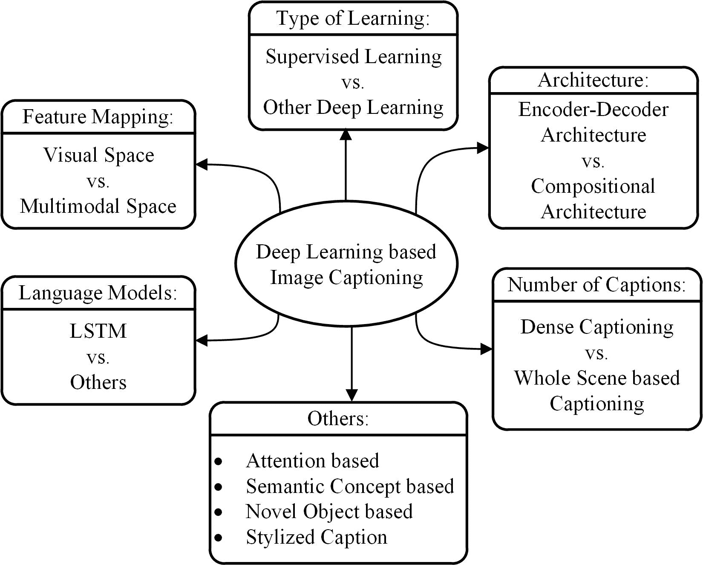

Figure 1\. 深度学习基础的图像字幕的总体分类。

## 2\. 图像字幕方法

在本节中，我们回顾并描述了现有图像标题生成方法的主要类别，包括基于模板的图像标题生成、基于检索的图像标题生成和新颖标题生成。基于模板的方法具有固定的模板，并有若干空白插槽来生成标题。在这些方法中，首先检测不同的对象、属性和动作，然后填充模板中的空白。例如，Farhadi et al.（Farhadi et al., 2010）使用场景元素的三元组来填充模板槽以生成图像标题。Li et al.（Li et al., 2011）提取与检测到的对象、属性及其关系相关的短语。Kulkarni et al.（Kulkarni et al., 2011）采用条件随机场（CRF）来推断对象、属性和介词，然后填补空白。基于模板的方法可以生成语法正确的标题。然而，模板是预定义的，不能生成可变长度的标题。此外，之后引入了基于解析的语言模型用于图像标题生成（Aker and Gaizauskas, 2010; Elliott and Keller, 2013; Kuznetsova et al., 2012, 2014; Mitchell et al., 2012），这些模型比固定模板的方法更强大。因此，在本文中，我们不重点关注这些基于模板的方法。

标题可以从视觉空间和多模态空间中检索。在基于检索的方法中，标题是从一组现有的标题中检索出来的。检索方法首先从训练数据集中找到与其标题视觉上相似的图像。这些标题被称为候选标题。查询图像的标题从这些标题池中选择（Ordonez et al., 2011; Hodosh et al., 2013; Sun et al., 2015; Gong et al., 2014）。这些方法生成的是一般性和语法正确的标题。然而，它们无法生成特定于图像且语义准确的标题。

新颖的标题可以从视觉空间和多模态空间中生成。这类方法的一般思路是首先分析图像的视觉内容，然后使用语言模型从视觉内容生成图像标题（Kiros et al., 2014b; Xu et al., 2015; Yao et al., 2017b; You et al., 2016）。这些方法可以为每张图像生成语义上比以前的方法更准确的新标题。大多数新颖标题生成方法使用基于深度机器学习的技术。因此，基于深度学习的新颖图像标题生成方法是我们文献中的主要关注点。

基于深度学习的图像描述方法的总体分类见图 1\. 该图展示了不同类别的图像描述方法的比较。新颖的描述生成图像描述方法大多使用视觉空间和深度机器学习技术。描述也可以从多模态空间生成。基于深度学习的图像描述方法还可以按学习技术分类：监督学习、强化学习和无监督学习。我们将强化学习和无监督学习归入“其他深度学习”类别。通常，描述是针对图像中的整个场景生成的。然而，描述也可以针对图像的不同区域（密集描述）生成。图像描述方法可以使用简单的编码器-解码器架构或组合架构。有些方法使用注意力机制、语义概念和不同风格的图像描述。有些方法还可以生成对未见物体的描述。我们将它们归为一个“其他”类别。大多数图像描述方法使用 LSTM 作为语言模型。然而，也有一些方法使用其他语言模型，如 CNN 和 RNN。因此，我们包括了一个基于语言模型的“LSTM 与其他”类别。

## 3\. 基于深度学习的图像描述方法

我们在图 1 中绘制了基于深度学习的图像描述方法的总体分类。我们通过将它们分为视觉空间与多模态空间、密集描述与整个场景的描述、监督学习与其他深度学习、编码器-解码器架构与组合架构，以及包含注意力机制、语义概念、风格化描述和新颖物体描述的“其他”组来讨论它们的相似性和差异性。我们还创建了一个名为 LSTM 与其他的类别。

深度学习图像描述方法的简要概述见表 1\. 表 1 包含了图像描述方法的名称、用于编码图像信息的深度神经网络类型，以及用于描述信息的语言模型。在最后一列中，我们根据图 1 中的分类法对每种描述技术进行分类标签。

### 3.1\. 视觉空间与多模态空间

基于深度学习的图像描述方法可以从视觉空间和多模态空间生成描述。显然，图像描述数据集有相应的文本描述。在基于视觉空间的方法中，图像特征和相应的描述被独立传递给语言解码器。相反，在多模态空间的情况下，从图像和相应的描述文本中学习到一个共享的多模态空间。这种多模态表示随后被传递给语言解码器。

#### 3.1.1\. 视觉空间

大多数图像字幕生成方法使用视觉空间来生成字幕。这些方法将在第 3.2 节至第 3.5 节中讨论。

图 2\. 多模态空间图像字幕生成的框图。

#### 3.1.2\. 多模态空间

典型的多模态空间方法的架构包含语言编码器部分、视觉部分、多模态空间部分和语言解码器部分。图像字幕生成方法的一般示意图如图 2 所示。视觉部分使用深度卷积神经网络作为特征提取器提取图像特征。语言编码器部分提取单词特征，并为每个单词学习一个密集特征嵌入。然后将语义时间上下文传递给递归层。多模态空间部分将图像特征映射到与单词特征共享的空间中。生成的映射随后传递给语言解码器，该解码器通过解码映射生成字幕。

该类别中的方法遵循以下步骤：

1.  (1)

    深度神经网络和多模态神经语言模型用于在多模态空间中共同学习图像和文本。

1.  (2)

    语言生成部分使用第 1 步中的信息生成字幕。

| \multirow2*参考文献 | \multirow2*图像编码器 | \multirow2*

&#124; 语言模型 &#124;

| \multirow2*类别 |
| --- | --- | --- | --- |
| Kiros et al. 2014 (Kiros et al., 2014a) | AlexNet | LBL | MS,SL,WS,EDA |
| Kiros et al. 2014 (Kiros et al., 2014b) | AlexNet, VGGNet |

&#124; 1\. LSTM &#124;

&#124; 2\. SC-NLM &#124;

| MS,SL,WS,EDA |
| --- |
| Mao et al. 2014 (Mao et al., 2014) | AlexNet | RNN | MS,SL,WS |
| Karpathy et al. 2014 (Karpathy et al., 2014) | AlexNet | DTR | MS,SL,WS,EDA |
| Mao et al. 2015 (Mao et al., 2015b) | AlexNet, VGGNet | RNN | MS,SL,WS |
| Chen et al. 2015 (Chen and Lawrence Zitnick, 2015) | VGGNet | RNN | VS,SL,WS,EDA |
| Fang et al. 2015 (Fang et al., 2015) | AlexNet, VGGNet | MELM | VS,SL,WS,CA |
| Jia et al. 2015 (Jia et al., 2015) | VGGNet | LSTM | VS,SL,WS,EDA |
| Karpathy et al. 2015 (Karpathy and Fei-Fei, 2015) | VGGNet | RNN | MS,SL,WS,EDA |
| Vinyals et al. 2015 (Vinyals et al., 2015) | GoogLeNet | LSTM | VS,SL,WS,EDA |
| Xu et al. 2015 (Xu et al., 2015) | AlexNet | LSTM | VS,SL,WS,EDA,AB |
| Jin et al. 2015 (Jin et al., 2015) | VGGNet | LSTM | VS,SL,WS,EDA,AB |
| Wu et al. 2016 (Wu and Cohen, 2016) | VGGNet | LSTM | VS,SL,WS,EDA,AB |
| Sugano et al. 2016 (Sugano and Bulling, 2016) | VGGNet | LSTM | VS,SL,WS,EDA,AB |
| Mathews et al. 2016 (Mathews et al., 2016) | GoogLeNet | LSTM | VS,SL,WS,EDA,SC |
| Wang et al. 2016 (Wang et al., 2016b) | AlexNet, VGGNet | LSTM | VS,SL,WS,EDA |
| Johnson 等人 2016 (Johnson et al., 2016) | VGGNet | LSTM | VS,SL,DC,EDA |
| Mao 等人 2016 (Mao et al., 2016) | VGGNet | LSTM | VS,SL,WS,EDA |
| Wang 等人 2016 (Wang et al., 2016a) | VGGNet | LSTM | VS,SL,WS,CA |
| Tran 等人 2016 (Tran et al., 2016) | ResNet | MELM | VS,SL,WS,CA |
| Ma 等人 2016 (Ma and Han, 2016) | AlexNet | LSTM | VS,SL,WS,CA |
| You 等人 2016 (You et al., 2016) | GoogLeNet | RNN | VS,SL,WS,EDA,SCB |
| Yang 等人 2016 (Yang et al., 2016) | VGGNet | LSTM | VS,SL,DC,EDA |
| Anne 等人 2016 (Anne Hendricks et al., 2016) | VGGNet | LSTM | VS,SL,WS,CA,NOB |
| Yao 等人 2017 (Yao et al., 2017b) | GoogLeNet | LSTM | VS,SL,WS,EDA,SCB |
| Lu 等人 2017 (Lu et al., 2017) | ResNet | LSTM | VS,SL,WS,EDA,AB |
| Chen 等人 2017 (Chen et al., 2017b) | VGGNet, ResNet | LSTM | VS,SL,WS,EDA,AB |
| Gan 等人 2017 (Gan et al., 2017b) | ResNet | LSTM | VS,SL,WS,CA,SCB |
| Pedersoli 等人 2017 (Pedersoli et al., 2017) | VGGNet | RNN | VS,SL,WS,EDA,AB |
| Ren 等人 2017 (Ren et al., 2017) | VGGNet | LSTM | VS,ODL,WS,EDA |
| Park 等人 2017 (Park et al., 2017) | ResNet | LSTM | VS,SL,WS,EDA,AB |
| Wang 等人 2017 (Wang et al., 2017) | ResNet | LSTM | VS,SL,WS,EDA |
| Tavakoli 等人 2017 (Tavakoli et al., 2017) | VGGNet | LSTM | VS,SL,WS,EDA,AB |
| Liu 等人 2017 (Liu et al., 2017a) | VGGNet | LSTM | VS,SL,WS,EDA,AB |
| Gan 等人 2017 (Gan et al., 2017a) | ResNet | LSTM | VS,SL,WS,EDA,SC |
| Dai 等人 2017 (Dai et al., 2017) | VGGNet | LSTM | VS,ODL,WS,EDA |
| Shetty 等人 2017 (Shetty et al., 2017) | GoogLeNet | LSTM | VS,ODL,WS,EDA |
| Liu 等人 2017 (Liu et al., 2017b) | Inception-V3 | LSTM | VS,ODL,WS,EDA |
| Gu 等人 2017 (Gu et al., 2017) | VGGNet |

| 1\. Language CNN |

| 2\. LSTM |

| VS,SL,WS,EDA |
| --- |
| Yao 等人 2017 (Yao et al., 2017a) | VGGNet | LSTM | VS,SL,WS,CA,NOB |
| Rennie 等人 2017 (Rennie et al., 2017) | ResNet | LSTM | VS,ODL,WS,EDA |
| Vsub 等人 2017 (Venugopalan et al., 2017) | VGGNet | LSTM | VS,SL,WS,CA,NOB |
| Zhang 等人 2017  (Zhang et al., 2017) | Inception-V3 | LSTM | VS,ODL,WS,EDA |
| Wu 等人 2018 (Wu et al., 2018) | VGGNet | LSTM | VS,SL,WS,EDA,SCB |
| Aneja 等人 2018 (Aneja et al., 2018) | VGGNet | Language CNN | VS,SL,WS,EDA |
| Wang 等人 2018 (Wang and Chan, 2018) | VGGNet | Language CNN | VS,SL,WS,EDA |

表 1\. 基于深度学习的图像标题生成方法概述（VS=视觉空间，MS=多模态空间，SL=监督学习，ODL=其他深度学习，DC=密集标题生成，WS=整体场景，EDA=编码器-解码器架构，CA=组合架构，AB=基于注意力的，SCB=基于语义概念的，NOB=基于新颖对象的，SC=风格化标题）。

这一领域的初步工作由 Kiros 等人提出（Kiros et al., 2014a）。该方法应用 CNN 提取图像特征以生成图像标题。它使用一个表示图像和文本的多模态空间进行多模态表示学习和图像标题生成。它还引入了多模态神经语言模型，例如 Modality-Biased Log-Bilinear Model（MLBL-B）和 Factored 3-way Log-Bilinear Model（MLBL-F）（Mnih 和 Hinton, 2007a），随后是 AlexNet（Krizhevsky et al., 2012）。与大多数以往方法不同，该方法不依赖于任何额外的模板、结构或约束。相反，它依赖于从深度神经网络和多模态神经语言模型中分别学到的高级图像特征和词语表示。神经语言模型在处理大量数据方面存在局限性，并且在长期记忆方面效率较低（Jozefowicz et al., 2016）。

Kiros 等人（Kiros et al., 2014a）在（Kiros et al., 2014b）中扩展了他们的工作，以学习一个联合图像句子嵌入，其中 LSTM 被用于句子编码，而一种新的神经语言模型称为结构-内容神经语言模型（SC-NLM）则用于图像标题生成。SC-NLM 相较于现有方法的优势在于，它可以将句子的结构从编码器生成的内容中解脱出来。它还帮助他们在生成逼真的图像标题方面取得了显著的改进，相较于（Kiros et al., 2014a）提出的方法。

Karpathy 等人（Karpathy et al., 2014）提出了一种深度的多模态模型，将图像和自然语言数据嵌入到双向图像和句子检索任务中。之前的多模态方法使用一个通用的嵌入空间，直接映射图像和句子。然而，这种方法在更细的层面上工作，将图像的片段和句子的片段进行嵌入。该方法将图像分解为多个对象，将句子分解为依赖树关系（DTR）（De Marneffe et al., 2006），并推理它们潜在的跨模态对齐情况。研究表明，与其他先前的方法相比，这种方法在检索任务中取得了显著的改进。该方法也有一些局限性。在建模方面，依赖树可以轻松建模关系，但并不总是适用。例如，一个单一的视觉实体可能会被一个复杂的短语描述，而该短语可以被拆分成多个句子片段。短语“黑白狗”可以形成两个关系（CONJ, black, white）和（AMOD, white, dog）。此外，对于许多依赖关系，我们在图像中找不到任何明确的映射（例如：“彼此”无法映射到任何对象）。

Mao 等人 (Mao et al., 2015b) 提出了一种多模态递归神经网络 (m-RNN) 方法，用于生成新颖的图像标题。该方法包括两个子网络：一个用于句子的深度递归神经网络和一个用于图像的深度卷积网络。这两个子网络在一个多模态层中相互作用，形成整个 m-RNN 模型。在这种方法中，图像和句子片段都作为输入。它计算概率分布来生成标题的下一个词。该模型还包括五个更多的层次：两个词嵌入层、一个递归层、一个多模态层和一个 SoftMax 层。Kiros 等人 (Kiros et al., 2014a) 提出了一种基于对数双线性模型的方法，并使用 AlexNet 提取视觉特征。这种多模态递归神经网络方法与 Kiros 等人的方法 (Kiros et al., 2014a) 密切相关。Kiros 等人使用固定长度的上下文（即五个词），而在这种方法中，时间上下文存储在递归架构中，允许任意长度的上下文。两个词嵌入层使用独热向量生成密集的词表示。它编码了单词的句法和语义含义。通过计算嵌入层中两个密集词向量之间的欧氏距离可以找到语义相关的词。大多数句子-图像多模态方法 (Karpathy et al., 2014; Frome et al., 2013; Socher et al., 2014; Kiros et al., 2014b) 使用预先计算的词嵌入向量来初始化他们的模型。相反，这种方法随机初始化词嵌入层并从训练数据中学习。这有助于比以前的方法生成更好的图像标题。许多图像字幕方法 (Mao et al., 2014; Kiros et al., 2014a; Karpathy et al., 2014) 在当代都建立在递归神经网络上。它们使用递归层存储视觉信息。然而，(m-RNN) 使用图像表示和句子片段生成标题。它更有效地利用递归层的容量，有助于使用相对较小的维度递归层实现更好的性能。

陈等人（Chen and Lawrence Zitnick, 2015）提出了一种基于多模态空间的图像描述方法。该方法可以从图像生成新颖的描述，并从给定的描述中恢复视觉特征。它还可以描述图像与其描述之间的双向映射。许多现有的方法（Hodosh et al., 2013；Socher et al., 2014；Karpathy et al., 2014）使用联合嵌入来生成图像描述。然而，它们不使用能够从描述生成视觉特征的反向投影。另一方面，这种方法动态更新图像的视觉表示，从生成的词语中进行反向投影。它具有一个额外的与 RNN 的递归视觉隐藏层，实现反向投影。

### 3.2\. 监督学习 vs. 其他深度学习

在监督学习中，训练数据带有称为标签的期望输出。另一方面，无监督学习处理的是没有标签的数据。生成对抗网络（GANs）（Goodfellow et al., 2014）是一种无监督学习技术。强化学习是另一种机器学习方法，其目标是通过探索和奖励信号来发现数据和/或标签。许多图像描述方法使用强化学习和基于 GAN 的方法。这些方法属于“其他深度学习”类别。

#### 3.2.1\. 基于监督学习的图像描述

基于监督学习的网络多年来在图像分类（Krizhevsky et al., 2012；He et al., 2016；Simonyan and Zisserman, 2015；Szegedy et al., 2015）、物体检测（Girshick, 2015；Girshick et al., 2014；Ren et al., 2015a）和属性学习（Gan et al., 2016）中取得了成功。这一进展使研究者们对将其用于自动图像描述（Vinyals et al., 2015；Mao et al., 2015b；Karpathy and Fei-Fei, 2015；Chen and Lawrence Zitnick, 2015）产生了兴趣。在本文中，我们已识别出大量基于监督学习的图像描述方法。我们将它们分为不同的类别：（i）编码器-解码器架构，（ii）组合架构，（iii）基于注意力的，（iv）基于语义概念的，（v）风格化描述，（vi）新颖对象基的，以及（vii）密集图像描述。

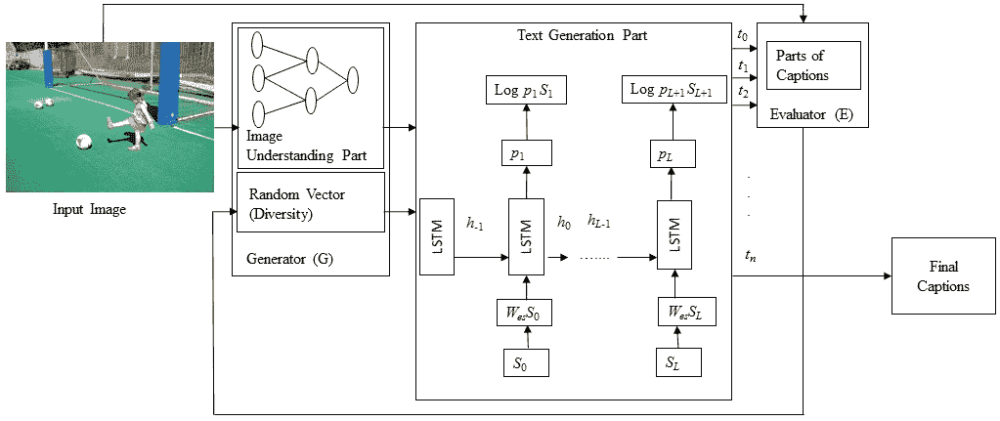

图 3\. 其他基于深度学习的图像描述的框图。

#### 3.2.2\. 其他基于深度学习的图像描述

在我们日常生活中，数据中无标签的数据越来越多，因为准确标注数据通常不切实际。因此，最近，研究者们更多地关注于基于强化学习和无监督学习的图像描述技术。

强化学习代理选择一个动作，获得奖励值，并移动到一个新的状态。代理试图选择期望具有最大长期奖励的动作。它需要连续的状态和动作信息，以提供价值函数的保证。传统的强化学习方法面临许多限制，例如缺乏价值函数的保证和不确定的状态-动作信息。策略梯度方法（Sutton et al., 2000）是一种强化学习方法，可以使用梯度下降和优化技术为特定动作选择特定策略。该策略可以结合领域知识来保证收敛。因此，策略梯度方法比基于价值函数的方法需要更少的参数。

现有基于深度学习的图像描述方法使用变体的图像编码器来提取图像特征。这些特征随后被输入到基于神经网络的语言解码器中生成描述。这些方法存在两个主要问题：（i）它们使用最大似然估计和反向传播（Ranzato et al., 2016）的方法进行训练。在这种情况下，给定图像和所有之前生成的真实词语，预测下一个词。因此，生成的描述看起来像真实描述。这种现象被称为曝光偏差（Bengio et al., 2015）问题。（ii）测试时的评估指标是不可微分的。理想情况下，图像描述的序列模型应该被训练以避免曝光偏差，并直接优化测试时的指标。在基于演员-评论家的强化学习算法中，评论家可以用来估计预期的未来奖励以训练演员（描述政策网络）。基于强化学习的图像描述方法根据它们在每个状态下获得的奖励从模型中采样下一个标记。强化学习中的策略梯度方法可以优化梯度，以预测累积的长期奖励。因此，它可以解决评估指标的不可微分问题。

本类别的方法遵循以下步骤：

1.  (1)

    基于 CNN 和 RNN 的联合网络生成描述。

1.  (2)

    另一个基于 CNN-RNN 的网络评估描述并将反馈发送给第一个网络，以生成高质量的描述。

本类别的典型方法的框图见图 3。

Ren 等人（Ren et al., 2017）提出了一种新颖的基于强化学习的图像描述生成方法。该方法的架构包含两个网络，这两个网络在每个时间步共同计算下一个最佳词汇。 “策略网络”作为局部指导，帮助根据当前状态预测下一个词汇。 “价值网络”作为全局指导，评估奖励值，考虑当前状态所有可能的扩展。这一机制能够调整网络以预测正确的词汇。因此，最终能够生成类似于真实标签的良好描述。该方法使用了一个演员-评论家强化学习模型（Konda 和 Tsitsiklis, 2000）来训练整个网络。视觉语义嵌入（Ren et al., 2015b, 2016）用于计算预测正确词汇的实际奖励值。它还帮助衡量图像和句子之间的相似性，从而评估生成描述的正确性。

Rennie 等人（Rennie et al., 2017）提出了另一种基于强化学习的图像描述生成方法。该方法利用测试时推断算法来规范化奖励，而不是在训练时估计奖励信号和规范化。结果表明，这种测试时解码对于生成高质量的图像描述非常有效。

Zhang 等人（Zhang et al., 2017）提出了一种基于演员-评论家强化学习的图像描述生成方法。该方法可以直接优化现有评估指标的非差分问题。演员-评论家方法的架构包括一个策略网络（演员）和一个价值网络（评论家）。演员将任务视为序列决策问题，并可以预测序列中的下一个标记。在序列的每个状态中，网络将接收一个特定任务的奖励（在这种情况下，是评估指标得分）。评论家的任务是预测奖励。如果它能预测预期的奖励，演员将继续根据其概率分布进行输出采样。

基于 GAN 的方法可以从未标记的数据中学习深层特征。它们通过一对网络之间的竞争过程来实现这些表示：生成器和判别器。GAN 已经成功地应用于各种应用，包括图像描述生成（Dai et al., 2017; Shetty et al., 2017）、图像到图像的转换（Isola et al., 2017）、文本到图像的合成（Reed et al., 2016; Bodnar, 2018）和文本生成（Fedus et al., 2018; Wang et al., 2018）。

GAN 存在两个问题。首先，GAN 可以很好地从真实图像中生成自然图像，因为 GAN 是为真实值数据提出的。然而，文本处理是基于离散数字的。因此，这些操作是不可微分的，使得直接应用反向传播变得困难。策略梯度应用参数函数以允许梯度反向传播。其次，评估器在序列生成中面临梯度消失和误差传播的问题。它需要每个部分描述的可能未来奖励值。蒙特卡罗模拟（Yu et al., 2017）被用来计算这个未来的奖励值。

基于 GAN 的图像标注方法能够生成多样化的图像描述，这与传统的深度卷积网络和深度递归网络模型不同。Dai 等人（Dai et al., 2017）也提出了一种基于 GAN 的图像标注方法。然而，他们没有考虑单张图像的多个描述。Shetty 等人（Shetty et al., 2017）介绍了一种新的基于 GAN 的图像标注方法。该方法能够为单张图像生成多个描述，并在生成多样化描述方面显示了显著的改进。GAN 在反向传播离散数据时存在局限性。Gumbel 采样器（Jang et al., 2017; Maddison et al., 2017）被用来克服离散数据问题。该对抗网络的两个主要部分是生成器和判别器。在训练过程中，生成器学习判别器提供的损失值，而不是从显式来源学习。判别器拥有真实数据分布，可以区分生成器生成的样本和真实数据样本。这使得网络能够学习多样的数据分布。此外，网络将生成的描述集分类为真实或虚假。因此，它可以生成类似于人类生成的描述。

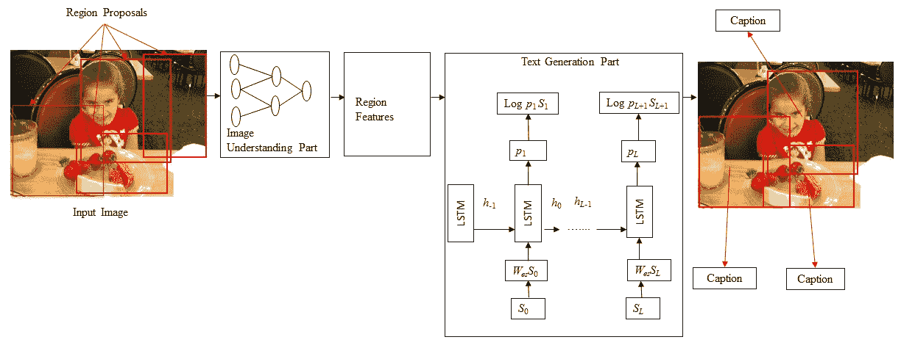

图 4\. 密集标注的框图。

### 3.3\. 密集标注与整个场景的描述

在密集标注中，为场景的每个区域生成描述。其他方法为整个场景生成描述。

#### 3.3.1\. 密集标注

以前的图像标注方法只能为整张图像生成一个描述。它们使用图像的不同区域来获取各种对象的信息。然而，这些方法没有生成按区域的描述。

Johnson 等人（Johnson et al., 2016）提出了一种称为 DenseCap 的图像标注方法。该方法对图像中的所有显著区域进行定位，然后为这些区域生成描述。

这一类别的典型方法包括以下步骤：

1.  (1)

    为给定图像的不同区域生成区域提议。

1.  (2)

    CNN 被用来获取基于区域的图像特征。

1.  (3)

    步骤 2 的输出由语言模型用来为每个区域生成标题。

图 4 中给出了典型密集标题生成方法的框图。

密集标题生成（Johnson et al., 2016）提出了一种完全卷积的定位网络架构，该架构由卷积网络、密集定位层和 LSTM（Hochreiter and Schmidhuber, 1997）语言模型组成。密集定位层通过一次高效的前向传递处理图像，隐式地预测图像中的一组兴趣区域。因此，它不像 Fast R-CNN 或完整网络（即 RPN（区域建议网络（Girshick, 2015）））那样需要外部区域建议。定位层的工作原理与 Faster R-CNN（Ren et al., 2015a）的工作有关。然而，Johnson et al.（Johnson et al., 2016）使用了差分的空间软注意力机制（Gregor et al., 2015; Jaderberg et al., 2015）和双线性插值（Jaderberg et al., 2015），而不是 ROI 池化机制（Girshick, 2015）。这一修改有助于该方法在网络中进行反向传播，并平滑地选择活动区域。它使用 Visual Genome（Krishna et al., 2017）数据集进行区域级图像标题生成实验。

对整个视觉场景的描述非常主观，不足以完全展现理解。基于区域的描述比全局图像描述更为客观和详细。基于区域的描述称为密集标题生成。密集标题生成面临一些挑战。由于区域较密集，一个对象可能具有多个重叠的兴趣区域。此外，识别所有视觉概念的每个目标区域非常困难。Yang 等（Yang et al., 2016）提出了另一种密集标题生成方法，该方法可以应对这些挑战。首先，它提出了一种推理机制，该机制共同依赖于区域的视觉特征和该区域预测的标题。这使得模型能够找到边界框的适当位置。其次，他们应用了上下文融合，将上下文特征与各自区域的视觉特征结合，以提供丰富的语义描述。

#### 3.3.2\. 整个场景的标题

编码器-解码器架构、组合架构、基于注意力的、基于语义概念的、风格化标题、新颖对象基础的图像标题生成方法以及其他基于深度学习网络的图像标题生成方法，为整个场景生成单个或多个标题。

### 3.4\. 编码器-解码器架构与组合架构

一些方法仅使用简单的原始编码器和解码器生成标题。然而，其他方法则使用多个网络来完成这一任务。

#### 3.4.1\. 基于编码器-解码器架构的图像描述

基于神经网络的图像描述方法仅以简单的端到端方式运作。这些方法与基于编码器-解码器框架的神经机器翻译（Sutskever et al., 2014）非常相似。在这个网络中，全球图像特征从 CNN 的隐藏激活中提取出来，然后输入到 LSTM 中以生成单词序列。

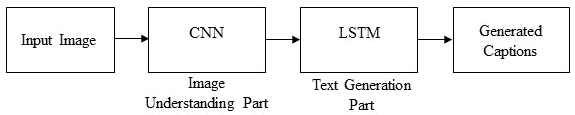

图 5\. 基于简单编码器-解码器架构的图像描述框图。

该类别的典型方法具有以下一般步骤：

1.  (1)

    使用普通 CNN 来获取场景类型，检测对象及其关系。

1.  (2)

    步骤 1 的输出由语言模型使用，将其转换为单词，组合成生成图像描述的短语。

此类别的简单框图如图 5 所示。

Vinyals et al.（Vinyals et al., 2015）提出了一种方法，称为神经图像描述生成器（NIC）。该方法使用 CNN 进行图像表示，使用 LSTM 生成图像描述。这个特殊的 CNN 使用了一种新颖的批归一化方法，CNN 最后隐藏层的输出用作 LSTM 解码器的输入。这个 LSTM 能够跟踪已经用文本描述的对象。NIC 基于最大似然估计进行训练。

在生成图像描述时，图像信息被包含到 LSTM 的初始状态中。接下来的单词基于当前时间步和之前的隐藏状态生成。这个过程持续进行，直到获得句子的结束标记。由于图像信息仅在过程开始时输入，可能会面临梯度消失问题。开始生成的单词的作用也变得越来越弱。因此，LSTM 在生成长句子时仍然面临挑战（Bahdanau et al., 2015; Cho et al., 2014）。因此，Jia et al.（Jia et al., 2015）提出了一种 LSTM 的扩展，称为指导 LSTM（gLSTM）。这种 gLSTM 可以生成长句子。在这种架构中，它将全局语义信息添加到 LSTM 的每个门和单元状态中。它还考虑了不同的长度归一化策略来控制描述的长度。语义信息以不同的方式提取。首先，它使用跨模态检索任务来检索图像描述，然后从这些描述中提取语义信息。语义基础信息也可以通过多模态嵌入空间提取。

毛等（Mao et al., 2016）提出了一种针对图像的特殊文本生成方法。该方法可以为特定对象或区域生成描述，这种描述被称为**指称表达**（van Deemter et al., 2006；Viethen 和 Dale, 2008；Mitchell et al., 2010，2013；FitzGerald et al., 2013；Golland et al., 2010；Kazemzadeh et al., 2014）。使用这种表达可以推断出正在描述的对象或区域。因此，生成的描述或表达是相当明确的。为了处理指称表达，该方法使用了一个新的数据集，称为 ReferIt 数据集（Kazemzadeh et al., 2014），该数据集基于流行的 MS COCO 数据集。

之前基于 CNN-RNN 的图像字幕生成方法使用的是单向且相对较浅的 LSTM。在单向语言生成技术中，下一词是基于视觉上下文和所有先前的文本上下文预测的。单向 LSTM 无法生成上下文良好的标题。此外，最近的对象检测和分类方法（Krizhevsky et al., 2012；Simonyan 和 Zisserman, 2015）显示，深层次的层级方法在学习上优于较浅的方法。王等（Wang et al., 2016b）提出了一种基于深度双向 LSTM 的图像字幕生成方法。这种方法能够生成上下文和语义丰富的图像标题。所提出的架构包括一个 CNN 和两个独立的 LSTM 网络。它可以利用过去和未来的上下文信息来学习长期的视觉语言交互。

#### 3.4.2\. **组成架构基础的图像字幕生成**

由几个独立功能模块组成的**组成架构**方法：首先，使用 CNN 从图像中提取语义概念。然后，使用语言模型生成一组候选标题。在生成最终标题时，这些候选标题会通过深度多模态相似性模型进行重新排序。

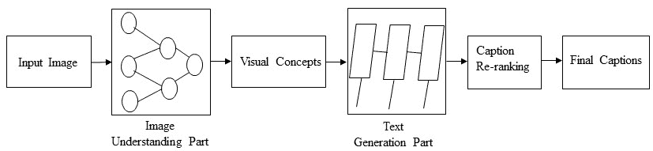

图 6\. 组成网络基于图像字幕生成的框图。

这种类别的典型方法保持以下步骤：

1.  (1)

    图像特征是通过 CNN 获得的。

1.  (2)

    视觉概念（例如属性）是从视觉特征中获得的。

1.  (3)

    语言模型使用步骤 1 和步骤 2 中的信息生成多个标题。

1.  (4)

    生成的标题使用深度多模态相似性模型重新排序，以选择高质量的图像标题。

图 6 中给出了一个基于组成网络的图像字幕生成方法的常见框图。

方等人（Fang et al., 2015）介绍了基于生成的图像描述技术。它使用视觉检测器、语言模型和多模态相似性模型来在图像描述数据集上训练模型。图像描述可以包含名词、动词和形容词。词汇表是由训练描述中的 1000 个最常见的词汇组成。系统处理的是图像子区域，而不是完整图像。卷积神经网络（包括 AlexNet（Krizhevsky et al., 2012）和 VGG16Net）用于提取图像子区域的特征。子区域的特征与词汇中的可能出现在图像描述中的词语进行映射。多实例学习（MIL）（Maron 和 Lozano-Pérez，1998）用于训练模型，以学习每个词的判别视觉特征。最大熵（ME）（Berger et al., 1996）语言模型用于从这些词生成图像描述。生成的描述通过线性加权的句子特征进行排序。最小误差率训练（MERT）（Och，2003）用于学习这些权重。图像和句子之间的相似性可以通过共同的向量表示轻松测量。图像和句子片段通过深度多模态相似性模型（DMSM）与共同的向量表示进行映射。它在选择高质量图像描述方面取得了显著改进。

迄今为止，许多方法在生成图像标题方面取得了令人满意的进展。这些方法使用来自相同领域的训练和测试样本。因此，这些方法在开放领域图像中的表现尚无定论。此外，它们只擅长识别通用视觉内容。某些关键实体，如名人和地标，超出了它们的范围。这些方法生成的标题是通过自动化指标如 BLEU (Papineni et al., 2002)、METEOR (Agarwal and Lavie, 2008) 和 CIDEr (Vedantam et al., 2015)来评估的。这些评估指标已在这些方法上显示出良好的结果。然而，在性能方面，评估指标与人工评估之间存在较大差距 (Devlin et al., 2015; Callison-Burch et al., 2006; Kulkarni et al., 2011)。如果考虑到真实的实体信息，性能可能会更弱。然而，Tran et al. (Tran et al., 2016) 引入了一种不同的图像标题生成方法。该方法能够生成开放领域图像的标题。它可以检测多种视觉概念，并为名人和地标生成标题。它使用外部知识库 Freebase (Bollacker et al., 2008) 来识别广泛的实体，如名人和地标。一系列人工判断被应用于评估生成标题的表现。在实验中，它使用了三个数据集：MS COCO、Adobe-MIT FiveK (Bychkovsky et al., 2011) 和来自 Instagram 的图像。MS COCO 数据集的图像来自相同领域，但其他数据集的图像则来自开放领域。该方法在挑战性的 Instagram 数据集上表现尤为突出。

Ma et al. (Ma and Han, 2016) 提出了另一种基于组成网络的图像标题生成方法。该方法使用结构词 $<$object, attribute, activity, scene$>$ 来生成语义有意义的描述。它还使用类似于多实例学习方法 (Fang et al., 2015) 和多层优化方法 (Han and Li, 2015) 的多任务方法来生成结构词。随后，使用基于 LSTM 编码器-解码器的机器翻译方法 (Sutskever et al., 2014) 将结构词翻译成图像标题。

Wang et al. (Wang et al., 2016a) 提出了一个并行融合 RNN-LSTM 架构用于图像标题生成。该方法的架构将 RNN 和 LSTM 的隐藏单元划分为多个相同大小的部分。这些部分以相应的比例并行工作以生成图像标题。

### 3.5\. 其他

基于注意力机制、基于语义概念、基于新颖对象的方法以及风格化标题被归入“其他”组，因为这些类别与其他方法是独立的。

#### 3.5.1\. 基于注意力的图像标注

基于神经编码器-解码器的方法主要用于机器翻译（Sutskever 等，2014）。遵循这些趋势，这些方法也被用于图像标注任务，并且非常有效。在图像标注中，CNN 用作编码器，从输入图像中提取视觉特征，而 RNN 用作解码器，将这种表示逐字转换为图像的自然语言描述。然而，这些方法在生成图像描述时无法随时间分析图像。此外，这些方法不考虑与图像标题部分相关的图像空间方面。相反，它们在生成标题时考虑的是整个场景。基于注意力的机制在深度学习中越来越受欢迎，因为它们可以解决这些限制。它们可以在输出序列生成的过程中动态地关注输入图像的各个部分。

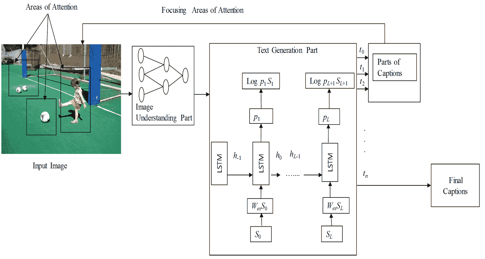

图 7\. 一种典型的基于注意力的图像标注技术的框图。

该类别的典型方法包括以下步骤：

1.  (1)

    通过 CNN 基于整个场景获取图像信息。

1.  (2)

    语言生成阶段根据步骤 1 的输出生成单词或短语。

1.  (3)

    在语言生成模型的每一个时间步骤中，根据生成的单词或短语，聚焦于给定图像的显著区域。

1.  (4)

    标题会在语言生成模型的结束状态之前动态更新。

基于注意力机制的图像标注方法的框图见图 7。

Xu 等（Xu et al., 2015）是首个引入基于注意力的图像标注方法的研究者。该方法自动描述图像的显著内容。基于注意力的方法与其他方法的主要区别在于，它们能够集中注意图像的显著部分，并同时生成相应的单词。这种方法应用了两种不同的技术：随机硬注意力和确定性软注意力来生成注意力。大多数基于 CNN 的方法使用 ConvNet 的顶层来提取图像中显著对象的信息。这些技术的一个缺点是可能会丢失一些生成详细描述时有用的信息。为了保留信息，注意力方法使用来自较低卷积层的特征，而不是全连接层。

Jin 等人（Jin et al., 2015）提出了另一种基于注意力的图像描述方法。该方法能够基于视觉信息和文本信息之间的语义关系提取抽象意义的流。它还可以通过提出场景特定上下文来获得更高层次的语义信息。该方法与其他基于注意力的方法的主要区别在于它引入了多尺度的图像多个视觉区域。这项技术可以提取特定物体的适当视觉信息。为了提取场景特定的上下文，它首先使用潜在狄利克雷分配（LDA）（Blei et al., 2003）从数据集的所有描述中生成词典。然后使用多层感知器预测每个图像的主题向量。一个具有两层堆叠的场景分解 LSTM 用于生成图像整体背景的描述。

吴等人（Wu and Cohen, 2016）提出了一种基于回顾的注意力方法用于图像描述。该方法引入了一种回顾模型，可以在 CNN 隐藏状态上执行多次回顾步骤。CNN 的输出是一系列可以获取图像全球信息的事实向量。这些向量被作为输入传递给 LSTM 的注意力机制。例如，一个回顾模块可以首先回顾：图像中有哪些物体？然后它可以回顾物体的相对位置，另一种回顾可以提取图像整体背景的信息。这些信息被传递给解码器以生成图像描述。

Pedersoli 等人（Pedersoli et al., 2017）提出了一种基于区域的注意力机制用于图像描述。之前基于注意力的方法仅将图像区域映射到 RNN 语言模型的状态。然而，该方法将图像区域与给定 RNN 状态的描述词关联起来。它可以预测 RNN 每个时间步的下一个描述词和相应的图像区域。它能够预测下一个词以及 RNN 每个时间步的相应图像区域，从而生成图像描述。为了找到关注区域，以前基于注意力的图像描述方法使用 CNN 激活网格的位置或目标提案。相比之下，该方法使用端到端可训练的卷积空间变换器，以及 CNN 激活网格和目标提案方法的组合。这些技术的结合帮助该方法计算图像自适应的关注区域。在实验中，该方法表明，这种新的注意力机制与空间变换网络结合可以产生高质量的图像描述。

陆等人（Lu et al., 2017）提出了另一种基于注意力的图像字幕生成方法。该方法基于具有视觉哨兵的自适应注意力模型。目前的基于注意力的图像字幕生成方法在 RNN 的每个时间步都专注于图像。然而，有些词语或短语（例如：a，of）不需要关注视觉信号。此外，这些不必要的视觉信号可能会影响字幕生成过程并降低整体表现。因此，他们提出的方法可以确定何时关注图像区域以及何时仅关注语言生成模型。一旦确定要查看图像，它必须选择图像的空间位置。该方法的第一个贡献是引入了一种新颖的空间注意力方法，可以从图像中计算空间特征。然后在他们的自适应注意力方法中，引入了新的 LSTM 扩展。通常，LSTM 作为解码器在每个时间步产生一个隐藏状态。然而，这种扩展能够产生额外的视觉哨兵，为解码器提供备选选项。它还有一个哨兵门，可以控制解码器从图像中获得多少信息。

尽管基于注意力的方法试图在生成图像字幕的词语或短语时找到图像的不同区域，但这些方法生成的注意力图并不总是能对应到图像的正确区域。这可能会影响图像字幕生成的表现。刘等人（Liu et al., 2017a）提出了一种神经图像字幕生成的方法。该方法可以在时间步上评估和纠正注意力图。正确性意味着在图像区域和生成的词语之间保持一致的映射。为了实现这些目标，该方法引入了一个定量评估指标来计算注意力图。它使用 Flickr30k 实体数据集（Plummer et al., 2015）和 MS COCO（Lin et al., 2014）数据集来测量地面真值注意力图和图像区域的语义标记。为了学习更好的注意力功能，它提出了监督注意力模型。这里使用了两种类型的监督注意力模型：具有对齐注释的强监督和具有语义标记的弱监督。在具有对齐注释的强监督模型中，它可以直接将地面真值词汇映射到一个区域。然而，由于收集和注释数据通常非常昂贵，地面真值对齐并不总是可能的。弱监督是在 MS COCO 数据集上使用边界框或分割掩码进行的。在实验中，该方法显示出监督注意力模型在映射注意力以及图像字幕生成方面表现更好。

陈等（Chen et al., 2017b）提出了另一种基于注意力的图像描述方法。该方法考虑了空间和通道注意力来计算注意力图。现有的基于注意力的图像描述方法仅考虑空间信息来生成注意力图。这些空间注意力方法的一个常见缺点是它们仅在关注的特征图上计算加权池化。因此，这些方法逐渐丧失了空间信息。此外，它们仅使用来自 CNN 的最后一个卷积层的空间信息。该层的感受野区域相当大，使得区域之间的间隔有限。因此，它们无法为图像获得显著的空间注意力。然而，在该方法中，CNN 特征不仅从空间位置提取，还从不同的通道和多个层中提取。因此，它能获得显著的空间注意力。此外，在该方法中，卷积层的每个滤波器充当语义检测器（Zeiler and Fergus, 2014），而其他方法则使用外部资源来获取语义信息。

为了减少人类生成描述和机器生成描述之间的差距，Tavakoli 等（Tavakoli et al., 2017）引入了一种基于注意力的图像描述方法。这是一个自下而上的显著性基础注意力模型，可以在与其他基于注意力的图像描述方法进行比较时发挥优势。研究发现，人类首先描述更重要的对象而不是不太重要的对象。该方法在未见过的数据上表现更好。

大多数先前的图像描述方法采用自上而下的方法来构建视觉注意力图。这些机制通常关注从 CNN 的一两层输出中获得的一些选择区域。输入区域的大小相同，具有相同的感受野形状。该方法对图像内容的考虑较少。然而，Anderson 等（Anderson et al., 2017）的方法应用了自上而下和自下而上的方法。自下而上的注意力机制使用 Faster R-CNN（Ren et al., 2015a）进行区域提议，可以选择图像的显著区域。因此，该方法可以关注对象级区域以及其他显著的图像区域。

Park 等（Park 等，2017）提出了一种不同类型的基于注意力的图像描述方法。这种方法可以生成针对图像个人问题的图像描述。它主要考虑两个任务：标签预测和帖子生成。这种方法使用上下文序列记忆网络（CSMN）来获取图像的上下文信息。从个性化视角描述图像在社交媒体网络中有很多应用。例如，日常生活中人们会在 Facebook、Instagram 或其他社交媒体上分享大量图像。拍摄或上传照片是非常简单的任务。然而，描述这些照片并不容易，因为这需要考虑图像的主题、情感和背景。因此，该方法考虑了用户之前文档中的词汇或写作风格知识以生成图像描述。为了处理这种新型图像描述，CSMN 方法有三个贡献：首先，该网络的记忆可以作为存储库，保留多种类型的上下文信息。其次，记忆的设计方式可以顺序存储所有先前生成的词汇。因此，它不会遭受梯度消失问题。第三，提出的 CNN 可以与多个记忆槽相关联，这对于理解上下文概念非常有帮助。

基于注意力的方法在图像描述和其他计算机视觉任务中已经展示了良好的性能和效率。然而，这些基于注意力的方法生成的注意力图仅依赖于机器，它们没有考虑来自人类注意力的任何监督。这就需要考虑注视信息是否能提高这些注意力方法在图像描述中的表现。注视指示了人类对场景的认知和感知。人类的注视可以识别图像中对象的重要位置。因此，注视机制在基于眼动的用户建模（Bulling 等，2011；Fathi 等，2012；Papadopoulos 等，2014；Sattar 等，2015；Shanmuga Vadivel 等，2015），对象定位（Mishra 等，2012）或识别（Karthikeyan 等，2013）以及整体场景理解（Yun 等，2013；Zelinsky，2013）中已经展示了其潜在的性能。然而，Sugano 等（Sugano 和 Bulling，2016）声称注视信息尚未融入图像描述方法中。这种方法在生成图像描述时引入了人类注视与深度神经网络的注意力机制。该方法将人类注视信息融入基于注意力的 LSTM 模型（Xu 等，2015）中。在实验中，它使用了 SALICON 数据集（Jiang 等，2015）并取得了良好的结果。

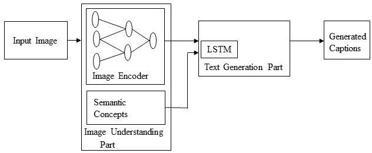

图 8\. 基于语义概念的图像描述的框图。

#### 3.5.2\. 基于语义概念的图像描述

基于语义概念的方法选择性地关注从图像中提取的一组语义概念提案。这些概念然后被组合到隐藏状态和递归神经网络的输出中。

这类方法遵循以下步骤：

1.  (1)

    使用基于 CNN 的编码器对图像特征和语义概念进行编码。

1.  (2)

    图像特征被输入到语言生成模型的输入中。

1.  (3)

    语义概念被添加到语言模型的不同隐藏状态中。

1.  (4)

    语言生成部分产生具有语义概念的描述。

这一类别的典型框图如图 8 所示。

Karpathy 等人将他们的方法（Karpathy et al., 2014）扩展到（Karpathy and Fei-Fei, 2015）。该方法可以为图像及其区域生成自然语言描述。该方法采用了一种新颖的组合，结合了图像区域上的 CNN、句子上的双向递归神经网络和一个共同的多模态嵌入，将这两种模态关联起来。它还展示了一种多模态递归神经网络架构，利用结果对齐来训练模型，以生成图像区域的新描述。在这种方法中，依赖树关系（DTR）用于训练，以将句子段映射到具有固定窗口上下文的图像区域。与他们之前的方法相比，这种方法使用双向神经网络来获取句子中的词表示。它考虑了句子的连续片段在嵌入空间中的对齐，这种对齐更有意义、可解释且长度不固定。一般来说，RNN 考虑当前词和从所有先前生成的词中获得的上下文，以估计序列中下一个词的概率分布。然而，该方法扩展了这一过程，以考虑输入图像内容的生成过程。这个附加是简单的，但它使生成新图像描述非常有效。

图像的属性被视为丰富的语义线索。Yao 等人（Yao et al., 2017b）的方法具有不同的架构来将属性与图像表示结合。主要介绍了两种类型的架构表示。在第一组中，它首先将属性插入 LSTM 或图像表示到 LSTM，然后是属性，反之亦然。在第二组中，它可以控制 LSTM 的时间步长。它决定图像表示和属性是否每次时间步长都输入。这些架构的变体在 MS COCO 数据集和常见评估指标上进行了测试。

尤等人（You et al., 2016）提出了一种基于语义注意力的图像描述方法。该方法提供了对语义重要对象的详细且连贯的描述。自上而下的范式（Chen 和 Lawrence Zitnick, 2015; Vinyals 等人, 2015; Mao 等人, 2015b; Karpathy 和 Fei-Fei, 2015; Donahue 等人, 2015; Xu 等人, 2015; Mao 等人, 2015a）首先提取视觉特征，然后将其转化为词语。在自下而上的方法中，（Farhadi 等人, 2010; Kulkarni 等人, 2011; Li 等人, 2011; Elliott 和 Keller, 2013; Kuznetsova 等人, 2012; Lebret 等人, 2015）视觉概念（例如，区域、对象和属性）首先从图像的不同方面提取，然后将它们结合起来。图像的细节通常对生成图像描述非常重要。自上而下的方法在获取图像细节方面存在局限性。自下而上的方法能够在任何图像分辨率下操作，因此可以处理图像的细节。然而，它们在制定端到端的过程中存在问题。因此，基于语义的注意力模型结合了自上而下和自下而上的方法来生成图像描述。在自上而下的方法中，图像特征是通过 GoogleNet（Szegedy 等人, 2015）CNN 模型的最后一个 1024 维卷积层获得的。视觉概念使用不同的非参数和参数方法收集。最近邻图像检索技术用于计算非参数视觉概念。全卷积网络（FCN）（Long 等人, 2015）用于从局部图像块中学习属性以进行参数化属性预测。尽管 Xu 等人（Xu et al., 2015）考虑了基于注意力的描述，但它在固定和预定义的空间位置上工作。然而，这种基于语义的注意力方法可以在任何分辨率和图像的任何位置上工作。此外，该方法还考虑了加速生成更好图像描述的反馈过程。

之前的图像描述方法没有明确包含高级语义概念。然而，吴等人（Wu16W）提出了一种基于高级语义概念的图像描述方法。它在基于神经网络的 CNN-LSTM 框架中使用了一个中间属性预测层。首先，属性由基于 CNN 的分类器从训练图像描述中提取。然后，这些属性作为高级语义概念用于生成语义丰富的图像描述。

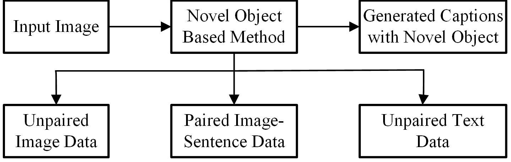

图 9\. 一种典型的新型对象基础图像描述的框图。

最近基于语义概念的图像描述方法（Wu et al., 2018; You et al., 2016）应用了语义概念检测过程（Gan et al., 2016）以获取明确的语义概念。他们在基于 CNN-LSTM 的编码器-解码器中使用这些高级语义概念，并在图像描述中取得了显著的改进。然而，他们在生成语义上合理的描述时遇到问题。他们无法在整个句子中均匀分布语义概念。例如，Wu et al.（Wu et al., 2018）考虑在 LSTM 的初始状态中添加语义概念。此外，它将视觉特征向量或从 CNN 推断出的场景向量编码后输入 LSTM 生成描述。然而，Gan et al.（Gan et al., 2017b）引入了一个语义组成网络（SCN）用于图像描述。在这种方法中，一个语义概念向量是由图像中发现的所有可能概念（这里称为标签）构建的。这个语义向量比视觉特征向量和场景向量更有潜力，可以生成涵盖图像整体意义的描述。这被称为组成网络，因为它可以组合大多数语义概念。

现有的基于 LSTM 的图像描述方法在生成多样化描述方面存在局限，因为它们必须按照预定义的逐词格式预测下一个词。然而，句子中属性、主题及其关系的组合可以生成广泛的图像描述。Wang et al.（Wang et al., 2017）提出了一种方法，首先定位物体及其交互，然后识别并提取相关属性以生成图像描述。这种方法的主要目的是将真实图像描述分解为两个部分：骨架句子和属性短语。这种方法也被称为 Skeleton Key。该方法的架构包括 ResNet（He et al., 2016）和两个 LSTM，分别称为 Skel-LSTM 和 Attr-LSTM。在训练过程中，骨架句子由 Skel-LSTM 网络进行训练，属性短语由 Attr-LSTM 网络进行训练。在测试阶段，首先生成包含图像主要物体及其关系的骨架句子。然后这些物体会重新查看图像以获取相关属性。该方法在 MS COCO 数据集和新的 Stock3M 数据集上进行了测试，能够生成更准确和新颖的描述。

#### 3.5.3. 新颖的基于物体的图像描述

尽管近年来基于深度学习的图像描述方法取得了令人满意的结果，但它们在很大程度上依赖于配对的图像和句子描述数据集。这些方法只能生成上下文中对象的描述。因此，这些方法需要大量的训练图像-句子对。基于新颖对象的图像描述方法可以生成在配对图像-描述数据集中不存在的新颖对象的描述。

这一类别的方法遵循以下一般步骤：

1.  (1)

    在未配对的图像数据和未配对的文本数据上训练一个单独的词汇分类器和语言模型。

1.  (2)

    在配对的图像描述数据上训练一个深度描述模型。

1.  (3)

    最终，将两个模型结合起来进行联合训练，以生成新颖对象的描述。

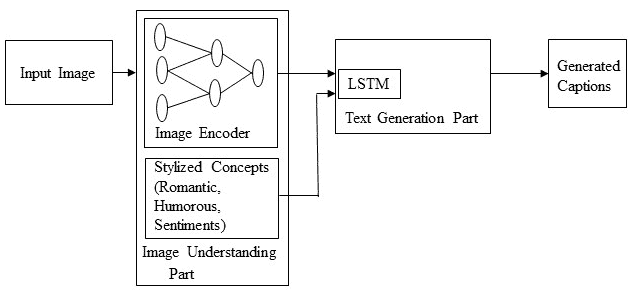

图 10\. 基于不同风格的图像描述块图。

图 9 给出了基于新颖对象的图像描述方法的简单块图。

目前的图像描述方法是在图像-描述配对数据集上训练的。因此，如果它们在测试图像中遇到未见过的对象，就无法在生成的描述中呈现这些对象。Anne 等人（Anne Hendricks 等，2016）提出了一种深度组合描述生成器（DCC），可以在生成的描述中表示未见过的对象。

姚等人（姚等，2017a）提出了一种复制机制来生成新颖对象的描述。这种方法使用一个单独的对象识别数据集来开发新颖对象的分类器。它通过一个具有复制机制的解码器 RNN 将适当的词语整合到输出的描述中。该方法的架构增加了一个新网络，用于识别来自未配对图像的未知对象，并将其与 LSTM 结合生成描述。

为未见过的图像生成描述是一个具有挑战性的研究问题。Venugopalan 等人（Venugopalan 等，2017）介绍了一种新颖对象描述生成器（NOC），用于为图像中的未见对象生成描述。他们使用外部资源来识别未见对象并学习语义知识。

#### 3.5.4\. 风格化描述

现有的图像描述系统仅根据图像内容生成描述，这也可以称为事实描述。它们没有单独考虑文本的风格化部分与其他语言模式。然而，风格化的描述可能比仅仅平铺的图像描述更具表现力和吸引力。

这一类别的方法遵循以下一般步骤：

1.  (1)

    使用基于 CNN 的图像编码器获取图像信息。

1.  (2)

    准备一个单独的文本语料库，从训练数据中提取各种风格化的概念（例如：浪漫、幽默）。

1.  (3)

    语言生成部分可以使用步骤 1 和步骤 2 的信息生成风格化和吸引人的描述。

图像 10 中给出了风格化图像描述的简单框图。

这样的描述变得流行，因为它们对许多现实世界应用特别有价值。例如，日常生活中，人们在不同的社交媒体上上传大量照片。这些照片需要风格化和吸引人的描述。Gan 等（Gan et al., 2017a）提出了一种新颖的图像描述系统，称为 StyleNet。该方法可以生成具有各种风格的吸引人描述。该方法的架构包括一个 CNN 和一个可以将事实性和风格因素从描述中分离开的 LSTM。它使用多任务序列到序列训练（Luong et al., 2016）来识别风格因素，然后在运行时添加这些因素以生成吸引人的描述。更有趣的是，它使用一个外部的单语风格化语言语料库进行训练，而不是配对图像。然而，它使用了一个新的风格化图像描述数据集 FlickrStyle10k，并可以生成不同风格的描述。

现有的图像描述方法在生成图像描述时会考虑图像中对象、场景及其相互作用的事实描述。在我们日常的对话、交流、人际关系和决策中，我们会使用各种风格化和非事实性的表达，如情感、自豪感和羞耻感。然而，Mathews 等（Mathews et al., 2016）声称自动图像描述缺乏这些非事实性方面。因此，他们提出了一种叫做 SentiCap 的方法。该方法可以生成带有正面或负面情感的图像描述。它引入了一种新颖的切换 RNN 模型，该模型结合了两个并行运行的 CNN+RNN。在每个时间步，该切换模型生成在两个 RNN 之间切换的概率。其中一个 RNN 生成考虑事实性词汇的描述，而另一个 RNN 则考虑带有情感的词汇。然后，该方法从两个 RNN 的隐藏状态中获取输入以生成描述。这个方法可以在适当的情感条件下成功生成描述。

### 3.6\. LSTM 与其他模型

图像描述交叉了计算机视觉和自然语言处理（NLP）研究。NLP 任务通常可以被表述为序列到序列学习。已经提出了几种神经语言模型，如神经概率语言模型（Bengio et al., 2003）、对数双线性模型（Mnih 和 Hinton, 2007b）、跳字模型（Mikolov et al., 2013）和递归神经网络（RNNs）（Mikolov et al., 2010），用于学习序列到序列任务。RNNs 被广泛应用于各种序列学习任务。然而，传统 RNN 存在梯度消失和梯度爆炸问题，无法充分处理长期时间依赖。

LSTM（Hochreiter 和 Schmidhuber，1997）网络是一种 RNN，除了标准单元外还有特殊单元。LSTM 单元使用可以长时间保持信息的存储单元。近年来，基于 LSTM 的模型在序列到序列学习任务中占主导地位。另一个网络，门控循环单元（GRU）（Chung 等人，2014），结构类似于 LSTM，但不使用单独的存储单元，使用较少的门来控制信息流动。

然而，LSTM 忽略了句子的基础层次结构。由于通过存储单元存在长期依赖，它们还需要大量存储空间。相比之下，CNN 可以学习句子的内部层次结构，并且它们在处理速度上比 LSTM 更快。因此，最近在其他序列到序列任务中使用了卷积架构，例如条件图像生成（van den Oord 等人，2016）和机器翻译（Gehring 等人，2016; Gehring 等人，2017; Vaswani 等人，2017)。

受 CNN 在序列学习任务中的成功启发，顾等人（Gu 等人，2017）提出了一种基于 CNN 语言模型的图像字幕方法。该方法使用语言-CNN 进行统计语言建模。然而，该方法无法仅使用语言-CNN 来建模语言模型的动态时间行为。它结合了循环网络和语言-CNN 来正确建模时间依赖关系。Aneja 等人（Aneja 等人，2018）针对图像字幕任务提出了一种卷积架构。他们使用了一个不带任何循环功能的前向网络。该方法的架构有四个组成部分：(i) 输入嵌入层 (ii) 图像嵌入层 (iii) 卷积模块，和 (iv) 输出嵌入层。它还使用注意机制来利用空间图像特征。他们在具有挑战性的 MSCOCO 数据集上评估他们的架构，并展示了与基于 LSTM 的方法在标准指标上可比的性能。

王等人（Wang 和 Chan，2018）提出了另一种基于 CNN+CNN 的图像字幕方法。它类似于 Aneja 等人的方法，不同之处在于它使用了一个分层注意模块来连接视觉-CNN 和语言-CNN。该方法的作者还研究了包括语言-CNN 的层数和核宽度在内的各种超参数的使用。他们表明，超参数的影响可以提高图像字幕方法的性能。

## 4\. 数据集和评估指标

训练、测试和评估图像标注方法使用了多个数据集。这些数据集在多个方面有所不同，如图像数量、每张图像的标注数量、标注格式和图像大小。三个数据集：Flickr8k（Hodosh 等，2013）、Flickr30k（Plummer 等，2015）和 MS COCO 数据集（Lin 等，2014）被广泛使用。这些数据集及其他数据集在第 4.1 节中进行了描述。在本节中，我们展示了在 MS COCO、Flickr30k 和 Flickr8k 数据集上由图像标注方法生成的示例图像及其标注。使用了多个评估指标来衡量生成标注与真实标注的质量。每个指标采用自己的计算技术，并具有独特的优势。常用的评估指标在第 4.2 节中进行了讨论。基于深度学习的图像标注方法及其数据集和评估指标的总结列在表 2 中。

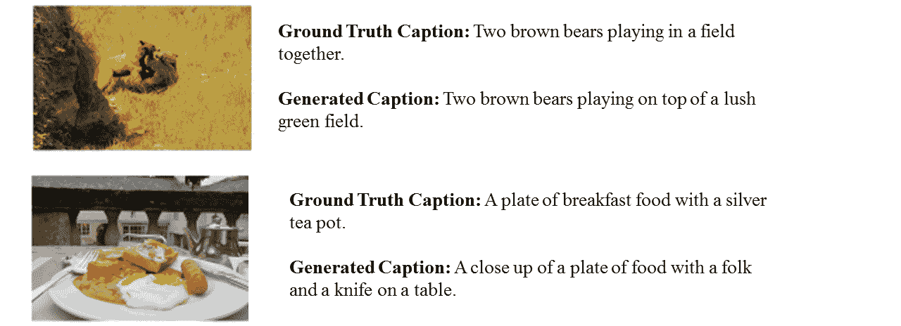

图 11\. Wu 等（Wu 等，2015）在 MS COCO 数据集的一些示例图像上生成的标注。

### 4.1\. 数据集

#### 4.1.1\. MS COCO 数据集

Microsoft COCO 数据集（Lin 等，2014）是一个非常大的图像识别、分割和标注的数据集。MS COCO 数据集具有多种特性，如对象分割、上下文中的识别、每类多个对象、超过 300,000 张图像、超过 200 万个实例、80 个对象类别以及每张图像 5 个标注。许多图像标注方法（Jin 等，2015；Wu 和 Cohen，2016；Tran 等，2016；Wang 等，2016b；You 等，2016；Gan 等，2017a；Pedersoli 等，2017；Ren 等，2017；Dai 等，2017；Shetty 等，2017；Wu 等，2015）在他们的实验中使用了该数据集。例如，Wu 等（Wu 等，2015）在他们的方法中使用了 MS COCO 数据集，两个示例图像生成的标注如图 11 所示。

#### 4.1.2\. Flickr30K 数据集

Flickr30K (Plummer 等人, 2015) 是一个用于自动图像描述和基础语言理解的数据集。它包含从 Flickr 收集的 30k 张图像，配有 158k 张由人工标注者提供的说明。该数据集未提供任何固定的图像划分用于训练、测试和验证。研究人员可以根据自己的需要选择训练、测试和验证的数量。该数据集还包括常见物体的检测器、一个颜色分类器，以及偏向选择较大物体的倾向。图像字幕生成方法如 (Karpathy 和 Fei-Fei, 2015; Vinyals 等人, 2015; Wang 等人, 2016b; Wu 等人, 2018; Chen 等人, 2017a) 使用此数据集进行实验。例如，在 Flickr30k 数据集上进行实验。Chen 等人 (Chen 等人, 2017a) 生成的该数据集两张示例图像的说明如图 12 所示。

| \multirow2*参考文献 | \multirow2*数据集 | \multirow2*评估指标 |
| --- | --- | --- |
| Kiros 等人 2014 (Kiros 等人, 2014a) | IAPR TC-12, SBU | BLEU, PPLX |
| Kiros 等人 2014 (Kiros 等人, 2014b) | Flickr 8K, Flickr 30K | R@K, mrank |
| Mao 等人 2014 (Mao 等人, 2014) | IAPR TC-12, Flickr 8K/30K | BLEU, R@K, mrank |
| Karpathy 等人 2014 (Karpathy 等人, 2014) | PASCAL1K, Flickr 8K/30K | R@K, mrank |
| Mao 等人 2015 (Mao 等人, 2015b) |

&#124; IAPR TC-12, Flickr 8K/30K, &#124;

&#124; MS COCO &#124;

| BLEU, R@K, mrank |
| --- |
| Chen 等人 2015 (Chen 和 Lawrence Zitnick, 2015) |

&#124; PASCAL, Flickr 8K/30K, &#124;

&#124; MS COCO &#124;

|

&#124; BLEU, METEOR, &#124;

&#124; CIDEr &#124;

|

| Fang 等人 2015 (Fang 等人, 2015) | PASCAL, MS COCO | BLEU, METEOR, PPLX |
| --- | --- | --- |
| Jia 等人 2015 (Jia 等人, 2015) | Flickr 8K/30K, MS COCO | BLEU, METEOR, CIDEr |
| Karpathy 等人 2015 (Karpathy 和 Fei-Fei, 2015) | Flickr 8K/30K, MS COCO | BLEU, METEOR, CIDEr |
| Vinyals 等人 2015 (Vinyals 等人, 2015) | Flickr 8K/30K, MS COCO | BLEU, METEOR, CIDEr |
| Xu 等人 2015 (Xu 等人, 2015) | Flickr 8K/30K, MS COCO | BLEU, METEOR |
| Jin 等人 2015 (Jin 等人, 2015) | Flickr 8K/30K, MS COCO | BLEU, METEOR, ROUGE, CIDEr |
| Wu 等人 2016 (Wu 和 Cohen, 2016) | MS COCO | BLEU, METEOR, CIDEr |
| Sugano 等人 2016 (Sugano 和 Bulling, 2016) | MS COCO | BLEU, METEOR, ROUGE, CIDEr |
| Mathews 等人 2016 (Mathews 等人, 2016) | MS COCO, SentiCap | BLEU, METEOR, ROUGE, CIDEr |
| Wang 等人 2016 (Wang 等人, 2016b) | Flickr 8K/30K, MS COCO | BLEU, R@K |
| Johnson 等人 2016 (Johnson 等人, 2016) | Visual Genome | METEOR, AP, IoU |
| Mao 等人 2016 (Mao 等人, 2016) | ReferIt | BLEU, METEOR, CIDEr |
| Wang 等人 2016 (Wang 等人，2016a) | Flickr 8K | BLEU, PPL, METEOR |
| Tran 等人 2016 (Tran 等人，2016) |

&#124; MS COCO, Adobe-MIT, &#124;

&#124; Instagram &#124;

| 人类评估 |
| --- |
| Ma 等人 2016 (Ma 和 Han，2016) | Flickr 8k, UIUC | BLEU, R@K |
| You 等人 2016 (You 等人，2016) | Flickr 30K, MS COCO | BLEU, METEOR, ROUGE, CIDEr |
| Yang 等人 2016 (Yang 等人，2016) | Visual Genome | METEOR, AP, IoU |
| Anne 等人 2016 (Anne Hendricks 等人，2016) | MS COCO, ImageNet | BLEU, METEOR |
| Yao 等人 2017 (Yao 等人，2017b) | MS COCO | BLEU, METEOR, ROUGE, CIDEr |
| Lu 等人 2017 (Lu 等人，2017) | Flickr 30K, MS COCO | BLEU, METEOR, CIDEr |
| Chen 等人 2017 (Chen 等人，2017b) | Flickr 8K/30K, MS COCO | BLEU, METEOR, ROUGE, CIDEr |
| Gan 等人 2017 (Gan 等人，2017b) | Flickr 30K, MS COCO | BLEU, METEOR, CIDEr |
| Pedersoli 等人 2017 (Pedersoli 等人，2017) | MS COCO | BLEU, METEOR, CIDEr |
| Ren 等人 2017 (Ren 等人，2017) | MS COCO | BLEU, METEOR, ROUGE, CIDEr |
| Park 等人 2017 (Park 等人，2017) | Instagram | BLEU, METEOR, ROUGE, CIDEr |
| Wang 等人 2017 (Wang 等人，2017) | MS COCO, Stock3M | SPICE, METEOR, ROUGE, CIDEr |
| Tavakoli 等人 2017 (Tavakoli 等人，2017) | MS COCO, PASCAL 50S | BLEU, METEOR, ROUGE, CIDEr |
| Liu 等人 2017 (Liu 等人，2017a) | Flickr 30K, MS COCO | BLEU, METEOR |
| Gan 等人 2017 (Gan 等人，2017a) | FlickrStyle10K | BLEU, METEOR, ROUGE, CIDEr |
| Dai 等人 2017 (Dai 等人，2017) | Flickr 30K, MS COCO | E-NGAN, E-GAN, SPICE, CIDEr |
| Shetty 等人 2017 (Shetty 等人，2017) | MS COCO |

&#124; 人类评估, &#124;

&#124; SPICE, METEOR &#124;

|

| Liu 等人 2017 (Liu 等人，2017b) | MS COCO | SPIDEr, 人类评估 |
| --- | --- | --- |
| Gu 等人 2017 (Gu 等人，2017) | Flickr 30K, MS COCO | BLEU, METEOR, CIDEr, SPICE |
| Yao 等人 2017 (Yao 等人，2017a) | MS COCO, ImageNet | METEOR |
| Rennie 等人 2017 (Rennie 等人，2017) | MS COCO | BLEU, METEOR, CIDEr, ROUGE |
| Vsub 等人 2017 (Venugopalan 等人，2017) | MS COCO, ImageNet | METEOR |
| Zhang 等人 2017  (Zhang 等人，2017) | MS COCO | BLEU, METEOR, ROUGE, CIDEr |
| Wu 等人 2018 (Wu 等人，2018) | Flickr 8K/30K, MS COCO | BLEU, METEOR, CIDEr |
| Aneja 等人 2018 (Aneja 等人，2018) | MS COCO | BLEU, METEOR, ROUGE, CIDEr |
| Wang 等人 2018 (Wang 和 Chan，2018) | MS COCO | BLEU, METEOR, ROUGE, CIDEr |

Table 2\. 方法、数据集和评估指标概述

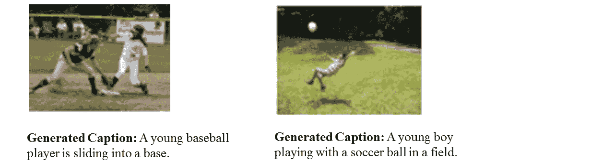

图 12\. Chen et al. (Chen et al., 2017a) 在 Flickr30k 数据集上的一些样本图像生成的描述。

#### 4.1.3\. Flickr8K 数据集

Flickr8k (Hodosh et al., 2013) 是一个流行的数据集，包含从 Flickr 收集的 8000 张图像。训练数据包括 6000 张图像，测试和开发数据各包含 1000 张图像。数据集中的每张图像都有 5 个由人工标注的参考描述。许多图像描述方法 (Jia et al., 2015; Jin et al., 2015; Xu et al., 2015; Wang et al., 2016b; Wu et al., 2018; Chen et al., 2017b) 已在该数据集上进行实验。Jia et al. (Jia et al., 2015) 在该数据集上的两个样本结果如图 13 所示。

#### 4.1.4\. Visual Genome 数据集

Visual Genome 数据集 (Krishna et al., 2017) 是另一个用于图像描述的数据集。图像描述不仅需要识别图像中的物体，还需要推理它们的互动和属性。与前三个数据集为整个场景提供描述不同，Visual Genome 数据集为图像中的多个区域提供了单独的描述。该数据集包含七个主要部分：区域描述、物体、属性、关系、区域图、场景图和问答对。数据集拥有超过 108k 张图像。每张图像平均包含 35 个物体、26 个属性和 21 对物体之间的关系。

#### 4.1.5\. Instagram 数据集

Tran et al. (Tran et al., 2016) 和 Park et al. (Park et al., 2017) 创建了两个使用 Instagram 图像的数据集，Instagram 是一个照片分享社交网络服务。Tran et al. 的数据集包含约 10k 张图像，主要来自名人。然而，Park et al. 使用他们的数据集来进行社交媒体网络中的标签预测和帖子生成任务。该数据集包含 110 万个帖子，涵盖广泛的主题，并且有来自 6.3k 用户的长标签列表。

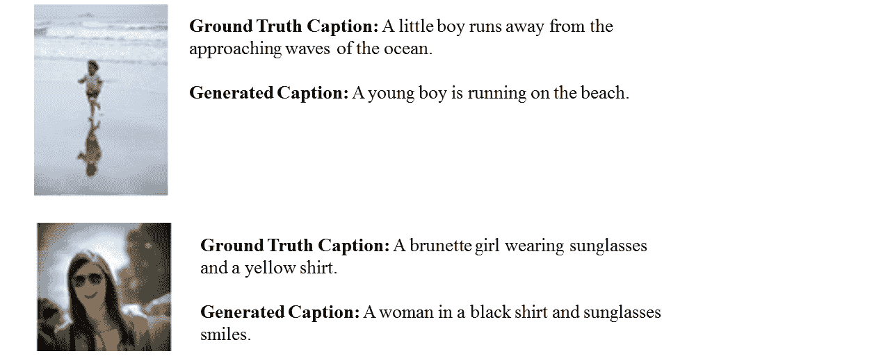

图 13\. Jia et al. (Jia et al., 2015) 在 Flickr8k 数据集上的一些样本图像生成的描述。

#### 4.1.6\. IAPR TC-12 数据集

IAPR TC-12 数据集 (Grubinger et al., 2006) 包含 20k 张图像。这些图像来自各种来源，如体育、人物摄影、动物、风景以及世界各地的许多其他位置。该数据集的图像包含多种语言的描述。图像中也包含多个物体。

#### 4.1.7\. Stock3M 数据集

Stock3M 数据集包含 3,217,654 张由用户上传的图像，规模是 MSCOCO 数据集的 26 倍。该数据集的图像内容多样。

#### 4.1.8\. MIT-Adobe FiveK 数据集

MIT-Adobe FiveK (Bychkovsky 等人，2011) 数据集包含 5,000 张图像。这些图像涵盖了各种场景、主题和光照条件，主要涉及人物、自然和人造物品。

#### 4.1.9\. FlickrStyle10k 数据集

FlickrStyle10k 数据集包含 10,000 张带有风格化标题的 Flickr 图像。训练数据包含 7,000 张图像。验证和测试数据分别包含 2,000 张和 1,000 张图像。每张图像包含浪漫、幽默和事实性的标题。

### 4.2\. 评估指标

#### 4.2.1\. BLEU

BLEU（Bilingual evaluation understudy）（Papineni 等人，2002）是一种用于测量机器生成文本质量的指标。各个文本段落与一组参考文本进行比较，并计算每个段落的得分。在估计生成文本的整体质量时，计算的得分会被平均。然而，语法正确性在这里没有被考虑。BLEU 指标的表现因参考翻译数量和生成文本的大小而异。随后，Papineni 等人引入了一种改进的精度指标，该指标使用 n-grams。BLEU 受到欢迎是因为它在自动评估机器翻译文本方面开创了先河，并且与人类质量评判有合理的相关性（Denoual 和 Lepage，2005；Callison-Burch 等人，2006）。然而，它有一些局限性，比如 BLEU 分数仅在生成文本较短时才较好（Callison-Burch 等人，2006）。有些情况下，BLEU 分数的提高并不意味着生成文本的质量很好（Lin 和 Och，2004）。

#### 4.2.2\. ROUGE

ROUGE（Recall-Oriented Understudy for Gisting Evaluation）（Lin，2004）是一组用于测量文本摘要质量的指标。它比较词序列、词对和 n-grams 与由人类创建的参考摘要集。不同类型的 ROUGE，如 ROUGE-1、ROUGE-2、ROUGE-W、ROUGE-SU4 用于不同的任务。例如，ROUGE-1 和 ROUGE-W 适用于单文档评估，而 ROUGE-2 和 ROUGE-SU4 在短摘要中表现良好。然而，ROUGE 在评估多文档文本摘要时存在问题。

#### 4.2.3\. METEOR

METEOR（Metric for Evaluation of Translation with Explicit ORdering）（Banerjee 和 Lavie，2005）是另一种用于评估机器翻译语言的指标。标准词段与参考文本进行比较。此外，还考虑了句子的词根和词汇的同义词匹配。METEOR 在句子或段落级别上能更好地进行相关性匹配。

#### 4.2.4\. CIDEr

CIDEr（共识图像描述评估）（Vedantam et al., 2015）是一种用于评估图像描述的自动共识指标。大多数现有数据集每张图像只有五个描述。以前的评估指标仅使用这些少量句子，无法充分衡量生成的描述与人工判断之间的共识。然而，CIDEr 使用词频-逆文档频率（TF-IDF）（Robertson, 2004）实现了人类共识。

#### 4.2.5\. SPICE

SPICE（语义命题图像描述评估）（Anderson et al., 2016）是一种基于语义概念的新型描述评估指标。它基于一种称为场景图的图形语义表示（Johnson et al., 2015; Schuster et al., 2015）。该图可以从图像描述中提取不同对象、属性及其关系的信息。

现有的图像描述方法计算对数似然分数来评估生成的描述。他们使用 BLEU、METEOR、ROUGE、SPICE 和 CIDEr 作为评估指标。然而，BLEU、METEOR 和 ROUGE 与人类质量评估的相关性不高。SPICE 和 CIDEr 的相关性更好，但优化难度较大。Liu 等人（Liu et al., 2017b）提出了一种新的描述评估指标，被人类评估者认为是一个不错的选择。它通过结合 SPICE 和 CIDEr 开发而成，称为 SPIDEr。它使用策略梯度方法来优化这些指标。

图像描述的质量依赖于两个主要方面的评估：适当性和流畅性。评估指标需要关注多样的语言特征来实现这两个方面。然而，常用的评估指标仅考虑一些特定的语言特征（例如，词汇或语义）。Sharif 等人（Sharif et al., 2018）提出了基于学习的复合指标来评估图像描述。该复合指标结合了一组语言特征，以实现两个主要评估方面，并显示了改进的性能。

## 5\. 在基准数据集和常见评估指标上的比较

尽管正式的实验评估超出了本文的范围，但我们提供了对实验结果和报告的各种技术性能的简要分析。我们涵盖了三组结果：

1.  (1)

    我们发现一些方法使用了第 4.1 节中列出的前三个数据集以及一些常用的评估指标来呈现结果。这些结果见表 3。

1.  (2)

    一些方法属于以下几类：基于注意力机制和其他深度学习方法（强化学习和基于 GAN 的方法）图像描述。这些方法的结果分别见表 4 和表 5。

1.  (3)

    我们还列出了在 MSCOCO 数据集上在每个评估指标上得分前两名的方法。这些结果见表 6。

如表 3 所示，在 Flickr8k 数据集中，Mao et al. 在 BLEU-1、BLEU-2、BLEU-3 和 BLEU-4 上分别取得了 0.565、0.386、0.256 和 0.170 的分数。对于 Flickr30k 数据集，分数分别为 0.600、0.410、0.280 和 0.190，均高于 Flickr8k 的分数。在 MSCOCO 数据集中取得了最高的分数。更大的数据集通常结果更高，因为它包含了更多的数据，全面表示了各种场景、复杂性及其自然背景。Jia et al. 的结果在 Flickr8k 和 Flickr30k 数据集中相似，但在 MSCOCO 数据集中更高。该方法使用视觉空间来映射图像特征和文本特征。Mao et al. 使用多模态空间进行映射。另一方面，Jia et al. 使用视觉空间进行映射。此外，该方法使用了编码器-解码器架构，可以动态引导解码器部分。因此，该方法的表现优于 Mao et al.

Xu et al. 在 MSCOCO 数据集上的表现也更佳。该方法优于 Mao et al. 和 Jia et al.，主要原因在于其使用了关注机制，只关注图像中的相关对象。基于语义概念的方法可以生成语义丰富的描述。Wu et al. 提出了基于语义概念的图像描述方法。该方法首先预测图像中不同对象的属性，然后将这些属性与语义有意义的描述进行结合。在性能方面，该方法优于表 3 中提到的所有方法。

| 数据集 | 方法 | 类别 | BLEU-1 | BLEU-2 | BLEU-3 | BLEU-4 | METEOR |
| --- | --- | --- | --- | --- | --- | --- | --- |
| \multirow4*Flickr8k | Mao et al. 2015 (Mao et al., 2015b) | MS,SL,WS | 0.565 | 0.386 | 0.256 | 0.170 | - |
|  | Jia et al. 2015 (Jia et al., 2015) | VS,SL,WS,EDA | 0.647 | 0.459 | 0.318 | 0.216 | 0.201 |
|  | Xu et al. 2015 (Xu et al., 2015) | VS,SL,WS,EDA,AB | 0.670 | 0.457 | 0.314 | 0.213 | 0.203 |
|  | Wu et al. 2018 (Wu et al., 2018) | VS,SL,WS,EDA,SCB | 0.740 | 0.540 | 0.380 | 0.270 | - |
| \multirow4*Flickr30k | Mao et al. 2015 (Mao et al., 2015b) | MS,SL,WS | 0.600 | 0.410 | 0.280 | 0.190 | - |
|  | Jia et al. 2015 (Jia et al., 2015) | VS,SL,WS,EDA | 0.646 | 0.466 | 0.305 | 0.206 | 0.179 |
|  | Xu et al. 2015 (Xu et al., 2015) | VS,SL,WS,EDA,AB | 0.669 | 0.439 | 0.296 | 0.199 | 0.184 |
|  | Wu et al. 2018 (Wu et al., 2018) | VS,SL,WS,EDA,SCB | 0.730 | 0.550 | 0.400 | 0.280 | - |
| \multirow4*MSCOCO | Mao et al. 2015 (Mao et al., 2015b) | MS,SL,WS | 0.670 | 0.490 | 0.350 | 0.250 | - |
|  | Jia et al. 2015 (Jia et al., 2015) | VS,SL,WS,EDA | 0.670 | 0.491 | 0.358 | 0.264 | 0.227 |
|  | Xu 等人 2015（Xu 等人，2015） | VS,SL,WS,EDA,AB | 0.718 | 0.504 | 0.357 | 0.250 | 0.230 |
|  | Wu 等人 2018（Wu 等人，2018） | VS,SL,WS,EDA,SCB | 0.740 | 0.560 | 0.420 | 0.310 | 0.260 |

表 3\. 不同图像描述方法在三个基准数据集上的表现及常用评估指标。

表 4 显示了基于注意力的方法在 MSCOCO 数据集上的结果。Xu 等人的随机硬注意力产生的结果优于确定性软注意力。然而，这些结果被 Jin 等人超越，他们的方法可以基于特定场景的上下文更新注意力。

Wu 等人 2016 和 Pedersoli 等人 2017 仅展示了 BLEU-4 和 METEOR 分数，这些分数高于前述方法。Wu 等人的方法使用了带有复审过程的注意力机制。复审过程检查每个时间步的注意力集中情况，并在必要时进行更新。该机制帮助实现了比之前的注意力方法更好的结果。Pedersoli 等人提出了一种不同的注意力机制，该机制将关注的图像区域直接映射到描述词而不是 LSTM 状态。这种方法的行为使其在表 4 中提到的基于注意力的方法中取得了最好的表现。

基于强化学习（RL）和 GAN 的方法正变得越来越受欢迎。我们将其称为“其他深度学习图像描述”。这一组方法的结果显示在表 5\. 这些方法在常用评估指标上没有结果。然而，它们具有生成图像描述的潜力。

Shetty 等人采用了对抗训练在其图像描述方法中。该方法能够生成多样化的描述。与使用最大似然估计的方法相比，这些描述与真实描述的偏差较小。为了利用强化学习的优势，Ren 等人提出了一种方法，可以预测当前时间步长的所有可能的下一个词。这一机制帮助他们生成语境上更准确的描述。强化学习的 Actor-Critic 类似于 GAN 的生成器和判别器。然而，在训练开始时，演员和评论员对数据没有任何了解。Zhang 等人提出了一种基于 Actor-Critic 的图像描述方法。该方法能够在早期阶段预测最终描述，并且可以生成比其他基于强化学习的方法更准确的描述。

| \multirow2*方法 | \multirow2*类别 | MS COCO |
| --- | --- | --- |
|  |  | BLEU-1 | BLEU-2 | BLEU-3 | BLEU-4 | METEOR | ROUGE-L | CIDEr |
| --- | --- | --- | --- | --- | --- | --- | --- | --- |
| Xu 等人 2015（Xu 等人，2015），软 | VS,SL,WS,EDA,VC | 0.707 | 0.492 | 0.344 | 0.243 | 0.239 | - | - |
| Xu et al. 2015 (Xu et al., 2015), hard | VS,SL,WS,EDA,VC | 0.718 | 0.504 | 0.357 | 0.250 | 0.230 | - | - |
| Jin et al. 2015 (Jin et al., 2015) | VS,SL,WS,EDA,VC | 0.697 | 0.519 | 0.381 | 0.282 | 0.235 | 0.509 | 0.838 |
| Wu et al. 2016 (Wu and Cohen, 2016) | VS,SL,WS,EDA,VC | - | - | - | 0.290 | 0.237 | - | 0.886 |
| Pedersoli et al. 2017 (Pedersoli et al., 2017) | VS,SL,WS,EDA,VC | - | - | - | 0.307 | 0.245 | - | 0.938 |

表 4\. 基于注意力机制的图像描述方法在 MSCOCO 数据集上的性能及常用评价指标。

| \multirow2*Method | \multirow2*Category | MS COCO |
| --- | --- | --- |
|  |  | BLEU-1 | BLEU-2 | BLEU-3 | BLEU-4 | METEOR | ROUGE-L | CIDEr | SPICE |
| --- | --- | --- | --- | --- | --- | --- | --- | --- | --- |
| Shetty et al. 2017[GAN] (Shetty et al., 2017) | VS,ODL,WS,EDA | - | - | - | - | 0.239 | - | - | 0.167 |
| Ren et al. 2017[RL] (Ren et al., 2017) | VS,ODL,WS,EDA | 0.713 | 0.539 | 0.403 | 0.304 | 0.251 | 0.525 | 0.937 | - |
| Zhang et al. 2017[RL] (Zhang et al., 2017) | VS,ODL,WS,EDA | - | - | - | 0.344 | 0.267 | 0.558 | 1.162 | - |

表 5\. 其他基于深度学习的图像描述方法在 MSCOCO 数据集上的性能及常用评价指标。

| \multirow2*Method | \multirow2*Category | MSCOCO |
| --- | --- | --- |
|  |  | BLEU-1 | BLEU-2 | BLEU-3 | BLEU-4 | METEOR | ROUGE-L | CIDEr | SPICE |
| --- | --- | --- | --- | --- | --- | --- | --- | --- | --- |
| Lu et al. 2017 (Lu et al., 2017) | VS,SL,WS,EDA,AB | 0.742 | 0.580 | 0.439 | 0.332 | 0.266 | - | 1.085 | - |
| Gan et al. 2017 (Gan et al., 2017b) | VS,SL,WS,CA,SCB | 0.741 | 0.578 | 0.444 | 0.341 | 0.261 | - | 1.041 | - |
| Zhang et al. 2017 (Zhang et al., 2017) | VS,ODL,WS,EDA | - | - | - | 0.344 | 0.267 | 0.558 | 1.162 | - |
| Rennie et al. 2017 (Rennie et al., 2017) | VS,ODL,WS,EDA | - | - | - | 0.319 | 0.255 | 0.543 | 1.06 | - |
| Yao et al. 2017 (Yao et al., 2017b) | VS,SL,WS,EDA,SCB | 0.734 | 0.567 | 0.430 | 0.326 | 0.254 | 0.540 | 1.00 | 0.186 |
| Gu et al. 2017 (Gu et al., 2017) | VS,SL,WS,EDA | 0.720 | 0.550 | 0.410 | 0.300 | 0.240 | - | 0.960 | 0.176 |

表 6\. 基于不同评价指标和 MSCOCO 数据集的前两种方法（粗体和斜体表示最佳结果；粗体表示第二最佳结果）。

我们发现技术的性能在不同指标上可能有所不同。表 6 显示了每个评价指标上前两名的方法。例如，Lu 等、Gan 等和 Zhang 等在 BLEU-n 和 METEOR 指标上位于前两名。BLEU-n 指标使用生成的描述中的可变长度短语与真实描述进行匹配。METEOR（Banerjee 和 Lavie，2005）考虑了匹配词元的精度、召回率和对齐。因此，这些方法生成的描述具有良好的精度和召回率，以及较好的词汇层次相似性。ROUGE-L 评估生成描述的充分性和流畅性，而 CIDEr 关注语法和显著性。SPICE 可以分析生成描述的语义。Zhang 等、Rennie 等和 Lu 等能够生成在充分性、流畅性、显著性以及语法正确性方面优于表 6 中其他方法的描述。Gu 等和 Yao 等在生成语义正确的描述方面表现良好。

## 6\. 讨论与未来研究方向

近年来，许多基于深度学习的方法被提出用于生成自动图像描述。监督学习、强化学习和基于 GAN 的方法在生成图像描述中被广泛使用。监督学习的方法可以使用视觉空间和多模态空间。视觉空间和多模态空间的主要区别在于映射。视觉空间基的方法从图像到描述进行显式映射。相比之下，多模态空间的方法则结合了隐式的视觉和语言模型。监督学习方法进一步分为基于编码器-解码器架构的方法、基于组合架构的方法、基于注意力机制的方法、基于语义概念的方法、风格化描述、密集图像描述和新颖对象基的图像描述方法。

基于编码器-解码器架构的方法使用简单的 CNN 和文本生成器来生成图像描述。基于注意力机制的图像描述方法关注图像的不同显著部分，表现出比基于编码器-解码器架构的方法更好的性能。基于语义概念的图像描述方法选择性地关注图像的不同部分，可以生成语义丰富的描述。密集图像描述方法能够生成基于区域的图像描述。风格化的图像描述表达各种情感，如浪漫、自豪和羞耻。基于 GAN 和 RL 的图像描述方法能够生成多样化和多重的描述。

MSCOCO、Flickr30k 和 Flickr8k 数据集是常用且受欢迎的图像描述数据集。MSCOCO 数据集非常大，所有图像都有多个描述。Visual Genome 数据集主要用于基于区域的图像描述。不同的评价指标用于衡量图像描述的性能。BLEU 指标适用于小句子的评价。ROUGE 有不同的类型，可用于评价不同类型的文本。METEOR 能对描述的各个部分进行评价。SPICE 在理解描述的语义细节方面比其他评价指标更好。

尽管近年来已取得成功，但仍有很大的改进空间。基于生成的方法可以为每张图像生成新颖的描述。然而，这些方法在生成准确且多样的描述时，往往在检测显著物体及属性及其关系方面存在不足。此外，生成的描述的准确性在很大程度上依赖于语法正确且多样的描述，而这又依赖于强大且复杂的语言生成模型。现有方法在从相同领域收集的图像数据集上表现良好。因此，研究开放领域数据集将是该领域一个有趣的方向。基于图像的事实描述不足以生成高质量的描述。可以加入外部知识来生成吸引人的图像描述。监督学习需要大量标记数据进行训练。因此，未来无监督学习和强化学习将在图像描述生成中更受欢迎。

## 结论

在本文中，我们回顾了基于深度学习的图像描述生成方法。我们给出了图像描述技术的分类，展示了主要组的通用框图，并突出其优缺点。我们讨论了不同的评价指标和数据集及其优缺点。还给出了实验结果的简要总结。我们简要概述了该领域的潜在研究方向。尽管基于深度学习的图像描述生成方法近年来取得了显著进展，但尚未实现能够为几乎所有图像生成高质量描述的鲁棒方法。随着新型深度学习网络架构的出现，自动图像描述将继续是一个活跃的研究领域。

## 致谢

本研究部分得到澳大利亚研究委员会资助 DE120102960 的支持。

## 参考文献

+   (1)

+   Agarwal 和 Lavie (2008) Abhaya Agarwal 和 Alon Lavie. 2008. Meteor, m-bleu 和 m-ter：与人类翻译输出排名高相关性的评价指标。在 *第三届统计机器翻译研讨会论文集* 中。计算语言学协会，115–118。

+   Aker 和 Gaizauskas（2010）Ahmet Aker 和 Robert Gaizauskas。2010。利用依赖关系模式生成图像描述。在 *第 48 届计算语言学协会年会论文集*。计算语言学协会，1250–1258。

+   Anderson 等（2016）Peter Anderson、Basura Fernando、Mark Johnson 和 Stephen Gould。2016。SPICE：语义命题图像描述评估。在 *欧洲计算机视觉会议*。Springer，382–398。

+   Anderson 等（2017）Peter Anderson、Xiaodong He、Chris Buehler、Damien Teney、Mark Johnson、Stephen Gould 和 Lei Zhang。2017。用于图像描述和 VQA 的自下而上和自上而下注意力。*arXiv 预印本 arXiv:1707.07998*（2017）。

+   Aneja 等（2018）Jyoti Aneja、Aditya Deshpande 和 Alexander G Schwing。2018。卷积图像描述。在 *IEEE 计算机视觉与模式识别会议论文集*。5561–5570。

+   Anne Hendricks 等（2016）Lisa Anne Hendricks、Subhashini Venugopalan、Marcus Rohrbach、Raymond Mooney、Kate Saenko、Trevor Darrell、Junhua Mao、Jonathan Huang、Alexander Toshev、Oana Camburu 等。2016。深度组合描述：在没有配对训练数据的情况下描述新颖的对象类别。在 *IEEE 计算机视觉与模式识别会议论文集*。

+   Bahdanau 等（2015）Dzmitry Bahdanau、Kyunghyun Cho 和 Yoshua Bengio。2015。通过联合学习对齐和翻译进行神经机器翻译。在 *国际学习表征会议（ICLR）*。

+   Bai 和 An（2018）Shuang Bai 和 Shan An。2018。自动图像描述生成的综述。*神经计算*。

+   Banerjee 和 Lavie（2005）Satanjeev Banerjee 和 Alon Lavie。2005。METEOR：一种自动评估机器翻译的度量，改善了与人工评估的相关性。在 *ACL 机器翻译和/或摘要内在与外在评估措施研讨会论文集*，第 29 卷。65–72。

+   Bengio 等（2015）Samy Bengio、Oriol Vinyals、Navdeep Jaitly 和 Noam Shazeer。2015。用于序列预测的调度采样与递归神经网络。 在 *神经信息处理系统进展*。1171–1179。

+   Bengio 等（2003）Yoshua Bengio、Réjean Ducharme、Pascal Vincent 和 Christian Jauvin。2003。神经概率语言模型。*机器学习研究杂志* 3，2 月，1137–1155。

+   Berger 等（1996）Adam L Berger、Vincent J Della Pietra 和 Stephen A Della Pietra。1996。最大熵方法在自然语言处理中的应用。*计算语言学* 22, 1（1996），39–71。

+   Bernardi 等（2016）Raffaella Bernardi、Ruket Cakici、Desmond Elliott、Aykut Erdem、Erkut Erdem、Nazli Ikizler-Cinbis、Frank Keller、Adrian Muscat、Barbara Plank 等。2016。从图像自动生成描述：模型、数据集和评估指标综述。*人工智能研究杂志（JAIR）* 55，409–442。

+   Blei et al. (2003) David M Blei, Andrew Y Ng, 和 Michael I Jordan. 2003. 潜在狄利克雷分配。*机器学习研究杂志* 3, Jan (2003), 993–1022.

+   Bodnar (2018) Cristian Bodnar. 2018. 使用生成对抗网络的文本到图像合成。*arXiv 预印本 arXiv:1805.00676*.

+   Bollacker et al. (2008) Kurt Bollacker, Colin Evans, Praveen Paritosh, Tim Sturge, 和 Jamie Taylor. 2008. Freebase：一个用于结构化人类知识的协作创建的图数据库。见于 *2008 年 ACM SIGMOD 国际数据管理会议论文集*。ACM, 1247–1250.

+   Boser et al. (1992) Bernhard E Boser, Isabelle M Guyon, 和 Vladimir N Vapnik. 1992. 优化边际分类器的训练算法。见于 *第五届计算学习理论年会论文集*。ACM, 144–152.

+   Bulling et al. (2011) Andreas Bulling, Jamie A Ward, Hans Gellersen, 和 Gerhard Troster. 2011. 基于眼电图的活动识别眼动分析。*IEEE 模式分析与机器智能汇刊* 33, 4 (2011), 741–753.

+   Bychkovsky et al. (2011) Vladimir Bychkovsky, Sylvain Paris, Eric Chan, 和 Frédo Durand. 2011. 使用输入/输出图像对数据库学习摄影全局色调调整。见于 *2011 IEEE 计算机视觉与模式识别会议 (CVPR)*。IEEE, 97–104.

+   Callison-Burch et al. (2006) Chris Callison-Burch, Miles Osborne, 和 Philipp Koehn. 2006. 重新评估 Bleu 在机器翻译研究中的作用。见于 *EACL*，第 6 卷，249–256.

+   Chen et al. (2017b) Long Chen, Hanwang Zhang, Jun Xiao, Liqiang Nie, Jian Shao, 和 Tat-Seng Chua. 2017b. SCA-CNN：卷积网络中的空间和通道注意力用于图像描述。见于 *IEEE 计算机视觉与模式识别会议 (CVPR) 论文集*。6298–6306.

+   Chen et al. (2017a) Tseng-Hung Chen, Yuan-Hong Liao, Ching-Yao Chuang, Wan-Ting Hsu, Jianlong Fu, 和 Min Sun. 2017a. 展示、适应和讲述：跨领域图像描述生成的对抗训练。见于 *IEEE 国际计算机视觉会议 (ICCV)*，第 2 卷.

+   Chen 和 Lawrence Zitnick (2015) Xinlei Chen 和 C Lawrence Zitnick. 2015. 眼中的思维：用于图像描述生成的递归视觉表示。见于 *IEEE 计算机视觉与模式识别会议论文集*。2422–2431.

+   Cho et al. (2014) Kyunghyun Cho, Bart Van Merriënboer, Dzmitry Bahdanau, 和 Yoshua Bengio. 2014. 神经机器翻译的特性：编码器-解码器方法。见于 *计算语言学协会*。103–111.

+   Chung et al. (2014) Junyoung Chung, Caglar Gulcehre, KyungHyun Cho, 和 Yoshua Bengio. 2014. 门控递归神经网络在序列建模上的实证评估。*arXiv 预印本 arXiv:1412.3555*.

+   Dai et al. (2017) Bo Dai, Dahua Lin, Raquel Urtasun, 和 Sanja Fidler. 2017. 通过条件 GAN 实现多样化和自然的图像描述。见 *IEEE 计算机视觉与模式识别会议论文集 (CVPR)*。2989–2998。

+   Dalal and Triggs (2005) Navneet Dalal 和 Bill Triggs. 2005. 人体检测的定向梯度直方图。见 *计算机视觉与模式识别，2005\. CVPR 2005\. IEEE 计算机学会会议*，第 1 卷。IEEE，886–893。

+   De Marneffe et al. (2006) Marie-Catherine De Marneffe, Bill MacCartney, 和 Christopher D Manning. 2006. 从短语结构分析生成类型化依赖分析。见 *LREC 会议论文集*，第 6 卷。意大利热那亚，449–454。

+   Denoual and Lepage (2005) Etienne Denoual 和 Yves Lepage. 2005. 字符级 BLEU：向无词分隔符语言的自动机器翻译评估迈进。见 *第二届国际联合自然语言处理会议论文集附录*。81–86。

+   Devlin et al. (2015) Jacob Devlin, Hao Cheng, Hao Fang, Saurabh Gupta, Li Deng, Xiaodong He, Geoffrey Zweig, 和 Margaret Mitchell. 2015. 图像描述的语言模型：奇异之处和有效方法。*arXiv 预印本 arXiv:1505.01809* (2015)。

+   Donahue et al. (2015) Jeffrey Donahue, Lisa Anne Hendricks, Sergio Guadarrama, Marcus Rohrbach, Subhashini Venugopalan, Kate Saenko, 和 Trevor Darrell. 2015. 用于视觉识别和描述的长期递归卷积网络。见 *IEEE 计算机视觉与模式识别会议论文集*。2625–2634。

+   Elliott and Keller (2013) Desmond Elliott 和 Frank Keller. 2013. 使用视觉依赖表示进行图像描述。见 *2013 年自然语言处理实证方法会议论文集*。1292–1302。

+   Fang et al. (2015) Hao Fang, Saurabh Gupta, Forrest Iandola, Rupesh K Srivastava, Li Deng, Piotr Dollár, Jianfeng Gao, Xiaodong He, Margaret Mitchell, 和 John C Platt. 2015. 从描述到视觉概念及其反向。见 *IEEE 计算机视觉与模式识别会议论文集*。1473–1482。

+   Farhadi et al. (2010) Ali Farhadi, Mohsen Hejrati, Mohammad Amin Sadeghi, Peter Young, Cyrus Rashtchian, Julia Hockenmaier, 和 David Forsyth. 2010. 每张图片讲述一个故事：从图像生成句子。见 *欧洲计算机视觉会议*。Springer，15–29。

+   Fathi et al. (2012) Alireza Fathi, Yin Li, 和 James M Rehg. 2012. 学习识别日常动作通过注视。见 *欧洲计算机视觉会议*。Springer，314–327。

+   Fedus et al. (2018) William Fedus, Ian Goodfellow, 和 Andrew M Dai. 2018. Maskgan：通过填补 _ 改进文本生成。*arXiv 预印本 arXiv:1801.07736*。

+   FitzGerald et al. (2013) Nicholas FitzGerald, Yoav Artzi, 和 Luke Zettlemoyer. 2013. 学习逻辑形式上的分布以生成指代表达。见 *2013 年自然语言处理实证方法会议论文集*。1914–1925。

+   Frome et al. (2013) Andrea Frome, Greg S Corrado, Jon Shlens, Samy Bengio, Jeff Dean, 和 Tomas Mikolov. 2013. Devise: 深度视觉-语义嵌入模型。见 *神经信息处理系统进展*。2121–2129。

+   Gan et al. (2017a) Chuang Gan, Zhe Gan, Xiaodong He, Jianfeng Gao, 和 Li Deng. 2017a. Stylenet: 用风格生成吸引人的视觉描述。见 *IEEE 计算机视觉与模式识别会议论文集*。3137–3146。

+   Gan et al. (2016) Chuang Gan, Tianbao Yang, 和 Boqing Gong. 2016. 学习属性等于多源领域泛化。见 *IEEE 计算机视觉与模式识别会议论文集*。87–97。

+   Gan et al. (2017b) Zhe Gan, Chuang Gan, Xiaodong He, Yunchen Pu, Kenneth Tran, Jianfeng Gao, Lawrence Carin, 和 Li Deng. 2017b. 用于视觉描述的语义组合网络。见 *IEEE 计算机视觉与模式识别会议论文集 (CVPR)*。1141–1150。

+   Gehring et al. (2016) Jonas Gehring, Michael Auli, David Grangier, 和 Yann N Dauphin. 2016. 用于神经机器翻译的卷积编码器模型。*arXiv 预印本 arXiv:1611.02344*。

+   Gehring et al. (2017) Jonas Gehring, Michael Auli, David Grangier, Denis Yarats, 和 Yann N Dauphin. 2017. 卷积序列到序列学习。*arXiv 预印本 arXiv:1705.03122*。

+   Girshick (2015) Ross Girshick. 2015. 快速 R-CNN。见 *IEEE 国际计算机视觉会议论文集*。1440–1448。

+   Girshick et al. (2014) Ross Girshick, Jeff Donahue, Trevor Darrell, 和 Jitendra Malik. 2014. 用于准确物体检测和语义分割的丰富特征层次结构。见 *IEEE 计算机视觉与模式识别会议论文集*。580–587。

+   Golland et al. (2010) Dave Golland, Percy Liang, 和 Dan Klein. 2010. 生成空间描述的博弈论方法。见 *2010 年自然语言处理实证方法会议论文集*。计算语言学协会，410–419。

+   Gong et al. (2014) Yunchao Gong, Liwei Wang, Micah Hodosh, Julia Hockenmaier, 和 Svetlana Lazebnik. 2014. 使用大规模弱标注照片集改善图像-句子嵌入。见 *欧洲计算机视觉会议*。Springer，529–545。

+   Goodfellow et al. (2014) Ian Goodfellow, Jean Pouget-Abadie, Mehdi Mirza, Bing Xu, David Warde-Farley, Sherjil Ozair, Aaron Courville, 和 Yoshua Bengio. 2014. 生成对抗网络。见 *神经信息处理系统进展*。2672–2680。

+   Gregor et al. (2015) 卡罗尔·格雷戈尔、伊沃·丹尼赫卡、亚历克斯·格雷夫斯、达尼洛·吉门内斯·雷泽德和丹·维尔斯特拉。2015 年。DRAW：一种用于图像生成的递归神经网络。在 *机器学习研究会议论文集*。1462–1471。

+   Grubinger et al. (2006) 迈克尔·格鲁宾格、保罗·克劳夫、亨宁·穆勒和托马斯·德塞拉斯。2006 年。iapr tc-12 基准测试：视觉信息系统的新评估资源。在 *国际研讨会 ontoImage*，第 5 卷。10。

+   Gu et al. (2017) 九湘顾、钢王、建飞蔡和祖涵陈。2017 年。语言 CNN 在图像描述中的实证研究。在 *国际计算机视觉会议 (ICCV) 论文集*。1231–1240。

+   Han and Li (2015) 亚宏韩和光李。2015 年。通过层次概念和对象类定位描述图像。在 *第 5 届 ACM 国际多媒体检索会议论文集*。ACM，251–258。

+   He et al. (2016) 凯明何、向宇张、少青任和建孙。2016 年。用于图像识别的深度残差学习。在 *IEEE 计算机视觉与模式识别会议论文集*。770–778。

+   Hochreiter and Schmidhuber (1997) 塞普·霍赫雷特和于尔根·施密德胡贝尔。1997 年。长短期记忆。 *神经计算* 9, 8 (1997), 1735–1780。

+   Hodosh et al. (2013) 米卡·霍多什、彼得·杨和朱莉娅·霍肯迈尔。2013 年。将图像描述框架化为排名任务：数据、模型和评估指标。 *人工智能研究期刊* 47 (2013), 853–899。

+   Isola et al. (2017) 菲利普·伊索拉、俊彦朱、廷辉周和阿列克谢·A·埃夫罗斯。2017 年。基于条件对抗网络的图像到图像翻译。在 *IEEE 国际计算机视觉会议 (CVPR) 论文集*。5967–5976。

+   Jaderberg et al. (2015) 马克斯·贾德伯格、凯伦·西蒙扬、安德鲁·齐瑟曼等。2015 年。空间变换网络。在 *神经信息处理系统进展*。2017–2025。

+   Jang et al. (2017) 埃里克·张、石翔顾和本·普尔。2017 年。具有 Gumbel-Softmax 的分类重参数化。在 *学习表示国际会议 (ICLR)*。

+   Jia et al. (2015) 徐佳、埃夫斯特拉蒂奥斯·加夫维斯、巴苏拉·费尔南多和蒂内·图特拉尔斯。2015 年。指导长短期记忆模型进行图像描述生成。在 *IEEE 国际计算机视觉会议论文集*。2407–2415。

+   Jiang et al. (2015) 明江、盛盛黄、娟永段和齐赵。2015 年。Salicon: 胶体背景下的显著性。在 *IEEE 计算机视觉与模式识别会议论文集*。1072–1080。

+   Jin et al. (2015) 军奇金、坤福、润鹏崔、飞沙和常帅张。2015 年。对齐看什么和说什么：带有基于区域的注意力和场景分解的图像描述。 *arXiv 预印本 arXiv:1506.06272*。

+   Johnson 等 (2016) Justin Johnson, Andrej Karpathy 和 Li Fei-Fei。2016。Densecap：用于密集字幕生成的全卷积定位网络。在 *IEEE 计算机视觉与模式识别会议论文集*。4565–4574。

+   Johnson 等 (2015) Justin Johnson, Ranjay Krishna, Michael Stark, Li-Jia Li, David Shamma, Michael Bernstein 和 Li Fei-Fei。2015。使用场景图进行图像检索。在 *IEEE 计算机视觉与模式识别会议论文集*。3668–3678。

+   Jozefowicz 等 (2016) Rafal Jozefowicz, Oriol Vinyals, Mike Schuster, Noam Shazeer 和 Yonghui Wu。2016。探索语言建模的极限。*arXiv 预印本 arXiv:1602.02410* (2016)。

+   Karpathy 和 Fei-Fei (2015) Andrej Karpathy 和 Li Fei-Fei。2015。用于生成图像描述的深度视觉-语义对齐。在 *IEEE 计算机视觉与模式识别会议论文集*。3128–3137。

+   Karpathy 等 (2014) Andrej Karpathy, Armand Joulin 和 Fei Fei F Li。2014。用于双向图像句子映射的深度片段嵌入。在 *神经信息处理系统进展*。1889–1897。

+   Karthikeyan 等 (2013) S Karthikeyan, Vignesh Jagadeesh, Renuka Shenoy, Miguel Ecksteinz 和 BS Manjunath。2013。从我们看到的“从哪里”和“如何”到“是什么”。在 *IEEE 国际计算机视觉会议论文集*。625–632。

+   Kazemzadeh 等 (2014) Sahar Kazemzadeh, Vicente Ordonez, Mark Matten 和 Tamara L Berg。2014。ReferItGame：在自然场景照片中指代对象。在 *EMNLP*。787–798。

+   Kiros 等 (2014a) Ryan Kiros, Ruslan Salakhutdinov 和 Rich Zemel。2014a。多模态神经语言模型。在 *第 31 届国际机器学习会议 (ICML-14) 论文集*。595–603。

+   Kiros 等 (2014b) Ryan Kiros, Ruslan Salakhutdinov 和 Richard S Zemel。2014b。通过多模态神经语言模型统一视觉-语义嵌入。在 *神经信息处理系统研讨会 (NIPS)*。

+   Konda 和 Tsitsiklis (2000) Vijay R Konda 和 John N Tsitsiklis。2000。演员-评论家算法。在 *神经信息处理系统进展*。1008–1014。

+   Krishna 等 (2017) Ranjay Krishna, Yuke Zhu, Oliver Groth, Justin Johnson, Kenji Hata, Joshua Kravitz, Stephanie Chen, Yannis Kalantidis, Li-Jia Li, David A Shamma 等。2017。视觉基因组：通过众包密集图像注释连接语言与视觉。*国际计算机视觉杂志* 123, 1 (2017)，32–73。

+   Krizhevsky 等 (2012) Alex Krizhevsky, Ilya Sutskever 和 Geoffrey E Hinton。2012。使用深度卷积神经网络进行 Imagenet 分类。在 *神经信息处理系统进展*。1097–1105。

+   Kulkarni 等 (2011) Girish Kulkarni, Visruth Premraj, Sagnik Dhar, Siming Li, Yejin Choi, Alexander C Berg 和 Tamara L Berg。2011。婴儿语言：理解和生成图像描述。在 *第 24 届 CVPR*。Citeseer。

+   Kumar and Goel (2017) Akshi Kumar 和 Shivali Goel. 2017. 图像描述技术演变的调查。*国际混合智能系统期刊* 预印本，1–19。

+   Kuznetsova et al. (2012) Polina Kuznetsova, Vicente Ordonez, Alexander C Berg, Tamara L Berg, 和 Yejin Choi. 2012. 自然图像描述的集体生成。发表于*第 50 届计算语言学协会年会：长篇论文集-第 1 卷*。计算语言学协会，359–368。

+   Kuznetsova et al. (2014) Polina Kuznetsova, Vicente Ordonez, Tamara L Berg, 和 Yejin Choi. 2014. TREETALK: 用于图像描述的树的组合与压缩。*TACL* 2, 10 (2014), 351–362。

+   Lebret et al. (2015) Rémi Lebret, Pedro O Pinheiro, 和 Ronan Collobert. 2015. 通过线性短语方法生成简单图像描述。*国际学习表示大会(ICLR)研讨会*。

+   LeCun et al. (1998) Yann LeCun, Léon Bottou, Yoshua Bengio, 和 Patrick Haffner. 1998. 应用于文档识别的基于梯度的学习。*IEEE 期刊* 86, 11 (1998), 2278–2324。

+   Li et al. (2011) Siming Li, Girish Kulkarni, Tamara L Berg, Alexander C Berg, 和 Yejin Choi. 2011. 使用网络规模 n-gram 组成简单的图像描述。发表于*第十五届计算自然语言学习会议论文集*。计算语言学协会，220–228。

+   Lin (2004) Chin-Yew Lin. 2004. Rouge: 自动评估摘要的工具包。发表于*文本摘要的拓展：ACL-04 研讨会论文集*，第 8 卷。西班牙巴塞罗那。

+   Lin and Och (2004) Chin-Yew Lin 和 Franz Josef Och. 2004. 使用最长公共子序列和跳跃-二元组统计的机器翻译质量自动评估。发表于*第 42 届计算语言学协会年会论文集*。计算语言学协会，605。

+   Lin et al. (2014) Tsung-Yi Lin, Michael Maire, Serge Belongie, James Hays, Pietro Perona, Deva Ramanan, Piotr Dollár, 和 C Lawrence Zitnick. 2014. Microsoft coco: 上下文中的常见对象。发表于*欧洲计算机视觉大会*。Springer，740–755。

+   Liu et al. (2017a) Chenxi Liu, Junhua Mao, Fei Sha, 和 Alan L Yuille. 2017a. 神经图像描述中的注意力正确性。发表于*AAAI*。4176–4182。

+   Liu et al. (2017b) Siqi Liu, Zhenhai Zhu, Ning Ye, Sergio Guadarrama, 和 Kevin Murphy. 2017b. 通过蜘蛛的策略梯度优化改进图像描述。发表于*IEEE 国际计算机视觉大会(ICCV)论文集*，第 3 卷。873–881。

+   Long et al. (2015) Jonathan Long, Evan Shelhamer, 和 Trevor Darrell. 2015. 用于语义分割的完全卷积网络。发表于*IEEE 计算机视觉与模式识别会议论文集*。3431–3440。

+   Lowe (2004) David G Lowe. 2004. 从尺度不变关键点提取的独特图像特征。*国际计算机视觉期刊* 60, 2 (2004), 91–110。

+   Lu 等（2017）Jiasen Lu, Caiming Xiong, Devi Parikh, 和 Richard Socher。2017 年。知道何时查看：通过视觉哨兵的自适应注意力用于图像字幕生成。在 *IEEE 计算机视觉与模式识别会议（CVPR）* 上。3242–3250。

+   Luong 等（2016）Minh-Thang Luong, Quoc V Le, Ilya Sutskever, Oriol Vinyals, 和 Lukasz Kaiser。2016 年。多任务序列到序列学习。在 *国际学习表征会议（ICLR）* 上。

+   Ma 和 Han（2016）Shubo Ma 和 Yahong Han。2016 年。通过将结构化词喂入 LSTM 描述图像。在 *2016 IEEE 国际多媒体与博览会（ICME）* 上。IEEE, 1–6。

+   Maddison 等（2017）Chris J Maddison, Andriy Mnih, 和 Yee Whye Teh。2017 年。具体分布：离散随机变量的连续放松。在 *国际学习表征会议（ICLR）* 上。

+   Mao 等（2016）Junhua Mao, Jonathan Huang, Alexander Toshev, Oana Camburu, Alan L Yuille, 和 Kevin Murphy。2016 年。生成和理解明确的对象描述。在 *IEEE 计算机视觉与模式识别会议* 上。11–20。

+   Mao 等（2015a）Junhua Mao, Xu Wei, Yi Yang, Jiang Wang, Zhiheng Huang, 和 Alan L Yuille。2015a 年。像孩子一样学习：通过图像的句子描述快速学习新视觉概念。在 *IEEE 国际计算机视觉会议* 上。2533–2541。

+   Mao 等（2015b）Junhua Mao, Wei Xu, Yi Yang, Jiang Wang, Zhiheng Huang, 和 Alan Yuille。2015b 年。使用多模态递归神经网络（m-rnn）进行深度字幕生成。在 *国际学习表征会议（ICLR）* 上。

+   Mao 等（2014）Junhua Mao, Wei Xu, Yi Yang, Jiang Wang, 和 Alan L Yuille。2014 年。通过多模态递归神经网络解释图像。*arXiv 预印本 arXiv:1410.1090*（2014）。

+   Maron 和 Lozano-Pérez（1998）Oded Maron 和 Tomás Lozano-Pérez。1998 年。多实例学习框架。在 *神经信息处理系统进展* 上。570–576。

+   Mathews 等（2016）Alexander Patrick Mathews, Lexing Xie, 和 Xuming He。2016 年。SentiCap：生成带有情感的图像描述。在 *AAAI* 上。3574–3580。

+   Mikolov 等（2013）Tomas Mikolov, Kai Chen, Greg Corrado, 和 Jeffrey Dean。2013 年。在向量空间中高效估计词表示。*arXiv 预印本 arXiv:1301.3781*。

+   Mikolov 等（2010）Tomáš Mikolov, Martin Karafiát, Lukáš Burget, Jan Černockỳ, 和 Sanjeev Khudanpur。2010 年。基于递归神经网络的语言模型。在 *第十一届国际语音通信协会年会* 上。

+   Mishra 等（2012）Ajay K Mishra, Yiannis Aloimonos, Loong Fah Cheong, 和 Ashraf Kassim。2012 年。主动视觉分割。*IEEE 模式分析与机器智能汇刊* 34, 4 (2012), 639–653。

+   Mitchell 等 (2012) Margaret Mitchell、Xufeng Han、Jesse Dodge、Alyssa Mensch、Amit Goyal、Alex Berg、Kota Yamaguchi、Tamara Berg、Karl Stratos 和 Hal Daumé III。2012 年。Midge：从计算机视觉检测生成图像描述。发表于 *第 13 届欧洲计算语言学协会会议论文集*。计算语言学协会，747–756。

+   Mitchell 等 (2010) Margaret Mitchell、Kees van Deemter 和 Ehud Reiter。2010 年。在视觉领域自然引用对象。发表于 *第 6 届国际自然语言生成会议论文集*。计算语言学协会，95–104。

+   Mitchell 等 (2013) Margaret Mitchell、Kees Van Deemter 和 Ehud Reiter。2013 年。生成指向可见对象的表达式。发表于 *HLT-NAACL*。1174–1184。

+   Mnih 和 Hinton (2007a) Andriy Mnih 和 Geoffrey Hinton。2007a 年。用于统计语言建模的三种新图模型。发表于 *第 24 届国际机器学习会议论文集*。ACM，641–648。

+   Mnih 和 Hinton (2007b) Andriy Mnih 和 Geoffrey Hinton。2007b 年。用于统计语言建模的三种新图模型。发表于 *第 24 届国际机器学习会议论文集*。ACM，641–648。

+   Och (2003) Franz Josef Och。2003 年。统计机器翻译中的最小误差率训练。发表于 *第 41 届计算语言学协会年会论文集-第 1 卷*。计算语言学协会，160–167。

+   Ojala 等 (2000) Timo Ojala、Matti Pietikäinen 和 Topi Mäenpää。2000 年。使用局部二值模式的灰度和旋转不变纹理分类。发表于 *欧洲计算机视觉会议*。Springer，404–420。

+   Ordonez 等 (2011) Vicente Ordonez、Girish Kulkarni 和 Tamara L Berg。2011 年。Im2text：使用 100 万张带注释的照片描述图像。发表于 *神经信息处理系统进展*。1143–1151。

+   Papadopoulos 等 (2014) Dim P Papadopoulos、Alasdair DF Clarke、Frank Keller 和 Vittorio Ferrari。2014 年。从眼动追踪数据训练对象类别检测器。发表于 *欧洲计算机视觉会议*。Springer，361–376。

+   Papineni 等 (2002) Kishore Papineni、Salim Roukos、Todd Ward 和 Wei-Jing Zhu。2002 年。BLEU：一种自动评估机器翻译的方法。发表于 *第 40 届计算语言学协会年会论文集*。计算语言学协会，311–318。

+   Park 等 (2017) Cesc Chunseong Park、Byeongchang Kim 和 Gunhee Kim。2017 年。关注你：具有上下文序列记忆网络的个性化图像标题生成。发表于 *IEEE 计算机视觉与模式识别会议 (CVPR)*。6432–6440。

+   Pedersoli 等 (2017) Marco Pedersoli、Thomas Lucas、Cordelia Schmid 和 Jakob Verbeek。2017 年。图像标题生成的关注区域。发表于 *IEEE 国际计算机视觉会议论文集*。1251–1259。

+   Plummer et al. (2015) Bryan A Plummer, Liwei Wang, Chris M Cervantes, Juan C Caicedo, Julia Hockenmaier, 和 Svetlana Lazebnik. 2015. Flickr30k 实体：收集区域到短语的对应关系以丰富图像到句子的模型。在 *IEEE 国际计算机视觉会议论文集* 中，2641–2649。

+   Ranzato et al. (2016) Marc’Aurelio Ranzato, Sumit Chopra, Michael Auli, 和 Wojciech Zaremba. 2016. 使用递归神经网络进行序列级训练。在 *国际学习表征会议 (ICLR)* 中。

+   Reed et al. (2016) Scott Reed, Zeynep Akata, Xinchen Yan, Lajanugen Logeswaran, Bernt Schiele, 和 Honglak Lee. 2016. 生成对抗文本到图像合成。在 *机器学习研究会议论文集* 中，第 48 卷，1060–1069。

+   Ren et al. (2015a) Shaoqing Ren, Kaiming He, Ross Girshick, 和 Jian Sun. 2015a. Faster R-CNN: 朝向实时物体检测的区域提议网络。在 *神经信息处理系统进展* 中，91–99。

+   Ren et al. (2015b) Zhou Ren, Hailin Jin, Zhe Lin, Chen Fang, 和 Alan Yuille. 2015b. 多实例视觉-语义嵌入。*arXiv 预印本 arXiv:1512.06963* (2015)。

+   Ren et al. (2016) Zhou Ren, Hailin Jin, Zhe Lin, Chen Fang, 和 Alan Yuille. 2016. 通过高斯视觉-语义嵌入进行联合图像-文本表示。在 *2016 ACM 多媒体会议论文集* 中，ACM，207–211。

+   Ren et al. (2017) Zhou Ren, Xiaoyu Wang, Ning Zhang, Xutao Lv, 和 Li-Jia Li. 2017. 基于深度强化学习的图像描述生成与嵌入奖励。在 *IEEE 计算机视觉与模式识别会议论文集 (CVPR)* 中，1151–1159。

+   Rennie et al. (2017) Steven J Rennie, Etienne Marcheret, Youssef Mroueh, Jarret Ross, 和 Vaibhava Goel. 2017. 自我批评序列训练用于图像描述生成。在 *IEEE 计算机视觉与模式识别会议论文集 (CVPR)* 中，1179–1195。

+   Robertson (2004) Stephen Robertson. 2004. 理解逆文档频率：关于 IDF 的理论论证。*文献学期刊* 60, 5 (2004), 503–520。

+   Sattar et al. (2015) Hosnieh Sattar, Sabine Muller, Mario Fritz, 和 Andreas Bulling. 2015. 从注视中预测开放世界设置下的搜索目标。在 *IEEE 计算机视觉与模式识别会议论文集* 中，981–990。

+   Schuster et al. (2015) Sebastian Schuster, Ranjay Krishna, Angel Chang, Li Fei-Fei, 和 Christopher D Manning. 2015. 从文本描述生成语义精确的场景图以改善图像检索。在 *第四届视觉与语言研讨会论文集* 中，第 2 卷。

+   Shanmuga Vadivel et al. (2015) Karthikeyan Shanmuga Vadivel, Thuyen Ngo, Miguel Eckstein, 和 BS Manjunath. 2015. 通过眼动追踪辅助从视频中提取重要关注对象。在 *IEEE 计算机视觉与模式识别会议论文集* 中，3241–3250。

+   Sharif 等（2018）Naeha Sharif、Lyndon White、Mohammed Bennamoun 和 Syed Afaq Ali Shah。2018 年。基于学习的复合度量用于改进描述评估。在 *ACL 2018 会议，学生研究研讨会*。14–20。

+   Shetty 等（2017）Rakshith Shetty、Marcus Rohrbach、Lisa Anne Hendricks、Mario Fritz 和 Bernt Schiele。2017 年。说同一种语言：通过对抗训练将机器描述与人类描述匹配。在 *IEEE 国际计算机视觉会议（ICCV）*。4155–4164。

+   Simonyan 和 Zisserman（2015）Karen Simonyan 和 Andrew Zisserman。2015 年。用于大规模图像识别的非常深的卷积网络。在 *国际学习表示会议（ICLR）*。

+   Socher 等（2014）Richard Socher、Andrej Karpathy、Quoc V Le、Christopher D Manning 和 Andrew Y Ng。2014 年。通过句子查找和描述图像的基础组合语义。 *计算语言学学会会刊* 2（2014），207–218。

+   Sugano 和 Bulling（2016）Yusuke Sugano 和 Andreas Bulling。2016 年。与人类共同观察：注视辅助的神经图像描述。 *arXiv 预印本 arXiv:1608.05203*（2016 年）。

+   Sun 等（2015）Chen Sun、Chuang Gan 和 Ram Nevatia。2015 年。从平行文本和视觉语料库中自动发现概念。在 *IEEE 国际计算机视觉会议论文集*。2596–2604。

+   Sutskever 等（2014）Ilya Sutskever、Oriol Vinyals 和 Quoc V Le。2014 年。使用神经网络进行序列到序列学习。在 *神经信息处理系统进展*。3104–3112。

+   Sutton 等（2000）Richard S Sutton、David A McAllester、Satinder P Singh 和 Yishay Mansour。2000 年。具有函数逼近的强化学习策略梯度方法。在 *神经信息处理系统进展*。1057–1063。

+   Szegedy 等（2015）Christian Szegedy、Wei Liu、Yangqing Jia、Pierre Sermanet、Scott Reed、Dragomir Anguelov、Dumitru Erhan、Vincent Vanhoucke 和 Andrew Rabinovich。2015 年。通过卷积深入探索。在 *IEEE 计算机视觉与模式识别会议论文集*。1–9。

+   Tavakoli 等（2017）Hamed R Tavakoli、Rakshith Shetty、Ali Borji 和 Jorma Laaksonen。2017 年。关注图像描述生成模型生成的描述。在 *IEEE 计算机视觉与模式识别会议论文集*。2487–2496。

+   Tran 等（2016）Kenneth Tran、Xiaodong He、Lei Zhang、Jian Sun、Cornelia Carapcea、Chris Thrasher、Chris Buehler 和 Chris Sienkiewicz。2016 年。自然环境中的丰富图像描述。在 *IEEE 计算机视觉与模式识别会议研讨会论文集*。49–56。

+   van Deemter 等（2006）Kees van Deemter、Ielka van der Sluis 和 Albert Gatt。2006 年。构建一个语义透明的语料库用于生成指代表达。在 *第四届国际自然语言生成会议论文集*。计算语言学学会，130–132。

+   van den Oord 等人（2016）Aaron van den Oord、Nal Kalchbrenner、Lasse Espeholt、Oriol Vinyals、Alex Graves 等人。2016 年。基于 PixelCNN 解码器的条件图像生成。在 *神经信息处理系统进展*。4790–4798。

+   Vaswani 等人（2017）Ashish Vaswani、Noam Shazeer、Niki Parmar、Jakob Uszkoreit、Llion Jones、Aidan N Gomez、Łukasz Kaiser 和 Illia Polosukhin。2017 年。注意力机制是你所需要的一切。在 *神经信息处理系统进展*。5998–6008。

+   Vedantam 等人（2015）Ramakrishna Vedantam、C Lawrence Zitnick 和 Devi Parikh。2015 年。Cider: 基于共识的图像描述评估。在 *IEEE 计算机视觉与模式识别会议论文集*。4566–4575。

+   Venugopalan 等人（2017）Subhashini Venugopalan、Lisa Anne Hendricks、Marcus Rohrbach、Raymond Mooney、Trevor Darrell 和 Kate Saenko。2017 年。对包含多样物体的图像进行描述。在 *IEEE 计算机视觉与模式识别会议论文集*。1170–1178。

+   Viethen 和 Dale（2008）Jette Viethen 和 Robert Dale。2008 年。空间关系在指代表达生成中的应用。在 *第五届国际自然语言生成会议论文集*。计算语言学协会，59–67。

+   Vinyals 等人（2015）Oriol Vinyals、Alexander Toshev、Samy Bengio 和 Dumitru Erhan。2015 年。Show and tell: 一种神经图像描述生成器。在 *IEEE 计算机视觉与模式识别会议论文集*。3156–3164。

+   Vinyals 等人（2017）Oriol Vinyals、Alexander Toshev、Samy Bengio 和 Dumitru Erhan。2017 年。Show and tell: 从 2015 年 MSCoco 图像描述挑战中获得的经验。*IEEE 模式分析与机器智能学报* 39，4（2017），652–663。

+   Wang 等人（2016b）Cheng Wang、Haojin Yang、Christian Bartz 和 Christoph Meinel。2016b 年。利用深度双向 LSTM 进行图像描述。在 *2016 ACM 多媒体会议论文集*。ACM，988–997。

+   Wang 等人（2018）Heng Wang、Zengchang Qin 和 Tao Wan。2018 年。基于生成对抗网络的文本生成。*太平洋-亚洲知识发现与数据挖掘会议*。Springer，92–103。

+   Wang 等人（2016a）Minsi Wang、Li Song、Xiaokang Yang 和 Chuanfei Luo。2016a 年。用于图像描述生成的并行融合 RNN-LSTM 架构。在 *2016 IEEE 国际图像处理会议（ICIP）*。IEEE，4448–4452。

+   Wang 和 Chan（2018）Qingzhong Wang 和 Antoni B Chan。2018 年。CNN+ CNN: 用于图像描述的卷积解码器。*arXiv 预印本 arXiv:1805.09019*。

+   Wang 等人（2017）Yufei Wang、Zhe Lin、Xiaohui Shen、Scott Cohen 和 Garrison W Cottrell。2017 年。Skeleton Key: 通过 Skeleton-Attribute 分解进行图像描述。在 *IEEE 计算机视觉与模式识别会议论文集 (CVPR)*。7378–7387。

+   Wu et al. (2015) 吴琪，沈春华，安东·范·登·亨格尔，刘灵桥，和安东尼·迪克。2015。带有中间属性层的图像描述。*arXiv 预印本 arXiv:1506.01144*（2015）。

+   Wu et al. (2018) 吴琪，沈春华，彭旺，安东尼·迪克，和安东·范·登·亨格尔。2018。基于属性和外部知识的图像描述和视觉问答。*IEEE 模式分析与机器智能交易* 40，第 6 期，1367–1381。

+   Wu and Cohen (2016) 吴志林，袁叶，岳欣吴和鲁斯兰·萨拉赫乌丁诺夫，威廉·W·科恩。2016。编码、回顾和解码：描述生成的评论员模块。 在*第 30 届神经图像处理系统会议（NIPS）*。

+   Xu et al. (2015) 许凯文，吉米·巴，瑞安·基罗斯，崔京贤，亚伦·库维尔，鲁斯兰·萨拉赫乌丁诺夫，瑞奇·泽梅尔，和约书亚·本吉奥。2015。展示、关注和讲述：具有视觉注意力的神经图像描述生成。 在*国际机器学习会议*。2048–2057。

+   Yang et al. (2016) 杨林杰，唐凯文，杨建超，和李李佳。2016。通过联合推理和视觉上下文进行密集描述。在*IEEE 计算机视觉与模式识别会议（CVPR）*。1978–1987。

+   Yao et al. (2017a) 姚婷，潘英伟，李业昊，和梅涛。2017a。在图像描述中引入复制机制以学习新对象。 在*2017 IEEE 计算机视觉与模式识别会议（CVPR）*。IEEE，5263–5271。

+   Yao et al. (2017b) 姚婷，潘英伟，李业昊，邱兆凡，和梅涛。2017b。通过属性提升图像描述。 在*IEEE 国际计算机视觉会议（ICCV）*。4904–4912。

+   You et al. (2016) 游全增，金海林，王兆文，方晨，和罗洁波。2016。带有语义注意力的图像描述。 在*IEEE 计算机视觉与模式识别会议论文集*。4651–4659。

+   Yu et al. (2017) 余兰涛，张伟南，王军，和杨宇。2017。具有策略梯度的序列生成对抗网络。 在*第三十一届 AAAI 人工智能会议论文集*。

+   Yun et al. (2013) 尹基元，彭一凡，迪米特里斯·萨马拉斯，格雷戈里·J·泽林斯基，和塔玛拉·L·伯格。2013。探讨注视行为和物体检测在场景理解中的作用。*心理学前沿* 4（2013）。

+   Zeiler and Fergus (2014) 马修·D·泽伊勒和罗布·费格斯。2014。可视化和理解卷积网络。 在*欧洲计算机视觉会议*。Springer，818–833。

+   Zelinsky (2013) 格雷戈里·J·泽林斯基。2013。理解场景理解。*心理学前沿* 4（2013）。

+   Zhang et al. (2017) 李张，洪泛，刘峰，向涛，龚绍刚，杨永鑫，和蒂莫西·M·霍斯佩代利斯。2017。用于图像描述的演员-评论家序列训练。*arXiv 预印本 arXiv:1706.09601*。
