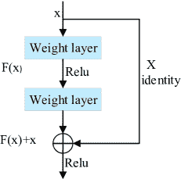
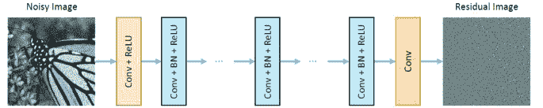
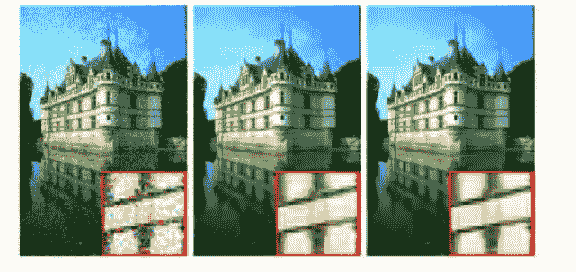
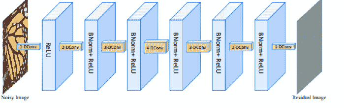

<!--yml

类别: 未分类

日期：2024-09-06 20:07:20

-->

# [1810.05052] 深度学习在图像去噪中的应用：综述

> 来源：[`ar5iv.labs.arxiv.org/html/1810.05052`](https://ar5iv.labs.arxiv.org/html/1810.05052)

¹¹institutetext: 1\. 哈尔滨工业大学深圳校区生物计算研究中心，

深圳，518055 广东，中国

2\. 深圳医疗生物识别感知与分析工程实验室，深圳，518055 广东，中国

3\. 广东工业大学计算机学院，广州 510006，中国

chunweitian@163.com,yongxu@ymail.com,flksxm@126.com,yanke401@163.com

作者指示

# 深度学习在图像去噪中的应用：综述

田春伟 ^(1,2)    徐勇 ^(1,2,*)    费伦科³    闫科^(1,2)

###### 摘要

自从大数据分析和图形处理单元（GPU）的提议以来，深度学习技术受到了广泛关注，并在图像处理领域得到了广泛应用。本文旨在全面回顾和总结近年来提出的图像去噪深度学习技术。此外，我们还系统地分析了传统的图像去噪机器学习方法。最后，我们指出了图像去噪深度学习技术的一些研究方向。*摘要*环境。

###### 关键词：

深度学习，卷积神经网络，GPU；图像去噪。

## 1 引言

图像处理有许多应用，包括图像分割 [28]，图像分类 [25, 38, 32, 12]，目标检测 [13]，视频跟踪 [36]，图像修复 [48] 和动作识别 [35]。特别是，图像去噪技术是图像处理技术中最重要的分支之一，并作为一个例子展示了过去 20 年图像处理技术的发展 [42]。Buades 等 [5] 提出了非局部算法方法来处理图像去噪。Lan 等 [19] 融合了置信传播推理方法和马尔可夫随机场（MRFs）来解决图像去噪问题。Dabov 等 [9] 提出了将类似的二维图像片段转换为三维数据数组以提高稀疏性，从而改进图像去噪。这些选择和提取方法在图像去噪方面表现出色。然而，传统方法面临两个挑战 [45]。首先，这些方法是非凸的，需要手动设置参数。其次，这些方法在测试阶段涉及复杂的优化问题，导致计算成本高昂。

近年来，研究表明，深度学习技术能够依赖更深的架构自动学习并发现更合适的图像特征，而不需要手动设置参数，这有效解决了上述传统方法的缺陷[18]。大数据和 GPU 对提高深度学习技术的学习能力也至关重要[16]。深度学习的学习能力通过模型（也称为网络）完成，模型由许多层组成，包括卷积层、池化层、批量归一化层和全连接层。换句话说，深度学习技术可以通过模型将输入数据（例如图像、语音和视频）转换为输出（例如物体类别、密码解锁和交通信息）[24]。特别是，卷积神经网络（CNN）是处理图像的最典型和成功的深度学习网络之一[20]。CNN 起源于 1998 年的 LeNet，并成功应用于手写数字识别，取得了优异的表现[21]。然而，卷积神经网络（CNNs）在 GPU 和大数据出现之前并未广泛应用于其他实际场景。换句话说，CNN 的真正成功归功于 2012 年的 ImageNet 大规模视觉识别挑战赛（ILSVRC 2012），在该比赛中提出了新的 CNN，命名为 AlexNet，并成为了 ILSVRC 2012 的世界冠军[18, 43]。

在随后的几年中，深度神经网络变得流行，并在图像处理方面取得了有希望的表现[29]。Karen Simonyan 等人[29]将神经网络的深度增加到 16-19 层，加权层的卷积滤波器大小为每层 3 $\times$ 3，用于图像识别。Christian Szegedy 等人[30]提供了一种机制，通过使用稀疏连接层[2]而不是完全连接层，来增加神经网络的宽度和深度，用于图像分类，称为 Inception V1\。Inception V1 有效地防止了网络宽度增加导致的过拟合，并减少了网络深度增加带来的计算资源消耗。以往的研究表明，深度网络本质上使用端到端的多层方式来融合不同层次的特征[17]和分类器，通过增加网络的深度，提取的特征可以更加稳健。尽管深度网络在图像处理[27]中取得了成功应用，但它们在网络深度增加时可能会产生梯度消失或梯度爆炸[4]，这会阻碍网络的收敛。这一问题可以通过标准化初始化[39]来解决。然而，当更深的神经网络收敛时，网络会饱和，并随着网络深度的增加迅速退化。残差网络的出现有效地解决了图像识别[15]中的上述问题。ResNeXt 方法被测试为对图像分类[40]非常有效。时空注意力（SPA）方法对视觉跟踪[50]非常具有竞争力。残差密集网络（RDN）也是图像超分辨率[49]的有效工具。此外，DiracNets[44]、IndRNN[23]和变分 U-Net[11]也为图像处理提供了许多有竞争力的技术。这些深度网络也被广泛应用于图像去噪，这是图像处理技术的一个分支。例如，核预测网络与 CNN 的组合用于获得去噪图像[3]。BMCNN 利用 NSS 和 CNN 处理图像去噪[1]。GAN 用于从噪声图像中去除噪声[33]。

尽管上述研究表明深度学习技术在图像去噪应用中取得了巨大成功，但根据我所知，尚无针对图像去噪的深度学习技术的比较研究。深度学习技术指的是图像去噪的属性，以提出明智的解决方法，这些方法嵌入在多个隐藏层中并具有端到端连接，以更好地处理这些问题。因此，进行综述以回顾图像处理的原理、性能、差异、优缺点和技术潜力是重要且必要的。更深的 CNNs（例如 AlexNet、GoogLeNet、VGG 和 ResNet），可以展示深度学习技术的理念及其在图像去噪中的成功原因。为了更好地展示深度学习去噪的鲁棒性，本论文展示了深度学习在图像去噪中的表现。本文还提供了未来深度学习技术在图像去噪中的潜在挑战和方向。

本文的其余部分组织如下。第二部分概述了典型的深度学习方法。第三部分提供了图像去噪的深度学习技术。第四部分指出了一些潜在的研究方向。第六部分总结了本文的结论。

## 2 典型深度网络

目前，最广泛使用的模型是以端到端的监督方式进行训练的，这种方法实现简单，容易训练模型。流行的网络架构是 CNNs（ResNet）。该网络广泛用于图像处理应用，并取得了巨大的成功。接下来的章节将展示流行的深度学习技术，并讨论第二部分中方法的优缺点和差异。

### 2.1 ResNet

深度卷积神经网络（CNNs）在图像识别方面取得了许多突破。特别是深度网络在图像分类[30]中发挥了重要作用。许多其他视觉识别应用也受益于深度网络。然而，更深的网络可能会导致梯度消失/爆炸[30]。这个问题已通过归一化初始化[33]有效解决，使网络收敛。当网络开始收敛时，网络的性能会下降。例如，增加网络的深度会增加训练模型中的错误。ResNet[15]有效解决了这个问题。ResNet 的思想是每两层的输出和它们的输入作为新的输入相加。ResNet 包括许多块，块如图 1 所示，其中$x$和$f$分别表示输入和激活函数。通过$f(x) + x$获得残差块。ResNet 之所以流行，有以下几个原因。首先，ResNet 是深而不是宽，有效控制参数数量并克服过拟合问题。其次，它使用更少的池化层和更多的下采样操作以提高传输效率。第三，它使用 BN 和平均池化进行正则化，加快训练模型的速度。最后，它使用每个卷积层的 3 $\times$ 3 滤波器来训练模型，比使用 3 $\times$ 3 和 1 $\times$ 1 滤波器的组合更快。因此，ResNet 在 ILSVRC 2015 中获得第一名，并在 ImageNet 测试集上减少了 3.57%的错误。

此外，残差网络的变形网络在图像分类、图像去噪[41]和图像分辨率[31]方面广受欢迎且被广泛应用。

图 1：残差网络：一个构建块

## 3 图像去噪

图像去噪是图像处理应用的一个重要主题。我们以图像去噪为例，展示深度学习技术在图像处理应用中的性能和原理。

图像去噪的目标是从噪声图像$y$中获得干净的图像$x$，其中$y=x+n$。$n$表示具有方差$\sigma^{2}$的加性白噪声（AWGN）。从机器学习的知识中，我们知道图像先验在图像去噪中非常重要。在过去的十年中，提出了许多使用图像先验的模型方法，如马尔可夫随机场（MRF）方法[19]、BM3D[9]、NCSR[10]和 NSS[6]。尽管这些方法在图像去噪中表现良好，但它们有两个缺点。首先，这些方法需要优化，从而增加了计算成本。其次，这些方法是非凸的，需要手动设置来提高性能。为了解决这些问题，提出了一些判别学习方案。提出了一种可训练的非线性反应扩散方法，并用于学习图像先验[26]。一个收缩场级联将基于随机场的模型和半二次算法融合成一个单一架构[46]。尽管这些方法提高了图像去噪的性能，但它们仍然局限于特定的先验形式。另一个缺点是这些方法不能使用一个模型来处理盲图像去噪。

深度学习技术可以有效地解决上述问题。基于以下三个方面，深度学习技术被选用于图像去噪。首先，它们具有深度架构，可以学习更多的特征。其次，BN 和 ReLu 被添加到深度架构中，可以加快训练速度。第三，深度学习方法的网络可以在 GPU 上运行，从而训练更多样本并提高效率。提出的 DnCNN[45]使用 BN 和 ResNet 进行图像去噪。该网络不仅可以处理盲图像去噪，还解决了图像超分辨率任务和 JPEG 图像去块问题。其架构如图 2 所示。具体来说，它从模型中获得残差图像，并在测试阶段需要使用$y=x+n$来获得干净图像。它获得了 29.13 的 PSNR，优于在 BSD68 数据集上$\sigma$ = 25 的最先进的 BM3D 方法的 28.57。

图 2：DnCNN 的架构

图 3：CBM3D 和 FFDNet 对彩色图像去噪的结果 (a)噪声图像($\sigma$=35) (b)CBM3D(29.90dB) (c)FFDNet(30.51dB)

FFDNet [46] 使用噪声水平图和噪声图像作为输入，以处理不同的噪声水平。此方法利用单一模型处理多个噪声水平。它在 GPU 和 CPU 上的速度也比 BM3D 更快。如图 3 所示，FFDNet 在图像去噪方面的性能优于 CBM3D [19] 方法。IRCNN [47] 结合了基于模型的优化方法和 CNN，以解决图像去噪问题，它能够用一个单一模型处理不同的逆问题和多个任务。此外，它将扩张卷积加入网络中，提高了去噪性能。其架构如图 4 所示。

图 4：IRCNN 的架构

此外，许多其他方法也在图像去噪方面取得了良好表现。例如，扩张卷积和 ResNet 的融合被用于图像去噪 [37]。这是结合不同专家来源进行图像去噪的一个不错选择 [8]。通用去噪网络 [22] 用于图像去噪，而深度 CNN 去噪器用于消除乘法噪声 [34] 也是有效的。如表 1 所示，深度学习方法优于传统方法。DnCNN 方法在图像去噪方面表现出色。

表 1：不同方法在$\sigma$ = 25 时的图像去噪比较。

| 方法 | PSNR | 数据集 |
| --- | --- | --- |
| BM3D [9] | 28.57 | BSD68 |
| WNNM [14] | 28.83 | BSD68 |
| TNRD [7] | 28.92 | BSD68 |
| DnCNN [45] | 29.23 | BSD68 |
| FFDNet [46] | 29.19 | BSD68 |
| IRCNN [47] | 29.15 | BSD68 |
| DDRN [37] | 29.18 | BSD68 |

## 4 研究方向

### 4.1 深度学习技术在图像去噪中的挑战

根据现有研究，深度学习技术在图像去噪方面取得了令人鼓舞的成果。然而，这些技术也面临以下一些挑战。(1) 目前的深度学习去噪方法仅处理 AWGN，对于真实噪声图像（如低光图像）效果不佳。(2) 它们不能使用一个模型处理所有低级视觉任务，如图像去噪、图像超分辨率、图像模糊和图像去块。(3) 它们不能使用一个模型处理盲高斯噪声。

### 4.2 深度学习技术在图像去噪中的一些潜在方向

根据之前的研究，深度学习技术在图像去噪应用中发生了以下变化。首先，深度学习技术设计了不同的网络架构以处理上述任务。其次，它们可以融合优化和判别方法。第三，它们可以使用多个任务来设计网络。第四，它们可以改变神经网络的输入。

## 5 结论

本论文首先全面介绍了深度学习技术在图像处理应用中的发展。然后展示了典型 CNN 的实现。接着，详细说明了图像去噪，概述了不同图像去噪方法在现实世界中的差异和思路。最后，本文展示了深度学习方法在图像处理应用中的挑战并提出了解决方案。这篇综述为图像处理应用的深度学习技术提供了重要的线索。我们相信，这篇论文可以为相关领域的研究人员提供有用的指南，尤其是对深度学习初学者。

## 6 致谢

本论文部分得到了深圳市科技创新委员会资助，资助号为 JCYJ20170811155725434；部分得到了国家自然科学基金资助，资助号为 61876051。

## 参考文献

+   [1] Byeongyong Ahn 和 Nam Ik Cho. 用于图像去噪的块匹配卷积神经网络。arXiv 预印本 arXiv:1704.00524, 2017.

+   [2] Sanjeev Arora, Aditya Bhaskara, Rong Ge, 和 Tengyu Ma. 学习某些深度表示的可证明界限。发表于国际机器学习大会，第 584–592 页, 2014.

+   [3] Steve Bako, Thijs Vogels, Brian McWilliams, Mark Meyer, Jan Novák, Alex Harvill, Pradeep Sen, Tony Derose, 和 Fabrice Rousselle. 用于去噪蒙特卡罗渲染的内核预测卷积网络。ACM Trans. Graph, 36(4):97, 2017.

+   [4] Yoshua Bengio, Patrice Simard, 和 Paolo Frasconi. 使用梯度下降学习长期依赖关系是困难的。IEEE transactions on neural networks, 5(2):157–166, 1994.

+   [5] Antoni Buades, Bartomeu Coll, 和 J-M Morel. 一种用于图像去噪的非局部算法。发表于计算机视觉与模式识别会议，2005\. CVPR 2005. IEEE 计算机协会会议，第 2 卷，第 60–65 页\. IEEE, 2005.

+   [6] Antoni Buades, Bartomeu Coll, 和 Jean-Michel Morel. 非局部图像和视频去噪。International journal of computer vision, 76(2):123–139, 2008.

+   [7] Yunjin Chen 和 Thomas Pock. 可训练的非线性反应扩散：用于快速有效图像恢复的灵活框架。IEEE transactions on pattern analysis and machine intelligence, 39(6):1256–1272, 2017.

+   [8] Joon Hee Choi, Omar Elgendy, 和 Stanley H Chan. 集成不同专家来源以实现稳健的图像去噪。arXiv 预印本 arXiv:1711.06712, 2017.

+   [9] Kostadin Dabov, Alessandro Foi, Vladimir Katkovnik, 和 Karen Egiazarian. 通过稀疏 3D 变换域协同滤波进行图像去噪。IEEE Transactions on image processing, 16(8):2080–2095, 2007.

+   [10] Weisheng Dong, Lei Zhang, Guangming Shi, 和 Xin Li. 用于图像恢复的非局部集中稀疏表示。IEEE Transactions on Image Processing, 22(4):1620–1630, 2013.

+   [11] Patrick Esser, Ekaterina Sutter, 和 Björn Ommer. 条件外观和形状生成的变分 U-Net。发表于 IEEE 计算机视觉与模式识别会议论文集，第 8857–8866 页，2018 年。

+   [12] Lunke Fei, Guangming Lu, Wei Jia, Shaohua Teng, 和 David Zhang. 用于掌纹识别的特征提取方法：综述与评估。IEEE 系统、人类与控制论学报：系统，2018 年。

+   [13] Ross Girshick, Jeff Donahue, Trevor Darrell, 和 Jitendra Malik. 精确目标检测和语义分割的丰富特征层次。发表于 IEEE 计算机视觉与模式识别会议论文集，第 580–587 页，2014 年。

+   [14] Shuhang Gu, Lei Zhang, Wangmeng Zuo, 和 Xiangchu Feng. 带权核范数最小化及其在图像去噪中的应用。发表于 IEEE 计算机视觉与模式识别会议论文集，第 2862–2869 页，2014 年。

+   [15] Kaiming He, Xiangyu Zhang, Shaoqing Ren, 和 Jian Sun. 用于图像识别的深度残差学习。发表于 IEEE 计算机视觉与模式识别会议论文集，第 770–778 页，2016 年。

+   [16] Qibin Hou, Ming-Ming Cheng, Xiaowei Hu, Ali Borji, Zhuowen Tu, 和 Philip Torr. 通过短连接进行深度监督的显著性目标检测。发表于 2017 年 IEEE 计算机视觉与模式识别会议（CVPR），第 5300–5309 页。IEEE，2017 年。

+   [17] Sergey Ioffe 和 Christian Szegedy. 批量归一化：通过减少内部协变量偏移来加速深度网络训练。arXiv 预印本 arXiv:1502.03167，2015 年。

+   [18] Alex Krizhevsky, Ilya Sutskever, 和 Geoffrey E Hinton. 使用深度卷积神经网络的 Imagenet 分类。发表于神经信息处理系统进展，第 1097–1105 页，2012 年。

+   [19] Xiangyang Lan, Stefan Roth, Daniel Huttenlocher, 和 Michael J Black. 具有学习的高阶马尔可夫随机场的高效信念传播。发表于欧洲计算机视觉会议，第 269–282 页。Springer，2006 年。

+   [20] Steve Lawrence, C Lee Giles, Ah Chung Tsoi, 和 Andrew D Back. 人脸识别：一种卷积神经网络方法。IEEE 神经网络学报，8(1)：98–113，1997 年。

+   [21] Yann LeCun, Bernhard Boser, John S Denker, Donnie Henderson, Richard E Howard, Wayne Hubbard, 和 Lawrence D Jackel. 反向传播应用于手写邮政编码识别。神经计算，1(4)：541–551，1989 年。

+   [22] Stamatios Lefkimmiatis. 通用去噪网络：一种用于图像去噪的新型 CNN 架构。发表于 IEEE 计算机视觉与模式识别会议论文集，第 3204–3213 页，2018 年。

+   [23] Shuai Li, Wanqing Li, Chris Cook, Ce Zhu, 和 Yanbo Gao. 独立递归神经网络（indrnn）：构建更长更深的 RNN。发表于 IEEE 计算机视觉与模式识别会议论文集，第 5457–5466 页，2018 年。

+   [24] Geert Litjens, Thijs Kooi, Babak Ehteshami Bejnordi, Arnaud Arindra Adiyoso Setio, Francesco Ciompi, Mohsen Ghafoorian, Jeroen AWM van der Laak, Bram Van Ginneken, 和 Clara I Sánchez. 深度学习在医学图像分析中的综述. 医学图像分析, 42:60–88, 2017 年。

+   [25] Yongbin Qin 和 Chunwei Tian. 使用核加权特征空间表示进行图像分类. 阿拉伯科学与工程杂志, 页码 1–13, 2017 年。

+   [26] Uwe Schmidt 和 Stefan Roth. 用于有效图像恢复的收缩场. 发表在 IEEE 计算机视觉与模式识别会议论文集, 页码 2774–2781, 2014 年。

+   [27] Pierre Sermanet, David Eigen, Xiang Zhang, Michaël Mathieu, Rob Fergus, 和 Yann LeCun. Overfeat: 使用卷积网络进行集成识别、定位和检测. arXiv 预印本 arXiv:1312.6229, 2013 年。

+   [28] Jianbo Shi 和 Jitendra Malik. 归一化切割与图像分割. IEEE 模式分析与机器智能汇刊, 22(8):888–905, 2000 年。

+   [29] Karen Simonyan 和 Andrew Zisserman. 用于大规模图像识别的非常深度卷积网络. arXiv 预印本 arXiv:1409.1556, 2014 年。

+   [30] Christian Szegedy, Wei Liu, Yangqing Jia, Pierre Sermanet, Scott Reed, Dragomir Anguelov, Dumitru Erhan, Vincent Vanhoucke, 和 Andrew Rabinovich. 深度卷积网络. 发表在 IEEE 计算机视觉与模式识别会议论文集, 页码 1–9, 2015 年。

+   [31] Ying Tai, Jian Yang, Xiaoming Liu, 和 Chunyan Xu. Memnet: 一种用于图像恢复的持久记忆网络. 发表在 IEEE 计算机视觉与模式识别会议论文集, 页码 4539–4547, 2017 年。

+   [32] Chunwei Tian, Qi Zhang, Guanglu Sun, Zhichao Song, 和 Siyan Li. FFT 综合稀疏和协同表示用于图像分类. 阿拉伯科学与工程杂志, 43(2):741–758, 2018 年。

+   [33] Subarna Tripathi, Zachary C Lipton, 和 Truong Q Nguyen. 通过投影校正: 使用生成对抗网络去噪图像. arXiv 预印本 arXiv:1803.04477, 2018 年。

+   [34] Guodong Wang, GuoTao Wang, Zhenkuan Pan, 和 Zhimei Zhang. 使用深度 CNN 去噪器先验的乘法噪声去除. 发表在智能信号处理与通信系统（ISPACS），2017 年国际研讨会论文集, 页码 1–6\. IEEE, 2017 年。

+   [35] Heng Wang, Alexander Kläser, Cordelia Schmid, 和 Cheng-Lin Liu. 通过密集轨迹进行动作识别. 发表在计算机视觉与模式识别（CVPR），2011 年 IEEE 会议论文集, 页码 3169–3176\. IEEE, 2011 年。

+   [36] Li Wang, Ting Liu, Gang Wang, Kap Luk Chan, 和 Qingxiong Yang. 使用学习的层次特征进行视频跟踪. IEEE 图像处理汇刊, 24(4):1424–1435, 2015 年。

+   [37] Tianyang Wang, Mingxuan Sun, 和 Kaoning Hu. 用于图像去噪的扩张残差网络. arXiv 预印本 arXiv:1708.05473, 2017 年。

+   [38] 闫伟，方晓兆，徐永，田春伟和费伦克。具有自适应图正则化的低秩表示。神经网络，108:83–96，2018 年。

+   [39] 吴宇欣和何恺明。群体归一化。arXiv 预印本 arXiv:1803.08494，2018 年。

+   [40] 谢赛宁，罗斯·吉尔希克，皮奥特·多拉尔，朱文图和何恺明。深度神经网络的聚合残差变换。在计算机视觉与模式识别（CVPR），2017 IEEE 会议上，第 5987–5995 页。IEEE，2017 年。

+   [41] 谢伟英，李云松和贾修平。具有残差学习的深度卷积网络用于精确的光谱-空间去噪。神经计算，2018 年。

+   [42] 徐俊，张磊，左望梦，张大卫和冯相楚。基于补丁组的非局部自相似先验学习用于图像去噪。在 IEEE 国际计算机视觉会议论文集中，第 244–252 页，2015 年。

+   [43] 杨优，张赵，谢卓睿，詹姆斯·德梅尔和库尔特·凯特泽。用 AlexNet 在 24 分钟内完成 100 轮 ImageNet 训练。ArXiv 电子预印本，2017 年。

+   [44] 谢尔盖·扎戈鲁伊科和尼科斯·科莫达基斯。DiracNets：训练没有跳跃连接的非常深的神经网络。arXiv 预印本 arXiv:1706.00388，2017 年。

+   [45] 张凯，左望梦，陈云锦，孟德宇和张磊。超越高斯去噪器：深度卷积神经网络的残差学习用于图像去噪。IEEE 图像处理汇刊，26(7):3142–3155，2017 年。

+   [46] 张凯，左望梦和张磊。FFDNet：面向快速灵活的 CNN 图像去噪解决方案。IEEE 图像处理汇刊，2018 年。

+   [47] 张凯，左望梦和张磊。学习一个单一卷积超分辨率网络以处理多种退化。在 IEEE 计算机视觉与模式识别会议上，卷 6，2018 年。

+   [48] 张磊和左望梦。图像恢复：从稀疏和低秩先验到深度先验。IEEE 信号处理杂志，34(5):172–179，2017 年。

+   [49] 张玉伦，田亚鹏，孔宇，钟宾能和傅云。用于图像超分辨率的残差密集网络。在 IEEE 计算机视觉与模式识别会议（CVPR）上，2018 年。

+   [50] 郑竹，吴伟，邹伟和颜俊杰。具有时空注意力的端到端流量相关跟踪。照明，42:20，2017 年。
