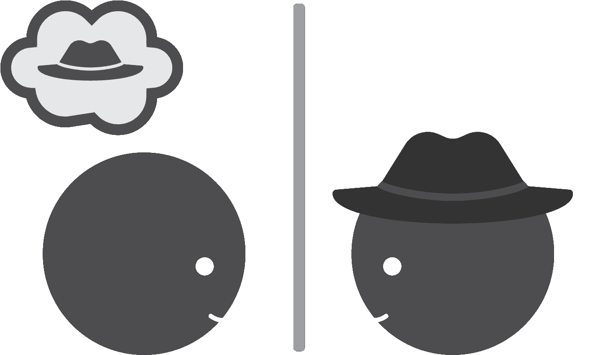
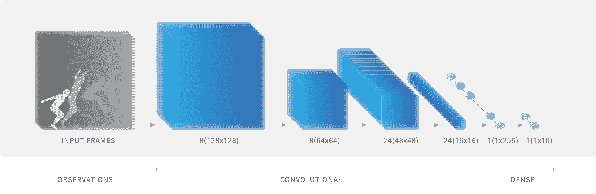
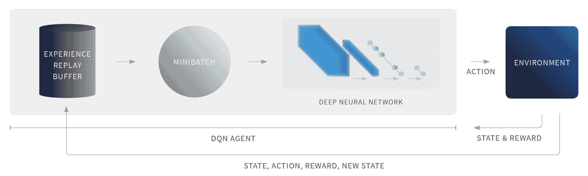
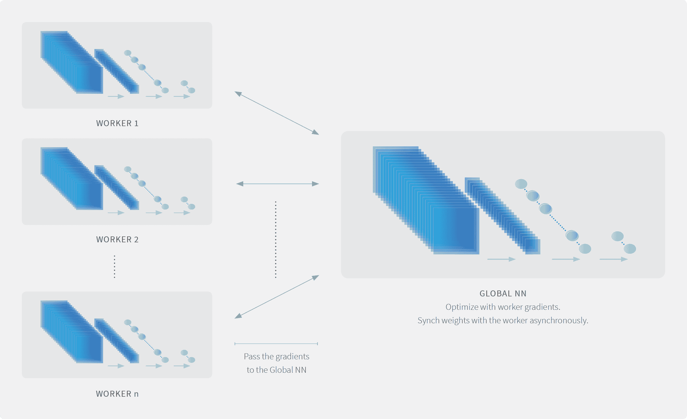
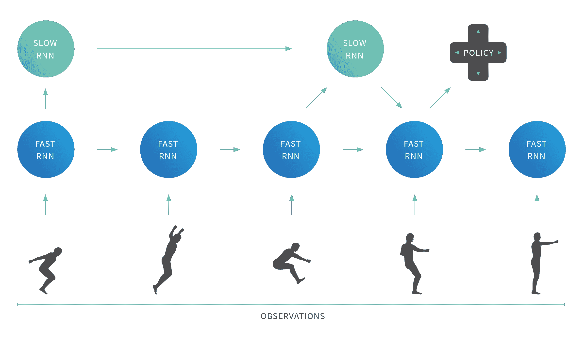
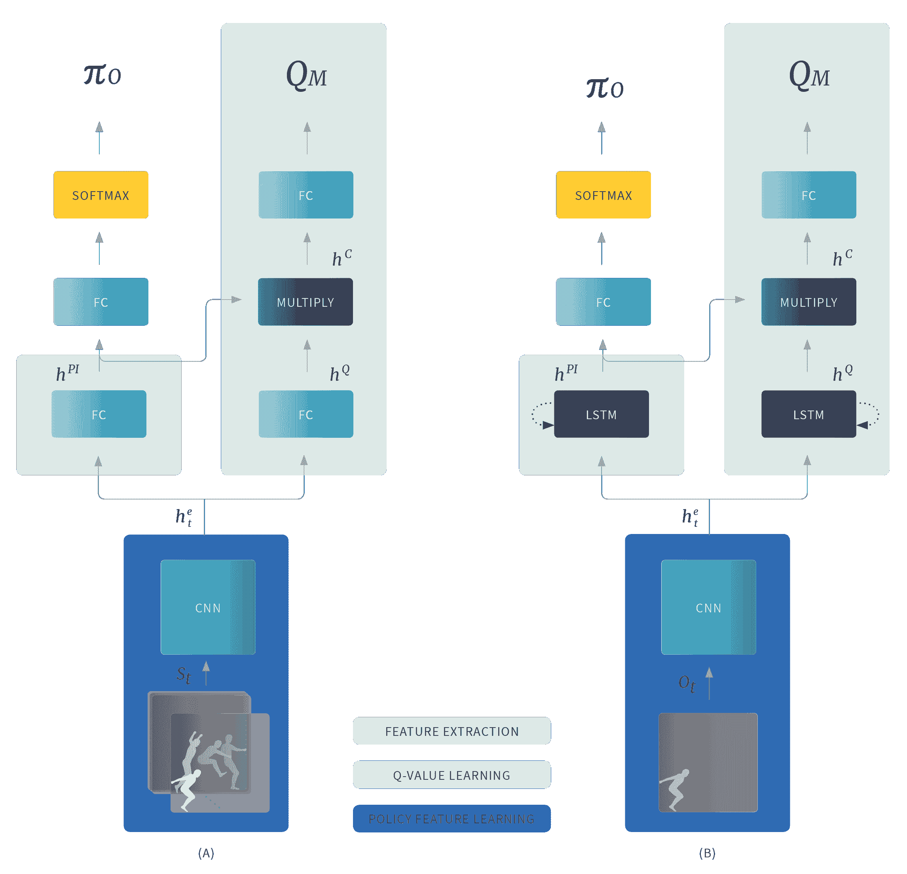
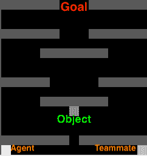
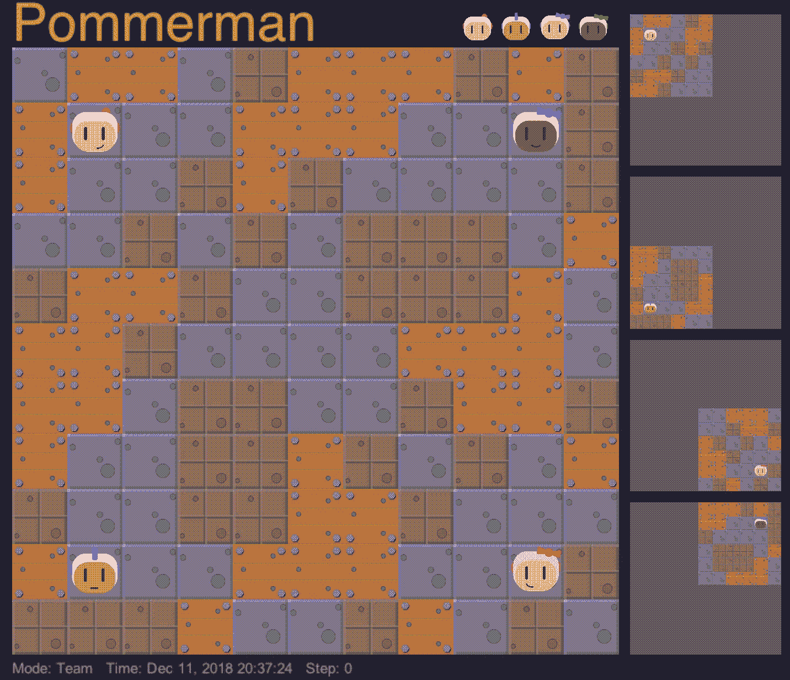

<!--yml

分类：未分类

日期：2024-09-06 20:07:18

-->

# [1810.05587] 多智能体深度强化学习的调查与批评¹¹ 早期版本的标题为：“多智能体深度强化学习是答案还是问题？简要调查”

> 来源：[`ar5iv.labs.arxiv.org/html/1810.05587`](https://ar5iv.labs.arxiv.org/html/1810.05587)

# 多智能体深度强化学习的调查与批评¹¹ 早期版本的标题为：“多智能体深度强化学习是答案还是问题？简要调查”

Pablo Hernandez-Leal, Bilal Kartal 和 Matthew E. Taylor

{pablo.hernandez,bilal.kartal,matthew.taylor}@borealisai.com Borealis AI

加拿大，埃德蒙顿

###### 摘要

深度强化学习（RL）近年来取得了卓越的成果。这导致了应用和方法数量的显著增加。近期工作探索了超越单一智能体场景的学习，并考虑了多智能体学习（MAL）场景。初步结果报告了在复杂的多智能体领域中的成功，尽管存在若干挑战需要解决。本文的主要目标是提供当前多智能体深度强化学习（MDRL）文献的清晰概述。此外，我们通过更广泛的分析来补充这一概述：（i）我们重新审视了最初在 MAL 和 RL 中提出的关键组件，并强调了它们如何被适应到多智能体深度强化学习设置中。（ii）我们向新从业者提供一般性指南：描述从 MDRL 工作中获得的经验教训，指向最近的基准，并概述开放的研究途径。（iii）我们采取更批判的语气，提出 MDRL 的实际挑战（例如，实施和计算需求）。我们希望本文能帮助统一和激励未来的研究，利用现有的丰富文献（例如，RL 和 MAL），共同推动多智能体社区的有益研究。

## 1 引言

几乎 20 年前，Stone 和 Veloso 的开创性调查[1]为定义多智能体系统（MAS）领域及其在 AI 背景下的开放问题奠定了基础。大约十年前，Shoham、Powers 和 Grenager[2]指出，多智能体学习（MAL）文献在增长，无法列举所有相关文章。从那时起，已发表的 MAL 作品数量持续上升，这导致了该领域的不同调查，从分析 MAL 的基础及其挑战[3, 4, 5]，到解决特定子领域：博弈论和 MAL[2, 6]，合作场景[7, 8]，以及 MAL 的进化动态[9]。仅在过去几年内，已发布了三项与 MAL 相关的调查：非平稳环境中的学习[10]，智能体对智能体建模[11]，以及多智能体 RL 中的迁移学习[12]。

对 MAL 的研究兴趣与人工智能的成功相伴而生，首先是在单智能体视频游戏中[13]；更近期的成功则是在双人游戏中，例如围棋[14, 15]，扑克[16, 17]，以及两个竞争团队的游戏，例如 DOTA 2[18]和 StarCraft II[19]。

虽然在上述场景中使用了不同的技术和算法，但一般而言，它们都是来自两个主要领域的技术组合：强化学习（RL）[20]和深度学习[21, 22]。

强化学习（RL）是机器学习的一个领域，其中一个智能体通过在动态环境中交互（即采取行动）来学习。然而，RL 以及传统机器学习的主要挑战之一是需要手动设计质量特征来进行学习。深度学习实现了高效的表示学习，从而允许自动发现特征[21, 22]。近年来，深度学习在计算机视觉和自然语言处理等不同领域取得了成功[21, 22]。深度学习的一个关键方面是使用*神经网络*（NNs），它们可以在高维数据中找到紧凑的表示[23]。

在深度强化学习（DRL）中[23, 24]，深度神经网络被训练来逼近最优策略和/或价值函数。这种方式中，作为函数逼近器的深度神经网络能够实现强大的泛化能力。DRL 的一个关键优势是，它使强化学习能够扩展到具有高维状态和动作空间的问题。然而，迄今为止，大多数现有成功的 DRL 应用都集中在视觉领域（例如 Atari 游戏），对于更加现实的、复杂动态的应用仍需大量工作[25, 26]，这些应用不一定是基于视觉的。

深度强化学习（DRL）被视为构建通用人工智能系统的重要组成部分[27]，并已成功地与其他技术集成，例如搜索[14]、规划[28]，以及最近的多智能体系统，其中包括新兴领域*多智能体深度强化学习*（*MDRL*）[29, 30]。²²2 我们注意到缩写存在不一致，如：D-MARL，MADRL，深度多智能体 RL 和 MA-DRL。

在多智能体环境中学习基本上比单一智能体情况更加困难，因为存在多智能体病态问题，例如移动目标问题（非静态性）[2, 5, 10]，维度诅咒[2, 5]，多智能体信用分配[31, 32]，全局探索[8]，以及相对泛化过度[33, 34, 35]。尽管存在这些复杂性，像 AAAI、ICML、ICLR、IJCAI 和 NeurIPS 这样的顶级人工智能会议，以及专门的会议如 AAMAS，都发表了关于 MDRL 成功的作品。鉴于这些作品，我们认为首先，概述最近的 MDRL 作品是相关的，其次，理解这些最近的作品如何与现有文献相关。

本文通过对当前 MDRL 工作的简要调查，为现有关于多智能体学习[36, 10]、合作学习[7, 8]、代理建模代理[11]、多智能体 RL 中的知识重用[12]以及（单一智能体）深度强化学习[23, 37]的调查进行补充。

首先，我们简要回顾了强化学习中的关键算法，如 Q-learning 和 REINFORCE（见第 2.1 节）。其次，我们回顾了深度强化学习（DRL），突出介绍了这一领域中的挑战，并评审了近期的研究工作（见第 2.2 节）。第三，我们介绍了多智能体环境，并概述了关键挑战和结果（见第 3.1 ‣ 多智能体深度强化学习的调查与评估 1footnote 11footnote 1 本文早期版本标题为：“多智能体深度强化学习是答案还是问题？简要调查”") 节）。然后，我们展示了用于归类近期 MDRL 研究的四个类别（见图 1）：

+   1.

    应对新兴行为的分析：在多智能体场景中评估单智能体 DRL 算法（例如，Atari 游戏、社会困境、3D 竞争游戏）。

+   2.

    学习沟通：智能体学习沟通协议以解决合作任务。

+   3.

    学习合作：智能体通过仅使用动作和（局部）观察来学习合作。

+   4.

    智能体建模智能体：智能体推理其他智能体以完成任务（例如，最佳响应学习者）。

对于每个类别，我们提供了描述，并概述了最近的研究（见第 3.2 ‣ A Survey and Critique of Multiagent Deep Reinforcement Learning1footnote 11footnote 1Earlier versions of this work had the title: “Is multiagent deep reinforcement learning the answer or the question? A brief survey”")节和表格 2 ‣ A Survey and Critique of Multiagent Deep Reinforcement Learning1footnote 11footnote 1Earlier versions of this work had the title: “Is multiagent deep reinforcement learning the answer or the question? A brief survey”")–4 ‣ A Survey and Critique of Multiagent Deep Reinforcement Learning1footnote 11footnote 1Earlier versions of this work had the title: “Is multiagent deep reinforcement learning the answer or the question? A brief survey”")）。然后，我们回顾这些新研究如何与现有文献相关。在这一背景下，首先，我们展示了如何将最初在 RL 和 MAL 中引入的方法和算法成功扩展到 MDRL（见第 4.1 节）。其次，我们通过描述现有 MDRL 研究中的一般*经验教训*（见第 4.2 节）为新从业者提供一些指引，并指出最近的多智能体基准（见第 4.3 节）。第三，我们采取更为批判的视角，描述 MDRL 中的实际挑战，如可重复性、超参数调优和计算需求（见第 4.4 节）。然后，我们概述了一些未解的研究问题（见第 4.5 节）。最后，我们展示了本研究的结论（见第五部分）。

我们的目标是概述一个近期活跃的领域（即 MDRL），并激励未来研究利用多智能体学习中的丰富现有文献。我们旨在使有 DRL 或 MAL 经验的研究人员对最新工作和 MDRL 中的开放问题有共同的理解，并避免形成相互隔绝的小圈子 [2, 10, 11, 38]。

(a) 产生行为的分析

(b) 学习沟通

(c) 学习合作

(d) 智能体建模智能体

图 1：不同 MDRL 工作的分类。(a) 产生行为的分析：在多智能体场景中评估单智能体 DRL 算法。(b) 学习沟通：智能体通过行动和消息进行学习。(c) 学习合作：智能体仅通过行动和（局部）观察来学习合作。(d) 智能体建模智能体：智能体推理其他智能体以完成任务（例如，合作或竞争）。有关更详细的描述，请参见章节 3.3 ‣ 多智能体深度强化学习的综述与批判 1 脚注 11 脚注 1 早期版本的标题为：“多智能体深度强化学习是答案还是问题？简要综述”")–3.6 ‣ 多智能体深度强化学习的综述与批判 1 脚注 11 脚注 1 早期版本的标题为：“多智能体深度强化学习是答案还是问题？简要综述”") 以及表格 2 ‣ 多智能体深度强化学习的综述与批判 1 脚注 11 脚注 1 早期版本的标题为：“多智能体深度强化学习是答案还是问题？简要综述”")–4 ‣ 多智能体深度强化学习的综述与批判 1 脚注 11 脚注 1 早期版本的标题为：“多智能体深度强化学习是答案还是问题？简要综述”")。

## 2 单智能体学习

本节介绍了强化学习的形式化以及其主要组成部分，然后概述了*深度*强化学习及其特定挑战和最新算法。有关更详细的描述，我们推荐读者参考该领域的优秀书籍和综述文章 [39, 20, 23, 40, 24]。

### 2.1 强化学习

强化学习（RL）通过马尔可夫决策过程（MDP）[41]形式化了代理与环境的交互。MDP 由元组<math alttext="\langle\mathcal{S},\mathcal{A},R,T,\gamma\rangle" display="inline"><semantics ><mrow  ><mo stretchy="false"  >⟨</mo><mi >𝒮</mi><mo >,</mo><mi >𝒜</mi><mo >,</mo><mi  >R</mi><mo >,</mo><mi >T</mi><mo  >,</mo><mi >γ</mi><mo stretchy="false" >⟩</mo></mrow><annotation-xml encoding="MathML-Content" ><list ><ci  >𝒮</ci><ci >𝒜</ci><ci >𝑅</ci><ci  >𝑇</ci><ci >𝛾</ci></list></annotation-xml><annotation encoding="application/x-tex" >\langle\mathcal{S},\mathcal{A},R,T,\gamma\rangle</annotation></semantics></math>定义，其中<math alttext="\mathcal{S}" display="inline"><semantics ><mi >𝒮</mi><annotation-xml encoding="MathML-Content" ><ci  >𝒮</ci></annotation-xml><annotation encoding="application/x-tex" >\mathcal{S}</annotation></semantics></math>表示有限状态集合。<math alttext="\mathcal{A}" display="inline"><semantics ><mi >𝒜</mi><annotation-xml encoding="MathML-Content" ><ci  >𝒜</ci></annotation-xml><annotation encoding="application/x-tex" >\mathcal{A}</annotation></semantics></math>表示有限动作集合。转移函数<math alttext="T:\mathcal{S}\times\mathcal{A}\times\mathcal{S}\rightarrow[0,1]" display="inline"><semantics ><mrow ><mi  >T</mi><mo lspace="0.278em" rspace="0.278em"  >:</mo><mrow ><mrow ><mi >𝒮</mi><mo lspace="0.222em" rspace="0.222em" >×</mo><mi id="S2.SS1.p1.4.m4.2.

MDPs 是适用于在*单一*代理完全可观察环境中获得最佳决策的模型。³³3 部分可观察马尔可夫决策过程（POMDP）[42, 43] 明确建模了代理无法再看到真实系统状态，而是接收*观测*（由基础系统状态生成）的环境。解决 MDP 将产生一个策略 <math alttext="\pi:\mathcal{S}\rightarrow\mathcal{A}" display="inline"><semantics ><mrow ><mi  >π</mi><mo lspace="0.278em" rspace="0.278em"  >:</mo><mrow ><mi >𝒮</mi><mo stretchy="false" >→</mo><mi >𝒜</mi></mrow></mrow><annotation-xml encoding="MathML-Content" ><apply ><ci  >:</ci><ci >𝜋</ci><apply ><ci  >→</ci><ci >𝒮</ci><ci >𝒜</ci></apply></apply></annotation-xml><annotation encoding="application/x-tex" >\pi:\mathcal{S}\rightarrow\mathcal{A}</annotation></semantics></math>，它是从状态到动作的映射。一个最优策略 <math   alttext="\pi^{*}" display="inline"><semantics ><msup  ><mi >π</mi><mo >∗</mo></msup><annotation-xml encoding="MathML-Content" ><apply  ><csymbol cd="ambiguous"  >superscript</csymbol><ci >𝜋</ci></apply></annotation-xml><annotation encoding="application/x-tex" >\pi^{*}</annotation></semantics></math> 是最大化期望折扣回报总和的策略。对于 MDPs 的解决有不同的技术，前提是对其所有元素有完整描述。最常见的技术之一是价值迭代算法 [44]，它需要对状态、动作、奖励和转移有完整而准确的表示。然而，在许多领域，这可能很难获得。因此，RL 算法通常通过在离散时间步中与环境交互的经验来学习。

#### Q-学习

强化学习中最著名的算法之一是 Q 学习 [45]。它是为具有离散动作的稳定、单代理、完全可观测环境设计的。Q 学习代理通过估计其从状态<math alttext="s" display="inline"><semantics ><mi  >s</mi><annotation-xml encoding="MathML-Content" ><ci >𝑠</ci></annotation-xml><annotation encoding="application/x-tex" >s</annotation></semantics></math>开始，并采取动作<math alttext="a" display="inline"><semantics ><mi  >a</mi><annotation-xml encoding="MathML-Content" ><ci >𝑎</ci></annotation-xml><annotation encoding="application/x-tex" >a</annotation></semantics></math> 作为<math alttext="\hat{Q}(s,a)" display="inline"><semantics ><mrow ><mover accent="true"  ><mi >Q</mi><mo >^</mo></mover><mo lspace="0em" rspace="0em"  >​</mo><mrow ><mo stretchy="false"  >(</mo><mi >s</mi><mo >,</mo><mi >a</mi><mo stretchy="false"  >)</mo></mrow></mrow><annotation-xml encoding="MathML-Content" ><apply ><apply ><ci >^</ci><ci >𝑄</ci></apply><interval closure="open" ><ci >𝑠</ci><ci >𝑎</ci></interval></apply></annotation-xml><annotation encoding="application/x-tex" >\hat{Q}(s,a)</annotation></semantics></math>。每个表格条目<math alttext="\hat{Q}(s,a)" display="inline"><semantics ><mrow  ><mover accent="true"  xref="S

|  | <math   alttext="\hat{Q}(s,a)\leftarrow\hat{Q}(s,a)+\alpha[(r+\gamma\max_{a^{\prime}}\hat{Q}(s^{\prime},a^{\prime}))-\hat{Q}(s,a)]" display="block"><semantics ><mrow  ><mrow ><mover accent="true" ><mi  >Q</mi><mo >^</mo></mover><mo lspace="0em" rspace="0em"  >​</mo><mrow ><mo stretchy="false" >(</mo><mi  >s</mi><mo >,</mo><mi >a</mi><mo stretchy="false" >)</mo></mrow></mrow><mo stretchy="false" >←</mo><mrow  ><mrow ><mover accent="true" ><mi  >Q</mi><mo >^</mo></mover><mo lspace="0em" rspace="0em"  >​</mo><mrow ><mo stretchy="false" >(</mo><mi >s</mi><mo  >,</mo><mi >a</mi><mo stretchy="false" >)</mo></mrow></mrow><mo >+</mo><mrow  ><mi >α</mi><mo lspace="0em" rspace="0em"  >​</mo><mrow ><mo stretchy="false" >[</mo><mrow ><mrow  ><mo stretchy="false"  >(</mo><mrow ><mi >r</mi><mo >+</mo><mrow ><mi >γ</mi><mo l |
| --- | --- |

学习率<math   alttext="\alpha\in[0,1]" display="inline"><semantics ><mrow ><mi >α</mi><mo >∈</mo><mrow ><mo stretchy="false" >[</mo><mn >0</mn><mo >,</mo><mn >1</mn><mo stretchy="false" >]</mo></mrow></mrow><annotation-xml encoding="MathML-Content" ><apply ><ci >𝛼</ci><interval closure="closed" ><cn type="integer" >0</cn><cn type="integer" >1</cn></interval></apply></annotation-xml><annotation encoding="application/x-tex" >\alpha\in[0,1]</annotation></semantics></math>。Q-learning 已被证明在状态和动作空间为离散和有限时收敛至<math alttext="Q^{*}" display="inline"><semantics ><msup ><mi >Q</mi><mo >∗</mo></msup><annotation-xml encoding="MathML-Content" ><apply ><csymbol cd="ambiguous" >superscript</csymbol><ci >𝑄</ci></apply></annotation-xml><annotation encoding="application/x-tex" >Q^{*}</annotation></semantics></math>，如果学习率之和趋向于无穷大（以便每个状态-动作对被无限次访问），并且学习率的平方和有限（这是显示收敛概率为一所需的） [46]。单步在策略 RL 算法的收敛性，即 SARSA（<math alttext="\lambda=0" display="inline"><semantics ><mrow ><mi >λ</mi><mo >=</mo><mn id="S2.S

#### REINFORCE（蒙特卡洛策略梯度）

与不直接优化策略空间的基于价值的方法相比[54]，策略梯度方法可以在不使用中间价值估计的情况下学习参数化策略。

策略参数是通过跟随某些性能度量的梯度来进行梯度下降学习的[55]。例如，REINFORCE [56] 使用 Monte Carlo (MC) 方法通过完整的回合轨迹来估计回报，从而学习策略参数<math alttext="\theta" display="inline"><semantics ><mi >θ</mi><annotation-xml encoding="MathML-Content" ><ci >𝜃</ci></annotation-xml><annotation encoding="application/x-tex" >\theta</annotation></semantics></math>，其中<math alttext="\pi(a;s,\theta)\approx\pi(a;s)" display="inline"><semantics ><mrow ><mrow ><mi >π</mi><mo lspace="0em" rspace="0em" >​</mo><mrow ><mo stretchy="false"  >(</mo><mi >a</mi><mo >;</mo><mi >s</mi><mo >,</mo><mi >θ</mi><mo stretchy="false"  >)</mo></mrow></mrow><mo >≈</mo><mrow ><mi >π</mi><mo lspace="0em" rspace="0em"  >​</mo><mrow ><mo stretchy="false"  >(</mo><mi >a</mi><mo >;</mo><mi >s</mi><mo stretchy="false"  >)</mo></m

|  | <math   alttext="\theta_{t+1}=\theta_{t}+\alpha G_{t}\frac{\nabla\pi(A_{t};S_{t},\theta_{t})}{\pi(A_{t};S_{t},\theta_{t})}" |
| --- | --- |

其中 <math   alttext="G_{t}" display="inline"><semantics ><msub  ><mi >G</mi><mi >t</mi></msub><annotation-xml encoding="MathML-Content" ><apply ><csymbol cd="ambiguous" >subscript</csymbol><ci >𝐺</ci><ci >𝑡</ci></apply></annotation-xml><annotation encoding="application/x-tex" >G_{t}</annotation></semantics></math> 代表回报，<math   alttext="\alpha" display="inline"><semantics ><mi  >α</mi><annotation-xml encoding="MathML-Content" ><ci >𝛼</ci></annotation-xml><annotation encoding="application/x-tex" >\alpha</annotation></semantics></math> 是学习率，而 <math   alttext="A_{t}\sim\pi" display="inline"><semantics ><mrow  ><msub ><mi >A</mi><mi >t</mi></msub><mo >∼</mo><mi >π</mi></mrow><annotation-xml encoding="MathML-Content" ><apply ><csymbol cd="latexml" >similar-to</csymbol><apply ><csymbol cd="ambiguous" >subscript</csymbol><ci >𝐴</ci><ci >𝑡</ci></apply><ci >𝜋</ci></apply></annotation-xml><annotation encoding="application/x-tex" >A_{t}\sim\pi</annotation></semantics></math>。一个主要的限制是策略梯度方法可能具有较高的方差 [54]。

策策政策梯度更新可以被推广到与任意*基准*进行比较[56]。基准，<math alttext="b(s)" display="inline"><semantics ><mrow ><mi >b</mi><mo lspace="0em" rspace="0em" >​</mo><mrow ><mo stretchy="false"  >(</mo><mi >s</mi><mo stretchy="false"  >)</mo></mrow></mrow><annotation-xml encoding="MathML-Content" ><apply ><ci >𝑏</ci><ci >𝑠</ci></apply></annotation-xml><annotation encoding="application/x-tex" >b(s)</annotation></semantics></math>，可以是任何函数，只要它不随动作变化；基准不改变更新的期望值，但可能会影响其方差[20]。自然的基准选择是学习得到的状态值函数，这会减少方差，并且如果通过 MC 学习则无偏。⁴⁴以前提出过基于动作的基准[57，58]，然而，Tucker 等人的一项近期研究[59]发现，许多作品中的良好性能是由于代码中的错误或缺陷，而不是提出的方法本身。此外，当使用状态值函数进行自举（从后续状态的估计值更新状态值估计）时，它会分配信用（减少方差但引入偏差），即，批评策略的动作选择。因此，在演员-评论员方法[54]中，演员代表策略，即动作选择机制，而评论员用于值函数学习。当评论员学习状态-动作函数（<math alttext="Q" display="inline"><semantics ><mi  >Q</mi><annotation-xml encoding="MathML-Content" ><ci >𝑄</ci></annotation-xml><annotation encoding="application/x-tex" >Q</annotation></semantics></math>函数）和状态值函数（<math alttext="V" display="inline"><semantics ><mi  >V</mi><annotation-xml encoding="MathML-Content" ><ci >𝑉</ci></annotation-xml><annotation encoding="application/x-tex" >V</annotation></semantics></math>函数），可以通过从状态-动作值中减去状态值来计算*优势函数*[20，60]。优势函数表示相对于基准，即状态值函数，动作的相对质量。一个演员-评论员算法的例子是确定性策略梯度（DPG）[61]。在 DPG[61]中，评论员遵循标准的 Q 学习，而演员则根据策略表现的梯度进行更新[62]，DPG 后来扩展到 DRL（见第 2.2 节）和 MDRL（见第 3.5 节 ‣ 多智能体深度强化学习的调查与评析 1 脚注 11 脚注 1 早期版本的标题为：“多智能体深度强化学习是答案还是问题？简要调查”")）。对于多智能体学习设置，由于所有代理的奖励都依赖于其他代理，方差进一步增加，并且正式证明，随着代理数量的增加，采取正确梯度方向的概率呈指数级下降[63]。最近的 MDRL 工作解决了这个高方差问题，例如 COMA[64]和 MADDPG[63]（见第 3.5 节 ‣ 多智能体深度强化学习的调查与评析 1 脚注 11

策略梯度方法与深度强化学习有着清晰的联系，因为*策略可能由神经网络表示*，其输入是状态的表示，输出是动作选择的概率或连续控制的值[65]，权重则是策略参数。

### 2.2 深度强化学习

虽然像 Q 学习这样的表格化 RL 方法在不受维度灾难影响的领域中取得了成功，但存在许多限制：在大型状态空间中学习可能非常缓慢，方法无法进行广泛的泛化（跨状态空间），状态表示需要手动指定[20]。函数逼近器尝试解决这些限制，例如使用决策树[66]、平铺编码[67]、径向基函数[68]和局部加权回归[69]来逼近价值函数。

类似地，这些挑战可以通过使用深度学习，即神经网络[69, 66]作为函数逼近器来解决。例如，<math alttext="Q(s,a;\theta)" display="inline"><semantics ><mrow  ><mi >Q</mi><mo lspace="0em" rspace="0em"  >​</mo><mrow ><mo stretchy="false" >(</mo><mi >s</mi><mo  >,</mo><mi >a</mi><mo >;</mo><mi  >θ</mi><mo stretchy="false"  >)</mo></mrow></mrow><annotation-xml encoding="MathML-Content" ><apply ><ci  >𝑄</ci><vector ><ci >𝑠</ci><ci  >𝑎</ci><ci >𝜃</ci></vector></apply></annotation-xml><annotation encoding="application/x-tex" >Q(s,a;\theta)</annotation></semantics></math>可以用来近似状态-动作值，其中<math alttext="\theta" display="inline"><semantics ><mi  >θ</mi><annotation-xml encoding="MathML-Content" ><ci >𝜃</ci></annotation-xml><annotation encoding="application/x-tex" >\theta</annotation></semantics></math>代表神经网络的权重。这有两个优点，首先，深度学习有助于在状态间泛化，提高大状态空间强化学习问题的样本效率。其次，深度学习可用于减少（或消除）手动设计用于表示状态信息的特征的需求[21, 22]。

然而，将深度学习扩展到强化学习问题也带来了额外的挑战，包括非独立同分布（non-i.i.d.）的数据。许多监督学习方法假设训练数据来自独立同分布的静态分布 [70, 22, 71]。然而，在强化学习中，训练数据由高度相关的顺序代理-环境交互组成，违反了*独立性*条件。此外，强化学习的训练数据分布是非静态的，因为代理在探索状态空间的不同部分时，主动学习，违反了数据*同分布*的条件 [72]。

在实践中，使用 RL 中的函数逼近器需要做出关键的表示决策，而糟糕的设计选择可能导致估计值函数偏离最优值函数 [73, 69, 74, 75, 76, 77]。特别是，函数逼近、自举和离策略学习被认为是导致学习发散的三个主要属性，并被称为*致命三连击* [77, 20]。最近的一些研究表明，非线性（即深度）函数逼近器对价值函数的估计能力较差 [78, 59, 79]，另一项研究发现 Q 学习在使用函数逼近时存在问题（过度/欠估计、不稳定甚至发散），原因是*妄想偏差*：“每当从不可实现的动作选择导出支持的值估计时，就会出现妄想偏差”[80]。此外，使用函数逼近进行强化学习的收敛结果仍然很少见 [74, 81, 82, 83, 80]；一般来说，与基于值的方法 [20] 相比，策略梯度方法提供更强的收敛保证 [55]。

下面我们提及现有的深度强化学习方法在简要回顾基于价值的方法时如何解决这些挑战，例如 DQN [13]；策略梯度方法，如 Proximal Policy Optimization（PPO） [60]；以及演员-评论者方法，如异步优势演员评论者（A3C） [84]。我们建议读者参阅关于单一代理 DRL 的最新调查 [23, 37, 24]，以获取更详细的文献讨论。

#### 基于价值的方法

图 2：深度 Q 网络 (DQN) [13]：输入为四个堆叠的帧；网络由多个层组成：*卷积* 层使用滤波器从高维数据中学习特征，具有较少的神经元，而*全连接* 层是完全连接的层。最后一层表示代理可以采取的动作（在此情况下为$10" display="inline"><semantics ><mn  >10</mn><annotation-xml encoding="MathML-Content" ><cn type="integer" >10</cn></annotation-xml><annotation encoding="application/x-tex" id=$ 种可能动作)。深度递归 Q 网络 (DRQN) [85]，它将 DQN 扩展到部分可观察领域 [42]，除了倒数第二层（$1\times 256" display="inline"><semantics ><mrow ><mn  >1</mn><mo lspace="0.222em" rspace="0.222em"  >×</mo><mn >256</mn></mrow><annotation-xml encoding="MathML-Content" ><apply ><cn type="integer"  >1</cn><cn type="integer"  >256</cn></apply></annotation-xml><annotation encoding=$ Dense 层) 被替换为递归 LSTM 层 [86]。

结合深度学习与 Q 学习的重大突破性工作是深度 Q 网络（DQN）[13]。DQN 使用深度神经网络进行函数近似[87]⁵⁵在 DQN 之前，许多方法使用神经网络来表示 Q 值函数[88]，如神经网络拟合 Q 学习[87]和 NEAT+Q[75]。（见图 2），并保持一个*经验回放*（ER）缓冲区[89, 90]，以存储交互<math   alttext="\langle s,a,r,s^{\prime}\rangle" display="inline"><semantics ><mrow ><mo stretchy="false"  >⟨</mo><mi >s</mi><mo >,</mo><mi >a</mi><mo >,</mo><mi >r</mi><mo >,</mo><msup ><mi >s</mi><mo >′</mo></msup><mo stretchy="false"  >⟩</mo></mrow><annotation-xml encoding="MathML-Content" ><list ><ci >𝑠</ci><ci >𝑎</ci><ci >𝑟</ci><apply ><csymbol cd="ambiguous" >superscript</csymbol><ci >𝑠</ci><ci >′</ci></apply></list></annotation-xml><annotation encoding="application/x-tex" >\langle s,a,r,s^{\prime}\rangle</annotation></semantics></math>。DQN 还为目标网络保留了一个神经网络参数的额外副本<math alttext="\theta^{-}" display="inline"><semantics ><msup  ><mi >θ</mi><mo >−</mo></msup><annotation-xml encoding="MathML-Content" ><apply ><csymbol cd="ambiguous" xref

| 该公式表示了**均方误差**的计算方式，它基于经验期望值 `L_{i}(\theta_{i})`。 |
| --- |

目标网络参数<math   alttext="\theta^{-}" display="inline"><semantics ><msup ><mi >θ</mi><mo >−</mo></msup><annotation-xml encoding="MathML-Content" ><apply  ><csymbol cd="ambiguous"  >superscript</csymbol><ci >𝜃</ci></apply></annotation-xml><annotation encoding="application/x-tex" >\theta^{-}</annotation></semantics></math>被设置为 Q 网络参数<math alttext="\theta" display="inline"><semantics ><mi  >θ</mi><annotation-xml encoding="MathML-Content" ><ci >𝜃</ci></annotation-xml><annotation encoding="application/x-tex" >\theta</annotation></semantics></math>，并且小批量的<math alttext="\langle s,a,r,s^{\prime}\rangle" display="inline"><semantics ><mrow ><mo stretchy="false" >⟨</mo><mi >s</mi><mo >,</mo><mi >a</mi><mo >,</mo><mi >r</mi><mo >,</mo><msup ><mi >s</mi><mo >′</mo></msup><mo stretchy="false" >⟩</mo></mrow><annotation-xml encoding="MathML-Content" ><list ><ci >𝑠</ci><ci >𝑎</ci><ci >𝑟</ci><apply ><csymbol cd="ambiguous" >superscript</csymbol><ci >𝑠</ci><ci

ER 缓冲区为学习提供了稳定性，因为从缓冲区随机抽样的批次有助于缓解由非独立同分布数据造成的问题。然而，它也有一些缺点，例如更高的内存需求和每次真实交互的计算量 [93]。ER 缓冲区主要用于离线策略 RL 方法，因为它可能导致早期策略与当前策略之间的缓冲区内容不匹配，对于在线策略方法 [93]。将 ER 缓冲区扩展到多智能体情况并非易事，请参见第 3.5 ‣ A Survey and Critique of Multiagent Deep Reinforcement Learning1footnote 11footnote 1Earlier versions of this work had the title: “Is multiagent deep reinforcement learning the answer or the question? A brief survey”")、4.1 和 4.2 部分。近期的研究旨在减少灾难性遗忘的问题（当训练神经网络在之前学到的任务上表现不佳，由于训练分布非静态 [94, 95]），以及 ER 缓冲区在 DRL [96] 和 MDRL [97] 中的应用。

DQN 已经通过多种方式进行了扩展，例如，通过使用双重估计器[91]来减少双重 DQN [92] 的过度估计偏差（参见 4.1 节），以及通过使用*对抗* DQN 架构[98]来分解 Q 函数，其中学习了两个流，一个用于估计状态值，另一个用于估计优势，这些在最终层中结合形成<math alttext="Q" display="inline"><semantics ><mi  >Q</mi><annotation-xml encoding="MathML-Content" ><ci >𝑄</ci></annotation-xml><annotation encoding="application/x-tex" >Q</annotation></semantics></math> 值（该方法在 Double DQN 上有所改进）。

在实际应用中，DQN 使用四个堆叠帧作为输入（即代理人遇到的最后四帧）。如果游戏需要记忆超过四帧，它对 DQN 来说将表现为非马尔可夫过程，因为未来的游戏状态（和奖励）不仅仅依赖于输入的四帧，而是依赖于历史[99]。因此，当 DQN 给出的状态观察不完整（例如，仅一个输入帧）时，其性能会下降，因为 DQN 假设完全的状态可观察性。

现实世界的任务常常由于*部分可观测性*（见第 2.1 节）的影响，表现出不完整和嘈杂的状态信息。深度递归 Q 网络（DRQN）[85] 提出了在 DQN 中使用*递归神经网络*，特别是长短期记忆（LSTM）单元[86]，以应对这种情况。考虑图 2 中显示的架构，将卷积后的第一个密集层替换为一个 LSTM 单元层。通过这种添加，DRQN 具有记忆能力，因此它即使在只有一个输入帧的情况下也能工作，而不必依赖连续帧的堆叠输入。这一想法已扩展到 MDRL，见图 6 ‣ 多智能体深度强化学习的调查与批判 1 脚注 11 脚注 1 该工作的早期版本标题为：“多智能体深度强化学习是答案还是问题？简要调查”")和第 4.2 节。还有其他处理部分可观测性的方法，例如有限状态控制器[100]（其中动作选择是根据完整的观察历史进行的）以及使用基于先前使用的选项的初始选项集[101]。

图 3：使用经验回放缓冲区的 DQN 代理的表示[89, 90]，用于保持 <math alttext="\langle s,a,r,s^{\prime}\rangle" display="inline"><semantics ><mrow  ><mo stretchy="false"  >⟨</mo><mi >s</mi><mo >,</mo><mi  >a</mi><mo >,</mo><mi >r</mi><mo  >,</mo><msup ><mi >s</mi><mo  >′</mo></msup><mo stretchy="false"  >⟩</mo></mrow><annotation-xml encoding="MathML-Content" ><list ><ci  >𝑠</ci><ci >𝑎</ci><ci >𝑟</ci><apply  ><csymbol cd="ambiguous"  >superscript</csymbol><ci >𝑠</ci><ci >′</ci></apply></list></annotation-xml><annotation encoding="application/x-tex" >\langle s,a,r,s^{\prime}\rangle</annotation></semantics></math> 元组用于小批量更新。Q 值通过神经网络参数化，策略是通过在每个时间步上选择（贪婪地）这些值来获得的。

#### 策略梯度方法

对于许多任务，特别是对于物理控制，动作空间是连续且高维的，这种情况下 DQN 并不适用。深度确定性策略梯度（Deep Deterministic Policy Gradient，DDPG）[65] 是一个适用于这类领域的无模型离策略演员-评论者算法，基于 DPG 算法[61]（参见第 2.1]来确保在许多不同任务上的泛化能力，而不需要手动归一化。然而，需要注意的是，其他作品表明批归一化可能导致深度强化学习中的发散[103, 104]。

异步优势演员-评论家（A3C）[93] 是一种算法，它采用*并行化*异步训练方案（使用多个 CPU 线程）以提高效率。这是一种在线策略的强化学习方法，不使用经验回放缓冲区。A3C 允许多个工作者同时与环境互动并在本地计算梯度。所有工作者将其计算的本地梯度传递给一个全局神经网络，该网络执行优化并与工作者异步同步（参见图 4）。还有一种优势演员-评论家（A2C）方法[105]，它将所有工作者的梯度合并，以*同步*的方式更新全局神经网络。A3C 的损失函数由两个部分组成：策略损失（演员），<math   alttext="\mathcal{L}_{\pi}" display="inline"><semantics ><msub ><mi >ℒ</mi><mi >π</mi></msub><annotation-xml encoding="MathML-Content" ><apply  ><csymbol cd="ambiguous"  >subscript</csymbol><ci >ℒ</ci><ci >𝜋</ci></apply></annotation-xml><annotation encoding="application/x-tex" >\mathcal{L}_{\pi}</annotation></semantics></math>，以及价值损失（评论家），<math alttext="\mathcal{L}_{v}" display="inline"><semantics ><msub  ><mi >ℒ</mi><mi >v</mi></msub><annotation-xml encoding="MathML-Content" ><apply ><csymbol cd="ambiguous" >subscript</csymbol><ci >ℒ</ci><ci >𝑣</ci></apply></annotation-xml><annotation encoding="application/x-tex" >\mathcal{L}_{v}</annotation></semantics></math>。A3C 参数使用*优势*函数<math   alttext="A(s_{t},a_{t};\theta_{v})=Q(s,a)-V(s)" display="inline"><semantics ><mrow ><mrow ><mo stretchy="false" >(</mo><msub ><mi >s</mi><mi >t</mi></msub><mo >,</mo><msub xref="S2.SS2.SSS0.Px2.p2.3.m3.5.5.2.2.2

图 4：异步优势行动者-评论者（A3C）使用多个（CPU）工作者，无需 ER 缓冲区。每个工作者都有自己的神经网络（NN），独立与环境交互以计算损失和梯度。工作者然后将计算得到的梯度传递给全局神经网络（NN），优化参数并异步与工作者同步。这种分布式系统设计用于单一代理深度强化学习。与不同的 DQN 变体相比，A3C 在多个 Atari 游戏中表现更好，使用标准笔记本电脑的多个 CPU 核心显著减少训练时间，而无需 GPU [93]。但是，我们注意到最近的方法使用多个 CPU 核心来更高效地生成训练数据，并使用 GPU 来更高效地学习。

Jaderberg 等人[84] 在 A3C 的基础上构建了**无监督强化学习和辅助学习（UNREAL）**框架，并引入了无监督的*辅助任务*（例如，奖励预测）来加快学习过程。一般而言，辅助任务除了塑造智能体的特征外，没有其他用途，即促进和规范化表示学习过程[108, 109]；它们在强化学习中的形式化与*通用价值函数*的概念相关[20, 110]。UNREAL 框架优化了一个组合损失函数 <math   alttext="\mathcal{L}_{\text{UNREAL}}\approx\mathcal{L}_{\text{A3C}}+\sum_{i}\lambda_{AT_{i}}\mathcal{L}_{AT_{i}}" display="inline"><semantics ><mrow ><msub ><mi >ℒ</mi><mtext >UNREAL</mtext></msub><mo >≈</mo><mrow ><msub ><mi
>ℒ</mi><mtext >A3C</mtext></msub><mo rspace="0.055em" >+</mo><mrow ><msub ><mo >∑</mo><mi >i</mi></msub><mrow ><msub ><mi >λ</mi><mrow ><mi >A</mi><mo lspace="0em" rspace="0em" >​</mo><msub xref="S2.SS2.SSS

另一个分布式架构是重要性加权演员-学习者架构 (IMPALA) [114]。与 A3C 或 UNREAL 不同，IMPALA 演员将*经验轨迹*（状态、动作和奖励的序列）传送给集中式学习者，从而使 IMPALA 将行动与学习解耦。

Trust Region Policy Optimization (TRPO) [60] 和 Proximal Policy Optimization (PPO) [115] 是最近提出的策略梯度算法，其中后者代表了当前的最先进技术，具有如实现更简单和具有更好的经验样本复杂度等优点。有趣的是，一项最近的研究 [79] 研究了 PPO 和 TRPO，并得出了一个令人惊讶的结论：这些方法往往偏离理论框架的预测：梯度估计与真实梯度的相关性较差，值网络往往对真实值函数的预测不准确。与普通策略梯度算法相比，PPO 通过损失函数防止训练期间策略的急剧变化，类似于 Kakade 早期的工作 [116]。PPO 的另一个优点是它可以以分布式的方式使用，即分布式 PPO (DPPO) [117]。请注意，像 DPPO 或 A3C 这样的*分布式方法*仅通过多个 CPU 核心为单一智能体 DRL 生成更高效的训练数据来改进学习，它们不应被视为多智能体方法（除非是最近的工作试图在多智能体环境中利用这种并行化 [118]）。

最后，在熵正则化强化学习的框架下，策略梯度算法与 Q 学习之间存在联系 [119]，在该框架中，值函数和<math alttext="Q" display="inline"><semantics ><mi >Q</mi><annotation-xml encoding="MathML-Content" ><ci >𝑄</ci></annotation-xml><annotation encoding="application/x-tex" >Q</annotation></semantics></math>函数会略微调整，以考虑策略的熵。在这一方面，Soft Actor-Critic (SAC) [121] 是一种新近提出的算法，它同时学习一个随机策略、两个 Q 函数（从 Double Q-learning 中获得灵感）和一个值函数。SAC 在使用当前策略收集经验和从 ER 缓冲区中采样的批次中更新之间交替进行。

我们回顾了近期的 DRL 算法，虽然列表并不详尽，但它提供了不同最先进技术和算法的概述，这将有助于在下一节描述 MDRL 技术时使用。

## 3 多智能体深度强化学习（MDRL）

首先，我们简要介绍多智能体学习的总体框架，然后深入探讨 MDRL 的分类和研究。

### 3.1 多智能体学习

在多智能体环境中学习比在单智能体环境中更为复杂

要理解为什么多智能体领域从代理的本地视角来看是非静态的，考虑一个简单的随机（也称为马尔可夫）博弈<math alttext="(\mathcal{S},\mathcal{N},\mathcal{A},\mathcal{T},\mathcal{R})" display="inline"><semantics ><mrow ><mo stretchy="false" >(</mo><mi >𝒮</mi><mo  >,</mo><mi >𝒩</mi><mo >,</mo><mi >𝒜</mi><mo >,</mo><mi >𝒯</mi><mo  >,</mo><mi >ℛ</mi><mo stretchy="false"  >)</mo></mrow><annotation-xml encoding="MathML-Content" ><vector ><ci  >𝒮</ci><ci >𝒩</ci><ci >𝒜</ci><ci  >𝒯</ci><ci >ℛ</ci></vector></annotation-xml><annotation encoding="application/x-tex" >(\mathcal{S},\mathcal{N},\mathcal{A},\mathcal{T},\mathcal{R})</annotation></semantics></math>，可以视为多智能体 MDP 的扩展[124, 125]。其中一个关键区别在于转移<math   alttext="\mathcal{T}" display="inline"><semantics ><mi >𝒯</mi><annotation-xml encoding="MathML-Content" ><ci  >𝒯</ci></annotation-xml><annotation encoding="application/x-tex" >\mathcal{T}</annotation></semantics></math> 和奖励函数$\mathcal{R}" display="inline"><semantics ><mi >ℛ</mi><annotation-xml encoding="MathML-Content" ><ci  >ℛ</ci></annotation-xml><annotation encoding=$ 依赖于行动<math   alttext="\mathcal{A}=A_{1}\times...\times A_{\mathcal{N}}" display="inline"><semantics ><mrow ><mi >𝒜</mi><mo  >=</mo><mrow ><msub ><mi  >A</mi><mn xref="S

给定一个学习代理<math   alttext="i" display="inline"><semantics ><mi  >i</mi><annotation-xml encoding="MathML-Content" ><ci >𝑖</ci></annotation-xml><annotation encoding="application/x-tex" >i</annotation></semantics></math>，并使用常见的简写符号<math alttext="\bm{-i}=\mathcal{N}\setminus\{i\}" display="inline"><semantics ><mrow  ><mrow ><mo mathvariant="bold"  >−</mo><mi >𝒊</mi></mrow><mo >=</mo><mrow ><mi >𝒩</mi><mo  >∖</mo><mrow ><mo stretchy="false" >{</mo><mi >i</mi><mo stretchy="false" >}</mo></mrow></mrow></mrow><annotation-xml encoding="MathML-Content" ><apply ><apply  ><ci >𝒊</ci></apply><apply ><ci >𝒩</ci><set  ><ci >𝑖</ci></set></apply></apply></annotation-xml><annotation encoding="application/x-tex" >\bm{-i}=\mathcal{N}\setminus\{i\}</annotation></semantics></math>，对于对手的集合，现在值函数依赖于联合行动<math alttext="\bm{a}=(a_{i},\bm{a_{-i}})" display="inline"><semantics ><mrow  ><mi >𝒂</mi><mo >=</mo><mrow  ><mo stretchy="false"  >(</mo><msub ><mi >a</mi><mi >i</mi></msub><mo >,</mo><msub  ><mi >𝒂</mi><mrow id="S3.SS1.p3.3.m3

|  | <math id |
| --- | --- |

因此，**最优**策略依赖于其他参与者的策略，

|  |  | <math   alttext="\displaystyle\pi_{i}^{*}(s,a_{i},\bm{\pi_{-i}})=\operatorname*{arg\,max}_{\pi_{i}}V^{(\pi_{i},\bm{\pi_{-i}})}_{i}(s)=" display="inline"><semantics ><mrow ><mrow  ><msubsup ><mi >π</mi><mi >i</mi><mo >∗</mo></msubsup><mo lspace="0em" rspace="0em" >​</mo><mrow ><mo stretchy="false" >(</mo><mi  >s</mi><mo >,</mo><msub ><mi >a</mi><mi >i</mi></msub><mo >,</mo><msub ><mi >𝝅</mi><mrow ><mo  mathvariant="bold" >−</mo><mi >𝒊</mi></mrow></msub><mo stretchy="false"  >)</mo></mrow></mrow><mo >=</mo><mrow ><mrow  ><munder ><mrow ><mi >arg</mi><mo lspace="0.170em" rspace="0em" >​</mo><mi >max</mi></mrow><msub ><mi xref="S3.E5X.2.1.1 |
| --- | --- | --- |
|  |  | <math alttext="\displaystyle\operatorname*{arg\,max}_{\pi_{i}}\sum_{\bm{a}\in\mathcal{A}}\pi_{i}(s,a_{i})\bm{\pi_{-i}}(s,\bm{a_{-i}})\sum_{s^{\prime}\in\mathcal{S}}\mathcal{T}(s,a_{i},\bm{a_{-i}},s^{\prime})[R_{i}(s,a_{i},\bm{a_{-i}},s^{\prime})+\gamma V^{(\pi_{i},\bm{\pi_{-i}})}_{i}(s^{\prime})]." display="inline"><semantics ><mrow ><mrow ><munder  ><mrow ><mi >arg</mi><mo lspace="0.170em" rspace="0em"  >​</mo><mi >max</mi></mrow><msub ><mi >π</mi><mi >i</mi></msub></munder><mo lspace="0.167em" rspace="0em"  >​</mo><mrow ><mstyle displaystyle="true"  ><munder ><mo movablelimits="false"  >∑</mo><mrow ><mi >𝒂</mi><mo >∈</mo><mi >𝒜</mi></mrow></munder></mstyle><mrow ><msub ><mi >π</mi><mi >i</mi></msub><mo lspace="0em" rspace="0em"  >​</mo><mrow ><mo stretchy="false"  >(</mo><mi >s</mi><mo >,</mo><msub ><mi >a</mi><mi >i</mi></msub><mo stretchy="false" >)</mo></mrow><mo lspace="0em" rspace="0em"  >​</mo><msub ><mi >𝝅</mi><mrow ><mo mathvariant="bold" >−</mo><mi >𝒊</mi></mrow></msub><mo lspace="0em" rspace="0em"  >​</mo><mrow ><mo stretchy="false"  >(</mo><mi >s</mi><mo >,</mo><msub ><mi >𝒂</mi><mrow ><mo mathvariant="bold"  >−</mo><mi >𝒊</mi></mrow></msub><mo stretchy="false"  >)</mo></mrow><mo lspace="0em" rspace="0em"  >​</mo><mrow ><mstyle displaystyle="true"  ><munder ><mo movablelimits="false"  >∑</mo><mrow ><msup ><mi >s</mi><mo >′</mo></msup><mo >∈</mo><mi >𝒮</mi></mrow></munder></mstyle><mrow ><mi >𝒯</mi><mo lspace="0em" rspace="0em"  >​</mo><mrow ><mo stretchy="false"  >(</mo><mi >s</mi><mo >,</mo><msub ><mi >a</mi><mi >i</mi></msub><mo >,</mo><msub ><mi >𝒂</mi><mrow ><mo mathvariant="bold"  >−</mo><mi >𝒊</mi></mrow></msub><mo >,</mo><msup ><mi >s</mi><mo >′</mo></msup><mo stretchy="false"  >)</mo></mrow><mo lspace="0em" rspace="0em"  >​</mo><mrow ><mo stretchy="false"  >[</mo><mrow ><mrow ><msub ><mi >R</mi><mi >i</mi></msub><mo lspace="0em" rspace="0em"  >​</mo><mrow ><mo stretchy="false"  >(</mo><mi >s</mi><mo >,</mo><msub ><mi >a</mi><mi >i</mi></msub><mo >,</mo><msub ><mi >𝒂</mi><mrow ><mo mathvariant="bold" >−</mo><mi >𝒊</mi></mrow></msub><mo >,</mo><msup ><mi >s</mi><mo >′</mo></msup><mo stretchy="false"  >)</mo></mrow></mrow><mo >+</mo><mrow ><mi >γ</mi><mo lspace="0em" rspace="0em"  >​</mo><msubsup ><mi >V</mi><mi >i</mi><mrow ><mo stretchy="false" >(</mo><msub ><mi >π</mi><mi >i</mi></msub><mo >,</mo><msub ><mi  >𝝅</mi><mrow ><mo mathvariant="bold" >−</mo><mi >𝒊</mi></mrow></msub><mo stretchy="false" >)</mo></mrow></msubsup><mo lspace="0em" rspace="0em"  >​</mo><mrow ><mo stretchy="false"  >(</mo><msup ><mi >s</mi><mo >′</mo></msup><mo stretchy="false"  >)</mo></mrow></mrow></mrow><mo stretchy="false"  >]</mo></mrow></mrow></mrow></mrow></mrow></mrow><mo lspace="0em"  >.</mo></mrow><annotation-xml encoding="MathML-Content" ><apply ><apply  ><csymbol cd="ambiguous"  >subscript</csymbol><apply #  ><ci >arg</ci><ci >max</ci></apply><apply ><csymbol cd="ambiguous"  >subscript</csymbol><ci >𝜋</ci><ci >𝑖</ci></apply></apply><apply ><apply ><csymbol cd="ambiguous"  >subscript</csymbol><apply ><ci >𝒂</ci><ci >𝒜</ci></apply></apply><apply ><apply ><csymbol cd="ambiguous"  >subscript</csymbol><ci >𝜋</ci><ci >𝑖</ci></apply><interval closure="open"  ><ci >𝑠</ci><apply ><csymbol cd="ambiguous" >subscript</csymbol><ci >𝑎</ci><ci >𝑖</ci></apply></interval><apply ><csymbol cd="ambiguous" >subscript</csymbol><ci >𝝅</ci><apply ><ci >𝒊</ci></apply></apply><interval closure="open" ><ci >𝑠</ci><apply ><csymbol cd="ambiguous" >subscript</csymbol><ci >𝒂</ci><apply ><ci >𝒊</ci></apply></apply></interval><apply ><apply ><csymbol cd="ambiguous"  >subscript</csymbol><apply ><apply ><csymbol cd="ambiguous"  >superscript</csymbol><ci >𝑠</ci><ci >′</ci></apply><ci >𝒮</ci></apply></apply><apply ><ci >𝒯</ci><vector ><ci >𝑠</ci><apply ><csymbol cd="ambiguous" >subscript</csymbol><ci >𝑎</ci><ci >𝑖</ci></apply><apply ><csymbol cd="ambiguous" >subscript</csymbol><ci >𝒂</ci><apply ><ci >𝒊</ci></apply></apply><apply ><csymbol cd="ambiguous"  >superscript</csymbol><ci >𝑠</ci><ci >′</ci></apply></vector><apply ><csymbol cd="latexml"  >delimited-[]</csymbol><apply ><apply ><apply ><csymbol cd="ambiguous"  >subscript</csymbol><ci >𝑅</ci><ci >𝑖</ci></apply><vector ><ci >𝑠</ci><apply ><csymbol cd="ambiguous" >subscript</csymbol><ci >𝑎</ci><ci >𝑖</ci></apply><apply ><csymbol cd="ambiguous"  >subscript</csymbol><ci >𝒂</ci><apply ><ci >𝒊</ci></apply></apply><apply ><csymbol cd="ambiguous"  >superscript</csymbol><ci >𝑠</ci><ci >′</ci></apply></vector></apply><apply ><ci >𝛾</ci><apply ><csymbol cd="ambiguous"  >subscript</csymbol><apply ><csymbol cd="ambiguous"  >superscript</csymbol><ci >𝑉</ci><interval closure="open"  ><apply ><csymbol cd="ambiguous"  >subscript</csymbol><ci >𝜋</ci><ci >𝑖</ci></apply |

具体来说，对手的联合策略 <math id

#### 收敛性结果

Littman[125]研究了 Markov 游戏中强化学习联合动作智能体的收敛性质，得出如下结论：在对抗环境（零和游戏）中，可以保证对任意对手的最佳游戏，即 Minimax Q 学习[124]。在协调环境（例如，在合作游戏中所有智能体共享相同的奖励函数）中，需要对其他智能体做出强假设，以保证收敛到最佳行为[125]，例如，Nash Q 学习[127]和 Friend-or-Foe Q 学习[128]。在其他类型的环境中，没有已知具有保证收敛性质的基于值的 RL 算法[125]。

最近的 MDRL 研究关注了可扩展性，并且在收敛性保证方面的关注显著减少，只有少数例外[129, 130, 131, 132]。一项值得注意的研究展示了多智能体部分可观测设置中的演员-评论家算法更新规则与（反事实）遗憾最小化之间的联系：⁸⁸8 反事实遗憾最小化是一种基于遗憾最小化的解决大型游戏的技术[133, 134]，由于遗憾与纳什均衡之间的著名联系[135]。这也是扑克中成功的原因之一[16, 17]。优势值被缩放为反事实遗憾。这导致了在具有不完全信息的零和游戏中独立 RL 算法的新收敛性质[136]。该结果还被用于支持针对最坏情况对手的策略梯度优化，在一个名为 Exploitability Descent 的新算法中[137]。⁹⁹9 这个算法类似于 CFR-BR[138]，其主要优点是当前策略收敛而不是平均策略，因此不需要学习平均策略，这需要大量的储备缓冲区或多个历史网络。

我们建议对多智能体领域收敛性的感兴趣的读者参考一些开创性的著作[139, 140, 141, 142, 143, 144, 145, 146, 147, 148, 149]。需要注意的是，一些 MAL 算法已经证明了针对对手类别学习最佳回应，而不是收敛性[150, 151, 152]。

在 MAL 中还有其他常见问题，包括动作跟随[34, 33]、维度灾难[5]和多智能体信用分配[32]。描述每个问题超出了本调查的范围。然而，我们建议有兴趣的读者查阅关于一般 MAL 的优秀资源[4, 153, 154]，以及特定领域的调查：博弈论和多智能体强化学习[5, 6]、合作场景[7, 8]、多智能体学习的进化动态[9]、非平稳环境中的学习[10]、智能体建模智能体[11]和多智能体 RL 中的迁移学习[12]。

### 3.2 MDRL 分类

在第 2.2 节中，我们概述了一些单一智能体 DRL 的最新工作，因为详尽的列表超出了本文的范围。这些工作的激增导致 DRL 被扩展并与其他技术结合[23, 37, 29]。对 DRL 的一个自然扩展是测试这些方法是否可以应用于多智能体环境。

我们分析了最新的研究（这些研究未被之前的 MAL 调查涵盖 [10, 11]，且本调查不考虑遗传算法或群体智能），这些研究与 MDRL 有明确的联系。我们提出了 4 个类别，这些类别借鉴了之前的调查 [1, 5, 7, 11]，并便利地描述和代表了当前的研究。请注意，这些研究中的一些适合多个类别（它们不是互斥的），因此它们的总结在所有适用的表格 2 ‣ A Survey and Critique of Multiagent Deep Reinforcement Learning1footnote 11footnote 1Earlier versions of this work had the title: “Is multiagent deep reinforcement learning the answer or the question? A brief survey”")-4 ‣ A Survey and Critique of Multiagent Deep Reinforcement Learning1footnote 11footnote 1Earlier versions of this work had the title: “Is multiagent deep reinforcement learning the answer or the question? A brief survey”")中展示，然而，为了便于描述，在文本中我们仅在一个类别中进行描述。此外，我们为每项工作呈现其学习类型，无论是基于价值的方法（例如 DQN）还是策略梯度方法（例如 actor-critic）；此外，我们还提及设置是否在完全合作、完全竞争或混合环境（既包括合作又包括竞争）中进行评估。

+   1.

    *新兴行为的分析*。这些研究通常不提出学习算法——它们的主要关注点是分析和评估 DRL 算法，例如 DQN [155, 156, 157], PPO [158, 157] 等，在多智能体环境中。在这一类别中，我们发现了分析三大主要情境的行为的研究：合作、竞争和混合场景；请参见第 3.3 节 ‣ A Survey and Critique of Multiagent Deep Reinforcement Learning1footnote 11footnote 1Earlier versions of this work had the title: “Is multiagent deep reinforcement learning the answer or the question? A brief survey”")和表 2 ‣ A Survey and Critique of Multiagent Deep Reinforcement Learning1footnote 11footnote 1Earlier versions of this work had the title: “Is multiagent deep reinforcement learning the answer or the question? A brief survey”")。

+   2.

    *学习沟通* [161, 160, 162, 163, 164, 165]。这些工作探讨了一个子领域，其中智能体可以通过通信协议共享信息，例如通过直接消息[162]或通过共享记忆[165]。这一领域正在引起关注，而在 MAL 文献中尚未得到充分探索。请参阅第 3.4 节 ‣ A Survey and Critique of Multiagent Deep Reinforcement Learning1footnote 11footnote 1Earlier versions of this work had the title: “Is multiagent deep reinforcement learning the answer or the question? A brief survey”")和表 2 ‣ A Survey and Critique of Multiagent Deep Reinforcement Learning1footnote 11footnote 1Earlier versions of this work had the title: “Is multiagent deep reinforcement learning the answer or the question? A brief survey”")。

+   3.

    *学习合作*。尽管学习沟通是一个新兴领域，但在 MAL 中促进学习体的合作已有悠久的研究历史[7, 8]。在这一类别中，分析的工作要么在合作环境中，要么在混合环境中进行评估。该类别中的一些工作受到 MAL 的启发（例如，宽容、滞后和差异奖励概念），并将其扩展到 MDRL 设置中[35, 166, 167]。一个显著的例外[168]从 RL 中提取了一个关键组件（即经验重放缓冲区），并将其适应于 MDRL。请参阅第 3.5 节 ‣ A Survey and Critique of Multiagent Deep Reinforcement Learning1footnote 11footnote 1Earlier versions of this work had the title: “Is multiagent deep reinforcement learning the answer or the question? A brief survey”")和表 3 ‣ A Survey and Critique of Multiagent Deep Reinforcement Learning1footnote 11footnote 1Earlier versions of this work had the title: “Is multiagent deep reinforcement learning the answer or the question? A brief survey”")。

+   4.

    *代理建模代理*。Albrecht 和 Stone [11] 在这一主题上进行了详细的调查，我们在 MDRL 设置中发现了许多适合此类别的工作，有些受到深度强化学习的启发 [169, 170, 171]，还有一些受到多代理学习的启发 [172, 173, 64, 174, 175]。建模代理不仅对合作有帮助，也有助于建模对手 [172, 169, 171, 173]，推断目标 [170]，以及考虑其他代理的学习行为 [64]。在这一类别中，分析的算法在竞争性环境或混合环境（合作与竞争）中展示其结果。请参见第 3.6 节和表 4。

本节的其余部分将描述每个类别以及相关工作的总结。

表 1：这些论文分析了 MDRL 中的 *新兴行为*。学习类型为值基（VB）或策略梯度（PG）。实验进行的环境：合作（CO）、竞争（CMP）或混合。详细描述见第 3.3 节。

| 工作 | 总结 | 学习 | 环境 |
| --- | --- | --- | --- |
| Tampuu 等人 [155] | 训练 DQN 代理玩 Pong 游戏。 | VB | CO&CMP |
| Leibo 等人 [156] | 训练 DQN 代理玩序列社会困境。 | VB | Mixed |
| Lerer 和 Peysakhovich [176] | 提出了能够在社会困境中进行合作的深度强化学习代理。 | VB | Mixed |
| Leibo 等人 [159] | 提出了马尔萨斯强化学习，将自我对弈扩展到群体动态。 | VB | Mixed |
| Bansal 等人 [158] | 在竞争性的 MuJoCo 场景中训练 PPO 代理。 | PG | CMP |
| Raghu 等人 [157] | 在攻击者-防御者游戏中训练 PPO、A3C 和 DQN 代理。 | VB, PG | CMP |
| Lazaridou 等人 [161] | 训练使用神经网络表示的代理学习沟通语言。 | PG | CO |
| Mordatch 和 Abbeel [160] | 通过端到端可微分模型学习通信，以便用反向传播进行训练。 | PG | CO |

表 2: 这些论文提出了*学习通信*的算法。学习类型包括基于价值的 (VB) 或策略梯度 (PG)。实验设置包括合作 (CO) 或混合。更详细的描述见第 3.4 节 ‣ 多智能体深度强化学习的调查与评析 1footnote 11footnote 1 该工作的早期版本标题为：‘多智能体深度强化学习是答案还是问题？简要调查’")。

| 算法 | 总结 | 学习 | 设置 |
| --- | --- | --- | --- |
| Lazaridou 等 [161] | 训练由 NN 表示的代理以学习一种通信语言。 | PG | CO |
| Mordatch 和 Abbeel [160] | 通过端到端可微分模型学习通信，以便用反向传播进行训练。 | PG | CO |
| RIAL [162] | 使用单一网络 (参数共享) 来训练进行环境和通信动作的代理。 | VB | CO |
| DIAL [162] | 在学习过程中使用梯度共享，在执行过程中使用通信动作。 | VB | CO |
| CommNet [163] | 在单一网络上使用连续向量通道进行通信。 | PG | CO |
| BiCNet [164] | 使用演员-评论家范式，其中通信发生在潜在空间中。 | PG | 混合 |
| MD-MADDPG [165] | 使用共享内存作为多智能体通信的一种手段。 | PG | CO |
| MADDPG-MD [177] | 扩展丢弃技术，以增强在具有直接通信的多智能体场景中的通信鲁棒性。 | PG | CO |

表 3: 这些论文旨在*学习合作*。学习类型包括基于价值的 (VB) 或策略梯度 (PG)。实验设置包括合作 (CO)、竞争 (CMP) 或混合。更详细的描述见第 3.5 节 ‣ 多智能体深度强化学习的调查与评析 1footnote 11footnote 1 该工作的早期版本标题为：‘多智能体深度强化学习是答案还是问题？简要调查’")。

| 算法 | 总结 | 学习 | 设置 |
| --- | --- | --- | --- |
| Lerer 和 Peysakhovich [176] | 提出能够在社会困境中合作的 DRL 代理。 | VB | 混合 |
| MD-MADDPG [165] | 使用共享内存作为多智能体通信的一种手段。 | PG | CO |
| MADDPG-MD [177] | 扩展丢弃技术，以增强在具有直接通信的多智能体场景中的通信鲁棒性。 | PG | CO |
| RIAL [162] | 使用单一网络（参数共享）来训练采取环境和通信行动的智能体。 | VB | CO |
| DIAL [162] | 在学习期间使用梯度共享，在执行期间进行通信行动。 | VB | CO |
| DCH/PSRO [172] | 策略可能会过度拟合对手：更好地计算对一组策略的近似最佳回应。 | VB | CO & CMP |
| Fingerprints [168] | 通过将价值函数条件化为一个指纹来解决 MDRL 中的 ER 问题，这个指纹可以消除样本数据的年龄歧义。 | VB | CO |
| Lenient-DQN [35] | 通过宽容、价值函数中的乐观态度来实现合作，通过宽容次优（低回报）行动。 | VB | CO |
| Hysteretic-DRQN [166] | 通过使用两个学习率来实现合作，依据更新的值，以及通过策略蒸馏进行多任务学习。 | VB | CO |
| WDDQN [178] | 通过宽容、加权双重估计器和修改过的优先经验回放缓冲区实现合作。 | VB | CO |
| FTW [179] | 智能体在一个混合环境中行动（由队友和对手组成），提出了一个双层架构和基于人群的学习。 | PG | Mixed |
| VDN [180] | 将团队动作价值函数分解为各个部分，这些部分可以轻松添加。 | VB | Mixed |
| QMIX [181] | 将团队动作价值函数分解，并通过混合网络重新组合。 | VB | Mixed |
| COMA [167] | 使用中心化评论者和基于解决多智能体信用分配的反事实优势函数。 | PG | Mixed |
| PS-DQN, PS-TRPO, PS-A3C [182] | 提出了用于学习合作任务的参数共享。 | VB, PG | CO |
| MADDPG [63] | 使用演员-评论者方法，其中评论者通过其他智能体的信息来增强，并考虑所有智能体的行动。 | PG | Mixed |

表 4: 这些论文考虑了*智能体对智能体的建模*。学习类型是基于价值（VB）或策略梯度（PG）。实验的设置包括：合作（CO）、竞争（CMP）或混合。详细描述见第 3.6 ‣ A Survey and Critique of Multiagent Deep Reinforcement Learning1footnote 11footnote 1Earlier versions of this work had the title: “Is multiagent deep reinforcement learning the answer or the question? A brief survey”)节。

| 算法 | 总结 | 学习 | 设置 |
| --- | --- | --- | --- |
| MADDPG [63] | 使用演员-评论者方法，其中评论者通过其他智能体的信息来增强，并考虑所有智能体的行动。 | PG | Mixed |
| DRON [169] | 拥有一个网络来推断对手行为，并结合标准 DQN 架构。 | VB | Mixed |
| DPIQN, DPIRQN [171] | 从原始观察中学习代表高级对手行为的策略特征，通过辅助任务。 | VB | Mixed |
| SOM [170] | 假设奖励函数依赖于两个代理的隐藏目标，然后使用代理自己的策略推断其他代理的目标。 | PG | Mixed |
| NFSP [173] | 通过自我博弈和两个神经网络计算近似纳什均衡。 | VB | CMP |
| PSRO/DCH [172] | 策略可能对对手过拟合：更好地计算对策略混合的近似最佳响应。 | PG | CO & CMP |
| M3DDPG [183] | 扩展 MADDPG 以最小化目标来增强学到的策略的鲁棒性。 | PG | Mixed |
| LOLA [64] | 使用一种学习规则，代理考虑其他代理的参数更新以最大化自己的奖励。 | PG | Mixed |
| ToMnet [174] | 使用一种端到端学习和推理多样对手类型的架构。 | PG | Mixed |
| Deep Bayes-ToMoP [175] | 使用贝叶斯策略重用、心智理论和深度网络最佳响应对手。 | VB | CMP |
| Deep BPR+[184] | 贝叶斯策略重用和策略蒸馏以快速最佳响应对手。 | VB | CO & CMP |

### 3.3 涌现行为

一些近期的研究从新兴行为类型（例如，合作或竞争）的角度分析了之前提到的*独立* DRL 代理（见第 3.1 ‣ 多智能体深度强化学习的调查与批评 1 脚注 11 脚注 1 早期版本标题为：“多智能体深度强化学习是答案还是问题？简要调查”") 节）。

最早的 MDRL 研究之一是 Tampuu 等人 [155] 的工作，他们让两个独立的 DQN 学习代理玩 Atari Pong 游戏。他们的重点是为学习代理调整奖励函数，从而产生合作或竞争的涌现行为。

Leibo 等人[156]同时在*序列社会困境*的背景下研究了独立 DQN：一个满足特定不等式的马尔可夫游戏[156]。这项工作的重点是强调合作或竞争行为不仅存在于离散（原子）动作中，而且还在时间上延展（跨越策略）。在一次性马尔可夫社会困境的相关背景下，Lerer 和 Peysakhovich[176] 扩展了著名的 Tit-for-Tat (TFT)¹⁰¹⁰10TFT，该策略起源于一个重复囚徒困境锦标赛，并在 MAL [185] 中激发了不同的策略，其推广形式 Godfather 是 *领导者策略*[186] 的代表。策略[187]用于 DRL（使用函数逼近器），并理论和实验上证明这些代理可以维持合作。为了构建这些代理，他们使用了自我对战和两种奖励方案：自私和合作。之前，不同的 MAL 算法被设计用于在社会困境中促进 Q-learning 代理的合作[188, 189]。

自我对弈是学习算法的一个有用概念（例如，虚拟对弈 [190]），因为在某些类别的游戏中，它可以保证收敛¹¹¹¹11 虚拟玩家的平均策略配置在某些类别的游戏中收敛到纳什均衡，例如，两人零和游戏和潜在游戏 [191]。并且它已被用作以前 RL 和 MAL 工作的标准技术 [192, 14, 193]。尽管自我对弈的使用很普遍，但它可能容易忘记过去的知识 [194, 172, 195]（有关自我对弈在 MDRL 中作为开放问题的作用，请参见第 4.5 节）。为了解决这个问题，Leibo 等人 [159] 提出了马尔萨斯强化学习，作为自我对弈在种群动态中的扩展。这种方法可以被看作是社区共同进化，并且已被证明比具有内在动机的独立代理人产生更好的结果（避免局部最优） [196]。该工作的一个限制是，它没有将自己置于进化和遗传算法的最前沿。进化策略已被用于解决强化学习问题 [197] 和进化函数逼近器 [75]。类似地，它们也被用于多代理场景中以计算近似纳什均衡 [198] 和作为元启发式优化算法 [199, 200, 7, 201]。

Bansal 等人 [158] 使用 MuJoCo 模拟器 [202] 探索了竞争场景中的突现行为。他们用 PPO 训练了独立的学习代理，并对问题的 MAL 特性进行了两个主要的修改。首先，他们使用了 *探索奖励* [203]，这是一种稠密奖励，允许代理学习基本（非竞争）行为——这种奖励会随着时间的推移逐渐减小，给予环境（竞争）奖励更多的权重。探索奖励源于早期的机器人研究 [204] 和单代理强化学习 [205]，其目的是为学习算法提供稠密反馈，从而提高样本效率（Ng 等人 [206] 研究了在什么理论条件下，MDP 的奖励函数修改能够保持最优策略）。对于多代理场景，这些稠密奖励帮助代理在训练初期学习基本的非竞争技能，增加了代理采取随机行动获得正奖励的概率。第二个贡献是 *对手采样*，它维护了一个旧版对手的池以供采样，这与使用最新版本的对手形成对比。

Raghu 等人 [157] 研究了 DRL 算法（DQN、A2C 和 PPO）在一组可调复杂度的两人零和游戏中的表现，这些游戏被称为 Erdos-Selfridge-Spencer 游戏 [207, 208]。他们的理由有三方面：（i）这些游戏提供了一组参数化的环境，（ii）可以完全表征最优行为，以及（iii）支持多代理游戏。他们的工作表明，随着算法对游戏难度的调节，算法的表现可能会出现较大差异。

Lazaridou 等人[161] 提出了一个依赖于多智能体沟通的语言学习框架。这些智能体由（前馈）神经网络表示，需要发展一种*新兴语言*来解决任务。任务被形式化为一个*信号博弈*[209]，其中两个智能体，一个发送者和一个接收者，获得一对图像。发送者被告知其中一个是目标，并可以向接收者发送一条信息（来自固定词汇表）。只有当接收者识别出目标图像时，两个智能体才会获得正向奖励。结果表明，智能体可以协调处理实验的视觉基础领域。为了分析所学沟通协议的语义属性¹²¹²12 智能体使用的词汇是任意的，并没有初始意义。为了理解其新兴的语义，他们查看了符号与它们所指的图像集合之间的关系[161]。他们检查了符号使用是否反映了视觉空间的语义，尽管存在一些变异，但许多高层次的对象组对应于相同的学习符号，使用了基于 t-SNE 的分析[210]（t-SNE 是一种高维数据可视化技术，也用于更好地理解训练过的 DRL 智能体[211, 212]）。这项工作的关键目标之一是确定智能体的语言是否可以被人类理解。为实现这一目标，通过扩展信号博弈为一个监督图像标注任务，将学习到的符号与自然语言对接（鼓励发送者使用常规名称，使沟通对人类更加透明）。为了衡量扩展游戏的可解释性，进行了众包调查，实际上，训练的智能体接收者被替换为人类。结果显示，在 68%的案例中，人类参与者选择了正确的图像。

同样，Mordatch 和 Abbeel [160] 研究了语言的出现，不同之处在于他们的设置中没有明确的智能体角色（即，发送者或接收者）。为了学习，他们提出了一个端到端可微分的模型，描述了所有智能体和环境状态随时间的动态，以计算回报的梯度并进行反向传播。

### 3.4 学习沟通

正如我们在上一节中讨论的，多智能体交互的一个期望的突现行为是通信的出现 [161, 160]。这种设置通常考虑一组*合作智能体*在*部分可观察*的环境中（见第 2.2 节），其中智能体需要通过通信信息来最大化其共享效用。

强化的智能体间学习（RIAL）和可微分的智能体间学习（DIAL）是两种使用深度网络学习通信的方法 [162]。这两种方法都使用神经网络输出智能体的<math alttext="Q" display="inline"><semantics ><mi  >Q</mi><annotation-xml encoding="MathML-Content" ><ci >𝑄</ci></annotation-xml><annotation encoding="application/x-tex" >Q</annotation></semantics></math> 值（如标准 DRL 算法中所做的那样）以及在下一个时间步与其他智能体通信的消息。RIAL 基于 DRQN，并且使用*参数共享*的概念，即使用一个在所有智能体中共享参数的网络。相比之下，DIAL 在学习过程中通过通信通道直接传递梯度，消息在执行期间被离散化并映射到通信动作集。

*基于记忆*（MD）通信方法是在多智能体深度确定性策略梯度（MADDPG）[63] 方法的基础上提出的。在 MD-MADDPG [165] 中，智能体使用共享记忆作为通信通道：在采取行动之前，智能体首先读取记忆，然后写入响应。在这种情况下，智能体的策略变得依赖于其私人观察和对集体记忆的解释。实验是在合作场景下进行的，结果突出显示了在不同环境中通信通道的使用方式不同，例如，在较简单的任务中，智能体在任务结束时显著减少其记忆活动，因为环境中没有更多变化；在更复杂的环境中，由于存在许多子任务，记忆使用的变化出现频率要高得多。

Dropout [213] 是一种防止过拟合的技术（在监督学习中，这种情况发生在学习算法在特定数据集上表现良好，但无法泛化）在神经网络中，它基于在训练期间随机丢弃单元及其连接。受到 Dropout 启发，Kim 等人[177] 提出了在允许通过消息进行直接通信的多智能体环境中类似的方法。在这种情况下，其他智能体的消息在训练时会被丢弃，因此作者提出了 Message-Dropout MADDPG 算法[177]。预计这种方法适用于完全或有限通信环境。实证结果表明，通过适当选择消息丢弃率，该方法显著提高了训练速度和学习策略的鲁棒性（通过引入通信错误）在执行期间。这种能力很重要，因为在模拟或受控环境中训练的 MDRL 智能体在转移到更现实的环境时将更不易脆弱。

虽然 RIAL 和 DIAL 使用了离散的通信通道，但 CommNet [163] 使用了连续的向量通道。通过这个通道，智能体接收其他智能体的汇总传输。作者假设完全合作，并为所有智能体训练一个单一网络。CommNet 相对于之前的工作有两个显著特点：它允许在每个时间步进行多个通信周期，并且在运行时智能体会动态变化，即智能体在环境中出现和消失。

与之前的方法相比，在多智能体双向协调网络（BiCNet）[164]中，通信发生在潜在空间中（即，在隐藏层中）。它也使用参数共享，但提出了双向递归神经网络[214] 来建模其模型的演员和评论家网络。需要注意的是，在 BiCNet 中，智能体不*显式*地共享消息，因此可以视为一种学习合作的方法。

学习通信是 MDRL 中一个活跃的领域，存在许多未解的问题，在这种背景下，我们推荐感兴趣的读者参考 Lowe 等人的近期工作[215]，该工作讨论了在多智能体环境中测量通信时的常见陷阱（以及避免这些陷阱的建议）。

### 3.5 学习合作

尽管*显式通信*是 MDRL 中的新兴趋势，但在 MAL 中已经有大量关于合作设置的工作¹³¹³13 关于通过指定通信协议来协调多智能体团队的研究[216, 217]：这些研究期望智能体了解团队的目标以及实现目标所需的任务。此外，还有一些研究没有涉及通信[7, 8]。因此，这是许多最近 MDRL 工作的自然出发点。

Foerster 等人[168]研究了*与独立 Q 学习代理的合作*的简单场景（见第 3.1 节 ‣ A Survey and Critique of Multiagent Deep Reinforcement Learning1footnote 11footnote 1Earlier versions of this work had the title: “Is multiagent deep reinforcement learning the answer or the question? A brief survey”")），其中代理使用标准的 DQN 神经网络架构和经验回放缓冲区（见图 3）。然而，为了使经验回放有效，数据分布需要遵循某些假设（见第 2.2 节），但由于世界的多代理性质，这些假设不再有效：生成数据的动态不再反映当前的动态，使得经验变得过时[168, 90]。他们的解决方案是向经验元组中添加信息，以帮助*消除从回放记忆中采样数据的年龄*。提出了两种方法。第一种是多代理重要性采样，它添加了联合动作的概率，以便在后续采样用于训练时，可以计算重要性采样修正[70, 218]。这类似于以前的自适应重要性采样工作[219, 220]和离环境 RL[221]。第二种方法是多代理指纹，它添加了其他代理政策的估计（即指纹）（灵感来源于 Hyper-Q[150]，见第 4.1 节）。在实际实施中，通过使用训练迭代次数和探索率作为指纹，获得了良好的结果。

Gupta 等人 [182] 解决了在部分可观察领域中没有明确通信的合作环境问题。他们提出了*参数共享*（PS）作为在同质多智能体环境中（其中智能体具有相同的动作集）改进学习的方法。其理念是有一个全球共享的学习网络，该网络在执行时仍可以表现不同，即因为其输入（单个智能体观察和智能体索引）会有所不同。他们测试了三种具有参数共享的变体：PS-DQN、PS-DDPG 和 PS-TRPO，它们分别扩展了单智能体 DQN、DDPG 和 TRPO 算法。结果表明，PS-TRPO 优于其他两者。注意，Foerster 等人 [162] 同时提出了类似的概念，见第 3.4 ‣ A Survey and Critique of Multiagent Deep Reinforcement Learning1footnote 11footnote 1Earlier versions of this work had the title: “Is multiagent deep reinforcement learning the answer or the question? A brief survey”) 节。

Lenient-DQN (LDQN) [35] 采用了*宽容*概念 [222]（最初在 MAL 中提出）并将其扩展到 MDRL。宽容的目的是克服一种称为相对过度概括 [34, 223, 224] 的病理现象。类似于其他旨在克服相对过度概括的方案（例如，分布式 Q 学习 [225] 和滞后 Q 学习 [8]），宽容学习者最初保持乐观的态度，以缓解由于过渡造成的噪声，从而防止智能体被引导到奖励搜索空间中的次优但宽广的峰值 [97]。然而，类似于其他 MDRL 工作 [168]，LDQN 的作者在 ER 缓冲区中遇到了问题，并得出了类似的解决方案：向经验元组中添加信息，在他们的情况下是宽容值。在从 ER 缓冲区采样时，这个值用于确定宽容条件；如果条件不满足，则忽略该样本。

类似地，去中心化滞后深度递归 Q 网络（DEC-HDRQNs）[166] 被提出用于促进独立学习者之间的合作。其动机与 LDQN 类似，都是进行乐观的价值更新，但其解决方案有所不同。在这里，作者从滞后 Q 学习[8] 中获得了灵感，该方法最初在 MAL 中提出，使用了两种学习率。宽容代理与滞后 Q 学习的不同在于，宽容代理对队友只有*最初*的宽容。宽容学习者随着时间的推移对那些可能降低效用值的更新应用的宽容度逐渐减少，同时考虑了观察-动作对的出现频率。其理念是，从乐观奖励学习者过渡到平均奖励学习者将有助于使宽容学习者对误导性随机奖励更加稳健[222]。此外，在 DEC-HDRQNs 中，ER 缓冲区还扩展为*并发经验重放轨迹*，这些轨迹由三个维度组成：代理索引、回合和时间步；在训练时，采样的轨迹具有相同的起始时间步。此外，为了在不同任务上提高泛化能力，即多任务学习[226]，DEC-HDRQNs 利用策略蒸馏[227, 228]（参见第 4.1 节]基于双重估计器。这一思想最早在双重 Q 学习中提出 [91]，旨在消除由于使用最大动作值作为最大期望动作值的近似值而产生的过高估计偏差（见第 4.1 节）。它还使用*宽容*的奖励 [222]，在协调初期持乐观态度，并提出了一种*调度*重放策略，其中更接近终端状态的样本在启发式上被给予更高的优先级；该策略可能不适用于任何领域。有关将 ER 扩展到多智能体设置的其他工作，请参见 MADDPG [63]，第 4.1 节和 4.2 节。

图 5：FTW（For the Win）中使用的架构示意图 [179]：两个展开的递归神经网络（RNNs）在不同的时间尺度上运行，其思想是*慢速 RNN*有助于长期时间相关性。观察结果是一些卷积神经网络的潜在空间输出，用于学习非线性特征。Feudal Networks [229]是另一个单智能体 DRL 的工作，它也维持了一个多时间尺度的层次结构，其中较慢的网络设定目标，而较快的网络尝试实现这些目标。Feudal Networks 反过来受到早期 RL 工作的启发，该工作提出了一个 Q 学习者的层次结构 [230, 231]。

以前的方法大多受到如何将 MAL 算法扩展到 MDRL 的启发，而其他研究则以单代理 DRL 的结果为基础。一个例子是基于 IMPALA 的演员-学习者结构的 For The Win (FTW) [179]代理（见第 2.2 节）。作者在一个两个对立团队竞争夺取对方旗帜的游戏中测试了 FTW [232]。为了处理 MAL 问题，他们提出了两个主要的补充：一个*分层的两级表示*，使用在不同时间尺度上操作的递归神经网络，如图 5 ‣ A Survey and Critique of Multiagent Deep Reinforcement Learning1footnote 11footnote 1Earlier versions of this work had the title: “Is multiagent deep reinforcement learning the answer or the question? A brief survey”")所示，以及一个*基于群体的训练* [233, 234, 235]，其中 30 个代理同时训练，并结合一个随机匹配机制，偏向于让代理具有相似的*技能*。Elo 评级系统 [236]最初用于评级国际象棋选手的技能，¹⁴¹⁴14Elo 使用每个玩家技能的正态分布，在每场比赛后，根据*惊讶*的度量更新两个玩家的分布，即如果一个之前预测技能较低的用户击败了一个高技能玩家，则低技能玩家的评级会显著提高。TrueSkill [237]扩展了 Elo，通过跟踪技能评级的不确定性、支持平局以及 1 对 1 之外的比赛；<math alttext="\alpha-" display="inline"><semantics ><mrow  ><mi >α</mi><mo >−</mo></mrow><annotation-xml encoding="MathML-Content" ><apply ><csymbol cd="latexml" >limit-from</csymbol><ci >𝛼</ci></apply></annotation-xml><annotation encoding="application/x-tex" >\alpha-</annotation></semantics></math>Rank 是对 ELO 的较新替代方案 [238]。FTW 没有使用 TrueSkill，而是对 Elo 进行了更简单的扩展，用于<math alttext="n" display="inline"><semantics ><mi  >n</mi><annotation-xml encoding="MathML-Content" ><ci >𝑛</ci></annotation-xml><annotation encoding="application/x-tex" >n</annotation></semantics></math>对<math alttext="n" display="inline"><semantics ><mi >n</mi><annotation-xml encoding="MathML-Content" ><ci >𝑛</ci></annotation-xml><annotation encoding="application/x-tex" >n</annotation></semantics></math>游戏（通过添加单独代理的评级来计算团队技能）。分层方法以前在 RL 中提出，例如，Feudal RL [230, 231]，后来在 Feudal 网络 [229]中扩展到 DRL；基于群体的训练可以被视为类似于进化策略，采用自适应超参数调整来修改遗传算法的操作方式 [234, 239, 240]。FTW 的一个有趣结果是，基于群体的训练比通过自我对抗训练获得了更好的结果 [192]，这在之前的研究中是一个标准概念 [14, 193]。FTW 使用了大量计算资源，使用了 30 个代理（进程）并行训练，每场训练游戏持续 4500 个代理步骤（<math alttext="\approx" display="inline"><semantics ><mo id="S3.SS5.p7.4.4

Lowe 等人 [63] 指出，在多智能体环境中使用标准策略梯度方法（参见第 2.1 节）会导致高方差且表现不佳。这是因为方差进一步增加，因为所有智能体的奖励都依赖于其他智能体，并且正式表明，随着智能体数量的增加，采取正确梯度方向的概率呈指数下降 [63]。因此，为了克服这个问题，Lowe 等人提出了多智能体深度确定性策略梯度（MADDPG） [63]，以 DDPG [65]（参见第 2.2 节）为基础，训练一个集中式评论员，在训练期间提供所有智能体的策略，以通过消除由并发学习的智能体引起的非平稳性来减少方差。在这里，演员仅具有局部信息（将方法转变为集中训练与分散执行），而 ER 缓冲区记录了*所有*智能体的经验。MADDPG 在合作和竞争场景中均进行了测试，实验结果表明，它比多种分散方法（如 DQN、DDPG 和 TRPO）表现更好。作者提到，传统的 RL 方法不会产生一致的梯度信号。这在具有挑战性的竞争场景中表现突出，在这些场景中，智能体不断适应彼此，导致学到的最佳响应策略发生波动——对于这样的领域，MADDPG 比 DDPG 更具鲁棒性。

基于策略梯度的另一种方法是**反事实多智能体策略梯度（COMA）**[167]。COMA 是为完全集中化的设置而设计的，解决*多智能体信用分配问题*[241]，即在只有全局奖励的合作环境中，智能体应如何推断其贡献。他们的建议是计算*反事实基线*，即在保持其他智能体动作不变的情况下边际化掉当前智能体的动作。然后，可以计算一个优势函数，将当前<math alttext="Q" display="inline"><semantics ><mi  >Q</mi><annotation-xml encoding="MathML-Content" ><ci >𝑄</ci></annotation-xml><annotation encoding="application/x-tex" >Q</annotation></semantics></math>值与反事实进行比较。这个反事实基线源于*差异奖励*，这是一种在合作多智能体团队中获得个体贡献的方法[241]。具体来说，*贵族*效用旨在衡量智能体实际动作与平均动作之间的差异[31]。其意图相当于通过让智能体执行一个与智能体动作无关的动作来忽略该智能体，即考虑在没有该智能体存在的世界中所产生的奖励（见第 4.2 节）。

一方面，完全集中式的方法（例如，COMA）没有非平稳性的问题，但具有有限的可扩展性。另一方面，独立学习代理更适合扩展，但面临非平稳性的问题。有一些混合方法学习*集中但分解的* <math   alttext="Q" display="inline"><semantics ><mi  >Q</mi><annotation-xml encoding="MathML-Content" ><ci >𝑄</ci></annotation-xml><annotation encoding="application/x-tex" >Q</annotation></semantics></math> 价值函数 [242, 243]。价值分解网络（VDNs）[180] 将团队价值函数分解为个体价值函数的加法分解。类似地，QMIX [181] 依赖于分解的思想，但 QMIX 假设一个*混合网络*，以非线性的方式结合局部值，这可以表示单调的动作-价值函数。虽然上述方法取得了良好的实证结果，但在多智能体场景中使用函数逼近器（MDRL）对价值函数的分解仍然是一个正在研究的课题，存在一些开放性问题，如分解如何捕捉复杂的协调问题以及如何学习这些分解 [244]（见第 4.4 节）。

### 3.6 代理建模代理

图 6: (a) 深度策略推断 Q 网络：接收四个堆叠的帧作为输入（类似于 DQN，见图 2）。(b) 深度策略推断递归 Q 网络：接收一个帧作为输入，并且有一个 LSTM 层代替全连接层 (FC)。这两种方法 [171] 都基于策略特征上的 <math   alttext="Q_{M}" display="inline"><semantics ><msub  ><mi >Q</mi><mi >M</mi></msub><annotation-xml encoding="MathML-Content" ><apply  ><csymbol cd="ambiguous"  >subscript</csymbol><ci >𝑄</ci><ci >𝑀</ci></apply></annotation-xml><annotation encoding="application/x-tex" >Q_{M}</annotation></semantics></math> 值输出，<math alttext="h^{PI}" display="inline"><semantics ><msup ><mi >h</mi><mrow  ><mi >P</mi><mo lspace="0em" rspace="0em"  >​</mo><mi >I</mi></mrow></msup><annotation-xml encoding="MathML-Content" ><apply ><csymbol cd="ambiguous"  >superscript</csymbol><ci >ℎ</ci><apply ><ci  >𝑃</ci><ci >𝐼</ci></apply></apply></annotation-xml><annotation encoding="application/x-tex" >h^{PI}</annotation></semantics></math>，这些值也用于学习对手的策略 <math   alttext="\pi_{o}" display="inline"><semantics ><msub  ><mi >π</mi><mi >o</mi></msub><annotation-xml encoding="MathML-Content" ><apply  ><csymbol cd="ambiguous"  >subscript</csymbol><ci >𝜋</ci><ci >𝑜</ci></apply></annotation-xml><annotation encoding="application/x-tex" >\pi_{o}</annotation></semantics></math>。

对代理来说，一个重要的能力是通过构建模型来推理其他代理的行为，以对建模的代理进行预测 [11]。早期利用深度神经网络建模代理的工作是深度强化对手网络（DRON） [169]。其理念是拥有两个网络：一个评估<math alttext="Q" display="inline"><semantics ><mi  >Q</mi><annotation-xml encoding="MathML-Content" ><ci >𝑄</ci></annotation-xml><annotation encoding="application/x-tex" >Q</annotation></semantics></math>值，另一个*学习对手策略的表示*。此外，作者提出了使用多个专家网络来结合它们的预测，以获取估计的<math alttext="Q" display="inline"><semantics ><mi  >Q</mi><annotation-xml encoding="MathML-Content" ><ci >𝑄</ci></annotation-xml><annotation encoding="application/x-tex" >Q</annotation></semantics></math>值，每个专家网络捕捉一种对手策略 [245]。这与游戏理论中的基于类型的推理的早期工作有关 [246, 139]，后来被应用于 AI [245, 11, 247]。专家混合的理念在监督学习中被提出，其中每个专家处理数据的一个子集（一个子任务），然后一个门控网络决定使用哪个专家 [248]。

DRON 使用手工特征来定义对手网络。相比之下，深度策略推断 Q 网络（DPIQN）及其递归版本 DPIRQN [171] 直接从其他智能体的原始观测中学习*策略特征*。学习这些策略特征的方式是通过辅助任务 [84, 110]（参见第 2.2 节和第 4.1 节），这些任务提供了额外的学习目标，在这种情况下，辅助任务是学习对手的策略。这一辅助任务通过计算辅助损失来修改损失函数：即推断的对手策略与对手的真实标签（独热编码向量）之间的交叉熵损失。然后，学习智能体的<math alttext="Q" display="inline"><semantics ><mi  >Q</mi><annotation-xml encoding="MathML-Content" ><ci >𝑄</ci></annotation-xml><annotation encoding="application/x-tex" >Q</annotation></semantics></math> 值函数以对手的策略特征为条件（参见图 6 ‣ 多智能体深度强化学习的综述与批评 1 脚注 11 脚注 1 该工作的早期版本标题为：“多智能体深度强化学习是答案还是问题？简要综述”")），旨在减少环境的非平稳性。作者使用了一种自适应训练程序来调整注意力（即在损失函数上的权重），以强调学习对手的策略特征或智能体的相应<math alttext="Q" display="inline"><semantics ><mi  >Q</mi><annotation-xml encoding="MathML-Content" ><ci >𝑄</ci></annotation-xml><annotation encoding="application/x-tex" >Q</annotation></semantics></math> 值。此方法的一个优点是建模代理可以同时适用于对手和队友 [171]。

在许多以往的工作中，通过观察学习对手模型。Self Other Modeling (SOM) [170] 提出了不同的方法，即*利用代理自身的策略来预测对手的行动*。SOM 可以用于合作和竞争环境（与任意数量的代理），并推断其他代理的目标。这很重要，因为在评估领域中，奖励函数依赖于代理的目标。SOM 使用两个网络，一个用于计算代理自身的策略，另一个用于推断对手的目标。其思想是这些网络具有相同的输入参数，但值不同（代理的或对手的）。与以往的方法不同，SOM 不是专注于学习对手的策略，即下一步行动的概率分布，而是专注于估计对手的目标。预计当代理共享一组目标，从中每个代理在开始阶段被分配一个目标，并且奖励结构依赖于他们分配的目标时，SOM 的表现最好。尽管其简单性，训练时间较长，因为在给定其他代理观察到的行动时，会进行额外的优化步骤。

结合博弈论和 MAL 的历史悠久[2, 6, 193]。在这种背景下，一些方法受到了有影响力的博弈论方法的启发。神经虚拟自我博弈（NFSP）[173]基于虚拟（自我）博弈[190, 249]，结合了两个深度网络来寻找*近似纳什均衡*¹⁵¹⁵15 纳什均衡[250]是博弈论中的一个解概念，其中没有代理会选择偏离其策略（它们是对其他策略的最佳回应）。这一概念在开创性的 MAL 算法中得到了探讨，如 Nash-Q 学习[127]和 Minimax-Q 学习[124, 128]。在两人不完全信息博弈中[251]（例如，考虑扑克：当代理轮到行动时，它无法获得关于世界的所有信息）。一个网络学习*近似最佳回应*（$\epsilon-" display="inline"><semantics ><mrow  ><mi >ϵ</mi><mo >−</mo></mrow><annotation-xml encoding="MathML-Content" ><apply  ><csymbol cd="latexml"  >limit-from</csymbol><ci >italic-ϵ</ci></apply></annotation-xml><annotation encoding=$贪婪于<math alttext="Q" display="inline"><semantics ><mi  >Q</mi><annotation-xml encoding="MathML-Content" ><ci >𝑄</ci></annotation-xml><annotation encoding="application/x-tex" >Q</annotation></semantics></math>值）对其他代理的历史行为，第二个网络（称为平均网络）学习使用监督分类来模仿其自身过去的最佳回应行为。代理根据预测参数的概率使用平均网络和最佳回应网络的混合策略[252]。与 DQN 在 Leduc Hold’em 扑克中的比较表明，DQN 的确定性策略高度可被利用。这些策略足以在单代理领域，即 DQN 设计的 MDP 中实现最佳行为。然而，不完全信息博弈通常需要随机策略来实现最佳行为[173]。DQN 学习经验在时间上高度相关，并且高度集中于狭窄的状态分布。与 NFSP 代理相比，NFSP 代理的经验更平滑，从而导致更稳定的数据分布、更稳定的神经网络和更好的性能。

(N)FSP 概念在政策空间响应神谕（PSRO）[172]中得到了进一步的概括，其中显示了虚拟游戏是一种特定的元策略分布，涵盖了一组之前（近似）的最佳响应（通过经验游戏理论分析[253]获得的元游戏的总结），但可以选择的种类非常广泛。使用混合元策略的一个原因是，它可以防止过拟合¹⁶¹⁶16Johanson 等人[254]在解决大型广泛游戏（例如扑克）时也发现了“过拟合”——在抽象游戏中的表现提高，但在完整游戏中的表现却更差。这种策略响应对特定策略的反应，从而提供了一种对手/队友正则化的形式。该算法的一个近似可扩展版本形成了一个代理独立最佳响应的图，称为深度认知层级（DCHs）[172]，因其类似于行为博弈理论模型[255, 256]。

Minimax 是博弈论中的一个重要概念，大致描述为最小化最坏情况（最大损失）[251]。Li 等人[183]将 minimax 思想作为一种增强多智能体环境中学习稳健性的方式，以便学习到的稳健策略即使在训练过程中未见过的策略下也能表现良好。他们将 MADDPG 算法[63]扩展为 Minimax Multiagent Deep Deterministic Policy Gradients (M3DDPG)，它在考虑最坏情况（假设所有其他代理采取对抗性行为）时更新策略。这产生了一个在计算上难以直接优化的 minimax 学习目标。他们通过借鉴稳健强化学习[257]中的思想来解决这个问题，该思想通过使用*最坏噪声*概念[258]隐式地采用了 minimax 思想。在 MAL 中，提出了不同的方法来评估算法的稳健性，例如安全性[152, 259]、安全[260]或可利用性[261, 262, 263]。

以往的方法通常会学习其他代理的模型，以预测其行为。然而，它们并没有明确*考虑到其他代理的预期学习*，这是具有对手学习意识（LOLA）的目标[64]。LOLA 优化对手更新其策略一步后的*预期回报*。因此，LOLA 代理直接调整其他代理的策略更新，以最大化自身奖励。LOLA 的一个假设是可以访问对手的策略参数。LOLA 基于 Zhang 和 Lesser 的前期思想[264]，其中学习代理预测对手的策略参数更新，但只使用它来学习最佳响应（对预期更新的参数）。

思维理论是*递归推理*方法的一部分[265, 245, 266, 267]，其中代理对其他代理的心理状态有明确的信念。其他代理的心理状态可能也包含对其他代理的信念和心理状态，从而导致信念的嵌套[11]。思维理论网络（ToMnet）[174]以一个简单的前提开始：当遇到一个新的对手时，*代理应该已经对对手的行为有一个强大而丰富的先验知识*。ToMnet 的架构由三个网络组成：(i) 一个从历史信息中学习的角色网络，(ii) 一个接受角色输出和最近轨迹的心理状态网络，以及 (iii) 一个接受当前状态以及其他网络输出作为输入的预测网络。该架构的输出可以用于不同的问题，但一般目标是预测对手的下一步行动。ToMnet 的一个主要优势是它能够预测所有代理的一般行为；或特定于某个代理的行为。

深度贝叶斯思维理论政策（Bayes-ToMoP）[175]是另一个受到思维理论[268]启发的算法。该算法假设对手有不同的静态策略来行动，并随着时间的推移在它们之间变化[269]。早期在 MAL 中的工作处理了这种情况，例如，BPR+[270]将贝叶斯政策重用¹⁷¹⁷17 贝叶斯政策重用假设代理具有以策略库形式存在的先验经验。当出现新的任务实例时，目标是根据观察到的信号从其库中重用一个政策，这些信号与政策表现相关[271]。框架[271]扩展到多代理设置（BPR 假设单代理环境；BPR+旨在在多代理游戏中最佳响应对手）。BPR+的一个限制是它在自我对战（自我游戏）中表现不佳，因此，Deep Bayes-ToMoP 利用思维理论提供一种更高层次的推理策略，以便对抗 BPR+代理时表现出最佳行为。

Deep BPR+[184]是另一个受 BPR+启发的工作，它使用神经网络作为价值函数近似器。它不仅使用环境奖励，还使用在线学习的对手模型[272, 273]来构建对对手策略的修正信念。此外，它利用了政策蒸馏[227, 228]的思想，并将其扩展到多代理情况下，创建了一个蒸馏政策网络。在这种情况下，每当学习到新的行动策略时，就应用蒸馏来巩固新的更新库，从而在存储和泛化（对抗对手）方面有所改进。

## 4 桥接 RL、MAL 和 MDRL

本节旨在提供促进子社区之间富有成效合作的方向。首先，我们讨论了*深度学习遗忘症*的陷阱，大致描述为遗漏对原始工作的引用以及未利用过去取得的进展。我们展示了如何将早期的思想，例如在 RL 和 MAL 中产生的思想，成功扩展到 MDRL 的示例（见第 4.1 节）。其次，我们概述了从本调查中分析的工作中获得的*经验教训*（见第 4.2 节）。然后，我们引导读者查看 MDRL 的最新基准（见第 4.3 节），并讨论 MDRL 中出现的实际挑战，如高计算需求和可重复性（见第 4.4 节）。最后，我们提出了一些未解研究挑战，并反思它们与 MAL 中先前未解问题的关系[11]（见第 4.5 节）。

### 4.1 避免深度学习遗忘症：MDRL 中的示例

本调查聚焦于最近的*深度*工作，然而，在描述近期算法时，我们也指向了激发这些算法的原始工作。Schmidhuber 曾说：“机器学习是信用分配的科学。机器学习社区本身也从对其成员的适当信用分配中受益”[274]。在这种背景下，我们希望避免犯下未给予早期提出的原始想法应有的信用的陷阱，即*深度学习遗忘症*。在这里，我们提供了一些早期研究里程碑的具体例子，例如 RL 或 MAL，这些现在对于 MDRL 变得高度相关。我们的目的是突出现有文献中包含的相关想法和算法，这些不应被忽视。相反，它们应被审查并引用[275, 276]，以理解近期发展[277]。

#### 处理独立学习者中的非平稳性

众所周知，使用独立学习者会使环境从代理的角度来看变得非平稳[4, 123]。许多 MAL 算法尝试以不同的方式解决这个问题[10]。一个例子是*Hyper-Q*[150]，它考虑了其他代理的（混合）策略的值，并将这些信息包含在状态表示中，这有效地将学习问题转化为一个平稳问题。请注意，通过这种方式，甚至可以考虑自适应代理。Foerster 等人[162]利用这一见解在 MDRL 问题中提出了他们的*fingerprint*算法（见第 3.5 ‣ A Survey and Critique of Multiagent Deep Reinforcement Learning1footnote 11footnote 1Earlier versions of this work had the title: “Is multiagent deep reinforcement learning the answer or the question? A brief survey”")节）。其他例子包括在 MAL 中首次提出的宽容概念[222]和 Hysteretic Q-learning[8]，现在它们有了“深度”对应物，LDQNs[35]和 DEC-HDRQNs[166]，见第 3.5 ‣ A Survey and Critique of Multiagent Deep Reinforcement Learning1footnote 11footnote 1Earlier versions of this work had the title: “Is multiagent deep reinforcement learning the answer or the question? A brief survey”")节。

#### 多智能体信用分配

在合作的多智能体场景中，通常使用*局部奖励*，即每个智能体独有的奖励，或*全局奖励*，即代表整个团队表现的奖励[278]。然而，局部奖励通常更难获取，因此通常只依赖全局奖励。这引发了*信用分配*的问题：一个单一智能体的行为如何对涉及多个智能体的系统做出贡献[32]。来自 MAL 研究的一种在许多场景中已证明成功的解决方案是*差异奖励*[241, 278, 279]，其目的是捕捉智能体对系统全局表现的贡献。特别是*贵族*效用旨在衡量智能体实际行动与平均行动之间的差异[31]，然而，它存在自洽性问题，实际中更常计算*美好生活效用*[280, 31]，该效用提议使用一个夹紧操作，相当于将该玩家从团队中移除。COMA[167]基于这些概念提出了一种*优势函数*，该函数基于智能体的贡献，可以通过深度神经网络高效计算（见第 3.5 节 ‣ A Survey and Critique of Multiagent Deep Reinforcement Learning1footnote 11footnote 1Earlier versions of this work had the title: “Is multiagent deep reinforcement learning the answer or the question? A brief survey”)）。

#### 多任务学习

在强化学习的背景下，多任务学习[226]是一个发展能够在*多个相关任务*中执行的智能体的领域，而不仅仅是在单一任务中[281]。*蒸馏*，大致定义为将知识从大模型转移到小模型，是最初为监督学习和模型压缩引入的概念[282, 228]。受到这些工作的启发，策略蒸馏[227]被扩展到深度强化学习领域。策略蒸馏被用来训练一个更小的网络，并将*多个特定任务的策略*合并成一个单一策略，即用于多任务学习。在多任务深度强化学习（MDRL）设置中，Omidshafiei 等人[166]成功地在 Dec-HDRQNs 中应用了策略蒸馏，以获得一个更通用的多任务多智能体网络（见第 3.5 节）另一个例子是 Deep BPR+[184]，它使用蒸馏来在多个对手之间进行泛化（见第 3.6 节）。

#### 辅助任务

Jaderberg 等人 [84] 引入了“辅助任务”这一术语，洞察到（单一智能体）环境中包含多种可能的训练信号（例如像素变化）。这些任务自然地在 DRL 中实现，其中最后一层被分成多个部分（头），每个部分处理不同的任务。所有头将误差传播到相同的共享前部网络，然后在其倒数第二层形成表示，以支持所有头 [20]。然而，对任意信号的多个预测的想法最初是为 RL 提出的，涉及一般价值函数 [110, 20]，目前仍存在开放问题，例如更好的理论理解 [109, 283]。在神经网络的背景下，早期工作提出了*提示*，以改善网络性能和学习时间。Suddarth 和 Kergosien [284] 提出了一个小型神经网络的最小示例，显示添加辅助任务有效地消除了局部最小值。可以考虑将这些辅助任务扩展到建模其他智能体的行为 [285, 160]，这是 DPIQN 和 DRPIQN [171] 在 MDRL 设置中提出的关键思想之一（参见第 3.6 ‣ A Survey and Critique of Multiagent Deep Reinforcement Learning1footnote 11footnote 1Earlier versions of this work had the title: “Is multiagent deep reinforcement learning the answer or the question? A brief survey”) 节）。

#### 经验重放

Lin [90, 89] 提出了经验回放的概念，以加速单智能体 RL 中的信用分配传播过程。这个概念成为了许多 DRL 工作的核心 [72]（见第 2.2 节）。然而，Lin 指出，经验回放有用的一个条件是“环境不应随时间变化，因为这会使过去的经验变得无关甚至有害” [90]。在许多智能体进行学习的领域，这成为了一个问题，因为从每个智能体的角度来看，环境变得非平稳。由于 DRL 在很大程度上依赖于经验回放，这在 MDRL 中是一个问题：引入的非平稳性意味着在智能体回放记忆中生成数据的动态不再反映当前学习中的动态 [162]。为解决这个问题，已经提出了不同的方法 [168, 35, 166, 178]，见第 4.2 节。

#### 双重估计器

Double Q-learning [91] 提出了减少 Q-learning 中动作值过高估计的问题，这种问题是由于使用最大动作值作为最大期望动作值的近似值。Double Q-learning 通过保持两个 Q 函数来工作，并被证明能够收敛到最优策略 [91]。后来，这一理念被应用于任意函数逼近器，包括深度神经网络，即 Double DQN [92]，因为在 DQN 中已经使用了两个网络（见第 2.2 节）。这些思想最近也被应用于 MDRL [178]。

### 4.2 学到的经验

我们举例说明了 RL 和 MAL 如何扩展到 MDRL 设置。现在，我们概述了从本文分析的工作中学到的一般 *最佳实践*。

+   1.

    MDRL 中的经验重放缓冲区。虽然一些研究在 MDRL 中移除了 ER 缓冲区 [162]，但它在许多 DRL 和 MDRL 算法中仍然是一个重要组件。然而，使用标准缓冲区（即，保持<math alttext="\langle s,a,r,s^{\prime}\rangle" display="inline"><semantics ><mrow ><mo stretchy="false" >⟨</mo><mi  >s</mi><mo >,</mo><mi >a</mi><mo  >,</mo><mi >r</mi><mo >,</mo><msup  ><mi >s</mi><mo >′</mo></msup><mo stretchy="false"  >⟩</mo></mrow><annotation-xml encoding="MathML-Content" ><list ><ci  >𝑠</ci><ci >𝑎</ci><ci >𝑟</ci><apply  ><csymbol cd="ambiguous"  >superscript</csymbol><ci >𝑠</ci><ci >′</ci></apply></list></annotation-xml><annotation encoding="application/x-tex" >\langle s,a,r,s^{\prime}\rangle</annotation></semantics></math>)在这种设置下可能会由于缺乏理论保证而失败，请参见第 2.2 和第 4.1 部分。*在经验元组中添加信息*可以帮助消除样本的歧义，这是许多研究中采用的解决方案，无论是基于值的方法 [168、35、166、178]还是策略梯度方法 [63]。在这方面，如何将新的 DRL 想法最佳地整合到 ER 中 [286、111、287、288、96]，以及这些想法在 MDRL 环境中的表现如何，仍是一个未解之谜。

+   2.

    集中学习与分散执行。许多 MAL 研究要么完全集中，要么完全分散。然而，受到*部分可观察的马尔可夫决策过程*（DEC-POMDPs）[289, 290]的启发，¹⁸¹⁸18 集中规划与分散执行也是多智能体规划的标准范式[291]。在 MDRL 中，这种新的混合范式已被广泛使用[168, 35, 181, 172, 167, 63]（一个显著的例外是 DEC-HDRQNs[166]，它们以分散的方式进行学习和执行，见第 3.5 ‣ A Survey and Critique of Multiagent Deep Reinforcement Learning1footnote 11footnote 1Earlier versions of this work had the title: “Is multiagent deep reinforcement learning the answer or the question? A brief survey”)节）。注意，并非所有现实世界的问题都适合这种范式，这种方法在机器人或游戏中更为常见，因为这些领域通常有可用的模拟器[162]。其主要优点是，在学习期间可以使用*额外的信息*（例如，全局状态、动作或奖励），而在执行过程中，这些信息被移除。

+   3.

    参数共享。许多 MDRL 研究中的另一个常见组件是共享参数的思想，即训练一个网络，其中智能体共享它们的权重。注意，由于智能体可能接收到不同的观察（例如，在部分可观察的场景中），它们仍然可能表现得不同。这种方法在不同的研究中同时提出[292, 162]，后来在许多其他研究中成功应用[163, 164, 168, 180, 181]。

+   4.

    循环网络。循环神经网络（RNNs）增强了神经网络的记忆能力，但它们遭遇了梯度消失问题，这使得它们在处理长期依赖关系时效率低下[293]。然而，RNN 变体如 LSTMs[86, 294]和 GRUs（门控循环单元）[295]解决了这一挑战。在单一智能体 DRL 中，DRQN[85]最初提出了在单智能体*部分可观测*环境中使用循环网络的想法。然后，Feudal Networks[229]提出了一种分层方法[230]，即*多个具有不同时间尺度的 LSTM 网络*，即每个 LSTM 网络的观察输入时间表不同，以创建时间层级，从而更好地解决 RL 问题中的长期信用分配挑战。最近，循环网络的使用已扩展到 MDRL，以解决*部分可观测性*的挑战[158, 162, 164, 166, 180, 181, 170, 171, 174]，例如，FTW[179]，如图 5 ‣ A Survey and Critique of Multiagent Deep Reinforcement Learning1footnote 11footnote 1Earlier versions of this work had the title: “Is multiagent deep reinforcement learning the answer or the question? A brief survey”")和 DRPIRQN[171]，如图 6 ‣ A Survey and Critique of Multiagent Deep Reinforcement Learning1footnote 11footnote 1Earlier versions of this work had the title: “Is multiagent deep reinforcement learning the answer or the question? A brief survey”")。有关 MDRL 中循环网络的实际挑战（例如训练问题），请参见第 4.4 节。

+   5.

    在 MAL 中的过拟合。在单代理强化学习中，代理可能会过拟合环境 [296]。在多代理设置中，也可能出现类似的问题，代理可能会过拟合，即代理的策略可能会轻易陷入局部最优，所学策略可能仅对其他代理的当前策略局部最优 [183]。这会限制所学策略的泛化能力 [172]。为减少此问题，一种解决方案是使用一组策略（集成）并从中学习或对其混合进行最佳响应 [172, 63, 169]。另一种解决方案是增强算法的鲁棒性——一个鲁棒的策略应该能够在与其训练策略不同的情况下表现良好（更好的泛化） [183]。

### 4.3 MDRL 的基准

标准化环境如 Arcade Learning Environment (ALE) [297, 298] 和 OpenAI Gym [299] 使得单代理强化学习可以超越玩具领域。对于深度强化学习（DRL），有开源框架提供了一些最先进的 DRL 算法的紧凑而可靠的实现 [300]。尽管多代理强化学习（MDRL）是一个较新的领域，但现在有许多开源的模拟器和基准可以使用，我们将在下文中描述它们的不同特性。

(a) 多代理物体运输

(b) Pommerman

图 7: (a) 一个完全合作的基准，包含两个代理的多代理物体运输。 (b) 一个混合合作-竞争领域，包含四个代理的 Pommerman。更多 MDRL 基准见第 4.3 节。

+   1.

    完全合作的多代理物体运输问题 (CMOTPs)¹⁹¹⁹19[`github.com/gjp1203/nui_in_madrl`](https://github.com/gjp1203/nui_in_madrl) 最初由 Busoniu 等人提出 [36]，作为 MAL 中一个简单的双代理协调问题。Palmer 等人 [35] 提出了对原始设置的两个基于像素的扩展，包括测试代理掌握完全合作子任务的狭窄通道、随机奖励和嘈杂观察的环境，见图 7(a)。

+   2.

    学徒消防员游戏²⁰²⁰20[`github.com/gjp1203/nui_in_madrl`](https://github.com/gjp1203/nui_in_madrl)（灵感来源于经典的攀爬游戏 [126]）是另一个双智能体像素基础环境，给学习者同时带来四种 MAL 病态：相对过度概括、随机性、移动目标问题和改变探索问题 [97]。

+   3.

    Pommerman [301] 是一个多智能体基准，适用于测试合作、竞争和混合（合作与竞争）场景。它支持部分可观察性和智能体之间的通信，见图 7(b)。从探索角度来看，Pommerman 是一个非常具有挑战性的领域，因为奖励非常稀疏且延迟 [302]。最近的一场竞赛在 NeurIPS-2018²¹²¹21[`www.pommerman.com/`](https://www.pommerman.com/) 举行，竞赛中的顶级智能体可用于训练目的。

+   4.

    星际争霸多智能体挑战 [303] 基于实时战略游戏《星际争霸 II》，专注于微观管理挑战，²²²²22[`github.com/oxwhirl/smac`](https://github.com/oxwhirl/smac) 即对单个单位的精细控制，每个单位由一个独立的智能体控制，必须根据局部观察做出行动。它配有一个包括最新算法（例如 QMIX 和 COMA）的 MDRL 框架。²³²³23[`github.com/oxwhirl/pymarl`](https://github.com/oxwhirl/pymarl)

+   5.

    马尔默的多智能体强化学习（MARLÖ）竞赛 [304] 是另一个多智能体挑战，涉及多个合作的 3D 游戏²⁴²⁴24[`github.com/crowdAI/marlo-single-agent-starter-kit/`](https://github.com/crowdAI/marlo-single-agent-starter-kit/) 在 Minecraft 中进行。这些场景使用开源的马尔默平台创建 [305]，提供了在 Minecraft 中实验更广泛的多智能体合作、竞争和混合场景的示例。

+   6.

    Hanabi 是一个合作多人纸牌游戏（2 到 5 名玩家）。游戏的主要特点是玩家无法观察自己的纸牌，但其他玩家可以透露有关他们的信息。这对学习算法，特别是在自我对弈学习和临时团队的背景下，提出了有趣的挑战。Hanabi Learning Environment [309] 最近发布²⁵²⁵25[`github.com/deepmind/hanabi-learning-environment`](https://github.com/deepmind/hanabi-learning-environment)，并且配有一个基线（深度强化学习）代理 [310]。

+   7.

    Arena [311] 是一个基于 Unity 引擎的多智能体研究平台²⁶²⁶26[`github.com/YuhangSong/Arena-BuildingToolkit`](https://github.com/YuhangSong/Arena-BuildingToolkit)。它包含 35 个多智能体游戏（例如社会困境），并支持智能体之间的通信。它还包括一些最新的深度强化学习算法的基线实现，如独立 PPO 学习者。

+   8.

    MuJoCo Multiagent Soccer [313] 使用 MuJoCo 物理引擎 [202]。该环境模拟了一个 2 对 2 的足球比赛，智能体具有三维动作空间。²⁷²⁷27[`github.com/deepmind/dm_control/tree/master/dm_control/locomotion/soccer`](https://github.com/deepmind/dm_control/tree/master/dm_control/locomotion/soccer)

+   9.

    Neural MMO [314] 是一个受大规模多人在线（MMO）角色扮演游戏启发的研究平台²⁸²⁸28[`github.com/openai/neural-mmo`](https://github.com/openai/neural-mmo)。这些游戏涉及大量可变数量的玩家在竞争中求生存。

### 4.4 MDRL 中的实际挑战

在这一部分，我们对 MDRL 采取了更加批判的视角，并突出了 DRL 中已经出现的以及可能在 MDRL 中出现的不同实际挑战，如可重复性、超参数调整、计算资源需求和结果混淆。我们提供了关于如何（部分）解决这些挑战的建议。

#### 可重复性、令人担忧的趋势和负面结果

在强化学习（RL）中，可重复性是一个挑战，在深度强化学习（DRL）中由于不同的随机因素（如基线、超参数、架构[315, 316] 和随机种子[317]）而被进一步加剧。此外，DRL 缺乏统计测试的共同实践[318]，这导致了不良实践，比如只有在算法表现良好时才报告结果，有时被称为*选择性报告*[319]（Azizzadenesheli 还将*环境调整*描述为将环境适应特定算法[319]）。我们相信，除了遵循关于如何设计实验和报告结果的建议[320]，社区也会从报告*负面结果*[321, 322, 318, 323]中受益，这些结果是针对精心设计的假设和实验的。²⁹²⁹29 这一想法最初受到了 NeurIPS 2018 研讨会“批判和纠正机器学习趋势”的启发，当时可以提交*负面结果*论文：“展示现有算法失败模式或提出期望表现良好的新方法但未达到预期的论文。目的是为可能否则无法发表但仍对社区感兴趣的工作提供一个平台。” [`ml-critique-correct.github.io/`](https://ml-critique-correct.github.io/) 然而，我们发现具有这种特征的论文非常少[324, 325, 326]——我们注意到这在机器学习社区中并不受鼓励；此外，负面结果减少了论文被接受的机会[320]。在这方面，我们请求社区反思这些实践并寻找去除这些障碍的方法。

#### 实现挑战和超参数调优

一个问题是，DRL 算法的标准实现通常包含额外的非平凡优化——这些优化有时是算法实现良好性能所必需的[79]。Tucker 等人最近的一项研究[59]发现，一些关于动作依赖基线的已发表工作包含了错误和缺陷——这些才是实验结果中高性能的真正原因，而不是所提出的方法。Melis 等人[327]比较了一系列具有不断创新的网络架构的工作与原始 LSTMs[86]（最初在 1997 年提出）。结果显示，当适当调整时，LSTMs 的表现优于更新的模型。在这种情况下，Lipton 和 Steinhardt 指出，社区可能从学习超参数调整的细节中获益更多[320]。这种令人惊讶结果的部分原因可能是这类网络通常难以训练[293]，且最近的 DRL 工作报告了使用递归网络时的问题[182, 328, 329, 330]。另一个已知的复杂问题是灾难性遗忘（见第 2.2 节），DRL 中有近期的例子[157, 92]——我们预计这些问题也可能在 MDRL 中发生。Henderson 等人[315]对 DRL 中的超参数调整效果进行了更详细的分析，得出的结论是超参数在不同算法（他们测试了 TRPO、DDPG、PPO 和 ACKTR）和环境中可能有显著不同的效果，因为它们之间存在复杂的相互作用[315]。作者敦促社区报告实验评估中使用的*所有*参数以进行准确比较——我们鼓励对 MDRL 采取类似的做法。请注意，超参数调整与令人担忧的挑选趋势相关，因为它可能显示出一组精心挑选的参数使算法有效（见前述挑战）。最后，请注意，超参数调整计算成本非常高，这与接下来讨论的计算需求挑战相关。

#### 计算资源

深度强化学习通常需要数百万次交互才能让代理学习[331]，即样本效率低[332]，这突出了一般需要大规模计算基础设施的需求。原始的 A3C 实现[93]使用了 16 个 CPU 工作节点，经过 4 天的训练来学习玩一个 Atari 游戏，总共使用了 200M 训练帧³⁰³⁰30 由于“帧跳过”技术，文献中有时不清楚帧的具体含义。因此建议参考“游戏帧”和“训练帧”[333]。（结果是针对 57 个 Atari 游戏报告的）。分布式 PPO 使用了 64 个工作节点（假设每个工作节点一个 CPU，尽管论文中未明确说明）进行了 100 小时（超过 4 天）的训练来学习运动任务[117]。在 MDRL 中，例如，Atari Pong 游戏，代理经过 50 轮训练，每轮 250k 时间步，总共 1.25M 训练帧[155]。FTW 代理[179]使用了 30 个并行代理（进程），每个训练游戏持续五分钟；FTW 代理训练了大约 450K 个游戏 $\approx" display="inline"><semantics ><mo  >≈</mo><annotation encoding=$4.2 年。这些例子突出了 DRL 和 MDRL 中有时所需的计算需求。

最近的研究将 Atari 游戏的学习时间缩短到了分钟级别（Stooke 和 Abbeel [334] 在不到一小时内用包含 8 个 GPU 和 40 个核心的硬件训练了 DRL 代理）。然而，这（目前）是一个例外，计算基础设施是进行 DRL 和 MDRL 的主要瓶颈，尤其是对于那些没有如此大计算能力的机构（例如，大多数公司和大多数学术研究团队）[212, 322]。³¹³¹31 Beeching 等人 [212] 最近的一项努力提议仅使用“中档硬件”（8 个 CPU 和 1 个 GPU）来训练深度 RL 代理。在这种背景下，我们提出两种方法来解决这个问题。 (1) 提高认识：对于 DRL，我们发现很少有研究研究最近算法的计算需求[335, 331]。对于 MDRL，大多数已发表的工作没有提供关于计算资源使用的信息，如 CPU/GPU 使用情况、内存需求和实际计算时间。因此，解决这个问题的第一种方法是提高认识，并鼓励作者报告计算需求的指标，以便进行准确的比较和评估。 (2) 深入算法贡献。另一种解决这些问题的方法是优先考虑新 MDRL 算法的算法贡献，而不是计算资源的花费。的确，要实现这一点，需要配合高质量的审稿人。

我们已经讨论了提高对计算需求的认识并报告结果的问题，但仍然存在*如何*和*什么*来衡量/报告的开放性问题。有几个维度可以用来衡量效率：样本效率通常通过计算用于训练的状态-动作对来衡量；计算效率可以通过用于训练的 CPU/GPUs 数量和天数来衡量。我们如何衡量其他资源的影响，比如外部数据源或注释？³²³²32NeurIPS 2019 举办了“利用人类先验的样本高效强化学习 MineRL 竞赛”，该竞赛的主要目标是促进能够高效利用人类演示以显著减少解决复杂、分层和稀疏环境所需样本数量的算法的发展[336]。类似地，我们是否需要区分算法本身的计算需求与运行环境的计算需求？我们没有答案，但我们指出，目前的标准度量可能并不完全全面。

最终，我们认为高计算方法作为一个前沿，展示了基准测试[19, 18]，即它们展示了随着数据和计算的增加（例如，OpenAI Five 每天使用 128,000 个 CPU 核心和 256 个 GPU 生成 180 年的游戏数据[18]; AlphaStar 使用 200 年的 Starcraft II 游戏数据[19]）可能实现的结果。然而，较轻的计算基础算法方法也能对更好地解决现实世界问题做出显著贡献。

#### 奥卡姆剃刀与消融分析

找到揭示创新研究思想的最简单背景仍然具有挑战性，如果忽视这一点，将导致基础研究（在最抽象的设置中工作的原理）和应用研究（尽可能完整的工作系统）之间的混淆。特别是，一些深度学习论文被呈现为从像素中学习而没有进一步解释，而对象级表示本可以揭示算法贡献。这仍然有意义，以便与既定基准（例如，OpenAI Gym[299]）保持可比性，但如果自定义模拟没有开放源代码访问，则不那么合理，因为这会引入不必要的像素级表示变异，并人为地增加计算资源（参见关于*计算资源*的前一点）。³³³³33Cuccu、Togelius 和 Cudré-Mauroux 在 Atari 游戏中仅用 6 到 18 个神经元实现了最先进的策略学习[337]。主要思想是将图像处理与决策制定解耦。在这种情况下，有一些显著的例外，其中算法贡献在最小设置中呈现，然后结果扩展到复杂设置：LOLA[64]首先在一个两玩家两动作的游戏中呈现了一个极简设置，然后是一个更复杂的变体；类似地，QMIX[181]在一个两步（矩阵）游戏中展示了其结果，然后在更复杂的 Starcraft II 微观管理领域[303]中展示了结果。

### 4.5 未解问题

最后，我们提出了一些关于 MDRL 的未解问题，并指出了如何应对这些问题的建议。我们相信，早期文献中有可靠的思想，我们建议读者参考第 4.1 节以避免深度学习遗忘。

+   1.

    关于稀疏和延迟奖励的挑战。

    最近的 MDRL 竞赛和环境中出现了复杂的场景，其中许多动作在奖励信号可用之前已经进行（见第 4.3 节）。这种稀疏性对 RL [20, 338]已经构成挑战，尽管已提出诸如基于计数的探索/内在动机 [196, 339, 340, 341, 342]和层次学习 [343, 344, 111]等方法来解决这一问题——而在 MDRL 中，这一问题更加严重，因为代理不仅需要学习基本行为（如在 DRL 中），还需要学习多代理设置中嵌入的战略元素（例如竞争/协作）。为了解决这个问题，最近的 MDRL 方法在每一步应用了*密集*奖励 [206, 205, 204]（这一概念源于 RL），以使代理学习基本的运动技能，然后随着时间的推移减少这些*密集*奖励，以便于环境奖励 [158]，见第 3.3 ‣ A Survey and Critique of Multiagent Deep Reinforcement Learning1footnote 11footnote 1Earlier versions of this work had the title: “Is multiagent deep reinforcement learning the answer or the question? A brief survey”")节。最近的研究如 OpenAI Five [18]使用了手工设计的中间奖励来加速学习，而 FTW [179]让代理通过层次化的两级优化来学习其内部奖励。在单代理领域中，RUDDER [345]最近被提出用于解决这种延迟稀疏奖励问题。RUDDER 生成了一个具有*更多中间奖励*的新 MDP，其最优解仍然是原始 MDP 的最优解。这是通过使用 LSTM 网络将原始稀疏奖励重新分配到早期状态-动作对，并自动提供奖励塑形来实现的。如何最好地将 RUDDER 扩展到多代理领域仍然是一个开放的研究方向。

+   2.

    关于自我对弈的角色。

    自我对弈是 MAL 中的一个基石，取得了令人印象深刻的结果 [147, 127, 145, 346, 143]。尽管在 MDRL 中也取得了显著成果 [173, 193]，最近的工作也表明*纯*自我对弈并未产生最佳结果。然而，增加多样性，即演化方法 [239, 240, 233, 234] 或基于采样的方法，已显示出良好的结果 [158, 179, 159]。这些解决方案的一个缺点是额外的计算需求，因为它们需要并行训练（更多的 CPU 计算）或内存需求。因此，改善这些已提出的成功方法的计算效率仍然是一个未解决的问题，即在 MAL 和 MDRL 中实现类似的训练稳定性，同时使用更小的种群规模，减少 CPU 工人的使用（参见第 4.4 节 和 Albrecht 等 [11, 第 5.5 节]）。

+   3.

    关于 MDRL 的组合性质挑战。

    蒙特卡罗树搜索（MCTS）[347] 是 AlphaGo [14] 和 AlphaGo Zero [15] 的重大突破的支柱，这些突破结合了搜索和 DRL。最近的一项工作 [348] 说明了搜索和 RL 如何更好地结合以潜在地开发新方法。然而，对于多智能体场景，集中式方法面临的额外挑战是所有智能体动作空间的指数增长 [349]。解决这一挑战的一种方法是在多智能体场景中使用搜索并行化 [350, 351]。鉴于更具可扩展性的规划器，还有研究将这些技术结合在 MDRL 设置中的空间。

    学习复杂的多智能体互动通常需要某种类型的抽象[352]，例如，分解值函数[353, 354, 242, 243, 355, 356]（参见第 3.5 节 ‣ 多智能体深度强化学习的调查与评析 1footnote 11footnote 1 早期版本的标题为：“多智能体深度强化学习是答案还是问题？简要调查”")中的 QMIX 和 VDN）尝试通过（分解的）结构来利用智能体之间的独立性。然而，在 MDRL 中仍存在未解的问题，例如理解它们的表示能力[244]（例如，学习到的 Q 函数近似的准确性）以及如何学习这些分解，其中转移规划技术中的想法可能会有用[357, 103]。在转移规划中，定义一个更简单的“源问题”（例如，少数几个智能体），在其中智能体可以进行规划[357]或学习[103]；由于其复杂性低于实际的多智能体问题，因此环境的非平稳性等问题可以减少或消除。最后，另一个相关的想法是*影响*抽象[358, 359, 10]，这些方法尝试基于智能体之间可以施加的影响来构建较小的模型，而不是学习复杂的多智能体模型。尽管在实际多智能体环境中这尚未得到充分探索，但有证据表明这些想法可以带来有效的归纳偏差，提升 DRL 在这些局部抽象中的有效性[360]。

## 5 结论

深度强化学习在许多方面取得了近期成功[13, 14, 16]，自然的下一步是测试多智能体场景。然而，由于非平稳性、维度增加和信用分配问题等因素[1, 5, 10, 147, 241, 361, 97]，在多智能体环境中进行学习本质上更加困难。

本综述提供了关于新兴领域多智能体深度强化学习（MDRL）近期工作的广泛概述。首先，我们将近期工作分类为四个不同主题：新兴行为、学习通信、学习合作和智能体建模智能体。然后，我们举例说明了 RL 和 MAL 中的一些关键组件（例如经验回放和差异奖励）如何需要调整以适应 MDRL。我们提供了适用于 MDRL 的一般经验教训，指出了近期的多智能体基准，并强调了一些开放的研究问题。最后，我们还反思了 MDRL 中的实际挑战，如计算需求和可重复性。

我们的结论是，尽管 DRL 和 MDRL 的工作数量显著，并且代表了 AI 的重要里程碑，但我们同时也承认在 (深度) 单智能体学习 [38, 298, 362, 79] 和多智能体学习 [363, 364, 365, 366, 367, 368] 中仍然存在开放性问题。我们的观点是，MDRL 中存在一些实际问题，这些问题阻碍了其科学进展：高计算能力的必要性、复杂的可重复性（例如超参数调整）以及对负面结果缺乏足够的鼓励。然而，我们对多智能体社区保持高度乐观，希望这项工作能引起对这些问题的关注，找到良好的解决方案，并最终利用现有文献和资源推动该领域朝着正确方向发展。

## 致谢

我们要感谢 Chao Gao、Nidhi Hegde、Gregory Palmer、Felipe Leno Da Silva 和 Craig Sherstan 阅读早期版本的工作并提供反馈，感谢 April Cooper 为文章中的图形设计提供的视觉设计，感谢 Frans Oliehoek、Sam Devlin、Marc Lanctot、Nolan Bard、Roberta Raileanu、Angeliki Lazaridou 和 Yuhang Song 在他们各自领域的澄清，感谢 Baoxiang Wang 对最近深度 RL 工作的建议，感谢 Michael Kaisers、Daan Bloembergen 和 Katja Hofmann 对 MDRL 实际挑战的评论，以及感谢编辑和三位匿名评审员，他们的评论和建议提高了本工作的质量。

## 参考文献

+   [1] P. Stone, M. M. Veloso, 《多智能体系统 - 从机器学习的角度看综述》，自主机器人 8 (3) (2000) 345–383。

+   [2] Y. Shoham, R. Powers, T. Grenager, 《如果多智能体学习是答案，那么问题是什么？》，人工智能 171 (7) (2007) 365–377。

+   [3] E. Alonso, M. D’inverno, D. Kudenko, M. Luck, J. Noble, 《多智能体系统中的学习》，知识工程评论 16 (03) (2002) 1–8。

+   [4] K. Tuyls, G. Weiss, 《多智能体学习：基础、挑战和前景》，人工智能杂志 33 (3) (2012) 41–52。

+   [5] L. Busoniu, R. Babuska, B. De Schutter, 多智能体强化学习的全面调查，IEEE Transactions on Systems, Man and Cybernetics, Part C (Applications and Reviews) 38 (2) (2008) 156–172。

+   [6] A. Nowé, P. Vrancx, Y.-M. De Hauwere, 博弈论与多智能体强化学习，见：强化学习，Springer，2012，第 441–470 页。

+   [7] L. Panait, S. Luke, 合作多智能体学习：现状，Autonomous Agents and Multi-Agent Systems 11 (3)。

+   [8] L. Matignon, G. J. Laurent, N. Le Fort-Piat, 合作马尔可夫博弈中的独立强化学习者：关于协调问题的调查，Knowledge Engineering Review 27 (1) (2012) 1–31。

+   [9] D. Bloembergen, K. Tuyls, D. Hennes, M. Kaisers, 多智能体学习的进化动态：一个调查，Journal of Artificial Intelligence Research 53 (2015) 659–697。

+   [10] P. Hernandez-Leal, M. Kaisers, T. Baarslag, E. Munoz de Cote, [多智能体环境中的学习调查 - 处理非平稳性](http://arxiv.org/abs/1707.09183)。

    URL [`arxiv.org/abs/1707.09183`](http://arxiv.org/abs/1707.09183)

+   [11] S. V. Albrecht, P. Stone, 自主代理建模其他代理：一个全面的调查和开放问题，Artificial Intelligence 258 (2018) 66–95。

+   [12] F. L. Silva, A. H. R. Costa, 关于多智能体强化学习系统的迁移学习调查，Journal of Artificial Intelligence Research 64 (2019) 645–703。

+   [13] V. Mnih, K. Kavukcuoglu, D. Silver, A. A. Rusu, J. Veness, M. G. Bellemare, A. Graves, M. Riedmiller, A. K. Fidjeland, G. Ostrovski, S. Petersen, C. Beattie, A. Sadik, I. Antonoglou, H. King, D. Kumaran, D. Wierstra, S. Legg, D. Hassabis, 通过深度强化学习实现人类水平的控制，Nature 518 (7540) (2015) 529–533。

+   [14] D. Silver, A. Huang, C. J. Maddison, A. Guez, L. Sifre, G. van den Driessche, J. Schrittwieser, I. Antonoglou, V. Panneershelvam, M. Lanctot, S. Dieleman, D. Grewe, J. Nham, N. Kalchbrenner, I. Sutskever, T. Lillicrap, M. Leach, K. Kavukcuoglu, T. Graepel, D. Hassabis, 使用深度神经网络和树搜索掌握围棋，Nature 529 (7587) (2016) 484–489。

+   [15] D. Silver, J. Schrittwieser, K. Simonyan, I. Antonoglou, A. Huang, A. Guez, T. Hubert, L. Baker, M. Lai, A. Bolton, 等， 在没有人类知识的情况下掌握围棋，Nature 550 (7676) (2017) 354。

+   [16] M. Moravčík, M. Schmid, N. Burch, V. Lisý, D. Morrill, N. Bard, T. Davis, K. Waugh, M. Johanson, M. Bowling, DeepStack：在无上限扑克中的专家级人工智能，Science 356 (6337) (2017) 508–513。

+   [17] N. Brown, T. Sandholm, 超越人类的 AI 在无上限扑克中的表现：Libratus 击败顶级职业玩家，Science 359 (6374) (2018) 418–424。

+   [18] Open AI Five, [`blog.openai.com/openai-five`](https://blog.openai.com/openai-five)，[在线；访问日期：2018 年 9 月 7 日] (2018)。

+   [19] O. Vinyals, I. Babuschkin, J. Chung, M. Mathieu, M. Jaderberg, W. M. Czarnecki, A. Dudzik, A. Huang, P. Georgiev, R. Powell, T. Ewalds, D. Horgan, M. Kroiss, I. Danihelka, J. Agapiou, J. Oh, V. Dalibard, D. Choi, L. Sifre, Y. Sulsky, S. Vezhnevets, J. Molloy, T. Cai, D. Budden, T. Paine, C. Gulcehre, Z. Wang, T. Pfaff, T. Pohlen, Y. Wu, D. Yogatama, J. Cohen, K. McKinney, O. Smith, T. Schaul, T. Lillicrap, C. Apps, K. Kavukcuoglu, D. Hassabis, D. Silver, AlphaStar：掌握实时战略游戏《星际争霸 II》，[`deepmind.com/blog/alphastar-mastering-real-time-strategy-game-starcraft-ii/`](https://deepmind.com/blog/alphastar-mastering-real-time-strategy-game-starcraft-ii/)（2019）。

+   [20] R. S. Sutton, A. G. Barto, 强化学习：导论，第 2 版，MIT 出版社，2018。

+   [21] Y. LeCun, Y. Bengio, G. Hinton, 深度学习，《自然》521（7553）（2015）436。

+   [22] J. Schmidhuber, 神经网络中的深度学习：概述，《神经网络》61（2015）85–117。

+   [23] K. Arulkumaran, M. P. Deisenroth, M. Brundage, A. A. Bharath, [深度强化学习简要调查](http://arXiv.org/abs/1708.05866v2)。

    URL [`arXiv.org/abs/1708.05866v2`](http://arXiv.org/abs/1708.05866v2)

+   [24] V. François-Lavet, P. Henderson, R. Islam, M. G. Bellemare, J. Pineau, 等，《深度强化学习介绍》，《机器学习基础与趋势®》11（3-4）（2018）219–354。

+   [25] Y. Yang, J. Hao, M. Sun, Z. Wang, C. Fan, G. Strbac, 智能电网中的递归深度多智能体 Q 学习，载于第二十七届国际人工智能联合会议论文集，瑞典斯德哥尔摩，2018。

+   [26] J. Zhao, G. Qiu, Z. Guan, W. Zhao, X. He, 针对赞助搜索实时竞标的深度强化学习，载于第 24 届 ACM SIGKDD 国际知识发现与数据挖掘大会论文集，ACM，2018，第 1021–1030 页。

+   [27] B. M. Lake, T. D. Ullman, J. Tenenbaum, S. Gershman, 构建像人类一样学习和思考的机器，《行为与脑科学》40。

+   [28] A. Tamar, S. Levine, P. Abbeel, Y. Wu, G. Thomas, 值迭代网络，《神经信息处理系统》（2016）2154–2162。

+   [29] G. Papoudakis, F. Christianos, A. Rahman, S. V. Albrecht, 处理多智能体深度强化学习中的非平稳性，arXiv 预印本 arXiv:1906.04737。

+   [30] T. T. Nguyen, N. D. Nguyen, S. Nahavandi, 多智能体系统的深度强化学习：挑战、解决方案与应用综述，arXiv 预印本 arXiv:1812.11794。

+   [31] D. H. Wolpert, K. Tumer, 集体成员的最优回报函数，载于经济与社会系统复杂性建模，2002，第 355–369 页。

+   [32] A. K. Agogino, K. Tumer, 统一时间和结构信用分配问题，载于第 17 届国际自主代理与多智能体系统会议论文集，2004。

+   [33] N. Fulda, D. Ventura, 预测与防止合作 Q 学习系统中的协调问题，发表于：第二十届国际人工智能联合会议论文集，印度海得拉巴，2007 年，页码 780–785。

+   [34] E. Wei, S. Luke, 在独立学习者随机合作游戏中的宽容学习，《机器学习研究杂志》。

+   [35] G. Palmer, K. Tuyls, D. Bloembergen, R. Savani, 宽容多智能体深度强化学习，发表于：国际自主代理与多智能体系统会议，2018。

+   [36] L. Busoniu, R. Babuska, B. De Schutter, 多智能体强化学习：概述，发表于：D. Srinivasan, L. C. Jain (编辑)，《多智能体系统与应用的创新 - 1》，Springer Berlin Heidelberg，柏林，海德堡，2010，页码 183–221。

+   [37] Y. Li, [深度强化学习概述](http://arxiv.org/abs/1701.07274)，CoRR abs/1701.07274。 [arXiv:1701.07274](http://arxiv.org/abs/1701.07274)。

    URL [`arxiv.org/abs/1701.07274`](http://arxiv.org/abs/1701.07274)

+   [38] A. Darwiche, 人类级智能还是类似动物的能力？，《计算机通讯》61(10) (2018) 56–67。

+   [39] M. Wiering, M. Van Otterlo, 强化学习，《适应、学习与优化》12。

+   [40] L. P. Kaelbling, M. L. Littman, A. W. Moore, 强化学习：一项综述，《人工智能研究杂志》4 (1996) 237–285。

+   [41] M. L. Puterman, 马尔可夫决策过程：离散随机动态规划，John Wiley & Sons, Inc., 1994。

+   [42] A. R. Cassandra, 部分可观察马尔可夫决策过程的精确和近似算法，博士论文，布朗大学计算机科学系 (1998 年 5 月)。

+   [43] K. J. Astrom, 具有不完全状态信息的马尔可夫过程的最优控制，《数学分析与应用杂志》10(1) (1965) 174–205。

+   [44] R. Bellman, 马尔可夫决策过程，《数学与力学杂志》6(5) (1957) 679–684。

+   [45] J. Watkins, 从延迟奖励中学习，博士论文，剑桥大学国王学院，英国 (1989 年 4 月)。

+   [46] T. Kamihigashi, C. Le Van, [贝尔曼方程解为价值函数的必要与充分条件：一个通用原则](https://halshs.archives-ouvertes.fr/halshs-01159177)。

    URL [`halshs.archives-ouvertes.fr/halshs-01159177`](https://halshs.archives-ouvertes.fr/halshs-01159177)

+   [47] J. Tsitsiklis, 异步随机逼近与 Q 学习，《机器学习》16(3) (1994) 185–202。

+   [48] T. Jaakkola, M. I. Jordan, S. P. Singh, 随机迭代动态规划算法的收敛性，发表于：神经信息处理系统进展，1994 年，页码 703–710。

+   [49] C. Szepesvári, M. L. Littman, 基于价值函数的强化学习算法的统一分析，《神经计算》11(8) (1999) 2017–2060。

+   [50] E. Even-Dar, Y. Mansour, Q 学习的学习速率，《机器学习研究杂志》5 (12 月) (2003) 1–25。

+   [51] C. Szepesvári，《强化学习算法》，《人工智能与机器学习综合讲座》4 (1) (2010) 1–103。

+   [52] S. Singh, T. Jaakkola, M. L. Littman, C. Szepesvári，《单步在政策强化学习算法中的收敛结果》，《机器学习》38 (3) (2000) 287–308。

+   [53] H. Van Seijen, H. Van Hasselt, S. Whiteson, M. Wiering，《期望 Sarsa 的理论与实证分析》，在：IEEE 自适应动态规划与强化学习研讨会，纳什维尔，田纳西州，美国，2009，第 177–184 页。

+   [54] V. R. Konda, J. Tsitsiklis，《演员-评论员算法》，在：神经信息处理系统进展，2000。

+   [55] R. S. Sutton, D. A. McAllester, S. P. Singh, Y. Mansour，《带函数逼近的强化学习策略梯度方法》，在：神经信息处理系统进展，2000。

+   [56] R. J. Williams，《用于连接主义强化学习的简单统计梯度跟随算法》，《机器学习》8 (3-4) (1992) 229–256。

+   [57] H. Liu, Y. Feng, Y. Mao, D. Zhou, J. Peng, Q. Liu，《通过斯坦因恒等式进行策略优化的动作依赖控制变量》，在：国际学习表征会议，2018。

+   [58] S. Gu, T. Lillicrap, Z. Ghahramani, R. E. Turner, S. Levine，《Q-prop：一种具有离政策评论员的样本高效策略梯度》，在：国际学习表征会议，2017。

+   [59] G. Tucker, S. Bhupatiraju, S. Gu, R. E. Turner, Z. Ghahramani, S. Levine，《强化学习中依赖动作的基线的幻影》，在：国际机器学习会议，2018。

+   [60] J. Schulman, S. Levine, P. Abbeel, M. I. Jordan, P. Moritz，《信任域策略优化》，在：第 31 届国际机器学习会议，里尔，法国，2015。

+   [61] D. Silver, G. Lever, N. Heess, T. Degris, D. Wierstra, M. Riedmiller，《确定性策略梯度算法》，在：ICML，2014。

+   [62] R. Hafner, M. Riedmiller，《反馈控制中的强化学习》，《机器学习》84 (1-2) (2011) 137–169。

+   [63] R. Lowe, Y. Wu, A. Tamar, J. Harb, P. Abbeel, I. Mordatch，《混合合作-竞争环境中的多智能体演员-评论员》，在：神经信息处理系统进展，2017，第 6379–6390 页。

+   [64] J. N. Foerster, R. Y. Chen, M. Al-Shedivat, S. Whiteson, P. Abbeel, I. Mordatch，《具有对手学习意识的学习》，在：第 17 届国际自主代理与多智能体系统会议，斯德哥尔摩，瑞典，2018。

+   [65] T. P. Lillicrap, J. J. Hunt, A. Pritzel, N. Heess, T. Erez, Y. Tassa, D. Silver, D. Wierstra，《深度强化学习中的连续控制》，在：国际学习表征会议，2016。

+   [66] L. D. Pyeatt, A. E. Howe, 等，《决策树函数逼近在强化学习中的应用》，在：第三届自适应系统国际研讨会论文集：进化计算与概率图模型，Vol. 2，古巴，2001 年，pp. 70–77。

+   [67] R. S. Sutton，《强化学习中的泛化：使用稀疏粗编码的成功案例》，在：神经信息处理系统进展，1996 年，pp. 1038–1044。

+   [68] R. M. Kretchmar, C. W. Anderson，《比较 CMAC 和径向基函数在强化学习中的局部函数逼近器》，在：国际神经网络会议(ICNN’97)论文集，Vol. 2，IEEE，1997 年，pp. 834–837。

+   [69] J. A. Boyan, A. W. Moore，《强化学习中的泛化：安全逼近值函数》，在：神经信息处理系统进展，1995 年，pp. 369–376。

+   [70] C. M. Bishop，《模式识别与机器学习》，Springer，2006 年。

+   [71] M. Riemer, I. Cases, R. Ajemian, M. Liu, I. Rish, Y. Tu, G. Tesauro，《通过最大化迁移和最小化干扰学习而不忘记》，CoRR abs/1810.11910。[arXiv:1810.11910](http://arxiv.org/abs/1810.11910)。

    URL [`arxiv.org/abs/1810.11910`](http://arxiv.org/abs/1810.11910)

+   [72] V. Mnih, K. Kavukcuoglu, D. Silver, A. Graves, I. Antonoglou, D. Wierstra, M. Riedmiller，《使用深度强化学习玩 Atari 游戏》，CoRR abs/1312.5602v1。[arXiv:1312.5602v1](http://arxiv.org/abs/1312.5602v1)。

    URL [`arxiv.org/abs/1312.5602v1`](http://arxiv.org/abs/1312.5602v1)

+   [73] G. J. Gordon，《马尔科夫决策过程的近似解法》，卡内基梅隆大学技术报告，1999 年。

+   [74] L. Baird，《残留算法：函数逼近的强化学习》，在：机器学习会议论文集 1995，1995 年，pp. 30–37。

+   [75] S. Whiteson, P. Stone，《进化函数逼近用于强化学习》，《机器学习研究杂志》7（五月）（2006），877–917。

+   [76] J. Achiam, E. Knight, P. Abbeel，《朝着表征深度 Q 学习中的发散性质量进行表征》，CoRR abs/1903.08894。[arXiv:1903.08894](http://arxiv.org/abs/1903.08894)。

    URL [`arxiv.org/abs/1903.08894`](http://arxiv.org/abs/1903.08894)

+   [77] H. van Hasselt, Y. Doron, F. Strub, M. Hessel, N. Sonnerat, J. Modayil，《深度强化学习与致命三元素》，CoRR abs/1812.02648。[arXiv:1812.02648](http://arxiv.org/abs/1812.02648)。

    URL [`arxiv.org/abs/1812.02648`](http://arxiv.org/abs/1812.02648)

+   [78] S. Fujimoto, H. van Hoof, D. Meger，《解决演员-评论家方法中的函数逼近误差》，在：国际机器学习会议，2018 年。

+   [79] A. Ilyas, L. Engstrom, S. Santurkar, D. Tsipras, F. Janoos, L. Rudolph, A. Madry，《深度策略梯度算法真的是策略梯度算法吗？》，CoRR abs/1811.02553。[arXiv:1811.02553](http://arxiv.org/abs/1811.02553)。

    URL [`arxiv.org/abs/1811.02553`](http://arxiv.org/abs/1811.02553)

+   [80] T. Lu, D. Schuurmans, C. Boutilier, 《非妄想 Q 学习和价值迭代》，发表于：神经信息处理系统进展，2018 年，第 9949–9959 页。

+   [81] J. N. Tsitsiklis, B. Van Roy, 《具有函数逼近的时间差分学习分析》，发表于：神经信息处理系统进展，1997 年，第 1075–1081 页。

+   [82] F. S. Melo, S. P. Meyn, M. I. Ribeiro, 《具有函数逼近的强化学习分析》，发表于：第 25 届国际机器学习会议论文集，ACM，2008 年，第 664–671 页。

+   [83] D. Ernst, P. Geurts, L. Wehenkel, 《基于树的批量模式强化学习》，《机器学习研究杂志》6（四月）（2005 年）第 503–556 页。

+   [84] M. Jaderberg, V. Mnih, W. M. Czarnecki, T. Schaul, J. Z. Leibo, D. Silver, K. Kavukcuoglu, 《带有无监督辅助任务的强化学习》，发表于：国际学习表征会议，2017 年。

+   [85] M. Hausknecht, P. Stone, 《部分可观察 MDP 的深度递归 Q 学习》，发表于：国际学习表征会议，2015 年。

+   [86] S. Hochreiter, J. Schmidhuber, 《长短期记忆》，《神经计算》9（8）（1997 年）第 1735–1780 页。

+   [87] M. Riedmiller, 《神经网络拟合 Q 迭代——数据高效神经强化学习方法的首次经验》，发表于：欧洲机器学习会议，施普林格，2005 年，第 317–328 页。

+   [88] R. H. Crites, A. G. Barto, 《使用多个强化学习代理的电梯群控制》，《机器学习》33（2-3）（1998 年）第 235–262 页。

+   [89] L. J. Lin, 《使用强化学习和教学编程机器人》，发表于：AAAI，1991 年，第 781–786 页。

+   [90] L.-J. Lin, 《基于强化学习、自我提升的反应性代理，规划和教学》，《机器学习》8(3-4)（1992 年）第 293–321 页。

+   [91] H. V. Hasselt, 《双重 Q 学习》，发表于：神经信息处理系统进展，2010 年，第 2613–2621 页。

+   [92] H. Van Hasselt, A. Guez, D. Silver, 《带双重 Q 学习的深度强化学习》，发表于：第三十届 AAAI 人工智能会议，2016 年。

+   [93] V. Mnih, A. P. Badia, M. Mirza, A. Graves, T. Lillicrap, T. Harley, D. Silver, K. Kavukcuoglu, 《深度强化学习的异步方法》，发表于：国际机器学习会议，2016 年，第 1928–1937 页。

+   [94] M. McCloskey, N. J. Cohen, 《连接主义网络中的灾难性干扰：序列学习问题》，发表于：《学习和动机心理学》，第 24 卷，Elsevier，1989 年，第 109–165 页。

+   [95] I. J. Goodfellow, M. Mirza, D. Xiao, A. Courville, Y. Bengio, [《基于梯度的神经网络中的灾难性遗忘的实证研究》](https://arxiv.org/abs/1312.6211)。

    URL [`arxiv.org/abs/1312.6211`](https://arxiv.org/abs/1312.6211)

+   [96] D. Isele, A. Cosgun, 《用于终身学习的选择性经验重放》，发表于：第三十二届 AAAI 人工智能会议，2018 年。

+   [97] G. Palmer, R. Savani, K. Tuyls, 深度多智能体强化学习中的负更新间隔，发表于：第 18 届自主代理与多智能体系统国际会议，2019 年。

+   [98] Z. Wang, T. Schaul, M. Hessel, H. Van Hasselt, M. Lanctot, N. De Freitas, 用于深度强化学习的对决网络架构，发表于：国际机器学习大会，2016 年。

+   [99] M. Hauskrecht, 对部分可观察马尔可夫决策过程的价值函数近似，《人工智能研究杂志》13 (1)。

+   [100] N. Meuleau, L. Peshkin, K.-E. Kim, L. P. Kaelbling, 学习有限状态控制器用于部分可观察环境，发表于：第十五届人工智能不确定性会议论文，1999 年，页码 427–436。

+   [101] D. Steckelmacher, D. M. Roijers, A. Harutyunyan, P. Vrancx, H. Plisnier, A. Nowé, 在 POMDP 中使用无记忆选项和选项-观察初始化集合的强化学习，发表于：第三十二届 AAAI 人工智能大会，2018 年。

+   [102] S. Ioffe, C. Szegedy, 批量归一化：通过减少内部协变量偏移加速深度网络训练，发表于：第 32 届国际机器学习大会会议录（2015 年）448–456 页。

+   [103] E. Van der Pol, F. A. Oliehoek, 协调的深度强化学习者用于交通灯控制，发表于：NIPS 多智能体系统的学习、推理和控制会议论文，2016 年。

+   [104] T. Salimans, D. P. Kingma, 权重归一化：加速深度神经网络训练的简单重参数化，发表于：神经信息处理系统进展，2016 年，页码 901–909。

+   [105] OpenAI Baselines: ACKTR & A2C, [`openai.com/blog/baselines-acktr-a2c/`](https://openai.com/blog/baselines-acktr-a2c/)，[在线；访问日期：2019 年 4 月 29 日]（2017 年）。

+   [106] Z. Wang, V. Bapst, N. Heess, V. Mnih, R. Munos, K. Kavukcuoglu, N. de Freitas, 样本高效的演员-评论家与经验回放，arXiv 预印本 arXiv:1611.01224。

+   [107] S. S. Gu, T. Lillicrap, R. E. Turner, Z. Ghahramani, B. Schölkopf, 插值策略梯度：融合策略和非策略梯度估计用于深度强化学习，发表于：神经信息处理系统进展，2017 年，页码 3846–3855。

+   [108] E. Shelhamer, P. Mahmoudieh, M. Argus, T. Darrell, 损失是它自己的奖励：用于强化学习的自监督，ICLR 研讨会。

+   [109] M. G. Bellemare, W. Dabney, R. Dadashi, A. A. Taïga, P. S. Castro, N. L. Roux, D. Schuurmans, T. Lattimore, C. Lyle, [关于强化学习的最佳表示的几何视角](http://arxiv.org/abs/1901.11530)，CoRR abs/1901.11530。 [arXiv:1901.11530](http://arxiv.org/abs/1901.11530)。

    URL [`arxiv.org/abs/1901.11530`](http://arxiv.org/abs/1901.11530)

+   [110] R. S. Sutton, J. Modayil, M. Delp, T. Degris, P. M. Pilarski, A. White, D. Precup，《Horde：一个可扩展的实时架构用于从无监督传感-运动交互中学习知识》，第十届国际自主代理与多智能体系统会议-第 2 卷，国际自主代理与多智能体系统基金会，2011 年，第 761-768 页。

+   [111] T. Schaul, J. Quan, I. Antonoglou, D. Silver，《优先级经验重放》，国际学习表征会议，2016 年。

+   [112] A. W. Moore, C. G. Atkeson，《优先级扫荡：用更少的数据和时间进行强化学习》，《机器学习》13（1）（1993 年）第 103-130 页。

+   [113] D. Andre, N. Friedman, R. Parr，《广义优先级扫荡》，《神经信息处理系统进展》，1998 年，第 1001-1007 页。

+   [114] L. Espeholt, H. Soyer, R. Munos, K. Simonyan, V. Mnih, T. Ward, Y. Doron, V. Firoiu, T. Harley, I. Dunning, 等，《IMPALA：可扩展的分布式深度强化学习与重要性加权的演员-学习者架构》，国际机器学习会议，2018 年。

+   [115] J. Schulman, F. Wolski, P. Dhariwal, A. Radford, O. Klimov，《近端策略优化算法》（http://arxiv.org/abs/1707.06347）。

    URL [`arxiv.org/abs/1707.06347`](http://arxiv.org/abs/1707.06347)

+   [116] S. M. Kakade，《自然策略梯度》，《神经信息处理系统进展》，2002 年，第 1531-1538 页。

+   [117] N. Heess, D. TB, S. Sriram, J. Lemmon, J. Merel, G. Wayne, Y. Tassa, T. Erez, Z. Wang, S. M. A. Eslami, M. A. Riedmiller, D. Silver，《在丰富环境中运动行为的出现。](http://arXiv.org/abs/1707.02286v2)

    URL [`arXiv.org/abs/1707.02286v2`](http://arXiv.org/abs/1707.02286v2)

+   [118] G. Bacchiani, D. Molinari, M. Patander，《通过合作多智能体深度强化学习进行微观交通模拟》，AAMAS，2019 年。

+   [119] J. Schulman, P. Abbeel, X. Chen，《策略梯度与软 Q 学习的等价性》（http://arxiv.org/abs/1704.06440），CoRR abs/1704.06440。 [arXiv:1704.06440](http://arxiv.org/abs/1704.06440)。

    URL [`arxiv.org/abs/1704.06440`](http://arxiv.org/abs/1704.06440)

+   [120] T. Haarnoja, H. Tang, P. Abbeel, S. Levine，《基于深度能量模型的强化学习》，《第 34 届国际机器学习会议论文集-第 70 卷》，2017 年，第 1352-1361 页。

+   [121] T. Haarnoja, A. Zhou, P. Abbeel, S. Levine，《软演员-评论家：具有随机演员的离策略最大熵深度强化学习》，国际机器学习会议，2018 年。

+   [122] M. Tan, 多智能体强化学习：独立智能体与合作智能体，《机器学习会议论文集 1993》第十届国际会议论文集，美国马萨诸塞大学，安姆斯特，1993 年 6 月 27-29 日，1993 年，第 330-337 页。

+   [123] G. J. Laurent, L. Matignon, L. Fort-Piat 等，《独立学习者的世界不是马尔可夫的》，《知识基础与智能工程系统国际期刊》15（1）（2011）55–64。

+   [124] M. L. Littman, 马尔可夫博弈作为多智能体强化学习的框架，载于：第 11 届国际机器学习大会论文集，新泽西州新布伦瑞克，美国，1994 年，第 157–163 页。

+   [125] M. L. Littman, 马尔可夫博弈中的价值函数强化学习，《认知系统研究》2（1）（2001）55–66。

+   [126] C. Claus, C. Boutilier, 合作多智能体系统中的强化学习动态，载于：第 15 届全国人工智能大会论文集，威斯康星州麦迪逊，美国，1998 年，第 746–752 页。

+   [127] J. Hu, M. P. Wellman, 纳什 Q 学习用于一般和随机博弈，《机器学习研究期刊》4（2003）1039–1069。

+   [128] M. L. Littman, 一般和博弈中的友或敌 Q 学习，载于：第 17 届国际自主智能体与多智能体系统会议论文集，马萨诸塞州威廉斯敦，美国，2001 年，第 322–328 页。

+   [129] X. Song, T. Wang, C. Zhang, 一般和博弈中有限步长的多智能体学习的收敛性，载于：第 18 届国际自主智能体与多智能体系统会议，2019 年。

+   [130] D. Balduzzi, S. Racaniere, J. Martens, J. Foerster, K. Tuyls, T. Graepel, n 玩家可微分博弈的机制，载于：第 35 届国际机器学习大会论文集，机器学习研究论文集，瑞典斯德哥尔摩，2018 年，第 354–363 页。

+   [131] J. Pérolat, B. Piot, O. Pietquin, 同步移动多阶段博弈中的演员-评论家虚拟游戏，载于：第 21 届国际人工智能与统计会议，2018 年。

+   [132] G. Bono, J. S. Dibangoye, L. Matignon, F. Pereyron, O. Simonin, 合作多智能体策略梯度，载于：欧洲机器学习会议，2018 年。

+   [133] T. W. Neller, M. Lanctot, 反事实遗憾最小化简介，载于：模型人工智能任务会议，第四届人工智能教育进展研讨会（EAAI-2013），2013 年。

+   [134] M. Zinkevich, M. Johanson, M. Bowling, C. Piccione, 不完全信息博弈中的遗憾最小化，载于：神经信息处理系统进展，2008 年，第 1729–1736 页。

+   [135] A. Blum, Y. Monsour, 学习、遗憾最小化与均衡，载于：算法博弈论，剑桥大学出版社，2007 年，第四章。

+   [136] S. Srinivasan, M. Lanctot, V. Zambaldi, J. Pérolat, K. Tuyls, R. Munos, M. Bowling, 部分可观察的多智能体环境中的演员-评论家策略优化，载于：神经信息处理系统进展，2018 年，第 3422–3435 页。

+   [137] E. Lockhart, M. Lanctot, J. Pérolat, J. Lespiau, D. Morrill, F. Timbers, K. Tuyls, [通过可利用性下降计算顺序对抗游戏中的近似均衡](http://arxiv.org/abs/1903.05614)，CoRR abs/1903.05614. [arXiv:1903.05614](http://arxiv.org/abs/1903.05614)。

    URL [`arxiv.org/abs/1903.05614`](http://arxiv.org/abs/1903.05614)

+   [138] M. Johanson, N. Bard, N. Burch, M. Bowling, 在扩展形式游戏中寻找最优抽象策略，收录于：第 26 届 AAAI 人工智能会议，2012 年。

+   [139] E. Kalai, E. Lehrer, 理性学习导致纳什均衡，《计量经济学》：计量经济学会期刊（1993）1019–1045。

+   [140] T. W. Sandholm, R. H. Crites, 迭代囚徒困境中的多智能体强化学习，《生物系统》37 (1-2) (1996) 147–166。

+   [141] S. Singh, M. Kearns, Y. Mansour, 梯度动态在一般总和博弈中的纳什收敛性，收录于：第十六届人工智能不确定性会议论文集，Morgan Kaufmann Publishers Inc.，2000 年，页码 541–548。

+   [142] B. Banerjee, J. Peng, 多智能体学习中的自适应策略梯度，收录于：第二届国际联合会议关于自主代理与多智能体系统，ACM，2003 年，页码 686–692。

+   [143] A. Greenwald, K. Hall, 相关的 Q 学习，收录于：第 17 届国际自主代理与多智能体系统会议论文集，华盛顿特区，美国，2003 年，页码 242–249。

+   [144] M. Bowling, 一般总和多智能体强化学习的收敛问题，收录于：国际机器学习会议，2000 年，页码 89–94。

+   [145] M. Bowling, 多智能体学习中的收敛性与无悔性，收录于：神经信息处理系统进展，温哥华，加拿大，2004 年，页码 209–216。

+   [146] M. Zinkevich, A. Greenwald, M. L. Littman, 马尔可夫博弈中的循环均衡，收录于：神经信息处理系统进展，2006 年，页码 1641–1648。

+   [147] M. Bowling, M. Veloso, 使用可变学习率的多智能体学习，《人工智能》136 (2) (2002) 215–250。

+   [148] M. Kaisers, K. Tuyls, 矩阵博弈中的 FAQ 学习：演示在纳什均衡附近的收敛性，以及在性别对抗中的吸引子分岔，收录于：AAAI 互动决策理论与博弈理论研讨会，旧金山，加利福尼亚州，美国，2011 年，页码 309–316。

+   [149] M. Wunder, M. L. Littman, M. Babes, 具有 epsilon-greedy 探索的多智能体 Q 学习动态类别，收录于：第 35 届国际机器学习会议论文集，海法，以色列，2010 年，页码 1167–1174。

+   [150] G. Tesauro, 将 Q 学习扩展到一般自适应多智能体系统，收录于：神经信息处理系统进展，温哥华，加拿大，2003 年，页码 871–878。

+   [151] M. Weinberg, J. S. Rosenschein, 非静态环境下的最佳响应多智能体学习，收录于：第 3 届国际自主代理与多智能体系统会议论文集，纽约，纽约州，美国，2004 年，页码 506–513。

+   [152] D. Chakraborty, P. Stone，《记忆限制智能体中的多智能体学习》，《自主智能体与多智能体系统》28 (2)（2013）182–213。

+   [153] G. Weiss（编），《多智能体系统》，第 2 版，（智能机器人与自主智能体系列），MIT 出版社，美国马萨诸塞州剑桥，2013 年。

+   [154] 多智能体学习，基础与最新趋势，[`www.cs.utexas.edu/~larg/ijcai17_tutorial/multiagent_learning.pdf%****␣main.bbl␣Line␣775␣****`](https://www.cs.utexas.edu/~larg/ijcai17_tutorial/multiagent_learning.pdf%****%20main.bbl%20Line%20775%20****)，[在线; 访问日期：2018 年 9 月 7 日]（2017 年）。

+   [155] A. Tampuu, T. Matiisen, D. Kodelja, I. Kuzovkin, K. Korjus, J. Aru, J. Aru, R. Vicente，《通过深度强化学习实现多智能体的合作与竞争》，《PLOS ONE》12 (4)（2017）e0172395。

+   [156] J. Z. Leibo, V. Zambaldi, M. Lanctot, J. Marecki，《多智能体强化学习在序列社会困境中的应用》，见：第 16 届自主智能体与多智能体系统会议论文集，圣保罗，2017 年。

+   [157] M. Raghu, A. Irpan, J. Andreas, R. Kleinberg, Q. Le, J. Kleinberg，《深度强化学习能解决 Erdos-Selfridge-Spencer 游戏吗？》，见：第 35 届国际机器学习会议论文集，2018 年。

+   [158] T. Bansal, J. Pachocki, S. Sidor, I. Sutskever, I. Mordatch，《通过多智能体竞争的涌现复杂性》，见：国际机器学习会议，2018 年。

+   [159] J. Z. Leibo, J. Perolat, E. Hughes, S. Wheelwright, A. H. Marblestone, E. Duéñez-Guzmán, P. Sunehag, I. Dunning, T. Graepel，《马尔萨斯强化学习》，见：第 18 届国际自主智能体与多智能体系统会议，2019 年。

+   [160] I. Mordatch, P. Abbeel，《多智能体群体中基础性组合语言的涌现》，见：第三十二届 AAAI 人工智能会议，2018 年。

+   [161] A. Lazaridou, A. Peysakhovich, M. Baroni，《多智能体合作与（自然）语言的涌现》，见：国际学习表征会议，2017 年。

+   [162] J. N. Foerster, Y. M. Assael, N. De Freitas, S. Whiteson，《通过深度多智能体强化学习学习沟通》，见：神经信息处理系统进展，2016 年，页 2145–2153。

+   [163] S. Sukhbaatar, A. Szlam, R. Fergus，《通过反向传播学习多智能体沟通》，见：神经信息处理系统进展，2016 年，页 2244–2252。

+   [164] P. Peng, Q. Yuan, Y. Wen, Y. Yang, Z. Tang, H. Long, J. Wang，[多智能体双向协调网络用于学习玩《星际争霸》战斗游戏。](http://arxiv.org/abs/1703.10069)

    URL [`arxiv.org/abs/1703.10069`](http://arxiv.org/abs/1703.10069)

+   [165] E. Pesce, G. Montana，[通过基于记忆的通信改进多智能体深度强化学习的协调性](http://arxiv.org/abs/1901.03887)，CoRR abs/1901.03887。[arXiv:1901.03887](http://arxiv.org/abs/1901.03887)。

    URL [`arxiv.org/abs/1901.03887`](http://arxiv.org/abs/1901.03887)

+   [166] S. Omidshafiei, J. Pazis, C. Amato, J. P. How, J. Vian, 部分可观测下的深度去中心化多任务多智能体强化学习，发表于：第 34 届国际机器学习会议，悉尼，2017。

+   [167] J. N. Foerster, G. Farquhar, T. Afouras, N. Nardelli, S. Whiteson, 反事实多智能体策略梯度，发表于：第 32 届 AAAI 人工智能会议，2017。

+   [168] J. N. Foerster, N. Nardelli, G. Farquhar, T. Afouras, P. H. S. Torr, P. Kohli, S. Whiteson, 深度多智能体强化学习中的经验重放稳定性研究，发表于：国际机器学习会议，2017。

+   [169] H. He, J. Boyd-Graber, K. Kwok, H. Daume, 深度强化学习中的对手建模，发表于：第 33 届国际机器学习会议，2016，第 2675–2684 页。

+   [170] R. Raileanu, E. Denton, A. Szlam, R. Fergus, 在多智能体强化学习中使用自身建模他人，发表于：国际机器学习会议，2018。

+   [171] Z.-W. Hong, S.-Y. Su, T.-Y. Shann, Y.-H. Chang, C.-Y. Lee, 针对多智能体系统的深度策略推断 Q 网络，发表于：国际自主代理和多智能体系统会议，2018。

+   [172] M. Lanctot, V. F. Zambaldi, A. Gruslys, A. Lazaridou, K. Tuyls, J. Pérolat, D. Silver, T. Graepel, 统一博弈论方法的多智能体强化学习，发表于：神经信息处理系统进展，2017。

+   [173] J. Heinrich, D. Silver, [在不完全信息游戏中进行自我对战的深度强化学习](http://arxiv.org/abs/1603.01121)。

    URL [`arxiv.org/abs/1603.01121`](http://arxiv.org/abs/1603.01121)

+   [174] N. C. Rabinowitz, F. Perbet, H. F. Song, C. Zhang, S. M. A. Eslami, M. Botvinick, 机器心智理论，发表于：国际机器学习会议，斯德哥尔摩，瑞典，2018。

+   [175] T. Yang, J. Hao, Z. Meng, C. Zhang, Y. Z. Z. Zheng, 针对复杂对手的高效检测与优化响应，发表于：IJCAI，2019。

+   [176] A. Lerer, A. Peysakhovich, [在复杂社会困境中使用深度强化学习维持合作](http://arxiv.org/abs/1707.01068)，CoRR abs/1707.01068. [arXiv:1707.01068](http://arxiv.org/abs/1707.01068)。

    URL [`arxiv.org/abs/1707.01068`](http://arxiv.org/abs/1707.01068)

+   [177] W. Kim, M. Cho, Y. Sung, 消息丢失：多智能体深度强化学习的高效训练方法，发表于：第 33 届 AAAI 人工智能会议，2019。

+   [178] Y. Zheng, J. Hao, Z. Zhang, [加权双深度多智能体强化学习在随机合作环境中的应用](http://arXiv.org/abs/1802.08534)。

    URL [`arXiv.org/abs/1802.08534`](http://arXiv.org/abs/1802.08534)

+   [179] M. Jaderberg, W. M. Czarnecki, I. Dunning, L. Marris, G. Lever, A. G. Castañeda, C. Beattie, N. C. Rabinowitz, A. S. Morcos, A. Ruderman, N. Sonnerat, T. Green, L. Deason, J. Z. Leibo, D. Silver, D. Hassabis, K. Kavukcuoglu, T. Graepel, [人类水平的 3D 多人游戏中的基于群体的强化学习](https://science.sciencemag.org/content/364/6443/859)，科学 364 (6443) (2019) 859–865。 [arXiv:https://science.sciencemag.org/content/364/6443/859.full.pdf](http://arxiv.org/abs/https://science.sciencemag.org/content/364/6443/859.full.pdf)，[doi:10.1126/science.aau6249](https://doi.org/10.1126/science.aau6249)。

    URL [`science.sciencemag.org/content/364/6443/859`](https://science.sciencemag.org/content/364/6443/859)

+   [180] P. Sunehag, G. Lever, A. Gruslys, W. M. Czarnecki, V. F. Zambaldi, M. Jaderberg, M. Lanctot, N. Sonnerat, J. Z. Leibo, K. Tuyls, T. Graepel, 基于团队奖励的合作多智能体学习中的价值分解网络，见：第 17 届国际自主智能体和多智能体系统大会论文集，瑞典斯德哥尔摩，2018 年。

+   [181] T. Rashid, M. Samvelyan, C. S. de Witt, G. Farquhar, J. N. Foerster, S. Whiteson, QMIX - 单调价值函数分解用于深度多智能体强化学习，见：2018 年国际机器学习大会。

+   [182] J. K. Gupta, M. Egorov, M. Kochenderfer, 使用深度强化学习进行合作多智能体控制，见：G. Sukthankar, J. A. Rodriguez-Aguilar（编），《自主智能体与多智能体系统》，施普林格国际出版，Cham，2017 年，页码：66–83。

+   [183] S. Li, Y. Wu, X. Cui, H. Dong, F. Fang, S. Russell, 通过最小化深度确定性策略梯度的鲁棒多智能体强化学习，见：2019 年美国人工智能会议。

+   [184] Y. Zheng, Z. Meng, J. Hao, Z. Zhang, T. Yang, C. Fan, 针对非平稳智能体的深度贝叶斯策略重用方法，见：2018 年神经信息处理系统进展，页码：962–972。

+   [185] R. Powers, Y. Shoham, 在有限记忆对手中学习，见：第 19 届国际联合人工智能大会论文集，英国爱丁堡，2005 年，页码：817–822。

+   [186] M. L. Littman, P. Stone, 重复博弈中的隐式谈判，ATAL ’01：第 8 届智能体国际研讨会修订论文集。

+   [187] R. Axelrod, W. D. Hamilton, 合作的进化，科学 211 (27) (1981) 1390–1396。

+   [188] E. Munoz de Cote, A. Lazaric, M. Restelli, 在多智能体社会困境中学习合作，见：第 5 届国际自主智能体和多智能体系统大会论文集，日本函馆，2006 年，页码：783–785。

+   [189] J. L. Stimpson, M. A. Goodrich, 在社会困境中学习合作：一种满意的谈判方法，见：第 20 届国际机器学习大会（ICML-03），2003 年，页码：728–735。

+   [190] G. W. Brown, 通过虚拟游戏的迭代解法，生产与分配的活动分析 13 (1) (1951) 374–376。

+   [191] D. Monderer, L. S. Shapley, 具有相同利益的游戏的虚拟游戏属性，经济理论杂志 68 (1) (1996) 258–265。

+   [192] G. Tesauro, 时序差分学习与 TD-Gammon，ACM 通讯 38 (3) (1995) 58–68。

+   [193] M. Bowling, N. Burch, M. Johanson, O. Tammelin, heads-up limit hold’em 扑克已被解决，Science 347 (6218) (2015) 145–149。

+   [194] J. Z. Leibo, E. Hughes, M. Lanctot, T. Graepel, [自适应课程与社会互动中创新的出现：多智能体智能研究的宣言](http://arxiv.org/abs/1903.00742)，CoRR abs/1903.00742. [arXiv:1903.00742](http://arxiv.org/abs/1903.00742)。

    URL [`arxiv.org/abs/1903.00742`](http://arxiv.org/abs/1903.00742)

+   [195] S. Samothrakis, S. Lucas, T. Runarsson, D. Robles, 共同进化游戏代理：性能与非传递性测量，IEEE 进化计算交易 17 (2) (2013) 213–226。

+   [196] M. Bellemare, S. Srinivasan, G. Ostrovski, T. Schaul, D. Saxton, R. Munos, 统一基于计数的探索与内在动机，载于：神经信息处理系统进展，2016 年，页 1471–1479。

+   [197] D. E. Moriarty, A. C. Schultz, J. J. Grefenstette, 强化学习的进化算法，人工智能研究杂志 11 (1999) 241–276。

+   [198] F. A. Oliehoek, E. D. De Jong, N. Vlassis, 不对称博弈的平行纳什记忆，载于：第八届年度遗传与进化计算会议论文集，ACM，2006 年，页 337–344。

+   [199] L. Bull, T. C. Fogarty, M. Snaith, 多智能体系统中的进化：用于四足机器人步态的进化通信分类器系统，载于：第六届国际遗传算法会议论文集，Morgan Kaufmann Publishers Inc.，1995 年，页 382–388。

+   [200] L. Bull, 多智能体环境中的进化计算：操作符，载于：进化编程国际会议，Springer，1998 年，页 43–52。

+   [201] H. Iba, 使用遗传编程的多智能体的涌现合作，载于：自然并行问题解决国际会议，Springer，1996 年，页 32–41。

+   [202] E. Todorov, T. Erez, Y. Tassa, MuJoCo - 基于模型的控制物理引擎，智能机器人与系统 (2012) 5026–5033。

+   [203] V. Gullapalli, A. G. Barto, 作为加速强化学习的方法的塑造，载于：1992 年 IEEE 国际智能控制研讨会论文集，IEEE，1992 年，页 554–559。

+   [204] S. Mahadevan, J. Connell, 使用强化学习自动编程基于行为的机器人，人工智能 55 (2-3) (1992) 311–365。

+   [205] G. Konidaris, A. Barto, 自主塑造：强化学习中的知识转移，载于：第 23 届国际机器学习会议论文集，ACM，2006 年，页 489–496。

+   [206] A. Y. Ng, D. Harada, S. J. Russell, 奖励转换下的策略不变性：理论与奖励塑造的应用，见：第十六届国际机器学习会议论文集，1999 年，第 278–287 页。

+   [207] P. Erdös, J. L. Selfridge, 关于一个组合博弈，组合博弈理论期刊，系列 A 14 (3) (1973) 298–301。

+   [208] J. Spencer, 随机化、去随机化与反随机化：三种博弈，理论计算机科学 131 (2) (1994) 415–429。

+   [209] D. Fudenberg, J. Tirole, 博弈论，麻省理工学院出版社，1991 年。

+   [210] L. v. d. Maaten, G. Hinton, 使用 t-SNE 可视化数据，机器学习研究期刊 9 (Nov) (2008) 2579–2605。

+   [211] T. Zahavy, N. Ben-Zrihem, S. Mannor, 揭开黑箱的神秘面纱：理解 DQN，见：国际机器学习会议，2016 年，第 1899–1908 页。

+   [212] E. Beeching, C. Wolf, J. Dibangoye, O. Simonin, [预算下的深度强化学习：无需超级计算机的 3D 控制与推理](http://arxiv.org/abs/1904.01806)，CoRR abs/1904.01806。 [arXiv:1904.01806](http://arxiv.org/abs/1904.01806)。

    URL [`arxiv.org/abs/1904.01806`](http://arxiv.org/abs/1904.01806)

+   [213] N. Srivastava, G. Hinton, A. Krizhevsky, I. Sutskever, Dropout：一种简单的防止神经网络过拟合的方法，机器学习研究期刊 15 (1) (2014) 1929–1958。

+   [214] M. Schuster, K. K. Paliwal, 双向递归神经网络，IEEE 信号处理学报 45 (11) (1997) 2673–2681。

+   [215] R. Lowe, J. Foerster, Y.-L. Boureau, J. Pineau, Y. Dauphin, 测量突现通信的陷阱，见：第 18 届自主代理与多智能体系统国际会议，2019 年。

+   [216] M. Tambe, 朝着灵活的团队合作，人工智能研究期刊 7 (1997) 83–124。

+   [217] B. J. Grosz, S. Kraus, 复杂群体行动的协作计划，人工智能 86 (2) (1996) 269–357。

+   [218] D. Precup, R. S. Sutton, S. Singh, 用于离策略策略评估的资格迹，见：第十七届国际机器学习会议论文集，2000 年。

+   [219] J. Frank, S. Mannor, D. Precup, 在稀有事件存在下的强化学习，见：第 25 届国际机器学习会议论文集，ACM，2008 年，第 336–343 页。

+   [220] T. I. Ahamed, V. S. Borkar, S. Juneja, 使用随机逼近的马尔可夫链自适应重要性抽样技术，运筹学 54 (3) (2006) 489–504。

+   [221] K. A. Ciosek, S. Whiteson, Offer: 离环境强化学习，见：第三十一届 AAAI 人工智能会议，2017 年。

+   [222] D. Bloembergen, M. Kaisers, K. Tuyls, 宽松的频率调整 Q 学习，见：第 22 届比利时/荷兰人工智能会议论文集，2010 年。

+   [223] L. Panait, K. Sullivan, S. Luke, 对队友的宽容有助于合作多智能体学习，见：第五届国际自主代理和多智能体系统会议论文集，日本函馆，2006 年。

+   [224] L. Panait, K. Tuyls, S. Luke, 宽容学习者的理论优势：一种进化博弈理论视角，《JMLR》9 (Mar) (2008) 423–457。

+   [225] M. Lauer, M. Riedmiller, 一种用于合作多智能体系统中的分布式强化学习算法，见：第十七届国际机器学习会议论文集，2000 年。

+   [226] R. Caruana, 多任务学习，《机器学习》28 (1) (1997) 41–75。

+   [227] A. A. Rusu, S. G. Colmenarejo, C. Gulcehre, G. Desjardins, J. Kirkpatrick, R. Pascanu, V. Mnih, K. Kavukcuoglu, R. Hadsell, 政策蒸馏，见：国际学习表征会议，2016 年。

+   [228] G. Hinton, O. Vinyals, J. Dean, 提炼神经网络中的知识，见：NIPS 深度学习研讨会，2014 年。

+   [229] A. S. Vezhnevets, S. Osindero, T. Schaul, N. Heess, M. Jaderberg, D. Silver, K. Kavukcuoglu, 层级强化学习的 FeUdal 网络，国际机器学习会议。

+   [230] P. Dayan, G. E. Hinton, 封建强化学习，见：神经信息处理系统进展，1993 年，第 271–278 页。

+   [231] S. P. Singh, 通过组合基本顺序任务的解决方案进行学习转移，《机器学习》8 (3-4) (1992) 323–339。

+   [232] 捕捉旗帜：复杂合作智能体的出现，[`deepmind.com/blog/capture-the-flag/`](https://deepmind.com/blog/capture-the-flag/)，[在线；访问日期：2018 年 9 月 7 日] (2018)。

+   [233] C. D. Rosin, R. K. Belew, 竞争性共同进化的新方法，《进化计算》5 (1) (1997) 1–29。

+   [234] J. Lehman, K. O. Stanley, 利用开放性来通过寻求新颖性解决问题，见：ALIFE，2008 年，第 329–336 页。

+   [235] M. Jaderberg, V. Dalibard, S. Osindero, W. M. Czarnecki, J. Donahue, A. Razavi, O. Vinyals, T. Green, I. Dunning, K. Simonyan, 等，[基于人群的神经网络训练](http://arxiv.org/abs/1711.09846)。

    URL [`arxiv.org/abs/1711.09846`](http://arxiv.org/abs/1711.09846)

+   [236] A. E. Elo, 国际象棋选手的评级，Arco 出版公司，1978 年。

+   [237] R. Herbrich, T. Minka, T. Graepel, TrueSkill™：一种贝叶斯技能评分系统，见：神经信息处理系统进展，2007 年，第 569–576 页。

+   [238] S. Omidshafiei, C. Papadimitriou, G. Piliouras, K. Tuyls, M. Rowland, J.-B. Lespiau, W. M. Czarnecki, M. Lanctot, J. Perolat, R. Munos, <math alttext="\alpha" display="inline"><semantics ><mi >α</mi><annotation-xml encoding="MathML-Content" ><ci >𝛼</ci></annotation-xml><annotation encoding="application/x-tex" >\alpha</annotation></semantics></math>-Rank: 通过进化进行多智能体评估，《科学报告》9。

+   [239] T. Back, 理论与实践中的进化算法：进化策略、进化编程、遗传算法，牛津大学出版社，1996 年。

+   [240] K. A. De Jong, 进化计算：统一方法，MIT 出版社，2006 年。

+   [241] K. Tumer, A. Agogino, 基于分布式智能体的空中交通流管理，发表于：第 6 届国际自主代理与多智能体系统会议论文集，夏威夷檀香山，2007 年。

+   [242] C. Guestrin, D. Koller, R. Parr, 基于分解 MDP 的多智能体规划，发表于：神经信息处理系统进展，2002 年，第 1523–1530 页。

+   [243] J. R. Kok, N. Vlassis, 稀疏合作 Q 学习，发表于：第 21 届国际机器学习会议论文集，ACM，2004 年，第 61 页。

+   [244] J. Castellini, F. A. Oliehoek, R. Savani, S. Whiteson, 多智能体强化学习中行动值网络的表示能力，发表于：第 18 届国际自主代理与多智能体系统会议，2019 年。

+   [245] P. J. Gmytrasiewicz, P. Doshi, 多智能体环境下的序贯规划框架，《人工智能研究杂志》24 (1) (2005) 49–79。

+   [246] J. C. Harsanyi, “贝叶斯”玩家进行的非完全信息博弈，I–III 第一部分：基本模型，《管理科学》14 (3) (1967) 159–182。

+   [247] S. Barrett, P. Stone, S. Kraus, A. Rosenfeld, 有限队友知识的团队合作，发表于：第 27 届 AAAI 人工智能会议论文集，华盛顿州贝尔维尤，美国，2013 年，第 102–108 页。

+   [248] R. A. Jacobs, M. I. Jordan, S. J. Nowlan, G. E. Hinton 等，局部专家的自适应混合，《神经计算》3 (1) (1991) 79–87。

+   [249] J. Heinrich, M. Lanctot, D. Silver, 广泛形式博弈中的虚拟自我博弈，发表于：国际机器学习会议，2015 年，第 805–813 页。

+   [250] J. F. Nash, n 人博弈中的均衡点，《美国国家科学院院刊》36 (1) (1950) 48–49。

+   [251] J. Von Neumann, O. Morgenstern, 博弈论与经济行为，第 51 卷，《美国数学学会公告》，1945 年。

+   [252] J. S. Shamma, G. Arslan, 动态虚拟博弈、动态梯度博弈以及向纳什均衡的分布式收敛，《IEEE 自动控制学报》50 (3) (2005) 312–327。

+   [253] W. E. Walsh, R. Das, G. Tesauro, J. O. Kephart, 分析多代理系统中的复杂战略互动，AAAI-02 博弈理论与决策理论代理研讨会（2002 年）第 109–118 页。

+   [254] M. Johanson, K. Waugh, M. Bowling, M. Zinkevich, 加速大型广泛游戏中的最佳响应计算，收录于：第二十二届国际人工智能联合会议，2011 年。

+   [255] C. F. Camerer, T.-H. Ho, J.-K. Chong, 游戏的认知层级模型，《经济学季刊》119 (3) (2004) 861。

+   [256] M. Costa Gomes, V. P. Crawford, B. Broseta, 正常形式游戏中的认知与行为：一项实验研究，《经济计量学》69 (5) (2001) 1193–1235。

+   [257] J. Morimoto, K. Doya, 鲁棒强化学习，《神经计算》17 (2) (2005) 335–359。

+   [258] L. Pinto, J. Davidson, R. Sukthankar, A. Gupta, 鲁棒对抗强化学习，收录于：第 34 届国际机器学习会议第 70 卷，JMLR. org，2017 年，第 2817–2826 页。

+   [259] R. Powers, Y. Shoham, T. Vu, 多代理系统中学习的一般标准和算法框架，《机器学习》67 (1-2) (2007) 45–76。

+   [260] J. W. Crandall, M. A. Goodrich, 使用强化学习在重复游戏中学习竞争、协调和合作，《机器学习》82 (3) (2011) 281–314。

+   [261] M. Johanson, M. A. Zinkevich, M. Bowling, 计算鲁棒的对策，收录于：神经信息处理系统进展，温哥华，加拿大，2007 年，第 721–728 页。

+   [262] P. McCracken, M. Bowling, 游戏中的代理建模安全策略，收录于：AAAI 秋季研讨会，2004 年，第 103–110 页。

+   [263] S. Damer, M. Gini, 在一般总和正常形式游戏中安全地使用预测，收录于：第 16 届自主代理与多代理系统会议论文集，圣保罗，2017 年。

+   [264] C. Zhang, V. Lesser, 带有策略预测的多代理学习，收录于：第二十四届 AAAI 人工智能会议，2010 年。

+   [265] P. J. Gmytrasiewicz, E. H. Durfee, 多代理环境中的理性协调，《自主代理与多代理系统》3 (4) (2000) 319–350。

+   [266] C. F. Camerer, T.-H. Ho, J.-K. Chong, 行为博弈理论：思考、学习和教学，收录于：战略行为理解进展，纽约，2004 年，第 120–180 页。

+   [267] D. Carmel, S. Markovitch, 将对手模型纳入对抗性搜索，收录于：AAAI/IAAI，第 1 卷，1996 年，第 120–125 页。

+   [268] H. de Weerd, R. Verbrugge, B. Verheij, 知道她知道你知道什么有多大帮助？基于代理的模拟研究，《人工智能》199-200 (C) (2013) 67–92。

+   [269] P. Hernandez-Leal, M. Kaisers, 迈向快速检测重复随机游戏中的对手，收录于：G. Sukthankar, J. A. Rodriguez-Aguilar (编辑)，自主代理与多代理系统：AAMAS 2017 研讨会，最佳论文，巴西圣保罗，2017 年 5 月 8-12 日，修订版精选论文，2017 年，第 239–257 页。

+   [270] P. Hernandez-Leal, M. E. Taylor, B. Rosman, L. E. Sucar, E. Munoz de Cote，识别和跟踪切换的非平稳对手：一种贝叶斯方法，发表于：多智能体互动无预先协调研讨会，AAAI，亚利桑那州凤凰城，美国，2016 年。

+   [271] B. Rosman, M. Hawasly, S. Ramamoorthy，贝叶斯政策重用，《机器学习》104 (1) (2016) 99–127。

+   [272] P. Hernandez-Leal, Y. Zhan, M. E. Taylor, L. E. Sucar, E. Munoz de Cote，高效检测非平稳对手的切换，《自主智能体与多智能体系统》31 (4) (2017) 767–789。

+   [273] P. Hernandez-Leal, M. Kaisers，在重复随机游戏中与序列对手对抗的学习，发表于：第 3 届强化学习与决策制定多学科会议，安娜堡，2017 年。

+   [274] J. Schmidhuber，对“深度学习阴谋”论文的批评（《自然》521 期第 436 页），[`people.idsia.ch/~juergen/deep-learning-conspiracy.html`](http://people.idsia.ch/~juergen/deep-learning-conspiracy.html)（2015 年）。

+   [275] 我真的需要引用 arXiv 论文吗？，[`approximatelycorrect.com/2017/08/01/do-i-have-to-cite-arxiv-paper/`](http://approximatelycorrect.com/2017/08/01/do-i-have-to-cite-arxiv-paper/)，[在线访问；访问日期：2019 年 5 月 21 日]（2017 年）。

+   [276] 合作与信用原则，我们如何才能成为合作信任的良好管理者？，[`colah.github.io/posts/2019-05-Collaboration/index.html`](http://colah.github.io/posts/2019-05-Collaboration/index.html)，[在线访问；访问日期：2019 年 5 月 31 日]（2019 年）。

+   [277] H. Wang, B. Raj, E. P. Xing，[深度学习的起源](http://arxiv.org/abs/1702.07800)，CoRR abs/1702.07800。[arXiv:1702.07800](http://arxiv.org/abs/1702.07800)。

    URL [`arxiv.org/abs/1702.07800`](http://arxiv.org/abs/1702.07800)

+   [278] A. K. Agogino, K. Tumer，在动态和随机领域中分析和可视化多智能体奖励，《自主智能体与多智能体系统》17 (2) (2008) 320–338。

+   [279] S. Devlin, L. M. Yliniemi, D. Kudenko, K. Tumer，基于潜力的差异奖励用于多智能体强化学习，发表于：第 13 届国际自主智能体与多智能体系统会议，AAMAS 2014，法国巴黎，2014 年。

+   [280] D. H. Wolpert, K. R. Wheeler, K. Tumer，基于学习的多智能体系统的一般原则，发表于：第三届国际自主智能体会议，1999 年。

+   [281] M. E. Taylor, P. Stone，强化学习领域的迁移学习：综述，《机器学习研究杂志》10 (2009) 1633–1685。

+   [282] C. Bucilua, R. Caruana, A. Niculescu-Mizil，模型压缩，发表于：第 12 届 ACM SIGKDD 国际知识发现与数据挖掘大会，ACM，2006 年，第 535–541 页。

+   [283] Y. Du, W. M. Czarnecki, S. M. Jayakumar, R. Pascanu, B. Lakshminarayanan，利用梯度相似性调整辅助损失，arXiv 预印本 arXiv:1812.02224。

+   [284] S. C. Suddarth, Y. Kergosien, 《规则注入提示作为改进网络性能和学习时间的手段》，见：神经网络，Springer，1990，页 120–129。

+   [285] P. Hernandez-Leal, B. Kartal, M. E. Taylor, 《作为深度强化学习辅助任务的智能体建模》，见：AAAI 人工智能与互动数字娱乐会议，2019。

+   [286] M. Andrychowicz, F. Wolski, A. Ray, J. Schneider, R. Fong, P. Welinder, B. McGrew, J. Tobin, P. Abbeel, W. Zaremba, 《事后经验回放》，见：神经信息处理系统进展，2017。

+   [287] Z. C. Lipton, K. Azizzadenesheli, A. Kumar, L. Li, J. Gao, L. Deng, [用内在恐惧对抗强化学习的西西弗斯诅咒](http://arxiv.org/abs/1611.01211v8)。

    URL [`arxiv.org/abs/1611.01211v8`](http://arxiv.org/abs/1611.01211v8)

+   [288] T. De Bruin, J. Kober, K. Tuyls, R. Babuška, 《控制中的深度强化学习中的经验选择》，《机器学习研究期刊》19 (1) (2018) 347–402。

+   [289] D. S. Bernstein, R. Givan, N. Immerman, S. Zilberstein, 《马尔可夫决策过程的去中心化控制复杂性》，《运筹学数学》27 (4) (2002) 819–840。

+   [290] F. A. Oliehoek, C. Amato, 等，《去中心化 POMDP 简明介绍》，Springer，2016。

+   [291] F. A. Oliehoek, M. T. Spaan, N. Vlassis, 《去中心化 POMDP 的最优和近似 Q 值函数》，《人工智能研究期刊》32 (2008) 289–353。

+   [292] J. K. Gupta, M. Egorov, M. J. Kochenderfer, 《使用深度强化学习进行合作多智能体控制》，见：AAMAS 自适应学习智能体，圣保罗，2017。

+   [293] R. Pascanu, T. Mikolov, Y. Bengio, 《训练递归神经网络的难度》，见：国际机器学习会议，2013，页 1310–1318。

+   [294] K. Greff, R. K. Srivastava, J. Koutnik, B. R. Steunebrink, J. Schmidhuber, 《LSTM: 搜索空间奥德赛》，《IEEE 神经网络与学习系统汇刊》28 (10) (2017) 2222–2232。

+   [295] J. Chung, C. Gulcehre, K. Cho, Y. Bengio, 《门控递归神经网络在序列建模中的实证评估》，见：深度学习和表示学习研讨会，2014。

+   [296] S. Whiteson, B. Tanner, M. E. Taylor, P. Stone, 《保护免受经验强化学习中评估过拟合的影响》，见：2011 年 IEEE 自适应动态规划和强化学习研讨会（ADPRL），IEEE，2011，页 120–127。

+   [297] M. G. Bellemare, Y. Naddaf, J. Veness, M. Bowling, 《街机学习环境：通用智能体的评估平台》，《人工智能研究期刊》47 (2013) 253–279。

+   [298] M. C. Machado, M. G. Bellemare, E. Talvitie, J. Veness, M. Hausknecht, M. Bowling, 《重新审视街机学习环境：通用智能体的评估协议和开放问题》，《人工智能研究期刊》61 (2018) 523–562。

+   [299] G. Brockman, V. Cheung, L. Pettersson, J. Schneider, J. Schulman, J. Tang, W. Zaremba, OpenAI Gym，arXiv 预印本 arXiv:1606.01540。

+   [300] P. S. Castro, S. Moitra, C. Gelada, S. Kumar, M. G. Bellemare, [Dopamine：深度强化学习的研究框架](http://arxiv.org/abs/1812.06110)。

    URL [`arxiv.org/abs/1812.06110`](http://arxiv.org/abs/1812.06110)

+   [301] C. Resnick, W. Eldridge, D. Ha, D. Britz, J. Foerster, J. Togelius, K. Cho, J. Bruna, [Pommerman：多智能体游乐场](http://arxiv.org/abs/1809.07124)。

    URL [`arxiv.org/abs/1809.07124`](http://arxiv.org/abs/1809.07124)

+   [302] C. Gao, B. Kartal, P. Hernandez-Leal, M. E. Taylor, 关于强化学习中的困难探索：以 Pommerman 为例，载于：AAAI 人工智能与互动数字娱乐会议，2019 年。

+   [303] M. Samvelyan, T. Rashid, C. S. de Witt, G. Farquhar, N. Nardelli, T. G. J. Rudner, C. Hung, P. H. S. Torr, J. N. Foerster, S. Whiteson, [星际争霸多智能体挑战](http://arxiv.org/abs/1902.04043)，CoRR abs/1902.04043. [arXiv:1902.04043](http://arxiv.org/abs/1902.04043)。

    URL [`arxiv.org/abs/1902.04043`](http://arxiv.org/abs/1902.04043)

+   [304] D. Pérez-Liébana, K. Hofmann, S. P. Mohanty, N. Kuno, A. Kramer, S. Devlin, R. D. Gaina, D. Ionita, [马尔默的多智能体强化学习（MARLÖ）竞赛](http://arxiv.org/abs/1901.08129)，CoRR abs/1901.08129. [arXiv:1901.08129](http://arxiv.org/abs/1901.08129)。

    URL [`arxiv.org/abs/1901.08129`](http://arxiv.org/abs/1901.08129)

+   [305] M. Johnson, K. Hofmann, T. Hutton, D. Bignell, Malmo 平台用于人工智能实验，载于：IJCAI，2016 年，第 4246–4247 页。

+   [306] P. Stone, G. Kaminka, S. Kraus, J. S. Rosenschein, Ad Hoc 自主代理团队：无需预协调的协作，载于：第 32 届 AAAI 人工智能会议，美国乔治亚州亚特兰大，2010 年，第 1504–1509 页。

+   [307] M. Bowling, P. McCracken, 协调与适应在即兴团队中的应用，载于：第十九届人工智能会议论文集，第 5 卷，2005 年，第 53–58 页。

+   [308] S. V. Albrecht, S. Ramamoorthy, 针对多智能体系统的游戏理论模型和最佳响应学习方法，载于：第 12 届国际自主代理和多智能体系统会议论文集，美国明尼苏达州圣保罗，2013 年。

+   [309] N. Bard, J. N. Foerster, S. Chandar, N. Burch, M. Lanctot, H. F. Song, E. Parisotto, V. Dumoulin, S. Moitra, E. Hughes, I. Dunning, S. Mourad, H. Larochelle, M. G. Bellemare, M. Bowling, [Hanabi 挑战：人工智能研究的新前沿](https://arxiv.org/abs/1902.00506)。

    URL [`arxiv.org/abs/1902.00506`](https://arxiv.org/abs/1902.00506)

+   [310] M. Hessel, J. Modayil, H. Van Hasselt, T. Schaul, G. Ostrovski, W. Dabney, D. Horgan, B. Piot, M. Azar, D. Silver, Rainbow: 结合深度强化学习的改进，载于：第 32 届 AAAI 人工智能会议，2018 年。

+   [311] Y. Song, J. Wang, T. Lukasiewicz, Z. Xu, M. Xu, Z. Ding, L. Wu, [**Arena：一个通用的多智能体智能评估平台和构建工具包**](http://arxiv.org/abs/1905.08085), CoRR abs/1905.08085. [arXiv:1905.08085](http://arxiv.org/abs/1905.08085).

    URL [`arxiv.org/abs/1905.08085`](http://arxiv.org/abs/1905.08085)

+   [312] A. Juliani, V. Berges, E. Vckay, Y. Gao, H. Henry, M. Mattar, D. Lange, [**Unity：一个通用的智能体平台**](http://arxiv.org/abs/1809.02627), CoRR abs/1809.02627. [arXiv:1809.02627](http://arxiv.org/abs/1809.02627).

    URL [`arxiv.org/abs/1809.02627`](http://arxiv.org/abs/1809.02627)

+   [313] S. Liu, G. Lever, J. Merel, S. Tunyasuvunakool, N. Heess, T. Graepel, **通过竞争的自发协调**，收录于：国际学习表示大会, 2019.

+   [314] J. Suarez, Y. Du, P. Isola, I. Mordatch, [**Neural MMO：一个用于训练和评估智能体的大规模多智能体游戏环境**](http://arxiv.org/abs/1903.00784), CoRR abs/1903.00784. [arXiv:1903.00784](http://arxiv.org/abs/1903.00784).

    URL [`arxiv.org/abs/1903.00784`](http://arxiv.org/abs/1903.00784)

+   [315] P. Henderson, R. Islam, P. Bachman, J. Pineau, D. Precup, D. Meger, **深度强化学习的重要性**，收录于：第 32 届 AAAI 人工智能会议, 2018.

+   [316] P. Nagarajan, G. Warnell, P. Stone, [**深度强化学习中的确定性实现以保证可重复性**](http://arxiv.org/abs/1809.05676).

    URL [`arxiv.org/abs/1809.05676`](http://arxiv.org/abs/1809.05676)

+   [317] K. Clary, E. Tosch, J. Foley, D. Jensen, **再来一局：Atari 环境中深度强化学习智能体的变异性**，收录于：NeurIPS Critiquing and Correcting Trends Workshop, 2018.

+   [318] J. Z. Forde, M. Paganini, **科学方法在机器学习科学中的应用**，收录于：ICLR 调试机器学习模型研讨会, 2019.

+   [319] K. Azizzadenesheli, **也许在强化学习研究中需要考虑几个方面**，收录于：Reinforcement Learning for Real Life Workshop, 2019.

+   [320] Z. C. Lipton, J. Steinhardt, **机器学习学术中的令人担忧的趋势**，收录于：ICML 机器学习辩论研讨会, 2018.

+   [321] R. Rosenthal, **档案抽屉问题与对无效结果的容忍度**，心理学公告 86 (3) (1979) 638.

+   [322] D. Sculley, J. Snoek, A. Wiltschko, A. Rahimi, **赢家的诅咒？** 论进度、发展和实证严谨性，收录于：ICLR Workshop, 2018.

+   [323] O. Gencoglu, M. van Gils, E. Guldogan, C. Morikawa, M. Süzen, M. Gruber, J. Leinonen, H. Huttunen, **深度学习的暗面——从研究生的下降到自动化机器学习**，arXiv 预印本 arXiv:1904.07633.

+   [324] K. Azizzadenesheli, B. Yang, W. Liu, E. Brunskill, Z. Lipton, A. Anandkumar, **生成对抗树搜索的惊人负面结果**，收录于：Critiquing and Correcting Trends in Machine Learning Workshop, 2018.

+   [325] C. Lyle, P. S. Castro, M. G. Bellemare, 期望和分布强化学习的比较分析，发表于：第 33 届 AAAI 人工智能会议，2019 年。

+   [326] B. Kartal, P. Hernandez-Leal, M. E. Taylor, 使用蒙特卡罗树搜索作为异步深度强化学习中的演示工具，发表于：2019 年 AAAI 游戏中的强化学习研讨会。

+   [327] G. Melis, C. Dyer, P. Blunsom, 关于神经语言模型评估的现状，发表于：国际学习表征会议，2018 年。

+   [328] 深度强化学习：从像素到乒乓球，[`karpathy.github.io/2016/05/31/rl/`](https://karpathy.github.io/2016/05/31/rl/)，[在线访问；访问日期：2019 年 5 月 7 日] (2016)。

+   [329] V. Firoiu, W. F. Whitney, J. B. Tenenbaum, [通过深度强化学习击败世界顶级选手的超级粉碎兄弟](http://arxiv.org/abs/1702.06230)，CoRR abs/1702.06230。 [arXiv:1702.06230](http://arxiv.org/abs/1702.06230)。

    URL [`arxiv.org/abs/1702.06230`](http://arxiv.org/abs/1702.06230)

+   [330] C. Gao, P. Hernandez-Leal, B. Kartal, M. E. Taylor, Skynet：首届 Pommerman 团队比赛中的顶级深度强化学习代理，发表于：第 4 届多学科强化学习与决策制定会议，2019 年。

+   [331] D. Amodei, D. Hernandez, [人工智能与计算](https://blog.openai.com/ai-and-compute) (2018)。

    URL [`blog.openai.com/ai-and-compute`](https://blog.openai.com/ai-and-compute)

+   [332] Y. Yu, 朝向样本高效的强化学习，发表于：IJCAI，2018 年，pp. 5739–5743。

+   [333] F. P. Such, V. Madhavan, E. Conti, J. Lehman, K. O. Stanley, J. Clune, [深度神经进化：遗传算法是训练深度神经网络进行强化学习的一个有竞争力的替代方案](http://arxiv.org/abs/1712.06567)，CoRR abs/1712.06567。

    URL [`arxiv.org/abs/1712.06567`](http://arxiv.org/abs/1712.06567)

+   [334] A. Stooke, P. Abbeel, [加速深度强化学习的方法](http://arxiv.org/abs/1803.02811)，CoRR abs/1803.02811。 [arXiv:1803.02811](http://arxiv.org/abs/1803.02811)。

    URL [`arxiv.org/abs/1803.02811`](http://arxiv.org/abs/1803.02811)

+   [335] M. Babaeizadeh, I. Frosio, S. Tyree, J. Clemons, J. Kautz, 通过 GPU 上的异步优势演员-评论员进行强化学习，发表于：国际学习表征会议，2017 年。

+   [336] W. H. Guss, C. Codel, K. Hofmann, B. Houghton, N. Kuno, S. Milani, S. P. Mohanty, D. P. Liebana, R. Salakhutdinov, N. Topin, M. Veloso, P. Wang, [使用人类先验的样本高效强化学习的 MineRL 竞赛](http://arxiv.org/abs/1904.10079)，CoRR abs/1904.10079。 [arXiv:1904.10079](http://arxiv.org/abs/1904.10079)。

    URL [`arxiv.org/abs/1904.10079`](http://arxiv.org/abs/1904.10079)

+   [337] G. Cuccu, J. Togelius, P. Cudré-Mauroux, 用六个神经元玩 Atari 游戏，见：第 18 届国际自主代理和多智能体系统会议论文集，国际自主代理和多智能体系统基金会，2019 年，第 998–1006 页。

+   [338] A. Ecoffet, J. Huizinga, J. Lehman, K. O. Stanley, J. Clune, Go-explore：一种解决困难探索问题的新方法，arXiv 预印本 arXiv:1901.10995。

+   [339] R. I. Brafman, M. Tennenholtz, R-max：一种用于近似最优强化学习的通用多项式时间算法，《机器学习研究杂志》3（10）（2002）213–231。

+   [340] A. L. Strehl, M. L. Littman, 基于模型的区间估计在马尔可夫决策过程中的分析，《计算机与系统科学杂志》74（8）（2008）1309–1331。

+   [341] J. Schmidhuber, 实现模型构建神经控制器中好奇心与无聊感的可能性，见：《适应行为模拟国际会议论文集：从动物到人工智能》，1991 年，第 222–227 页。

+   [342] A. G. Barto, 内在动机与强化学习，见： 《自然和人工系统中的内在动机学习》，Springer，2013 年，第 17–47 页。

+   [343] T. D. Kulkarni, K. Narasimhan, A. Saeedi, J. Tenenbaum, 层次化深度强化学习：整合时间抽象与内在动机，见：神经信息处理系统进展，2016 年，第 3675–3683 页。

+   [344] T. G. Dietterich, 机器学习中的集成方法，见：MCS 第一届多分类器系统国际研讨会论文集，Springer Berlin Heidelberg，意大利卡利亚里，2000 年，第 1–15 页。

+   [345] J. A. Arjona-Medina, M. Gillhofer, M. Widrich, T. Unterthiner, S. Hochreiter, [RUDDER: 延迟奖励的回报分解](http://arxiv.org/abs/1806.07857)。

    URL [`arxiv.org/abs/1806.07857`](http://arxiv.org/abs/1806.07857)

+   [346] V. Conitzer, T. Sandholm, AWESOME: 一种通用的多智能体学习算法，在自我对战中收敛并学习对抗静态对手的最佳反应，《机器学习》67（1-2）（2006）23–43。

+   [347] C. B. Browne, E. Powley, D. Whitehouse, S. M. Lucas, P. I. Cowling, P. Rohlfshagen, S. Tavener, D. Perez, S. Samothrakis, S. Colton, 蒙特卡罗树搜索方法的调查，《IEEE 计算智能与游戏 AI 交易》4（1）（2012）1–43。

+   [348] T. Vodopivec, S. Samothrakis, B. Ster, 关于蒙特卡罗树搜索与强化学习，《人工智能研究杂志》60（2017）881–936。

+   [349] B. Kartal, J. Godoy, I. Karamouzas, S. J. Guy, 用于巡逻问题的随机树搜索与有用的循环，见：2015 IEEE 国际机器人与自动化会议，IEEE，2015 年，第 1289–1294 页。

+   [350] B. Kartal, E. Nunes, J. Godoy, M. Gini, 使用分支限界法的蒙特卡罗树搜索用于多机器人任务分配，见：2016 年 IJCAI-16 自主移动服务机器人研讨会。

+   [351] G. Best, O. M. Cliff, T. Patten, R. R. Mettu, R. Fitch, Dec-MCTS: 用于多机器人主动感知的去中心化规划, 国际机器人研究杂志 38 (2-3) (2019) 316–337。

+   [352] Y.-M. De Hauwere, P. Vrancx, A. Nowe, 学习多代理状态空间表示, 见: 第 9 届国际自主代理和多代理系统会议论文集, 加拿大多伦多, 2010, 第 715–722 页。

+   [353] C. Guestrin, M. Lagoudakis, R. Parr, 协调强化学习, 见: ICML, 第 2 卷, 2002, 第 227–234 页。

+   [354] C. Guestrin, D. Koller, R. Parr, S. Venkataraman, 分解型 MDPs 的高效解决算法, 人工智能研究杂志 19 (2003) 399–468。

+   [355] C. Amato, F. A. Oliehoek, 可扩展的多代理 POMDPs 规划与学习, 见: AAAI, 2015, 第 1995–2002 页。

+   [356] F. A. Oliehoek, 互动学习与决策制定 - 基础、见解与挑战, 国际人工智能联合会议。

+   [357] F. A. Oliehoek, S. Whiteson, M. T. Spaan, 具有多个代理的分解型 Dec-POMDPs 的近似解决方案, 见: 2013 年国际自主代理和多代理系统会议论文集, 国际自主代理和多代理系统基金会, 2013, 第 563–570 页。

+   [358] R. Becker, S. Zilberstein, V. Lesser, C. V. Goldman, 解决过渡独立的去中心化马尔可夫决策过程, 人工智能研究杂志 22 (2004) 423–455。

+   [359] F. A. Oliehoek, S. J. Witwicki, L. P. Kaelbling, 基于影响的多代理系统抽象, 见: 第二十六届 AAAI 人工智能会议, 2012。

+   [360] M. Suau de Castro, E. Congeduti, R. A. Starre, A. Czechowski, F. A. Oliehoek, 深度强化学习中的基于影响的抽象, 见: 自适应学习代理研讨会, 2019。

+   [361] E. Wei, D. Wicke, D. Freelan, S. Luke, [多代理软 Q 学习](http://arXiv.org/abs/1804.09817)。

    URL [`arXiv.org/abs/1804.09817`](http://arXiv.org/abs/1804.09817)

+   [362] R. R. Torrado, P. Bontrager, J. Togelius, J. Liu, D. Perez-Liebana, [深度强化学习用于通用视频游戏 AI](http://arxiv.org/abs/1806.02448)。

    URL [`arxiv.org/abs/1806.02448`](http://arxiv.org/abs/1806.02448)

+   [363] P. A. Ortega, S. Legg, [建模朋友与敌人](http://arxiv.org/abs/1807.00196)。

    URL [`arxiv.org/abs/1807.00196`](http://arxiv.org/abs/1807.00196)

+   [364] Y. Yang, R. Luo, M. Li, M. Zhou, W. Zhang, J. Wang, 均场多代理强化学习, 见: 第 35 届国际机器学习大会论文集, 瑞典斯德哥尔摩, 2018。

+   [365] A. Grover, M. Al-Shedivat, J. K. Gupta, Y. Burda, H. Edwards, 多代理系统中的策略表示学习, 见: 国际机器学习会议, 2018。

+   [366] C. K. Ling, F. Fang, J. Z. Kolter, 我们在玩什么游戏？正常形式和扩展形式游戏中的端到端学习，见：第二十七届国际人工智能联合会议，2018。

+   [367] S. Omidshafiei, D. Hennes, D. Morrill, R. Munos, J. Perolat, M. Lanctot, A. Gruslys, J.-B. Lespiau, K. Tuyls, Neural Replicator Dynamics, arXiv 电子版 (2019) arXiv:1906.00190[arXiv:1906.00190](http://arxiv.org/abs/1906.00190)。

+   [368] S. Khadka, S. Majumdar, K. Tumer, Evolutionary Reinforcement Learning for Sample-Efficient Multiagent Coordination, arXiv 电子版 (2019) arXiv:1906.07315[arXiv:1906.07315](http://arxiv.org/abs/1906.07315)。

◄  感觉

幸运？ 转换

[报告 [报告

问题](https://github.com/dginev/ar5iv/issues/new?template=improve-article--arxiv-id-.md&title=Improve+article+1810.05587) [查看原文

在 arXiv](https://arxiv.org/abs/1810.05587)► "切换 ar5iv 颜色模式")[版权](https://arxiv.org/help/license) [隐私政策](https://arxiv.org/help/policies/privacy_policy)生成于 2024 年 3 月 19 日 星期二 07:19:24，由 LaTeXML
