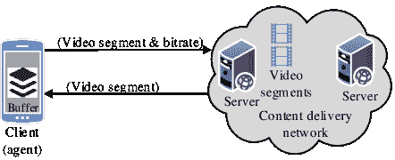

<!--yml

分类：未分类

日期：2024-09-06 20:07:12

-->

# [1810.07862] 深度强化学习在通信与网络中的应用：综述

> 来源：[`ar5iv.labs.arxiv.org/html/1810.07862`](https://ar5iv.labs.arxiv.org/html/1810.07862)

# 深度强化学习在通信与网络中的应用：综述

阮公龙、丁泰晃、IEEE 会员、龚世民、IEEE 会员、杜斯特·尼亚托、IEEE 院士、王平、IEEE 高级会员、梁颖昌、IEEE 院士、金东仁、IEEE 高级会员 N. C. Luong 和 D. Niyato 隶属于新加坡南洋理工大学计算机科学与工程学院。电子邮件：clnguyen@ntu.edu.sg, dniyato@ntu.edu.sg。D. T. Hoang 隶属于澳大利亚悉尼科技大学工程与信息技术学院。电子邮件：hoang.dinh@uts.edu.au。S. Gong 隶属于中国科学院深圳先进技术研究院，中国深圳 518055。电子邮件：sm.gong@siat.ac.cn。P. Wang 隶属于加拿大约克大学电气工程与计算机科学系。电子邮件：pingw@yorku.ca。Y.-C. Liang 隶属于中国电子科技大学智能网络与通信中心，成都，中国。电子邮件：liangyc@ieee.org。D. I. Kim 隶属于韩国成均馆大学信息与通信工程学院。电子邮件：dikim@skku.ac.kr。

###### 摘要

本文对深度强化学习在通信和网络中的应用进行了全面的文献综述。现代网络，如物联网（IoT）和无人机（UAV）网络，变得更加去中心化和自主。在这样的网络中，网络实体需要在网络环境不确定的情况下，局部做出决策以最大化网络性能。强化学习已被有效应用于使网络实体在状态和动作空间较小时，获取包括决策或行动在内的最优策略。然而，在复杂的大规模网络中，状态和动作空间通常较大，强化学习可能无法在合理时间内找到最优策略。因此，深度强化学习作为强化学习与深度学习的结合，已被开发以克服这些不足。在这项调查中，我们首先从基础概念到高级模型，对深度强化学习进行了一次教程。然后，我们回顾了为解决通信和网络中新兴问题而提出的深度强化学习方法。这些问题包括动态网络接入、数据速率控制、无线缓存、数据卸载、网络安全和连接性保护，这些都是 5G 及其之后的下一代网络中非常重要的。进一步地，我们展示了深度强化学习在流量路由、资源共享和数据收集中的应用。最后，我们突出了应用深度强化学习的重要挑战、未解问题和未来的研究方向。

关键词 - 深度强化学习，深度 Q 学习，网络，通信，频谱接入，速率控制，安全性，缓存，数据卸载，数据收集。

## I 引言

强化学习[1]是机器学习中最重要的研究方向之一，对过去 20 年人工智能（AI）的发展产生了重大影响。强化学习是一个学习过程，其中一个智能体可以定期做出决策，观察结果，然后自动调整其策略以实现**最佳策略**。然而，尽管这个学习过程已被证明会收敛，但由于必须探索并了解整个系统，因此需要大量时间才能达到**最佳策略**，使其不适用于大规模网络。因此，强化学习在实际应用中的应用非常有限。最近，深度学习[2]被引入作为一种新的突破性技术。它可以克服强化学习的局限性，从而为强化学习的发展开启了一个新的时代，即*深度强化学习*（DRL）。DRL 利用深度神经网络（DNNs）的优势来训练学习过程，从而提高强化学习算法的学习速度和性能。因此，DRL 已被广泛应用于实际中的各种强化学习应用，如机器人技术、计算机视觉、语音识别和自然语言处理[2]。DRL 最著名的应用之一是 AlphaGo[3]，这是第一个能够在 19$\times$19 的棋盘上击败没有任何让步的人类职业选手的计算机程序。

在通信和网络领域，DRL 最近被作为一种新兴工具来有效解决各种问题和挑战。特别是，现代网络如物联网（IoT）、异构网络（HetNets）和无人机（UAV）网络变得更加去中心化、临时性和自主性。网络实体如物联网设备、移动用户和无人机需要做出本地和自主的决策，例如频谱访问、数据速率选择、发射功率控制和基站关联，以实现不同网络的目标，包括例如吞吐量最大化和能耗最小化。在不确定和随机的环境下，大多数决策问题可以通过所谓的马尔可夫决策过程（MDP）[4]来建模。动态规划[5]、[6]和其他算法如价值迭代，以及强化学习技术可以用于解决 MDP。然而，现代网络规模庞大且复杂，因此这些技术的计算复杂度迅速变得难以管理。因此，DRL 正在发展成为克服这一挑战的替代解决方案。一般而言，DRL 方法提供了以下优点：

+   •

    DRL 可以获得复杂网络优化的解决方案。因此，它使现代网络中的网络控制器，例如基站，能够解决非凸和复杂的问题，例如联合用户关联、计算和传输调度，从而在没有完整和准确的网络信息的情况下实现最佳解决方案。

+   •

    DRL 允许网络实体学习并建立关于通信和网络环境的知识。因此，通过使用 DRL，网络实体，例如移动用户，可以学习最佳策略，例如基站选择、频道选择、切换决策、缓存和卸载决策，而无需了解频道模型和移动模式。

+   •

    DRL 提供自主决策。通过 DRL 方法，网络实体可以进行观察，并在最小或没有信息交换的情况下，在本地获得最佳策略。这不仅减少了通信开销，还提高了网络的安全性和鲁棒性。

+   •

    DRL 显著提高了学习速度，特别是在状态和动作空间较大的问题中。因此，在大规模网络中，例如具有数千个设备的物联网系统，DRL 允许网络控制器或物联网网关动态控制用户关联、频谱接入和大量物联网设备及移动用户的发射功率。

+   •

    在通信和网络中的其他几个问题，例如网络物理攻击、干扰管理和数据卸载，可以被建模为博弈，如非合作博弈。DRL 最近被用作解决这些博弈的有效工具，例如，找到纳什均衡，而无需完整的信息。

尽管有一些与 DRL 相关的调查，但它们并未专注于通信和网络。例如，关于 DRL 在计算机视觉和自然语言处理中的应用的调查可以在 [7] 和 [8] 中找到。同时，也有仅使用“深度学习”进行网络研究的调查。例如，关于无线网络机器学习的调查见 [9]，但它并未关注 DRL 方法。据我们所知，目前尚无专门讨论 DRL 在通信和网络中应用的调查。这促使我们进行 DRL 教程和 DRL 在通信和网络中应用的综合文献综述的调查。为方便起见，本调查中的相关工作根据通信和网络中的问题进行分类，如图 2 所示。主要问题包括网络接入、数据速率控制、无线缓存、数据卸载、网络安全、连接性保护、流量路由和数据收集。此外，DRL 相关工作在不同网络和不同问题中的百分比分别如图 1(a) 和 1(b) 所示。从图中可以看出，大多数相关工作集中在蜂窝网络上。同时，与无线缓存和卸载相关的工作比其他问题获得了更多关注。

(a)

(b)

图 1：不同网络的相关工作的百分比（a）和网络中不同问题的百分比（b）。

表 I：缩略词列表

| 缩略词 | 描述 |
| --- | --- |
| ANN/APF | 人工神经网络/人工势场 |
| A3C | 异步优势演员-评论家 |
| CRN | 认知无线电网络 |
| CNN | 卷积神经网络 |
| DRL/DQL | 深度强化学习/深度 Q 学习 |
| DNN | 深度神经网络 |
| DQN/DDQN/DRQN | 深度 Q 网络/双重 DQN/深度递归 Q 学习 |
| DASH | 动态自适应 HTTP 流媒体 |
| DoS | 拒绝服务 |
| ESN | 回声状态网络 |
| FNN/RNN | 前馈神经网络/递归神经网络 |
| FSMC | 有限状态马尔可夫通道 |
| HVFT | 高容量灵活时间 |
| ITS | 智能交通系统 |
| LSM/LSTM | 液体状态机/长短期记忆 |
| MEC | 移动边缘计算 |
| MDP/POMDP | 马尔可夫决策过程/部分可观察马尔可夫决策过程 |
| NFSP | 神经虚拟自博弈 |
| NFV | 网络功能虚拟化 |
| RDPG | 递归确定性策略梯度 |
| RCNN | 递归卷积神经网络 |
| RRH/BBU | 遥远无线电头/基带单元 |
| RSSI | 接收信号强度指示器 |
| SPD | 顺序囚徒困境 |
| SBS/BS | 小型基站/基站 |
| SDN | 软件定义网络 |
| SU/PU | 次级用户/主用户 |
| UDN/UAN | 超密集网络/水下声学网络 |
| UAV | 无人驾驶飞行器 |
| VANET/V2V | 车载自组织网络/车辆到车辆 |

图 2：深度强化学习在通信和网络中的应用分类。

本文的其余部分组织如下。第 II 节介绍了强化学习，并讨论了 DRL 技术及其扩展。第 III 节回顾了 DRL 在动态网络访问和自适应数据速率控制中的应用。第 IV 节讨论了 DRL 在无线缓存和数据卸载中的应用。第 V 节介绍了与网络安全和连接保持相关的 DRL 工作。第 VI 节考虑了如何利用 DRL 处理通信和网络中的其他问题。第 VII 节概述了重要挑战、开放问题和未来研究方向。第 VIII 节总结了本文内容。表 I 中列出了本文常见的缩略语。请注意，DRL 包含两种不同的算法，即深度 Q 学习（DQL）和策略梯度[10]。特别地，DQL 主要用于与 DRL 相关的工作。因此，在本文剩余部分，我们将“DRL”和“DQL”交替使用，以指代 DRL 算法。

## II 深度强化学习：概述

在这一部分，我们首先介绍马尔可夫决策过程、强化学习和深度学习技术的基本知识，这些都是机器学习理论的重要分支。接着，我们讨论能够利用深度学习能力来提高强化学习算法学习效率和性能的深度强化学习技术（DRL）。随后，我们回顾了高级 DRL 模型及其扩展。

### II-A 马尔可夫决策过程

MDP [4] 是一种离散时间随机控制过程。MDP 提供了一个数学框架，用于建模决策问题，其中结果既有随机性又在决策者或代理的控制之下。MDP 对于研究可以通过动态规划和强化学习技术解决的优化问题非常有用。通常，MDP 由元组$(\mathcal{S},\mathcal{A},p,r)$定义，其中$\mathcal{S}$是状态的有限集合，$\mathcal{A}$是动作的有限集合，$p$是动作$a$执行后从状态$s$到状态$s^{\prime}$的转移概率，$r$是执行动作$a$后获得的即时奖励。我们用$\pi$表示“策略”，即从状态映射到动作。MDP 的目标是找到一个最优策略，以最大化奖励函数。MDP 可以是有限时间或无限时间范围。对于无限时间范围的 MDP，我们的目标是找到一个最优策略$\pi^{*}$，以最大化期望的总奖励，该奖励由$\overset{\infty}{\underset{t=0}{\sum}}\gamma r_{t}(s_{t},a_{t})$定义，其中$a_{t}=\pi^{*}(s_{t})$，$\gamma\in[0,1]$是折扣因子。

#### II-A1 部分可观察马尔可夫决策过程

在 MDP 中，我们假设系统状态是完全可观察的。然而，在许多情况下，代理只能观察系统状态的一部分，因此可以使用部分可观察马尔可夫决策过程（POMDPs）[11]来建模决策问题。一个典型的 POMDP 模型由 6 元组$(\mathcal{S},\mathcal{A},p,r,\Omega,\mathcal{O})$定义，其中$\mathcal{S},\mathcal{A},p,r$的定义与 MDP 模型中相同，$\Omega$和$\mathcal{O}$分别定义为观察集合和观察概率。每个时间步，系统处于状态$s\in\mathcal{S}$。然后，代理采取一个动作$a\in\mathcal{A}$，系统转移到状态$s^{\prime}\in\mathcal{S}$。与此同时，代理以概率$\mathcal{O}(o|s,a,s^{\prime})$获得一个新的观察$o\in\Omega$。最后，代理获得一个即时奖励$r$，该奖励等于 MDP 中的$r(s,a)$。类似于 MDP 模型，POMDP 中的代理也旨在找到最佳策略$\pi^{*}$，以最大化其期望的长期折扣奖励$\overset{\infty}{\underset{t=0}{\sum}}\gamma r_{t}(s_{t},\pi^{*}(s_{t}))$。

#### II-A2 马尔可夫博弈

在博弈论中，马尔可夫博弈或随机博弈[12]是一个由多个玩家即代理参与的具有概率转移的动态博弈。一个典型的马尔可夫博弈模型由一个元组$(\mathcal{I},\mathcal{S},\{\mathcal{A}^{i}\}_{i\in\mathcal{I}},p,\{r^{i}\}_{i\in\mathcal{I}})$定义，其中

+   •

    $\mathcal{I}\triangleq\{1,\ldots,i,\ldots,I\}$ 是代理集合，

+   •

    $\mathcal{S}\triangleq\{\mathcal{S}^{1},\ldots,\mathcal{S}^{i},\ldots,\mathcal{S}^{I}\}$ 是所有代理的全局状态空间，其中$\mathcal{S}^{i}$是代理$i$的状态空间，

+   •

    $\{\mathcal{A}^{i}\}_{i\in\mathcal{I}}$ 是代理的动作空间集合，其中$\mathcal{A}^{i}$是代理$i$的动作空间。

+   •

    $p\triangleq\mathcal{S}\times\mathcal{A}^{1}\times\cdots\times\mathcal{A}^{I}\rightarrow[0,1]$ 是系统的转移概率函数。

+   •

    $\{r^{i}\}_{i\in\mathcal{I}}$ 是代理的收益函数，

    $r^{i}\triangleq\mathcal{S}\times\mathcal{A}^{1}\times\cdots\times\mathcal{A}^{I}\rightarrow\mathbb{R}$，即代理$i$在所有代理的动作执行后获得的收益。

在马尔可夫博弈中，代理从某个初始状态$s_{0}\in\mathcal{S}$开始。观察当前状态后，所有代理同时选择他们的动作$a=\{a^{1},\ldots,a^{I}\}$，并将获得相应的奖励和各自的新的观察。同时，系统将以概率$p(s^{\prime}|s,a)$转移到新的状态$s^{\prime}\in\mathcal{S}$。该过程在新状态下重复进行，并持续进行有限或无限数量的阶段。在此博弈中，所有代理尝试找到其*最优策略*以最大化其预期的长期平均奖励，即$\overset{\infty}{\underset{t=0}{\sum}}\gamma_{i}r^{i}_{t}(s_{t},\pi_{i}^{*}(s_{t}))$，$\forall i$。此博弈的所有最优策略集合，即$\{\pi^{*}_{1},\ldots,\pi^{*}_{I}\}$，被称为此博弈的*均衡*。如果玩家数量有限且状态和动作集合都是有限的，则马尔可夫博弈在有限阶段内总是具有纳什均衡[13]。对于具有无限阶段的马尔可夫博弈也是如此，但代理的总收益是折扣总和[13]。

### II-B 强化学习

强化学习是机器学习的一个重要分支，是解决 MDP 问题的有效工具，并在文献中广泛使用 [1]。在强化学习过程中，智能体通过与环境的互动来学习其最优策略。具体来说，智能体首先观察其当前状态，然后采取一个行动，并接收到即时奖励和新状态，如图 3(a) 所示。观察到的信息，即即时奖励和新状态，被用来调整智能体的策略，这个过程会一直重复，直到智能体的策略接近最优策略。在强化学习中，$Q$-学习是最有效且在文献中广泛使用的方法。接下来，我们将讨论 $Q$-学习算法及其在高级 MDP 模型中的扩展。

<math   alttext="\begin{array}[]{ccc}\epsfbox{RL}\hfil&amp;\epsfbox{ANN}\hfil&amp;\epsfbox{DeepQLearning}\hfil\\

\text{(a)}&amp;\text{(b)}&amp;\text{(c)}\end{array}" display="inline"><semantics ><mtable columnspacing="5pt" rowspacing="0pt" ><mtr  ><mtd ><mtext >(a)</mtext></mtd><mtd ><mtext  >(b)</mtext></mtd><mtd ><mtext >(c)</mtext></mtd></mtr></mtable><annotation-xml encoding="MathML-Content" ><matrix ><matrixrow  ><cerror ><csymbol cd="ambiguous" >missing-subexpression</csymbol></cerror><cerror ><csymbol cd="ambiguous"  >missing-subexpression</csymbol></cerror><cerror ><csymbol cd="ambiguous" >missing-subexpression</csymbol></cerror></matrixrow><matrixrow ><ci ><mtext  >(a)</mtext></ci><ci ><mtext >(b)</mtext></ci><ci ><mtext  >(c)</mtext></ci></matrixrow></matrix></annotation-xml><annotation encoding="application/x-tex" >\begin{array}[]{ccc}\epsfbox{RL}\hfil&\epsfbox{ANN}\hfil&\epsfbox{DeepQLearning}\hfil\\ \text{(a)}&\text{(b)}&\text{(c)}\end{array}</annotation></semantics></math>

图 3： (a) 强化学习，(b) 人工神经网络，和 (c) 深度 Q-学习。

#### II-B1 $Q$-学习算法

在 MDP（马尔可夫决策过程）中，我们的目标是为智能体找到一个最优策略 $\pi^{*}:\mathcal{S}\rightarrow\mathcal{A}$，以最小化系统的整体成本。因此，我们首先定义价值函数 $\mathcal{V}^{\pi}:\mathcal{S}\rightarrow\mathbb{R}$，它表示从每个状态 $s\in\mathcal{S}$ 开始，遵循策略 $\pi$ 所获得的期望值。策略 $\pi$ 的价值函数 $\mathcal{V}$ 通过无限视野和折扣的 MDP 来量化策略的优劣，其表达式如下：

|  | $\displaystyle\mathcal{V}^{\pi}(s)$ | $\displaystyle=\mathbb{E}_{\pi}\Big{[}\sum_{t=0}^{\infty}\gamma r_{t}(s_{t},a_{t})&#124;s_{0}=s\Big{]}$ |  | (1) |
| --- | --- | --- | --- | --- |
|  |  | $\displaystyle=\mathbb{E}_{\pi}\Big{[}r_{t}(s_{t},a_{t})+\gamma\mathcal{V}^{\pi}(s_{t+1})&#124;s_{0}=s\Big{]}.$ |  |

由于我们的目标是找到最优策略 $\pi^{*}$，因此可以通过最优值函数 $\mathcal{V}^{*}(s)=\underset{a_{t}}{\max}\Big{\{}\mathbb{E}_{\pi}\big{[}r_{t}(s_{t},a_{t})+\gamma\mathcal{V}^{\pi}(s_{t+1})\big{]}\Big{\}}$ 来找到每个状态下的最优动作。

如果我们将 $\mathcal{Q}^{*}(s,a)\triangleq r_{t}(s_{t},a_{t})+\gamma\mathbb{E}_{\pi}\big{[}\mathcal{V}^{\pi}(s_{t+1})\big{]}$ 表示为所有状态-动作对的最优 $Q$-函数，那么最优值函数可以写成 $\mathcal{V}^{*}(s)=\underset{a}{\max}\big{\{}\mathcal{Q}^{*}(s,a)\big{\}}$。现在，问题简化为通过迭代过程找到所有状态-动作对的 $Q$-函数的最优值，即 $\mathcal{Q}^{*}(s,a)$。特别地，$Q$-函数根据以下规则更新：

|  | $\displaystyle\mathcal{Q}_{t+1}(s,a)=$ | $\displaystyle\mathcal{Q}_{t}(s,a)+$ |  | (2) |
| --- | --- | --- | --- | --- |
|  |  | $\displaystyle\alpha_{t}\Big{[}r_{t}(s,a)+\gamma\max_{a^{\prime}}\mathcal{Q}_{t}(s,a^{\prime})-\mathcal{Q}_{t}(s,a)\Big{]}.$ |  |

这个更新的核心思想是找到预测的 $\mathcal{Q}$-值，即 $r_{t}(s,a)+\gamma\underset{a^{\prime}}{\max}\mathcal{Q}_{t}(s,a^{\prime})$ 和其当前值，即 $\mathcal{Q}_{t}(s,a)$ 之间的时间差 (TD)。在 (2) 中，学习率 $\alpha_{t}$ 用于确定新信息对现有 $\mathcal{Q}$-值的影响。学习率可以选择为常量，也可以在学习过程中动态调整。然而，它必须满足假设 1 以保证 $Q$-学习算法的收敛性。

###### 假设 1。

步长 $\alpha_{t}$ 是确定的、非负的，并且满足以下条件：$\alpha_{t}\in[0,1]$，$\overset{\infty}{\underset{t=0}{\sum}}\alpha_{t}=\infty$，并且 $\phantom{5}\overset{\infty}{\underset{t=0}{\sum}}(\alpha_{t})^{2}<\infty$ 。

步长自适应 $\alpha_{t}=\frac{1}{t}$ 是强化学习中最常见的例子之一。有关选择合适步长的更多讨论可在 [14] 中找到。然后在算法 1 中提供了 $Q$-学习算法的详细信息。

算法 1 $Q$-学习算法

输入: 对于每个状态-动作对$(s,a)$，将表项$\mathcal{Q}(s,a)$初始化为任意值，例如，初始化为零。观察当前状态$s$，为学习率$\alpha$和折扣因子$\gamma$初始化一个值。  for $t:=1$到$T$ do     从当前状态-动作对$(s,a)$，执行动作$a$并获得即时奖励$r$和新状态$s^{\prime}$。     根据状态$s^{\prime}$选择一个动作$a^{\prime}$，然后更新$\mathcal{Q}(s,a)$的表项如下:

|  | $\displaystyle\mathcal{Q}_{t+1}(s,a)$ | $\displaystyle\leftarrow\mathcal{Q}_{t}(s,a)+\alpha_{t}\Big{[}r_{t}(s,a)+$ |  | (3) |
| --- | --- | --- | --- | --- |
|  |  | $\displaystyle\gamma\max_{a^{\prime}}\mathcal{Q}_{t}(s^{\prime},a^{\prime})-\mathcal{Q}_{t}(s,a)\Big{]}$ |  |

替换$s\leftarrow s^{\prime}$。  end for  输出: $\pi^{*}(s)=\arg\max_{a}\mathcal{Q}^{*}(s,a)$。

一旦所有$\mathcal{Q}$-值收敛或达到一定次数的迭代，算法将终止。然后，算法将生成一个最优策略，指示在每个状态下采取的行动，以使所有状态下的$\mathcal{Q}^{*}(s,a)$达到最大，即$\pi^{*}(s)=\arg\underset{a}{\max}\mathcal{Q}^{*}(s,a)$。在假设步长的条件下（即，假设 1），在 [15]中证明了$Q$-学习算法以概率一收敛到最优动作值。

#### II-B2 SARSA: 一种在线 Q-学习算法

尽管$Q$-学习算法可以在无需了解环境的情况下找到代理的最优策略，但该算法是离线工作的。特别是，算法 1 仅在所有$\mathcal{Q}$-值收敛之后才能获得最优策略。因此，本节介绍了一种替代的在线学习算法，即 SARSA 算法，它允许代理以在线方式接近最优策略。

与 $Q$-学习算法不同，SARSA 算法是一种在线算法，它允许智能体在每个时间步实时选择最优动作，而不必等到算法收敛。在 $Q$-学习算法中，策略根据可用动作的最大奖励进行更新，而不考虑应用了哪种策略，即一种离策略方法。相比之下，SARSA 算法通过与环境交互并直接从所采取的动作中更新策略，即一种在策略方法。请注意，SARSA 算法从五元组 $\mathcal{Q}(s,a,r,s^{\prime},a^{\prime})$ 更新 $\mathcal{Q}$ 值。

#### II-B3 马尔可夫游戏的 Q-学习

为了将 Q-学习算法应用于马尔可夫游戏环境，我们首先通过 $\mathcal{Q}_{i}(s,a^{i},\textbf{a}^{-i})$ 定义智能体 $i$ 的 $Q$-函数，其中 $\textbf{a}^{-i}\triangleq\{a^{1},\ldots,a^{i-1},a^{i+1},\ldots,a^{I}\}$ 表示所有智能体的动作集合（除 $i$ 外）。然后，智能体 $i$ 的纳什 $Q$-函数定义为：

|  | $\displaystyle\mathcal{Q}^{*}_{i}(s,a^{i},\textbf{a}^{-i})$ | $\displaystyle=r^{i}(s,a^{i},\textbf{a}^{-i})+$ |  | (4) |
| --- | --- | --- | --- | --- |
|  |  | $\displaystyle\beta\sum_{s^{\prime}\in\mathcal{S}}p(s^{\prime}\mid s,a^{i},\textbf{a}^{-i})\mathcal{V}^{i}(s^{\prime},\pi_{1}^{*},\ldots,\pi_{I}^{*}),$ |  |

其中 $(\pi_{1}^{*},\ldots,\pi_{I}^{*})$ 是联合纳什均衡策略，$r^{i}(s,a^{i},\textbf{a}^{-i})$ 是在状态 $s$ 下，联合动作 $(a^{i},\textbf{a}^{-i})$ 的智能体 $i$ 的即时奖励，而 $\mathcal{V}^{i}(s^{\prime},\pi_{1}^{*},\ldots,\pi_{I}^{*})$ 是在所有智能体遵循均衡策略的情况下，从状态 $s^{\prime}$ 开始的无限时间范围内的总折扣奖励。

在 [13] 中，作者提出了一种用于一般总和马尔可夫游戏的多智能体 Q-学习算法，该算法允许智能体基于当前 Q 值假设纳什均衡行为来执行更新。特别地，智能体 $i$ 将通过从游戏开始时形成一个任意猜测来学习其 $Q$ 值。在每个时间步 $t$，智能体 $i$ 观察当前状态并采取动作 $a^{i}$。然后，它观察其即时奖励 $r^{i}$、其他智能体所采取的动作 $\textbf{a}^{-i}$、其他智能体的即时奖励以及新的系统状态 $s^{\prime}$。之后，智能体 $i$ 为状态游戏 $(\mathcal{Q}_{1}^{t}(s^{\prime}),\ldots,\mathcal{Q}_{I}^{t}(s^{\prime}))$ 计算一个纳什均衡 $(\pi_{1}(s^{\prime}),\ldots,\pi_{I}(s^{\prime}))$，并根据以下公式更新其 $Q$ 值：

|  | $\mathcal{Q}_{i}^{t+1}(s,a^{i},\textbf{a}^{-i})=(1-\alpha_{t})\mathcal{Q}_{i}^{t}(s,a^{i},\textbf{a}^{-i})+\alpha_{t}[r_{t}^{i}+\gamma\mathscr{N}_{t}^{i}(s^{\prime})],$ |  | (5) |
| --- | --- | --- | --- |

其中 $\alpha_{t}\in(0,1)$ 是学习率，$\mathscr{N}_{t}^{i}(s^{\prime})\triangleq\mathcal{Q}_{i}^{t}(s^{\prime})\times\pi_{1}(s^{\prime})\times\cdots\times\pi_{I}(s^{\prime})$。

为了计算纳什均衡，代理 $i$ 需要知道 $(\mathcal{Q}_{1}^{t}(s^{\prime}),\ldots,\mathcal{Q}_{I}^{t}(s^{\prime}))$。然而，关于其他代理的 $\mathcal{Q}$-值的信息没有给出，因此代理 $i$ 也必须学习这些信息。为此，代理 $i$ 会在游戏开始时对其他代理的 $\mathcal{Q}$-值做出估计，例如，$\mathcal{Q}_{0}^{j}(s,a^{i},\textbf{a}^{-i})=0,\forall j,s$。随着游戏的进行，代理 $i$ 观察其他代理的即时奖励和之前的动作。然后可以使用这些信息来更新代理 $i$ 对其他代理 $Q$-函数的猜测。代理 $i$ 根据在(5)中的相同更新规则更新其对代理 $j$ 的 $Q$-函数的信念。随后，作者证明在学习过程中对状态游戏形式的一些高度限制性假设下，所提出的多代理 $Q$-学习算法是保证收敛的。

### II-C 深度学习

深度学习[2]由一组算法和技术组成，旨在寻找数据的重要特征并建模其高级抽象。深度学习的主要目标是通过从数据中自动学习来避免对数据结构的手动描述（如手工编写的特征）。其名称指的是通常任何具有两个或更多隐藏层的神经网络都被称为 DNN。大多数深度学习模型基于人工神经网络（ANN），尽管它们也可以包括命题公式或以层次方式组织的潜在变量，如深度信念网络和深度玻尔兹曼机中的节点。

人工神经网络（ANN）是一种基于大脑神经结构的计算非线性模型，能够学习执行分类、预测、决策和可视化等任务。人工神经网络由人工神经元组成，并组织成三个互连的层：输入层、隐藏层和输出层，如图 3(b)所示。输入层包含将信息传送到隐藏层的输入神经元。隐藏层将数据传送到输出层。每个神经元具有加权输入（突触）、一个激活函数（定义给定输入的输出）和一个输出。突触是将神经网络转换为参数化系统的可调参数。

在训练阶段，ANN 使用反向传播作为有效的学习算法，以便快速计算相对于权重的梯度下降。反向传播是自动微分的一种特殊情况。在学习的背景下，反向传播通常由梯度下降优化算法使用，以通过计算损失函数的梯度来调整神经元的权重。这种技术有时也称为误差的反向传播，因为误差在输出处计算，并通过网络层分发回去。

DNN 被定义为具有多个隐藏层的 ANN。典型的 DNN 模型有两个，即前馈神经网络（FNN）和递归神经网络（RNN）。在 FNN 中，信息仅向一个方向流动，即从输入节点，通过隐藏节点到输出节点，并且网络中没有周期或循环，如图 4 所示。在 FNN 中，卷积神经网络（CNN）是最知名的模型，具有广泛的应用，特别是在图像和语音识别方面。CNN 包含一个或多个卷积层、池化层或全连接层，并使用上述讨论的多层感知机的变体。卷积层对输入进行卷积操作，将结果传递到下一层。这种操作使得网络可以更深，同时具有更少的参数。

图 4：RNN 与 CNN。

与 FNNs 不同，RNN 是一种递归人工神经网络的变体，其中神经元之间的连接形成了有向循环。这意味着输出不仅依赖于其即时输入，还依赖于之前更远一步的神经元状态。RNNs 旨在利用序列数据，当当前步骤与之前的步骤有关时，这使得 RNNs 非常适合有时间成分的应用，例如时间序列数据和自然语言处理。然而，所有 RNNs 在递归层中都有反馈循环。这使得 RNNs 能够在时间上保持信息。然而，训练标准 RNNs 以解决需要学习长期时间依赖的问题可能会很困难。原因在于损失函数的梯度随着时间呈指数衰减，这被称为梯度消失问题。因此，长短期记忆（LSTM）通常在 RNNs 中使用来解决这个问题。LSTM 旨在建模时间序列，其长期依赖性比传统 RNNs 更准确。LSTM 在其递归组件中不使用激活函数，存储的值不会被修改，而且在训练过程中梯度不会消失。通常，LSTM 单元以“块”的形式实现，每个块包含几个单元。这些块有三个或四个“门”，例如输入门、遗忘门、输出门，这些门利用逻辑函数控制信息流。

### II-D 深度$Q$-学习

$Q$-学习算法在状态空间和动作空间较小的情况下可以有效地获得最佳策略。然而，在实际应用中，复杂的系统模型通常会使这些空间变得很大。因此，$Q$-学习算法可能无法找到最佳策略。因此，引入了深度$Q$-学习（DQL）算法来克服这一缺陷。直观上，DQL 算法实现了深度$Q$-网络（DQN），即使用 DNN 代替$Q$-表来推导$Q^{*}(s,a)$的近似值，如图 3(c)所示。

如[16]所述，当使用非线性函数逼近器时，强化学习算法获得的平均奖励可能不稳定，甚至可能发散。这源于$\mathcal{Q}$-值的小变化可能会极大地影响策略。因此，数据分布以及$\mathcal{Q}$-值与目标值$R+\gamma\max_{a^{\prime}}\mathcal{Q}(s^{\prime},a^{\prime})$之间的相关性是变化的。为了解决这个问题，可以使用两种机制，即经验回放和目标$Q$-网络。

+   •

    *经验回放机制*：算法首先初始化一个回放记忆 $\mathbf{D}$，即记忆池，其中包含随机生成的转移 $(s_{t},a_{t},r_{t},s_{t+1})$，即经验，例如，通过使用 $\epsilon$-贪婪策略。然后，算法从 $\mathbf{D}$ 中随机选择样本，即小批量转移，以训练 DNN。经过训练的 DNN 获得的 Q 值将用于获取新经验，即转移，这些经验随后将存储在记忆池 $\mathbf{D}$ 中。该机制使得 DNN 能够通过使用旧经验和新经验来更高效地训练。此外，通过使用经验回放，转移更加独立且同分布，从而去除观察之间的相关性。

+   •

    固定目标 $Q$-网络：在训练过程中，$\mathcal{Q}$-值会发生偏移。因此，如果使用一组不断变化的值来更新 $Q$-网络，价值估计可能会失控，这会导致算法的不稳定。为了解决这个问题，使用目标 $Q$-网络来频繁但缓慢地更新主要 $Q$-网络的值。这样，目标和估计的 $\mathcal{Q}$-值之间的相关性显著减少，从而稳定了算法。

带有经验回放和固定目标 $Q$-网络的 DQL 算法在算法 2 中提出。DQL 继承并提升了强化学习和深度学习技术的优势，因此在实践中具有广泛的应用，如游戏开发 [3]、运输 [17] 和机器人 [18]。

算法 2 带有经验回放和固定目标 $Q$-网络的 DQL 算法

1: 初始化回放记忆 $\mathbf{D}$。2: 用随机权重 $\boldsymbol{\theta}$ 初始化 $Q$-网络 $\mathbf{Q}$。3: 用随机权重 $\boldsymbol{\theta^{\prime}}$ 初始化目标 $Q$-网络 $\hat{\mathbf{Q}}$。4: 对于 episode=1 到 T 执行 5: 以概率 $\epsilon$ 选择随机动作 $a_{t}$，否则选择 $a_{t}=\arg\max\mathcal{Q}^{*}(s_{t},a_{t},\boldsymbol{\theta})$。6: 执行动作 $a_{t}$ 并观察即时奖励 $r_{t}$ 和下一个状态 $s_{t+1}$。7: 将转移 $(s_{t},a_{t},r_{t},s_{t+1})$ 存储在 $\mathbf{D}$ 中。8: 从 $\mathbf{D}$ 中随机选择样本 c$(s_{j},a_{j},r_{j},s_{j+1})$。9: 然后使用随机梯度下降优化神经网络的权重，以最小化损失：

|  | $\Big{[}r_{j}+\gamma\max_{a_{j+1}}\hat{\mathcal{Q}}(s_{j+1},a_{j+1};\boldsymbol{\theta^{\prime}})-\mathcal{Q}(s_{j},a_{j};\boldsymbol{\theta})\Big{]}^{2}.$ |  | (6) |
| --- | --- | --- | --- |

10:     每经过固定步数后，重置$\hat{\mathbf{Q}}=\mathbf{Q}$。11:  结束 for

### II-E 高级深度 $Q$-学习模型

#### II-E1 双重深度 $Q$-学习

在一些随机环境中，由于对动作值的过度估计，$Q$-学习算法表现不佳[19]。这些过度估计是由于$Q$-学习使用最大动作值作为最大期望动作值的近似值而引入的正偏差，如公式（3）所示。原因是相同的样本被用来决定哪个动作是最好的，即具有最高的期望回报，同时也用来估计该动作值。因此，为了克服$Q$-学习算法的过度估计问题，作者在[20]中引入了一种使用两个$Q$-值函数的解决方案，即$\mathcal{Q}_{1}$和$\mathcal{Q}_{2}$，通过以下损失函数同时选择和评估动作值：$\Big{[}r_{j}+\gamma\mathcal{Q}_{2}\Big{(}s_{j+1},\arg\underset{a_{j+1}}{\max}\mathcal{Q}_{1}\big{(}s_{j+1},a_{j+1};\boldsymbol{\theta}_{1}\big{)};\boldsymbol{\theta}_{2}\Big{)}-\mathcal{Q}_{1}(s_{j},a_{j};\boldsymbol{\theta}_{1})\Big{]}^{2}$。

请注意，在$\arg\max$中选择一个动作仍然是由于在线权重$\boldsymbol{\theta}_{1}$。这意味着，和$Q$-学习一样，我们仍然根据当前的值（由$\boldsymbol{\theta}_{1}$定义）来估计贪婪策略的价值。然而，第二组权重$\boldsymbol{\theta}_{2}$用于公平地评估该策略的价值。第二组权重可以通过交换$\boldsymbol{\theta}_{1}$和$\boldsymbol{\theta}_{2}$的角色来对称更新。受此启发，作者在[20]中发展了双重深度$Q$-学习（DDQL）模型[21]，使用了一个双重深度 Q 网络（DDQN），并且损失函数更新如下：

|  | $\displaystyle\Big{[}r_{j}$ | $\displaystyle+\gamma\hat{\mathcal{Q}}\Big{(}s_{j+1},\arg\max_{a_{j+1}}\mathcal{Q}\big{(}s_{j+1},a_{j+1};\boldsymbol{\theta}\big{)};\boldsymbol{\theta^{\prime}}\Big{)}$ |  | (7) |
| --- | --- | --- | --- | --- |
|  |  | $\displaystyle-\mathcal{Q}(s_{j},a_{j};\boldsymbol{\theta})\Big{]}^{2}.$ |  |

与双重$Q$-学习不同，第二个网络$\boldsymbol{\theta_{2}}$的权重在评估当前贪婪策略时被替换为目标网络$\boldsymbol{\theta^{\prime}}$的权重，如公式(7)所示。目标网络的更新保持不变，与 DQN 相同，仍然是在线网络的周期性副本。由于 DDQL 的有效性，最近有一些 DDQL 应用于解决多信道无线网络中的动态频谱接入问题[22]和异构网络中的资源分配问题[23]。

#### II-E2 带有优先经验回放的深度$Q$-学习

经验回放机制允许强化学习代理记住并重用过去的经验，即转移。特别是，从重放记忆$\mathbf{D}$中均匀采样转移。然而，这种方法仅以与代理最初经历的频率相同的频率回放转移，而不考虑其重要性。因此，作者在[24]中开发了一个优先级经验框架，以便更频繁地回放重要转移，从而更高效地学习。理想情况下，我们希望更频繁地采样那些需要大量学习的转移。作为学习潜力的代理，提出的优先经验回放（PER）[24]以概率$p_{t}$采样转移，相对于最后遇到的绝对误差定义如下：

|  | $p_{t}\varpropto\Big{&#124;}r_{j}+\gamma\max_{a^{\prime}}\hat{\mathcal{Q}}(s_{j+1},a^{\prime};\boldsymbol{\theta^{\prime}})-\mathcal{Q}(s_{j},a_{j};\boldsymbol{\theta)}\Big{&#124;}^{\omega},$ |  | (8) |
| --- | --- | --- | --- |

其中$\omega$是一个超参数，决定了分布的形状。新的转移以最大优先级插入到重放缓冲区中，偏向于最近的转移。请注意，即使对这些转移了解不多，随机转移也可能受到青睐。通过在多个 Atari 游戏中的实际实验，作者证明了带有优先经验回放（PER）的 DQL 在 49 个游戏中的 41 个游戏中优于均匀重放的 DQL。然而，只有在我们能够找到并定义重放记忆$\mathbf{D}$中的重要经验时，这种解决方案才适合实施。

#### II-E3 对抗深度$Q$-学习

在$Q$-学习算法中使用的$Q$-值，即$\mathcal{Q}(s,a)$，用于表示在给定状态下采取某个动作的好坏。给定状态$s$下动作$a$的值实际上可以分解为两个基本值。第一个值是状态值函数，即$\mathscr{V}(s)$，用于估计处于特定状态$s$的重要性。第二个值是动作值函数，即$\mathscr{A}(a)$，用于估计选择某个动作$a$与其他动作相比的重要性。因此，$Q$-值函数可以用两个基本值函数表示，如下所示：$\mathcal{Q}(s,a)=\mathscr{V}(s)+\mathscr{A}(a)$。

由于在许多 MDP 中，同时估计 Q 函数$\mathcal{Q}(s,a)$的动作值和状态值是没有必要的。例如，在许多赛车游戏中，只有当代理遇到障碍物或敌人时，向左或向右移动才会有意义。受到这一思想的启发，作者在[25]中提出了使用两个流，即两个序列的全连接层，而不是使用一个序列的全连接层来替代 DQN。两个流被构建为能够分别提供动作值和状态值函数的估计，即$\mathscr{V}(s)$和$\mathscr{A}(a)$。最后，这两个流被组合生成一个单一的输出$\mathcal{Q}(s,a)$，具体如下：

|  | $\displaystyle\mathcal{Q}(s,a;\boldsymbol{\alpha},\boldsymbol{\beta})=\mathscr{V}(s;\boldsymbol{\beta})+\Big{(}\mathscr{A}(s,a;\boldsymbol{\alpha})-\frac{\sum_{a^{\prime}}\mathscr{A}(s,a^{\prime};\boldsymbol{\alpha})}{&#124;\mathcal{A}&#124;}\Big{)},$ |  | (9) |
| --- | --- | --- | --- |

其中$\boldsymbol{\beta}$和$\boldsymbol{\alpha}$分别是两个流$\mathscr{V}(s;\boldsymbol{\beta})$和$\mathscr{A}(s,a^{\prime};\boldsymbol{\alpha})$的参数。这里，$|\mathcal{A}|$是动作空间$\mathcal{A}$中的动作总数。然后，损失函数的推导方式类似于(6)，具体如下：

$\Big{[}r_{j}+\gamma\underset{a_{j+1}}{\max}\hat{\mathcal{Q}}(s_{j+1},a_{j+1};\boldsymbol{\alpha^{\prime}},\boldsymbol{\beta^{\prime}})-\mathcal{Q}(s_{j},a_{j};\boldsymbol{\alpha},\boldsymbol{\beta})\Big{]}^{2}$. 通过模拟，作者展示了所提出的对抗 DQN 在 57 个学习的 Atari 游戏中有 50 个优于 DDQN。然而，所提出的对抗架构仅对具有大动作空间的 MDP 显著有利。对于小状态空间，正如[25]中的模拟结果所示，对抗 DQL 的表现甚至不如双重 DQL。

#### II-E4 异步多步深度 Q 学习

大多数$Q$-学习方法，如 DQL 和对抗 DQL，依赖于经验回放方法。然而，这种方法有几个缺点。例如，它在每次实际交互时需要更多的内存和计算资源，并且需要能够从旧策略生成的数据中进行更新的离线学习算法。这限制了 DQL 的应用。因此，文献[26]中的作者引入了一种利用多个代理并行训练 DNN 的方法。特别地，作者提出了一种训练过程，利用来自多个代理的异步梯度下降更新。不同于训练一个单独的代理与环境互动，多个代理同时与各自版本的环境互动。在一定的时间步后，来自一个代理的累积梯度更新应用于全局模型，即 DNN。这些更新是异步的且无锁的。此外，为了在策略梯度中权衡偏差和方差，作者采用了$n$-步更新方法[1]来更新奖励函数。特别地，截断的$n$-步奖励函数可以定义为$r_{t}^{(n)}=\underset{k=0}{\overset{n-1}{\sum}}\gamma^{(k)}r_{t+k+1}$。因此，每个代理的替代损失将通过以下公式推导：

|  | $\Big{[}r_{j}^{(n)}+\gamma_{j}^{(n)}\max_{a^{\prime}}\hat{\mathcal{Q}}(s_{j+n},a^{\prime};\boldsymbol{\theta^{\prime}})-\mathcal{Q}(s_{j},a_{j};\boldsymbol{\theta})\Big{]}^{2}.$ |  | (10) |
| --- | --- | --- | --- |

对于各种强化学习方法，例如 1 步$Q$-学习、1 步 SARSA 和 n 步$Q$-学习，分析了所提出的异步 DQL 与多步学习的训练速度和质量的效果。结果表明，异步更新对策略和值更新具有稳定作用。此外，所提出的方法在 Atari 游戏上优于当前最先进的算法，同时在单个多核 CPU 上训练时间为 GPU 的一半。因此，最近开发了一些异步 DQL 的应用于无线系统中的切换控制问题[27]。

#### II-E5 分布式深度 Q 学习

上述所有方法都使用贝尔曼方程来近似未来奖励的期望值。然而，如果环境本质上是随机的，且未来奖励遵循多模态分布，则基于期望值选择动作可能不会导致*最佳结果*。例如，我们知道无线网络中数据包的预计传输时间是 20 分钟。然而，这个信息可能不太有意义，因为它可能大多数时候会高估传输时间。例如，预计传输时间是基于正常传输（没有冲突）和干扰传输（有冲突）来计算的。虽然干扰传输很少发生，但它需要很长时间。因此，对预计传输的估算大多数时候是被高估的。这使得估算对于 DQL 算法并不实用。

因此，作者在[28]中引入了一种解决方案，使用分布式强化学习来基于其分布而非期望值更新$Q$值函数。具体地，令$\mathcal{Z}(s,a)$表示从状态$s$开始，执行动作$a$并遵循当前策略所获得的回报，那么$\mathcal{Q}(s,a)=\mathbb{E}[\mathcal{Z}(s,a)]$。这里，$\mathcal{Z}$表示未来奖励的分布，不再像$Q$值那样是一个标量。然后我们得到贝尔曼方程的分布式版本如下：$\mathcal{Z}(s,a)=r+\gamma\mathcal{Z}(s^{\prime},a^{\prime})$。例如，如果我们使用 DQN 并从重放缓冲区提取经验$(s,a,r,s^{\prime})$，那么目标分布的样本是$\mathcal{Z}(s,a)=r+\gamma\mathcal{Z}(s^{\prime},a^{*})$，其中$a^{*}=\arg\underset{a^{\prime}}{\max}\mathcal{Q}(s,a^{\prime})$。尽管提出的分布式深度 Q 学习在许多 Atari 2600 游戏（57 个游戏中的 45 个）中优于传统 DQL[16]，但其性能很大程度上依赖于分布函数$\mathcal{Z}$。如果$\mathcal{Z}$定义良好，则分布式深度$Q$学习的性能显著优于 DQL。否则，其性能甚至会比 DQL 更差。

#### II-E6 使用噪声网络的深度$Q$学习

在 [29] 中，作者引入了 Noisy Net，这是一种在训练过程中通过噪声的参数化函数迭代扰动其偏置和权重的神经网络。该网络基本上在网络的最后（全连接）层添加了高斯噪声。这些噪声的参数可以在训练过程中由模型调整，从而允许智能体决定何时以及以何种比例将不确定性引入到其权重中。具体来说，为了实现噪声网络，我们首先用随机化动作值函数替换了 $\epsilon$-贪婪策略。然后，将值网络的全连接层参数化为噪声网络，其中参数在每次重放步骤后从噪声网络参数分布中抽取。对于重放，当前的噪声网络参数样本在整个批次中保持不变。由于 DQL 每执行一步动作就进行一次优化，因此噪声网络参数在每次动作之前都会重新抽样。之后，损失函数可以更新如下：

|  | $\mathcal{L}=\mathbb{E}\Big{[}\mathbb{E}_{(s,a,r,s^{\prime})\thicksim\mathbf{D}}\big{[}r+\gamma\max_{a^{\prime}\in\mathcal{A}}\hat{\mathcal{Q}}(s^{\prime},a^{\prime},\epsilon^{\prime};\boldsymbol{\theta^{\prime}})-\mathcal{Q}(s,a,\epsilon;\boldsymbol{\theta})\big{]}\Big{]},$ |  | (11) |
| --- | --- | --- | --- |

其中，外层和内层期望分别是关于噪声变量 $\epsilon$ 和 $\epsilon^{\prime}$ 的分布，对于噪声值函数 $\hat{\mathcal{Q}}(s^{\prime},a^{\prime},\epsilon^{\prime};\boldsymbol{\theta^{\prime}})$ 和 $\mathcal{Q}(s,a,\epsilon;\boldsymbol{\theta})$。

通过实验结果，作者展示了通过向深度神经网络（DNN）中添加高斯噪声层，可以显著提高传统深度 Q 学习（DQL）[16]、对抗深度 Q 学习（Dueling DQL）[25] 和异步深度 Q 学习（Asynchronous DQL）[26] 在各种 Atari 游戏中的表现。然而，噪声对深度 Q 学习算法性能的影响仍在文献中讨论中，因此噪声层的影响分析需要进一步研究。

表 II：DQL 算法之间的性能比较

| DQL 算法 | 无操作 | 人工起始 | 发布 | 开发者 |
| --- | --- | --- | --- | --- |
| DQL | 79% | 68% | Nature 2015 [16] | Google DeepMind |
| DDQL | 117% | 110% | AAAI 2016 [21] | Google DeepMind |
| 优先级 DDQL | 140% | 128% | ICLR 2015 [24] | Google DeepMind |
| 对抗 DDQL | 151% | 117% | ICML 2016 [25] | Google DeepMind |
| 异步 DQL | - | 116% | ICML 2016 [26] | Google DeepMind |
| 分布式 DQL | 164% | 125% | ICML 2017 [28] | Google DeepMind |
| 噪声网络 DQL | 118% | 102% | ICLR 2018 [29] | Google DeepMind |
| 彩虹 | 223% | 153% | AAAI 2018 [30] | Google DeepMind |

#### II-E7 彩虹深度 $Q$-学习

在[30]中，作者提出了一种将七种前述解决方案（包括 DQL）的所有优点集成到一个学习代理中的解决方案，称为 Rainbow DQL。特别是，该算法首先基于异步多步和分布式 DQL 定义损失函数。然后，作者通过使用根据 $Q$-网络选择的 $s_{t+n}$ 中的贪婪动作作为引导动作 $a^{*}_{t+n}$，将多步分布式损失与双重 $Q$-学习结合起来，并通过目标网络评估该动作。

在标准的比例优先回放[24]技术中，绝对 TD-误差用于优先排序转移。在这里，时间段的 TD-误差是对该时间段做出的估计的误差。然而，在提议的 Rainbow DQL 算法中，所有分布式 Rainbow 变体通过 Kullbeck-Leibler (KL) 损失来优先排序转移，因为这种损失可能对噪声随机环境更加稳健。另一种方法是使用[25]中提出的 DNN 对抗架构。最后，使用 Noisy Net 层[30]来替换所有线性层，以减少独立噪声变量的数量。通过模拟，作者展示了这是最先进的技术，优于文献中几乎所有现有的 DQL 算法，在 57 款 Atari 2600 游戏中表现出色。

在表 II 中，我们总结了 DQL 算法及其在[30]中使用的参数设置下的性能。如表 II 所示，所有 DQL 算法均由 Google DeepMind 基于[16]中的原始工作开发。截至目前，通过 Atari 2600 游戏的实验结果，Rainbow DQL 在所有其他 DQL 算法中表现出非常令人印象深刻的结果。然而，需要在不同领域进一步进行更多实验，以确认 Rainbow DQL 算法的实际效率。

### II-F 深度 Q-学习用于 MDP 扩展

#### II-F1 深度确定性策略梯度 Q-学习用于连续动作

尽管 DQL 算法可以解决具有高维状态空间的问题，但它只能处理离散和低维动作空间。然而，许多应用中的系统具有连续的，即实值的高维动作空间。由于 DQL 算法依赖于选择最大化 $Q$ 值函数的最佳动作，因此不能直接应用于连续动作。特别是，在连续动作空间中进行全面搜索以找到最佳动作通常是不切实际的。

在[31]中，作者引入了一种无模型的脱策略演员-评论家算法，该算法使用深度函数逼近器，能够在高维连续动作空间中学习策略。其核心思想基于[32]中提出的确定性策略梯度（DPG）算法。特别地，DPG 算法维护一个参数化的演员函数 $\mu(s;\boldsymbol{\theta}^{\mu})$，其参数向量 $\boldsymbol{\theta}$ 指定了当前策略，通过确定性地将状态映射到特定动作。评论家 $Q(s,a)$ 使用与 $Q$-学习相同的贝尔曼方程进行学习。演员通过对起始分布 $J$ 的期望回报应用链式法则来更新演员参数，如下所示：

|  |  | $\displaystyle\nabla_{\boldsymbol{\theta}^{\mu}}J\thickapprox\mathbb{E}_{s_{t}\thicksim\rho^{\beta}}\big{[}\nabla_{\boldsymbol{\theta}^{\mu}}Q(s,a;\boldsymbol{\theta}^{Q})&#124;_{s=s_{t},a=\mu(s_{t}&#124;\boldsymbol{\theta}^{\mu})}\big{]}$ |  | (12) |
| --- | --- | --- | --- | --- |
|  |  | $\displaystyle\thickapprox\mathbb{E}_{s_{t}\thicksim\rho^{\beta}}\Big{[}\nabla_{a}Q(s,a;\boldsymbol{\theta}^{Q})&#124;_{s=s_{t},a=\mu(s_{t})}\nabla_{\boldsymbol{\theta}{\mu}}\mu(s;\boldsymbol{\theta}^{\mu})&#124;_{s=s_{t}}\Big{]}.$ |  |

基于这个更新规则，作者引入了深度 DPG（DDPG）算法，该算法可以在相同的超参数和网络结构下，通过使用低维观测（例如笛卡尔坐标或关节角度）来学习竞争性策略。DDPG 算法的详细信息见 3。该算法分别对演员和评论员网络 $Q^{\prime}(s,a;\boldsymbol{\theta}^{Q^{\prime}})$ 和 $\mu^{\prime}(s;\boldsymbol{\theta}^{\mu^{\prime}})$ 进行复制，以计算目标值。这些目标网络的权重随后通过缓慢追踪学习到的网络来更新，即 $\boldsymbol{\theta}^{\prime}\leftarrow\tau\boldsymbol{\theta}+(1-\tau)\boldsymbol{\theta}^{\prime}$，其中 $\tau\ll 1$。这意味着目标值的变化受到限制，极大地提高了学习的稳定性。需要注意的是，连续动作空间中的主要挑战是探索。因此，在算法 3 中，通过将从噪声过程 $\mathcal{N}$ 中采样的噪声添加到演员策略来构造探索策略 $\mu^{\prime}$。

算法 3 DDPG 算法

1: 随机初始化评论网络 $Q(s,a;\boldsymbol{\theta}^{Q})$ 和演员 $\mu(s;\boldsymbol{\theta}^{\mu})$，权重分别为 $\boldsymbol{\theta}^{Q}$ 和 $\boldsymbol{\theta}^{\mu}$。2: 初始化目标网络 $Q^{\prime}$ 和 $\mu^{\prime}$，权重分别为 $\boldsymbol{\theta}^{Q^{\prime}}\leftarrow\boldsymbol{\theta}^{Q}$ 和 $\boldsymbol{\theta}^{\mu^{\prime}}\leftarrow\boldsymbol{\theta}^{\mu}$。3: 初始化回放记忆 $\mathbf{D}$。4: 对于每个 episode=1 到 M 执行 5:     初始化一个随机过程 $N$ 以进行动作探索 6:     接收初始观察状态 $s_{1}$7:     对于 t=1 到 T 执行 8:         根据当前策略和探索噪声选择动作 $a_{t}=\mu(s_{t};\boldsymbol{\theta}^{\mu})+\mathcal{N}_{t}$。9:         执行动作 $a_{t}$ 并观察奖励 $r_{t}$ 和新状态 $s_{t+1}$。10:        将转换 $(s_{t},a_{t},r_{t},s_{t+1})$ 存储在 $\mathbf{D}$ 中。11:        从 $\mathbf{D}$ 中随机抽取一个小批量的 $N$ 个转换 $(s_{i},a_{i},r_{i},s_{i+1})$。12:        设置 $y_{i}=r_{i}+\gamma\mathcal{Q}^{{}^{\prime}}\big{(}s_{i+1},\mu^{{}^{\prime}}(s_{i+1};\boldsymbol{\theta}^{\mu^{\prime}});\boldsymbol{\theta}^{Q^{\prime}}\big{)}$。13:        通过最小化损失来更新评论者：$L=\frac{1}{N}\sum_{i}(y_{i}-\mathcal{Q}\big{(}s_{i},a_{i};\boldsymbol{\theta}^{Q})\big{)}^{2}$14:        使用抽样的策略梯度更新演员策略：$\nabla_{\boldsymbol{\theta}^{\mu}}J\thickapprox\frac{1}{N}\sum_{i}\nabla_{a}\mathcal{Q}(s,a;\boldsymbol{\theta}^{Q})|_{s=s_{i},a=\mu(s_{i})}$ $\nabla_{\boldsymbol{\theta}^{\mu}}\mu(s|\boldsymbol{\theta}^{\mu})|_{s=s_{i}}$15:        更新目标网络：$\boldsymbol{\theta}^{Q^{\prime}}\leftarrow\tau\boldsymbol{\theta}^{Q}+(1-\tau)\boldsymbol{\theta}^{Q^{\prime}}$$\boldsymbol{\theta}^{\mu^{\prime}}\leftarrow\tau\boldsymbol{\theta}^{\mu}+(1-\tau)\boldsymbol{\theta}^{\mu^{\prime}}$16:     结束 for 循环 17: 结束 for 循环

#### II-F2 深度递归 Q 学习用于 POMDPs

为了通过深度强化学习解决部分可观测环境中的问题，[33]中的作者提出了一个框架，称为深度递归 Q 学习（DRQN），其中使用 LSTM 层替换了传统 DQN 中的第一个卷积后的全连接层。递归结构能够整合任意长度的历史，以更好地估计当前状态，而不是像 DQN 中那样使用固定长度的历史。因此，DRQN 估计函数$\mathcal{Q}(o_{t},h_{t-1};\boldsymbol{\theta})$，而不是$\mathcal{Q}(s_{t},a_{t});\boldsymbol{\theta})$，其中$\boldsymbol{\theta}$表示整个网络的参数，$h_{t-1}$表示上一步 LSTM 层的输出，即$h_{t}=LSTM(h_{t-1},o_{t})$。DRQN 在标准 MDP 问题上与 DQN 的性能相匹配，并且在部分可观测领域中优于 DQN。关于训练过程，DRQN 仅考虑观测历史的卷积特征，而不是显式地结合动作。通过实验，作者证明 DRQN 能够处理部分可观测性，当观察质量在评估过程中发生变化时，递归性带来好处。

#### II-F3 深度 SARSA 学习

在[34]中，作者介绍了一种基于 SARSA 学习的 DQL 技术，以帮助智能体以在线方式确定最优策略。如算法 4 所示，给定当前状态$s$，使用 CNN 来获得当前状态-动作值$\mathcal{Q}(s,a)$。然后，通过$\epsilon$-贪婪算法选择当前动作$a$。接着，可以观察到即时奖励$r$和下一个状态$s^{\prime}$。为了估计当前的$\mathcal{Q}(s,a)$，获取下一个状态-动作值$\mathcal{Q}(s^{\prime},a^{\prime})$。在这里，当下一个状态$s^{\prime}$作为 CNN 的输入时，$\mathcal{Q}(s^{\prime},a^{\prime})$可以作为输出获得。然后，定义一个与$\mathcal{Q}(s,a)$相关的标签向量为$\mathcal{Q}(s^{\prime},a^{\prime})$，它表示目标向量。两个向量仅有一个不同的分量，即$r+\gamma\mathcal{Q}(s^{\prime},a^{\prime})\rightarrow\mathcal{Q}(s,a)$。需要注意的是，在训练阶段，用于估计当前状态-动作值的下一个动作$a^{\prime}$永远不会是贪婪的。相反，有小概率选择一个随机动作进行探索。

算法 4 深度 SARSA 学习算法

1: 初始化数据堆栈 $\mathbf{D}$，大小为 $N$2: 初始化 CNN 的参数 $\boldsymbol{\theta}$3:  对于 episode=1 到 M 执行 4:    初始化状态 $s_{1}$ 并预处理状态 $\phi_{1}=\phi(s_{1})$5:    使用 $\epsilon$-贪婪方法选择 $a_{1}$6:    对于 t=1 到 T 执行 7:      执行动作 $a_{t}$，观察 $r_{t}$ 和下一个状态 $s_{t+1}$8:      $\phi_{t+1}=\phi(s_{t+1})$9:      将数据 $(\phi_{t},a_{t},r_{t},\phi_{t+1})$ 存储到堆栈 $\mathbf{D}$10:      从堆栈 $\mathbf{D}$ 中抽取样本 11:      使用 $\epsilon$-贪婪方法选择动作 $a^{\prime}$12:      如果 episode 在第 $j+1$ 步终止，则 13:         设定 $y_{j}=r_{j}$14:      否则 15:         设置 $y_{j}=r_{j}+\mathcal{Q}(\phi_{t+1},a^{\prime};\boldsymbol{\theta})$16:      结束如果 17:      最小化损失函数: $(y_{j}-\mathcal{Q}(\phi_{t},a^{\prime};\boldsymbol{\theta}))^{2}$18:      更新 $a_{t}\leftarrow a^{\prime}$19:    结束对于 20:  结束对于

#### II-F4 深度 $Q$-学习在马尔可夫游戏中的应用

在[35]中，作者引入了序列囚徒困境（SPD）这一概念来建模现实世界中的囚徒困境（PD）问题。由于 SPD 比 PD 更复杂，因此现有的处理矩阵 PD 游戏中学习的方法不能直接应用于 SPD。因此，作者提出了一种针对 SDP 游戏中互惠合作的多智能体深度强化学习（DRL）方法。面向互惠合作的深度多智能体强化学习包括两个阶段，即离线阶段和在线阶段。离线阶段生成具有不同合作度的策略。由于具有不同合作度的策略数量是无限的，因此从头开始训练所有策略在计算上是不切实际的。为了解决这个问题，该算法首先使用演员-评论家方法训练代表性策略，直到收敛，即合作和背叛基准策略。其次，算法从上述基准策略中综合生成全范围的策略。另一个任务是有效检测对手的合作度。该算法将这一任务分为两个步骤。首先，算法离线训练一个基于 LSTM 的合作度检测网络，然后在在线阶段用于实时检测。在在线阶段，代理通过采用稍高合作度的策略来对抗对手。一方面，算法直观上是面向合作的，并在可能的情况下寻求互惠合作。另一方面，算法也能抵抗自私的利用，并在必要时采用背叛策略以避免被利用。

与[35]所考虑的具有完全信息的重复标准形式游戏不同，在[36]中，作者介绍了 DRL 在不完全信息的扩展形式游戏中的应用。特别地，[36]中的作者介绍了神经虚拟自我博弈（NFSP），这是一种用于学习不完全信息游戏的近似纳什均衡的 DRL 方法。NFSP 将 FSP 与神经网络函数逼近相结合。一个 NFSP 代理有两个神经网络。第一个网络通过强化学习从记忆中的对抗行为经验中进行训练，学习对其他代理的历史行为的近似最佳反应。第二个网络通过监督学习从代理自身行为的记忆经验中进行训练，学习一个平均代理历史策略的模型。代理的行为是其平均策略和最佳反应策略的混合。

在 NSFP 中，游戏中的所有玩家都由各自的 NFSP 代理控制，这些代理通过相互对抗的自我博弈进行学习。一个 NFSP 代理与其其他代理进行互动，并将游戏过渡的经验和自身最佳反应行为记忆在两个记忆库中，即$\mathcal{M}_{RL}$和$\mathcal{M}_{SL}$。NFSP 将这些记忆视为两个适用于 DRL 和监督分类的不同数据集。代理通过离线策略强化学习，从$\mathcal{M}_{RL}$中的数据中预测动作值，并训练一个神经网络$Q(s,a;\boldsymbol{\theta}^{Q})$。得到的网络定义了代理的近似最佳反应策略$\beta=\epsilon$-贪婪($Q$)，它以概率$\epsilon$选择随机动作，否则选择最大化预测动作值的动作。代理通过对$\mathcal{M}_{SL}$中的数据进行监督分类，训练另一个神经网络$\Pi(s,a;\boldsymbol{\theta}^{\Pi})$，以模仿自身过去的最佳反应行为。NFSP 还利用了两项技术创新，以确保所得到的算法的稳定性，并实现同时的自我博弈学习。通过实验结果，作者展示了 NFSP 能够在小型扑克游戏中收敛到近似的纳什均衡。

总结：在本节中，我们介绍了强化学习、深度学习和 DQL 的基本知识。此外，我们讨论了各种先进的 DQL 技术及其扩展。不同的 DQL 技术可以用于解决不同网络场景中的不同问题。在接下来的章节中，我们将回顾与通信和网络中的各种问题相关的 DQL 工作。

## III 网络接入与速率控制

现代网络如物联网（IoT）变得更加去中心化和临时。在这样的网络中，像传感器和移动用户这样的实体需要做出独立的决策，例如频道和基站选择，以实现其目标，例如吞吐量最大化。然而，由于网络状态的动态性和不确定性，这是一项具有挑战性的任务。学习算法如 DQL 可以用来学习和建立关于网络的知识，从而使网络实体能够做出最优决策。在本节中，我们回顾了 DQL 在以下问题中的应用：

+   •

    动态频谱访问：动态频谱访问允许用户本地选择频道以最大化其吞吐量。然而，用户可能无法完全观察系统，例如频道状态。因此，DQL 可以作为动态频谱访问的有效工具。

+   •

    联合用户关联和频谱访问：用户关联是为了确定将哪个用户分配给哪个基站（BS）。联合用户关联和频谱访问问题在[37]和[38]中进行了研究。然而，这些问题通常是组合的和非凸的，需要几乎完整和准确的网络信息来获得最优策略。DQL 能够提供分布式解决方案，可有效用于这些问题。

+   •

    自适应速率控制：这指的是在动态和不可预测的环境中，如动态自适应流媒体（DASH），的比特率/数据速率控制。这样的系统允许客户端或用户独立选择不同比特率的视频片段进行下载。客户端的目标是最大化其体验质量（QoE）。DQL 可以被采用来有效解决这个问题，而不是复杂性高且需要完整信息的动态编程。

### III-A 网络访问

本节讨论了如何使用 DQL 解决网络中的频谱访问和用户关联问题。

#### III-A1 动态频谱访问

作者在[39]中提出了一种基于 DQL 的传感器动态信道访问方案。在每个时间槽，传感器选择$M$个信道中的一个用于传输其数据包。信道状态可以是低干扰，即成功传输，或高干扰，即传输失败。由于传感器只能在选择信道后知道信道状态，因此传感器的优化决策问题可以被表述为 POMDP。特别地，传感器的动作是选择$M$个信道中的一个。如果所选信道处于低干扰状态，传感器会收到正奖励“+1”，否则则收到负奖励“-1”。目标是找到一个能够最大化传感器在时间槽上期望累计折扣奖励的最佳策略。然后采用使用 FNN 和经验回放的 DQN¹¹1 提醒 DQN 是 DQL 算法的核心来找到最佳策略。DQN 的输入是传感器的状态，该状态是过去时间槽中动作和观测，即奖励的组合。输出包括与动作对应的 Q 值。为了平衡当前最佳 Q 值的探索与更好 Q 值的探索，采用$\epsilon$-贪心策略作为动作选择机制。基于[41]的实际数据的仿真结果表明，所提出的方案可以在没有系统完整知识的情况下实现接近短视策略[42]的平均累计奖励。

[39]可以被视为使用 DQL 进行信道访问的开创性工作。然而，DQL 在时间槽上持续跟随学习到的策略，并停止学习合适的策略。实际的物联网环境是动态的，DQL 中的 DQN 需要重新训练。在[43]中提出了一种自适应 DQL 方案，该方案评估当前策略的累计奖励。当奖励减少到给定阈值时，DQN 会重新训练以找到一个新的良好策略。仿真结果[43]显示，当信道状态发生变化时，自适应 DQL 方案可以检测到变化并开始重新学习以获得高奖励。

图 5：物联网中的联合信道选择和数据包转发。

[39]和[43]中的模型仅限于一个传感器。考虑到多传感器场景，[44]的作者利用 DQL 解决了联合信道选择和数据包转发的问题。模型如图 5 所示，其中一个传感器作为中继，将其邻近传感器收到的数据包转发到汇聚点。传感器配备了一个缓冲区来存储收到的数据包。在每个时间槽，传感器选择一组信道进行数据包转发，以最大化其效用，即传输的数据包数量与传输功率的比率。类似于[39]，传感器的问题可以被表述为 MDP。动作是选择一组信道、在信道上传输的数据包数量以及调制模式。为避免数据包丢失，状态被定义为缓冲区状态和信道状态的组合。然后通过 DQL 解决 MDP，其中输入是状态，输出是动作选择。DQL 使用堆叠自编码器来减少 Q 学习阶段的大量计算和存储。传感器的效用函数被证明是有界的，这可以保证算法的收敛。如模拟结果所示，所提出的方案在经过一定数量的迭代后可以收敛。同时，与随机动作选择方案相比，所提出的方案显著提高了系统效用。然而，随着数据包到达率的增加，所提出方案的系统效用下降，因为传感器需要消耗更多的功率来传输所有的数据包。

消耗更多的功率会导致传感器性能差，因为其能源受限，即更短的物联网系统寿命。[45]中研究了能量收集支持的物联网系统中的信道访问问题。该模型由一个基站和基于能量收集的传感器组成。基站作为控制器为传感器分配信道。然而，传感器环境能量的可用性不确定性可能使信道分配效率低下。例如，分配给能量较低的传感器的信道可能无法充分利用，因为该传感器无法后续进行通信。

因此，基站的问题是预测传感器的电池状态，并选择传感器进行频道访问，以最大化总速率。由于传感器在地理区域内随机分布，可能无法获得系统动态的完整统计知识，例如电池状态和频道状态。因此，使用 DQL 来解决基站的问题，即代理。DQL 使用一个由两个基于 LSTM 的神经网络层组成的 DQN。第一层生成传感器的预测电池状态，第二层利用预测状态和频道状态信息（CSI）来确定频道访问策略。状态空间包括（i）频道访问调度历史，（ii）预测电池信息的历史，（iii）真实电池信息的历史，以及（iv）当前的传感器 CSI。动作空间包含所有可选的传感器集合，用于频道访问，奖励是总速率与预测误差之间的差异。如仿真结果所示，所提出的方案在总速率方面优于短视策略[42]。此外，所提出方案得到的电池预测误差接近零。

上述方案，例如[39]和[45]，侧重于速率最大化。在物联网系统中，如车对车（V2V）通信，由于 V2V 发射机/接收机的移动性以及交通安全中的关键应用，还需要考虑延迟。每个 V2V 发射机的问题是选择一个频道和传输功率级别，以在延迟约束下最大化其容量。鉴于去中心化网络，采用了 DQN 来做出最优决策，如[46]中所提。该模型由 V2V 发射机组成，即代理，它们共享一组频道。每个 V2V 发射机的动作包括选择频道和传输功率级别。奖励是 V2V 发射机容量和延迟的函数。V2V 发射机观察到的状态包括（i）相应 V2V 链路的瞬时 CSI，（ii）上一个时间槽中对 V2V 链路的干扰，（iii）上一个时间槽中 V2V 发射机邻居选择的频道，以及（iv）满足延迟约束的剩余时间。状态也是 DQN 的输入。输出包括对应于动作的 Q 值。如仿真结果所示，通过动态调整功率和频道选择，当 V2V 链路可能违反延迟约束时，所提出的方案使得更多 V2V 发射机满足延迟约束，相比于随机频道分配，效果更佳。

为了降低频谱成本，上述物联网系统通常使用未授权频道。然而，这可能会对现有网络（如 WLAN）造成干扰。文献[47]提出使用 DQN 来共同解决动态频道访问和干扰管理的问题。该模型由在 LTE 网络中共享未授权频道的小型基站（SBSs）组成。在每个时间槽中，SBS 选择一个频道来传输数据包。然而，所选频道上可能存在 WLAN 流量，因此 SBS 以一定概率访问所选频道。SBS 的动作包括频道选择和频道访问概率的组合。SBS 的问题是确定一个动作向量，以便最大化其总吞吐量，即其效用，涵盖所有频道和时间槽。资源分配问题可以被形式化为一个非合作博弈，DQN 结合 LSTM 可以用来解决这个博弈。DQN 的输入是 SBS 和 WLAN 在频道上的历史流量。输出包括 SBS 的预测动作向量。每个 SBS 的效用函数被证明是凸的，因此基于 DQN 的算法收敛到博弈的纳什均衡。基于文献[48]的实际流量数据的仿真结果显示，所提方案相比标准 Q-learning [15]能将平均吞吐量提高至 28%。此外，在 LTE 网络中部署更多的 SBS 不会增加网络的空中时间比例。这意味着所提方案可以避免对 WLAN 性能造成降级。然而，该方案需要 SBS 和 WLAN 之间的同步，这在实际网络中具有挑战性。

在相同的蜂窝网络背景下，文献[22]解决了多个用户共享$K$个频道的动态频谱访问问题。在一个时间槽中，用户以一定的尝试概率选择一个频道或选择不进行传输。状态是用户行动的历史记录及其本地观察，用户的策略是从历史记录映射到尝试概率。用户的问题是找到一个策略向量，即政策，以便在时间槽上最大化其预期累计折扣数据速率。

上述问题是通过训练 DQN（深度 Q 网络）解决的。DQN 的输入包括过去的动作和相应的观察值。输出包括对这些动作的 Q 值估计。为了避免 Q 学习中的过度估计，使用了 DDQN [20]。此外，采用了对抗 DQN [49] 以改进 Q 值估计。然后，DQN 在基站处进行离线训练。类似于 [47]，多通道随机接入被建模为一个非合作博弈。如 [22] 所证明，该博弈具有子博弈完美均衡。注意到一些用户可以不断增加他们的尝试概率以提高他们的速率。这使得均衡点变得低效，因此用户的策略空间被限制以避免这种情况。模拟结果显示，所提出的方案可以实现比时隙 Aloha [50] 高出两倍的信道吞吐量。原因在于，在所提出的方案中，每个用户仅从其本地观察中学习，而不需要在线协调或载波感知。然而，所提出的方案需要中央单元，这可能会增加消息交换，因为训练是频繁更新的。

在上述模型中，用户数量在所有时间槽中是固定的，并且没有考虑新用户的到来。[51] 的作者处理了多波束卫星系统中新到达用户的信道分配问题。多波束卫星系统生成一个地理覆盖区域，该区域被细分为多个波束，这些波束向地面用户终端 (UTs) 提供服务。该系统具有一组信道。如果存在可用的信道，系统将分配一个信道给新到达的 UT，即满足新的服务。否则，服务将被阻塞。系统的问题是找到一种信道分配决策，以在不干扰当前 UT 的情况下最小化新 UT 在时间槽中的总服务阻塞概率。

系统问题可以看作是一个时间相关的顺序决策优化问题，DQN 可以有效地解决这个问题。在这里，卫星系统是代理。动作是一个索引，指示将哪个频道分配给新到达的 UT。当新服务得到满足时，奖励是正的；当服务被阻塞时，奖励是负的。状态包括当前 UT 的集合、当前频道分配矩阵以及新到达的 UT。注意，由于同频道干扰，状态具有空间相关特征，因此可以以类似图像的方式表示，即图像张量。因此，DQN 采用 CNN 来提取状态的有用特征。模拟结果表明，所提出的 DQN 算法在一定数量的训练步骤后收敛。此外，通过将可用频道分配给新到达的 UT，与固定频道分配方案相比，所提出的方案可以将系统流量提高多达 24.4%。然而，随着当前 UT 数量的增加，可用频道数量变低甚至为零。因此，所提出方案的动态频道分配决策变得毫无意义，两种方案之间的性能差异变得微不足道。对于未来的工作，可以研究基于 DQL 的联合频道和功率分配算法。

#### III-A2 联合用户关联与频谱接入

联合用户关联和频谱接入问题通常是非凸的。DQL 能够提供分布式解决方案，因此可以有效地用于解决这些问题，而无需完整和准确的网络信息。

在[23]中，作者考虑了一个包含多个用户和基站（包括宏基站和微基站）的异构网络（HetNet）。基站共享一组正交信道，用户在网络中随机分布。每个用户的问题是选择一个基站和一个信道，以最大化其数据速率，同时确保用户的信号干扰加噪声比（SINR）高于最低服务质量（QoS）要求。采用深度 Q 学习（DQL）来解决这个问题，其中每个用户是一个代理，其状态是包括所有用户 QoS 状态的向量，即全局状态。在这里，用户的 QoS 状态指的是其 SINR 是否超过最低 QoS 要求。在每个时间槽中，用户采取一个行动。如果 QoS 得到满足，用户将获得即时奖励作为效用。否则，用户将获得负奖励，即行动选择成本。注意，一个用户的累计奖励取决于其他用户的行动，因此用户的问题可以定义为一个马尔可夫决策过程（MDP）。类似于[22]，DDQN 和对抗 DQN 用于学习最优策略，即联合基站和信道选择，以最大化用户的累计奖励。[23]的仿真结果显示，所提出的方案在收敛速度和系统容量方面优于[15]中实现的 Q 学习。

[23]中提出的方案被认为是首个使用 DQL 解决联合用户关联和频谱接入问题的研究。受到此工作的启发，[52]的作者提出使用 DQL 解决联合用户关联、频谱接入和内容缓存问题。网络模型是一个由无人机（UAV）服务地面用户的 LTE 网络。无人机配备有存储单元，可以作为缓存功能的 LTE 基站。无人机能够访问网络中的许可和非许可频段。无人机由基于云的服务器控制，云到无人机的传输通过使用许可的蜂窝频段来实现。每个无人机的问题是确定（i）其最优用户关联，（ii）许可频段上的带宽分配指标，（iii）非许可频段上的时间槽指标，以及（iv）一组用户可以请求的热门内容，以最大化具有稳定队列的用户数量，即对内容传输延迟感到满意的用户。

无人机（UAV）面临的问题是组合性和非凸性的，可以使用深度 Q 学习（DQL）来解决。无人机无法知道用户的内容请求，因此采用液态状态机方法（LSM）[53]来预测用户的内容请求分布并进行资源分配。具体来说，内容请求分布的预测在云端基于 LSM 的预测算法进行实现。然后，基于请求分布，每个无人机作为代理使用基于 LSM 的学习算法来找到其最优用户关联。具体而言，LSM 基于的学习算法的输入包括其他无人机采取的动作，即无人机-用户关联方案，输出包括与无人机可以采取的动作对应的稳定队列的用户预期数量。在用户关联完成后，基于[54, 定理 2]的结果确定最优内容缓存，并通过线性规划完成最优频谱分配。基于戈登定理[55]，提出的 DQL 被证明以概率 1 收敛。使用[56]中的内容请求数据进行的仿真结果显示，提出的 DQL 可以在大约 400 次迭代内收敛。与 Q 学习相比，提出的 DQN 将收敛时间提高了 33%。此外，与不使用缓存的 Q 学习相比，提出的 DQL 显著提高了稳定队列用户的数量，达到 50%。实际上，能效对于无人机来说也很重要，因此需要研究将 DQL 应用于联合用户关联、频谱访问和功率分配问题。

### III-B 自适应速率控制

图 6：基于 HTTP 标准的动态自适应流媒体系统。

HTTP 动态自适应流媒体（DASH）已成为视频流媒体的主流标准 [57]。DASH 能够利用现有的内容分发网络基础设施，并且与多种客户端应用兼容。图 6 展示了一个一般的 DASH 系统，其中视频以多个片段，即块的形式存储在服务器中。每个片段在不同的压缩级别下进行编码，以生成具有不同比特率的表示，即不同的视频视觉质量。在每个时间段，客户端选择一个表示，即具有一定比特率的片段进行下载。客户端面临的问题是找到一个最优策略，以最大化其用户体验（QoE），例如最大化平均比特率和最小化缓冲，即视频播放暂停的时间。

如[58]所述，上述问题可以建模为一个 MDP，其中代理是客户端，动作是选择要下载的表示。为了最大化 QoE，奖励被定义为（i）视频的视觉质量，（ii）视频质量稳定性，（iii）重缓冲事件，以及（iv）缓冲状态的函数。根据奖励的定义，客户端的状态应包括（i）最后下载的片段的视频质量，（ii）当前的缓冲状态，（iii）重缓冲时间，以及（iv）在过去时间段下载片段时经历的频道容量。MDP 可以通过动态规划求解，但随着问题规模的增加，计算复杂度迅速变得不可管理。因此，[58]中的作者采用了 DQL 来解决这个问题。类似于[45]，使用 LSTM 网络，其中输入是客户端的状态，输出包括与客户端可能的动作相对应的 Q 值。为了提高标准 LSTM 的性能，在 LSTM 网络中添加了窥视连接。基于[59]的数据集的仿真结果表明，提出的 DQL 算法可以比 Q 学习更快地收敛。此外，提出的 DQL 改善了视频质量并减少了重缓冲，因为它能够通过考虑缓冲状态和频道容量来动态管理缓冲。

网络模型和优化问题在[58]中有所讨论，在[60]中也可以找到。然而，与[58]不同的是，[60]的作者采用了**异步优势演员-评论家（A3C）方法**[26]来增强和加速 DQL 的训练。如在 II-F1 节中所示，A3C 包含两个神经网络，即演员网络和评论家网络。演员网络用于为客户端选择比特率，评论家网络帮助训练演员网络。对于演员网络，输入是客户端的状态，输出是策略，即在给定状态下客户端可以采取的可能动作的概率分布。这里，动作是选择下一个表示，即带有特定比特率的下一个片段进行下载。对于评论家网络，输入是客户端的状态，输出是根据演员网络获得的策略所期望的总奖励。基于[61]的移动数据集的仿真结果显示，所提出的 DQL 相比比特率控制方案[62]可以提高平均 QoE 达 25%。此外，通过拥有足够的缓冲区来处理网络吞吐量波动，所提出的 DQL 与基准方案相比，减少了约 32.8%的重新缓冲。

实际上，[60]中提出的 DQL 算法可以很容易地在多客户端网络中部署，因为 A3C 能够支持多个代理的并行训练。因此，每个客户端，即一个代理，都被配置为观察其奖励。然后，客户端将包含其状态、动作和奖励的元组发送到服务器。服务器使用演员-评论家算法来更新其演员网络模型。然后，服务器将最新的模型推送到代理。这个更新过程可以在所有代理之间异步发生，这样可以提高质量并加速训练。尽管并行训练方案可能会导致客户端与服务器之间的往返时间（RTT），但[60]中的仿真结果显示，客户端与服务器之间的 RTT 仅使平均 QoE 降低了 3.5%。性能下降很小，因此所提出的 DQL 可以在实际网络系统中实施。

在[58]和[60]中，DQL 的输入，即客户端的状态，包括最后下载的视频片段的画质。视频片段是原始的，这可能导致状态空间的“状态爆炸”[63]。为了减少状态空间并提高 QoE，[63]中的作者建议使用视频质量预测网络。预测网络利用 CNN 和 RNN 从原始视频片段中提取有用的特征。然后，预测网络的输出，即预测的视频质量，被用作 DQL 的输入之一，这在[60]中提出。基于[64]的宽带数据集的仿真结果显示，提出的 DQL 与 Google Hangout（即 Google 开发的通信平台）相比，可以将平均 QoE 提高多达 25%。此外，由于状态空间较小，提出的 DQL 还可以将视频传输的平均延迟减少约 45%。

除了 DASH 系统外，DQL 还可以有效用于高容量灵活时间（HVFT）应用中的速率控制。HVFT 应用利用蜂窝网络来传输物联网流量。HVFT 应用有大量的流量，且在 HVFT 应用中需要进行流量调度，例如数据速率控制。一种常见的方法是为每种流量类型分配静态优先级类别，然后根据优先级类别进行流量调度。然而，这种方法不能适应新的流量类别。因此，应使用诸如 DQL 之类的学习方法，以提供自适应速率控制机制，如[65]所提议的那样。网络模型是一个单一的小区，包括一个基站（BS）作为中央控制器和多个移动用户。BS 面临的问题是找到合适的策略，即为用户设定的数据速率，以最大化传输的 HVFT 流量，同时将对现有数据流量的性能降级最小化。[65]中显示，该问题可以被表述为一个 MDP。代理是 BS，状态包括当前网络状态和从过去时间段中提取的有用特征。一个时间段内的网络状态包括（i）该时间段的拥塞指标，即小区的流量负载，（ii）网络连接的总数，以及（iii）小区效率，即小区质量。BS 采取的行动是用户流量速率的组合。为了实现 BS 的目标，奖励被定义为（i）HVFT 流量的总和，（ii）由于 HVFT 流量存在而导致对现有应用的流量损失，以及（iii）低于期望最小吞吐量的服务字节量。然后采用了使用 LSTM 的演员和评论家网络的 DQL。通过使用在墨尔本收集的真实网络数据，模拟结果表明，所提出的 DQL 将 HVFT 流量提高了最多 2 倍，相比之下，启发式控制方案的表现较差。然而，提出的方案如何减少流量损失尚未显示。

在上述方法中，目标数量受到限制，例如在[66]中限制为 3 个。[67]中的作者展示了 DQL 可以用于速率控制，以在复杂通信系统中实现多个目标。网络模型是一个未来的空间通信系统，预计将在不可预测的环境中运行，例如轨道动力学、大气和空间天气以及动态信道。在系统中，发射器需要配置多个发射参数，例如符号率和编码率，以实现多个冲突目标，例如低比特错误率（BER）、吞吐量提升、功率和频谱效率。可以使用自适应编码和调制方案，即[68]。然而，这些方法只能实现有限数量的目标。因此，可以使用诸如 DQL 的学习算法。智能体是系统中的发射器。行动是以下几种的组合：（i）符号率，（ii）每符号能量，（iii）调制模式，（iv）每符号比特数，以及（v）编码率。目标是最大化系统性能。因此，奖励被定义为性能参数的适应度函数，包括（i）在接收器处估计的 BER，（ii）吞吐量，（iii）频谱效率，（iv）功耗，以及（v）发射功率效率。状态是由发射器测量的系统性能，因此状态就是奖励。为了实现多个目标，DQL 通过使用一组多个神经网络并行实现。DQL 的输入是当前状态和信道条件，输出是预测的动作。神经网络使用 Levenberg-Marquardt 反向传播算法进行训练[69]。仿真结果显示，提出的 DQL 可以使适应度分数，即不同目标的加权和，接近理想值，即穷举搜索方法。这表明 DQL 能够选择接近最优的动作，并学习在动态信道条件下奖励与动作之间的关系。

总结：本节回顾了 DQL 在动态网络访问和自适应速率控制中的应用。回顾的方式以及参考文献总结见表 III。我们观察到问题大多被建模为 MDP。此外，针对物联网（IoT）和 DASH 系统的 DQL 方法比其他网络受到更多关注。未来网络，例如 5G 网络，涉及多个具有相互冲突目标的网络实体，例如提供者的收入与用户效用最大化。这对传统资源管理机制提出了诸多挑战，值得深入研究。在下一节中，我们将回顾 DQL 在新兴服务（即卸载和缓存）中的应用。

表 III：使用 DQL 进行网络访问和自适应速率控制的方法总结。

| 问题 | 参考文献 | 模型 | 学习算法 | 代理 | 状态 | 行动 | 奖励 | 网络 |
| --- | --- | --- | --- | --- | --- | --- | --- | --- |
| 网络访问 | [39] | POMDP | 使用 FNN 的 DQN | 传感器 | 过去的信道选择和观察 | 信道选择 | 分数 +1 或 -1 | 物联网 |
|  | [44] | MDP | 使用 FNN 的 DQN | 传感器 | 当前缓冲区状态和信道状态 | 信道、数据包和调制方式选择 | 传输数据包数量与传输功率的比率 | 物联网 |
|  | [45] | MDP | 带 LSTM 的 DQN | 基站 | 信道访问历史、预测和真实电池信息历史以及当前 CSI | 信道访问的传感器选择 | 总速率和预测误差 | 物联网 |
|  | [46] | MDP | 带 LSTM 的 DQN | V2V 发射器 | 当前 CSI、过去的干扰、过去的信道选择和满足延迟约束的剩余时间 | 信道和传输功率选择 | 容量和延迟 | 物联网 |
|  | [47] | 游戏 | 带 LSTM 的 DQN | 小型基站 | 小型基站和 WLAN 的流量历史 | 信道选择和信道访问概率 | 吞吐量 | LTE 网络 |
|  | [22] | 游戏 | DDQN 和对抗 DQN | 移动用户 | 过去的信道选择和观察 | 信道选择 | 数据速率 | CRN |
|  | [51] | MDP | 带 CNN 的 DQN | 卫星系统 | 当前用户终端、信道分配矩阵以及新到达用户 | 信道选择 | 分数 +1 或 -1 | 卫星系统 |
|  | [23] | MDP | DDQN 和对抗 DQN | 移动用户 | QoS 状态 | 基站和信道选择 | 效用 | HetNet |
|  | [52] | 游戏 | 带 LSM 的 DQN | 无人机 | 内容请求分布 | 基站选择 | 队列稳定的用户 | LTE 网络 |
| 速率控制 | [58] | MDP | 使用 LSTM 和窥视连接的 DQN | 客户端 | 最后一个片段的质量、当前缓冲区状态、重新缓冲时间和频道容量 | 分段的比特率选择 | 视频质量、重新缓冲事件和缓冲区状态 | DASH 系统 |
|  | [60] | MDP | 使用 A3C 的 DQN | 客户端 | 最后一个片段的质量、当前缓冲区状态、重新缓冲时间和频道容量 | 分段的比特率选择 | 视频质量、重新缓冲事件和缓冲区状态 | DASH 系统 |
|  | [63] | MDP | 使用 CNN 和 RNN 的 DQN | 客户端 | 预测的视频质量、当前缓冲区状态、重新缓冲时间和频道容量 | 分段的比特率选择 | 视频质量、重新缓冲事件和缓冲区状态 | DASH 系统 |
|  | [65] | MDP | 使用 A3C 和 LSTM 的 DQN | 基站 | 拥塞指标、当前网络连接和小区效率 | 移动用户的流量速率决策 | HVFT 流量、现有应用的流量损失和服务字节量 | HVFT 应用 |
|  | [67] | MDP | 使用 FNN 的 DQN | 基站 | BER、吞吐量、频谱效率、功耗和发射功率效率的测量 | 符号率、每符号能量、调制模式、每符号位数和编码速率 | 与状态相同 | 空间通信系统 |

## IV 缓存和卸载

作为信息中心网络的关键特性之一，网络内缓存可以有效减少重复内容传输。关于无线缓存的研究表明，通过在无线设备中缓存内容，可以显著减少访问延迟、能耗和总流量。大数据分析[70]也展示了，在有限缓存大小的情况下，网络边缘节点的主动缓存可以实现 100% 的用户满意度，同时卸载 98% 的回程流量。联合内容缓存和卸载可以弥合移动用户的大数据需求与数据存储和处理能力的有限性之间的差距。这激发了对移动边缘计算（MEC）的研究。通过在离终端用户较近的地方部署计算资源和缓存能力，MEC 显著提高了需要密集计算和低延迟的应用的能效和 QoS。对 MEC 场景中缓存、卸载、网络和传输控制的统一研究涉及非常复杂的系统分析，因为移动用户之间在应用需求、QoS 提供、移动模式、无线接入接口和无线资源方面的异质性带来了强耦合。基于学习的无模型方法成为了管理庞大状态空间和优化变量的有希望的选择，特别是通过使用 DNN。 在本节中，我们回顾了通过利用 DRL 框架对无线网络中的缓存和卸载策略进行建模和优化。

### IV-A 无线主动缓存

无线主动缓存引起了学术界和工业界的广泛关注。从统计上看，一些热门内容通常在短时间内被许多用户请求，这占据了大部分的流量负载。因此，主动缓存热门内容可以避免回程链路的沉重流量负担。特别是，这项技术旨在将内容从远程内容服务器预缓存到靠近终端用户的边缘设备或基站（BS）。如果请求的内容已经在本地缓存中，则基站可以以较小的延迟直接为终端用户提供服务。否则，基站从原始内容服务器请求这些内容，并根据缓存策略更新本地缓存，这是无线主动缓存的主要设计问题之一。

#### IV-A1 QoS 感知缓存

内容受欢迎程度是解决内容缓存问题的关键因素。由于内容数量庞大且其受欢迎程度随时间变化，DQL 是解决具有高维状态和动作空间的这个问题的一个有吸引力的策略。[70] 中的作者提出了一种 DQL 方案来提高缓存性能。系统模型由一个具有固定缓存大小的单一基站组成。对于每个请求，基站作为代理决定是否将当前请求的内容存储在缓存中。如果新内容被保留，基站决定将替换哪些本地内容。状态是缓存内容和当前请求内容的特征空间。特征空间包括在特定的短期、中期和长期内每个内容的总请求数量。有两种类型的动作：（i）找到一对内容并交换这两个内容的缓存状态；（ii）保持内容的缓存状态不变。基站的目标是最大化长期缓存命中率，即奖励。

DQL 方案在 [70] 中通过使用 DDPG 方法 [71] 进行策略训练，并采用 Wolpertinger 架构 [72] 来减少动作空间的大小，以避免遗漏最佳策略。Wolpertinger 架构由三个主要部分组成：一个演员网络、K 最近邻 (K-NN) 和一个评论家网络。演员网络用于避免大规模的动作空间。评论家网络用于纠正演员网络所做的决策。DDPG 方法用于更新评论家和演员网络。K-NN 可以帮助探索一组动作，以避免糟糕的决策。然后，演员和评论家网络通过使用 FNN 实现。仿真结果表明，所提出的 DQL 方案在长期缓存命中率方面优于先进先出方案。

最大化长期缓存命中率的意思是缓存中存储的是最受欢迎的内容。在动态环境中，缓存中的内容需要根据用户的动态请求进行替换。[70]中的研究通过深度学习方法对缓存内容的放置或替换进行了优化。优化算法通过 DNN（深度神经网络）提前训练，然后用于实时缓存或调度，以实现最小延迟。[74]中的作者提出了一种优化缓存策略，以学习内容分发网络中动态变化请求的缓存过期时间，即生存时间（TTL）。该系统包括一个云数据库服务器和多个可以发出查询并更新单一数据库条目的移动设备。查询结果可以在服务器控制的缓存中缓存指定的时间间隔。如果缓存记录之一已被更新，所有缓存的查询将变得无效。较大的 TTL 将会使缓存容量紧张，而较小的 TTL 则会显著增加延迟，尤其是当数据库服务器物理上远离时。

与[70]中使用的 DDPG 方法不同，[74]中的作者提议利用归一化优势函数（NAFs）来进行连续 DQL（深度 Q 学习）方案，以学习最优的缓存过期时间。连续 DQL 中的关键问题是选择一个最大化 Q 函数的动作，同时避免在每一步执行代价高昂的数值优化。使用 NAFs 可以避免需要单独训练的第二个演员网络。相反，使用单个神经网络来输出价值函数和优势项。云数据库中的 DQL 代理使用查询本身和查询未命中率的编码作为系统状态，从而使得泛化更为容易。系统奖励与当前负载成线性关系，即缓存查询的数量除以总容量。当缓存的查询较少时，这种奖励函数可以鼓励较长的 TTL，而当负载接近系统容量时，则鼓励较短的 TTL。考虑到运行时奖励和下一状态的不完全测量，作者引入了延迟经验注入（DEI）方法，该方法允许 DQL 代理在测量结果尚不可用时跟踪不完整的转换。作者通过 Yahoo!云服务基准测试与定制的网页工作负载[75]评估了学习算法。模拟结果验证了基于 NAFs 和 DEI 的学习方法优于统计估计器。

#### IV-A2 联合缓存和传输控制

缓存策略决定了如何高效地存储和检索请求的内容，例如，通过学习内容的受欢迎程度[70]和缓存过期时间[74]。缓存设计的另一个重要方面是内容从缓存到终端用户的传输控制，特别是对于具有动态信道条件的无线系统。为了避免多用户无线网络中的相互干扰，传输控制决定哪些缓存内容可以同时传输，以及最合适的控制参数，例如传输功率、预编码、数据速率和信道分配。因此，需要联合设计缓存和传输控制，以实现多用户无线网络中的高效内容传递。

作者们在[76、77、78]中提出了一个 DQL 框架，旨在解决联合缓存和干扰对齐，以应对多用户无线网络中的相互干扰。作者们考虑了一个具有有限回传容量和发射机缓存的 MIMO 系统。干扰对齐的预编码设计需要每个发射机的全局 CSI。一个中央调度器负责通过回传收集每个用户的 CSI 和缓存状态，安排用户的传输，并优化资源分配。通过在各个发射机启用内容缓存，我们可以减少数据传输的需求，从而节省更多的回传容量用于实时 CSI 更新和共享。使用基于 DQL 的方法的中央调度器可以减少对 CSI 的明确需求和矩阵优化中的计算复杂性，特别是在时变信道条件下。DQL 代理实现 DNN，通过经验回放进行训练，以近似 Q 函数。为了使学习过程更稳定，目标 Q 网络参数会在每隔几个时间瞬间由 Q 网络更新。收集的信息被汇总成系统状态并发送到 DQL 代理，DQL 代理反馈当前时间瞬间的最优动作。该动作指示哪些用户需要激活，以及在激活用户之间的资源分配。系统奖励表示多个用户的总吞吐量。在[78]中，[76]和[77]的扩展工作采用了类似的 DQL 框架，其中引入了基于 CNN 的 DQN，并在具有不完善或延迟 CSI 的更实际条件下进行了评估。仿真结果表明，MIMO 系统在总吞吐量和能效方面的性能显著提高。

干扰管理是无线系统的重要要求。与应用相关的服务质量（QoS）或用户体验也是一个关键指标。不同于[76, 78, 77]，[79]中的作者提出了一种 DQL 方法，通过在内容中心无线网络中联合优化缓存分配和传输速率，来最大化物联网设备的体验质量（QoE）。系统状态由节点的缓存条件定义，例如服务信息和缓存内容，以及缓存内容的传输速率。DQL 代理的目标是不断最小化网络成本或最大化 QoE。所提出的 DQL 框架通过使用 PER 和 DDQN 进一步增强。PER 更频繁地重放重要的过渡，以便 DQN 可以更有效地从样本中学习。使用 DDQN 可以通过在分开的神经网络中提供两个值函数来稳定学习，这样可以避免随着动作数量的增加而对 DQN 的高估。这两个神经网络并未完全解耦，因为目标网络是估计网络的周期性副本。离散模拟器 ccnSim[80]被用来模拟各种图结构中的缓存行为。模拟器的输出数据跟踪然后被导入到 Matlab 中，并用来评估学习算法。模拟结果显示，使用 PER 和 DDQN 的 DQL 框架在 QoE 方面优于标准穿透测试方案。

用户体验（QoE）可以用来描述用户对虚拟现实（VR）服务的感知。文献[81]中讨论了无线 VR 网络中的联合内容缓存和传输策略，其中无人机在实时游戏中捕捉视频并将其传输到服务 VR 用户的小区基站（BS）。毫米波（mmWave）下行回传链路用于从无人机到基站的 VR 内容传输。基站还可以缓存可能被最终用户频繁请求的热门内容。联合内容缓存和传输问题被制定为一个优化问题，目的是最大化用户的可靠性，即内容传输延迟满足瞬时延迟目标的概率。最大化涉及到传输格式、用户关联、缓存内容的集合和格式的控制。为每个基站提出了一种结合了液态状态机（LSM）和回声状态网络（ESN）的深度 Q 学习（DQL）框架，以找到最佳的传输和缓存策略。作为一种随机生成的脉冲神经网络[82]，LSM 能够存储有关网络环境的信息，并根据用户的内容请求调整用户关联策略、缓存内容和格式。它已被用于[83]中预测用户的内容请求分布，同时仅有有限的网络和用户信息。传统的 LSM 使用前馈神经网络（FNNs）作为输出函数，这要求高复杂度的训练，因为需要计算所有神经元的梯度。相反，提出的 DQL 框架使用回声状态网络（ESN）作为输出函数，利用历史信息来寻找用户的可靠性、缓存和内容传输之间的关系。它在训练中具有较低的复杂度，并且对网络信息有更好的记忆。仿真结果表明，与基线 Q 学习相比，提出的 DQL 框架在用户可靠性方面可以获得 25.4%的增益。

#### IV-A3 联合缓存、网络和计算

缓存和传输控制在一个集成了不同通信技术的异构网络（如蜂窝系统、设备对设备网络、车载网络以及网络化无人机）中将变得更加复杂，以支持各种应用需求。网络的异质性带来了复杂的系统设计问题，需要在统一框架内解决诸如相互干扰、差异化服务质量（QoS）提供以及资源分配等挑战性问题。显然，这要求进行联合优化，远超出联合缓存和传输控制的范围。

因此，[84]中的作者提出了一个用于绿色无线网络中节能资源分配的 DQL 框架，综合考虑了网络、网络缓存和计算之间的耦合。系统由一个具有多个虚拟网络的软件定义网络（SDN）组成，移动用户请求按需视频文件，这些文件在内容服务器或本地设备上需要一定的计算资源。在每个虚拟网络中，一个授权用户向其邻域内的一组可用 SBS 发出下载文件的请求。每个移动用户和 SBS 之间的无线信道被描述为有限状态马尔可夫信道（FSMC）。状态包括 SBS 的可用缓存容量、移动用户与 SBS 之间的信道条件、内容服务器和移动用户的计算能力。每个 SBS 上的 DQL 代理决定每个移动用户与 SBS 之间的关联，计算任务的执行位置，以及如何安排 SBS 的传输以传送所需数据。目标是最小化系统在数据缓存、无线传输和计算中的总能耗。

在[84]中提出的 DQL 方案已经被应用于提升车辆自组织网络（VANETs）的性能，如[85，86，87]所示。网络模型包括多个基站（BSs）、路边单元（RSUs）、边缘计算（MEC）服务器和内容服务器。所有设备由移动虚拟网络运营商控制。车辆请求的视频内容可以缓存于基站或从远程内容服务器中检索。[85]中的作者将资源分配问题表述为缓存、网络和计算的联合优化，例如视频内容的压缩和编码操作。系统状态包括来自每个基站的 CSI、每个 MEC/内容服务器的计算能力和缓存大小。网络运营商将系统状态输入到基于 FNN 的 DQN 中，以获取确定每辆车资源分配的最佳策略。为了在学习中利用空间相关性，[86]中的作者通过在 DQN 中使用 CNN 来增强 Q 学习。这使得从原始输入数据中提取高级特征成为可能。[87]中介绍了两种方案以提升普通 DQN 方法的稳定性和性能。首先，DDQN 旨在避免普通 DQN 中 Q 值的过度估计。因此，动作可以与目标 Q 值生成解耦。这使得训练过程更快且更可靠。其次，决斗 DQN 方法也被整合进设计中，其直觉是并不总是需要通过采取某些动作来估计奖励。决斗 DQN 中的状态-动作 Q 值被分解为一个表示当前状态下奖励的价值函数，以及一个衡量某动作相对于其他动作相对重要性的优势函数。结合这两种方案的增强 DQL 代理可以实现更好的性能和更快的训练速度。

考虑到车辆的移动性和服务延迟截止时间$T_{d}$带来的巨大动作空间和高复杂度，[88]中提出了一种多时间尺度 DQN 框架，通过在 VANET 中对通信、缓存和计算的联合设计来最小化系统成本。策略设计考虑了车辆和路边单元的有限存储容量和计算资源。小时间尺度 DQN 用于每个时间槽，旨在最大化精确的即时奖励。此外，大时间尺度 DQN 被设计用于服务延迟截止时间内的每$T_{d}$时间槽，用于估计考虑车辆移动性的奖励。

前述的用于 VANETs 的 DQL 框架，例如[86, 85, 87]，也已被推广到智能城市应用中 [89]，这需要动态协调网络、缓存和计算以满足不同的服务需求。通过网络功能虚拟化（NFV）[90]，智能城市中的物理无线网络可以由网络运营商逻辑上划分为多个虚拟网络，负责网络切片和资源调度，以及缓存和计算能力的分配。智能城市中的应用案例展示在 [91, 92]，这些应用利用推广的 DQL 框架，通过资源分配和优化 MEC 分配、缓存以及 D2D（设备对设备）网络，提升基于信任的数据交换、共享和传递的安全性和效率。

图 7：联合缓存、网络和传输控制以优化缓存命中率 [70]、缓存过期时间 [74]、干扰对齐 [76, 77, 78]、体验质量 [79, 81]、能效 [84]、资源分配 [85, 86, 87]、流量延迟或冗余 [89, 91]。

### IV-B 数据与计算卸载

由于计算、内存和电力供应有限，传感器、可穿戴设备和手持设备等物联网设备成为支持互动在线游戏和面部识别等先进应用的瓶颈。为应对这一挑战，物联网设备可以将计算任务卸载到附近的 MEC 服务器，这些服务器集成在基站、接入点（AP）甚至邻近的移动用户（MU）中。因此，数据和计算卸载可以潜在地减少处理延迟，节省电池能量，甚至增强计算密集型物联网应用的安全性。然而，计算卸载中的关键问题是确定卸载率，即计算工作负载的数量，并从所有可用服务器中选择 MEC 服务器。如果选择的 MEC 服务器遇到重负载和恶化的信道条件，物联网设备卸载数据并从 MEC 服务器接收结果的时间可能会更长。因此，卸载策略的设计必须考虑到时变的信道条件、用户移动性、能量供应、计算工作负载和不同 MEC 服务器的计算能力。

参考文献[93]中的作者专注于通过将蜂窝流量卸载到 WLAN 来最小化移动用户的成本和能量消耗。每个移动用户可以选择访问蜂窝网络或补充的 WLAN，如图 8(a)所示，但它们的货币成本不同。如果数据传输未能在截止时间前完成，移动用户还需支付罚款。移动用户的数据卸载决策可以建模为一个 MDP。系统状态包括移动用户的位置以及所有数据流的剩余文件大小。移动用户将选择通过 WLAN 或蜂窝网络传输数据，并决定如何分配信道容量给并发流。在事先不知道移动模式的情况下，DQL 被提出用于让每个移动用户从过去的经验中学习最佳卸载策略。DQL 中使用 CNN 来预测移动用户剩余数据的连续值。仿真结果显示，基于 DQN 的方案通常优于 MDP 的动态规划算法。原因在于 DQN 可以从经验中学习，而动态规划算法则无法在过渡概率不正确的情况下获得最佳策略。

MEC 服务器上有限计算资源的分配对于成本和能量的最小化至关重要。参考文献[94]中的作者考虑了一个 MEC 支持的蜂窝系统，其中多个移动用户可以通过无线信道将其计算任务卸载到一个与蜂窝基站共址的 MEC 服务器，如图 8(b)所示。每个移动用户都有一个计算密集型任务，其特征包括所需的计算资源、CPU 周期和最大可容忍延迟。MEC 服务器的容量有限，无法容纳所有移动用户的任务负载。不同移动用户的卸载带宽共享也会影响整体延迟性能和能量消耗。DQL 用于通过联合优化卸载决策和计算资源分配，来最小化所有移动用户的延迟成本和功耗。系统状态包括整个系统的成本总和以及 MEC 服务器的可用计算容量。基站的行动是确定每个移动用户的资源分配和卸载决策。为了限制动作空间的大小，提出了一个预分类步骤来检查移动用户的可行动作集。

与[94]相比，[95]和[96]中考虑了超密集网络中的多个基站，如图 8(c)所示，其目标是最小化计算卸载的长期延迟成本。所有计算任务都通过不同的基站卸载到共享的 MEC 服务器。除了计算资源和传输控制的分配外，卸载策略还必须优化移动用户与基站之间的关联。考虑到动态网络条件，移动用户的决策可以被形式化为一个 MDP。系统状态包括移动用户与基站之间的信道条件、能量状态和任务队列状态。成本函数被定义为执行延迟、切换延迟和计算任务丢弃成本的加权和。[96]中的作者首先提出了一种基于 DDQN 的 DQL 算法，以在不知晓网络动态的情况下学习最优的卸载策略。通过利用效用函数的加法结构，Q 函数分解与 DDQN 的结合进一步导致了一种新颖的基于在线 SARSA 的 DRL 算法。数值实验表明，新算法在计算卸载性能方面比基线策略，如基于 DQN 的 DQL 算法和一些无学习的启发式卸载策略，取得了显著的改进。高密度的 SBS 可以在高峰流量时减轻数据卸载压力，但在非高峰时间消耗大量能量。因此，[97]、[98]和[99]中的作者提出了一种基于 DQL 的策略，用于控制不同 SBS 的（停用）激活，以在不影响服务质量的情况下最小化能源消耗。特别地，在[97]中，开/关决策框架使用 DQL 方案来近似演员-评论家方法中的策略和价值函数。DQL 代理的奖励被定义为与能量消耗、QoS 降级和 SBS 切换成本相关的成本函数。DDPG 方法也被采用，并结合一个动作精炼方案来加速训练过程。通过大量的数值模拟，所提出的方案在能源和计算效率方面都大大优于其他基线方法。

与 [96]中类似的模型相似，计算卸载为基于云的恶意软件检测找到了一种合适的应用场景，见于 [100]。对移动卸载和缓存中的威胁模型以及基于 RL 的安全和隐私保护解决方案进行了回顾，详见 [101]。由于能源供应、计算资源和频道容量有限，移动用户不能总是及时更新本地恶意软件数据库并处理所有应用数据，因此容易受到零日攻击 [102]。通过利用远程 MEC 服务器，所有移动用户可以通过不同的 BS 将其应用数据和检测任务卸载到拥有更大、更复杂恶意软件数据库、更多计算能力和强大安全服务的 MEC/安全服务器。这可以通过一个动态恶意软件检测游戏来建模，其中多个移动用户在资源竞争中相互作用，例如，分配无线频道容量和 MEC/安全服务器的计算能力。为每个移动用户提出了一个 DQL 方案，以学习其向 MEC/安全服务器卸载数据的速率。系统状态包括频道状态和应用跟踪的大小。目标是优化安全服务器的检测准确性，这被定义为总恶意软件样本数量的凹函数。Q 值通过 DQL 框架中的 CNN 进行估计。作者还提出了热启动 Q 学习技术，该技术通过利用类似场景中的卸载经验，为 Q 学习提供了更好的初始化。与具有全零 Q 值初始化的标准 Q 学习算法相比，它可以节省初始阶段的探索时间并加快学习速度 [103]。提出的 DQL 方案不仅提高了检测速度和准确性，还增加了移动用户的电池寿命。仿真结果表明，与热启动 Q 学习相比，基于 DQL 的恶意软件检测具有更快的学习速度、更高的准确性和更短的检测延迟。

在 [104, 105] 中考虑了多个 MEC 服务器，如图 8(d) 所示。[104] 中的作者旨在为具备能量收集能力的物联网设备设计最佳的卸载策略。该系统由多个 MEC 服务器组成，如基站 (BSs) 和接入点 (APs)，它们在计算和通信方面具有不同的能力。物联网设备配备了能量存储和能量收集器。它们可以在本地执行计算任务，并将任务卸载到 MEC 服务器上。物联网设备的卸载决策可以被表述为一个 MDP。系统状态包括电池状态、信道容量以及未来预测的收集能量量。物联网设备基于总体延迟、能量消耗、任务丢失和每个时间段的数据共享收益来评估奖励。类似于 [100]，[104] 中的作者通过热启动技术增强 Q 学习，以节省学习开始时的随机探索时间。作者还提出了一种快速 DQL 卸载方案，该方案使用热启动来初始化 CNN 并加快学习速度。[105] 中的作者将启用 MEC 的基站视为构成云资源的一部分的不同物理机器。云优化 MUs 的计算卸载到驻留在物理机器上的不同虚拟机。为卸载问题提出了一种两层 DQL 算法，以最大化云资源的利用率。系统状态与每个计算任务的等待时间和虚拟机数量有关。第一层由基于 CNN 的 DQL 框架实现，以估计每个计算任务的最佳集群。基于 K-NN 算法生成不同的物理机器集群。第二层通过 Q 学习方法确定集群内的最佳服务物理机器。

图 8：蜂窝网络中的数据/计算卸载模型：(a) 将蜂窝流量卸载到 WLAN [93]，(b) 卸载到单个 MEC 启用的基站 [94]，(c) 通过多个基站卸载到一个共享的 MEC 服务器 [95, 96, 100]，(d) 卸载到多个 MEC 启用的基站 [104, 105] 和移动云小组 [106, 107]。

上述研究均集中于通过基站将数据或计算任务卸载到远程 MEC 服务器的蜂窝系统，例如 [93, 94, 95, 96, 105, 100, 104]。在 [107] 和 [106] 中，作者研究了在自组织移动网络中的 QoS 关注计算卸载。通过支付一定费用，移动用户可以将其计算任务卸载到附近的移动用户组成的移动云集群中，如图 8(d) 所示。每个移动用户都有一个先进先出队列，其缓冲区大小有限，用于存储作为泊松过程到达的任务。移动用户选择在 D2D 通信范围内的附近云集群进行任务卸载。卸载决策依赖于状态，包括剩余任务的数量、移动用户与云集群之间的链路质量以及云集群资源的可用性。目标是最大化一个复合效用函数，同时满足移动用户的 QoS 要求，例如能耗和处理延迟。效用函数首先是处理过的任务总数的递增函数，无论是本地还是远程由云集群处理。它还与用户的收益相关，如能效和任务卸载的费用。这个问题可以被表述为一个 MDP，可以通过线性规划和 Q 学习方法解决，具体取决于对状态转移概率的信息的可用性。此研究进一步利用 DNN 或 DQN 更高效地学习决策策略。类似的模型在 [108] 中也被研究，其中计算卸载被表述为一个 MDP，以最小化计算卸载的成本。MDP 的解决方案可以用于通过监督学习训练 DNN。经过良好训练的 DNN 随后应用于未知的网络条件下进行实时决策。模拟结果显示，使用深度监督学习在卸载准确性和成本节省方面取得了显著的性能提升。

数据和计算卸载也被用于雾计算中。需要一组数据和计算资源的移动应用程序可以托管在容器中，例如，雾节点的虚拟机。随着用户的移动，容器必须迁移或卸载到其他节点，并动态整合。通过容器迁移，一些资源利用率低的节点可以被关闭，以减少功耗。作者在[109]中将容器迁移建模为多维马尔可夫决策过程（MDP），并通过深度 Q 学习（DQL）进行求解。系统状态包括延迟、功耗和迁移成本。动作包括选择策略，该策略选择从每个源节点迁移的容器，以及分配策略，该策略确定每个容器的目的节点。通过将雾节点划分为资源不足、正常利用和资源过度利用组，可以优化动作空间以实现更高效的探索。通过关闭资源不足的节点，所有容器将迁移到其他节点以减少功耗。训练过程也通过使用双深度 Q 网络（DDQN）和优先经验回放（PER）进行优化，后者为经验记忆中的转移分配不同的优先级。这有助于每个雾节点的 DQL 代理在学习速度更快和稳定性更高方面表现更好。仿真结果表明，DQL 方案实现了快速决策，并在延迟、功耗和迁移成本方面显著优于现有基准方法。

总结：本节回顾了 DQL 在无线缓存和数据/计算卸载中的应用，这些应用本质上与网络和信道容量、计算资源和缓存能力等的分配密切相关。我们观察到，DQL 框架在缓存中的应用通常是集中式的，大多在网络控制器（如基站、服务提供商和中央调度器）上实现，这在信息收集和跨层策略设计方面更为强大。相反，最终用户对他们的卸载决策拥有更多控制权，因此我们观察到 DQL 代理在本地设备（如移动用户、物联网设备和雾节点）上的实现更为普遍。尽管将网络、缓存、数据和计算卸载整合到一个统一的 DQL 框架中对网络性能最大化具有潜力，但由于不同网络实体的延迟过高和信息收集不同步，我们在设计高度稳定且收敛速度快的学习算法方面面临许多挑战。

表 IV：使用 DQL 进行缓存和卸载的方案汇总。

| 问题 | 参考文献 | 模型 | 学习算法 | 代理 | 状态 | 动作 | 奖励 | 网络 |
| --- | --- | --- | --- | --- | --- | --- | --- | --- |
| 无线主动缓存 | [70] | MDP | 使用演员-评论家、DDPG 的 DQN | 基站 | 缓存内容和请求内容 | 是否替换选定内容 | 缓存命中率 |  |
| (评分 1 或 0) | CRN |  |  |  |  |  |  |  |
|  | [84] | MDP | 使用 FNN 的 DQN | 基站 | 信道状态和计算能力 | 用户关联、计算单元、内容传输 | 能耗 | CRN |
|  | [74] | MDP | 使用 NAFs 的 DQN | 云数据库 | 查询的编码，查询缓存缺失率 | 缓存过期时间 | 缓存命中率，CDN 利用率 | 云数据库 |
|  | [76][77] | MDP | 使用 FNN 的 DQN | 中央调度器 | 信道系数，缓存状态 | 活跃用户和资源分配 | 网络吞吐量 | MU MIMO 系统 |
|  | [78] | MDP | 使用 CNN 的 DQN | 中央调度器 | 信道系数，缓存状态 | 活跃用户和资源分配 | 网络吞吐量 | MU MIMO 系统 |
|  | [79] | MDP | DDQN | 服务提供商 | 缓存节点的状态，内容块的传输速率 | 要缓存和移除的内容块 | 网络成本，QoE | 以内容为中心的物联网 |
|  | [81] | MDP | 使用 LSM 和 ESN 的 DQN | 基站 | 历史内容请求 | 用户关联、缓存内容和格式 | 可靠性 | 蜂窝系统 |
|  | [86][89] | MDP | 使用 CNN 的 DQN | 服务提供商 | 可用的基站、MEC 和缓存 | 用户关联、缓存和卸载 | 综合收益 | 车载自组网 |
|  | [85] | MDP | 使用 FNN 的 DQN | 服务提供商 | 可用的基站、MEC 和缓存 | 用户关联、缓存和卸载 | 综合收益 | 车载自组网 |
|  | [87] | MDP | DDQN 和对抗 DQN | 服务提供商 | 可用的基站、MEC 和缓存 | 用户关联、缓存和卸载 | 综合收益 | 车载自组网 |
|  | [91] | MDP | 使用 CNN 的 DQN | 基站 | 信道状态、计算能力、内容/版本指示器和信任值 | 用户关联、缓存和卸载 | 收益 | 移动社交网络 |
| 数据和计算卸载 | [93] | MDP | 使用 CNN 的 DQN | 移动用户 | 用户的位置和剩余文件大小 | 空闲、通过 WLAN 或蜂窝网络传输 | 总数据速率 | 蜂窝系统 |
|  | [94] | MDP | 使用 FNN 的 DQN | 基站 | MEC 服务器的成本和计算能力之和 | 卸载决策和资源分配 | 延迟成本和能耗成本之和 | 蜂窝系统 |
|  | [95] | MDP | 使用 FNN 的 DQN | 移动用户 | 信道质量、能量状态和任务队列状态 | 卸载和资源分配 | 长期成本函数 | 蜂窝系统 |
|  | [96] | MDP | DDQN，SARSA | 移动用户 | 信道质量、能量状态和任务队列状态 | 卸载决策和计算资源分配 | 长期成本函数 | 蜂窝系统 |
|  | [100] | 游戏 | 使用 CNN 的 DQN，热启动 Q 学习 | 移动用户 | 信道状态、应用程序轨迹大小 | 卸载速率 | 与检测准确性、响应速度和传输成本相关的效用 | 蜂窝系统 |
|  | [109] | MDP | DDQN | 边缘节点 | 延迟、容器位置和资源分配 | 容器的下一个位置 | 与延迟、功耗和迁移成本相关的综合效用 | 边缘计算 |

## V 网络安全和连接性保持

未来的网络变得更加去中心化和临时，这使其易受各种攻击，如拒绝服务（DoS）攻击和网络物理攻击。最近，DQL 已被作为一种有效的解决方案来避免和防止攻击。在本节中，我们回顾了 DQL 在解决以下安全问题中的应用。

+   •

    干扰攻击：在干扰攻击中，攻击者作为干扰者传输高功率的射频（RF）干扰信号，导致合法通信信道受到干扰，从而降低合法接收者的信号干扰噪声比。抗干扰技术如频率跳变 [110] 和用户移动，即离开严重干扰区域，已经被广泛使用。然而，在不了解无线电信道模型和干扰方法的情况下，用户选择合适的频率信道以及确定如何离开并避免攻击是具有挑战性的。DQL 使用户能够基于其过去的观察学习最佳策略，因此 DQL 可以用于解决上述挑战。

+   •

    网络物理攻击：网络物理攻击是一种完整性攻击，其中攻击者操控数据以改变系统中的控制信号。这种攻击通常发生在智能交通系统（ITSs）等自主系统中，并增加了对自主车辆（AVs）事故的风险。DQL 允许 AVs 根据对攻击者活动的时间变化观察学习最佳行动。因此，DQL 可以用于实现对攻击的鲁棒和动态控制。

+   •

    连接性保持：这指的是维护机器人之间的连接性，例如无人机，以支持它们之间的通信和信息交换。系统和网络环境通常是动态和复杂的，因此允许每个机器人根据其状态做出动态决策的 DQL 可以有效地用来保持系统中的连接性。

### V-A 网络安全

本节讨论了 DQL 在应对干扰攻击和网络物理攻击中的应用。

#### V-A1 干扰攻击

图 9：认知无线电网络中的干扰攻击 [111]。

使用 DQL 进行抗干扰的开创性工作是[111]。网络模型是一个认知无线电网络（CRN），如图 9 所示，包括一个次级用户（SU）、多个主要用户（PU）和多个干扰源。网络有一组用于跳频的频率频道。在每个时间槽中，每个干扰源可以任意选择一个频道发送其干扰信号，而 SU，即代理，需要根据 SU 的当前状态选择适当的行动。行动包括（i）选择一个频道发送信号或（ii）离开该区域连接到另一个基站。假设干扰源避免对 PU 造成干扰，因此 SU 的当前状态包括 PU 的数量和 SU 信号在上一个时间槽的离散化 SINR。SU 的目标是最大化其在时间槽上的期望折扣效用。注意，当 SU 选择离开该区域连接到另一个基站时，会花费移动成本。因此，效用被定义为 SU 信号的 SINR 和移动成本的函数。由于频率频道数量可能很大，从而导致行动集很大，因此使用 CNN 进行 DQL 以快速学习最优策略。如模拟结果所示，所提出的 DQL 比 Q 学习算法具有更快的收敛速度。此外，在两个干扰源的场景中，所提出的 DQL 在 SINR 和移动成本方面优于频率跳跃方法。

模型在[111]中被限制为两个干扰源。随着网络中干扰源数量的增加，所提出的方案可能效果不佳。原因是当干扰频道数量增加时，SU 很难找到好的行动。一个合适的解决方案，如在[112]中提出的，允许 SU 的接收机离开当前的位置。由于离开会产生移动成本，因此接收机，即代理，需要一个最优策略，即留在当前的位置或离开当前的位置，以最大化其效用。在这种情况下，可以使用基于 CNN 的 DQL 来帮助接收机找到最优行动以最大化其期望效用。在这里，接收机的效用和状态基本上与[111]中代理的定义相似。特别地，状态包括接收机在上一个时间槽测量到的离散化 SINR 信号。

上述方法，即[111]和[112]，基于信号的原始 SINR 值定义了代理的状态。在实际无线环境中，SINR 值的数量可能非常大，甚至是无限的。此外，原始 SINR 可能不准确且有噪声。为应对无限状态数量的挑战，DQL 可以使用递归卷积神经网络（RCNN），如[113]中所提。通过使用预处理层和递归卷积层，RCNN 能够去除网络环境中的噪声并提取 SINR 的有用特征，即大于噪声阈值的离散谱样本值，从而减少计算复杂度。[113]中考虑的网络模型和问题表述与[111]中的类似。然而，不是直接使用原始 SINR，SU 的状态是提取的 SINR 特征。此外，SU 的动作仅包括频率跳跃决策。模拟结果显示，基于 RCNN 的 DQL 在固定和动态干扰场景中均能收敛，而 Q 学习在动态干扰场景中无法收敛。此外，所提 DQL 的平均吞吐量接近于最优方案，即完全已知干扰行为的抗干扰方案。

为了寻找最佳的抗干扰功率控制策略，[114]中的作者提出使用 DQL 来替代频率跳跃决策。该模型包括 IoT 设备和一个干扰源。干扰源可以观察发射机的通信并选择一种干扰策略以降低接收机的 SINR。因此，发射机选择一个动作，即发射功率级别，以最大化其效用。在这里，效用是 SINR 与由于传输造成的能量消耗成本之间的差异。需要注意的是，选择发射功率会影响未来的干扰策略，因此发射机与干扰源之间的互动可以被表述为 MDP。发射机是代理，状态是上一个时间槽的接收机测得的 SINR。然后采用使用 CNN 的 DQN 来为发射机找到一个最佳的功率控制策略，以最大化其期望的累计折扣奖励，即效用。模拟结果显示，所提 DQL 可以将发射机的效用提高多达 17.7%，相比于 Q 学习方案。此外，所提 DQL 将干扰源的效用降低了大约 18.1%，相比于 Q 学习方案。

图 10: 基于 UAV 的抗干扰方案[115]。

为了防止干扰器对通信的观察，发射器可以改变其通信策略，例如，使用远离干扰区域的中继。中继可以是无人机，如在[115]中提出的那样。该模型包括一个无人机，即一个中继，一个干扰器，一个移动用户及其服务基站（见图 10）。移动用户通过服务基站向其服务器传输消息。如果服务基站受到严重干扰，无人机会帮助移动用户通过备用基站中继消息给服务器。具体来说，根据从服务基站发送的 SINR 和比特误码率（BER）值，无人机作为一个代理决定中继功率水平以最大化其效用，即 SINR 与中继成本之间的差异。中继功率水平可以视为无人机的动作，SINR 和 BER 则为其状态。因此，无人机观察到的下一个状态与所有过去的状态和动作无关。该问题被形式化为一个 MDP。为了快速实现无人机的最优中继策略，随后采用了基于 CNN 的 DQL。[115]中的模拟结果显示，所提出的 DQL 方案仅需 200 个时间槽即可收敛到最优策略，比基于 Q 学习的中继方案减少了 83.3%。此外，与基于爬山算法的无人机中继方案[117]相比，所提出的 DQL 方案将用户的 BER 降低了 46.6%。

[115]中提出的方案假设中继无人机远离干扰区域。然而，如图 10 所示，攻击者可以利用靠近中继无人机的被攻陷无人机对中继无人机发起干扰攻击。在这种情况下，[118]的作者展示了 DQL 仍然可以用来应对这种攻击。该系统模型基于物理层安全，包含一个无人机和一个攻击者。假设攻击者比[115]模型中的攻击者“更聪明”。这意味着攻击者可以观察无人机在过去时间段与基站通信的信道，然后选择目标信道的干扰功率水平。因此，无人机需要找到一个功率分配策略，即在信道上的发射功率水平，以最大化无人机-基站通信的保密容量。类似于[115]，使用基于 CNN 的 DQL，这使得无人机可以根据其状态，即上一个时间段的攻击者干扰功率水平，选择其行动，即信道上的发射功率水平。奖励是无人机和基站保密容量与能源消耗成本之间的差异。

[118]中的仿真结果显示，提出的 DQL 可以将无人机的效用提高多达 13%，相比基线方案[119]，该方案使用 Win or Learn Faster-Policy Hill Climbing (WoLF-PHC)来防止攻击。此外，提出的 DQL 获得的无人机安全率，即无人机被攻击的概率，比基线高出 7%。然而，提出的 DQL 仅适用于单一无人机系统。未来的工作中需要考虑多无人机的场景。在这种情况下，预计会有更多的计算开销，并且可以应用多智能体 DQL 算法。

#### V-A2 网络物理攻击

在如 ITS 这样的自主系统中，攻击者可以试图向传感器到自动驾驶车辆（AVs）传输的信息中注入错误数据。接收到注入信息的 AVs 可能会不准确地估算它们之间的安全间距，这增加了 AV 事故的风险。可以使用车辆通信安全算法，例如[120]，来最小化间距偏差。然而，这些算法中的攻击者行为假设是稳定的，这可能在实际系统中不适用。因此，可以使用 DQL，使 AVs 能够根据其对攻击者行为的时间变化观察学习最佳行动。

图 11：带有网络物理攻击的跟车模型。

使用深度 Q 学习（DQL）来应对 ITS 中的网络物理攻击的首个研究可以在[121]中找到。该系统是通用汽车（General Motors）的跟车模型[122]，如图 11 所示。在该模型中，每辆自动驾驶车（AV）根据从最近的道路智能传感器接收到的测量信息更新其速度。攻击者试图向测量信息中注入错误数据。然而，由于资源限制，攻击者不能均等地注入不同传感器的测量值。因此，AV 可以通过选择测量权重向量来选择较少错误的测量值。攻击者的目标是最大化偏差，即与其附近的 AV 之间安全间距的效用，而 AV 的目标是最小化偏差。攻击者与 AV 之间的互动可以建模为一个零和博弈。[121]中的作者展示了 DQL 可以用来找到均衡策略。具体来说，AV 的动作是选择一个权重向量。它的状态包括过去的动作，即权重向量，以及过去的偏差值。由于动作和偏差具有连续值，因此状态空间是无限的。因此，采用了能够提取有用特征的 LSTM 单元来减少状态空间。模拟结果显示，通过利用过去的动作和偏差来学习攻击者的行为，所提出的 DQL 方案可以保证比基于 Kalmar 滤波器的方案[120]具有更低的稳态偏差。此外，通过使用 LSTM 单元，结果表明所提出的 DQL 方案比基线方案收敛得更快。

另一项利用 LSTM 从测量信息中提取有用特征以检测网络物理攻击的工作被提出于[123]。该模型是一个包括云平台和一组物联网设备的物联网系统。物联网设备生成信号并将信号传输到云平台（见图 12）。云平台利用接收到的信号对物联网设备的操作进行估计和控制。攻击者可以通过操控物联网设备的输出信号发起网络物理攻击，这会在云平台上造成控制错误，降低物联网系统的性能。为了检测攻击，云平台使用 LSTM 单元提取物联网设备信号的随机特征或指纹，如平坦度、偏度和峰度。云平台将指纹发送回物联网设备，物联网设备将指纹嵌入，即水印，信号中。云平台利用这些指纹对物联网设备的信号进行身份验证，以检测攻击。

图 12：使用 DQL 在物联网系统中的网络物理检测。

[123]中提出的算法也称为动态水印技术[124]，能够检测网络物理攻击并防止窃听攻击。然而，该算法在云端进行物联网设备信号认证时需要大量计算资源。因此，云端只能认证有限数量的易受攻击的物联网设备。云端可以通过观察其安全状态来选择易受攻击的物联网设备。然而，由于物联网设备可能不会报告其安全状态，这种方法可能不切实际。因此，[125]中的作者提出使用 DQL，使云端能够在信息不完整的情况下决定要认证哪些物联网设备。由于数据更有价值的物联网设备更可能遭到攻击，因此奖励被定义为物联网设备数据值的函数。云端的状态包括攻击者在过去时间段内对物联网设备的攻击行为。攻击者对物联网设备的行为可以通过使用[123]中的动态水印算法获得（见图 12）。然后，DQL 使用 LSTM 单元来寻找最佳策略。LSTM 单元的输入是云端的状态，输出包括攻击物联网设备的概率。通过使用来自加速度计的真实数据集，仿真结果表明，与云端以相等概率选择物联网设备的情况相比，提出的 DQL 可以将云端的效用提高多达 30%。

### V-B 连通性保护

多机器人系统，如多无人机协作网络，已广泛应用于许多领域，如军事领域（例如敌人检测）。在协作的多机器人系统中，机器人之间的连通性（例如图 13 中的无人机）是实现通信和信息交换所必需的。为了解决连通性保护问题，已使用人工势场（APF）算法[126]。然而，当机器人在动态和复杂的环境中执行任务时，该算法无法直接采用。DQL 允许每个机器人根据自身状态做出动态决策，这可以有效地应用于多机器人系统中的连通性保护。这种方法在[127]中被提出。

图 13：多无人机网络的连通性保护。

该模型在[127]中由两个机器人或无人机组成，即一个领导机器人和一个跟随机器人。在模型中，一个中央控制，即一个地面基站（BS），调整跟随机器人的速度，以确保跟随机器人始终处于领导机器人的通信范围内（见图 13）。因此，连通性保护问题可以被表述为一个 MDP。代理是 BS，状态是领导者相对于跟随者的位置和速度。动作空间包括跟随者可能的速度值。采取一个动作会返回一个奖励，如果跟随者在领导者的范围内，则奖励为+1，否则为-1。采用了使用 FNN 的 DQN，这使得 BS 能够学习一个最佳策略，以最大化期望的折扣累积奖励。DQN 的输入包括两个机器人的状态，输出是跟随者的动作空间。仿真结果表明，提出的方案比 APF 方法能够实现更好的机器人间的连通性。然而，仍需研究具有多个领导者和多个跟随者的一般场景。

考虑到一般场景，作者在[128]中解决了多个领导者和多个跟随者之间的连通性保护问题。机器人系统如果任何两个机器人通过直接链接或多跳链接相连，则系统被认为是连接的。为了表示这种机器人系统中的连通性，作者引入了代数连通性[129]的概念，它是拉普拉斯矩阵的第二小特征值。系统如果代数连通性为正，则系统是连接的。因此，问题在于调整跟随者的速度，以使代数连通性在时间段内为正。这个问题可以被表述为一个 MDP，其中代理是地面 BS，状态是所有机器人的状态的组合，动作是跟随者可能的速度值集合。奖励是+1 如果系统的代数连通性增加或保持，如果代数连通性减少，则惩罚为-1。与[127]类似，采用了 DQN。由于跟随者的动作空间较大，因此使用了演员-评论家神经网络[26]。仿真结果显示，即使领导者的轨迹动态变化，跟随者也始终跟随领导者的运动。然而，由于跟随者数量更多，提出的 DQN 需要比[127]更多的时间才能收敛。

文献[127]和[128]中的方案未考虑领队与跟随者之间的最小距离。如果它们之间的距离过短，领队和跟随者可能会发生碰撞。因此，基站需要保证它们之间的最小距离。一种解决方案是将最小距离纳入奖励中，如文献[130]中所提议的那样。特别是，如果领队离其跟随者过近，系统的奖励会因最小距离而受到惩罚。然后使用文献[128]中提出的 DQL 算法，以便基站学习适当的动作，例如左转和右转，以最大化累计奖励。

当基站（BS）密集部署时，无人机（UAV）或移动用户需要频繁触发切换以保持连接。频繁的切换增加了通信开销和移动用户的能耗，并中断了数据流。因此，维持适当的切换率至关重要。文献[27]中的作者讨论了超密度网络中的切换决策问题。网络模型包括多个移动用户、微型基站（SBS）和一个中央控制器。在每个时间槽中，用户需要决定其服务的 SBS。切换决策过程可以建模为一个 MDP（马尔可夫决策过程），并采用 DQL（深度 Q 学习）来为每个用户找到一个最优的切换策略，以最小化切换发生的次数，同时确保一定的吞吐量。用户的状态，即代理，包括从候选 SBS 接收到的参考信号质量以及用户的上一个动作。奖励定义为用户的数据速率与其切换过程能耗之间的差值。鉴于用户的高密度，使用 A3C（异步优势 Actor-Critic）和 LSTM（长短期记忆网络）的 DQL 被采用，以在短时间内找到最优策略。仿真结果显示，所提出的 DQL 在相似的训练时间内能够实现比上置信带算法[131]更好的吞吐量和更低的切换率。

为了增强 SBS 与移动用户之间通信的可靠性，SBS 应能够自动处理网络故障和故障，作为自愈功能。可以根据 [132] 提出的方案应用 DQL 来基于对网络性能的观察进行最佳参数调整。模型是包括一个 MBS 的 5G 网络。作为代理的 MBS 需要处理网络故障，例如传输多样性故障和天线方位角变化，例如由于风引起的。这些故障被表示为 MBS 的状态，即活动警报的数量。根据警报，MBS 可以采取的行动包括（i）启用传输多样性和（ii）将天线方位角设置为默认值。MBS 接收的奖励是分数，例如 -1、0 和 +1，具体取决于发生的故障数量。DQL 被用来学习最佳策略。仿真结果显示，提出的 DQL 可以实现接近于基于预言机的自愈网络吞吐量，即上限性能，但故障消息传递开销更少。

表 V：使用 DQL 进行网络安全和连接保持的方法总结。

| 问题 | 参考文献 | 模型 | 学习算法 | 代理 | 状态 | 行动 | 奖励 | 网络 |
| --- | --- | --- | --- | --- | --- | --- | --- | --- |
| 网络安全 | [111] | 游戏 | 使用 CNN 的 DQN | 次级用户 | PU 的数量和信号 SINR | 通道选择和离开决策 | SINR 和移动成本 | CRN |
|  | [112] | 游戏 | 使用 CNN 的 DQN | 接收传感器 | 信号 SINR | 停留和离开决策 | SINR 和移动成本 | 水下声学网络 |
|  | [113] | MDP | 使用 RCNN 的 DQN | SU | 信号 SINR | 通道选择 | SINR 和移动成本 | CRN |
|  | [114] | MDP | 使用 CNN 的 DQN | 发射 IoT 设备 | 信号 SINR | 通道选择 | SINR 和能量消耗成本 | IoT |
|  | [115] | MDP | 使用 CNN 的 DQN | 中继 UAV | 信号 SINR 和 BER | 中继功率 | SINR 和中继成本 | UAV |
|  | [118] | MDP | 使用 CNN 的 DQN | 发射 UAV | 干扰功率 | 发射功率 | 保密能力和能量消耗成本 | UAV |
|  | [121] | 游戏 | 使用 LSTM 单元的 DQN | 自动驾驶车辆 | 偏差值 | 测量权重选择 | 安全间距偏差 | ITS |
|  | [125] | 游戏 | 使用 LSTM 单元的 DQN | 云 | 对 IoT 设备的攻击行为 | IoT 设备集合选择 | IoT 设备的数据值 | IoT |
| 连接保持 | [127] | MDP | 使用 FNN 的 DQN | 地面基站 | 机器人相对位置和速度 | 速度决策 | 分数 +1 和 -1 | 机器人系统 |
|  | [128] | MDP | 使用 A3C 的 DQN | 地面基站 | 机器人相对位置和速度 | 速度决策 | 分数 +1 和 -1 | 机器人系统 |
|  | [130] | POMDP | 使用 A3C 的 DQN | 地面基站 | 机器人之间的距离信息 | 左转和右转决策 | 分数 +1 和 -1 | 机器人系统 |
|  | [27] | MDP | 使用 A3C 和 LSTM 的 DQN | 移动用户 | 参考信号接收质量和最后的动作 | 服务 SBS 选择 | 数据速率和能耗 | 超密集网络 |
|  | [132] | MDP | 使用 CNN 的 DQN | MBS | 活跃警报数量 | 启用传输多样性和改变天线方位角 | 分数 -1、0、+1 和 +5 | 自组织网络 |

总结：本节回顾了深度 Q 学习（DQL）在网络安全和连接性保护方面的应用。所回顾的方法及其参考文献在表 V 中进行了总结。我们观察到 CNN 在 DQL 中主要用于增强网络安全。此外，用于匿名系统的 DQL 方法，如机器人系统和智能交通系统（ITS），比其他网络受到更多关注。然而，DQL 在网络物理安全方面的应用相对较少，需要进一步研究。

## VI 杂项问题

本节回顾了深度强化学习（DRL）在解决通信和网络中的其他问题的应用。这些问题包括 (i) 流量工程和路由，(ii) 资源共享和调度，以及 (iii) 数据收集。

### VI-A 流量工程和路由

通信网络中的流量工程（TE）是通过优化路径以转发数据流量来实现网络效用最大化（NUM），前提是给定从源节点到目标节点的一组网络流。传统的 NUM 问题大多基于模型。然而，随着无线通信技术的进步，网络环境变得更加复杂和动态，这使得建模、预测和控制变得困难。近期 DQL 方法的发展提供了一种可行且高效的方式来设计以经验驱动和无模型的方案，这些方案可以通过过去的观察学习和适应动态无线网络。

路由优化是交通工程中的一个主要控制问题。文献[133]中的作者首次尝试使用 DQL 进行路由优化。通过与网络环境的互动，网络控制器中的 DQL 代理确定所有源-目的地对的路径。系统状态由每个源-目的地对之间的带宽请求表示，奖励则是网络平均延迟的函数。DQL 代理利用演员-评论家方法解决最小化网络延迟的路由问题，通过自动调整路由配置以适应当前流量条件。DQL 代理使用由引力模型生成的流量信息进行训练[134]。然后通过 OMNet+离散事件模拟器[135]对路由解决方案进行评估。经过良好训练的 DQL 代理可以在单一步骤中生成接近最优的路由配置，因此该代理在实时网络控制中非常灵活。该方法具有吸引力，因为传统的基于优化的技术需要大量步骤才能生成新的配置。文献[136]中的作者考虑了一个具有多个端到端通信会话的类似网络模型。每个源-目的地对都有一组候选路径可以传输流量负载。实验结果表明，传统的 DDPG 方法在[136]中的连续控制问题上表现不佳。一个可能的解释是，DDPG 利用统一采样进行经验回放，这忽略了转移样本的不同重要性。

文献[136]中的作者还结合了两种新技术来特别优化 DDPG 用于流量工程问题，即 TE 感知探索和基于演员-评论员的 PER 方法。TE 感知探索利用最短路径算法和基于 NUM 的解决方案作为探索过程中的基线。PER 方法通常用于 DQL 中，例如[79]和[109]，而文献[136]中的作者首次将 PER 方法与演员-评论员框架结合。所提出的方案为经验回放中的转换分配了不同的优先级。根据优先级，提出的方案在每个时期采样转换。系统状态包括每个通信会话的吞吐量和延迟性能。行动指定了经过每条路径的流量负载。通过学习网络环境的动态，DQL 代理旨在最大化所有通信会话的总效用，该效用基于端到端吞吐量和延迟[137]。使用 NS-3 进行的数据包级模拟[138]，在著名的网络拓扑以及由 BRITE[139]生成的随机拓扑上进行测试，结果表明，所提出的 DQL 方案显著减少了端到端延迟，并改善了网络效用，相比于包括 DDPG 和基于 NUM 的解决方案在内的基线方案。

在无人机无线通信中，网络和路由优化变得更加复杂。文献[130]中的作者将单个无人机在大规模未知复杂环境中的自主导航建模为 POMDP，这可以通过基于演员-评论员的 DRL 方法来解决。系统状态包括无人机与附近障碍物的距离和方向角、当前位置与目的地之间的距离和角度。无人机的动作是向左转、向右转或保持前进。奖励由四部分组成：如果无人机距离任何障碍物过近，则有一个指数惩罚项；鼓励最小时间延迟的线性惩罚项；如果无人机在正确方向上接近目标位置，则有过渡和方向奖励。与传统的 DDPG 方法相比，提出了使用 RNN 来近似演员和评论员的递归确定性策略梯度（RDPG）方法。考虑到 RDPG 不适合使用记忆回放进行学习，文献[130]中的作者通过利用函数逼近的演员-评论员框架提出了 fast-RDPG 方法。该方法通过直接最大化预期的长期累积折扣奖励来推导 POMDP 的策略更新。

在[141]和[142]中研究了通过蜂窝系统连接的多个无人机的路径规划。每个无人机的目标是实现最大化能源效率与最小化沿路径对地面网络造成的延迟和干扰之间的折衷。每个无人机可观测的网络状态包括其与蜂窝基站的距离和方位角、到目的地的方位角，以及所有无人机的水平坐标。每个无人机的行动包括最优路径、发射功率和路径上的小区关联。无人机之间的互动被看作是一个动态博弈，并通过多智能体 DRL 框架解决。DRL 框架中使用 ESN 使得每个无人机能够保留之前的记忆状态，并根据从之前状态获得的奖励，对未见过的网络状态做出决策。ESN 是一种具有反馈连接的新型 RNN，包括输入、递归和输出权重矩阵。与其他 RNN 相比，ESN 训练通常较快且计算效率高。深度 ESN 可以利用不同抽象层次的层次化时间特征表示的优势，从而解开建模复杂任务的难题。仿真结果显示，所提出的方案改善了能源效率、无线延迟与对地面网络造成的干扰之间的折衷。结果还显示，每个无人机的高度是地面网络密度的函数，而无人机的目标函数在实现无人机目标中是一个重要因素。

除了网络化的无人机外，车对基础设施通信也构成了 5G 生态系统中的重要部分，并提供了丰富的应用意义。在[143]中，作者采用 DQL 在基于通信的列车控制系统中实现了最优控制策略，该系统支持双向列车与地面的通信。控制问题旨在基于随机信道条件和实时信息（包括列车位置、速度、从 AP 测量的信噪比以及切换指示）优化切换决策和列车控制策略，即加速或减速。DQL 智能体的目标是最小化操作配置跟踪误差和能耗的加权组合。

### VI-B 资源共享与调度

系统容量是无线通信网络中最重要的性能指标之一。系统容量的提升可以基于多个无线节点之间资源共享和调度的优化。将 DRL 集成到 5G 系统中将使资源共享和调度方案从基于模型的方法转变为无模型的方法，并通过从网络环境中学习来满足各种应用需求。

作者们在[144]研究了多用户大规模 MIMO 系统中的用户调度。用户调度负责将资源块分配给基站和移动用户，考虑到信道条件和 QoS 要求。基于这种用户调度策略，提出了一种基于 DRL 的覆盖和容量优化方法，以动态获取调度参数和统一的 QoS 度量阈值。性能指标计算为所有用户的平均频谱效率。系统状态是平均频谱效率的指标。调度器的动作是一组调度参数，旨在最大化作为平均频谱效率函数的奖励。DRL 方案使用策略梯度方法直接从当前策略生成的轨迹中学习策略函数（而非 Q 函数）。策略网络使用 REINFORCE 算法的变体进行训练[140]。[144]中的仿真结果表明，与因网络信息不完整而表现不佳的优化算法相比，策略梯度方法在网络覆盖和容量方面取得了更好的性能。

在[145]中，作者关注于云无线接入网络中的动态资源分配，并提出了一种基于 DQL 的框架，以在满足移动用户的 QoS 要求的同时最小化总功耗。系统模型包含多个远程无线电头（RRHs），这些 RRHs 连接到一个云基带单元（BBU）。RRHs 的信息可以以集中方式共享。系统状态包含有关移动用户需求和 RRHs 工作状态的信息，例如，活动或休眠。根据系统状态和上次执行的结果，BBU 中的 DQL 代理决定是否开启或关闭某些 RRH，以及如何为每个活动 RRH 分配波束赋形权重。目标是最小化总预期功耗。作者提出了一个两步决策框架，以减少动作空间的规模。在第一步中，DQL 代理通过 Q 学习和 DNN 确定活动 RRHs 的集合。在第二步中，BBU 通过解决一个凸优化问题来得出活动 RRHs 的最佳资源分配。通过 DQL 和优化技术的结合，所提出的框架实现了相对较小的动作空间和较低的在线计算复杂度。仿真结果表明，该框架在满足用户需求的同时实现了显著的功耗节省，并且在高度动态的网络环境中具有鲁棒性。上述工作主要集中在仿真和数值比较上。进一步发展中，作者在[146]中实现了一个多目标 DQL 框架作为空间通信的无线资源分配控制器。该实现使用了模块化的软件架构，以促进不同算法的重用和易于修改，并集成到由 NASA 格伦研究中心开发的实际空间-地面系统中。

在新兴和未来的无线网络中，基站（BSs）的部署密度很高，因此必须考虑基站之间的干扰。[147]中的作者提出使用 DQL 方案，使基站能够学习其最佳功率控制策略。在该方案中，每个基站是一个代理，动作是选择功率级别，状态包括基站在上一个时间槽中对其邻居造成的干扰。目标是最大化基站的数据速率。然后采用使用 FNN 的 DQN 来实现 DQL 算法。未来的工作可以考虑联合功率控制和信道选择。

网络切片 [148] 和 NFV [90] 是在 5G 生态系统中用于资源分配的两个新兴概念，旨在提供成本效益高且性能更好的服务。网络基础设施，例如缓存、计算和无线电资源，相对静态，而上层的虚拟化网络功能（VNFs）则是动态的，以支持时间变化的应用特定服务请求。网络切片的概念是将网络资源划分为多层切片，由不同的服务提供者独立管理，减少冲突。服务功能链（SFC）的概念是协调不同的 VNFs 以提供所需的功能和服务质量（QoS）保障。

作者在 [149] 中提出了一种用于 NFV 支持的 5G 系统中的 QoS/QoE 认知 SFC 的 DQL 方案。典型的 QoS 指标包括带宽、延迟、吞吐量等。QoE 的评估通常涉及最终用户根据直接的用户感知来评分。作者通过可测量的 QoS 指标来量化 QoE，而无需最终用户的参与，这基于 Weber-Fechner 法则 (WFL) [150] 和 QoE 与 QoS 假设的指数相互依赖 [151]。这两个原则实际上定义了 QoE 与 QoS 之间的非线性关系。系统状态表示网络环境，包括网络拓扑、VNF 实例的 QoS/QoE 状态以及 SFC 请求的 QoS 要求。DQL 代理选择某个直接连续的 VNF 实例作为行动。奖励是 QoE 增益、QoS 约束罚款和运营支出（OPEX）罚款的复合函数。实现了基于 CNN 的 DQL 以近似行动价值函数。作者在 [152] 中回顾了在两个典型的资源管理场景中使用网络切片的 DQL 框架的应用。对于无线电资源切片，作者模拟了一个包含一个单一基站和不同类型服务的场景。奖励可以定义为频谱效率和 QoE 的加权和。对于基于优先级的核心网络切片，作者模拟了一个包含 3 个 SFC 需求不同计算资源和等待时间的场景。奖励是不同 SFC 中等待时间的总和。两个场景中的仿真结果表明，DQL 框架可以在资源受限的场景中挖掘用户活动和资源分配之间的更多隐含关系，并增强网络切片的有效性和灵活性。

资源分配和调度问题在计算机集群或数据库系统中也很重要。这通常会导致一个在线决策问题，依赖于工作负载和环境的信息。在 [153]中，作者提出了一种基于深度强化学习（DRL）的解决方案，DeepRM，利用策略梯度方法 [140]直接从经验中管理计算机系统中的资源。相同的策略梯度方法也被用于 [144]中，用于无线系统中的用户调度和资源管理。DeepRM 是一个多资源集群调度器，它学习优化各种目标，如最小化平均作业减慢或完成时间。系统状态是集群资源的当前分配情况以及队列中作业的资源配置。调度器的动作是决定如何安排待处理的作业。通过对合成数据集的模拟，DeepRM 的表现与最先进的启发式算法（例如，最短作业优先（SJF））相当或更好。它能够适应不同的条件，并且在没有任何系统行为先验知识的情况下快速收敛。在 [154]中，作者使用演员-评论员方法来解决通用分布式数据流处理系统中的调度问题，该系统处理实时或接近实时的连续数据流。系统模型包含多个线程、进程和机器。系统状态包括当前调度决策和每个数据源的工作负载。调度问题是将每个线程分配给某台机器的一个进程。调度器中的代理决定每个线程的分配，目标是最小化平均处理时间。DRL 框架包括三个组件，即演员网络、一个生成演员网络输出动作的 K-NN 集的优化器，以及预测每个动作 Q 值的评论员网络。动作从具有最大 Q 值的 K-NN 集中选择。使用优化器可以避免传统演员-评论员方法中的不稳定学习和发散问题 [155]。

### VI-C 电力控制与数据收集

随着物联网和智能移动设备的普及，移动众包感知成为一种具有成本效益的网络信息收集解决方案，以支持无线系统的更智能操作。作者们在[156]中考虑了非合作认知无线电网络中的频谱感知和功率控制。在这些网络中，主用户（PU）和次用户（SU）之间没有信息交换。因此，SU 将感知任务外包给一组空间分布的感知设备，以收集有关 PU 功率控制策略的信息。SU 的功率控制可以被建模为一个马尔可夫决策过程（MDP）。系统状态由各个感知设备的接收信号强度（RSS）决定。SU 根据当前状态从预定的功率水平集合中选择其发射功率。如果主用户和次用户都能满足其信噪比（SNR）要求，则会获得奖励。考虑到 RSS 测量中的随机性，作者提出了一种 DQL 方案，使 SU 能够学习并调整其发射功率。DQL 方案通过使用前馈神经网络（FNN）的 DQN 实现。仿真结果表明，所提出的 DQL 方案能够收敛到接近最优的解决方案。

作者们在[157]中利用 DQL 框架来处理无线传感器与执行器网络（WSAN）中的感知和控制问题，这是一组具有感知事件和根据所有传感器共享的感知数据执行动作能力的无线设备。系统状态包括执行器和传感器的处理能力、移动能力和功能。移动执行器可以选择其移动方向、网络、感知和执行策略，以最大化连接的执行器节点数量和感知事件的数量。

作者们在[158]中专注于移动众包感知范式，其中结合了数据推断以降低感知成本，同时保持感知质量。目标感知区域被划分为一组单元。感知任务的目标是收集所有单元中的数据（例如，温度、空气质量）。为移动传感器提出了一种基于 DQL 的单元选择机制，以决定哪个单元是执行感知任务的更好选择。系统状态包括过去几个决策时刻的选择矩阵。奖励函数由所选单元中的感知质量和成本决定。为了提取学习中的时间相关性，作者提出了 DRQN，该方法在 DQL 中使用 LSTM 层来捕捉状态转移中的隐藏模式。考虑到数据间的相关性，作者使用了迁移学习方法来减少训练中的数据量。也就是说，为一个任务学习的单元选择策略可以惠及另一个相关任务。因此，DRQN 的参数可以通过具有丰富训练数据的另一个 DRQN 进行初始化。基于两个来自传感器网络的实际数据集进行了模拟，即 EPFL 校园的 Sensor-Scope 数据集[159]和北京空气质量读数的 U-Air 数据集[160]。实验验证了 DRQN 在保证相同推断质量的情况下可以减少多达 15%的感知单元。作者们在[161]中将无人机和无人驾驶车辆结合用于智能城市应用的移动众包感知。无人机在目标区域上方巡航进行城市级数据收集。同时，无人驾驶车辆携带移动充电站在地面移动，并可以在预设的充电点为无人机充电。

目标区域被划分为多个子区域，每个子区域具有不同的样本优先级。作者们在[161]中提出了一种基于 DQL 的控制框架，用于调度无人驾驶车辆的数据收集，受限于有限的能源供应。系统状态包括每个子区域的样本优先级信息、充电点的位置以及无人机和无人驾驶车辆的移动轨迹。无人机和无人驾驶车辆可以选择移动方向。DQL 框架利用 CNN 提取相邻子区域的相关性，这可以提高训练中的收敛速度。通过在探索过程中使用可行的控制解决方案作为基准，DQL 算法可以得到增强。PER 方法也用于 DQL 中，以便为重要的转移分配更高的优先级，从而使 DQL 代理可以更有效地从样本中学习。提出的方案通过使用罗马出租车轨迹的真实数据集[162]进行了评估。模拟结果揭示，提出的 DQL 算法与 MDP 和其他启发式基线相比，可以获得最高的数据收集率。

移动众包感知易受到伪造感知攻击的威胁，因为自私的用户可能会报告伪造的感知结果以节省感知成本并避免泄露隐私。文献[163]中的作者将服务器与多个众包感知用户之间的互动形式化为一个斯塔克尔伯格博弈。服务器是领导者，设定并广播其针对不同感知准确度的支付政策。具体来说，支付金额与感知准确度成正比，即支付金额越高，感知准确度越高。根据服务器的感知政策，每个用户作为追随者，然后选择其感知努力，从而决定感知准确度以获取支付。支付激励用户投入感知努力，因此支付决策过程可以建模为一个马尔可夫决策过程（MDP）。在动态网络中，服务器使用深度 Q 学习（DQL）来推导出最优支付，以最大化其效用，这基于由前期感知质量和支付政策组成的系统状态。DQL 使用深度卷积神经网络（CNN）加速学习过程，并提高了对抗自私用户的众包感知性能。仿真结果表明，基于 DQL 的方案产生了更高的感知质量、更低的攻击率和更高的服务器效用，超过了 Q 学习和随机支付策略。

社交网络是智能城市应用中的一个重要组成部分。[164]中的作者旨在通过观察和分析用户在社交网络中的行为来提取有用的信息。主要的困难之一是社交行为通常是模糊且多样的。作者将普遍存在的社交网络建模为一个垄断竞争市场，其中不同的用户作为数据提供者以一定的价格出售信息。根据市场模型，可以使用 DQL 来估计用户的行为模式并找到市场均衡。考虑到深度学习结构的高成本，[164]中的作者提出了一种去中心化的 DRL（DDRL）框架，将深度组件从单个用户的 RL 算法中分解出来。深度组件可以是一个集成到网络基础设施中的特征提取器，并为所有个体提供互相知识。多个 RL 代理可以从这些互相知识中购买最理想的数据。作者将著名的 RL 算法，如 Q-learning 和学习自动机结合起来，以估计用户的模式，这些模式由表示用户对不同信息的偏好或态度的概率向量描述。在涉及人类参与的社交网络和智能城市应用中，可能存在标记数据和未标记数据，因此可以设计一个半监督 DRL 框架，通过结合 DNN 和统计建模的优势来提高学习的性能和准确性。然后，[165]中的作者介绍了一种半监督 DRL 框架，该框架利用变分自编码器[166]作为推断引擎来推断未标记数据的分类。作为案例研究，所提出的 DRL 框架被定制为基于蓝牙设备的 RSS 提供室内定位。定位环境包含一组位置。每个位置与一组来自具有已知位置的锚设备的 RSS 值相关联。系统状态包括 RSS 值向量、当前位置以及到目标的距离。DQL 代理，即定位算法本身，选择移动方向以最小化到目标点的误差距离。基于实际数据集的仿真测试显示，相比于监督 DRL 方案，目标误差距离提高了 23%。

总结：在本节中，我们回顾了 DRL 在无线和网络系统中的各种用途。DRL 提供了一种灵活的工具，广泛应用于动态系统建模和多智能体互动等领域。这些应用暗示了状态转换和动作的巨大空间。这些方法及其参考文献在表 VI 中进行了总结。我们观察到，在 5G 生态系统中，交通工程和资源分配的问题面临非常多样化的控制变量，包括离散指标，例如 BS 的 (停)激活、用户/小区关联和路径选择，以及连续变量如带宽分配、发射功率和波束赋形优化。因此，DQL 和策略梯度方法分别在离散和连续控制问题中得到了广泛应用。

表 VI：DQL 在交通工程、资源调度和数据收集中的应用总结。

| 问题 | 参考文献 | 模型 | 学习算法 | 代理 | 状态 | 动作 | 奖励 | 场景 |
| --- | --- | --- | --- | --- | --- | --- | --- | --- |
| 交通工程和路由 | [133] | MDP | 使用 actor-critic 网络的 DQN | 网络控制器 | 每对节点的带宽请求 | 在不同路径上的流量负载分配 | 平均网络延迟 | 5G 网络 |
|  | [136] | NUM | 使用 actor-critic 网络的 DQN | 网络控制器 | 吞吐量和延迟性能 | 在不同路径上的流量负载分配 | $\alpha$-公平性效用 | 5G 网络 |
|  | [130] | POMDP | 使用 actor-critic 网络的 DQN | 无人机 | 本地感测信息，如距离和角度 | 向左或向右转 | 复合奖励 | 无人机导航 |
|  | [141] [142] | 游戏 | 使用 ESN 的 DQN | 无人机 | 坐标、距离和方向角 | 路径、发射功率和小区关联 | 能效、延迟和干扰的加权总和 | 蜂窝连接的无人机 |
|  | [143] | MDP | 使用 FNN 的 DQN | 列车调度器 | 信道条件、列车位置、速度、SNR 和切换指示符 | 进行连接切换或加速/减速列车 | 跟踪误差和能耗 | 车到基础设施系统 |
| 资源共享和调度 | [145] | MDP | 使用 FNN 的 DQN | 云基带单元 | MUs 的需求和 RRHs 的工作状态 | 打开或关闭某些 RRH(s) 和波束赋形分配 | 预期功耗 | 云 RAN |
|  | [149] | MDP | 使用 CNN 的 DQN | 网络控制器 | 网络拓扑、QoS/QoE 状态和 QoS 要求 | 连续的 VNF 实例 | QoE 增益、QoS 约束惩罚和 OPEX 惩罚的复合函数 | 蜂窝系统 |
|  | [152] | MDP | 使用 FNN 的 DQN | 网络控制器 | 到达的数据包数量/流的优先级和时间戳 | 带宽/SFC 分配 | 频谱效率和 QoE/在 SFC 中的等待时间的加权总和 | 5G 网络 |
|  | [154] | MDP | 使用演员-评论家网络的 DQN | 中央调度器 | 当前调度决策和工作负载 | 每个线程的分配 | 平均处理时间 | 分布式流数据处理 |
| 数据收集 | [156] | MDP | 使用 FNN 的 DQN | 次级用户 | 各传感器的接收信号强度 | 传输功率 | 如果满足 QoS 则固定奖励 | CRN |
|  | [158] | MDP | DRQN、LSTM、迁移学习 | 移动传感器 | 小区选择矩阵 | 下一个感测小区 | 感测质量和成本的函数 | WSN |
|  | [161] | MDP | 使用 CNN 的 DQN | UAV 和无人车 | 子区域样本优先级、充电点位置和 UAV 与无人车的轨迹 | UAV 和无人车的移动方向 | 与子区域样本优先级相关的固定奖励 | UAV 和车辆 |
|  | [163] | 游戏 | 使用 CNN 的 DQN | 群体感知服务器 | 之前的感知质量和支付政策 | 当前支付政策 | 效用 | 移动群体感知 |
|  | [164] | 游戏 | DDQN | 移动用户 | 当前偏好 | 正负高度 | 奖励或利润 | 移动社交网络 |

## VII 挑战、开放问题和未来研究方向

本调查中回顾的不同方法明显显示，DRL 可以有效地解决通信和网络中的各种新兴问题。以下讨论了现有的挑战、开放问题和新的研究方向。

### VII-A 挑战

#### VII-A1 密度网络中的状态确定

DRL 方法，例如 [23]，允许用户在没有完整和/或准确的网络信息的情况下找到最优访问策略。然而，DRL 方法通常要求用户在每个时间段报告其本地状态。为了观察本地状态，用户需要监控来自其邻近基站的接收信号强度指示器 (RSSI)，然后暂时连接到 RSSI 最大的基站。然而，未来的网络将部署高密度的基站，不同基站的 RSSI 可能没有区别。因此，用户在确定临时基站时面临挑战 [167]。

#### VII-A2 干扰源的频道信息知识

在 [118] 提出的无线安全 DRL 方法使 UAV 能够找到最优的传输功率水平，以最大化 UAV 和基站的安全容量。然而，要制定 UAV 的奖励，需要对干扰源的频道信息有完美的了解。这在实际中具有挑战性，甚至是不可能的。

#### VII-A3 动态异构网络中的多智能体 DRL

现有的大多数工作集中于针对个别网络实体的 DRL 框架定制，基于本地观察或交换的网络信息。希望网络环境相对静态，以确保收敛的学习结果和稳定的策略。然而，这一要求可能会在动态异构的 5G 网络中受到挑战，该网络由具有快速变化服务需求和网络条件的分层嵌套 IoT 设备/网络组成。在这种情况下，针对个别实体的 DQL 代理必须具有轻量化并且对网络条件变化具有敏捷性。这意味着学习中的状态和动作空间会减少，但这可能会影响收敛策略的性能。多个代理之间的交互也使网络环境变得复杂，并导致状态空间显著增加，这不可避免地减慢了学习算法的速度。

#### VII-A4 DRL 框架的训练和性能评估

DRL 框架需要大量的数据用于训练和性能评估。在无线系统中，这些数据并不容易获取，因为我们很少有像计算机视觉等其他深度学习场景那样的参考数据池。现有的大多数工作依赖于模拟数据集，这削弱了 DRL 框架在实际系统中的信心。模拟数据集通常由特定的随机模型生成，这是一种对真实系统的简化，可能忽略了隐藏的模式。因此，需要一种更有效的生成模拟数据的方法，以确保 DRL 框架的训练和性能评估与实际系统更为一致。

### VII-B 开放问题

#### VII-B1 无线网络中的分布式 DRL 框架

DRL 框架需要大量的 DNN 训练。这可以在一个集中式网络控制器上实现，该控制器具有足够的计算能力和信息收集能力。然而，对于具有有限能力的大量终端用户来说，设计一个分布式实施 DRL 框架变得很有意义，该框架将资源密集型的基本功能（如信息收集、共享和 DNN 训练）从各个设备上的强化学习算法中解耦。基本功能可以与网络控制器集成。支持这些通用功能的网络基础设施设计仍然是一个开放问题。终端用户和网络控制器之间的信息交换开销也必须得到良好的控制。

#### VII-B2 信息质量与学习性能之间的平衡

大多数现有工作将网络编排、传输控制、卸载和缓存决策纳入一个 DRL 框架，以得出最佳策略，例如[84、86、85、87、88、89、91、92]。然而，从实际角度来看，网络系统将不得不为信息收集支付显著增加的成本。这些成本来源于大的延迟、异步信息的预处理、过度的能量消耗、学习速度的降低等。因此，一个待解决的问题是找到信息质量和学习性能之间的最佳平衡，以确保 DQL 代理不会消耗过多资源仅仅为了在学习性能上获得微不足道的提升。

### VII-C 未来研究方向

#### VII-C1 用于无线系统信道估计的 DRL

大规模 MIMO 将用于 5G，以实现 Gbps 级别的高速通信。为此，信道估计是实现大规模 MIMO 的前提。然而，在为 5G 或更高版本预期的大规模异构蜂窝网络中，所需的信道估计是非常具有挑战性的。因此，DRL 将在获取动态时间变化无线信道的信道估计方面发挥重要作用。

此外，我们预计无线电力传输（WPT）与移动人群感知（MCS）的结合，即无线电力驱动的众包感知（WPCS），将成为新兴物联网服务的一项有前景的技术。为此，提高 WPT 的功率传输效率对于在低功耗广域网中部署 WPCS 至关重要。"大规模阵列天线基础的 WPT"将实现这一较高 WPT 效率的目标，但信道估计应在传感器节点的最小功耗下进行。这是因为传感器必须通过来自专用能源源（例如，功率信标、Wi-Fi 或小区接入点）和/或环境 RF 源（例如，电视塔、Wi-Fi AP 和蜂窝基站）的 WPT 进行自供电。因此，基于传感器节点接收功率测量的信道估计是一种可行的解决方案，因为接收功率可以通过消耗极少电力的被动电路功率计测量。DRL 可以利用从传感器节点获得的接收功率测量作为 DRL 的输入，以处理具有时间相关性的动态无线信道，从而高效地进行 WPT 的信道估计。

#### VII-C2 用于众包服务优化的 DRL

在 MCS 中，移动用户将感知数据贡献给众包感知服务提供商，并获得相应的奖励。然而，由于资源有限，例如带宽和能量，移动用户必须决定是否以及上传多少数据给提供商。同样，旨在最大化利润的提供商必须确定奖励的金额。提供商的决策依赖于移动用户的行为。例如，当许多移动用户向众包感知服务提供商贡献数据时，提供商可以降低奖励。由于用户数量庞大和环境动态变化，DRL 可以用于获得类似于 [168]的最佳众包感知策略。

#### VII-C3 DRL 在无线网络中的加密货币管理

定价和经济模型已广泛应用于无线网络 [169]， [170]。例如，无线用户支付费用以访问无线资源或移动服务。或者，用户可以通过贡献网络，例如提供中继或缓存功能，获得报酬。然而，在这种情况下使用真实货币会面临许多与会计、安全和隐私相关的问题。最近，基于区块链技术的加密货币概念已被引入并应用于无线网络，例如 [171]，这被证明是一种安全且高效的解决方案。然而，加密货币的价值，即代币或硬币，可能会因市场因素而高度动态。拥有代币的无线用户可以决定保留或花费代币，例如用于无线资源访问和服务使用或兑换成真实货币。在随机的加密货币市场环境中，DRL 可以应用于实现无线用户加密货币管理的最大长期回报，如在 [172]中所示。

#### VII-C4 DRL 在拍卖中的应用

拍卖已被有效用于无线资源管理，例如频谱分配 [173]。然而，当参与者数量，即竞标者和卖家，变得非常庞大时，拍卖的解决方案，例如赢家确定问题，可能变得复杂且难以处理。这种情况在下一代无线网络中，如 5G 高密度异构网络中非常典型。DRL 似乎是一种解决不同类型拍卖的有效方法，如在 [174]中所示。

## VIII 结论

这篇论文提供了深度强化学习在通信和网络领域应用的综合综述。首先，我们介绍了强化学习、深度学习和深度强化学习的概述。接着，我们介绍了各种深度强化学习技术及其扩展。随后，我们对深度强化学习在解决通信和网络中的不同问题方面进行了详细的评审、分析和比较。这些问题包括动态网络访问、数据速率控制、无线缓存、数据卸载、网络安全、连接性维护、流量路由和数据收集。最后，我们概述了重要的挑战、未解问题以及未来的研究方向。

## 参考文献

+   [1] R. S. Sutton 和 A. G. Barto, *强化学习：导论*.  MIT press Cambridge, 1998.

+   [2] I. Goodfellow, Y. Bengio, A. Courville, 和 Y. Bengio, *深度学习*.  MIT press Cambridge, 2016.

+   [3] (2016 年 1 月) Google 通过击败围棋冠军实现 AI“突破”。BBC. [在线]. 可用链接： https://www.bbc.com/news/technology-35420579

+   [4] M. L. Puterman, *马尔可夫决策过程：离散随机动态规划*.  John Wiley & Sons, 2014.

+   [5] D. P. Bertsekas, D. P. Bertsekas, D. P. Bertsekas, 和 D. P. Bertsekas, *动态规划与最优控制*.  Athena scientific Belmont, MA, 2005, 第 1 卷，第 3 期.

+   [6] R. Bellman, *动态规划*.  Mineola, NY: Courier Corporation, 2013.

+   [7] Y. Li, “深度强化学习：概述,” *arXiv 预印本 arXiv:1701.07274*, 2017.

+   [8] K. Arulkumaran, M. P. Deisenroth, M. Brundage, 和 A. A. Bharath, “深度强化学习的简要综述,” *IEEE 信号处理杂志*, 第 34 卷，第 6 期, 第 26–38 页, 2017 年 11 月.

+   [9] M. Chen, U. Challita, W. Saad, C. Yin, 和 M. Debbah, “人工智能下的无线网络中的机器学习：神经网络教程,” *arXiv 预印本 arXiv:1710.02913*, 2017.

+   [10] R. Lowe, Y. Wu, A. Tamar, J. Harb, O. P. Abbeel, 和 I. Mordatch, “多智能体演员-评论家在混合合作-竞争环境中的应用,” 收录于 *神经信息处理系统进展*, 2017, 第 6379–6390 页.

+   [11] G. E. Monahan, “前沿状态——部分可观察马尔可夫决策过程的综述：理论、模型与算法,” *管理科学*, 第 28 卷，第 1 期, 第 1–16 页, 1982.

+   [12] L. S. Shapley, “随机游戏,” *国家科学院学报*, 第 39 卷，第 10 期, 第 1095–1100 页, 1953.

+   [13] J. Hu 和 M. P. Wellman, “针对一般和博弈博弈的纳什 Q 学习,” *机器学习研究杂志*, 第 4 卷，第 11 月期, 第 1039–1069 页, 2003.

+   [14] W. C. Dabney, “强化学习的自适应步长,” 博士学位论文, 2014.

+   [15] C. J. Watkins 和 P. Dayan, “Q-learning,” *机器学习*, 第 8 卷，第 3-4 期, 第 279–292 页, 1992.

+   [16] V. Mnih, K. Kavukcuoglu, D. Silver, A. A. Rusu, J. Veness, M. G. Bellemare, A. Graves, M. Riedmiller, A. K. Fidjeland, G. Ostrovski *等*，“通过深度强化学习实现人类水平的控制”，*自然*，第 518 卷，第 7540 期，第 529 页，2015 年。

+   [17] Y. Lin, X. Dai, L. Li, 和 F.-Y. Wang，“用于城市交通控制的高效深度强化学习模型”，*arXiv 预印本 arXiv:1808.01876*，2018 年。

+   [18] S. Gu, E. Holly, T. Lillicrap, 和 S. Levine，“用于机器人操作的深度强化学习与异步离策略更新”，发表于*IEEE 国际机器人与自动化会议 (ICRA)*，2017 年，第 3389-3396 页。

+   [19] S. Thrun 和 A. Schwartz，“使用函数逼近进行强化学习的问题”，发表于*连接主义模型暑期学校论文集，NJ. 劳伦斯·厄尔巴姆*，1993 年。

+   [20] H. V. Hasselt，“双重 Q 学习”，发表于*神经信息处理系统进展*，2010 年，第 2613-2621 页。

+   [21] H. Van Hasselt, A. Guez, 和 D. Silver，“使用双重 Q 学习的深度强化学习”，发表于*AAAI*，第 2 卷，凤凰城，AZ，2016 年 2 月，第 2094-2100 页。

+   [22] O. Naparstek 和 K. Cohen，“多用户深度强化学习在多频道无线网络中的动态频谱访问”，*arXiv 预印本 arXiv:1704.02613*，2017 年。

+   [23] N. Zhao, Y.-C. Liang, D. Niyato, Y. Pei, M. Wu, 和 Y. Jiang，“用于异构网络中的用户关联和资源分配的深度强化学习”，发表于*IEEE 全球通信大会*，阿布扎比，阿联酋，2018 年 12 月，第 1-6 页。

+   [24] T. Schaul, J. Quan, I. Antonoglou, 和 D. Silver，“优先经验回放”，*arXiv 预印本 arXiv:1511.05952*，2015 年。

+   [25] Z. Wang, T. Schaul, M. Hessel, H. Van Hasselt, M. Lanctot, 和 N. De Freitas，“用于深度强化学习的对抗网络架构”，发表于*国际机器学习会议*，纽约，NY，2016 年 6 月。

+   [26] V. Mnih, A. P. Badia, M. Mirza, A. Graves, T. Lillicrap, T. Harley, D. Silver, 和 K. Kavukcuoglu，“深度强化学习的异步方法”，发表于*国际机器学习会议*，纽约市，纽约，2016 年 6 月，第 1928-1937 页。

+   [27] Z. Wang, Y. Xu, L. Li, H. Tian, 和 S. Cui，“通过异步多用户深度强化学习进行无线系统中的切换控制”，*arXiv 预印本 arXiv:1801.02077*，2018 年。

+   [28] M. G. Bellemare, W. Dabney, 和 R. Munos，“对强化学习的分布视角”，*arXiv 预印本 arXiv:1707.06887*，2017 年。

+   [29] M. Fortunato, M. G. Azar, B. Piot, J. Menick, I. Osband, A. Graves, V. Mnih, R. Munos, D. Hassabis, O. Pietquin *等*，“用于探索的噪声网络”，发表于*国际表示学习会议*，2018 年。

+   [30] M. Hessel, J. Modayil, H. Van Hasselt, T. Schaul, G. Ostrovski, W. Dabney, D. Horgan, B. Piot, M. Azar, 和 D. Silver，“彩虹：结合深度强化学习中的改进”，发表于*第三十二届美国人工智能协会会议*，2018 年。

+   [31] T. P. Lillicrap, J. J. Hunt, A. Pritzel, N. Heess, T. Erez, Y. Tassa, D. Silver, 和 D. Wierstra，“使用深度强化学习进行连续控制，” 圣胡安，波多黎各，美国，2016 年 5 月。

+   [32] D. Silver, G. Lever, N. Heess, T. Degris, D. Wierstra, 和 M. Riedmiller，“确定性策略梯度算法，” 在 *ICML*，2014 年。

+   [33] M. Hausknecht 和 P. Stone，“用于部分可观察马尔可夫决策过程的深度递归 Q 学习，” *CoRR, abs/1507.06527*，第 7 卷，第 1 期，2015 年。

+   [34] D. Zhao, H. Wang, K. Shao, 和 Y. Zhu，“基于 SARSA 的深度强化学习与经验回放，” 在 *IEEE 计算智能研讨会系列 (SSCI)*，2016 年，第 1–6 页。

+   [35] W. Wang, J. Hao, Y. Wang, 和 M. Taylor，“在序列囚徒困境中的合作：一种深度多智能体强化学习方法，” *arXiv 预印本 arXiv:1803.00162*，2018 年。

+   [36] J. Heinrich 和 D. Silver，“从自我博弈中学习的深度强化学习：在不完全信息游戏中的应用，” *arXiv 预印本 arXiv:1603.01121*，2016 年。

+   [37] D. Fooladivanda 和 C. Rosenberg，“异构无线蜂窝网络中的联合资源分配与用户关联，” *IEEE 无线通讯汇刊*，第 12 卷，第 1 期，第 248–257 页，2013 年。

+   [38] Y. Lin, W. Bao, W. Yu, 和 B. Liang，“在异构网络中优化用户关联和频谱分配：一种效用视角，” *IEEE 选定领域通讯杂志*，第 33 卷，第 6 期，第 1025–1039 页，2015 年。

+   [39] S. Wang, H. Liu, P. H. Gomes, 和 B. Krishnamachari，“动态多信道访问的深度强化学习，” 在 *国际计算、网络与通信会议 (ICNC)*，2017 年。

+   [40] V. Mnih, K. Kavukcuoglu, D. Silver, A. Graves, I. Antonoglou, D. Wierstra, 和 M. A. Riedmiller，“用深度强化学习玩 Atari 游戏，” *CoRR*，第 abs/1312.5602 卷，2013 年。

+   [41] R. Govindan. Tutornet: 一个低功耗无线物联网测试平台。 [在线]. 可用: http://anrg.usc.edu/www/tutornet/

+   [42] Q. Zhao, B. Krishnamachari, 和 K. Liu，“关于多信道机会访问的短视感知：结构、最优性和性能，” *IEEE 无线通讯汇刊*，第 7 卷，第 12 期，第 5431–5440 页，2008 年 12 月。

+   [43] S. Wang, H. Liu, P. H. Gomes, 和 B. Krishnamachari，“用于无线网络中的动态多信道访问的深度强化学习，” *IEEE 认知通信与网络汇刊*，待发表。

+   [44] J. Zhu, Y. Song, D. Jiang, 和 H. Song，“一种基于深度 Q 学习的新型传输调度机制用于认知物联网，” *IEEE 物联网杂志*，2017 年。

+   [45] M. Chu, H. Li, X. Liao, 和 S. Cui，“基于强化学习的多访问控制与能量收集的电池预测在物联网系统中的应用，” *arXiv 预印本 arXiv:1805.05929*，2018 年。

+   [46] H. Ye 和 G. Y. Li，“用于 V2V 通信的资源分配的深度强化学习，” *arXiv 预印本 arXiv:1711.00968*，2017 年。

+   [47] U. 查利塔，L. 董 和 W. 萨阿德，“在 LTE-U 系统中的前瞻性资源管理：深度学习视角，” *arXiv 预印本 arXiv:1702.07031*，2017 年。

+   [48] M. 巴拉辛斯卡 和 P. 卡斯特罗。（2003）IBM Watson 研究中心。[在线]. 可用: https://crawdad.org/ibm/watson/20030219

+   [49] Z. 王，T. 沙尔，M. 赫塞尔，H. 范·哈瑟尔特，M. 兰克托 和 N. 德·弗雷塔斯，“用于深度强化学习的对决网络架构，” 2015 年。

+   [50] H. 李，“在认知无线电系统中用于类似 ALOHA 的多智能体学习，” *EURASIP 无线通信与网络期刊*，第 2010 卷，第 1 期，第 1–15 页，2010 年 5 月。

+   [51] S. 刘，X. 胡 和 W. 王，“基于深度强化学习的多波束卫星系统动态信道分配算法，” *IEEE ACCESS*，第 6 卷，第 15 733–15 742 页，2018 年。

+   [52] M. 陈，W. 萨阿德 和 C. 尹，“液态状态机器学习在缓存启用的 LTE-U UAV 网络中的资源分配，”收录于 *IEEE GLOBECOM*，2017 年，第 1–6 页。

+   [53] W. 马斯，“液态状态机器：动机、理论和应用，”收录于 *Computability in context: computation and logic in the real world*。   世界科学出版社，2011 年，第 275–296 页。

+   [54] M. 陈，M. 莫扎法里，W. 萨阿德，C. 尹，M. 德巴 和 C. S. 洪，“天上的缓存：前瞻性部署缓存启用的无人机以优化体验质量，” *IEEE 选定领域通信期刊*，第 35 卷，第 5 期，第 1046–1061 页，2017 年。

+   [55] I. 斯基塔，V. 盖内斯 和 A. 洛伦茨，“带有回声状态网络的强化学习，”收录于 *国际人工神经网络会议*。   斯普林格，2006 年，第 830–839 页。

+   [56] 中国网络视频指数 Tyouku。[在线]. 可用: http://index.youku.com/

+   [57] T. 斯托克哈默，“HTTP 动态自适应流媒体：标准和设计原则，”收录于 *第二届 ACM 多媒体系统会议论文集*。   ACM，2011 年，第 133–144 页。

+   [58] M. 加达莱塔，F. 基亚里奥蒂，M. 罗西 和 A. 扎内拉，“D-dash：用于 DASH 视频流媒体的深度 Q 学习框架，” *IEEE 认知通信与网络期刊*，第 3 卷，第 4 期，第 703–718 页，2017 年。

+   [59] J. 克劳，B. 拉斯克 和 A. 沃利斯，“Evalvid–一个视频传输和质量评估框架，”收录于 *计算机性能评估建模技术与工具国际会议*，2003 年，第 255–272 页。

+   [60] H. 毛，R. 内特拉瓦利 和 M. 阿利扎德，“带有 Pensieve 的神经自适应视频流媒体，”收录于 *ACM 特别兴趣小组数据通信会议论文集*。   ACM，2017 年，第 197–210 页。

+   [61] H. 里瑟，P. 维格莫斯塔德，C. 格里沃兹 和 P. 哈尔沃森，“来自 3G 网络的通勤路径带宽轨迹：分析和应用，”收录于 *第 4 届 ACM 多媒体系统会议论文集*。   ACM，2013 年，第 114–118 页。

+   [62] X. Yin, A. Jindal, V. Sekar, 和 B. Sinopoli, “基于控制论的动态自适应 HTTP 视频流传输,” in *ACM SIGCOMM Computer Communication Review*, vol. 45, no. 4.   ACM, 2015, pp. 325–338.

+   [63] T. Huang, R.-X. Zhang, C. Zhou, 和 L. Sun, “Qarc: 基于深度强化学习的实时视频流视频质量感知率控制,” *arXiv preprint arXiv:1805.02482*, 2018.

+   [64] (2016) 定宽带报告. [在线]. 可访问: https://www.fcc.gov/reports-research/reports/measuring-broadband-america/raw-data-measuring-broadband-america-2016

+   [65] S. Chinchali, P. Hu, T. Chu, M. Sharma, M. Bansal, R. Misra, M. Pavone, 和 K. Sachin, “使用深度强化学习的蜂窝网络流量调度,” in *National Conference on Artificial Intelligence (AAAI)*, 2018.

+   [66] Z. Zhang, Y. Zheng, M. Hua, Y. Huang, 和 L. Yang, “通过深度自传输强化学习实现缓存启用的动态速率分配,” *arXiv preprint arXiv:1803.11334*, 2018.

+   [67] P. V. R. Ferreira, R. Paffenroth, A. M. Wyglinski, T. M. Hackett, S. G. Bilén, R. C. Reinhart, 和 D. J. Mortensen, “使用深度神经网络簇的多目标强化学习在认知卫星通信中的应用,” *IEEE Journal on Selected Areas in Communications*, 2018.

+   [68] D. Tarchi, G. E. Corazza, 和 A. Vanelli-Coralli, “面向下一代手持移动卫星通信的自适应编码和调制技术,” in *IEE ICC*, 2013, pp. 4504–4508.

+   [69] M. T. Hagan 和 M. B. Menhaj, “使用 Marquardt 算法训练前馈神经网络,” *IEEE transactions on Neural Networks*, vol. 5, no. 6, pp. 989–993, 1994.

+   [70] C. Zhong, M. C. Gursoy, 和 S. Velipasalar, “基于深度强化学习的内容缓存框架,” *arXiv preprint arXiv:1712.08132*, 2017.

+   [71] T. P. Lillicrap, J. J. Hunt, A. Pritzel, N. Heess, T. Erez, Y. Tassa, D. Silver, 和 D. Wierstra, “使用深度强化学习进行连续控制,” *CoRR*, vol. abs/1509.02971, 2015\. [在线]. 可访问: http://arxiv.org/abs/1509.02971

+   [72] G. Dulac-Arnold, R. Evans, P. Sunehag, 和 B. Coppin, “大离散动作空间中的强化学习,” *CoRR*, vol. abs/1512.07679, 2015\. [在线]. 可访问: http://arxiv.org/abs/1512.07679

+   [73] L. Lei, L. You, G. Dai, T. X. Vu, D. Yuan, 和 S. Chatzinotas, “一种用于缓存启用的多接入网络内容传递优化的深度学习方法,” in *Int’l Sym. Wireless Commun. Systems (ISWCS)*, Aug. 2017, pp. 449–453.

+   [74] M. Schaarschmidt, F. Gessert, V. Dalibard, 和 E. Yoneki, “使用延迟经验注入学习计算系统的运行时参数,” *arXiv preprint arXiv:1610.09903*, 2016.

+   [75] B. F. Cooper, A. Silberstein, E. Tam, R. Ramakrishnan, 和 R. Sears, “使用 YCSB 来评估云服务系统,” in *proc. 1st ACM Sym. Cloud Comput.*, 2010, pp. 143–154.

+   [76] Y. He 和 S. Hu, “缓存启用的无线网络与机会干扰对齐，” *arXiv 预印本 arXiv:1706.09024*，2017。

+   [77] Y. He, C. Liang, F. R. Yu, N. Zhao, 和 H. Yin, “缓存启用机会干扰对齐无线网络优化：一种大数据深度强化学习方法，” 在 *IEEE ICC*，2017，页码 1–6。

+   [78] Y. He, Z. Zhang, F. R. Yu, N. Zhao, H. Yin, V. C. Leung, 和 Y. Zhang, “基于深度强化学习的缓存启用机会干扰对齐无线网络优化，” *IEEE 车辆技术汇刊*，第 66 卷，第 11 期，页码 10 433–10 445，2017。

+   [79] X. He, K. Wang, H. Huang, T. Miyazaki, Y. Wang, 和 S. Guo, “基于深度强化学习的内容中心物联网中的绿色资源分配，” *IEEE 计算新兴话题汇刊*，待刊。

+   [80] Q. Wu, Z. Li, 和 G. Xie, “CodingCache：具有网络编码的多路径感知 CCN 缓存，” 在 *ACM SIGCOMM 信息中心网络研讨会论文集*，2013，页码 41–42。

+   [81] M. Chen, W. Saad, 和 C. Yin, “用于无线 VR 网络中的 360 内容传输和缓存的回声液态深度学习，结合蜂窝连接的无人机，” *arXiv 预印本 arXiv:1804.03284*，2018。

+   [82] M. Chen, U. Challita, W. Saad, C. Yin, 和 M. Debbah, “人工智能下的无线网络机器学习：神经网络教程，” *CoRR*，第 abs/1710.02913 卷，2017。 [在线]. 可用： http://arxiv.org/abs/1710.02913

+   [83] M. Chen, W. Saad, 和 C. Yin, “用于缓存启用 LTE-U 无人机网络资源分配的液态状态机器学习，” 在 *IEEE GLOBECOM*，2017 年 12 月。

+   [84] Y. He, Z. Zhang, 和 Y. Zhang, “面向下一代绿色无线网络的大数据深度强化学习方法，” 在 *IEEE GLOBECOM*，2017，页码 1–6。

+   [85] Y. He, C. Liang, Z. Zhang, F. R. Yu, N. Zhao, H. Yin, 和 Y. Zhang, “结合移动边缘计算的软件定义和信息中心车载网络中的资源分配，” 在 *IEEE 车辆技术会议*，2017，页码 1–5。

+   [86] Y. He, F. R. Yu, N. Zhao, H. Yin, 和 A. Boukerche, “基于深度强化学习 (DRL) 的软件定义和虚拟化车载自组网资源管理，” 在 *第六届 ACM 智能车载网络与应用开发与分析研讨会论文集*，2017，页码 47–54。

+   [87] Y. He, N. Zhao, 和 H. Yin, “连接车辆的网络、缓存和计算一体化：一种深度强化学习方法，” *IEEE 车辆技术汇刊*，第 67 卷，第 1 期，页码 44–55，2018。

+   [88] T. L. Thanh 和 R. Q. Hu, “车载网络中的移动感知边缘缓存和计算框架：一种深度强化学习方法，” *IEEE 车辆技术汇刊*，待刊。

+   [89] Y. He, F. R. Yu, N. Zhao, V. C. Leung, 和 H. Yin，“具有移动边缘计算和缓存的智能城市中的软件定义网络：一种大数据深度强化学习方法，” *IEEE Communications Magazine*，第 55 卷，第 12 期，第 31–37 页，2017。

+   [90] B. Han, V. Gopalakrishnan, L. Ji, 和 S. Lee，“网络功能虚拟化：创新的挑战和机遇，” *IEEE Communications Magazine*，第 53 卷，第 2 期，第 90–97 页，2015。

+   [91] Y. He, F. R. Yu, N. Zhao, 和 H. Yin，“在 5G 系统中具有移动边缘计算、缓存和设备对设备 (d2d) 通信的安全社交网络，” *IEEE Wireless Communications*，第 25 卷，第 3 期，第 103–109 页，2018 年 6 月。

+   [92] Y. He, C. Liang, F. R. Yu, 和 Z. Han，“具有计算、缓存和通信的基于信任的社交网络：一种深度强化学习方法，” *IEEE Transactions on Network Science and Engineering*，待出版。

+   [93] C. Zhang, Z. Liu, B. Gu, K. Yamori, 和 Y. Tanaka，“一种基于深度强化学习的成本和能源感知多流移动数据卸载方法，” *IEICE Transactions on Communications*，第 2017–2025 页。

+   [94] L. Ji, G. Hui, L. Tiejun, 和 L. Yueming，“基于深度强化学习的 MEC 计算卸载和资源分配，” 在 *IEEE WCNC*，2018，第 1–5 页。

+   [95] X. Chen, H. Zhang, C. Wu, S. Mao, Y. Ji, 和 M. Bennis，“通过深度强化学习优化移动边缘计算中的性能，” *arXiv preprint arXiv:1804.00514*，2018。

+   [96] X. Chen, H. Zhang, C. Wu, S. Mao, Y. Ji, 和 M. Bennis，“通过深度强化学习优化虚拟边缘计算系统中的计算卸载性能，” *arXiv preprint arXiv:1805.06146*，2018。

+   [97] J. Ye 和 Y.-J. A. Zhang，“DRAG：基于深度强化学习的异构网络基站激活，” *arXiv:1809.02159*，2018 年 9 月。

+   [98] H. Li, H. Gao, T. Lv, 和 Y. Lu，“基于深度 Q 学习的自供电超密集网络的动态资源分配，” 在 *IEEE ICC (ICC Workshops)*，2018，第 1–6 页。

+   [99] J. Liu, B. Krishnamachari, S. Zhou, 和 Z. Niu，“Deepnap：通过深度强化学习驱动的数据驱动基站休眠操作，” *IEEE Internet of Things Journal*，2018。

+   [100] X. Wan, G. Sheng, Y. Li, L. Xiao, 和 X. Du，“基于强化学习的移动卸载用于云端恶意软件检测，” 在 *IEEE GLOBECOM*，2017，第 1–6 页。

+   [101] L. Xiao, X. Wan, C. Dai, X. Du, X. Chen, 和 M. Guizani，“基于强化学习的移动边缘缓存安全性，” *CoRR*，第 abs/1801.05915 卷，2018。 [在线] 可用： http://arxiv.org/abs/1801.05915

+   [102] A. S. Shamili, C. Bauckhage, 和 T. Alpcan，“使用分布式机器学习的移动设备恶意软件检测，” 在 *proc. Int’l Conf. Pattern Recognition*，2010 年 8 月，第 4348–4351 页。

+   [103] Y. Li, J. Liu, Q. Li, 和 L. Xiao，“具有学习的移动云卸载用于恶意软件检测，” 在 *IEEE INFOCOM Workshops*，2015 年 4 月，第 197–201 页。

+   [104] M. Min, D. Xu, L. Xiao, Y. Tang, 和 D. Wu, “基于学习的计算卸载用于具有能量收集的物联网设备，” *arXiv 预印本 arXiv:1712.08768*，2017 年。

+   [105] L. Quan, Z. Wang, 和 F. Ren, “一种新颖的双层强化学习用于任务卸载，权衡物理机器利用率和延迟，” *未来互联网*，第 10 卷，第 7 期，2018 年。

+   [106] D. V. Le 和 C. Tham, “自适应移动云中的服务质量感知计算卸载，” *IEEE 车辆技术汇刊*，页码 1–1，2018 年。

+   [107] D. V. Le 和 C.-K. Tham, “基于深度强化学习的卸载方案在自组移动云中的应用，” 见 *IEEE INFOCOM IECCO 研讨会论文集*，美国檀香山，2018 年 4 月。

+   [108] S. Yu, X. Wang, 和 R. Langar, “移动边缘计算的计算卸载：一种深度学习方法，” 见 *IEEE PIMRC*，2017 年 10 月。

+   [109] Z. Tang, X. Zhou, F. Zhang, W. Jia, 和 W. Zhao, “雾计算中容器的迁移建模与学习算法，” *IEEE 服务计算汇刊*，2018 年。

+   [110] P. Popovski, H. Yomo, 和 R. Prasad, “在非授权频段中的自适应跳频策略，” *IEEE 无线通讯*，第 13 卷，第 6 期，页码 60–67，2006 年。

+   [111] G. Han, L. Xiao, 和 H. V. Poor, “基于深度强化学习的二维抗干扰通信，” 见 *第 42 届 IEEE 国际声学、语音与信号处理会议论文集*，2017 年。

+   [112] L. Xiao, D. Jiang, X. Wan, W. Su, 和 Y. Tang, “具有移动性和学习的抗干扰水下传输，” *IEEE 通讯快报*，2018 年。

+   [113] X. Liu, Y. Xu, L. Jia, Q. Wu, 和 A. Anpalagan, “使用频谱瀑布的抗干扰通信：一种深度强化学习方法，” *IEEE 通讯快报*，2018 年。

+   [114] Y. Chen, Y. Li, D. Xu, 和 L. Xiao, “基于 DQN 的物联网传输抗干扰功率控制，” 见 *IEEE 第 87 届车辆技术会议（VTC 春季）*，2018 年，页码 1–5。

+   [115] X. Lu, L. Xiao, 和 C. Dai, “基于深度强化学习的无人机辅助 5G 通信抗干扰，” *arXiv 预印本 arXiv:1805.06628*，2018 年。

+   [116] L. Xiao, X. Lu, D. Xu, Y. Tang, L. Wang, 和 W. Zhuang, “无人机中继在车载自组网中的抗智能干扰的强化学习，” *IEEE 车辆技术汇刊*，第 67 卷，第 5 期，页码 4087–4097，2018 年。

+   [117] S. Lv, L. Xiao, Q. Hu, X. Wang, C. Hu, 和 L. Sun, “无人机网络中的抗干扰功率控制博弈，” 见 *IEEE GLOBECOM*，2017 年，页码 1–6。

+   [118] L. Xiao, C. Xie, M. Min, 和 W. Zhuang, “针对智能攻击的用户中心视角无人机传输，” *IEEE 车辆技术汇刊*，第 67 卷，第 4 期，页码 3420–3430，2018 年。

+   [119] M. Bowling 和 M. Veloso, “使用可变学习率的多智能体学习，” *人工智能*，第 136 卷，第 2 期，页码 215–250，2002 年。

+   [120] Y. Chen, S. Kar, 和 J. M. Moura，“具有控制目标的网络物理攻击”，*IEEE 自动控制汇刊*，第 63 卷，第 5 期，第 1418–1425 页，2018 年。

+   [121] A. Ferdowsi, U. Challita, W. Saad, 和 N. B. Mandayam，“用于自主车辆系统中的安全和防护的鲁棒深度强化学习”，*arXiv 预印本 arXiv:1805.00983*，2018 年。

+   [122] M. Brackstone 和 M. McDonald，“跟车行为：历史回顾”，*交通研究 F 部分：交通心理学与行为*，第 2 卷，第 4 期，第 181–196 页，1999 年。

+   [123] A. Ferdowsi 和 W. Saad，“基于深度学习的动态水印技术用于物联网中的安全信号认证”，发表于 *IEEE ICC*，2018 年，第 1–6 页。

+   [124] B. Satchidanandan 和 P. R. Kumar，“动态水印：网络化网络物理系统的主动防御”，*IEEE 汇刊*，第 105 卷，第 2 期，第 219–240 页，2017 年。

+   [125] A. Ferdowsi 和 W. Saad，“用于大规模物联网系统的信号认证和安全的深度学习”，*arXiv 预印本 arXiv:1803.00916*，2018 年。

+   [126] P. Vadakkepat, K. C. Tan, 和 W. Ming-Liang，“进化人工势场及其在实时机器人路径规划中的应用”，发表于 *2000 年进化计算大会论文集*，第 1 卷，2000 年，第 256–263 页。

+   [127] W. Huang, Y. Wang, 和 X. Yi，“深度 Q 学习在多机器人系统中保持连通性”，发表于 *第九届国际信号处理系统会议论文集*。ACM，2017 年，第 45–50 页。

+   [128] W. Huang, Y. Wang, 和 X. Yi，“一种深度强化学习方法用于多机器人系统中的连通性保持”，发表于 *国际图像与信号处理、生物医学工程与信息学大会 (CISP-BMEI)*，2017 年，第 1–7 页。

+   [129] H. A. Poonawala, A. C. Satici, H. Eckert, 和 M. W. Spong，“无碰撞队形控制与非完整轮式移动机器人去中心化连通性保持”，*IEEE 网络系统控制汇刊*，第 2 卷，第 2 期，第 122–130 页，2015 年。

+   [130] C. Wang, J. Wang, X. Zhang, 和 X. Zhang，“利用深度强化学习在大规模未知复杂环境中实现无人机自主导航”，发表于 *IEEE GlobalSIP*，2017 年，第 858–862 页。

+   [131] C. Shen, C. Tekin, 和 M. van der Schaar，“一种非随机学习方法用于节能移动管理”，*IEEE 选择领域通信期刊*，第 34 卷，第 12 期，第 3854–3868 页，2016 年。

+   [132] M. Faris 和 E. Brian，“用于自组织网络故障管理和无线性能改善的深度 Q 学习”，*https://arxiv.org/abs/1707.02329*，2018 年。

+   [133] G. Stampa, M. Arias, D. Sanchez-Charles, V. Muntes-Mulero, 和 A. Cabellos，“一种深度强化学习方法用于软件定义网络的路由优化”，*arXiv 预印本 arXiv:1709.07080*，2017 年。

+   [134] M. Roughan, “简化互联网流量矩阵的合成，” *ACM SIGCOMM 计算机通信评论*，第 35 卷，第 5 期，第 93–96 页，2015 年。 [在线]. 可用: http://arxiv.org/abs/1710.02913

+   [135] A. Varga 和 R. Hornig, “OMNeT++ 仿真环境概述，” 在 *国际通信、网络和系统及研讨会仿真工具和技术会议论文集*，2008 年。

+   [136] Z. Xu, J. Tang, J. Meng, W. Zhang, Y. Wang, C. H. Liu, 和 D. Yang, “经验驱动的网络：一种基于深度强化学习的方法，” *arXiv 预印本 arXiv:1801.05757*，2018 年。

+   [137] K. Winstein 和 H. Balakrishnan, “TCP ex Machina：计算机生成的拥塞控制，” 在 *ACM SIGCOMM*，2013 年，第 123–134 页。

+   [138] R. G.F. 和 H. T.R., *网络模拟的建模与工具*。Springer, 柏林，海德堡，2010 年，第 ns-3 网络模拟器章。

+   [139] A. Medina, A. Lakhina, I. Matta, 和 J. Byers, “BRITE：一种通用拓扑生成方法，” 在 *IEEE MASCOTS*，2001 年 8 月，第 346–353 页。

+   [140] R. S. Sutton, D. McAllester, S. Singh, 和 Y. Mansour, “具有函数逼近的强化学习策略梯度方法，” 在 *第 12 届国际神经信息处理系统会议论文集*，1999 年，第 1057–1063 页。

+   [141] U. Challita, W. Saad, 和 C. Bettstetter, “用于干扰感知的蜂窝连接无人机路径规划的深度强化学习，” 在 *IEEE ICC*，密苏里州堪萨斯城，2018 年 5 月，第 1–6 页。

+   [142] U. Challita, W. Saad, 和 C. Bettstetter, “5G 下的蜂窝连接无人机：用于干扰管理的深度强化学习，” *arXiv 预印本 arXiv:1801.05500*，2018 年。

+   [143] L. Zhu, Y. He, F. R. Yu, B. Ning, T. Tang, 和 N. Zhao, “基于通信的列车控制系统性能优化：深度强化学习的应用，” *IEEE 车辆技术学报*，第 66 卷，第 12 期，第 10,705–10,717 页，2017 年。

+   [144] Y. Yang, Y. Li, K. Li, S. Zhao, R. Chen, J. Wang, 和 S. Ci, “Decco：针对大规模 MIMO 系统的深度学习驱动的覆盖和容量优化，” *IEEE Access*，即将发表。

+   [145] Z. Xu, Y. Wang, J. Tang, J. Wang, 和 M. C. Gursoy, “基于深度强化学习的云 RAN 中节能资源分配框架，” 在 *IEEE ICC*，2017 年，第 1–6 页。

+   [146] T. M. Hackett, S. G. Bilén, P. V. R. Ferreira, A. M. Wyglinski, 和 R. C. Reinhart, “空间通信认知引擎的实现，” 在 *航空航天应用认知通信研讨会 (CCAA)*，2017 年，第 1–7 页。

+   [147] Y. S. Nasir 和 D. Guo, “用于无线网络的分布式动态功率分配的深度强化学习，” *arXiv 预印本 arXiv:1808.00490*，2018 年。

+   [148] X. Foukas, G. Patounas, A. Elmokashfi, 和 M. K. Marina, “5G 中的网络切片：调查与挑战，” *IEEE 通信杂志*，第 55 卷，第 5 期，第 94–100 页，2017 年。

+   [149] X. Chen, Z. Li, Y. Zhang, R. Long, H. Yu, X. Du, 和 M. Guizani, “基于强化学习的 QoS/QoE 感知服务功能链在软件驱动的 5G 切片中的应用，” *arXiv 预印本 arXiv:1804.02099*, 2018 年。

+   [150] P. Reichl, S. Egger, R. Schatz, 和 A. D’Alconzo, “qoe 的对数性质及 Weber-Fechner 定律在 qoe 评估中的作用，” 收录于 *IEEE ICC*，南非开普敦，2010 年 5 月，第 1–5 页。

+   [151] M. Fiedler, T. Hossfeld, 和 P. Tran-Gia, “体验质量与服务质量之间的通用定量关系，” *IEEE Network*，第 24 卷，第 2 期，第 36–41 页，2014 年。

+   [152] Z. Zhao, R. Li, Q. Sun, Y. Yang, X. Chen, M. Zhao, H. Zhang *等*，“网络切片的深度强化学习，” *arXiv 预印本 arXiv:1805.06591*, 2018 年。

+   [153] H. Mao, M. Alizadeh, I. Menache, 和 S. Kandula, “基于深度强化学习的资源管理，” 收录于 *第 15 届 ACM 网络热点问题研讨会论文集*，2016 年，第 50–56 页。

+   [154] T. Li, Z. Xu, J. Tang, 和 Y. Wang, “使用深度强化学习的无模型控制用于分布式流数据处理，” *VLDB 论文集*，第 11 卷，第 6 期，第 705–718 页，2018 年。

+   [155] G. D. Arnold, R. Evans, H. v. Hasselt, P. Sunehag, T. Lillicrap, J. Hunt, T. Mann, T. Weber, T. Degris, 和 B. Coppin, “大规模离散动作空间中的深度强化学习，” *arXiv: 1512.07679*, 2016 年。

+   [156] X. Li, J. Fang, W. Cheng, H. Duan, Z. Chen, 和 H. Li, “认知无线电中的智能功率控制：一种深度强化学习方法，” *arXiv 预印本 arXiv:1712.07365*, 2017 年。

+   [157] T. Oda, R. Obukata, M. Ikeda, L. Barolli, 和 M. Takizawa, “基于深度 Q 网络的无线传感器和行为者网络中移动行为者节点控制的仿真系统设计与实现，” 收录于 *国际先进信息网络与应用研讨会 (WAINA)*，2017 年，第 195–200 页。

+   [158] L. Wang, W. Liu, D. Zhang, Y. Wang, E. Wang, 和 Y. Yang, “稀疏移动 crowdsensing 中的深度强化学习的细胞选择，” *arXiv 预印本 arXiv:1804.07047*, 2018 年。

+   [159] F. Ingelrest, G. Barrenetxea, G. Schaefer, M. Vetterli, O. Couach, 和 M. Parlange., “SensorScope: 专用传感器网络用于环境监测，” *ACM 传感器网络事务*，第 6 卷，第 2 期，第 1–32 页，2010 年。

+   [160] Y. Zheng, F. Liu, 和 H. P. Hsieh, “U-Air: 当城市空气质量推断遇到大数据，” 收录于 *ACM SIGKDD 国际会议 知识发现与数据挖掘*，2013 年。

+   [161] B. Zhang, C. H. Liu, J. Tang, Z. Xu, J. Ma, 和 W. Wang, “基于学习的智能城市无人驾驶车辆的节能数据收集，” *IEEE 工业信息学汇刊*，第 14 卷，第 4 期，第 1666–1676 页，2018 年。

+   [162] L. Bracciale, M. Bonola, P. Loreti, G. Bianchi, R. Amici, 和 A. Rabuffi. (2014 年 7 月) CRAWDAD 数据集 roma/taxi (v. 2014-07-17)。 [在线]. 可用: http://crawdad.org/roma/taxi/20140717

+   [163] L. Xiao, Y. Li, G. Han, H. Dai, 和 H. V. Poor, “带有深度强化学习的安全移动众包游戏，” *IEEE 信息取证与安全汇刊*，第 13 卷，第 1 期，第 35–47 页，2018 年 1 月。

+   [164] Y. Zhang, B. Song, 和 P. Zhang, “基于去中心化深度强化学习的普遍社交网络下的社会行为研究，” *网络与计算机应用杂志*，第 86 卷，第 72–81 页，2017 年。

+   [165] M. Mohammadi, A. Al-Fuqaha, M. Guizani, 和 J.-S. Oh, “支持物联网和智能城市服务的半监督深度强化学习，” *IEEE 物联网杂志*，第 5 卷，第 2 期，第 624–635 页，2018 年。

+   [166] D. P. Kingma, S. Mohamed, D. J. Rezende, 和 M. Welling, “深度生成模型的半监督学习，” 见 *神经信息处理系统进展*，2014 年，第 3581–3589 页。

+   [167] G. Cao, Z. Lu, X. Wen, T. Lei, 和 Z. Hu, “AIF：用于智能无线网络管理的人工智能框架，” *IEEE 通信快报*，第 22 卷，第 2 期，第 400–403 页，2018 年。

+   [168] Y. Zhan, Y. Xia, J. Zhang, T. Li, 和 Y. Wang, “具有需求不确定性的众包游戏：一种深度强化学习方法，” 已提交。

+   [169] N. C. Luong, P. Wang, D. Niyato, Y. Wen, 和 Z. Han, “使用经济分析和定价模型的云网络资源管理：综述，” *IEEE 通信调查与教程*，第 19 卷，第 2 期，第 954–1001 页，2017 年 1 月。

+   [170] N. C. Luong, D. T. Hoang, P. Wang, D. Niyato, D. I. Kim, 和 Z. Han, “使用经济分析和定价模型的数据收集与无线通信：综述，” *IEEE 通信调查与教程*，第 18 卷，第 4 期，第 2546–2590 页，2016 年 6 月。

+   [171] F. Shi, Z. Qin, 和 J. A. McCann, “Oppay：机会数据服务支付系统的设计与实现，” 见 *IEEE 国际分布式计算系统会议*，乔治亚州亚特兰大，2017 年 7 月，第 1618–1628 页。

+   [172] Z. Jiang 和 J. Liang, “使用深度强化学习的加密货币投资组合管理，” 见 *智能系统会议 (IntelliSys)*，2017 年，第 905–913 页。

+   [173] N. C. Luong, P. Wang, D. Niyato, Y.-C. Liang, F. Hou, 和 Z. Han, “5G 无线网络资源管理的经济与定价模型应用：综述，” *IEEE 通信调查与教程*，待发表。

+   [174] J. Zhao, G. Qiu, Z. Guan, W. Zhao, 和 X. He, “用于赞助搜索实时竞价的深度强化学习，” *arXiv 预印本 arXiv:1803.00259*，2018 年。
