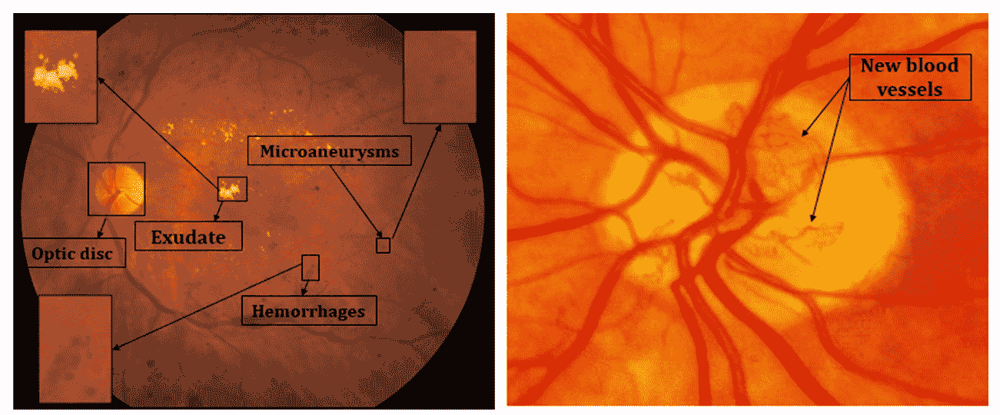
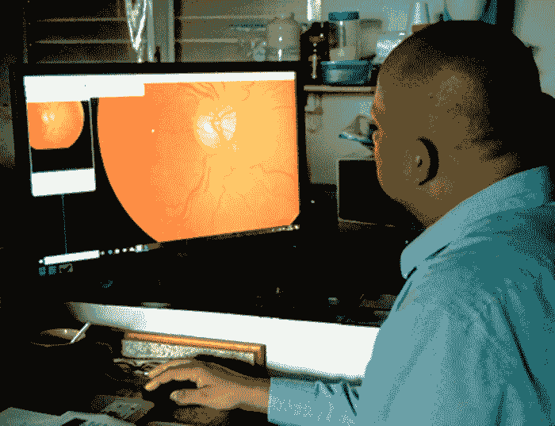
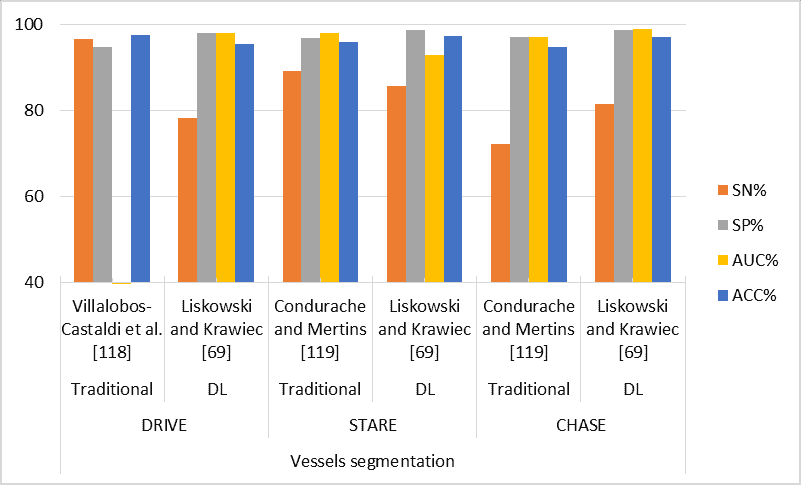
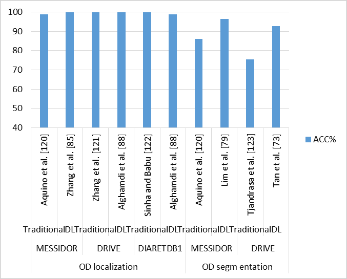
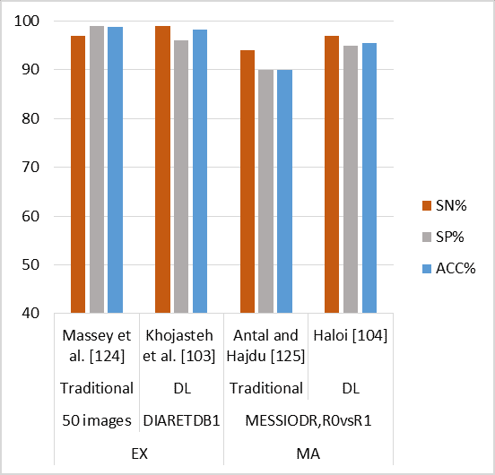

<!--yml

category: 未分类

date: 2024-09-06 20:07:08

-->

# [1811.01238] 基于深度学习的糖尿病视网膜病变计算机辅助诊断系统：综述

> 来源：[`ar5iv.labs.arxiv.org/html/1811.01238`](https://ar5iv.labs.arxiv.org/html/1811.01238)

¹¹institutetext: 社区学院，沙特阿拉伯达曼伊曼·阿卜杜勒拉赫曼·本·费萨尔大学

计算机与信息科学学院，沙特阿拉伯利雅得国王苏德大学

眼科，医学院，沙特阿拉伯利雅得努拉公主大学

玻璃体视网膜疾病与手术，沙特阿拉伯利雅得国王哈立德眼科医院

¹¹email: norah.m.asiri@outlook.com

¹¹email: mhussian@ksu.edu.sa

¹¹email: ffaladel@pnu.edu.sa

¹¹email: nzaidi@kkesh.med.sa

# 基于深度学习的糖尿病视网膜病变计算机辅助诊断系统：综述

诺拉·阿西里 1122    穆罕默德·侯赛因 22    法德瓦·阿尔·阿德尔 33    纳齐赫·阿尔扎伊迪 4411223344

###### 摘要

糖尿病视网膜病变（DR）如果不及时治疗会导致视力丧失。基于视网膜底部图像的计算机辅助诊断（CAD）系统是一种有效且高效的早期 DR 诊断方法，并可以辅助专家。计算机辅助诊断（CAD）系统涉及检测、分割和分类视网膜底部图像中的病变等多个阶段。已引入许多基于手工设计特征的传统机器学习（ML）技术。深度学习（DL）的最新出现及其在各种应用中对传统 ML 方法的决定性胜利，激励了研究人员将其应用于 DR 诊断，并引入了许多基于深度学习的方法。在本文中，我们回顾了这些方法，突出了它们的优缺点。此外，我们指出了在设计和学习高效、有效且鲁棒的深度学习算法以应对 DR 诊断中的各种问题时需要解决的挑战，并引起对未来研究方向的关注。

###### 关键词：

糖尿病视网膜病变，病变，渗出物，黄斑，糖尿病性黄斑水肿，视盘，微动脉瘤，出血，CNN，自编码器，RNN，DBN

## 1 引言

糖尿病视网膜病变（DR）是工作年龄人群失明的主要原因之一。它是糖尿病最令人担忧的并发症之一。DR 的根本问题在于它在晚期阶段变得不可治愈，因此早期诊断非常重要。然而，由于潜在患者数量庞大和经验丰富的技术人员稀少，这给医疗系统带来了极大难度。这促使了开发自动化诊断系统以协助早期诊断 DR 的需求。在这方面已有若干尝试，并提出了基于手工设计特征的几种方法，这些方法在识别视网膜底部图像中的 DR 区域方面表现出了良好的效率。

手工设计的特征通常与传统的机器学习（ML）方法一起用于糖尿病视网膜病变（DR）诊断。不同的调查已审查了这些传统方法[1, 2, 3, 4, 5, 6, 7]。例如，Mookiah 等人[1]、Mansour [4] 根据采用的方法对 DR 诊断进行了分类，如数学形态学、视网膜病变跟踪、阈值处理和可变形模型、基于聚类的模型、匹配滤波模型和混合方法。Faust 等人[2] 综述了从眼底图像中提取病变特征的算法，如血管区域、渗出物、出血、微动脉瘤和纹理。Joshi 和 Karule [3] 回顾了早期的渗出物检测研究。Almotiri 等人[5] 提供了分割视网膜血管的算法概述。Almazroa 等人[6] 和 Thakur 及 Juneja [7] 回顾了几种视盘分割和青光眼诊断的方法。然而，手工设计特征的前提是专家知识，选择合适的特征需要对各种选项进行深入调查和繁琐的参数设置。此外，基于手工设计特征的方法泛化能力较差。

最近几年，大规模数据集的可用性和图形处理单元（GPUs）提供的强大计算能力促使了对深度学习算法的研究，这些算法在各种计算机视觉任务中表现出色，并在传统的手工设计方法中取得了决定性的胜利。许多基于深度学习（DL）的算法也已被开发用于各种任务，以分析视网膜眼底图像，从而开发自动计算机辅助诊断系统用于糖尿病视网膜病变（DR）。本文回顾了最新的用于 DR 检测的 DL 算法，重点介绍了近期研究论文的贡献和挑战。首先，我们提供了各种 DL 方法的概述，然后回顾了用于 DR 诊断的 DL 技术。最后，我们总结了在设计和训练深度神经网络用于 DR 诊断方面的未来方向、空白和挑战。本文的其余部分组织如下：第二部分介绍了 DR 的自动检测、病变类型、DR 阶段、DR 分级、检测任务和检测框架。之后，第三部分简要描述了公共领域的 DR 数据集和常见的性能指标。第四部分提供了用于 DR 诊断的 DL 技术的概述。第五部分回顾了基于 DL 的最新 DR 诊断研究。第六部分讨论了这些研究。最后，第 7 和第八部分呈现了研究空白、未来方向以及结论。

## 2 自动糖尿病视网膜病变检测

在本节中，为了清晰起见，我们概述了 DR 检测、DR 病变类型、DR 阶段、DR 分级、DR 检测任务和检测的一般框架。自动计算机辅助解决方案用于 DR 特征描述仍然是一个开放的研究领域[4]。自动基于图像的 DR 检测系统旨在快速进行视网膜评估和早期检测 DR，以指示是否存在 DR 并发症。

### 2.1 病变类型

DR 和视网膜损伤的最早临床迹象是微动脉瘤（MAs），它们是由于内弹力膜破裂而形成的微血管扩张。视网膜微动脉瘤由于内皮屏障功能局部丧失，导致渗漏和视网膜水肿，从而降低视力。MAs 较小（通常直径小于 125 微米），呈现为红色斑点，边缘锐利。当脆弱毛细血管的壁破裂时，出血会导致出血（HMs），它们与 MAs 类似但更大[8]，边缘不规则，根据其渗漏的视网膜层有不同的外观。碎片状出血发生在视网膜的浅表层，导致浅表的火焰状出血。而点状和斑块状出血发生在视网膜的深层。更多的毛细血管损伤渗漏会导致渗出物（EXs），这些通常在视网膜中呈黄色和不规则形状。EXs 有两种类型：硬性和软性。硬性渗出物（HEs）是从异常视网膜血管中逃逸的脂蛋白和其他蛋白质。它们呈白色或白黄，边缘锐利。它们通常以块状或圆环状排列[9]，位于视网膜的外层。另一方面，软性渗出物（SEs）或棉絮样斑点（CWS）是小的、灰白色的云状形状，发生在小动脉被阻塞时[10]。EXs 在亮度上与 MAs 和 HMs 不同。MAs 和 HMs 是暗色病变，而 EXs 是亮色[11]。视网膜静脉直径的变化称为静脉珠串（VB）[12]，通常发生在非增殖性糖尿病视网膜病变的晚期。由于正常途径无法使用葡萄糖，激活了替代血液通道，导致如山梨醇等元素的合成，并促使微血管出现变化。视网膜内微血管异常（IRMA）就是一个例子，它代表了既有毛细血管的扩张或视网膜内新血管的实际生长。当视网膜血管突出并向玻璃体生长时，称为新生血管形成（NV）[13]。黄斑水肿（ME）发生在视网膜毛细血管变得通透，渗漏发生在黄斑周围[14]。这可能导致视网膜增厚或硬性渗出物发展，可能在黄斑中心的一盘直径内（即中央凹）[15]，或涉及中央凹，它负责中央视力。

在检测糖尿病视网膜病变中扮演重要角色的一个关键对象是视神经盘（OD），其特征是圆形区域之间的对比度最高[16]。视神经盘被用作标志物和参考框架，以诊断严重的眼病如青光眼、视神经盘凹陷、视神经盘乳头以及检查视神经盘是否有新生血管[17, 18]。视神经盘还用于定位其他结构，如中央凹。在正常视网膜中，视神经盘的边缘清晰且定义良好，如图 1 所示。

图 1：视神经盘和由糖尿病视网膜病变引起的眼底异常发现。左侧：MA、EX 和 HM。右侧：新血管路径（PDR）。

### 2.2 糖尿病视网膜病变的阶段

糖尿病视网膜病变可以根据其严重程度分为两大类：非增殖性（NPDR）和增殖性（PDR）[8, 19]。NPDR 是早期阶段，此时糖尿病开始损害视网膜内的小血管；这种情况在糖尿病患者中非常常见[14]。这些血管开始渗漏液体和血液，导致视网膜肿胀。随着时间的推移，肿胀或水肿使视网膜变厚，导致视力模糊。此阶段的临床特征是至少有一个微动脉瘤或出血，伴或不伴有硬性渗出物[20]。增殖性 DR 是一个高级阶段，导致新血管的生长；因此，其特征是视网膜内的异常血管增生，向玻璃体腔延伸。这些脆弱的新血管可能会出血到玻璃体腔，并因玻璃体出血导致严重的视觉损失。它们还可能进一步对视网膜产生牵引，因为它们通常会在周围生长一张纤维血管网络，这可能导致牵引性视网膜脱离。

### 2.3 糖尿病视网膜病变的分级

通过眼底镜检查视网膜通常需要扩张瞳孔、一位熟练的检查员和一次到眼科医生如验光师的访问，以评估和分类病理[21]。分级是糖尿病视网膜病变筛查计划中的一项重要活动，用于诊断视网膜疾病。这是一个需要经过培训的专业人员和适当大小计算机屏幕的密集过程 2。

图 2：分级员需要适当的环境以维持高质量的表现。

评估人员如验光师或经过良好培训的技术人员在治疗和恢复潜在致盲的眼科疾病（如年龄相关性黄斑变性（AMD）和糖尿病眼病）中扮演了重要角色[21]。通常会获取非散瞳眼底图像，但如果图像由于任何介质不透明而不清晰，则会使用散瞳药水扩张瞳孔以提高图像质量。所有评估人员必须接受基于筛查协议的特别培训，以确保眼底图像按照标准化的方式进行评分。他们应花时间进行培训，以识别和确认病例是否具有病理异常，并区分观察到的病理水平，基于商定的间隔做出转诊决定或返回复查。对 DR 血管变化的评分有多种系统，如美国眼科学会（AAO）、早期糖尿病视网膜病变研究（ETDRS）引入的分类[22]以及苏格兰 DR 评分协议，其中每只眼睛只拍摄一个以黄斑为中心的视野[23]。苏格兰协议见表 1。

表 1：DR 苏格兰评分协议[24]

| 级别 | 特征 | 决策 |
| --- | --- | --- |
| R0：无糖尿病视网膜病变 | 无异常 | 12 个月复查 |
| R1：轻度非增殖性糖尿病视网膜病变 | 仅有 MAs | 12 个月复查 |
| R2：中度非增殖性糖尿病视网膜病变 |

&#124; 超过黄斑异常但低于严重增殖性视网膜病变 &#124;

| 6 个月复查 |
| --- |
| R3：严重非增殖性糖尿病视网膜病变 |

&#124; -每个象限超过 20 个 HMs &#124;

&#124; -两个象限中的静脉珠状扩张 &#124;

&#124; -视网膜内微血管异常 &#124;

| 转诊 |
| --- |
| R4：增殖性糖尿病视网膜病变 |

&#124; -OD 或其他地方任何新血管 &#124;

&#124; -玻璃体/视网膜前 HM &#124;

| 转诊 |
| --- |
| M0：无黄斑水肿 | 无 EXs 或视网膜增厚在后极部 | 12 个月复查 |
| M1：轻度黄斑水肿 | 视网膜增厚或在后极部，$>$1 个视盘直径距离黄斑 | 6 个月复查 |
| M2：中度黄斑水肿 |

&#124; 轻度黄斑水肿的相同迹象，但距离黄斑 1 个视盘直径或更少 &#124;

&#124; 但不影响黄斑中央 &#124;

| 需转诊以进行激光治疗 |
| --- |
| M3：严重黄斑水肿 | 影响黄斑中央的 EXs 或视网膜增厚 | 需转诊以进行激光治疗 |

### 2.4 检测任务和一般框架

从高层次来看，DR 检测被分为两种任务：病灶级别检测和图像级别检测。在病灶级别检测中，每个病灶都被检测到，并确定其位置，因为病灶的数量及其位置对评估 DR 的严重程度至关重要[25]。另一方面，基于图像的检测侧重于基于图像级别的评估，从筛查的角度来看更有趣，因为它仅评估是否存在 DR 的迹象[25]。病灶级别检测通常涉及两个阶段：(i) 病灶检测和/或分割，以及 (ii) 病灶分类。首先，从眼底图像中检测病灶，如微动脉瘤、出血、硬性渗出物和软性渗出物，并确定病灶的确切区域。这是一个具有挑战性的任务，因为视网膜眼底图像中包含其他具有类似外观的物体，如红点和血管。对于这项任务，通常需要全局和局部上下文以进行准确的定位和分割。检测阶段产生潜在的兴趣区域，但也包括误报。病灶分类阶段用于去除误报。基于图像的检测是一项图像筛查任务，将给定的眼底图像分类为正常或有 DR 迹象。这是 DL 在医学诊断中做出重大贡献的首个领域之一[26]。

检测、分割和分类的一般框架包括预处理、特征提取/选择、选择合适的分类方法以及最终结果评估的具体步骤。DR 分类系统根据学习过程可以分为两种类型：监督学习和无监督学习。在监督学习中，系统使用标记的数据进行训练以推断功能映射[27, 28]。另一方面，无监督学习方法倾向于根据未标记示例的相似性发现隐藏模式[29]。与手工工程特征方法不同，深度学习（DL）方法将所有步骤集成到一个统一框架中，并以端到端的方式自动学习特征并训练系统。

## 3 数据集和性能指标

在本节中，我们概述了在糖尿病视网膜病变（DR）研究中常用的基准数据集和性能指标。

### 3.1 视网膜眼底图像数据集

已经产生了几个包含视网膜眼底图像的数据集，用于教授和测试不同糖尿病视网膜病变（DR）检测任务的算法。在以下段落中，我们概述了以下公共领域基准数据集：MESSIDOR [30]、e-ophtha [31]、Kaggle [32]、DRIVE [33]、STARE [34]、DIARETDB1 [35、36]、CHASE [37]、DRiDB [38]、ORIGA [39]、SCES [40]、AREDS [41]、REVIEW [42]、EyePACS-1 [43]、RIM-ONE [44]、DRISHTI-GS [45]、ARIA [46]、DRIONS-DB [47]和 SEED-DB [48]。表 2 总结了这些数据集。

#### 3.1.1 MESSIDOR

它是在 MESSIDOR 研究计划下开发的，该计划由法国研究和国防部资助[30]。它由三个眼科部门使用装有 45^∘视野（FOV）的 Topcon TRC NW6 非散瞳眼底照相机通过彩色视频 3CCD 相机获得。专家眼科医生提供了两种类型的图像级注释：DR 等级和黄斑水肿的风险等级。DR 等级如下：

+   •

    0: 无风险: (#MA = 0) AND (#HM = 0)

+   •

    1: (0 $<$ #MA $\leq$ 5) AND (#HM = 0)

+   •

    2: ((5 $<$ #MA $<$ 15) OR (0 $<$ #HM $<$ 5)) AND (NV = 0)

+   •

    3: (#MA $\leq$ 15) OR (#HM $\leq$ 5) OR (NV = 1)

黄斑水肿的风险等级如下：

+   •

    0: 无风险

+   •

    1: 黄斑和硬性外周病变之间的最短距离$>$一个乳头直径

+   •

    2: 黄斑和硬性外周病变之间的最短距离$\leq$一个乳头直径

#### 3.1.2 e-ophtha

它由 e-ophtha 项目引入，该项目由法国研究机构资助[31]。它提供了黄斑病变（MA）和硬性外周病变（EX）的定位，这些定位由两位眼科医生确认。第一位眼科医生勾勒出位置，第二位眼科医生检查和审查。数据库包括两个数据集：e-ophtha EX 和 e-ophtha MA。e-ophtha EX 集包含 47 张图像，其中有 12,278 个 EX 和 35 张健康图像。几张健康对照图像包含易于误导 EX 检测方法的结构，如反射和光学伪影。另一方面，e-ophtha MA 包含 148 张图像，其中有 1306 个 MA 和 233 张健康图像。

#### 3.1.3 Kaggle

该数据集由 EyePACS 诊所提供，包括大量在不同条件下拍摄的高分辨率视网膜图像[32]。图像级注释由专家眼科医生提供，每张图像被分配了 0 到 4 的 DR 等级，具体如下：

+   •

    0: 无风险

+   •

    1: 轻度

+   •

    2: 中度

+   •

    3: 严重

+   •

    4: PDR

#### 3.1.4 DRIVE

用于血管提取的数字视网膜图像（DRIVE）[33]是在荷兰的 DR 筛查程序下收集的，用于比较视网膜图像中的血管分割，使用了 Canon CR5 非散瞳 3CCD 相机。它包含 40 张眼底图像，这些图像是随机选择的；其中 33 张没有显示 DR 的迹象，而 7 张显示轻度早期 DR 的迹象；它被分为测试集和训练集，每个集包含 20 张图像。它提供了像素级注释；像素被注释为血管像素的置信度为 70%。

#### 3.1.5 STARE

视网膜结构分析（STARE）[34] 程序由美国国家卫生研究院（NIH）资助。它包括显示 13 种与人眼相关的疾病的眼底图像。它提供了每张图像的疾病代码和名称列表。血管和视神经具有像素级注释，但没有分级。两名观察者手动分割了所有图像。平均而言，第一个人将每张图像中的 32,200 个像素标记为血管，而第二个人将每张图像中的 46,100 个像素标记为血管。由于视网膜疾病的出现，该数据集提供了一个具有挑战性的 OD 检测问题。

#### 3.1.6 DIARETDB1

该数据集包含 89 张彩色眼底图像，这些图像是在不同的成像设置和 50^∘视场下拍摄的，拍摄地点位于芬兰的库奥皮奥大学医院[35]。四位独立专家对这些图像进行了注释。这些专家划定了可以找到 MAs 和 HMs 的区域，并提供了每种病变类型的地图。该数据集被称为“校准级别 1 眼底图像”。它被分为训练集和测试集，分别包含 28 张和 61 张图像。

#### 3.1.7 CHASE

这是在英格兰的儿童心脏与健康研究计划（CHASE）[37]下获得的，来自不同种族和年龄在 9 岁和 10 岁的儿童。它包含 28 张来自 14 名儿童的眼底图像，注释包含使用 Top Con TRV-50 相机以 35 视场拍摄的血管的真实情况。与 DRIVE 和 STARE 不同，它包含背景照明不均匀和非均匀的图像，血管对比度较差，以及有明亮条纹贯穿中心的较宽动脉，这被称为中心血管反射。

#### 3.1.8 DRiDB

糖尿病视网膜病变图像数据库（DRiDB）[38]是在萨格勒布的大学医院获得的，旨在克服先前数据集中的不足，如分级和观察者数量有限。图像由专家拍摄并选择，具有 45 视场，并且 DR 症状从几乎正常到可以看到新生脆弱血管的病例各不相同。在该数据集中，每张图像由五位独立专家评估，以标记 DR 发现。这些专家注释了发现的像素及相关区域，包括 MAs、HMs、硬性和软性 EXs、血管、ODs 和黄斑。

#### 3.1.9 ORIGA

在线视网膜眼底图像数据库用于青光眼分析和研究（ORIGA）[39]是一个在线库，分享眼底图像及其真实数据作为基准，供研究人员共享视网膜图像分析结果及相应诊断。该数据集在 2004 年至 2007 年间在新加坡眼科研究所收集，重点关注视盘（OD）和视神经杯（OC）分割以及杯盘比（CDR）用于青光眼诊断。

#### 3.1.10 SCES

它是在新加坡华人眼科研究（SCES）[40]下获得的，研究对象为 1060 名华人参与者，由一位高级专业分级员和一位视网膜专家进行分级。该研究旨在识别前房深度（ACD）的决定因素，并确定这些因素在新加坡华人中的相对重要性。

#### 3.1.11 AREDS

它是在年龄相关眼病研究（AREDS）[41]下开发的，该研究由 NIH 资助。这是一项长期多中心前瞻性研究，涉及 595 名年龄在 55 至 80 岁之间的参与者，旨在评估 AMD 和白内障的临床过程。参与者没有任何会影响长期跟踪的疾病或状况。根据由中央阅片中心分级的眼底照片、最佳矫正视力和眼科评估，参与者被纳入若干 AMD 类别之一。

#### 3.1.12 REVIEW

估计宽度的视网膜血管图像集（REVIEW）[42]由英国林肯大学计算机与信息学系于 2008 年在线发布。数据集包含 16 张散瞳图像和 193 个标注的血管段，总共有 5066 个轮廓点由三位独立专家手动标记。与 DRIVE 和 STARE 不同，REVIEW 数据集包含宽度测量。这些图像被选中以评估血管宽度测量算法在存在病理和中央光反射情况下的准确性和精确性。16 张图像被划分为四组：高分辨率图像组（8 张图像）、血管疾病图像组（4 张图像）、中央光反射图像组（2 张图像）和起点图像组（2 张图像）。

#### 3.1.13 EyePACS-1

眼底图像归档与通信系统（EyePACS）[43]是一个灵活的协议和基于网络的远程医疗系统，用于 DR 筛查和临床医生之间的协作。患者的眼底图像可以轻松上传到 EyePACS 网站。该协议评估与 DR 相关的离散视网膜病变的存在和严重程度。该协议使用 Canon CR-DGi 和 Canon CR-1 非散瞳相机，这些相机可以在 EyePACS 网站上访问。病变被分为 MAs、HMs（有或没有 MAs）、棉花状斑点、视网膜内微血管异常、静脉珠串、新生血管（视盘上的新生血管和其他地方的新生血管）、纤维增生、玻璃体 HMs 或前膜 HMs 以及 HEs。此外，还包括激光瘢痕的存在与否。评分者使用在线评分模板单独为每种病变类型评分，记录每种病变类型的选择，包括无（缺失）、有（存在）或无法评分。

#### 3.1.14 RIM-ONE

这是一个开放的视网膜图像数据库，用于视神经评估（RIM-ONE）[44]，由非散瞳的 Nidek AFC-210 与 Canon EOS 5D Mark II 机身拍摄。旨在用于青光眼诊断，包含 169 个视神经头区域，这些区域是从完整眼底图像中手动裁剪的。这些图像由 5 位青光眼专家注释：4 位眼科医生和 1 位验光师。

#### 3.1.15 DRISHTI-GS

包含了 101 张来自印度 Aravind 眼科医院的健康对照组和青光眼患者的眼底图像，几乎覆盖 25 FOV。数据集分为训练集和测试集，分别包含 50 张和 51 张图像。所有图像由 4 位拥有 3 年、5 年、9 年和 20 年临床经验的眼科医生注释。手动标记了 OD 和 OC 边界以及 CDR 作为真实值。此外，还包括了关于图像是否代表健康对照或青光眼眼以及图像的下方和/或上方区域是否有凹陷的其他两个专家意见。

#### 3.1.16 ARIA

自动化视网膜图像分析器（ARIA）[46]旨在跟踪血管、OD 和中央凹的位置。由两位图像分析专家标记。该数据集在 St Paul’s 眼科单位和利物浦大学使用 Zeiss FF450+眼底相机在 50 FOV 下收集，用于诊断 AMD 和 DR。

#### 3.1.17 DRIONS-DB

光神经分割数据库的数字视网膜图像（DRIONS-DB）[47]在西班牙的一家大学医院收集。该数据库旨在分割视神经头及其相关病理。由 2 位独立的医学专家注释。图像以视神经头为中心，并以幻灯片格式存储。

#### 3.1.18 SEED

新加坡眼病流行病学（SEED）[48]由 235 张眼底图像组成，重点研究主要眼病，包括 DR、AMD、青光眼、屈光差错和白内障。每张图像由训练有素的评分员标记 OD 和 OC 区域，作为分割的基础真相。

表 2：DR 检测数据集

| 数据集 | #图像 | 分辨率 | 格式 | 任务 |
| --- | --- | --- | --- | --- |
| 图像级别标注 |
| MESSIDOR [49] | 1,200 |

&#124; 1,440$\times$960, &#124;

&#124; 2,240$\times$1,488, &#124;

&#124; 2,304$\times$1,536 &#124;

|

&#124; 图像：TIFF &#124;

&#124; 诊断：excel 文件 &#124;

|

&#124; -DR 分级 &#124;

&#124; -DME 风险 &#124;

|

|

&#124; Kaggle &#124;

&#124; [32] &#124;

| 80,000 | - | JPEG |
| --- | --- | --- |

&#124; -无 DR &#124;

&#124; -轻度 &#124;

&#124; -中度 &#124;

&#124; -严重 &#124;

&#124; -PDR &#124;

|

| AREDS[41] | 72,000 | - | - | -AMD 阶段 |
| --- | --- | --- | --- | --- |
| EyePACS-1[43] | 9,963 | - | - |

&#124; -可参考 DR &#124;

&#124; -MA &#124;

|

| 像素级别标注 |
| --- |

|

&#124; e-ophtha[31] &#124;

|

&#124; 148 MAs, &#124;

&#124; 233 正常非 MA &#124;

&#124; 47 EXs, &#124;

&#124; 35 正常非 EX &#124;

|

&#124; 2,544 $\times$ 1,696 &#124;

&#124; 1440$\times$960 &#124;

- |

&#124; 图像：JPEG &#124;

&#124; GT：PNG &#124;

|

&#124; -MA 小 HM 检测 &#124;

&#124; -EX 检测 &#124;

|

| DRIVE [33] |
| --- |

&#124; 33 正常 &#124;

&#124; 7 轻度到早期 &#124;

&#124; DR 阶段 &#124;

| 584$\times$565 |
| --- |

&#124; 图像：TIFF &#124;

&#124; GT，遮罩：GIF

| -血管提取 |
| --- |

|

&#124; STARE &#124;

&#124; [34] &#124;

| 402 | 605$\times$700 | PPM |
| --- | --- | --- |

&#124; -13 种视网膜疾病 &#124;

&#124; -血管提取 &#124;

&#124; -视神经 &#124;

|

|

&#124; DIARETDB1 &#124;

&#124; [35, 36] &#124;

|

&#124; 5 正常 &#124;

&#124; 84 至少有一个 &#124;

&#124; NPDR 标志 &#124;

| 1,500$\times$1,152 |
| --- |

&#124; 图像，&#124;

&#124; 遮罩，&#124;

&#124; GT：PNG &#124;

|

&#124; -MAs &#124;

&#124; -HMs &#124;

&#124; -SEs &#124;

&#124; -HEs &#124;

|

| CHASE [37] | 28 | 1,280 $\times$ 960 |
| --- | --- | --- |

&#124; 图像：JPEG &#124;

&#124; GT：PNG &#124;

| -血管提取 |
| --- |
| DRiDB [38] | 50 | 720$\times$576 | BMP |

&#124; -MAs &#124;

&#124; -HMs &#124;

&#124; -HEs &#124;

&#124; -SEs &#124;

&#124; -血管提取 &#124;

&#124; -OD &#124;

&#124; -黄斑 &#124;

|

| ORIGA[39] |
| --- |

&#124; 482 正常 &#124;

&#124; 168 青光眼性&#124;

| 720$\times$576 | - |
| --- | --- |

&#124; -OD &#124;

&#124; -视盘杯 &#124;

&#124; -杯盘比 (CDR) &#124;

|

| SCES[40] |
| --- |

&#124; 1,630 正常 &#124;

&#124; 46 青光眼性 &#124;

| - | - | -CDR |
| --- | --- | --- |
| REVIEW[42] | 16 |

&#124; 3,584$\times$2,438 &#124;

&#124; 1,360$\times$1,024 &#124;

&#124; 2,160$\times$1,440 &#124;

&#124; 3,300$\times$2,600 &#124;

| - | -血管提取 |
| --- | --- |
| RIM-ONE[44] |

&#124; 118 正常 &#124;

&#124; 12 早期青光眼 &#124;

&#124; 14 中度青光眼 &#124;

&#124; 14 深度青光眼 &#124;

&#124; 11 眼内高压 &#124;

| - | - | -视神经 |
| --- | --- | --- |
| DRISHTI-GS[45] |

&#124; 31 正常 &#124;

&#124; 70 青光眼性 &#124;

| 2,896 $\times$ 1,944 | PNG |
| --- | --- |

&#124; -OD 分割 &#124;

&#124; -OC 分割 &#124;

|

| ARIA [46] |
| --- |

&#124; 16 正常 &#124;

&#124; 92 AMD &#124;

&#124; 59 糖尿病视网膜病变 &#124;

| 768$\times$576 | TIFF |
| --- | --- |

&#124; -OD &#124;

&#124; -中心凹位置 &#124;

&#124; -血管提取 &#124;

|

| DRIONS-DB[47] | 110 | 600$\times$400 |
| --- | --- | --- |

&#124; 图像：JPEG &#124;

&#124; GT: txt 文件 &#124;

| -OD |
| --- |
| SEED-DB[48] |

&#124; 192 正常 &#124;

&#124; 43 青光眼性 &#124;

| 3,504$\times$ 2,336 | - |
| --- | --- |

&#124; -OD &#124;

&#124; -OC &#124;

|

### 3.2 性能指标

在本节中，我们定义了常用的性能指标，以评估糖尿病视网膜病变检测算法。用于衡量分类算法性能的常见指标包括准确率、敏感性（召回率）、特异性、精确度、F-得分、ROC 曲线、对数损失、IOU、重叠误差、基于边界的评估和骰子相似系数。

准确率定义为正确分类的实例与总实例数的比率[50]。它的正式定义如下：

|  | $Accuracy=\frac{TP+TN}{TP+TN+FP+FN},$ |  | (1) |
| --- | --- | --- | --- |

其中 $TP$（真正例）是指在考虑的数据集中被正确分类的正实例数量（例如，具有糖尿病视网膜病变），$TN$（真负例）是指在考虑的数据集中被正确分类的负实例数量（例如，正常病例），$FP$（假正例）和 $FN$（假负例）分别是指被错误分类的正实例和负实例的数量。请注意，在检测糖尿病视网膜病变时，实例可以是视网膜图像、视网膜图像的补丁或视网膜图像的像素，具体取决于任务。敏感性（SN），即真正例率或召回率，衡量正确分类的正实例的比例；特异性（SP），即真负例率，衡量正确分类的负实例的比例；而精确度，即正预测值，衡量正确分类的正实例的比例。它们的正式定义如下：

|  | $Sensitivity(Recall)=\frac{TP}{TP+FN}$ |  | (2) |
| --- | --- | --- | --- |
|  | $Specificity=\frac{TN}{TN+FP}$ |  | (3) |
|  | $Precision=\frac{TP}{TP+FP}$ |  | (4) |

$\textit{F-score}(F)$ 结合了精确度和召回率，如下所示：

|  | $F=2\frac{Precision\times Recall}{Precision+Recall}$ |  | (5) |
| --- | --- | --- | --- |

接收器操作特征 (ROC) 曲线表示真正例率与假正例率的图示。它显示了灵敏度与特异性的关系。ROC 曲线下面积 (AUC) 也用作性能指标，取值范围在 0 到 1 之间；AUC 越接近 1，性能越好。对数损失 (log loss) 通过惩罚错误分类来确定分类器的准确性。要计算对数损失，分类器必须为每个类别分配一个概率，而不是仅仅呈现最可能的类别。其计算公式为：

|  | $logloss=-\frac{1}{N}\sum_{i=1}^{N}\sum_{j=1}^{M}y_{ij}logp_{ij},$ |  | (6) |
| --- | --- | --- | --- |

其中 $N$ 是样本数量，$M$ 是标签数量，$y_{ij}$ 是标签 $j$ 是否为实例 $i$ 的正确分类的二值指示器，而 $p_{ij}$ 是模型将标签 $j$ 分配给实例 $i$ 的概率。由于分割在像素级别上也是一种分类，因此定义用于分类的指标可以用于分割。用于衡量分割算法性能的附加指标包括重叠误差、交并比和骰子相似系数。交并比（IOU）定义如下 [51]：

|  | $IOU=\frac{Area(A\cap G)}{Area(A\cup G)}$ |  | (7) |
| --- | --- | --- | --- |

重叠误差通过以下方式获得：

|  | $E=1-IOU$ |  | (8) |
| --- | --- | --- | --- |

其中 $A$ 是输出的分割符号，$G$ 表示手动标注的真实分割 [52]。

基于边界的评估 (B) 是通过测量两个闭合边界曲线之间的距离得到的绝对逐点定位误差。设 $C_{g}$ 为真实边界，$C_{a}$ 为从某方法得到的边界。两个曲线之间的距离 $D$ 定义为（以像素为单位）：

|  | $B=\frac{1}{n}\sum_{\theta=1}^{\theta_{n}}\sqrt{(d_{g}^{\theta})^{2}-(d_{a}^{\theta})^{2}},$ |  | (9) |
| --- | --- | --- | --- |

其中 $d_{g}^{\theta}$ 和 $d_{a}^{\theta}$ 是从曲线中心到 $C_{g}$ 和 $C_{a}$ 上的点在 $\theta$ 方向的距离，而 $n$ 是角度样本的总数。计算得到的边界与真实边界之间的距离理想情况下应接近零 [18]。

用于 DR 检测的重叠误差的替代方法是骰子相似系数 (DSC) 或重叠指数，其定义如下 [53]：

|  | $DSC=\frac{2TP}{2TP+FP+FN}$ |  | (10) |
| --- | --- | --- | --- |

DSC 的值在 0 和 1 之间；DSC 越接近 1，分割结果越好。区域精度召回 (RPR) 通常用于基于区域重叠评估边缘或边界检测结果。它指的是在精度召回空间中的分割质量 [54]。

## 深度学习概述

各种基于深度学习的架构已经被引入。用于各种糖尿病视网膜病变（DR）检测的常见深度架构包括卷积神经网络（CNNs）、自编码器（AEs）、递归神经网络（RNNs）和深度置信网络（DBNs）。在接下来的段落中，我们将概述这些架构。

### 4.1 卷积神经网络

CNNs 模拟人类视觉系统，已广泛应用于各种计算机视觉任务。它们主要由三种类型的层组成：卷积层、池化层和全连接（FC）层。卷积层使用卷积操作来编码局部空间信息，然后使用 FC 层来编码全局信息。常用的 CNN 模型包括 AlexNet、VGGNet、GoogLeNet 和 ResNet。CNN 模型采用端到端的方式进行训练；它自动学习特征层次结构，从而实现卓越的分类性能。最初的 CNN 模型，如 LeNet [55] 和 AlexNet [56] 包含较少的层。2014 年，Simonyan 和 Zisserman [57] 探索了一个更深的 CNN 模型 VGGNet，该模型包含 19 层，发现深度对更好的性能至关重要。受这些发现的启发，提出了更深的模型，如 GoogLeNet、Inception [58] 和 ResNet [59]，这些模型在许多计算机视觉任务中表现出色。端到端模型通常意味着一个深度模型，它接收输入并给出输出。迁移学习意味着模型首先使用来自相关领域的数据集进行端到端的训练，然后使用来自该领域的数据集进行微调。学习一个 CNN 模型需要大量的数据以克服过拟合问题并确保适当的收敛 [60]，但在医学领域，特别是糖尿病视网膜病变检测中，大量数据并不可用。解决方案是使用迁移学习 [61]。一般来说，迁移学习使用两种策略：（i）使用预训练的 CNN 模型作为特征提取器，（ii）使用相关领域的数据对预训练的 CNN 模型进行微调。全卷积网络（FCN）是 CNN 模型的一个版本，其中 FC 层被转换为卷积层，并添加了反卷积（或转置卷积）层，以撤销卷积层中的下采样效果，并获得与输入图像相同大小的输出图 [62]。该模型通常用于分割。

### 4.2 基于自编码器和堆叠自编码器的方法

自编码器（AE）是一个具有相同输入和输出的单隐藏层神经网络 [63]，用于构建堆叠自编码器（SAE），一种深度架构 [64]。SAE 模型的训练包括两个阶段：预训练和微调。在预训练阶段，SAE 以无监督的方式逐层训练。在微调阶段，预训练的 SAE 模型通过监督方式使用梯度下降和反向传播算法进行微调。自编码器是 SAE 的基本构建块。自编码器主要有两种类型：稀疏自编码器和去噪自编码器。稀疏自编码器是一种自编码器，倾向于从原始数据中提取稀疏特征。表示的稀疏性可以通过惩罚隐藏单元偏置或直接惩罚隐藏单元激活的输出来实现。去噪自编码器（DAE）也已被用于 DR 检测 Maji 等人 [65]，由于其在恢复损坏输入方面的鲁棒性，并强制模型捕捉正确的版本。

### 4.3 循环神经网络

RNN 是一种学习上下文及输入模式的神经网络。它学习先前迭代的输出，并将其与当前输入结合以产生输出；通过这种方式，RNN 能够通过递归影响自身。RNN 模型通常包含三组参数——输入到隐藏层的权重 $W$，隐藏层权重 $U$ 和隐藏层到输出的权重 $V$，其中权重在输入序列的位置/时间上是共享的 [66]。

### 4.4 深度置信网络

DBN [67] 是一种深度网络架构，由级联的限制玻尔兹曼机（RBM）构建而成。RBM 通过对比散度算法进行训练，以最大化输入与其投影之间的相似性（在概率的意义上）。概率作为相似性度量的参与防止了退化解，并使 DBN 成为一种概率模型。与 SAE 类似，DBN 首先以无监督的方式通过逐层贪婪学习策略进行预训练；然后，使用梯度下降和反向传播算法进行微调。

## 5 文献综述

基于 DR 检测任务的临床重要性，我们将其分为四类：（i）视网膜血管分割，（ii）视盘定位和分割，（iii）病变检测和分类，以及（iv）图像级 DR 诊断以供转诊。在以下子章节中，我们回顾了这些任务的最先进的基于深度学习的算法。

### 5.1 视网膜血管分割

识别细小视网膜血管的变化对于防止由于病理性视网膜损伤导致的视力损害是非常重要的。由于血管的对比度低、形态在噪声背景下的变化以及如 MA 和 HM 等病理存在，视网膜血管的分割具有挑战性。不同的学习方法已被应用于视网膜血管的分割。在接下来的段落中，我们将回顾这些基于深度学习的方法。

#### 5.1.1 卷积神经网络

基于 CNN 模型的许多视网膜血管分割算法已经被提出。Maji 等人[68]使用了 12 个 CNN 模型来分割血管和非血管像素。每个 CNN 模型包括三个卷积层和两个全连接层。在评估中，他们使用了 DRIVE 数据集。

Liskowski 和 Krawiec[69]提出了一种基于深度 CNN 的像素级监督血管分割方法，该方法使用经过全局对比度归一化和零相位白化处理的眼底图像进行训练，并使用几何变换和伽马校正进行了增强。他们使用 DRIVE、STARE 和 CHASE 数据集来评估该系统。该方法对中心血管反射具有鲁棒性，并在检测细小血管方面敏感。

Maninis 等人[70]将视网膜血管分割问题制定为图像到图像的回归任务，为此他们采用了经过预训练的 VGG，并通过去除全连接层和在 VGG 的前四个卷积块后加入额外的卷积层来对 VGG 进行修改。在池化层之前，这些额外的卷积层会被上采样到与图像相同的尺寸，经过训练后与体积连接起来。他们使用了 DRIVE 和 STARE 进行评估。

Wu 等人[71]首先使用 CNN 提取判别特征，然后基于主成分分析（PCA）进行最近邻搜索，以估计局部结构分布，最后由广义概率跟踪框架用于分割血管。这种方法使用 DRIVE 数据集进行了评估。

Dasgupta 和 Singh[72]结合了 FCN 和结构化预测来分割血管，他们将其假设为一个多标签推断任务。图像的绿色通道经过了归一化、对比度调整、伽马校正和将强度值缩放到 0 和 1 之间的预处理。他们使用 DRIVE 来评估该方法的性能。

Tan 等人 [73] 提出了一个七层 CNN 模型，用于同时分割血管、视盘（OD）和黄斑（fovea）。在对彩色图像进行归一化之后，他们将分割问题形式化为一个分类问题，假设有四个类别——血管、视盘、黄斑和背景——并通过取 25$\times$25 像素的邻域对每个像素进行分类。这种方法非常耗时，因为每个像素是独立分类的，每个像素都需要经过与像素数量相同次数的网络传递。该方法的性能通过 DRIVE 数据集进行了评估。

Fu 等人 [74] 同样将血管分割问题形式化为边界检测任务，并通过结合 FCN 和全连接条件随机场（CRF）提出了该任务的方法。首先，使用 FCN 创建一个血管概率图，然后通过结合血管概率图和 CRF 中像素之间的长程交互来分割血管。该方法在 DRIVE 和 STARE 数据集上进行了验证。

Mo 和 Zhang [75] 使用了一个 FCN，并在中间层中加入了一些辅助分类器，以使低层特征更具判别性。为了克服可用样本数量少的问题，他们使用了迁移学习来训练 FCN 模型。他们在 DRIVE、STARE 和 CHASE 数据集上对系统进行了评估。

表 3 给出了上述所有方法的性能分析。该分析表明，在所有基于 CNN 的方法中，Liskowski 和 Krawiec [69] 的方法在准确性、AUC 和灵敏度方面表现优于所有其他方法。这种方法可能由于视网膜图像的预处理和使用增强数据集训练 CNN 模型而表现更好。所有其他方法都使用了没有预处理或增强的预训练 CNN 模型。与预期相反，Maji 等人 [68] 的 CNN 模型集成方法由于没有对训练数据集进行预处理和增强，未能优于其他基于 CNN 的方法。

#### 5.1.2 基于堆叠自编码器的方法

一些方法以不同的方式使用 SAE 来分割血管。Maji 等人 [65] 提出的 方法使用了一种混合的深度学习架构，包括无监督的堆叠去噪自编码器（SDAEs），用于在视网膜图像中分割血管。第一个 DAE 的结构包括 400 个隐藏神经元，第二个 DAE 包含 100 个隐藏神经元。SDAE 学习特征，这些特征使用随机森林（RF）进行分类。该方法通过在绿色通道中围绕每个像素的 k × k 大小的补丁来分割血管。他们使用 DRIVE 来评估该方法。

Roy 和 Sheet [76] 介绍了一种基于 SAE 的深度神经网络（SAE-DNN）模型用于血管分割，该模型采用领域适应（DA）方法进行训练。SAE-DNN 由两层隐藏层组成，这些层使用源领域（DRIVE 数据集）进行训练，采用自编码机制和监督学习。然后，DA 分两个阶段应用：无监督权重适应和监督微调。在无监督权重适应阶段，SAE-DNN 的隐藏节点使用来自目标领域（STARE 数据集）的未标记样本进行重新训练，采用系统的节点丢弃机制；在监督微调阶段，SAE-DNN 使用来自目标领域的小量标记样本进行微调。结果显示领域 DA 改善了 SAE-DNN 的性能。

Li 等人 [28] 提出了使用监督式深度学习方法从绿色通道分割视网膜血管，该方法对像素块而非单个像素进行标记。在这种方法中，血管分割问题被建模为一种跨模态数据转换，将视网膜图像转换为血管图，并使用由深度自编码器组成的深度神经网络来定义。他们在 DRIVE、STARE 和 CHASE（28 张图像）上评估了性能。

Lahiri 等人 [77] 使用了一个由堆叠去噪自编码器网络（SDAEs）组成的两级集成。在第一层集成中，一个网络（E-net）包含 $n$ 个具有相同结构的 SDAEs；每个 SDAE 包含两个隐藏层，并跟随一个 Softmax 分类器；SDAEs 在引导训练样本上使用自编码机制并行训练，以生成概率图像图，这些图像图通过融合策略进行合并。在第二层集成中，为了引入更多的多样性，将两个具有不同架构的 E-nets 的决策通过凸加权平均合并。作者使用 DRIVE 数据集评估了该方法。

#### 5.1.3 基于递归神经网络的方法

Fu 等人 [78] 将血管分割问题形式化为边界检测任务，并通过将 CNN 和 CRF 作为 RNN 集成提出了 DeepVessel 方法，并在 DRIVE、STARE 和 CHASE 数据集上进行了评估。

对上述方法的性能分析见表 3。这一分析表明，在所有 SAE 基于的方法中，基于跨模态转换 [28] 和 SAE 的两级集成 [77] 的方法在准确性方面优于 SAE 基于的方法。尽管基于 SAE 两级集成 [77] 的方法的表现略优于基于跨模态转换 [28] 的方法，但差异不显著。有趣的是，基于 CNN 和 SAE 的方法在准确性方面没有明显差异。CNN 模型涉及的可学习参数比 SAE 模型多得多，因此更容易过拟合。CNN 模型在有大量标记数据集或引入新的增强技术时可以表现得更好。

表 3：糖尿病视网膜病变（DR）血管检测的代表性工作

| 研究研究 | 分割方法 | 训练 | 数据集 | 性能 |
| --- | --- | --- | --- | --- |
| 基于 CNN 的方法 |
| Maji 等 [68] | 基于补丁的 CNN 模型集成 | 端到端 | DRIVE |

&#124; AUC=0.9283 &#124;

&#124; ACC= 94.7 &#124;

|

| Liskowski 和 Krawiec [69] | 基于补丁的 CNN | 端到端 | DRIVE |
| --- | --- | --- | --- |

&#124; SN= 98.07, SP=78.11 &#124;

&#124; AUC=0.9790 &#124;

&#124; ACC=95.35 &#124;

|

| STARE |
| --- |

&#124; SN=85.54, SP=98.62 &#124;

&#124; AUC=0.9928 &#124;

&#124; ACC=97.29 &#124;

|

| CHASE |
| --- |

&#124; SN=81.54, SP=98.66 &#124;

&#124; AUC=0.988 &#124;

&#124; ACC=96.96 &#124;

|

| Maninis 等 [70] | FCN | 迁移学习 | DRIVE | RPR=0.822 |
| --- | --- | --- | --- | --- |
| STARE | RPR=0.831 |
| Wu 等 [71] | 血管跟踪/基于补丁的 CNN/PCA 作为分类器 | 端到端 | DRIVE | AUC=0.9701 |
| Dasgupta 和 Singh [72] | 基于补丁的 FCN | 端到端 | DRIVE |

&#124; SN=76.91 &#124;

&#124; SP=98.01 &#124;

&#124; AUC=0.974 &#124;

&#124; ACC=95.33 &#124;

|

| Tan 等 [73] | 基于补丁的七层 CNN | 端到端 | DRIVE |
| --- | --- | --- | --- |

&#124; SN=75.37 &#124;

&#124; SP=96.94 &#124;

|

| Fu 等 [74] | FCN/CRF | 端到端 | DRIVE |
| --- | --- | --- | --- |

&#124; SN=72.94, ACC=94.70 &#124;

|

| STARE |
| --- |

&#124; SN=71.40, ACC=95.45 &#124;

|

| Mo 和 Zhang [75] | 多级 FCN | 端到端 | DRIVE |
| --- | --- | --- | --- |

&#124; SN=77.79, SP=97.80 &#124;

&#124; AUC=0.9782 &#124;

&#124; ACC=95.21 &#124;

|

| STARE |
| --- |

&#124; SN=81.47, SP=98.44 &#124;

&#124; AUC=0.9885 &#124;

&#124; ACC=96.76 &#124;

|

| CHASE |
| --- |

&#124; SN=76.61, SP=98.16 &#124;

&#124; AUC=0.9812 &#124;

&#124; ACC=95.99 &#124;

|

| 基于 AE 的方法 |
| --- |
| Maji 等 [65] | 基于补丁的 SDAE/RF | 迁移学习 | DRIVE |

&#124; AUC=0.9195, ACC=93.27 &#124;

|

| Roy 和 Sheet [76] | 基于块的 SAE | 迁移学习 | STARE |
| --- | --- | --- | --- |

&#124; AUC=0.92 &#124;

&#124; logloss=0.18 &#124;

|

| Li 等人 [28] | 基于块的 SDAE | 端到端 | DRIVE |
| --- | --- | --- | --- |

&#124; SN=75.6, SP=98 &#124;

&#124; AUC=0.9738 &#124;

&#124; ACC=95.27 &#124;

|

| STARE |
| --- |

&#124; SN=77.26, SP=98.79 &#124;

&#124; ACC=96.28 &#124;

|

| CHASE (28 张图像) |
| --- |

&#124; SN=75.07, SP=97.93 &#124;

&#124; AUC=0.9716 &#124;

&#124; ACC=95.81 &#124;

|

| Lahiri 等人 [77] | 基于块的 DSAE | 迁移学习 | DRIVE | ACC=95.3 |
| --- | --- | --- | --- | --- |
| 基于 RNN 的方法 |
| Fu 等人 [78] | 基于块的 CNN/CRF 作为 RNN | 端到端 | DRIVE |

&#124; SP=76.03 &#124;

&#124; ACC=95.23 &#124;

|

| STARE |
| --- |

&#124; SP=74.12 &#124;

&#124; ACC=95.85 &#124;

|

| CHASE |
| --- |

&#124; SP=71.30 &#124;

&#124; ACC=94.89 &#124;

|

### 5.2 视盘特征

检测 OD 可以增强 DR 的检测和分类，因为其明亮的外观可能会与其他明亮的病变（如 EXs）产生混淆。OD 检测包括两个操作：（i）定位和（ii）分割 OD。CNN 和 SAE 模型都已用于 OD 检测。一些方法仅定位 OD，这基本上是一个物体检测问题，而其他方法则定位和分割 OD，这是一种分割问题，以识别 OD 的区域及其边界。

#### 5.2.1 卷积神经网络

Lim 等人 [79] 的方法是最早采用九层 CNN 模型来分割 OD 和 OC 的提案之一。它包括四个主要阶段：定位 OD 周围的区域，通过放大相关视觉特征来增强该区域，使用 CNN 模型在像素级别分类增强区域以生成概率图，最后分割此图以预测盘和杯的边界。该方法在 MESSIDOR 和 SEED-DB 上进行了评估。

Guo 等人 [80] 使用了基于大像素块的 CNN，其中 OC 通过对每个像素块的分类和后处理进行分割。他们使用了 DRISHTI-GS 数据集进行训练和测试。类似地，Tan 等人 [73] 共同分割了 OD 和血管；这在血管分割部分有回顾。Sevastopolsky [81] 使用了在 [82] 中提出的改进版 U-net 卷积网络来分割 OD 和 OC。

Zilly 等人[83]引入了一种基于多尺度双层 CNN 模型的 OD 和 OC 分割方法，该模型经过提升训练。首先，将 OD 周围的区域裁剪、下采样 4 倍，转换为 L*a*b 颜色空间并归一化。然后，通过熵过滤处理该区域以识别最具辨别力的点，并传递到 CNN 模型中，该模型使用温和的 AdaBoost 方法进行训练。逻辑回归分类器从 CNN 模型的输出中生成概率图，最后应用图切割方法和凸包拟合以获得分割后的 OD 和 OC 区域。该方法使用 DRISHTI-GS 数据集进行评估，采用了三种性能指标：F-score、重叠度量（IOU）和边界误差（B）。

本方法的扩展版本在[84]中提出，Zilly 等人[84]使用了具有熵采样的集成 CNN 来选择信息量大的点。这些点用于创建一种基于提升的卷积滤波器的新学习方法。

Maninis 等人[70]使用相同的 FCN 对视网膜图像中的血管和 OD 进行分割，如血管分割部分所述。该方法在 DRIONS-DB 和 RIM-ONE 数据集上验证了 OD 和 OC 的分割效果。

Shankaranarayana 等人[51]提出了一种联合分割 OC 和 OD 的方法，该方法使用基于残差学习的全卷积网络（ResU-Net），类似于 U-net[82]，该网络的左侧包含下采样操作的编码器，右侧包含上采样操作的解码器。使用 ResU-Net 和生成对抗网络（GANs）训练视网膜图像与 OD 和 OC 检测分割图之间的映射。该方法（ResU-GAN）不涉及任何预处理，相比于其他像素分割方法[79]更为高效。该方法使用了 RIM-ONE 数据集中的 159 张图像进行测试。

Zhang 等人[85]使用了更快的区域卷积神经网络（faster RCNN），以 ZF 网作为基础 CNN 模型来定位 OD。在定位 OD 后，通过使用 Hessian 矩阵去除其边界框中的血管，并使用形状约束的水平集来切割 OD 的边界。他们使用从 Kaggle 中选择的 4,000 张图像训练 CNN 模型，并使用 MESSIDOR 进行测试。该方法快速且提供了非常好的定位结果。

Fu 等人 [86] 使用了一个 U 型 CNN 模型（M-Net）来在一个阶段同时分割视盘和视杯，并找到杯盘比（CDR）。M-Net 的输入层是一个由图像金字塔组成的多尺度层。它涉及一个带有侧输出层的 U 形 CNN，用于产生不同尺度层的局部预测图和一个多标签损失函数输出层。首先，视盘区域被定位并转换为极坐标域；然后，通过 M-Net 生成一个多标签图，该图被逆向转换为笛卡尔坐标域以分割视盘。使用 ORIGA 和 SCES 数据集评估了该方法，取得了最先进的结果。

Niu 等人 [87] 的方法使用了显著性图区域提议生成和一个七层的 CNN 模型来检测视盘。通过使用基于显著性的视觉注意模型，识别眼底图像中的显著区域，并利用 CNN 模型对这些区域进行分类以定位视盘。这种方法是一种经过验证的深度学习方法，使用级联定位与反馈来在经过预处理的图像上定位视盘，并通过均值减法来实现。算法仅在找到包含视盘的区域时结束。作者在 ORIGA、MESSIDOR 和这些数据集上测试了性能。

Alghamdi 等人 [88] 提出了一个使用级联 CNN 模型检测异常视盘的方法。首先，提取候选视盘区域，经过预处理和归一化处理。然后，使用第一个模块对这些区域进行分类为视盘或非视盘。最后，通过第二个 CNN 模块将检测到的视盘区域分类为正常、可疑或异常。该方法在 DRIVE、DIARETDB1、MESSIDOR、STARE 和本地数据集上进行了评估。

Xu 等人 [89] 使用了一个经过预训练的 VGG 模型，去除了最后的全连接层和反卷积层，并将其连接到 VGG 模型的最后三层池化层，以计算像素的概率图。概率图经过阈值处理，最后获得阈值以上像素的质心以定位视盘。作者使用了 ORIGA、MESSIDOR 和 STARE 数据集进行评估。这种方法在正确定位视盘方面非常高效。

表 4 展示了视盘分割和定位方法的汇总视图。在视盘分割方面，很难确定哪种方法表现最佳，因为所有方法都是在不同的数据库上使用不同的指标进行评估的。在视盘定位方法中，Zhang 等人 [85] 基于更快的 RCNN 的方法在 MESSIDOR 数据集上取得了最佳的定位结果。

#### 5.2.2 堆叠自编码器方法

我们发现只有一种基于 SAE 的方法用于分割 OD。Srivastava 等 [52] 的想法是区分视盘旁萎缩 (PPA) 和 OD。该方法在检测到 OD 的中心后裁剪感兴趣区域 (ROI) 并使用 CLAHE 增强其对比度。计算每个像素的特征，假设其周围窗口大小为 25x25，然后传递给一个深度 SAE，该 SAE 由一个输入层（626 个单元）、七个隐藏层（500、400、300、200、100、50 和 20 个单元）和一个输出层组成，用于将其分类为 OD 或非 OD 像素。使用 SAE 获得的 ROI 的二进制图进一步通过主动形状模型 (ASM) 进行 OD 分割。使用最小均值重叠误差 (LMOE) 对包含 230 张图像的数据集进行评估。表 4 提供了一个总体视图，显示 CNN 基于的方法比 SAE 基于的方法表现更好。

表 4: OD 检测工作

| 研究 | 方法 | 训练 | 类型 | 数据集 | 性能 |
| --- | --- | --- | --- | --- | --- |
| 基于 CNN 的方法 |
| Lim 等 [79] | 九层 CNN 带夸张 | 端到端 | OD 分割 | MESSIDOR | E=0.112, IOU=0.888 |
| SEED-DB | E= 0.0843, IOU=0.916 |
| Guo 等 [80] | 大像素补丁基于的 CNN | 端到端 | OC 分割 | DRISHTI-GS | F=93.73, E=0.1225 |
| Tan 等 [73] | 七层 CNN | 端到端 | OD 分割 | DRIVE | ACC=87.90 |
| Sevastopolsky [81] | 修改版 U-Net CNN | 转移学习 | OD 分割 | DRION-DB | IOU=0.98, Dice=0.94 |
| RIM-ONE | IOU=0.98, Dice=0.95 |
| OC 分割 | DRION-DB | IOU=0.75, Dice=0.85 |
| RIM-ONE | IOU=0.69, Dice=0.82 |
| Zilly 等 [83] | 多尺度两层 CNN | 端到端 | OD 分割 | DRISHTI-GS | F=94.7, IOU=0.895, B=9.1 |
| OC 分割 | F=83, IOU=0.864, B=16.5 |
| Zilly 等 [84] | 基于集成学习的 CNN | 端到端 | OD 分割 | DRISHTI-GS | F=97.3, IOU=0.914, B=9.9 |
| OC 分割 | F=87.1, IOU=0.85, B=10.2 |
| Maninis 等 [70] | 基于 VGG-16 的 FCN | 转移学习 | OD 分割 | DRIONS-DB | RPR=0.971 |
| RIM-ONE | RPR=0.959 |
| Shankaranarayana 等 [51] | ResU-Net 和 GANs | 转移学习 | OD 分割 | RIM-ONE | F=98.7, IOU= 0.961 |
| OC 分割 | F=90.6, IOU=0.739 |
| Zhang 等 [85] | Faster RCNN | 转移学习 | OD 定位 | MESSIDOR | 平均精确度=99.9 |
| OD 分割 | MESSIDOR (120 张图像) | 平均匹配分数 85.4 |
| Fu 等 [86] | U 形 CNN 和极坐标变换 | 转移学习 | OD 分割 | ORIGA | E=0.071, IOU=0.929 |
| Niu 等人 [87] | 显著性图，基于 AlexNet 的 CNN | 迁移学习 | OD 定位 | ORIGA | ACC=99.33 |
| MESSIDOR | ACC=98.75 |
| ORIGA+ MESSIDOR | ACC=99.04 |
| Alghamdi 等人 [88] | Cascade CNN，每个模型有 10 层 | 端到端 | OD 定位 | DRIVE | ACC=100 |
| DIARETDB1 | ACC=98.88 |
| MESSIDOR | ACC=99.20 |
| STARE | ACC=86.71 |
| Xu 等人 [89] | 基于 VGG 和解卷积的 CNN | 迁移学习 | OD 定位 | ORIGA | ACC=100 |
| MESSIDOR | ACC=99.43 |
| STARE | ACC=89 |
| AE 基于方法 |
| Srivastava 等人 [52] | SAE 与 ASM | 端到端 | OD 分割 | Foong 等人 [90] 使用的本地数据集 | E=0.097 |

### 5.3 病变检测与分类

许多深度学习方法已被提出用于检测和分类不同类型的 DR 病变，如黄斑水肿、渗出物、微动脉瘤和出血。在这一部分，我们将回顾这些方法。

#### 5.3.1 黄斑水肿作为临床特征

黄斑是视网膜的中央部分，由一层薄薄的细胞和光敏神经纤维组成，负责清晰的视觉。糖尿病黄斑水肿（DME）是 DR 并发症之一，当视网膜毛细血管变得通透并在黄斑周围发生泄漏时 [14]；当血管的液体和血液进入视网膜时，黄斑会肿胀和增厚。DME 的深度学习方法主要可以分为基于 CNN 的方法和基于 AE 的方法。

##### 5.3.1.1 卷积神经网络

Abràmoff 等人 [91] 提出了一个基于监督的端到端 CNN 方法来识别 DME。Perdomo 等人 [92] 提出了一个将 EX 定位和分割与 DME 检测相结合的方法。EX 定位包括两个阶段。在第一阶段，使用一个八层 CNN 模型，该模型以 488$\times$48 的补丁作为输入，用于定位 EX。该模型在 e-ophtha 数据集上进行训练。在第二阶段，使用这个 CNN 模型作为预测器，以及 MESSIDOR 数据集，生成灰度掩模图像。DME 检测模型基于 AlexNet 架构，输入为视网膜图像和相应的灰度掩模图像，预测类别为正常、轻度、中度或重度 DME。预处理用于提取 EX 的 ROI，并且应用数据增强以生成更多样本来训练 CNN 模型。作者使用了 MESSIDOR 进行测试。

Burlina 等人 [93] 使用深度卷积神经网络进行特征提取，并使用线性支持向量机（LSVM）进行分类，应用于年龄相关性黄斑变性（AMD）。在将视网膜图像裁剪并调整为 231×231 像素后，使用在 ImageNet 数据集上预训练的 OverFeat CNN 模型进行特征提取。用于验证的数据集 NIH AREDS [41] 按照 AMD 严重程度分为四类。

Al-Bander 等人[94]提出了一种端到端的 CNN 模型来评估 DME 严重程度。在裁剪和调整眼底图像的大小后，红色、绿色和蓝色通道被缩放为零均值和单位方差。所提出的 CNN 模型由三个卷积块和一个全连接层块组成。应用数据增强来增加训练样本的数量。该模型使用了 MESSIDOR 数据集进行评估。

Ting 等人[95]评估了使用卷积神经网络模型诊断 AMD 和其他 DR 并发症的性能，并得出他们的卷积神经网络在诊断 DR 并发症方面是有效的，但不能使用眼底图像识别所有 DME 病例。这个 AMD 检测的卷积神经网络模型使用了 72,610 张眼底图像进行训练，并在来自不同族裔的 35,948 张图像上进行了测试。

Mo 等人[96]提出了一种二阶段的方法来分类 DME。在第一阶段，使用级联全卷积残差网络（FCRN）和融合的多级分层信息来创建概率图和分割 EX。在第二阶段，使用分割区域，裁剪具有最大概率的像素，并将其输入到另一个残差网络中以分类 DME。他们使用了 HEI-MED[97]和 e-ophtha 数据集来评估这种方法。

##### 5.3.1.2 深度置信网络

也已经对图像级别的 DME 诊断进行了应用。Arunkumar 和 Karthigaikumar[29] 使用 DBN 进行特征提取，并使用多类 SVM 进行分类，以诊断 AMD 和其他 DR 并发症。在这种方法中，眼底图像首先经过预处理过程，包括归一化、对比度调整或直方图均衡化。然后，使用无监督的 DBN 提取特征，使用广义回归神经网络（GRNN）对特征空间的维度进行降维，并最后使用多类 SVM 进行分类。他们使用 ARIA 数据集来评估这种方法。

表 5 中对这些基于 CNN 和 DBN 的方法进行的比较表明，基于 CNN 的方法优于基于 DBN 的方法。在基于 CNN 的方法中，Abràmoff 等人[91]的方法取得了更好的性能，可能是因为它基于一个类似于 Alexnet 的模型。DBN 尚未以端到端的方式使用，因此必须进一步探索其在端到端学习中的应用。有趣的是，DBN 比 CNN 模型具有显著较少的可学习参数。

表 5：DME 检测的代表性工作

| 研究论文 | 方法 | 训练 | 损伤类型 | 数据集 | 性能 |
| --- | --- | --- | --- | --- | --- |
| 基于 CNN 的方法 |
| Abràmoff 等人[91] | 受 AlexNet 启发的 CNN | 端到端 | 多阶段 DR/ME | MESSIDOR-2 | SN=100 |
| Mo 等 [96] | 级联 FCRN | 端到端 | ME | HEI-MED | SN=92.55, F=84.99 |
| e-ophtha | SN=92.27, F=90.53 |
| Perdomo 等 [92] | 基于补丁的 CNN 模型 | 迁移学习 | 多阶段 DR/ME | MESSIDOR |

&#124; SN=56.5, SP=92.8 &#124;

&#124; DME ACC=77 &#124;

&#124; DME 损失=0.78 &#124;

|

| Burlina 等 [93] | 基于 OverFeat 的 CNN | 迁移学习 | 多阶段 AMD | NIH AREDS |
| --- | --- | --- | --- | --- |

&#124; SN=90.9-93.4 &#124;

&#124; SP=89.9-95.6 &#124;

&#124; ACC=92-95 &#124;

|

| Al-Bander 等 [94] | 具有三个卷积块和一个全连接块的 CNN 模型 | 端到端 | 多阶段 DR/ME | MESSIDOR |
| --- | --- | --- | --- | --- |

&#124; SN=74.7, SP=95 &#124;

&#124; ACC=88.8 &#124;

|

| Ting 等 [95] | CNN | 端到端 | AMD | 35948 张图像 |
| --- | --- | --- | --- | --- |

&#124; SN=93.2, SP=88.7 &#124;

&#124; AUC=0.931 &#124;

|

| 基于 DBN 的方法 |
| --- |
| Arunkumar 和 Karthigaikumar [29] | 用于训练的 DBN 和作为分类器的多类 SVM | 端到端 | AMD | ARIA |

&#124; SN=79.32, SP=97.89 &#124;

&#124; ACC=96.73 &#124;

|

#### 5.3.2 渗出物作为临床特征

EX 的检测对自动早期 DR 诊断是必要的，但由于其大小、形状和对比度水平的显著变化，这一任务具有挑战性。在本节中，我们回顾了基于深度学习的 EX 检测方法。根据我们所知，所有这些方法都基于 CNN。

##### 5.3.2.1 卷积神经网络

Prentašić 和 Lončarić [98] 提出了一个基于 CNN 的 EX 检测方法，用于彩色视网膜图像。首先，他们检测 OD，创建 OD 概率图并拟合抛物线。然后，他们创建血管概率图和亮边界概率图。最后，使用 11 层 CNN 模型，生成 EX 概率图，并将其与 OD、血管和亮边界概率图及拟合的抛物线结合，生成最终的 EX 概率图。他们使用 DRiDB 数据库评估了模型的性能。该模型显著优于基于手工设计特征的传统方法。

Perdomo 等 [99] 提出了一个基于 LeNet 模型的补丁级方法，用于区分视网膜图像中的 EX 区域和健康区域。在该方法中，潜在的 EX 补丁首先通过手动或自动方式裁剪；然后，这些补丁被送入 LeNet 模型进行分类。为了训练 LeNet，使用基于翻转和旋转操作的数据增强技术创建了额外的补丁。e-ophtha 数据集用于验证；提取了 20,148 个 EX 和健康补丁，其中 40% 的补丁被用作测试数据。

Gondal 等人 [27] 提出了一个基于获奖的$o\_O$ CNN 架构[100]检测 EX 及其他 DR 病变的方法。为了定位 DR 病变，包括硬 EX (HE)和软 EX (SE)，从 CNN 模型中移除了密集层。在最后的卷积层上引入了全局平均池化（GAP）层，并跟随一个分类层，这些层用于学习每个最后卷积层特征图的类别特定重要性。这些特征图与类别特定的重要性结合，生成类别激活图（CAM）[101]，该图被上采样到原始图像的大小以定位病变区域。作者使用 Kaggle 进行训练，并使用 DIARETDB1 进行验证。这种方法不仅执行图像级检测，还进行病变级检测。

Quellec 等人 [102] 解决了在图像级别联合检测可参考的 DR 和在像素级别检测 DR 病变（如 EX）的问题，他们提出了依赖于 CNN 可视化方法的解决方案。CNN 可视化技术生成的热图并未针对 DR 病变的计算机辅助诊断进行优化。基于 Simonyan 和 Zisserman 的敏感性分析[57]，他们提出了生成热图的修改方法，这有助于通过联合优化 CNN 预测和生成的热图来共同检测可参考的 DR 和病变。他们采用了$o\_O$架构作为 CNN 基础模型。作者使用 Kaggle 数据集进行图像级训练，并使用 DIARETDB1 进行 EX 检测的病变级和图像级测试。

Khojasteh 等人 [103] 比较了几种基于 DL-patch 的方法来检测 EX。他们得出结论，预训练的 ResNet-50 与 SVM 的组合优于其他方法。他们在 DIARETDB1 和 e-ophtha 上评估了他们的方法。

表 6 提供了上述基于 DL 的方法进行 EX 检测的比较分析。Quellec 等人[102]和 Gondal 等人[27]的方法，在同时检测可参考的 DR 和病变方面表现良好。Khojasteh 等人[103]的方法在计算上更高效，由于使用了深度预训练的 ResNet，因此产生了可比的结果。

表 6：糖尿病视网膜病变（DR）EX 检测的代表性工作

| 研究研究 | 方法 | 训练 | 病变类型 | 数据集 |
| --- | --- | --- | --- | --- |

&#124; 分割/ &#124;

&#124; 本地化？ &#124;

| 性能 |
| --- |
| 基于 CNN 的方法 |
| Prentašić 和 Lončarić [98] | 11 层 CNN，OD 和血管图 | 端到端 | EX | DRiDB | ✓ | SN=78，F=78 |
| Perdomo 等 [99] | 基于补丁的 LeNet CNN | 迁移学习 | EX | e-ophtha（40% 补丁） | ✓ | SN=99.8, SP=99.6 ACC=99.6 |
| Gondal 等 [27] | $o\_O$ CNN 模型与 CAM | 迁移学习 | HE/SE | DIARETDB1 | ✓ | SN:HE=87, SE=80 |
| HE/SE | ✗ | SN:HE =100, SE=90.0 AUC=0.954 |
| Quellec 等 [102] | $o\_O$ CNN（网络 A） | 迁移学习 | HE/SE | DIARETDB1 | ✓ | AUC:HE=0.735, SE=0.809 |
| $o\_O$ CNN（网络 B） | HE/SE | ✗ | AUC:HE=0.974, SE=0.963 |
| Khojasteh 等 [103] | 基于补丁的 ResNet/SVM 作为分类器 | 迁移学习 | EX | DIARETDB1 | ✗ | SN=99, SP=96, ACC=98.2 |
|  | e-ophtha | ✗ | SN=98, SP=95, ACC=97.6 |

#### 5.3.3 微动脉瘤和出血作为临床特征

MAs 和 HMs 也已经使用深度学习方法作为 DR 的标志进行了研究，如本节所述。

##### 5.3.3.1 卷积神经网络（CNN）

Haloi [104] 采用了一个九层 CNN 模型，并使用 dropout 训练程序将每个像素分类为 MA 或非 MA。每个像素通过取其周围 129$\times$129 的窗口并将其传递给 CNN 模型进行分类。为了训练，作者使用了数据增强技术来生成每个像素周围的六个窗口。他根据 MA 的数量对 DR 的严重程度进行了评分，从无 DR 到严重 DR。该方法在 MESSIDOR 和 Retinopathy Online Challenge (ROC) 数据集上进行了测试。

van Grinsven 等 [105] 提出的这种方法旨在检测 HM。该方法的主要贡献是解决为训练 CNN 模型而创建的过多正常样本的问题。为了克服这个问题，作者提出了一种动态选择性采样策略，用于选择信息丰富的训练样本。首先，他们从正图像中提取大小为 41$\times$41 的 HM 像素周围的补丁，仅从正图像中提取非 HM 像素，每个补丁根据中心像素进行标记。CNN 使用动态选择性采样策略进行训练。他们使用了一个 10 层的 CNN 模型，并在 Kaggle 和 MESSIDOR 上测试了他们的系统。

Gondal et al. [27] 和 Quellec et al. [102] 在排除液体部分讨论中提到的方法，这些方法共同检测可参考的 DR 和病变，也检测 HMs 和小红点。Orlando et al. [106] 提出了另一种类似的方法。在该方法中，他们首先使用形态学操作提取候选红色病变，并在候选区域周围裁剪 32×32 大小的补丁。接着，他们从每个候选补丁中提取 CNN 特征和手工设计特征（HEFs），如强度和形状特征，将它们融合，然后将融合的特征向量传递给随机森林（RF）以创建概率图，用于对红色病变进行病变级和图像级决策。他们采用了六层 CNN 模型。在病变级评估中，他们使用每图像参考假阳性检测值的每病变敏感性的平均值作为竞争指标（CPM）。他们使用 DIARETDB1 和 e-ophtha 数据集进行每病变评估。他们使用 MESSIODR 来检测可参考的 DR。

##### 5.3.3.2 堆叠自编码器方法

Shan 和 Li [107] 使用堆叠稀疏自编码器（SSAE）来检测 MA 病变。一个补丁被传递给 SSAE，SSAE 提取特征，然后 Softmax 分类器将其标记为 MA 或非 MA 补丁。他们在 DIARETDB 数据集中从 89 幅视网膜图像中选取的 MA 和非 MA 补丁上训练和微调了 SSAE。这些补丁在没有任何预处理的情况下提取，Shan 和 Li 使用 10 折交叉验证对其进行了评估。

上述评审方法的总结见表 7。在敏感性、特异性、AUC 和准确度方面，Haloi [104] 的基于 CNN 的技术似乎优于其他方法，因为它使用了像素增强而非基于图像的增强。Shan 和 Li [107] 的基于堆叠稀疏自编码器的方法性能不如基于 CNN 的方法。在基于 CNN 的方法中，Gondal et al. [27] 和 Quellec et al. [102] 使用的方法计算效率高，并且可以共同检测可参考的 DR 和红色病变。

表 7：基于 MA 和 HM 的糖尿病视网膜病变（DR）检测的代表性工作

| 研究研究 | 方法 | 训练 | 病变类型 | 数据集 |
| --- | --- | --- | --- | --- |

&#124; Segment/ &#124;

&#124; localize? &#124;

| 性能 |
| --- |
| 基于 CNN 的方法 |
| Haloi [104] | 9 层 CNN | 端到端 | MA | MESSIDOR | ✓ | SN=97, SP=95 AUC=0.982 ACC=95.4 |
| ROC | ✓ | AUC=0.98 |
| van Grinsven et al. [105] | 基于补丁的选择性采样 | 端到端 | HM | Kaggle | ✓ | SN=84.8, SP=90.4 AUC=0.917 |
| MESSIDOR | ✓ | SN=93.1, SP=91.5 AUC=0.979 |
| Gondal 等人 [27] | o_O CNN 模型 | 迁移学习 |

&#124; -HM &#124;

&#124; -小红点 &#124;

| DIARETDB1 | ✓ | SN: -HM=91 -小红点=52 |
| --- | --- | --- |

|

&#124; -HM &#124;

&#124; -小红点 &#124;

| ✗ | SN: -HM=97.2 -红色小点=50 |
| --- | --- |
| Quellec 等人 [102] | o_O CNN (net B) | 迁移学习 |

&#124; -HM &#124;

&#124; -小红点 &#124;

| DIARETDB1 | ✓ | AUC: -HM=0.614 -小红点=0.50 |
| --- | --- | --- |

|

&#124; -HM &#124;

&#124; -小红点 &#124;

| ✗ | AUC: -HM=0.999 -小红点=0.912 -红色小点 +HM=0.97 |
| --- | --- |
| Orlando 等人 [106] | HEF + CNN 特征和 RF 分类器 | 端到端 | MA | DIARETDB1 | ✓ | CPM=0.3301, SN=48.83 |
| HM | ✓ | CPM=0.4884, SN=48.83 |

|

&#124; MA &#124;

| e-ophtha | ✓ | CPM=0.3683, SN=36.80 |
| --- | --- | --- |
|  |  |

&#124; 红色病变 &#124;

| MESSIDOR | ✗ | SN=91.09, SP=50 AUC=0.8932 |
| --- | --- | --- |
| AE 基于的方法 |
| Shan 和 Li [107] | 基于补丁的 SSAE | 迁移学习 | MA | DIARETDB | ✓ | SP=91.6 F=91.3 ACC=91.38 |

### 5.4 视网膜图像的转诊分类

本节重点介绍处理可转诊 DR 检测且仅使用图像级标注的方法。这些方法的主要目的是对 DR 级别进行分级以便转诊。本类别中的一些方法还联合检测病变与可转诊 DR，但不使用像素或病变级别的标注 [102]。据我们所知，目前仅有 CNN 模型被应用于此问题。

Gulshan 等人 [108] 使用 Inception-v3 CNN 架构来检测视网膜图像上的可转诊 DR。他们使用 EyePACS-1 数据集评估了该系统，该数据集包含来自 4,997 名患者的 9,963 张图像和 MESSIDOR-2；这些图像都由至少七名美国执业眼科医生和眼科高级住院医师进行分级。这项评估研究得出结论，基于 CNN 的算法在检测可转诊 DR 方面具有很高的敏感性和特异性。

Colas 等人 [109] 提出了一种基于深度学习的方法，该方法联合检测可转诊的糖尿病视网膜病变（DR）和病变位置。他们在 70,000 张标注图像上训练了深度模型，并在来自 Kaggle 数据集的 10,000 张图像上进行了测试，每位患者都有一对左右眼图像。每张图像由眼科医生分为五个主要阶段，这些阶段从没有视网膜病变到增殖性视网膜病变。

类似于 MAs 和 HMs 部分讨论的方法，Quellec 等人 [102] 使用的方法联合检测可转诊 DR 和病变；其性能在三个数据集上进行了评估：Kaggle、e-ophtha 和 DIRETDB1。

Costa 和 Campilho[110]使用了不同的方法，提出了一种通过概括视觉单词包（BoVW）思想来检测可参考 DR 的方法。首先，他们使用加速稳健特征（SURF）提取稀疏局部特征，并通过卷积操作对其进行编码，或者使用 CNN 模型编码密集特征，然后使用神经网络进行分类。他们在三个不同的数据集上评估了所提出的方法：来自[111]的 DR1 和 DR2，以及 MESSIDOR。DR1 和 DR2 由灰度图像组成。作者展示了基于 SURF 的方法优于基于 CNN 的方法，可能是因为 CNN 架构不够深。

Pratt 等人[112]使用 CNN 结构将眼底图像分为五个阶段：无 DR、轻度 DR、中度 DR、严重 DR 和增殖性 DR。他们解决了过拟合和数据集偏斜的问题，并提出了一种解决这些问题的技术。在训练中，他们通过数据增强技术来增加数据量。使用的 CNN 模型包含 10 个卷积层和三个全连接层。训练时，他们使用了从 Kaggle 数据集中获取的 80,000 张图像，并使用 5,000 张图像进行测试。

Gargeya 和 Leng[113]使用了包含五个残差块的 ResNet CNN 模型，分别为四层、六层、八层、10 层和六层，并使用梯度提升分类器对眼底图像进行正常或可参考 DR 的分级。此外，他们在 ResNet 的末尾引入了卷积可视化层，以可视化其学习过程。在训练中，他们使用了从 EyePACS 数据集中选择的 75,137 张图像，并在 MESSIDOR-2 和 e-ophtha 数据集上进行了独立评估。

Abràmoff 等人[91]也提出了一种基于监督式端到端 CNN 模型的方法，讨论了 ME 部分，用于将眼底图像分级为正常或可参考 DR；如果眼底图像为中度 DR、严重非增殖性 DR（NPDR）或增殖性 DR（PDR），则被认为是可参考 DR。

类似地，Ting 等人[95]解决了使用 76,370 张图像检测可参考 DR 的问题。该方法在 mecula edema 部分进行了讨论。

Wang 等人[114]提出了一种监督式图像级 CNN 方法，用于诊断 DR 并突出显示可疑的斑块区域。他们使用了一个名为 Zoom-in 的网络，该网络模拟了视网膜临床检查的放大程序。网络的架构包括三部分：主要网络（M-Net），在 ImageNet 上进行预训练，一个子网络；注意力网络（A-Net）生成注意力图；以及另一个子网络，裁剪网络（C-Net）。他们使用 EyePACS 和 MESSIDOR 来评估该系统。

Mansour [115] 的方法使用了 AlexNet 模型，并结合了高斯混合模型进行背景去除和连通组件分析以定位血管；然后使用线性判别分析进行降维。最后，采用 SVM 进行分类，并使用 10 倍交叉验证进行评估。此外，如 MAs 和 HMs 部分所述，Orlando 等 [106] 的方法联合检测可转诊的 DR 和病变；其性能在 MESSIDOR 上进行了评估。

陈等 [116] 构建了一个名为 SI2DRNet-v1 的模型，用于检测转诊 DR，该模型包含 20 层。在他们的模型中应用了预处理，如高斯滤波器后，他们使用全局平均池化代替 FC 层和 1$\times$1 滤波器以减少参数并正则化模型；他们还在每个池化层后将内核大小从 3$\times$3 扩展到 5$\times$5。最后，他们从 Softmax 层中提取了 5 个概率值以对 DR 严重程度进行分级。

表 8 总结了本节中提出的工作。显然，Gulshan 等 [108] 的方法在敏感性、特异性和 AUC 上优于其他方法；该方法的表现可与七名认证眼科医生的结果相媲美。然而，由于使用了不同的数据集进行训练和测试，比较方法的性能比较困难。Gargeya 和 Leng [113] 的方法似乎具有鲁棒性，因为它基于 ResNet 架构，已被证明优于大多数 CNN 架构；它在不同的数据集上进行了训练和测试，并且其跨数据集的表现相当好。CNN 模型如同黑箱，无法提供对病理的深入了解。该方法还结合了病理区域的可视化，这有助于实时临床验证自动诊断结果。

表 8: 糖尿病视网膜病变 (DR) 转诊的代表性工作

| 研究 | 方法 | 训练 | 数据集 | SN% | SP% | AUC | ACC% |
| --- | --- | --- | --- | --- | --- | --- | --- |
| Gulshan 等 [108] | Inception-v3 CNN | 转移学习 | EyePACS-1 | 90.3 | 90 | 0.991 | - |
| MESSIDOR-2 | 87 | 98.5 | 0.990 | - |
| Colas 等 [109] | CNN 模型 | 端到端 | Kaggle | 96.2 | 66.6 | 0.946 | - |
| Quellec 等 [102] | $o\_O$ CNN（net B） | 转移学习 | DIARETDB1 | - | - | 0.954 | - |
| 集成网 A、网 B、AlexNet | Kaggle | - | - | 0.955 | - |
| e-ophtha | - | - | 0.949 | - |
| Costa 和 Campilho [110] | 稀疏 SURF/CNN | 端到端 | MESSIDOR（20% 的图像） | - | - | 0.90 | - |
| DR1（20% 的图像） | - | - | 0.93 | - |
| DR2（20% 的图像） | - | - | 0.97 | - |
| 普拉特等人 [112] | 13 层 CNN | 端到端 | Kaggle | 95 | - | - | 75 |
| Gargeya 和 Leng [113] | ResNet+梯度提升树 | 端到端 | MESSIDOR-2 | - | - | 0.94 | - |

|

&#124; e-ophtha &#124;

| - | - | 0.95 | - |
| --- | --- | --- | --- |
| 丁等人 [95] | CNN | 端到端 | （71896 图像） | 90.5 | 91.6 | 0.936 | - |
| Abràmoff 等人 [91] | CNN | 端到端 |

&#124; MESSIDOR-2 &#124;

| 96.8 | 87 | 0.980 | - |
| --- | --- | --- | --- |
| 王等人 [114] | 放大网络 | 迁移学习 | EyePACS | - | - | 0.825 | - |
| MESSIDOR | - | - | 0.957 | 91.1 |
| 陈等人 [116] | SI2DRNet-v1（20 层） | 端到端 | MESSIDOR | - | - | 0.965 | 91.2 |
| 曼苏尔 [115] | AlexNet/SVM 作为分类器 | 迁移学习 | Kaggle | 100 | 93 | - | 97.93 |
| 奥兰多等人 [106] | HEF + CNN 特征和 RF 分类器 | 端到端 | MESSIDOR | 97.21 | 50 | 0.9347 | - |

## 6 讨论

前一部分详细介绍了基于深度学习方法的 DR 诊断技术。本调查中列出的研究使用了四种主要的深度学习架构：CNN、AE、DBN 和 RNN。这些架构都有几种变体在 DR 诊断中得到了应用。基于深度学习的方法已被提出用于视网膜血管分割、OD 检测与分割、DR 病变检测与分类，以及可参考 DR 检测。对这些方法的回顾表明，大多数针对上述问题的深度学习技术使用了 CNN 架构，并且它优于其他深度架构。尽管有这些改进，但仍然存在挑战，需要改进深度学习技术，以便更强健、准确地检测、定位和诊断不同的 DR 生物标志物和并发症。所有评审的方法都在公共数据集上进行了测试和评估，除了两种方法 [52、95] 使用了从医疗机构和医院收集的眼底图像。大多数情况下，解决相同问题的方法在不同的数据集上使用了不同的度量标准进行评估，因此很难准确比较它们并根据其性能进行评分。大多数方法在相同数据集上进行了训练和测试，并且相同方法在不同数据集上的表现不同；这引发了对其鲁棒性以及这些方法在实际临床环境中部署时的表现的疑问。

在使用不同数据集进行评估时，解释和比较不同方法在各种性能指标上的结果存在严重困难。例如，Liskowski 和 Krawiec [69] 的方法在 STARE 数据集上进行了测试，该数据集包含 402 张图像（38 张测试阴性和 364 张测试阳性）；Dasgupta 和 Singh [72] 的方法在 DRIVE 数据集上进行了测试，该数据集包含 40 张图像（33 张测试阴性和 7 张测试阳性）。这两种方法在特异性（SP）、ROC 曲线下面积（AUC）和准确率（ACC）方面相似，即两者均有 SP = 98%、AUC = 0.97-0.99 和 ACC = 95%-97%。然而，Liskowski 和 Krawiec [69] 的方法在灵敏度方面（SN = 85%）远优于 Dasgupta 和 Singh [72] 的方法（SN = 76%）。这表明，必须在相同的数据集上评估这些方法以估算其实际性能提升。

尽管卷积神经网络（CNN）架构能带来更好的性能，但 CNN 模型涉及大量参数，并且需要大量标注数据集；然而，现有的数据集仅包含少量标注图像。因此，当使用 CNN 检测和诊断不同的糖尿病视网膜病变（DR）并发症时，有较高的过拟合风险。解决这个问题的一种方法是数据增强，但迄今为止使用的数据增强技术无法创建真实样本。需要更多的数据增强技术来从现有样本中创建新样本。另一种解决方案是使用迁移学习，即首先使用相关领域的数据集训练 CNN 模型，然后用问题领域的数据集进行微调。大多数被审查的方法使用在自然图像上预训练的 CNN 模型[70, 87, 89, 93]，例如用于迁移学习的 ImageNet 数据集；只有少数方法使用在眼底图像上预训练的 CNN 模型[102, 27]。另一种应对过拟合问题的替代方法是引入表达能力强但涉及较少可学习参数的 CNN 模型。

### 6.1 基于深度学习方法与人工设计方法的比较

本节中，我们比较了基于手工设计特征的传统方法和基于深度学习的方法。为了比较，我们选择了在相同数据集和性能指标上进行评估的方法。所选的传统方法是文献[117, 5]中报告的用于血管分割的最先进方法，以及[6]用于 OD 和[1]用于 MAs 的最先进方法。本文回顾中表现最佳的深度学习方法也被选入比较。尽管手工设计特征长期占据主导地位，但深度学习方法作为一种最先进的技术，与传统方法相比表现出色。表 9 展示了传统方法和基于深度学习的方法之间的比较。

对于视网膜血管分割，Villalobos-Castaldi 等人[118]提出的传统方法在 DRIVE 数据集上的灵敏度（96.48%）和准确率（97.59%）优于 Liskowski 和 Krawiec[69]使用的深度学习方法（灵敏度：78.11%，准确率：95.35%）；然而，后者方法在 STARE 和 CHASE 数据集上的整体表现优于 Condurache 和 Mertins[119]的另一种传统方法。这表明，基于深度学习的方法总体上优于传统方法，但即使是深度学习方法也不够稳健：它们在不同数据集上的表现有所不同。图 3 显示了传统方法和基于深度学习的方法的性能图。

对于 OD 定位，Zhang 等人[85]提出的基于深度学习的方法以 99.9%的准确率优于 Aquino 等人[120]使用的传统方法，其准确率为 99%，在 MESSIDOR 数据集上表现更佳。对于 DRIVE 数据集，Alghamdi 等人[88]的学习方法和 Zhang 等人[121]的传统方法在准确率上均为 100%。然而，对于 DIARETDB1，Sinha 和 Babu[122]提出的传统方法以 100%的准确率优于 Alghamdi 等人[88]取得的 98.88%的深度学习准确率。

对于视盘分割，基于深度学习的方法显示出明显高于传统方法的准确性。例如，在 MESSIDOR 数据集上，Aquino 等人使用的传统方法 [120] 的准确性（86%）低于 Lim 等人使用的深度学习方法 [79] 的准确性（96.4%）。同样，在 DRIVE 数据集上，Tjandrasa 等人使用的传统方法 [123] 的准确性（75.56%）低于 Tan 等人基于深度学习的方法 [73] 的准确性（92.68%）。图 4 总结了传统方法和深度学习方法在视盘定位和分割方面的性能。

Joshi 和 Karule [3] 在 2018 年发布的外渗物检测回顾报告了在私有数据集上的最高 EX 检测性能。然而，我们将最佳深度学习方法与拥有最多图像和更高性能的方法进行了比较。Massey 等人 [124] 展现了略高的准确率（98.87%），而 Khojasteh 等人 [103] 的深度学习方法则实现了 98.2% 的准确率，但具有更高的敏感性（99%）。

对于 MA 检测，在 MESSIDOR 数据集上，Haloi 的深度学习方法 [104] 的表现更佳，其敏感性、特异性、AUC 和准确率分别为 97%、95%、0.982 和 95.4%，而 Antal 和 Hajdu [125] 使用的传统方法的敏感性、特异性、AUC 和准确率分别为 94%、90%、0.942 和 90%。图 5 展示了传统方法和深度学习方法在 EX 和 MA 检测中的性能。

总体而言，基于 CNN 的视网膜血管分割、视盘检测与分割以及糖尿病视网膜病变检测的方法表现优于传统方法。然而，深度学习方法并不稳健，难以解释，并且容易过拟合，需要进一步研究以克服这些问题。

图 3：传统方法与基于深度学习的方法在血管分割最大性能的对比图

图 4：传统方法与基于深度学习的方法在视盘定位和分割最大性能的对比图

图 5：传统方法与基于深度学习的方法在 MA 和 EX 检测最大性能的对比图

表 9：最先进的传统方法与最佳性能的深度学习方法之间的比较

| 特征 | 方法 | 研究 | 数据集 | SN% | SP% | AUC | ACC% |
| --- | --- | --- | --- | --- | --- | --- | --- |
| 血管 | 传统方法 | Villalobos-Castaldi 等 [118] | DRIVE | 96.48 | 94.80 | - | 97.59 |
| 深度学习 | Liskowski 和 Krawiec [69] | 78.11 | 98.07 | 0.9790 | 95.35 |
| 传统方法 | Condurache 和 Mertins [119] | STARE | 89.02 | 96.73 | 0.9791 | 95.95 |
| 深度学习 | Liskowski 和 Krawiec [69] | 85.54 | 98.62 | 0.9928 | 97.29 |
| 传统方法 | Condurache 和 Mertins [119] | CHASE | 72.24 | 97.11 | 0.9712 | 94.69 |
| 深度学习 | Liskowski 和 Krawiec [69] | 81.54 | 98.66 | 0.988 | 96.96 |
| OD 定位 | 传统方法 | Aquino 等 [120] | MESSIDOR | - | - | - | 99 |
| 深度学习 | Zhang 等 [85] | - | - | - | 99.9 |
| 传统方法 | Zhang 等 [121] | DRIVE | - | - | - | 100 |
| 深度学习 | Alghamdi 等 [88] | - | - | - | 100 |
| 传统方法 | Sinha 和 Babu [122] | DIARETDB1 | - | - | - | 100 |
| 深度学习 | Alghamdi 等 [88] | - | - | - | 98.88 |
| OD 分割 | 传统方法 | Aquino 等 [120] | MESSIDOR | - | - | - | 86 |
| 深度学习 | Lim 等 [79] | - | - | - | 96.4 |
| 传统方法 | Tjandrasa 等 [123] | DRIVE | - | - | - | 75.56 |
| 深度学习 | Tan 等 [73] | 87.90 | 99.27 | - | 92.68 |
| EX | 传统方法 | Massey 等 [124] | 50 张图像 | 96.9 | 98.9 | - | 98.87 |
| 深度学习 | Khojasteh 等 [103] | DIARETDB1 | 99 | 96 | - | 98.2 |
| MA | 传统方法 | Antal 和 Hajdu [125] | MESSIODR ,R0vsR1 | 94 | 90 | 0.942 | 90 |
| 深度学习 | Haloi [104] | 97 | 95 | 0.982 | 95.4 |

## 7 差距与未来方向

这项关于 DR 诊断方法的综述表明，深度学习有助于设计更好的 DR 诊断方法，并推动了最先进技术的发展，但这仍然是一个开放的问题，需要更多的研究。目前基于深度学习的方法不多，必须开发先进的深度学习技术以解决这一问题。基于深度学习的模型大多是黑箱，不提供诊断价值的解释，这些解释可以帮助验证其在实际临床环境中的有效性。此综述中的大多数方法未提供其结果的任何解释。

设计鲁棒的深度学习方法，尤其是基于更深层架构的 CNN 模型，面临的最具挑战性的问题之一是获取大量带有像素级和图像级注释的标注眼底图像。主要的问题不是数据集的可用性，而是这些图像的注释，这不仅昂贵，而且需要专家眼科医生的服务。解决方案是设计能够从有限数据中学习深度模型的学习算法；这不仅是 DR 诊断的重要研究领域，也是医学图像分析中的一个重要方向；一个可能的方向是探索生成对抗网络（GANs）[126]。另一种替代方法是引入数据增强技术，因为迄今为止使用的数据增强技术并未生成真实样本。因此，必须开发新的数据增强技术，从现有样本中生成代表真实样本的新样本。解决这一问题的另一个替代方案是引入表达能力强但涉及较少可学习参数的 CNN 模型。

此外，类别不平衡是数据集中的另一个挑战；在医学成像领域，尤其是在眼底图像中，DR 病例的数量远少于正常病例。此外，不同 DR 并发症和 DR 病灶的图像数量也不同，在某些情况下这种差异很大，且在深度模型训练过程中为特定类别增加了偏差。全球范围的大规模视网膜筛查过程导致了大量的眼底图像数据集；然而，大多数图像是正常的，不包含任何可疑症状或病灶。在处理这种类别不平衡问题时，开发深度学习策略是另一个重要的研究领域。数据增强已经在一些研究中使用——如[112, 105, 127, 128]——来解决类别不平衡问题，但这些数据增强技术主要使用几何变换，仅生成旋转和缩放样本，而没有引入具有形态变化的病灶样本。必须引入更复杂的数据增强技术，在保留眼底图像预后特征的同时生成异质样本，一个可能的方向是探索生成对抗网络（GANs）[129]。

眼底镜检查中的一个主要问题是视网膜图像的缺乏统一性，即在不同条件下捕捉到的图像。视网膜图像通常会出现光照变化的问题，因为光线在视网膜上的扩散不均匀；视网膜的形状接近于球体，这导致视网膜上的光线无法均匀反射。另一个与光照相关的常见问题是光线照射在视网膜上的角度；拍摄图像的角度并不总是相同的。这可以通过观察视神经在整个数据库中并没有保持特定位置来确认。与捕捉眼底图像相关的另一个问题是图像在某些情况下可能会失焦。此外，眼底图像的拍摄分辨率和相机也不总是相同。还有虹膜反射的色素问题。

解决这些问题的一种方法是将预处理阶段添加到深度学习方法中。或者，一种稳健的方法是设计深度模型，如生成对抗网络（GANs）[130]，使其能够自动检测和纠正这些图像伪影。瓶颈在于开发一个包含所有不同类型图像伪影的大型注释数据集。或者，必须引入复杂的数据增强技术，通过包含不同伪影的图像来扩充现有数据集。

迄今为止开发的方法都是基于输入图像是视网膜图像的假设。然而，输入图像可能不是一个真实的视网膜图像或伪造的视网膜图像；随着用户友好的图像编辑软件的发展，伪造图像变得很容易。因此，首先必须有一种智能计算机辅助方法来识别输入图像是否是一个真实和可信的视网膜图像。

眼科医生通常倾向于使用瞳孔扩张药水（**瞳孔散大**）来更好地查看视网膜，并且有更多的视野来评估是否存在外周糖尿病视网膜病（DR）。使用眼底摄影可以根据相机镜头的视野来决定是否使用瞳孔散大。Optos 相机可以在一次拍摄中捕捉到高达 200^∘的视网膜，并且无需瞳孔散大，而其他相机如 Topcon 和 Nikon（通常用于筛查 DR，因为它们具有更好的图像质量和色彩）则只能捕捉到 30-50^∘，这是系统在捕捉单张图像时的限制。Lawrence [131] 进行了一项研究，比较了瞳孔散大和非瞳孔散大的单次或多次拍摄，以明确瞳孔散大在 DR 筛查中的敏感度。他展示了与非瞳孔散大的单次拍摄相比，瞳孔散大的多次拍摄在敏感性和特异性上更高。因此，数据集必须在瞳孔散大和多次拍摄的条件下开发，以避免无法评价的图像。一般来说，无法评价的图像率在 7-17%之间 [132, 133, 134, 135, 136]。

为了实现转化效果，人工智能和深度学习技术应与在职眼科医生协商开发，并且必须在“真实世界”的 DR 筛查项目中进行验证，这些项目中的眼底图像具有不同的质量（例如白内障、瞳孔扩张不足、对比度/焦点差），涉及不同种族的患者样本（即不同的视网膜色素沉着）和系统控制（控制差和良好） [137]。

基准数据集已用于评估这里审查的不同方法。然而，人为评分者的评分存在变异，不同筛查程序在本地协议上有所不同。审查方法中使用的基准数据集并不遵循标准，因此使用这些数据集开发和测试的方法可能在临床环境中不起作用。由于智能计算机辅助方法的性能取决于用于训练的数据集，因此需要开发新的数据集，考虑到 DR 筛查程序中采用的程序。由于使用不同分类系统时人为评分者评分的变异性，建议对数据集的开发采用一种分类系统，并使用至少 3 位不同评分者评分并一致同意的图像。此外，数据集必须进行统计分析以确定评分的准确性 [138]。此外，早期糖尿病视网膜病研究（ETDRS） [22] 引入了一种用于糖尿病黄斑病的分类。这必须在开发糖尿病黄斑病的数据集时加以考虑。

筛选不同种族是一种 DR 筛查系统的局限性。Ting 等人[95]解决了这个问题。然而，这还不够，需要进一步研究这个问题。从我们的个人经验来看，我们观察到一些在西方人群中开发的 DL 算法未能检测到沙特人群中的一些显著病变。我们注意到，中东或肤色较深的人群的视网膜色素上皮（RPE）中可能有更多的黑色素细胞，这形成了视网膜的最外层。较暗的视网膜掩盖了与浅色视网膜相比的一些血管变化。当我们开始使用一个基于浅色视网膜数据集开发的 DL 系统时，就发现了这一局限性。一个算法被采纳的一个重要挑战是必须在不同设置和条件下的大型患者群体中验证其有效性。筛查软件的性能随着筛查条件的流行程度而变化。DR 的流行程度在一些社区和族群中较低，而在其他群体中则较高（例如，西班牙裔、非洲裔美国人）。了解这些人群的性能特征非常重要。

由于上述原因，为 DR 诊断方法创建的不同眼底图像数据集是异质的，基于深度学习的方法在使用相同数据集进行训练和测试时表现良好。为了提高鲁棒性，基于深度学习的方法必须在不同数据集上表现令人满意。目前，跨数据集测试的方法非常少。由于真实的临床环境可能会被迫匹配特定数据集捕获的条件，因此必须开发鲁棒的深度学习方法，以在跨数据库评估中提供令人满意的性能，即用一个数据集进行训练并用另一个数据集进行测试。

## 8 结论

糖尿病视网膜病变是糖尿病的一种并发症，会损害视网膜，导致视力问题。糖尿病会损害视网膜血管，导致如失明等危险后果。糖尿病视网膜病变是可以预防的，为了避免视力丧失，早期检测非常重要。传统的糖尿病视网膜病变生物标志物和病变检测方法基于手工设计的特征。深度学习的出现为设计和开发更强大、更准确的糖尿病视网膜病变检测和诊断方法打开了大门，深度学习已经被用于开发许多视网膜血管分割、视盘检测和分割、各种糖尿病视网膜病变的检测和分类以及可转诊糖尿病视网膜病变的检测方法。首先，我们概述了不同的糖尿病视网膜病变生物标志物和病变、与糖尿病视网膜病变诊断相关的任务以及这些任务的一般框架。然后，我们概述了为糖尿病视网膜病变诊断研究开发的数据集以及常用于评估的性能指标。之后，我们概述了用于设计糖尿病视网膜病变诊断方法的深度学习架构。在提供必要背景后，我们回顾了提出的基于深度学习的方法，这些方法用于视网膜血管分割、视盘检测和分割、各种糖尿病视网膜病变的检测，如 EXs、MAs、HMs 和可转诊糖尿病视网膜病变，突出了它们的优缺点，并讨论了它们的整体性能，并与基于手工设计特征的最新传统方法进行了比较。一般而言，深度学习方法优于基于手工设计特征提取技术的传统方法。最后，我们强调了现有基于深度学习的糖尿病视网膜病变诊断方法的不足和弱点，并提出了未来研究的潜在方向。这篇综述提供了有关糖尿病视网膜病变诊断的最新深度学习方法的全面视角，将有助于研究人员进一步研究这一问题。

## 参考文献

+   Mookiah 等人 [2013] 穆图·拉玛·克里希南·穆基亚，U·拉詹德拉·阿查里亚，蔡光财，林敏，EYK Ng 和 奥古斯丁·劳德。《计算机辅助诊断糖尿病视网膜病变：综述》。*生物医学计算机*，43(12):2136–2155，2013。

+   Faust 等人 [2012] 奥利弗·福斯特，拉詹德拉·阿查里亚，埃迪·尹奎·吴，关宏和贾斯吉·S·苏里。《基于数字眼底图像的糖尿病视网膜病变自动检测算法：综述》。*医学系统杂志*，36(1):145–157，2012。

+   Joshi 和 Karule [2018] 希尔帕·乔希 和 PT·卡鲁勒。《糖尿病视网膜病变渗出物检测方法的综述》。*生物医学与药物治疗*，97:1454–1460，2018。

+   Mansour [2017] 罗曼尼·F·曼苏尔。《进化计算增强的糖尿病视网膜病变计算机辅助诊断系统：调查》。*IEEE 生物医学工程评论*，10:334–349，2017。

+   Almotiri 等人 [2018] Jasem Almotiri、Khaled Elleithy 和 Abdelrahman Elleithy。视网膜血管分割技术与算法：综述。*应用科学*，8(2):155，2018 年。

+   Almazroa 等人 [2015] Ahmed Almazroa、Ritambhar Burman、Kaamran Raahemifar 和 Vasudevan Lakshminarayanan。青光眼图像检测中的视神经盘和视神经杯分割方法：综述。*眼科杂志*，2015 年，2015 年。

+   Thakur 和 Juneja [2018] Niharika Thakur 和 Mamta Juneja。关于青光眼诊断中视神经杯和视神经盘分割与分类方法的调查。*生物医学信号处理与控制*，42:162–189，2018 年。

+   Group 等人 [1991] 早期治疗糖尿病视网膜病变研究组等。从立体彩色眼底照片中对糖尿病视网膜病变进行分级——改进版 Airlie House 分类的扩展：ETDRS 报告第 10 号。*眼科*，98(5):786–806，1991 年。

+   Harney [2006] Fiona Harney。糖尿病视网膜病变。*医学*，34(3):95–98，2006 年。

+   McLeod [2005] D McLeod。为什么棉絮状斑点不应被视为视网膜神经纤维层梗塞。*英国眼科杂志*，89(2):229–237，2005 年。

+   Akram 等人 [2014] M Usman Akram、Shehzad Khalid、Anam Tariq、Shoab A Khan 和 Farooque Azam。视网膜病变检测与分类用于糖尿病视网膜病变的分级。*生物医学计算机与医学*，45:161–171，2014 年。

+   Lee 和 Cheng [1994] Tien-You Lee 和 HD Cheng。在转置机上并行分级静脉珠。在 *1994 年第 20 届东北生物工程会议论文集*，第 54–58 页。IEEE，1994 年。

+   Patz [1980] Arnall Patz。视网膜新生血管化研究。Friedenwald 讲座。*眼科与视觉科学研究*，19(10):1133–1138，1980 年。

+   [糖尿病视网膜病变](https://www.nhs.uk/conditions/diabetic-retinopathy/stages/)。访问日期：2018-01-08。

+   Group 等人 [1987] 早期治疗糖尿病视网膜病变研究组等。糖尿病黄斑水肿光凝治疗技术与临床指南：早期治疗糖尿病视网膜病变研究报告第 2 号。*眼科*，94(7):761–774，1987 年。

+   Sopharak 等人 [2008] Akara Sopharak、Bunyarit Uyyanonvara、Sarah Barman 和 Thomas H Williamson。使用数学形态学方法从非扩张的视网膜图像中自动检测糖尿病视网膜病变渗出物。*计算机医学影像与图形*，32(8):720–727，2008 年。

+   Jonas 等人 [1988] Jost B Jonas、Gabriele Ch Gusek 和 Gottfried OH Naumann。高近视的视神经盘形态测量。*格雷费眼科临床与实验档案*，226(6):587–590，1988 年。

+   Joshi 等人 [2011] Gopal Datt Joshi、Jayanthi Sivaswamy 和 SR Krishnadas。从单眼彩色视网膜图像中分割视神经盘和杯子以评估青光眼。*IEEE 医学影像学报*，30(6):1192–1205，2011 年。

+   Acharya et al. [2009] 乌迪亚瓦拉·R·阿查雅、周·M·林、E·尹·奎·吴、卡罗琳·齐和田代·田村。基于计算机的糖尿病视网膜病阶段检测，使用数字眼底图像。*机械工程师学会会刊，第 H 部分：医学工程学报*, 223(5):545–553, 2009。

+   Fleming et al. [2010] 阿兰·D·弗莱明、基思·A·戈特曼、萨姆·菲利普、格雷姆·J·威廉姆斯、戈登·J·普雷斯科特、格雷厄姆·S·苏格兰、保罗·麦克内梅、格雷厄姆·P·李斯、威廉·N·怀克斯、彼得·F·夏普等。出血和渗出物检测在糖尿病视网膜病自动分级中的作用。*英国眼科杂志*, 94(6):706–711, 2010。

+   [21] 糖尿病视网膜筛查、分级、监测和转诊指南。 [`www.health.govt.nz/publication/diabetic-retinal-screening-grading-monitoring-and-referral-guidance`](https://www.health.govt.nz/publication/diabetic-retinal-screening-grading-monitoring-and-referral-guidance)。访问时间：2019-05-01。

+   Kanski [2009] 杰克·J·坎斯基。*临床眼科学：概述*。爱思唯尔健康科学, 2009。

+   Zachariah et al. [2015] 索尼娅·扎卡里亚、威廉·怀克斯和大卫·约斯顿。使用苏格兰分级协议对糖尿病视网膜病（dr）进行分级。*社区眼健康*, 28(92):72, 2015。

+   dr- [2015] 糖尿病视网膜病（dr）：管理和转诊。见于 *社区眼健康*, 页 70–71, 2015。

+   Seoud et al. [2016] 拉马·塞乌德、托马斯·赫尔图、吉赫德·切尔比、法里达·谢里特和 JM·皮埃尔·朗格瓦。使用动态形状特征检测红斑，用于糖尿病视网膜病筛查。*IEEE 医学影像交易*, 35(4):1116–1126, 2016。

+   Litjens et al. [2017] 吉尔特·利特延斯、泰斯·库伊、巴巴克·厄赫特沙米·贝伊诺尔迪、阿尔诺·阿林德拉·阿迪约索·塞蒂奥、弗朗切斯科·乔姆皮、莫赫森·加霍里安、杰龙·AWM·范·德·拉克、布拉姆·范·吉尼肯和克拉拉·I·桑切斯。关于医学图像分析中的深度学习的调查。*医学图像分析*, 42:60–88, 2017。

+   Gondal et al. [2017] W·贡达尔、J·M·科赫勒、R·格雷瑟克、G·芬克和 M·赫希。视网膜眼底图像中糖尿病视网膜病病变的弱监督定位。见于 *IEEE 国际图像处理会议（ICIP 207）*, 2017。

+   Li et al. [2016] 乔利昂·李、博伟·冯、林佩·谢、平·梁、惠生·张和天赋·王。用于视网膜图像血管分割的跨模态学习方法。*IEEE 医学影像交易*, 35(1):109–118, 2016。

+   Arunkumar 和 Karthigaikumar [2017] R·阿伦库马尔和 P·卡尔提凯库马尔。通过减少的深度学习特征进行多视网膜疾病分类。*神经计算与应用*, 28(2):329–334, 2017。

+   [30] Messidor 数据集。 [`www.adcis.net/en/Download-Third-Party/Messidor.html`](http://www.adcis.net/en/Download-Third-Party/Messidor.html)。访问时间：2018-01-08。

+   [31] E-ophtha. [`www.adcis.net/en/Download-Third-Party/E-Ophtha.html`](http://www.adcis.net/en/Download-Third-Party/E-Ophtha.html)。访问时间：2018-01-08。

+   [32] Kaggle 数据集。 [`www.kaggle.com/c/diabetic-retinopathy-detection/data`](https://www.kaggle.com/c/diabetic-retinopathy-detection/data)。访问时间：2018-01-08。

+   dri [a] Drive 数据集。 [`www.isi.uu.nl/Research/Databases/DRIVE/`](https://www.isi.uu.nl/Research/Databases/DRIVE/)，a。访问时间：2018-01-08。

+   Hoover 等人 [2000] AD Hoover、Valentina Kouznetsova 和 Michael Goldbaum。通过逐段阈值探测匹配滤波响应来定位视网膜图像中的血管。*IEEE 医学成像汇刊*，19(3)：203–210，2000 年。

+   Kälviäinen 和 Uusitalo [2007] RVJPH Kälviäinen 和 H Uusitalo。Diaretdb1 糖尿病视网膜病变数据库及评估协议。在 *医学图像理解与分析*，卷 2007，第 61 页。Citeseer，2007 年。

+   [36] Diaretdb1 数据集。 [`www.it.lut.fi/project/imageret/diaretdb1/`](http://www.it.lut.fi/project/imageret/diaretdb1/)。访问时间：2018-01-08。

+   [37] Chase 数据集。 [`www.chasestudy.ac.uk/`](http://www.chasestudy.ac.uk/)。访问时间：2018-02-01。

+   Prentasic 等人 [2013] Pavle Prentasic、Sven Loncaric、Zoran Vatavuk、Goran Bencic、Marko Subasic、Tomislav Petkovic、Lana Dujmovic、Maja Malenica-Ravlic、Nikolina Budimlija 和 Raseljka Tadic。糖尿病视网膜病变图像数据库 (dridb)：一个用于糖尿病视网膜病变筛查程序研究的新数据库。在 *图像与信号处理与分析 (ISPA)，2013 年第八届国际研讨会*，第 711–716 页。IEEE，2013 年。

+   Zhang 等人 [2010] Zhuo Zhang、Feng Shou Yin、Jiang Liu、Wing Kee Wong、Ngan Meng Tan、Beng Hai Lee、Jun Cheng 和 Tien Yin Wong。Origa-light：一个用于青光眼分析和研究的在线视网膜底片图像数据库。在 *医学与生物工程学会 (EMBC)，2010 年 IEEE 年会*，第 3065–3068 页。IEEE，2010 年。

+   Sng 等人 [2012] Chelvin C Sng、Li-Lian Foo、Ching-Yu Cheng、John C Allen、Mingguang He、Gita Krishnaswamy、Monisha E Nongpiur、David S Friedman、Tien Y Wong 和 Tin Aung。前房深度的决定因素：新加坡华人眼科研究。*眼科学*，119(6)：1143–1150，2012 年。

+   [41] Nih areds 数据集。 [`www.nih.gov/news-events/news-releases/nih-adds-first-images-major-research-database`](https://www.nih.gov/news-events/news-releases/nih-adds-first-images-major-research-database)。访问时间：2018-02-01。

+   Al-Diri 等人 [2008] Bashir Al-Diri、Andrew Hunter、David Steel、Maged Habib、Taghread Hudaib 和 Simon Berry。视网膜血管轮廓的参考数据集。在 *医学与生物工程学会，2008 年\. EMBS 2008\. 第 30 届 IEEE 年会*，第 2262–2265 页。IEEE，2008 年。

+   [43] Eyepacs 数据集。 [`www.eyepacs.com/eyepacssystem/`](http://www.eyepacs.com/eyepacssystem/)。访问时间：2018-03-01。

+   Fumero et al. [2011] Francisco Fumero, Silvia Alayón, JL Sanchez, J Sigut, 和 M Gonzalez-Hernandez。Rim-one: 一个用于视神经评估的开放视网膜图像数据库。在*计算机基础医疗系统 (CBMS)，2011 年第 24 届国际研讨会*上，第 1–6 页。IEEE，2011 年。

+   Sivaswamy et al. [2014] Jayanthi Sivaswamy, SR Krishnadas, Gopal Datt Joshi, Madhulika Jain, 和 A Ujjwaft Syed Tabish。Drishti-gs: 用于视神经头 (onh) 分割的视网膜图像数据集。在*生物医学成像 (ISBI)，2014 年 IEEE 第 11 届国际研讨会*上，第 53–56 页。IEEE，2014 年。

+   [46] Aria 数据集。 [`www.eyecharity.com/aria_online.html`](http://www.eyecharity.com/aria_online.html)。访问日期：2018-02-28。

+   dri [b] drion 数据集。 [`www.ia.uned.es/~ejcarmona/DRIONS-DB.html`](http://www.ia.uned.es/~ejcarmona/DRIONS-DB.html)，b。访问日期：2018-04-30。

+   [48] Seed-db。 [`www.seri.com.sg/key-programmes/singapore-epidemiology-of-eye-diseases-seed/`](https://www.seri.com.sg/key-programmes/singapore-epidemiology-of-eye-diseases-seed/)。评估日期：2018-08-08。

+   Decencière et al. [2014] Etienne Decencière, Xiwei Zhang, Guy Cazuguel, Bruno Lay, Béatrice Cochener, Caroline Trone, Philippe Gain, Richard Ordonez, Pascale Massin, Ali Erginay, 等。关于公开分发图像数据库的反馈: messidor 数据库。*图像分析与立体学*，33(3):231–234，2014 年。

+   Mitchell [2004] Tom M Mitchell。未标记数据在监督学习中的作用。在*语言、知识与表征*，第 103–111 页。Springer，2004 年。

+   Shankaranarayana et al. [2017] Sharath M Shankaranarayana, Keerthi Ram, Kaushik Mitra, 和 Mohanasankar Sivaprakasam。使用全卷积和对抗网络进行联合视盘和杯分割。在*胎儿、婴儿及眼科医学图像分析*，第 168–176 页。Springer，2017 年。

+   Srivastava et al. [2015] Ruchir Srivastava, Jun Cheng, Damon WK Wong, 和 Jiang Liu。利用深度学习提高视盘分割对视盘周围萎缩的鲁棒性。在*生物医学成像 (ISBI)，2015 年 IEEE 第 12 届国际研讨会*上，第 768–771 页。IEEE，2015 年。

+   Zou et al. [2004] Kelly H Zou, Simon K Warfield, Aditya Bharatha, Clare MC Tempany, Michael R Kaus, Steven J Haker, William M Wells, Ferenc A Jolesz, 和 Ron Kikinis。基于空间重叠指数的图像分割质量的统计验证 1: 科学报告。*学术放射学*，11(2):178–189，2004 年。

+   Zhang et al. [2015] Xueliang Zhang, Xuezhi Feng, Pengfeng Xiao, Guangjun He, 和 Liujun Zhu。使用基于区域的精度和召回度量评估遥感图像的分割质量。*ISPRS 摄影测量与遥感期刊*，102:73–84，2015 年。

+   LeCun et al. [1998] Yann LeCun, Léon Bottou, Yoshua Bengio, 和 Patrick Haffner。应用于文档识别的基于梯度的学习。*IEEE 学报*，86(11):2278–2324，1998 年。

+   Krizhevsky 等人 [2012] Alex Krizhevsky、Ilya Sutskever 和 Geoffrey E Hinton。使用深度卷积神经网络进行 Imagenet 分类。发表于 *神经信息处理系统进展*，第 1097–1105 页，2012 年。

+   Simonyan 和 Zisserman [2014] Karen Simonyan 和 Andrew Zisserman。用于大规模图像识别的非常深的卷积网络。 *arXiv 预印本 arXiv:1409.1556*，2014 年。

+   Szegedy 等人 [2015] Christian Szegedy、Wei Liu、Yangqing Jia、Pierre Sermanet、Scott Reed、Dragomir Anguelov、Dumitru Erhan、Vincent Vanhoucke、Andrew Rabinovich 等。通过卷积进一步深入。Cvpr，2015 年。

+   He 等人 [2016] Kaiming He、Xiangyu Zhang、Shaoqing Ren 和 Jian Sun。用于图像识别的深度残差学习。发表于 *IEEE 计算机视觉与模式识别会议论文集*，第 770–778 页，2016 年。

+   Tajbakhsh 等人 [2016] Nima Tajbakhsh、Jae Y Shin、Suryakanth R Gurudu、R Todd Hurst、Christopher B Kendall、Michael B Gotway 和 Jianming Liang。用于医学图像分析的卷积神经网络：完全训练还是微调？ *IEEE 医学影像学汇刊*，35(5):1299–1312，2016 年。

+   Erhan 等人 [2010] Dumitru Erhan、Yoshua Bengio、Aaron Courville、Pierre-Antoine Manzagol、Pascal Vincent 和 Samy Bengio。为什么无监督预训练有助于深度学习？ *机器学习研究期刊*，11(Feb):625–660，2010 年。

+   Long 等人 [2015] Jonathan Long、Evan Shelhamer 和 Trevor Darrell。用于语义分割的全卷积网络。发表于 *IEEE 计算机视觉与模式识别会议论文集*，第 3431–3440 页，2015 年。

+   Hinton 和 Salakhutdinov [2006] Geoffrey E Hinton 和 Ruslan R Salakhutdinov。利用神经网络减少数据的维度。 *科学*，313(5786):504–507，2006 年。

+   Liou 等人 [2014] Cheng-Yuan Liou、Wei-Chen Cheng、Jiun-Wei Liou 和 Daw-Ran Liou。用于词汇的自编码器。 *神经计算*，139:84–96，2014 年。

+   Maji 等人 [2015] Debapriya Maji、Anirban Santara、Sambuddha Ghosh、Debdoot Sheet 和 Pabitra Mitra。用于学习检测视网膜血管的深度神经网络与随机森林混合架构。发表于 *工程医学与生物学学会（EMBC），2015 年第 37 届 IEEE 国际会议*，第 3029–3032 页。IEEE，2015 年。

+   Mikolov 等人 [2010] Tomáš Mikolov、Martin Karafiát、Lukáš Burget、Jan Černockỳ 和 Sanjeev Khudanpur。基于递归神经网络的语言模型。发表于 *第十一届国际语音通信协会年会*，2010 年。

+   Vinyals 等人 [2017] Oriol Vinyals、Alexander Toshev、Samy Bengio 和 Dumitru Erhan。展示与讲述：从 2015 年 mscoco 图像字幕挑战赛中学到的经验。 *IEEE 模式分析与机器智能汇刊*，39(4):652–663，2017 年。

+   Maji 等 [2016] Debapriya Maji, Anirban Santara, Pabitra Mitra, 和 Debdoot Sheet. 用于学习检测视网膜血管的深度卷积神经网络集成。*arXiv 预印本 arXiv:1603.04833*，2016 年。

+   Liskowski 和 Krawiec [2016] Paweł Liskowski 和 Krzysztof Krawiec. 使用深度神经网络分割视网膜血管。*IEEE 医学成像交易*，35(11):2369–2380，2016 年。

+   Maninis 等 [2016] Kevis-Kokitsi Maninis, Jordi Pont-Tuset, Pablo Arbeláez, 和 Luc Van Gool. 深度视网膜图像理解。见 *医学图像计算与计算机辅助干预国际会议*，页码 140–148。Springer，2016 年。

+   Wu 等 [2016] Aaron Wu, Ziyue Xu, Mingchen Gao, Mario Buty, 和 Daniel J Mollura. 深度血管跟踪：一种通过深度学习的广义概率方法。见 *生物医学成像（ISBI），2016 IEEE 第十三届国际研讨会*，页码 1363–1367。IEEE，2016 年。

+   Dasgupta 和 Singh [2017] Avijit Dasgupta 和 Sonam Singh. 基于完全卷积神经网络的结构化预测方法用于视网膜血管分割。见 *生物医学成像（ISBI 2017），2017 IEEE 第十四届国际研讨会*，页码 248–251。IEEE，2017 年。

+   Tan 等 [2017] Jen Hong Tan, U Rajendra Acharya, Sulatha V Bhandary, Kuang Chua Chua, 和 Sobha Sivaprasad. 使用单一卷积神经网络分割视神经盘、中央凹和视网膜血管。*计算科学杂志*，20:70–79，2017 年。

+   Fu 等 [2016a] Huazhu Fu, Yanwu Xu, Damon Wing Kee Wong, 和 Jiang Liu. 通过深度学习网络和全连接条件随机场进行视网膜血管分割。见 *生物医学成像（ISBI），2016 IEEE 第十三届国际研讨会*，页码 698–701。IEEE，2016 年。

+   Mo 和 Zhang [2017] Juan Mo 和 Lei Zhang. 多层次深度监督网络用于视网膜血管分割。*计算机辅助放射学与外科国际杂志*，12(12):2181–2193，2017 年。

+   Roy 和 Sheet [2015] Abhijit Guha Roy 和 Debdoot Sheet. Dasa：在堆叠自编码器中使用系统化丢弃的领域适应。见 *模式识别（ACPR），2015 第三届 IAPR 亚洲会议*，页码 735–739。IEEE，2015 年。

+   Lahiri 等 [2016] Avisek Lahiri, Abhijit Guha Roy, Debdoot Sheet, 和 Prabir Kumar Biswas. 用于视网膜血管分割的深度神经集成，旨在实现无标签血管造影。见 *医学与生物学工程学会（EMBC），2016 IEEE 第三十八届年度国际会议*，页码 1340–1343。IEEE，2016 年。

+   Fu 等 [2016b] Huazhu Fu, Yanwu Xu, Stephen Lin, Damon Wing Kee Wong, 和 Jiang Liu. Deepvessel：通过深度学习和条件随机场进行视网膜血管分割。见 *医学图像计算与计算机辅助干预国际会议*，页码 132–139。Springer，2016 年。

+   Lim 等人 [2015] Gilbert Lim, Yuan Cheng, Wynne Hsu, 和 Mong Li Lee。基于深度学习的综合视盘和视杯分割。第 162–169 页，2015 年。

+   Guo 等人 [2016] Yundi Guo, Beiji Zou, Zailiang Chen, Qi He, Qing Liu, 和 Rongchang Zhao。使用大像素补丁基于 CNN 的视杯分割。2016 年。

+   Sevastopolsky [2017] Artem Sevastopolsky。用于青光眼检测的视盘和视杯分割方法，修改的 U-Net 卷积神经网络。*模式识别与图像分析*，27(3)：618–624，2017 年。

+   Ronneberger 等人 [2015] Olaf Ronneberger, Philipp Fischer, 和 Thomas Brox。U-net：用于生物医学图像分割的卷积网络。见于*国际医学图像计算与计算机辅助干预会议*，第 234–241 页。Springer，2015 年。

+   Zilly 等人 [2015] Julian G Zilly, Joachim M Buhmann, 和 Dwarikanath Mahapatra。通过熵采样增强卷积滤波器，用于眼底图像的视杯和视盘分割。第 136–143 页，2015 年。

+   Zilly 等人 [2017] Julian Zilly, Joachim M Buhmann, 和 Dwarikanath Mahapatra。使用熵采样和集成学习的青光眼检测，自动视杯和视盘分割。*计算机化医学成像与图形*，55：28–41，2017 年。

+   Zhang 等人 [2018] Defeng Zhang, Weifang Zhu, Heming Zhao, Fei Shi, 和 Xinjian Chen。基于 Faster R-CNN 和 Level Set 的眼底图像光盘的自动定位和分割。见于*医学成像 2018：图像处理*，第 10574 卷，第 105741U 页。国际光学与光子学学会，2018 年。

+   Fu 等人 [2018] Huazhu Fu, Jun Cheng, Yanwu Xu, Damon Wing Kee Wong, Jiang Liu, 和 Xiaochun Cao。基于多标签深度网络和极坐标变换的联合视盘和视杯分割。*arXiv 预印本 arXiv:1801.00926*，2018 年。

+   Niu 等人 [2017] Di Niu, Peiyuan Xu, Cheng Wan, Jun Cheng, 和 Jiang Liu。基于深度学习的眼底图像视盘自动定位。见于*信号与图像处理（ICSIP），2017 年 IEEE 第二届国际会议*，第 208–212 页。IEEE，2017 年。

+   Alghamdi 等人 [2016] Hanan S Alghamdi, Hongying Lilian Tang, Saad A Waheeb, 和 Tunde Peto。基于深度学习的眼底图像自动视盘异常检测。2016 年。

+   Xu 等人 [2017] Peiyuan Xu, Cheng Wan, Jun Cheng, Di Niu, 和 Jiang Liu。通过深度学习在眼底图像中检测视盘。见于*胎儿、婴儿和眼科医学图像分析*，第 134–141 页。Springer，2017 年。

+   Foong 等人 [2007] Athena WP Foong, Seang-Mei Saw, Jing-Liang Loo, Sunny Shen, Seng-Chee Loon, Mohamad Rosman, Tin Aung, Donald TH Tan, E Shyong Tai, 和 Tien Y Wong。马来人群眼病的流行病学研究的理论依据和方法：新加坡马来眼研究（SIMES）。*眼科学流行病学*，14(1)：25–35，2007 年。

+   Abràmoff 等人 [2016] Michael David Abràmoff, Yiyue Lou, Ali Erginay, Warren Clarida, Ryan Amelon, James C Folk 和 Meindert Niemeijer。通过深度学习集成改进了对公开数据集中糖尿病视网膜病的自动检测。*Investigative ophthalmology & visual science*，57(13):5200–5206，2016 年。

+   Perdomo 等人 [2016] Oscar Perdomo, Sebastian Otalora, Francisco Rodríguez, John Arevalo 和 Fabio A González。基于渗出物定位的新型机器学习模型检测糖尿病性黄斑水肿。2016 年。

+   Burlina 等人 [2016] Philippe Burlina, David E Freund, Neil Joshi, Y Wolfson 和 Neil M Bressler。通过深度学习检测年龄相关性黄斑变性。在*生物医学成像 (ISBI)，2016 IEEE 第十三届国际研讨会*，页 184–188。IEEE，2016 年。

+   Al-Bander 等人 [2016] Baidaa Al-Bander, Waleed Al-Nuaimy, Majid A Al-Taee, Bryan M Williams 和 Yalin Zheng。基于深度神经网络的糖尿病性黄斑水肿分级。2016 年。

+   Ting 等人 [2017] Daniel Shu Wei Ting, Carol Yim-Lui Cheung, Gilbert Lim, Gavin Siew Wei Tan, Nguyen D Quang, Alfred Gan, Haslina Hamzah, Renata Garcia-Franco, Ian Yew San Yeo, Shu Yen Lee 等人。基于多种族糖尿病人群视网膜图像的深度学习系统开发与验证，用于糖尿病视网膜病及相关眼病。*Jama*，318(22):2211–2223，2017 年。

+   Mo 等人 [2018] Juan Mo, Lei Zhang 和 Yangqin Feng。使用级联深度残差网络在视网膜图像中识别基于渗出的糖尿病性黄斑水肿。*Neurocomputing*，290:161–171，2018 年。

+   [97] Hei-med 数据集。 [`www.genenetwork.org/dbdoc/Eye_M2_0908_R.html`](http://www.genenetwork.org/dbdoc/Eye_M2_0908_R.html)。访问时间：2018-11-02。

+   Prentašić 和 Lončarić [2016] Pavle Prentašić 和 Sven Lončarić。利用深度神经网络和解剖标志检测融合检测眼底照片中的渗出物。*Computer methods and programs in biomedicine*，137:281–292，2016 年。

+   Perdomo 等人 [2017] Oscar Perdomo, John Arevalo 和 Fabio A González。卷积网络用于检测糖尿病患者眼底图像中的渗出物。在*第十二届医学信息处理与分析国际研讨会*，第 10160 卷，第 101600T 页。国际光学和光子学学会，2017 年。

+   [100] o o cnn 解决方案。 [`www.kaggle.com/c/diabetic-retinopathydetection/discussion/15617`](https://www.kaggle.com/c/diabetic-retinopathydetection/discussion/15617)。访问时间：2017-01-16。

+   Zhou 等人 [2016] Bolei Zhou, Aditya Khosla, Agata Lapedriza, Aude Oliva 和 Antonio Torralba。学习深度特征以进行判别定位。在*IEEE 计算机视觉与模式识别会议论文集*，页 2921–2929，2016 年。

+   Quellec 等人 [2017] Gwenolé Quellec, Katia Charrière, Yassine Boudi, Béatrice Cochener 和 Mathieu Lamard。用于糖尿病视网膜病筛查的深度图像挖掘。*Medical Image Analysis*，39:178–193，2017 年。

+   Khojasteh 等人 [2018] Parham Khojasteh、Leandro Aparecido Passos Júnior、Tiago Carvalho、Edmar Rezende、Behzad Aliahmad、João Paulo Papa 和 Dinesh Kant Kumar。使用深度可学习特征进行眼底图像中的渗出物检测。*计算机生物医学*，2018 年。

+   Haloi [2015] Mrinal Haloi。使用深度神经网络改进微动脉瘤检测。*arXiv 预印本 arXiv:1505.04424*，2015 年。

+   van Grinsven 等人 [2016] Mark JJP van Grinsven、Bram van Ginneken、Carel B Hoyng、Thomas Theelen 和 Clara I Sánchez。利用选择性数据采样进行快速卷积神经网络训练：应用于彩色眼底图像中的出血检测。*IEEE 医学成像学报*，35(5):1273–1284，2016 年。

+   Orlando 等人 [2018] José Ignacio Orlando、Elena Prokofyeva、Mariana del Fresno 和 Matthew B Blaschko。一种基于集成深度学习的眼底图像红色病变检测方法。*计算机方法与生物医学程序*，153:115–127，2018 年。

+   Shan 和 Li [2016] Juan Shan 和 Lin Li。用于眼底图像中微动脉瘤检测的深度学习方法。见于 *2016 年 IEEE 首届国际健康互联会议 (CHASE)*，页 357–358。IEEE，2016 年。

+   Gulshan 等人 [2016] Varun Gulshan、Lily Peng、Marc Coram、Martin C Stumpe、Derek Wu、Arunachalam Narayanaswamy、Subhashini Venugopalan、Kasumi Widner、Tom Madams、Jorge Cuadros 等。开发和验证用于检测视网膜眼底照片中糖尿病视网膜病变的深度学习算法。*Jama*，316(22):2402–2410，2016 年。

+   Colas 等人 [2016] E Colas、A Besse、A Orgogozo、B Schmauch、N Meric 和 E Besse。糖尿病视网膜病变筛查的深度学习方法。*眼科学报*，94(S256)，2016 年。

+   Costa 和 Campilho [2017] Pedro Costa 和 Aurélio Campilho。用于从眼底图像中检测糖尿病视网膜病变的卷积词袋。*IPSJ 计算机视觉与应用事务*，9(1):10，2017 年。

+   Pires 等人 [2014] Ramon Pires、Herbert F Jelinek、Jacques Wainer、Eduardo Valle 和 Anderson Rocha。推进视觉词袋表示法用于视网膜图像中的病变分类。*PloS one*，9(6):e96814，2014 年。

+   Pratt 等人 [2016] Harry Pratt、Frans Coenen、Deborah M Broadbent、Simon P Harding 和 Yalin Zheng。用于糖尿病视网膜病变的卷积神经网络。*计算机科学程序集*，90:200–205，2016 年。

+   Gargeya 和 Leng [2017] Rishab Gargeya 和 Theodore Leng。使用深度学习自动识别糖尿病视网膜病变。*眼科学*，124(7):962–969，2017 年。

+   Wang 等人 [2017] Zhe Wang、Yanxin Yin、Jianping Shi、Wei Fang、Hongsheng Li 和 Xiaogang Wang。Zoom-in-net：深度挖掘病变以进行糖尿病视网膜病变检测。见于 *国际医学图像计算与计算机辅助干预会议*，页 267–275。Springer，2017 年。

+   Mansour [2018] Romany F Mansour。基于深度学习的自动计算机辅助诊断系统用于糖尿病视网膜病变。*生物医学工程信函*，8(1)：41–57，2018 年。

+   陈等人 [2018] 陈奕伟、吴宗宇、黄荣宏和李振仪。基于深度卷积神经网络的糖尿病视网膜病变检测。在*2018 IEEE 国际声学、语音与信号处理会议 (ICASSP)*，第 1030–1034 页。IEEE，2018 年。

+   Srinidhi 等人 [2017] Chetan L Srinidhi、P Aparna 和 Jeny Rajan。视网膜血管分割的最新进展。*医学系统杂志*，41(4)：70，2017 年。

+   Villalobos-Castaldi 等人 [2010] Fabiola M Villalobos-Castaldi、Edgardo M Felipe-Riverón 和 Luis P Sánchez-Fernández。提取眼底图像中的血管的快速、高效和自动化方法。*可视化杂志*，13(3)：263–270，2010 年。

+   Condurache 和 Mertins [2012] Alexandru Paul Condurache 和 Alfred Mertins。使用滞后二分类范式的视网膜血管分割。*计算机医学成像与图形学*，36(4)：325–335，2012 年。

+   Aquino 等人 [2010] Arturo Aquino、Manuel Emilio Gegúndez-Arias 和 Diego Marín。使用形态学、边缘检测和特征提取技术检测数字眼底图像中的视盘边界。*IEEE 医学影像学报*，29(11)：1860–1869，2010 年。

+   Zhang 等人 [2012] Dongbo Zhang、Yao Yi、Xingyu Shang 和 Yinghui Peng。通过投影结合血管分布和外观特征进行视盘定位。在*模式识别 (ICPR)，2012 年第 21 届国际会议*，第 3176–3179 页。IEEE，2012 年。

+   Sinha 和 Babu [2012] Neelam Sinha 和 R Venkatesh Babu。使用 l 1 最小化的视盘定位。在*图像处理 (ICIP)，2012 年第 19 届 IEEE 国际会议*，第 2829–2832 页。IEEE，2012 年。

+   Tjandrasa 等人 [2012] Handayani Tjandrasa、Ari Wijayanti 和 Nanik Suciati。使用霍夫变换和活动轮廓的视神经头分割。*印度尼西亚电气工程与计算机科学杂志*，10(3)：531–536，2012 年。

+   Massey 等人 [2009] EM Massey、Andrew Hunter、James Lowell 和 DH Steel。使用水平集方法的稳健病变边界分割算法。在*2009 年 9 月 7-12 日医学物理与生物医学工程世界大会，德国慕尼黑*，第 304–307 页。Springer，2009 年。

+   Antal 和 Hajdu [2012] Balint Antal 和 Andras Hajdu。基于集成的微动脉瘤检测和糖尿病视网膜病变分级系统。*IEEE 生物医学工程学报*，59(6)：1720–1726，2012 年。

+   Neff 等人 [2017] Thomas Neff、Christian Payer、Darko Štern 和 Martin Urschler。基于生成对抗网络的监督医学图像分割合成。在*OAGM & ARW 2017 年“视觉、自动化与机器人”联合研讨会*。格拉茨技术大学出版社，2017 年。

+   Worrall 等人 [2016] Daniel E Worrall, Clare M Wilson, 和 Gabriel J Brostow。使用卷积神经网络进行早产儿视网膜病变案例检测。在*大规模生物医学数据注释与专家标签合成国际研讨会*，页码 68–76。Springer，2016 年。

+   Chen 等人 [2015] Xiangyu Chen, Yanwu Xu, Damon Wing Kee Wong, Tien Yin Wong, 和 Jiang Liu。基于深度卷积神经网络的青光眼检测。在*医学与生物工程学会（EMBC），2015 年第 37 届 IEEE 国际会议*，页码 715–718。IEEE，2015 年。

+   Frid-Adar 等人 [2018] Maayan Frid-Adar, Idit Diamant, Eyal Klang, Michal Amitai, Jacob Goldberger, 和 Hayit Greenspan。基于 GAN 的合成医学图像增强以提高 CNN 在肝脏病变分类中的表现。*arXiv 预印本 arXiv:1803.01229*，2018 年。

+   Schawinski 等人 [2017] Kevin Schawinski, Ce Zhang, Hantian Zhang, Lucas Fowler, 和 Gokula Krishnan Santhanam。生成对抗网络在天文图像中的特征恢复超越了解卷积限制。*皇家天文学会月刊：通讯*，467(1):L110–L114，2017 年。

+   Lawrence [2004] Mary Gilbert Lawrence。数字视频视网膜成像筛查糖尿病视网膜病变的准确性：使用标准立体七字段摄影和散瞳临床检查作为参考标准的两个数字视频视网膜成像系统的分析。*美国眼科学会会刊*，102:321，2004 年。

+   Massin 等人 [2003] P Massin, A Erginay, A Ben Mehidi, E Vicaut, G Quentel, Z Victor, M Marre, PJ Guillausseau, 和 A Gaudric。评估一种新型非散瞳数字相机用于检测糖尿病视网膜病变。*糖尿病医学*，20(8):635–641，2003 年。

+   Szabó等人 [2015] Dorottya Szabó, Orsolya Fiedler, Anikó Somogyi, Gábor Márk Somfai, Zsolt Bíró, Veronika Ölvedy, Zsófia Hargitai, 和 János Németh。匈牙利的远程糖尿病视网膜病变筛查：一个试点项目。*远程医疗与远程护理杂志*，21(3):167–173，2015 年。

+   Abdellaoui 等人 [2016] M Abdellaoui, M Marrakchi, IA Benatiya, 和 H Tahri。在费斯地区通过非散瞳视网膜相机筛查糖尿病视网膜病变。*法国眼科学杂志*，39(1):48–54，2016 年。

+   Siu 等人 [1998] SC Siu, TC Ko, KW Wong, WN Chan 等人。非散瞳视网膜摄影与直接眼底镜检查在检测糖尿病视网膜病变中的效果。*香港医学杂志*，页码 367–370，1998 年。

+   Chow 等人 [2006] Sing-Pey Chow, Lloyd M Aiello, Jerry D Cavallerano, Paula Katalinic, Kristen Hock, Ann Tolson, Rita Kirby, Sven-Erik Bursell, 和 Lloyd Paul Aiello。非散瞳数字视网膜成像与散瞳眼科检查在糖尿病患者中非糖尿病眼病的比较。*眼科学*，113(5):833–840，2006 年。

+   Wong 和 Bressler [2016] Tien Yin Wong 和 Neil M Bressler。利用深度学习技术的人工智能探讨糖尿病视网膜病筛查。*美国医学会杂志*，316(22):2366–2367，2016 年。

+   Oke 等人 [2016] JL Oke, IM Stratton, SJ Aldington, RJ Stevens 和 Peter H Scanlon。使用统计方法来确定糖尿病视网膜病筛查项目中的评分准确性。*糖尿病医学*，33(7):896–903，2016 年。
