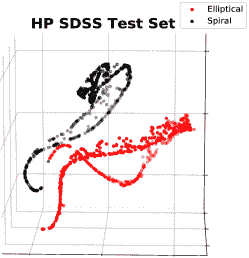
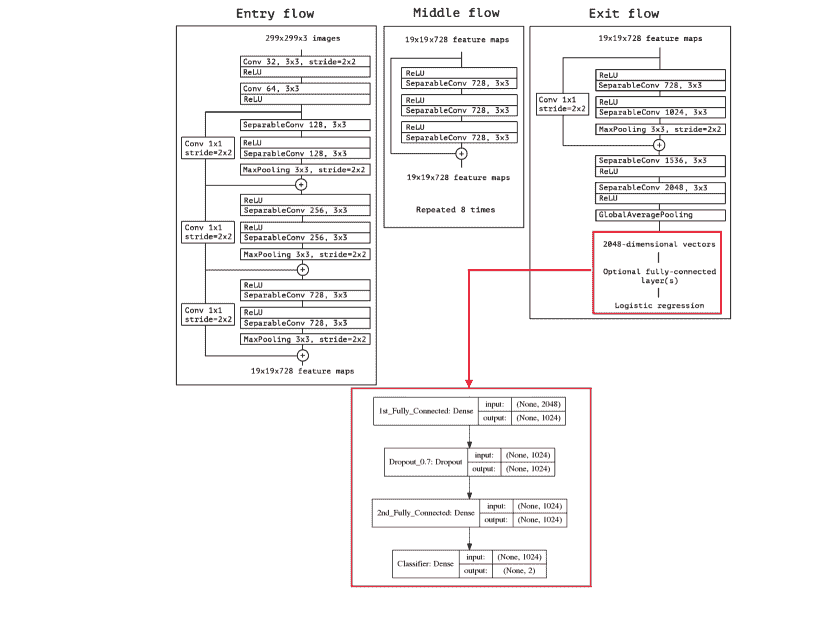

<!--yml

分类：未分类

日期：2024-09-06 20:07:05

-->

# [1812.02183] 大规模深度学习用于构建暗能量调查中的星系目录

> 来源：[`ar5iv.labs.arxiv.org/html/1812.02183`](https://ar5iv.labs.arxiv.org/html/1812.02183)

# 大规模深度学习

用于构建星系目录

在暗能量调查中

Asad Khan NCSA, 伊利诺伊大学厄本那-香槟分校，伊利诺伊州厄本那 61801，美国 物理系，伊利诺伊大学厄本那-香槟分校，伊利诺伊州厄本那 61801，美国    E. A. Huerta NCSA, 伊利诺伊大学厄本那-香槟分校，伊利诺伊州厄本那 61801，美国 天文学系，伊利诺伊大学厄本那-香槟分校，伊利诺伊州厄本那 61801，美国    Sibo Wang NCSA, 伊利诺伊大学厄本那-香槟分校，伊利诺伊州厄本那 61801，美国    Robert Gruendl NCSA, 伊利诺伊大学厄本那-香槟分校，伊利诺伊州厄本那 61801，美国 天文学系，伊利诺伊大学厄本那-香槟分校，伊利诺伊州厄本那 61801，美国    Elise Jennings 阿贡国家实验室，领导计算设施，伊利诺伊州莱蒙特 60439，美国    Huihuo Zheng 阿贡国家实验室，领导计算设施，伊利诺伊州莱蒙特 60439，美国

###### 摘要

进行中的和未来的电磁调查规模对分类天文对象提出了严峻挑战。前沿的努力包括由斯隆数字天空调查（SDSS）采用的公民科学活动。SDSS 数据集最近被用来训练神经网络模型，以分类在暗能量调查（DES）中与两个调查重叠的星系。在这里，我们展示了通过深度学习算法获得的知识，可以转移到分类同时重叠 SDSS 和 DES 调查的星系，实现了**99.6%**的最先进准确率。我们展示了这一过程可以在八分钟内通过分布式训练完成。虽然这代表了对重叠以前调查的 DES 星系分类的重大进展，但我们需要开始对新参数空间区域中未标记的 DES 星系进行表征。为了加速这一程序，我们使用我们的神经网络分类器来标记超过一万多个未标记的 DES 星系，这些星系不与以前的调查重叠。此外，我们将神经网络模型用作无监督聚类的特征提取器，并发现未标记的 DES 图像可以根据其形态分为两种不同的星系类别，这提供了一个启发式检查，表明学习已成功转移到未标记的 DES 图像分类中。我们通过展示这些新标记的数据集可以与无监督递归训练结合起来，为大规模 DES 星系目录的创建做准备，为大型同步巡天望远镜时代做好准备。

###### pacs:

有效的 PACS 在此出现

关键词：深度学习，卷积神经网络，斯隆数字天空调查，暗能量调查，大宽场巡天望远镜，星系目录，无监督学习，数据聚类

## I 引言

电磁调查提供了对宇宙大尺度结构、几何和宇宙时间演化的关键见解。随着这些调查的深度和规模在未来几年中不断增加，它们将推动我们对暗物质和暗能量的理解的前沿*Riess et al.* (1998); *Perlmutter et al.* (1999); *Tonry et al.* (2003); *Knop et al.* (2003)。

天体物理对象的分类过去使用了多种工具。例如，星系的分类通过其光度特性实现，达到了约 85%的分类准确率*Doi et al.* (1993)。其他根据星系形态进行分类的方法则考虑了它们在多个波长下的物理特性。例如，*Wijesinghe et al.* (2010) 引入的方法，考虑了来自斯隆数字天空调查（SDSS）*Eisenstein et al.* (2011) 的星系样本，使用了五个 SDSS 滤光片 $(u,\,g,\,r,\,i,\,z)$，然后结合了形状分解和主成分分析（PCA）。其他星系分类方法包括集中度-不对称度-光滑度（CAS）*Conselice* (2003)，以及机器学习，包括人工神经网络和主成分分析（PCA）*Lahav et al.* (1995, 1996); *Banerji et al.* (2010)。

近年来，公民科学项目在分类天文调查中的数千个天体方面发挥了关键作用。SDSS 是成功分类数十万星系的典型例子。随着电磁调查不断增加其深度和覆盖范围，这类项目可能缺乏可扩展性。例如，在六年的运行时间内，暗能量调查（DES）*Dark Energy Survey Collaboration* (2016) 观测了超过三亿个星系，这一数字将被大宽场巡天望远镜（LSST）*LSST Dark Energy Science Collaboration* (2012) 的观测能力所超越。简而言之，迫切需要探索新方法，以最大化下一代电磁调查的科学产出。一个有前景的范式是深度学习和大规模计算的融合，以应对 LSST 类型调查中数据量、复杂性和延迟的迅速增加，这是本文的主题。

实现这一前景的一个创新想法是利用 SDSS 已经完成的工作，并尝试将其作为种子信息来分类 DES 数据中的对象。这一想法在 Domínguez Sánchez *et al.* (2018)中得到了探讨，其中使用了重叠 DES 区域的 SDSS 星系来训练神经网络模型，以分类那些也被 SDSS 观测到的 DES 星系，报告了分类准确度约为$\sim 95\%$ Domínguez Sánchez *et al.* (2018)。

尽管上述方法提供了一种分类与之前调查重叠的 DES 星系的方法，但仍存在关键问题：(i) 用于图像分类的深度学习算法已经通过数亿张图像的训练，达到了最先进的分类准确度 Chollet (2016)。如果尝试从头开始使用仅仅几万张 SDSS 星系图像来训练一个神经网络模型，那么训练完成的神经网络模型可能无法达到最先进的分类准确度，或可能出现过拟合 George *et al.* (2018)；(ii) 在用 SDSS 星系训练神经网络模型后，再将其应用于分类与 SDSS 和 DES 都有重叠区域的 DES 星系，是验证深度学习分类分析适用性的重要研究，我们还需要展示这种方法在尚未被之前调查观测到的 DES 星系中的适用性。这只能在更多 DES 星系被标注之后实现；(iii) 新标注的、未与之前调查重叠的 DES 星系可以作为训练数据集来提高深度学习算法的分类准确度。可以很容易地意识到，这种方法将导致 TB 级别的训练数据集的创建。在这种情况下，设计分布式算法以尽可能减少训练阶段，同时保持最先进的分类准确度，将是至关重要的。

在本文中，我们描述了一种以创新的方式结合多种深度学习方法来解决上述挑战的方法。该研究的主要亮点包括：

+   $\bullet$

    我们将用于图像分类的最先进神经网络模型 Xception Chollet (2016)，通过训练 ImageNet 数据集 Deng *et al.* (2009)的知识迁移到 SDSS 银河图像分类中，达到了最先进的准确率$99.8\%$。需要注意的是，类似数据集之间的迁移学习，例如 SDSS 和 DES，传统上在计算机科学文献中已被使用 Tan *et al.* (2018)。与此形成鲜明对比的是，我们使用一个预训练模型进行现实世界物体识别，然后将其知识迁移到 SDSS 和 DES 银河分类中。据我们所知，这是首次将深度迁移学习应用于银河分类¹¹1 在本文审稿期间，出现了一项关于 SDSS 银河分类的研究，其中使用了不同的数据集进行迁移学习 Barchi *et al.* (2019)。

+   $\bullet$

    为了简化和加速这一方法，我们首次在宇宙学中引入深度迁移学习和分布式训练，将使用 64 个 K80 GPU 在 Cooley 超级计算机上训练 Xception 模型的银河图像数据集的时间从五小时缩短至仅八分钟。

+   $\bullet$

    我们展示了通过迁移学习训练的神经网络模型在分类与 SDSS 调查重叠的 DES 银河时达到了最先进的准确率$99.6\%$。

+   $\bullet$

    我们使用神经网络分类器对超过一万颗在先前调查中未被观测的未标注 DES 银河进行标注。然后我们将神经网络模型转化为特征提取器，显示这些未标注的数据集可以根据其形态进行聚类，形成两个不同的数据集。

+   $\bullet$

    最终，我们使用新标注的 DES 图像进行无监督递归训练，以重新训练我们的深度迁移学习模型，提高其在新参数空间区域批量分类未标注 DES 银河的准确率。

所有上述深度学习方法的结合为在 LSST 时代利用大规模深度迁移学习、数据聚类和递归训练生成大规模银河目录奠定了基础 LSST Dark Energy Science Collaboration (2012)。

本文的组织如下。在第 II 部分，介绍了用于整理数据集以及为我们的分析设计和训练的深度学习算法的方法。在第 III 部分，我们演示了我们的方法适用于对 SDSS 中的星系、SDSS 和 DES 重叠的星系以及最终应用我们的方法正确分类成千上万个未标记的 DES 星系。最后，在第 IV 部分，总结了我们的发现和未来的工作方向。

## II 方法

在本节中，我们描述了为我们的研究精选的 SDSS 和 DES 数据集，我们用于深度迁移学习的神经网络模型，以及如何使用无监督递归训练来大规模创建星系目录。

### II.1 SDSS 和 DES 数据整理

我们使用了 SDSS 数据发布（DR）7 图像的子集，通过 Galaxy Zoo 项目对其进行高置信度分类，即我们只选择具有联合螺旋的偏向概率大于 0.985 和椭圆的偏向概率大于 0.926 的星系，分别如 2011 中的表 2 所示。我们选择这些截断阈值是为了确保：（i）用于训练神经网络的星系具有健壮和准确的分类；（ii）训练和测试数据集中两个类别的表示是平衡的。然后，我们将这些图像分成三个单独的数据集，用于训练、验证和测试。验证集用于在训练和微调深度神经网络时监控准确性和损失，因此用于优化超参数，例如学习速率和训练的时期数。

两个测试集都经过精心构建，以使每个集合中的图像都位于 SDSS 和 DES 的区域内。第一个测试集由具有与训练集类似的 Galaxy Zoo 分类信心的图像组成，即引入了高概率截断。因此，此测试集标记为高概率（HP）测试集，每个调查都有两个版本，即 HP SDSS 和 HP DES。与训练集一样，SDSS 的图像来自（DR）7，对应的 DES 图像来自 DES DR1 数据发布。此外，第二个测试集是在 Galaxy Zoo 分类信心上没有引入任何概率阈值而创建的。该集合包含几乎所有位于 SDSS 和 DES 区域内的星系，以及

|       数据集 |       螺旋形 |       椭圆形 |
| --- | --- | --- |
|       训练集 |       18,352 |       18,268 |
|       HP SDSS 测试集 |       516 |       550 |
|       HP DES    测试集 |       516 |       550 |
|       FO SDSS 测试集 |       6,677 |       5,904 |
|       FO DES 测试集 |       6,677 |       5,904 |

表 1：用于训练和测试的 SDSS 和 DES 数据集的总结。

图 1：每个数据集中星系 Zoo 概率分布的小提琴图。概率阈值截断线，螺旋星系为 98.5%，椭圆星系为 92.6%，以红色虚线表示。这些截断值已经选择，以确保两个星系类型的数据集平衡。

因此被标记为全重叠（FO）测试集。再次有两个版本，FO SDSS 和 FO DES。创建第二个测试集的动机是，未标记的 DES 数据集中的星系特征会更接近 FO 测试集中的特征。因此，FO 测试集作为我们神经网络在最终任务——对 DES 目录中所有未标记星系进行分类——性能的良好评估指标。

这些数据集的属性总结在表 1 中，而它们的概率分布在图 1 中呈现。训练 SDSS 数据集的样本以及 HP 测试集图像分别呈现在图 2 的顶部和底部面板中。

SDSS 数据集 我们使用了表 2 中描述的椭圆形和组合螺旋类的去偏置概率来为我们训练集和测试集的两个类别创建标签。在根据螺旋和椭圆形的概率阈值 0.985 和 0.926 从表 2 中选择 OBJIDs 后，我们向 SDSS Skyserver SDSS (2018) 提交 SQL 查询，以从 PhotoObj 表中获取 g、r 和 i 波段的图像和元数据。之后，从下载的望远镜 fits 文件中为每个波段“剪切”出每个星系，然后将各个波段叠加在一起，创建一张彩色图像。

我们开发了用于下载和预处理数据的脚本，这些脚本作为开源 Python 软件栈发布²²2 代码可以在 [`github.com/khanx169/DL_DES`](https://github.com/khanx169/DL_DES) 的 github 仓库中公开获取。为了方便和简化大规模处理这些任务，我们引入了消息传递接口（MPI） Gropp *et al.*（1999）以利用超级计算机上的多个节点进行快速并行计算。在我们的案例中，数据提取和整理是使用 Blue Waters 超级计算机 Kramer *et al.*（2015）完成的。

DES 数据集 采用相同的步骤，首先从 NCSA DESaccess 网站上选择 DES DR1 元数据和图像 DES (2018)，然后剪裁、预处理并堆叠滤波器，创建 RGB 彩色图像。此外，使用 Astropy 包中的 match_to_catalog_sky 进行 DES 和 SDSS 目录的交叉匹配，精确到 1 角秒。最后，我们随机挑选约 $\sim 10,000$ 个明亮的 DES 星系，以量化我们神经网络模型的分类和聚类性能。

### II.2 深度学习：模型与方法

我们使用开源软件堆栈进行研究。使用的深度学习 API 包括 Keras Keras (2018) 和 Tensorflow Abadi *等人* (2016)。对于分类问题，我们使用迁移学习，从 Xception 模型 Chollet (2016) 开始，该模型已使用 ImageNet Russakovsky *等人* (2014) 数据集进行预训练。我们选择这个神经网络模型，因为它在 ImageNet 验证数据集上的表现优于许多其他最先进的神经网络模型，包括 Inception-v3 Szegedy *等人* (2015)、ResNet-152 He *等人* (2015) 和 VGG16 Simonyan 和 Zisserman (2014)，而且有建议认为，更好的 ImageNet 架构能够学习到更好的可迁移表示 Kornblith *等人* (2018)。更重要的是，我们进行了一些实验，发现 Xception 在我们的验证和测试星系数据集上表现与许多其他最先进的架构相当或略好（见图 3）。

需要注意的是，Xception 模型 Chollet (2016) 最初是在 ImageNet Russakovsky *等人* (2014) 数据集上训练的，图像被调整为 $299\times 299\times 3$ 尺寸。我们遵循了神经网络训练的最佳实践 Andrej Karpathy (2018)，将所有星系子图像调整为 $299\times 299$ 像素，然后将三个滤波器堆叠在一起，创建一个 $299\times 299\times 3$ 尺寸的彩色图像。最后，这些子图像进行均值减去和归一化处理，将像素值转换为范围在 -1 到 1 之间，以 0 为中心。这些整理后的数据集作为输入张量输入到我们的深度神经网络模型中。

在训练过程中，我们首先从预训练模型的倒数第二层提取特征图，进行一个周期的训练，并将其输入到预训练模型末尾添加的几个自定义全连接层中（见图 7 在 A）。然后，我们逐步解冻整个网络的早期层，并对它们的权重进行几轮训练的微调。

图 2：上面部分：标记的 SDSS 训练集图像。下面部分：来自 SDSS-DR7 的星系样本以及对应的 DES DR1 交叉匹配星系。

图 3：在 ImageNet 上预训练的几种不同微调架构的性能。上面部分：FO SDSS 测试集中的星系接收者操作特征 (ROC)。下面部分：FO DES 测试集中的星系 ROC。较小的插图显示了 Xception 与其他四种模型之间的真正正例率差异的对数尺度。

这种方法背后的理由是，训练网络的早期层是非常通用的过滤器，能够捕捉到与任何图像检测或分类问题相关的简单抽象特征，如线条和边缘。然而，随着网络层次的加深，层的权重变得不那么可解释，并且更专注于当前问题的特定方面 Zeiler 和 Fergus (2014)。因此，通过首先训练最后几层，然后逐步微调早期层，我们可以确保在神经网络学习和适应星系分类问题时，从数百万张 ImageNet Deng *et al.* (2009) 图像中学到的有用权重不会被破坏 Yosinski *et al.* (2014)。深度迁移学习已经在物理学和天文学分类问题中得到探索，包括引力波数据中的噪声异常分类 George *et al.* (2018)，星系合并分类 Ackermann *et al.* (2018)，以及星系分类 Barchi *et al.* (2019)；Domínguez Sánchez *et al.* (2018)。

单 GPU 训练 我们使用 XSEDE（Bridges）上的 Tesla P100 GPU 进行网络训练 XSEDE（2018）。36500 张图像的数据集训练过程在 5 小时内完成。我们使用分类交叉熵作为损失函数，并配合 ADAM 优化器 Kingma 和 Ba（2014）。为了避免过拟合，我们监控训练和验证损失，添加了 70%的丢弃率在我们的全连接层之间，并且使用早期停止，即一旦验证损失停止下降，我们就停止训练。此外，我们使用学习率调度器，即当训练损失停止下降时，我们降低学习率以对损失函数的最小值进行更精细的搜索，并进行数据增强。对于数据增强，我们使用随机翻转、旋转、缩放和移动，如图 8 所示，详细见 B。训练完成后，所有权重被冻结并保存，使用单个 Tesla P100 GPU 在约 10,000 张测试图像上进行推断，完成时间在 10 分钟内。

分布式训练 图 4 展示了使用最多 64 个 K80 GPU 的 Xception 模型的并行训练性能（有关这些结果的详细分解，请参见表 3）。代码通过 Horovod 分布式框架在多个 GPU 上分发，Horovod 是为 Keras 开发的 Sergeev 和 Balso（2018）。这些结果是在 Intel Haswell 和 NVIDIA K80 基础的超级计算机 Cooley 上，通过 Horovod 的数据并行方案获得的。我们发现，分发工作负载线性地减少了每个周期的时间，并显著将 36,620 张图像的训练时间从单 GPU 的$\sim 5$小时减少到使用 64 个 GPU 的 8 分钟，同时保持相似的准确性。基础学习率为 0.0001，并根据 GPU 的数量$N$进行缩放，遵循 Goyal *et al.*（2017），同时保持每个工作节点的迷你批量大小不变。此外，我们使用了一种“热身”周期的技术，我们将学习率设置为基础学习率，并在经过 2 个热身周期后增加到$0.0001*N$。

网络的最后一层有两个 softmax 节点，这些节点提供输入图像属于特定银河系类别的输出概率。为了量化神经网络的总体准确性，我们从最后一层提取这些输出概率，针对我们的 HP 和 FO 测试集，并与通过 Galaxy Zoo 项目提供的真实标签进行比较。虽然这些概率可以通过与 SDSS-Galaxy Zoo 概率进行比较直接测试交叉匹配的 DES 数据集，但对于其余未标记的 DES 图像，这种方法不可行。对于大规模银河系目录，检查单个图像以确定其所属类别并与神经网络的输出概率进行一致性检查是不切实际的。在实际操作中，我们可以使用神经网络倒数第二层的节点来确定每种银河系类型激活的节点组合。在这种方法中，该层的激活向量将在 1024 维空间中形成两个不同的簇。检查未标记的 DES 数据是否与 FO 和 HP 测试集形成类似的簇，即相似的神经元组合是否被激活，将作为启发式检查，以验证学习是否成功转移到未标记 DES 图像的分类中，以构建目录。例如，如果没有明显的簇，或者看到的簇数量超过两个，那么这将表明存在未知类型，这些类型被强制归类为螺旋状或椭圆状，因为输出层只有两个节点。

为了可视化这些 1024 维簇，我们使用 sklearn 库中 t-分布随机邻域嵌入（t-SNE）的实现将它们嵌入到 3-D 参数空间中，van der Maaten 和 Hinton (2008)。t-SNE 是一种非线性降维技术，特别适用于通过在低维嵌入（通常是 2-D 或 3-D）中找到忠实表示来可视化高维数据集。值得注意的是，t-SNE 调整其对数据集区域密度变化的距离概念，因此低维表示中的簇的边界框与其相对大小不一致。类似地，簇之间的距离可能没有意义，因为它们受到困惑度和迭代次数等多个超参数的影响。

最后一步，我们引入了一种无监督/半监督学习的应用形式，即递归训练，在这种形式中，我们将新标记的 DES 银河引入训练集，并重新训练我们的模型。根据 Domínguez Sánchez *et al.* (2018) 的建议，一旦用某个调查的数据集进行训练，神经网络可以快速适应新的仪器特性（例如，点扩散函数、观测条件、深度），将来自不同调查的必要训练样本减少近一个数量级。然而，我们没有手动标记新的 DES 图像，而是通过我们微调的神经网络提取它们的输出分类概率。我们使用了一批 10,000 个未标记的明亮 DES 银河，然后通过对神经网络分类信心设置阈值，我们选择了 1,000 个最有信心的螺旋星系和椭圆星系的预测结果，进一步对我们的网络进行微调。

图 4：使用最多 64 个 K80 GPU 加速 Xception 模型的训练。

## III 结果

为了检查我们神经网络模型在 HP 和 FO 测试集上的表现，我们使用了标准的评估指标：精确度、召回率、准确度和 F1 分数。对于二分类问题，精确度是正确预测的正样本数除以预测为正样本的总数，即正确预测的正样本加上错误预测的正样本。同样，召回率是正确预测的正样本数除以实际正样本的总数，即正确预测的正样本加上漏掉的正样本。F1 分数是一个单一的统计评估指标，通过精确度和召回率的加权平均来衡量二分类的准确性。它的取值范围从最差表现值 0 到最佳表现值 1，计算公式为

|  | $\textrm{F1\, score}=2\,\frac{\textrm{precision}\times\textrm{recall}}{\textrm{precision}+\textrm{recall}}\,.$ |  | (1) |
| --- | --- | --- | --- |

这些指标在各测试集上的表现总结见表 2。从表 2 可以看出，深度迁移学习从 ImageNet 数据集的日常物体分类到 SDSS 和 DES 中的星系形态分类，达到了最先进的准确率和 F1 分数。我们精细调优的 Xception 模型在 HP SDSS 和 HP DES 测试集上取得了$\mathrel{\hbox{\hbox to0.0pt{\hbox{\lower 4.0pt\hbox{$\sim$}}\hss}\hbox{$>$}}}99\%$的准确率。与 HP 测试集不同，FO 测试集并不完全由具有可靠真实分类的星系组成。因此，我们没有对真实概率应用阈值，而是对神经网络的预测应用了置信度阈值。在表 2 中，我们选择了置信度最高的一半预测，这些预测的准确率和 F1 分数均达到了$\mathrel{\hbox{\hbox to0.0pt{\hbox{\lower 4.0pt\hbox{$\sim$}}\hss}\hbox{$>$}}}96\%$。此外，通过应用不同阈值获得的准确率和 F1 分数也在图 6 中进行了总结，而接收操作特性（ROC）曲线则显示在图 10 E 中。

| 数据集 | 精确度 | 召回率 | FPR | 准确率 | F1 分数 |
| --- | --- | --- | --- | --- | --- |
| 训练集 |  |  |  | 99.81% | 0.9998 |
| --- | --- | --- | --- | --- | --- |
| HP SDSS 测试集 | 0.996 | 1 | 0.004 | 99.81% | 0.9980 |
| HP DES    测试集 | 0.998 | 0.995 | 0.002 | 99.62% | 0.9961 |
| FO SDSS 测试集 | 0.945 | 0.991 | 0.055 | 96.76% | 0.9675 |
| FO DES    测试集 | 0.965 | 0.946 | 0.025 | 96.32% | 0.9685 |

表 2：各测试数据集的分类准确率。

在量化我们神经网络模型在与 SDSS 足迹重叠的 DES 测试集上的准确性后，我们现在用亮的、未标记的 DES 星系（这些星系不重叠 SDSS 足迹）来喂养我们的模型，并预测它们的类别，从而对它们进行标记。图 9 中展示了一组高置信度预测的随机样本，见 C。

  

图 5：HP SDSS 和 DES 测试集以及未标记 DES 测试集的 t-SNE 聚类可视化。

 

 

图 6：上面面板：SDSS 数据集。下面面板：DES 数据集。准确性（左侧面板）和 F1 分数（右侧面板）与 N 高置信度预测占总完全重叠测试数据集的比例（0 次递归）。我们还展示了在将 2000 张新标记的 DES 图像添加到 SDSS 训练数据集后（第 1 次递归），分类准确性和 F1 分数的提升。这些结果是通过对十个不同模型的平均值得到的。

最后，使用我们的神经网络模型作为特征提取器，我们获得了倒数第二层的激活图，并通过 t-SNE 将其嵌入到 3 维空间中。图 5 的左侧和中间面板显示了应用于 HP SDSS 和 HP DES 测试集的 t-SNE 输出。我们使用每个星系的真实标签对点进行了标注，发现这些点整齐地聚类成两个组，准确率达到$\mathrel{\hbox{\hbox to0.0pt{\hbox{\lower 4.0pt\hbox{$\sim$}}\hss}\hbox{$>$}}}99\%$。对于未标记的 DES 数据集，见图 5 右侧面板，我们再次发现形成了两个明显的簇。根据 FO DES 测试集的准确率，我们可以启发性地知道这些簇在最可信的前半部分预测中的准确率为$\mathrel{\hbox{\hbox to0.0pt{\hbox{\lower 4.0pt\hbox{$\sim$}}\hss}\hbox{$>$}}}96\%$。这些结果表明，神经网络模型从训练数据集中提取了必要的信息，使得 t-SNE 能够清晰地区分基于形态的两个不同类型的星系。FO DES 测试集的这种聚类算法的科学可视化展示在 NCSA (2018a)中。机智的读者可能会意识到，使用 t-SNE 作为可视化工具需要训练，以防止对可视化结果的常见误读。此外，t-SNE 在连续运行中并不总是产生相似的输出，它要求用户确定与优化过程相关的一些超参数。文献中已经提出了很多工作，以确保新用户正确使用此工具 Wattenberg *et al.* (2016)，并自动化超参数选择 Cao and Wang (2017)。

递归训练：在使用我们的神经网络分类器标记了大约 10,000 个 DES 星系后，我们挑选了前 1000 个螺旋星系和前 1000 个椭圆星系。然后我们将它们添加到原始的 SDSS 训练数据集中，并再次使用深度迁移学习重新训练神经网络模型。图 6 中的左上角和左下角面板显示了我们分类器的初始 (第 0 次递归) 准确性，以及在将新标记的 DES 图像添加到 SDSS 训练数据集后 (第 1 次递归) 达到的准确性。我们注意到 FO SDSS 和 DES 测试集的分类准确性提高了最多 $1.5\%$。特别是，当考虑到 50% 的数据集时，FO DES 测试集的分类准确性现在提高到了 $98.5\%$。从机器学习的角度来看，这些结果相当显著 Benchmarks.AI，因为这些准确性已经很高，而这份新标记的 DES 数据集代表了原 SDSS 训练数据集的 $\sim 5\%$。我们还计算了 ROC 曲线（见图 10），以提供一个额外的指标来量化递归训练带来的分类准确性提升。

直观地说，递归训练提供了一种手段，使得随着新数据的出现，神经网络的分类准确性能够不断提升。我们发现，当我们重新训练模型时，十个模型的平均分类准确性确实有所提高。

这种新颖的方法为我们提供了提升 SDSS 星系分类的手段，如图 6 左上角面板所示。更重要的是，它提供了一种逐步替代训练数据集中 SDSS 星系图像的方法，以便我们可以大规模构建 DES 星系目录。仅使用 DES 图像的训练数据集将更好地捕捉 DES 观测到的图像特征，并且还将使我们能够更好地利用数据增强技术来模拟噪声效应，使我们的神经网络模型在高红移或被各种噪声源污染的星系分类时更加稳健。

## IV 结论

我们首次展示了将深度迁移学习与分布式训练相结合应用于分类 DES 星系的方法，这些星系与 SDSS 调查的覆盖范围重叠，实现了最先进的准确率$\mathrel{\hbox{\hbox to0.0pt{\hbox{\lower 4.0pt\hbox{$\sim$}}\hss}\hbox{$>$}}}99.6\%$。我们描述了如何使用我们的神经网络分类器标记超过 10,000 个在以前调查中未观察到的未标记 DES 星系。通过截断我们的神经网络模型，我们将其用作特征提取器，并结合 t-SNE，我们展示了通过迁移学习，神经网络抽象了形态信息，清晰地识别了未标记 DES 数据集中两种不同类型的星系。为了深入了解我们的聚类算法的内部工作，我们展示了 FO DES 测试集的科学可视化，这些可视化可在 NCSA（2018a）和 NCSA（2018b）上获取。

我们还使用 t-SNE 检查了神经网络模型提供的似乎不正确的标签，发现这些错误实际上对应于我们 SDSS 测试数据集中的不准确人工分类。我们在 NCSA（2018a）的可视化中展示了这种性质的一个示例，并在图 12 中展示。

此外，通过添加我们新标记的 DES 星系中最可信的预测，我们进行了递归训练，提高了 FO SDSS 和 DES 测试数据集的分类准确率。在十个模型的平均值中，我们发现 SDSS 的准确率提高到 99.5%，DES 的准确率提高到 99%。

这项分析提供了一条前进的道路，用实际的 DES 星系作为训练数据集来构建 DES 中的星系目录。深度迁移学习与分布式训练的结合，以及递归训练，提供了一种在 LSST 时代以规模化方式进行分析的替代方法。

## V 致谢

这项研究是 Blue Waters 持续超大规模计算项目的一部分，该项目由国家科学基金会（奖项 OCI-0725070 和 ACI-1238993）和伊利诺伊州政府资助。Blue Waters 是伊利诺伊大学香槟分校及其国家超级计算应用中心的联合努力成果。我们感谢 NCSA 的支持。我们感谢[NCSA Gravity Group](http://gravity.ncsa.illinois.edu)提供有用的反馈，以及 Vlad Kindratenko 授权我们使用 NCSA 创新系统实验室的最新 GPU 和 HPC 资源。我们对 NVIDIA 捐赠的几台 Tesla P100 和 V100 GPU 表示感谢，这些 GPU 用于我们的分析。我们感谢匿名评审仔细阅读了这篇手稿，并提供了建设性的反馈以改善结果的展示。

本研究使用了极端科学与工程发现环境（XSEDE），该项目由国家科学基金会资助，资助编号 ACI-1548562。具体来说，它使用了布里奇斯系统，该系统由 NSF 奖项编号 ACI-1445606 资助，位于匹兹堡超级计算中心（PSC）。我们感激地承认资助 TG-PHY160053。本研究使用了阿贡领导计算设施的资源，该设施是一个 DOE 科学办公室用户设施，受合同 DE-AC02-06CH11357 的支持。

本项目使用了来自暗能量调查（DES）的公共档案数据。DES 项目的资助来自美国能源部，美国国家科学基金会，西班牙科学与教育部，英国科学与技术设施委员会，英格兰高等教育资助委员会，伊利诺伊大学厄尔巴纳-香槟分校的国家超级计算应用中心，芝加哥大学的卡夫里宇宙物理研究所，俄亥俄州立大学的宇宙学与天体粒子物理中心，德克萨斯农工大学的基本物理与天文学米切尔研究所，Financiadora de Estudos e Projetos，里约热内卢州卡洛斯·查加斯·菲略研究资助基金会，国家科学技术发展委员会和科学、技术与创新部，德意志研究基金会以及暗能量调查的合作机构。

合作机构包括阿贡国家实验室，加州大学圣克鲁斯分校，剑桥大学，马德里能源环境技术研究中心，芝加哥大学，伦敦大学学院，DES-巴西联盟，爱丁堡大学，瑞士联邦理工学院（ETH），费米国家加速器实验室，伊利诺伊大学厄尔巴纳-香槟分校，太空科学研究所（IEEC/CSIC），高能物理研究所，劳伦斯伯克利国家实验室，慕尼黑路德维希-马克西米利安大学及其相关的宇宙卓越集群，密歇根大学，国家光学天文台，诺丁汉大学，俄亥俄州立大学，OzDES 会员联盟，宾夕法尼亚大学，朴茨茅斯大学，SLAC 国家加速器实验室，斯坦福大学，萨塞克斯大学和德克萨斯农工大学。部分基于在塞罗托洛洛国际天文台的观测，国家光学天文台由天文研究大学协会（AURA）在与国家科学基金会的合作协议下运营。

## 参考文献

+   Riess *et al.* (1998) A. G. Riess, A. V. Filippenko, P. Challis, A. Clocchiatti, A. Diercks, P. M. Garnavich, R. L. Gilliland, C. J. Hogan, S. Jha, R. P. Kirshner, B. Leibundgut, M. M. Phillips, D. Reiss, B. P. Schmidt, R. A. Schommer, R. C. Smith, J. Spyromilio, C. Stubbs, N. B. Suntzeff, 和 J. Tonry，[The Astronomical Journal 116, 1009 (1998)](http://dx.doi.org/10.1086/300499)，[astro-ph/9805201](http://arxiv.org/abs/astro-ph/9805201)。

+   Perlmutter *et al.* (1999) S. Perlmutter, G. Aldering, *et al.*，[Astrophys. J. 517, 565 (1999)](http://dx.doi.org/10.1086/307221)，[astro-ph/9812133](http://arxiv.org/abs/astro-ph/9812133)。

+   Tonry *et al.* (2003) J. L. Tonry, B. P. Schmidt, B. Barris, P. Candia, P. Challis, A. Clocchiatti, A. L. Coil, A. V. Filippenko, P. Garnavich, C. Hogan, S. T. Holland, S. Jha, R. P. Kirshner, K. Krisciunas, B. Leibundgut, W. Li, T. Matheson, M. M. Phillips, A. G. Riess, R. Schommer, R. C. Smith, J. Sollerman, J. Spyromilio, C. W. Stubbs, 和 N. B. Suntzeff，[Astrophys. J. 594, 1 (2003)](http://dx.doi.org/10.1086/376865)，[astro-ph/0305008](http://arxiv.org/abs/astro-ph/0305008)。

+   Knop *et al.* (2003) R. A. Knop, G. Aldering, *et al.*，[Astrophys. J. 598, 102 (2003)](http://dx.doi.org/10.1086/378560)，[arXiv:astro-ph/0309368 [astro-ph]](http://arxiv.org/abs/astro-ph/0309368)。

+   Doi *et al.* (1993) M. Doi, M. Fukugita, 和 S. Okamura，[MNRAS 264, 832 (1993)](http://dx.doi.org/10.1093/mnras/264.4.832)。

+   Wijesinghe *et al.* (2010) D. B. Wijesinghe, A. M. Hopkins, B. C. Kelly, N. Welikala, 和 A. J. Connolly，[MNRAS 404, 2077 (2010)](http://dx.doi.org/10.1111/j.1365-2966.2010.16424.x)，[arXiv:1001.5322 [astro-ph.GA]](http://arxiv.org/abs/1001.5322)。

+   Eisenstein *et al.* (2011) D. J. Eisenstein, D. H. Weinberg, E. Agol, H. Aihara, C. Allende Prieto, S. F. Anderson, J. A. Arns, É. Aubourg, S. Bailey, E. Balbinot, 和 *et al.*，[The Astronomical Journal 142, 72 (2011)](http://dx.doi.org/10.1088/0004-6256/142/3/72)，[arXiv:1101.1529 [astro-ph.IM]](http://arxiv.org/abs/1101.1529)。

+   Conselice (2003) C. J. Conselice，[ApJS 147, 1 (2003)](http://dx.doi.org/10.1086/375001)，[astro-ph/0303065](http://arxiv.org/abs/astro-ph/0303065)。

+   Lahav *et al.* (1995) O. Lahav, A. Naim, R. J. Buta, H. G. Corwin, G. de Vaucouleurs, A. Dressler, J. P. Huchra, S. van den Bergh, S. Raychaudhury, L. Sodre, Jr., 和 M. C. Storrie-Lombardi，[Science 267, 859 (1995)](http://dx.doi.org/10.1126/science.267.5199.859)，[astro-ph/9412027](http://arxiv.org/abs/astro-ph/9412027)。

+   Lahav *et al.* (1996) O. Lahav, A. Naim, L. Sodré, Jr., 和 M. C. Storrie-Lombardi，[MNRAS 283, 207 (1996)](http://dx.doi.org/10.1093/mnras/283.1.207)，[astro-ph/9508012](http://arxiv.org/abs/astro-ph/9508012)。

+   Banerji *et al.* (2010) M. Banerji, O. Lahav, C. J. Lintott, F. B. Abdalla, K. Schawinski, S. P. Bamford, D. Andreescu, P. Murray, M. J. Raddick, A. Slosar, A. Szalay, D. Thomas, 和 J. Vandenberg，[MNRAS 406, 342 (2010)](http://dx.doi.org/10.1111/j.1365-2966.2010.16713.x)，[arXiv:0908.2033](http://arxiv.org/abs/0908.2033)。

+   Dark Energy Survey Collaboration *et al.* (2016) Dark Energy Survey Collaboration *et al.*，[MNRAS 460, 1270 (2016)](http://dx.doi.org/10.1093/mnras/stw641)，[arXiv:1601.00329](http://arxiv.org/abs/1601.00329)。

+   LSST Dark Energy Science Collaboration (2012) LSST Dark Energy Science Collaboration，ArXiv e-prints (2012)，[arXiv:1211.0310 [astro-ph.CO]](http://arxiv.org/abs/1211.0310)。

+   Domínguez Sánchez *et al.* (2018) H. Domínguez Sánchez, Huertas-Company, *et al.*，ArXiv e-prints，arXiv:1807.00807 (2018)，[arXiv:1807.00807 [astro-ph.GA]](http://arxiv.org/abs/1807.00807)。

+   Chollet (2016) F. Chollet，ArXiv e-prints，arXiv:1610.02357 (2016)，[arXiv:1610.02357 [cs.CV]](http://arxiv.org/abs/1610.02357)。

+   George *et al.* (2018) D. George, H. Shen, 和 E. A. Huerta，[Phys. Rev. D 97, 101501 (2018)](http://dx.doi.org/10.1103/PhysRevD.97.101501)。

+   Deng *et al.* (2009) J. Deng, W. Dong, R. Socher, L.-J. Li, K. Li, 和 L. Fei-Fei，在 *Proc. CVPR* (2009)。

+   Tan *et al.* (2018) C. Tan, F. Sun, T. Kong, W. Zhang, C. Yang, 和 C. Liu，arXiv e-prints，arXiv:1808.01974 (2018)，[arXiv:1808.01974 [cs.LG]](http://arxiv.org/abs/1808.01974)。

+   Barchi *et al.* (2019) P. H. Barchi, R. R. de Carvalho, R. R. Rosa, R. Sautter, M. Soares-Santos, B. A. D. Marques, 和 E. Clua，arXiv e-prints，arXiv:1901.07047 (2019)，[arXiv:1901.07047 [astro-ph.IM]](http://arxiv.org/abs/1901.07047)。

+   Lintott *et al.* (2011) C. Lintott, K. Schawinski, S. Bamford, A. Slosar, K. Land, D. Thomas, E. Edmondson, K. Masters, R. C. Nichol, M. J. Raddick, A. Szalay, D. Andreescu, P. Murray, 和 J. Vandenberg，[MNRAS 410, 166 (2011)](http://dx.doi.org/10.1111/j.1365-2966.2010.17432.x)，[arXiv:1007.3265 [astro-ph.GA]](http://arxiv.org/abs/1007.3265)。

+   SDSS (2018) SDSS，“SDSS Skyserver，” (2018)，[`skyserver.sdss.org/dr7/en/tools/search/sql.asp`](http://skyserver.sdss.org/dr7/en/tools/search/sql.asp)。

+   Gropp *et al.* (1999) W. Gropp, E. Lusk, 和 A. Skjellum，*Using MPI: Portable Programming with the Message-Passing Interface (2nd ed.), by William Gropp, Ewing Lusk and Anthony Skjellum, Scientific and Engineering Computation Series, MIT Press, Cambridge, MA, 1999.* (1999)。

+   Kramer *et al.* (2015) W. Kramer, M. Butler, G. Bauer, K. Chadalavada, 和 C. Mendes，在 *High Performance Parallel I/O*，由 Prabhat 和 Q. Koziol 编辑 (CRC Publications, Taylor and Francis Group, 2015) 第 17–32 页。

+   DES (2018) DES，“NCSA DESaccess Web，” (2018)，[`deslabs.ncsa.illinois.edu/`](https://deslabs.ncsa.illinois.edu/)。

+   Keras (2018) Keras，“Keras: The Python Deep Learning library，” (2018)，[`keras.io/`](https://keras.io/)。

+   Abadi *et al.* (2016) M. Abadi, A. Agarwal, P. Barham, E. Brevdo, Z. Chen, C. Citro, G. S. Corrado, A. Davis, J. Dean, 和 M. Devin, arXiv 预印本 arXiv:1603.04467 (2016)。

+   Russakovsky *et al.* (2014) O. Russakovsky, J. Deng, H. Su, J. Krause, S. Satheesh, S. Ma, Z. Huang, A. Karpathy, A. Khosla, M. Bernstein, A. C. Berg, 和 L. Fei-Fei, ArXiv 电子预印本, arXiv:1409.0575 (2014), [arXiv:1409.0575 [cs.CV]](http://arxiv.org/abs/1409.0575)。

+   Szegedy *et al.* (2015) C. Szegedy, V. Vanhoucke, S. Ioffe, J. Shlens, 和 Z. Wojna, ArXiv 电子预印本, arXiv:1512.00567 (2015), [arXiv:1512.00567 [cs.CV]](http://arxiv.org/abs/1512.00567)。

+   He *et al.* (2015) K. He, X. Zhang, S. Ren, 和 J. Sun, ArXiv 电子预印本, arXiv:1512.03385 (2015), [arXiv:1512.03385 [cs.CV]](http://arxiv.org/abs/1512.03385)。

+   Simonyan 和 Zisserman (2014) K. Simonyan 和 A. Zisserman, ArXiv 电子预印本, arXiv:1409.1556 (2014), [arXiv:1409.1556 [cs.CV]](http://arxiv.org/abs/1409.1556)。

+   Kornblith *et al.* (2018) S. Kornblith, J. Shlens, 和 Q. V. Le, “更好的 ImageNet 模型是否能更好地迁移？” (2018), [arXiv:1805.08974](http://arxiv.org/abs/arXiv:1805.08974)。

+   Andrej Karpathy (2018) Andrej Karpathy, “卷积神经网络在视觉识别中的应用，” (2018), [`cs231n.github.io/neural-networks-2/`](http://cs231n.github.io/neural-networks-2/)。

+   Zeiler 和 Fergus (2014) M. D. Zeiler 和 R. Fergus, 在 *ECCV* (2014)。

+   Yosinski *et al.* (2014) J. Yosinski, J. Clune, Y. Bengio, 和 H. Lipson, 在 [*第 27 届国际神经信息处理系统会议论文集 - 第 2 卷*](http://dl.acm.org/citation.cfm?id=2969033.2969197), NIPS’14 (MIT Press, 剑桥, MA, USA, 2014) pp. 3320–3328。

+   Ackermann *et al.* (2018) S. Ackermann, K. Schawinski, C. Zhang, A. K. Weigel, 和 M. D. Turp, [MNRAS 479, 415 (2018)](http://dx.doi.org/10.1093/mnras/sty1398), [arXiv:1805.10289 [astro-ph.IM]](http://arxiv.org/abs/1805.10289)。

+   XSEDE (2018) XSEDE, “关于桥梁的介绍，” (2018), [`www.psc.edu/bridges`](https://www.psc.edu/bridges)。

+   Kingma 和 Ba (2014) D. P. Kingma 和 J. Ba, [CoRR abs/1412.6980 (2014)](http://arxiv.org/abs/1412.6980)。

+   Sergeev 和 Balso (2018) A. Sergeev 和 M. D. Balso, arXiv 预印本 arXiv:1802.05799 (2018)。

+   Goyal *et al.* (2017) P. Goyal, P. Dollár, R. B. Girshick, P. Noordhuis, L. Wesolowski, A. Kyrola, A. Tulloch, Y. Jia, 和 K. He, [CoRR abs/1706.02677 (2017)](http://arxiv.org/abs/1706.02677), [arXiv:1706.02677](http://arxiv.org/abs/1706.02677)。

+   van der Maaten 和 Hinton (2008) L. van der Maaten 和 G. Hinton, 机器学习研究期刊 9, 2579 (2008)。

+   NCSA (2018a) NCSA, “用于暗能量调查中银河系目录构建的无监督学习和数据聚类，” (2018a), [`www.youtube.com/watch?v=n5rI573i6ws`](https://www.youtube.com/watch?v=n5rI573i6ws)。

+   Wattenberg *et al.* (2016) M. Wattenberg, F. Viégas, 和 I. Johnson, [Distill (2016), 10.23915/distill.00002](http://dx.doi.org/10.23915/distill.00002)。

+   Cao 和 Wang (2017) Y. Cao 和 L. Wang, arXiv 电子预印本, arXiv:1708.03229 (2017), [arXiv:1708.03229 [cs.AI]](http://arxiv.org/abs/1708.03229)。

+   (44) Benchmarks.AI, “MNIST. 分类手写数字，” [`benchmarks.ai/mnist`](https://benchmarks.ai/mnist)。

+   NCSA (2018b) NCSA, “大规模宇宙学深度迁移学习，” (2018b), [`www.youtube.com/watch?v=1F3q7M8QjTQ`](https://www.youtube.com/watch?v=1F3q7M8QjTQ)。

## 附录 A 神经网络架构

图 7 中的顶部面板展示了在这些研究中使用的预训练 Xception 模型 Chollet (2016) 的架构。图 7 的底部面板显示了全连接层和在预训练 Xception 模型的倒数第二层添加的分类器。这在 Exit 流图中标记为 2048 维向量。按照这一过程，我们将神经网络分类器截断，转变为特征提取器，可以与 t-SNE 结合用于无监督聚类。注意，我们使用 t-SNE 仅作为视觉辅助工具。未标记 DES 数据集的标注是使用我们的神经网络分类器完成的。

图 7：顶部面板：Xception 模型 Chollet (2016)。底部面板：在预训练的 Xception 模型的瓶颈处添加了全连接层和分类器。

## 附录 B 数据增强

图 8：数据增强包括最多 45 度的随机旋转、随机翻转、高度和宽度的位移，以及最多 1.3 倍的缩放。

为了将神经网络暴露于多种潜在分类场景中，我们通过随机的垂直和水平翻转、随机旋转、高度和宽度位移以及缩放来增强原始星系图像，如图 8 所示。随机旋转的范围设置为最多 45^∘，即在每次训练迭代中，神经网络看到的输入图像在-45^∘和 45^∘之间随机旋转。同样，随机高度和宽度位移以及缩放因子的最大范围设置为 0.3。注意，在每次训练迭代中，所有这些图像变换都应用，但在定义的范围内使用随机值。

这种方法不仅合成性地增加了训练数据集，还使神经网络对旋转、位移、翻转及其组合不变，同时引入了尺度不变性。

## 附录 C 未标记 DES 星系的分类预测

图 9 展示了对未标记 DES 星系的高置信度神经网络预测。这些预测的鲁棒性通过我们的无监督聚类算法进行了测试，结果发现这些基于从 DES 图像中提取的形态特征的分类是有意义的，如图 5 中的 t-SNE 投影所示。

    

图 9：在未标记的 DES 数据集中对螺旋星系（左面板）和椭圆星系（右面板）的高置信度预测样本。

## 附录 D 缩放结果

在表 3 中，训练分为三个阶段：（1）冻结基础模型并训练新增的密集层；（2）冻结第 0-39 层，训练第 40 层及以上；（3）冻结第 0-1 层，训练所有第 2 层及以上。每个阶段的训练轮次见第三列。总时间仅包括训练时间（三个阶段的时间），不包括初始化时间（启动作业、加载 Python 模块、数据准备等），我们发现这部分时间与训练时间相比非常少。

| GPUs | 每轮次时间（秒） | 轮次 | 总时间 | 准确率 | 验证准确率 |
| --- | --- | --- | --- | --- | --- |
| 1 |

&#124; 410 &#124;

&#124; 922 &#124;

&#124; 1626 &#124;

|

&#124; 1 &#124;

&#124; 11 &#124;

&#124; 4 &#124;

| 4 小时 44 分钟 | 0.9992 | 0.9979 |
| --- | --- | --- |
| 2 |

&#124; 231 &#124;

&#124; 481 &#124;

&#124; 830 &#124;

|

&#124; 1 &#124;

&#124; 6 &#124;

&#124; 4 &#124;

| 1 小时 47 分钟 | 0.9993 | 0.9990 |
| --- | --- | --- |
| 4 |

&#124; 119 &#124;

&#124; 246 &#124;

&#124; 427 &#124;

|

&#124; 1 &#124;

&#124; 5 &#124;

&#124; 7 &#124;

| 1 小时 12 分钟 | 0.9995 | 0.9990 |
| --- | --- | --- |
| 8 |

&#124; 64 &#124;

&#124; 124 &#124;

&#124; 214 &#124;

|

&#124; 1 &#124;

&#124; 6 &#124;

&#124; 8 &#124;

| 42 分钟 | 0.9991 | 0.9979 |
| --- | --- | --- |
| 16 |

&#124; 35 &#124;

&#124; 63 &#124;

&#124; 109 &#124;

|

&#124; 1 &#124;

&#124; 4 &#124;

&#124; 17 &#124;

| 36 分钟 | 0.9993 | 0.9980 |
| --- | --- | --- |
| 32 |

&#124; 20 &#124;

&#124; 31 &#124;

&#124; 53 &#124;

|

&#124; 1 &#124;

&#124; 6 &#124;

&#124; 12 &#124;

| 14 分钟 | 0.9993 | 0.9990 |
| --- | --- | --- |
| 64 |

&#124; 13 &#124;

&#124; 15 &#124;

&#124; 27 &#124;

|

&#124; 1 &#124;

&#124; 5 &#124;

&#124; 15 &#124;

| 8 分钟 | 0.9993 | 0.9990 |
| --- | --- | --- |

表 3：使用不同数量的 K80 GPU 训练 Xception 模型的结果和时间。验证准确率结果在最后一列中给出。训练包括三个阶段：（1）训练密集层（基础层被冻结）；（2）训练第 40 层及以上（第 0-39 层被冻结）；（3）训练第 2 层及以上（第 0-1 层被冻结）。显示的纪元数是每个训练阶段的。批处理大小设置为 16。基准测试在阿贡领导计算设施的 Cooley 超级计算机上进行（https://www.alcf.anl.gov/user-guides/cooley）。

## 附录 E 递归训练

除了提供使用十种不同模型的递归训练结果（见图 6），我们还提供了十个样本中的一个典型模型的 ROC 结果。这些 ROC 结果表明，递归训练确实提高了 SDSS 和 DES 的分类准确率。

图 10：上面面板：FO SDSS 测试集。下面面板：FO DES 测试集。

## 附录 F 错误分类示例

我们展示了来自高概率（HP）测试集的错误分类示例画廊。如图 11 所示，我们只有四个这种性质的实例，全部来自 HP DES 测试集，其中一个对应于望远镜中的噪声伪影。

图 11：来自 HP 测试集的错误分类示例仅有四个。其中一张是望远镜中的噪声伪影。

在图 12 中，我们展示了全重叠（FO）测试集中的不准确预测示例。

 

 

图 12：FO 测试集上的错误分类示例。用于生成每个图像的真实标签的去偏银河动物园概率显示出来。请注意，每个类别的去偏银河动物园概率非常低且接近，即这些样本代表了低置信度的真实标签。
