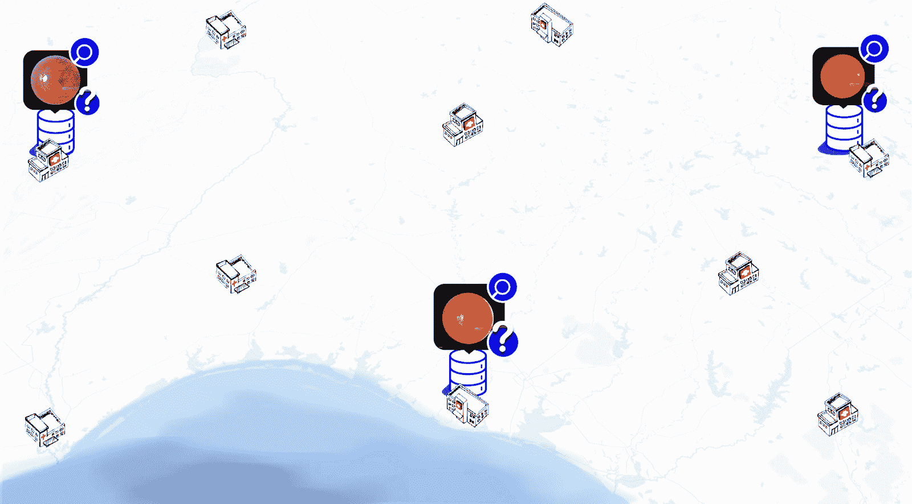
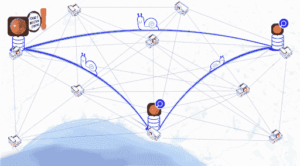
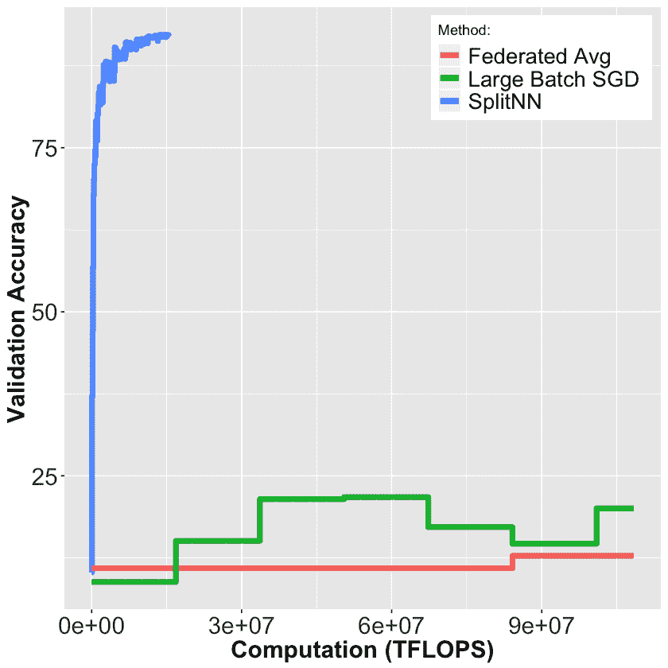
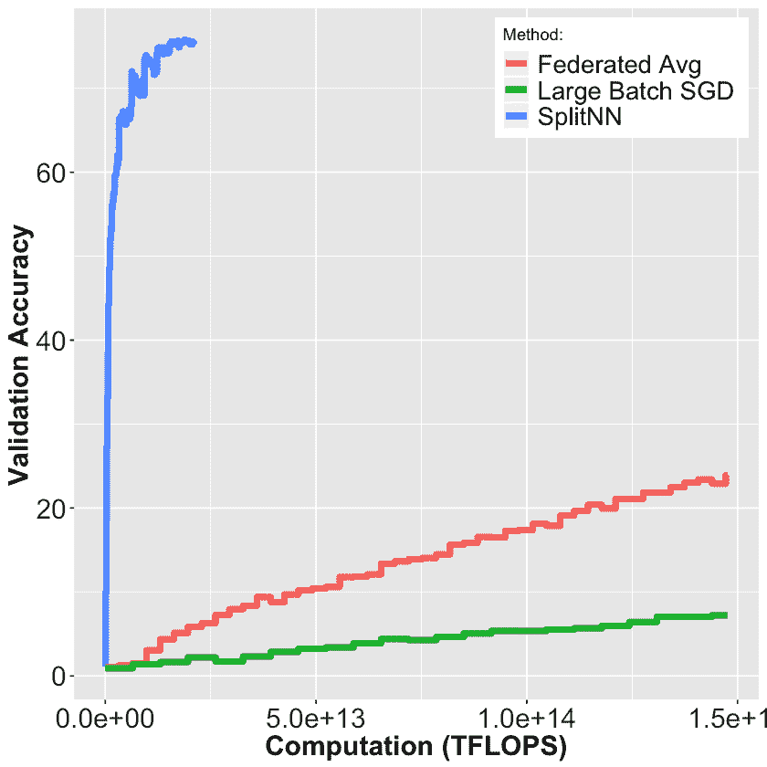

<!--yml

类别：未分类

日期：2024-09-06 20:07:00

-->

# [1812.03288] No Peek: 私有分布式深度学习调查

> 来源：[`ar5iv.labs.arxiv.org/html/1812.03288`](https://ar5iv.labs.arxiv.org/html/1812.03288)

¹¹机构文本：麻省理工学院

美国麻省剑桥市 02139

# No Peek: 私有分布式深度学习调查

Praneeth Vepakomma 通讯作者 电子邮件：vepakom@mit.edu    Tristan Swedish    Ramesh Raskar    Otkrist Gupta    Abhimanyu Dubey

###### 摘要

我们调查了在不访问客户端原始数据的情况下进行训练或推理的分布式深度学习模型。这些方法旨在保护数据中的机密模式，同时仍允许服务器进行模型训练。我们比较了联邦学习、分割学习和大批量随机梯度下降的分布式深度学习方法，并在神经网络的背景下，与差分隐私、同态加密、隐匿传输和混淆电路等私有和安全方法进行了比较。我们研究了它们在计算资源、数据泄漏和通信效率方面的优缺点及权衡，并分享了我们预计的未来趋势。

## 1 引言

在生物医学、健康和金融等领域的新兴技术中，分布式深度学习方法可以让多个实体训练深度神经网络，而无需在一个地方共享数据或整合资源。特别地，我们对在本地数据源（客户端）不能与服务器或其他客户端共享的情况下，将分布式数据源（客户端）与强大的集中计算资源（服务器）连接起来的分布式深度学习方法感兴趣。

我们调查并比较了这些分布式深度学习技术，并根据提供的保护级别和类型、模型性能以及所需资源（如内存、时间、通信带宽和同步要求）对其进行了分类。我们引入了“no peek”术语，以指代那些不以原始形式共享数据的分布式深度学习技术。我们指出，这些“no peek”技术允许服务器在不“窥视”或直接观察客户端原始数据的情况下进行模型训练。

此外，我们调查了一些通用的数据和模型保护方法。其中一些方法已经与具有不同程度禁止窥探属性的分布式深度学习方法结合使用。这些通用方法包括去标识化方法，如匿名化 [52]，模糊化方法，如差分隐私 [100, 101, 102] 和加密技术，如同态加密 [19, 93, 96] 以及安全多方计算（MPC）协议，如盲转移 [84, 47] 和加密电路 [41]。

在本文的其余部分，我们将重点探讨分布式深度学习技术，如 splitNN [31, 2]，大批量同步随机梯度下降（SGD）[20, 9]，联邦学习[3] 和其他变体 [107, 108, 109, 110]，在保护数据和模型的背景下。

### 1.1 禁止窥探规则

我们称那些在数据离开客户端后不再查看原始数据的分布式深度学习技术为满足“禁止窥探”属性的技术。禁止窥探是由信任和监管问题所决定的。例如，由于信任问题，医院通常不被允许与盈利性实体分享数据。由于患者的有限同意以及如 HIPAA [5, 1, 6, 7, 8] 等法规，医院也无法与外部实体共享数据（数据无法物理离开医院）。一些技术更进一步，通过不揭示模型架构的细节来实现。在这些技术中，服务器和客户端都无法访问对方的架构或权重细节。

### 1.2 需要保护的内容

在分布式深度学习的背景下，保护机制应保护数据集的各个方面，如

1.  1.

    输入特征

1.  2.

    输出标签或响应

1.  3.

    模型细节，包括架构、参数和损失函数

1.  4.

    可识别的信息，如某方对特定记录的贡献

### 1.3 计算目标

同样重要的是，任何旨在保护这些细节的机制也必须在可接受的水平上保持模型的实用性。这些目标理想情况下应以低成本实现。

1.  1.

    内存

1.  2.

    计算时间

1.  3.

    通信带宽

1.  4.

    同步

如图 1 所示，下方的小型医院或远程医疗筛查中心不会获取大量的诊断图像，并且可能受到诊断人力资源的限制。在这种情况下，分布式机器学习方法应理想地不共享任何原始数据（不窥探），同时在使用显著更少的资源时仍能实现高准确性。这有助于小型医院有效服务有需要的患者，同时从分散的实体中受益。

| 分布式方法 | 部分/完全泄漏 | 差分隐私 | 同态加密 | 不可知转移，混淆电路 |
| --- | --- | --- | --- | --- |
| 分布式神经网络 | [Dean2012, Wen2017, Das2016, Ooi2015], Ben2018] | [Hynes2018, Abadi2016, Shokri2015, Papernot2016] | [Juvekar2018, Gilad2016] | [Rouhani2017, Mohassel2017, Riazi2018, Orlandi2007] |
| 大批量同步 SGD | [Konečný2015, Chen2016] |  |  |  |
| 联邦学习 | [McMahan2017, Nock2018] | [Geyer2017] | [Aono2018, Hardy2017] | [Bonawitz2016] |
| SplitNN | [Gupta2018, Vepakomma2018] |  |  |  |

表 1：这是一个关于分布式深度学习方法的调查，按从分布式神经网络到 SplitNN 的泄漏水平递减。这些技术的混合方法以及差分隐私、同态加密和多方安全计算也包括在内。这 9 组的引文已经在参考文献部分按标题分组，以方便查阅。

## 2 种用于分布式深度学习的无窥探方法

在表 1 中，我们提供了各种分布式深度学习技术组合的对应参考文献以及通用方法。

图 1：不合作的健康单位

图 2：没有原始数据共享的分布式学习

针对深度学习之外的保护方法，例如差分隐私、同态加密和安全多方计算。分布式深度学习技术如 SplitNN、联邦学习和大批量同步 SGD 是‘无窥探’的。此外，SplitNN 还保护了模型的架构和权重细节，与其他技术不同。我们将在下面的表 2 中详细说明这些技术在数据、中间表示和超参数（包括深度学习架构和学习到的权重）上的保护级别。

在联邦学习和大批量同步 SGD 中，客户端和服务器之间共享模型的架构和参数，以及包括梯度、激活和权重更新的中间表示，这些内容在学习过程中被共享。尽管在这两种技术中数据不会以原始形式明确共享，但如[106]等工作已表明，原始数据可以通过对手进行近似重建，尤其是考虑到架构和参数并未完全保护。在这种背景下，SplitNN [31]具有额外的优势，因为它不共享模型的架构和权重。SplitNN 的保护在于神经网络深层的紧凑表示以及在不知道用于生成这些表示的模型权重的情况下，从这些表示中恢复基础数据的难度。这些表示是在通过众多激活后形成的，其中 ReLU 的逆变换是非线性且不确定的（零值 ReLU 的逆变换可以映射到任何负数）。这些表示被证明在某些任务（路径跟踪[4]）中保留了重要信息，同时没有揭示基础数据的信息（如 3D 坐标系统中的图像特征）。与联邦学习和大批量同步 SGD 相比，SplitNN 共享的中间表示所需带宽最少，因为只有来自客户端的一个层，即切分层的激活被共享给服务器，而没有任何与之相关的函数用于将其反向转换为原始数据。

| 无窥探深度学习 | 数据揭示 |
| --- | --- |

&#124; 超参数 &#124;

&#124; 揭示 &#124;

|

&#124; 中级 &#124;

&#124; 表示 &#124;

&#124; 揭示 &#124;

|

| --- | --- | --- | --- |
| --- | --- | --- | --- |

|

&#124; 大批量 &#124;

&#124; 同步 SGD &#124;

| 否 | 是 | 是 |
| --- | --- | --- |
| 联邦学习 | 否 | 是 | 是 |
| SplitNN | 否 | 否 | 是 |

表 2：在此表中，我们比较了联邦学习、大批量同步 SGD 和 SplitNN 等技术在数据、模型架构、模型参数和中间表示方面提供的隐私保护水平。在所有这些方面，SplitNN 的表现优于联邦学习或大批量同步 SGD。

在表 3 中，我们根据所需资源（如计算、通信带宽、内存和同步）对这些技术进行了比较。我们根据这些维度将技术分类为低、中和高要求。如图所示，splitNN 在客户端侧所需的资源最低。这是因为架构在一个层上被切割（形状任意且不一定是垂直的），计算仅在客户端侧进行到该切割层。其余计算发生在服务器端。实验结果在 [31] 中量化了这些比较。

## 3 联邦学习

关键思想：在这种方法中，客户端从中央服务器下载当前模型，并通过基于本地数据更新其模型权重来改进模型。客户端模型参数更新被聚合以生成服务器模型。该模型再次被客户端下载，过程持续进行。在这种设置中，原始数据没有明确的共享。

0:  服务器在轮次 $t\geq 0$ 执行： 将 $\mathbf{W}_{t}$ 分发到 $n_{t}$ 个客户端的子集 $S_{t}$ 对于每个客户端 $k\in S_{t}$ 并行执行     $\mathbf{H}^{k}_{t}\leftarrow\text{ClientUpdate}(k,w_{t})$  设置 $\mathbf{H}_{t}:=\tfrac{1}{n_{t}}\textstyle\sum_{i\in S_{t}}\mathbf{H}^{i}_{t}$  设置 $\mathbf{W}_{t+1}=\mathbf{W}_{t}+\eta_{t}\mathbf{H}_{t}$   ClientUpdate($k,\mathbf{W}_{t}$)： // *在客户端 $k$ 上运行*  $\mathcal{B}\leftarrow$（将 $\mathcal{P}_{k}$ 分割成大小为 $B$ 的批次）  设置 $\mathbf{W}^{k}_{t}=\mathbf{W}_{t}$  对于每个本地纪元 $i$ 从 $1$ 到 $E$ 执行     对于批次 $b\in\mathcal{B}$ 执行        $\mathbf{W}^{k}_{t}\leftarrow\mathbf{W}^{k}_{t}-\eta\triangledown\ell(\mathbf{W}^{k}_{t};b)$  返回 $\mathbf{H}^{k}_{t}=\mathbf{W}^{k}_{t}-\mathbf{W}_{t}$ 到服务器

算法朴素联邦学习。目标：从存储在大量客户端上的数据中学习 $\mathbf{W}\in\mathbb{R}^{d_{1}\times d_{2}}$。$K$ 个客户端由 $k$ 索引； $B$ 是本地小批量大小，$E$ 是本地纪元的数量，$\eta$ 是学习率。

0:  服务器执行： 初始化 $w_{0}$ 对于每轮 $t=1,2,\dots$ 执行     $m\leftarrow\max(C\cdot K,1)$     $S_{t}\leftarrow$（随机选择 $m$ 个客户端）     对于每个客户端 $k\in S_{t}$ 并行执行        $w_{t+1}^{k}\leftarrow\text{ClientUpdate}(k,w_{t})$     $w_{t+1}\leftarrow\sum_{k=1}^{K}\frac{n_{k}}{n}w_{t+1}^{k}$   ClientUpdate($k,w$)： // *在客户端 $k$ 上运行*  $\mathcal{B}\leftarrow$（将 $\mathcal{P}_{k}$ 分割成大小为 $B$ 的批次）  对于每个本地纪元 $i$ 从 $1$ 到 $E$ 执行     对于批次 $b\in\mathcal{B}$ 执行        $w\leftarrow w-\eta\triangledown\ell(w;b)$  返回 $w$ 到服务器

算法（高效通信的去中心化数据深度网络学习）：联邦平均。$K$ 个客户端由 $k$ 索引； $B$ 是本地小批量大小，$E$ 是本地纪元的数量，$\eta$ 是学习率。

### 3.1 好处

没有显式共享原始数据。已在凸情况下证明，对于独立同分布数据，最坏情况下，生成的全局模型不比在单个客户端上训练的模型更好[9, 3]。

### 3.2 局限性

当客户端的本地数据非独立同分布时，性能急剧下降。不过，最近[112]在这种设置下的联邦学习研究显示了积极的结果。它还需要大带宽、内存和计算要求，具体取决于模型的大小、完整的前向和反向传播计算需求。可以使用先进的压缩方法来减少这种负担。最近在神经网络压缩方面有活跃的研究，如[35, 36, 111]。这些研究可以减少在分布式学习中使用时的通信带宽成本。到目前为止，联邦学习尚无理论保障或隐私、安全的权衡。

|

&#124; 客户端资源 &#124;

&#124; 需要 &#124;

| 计算 | 带宽 | 内存 | 同步 |
| --- | --- | --- | --- | --- |

|

&#124; 大批量 &#124;

&#124; 同步 SGD &#124;

| 高 | 高 | 高 |
| --- | --- | --- |

&#124; 带备份的同步更新 &#124;

&#124; 工人以补偿慢速机器。 &#124;

|

| 联邦学习 | 中等 | 中等 | 高 | 同步客户端-服务器更新。 |
| --- | --- | --- | --- | --- |
| SplitNN | 低 | 低 | 低 | 同步客户端-服务器更新。 |

表 3：在此表中，我们比较了联邦学习、大批量同步 SGD 和 SplitNN 等技术在计算、带宽、内存和同步方面所需的资源。在这些方面，SplitNN 的资源消耗少于联邦学习和大批量同步 SGD，除了同步需求在三种技术中相似。

### 3.3 未来趋势

关于联邦学习中的数据中毒攻击[37]，恶意用户可以注入虚假的训练数据，负面影响模型的分类性能。需要提高对这些攻击的对抗鲁棒性。将神经网络压缩方案与联邦学习结合，以减少通信负担，是未来研究的一个方向。鉴于近期在这些领域的活跃研究，联邦学习与差分隐私、以及安全多方计算的结合，是未来研究的一个有趣方向。

## 4 大批量同步 SGD

### 4.1 关键思想

该技术引入了额外的备份工作节点来更新权重，并选择在任何最快的 N 个工作节点完成更新时同步更新聚合模型。这比异步 SGD 更准确，因为异步 SGD 中的一些本地工作节点可能会更新更过时模型的权重，因为客户端-服务器更新是异步的。它也比没有备份工作节点的同步 SGD 更快，其中服务器在聚合模型参数以更新模型之前等待所有客户端完成其更新。

### 4.2 优势

它允许更快的同步 SGD，比异步 SGD 方法更准确，其中一些客户端最终会基于更过时的模型更新权重。

### 4.3 限制

所需的计算资源和通信带宽远高于其他分布式深度学习方法。

### 4.4 未来趋势

未来趋势类似于联邦学习，因为该方法在本质上与联邦学习非常相似，尽管它是在单个数据批次上运行。这种方法具有较高的计算负荷和网络开销。为了使这种方法在数据中心或去中心化环境中更具可持续性，未来在提高其效率方面的工作是重要的。

算法 1 大批量 SGD

0:   工作节点更新($k$)，其中 $k=1,\dots,N+b$  输入: 数据集 $\mathcal{X}$, $B$ mini-batch 大小。  对于 $t=0,1,\dots$ 执行     等待从参数服务器读取 ${\mathbb{\theta}}^{(t)}=({\mathbb{\theta}}^{(t)}[0],\dots,{\mathbb{\theta}}^{(t)}[M])$       $G_{k}^{(t)}:=0$     对于 $i=1,\dots,B$ 执行        从 $\mathcal{X}$ 中采样数据点 $\widetilde{x}_{k,i}$。        $G_{k}^{(t)}\leftarrow G_{k}^{(t)}+\frac{1}{B}\nabla F(\widetilde{x}_{k,i};{\mathbb{\theta}}^{(t)})$。 将 $(G_{k}^{(t)},t)$ 发送到参数服务器。   参数服务器更新($j$)，其中 $k=1,\dots,N+b$  输入 $\gamma_{0},\gamma_{1},\dots$ 学习率，$\alpha$ 衰减率，$N$ 要聚合的小批量数量，${\mathbb{\theta}}^{(0)}$ 模型初始化。  对于 $t=0,1,\dots$ 执行     $\mathcal{G}=\{\}$      当 $|\mathcal{G}|<N$ 时        等待来自任何工作节点的 $(G,t^{\prime})$。         如果 $t^{\prime}==t$ 则           $\mathcal{G}\leftarrow\mathcal{G}\cup\{G\}$。        否则           丢弃梯度 $G$。    ${\mathbb{\theta}}^{(t+1)}[j]\leftarrow{\mathbb{\theta}}^{(t)}[j]-\frac{\gamma_{t}}{N}\sum_{G\in\mathcal{G}}G[j]$。      $\bar{\mathbb{\theta}}^{(t)}[j]=\alpha\bar{\mathbb{\theta}}^{(t-1)}[j]+(1-\alpha){\mathbb{\theta}}^{(t)}[j]$。

## 5 分裂学习 (SplitNN)

### 5.1 关键理念

在这种方法中，每个客户端将网络训练到称为切分层的某一层，并将权重发送到服务器。服务器随后训练网络的其余层。这完成了前向传播。服务器然后生成最终层的梯度，并将误差反向传播到切分层。梯度随后传递给客户端。其余的反向传播由客户端完成。这一过程持续进行，直到网络训练完成。切分的形状可以是任意的，不一定是垂直的。在这个框架中，原始数据也没有明确的共享。

### 5.2 好处

客户端的通信成本显著降低，因为需要传输的数据仅限于`splitNN`切分前的前几层。由于同样的原因，学习网络权重的客户端计算成本也显著降低。在模型性能方面，`Split NN`的准确度远高于联邦学习和大批量同步 SGD，同时在训练大量客户端时，客户端的计算负担大幅减少。

### 5.3 局限性

尽管在训练较少数量的客户端时需要相对较大的整体通信带宽，但在客户端数量较多的设置中，它的带宽需求远低于其他方法。可以使用先进的神经网络压缩方法，如[35、36、111]来减少通信负担。通过允许客户端使用更多层来表示进一步压缩的表示，可以将通信带宽与客户端计算进行权衡。

### 5.4 未来趋势

由于这种新提出的方法具有不窥探属性、不共享模型细节以及高资源效率，它非常适合直接应用于分布式医疗保健、分布式临床试验、组织间和组织内协作以及金融等重要领域。结合神经网络压缩方案和`splitNN`以减少通信负担是未来工作的一个有前景的方向。考虑到联邦学习和差分隐私的结合，安全多方计算也是一个有趣的未来研究方向，因为近期在这些领域都有积极的研究。

0: 服务器在回合$t\geq 0$执行：对每个客户端$k\in S_{t}$并行执行 $\mathbf{A}^{k}_{t}\leftarrow\text{ClientUpdate}(k,t)$ 计算 $\mathbf{W}_{t}\leftarrow\mathbf{W}_{t}-\eta\triangledown\ell(\mathbf{W}_{t};\mathbf{A}_{t})$ 将 $\triangledown\ell(\mathbf{A}_{t};\mathbf{W}_{t})$ 发送给客户端$k$进行 $\text{ClientBackprop}(k,t)$ 客户端更新($k,t$): // *在客户端$k$上运行* $\mathbf{A}^{k}_{t}=\phi$ 对每个本地时期$i$从$1$到$E$ 执行 对每个批次$b\in\mathcal{B}$ 执行 将 $f(b,\mathbf{H}^{k}_{t})$ 连接到 $\mathbf{A}^{k}_{t}$ 返回 $\mathbf{A}^{k}_{t}$ 给服务器 客户端反向传播($k,t,\triangledown\ell(\mathbf{A}_{t};\mathbf{W}_{t})$): // *在客户端$k$上运行* 对每个批次$b\in\mathcal{B}$ 执行 $\mathbf{H}^{k}_{t}=\mathbf{H}^{k}_{t}-\eta\triangledown\ell(\mathbf{A}_{t};\mathbf{W}_{t};b)$\captionof

algorithmSplitNN。$K$个客户端由$k$索引；$B$是本地小批量大小，$\eta$是学习率。

## 6 种进一步减少泄露和提高效率的方法

### 6.1 使用差分隐私对神经网络进行混淆

#### 6.1.1 关键思想：

[14]中的方法通过剪切每批数据的梯度并在优化过程中添加高斯噪声来修改用于学习神经网络的随机梯度下降（SGD）优化方法，而不是将噪声添加到模型的最终参数，这可能过于保守，从而影响训练模型的实用性。噪声的 sigma 在每个步骤中选择，以维持对特定数据批次的保证 epsilon-delta 差分隐私。准确性和隐私的冲突目标之间的权衡由批次大小决定。

#### 6.1.2 优势和局限性：

隐私始终依赖于有限的隐私预算，同时这与模型准确性呈反比例关系。这与 SplitNN 不同，在 SplitNN 中无需共享原始数据即可实现高准确性。差分隐私的保障目前有理论支持，而在 SplitNN 或联邦学习中没有。隐私预算耗尽时，它也违反了不窥探规则。

#### 6.1.3 未来趋势：

将差分隐私与分布式深度学习方法如 splitNN、联邦学习和大批量 SGD 结合具有广泛的应用前景，因为这能提供更强的理论保障以防止数据泄露。

### 6.2 同态加密用于神经网络

#### 6.2.1 关键思想

同态加密旨在保持密码的结构，以便加密后可以执行加法和乘法操作。除了激活函数外，神经网络中的所有操作都是求和和乘积操作，可以使用同态加密进行编码。激活函数用高阶多项式、泰勒级数、标准或改进的切比雪夫多项式来近似，然后作为同态加密方案的一部分实现。[17、19]中的工作在深度学习的背景下应用了这些思想。[115]提供了一个详细的比较各种同态加密软件库的调查。

算法 2 差分隐私 SGD

0:  示例 $\{x_{1},...,x_{N}\}$，损失函数 $\mathcal{L}({\mathbb{\theta}})=\frac{1}{N}\sum_{i}\mathcal{L}({\mathbb{\theta}},x_{i})$。参数：学习率 $\eta_{t}$，噪声尺度 $\sigma$，组大小 $L$，梯度范数界限 $C$。  初始化 ${\mathbb{\theta}}_{0}$ 随机  对于 $t\in[T]$ 做      以采样概率 $L/N$ 进行随机样本 $L_{t}$      计算梯度      对于每个 $i\in L_{t}$，计算 $\mathbf{g}_{t}(x_{i})\leftarrow\nabla_{{\mathbb{\theta}}_{t}}\mathcal{L}({\mathbb{\theta}}_{t},x_{i})$      剪裁梯度      $\bar{\mathbf{g}}_{t}(x_{i})\leftarrow\mathbf{g}_{t}(x_{i})/\max\big{(}1,\frac{\|\mathbf{g}_{t}(x_{i})\|_{2}}{C}\big{)}$      添加噪声      $\tilde{\mathbf{g}}_{t}\leftarrow\frac{1}{L}\left(\sum_{i}\bar{\mathbf{g}}_{t}(x_{i})+\mathcal{N}(0,\sigma^{2}C^{2}\mathbf{I})\right)$      下降      ${\mathbb{\theta}}_{t+1}\leftarrow{\mathbb{\theta}}_{t}-\eta_{t}\tilde{\mathbf{g}}_{t}$  输出 ${\mathbb{\theta}}_{T}$ 并使用隐私会计方法计算整体隐私成本 $(\varepsilon,\delta)$。

#### 6.2.2 算法

有多种方案已被证明具有同态性质，并且是可证明安全的。最常见的方案利用 LWE（带错误的学习）问题的安全性，该问题在加入噪声后寻求解线性系统。在某些条件下（当向量空间的维度远大于计算范围时），此问题很难解决，甚至已被证明在已知量子攻击下仍然安全。简而言之，LWE 包含一个在有限整数域下进行加法和乘法的同态结构（因此，所有有限整数的乘法/加法可以作为 LWE 问题加密和同态评估）。在实践中，实施使用 R-LWE（环 LWE，明确使用多项式环而不是向量空间），它使用略有不同的表示，但底层代数结构基本保持不变。

简单的 LWE 示例：下面给出了简单 LWE 示例的密钥生成、加密/解密以及对应的加法/乘法操作。

Keygen:

|  | $\displaystyle A\in\mathbb{Z}^{m\times n}_{q}$ |  |
| --- | --- | --- |
|  | $\displaystyle S\sim\mathbb{Z}^{n}_{q}$ |  |
|  | $\displaystyle e\sim\mathcal{N}^{n}$ |  |
|  | $\displaystyle b=As+e$ |  | (1) |

加密/编码：

|  | $\displaystyle r_{1},e_{1}\sim\mathcal{N}$ |  |
| --- | --- | --- |
|  | $\displaystyle c=\left(c_{a},c_{b}\right)=\left(A^{T}r_{1},b^{T}r_{1}+m_{1}+e_{1}\right)$ |  | (2) |

加法/乘法：

|  | $\displaystyle c_{\text{add}}=c_{1}+c_{2}$ |  | (3) |
| --- | --- | --- | --- |
|  | $\displaystyle c_{\text{mult}}=D\left(c_{1}\otimes c_{2}\right)$ |  | (4) |

其中 $\otimes$ 是张量积，$D$ 是一个维度转换矩阵，它简化了结果密文。关于这一方案作为实际系统的正确性证明和进一步的复杂化，可以在 LWE 文献中找到。

#### 6.2.3 优势与限制

这些技术需要专业的硬件或大量的计算资源来扩展。它们能够提供更高水平的安全性，允许完美解密，并且不依赖于混淆与准确性之间的权衡。这种情况下涉及的权衡更多的是计算效率。例如，一些工作（微软的 SEAL）表明，要对 1MB 数据执行逻辑回归，需要 10GB 内存，并且需要大规模并行化才能在实际问题中实现实时吞吐（有些任务可能无法如此并行化）。LWE 硬度被认为在后量子密码环境中仍然有效。

#### 6.2.4 未来趋势

这种方法需要非常高的计算资源，以便使其能够扩展到实际的深度学习架构。目前的技术仅在简单网络和小数据集（如 MNIST 手写数字识别）上进行过基准测试。开发针对大规模深度学习的更快方法和专业硬件是未来工作的一个重要方向。

### 6.3 多方计算 (MPC) 和加密电路

#### 6.3.1 关键思想：

这些技术基于我们描述的秘密共享和零知识证明的理念。保护是通过将秘密信息与不同实体共享，并要求这些实体共同合作以获得访问权限来实现的。有些问题涉及两个实体协作计算一个函数，而不共享函数输入的信息。经典的例子是百万富翁问题，其中$f(x_{1},x_{2})$由两个方计算，一个方拥有$x_{1}$，另一个方拥有$x_{2}$，而一个方无法了解另一个方持有的值。如果$x_{1}>x_{2}$，$f(x_{1},x_{2})$将返回一个正数，如果$x_{2}>x_{1}$，则返回一个负数。通过这种方式，两个百万富翁可以确定谁的钱更多，而无需共享每个人持有的总金额。这在不信任的“信用检查”中有实际应用，或者作为某种“零知识证明”的例子。姚的[48]百万富翁问题的混淆电路协议和 1–2 盲传输[114, 113]是这一方向的重要工作。像 Obliv-C、ObliVM、SPDZ 和 Sharemind 这样的计算实现和框架也很突出。

#### 6.3.2 优势与局限：

这些技术已经被研究用于如安全稳定匹配、线性系统求解和并行图算法等问题。但在 MPC 与深度学习交集方面的工作较少。

#### 6.3.3 未来趋势：

专用的 MPC 硬件正在开发中，以实现这些协议的实际应用。由于当前的机器学习在大数据集上的深度学习架构中依赖较重，因此弥合 MPC 框架与分布式深度学习之间的差距是未来工作的重要方向。

| 方法 | 100 个客户端 | 500 个客户端 |
| --- | --- | --- |
| 大批量 SGD | 29.4 TFlops | 5.89 TFlops |
| 联邦学习 | 29.4 TFlops | 5.89 TFlops |
| SplitNN | 0.1548 TFlops | 0.03 TFlops |

表 4：在 VGG 上训练 CIFAR 10 时，每个客户端消耗的计算资源（以 teraflops 为单位），SplitNN 显著低于大批量 SGD 和联邦学习。

| 方法 | 100 个客户端 | 500 个客户端 |
| --- | --- | --- |
| 大批量 SGD | 13 GB | 14 GB |
| 联邦学习 | 3 GB | 2.4 GB |
| SplitNN | 6 GB | 1.2 GB |

表 5：在 ResNet 上训练 CIFAR 100 时，每个客户端所需的计算带宽（以吉字节为单位），SplitNN 低于大批量 SGD 和联邦学习，特别是在大量客户端的情况下。对于客户端数量较少的设置，联邦学习所需的带宽低于 SplitNN。数据中心中流行的大批量 SGD 方法在两种设置中都使用了大量带宽。

## 7 无窥视分布式深度学习的资源效率比较

我们现在展示了来自[31]的验证准确度与所需客户端计算资源的比较，见图 1，涉及到三种针对分布式深度学习的技术：联邦学习、大批量同步 SGD 和 SplitNN。从图中可以看出，比较是基于使用 VGG 和 Resnet-50 架构的 CIFAR 10 和 CIFAR 100 数据集进行的，分别针对 100 个和 500 个客户端的设置。在这项分布式学习实验中，我们清楚地看到 SplitNN 在准确度更高且客户端计算需求显著较低的情况下优于联邦学习和大批量同步 SGD。在表 4 和表 5 中，我们展示了来自[31]的更多关于这些技术所需计算资源（以 TFlops 计）和通信带宽（以 GB 计）的比较。SplitNN 在客户端计算资源效率上再次表现出显著的改进。在客户端数量相对较少的情况下，联邦学习所需的通信带宽低于 SplitNN。

(a) 在 100 个客户端上使用 VGG 在 CIFAR 10 上的准确度与客户端端计算资源的比较

(b) 在 500 个客户端上使用 Resnet-50 在 CIFAR 100 上的准确度与客户端端计算资源的比较

图 3：我们展示了在使用 SplitNN 训练大量客户端时，计算负担（以 tflops 计）的显著减少，同时保持更高的准确度。蓝线表示使用 SplitNN 的分布式深度学习，红线表示联邦平均，绿线表示大批量 SGD。

## 8 结论与未来工作

与现有的数据保护方法相比，不需要窥探的深度神经网络需要新的思维，这些现有方法尝试将孤立的数据汇总以使服务器模型受益。我们描述了在这种背景下出现的三种方法：splitNN、联邦学习和大批量 SGD。这些方法与差分隐私、同态加密和安全多方计算的创新组合可能会进一步利用理论保证。我们展示了在客户数量较多的情况下，splitNN 需要最少的通信带宽，而联邦学习在客户数量相对较少时表现更好。在这方面，提高无窥探方法的资源和通信效率将是另一个有影响力的未来工作方向。使用先进的神经网络压缩方法[35、111、36]将有助于进一步减少所需的网络足迹。研究针对数据中毒攻击的对抗鲁棒性[37]也很重要，其中恶意用户可以注入虚假训练数据，负面影响模型的分类性能。在开发无窥探机制时，需要考虑这一平行研究领域的对抗攻击方案。高效的无窥探方法在分布式医疗、分布式临床试验、组织间和组织内协作以及金融等重要领域具有直接应用。因此，我们在未来展望新颖的无窥探分布式深度学习应用。

## 9 参考文献

## 参考文献

+   [1] 疾病控制和预防中心，《HIPAA 隐私规则与公共健康》。来自 CDC 和美国卫生与公共服务部的指导，《MMWR：疾病和死亡周报》，美国疾病控制与预防中心，2003 年。

+   [2] 关键字 = block10, Vepakomma, Praneeth 和 Gupta, Otkrist 和 Swedish, Tristan 和 Raskar, Ramesh，《健康中的分割学习：无共享原始病人数据的分布式深度学习》，arXiv1812.00564，2018 年。

+   [3] H. Brendan McMahan, Eider Moore, Daniel Ramage, Seth Hampson 和 Blaise Aguera y Arcas，《从分散数据中高效通信学习深度网络》，第 20 届国际人工智能与统计会议（AISTATS），2017 年。

+   [4] Swedish, Tristan 和 Raskar, Ramesh，《路径网络上的深度视觉教学与重复》，IEEE 计算机视觉与模式识别大会（CVPR）工作坊，2018 年。

+   [5] Annas, George J.，《HIPAA 规章——医疗记录隐私的新纪元？》，《新英格兰医学杂志》，第 348 卷（15 期），第 1486–1490 页，2003 年。

+   [6] Mercuri, Rebecca T.，《医疗数据安全中的 HIPAA 大象》，《ACM 通信》，第 47 卷（7 期），第 25–28 页，2004 年。

+   [7] Gostin, Lawrence O.，Levit, Laura A. 和 Nass, Sharyl J.，《超越 HIPAA 隐私规则：增强隐私，通过研究改善健康》，国家科学院出版社，2009 年。

+   [8] Luxton, David D 和 Kayl, Robert A 和 Mishkind, Matthew C. ，mHealth 数据安全：对 HIPAA 合规标准化的需求，远程医疗与电子健康，第 18 卷（4 期），页 284–288，2012 年。

+   [9] Konečny, Jakub 和 McMahan, H Brendan 和 Yu, Felix X 和 Richtárik, Peter 和 Suresh, Ananda Theertha 和 Bacon, D. ，联邦学习：提高通信效率的策略，arXiv 预印本 arXiv:1610.05492，2016 年。

+   [10] Hynes, Nick 和 Cheng, Raymond 和 Song, Dawn ，在多源私有数据上进行高效深度学习，arXiv 预印本 arXiv:1807.06689，2018 年。

+   [11] Abadi, Martin 和 Chu, Andy 和 Goodfellow, Ian 和 McMahan, H Brendan 和 Mironov, Ilya 和 Talwar, Kunal 和 Zhang, Li，具有差分隐私的深度学习，第 2016 年 ACM SIGSAC 计算机与通信安全会议论文集，页 308–318，2016 年。

+   [12] Shokri, Reza 和 Shmatikov, Vitaly，隐私保护的深度学习，第 22 届 ACM SIGSAC 计算机与通信安全会议论文集，页 1310–1321，2015 年。

+   [13] Papernot, Nicolas 和 Abadi, Martín 和 Erlingsson, Ulfar 和 Goodfellow, Ian 和 Talwar, Kunal，从私有训练数据中进行半监督知识迁移深度学习，arXiv 预印本 arXiv:1610.05755，2016 年。

+   [14] Geyer, Robin C 和 Klein, Tassilo 和 Nabi, Moin，差分隐私的联邦学习：客户端级别的视角，arXiv 预印本 arXiv:1712.07557，2017 年。

+   [15] Rouhani, Bita Darvish 和 Riazi, M Sadegh 和 Koushanfar, Farinaz，Deepsecure：可扩展的可证明安全深度学习，arXiv 预印本 arXiv:1705.08963，2017 年。

+   [16] Rouhani, Bita Darvish 和 Riazi, M Sadegh 和 Koushanfar, Farinaz，SecureML：一个可扩展隐私保护机器学习系统，第 38 届 IEEE 安全与隐私研讨会（SP），2017 年。

+   [17] Hesamifard, Ehsan 和 Takabi, Hassan 和 Ghasemi, Mehdi，CryptoDL：对加密数据进行深度神经网络分析，arXiv 预印本 arXiv:1711.05189，2017 年。

+   [18] Hardy, Stephen 和 Henecka, Wilko 和 Ivey-Law, Hamish 和 Nock, Richard 和 Patrini, Giorgio 和 Smith, Guillaume 和 Thorne, Brian，通过实体解析和加法同态加密在垂直分区数据上进行私有联邦学习，arXiv 预印本 arXiv:1711.10677，2017 年。

+   [19] Aono, Yoshinori 和 Hayashi, Takuya 和 Wang, Lihua 和 Moriai, Shiho，通过加法同态加密实现隐私保护的深度学习，IEEE 信息取证与安全交易，第 13 卷（5 期），页 1333–1345，arXiv 预印本 arXiv:1711.10677，2018 年。

+   [20] Chen, Jianmin 和 Pan, Xinghao 和 Monga, Rajat 和 Bengio, Samy 和 Jozefowicz, Rafal，重新审视分布式同步 SGD，IEEE 信息取证与安全交易，第 13 卷（5 期），arXiv 预印本 arXiv:1604.00981，2016 年。

+   [21] Bonawitz, Keith 和 Ivanov, Vladimir 和 Kreuter, Ben 和 Marcedone, Antonio 和 McMahan, H Brendan 和 Patel, Sarvar 和 Ramage, Daniel 和 Segal, Aaron 和 Seth, Karn，《用于隐私保护机器学习的实用安全聚合》，2017 年 ACM SIGSAC 计算机与通信安全会议论文集，第 1175–1191 页，2017 年。

+   [22] Ben-Nun, Tal 和 Hoefler, Torsten，《揭秘并行和分布式深度学习：深入的并发分析》，arXiv 预印本 arXiv:1802.09941，2018 年。

+   [23] Shickel, Benjamin 和 Tighe, Patrick James 和 Bihorac, Azra 和 Rashidi, Parisa，《Deep EHR：电子健康记录（EHR）分析中深度学习技术的最新进展综述》，《IEEE 生物医学与健康信息学杂志》，第 22 卷（5 期），第 1589–1604 页，2018 年。

+   [24] Ching, Travers 和 Himmelstein, Daniel S 和 Beaulieu-Jones, Brett K 和 Kalinin, Alexandr A 和 Do, Brian T 和 Way, Gregory P 和 Ferrero, Enrico 和 Agapow, Paul-Michael 和 Zietz, Michael 和 Hoffman, Michael M，《生物学和医学中深度学习的机遇与挑战》，《皇家学会界面杂志》，第 15 卷（141 期），2018 年。

+   [25] Miotto, Riccardo 和 Wang, Fei 和 Wang, Shuang 和 Jiang, Xiaoqian 和 Dudley, Joel T.，《医疗保健中的深度学习：综述、机遇与挑战》，《生物信息学简报》，2017 年。

+   [26] Smith, Virginia 和 Chiang, Chao-Kai 和 Sanjabi, Maziar 和 Talwalkar, Ameet S.，《神经信息处理系统进展》，第 4424–4434 页，2017 年。

+   [27] Syverson, Paul 和 Dingledine, R 和 Mathewson, N，《Tor：第二代洋葱路由器》，Usenix Security，2004 年。

+   [28] Ravı, Daniele 和 Wong, Charence 和 Deligianni, Fani 和 Berthelot, Melissa 和 Andreu-Perez, Javier 和 Lo, Benny 和 Yang, Guang-Zhong，《健康信息学中的深度学习》，《IEEE 生物医学与健康信息学杂志》，第 21 卷（1 期），第 4–21 页，2017 年。

+   [29] Alipanahi, Babak 和 Delong, Andrew 和 Weirauch, Matthew T 和 Frey, Brendan J，《通过深度学习预测 DNA 和 RNA 结合蛋白的序列特异性》，《自然生物技术》，第 33 卷（8 期），2015 年。

+   [30] Litjens, Geert 和 Kooi, Thijs 和 Bejnordi, Babak Ehteshami 和 Setio, Arnaud Arindra Adiyoso 和 Ciompi, Francesco 和 Ghafoorian, Mohsen 和 van der Laak, Jeroen AWM 和 Van Ginneken, Bram 和 Sánchez, Clara I，《医学图像分析中的深度学习调查》，《医学图像分析》，第 42 卷，第 60–88 页，2017 年。

+   [31] Gupta, Otkrist 和 Raskar, Ramesh，《在多个代理上分布式深度神经网络学习》，《网络与计算机应用杂志》，第 116 卷，第 1–8 页，2018 年。

+   [32] Navathe, Shamkant 和 Ceri, Stefano 和 Wiederhold, Gio 和 Dou, Jinglie，《数据库设计的垂直分区算法》，《ACM 数据库系统事务》（TODS），第 9 卷（4 期），第 680–710 页，1984 年。

+   [33] Agrawal, Sanjay 和 Narasayya, Vivek 和 Yang, Beverly, 将垂直和水平分区集成到自动化物理数据库设计中，第 2004 届 ACM SIGMOD 国际数据管理会议论文集，第 359–370 页, 2004 年

+   [34] Abadi, Daniel J 和 Marcus, Adam 和 Madden, Samuel R 和 Hollenbach, Kate, 使用垂直分区进行可扩展的语义网数据管理，第 33 届国际大数据大会论文集，第 411–422 页, 2007 年

+   [35] Lin, Yujun 和 Han, Song 和 Mao, Huizi 和 Wang, Yu 和 Dally, William J, 深度梯度压缩：减少分布式训练的通信带宽，arXiv 预印本 arXiv:1712.01887, 2017 年

+   [36] Han, Song 和 Mao, Huizi 和 Dally, William J, 深度压缩：通过剪枝、训练量化和霍夫曼编码压缩深度神经网络，arXiv 预印本 arXiv:1510.00149, 2015 年

+   [37] Fung, Clement 和 Yoon, Chris JM 和 Beschastnikh, Ivan, 减轻联邦学习中的 Sybil 攻击，arXiv 预印本 arXiv:1808.04866, 2018 年

+   [38] Xie, Liyang 和 Lin, Kaixiang 和 Wang, Shu 和 Wang, Fei 和 Zhou, Jiayu, 差分隐私生成对抗网络，arXiv 预印本 arXiv:1802.06739, 2018 年

+   [39] Crawford, Jack LH 和 Gentry, Craig 和 Halevi, Shai 和 Platt, Daniel 和 Shoup, Victor, 使用同态加密进行实际工作：逻辑回归的案例，2018 年

+   [40] Sans, Edouard Dufour 和 Gay, Romain 和 Pointcheval, David, 在黑暗中阅读：使用功能加密对加密数字进行分类, 2018 年

+   [41] Rosulek, Mike, Gate-Hiding 加密电路的改进，2017 年印度密码学国际会议

+   [42] Choudhury, Ashish 和 Loftus, Jake 和 Orsini, Emmanuela 和 Patra, Arpita 和 Smart, Nigel P, 进退两难：在 MPC 和同态加密之间插值，第 2013 届国际密码学与信息安全理论与应用大会, 2013 年

+   [43] Keller, Marcel 和 Pastro, Valerio 和 Rotaru, Dragos, Overdrive: 让 SPDZ 再次伟大，第 2018 届国际密码学理论与应用大会, 2018 年

+   [44] Juvekar, Chiraag 和 Vaikuntanathan, Vinod 和 Chandrakasan, Anantha, Gazelle: 一个低延迟的安全神经网络推理框架，arXiv 预印本 arXiv:1801.05507, 2018 年

+   [45] Gilad-Bachrach, Ran 和 Dowlin, Nathan 和 Laine, Kim 和 Lauter, Kristin 和 Naehrig, Michael 和 Wernsing, John, Cryptonets: 在加密数据上应用神经网络，实现高吞吐量和高准确率，第 2016 届国际机器学习会议

+   [46] Riazi, M Sadegh 和 Weinert, Christian 和 Tkachenko, Oleksandr 和 Songhori, Ebrahim M 和 Schneider, Thomas 和 Koushanfar, Farinaz, Chameleon: 一种用于机器学习应用的混合安全计算框架，第 2018 届亚洲计算机与通信安全会议论文集, 2018 年

+   [47] Liu, Jian 和 Juuti, Mika 和 Lu, Yao 和 Asokan, N，《通过 minionn 转换的无意识神经网络预测》，2017 年 ACM SIGSAC 计算机与通信安全会议论文，2017

+   [48] Andrew C. Yao，《安全计算协议》，加州大学伯克利分校，加州，IEEE 计算机科学基础， 第 23 届年会，[`research.cs.wisc.edu/areas/sec/yao1982-ocr.pdf`](https://research.cs.wisc.edu/areas/sec/yao1982-ocr.pdf)，1982

+   [49] Ziad, M Tarek Ibn 和 Alanwar, Amr 和 Alzantot, Moustafa 和 Srivastava, Mani，《Cryptoimg：对加密图像的隐私保护处理》，IEEE 通信与网络安全会议，2016

+   [50] Mironov, Ilya，《Renyi 差分隐私》，IEEE 第 30 届计算机安全基础研讨会，2017

+   [51] Kuo, Yu-Hsuan 和 Chiu, Cho-Chun 和 Kifer, Daniel 和 Hay, Michael 和 Machanavajjhala, Ashwin，《差分隐私分层计数直方图》，VLDB 基金会会议论文，2018

+   [52] Li, Ninghui 和 Li, Tiancheng 和 Venkatasubramanian, Suresh，《t-closeness：超越 k-匿名性和 l-多样性的隐私》，IEEE 第 23 届国际数据工程会议 (ICDE)，2007

+   [53] He, Xi 和 Machanavajjhala, Ashwin 和 Ding, Bolin，《Blowfish 隐私：使用策略调整隐私-效用权衡》，2014 年 ACM SIGMOD 国际数据管理会议论文，2014

+   [54] He, Xi 和 Cormode, Graham 和 Machanavajjhala, Ashwin 和 Procopiuc, Cecilia M 和 Srivastava, Divesh，《DPT：使用分层参考系统的差分隐私轨迹合成》，VLDB 基金会会议论文，2015

+   [55] Carlini, Nicholas 和 Liu, Chang 和 Kos, Jernej 和 Erlingsson, Úlfar 和 Song, Dawn，《秘密分享者：测量神经网络无意记忆和提取秘密》，arXiv 预印本 arXiv:1802.08232，2018

+   [56] Hisham Husain, Zac Cranko, Richard Nock，《对来自 Mollifier 密度的采样进行整体隐私保护，具有近似保证》，arXiv:1806.04819，2018

+   [57] Zhang, Zuhe 和 Rubinstein, Benjamin IP 和 Dimitrakakis, Christos，《贝叶斯推断的差分隐私》，AAAI 人工智能会议，AAAI，2016

+   [58] Jain, Prateek 和 Kothari, Pravesh 和 Thakurta, Abhradeep，《差分隐私在线学习》，学习理论会议，2012

+   [59] Xi Wu 和 Fengan Li 和 Arun Kumar 和 Kamalika Chaudhuri 和 Somesh Jha 和 Jeffrey F. Naughton，《用于可扩展随机梯度下降分析的附加差分隐私》，SIGMOD 会议，2017

+   [60] Bagdasaryan, Eugene 和 Veit, Andreas 和 Hua, Yiqing 和 Estrin, Deborah 和 Shmatikov, Vitaly，《如何背门联邦学习》，arXiv 预印本 arXiv:1807.00459，2018

+   [61] Jalaj Upadhyay，《流模型中的差分隐私线性代数》，IACR 密码学 ePrint 归档，2014

+   [62] Nikita Mishra，《私有随机多臂老虎机：从理论到实践》，第 31 届国际机器学习会议（ICML），2014 年

+   [63] Ruochi Zhang 和 Parv Venkitasubramaniam，《互信息私有在线梯度下降算法》，2018 年 IEEE 国际声学、语音与信号处理会议（ICASSP），2018 年

+   [64] Seth Gilbert 和 Xiao Liu 和 Haifeng Yu，《关于差分隐私在线协同推荐系统》，国际信息安全与密码学会议，2015 年

+   [65] John N. Tsitsiklis 和 Kuang Xu 和 Zhi Xu，《私有序列学习》，COLT，2018 年

+   [66] Depeng Xu 和 Shuhan Yuan 和 Xintao Wu，《差分隐私保护的因果图发现》，IEEE 隐私保护计算研讨会（PAC），2017 年

+   [67] Jacob D. Abernethy 和 Chansoo Lee 和 Audra McMillan 和 Ambuj Tewari，《通过差分隐私进行在线学习》，CoRR，abs/1711.10019，2017 年

+   [68] Ngoc-Son Phan 和 Xintao Wu 和 Dejing Dou，《在卷积深度信念网络中保护差分隐私》，《机器学习杂志》，Springer，2017 年

+   [69] Giulia C. Fanti 和 Vasyl Pihur 和 Úlfar Erlingsson，《与未知构建 RAPPOR：隐私保护的关联学习和数据字典》，2016 年

+   [70] Ziteng Wang 和 Chi Jin 和 Kai Fan 和 Jiaqi Zhang 和 Junliang Huang 和 Yiqiao Zhong 和 Liwei Wang，《用于平滑查询的差分隐私数据发布》，《机器学习研究杂志》，2016 年

+   [71] Raghavendran Balu 和 Teddy Furon，《使用草图技术的差分隐私矩阵分解》，第 4 届 ACM 信息隐藏与多媒体安全研讨会论文集，2016 年

+   [72] Mohsen Ghassemi 和 Anand D. Sarwate 和 Rebecca N. Wright，《带应用于异常检测的差分隐私在线主动学习》，AISecCCS，2016 年

+   [73] Yao, Zhewei 和 Gholami, Amir 和 Lei, Qi 和 Keutzer, Kurt 和 Mahoney, Michael W，《基于 Hessian 的大批量训练分析及对对手的鲁棒性》，arXiv 预印本 arXiv:1802.08241，2018 年

+   [74] Yuncheng Wu 和 Yao Wu 和 Hui Peng 和 Juru Zeng 和 Hong Chen 和 Cuiping Li，《通过高斯混合模型的差分隐私密度估计》，IEEE/ACM 第 24 届国际服务质量研讨会（IWQoS），2016 年

+   [75] Shiva Prasad Kasiviswanathan 和 Hongxia Jin，《高维学习中的高效私有经验风险最小化》，国际机器学习会议（ICML），2016 年

+   [76] Lu Tian 和 Bargav Jayaraman 和 Q. Gu 和 David Evans，《使用多方计算聚合私有稀疏学习模型》，2016 年

+   [77] John C. Duchi 和 Michael I. Jordan 和 Martin J. Wainwright，《隐私意识学习》，神经信息处理系统会议（NIPS），2012 年

+   [78] Marco Gaboardi 和 Emilio Jesús Gallego Arias 和 Justin Hsu 和 Aaron Roth 和 Zhiwei Steven Wu，《双查询：高维数据的实用私有查询发布》，国际机器学习会议（ICML），2014 年

+   [79] Nikolaenko, Valeria 和 Weinsberg, Udi 和 Ioannidis, Stratis 和 Joye, Marc 和 Boneh, Dan 和 Taft, Nina, 在数亿条记录上进行隐私保护的岭回归，IEEE 安全与隐私研讨会（SP），2013

+   [80] Miran Kim 和 Kristin E. Lauter, 通过同态加密进行私人基因组分析，BMC 医学信息学与决策，2015

+   [81] Thore Graepel 和 Kristin E. Lauter 和 Michael Naehrig, ML Confidential：加密数据上的机器学习，IACR 密码学 ePrint 存档，2012

+   [82] Raphael Bost 和 Raluca A. Popa 和 Stephen Tu 和 Shafi Goldwasser, 加密数据上的机器学习分类，IACR 密码学 ePrint 存档，2014

+   [83] Oded Goldreich 和 Shafi Goldwasser 和 Dana Ron, 属性测试及其与学习和近似的关系，ACM 杂志，1996

+   [84] Orlandi, Claudio 和 Piva, Alessandro 和 Barni, Mauro, 通过同态加密进行的盲神经网络计算，EURASIP 信息安全期刊，Springer，2007

+   [85] Shengshan Hu 和 Qian Wang 和 Jingjun Wang 和 Sherman S. M. Chow 和 Qin Zou, 保护快速学习！加密大数据上的岭回归，IEEE Trustcom/BigDataSE/ISPA，2016

+   [86] Mauro Barni 和 Pierluigi Failla 和 Riccardo Lazzeretti 和 Ahmad-Reza Sadeghi 和 Thomas Schneider, 使用分支程序和神经网络的隐私保护 ECG 分类，IEEE 信息取证与安全交易，2011

+   [87] Zhan Qin 和 Jingbo Yan 和 Kui Ren 和 Chang Wen Chen 和 Xinyu Wang, SecSIFT：云计算中的安全图像 SIFT 特征提取，TOMCCAP，2016

+   [88] Yifeng Zheng 和 Helei Cui 和 Xinyu Wang 和 Jiantao Zhou, 来自外部云数据库的隐私保护图像去噪，IEEE 信息取证与安全交易，2017

+   [89] Reda Bellafqira 和 Gouenou Coatrieux 和 Dalel Bouslimi 和 Gwénolé Quellec 和 Michel Cozic, 基于同态加密图像提取的加密签名的安全外包内容图像检索，CoRR abs/1704.00457，2017

+   [90] Reda Bellafqira 和 Gouenou Coatrieux 和 Emmanuelle Génin 和 Michel Cozic 基于同态加密的安全多层感知机，CoRR abs/1806.02709，2018

+   [91] Ryo Yonetani 和 Vishnu Naresh Boddeti 和 Kris M. Kitani 和 Yoichi Sato, 使用双重排列同态加密的隐私保护视觉学习，2017 IEEE 国际计算机视觉会议（ICCV），2017

+   [92] Tribhuvanesh Orekondy 和 Seong Joon Oh 和 Bernt Schiele 和 Mario Fritz, 理解和控制去中心化学习中的用户链接性，CoRR abs/1805.05838，2018

+   [93] David Wu, 使用同态加密进行大规模统计分析，斯坦福报告，2012

+   [94] Pedro M. Esperança 和 Louis J. M. Aslett 和 Chris C. Holmes, 加密加速的最小二乘回归，人工智能与统计，AISTATS，2017

+   [95] 理查德·诺克、斯蒂芬·哈代、维尔科·赫内卡、哈米什·艾维-劳、乔治奥·帕特里尼、吉约姆·史密斯和布赖恩·索恩，《实体解析与联邦学习的联邦解析》，CoRR, abs/1803.04035, 2018

+   [96] 吕文杰和坂本淳，《使用完全同态加密进行分类、顺序和数值数据的统计分析》，2016

+   [97] 余晨张、文睿戴、肖倩姜、洪凯熊和双王，《FORESEE：基于同态加密的完全外包安全基因组研究》，《BMC 医学信息学与决策制定》，2015

+   [98] Md. Nazmus Sadat、Md Momin Al Aziz、诺曼·穆罕默德、冯晨和双王、肖倩姜，《SAFETY：通过与 Intel SGX 和同态加密的混合解决方案在联邦环境中实现安全 gwAs》，《IEEE/ACM 计算生物学与生物信息学交易》，2018

+   [99] Md Momin Al Aziz、穆罕默德·扎希杜尔·哈桑、诺曼·穆罕默德和迪玛·阿尔哈迪，《基因组数据上的安全高效多方计算》，2016

+   [100] 辛西娅·德沃克、亚伦·罗斯，《差分隐私的算法基础》，《理论计算机科学基础与趋势》, Now Publishers Inc, 2014

+   [101] 辛西娅·德沃克、弗兰克·麦克谢里、科比·尼西姆和亚当·D·史密斯，《在私人数据分析中将噪声校准到敏感性》，TCC, 2006

+   [102] 辛西娅·德沃克，《私人数据分析的坚实基础》，《通信 ACM》，10.1145/1866739.1866758, ACM

+   [103] 弗洛里安·布尔斯、米歇尔·米内利、马蒂亚斯·米尼霍尔德和帕斯卡尔·帕耶，《深度离散神经网络的快速同态评估》，《年度国际密码学会议》，Springer, 2018

+   [104] 贾拉吉·乌帕德雅，《低秩分解的差分隐私代价》，《神经信息处理系统》，2018

+   [105] 乔丹·阿万和亚历山德拉·斯拉夫科维奇，《用于二项数据的差分隐私均匀最强检验》，《神经信息处理系统》，2018

+   [106] 布赖兰·希塔杰、朱塞佩·阿特尼泽和费尔南多·佩雷斯-克鲁兹，《GAN 下的深度模型：协作深度学习中的信息泄漏》，《2017 年 ACM SIGSAC 计算机与通信安全会议论文集》，2017

+   [107] 杰弗里·迪恩、格雷格·科拉多、拉贾特·蒙加、凯·陈、马修·德文、马克·毛、安德鲁·西尼尔、保罗·塔克、科恩·杨和阮·阮，《大规模分布式深度网络》，《神经信息处理系统进展》，2012

+   [108] 温伟、徐聪、颜锋、吴春鹏、王研丹、陈怡然和李海，《Terngrad：减少分布式深度学习中的通信的三元梯度》，《神经信息处理系统进展》，2017

+   [109] 迪潘卡尔·达斯、萨西坎特·阿万查、迪维萨·穆迪戈雷、卡尔基扬·维达伊纳坦、斯里尼瓦斯·斯里达兰、迪拉吉·卡尔姆卡尔、巴拉特·考尔和普拉迪普·杜贝，《使用同步随机梯度下降的分布式深度学习》，arXiv 预印本 arXiv:1602.06709, 2016

+   [110] Ooi, Beng Chin 和 Tan, Kian-Lee 和 Wang, Sheng 和 Wang, Wei 和 Cai, Qingchao 和 Chen, Gang 和 Gao, Jinyang 和 Luo, Zhaojing 和 Tung, Anthony KH 和 Wang, Yuan，《SINGA：一个分布式深度学习平台》，第 23 届 ACM 国际多媒体会议论文集，2015

+   [111] Louizos, Christos 和 Ullrich, Karen 和 Welling, Max，《深度学习的贝叶斯压缩》，神经信息处理系统进展，2017

+   [112] Zhao, Yue 和 Li, Meng 和 Lai, Liangzhen 和 Suda, Naveen 和 Civin, Damon 和 Chandra, Vikas，《联邦学习》

+   [113] Even, Shimon 和 Goldreich, Oded 和 Lempel, Abraham，《签署合同的随机化协议》，ACM 通讯，1985

+   [114] Rabin, Michael O，《如何通过盲传输交换秘密》，IACR 密码学电子档案，2005

+   [115] Sathya, Sai Sri 和 Vepakomma, Praneeth 和 Raskar, Ramesh 和 Ramachandra, Ranjan 和 Bhattacharya, Santanu，《同态加密库的安全计算综述》，arXiv1812.02428，2018
