<!--yml

类别：未分类

日期：2024-09-06 20:06:57

-->

# [1812.04202] 图上的深度学习：综述

> 来源：[`ar5iv.labs.arxiv.org/html/1812.04202`](https://ar5iv.labs.arxiv.org/html/1812.04202)

# 图上的深度学习：综述

张子伟、崔鹏和朱文武 Z. Zhang、P. Cui 和 W. Zhu 现为清华大学计算机科学与技术系，北京，中国。

电子邮件：zw-zhang16@mails.tsinghua.edu.cn, cuip@tsinghua.edu.cn,

wwzhu@tsinghua.edu.cn。P. Cui 和 W. Zhu 是通讯作者。

###### 摘要

深度学习已在多个领域取得成功，包括声学、图像和自然语言处理。然而，由于图的独特特性，将深度学习应用于普遍存在的图数据并非易事。近年来，大量研究致力于将深度学习方法应用于图，从而在图分析技术上取得了有益的进展。在这项综述中，我们全面回顾了图上不同类型的深度学习方法。我们根据模型架构和训练策略将现有方法分为五类：图递归神经网络、图卷积网络、图自编码器、图强化学习和图对抗方法。然后，我们系统地概述了这些方法，主要按照其发展历程进行。我们还分析了不同方法的差异和组成。最后，我们简要概述了这些方法的应用，并讨论了潜在的未来研究方向。

###### 索引词：

图数据、深度学习、图神经网络、图卷积网络、图自编码器。

## 1 引言

在过去十年中，深度学习已成为人工智能和机器学习的“皇冠上的明珠”[1]，在声学[2]、图像[3]和自然语言处理[4]等领域表现优越。深度学习提取潜在数据中的复杂模式的表达能力得到广泛认可。另一方面，图¹¹1 图也被称为*网络*，例如社交网络。本文中，我们将这两个术语交替使用。在现实世界中，图是普遍存在的，表示不同领域中的对象及其关系，包括社交网络、电子商务网络、生物网络、交通网络等。图的结构复杂，包含丰富的潜在值[5]。因此，如何利用深度学习方法分析图数据在过去几年中引起了大量研究关注。这一问题并非易事，因为将传统深度学习架构应用于图存在多个挑战：

+   •

    图的非规则结构。与图像、音频和文本具有清晰的网格结构不同，图具有非规则结构，这使得将一些基本数学操作推广到图上变得困难[6]。例如，为图数据定义卷积和池化操作，这些是卷积神经网络（CNNs）中的基本操作，并不是很简单。这个问题通常被称为几何深度学习问题[7]。

+   •

    图的异质性和多样性。图本身可能非常复杂，包含多种类型和属性。例如，图可以是异质的或同质的，加权或未加权，以及有符号或无符号。此外，图的任务也广泛多样，从节点分类和链接预测等以节点为中心的问题，到图分类和图生成等以图为中心的问题。这些多样的类型、属性和任务需要不同的模型架构来解决特定问题。

+   •

    大规模图。在大数据时代，真实的图可以拥有数百万或数十亿的节点和边；一些著名的例子包括社交网络和电子商务网络[8]。因此，如何设计可扩展的模型，最好是与图大小成线性时间复杂度的模型，是一个关键问题。

+   •

    跨学科知识的融合。图常常与其他学科相关联，如生物学、化学和社会科学。这种跨学科的性质带来了机会和挑战：可以利用领域知识来解决特定问题，但整合领域知识可能会使模型设计复杂化。例如，在生成分子图时，目标函数和化学约束通常是不可微分的；因此，基于梯度的训练方法难以应用。

为了应对这些挑战，在这一领域已经付出了巨大的努力，产生了丰富的相关文献和方法。采用的架构和训练策略也大相径庭，从监督到无监督，从卷积到递归。然而，据我们所知，尚未有系统总结这些不同方法之间差异和联系的工作。

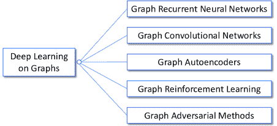

图 1：图上的深度学习方法的分类。我们将现有方法分为五类：图的递归神经网络、图卷积网络、图自编码器、图强化学习和图对抗方法。

表 I：图上的深度学习方法主要区别

| 类别 | 基本假设/目标 | 主要功能 |
| --- | --- | --- |
| 图的递归神经网络 | 图的递归和顺序模式 | 节点或图的状态定义 |
| 图形卷积网络 | 图形的常见局部和全局结构模式 | 图形卷积和读取操作 |
| 图形自编码器 | 图形的低秩结构 | 无监督的节点表示学习 |
| 图形强化学习 | 图形任务的反馈和约束 | 基于图形的动作和奖励 |
| 图形对抗方法 | 基于图形模型的泛化能力和鲁棒性 | 图形对抗训练和攻击 |

在本文中，我们试图通过全面回顾图形上的深度学习方法来填补这一知识空白。具体来说，如图 1 所示，我们根据模型架构和训练策略将现有的方法分为五类：图形递归神经网络（Graph RNNs）、图形卷积网络（GCNs）、图形自编码器（GAEs）、图形强化学习（Graph RL）和图形对抗方法。我们在表 I 中基于以下高层次的区别总结了这些类别的一些主要特点。图形递归神经网络通过在节点级或图级建模状态来捕捉图形的递归和序列模式。图形卷积网络在不规则的图形结构上定义卷积和读取操作，以捕捉常见的局部和全局结构模式。图形自编码器假设图形结构是低秩的，并采用无监督的方法进行节点表示学习。图形强化学习定义基于图形的动作和奖励，以在遵循约束的同时获得图形任务的反馈。图形对抗方法采用对抗训练技术来增强基于图形模型的泛化能力，并通过对抗攻击测试其鲁棒性。

在以下章节中，我们提供了这些方法的全面而详细的概述，主要通过追溯它们的发展历史以及这些方法解决图形问题的各种方式来进行分析。我们还分析了这些模型之间的差异，并探讨了如何组合不同的架构。最后，我们简要概述了这些模型的应用，介绍了几个开放库，并讨论了潜在的未来研究方向。在附录中，我们提供了源代码库，分析了论文中讨论的各种方法的时间复杂度，并总结了一些常见的应用。

相关工作。若干先前的调查与我们的论文相关。Bronstein 等人 [7] 总结了一些早期的 GCN 方法以及流形上的 CNN，并通过几何深度学习进行了全面研究。Battaglia 等人 [9] 总结了如何使用 GNN 和 GCN 进行关系推理，采用了名为图网络的统一框架，Lee 等人 [10] 回顾了图的注意力模型，Zhang 等人 [11] 总结了一些 GCN，而 Sun 等人 [12] 简要调查了对图的对抗攻击。我们的工作与这些先前的工作不同之处在于，我们系统地、全面地回顾了图上的不同深度学习架构，而不是专注于某个特定的分支。与我们的工作同时进行的还有 Zhou 等人 [13] 和 Wu 等人 [14] 从不同的观点和分类进行调查。具体而言，他们的工作都没有考虑图强化学习或图对抗方法，而这些在本文中都有涉及。

另一个密切相关的主题是网络嵌入，旨在将节点嵌入到低维向量空间中 [15, 16, 17]。网络嵌入与我们论文的主要区别在于，我们关注的是不同深度学习模型如何应用于图，而网络嵌入可以被看作是一个具体的应用示例，它使用了这些模型中的一些（同时也使用了非深度学习方法）。

本文的其余部分组织如下：在第二部分中，我们介绍了本文中使用的符号并提供了初步知识。然后，在第 3 至第七部分中，我们分别回顾了图 RNN、GCN、GAE、图 RL 和图对抗方法。最后，在第八部分中，我们进行总结讨论。

## 2 符号和初步知识

符号说明。本文中，图²²2 我们只考虑没有自环或多重边的图。表示为 $G=\left(V,E\right)$，其中 $V=\left\{v_{1},...,v_{N}\right\}$ 是 $N=\left|V\right|$ 个节点的集合，$E\subseteq V\times V$ 是 $M=\left|E\right|$ 个节点之间的边的集合。我们使用 $\mathbf{A}\in\mathbb{R}^{N\times N}$ 来表示邻接矩阵，其第 $i$ 行、第 $j$ 列和一个元素分别表示为 $\mathbf{A}(i,:),\mathbf{A}(:,j),\mathbf{A}(i,j)$。图可以是有向的或无向的，可以是加权的或无权的。本文中，我们主要考虑无符号图；因此，$\mathbf{A}(i,j)\geq 0$。带符号的图将在未来的研究方向中讨论。我们使用 $\mathbf{F}^{V}$ 和 $\mathbf{F}^{E}$ 来分别表示节点和边的特征。对于其他变量，我们使用粗体大写字母表示矩阵，使用粗体小写字母表示向量，例如，矩阵 $\mathbf{X}$ 和向量 $\mathbf{x}$。矩阵的转置表示为 $\mathbf{X}^{T}$，逐元素乘法表示为 $\mathbf{X}_{1}\odot\mathbf{X}_{2}$。函数用花体字母表示，例如，$\mathcal{F}(\cdot)$。

为了更好地说明这些符号，我们以社交网络为例。每个节点 $v_{i}\in V$ 对应于一个用户，而边 $E$ 对应于用户之间的关系。用户的个人资料（例如，年龄、性别和位置）可以表示为节点特征 $\mathbf{F}^{V}$，而交互数据（例如，发送消息和评论）可以表示为边特征 $\mathbf{F}^{E}$。

表 II: 常用符号表

| $G=(V,E)$ | 图 |
| --- | --- |
| $N,M$ | 节点和边的数量 |
| $V=\left\{v_{1},...,v_{N}\right\}$ | 节点集合 |
| $\mathbf{F}^{V},\mathbf{F}^{E}$ | 节点和边的属性/特征 |
| $\mathbf{A}$ | 邻接矩阵 |
| $\mathbf{D}(i,i)=\sum_{j}\mathbf{A}(i,j)$ | 对角度矩阵 |
| $\mathbf{L}=\mathbf{D}-\mathbf{A}$ | 拉普拉斯矩阵 |
| $\mathbf{Q}\mathbf{\Lambda}\mathbf{Q}^{T}=\mathbf{L}$ | $\mathbf{L}$ 的特征分解 |
| $\mathbf{P}=\mathbf{D}^{-1}\mathbf{A}$ | 转移矩阵 |
| $\mathcal{N}_{k}(i),\mathcal{N}(i)$ | $v_{i}$ 的 k 步邻居和 1 步邻居 |
| $\mathbf{H}^{l}$ | 第 $l$ 层的隐藏表示 |
| $f_{l}$ | $\mathbf{H}^{l}$ 的维度 |
| $\rho(\cdot)$ | 一些非线性激活函数 |
| $\mathbf{X}_{1}\odot\mathbf{X}_{2}$ | 逐元素乘法 |
| $\mathbf{\Theta}$ | 可学习参数 |
| $s$ | 样本大小 |

基础知识。无向图的拉普拉斯矩阵定义为 $\mathbf{L}=\mathbf{D}-\mathbf{A}$，其中 $\mathbf{D}\in\mathbb{R}^{N\times N}$ 是一个对角度矩阵，满足 $\mathbf{D}(i,i)=\sum_{j}\mathbf{A}(i,j)$。它的特征分解表示为 $\mathbf{L}=\mathbf{Q\Lambda Q^{T}}$，其中 $\mathbf{\Lambda}\in\mathbb{R}^{N\times N}$ 是一个按升序排列的特征值对角矩阵，$\mathbf{Q}\in\mathbb{R}^{N\times N}$ 是相应的特征向量。转移矩阵定义为 $\mathbf{P}=\mathbf{D}^{-1}\mathbf{A}$，其中 $\mathbf{P}(i,j)$ 表示从节点 $v_{i}$ 开始的随机游走到达节点 $v_{j}$ 的概率。节点 $v_{i}$ 的 $k$ 步邻居定义为 $\mathcal{N}_{k}(i)=\left\{j|\mathcal{D}(i,j)\leq k\right\}$，其中 $\mathcal{D}(i,j)$ 是从节点 $v_{i}$ 到 $v_{j}$ 的最短距离，即 $\mathcal{N}_{k}(i)$ 是从节点 $v_{i}$ 在 $k$ 步内可以到达的节点集合。为了简化符号，我们省略了立即邻域的下标，即 $\mathcal{N}(i)=\mathcal{N}_{1}(i)$。

对于深度学习模型，我们使用上标来表示层次，例如，$\mathbf{H}^{l}$。我们用 $f_{l}$ 来表示层 $l$ 的维度（即，$\mathbf{H}^{l}\in\mathbb{R}^{N\times f_{l}}$）。Sigmoid 激活函数定义为 $\sigma(x)=1/\left(1+e^{-x}\right)$，而修正线性单元（ReLU）定义为 $\text{ReLU}(x)=max(0,x)$。一般的元素级非线性激活函数表示为 $\rho(\cdot)$。在本文中，除非另有说明，我们假设所有函数都是可微的，从而允许通过反向传播[18] 使用常见的优化器，如 Adam [19]，以及训练技术，如 dropout [20]，来学习模型参数 $\mathbf{\Theta}$。如果采用了采样技术，我们将样本大小表示为 $s$。我们在表 II 中总结了符号说明。

在图上学习深度模型的任务大致可以分为两类：

+   •

    节点聚焦任务：这些任务与图中的个别节点相关。示例包括节点分类、链接预测和节点推荐。

+   •

    图聚焦任务：这些任务与整个图相关。示例包括图分类、估计各种图属性和生成图。

请注意，这些区分更多的是概念上的，而非数学上的严格。一些现有的任务与中观结构相关，例如社区检测 [21]。此外，节点聚焦问题有时可以通过将前者转化为自我中心网络 [22] 来作为图聚焦问题进行研究。不过，我们将在必要时解释这两类任务在算法设计上的差异。

表 III：图形递归神经网络（Graph RNNs）的主要特征

| 类别 | 方法 | 图的递归/顺序模式 | 时间复杂度 | 其他改进 |
| --- | --- | --- | --- | --- |
| 节点级别 | GNN [23] | 节点状态的递归定义 | $O(MI_{f})$ | - |
| GGS-NNs [24] | $O(MT)$ | 序列输出 |
| SSE [25] | $O(d_{\text{avg}}S)$ | - |
| 图级别 | You 等人 [26] | 以自回归方式生成节点和边 | $O(N^{2})$ | - |
| DGNN [27] | 捕捉节点和边形成的时间动态 | $O(Md_{\text{avg}})$ | - |
| RMGCNN [28] | 递归重建图 | $O(M)$ 或 $O(MN)$ | GCN 层 |
| 动态 GCN [29] | 收集不同时间片的节点表示 | $O(Mt)$ | GCN 层 |

## 3 图形递归神经网络

循环神经网络（RNNs），如门控递归单元（GRU） [30] 或长短期记忆（LSTM） [31]，在建模顺序数据中是事实上的标准。在本节中，我们回顾了能够捕捉图的递归和顺序模式的图形 RNNs。图形 RNNs 可以大致分为两类：节点级 RNNs 和图级 RNNs。主要区别在于模式是否位于节点级别并由节点状态建模，还是位于图级别并由公共图状态建模。所调查方法的主要特征总结在表 III。

### 3.1 节点级 RNNs

图的节点级 RNNs，也被称为图神经网络（GNNs）³³3 最近，GNNs 也被用来指代图数据的通用神经网络。我们遵循传统命名惯例，将 GNNs 用于指代这种特定类型的图形 RNNs。可以追溯到“深度学习之前”时代 [32, 23]。GNN 的思想很简单：为了编码图的结构信息，每个节点 $v_{i}$ 由一个低维状态向量 $\mathbf{s}_{i}$ 表示。受到递归神经网络 [33] 的启发，采用递归状态定义 [23]：

|  | $\mathbf{s}_{i}=\sum\nolimits_{j\in\mathcal{N}(i)}\mathcal{F}(\mathbf{s}_{i},\mathbf{s}_{j},\mathbf{F}^{V}_{i},\mathbf{F}^{V}_{j},\mathbf{F}^{E}_{i,j}),$ |  | (1) |
| --- | --- | --- | --- |

其中 $\mathcal{F}(\cdot)$ 是一个待学习的参数函数。在获得 $\mathbf{s}_{i}$ 后，应用另一个函数 $\mathcal{O}(\cdot)$ 来获取最终输出：

|  | $\hat{y}_{i}=\mathcal{O}(\mathbf{s}_{i},\mathbf{F}^{V}_{i}).$ |  | (2) |
| --- | --- | --- | --- |

对于图相关任务，[23]的作者建议添加一个具有独特属性的特殊节点来表示整个图。为了学习模型参数，采用以下半监督⁴⁴4 这是所谓的半监督，因为在训练过程中使用了所有的图结构和一部分节点或图标签的方法：在使用雅可比方法[34]迭代求解方程式(1)直到稳定点后，使用 Almeida-Pineda 算法[35, 36] 执行一步梯度下降，以最小化任务特定的目标函数，例如回归任务中预测值与真实值之间的平方损失；然后，重复这个过程直到收敛。

使用方程式(1)(2)中的两个简单方程，GNN 执行两个重要的角色。回顾过去，GNN 统一了用于处理图数据的一些早期方法，例如递归神经网络和马尔可夫链[23]。展望未来，GNN 的基本理念具有深远的启示：如后文所示，许多最先进的 GCN 实际上具有与方程式(1)类似的公式，并遵循在直接节点邻域内交换信息的相同框架。实际上，GNN 和 GCN 可以统一为一些通用框架，而 GNN 相当于一个使用相同层到达稳定状态的 GCN。更多讨论将在第四部分提供。

尽管它们在概念上很重要，但 GNN 存在几个缺点。首先，为了确保方程式(1)有唯一解，$\mathcal{F}(\cdot)$ 必须是一个“收缩映射”[37]，即，$\exists\mu,0<\mu<1$ 使得

|  | $\left\&#124;\mathcal{F}(x)-\mathcal{F}(y)\right\&#124;\leq\mu\left\&#124;x-y\right\&#124;,\forall x,y.$ |  | (3) |
| --- | --- | --- | --- |

从直观上讲，“收缩映射”要求任何两点之间的距离在$\mathcal{F}(\cdot)$操作后只能“收缩”，这严重限制了建模能力。其次，由于需要许多迭代步骤才能在梯度下降步骤之间达到稳定状态，GNN 的计算开销很大。由于这些缺点以及可能的计算能力不足（例如，在那些日子里图形处理单元 GPU 尚未广泛用于深度学习）和缺乏研究兴趣，GNN 并没有成为一般研究的重点。

对于图神经网络（GNNs）的一个显著改进是门控图序列神经网络（GGS-NNs）[24]，其进行了以下修改。最重要的是，作者将方程式 (1) 中的递归定义替换为 GRU，从而去除了“收缩映射”要求并支持现代优化技术。具体而言，方程式 (1) 被调整为如下形式：

|  | $\mathbf{s}_{i}^{(t)}=(1-\mathbf{z}_{i}^{(t)})\odot\mathbf{s}_{i}^{(t-1)}+\mathbf{z}_{i}^{(t)}\odot\widetilde{\mathbf{s}}_{i}^{(t)},$ |  | (4) |
| --- | --- | --- | --- |

其中 $\mathbf{z}$ 是由更新门计算的，$\widetilde{\mathbf{s}}$ 是更新的候选项，而 $t$ 是伪时间。其次，作者提出使用几个这样的网络按序列操作以产生序列输出，并表明他们的方法可以应用于基于序列的任务，如程序验证 [38]。

SSE [25] 采用了与方程式 (4) 相似的方法。然而，SSE 在计算中并没有使用 GRU，而是采用了随机固定点梯度下降以加速训练过程。该方案基本上在计算稳态节点状态和优化模型参数之间交替进行，两者都在随机小批量中计算。

### 3.2 图级 RNNs

在本小节中，我们回顾了如何应用 RNN 来捕捉图级模式，例如动态图的时间模式或不同图粒度层次的序列模式。在图级 RNN 中，代替对每个节点应用一个 RNN 来学习节点状态，应用一个单一的 RNN 对整个图进行编码图状态。

你等人 [26] 将图 RNN 应用于图生成问题。具体而言，他们采用了两个 RNN：一个用于生成新节点，另一个用于以自回归方式生成新添加节点的边。他们表明，这种层次 RNN 架构比传统的基于规则的图生成模型更有效地从输入图中学习，同时具有合理的时间复杂度。

为了捕捉动态图的时间信息，提出了动态图神经网络（DGNN）[27]，该网络使用了时间感知 LSTM [39] 来学习节点表示。当建立新的边时，DGNN 使用 LSTM 更新两个交互节点及其直接邻居的表示，即考虑了一步传播效应。作者表明，时间感知 LSTM 能够很好地建模边形成的建立顺序和时间间隔，从而有利于一系列图应用。

Graph RNN 还可以与其他架构结合，如 GCNs 或 GAEs。例如，针对图稀疏问题，RMGCNN [28] 将 LSTM 应用于 GCNs 的结果，以逐步重建图，如图 2 所示。通过使用 LSTM，图的不同部分的信息可以在长距离上传播，而不需要那么多 GCN 层。动态 GCN [29] 应用了 LSTM 来收集动态网络中不同时间片段的 GCN 结果，以捕捉空间和时间图信息。

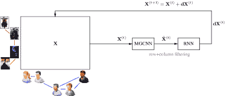

图 2：RMGCNN 的框架（经 [28]授权转载）。RMGCNN 在 GCN 中包括一个 LSTM 以逐步重建图。$\mathbf{X}^{t}$、$\mathbf{\tilde{X}}^{t}$ 和 $d\mathbf{X}^{t}$ 分别表示估计矩阵、GCNs 的输出和迭代 $t$ 中 RNN 产生的增量更新。MGCNN 指的是多图 CNN。

表 IV：不同图卷积网络（GCNs）之间的比较。T.C. = 时间复杂度，M.G. = 多图

| 方法 | 类型 | 卷积 | 读出 | T.C. | M.G. | 其他特征 |
| --- | --- | --- | --- | --- | --- | --- |
| Bruna et al. [40] | 频谱 | 插值核 | 层次聚类 + FC | $O(N^{3})$ | 否 | - |
| Henaff et al. [41] | 频谱 | 插值核 | 层次聚类 + FC | $O(N^{3})$ | 否 | 构建图 |
| ChebNet [42] | 频谱/空间 | 多项式 | 层次聚类 | $O(M)$ | 是 | - |
| Kipf&Welling [43] | 频谱/空间 | 一阶 | - | $O(M)$ | - | - |
| CayletNet [44] | 频谱 | 多项式 | 层次聚类 + FC | $O(M)$ | 否 | - |
| GWNN [45] | 频谱 | 小波变换 | - | $O(M)$ | 否 | - |
| Neural FPs [46] | 空间 | 一阶 | 总和 | $O(M)$ | 是 | - |
| PATCHY-SAN [47] | 空间 | 多项式 + 一阶 | 一阶 + 池化 | $O(M\log N)$ | 是 | 一个邻居顺序 |
| LGCN [48] | 空间 | 一阶 + 一阶 | - | $O(M)$ | 是 | 一个邻居顺序 |
| SortPooling [49] | 空间 | 一阶 | 一阶 + 池化 | $O(M)$ | 是 | 一个节点顺序 |
| DCNN [50] | 空间 | 多项式扩散 | 平均 | $O(N^{2})$ | 是 | 边特征 |
| DGCN [51] | 空间 | 一阶 + 扩散 | - | $O(N^{2})$ | - | - |
| MPNNs [52] | 空间 | 一阶 | Set2set | $O(M)$ | 是 | 一个通用框架 |
| GraphSAGE [53] | 空间 | 一阶 + 采样 | - | $O(Ns^{L})$ | 是 | 一个通用框架 |
| MoNet [54] | 空间 | 一阶 | 层次聚类 | $O(M)$ | 是 | 一个通用框架 |
| GNs [9] | 空间 | 一阶 | 图表示 | $O(M)$ | 是 | 通用框架 |
| Kearnes et al. [55] | 空间 | 编织模块 | 模糊直方图 | $O(M)$ | 是 | 边缘特征 |
| DiffPool [56] | 空间 | 各种 | 层次聚类 | $O(N^{2})$ | 是 | 可微池化 |
| GAT [57] | 空间 | 一阶 | - | $O(M)$ | 是 | 注意力 |
| GaAN [58] | 空间 | 一阶 | - | $O(Ns^{L})$ | 是 | 注意力 |
| HAN [59] | 空间 | 元路径邻居 | - | $O(M_{\phi})$ | 是 | 注意力 |
| CLN [60] | 空间 | 一阶 | - | $O(M)$ | - | - |
| PPNP [61] | 空间 | 一阶 | - | $O(M)$ | - | 传送连接 |
| JK-Nets [62] | 空间 | 各种 | - | $O(M)$ | 是 | 跳跃连接 |
| ECC [63] | 空间 | 一阶 | 层次聚类 | $O(M)$ | 是 | 边缘特征 |
| R-GCNs [64] | 空间 | 一阶 | - | $O(M)$ | - | 边缘特征 |
| LGNN [65] | 空间 | 一阶 + LINE 图 | - | $O(M)$ | - | 边缘特征 |
| PinSage [66] | 空间 | 随机游走 | - | $O(Ns^{L})$ | - | 邻域采样 |
| StochasticGCN [67] | 空间 | 一阶 + 采样 | - | $O(Ns^{L})$ | - | 邻域采样 |
| FastGCN [68] | 空间 | 一阶 + 采样 | - | $O(NsL)$ | 是 | 层级采样 |
| Adapt [69] | 空间 | 一阶 + 采样 | - | $O(NsL)$ | 是 | 层级采样 |
| Li et al. [70] | 空间 | 一阶 | - | $O(M)$ | - | 理论分析 |
| SGC [71] | 空间 | 多项式 | - | $O(M)$ | 是 | 理论分析 |
| GFNN [72] | 空间 | 多项式 | - | $O(M)$ | 是 | 理论分析 |
| GIN [73] | 空间 | 一阶 | 求和 + MLP | $O(M)$ | 是 | 理论分析 |
| DGI [74] | 空间 | 一阶 | - | $O(M)$ | 是 | 无监督训练 |

## 4 图卷积网络

图卷积网络（GCNs）无疑是基于图的深度学习中最热门的主题。现代 GCNs 模仿 CNN，通过设计的卷积和读取函数来学习图的常见局部和全局结构模式。由于大多数 GCNs 可以通过反向传播使用任务特定的损失进行训练（有少数例外，如[74]中的无监督训练方法），我们专注于采用的架构。我们首先讨论卷积操作，然后转到读取操作和一些其他改进。我们在表 IV 中总结了本文调查的 GCNs 的主要特征。

### 4.1 卷积操作

图卷积可以分为两类：*谱卷积*，通过使用图傅里叶变换或其扩展将节点表示转换到谱域来执行卷积；以及*空间卷积*，通过考虑节点邻域来执行卷积。请注意，这两类可能会重叠，例如，当使用多项式谱核时（请参见第 4.1.2 节的详细信息）。

#### 4.1.1 谱方法

卷积是卷积神经网络中的最基本操作。然而，标准的卷积操作用于图像或文本的操作无法直接应用于图，因为图缺乏网格结构 [6]。Bruna 等人 [40] 首次从谱域引入了图数据的卷积，使用了图拉普拉斯矩阵 $\mathbf{L}$ [75]，它在信号处理中的作用类似于傅里叶基底 [6]。图卷积操作 $*_{G}$ 定义如下：

|  | $\mathbf{u}_{1}*_{G}\mathbf{u}_{2}=\mathbf{Q}\left(\left(\mathbf{Q}^{T}\mathbf{u}_{1}\right)\odot\left(\mathbf{Q}^{T}\mathbf{u}_{2}\right)\right),$ |  | (5) |
| --- | --- | --- | --- |

其中 $\mathbf{u}_{1},\mathbf{u}_{2}\in\mathbb{R}^{N}$ 是定义在节点上的两个信号⁵⁵5 我们在附录 D 中给出了图信号的示例。 $\mathbf{Q}$ 是 $\mathbf{L}$ 的特征向量。简而言之，乘以 $\mathbf{Q}^{T}$ 将图信号 $\mathbf{u}_{1},\mathbf{u}_{2}$ 转换到谱域（即图傅里叶变换），而乘以 $\mathbf{Q}$ 执行逆变换。这个定义的有效性基于卷积定理，即卷积操作的傅里叶变换是它们傅里叶变换的逐元素乘积。然后，一个信号 $\mathbf{u}$ 可以通过以下方式进行滤波：

|  | $\mathbf{u}^{\prime}=\mathbf{Q}\mathbf{\Theta}\mathbf{Q}^{T}\mathbf{u},$ |  | (6) |
| --- | --- | --- | --- |

其中 $\mathbf{u}^{\prime}$ 是输出信号，$\mathbf{\Theta}=\mathbf{\Theta}(\mathbf{\Lambda})\in\mathbb{R}^{N\times N}$ 是一个可学习滤波器的对角矩阵，$\mathbf{\Lambda}$ 是 $\mathbf{L}$ 的特征值。一个卷积层通过对不同的输入-输出信号对应用不同的滤波器来定义，如下所示：

|  | $\mathbf{u}^{l+1}_{j}=\rho\left(\sum\nolimits_{i=1}^{f_{l}}\mathbf{Q}\mathbf{\Theta}^{l}_{i,j}\mathbf{Q}^{T}\mathbf{u}^{l}_{i}\right)\;j=1,...,f_{l+1},$ |  | (7) |
| --- | --- | --- | --- |

其中，$l$是层，$\mathbf{u}^{l}_{j}\in\mathbb{R}^{N}$是第$l$层节点的第$j^{th}$隐藏表示（即信号），$\mathbf{\Theta}^{l}_{i,j}$是可学习的滤波器。公式 (7)背后的思想类似于传统卷积：它将输入信号通过一组可学习的滤波器来聚合信息，然后进行一些非线性变换。通过使用节点特征$\mathbf{F}^{V}$作为输入层并堆叠多个卷积层，整体架构类似于 CNN。理论分析表明，这种图卷积操作的定义可以模拟 CNN 的某些几何属性，我们建议读者参考[7]以获取全面的综述。

然而，直接使用公式 (7)需要学习$O(N)$个参数，这在实际中可能不可行。此外，谱域中的滤波器可能在空间域中并不局部化，即每个节点可能会受到所有其他节点的影响，而不仅仅是小区域内的节点。为了缓解这些问题，Bruna 等人[40]建议使用以下平滑滤波器：

|  | $diag\left(\mathbf{\Theta}^{l}_{i,j}\right)=\mathcal{K}\;\alpha_{l,i,j},$ |  | (8) |
| --- | --- | --- | --- |

其中，$\mathcal{K}$是固定的插值核，$\alpha_{l,i,j}$是可学习的插值系数。作者还将这一思想推广到了图未给出而是通过有监督或无监督方法从原始特征构建的情形[41]。

然而，两个根本性问题仍未解决。首先，由于在每次计算中都需要拉普拉斯矩阵的完整特征向量，因此每次前向和后向传播的时间复杂度至少为$O(N^{2})$，更不用说计算特征分解所需的$O(N^{3})$复杂度，这意味着这种方法在大规模图上不可扩展。其次，由于滤波器依赖于图的特征基$\mathbf{Q}$，因此这些参数不能在具有不同规模和结构的多个图之间共享。

接下来，我们回顾两条试图解决这些限制的工作线，并利用一些通用框架将它们统一起来。

#### 4.1.2 效率方面

为了解决效率问题，提出了 ChebNet[42]，其使用多项式滤波器，如下所示：

|  | $\mathbf{\Theta}(\mathbf{\Lambda})=\sum\nolimits_{k=0}^{K}\theta_{k}\mathbf{\Lambda}^{k},$ |  | (9) |
| --- | --- | --- | --- |

其中 $\theta_{0},...,\theta_{K}$ 是可学习的参数，$K$ 是多项式的阶数。然后，作者们使用切比雪夫展开 [76] 替代特征分解重写了公式 (9)：

|  | $\mathbf{\Theta}(\mathbf{\Lambda})=\sum\nolimits_{k=0}^{K}\theta_{k}\mathcal{T}_{k}(\tilde{\mathbf{\Lambda}}),$ |  | (10) |
| --- | --- | --- | --- |

其中 $\tilde{\mathbf{\Lambda}}=2\mathbf{\Lambda}/\lambda_{max}-\mathbf{I}$ 是缩放后的特征值，$\lambda_{max}$ 是最大特征值，$\mathbf{I}\in\mathbb{R}^{N\times N}$ 是单位矩阵，$\mathcal{T}_{k}(x)$ 是阶数为 $k$ 的切比雪夫多项式。由于切比雪夫多项式的正交归一基，这种缩放是必要的。利用拉普拉斯矩阵的多项式作用于其特征值的性质，即 $\mathbf{L}^{k}=\mathbf{Q}\mathbf{\Lambda}^{k}\mathbf{Q}^{T}$，公式中的滤波操作可以重写如下：

|  | $\displaystyle\mathbf{u}^{\prime}=\mathbf{Q}\mathbf{\Theta}(\mathbf{\Lambda})\mathbf{Q}^{T}\mathbf{u}=$ | $\displaystyle\sum\nolimits_{k=0}^{K}\theta_{k}\mathbf{Q}\mathcal{T}_{k}(\tilde{\mathbf{\Lambda}})\mathbf{Q}^{T}\mathbf{u}$ |  | (11) |
| --- | --- | --- | --- | --- |
|  | $\displaystyle=$ | $\displaystyle\sum\nolimits_{k=0}^{K}\theta_{k}\mathcal{T}_{k}(\tilde{\mathbf{L}})\mathbf{u}=\sum\nolimits_{k=0}^{K}\theta_{k}\bar{\mathbf{u}}_{k},$ |  |

其中 $\bar{\mathbf{u}}_{k}=\mathcal{T}_{k}(\tilde{\mathbf{L}})\mathbf{u}$ 和 $\tilde{\mathbf{L}}=2\mathbf{L}/\lambda_{max}-\mathbf{I}$。使用切比雪夫多项式的递推关系 $\mathcal{T}_{k}(x)=2x\mathcal{T}_{k-1}(x)-\mathcal{T}_{k-2}(x)$ 和 $\mathcal{T}_{0}(x)=1,\mathcal{T}_{1}(x)=x$，$\bar{\mathbf{u}}_{k}$ 也可以递归计算：

|  | $\bar{\mathbf{u}}_{k}=2\tilde{\mathbf{L}}\bar{\mathbf{u}}_{k-1}-\bar{\mathbf{u}}_{k-2}$ |  | (12) |
| --- | --- | --- | --- |

其中 $\bar{\mathbf{u}}_{0}=\mathbf{u}$ 和 $\bar{\mathbf{u}}_{1}=\tilde{\mathbf{L}}\mathbf{u}$。现在，因为只需计算稀疏矩阵 $\tilde{\mathbf{L}}$ 和一些向量的矩阵乘法，使用稀疏矩阵乘法时时间复杂度变为 $O(KM)$，其中 $M$ 是边的数量，$K$ 是多项式的阶数，即时间复杂度与边的数量线性相关。也可以很容易看出，这种多项式滤波器是严格的 $K$-局部化的：经过一次卷积后，节点 $v_{i}$ 的表示只会受到其 $K$ 步邻域 $\mathcal{N}_{K}(i)$ 的影响。有趣的是，这一思想在网络嵌入中被独立使用，以保持高阶邻近性 [77]，详细信息我们为简洁起见略去。

Kipf 和 Welling [43] 通过仅使用一阶邻居进一步简化了滤波：

|  | $\mathbf{h}^{l+1}_{i}=\rho\left(\sum_{j\in\tilde{\mathcal{N}}(i)}\frac{1}{\sqrt{\tilde{\mathbf{D}}(i,i)\tilde{\mathbf{D}}(j,j)}}\mathbf{h}^{l}_{j}\mathbf{\Theta}^{l}\right),$ |  | (13) |
| --- | --- | --- | --- |

其中 $\mathbf{h}^{l}_{i}\in\mathbb{R}^{f_{l}}$ 是第 $l^{th}$ 层中节点 $v_{i}$ 的隐藏表示⁶⁶6 我们使用不同的字母，因为 $\mathbf{h}^{l}\in\mathbb{R}^{f_{l}}$ 是一个节点的隐藏表示，而 $\mathbf{u}^{l}\in\mathbb{R}^{N}$ 表示所有节点的一个维度。,$ $\tilde{\mathbf{D}}=\mathbf{D}+\mathbf{I}$，且 $\tilde{\mathcal{N}}(i)=\mathcal{N}(i)\cup\{i\}$。这可以等效地写成矩阵形式如下：

|  | $\mathbf{H}^{l+1}=\rho\left(\tilde{\mathbf{D}}^{-\frac{1}{2}}\tilde{\mathbf{A}}\tilde{\mathbf{D}}^{-\frac{1}{2}}\mathbf{H}^{l}\mathbf{\Theta}^{l}\right),$ |  | (14) |
| --- | --- | --- | --- |

其中 $\tilde{\mathbf{A}}=\mathbf{A}+\mathbf{I}$，即添加自连接。作者展示了方程 (14) 是方程 (9) 的一个特例，通过设置 $K=1$ 和一些小的修改。随后，作者认为，正如图 3 所示，堆叠足够数量的层具有类似于 ChebNet 的建模能力，但能获得更好的结果。

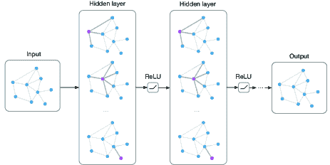

图 3: Kipf 和 Welling [43] 提出的空间卷积操作的示例（经许可转载）。每个卷积层中，节点仅受其直接邻居的影响。

ChebNet 及其扩展的一个重要见解是，它们将光谱图卷积与空间架构连接起来。具体而言，它们展示了当光谱卷积函数为多项式或一阶时，光谱图卷积等同于空间卷积。此外，Eq. (13) 中的卷积与 GNN 中 Eq. (1) 中的状态定义高度相似，只是卷积定义取代了递归定义。从这一方面看，GNN 可以被视为具有大量相同层的 GCN，以达到稳定状态 [7]，即 GNN 使用具有固定参数的固定函数来迭代更新节点隐藏状态，直到达到平衡，而 GCN 有预设数量的层，每层包含不同的参数。

一些光谱方法也被提出以解决效率问题。例如，CayleyNet [44] 采用 Cayley 多项式来定义图卷积，而不是像 Eq. (10) 中使用切比雪夫展开：

|  | $\mathbf{\Theta}(\mathbf{\Lambda})=\theta_{0}+2Re\left\{\sum\nolimits_{k=1}^{K}\theta_{k}\left(\theta_{h}\mathbf{\Lambda}-i\mathbf{I}\right)^{k}\left(\theta_{h}\mathbf{\Lambda}+i\mathbf{I}\right)^{k}\right\},$ |  | (15) |
| --- | --- | --- | --- |

其中 $i=\sqrt{-1}$ 表示虚数单位，$\theta_{h}$ 是另一个谱缩放参数。除了表明 CayleyNet 与 ChebNet 一样高效之外，作者们还展示了 Cayley 多项式可以检测“重要的狭频带”以获得更好的结果。图小波神经网络（GWNN）[45] 被进一步提出，以通过图小波变换取代光谱滤波器中的傅里叶变换，将 Eq. (5) 重写为以下形式：

|  | $\mathbf{u}_{1}*_{G}\mathbf{u}_{2}=\mathbf{\psi}\left(\left(\mathbf{\psi}^{-1}\mathbf{u}_{1}\right)\odot\left(\mathbf{\psi}^{-1}\mathbf{u}_{2}\right)\right),$ |  | (16) |
| --- | --- | --- | --- |

其中 $\mathbf{\psi}$ 表示图小波基。通过使用快速近似算法计算 $\mathbf{\psi}$ 和 $\mathbf{\psi}^{-1}$，GWNN 的计算复杂度也为 $O(KM)$，即与边的数量线性相关。

#### 4.1.3 多图的方面

一系列并行的研究专注于将图卷积推广到任意大小的多个图。Neural FPs [46] 提出了一个空间方法，该方法也使用了第一阶邻居：

|  | $\mathbf{h}^{l+1}_{i}=\sigma\left(\sum\nolimits_{j\in\hat{\mathcal{N}}(i)}\mathbf{h}^{l}_{j}\mathbf{\Theta}^{l}\right).$ |  | (17) |
| --- | --- | --- | --- |

由于参数 $\mathbf{\Theta}$ 可以在不同图之间共享，并且与图的大小无关，Neural FPs 可以处理任意大小的多个图。请注意，公式 (17) 与公式 (13) 非常相似。然而，Neural FPs 并没有通过添加归一化项来考虑节点度数的影响，而是提出为不同度数的节点学习不同的参数 $\mathbf{\Theta}$。这种策略在小型图（如分子图，即原子作为节点，键作为边）上表现良好，但可能无法扩展到更大的图。

PATCHY-SAN [47] 采用了不同的想法。它通过图标记程序（如 Weisfeiler-Lehman 核 [78]）分配了唯一的节点顺序，然后使用这个预定义的顺序将节点邻居排成一行。此外，PATCHY-SAN 为每个节点 $v_{i}$ 定义了一个“感受野”，通过从其 $k$-步邻域 $\mathcal{N}_{k}(i)$ 中选择固定数量的节点来实现。然后，采用了标准的 1-D CNN，并进行了适当的归一化。采用这种方法，不同图中的节点都具有固定大小和顺序的“感受野”；因此，PATCHY-SAN 可以像正常 CNN 从多个图像中学习一样，从多个图中学习。缺点是卷积严重依赖于图标记程序，这是一种未学习的预处理步骤。LGCN [48] 进一步提出通过使用字典序（即根据最终层 $\mathbf{H}^{L}$ 中的隐藏表示对邻居进行排序）来简化排序过程。作者并没有使用单一的顺序，而是分别对 $\mathbf{H}^{L}$ 的不同通道进行排序。SortPooling [49] 采取了类似的方法，但与其排序每个节点的邻居不同，作者提出对所有节点进行排序（即对所有邻域使用单一的顺序）。尽管这些方法存在差异，但强制使用 1-D 节点顺序可能不是图的自然选择。

DCNN [50] 采用了另一种方法，通过用扩散基替换图卷积的特征基，即节点的邻域是通过节点之间的扩散转移概率确定的。具体而言，卷积定义如下：

|  | $\mathbf{H}^{l+1}=\rho\left(\mathbf{P}^{K}\mathbf{H}^{l}\mathbf{\Theta}^{l}\right),$ |  | (18) |
| --- | --- | --- | --- |

其中 $\mathbf{P}^{K}=\left(\mathbf{P}\right)^{K}$ 是长度为 $K$ 的扩散过程（即随机游走）的转移概率，$K$ 是预设的扩散长度，而 $\mathbf{\Theta}^{l}$ 是可学习的参数。由于只有 $\mathbf{P}^{K}$ 依赖于图结构，因此参数 $\mathbf{\Theta}^{l}$ 可以在任意大小的图中共享。然而，计算 $\mathbf{P}^{K}$ 的时间复杂度为 $O\left(N^{2}K\right)$；因此，这种方法无法扩展到大图。

DGCN [51] 进一步提出了使用双图卷积网络联合采用扩散和邻接基础。具体而言，DGCN 使用了两种卷积：一种是 Eq. (14)，另一种则用转移概率的正点互信息（PPMI）矩阵 [79] 替换了邻接矩阵，如下所示：

|  | $\mathbf{Z}^{l+1}=\rho\left(\mathbf{D}^{-\frac{1}{2}}_{P}\mathbf{X}_{P}\mathbf{D}^{-\frac{1}{2}}_{P}\mathbf{Z}^{l}\mathbf{\Theta}^{l}\right),$ |  | (19) |
| --- | --- | --- | --- |

其中 $\mathbf{X}_{P}$ 是计算出的 PPMI 矩阵：

|  | $\mathbf{X}_{P}(i,j)=\max\left(\log\left(\frac{\mathbf{P}(i,j)\sum_{i,j}\mathbf{P}(i,j)}{\sum_{i}\mathbf{P}(i,j)\sum_{j}\mathbf{P}(i,j)}\right),0\right),$ |  | (20) |
| --- | --- | --- | --- |

而 $\mathbf{D}_{P}(i,i)=\sum_{j}\mathbf{X}_{P}(i,j)$ 是 $\mathbf{X}_{P}$ 的对角度矩阵。然后，这两种卷积通过最小化 $\mathbf{H}$ 和 $\mathbf{Z}$ 之间的均方差来进行集成。DGCN 采用了一种随机游走采样技术来加速转移概率的计算。实验表明，即使在单图问题中，这种双重卷积也是有效的。

#### 4.1.4 框架

基于上述两行工作，MPNNs [52] 被提出作为一个统一的框架，用于在空间域中使用消息传递函数进行图卷积操作：

|  | $\begin{gathered}\mathbf{m}_{i}^{l+1}=\sum\nolimits_{j\in\mathcal{N}(i)}\mathcal{F}^{l}\left(\mathbf{h}_{i}^{l},\mathbf{h}_{j}^{l},\mathbf{F}^{E}_{i,j}\right)\\ \mathbf{h}_{i}^{l+1}=\mathcal{G}^{l}\left(\mathbf{h}_{i}^{l},\mathbf{m}_{i}^{l+1}\right),\end{gathered}$ |  | (21) |
| --- | --- | --- | --- |

其中 $\mathcal{F}^{l}(\cdot)$ 和 $\mathcal{G}^{l}(\cdot)$ 分别是需要学习的消息函数和顶点更新函数，而 $\mathbf{m}^{l}$ 表示节点之间传递的“消息”。 从概念上讲，MPNNs 是一个框架，其中每个节点基于其状态发送消息，并根据从直接邻居接收到的消息更新其状态。作者表明，上述框架包含了许多现有方法，如 GGS-NNs [24]、Bruna 等人 [40]、Henaff 等人 [41]、Neural FPs [46]、Kipf 和 Welling [43] 以及 Kearnes 等人 [55] 作为特殊情况。此外，作者提出添加一个与所有节点连接的“主”节点，以加速跨长距离的消息传递，并将隐藏表示拆分成不同的“塔”以提高泛化能力。作者表明，MPNNs 的特定变体在预测分子属性方面可以达到最先进的性能。

与此同时，GraphSAGE [53] 采用了类似的思想，如 Eq. (21)，使用了多种聚合函数，如下所示：

|  | $\begin{gathered}\mathbf{m}_{i}^{l+1}=\text{AGGREGATE}^{l}(\{\mathbf{h}_{j}^{l},\forall j\in\mathcal{N}(i)\})\\ \mathbf{h}_{i}^{l+1}=\rho\left(\mathbf{\Theta}^{l}\left[\mathbf{h}_{i}^{l},\mathbf{m}_{i}^{l+1}\right]\right),\end{gathered}$ |  | (22) |
| --- | --- | --- | --- |

其中 $\left[\cdot,\cdot\right]$ 是拼接操作，而 $\text{AGGREGATE}(\cdot)$ 代表聚合函数。作者建议了三种聚合函数：逐元素均值、LSTM 和最大池化，如下所示：

|  | $\text{AGGREGATE}^{l}=\max\{\rho(\mathbf{\Theta}_{\text{pool}}\mathbf{h}_{j}^{l}+\mathbf{b}_{\text{pool}}),\forall j\in\mathcal{N}(i)\},$ |  | (23) |
| --- | --- | --- | --- |

其中 $\mathbf{\Theta}_{\text{pool}}$ 和 $\mathbf{b}_{\text{pool}}$ 是待学习的参数，而 $\max\left\{\cdot\right\}$ 是逐元素最大值。对于 LSTM 聚合函数，由于需要邻居的顺序，作者采用了简单的随机顺序。

混合模型网络（MoNet）[54] 还尝试将现有的 GCN 模型以及用于流形的 CNN 统一为一个通用框架，使用了“模板匹配”：

|  | $h^{l+1}_{ik}=\sum\nolimits_{j\in\mathcal{N}(i)}\mathcal{F}^{l}_{k}(\mathbf{u}(i,j))\mathbf{h}^{l}_{j},k=1,...,f_{l+1},$ |  | (24) |
| --- | --- | --- | --- |

其中 $\mathbf{u}(i,j)$ 是节点对 $(v_{i},v_{j})$ 的伪坐标，$\mathcal{F}^{l}_{k}(\mathbf{u})$ 是待学习的参数函数，而 $h^{l}_{ik}$ 是 $\mathbf{h}^{l}_{i}$ 的第 $k^{th}$ 维度。 换句话说，$\mathcal{F}^{l}_{k}(\mathbf{u})$ 作为加权核用于组合邻域。然后，MoNet 采用了以下高斯核：

| | $\mathcal{F}^{l}_{k}(\mathbf{u})=\exp\left(-\frac{1}{2}(\mathbf{u}-\bm{\mu}^{l}_{k})^{T}(\mathbf{\Sigma}^{l}_{k})^{-1}(\mathbf{u}-\bm{\mu}^{l}_{k})\right),$ | | (25) |
| --- | --- | --- | --- |

其中$\bm{\mu}^{l}_{k}$和$\mathbf{\Sigma}^{l}_{k}$分别是要学习的均值向量和对角协方差矩阵。伪坐标是度，就像 Kipf 和 Welling[43]中那样，

|  | $\mathbf{u}(i,j)=(\frac{1}{\sqrt{\mathbf{D}(i,i)}},\frac{1}{\sqrt{\mathbf{D}(j,j)}}).$ | | (26) |
| --- | --- | --- | --- |

图网络（GNs）[9]提出了一个更通用的框架，用于学习三组表示：$\mathbf{h}_{i}^{l},\mathbf{e}_{ij}^{l}$和$\mathbf{z}^{l}$，分别作为节点、边和整个图的表示。这些表示是使用三个聚合和三个更新函数学习的：

|  |<math alttext="\begin{gathered}\mathbf{m}_{i}^{l}=\mathcal{G}^{E\rightarrow V}(\{\mathbf{e}_{ij}^{l},\forall j\in\mathcal{N}(i)\}),\mathbf{m}_{V}^{l}=\mathcal{G}^{V\rightarrow G}(\{\mathbf{h}_{i}^{l},\forall v_{i}\in V\})\\ \mathbf{m}_{E}^{l}=\mathcal{G}^{E\rightarrow G}(\{\mathbf{e}_{ij}^{l},\forall(v_{i},v_{j})\in E\}),\mathbf{h}_{i}^{l+1}=\mathcal{F}^{V}(\mathbf{m}_{i}^{l},\mathbf{h}_{i}^{l},\mathbf{z}^{l}) \\ 

\mathbf{m}_{i}^{l}=\mathcal{G}^{E\rightarrow V}(\{\mathbf{e}_{ij}^{l},\forall j\in\mathcal{N}(i)\}),\mathbf{m}_{V}^{l}=\mathcal{G}^{V\rightarrow G}(\{\mathbf{h}_{i}^{l},\forall v_{i}\in V\})\\ \mathbf{m}_{E}^{l}=\mathcal{G}^{E\rightarrow G}(\{\mathbf{e}_{ij}^{l},\forall(v_{i},v_{j})\in E\}),\mathbf{h}_{i}^{l+1}=\mathcal{F}^{V}(\mathbf{m}_{i}^{l},\mathbf{h}_{i}^{l},\mathbf{z}^{l})\\ \mathbf{e}_{ij}^{l+1}=\mathcal{F}^{E}(\mathbf{e}_{ij}^{l},\mathbf{h}_{i}^{l},\mathbf{h}_{j}^{l},\mathbf{z}^{l}),\mathbf{z}^{l+1}=\mathcal{F}^{G}(\mathbf{m}_{E}^{l},\mathbf{m}_{V}^{l},\mathbf{z}^{l}),

其中，$\mathcal{F}^{V}(\cdot)$、$\mathcal{F}^{E}(\cdot)$ 和 $\mathcal{F}^{G}(\cdot)$ 分别是节点、边和整个图的相应更新函数，而 $\mathcal{G}(\cdot)$ 表示消息传递函数，其上标表示消息传递的方向。注意，消息传递函数的输入都是一个集合，因此其参数长度可变，这些函数应该对输入的排列不变；一些例子包括逐元素求和、平均值和最大值。与 MPNNs 相比，GNs 引入了边表示和整个图的表示，从而使得框架更具通用性。

总结来说，卷积操作已经从谱域发展到空间域，从多步邻居发展到直接邻居。目前，从直接邻居中收集信息（如在 Eq. (14)) 并遵循 Eqs. (21)(22)(27) 的框架是图卷积操作中最常见的选择。

### 4.2 读出操作

通过图卷积操作，可以学习到有用的节点特征来解决许多以节点为重点的任务。然而，要解决以图为重点的任务，节点信息需要被聚合以形成图级别的表示。在文献中，这种过程通常称为读出操作⁷⁷7 读出操作也与图粗化有关，即将大图缩减为小图，因为通过将图粗化为一个节点可以获得图级别的表示。一些论文将这两个术语互换使用.. 基于常规和局部邻域，标准 CNN 进行多次步幅卷积或池化操作以逐渐降低分辨率。由于图缺乏网格结构，这些现有方法不能直接使用。

顺序不变性。图读出操作的一个关键要求是操作应对节点顺序不变，即，如果我们使用一个双射函数在两个节点集之间更改节点和边的索引，则整个图的表示不应改变。例如，药物是否能治疗某些疾病取决于其固有结构；因此，如果我们使用不同的节点索引表示药物，则应得到相同的结果。注意，由于这个问题与图同构问题有关，而已知的最佳算法是准多项式 [80]，我们只能在多项式时间内找到一个顺序不变的函数，但不能找到一个反之亦然的函数，即即使两个结构不同的图也可能具有相同的表示。

#### 4.2.1 统计

最基本的顺序不变操作包括简单的统计，如求和、平均或最大池化 [46, 50]，即，

|  | $\mathbf{h}_{G}=\sum_{i=1}^{N}\mathbf{h}^{L}_{i}\;\text{或}\;\mathbf{h}_{G}=\frac{1}{N}\sum_{i=1}^{N}\mathbf{h}^{L}_{i}\;\text{或}\;\mathbf{h}_{G}=\max\left\{\mathbf{h}^{L}_{i},\forall i\right\},$ |  | (28) |
| --- | --- | --- | --- |

其中 $\mathbf{h}_{G}$ 是图 $G$ 的表示，$\mathbf{h}^{L}_{i}$ 是最终层 $L$ 中节点 $v_{i}$ 的表示。然而，这种一阶统计可能不足以区分不同的图。

Kearnes 等人 [55] 建议通过使用模糊直方图 [81] 来考虑节点表示的分布。模糊直方图的基本思想是构建几个“直方图箱”，然后计算 $\mathbf{h}^{L}_{i}$ 对这些箱的隶属度，即将节点表示视为样本，并将其匹配到一些预定义的模板上，最后返回最终直方图的拼接。通过这种方式，可以区分具有相同和/平均/最大值但分布不同的节点。

另一种常用的节点表示聚合方法是添加一个全连接（FC）层作为最终层 [40]，即，

|  | $\mathbf{h}_{G}=\rho\left(\left[\mathbf{H}^{L}\right]\mathbf{\Theta}_{FC}\right),$ |  | (29) |
| --- | --- | --- | --- |

其中 $\left[\mathbf{H}^{L}\right]\in\mathbb{R}^{Nf_{L}}$ 是最终节点表示 $\mathbf{H}^{L}$ 的拼接，$\mathbf{\Theta}_{FC}\in\mathbb{R}^{Nf_{L}\times f_{\text{output}}}$ 是参数，$f_{\text{output}}$ 是输出的维度。公式 (29) 可以看作是节点级特征的加权和。一个优点是模型可以为不同的节点学习不同的权重；然而，这种能力的代价是无法保证顺序不变性。

#### 4.2.2 层次聚类

与节点和图层次结构之间的二分法不同，图形被认为展现了丰富的层次结构 [82]，可以通过如图 4 所示的层次聚类方法进行探索。例如，Bruna 等人 [40] 使用了基于密度的聚合聚类 [83]，Henaff 等人 [41] 使用了多分辨率谱聚类 [84]。ChebNet [42] 和 MoNet [54] 采用了另一种贪婪层次聚类算法 Graclus [85]，该算法每次合并两个节点，并配有快速池化方法将节点重新排列成平衡的二叉树。ECC [63] 采用了另一种层次聚类方法，通过进行特征分解 [86]。然而，这些层次聚类方法都与图卷积无关（即，它们可以作为预处理步骤进行，而不是以端到端的方式训练）。

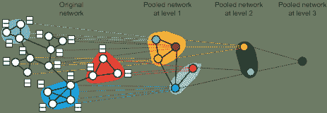

图 4：执行层次聚类算法的示例。经 [56] 许可转载。

为了解决这个问题，DiffPool [56] 提出了一个与图卷积共同训练的可微层次聚类算法。具体来说，作者提出了在每一层使用隐藏表示来学习软聚类分配矩阵，如下所示：

|  | $\mathbf{S}^{l}=\mathcal{F}\left(\mathbf{A}^{l},\mathbf{H}^{l}\right),$ |  | (30) |
| --- | --- | --- | --- |

其中 $\mathbf{S}^{l}\in\mathbb{R}^{N_{l}\times N_{l+1}}$ 是聚类分配矩阵，$N_{l}$ 是第 $l$ 层的聚类数量，$\mathcal{F}(\cdot)$ 是待学习的函数。然后，可以通过根据 $\mathbf{S}^{l}$ 取平均来获得这个“粗化”图的节点表示和新的邻接矩阵，如下所示：

|  | $\mathbf{H}^{l+1}=(\mathbf{S}^{l})^{T}\hat{\mathbf{H}}^{l+1},\mathbf{A}^{l+1}=(\mathbf{S}^{l})^{T}\mathbf{A}^{l}\mathbf{S}^{l},$ |  | (31) |
| --- | --- | --- | --- |

其中 $\hat{\mathbf{H}}^{l+1}$ 是通过对 $\mathbf{H}^{l}$ 应用图卷积层得到的，即在卷积操作后，将图从 $N_{l}$ 节点粗化到每层的 $N_{l+1}$ 节点。初始节点数量为 $N_{0}=N$，最后一层为 $N_{L}=1$，即表示整个图的单个节点。由于聚类分配操作是软性的，聚类之间的连接不是稀疏的，因此该方法的时间复杂度原则上是 $O(N^{2})$。

#### 4.2.3 强加顺序及其他

如在第 4.1.3 节中提到的，PATCHY-SAN[47]和 SortPooling[49]借鉴了施加节点顺序的想法，然后采用了类似于 CNNs 中的标准 1-D 池化。是否这些方法能够保持顺序不变取决于顺序的施加方式，这是另一个研究领域，我们参考读者[87]的综述。然而，施加节点顺序是否是图的自然选择，以及如果是的话，最佳节点顺序是什么，仍然是正在进行的研究课题。

除了上述方法外，还有一些启发式方法。在 GNNs[23]中，作者建议添加一个与所有节点相连的特殊节点来表示整个图。同样，GNs[9]提出通过接收来自所有节点和边的消息，直接学习整个图的表示。

MPNNs 采用了 set2set[88]，这是 seq2seq 模型的一种改进。具体而言，set2set 使用了一个“读-处理-写”模型，该模型同时接收所有输入，利用注意力机制和 LSTM 计算内部记忆，然后写入输出。与顺序敏感的 seq2seq 不同，set2set 对输入顺序不变。

#### 4.2.4 总结

总之，诸如平均或求和等统计方法是最简单的读出操作，而与图卷积联合训练的层次聚类算法则更为先进，但也更为复杂。其他方法如添加伪节点或施加节点顺序也已被研究。

### 4.3 改进与讨论

已经引入了许多技术来进一步改进 GCNs。需要注意的是，这些方法中的一些是通用的，也可以应用于其他图上的深度学习模型。

#### 4.3.1 注意力机制

在上述的 GCNs 中，节点邻域的聚合是通过相等或预定义的权重进行的。然而，邻居的影响可能差异很大，因此这些影响应该在训练过程中学习而非预先确定。受注意力机制的启发[89]，图注意力网络（GAT）[57]通过修改公式中的卷积操作[13]将注意力机制引入 GCNs，如下所示：

|  | $\mathbf{h}^{l+1}_{i}=\rho\left(\sum\nolimits_{j\in\hat{\mathcal{N}}(i)}\alpha_{ij}^{l}\mathbf{h}^{l}_{j}\mathbf{\Theta}^{l}\right),$ |  | (32) |
| --- | --- | --- | --- |

其中$\alpha_{ij}^{l}$是节点$v_{i}$在$l^{th}$层对节点$v_{j}$的注意力：

|  | $\alpha_{ij}^{l}=\frac{\exp\left(\text{LeakyReLU}\left(\mathcal{F}\left(\mathbf{h}^{l}_{i}\mathbf{\Theta}^{l},\mathbf{h}^{l}_{j}\mathbf{\Theta}^{l}\right)\right)\right)}{\sum_{k\in\hat{\mathcal{N}}(i)}\exp\left(\text{LeakyReLU}\left(\mathcal{F}\left(\mathbf{h}^{l}_{i}\mathbf{\Theta}^{l},\mathbf{h}^{l}_{k}\mathbf{\Theta}^{l}\right)\right)\right)},$ |  | (33) |
| --- | --- | --- | --- |

其中，$\mathcal{F}(\cdot,\cdot)$ 是另一个需要学习的函数，例如多层感知机（MLP）。为了提高模型的容量和稳定性，作者还建议使用多个独立的注意力并将结果进行拼接，即多头注意力机制 [89]，如图 5 所示。GaAN [58] 进一步提出了对不同头学习不同权重的方法，并将这种方法应用于交通预测问题。

HAN [59] 提出了一个两级注意力机制，即节点级和语义级注意力机制，用于异构图。具体来说，节点级注意力机制类似于 GAT，但还考虑了节点类型，因此可以为基于元路径的邻居分配不同的权重。语义级注意力机制则学习不同元路径的重要性并输出最终结果。

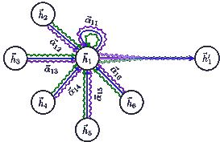

图 5：GAT [57] 提出的多头注意力机制的示意图（经许可转载）。每种颜色表示一个独立的注意力向量。

#### 4.3.2 残差和跳跃连接

许多研究观察到，现有 GCNs 的最适合深度通常非常有限，例如 2 层或 3 层。这个问题可能是由于训练深层 GCNs 的实际困难或过度平滑问题，即所有节点在更深层次上具有相同的表示 [70, 62]。为了解决这个问题，可以将类似 ResNet [90] 的残差连接添加到 GCNs 中。例如，Kipf 和 Welling [43] 将残差连接添加到 Eq. (14) 中，如下所示：

|  | $\mathbf{H}^{l+1}=\rho\left(\tilde{\mathbf{D}}^{-\frac{1}{2}}\tilde{\mathbf{A}}\tilde{\mathbf{D}}^{-\frac{1}{2}}\mathbf{H}^{l}\mathbf{\Theta}^{l}\right)+\mathbf{H}^{l}.$ |  | (34) |
| --- | --- | --- | --- |

他们通过实验证明，添加这样的残差连接可以使网络的深度增加，这与 ResNet 的结果类似。

Column network (CLN) [60] 采用了类似的思想，通过使用以下具有可学习权重的残差连接：

|  | $\mathbf{h}^{l+1}_{i}=\bm{\alpha}^{l}_{i}\odot\widetilde{\mathbf{h}}^{l+1}_{i}+(1-\bm{\alpha}^{l}_{i})\odot\mathbf{h}^{l}_{i},$ |  | (35) |
| --- | --- | --- | --- |

其中 $\widetilde{\mathbf{h}}^{l+1}_{i}$ 是类似于方程 (14) 计算的，$\bm{\alpha}^{l}_{i}$ 是一组权重，其计算方式如下：

|  | $\bm{\alpha}^{l}_{i}=\rho\left(\mathbf{b}^{l}_{\alpha}+\mathbf{\Theta}_{\alpha}^{l}\mathbf{h}_{i}^{l}+\mathbf{\Theta}_{\alpha}^{{}^{\prime}l}\sum\nolimits_{j\in\mathcal{N}(i)}\mathbf{h}_{j}^{l}\right),$ |  | (36) |
| --- | --- | --- | --- |

其中 $\mathbf{b}^{l}_{\alpha},\mathbf{\Theta}_{\alpha}^{l},\mathbf{\Theta}_{\alpha}^{{}^{\prime}l}$ 是参数。注意，方程 (35) 与 GGS-NNs [24] 中的 GRU 非常相似。不同之处在于，CLN 中的上标表示层数，不同层包含不同的参数，而 GGS-NNs 中的上标表示伪时间，并且在时间步长之间使用一组参数。

受到个性化 PageRank 的启发，PPNP [61] 定义了带有传送到初始层的图卷积：

|  | $\mathbf{H}^{l+1}=(1-\alpha)\tilde{\mathbf{D}}^{-\frac{1}{2}}\tilde{\mathbf{A}}\tilde{\mathbf{D}}^{-\frac{1}{2}}\mathbf{H}^{l}+\alpha\mathbf{H}^{0},$ |  | (37) |
| --- | --- | --- | --- |

其中 $\mathbf{H}_{0}=\mathcal{F}_{\theta}(\mathbf{F}^{V})$ 且 $\alpha$ 是一个超参数。注意，所有的参数都在 $\mathcal{F}_{\theta}(\cdot)$ 中，而不是在图卷积中。

跳跃知识网络（JK-Nets）[62] 提出了另一种架构，通过将网络的最后一层与所有较低的隐藏层连接起来，即通过“跳跃”所有表示到最终输出，如图 6 所示。这样，模型可以学会选择性地利用来自不同层的信息。形式上，JK-Nets 被表述如下：

|  | $\mathbf{h}_{i}^{\text{final}}=\text{AGGREGATE}(\mathbf{h}_{i}^{0},\mathbf{h}_{i}^{1},...,\mathbf{h}_{i}^{L}),$ |  | (38) |
| --- | --- | --- | --- |

其中 $\mathbf{h}_{i}^{\text{final}}$ 是节点 $v_{i}$ 的最终表示，AGGREGATE$(\cdot)$ 是聚合函数，$L$ 是隐藏层的数量。JK-Nets 使用了三种类似于 GraphSAGE [53] 的聚合函数：连接、最大池化和 LSTM 注意力。实验结果表明，添加跳跃连接可以提高多个 GCN 的性能。

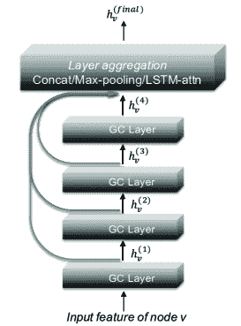

图 6：在 [62] 中提出的跳跃知识网络，其中最后一层与所有其他层连接，以选择性地利用来自不同层的信息。GC 表示图卷积。经授权转载。

#### 4.3.3 边特征

上述 GCN 主要集中在利用节点特征和图结构。在本小节中，我们简要讨论如何使用另一个重要的信息来源：边特征。

对于离散值的简单边特征，如边的类型，一种直接的方法是为不同的边类型训练不同的参数，并聚合结果。例如，Neural FPs [46] 为具有不同度数的节点训练了不同的参数，这对应于分子图中的隐式边特征（键类型），然后对结果进行求和。CLN [60] 为异构图中的不同边类型训练了不同的参数，并对结果进行了平均。边条件卷积 (ECC) [63] 也基于边类型训练了不同的参数，并将其应用于图分类。关系 GCNs (R-GCNs) [64] 为知识图谱采用了类似的思想，通过为不同的关系类型训练不同的权重。然而，这些方法仅适用于有限数量的离散边特征。

DCNN [50] 提出了另一种方法，将每条边转换为连接到该边头节点和尾节点的节点。经过这种转换，边特征可以被视为节点特征。

LGCN [65] 构建了一个线图 $\mathbf{B}\in\mathbb{R}^{2M\times 2M}$ 来整合边特征，如下所示：

|  | $\mathbf{B}_{i\rightarrow j,i^{\prime}\rightarrow j^{\prime}}=\left\{\begin{aligned} &1\quad\text{if}\;j=i^{\prime}\;\text{and}\;j^{\prime}\neq i,\\ &0\quad\text{otherwise}.\end{aligned}\right.$ |  | (39) |
| --- | --- | --- | --- |

换句话说，线图中的节点是原图中的有向边，如果信息可以通过原图中的相应边流动，则线图中的两个节点相连。然后，LGCN 采用了两个 GCN：一个在原图上，另一个在线图上。

Kearnes 等人 [55] 提出了一个使用“编织模块”的架构。具体而言，他们为节点和边学习了表示，并在每个编织模块中使用四种不同的函数交换信息：节点到节点 (NN)、节点到边 (NE)、边到边 (EE) 和边到节点 (EN)：

|  | <math alttext="\begin{gathered}\mathbf{h}^{l^{\prime}}_{i}=\mathcal{F}_{NN}(\mathbf{h}^{0}_{i},\mathbf{h}^{1}_{i},...,\mathbf{h}^{l}_{i}),\mathbf{h}^{l^{\prime\prime}}_{i}=\mathcal{F}_{EN}(\{\mathbf{e}^{l}_{ij}&#124;j\in\mathcal{N}(i)\})\\ \mathbf{e}^{l^{\prime}}_{ij}=\mathcal{F}_{EE}(\mathbf{e}^{0}_{ij},\mathbf{e}^{1}_{ij},...,\mathbf{e}^{l}_{ij}),\mathbf{e}^{l^{\prime\prime}}_{ij}=\mathcal{F}_{NE}(\mathbf{h}^{l}_{i},\mathbf{h}^{l}_{j})\\

\mathbf{h}^{l+1}_{i}=\mathcal{F}_{NN}(\mathbf{h}^{l^{\prime}}_{i},\mathbf{h}^{l^{\prime\prime}}_{i}),\mathbf{e}^{l+1}_{ij}=\mathcal{F}_{EE}(\mathbf{e}^{l^{\prime}}_{ij},\mathbf{e}^{l^{\prime\prime}}_{ij}),\end{gathered}" display="block"><semantics ><mtable displaystyle="true" rowspacing="0pt" ><mtr ><mtd ><mrow ><mrow ><msubsup ><mi  >𝐡</mi><mi >i</mi><msup ><mi  >l</mi><mo >′</mo></msup></msubsup><mo >=</mo><mrow ><msub ><mi >ℱ</mi><mrow ><mi  >N</mi><mo lspace="0em" rspace="0em"  >​</mo><mi >N</mi></mrow></msub><mo lspace="0em" rspace="0em" >​</mo><mrow ><mo stretchy="false" >(</mo><msubsup ><mi >𝐡</mi><mi >i</mi><mn >0</mn></msubsup><mo >,</mo><msubsup ><mi >𝐡</mi><mi >i</mi><mn >1</mn></msubsup><mo >,</mo><mi mathvariant="normal"  >…</mi><mo >,</mo><msubsup ><mi >𝐡</mi><mi >i</mi><mi >l</mi></msubsup><mo stretchy="false" >)</mo></mrow></mrow></mrow><mo >,</mo><mrow ><msubsup ><mi >𝐡</mi><mi >i</mi><msup ><mi >l</mi><mo >′′</mo></msup></msubsup><mo >=</mo><mrow ><msub ><mi >ℱ</mi><mrow ><mi >E</mi><mo lspace="0em" rspace="0em"  >​</mo><mi >N</mi></mrow></msub><mo lspace="0em" rspace="0em" >​</mo><mrow ><mo stretchy="false" >(</mo><mrow ><mo stretchy="false" >{</mo><msubsup ><mi >𝐞</mi><mrow ><mi >i</mi><mo lspace="0em" rspace="0em" >​</mo><mi >j</mi></mrow><mi >l</mi></msubsup><mo lspace="0em" rspace="0em" >&#124;</mo><mrow ><mi >j</mi><mo >∈</mo><mrow ><mi >𝒩</mi><mo lspace="0em" rspace="0em" >​</mo><mrow ><mo stretchy="false" >(</mo><mi >i</mi><mo stretchy="false" >)</mo></mrow></mrow></mrow><mo stretchy="false" >}</mo></mrow><mo stretchy="false" >)</mo></mrow></mrow></mrow></mrow></mtd></mtr><mtr ><mtd ><mrow ><mrow ><msubsup ><mi >𝐞</mi><mrow ><mi >i</mi><mo lspace="0em" rspace="0em" >​</mo><mi >j</mi></mrow><msup ><mi  >l</mi><mo >′</mo></msup></msubsup><mo >=</mo><mrow ><msub ><mi >ℱ</mi><mrow ><mi >E</mi><mo lspace="0em" rspace="0em" >​</mo><mi >E</mi></mrow></msub><mo lspace="0em" rspace="0em" >​</mo><mrow ><mo stretchy="false" >(</mo><msubsup ><mi >𝐞</mi><mrow ><mi >i</mi><mo lspace="0em" rspace="0em"  >​</mo><mi >j</mi></mrow><mn >0</mn></msubsup><mo >,</mo><msubsup ><mi >𝐞</mi><mrow ><mi >i</mi><mo lspace="0em" rspace="0em"  >​</mo><mi >j</mi></mrow><mn >1</mn></msubsup><mo >,</mo><mi mathvariant="normal" >…</mi><mo >,</mo><msubsup ><mi >𝐞</mi><mrow ><mi >i</mi><mo lspace="0em" rspace="0em" >​</mo><mi >j</mi></mrow><mi >l</mi></msubsup><mo stretchy="false" >)</mo></mrow></mrow></mrow><mo >,</mo><mrow ><msubsup ><mi >𝐞</mi><mrow ><mi >i</mi><mo lspace="0em" rspace="0em" >​</mo><mi >j</mi></mrow><msup ><mi >l</mi><mo >′′</mo></msup></msubsup><mo >=</mo><mrow ><msub ><mi >ℱ</mi><mrow ><mi >N</mi><mo lspace="0em" rspace="0em"  >​</mo><mi >E</mi></mrow></msub><mo lspace="0em" rspace="0em" >​</mo><mrow ><mo stretchy="false" >(</mo><msubsup ><mi >𝐡</mi><mi >i</mi><mi >l</mi></msubsup><mo >,</mo><msubsup ><mi >𝐡</mi><mi >j</mi><mi >l</mi></msubsup><mo stretchy="false" >)</mo></mrow></mrow></mrow></mrow></mtd></mtr><mtr ><mtd ><mrow ><mrow ><mrow ><msubsup ><mi >𝐡</mi><mi >i</mi><mrow ><mi  >l</mi><mo >+</mo><mn >1</mn></mrow></msubsup><mo >=</mo><mrow ><msub ><mi >ℱ</mi><mrow ><mi >N</mi><mo lspace="0em" rspace="0em" >​</mo><mi >N</mi></mrow></msub><mo lspace="0em" rspace="0em" >​</mo><mrow ><mo stretchy="false" >(</mo><msubsup ><mi >𝐡</mi><mi >i</mi><msup ><mi  >l</mi><mo >′</mo></msup></msubsup><mo >,</mo><msubsup ><mi >𝐡</mi><mi >i</mi><msup ><mi >l</mi><mo >′′</mo></msup></msubsup><mo stretchy="false" >)</mo></mrow></mrow></mrow><mo >,</mo><mrow ><msubsup ><mi >𝐞</mi><mrow ><mi >i</mi><mo lspace="0em" rspace="0em" >​</mo><mi >j</mi></mrow><mrow ><mi >l</mi><mo >+</mo><mn >1</mn></mrow></msubsup><mo >=</mo><mrow ><msub ><mi >ℱ</mi><mrow ><mi >E</mi><mo lspace="0em" rspace="0em"  >​</mo><mi >E</mi></mrow></msub><mo lspace="0em" rspace="0em" >​</mo><mrow ><mo stretchy="false" >(</mo><msubsup ><mi >𝐞</mi><mrow ><mi >i</mi><mo lspace="0em" rspace="0em" >​</mo><mi >j</mi></mrow><msup ><mi >l</mi><mo >′</mo></msup></msubsup><mo >,</mo><msubsup ><mi >𝐞</mi><mrow ><mi >i</mi><mo lspace="0em" rspace="0em"  >​</mo><mi >j</mi></mrow><msup ><mi >l</mi><mo >′′</mo></msup></msubsup><mo stretchy="false" >)</mo></mrow></mrow></mrow></mrow><mo >,</mo></mrow></mtd></mtr></mtable><annotation-xml encoding="MathML-Content" ><apply ><csymbol cd="ambiguous" >formulae-sequence</csymbol><apply ><csymbol cd="ambiguous" >formulae-sequence</csymbol><apply ><apply ><csymbol cd="amb

其中 $\mathbf{e}_{ij}^{l}$ 是第 $l^{th}$ 层中边 $(v_{i},v_{j})$ 的表示，$\mathcal{F}(\cdot)$ 是可学习的函数，其下标表示消息传递方向。通过堆叠多个此类模块，信息可以通过在节点和边表示之间交替传递来传播。请注意，在节点到节点和边到边的函数中，隐式地添加了类似于 JK-Nets [62] 的跳跃连接。GNs [9] 还提出了学习边表示并使用消息传递函数更新节点和边表示，如第二十七部分中的公式所示。在这方面，“编织模块”是 GNs 的一个特殊情况，它没有整个图的表示。

#### 4.3.4 采样方法

在大规模图上训练 GCNs 的一个关键瓶颈是效率。如 4.1.4 节所示，许多 GCNs 遵循邻域聚合方案。然而，由于许多真实图遵循幂律分布 [91]（即少数节点具有非常大的度数），邻居的数量可以极快地增加。为解决这个问题，提出了两种采样方法：邻域采样和层级采样，如图 7 所示。

在邻域采样中，采样在计算过程中对每个节点进行。GraphSAGE [53] 在训练过程中均匀地为每个节点采样固定数量的邻居。PinSage [66] 提出了使用图上的随机游走进行邻居采样，并进行了若干实施改进，包括 CPU 和 GPU 之间的协调、一个 map-reduce 推断管道等。研究表明，PinSage 能够处理实际的十亿规模图。StochasticGCN [67] 进一步提出通过使用上一个批次的历史激活作为控制变量来减少采样方差，从而在理论上保证可以使用任意小的样本大小。

与节点邻居采样不同，FastGCN [68] 采用了一种不同的策略：它在每个卷积层中进行节点采样（即逐层采样），将节点视为独立同分布的样本，并将图卷积解释为概率测度下的积分变换。FastGCN 还表明，通过节点的归一化度数进行采样可以减少方差并提高性能。Adapt [69] 进一步提出在下层节点上进行条件采样，以其顶层为条件；这种方法更具适应性，能够显著减少方差。

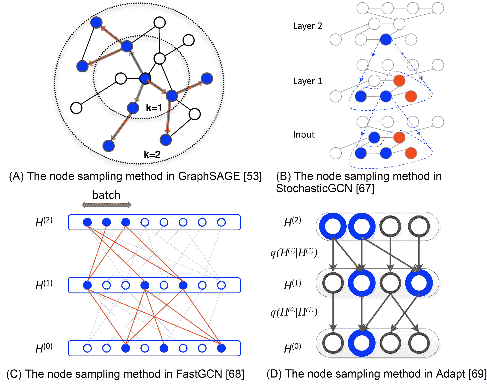

图 7：不同的节点采样方法，其中蓝色节点表示来自一个批次的样本，箭头表示采样方向。图 (B) 中的红色节点表示历史样本。

#### 4.3.5 归纳设置

GCNs 的另一个重要方面是它们是否可以应用于归纳设置，即在一组节点或图上进行训练并在另一组未见过的节点或图上进行测试。从原则上讲，这个目标是通过学习一个在给定特征上不依赖于图基的映射函数来实现的，这个映射函数可以跨节点或图进行转移。GraphSAGE [53]、GAT [57]、GaAN [58] 和 FastGCN [68] 验证了归纳设置。然而，现有的归纳 GCNs 仅适用于具有显式特征的图。如何对没有显式特征的图进行归纳学习，通常称为样本外问题 [92]，在文献中仍然大多未解决。

#### 4.3.6 理论分析

为了理解 GCNs 的有效性，提出了一些理论分析，这些分析可以分为三类：以节点为中心的任务、以图为中心的任务和通用分析。

对于以节点为中心的任务，Li 等人 [70] 首先通过使用一种特殊形式的拉普拉斯平滑分析了 GCNs 的性能，该形式使得同一簇中的节点特征相似。原始的拉普拉斯平滑操作公式如下：

|  | $\mathbf{h}^{\prime}_{i}=(1-\gamma)\mathbf{h}_{i}+\gamma\sum\nolimits_{j\in\mathcal{N}(i)}\frac{1}{d_{i}}\mathbf{h}_{j},$ |  | (41) |
| --- | --- | --- | --- |

其中 $\mathbf{h}_{i}$ 和 $\mathbf{h}^{\prime}_{i}$ 分别是节点 $v_{i}$ 的原始特征和光滑特征。我们可以看到公式 (41) 与公式 (13) 中的图卷积非常相似。基于这一见解，Li 等人还提出了 GCNs 的联合训练和自我训练方法。

最近，Wu 等人 [71] 从信号处理的角度分析了 GCNs。通过将节点特征视为图信号，他们表明公式 (13) 基本上是一个固定的低通滤波器。基于这一洞察，他们提出了一种极其简化的图卷积（SGC）架构，通过去除所有非线性并将学习参数合并到一个矩阵中：

|  | $\mathbf{H}^{L}=\left(\tilde{\mathbf{D}}^{-\frac{1}{2}}\tilde{\mathbf{A}}\tilde{\mathbf{D}}^{-\frac{1}{2}}\right)^{L}\mathbf{F}_{V}\mathbf{\Theta}.$ |  | (42) |
| --- | --- | --- | --- |

作者们展示了这种“非深度学习” GCN 变体在许多任务中实现了与现有 GCNs 相当的性能。Maehara [72] 通过展示低通滤波操作并未赋予 GCNs 非线性流形学习能力，进一步增强了这一结果，并提出了 GFNN 模型，通过在图卷积层后添加 MLP 来解决这个问题。

对于图相关任务，Kipf 和 Welling [43] 以及 SortPooling 的作者 [49] 都考虑了 GCNs 与图核（如 Weisfeiler-Lehman (WL) 核 [78]）之间的关系，该核在图同构测试中被广泛使用。他们表明，GCNs 从概念上讲是 WL 核的一个推广，因为这两种方法都通过迭代聚合来自节点邻居的信息。Xu 等人 [73] 通过证明 WL 核在区分图结构方面为 GCNs 提供了一个上界，从而形式化了这一观点。基于此分析，他们提出了图同构网络（GIN），并表明使用求和和多层感知机（MLP）的读取操作可以实现可证明的最大区分能力，即在图分类任务中达到最高的训练准确度。

对于一般分析，Scarselli 等人 [93] 表明，不同激活函数的图卷积网络（GCNs）的 Vapnik-Chervonenkis 维度（VC-dim）与现有的递归神经网络（RNNs）具有相同的量级。Chen 等人 [65] 分析了线性 GCNs 的优化景观，并表明在某些简化条件下，任何局部最小值都相对接近全局最小值。Verma 和 Zhang [94] 分析了 GCNs 的算法稳定性和泛化界限。他们展示了单层 GCNs 满足强均匀稳定性的定义，前提是图卷积滤波器的最大绝对特征值与图的大小无关。

## 5 图自编码器

自编码器 (AE) 及其变种已广泛应用于无监督学习任务 [95]，并适用于学习图的节点表示。隐含的假设是图具有固有的、可能是非线性的低秩结构。在本节中，我们首先详细阐述图自编码器，然后介绍图变分自编码器及其他改进。GAEs 的主要特征总结在表 V。

表 V: 不同图自编码器 (GAEs) 的比较。T.C. = 时间复杂度

| 方法 | 类型 | 目标函数 | 时间复杂度 | 节点特征 | 其他特征 |
| --- | --- | --- | --- | --- | --- |
| SAE [96] | AE | L2-重构 | $O(M)$ | 否 | - |
| SDNE [97] | AE | L2-重构 + 拉普拉斯特征图 | $O(M)$ | 否 | - |
| DNGR [98] | AE | L2-重构 | $O(N^{2})$ | 否 | - |
| GC-MC [99] | AE | L2-重构 | $O(M)$ | 是 | GCN 编码器 |
| DRNE [100] | AE | 递归重构 | $O(Ns)$ | 否 | LSTM 聚合器 |
| G2G [101] | AE | KL + 排序 | $O(M)$ | 是 | 节点作为分布 |
| VGAE [102] | VAE | 成对重构 | $O(N^{2})$ | 是 | GCN 编码器 |
| DVNE [103] | VAE | Wasserstein + 排序 | $O(M)$ | 否 | 节点作为分布 |
| ARGA/ARVGA [104] | AE/VAE | L2-重构 + GAN | $O(N^{2})$ | 是 | GCN 编码器 |
| NetRA [105] | AE | 递归重构 + 拉普拉斯特征图 + GAN | $O(M)$ | 否 | LSTM 编码器 |

### 5.1 自编码器

对图应用 AEs 的起源来自于稀疏自编码器 (SAE) [96]。基本思想是，通过将邻接矩阵或其变体视为节点的原始特征，AEs 可以被用作一种降维技术来学习低维的节点表示。具体来说，SAE 采用了以下 L2-重构损失：

|  | $\begin{gathered}\min_{\mathbf{\Theta}}\mathcal{L}_{2}=\sum\nolimits_{i=1}^{N}\left\| \mathbf{P}\left(i,:\right)-\hat{\mathbf{P}}\left(i,:\right)\right\|_{2}\\ \hat{\mathbf{P}}\left(i,:\right)=\mathcal{G}\left(\mathbf{h}_{i}\right),\mathbf{h}_{i}=\mathcal{F}\left(\mathbf{P}\left(i,:\right)\right),\end{gathered}$ |  | (43) |
| --- | --- | --- | --- |

其中 $\mathbf{P}$ 是转移矩阵，$\hat{\mathbf{P}}$ 是重建矩阵，$\mathbf{h}_{i}\in\mathbb{R}^{d}$ 是节点 $v_{i}$ 的低维表示，$\mathcal{F}(\cdot)$ 是编码器，$\mathcal{G}(\cdot)$ 是解码器，$d\ll N$ 是维度，$\mathbf{\Theta}$ 是参数。编码器和解码器都是具有多个隐藏层的 MLP。换句话说，SAE 将 $\mathbf{P}(i,:)$ 的信息压缩成低维向量 $\mathbf{h}_{i}$，然后从该向量重建原始特征。还增加了另一个稀疏性正则化项。在获得低维表示 $\mathbf{h}_{i}$ 后，使用 k-means [106] 进行了节点聚类任务。实验证明 SAEs 优于非深度学习基准。然而，SAE 基于错误的理论分析。⁸⁸8SAE [96] 通过分析谱聚类与奇异值分解之间的关系激发了这个问题，但正如 [107] 所指出的那样，这在数学上是错误的。其有效性背后的机制仍未解释。

结构深度网络嵌入（SDNE） [97] 通过显示公式 (43) 中的 L2 重建损失实际上对应于节点之间的二阶接近度，即如果两个节点具有相似的邻域，则它们共享相似的潜在表示，这是网络科学中的一个研究充分的概念，称为协同过滤或三角形闭合 [5]。受到网络嵌入方法的启发，这些方法表明一阶接近度也很重要 [108]，SDNE 通过添加另一个拉普拉斯特征映射项 [75] 修改了目标函数：

|  | $\min_{\mathbf{\Theta}}\mathcal{L}_{2}+\alpha\sum\nolimits_{i,j=1}^{N}\mathbf{A}(i,j)\left\&#124;\mathbf{h}_{i}-\mathbf{h}_{j}\right\&#124;_{2},$ |  | (44) |
| --- | --- | --- | --- |

即，如果两个节点直接连接，它们也共享相似的潜在表示。作者还通过使用邻接矩阵并为零和非零元素分配不同的权重来修改 L2 重建损失。

|  | $\mathcal{L}_{2}=\sum\nolimits_{i=1}^{N}\left\&#124;\left(\mathbf{A}\left(i,:\right)-\mathcal{G}\left(\mathbf{h}_{i}\right)\right)\odot\mathbf{b}_{i}\right\&#124;_{2},$ |  | (45) |
| --- | --- | --- | --- |

其中 $\mathbf{h}_{i}=\mathcal{F}\left(\mathbf{A}\left(i,:\right)\right)$，如果 $\mathbf{A}(i,j)=0$，则 $b_{ij}=1$；否则 $b_{ij}=\beta>1$，其中 $\beta$ 是另一个超参数。SDNE 的整体架构如图 8 所示。

受到另一类研究的启发，现代工作 DNGR [98]将公式 (43)中的转移矩阵 $\mathbf{P}$ 替换为公式 (20)中定义的正点互信息（PPMI） [79] 矩阵。通过这种方式，原始特征可以与图的一些随机游走概率相关联 [109]。然而，构建输入矩阵的时间复杂度为 $O(N^{2})$，不适用于大规模图。

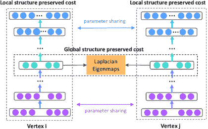

图 8：SDNE [97]的框架。使用深度自编码器保留了节点的第一和第二阶邻近性。

GC-MC [99]采用了不同的方法，使用 Kipf 和 Welling [43]提出的 GCN 作为编码器：

|  | $\mathbf{H}=GCN\left(\mathbf{F}^{V},\mathbf{A}\right),$ |  | (46) |
| --- | --- | --- | --- |

并使用一个简单的双线性函数作为解码器：

|  | $\hat{\mathbf{A}}(i,j)=\mathbf{H}(i,:)\mathbf{\Theta}_{de}\mathbf{H}(j,:)^{T},$ |  | (47) |
| --- | --- | --- | --- |

其中 $\mathbf{\Theta}_{de}$ 是解码器参数。采用这种方法，自然地融入了节点特征。对于没有节点特征的图，使用了节点 ID 的 one-hot 编码。作者展示了 GC-MC 在二分图推荐问题上的有效性。

DRNE [100] 提出了另一种修改方法，直接通过使用 LSTM 汇聚邻域信息来重建低维节点向量。具体而言，DRNE 采用了以下目标函数：

|  | $\mathcal{L}=\sum\nolimits_{i=1}^{N}\left\| \mathbf{h}_{i}-\text{LSTM}\left(\{\mathbf{h}_{j} | j\in\mathcal{N}(i)\}\right)\right\|.$ |  | (48) |
| --- | --- | --- | --- | --- |

因为 LSTM 需要其输入为序列，作者建议根据节点的度来排序节点邻域。他们还采用了邻域采样技术，以防止过长的记忆。作者证明了这种方法可以保留常规等价性以及许多节点中心性测度，如 PageRank [110]。

与上述将节点映射到低维向量的工作不同，Graph2Gauss (G2G) [101]提出将每个节点编码为高斯分布 $\mathbf{h}_{i}=\mathcal{N}\left(\mathbf{M}(i,:),diag\left(\mathbf{\Sigma}(i,:)\right)\right)$ 以捕捉节点的不确定性。具体而言，作者使用了从节点属性到高斯分布的均值和方差的深度映射作为编码器：

|  | $\mathbf{M}(i,:)=\mathcal{F}_{\mathbf{M}}(\mathbf{F}^{V}(i,:)),\mathbf{\Sigma}(i,:)=\mathcal{F}_{\mathbf{\Sigma}}(\mathbf{F}^{V}(i,:)),$ |  | (49) |
| --- | --- | --- | --- |

其中 $\mathcal{F}_{\mathbf{M}}(\cdot)$ 和 $\mathcal{F}_{\mathbf{\Sigma}}(\cdot)$ 是需要学习的参数函数。然后，他们使用成对约束来学习模型，而不是使用显式的解码器函数：

|  | $\begin{gathered}\text{KL}\left(\mathbf{h}_{j}&#124;&#124;\mathbf{h}_{i}\right)<\text{KL}\left(\mathbf{h}_{j^{\prime}}&#124;&#124;\mathbf{h}_{i}\right)\\ \forall i,\forall j,\forall j^{\prime}\;s.t.\;d(i,j)<d(i,j^{\prime}),\end{gathered}$ |  | (50) |
| --- | --- | --- | --- |

其中 $d(i,j)$ 是从节点 $v_{i}$ 到 $v_{j}$ 的最短距离，$\text{KL}(q(\cdot)||p(\cdot))$ 是 $q(\cdot)$ 和 $p(\cdot)$ 之间的 Kullback-Leibler (KL)散度[111]。换句话说，约束确保了节点表示之间的 KL 散度具有与图距离相同的相对顺序。然而，由于 Eq. (50) 难以优化，因此采用了基于能量的损失[112]作为放松：

|  | $\mathcal{L}=\sum\nolimits_{(i,j,j^{\prime})\in\mathcal{D}}\left(E_{ij}^{2}+\exp^{-E_{ij^{\prime}}}\right),$ |  | (51) |
| --- | --- | --- | --- |

其中 $\mathcal{D}=\left\{(i,j,j^{\prime})|d(i,j)<d(i,j^{\prime})\right\}$ 和 $E_{ij}=\text{KL}(\mathbf{h}_{j}||\mathbf{h}_{i})$。作者进一步提出了一种无偏采样策略，以加速训练过程。

### 5.2 变分自编码器

与上述自编码器不同，变分自编码器（VAEs）是一种将降维与生成模型结合的深度学习方法。它的潜在好处包括容忍噪声和学习平滑表示[113]。VAEs 首次引入图数据是在 VGAE [102] 中，其中解码器是一个简单的线性乘积：

|  | $p\left(\mathbf{A}&#124;\mathbf{H}\right)=\prod\nolimits_{i,j=1}^{N}\sigma\left(\mathbf{h}_{i}\mathbf{h}_{j}^{T}\right),$ |  | (52) |
| --- | --- | --- | --- |

在其中，节点表示被假设为遵循高斯分布 $q\left(\mathbf{h}_{i}|\mathbf{M},\mathbf{\Sigma}\right)=\mathcal{N}\left(\mathbf{h}_{i}|\mathbf{M}(i,:),diag\left(\mathbf{\Sigma}(i,:)\right)\right)$。对于均值和方差矩阵的编码器，作者还采用了 Kipf 和 Welling 提出的 GCN[43]：

|  | $\mathbf{M}=GCN_{\mathbf{M}}\left(\mathbf{F}^{V},\mathbf{A}\right),\log\mathbf{\Sigma}=GCN_{\mathbf{\Sigma}}\left(\mathbf{F}^{V},\mathbf{A}\right).$ |  | (53) |
| --- | --- | --- | --- |

然后，通过最小化变分下界来学习模型参数[113]：

|  | $\mathcal{L}=\mathbb{E}_{q\left(\mathbf{H}&#124;\mathbf{F}^{V},\mathbf{A}\right)}\left[\log p\left(\mathbf{A}&#124;\mathbf{H}\right)\right]-\text{KL}\left(q\left(\mathbf{H}&#124;\mathbf{F}^{V},\mathbf{A}\right)&#124;&#124;p(\mathbf{H})\right).$ |  | (54) |
| --- | --- | --- | --- |

然而，由于这种方法需要重建整个图，因此其时间复杂度为 $O(N^{2})$。

受 SDNE 和 G2G 启发，DVNE [103] 提出了另一种用于图数据的变分自编码器（VAE），它也将每个节点表示为高斯分布。与采用 KL 散度作为度量的现有方法不同，DVNE 使用 Wasserstein 距离 [114] 来保持节点相似性的传递性。与 SDNE 和 G2G 类似，DVNE 在其目标函数中也保留了第一阶和第二阶的接近度：

|  | $\min_{\bf{\Theta}}\sum\nolimits_{(i,j,j^{\prime})\in\mathcal{D}}\left(E_{ij}^{2}+\exp^{-E_{ij^{\prime}}}\right)+\alpha\mathcal{L}_{2},$ |  | (55) |
| --- | --- | --- | --- |

其中 $E_{ij}=W_{2}\left(\mathbf{h}_{j}||\mathbf{h}_{i}\right)$ 是两个高斯分布 $\mathbf{h}_{j}$ 和 $\mathbf{h}_{i}$ 之间的 $2^{nd}$ Wasserstein 距离，$\mathcal{D}=\left\{(i,j,j^{\prime})|j\in\mathcal{N}(i),j^{\prime}\notin\mathcal{N}(i)\right\}$ 是一组三元组，对应于第一阶接近度的排序损失。重建损失定义如下：

|  | $\mathcal{L}_{2}=\inf\nolimits_{q(\mathbf{Z}&#124;\mathbf{P})}\mathbb{E}_{p(\mathbf{P})}\mathbb{E}_{q(\mathbf{Z}&#124;\mathbf{P})}\left\&#124;\mathbf{P}\odot(\mathbf{P}-\mathcal{G}(\mathbf{Z}))\right\&#124;_{2}^{2},$ |  | (56) |
| --- | --- | --- | --- |

其中 $\mathbf{P}$ 是转移矩阵，$\mathbf{Z}$ 表示从 $\mathbf{H}$ 中抽取的样本。该框架如图 9 所示。使用这种方法，目标函数可以像常规 VAE 一样通过重参数化技巧 [113] 最小化。

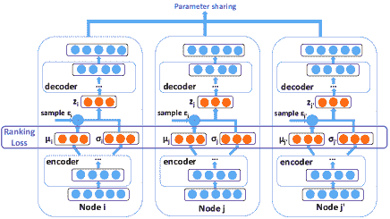

图 9：DVNE 的框架 [103]。DVNE 使用 VAE 将节点表示为分布，并采用 Wasserstein 距离来保持节点相似性的传递性。

### 5.3 改进与讨论

也提出了几项对图自编码器（GAEs）的改进。

#### 5.3.1 对抗训练

一种对抗训练方案⁹⁹9 我们将在第七部分进一步讨论更多图的对抗方法。作为 ARGA [104] 的附加正则化项被纳入了 GAEs。总体架构如图 10 所示。具体而言，GAEs 的编码器被用作生成器，而鉴别器则旨在区分潜在表示是来自生成器还是来自先验分布。通过这种方式，自动编码器被迫将其匹配到先验分布作为正则化。目标函数为：

|  | $\min_{\bf{\Theta}}\mathcal{L}_{2}+\alpha\mathcal{L}_{GAN},$ |  | (57) |
| --- | --- | --- | --- |

其中 $\mathcal{L}_{2}$ 是 GAEs 中的重构损失，$\mathcal{L}_{GAN}$ 是

|  | $\min_{\mathcal{G}}\max_{\mathcal{D}}\mathbb{E}_{\mathbf{h}\sim p_{\mathbf{h}}}\left[\log\mathcal{D}(\mathbf{h})\right]+\mathbb{E}_{\mathbf{z}\sim\mathcal{G}(\mathbf{F}^{V},\mathbf{A})}\left[\log\left(1-\mathcal{D}\left(\mathbf{z}\right)\right)\right],$ |  | (58) |
| --- | --- | --- | --- |

其中 $\mathcal{G}\left(\mathbf{F}^{V},\mathbf{A}\right)$ 是一个生成器，使用了来自 Eq. (53) 的图卷积编码器，$\mathcal{D}(\cdot)$ 是基于交叉熵损失的鉴别器，$p_{\mathbf{h}}$ 是先验分布。研究采用了简单的高斯先验，实验结果表明对抗训练方案的有效性。

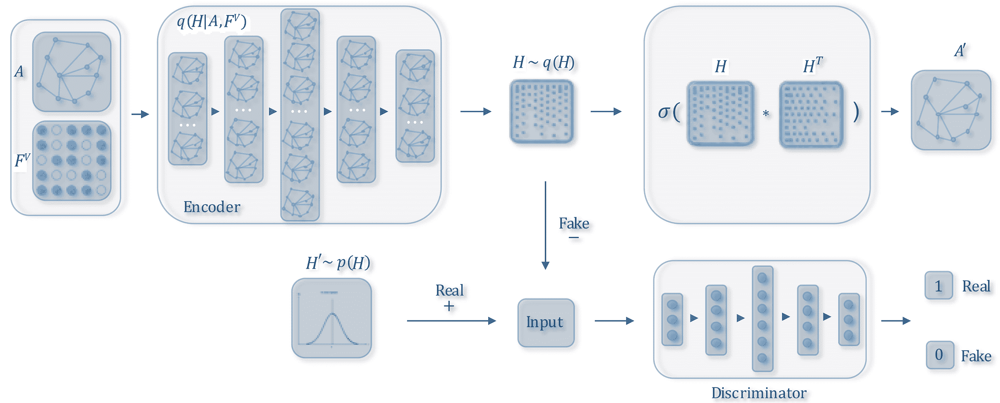

图 10：AGA/ARVGA 框架转载自 [104]，经许可使用。该模型将对抗训练方案融入了 GAEs 中。

同时，NetRA [105] 也提出使用生成对抗网络 (GAN) [115] 来增强图自编码器的泛化能力。具体而言，作者使用了以下目标函数：

|  | $\min_{\bf{\Theta}}\mathcal{L}_{2}+\alpha_{1}\mathcal{L}_{LE}+\alpha_{2}\mathcal{L}_{GAN},$ |  | (59) |
| --- | --- | --- | --- |

其中$\mathcal{L}_{LE}$是拉普拉斯特征图目标函数，如公式(44)所示。此外，作者采用了 LSTM 作为编码器，以汇聚来自邻域的信息，类似于公式(48)。与 DRNE [100]中仅采样直接邻居并使用度排序节点不同，作者使用随机游走生成输入序列。与 ARGA 相比，NetRA 将 GAEs 中的表示视为真实值，并采用随机高斯噪声，然后使用 MLP 作为生成器。

#### 5.3.2 归纳学习

类似于 GCNs，GAEs 也可以应用于归纳学习设置，只要在编码器中包含节点属性。这可以通过使用 GCN 作为编码器来实现，例如在 GC-MC [99]、VGAE [102]和 VGAE [104]中，或者通过直接从节点特征中学习映射函数，如 G2G [101]。由于边信息仅在学习参数时使用，模型也可以应用于训练期间未见过的节点。这些工作还表明，尽管 GCNs 和 GAEs 基于不同的架构，但它们可以联合使用，我们相信这是一个有前景的未来方向。

#### 5.3.3 相似度度量

在 GAEs 中，已经采用了许多相似度度量，例如 L2 重建损失、拉普拉斯特征图和图 AE 的排序损失，以及图 VAE 的 KL 散度和 Wasserstein 距离。尽管这些相似度度量基于不同的动机，但如何为特定任务和模型架构选择合适的相似度度量仍未被研究清楚。需要更多的研究来理解这些度量之间的根本差异。

表 VI：图强化学习的主要特征

| 方法 | 任务 | 动作 | 奖励 | 时间复杂度 |
| --- | --- | --- | --- | --- |
| GCPN [116] | 图生成 | 链接预测 | GAN + 领域知识 | $O(MN)$ |
| MolGAN [117] | 图生成 | 生成整个图 | GAN + 领域知识 | $O(N^{2})$ |
| GTPN [118] | 化学反应预测 | 预测节点对和新键类型 | 预测结果 | $O(N^{2})$ |
| GAM [119] | 图分类 | 预测图标签和选择下一个节点 | 分类结果 | $O(d_{\text{avg}}sT)$ |
| DeepPath [120] | 知识图谱推理 | 预测推理路径上的下一个节点 | 推理结果 + 多样性 | $O(d_{\text{avg}}sT+s^{2}T)$ |
| MINERVA [121] | 知识图谱推理 | 预测推理路径上的下一个节点 | 推理结果 | $O(d_{\text{avg}}sT)$ |

## 6 图强化学习

尚未讨论的深度学习一个方面是强化学习（RL），它已被证明在 AI 任务中，如玩游戏，效果显著[122]。RL 被认为擅长从反馈中学习，特别是在处理不可微分目标和约束时。在这一节中，我们回顾了图 RL 方法。其主要特征总结在表 VI。

GCPN [116] 利用 RL 生成目标导向的分子图，同时考虑不可微分目标和约束。具体而言，图生成被建模为添加节点和边的马尔可夫决策过程，生成模型被视为在图生成环境中操作的 RL 代理。通过将代理动作视为链接预测，使用领域特定和对抗奖励，以及使用 GCN 来学习节点表示，GCPN 可以使用策略梯度[123]以端到端的方式进行训练。

一个相关的工作，MolGAN [117]，采用了类似的使用 RL 生成分子图的想法。然而，MolGAN 提出直接生成完整图形，而不是通过一系列动作生成图形；这种方法在处理小分子时特别有效。

GTPN [118] 采用了 RL 来预测化学反应产物。具体来说，代理行动以选择分子图中的节点对并预测它们的新键合类型，奖励根据预测是否正确在立即和结束时给予。GTPN 使用了 GCN 来学习节点表示，并使用 RNN 来记忆预测序列。

GAM [119] 通过使用随机游走将强化学习（RL）应用于图分类。作者将随机游走的生成建模为部分可观察马尔可夫决策过程（POMDP）。代理执行了两个动作：首先，它预测图的标签；然后，它选择随机游走中的下一个节点。奖励仅由代理是否正确分类图来决定，即：

|  | $\mathcal{J}(\theta)=\mathbb{E}_{P(S_{1:T};\theta)}\sum\nolimits_{t=1}^{T}r_{t},$ |  | (60) |
| --- | --- | --- | --- |

其中 $r_{t}=1$ 表示正确预测；否则，$r_{t}=-1$。$T$ 是总时间步数，$S_{t}$ 是环境。

DeepPath [120] 和 MINERVA [121] 都采用了强化学习（RL）进行知识图谱（KG）推理。具体来说，DeepPath 旨在路径查找，即找到两个目标节点之间最具信息性的路径，而 MINERVA 处理问答任务，即给定一个问题节点和一个关系，找到正确的答案节点。在这两种方法中，RL 代理需要在每一步预测路径中的下一个节点，并输出 KG 中的推理路径。如果路径到达正确的目标，代理将获得奖励。DeepPath 还添加了一个正则化项来鼓励路径的多样性。

表格 VII: 图对抗方法的主要特点

| 类别 | 方法 |  对抗方法 | 时间复杂度 | 节点特征 |
| --- | --- | --- | --- | --- |
| 对抗训练 | ARGA/ARVGA [104] | GAEs 的正则化 | $O(N^{2})$ | 是 |
| NetRA [105] | GAEs 的正则化 | $O(M)$ | 否 |
| GCPN [116] | 图强化学习的奖励 | $O(MN)$ | 是 |
| MolGAN [117] | 图强化学习的奖励 | $O(N^{2})$ | 是 |
| GraphGAN [124] | 生成负样本（即节点对） | $O(MN)$ | 否 |
| ANE [125] | 网络嵌入的正则化 | $O(N)$ | 否 |
| GraphSGAN [126] | 增强图上的半监督学习 | $O(N^{2})$ | 是 |
| NetGAN [127] | 通过随机游走生成图 | $O(M)$ | 否 |
| 对抗攻击 | Nettack [128] | 针对图结构和节点属性的攻击 | $O(Nd_{0}^{2})$ | 是 |
| Dai et al. [129] | 针对图结构的攻击 | $O(M)$ | 否 |
| Zugner 和 Gunnemann [130] | 非针对图结构的攻击 | $O(N^{2})$ | 否 |

## 7 图对抗方法

对抗方法如 GANs [115] 和对抗攻击近年来在机器学习社区中引起了越来越多的关注。在这一部分，我们回顾了如何将对抗方法应用于图数据。图对抗方法的主要特点总结在表格 VII 中。

### 7.1 对抗训练

GAN 的基本思想是建立两个关联模型：判别器和生成器。生成器的目标是通过生成虚假数据来“欺骗”判别器，而判别器则旨在区分样本是来自真实数据还是由生成器生成。随后，通过使用极小极大游戏进行联合训练，两个模型互相受益。对抗训练已被证明在生成模型中有效，并增强了判别模型的泛化能力。在第 5.3.1 节和第六部分中，我们回顾了对抗训练方案在 GAEs 和图强化学习中的应用。这里，我们详细回顾了其他几种图上的对抗训练方法。

GraphGAN [124] 提出了使用 GAN 来增强图嵌入方法 [17]，其目标函数如下：

|  | $\displaystyle\min_{\mathcal{G}}\max_{\mathcal{D}}\sum\nolimits_{i=1}^{N}$ | $\displaystyle\left(\mathbb{E}_{v\sim p_{graph}(\cdot&#124;v_{i})}\left[\log\mathcal{D}(v,v_{i})\right]\right.$ |  | (61) |
| --- | --- | --- | --- | --- |
|  | $\displaystyle+$ | $\displaystyle\left.\mathbb{E}_{v\sim\mathcal{G}(\cdot&#124;v_{i})}\left[\log\left(1-\mathcal{D}\left(v,v_{i}\right)\right)\right]\right).$ |  |

判别器 $\mathcal{D}(\cdot)$ 和生成器 $\mathcal{G}(\cdot)$ 如下：

|  | $\begin{gathered}\mathcal{D}(v,v_{i})=\sigma(\mathbf{d}_{v}\mathbf{d}_{v_{i}}^{T}),\mathcal{G}(v&#124;v_{i})=\frac{\exp(\mathbf{g}_{v}\mathbf{g}_{v_{i}}^{T})}{\sum_{v^{\prime}\neq v_{i}}\exp(\mathbf{g}_{v^{\prime}}\mathbf{g}_{v_{i}}^{T})},\end{gathered}$ |  | (62) |
| --- | --- | --- | --- |

其中 $\mathbf{d}_{v}$ 和 $\mathbf{g}_{v}$ 分别是判别器和生成器中节点 $v$ 的低维嵌入向量。结合上述方程，判别器实际上有两个目标：原始图中的节点对应具有较大的相似度，而生成器生成的节点对则具有较小的相似度。该架构类似于网络嵌入方法如 LINE [108]，不同之处在于负节点对由生成器 $\mathcal{G}(\cdot)$ 生成，而不是通过随机采样。作者表明，这种方法增强了节点嵌入向量的推理能力。

对抗网络嵌入（ANE） [125] 也采用了一种对抗训练方案来改进网络嵌入方法。类似于 ARGA [104]，ANE 通过将生成对抗网络（GAN）作为现有网络嵌入方法（如 DeepWalk [131]）的额外正则化项，引入先验分布作为真实数据，并将嵌入向量视为生成样本。

GraphSGAN [126] 使用 GAN 来增强图上的半监督学习。具体来说，作者观察到，假节点应在子图之间的密度间隙中生成，以减弱现有模型中不同簇之间的传播效应。为实现这一目标，作者设计了一个新颖的优化目标，配以精细的损失项，以确保生成器在密度间隙中生成平衡的样本。

NetGAN [127] 采用了生成对抗网络（GAN）进行图生成任务。具体来说，作者将图生成视为学习偏置随机游走分布的任务，并采用 GAN 框架来生成和区分随机游走，使用了 LSTM。实验表明，使用随机游走也可以学习到全局网络模式。

### 7.2 对抗攻击

对抗攻击是另一类对抗性方法，其目的是通过向数据中添加小的扰动来故意“欺骗”目标方法。研究对抗攻击可以加深我们对现有模型的理解，并激发出更稳健的架构。我们在下面回顾了基于图的对抗攻击。

Nettack [128] 首次提出通过修改图结构和节点属性来攻击节点分类模型，如 GCNs。设定目标节点为$v_{0}$，其真实类别为$c_{true}$，目标模型为$\mathcal{F}(\mathbf{A},\mathbf{F}^{V})$，其损失函数为$\mathcal{L}_{\mathcal{F}}(\mathbf{A},\mathbf{F}^{V})$，该模型采用了以下目标函数：

|  | $\begin{gathered}\operatorname*{argmax}_{\left(\mathbf{A}^{\prime},\mathbf{F}^{V\prime}\right)\in\mathcal{P}}\;\max_{c\neq c_{true}}\log\mathbf{Z}^{*}_{v_{0},c}-\log\mathbf{Z}^{*}_{v_{0},c_{true}}\\ s.t.\;\mathbf{Z}^{*}=\mathcal{F}_{\theta^{*}}(\mathbf{A}^{\prime},\mathbf{F}^{V\prime}),\theta^{*}=\operatorname*{argmin}\nolimits_{\theta}\mathcal{L}_{\mathcal{F}}(\mathbf{A}^{\prime},\mathbf{F}^{V\prime}),\end{gathered}$ |  | (63) |
| --- | --- | --- | --- |

其中 $\mathbf{A}^{\prime}$ 和 $\mathbf{F}^{V\prime}$ 分别是修改后的邻接矩阵和节点特征矩阵，$\mathbf{Z}$ 代表 $\mathcal{F}(\cdot)$ 预测的分类概率，$\mathcal{P}$ 是攻击约束决定的空间。简而言之，优化旨在找到图结构和节点属性中的最佳合法变化，以使 $v_{0}$ 被误分类。$\theta^{*}$ 表示攻击是因果的，即攻击发生在训练目标模型之前。作者提出了几种攻击约束。最重要的约束是攻击应“不可察觉”，即只应做出小的变化。具体来说，作者建议保留数据特征，例如节点度分布和特征共现。作者还提出了两种攻击场景，直接攻击（直接攻击 $v_{0}$）和影响攻击（仅攻击其他节点），以及几种放宽条件以使优化可行。

与此同时，Dai 等人 [129] 研究了具有类似目标函数的图对抗攻击，如 Eq. (63)；然而，他们专注于仅改变图结构的情况。与假设攻击者掌握所有信息不同，作者考虑了几种不同信息量的设置。最有效的策略，RL-S2V，采用了 structure2vec [132] 来学习节点和图表示，并使用强化学习解决优化问题。实验结果表明，这些攻击在节点和图分类任务中都是有效的。

前述两种攻击都是针对性的，即它们旨在导致某个目标节点 $v_{0}$ 被误分类。Zugner 和 Gunnemann [130] 首次研究了非针对性攻击，这些攻击旨在降低整体模型性能。他们将图结构视为需要优化的超参数，并在优化过程中采用了元梯度，结合几种技术来近似元梯度。

## 8 讨论与结论

到目前为止，我们已经回顾了不同的图基深度学习架构及其相似性和差异。接下来，我们简要讨论它们的应用、实现和未来方向，然后总结本文。

### 8.1 应用

除了标准的图推断任务，如节点或图分类¹⁰¹⁰10 一些常见任务的方法在附录 B 中列出。图形深度学习方法还被应用到广泛的学科领域，包括建模社会影响[133]、推荐[28, 66, 99, 134]、化学和生物学[55, 52, 46, 116, 117]、物理学[135, 136]、疾病和药物预测[137, 138, 139]、基因表达[140]、自然语言处理（NLP）[141, 142]、计算机视觉[143, 144, 145, 146, 147]、交通预测[148, 149]、程序归纳[150]、解决基于图的 NP 问题[151, 152]以及多智能体人工智能系统[153, 154, 155]。

由于这些应用的多样性，本文无法对这些方法进行全面审查；然而，我们列出了一些关键的灵感。首先，在构建图形或选择架构时，将领域知识纳入模型是很重要的。例如，基于相对距离构建图形可能适用于交通预测问题，但可能不适用于地理位置也很重要的天气预测问题。其次，图形模型通常可以建立在其他架构的基础之上，而不是作为独立的模型。例如，计算机视觉社区通常采用 CNN 用于检测对象，然后使用基于图的深度学习作为推理模块[156]。对于 NLP 问题，GCNs 可以被采用作为句法约束[141]。因此，关键挑战是如何整合不同的模型。这些应用还表明，基于图的深度学习不仅可以挖掘现有图数据中丰富的价值，还可以帮助自然地将关系数据建模为图，极大地扩大了基于图的深度学习模型的适用范围。

### 8.2 实施方式

最近，一些开放的库已可用于在图上开发深度学习模型。这些库列在表 VIII 中。我们还收集了本文讨论的研究的源代码列表（主要来自原作者）。该代码库包括在附录 A 中。这些开放实现使学习、比较和改进不同方法变得容易。一些实现还解决了分布式计算的问题，但本文没有讨论这一点。

### 8.3 未来方向

目前有几个正在进行或未来的研究方向也值得讨论：

+   •

    针对未研究的图结构的新模型。由于图数据结构的极端多样性，现有的方法并不适用于所有结构。例如，大多数方法侧重于同质图，而异质图却很少被研究，尤其是那些包含不同模态的图，如[157]中的图。带有负边表示节点间冲突的签名网络也具有独特的结构，并对现有方法提出了额外挑战[158]。表示两个以上对象之间复杂关系的超图[159]也被研究不足。因此，下一步的重要任务是设计专门的深度学习模型来处理这些类型的图。

+   •

    现有模型的组合性。正如本文多次提到的，许多现有架构可以进行集成：例如，使用 GCN 作为 GAEs 或 Graph RL 中的一个层。除了设计新的构建块外，如何系统性地组合这些架构是一个有趣的未来方向。在这个过程中，如何以有原则的方式而不是逐案处理的方式将跨学科知识融入也是一个未解问题。一项近期工作，图网络[9]，迈出了第一步，专注于使用 GNNs 和 GCNs 的通用框架来解决关系推理问题。AutoML 也可能通过减少组装不同组件和选择超参数的人工负担而有所帮助[160]。

+   •

    动态图。大多数现有方法集中于静态图。然而，许多真实的图本质上是动态的：它们的节点、边和特征会随时间变化。例如，在社交网络中，人们可能建立新的社交关系、删除旧的关系，他们的特征，如爱好和职业，也可能随时间变化。新的用户可能加入网络，现有用户可能离开。如何建模动态图的演变特征并支持模型参数的增量更新仍然没有得到很好的解决。一些初步工作通过使用图 RNNs [29, 27]获得了令人鼓舞的结果。

+   •

    可解释性和鲁棒性。由于图常常与其他风险敏感场景相关，因此对图上深度学习模型结果的解释能力在决策问题中至关重要。例如，在医学或疾病相关问题中，可解释性对于将计算机实验转化为临床应用是必不可少的。然而，对于基于图的深度学习，解释性比其他黑箱模型更具挑战性，因为图中的节点和边通常高度互联。此外，由于许多现有的图上深度学习模型对对抗攻击敏感，如第 7.2 节所示，增强现有方法的鲁棒性是另一个重要问题。一些关于可解释性和鲁棒性的开创性工作可以在[161]和[162, 163]中找到。

表 VIII: 图上的深度学习库

| 名称 | 网址 | 语言/框架 | 主要特征 |
| --- | --- | --- | --- |
| PyTorch Geometric [164] | https://github.com/rusty1s/pytorch_geometric | PyTorch |

&#124; 提高效率，统一操作，&#124;

&#124; 综合现有方法 &#124;

|

| Deep Graph Library [165] | https://github.com/dmlc/dgl | PyTorch | 提高效率，统一操作，可扩展性 |
| --- | --- | --- | --- |
| AliGraph [166] | https://github.com/alibaba/aligraph | 未知 | 分布式环境，可扩展性，内部算法 |
| Euler | https://github.com/alibaba/euler | C++/TensorFlow | 分布式环境，可扩展性 |

### 8.4 总结

上述调查表明，图上的深度学习是一个有前途且快速发展的研究领域，它既提供了令人兴奋的机会，也带来了许多挑战。研究图上的深度学习构成了建模关系数据的关键基础，是迈向更好机器学习和人工智能技术的一个重要步骤。

## 致谢

作者感谢 Jianfei Chen, Jie Chen, William L. Hamilton, Wenbing Huang, Thomas Kipf, Federico Monti, Shirui Pan, Petar Velickovic, Keyulu Xu, Rex Ying 允许我们使用他们的图表。本工作部分由国家重点基础研究发展计划（项目编号：2015CB352300）、中国国家重点研发计划资助（资助编号：2018AAA0102004）、国家自然科学基金（项目编号：U1936219, U1611461, 61772304）和北京人工智能学院（BAAI）资助。本文中的所有观点、发现、结论和建议均为作者个人意见，不一定反映资助机构的观点。

## 参考文献

+   [1] Y. LeCun, Y. Bengio, 和 G. Hinton, “深度学习，” *自然*，2015 年。

+   [2] G. Hinton, L. Deng, D. Yu, G. E. Dahl, A.-r. Mohamed, N. Jaitly, A. Senior, V. Vanhoucke, P. Nguyen, T. N. Sainath *等*，“用于语音识别的深度神经网络：四个研究组的共同观点，” *IEEE 信号处理杂志*，2012 年。

+   [3] A. Krizhevsky, I. Sutskever, 和 G. E. Hinton, “使用深度卷积神经网络进行 ImageNet 分类，” 在 *神经信息处理系统进展*，2012 年。

+   [4] D. Bahdanau, K. Cho, 和 Y. Bengio, “通过联合学习对齐和翻译进行神经机器翻译，” 在 *第 4 届国际学习表征会议*，2015 年。

+   [5] A.-L. Barabasi, *网络科学*。剑桥大学出版社，2016 年。

+   [6] D. I. Shuman, S. K. Narang, P. Frossard, A. Ortega, 和 P. Vandergheynst, “图信号处理的新兴领域：将高维数据分析扩展到网络和其他不规则领域，” *IEEE 信号处理杂志*，2013 年。

+   [7] M. M. Bronstein, J. Bruna, Y. LeCun, A. Szlam, 和 P. Vandergheynst, “几何深度学习：超越欧几里得数据，” *IEEE 信号处理杂志*，2017 年。

+   [8] C. Zang, P. Cui, 和 C. Faloutsos, “超越 Sigmoids：社交网络增长的 nettide 模型及其应用，” 在 *第 22 届 ACM SIGKDD 国际知识发现与数据挖掘会议*，2016 年。

+   [9] P. W. Battaglia, J. B. Hamrick, V. Bapst, A. Sanchez-Gonzalez, V. Zambaldi, M. Malinowski, A. Tacchetti, D. Raposo, A. Santoro, R. Faulkner, C. Gulcehre, F. Song, A. Ballard, J. Gilmer, G. Dahl, A. Vaswani, K. Allen, C. Nash, V. Langston, C. Dyer, N. Heess, D. Wierstra, P. Kohli, M. Botvinick, O. Vinyals, Y. Li, 和 R. Pascanu, “关系归纳偏置、深度学习和图网络，” *arXiv 预印本 arXiv:1806.01261*，2018 年。

+   [10] J. B. Lee, R. A. Rossi, S. Kim, N. K. Ahmed, 和 E. Koh, “图中的注意力模型：综述，” *ACM 数据知识发现交易*，2019 年。

+   [11] S. Zhang, H. Tong, J. Xu, 和 R. Maciejewski, “图卷积网络：算法、应用及开放挑战，” 在 *计算社会网络国际会议*，2019 年。

+   [12] L. Sun, J. Wang, P. S. Yu, 和 B. Li, “图数据上的对抗攻击与防御：综述，” *arXiv 预印本 arXiv:1812.10528*，2018。

+   [13] J. Zhou, G. Cui, Z. Zhang, C. Yang, Z. Liu, 和 M. Sun, “图神经网络：方法与应用综述，” *arXiv 预印本 arXiv:1812.08434*，2018。

+   [14] Z. Wu, S. Pan, F. Chen, G. Long, C. Zhang, 和 P. S. Yu, “图神经网络的全面综述，” *arXiv 预印本 arXiv:1901.00596*，2019。

+   [15] S. Yan, D. Xu, B. Zhang, H.-J. Zhang, Q. Yang, 和 S. Lin, “图嵌入及扩展：一种用于降维的一般框架，” *IEEE 模式分析与机器智能事务*，2007。

+   [16] W. L. Hamilton, R. Ying, 和 J. Leskovec, “图上的表示学习：方法与应用，” *arXiv 预印本 arXiv:1709.05584*，2017。

+   [17] P. Cui, X. Wang, J. Pei, 和 W. Zhu, “网络嵌入综述，” *IEEE 知识与数据工程事务*，2018。

+   [18] D. E. Rumelhart, G. E. Hinton, 和 R. J. Williams, “通过反向传播错误学习表示，” *自然*，1986。

+   [19] D. P. Kingma 和 J. Ba, “Adam：一种随机优化方法，” 见于 *第 3 届国际学习表示会议论文集*，2014。

+   [20] N. Srivastava, G. Hinton, A. Krizhevsky, I. Sutskever, 和 R. Salakhutdinov, “Dropout：一种防止神经网络过拟合的简单方法，” *机器学习研究杂志*，2014。

+   [21] X. Wang, P. Cui, J. Wang, J. Pei, W. Zhu, 和 S. Yang, “社区保留的网络嵌入，” 见于 *第 31 届美国人工智能协会会议论文集*，2017。

+   [22] J. Leskovec 和 J. J. Mcauley, “学习发现自我网络中的社交圈，” 见于 *NeurIPS*，2012。

+   [23] F. Scarselli, M. Gori, A. C. Tsoi, M. Hagenbuchner, 和 G. Monfardini, “图神经网络模型，” *IEEE 神经网络事务*，2009。

+   [24] Y. Li, D. Tarlow, M. Brockschmidt, 和 R. Zemel, “门控图序列神经网络，” 见于 *第 5 届国际学习表示会议论文集*，2016。

+   [25] H. Dai, Z. Kozareva, B. Dai, A. Smola, 和 L. Song, “图上的迭代算法稳定状态学习，” 见于 *国际机器学习会议*，2018。

+   [26] J. You, R. Ying, X. Ren, W. Hamilton, 和 J. Leskovec, “Graphrnn：使用深度自回归模型生成现实图，” 见于 *国际机器学习会议*，2018。

+   [27] Y. Ma, Z. Guo, Z. Ren, E. Zhao, J. Tang, 和 D. Yin, “流式图神经网络，” *arXiv 预印本 arXiv:1810.10627*，2018。

+   [28] F. Monti, M. Bronstein, 和 X. Bresson, “具有递归多图神经网络的几何矩阵补全，” 见于 *神经信息处理系统进展*，2017。

+   [29] F. Manessi, A. Rozza, 和 M. Manzo, “动态图卷积网络，” *arXiv 预印本 arXiv:1704.06199*，2017。

+   [30] K. Cho, B. van Merrienboer, C. Gulcehre, D. Bahdanau, F. Bougares, H. Schwenk 和 Y. Bengio，"使用 RNN 编码器-解码器学习短语表示用于统计机器翻译"，发表于*2014 年自然语言处理经验方法会议论文集*，2014 年。

+   [31] S. Hochreiter 和 J. Schmidhuber，"长短期记忆"，*神经计算*，1997 年。

+   [32] M. Gori, G. Monfardini 和 F. Scarselli，"一种用于图域学习的新模型"，发表于*IEEE 国际联合神经网络会议论文集*，2005 年。

+   [33] P. Frasconi, M. Gori 和 A. Sperduti，"数据结构自适应处理的一般框架"，*IEEE 神经网络汇刊*，1998 年。

+   [34] M. J. Powell，"一种高效的多变量函数最小值查找方法，无需计算导数"，*计算机期刊*，1964 年。

+   [35] L. B. Almeida，"用于组合环境中具有反馈的异步感知机的学习规则"，发表于*第 1 届国际神经网络会议论文集*，1987 年。

+   [36] F. J. Pineda，"反向传播在递归神经网络中的推广"，*物理评论快报*，1987 年。

+   [37] M. A. Khamsi 和 W. A. Kirk，*度量空间与不动点理论导论*，John Wiley & Sons，2011 年。

+   [38] M. Brockschmidt, Y. Chen, B. Cook, P. Kohli 和 D. Tarlow，"学习解码堆以进行程序验证"，发表于*国际机器学习会议上的构造性机器学习研讨会*，2015 年。

+   [39] I. M. Baytas, C. Xiao, X. Zhang, F. Wang, A. K. Jain 和 J. Zhou，"通过时间感知 LSTM 网络进行患者亚型分类"，发表于*第 23 届 ACM SIGKDD 国际知识发现与数据挖掘会议论文集*，2017 年。

+   [40] J. Bruna, W. Zaremba, A. Szlam 和 Y. Lecun，"图上的谱网络和局部连接网络"，发表于*第 3 届国际学习表征会议论文集*，2014 年。

+   [41] M. Henaff, J. Bruna 和 Y. LeCun，"图结构数据上的深度卷积网络"，*arXiv 预印本 arXiv:1506.05163*，2015 年。

+   [42] M. Defferrard, X. Bresson 和 P. Vandergheynst，"具有快速局部谱滤波的图卷积神经网络"，发表于*神经信息处理系统进展*，2016 年。

+   [43] T. N. Kipf 和 M. Welling，"基于图卷积网络的半监督分类"，发表于*第 6 届国际学习表征会议论文集*，2017 年。

+   [44] R. Levie, F. Monti, X. Bresson 和 M. M. Bronstein，"Cayleynets：具有复杂有理谱滤波器的图卷积神经网络"，*IEEE 信号处理汇刊*，2017 年。

+   [45] B. Xu, H. Shen, Q. Cao, Y. Qiu 和 X. Cheng，"图小波神经网络"，发表于*第 8 届国际学习表征会议论文集*，2019 年。

+   [46] D. K. Duvenaud, D. Maclaurin, J. Iparraguirre, R. Bombarell, T. Hirzel, A. Aspuru-Guzik, 和 R. P. Adams， “用于学习分子指纹的图卷积网络”，发表于 *神经信息处理系统进展*，2015 年。

+   [47] M. Niepert, M. Ahmed, 和 K. Kutzkov， “图的卷积神经网络学习”，发表于 *国际机器学习会议*，2016 年。

+   [48] H. Gao, Z. Wang, 和 S. Ji， “大规模可学习的图卷积网络”，发表于 *第 24 届 ACM SIGKDD 国际知识发现与数据挖掘会议论文集*，2018 年。

+   [49] M. Zhang, Z. Cui, M. Neumann, 和 Y. Chen， “一种端到端的图分类深度学习架构”，发表于 *第三十二届人工智能 AAAI 会议*，2018 年。

+   [50] J. Atwood 和 D. Towsley， “扩散卷积神经网络”，发表于 *神经信息处理系统进展*，2016 年。

+   [51] C. Zhuang 和 Q. Ma， “用于基于图的半监督分类的双图卷积网络”，发表于 *2018 年全球互联网大会论文集*，2018 年。

+   [52] J. Gilmer, S. S. Schoenholz, P. F. Riley, O. Vinyals, 和 G. E. Dahl， “用于量子化学的神经信息传递”，发表于 *国际机器学习会议*，2017 年。

+   [53] W. Hamilton, Z. Ying, 和 J. Leskovec， “在大规模图上的归纳表示学习”，发表于 *NeurIPS*，2017 年。

+   [54] F. Monti, D. Boscaini, J. Masci, E. Rodola, J. Svoboda, 和 M. M. Bronstein， “使用混合模型卷积神经网络的图形和流形上的几何深度学习”，发表于 *CVPR*，2017 年。

+   [55] S. Kearnes, K. McCloskey, M. Berndl, V. Pande, 和 P. Riley， “分子图卷积：超越指纹”，发表于 *计算机辅助分子设计杂志*，2016 年。

+   [56] R. Ying, J. You, C. Morris, X. Ren, W. L. Hamilton, 和 J. Leskovec， “具有可微分池化的层次图表示学习”，发表于 *神经信息处理系统进展*，2018 年。

+   [57] P. Velickovic, G. Cucurull, A. Casanova, A. Romero, P. Lio, 和 Y. Bengio， “图注意网络”，发表于 *第 7 届国际学习表征会议论文集*，2018 年。

+   [58] J. Zhang, X. Shi, J. Xie, H. Ma, I. King, 和 D.-Y. Yeung， “Gaan：用于大规模和时空图学习的门控注意网络”，发表于 *第三十四届人工智能不确定性会议论文集*，2018 年。

+   [59] X. Wang, H. Ji, C. Shi, B. Wang, Y. Ye, P. Cui, 和 P. S. Yu， “异质图注意网络”，发表于 *全球互联网大会*，2019 年。

+   [60] T. Pham, T. Tran, D. Q. Phung, 和 S. Venkatesh， “用于集体分类的列网络”，发表于 *第 31 届人工智能 AAAI 会议论文集*，2017 年。

+   [61] J. Klicpera, A. Bojchevski, 和 S. Günnemann， “预测再传播：图神经网络与个性化 PageRank 的结合”，发表于 *第 8 届国际学习表征会议论文集*，2019 年。

+   [62] K. Xu, C. Li, Y. Tian, T. Sonobe, K.-i. Kawarabayashi, 和 S. Jegelka，“通过跳跃知识网络在图上进行表征学习，” 见 *国际机器学习会议*，2018 年。

+   [63] M. Simonovsky 和 N. Komodakis，“图上的卷积神经网络中的动态边条件滤波器，” 见 *2017 年 IEEE 计算机视觉与模式识别会议*，2017 年。

+   [64] M. Schlichtkrull, T. N. Kipf, P. Bloem, R. V. D. Berg, I. Titov, 和 M. Welling，“使用图卷积网络建模关系数据，” 见 *欧洲语义网会议*，2018 年。

+   [65] Z. Chen, L. Li, 和 J. Bruna，“使用线图神经网络的监督社区检测，” 见 *第八届国际学习表征会议论文集*，2019 年。

+   [66] R. Ying, R. He, K. Chen, P. Eksombatchai, W. L. Hamilton, 和 J. Leskovec，“面向网络规模推荐系统的图卷积神经网络，” 见 *第 24 届 ACM SIGKDD 国际知识发现与数据挖掘会议论文集*，2018 年。

+   [67] J. Chen, J. Zhu, 和 L. Song，“具有方差减少的图卷积网络随机训练，” 见 *国际机器学习会议*，2018 年。

+   [68] J. Chen, T. Ma, 和 C. Xiao，“Fastgcn：通过重要性采样加速图卷积网络的学习，” 见 *第七届国际学习表征会议论文集*，2018 年。

+   [69] W. Huang, T. Zhang, Y. Rong, 和 J. Huang，“朝向快速图表征学习的自适应采样，” 见 *神经信息处理系统进展*，2018 年。

+   [70] Q. Li, Z. Han, 和 X.-M. Wu，“对图卷积网络进行深入理解以用于半监督学习，” 见 *第三十二届 AAAI 人工智能会议论文集*，2018 年。

+   [71] F. Wu, A. Souza, T. Zhang, C. Fifty, T. Yu, 和 K. Weinberger，“简化图卷积网络，” 见 *国际机器学习会议*，2019 年。

+   [72] T. Maehara，“重新审视图神经网络：我们拥有的只是低通滤波器，” *arXiv 预印本 arXiv:1905.09550*，2019 年。

+   [73] K. Xu, W. Hu, J. Leskovec, 和 S. Jegelka，“图神经网络有多强大？” 见 *第八届国际学习表征会议论文集*，2019 年。

+   [74] P. Veličković, W. Fedus, W. L. Hamilton, P. Liò, Y. Bengio, 和 R. D. Hjelm，“深度图信息最大化，” 见 *第八届国际学习表征会议论文集*，2019 年。

+   [75] M. Belkin 和 P. Niyogi，“拉普拉斯特征图与谱技术在嵌入与聚类中的应用，” 见 *神经信息处理系统进展*，2002 年。

+   [76] D. K. Hammond, P. Vandergheynst, 和 R. Gribonval， “通过谱图理论的图上的小波变换，” *应用与计算谐波分析*，2011 年。

+   [77] Z. Zhang, P. Cui, X. Wang, J. Pei, X. Yao, 和 W. Zhu，“任意阶接近度保留的网络嵌入，” 见 *KDD*，2018 年。

+   [78] N. Shervashidze, P. Schweitzer, E. J. v. Leeuwen, K. Mehlhorn, 和 K. M. Borgwardt，“Weisfeiler-Lehman 图核”，*机器学习研究杂志*，2011 年。

+   [79] O. Levy 和 Y. Goldberg，“神经词嵌入作为隐式矩阵分解”，发表于 *神经信息处理系统进展*，2014 年。

+   [80] L. Babai，“准多项式时间的图同构”，发表于 *第 48 届 ACM 理论计算机年会论文集*，2016 年。

+   [81] G. Klir 和 B. Yuan，*模糊集和模糊逻辑*。  普伦蒂斯厅，新泽西州，1995 年。

+   [82] J. Ma, P. Cui, X. Wang, 和 W. Zhu，“层次分类感知的网络嵌入”，发表于 *第 24 届 ACM SIGKDD 国际知识发现与数据挖掘会议论文集*，2018 年。

+   [83] D. Ruppert，“统计学习的要素：数据挖掘、推断和预测”，*皇家统计学会杂志*，2010 年。

+   [84] U. Von Luxburg，“谱聚类教程”，*统计与计算*，2007 年。

+   [85] I. S. Dhillon, Y. Guan, 和 B. Kulis，“没有特征向量的加权图割：一种多级方法”，*IEEE 模式分析与机器智能汇刊*，2007 年。

+   [86] D. I. Shuman, M. J. Faraji, 和 P. Vandergheynst，“图信号的多尺度金字塔变换”，*IEEE 信号处理汇刊*，2016 年。

+   [87] B. D. Mckay 和 A. Piperno，*实用图同构，II*。 学术出版社，2014 年。

+   [88] O. Vinyals, S. Bengio, 和 M. Kudlur，“顺序很重要：集的序列到序列”，发表于 *第五届国际学习表征会议论文集*，2016 年。

+   [89] A. Vaswani, N. Shazeer, N. Parmar, J. Uszkoreit, L. Jones, A. N. Gomez, Ł. Kaiser, 和 I. Polosukhin，“注意力即你所需”，发表于 *神经信息处理系统进展*，2017 年。

+   [90] K. He, X. Zhang, S. Ren, 和 J. Sun，“用于图像识别的深度残差学习”，发表于 *IEEE 计算机视觉与模式识别会议论文集*，2016 年。

+   [91] A.-L. Barabási 和 R. Albert，“随机网络中的尺度涌现”，*科学*，1999 年。

+   [92] J. Ma, P. Cui, 和 W. Zhu，“Depthlgp：学习动态网络中样本外节点的嵌入”，发表于 *第 32 届 AAAI 人工智能会议论文集*，2018 年。

+   [93] F. Scarselli, A. C. Tsoi, 和 M. Hagenbuchner，“图和递归神经网络的 Vapnik–Chervonenkis 维度”，*神经网络*，2018 年。

+   [94] S. Verma 和 Z.-L. Zhang，“图卷积神经网络的稳定性和泛化能力”，发表于 *KDD*，2019 年。

+   [95] P. Vincent, H. Larochelle, Y. Bengio, 和 P. A. Manzagol，“用去噪自编码器提取和组合鲁棒特征”，发表于 *国际机器学习会议*，2008 年。

+   [96] F. Tian, B. Gao, Q. Cui, E. Chen, 和 T.-Y. Liu，“图聚类的深度表示学习”，发表于 *第二十八届 AAAI 人工智能会议论文集*，2014 年。

+   [97] D. Wang, P. Cui, and W. Zhu, “结构深度网络嵌入,” in *KDD*, 2016.

+   [98] S. Cao, W. Lu, and Q. Xu, “学习图表征的深度神经网络.” in *第 30 届 AAAI 人工智能大会论文集*, 2016.

+   [99] R. v. d. Berg, T. N. Kipf, and M. Welling, “图卷积矩阵完形填空,” *KDD’18 深度学习日*, 2018.

+   [100] K. Tu, P. Cui, X. Wang, P. S. Yu, and W. Zhu, “带有等价正则的深递归网络嵌入,” in *KDD*, 2018.

+   [101] A. Bojchevski and S. Günnemann, “图深高斯嵌入: 无监督归纳式学习通过排名,” in *第 7 届国际学习表征大会论文集*, 2018.

+   [102] T. N. Kipf and M. Welling, “变分图自编码器,” *NIPS 贝叶斯深度学习研讨会*, 2016.

+   [103] D. Zhu, P. Cui, D. Wang, and W. Zhu, “Wasserstein 空间深度变分网络嵌入,” in *第 24 届 ACM SIGKDD 国际知识发现与数据挖掘大会论文集*, 2018.

+   [104] S. Pan, R. Hu, G. Long, J. Jiang, L. Yao, and C. Zhang, “对抗正则化的图自编码器用于图表征。” in *第 27 届国际人工智能联合大会论文集*, 2018.

+   [105] W. Yu, C. Zheng, W. Cheng, C. C. Aggarwal, D. Song, B. Zong, H. Chen, and W. Wang, “用对抗正则化自编码器学习深度网络表征,” in *第 24 届 ACM SIGKDD 国际知识发现与数据挖掘大会论文集*, 2018.

+   [106] J. MacQueen *et al.*, “对多元观测的分类和分析的一些方法,” in *第五届伯克利数理统计和概率研讨会论文集*, 1967.

+   [107] Z. Zhang, “关于图数据的谱聚类和 SVD 的注记,” *arXiv 预印本 arXiv:1809.11029*, 2018.

+   [108] J. Tang, M. Qu, M. Wang, M. Zhang, J. Yan, and Q. Mei, “LINE: 大规模信息网络嵌入,” in *第 24 届国际万维网大会论文集*, 2015.

+   [109] L. Lovász *et al*, “对图上的随机行走: 一份调查,” *组合学*, 1993.

+   [110] L. Page, S. Brin, R. Motwani, and T. Winograd, “页面排名引用排名: 为网络带来秩序.” 斯坦福信息实验室，技术报告，1999.

+   [111] S. Kullback and R. A. Leibler, “关于信息和充分性,” *数理统计学年刊*, 1951.

+   [112] Y. LeCun, S. Chopra, R. Hadsell, M. Ranzato, and F. Huang, “一篇关于能量学习的教程,” *预测结构化数据*, 2006.

+   [113] D. P. Kingma and M. Welling, “自编码变分贝叶斯,” in *第 3 届国际学习表征大会论文集*, 2014.

+   [114] S. Vallender, “计算线上概率分布的 Wasserstein 距离,” *概率论及其应用*, 1974.

+   [115] I. Goodfellow, J. Pouget-Abadie, M. Mirza, B. Xu, D. Warde-Farley, S. Ozair, A. Courville, 和 Y. Bengio，“生成对抗网络，”发表于*神经信息处理系统进展*，2014 年。

+   [116] J. You, B. Liu, R. Ying, V. Pande, 和 J. Leskovec，“用于目标导向分子图生成的图卷积策略网络，”发表于*神经信息处理系统进展*，2018 年。

+   [117] N. De Cao 和 T. Kipf，“MolGAN: 一种用于小分子图的隐式生成模型，”*ICML 2018 深度生成模型理论基础与应用研讨会*，2018 年。

+   [118] K. Do, T. Tran, 和 S. Venkatesh，“用于化学反应预测的图转换策略网络，”发表于*第 25 届 ACM SIGKDD 国际知识发现与数据挖掘大会论文集*，2019 年。

+   [119] J. B. Lee, R. Rossi, 和 X. Kong，“使用结构注意力的图分类，”发表于*第 24 届 ACM SIGKDD 国际知识发现与数据挖掘大会论文集*，2018 年。

+   [120] W. Xiong, T. Hoang, 和 W. Y. Wang，“Deeppath: 一种用于知识图谱推理的强化学习方法，”发表于*2017 年自然语言处理实证方法会议论文集*，2017 年。

+   [121] R. Das, S. Dhuliawala, M. Zaheer, L. Vilnis, I. Durugkar, A. Krishnamurthy, A. Smola, 和 A. McCallum，“去散步并得到答案：使用强化学习在知识库中进行路径推理，”发表于*第 7 届国际学习表征会议论文集*，2018 年。

+   [122] D. Silver, J. Schrittwieser, K. Simonyan, I. Antonoglou, A. Huang, A. Guez, T. Hubert, L. Baker, M. Lai, A. Bolton *等*，“在没有人类知识的情况下掌握围棋游戏，”*自然*，2017 年。

+   [123] R. S. Sutton, D. A. McAllester, S. P. Singh, 和 Y. Mansour，“带有函数逼近的强化学习策略梯度方法，”发表于*神经信息处理系统进展*，2000 年。

+   [124] H. Wang, J. Wang, J. Wang, M. Zhao, W. Zhang, F. Zhang, X. Xie, 和 M. Guo，“Graphgan: 基于生成对抗网络的图表示学习，”发表于*第三十二届 AAAI 人工智能会议论文集*，2018 年。

+   [125] Q. Dai, Q. Li, J. Tang, 和 D. Wang，“对抗网络嵌入，”发表于*第三十二届 AAAI 人工智能会议论文集*，2018 年。

+   [126] M. Ding, J. Tang, 和 J. Zhang，“基于生成对抗网络的图半监督学习，”发表于*第 27 届 ACM 国际信息与知识管理大会论文集*，2018 年。

+   [127] A. Bojchevski, O. Shchur, D. Zügner, 和 S. Günnemann，“Netgan: 通过随机游走生成图，”发表于*国际机器学习会议*，2018 年。

+   [128] D. Zügner, A. Akbarnejad, 和 S. Günnemann，“对图数据的神经网络对抗攻击，”发表于*第 24 届 ACM SIGKDD 国际知识发现与数据挖掘大会论文集*，2018 年。

+   [129] H. Dai, H. Li, T. Tian, X. Huang, L. Wang, J. Zhu, 和 L. Song，“对图结构数据的对抗攻击”，发表于*第 35 届国际机器学习会议论文集*，2018 年。

+   [130] D. Zügner 和 S. Günnemann，“通过元学习对图神经网络的对抗攻击”，发表于*第八届国际学习表征会议论文集*，2019 年。

+   [131] B. Perozzi, R. Al-Rfou, 和 S. Skiena，“Deepwalk：社交表征的在线学习”，发表于*第 20 届 ACM SIGKDD 国际知识发现与数据挖掘会议论文集*，2014 年。

+   [132] H. Dai, B. Dai, 和 L. Song，“用于结构化数据的潜变量模型的判别性嵌入”，发表于*国际机器学习会议*，2016 年。

+   [133] J. Qiu, J. Tang, H. Ma, Y. Dong, K. Wang, 和 J. Tang，“Deepinf：在大型社交网络中建模影响力局部性”，发表于*第 24 届 ACM SIGKDD 国际知识发现与数据挖掘会议论文集*，2018 年。

+   [134] J. Ma, C. Zhou, P. Cui, H. Yang, 和 W. Zhu，“学习解耦表示以进行推荐”，发表于*神经信息处理系统进展*，2019 年。

+   [135] C. W. Coley, R. Barzilay, W. H. Green, T. S. Jaakkola, 和 K. F. Jensen，“用于物理属性预测的属性分子图的卷积嵌入”，*化学信息与建模期刊*，2017 年。

+   [136] T. Xie 和 J. C. Grossman，“用于准确且可解释的材料属性预测的晶体图卷积神经网络”，*物理评论快报*，2018 年。

+   [137] S. I. Ktena, S. Parisot, E. Ferrante, M. Rajchl, M. Lee, B. Glocker, 和 D. Rueckert，“利用图卷积网络的距离度量学习：应用于功能脑网络”，发表于*国际医学影像计算与计算机辅助干预会议*，2017 年。

+   [138] M. Zitnik, M. Agrawal, 和 J. Leskovec，“利用图卷积网络建模多重用药副作用”，*生物信息学*，2018 年。

+   [139] S. Parisot, S. I. Ktena, E. Ferrante, M. Lee, R. G. Moreno, B. Glocker, 和 D. Rueckert，“用于基于人群的疾病预测的谱图卷积”，发表于*国际医学影像计算与计算机辅助干预会议*，2017 年。

+   [140] F. Dutil, J. P. Cohen, M. Weiss, G. Derevyanko, 和 Y. Bengio，“通过基因交互图实现基因表达卷积”，发表于*国际机器学习会议计算生物学研讨会*，2018 年。

+   [141] J. Bastings, I. Titov, W. Aziz, D. Marcheggiani, 和 K. Simaan，“用于语法感知神经机器翻译的图卷积编码器”，发表于*2017 年自然语言处理实证方法会议论文集*，2017 年。

+   [142] D. Marcheggiani 和 I. Titov，“使用图卷积网络对句子进行编码以进行语义角色标注”，发表于*EMNLP*，2017 年。

+   [143] V. Garcia 和 J. Bruna，“图神经网络的少样本学习”，发表于 *第七届国际学习表征会议论文集*，2018 年。

+   [144] A. Jain, A. R. Zamir, S. Savarese 和 A. Saxena，“结构化 RNN：在时空图上的深度学习”，发表于 *计算机视觉与模式识别*，2016 年。

+   [145] X. Qi, R. Liao, J. Jia, S. Fidler 和 R. Urtasun，“用于 RGBD 语义分割的 3D 图神经网络”，发表于 *IEEE 计算机视觉与模式识别会议论文集*，2017 年。

+   [146] K. Marino, R. Salakhutdinov 和 A. Gupta，“你知道得越多：使用知识图谱进行图像分类”，发表于 *2017 年 IEEE 计算机视觉与模式识别会议*，2017 年。

+   [147] S. Qi, W. Wang, B. Jia, J. Shen 和 S.-C. Zhu，“通过图解析神经网络学习人类与物体的交互”，发表于 *欧洲计算机视觉会议论文集*，2018 年。

+   [148] B. Yu, H. Yin 和 Z. Zhu，“时空图卷积网络：用于交通预测的深度学习框架”，发表于 *第二十七届国际人工智能联合会议论文集*，2018 年。

+   [149] Y. Li, R. Yu, C. Shahabi 和 Y. Liu，“扩散卷积递归神经网络：数据驱动的交通预测”，发表于 *第七届国际学习表征会议论文集*，2018 年。

+   [150] M. Allamanis, M. Brockschmidt 和 M. Khademi，“学习通过图表示程序”，发表于 *第七届国际学习表征会议论文集*，2018 年。

+   [151] Z. Li, Q. Chen 和 V. Koltun，“结合图卷积网络和引导树搜索的组合优化”，发表于 *NeurIPS*，2018 年。

+   [152] M. Prates, P. H. Avelar, H. Lemos, L. C. Lamb 和 M. Y. Vardi，“学习解决 NP 完全问题：用于决策 TSP 的图神经网络”，发表于 *AAAI*，2019 年。

+   [153] S. Sukhbaatar, R. Fergus *等*，“通过反向传播学习多智能体通信”，发表于 *神经信息处理系统进展*，2016 年。

+   [154] P. W. Battaglia, R. Pascanu, M. Lai, D. Rezende 和 K. Kavukcuoglu，“用于学习对象、关系和物理的交互网络”，发表于 *神经信息处理系统进展*，2016 年。

+   [155] Y. Hoshen，“Vain：关注的多智能体预测建模”，发表于 *神经信息处理系统进展*，2017 年。

+   [156] A. Santoro, D. Raposo, D. G. T. Barrett, M. Malinowski, R. Pascanu, P. Battaglia 和 T. Lillicrap，“用于关系推理的简单神经网络模块”，发表于 *NeuRIPS*，2017 年。

+   [157] S. Chang, W. Han, J. Tang, G.-J. Qi, C. C. Aggarwal 和 T. S. Huang，“通过深度架构的异质网络嵌入”，发表于 *第 21 届 ACM SIGKDD 知识发现与数据挖掘国际会议论文集*，2015 年。

+   [158] T. Derr, Y. Ma 和 J. Tang，“有符号图卷积网络”，发表于 *数据挖掘，2018 年 IEEE 国际会议*，2018 年。

+   [159] K. Tu, P. Cui, X. Wang, F. Wang 和 W. Zhu，“超网络的结构深嵌入，”在 *AAAI*，2018。

+   [160] K. Tu, J. Ma, P. Cui, J. Pei 和 W. Zhu，“Autone：大规模网络嵌入的超参数优化，”在 *第 25 届 ACM SIGKDD 国际知识发现与数据挖掘会议论文集*，2019。

+   [161] R. Ying, D. Bourgeois, J. You, M. Zitnik 和 J. Leskovec，“Gnn explainer：一种图神经网络后期解释工具，”在 *神经信息处理系统进展*，2019。

+   [162] D. Zhu, Z. Zhang, P. Cui 和 W. Zhu，“针对对抗攻击的鲁棒图卷积网络，”在 *第 25 届 ACM SIGKDD 国际知识发现与数据挖掘会议论文集*，2019。

+   [163] M. Jin, H. Chang, W. Zhu 和 S. Sojoudi，“增强！基于图动力学的鲁棒图卷积网络对抗规避攻击，” *arXiv 预印本 arXiv:1905.10029*，2019。

+   [164] M. Fey 和 J. E. Lenssen，“使用 PyTorch Geometric 进行快速图表示学习，”在 *ICLR 图形和流形上的表示学习研讨会*，2019。

+   [165] M. Wang, L. Yu, D. Zheng, Q. Gan, Y. Gai, Z. Ye, M. Li, J. Zhou, Q. Huang, C. Ma, Z. Huang, Q. Guo, H. Zhang, H. Lin, J. Zhao, J. Li, A. J. Smola 和 Z. Zhang，“深度图书馆：面向高效可扩展的图深度学习，”在 *ICLR 图形和流形上的表示学习研讨会*，2019。

+   [166] R. Zhu, K. Zhao, H. Yang, W. Lin, C. Zhou, B. Ai, Y. Li 和 J. Zhou，“Aligraph：一个全面的图神经网络平台，”在 *第 45 届国际大数据会议论文集*，2019。

+   [167] O. Shchur, M. Mumme, A. Bojchevski 和 S. Günnemann，“图神经网络评估的陷阱，” *关系表示学习研讨会，NeurIPS 2018*，2018。

+   [168] Y. Li, O. Vinyals, C. Dyer, R. Pascanu 和 P. Battaglia，“学习图的深度生成模型，” *arXiv 预印本 arXiv:1803.03324*，2018。

+   [169] P. Sen, G. Namata, M. Bilgic, L. Getoor, B. Galligher 和 T. Eliassi-Rad，“网络数据中的集体分类，” *AI 杂志*，2008。

+   [170] A. Ortega, P. Frossard, J. Kovačević, J. M. Moura 和 P. Vandergheynst，“图信号处理：概述、挑战和应用，” *IEEE 会议论文集*，2018。

| ![[未标注的图片]](img/d160855baae52eba5d18410a64452a06.png) | Ziwei Zhang 于 2016 年从清华大学物理系获得学士学位。他目前在清华大学计算机科学与技术系攻读博士学位。他的研究兴趣集中在网络嵌入和图数据的机器学习上，特别是在开发大规模网络的可扩展算法方面。他在包括 KDD、AAAI、IJCAI 和 TKDE 在内的多个著名会议和期刊上发表了多篇论文。 |
| --- | --- |
| ![[无标题图像]](img/3e973fc1fa996149438faaad3dfbd44a.png) | Peng Cui 于 2010 年获得清华大学博士学位。目前，他是清华大学的终身副教授。他的研究兴趣包括网络表示学习、人类行为建模和社会感知多媒体计算。他在数据挖掘和多媒体领域的顶级会议和期刊上发表了 100 多篇论文。他近期的研究成果获得了 SIGKDD 2016 最佳论文终选、ICDM 2015 最佳学生论文奖、SIGKDD 2014 最佳论文终选、IEEE ICME 2014 最佳论文奖、ACM MM12 大挑战多模态奖和 MMM13 最佳论文奖。他是《IEEE 知识与数据工程汇刊》、《IEEE 大数据汇刊》、《ACM 多媒体计算、通信与应用汇刊》、《Elsevier 神经计算期刊》等的副编辑。他于 2015 年获得 ACM 中国新星奖。 |
| ![[无标题图像]](img/653d001f3ce84903606150601d1b90de.png) | Wenwu Zhu 目前是清华大学计算机科学系教授、副主任和国家信息科学与技术研究中心副主任。在现职位之前，他曾是微软亚洲研究院的高级研究员和研究经理。他在 2004 年至 2008 年期间担任英特尔中国研究院的首席科学家和主任。他曾在 1996 年至 1999 年期间担任贝尔实验室新泽西分部的技术人员。他于 1996 年在纽约大学获得博士学位。他曾在 2017 年 1 月 1 日至 2019 年 12 月 31 日担任《IEEE 多媒体汇刊（T-MM）》的主编。他自 2020 年 1 月 1 日起担任《IEEE 视频技术电路与系统汇刊（TCSVT）》的副主编，并且是《IEEE T-MM》指导委员会主席。他当前的研究兴趣包括多媒体计算与网络和大数据。他在被审稿期刊上发表了 400 多篇论文，并获得了九个最佳论文奖，包括 2001 年和 2019 年的 IEEE TCSVT 奖以及 2012 年的 ACM 多媒体奖。他是 IEEE Fellow、AAAS Fellow、SPIE Fellow，并且是欧洲科学院（Academia Europaea）的成员。 |

表 IX：已发布源代码的集合。O.A. = 原作者

| 类别 | 方法 | 网址 | O.A. | 语言/框架 |
| --- | --- | --- | --- | --- |
| 图形 RNNs | GGS-NNs [24] | https://github.com/yujiali/ggnn | 是 | Lua/Torch |
| SSE [25] | https://github.com/Hanjun-Dai/steady_state_embedding | 是 | C |
| 你等人[26] | https://github.com/JiaxuanYou/graph-generation | 是 | Python/PyTorch |
| RMGCNN [28] | https://github.com/fmonti/mgcnn | 是 | Python/TensorFlow |
| GCNs | ChebNet [42] | https://github.com/mdeff/cnn_graph | 是 | Python/TensorFlow |
| Kipf&Welling [43] | https://github.com/tkipf/gcn | 是 | Python/TensorFlow |
| CayletNet [44] | https://github.com/amoliu/CayleyNet | 是 | Python/TensorFlow |
| GWNN [45] | https://github.com/Eilene/GWNN | 是 | Python/TensorFlow |
| Neural FPs [46] | https://github.com/HIPS/neural-fingerprint | 是 | Python |
| PATCHY-SAN [47] | https://github.com/seiya-kumada/patchy-san | 否 | Python |
| LGCN [48] | https://github.com/divelab/lgcn/ | 是 | Python/TensorFlow |
| SortPooling [49] | https://github.com/muhanzhang/DGCNN | 是 | Lua/Torch |
| DCNN [50] | https://github.com/jcatw/dcnn | 是 | Python/Theano |
| DGCN [51] | https://github.com/ZhuangCY/Coding-NN | 是 | Python/Theano |
| MPNNs [52] | https://github.com/brain-research/mpnn | 是 | Python/TensorFlow |
| GraphSAGE [53] | https://github.com/williamleif/GraphSAGE | 是 | Python/TensorFlow |
| GNs [9] | https://github.com/deepmind/graph_nets | 是 | Python/TensorFlow |
| DiffPool [56] | https://github.com/RexYing/graph-pooling | 是 | Python/PyTorch |
| GAT [57] | https://github.com/PetarV-/GAT | 是 | Python/TensorFlow |
| GaAN [58] | https://github.com/jennyzhang0215/GaAN | 是 | Python/MXNet |
| HAN [59] | https://github.com/Jhy1993/HAN | 是 | Python/TensorFlow |
| CLN [60] | https://github.com/trangptm/Column_networks | 是 | Python/Keras |
| PPNP [61] | https://github.com/klicperajo/ppnp | 是 | Python/TensorFlow |
| JK-Nets [62] | https://github.com/mori97/JKNet-dgl | 否 | Python/DGL |
| ECC [63] | https://github.com/mys007/ecc | 是 | Python/PyTorch |
| R-GCNs [64] | https://github.com/tkipf/relational-gcn | 是 | Python/Keras |
| LGNN [65] | https://github.com/joanbruna/GNN_community | 是 | Lua/Torch |
| StochasticGCN [67] | https://github.com/thu-ml/stochastic_gcn | 是 | Python/TensorFlow |
| FastGCN [68] | https://github.com/matenure/FastGCN | 是 | Python/TensorFlow |
| Adapt [69] | https://github.com/huangwb/AS-GCN | 是 | Python/TensorFlow |
| Li et al. [70] | https://github.com/liqimai/gcn | 是 | Python/TensorFlow |
| SGC [71] | https://github.com/Tiiiger/SGC | 是 | Python/PyTorch |
| GFNN [72] | https://github.com/gear/gfnn | 是 | Python/PyTorch |
| GIN [73] | https://github.com/weihua916/powerful-gnns | 是 | Python/PyTorch |
| DGI [74] | https://github.com/PetarV-/DGI | 是 | Python/PyTorch |
| GAEs | SAE [96] | https://github.com/quinngroup/deep-representations-clustering | 否 | Python/Keras |
| SDNE [97] | https://github.com/suanrong/SDNE | 是 | Python/TensorFlow |
| DNGR [98] | https://github.com/ShelsonCao/DNGR | 是 | Matlab |
| GC-MC [99] | https://github.com/riannevdberg/gc-mc | 是 | Python/TensorFlow |
| DRNE [100] | https://github.com/tadpole/DRNE | 是 | Python/TensorFlow |
| G2G [101] | https://github.com/abojchevski/graph2gauss | 是 | Python/TensorFlow |
| VGAE [102] | https://github.com/tkipf/gae | 是 | Python/TensorFlow |
| DVNE [103] | http://nrl.thumedialab.com | 是 | Python/TensorFlow |
| ARGA/ARVGA [104] | https://github.com/Ruiqi-Hu/ARGA | 是 | Python/TensorFlow |
| NetRA [105] | https://github.com/chengw07/NetRA | 是 | Python/PyTorch |
| 图神经网络 | GCPN [116] | https://github.com/bowenliu16/rl_graph_generation | 是 | Python/TensorFlow |
| MolGAN [117] | https://github.com/nicola-decao/MolGAN | 是 | Python/TensorFlow |
| GAM [119] | https://github.com/benedekrozemberczki/GAM | 是 | Python/Pytorhc |
| DeepPath [120] | https://github.com/xwhan/DeepPath | 是 | Python/TensorFlow |
| MINERVA [121] | https://github.com/shehzaadzd/MINERVA | 是 | Python/TensorFlow |
| 图对抗方法 | GraphGAN [124] | https://github.com/hwwang55/GraphGAN | 是 | Python/TensorFlow |
| GraphSGAN [126] | https://github.com/dm-thu/GraphSGAN | 是 | Python/PyTorch |
| NetGAN [127] | https://github.com/danielzuegner/netgan | 是 | Python/TensorFlow |
| Nettack [128] | https://github.com/danielzuegner/nettack | 是 | Python/TensorFlow |
| Dai 等人 [129] | https://github.com/Hanjun-Dai/graph_adversarial_attack | 是 | Python/PyTorch |
| Zugner & Gunnemann [130] | https://github.com/danielzuegner/gnn-meta-attack | 是 | Python/TensorFlow |
| 应用 | DeepInf [133] | https://github.com/xptree/DeepInf | 是 | Python/PyTorch |
| Ma 等人 [134] | https://jianxinma.github.io/assets/disentangle-recsys-v1.zip | 是 | Python/TensorFlow |
| CGCNN [136] | https://github.com/txie-93/cgcnn | 是 | Python/PyTorch |
| Ktena 等人 [137] | https://github.com/sk1712/gcn_metric_learning | 是 | Python |
| Decagon [138] | https://github.com/mims-harvard/decagon | 是 | Python/PyTorch |
| Parisot 等人 [139] | https://github.com/parisots/population-gcn | 是 | Python/TensorFlow |
| Dutil 等人 [140] | https://github.com/mila-iqia/gene-graph-conv | 是 | Python/PyTorch |
| Bastings 等人 [141] | https://github.com/bastings/neuralmonkey/tree/emnlp_gcn | 是 | Python/TensorFlow |
| Neural-dep-srl [142] | https://github.com/diegma/neural-dep-srl | 是 | Python/Therano |
| Garcia & Bruna [143] | https://github.com/vgsatorras/few-shot-gnn | 是 | Python/PyTorch |
| S-RNN [144] | https://github.com/asheshjain399/RNNexp | 是 | Python/Therano |
| 3DGNN [145] | https://github.com/xjqicuhk/3DGNN | 是 | Matlab/Caffe |
| GPNN [147] | https://github.com/SiyuanQi/gpnn | 是 | Python/PyTorch |
| STGCN [148] | https://github.com/VeritasYin/STGCN_IJCAI-18 | 是 | Python/TensorFlow |
| DCRNN [149] | https://github.com/liyaguang/DCRNN | 是 | Python/TensorFlow |
| Allamanis et al. [150] | https://github.com/microsoft/tf-gnn-samples | 是 | Python/TensorFlow |
| Li et al. [151] | https://github.com/intel-isl/NPHard | 是 | Python/TensorFlow |
| TSPGNN [152] | https://github.com/machine-reasoning-ufrgs/TSP-GNN | 是 | Python/TensorFlow |
| CommNet [153] | https://github.com/facebookresearch/CommNet | 是 | Lua/Torch |
| Interaction network [154] | https://github.com/jaesik817/Interaction-networks_tensorflow | 否 | Python/TensorFlow |
| Relation networks [156] | https://github.com/kimhc6028/relational-networks | 否 | Python/PyTorch |
| 其他 | SGCN [158] | http://www.cse.msu.edu/~derrtyle/ | 是 | Python/PyTorch |
| DHNE [159] | https://github.com/tadpole/DHNE | 是 | Python/TensorFlow |
| AutoNE [160] | https://github.com/tadpole/AutoNE | 是 | Python |
| Gnn-explainer [161] | https://github.com/RexYing/gnn-model-explainer | 是 | Python/PyTorch |
| RGCN [162] | https://github.com/thumanlab/nrlweb | 是 | Python/TensorFlow |
| GNN-benchmark [167] | https://github.com/shchur/gnn-benchmark | 是 | Python/TensorFlow |

表 X：六种常见任务的方法表

| 类型 | 任务 | 方法 |
| --- | --- | --- |
| 节点聚焦任务 | 节点聚类 | [96, 59, 157, 97, 124, 104, 44, 98] |
| 节点分类 | 转导 |

&#124; [41, 23, 25, 27, 42, 48, 54, 45, 51, 43, 50, 53, 44, 29] &#124;

&#124; [64, 61, 65, 57, 59, 60, 68, 67, 58, 70, 62, 69, 71, 72] &#124;

&#124; [103, 101, 74, 100, 126, 124, 125, 162, 157, 97, 105] &#124;

|

| 推断 | [74, 48, 57, 53, 67, 58, 62, 25, 71, 101, 72, 68, 69] |
| --- | --- |
| 网络重建 | [157, 97, 103, 105] |
| 链接预测 | [102, 99, 97, 101, 124, 103, 66, 28, 64, 104, 44, 27, 105] |
| 图相关任务 | 图分类 | [40, 41, 29, 44, 49, 56, 55, 119, 132, 47, 50, 73, 71, 63, 42, 23, 54] |
| 图生成 | 仅结构 | [127, 26] |
| 结构+特征 | [117, 116, 168] |

## 附录 A 源代码

表 IX 显示了我们为本文讨论的论文收集的源代码的集合和总结。除了方法名称和链接外，该表还列出了使用的编程语言和采用的框架，以及代码是否由论文的原作者发布。

## 附录 B 常见任务的适用性

表 X 总结了不同模型在六个常见图任务中的适用性，包括节点聚类、节点分类、网络重建、链接预测、图分类和图生成。请注意，这些结果基于原始论文中是否报告了实验。

## 附录 C 基准数据集上的节点分类结果

如附录 B 中所示，节点分类是基于图的深度学习模型中最常见的任务。这里，我们报告了不同方法在五个节点分类基准数据集上的结果¹¹¹¹11 这五个基准数据集可以在 https://github.com/tkipf/gcn 或 http://snap.stanford.edu/graphsage/ 上公开获得。：

+   •

    Cora、Citeseer、PubMed [169]：这些是引文图，其中节点代表论文，边表示论文之间的引用，论文与词袋特征和真实主题作为标签相关联。

+   •

    Reddit [53]：Reddit 是一个在线讨论论坛，其中节点代表帖子，当两个节点由同一用户评论时，它们就会连接，每个帖子包含一个低维的词向量作为特征和一个标签，表示该帖子发布的 Reddit 社区。

+   •

    PPI [53]：PPI 是一个包含不同人类组织的蛋白质相互作用图的集合。它包括表示生物学特征的特征和表示蛋白质角色的标签。

Cora、Citeseer 和 Pubmed 各包含一个图，并且训练和测试使用相同的图结构，因此这些任务被认为是传导性的。在 Reddit 和 PPI 中，由于训练和测试图不同，这两个数据集被认为是外推性节点分类基准。

在表 XI 中，我们报告了这些基准数据集上不同模型的结果。当采用固定数据集拆分时，这些结果从原始论文中提取。表中显示，许多最先进的方法在这些基准测试中的表现大致相当，差异小于百分之一。Shchur 等人 [167] 还发现固定数据集拆分可能导致虚假的比较。因此，尽管这些基准被广泛用于比较不同模型，但仍然迫切需要更全面的评估设置。

表 XI：基准数据集的统计数据以及采用固定数据集拆分时不同方法的节点分类结果。破折号（’-’）表示论文中没有提供结果。

|  | Cora | Citeseer | Pubmed | Reddit | PPI |
| --- | --- | --- | --- | --- | --- |
| 类型 | 引用 | 引用 | 引用 | 社会 | 生物 |
| 节点数 | 2,708 | 3,327 | 19,717 | 232,965 | 56,944（24 个图） |
| 边数 | 5,429 | 4,732 | 44,338 | 11,606,919 | 818,716 |
| 类别数 | 7 | 6 | 3 | 41 | 121 |
| 特征 | 1,433 | 3,703 | 500 | 602 | 50 |
| 任务 | 传导性 | 传导性 | 传导性 | 外推性 | 外推性 |
| Bruna et al. [40]¹²¹²脚注标记：12 | 73.3 | 58.9 | 73.9 | - | - |
| ChebNet [42]¹³¹³13 结果报告于 GWNN [45]。 | 81.2 | 69.8 | 74.4 | - | - |
| GCN [43] | 81.5 | 70.3 | 79.0 | - | - |
| CayleyNets [44] | 81.9$\pm$0.7 | - | - | - | - |
| GWNN [45] | 82.8 | 71.7 | 79.1 | - | - |
| LGCN [48] | 83.3$\pm$0.5 | 73.0$\pm$0.6 | 79.5$\pm$0.2 | - | 77.2$\pm$0.2 |
| DGCN [51] | 83.5 | 72.6 | 80.0 | - | - |
| GraphSAGE [53] | - | - | - | 95.4 | 61.2 |
| MoNet [54] | 81.7$\pm$0.5 | - | 78.8$\pm$0.4 | - | - |
| GAT [57] | 83.0$\pm$0.7 | 72.5$\pm$0.7 | 79.0$\pm$0.3 | - | 97.3$\pm$0.2 |
| GaAN [58] | - | - | - | 96.4$\pm$0.0 | 98.7$\pm$0.0 |
| JK-Nets [62] | - | - | - | 96.5 | 97.6$\pm$0.7 |
| StochasticGCN [67] | 82.0$\pm$0.8 | 70.9$\pm$0.2 | 79.0$\pm$0.4 | 96.3$\pm$0.0 | 97.9$\pm$0.0 |
| FastGCN [68] | 72.3 | - | 72.1 | 93.7 | - |
| Adapt [69] | - | - | - | 96.3$\pm$0.3 | - |
| SGC [71] | 81.0$\pm$0.0 | 71.9$\pm$0.1 | 78.9$\pm$0.0 | 94.9 | - |
| DGI [74] | 82.3$\pm$0.6 | 71.8$\pm$0.7 | 76.8$\pm$0.6 | 94.0$\pm$0.1 | 63.8$\pm$0.2 |
| SSE [25] | - | - | - | - | 83.6 |
| GraphSGAN [126] | 83.0$\pm$1.3 | 73.1$\pm$1.8 | - | - | - |
| RGCN [162] | 82.8$\pm$0.6 | 71.2$\pm$0.5 | 79.1$\pm$0.3 | - | - |

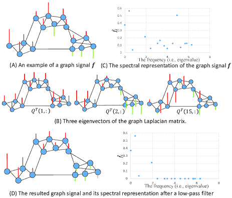

图 11：一个图信号及其通过图拉普拉斯矩阵特征向量变换后的谱表示的示例。向上的红线表示正值，而向下的绿线表示负值。这些图像改编自[6]。

## 附录 D 图信号示例

为帮助理解 GCNs，我们提供了一个图信号的示例，并参考[6, 7, 170]以获取更全面的综述。

给定一个图 $G=(V,E)$，图信号 $\mathbf{f}$ 对应于一组数字：每个图中的节点一个数字。对于无向图，我们通常假设信号取实值，即 $\mathbf{f}\in\mathbb{R}^{N}$，其中 $N$ 是节点数量。任何满足上述要求的节点特征都可以视为图信号，图 11 (A) 中展示了一个示例。信号值和底层图结构在处理和分析图信号时都很重要。例如，我们可以通过图拉普拉斯矩阵的特征向量将图信号转换到谱域：

|  | $\hat{\mathbf{f}}=\mathbf{Q}^{T}\mathbf{f}$ |  | (64) |
| --- | --- | --- | --- |

或等效地

|  | $\hat{\mathbf{f}}_{i}=\mathbf{Q}^{T}(i,:)\mathbf{f}.$ |  | (65) |
| --- | --- | --- | --- |

由于特征向量$\mathbf{Q}^{T}$是根据对应的特征值按升序排序的，已证明 [6]，它们构成了基于不同“平滑度”的图信号的基。具体而言，对应于小特征值的特征向量表示平滑信号和低频率，而对应于大特征值的特征向量表示非平滑信号和高频率，如图 11 (B)所示。请注意，平滑度是相对于图结构来测量的，即信号是否在图中的边缘上振荡。因此，$\hat{\mathbf{f}}$提供了信号$\mathbf{f}$的谱表示，如图 11 (C)所示。这类似于欧几里得空间中的傅里叶变换。使用$\hat{\mathbf{f}}$，我们可以设计各种信号处理操作。例如，如果应用低通滤波器，结果信号将更平滑，如图 11 (D)所示（在此示例中，我们将频率阈值设置为 2，即仅保留最低的 4 个频率）。

## 附录 E 时间复杂度

¹³¹³脚注: 结果在 Kipf 和 Welling [102]中报告。

在本节中，我们解释了如何获得所有表格中的时间复杂度。具体而言，我们主要关注图的规模的时间复杂度，例如节点数$N$和边数$M$，而忽略其他因素，例如隐藏维度数$f_{l}$或迭代次数，因为后者通常设为小常数且不具主导性。请注意，我们关注的是理论结果，而一个算法的实际效率还很大程度上依赖于其实现和减少时间复杂度常数的技术。

+   •

    GNN [23]: $O(MI_{f})$，其中$I_{f}$是 Eq. (1)达到稳定点所需的迭代次数，如论文所示。

+   •

    GGS-NNs [24]: $O(MT)$，其中$T$是预设的最大伪时间，因为该方法在每次更新中利用了所有边。

+   •

    SSE [25]: $O(d_{\text{avg}}S)$，其中$d_{\text{avg}}$是平均度，$S$是样本总数，如论文所示。

+   •

    You et al. [26]: $O(N^{2})$，如论文所示。

+   •

    DGNN [27]: $O(Md_{\text{avg}})$，其中$d_{\text{avg}}$是平均度，因为考虑了每条边的一步传播的效果。

+   •

    RMGCNN [28]： $O(MN)$或$O(M)$，取决于是否采用了近似技术，如论文所示。

+   •

    动态 GCN [29]： $O(Mt)$，其中$t$表示模型每个时间片运行一个 GCN 的时间段。

+   •

    Bruna et al. [40] 和 Henaff et al. [41]： $O(N^{3})$，由于特征分解的时间复杂度。

+   •

    ChebNet [42]，Kipf 和 Welling [43]，CayletNet [44]，GWNN [45] 和 Neural FPs [46]： $O(M)$，如相应论文所示。

+   •

    PATCHY-SAN [47]： $O(M\log N)$，假设该方法采用了 WL 对节点进行标记，如论文所示。

+   •

    LGCN [48]： $O(M)$，因为每个节点的所有邻居都按照该方法进行了排序。

+   •

    SortPooling [49]： $O(M)$，由于采用的图卷积层的时间复杂度。

+   •

    DCNN [50]： $O(N^{2})$，如报告中所述。

+   •

    DGCN [51]： $O(N^{2})$，因为 PPMI 矩阵是稠密的。

+   •

    MPNNs [52]： $O(M)$，如论文所示。

+   •

    GraphSAGE [53]： $O(Ns^{L})$，其中$s$是采样邻域的大小，$L$是层数，如论文所示。

+   •

    MoNet [54]： $O(M)$，因为计算中只涉及现有的节点对。

+   •

    GNs [9]： $O(M)$，因为计算中只涉及现有的节点对。

+   •

    Kearnes et al. [55]： $O(M)$，因为计算中只使用了现有的节点对。

+   •

    DiffPool [56]： $O(N^{2})$，因为粗化图不是稀疏的。

+   •

    GAT [57]： $O(M)$，如论文所示。

+   •

    GaAN [58]： $O(Ns^{L})$，其中$s$是预设的最大邻域长度，$L$是层数，如论文所示。

+   •

    HAN [59]： $O(M_{\phi})$，基于元路径的节点对数，如论文所示。

+   •

    CLN [60]： $O(M)$，因为计算中只涉及现有的节点对。

+   •

    PPNP [61]： $O(M)$，如论文所示。

+   •

    JK-Nets [62]： $O(M)$，由于采用的图卷积层的时间复杂度。

+   •

    ECC [63]： $O(M)$，如论文所示。

+   •

    R-GCNs [64]： $O(M)$，因为不同类型的边总和为图的总边数。

+   •

    LGNN [65]： $O(M)$，如论文所示。

+   •

    PinSage [66]： $O(Ns^{L})$，其中$s$是采样邻域的大小，$L$是层数，因为采用了类似于 GraphSAGE [53]的采样策略。

+   •

    随机 GCN [67]： $O(Ns^{L})$，如论文所示。

+   •

    FastGCN [68] 和 Adapt [69]： $O(NsL)$，因为样本是在每一层而不是在邻域中抽取的，如论文所示。

+   •

    Li et al. [70]: $O(M)$，由于采用的图卷积层中的时间复杂度。

+   •

    SGC [71]: $O(M)$，因为计算与 Kipf 和 Welling [43]相同，不采用非线性激活函数。

+   •

    GFNN [72]: $O(M)$，因为计算与 SGC [71]相同，仅增加了一个额外的 MLP 层。

+   •

    GIN [73]: $O(M)$，由于采用的图卷积层中的时间复杂度。

+   •

    DGI [74]: $O(M)$，由于采用的图卷积层中的时间复杂度。

+   •

    SAE [96]和 SDNE [97]: $O(M)$，如相应论文中所示。

+   •

    DNGR [98]: $O(N^{2})$，由于计算 PPMI 矩阵的时间复杂度。

+   •

    GC-MC [99]: $O(M)$，因为编码器采用了 Kipf 和 Welling [43]提出的 GCN，且解码器中仅考虑图的非零元素。

+   •

    DRNE [100]: $O(Ns)$，其中$s$是预设的最大邻域长度，如论文中所示。

+   •

    G2G [101]: $O(M)$，由于排名损失的定义。

+   •

    VGAE [102]: $O(N^{2})$，由于需要重建所有节点对。

+   •

    DVNE [103]: 尽管原论文报告的时间复杂度为$O(Md_{\text{avg}})$（其中$d_{\text{avg}}$是平均度），但我们通过与作者的个人交流确认，可以轻松改进为$O(M)$。

+   •

    ARGA/ARVGA [104]: $O(N^{2})$，由于需要重建所有节点对。

+   •

    NetRA [105]: $O(M)$，如论文中所示。

+   •

    GCPN [116]: $O(MN)$，因为在生成每个边时使用了所有节点的嵌入。

+   •

    MolGAN [117]和 GTPN [118]: $O(N^{2})$，因为必须计算所有节点对的得分。

+   •

    GAM [119]: $O(d_{\text{avg}}sT)$，其中$d_{\text{avg}}$是平均度，$s$是采样随机游走的数量，$T$是游走长度，如论文中所示。

+   •

    DeepPath [120]: $O(d_{\text{avg}}sT+s^{2}T)$，其中$d_{\text{avg}}$是平均度，$s$是采样路径的数量，$T$是路径长度。前一个项对应路径查找，后一个项来自多样性约束。

+   •

    MINERVA [121]: $O(d_{\text{avg}}sT)$，其中$d_{\text{avg}}$是平均度，$s$是采样路径的数量，$T$是路径长度，类似于 DeepPath [120]中的路径查找方法。

+   •

    GraphGAN [124]: $O(MN)$，如论文中所示。

+   •

    ANE [125]: $O(N)$，这是生成器和判别器中模型引入的额外时间复杂度。

+   •

    GraphSGAN [126]: $O(N^{2})$，由于目标函数中的时间复杂度。

+   •

    NetGAN [127]: $O(M)$，如论文中所示。

+   •

    Nettack [128]：$O(Nd_{0}^{2})$，其中$d_{0}$是目标节点的度数，如论文中所示。

+   •

    Dai 等 [129]：$O(M)$，这是最有效策略 RL-S2V 的时间复杂度，如论文中所示。

+   •

    Zugner 和 Gunnemann [130]：$O(N^{2})$，如论文中所示。
