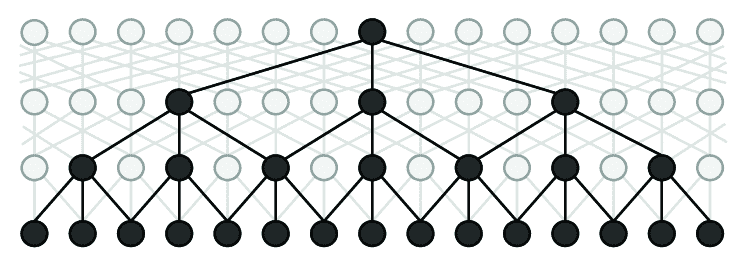

<!--yml

类别：未分类

日期：2024-09-06 20:06:50

-->

# [1812.09449] 深度学习在命名实体识别中的综述

> 来源：[`ar5iv.labs.arxiv.org/html/1812.09449`](https://ar5iv.labs.arxiv.org/html/1812.09449)

# 深度学习在命名实体识别中的综述

命名实体识别

Jing Li, Aixin Sun, Jianglei Han 和 Chenliang Li J. Li 在阿联酋的人工智能创新院工作。本研究是在作者在新加坡南洋理工大学工作期间完成的。电子邮件：jli030@e.ntu.edu.sg。A. Sun 在新加坡南洋理工大学计算机科学与工程学院工作。电子邮件：axsun@ntu.edu.sg。J. Han 在新加坡 SAP 工作。电子邮件：ray.han@sap.com。C. Li 在中国武汉大学网络科学与工程学院工作。电子邮件：cllee@whu.edu.cn。被 IEEE TKDE 接受。

###### 摘要

命名实体识别（NER）是从文本中识别属于预定义语义类型（如人、地点、组织等）的固定指代符的任务。NER 始终作为许多自然语言应用的基础，如问答系统、文本摘要和机器翻译。早期的 NER 系统在通过设计领域特定特征和规则来实现良好性能方面取得了巨大成功，但代价是需要人工工程。近年来，深度学习通过连续的实值向量表示和非线性处理的语义组合，已被应用于 NER 系统中，取得了最先进的性能。在本文中，我们对现有的深度学习技术在 NER 中的应用进行了全面回顾。我们首先介绍 NER 资源，包括标记的 NER 语料库和现成的 NER 工具。然后，我们根据三个维度对现有工作进行系统分类：输入的分布式表示、上下文编码器和标签解码器。接下来，我们调查了深度学习在新的 NER 问题设置和应用中的最具代表性的方法。最后，我们向读者介绍了 NER 系统面临的挑战，并概述了该领域的未来发展方向。

###### 索引词：

自然语言处理，命名实体识别，深度学习，综述

## 1 引言

命名实体识别（NER）旨在识别文本中属于预定义语义类型的固定指代符，如人、地点、组织等[1]。NER 不仅作为信息提取（IE）的独立工具，还在许多自然语言处理（NLP）应用中发挥着重要作用，如文本理解[2, 3]，信息检索[4, 5]，自动文本摘要[6]，问答系统[7]，机器翻译[8]，和知识库构建[9]等。

NER 的发展。术语“命名实体”（NE）首次在第六届消息理解会议（MUC-6）[10]上使用，指的是识别文本中的组织、人员和地理位置的名称，以及货币、时间和百分比表达。从 MUC-6 以来，对 NER 的兴趣不断增加，许多科学事件（例如 CoNLL03[11]、ACE[12]、IREX[13]和 TREC 实体跟踪[14]）对这一主题投入了大量精力。

关于问题定义，Petasis 等人[15]限制了命名实体的定义：“一个命名实体是一个专有名词，作为某物或某人的名称。”这一限制是因为语料库中专有名词的比例很高。Nadeau 和 Sekine[1]声称，“Named”一词将任务限制为仅包括那些有一个或多个固定指称符代指的实体。固定指称符在[16]中定义，包括专有名词和自然类别术语，如生物物种和物质。尽管对命名实体的定义各不相同，但研究人员对需要识别的命名实体类型达成了一致意见。我们通常将命名实体分为两类：通用命名实体（例如，人和地点）和领域特定命名实体（例如，蛋白质、酶和基因）。在本文中，我们主要关注英语中的通用命名实体。我们不声称这篇文章涵盖了所有语言中的所有 NER 工作。

关于命名实体识别（NER）中应用的技术，主要有四种流派：1）基于规则的方法，它们不需要标注数据，因为依赖于手工制定的规则；2）无监督学习方法，它们依赖于无监督算法而不需要手工标注的训练示例；3）基于特征的监督学习方法，它们依赖于监督学习算法并且需要仔细的特征工程；4）基于深度学习的方法，它们以端到端的方式自动发现分类和/或检测所需的表示。我们简要介绍 1）、2）和 3），并详细回顾 4）。

进行这项调查的动机。近年来，深度学习（DL，也称为深度神经网络）由于在各种领域的成功而引起了广泛关注。从 Collobert 等人[17]开始，基于深度学习的 NER 系统在极少的特征工程下蓬勃发展。在过去几年中，相当多的研究将深度学习应用于 NER，并逐步推动了最先进的性能[17、18、19、20、21]。这一趋势激励我们进行调查，以报告深度学习技术在 NER 研究中的现状。通过比较 DL 架构的选择，我们旨在识别影响 NER 性能的因素以及存在的问题和挑战。

另一方面，尽管 NER 研究已经蓬勃发展了几十年，尽我们所知，目前在这一领域的综述文章仍然较少。可以说，最为成熟的一篇综述文章是由 Nadeau 和 Sekine [1]于 2007 年发表的。这篇综述介绍了从手工规则到机器学习的技术趋势概况。Marrero 等人 [22]在 2013 年从谬误、挑战和机遇的角度总结了 NER 工作。随后，Patawar 和 Potey [23]在 2015 年提供了一篇简短的综述。最近的两篇简短综述分别涉及新领域 [24]和复杂实体提及 [25]。总之，现有的综述主要覆盖了基于特征的机器学习模型，而不是现代基于深度学习的 NER 系统。本工作更相关的是 2018 年的两篇近期综述 [26, 27]。Goyal 等人 [27]调查了 NER 的最新进展。然而，他们并未包含深度学习技术的最新进展。Yadav 和 Bethard [26]对基于句子中单词表示的 NER 最新进展进行了简要综述。这篇综述更多地关注于输入的分布式表示（例如，字符和词级嵌入），而未对上下文编码器和标签解码器进行评审。近年来应用深度学习于 NER 任务的趋势（如多任务学习、迁移学习、强化学习和对抗学习）也未在他们的综述中涉及。

本综述的贡献。我们深入回顾了深度学习技术在 NER 中的应用，以启发和指导该领域的研究人员和从业者。具体而言，我们将 NER 语料库、现成的 NER 系统（来自学术界和工业界）以表格形式汇总，提供有用的资源给 NER 研究社区。然后，我们对深度学习技术在 NER 中的应用进行了全面的综述。为此，我们提出了一个新的分类法，该分类法系统地沿三个轴线组织基于深度学习的 NER 方法：输入的分布式表示、上下文编码器（用于捕获上下文依赖关系以进行标签解码）和标签解码器（用于预测给定序列中单词的标签）。此外，我们还综述了最近在新的 NER 问题设置和应用中的代表性深度学习方法。最后，我们向读者展示了 NER 系统面临的挑战，并概述了该领域的未来方向。

## 2 背景

我们首先给出 NER 问题的正式表述。接着，我们介绍了广泛使用的 NER 数据集和工具。然后，我们详细说明了评估指标，并总结了传统的 NER 方法。

### 2.1 什么是 NER？

命名实体是指从一组具有相似属性的其他项中明确识别出某一项的词语或短语[28]。命名实体的示例包括一般领域中的组织、个人和地点名称；生物医学领域中的基因、蛋白质、药物和疾病名称。NER 是在文本中定位和分类命名实体的过程，将其划分为预定义的实体类别。

图 1：命名实体识别任务的示意图。

从形式上讲，给定一个标记序列 $s=\langle w_{1},w_{2},...,w_{N}\rangle$，NER 的目标是输出一个元组列表 $\langle I_{s},I_{e},t\rangle$，每个元组都是 $s$ 中提到的命名实体。这里，$I_{s}\in[1,N]$ 和 $I_{e}\in[1,N]$ 是命名实体提及的起始和结束索引；$t$ 是预定义类别集中的实体类型。图 1 显示了一个例子，其中 NER 系统从给定的句子中识别出三个命名实体。当 NER 在 MUC-6[10] 中首次定义时，该任务是识别文本中的人名、组织名、地点名以及时间、货币、百分比表达。请注意，该任务集中在一小部分粗粒度实体类型和每个命名实体一个类型上。我们将这种 NER 任务称为粗粒度 NER[10, 11]。最近，一些细粒度 NER 任务[29, 30, 31, 32, 33] 专注于更大范围的实体类型，其中一个提及可能被分配多个细粒度类型。

NER 作为多种下游应用的重要预处理步骤，如信息检索、问答系统、机器翻译等。这里，我们以语义搜索为例，说明 NER 在支持各种应用中的重要性。语义搜索指一组技术，使搜索引擎能够理解用户查询背后的概念、意义和意图[34]。根据[4]，大约 71% 的搜索查询包含至少一个命名实体。在搜索查询中识别命名实体有助于更好地理解用户意图，从而提供更好的搜索结果。为了在搜索中纳入命名实体，Raviv 等人[35] 提出了基于实体的语言模型[34]，该模型考虑了作为实体标注的单个术语及术语序列（无论是在文档还是查询中）。还有一些研究利用命名实体来增强用户体验，如查询推荐[36]、查询自动补全[37, 38]和实体卡片[39, 40]。

表 I：英语命名实体识别（NER）标注数据集列表。“#Tags”指实体类型的数量。

| Corpus | 年份 | 文本来源 | 标签数 | URL |
| --- | --- | --- | --- | --- |
| MUC-6 | 1995 | 华尔街日报 | 7 | [`catalog.ldc.upenn.edu/LDC2003T13`](https://catalog.ldc.upenn.edu/LDC2003T13) |
| MUC-6 Plus | 1995 | MUC-6 的附加新闻 | 7 | [`catalog.ldc.upenn.edu/LDC96T10`](https://catalog.ldc.upenn.edu/LDC96T10) |
| MUC-7 | 1997 | 纽约时报新闻 | 7 | [`catalog.ldc.upenn.edu/LDC2001T02`](https://catalog.ldc.upenn.edu/LDC2001T02) |
| CoNLL03 | 2003 | 路透社新闻 | 4 | [`www.clips.uantwerpen.be/conll2003/ner/`](https://www.clips.uantwerpen.be/conll2003/ner/) |
| ACE | 2000 - 2008 | 转录文本、新闻 | 7 | [`www.ldc.upenn.edu/collaborations/past-projects/ace`](https://www.ldc.upenn.edu/collaborations/past-projects/ace) |
| OntoNotes | 2007 - 2012 | 杂志、新闻、网络等 | 18 | [`catalog.ldc.upenn.edu/LDC2013T19`](https://catalog.ldc.upenn.edu/LDC2013T19) |
| W-NUT | 2015 - 2018 | 用户生成文本 | 6/10 | [`noisy-text.github.io`](http://noisy-text.github.io) |
| BBN | 2005 | 华尔街日报 | 64 | [`catalog.ldc.upenn.edu/LDC2005T33`](https://catalog.ldc.upenn.edu/LDC2005T33) |
| WikiGold | 2009 | 维基百科 | 4 | https://figshare.com/articles/Learning_multilingual_named_entity _recognition_from_Wikipedia/5462500 |
| WiNER | 2012 | 维基百科 | 4 | [`rali.iro.umontreal.ca/rali/en/winer-wikipedia-for-ner`](http://rali.iro.umontreal.ca/rali/en/winer-wikipedia-for-ner) |
| WikiFiger | 2012 | 维基百科 | 112 | [`github.com/xiaoling/figer`](https://github.com/xiaoling/figer) |
| HYENA | 2012 | 维基百科 | 505 | https://www.mpi-inf.mpg.de/departments/databases-and-information-systems/research/yago-naga/hyena |
| N³ | 2014 | 新闻 | 3 | [`aksw.org/Projects/N3NERNEDNIF.html`](http://aksw.org/Projects/N3NERNEDNIF.html) |
| Gillick | 2016 | 杂志、新闻、网络等 | 89 | [`arxiv.org/e-print/1412.1820v2`](https://arxiv.org/e-print/1412.1820v2) |
| FG-NER | 2018 | 各种 | 200 | [`fgner.alt.ai/`](https://fgner.alt.ai/) |
| NNE | 2019 | 新闻稿 | 114 | [`github.com/nickyringland/nested_named_entities`](https://github.com/nickyringland/nested_named_entities) |
| GENIA | 2004 | 生物学和临床文本 | 36 | [`www.geniaproject.org/home`](http://www.geniaproject.org/home) |
| GENETAG | 2005 | MEDLINE | 2 | [`sourceforge.net/projects/bioc/files/`](https://sourceforge.net/projects/bioc/files/) |
| FSU-PRGE | 2010 | PubMed 和 MEDLINE | 5 | [`julielab.de/Resources/FSU_PRGE.html`](https://julielab.de/Resources/FSU_PRGE.html) |
| NCBI-Disease | 2014 | PubMed | 1 | [`www.ncbi.nlm.nih.gov/CBBresearch/Dogan/DISEASE/`](https://www.ncbi.nlm.nih.gov/CBBresearch/Dogan/DISEASE/) |
| BC5CDR | 2015 | PubMed | 3 | [`bioc.sourceforge.net/`](http://bioc.sourceforge.net/) |
| DFKI | 2018 | 商业新闻和社交媒体 | 7 | [`dfki-lt-re-group.bitbucket.io/product-corpus/`](https://dfki-lt-re-group.bitbucket.io/product-corpus/) |

### 2.2 NER 资源：数据集和工具

高质量的注释对模型学习和评估至关重要。接下来，我们总结了广泛使用的数据集和现成的工具，用于英语 NER。

标注语料库是包含一种或多种实体类型注释的文档集合。表格 I 列出了某些广泛使用的数据集及其数据源和实体类型数量（也称为标签类型）。在表格 I 中总结了，2005 年之前，数据集主要通过标注新闻文章来开发，实体类型数量较少，适合粗粒度的 NER 任务。之后，更多的数据集在各种文本源上开发，包括维基百科文章、对话和用户生成的文本（例如，推文、YouTube 评论和 W-NUT 中的 StackExchange 帖子）。标签类型的数量显著增加，例如，HYENA 中有 505 种。我们还列出了许多特定领域的数据集，特别是在 PubMed 和 MEDLINE 文本上开发的。实体类型的数量从 NCBI-Disease 中的 1 到 GENIA 中的 36 不等。

我们注意到许多近期的命名实体识别（NER）研究报告了它们在 CoNLL03 和 OntoNotes 数据集上的表现（参见表格 III）。CoNLL03 包含了两种语言的路透新闻注释：英语和德语。英语数据集包含了大量的体育新闻，标注了四种实体类型（Person、Location、Organization 和 Miscellaneous）[11]。OntoNotes 项目的目标是对一个大语料库进行注释，包括各种类型（博客、新闻、谈话节目、广播、Usenet 新闻组和对话电话语音）的结构信息（语法和谓词参数结构）和浅层语义（与本体链接的词义和共指）。共有 5 个版本，从 Release 1.0 到 Release 5.0。文本被注释为 18 种实体类型。我们还注意到两个 Github 仓库¹¹1[`github.com/juand-r/entity-recognition-datasets`](https://github.com/juand-r/entity-recognition-datasets) 和 [`github.com/cambridgeltl/MTL-Bioinformatics-2016/tree/master/data`](https://github.com/cambridgeltl/MTL-Bioinformatics-2016/tree/master/data) 托管了一些 NER 语料库。

表格 II：学术界和工业项目提供的现成 NER 工具。

| NER 系统 | URL |
| --- | --- |
| StanfordCoreNLP | [`stanfordnlp.github.io/CoreNLP/`](https://stanfordnlp.github.io/CoreNLP/) |
| OSU Twitter NLP | [`github.com/aritter/twitter_nlp`](https://github.com/aritter/twitter_nlp) |
| Illinois NLP | [`cogcomp.org/page/software/`](http://cogcomp.org/page/software/) |
| NeuroNER | [`neuroner.com/`](http://neuroner.com/) |
| NERsuite | [`nersuite.nlplab.org/`](http://nersuite.nlplab.org/) |
| Polyglot | [`polyglot.readthedocs.io`](https://polyglot.readthedocs.io) |
| Gimli | [`bioinformatics.ua.pt/gimli`](http://bioinformatics.ua.pt/gimli) |
| spaCy | [`spacy.io/api/entityrecognizer`](https://spacy.io/api/entityrecognizer) |
| NLTK | [`www.nltk.org`](https://www.nltk.org) |
| OpenNLP | [`opennlp.apache.org/`](https://opennlp.apache.org/) |
| LingPipe | [`alias-i.com/lingpipe-3.9.3/`](http://alias-i.com/lingpipe-3.9.3/) |
| AllenNLP | [`demo.allennlp.org/`](https://demo.allennlp.org/) |
| IBM Watson | https://natural-language-understanding-demo.ng.bluemix.net |
| FG-NER | [`fgner.alt.ai/extractor/`](https://fgner.alt.ai/extractor/) |
| Intellexer | [`demo.intellexer.com/`](http://demo.intellexer.com/) |
| Repustate | https://repustate.com/named-entity-recognition-api-demo |
| AYLIEN | [`developer.aylien.com/text-api-demo`](https://developer.aylien.com/text-api-demo) |
| Dandelion API | https://dandelion.eu/semantic-text/entity-extraction-demo |
| displaCy | [`explosion.ai/demos/displacy-ent`](https://explosion.ai/demos/displacy-ent) |
| ParallelDots | https://www.paralleldots.com/named-entity-recognition |
| TextRazor | https://www.textrazor.com/named_entity_recognition |

在线有许多具有预训练模型的 NER 工具。表 II 总结了学术界（上）和工业界（下）对英语 NER 的流行工具。

### 2.3 NER 评估指标

NER 系统通常通过将其输出与人工注释进行比较来进行评估。比较可以通过精确匹配或宽松匹配来量化。

#### 2.3.1 精确匹配评估

NER 本质上涉及两个子任务：边界检测和类型识别。在“精确匹配评估”[11, 41, 42]中，正确识别的实例要求系统同时正确识别其边界和类型。更具体地说，利用假阳性（FP）、假阴性（FN）和真阳性（TP）的数量来计算精度、召回率和 F 值。

+   •

    假阳性（FP）：由 NER 系统返回但未出现在真实数据中的实体。

+   •

    假阴性（FN）：由 NER 系统未返回但出现在真实数据中的实体。

+   •

    真阳性（TP）：由 NER 系统返回并且也出现在真实数据中的实体。

精度指的是系统结果中正确识别的百分比。召回率指的是系统正确识别的总实体的百分比。

|  | $\text{Precision}=\frac{\#TP}{\#(TP+FP)}\quad\quad\text{Recall}=\frac{\#TP}{\#(TP+FN)}$ |  |
| --- | --- | --- |

一种结合精确度和召回率的度量是精确度和召回率的调和平均数，即传统的 F-measure 或平衡 F-score：

|  | $\text{F-score}=2\times\frac{\text{Precision}\times\text{Recall}}{\text{Precision}+\text{Recall}}$ |  |
| --- | --- | --- |

此外，宏平均 F-score 和微平均 F-score 都考虑了多个实体类型的表现。宏平均 F-score 独立计算不同实体类型的 F-score，然后取这些 F-scores 的平均值。微平均 F-score 则将所有实体类型的假阴性、假阳性和真正例相加，然后应用于统计。这种方法可能会受到大类别实体识别质量的较大影响。

#### 2.3.2 放宽匹配评估

MUC-6[10]定义了放宽匹配评估：如果一个实体被分配到正确的类型，而其边界与真实边界有重叠，即使其边界不完全正确，也会被记为正确类型；如果一个实体的边界正确，不论其类型分配如何，也会被记为正确边界。然后 ACE[12]提出了更复杂的评估程序。它解决了部分匹配和错误类型等问题，并考虑了命名实体的子类型。然而，这种方法存在问题，因为最终得分仅在参数固定时才具有可比性[1, 23, 22]。复杂的评估方法不直观，且使得错误分析变得困难。因此，复杂的评估方法在最近的研究中不被广泛使用。

### 2.4 传统 NER 方法

传统的 NER 方法大致分为三大类：基于规则的方法、无监督学习方法和基于特征的监督学习方法[1, 26]。

#### 2.4.1 基于规则的方法

基于规则的 NER 系统依赖于手工制定的规则。规则可以根据领域特定的词典[43, 9]和句法-词汇模式[44]来设计。Kim[45]提议使用 Brill 规则推断方法处理语音输入。该系统基于 Brill 的词性标注器自动生成规则。在生物医学领域，Hanisch 等人[46]提出了 ProMiner，该系统利用预处理的同义词词典来识别生物医学文本中的蛋白质提及和潜在基因。Quimbaya 等人[47]提出了一种基于词典的方法，用于电子健康记录中的 NER。实验结果显示该方法提高了召回率，同时对精确度影响有限。

一些其他著名的基于规则的 NER 系统包括 LaSIE-II [48]、NetOwl [49]、Facile [50]、SAR [51]、FASTUS [52] 和 LTG [53] 系统。这些系统主要基于手工制作的语义和句法规则来识别实体。基于规则的系统在词汇表完整时效果很好。由于领域特定规则和不完整的词典，这些系统通常表现出高精度和低召回率，并且这些系统无法转移到其他领域。

#### 2.4.2 无监督学习方法

无监督学习的典型方法是聚类 [1]。基于聚类的 NER 系统根据上下文相似性从聚类组中提取命名实体。关键思想是，词汇资源、词汇模式和在大型语料库上计算的统计数据可以用来推断命名实体的提及。Collins 等 [54] 观察到使用未标记的数据将监督要求减少到仅仅 7 条简单的“种子”规则。作者随后提出了两种用于命名实体分类的无监督算法。类似地，KNOWITALL [9] 利用一组谓词名称作为输入，并从一小组通用提取模式中引导其识别过程。

Nadeau 等 [55] 提出了一个用于地名库构建和命名实体歧义解决的无监督系统。该系统结合了基于简单但高度有效的启发式方法的实体提取和消歧。此外，Zhang 和 Elhadad [44] 提出了从生物医学文本中提取命名实体的无监督方法。他们的模型依靠术语、语料库统计（例如逆文档频率和上下文向量）以及浅层句法知识（例如名词短语切分）来代替监督。对两个主流生物医学数据集的实验展示了他们的无监督方法的有效性和泛化能力。

#### 2.4.3 基于特征的监督学习方法

采用监督学习，命名实体识别（NER）被转化为多类分类或序列标注任务。在给定的标注数据样本中，特征被精心设计以表示每个训练实例。然后，使用机器学习算法来学习一个模型，以从未见过的数据中识别类似的模式。

特征工程在监督 NER 系统中至关重要。特征向量表示是对文本的抽象，其中一个词可以由一个或多个布尔值、数值或名义值[56、1]表示。词级特征（例如，大小写、形态学和词性标签）[57、58、59]，列表查找特征（例如，维基百科地名和 DBpedia 地名）[60、61、62、63]，以及文档和语料库特征（例如，本地语法和多次出现）[64、65、66、67]在各种监督 NER 系统中被广泛使用。更多特征设计的讨论见[1、68、28]。

基于这些特征，许多机器学习算法已被应用于监督命名实体识别（NER），包括隐马尔可夫模型（HMM）[69]、决策树[70]、最大熵模型[71]、支持向量机（SVM）[72]和条件随机场（CRF）[73]。

Bikel 等人[74、75]提出了第一个基于 HMM 的 NER 系统，名为 IdentiFinder，用于识别和分类名称、日期、时间表达式和数值量。此外，Szarvas 等人[76]通过使用 C4.5 决策树和 AdaBoostM1 学习算法开发了一个多语言 NER 系统。其主要优点是提供了通过不同特征子集训练多个独立的决策树分类器的机会，然后通过多数投票机制结合它们的决策。Borthwick 等人[77]提出了通过应用最大熵理论的“最大熵命名实体”（MENE）。MENE 能够利用极其多样化的知识源来做出标记决策。其他使用最大熵的系统可以在[78、79、80]中找到。

McNamee 和 Mayfield[81]使用了 1000 个与语言相关的特征和 258 个正字法及标点特征来训练 SVM 分类器。每个分类器做出二元决策，判断当前的标记是否属于八个类别之一，即 B-（开始）、I-（内部）用于 PERSON、ORGANIZATION、LOCATION 和 MIS 标签。SVM 在预测实体标签时不会考虑“邻近”的词语。CRF 则考虑了上下文。McCallum 和 Li[82]提出了一种用于 NER 的 CRF 特征诱导方法。实验在 CoNLL03 上进行，取得了 84.04%的 F-score。Krishnan 和 Manning[67]提出了一种基于两个耦合 CRF 分类器的两阶段方法。第二个 CRF 利用从第一个 CRF 输出中得到的潜在表示。我们注意到，基于 CRF 的 NER 已广泛应用于各个领域的文本，包括生物医学文本[58, 83]、推文[84, 85]和化学文本[86]。

## 3 深度学习技术用于 NER

近年来，基于深度学习（DL）的命名实体识别（NER）模型变得主导，并取得了最先进的结果。与基于特征的方法相比，深度学习在自动发现隐藏特征方面具有优势。接下来，我们首先简要介绍深度学习是什么，以及为什么使用深度学习进行 NER。然后，我们将调查基于 DL 的 NER 方法。

### 3.1 为什么选择深度学习用于 NER？

深度学习是机器学习的一个领域，由多个处理层组成，以学习具有多层次抽象的数据表示[87]。典型的层是人工神经网络，包括前向传播和反向传播。前向传播计算来自前一层的输入的加权和，并通过非线性函数传递结果。反向传播是通过导数链式法则计算目标函数相对于多层模块堆叠的权重的梯度。深度学习的关键优势在于表示学习和由向量表示及神经处理赋能的语义组合能力。这使得机器可以接收原始数据，自动发现分类或检测所需的潜在表示和处理[87]。

将深度学习技术应用于 NER 有三个核心优势。首先，NER 受益于非线性变换，这生成了从输入到输出的非线性映射。与线性模型（例如，log-linear HMM 和线性链 CRF）相比，基于深度学习的模型能够通过非线性激活函数从数据中学习复杂和细致的特征。其次，深度学习显著减少了设计 NER 特征的工作量。传统的基于特征的方法需要大量的工程技能和领域专业知识。而基于深度学习的模型则能够有效地从原始数据中自动学习有用的表示和潜在因素。第三，深度神经 NER 模型可以通过梯度下降以端到端的方式进行训练。这一特性使我们能够设计可能复杂的 NER 系统。

图 2：基于深度学习的命名实体识别（NER）分类。从输入序列到预测标签，基于深度学习的 NER 模型包括输入的分布式表示、上下文编码器和标签解码器。

(a) 基于 CNN 的字符级表示。

(b) 基于 RNN 的字符级表示。

图 3：用于提取单词字符级表示的 CNN-based 和 RNN-based 模型。

我们在本调查中为何使用新的分类法？现有的分类法[88, 26] 基于字符级编码器、词级编码器和标签解码器。我们认为“词级编码器”的描述不准确，因为在典型的基于深度学习的命名实体识别模型中，词级信息使用了两次：1）词级表示作为原始特征使用，2）词级表示（与字符级表示一起）用于捕捉上下文依赖以进行标签解码。在本调查中，我们总结了命名实体识别领域的最新进展，通用架构如图 2 所示。输入的分布式表示考虑了词级和字符级嵌入以及其他有效的附加特征，如 POS 标签和词典，这些特征在基于特征的方法中效果显著。上下文编码器使用 CNN、RNN 或其他网络来捕捉上下文依赖。标签解码器预测输入序列中每个标记的标签。例如，在图 2 中，每个标记都预测一个由 B-(begin)、I-(inside)、E-(end)、S-(singleton)表示的命名实体类型的标签，或 O-(outside)表示非命名实体。请注意，还有其他标签方案或标签符号，例如 BIO。标签解码器也可以被训练来检测实体边界，然后将检测到的文本跨度分类到实体类型。

### 3.2 输入的分布式表示

表示一个词的直接选择是独热向量表示。在独热向量空间中，两个不同的词具有完全不同的表示，并且是正交的。分布式表示以低维实值密集向量表示词汇，其中每个维度代表一个潜在特征。自动从文本中学习的分布式表示捕捉了词的语义和句法特性，这些特性在 NER 输入中并没有明确呈现。接下来，我们回顾了在 NER 模型中使用的三种类型的分布式表示：词级、字符级和混合表示。

#### 3.2.1 词级表示

一些研究 [89, 90, 91] 使用了词级表示，这通常是通过无监督算法在大规模文本集合上预训练的，例如连续词袋模型（CBOW）和连续 skip-gram 模型 [92]。最近的研究 [88, 93] 显示了这些预训练词嵌入的重要性。作为输入时，预训练词嵌入可以是固定的，也可以在 NER 模型训练过程中进一步微调。常用的词嵌入包括 Google Word2Vec、Stanford GloVe、Facebook fastText 和 SENNA。

Yao 等人 [94] 提出了 Bio-NER，这是一种基于深度神经网络架构的生物医学命名实体识别（NER）模型。Bio-NER 中的词表示是在 PubMed 数据库上使用 skip-gram 模型进行训练的。词典包含 205,924 个词，使用 600 维向量表示。Nguyen 等人 [89] 使用 word2vec 工具包从 Gigaword 语料库中学习英语词嵌入，并结合了来自 BOLT（Broad Operational Language Technologies）的新闻组数据。Zhai 等人 [95] 设计了一种用于序列切块的神经模型，该模型包括两个子任务：分割和标注。该神经模型可以使用 SENNA 嵌入或随机初始化的嵌入。

Zheng 等人 [90] 使用单一模型共同提取实体和关系。该端到端模型使用在 NYT 语料库上通过 word2vec 工具包学习的词嵌入。Strubell 等人 [91] 提出了基于迭代膨胀卷积神经网络（ID-CNNs）的标注方案。他们模型中的查找表由在 SENNA 语料库上通过 skip-n-gram 训练的 100 维嵌入初始化。在他们提出的用于提取实体及其关系的神经模型中，Zhou 等人 [96] 使用了从 Google 获得的预训练 300 维词向量。此外，GloVe [97, 98] 和 fastText [99] 也在 NER 任务中得到了广泛应用。

#### 3.2.2 字符级表示

除了仅将词级表示作为基本输入外，几项研究 [100, 101] 还结合了从端到端神经模型中学习的基于字符的词表示。字符级表示被发现对利用显式的子词级信息（如前缀和后缀）非常有用。字符级表示的另一个优点是它自然地处理了词汇外的情况。因此，基于字符的模型能够推断未见词的表示并共享词素级的规律信息。提取字符级表示有两种广泛使用的架构：基于 CNN 的和基于 RNN 的模型。图 3(a) 和 3(b) 说明了这两种架构。

Ma 等人 [97] 利用 CNN 提取单词的字符级表示。然后，将字符表示向量与词嵌入连接，再输入到 RNN 上下文编码器中。同样，Li 等人 [98] 应用了一系列卷积层和高速公路层来生成单词的字符级表示。单词的最终嵌入被输入到一个双向递归网络中。Yang 等人 [102] 提出了一个用于命名实体识别（NER）的神经重排序模型，其中在字符嵌入层之上使用了一个具有固定窗口大小的卷积层。最近，Peters 等人 [103] 提出了 ELMo 词表示，该表示是在两个层的双向语言模型与字符卷积的基础上计算的。

对于基于 RNN 的模型，长短期记忆网络（LSTM）和门控递归单元（GRU）是两个典型的基本单元选择。Kuru 等人[100] 提出了 CharNER，一个用于语言无关 NER 的字符级标注器。CharNER 将句子视为字符序列，并利用 LSTM 提取字符级表示。它为每个字符输出一个标签分布，而不是每个单词。然后，从字符级标签中获得词级标签。他们的结果表明，将字符作为主要表示优于将词作为基本输入单元。Lample 等人[19] 使用双向 LSTM 提取单词的字符级表示。类似于[97]，字符级表示与来自词查找表的预训练词级嵌入连接在一起。Gridach [104] 研究了在识别生物医学命名实体时的词嵌入和字符级表示。Rei 等人[105] 结合了字符级表示和词嵌入，使用了门控机制。通过这种方式，Rei 的模型动态决定从字符或词级组件中使用多少信息。Tran 等人[101] 引入了一种具有堆叠残差 LSTM 和可训练偏置解码的神经 NER 模型，其中从词嵌入和字符级 RNN 中提取词特征。Yang 等人[106] 开发了一种以统一方式处理跨语言和多任务联合训练的模型。他们采用深度双向 GRU 从单词的字符序列中学习信息丰富的形态学表示。然后，将字符级表示和词嵌入连接在一起，以产生单词的最终表示。

最近，利用递归神经网络进行的语言建模进展使得将语言建模为字符分布变得可行。Akbik 等人提出的上下文字符串嵌入[107]使用字符级神经语言模型在句子上下文中生成字符字符串的上下文嵌入。一个重要的特性是，这些嵌入是由其周围文本上下文化的，这意味着相同的单词在不同的上下文中具有不同的嵌入。图 4 说明了如何在句子上下文中提取单词“Washington”的上下文字符串嵌入的架构。

图 4：在句子上下文中提取“Washington”一词的上下文字符串嵌入[107]。从前向语言模型（以红色显示）中，模型提取了单词最后一个字符后的输出隐藏状态。从后向语言模型（以蓝色显示）中，模型提取了单词第一个字符前的输出隐藏状态。两个输出隐藏状态被串联形成词的最终嵌入。

#### 3.2.3 混合表示

除了词级和字符级表示，一些研究还将额外信息（例如，地名词典[18, 108]，词汇相似性[109]，语言依赖[110]和视觉特征[111]）融入到最终的词表示中，然后再输入到上下文编码层。换句话说，基于 DL 的表示与基于特征的方法以混合方式结合。添加额外信息可能会提高命名实体识别（NER）性能，但也可能影响这些系统的普适性。

神经模型在 NER 中的使用由[17]开创，其中提出了一种基于时间卷积神经网络的词序列架构。在融合常见先验知识（例如，地名词典和词性标注）时，所得系统优于仅使用词级表示的基线模型。在黄等人提出的 BiLSTM-CRF 模型[18]中，NER 任务使用了四种类型的特征：拼写特征、上下文特征、词嵌入和地名词典特征。他们的实验结果显示，额外特征（即地名词典）提高了标注准确性。Chiu 和 Nichols 提出的 BiLSTM-CNN 模型[20]结合了双向 LSTM 和字符级 CNN。除了词嵌入外，该模型还使用了额外的词级特征（大小写，词典）和字符级特征（4 维向量表示字符类型：大写、小写、标点符号、其他）。

Wei 等人 [112] 提出了一个基于 CRF 的神经系统，用于识别和标准化疾病名称。该系统除了词嵌入外，还采用了丰富的特征，包括词语、词性标签、分块以及词形特征（例如，词典和形态特征）。Strubell 等人 [91] 将 100 维嵌入与 5 维词形向量（例如，全大写、非大写、首字母大写或包含大写字母）连接起来。Lin 等人 [113] 将字符级表示、词级表示和语法词表示（即词性标签、依赖关系角色、词位置、主语位置）连接形成了全面的词表示。Aguilar 等人 [114] 提出了一个用于 NER 的多任务方法。该方法利用 CNN 捕捉字符级的正字法特征和词形特征。对于词级的语法和上下文信息，例如，词性和词嵌入，模型实现了 LSTM 架构。Jansson 和 Liu [115] 提出了将潜在狄利克雷分配（LDA）与深度学习结合应用于字符级和词级嵌入。

Xu 等人 [116] 提出了基于固定大小有序遗忘编码（FOFE）[117] 的局部检测方法，FOFE 探索了每个片段及其上下文的字符级和词级表示。在 Moon 等人 [118] 的多模态 NER 系统中，对于噪声较大的用户生成数据如推文和 Snapchat 字幕，词嵌入、字符嵌入和视觉特征通过模态注意力进行融合。Ghaddar 和 Langlais [109] 发现，词汇特征在神经 NER 系统中大多被忽视是不公平的。他们提出了一种替代的词汇表示，该表示在离线训练后可以添加到任何神经 NER 系统中。词汇表示通过 120 维向量计算，每个元素编码词与实体类型的相似性。最近，Devlin 等人 [119] 提出了一个新的语言表示模型，称为 BERT，即来自变换器的双向编码表示。BERT 使用掩蔽语言模型来实现预训练的深度双向表示。对于给定的标记，其输入表示由相应的位置、段落和标记嵌入的总和构成。请注意，预训练语言模型嵌入通常需要大规模的语料库进行训练，并且本质上包含辅助嵌入（例如，位置和段落嵌入）。因此，我们在本次调查中将这些上下文化的语言模型嵌入归类为混合表示。

图 5：基于 CNN 的句子处理网络 [17]。卷积层从整个句子中提取特征，将其视为具有全局结构的序列。

### 3.3 上下文编码器架构

这里，我们现在回顾一些广泛使用的上下文编码器架构：卷积神经网络、递归神经网络、递归神经网络和深度变换器。

#### 3.3.1 卷积神经网络

Collobert 等人 [17] 提出了一个句子处理网络，其中单词的标记考虑了整个句子的上下文，如图 5 所示。输入序列中的每个单词在输入表示阶段后被嵌入到一个 $N$ 维向量中。然后，使用卷积层生成围绕每个单词的局部特征，卷积层输出的大小取决于句子中的单词数量。通过结合卷积层提取的局部特征向量来构建全局特征向量。全局特征向量的维度是固定的，不依赖于句子的长度，以便应用后续的标准仿射层。提取全局特征的两种广泛使用的方法是：对句子中的位置（即“时间”步）的最大操作或平均操作。最后，这些固定大小的全局特征被输入到标签解码器中，以计算网络输入中所有可能标签的分布得分。继 Collobert 的工作之后，Yao 等人 [94] 提出了用于生物医学命名实体识别的 Bio-NER。Wu 等人 [120] 利用卷积层生成由若干全局隐藏节点表示的全局特征。然后，将局部特征和全局特征输入到标准仿射网络中，以识别临床文本中的命名实体。

Zhou 等人 [96] 观察到，在 RNN 中，后面的单词对最终句子表示的影响大于前面的单词。然而，重要的单词可能出现在句子中的任何位置。在他们提出的模型 BLSTM-RE 中，BLSTM 用于捕捉长期依赖关系并获得输入序列的整体表示。然后使用 CNN 学习高层表示，之后将其输入到 sigmoid 分类器中。最后，将由 BLSTM 生成的整体句子表示和由 sigmoid 分类器生成的关系表示输入到另一个 LSTM 中以预测实体。

传统上，LSTM 在长度为$N$的序列上的时间复杂度为$\mathcal{O(N)}$，以并行的方式进行计算。Strubell 等人[91]提出了 ID-CNNs，即迭代膨胀卷积神经网络，这种方法在处理更大上下文和结构化预测的能力上更加高效。图 6 展示了一个膨胀 CNN 块的架构，其中四个堆叠的宽度为 3 的膨胀卷积生成了令牌表示。实验结果表明，相比于 Bi-LSTM-CRF，ID-CNNs 在测试时间上获得了 14-20 倍的加速，同时保持了类似的准确性。

图 6：ID-CNNs 的架构，滤波器宽度为 3，最大膨胀宽度为 4[91]。

#### 3.3.2 循环神经网络

循环神经网络及其变体，如门控循环单元（GRU）和长短期记忆（LSTM），在建模序列数据方面表现出了显著的成就。特别是，双向 RNN 有效利用了特定时间框架中的过去信息（通过前向状态）和未来信息（通过后向状态）[18]。因此，由双向 RNN 编码的令牌将包含来自整个输入句子的证据。因此，双向 RNN 成为了构建深度上下文依赖文本表示的事实标准[91, 97]。基于 RNN 的上下文编码器的典型架构如图 7 所示。

图 7：基于 RNN 的上下文编码器架构。

Huang 等人[18]的工作是最早利用双向 LSTM CRF 架构进行序列标注任务（POS、分块和 NER）的研究之一。继[18]之后，许多研究[97, 20, 105, 112, 19, 89, 95, 90, 101, 96, 113]采用 BiLSTM 作为基础架构来编码序列上下文信息。Yang 等人[106]在字符和词汇层面上使用深度 GRUs 来编码形态和上下文信息。他们进一步扩展了他们的模型，通过共享架构和参数，扩展到跨语言和多任务联合训练。

Gregoric 等人[121] 在相同输入上使用了多个独立的双向 LSTM 单元。他们的模型通过引入跨模型正则化项来促进 LSTM 单元之间的多样性。通过将计算分配到多个较小的 LSTM 中，他们发现参数总数有所减少。最近，一些研究[122, 123] 设计了基于 LSTM 的神经网络用于嵌套命名实体识别。Katiyar 和 Cardie [122] 对标准的基于 LSTM 的序列标注模型进行了修改，以处理嵌套命名实体识别。Ju 等人 [123] 提出了一个神经模型，通过动态堆叠平面 NER 层来识别嵌套实体，直到不再提取外部实体。每个平面 NER 层使用双向 LSTM 捕捉序列上下文。该模型将当前平面 NER 层的 LSTM 层的输出合并，以构造检测到的实体的新表示，然后将其输入到下一个平面 NER 层。

#### 3.3.3 递归神经网络

图 8：用于 NER 的双向递归神经网络[98]。计算在两个方向上递归进行。自下而上的方向计算每个节点子树的语义组合，而自上而下的对应部分则向该节点传播包含子树的语言结构。

递归神经网络是非线性自适应模型，能够通过按拓扑顺序遍历给定结构来学习深层次的结构信息。命名实体与语言成分高度相关，例如名词短语[98]。然而，典型的序列标注方法对句子的短语结构考虑较少。为此，Li 等人 [98] 提出了对句法结构中的每个节点进行分类的方法。这种模型递归地计算每个节点的隐藏状态向量，并根据这些隐藏向量对每个节点进行分类。图 8 显示了如何递归地计算每个节点的两个隐藏状态特征。自下而上的方向计算每个节点子树的语义组合，而自上而下的对应部分则向该节点传播包含子树的语言结构。给定每个节点的隐藏向量，网络计算实体类型的概率分布加上一个特殊的非实体类型。

图 9: 一个附加语言建模目标的序列标注模型 [124]，对句子“Fischler proposes measures”进行 NER。在每个标记位置（例如，“proposes”），网络被优化为预测前一个词（“Fischler”）、当前标签（“O”）和序列中的下一个词（“measures”）。

#### 3.3.4 神经语言模型

语言模型是一类描述序列生成的模型。给定一个标记序列 $(t_{1},t_{2},\ldots,t_{N})$，前向语言模型通过建模标记 $t_{k}$ 在其历史 $(t_{1},\ldots,t_{k-1})$ 的条件下的概率来计算序列的概率 [21]。

|  | $p(t_{1},t_{2},\ldots,t_{N})=\prod\limits_{k=1}^{N}{p(t_{k}&#124;t_{1},t_{2},\ldots,t_{k-1})}$ |  | (1) |
| --- | --- | --- | --- |

反向语言模型类似于前向语言模型，只是它以相反的顺序运行序列，预测给定其未来上下文的前一个标记：

|  | $p(t_{1},t_{2},\ldots,t_{N})=\prod\limits_{k=1}^{N}{p({t_{k}}&#124;{t_{k+1},t_{k+2},...,t_{N}})}$ |  | (2) |
| --- | --- | --- | --- |

对于神经语言模型，标记 $t_{k}$ 的概率可以通过递归神经网络的输出计算。在每个位置 $k$，我们可以获得两个依赖上下文的表示（前向和后向），然后将它们结合起来作为标记 $t_{k}$ 的最终语言模型嵌入。这样的语言模型增强知识在许多序列标注任务中已被经验验证为有帮助的 [124, 21, 125, 126, 103, 127]。

Rei [124] 提出了一个具有次要目标的框架——学习预测数据集中每个单词周围的单词。图 9 展示了一个在命名实体识别（NER）任务中使用的短句的架构。在每个时间步（即，标记位置），网络被优化为预测序列中的前一个标记、当前标签和下一个标记。增加的语言建模目标鼓励系统学习更丰富的特征表示，然后将这些表示用于序列标注。

Peters 等人 [21] 提出了 TagLM，一种增强语言模型的序列标注器。该标注器考虑了每个输入序列中的预训练词嵌入和双向语言模型嵌入用于序列标注任务。图 10 显示了 LM-LSTM-CRF 模型的架构 [126, 125]。语言模型和序列标注模型在多任务学习模式下共享相同的字符级层。字符级嵌入、预训练词嵌入和语言模型表示的向量被拼接并输入到词级 LSTM 中。实验结果表明，多任务学习是一种有效的方法，可以指导语言模型学习任务特定的知识。

图 10: 带有上下文表示的序列标注架构 [125]。字符级表示、预训练的词嵌入和来自双向语言模型的上下文表示被拼接并进一步输入到上下文编码器中。

(a) Google BERT

(b) OpenAI GPT

(c) AllenNLP ELMo

图 11: 预训练模型架构的差异 [119]。Google BERT 使用双向 Transformer（缩写为“Trm”）。OpenAI GPT 使用从左到右的 Transformer。AllenNLP ELMo 使用独立训练的从左到右和从右到左的 LSTM 的拼接来生成下游任务的特征。

图 4 显示了 Akbik 等人 [107] 使用神经字符级语言建模的上下文字符串嵌入。他们利用前向-后向递归神经网络的隐藏状态来创建上下文词嵌入。该模型的一个主要优点是字符级语言模型不依赖于分词和固定词汇表。Peters 等人 [103] 提出了 ELMo 表示，这些表示是在具有字符卷积的双层双向语言模型之上计算的。这种新型深度上下文化的词表示能够建模词汇使用的复杂特征（例如，语义和句法）以及不同语言上下文中的使用变化（例如，多义词）。

#### 3.3.5 深度 Transformer

神经序列标注模型通常基于复杂的卷积或递归网络，这些网络由编码器和解码器组成。Transformer 由 Vaswani 等人 [128] 提出，完全摒弃了递归和卷积。Transformer 利用堆叠的自注意力和逐点全连接层来构建编码器和解码器的基本块。在各种任务上的实验 [128、129、130] 显示，Transformer 在质量上表现优越，同时训练所需时间显著减少。

基于 Transformer，Radford 等人 [131] 提出了用于语言理解任务的生成预训练 Transformer（GPT）。GPT 具有两个阶段的训练过程。首先，他们使用 Transformer 对未标记数据进行语言建模目标以学习初始参数。然后，他们将这些参数调整到目标任务上，使用监督目标，结果是对预训练模型的更改最小。与 GPT（左到右结构）不同，双向编码器表示从 Transformer（BERT）被提出以通过在所有层中共同考虑左侧和右侧上下文来预训练深度双向 Transformer [119]。图 11 总结了 BERT [119]、GPT [131] 和 ELMo [103]。此外，Baevski 等人 [132] 提出了基于双向 Transformer 的新型 cloze 驱动预训练机制，该机制通过 cloze 风格的目标进行训练，并在给定所有左侧和右侧上下文的情况下预测中心词。

这些使用 Transformer 预训练的语言模型嵌入正在成为命名实体识别（NER）的新范式。首先，这些嵌入是上下文化的，可以用来替代传统的嵌入，例如 Google Word2vec 和 Stanford GloVe。一些研究 [110、108、133、134、135、136] 通过结合传统嵌入和语言模型嵌入取得了令人满意的效果。其次，这些语言模型嵌入可以通过增加一个输出层进一步微调，以适用于包括 NER 和分块在内的广泛任务。特别是，Li 等人 [137、138] 将 NER 任务构建为机器阅读理解（MRC）问题，可以通过微调 BERT 模型来解决。

### 3.4 标签解码器架构

标签解码器是 NER 模型的最终阶段。它将上下文依赖的表示作为输入，并产生与输入序列相对应的标签序列。图 12 概述了四种标签解码器架构：MLP + softmax 层、条件随机场（CRFs）、递归神经网络和指针网络。

(a) MLP+Softmax

(b) CRF

(c) RNN

(d) Pointer Network

图 12：四种标签解码器的差异：MLP+Softmax、CRF、RNN 和 Pointer 网络。

#### 3.4.1 多层感知器 + Softmax

命名实体识别（NER）通常被表述为序列标注问题。使用多层感知器 + Softmax 层作为标签解码器层，序列标注任务被转化为多类分类问题。每个词的标签是基于上下文依赖的表示独立预测的，而不考虑其邻近词。

许多早期介绍的 NER 模型[116, 98, 91, 119, 139] 使用 MLP + Softmax 作为标签解码器。作为领域特定的 NER 任务，Tomori 等人[140] 使用 softmax 作为标签解码器来预测日本象棋游戏中的游戏状态。他们的模型同时接受来自文本和棋盘的输入（$9\times 9$ 格子，含 40 个不同类型的 14 个棋子），并预测 21 个特定于此游戏的命名实体。文本表示和游戏状态嵌入都被送入 softmax 层以使用 BIO 标签方案进行命名实体预测。

#### 3.4.2 条件随机场

条件随机场（CRF）是一个全球条件在观测序列上的随机场[73]。CRF 在基于特征的监督学习方法中被广泛使用（参见第 2.4.3 节）。许多基于深度学习的 NER 模型使用 CRF 层作为标签解码器，例如，位于双向 LSTM 层[90, 103, 18, 141] 之上，以及位于 CNN 层[94, 17, 91] 之上。表 III 中列出的 CRF 是最常见的标签解码器选择，并且在 CoNLL03 和 OntoNotes5.0 上的最先进性能由[107] 的 CRF 标签解码器实现。

然而，CRFs 无法充分利用段级信息，因为段的内部属性无法通过词级表示完全编码。Zhuo 等人[142]随后提出了门控递归半马尔可夫 CRFs，它们直接对段进行建模而不是单词，并通过门控递归卷积神经网络自动提取段级特征。最近，Ye 和 Ling[143]提出了用于神经序列标注的混合半马尔可夫 CRFs。这种方法采用段而非单词作为特征提取和转移建模的基本单位。单词级标签用于推导段分数。因此，这种方法能够利用单词级和段级信息进行段分数计算。

表 III：神经 NER 的最新工作总结。LSTM：长短期记忆，CNN：卷积神经网络，GRU：门控递归单元，LM：语言模型，ID-CNN：迭代膨胀卷积神经网络，BRNN：双向递归神经网络，MLP：多层感知机，CRF：条件随机场，Semi-CRF：半马尔可夫条件随机场，FOFE：固定大小有序遗忘编码。

| 工作 | 输入表示 | 上下文编码器 | 标签解码器 | 性能（F 值） |
| --- | --- | --- | --- | --- |
| 字符 | 单词 | 混合 |
| --- | --- | --- |
| [94] | - | 在 PubMed 上训练 | 词性标注 | CNN | CRF | GENIA: 71.01% |
| [89] | - | 在 Gigaword 上训练 | - | GRU | GRU | ACE 2005: 80.00% |
| [95] | - | 随机 | - | LSTM | Pointer Network | ATIS: 96.86% |
| [90] | - | 在 NYT 上训练 | - | LSTM | LSTM | NYT: 49.50% |
| [91] | - | SENNA | 单词形状 | ID-CNN | CRF | CoNLL03: 90.65%; OntoNotes5.0: 86.84% |
| [96] | - | Google word2vec | - | LSTM | LSTM | CoNLL04: 75.0% |
| [100] | LSTM | - | - | LSTM | CRF | CoNLL03: 84.52% |
| [97] | CNN | GloVe | - | LSTM | CRF | CoNLL03: 91.21% |
| [105] | LSTM | Google word2vec | - | LSTM | CRF | CoNLL03: 84.09% |
| [19] | LSTM | SENNA | - | LSTM | CRF | CoNLL03: 90.94% |
| [106] | GRU | SENNA | - | GRU | CRF | CoNLL03: 90.94% |
| [98] | CNN | GloVe | 词性标注 | BRNN | Softmax | OntoNotes5.0: 87.21% |
| [107] | LSTM-LM | - | - | LSTM | CRF | CoNLL03: 93.09%; OntoNotes5.0: 89.71% |
| [103] | CNN-LSTM-LM | - | - | LSTM | CRF | CoNLL03: 92.22% |
| [17] | - | 随机 | 词性标注 | CNN | CRF | CoNLL03: 89.86% |
| [18] | - | SENNA | 拼写，n-gram，地名词典 | LSTM | CRF | CoNLL03: 90.10% |
| [20] | CNN | SENNA | 大小写，词典 | LSTM | CRF | CoNLL03: 91.62%; OntoNotes5.0: 86.34% |
| [116] | - | - | FOFE | MLP | CRF | CoNLL03: 91.17% |
| [101] | LSTM | GloVe | - | LSTM | CRF | CoNLL03: 91.07% |
| [113] | LSTM | GloVe | 句法 | LSTM | CRF | W-NUT17: 40.42% |
| [102] | CNN | SENNA | - | LSTM | 重新排序器 | CoNLL03: 91.62% |
| [114] | CNN | Twitter Word2vec | 词性标注 | LSTM | CRF | W-NUT17: 41.86% |
| [115] | LSTM | GloVe | 词性标注, 主题 | LSTM | CRF | W-NUT17: 41.81% |
| [118] | LSTM | GloVe | 图像 | LSTM | CRF | SnapCaptions: 52.4% |
| [109] | LSTM | SSKIP | 词汇 | LSTM | CRF | CoNLL03: 91.73%; OntoNotes5.0: 87.95% |
| [119] | - | WordPiece | 分段, 位置 | Transformer | Softmax | CoNLL03: 92.8% |
| [121] | LSTM | SENNA | - | LSTM | Softmax | CoNLL03: 91.48% |
| [124] | LSTM | Google Word2vec | - | LSTM | CRF | CoNLL03: 86.26% |
| [21] | GRU | SENNA | 语言模型 | GRU | CRF | CoNLL03: 91.93% |
| [126] | LSTM | GloVe | - | LSTM | CRF | CoNLL03: 91.71% |
| [142] | - | SENNA | 词性标注, 地名词典 | CNN | 半 CRF | CoNLL03: 90.87% |
| [143] | LSTM | GloVe | - | LSTM | 半 CRF | CoNLL03: 91.38% |
| [88] | CNN | 在 Gigaword 上训练 | - | LSTM | LSTM | CoNLL03: 90.69%; OntoNotes5.0: 86.15% |
| [110] | - | GloVe | ELMo, 依赖关系 | LSTM | CRF | CoNLL03: 92.4%; OntoNotes5.0: 89.88% |
| [108] | CNN | GloVe | ELMo, 地名词典 | LSTM | 半 CRF | CoNLL03: 92.75%; OntoNotes5.0: 89.94% |
| [133] | LSTM | GloVe | ELMo, 词性标注 | LSTM | Softmax | CoNLL03: 92.28% |
| [137] | - | - | BERT | - | Softmax | CoNLL03: 93.04%; OntoNotes5.0: 91.11% |
| [138] | - | - | BERT | - | Softmax + Dice 损失 | CoNLL03: 93.33%; OntoNotes5.0: 92.07% |
| [134] | LSTM | GloVe | BERT, 文档级嵌入 | LSTM | CRF | CoNLL03: 93.37%; OntoNotes5.0: 90.3% |
| [135] | CNN | GloVe | BERT, 全球嵌入 | GRU | GRU | CoNLL03: 93.47% |
| [132] | CNN | - | Cloze 风格语言模型嵌入 | LSTM | CRF | CoNLL03: 93.5% |
| [136] | - | GloVe | 池化上下文嵌入 | RNN | CRF | CoNLL03: 93.47% |

#### 3.4.3 循环神经网络

一些研究[90, 96, 144, 89, 88]探索了使用 RNN 解码标签。Shen 等人[88]报告称，当实体类型数量较多时，RNN 标签解码器的表现优于 CRF，并且训练速度更快。图 12(c)展示了基于 RNN 的标签解码器的工作流程，它们作为语言模型贪婪地生成标签序列。在第一步，符号[GO]作为$y_{1}$提供给 RNN 解码器。随后，在每个时间步骤$i$，RNN 解码器计算当前解码器隐藏状态$h_{i+1}^{Dec}$，其基于上一步标签$y_{i}$、上一步解码器隐藏状态$h_{i}^{Dec}$和当前步骤编码器隐藏状态$h_{i+1}^{Enc}$；当前输出标签$y_{i+1}$通过 softmax 损失函数解码，并进一步作为输入提供给下一个时间步骤。最后，我们获得一个跨越所有时间步骤的标签序列。

#### 3.4.4 指针网络

指针网络将 RNN 应用于学习输出序列的条件概率，其中元素是对应于输入序列位置的离散标记[145, 146]。它通过使用 softmax 概率分布作为“指针”来表示可变长度的字典。Zhai 等人[95]首次将指针网络应用于生成序列标签。如图 12(d)所示，指针网络首先识别一个块（或一个段落），然后对其进行标记。该操作重复进行，直到处理完输入序列中的所有单词。在图 12(d)中，给定起始标记“<s>”，首先识别出段落“Michael Jeffery Jordan”，然后将其标记为“PERSON”。在指针网络中，分割和标记可以通过两个独立的神经网络完成。接下来，“Michael Jeffery Jordan”作为输入，输入到指针网络中。结果，段落“was”被识别并标记为“O”。

### 3.5 基于深度学习的命名实体识别总结

架构总结。表 III 总结了近年来在神经 NER 领域中不同架构选择的工作。BiLSTM-CRF 是使用深度学习进行 NER 的最常见架构。方法[132]通过以填空式的方式预训练双向 Transformer 模型，在 CoNLL03 数据集上达到了最先进的性能（$93.5\%$）。使用 BERT 和 dice loss 的工作[138]在 OntoNotes5.0 数据集上取得了最先进的性能（$92.07\%$）。

NER 系统的成功在很大程度上依赖于其输入表示。集成或微调预训练语言模型嵌入正成为神经 NER 的新范式。在利用这些语言模型嵌入时，性能显著提升[107, 103, 108, 133, 137, 138, 134, 135, 132, 136]。表 III 的最后一列列出了在一些基准数据集上报告的 F-score 性能。虽然在正式文档（例如，CoNLL03 和 OntoNotes5.0）上报告了高 F-score，但在嘈杂数据（例如，W-NUT17）上的 NER 仍然具有挑战性。

架构比较。我们从三个角度讨论了优缺点：输入、编码器和解码器。首先，对于是否应该将外部知识集成到基于深度学习的命名实体识别（NER）模型中或如何集成尚无共识。一些研究[142, 108, 133, 110]表明，外部知识可以提升 NER 性能。然而，缺点也很明显：1）获取外部知识是劳动密集型的（例如，地名词典）或计算昂贵的（例如，依赖关系）；2）集成外部知识会对端到端学习产生负面影响，并损害基于深度学习系统的普遍性。

其次，当 Transformer 在大规模语料上进行预训练时，其编码器比 LSTM 更有效。如果 Transformer 没有经过预训练且训练数据有限，则在 NER 任务上表现不佳[147, 148]。另一方面，当序列长度$n$小于表示维度$d$时，Transformer 编码器比递归层更快（复杂度：自注意力 $\mathcal{O}(n^{2}\cdot d)$ 和递归 $\mathcal{O}(n\cdot d^{2})$）[128]。

第三，RNN 和 Pointer Network 解码器的一个主要缺点在于贪婪解码，这意味着当前步骤的输入需要依赖于前一步骤的输出。这种机制可能会对速度产生显著影响，并且是并行化的障碍。CRF 是最常用的标签解码器选择。CRF 在采用非语言模型（即非上下文化）嵌入，如 Word2vec 和 GloVe 时，能够强有力地捕捉标签转移依赖。然而，当实体类型数量较多时，CRF 的计算开销可能较大。更重要的是，CRF 在采用上下文化语言模型嵌入，如 BERT 和 ELMo 时，不一定总能比 softmax 分类得到更好的性能 [139, 137]。

对于最终用户来说，选择何种架构取决于数据和领域任务。如果数据丰富，可以考虑从头开始训练 RNN 模型并微调上下文化语言模型。如果数据稀缺，采用迁移策略可能是更好的选择。对于新闻领域，有许多预训练的现成模型可用。对于特定领域（如医学和社交媒体），通常通过使用领域特定数据微调通用上下文化语言模型是一种有效的方法。

针对不同语言的 NER。在这项调查中，我们主要关注英文及一般领域的 NER。除了英语，还有许多关于其他语言或跨语言设置的研究。吴等 [120] 和王等 [149] 研究了中文临床文本中的 NER。张和杨 [150] 提出了一个用于中文 NER 的格状 LSTM 模型，该模型对输入字符序列及所有与词汇表匹配的潜在词进行编码。除了中文，许多研究还涉及其他语言。例如蒙古语 [151]、捷克语 [152]、阿拉伯语 [153]、乌尔都语 [154]、越南语 [155]、印尼语 [156] 和日语 [157]。每种语言在理解该语言的 NER 任务基础时都有其自身特点。还有许多研究 [158, 106, 159, 160] 旨在通过将知识从源语言转移到目标语言（少量或没有标签）来解决跨语言环境中的 NER 问题。

## 4 应用深度学习进行命名实体识别（NER）

3.2、3.3 和 3.4 节概述了 NER 的典型网络架构。在本节中，我们调查了正在探索的用于 NER 的最新应用深度学习技术。

### 4.1 深度多任务学习用于 NER

多任务学习[161]是一种同时学习一组相关任务的方法。通过考虑不同任务之间的关系，多任务学习算法预计能取得比单独学习每个任务更好的结果。

Collobert 等人[17]训练了一个窗口/句子方法网络，来共同执行 POS、Chunk、NER 和 SRL 任务。这种多任务机制使得训练算法能够发现对所有感兴趣任务都有用的内部表示。Yang 等人[106]提出了一种多任务联合模型，用于学习语言特定的规律，联合训练 POS、Chunk 和 NER 任务。Rei[124]发现，通过在训练过程中包含无监督语言建模目标，序列标注模型能够实现一致的性能提升。Lin 等人[160]提出了一种针对低资源环境的多语言多任务架构，该架构可以有效地转移不同类型的知识以改善主模型。

除了将 NER 与其他序列标注任务一起考虑外，多任务学习框架还可以用于实体和关系的联合提取[90, 96]，或将 NER 建模为两个相关的子任务：实体分割和实体类别预测[162, 114]。在生物医学领域，由于不同数据集之间的差异，每个数据集上的 NER 被视为多任务设置中的一个任务[163, 164]。主要假设是不同数据集共享相同的字符和词级信息。然后应用多任务学习，以更有效地利用数据，并鼓励模型学习更通用的表示。

### 4.2 深度迁移学习用于 NER

迁移学习旨在通过利用从源领域学到的知识，在目标领域执行机器学习任务[165]。在自然语言处理（NLP）中，迁移学习也被称为领域适应。在命名实体识别（NER）任务中，传统的方法是通过引导算法[166, 167, 168]。最近，一些方法[169, 170, 171, 172, 127, 173] 已经被提出，用于利用深度神经网络进行低资源和跨领域的 NER。

Pan 等人[169] 提出了用于跨领域 NER 的迁移联合嵌入（TJE）方法。TJE 采用标签嵌入技术，将多类分类转化为低维潜在空间中的回归。Qu 等人[174] 观察到相关的命名实体类型通常共享词汇和上下文特征。他们的方法使用双层神经网络学习源领域和目标领域命名实体类型之间的关联。该方法适用于源领域与目标领域具有相似（但不完全相同）命名实体类型的设置。Peng 和 Dredze[162] 探索了在多任务学习环境中进行迁移学习，他们考虑了两个领域：新闻和社交媒体，涉及两个任务：词语分割和 NER。

在迁移学习的设置中，不同的神经模型通常在源任务和目标任务之间共享模型参数的不同部分。杨等人[175]首次研究了不同表示层的迁移能力。随后，他们提出了三种不同的参数共享架构，适用于跨领域、跨语言和跨应用场景。如果两个任务具有可映射的标签集，则存在一个共享的 CRF 层，否则每个任务学习一个单独的 CRF 层。实验结果表明，在低资源条件下（即可用标注较少），在各种数据集上有显著改进。皮乌斯和马克[176]扩展了杨的方法，使其能够在非正式语料库（例如 WNUT 2017）上进行联合训练，并纳入句子级特征表示。他们的方法在 WNUT 2017 共享任务的 NER 中获得了第二名，F1 得分为 40.78%。赵等人[177]提出了一种具有领域适应的多任务模型，其中完全连接层被适应于不同的数据集，CRF 特征则被单独计算。赵的模型的一大优点是，在数据选择过程中，具有不同分布和不一致标注指南的实例被过滤掉。与这些参数共享架构不同，李等人[170]通过在源任务上训练模型并使用该模型在目标任务上进行微调，应用了迁移学习于 NER。最近，林和卢[171]也提出了一种微调方法，通过引入三个神经适应层：词汇适应层、句子适应层和输出适应层。贝里奥兹金等人[178]提出了一种用于异构标签集 NER 设置的标签层次模型，其中层次结构在推理过程中用于将细粒度标签映射到目标标签集。此外，一些研究[164, 179, 180]探讨了生物医学 NER 中的迁移学习，以减少所需标注数据的数量。

### 4.3 深度主动学习用于 NER

主动学习的关键思想是，如果机器学习算法可以选择其学习的数据，它可以在训练中用显著更少的数据实现更好的表现[181]。深度学习通常需要大量的训练数据，而这些数据的获取成本很高。因此，将深度学习与主动学习相结合有望减少数据标注的工作量。

主动学习的训练在多个回合中进行。然而，传统的主动学习方案对于深度学习而言成本较高，因为每一回合后都需要用新标注的样本完全重新训练分类器。由于从头开始重新训练对于深度学习不切实际，Shen 等人[88] 提出了对 NER 进行增量训练的方案，每批次的新标签进行训练。他们将新标注的样本与现有样本混合，并在进行新一轮标签查询之前，更新神经网络权重若干个训练周期。具体而言，在每轮开始时，主动学习算法会选择需要标注的句子，直到预定义的预算。模型参数通过在增强数据集上训练来更新，在收到选择的标注后。主动学习算法在选择需要标注的句子时采用不确定性采样策略[182]。实验结果表明，主动学习算法在英文数据集上仅用 24.9%的训练数据就能达到最佳深度学习模型在全数据上训练的 99%性能，在中文数据集上则为 30.1%。此外，12.0%和 16.9%的训练数据足以让深度主动学习模型优于在全训练数据上学习的浅层模型[183]。

### 4.4 深度强化学习在 NER 中的应用

强化学习（RL）是受行为主义心理学启发的机器学习的一个分支，关注于软件代理在环境中采取行动以最大化某些累积奖励[184, 185]。其理念是代理通过与环境互动并获得执行动作的奖励来学习环境。具体而言，RL 问题可以表述为[186]：环境被建模为具有输入（代理的动作）和输出（观察与奖励）的随机有限状态机。它包含三个关键组件：（i）状态转移函数，（ii）观察（即，输出）函数，以及（iii）奖励函数。代理也被建模为具有输入（来自环境的观察/奖励）和输出（对环境的动作）的随机有限状态机。它包含两个组件：（i）状态转移函数，以及（ii）策略/输出函数。代理的*终极目标*是通过尝试最大化累积奖励来学习一个好的状态更新函数和策略。

Narasimhan 等人 [187] 将信息提取任务建模为一个马尔可夫决策过程（MDP），该过程动态地结合了实体预测，并提供了从一组自动生成的备选查询中选择下一个搜索查询的灵活性。该过程包括发出搜索查询、从新源中提取信息以及协调提取值，直到获得足够的证据。为了为代理学习一个良好的策略，他们利用深度 Q 网络 [188] 作为函数逼近器，其中状态-动作值函数（即 Q 函数）通过使用深度神经网络进行逼近。最近，Yang 等人 [189] 利用通过远程监督生成的数据在新领域中执行新型命名实体识别。实例选择器基于强化学习，并从 NE 标注器处获得反馈奖励，旨在选择正样本以减少噪声标注的影响。

### 4.5 深度对抗学习用于命名实体识别（NER）

对抗学习 [190] 是在对抗样本上显式训练模型的过程。其目的是使模型对攻击更加鲁棒或减少其在干净输入上的测试误差。对抗网络通过一个二人博弈来学习从训练分布中生成样本：一个网络生成候选样本（生成网络），另一个网络对其进行评估（判别网络）。通常，生成网络学习将从潜在空间映射到特定的数据分布，而判别网络则区分生成器生成的候选样本和来自真实世界数据分布的实例 [191]。

对于命名实体识别（NER），对抗样本通常通过两种方式生成。一些研究 [192, 193, 194] 将源领域中的实例视为目标领域的对抗样本，反之亦然。例如，Li 等人 [193] 和 Cao 等人 [194] 都将来自其他领域的对抗样本纳入其中，以鼓励跨领域 NER 的领域不变特征。另一种选择是通过添加扰动来准备对抗样本。例如，[195] 中提出的双对抗迁移网络（DATNet）旨在解决低资源 NER 的问题。对抗样本通过向原始样本添加扰动（扰动的范数由小的 $\epsilon$ 界定）来生成，以最大化损失函数，如下所示：${\eta_{x}}=\arg\mathop{\max}\limits_{\eta:{{\left\|\eta\right\|}_{2}}\leq\epsilon}l(\Theta;x+\eta)$，其中 $\Theta$ 是当前模型参数集，$\epsilon$ 可以在验证集上确定。对抗样本由 $x_{adv}=x+\eta_{x}$ 构造。分类器在原始样本和对抗样本的混合上进行训练，以提高泛化能力。

### 4.6 神经注意力在 NER 中的应用

注意力机制在某种程度上基于人类视觉注意力机制[196]。例如，人们通常将注意力集中在图像的某个“高分辨率”区域，同时以“低分辨率”感知周围区域。神经注意力机制使得神经网络能够专注于其输入的一个子集。通过应用注意力机制，NER 模型可以捕捉输入中的最重要元素。特别是，第 3.3.5 节中回顾的 Transformer 架构完全依赖于注意力机制来建立输入和输出之间的全局依赖关系。

在 NER 任务中应用注意力机制还有许多其他方式。Rei 等人[105]在端到端的 NER 模型中应用了注意力机制，以动态决定从字符级或词级组件中使用多少信息。Zukov-Gregoric 等人[197]探索了 NER 中的自注意力机制，其中权重依赖于单个序列（而不是两个序列之间的关系）。Xu 等人[198]提出了一种基于注意力的神经 NER 架构，以利用文档级的全局信息。特别是，文档级信息来自由预训练的双向语言模型和神经注意力表示的文档。Zhang 等人[199]在推文中使用了一种自适应共同注意力网络进行 NER。这种自适应共同注意力网络是一种使用共同注意力过程的多模态模型。共同注意力包括视觉注意力和文本注意力，以捕捉不同模态之间的语义交互。

## 5 挑战和未来方向

在第 3.5 节讨论中，标签解码器的选择不像输入表示和上下文编码器的选择那样变化多端。从 Google Word2vec 到更近期的 BERT 模型，基于深度学习的 NER 显著受益于在建模语言中预训练嵌入所取得的进展。在无需复杂特征工程的情况下，我们现在有机会重新审视 NER 任务的挑战和潜在未来方向。

### 5.1 挑战

数据注释。监督的 NER 系统，包括基于深度学习的 NER，需要大量标注数据进行训练。然而，数据注释仍然耗时且昂贵。这对许多资源贫乏的语言和特定领域是一个巨大挑战，因为需要领域专家来执行注释任务。

注释的质量和一致性都是主要问题，因为语言的模糊性。例如，相同的命名实体可能被标注为不同的类型。例如，在句子“巴尔的摩击败了扬基”中，“Baltimore”在 MUC-7 中标注为地点，在 CoNLL03 中标注为组织。“Empire State”和“Empire State Building”在 CoNLL03 和 ACE 数据集中都标注为地点，导致实体边界的混淆。由于数据注释的不一致，即使两个数据集中的文档来自相同的领域，基于一个数据集训练的模型也可能在另一个数据集上表现不佳。

为了使数据注释变得更加复杂，Katiyar 和 Cardie [122] 报告说嵌套实体相当常见：GENIA 语料库中 17%的实体嵌套在另一个实体中；在 ACE 语料库中，30%的句子包含嵌套实体。需要开发通用的注释方案，以适用于嵌套实体和细粒度实体，其中一个命名实体可能被分配多种类型。

非正式文本和未见实体。在表 III 中列出，对于正式文档（例如新闻文章）的数据集，报告了不错的结果。然而，在用户生成的文本（例如 WUT-17 数据集）上，最佳的 F 值稍高于 40%。由于非正式文本（例如推文、评论、用户论坛）的简短性和噪声性，其 NER 要比正式文本更具挑战性。许多用户生成的文本也是领域特定的。在许多应用场景中，NER 系统必须处理用户生成的文本，例如电子商务和银行的客户支持。

评估 NER 系统的鲁棒性和有效性的另一个有趣维度是其在新兴讨论背景下识别不寻常、之前未见实体的能力。这个方向的研究在 WUT-17 数据集上有一个共享任务²²2[`noisy-text.github.io/2017/emerging-rare-entities.html`](https://noisy-text.github.io/2017/emerging-rare-entities.html) [200]。

### 5.2 未来方向

随着建模语言的进步和实际应用需求的增加，我们预计命名实体识别（NER）将受到研究者更多的关注。另一方面，NER 通常被视为下游应用的预处理组件。这意味着特定的 NER 任务由下游应用的需求定义，例如，命名实体的类型以及是否需要检测嵌套实体[201]。根据本调查中的研究，我们列出了进一步探索 NER 研究的以下方向。

细粒度 NER 和边界检测。虽然许多现有研究[97, 19, 109]集中在通用领域的粗粒度 NER 上，但我们期待在特定领域进行更多细粒度 NER 的研究，以支持各种实际应用[202]。细粒度 NER 中的挑战包括 NE 类型的显著增加以及允许一个命名实体具有多个 NE 类型所带来的复杂性。这要求重新审视常见的 NER 方法，其中实体边界和类型同时被检测，例如，通过使用 B- I- E- S-（实体类型）和 O 作为解码标签。值得考虑将命名实体边界检测定义为一个专门的任务，以检测 NE 边界而忽略 NE 类型。边界检测和 NE 类型分类的解耦使得边界检测可以在不同领域中共享常见和稳健的解决方案，同时也为 NE 类型分类提供了专门的领域特定方法。正确的实体边界还有效地缓解了实体链接到知识库中的错误传播。已有一些研究[203, 95]将实体边界检测视为 NER 中的一个中间步骤（即子任务）。据我们所知，尚无现有工作单独关注实体边界检测以提供稳健的识别器。我们期待未来在这一研究方向上的突破。

联合命名实体识别（NER）和实体链接（EL）。实体链接（EL）[204]，也称为命名实体标准化或消歧义，旨在通过参考知识库（如通用领域的维基百科或生物医学领域的统一医学语言系统（UMLS））为文本中提到的实体分配唯一身份。大多数现有工作在管道设置中将 NER 和 EL 作为两个独立的任务来解决。我们认为，通过成功链接的实体（例如，通过知识库中的相关实体）所承载的语义显著丰富[66, 205]。也就是说，链接的实体有助于成功检测实体边界和正确分类实体类型。值得探索联合执行 NER 和 EL，甚至是实体边界检测、实体类型分类和实体链接的方法，以便每个子任务都能从其他子任务的部分输出中获益，并缓解管道设置中不可避免的错误传播。

基于深度学习的命名实体识别（NER）在非正式文本中的应用及辅助资源。正如在第 5.1 节中讨论的那样，基于深度学习的 NER 在非正式文本或用户生成内容上的表现仍然较低。这需要在这一领域进行更多研究。特别是，我们注意到 NER 的表现从辅助资源的可用性中显著受益[206, 207, 208]，例如用户语言中的地点名称词典。虽然表 III 没有提供强有力的证据表明涉及地名词典作为额外特征会在一般领域中提高 NER 的表现，但我们认为辅助资源通常是更好理解用户生成内容所必需的。问题在于如何获得适用于用户生成内容或特定领域文本的匹配辅助资源，以及如何有效地将这些辅助资源融入基于深度学习的 NER 中。

基于深度学习的 NER 的可扩展性。使神经 NER 模型更具可扩展性仍然是一个挑战。此外，当数据规模增长时，仍然需要解决参数指数增长的优化问题[209]。一些基于深度学习的 NER 模型在消耗大量计算资源的情况下取得了良好的表现。例如，ELMo 表示将每个词表示为一个$3\times 1024$维的向量，该模型在 32 个 GPU 上训练了 5 周[107]。Google BERT 表示在 64 个云 TPU 上进行了训练。然而，如果最终用户没有强大的计算资源，他们无法对这些模型进行微调。开发平衡模型复杂性和可扩展性的方法将是一个有前途的方向。另一方面，模型压缩和剪枝技术也是减少模型学习所需空间和计算时间的选项。

深度迁移学习在命名实体识别中的应用。许多以实体为重点的应用依赖于现成的命名实体识别系统来识别命名实体。然而，基于一个数据集训练的模型在其他文本上可能效果不佳，原因在于语言特征的差异以及标注的差异。虽然有一些研究探讨了将深度迁移学习应用于命名实体识别的情况（参见第 4.2 节），但这个问题尚未被充分探索。未来更多的努力应集中在如何通过探讨以下研究问题有效地将知识从一个领域迁移到另一个领域：（a）开发一种鲁棒的识别器，能够在不同领域中良好工作；（b）探索在命名实体识别任务中的零-shot、one-shot 和 few-shot 学习；（c）提供解决跨领域设置中的领域不匹配和标签不匹配问题的方案。

易用的基于深度学习的命名实体识别工具包。最近，Röder 等人[210]开发了 GERBIL，为研究人员、最终用户和开发人员提供了易于使用的接口，用于基准测试实体标注工具，以确保实验的可重复性和可归档性。然而，它未涉及最新的基于深度学习的技术。Ott [211]提出了 FAIRSEQ，这是一个快速、可扩展的序列建模工具包，特别适用于机器翻译和文本污名化。Dernoncourt 等人[212]实现了一个名为 NeuroNER 的框架，该框架仅依赖于递归神经网络的一个变体。近年来，许多深度学习框架（例如 TensorFlow、PyTorch 和 Keras）被设计用来提供构建、训练和验证深度神经网络的构建模块，通过高级编程接口。³³3[`developer.nvidia.com/deep-learning-frameworks`](https://developer.nvidia.com/deep-learning-frameworks) 为了重新实现表 III 中的架构，开发人员可能需要用现有的深度学习框架从头编写代码。我们设想一个易用的命名实体识别工具包可以引导开发人员使用一些标准化模块来完成它：数据处理、输入表示、上下文编码器、标签解码器和效果测量。我们相信专家和非专家都可以从这样的工具包中受益。

## 6 结论

本综述旨在回顾基于深度学习的命名实体识别（NER）解决方案的最新研究，以帮助新研究人员建立对该领域的全面理解。我们在此综述中包括了 NER 研究的背景、传统方法的简要介绍、当前的最前沿技术、挑战以及未来的研究方向。首先，我们整合了现有的 NER 资源，包括标记的 NER 语料库和现成的 NER 系统，重点关注一般领域的 NER 和英文 NER。我们以表格形式呈现这些资源，并提供链接以便于访问。其次，我们介绍了预备知识，如 NER 任务的定义、评估指标、传统的 NER 方法和深度学习的基本概念。第三，我们基于不同的深度学习模型回顾文献，并根据新的分类法对这些研究进行映射。我们进一步调查了最具代表性的方法在新的问题设置和应用中的深度学习技术。最后，我们总结了 NER 的应用，并向读者展示了 NER 中的挑战和未来方向。我们希望本综述能为设计基于深度学习的 NER 模型提供良好的参考。

## 参考文献

+   [1] D. Nadeau 和 S. Sekine，“命名实体识别与分类的综述”，*Lingvist. Investig.*，第 30 卷，第 1 期，pp. 3–26，2007 年。

+   [2] Z. Zhang, X. Han, Z. Liu, X. Jiang, M. Sun, 和 Q. Liu，“ERNIE：基于信息实体的增强语言表示”，发表于*ACL*，2019 年，pp. 1441–1451。

+   [3] P. Cheng 和 K. Erk，“关注实体以更好地理解文本”，*arXiv preprint arXiv:1911.04361*，2019 年。

+   [4] J. Guo, G. Xu, X. Cheng, 和 H. Li，“查询中的命名实体识别”，发表于*SIGIR*，2009 年，pp. 267–274。

+   [5] D. Petkova 和 W. B. Croft，“基于接近度的文档表示用于命名实体检索”，发表于*CIKM*，2007 年，pp. 731–740。

+   [6] C. Aone, M. E. Okurowski, 和 J. Gorlinsky，“一个可训练的摘要生成器，结合了从强健的自然语言处理技术中获得的知识”，*Adv. Autom. Text Summ.*，第 71 卷，1999 年。

+   [7] D. M. Aliod, M. van Zaanen, 和 D. Smith，“用于问答的命名实体识别”，发表于*ALTA*，2006 年，pp. 51–58。

+   [8] B. Babych 和 A. Hartley，“通过自动命名实体识别提高机器翻译质量”，发表于*EAMT*，2003 年，pp. 1–8。

+   [9] O. Etzioni, M. Cafarella, D. Downey, A.-M. Popescu, T. Shaked, S. Soderland, D. S. Weld, 和 A. Yates，“从网络中无监督提取命名实体：一项实验研究”，*Artif. Intell.*，第 165 卷，第 1 期，pp. 91–134，2005 年。

+   [10] R. Grishman 和 B. Sundheim，“信息理解会议-6：简要历史”，发表于*COLING*，第 1 卷，1996 年。

+   [11] E. F. Tjong Kim Sang 和 F. De Meulder，“CONLL-2003 共享任务简介：语言独立的命名实体识别”，发表于*NAACL-HLT*，2003 年，pp. 142–147。

+   [12] G. R. Doddington, A. Mitchell, M. A. Przybocki, L. A. Ramshaw, S. Strassel, 和 R. M. Weischedel, “自动内容提取（ace）程序——任务、数据和评估。”发表于*LREC*，第 2 卷，2004 年，第 1 页。

+   [13] G. Demartini, T. Iofciu, 和 A. P. De Vries, “INEX 2009 实体排名跟踪概述，”发表于*INEX*，2009 年，第 254–264 页。

+   [14] K. Balog, P. Serdyukov, 和 A. P. De Vries, “TREC 2010 实体跟踪概述，”发表于*TREC*，2010 年。

+   [15] G. Petasis, A. Cucchiarelli, P. Velardi, G. Paliouras, V. Karkaletsis, 和 C. D. Spyropoulos, “通过机器学习和概率方法的合作自动调整专有名词词典，”发表于*SIGIR*，2000 年，第 128–135 页。

+   [16] S. A. Kripke, “命名与必然性，”发表于*自然语言语义学*，Springer，1972 年，第 253–355 页。

+   [17] R. Collobert, J. Weston, L. Bottou, M. Karlen, K. Kavukcuoglu, 和 P. Kuksa, “从零开始的自然语言处理（几乎），”*J. Mach. Learn. Res.*，第 12 卷，第 8 期，第 2493–2537 页，2011 年。

+   [18] Z. Huang, W. Xu, 和 K. Yu, “双向 LSTM-CRF 模型用于序列标注，”*arXiv 预印本 arXiv:1508.01991*，2015 年。

+   [19] G. Lample, M. Ballesteros, S. Subramanian, K. Kawakami, 和 C. Dyer, “用于命名实体识别的神经架构，”发表于*NAACL*，2016 年，第 260–270 页。

+   [20] J. P. Chiu 和 E. Nichols, “基于双向 LSTM-CNN 的命名实体识别，”*Trans. Assoc. Comput. Linguist.*，第 357–370 页，2016 年。

+   [21] M. E. Peters, W. Ammar, C. Bhagavatula, 和 R. Power, “使用双向语言模型进行半监督序列标注，”发表于*ACL*，2017 年，第 1756–1765 页。

+   [22] M. Marrero, J. Urbano, S. Sánchez-Cuadrado, J. Morato, 和 J. M. Gómez-Berbís, “命名实体识别：谬误、挑战与机遇，”*计算机标准与接口*，第 35 卷，第 5 期，第 482–489 页，2013 年。

+   [23] M. L. Patawar 和 M. Potey, “命名实体识别的方法：综述，”*国际创新研究计算机通信工程期刊*，第 3 卷，第 12 期，第 12 201–12 208 页，2015 年。

+   [24] C. J. Saju 和 A. Shaja, “利用大数据分析从新领域高效提取命名实体的综述，”发表于*ICRTCCM*，2017 年，第 170–175 页。

+   [25] X. Dai, “识别复杂实体提及：综述与未来方向，”发表于*ACL*，2018 年，第 37–44 页。

+   [26] V. Yadav 和 S. Bethard, “基于深度学习模型的命名实体识别最新进展综述，”发表于*COLING*，2018 年，第 2145–2158 页。

+   [27] A. Goyal, V. Gupta, 和 M. Kumar, “近期命名实体识别和分类技术：系统综述，”*计算机科学评论*，第 29 卷，第 21–43 页，2018 年。

+   [28] R. Sharnagat, “命名实体识别：文献综述，”*印度语言技术中心*，2014 年。

+   [29] X. Ling 和 D. S. Weld, “细粒度实体识别。”发表于*AAAI*，第 12 卷，2012 年，第 94–100 页。

+   [30] X. Ren, W. He, M. Qu, L. Huang, H. Ji, 和 J. Han, “AFET：通过层次部分标签嵌入进行自动细粒度实体类型分类，”发表于*EMNLP*，2016 年，第 1369–1378 页。

+   [31] A. Abhishek, A. Anand 和 A. Awekar，“通过联合学习表示和标签嵌入进行细粒度实体类型分类，” 在 *EACL*，2017 年，第 797–807 页。

+   [32] A. Lal, A. Tomer 和 C. R. Chowdary，“Sane: 用于文本数据的细粒度命名实体类型系统，” 在 *WWW*，2017 年，第 227–230 页。

+   [33] L. d. Corro, A. Abujabal, R. Gemulla 和 G. Weikum，“Finet: 上下文感知的细粒度命名实体类型识别，” 在 *EMNLP*，2015 年，第 868–878 页。

+   [34] K. Balog，*Entity-Oriented Search*。 施普林格，2018 年。

+   [35] H. Raviv, O. Kurland 和 D. Carmel，“使用基于实体的语言模型进行文档检索，” 在 *SIGIR*，2016 年，第 65–74 页。

+   [36] P. Boldi, F. Bonchi, C. Castillo, D. Donato, A. Gionis 和 S. Vigna，“查询流图：模型和应用，” 在 *CIKM*，2008 年，第 609–618 页。

+   [37] F. Cai, M. De Rijke *等*，“信息检索中查询自动补全的调查，” *Found. Trends® in Inf. Retr.*, 第 10 卷，第 4 期，第 273–363 页，2016 年。

+   [38] Z. Bar-Yossef 和 N. Kraus，“上下文敏感的查询自动补全，” 在 *WWW*，2011 年，第 107–116 页。

+   [39] G. Saldanha, O. Biran, K. McKeown 和 A. Gliozzo，“一种以实体为中心的公司描述生成方法，” 在 *ACL*，第 2 卷，2016 年，第 243–248 页。

+   [40] F. Hasibi, K. Balog 和 S. E. Bratsberg，“动态事实摘要用于实体卡片，” 在 *SIGIR*，2017 年，第 773–782 页。

+   [41] S. Pradhan, A. Moschitti, N. Xue, O. Uryupina 和 Y. Zhang，“Conll-2012 共享任务：在 ontonotes 中建模多语言不受限的共指，” 在 *EMNLP*，2012 年，第 1–40 页。

+   [42] C. Dogan, A. Dutra, A. Gara, A. Gemma, L. Shi, M. Sigamani 和 E. Walters，“使用 elmo 和 wikidata 进行细粒度命名实体识别，” *CoRR*, 第 abs/1904.10503 卷，2019 年。

+   [43] S. Sekine 和 C. Nobata，“扩展命名实体层次的定义、字典和标注器。” 在 *LREC*，2004 年，第 1977–1980 页。

+   [44] S. Zhang 和 N. Elhadad，“无监督生物医学命名实体识别：临床和生物文本的实验，” *J. Biomed. Inform.*, 第 46 卷，第 6 期，第 1088–1098 页，2013 年。

+   [45] J.-H. Kim 和 P. C. Woodland，“用于语音输入的基于规则的命名实体识别系统，” 在 *ICSLP*，2000 年。

+   [46] D. Hanisch, K. Fundel, H.-T. Mevissen, R. Zimmer 和 J. Fluck，“Prominer: 基于规则的蛋白质和基因实体识别，” *BMC Bioinform.*, 第 6 卷，第 1 期，第 S14 页，2005 年。

+   [47] A. P. Quimbaya, A. S. Múnera, R. A. G. Rivera, J. C. D. Rodríguez, O. M. M. Velandia, A. A. G. Peña, 和 C. Labbé，“通过结合字典的方法进行电子健康记录中的命名实体识别，” *Procedia Comput. Sci.*, 第 100 卷，第 55–61 页，2016 年。

+   [48] K. Humphreys, R. Gaizauskas, S. Azzam, C. Huyck, B. Mitchell, H. Cunningham 和 Y. Wilks，“谢菲尔德大学：作为 muc-7 使用的 lasie-ii 系统的描述，” 在 *MUC-7*，1998 年。

+   [49] G. Krupka 和 K. IsoQuest，“nerowl 提取系统的描述，作为 muc-7 使用，” 在 *MUC-7*，2005 年，第 21–28 页。

+   [50] W. J. Black, F. Rinaldi, 和 D. Mowatt， “Facile：描述用于 muc-7 的 ne 系统”，见于*MUC-7*，1998 年。

+   [51] C. Aone, L. Halverson, T. Hampton, 和 M. Ramos-Santacruz， “Sra：描述用于 muc-7 的 ie2 系统”，见于*MUC-7*，1998 年。

+   [52] D. E. Appelt, J. R. Hobbs, J. Bear, D. Israel, M. Kameyama, D. Martin, K. Myers, 和 M. Tyson， “Sri international fastus 系统：Muc-6 测试结果与分析”，见于*MUC-6*，1995 年，第 237–248 页。

+   [53] A. Mikheev, M. Moens, 和 C. Grover， “无需词典的命名实体识别”，见于*EACL*，1999 年，第 1–8 页。

+   [54] M. Collins 和 Y. Singer， “用于命名实体分类的无监督模型”，见于*EMNLP*，1999 年，第 100–110 页。

+   [55] D. Nadeau, P. D. Turney, 和 S. Matwin， “无监督命名实体识别：生成词典和解决歧义”，见于*CSCSI*，2006 年，第 266–277 页。

+   [56] S. Sekine 和 E. Ranchhod， *命名实体：识别、分类及应用*。John Benjamins Publishing，2009 年，第 19 卷。

+   [57] G. Zhou 和 J. Su， “使用基于 HMM 的分块标记器进行命名实体识别”，见于*ACL*，2002 年，第 473–480 页。

+   [58] B. Settles， “使用条件随机场和丰富特征集的生物医学命名实体识别”，见于*ACL*，2004 年，第 104–107 页。

+   [59] W. Liao 和 S. Veeramachaneni， “一种简单的半监督命名实体识别算法”，见于*NAACL-HLT*，2009 年，第 58–65 页。

+   [60] A. Mikheev， “一种无知识的首字母词消歧方法”，见于*ACL*，1999 年，第 159–166 页。

+   [61] J. Kazama 和 K. Torisawa， “利用维基百科作为命名实体识别的外部知识”，见于*EMNLP-CoNLL*，2007 年。

+   [62] A. Toral 和 R. Munoz， “一个通过使用维基百科自动构建和维护命名实体词典的提案”，见于*Workshop on NEW TEXT Wikis and blogs and other dynamic text sources*，2006 年。

+   [63] J. Hoffart, M. A. Yosef, I. Bordino, H. Fürstenau, M. Pinkal, M. Spaniol, B. Taneva, S. Thater, 和 G. Weikum， “文本中命名实体的鲁棒消歧”，见于*EMNLP*，2011 年，第 782–792 页。

+   [64] Y. Ravin 和 N. Wacholder， *从自然语言文本中提取姓名*。IBM 研究报告 RC 2033，1997 年。

+   [65] J. Zhu, V. Uren, 和 E. Motta， “Espotter：用于网页浏览的自适应命名实体识别”，见于*WM*，Springer，2005 年，第 518–529 页。

+   [66] Z. Ji, A. Sun, G. Cong, 和 J. Han， “从推文中联合识别和链接细粒度位置”，见于*WWW*，2016 年，第 1271–1281 页。

+   [67] V. Krishnan 和 C. D. Manning， “一种有效的两阶段模型，用于利用命名实体识别中的非本地依赖关系”，见于*ACL*，2006 年，第 1121–1128 页。

+   [68] D. Campos, S. Matos, 和 J. L. Oliveira， “生物医学命名实体识别：机器学习工具的调查”，见于*Theory Appl. Adv. Text Min.*，2012 年。

+   [69] S. R. Eddy， “隐马尔可夫模型”，*Curr. Opin. Struct. Biol.*，第 6 卷，第 3 期，第 361–365 页，1996 年。

+   [70] J. R. Quinlan， “决策树的归纳”，*Mach. Learn.*，第 1 卷，第 1 期，第 81–106 页，1986 年。

+   [71] J. N. Kapur， *科学与工程中的最大熵模型*。 John Wiley & Sons, 1989 年。

+   [72] M. A. Hearst, S. T. Dumais, E. Osuna, J. Platt, 和 B. Scholkopf， “支持向量机，” *IEEE 智能系统及其应用*，第 13 卷，第 4 期，页 18–28，1998 年。

+   [73] J. D. Lafferty, A. McCallum, 和 F. C. N. Pereira， “条件随机场：用于分割和标记序列数据的概率模型，” 页 282–289，2001 年。

+   [74] D. M. Bikel, S. Miller, R. Schwartz, 和 R. Weischedel， “Nymble: 一个高性能的学习型名字查找器，” 见 *ANLC*，1997 年，页 194–201。

+   [75] D. M. Bikel, R. Schwartz, 和 R. M. Weischedel， “一个学习名字内容的算法，” *机器学习*，第 34 卷，第 1-3 期，页 211–231，1999 年。

+   [76] G. Szarvas, R. Farkas, 和 A. Kocsor， “一个使用提升和 C4.5 决策树学习算法的多语言命名实体识别系统，” 见 *DS*。 Springer, 2006 年，页 267–278。

+   [77] A. Borthwick, J. Sterling, E. Agichtein, 和 R. Grishman， “Nyu: MUC-7 使用的 MENE 命名实体系统描述，” 见 *MUC-7*，1998 年。

+   [78] O. Bender, F. J. Och, 和 H. Ney， “用于命名实体识别的最大熵模型，” 见 *HLT-NAACL*，2003 年，页 148–151。

+   [79] H. L. Chieu 和 H. T. Ng， “命名实体识别：一种使用全局信息的最大熵方法，” 见 *CoNLL*，2002 年，页 1–7。

+   [80] J. R. Curran 和 S. Clark， “使用最大熵标记器的语言无关命名实体识别，” 见 *HLT-NAACL*，2003 年，页 164–167。

+   [81] P. McNamee 和 J. Mayfield， “无需语言特定资源的实体提取，” 见 *CoNLL*，2002 年，页 1–4。

+   [82] A. McCallum 和 W. Li， “使用条件随机场、特征引导和网络增强词典进行命名实体识别的初步结果，” 见 *HLT-NAACL*，2003 年，页 188–191。

+   [83] S. Liu, Y. Sun, B. Li, W. Wang, 和 X. Zhao， “Hamner: 头词增强多跨度远程监督方法用于特定领域的命名实体识别，” *arXiv 预印本 arXiv:1912.01731*，2019 年。

+   [84] A. Ritter, S. Clark, O. Etzioni *等*， “推文中的命名实体识别：一项实验研究，” 见 *EMNLP*，2011 年，页 1524–1534。

+   [85] X. Liu, S. Zhang, F. Wei, 和 M. Zhou， “在推文中识别命名实体，” 见 *ACL*，2011 年，页 359–367。

+   [86] T. Rocktäschel, M. Weidlich, 和 U. Leser， “Chemspot: 一个用于化学命名实体识别的混合系统，” *生物信息学*，第 28 卷，第 12 期，页 1633–1640，2012 年。

+   [87] Y. LeCun, Y. Bengio, 和 G. Hinton， “深度学习，” *自然*，第 521 卷，第 7553 期，页 436，2015 年。

+   [88] Y. Shen, H. Yun, Z. C. Lipton, Y. Kronrod, 和 A. Anandkumar， “用于命名实体识别的深度主动学习，” 见 *ICLR*，2017 年。

+   [89] T. H. Nguyen, A. Sil, G. Dinu, 和 R. Florian， “通过递归神经网络实现提及检测的鲁棒性，” *arXiv 预印本 arXiv:1602.07749*，2016 年。

+   [90] S. Zheng, F. Wang, H. Bao, Y. Hao, P. Zhou, 和 B. Xu， “基于新型标记方案的实体和关系联合提取，” 见 *ACL*，2017 年，页 1227–1236。

+   [91] E. Strubell, P. Verga, D. Belanger, 和 A. McCallum，“通过迭代膨胀卷积实现快速准确的实体识别，”发表于*ACL*，2017 年，第 2670–2680 页。

+   [92] T. Mikolov, K. Chen, G. Corrado, 和 J. Dean，“在向量空间中高效估计词表示，”发表于*ICLR*，2013 年。

+   [93] J. Yang, S. Liang, 和 Y. Zhang，“神经序列标注中的设计挑战与误解，”发表于*COLING*，2018 年，第 3879–3889 页。

+   [94] L. Yao, H. Liu, Y. Liu, X. Li, 和 M. W. Anwar，“基于深度神经网络的生物医学命名实体识别，”*Int. J. Hybrid Inf. Technol.*，第 8 卷，第 8 期，第 279–288 页，2015 年。

+   [95] F. Zhai, S. Potdar, B. Xiang, 和 B. Zhou，“用于序列切块的神经模型，”发表于*AAAI*，2017 年，第 3365–3371 页。

+   [96] P. Zhou, S. Zheng, J. Xu, Z. Qi, H. Bao, 和 B. Xu，“通过使用混合神经网络联合提取多个关系和实体，”发表于*CCL-NLP-NABD*。Springer，2017 年，第 135–146 页。

+   [97] X. Ma 和 E. Hovy，“通过双向 LSTM-CNNs-CRF 的端到端序列标注，”发表于*ACL*，2016 年，第 1064–1074 页。

+   [98] P.-H. Li, R.-P. Dong, Y.-S. Wang, J.-C. Chou, 和 W.-Y. Ma，“利用语言结构进行命名实体识别的双向递归神经网络，”发表于*EMNLP*，2017 年，第 2664–2669 页。

+   [99] C. Wang, K. Cho, 和 D. Kiela，“使用嵌入注意力的代码切换命名实体识别，”发表于*CALCS*，2018 年，第 154–158 页。

+   [100] O. Kuru, O. A. Can, 和 D. Yuret，“Charner: 字符级命名实体识别，”发表于*COLING*，2016 年，第 911–921 页。

+   [101] Q. Tran, A. MacKinlay, 和 A. J. Yepes，“具有堆叠残差 LSTM 和可训练偏置解码的命名实体识别，”发表于*IJCNLP*，2017 年，第 566–575 页。

+   [102] J. Yang, Y. Zhang, 和 F. Dong，“用于命名实体识别的神经重排序，”发表于*RANLP*，2017 年，第 784–792 页。

+   [103] M. E. Peters, M. Neumann, M. Iyyer, M. Gardner, C. Clark, K. Lee, 和 L. Zettlemoyer，“深度上下文化的词表示，”发表于*NAACL-HLT*，2018 年，第 2227–2237 页。

+   [104] M. Gridach，“用于生物医学命名实体识别的字符级神经网络，”*J. Biomed. Inform.*，第 70 卷，第 85–91 页，2017 年。

+   [105] M. Rei, G. K. Crichton, 和 S. Pyysalo，“在神经序列标注模型中关注字符，”发表于*COLING*，2016 年，第 309–318 页。

+   [106] Z. Yang, R. Salakhutdinov, 和 W. Cohen，“从零开始的多任务跨语言序列标记，”*arXiv preprint arXiv:1603.06270*，2016 年。

+   [107] A. Akbik, D. Blythe, 和 R. Vollgraf，“用于序列标注的上下文化字符串嵌入，”发表于*COLING*，2018 年，第 1638–1649 页。

+   [108] T. Liu, J. Yao, 和 C. Lin，“通过地名词典改进神经命名实体识别，”发表于*ACL*，2019 年，第 5301–5307 页。

+   [109] A. Ghaddar 和 P. Langlais，“用于改进神经网络命名实体识别的鲁棒词汇特征，”发表于*COLING*，2018 年，第 1896–1907 页。

+   [110] Z. Jie 和 W. Lu，“用于命名实体识别的依赖指导 LSTM-CRF，”发表于*EMNLP*，2018 年，第 3860–3870 页。

+   [111] D. 鲁, L. 内维斯, V. 卡瓦利奥, N. 张, and H. 吉, “多模式社交媒体中的命名实体标记的视觉关注模型,” in *ACL*, 2018, pp. 1990–1999.

+   [112] Q. 魏, T. 陈, R. 徐, Y. 何, and L. 馈, “将条件随机场和双向递归神经网络相结合的疾病命名实体识别,” *Database*, vol. 2016, 2016.

+   [113] B. Y. 林, F. 徐, Z. 罗, and K. 朱, “社交媒体中新兴命名实体识别的多通道 bilstm-crf 模型,” in *W-NUT*, 2017, pp. 160–165.

+   [114] G. 阿吉拉尔, S. 马哈尔简, A. P. L. 莫尼罗伊, and T. 索洛里奥, “社交媒体数据中命名实体识别的多任务方法,” in *W-NUT*, 2017, pp. 148–153.

+   [115] P. 詹森 and S. 刘, “社交媒体新兴命名实体识别的分布式表示、LDA 主题建模和深度学习,” in *W-NUT*, 2017, pp. 154–159.

+   [116] M. 徐, H. 江, and S. 瓦查拉维塔育尔, “用于命名实体识别和提及检测的本地检测方法,” in *ACL*, vol. 1, 2017, pp. 1237–1247.

+   [117] S. 张, H. 江, M. 徐, J. 侯, and L. 戴, “可变长度序列的定长编码方法及其在神经网络语言模型中的应用,” *arXiv preprint arXiv:1505.01504*, 2015.

+   [118] S. 莫恩, L. 内维斯, and V. 卡瓦利奥, “短社交媒体帖子中的多模态命名实体识别,” in *NAACL*, 2018, pp. 852–860.

+   [119] J. 德文, M. 常, K. 李, and K. 图坦诺娃, “Bert: 深度双向转换器的预训练用于语言理解,” in *NAACL-HLT*, 2019, pp. 4171–4186.

+   [120] Y. 吴, M. 江, J. 雷, and H. 徐, “使用深度神经网络在中文临床文本中的命名实体识别,” *MEDINFO*, pp. 624–628, 2015.

+   [121] A. Z. 格雷戈瑞克, Y. 巴赫拉赫, and S. 库普, “使用并行递归神经网络的命名实体识别,” in *ACL*, vol. 2, 2018, pp. 69–74.

+   [122] A. 卡蒂亚尔 and C. 卡迪, “再审嵌套命名实体识别,” in *ACL*, vol. 1, 2018, pp. 861–871.

+   [123] M. 居, M. 三轮, and S. 阿纳尼阿杜, “用于嵌套命名实体识别的神经分层模型,” in *NAACL-HLT*, vol. 1, 2018, pp. 1446–1459.

+   [124] M. 雷伊, “用于序列标注的半监督多任务学习,” in *ACL*, 2017, pp. 2121–2130.

+   [125] L. 刘, X. 任, J. 尚, J. 彭, and J. 韩, “高效上下文表示：面向序列标注的语言模型剪枝,” in *EMNLP*, 2018, pp. 1215–1225.

+   [126] L. 刘, J. 尚, F. 徐, X. 任, H. 贵, J. 彭, and J. 韩, “使任务感知神经语言模型具备序列标注的权力,” in *AAAI*, 2017, pp. 5253–5260.

+   [127] C. 贾, L. 肖, and Y. 张, “使用跨领域语言建模的跨领域 NER,” in *ACL*, 2019, pp. 2464–2474.

+   [128] A. 瓦斯瓦尼, N. 沙兹尔, N. 帕马尔, J. 尤斯科雷特, L. 琼斯, A. N. 戈麦斯, Ł. 凯撒, and I. 波洛苏克辛, “注意力就是一切,” in *NIPS*, 2017, pp. 5998–6008.

+   [129] P. J. Liu, M. Saleh, E. Pot, B. Goodrich, R. Sepassi, L. Kaiser, 和 N. Shazeer，“通过总结长序列生成维基百科，” *arXiv 预印本 arXiv:1801.10198*，2018 年。

+   [130] N. Kitaev 和 D. Klein，“带自注意力编码器的成分分析，”发表于 *ACL*，2018 年，页码 2675–2685。

+   [131] A. Radford, K. Narasimhan, T. Salimans, 和 I. Sutskever，“通过生成预训练提高语言理解，” *技术报告，OpenAI*，2018 年。

+   [132] A. Baevski, S. Edunov, Y. Liu, L. Zettlemoyer, 和 M. Auli，“基于填空的自注意力网络预训练，” *CoRR*，第 abs/1903.07785 卷，2019 年。

+   [133] C. Xia, C. Zhang, T. Yang, Y. Li, N. Du, X. Wu, W. Fan, F. Ma, 和 P. S. Yu，“多粒度命名实体识别，”发表于 *ACL*，2019 年，页码 1430–1440。

+   [134] Y. Luo, F. Xiao, 和 H. Zhao，“用于命名实体识别的层次上下文化表示，” *CoRR*，第 abs/1911.02257 卷，2019 年。

+   [135] Y. Liu, F. Meng, J. Zhang, J. Xu, Y. Chen, 和 J. Zhou，“GCDT：一种增强全球上下文的深度转移架构用于序列标注，”发表于 *ACL*，2019 年，页码 2431–2441。

+   [136] Y. Jiang, C. Hu, T. Xiao, C. Zhang, 和 J. Zhu，“改进的可微分架构搜索用于语言建模和命名实体识别，”发表于 *EMNLP*，2019 年，页码 3576–3581。

+   [137] X. Li, J. Feng, Y. Meng, Q. Han, F. Wu, 和 J. Li，“用于命名实体识别的统一 MRC 框架，” *CoRR*，第 abs/1910.11476 卷，2019 年。

+   [138] X. Li, X. Sun, Y. Meng, J. Liang, F. Wu, 和 J. Li，“数据不平衡 NLP 任务的 Dice 损失，” *CoRR*，第 abs/1911.02855 卷，2019 年。

+   [139] L. Cui 和 Y. Zhang，“用于序列标注的层次化标签注意力网络，”发表于 *EMNLP*，2019 年，页码 4113–4126。

+   [140] S. Tomori, T. Ninomiya, 和 S. Mori，“通过深度神经网络参考现实世界的领域特定命名实体识别，”发表于 *ACL*，第 2 卷，2016 年，页码 236–242。

+   [141] Y. Lin, L. Liu, H. Ji, D. Yu, 和 J. Han，“面向命名标记的可靠性感知动态特征组合，”发表于 *ACL*，2019 年，页码 165–174。

+   [142] J. Zhuo, Y. Cao, J. Zhu, B. Zhang, 和 Z. Nie，“使用门控递归半马尔可夫条件随机场的分段级序列建模，”发表于 *ACL*，第 1 卷，2016 年，页码 1413–1423。

+   [143] Z.-X. Ye 和 Z.-H. Ling，“用于神经序列标注的混合半马尔可夫 CRF，”发表于 *ACL*，2018 年，页码 235–240。

+   [144] A. Vaswani, Y. Bisk, K. Sagae, 和 R. Musa，“使用 LSTM 的超标记，”发表于 *NAACL-HLT*，2016 年，页码 232–237。

+   [145] O. Vinyals, M. Fortunato, 和 N. Jaitly，“指针网络，”发表于 *NIPS*，2015 年，页码 2692–2700。

+   [146] J. Li, A. Sun, 和 S. Joty，“Segbot：一种通用的神经文本分割模型与指针网络，”发表于 *IJCAI*，2018 年，页码 4166–4172。

+   [147] Q. Guo, X. Qiu, P. Liu, Y. Shao, X. Xue, 和 Z. Zhang，“Star-transformer，”发表于 *NAACL-HLT*，2019 年，页码 1315–1325。

+   [148] H. Yan, B. Deng, X. Li, 和 X. Qiu，“Tener：为命名实体识别适配的变换器编码器，” *arXiv 预印本 arXiv:1911.04474*，2019 年。

+   [149] Q. Wang, Y. Zhou, T. Ruan, D. Gao, Y. Xia, 和 P. He，“将词典融入深度神经网络以进行中文临床命名实体识别”，*J. Biomed. Inform.*，第 92 卷，2019 年。

+   [150] Y. Zhang 和 J. Yang，“使用格子 LSTM 的中文命名实体识别”，见于*ACL*，2018 年，第 1554–1564 页。

+   [151] W. Wang, F. Bao, 和 G. Gao，“基于双向递归神经网络的蒙古语命名实体识别”，见于*ICTAI*，2016 年，第 495–500 页。

+   [152] J. Straková, M. Straka, 和 J. Hajič，“用于捷克语无特征命名实体识别的神经网络”，见于*TSD*，2016 年，第 173–181 页。

+   [153] M. Gridach，“用于社交媒体的阿拉伯语命名实体识别的字符感知神经网络”，见于*WSSANLP*，2016 年，第 23–32 页。

+   [154] M. K. Malik，“使用人工神经网络的乌尔都语命名实体识别与分类系统”，*ACM Trans. Asian Low-Resour. Lang. Inf. Process.*，第 17 卷，第 1 期，第 2 页，2017 年。

+   [155] T.-H. Pham 和 P. Le-Hong，“越南语命名实体识别的端到端递归神经网络模型：词级与字符级”，见于*PACLING*，2017 年，第 219–232 页。

+   [156] K. Kurniawan 和 S. Louvan，“基于字符的模型在印尼语对话文本中的神经命名实体识别的实证评估”，*arXiv 预印本 arXiv:1805.12291*，2018 年。

+   [157] K. Yano，“使用基于字符的 bilstm+crf 在日语医学文本中进行神经疾病命名实体提取”，*arXiv 预印本 arXiv:1806.03648*，2018 年。

+   [158] A. Bharadwaj, D. Mortensen, C. Dyer, 和 J. Carbonell，“在低资源迁移设置下的语音意识神经模型用于命名实体识别”，见于*EMNLP*，2016 年，第 1462–1472 页。

+   [159] J. Xie, Z. Yang, G. Neubig, N. A. Smith, 和 J. Carbonell，“使用最少资源的神经跨语言命名实体识别”，见于*EMNLP*，2018 年，第 369–379 页。

+   [160] Y. Lin, S. Yang, V. Stoyanov, 和 H. Ji，“一种多语言多任务架构用于低资源序列标注”，见于*ACL*，2018 年，第 799–809 页。

+   [161] R. Caruana，“多任务学习”，*Mach. learn.*，第 28 卷，第 1 期，第 41–75 页，1997 年。

+   [162] N. Peng 和 M. Dredze，“用于序列标注的多任务领域适应”，见于*RepL4NLP*，2017 年，第 91–100 页。

+   [163] G. Crichton, S. Pyysalo, B. Chiu, 和 A. Korhonen，“一种神经网络多任务学习方法用于生物医学命名实体识别”，*BMC Bioinform.*，第 18 卷，第 1 期，第 368 页，2017 年。

+   [164] X. Wang, Y. Zhang, X. Ren, Y. Zhang, M. Zitnik, J. Shang, C. Langlotz, 和 J. Han，“通过深度多任务学习进行跨类型生物医学命名实体识别”，*arXiv 预印本 arXiv:1801.09851*，2018 年。

+   [165] S. J. Pan, Q. Yang *et al.*，“迁移学习调查”，*IEEE Trans. Knowl. Data Eng.*，第 22 卷，第 10 期，第 1345–1359 页，2010 年。

+   [166] J. Jiang 和 C. Zhai，“在 NLP 中的领域适应实例加权”，见于*ACL*，2007 年，第 264–271 页。

+   [167] D. Wu, W. S. Lee, N. Ye, 和 H. L. Chieu，“用于命名实体识别的领域自适应引导”，见于*EMNLP*，2009 年，第 1523–1532 页。

+   [168] A. Chaudhary, J. Xie, Z. Sheikh, G. Neubig, 和 J. G. Carbonell, “一点标注带来很大好处：关于引导低资源命名实体识别器的研究，”第 5163–5173 页，2019 年。

+   [169] S. J. Pan, Z. Toh, 和 J. Su, “跨领域命名实体识别的迁移联合嵌入，”*ACM Trans. Inf. Syst.*，第 31 卷，第 2 期，第 7 页，2013 年。

+   [170] J. Y. Lee, F. Dernoncourt, 和 P. Szolovits, “使用神经网络进行命名实体识别的迁移学习，”*arXiv 预印本 arXiv:1705.06273*，2017 年。

+   [171] B. Y. Lin 和 W. Lu, “跨领域命名实体识别的神经适应层，”发表于*EMNLP*，2018 年，第 2012–2022 页。

+   [172] Y. Cao, Z. Hu, T. Chua, Z. Liu, 和 H. Ji, “利用弱标注数据学习低资源名称标注，”发表于*EMNLP*，2019 年，第 261–270 页。

+   [173] X. Huang, L. Dong, E. Boschee, 和 N. Peng, “从多个部分标注的语料库中学习统一的命名实体标注器以便高效适应，”发表于*CoNLL*，2019 年，第 515–527 页。

+   [174] L. Qu, G. Ferraro, L. Zhou, W. Hou, 和 T. Baldwin, “通过迁移学习进行新类型的命名实体识别，”发表于*EMNLP*，2016 年，第 899–905 页。

+   [175] Z. Yang, R. Salakhutdinov, 和 W. W. Cohen, “使用层次递归网络进行序列标注的迁移学习，”发表于*ICLR*，2017 年。

+   [176] P. von Däniken 和 M. Cieliebak, “用于推特的命名实体识别的迁移学习和句子级特征，”发表于*W-NUT*，2017 年，第 166–171 页。

+   [177] H. Zhao, Y. Yang, Q. Zhang, 和 L. Si, “通过多任务数据选择和受限解码提高神经实体识别，”发表于*NAACL-HLT*，第 2 卷，2018 年，第 346–351 页。

+   [178] G. Beryozkin, Y. Drori, O. Gilon, T. Hartman, 和 I. Szpektor, “使用标签层次结构的联合命名实体识别器，”发表于*ACL*，2019 年，第 140–150 页。

+   [179] J. M. Giorgi 和 G. D. Bader, “利用神经网络进行生物医学命名实体识别的迁移学习，”*Bioinformatics*，2018 年。

+   [180] Z. Wang, Y. Qu, L. Chen, J. Shen, W. Zhang, S. Zhang, Y. Gao, G. Gu, K. Chen, 和 Y. Yu, “面向标签的双重迁移学习用于跨专业医疗命名实体识别，”发表于*NAACL-HLT*，2018 年，第 1–15 页。

+   [181] B. Settles, “主动学习，”*Synth. Lect. Artif. Intell. Mach. Learn.*，第 6 卷，第 1 期，第 1–114 页，2012 年。

+   [182] D. D. Lewis 和 W. A. Gale, “训练文本分类器的序列算法，”发表于*SIGIR*，1994 年，第 3–12 页。

+   [183] S. Pradhan, A. Moschitti, N. Xue, H. T. Ng, A. Björkelund, O. Uryupina, Y. Zhang, 和 Z. Zhong, “通过 ontologies 进行鲁棒语言分析，”发表于*CoNLL*，2013 年，第 143–152 页。

+   [184] L. P. Kaelbling, M. L. Littman, 和 A. W. Moore, “强化学习：综述，”*J. Artif. Intell. Res.*，第 4 卷，第 237–285 页，1996 年。

+   [185] R. S. Sutton 和 A. G. Barto, *强化学习导论*。MIT 出版社，剑桥，1998 年，第 135 卷。

+   [186] S. C. Hoi, D. Sahoo, J. Lu, 和 P. Zhao, “在线学习：综合调查，”*arXiv 预印本 arXiv:1802.02871*，2018 年。

+   [187] K. Narasimhan, A. Yala, 和 R. Barzilay，“通过强化学习获取外部证据以改善信息抽取”，发表于*EMNLP*，2016 年，第 2355–2365 页。

+   [188] V. Mnih, K. Kavukcuoglu, D. Silver, A. A. Rusu, J. Veness, M. G. Bellemare, A. Graves, M. Riedmiller, A. K. Fidjeland, G. Ostrovski *等*，“通过深度强化学习实现人类水平的控制”，*Nature*，第 518 卷，第 7540 期，第 529 页，2015 年。

+   [189] Y. Yang, W. Chen, Z. Li, Z. He, 和 M. Zhang，“通过部分标注学习和强化学习进行远程监督的命名实体识别”，发表于*COLING*，2018 年，第 2159–2169 页。

+   [190] D. Lowd 和 C. Meek，“对抗学习”，发表于*SIGKDD*，2005 年，第 641–647 页。

+   [191] I. Goodfellow, J. Pouget-Abadie, M. Mirza, B. Xu, D. Warde-Farley, S. Ozair, A. Courville, 和 Y. Bengio，“生成对抗网络”，发表于*NIPS*，2014 年，第 2672–2680 页。

+   [192] L. Huang, H. Ji, 和 J. May，“跨语言多层对抗迁移以增强低资源名称标注”，发表于*NAACL-HLT*，2019 年，第 3823–3833 页。

+   [193] J. Li, D. Ye, 和 S. Shang，“通过指针网络进行命名实体边界检测的对抗迁移”，发表于*IJCAI*，2019 年，第 5053–5059 页。

+   [194] P. Cao, Y. Chen, K. Liu, J. Zhao, 和 S. Liu，“利用自注意力机制进行中文命名实体识别的对抗迁移学习”，发表于*EMNLP*，2018 年，第 182–192 页。

+   [195] J. T. Zhou, H. Zhang, D. Jin, H. Zhu, M. Fang, R. S. M. Goh, 和 K. Kwok，“低资源命名实体识别的双重对抗神经迁移”，发表于*ACL*，2019 年，第 3461–3471 页。

+   [196] D. Britz，“深度学习和自然语言处理中的注意力和记忆”，*在线： http://www.wildml.com/2016/01/attention-and-memory-in-deeplearning-and-nlp*，2016 年。

+   [197] A. Zukov-Gregoric, Y. Bachrach, P. Minkovsky, S. Coope, 和 B. Maksak，“使用自注意力机制的神经命名实体识别”，发表于*ICTAI*，2017 年，第 652–656 页。

+   [198] G. Xu, C. Wang, 和 X. He，“通过全局神经注意力改善临床命名实体识别”，发表于*APWeb-WAIM*，2018 年，第 264–279 页。

+   [199] Q. Zhang, J. Fu, X. Liu, 和 X. Huang，“适应性协注意力网络用于推文中的命名实体识别”，发表于*AAAI*，2018 年。

+   [200] L. Derczynski, E. Nichols, M. van Erp, 和 N. Limsopatham，“wnut2017 共享任务在新颖和新兴实体识别中的结果”，发表于*W-NUT*，2017 年，第 140–147 页。

+   [201] J. Fisher 和 A. Vlachos，“合并与标注：一种用于嵌套命名实体识别的新型神经网络架构”，发表于*ACL*，2019 年，第 5840–5850 页。

+   [202] D. Ye, Z. Xing, C. Y. Foo, Z. Q. Ang, J. Li, 和 N. Kapre，“软件工程社交内容中的软件特定命名实体识别”，发表于*SANER*，2016 年，第 90–101 页。

+   [203] I. Partalas, C. Lopez, N. Derbas, 和 R. Kalitvianski，“学习搜索以识别 Twitter 中的命名实体”，发表于*W-NUT*，2016 年，第 171–177 页。

+   [204] W. Shen, J. Han, J. Wang, X. Yuan 和 Z. Yang，“Shine+: 一种针对领域特定实体链接的通用框架，适用于异构信息网络，” *IEEE Trans. Knowl. Data Eng.*, 第 30 卷，第 2 期，第 353–366 页, 2018。

+   [205] M. C. Phan, A. Sun, Y. Tay, J. Han 和 C. Li，“集体实体消歧中的配对链接：两个可能比所有更好，” *arXiv preprint arXiv:1802.01074*, 2018。

+   [206] C. Li 和 A. Sun，“在推文中提取具有时间意识的细粒度位置：一种两阶段方法，” *J. Assoc. Inf. Sci. Technol.*, 第 68 卷，第 7 期，第 1652–1670 页, 2017。

+   [207] J. Han, A. Sun, G. Cong, W. X. Zhao, Z. Ji 和 M. C. Phan，“用户评论中的细粒度位置链接，” *IEEE Trans. Knowl. Data Eng.*, 第 30 卷，第 1 期，第 59–72 页, 2018。

+   [208] M. C. Phan 和 A. Sun，“通过参数化标签传播的用户评论中的集体命名实体识别，” *J. Assoc. Inf. Sci. Technol.*, 2019。

+   [209] Z. Batmaz, A. Yurekli, A. Bilge 和 C. Kaleli，“深度学习在推荐系统中的综述：挑战与对策，” *Artif. Intell. Rev.*, 第 1–37 页, 2018。

+   [210] M. Röder, R. Usbeck 和 A. N. Ngomo，“GERBIL - 一致性评估命名实体识别和链接，” *Semantic Web*, 第 9 卷，第 5 期，第 605–625 页, 2018。

+   [211] M. Ott, S. Edunov, A. Baevski, A. Fan, S. Gross, N. Ng, D. Grangier 和 M. Auli，“fairseq：一个快速、可扩展的序列建模工具包，” 见 *NAACL-HLT*, 2019，第 48–53 页。

+   [212] F. Dernoncourt, J. Y. Lee 和 P. Szolovits，“NeuroNER：一个易于使用的基于神经网络的命名实体识别程序，” 见 *EMNLP*, 2017，第 97–102 页。
