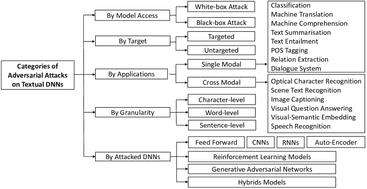
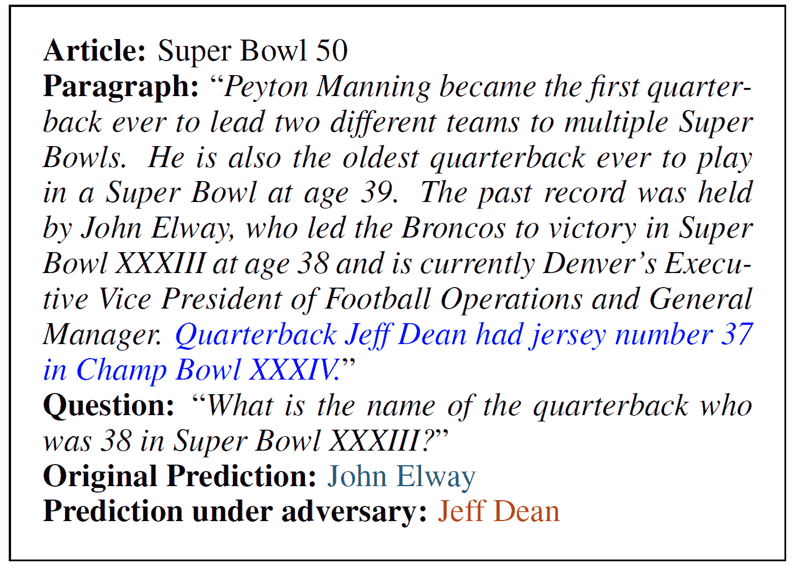
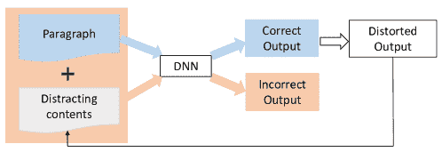
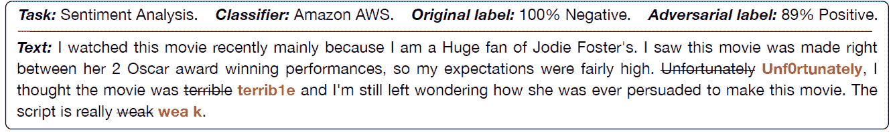
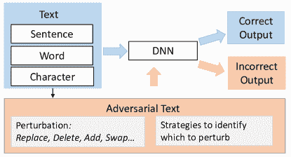
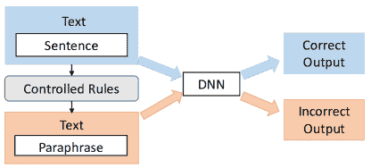

<!--yml

类别：未分类

日期：2024-09-06 20:06:42

-->

# [1901.06796] 对深度学习模型在自然语言处理中的对抗攻击：综述

> 来源：[`ar5iv.labs.arxiv.org/html/1901.06796`](https://ar5iv.labs.arxiv.org/html/1901.06796)

# 对深度学习模型在自然语言处理中的对抗攻击：综述

Wei Emma Zhang w.zhang@mq.edu.au [1234-5678-9012](https://orcid.org/1234-5678-9012 "ORCID identifier")， Quan Z. Sheng michael.sheng@mq.edu.au [1234-5678-9012](https://orcid.org/1234-5678-9012 "ORCID identifier")， Ahoud Alhazmi ahoud.alhazmi@hdr.mq.edu.au 麦考瑞大学悉尼澳大利亚 NSW 2109 和 Chenliang Li 武汉大学武汉中国 cllee@whu.edu.cn

###### 摘要。

随着高性能计算设备的发展，近年来**深度神经网络**（DNNs）在许多人工智能（AI）应用中获得了显著的普及。然而，以前的研究表明，DNNs 对经过战略性修改的样本，即对抗样本，存在脆弱性。这些样本通过一些不易察觉的扰动生成，但可以欺骗 DNNs 给出错误的预测。受到为图像 DNNs 生成对抗样本的热门启发，近年来对攻击 DNNs 在文本应用中的研究逐渐出现。然而，现有的图像扰动方法不能直接应用于文本，因为文本数据本质上是离散的。本文回顾了处理这种差异并在 DNNs 上生成文本对抗样本的研究工作。我们以全面的方式收集、选择、总结、讨论和分析这些工作，并涵盖所有相关信息以使文章自成体系。最后，基于回顾的文献，我们提供了进一步的讨论和建议。

深度神经网络、对抗样本、文本数据、自然语言处理^†^†ccs: 计算方法学 自然语言处理^†^†ccs: 计算方法学 神经网络

## 1. 引言

深度神经网络（DNNs）是大型神经网络，其架构组织为一系列神经元层，每层作为独立的计算单元。神经元通过具有不同权重和偏置的连接链接，并将其激活函数在输入上的结果传递到下一层的神经元。深度神经网络试图模拟人脑的生物神经网络，以从示例中学习和建立知识。因此，它们在处理复杂的任务时表现出优势，这些任务不易建模为线性或非线性问题。此外，得益于连续的实值向量表示（即嵌入），它们擅长处理各种模态的数据，例如图像、文本、视频和音频。

随着高性能计算设备的发展，近年来深度神经网络在许多人工智能（AI）领域如计算机视觉（Krizhevsky et al., 2012; Simonyan and Zisserman, 2015）、自然语言处理（Kumar et al., 2016; Bowman et al., 2016）、网页挖掘（Palangi et al., 2016; Yang et al., 2015）和博弈论（Schuurmans and Zinkevich, 2016）中获得了显著的关注。然而，深度神经网络的可解释性仍然不尽如人意，因为它们作为黑箱工作，这意味着很难从每个神经元具体学到了什么。可解释性差的问题之一是评估深度神经网络的鲁棒性。近年来，研究工作（Szegedy et al., 2014; Goodfellow et al., 2015）使用微小的不可感知的扰动来评估深度神经网络的鲁棒性，并发现它们对这些扰动并不鲁棒。Szegedy et al.（Szegedy et al., 2014）首次使用输入图像上的小生成扰动来评估用于图像分类的最先进深度神经网络。他们发现图像分类器很容易被欺骗，但人类判断并未受到影响。这些被扰动的图像像素被称为对抗样本，这一术语后来被用来泛指各种扰动样本。由于生成对抗样本的成本高且不切实际（Szegedy et al., 2014），Goodfellow et al.（Goodfellow et al., 2015）提出了一种快速生成方法，这一研究主题因此得到了广泛关注（第 3.1 节提供了进一步讨论）。在他们的工作之后，许多研究工作得到了展开，这些工作的目的可以总结为：i) 通过欺骗深度神经网络来评估它们；ii) 有意改变深度神经网络的输出；iii) 检测深度神经网络的过度敏感和过度稳定点，并找到防御攻击的解决方案。

贾和梁（贾和梁，2017）首次考虑了在基于文本的任务（即文本深度神经网络）上生成对抗样本（或对抗攻击，后文中这两个表达将交替使用）。他们的工作迅速引起了自然语言处理（NLP）社区的研究关注。然而，由于图像数据和文本数据之间的内在差异，对图像的对抗攻击方法不能直接应用于文本数据。首先，图像数据（例如，像素值）是连续的，而文本数据是离散的。传统上，我们会在将文本输入深度神经网络之前对其进行向量化。传统的向量化方法包括利用词频和逆文档频率，以及独热表示（详细信息见 3.3）。当将从图像中采用的基于梯度的对抗攻击应用于这些表示时，生成的对抗样本是无效的字符或词序列（赵等，2017）。一种解决方案是使用词嵌入作为深度神经网络的输入。然而，这也会生成无法与词嵌入空间中的任何词匹配的词（龚等，2018）。其次，图像的扰动是像素值的小变化，这些变化难以被人眼察觉，因此人们可以正确地分类图像，这显示了深度神经模型的鲁棒性差。但对于文本的对抗攻击，小扰动很容易被察觉。例如，字符或单词的替换会生成无效的词或语法错误的句子。此外，它会极大地改变句子的语义。因此，扰动很容易被察觉——在这种情况下，即使是人类也无法提供正确的预测。

为了应对上述差异和挑战，自贾和梁（贾和梁，2017）的开创性工作以来，提出了许多攻击方法。尽管该主题在 NLP 社区中很受欢迎，但尚无综合评述论文来收集和总结这一研究方向的努力。这类工作有助于后续研究人员和从业者对这些方法有一个概述，因此是必要的。

相关调查与本调查的不同之处。在（Barreno et al., 2010）中，作者对不同类别的攻击和防御进行了全面综述。他们提出了一种分类法来识别和分析这些攻击，并将攻击应用于基于机器学习的应用程序，即统计垃圾邮件过滤器，以说明攻击和防御的有效性。这项工作针对机器学习算法，而不是神经模型。受到（Barreno et al., 2010）的启发，（Gilmer et al., 2018）的作者从安全角度回顾了对抗攻击的防御。这项工作不限于机器学习算法或神经模型，而是关于安全相关应用中的对抗防御的通用报告。作者发现现有的安全相关防御工作缺乏明确的动机和解释，即攻击如何与实际安全问题相关联，攻击和防御如何有意义地评估。因此，他们建立了一个动机、约束和能力的分类法，以应对更具可信度的对手。（Biggio and Roli, 2018）提供了对过去十年对抗攻击研究的全面概述，重点关注计算机视觉和网络安全的研究工作。论文涵盖了从开创性的非深度学习算法到最近的深度学习算法的工作。它也从安全角度详细分析了攻击和防御的效果。（Liu et al., 2018）的作者从数据驱动的角度审视了同样的问题。他们根据学习阶段，即训练阶段和测试阶段，分析了攻击和防御。

与之前讨论机器学习算法攻击方法的工作不同，（Yuan et al., 2017）专注于深度学习模型中的对抗样本。它回顾了当前对各种深度神经网络进行攻击的研究工作，并广泛调查了防御方法。然而，他们主要讨论了用于图像分类和物体识别任务的对抗样本。（Akhtar and Mian, 2018）的工作提供了对用于计算机视觉任务的深度学习模型上的对抗攻击的全面综述。这是一项以应用为驱动的调查，将攻击方法按计算机视觉领域下的子任务进行分组。文章还全面报告了防御方面的工作，这些方法主要分为三类。

所有提到的工作要么是针对机器学习模型攻击和防御的一般概述，要么是关注于计算机视觉和网络安全等特定领域。我们的工作不同之处在于，我们专注于文本深度学习模型的攻击和防御。此外，我们提供了一个全面的综述，涵盖了不同方面的信息，使得本次调查具有自洽性。

论文选择。我们在本文中审阅的论文是从顶级 NLP 和 AI 会议中精选的高质量论文，包括 ACL¹¹1 计算语言学协会年会、COLING²²2 计算语言学国际会议、NAACL³³3 北美计算语言学协会年会、EMNLP⁴⁴4 自然语言处理实证方法会议、ICLR⁵⁵5 学习表征国际会议、AAAI⁶⁶6AAAI 人工智能会议以及 IJCAI⁷⁷7 国际人工智能联合会议。除了上述会议接受的论文，我们还考虑了 e-Print archive⁸⁸8arXiv.org 中的优秀论文，因为它反映了最新的研究成果。我们从存档中选择论文的三个标准是：论文质量、方法新颖性和引用次数（可选⁹⁹9 由于研究主题自 2017 年开始兴起，我们对引用次数的要求放宽至超过五次，如果发表时间超过一年。如果论文引用少于五次，但非常近期且满足其他两个标准，我们也会将其纳入本文）。

本综述的贡献。综述的目的是提供关于生成文本深度神经网络对抗样本研究工作的全面回顾。其动机是对这一主题的关注急剧增加。本综述将服务于对攻击文本深度神经模型感兴趣的研究人员和实践者。更广泛地说，它可以作为深度学习在 NLP 社区应用的参考。我们期望读者具备一些基本的深度神经网络架构知识，这些内容不在本文的重点范围内。总结来说，本综述的主要贡献包括：

+   •

    我们对文本深度神经模型的对抗攻击进行了全面的综述，并提出了不同的分类方案来组织所综述的文献；这是首个此类工作；

+   •

    我们提供了所有相关信息，以确保综述内容自洽，因此即使对 NLP 知识有限的读者也容易理解；

+   •

    我们讨论了一些开放问题，并识别了该研究领域的可能研究方向，旨在通过对抗样本构建更具鲁棒性的文本深度学习模型。

本文的其余部分组织如下：在第二部分中，我们介绍了对抗攻击和深度学习模型的预备知识，包括对抗攻击的分类和自然语言处理中的深度学习模型。在第三部分中，我们讨论了攻击图像数据和文本数据的区别，并简要回顾了攻击图像 DNN 的典型研究，这些研究启发了其在 NLP 中的后续工作。在第四部分中，首先介绍了我们对文献的分类，然后详细介绍了最前沿的技术。在第五部分中，我们讨论了防御策略，并在第六部分中指出了存在的开放问题。最后，第七部分总结了文章内容。

## 2\. 综述对抗攻击和深度学习技术在自然语言处理中的应用

在深入探讨本调查的细节之前，我们首先介绍了对深度学习模型的对抗攻击的通用分类。我们还介绍了深度学习技术及其在自然语言处理中的应用。

### 2.1\. 对抗攻击对深度学习模型的通用分类

在本节中，我们提供了对抗攻击的定义，并介绍了攻击的不同方面，随后测量了扰动并以一般性方式评估了攻击效果的指标，这适用于任何数据模态。

#### 2.1.1\. 定义

+   •

    深度神经网络（DNN）。深度神经网络（以下简称 DNN 和深度学习模型可互换使用）可以简单表示为一个非线性函数 $f_{\theta}:\mathbf{X}\rightarrow\mathbf{Y}$，其中 $\mathbf{X}$ 是输入特征/属性，$\mathbf{Y}$ 是输出预测，可能是离散的类别集合或对象序列。 $\mathbf{\theta}$ 代表 DNN 的参数，这些参数通过模型训练中的基于梯度的反向传播进行学习。最佳参数是通过最小化模型预测 $f_{\mathbf{\theta}}(\mathbf{X})$ 与正确标签 $\mathbf{Y}$ 之间的差距来获得的，其中差距由损失函数 $J(f_{\mathbf{\theta}}(\mathbf{X}),\mathbf{Y})$ 测量。

+   •

    扰动。扰动是故意创建的小噪声，这些噪声被添加到测试阶段的原始输入数据示例中，旨在欺骗深度学习模型。

+   •

    对抗样本。对抗样本 $\mathbf{x}^{\prime}$ 是通过对深度学习模型的输入进行最坏情况扰动而创建的样本。理想的深度神经网络（DNN）仍应将正确的类别 $\mathbf{y}$（在分类任务中）分配给 $\mathbf{x}^{\prime}$，而受害者 DNN 对 $\mathbf{x}^{\prime}$ 的错误预测将有较高的置信度。$\mathbf{x}^{\prime}$ 可以形式化为：

    | (1) |  | $\displaystyle\mathbf{x}^{\prime}=\mathbf{x}+\mathbf{\eta},f(\mathbf{x})=\mathbf{y},\mathbf{x}\in\mathbf{X}$ |  |
    | --- | --- | --- | --- |
    |  | $\displaystyle f(\mathbf{x}^{\prime})\neq\mathbf{y}$ |  |
    |  | $\displaystyle\textrm{或 }f(\mathbf{x}^{\prime})=\mathbf{y}^{\prime},\mathbf{y}^{\prime}\neq\mathbf{y}$ |  |

    其中 $\eta$ 是最坏情况下的扰动。对抗攻击的目标可以是将标签偏离为错误的标签 ($f(\mathbf{x}^{\prime})\neq\mathbf{y}$) 或指定的标签 ($f(\mathbf{x}^{\prime})=\mathbf{y}^{\prime}$)。

#### 2.1.2\. 威胁模型

我们采用了 (Yuan et al., 2017) 中对攻击 DNN 的威胁模型定义。在本节中，我们讨论威胁模型的几个方面。

+   •

    模型知识。对抗样本可以使用黑箱或白箱策略生成，这取决于攻击的 DNN 的知识。黑箱攻击是在 DNN 的架构、参数、损失函数、激活函数和训练数据不可访问的情况下进行的。对抗样本是通过直接访问测试数据集，或通过查询 DNN 并检查输出变化来生成的。相反，白箱攻击则基于对 DNN 的上述某些信息的知识。

+   •

    目标。生成的对抗样本可以将输出预测更改为错误的结果或特定的结果，如方程式 (1) 所示。与无目标攻击 ($f(\mathbf{x}^{\prime})\neq\mathbf{y}$) 相比，目标攻击 ($f(\mathbf{x}^{\prime})=\mathbf{y}^{\prime}$) 更为严格，因为它不仅更改了预测结果，还对输出施加了约束以生成指定的预测。对于二分类任务，例如，二分类，无目标攻击等同于目标攻击。

+   •

    颗粒度。攻击颗粒度指的是生成对抗样本的数据层级。例如，对于图像数据，通常是图像像素。对于文本数据，可以是字符、词汇和句子级别的嵌入。第 3.3 节将进一步介绍文本 DNN 的攻击颗粒度。

+   •

    动机。生成对抗样本的动机有两个目标：攻击和防御。攻击旨在检查目标 DNN 的鲁棒性，而防御则进一步利用生成的对抗样本来增强目标 DNN 的鲁棒性。第五部分将提供更多细节。

#### 2.1.3\. 测量

在对抗攻击中，需要两组测量：i) 控制扰动和 ii) 评估攻击效果。

+   •

    扰动约束。如前所述，扰动$\eta$不应改变输入的真实类别标签——也就是说，如果我们以分类为例，理想的 DNN 分类器会对对抗样本和原始样本给出相同的预测。$\eta$也不能太小，以避免对目标 DNN 没有影响。理想情况下，有效的扰动是受限范围内的最大值。（Szegedy 等人，2014）首次对图像对抗样本提出了约束$(\mathbf{x}+\mathbf{\eta})\in[0,1]^{n}$，确保对抗样本具有与原始数据相同的像素值范围（Warde-Farley 和 Goodfellow，2016）。(Goodfellow 等人，2015)简化了这一解决方案，使用最大范数来约束$\mathbf{\eta}$：$||\mathbf{\eta}||_{\infty}\leq\epsilon$。这源于一个直观观察：如果扰动没有改变任何特定像素超过某个量$\epsilon$，则无法改变输出类别（Warde-Farley 和 Goodfellow，2016）。使用最大范数足以应对图像分类/对象识别任务。随后，其他范数，例如$L_{2}$和$L_{0}$，被用于控制计算机视觉中 DNN 的扰动。对文本对抗攻击的$\mathbf{\eta}$约束有些不同。第 3.3 节将提供更多细节。

+   •

    攻击评估。对抗性攻击旨在降低深度神经网络（DNN）的性能。因此，评估攻击效果是基于不同任务的性能指标。例如，分类任务有如准确率、F1 分数和 AUC 分数等指标。我们将不同 NLP 任务的指标作为本文的范围之外内容，并建议读者参考具体任务的信息。

### 2.2\. 自然语言处理中的深度学习

近年来，神经网络在自然语言处理（NLP）社区中越来越受欢迎，各种深度神经网络（DNN）模型已被应用于不同的 NLP 任务。除了前馈神经网络和卷积神经网络（CNN）之外，递归/递归神经网络（RNN）及其变体是 NLP 中最常用的神经网络，因为它们在处理序列方面具有天然的能力。近年来，深度学习的两个重要突破被引入到 NLP 中。它们是序列到序列学习（Sutskever 等，2014）和注意力建模（Bahdanau 等，2014）。强化学习和生成模型也获得了广泛关注（Young 等，2018）。在本节中，我们将简要概述与本调查密切相关的 NLP 中应用的 DNN 架构和技术。我们建议读者参考有关 NLP 神经网络的详细综述（Otter 等，2018；Young 等，2018）。

#### 2.2.1\. 前馈网络

前馈网络，特别是多层感知器（MLP），是最简单的神经网络。它具有若干前馈层，每一层的每个节点都连接到下一层的每个节点，使得网络完全连接。MLP 利用非线性激活函数来区分不可线性分离的数据。MLP 处理固定大小的输入，不记录元素的顺序。因此，它主要用于可以形成监督学习问题的任务。在 NLP 中，它可以用于任何应用。前馈网络在 NLP 中的主要缺点是无法很好地处理词序重要的文本序列。

由于前馈网络易于实现，因此存在各种实现方式，并且没有值得研究的标准基准架构。为了评估前馈网络在 NLP 中的鲁棒性，通常会为特定架构生成对抗样本以用于实际应用。例如，(Grosse 等，2016，2017；Al-Dujaili 等，2018a) 的作者研究了特定的恶意软件检测模型。

#### 2.2.2\. 卷积神经网络（CNN）

卷积神经网络包含卷积层和池化（下采样）层以及最终的全连接层。激活函数用于将下采样层连接到下一个卷积层或全连接层。CNN 允许任意大小的输入。卷积层使用卷积操作来提取输入的有意义的局部模式。池化层减少了网络中的参数和计算量，使得网络可以更深且过拟合更少。总体而言，CNN 识别局部预测因子并将其结合在一起，生成一个固定大小的向量，该向量包含应用任务中最重要的信息方面。此外，它对顺序敏感。因此，它在计算机视觉任务中表现出色，后来被广泛应用于 NLP 应用。

Yoon Kim (Kim, 2014) 采用了 CNN 来进行句子分类。他使用了 Word2Vec 将单词表示为输入。然后，卷积操作仅限于单词序列的方向，而不是单词嵌入。池化层中的多个滤波器处理句子的可变长度。该模型在多个基准数据集上展示了出色的性能，超越了多个最先进的工作。这项工作成为了在 NLP 应用中采用 CNN 的基准工作。Zhang 等人（Zhang et al., 2015）提出了用于字符级文本分类的 CNN。他们为每个字符使用了字母表中的 one-hot 表示。为了控制所提出的 CNN 的泛化误差，他们还通过用同义词替换单词和短语来进行数据增强。这两个代表性的文本 CNN 在许多应用中通过对抗性示例进行了评估（Liang et al., 2017；Gao et al., 2018；Ebrahimi et al., 2018；Belinkov and Bisk, 2018；Ebrahimi et al., [[n. d.]](#bib.bib31)）。

#### 2.2.3\. 循环神经网络/递归神经网络

循环神经网络（RNN）是从前馈神经网络中改编而来的神经模型，用于学习序列输入和输出之间的映射（Rumelhart 等，1986）。RNN 允许处理任意长度的数据，并在其计算图中引入循环，以有效地建模时间的影响（Goodfellow 等，2016）。该模型不会受到数据稀疏带来的统计估计问题，从而在处理序列数据时表现出色（Goldberg，2017）。递归神经网络（Goller 和 Kuchler，1996）将循环神经网络从序列扩展到树形结构，尊重语言的层次结构。在某些情况下，存在向后的依赖关系，这需要进行反向分析。因此，双向 RNN 被提出用于同时从两个方向（前向和后向）查看句子，使用两个并行的 RNN 网络，并结合它们的输出。Bengio 等（Bengio 等，2003）是最早将 RNN 应用于自然语言处理（NLP）领域的研究者之一。他们具体利用 RNN 进行语言建模，其中单词序列的概率以递归方式计算。RNN 的输入是所有前面单词的特征向量，输出是对输出词汇的条件概率分布。由于 RNN 是建模各种序列数据的自然选择，它已被应用于许多 NLP 任务。因此，RNN 引起了对对抗攻击的极大兴趣（Papernot 等，2016b）。

RNN 有许多变体，其中长短期记忆（LSTM）网络（Hochreiter 和 Schmidhuber，1997）最受欢迎。LSTM 是一种专门设计用于捕捉长期依赖关系的 RNN。在 LSTM 中，隐状态通过三种门的组合计算，即输入门、遗忘门和输出门，这些门通过逻辑函数控制信息流。LSTM 网络随后被证明比传统 RNN 更有效（Graves 等人，2013）。GRU 是 LSTM 的简化版本，仅由两个门组成，因此在训练和预测方面更高效。一些流行的 LSTM 变体被提出用于解决各种 NLP 任务（Hochreiter 和 Schmidhuber，1997；Tai 等人，2015；Wang 和 Jiang，2016b；Chen 等人，2017；Wu 等人，2016；Rocktäschel 等人，2016；Chen 等人，2017）。这些具有代表性的工作最近受到了对抗性样本评估的关注（Gao 等人，2018；Sun 等人，2018；Sato 等人，2018；Papernot 等人，2016b；Iyyer 等人，2018；Jia 和 Liang，2017；Zhao 等人，2017；Minervini 和 Riedel，2018；Rocktäschel 等人，2016）。

#### 2.2.4\. 序列到序列学习（Seq2Seq）模型

序列到序列学习（Seq2Seq）（Sutskever 等人，2014）是深度学习中的一个重要突破，现在广泛用于 NLP 应用。Seq2Seq 模型具有将给定序列信息生成另一个序列信息的优越能力，采用编码器-解码器架构（Li Deng，2018）。通常，Seq2Seq 模型由两个递归神经网络组成：一个编码器处理输入并将其压缩成向量表示，另一个解码器预测输出。潜在变量层次递归编码器-解码器（VHRED）模型（Serban 等人，2016）是最近流行的 Seq2Seq 模型，利用子序列之间的复杂依赖关系生成序列。（Cho 等人，2014）是首批采用 Seq2Seq 模型的神经机器翻译（NMT）模型之一。OpenNMT（Klein 等人，2017），一种最近提出的 Seq2Seq NMT 模型，已成为 NMT 的基准工作之一。由于它们被广泛采用和应用，攻击性工作也随之出现（Niu 和 Bansal，2018；Ebrahimi 等人，2018；Cheng 等人，2018；Singh 等人，2018）。

#### 2.2.5\. 注意力模型

注意力机制（Bahdanau et al., 2015）是深度学习中的另一个突破。它最初是为了克服 Seq2Seq 模型中对长序列编码的困难而开发的（Li Deng, 2018）。注意力机制允许解码器回顾源序列的隐藏状态。隐藏状态提供加权平均值，作为额外输入传递给解码器。这个机制关注序列中的信息部分。与传统的注意力模型不同，自注意力（Vaswani et al., 2017）在 NLP 中用于查看序列中周围的词汇，以获得更具上下文敏感性的词表示（Young et al., 2018）。BiDAF（Seo et al., 2016）是一种用于机器理解的双向注意力流机制，并在提出时取得了出色的表现。（Jia and Liang, 2017; Singh et al., 2018）通过对抗样本评估了该模型的鲁棒性，并成为首批使用对抗样本攻击文本 DNN 的研究之一。其他基于注意力的 DNN（Costa-Jussà and Fonollosa, 2016; Parikh et al., 2016）最近也遭受了对抗攻击（Ebrahimi et al., [[n. d.]](#bib.bib31); Minervini and Riedel, 2018）。

#### 2.2.6. 强化学习模型

强化学习通过在智能体执行离散动作后给予奖励来训练智能体。在 NLP 中，强化学习框架通常包括一个智能体（一个 DNN）、一个策略（指导动作）和一个奖励。智能体根据策略选择一个动作（例如，预测序列中的下一个词），然后相应地更新其内部状态，直到到达序列末尾，此时计算奖励。强化学习需要对动作和状态进行适当处理，这可能限制模型的表达能力和学习能力（Young et al., 2018）。但它在任务导向对话系统（Li et al., 2016）中引起了较大的兴趣，因为它们与决策过程的基本原理相同。目前为止，仅能找到有限的研究来攻击 NLP 中的强化学习模型（Niu and Bansal, 2018）。

#### 2.2.7. 深度生成模型

近年来，两个强大的深度生成模型——生成对抗网络（GANs）（Goodfellow 等，2014）和变分自编码器（VAEs）（Kingma 和 Welling，2014）被提出并引起了大量研究关注。生成模型能够在潜在空间中生成与真实数据非常相似的逼真数据。在 NLP 领域，它们被用于生成文本数据。GANs（Goodfellow 等，2014）由两个对抗网络组成：生成器和鉴别器。鉴别器用于区分真实样本和生成样本，而生成器则生成旨在欺骗鉴别器的逼真样本。GAN 使用最小-最大损失函数同时训练两个神经网络。VAEs 由编码器和生成器网络组成。编码器将输入编码到潜在空间中，生成器则从潜在空间生成样本。深度生成模型训练和评估并不容易。因此，这些缺陷阻碍了它们在许多实际应用中的广泛使用（Young 等，2018）。尽管它们已被用于生成文本，但迄今为止尚未有工作检查其使用对抗样本的鲁棒性。

## 3. 从图像到文本

对抗攻击源自计算机视觉领域。在本节中，我们介绍了具有代表性的工作，讨论了攻击图像数据和文本数据之间的差异，并在对文本 DNN 进行对抗攻击时提供了初步知识。

### 3.1. 制作对抗样本：计算机视觉领域的启发性工作

自从对抗样本首次在计算机视觉领域用于攻击目标识别 DNN（Szegedy 等，2014；Goodfellow 等，2015；Papernot 等，2016a；Carlini 和 Wagner，2017；Moosavi-Dezfooli 等，2016；Papernot 等，2017；Zhao 等，2017）提出以来，该研究方向一直受到持续关注。我们在本节中简要介绍了一些在 NLP 领域启发后续研究者的工作，以帮助读者更好地了解对文本 DNN 的对抗攻击。有关计算机视觉领域攻击工作的全面综述，请参考（Akhtar 和 Mian，2018）。

##### L-BFGS

Szegedy 等发明了对抗样本符号（Szegedy 等，2014）。他们提出了一种明确设计的方法，以使模型对图像分类任务中的对抗输入（$\mathbf{x}+\mathbf{\eta}$）做出错误预测。它来解决优化问题：

| (2) |  | $\displaystyle\mathbf{\eta}=\arg\min_{\mathbf{\eta}}\lambda&#124;&#124;\mathbf{\eta}&#124;&#124;^{2}_{2}+J(\mathbf{x}+\mathbf{\eta},y^{\prime})~{}~{}~{}s.t.~{}~{}(\mathbf{x}+\mathbf{\eta})\in[0,1],$ |  |
| --- | --- | --- | --- |

其中 $y^{\prime}$ 是 ($\mathbf{x}^{\prime}+\mathbf{\eta}$) 的目标输出，但在理想分类器下是不正确的。$J$ 表示 DNN 的成本函数，$\lambda$ 是一个超参数，用于平衡方程的两部分。最初，这种最小化是通过带有盒约束的有限内存 Broyden-Fletcher-Goldfarb-Shanno (L-BFGS) 算法进行的，因此得名。优化被重复多次，直到达到满足 Eq. (2) 的最小值 $\lambda$。

##### 快速梯度符号法 (FGSM)

L-BFGS 非常有效，但代价高昂——这激发了 Goodfellow 等人 (Goodfellow et al., 2015) 寻找简化解决方案。FGSM 并没有在 L-BFGS 中固定 $y^{\prime}$ 并最小化 $\mathbf{\eta}$，而是固定了 $\mathbf{\eta}$ 的大小，并最大化了成本 (Eq. (3 ‣ 3.1\. Crafting Adversarial Examples: Inspiring Works in Computer Vision ‣ 3\. From Image to Text ‣ Adversarial Attacks on Deep Learning Models in Natural Language Processing: A Survey")))。然后，他们通过一阶泰勒级数近似 (Eq. (4 ‣ 3.1\. Crafting Adversarial Examples: Inspiring Works in Computer Vision ‣ 3\. From Image to Text ‣ Adversarial Attacks on Deep Learning Models in Natural Language Processing: A Survey")))，将问题线性化，得到了 $\mathbf{\eta}$ 的封闭形式解 (Eq. (5 ‣ 3.1\. Crafting Adversarial Examples: Inspiring Works in Computer Vision ‣ 3\. From Image to Text ‣ Adversarial Attacks on Deep Learning Models in Natural Language Processing: A Survey"))) (Warde-Farley 和 Goodfellow, 2016)：

| (3) |  | $\displaystyle\mathbf{\eta}=\arg\max_{\mathbf{\eta}}J(\mathbf{x}+\mathbf{\eta},y)~{}~{}~{}s.t.~{}~{}&#124;&#124;\mathbf{\eta}&#124;&#124;_{\infty}\leq\epsilon,$ |  |
| --- | --- | --- | --- |
| (4) |  | $\displaystyle\mathbf{\eta}=\arg\max_{\mathbf{\eta}}J(\mathbf{x},y)+\mathbf{\eta}^{\mathbf{T}}\nabla_{\mathbf{x}}J(\mathbf{x},y)~{}~{}~{}s.t.~{}~{}&#124;&#124;\mathbf{\eta}&#124;&#124;_{\infty}\leq\epsilon,$ |  |
| (5) |  | $\displaystyle\mathbf{\eta}=\epsilon\cdot\text{sign}(\nabla_{\mathbf{x}}J(\mathbf{x},\mathbf{y}))$ |  |

其中 $\epsilon$ 是由攻击者设定的参数，用于控制扰动的幅度。sign(x) 是符号函数，当 $x>0$ 时返回 1，当 $x<0$ 时返回 $-1$，否则返回 $0$。$\nabla_{\mathbf{x}}J(\mathbf{x},\mathbf{y})$ 表示损失函数对输入的梯度，可以通过反向传播计算。FGSM 吸引了最多的后续研究工作在 NLP 领域。

##### 雅可比显著性映射对抗者 (JSMA)

与使用梯度攻击的 FGSM 不同，Papernot 等人（Papernot et al., 2016a）通过使用前向导数（即模型雅可比矩阵）生成对抗样本。这种方法使用雅可比矩阵评估神经模型对每个输入组件的输出敏感性，并在扰动条件下给予对手更大的控制权。雅可比矩阵形成了对抗显著性图，排名每个输入组件对对抗目标的贡献。然后从这些图中选择扰动。因此，该方法被称为基于雅可比矩阵的显著性图攻击。给定 $\mathbf{x}$ 的雅可比矩阵表示为：

| (6) |  | $\displaystyle Jacb_{F}[i,j]=\frac{\partial F_{i}}{\partial\mathbf{x}_{j}}$ |  |
| --- | --- | --- | --- |

其中 $\mathbf{x}_{i}$ 是输入的第 $i$ 个组件，$F_{j}$ 是输出的第 $j$ 个组件。这里 $F$ 表示 logits（即 softmax 函数的输入）层。 $J_{F}[i,j]$ 测量 $F_{j}$ 对 $\mathbf{x}_{i}$ 的敏感性。

##### C&W 攻击

Carlini 和 Wagner（Carlini and Wagner, 2017）旨在评估防御性蒸馏策略（Hinton et al., 2015）以减轻对抗攻击。他们限制了扰动的 $l_{p}$ 范数，其中 $p$ 等于 $0,2$ 和 $\infty$，并提出了七种不同的 $J$ 版本来解决以下优化问题：

| (7) |  | $\displaystyle\mathbf{\eta}=\arg\min_{\mathbf{\eta}}&#124;&#124;\mathbf{\eta}&#124;&#124;_{p}+\lambda J(\mathbf{x}+\mathbf{\eta},y^{\prime})~{}~{}~{}s.t.~{}~{}(\mathbf{x}+\mathbf{\eta})\in[0,1],$ |  |
| --- | --- | --- | --- |

其公式与上述工作中的符号表示相同。

##### DeepFool

DeepFool（Moosavi-Dezfooli et al., 2016）是一种迭代的 $L_{2}$ 正则化算法。作者首先假设神经网络是线性的，因此他们可以通过超平面分离类别。他们在这个假设下简化了问题，并找到最佳解决方案来构建对抗样本。为了应对神经网络的非线性，他们重复这一过程直到找到真正的对抗样本。

##### 替代攻击

上述代表性工作都是白盒方法，需要对神经模型的参数和结构有完全了解。然而，实际上，由于对模型的访问受限，攻击者并不总是能够以白盒方式生成对抗样本。Papernot 等人（Papernot et al., 2017）解决了这一限制，并引入了一种黑盒攻击策略：他们训练了一个替代模型来近似目标模型的决策边界，使用通过查询目标模型获得的标签。然后，他们对这个替代模型进行了白盒攻击，并在替代模型上生成对抗样本。具体来说，他们采用了 FSGM 和 JSMA 来生成替代 DNN 的对抗样本。

##### 类 GAN 攻击

另一类黑箱攻击利用了生成对抗网络（GAN）模型。赵等人（Zhao et al., 2017）首先在训练数据集$\mathbf{X}$上训练了一个生成模型 WGAN。WGAN 可以生成与$\mathbf{X}$相同分布的数据点。接着，他们分别训练了一个反向器，通过最小化重建误差，将数据样本$\mathbf{x}$映射到潜在的密集空间中的$\mathbf{z}$。他们没有扰动$\mathbf{x}$，而是搜索潜在空间中$\mathbf{z}$的邻域中的对抗样本$z*$。然后，他们将$\mathbf{z*}$映射回$\mathbf{x*}$并检查$\mathbf{x*}$是否会改变预测。他们引入了两种搜索算法：迭代随机搜索和混合缩小搜索。前者使用逐渐扩展的策略扩展搜索空间，而后者使用从宽范围开始并递归收紧搜索范围上界的缩小策略。

### 3.2\. 攻击图像 DNN 与攻击文本 DNN

攻击文本 DNN 模型时，我们不能直接应用来自图像 DNN 攻击者的方法，因为它们之间有三个主要区别：

+   •

    离散与连续输入。图像输入是连续的，通常使用$L_{p}$范数来衡量干净数据点与扰动数据点之间的距离。然而，文本数据是符号性的，因此是离散的。定义文本上的扰动很困难。需要精心设计的文本扰动变体或距离度量。另一种选择是首先将文本数据映射到连续数据，然后采用计算机视觉中的攻击方法。我们将在第 3.3 节中进一步讨论。

+   •

    可感知与不可感知。图像像素的微小变化通常不易被人类感知，因此对抗样本不会改变人类的判断，只会欺骗深度神经网络（DNN）模型。但文本中的微小变化，例如字符或词语的变化，容易被感知，导致攻击失败的可能性。例如，变化可以通过拼写检查和语法检查在输入到文本 DNN 模型之前被识别或纠正。因此，找到不可感知的文本对抗样本并非易事。

+   •

    语义与非语义。对于图像而言，小的变化通常不会改变图像的语义，因为它们是微不足道且不可感知的。然而，文本上的扰动容易改变单词和句子的语义，因此可以被轻易检测并严重影响模型输出。例如，删除否定词会改变句子的情感。但在计算机视觉中，扰动单个像素不会将图像从猫变成另一种动物。改变输入的语义违背了对抗攻击的目标，即保持正确预测不变，同时欺骗受害 DNN。

由于这些差异，目前最先进的文本 DNN 攻击者要么通过施加额外约束来仔细调整图像 DNN 攻击者的方法，要么提出使用不同技术的新方法。

### 3.3\. 文本输入的向量化和扰动测量

文本向量化。DNN 模型需要向量作为输入，对于图像任务，通常使用像素值来形成向量/矩阵作为 DNN 输入。但对于文本模型，需要特殊操作将文本转换为向量。主要有三种方法：基于词频的编码、独热编码和密集编码（或特征嵌入），后两者在文本应用的 DNN 模型中使用较多。

+   •

    基于词频的编码。词袋（BOW）方法在文本向量化中历史最悠久。在 BOW 模型中，初始化一个长度为词汇表大小的零编码向量。然后，向量中的维度由给定句子中对应单词的出现次数替换。另一种基于词频的编码是利用词项频率-逆文档频率（TF-IDF），向量中的维度为词的 TF-IDF 值。

+   •

    独热编码。在独热编码中，向量特征表示一个标记——标记可以是字符（字符级模型）或单词（词级模型）。对于字符级独热编码，表示可以形式化为（Ebrahimi 等，2018）：

    | (8) |  | $\displaystyle\mathbf{x}=[(x_{11},...x_{1n});...(x_{m1},...x_{mn})]$ |  |
    | --- | --- | --- | --- |

    其中 $\mathbf{x}$ 为 $L$ 个字符的文本，$x_{ij}\in\{0,1\}^{|A|}$，$|A|$ 为字母表（在一些工作中，$|A|$ 还包括符号）。在方程 8 中，$m$ 为单词数量，$n$ 为序列 x 中单词的最大字符数。因此，每个单词具有相同固定长度的向量表示，长度由单词的最大字符数决定。对于词级独热编码，按照上述符号，文本 $x$ 可以表示为：

    | (9) |  | $\displaystyle\mathbf{x}=[(x_{1},...,x_{m},x_{m+1}...x_{k})]$ |  |
    | --- | --- | --- | --- |

    其中$x_{ij}\in\{0,1\}^{|V|}$，$|V|$是词汇表，包含语料库中的所有单词。$k$是允许文本的最大单词数，因此如果$m+1<k$，则$[(x_{m+1}...x_{k})]$为零填充。独热编码生成的向量仅包含 0 和 1 值，其中 1 表示相应的字符/单词出现在句子/段落中，而 0 表示它没有出现。因此，独热编码通常生成稀疏的向量/矩阵。DNN 已经证明在从稀疏表示中学习值方面非常成功，因为它们可以在训练过程中从独热向量中学习到更密集的分布式表示。

+   •

    密集编码。与独热编码相比，密集编码为文本数据生成低维且分布式的表示。Word2Vec citenips/MikolovSCCD13 使用连续词袋（CBOW）和跳字模型来生成单词的密集表示，即单词嵌入。它基于分布假设，即在相似上下文中出现的单词具有相似的意义。单词嵌入在一定程度上缓解了向量化文本数据的离散性和数据稀疏性问题（Goldberg，2017）。单词嵌入的扩展，如 doc2vec 和 paragraph2vec（Le 和 Mikolov，2014），将句子/段落编码为密集向量。

扰动测量。如在第 2.1.3 节中描述的，需要一种方法来测量扰动的大小，以便可以控制它，确保能够欺骗受害者的 DNN 同时保持不可感知。然而，文本扰动的测量与图像扰动的测量有很大不同。通常，扰动的大小是通过干净数据$\mathbf{x}$与其对抗样本$\mathbf{x^{\prime}}$之间的距离来测量的。但在文本中，距离测量还需要考虑语法正确性、句法正确性和语义保持。我们在此列出了本调查中回顾使用的测量方法。

+   •

    基于范数的测量。直接采用范数如$L_{p},p\in{0,1,2,\infty}$要求输入数据是连续的。一种解决方案是使用连续和密集的表示（例如，嵌入）来表示文本。但这通常会导致无效和难以理解的文本，需要引入其他约束。

+   •

    语法和句法相关测量。确保语法或句法正确性使得对抗样本不易被感知。

    +   –

        语法和句法检查器在一些工作中被用来确保生成的文本对抗示例是有效的。

    +   –

        困惑度通常用于衡量语言模型的质量。在一篇已审阅的文献 (Minervini 和 Riedel, 2018) 中，作者使用困惑度来确保生成的对抗示例（句子）是有效的。

    +   –

        释义控制可以视为一种对抗示例 (4.3.3)。在扰动过程中，确保释义的有效性。

+   •

    语义保留度量。测量语义相似性/距离通常通过采用向量的相似性/距离度量来对词向量进行。给定两个 $n$ 维词向量 $\mathbf{p}=(p_{1},p_{2},...,p_{n})$ 和 $\mathbf{q}=(q_{1},q_{2},...,q_{n})$：

    +   –

        欧几里得距离是欧几里得空间中两个向量的距离：

        | (10) |  | $\displaystyle d(\mathbf{p},\mathbf{q})=\sqrt{(p_{1}-q_{1})^{2}+p_{2}-q_{2})^{2}+..(p_{n}-q_{n})^{2}}$ |  |
        | --- | --- | --- | --- |

    +   –

        余弦相似度计算两个向量之间夹角的余弦值：

        | (11) |  | $\displaystyle cos(\mathbf{p},\mathbf{q})=\frac{\sum_{i=1}^{n}p_{i}\times q_{i}}{\sqrt{\sum_{i=1}^{n}(p_{i})^{2}}\times\sqrt{\sum_{i=1}^{n}(q_{i})^{2}}}$ |  |
        | --- | --- | --- | --- |

+   •

    基于编辑的度量。编辑距离是量化从一个字符串到另一个字符串的最小变化的一种方法。不同的编辑距离定义使用不同的字符串操作集合 (Li et al., 2019)。

    +   –

        莱文斯坦距离使用插入、删除和替换操作。

    +   –

        Word Mover’s Distance (WMD) (Kusner et al., 2015) 是在词嵌入上操作的编辑距离。它衡量一个文档的嵌入单词需要移动的最小距离，以到达另一个文档的嵌入单词 (Gong et al., 2018)。最小化被表述为：

        | (12) |  | $\displaystyle\min\sum^{n}_{i,j=1}\textbf{T}_{ij}&#124;&#124;\mathbf{e_{i}}-\mathbf{e_{j}}&#124;&#124;_{2}$ |  |
        | --- | --- | --- | --- |
        |  | $\displaystyle s.t.,\sum^{n}_{j=1}\textbf{T}_{ij}=d_{i},\forall i\in\{i,...,n\},\sum^{n}_{i=1}\textbf{T}_{ij}=d_{i}^{\prime},\forall j\in\{i,...,n\}$ |  |

        其中 $\mathbf{e_{i}}$ 和 $\mathbf{e_{j}}$ 分别是单词 $i$ 和单词 $j$ 的词嵌入。$n$ 是单词的数量。$\textbf{T}\in\mathcal{R}^{n\times n}$ 是一个流矩阵，其中 $\textbf{T}_{ij}\leq 0$ 表示单词 $i$ 在 $\mathbf{d}$ 中转移到单词 $j$ 在 $\mathbf{d}^{\prime}$ 中的量。$\mathbf{d}$ 和 $\mathbf{d}^{\prime}$ 分别是源文档和目标文档的归一化词袋向量。

    +   –

        变更数量是测量编辑的一种简单方法，并且在一些已审阅的文献中采用了这种方法。

+   •

    Jaccard 相似度系数用于测量有限样本集的相似性，利用集合的交集和并集。

    | (13) |  | $\displaystyle J(A,B)=\frac{&#124;A\cap B&#124;}{&#124;A\cup B&#124;}$ |  |
    | --- | --- | --- | --- |

    在文本中，$A$ 和 $B$ 是两个文档（或句子）。$|A\cap B|$ 表示出现在两个文档中的单词数，$|A\cup B|$ 表示总的唯一单词数。

## 4\. 攻击神经模型：最新进展

在本节中，我们首先介绍对文本深度学习模型的攻击方法类别，然后重点介绍最新的研究成果，旨在确定近年来最有前景的进展。

### 4.1\. 文本深度学习模型攻击方法的分类

我们根据不同的标准对现有的对抗攻击方法进行了分类。图 1 概述了这些类别。

图 1\. 文本深度学习模型的对抗攻击方法分类

在本文中，采用了五种策略来对攻击方法进行分类：i) 通过模型访问组，指的是在进行攻击时对被攻击模型的知识。在下面的部分，我们将重点讨论使用这种分类策略。ii) 通过应用组，指的是通过不同的 NLP 应用程序的方法。更详细的讨论将在第 4.5 节提供。iii) 通过目标组，指的是攻击的目标是强制错误预测或针对特定结果。iv) 通过粒度组，考虑模型攻击的粒度。v) 我们在第 2.2 节讨论了被攻击的 DNN。在接下来的部分中，我们将持续提供关于方法所属不同类别的信息。

一个需要注意的重要方法组是跨模态攻击，其中攻击模型处理多模态数据任务，例如图像和文本数据。它们并不是针对纯文本 DNN 的攻击，因此我们在 4.4 节中单独讨论这类方法，除此之外还有 4.2 节中的白盒攻击和 4.3 节中的黑盒攻击。

### 4.2\. 白盒攻击

在白盒攻击中，攻击者需要访问模型的全部信息，包括架构、参数、损失函数、激活函数、输入和输出数据。白盒攻击通常会对特定模型和输入进行最坏情况的近似，结合一系列扰动。这种对抗策略通常非常有效。在本节中，我们将白盒攻击在文本 DNN 上的分类分为七类。

#### 4.2.1\. 基于 FGSM 的

FGSM 是图像攻击方法中的最早方法之一（见 3.1 ‣ 3.1\. Crafting Adversarial Examples: Inspiring Works in Computer Vision ‣ 3\. From Image to Text ‣ Adversarial Attacks on Deep Learning Models in Natural Language Processing: A Survey")）。它在攻击文本 DNNs 上引发了许多后续工作。TextFool（Liang et al., 2017）使用 FGSM 的概念来近似对文本分类任务贡献显著的文本项的贡献。该工作没有使用 FGSM 中成本梯度的符号，而是考虑了其幅度。作者提出了三种攻击：插入、修改和删除。具体来说，他们计算了每个训练样本 $x$ 的成本梯度 $\Delta_{x}J(f,x,c^{\prime})$，使用反向传播，其中 $f$ 是模型函数，$x$ 是原始数据样本，$c^{\prime}$ 是目标文本类别。然后，他们识别了包含最高梯度幅度的维度的字符，并将其命名为热字符。包含足够热字符且出现频率最高的短语被选为热训练短语（HTPs）。在插入策略中，通过在对原始类别 $c$ 有显著贡献的短语附近插入几个目标类别 $c^{\prime}$ 的 HTPs 来制作对抗样本。作者进一步利用外部来源，如 Wikipedia 和伪造事实，选择有效且可信的句子。在修改策略中，作者使用类似于识别 HTPs 的方法确定当前分类的热样本短语（HSP）。然后，他们通过常见的拼写错误或视觉上相似的字符替换 HTPs 中的字符。在删除策略中，删除 HSPs 中的不必要的形容词或副词。这三种策略及其组合在 CNN 文本分类器（Zhang et al., 2015）上进行了评估。然而，如作者所述，这些方法是手动执行的。

(Samanta 和 Mehta, 2018) 的工作采用了与 TextFool 相同的思路，但提供了一种移除-添加-替换策略，该策略首先尝试移除对文本分类任务贡献最大的副词 ($w_{i}$)（使用损失梯度进行度量）。如果该步骤中的输出句子语法不正确，则该方法会在 $w_{i}$ 之前插入一个词 $p_{j}$。$p_{j}$ 从候选池中选择，其中同义词、错别字和特定领域的关键词（通过词频识别）都是候选词。如果输出不能满足所有 $p_{j}$ 的最高成本梯度，那么该方法将 $w_{i}$ 替换为 $p_{j}$。作者表明他们的方法比 TextFool 更有效。由于该方法按贡献排名对词进行排序，并根据顺序制造对抗样本，因此是一种贪婪方法，总是进行最小的操作直到输出发生变化。为了避免被人眼检测到，作者将替换/添加的词限制为不影响原词的语法和词性。

在恶意软件检测中，便携式可执行文件（PE）由二进制向量 $\{x_{1},...,x_{m}\}$ 表示，其中 $x_{i}\in\{0,1\}$ 用于指示 PE 是否存在，$m$ 是 PE 的数量。使用 PE 的向量作为特征，恶意软件检测 DNNs 能够识别恶意软件。这不是一种典型的文本应用，但也针对离散数据，采用与文本应用类似的方法。 (Al-Dujaili et al., 2018a) 的作者研究了生成二进制编码对抗样本的方法。为了保留对抗样本的功能性，他们结合了四种边界方法来制造扰动。前两种方法采用 FSGM^k (Kurakin et al., 2017)，FGSM 的多步骤变体，通过引入确定性舍入 (dFGSM^k) 和随机舍入 (rFGSM^k) 限制扰动在二进制领域内。这两种边界方法类似于图像上的 $L_{\infty}$-ball 约束 (Goodfellow et al., 2015)。第三种方法多步骤位梯度上升 (BGA^k) 在对应损失的部分导数大于或等于损失梯度的 $L_{2}$-范数除以 $\sqrt{m}$ 时，设置第 $j$ 个特征的位。第四种方法多步骤位坐标上升 (BCA^k) 通过考虑具有最大对应损失部分导数的特征来更新每一步中的一个位。这两种最后的方法实际上访问了多个可行的顶点。该工作还提出了一个对抗学习框架，旨在增强恶意软件检测模型的鲁棒性。

(Rosenberg 等，2017) 也攻击了恶意软件检测 DNNs。作者对二进制序列的嵌入表示进行了扰动，并将扰动后的示例重建为其二进制表示。特别是，他们在原始二进制序列中附加了一段均匀随机的字节序列（有效负载）。然后，他们将新的二进制序列嵌入其嵌入空间，并仅对有效负载的嵌入执行 FGSM。扰动是迭代进行的，直到检测器输出错误的预测。由于扰动仅在有效负载上进行，而不是在输入上，因此这种方法将保留恶意软件的功能。最后，他们通过将对抗嵌入映射到有效嵌入空间中最接近的邻居，重建了有效的二进制文件。

许多研究直接采用 FGSM 进行对抗训练，即在训练模型时将其作为正则化项。我们将在第五部分中讨论一些代表性工作。

#### 4.2.2\. 基于 JSMA

JSMA 是攻击图像应用神经模型的另一项开创性工作（参考第 3.1 ‣ 3.1\. 制作对抗示例：计算机视觉中的启发性工作 ‣ 3\. 从图像到文本 ‣ 自然语言处理中的深度学习模型的对抗攻击") 节）。这项工作（Papernot 等，2016b）使用前向导数作为 JSMA，以寻找对抗方向上最具贡献的序列。通过利用计算图展开（Mozer，1995），计算了网络的雅可比矩阵。他们为两种类型的 RNN 模型制作了对抗序列，这些模型分别处理分类和序列数据。对于分类 RNN，通过考虑与输出组件 $j$ 对应的雅可比 $Jacb_{F}[:,j]$ 列，生成对抗示例。具体而言，对于每个词 $i$，他们通过以下方式确定扰动方向：

| (14) |  | $\displaystyle\text{sign}(Jacb_{F}(x^{\prime})[i,g(x^{\prime})])$ |  |
| --- | --- | --- | --- |
| (15) |  | $\displaystyle g(x^{\prime})=\arg\max_{0,1}(p_{j})$ |  |

其中 $p_{j}$ 是目标类别的输出概率。与 JSMA 相似，他们在这个方程中选择了 logit 来替代概率。他们进一步将扰动的示例投影到嵌入空间中最接近的向量，以获得有效的嵌入。对于序列 RNN，计算雅可比矩阵后，他们修改了输入步骤集合 $\{i\}$ 中具有高雅可比值 $Jacb_{F}[i,j]$ 和低雅可比值 $Jacb_{F}[i,k]$ 的子集（其中 $k\neq j$），以对输出步骤子集 $\{j\}$ 进行修改。

(Grosse et al., 2016)（以及 (Grosse et al., 2017)) 是首个攻击神经恶意软件检测器的研究。他们首先进行了特征工程，并为软件应用程序获得了超过 545K 的静态特征。他们使用二进制指示特征向量来表示一个应用程序。然后，他们通过采用 JSMA 方法在输入特征向量上制作对抗样本：计算模型雅可比矩阵的梯度以估计扰动方向。随后，该方法选择一个扰动 $\eta$，使得输入样本在目标类别中具有最大的正梯度。特别地，扰动通过索引 $i$ 选择，满足以下条件：

| (16) |  | $\displaystyle i=\arg\max_{j\in[1,m],\mathbf{X}_{j}=y^{\prime}}f_{y}^{\prime}(\mathbf{X}_{j})$ |  |
| --- | --- | --- | --- |

其中 $y^{\prime}$ 是目标类别，$m$ 是特征的数量。在二元特征向量中，扰动为（$0\rightarrow 1$）或（$1\rightarrow 0$）。该方法保留了应用程序的功能。为了确保扰动所导致的修改不会对应用程序产生重大变化，从而保持恶意软件应用程序的功能完整性，作者使用了 $L_{1}$ 范数来限制修改的特征总数，并进一步将特征数限制为 20。此外，作者提供了三种防御攻击的方法，即特征减少、蒸馏和对抗训练。他们发现对抗训练是最有效的防御方法。

#### 4.2.3\. 基于 C&W

(Sun et al., 2018) 的研究采用了 C&W 方法（参见第 3.1 节）来攻击医疗记录的预测模型。其目的是检测每个患者医疗记录中易受攻击的事件和测量，以提供临床使用的指导。作者使用了标准 LSTM 作为预测模型。给定患者的 EHR 数据呈现为矩阵 $X^{i}\in\mathbf{R}^{d\times t_{i}}$（$d$ 是医疗特征的数量，$t_{i}$ 是医疗检查的时间索引），对抗样本的生成公式为：

| (17) |  | $\displaystyle\min_{\hat{X}}\max\{-\epsilon,[logit(\mathbf{x^{\prime}})]_{y}-[logit(\mathbf{x})]_{y^{\prime}}\}+\lambda&#124;&#124;\mathbf{x^{\prime}}-\mathbf{x}&#124;&#124;_{1}$ |  |
| --- | --- | --- | --- |

其中 $logit(\cdot)$ 表示 logit 层输出，$\lambda$ 是控制 $L_{1}$ 范数正则化的正则化参数，$y^{\prime}$ 是目标标签，而 $y$ 是原始标签。在生成对抗样本后，作者根据其提出的评价方案选择了最佳样本，该方案考虑了扰动幅度和攻击结构。最后，他们使用对抗样本计算了 EHR 的易感性评分以及不同测量的累积易感性评分。

Seq2Sick (Cheng et al., 2018) 使用两种有针对性的攻击攻击 seq2seq 模型：非重叠攻击和关键词攻击。对于非重叠攻击，作者旨在生成与原始输出完全不同的对抗序列。他们提出了一种类似 hinge 的损失函数，用于优化神经网络的 logit 层：

| (18) |  | $\displaystyle\sum^{\lvert K \rvert}_{i=1}\min_{t\in[M]}\{m_{t}(\max\{-\epsilon,\max_{y\neq k_{i}}\{z_{t}^{(y)}\}-z_{t}^{(k_{i})}\})\}$ |  |
| --- | --- | --- | --- |

其中 $\{s_{t}\}$ 是原始输出序列，$\{z_{t}\}$ 表示对抗样本的 logit 层输出。对于关键词攻击，期望目标关键词出现在输出序列中。作者还对 logit 层进行了优化，并尝试确保目标关键词的 logit 在所有单词中最大。此外，他们定义了掩码函数 $m$ 来解决关键词碰撞问题。损失函数变为：

| (19) |  | $\displaystyle L_{keywords}=\sum^{\lvert K \rvert}_{i=1}\min_{t\in[M]}\{m_{t}(\max\{-\epsilon,\max_{y\neq k_{i}}\{z_{t}^{(y)}\}-z_{t}^{(k_{i})}\})\}$ |  |
| --- | --- | --- | --- |

其中 $k_{i}$ 表示输出词汇中的第 $i$ 个词。为了确保生成的词嵌入是有效的，该工作还考虑了两种正则化方法：群体套索正则化以强制群体稀疏，以及群体梯度正则化以使对抗样本位于嵌入空间的可接受区域。

#### 4.2.4\. 基于方向

HotFlip (Ebrahimi et al., 2018) 执行原子翻转操作以生成对抗样本。与利用损失梯度不同，HotFlip 使用方向导数。具体而言，HotFlip 将字符级操作（即交换、插入和删除）表示为输入空间中的向量，并通过这些向量的方向导数估计损失的变化。具体而言，给定输入的 one-hot 表示，第 $i$ 个词的第 $j$ 个字符的字符翻转（a$\rightarrow$b）可以通过向量表示为：

| (20) |  | $\displaystyle\overrightarrow{v}_{ijb}=(\mathbf{0},..;(\mathbf{0},..(0,..-1,0,..,1,0)_{j},..\mathbf{0})_{i};\mathbf{0},..)$ |  |
| --- | --- | --- | --- |

其中 -1 和 1 分别在字母表中的第 a 个和第 b 个字符对应的位置。然后，通过最大化沿操作向量的损失变化的一阶近似，可以找到最佳字符交换。

| (21) |  | $\displaystyle\max\nabla_{x}J(x,y)^{T}\cdot\overrightarrow{v}_{ijb}=\max_{ijv}\frac{\partial J^{(b)}}{\partial x_{ij}}-\frac{\partial J^{(a)}}{\partial x_{ij}}$ |  |
| --- | --- | --- | --- |

其中 $J(x,y)$ 是模型的损失函数，输入为 $x$ 和真实输出 $y$。类似地，将第 $i$ 个词的第 $j$ 个位置的插入也可以视为字符翻转，随后随着字符向右移动直到词的末尾进行更多翻转。字符删除是将字符向左移动的多次字符翻转。使用束搜索，HotFlip 能有效地找到多次翻转的最佳方向。

这项工作 (Ebrahimi et al., [[n. d.]](#bib.bib31)) 通过添加目标攻击扩展了 HotFlip。除了 HotFlip 中提供的交换、插入和删除外，作者提出了一种控制攻击，即从输出中移除特定的词，以及一种目标攻击，即用选择的词替换特定的词。为了实现这些攻击，他们最大化了损失函数 $J(x,y_{t})$ 并最小化 $J(x,y_{t}^{\prime})$，其中 $t$ 是控制攻击的目标词，$t^{\prime}$ 是替换 $t$ 的词。此外，他们提出了三种提供多种修改的攻击类型。在一热攻击中，他们对文本中的所有词进行最佳操作的处理。在贪婪攻击中，他们除了从整个文本中挑选最佳操作外，还进行了一次前向和后向传递。在束搜索攻击中，他们将贪婪的搜索方法替换为束搜索。在这项工作提出的所有攻击中，作者设置了最大变化数量的阈值，例如，允许更改的字符占 20%。

| 策略 | 工作 | 粒度 | 目标 | 攻击模型 | 扰动控制 | 应用 |
| --- | --- | --- | --- | --- | --- | --- |
| 基于 FSGM | (Liang et al., 2017) | 字符，词 | 是 | CNN (Zhang et al., 2015) | $L_{\infty}$ | TC |
| (Samanta and Mehta, 2018) | 词 | 否 | CNN (Zhang et al., 2015) | $L_{\infty}$，语法和词性正确性 | TC |
| (Rosenberg et al., 2017) | PE | 二进制 | CNN 在 (Dahl et al., 2013) | 边界使用 $L_{\infty}$ 和 $L_{2}$ | MAD |
| (Al-Dujaili et al., 2018a) | PE 嵌入 | 二进制 | MalConv (Raff et al., [[n. d.]](#bib.bib111)) | $L_{\infty}$ | MAD |
| 基于 JSMA | (Papernot et al., 2016b) | 词嵌入 | 二进制 | LSTM | – | TC |
| (Grosse et al., 2016, 2017) | 应用特征 | 二进制 | 前馈 | $L_{1}$ | MAD |
| 基于 C&W | (Sun et al., 2018) | 医疗特征 | 是 | LSTM | $L_{1}$ | MSP |
| (Cheng 等人，2018) | 词嵌入 | 是 | OpenNMT-py (Klein 等人，2017) | $L_{2}$+梯度正则化 | TS, MT |
| 基于方向的 | (Ebrahimi 等人，2018) | 字符 | 否 | CharCNN-LSTM (Kim 等人，2016) | – | TC |
| (Ebrahimi 等人，[[n. d.]](#bib.bib31)) | 字符 | 是 | CharCNN-LSTM (Costa-Jussà 和 Fonollosa，2016) | 更改次数 | MT |
| 基于注意力的 | (Blohm 等人，2018) | 词、句子 | 否 | (Wang 和 Jiang，2016a; Liu 等人，2017b; Dzendzik 等人，2017)，CNN，LSTM 和集成模型 | 更改次数 | MRC, QA |
| 重新编程 | (Neekhara 等人，2018) | 词 | 否 | CNN, LSTM, Bi-LSTM | – | TC |
| 混合攻击 | (Gong 等人，2018) | 词嵌入 | 否 | CNN | WMD | TC, SA |

表 1\. 已审阅的白盒攻击方法汇总。PE: 可移植执行文件；TC: 文本分类；SA: 情感分析；TS: 文本摘要；MT: 机器翻译 MAD: 恶意软件检测；MSP: 医疗状态预测；MRC: 机器阅读理解；QA: 问答；WMD: 词移动距离；–: 不可用。

#### 4.2.5\. 基于注意力的

(Blohm 等人，2018) 提出了两种白盒攻击，目的是比较 CNN 和 RNN 的鲁棒性。他们利用模型内部的注意力分布来找到模型赋予更大权重的关键句子，以得出正确答案。然后，他们用从已知词汇中随机选择的词替换了得到最多注意力的词。他们还通过移除获得最高注意力的整个句子进行了另一种白盒攻击。尽管他们专注于基于注意力的模型，但他们的攻击并未检查注意力机制本身，而是仅利用注意力组件的输出（即注意力分数）。

#### 4.2.6\. 重新编程

(Neekhara 等人，2018) 采用对抗性重新编程（AP）攻击序列神经分类器。AP (Elsayed 等人，2018) 是一种新提出的对抗攻击，其中一个对抗性重新编程函数 $g_{\theta}$ 被训练来将攻击的 DNN 重新用于执行替代任务（例如，从问题分类到名称分类），而无需修改 DNN 的参数。AP 借鉴了迁移学习的理念，但保持参数不变。文献 (Neekhara 等人，2018) 提出了白盒和黑盒攻击。在白盒中，应用 Gumbel-Softmax 训练 $g_{\theta}$，以便处理离散数据。我们稍后将讨论黑盒方法。他们在各种文本分类任务上评估了他们的方法，并确认了其有效性。

#### 4.2.7\. 混合攻击

工作的作者（Gong 等，2018）对 CNN 模型进行了词嵌入的输入文本扰动。这是一种适用于大多数计算机视觉深度神经网络攻击方法的通用方法。作者特别应用了 FGSM 和 DeepFool。直接应用计算机视觉的方法会生成无意义的对抗样本。为了解决这个问题，作者通过使用词移动距离（WMD）作为距离度量，将对抗样本四舍五入到最近的有意义的词向量。对情感分析和文本分类数据集的评估表明，WMD 是控制扰动的合格指标。

白箱攻击总结。我们在表 1 中总结了审查过的白箱攻击工作。我们重点关注四个方面，包括粒度——攻击执行的级别；目标——方法是否有目标或无目标；攻击模型，扰动控制——控制扰动大小的方法，以及应用。值得注意的是，在二分类中，目标和无目标方法显示出相同的效果，因此我们在表中将它们的目标标记为“binary”。

### 4.3\. 黑箱攻击

黑箱攻击不需要神经网络的详细信息，但可以访问输入和输出。这类攻击通常依赖于启发式方法生成对抗样本，并且在许多实际应用中，深度神经网络的细节对于攻击者来说是黑箱，这使得它更具实用性。在本文中，我们将黑箱攻击在文本深度神经网络上分为五类。

#### 4.3.1\. 拼接对手

图 2\. 拼接对抗攻击在阅读理解深度神经网络中的应用。在添加了分散注意力的句子（蓝色）后，答案从正确的（绿色）变为错误的（红色）（Jia 和 Liang，2017）。

图 3\. 拼接对手的通用原理。正确的输出通常用于生成扭曲的输出，这些输出随后将用于构建分散注意力的内容。将分散注意力的内容附加到原始段落中作为对抗输入，导致被攻击的深度神经网络产生错误的输出。

(Jia 和 Liang, 2017) 是首个针对阅读理解系统的研究。作者提出了拼接对抗样本的方法，即在段落末尾添加分散注意力但无意义的句子。这些分散注意力的句子不会改变段落的语义和问题答案，但会欺骗神经模型。这些分散注意力的句子既可以是精心生成的信息句子，也可以是使用 20 个随机常见单词池生成的任意单词序列。这两种扰动方法都是通过迭代查询神经网络直到输出变化来获得的。图 2 说明了 (Jia 和 Liang, 2017) 的一个示例：在添加分散注意力的句子（蓝色）后，答案从正确（绿色）变为不正确（红色）。(Wang 和 Bansal, 2018) 的作者通过改变分散注意力句子的位置和扩展生成分散句子的假答案集合，改进了这项工作，提出了新的对抗样本，从而有助于训练更强健的神经模型。此外，(Blohm 等人, 2018) 利用分散注意力的句子来评估他们的阅读理解模型的鲁棒性。具体而言，他们使用了十个随机常见单词池以及所有问题词和所有不正确答案候选词生成分散注意力的句子。在这项工作中，还通过用同义词替换最频繁的单词进行了一种简单的词级黑箱攻击。如前所述，作者还提供了两种白箱策略。图 3 说明了拼接攻击的一般工作流程。正确的输出（即 MRC 任务中的答案）通常用于生成扭曲的输出，这些扭曲的输出随后将用于构建分散注意力的内容。将分散注意力的内容附加到原始段落作为对抗输入，供被攻击的 DNN 使用。分散注意力的内容不会分散人类和理想的 DNN，但可以使易受攻击的 DNN 产生不正确的输出。

#### 4.3.2\. 编辑对抗样本

图 4\. 对情感分析 DNN 的编辑对抗攻击。在编辑了词语（红色）后，预测从 100%的负面变为 89%的正面 (Li 等人, 2019)。

图 5\. 编辑对抗者的一般原则。扰动通过编辑策略（如替换、删除、添加和交换）对句子、单词或字符进行操作。

(Belinkov 和 Bisk, 2018) 的工作以两种方式扰动神经机器翻译应用的输入数据：合成的，进行字符顺序变化，如交换、中间随机（即随机更改字符顺序，除了第一个和最后一个），完全随机（即随机更改所有字符的顺序）和键盘输入。他们还收集了错别字和拼写错误作为对抗样本。自然的，利用数据集中的错别字。此外，(Niu 和 Bansal, 2018) 攻击了对话生成的神经模型。他们在对话上下文中应用了各种扰动，即随机交换（随机转置相邻的标记）和停用词丢弃（随机删除停用词）、同义词替换（用同义词替换单词）、语法错误（例如，将动词改为错误的时态）作为不应更改的攻击，以及添加否定策略（对源输入的根动词进行否定）和反义词策略（将动词、形容词或副词更改为其反义词）作为应更改的攻击。DeepWordBug (Gao et al., 2018) 是一种简单的方法，利用字符转换生成对抗样本。作者首先通过测量 DNN 分类器输出的评分函数来识别重要的“标记”，即对模型预测影响最大的单词或字符。然后，他们使用四种策略修改识别出的标记：替换、删除、添加和交换。作者在各种 NLP 任务上评估了他们的方法，例如文本分类、情感分析和垃圾邮件检测。(Li et al., 2019) 继承了 (Gao et al., 2018) 的方法，改进了评分函数。此外，这项工作提供了采用 JSMA 的白盒攻击。这项工作的一个贡献在于扰动通过四种文本相似性测量限制：文本的编辑距离；Jaccard 相似系数；词向量上的欧几里得距离；以及词嵌入上的余弦相似度。他们的方法仅在情感分析任务上进行了评估。

在(Minervini 和 Riedel, 2018)中，作者提出了一种自动生成违反自然语言推理（NLI）中给定的一组一阶逻辑约束的对抗性示例的方法。他们提出了一种不一致损失来衡量一组句子导致模型违反规则的程度。对抗性示例生成是寻找规则中变量与句子之间的映射的过程，以最大化不一致损失，并由低困惑度的句子（由语言模型定义）组成。为了生成低困惑度的对抗性句子示例，他们使用了三种编辑扰动：i) 更改输入句子中的一个词；ii) 从输入句子中删除一个解析子树；iii) 将语料库中的一个解析子树插入到另一个句子的解析树中。

在(Alzantot et al., 2018)中，研究者使用遗传算法（GA）来最小化原文中的词汇替换数量，同时能够改变被攻击模型的结果。他们在 GA 中采用了交叉和突变操作来生成扰动。作者根据对被攻击 DNN 的影响来衡量词汇替换的有效性。他们的攻击集中在情感分析和文本蕴涵 DNN 上。

在(Chan et al., 2018)中，作者提出了一种针对可微分神经计算机（DNC）的对抗攻击框架。DNC 是一个以 DNN 作为中央控制器的计算机器，操作于外部记忆模块进行数据处理。他们的方法利用两种新的自动化和可扩展策略生成语法正确的对抗性攻击，应用了变形转换。第一种策略，Pick-n-Plug，由选择操作符 pick 和插入操作符 plug 组成，前者用于从特定任务（源任务）中提取对抗性句子，后者用于将这些句子注入到另一个任务（目标任务）的故事中，而不改变其正确答案。另一种策略，Pick-Permute-Plug，通过在从源任务中选择句子后添加一个排列操作符（gpick）扩展了 Pick-n-Plug 的对抗能力。对抗句子中的词汇可以用其同义词进行排列，从而生成更广泛的攻击范围。

图 6. 基于释义的对抗者的通用原理。精心设计（受控）的释义被视为对抗性示例，这会欺骗 DNN 生成错误的输出。

#### 4.3.3. 基于释义的对抗者

SCPNs（Iyyer 等，2018）通过将句子和目标句法形式输入到编码-解码架构中，生成具有所需句法的句子的同义句。具体而言，该方法首先对原始句子进行编码，然后将通过反向翻译生成的同义句和目标句法树输入到解码器中，解码器的输出是原始句子的目标同义句。一个主要贡献在于解析模板的选择和处理。作者将解析生成器与 SCPNs 分开训练，并在 PARANMT-50M 中选择了 20 个最常见的模板。在使用所选解析模板生成同义句后，他们通过检查 n-gram 重叠和同义句相似性进一步修剪了不合理的句子。被攻击的分类器能够正确预测原始句子的标签，但在其同义句上失败，这被视为对抗样本。SCPNs 已在情感分析和文本蕴含的深度神经网络（DNNs）上进行评估，并对被攻击的模型产生了显著影响。虽然该方法使用目标策略生成对抗样本，但未指定目标输出。因此，我们将其归为非目标攻击。此外，(Singh 等，2018)的工作使用了生成同义句技术的思路，创建了语义等效的对抗样本（SEA）。他们生成了输入句子$x$的同义句，并从$f$中获得预测，直到原始预测发生变化，同时考虑到与$x^{\prime}$的语义等效性，即如果$x$与$x^{\prime}$语义等效，则为$1$，否则为$0$，如公式(22)所示。之后，这项工作提出了基于语义等效规则的方法，将生成的对抗样本推广为语义等效规则，以便理解和修复最具影响力的漏洞。

| (22) |  | $\displaystyle\mathbf{SEA(x,x^{\prime})}=\mathbf{1}[SemEq(x,x^{\prime})\wedge f(\mathbf{x})\neq f(\mathbf{x}^{\prime})]$ |  |
| --- | --- | --- | --- |

#### 4.3.4\. 基于 GAN 的对抗样本

一些研究提出利用生成对抗网络（GAN）（Goodfellow 等人，2014）来生成对抗样本（Zhao 等人，2017）。采用 GAN 的目的是使对抗样本更加自然。在（Zhao 等人，2017）中，提出的生成对抗样本的模型包含两个关键组件：一个是生成伪数据样本的 GAN，另一个是将输入 $x$ 映射到其潜在表示 $z^{\prime}$ 的反转器。这两个组件通过最小化原始输入与对抗样本之间的重建误差来进行训练。扰动在潜在密集空间中进行，通过在 $z^{\prime}$ 的邻域中识别扰动样本 $\hat{z}$。提出了两种搜索方法，即迭代随机搜索和混合缩小搜索，以识别合适的 $\hat{z}$。然而，这种方法每次都需要查询被攻击模型以找到能够使模型给出错误预测的 $\hat{z}$。因此，这种方法相当耗时。该方法适用于图像和文本数据，因为它本质上消除了文本数据离散属性带来的问题。作者在三个应用场景上评估了他们的方法，即：文本蕴涵、机器翻译和图像分类。

#### 4.3.5\. 替代

（Hu 和 Tan，2017）中的工作提出了一个黑箱框架，用于攻击 RNN 模型以进行恶意软件检测。该框架包含两个模型：一个是生成 RNN，另一个是替代 RNN。生成 RNN 旨在从恶意软件的 API 序列生成对抗 API 序列。它基于（Sutskever 等人，2014）提出的 seq2seq 模型。它特别生成一小段 API 序列，并将该序列插入到输入序列之后。替代 RNN 是一个具有注意力机制的双向 RNN，旨在模仿被攻击的 RNN 的行为。因此，生成对抗样本不会查询原始被攻击 RNN，而是其替代模型。替代 RNN 在恶意软件和良性序列以及生成 RNN 的 Gumbel-Softmax 输出上进行训练。这里，Gumbel-softmax 用于实现两个 RNN 模型的联合训练，因为生成 RNN 的原始输出是离散的。具体而言，它使梯度可以从生成 RNN 反向传播到替代 RNN。这种方法对 API 进行攻击，API 表示为一个 one-hot 向量，即，给定 $M$ 个 API，$i$-th API 的向量是一个 $M$ 维的二进制向量，其中第 $i$ 维为 1，而其他维为 0。

| 策略 | 工作 | 粒度 | 目标 | 攻击模型 | 扰动控制 | 应用 |
| --- | --- | --- | --- | --- | --- | --- |
| 连接 | (Jia 和 Liang，2017) | 词 | N | BiDAF, Match-LSTM | – | MRC |
| (Wang and Bansal, 2018) | 单词，字符 | N | BiDAF+Self-Attn+ELMo (Peters et al., 2018) | – | MRC |
|  | (Blohm et al., 2018) | 单词，句子 | N | (Wang and Jiang, 2016a; Liu et al., 2017b; Dzendzik et al., 2017)，CNN，LSTM 和集成方法 | 变更次数 | MRC, QA |
| 编辑 | (Belinkov and Bisk, 2018) | 字符，单词 | N | Nematus (Sennrich et al., 2017)，char2char (Lee et al., 2017)，charCNN (Kim et al., 2016) | – | MT |
| (Niu and Bansal, 2018) | 单词，短语 | N | VHRED (Serban et al., 2017)+attn，RL (Li et al., 2016)，DynoNet (He et al., 2017) | – | DA |
| (Gao et al., 2018) | 字符，单词 | N | 单词级 LSTM，字符级 CNN | – | SA, TC |
| (Li et al., 2019) | 字符，单词 | N | 单词级 LSTM，字符级 CNN | EdDist, JSC, EuDistV, CSE | SA |
| (Minervini and Riedel, 2018) | 单词，短语 | N | cBiLSTM，DAM，ESIM | 困惑度 | NLI |
| (Alzantot et al., 2018) | 单词 | N | LSTM | EuDistV | SA, TE |
| (Chan et al., 2018) | 单词，句子 | N | DNC | – | QA |
| 基于释义 | (Iyyer et al., 2018) | 单词 | N | LSTM | 语法控制释义 | SA 和 TE |
| (Singh et al., 2018) | 单词 | N | BiDAF，Visual7W (Zhu et al., 2016)，fastText (Grave et al., 2017) | 自定义语义等价性 | MRC, SA, VQA |
| 基于 GAN | (Zhao et al., 2017) | 单词 | N | LSTM，TreeLSTM，Google 翻译 (En-to-Ge) | GAN 约束 | TE, MT |
| 替换 | (Hu and Tan, 2017) | API | N | LSTM，BiLSTM 和变体 | – | MD |
| 重新编程 | (Neekhara et al., 2018) | 单词 | N | CNN, LSTM, Bi-LSTM | – | TC |

表 2\. 已审查的黑箱攻击方法总结。MRC: 机器阅读理解；QA: 问答；VQA: 可视化问答；DA: 对话生成；TC: 文本分类；MT: 机器翻译；SA: 情感分析；NLI: 自然语言推理；TE: 文本蕴含；MD: 恶意软件检测。EdDist: 文本编辑距离，JSC: Jaccard 相似系数，EuDistV: 单词向量的欧几里得距离，CSE: 单词嵌入的余弦相似度。’-’：不可用。

#### 4.3.6\. 重新编程

如前所述，(Neekhara et al., 2018) 提供了白箱和黑箱攻击。我们在此描述黑箱攻击。在黑箱攻击中，作者将序列生成问题表述为一个强化学习问题，而对抗重新编程函数 $g_{\theta}$ 则是策略网络。然后他们应用基于 REINFORCE 的优化方法来训练 $g_{\theta}$。

黑盒攻击总结。我们在表 2 中总结了审查过的黑盒攻击工作。我们重点突出四个方面，包括攻击的粒度（即攻击在哪一层级进行）；目标——方法是否针对特定目标；被攻击模型、扰动控制和应用。

### 4.4. 多模态攻击

一些工作攻击处理跨模态数据的 DNNs。例如，神经模型包含一个内部组件，该组件执行图像到文本或语音到文本的转换。尽管这些攻击并非针对纯文本数据，但我们简要介绍一些具有代表性的工作，以便进行全面回顾。

#### 4.4.1\. 图像到文本

图像到文本模型是一类基于图像语义内容生成文本描述的技术。

光学字符识别（OCR）。识别图像中的字符是一个名为光学字符识别（OCR）的问题。OCR 是一个多模态学习任务，它将图像作为输入，并输出识别出的文本。作者在（Song 和 Shmatikov，2018）中提出了对 OCR 及后续 NLP 应用的白盒攻击。他们首先使用原始文本渲染出一张干净的图像（转换 DNNs）。然后，他们在文本中找到具有 WordNet 反义词的单词，并满足编辑距离阈值。只有那些有效并保持语义不一致的反义词会被保留。接着，该方法定位到干净图像中包含上述单词的行，这些单词可以被其选择的反义词替换。该方法随后将目标单词转换为目标序列。给定输入/目标图像和序列，作者将生成对抗样本的过程视为一个优化问题：

| (23) |  | $\displaystyle\min_{\omega}c\cdot J_{CTC}f(\mathbf{x^{\prime}},t^{\prime})+&#124;&#124;\mathbf{x}-\mathbf{x}^{\prime}&#124;&#124;_{2}^{2}$ |  |
| --- | --- | --- | --- |
| (24) |  | $\displaystyle\mathbf{x^{\prime}}=(\alpha\cdot\tanh({\omega})+\beta)/2$ |  |
|  | $\displaystyle\alpha=(\mathbf{x}_{max}-\mathbf{x}_{min})/2,\beta=(\mathbf{x}_{max}+\mathbf{x}_{min})/2$ |  |
| (25) |  | $\displaystyle J_{CTC}(f(\mathbf{x},t))=-\log p(t&#124;\mathbf{x})$ |  |

其中 $f(\mathbf{x})$ 是神经系统模型，$J_{CTC}(\cdot)$ 是连接时序分类（CTC）损失函数，$\mathbf{x}$ 是输入图像，$t$ 是真实序列，$\mathbf{x}^{\prime}$ 是对抗样本，$t^{\prime}$ 是目标序列，$\omega,\alpha,\beta$ 是控制对抗样本满足 $\mathbf{x}^{\prime}\in[\mathbf{x}_{min},\mathbf{x}_{max}]^{p}$ 约束的参数，其中 $p$ 是确保有效 $x^{\prime}$ 的像素数量。生成对抗样本后，该方法替换文本图像中相应行的图像。作者从三个方面评估了这种方法：单词识别、整个文档识别和基于识别文本的 NLP 应用（特别是情感分析和文档分类）。他们还指出，提出的方法存在一些局限性，如跨数据和模型的低可转移性，以及物理不可实现性。

场景文本识别（STR）。STR 也是一种图像到文本的应用。在 STR 中，整个图像直接映射到词串。相比之下，OCR 的识别是一个管道过程：首先将单词分割成字符，然后对单个字符进行识别。AdaptiveAttack（Yuan 等人，2018）评估了对场景文本识别进行对抗攻击的可能性。作者提出了两种攻击方法，即基本攻击和自适应攻击。基本攻击类似于（Song 和 Shmatikov，2018）中的工作，它还将对抗样本生成公式化为优化问题：

| (26) |  | $\displaystyle\min_{\omega}J_{CTC}f(\mathbf{x^{\prime}},t^{\prime})+\lambda\mathcal{D}(\mathbf{x},\mathbf{x}^{\prime})$ |  |
| --- | --- | --- | --- |
| (27) |  | $\displaystyle\mathbf{x^{\prime}}=\tanh({\omega})$ |  |

其中 $\mathcal{D}(\cdot)$ 是欧几里得距离。与 (Song and Shmatikov, 2018) 的不同之处在于 $\mathbf{x^{\prime}}$ 的定义（Eq. (24) 对比 Eq. (27)），以及 $\mathbf{x}$ 和 $\mathbf{x^{\prime}}$ 之间的距离测量（$L_{2}$ 范数对比欧几里得距离），和参数 $\lambda$，该参数平衡对抗样本的必要性和与原始图像的接近度。由于寻找合适的 $\lambda$ 非常耗时，作者提出了另一种方法来自适应地寻找 $\lambda$。他们将这种方法命名为自适应攻击，在其中他们定义了序列分类任务的概率分布为高斯分布，并推导了序列对抗样本的自适应优化公式：

| (28) |  | $\displaystyle\min\frac{&#124;&#124;\mathbf{x}-\mathbf{x}^{\prime}&#124;&#124;_{2}^{2}}{\lambda_{1}^{2}}+\frac{J_{CTC}f(\mathbf{x^{\prime}},t^{\prime})}{\lambda_{2}^{2}}+\log\lambda_{1}^{2}+T\log\lambda_{2}^{2}+\frac{1}{\lambda_{2}^{2}}$ |  |
| --- | --- | --- | --- |

其中，$\lambda_{1}$ 和 $\lambda_{2}$ 是用于平衡扰动和 CTC 损失的两个参数，$T$ 是给定目标序列输出的有效路径数量。自适应攻击可以应用于生成非序列和序列分类问题中的对抗样本。这里我们仅突出序列数据的公式。作者在针对文本插入、删除和替换的任务上评估了他们提出的方法。结果表明，自适应攻击比基本攻击要快得多。

图像描述。图像描述是另一种多模态学习任务，它以图像为输入，生成描述其视觉内容的文本描述。Show-and-Fool（Chen et al., 2018）生成对抗样本来攻击基于 CNN-RNN 的图像描述模型。被攻击的 CNN-RNN 模型使用 CNN 作为图像特征提取的编码器，并使用 RNN 作为描述生成的解码器。Show-and-Fool 有两种攻击策略：目标描述（即生成的描述与目标描述匹配）和目标关键词（即生成的描述包含目标关键词）。一般而言，他们使用以下公式来表述这两个任务：

| (29) |  | $\displaystyle\min_{\omega}c\cdot J(\mathbf{x^{\prime}})+&#124;&#124;\mathbf{x^{\prime}}-\mathbf{x}&#124;&#124;_{2}^{2}$ |  |
| --- | --- | --- | --- |
|  | $\displaystyle\mathbf{x^{\prime}}=\mathbf{x}+\eta$ |  |
|  | $\displaystyle x=\tanh{(y),~{}~{}\mathbf{x^{\prime}}=\tanh{(\omega+y)}}$ |  |

其中 $c>0$ 是一个预先指定的正则化常数，$\eta$ 是扰动，$\omega,y$ 是控制 $\mathbf{x^{\prime}}\in[-1,1]$ 的参数。这两种策略的区别在于损失函数 $J(\cdot)$ 的定义。对于目标标题策略，给定目标标题为 $S=(S_{1},S_{2},...S_{t},...S_{N})$，其中 $S_{t}$ 表示词汇表中第 $t$ 个单词的索引，$N$ 是标题的长度，损失公式为：

| (30) |  | $\displaystyle J_{S,logit}(\mathbf{x^{\prime}})=\sum_{t=2}^{N-1}\max\{-\epsilon,\max_{k\neq S_{t}}\{z_{t}^{(k)}\}-z_{t}^{(S_{t})}\}$ |  |
| --- | --- | --- | --- |

其中 $S_{t}$ 是目标词，$z_{t}^{(S_{t})}$ 是目标词的对数几率。实际上，这种方法最小化除了 $S_{t}$ 之外的最大对数几率与 $S_{t}$ 的对数几率之间的差异。对于目标关键词策略，给定目标关键词 $\mathcal{K}:={K_{1},...,K_{M}}$，损失函数为：

| (31) |  | $\displaystyle J_{K,logit}(\mathbf{x^{\prime}})=\sum_{j=1}^{M}\min_{t\in[N]}\{\max\{-\epsilon,\max_{k\neq K_{j}}\{z_{t}^{(k)}\}-z_{t}^{(K_{j})}\}\}$ |  |
| --- | --- | --- | --- |

作者在 Show-and-Tell (Vinyals et al., 2015) 上进行了广泛实验，并在攻击损失中改变了参数。他们发现 Show-and-Fool 不仅对攻击 Show-and-Tell（基于 CNN-RNN 的图像标题生成模型）有效，而且对另一模型 Show-Attend-and-Tell (Xu et al., 2015) 也具有很好的迁移性。

视觉问答 (VQA)。给定一张图像和关于图像的自然语言问题，VQA 的任务是提供一个准确的自然语言答案。在 (Xu 等，2018) 的工作中，提出了一种迭代优化方法来攻击两个 VQA 模型。提出的目标函数最大化目标答案的概率，并在原始图像到攻击图像的距离低于阈值时，降低对距离较小的对抗样本的偏好。具体而言，目标包含三个组成部分。第一个部分类似于方程 (26)，将损失函数替换为 VQA 模型的损失，并使用 $||\mathbf{x}-\mathbf{x^{\prime}}||_{2}/\sqrt{N}$ 作为 $\mathbf{x^{\prime}}$ 和 $\mathbf{x}$ 之间的距离。第二个部分最大化软最大输出和预测与目标答案不同时的差异。第三个部分确保 $\mathbf{x^{\prime}}$ 和 $\mathbf{x}$ 之间的距离低于下界。通过检查是否在先前攻击上获得了更好的成功率以及模型对目标答案的预测信心分数来评估攻击。根据评估，作者得出结论认为，注意力、边界框定位和组合内部结构容易受到对抗攻击。这项工作还攻击了一个图像描述神经模型。有关更多信息，请参考原始论文。

| 多模态 | 应用 | 工作 | 目标 | 访问 | 攻击模型 | 扰动控制 |
| --- | --- | --- | --- | --- | --- | --- |
| 图像到文本 | 光学字符识别 | (Song 和 Shmatikov，2018) | Y | 透明盒子 | Tesseract (Tesseract，2016) | $L_{2}$, EdDist |
| 场景文本识别 | (Yuan 等，2018) | Y | 透明盒子 | CRNN (Shi 等，2017) | $L_{2}$ |
| 图像描述 | (Chen 等，2018) | Y | 透明盒子 | Show-and-Tell (Vinyals 等，2015) | $L_{2}$ |
| 视觉问答 | (Xu 等，2018) | Y | 透明盒子 | MCB (Fukui 等，2016)，N2NMN (Hu 等，2017) | $L_{2}$ |
|  | 视觉-语义嵌入 | (Shi 等，2018) | N | 黑盒子 | VSE++ (Faghri 等，2017) | – |
| 语音到文本 | 语音识别 | (Carlini 和 Wagner，[[n. d.]](#bib.bib20)) | Y | 透明盒子 | DeepSpeech (Hannun 等，2014) | $L_{2}$ |

表 3\. 综述的跨模态攻击摘要。EdDist：文本的编辑距离，-：不可用。

视觉-语义嵌入（VSE）。VSE 的目的是桥接自然语言和底层视觉世界。在 VSE 中，图像和描述性文本（说明）的嵌入空间是联合优化和对齐的。（Shi 等， 2018）通过在测试集上生成对抗样本来攻击最新的 VSE 模型，并评估了 VSE 模型的鲁棒性。他们通过引入三种方法对文本部分进行攻击：i) 利用 WordNet 中的上义词/下义词关系替换图像说明中的名词；ii) 将数字替换为不同的数字，并在必要时将相应的名词单数化或复数化；iii) 检测关系并打乱不可互换的名词短语或替换介词。这种方法可以被视为黑箱编辑对抗攻击。

#### 4.4.2. 语音转文本

语音转文本也称为语音识别。任务是自动识别和翻译口语语言为文本。（Carlini 和 Wagner，[[n. d.]](#bib.bib20)）攻击了一种基于 LSTM 的最先进的语音转文本转录神经网络，名为 DeepSpeech。给定自然波形，作者构造了一种几乎听不见的音频扰动，但通过将其添加到原始波形中可以被识别。该扰动是采用 C&W 方法的理念（参见第 3.1 节），通过最大改变像素的数量来测量图像失真。采用这一理念，他们通过计算音频的相对响度来测量音频失真，并提出使用连接时序分类损失进行优化任务。然后，他们使用 Adam 优化器（Kingma 和 Ba，2015）解决了这个任务。

### 4.5. 按应用程序的基准数据集

最近几年，神经网络在不同的自然语言处理（NLP）领域取得了成功，流行的应用包括文本分类、阅读理解、机器翻译、文本摘要、问答、对话生成等。在本节中，我们从 NLP 应用的角度回顾了在神经网络上生成对抗样本的当前研究。表格 4 总结了我们在本文中回顾的工作，并按照应用领域进行分类。我们进一步在表格中列出了这些工作中使用的基准数据集作为辅助信息——因此，我们建议读者参考我们收集的链接/参考文献，以获取数据集的详细描述。请注意，帮助生成对抗样本的辅助数据集未包含在内。我们只呈现了用于评估被攻击的神经网络的数据集。

| 应用领域 | 代表性工作 | 基准数据集 |
| --- | --- | --- |
| 分类 | 文本分类 | (Liang 等, 2017; Gong 等, 2018; Gao 等, 2018; Ebrahimi 等, 2018; Sato 等, 2018; Neekhara 等, 2018) | DBpedia, Reuters Newswires, AG’s news, Sogou News, Yahoo! Answers, RCV1, 姓名分类数据集 |
| 情感分析 | (Papernot 等, 2016b; Samanta 和 Mehta, 2018; Gao 等, 2018; Ebrahimi 等, 2018; Sato 等, 2018; Neekhara 等, 2018; Iyyer 等, 2018; Singh 等, 2018) | SST, IMDB 评论, Yelp 评论, Elec, Rotten Tomatoes 评论, Amazon 评论, 阿拉伯语推文情感 |
| 垃圾邮件检测 | (Gao 等, 2018) | Enron 垃圾邮件，来自 (Zhang 等, 2015) 的数据集 |
| 性别识别 | (Samanta 和 Mehta, 2018) | Twitter 性别 |
| 语法错误检测 | (Sato 等, 2018) | FCE-public |
| 医疗状态预测 | (Sun 等, 2018) | 电子健康记录 (EHR) |
| 恶意软件检测 | (Grosse 等, 2016, 2017; Rosenberg 等, 2017; Hu 和 Tan, 2017; Al-Dujaili 等, 2018b) | DREBIN, Microsoft Kaggle |
| 关系提取 | (Wu 等, 2017; Bekoulis 等, 2018a) | NYT 关系, UW 关系, ACE04, CoNLL04 EC, 荷兰房地产分类广告, 不良药物事件 |
| 机器翻译 | (Belinkov 和 Bisk, 2018; Ebrahimi 等, [[n. d.]](#bib.bib31); Cheng 等, 2018; Zhao 等, 2017) | TED 演讲, WMT’16 多模态翻译任务 |
| 机器理解 | (Jia 和 Liang, 2017; Wang 和 Bansal, 2018; Blohm 等, 2018; Chan 等, 2018) | SQuAD, MovieQA 多项选择, Logical QA |
| 文本摘要 | (Cheng 等, 2018) | DUC2003, DUC2004, Gigaword |
| 文本蕴含 | (Kang 等, 2018; Minervini 和 Riedel, 2018; Iyyer 等, 2018; Zhao 等, 2017) | SNLI, SciTail, MultiNLI, SICK |
| 词性标注 | (Yasunaga 等, 2018) | PTB 的 WSJ 部分, UD 的树库 |
| 对话系统 | (Niu 和 Bansal, 2018) | Ubuntu 对话, CoCoA |
| 跨模型 | 光学字符识别 | (Song 和 Shmatikov, 2018) | 希拉里·克林顿的邮件 |
| 场景文本识别 | (Yuan 等, 2018) | 街景文本, ICDAR 2013, IIIT5K |
| 图像描述 | (Chen 等, 2018; Xu 等, 2018) | MSCOCO, Visual Genome |
| 视觉问答 | (Xu 等, 2018) | 来自 (Antol 等, 2015) 的数据集，来自 (Zhu 等, 2016) 的数据集 |
|  | 视觉-语义嵌入 | (Shi 等, 2018) | MSCOCO |
|  | 语音识别 | (Carlini 和 Wagner, [[n. d.]](#bib.bib20)) | Mozilla Common Voice |

表 4\. 攻击应用和基准数据集

文本分类。大多数调查的研究攻击了用于文本分类的深度神经网络，因为这些任务可以被框架为分类问题。情感分析旨在将情感分类到几个组别（例如，在三组方案中：神经、积极和消极）。性别识别、语法错误检测和恶意软件检测可以被框架为二分类问题。关系抽取可以被表述为单一或多类别分类问题。预测医疗状态是一个多类别问题，其类别由医疗专家定义。这些研究通常使用多个数据集来评估其攻击策略，以展示其方法的普遍性和稳健性。 (Liang et al., 2017) 使用了 DBpedia 本体数据集 (Lehmann et al., 2015) 将文档样本分类为 14 个高层次类别。(Gong et al., 2018) 使用了 IMDB 电影评论 (Maas et al., 2011) 进行情感分析，并使用 NLTK 包提供的 Reuters-2 和 Reuters-5 新闻数据集¹⁰¹⁰10https://www.nltk.org/ 进行分类。(Papernot et al., 2016b) 使用了未指定的电影评论数据集进行情感分析。(Samanta 和 Mehta, 2018) 也使用了 IMDB 电影评论数据集进行情感分析。该工作还对 Twitter 数据集¹¹¹¹11https://www.kaggle.com/crowdflower/twitter-user-gender-cla2013 进行了性别分类。(Gao et al., 2018) 对 Enron 垃圾邮件数据集 (Metsis et al., 2006) 进行了垃圾邮件检测，并采用了 (Zhang et al., 2015) 的六个大型数据集，即 AG 的新闻¹²¹²12https://www.di.unipi.it/˜gulli/，搜狗新闻 (Wang et al., 2008)，DBPedia 本体数据集，Yahoo! Answers¹³¹³13Yahoo! Answers Comprehensive Questions and Answers version 1.0 dataset 通过 Yahoo! Webscope 程序进行文本分类，以及 Yelp 评论¹⁴¹⁴14Yelp Dataset Challenge in 2015，亚马逊评论 (McAuley 和 Leskovec, 2013) 进行情感分析。(Ebrahimi et al., 2018) 也使用了 AG 的新闻进行文本分类。此外，他们还使用了 Stanford Sentiment Treebank (SST) 数据集 (Socher et al., 2013) 进行情感分析。(Sato et al., 2018) 对三个任务进行了评估：情感分析（IMDB 电影评论，Elec (Johnson 和 Zhang, 2015)，烂番茄 (Pang 和 Lee, 2005)），文本分类（DBpedia 本体数据集和 RCV1 (Lewis et al., 2004)) 以及语法错误检测（FCE-public (Yannakoudakis et al., 2011))。(Sun et al., 2018) 在神经医疗状态预测系统上生成了具有真实世界电子健康记录数据的对抗示例。许多研究针对恶意软件检测模型。(Grosse et al., 2016，2017) 对神经恶意软件检测系统进行了攻击。他们使用了 DREBIN 数据集，该数据集包含了良性和恶意的安卓应用程序 (Arp et al., 2014)。(Rosenberg et al., 2017) 收集了良性的 Windows 应用程序文件，并使用 Microsoft Malware Classification Challenge 数据集 (Ronen et al., 2018) 作为恶意部分。(Hu 和 Tan, 2017) 从一个网站抓取了 180 个程序及其相应的行为报告进行恶意软件分析¹⁵¹⁵15https://malwr.com/。70% 的抓取程序是恶意软件。(Neekhara et al., 2018) 提出了另一种攻击方式，称为重编程。他们特别针对文本分类神经模型，并使用四个数据集评估他们的攻击方法：姓氏分类数据集¹⁶¹⁶16Classifying names with a character-level rnn - pytroch tutorial.，问题分类实验数据 (Li 和 Roth, 2002)，阿拉伯语推文情感分类数据集 (Abdulla et al., 2013) 和 IMDB 电影评论数据集。在 (Wu et al., 2017) 中，作者将关系抽取建模为分类问题，目标是预测给定文本提及的实体对之间存在的关系。他们使用了两个关系数据集：NYT 数据集 (Riedel et al., 2010) 和 UW 数据集 (Liu et al., 2016)。工作 (Bekoulis et al., 2018a) 旨在提高神经网络在联合实体和关系抽取中的有效性。与 (Wu et al., 2017) 中的方法不同，作者将关系抽取任务建模为多标签头选择问题。他们在工作中使用了四个数据集：ACE04 数据集 (Doddington et al., 2004)，CoNLL04 EC 任务 (Roth 和 Yih, 2004)，荷兰房地产分类数据集 (DREC) (Bekoulis et al., 2018b) 和不良药物事件 (ADE) (Gurulingappa et al., 2012)。

机器翻译。机器翻译基于平行数据集，一个使用源语言，另一个使用目标语言。 (Belinkov 和 Bisk, 2018) 使用了为 IWSLT 2016 准备的 TED 演讲平行语料库 (Mauro 等, 2012) 来测试 NMT 系统。他们还收集了法语、德语和捷克语语料库，用于生成自然噪声，建立一个包含可能的词汇替代项的查找表，后续将用于生成对抗性样本。 (Ebrahimi 等, [[n. d.]](#bib.bib31)) 也使用了相同的 TED 演讲语料库，并使用了德语到英语、捷克语到英语和法语到英语的配对。

机器理解。机器理解数据集通常向机器提供上下文文档或段落。基于对上下文的理解，机器理解模型可以回答问题。 Jia 和 Liang 是最早考虑文本对抗者之一，他们以神经机器理解模型为目标 (Jia 和 Liang, 2017)。他们使用了斯坦福问答数据集 (SQuAD) 来评估他们的攻击对神经机器理解模型的影响。 SQuAD 是一个广泛认可的机器理解基准数据集。 (Wang 和 Bansal, 2018) 继承了之前的工作，也在 SQuAD 数据集上进行了研究。虽然 (Blohm 等, 2018) 的工作重点是开发一个稳健的机器理解模型，而非攻击 MC 模型，他们使用对抗性样本来评估他们提出的系统。他们使用了 MovieQA 多项选择题问答数据集 (Tapaswi 等, 2016) 进行评估。 (Chan 等, 2018) 对可微分神经计算机 (DNC) 进行了攻击，这是一种具有 DNN 的新型计算机。他们评估了对逻辑问答的攻击，使用了 bAbI 任务¹⁷¹⁷17https://research.fb.com/downloads/babi/。

文本摘要。文本摘要的目标是用简洁的表达总结给定文档或段落的核心含义。目前尚未有针对文本摘要应用的专门调查论文。 (Cheng 等, 2018) 评估了他们对包括文本摘要在内的多种应用的攻击，并使用了 DUC2003¹⁸¹⁸18http://duc.nist.gov/duc2003/tasks.html、DUC2004¹⁹¹⁹19http://duc.nist.gov/duc2004/ 和 Gigaword²⁰²⁰20https://catalog.ldc.upenn.edu/LDC2003T05 来评估对抗性样本的有效性。

文本蕴含。文本蕴含的基本任务是判断一个前提文本是否蕴含一个假设，即一个文本片段的真实性是否从另一个文本中得出。（Kang et al., 2018）在两个蕴含数据集上评估了各种模型：Standord Natural Language Inference (SNLI)（Bowman et al., 2015）和 SciTail（Khot et al., 2018）。（Minervini and Riedel, 2018）也使用了 SNLI 数据集。此外，他们还使用了 MultiNLI（Williams et al., 2018）数据集。

词性标注（POS Tagging）。词性标注的目的是确定句子中每个单词的词性，例如名词、动词等。它是基础的自然语言处理（NLP）任务之一，有助于其他 NLP 任务，比如句法分析。神经网络也被应用于这个 NLP 任务中。（Yasunaga et al., 2018）采用了（Miyato et al., 2016a）的方法，通过引入对抗训练来构建更强大的神经网络，但他们将这一策略（经过小的修改）应用于词性标注。通过在干净样本和对抗样本的混合数据上进行训练，作者发现对抗样本不仅有助于提高标注准确性，还对下游任务如依存句法分析有贡献，并且在不同的序列标注任务中普遍有效。他们评估中使用的数据集包括：Penn Treebank (PTB)（Marcus et al., 1993）的《华尔街日报》（WSJ）部分以及 Universal Dependencies (UD) v1.2（Nivre et al., 2015）的树库。

对话生成。对话生成是现实世界虚拟助手（如 Siri²¹²¹21https://www.apple.com/au/siri/ 和 Alexa²²²²22https://en.wikipedia.org/wiki/Amazon_Echo）的一个基本组件。它是一个文本生成任务，自动生成用户发出的帖子对应的回复。（Niu and Bansal, 2018）是首批研究生成对话模型的学者之一。他们使用了 Ubuntu 对话语料库（Lowe et al., 2015）和带有协作通信代理（CoCoA）数据集（He et al., 2017）的动态知识图谱网络来评估他们的两种攻击策略。

跨模型应用。（Song 和 Shmatikov, 2018）使用希拉里·克林顿的电子邮件²³²³23https://www.kaggle.com/kaggle/hillary-clinton-emails/data，这些邮件以图像形式存在，评估了带有对抗样本的 OCR 系统。他们还对 NLP 应用进行了攻击，使用了 Rotten Tomatoes 和 IMDB 的评论数据集。（Yuan 等人, 2018）攻击了设计用于场景文本识别的神经网络。他们在三个标准基准数据集上进行了实验，这些数据集用于裁剪的词图像识别，包括街景文本数据集（SVT）（Wang 等人, 2011）、ICDAR 2013 数据集（IC13）（Karatzas 等人, 2013）和 IIIT 5K 词数据集（IIIT5K）（Mishra 等人, 2012）。(Chen 等人, 2018) 攻击了图像描述神经模型。他们使用的数据集是微软 COCO（MSCOCO）数据集（Lin 等人, 2014）。(Xu 等人, 2018) 处理了攻击神经模型用于图像描述和视觉问答的问题。对于第一个任务，他们使用了 Visual Genome 数据集（Krishna 等人, 2017）。对于第二个任务，他们使用了（Antol 等人, 2015）收集和处理的 VQA 数据集。（Shi 等人, 2018）研究了视觉-语义嵌入应用，使用了 MSCOCO 数据集。（Carlini 和 Wagner, [[n. d.]](#bib.bib20)）针对了语音识别问题。他们使用的数据集是 Mozilla Common Voice 数据集²⁴²⁴24https://voice.mozilla.org/en。

多应用 一些研究将其攻击方法适配到不同的应用中，即评估其方法在不同应用中的迁移能力。（Cheng et al., 2018）对序列到序列模型进行了攻击。具体来说，他们在两个应用中评估了他们的攻击：文本摘要和机器翻译。对于文本摘要，如前所述，他们使用了三个数据集 DUC2003、DUC2004 和 Gigaword。对于机器翻译，他们从 WMT’16 多模态翻译数据集中抽取了一个子集²⁵²⁵25http://www.statmt.org/wmt16/translation-task.html。（Iyyer et al., 2018）提出了语法对抗性释义，并在情感分析和文本蕴含应用中评估了攻击。他们使用了 SST 进行情感分析，使用了 SICK (Marelli et al., 2014) 进行文本蕴含。（Zhao et al., 2017）提出了一种生成神经模型对抗样本的通用方法。调查的应用包括图像分类（MINIST 数字图像数据集）、文本蕴含（SNLI）和机器翻译。（Miyato et al., 2016a）在五个数据集上评估了他们的攻击，涵盖了情感分析（IMDB 电影评论、Elec 产品评论、Rotten Tomatoes 电影评论）和文本分类（DBpedia Ontology、RCV1 新闻文章）。（Singh et al., 2018）针对两个应用进行了测试。对于情感分析，他们使用了 Rotten Tomato 电影评论和 IMDB 电影评论数据集。对于视觉问答，他们在 Zhu et al. 提供的数据集上进行了测试（Zhu et al., 2016）。

## 5\. 防御

生成神经网络对抗样本的一个重要目的是利用这些对抗样本来增强模型的鲁棒性（Goodfellow et al., 2015）。在文本 DNN 中实现这一目标有两种常见方式：对抗训练和知识蒸馏。对抗训练将对抗样本纳入模型训练过程。知识蒸馏则操作神经网络模型并训练一个新的模型。在本节中，我们介绍了一些属于这两个方向的代表性研究。有关机器学习和深度学习模型及应用的更全面的防御策略，请参考（Biggio 和 Roli, 2018; Akhtar 和 Mian, 2018）。

### 5.1\. 对抗训练

Szegedy et al.（Szegedy et al., 2014）发明了对抗训练，这是一种策略，包含训练神经网络以正确分类正常样本和对抗样本。Goodfellow et al.（Goodfellow et al., 2015）采用了显式的对抗样本训练。在本节中，我们描述了利用数据增强、模型正则化和鲁棒优化来防御文本对抗攻击的研究工作。

#### 5.1.1\. 数据增强

数据增强通过生成对抗样本扩展了原始训练集，并尝试在训练过程中让模型看到更多的数据。数据增强通常用于针对黑箱攻击，通过在攻击的深度神经网络上进行额外的训练轮次来实现。

在（Jia 和 Liang，2017）的研究中，作者尝试通过在包含对抗样本的增强数据集上进行训练来增强阅读理解模型。他们展示了这种数据增强在使用相同对抗样本的攻击下是有效且稳健的。然而，他们的研究还表明，这种增强策略对其他类型的对抗样本的攻击仍然脆弱。（Wang 和 Bansal，2018）分享了类似的思想来增强训练数据集，但选择了更具信息量的对抗样本，如第 4.3.1 节所讨论。

（Kang 等人，2018）的研究通过对抗样本增强训练文本蕴涵系统。目的是使系统更为稳健。他们提出了三种生成更多具有多样性特征的数据的方法：（1）基于知识的方法，用于将单词替换为几个给定知识库中的超义词/下义词；（2）手工制作的方法，用于向现有蕴涵添加否定；（3）基于神经网络的方法，利用 seq2seq 模型生成蕴涵样本，通过强制损失函数来测量原始假设与预测假设之间的交叉熵。在训练过程中，他们借鉴了生成对抗网络的思想，训练了一个鉴别器和一个生成器，并将对抗样本纳入鉴别器的优化步骤。

（Belinkov 和 Bisk，2018）探讨了另一种数据增强方法。它将平均字符嵌入作为词表示并将其纳入输入。这种方法对字符的扰动（如交换、中间和随机）本质上不敏感，因此可以抵抗这些扰动攻击带来的噪声。然而，这种防御对其他不干扰字符顺序的攻击效果不佳。

#### 5.1.2\. 模型正则化

模型正则化将生成的对抗样本作为正则化项，并遵循以下形式：

| (32) |  | $\displaystyle\min(J(f(x),y)+\lambda J(f(x^{\prime}),y))$ |  |
| --- | --- | --- | --- |

其中 $\lambda$ 是一个超参数。

根据（Goodfellow 等人，2015），该研究（Miyato 等人，2016a）使用线性近似构建了对抗训练，如下所示：

| (33) |  | $\displaystyle-\log p(y&#124;x+-\epsilon g/&#124;&#124;g&#124;&#124;_{2},;\theta)$ |  |
| --- | --- | --- | --- |
|  | $\displaystyle g=\partial_{x}\log p(y&#124;x;\hat{\theta})$ |  |

其中 $||g||_{2}$ 是 $L_{2}$ 范数正则化，$\theta$ 是神经模型的参数，而 $\hat{\theta}$ 是 $\theta$ 的一个常量副本。与 (Goodfellow et al., 2015) 的不同之处在于，作者在词嵌入的基础上进行了对抗生成和训练。此外，他们扩展了之前在攻击图像深度神经模型上的工作 (Miyato et al., 2016b)，其中局部分布光滑度（LDS）定义为两个分布（原始数据和对抗样本）的 KL 散度的负值。LDS 衡量模型在局部和“虚拟”对抗方向上的鲁棒性。从这个意义上讲，对抗样本是根据模型分布在 KL 散度方面最敏感的方向来计算的。他们还将这种攻击策略应用于词嵌入，并通过添加对抗样本作为正则化器进行对抗训练。

该研究 (Sato et al., 2018) 延续了 (Miyato et al., 2016a) 的思想，并扩展了对 LSTM 的对抗训练。作者遵循了 FGSM，将对抗训练作为正则化器。但是，为了使对抗样本具有可解释性，即对抗样本的词嵌入应该在词汇表中是有效的词嵌入，他们引入了一个方向向量，将扰动的嵌入与有效的词嵌入相关联。(Wu et al., 2017) 简单地采用了 (Miyato et al., 2016a) 中使用的正则化器，但将扰动应用于预训练的词嵌入，并在不同的任务中：关系提取。其他采用 (Miyato et al., 2016a) 的类似工作包括 (Wu et al., 2017; Yasunaga et al., 2018; Sato et al., 2018; Bekoulis et al., 2018a)。我们在本文中不会覆盖所有这些工作，因为它们只是简单地采用了这种方法。

#### 5.1.3\. 鲁棒优化

Madry et al. (Madry et al., 2018) 将 DNN 模型学习视为具有最小-最大（鞍点）形式的鲁棒优化，这是一种内在非凹最大化问题（攻击）和外在非凸最小化问题（防御）的组合。根据 Danskin 定理，内在最大化器的梯度对应于最小-最大问题的下降方向，因此优化仍然可以应用反向传播来进行。该方法通过训练和学习通用性成功展示了 DNN 对抗对抗图像的鲁棒性。(Al-Dujaili et al., 2018a) 采用了这一思路，并应用于处理离散数据的恶意软件检测 DNN。他们的学习目标被公式化为：

| (34) |  | $\displaystyle\theta^{*}=arg\min_{\theta}\mathbb{E}_{(x,y)\sim D}[\max_{x^{\prime}\in S(x)}L(\theta,x^{\prime},y)]$ |  |
| --- | --- | --- | --- |

其中 $S(x)$ 是保留恶意软件 $x$ 功能的二进制指示向量集合，$L$ 是原始分类模型的损失函数，$y$ 是真实标签，$\theta$ 是可学习的参数，$D$ 表示数据样本 $x$ 的分布。

值得注意的是，提出的鲁棒优化方法是一个通用框架，其他对抗训练策略在此框架下有自然的解释。我们单独描述它，以便考虑到其在文献中的受欢迎程度。

### 5.2\. 蒸馏

Papernot 等人 (Papernot et al., 2016c) 提出了蒸馏作为对抗样本的另一种可能防御方法。其原理是使用原始 DNN 的 softmax 输出（例如，分类 DNN 中的类别概率）来训练具有与原始 DNN 相同结构的第二个 DNN。原始 DNN 的 softmax 也通过引入温度参数 $T$ 进行修改：

| (35) |  | $\displaystyle q_{i}=\frac{\exp{(z_{i}/T)}}{\sum_{k}\exp{(z_{k}/T)}}$ |  |
| --- | --- | --- | --- |

其中 $z_{i}$ 是 softmax 层的输入。$T$ 控制知识蒸馏的程度。当 $T=1$ 时，公式 (35) 变回正常的 softmax 函数。如果 $T$ 很大，$q_{i}$ 接近均匀分布；如果 $T$ 很小，函数将输出更极端的值。 (Grosse et al., 2017) 采用蒸馏防御对抗 DNNs 处理离散数据，并应用了较高温度 $T$，因为高温 softmax 被证明可以降低模型对小扰动的敏感性 (Papernot et al., 2016c)。他们使用原始数据集和原始 DNN 的 softmax 输出训练了第二个 DNN。从评估中，他们发现对抗训练比蒸馏更有效。（我希望能有解释为什么对抗训练比蒸馏更有效的答案）

## 6\. 讨论与开放问题

生成文本对抗样本的历史比生成图像对抗样本的历史较短，因为对离散数据进行扰动更具挑战性，同时还要保持有效的语法、语法和语义。我们在本节中讨论一些问题，并对未来方向提供建议。

### 6.1\. 可感知性

图像像素中的扰动通常难以被感知，因此不会影响人类判断，但会欺骗深度神经网络。然而，文本中的扰动是明显的，无论是翻转字符还是更改单词。无效的单词和语法错误很容易被人类识别，也能被语法检查软件检测出来，因此扰动难以攻击真实的 NLP 系统。然而，许多研究生成了这种类型的对抗样本。只有在目的是利用对抗样本来增强被攻击的 DNN 模型时，这才是可以接受的。从语义保持的角度来看，句子中改变一个单词有时会极大地改变其语义，且容易被人类检测到。对于如阅读理解和情感分析等 NLP 应用，对抗样本需要精心设计，以避免改变应有的输出。否则，正确的输出和扰动的输出都会变化，违反了生成对抗样本的目的。这是具有挑战性的，现有的研究工作对此限制考虑得较少。因此，对于实际攻击，我们需要提出的方法使扰动不仅不可感知，还要保持正确的语法和语义。

### 6.2\. 可转移性

可转移性是对抗样本的一个常见特性。它反映了攻击方法的泛化能力。可转移性意味着在一个数据集上为一个深度神经网络生成的对抗样本也可以有效攻击另一个深度神经网络（即跨模型泛化）或数据集（即跨数据泛化）。这一特性在黑箱攻击中更常被利用，因为深度神经网络的细节不会对攻击方法产生太大影响。研究表明，非定向对抗样本的可转移性远高于定向对抗样本（Liu et al., 2017a）。可转移性可以在深度神经网络中分为三个层次：（1）相同架构但数据不同；（2）不同架构但应用相同；（3）不同架构和不同数据（Yuan et al., 2017）。尽管目前的文本攻击工作涵盖了这三个层次，但与原始架构和数据上的攻击相比，转移攻击的性能仍然显著下降，即泛化能力较差。期望更多的努力能够带来更好的泛化能力。

### 6.3\. 自动化

一些已审查的研究能够自动生成对抗样本，而其他则不能。在白盒攻击中，利用 DNN 的损失函数可以自动识别文本中最受影响的点（例如，字符、单词）。然后，通过自动修改相应文本来对这些点进行攻击。在黑盒攻击中，一些攻击，如替代攻击，通过训练替代 DNN 并对替代进行白盒攻击策略，这可以自动实现。然而，大多数其他工作手工制作对抗样本。例如，（Jia 和 Liang，2017）手动连接选择的无意义段落以欺骗阅读理解系统，以发现受害 DNN 的脆弱性。许多研究工作沿袭了他们的方法，目标并非实际攻击，而是更多地考察目标网络的鲁棒性。这些手工操作既费时又不切实际。我们相信，未来更多的努力可以突破这一障碍。

### 6.4\. 新架构

尽管大多数常见的文本深度神经网络（DNNs）已从对抗攻击的角度获得关注（见第 2.2 节），但许多 DNNs 迄今为止尚未受到攻击。例如，生成式神经模型：生成对抗网络（GANs）和变分自编码器（VAEs）。在自然语言处理（NLP）中，它们用于生成文本。深度生成模型需要更复杂的模型训练技能。这就解释了这些技术至今主要被对抗攻击忽视的原因。未来的研究可能会考虑为这些生成式 DNNs 生成对抗样本。另一个例子是可微分神经计算机（DNC）。迄今为止，只有一项研究攻击了 DNC（Chan 等，2018）。注意力机制在大多数序列模型中已成为某种标准组件。但目前没有研究检查机制本身。相反，研究要么攻击包含注意力的整体系统，要么利用注意力分数识别需要扰动的单词（Blohm 等，2018）。

### 6.5\. 迭代式与一次性

迭代攻击通过基于攻击的 DNN 模型输出的梯度迭代地搜索和更新扰动。因此，它显示出高质量和有效性，即扰动可以足够小且难以防御。然而，这些方法通常需要较长时间来找到合适的扰动，从而对实时攻击构成障碍。因此，提出了一次性攻击来解决这个问题。FGSM（Goodfellow 等，2015）是一次性攻击的一个例子。自然地，一次性攻击比迭代攻击快得多，但效果较差且更容易防御（Yuan 等，2018）。在设计实际应用中的攻击方法时，攻击者需要仔细考虑攻击效率和效果之间的权衡。

## 7. 结论

本文介绍了生成文本对抗样本的首个全面调查。我们回顾了近期的研究工作，并制定了分类方案来组织现有文献。此外，我们从不同方面对这些研究进行了总结和分析。我们试图为研究人员提供一个良好的参考，以便深入了解本研究主题中的挑战、方法和问题，并为未来的研究方向提供启示。我们希望基于对对抗攻击的认识，提出更为鲁棒的深度神经模型。

## 参考文献

+   （1）

+   Abdulla 等人（2013）Nawaf A Abdulla、Nizar A Ahmed、Mohammed A Shehab 和 Mahmoud Al-Ayyoub。2013 年。《阿拉伯语情感分析：基于词典和语料库》。发表于*2013 年 IEEE 约旦应用电气工程与计算技术会议（AEECT 2013）论文集*。IEEE，第 1–6 页。

+   Akhtar 和 Mian（2018）Naveed Akhtar 和 Ajmal S. Mian。2018 年。《计算机视觉中深度学习的对抗攻击威胁：综述》。*IEEE Access* 6（2018），第 14410–14430 页。

+   Al-Dujaili 等人（2018a）Abdullah Al-Dujaili、Alex Huang、Erik Hemberg 和 Una-May O’Reilly。2018a 年。《对抗深度学习用于二进制编码恶意软件的鲁棒检测》。发表于*2018 年 IEEE 安全与隐私研讨会（SPW 2018）论文集*。美国加利福尼亚州旧金山，第 76–82 页。

+   Al-Dujaili 等人（2018b）Abdullah Al-Dujaili、Alex Huang、Erik Hemberg 和 Una-May O’Reilly。2018b 年。《对抗深度学习用于二进制编码恶意软件的鲁棒检测》。发表于*2018 年 IEEE 安全与隐私研讨会（SP Workshops 2018）论文集*。美国加利福尼亚州旧金山，第 76–82 页。

+   Alzantot 等人（2018）Moustafa Alzantot、Yash Sharma、Ahmed Elgohary、Bo-Jhang Ho、Mani B. Srivastava 和 Kai-Wei Chang。2018 年。《生成自然语言对抗样本》。发表于*2018 年自然语言处理经验方法会议（EMNLP 2018）论文集*。比利时布鲁塞尔，第 2890–2896 页。

+   Antol 等人 (2015) Stanislaw Antol, Aishwarya Agrawal, Jiasen Lu, Margaret Mitchell, Dhruv Batra, C. Lawrence Zitnick, 和 Devi Parikh. 2015. VQA: 视觉问答。发表于 *2015 年 IEEE 计算机视觉国际会议 (ICCV 2015) 论文集*。智利圣地亚哥，2425–2433。

+   Arp 等人 (2014) Daniel Arp, Michael Spreitzenbarth, Malte Hubner, Hugo Gascon, 和 Konrad Rieck. 2014. DREBIN: 在口袋中有效且可解释的 Android 恶意软件检测。发表于 *第 21 届年度网络和分布式系统安全研讨会 (NDSS 2014) 论文集*。美国加州圣地亚哥。

+   Bahdanau 等人 (2014) Dzmitry Bahdanau, Kyunghyun Cho, 和 Yoshua Bengio. 2014. 通过联合学习对齐和翻译的神经机器翻译。*CoRR* abs/1409.0473 (2014)。arXiv:1409.0473 [`arxiv.org/abs/1409.0473`](http://arxiv.org/abs/1409.0473)

+   Bahdanau 等人 (2015) Dzmitry Bahdanau, Kyunghyun Cho, 和 Yoshua Bengio. 2015. 通过联合学习对齐和翻译的神经机器翻译。（2015）。

+   Barreno 等人 (2010) Marco Barreno, Blaine Nelson, Anthony D. Joseph, 和 J. D. Tygar. 2010. 机器学习的安全性。*机器学习* 81, 2 (2010), 121–148。

+   Bekoulis 等人 (2018a) Giannis Bekoulis, Johannes Deleu, Thomas Demeester, 和 Chris Develder. 2018a. 多上下文联合实体和关系抽取的对抗训练。发表于 *2018 年自然语言处理实证方法会议 (EMNLP 2018) 论文集*。比利时布鲁塞尔，2830–2836。

+   Bekoulis 等人 (2018b) Giannis Bekoulis, Johannes Deleu, Thomas Demeester, 和 Chris Develder. 2018b. 一种用于联合分割和解析的注意力神经架构及其在房地产广告中的应用。*应用专家系统* 102 (2018), 100–112。

+   Belinkov 和 Bisk (2018) Yonatan Belinkov 和 Yonatan Bisk. 2018. 合成噪声和自然噪声均会破坏神经机器翻译。*arXiv 预印本 arXiv:1711.02173\. ICLR* (2018)。

+   Bengio 等人 (2003) Yoshua Bengio, Réjean Ducharme, Pascal Vincent, 和 Christian Janvin. 2003. 神经概率语言模型。*机器学习研究期刊* 3 (2003), 1137–1155。

+   Biggio 和 Roli (2018) Battista Biggio 和 Fabio Roli. 2018. 野生模式：对抗性机器学习兴起十年后的回顾。*模式识别* 84 (2018), 317–331。

+   Blohm 等人 (2018) Matthias Blohm, Glorianna Jagfeld, Ekta Sood, Xiang Yu, 和 Ngoc Thang Vu. 2018. 比较基于注意力的卷积和递归神经网络：机器阅读理解中的成功与局限性。发表于 *第 22 届计算自然语言学习会议 (CoNLL 2018) 论文集*。比利时布鲁塞尔，108–118。

+   Bowman 等人 (2015) Samuel R. Bowman, Gabor Angeli, Christopher Potts, 和 Christopher D. Manning. 2015. 用于学习自然语言推理的大型注释语料库。发表于 *2015 年自然语言处理实证方法会议 (EMNLP 2015) 论文集*。葡萄牙里斯本，632–642。

+   Bowman et al. (2016) Samuel R. Bowman, Luke Vilnis, Oriol Vinyals, Andrew M. Dai, Rafal Józefowicz, 和 Samy Bengio. 2016. 从连续空间生成句子。见于 *第 20 届 SIGNLL 计算自然语言学习会议（CoNLL 2016）会议录*。德国柏林，第 10–21 页。

+   Carlini 和 Wagner ([n. d.]) Nicholas Carlini 和 David A. Wagner. [n. d.]. 音频对抗样本：对语音识别的定向攻击。

+   Carlini 和 Wagner (2017) Nicholas Carlini 和 David A. Wagner. 2017. 评估神经网络鲁棒性的研究。见于 *2017 年 IEEE 安全与隐私研讨会（SP 2017）会议录*。美国加州圣荷西，第 39–57 页。

+   Chan et al. (2018) Alvin Chan, Lei Ma, Felix Juefei-Xu, Xiaofei Xie, Yang Liu, 和 Yew Soon Ong. 2018. 基于变形关系的对抗攻击在可微神经计算机上的应用。*CoRR* abs/1809.02444 (2018). arXiv:1809.02444 [`arxiv.org/abs/1809.02444`](http://arxiv.org/abs/1809.02444)

+   Chen et al. (2018) Hongge Chen, Huan Zhang, Pin-Yu Chen, Jinfeng Yi, 和 Cho-Jui Hsieh. 2018. 使用对抗样本攻击视觉语言基础：神经图像描述的案例研究。见于 *ACL 2018 会议录*。

+   Chen et al. (2017) Qian Chen, Xiaodan Zhu, Zhen-Hua Ling, Si Wei, Hui Jiang, 和 Diana Inkpen. 2017. 为自然语言推理增强的 LSTM。见于 *第 55 届计算语言学协会年会（ACL 2017）会议录*。加拿大温哥华，第 1657–1668 页。

+   Cheng et al. (2018) Minhao Cheng, Jinfeng Yi, Huan Zhang, Pin-Yu Chen, 和 Cho-Jui Hsieh. 2018. Seq2Sick：使用对抗样本评估序列到序列模型的鲁棒性。*arXiv 预印本 arXiv:1803.01128* (2018).

+   Cho et al. (2014) Kyunghyun Cho, Bart van Merrienboer, Çaglar Gülçehre, Dzmitry Bahdanau, Fethi Bougares, Holger Schwenk, 和 Yoshua Bengio. 2014. 使用 RNN 编码器-解码器学习短语表示，用于统计机器翻译。见于 *2014 年自然语言处理经验方法会议（EMNLP 2014）会议录*。卡塔尔多哈，第 1724–1734 页。

+   Costa-Jussà 和 Fonollosa (2016) Marta R. Costa-Jussà 和 José A. R. Fonollosa. 2016. 基于字符的神经机器翻译。见于 *第 54 届计算语言学协会年会（ACL 2016）会议录*。德国柏林。

+   Dahl et al. (2013) George E. Dahl, Jack W. Stokes, Li Deng, 和 Dong Yu. 2013. 使用随机投影和神经网络的大规模恶意软件分类。见于 *第 38 届国际声学、语音和信号处理会议（ICASSP 2013）会议录*。加拿大温哥华，第 3422–3426 页。

+   Doddington et al. (2004) George Doddington, Alexis Mitchell, Mark Przybocki, Lance Ramshaw, Stephanie Strassel, 和 Ralph Weischedel. 2004. 自动内容提取（ACE）计划 - 任务、数据和评估。见于 *第四届国际语言资源与评估会议（LREC’04）会议录*。葡萄牙里斯本。

+   Dzendzik 等（2017）Daria Dzendzik, Carl Vogel 和 Qun Liu。2017 年。谁陷害了罗杰·拉比特？关于电影情节的多项选择问题。（2017 年）。

+   Ebrahimi 等（[n. d.]）Javid Ebrahimi, Daniel Lowd 和 Dejing Dou。[n. d.]。关于字符级神经机器翻译的对抗样本。在 *第 27 届计算语言学国际会议（COLING 2018）论文集* 中。美国新墨西哥州圣菲，653–663 页。

+   Ebrahimi 等（2018）Javid Ebrahimi, Anyi Rao, Daniel Lowd 和 Dejing Dou。2018 年。HotFlip：文本分类的白盒对抗样本。在 *第 56 屆计算语言学协会年会（ACL 2018）论文集* 中。澳大利亚墨尔本，31–36 页。

+   Elsayed 等（2018）Gamaleldin F. Elsayed, Ian J. Goodfellow 和 Jascha Sohl-Dickstein。2018 年。神经网络的对抗重编程。*CoRR* abs/1806.11146（2018 年）。

+   Faghri 等（2017）Fartash Faghri, David J. Fleet, Ryan Kiros 和 Sanja Fidler。2017 年。VSE++：改进的视觉-语义嵌入。*CoRR* abs/1707.05612（2017 年）。

+   Fukui 等（2016）Akira Fukui, Dong Huk Park, Daylen Yang, Anna Rohrbach, Trevor Darrell 和 Marcus Rohrbach。2016 年。用于视觉问答和视觉定位的多模态紧凑双线性池化。在 *2016 年自然语言处理经验方法会议（EMNLP 2016）论文集* 中。美国德克萨斯州奥斯汀，457–468 页。

+   Gao 等（2018）Ji Gao, Jack Lanchantin, Mary Lou Soffa 和 Yanjun Qi。2018 年。黑箱生成对抗文本序列以规避深度学习分类器。*arXiv 预印本 arXiv:1801.04354*（2018 年）。

+   Gilmer 等（2018）Justin Gilmer, Ryan P. Adams, Ian J. Goodfellow, David Andersen 和 George E. Dahl。2018 年。激励对抗样本研究的规则。*CoRR* abs/1807.06732（2018 年）。arXiv:1807.06732 [`arxiv.org/abs/1807.06732`](http://arxiv.org/abs/1807.06732)

+   Goldberg（2017）Yoav Goldberg。2017 年。*神经网络方法在自然语言处理中的应用*。Morgan & Claypool Publishers。[`doi.org/10.2200/S00762ED1V01Y201703HLT037`](https://doi.org/10.2200/S00762ED1V01Y201703HLT037)

+   Goller 和 Kuchler（1996）Christoph Goller 和 Andreas Kuchler。1996 年。通过结构反向传播学习任务相关的分布式表示。*神经网络* 1（1996 年），347–352 页。

+   Gong 等（2018）Zhitao Gong, Wenlu Wang, Bo Li, Dawn Song 和 Wei-Shinn Ku。2018 年。对抗文本与梯度方法。*arXiv 预印本 arXiv:1801.07175*（2018 年）。

+   Goodfellow 等（2016）Ian Goodfellow, Yoshua Bengio 和 Aaron Courville。2016 年。*深度学习*。第 1 卷。

+   Goodfellow 等（2014）Ian J. Goodfellow, Jean Pouget-Abadie, Mehdi Mirza, Bing Xu, David Warde-Farley, Sherjil Ozair, Aaron C. Courville 和 Yoshua Bengio。2014 年。生成对抗网络。在 *2014 年神经信息处理系统年会（NIPS 2014）论文集* 中。加拿大蒙特利尔，2672–2680 页。

+   Goodfellow et al. (2015) Ian J Goodfellow, Jonathon Shlens, 和 Christian Szegedy. 2015. 解释与利用对抗样本。发表于 *第三届国际学习表征会议 (ICLR 2015)*。

+   Grave et al. (2017) Edouard Grave, Tomas Mikolov, Armand Joulin, 和 Piotr Bojanowski. 2017. 高效文本分类的技巧集。发表于 *第 15 届欧洲计算语言学协会年会 (EACL 2017)*. 西班牙瓦伦西亚，427–431。

+   Graves et al. (2013) Alex Graves, Abdel-rahman Mohamed, 和 Geoffrey E. Hinton. 2013. 使用深度递归神经网络的语音识别。发表于 *IEEE 2013 年声学、语音与信号处理国际会议 (ICASSP 2013)*. 加拿大温哥华，6645–6649。

+   Grosse et al. (2016) Kathrin Grosse, Nicolas Papernot, Praveen Manoharan, Michael Backes, 和 Patrick McDaniel. 2016. 针对深度神经网络的恶意软件分类的对抗性扰动。*arXiv 预印本 arXiv:1606.04435* (2016)。

+   Grosse et al. (2017) Kathrin Grosse, Nicolas Papernot, Praveen Manoharan, Michael Backes, 和 Patrick D. McDaniel. 2017. 用于恶意软件检测的对抗样本。发表于 *第 22 届欧洲计算机安全研究研讨会 (ESORICS 2017)*. 挪威奥斯陆，62–79。

+   Gurulingappa et al. (2012) Harsha Gurulingappa, Abdul Mateen Rajput, Angus Roberts, Juliane Fluck, Martin Hofmann-Apitius, 和 Luca Toldo. 2012. 开发一个基准语料库以支持从医疗病例报告中自动提取药物相关的不良反应。*生物医学信息学杂志* 45, 5 (2012), 885–892。

+   Hannun et al. (2014) Awni Y. Hannun, Carl Case, Jared Casper, Bryan Catanzaro, Greg Diamos, Erich Elsen, Ryan Prenger, Sanjeev Satheesh, Shubho Sengupta, Adam Coates, 和 Andrew Y. Ng. 2014. 深度语音：扩大端到端语音识别。*CoRR* abs/1412.5567 (2014)。

+   He et al. (2017) He He, Anusha Balakrishnan, Mihail Eric, 和 Percy Liang. 2017. 使用动态知识图谱嵌入学习对称协作对话代理。发表于 *第 55 届计算语言学协会年会 (ACL 2017)*. 加拿大温哥华，1766–1776。

+   Hinton et al. (2015) Geoffrey E. Hinton, Oriol Vinyals, 和 Jeffrey Dean. 2015. 提炼神经网络中的知识。*CoRR* abs/1503.02531 (2015). arXiv:1503.02531 [`arxiv.org/abs/1503.02531`](http://arxiv.org/abs/1503.02531)

+   Hochreiter and Schmidhuber (1997) Sepp Hochreiter 和 Jürgen Schmidhuber. 1997. 长短期记忆。*Neural Computation* 9, 8 (1997), 1735–1780。

+   Hu et al. (2017) Ronghang Hu, Jacob Andreas, Marcus Rohrbach, Trevor Darrell, 和 Kate Saenko. 2017. 学习推理：用于视觉问答的端到端模块网络。发表于 *IEEE 国际计算机视觉大会 (ICCV 2017)*. 意大利威尼斯，804–813。

+   胡伟伟和谭颖（2017）胡伟伟和谭颖。2017 年。《基于 RNN 的恶意软件检测算法的黑箱攻击》。*arXiv 预印本 arXiv:1705.08131*（2017 年）。

+   Iyyer 等（2018）Mohit Iyyer、John Wieting、Kevin Gimpel 和 Luke Zettlemoyer。2018 年。《具有句法控制的同义句生成对抗示例》。在*2018 年北美计算语言学协会：人类语言技术会议（NAACL-HLT）论文集*中。美国路易斯安那州新奥尔良市，1875–1885 页。

+   Jia 和 Liang（2017）Robin Jia 和 Percy Liang。2017 年。《用于评估阅读理解系统的对抗样本》。在*2017 年自然语言处理实证方法会议（EMNLP 2017）论文集*中。丹麦哥本哈根，2021–2031 页。

+   Johnson 和 Zhang（2015）Rie Johnson 和 Tong Zhang。2015 年。《通过区域嵌入的半监督卷积神经网络进行文本分类》。在*2015 年神经信息处理系统年会（NIPS 2015）论文集*中。加拿大魁北克省蒙特利尔，919–927 页。

+   Kang 等（2018）Dongyeop Kang、Tushar Khot、Ashish Sabharwal 和 Eduard Hovy。2018 年。《AdvEntuRe：具有知识引导示例的文本蕴含对抗训练》。在*ACL 2018 会议论文集*中。

+   Karatzas 等（2013）Dimosthenis Karatzas、Faisal Shafait、Seiichi Uchida、Masakazu Iwamura、Lluis Gomez i Bigorda、Sergi Robles Mestre、Joan Mas、David Fernández Mota、Jon Almazán 和 Lluís-Pere de las Heras。2013 年。《ICDAR 2013 鲁棒阅读竞赛》。在*第 12 届国际文档分析与识别会议（ICDAR 2013）论文集*中。美国华盛顿特区，1484–1493 页。

+   Khot 等（2018）Tushar Khot、Ashish Sabharwal 和 Peter Clark。2018 年。《SciTaiL：来自科学问答的文本蕴含数据集》。在*第 32 届 AAAI 人工智能会议（AAAI 2018）论文集*中。美国路易斯安那州新奥尔良市，5189–5197 页。

+   Kim（2014）Yoon Kim。2014 年。《用于句子分类的卷积神经网络》。在*2014 年自然语言处理实证方法会议（EMNLP 2014）论文集*中。卡塔尔多哈，1746–1751 页。

+   Kim 等（2016）Yoon Kim、Yacine Jernite、David Sontag 和 Alexander M. Rush。2016 年。《字符感知神经语言模型》。在*第 13 届 AAAI 人工智能会议（AAAI 2016）论文集*中。美国亚利桑那州凤凰城，2741–2749 页。

+   Kingma 和 Ba（2015）Diederik P. Kingma 和 Jimmy Ba。2015 年。《dam：一种随机优化方法》。在*第三届国际学习表征会议（ICLR 2015）论文集*中。美国加州圣地亚哥。

+   Kingma 和 Welling（2014）Diederik P. Kingma 和 Max Welling。2014 年。《自编码变分贝叶斯》。在*2014 年国际学习表征会议（ICLR 2014）论文集*中。

+   Klein 等（2017）Guillaume Klein、Yoon Kim、Yuntian Deng、Jean Senellart 和 Alexander M. Rush. 2017. OpenNMT: 开源神经机器翻译工具包。见于 *第 55 届计算语言学协会年会（ACL 2017）论文集*。加拿大温哥华，67–72。

+   Krishna 等（2017）Ranjay Krishna、Yuke Zhu、Oliver Groth、Justin Johnson、Kenji Hata、Joshua Kravitz、Stephanie Chen、Yannis Kalantidis、Li-Jia Li、David A. Shamma、Michael S. Bernstein 和 Li Fei-Fei. 2017. Visual Genome: 使用众包的密集图像注释连接语言和视觉。*计算机视觉国际杂志* 123, 1（2017），32–73。

+   Krizhevsky 等（2012）Alex Krizhevsky、Ilya Sutskever 和 Geoffrey E. Hinton. 2012. 使用深度卷积神经网络的 ImageNet 分类。见于 *第 26 届神经信息处理系统年会（NIPS 2012）论文集*。美国内华达州湖塔霍，1106–1114。

+   Kumar 等（2016）Ankit Kumar、Ozan Irsoy、Peter Ondruska、Mohit Iyyer、James Bradbury、Ishaan Gulrajani、Victor Zhong、Romain Paulus 和 Richard Socher. 2016. 随便问我什么：用于自然语言处理的动态记忆网络。见于 *第 33 届国际机器学习大会（ICML 2016）论文集*。美国纽约市，1378–1387。

+   Kurakin 等（2017）Alexey Kurakin、Ian J. Goodfellow 和 Samy Bengio. 2017. 大规模对抗性机器学习。见于 *第 5 届国际学习表示大会（ICLR 2017）论文集*。法国里昂。

+   Kusner 等（2015）Matt J. Kusner、Yu Sun、Nicholas I. Kolkin 和 Kilian Q. Weinberger. 2015. 从词嵌入到文档距离。见于 *第 32 届国际机器学习大会（ICML 2015）论文集*。法国里尔，957–966。

+   Le 和 Mikolov（2014）Quoc V. Le 和 Tomas Mikolov. 2014. 句子和文档的分布式表示。见于 *第 31 届国际机器学习大会（ICML 2014）论文集*。中国北京，1188–1196。

+   Lee 等（2017）Jason Lee、Kyunghyun Cho 和 Thomas Hofmann. 2017. 完全字符级别的神经机器翻译，无需显式分词。*TACL* 5（2017），365–378。

+   Lehmann 等（2015）Jens Lehmann、Robert Isele、Max Jakob、Anja Jentzsch、Dimitris Kontokostas、Pablo N. Mendes、Sebastian Hellmann、Mohamed Morsey、Patrick van Kleef、Sören Auer 和 Christian Bizer. 2015. DBpedia - 从维基百科提取的大规模多语言知识库。*语义网* 6, 2（2015），167–195。

+   Lewis 等（2004）David D. Lewis、Yiming Yang、Tony G. Rose 和 Fan Li. 2004. RCV1: 一个用于文本分类研究的新基准集合。*机器学习研究杂志* 5（2004），361–397。

+   Li 等（2019）Jinfeng Li、Shouling Ji、Tianyu Du、Bo Li 和 Ting Wang. 2019. TextBugger: 生成针对真实世界应用的对抗性文本。见于 *第 26 届年度网络和分布式系统安全研讨会（NDSS 2019）论文集*。美国加州圣地亚哥。

+   Li 等（2016）Jiwei Li, Will Monroe, Alan Ritter, Dan Jurafsky, Michel Galley, 和 Jianfeng Gao. 2016. 对话生成的深度强化学习。发表于*2016 年自然语言处理实证方法会议（EMNLP 2016）论文集*。美国德克萨斯州奥斯汀，1192–1202。

+   Li 和 Roth（2002）Xin Li 和 Dan Roth. 2002. 学习问题分类器。发表于*第 19 届国际计算语言学会议（COLING 2002）论文集*。台湾台北。

+   Li Deng（2018）Yang Liu Li Deng. 2018. *自然语言处理中的深度学习*。新加坡：Springer。 [`doi.org/10.1007/978-981-10-5209-5`](https://doi.org/10.1007/978-981-10-5209-5)

+   Liang 等（2017）Bin Liang, Hongcheng Li, Miaoqiang Su, Pan Bian, Xirong Li, 和 Wenchang Shi. 2017. 深度文本分类可能被欺骗。*arXiv 预印本 arXiv:1704.08006*（2017）。

+   Lin 等（2014）Tsung-Yi Lin, Michael Maire, Serge J. Belongie, James Hays, Pietro Perona, Deva Ramanan, Piotr Dollár, 和 C. Lawrence Zitnick. 2014. 微软 COCO：上下文中的常见物体。发表于*第 13 届欧洲计算机视觉会议（ECCV 2014）论文集*。瑞士苏黎世，740–755。

+   Liu 等（2016）Angli Liu, Stephen Soderland, Jonathan Bragg, Christopher H. Lin, Xiao Ling, 和 Daniel S. Weld. 2016. 有效的人群注释用于关系提取。发表于*2016 年北美计算语言学协会年会（NAACL 2016）论文集*。美国加利福尼亚州圣地亚哥，897–906。

+   Liu 等（2018）Qiang Liu, Pan Li, Wentao Zhao, Wei Cai, Shui Yu, 和 Victor C. M. Leung. 2018. 关于机器学习的安全威胁和防御技术的调查：一种数据驱动的视角。*IEEE Access* 6（2018），12103–12117。

+   Liu 等（2017b）Tzu-Chien Liu, Yu-Hsueh Wu, 和 Hung-yi Lee. 2017b. 基于注意力的 CNN 匹配网络。*CoRR* abs/1709.05036（2017）。

+   Liu 等（2017a）Yanpei Liu, Xinyun Chen, Chang Liu, 和 Dawn Song. 2017a. 深入探讨可转移的对抗性示例和黑箱攻击。发表于*2017 年国际学习表征会议（ICLR 2017）论文集*。

+   Lowe 等（2015）Ryan Lowe, Nissan Pow, Iulian Serban, 和 Joelle Pineau. 2015. Ubuntu 对话语料库：用于非结构化多轮对话系统研究的大型数据集。发表于*第 16 届特邀小组会议（SIGDIAL 2015）论文集*。捷克共和国布拉格，285–294。

+   Maas 等（2011）Andrew L. Maas, Raymond E. Daly, Peter T. Pham, Dan Huang, Andrew Y. Ng, 和 Christopher Potts. 2011. 用于情感分析的词向量学习。发表于*第 49 届计算语言学协会年会（ACL 2011）论文集*。美国俄勒冈州波特兰，142–150。

+   Madry 等 (2018) Aleksander Madry, Aleksandar Makelov, Ludwig Schmidt, Dimitris Tsipras, 和 Adrian Vladu. 2018. 朝着抗对抗攻击的深度学习模型迈进。见 *第 6 届国际学习表示会议 (ICLR 2018)* 论文集。加拿大温哥华。

+   Marcus 等 (1993) Mitchell P. Marcus, Beatrice Santorini, 和 Mary Ann Marcinkiewicz. 1993. 构建大规模英文注释语料库：Penn Treebank。*计算语言学* 19, 2 (1993), 第 313–330 页。

+   Marelli 等 (2014) Marco Marelli, Luisa Bentivogli, Marco Baroni, Raffaella Bernardi, Stefano Menini, 和 Roberto Zamparelli. 2014. SemEval-2014 任务 1: 通过语义相关性和文本蕴涵评估完整句子上的组合分布式语义模型。见 *第 8 届国际语义评估研讨会 (SemEval@COLING 2014)* 论文集。都柏林，爱尔兰，第 1–8 页。

+   Mauro 等 (2012) Cettolo Mauro, Girardi Christian, 和 Federico Marcello. 2012. Wit3: 转录和翻译讲座的网络清单。见 *欧洲机器翻译协会会议*。第 261–268 页。

+   McAuley 和 Leskovec (2013) Julian J. McAuley 和 Jure Leskovec. 2013. 隐含因素和隐含主题：通过评论文本理解评分维度。见 *第 7 届 ACM 推荐系统会议 (RecSys 2013)* 论文集。中国香港，第 165–172 页。

+   Metsis 等 (2006) Vangelis Metsis, Ion Androutsopoulos, 和 Georgios Paliouras. 2006. 使用朴素贝叶斯进行垃圾邮件过滤 - 哪种朴素贝叶斯？在 *第三届电子邮件和反垃圾邮件会议 (CEAS 2006)* 论文集中。加利福尼亚州山景城，美国。

+   Minervini 和 Riedel (2018) Pasquale Minervini 和 Sebastian Riedel. 2018. 对抗性正则化神经 NLI 模型以整合逻辑背景知识。见 *第 22 届计算自然语言学习会议 (CoNLL 2018)* 论文集。比利时布鲁塞尔，第 65–74 页。

+   Mishra 等 (2012) Anand Mishra, Karteek Alahari, 和 C. V. Jawahar. 2012. 使用高阶语言先验进行场景文本识别。见 *第 23 届英国机器视觉会议 (BMVC 2012)* 论文集。萨里，英国，第 1–11 页。

+   Miyato 等 (2016a) Takeru Miyato, Andrew M Dai, 和 Ian Goodfellow. 2016a. 半监督文本分类的对抗训练方法。*arXiv 预印本 arXiv:1605.07725* (2016)。

+   Miyato 等 (2016b) Takeru Miyato, Shin-ichi Maeda, Masanori Koyama, Ken Nakae, 和 Shin Ishii. 2016b. 通过虚拟对抗训练进行分布式平滑。见 *第 4 届国际学习表示会议 (ICLR 2016)* 论文集。

+   Moosavi-Dezfooli 等 (2016) Seyed-Mohsen Moosavi-Dezfooli, Alhussein Fawzi, 和 Pascal Frossard. 2016. DeepFool: 一种简单而准确的欺骗深度神经网络的方法。见 *2016 IEEE 计算机视觉与模式识别会议 (CVPR 2016)* 论文集。拉斯维加斯，内华达州，美国，第 2574–2582 页。

+   Mozer (1995) Michael C Mozer. 1995. 一种用于时间序列的聚焦反向传播算法。*反向传播：理论、架构和应用* 137 (1995).

+   Neekhara 等 (2018) Paarth Neekhara, Shehzeen Hussain, Shlomo Dubnov, 和 Farinaz Koushanfar. 2018. 序列分类神经网络的对抗重编程。*CoRR* abs/1809.01829 (2018). arXiv:1809.01829 [`arxiv.org/abs/1809.01829`](http://arxiv.org/abs/1809.01829)

+   Niu 和 Bansal (2018) Tong Niu 和 Mohit Bansal. 2018. 对话模型的对抗过度敏感性和过度稳定性策略。在 *第 22 届计算自然语言学习会议论文集 (CoNLL 2018)*. 比利时布鲁塞尔，486–496.

+   Nivre 等 (2015) Joakim Nivre, Željko Agić, Maria Jesus Aranzabe, Masayuki Asahara, Aitziber Atutxa, Miguel Ballesteros, John Bauer, Kepa Bengoetxea, Riyaz Ahmad Bhat, Cristina Bosco 等. 2015. Universal Dependencies 1.2. (2015).

+   Otter 等 (2018) Daniel W. Otter, Julian R. Medina, 和 Jugal K. Kalita. 2018. 深度学习在自然语言处理中的应用调查。*CoRR* abs/1807.10854 (2018).

+   Palangi 等 (2016) Hamid Palangi, Li Deng, Yelong Shen, Jianfeng Gao, Xiaodong He, Jianshu Chen, Xinying Song, 和 Rabab K. Ward. 2016. 使用长短期记忆网络的深度句子嵌入：分析及其在信息检索中的应用。*IEEE/ACM 音频、语音与语言处理学报* 24, 4 (2016), 694–707.

+   Pang 和 Lee (2005) Bo Pang 和 Lillian Lee. 2005. 观察星星：利用类别关系进行情感分类相对于评分尺度的应用。在 *第 43 届计算语言学协会年会论文集 (ACL 2005)*. 美国密歇根州，115–124.

+   Papernot 等 (2016b) Nicolas Papernot, Patrick McDaniel, Ananthram Swami, 和 Richard Harang. 2016b. 为递归神经网络设计对抗输入序列。在 *军事通信会议，MILCOM 2016-2016 IEEE*。IEEE，49–54.

+   Papernot 等 (2017) Nicolas Papernot, Patrick D. McDaniel, Ian J. Goodfellow, Somesh Jha, Z. Berkay Celik, 和 Ananthram Swami. 2017. 针对机器学习的实用黑盒攻击。在 *2017 年 ACM 亚洲计算机与通信安全会议论文集 (AsiaCCS 2017)*. 阿布扎比，阿联酋，506–519.

+   Papernot 等 (2016a) Nicolas Papernot, Patrick D. McDaniel, Somesh Jha, Matt Fredrikson, Z. Berkay Celik, 和 Ananthram Swami. 2016a. 深度学习在对抗环境中的局限性。在 *IEEE 欧洲安全与隐私研讨会 (EuroS&P 2016)*. 德国萨尔布吕肯，372–387.

+   Papernot 等 (2016c) Nicolas Papernot, Patrick D. McDaniel, Xi Wu, Somesh Jha, 和 Ananthram Swami. 2016c. 作为防御对抗扰动的蒸馏方法。 在 *2016 年 IEEE 安全与隐私研讨会论文集 (SP 2016)*. 美国加州圣荷西，582–597.

+   Parikh 等人 (2016) Ankur P. Parikh, Oscar Täckström, Dipanjan Das, 和 Jakob Uszkoreit. 2016. 一种用于自然语言推理的可分解注意力模型。载于 *2016 年自然语言处理实证方法会议论文集 (EMNLP 2016)*。美国德克萨斯州奥斯汀, 2249–2255。

+   Peters 等人 (2018) Matthew E. Peters, Mark Neumann, Mohit Iyyer, Matt Gardner, Christopher Clark, Kenton Lee, 和 Luke Zettlemoyer. 2018. 深度上下文化词表示。载于 *2018 年北美计算语言学协会：人类语言技术会议论文集 (NAACL-HLT 2018)*。美国路易斯安那州新奥尔良, 2227–2237。

+   Raff 等人 ([n. d.]) Edward Raff, Jon Barker, Jared Sylvester, Robert Brandon, Bryan Catanzaro, 和 Charles K. Nicholas. [n. d.]. 通过处理完整的 EXE 文件进行恶意软件检测。载于 *第 32 届 AAAI 人工智能会议工作坊*。美国路易斯安那州新奥尔良, 268–276。

+   Riedel 等人 (2010) Sebastian Riedel, Limin Yao, 和 Andrew McCallum. 2010. 在没有标注文本的情况下建模关系及其提及。载于 *2010 年欧洲机器学习和数据库知识发现会议论文集 (ECML/PKDD 2010)*。西班牙巴塞罗那, 148–163。

+   Rocktäschel 等人 (2016) Tim Rocktäschel, Edward Grefenstette, Karl Moritz Hermann, Tomás Kociský, 和 Phil Blunsom. 2016. 使用神经注意力推理蕴含关系。载于 *2016 年国际学习表征会议论文集 (ICLR 2016)*。

+   Ronen 等人 (2018) Royi Ronen, Marian Radu, Corina Feuerstein, Elad Yom-Tov, 和 Mansour Ahmadi. 2018. 微软恶意软件分类挑战。*CoRR* abs/1802.10135 (2018)。arXiv:1802.10135 [`arxiv.org/abs/1802.10135`](http://arxiv.org/abs/1802.10135)

+   Rosenberg 等人 (2017) Ishai Rosenberg, Asaf Shabtai, Lior Rokach, 和 Yuval Elovici. 2017. 针对 RNN 及其他 API 调用的通用黑箱端到端攻击。*arXiv 预印本 arXiv:1707.05970* (2017)。

+   Roth 和 Yih (2004) Dan Roth 和 Wen-tau Yih. 2004. 自然语言任务中的全局推理线性规划形式化。载于 *第 8 届计算自然语言学习会议论文集 (CoNLL 2004)*。美国马萨诸塞州波士顿, 1–8。

+   Rumelhart 等人 (1986) David E Rumelhart, Geoffrey E Hinton, 和 Ronald J Williams. 1986. 通过反向传播误差学习表示。*nature* 323, 6088 (1986), 533。

+   Samanta 和 Mehta (2018) Suranjana Samanta 和 Sameep Mehta. 2018. 生成对抗文本样本。载于 *第 40 届欧洲信息检索研究会议论文集 (ECIR 2018)*。法国格勒诺布尔, 744–749。

+   Sato 等人 (2018) Motoki Sato, Jun Suzuki, Hiroyuki Shindo, 和 Yuji Matsumoto. 2018. 输入嵌入空间中的可解释对抗扰动。*arXiv 预印本 arXiv:1805.02917* (2018)。

+   Schuurmans 和 Zinkevich（2016）Dale Schuurmans 和 Martin Zinkevich。2016。深度学习游戏。在 *2016 年神经信息处理系统年会（NIPS 2016）* 上。西班牙巴塞罗那，1678–1686。

+   Sennrich 等人（2017）Rico Sennrich、Orhan Firat、Kyunghyun Cho、Alexandra Birch、Barry Haddow、Julian Hitschler、Marcin Junczys-Dowmunt、Samuel Läubli、Antonio Valerio Miceli Barone、Jozef Mokry 和 Maria Nadejde。2017。Nematus：一个神经机器翻译工具包。在 *第 15 届欧洲计算语言学协会年会（EACL 2017），演示* 上。西班牙瓦伦西亚，65–68。

+   Seo 等人（2016）Min Joon Seo、Aniruddha Kembhavi、Ali Farhadi 和 Hannaneh Hajishirzi。2016。用于机器理解的双向注意力流。*CoRR* abs/1611.01603（2016）。arXiv:1611.01603 [`arxiv.org/abs/1611.01603`](http://arxiv.org/abs/1611.01603)

+   Serban 等人（2016）Iulian Vlad Serban、Alessandro Sordoni、Yoshua Bengio、Aaron C. Courville 和 Joelle Pineau。2016。使用生成层次神经网络模型构建端到端对话系统。在 *第三十届人工智能 AAAI 会议（AAAI 2016）* 上。美国亚利桑那州凤凰城，3776–3784。

+   Serban 等人（2017）Iulian Vlad Serban、Alessandro Sordoni、Ryan Lowe、Laurent Charlin、Joelle Pineau、Aaron C. Courville 和 Yoshua Bengio。2017。用于生成对话的层次潜变量编码器-解码器模型。在 *第 31 届人工智能 AAAI 会议（AAAI 2017）* 上。美国加州旧金山，3295–3301。

+   Shi 等人（2017）Baoguang Shi、Xiang Bai 和 Cong Yao。2017。用于基于图像的序列识别的端到端可训练神经网络及其在场景文本识别中的应用。*IEEE 模式分析与机器智能汇刊* 39, 11（2017），2298–2304。

+   Shi 等人（2018）Haoyue Shi、Jiayuan Mao、Tete Xiao、Yuning Jiang 和 Jian Sun。2018。通过对比对抗样本学习视觉基础语义。在 *第 27 届国际计算语言学会议（COLING 2018）* 上。美国新墨西哥州圣菲，3715–3727。

+   Simonyan 和 Zisserman（2015）Karen Simonyan 和 Andrew Zisserman。2015。用于大规模图像识别的非常深度卷积网络。在 *第三届学习表征国际会议（ICLR 2015）* 上。美国加州圣地亚哥。

+   Singh 等人（2018）Sameer Singh、Carlos Guestrin 和 Marco Túlio Ribeiro。2018。用于调试 NLP 模型的语义等效对抗规则。在 *第 56 届计算语言学协会年会（ACL 2018）* 上。澳大利亚墨尔本，856–865。

+   Socher 等（2013）理查德·索切尔、亚历克斯·佩雷尔金、让·吴、杰森·庄、克里斯托弗·D·曼宁、安德鲁·Y·吴和克里斯托弗·波茨。2013。针对情感树库的语义组合递归深度模型。在 *2013 年自然语言处理实证方法会议（EMNLP 2013）* 的会议论文集。华盛顿州西雅图，1631–1642。

+   Song 和 Shmatikov（2018）宋从政和维塔利·什马提科夫。2018。用对抗文本图像欺骗 OCR 系统。*CoRR* abs/1802.05385（2018）。arXiv:1802.05385 [`arxiv.org/abs/1802.05385`](http://arxiv.org/abs/1802.05385)

+   Sun 等（2018）孙梦颖、唐丰义、易金峰、王飞和周佳宇。2018。通过对深度预测模型的对抗性攻击识别医疗记录中的易感位置。在 *第 24 届 ACM SIGKDD 国际知识发现与数据挖掘大会（KDD 2018）* 的会议论文集。英国伦敦，793–801。

+   Sutskever 等（2014）伊利亚·苏茨克维尔、奥里奥尔·维尼亚尔斯和阮伟龙。2014。基于神经网络的序列到序列学习。在 *2014 年神经信息处理系统大会（NIPS 2014）* 的会议论文集。加拿大魁北克省蒙特利尔，2672–2680。

+   Szegedy 等（2014）克里斯蒂安·谢杰迪、沃伊切赫·扎伦巴、伊利亚·苏茨克维尔和琼·布鲁纳。2014。神经网络的引人入胜的特性。在 *第二届国际学习表示大会（ICLR 2014）* 的会议论文集。

+   Tai 等（2015）台生凯、理查德·索切尔和克里斯托弗·D·曼宁。2015。基于树结构长短期记忆网络的改进语义表示。在 *第 53 届计算语言学协会年会（ACL 2015）* 的会议论文集。中国北京，1556–1566。

+   Tapaswi 等（2016）马卡朗德·塔帕斯维、朱玉坤、赖纳·斯蒂费尔哈根、安东尼奥·托拉尔巴、拉奎尔·乌尔塔苏恩和桑贾·费德勒。2016。MovieQA：通过问答理解电影故事。在 *2016 年 IEEE 计算机视觉与模式识别会议（CVPR 2016）* 的会议论文集。美国内华达州拉斯维加斯，4631–4640。

+   Tesseract（2016）Tesseract。2016。 https://github.com/tesseract-ocr/。

+   Vaswani 等（2017）阿希什·瓦斯瓦尼、诺姆·沙泽尔、尼基·帕尔玛尔、雅各布·乌斯科雷特、利昂·琼斯、艾丹·N·戈麦斯、卢卡斯·凯泽和伊利亚·波洛苏欣。2017。注意力机制就是一切。 在 *2017 年神经信息处理系统大会（NIPS 2017）* 的会议论文集。美国加利福尼亚州长滩，6000–6010。

+   Vinyals 等（2015）奥里奥尔·维尼亚尔斯、亚历山大·托谢夫、萨米·本吉奥和杜米特鲁·厄尔汉。2015。展示与讲述：一种神经图像描述生成器。在 *IEEE 计算机视觉与模式识别会议（CVPR 2015）* 的会议论文集。美国马萨诸塞州波士顿，3156–3164。

+   Wang 等（2008）王灿辉、张敏、马少平和如利云。2008。在网页环境中自动生成在线新闻问题。在 *第 17 届国际万维网大会（WWW 2008）* 的会议论文集。中国北京，457–466。

+   Wang et al. (2011) Kai Wang, Boris Babenko, 和 Serge J. Belongie. 2011. End-to-end scene text recognition. 在 *2011 年 IEEE 国际计算机视觉会议 (ICCV 2011)*. 西班牙巴塞罗那, 1457–1464.

+   Wang and Jiang (2016a) Shuohang Wang 和 Jing Jiang. 2016a. A compare-aggregate model for matching text sequences. *arXiv 预印本 arXiv:1611.01747* (2016).

+   Wang and Jiang (2016b) Shuohang Wang 和 Jing Jiang. 2016b. Machine Comprehension Using Match-LSTM and Answer Pointer. *CoRR* abs/1608.07905 (2016). arXiv:1608.07905 [`arxiv.org/abs/1608.07905`](http://arxiv.org/abs/1608.07905)

+   Wang and Bansal (2018) Yicheng Wang 和 Mohit Bansal. 2018. Robust Machine Comprehension Models via Adversarial Training. 在 *2018 年北美计算语言学协会人类语言技术会议 (NAACL-HLT)*. 美国路易斯安那州新奥尔良, 575–581.

+   Warde-Farley and Goodfellow (2016) David Warde-Farley 和 Ian Goodfellow. 2016. Adversarial Perturbations of Deep Neural Networks. *Perturbations, Optimization, and Statistics* 311 (2016).

+   Williams et al. (2018) Adina Williams, Nikita Nangia, 和 Samuel R. Bowman. 2018. A Broad-Coverage Challenge Corpus for Sentence Understanding through Inference. 在 *2018 年北美计算语言学协会会议 (NAACL 2018)*. 美国路易斯安那州新奥尔良, 1112–1122.

+   Wu et al. (2017) Yi Wu, David Bamman, 和 Stuart Russell. 2017. Adversarial training for relation extraction. 在 *2017 年自然语言处理实证方法会议论文集*. 1778–1783.

+   Wu et al. (2016) Yonghui Wu, Mike Schuster, Zhifeng Chen, Quoc V. Le, Mohammad Norouzi, Wolfgang Macherey, Maxim Krikun, Yuan Cao, Qin Gao, Klaus Macherey, Jeff Klingner, Apurva Shah, Melvin Johnson, Xiaobing Liu, Lukasz Kaiser, Stephan Gouws, Yoshikiyo Kato, Taku Kudo, Hideto Kazawa, Keith Stevens, George Kurian, Nishant Patil, Wei Wang, Cliff Young, Jason Smith, Jason Riesa, Alex Rudnick, Oriol Vinyals, Greg Corrado, Macduff Hughes, 和 Jeffrey Dean. 2016. Google 的神经机器翻译系统：弥合人类与机器翻译之间的差距。 *CoRR* abs/1609.08144 (2016). arXiv:1609.08144 [`arxiv.org/abs/1609.08144`](http://arxiv.org/abs/1609.08144)

+   Xu et al. (2015) Kelvin Xu, Jimmy Ba, Ryan Kiros, Kyunghyun Cho, Aaron C. Courville, Ruslan Salakhutdinov, Richard S. Zemel, 和 Yoshua Bengio. 2015. Show, Attend and Tell: Neural Image Caption Generation with Visual Attention. 在 *第 32 届国际机器学习会议 (ICML 2015)*. 法国里尔, 2048–2057.

+   Xu et al. (2018) Xiaojun Xu, Xinyun Chen, Chang Liu, Anna Rohrbach, Trevor Darrell, 和 Dawn Song. 2018. Fooling Vision and Language Models Despite Localization and Attention Mechanism. 在 *2018 年 IEEE 计算机视觉与模式识别会议 (CVPR 2018)*. 美国犹他州盐湖城, 4951–4961.

+   Yang et al. (2015) Bishan Yang, Wen-tau Yih, Xiaodong He, Jianfeng Gao, 和 Li Deng. 2015. 为知识库中的学习和推理嵌入实体和关系。见 *第 3 届国际学习表征会议论文集（ICLR 2015）*。美国加利福尼亚州圣地亚哥。

+   Yannakoudakis et al. (2011) Helen Yannakoudakis, Ted Briscoe, 和 Ben Medlock. 2011. 自动评分 ESOL 文本的新数据集和方法。见 *第 49 届计算语言学协会年会论文集（ACL 2011）*。美国俄勒冈州波特兰，180–189。

+   Yasunaga et al. (2018) Michihiro Yasunaga, Jungo Kasai, 和 Dragomir R. Radev. 2018. 通过对抗训练实现鲁棒的多语言词性标注。见 *2018 年北美计算语言学协会年会论文集（NAACL 2018）*。美国路易斯安那州新奥尔良，976–986。

+   Young et al. (2018) Tom Young, Devamanyu Hazarika, Soujanya Poria, 和 Erik Cambria. 2018. 基于深度学习的自然语言处理最新趋势。*IEEE 计算智能杂志* 13, 3 (2018), 55–75。

+   Yuan et al. (2018) Xiaoyong Yuan, Pan He, 和 Xiaolin Andy Li. 2018. 对场景文本识别的自适应对抗攻击。*CoRR* abs/1807.03326 (2018). arXiv:1807.03326 [`arxiv.org/abs/1807.03326`](http://arxiv.org/abs/1807.03326)

+   Yuan et al. (2017) Xiaoyong Yuan, Pan He, Qile Zhu, Rajendra Rana Bhat, 和 Xiaolin Li. 2017. 对抗样本：深度学习的攻击与防御。*CoRR* abs/1712.07107 (2017). arXiv:1712.07107 [`arxiv.org/abs/1712.07107`](http://arxiv.org/abs/1712.07107)

+   Zhang et al. (2015) Xiang Zhang, Junbo Jake Zhao, 和 Yann LeCun. 2015. 基于字符级卷积网络的文本分类。见 *2015 年神经信息处理系统年会论文集（NIPS 2015）*。加拿大魁北克蒙特利尔，649–657。

+   Zhao et al. (2017) Zhengli Zhao, Dheeru Dua, 和 Sameer Singh. 2017. 生成自然对抗样本。*arXiv 预印本 arXiv:1710.11342* (2017).

+   Zhu et al. (2016) Yuke Zhu, Oliver Groth, Michael S. Bernstein, 和 Li Fei-Fei. 2016. Visual7W：图像中的基础问答。见 *2016 年 IEEE 计算机视觉与模式识别会议（CVPR 2016）论文集*。美国内华达州拉斯维加斯，4995–5004。
