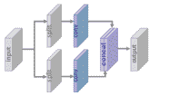

<!--yml

类别：未分类

日期：2024-09-06 20:06:39

-->

# [1902.06068] 深度学习用于图像超分辨率：一项综述

> 来源：[`ar5iv.labs.arxiv.org/html/1902.06068`](https://ar5iv.labs.arxiv.org/html/1902.06068)

# 深度学习用于图像超分辨率：

一项综述

王智浩、陈建、史蒂文·C.H.·霍伊，IEEE 会士  通讯作者：史蒂文·C.H.·霍伊目前在 Salesforce Research Asia 工作，同时也是新加坡管理大学信息系统学院的（休假）教职员工。电子邮件：shoi@salesforce.com 或 chhoi@smu.edu.sg。王智浩在中国南方科技大学工作。电子邮件：ptkin@outlook.com。这项工作是在他作为访问学生在新加坡管理大学信息系统学院霍伊博士团队时完成的。陈建在中国南方科技大学工作。电子邮件：ellachen@scut.edu.cn。

###### 摘要

图像超分辨率（SR）是一类重要的图像处理技术，用于在计算机视觉中提高图像和视频的分辨率。近年来，图像超分辨率领域利用深度学习技术取得了显著进展。本文旨在提供关于利用深度学习方法的图像超分辨率的最新进展的全面综述。一般来说，我们可以大致将现有的 SR 技术研究分为三大类：监督式 SR、非监督式 SR 和特定领域 SR。此外，我们还涵盖了一些其他重要问题，如公开可用的基准数据集和性能评估指标。最后，我们通过强调几个未来方向和亟待解决的开放问题来总结本综述，这些问题应在未来得到进一步的关注。

###### 索引术语：

图像超分辨率、深度学习、卷积神经网络（CNN）、生成对抗网络（GAN）

## 1 引言

图 1：本调查的层级结构分类法。

图像超分辨率（SR）指的是从低分辨率（LR）图像恢复高分辨率（HR）图像的过程，是计算机视觉和图像处理中的一个重要图像处理技术类别。它在现实世界中有广泛的应用，如医学成像 [1, 2, 3]、监控和安全 [4, 5]等。除了提升图像感知质量外，它还帮助改善其他计算机视觉任务 [6, 7, 8, 9]。一般而言，这个问题非常具有挑战性，并且本质上是病态的，因为总是存在多个 HR 图像对应于一个 LR 图像。在文献中，已经提出了多种经典的 SR 方法，包括基于预测的方法 [10, 11, 12]、基于边缘的方法 [13, 14]、统计方法 [15, 16]、基于块的方法 [13, 17, 18, 19] 和稀疏表示方法 [20, 21] 等。

随着近年来深度学习技术的快速发展，基于深度学习的 SR 模型已经得到了积极探索，并且在各种 SR 基准测试中常常达到最先进的性能。各种深度学习方法已被应用于解决 SR 任务，从早期的卷积神经网络（CNN）方法（例如，SRCNN [22, 23]）到最近使用生成对抗网络（GAN） [24] 的有前途的 SR 方法（例如，SRGAN [25]）。一般而言，使用深度学习技术的 SR 算法在以下主要方面彼此不同：不同类型的网络架构 [26, 27, 28]、不同类型的损失函数 [29, 8, 30]、不同类型的学习原则和策略 [31, 8, 32] 等。

本文对基于深度学习的图像超分辨率的最新进展进行了全面的概述。虽然文献中已有一些现有的 SR 调查，我们的工作不同之处在于，我们专注于基于深度学习的 SR 技术，而大多数早期工作 [33, 34, 35, 36] 旨在调查传统的 SR 算法，或者一些研究主要集中于基于全参考指标或人类视觉感知提供定量评估 [37, 38]。与现有调查不同，本调查从独特的深度学习视角出发，以系统和全面的方式回顾了 SR 技术的最新进展。

本次调查的主要贡献有三个方面：

1.  1. 

    我们对基于深度学习的图像超分辨率技术进行了全面回顾，包括问题设置、基准数据集、性能指标、深度学习的超分辨率方法家族、领域特定的超分辨率应用等。

1.  2.

    我们以分层和结构化的方式提供了基于深度学习的超分辨率技术的最新进展的系统概述，并总结了每个组件的优缺点，以提供有效的超分辨率解决方案。

1.  3.

    我们讨论了挑战和开放问题，并识别了新的趋势和未来方向，为社区提供有价值的指导。

在接下来的部分中，我们将涵盖深度学习图像超分辨率的最新进展的各个方面。图 1 以分层结构的方式展示了本次综述中涵盖的图像超分辨率的分类。第二部分给出了问题定义，并回顾了主流数据集和评估指标。第三部分模块化分析了监督学习超分辨率的主要组成部分。第四部分简要介绍了无监督超分辨率方法。第五部分介绍了一些流行的领域特定超分辨率应用，第六部分讨论了未来方向和开放问题。

## 2 问题设置与术语

### 2.1 问题定义

图像超分辨率旨在从低分辨率图像恢复出相应的高分辨率图像。通常，低分辨率图像 $I_{x}$ 被建模为以下退化过程的输出：

|  | $I_{x}=\mathcal{D}(I_{y};\delta),$ |  | (1) |
| --- | --- | --- | --- |

其中 $\mathcal{D}$ 表示退化映射函数，$I_{y}$ 是相应的高分辨率图像，$\delta$ 是退化过程的参数（例如，缩放因子或噪声）。通常，退化过程（即 $\mathcal{D}$ 和 $\delta$）是未知的，只提供低分辨率图像。在这种情况下，也称为盲超分辨率，研究人员需要从低分辨率图像 $I_{x}$ 中恢复高分辨率图像 $I_{y}$ 的近似值 $\hat{I_{y}}$，遵循：

|  | $\hat{I_{y}}=\mathcal{F}(I_{x};\theta),$ |  | (2) |
| --- | --- | --- | --- |

其中 $\mathcal{F}$ 是超分辨率模型，$\theta$ 表示 $\mathcal{F}$ 的参数。

尽管退化过程未知且可能受到各种因素的影响（例如压缩伪影、各向异性退化、传感器噪声和斑点噪声），研究人员正尝试建模退化映射。大多数工作直接将退化建模为单一的下采样操作，如下所示：

|  | $\mathcal{D}(I_{y};\delta)=(I_{y})\downarrow_{s},\{s\}\subset\delta,$ |  | (3) |
| --- | --- | --- | --- |

其中 $\downarrow_{s}$ 是具有缩放因子 $s$ 的下采样操作。事实上，大多数通用超分辨率数据集都是基于这种模式构建的，最常用的下采样操作是具有抗混叠的双三次插值。然而，也有其他工作 [39] 将退化建模为多个操作的组合：

|  | $\mathcal{D}(I_{y};\delta)=(I_{y}\otimes\kappa)\downarrow_{s}+n_{\varsigma},\{\kappa,s,\varsigma\}\subset\delta,$ |  | (4) |
| --- | --- | --- | --- |

其中 $I_{y}\otimes\kappa$ 表示模糊核 $\kappa$ 与 HR 图像 $I_{y}$ 之间的卷积，$n_{\varsigma}$ 是具有标准差 $\varsigma$ 的加性白噪声。与 Eq. 3 的简单定义相比，Eq. 4 的组合退化模式更接近真实世界情况，并已被证明对 SR [39] 更有益。

为此，SR 的目标如下：

|  | $\hat{\theta}=\mathop{\arg\min}_{\theta}\mathcal{L}(\hat{I_{y}},I_{y})+\lambda\Phi(\theta),$ |  | (5) |
| --- | --- | --- | --- |

其中 $\mathcal{L}(\hat{I_{y}},I_{y})$ 表示生成的 HR 图像 $\hat{I_{y}}$ 与真实图像 $I_{y}$ 之间的损失函数，$\Phi(\theta)$ 是正则化项，$\lambda$ 是权衡参数。尽管 SR 最流行的损失函数是逐像素均方误差（即像素损失），但更强大的模型往往使用多种损失函数的组合，这将在 Sec. 3.4.1 中介绍。

### 2.2 超分辨率的数据集

表 I: 用于超分辨率基准测试的公开图像数据集列表。

| 数据集 | 数量 | 平均分辨率 | 平均像素 | 格式 | 类别关键词 |
| --- | --- | --- | --- | --- | --- |
| BSDS300 [40] | $300$ | $(435,367)$ | $154,401$ | JPG | 动物，建筑物，食物，风景，人，植物等 |
| BSDS500 [41] | $500$ | $(432,370)$ | $154,401$ | JPG | 动物，建筑物，食物，风景，人，植物等 |
| DIV2K [42] | $1000$ | $(1972,1437)$ | $2,793,250$ | PNG | 环境，植物，动物，手工物品，人，风景等 |
| General-100 [43] | $100$ | $(435,381)$ | $181,108$ | BMP | 动物，日常用品，食物，人，植物，纹理等 |
| L20 [44] | $20$ | $(3843,2870)$ | $11,577,492$ | PNG | 动物，建筑物，风景，人，植物等 |
| Manga109 [45] | $109$ | $(826,1169)$ | $966,011$ | PNG | 漫画卷 |
| OutdoorScene [46] | $10624$ | $(553,440)$ | $249,593$ | PNG | 动物，建筑物，草地，山脉，植物，天空，水 |
| PIRM [47] | $200$ | $(617,482)$ | $292,021$ | PNG | 环境，植物，自然风光，物体，人等 |
| Set5 [48] | $5$ | $(313,336)$ | $113,491$ | PNG | 婴儿，鸟，蝴蝶，头像，女人 |
| Set14 [49] | $14$ | $(492,446)$ | $230,203$ | PNG | 人类、动物、昆虫、花卉、蔬菜、漫画、幻灯片等 |
| T91 [21] | $91$ | $(264,204)$ | $58,853$ | PNG | 汽车、花卉、水果、人脸等 |
| Urban100 [50] | $100$ | $(984,797)$ | $774,314$ | PNG | 建筑、城市、结构、城市等 |

目前有多种数据集可用于图像超分辨率，这些数据集在图像数量、质量、分辨率和多样性等方面有很大差异。它们中的一些提供 LR-HR 图像对，而其他则只提供 HR 图像，在这种情况下，LR 图像通常通过 MATLAB 中的 imresize 函数使用默认设置（即带有抗锯齿的双三次插值）获得。在表 I 中，我们列出了 SR 社区常用的图像数据集，并具体说明了它们的 HR 图像数量、平均分辨率、平均像素数量、图像格式和类别关键词。

除了这些数据集，还有一些广泛用于其他视觉任务的数据集也被用于超分辨率（SR），如 ImageNet [51]、MS-COCO [52]、VOC2012 [53]、CelebA [54]。此外，结合多个数据集进行训练也很流行，例如将 T91 和 BSDS300 [26, 55, 27, 56] 结合在一起，或者将 DIV2K 和 Flickr2K [31, 57] 结合在一起。

### 2.3 图像质量评估

图像质量指的是图像的视觉属性，并关注观众的感知评估。一般来说，图像质量评估（IQA）方法包括基于人类感知的主观方法（即图像看起来有多逼真）和客观计算方法。前者更符合我们的需求，但往往耗时且昂贵，因此后者目前是主流。然而，这些方法之间不一定一致，因为客观方法往往不能非常准确地捕捉人类视觉感知，这可能导致 IQA 结果的巨大差异 [58, 25]。

此外，客观图像质量评估（IQA）方法进一步分为三类 [58]：全参考方法使用参考图像进行评估、基于提取特征比较的减参考方法，以及没有任何参考图像的无参考方法（即盲 IQA）。接下来我们将介绍几种最常用的 IQA 方法，包括主观方法和客观方法。

#### 2.3.1 峰值信噪比

峰值信噪比（PSNR）是损失变换（例如图像压缩、图像修复）中最流行的重建质量测量之一。对于图像超分辨率，PSNR 通过最大像素值（记为$L$）和图像之间的均方误差（MSE）来定义。给定真实图像$I$和重建图像$\hat{I}$，$I$和$\hat{I}$之间的 PSNR 定义如下：

|  | $\displaystyle{\rm PSNR}$ | $\displaystyle=10\cdot\log_{10}(\frac{L^{2}}{\frac{1}{N}\sum_{i=1}^{N}(I(i)-\hat{I}(i))^{2}}),$ |  | (6) |
| --- | --- | --- | --- | --- |

其中$L$在一般情况下使用 8 位表示时等于$255$。由于 PSNR 仅与像素级 MSE 相关，只关注对应像素之间的差异，而不是视觉感知，它往往在表示实际场景中的重建质量时表现不佳，而我们通常更关心人类感知。然而，由于与文献工作的比较必要性以及缺乏完全准确的感知度量，PSNR 仍然是目前最广泛使用的超分辨率模型评估标准。

#### 2.3.2 结构相似性

考虑到人类视觉系统（HVS）高度适应于提取图像结构[59]，提出了结构相似性指数（SSIM）[58]，用于测量图像之间的结构相似性，基于亮度、对比度和结构的独立比较。对于一个具有$N$个像素的图像$I$，亮度$\mu_{I}$和对比度$\sigma_{I}$分别估计为图像强度的均值和标准差，即$\mu_{I}=\frac{1}{N}\sum_{i=1}^{N}I(i)$和$\sigma_{I}=(\frac{1}{N-1}\sum_{i=1}^{N}(I(i)-\mu_{I})^{2})^{\frac{1}{2}}$，其中$I(i)$表示图像$I$的第$i$个像素的强度。亮度和对比度的比较，分别记为$\mathcal{C}_{l}(I,\hat{I})$和$\mathcal{C}_{c}(I,\hat{I})$，给出如下：

|  | $\displaystyle\mathcal{C}_{l}(I,\hat{I})$ | $\displaystyle=\frac{2\mu_{I}\mu_{\hat{I}}+C_{1}}{\mu_{I}^{2}+\mu_{\hat{I}}^{2}+C_{1}},$ |  | (7) |
| --- | --- | --- | --- | --- |
|  | $\displaystyle\mathcal{C}_{c}(I,\hat{I})$ | $\displaystyle=\frac{2\sigma_{I}\sigma_{\hat{I}}+C_{2}}{\sigma_{I}^{2}+\sigma_{\hat{I}}^{2}+C_{2}},$ |  | (8) |

其中$C_{1}=(k_{1}L)^{2}$和$C_{2}=(k_{2}L)^{2}$是为了避免不稳定性而设置的常数，$k_{1}\ll 1$和$k_{2}\ll 1$。

此外，图像结构由归一化的像素值（即$(I-\mu_{I})/\sigma_{I}$）表示，其相关性（即内积）测量结构相似性，相当于$I$和$\hat{I}$之间的相关系数。因此，结构比较函数$\mathcal{C}_{s}(I,\hat{I})$定义为：

|  | $\displaystyle\sigma_{I\hat{I}}$ | $\displaystyle=\frac{1}{N-1}\sum_{i=1}^{N}(I(i)-\mu_{I})(\hat{I}(i)-\mu_{\hat{I}}),$ |  | (9) |
| --- | --- | --- | --- | --- |
|  | $\displaystyle\mathcal{C}_{s}(I,\hat{I})$ | $\displaystyle=\frac{\sigma_{I\hat{I}}+C_{3}}{\sigma_{I}\sigma_{\hat{I}}+C_{3}},$ |  | (10) |

其中$\sigma_{I,\hat{I}}$是$I$和$\hat{I}$之间的协方差，$C_{3}$是用于稳定性的常数。

最终，SSIM 定义为：

|  | ${\rm SSIM}(I,\hat{I})=[\mathcal{C}_{l}(I,\hat{I})]^{\alpha}[\mathcal{C}_{c}(I,\hat{I})]^{\beta}[\mathcal{C}_{s}(I,\hat{I})]^{\gamma},$ |  | (11) |
| --- | --- | --- | --- |

其中$\alpha$、$\beta$、$\gamma$是用于调整相对重要性的控制参数。

由于 SSIM 从 HVS 的角度评估重建质量，它更好地满足了感知评估的要求[60，61]，并且被广泛使用。

#### 2.3.3 平均意见分数

平均意见分数（MOS）测试是一种常用的主观图像质量评估方法，其中要求人类评分者为测试图像分配感知质量分数。通常，评分范围为$1$（差）到$5$（好）。最终的 MOS 是所有评分的算术平均值。

尽管 MOS 测试看似是一个可靠的图像质量评估方法，但它存在一些固有缺陷，例如非线性感知尺度、评分标准的偏差和方差。实际上，一些在常见图像质量评估指标（例如，PSNR）上表现较差的 SR 模型，在感知质量方面却远超其他模型，在这种情况下，MOS 测试是准确测量感知质量的最可靠方法[62，25，8，63，64，46，65]。

#### 2.3.4 基于学习的感知质量

为了更好地评估图像感知质量并减少人工干预，研究人员尝试通过在大规模数据集上进行学习来评估感知质量。具体来说，Ma 等人[66]和 Talebi 等人[67]分别提出了无参考的 Ma 和 NIMA，这些方法从视觉感知评分中学习，并直接预测质量评分，而不需要真实图像。相比之下，Kim 等人[68]提出了 DeepQA，通过在失真图像、客观误差图和主观评分的三元组上进行训练来预测图像的视觉相似性。而 Zhang 等人[69]收集了大规模的感知相似性数据集，根据训练过的深度网络的深度特征差异来评估感知图像补丁相似性（LPIPS），并展示了 CNN 学习到的深度特征在感知相似性上的表现远优于没有 CNN 的测量方法。

尽管这些方法在捕捉人类视觉感知方面表现更佳，但我们需要什么样的感知质量（例如，更现实的图像，还是与原始图像一致的身份）仍然是一个待探索的问题，因此客观图像质量评估方法（例如，PSNR、SSIM）仍然是目前的主流。

#### 2.3.5 基于任务的评估

根据 SR 模型通常能帮助其他视觉任务的事实[6, 7, 8, 9]，通过其他任务评估重建性能是另一种有效的方法。具体来说，研究人员将原始图像和重建后的高分辨率图像输入经过训练的模型，通过比较对预测性能的影响来评估重建质量。用于评估的视觉任务包括物体识别[8, 70]、人脸识别[71, 72]、人脸对齐和解析[30, 73]等。

#### 2.3.6 其他图像质量评估方法

除了上述的图像质量评估方法外，还有其他不那么流行的超分辨率度量指标。多尺度结构相似性（MS-SSIM）[74]比单尺度 SSIM 在结合视角变化方面提供了更多的灵活性。特征相似性（FSIM）[75]基于相位一致性和图像梯度幅值提取人类感兴趣的特征点来评估图像质量。自然图像质量评估器（NIQE）[76]利用自然图像中观察到的统计规律的可测偏差，而不需要接触失真图像。

最近，Blau 等人[77]在数学上证明了失真（例如 PSNR、SSIM）和感知质量（例如 MOS）相互矛盾，并展示了当失真减少时，感知质量必然会变差。因此，如何准确测量超分辨率质量仍然是一个亟待解决的问题。

### 2.4 操作通道

除了常用的 RGB 颜色空间外，YCbCr 颜色空间在超分辨率中也被广泛使用。在这个空间中，图像由 Y、Cb、Cr 通道表示，分别表示亮度、蓝色差异和红色差异色度分量。虽然目前对于在哪个空间上进行或评估超分辨率没有公认的最佳实践，早期模型倾向于在 YCbCr 空间的 Y 通道上进行操作[26, 43, 78, 79]，而较新的模型则倾向于在 RGB 通道上进行操作[31, 57, 28, 70]。值得注意的是，在不同颜色空间或通道上进行操作（训练或评估）可能会使评估结果大相径庭（高达$4$ dB）[23]。

### 2.5 超分辨率挑战

本节将简要介绍两个最流行的图像超分辨率挑战：NTIRE[80]和 PIRM[47, 81]。

NTIRE 挑战。图像恢复和增强的新趋势 (NTIRE) 挑战 [80] 与 CVPR 合作，包括超分辨率、去噪和着色等多个任务。对于图像超分辨率，NTIRE 挑战建立在 DIV2K [42] 数据集上，并包括双三次降采样轨道和带有真实未知降级的盲轨道。这些轨道在降级和缩放因子上有所不同，旨在促进理想条件下和现实世界不利情况下的超分辨率研究。

PIRM 挑战。感知图像恢复和处理 (PIRM) 挑战与 ECCV 合作，也包括多个任务。与 NTIRE 相反，PIRM 的一个子挑战 [47] 关注生成精度和感知质量之间的权衡，另一个子挑战 [81] 关注智能手机上的超分辨率。众所周知 [77]，针对失真的模型经常产生视觉上不令人满意的结果，而针对感知质量的模型在信息保真度上表现不佳。具体来说，PIRM 根据均方根误差 (RMSE) 的阈值将感知-失真平面分为三个区域。在每个区域中，通过 NIQE [76] 和 Ma [66] 进行评估，最佳的算法是获得最佳感知质量的算法 [77]。而在另一个子挑战 [81] 中，智能手机上的超分辨率，参与者被要求在有限的智能手机硬件（包括 CPU、GPU、RAM 等）上执行超分辨率，评估指标包括 PSNR、MS-SSIM 和 MOS 测试。通过这种方式，PIRM 鼓励对感知-失真权衡的高级研究，也推动了在智能手机上轻量、高效的图像增强。

## 3 监督式超分辨率

如今，研究人员提出了各种深度学习的超分辨率模型。这些模型专注于监督式超分辨率，即通过低分辨率图像和相应的高分辨率图像进行训练。尽管这些模型之间的差别很大，但它们本质上是一些模型框架、上采样方法、网络设计和学习策略的组合。从这个角度来看，研究人员将这些组件组合起来构建一个整合的超分辨率模型，以适应特定的目的。在这一部分，我们集中模块化地分析基本组件（如图 1 所示），而不是单独介绍每个模型，并总结它们的优势和局限性。

### 3.1 超分辨率框架

(a) 预上采样 SR

(b) 后上采样 SR

(c) 渐进式上采样 SR

(d) 迭代上下采样超分辨率

图 2：基于深度学习的超分辨率模型框架。立方体的大小表示输出大小。灰色表示预定义上采样，而绿色、黄色和蓝色分别表示可学习的上采样、下采样和卷积层。被虚线框包围的模块表示可堆叠模块。

由于图像超分辨率是一个不适定问题，如何执行上采样（即，从低分辨率输入生成高分辨率输出）是关键问题。尽管现有模型的架构差异很大，但它们可以归纳为四种模型框架（如图 2 所示），这些框架基于所采用的上采样操作及其在模型中的位置。

#### 3.1.1 预处理上采样超分辨率

由于直接学习从低维空间到高维空间的映射具有困难，利用传统上采样算法获取更高分辨率的图像，然后使用深度神经网络对其进行精细化处理是一种简单的解决方案。因此，Dong 等人[22, 23] 首先采用预处理上采样超分辨率框架（如图 2a 所示），并提出 SRCNN 以学习从插值的低分辨率图像到高分辨率图像的端到端映射。具体来说，使用传统方法（例如，双三次插值）将低分辨率图像上采样到具有所需大小的粗略高分辨率图像，然后在这些图像上应用深度 CNNs 以重建高质量的细节。

由于最困难的上采样操作已完成，CNNs 只需对粗略图像进行精细化处理，这显著降低了学习难度。此外，这些模型可以接受任意尺寸和缩放因子的插值图像作为输入，并给出与单尺度超分辨率模型性能相当的精细结果[26]。因此，它逐渐成为最受欢迎的框架之一[82, 56, 55, 83]，这些模型之间的主要区别在于后续模型设计（见 3.3 节）和学习策略（见 3.4 节）。然而，预定义的上采样通常会引入副作用（例如，噪声放大和模糊），并且由于大多数操作在高维空间中执行，因此时间和空间成本远高于其他框架[84, 43]。

#### 3.1.2 后上采样超分辨率

为了提高计算效率，并充分利用深度学习技术自动增加分辨率，研究人员提出通过用端到端可学习的层替代预定义的上采样，将大部分计算放在低维空间中，这些层集成在模型的末端。在这种框架的开创性工作[84, 43]中，如图 2b 所示，低分辨率输入图像被送入深度卷积神经网络而不增加分辨率，端到端可学习的上采样层被应用在网络的末端。

由于特征提取过程仅在低维空间中进行，且分辨率仅在末端增加，因此计算和空间复杂性大大减少。因此，这一框架也成为了最主流的框架之一[25, 31, 79, 85]。这些模型主要在可学习的上采样层（见第 3.2 节）、前置卷积神经网络结构（见第 3.3 节）和学习策略（见第 3.4 节）等方面有所不同。

#### 3.1.3 渐进上采样超分辨率

尽管后处理上采样 SR 框架已经大幅降低了计算成本，但仍存在一些不足。一方面，上采样仅在一步中完成，这大大增加了大缩放因子（例如 4、8）的学习难度。另一方面，每个缩放因子需要训练一个独立的 SR 模型，这不能满足多尺度 SR 的需求。为了解决这些缺点，拉普拉斯金字塔 SR 网络（LapSRN）采用了渐进上采样框架[27]，如图 2c 所示。具体而言，该框架下的模型基于 CNN 的级联，并逐步重建更高分辨率的图像。在每个阶段，图像被上采样到更高分辨率，并由 CNN 进行优化。其他工作如 MS-LapSRN [65] 和渐进 SR (ProSR) [32] 也采用了该框架并取得了相对较高的性能。与 LapSRN 和 MS-LapSRN 使用中间重建图像作为后续模块的“基础图像”不同，ProSR 保持了主要信息流，并通过各个头重建中间分辨率图像。

通过将复杂任务分解为简单任务，该框架下的模型大大降低了学习难度，尤其是在大因子情况下，同时也在不引入过多空间和时间成本的情况下应对多尺度 SR。此外，一些特定的学习策略，如课程学习（见 3.4.3）和多重监督（见 3.4.4），可以直接整合以进一步降低学习难度并提高最终性能。然而，这些模型也遇到了一些问题，如多阶段模型设计复杂性和训练稳定性，需要更多的建模指导和更先进的训练策略。

#### 3.1.4 迭代上下采样超分辨率

为了更好地捕捉 LR-HR 图像对的相互依赖性，一种高效的迭代程序，称为反投影[12]，被纳入到 SR[44]中。这个 SR 框架，即迭代上采样和下采样 SR（如图 2d 所示），尝试迭代应用反投影精化，即计算重建误差然后将其融合以调整 HR 图像的强度。具体而言，Haris 等人[57]利用迭代的上下采样层并提出了 DBPN，该方法交替连接上采样和下采样层，并使用所有中间重建结果重构最终的 HR 结果。类似地，SRFBN[86]采用具有更多密集跳跃连接的迭代上采样反馈块，并学习更好的表示。而 RBPN[87]用于视频超分辨率，从连续的视频帧中提取上下文，并通过反投影模块将这些上下文结合起来以产生递归输出帧。

在这个框架下的模型可以更好地挖掘 LR-HR 图像对之间的深层关系，从而提供更高质量的重建结果。然而，反投影模块的设计标准仍不明确。由于这一机制刚刚被引入到基于深度学习的 SR 中，这个框架具有巨大的潜力，需要进一步探索。

### 3.2 上采样方法

除了模型中的上采样位置外，上采样的执行方式也至关重要。虽然已经有各种传统的上采样方法[20, 21, 88, 89]，但利用 CNN 进行端到端的上采样逐渐成为一种趋势。在这一部分，我们将介绍一些传统的基于插值的算法和基于深度学习的上采样层。

#### 3.2.1 基于插值的上采样

(a) 开始

(b) 步骤 1

(c) 步骤 2

(d) 结束

图 3：基于插值的上采样方法。灰色区域表示像素坐标，蓝色、黄色和绿色点分别代表初始、过渡和输出像素。

图像插值，即图像缩放，指的是调整数字图像的大小，并广泛用于与图像相关的应用中。传统的插值方法包括最近邻插值、双线性插值和立方插值、Sinc 和 Lanczos 重采样等。由于这些方法具有可解释性且易于实现，因此其中一些方法在基于 CNN 的 SR 模型中仍被广泛使用。

最近邻插值。最近邻插值是一种简单直观的算法。它选择每个位置的最近像素值进行插值，而不考虑其他像素。因此，这种方法非常快速，但通常会产生低质量的块状结果。

双线性插值。双线性插值（BLI）首先在图像的一个轴上进行线性插值，然后在另一个轴上进行，如图 3 所示。由于它产生了一个感受野大小为 $2\times 2$ 的二次插值，它的表现比最近邻插值要好得多，同时保持了相对较快的速度。

双三次插值。同样，双三次插值（BCI）[10] 在两个轴上进行三次插值，如图 3 所示。与 BLI 相比，BCI 考虑了 $4\times 4$ 像素，结果更加平滑，伪影更少，但速度要慢得多。事实上，带有抗锯齿的 BCI 是构建 SR 数据集（即将 HR 图像降解为 LR 图像）的主流方法，并且在预上采样 SR 框架中也得到了广泛应用（第 3.1.1 节）。

实际上，基于插值的上采样方法仅依靠图像本身的信号来提高图像分辨率，而没有引入更多的信息。相反，它们通常会引入一些副作用，例如计算复杂度、噪声放大和模糊结果。因此，当前的趋势是用可学习的上采样层替代基于插值的方法。

#### 3.2.2 基于学习的上采样

（a）开始

（b）扩展

（c）卷积

图 4：转置卷积层。蓝色框表示输入，绿色框表示卷积核和卷积输出。

（a）开始

（b）卷积

（c）重塑

图 5：子像素层。蓝色框表示输入，其他颜色的框表示不同的卷积操作和不同的输出特征图。

图 6: 元上采样模块。蓝色框表示投影补丁，绿色框和线条表示带有预测权重的卷积操作。

为了克服基于插值的方法的不足并以端到端的方式学习上采样，引入了转置卷积层和亚像素层到 SR 领域。

转置卷积层。转置卷积层，也称为反卷积层[90, 91]，尝试执行与普通卷积相反的变换，即基于特征图的卷积输出大小预测可能的输入。具体来说，它通过插入零并执行卷积来增加图像分辨率。以$2\times$ SR 和$3\times 3$内核为例（如图 4 所示），输入首先被扩展为原始大小的两倍，其中新增的像素值被设置为$0$（图 4b）。然后，应用内核大小为$3\times 3$，步幅为$1$，填充为$1$的卷积（图 4c）。这样，输入被以$2$的倍数上采样，其中接收域最多为$2\times 2$。由于转置卷积以端到端的方式放大图像大小，同时保持与普通卷积兼容的连接模式，因此在 SR 模型中被广泛用作上采样层[78, 79, 85, 57]。然而，这一层容易在每个轴上造成“均匀重叠”[92]，而两个轴上的乘积结果进一步产生具有不同幅度的棋盘状图案，从而影响 SR 性能。

子像素层。子像素层[84]，另一种端到端可学习的上采样层，通过卷积生成多个通道并重新调整形状来进行上采样，如图 5 所示。在这一层中，首先应用卷积以生成$ s^{2} $倍的通道输出，其中$s$是缩放因子（图 5b）。假设输入大小为$ h\times w\times c $，输出大小将为$ h\times w\times s^{2}c $。之后，执行重新调整操作（也称为 shuffle[84]）以生成大小为$ sh\times sw\times c $的输出（图 5c）。在这种情况下，感受野可以达到$ 3\times 3 $。由于端到端的上采样方式，这一层也被 SR 模型广泛使用[25, 39, 93, 28]。与转置卷积层相比，子像素层具有更大的感受野，提供了更多的上下文信息以帮助生成更真实的细节。然而，由于感受野的分布不均匀且块状区域实际上共享相同的感受野，这可能导致不同块边界附近出现一些伪影。另一方面，独立预测块状区域中的相邻像素可能导致输出不平滑。因此，Gao 等人[94]提出了 PixelTCL，该方法将独立预测替换为相互依赖的顺序预测，产生更平滑且更一致的结果。

元上采样模块。以往的方法需要预定义缩放因子，即为不同因子训练不同的上采样模块，这种方法效率低且不符合实际需求。因此，Hu 等人[95] 提出了元上采样模块（如图 6 所示），该模块首先基于元学习解决任意缩放因子的 SR 问题。具体而言，对于 HR 图像上的每个目标位置，该模块将其投影到 LR 特征图上的小补丁（即 $k\times k\times c_{in}$），根据投影偏移和缩放因子通过密集层预测卷积权重（即 $k\times k\times c_{in}\times c_{out}$）并执行卷积。通过这种方式，元上采样模块可以通过单一模型连续放大任意因子。由于大量的训练数据（同时训练多个因子），该模块在固定因子上的表现可以媲美甚至优于传统方法。尽管该模块在推理过程中需要预测权重，但上采样模块的执行时间仅占特征提取时间的约 1%[95]。然而，该方法基于与图像内容无关的多个值预测大量卷积权重，因此在面对更大放大倍率时，预测结果可能不稳定且效率较低。

如今，这些基于学习的层已经成为最广泛使用的上采样方法。特别是在后采样框架中（见 3.1.2），这些层通常在最终的上采样阶段用于基于在低维空间中提取的高层次表示来重建 HR 图像，从而实现端到端的 SR，同时避免在高维空间中进行过于复杂的操作。

### 3.3 网络设计

(a) 残差学习

(b) 递归学习

(c) 通道注意力

(d) 稠密连接

(e) 局部多路径学习

(f) 特定尺度的多路径学习

(g) 分组卷积

(h) 金字塔池化

图 7：网络设计策略。

如今，网络设计已成为深度学习中最重要的部分之一。在超分辨率领域，研究人员在四种 SR 框架 (Sec. 3.1) 上应用各种网络设计策略以构建最终网络。在本节中，我们将这些网络分解为网络设计的基本原则或策略，逐一介绍并分析其优缺点。

#### 3.3.1 残差学习

在 He 等人 [96] 提出 ResNet 以学习残差而非完整映射之前，残差学习已被广泛应用于 SR 模型 [97, 48, 88]，如图 7a 所示。其中，残差学习策略大致可以分为全局残差学习和局部残差学习。

全局残差学习。由于图像 SR 是一个图像到图像的转换任务，输入图像与目标图像高度相关，研究人员尝试仅学习它们之间的残差，即全局残差学习。在这种情况下，避免了从完整图像到另一个图像的复杂变换，只需学习残差图以恢复丢失的高频细节。由于大多数区域的残差接近于零，模型复杂性和学习难度大大降低。因此，它被 SR 模型广泛使用 [26, 56, 55, 98]。

本地残差学习。局部残差学习类似于 ResNet 中的残差学习 [96]，用于缓解由于网络深度不断增加而导致的退化问题 [96]，减少训练难度并提高学习能力。它在 SR [78, 85, 70, 99] 中也得到了广泛应用。

在实践中，上述方法都通过快捷连接（通常通过一个小常数缩放）和逐元素加法来实现，不同之处在于前者直接连接输入和输出图像，而后者通常在网络内部的不同深度之间添加多个快捷连接。

#### 3.3.2 递归学习

为了在不引入过多参数的情况下学习更高层次的特征，递归学习，即以递归方式多次应用相同的模块，被引入到 SR 领域，如图 7b 所示。

在这些方法中，16-递归 DRCN[82] 采用了单一的卷积层作为递归单元，并且达到 $41\times 41$ 的感受野，这比 SRCNN [22] 的 $13\times 13$ 要大得多，同时参数量并没有过多增加。DRRN [56] 使用了一个 ResBlock [96] 作为递归单元进行 25 次递归，并且获得了比 17-ResBlock 基线更好的性能。后来，Tai 等人 [55] 提出了基于记忆块的 MemNet，它由 6-递归 ResBlock 组成，每次递归的输出都会被串联起来，并经过额外的 $1\times 1$ 卷积进行记忆和遗忘。级联残差网络 (CARN) [28] 也采用了类似的递归单元，包括若干 ResBlocks。最近，Li 等人 [86] 采用了迭代上下采样 SR 框架，并提出了一种基于递归学习的反馈网络，其中整个网络的权重在所有递归中共享。

此外，研究人员还在不同的部分使用了不同的递归模块。具体而言，Han 等人 [85] 提出了双状态递归网络 (DSRN)，以便在 LR 和 HR 状态之间交换信号。在每个时间步骤（即递归中），每个分支的表示都会被更新并交换，以更好地探索 LR-HR 关系。类似地，Lai 等人 [65] 将嵌入和上采样模块作为递归单元，从而在性能损失很小的情况下大幅度减少了模型的大小。

总体来说，递归学习确实可以在不引入过多参数的情况下学习更先进的表示，但仍然无法避免高计算成本。而且，它本质上带来了梯度消失或爆炸的问题，因此一些技术，如残差学习（见 3.3.1）和多重监督（见 3.4.4），通常与递归学习结合，以缓解这些问题 [82, 56, 55, 85]。

#### 3.3.3 多路径学习

多路径学习指的是将特征通过多个路径进行处理，这些路径执行不同的操作，然后将它们融合回来，以提供更好的建模能力。具体来说，它可以分为全局、多层次和特定尺度的多路径学习，如下所示。

全球多路径学习。全球多路径学习指的是利用多条路径来提取图像不同方面的特征。这些路径在传播过程中可以交叉，从而大大增强学习能力。具体来说，LapSRN [27] 包括一个特征提取路径，该路径以粗到细的方式预测子带残差，另一个路径则基于两个路径的信号重建高分辨率图像。同样，DSRN [85] 利用两个路径分别提取低维和高维空间中的信息，并不断交换信息以进一步提高学习能力。而像素递归超分辨率 [64] 采用了一个条件路径来捕捉图像的全局结构，以及一个先验路径来捕捉生成像素的序列依赖。相比之下，Ren 等人 [100] 采用具有不平衡结构的多条路径来执行上采样，并在模型的最后进行融合。

局部多路径学习。受到 inception 模块 [101] 的启发，MSRN [99] 采用了一种新的块进行多尺度特征提取，如图 7e 所示。在这个块中，采用了两个卷积层，分别具有 $3\times 3$ 和 $5\times 5$ 的卷积核来同时提取特征，然后将输出进行拼接并再次经过相同的操作，最后应用一个额外的 $1\times 1$ 卷积。一个捷径通过逐元素加法连接输入和输出。通过这种局部多路径学习，超分辨率模型能够更好地从多个尺度中提取图像特征，进一步提高性能。

特定尺度多路径学习。考虑到不同尺度的超分辨率模型需要经过类似的特征提取，Lim 等人 [31] 提出了特定尺度多路径学习，以便使用单一网络应对多尺度超分辨率。具体来说，他们共享模型的主要组件（即用于特征提取的中间层），并在网络的开始和结束处分别附加特定尺度的预处理路径和上采样路径（如图 7f 所示）。在训练过程中，仅启用和更新与所选尺度对应的路径。通过这种方式，提出的 MDSR [31] 通过共享大部分参数来大幅减少模型大小，并展现出与单尺度模型相当的性能。CARN [28] 和 ProSR [32] 也采用了类似的特定尺度多路径学习。

#### 3.3.4 密集连接

由于 Huang 等人 [102] 提出了基于密集块的 DenseNet，密集连接在视觉任务中变得越来越流行。对于密集块中的每一层，所有前面层的特征图都用作输入，而自身的特征图用作所有后续层的输入，因此在一个 $l$ 层的密集块中产生了 $l\cdot(l-1)/2$ 个连接 ($l\geq 2$)。密集连接不仅有助于缓解梯度消失，增强信号传播和鼓励特征重用，还通过使用较小的增长率（即密集块中的通道数）和在连接所有输入特征图后压缩通道来显著减少模型大小。

为了融合低级和高级特征以提供更丰富的信息以重建高质量细节，在 SR 领域引入了密集连接，如图 7d 所示。Tong 等人 [79] 不仅采用密集块构建了一个 69 层的 SRDenseNet，还在不同的密集块之间插入了密集连接，即，对于每个密集块，所有前面的块的特征图都用作输入，其自身的特征图用作所有后续块的输入。这些层级和块级的密集连接也被 MemNet [55]、CARN [28]、RDN [93] 和 ESRGAN [103] 采用。DBPN [57] 也广泛采用了密集连接，但它们的密集连接是在所有上采样单元之间，而不是下采样单元之间。

#### 3.3.5 注意力机制

通道注意力。考虑到不同通道之间特征表示的相互依赖和交互，Hu 等人 [104] 提出了一个“挤压和激励”块，通过显式建模通道间依赖性来提高学习能力，如图 7c 所示。在这个块中，每个输入通道通过全局平均池化（GAP）被挤压成一个通道描述符（即一个常量），然后这些描述符被输入到两个密集层中，以产生输入通道的通道级缩放因子。最近，Zhang 等人 [70] 将通道注意力机制与 SR 相结合，提出了 RCAN，这显著提高了模型的表示能力和 SR 性能。为了更好地学习特征相关性，Dai 等人 [105] 进一步提出了二阶通道注意力（SOCA）模块。SOCA 通过使用二阶特征统计代替 GAP 自适应地重新调整通道级特征，并能够提取更具信息性和区分性的表示。

非局部注意力。大多数现有的 SR 模型具有非常有限的局部感受野。然而，一些远处的对象或纹理对于局部补丁生成可能非常重要。因此，Zhang 等人 [106] 提出了局部和非局部注意力模块，以提取捕获像素间长期依赖关系的特征。具体而言，他们提出了一个用于提取特征的主干分支和一个（非）局部掩码分支，用于自适应地重新缩放主干分支的特征。在这些模块中，局部分支采用编码器-解码器结构来学习局部注意力，而非局部分支则使用嵌入的高斯函数来评估特征图中每两个位置索引之间的成对关系，从而预测缩放权重。通过这种机制，该方法能够很好地捕捉空间注意力，并进一步增强表示能力。同样，Dai 等人 [105] 也结合了非局部注意力机制，以捕获远距离的空间上下文信息。

#### 3.3.6 高级卷积

由于卷积操作是深度神经网络的基础，研究人员也尝试改进卷积操作，以获得更好的性能或更高的效率。

膨胀卷积。众所周知，上下文信息有助于生成现实的细节。因此，Zhang 等人 [107] 在超分辨率（SR）模型中用膨胀卷积替代了常规卷积，将感受野扩大了一倍多，并取得了更好的性能。

分组卷积。受到近期轻量级卷积神经网络（CNNs）[108, 109] 进展的启发，Hui 等人 [98] 和 Ahn 等人 [28] 分别通过用分组卷积替代传统卷积，提出了 IDN 和 CARN-M。正如一些前期工作所证明的那样，分组卷积大大减少了参数和计算量，尽管性能有所下降 [98, 28]。

深度可分离卷积。自从 Howard 等人 [110] 提出了用于高效卷积的深度可分离卷积之后，它已被扩展到各种领域。具体而言，它由一个因式分解的深度卷积和一个点卷积（即 $1\times 1$ 卷积）组成，从而大幅减少了参数和计算量，准确率只略有下降 [110]。最近，Nie 等人 [81] 采用深度可分离卷积，大大加速了 SR 架构。

#### 3.3.7 区域递归学习

大多数超分辨率模型将超分辨率视为一个像素独立的任务，因此无法有效捕捉生成像素之间的相互依赖关系。受到 PixelCNN [111] 的启发，Dahl 等人[64]首次提出像素递归学习，通过采用两个网络分别捕捉全局上下文信息和序列生成依赖性，从而实现逐像素生成。通过这种方式，所提出的方法在超分辨率非常低分辨率的面部图像（例如$8\times 8$）上合成了逼真的头发和皮肤细节，并在 MOS 测试[64]（见 2.3.3）中远超前述方法。

受到人类注意力转移机制的启发[112]，Attention-FH [113]也采用了这种策略，通过使用递归策略网络来顺序发现关注的区域并进行局部增强。这样，它能够根据每张图像的特性自适应地个性化最佳搜索路径，从而充分利用图像的全局内部依赖关系。

尽管这些方法在某种程度上表现更好，但需要长传播路径的递归过程大大增加了计算成本和训练难度，尤其是在超分辨率的高分辨率图像处理中。

#### 3.3.8 金字塔池化

受到空间金字塔池化层的启发[114]，Zhao 等人[115]提出了金字塔池化模块，以更好地利用全局和局部上下文信息。具体来说，对于尺寸为$h\times w\times c$的特征图，每个特征图被划分为$M\times M$的桶，并经过全局平均池化，得到$M\times M\times c$的输出。然后，进行$1\times 1$卷积以将输出压缩为单通道。之后，通过双线性插值将低维特征图上采样到与原始特征图相同的尺寸。通过使用不同的$M$，该模块有效地整合了全局和局部上下文信息。通过引入这个模块，所提出的 EDSR-PP 模型[116]进一步提高了性能。

#### 3.3.9 小波变换

众所周知，小波变换（WT）[117, 118] 是通过将图像信号分解为表示纹理细节的高频子带和包含全局拓扑信息的低频子带，从而高效表示图像的技术。Bae 等人 [119] 首次将 WT 与基于深度学习的 SR 模型结合，采用插值后的 LR 小波子带作为输入，预测相应 HR 子带的残差。WT 和逆 WT 分别用于分解 LR 输入和重建 HR 输出。类似地，DWSR [120] 和 Wavelet-SRNet [121] 也在小波域中进行 SR，但结构更加复杂。与以上各工作独立处理每个子带不同，MWCNN [122] 采用多级 WT，并将串联的子带作为输入提供给单一的 CNN，以更好地捕捉它们之间的依赖关系。由于小波变换的高效表示，使用此策略的模型通常能大幅减少模型大小和计算成本，同时保持竞争力的性能 [119, 122]。

#### 3.3.10 Desubpixel

为了加快推理速度，Vu 等人 [123] 提出了在低维空间中执行耗时的特征提取，并提出了 desubpixel，这是一种子像素层的 shuffle 操作的逆操作（见 3.2.2）。具体而言，desubpixel 操作将图像空间分割，堆叠为额外的通道，从而避免了信息丢失。通过这种方式，他们在模型开始时通过 desubpixel 对输入图像进行下采样，在低维空间中学习表示，并在最后将图像上采样到目标大小。所提模型在 PIRM Challenge on Smartphones [81] 中取得了最佳成绩，具有非常高的推理速度和良好的性能。

#### 3.3.11 xUnit

为了将空间特征处理和非线性激活结合起来，更高效地学习复杂特征，Kligvasser 等人 [124] 提出了 xUnit 来学习空间激活函数。具体而言，ReLU 被视为确定一个权重图来与输入进行逐元素相乘，而 xUnit 通过卷积和高斯门控直接学习权重图。虽然 xUnit 的计算需求更高，但由于其对性能的显著影响，它允许在不降低性能的情况下大幅减少模型大小。通过这种方式，作者将模型大小减少了近 50% 而性能未出现下降。

### 3.4 学习策略

#### 3.4.1 损失函数

在超分辨率领域，损失函数用于衡量重建误差并指导模型优化。早期，研究人员通常使用逐像素 L2 损失，但后来发现它不能非常准确地衡量重建质量。因此，采用了多种损失函数（例如，内容损失 [29]、对抗损失 [25]）来更好地衡量重建误差，并产生更真实、更高质量的结果。如今，这些损失函数在实践中发挥了重要作用。在本节中，我们将深入探讨广泛使用的损失函数。本节中的符号遵循第 2.1 节的定义，除了为了简洁起见，我们忽略了目标 HR 图像 $\hat{I_{y}}$ 和生成 HR 图像 $I_{y}$ 的下标 $y$。

像素损失。像素损失衡量两个图像之间的逐像素差异，主要包括 L1 损失（即平均绝对误差）和 L2 损失（即均方误差）：

|  | $\displaystyle\mathcal{L}_{\text{pixel\_l1}}(\hat{I},I)$ | $\displaystyle=\frac{1}{hwc}\sum_{i,j,k}&#124;\hat{I}_{i,j,k}-I_{i,j,k}&#124;,$ |  | (12) |
| --- | --- | --- | --- | --- |
|  | $\displaystyle\mathcal{L}_{\text{pixel\_l2}}(\hat{I},I)$ | $\displaystyle=\frac{1}{hwc}\sum_{i,j,k}(\hat{I}_{i,j,k}-I_{i,j,k})^{2},$ |  | (13) |

其中 $h$、$w$ 和 $c$ 分别是评估图像的高度、宽度和通道数。此外，还有一种像素 L1 损失的变体，即 Charbonnier 损失 [125、27]，其定义为：.

|  | $\mathcal{L}_{\text{pixel\_Cha}}(\hat{I},I)=\frac{1}{hwc}\sum_{i,j,k}\sqrt{(\hat{I}_{i,j,k}-I_{i,j,k})^{2}+\epsilon^{2}},$ |  | (14) |
| --- | --- | --- | --- |

其中 $\epsilon$ 是一个常数（例如 $10^{-3}$）用于数值稳定性。

像素损失约束生成的 HR 图像 $\hat{I}$ 在像素值上尽可能接近真实值 $I$。与 L1 损失相比，L2 损失对较大的误差惩罚更重，但对小的误差更宽容，因此往往导致结果过于平滑。在实践中，L1 损失比 L2 损失 [31、126、28] 表现出更好的性能和收敛性。由于 PSNR 的定义（第 2.3.1 节）与逐像素差异高度相关，并且最小化像素损失可以直接最大化 PSNR，因此像素损失逐渐成为最广泛使用的损失函数。然而，由于像素损失实际上并未考虑图像质量（例如，感知质量 [29]、纹理 [8]），因此结果通常缺乏高频细节，并且感知上不令人满意，纹理过于平滑 [58、74、29、25]。

内容损失。为了评估图像的感知质量，内容损失被引入超分辨率（SR）[127, 29]。具体来说，它使用预训练的图像分类网络来衡量图像之间的语义差异。将此网络表示为$\phi$，在第$l$层提取的高层次表示表示为$\phi^{(l)}(I)$，内容损失表示为两幅图像的高层次表示之间的欧几里得距离，如下所示：

|  | $\mathcal{L}_{\text{content}}(\hat{I},I;\phi,l)=\frac{1}{h_{l}w_{l}c_{l}}\sqrt{\sum_{i,j,k}(\phi^{(l)}_{i,j,k}(\hat{I})-\phi^{(l)}_{i,j,k}(I))^{2}},$ |  | (15) |
| --- | --- | --- | --- |

其中$h_{l}$、$w_{l}$和$c_{l}$分别是层$l$上表示的高度、宽度和通道数。

实质上，内容损失将从分类网络$\phi$中学到的层次化图像特征知识转移到超分辨率（SR）网络中。与像素损失相比，内容损失鼓励输出图像$\hat{I}$在感知上与目标图像$I$相似，而不是强迫它们精确匹配像素。因此，它生成的结果在视觉上更为显著，并且在这一领域被广泛使用[29, 25, 8, 46, 30, 103]，其中 VGG[128]和 ResNet[96]是最常用的预训练 CNN。

纹理损失。由于重建图像应与目标图像具有相同的风格（例如，颜色、纹理、对比度），并且受到 Gatys 等人[129, 130]的风格表示的启发，纹理损失（即风格重建损失）被引入超分辨率（SR）。根据[129, 130]，图像纹理被视为不同特征通道之间的相关性，并定义为 Gram 矩阵$G^{(l)}\in\mathbb{R}^{c_{l}\times c_{l}}$，其中$G^{(l)}_{ij}$是层$l$上特征图$i$和$j$之间的内积：

|  | $G^{(l)}_{ij}(I)=\operatorname{vec}(\phi_{i}^{(l)}(I))\cdot\operatorname{vec}(\phi_{j}^{(l)}(I)),$ |  | (16) |
| --- | --- | --- | --- |

其中$\operatorname{vec}(\cdot)$表示向量化操作，$\phi_{i}^{(l)}(I)$表示图像$I$的第$i$个通道在层$l$上的特征图。然后，纹理损失定义为：

|  | $\mathcal{L}_{\text{texture}}(\hat{I},I;\phi,l)=\frac{1}{c_{l}^{2}}\sqrt{\sum_{i,j}(G^{(l)}_{i,j}(\hat{I})-G^{(l)}_{i,j}(I))^{2}}.$ |  | (17) |
| --- | --- | --- | --- |

通过采用纹理损失，Sajjadi 等人提出的 EnhanceNet[8]创建了更为逼真的纹理，并产生了视觉上更令人满意的结果。尽管如此，确定匹配纹理的补丁大小仍然是经验性的。过小的补丁会在纹理区域产生伪影，而过大的补丁会导致整个图像产生伪影，因为纹理统计在不同纹理区域之间被平均化。

对抗损失。近年来，由于强大的学习能力，生成对抗网络（GANs）[24] 获得了越来越多的关注，并被引入到各种视觉任务中。具体来说，GAN 由一个执行生成（例如，文本生成、图像转换）的生成器和一个将生成结果与从目标分布中采样的实例作为输入并区分每个输入是否来自目标分布的鉴别器组成。在训练过程中，交替进行两个步骤：（a）固定生成器并训练鉴别器以更好地区分，（b）固定鉴别器并训练生成器以欺骗鉴别器。通过充分的迭代对抗训练，得到的生成器能够产生与真实数据分布一致的输出，而鉴别器则无法区分生成的数据和真实数据。

在超分辨率方面，采用对抗学习是直接的，在这种情况下，我们只需将 SR 模型视为生成器，并定义一个额外的鉴别器来判断输入图像是否为生成图像。因此，Ledig 等 [25] 首先提出了基于交叉熵的对抗损失的 SRGAN，如下所示：

|  | $\displaystyle\mathcal{L}_{\text{gan\_ce\_g}}(\hat{I};D)$ | $\displaystyle=-\log D(\hat{I}),$ |  | (18) |
| --- | --- | --- | --- | --- |
|  | $\displaystyle\mathcal{L}_{\text{gan\_ce\_d}}(\hat{I},I_{s};D)$ | $\displaystyle=-\log D(I_{s})-\log(1-D(\hat{I})),$ |  | (19) |

其中 $\mathcal{L}_{\text{gan\_ce\_g}}$ 和 $\mathcal{L}_{\text{gan\_ce\_d}}$ 分别表示生成器（即 SR 模型）和鉴别器 $D$（即二分类器）的对抗损失，$I_{s}$ 表示从真实数据中随机采样的图像。此外，Enhancenet [8] 也采用了类似的对抗损失。

此外，Wang 等 [32] 和 Yuan 等 [131] 使用基于最小二乘误差的对抗损失，以获得更稳定的训练过程和更高质量的结果 [132]，如以下所示：

|  | $\displaystyle\mathcal{L}_{\text{gan\_ls\_g}}(\hat{I};D)$ | $\displaystyle=(D(\hat{I})-1)^{2},$ |  | (20) |
| --- | --- | --- | --- | --- |
|  | $\displaystyle\mathcal{L}_{\text{gan\_ls\_d}}(\hat{I},I_{s};D)$ | $\displaystyle=(D(\hat{I}))^{2}+(D(I_{s})-1)^{2}.$ |  | (21) |

与以上专注于特定对抗损失形式的工作不同，Park 等人[133] 认为像素级判别器会产生无意义的高频噪声，并附加另一个特征级判别器，以处理由预训练的 CNN 提取的高层表示，这些表示捕获了真实 HR 图像的更有意义的属性。Xu 等人[63] 结合了一个包含生成器和多个类别特定判别器的多类别 GAN。ESRGAN [103] 使用相对 GAN [134] 预测真实图像相对于假图像的相对真实性概率，而不是输入图像是现实还是虚假的概率，从而引导恢复更多细节纹理。

大量的 MOS 测试（见第 2.3.3 节）显示，尽管使用对抗损失和内容损失训练的 SR 模型相较于使用像素损失训练的模型在 PSNR 上表现较低，但它们在感知质量上带来了显著的提升 [25, 8]。实际上，判别器提取了真实 HR 图像的一些难以学习的潜在模式，并推动生成的 HR 图像符合这些模式，从而帮助生成更逼真的图像。然而，目前 GAN 的训练过程仍然困难且不稳定。尽管已有一些关于如何稳定 GAN 训练的研究 [135, 136, 137]，但如何确保集成到 SR 模型中的 GAN 得到正确训练并发挥积极作用仍然是一个问题。

循环一致性损失（Cycle Consistency Loss）。受到 Zhu 等人提出的 CycleGAN [138] 的启发，Yuan 等人[131] 提出了一个用于超分辨率的循环-in-循环方法。具体而言，他们不仅将低分辨率（LR）图像 $I$ 超分辨率到高分辨率（HR）图像 $\hat{I}$，还通过另一个卷积神经网络（CNN）将 $\hat{I}$ 下采样回到另一个 LR 图像 $I^{\prime}$。再生成的 $I^{\prime}$ 要求与输入的 $I$ 完全一致，因此引入了循环一致性损失来约束它们的像素级一致性：

|  | $\mathcal{L}_{\text{cycle}}(I^{\prime},I)=\frac{1}{hwc}\sqrt{\sum_{i,j,k}(I^{\prime}_{i,j,k}-I_{i,j,k})^{2}}.$ |  | (22) |
| --- | --- | --- | --- |

总变差损失（Total Variation Loss）。为了抑制生成图像中的噪声，Aly 等人[140]将总变差（TV）损失引入超分辨率（SR）。它被定义为相邻像素之间绝对差值的总和，并衡量图像中噪声的多少，如下所示：

|  | $\mathcal{L}_{\text{TV}}(\hat{I})=\frac{1}{hwc}\sum_{i,j,k}\sqrt{(\hat{I}_{i,j+1,k}-\hat{I}_{i,j,k})^{2}+(\hat{I}_{i+1,j,k}-\hat{I}_{i,j,k})^{2}}.$ |  | (23) |
| --- | --- | --- | --- |

Lai 等人[25]和 Yuan 等人[131]也采用了 TV 损失以施加空间平滑。

基于先验的损失。除了上述损失函数外，还引入了外部先验知识来约束生成过程。具体来说，Bulat 等人[30]关注于面部图像的超分辨率，并引入了一个面部对齐网络（FAN）以约束面部标志点的一致性。FAN 被预训练并集成以提供面部对齐的先验，然后与超分辨率一起联合训练。通过这种方式，提出的 Super-FAN 在低分辨率面部对齐和面部图像超分辨率方面都提高了性能。

事实上，内容损失和纹理损失都引入了分类网络，实质上为超分辨率提供了层次图像特征的先验知识。通过引入更多的先验知识，可以进一步提高超分辨率的性能。

在本节中，我们介绍了用于超分辨率（SR）的各种损失函数。在实践中，研究人员通常通过加权平均[27, 25, 8, 141, 46]结合多个损失函数，以约束生成过程的不同方面，特别是对于失真感知的权衡[25, 142, 103, 143, 144]。然而，不同损失函数的权重需要大量的实证探索，如何合理有效地结合这些函数仍然是一个问题。

#### 3.4.2 批归一化

为了加速和稳定深度卷积神经网络（CNN）的训练，Sergey 等人[145]提出了批归一化（BN），以减少网络的内部协方差偏移。具体来说，他们对每个小批量进行归一化，并为每个通道训练两个额外的变换参数，以保持表示能力。由于 BN 校准了中间特征分布，并减轻了梯度消失，它允许使用更高的学习率，并对初始化的要求较低。因此，这项技术被广泛应用于超分辨率模型[56, 25, 55, 146, 39, 122]。

然而，Lim 等人[31]认为 BN 丢失了每个图像的尺度信息，并且去除了网络的范围灵活性。因此，他们移除了 BN，并利用节省的内存成本（高达 40%）开发了一个更大的模型，从而显著提高了性能。一些其他模型[32, 147, 103]也采纳了这一经验，并取得了性能改进。

#### 3.4.3 课程学习

课程学习[148]指的是从较简单的任务开始，逐渐增加难度。由于超分辨率是一个不适定问题，且总是面临大尺度因子、噪声和模糊等不利条件，因此引入课程训练以降低学习难度。

为了减少大规模因子的 SR 难度，Wang 等人 [32]、Bei 等人 [149] 和 Ahn 等人 [150] 分别提出了 ProSR、ADRSR 和 Progressive CARN，这些方法不仅在架构上（见 3.1.3）是渐进的，而且在训练过程中也是渐进的。训练从 $2\times$ 上采样开始，训练完成后，具有 $4\times$ 或更大缩放因子的部分逐渐加入并与之前的部分混合。具体而言，ProSR 通过线性结合此级别的输出和之前级别的上采样输出来混合，参见 [151]，ADRSR 将它们连接并附加另一卷积层，而 Progressive CARN 用生成双倍分辨率图像的重建块替代之前的重建块。

此外，Park 等人 [116] 将 $8\times$ SR 问题分解为三个子问题（即 $1\times$ 到 $2\times$、$2\times$ 到 $4\times$、$4\times$ 到 $8\times$），并为每个问题训练独立的网络。然后将其中两个网络连接并微调，接着与第三个网络进行合并。此外，他们还将 $4\times$ SR 在困难条件下分解为 $1\times$ 到 $2\times$、$2\times$ 到 $4\times$ 和去噪或去模糊子问题。相比之下，SRFBN [86] 在不利条件下使用了这种策略，即从简单的降质开始，逐渐增加降质复杂性。

与常见的训练过程相比，课程学习大大降低了训练难度并缩短了总训练时间，尤其适用于大规模因子。

#### 3.4.4 多重监督

多重监督指的是在模型内添加多个监督信号，以增强梯度传播并避免梯度消失和梯度爆炸。为了防止递归学习引入的梯度问题（见 3.3.2），DRCN [82] 将多重监督与递归单元结合。具体而言，他们将每个递归单元的输出输入到重建模块以生成 HR 图像，并通过结合所有中间重建来构建最终预测。类似的策略也被 MemNet [55] 和 DSRN [85] 采用，这些方法也基于递归学习。

此外，由于 LapSRN[27, 65]在渐进上采样框架（第 3.1.3 节）下在传播过程中生成不同尺度的中间结果，因此采用多重监督策略非常直接。具体而言，这些中间结果被强制与从真实高分辨率（HR）图像下采样的中间图像相同。

实际上，这种多重监督技术通常通过在损失函数中添加一些项来实现，从而使得监督信号得以更有效地反向传播，从而降低训练难度并增强模型训练。

### 3.5 其他改进

除了网络设计和学习策略，还有其他技术可以进一步提升 SR 模型。

#### 3.5.1 上下文网络融合

上下文网络融合（CNF）[100] 指的是一种堆叠技术，通过融合多个超分辨率（SR）网络的预测（即第 3.3.3 节中多路径学习的特殊情况）。具体来说，他们分别训练不同架构的单独 SR 模型，将每个模型的预测结果输入到各自的卷积层中，最后将这些输出相加，得到最终的预测结果。在这个 CNF 框架内，由三个轻量级 SRCNNs 构建的最终模型[22, 23]在保持可接受效率的同时，表现与最先进的模型相当[100]。

#### 3.5.2 数据增强

数据增强是提升深度学习性能的最广泛使用的技术之一。对于图像超分辨率，一些有用的增强选项包括裁剪、翻转、缩放、旋转、颜色抖动等[44, 31, 27, 56, 85, 98]。此外，Bei 等人[149]还随机打乱 RGB 通道，这不仅增强了数据，而且缓解了由于数据集色彩不平衡造成的色彩偏差。

#### 3.5.3 多任务学习

多任务学习 [152] 指通过利用相关任务的训练信号中包含的领域特定信息来提高泛化能力，例如目标检测和语义分割 [153]、头部姿态估计和面部属性推断 [154]。在 SR 领域，Wang 等人 [46] 将语义分割网络融入以提供语义知识并生成语义特定细节。具体来说，他们提出了空间特征变换，将语义图作为输入，并预测对中间特征图执行的仿射变换的空间参数。因此，所提出的 SFT-GAN 在具有丰富语义区域的图像上生成了更真实和视觉上令人愉悦的纹理。此外，考虑到直接对噪声图像进行超分辨率可能会导致噪声放大，DNSR [149] 提出分别训练去噪网络和 SR 网络，然后将它们连接并共同微调。类似地，循环中的循环 GAN（CinCGAN） [131] 结合了一个循环中的去噪框架和一个循环中的 SR 模型，以联合执行噪声减少和超分辨率。由于不同任务往往关注数据的不同方面，将相关任务与 SR 模型结合通常通过提供额外的信息和知识来改善 SR 性能。

#### 3.5.4 网络插值

基于 PSNR 的模型生成的图像更接近真实值，但会引入模糊问题，而基于 GAN 的模型则提供了更好的感知质量，但会引入令人不悦的伪影（例如，使图像更“真实”的无意义噪声）。为了更好地平衡失真和感知，Wang 等人 [103, 155] 提出了网络插值策略。具体来说，他们训练了一个基于 PSNR 的模型，并通过微调训练了一个基于 GAN 的模型，然后插值两个网络的所有对应参数，以得出中间模型。通过调整插值权重而不重新训练网络，他们生成了有意义的结果，并且伪影大大减少。

#### 3.5.5 自集成

自集成，也称为增强预测 [44]，是一种 SR 模型常用的推断技术。具体来说，对 LR 图像进行不同角度（0^∘、90^∘、180^∘、270^∘）的旋转和水平翻转，得到一组 8 张图像。然后，这些图像被输入到 SR 模型中，并对重建的 HR 图像应用相应的反变换以获得输出。最终的预测结果是通过这些输出的均值 [44, 78, 31, 93, 70, 32] 或中位数 [83] 得出的。通过这种方式，这些模型进一步提高了性能。

表 II: 一些代表性模型使用的超分辨率方法。“前向”，“上采样”，“递归”，“残差”，“稠密”，“注意力”分别代表 SR 框架、上采样方法、递归学习、残差学习、稠密连接和注意力机制。

| 方法 | 出版 | 前向 | 上采样 | 递归 | 残差 | 稠密 | 注意力 | $\mathcal{L}_{\text{L1}}$ | $\mathcal{L}_{\text{L2}}$ | 关键词 |
| --- | --- | --- | --- | --- | --- | --- | --- | --- | --- | --- |
| SRCNN [22] | 2014, ECCV | 预处理 | Bicubic |  |  |  |  |  | ✓ |  |
| DRCN [82] | 2016, CVPR | 预处理 | Bicubic | ✓ | ✓ |  |  |  | ✓ | 递归层 |
| FSRCNN [43] | 2016, ECCV | 后处理 | 反卷积 |  |  |  |  |  | ✓ | 轻量级设计 |
| ESPCN [156] | 2017, CVPR | 预处理 | 子像素 |  |  |  |  |  | ✓ | 子像素 |
| LapSRN [27] | 2017, CVPR | Pro. | Bicubic |  | ✓ |  |  | ✓ |  | $\mathcal{L}_{\text{pixel\_Cha}}$ |
| DRRN [56] | 2017, CVPR | 预处理 | Bicubic | ✓ | ✓ |  |  |  | ✓ | 递归块 |
| SRResNet [25] | 2017, CVPR | 后处理 | 子像素 |  | ✓ |  |  |  | ✓ | $\mathcal{L}_{\text{Con.}}$, $\mathcal{L}_{\text{TV}}$ |
| SRGAN [25] | 2017, CVPR | 后处理 | 子像素 |  | ✓ |  |  |  |  | $\mathcal{L}_{\text{Con.}}$, $\mathcal{L}_{\text{GAN}}$ |
| EDSR [31] | 2017, CVPRW | 后处理 | 子像素 |  | ✓ |  |  | ✓ |  | 紧凑且大尺寸设计 |
| EnhanceNet [8] | 2017, ICCV | 预处理 | Bicubic |  | ✓ |  |  |  |  | $\mathcal{L}_{\text{Con.}}$, $\mathcal{L}_{\text{GAN}}$, $\mathcal{L}_{\text{texture}}$ |
| MemNet [55] | 2017, ICCV | 预处理 | Bicubic | ✓ | ✓ | ✓ |  |  | ✓ | 记忆块 |
| SRDenseNet [79] | 2017, ICCV | 后处理 | 反卷积 |  | ✓ | ✓ |  |  | ✓ | 稠密连接 |
| DBPN [57] | 2018, CVPR | 迭代 | 反卷积 |  | ✓ | ✓ |  |  | ✓ | 反向投影 |
| DSRN [85] | 2018, CVPR | 预处理 | 反卷积 | ✓ | ✓ |  |  |  | ✓ | 双状态 |
| RDN [93] | 2018, CVPR | 后处理 | 子像素 |  | ✓ | ✓ |  | ✓ |  | 残差稠密块 |
| CARN [28] | 2018, ECCV | 后处理 | 子像素 | ✓ | ✓ | ✓ |  | ✓ |  | 级联 |
| MSRN [99] | 2018, ECCV | 后处理 | 子像素 |  | ✓ |  |  | ✓ |  | 多路径 |
| RCAN [70] | 2018, ECCV | 后处理 | 子像素 |  | ✓ |  | ✓ | ✓ |  | 通道注意力 |
| ESRGAN [103] | 2018, ECCVW | 后处理 | 子像素 |  | ✓ | ✓ |  | ✓ |  | $\mathcal{L}_{\text{Con.}}$, $\mathcal{L}_{\text{GAN}}$ |
| RNAN [106] | 2019, ICLR | 后处理 | 子像素 |  | ✓ |  | ✓ | ✓ |  | 非局部注意力 |
| Meta-RDN [95] | 2019, CVPR | 后处理 | 元放大 |  | ✓ | ✓ |  | ✓ |  | 任意放大 |
| SAN [105] | 2019, CVPR | 后处理 | 子像素 |  | ✓ |  | ✓ | ✓ |  | 二阶注意力 |
| SRFBN [86] | 2019, CVPR | 后处理 | 反卷积 | ✓ | ✓ | ✓ |  | ✓ |  | 反馈机制 |

图 8: 超分辨率基准测试。$x$轴和$y$轴分别表示 Multi-Adds 和 PSNR，圆圈的大小表示参数的数量。

### 3.6 最先进的超分辨率模型

近年来，基于深度学习的图像超分辨率模型越来越受到关注，并取得了**最先进**的性能。在前面的章节中，我们将超分辨率模型分解为特定的组件，包括模型框架（Sec. 3.1），上采样方法（Sec. 3.2），网络设计（Sec. 3.3）和学习策略（Sec. 3.4），对这些组件进行层次分析，识别其优点和局限性。事实上，今天大多数最先进的超分辨率模型基本上都可以归因于我们总结的多种策略的组合。例如，RCAN 的最大贡献来自于通道注意机制（Sec. 3.3.5），它还采用了其他策略，如子像素上采样（Sec. 3.2.2），残差学习（Sec. 3.3.1），像素 L1 损失（Sec. 3.4.1），和自集成（Sec. 3.5.5）。类似地，我们总结了一些具有代表性的模型及其关键策略，如表 II 所示。

除了超分辨率精度外，效率也是一个非常重要的方面，不同策略对效率的影响或多或少。因此，在前面的章节中，我们不仅分析了所提出策略的精度，还指出了对效率有更大影响的策略的具体影响，如后采样（第 3.1.2 节），递归学习（第 3.3.2 节），密集连接（第 3.3.4 节），xUnit（第 3.3.11 节）。我们还对一些具有代表性的超分辨率模型进行了基准测试，包括超分辨率精度（即 PSNR）、模型大小（即参数数量）和计算成本（即 Multi-Adds 数量），如图 8 所示。精度通过在 4 个基准数据集（即 Set5 [48]，Set14 [49]，B100 [40] 和 Urban100 [50]）上的 PSNR 均值来衡量。模型大小和计算成本使用 PyTorch-OpCounter [157] 计算，其中输出分辨率为 720p（即$1080\times 720$）。所有统计数据均来源于原始论文或在官方模型上计算，缩放因子为 2。为了更好地查看和比较，我们还提供了一个交互式在线版本¹¹1https://github.com/ptkin/Awesome-Super-Resolution。

## 4 无监督超分辨率

现有的超分辨率研究大多集中于监督学习，即使用匹配的低分辨率（LR）和高分辨率（HR）图像对进行学习。然而，由于难以收集同一场景但具有不同分辨率的图像，超分辨率数据集中 LR 图像通常通过对 HR 图像进行预定义的降质处理得到。因此，训练得到的超分辨率模型实际上学习了预定义降质的逆过程。为了在不引入手动降质先验的情况下学习真实世界的 LR-HR 映射，研究人员越来越关注无监督超分辨率，其中仅提供未配对的 LR-HR 图像用于训练，使得最终模型更有可能应对现实世界中的超分辨率问题。接下来，我们将简要介绍几种现有的基于深度学习的无监督超分辨率模型，还有更多方法尚待探索。

### 4.1 零样本超分辨率

鉴于单张图像内部的统计信息已经提供了足够的 SR 信息，Shocher 等人 [83] 提出了零样本超分辨率（ZSSR），以通过在测试时训练特定于图像的 SR 网络来应对无监督 SR，而不是在大型外部数据集上训练通用模型。具体而言，他们使用 [158] 从单张图像中估计降解核，并利用该核通过对图像进行不同缩放因子和增强的降解来构建一个小数据集。然后，在该数据集上训练一个小型 CNN 进行 SR 并用于最终预测。

这样，ZSSR 利用每张图像内部的跨尺度递归，因此在非理想条件下（即通过非双三次降解获得的图像，并受到模糊、噪声、压缩伪影等影响）比之前的方法有了大幅度的提升（对于估计的核为 $1$ dB，对于已知的核为 $2$ dB），这更接近真实场景，同时在理想条件下（即通过双三次降解获得的图像）也能给出具有竞争力的结果。然而，由于在测试期间需要为不同的图像训练不同的网络，因此推断时间比其他方法要长得多。

### 4.2 弱监督超分辨率

为了应对超分辨率而不引入预定义的降解，研究人员尝试通过弱监督学习来学习 SR 模型，即使用未配对的 LR-HR 图像。其中，一些研究人员首先学习 HR 到 LR 的降解，并使用它来构建用于训练 SR 模型的数据集，而另一些则设计循环网络以同时学习 LR 到 HR 和 HR 到 LR 的映射。接下来我们将详细介绍这些模型。

学习降解。由于预定义的降解并不理想，从未配对的 LR-HR 数据集中学习降解是一个可行的方向。Bulat 等人 [159] 提出了一个两阶段过程，首先训练一个 HR 到 LR 的 GAN 来学习降解，使用未配对的 LR-HR 图像，然后训练一个 LR 到 HR 的 GAN 进行 SR，基于第一个 GAN 进行配对 LR-HR 图像。具体而言，对于 HR 到 LR 的 GAN，HR 图像被输入到生成器中以生成 LR 输出，这些输出不仅需要与通过降采样 HR 图像（通过平均池化）获得的 LR 图像匹配，还需要匹配真实 LR 图像的分布。训练完成后，生成器被用作降解模型生成 LR-HR 图像对。然后对于 LR 到 HR 的 GAN，生成器（即 SR 模型）将生成的 LR 图像作为输入，并预测 HR 输出，这些输出不仅需要与对应的 HR 图像匹配，还需要匹配 HR 图像的分布。

通过应用这一两阶段过程，所提出的无监督模型有效提升了实际低分辨率（LR）图像的超分辨率质量，并且相较于之前的最先进方法获得了显著的改进。

循环嵌套超分辨率。另一种无监督超分辨率的方法是将 LR 空间和 HR 空间视为两个领域，并使用循环嵌套结构来学习彼此之间的映射。在这种情况下，训练目标包括推动映射结果与目标领域分布匹配，并使图像通过回程映射恢复。

受到 CycleGAN 的启发[138]，Yuan 等人[131] 提出了一个由 4 个生成器和 2 个判别器组成的循环嵌套超分辨率网络（CinCGAN），形成两个 CycleGAN 用于处理噪声 LR $\rightleftharpoons$ 干净 LR 和干净 LR $\rightleftharpoons$ 干净 HR 的映射。具体而言，在第一个 CycleGAN 中，将噪声 LR 图像输入到生成器中，并要求输出与真实干净 LR 图像的分布一致。然后，将其输入到另一个生成器中，并要求恢复原始输入。采用几种损失函数（例如对抗损失、循环一致性损失、身份损失）以保证循环一致性、分布一致性和映射有效性。另一个 CycleGAN 类似设计，但映射领域不同。

由于避免了预定义的退化，无监督 CinCGAN 不仅实现了与监督方法相当的性能，还适用于各种情况，即使在非常恶劣的条件下也是如此。然而，由于超分辨率问题的病态本质和 CinCGAN 的复杂架构，需要一些高级策略来降低训练难度和不稳定性。

### 4.3 深度图像先验

考虑到 CNN 结构足以捕捉大量的低级图像统计先验用于逆问题，Ulyanov 等人[160] 使用随机初始化的 CNN 作为手工设计的先验来执行超分辨率。具体而言，他们定义了一个生成器网络，该网络以随机向量$z$为输入，并尝试生成目标 HR 图像$I_{y}$。目标是训练网络找到一个$\hat{I_{y}}$，使得下采样后的$\hat{I_{y}}$与 LR 图像$I_{x}$一致。由于网络是随机初始化且从未训练过，因此唯一的先验是 CNN 结构本身。尽管该方法的性能仍低于监督方法（$2$ dB），但显著优于传统的双三次插值（$1$ dB）。此外，它展示了 CNN 架构本身的合理性，并促使我们通过将深度学习方法与手工设计的先验（如 CNN 结构或自相似性）结合来改进超分辨率。

## 5 领域特定应用

### 5.1 深度图像超分辨率

深度图记录了视点与场景中物体之间的深度（即距离），在姿态估计 [161, 162] 和语义分割 [163, 164] 等许多任务中扮演了重要角色。然而，由于经济和生产限制，深度传感器生成的深度图通常分辨率较低，且受到噪声、量化和缺失值等退化效应的影响。因此，引入了超分辨率技术以提高深度图的空间分辨率。

如今，深度图 SR 最流行的做法之一是使用另一台经济型 RGB 相机来获取相同场景的高分辨率图像，以指导超分辨率处理低分辨率深度图。具体而言，Song 等人 [165] 利用深度场统计信息以及深度图和 RGB 图像之间的局部相关性来约束全局统计信息和局部结构。Hui 等人 [166] 使用两个 CNN 同时对低分辨率深度图进行上采样，并对高分辨率 RGB 图像进行下采样，然后使用 RGB 特征作为指导，以相同的分辨率上采样深度图。而 Haefner 等人 [167] 进一步利用颜色信息，并通过形状自阴影技术指导超分辨率。相比之下，Riegler 等人 [168] 将 CNN 与能量最小化模型结合，采用强大的变分模型形式，在没有其他参考图像的情况下恢复高分辨率深度图。

### 5.2 面部图像超分辨率

面部图像超分辨率，也称为面部幻觉 (FH)，通常可以帮助其他面部相关任务 [169, 73, 72]。与普通图像相比，面部图像具有更多的面部相关结构信息，因此将面部先验知识（例如，标志点、解析图、身份）融入 FH 是一种非常流行且有前景的方法。

最直接的方法之一是限制生成的图像与真实数据具有相同的面部相关属性。具体而言，CBN [170] 通过交替优化 FH 和密集对应场域估计来利用面部先验。Super-FAN [30] 和 MTUN [171] 都引入了 FAN，通过端到端的多任务学习来保证面部标志点的一致性。而 FSRNet [73] 不仅使用面部标志热图，还使用面部解析图作为先验约束。旨在恢复真实身份的 SICNN [72] 采用了超身份损失函数和领域集成训练方法以稳定联合训练。

除了显式使用面部先验，隐式方法也得到了广泛研究。TDN [172] 结合了空间变换网络 [173] 进行自动空间变换，从而解决了面部未对齐的问题。基于 TDN，TDAE [174] 采用了一个解码器-编码器-解码器框架，其中第一个解码器用于上采样和去噪，编码器将其投影回对齐且无噪声的 LR 面部图像，最后一个解码器生成幻觉 HR 图像。相比之下，LCGE [175] 采用了组件特定的 CNN 对五个面部组件进行 SR，使用 k-NN 搜索 HR 面部组件数据集以找到对应的补丁，合成更细粒度的组件，最终将其融合为 FH 结果。同样，Yang 等人 [176] 将去块状的面部图像分解为面部组件和背景，利用组件标记从外部数据集中检索适当的 HR 示例，对背景进行通用 SR，最后将它们融合以完成 HR 面部图像。

此外，研究人员还从其他角度改进了 FH。受到人类注意力转移机制[112]的启发，Attention-FH [113] 采用了递归策略网络来依次发现关注的面部区域并进行局部增强，从而充分利用面部图像的全局依赖性。UR-DGN [177] 采用了类似于 SRGAN [25] 的网络，并结合了对抗学习。Xu 等人 [63] 提出了一个多类基于 GAN 的 FH 模型，该模型由通用生成器和特定类别的鉴别器组成。Lee 等人 [178] 和 Yu 等人 [179] 利用附加的面部属性信息，基于条件 GAN [180] 执行带有指定属性的 FH。

### 5.3 高光谱图像超分辨率

与包含三个波段的全色图像（PAN，即 RGB 图像）相比，包含数百个波段的高光谱图像（HSI）提供了丰富的光谱特征，有助于各种视觉任务[181，182，183]。然而，由于硬件限制，采集高质量的 HSI 比 PAN 更加困难，分辨率也较低。因此，超分辨率被引入这一领域，研究人员倾向于结合高分辨率 PAN 和低分辨率 HSI 来预测高分辨率 HSI。其中，Masi 等人[184]采用 SRCNN[22]并结合多个非线性辐射指数图以提升性能。Qu 等人[185]联合训练两个编码解码网络分别对 PAN 和 HSI 进行 SR，通过共享解码器并应用角度相似性损失和重建损失等约束，将 SR 知识从 PAN 转移到 HSI。最近，Fu 等人[186]评估了相机光谱响应（CSR）函数对 HSI SR 的效果，并提出了一种 CSR 优化层，能够自动选择或设计最佳 CSR，并超越了当前的最先进水平。

### 5.4 现实世界图像超分辨率

通常，训练超分辨率（SR）模型的低分辨率（LR）图像是通过手动下采样 RGB 图像生成的（例如，通过双三次下采样）。然而，现实世界中的相机实际上捕捉到的是 12 位或 14 位 RAW 图像，并通过相机 ISP（图像信号处理器）执行一系列操作（例如，去马赛克、去噪和压缩），最终生成 8 位 RGB 图像。在这个过程中，RGB 图像丢失了大量原始信号，与相机拍摄的原始图像有很大不同。因此，直接使用手动下采样的 RGB 图像进行 SR 是不理想的。

为了解决这个问题，研究人员研究如何利用现实世界图像进行 SR。其中，Chen 等人[187]分析了成像系统中图像分辨率（R）和视场（V）之间的关系（即 R-V 退化），提出了数据获取策略来创建现实世界数据集 City100，并通过实验展示了所提出的图像合成模型的优越性。Zhang 等人[188]通过相机的光学变焦建立了另一个现实世界图像数据集 SR-RAW（即配对的高分辨率 RAW 图像和低分辨率 RGB 图像），并提出了上下文双边损失来解决错位问题。相比之下，Xu 等人[189]提出了一种通过模拟成像过程生成逼真训练数据的流程，并开发了一个双 CNN 以利用 RAW 图像中原始捕捉的辐射信息。他们还提出学习一种空间变异的颜色变换，以实现有效的颜色校正和对其他传感器的泛化。

### 5.5 视频超分辨率

对于视频超分辨率，多帧提供了更多的场景信息，不仅有帧内空间依赖，还有帧间时间依赖（例如，运动、亮度和颜色变化）。因此，现有的研究主要集中在更好地利用时空依赖，包括显式运动补偿（例如，基于光流的、基于学习的）和递归方法等。

在基于光流的方法中，Liao 等人 [190] 使用光流方法生成 HR 候选帧，并通过 CNN 进行集成。VSRnet [191] 和 CVSRnet [192] 通过 Druleas 算法 [193] 处理运动补偿，使用 CNN 将连续帧作为输入并预测 HR 帧。而 Liu 等人 [194, 195] 执行了校正的光流对齐，并提出了一种时间自适应网络，以生成各种时间尺度的 HR 帧并进行自适应聚合。

此外，还有一些方法直接尝试学习运动补偿。VESPCN [156] 利用一个可训练的空间变换器 [173] 基于相邻帧来学习运动补偿，并将多帧输入到一个时空 ESPCN [84] 中进行端到端预测。Tao 等人 [196] 基于准确的 LR 成像模型，提出了一种类似亚像素的模块，以同时实现运动补偿和超分辨率，从而更有效地融合对齐的帧。

另一种趋势是使用递归方法捕捉时空依赖，而不进行显式运动补偿。具体来说，BRCN [197, 198] 采用了一个双向框架，分别使用 CNN、RNN 和条件 CNN 来建模空间、时间和时空依赖。类似地，STCN [199] 使用深度 CNN 和双向 LSTM [200] 提取空间和时间信息。FRVSR [201] 通过两个深度 CNN 以递归方式使用之前推断的 HR 估计来重建后续的 HR 帧。最近，FSTRN [202] 使用两个更小的 3D 卷积滤波器来替代原始的大滤波器，从而通过更深的 CNN 提高性能，同时保持低计算成本。而 RBPN [87] 通过递归编码器-解码器提取空间和时间上下文，并将其与基于回投影机制的迭代细化框架相结合（参见 3.1.4）。

此外，FAST [203] 利用压缩算法提取的结构和像素相关性的紧凑描述，将超分辨率结果从一个帧转移到相邻帧，并大幅加速最先进的超分辨率算法，同时性能损失很小。Jo 等人 [204] 基于每个像素的局部时空邻域生成动态上采样滤波器和高分辨率残差图像，并避免了显式运动补偿。

### 5.6 其他应用

基于深度学习的超分辨率技术还被应用于其他领域特定的应用中，并展示了出色的性能。具体而言，感知 GAN [205] 通过超分辨率表示小物体，使其具有类似于大物体的特征，从而更具辨别力以进行检测。类似地，FSR-GAN [206] 在特征空间而非像素空间中进行小尺寸图像的超分辨率，从而将原始的较差特征转化为高度辨别的特征，这大大有利于图像检索。此外，Jeon 等人 [207] 利用立体图像中的视差先验，以亚像素精度重建高分辨率图像。Wang 等人 [208] 提出了一个视差注意力模型来解决立体图像超分辨率问题。Li 等人 [209] 结合了 3D 几何信息，进行 3D 物体纹理图的超分辨率。Zhang 等人 [210] 将一个光场中的视图图像分成若干组，为每组学习固有映射，并最终结合每组中的残差重建更高分辨率的光场。总之，超分辨率技术在各种应用中可以发挥重要作用，尤其是在我们能够处理大物体但不能处理小物体的情况下。

## 6 结论与未来方向

在本文中，我们对深度学习图像超分辨率的最新进展进行了广泛的综述。我们主要讨论了有监督和无监督超分辨率的改进，并介绍了一些领域特定的应用。尽管取得了巨大成功，但仍有许多未解决的问题。因此，在本节中，我们将明确指出这些问题，并介绍一些有前景的未来发展趋势。我们希望这项综述不仅能为研究人员提供对图像超分辨率的更好理解，还能促进未来在该领域的研究活动和应用开发。

### 6.1 网络设计

优良的网络设计不仅决定了具有优良性能上界的假设空间，还能帮助高效地学习表示，避免过多的空间和计算冗余。接下来，我们将介绍一些有前景的网络改进方向。

结合局部和全局信息。大感受野提供更多的上下文信息，有助于生成更逼真的结果。因此，结合局部和全局信息为图像超分辨率提供不同尺度的上下文信息是有前景的。

结合低层和高层信息。卷积神经网络中的浅层往往提取低层特征如颜色和边缘，而深层则学习更高层次的表示如物体身份。因此，将低层细节与高层语义结合对于高分辨率重建非常有帮助。

上下文特定的注意力。在不同的上下文中，人们往往关注图像的不同方面。例如，对于草地区域，人们可能更关注局部的颜色和纹理，而在动物体区域，人们可能更关心物种和相应的毛发细节。因此，结合注意力机制来增强对关键特征的关注，有助于生成逼真的细节。

更高效的架构。现有的超分辨率模式往往追求极致的性能，而忽略了模型大小和推理速度。例如，EDSR [31] 在 DIV2K [42] 上使用 Titan GTX GPU [80] 进行 $4\times$ 超分辨率每张图像需要 20 秒，而 DBPN [57] 进行 $8\times$ 超分辨率 [211] 需要 35 秒。这种长时间的预测在实际应用中是不可接受的，因此更高效的架构是必需的。如何在保持性能的同时减少模型大小并加快预测速度仍然是一个问题。

上采样方法。现有的上采样方法（见 3.2）或多或少存在一些缺点：插值方法计算开销大且无法端到端学习，转置卷积产生棋盘状伪影，亚像素层带来感受野的不均匀分布，而元上采样模块可能导致不稳定或低效，并且还有进一步改进的空间。如何执行有效且高效的上采样仍需研究，特别是对于高放大倍数的情况。

最近，深度学习中的神经架构搜索（NAS）技术变得越来越流行，通过很少的人工干预大大提高了性能或效率 [212, 213, 214]。在超分辨率领域，将上述方向的探索与 NAS 结合具有很大的潜力。

### 6.2 学习策略

除了良好的假设空间， robust learning strategies 也是实现满意结果所必需的。接下来我们将介绍一些有前景的学习策略方向。

损失函数。现有的损失函数可以看作是对 LR/HR/SR 图像之间建立约束，并根据这些约束是否满足来指导优化。在实践中，这些损失函数通常是加权组合的，最适合超分辨率的损失函数仍不清楚。因此，探索这些图像之间的潜在关联并寻求更准确的损失函数是最有前途的方向之一。

归一化。虽然批归一化（BN）在视觉任务中被广泛使用，大大加快了训练速度并提高了性能，但已被证明对超分辨率是次优的[31, 32, 147]。因此，需要研究其他有效的超分辨率归一化技术。

### 6.3 评估指标

评估指标是机器学习中最基础的组成部分之一。如果性能不能准确测量，研究人员将很难验证改进。超分辨率的指标面临这样的挑战，需要进一步探索。

更准确的指标。如今，PSNR 和 SSIM 已成为超分辨率中最广泛使用的指标。然而，PSNR 往往导致过度平滑，结果在几乎不可区分的图像之间变化很大。SSIM[58]在亮度、对比度和结构方面进行评估，但仍无法准确测量感知质量[25, 8]。此外，MOS 最接近人类视觉响应，但需要付出大量努力且不可重复。尽管研究人员提出了各种指标（第 2.3 节），但目前尚无统一且被接受的超分辨率质量评估指标。因此，迫切需要更准确的指标来评估重建质量。

**盲目图像质量评估方法**。如今，大多数用于超分辨率的指标都是全参考方法，即假设我们有完美质量的配对 LR-HR 图像。但由于难以获取这样的数据集，常用的评估数据集通常通过手动降质进行。在这种情况下，我们进行评估的任务实际上是预定义降质的逆过程。因此，开发盲目 IQ 评估方法也具有很大需求。

### 6.4 无监督超分辨率

如 4 节中提到，收集同一场景的不同分辨率图像往往很困难，因此双三次插值被广泛用于构建超分辨率数据集。然而，在这些数据集上训练的超分辨率模型可能仅学习了预定义降质的逆过程。因此，如何进行无监督超分辨率（即在没有配对 LR-HR 图像的数据集上进行训练）是未来发展的一个有前途的方向。

### 6.5 面向真实世界场景

图像超分辨率在真实世界场景中受到很大限制，例如遭遇未知的退化、缺失配对的 LR-HR 图像。接下来我们将介绍一些面向真实世界场景的方向。

处理各种退化。真实世界图像往往会遭遇模糊、加性噪声和压缩伪影等退化。因此，基于手动生成的数据集训练的模型在真实世界场景中通常表现不佳。一些研究已提出解决方案 [39, 159, 149, 131]，但这些方法存在一些固有的缺陷，如训练难度大和假设过于完美。这个问题亟需解决。

特定领域应用。超分辨率不仅可以直接应用于特定领域的数据和场景，还可以极大地帮助其他视觉任务（见第五部分）。因此，将超分辨率应用于更具体的领域，如视频监控、目标跟踪、医学成像和场景渲染，也是一个有前途的方向。

## 致谢

陈健教授得到了广东省科技创新特支计划青年人才（资助编号：2016TQ03X445）、广州市科技计划项目（资助编号：201904010197）和广东省自然科学基金（资助编号：2016A030313437）的资助。

## 参考文献

+   [1] H. Greenspan，“医学成像中的超分辨率，” *The Computer Journal*，第 52 卷，2008 年。

+   [2] J. S. Isaac 和 R. Kulkarni，“用于医学图像处理的超分辨率技术，”发表于 *ICTSD*，2015 年。

+   [3] Y. Huang, L. Shao, 和 A. F. Frangi，“使用弱监督联合卷积稀疏编码的三维医学图像的同时超分辨率和跨模态合成，”发表于 *CVPR*，2017 年。

+   [4] L. Zhang, H. Zhang, H. Shen, 和 P. Li，“用于监控图像的超分辨率重建算法，” *Elsevier Signal Processing*，第 90 卷，2010 年。

+   [5] P. Rasti, T. Uiboupin, S. Escalera, 和 G. Anbarjafari，“用于监控检测中的人脸识别的卷积神经网络超分辨率，”发表于 *AMDO*，2016 年。

+   [6] D. Dai, Y. Wang, Y. Chen, 和 L. Van Gool，“图像超分辨率对其他视觉任务是否有帮助？”发表于 *WACV*，2016 年。

+   [7] M. Haris, G. Shakhnarovich, 和 N. Ukita，“任务驱动的超分辨率：低分辨率图像中的目标检测，” *Arxiv:1803.11316*，2018 年。

+   [8] M. S. Sajjadi, B. Schölkopf, 和 M. Hirsch，“Enhancenet：通过自动化纹理合成实现单幅图像超分辨率，”发表于 *ICCV*，2017 年。

+   [9] Y. Zhang, Y. Bai, M. Ding, 和 B. Ghanem，“Sod-mtgan：通过多任务生成对抗网络进行小物体检测，”发表于 *ECCV*，2018 年。

+   [10] R. Keys，“用于数字图像处理的立方卷积插值，” *IEEE Transactions on Acoustics, Speech, and Signal Processing*，第 29 卷，1981 年。

+   [11] C. E. Duchon, “一维和二维的 Lanczos 滤波,” *应用气象学杂志*, 第 18 卷, 1979 年。

+   [12] M. Irani 和 S. Peleg, “通过图像配准提高分辨率,” *CVGIP: 图形模型与图像处理*, 第 53 卷, 1991 年。

+   [13] G. Freedman 和 R. Fattal, “从局部自例中进行图像和视频放大,” *TOG*, 第 30 卷, 2011 年。

+   [14] J. Sun, Z. Xu, 和 H.-Y. Shum, “使用梯度轮廓先验的图像超分辨率,” 见 *CVPR*, 2008 年。

+   [15] K. I. Kim 和 Y. Kwon, “使用稀疏回归和自然图像先验的单图像超分辨率,” *TPAMI*, 第 32 卷, 2010 年。

+   [16] Z. Xiong, X. Sun, 和 F. Wu, “鲁棒的网络图像/视频超分辨率,” *IEEE 图像处理汇刊*, 第 19 卷, 2010 年。

+   [17] W. T. Freeman, T. R. Jones, 和 E. C. Pasztor, “基于示例的超分辨率,” *IEEE 计算机图形与应用*, 第 22 卷, 2002 年。

+   [18] H. Chang, D.-Y. Yeung, 和 Y. Xiong, “通过邻域嵌入实现超分辨率,” 见 *CVPR*, 2004 年。

+   [19] D. Glasner, S. Bagon, 和 M. Irani, “从单张图像中获取超分辨率,” 见 *ICCV*, 2009 年。

+   [20] Y. Jianchao, J. Wright, T. Huang, 和 Y. Ma, “图像超分辨率作为原始图像块的稀疏表示,” 见 *CVPR*, 2008 年。

+   [21] J. Yang, J. Wright, T. S. Huang, 和 Y. Ma, “通过稀疏表示的图像超分辨率,” *IEEE 图像处理汇刊*, 第 19 卷, 2010 年。

+   [22] C. Dong, C. C. Loy, K. He, 和 X. Tang, “为图像超分辨率学习深度卷积网络,” 见 *ECCV*, 2014 年。

+   [23] ——, “使用深度卷积网络的图像超分辨率,” *TPAMI*, 第 38 卷, 2016 年。

+   [24] I. Goodfellow, J. Pouget-Abadie, M. Mirza, B. Xu, D. Warde-Farley, S. Ozair, A. Courville, 和 Y. Bengio, “生成对抗网络,” 见 *NIPS*, 2014 年。

+   [25] C. Ledig, L. Theis, F. Huszár, J. Caballero, A. Cunningham, A. Acosta, A. P. Aitken, A. Tejani, J. Totz, Z. Wang *等*, “使用生成对抗网络进行照片级真实感单图像超分辨率,” 见 *CVPR*, 2017 年。

+   [26] J. Kim, J. Kwon Lee, 和 K. Mu Lee, “使用非常深的卷积网络进行准确的图像超分辨率,” 见 *CVPR*, 2016 年。

+   [27] W.-S. Lai, J.-B. Huang, N. Ahuja, 和 M.-H. Yang, “深度拉普拉斯金字塔网络用于快速准确的超分辨率,” 见 *CVPR*, 2017 年。

+   [28] N. Ahn, B. Kang, 和 K.-A. Sohn, “通过级联残差网络实现快速、准确、轻量级超分辨率,” 见 *ECCV*, 2018 年。

+   [29] J. Johnson, A. Alahi, 和 L. Fei-Fei, “用于实时风格转换和超分辨率的感知损失,” 见 *ECCV*, 2016 年。

+   [30] A. Bulat 和 G. Tzimiropoulos, “Super-fan: 集成面部关键点定位与现实世界低分辨率面孔的超分辨率，采用 GANs,” 见 *CVPR*, 2018 年。

+   [31] B. Lim, S. Son, H. Kim, S. Nah, 和 K. M. Lee, “增强型深度残差网络用于单图像超分辨率,” 见 *CVPRW*, 2017 年。

+   [32] Y. Wang, F. Perazzi, B. McWilliams, A. Sorkine-Hornung, O. Sorkine-Hornung, 和 C. Schroers, “一种完全渐进的单图像超分辨率方法,” 发表在*CVPRW*，2018 年。

+   [33] S. C. Park, M. K. Park, 和 M. G. Kang, “超分辨率图像重建: 技术概述,” *IEEE 信号处理杂志*, 第 20 卷, 2003 年。

+   [34] K. Nasrollahi 和 T. B. Moeslund, “超分辨率: 一项全面的综述,” *机器视觉与应用*, 第 25 卷, 2014 年。

+   [35] J. Tian 和 K.-K. Ma, “超分辨率成像综述,” *信号、图像与视频处理*, 第 5 卷, 2011 年。

+   [36] J. Van Ouwerkerk, “图像超分辨率调查,” *图像与视觉计算*, 第 24 卷, 2006 年。

+   [37] C.-Y. Yang, C. Ma, 和 M.-H. Yang, “单图像超分辨率: 基准测试,” 发表在*ECCV*，2014 年。

+   [38] D. Thapa, K. Raahemifar, W. R. Bobier, 和 V. Lakshminarayanan, “不同超分辨率技术的性能比较,” *计算机与电气工程*, 第 54 卷, 2016 年。

+   [39] K. Zhang, W. Zuo, 和 L. Zhang, “针对多种降解的单卷积超分辨率网络学习,” 发表在*CVPR*，2018 年。

+   [40] D. Martin, C. Fowlkes, D. Tal, 和 J. Malik, “一个人类分割自然图像数据库及其在评估分割算法和测量生态统计中的应用,” 发表在*ICCV*，2001 年。

+   [41] P. Arbelaez, M. Maire, C. Fowlkes, 和 J. Malik, “轮廓检测与分层图像分割,” *TPAMI*, 第 33 卷, 2011 年。

+   [42] E. Agustsson 和 R. Timofte, “Ntire 2017 单图像超分辨率挑战赛: 数据集和研究,” 发表在*CVPRW*，2017 年。

+   [43] C. Dong, C. C. Loy, 和 X. Tang, “加速超分辨率卷积神经网络,” 发表在*ECCV*，2016 年。

+   [44] R. Timofte, R. Rothe, 和 L. Van Gool, “改进基于示例的单图像超分辨率的七种方法,” 发表在*CVPR*，2016 年。

+   [45] A. Fujimoto, T. Ogawa, K. Yamamoto, Y. Matsui, T. Yamasaki, 和 K. Aizawa, “Manga109 数据集及元数据创建,” 发表在*MANPU*，2016 年。

+   [46] X. Wang, K. Yu, C. Dong, 和 C. C. Loy, “通过深度空间特征变换恢复图像超分辨率中的真实纹理,” 2018 年。

+   [47] Y. Blau, R. Mechrez, R. Timofte, T. Michaeli, 和 L. Zelnik-Manor, “2018 PIRM 挑战赛: 感知图像超分辨率,” 发表在*ECCV 研讨会*，2018 年。

+   [48] M. Bevilacqua, A. Roumy, C. Guillemot, 和 M. L. Alberi-Morel, “基于非负邻域嵌入的低复杂度单图像超分辨率,” 发表在*BMVC*，2012 年。

+   [49] R. Zeyde, M. Elad, 和 M. Protter, “基于稀疏表示的单图像放大,” 发表在*曲线与曲面国际会议*，2010 年。

+   [50] J.-B. Huang, A. Singh, 和 N. Ahuja, “从转换自示例中进行单图像超分辨率,” 发表在*CVPR*，2015 年。

+   [51] J. Deng, W. Dong, R. Socher, L.-J. Li, K. Li, 和 L. Fei-Fei, “Imagenet: 一个大规模分层图像数据库,” 发表在*CVPR*，2009 年。

+   [52] T.-Y. Lin, M. Maire, S. Belongie, J. Hays, P. Perona, D. Ramanan, P. Dollár 和 C. L. Zitnick，“微软 COCO：上下文中的常见对象，” 见 *ECCV*，2014 年。

+   [53] M. Everingham, S. A. Eslami, L. Van Gool, C. K. Williams, J. Winn 和 A. Zisserman，“PASCAL 视觉对象类别挑战：回顾，” *IJCV*，第 111 卷，2015 年。

+   [54] Z. Liu, P. Luo, X. Wang 和 X. Tang，“深度学习野外的人脸属性，” 见 *ICCV*，2015 年。

+   [55] Y. Tai, J. Yang, X. Liu 和 C. Xu，“Memnet：一种用于图像恢复的持久记忆网络，” 见 *ICCV*，2017 年。

+   [56] Y. Tai, J. Yang 和 X. Liu，“通过深度递归残差网络进行图像超分辨率，” 见 *CVPR*，2017 年。

+   [57] M. Haris, G. Shakhnarovich 和 N. Ukita，“用于超分辨率的深度反向投影网络，” 见 *CVPR*，2018 年。

+   [58] Z. Wang, A. C. Bovik, H. R. Sheikh 和 E. P. Simoncelli，“图像质量评估：从误差可见性到结构相似性，” *IEEE 图像处理汇刊*，第 13 卷，2004 年。

+   [59] Z. Wang, A. C. Bovik 和 L. Lu，“为什么图像质量评估如此困难？” 见 *ICASSP*，2002 年。

+   [60] H. R. Sheikh, M. F. Sabir 和 A. C. Bovik，“对近期全参考图像质量评估算法的统计评估，” *IEEE 图像处理汇刊*，第 15 卷，2006 年。

+   [61] Z. Wang 和 A. C. Bovik，“均方误差：爱它还是弃它？对信号保真度度量的新看法，” *IEEE 信号处理杂志*，第 26 卷，2009 年。

+   [62] Z. Wang, D. Liu, J. Yang, W. Han 和 T. Huang，“具有稀疏先验的图像超分辨率深度网络，” 见 *ICCV*，2015 年。

+   [63] X. Xu, D. Sun, J. Pan, Y. Zhang, H. Pfister 和 M.-H. Yang，“学习超分辨率模糊的人脸和文本图像，” 见 *ICCV*，2017 年。

+   [64] R. Dahl, M. Norouzi 和 J. Shlens，“像素递归超分辨率，” 见 *ICCV*，2017 年。

+   [65] W.-S. Lai, J.-B. Huang, N. Ahuja 和 M.-H. Yang，“利用深度拉普拉斯金字塔网络进行快速且准确的图像超分辨率，” *TPAMI*，2018 年。

+   [66] C. Ma, C.-Y. Yang, X. Yang 和 M.-H. Yang，“学习单图像超分辨率的无参考质量度量，” *计算机视觉与图像理解*，2017 年。

+   [67] H. Talebi 和 P. Milanfar，“Nima：神经图像评估，” *IEEE 图像处理汇刊*，第 27 卷，2018 年。

+   [68] J. Kim 和 S. Lee，“在图像质量评估框架中深度学习人类视觉敏感性，” 见 *CVPR*，2017 年。

+   [69] R. Zhang, P. Isola, A. A. Efros, E. Shechtman 和 O. Wang，“深度特征作为感知度量的非凡有效性，” 见 *CVPR*，2018 年。

+   [70] Y. Zhang, K. Li, K. Li, L. Wang, B. Zhong 和 Y. Fu，“使用非常深的残差通道注意力网络进行图像超分辨率，” 见 *ECCV*，2018 年。

+   [71] C. Fookes, F. Lin, V. Chandran 和 S. Sridharan，“图像分辨率和超分辨率对人脸识别性能的评估，” *视觉通信与图像表示杂志*，第 23 卷，2012 年。

+   [72] K. Zhang, Z. ZHANG, C.-W. Cheng, W. Hsu, Y. Qiao, W. Liu 和 T. Zhang，“用于面部幻觉的超身份卷积神经网络”，发表于 *ECCV*，2018。

+   [73] Y. Chen, Y. Tai, X. Liu, C. Shen 和 J. Yang，“Fsrnet：具有面部先验的端到端学习面部超分辨率”，发表于 *CVPR*，2018。

+   [74] Z. Wang, E. Simoncelli, A. Bovik *等*，“用于图像质量评估的多尺度结构相似性”，发表于 *Asilomar Conference on Signals, Systems, and Computers*，2003。

+   [75] L. Zhang, L. Zhang, X. Mou, D. Zhang *等*，“Fsim：用于图像质量评估的特征相似性指数”，*IEEE Transactions on Image Processing*，第 20 卷，2011。

+   [76] A. Mittal, R. Soundararajan 和 A. C. Bovik，“制作一个“完全盲”的图像质量分析器”，*IEEE Signal Processing Letters*，2013。

+   [77] Y. Blau 和 T. Michaeli，“感知-失真权衡”，发表于 *CVPR*，2018。

+   [78] X. Mao, C. Shen 和 Y.-B. Yang，“使用对称跳跃连接的非常深卷积编码-解码网络进行图像恢复”，发表于 *NIPS*，2016。

+   [79] T. Tong, G. Li, X. Liu 和 Q. Gao，“使用密集跳跃连接的图像超分辨率”，发表于 *ICCV*，2017。

+   [80] R. Timofte, E. Agustsson, L. Van Gool, M.-H. Yang, L. Zhang, B. Lim, S. Son, H. Kim, S. Nah, K. M. Lee *等*，“Ntire 2017 单图像超分辨率挑战：方法与结果”，发表于 *CVPRW*，2017。

+   [81] A. Ignatov, R. Timofte, T. Van Vu, T. Minh Luu, T. X Pham, C. Van Nguyen, Y. Kim, J.-S. Choi, M. Kim, J. Huang *等*，“Pirm 挑战：智能手机上感知图像增强的报告”，发表于 *ECCV Workshop*，2018。

+   [82] J. Kim, J. Kwon Lee 和 K. Mu Lee，“用于图像超分辨率的深度递归卷积网络”，发表于 *CVPR*，2016。

+   [83] A. Shocher, N. Cohen 和 M. Irani，“使用深度内部学习的“零样本”超分辨率”，发表于 *CVPR*，2018。

+   [84] W. Shi, J. Caballero, F. Huszár, J. Totz, A. P. Aitken, R. Bishop, D. Rueckert 和 Z. Wang，“实时单图像和视频超分辨率使用高效的子像素卷积神经网络”，发表于 *CVPR*，2016。

+   [85] W. Han, S. Chang, D. Liu, M. Yu, M. Witbrock 和 T. S. Huang，“通过双状态递归网络实现图像超分辨率”，发表于 *CVPR*，2018。

+   [86] Z. Li, J. Yang, Z. Liu, X. Yang, G. Jeon 和 W. Wu，“用于图像超分辨率的反馈网络”，发表于 *CVPR*，2019。

+   [87] M. Haris, G. Shakhnarovich 和 N. Ukita，“用于视频超分辨率的递归回投网络”，发表于 *CVPR*，2019。

+   [88] R. Timofte, V. De Smet 和 L. Van Gool，“A+: 调整的锚点邻域回归以实现快速超分辨率”，发表于 *ACCV*，2014。

+   [89] S. Schulter, C. Leistner 和 H. Bischof，“使用超分辨率森林进行快速而准确的图像放大”，发表于 *CVPR*，2015。

+   [90] M. D. Zeiler, D. Krishnan, G. W. Taylor 和 R. Fergus，“反卷积网络”，发表于 *CVPRW*，2010。

+   [91] M. D. Zeiler 和 R. Fergus，“可视化和理解卷积网络”，发表于 *ECCV*，2014。

+   [92] A. Odena, V. Dumoulin, 和 C. Olah，“反卷积和棋盘格伪影，” *Distill*，2016 年。

+   [93] Y. Zhang, Y. Tian, Y. Kong, B. Zhong, 和 Y. Fu，“用于图像超分辨率的残差密集网络，”发表于 *CVPR*，2018 年。

+   [94] H. Gao, H. Yuan, Z. Wang, 和 S. Ji，“像素转置卷积网络，” *TPAMI*，2019 年。

+   [95] X. Hu, H. Mu, X. Zhang, Z. Wang, T. Tan, 和 J. Sun，“Meta-sr：一种用于超分辨率的放大任意网络，”发表于 *CVPR*，2019 年。

+   [96] K. He, X. Zhang, S. Ren, 和 J. Sun，“用于图像识别的深度残差学习，”发表于 *CVPR*，2016 年。

+   [97] R. Timofte, V. De Smet, 和 L. Van Gool，“用于快速基于示例的超分辨率的锚定邻域回归，”发表于 *ICCV*，2013 年。

+   [98] Z. Hui, X. Wang, 和 X. Gao，“通过信息蒸馏网络实现快速且准确的单幅图像超分辨率，”发表于 *CVPR*，2018 年。

+   [99] J. Li, F. Fang, K. Mei, 和 G. Zhang，“用于图像超分辨率的多尺度残差网络，”发表于 *ECCV*，2018 年。

+   [100] H. Ren, M. El-Khamy, 和 J. Lee，“基于融合多个卷积神经网络的图像超分辨率，”发表于 *CVPRW*，2017 年。

+   [101] C. Szegedy, W. Liu, Y. Jia, P. Sermanet, S. Reed, D. Anguelov, D. Erhan, V. Vanhoucke, 和 A. Rabinovich，“深入卷积，”发表于 *CVPR*，2015 年。

+   [102] G. Huang, Z. Liu, L. Van Der Maaten, 和 K. Q. Weinberger，“密集连接卷积网络，”发表于 *CVPR*，2017 年。

+   [103] X. Wang, K. Yu, S. Wu, J. Gu, Y. Liu, C. Dong, C. C. Loy, Y. Qiao, 和 X. Tang，“Esrgan：增强的超分辨率生成对抗网络，”发表于 *ECCV Workshop*，2018 年。

+   [104] J. Hu, L. Shen, 和 G. Sun，“挤压和激励网络，”发表于 *CVPR*，2018 年。

+   [105] T. Dai, J. Cai, Y. Zhang, S.-T. Xia, 和 L. Zhang，“用于单幅图像超分辨率的二阶注意力网络，”发表于 *CVPR*，2019 年。

+   [106] Y. Zhang, K. Li, K. Li, B. Zhong, 和 Y. Fu，“用于图像恢复的残差非局部注意力网络，” *ICLR*，2019 年。

+   [107] K. Zhang, W. Zuo, S. Gu, 和 L. Zhang，“用于图像恢复的深度 CNN 去噪器先验学习，”发表于 *CVPR*，2017 年。

+   [108] S. Xie, R. Girshick, P. Dollár, Z. Tu, 和 K. He，“用于深度神经网络的聚合残差变换，”发表于 *CVPR*，2017 年。

+   [109] F. Chollet，“Xception：具有深度可分卷积的深度学习，”发表于 *CVPR*，2017 年。

+   [110] A. G. Howard, M. Zhu, B. Chen, D. Kalenichenko, W. Wang, T. Weyand, M. Andreetto, 和 H. Adam，“Mobilenets：用于移动视觉应用的高效卷积神经网络，” *Arxiv:1704.04861*，2017 年。

+   [111] A. van den Oord, N. Kalchbrenner, L. Espeholt, O. Vinyals, A. Graves *等*，“使用 PixelCNN 解码器的条件图像生成，”发表于 *NIPS*，2016 年。

+   [112] J. Najemnik 和 W. S. Geisler，“视觉搜索中的最佳眼动策略，” *Nature*，第 434 卷，2005 年。

+   [113] Q. Cao, L. Lin, Y. Shi, X. Liang, 和 G. Li，“通过深度强化学习进行注意力感知的面部幻觉，”发表于 *CVPR*，2017 年。

+   [114] K. He, X. Zhang, S. Ren 和 J. Sun, “深度卷积网络中的空间金字塔池化用于视觉识别，” 在 *ECCV*，2014。

+   [115] H. Zhao, J. Shi, X. Qi, X. Wang 和 J. Jia, “金字塔场景解析网络，” 在 *CVPR*，2017。

+   [116] D. Park, K. Kim 和 S. Y. Chun, “基于模块的单图像超分辨率的高效方法，” 在 *CVPRW*，2018。

+   [117] I. Daubechies, *小波的十讲*。 SIAM, 1992.

+   [118] S. Mallat, *信号处理的小波之旅*。 Elsevier, 1999。

+   [119] W. Bae, J. J. Yoo 和 J. C. Ye, “超越深度残差学习的图像恢复：持久同调引导的流形简化，” 在 *CVPRW*，2017。

+   [120] T. Guo, H. S. Mousavi, T. H. Vu 和 V. Monga, “用于图像超分辨率的深度小波预测，” 在 *CVPRW*，2017。

+   [121] H. Huang, R. He, Z. Sun, T. Tan *et al.*，“Wavelet-srnet：用于多尺度人脸超分辨率的基于小波的 CNN，” 在 *ICCV*，2017。

+   [122] P. Liu, H. Zhang, K. Zhang, L. Lin 和 W. Zuo, “用于图像恢复的多层小波 CNN，” 在 *CVPRW*，2018。

+   [123] T. Vu, C. Van Nguyen, T. X. Pham, T. M. Luu 和 C. D. Yoo, “通过亚像素卷积神经网络进行快速高效的图像质量增强，” 在 *ECCV Workshop*，2018。

+   [124] I. Kligvasser, T. Rott Shaham 和 T. Michaeli, “xunit：学习空间激活函数以实现高效图像恢复，” 在 *CVPR*，2018。

+   [125] A. Bruhn, J. Weickert 和 C. Schnörr, “Lucas/kanade 遇到 horn/schunck：结合局部和全局光流方法，” *IJCV*，第 61 卷，2005。

+   [126] H. Zhao, O. Gallo, I. Frosio 和 J. Kautz, “用于图像恢复的损失函数与神经网络，” *IEEE Transactions on Computational Imaging*，第 3 卷，2017。

+   [127] A. Dosovitskiy 和 T. Brox, “基于深度网络的感知相似度度量生成图像，” 在 *NIPS*，2016。

+   [128] K. Simonyan 和 A. Zisserman, “用于大规模图像识别的非常深的卷积网络，” 在 *ICLR*，2015。

+   [129] L. Gatys, A. S. Ecker 和 M. Bethge, “使用卷积神经网络的纹理合成，” 在 *NIPS*，2015。

+   [130] L. A. Gatys, A. S. Ecker 和 M. Bethge, “使用卷积神经网络的图像风格迁移，” 在 *CVPR*，2016。

+   [131] Y. Yuan, S. Liu, J. Zhang, Y. Zhang, C. Dong 和 L. Lin, “使用周期生成对抗网络的无监督图像超分辨率，” 在 *CVPRW*，2018。

+   [132] X. Mao, Q. Li, H. Xie, R. Y. Lau, Z. Wang 和 S. P. Smolley, “最小二乘生成对抗网络，” 在 *ICCV*，2017。

+   [133] S.-J. Park, H. Son, S. Cho, K.-S. Hong 和 S. Lee, “Srfeat：具有特征区分的单图像超分辨率，” 在 *ECCV*，2018。

+   [134] A. Jolicoeur-Martineau, “相对论判别器：标准 GAN 中缺失的关键元素，” *Arxiv:1807.00734*，2018。

+   [135] M. Arjovsky, S. Chintala 和 L. Bottou, “Wasserstein 生成对抗网络，” 在 *ICML*，2017。

+   [136] I. Gulrajani, F. Ahmed, M. Arjovsky, V. Dumoulin, and A. C. Courville, “改进的 Wasserstein GANs 训练方式”，2017 年，*NIPS*会议。

+   [137] T. Miyato, T. Kataoka, M. Koyama, and Y. Yoshida, “谱归一化用于生成对抗网络”，2018 年，*ICLR*会议。

+   [138] J.-Y. Zhu, T. Park, P. Isola, and A. A. Efros, “通过循环一致的对抗网络进行非配对图像转换”，2017 年，*ICCV*会议。

+   [139] L. I. Rudin, S. Osher, and E. Fatemi, “基于非线性全变差的噪声去除算法”，1992 年，*非线性现象物理学*杂志，第 60 卷。

+   [140] H. A. Aly and E. Dubois, “使用全变差正则化的图像上采样与新的观测模型”，2005 年，*IEEE 图像处理*杂志，第 14 卷。

+   [141] Y. Guo, Q. Chen, J. Chen, J. Huang, Y. Xu, J. Cao, P. Zhao, and M. Tan, “梯度敏感损失的图像超分辨率双重重建网络”，2018 年，*arXiv:1809.07099*。

+   [142] S. Vasu, N. T. Madam *et al.*, “使用增强的感知超分辨率网络分析感知-失真权衡”，2018 年，*ECCV Workshop*会议。

+   [143] M. Cheon, J.-H. Kim, J.-H. Choi, and J.-S. Lee, “基于生成对抗网络的感知内容丢失图像超分辨率方法”，2018 年，*ECCV Workshop*会议。

+   [144] J.-H. Choi, J.-H. Kim, M. Cheon, and J.-S. Lee, “在考虑定量和感知质量的基础上的基于深度学习的图像超分辨率方法”，2018 年，*ECCV Workshop*会议。

+   [145] I. Sergey and S. Christian, “通过减少内部协变量漂移加速深度神经网络的训练”，2015 年，*ICML*会议。

+   [146] C. K. Sønderby, J. Caballero, L. Theis, W. Shi, and F. Huszár, “基于摊薄的图像超分辨率的映射推断方法”，2017 年，*ICLR*会议。

+   [147] R. Chen, Y. Qu, K. Zeng, J. Guo, C. Li, and Y. Xie, “面向单张图像超分辨率的持久内存残差网络”，2018 年，*CVPRW*会议。

+   [148] Y. Bengio, J. Louradour, R. Collobert, and J. Weston, “课程学习”，2009 年，*ICML*会议。

+   [149] Y. Bei, A. Damian, S. Hu, S. Menon, N. Ravi, and C. Rudin, “在单张图像超分辨率中保留全局结构和降噪方面的新技术”，2018 年，*CVPRW*会议。

+   [150] N. Ahn, B. Kang, and K.-A. Sohn, “渐进级联残差网络的图像超分辨率方法”，2018 年，*CVPRW*会议。

+   [151] T. Karras, T. Aila, S. Laine, and J. Lehtinen, “为提高质量、稳定性和多样性而渐进式增长的 GANs”，2018 年，*ICLR*会议。

+   [152] R. Caruana, “多任务学习”，1997 年，*机器学习*杂志，第 28 卷。

+   [153] K. He, G. Gkioxari, P. Dollár, and R. Girshick, “Mask r-cnn”，2017 年，*ICCV*会议。

+   [154] Z. Zhang, P. Luo, C. C. Loy, and X. Tang, “深度多任务学习用于人脸关键点检测”，2014 年，*ECCV*会议。

+   [155] X. Wang, K. Yu, C. Dong, X. Tang, and C. C. Loy, “连续图像效果过渡的深层网络插值方法”，2019 年，*CVPR*会议。

+   [156] J. Caballero, C. Ledig, A. P. Aitken, A. Acosta, J. Totz, Z. Wang, 和 W. Shi, “通过时空网络和运动补偿进行实时视频超分辨率”，发表于 *CVPR*，2017 年。

+   [157] L. Zhu, “pytorch-opcounter”，https://github.com/Lyken17/pytorch-OpCounter，2019 年。

+   [158] T. Michaeli 和 M. Irani, “非参数盲超分辨率”，发表于 *ICCV*，2013 年。

+   [159] A. Bulat, J. Yang, 和 G. Tzimiropoulos, “要学习图像超分辨率，首先使用 gan 学习如何进行图像降质”，发表于 *ECCV*，2018 年。

+   [160] D. Ulyanov, A. Vedaldi, 和 V. Lempitsky, “深度图像先验”，发表于 *CVPR*，2018 年。

+   [161] J. Shotton, A. Fitzgibbon, M. Cook, T. Sharp, M. Finocchio, R. Moore, A. Kipman, 和 A. Blake, “从单个深度图像中实时人体姿态识别”，发表于 *CVPR*，2011 年。

+   [162] G. Moon, J. Yong Chang, 和 K. Mu Lee, “V2v-posenet：用于从单一深度图估计准确 3d 手部和人体姿态的体素到体素预测网络”，发表于 *CVPR*，2018 年。

+   [163] S. Gupta, R. Girshick, P. Arbeláez, 和 J. Malik, “从 rgb-d 图像中学习丰富特征用于对象检测和分割”，发表于 *ECCV*，2014 年。

+   [164] W. Wang 和 U. Neumann, “用于 rgb-d 分割的深度感知 cnn”，发表于 *ECCV*，2018 年。

+   [165] X. Song, Y. Dai, 和 X. Qin, “深度超分辨率：利用深度卷积神经网络学习深度超分辨率”，发表于 *ACCV*，2016 年。

+   [166] T.-W. Hui, C. C. Loy, 和 X. Tang, “通过深度多尺度指导进行深度图超分辨率”，发表于 *ECCV*，2016 年。

+   [167] B. Haefner, Y. Quéau, T. Möllenhoff, 和 D. Cremers, “用 ill-posedness 对抗 ill-posedness：从阴影中单次变分深度超分辨率”，发表于 *CVPR*，2018 年。

+   [168] G. Riegler, M. Rüther, 和 H. Bischof, “Atgv-net：准确的深度超分辨率”，发表于 *ECCV*，2016 年。

+   [169] J.-S. Park 和 S.-W. Lee, “基于示例的面部幻觉方法用于单帧低分辨率面部图像”，发表于 *IEEE Transactions on Image Processing*，第 17 卷，2008 年。

+   [170] S. Zhu, S. Liu, C. C. Loy, 和 X. Tang, “深度级联双网络用于面部幻觉”，发表于 *ECCV*，2016 年。

+   [171] X. Yu, B. Fernando, B. Ghanem, F. Porikli, 和 R. Hartley, “由面部组件热图指导的面部超分辨率”，发表于 *ECCV*，2018 年。

+   [172] X. Yu 和 F. Porikli, “通过变换判别神经网络对微小的不对齐图像进行面部幻觉”，发表于 *AAAI*，2017 年。

+   [173] M. Jaderberg, K. Simonyan, A. Zisserman *等*，“空间变换网络”，发表于 *NIPS*，2015 年。

+   [174] X. Yu 和 F. Porikli, “通过变换判别自编码器对非常低分辨率、不对齐且噪声的面部图像进行幻觉”，发表于 *CVPR*，2017 年。

+   [175] Y. Song, J. Zhang, S. He, L. Bao, 和 Q. Yang, “通过组件生成和增强学习面部图像幻觉”，发表于 *IJCAI*，2017 年。

+   [176] C.-Y. Yang, S. Liu, 和 M.-H. Yang, “幻觉压缩面部图像”，*IJCV*，第 126 卷，2018 年。

+   [177] X. Yu 和 F. Porikli, “通过判别生成网络超分辨率面部图像”，发表于 *ECCV*，2016 年。

+   [178] C.-H. Lee, K. Zhang, H.-C. Lee, C.-W. Cheng, 和 W. Hsu, “用于面部幻觉的属性增强卷积神经网络，” 发表在 *CVPRW*，2018 年。

+   [179] X. Yu, B. Fernando, R. Hartley, 和 F. Porikli, “利用补充属性超分辨率非常低分辨率的面部图像，” 发表在 *CVPR*，2018 年。

+   [180] M. Mirza 和 S. Osindero, “条件生成对抗网络，” *Arxiv:1411.1784*，2014 年。

+   [181] M. Fauvel, Y. Tarabalka, J. A. Benediktsson, J. Chanussot, 和 J. C. Tilton, “高光谱图像的光谱-空间分类进展，” *IEEE 汇刊*，第 101 卷，2013 年。

+   [182] Y. Fu, Y. Zheng, I. Sato, 和 Y. Sato, “利用光谱-空间相关性进行编码高光谱图像恢复，” 发表在 *CVPR*，2016 年。

+   [183] B. Uzkent, A. Rangnekar, 和 M. J. Hoffman, “通过自适应融合高光谱可能性图进行空中载具跟踪，” 发表在 *CVPRW*，2017 年。

+   [184] G. Masi, D. Cozzolino, L. Verdoliva, 和 G. Scarpa, “通过卷积神经网络进行全色融合，” *遥感*，第 8 卷，2016 年。

+   [185] Y. Qu, H. Qi, 和 C. Kwan, “无监督稀疏 Dirichlet-Net 用于高光谱图像超分辨率，” 发表在 *CVPR*，2018 年。

+   [186] Y. Fu, T. Zhang, Y. Zheng, D. Zhang, 和 H. Huang, “利用优化的 RGB 指导进行高光谱图像超分辨率，” 发表在 *CVPR*，2019 年。

+   [187] C. Chen, Z. Xiong, X. Tian, Z.-J. Zha, 和 F. Wu, “相机镜头超分辨率，” 发表在 *CVPR*，2019 年。

+   [188] X. Zhang, Q. Chen, R. Ng, 和 V. Koltun, “缩放以学习，学习以缩放，” 发表在 *CVPR*，2019 年。

+   [189] X. Xu, Y. Ma, 和 W. Sun, “朝向真实场景超分辨率与原始图像，” 发表在 *CVPR*，2019 年。

+   [190] R. Liao, X. Tao, R. Li, Z. Ma, 和 J. Jia, “通过深度草图集成学习的视频超分辨率，” 发表在 *ICCV*，2015 年。

+   [191] A. Kappeler, S. Yoo, Q. Dai, 和 A. K. Katsaggelos, “使用卷积神经网络的视频超分辨率，” *IEEE 计算成像汇刊*，第 2 卷，2016 年。

+   [192] ——, “使用卷积神经网络对压缩视频进行超分辨率，” 发表在 *ICIP*，2016 年。

+   [193] M. Drulea 和 S. Nedevschi, “局部-全局光流的全变差正则化，” 发表在 *ITSC*，2011 年。

+   [194] D. Liu, Z. Wang, Y. Fan, X. Liu, Z. Wang, S. Chang, 和 T. Huang, “利用学习的时间动态进行鲁棒的视频超分辨率，” 发表在 *ICCV*，2017 年。

+   [195] D. Liu, Z. Wang, Y. Fan, X. Liu, Z. Wang, S. Chang, X. Wang, 和 T. S. Huang, “视频超分辨率的时间动态学习：一种深度学习方法，” *IEEE 图像处理汇刊*，第 27 卷，2018 年。

+   [196] X. Tao, H. Gao, R. Liao, J. Wang, 和 J. Jia, “细节揭示深度视频超分辨率，” 发表在 *ICCV*，2017 年。

+   [197] Y. Huang, W. Wang, 和 L. Wang, “用于多帧超分辨率的双向递归卷积网络，” 发表在 *NIPS*，2015 年。

+   [198] ——, “通过双向递归卷积网络的视频超分辨率，” *TPAMI*，第 40 卷，2018 年。

+   [199] J. Guo 和 H. Chao, “构建端到端时空卷积网络用于视频超分辨率，”在*AAAI*，2017 年。

+   [200] A. Graves, S. Fernández, 和 J. Schmidhuber, “双向 LSTM 网络用于改进音素分类和识别，”在*ICANN*，2005 年。

+   [201] M. S. Sajjadi, R. Vemulapalli, 和 M. Brown, “帧递归视频超分辨率，”在*CVPR*，2018 年。

+   [202] S. Li, F. He, B. Du, L. Zhang, Y. Xu, 和 D. Tao, “用于视频超分辨率的快速时空残差网络，”在*CVPR*，2019 年。

+   [203] Z. Zhang 和 V. Sze, “FAST: 一个加速压缩视频超分辨率处理的框架，”在*CVPRW*，2017 年。

+   [204] Y. Jo, S. W. Oh, J. Kang, 和 S. J. Kim, “使用动态上采样滤波器的深度视频超分辨率网络，无需显式运动补偿，”在*CVPR*，2018 年。

+   [205] J. Li, X. Liang, Y. Wei, T. Xu, J. Feng, 和 S. Yan, “用于小物体检测的感知生成对抗网络，”在*CVPR*，2017 年。

+   [206] W. Tan, B. Yan, 和 B. Bare, “特征超分辨率：让机器看得更清晰，”在*CVPR*，2018 年。

+   [207] D. S. Jeon, S.-H. Baek, I. Choi, 和 M. H. Kim, “利用视差先验增强立体图像的空间分辨率，”在*CVPR*，2018 年。

+   [208] L. Wang, Y. Wang, Z. Liang, Z. Lin, J. Yang, W. An, 和 Y. Guo, “为立体图像超分辨率学习视差注意力，”在*CVPR*，2019 年。

+   [209] Y. Li, V. Tsiminaki, R. Timofte, M. Pollefeys, 和 L. V. Gool, “基于深度学习的 3D 外观超分辨率，”在*CVPR*，2019 年。

+   [210] S. Zhang, Y. Lin, 和 H. Sheng, “用于光场图像超分辨率的残差网络，”在*CVPR*，2019 年。

+   [211] C. Ancuti, C. O. Ancuti, R. Timofte, L. Van Gool, L. Zhang, M.-H. Yang, V. M. Patel, H. Zhang, V. A. Sindagi, R. Zhao *等*，“NTIRE 2018 挑战赛图像去雾：方法与结果，”在*CVPRW*，2018 年。

+   [212] H. Pham, M. Y. Guan, B. Zoph, Q. V. Le, 和 J. Dean, “通过参数共享实现高效神经网络架构搜索，”在*ICML*，2018 年。

+   [213] H. Liu, K. Simonyan, 和 Y. Yang, “DARTS: 可微分架构搜索，”在*ICLR*，2019 年。

+   [214] Y. Guo, Y. Zheng, M. Tan, Q. Chen, J. Chen, P. Zhao, 和 J. Huang, “Nat: 神经架构变换器，用于精确和紧凑的架构，”在*NIPS*，2019 年，第 735–747 页。

| ![[未标注图片]](img/bdad4eb4519aaefc4c3213cd38589db1.png) | 王志豪于 2017 年获得华南理工大学（SCUT）工学学士学位，目前在华南理工大学软件工程学院攻读工学硕士学位。他现在是新加坡管理大学信息系统学院的访问学生。他的研究兴趣包括基于深度学习的计算机视觉，涵盖视觉识别和图像超分辨率。 |
| --- | --- |
| ![[未标注图片]](img/6e24afde29699d2fcc944549bcb67c59.png) | Jian Chen 目前是华南理工大学软件工程学院的教授，自 2005 年起担任助理教授。她于 2000 年和 2005 年分别在中山大学获得计算机科学学士和博士学位。她的研究兴趣可以总结为开发有效且高效的数据分析技术，用于复杂数据及相关应用。 |
| ![[未标注图片]](img/8909731afbb5cf2e8e8fca08a56a8181.png) | Steven C. H. Hoi 目前是 Salesforce Research Asia 的总裁，同时也是新加坡管理大学信息系统学院的副教授（休假中）。在加入 SMU 之前，他曾是南洋理工大学的副教授。他于 2002 年在中国清华大学获得学士学位，2006 年在香港中文大学获得计算机科学与工程博士学位。他的研究兴趣包括机器学习和数据挖掘及其在多媒体信息检索（图像和视频检索）、社交媒体和网页挖掘、计算金融等领域的应用，并在这些相关领域的顶级会议和期刊上发表了 150 多篇经过审稿的论文。他曾担任《Neurocomputing Journal》的主编，ACM SIGMM 社交媒体研讨会（WSM’09, WSM’10, WSM’11）的总程序主席，第四届亚洲机器学习会议（ACML’12）的程序共同主席，“社交媒体建模与计算”一书的编辑，《ACM Transactions on Intelligent Systems and Technology》（ACM TIST）的特刊编辑，多个国际会议的技术程序委员会成员，以及多个顶级期刊和全球资助机构（包括美国 NSF 和香港 RGC）的外部评审专家。他是 IEEE Fellow 和 ACM 杰出会员。 |

TABLE I: 符号说明。

| Notation | Description |
| --- | --- |
| $I_{x}$ | 低分辨率图像 |
| $I_{y}$ | 真实高分辨率图像，简称为$I$ |
| $\hat{I_{y}}$ | 重建的高分辨率图像，简称为$\hat{I}$ |
| $I_{s}$ | 从真实高分辨率图像中随机采样的高分辨率图像 |
| $I(i)$ | 图像$I$中第$i$个像素的强度 |
| $D$ | GAN 的判别网络 |
| $\phi$ | 图像分类网络 |
| $\phi^{(l)}$ | $\phi$在$l$-th 层提取的表示 |
| $\operatorname{vec}$ | 向量化操作 |
| $G^{(l)}$ | $l$-th 层表示的 Gram 矩阵 |
| $l$ | CNN 的层 |
| $h$, $w$, $c$ | 特征图的宽度、高度和通道数 |
| $h_{l}$, $w_{l}$, $c_{l}$ | $l$-th 层特征图的宽度、高度和通道数 |
| $\mathcal{D}$ | 降质过程 |
| $\delta$ | $\mathcal{D}$的参数 |
| $\mathcal{F}$ | 超分辨率过程 |
| $\theta$ | $\mathcal{F}$的参数 |
| $\otimes$ | 卷积操作 |
| $\kappa$ | 卷积核 |
| $\downarrow$ | 下采样操作 |
| $s$ | 缩放因子 |
| $n$ | 高斯噪声 |
| $\varsigma$ | $n$的标准差 |
| $z$ | 随机向量 |
| $\mathcal{L}$ | 损失函数 |
| $\mathcal{L}_{\text{content}}$ | 内容损失 |
| $\mathcal{L}_{\text{cycle}}$ | 内容一致性损失 |
| $\mathcal{L}_{\text{pixel\_l1}}$ | 像素 L1 损失 |
| $\mathcal{L}_{\text{pixel\_l2}}$ | 像素 L2 损失 |
| $\mathcal{L}_{\text{pixel\_Cha}}$ | 像素 Charbonnier 损失 |
| $\mathcal{L}_{\text{gan\_ce\_g}}$, $\mathcal{L}_{\text{gan\_ce\_d}}$ | 基于交叉熵的生成器和判别器的对抗损失 |
| $\mathcal{L}_{\text{gan\_hi\_g}}$, $\mathcal{L}_{\text{gan\_hi\_d}}$ | 基于铰链误差的生成器和判别器的对抗损失 |
| $\mathcal{L}_{\text{gan\_ls\_g}}$, $\mathcal{L}_{\text{gan\_ls\_d}}$ | 基于最小二乘误差的生成器和判别器的对抗损失 |
| $\mathcal{L}_{\text{TV}}$ | 总变差损失 |
| $\Phi$ | 正则化项 |
| $\lambda$ | $\Phi$的权衡参数 |
| $\epsilon$ | 稳定性的微小常数 |
| $\mu_{I}$ | 图像$I$的亮度，即强度的均值 |
| $\sigma_{I}$ | 图像$I$的对比度，即强度的标准差 |
| $\sigma_{I,\hat{I}}$ | 图像$I$和$\hat{I}$之间的协方差 |
| $\mathcal{C}_{l}$, $\mathcal{C}_{c}$, $\mathcal{C}_{s}$ | 亮度、对比度、结构的比较函数 |
| $\alpha$, $\beta$, $\gamma$ | $\mathcal{C}_{l}$, $\mathcal{C}_{c}$, $\mathcal{C}_{s}$的权重 |
| $C_{1}$, $C_{2}$, $C_{3}$ | 常数 |
| $k_{1}$, $k_{2}$ | 常数 |
| $L$ | 最大可能的像素值 |
| $N$ | 像素数量 |
| $M$ | 直方图的 bin 数量 |

表 II：缩略语。

| 缩略语 | 全称 | 缩略语 | 全称 |
| --- | --- | --- | --- |
| FH | 人脸幻觉 | PAN | 全色图像 |
| HR | 高分辨率 | SR | 超分辨率 |
| HSI | 高光谱图像 | TV | 总变差 |
| HVS | 人类视觉系统 | WT | 小波变换 |
| LR | 低分辨率 |  |  |
| FSIM [75] | 特征相似性 | MS-SSIM [74] | 多尺度 SSIM |
| IQA | 图像质量评估 | NIQE [76] | 自然图像质量评估器 |
| MOS | 平均意见分数 | PSNR | 峰值信噪比 |
| MSSIM [58] | 平均 SSIM | SSIM [58] | 结构相似性 |
| BN [145] | 批量归一化 | GAN [24] | 生成对抗网络 |
| CNN | 卷积神经网络 | LSTM | 长短期记忆网络 |
| CycleGAN [138] | 循环生成对抗网络 | ResNet [96] | 残差网络 |
| DenseNet [102] | 密集连接的卷积神经网络 | SENet [104] | 压缩和激励网络 |
| FAN | 人脸对齐网络 | SPMC [196] | 亚像素运动补偿 |
| ADRSR [149] | 自动化分解与重建 | LCGE [175] | 通过组件生成与增强学习 FH |
| Attention-FH [113] | 注意力感知 FH | MemNet [55] | 记忆网络 |
| BRCN [197, 198] | 双向递归 CNN | MS-LapSRN [65] | 多尺度 LapSRN |
| CARN [28] | 级联残差网络 | MSRN [99] | 多尺度残差网络 |
| CARN-M [28] | 基于 MobileNet 的 CARM | MTUN [171] | 多任务上采样网络 |
| CBN [170] | 级联双网络 | MWCNN [122] | 多级小波 CNN |
| CinCGAN [131] | 循环中循环 GAN | ProSR [32] | 渐进式超分辨率 |
| CNF [100] | 上下文网络融合 | RBPN [87] | 循环反投影网络 |
| CVSRnet [192] | 压缩 VSRnet | RCAN [70] | 残差通道注意力网络 |
| DBPN [57] | 深度反投影网络 | RDN [93] | 残差密集网络 |
| DNSR [149] | 超分辨率去噪 | RNAN [106] | 残差非局部注意力网络 |
| DRCN [82] | 深度递归 CNN | SAN [105] | 二阶注意力网络 |
| DRRN [56] | 深度递归残差网络 | SFT-GAN [46] | 具有空间特征变换的 GAN |
| DSRN [85] | 双状态递归网络 | SICNN [72] | 超级身份 CNN |
| DWSR [120] | 深度小波预测超分辨率 | SOCA [105] | 二阶通道注意力 |
| EDSR [31] | 增强型深度超分辨率网络 | SRCNN [22, 23] | 超分辨率 CNN |
| EDSR-PP [116] | 带有金字塔池化的 EDSR | SRFBN [86] | 超分辨率反馈网络 |
| ESPCN [156] | 高效亚像素 CNN | SRGAN [25] | 超分辨率 GAN |
| ESRGAN [103] | 增强型 SRGAN | SRDenseNet [79] | 超分辨率 DenseNet |
| FAST [203] | 通过迁移实现自由适应的超分辨率 | STCN [199] | 时空 CNN |
| FRVSR [201] | 帧递归视频超分辨率 | TDAE [174] | 转换性判别自编码器 |
| FSRCNN [43] | 快速 SRCNN | TDN [172] | 转换性判别网络 |
| FSR-GAN [206] | 特征 SRGAN | Super-FAN [30] | FAN 的超分辨率 |
| FSRNet [73] | 人脸超分辨率网络 | UR-DGN [177] | 通过判别生成网络进行超分辨率 |
| FSTRN [202] | 快速时空 ResNet | VESPCN [156] | 视频 ESPCN |
| IDN [98] | 信息蒸馏网络 | VSRnet [191] | 视频超分辨率网络 |
| LapSRN [27, 65] | 拉普拉斯金字塔 SR 网络 | ZSSR [83] | 零样本 SR |
| MDSR [31] | 多尺度深度 SR 系统 |  |  |
