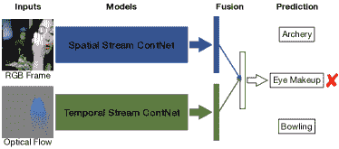

<!--yml

类别：未分类

日期：2024-09-06 20:06:33

-->

# [1902.06162] 自监督视觉特征学习与深度神经网络：综述

> 来源：[`ar5iv.labs.arxiv.org/html/1902.06162`](https://ar5iv.labs.arxiv.org/html/1902.06162)

# 自监督视觉特征学习与深度神经网络：综述

Longlong Jing 和 Yingli Tian^∗ L. Jing 就职于纽约城市大学研究生中心的计算机科学系，E-mail: ljing@gradcenter.cuny.edu

Y. Tian 就职于纽约城市大学的电气工程系和计算机科学系，E-mail: ytian@ccny.cuny.edu

^∗通讯作者

本材料基于国家科学基金会资助的工作，资助编号 IIS-1400802。

###### 摘要

大规模标注数据通常是训练深度神经网络的必要条件，以在计算机视觉应用中从图像或视频中获得更好的视觉特征学习效果。为了避免收集和标注大规模数据集的高昂成本，作为无监督学习方法的一个子集，自监督学习方法被提出用于从大规模未标记数据中学习通用图像和视频特征，而无需使用任何人工标注的标签。本文提供了基于深度学习的自监督通用视觉特征学习方法的广泛综述。首先，描述了该领域的动机、一般流程和术语。然后，总结了用于自监督学习的常见深度神经网络架构。接下来，回顾了自监督学习方法的模式和评估指标，随后介绍了常用的图像和视频数据集以及现有的自监督视觉特征学习方法。最后，总结和讨论了所评审方法在基准数据集上的定量性能比较，涵盖了图像和视频特征学习。最后，本文作出结论并列出了一组自监督视觉特征学习的有前景的未来方向。

###### 索引词：

自监督学习、无监督学习、卷积神经网络、迁移学习、深度学习。

## 1 引言

### 1.1 动机

由于强大的学习不同层次通用视觉特征的能力，深度神经网络已经被用作许多计算机视觉应用的基础结构，如目标检测 [1、2、3]、语义分割 [4、5、6]、图像描述 [7] 等。从大规模图像数据集如 ImageNet 训练出的模型被广泛用作预训练模型，并针对其他任务进行微调，主要有两个原因：（1）从大规模多样数据集中学习到的参数提供了一个良好的起点，因此，训练其他任务的网络可以更快收敛，（2）在大规模数据集上训练的网络已经学会了层次特征，这可以帮助减少在其他任务训练过程中，尤其是在其他任务的数据集较小或训练标签稀缺时的过拟合问题。

深度卷积神经网络（ConvNets）的性能在很大程度上依赖于其能力和训练数据的数量。为了增加网络模型的容量，开发了不同类型的网络架构，并且这些天收集了越来越大的数据集。各种网络，包括 AlexNet [8]、VGG [9]、GoogLeNet [10]、ResNet [11] 和 DenseNet [12]，以及大规模数据集如 ImageNet [13] 和 OpenImage [14]，被提出用于训练非常深的 ConvNets。凭借复杂的架构和大规模的数据集，ConvNets 在许多计算机视觉任务中不断突破**最先进的水平** [15、1、4、7、16]。

然而，收集和标注大规模数据集是耗时且昂贵的。作为一种用于预训练非常深的 2D 卷积神经网络（2DConvNets）的最广泛使用的数据集之一，ImageNet [13] 包含约 $1.3$ 百万张标注图像，覆盖 $1,000$ 个类别，每张图像由人工标注一个类别标签。与图像数据集相比，由于时间维度的存在，视频数据集的收集和标注成本更高。Kinetics 数据集 [17]，主要用于训练用于视频人类动作识别的 ConvNets，由 $500,000$ 个视频组成，涵盖 $600$ 个类别，每个视频时长约 $10$ 秒。许多 Amazon Turk 工作者花费了大量时间来收集和标注这样大规模的数据集。

图 1：自监督学习的一般流程。视觉特征通过训练 ConvNets 解决预定义的预训练任务的过程来学习。在自监督预训练任务训练完成后，学习到的参数作为预训练模型被转移到其他下游计算机视觉任务中，通过微调来使用。这些下游任务的表现用来评估学习到的特征的质量。在下游任务的知识迁移过程中，通常只有前几层的通用特征会被转移到下游任务中。

为了避免耗时且昂贵的数据注释，提出了许多自监督方法，以从大规模未标记的图像或视频中学习视觉特征，而不使用任何人工注释。为了从未标记的数据中学习视觉特征，一种流行的解决方案是提出各种预训练任务供网络解决，同时网络可以通过学习预训练任务的目标函数来训练，特征也通过这个过程学习。已经提出了各种用于自监督学习的预训练任务，包括为灰度图像着色[18]、图像修复[19]、图像拼图[20]等。预训练任务具有两个共同特征：(1) 需要通过 ConvNets 捕捉图像或视频的视觉特征以解决预训练任务，(2) 伪标签可以基于图像或视频的属性自动生成。

自监督学习的一般流程如图 1 所示。在自监督训练阶段，设计了一个预定义的预训练任务供 ConvNets 解决，预训练任务的伪标签是基于数据的一些属性自动生成的。然后，ConvNet 被训练以学习预训练任务的目标函数。自监督训练完成后，学习到的视觉特征可以进一步转移到下游任务（特别是在只有相对少量数据可用时）作为预训练模型，以提高性能并克服过拟合。一般而言，浅层捕捉一般的低级特征，如边缘、角点和纹理，而深层捕捉与任务相关的高级特征。因此，在监督下游任务训练阶段，只有前几层的视觉特征被转移。

### 1.2 术语定义

为了使本调查易于阅读，我们首先定义剩余部分中使用的术语。

+   •

    人工标注标签：人工标注标签是指由人工工作人员手动注释的数据标签。

+   •

    伪标签：伪标签是基于数据属性为预训练任务自动生成的标签。

+   •

    预任务：预任务是为网络解决的预设计任务，视觉特征通过学习预任务的目标函数来学习。

+   •

    下游任务：下游任务是用于评估自监督学习所学特征质量的计算机视觉应用。当训练数据稀缺时，这些应用可以大大受益于预训练模型。通常，下游任务需要人工标注标签。然而，在某些应用中，下游任务可以与预任务相同，而无需使用任何人工标注标签。

+   •

    监督学习：监督学习指的是使用带有细粒度人工标注标签的数据来训练网络的学习方法。

+   •

    半监督学习：半监督学习是指使用少量标记数据与大量未标记数据结合的学习方法。

+   •

    弱监督学习：弱监督学习是指使用粗粒度标签或不准确标签进行学习的方法。获取弱监督标签的成本通常比获取细粒度标签便宜得多。

+   •

    无监督学习：无监督学习是指不使用任何人工标注标签的学习方法。

+   •

    自监督学习：自监督学习是无监督学习方法的一个子集。自监督学习指的是通过自动生成标签明确训练 ConvNets 的学习方法。本综述仅关注用于视觉特征学习的自监督学习方法，其中特征可以转移到多个不同的计算机视觉任务。

由于自监督训练过程中不需要人工注释来生成伪标签，因此可以使用非常大规模的数据集进行自监督训练。通过这些伪标签进行训练，自监督方法取得了令人鼓舞的结果，并且在下游任务上的性能差距变小。本文提供了基于深度 ConvNets 的自监督视觉特征学习方法的综合调查。本文的主要贡献如下：

+   •

    据我们所知，这是关于深度 ConvNets 自监督视觉特征学习的首个综合调查，对该领域的研究人员将非常有帮助。

+   •

    对最近开发的自监督学习方法和数据集进行了深入综述。

+   •

    提供了现有方法的定量性能分析和比较。

+   •

    指出了自监督学习的若干可能未来方向。

## 不同学习方案的公式化

基于训练标签，视觉特征学习方法可以分为以下四类：监督、半监督、弱监督和无监督。在本节中，将对这四种学习方法进行比较，并定义关键术语。

### 2.1 监督学习的公式

对于监督学习，给定一个数据集 X，X 中的每个数据 $X_{i}$ 都有一个对应的人类标注标签 $Y_{i}$。对于一组 $N$ 个标记训练数据 $D=\{X_{i}\}_{i=0}^{N}$，训练损失函数定义为：

|  | $loss(D)=\min_{\theta}\frac{1}{N}\sum_{i=1}^{N}loss(X_{i},Y_{i}).$ |  | (1) |
| --- | --- | --- | --- |

通过准确的人类标注标签进行训练，监督学习方法在不同的计算机视觉应用中取得了突破性的结果 [8, 4, 1, 16]。然而，数据收集和标注通常成本高昂，可能需要特殊技能。因此，提出了半监督、弱监督和无监督学习方法以降低成本。

### 2.2 半监督学习的公式

对于半监督视觉特征学习，给定一个小的标记数据集 $X$ 和一个大规模的未标记数据集 $Z$，X 中的每个数据 $X_{i}$ 都有一个对应的人类标注标签 $Y_{i}$。对于一组 $N$ 个标记训练数据 $D_{1}=\{X_{i}\}_{i=0}^{N}$ 和 $M$ 个未标记训练数据 $D_{2}=\{Z_{i}\}_{i=0}^{M}$，训练损失函数定义为：

|  | $\small loss(D_{1},D_{2})=\min_{\theta}\frac{1}{N}\sum_{i=1}^{N}loss(X_{i},Y_{i})+\frac{1}{M}\sum_{i=1}^{M}loss(Z_{i},R(Z_{i},X)),$ |  | (2) |
| --- | --- | --- | --- |

其中，$R(Z_{i},X)$ 是一个任务特定的函数，用于表示每个未标记训练数据 $Z_{i}$ 与标记数据集 $X$ 之间的关系。

### 2.3 弱监督学习的公式

对于弱监督视觉特征学习，给定一个数据集 X，X 中的每个数据 $X_{i}$ 都有一个对应的粗粒度标签 $C_{i}$。对于一组 $N$ 个训练数据 $D=\{X_{i}\}_{i=0}^{N}$，训练损失函数定义为：

|  | $loss(D)=\min_{\theta}\frac{1}{N}\sum_{i=1}^{N}loss(X_{i},C_{i}).$ |  | (3) |
| --- | --- | --- | --- |

由于弱监督的成本远低于监督方法所需的精细标签，大规模数据集相对较容易获得。最近，一些论文提出利用网页收集的图像中的标签作为类别标签来学习图像特征 [21, 22]，并取得了非常好的性能 [21]。

### 2.4 无监督学习的公式

无监督学习指的是不需要任何人类标注标签的学习方法。这类方法包括完全无监督学习方法，即完全不需要任何标签的方法，以及自监督学习方法，即网络通过自动生成的伪标签进行训练，而无需涉及任何人工标注。

#### 2.4.1 自监督学习

最近，许多用于视觉特征学习的自监督学习方法在没有使用任何人工标注标签的情况下被开发出来[23, 24, 25, 26, 27, 28, 29, 30, 31, 32, 33, 34, 33, 35]。一些论文将这种类型的学习方法称为无监督学习[36, 37, 38, 39, 40, 41, 42, 43, 44, 45, 46, 47, 48]。与需要数据对$X_{i}$和$Y_{i}$的监督学习方法相比，其中$Y_{i}$由人工标注，自监督学习也使用数据$X_{i}$进行训练，同时其伪标签$P_{i}$是为预定义的前置任务自动生成的，不涉及任何人工标注。伪标签$P_{i}$可以通过使用图像或视频的属性生成，例如图像的上下文[20, 36, 18, 19]，或通过传统的手工设计方法[49, 50, 51]。

给定一组$N$训练数据$D=\{P_{i}\}_{i=0}^{N}$，训练损失函数定义为：

|  | $loss(D)=\min_{\theta}\frac{1}{N}\sum_{i=1}^{N}loss(X_{i},P_{i}).$ |  | (4) |
| --- | --- | --- | --- |

只要伪标签$P$是自动生成的而不涉及人工标注，那么这些方法就属于自监督学习。最近，自监督学习方法取得了巨大进展。本文重点关注主要为视觉特征学习设计的自监督学习方法，同时这些特征具备迁移到多个视觉任务并通过从有限标注数据中学习来执行新任务的能力。本文从网络架构、常用前置任务、数据集和应用等不同角度总结了这些自监督特征学习方法。

## 3 常见深度网络架构

无论学习方法的类别如何，它们都共享类似的网络架构。本节回顾了用于学习图像和视频特征的常见架构。

### 3.1 学习图像特征的架构

各种 2DConvNets 已经被设计用于图像特征学习。在这里，回顾了五种图像特征学习的里程碑架构，包括 AlexNet[8], VGG[9], GoogLeNet[10], ResNet[11], 和 DenseNet[12]。

#### 3.1.1 AlexNet

相较于之前的最先进方法，AlexNet 在 ImageNet 数据集上的图像分类性能有了很大改进 [8]。在强大 GPU 的支持下，具有 $62.4$ 百万参数的 AlexNet 在包含 $1.3$ 百万张图像的 ImageNet 上进行了训练。如图 2 所示，AlexNet 的架构有 $8$ 层，其中 $5$ 层是卷积层，$3$ 层是全连接层。ReLU 应用于每个卷积层后。$94$% 的网络参数来自全连接层。由于这个参数规模，网络容易发生过拟合。因此，采用了包括数据增强、dropout 和归一化在内的不同技术来避免过拟合问题。

图 2: AlexNet 的架构 [8]。数字表示每个特征图的通道数。图基于 AlexNet [8] 复制。

#### 3.1.2 VGG

VGG 由 Simonyan 和 Zisserman 提出，并在 ILSVRC 2013 比赛中获得第一名 [9]。Simonyan 和 Zisserman 提出了各种深度的网络，其中 16 层 VGG 由于其适中的模型大小和优越的性能成为最广泛使用的。VGG-16 的架构如图 3 所示。它有 $16$ 个卷积层，属于五个卷积块。VGG 和 AlexNet 的主要区别在于 AlexNet 具有较大的卷积步幅和较大的核大小，而 VGG 的所有卷积核都有相同的小尺寸 ($3\times 3$) 和小的卷积步幅 ($1\times 1$)。较大的核大小导致参数过多和模型尺寸较大，而较大的卷积步幅可能导致网络在较低层错过一些细微特征。较小的核大小使得训练非常深的卷积神经网络成为可能，同时仍然保留网络中的细粒度信息。

图 3: VGG 的架构 [9]。图基于 VGG [9] 复制。

#### 3.1.3 ResNet

VGG 证明了更深的网络能够获得更好的性能。然而，更深的网络由于梯度消失和梯度爆炸两个问题而更难以训练。He 等人提出了 ResNet，通过在卷积块中使用跳跃连接，将先前的特征图发送到下一个卷积块，以克服梯度消失和梯度爆炸 [11]。跳跃连接的细节如图 4 所示。通过跳跃连接，GPU 上训练非常深的神经网络变得可行。

图 4: 残差块的架构 [11]。恒等映射可以有效减少梯度消失和梯度爆炸，从而使得训练非常深的网络成为可能。图像基于 ResNet [11] 进行再现。

在 ResNet [11] 中，He 等人还评估了具有不同深度的网络用于图像分类。由于其较小的模型尺寸和卓越的性能，ResNet 通常作为其他计算机视觉任务的基础网络。具有跳跃连接的卷积块也广泛用作基本构建模块。

#### 3.1.4 GoogLeNet

图 5: Inception 块的架构 [10]。图像基于 GoogLeNet [10] 进行再现。

GoogLeNet 是一个 $22$ 层深的网络，由 Szegedy 等人提出，并在 ILSVRC-2014 挑战中获得了 $93.3$% 的 top-5 测试准确率 [10]。与之前的工作试图构建更深的网络不同，Szegedy 等人探索了构建更宽的网络，其中每一层具有多个并行的卷积层。GoogLeNet 的基本块是 inception 块，由 $4$ 个具有不同卷积核大小的并行卷积层组成，随后进行 $1\times 1$ 卷积以进行维度缩减。GoogLeNet 的 inception 块架构如图 5 所示。通过精心设计，他们在保持计算成本不变的情况下增加了网络的深度和宽度。

#### 3.1.5 DenseNet

图 6: DenseNet [12] 中提出的 Dense Block 的架构。图像基于 [12] 进行再现。

大多数网络，包括 AlexNet、VGG 和 ResNet，都遵循层次结构。图像被输入到网络中，并通过不同的层提取特征。浅层提取低级通用特征，而深层提取高级任务特定特征[52]。然而，当网络变得更深时，较深的层可能会面临记住网络完成任务所需的低级特征的困难。

为了缓解这个问题，黄等人提出了密集连接（dense connection），将所有卷积块之前的特征作为输入传递给神经网络中的下一个卷积块[12]。如图 6 所示，所有前面卷积块的输出特征作为当前块的输入。这样，较浅的块专注于低级的通用特征，而较深的块则可以专注于高级的任务特定特征。

### 3.2 学习视频特征的架构

为了从视频中提取空间和时间信息，已经设计了几种视频特征学习的架构，包括基于 2DConvNet 的方法[53]、基于 3DConvNet 的方法[16]和基于 LSTM 的方法[54]。基于 2DConvNet 的方法在每一帧上应用 2DConvNet，并将多帧的图像特征融合为视频特征。基于 3DConvNet 的方法利用 3D 卷积操作同时从多帧中提取空间和时间特征。基于 LSTM 的方法使用 LSTM 建模视频中的长期动态。本节简要总结了这三种视频特征学习架构。

#### 3.2.1 双流网络

图 7：包含一个空间流和一个时间流的双流网络的一般架构。图基于[53]复现。

视频通常由各种数量的帧组成。为了识别视频中的动作，网络需要捕捉外观特征以及帧序列中的时间动态。如图 7 所示，Simonyan 和 Zisserman 提出了基于两流 2DConvNet 的网络用于人类动作识别，其中使用一个 2DConvNet 从 RGB 流中捕捉空间特征，另一个 2DConvNet 从光流流中捕捉时间特征 [53]。光流编码了运动物体的边界，因此时间流 ConvNet 相对较容易捕捉帧中的运动信息。

实验表明，两个流的融合可以显著提高动作识别的准确性。后来，这项工作被扩展到多流网络 [55, 56, 57, 58, 59]，融合来自不同类型输入的特征，如动态图像 [60] 和帧差异 [61]。

#### 3.2.2 时空卷积神经网络

3D 卷积操作最早在 3DNet [62] 中提出，用于人类动作识别。与 2DConvNets 单独提取每帧的空间信息并将它们融合为视频特征相比，3DConvNets 能够同时从多个帧中提取空间和时间特征。

C3D [16] 是一个类似于 VGG 的 11 层 3DConvNet，旨在用于人类动作识别。该网络包含 $8$ 个卷积层和 $3$ 个全连接层。所有的卷积核大小为 $3\times 3\times 3$，卷积步幅固定为 $1$ 像素。由于其同时从多个帧中提取空间和时间特征的强大能力，该网络在包括人类动作识别 [63]、动作相似性标注 [64]、场景分类 [65] 和视频中的物体识别 [66] 等多个视频分析任务上达到了最先进水平。

C3D 的输入是 $16$ 个连续的 RGB 帧，从 16 帧剪辑中提取外观和时间线索。然而，长期时间卷积 (LTC) 的论文 [67] 认为，对于持续时间较长的动作，16 帧不足以表示持续时间更长的整个动作。因此，使用更多帧来训练 3DConvNets，并且表现优于 C3D [67, 68]。

随着将 3D 卷积应用于视频分析任务的成功，提出了各种 3DConvNet 架构[69, 70, 71]。Hara 等人通过用 3D 卷积层替换 ResNet 中的所有 2D 卷积层，提出了 3DResNet，并在多个数据集上的动作识别任务中展示了与最新技术相媲美的性能[70]。

#### 3.2.3 递归神经网络

图 8：长期递归卷积网络（LRCN）的架构[54]。LSTM 用于建模帧序列中的长期时间信息。图示基于[54]再现。

由于能够建模序列中的时间动态，递归神经网络（RNN）通常被应用于作为有序帧序列的视频。与标准 RNN[72]相比，长短期记忆（LSTM）使用记忆单元来存储、修改和访问内部状态，以更好地建模视频帧中的长期时间关系[73]。

基于 LSTM 的优势，Donahue 等人提出了用于人体动作识别的长期递归卷积网络（LRCN）[54]。LRCN 的框架如图 8 所示。LSTM 顺序地应用于 ConvNets 提取的特征，以建模帧序列中的时间动态。通过使用 LSTM 将视频建模为帧序列，这个模型能够明确地建模视频中的长期时间动态。后来，这个模型被扩展到更深的 LSTM 用于动作识别[74, 75]、视频字幕生成[76]和手势识别任务[77]。

### 3.3 卷积网络架构总结

深度 ConvNets 在各种计算机视觉任务中展现了巨大潜力。图像和视频特征的可视化显示，这些网络确实学习了相应任务所需的有意义特征[52, 78, 79, 80]。然而，一个共同的缺点是，当训练数据稀缺时，这些网络容易过拟合，因为每个网络中有数百万个参数。

以 3DResNet 为例，$18$层 3DResNet 在 UCF101 动作识别数据集 [63] 上从头训练时的性能为$42$%。然而，使用在大规模 Kinetics 数据集（$500,000$个视频，$600$个类别）上进行监督预训练的模型，再在 UCF101 数据集上进行微调，性能可以提高到$84$%。在大规模数据集上预训练的模型可以加速训练过程并提高在相对较小数据集上的性能。然而，收集和标注大规模数据集的成本非常高且耗时。

为了从大规模数据集中获得预训练模型而不需要昂贵的人工标注，提出了许多自监督学习方法来从预设计的前置任务中学习图像和视频特征。下一节描述了自监督图像和视频特征学习的一般流程。

## 4 常用的前置任务和下游任务

图 9：自监督视觉特征学习框架。通过最小化伪标签$P$与 ConvNet 预测$O$之间的误差来训练 ConvNet。由于伪标签是自动生成的，整个过程不涉及人工标注。

大多数现有的自监督学习方法遵循图 9 中所示的框架。一般来说，定义一个前置任务供 ConvNets 解决，通过完成这个前置任务来学习视觉特征。前置任务的伪标签$P$可以在没有人工标注的情况下自动生成。通过最小化 ConvNet $O$的预测与伪标签$P$之间的误差来优化 ConvNet。完成前置任务的训练后，得到能够捕捉图像或视频视觉特征的 ConvNet 模型。

### 4.1 从前置任务中学习视觉特征

为了减轻大规模数据集标注的负担，通常设计一个前置任务供网络解决，同时基于数据属性自动生成前置任务的伪标签。许多前置任务已被设计并应用于自监督学习，如前景物体分割 [81]、图像修复 [19]、聚类 [44]、图像着色 [82]、时间顺序验证 [40]、视觉音频对应关系验证 [25] 等。有效的前置任务确保通过完成这些任务的过程来学习语义特征。

以图像上色为例，图像上色任务是将灰度图像上色为彩色图像。为了生成逼真的彩色图像，网络需要学习图像的结构和上下文信息。在这个预文本任务中，数据 $X$ 是通过对 RGB 图像进行线性变换生成的灰度图像，而伪标签 $P$ 是 RGB 图像本身。训练对 $X_{i}$ 和 $P_{i}$ 可以实时生成，成本微乎其微。其他预文本任务的自监督学习遵循类似的流程。

### 4.2 常用的预文本任务

图 10：自监督视觉特征学习的预文本任务类别：基于生成的、基于上下文的、基于自由语义标签的和跨模态的。

根据用于设计预文本任务的数据属性，如图 10 所示，我们将预文本任务总结为四类：基于生成的、基于上下文的、基于自由语义标签的和跨模态的。

基于生成的方法：这类方法通过解决涉及图像或视频生成的预文本任务来学习视觉特征。

+   •

    图像生成：通过图像生成任务的过程来学习视觉特征。这类方法包括图像上色 [18]、图像超分辨率 [15]、图像修复 [19]、使用生成对抗网络（GANs）生成图像 [83, 84]。

+   •

    视频生成：通过视频生成任务的过程来学习视觉特征。这类方法包括使用 GANs 生成视频 [85, 86] 和视频预测 [37]。

基于上下文的预文本任务：基于上下文的预文本任务的设计主要利用图像或视频的上下文特征，如上下文相似性、空间结构、时间结构等。

+   •

    上下文相似性：预文本任务基于图像块之间的上下文相似性设计。这类方法包括基于图像聚类的方法 [34, 44] 和基于图约束的方法 [43]。

+   •

    空间上下文结构：用于训练卷积网络的预文本任务基于图像块之间的空间关系。这类方法包括图像拼图 [20, 87, 88, 89]、上下文预测 [41] 和几何变换识别 [36, 28] 等。

+   •

    时间上下文结构：视频中的时间顺序被用作监督信号。卷积网络被训练以验证输入帧序列是否按正确顺序[40、90]或识别帧序列的顺序[39]。

基于自由语义标签的方法：这种类型的预任务使用自动生成的语义标签训练网络。标签由传统的硬编码算法[50、51]或游戏引擎[30]生成。预任务包括移动物体分割[91、81]、轮廓检测[47、30]、相对深度预测[92]等。

基于跨模态的方法：这种类型的预任务训练卷积网络以验证两个不同通道的输入数据是否相互对应。这类方法包括视觉-音频对应验证[93、25]、RGB-光流对应验证[24]和自运动[94、95]。

### 4.3 常用下游任务的评估

为了评估自监督方法所学图像或视频特征的质量，利用自监督学习获得的参数作为预训练模型，然后在下游任务上进行微调，如图像分类、语义分割、目标检测和动作识别等。这些高级视觉任务上的迁移学习表现展示了所学特征的泛化能力。如果自监督学习的卷积网络（ConvNets）能够学习到通用特征，那么预训练模型可以作为捕捉图像或视频中类似特征的其他视觉任务的良好起点。

图像分类、语义分割和目标检测通常被用作评估自监督学习方法所学图像特征泛化能力的任务，而视频中的人类动作识别则用于评估从自监督学习方法中获得的视频特征的质量。以下是用于视觉特征评估的常见高级任务的简要介绍。

#### 4.3.1 语义分割

语义分割是将语义标签分配给图像中每个像素的任务，在许多应用中具有重要意义，如自动驾驶、人机交互和机器人技术。最近，社区取得了令人鼓舞的进展，并提出了各种网络，如全卷积网络（FCN）[4]、DeepLab [5]、PSPNet [6]以及数据集，如 PASCAL VOC [96]、CityScape [97]、ADE20K [98]。

图 11：为语义分割提出的全卷积神经网络的框架 [4]。图基于 [4] 进行复现。

在所有这些方法中，FCN [4] 是语义分割的一个里程碑，因为它开启了将全卷积网络（FCN）应用于解决该任务的时代。FCN 的架构如图 11 所示。使用 AlexNet、VGG、ResNet 等 2DConvNet 作为特征提取的基础网络，同时将全连接层替换为转置卷积层以获得密集预测。网络通过像素级注释进行端到端训练。

当使用语义分割作为下游任务来评估自监督学习方法所学图像特征的质量时，FCN 以预训练任务的参数初始化，并在语义分割数据集上进行微调，然后评估在语义分割任务上的性能，并与其他自监督方法的性能进行比较。

#### 4.3.2 对象检测

对象检测是本地化图像中对象的位置并识别对象类别的任务，对于许多计算机视觉应用（如自动驾驶、机器人、场景文本检测等）也非常重要。近年来，许多数据集如 MSCOCO [99] 和 OpenImage [14] 被提出用于对象检测，许多基于 ConvNet 的模型 [1], [2], [3], [100], [101], [102], [103], [104] 已被提出并取得了出色的表现。

Fast-RCNN [2] 是一个用于对象检测的两阶段网络。Fast-RCNN 的框架如图 12 所示。基于卷积神经网络生成的特征图生成对象提议，然后将这些提议输入到几个全连接层中，以生成对象的边界框和这些对象的类别。

图 12：Fast-RCNN 对象检测的流程图。图基于 [3] 进行复现。

当使用目标检测作为下游任务来评估自监督图像特征的质量时，使用在无标签大数据上通过预训练任务训练的网络作为 Fast-RCNN 的预训练模型[2]，然后在目标检测数据集上进行微调，然后评估目标检测任务的性能，以展示自监督学习特征的泛化能力。

#### 4.3.3 图像分类

图像分类是识别每张图像中对象类别的任务。许多网络已经为此任务设计，如 AlexNet[8]、VGG[9]、ResNet[11]、GoogLeNet[10]、DenseNet[12]等。通常，每张图像只有一个类别标签，尽管图像可能包含不同类别的对象。

当选择图像分类作为下游任务来评估从自监督学习方法中学习的图像特征质量时，自监督学习模型会应用于每张图像以提取特征，然后这些特征用于训练分类器，如支持向量机（SVM）[105]。测试数据上的分类性能与其他自监督模型进行比较，以评估学习特征的质量。

#### 4.3.4 人体动作识别

人体动作识别是一个识别视频中人物行为的任务，基于一系列预定义的动作类别。通常，人类动作识别数据集中的视频每个视频只包含一个动作[63、106、17]。完成此任务需要空间特征和时间特征。

动作识别任务通常用于评估自监督学习方法所学习的视频特征的质量。网络首先在无标签视频数据上进行预训练任务训练，然后在带有人类注释的动作识别数据集上进行微调以识别动作。通过将动作识别任务的测试性能与其他自监督学习方法进行比较，以评估学习特征的质量。

#### 4.3.5 定性评价

除了这些对学习特征的定量评估，还有一些定性可视化方法来评估自监督学习特征的质量。通常使用三种方法：卷积核可视化、特征图可视化和图像检索可视化[44、36、28、41]。

核心可视化：定性地可视化通过预训练任务学习的第一层卷积核，并与监督模型的卷积核进行比较。通过比较监督模型和自监督模型学习的卷积核的相似性，以指示自监督方法的有效性[44、28]。

特征图可视化：特征图的可视化显示了网络的注意力。更大的激活表示神经网络对图像中的相应区域给予了更多的关注。特征图通常是定性地可视化，并与监督模型的特征图进行比较 [36, 28]。

最近邻检索：一般而言，外观相似的图像通常在特征空间中距离较近。最近邻方法用于从自监督学习模型学习的特征空间中找到前 $K$ 个最近邻 [40, 41, 43]。

表 I: 常用图像和视频数据集的总结。注意，图像数据集可用于学习图像特征，而视频数据集可用于学习图像和视频特征。

| 数据集 | 数据类型 | 大小 | 合成 | 类别数 | 标签 |
| --- | --- | --- | --- | --- | --- |
| ImageNet [13] | 图像 | $130$ 万张图像 | ✗ | $1,000$ | 物体类别标签 |
| Places [107] | 图像 | $250$ 万张图像 | ✗ | $205$ | 场景类别标签 |
| Places365 [108] | 图像 | $1000$ 万张图像 | ✗ | $434$ | 场景类别标签 |
| SUNCG [109] | 图像 | $150,000$ 张图像 | ✓ | $84$ | 深度，体积数据 |
| MNIST [110] | 图像 | $70,000$ 张图像 | ✗ | $10$ | 数字类别标签 |
| SVHN [111] | 图像 | $600,000$ 张图像 | ✗ | $10$ | 数字类别标签 |
| CIFAR10 [112] | 图像 | $60,000$ 张图像 | ✗ | $10$ | 物体类别标签 |
| STL-10 [113] | 图像 | $101,300$ 张图像 | ✗ | $10$ | 物体类别标签 |
| PASCAL VOC [96] | 图像 | $2,913$ 张图像 | ✗ | $20$ | 类别标签，边界框，分割掩码 |
| YFCC100M [114] | 图像/视频 | $1$ 亿媒体数据 | ✗ | — | 标签 |
| SceneNet RGB-D [115] | 视频 | $500$ 万张图像 | ✓ | $13$ | 深度，实例分割，光流 |
| Moment-in-Time [116] | 视频 | $100$ 万个 3 秒视频 | ✗ | $339$ | 视频类别 |
| Kinetics [17] | 视频 | $50$ 万个 10 秒视频 | ✗ | $600$ | 人类动作类别 |
| AudioSet [117] | 视频 | $200$ 万个 10 秒视频 | ✗ | $632$ | 音频事件类别 |
| KITTI [118] | 视频 | $28$ 个视频 | ✗ | — | 提供了由各种传感器捕获的数据 |
| UCF101 [63] | 视频 | $10,031$ 个视频 | ✗ | $101$ | 人类动作类别 |
| HMDB51 [106] | 视频 | $6,766$ 个视频 | ✗ | $51$ | 人类动作类别 |

## 5 个数据集

本节总结了用于训练和评估自监督视觉特征学习方法的常用图像和视频数据集。自监督学习方法可以通过丢弃人工注释标签来用图像或视频进行训练，因此，任何为监督学习收集的数据集都可以用于自监督视觉特征学习而无需人工注释标签。学习特征的质量评估通常通过在高层视觉任务上微调来进行，使用相对较小的数据集（通常具有准确标签），如视频动作识别、对象检测、语义分割等。值得注意的是，本文认为使用这些合成数据集进行视觉特征学习的网络属于自监督学习，因为合成数据集的标签是由游戏引擎自动生成的，没有涉及人工注释。表 I 总结了常用的图像和视频数据集。

### 5.1 图像数据集

+   •

    ImageNet: ImageNet 数据集 [13] 包含 $1.3$ 百万张图像，均匀分布于 $1,000$ 个类别中，并根据 WordNet 层级组织。每张图像仅分配一个类别标签。ImageNet 是自监督图像特征学习中使用最广泛的数据集。

+   •

    Places: Places 数据集 [107] 旨在场景识别，包含超过 $2.5$ 百万张图像，涵盖了超过 $205$ 个场景类别，每个类别有超过 $5,000$ 张图像。

+   •

    Places365: Places365 是 Places 数据库的第二代，旨在用于高层次视觉理解任务，如场景背景、对象识别、动作和事件预测以及心智理论推理 [108]。数据集中包含超过 $10$ 百万张图像，涵盖了超过 $400$ 个类别，每个类别有 $5,000$ 到 $30,000$ 张训练图像。

+   •

    SUNCG: SUNCG 数据集是一个大型的合成 3D 场景库，专为室内场景设计，包括了超过 $45,000$ 个不同的场景，并手动创建了现实的房间和家具布局 [109]。合成深度、对象级别的语义标签和体积真相数据均可用。

+   •

    MNIST: MNIST 是一个手写数字数据集，包括 $70,000$ 张图像，其中 $60,000$ 张图像用于训练集，其余 $10,000$ 张图像用于测试 [110]。所有数字已进行大小标准化，并在固定大小的图像中居中显示。

+   •

    SVHN: SVHN 是一个用于识别自然场景图像中数字和数字的数据集，数据来源于 Google 街景图像中的门牌号码[111]。该数据集包含超过$600,000$张图像，所有数字都被调整为固定分辨率$32\times 32$像素。

+   •

    CIFAR10: CIFAR10 数据集是一个用于图像分类任务的小图像集合[112]。它包含$60,000$张$32\times 32$大小的图像，涵盖$10$个不同的类别。这$10$个类别包括飞机、汽车、鸟、猫、鹿、狗、青蛙、马、船和卡车。数据集是平衡的，每个类别有$6,000$张图像。

+   •

    STL-10: STL-10 数据集专门设计用于开发无监督特征学习[113]。它包含$500$张带标签的训练图像、$800$张测试图像和$100,000$张未标记的图像，覆盖$10$个类别，包括飞机、鸟、车、猫、鹿、狗、马、猴子、船和卡车。

+   •

    PASCAL 视觉目标类别（VOC）：VOC 2,012 数据集[96]包含$20$个目标类别，包括车辆、家居、动物及其他：飞机、自行车、船、公交车、汽车、摩托车、火车、瓶子、椅子、餐桌、盆栽、沙发、电视/显示器、鸟、猫、牛、狗、马、羊和人。该数据集中的每张图像都有像素级分割注释、边界框注释和目标类别注释。这个数据集被广泛用于目标检测、语义分割和分类任务的基准测试。PASCAL VOC 数据集分为三个子集：$1,464$张用于训练，$1,449$张用于验证，还有一个私有测试集[96]。所有自监督图像表示学习方法都在这个数据集上进行三项任务的评估。

### 5.2 视频数据集

+   •

    YFCC100M: Yahoo Flickr Creative Commons $100$百万数据集（YFCC100M）是来自 Flickr 的大型公共多媒体集合，包含$100$百万媒体数据，其中约$99.2$百万是图像，$0.8$百万是视频[114]。YFCC100M 数据集的标签统计数据显示，数据分布严重不平衡[119]。

+   •

    SceneNet RGB-D: SceneNet RGB-D 数据集是一个大型室内合成视频数据集，由$5$百万张渲染的 RGB-D 图像组成，来自$15K$多个在随机但物理模拟的物体姿态下的合成布局[115]。它提供了像素级注释，用于场景理解问题，如语义分割、实例分割和目标检测，也用于几何计算机视觉问题，如光流、深度估计、相机姿态估计和 3D 重建[115]。

+   •

    Moment in Time: Moment-in-Time 数据集是一个大规模、平衡且多样化的视频理解数据集 [116]。该数据集包含 $1$ 百万段视频片段，涵盖 $339$ 个类别，每段视频时长约 $3$ 秒。每个类别的平均视频片段数量为 $1,757$，中位数为 $2,775$。数据集中的视频捕捉了由人类、动物、物体或自然界产生的视觉和/或听觉动作 [116]。

+   •

    Kinetics: Kinetics 数据集是一个大规模、高质量的视频人体动作识别数据集 [17]。该数据集包含大约 $500,000$ 个视频片段，涵盖 $600$ 个人体动作类别，每个动作类别至少有 $600$ 个视频片段。每个视频片段时长约 $10$ 秒，并标记了一个动作类别。

+   •

    AudioSet: AudioSet 包含 $2,084,320$ 个由人工标记的 10 秒声音片段，这些片段来自 YouTube 视频，涵盖了 $632$ 个音频事件类别 [117]。事件类别包括各种人类和动物声音、乐器和音乐风格，以及常见的日常环境声音。该数据集主要用于从视频和音频的一致性中进行自监督学习 [26]。

+   •

    KITTI: KITTI 数据集来源于在城市中驾驶的汽车，配备了多种传感器，包括高分辨率 RGB 相机、灰度立体相机、3D 激光扫描仪，以及来自 GPS/IMU 系统的高精度 GPS 测量和 IMU 加速度 [118]。该数据集中包含了这些传感器捕捉的各种模态的视频。

+   •

    UCF101: UCF101 是一个广泛使用的人体动作识别视频数据集 [63]。该数据集包含 $13,370$ 个视频片段，总时长超过 $27$ 小时，涵盖 $101$ 个类别。数据集中视频的空间分辨率为 $320\times 240$ 像素，帧率为 $25$ FPS。这个数据集广泛用于评估人体动作识别的性能。在自监督学习中，自监督模型在该数据集上进行微调，动作识别的准确率被报告用于评估特征的质量。

+   •

    HMDB51: 相较于其他数据集，HMDB51 数据集是一个较小的人体动作识别视频数据集。该数据集中大约有 $7,000$ 个视频片段，属于 $51$ 个人体动作类别 [106]。HMDB51 数据集中的视频具有 $320\times 240$ 像素的空间分辨率和 $30$ FPS 的帧率。在自监督学习中，自监督模型在该数据集上进行微调，以评估学习到的视频特征的质量。

## 6 图像特征学习

本节回顾了三组自监督图像特征学习方法，包括基于生成的方法、基于上下文的方法和基于自由语义标签的方法。图像特征自监督学习方法的列表可以在表 II 中找到。由于跨模态方法主要从视频中学习特征，而且这种类型的大多数方法可以用于图像和视频特征学习，因此跨模态方法在视频特征学习部分进行了回顾。

表 II：基于预训练任务类别的自监督图像特征学习方法总结。多任务表示该方法明确或隐式地使用多个预训练任务进行图像特征学习。

| 方法 | 类别 | 代码 | 贡献 |
| --- | --- | --- | --- |
| GAN [83] | 生成 | ✓ | GAN 的前驱 |
| DCGAN [120] | 生成 | ✓ | 深度卷积 GAN 用于图像生成 |
| WGAN [121] | 生成 | ✓ | 提出的 WGAN 使 GAN 的训练更加稳定 |
| BiGAN [122] | 生成 | ✓ | 双向 GAN 将数据投影到潜在空间 |
| SelfGAN [123] | 多任务 | ✗ | 使用旋转识别和 GAN 进行自监督学习 |
| ColorfulColorization [18] | 生成 | ✓ | 将图像着色任务作为分类任务进行处理 |
| Colorization [82] | 生成 | ✓ | 使用图像着色作为预训练任务 |
| AutoColor [124] | 生成 | ✓ | 训练 ConvNet 预测每像素的颜色直方图 |
| Split-Brain [42] | 生成 | ✓ | 使用 split-brain 自编码器作为预训练任务 |
| Context Encoder [19] | 生成 | ✓ | 使用 ConvNet 解决图像修复问题 |
| CompletNet [125] | 生成 | ✓ | 使用两个判别器确保局部和全局一致性 |
| SRGAN [15] | 生成 | ✓ | 使用 GAN 进行单图像超分辨率 |
| SpotArtifacts [126] | 生成 | ✓ | 通过识别图像中的合成伪影进行学习 |
| ImproveContext [33] | 上下文 | ✗ | 提高基于上下文的自监督学习方法的技术 |
| Context Prediction [41] | 上下文 | ✓ | 通过预测图像中两个补丁的相对位置进行学习 |
| Jigsaw [20] | 上下文 | ✓ | 图像补丁拼图作为自监督学习的预训练任务 |
| Damaged Jigsaw [89] | 多任务 | ✗ | 通过解决拼图、图像修复和着色来进行学习 |
| Arbitrary Jigsaw [88] | 上下文 | ✗ | 使用任意网格大小和维度的拼图进行学习 |
| DeepPermNet [127] | 上下文 | ✓ | 一种解决图像补丁拼图的新方法 |
| RotNet [36] | 上下文 | ✓ | 通过识别图像的旋转进行学习 |
| 提升 [34] | 多重 | ✗ | 使用聚类来提升自监督学习方法 |
| JointCluster [128] | 上下文 | ✓ | 联合学习深度表示和图像簇 |
| DeepCluster [44] | 上下文 | ✓ | 使用聚类作为前置任务 |
| 聚类嵌入 [129] | 上下文 | ✓ | 用于自监督学习的深度嵌入聚类 |
| 图约束 [43] | 上下文 | ✓ | 通过 Fisher 向量挖掘的图像对进行学习 |
| 排名 [38] | 上下文 | ✓ | 通过三元组损失对视频帧进行排名学习 |
| PredictNoise [46] | 上下文 | ✓ | 通过将图像映射到流形上的均匀分布进行学习 |
| 多任务 [32] | 多重 | ✓ | 使用多个前置任务进行自监督特征学习 |
| Learning2Count [130] | 上下文 | ✓ | 通过计数视觉原语进行学习 |
| Watching Move [81] | 自由语义标签 | ✓ | 通过将视频中移动物体的像素进行分组学习 |
| 边缘检测 [81] | 自由语义标签 | ✓ | 通过检测边缘进行学习 |
| 跨领域 [81] | 自由语义标签 | ✓ | 利用合成数据及游戏引擎生成的标签 |

### 6.1 基于生成的图像特征学习

基于生成的自监督学习方法涉及生成图像的过程，包括使用 GAN 生成虚假图像、超分辨率生成高分辨率图像、图像修复预测缺失的图像区域，以及图像上色将灰度图像转化为彩色图像。对于这些任务，伪训练标签$P$通常是图像本身，不需要人工标注的标签，因此这些方法属于自监督学习方法。

关于基于图像生成的方法的开创性工作是自编码器[131]，它学习将图像压缩为低维向量，然后通过一系列层解压缩为接近原始图像的图像。使用自编码器，网络可以将图像的维度减少为包含原始图像主要信息的低维向量。当前的基于图像生成的方法遵循类似的理念，但通过不同的流程通过图像生成过程来学习视觉特征。

#### 6.1.1 使用 GAN 进行图像生成

生成对抗网络（GAN）是一种深度生成模型，由 Goodfellow 等人提出[83]。一个 GAN 模型通常包括两种网络：生成器，它根据潜在向量生成图像；判别器，它用来区分输入的图像是由生成器生成的。通过进行两人博弈，判别器迫使生成器生成逼真的图像，而生成器则迫使判别器提高其区分能力。在训练过程中，这两个网络彼此竞争，彼此增强。

从潜在变量任务中生成图像的常见架构如图 13 所示。生成器被训练来将任何从潜在空间中采样的潜在向量映射为图像，而判别器则被迫区分图像是否来自真实数据分布还是生成的数据分布。因此，判别器需要从图像中捕捉语义特征以完成任务。判别器的参数可以作为其他计算机视觉任务的预训练模型。

图 13：生成对抗网络的流程[83]。通过进行两人博弈，判别器迫使生成器生成逼真的图像，而生成器则迫使判别器提高其区分能力。

从数学上讲，生成器$G$的训练目标是学习真实世界图像数据的分布$p_{z}$，以生成与真实数据无法区分的逼真数据，而判别器$D$的训练目标是区分真实数据的分布$p_{data}$和生成器$G$生成的数据分布$p_{z}$。生成器$G$与判别器$D$之间的极小极大博弈形式化为：

|  | $\min_{G}\max_{D}\mathbb{E}_{x\sim p_{data}(x)[logD(x)]}+\mathbb{E}_{z\sim p_{z}(z)[log(1-D(G(z)))]},$ |  | (5) |
| --- | --- | --- | --- |

其中$x$是真实数据，$G(z)$是生成的数据。

判别器$D$被训练以最大化真实数据$x$的概率（即，$\mathbb{E}_{x\sim p_{data}(x)[logD(x)]}$），并最小化生成数据$G(z)$的概率（即，$\mathbb{E}_{x\sim p_{data}(x)[logD(x)]}$）。生成器的训练目标是生成接近真实数据$x$的数据，以使判别器的输出最大化$\mathbb{E}_{x\sim p_{data}(x)[logD(G(z))]}$。

大多数从随机变量生成图像的方法不需要任何人工标注的标签。然而，这类任务的主要目的是生成真实的图像，而不是在下游应用中获得更好的性能。通常，生成图像的评价是通过生成图像的 Inception 分数来进行的[132, 133]。而只有少数方法评估了鉴别器在高层任务上学习的特征质量，并与其他方法进行了比较[123, 122, 120]。

对抗训练可以帮助网络捕捉真实数据的真实分布并生成逼真的数据，它已被广泛应用于计算机视觉任务，如图像生成[134, 135]、视频生成[85], [86]、超分辨率[15]、图像翻译[136]和图像修复[125, 19]。当不涉及人工标注标签时，该方法属于自监督学习。

#### 6.1.2 图像生成与修复

图 14：图像修复任务的定性示意图。给定一幅有缺失区域的图像（a），人类艺术家在修复它时毫不费力（b）。使用[19]中提出的上下文编码器进行的自动修复，经过 L2 重建损失和对抗性损失训练，如图（c）所示。该图是基于[19]重新制作的。

图像修复是一个基于图像其余部分预测任意缺失区域的任务。图像修复任务的定性示意图如图 14 所示。图 14(a) 是一幅有缺失区域的图像，而图 14(c) 是网络的预测结果。为了正确预测缺失区域，网络需要学习包括常见物体的颜色和结构在内的常识。只有掌握了这些知识，网络才能根据图像的其余部分推断缺失区域。

Pathak 等人通过类比自动编码器，首先训练了一个 ConvNet，基于图像的其他部分生成任意图像区域的内容[19]。他们的贡献有两个方面：使用 ConvNet 解决图像修补问题，利用对抗损失帮助网络生成逼真的假设。近期大部分方法都遵循类似的流程[125]。通常有两类网络：生成器网络用于生成缺失的区域，并使用像素重建损失，鉴别器网络用于通过对抗损失区分输入图像是否是真实的。借助对抗损失，网络能够为缺失的图像区域生成更清晰、更逼真的假设。这两类网络都能学习图像的语义特征，并可迁移到其他计算机视觉任务。然而只有 Pathak 等人[19]研究了从图像修补任务中学习到的生成器的参数的迁移学习性能。

生成器网络是一个完全卷积网络，包括两部分：编码器和解码器。编码器的输入是需要修复的图像，上下文编码器学习图像的语义特征。上下文解码器根据这些特征预测缺失的区域。为了生成合理的假设，生成器需要理解图像的内容。鉴别器则训练用于区分输入图像是否是生成器的输出。为了完成图像修补任务，这两个网络都需要学习图像的语义特征。

#### 6.1.3 超分辨率图像生成

图像超分辨率（SR）是提高图像分辨率的任务。借助完全卷积网络，可以从低分辨率图像生成更精细和逼真的高分辨率图像。SRGAN 是 Ledig 等人提出的用于单图像超分辨率的生成对抗网络[15]。该方法的见解是利用感知损失，其中包括对抗损失和内容损失。借助感知损失，SRGAN 能够从大幅降采样的图像中恢复出逼真的纹理，并在感知质量上展现出显著的提升。

有两个网络：一个是生成器，用于提升输入低分辨率图像的分辨率；另一个是判别器，用于区分输入图像是否为生成器的输出。生成器的损失函数是逐像素 L2 损失加上内容损失，内容损失是预测的高分辨率图像的特征与高分辨率原始图像特征的相似度，而判别器的损失是二分类损失。与仅最小化均方误差（MSE）的网络相比，这种网络通常能获得较高的峰值信噪比，但缺乏高频细节，SRGAN 能够恢复高分辨率图像的细节，因为对抗损失通过判别器网络将输出推向自然图像流形。

图像超分辨率任务的网络能够学习图像的语义特征。类似于其他 GANs，判别器网络的参数可以转移到其他下游任务。然而，目前尚未有人测试转移学习在其他任务上的表现。增强图像的质量主要通过对比来评估网络的性能。

#### 6.1.4 图像生成与上色

图 15：图像上色的架构，见[18]。该图来自[18]，已获得作者许可。

图像上色是一项任务，旨在根据给定的灰度图像预测其合理的彩色版本。图像上色任务的定性示例如图 15 所示。为了正确地为每个像素上色，网络需要识别物体并将同一部分的像素分组。因此，视觉特征可以在完成此任务的过程中进行学习。

近年来提出了许多基于深度学习的着色方法[18, 137, 138]。一个直接的思路是使用一个完全卷积神经网络，其中包括一个用于特征提取的编码器和一个用于着色的颜色幻觉解码器。网络可以通过预测颜色与原始颜色之间的 L2 损失进行优化。Zhang 等人提出通过将任务作为分类任务来处理不确定性，并使用类别重平衡来增加预测颜色的多样性[18]。Zhang 等人提出的图像着色框架如图 15 所示。该方法在大规模图像集合中训练，显示了出色的结果，在着色测试中有$32$%的试验能让人类误判。

一些工作专门利用图像着色任务作为自监督图像表示学习的前置任务[82, 18, 124, 42]。图像着色训练完成后，通过着色过程学到的特征会专门在其他下游高级任务中通过迁移学习进行评估。

### 6.2 基于上下文的图像特征学习

基于上下文的前置任务主要利用图像的上下文特征，包括上下文相似性、空间结构和时间结构，作为监督信号。特征通过解决基于图像上下文属性设计的前置任务的过程，由 ConvNet 学习得到。

#### 6.2.1 基于上下文相似性的学习

图 16: DeepClustering 的架构[44]。图像的特征被迭代地聚类，簇分配被用作伪标签来学习 ConvNet 的参数。该图来自[44]，获得了作者的许可。

聚类是一种将相似数据集分组到相同簇中的方法。由于它利用数据属性进行数据分组的强大能力，它在许多领域如机器学习、图像处理、计算机图形学等得到广泛应用。已经提出了许多经典的聚类算法以适应各种应用[139]。

在自监督场景下，主要采用聚类方法作为工具来对图像数据进行聚类。一个简单的方法是基于手工设计的特征，如 HOG [140]、SIFT [141] 或 Fisher Vector [49] 对图像数据进行聚类。聚类后，会得到若干个簇，其中一个簇中的图像在特征空间中的距离较小，而不同簇中的图像在特征空间中的距离较大。特征空间中的距离越小，RGB 空间中的图像外观越相似。然后可以训练一个 ConvNet，通过使用簇分配作为伪类标签来对数据进行分类。为了完成这一任务，ConvNet 需要学习一个类别内的不变性和不同类别间的变异性。因此，ConvNet 能够学习图像的语义意义。

关于使用聚类变体作为前置任务的现有方法遵循这些原则 [44、43、34、128、129]。首先，将图像聚类成不同的簇，其中来自同一簇的图像具有较小的距离，而来自不同簇的图像具有较大的距离。然后训练一个 ConvNet 来识别簇分配 [44、34] 或识别两个图像是否来自同一簇 [43]。DeepCluster 的流程图，如图 16 所示。DeepCluster 使用 Kmeans 迭代聚类图像，并使用随后的分配作为监督来更新网络的权重。它是当前自监督图像表示学习的最先进方法。

#### 6.2.2 使用空间上下文结构学习

图像包含丰富的空间上下文信息，例如图像中不同区域之间的相对位置，这些信息可以用于设计自监督学习的前置任务。前置任务可以是预测同一图像中两个区域的相对位置 [41]，或者识别同一图像中打乱的区域序列的顺序 [20、89、88]。完整图像的上下文也可以作为监督信号来设计前置任务，例如识别整个图像的旋转角度 [36]。为了完成这些前置任务，ConvNets 需要学习空间上下文信息，例如物体的形状和物体不同部分的相对位置。

图 17：拼图图像的可视化 [20]。 (a) 是包含$9$个采样图像补丁的图像，(b) 是打乱的图像补丁示例，而 (c) 显示了$9$个补丁的正确顺序。图像根据 [20] 进行了重制。

Doersch 等人提出的方法是利用空间上下文线索进行自监督视觉特征学习的开创性工作之一 [41]。从每张图像中提取随机图像补丁对，然后训练 ConvNet 识别这两个图像补丁的相对位置。为了破解这个谜题，ConvNets 需要识别图像中的物体并学习不同物体部分之间的关系。为了避免网络仅仅使用补丁中的边缘等简单方法来完成任务，在训练阶段应用了大量的数据增强。

基于这一思路，提出了更多的方法通过解决更难的空间谜题来学习图像特征 [20, 89, 88, 87, 27]。如图 17 所示，Noroozi 等人提出的一个典型工作尝试使用 ConvNet 解决图像拼图 [20]。图 17(a) 是包含$9$个采样图像补丁的图像，图 17(b) 是打乱的图像补丁示例，而图 17(c) 显示了$9$个补丁的正确顺序。将打乱的图像补丁输入到网络中，网络通过学习图像的空间上下文结构，如物体颜色、结构和高级语义信息，来识别输入补丁的正确空间位置。

给定来自一幅图像的$9$个图像块，总共有$362,880$ $(9!)$种可能的排列，网络非常不可能识别出所有这些排列，因为任务的模糊性。为了限制排列数量，通常使用汉明距离来选择只有一部分排列，这些排列之间具有相对较大的汉明距离。只有选定的排列才用于训练 ConvNet，以识别打乱的图像块的排列 [88, 89, 35, 20]。

设计拼图任务的主要原则是找到一个适合的任务，该任务对于网络既不太难也不太容易。如果任务太难，网络可能由于任务的模糊性而无法收敛，或者如果任务太简单，网络可能容易学习到平凡的解决方案。因此，通常会通过减少搜索空间来降低任务的难度。

### 6.3 基于自由语义标签的图像特征学习

自由语义标签指的是那些没有涉及任何人工注释的具有语义意义的标签。一般来说，自由语义标签如分割掩码、深度图像、光流和表面法线图像可以由游戏引擎渲染或通过硬编码方法生成。由于这些语义标签是自动生成的，因此使用合成数据集或将其与大量未标记的图像或视频数据集结合使用的方法被认为是自监督学习方法。

#### 6.3.1 使用游戏引擎生成的标签进行学习

给定各种对象模型和环境布局，游戏引擎能够渲染逼真的图像并提供准确的像素级标签。由于游戏引擎可以以微不足道的成本生成大规模数据集，因此各种游戏引擎如 Airsim [142] 和 Carla [143] 已被用于生成包含深度、轮廓、表面法线、分割掩码和光流的高层次语义标签的大规模合成数据集，以用于训练深度网络。图像的 RGB 图像及其生成的准确标签示例如图 18。

图 18：由游戏引擎生成的室内场景示例 [115]。对于每个合成图像，相关的深度信息、实例分割和光流可以由引擎自动生成。

游戏引擎可以以非常低的成本生成具有准确像素级标签的逼真图像。然而，由于合成图像和真实世界图像之间的领域差距，纯粹在合成图像上训练的 ConvNet 不能直接应用于真实世界图像。为了利用合成数据集进行自监督特征学习，需要明确地弥合领域差距。通过这种方式，使用合成数据集的语义标签训练的 ConvNet 可以有效地应用于真实世界图像。

为了克服这个问题，Ren 和 Lee 提出了基于对抗学习的无监督特征空间领域适应方法 [30]。如图 19 所示，网络预测合成图像的表面法线、深度和实例轮廓，并使用判别网络 $D$ 来最小化真实世界与合成数据之间特征空间领域的差异。在对抗训练和合成图像准确语义标签的帮助下，网络能够捕捉真实世界图像的视觉特征。

图 19：利用合成和真实世界图像进行自监督特征学习的架构 [30]。图像基于 [30] 复制。

与其他隐性任务相比，这类方法使用准确的语义标签进行训练，明确地迫使 ConvNets 学习与图像中的对象高度相关的特征。

#### 6.3.2 使用硬编码程序生成的标签进行学习

应用硬编码程序是另一种自动生成图像和视频的语义标签（如显著性、前景掩码、轮廓、深度）的方法。通过这些方法，可以使用具有生成语义标签的大规模数据集进行自监督特征学习。这类方法一般有两个步骤：（1）通过在图像或视频上应用硬编码程序生成标签，（2）用生成的标签训练 ConvNets。

各种硬编码程序已被应用于生成自监督学习方法的标签，包括前景物体分割 [81]、边缘检测 [47] 和相对深度预测 [92]。Pathak 等人提出通过训练卷积网络分割视频每帧的前景物体来学习特征，同时标签是视频中移动物体的掩模 [81]。Li 等人提出通过训练卷积网络进行边缘预测来学习特征，同时标签是从视频流场中获得的运动边缘 [47]。Jing 等人提出通过训练卷积网络预测相对场景深度来学习特征，同时标签是从光流中生成的 [92]。

无论使用什么样的标签来训练卷积网络（ConvNets），这类方法的总体思想是从硬编码检测器中提取知识。硬编码检测器可以是边缘检测器、显著性检测器、相对检测器等。只要在检测器的设计中不涉及人工标注，则可以使用这些检测器生成标签用于自监督训练。

与其他自监督学习方法相比，这些前置任务中的监督信号是语义标签，这些标签可以直接驱动卷积网络学习语义特征。然而，一个缺点是由硬编码检测器生成的语义标签通常非常嘈杂，需要特别处理。

## 7 视频特征学习

本节回顾了学习视频特征的自监督方法，如表 III 所列，它们可以分为四类：基于生成的方法、基于上下文的方法、基于自由语义标签的方法和基于跨模态的方法。

由于视频特征可以通过包括 2DConvNet、3DConvNet 和结合 2DConvNet 或 3DConvNet 的 LSTM 等各种网络获得。当采用 2DConvNet 进行视频自监督特征学习时，2DConvNet 能够在自监督前置任务训练完成后提取图像和视频特征。

表 III：基于前置任务类别的自监督视频特征学习方法总结。

| 方法 | 子类别 | 代码 | 贡献 |
| --- | --- | --- | --- |
| VideoGAN [85] | 生成 | ✓ | GAN 的视频生成先驱 |
| MocoGAN [86] | 生成 | ✓ | 分解运动和内容用于 GAN 的视频生成 |
| TemporalGAN [144] | 生成 | ✓ | 进行视频生成的时间和图像生成器分解 |
| 视频着色 [145] | 生成 | ✓ | 使用视频着色作为前置任务 |
| Un-LSTM [37] | 生成 | ✓ | LSTM 视频预测的先驱 |
| ConvLSTM [146] | 生成 | ✓ | 使用卷积 LSTM 进行视频预测 |
| MCNet [147] | 生成 | ✓ | 通过解缠运动和内容进行视频预测 |
| LSTMDynamics [148] | 生成 | ✗ | 通过预测视频中的长期时间动态进行学习 |
| Video Jigsaw [87] | 上下文 | ✗ | 通过共同推理空间和时间上下文进行学习 |
| Transitive [31] | 上下文 | ✗ | 通过三元组损失学习实例间和实例内的变化 |
| 3DRotNet [28] | 上下文 | ✗ | 通过识别视频剪辑的旋转进行学习 |
| CubicPuzzles [27] | 上下文 | ✗ | 通过解决视频立方体谜题进行学习 |
| ShuffleLearn [40] | 上下文 | ✓ | 使用时间顺序验证作为前置任务 |
| LSTMPermute [149] | 上下文 | ✓ | 通过 LSTM 进行时间顺序验证学习 |
| OPN [39] | 上下文 | ✓ | 使用帧序列顺序识别作为前置任务 |
| O3N [29] | 上下文 | ✗ | 通过识别异常视频序列进行学习 |
| ArrowTime [90] | 上下文 | ✓ | 通过识别视频中的时间箭头进行学习 |
| TemporalCoherence [150] | 上下文 | ✗ | 通过帧序列特征的时间一致性进行学习 |
| FlowNet [151] | 跨模态 | ✓ | 光流估计的前驱模型 |
| FlowNet2 [152] | 跨模态 | ✓ | 更好的架构和更佳的光流估计性能 |
| UnFlow [153] | 跨模态 | ✓ | 一种用于光流估计的无监督损失 |
| CrossPixel [23] | 跨模态 | ✗ | 通过从单幅图像预测运动作为前置任务进行学习 |
| CrossModel [24] | 跨模态 | ✗ | 作为前置任务进行光流和 RGB 对应性验证 |
| AVTS [25] | 跨模态 | ✗ | 作为前置任务进行视觉和音频对应性验证 |
| AudioVisual [26] | 跨模态 | ✓ | 共同建模视觉和音频作为融合的多感官表示 |
| LookListenLearn [93] | 跨模态 | ✓ | 自我监督学习中音频-视觉对应性的前驱 |
| AmbientSound [154] | 跨模态 | ✗ | 预测视频帧的声音统计摘要 |
| EgoMotion [155] | 跨模态 | ✓ | 通过预测视频中的相机运动和场景结构进行学习 |
| LearnByMove [94] | 跨模态 | ✓ | 通过预测图像对中的相机变换进行学习 |
| TiedEgoMotion [95] | 跨模态 | ✗ | 从自我运动信号和视频序列中进行学习 |
| GoNet [156] | 跨模态 | ✓ | 通过视频共同学习单目深度、光流和自我运动估计 |
| DepthFlow [157] | 跨模态 | ✓ | 利用视频中的跨任务一致性进行深度和光流学习 |
| VisualOdometry [158] | 跨模态 | ✓ | 一种用于深度视觉里程计学习的无监督范式 |
| ActivesStereoNet [159] | 跨模态 | ✓ | 从主动立体系统中端到端的自监督深度学习 |

### 7.1 基于生成的视频特征学习

从视频生成中学习指的是通过视频生成过程学习视觉特征，而不使用任何人工标注的标签。这类方法包括利用 GAN 进行的视频生成[85]、视频着色[145]和视频预测[37]。对于这些前提任务，伪训练标签$P$通常是视频本身，训练过程中不需要人工标注标签，因此这些方法属于自监督学习。

#### 7.1.1 从视频生成中学习

图 20：图示了[85]中提出的用于 GAN 视频生成的生成器架构。该图来自[85]，经过作者许可。

在 GAN 方法在图像生成中取得突破性成果后，研究人员采用 GAN 生成视频[86, 85, 144]。VideoGAN[85]是 GAN 视频生成的先锋工作之一，其生成器网络的架构如图 20 所示。为了建模视频中物体的运动，提出了一种双流网络进行视频生成，其中一条流用于建模视频中的静态区域作为背景，另一条流用于建模视频中的运动物体作为前景[85]。视频由前景和背景流的组合生成。其基本假设是潜在空间中的每个随机变量表示一个视频片段。这种方法能够生成具有动态内容的视频。然而，Tulyakov 等人认为这种假设增加了生成的难度，相反，他们提出了 MocoGAN，通过解开视频中的上下文和运动来使用两个子空间的组合来表示视频[86]。一个空间是上下文空间，其中每个变量表示一个身份，另一个空间是运动空间，该空间中的轨迹表示身份的运动。通过这两个子空间，网络能够生成具有更高起始分数的视频。

生成器学习将潜在向量从潜在空间映射到视频中，而判别器学习区分真实世界的视频和生成的视频。因此，判别器需要从视频中捕捉语义特征来完成此任务。当这些框架中未使用人工标注标签时，它们属于自监督学习方法。在大规模无标注数据集上完成视频生成训练后，判别器的参数可以转移到其他下游任务 [85]。

#### 7.1.2 从视频上色中学习

视频中的时间一致性是指在短时间内的连续帧具有类似的连贯外观。颜色的一致性可以用于设计自监督学习的前置任务。利用颜色一致性的一种方法是将视频上色作为自监督视频特征学习的前置任务。

视频上色是一项将灰度帧着色为彩色帧的任务。Vondrick 等人提出通过学习从参考帧中复制颜色来解决视频上色问题，从而约束上色模型 [145]。给定参考 RGB 帧和灰度图像，网络需要学习参考 RGB 帧和灰度图像之间的内部关联，以进行上色。

另一种观点是通过采用完全卷积神经网络来解决视频上色问题。Tran 等人提出了一种用于视频上色的 U 形卷积神经网络 [160]。该网络是一个基于编码器-解码器的 3DConvNet。网络的输入是一个灰度视频片段，而输出是一个彩色视频片段。编码器是一组 3D 卷积层，用于提取特征，而解码器是一组 3D 反卷积层，用于从提取的特征生成彩色视频片段。

视频中的颜色一致性是一个强有力的监督信号。然而，只有少数研究探讨了如何利用它进行自监督视频特征学习 [145]。可以通过研究使用颜色一致性作为自监督视频特征学习的监督信号来进行更多的工作。

#### 7.1.3 从视频预测中学习

图 21：由[147]提出的视频预测任务架构。图形基于[147]进行重制。

视频预测是一项基于有限数量的视频帧预测未来帧序列的任务。为了预测未来的帧，网络必须学习给定帧序列中的外观变化。应用深度学习进行视频预测的先驱是 Un-LSTM [37]。由于 LSTM 在视频中建模长期动态的强大能力，LSTM 被用于编码器和解码器 [37]。

已经提出了许多方法用于视频预测 [37, 147, 161, 162, 163, 164, 165]。由于其优越的时间动态建模能力，大多数方法使用 LSTM 或 LSTM 变体来编码视频中的时间动态或推断未来帧 [37, 147, 146, 164, 165]。这些方法可以用于自监督特征学习，而不需要人工标注。

大多数框架遵循编码器-解码器流程，其中编码器用于从给定的视频剪辑中建模空间和时间特征，解码器则基于编码器提取的特征生成未来帧。图 21 展示了 Villegas 等人提出的 MCnet 的流程 [147]。McNet 基于编码器-解码器卷积神经网络和卷积 LSTM 用于视频预测。它有两个编码器，一个是内容编码器，用于捕捉图像的空间布局，另一个是运动编码器，用于建模视频剪辑中的时间动态。空间特征和时间特征被连接起来，输入到解码器中以生成下一帧。通过分别建模时间和空间特征，该模型可以有效地递归生成未来帧。

视频预测是一种自监督学习任务，学到的特征可以迁移到其他任务。然而，尚未有研究探讨视频预测学习的特征的泛化能力。一般来说，结构相似性指数 (SSIM) 和峰值信噪比 (PSNR) 被用来评估生成帧序列与真实帧序列之间的差异。

### 7.2 基于时间上下文的学习

图 22：Shuffle and Learn 的流程 [40]。网络被训练以验证输入帧是否按正确的时间顺序排列。图形基于 [40] 复制。

视频由各种长度的帧组成，包含丰富的空间和时间信息。视频中的固有时间信息可以用作自监督特征学习的监督信号。已经提出了各种前置任务，通过利用时间上下文关系，包括时间顺序验证 [40, 29, 90] 和时间顺序识别 [39, 27]。时间顺序验证是验证输入帧序列是否按正确的时间顺序排列，而时间顺序识别是识别输入帧序列的顺序。

如图 22 所示，Misra 等提出了使用时间顺序验证作为学习图像特征的假设任务，使用 2DConvNet 从视频中学习图像特征[40]，其中包括两个主要步骤：（1）根据光流的大小从视频中选择具有显著运动的帧，（2）对选择的帧进行洗牌并馈送到网络中，该网络经过训练来验证输入数据是否按照正确的顺序。为了成功验证输入帧的顺序，需要网络捕获帧之间的细微差异，例如人物的移动。因此，可以通过完成此任务来学习语义特征。时间顺序识别任务使用类似架构的网络。

然而，这些方法通常需要大量的数据集准备阶段。用于训练网络的帧序列是根据光流的大小选择的，并且光流的计算过程既昂贵又缓慢。因此，需要更加直接和高效的方法来进行自监督视频特征学习。

### 7.3 跨模态学习

基于跨模态的学习方法通常从多个数据流的对应关系中学习视频特征，包括 RGB 帧序列、光流序列、音频数据和摄像头姿势。

除了视频中丰富的时间和空间信息外，还可以生成光流序列来专门指示视频中的运动，并且可以计算帧之间的差异，其时间和时空复杂度可以忽略不计，以指示移动物体的边界。同样，音频数据还提供了关于视频内容的有用线索。基于使用的数据类型，这些方法分为三组：（1）通过使用 RGB 和光流对应关系来学习特征的方法[24, 23]，（2）通过利用视频和音频对应关系来学习特征的方法[25, 93]，（3）通过利用主观视频和自我运动传感器信号之间的对应关系来学习的动作方法[95, 94]。通常情况下，网络被训练来识别两种输入数据是否相互对应[24, 25]，或者被训练来学习不同模态之间的转换[94]。

#### 7.3.1 从 RGB-Flow 对应关系学习

光流编码了相邻帧之间的物体运动，而 RGB 帧包含了外观信息。这两种数据的对应关系可以用来学习一般特征 [23, 24, 151, 152]。这类前置任务包括光流估计 [151, 152] 和 RGB 与光流的对应关系验证 [23]。

Sayed 等人提出通过验证输入 RGB 帧与对应的光流来学习视频特征。使用了两个网络，一个用于从 RGB 输入中提取特征，另一个用于从光流输入中提取特征 [24]。为了验证两个输入数据是否相互对应，网络需要捕捉两种模态之间的互信息。不同模态之间的互信息通常比特定模态的信息具有更高的语义意义。通过这种前置任务，可以通过 ConvNet 捕捉到对特定模态不变的互信息。

光流估计是另一种可以用于自监督视频特征学习的前置任务。Fischer 等人提出了 FlowNet，这是一种用于从两帧连续帧中估计光流的端到端卷积神经网络 [151, 152]。为了正确估计两帧之间的光流，ConvNet 需要捕捉两帧之间的外观变化。光流估计可以用于自监督特征学习，因为它可以通过模拟器（如游戏引擎）或硬编码程序自动生成，而无需人工标注。

#### 7.3.2 从视觉-音频对应中学习

最近，一些研究人员提出利用视觉和音频流之间的对应关系来设计“视觉-音频对应”学习任务 [93, 25, 26, 154]。

图 23: 视频和音频对应验证任务的架构 [93]。

这种预文本任务的一般框架如图 23 所示。框架包含两个子网络：视觉子网络和音频子网络。视觉子网络的输入是单帧或一叠图像帧，视觉子网络学习捕捉输入数据的视觉特征。音频网络是一个 2DConvNet，输入是视频中音频的快速傅里叶变换 (FFT)。正样本数据通过从同一视频的相同时间提取视频帧和音频获得，而负样本数据则通过从不同视频或同一视频的不同时间提取视频帧和音频生成。因此，网络被训练以发现视频数据和音频数据的相关性来完成这个任务。

由于 ConvNets 的输入是两种数据，这些网络能够通过解决预文本任务共同学习这两种信息。这两种网络在下游应用中表现出非常好的性能 [25]。

#### 7.3.3 自我运动

利用通常配备有各种传感器的自动驾驶汽车，通过在街道上驾驶汽车可以以非常低的成本轻松收集大规模的自我中心视频以及自我运动信号。最近，一些研究人员提出利用视觉信号与运动信号之间的对应关系进行自监督特征学习 [155, 94, 95]。

图 24：相机姿态转换估计的架构来自自我中心视频 [94]。

这种方法的基本直觉是，自动驾驶汽车可以被视为在场景中移动的相机，因此相机捕获的视觉数据的自我运动与汽车的自我运动相同。因此，视觉数据与自我运动之间的对应关系可以用于自监督特征学习。Agrawal 等人提出的使用自我运动信号的典型网络如图 24 所示，用于自监督图像特征学习 [94]。网络的输入是从自我中心视频中在短时间内采样的两帧图像。网络的标签指示这两帧图像之间的旋转和位移关系，这些关系可以从数据集的里程计数据中得出。通过这个任务，ConvNet 被迫识别出两帧图像中都存在的视觉元素。

自我运动信号是一种准确的监督信号。除了直接应用于自监督特征学习外，它还被用于深度和自我运动的无监督学习[155]。所有这些网络都可以用于自监督特征学习，并转移到下游任务中。

## 8 性能比较

本节比较了图像和视频特征自监督学习方法在公共数据集上的表现。对于图像特征自监督学习，比较了包括图像分类、语义分割和物体检测在内的下游任务的表现。对于视频特征自监督学习，报告了在视频中的人类动作识别这一下游任务的表现。

### 8.1 图像特征学习的表现

如第 4.3 节所述，通过在下游任务（如语义分割、物体检测和图像分类）上微调自监督学习模型来评估其特征质量。本节总结了现有图像特征自监督学习方法的表现。

表 IV 列出了在 ImageNet [13] 和 Places [107] 数据集上图像分类的表现。在自监督前任务训练期间，大多数方法在 ImageNet 数据集上使用 AlexNet 作为基础网络进行训练，而未使用类别标签。在前任务自监督训练完成后，在 ImageNet 和 Places 数据集的训练分割上，对不同冻结的卷积层上训练了一个线性分类器。这两个数据集上的分类表现被用来展示学习到的特征的质量。

如表 IV 所示，自监督模型的整体表现低于使用 ImageNet 标签或 Places 标签训练的模型。在所有自监督方法中，DeepCluster [44] 在两个数据集上的表现最好。根据表中的表现，可以得出三个结论：（1）来自不同层的特征总是从自监督预训练任务中受益。自监督学习方法的表现总是优于从头训练的模型的表现。（2）所有自监督方法在 conv3 和 conv4 层的特征上表现良好，而在 conv1、conv2 和 conv5 层的特征上表现较差。这可能是因为浅层捕捉到的是一般的低级特征，而深层捕捉到的是与预训练任务相关的特征。（3）当预训练任务的数据集与下游任务的数据集之间存在领域差距时，自监督学习方法能够达到与使用 ImageNet 标签训练的模型相当的性能。

表 IV：在 ImageNet 和 Places 数据集上进行线性分类，使用 AlexNet 卷积层的激活值作为特征。 “Convn” 表示线性分类器是基于 AlexNet 的第 n 个卷积层训练的。 “Places Labels”和 “ImageNet Labels” 表示使用经过人工标注标签训练的监督模型作为预训练模型。

|  |  | ImageNet |  | Places |
| --- | --- | --- | --- | --- |
| 方法 | 预训练任务 | conv1 | conv2 | conv3 | conv4 | conv5 |  | conv1 | conv2 | conv3 | conv4 | conv5 |
| Places labels [8] | — | — | — | — | — | — |  | $22.1$ | $35.1$ | $40.2$ | $43.3$ | $44.6$ |
| ImageNet labels [8] | — | $19.3$ | $36.3$ | $44.2$ | $48.3$ | $50.5$ |  | $22.7$ | $34.8$ | $38.4$ | $39.4$ | $38.7$ |
| 随机（从头训练） [8] | — | $11.6$ | $17.1$ | $16.9$ | $16.3$ | $14.1$ |  | $15.7$ | $20.3$ | $19.8$ | $19.1$ | $17.5$ |
| ColorfulColorization [18] | 生成 | $12.5$ | $24.5$ | $30.4$ | $31.5$ | $30.3$ |  | $16.0$ | $25.7$ | $29.6$ | $30.3$ | $29.7$ |
| BiGAN [122] | 生成 | $17.7$ | $24.5$ | $31.0$ | $29.9$ | $28.0$ |  | $21.4$ | $26.2$ | $27.1$ | $26.1$ | $24.0$ |
| SplitBrain [42] | 生成 | $17.7$ | $29.3$ | $35.4$ | $35.2$ | $32.8$ |  | $21.3$ | $30.7$ | $34.0$ | $34.1$ | $32.5$ |
| ContextEncoder [19] | 上下文 | $14.1$ | $20.7$ | $21.0$ | $19.8$ | $15.5$ |  | $18.2$ | $23.2$ | $23.4$ | $21.9$ | $18.4$ |
| ContextPrediction [41] | 上下文 | $16.2$ | $23.3$ | $30.2$ | $31.7$ | $29.6$ |  | $19.7$ | $26.7$ | $31.9$ | $32.7$ | $30.9$ |
| 拼图 [20] | 上下文 | 18.2 | $28.8$ | $34.0$ | $33.9$ | $27.1$ |  | $23.0$ | $32.1$ | $35.5$ | $34.8$ | $31.3$ |
| Learning2Count [130] | 上下文 | $18.0$ | $30.6$ | $34.3$ | $32.5$ | $25.7$ |  | 23.3 | 33.9 | $36.3$ | $34.7$ | $29.6$ |
| 深度聚类 [44] | 上下文 | $13.4$ | 32.3 | 41.0 | 39.6 | 38.2 |  | $19.6$ | $33.2$ | 39.2 | 39.8 | 34.7 |

表 V: 自监督图像特征学习方法在 Pascal VOC 数据集上的分类、检测和分割的比较。“ImageNet 标签”表示使用经过人工标注标签训练的监督模型作为预训练模型。

| 方法 | 预训练任务 | 分类 |  | 检测 |  | 分割 |
| --- | --- | --- | --- | --- | --- | --- |
| ImageNet 标签 [8] | — | $~{}79.9~{}$ |  | $~{}56.8~{}$ |  | $~{}48.0~{}$ |
| 随机（从头开始）[8] | — | $~{}57.0~{}$ |  | $~{}44.5~{}$ |  | $~{}30.1~{}$ |
| 上下文编码器 [19] | 生成 | $~{}56.5~{}$ |  | $~{}44.5~{}$ |  | $~{}29.7~{}$ |
| BiGAN  [122] | 生成 | $~{}60.1~{}$ |  | $~{}46.9~{}$ |  | $~{}35.2~{}$ |
| 彩色着色 [18] | 生成 | $~{}65.9~{}$ |  | $~{}46.9~{}$ |  | $~{}35.6~{}$ |
| 分裂大脑 [42] | 生成 | $~{}67.1~{}$ |  | $~{}46.7~{}$ |  | $~{}36.0~{}$ |
| 排名视频 [38] | 上下文 | $~{}63.1~{}$ |  | $~{}47.2~{}$ |  | $~{}35.4^{\dagger}$ |
| 预测噪声 [46] | 上下文 | $~{}65.3~{}$ |  | $~{}49.4~{}$ |  | $~{}37.1^{\dagger}$ |
| 拼图 [20] | 上下文 | $~{}67.6~{}$ |  | $~{}53.2~{}$ |  | $~{}37.6~{}$ |
| 上下文预测 [41] | 上下文 | $~{}65.3~{}$ |  | $~{}51.1~{}$ |  | — |
| Learning2Count [130] | 上下文 | $~{}67.7~{}$ |  | $~{}51.4~{}$ |  | $~{}36.6~{}$ |
| 深度聚类 [44] | 上下文 | 73.7 |  | 55.4 |  | 45.1 |
| 观看视频 [81] | 自由语义标签 | $~{}61.0~{}$ |  | $~{}52.2~{}$ |  | — |
| 跨领域 [30] | 自由语义标签 | $~{}68.0~{}$ |  | $~{}52.6~{}$ |  | — |
| 环境声音 [154] | 跨模态 | $~{}61.3~{}$ |  | — |  | — |
| 绑定自我运动 [95] | 跨模态 | — |  | $41.7$ |  | — |
| 自我运动 [94] | 跨模态 | $~{}54.2~{}$ |  | $43.9$ |  | — |

除了图像分类外，目标检测和语义分割也作为下游任务来评估自监督学习所学特征的质量。通常，ImageNet 被用作自监督前任务的预训练，通过丢弃类别标签，而 AlexNet 被用作基础网络，并在三个任务上进行微调。表 V 列出了在 PASCAL VOC 数据集上图像分类、目标检测和语义分割任务的性能。分类和检测的性能通过在 PASCAL VOC 2007 数据集的测试集上测试模型获得，而语义分割的性能通过在 PASCAL VOC 2012 数据集的验证集上测试模型获得。

如表 V 所示，自监督模型在分割和检测数据集上的性能与在预训练过程中使用 ImageNet 标签的监督方法非常接近。具体来说，目标检测和语义分割任务的性能差距小于$3$%，这表明自监督学习所学习的特征具有良好的泛化能力。在所有自监督学习方法中，DeepClustering [44]在所有任务上取得了最佳性能。

### 8.2 视频特征学习的性能

表 VI：在 UCF101 和 HMDB51 数据集上，现有自监督方法的比较。* 表示三个拆分的平均准确率。 "Kinetics Labels" 表示使用训练有素的带有人工标注标签的监督模型作为预训练模型。

| 方法 | 前任务 | UCF101 | HMDB51 |
| --- | --- | --- | --- |
| Kinetics Labels* [70] | — | $84.4$ | $56.4$ |
| --- | --- | --- | --- |
| VideoGAN [85] | 生成 | $52.1$ | — |
| VideoRank [38] | 上下文 | $40.7$ | $15.6$ |
| ShuffleLearn [40] | 上下文 | $50.9$ | $19.8$ |
| OPN [29] | 上下文 | $56.3$ | $22.1$ |
| RL [35] | 上下文 | $58.6$ | $25.0$ |
| AOT [90] | 上下文 | $58.6$ | — |
| 3DRotNet [28] | 上下文 | $62.9$ | 33.7 |
| CubicPuzzle*  [27] | 上下文 | 65.8 | 33.7 |
| RGB-Flow [24] | 跨模态 | $59.3$ | $27.7$ |
| PoseAction [48] | 跨模态 | $55.4$ | $23.6$ |

对于自监督视频特征学习方法，人类动作识别任务用于评估所学特征的质量。已经使用各种视频数据集进行自监督预训练，并使用了不同的网络架构作为基础网络。通常在前置任务预训练完成后，网络会在常用的 UCF101 和 HMDB51 数据集上进行微调和测试，以进行人类动作识别任务。表格 VI 比较了现有自监督视频特征学习方法在 UCF101 和 HMDB51 数据集上的性能。

如表格 VI 所示，在 UCF101 上的微调结果最佳性能不到 $66$%。然而，使用 Kinetics 标签训练的监督模型可以轻松获得超过 $84$% 的准确率。自监督模型的性能仍然远低于监督模型的性能。需要更有效的自监督视频特征学习方法。

### 8.3 总结

基于这些结果，可以得出关于自监督学习方法的性能和可重复性的结论。

性能：对于图像特征自监督学习，由于精心设计的前置任务，自监督方法在某些下游任务上的性能可以与监督方法媲美，尤其是在目标检测和语义分割任务中。目标检测和语义分割任务上的性能差距不到 $3$%，这表明自监督学习所学到的特征具有良好的泛化能力。然而，视频特征自监督学习方法在下游任务上的性能仍然远低于监督模型。基于 3DConvNet 的方法在 UCF101 数据集上的最佳性能比监督模型低 $18$% 以上 [70]。3DConvNet 自监督学习方法表现不佳可能是因为 3DConvNet 通常有更多的参数，容易导致过拟合，并且由于视频的时间维度增加了视频特征学习的复杂性。

可重复性：如我们所见，对于图像特征自监督学习方法，大多数网络使用 AlexNet 作为基础网络，在 ImageNet 数据集上进行预训练，然后在相同的下游任务上进行质量评估。此外，大多数方法的代码已被公开，这对结果的重复性有很大帮助。然而，对于视频自监督学习，已经使用了各种数据集和网络进行自监督预训练，因此直接比较不同方法是不公平的。此外，一些方法使用 UCF101 作为自监督预训练数据集，这是一种相对较小的视频数据集。在这样的数据集规模下，更强大的模型如 3DCovnNet 可能无法完全发挥其潜力，并且可能会遭遇严重的过拟合。因此，应该使用更大的数据集进行视频特征自监督预训练。

评估指标：另一个事实是，需要更多的评估指标来评估在不同层次上学到的特征的质量。当前的解决方案是使用下游任务上的性能来指示特征的质量。然而，这种评估指标并不能洞察网络通过自监督预训练学到了什么。应该使用更多的评估指标，如网络解剖[78]，来分析自监督学习特征的可解释性。

## 未来方向

自监督学习方法已经取得了巨大成功，并在一些计算机视觉任务上获得了接近监督模型的良好性能。这里讨论了一些自监督学习的未来方向。

从合成数据中学习特征：自监督学习的一个新兴趋势是使用合成数据训练网络，这些数据可以通过游戏引擎轻松生成，且仅需极少的人为参与。在游戏引擎的帮助下，可以轻松生成具有准确像素级注释的数百万张合成图像和视频。通过准确和详细的注释，可以设计各种前置任务来从合成数据中学习特征。需要解决的一个问题是如何弥合合成数据和现实世界数据之间的领域差距。只有少数工作通过使用 GAN 来弥合领域差距来探索自监督学习从合成数据中获取特征[30, 166]。随着更多的大规模合成数据的可用，更多的自监督学习方法将会被提出。

从网络数据中学习：另一个新兴趋势是利用网络收集的数据进行训练 [167, 22, 168]，基于它们现有的关联标签。通过搜索引擎，可以从 Flickr 和 YouTube 等网站下载数百万张图像和视频，几乎没有成本。除了原始数据之外，标题、关键词和评论也可以作为数据的一部分，这些可以作为额外的信息来训练网络。通过精心策划的查询，可靠搜索引擎检索到的网络数据可以相对干净。利用大规模的网络数据及其关联的元数据，自监督方法的性能可能会得到提升。一个关于从网络数据中学习的开放问题是如何处理网络数据及其关联元数据中的噪声。

从视频中学习时序特征：自监督图像特征学习已经得到了充分研究，并且在某些下游任务如语义分割和目标检测中，监督模型和自监督模型之间的性能差距非常小。然而，利用 3DConvNet 进行自监督视频时序特征学习尚未得到很好的解决。需要设计更多有效的预任务，专门用于从视频中学习时序特征。

使用来自不同传感器的数据进行学习：大多数现有的自监督视觉特征学习方法只关注图像或视频。然而，如果有来自不同传感器的其他类型的数据，这些不同类型数据之间的约束可以作为额外的来源来训练网络学习特征 [155]。自动驾驶汽车通常配备了各种传感器，包括 RGB 摄像头、灰度摄像头、3D 激光扫描仪、高精度 GPS 测量和 IMU 加速度计。通过驾驶可以轻松获得非常大规模的数据集，不同设备捕获的数据之间的对应关系可以作为自监督特征学习的监督信号。

使用多个预任务进行学习：大多数现有的自监督视觉特征学习方法通过训练 ConvNet 来解决一个预任务来学习特征。不同的预任务提供不同的监督信号，可以帮助网络学习更具代表性的特征。只有少数工作探索了多个预任务自监督特征学习 [32, 30]。通过研究多个预任务自监督特征学习，可以做更多的工作。

## 10 结论

自监督图像特征学习通过深度卷积神经网络取得了巨大成功，并且自监督方法与监督方法在一些下游任务上的性能差距变得非常小。本文从各个角度广泛综述了基于深度卷积神经网络的自监督图像和视频特征学习方法，包括常见网络架构、前置任务、算法、数据集、性能比较、讨论和未来方向等。方法、数据集和性能的对比总结以表格形式清晰展示其特性，这将对计算机视觉领域的研究者们有所裨益。

## 参考文献

+   [1] R. Girshick, J. Donahue, T. Darrell, 和 J. Malik， “用于准确目标检测和语义分割的丰富特征层次，” 发表在 CVPR，页码 580–587，2014 年。

+   [2] R. Girshick， “快速 R-CNN，” 发表在 ICCV，2015 年。

+   [3] S. Ren, K. He, R. Girshick, 和 J. Sun， “更快的 r-cnn: 向实时目标检测迈进，采用区域提议网络，” 发表在 NIPS，页码 91–99，2015 年。

+   [4] J. Long, E. Shelhamer, 和 T. Darrell， “用于语义分割的全卷积网络，” 发表在 CVPR，页码 3431–3440，2015 年。

+   [5] L.-C. Chen, G. Papandreou, I. Kokkinos, K. Murphy, 和 A. L. Yuille， “Deeplab: 基于深度卷积网络、空洞卷积和全连接 CRFs 的语义图像分割，” TPAMI，2018 年。

+   [6] H. Zhao, J. Shi, X. Qi, X. Wang, 和 J. Jia， “金字塔场景解析网络，” 发表在 CVPR，页码 2881–2890，2017 年。

+   [7] O. Vinyals, A. Toshev, S. Bengio, 和 D. Erhan， “展示和讲述: 神经图像描述生成器，” 发表在 CVPR，页码 3156–3164，2015 年。

+   [8] A. Krizhevsky, I. Sutskever, 和 G. E. Hinton， “使用深度卷积神经网络的 Imagenet 分类，” 发表在 NIPS，页码 1097–1105，2012 年。

+   [9] K. Simonyan 和 A. Zisserman， “用于大规模图像识别的非常深的卷积网络，” ICLR，2015 年。

+   [10] C. Szegedy, W. Liu, Y. Jia, P. Sermanet, S. Reed, D. Anguelov, D. Erhan, V. Vanhoucke, 和 A. Rabinovich， “通过卷积深入探索，” 发表在 CVPR，2015 年。

+   [11] K. He, X. Zhang, S. Ren, 和 J. Sun， “深度残差学习用于图像识别，” 发表在 CVPR，页码 770–778，2016 年。

+   [12] G. Huang, Z. Liu, K. Q. Weinberger, 和 L. van der Maaten， “密集连接的卷积网络，” 发表在 CVPR，第 1 卷，页码 3，2017 年。

+   [13] J. Deng, W. Dong, R. Socher, L.-J. Li, K. Li, 和 L. Fei-Fei， “Imagenet: 一个大规模分层图像数据库，” 发表在 CVPR，页码 248–255，IEEE，2009 年。

+   [14] A. Kuznetsova, H. Rom, N. Alldrin, J. Uijlings, I. Krasin, J. Pont-Tuset, S. Kamali, S. Popov, M. Malloci, 和 T. Duerig， “开放图像数据集 v4: 统一的图像分类、目标检测和视觉关系检测，” arXiv 预印本 arXiv:1811.00982，2018 年。

+   [15] C. Ledig, L. Theis, F. Huszar, J. Caballero, A. Cunningham, A. Acosta, A. P. Aitken, A. Tejani, J. Totz, Z. Wang, 和 W. Shi，“使用生成对抗网络的照片级真实单图像超分辨率，” 见 CVPR。

+   [16] D. Tran, L. Bourdev, R. Fergus, L. Torresani, 和 M. Paluri，“使用 3D 卷积网络学习时空特征，” 见 ICCV，2015。

+   [17] W. Kay, J. Carreira, K. Simonyan, B. Zhang, C. Hillier, S. Vijayanarasimhan, F. Viola, T. Green, T. Back, P. Natsev, 等，“Kinetics 人类动作视频数据集，” arXiv 预印本 arXiv:1705.06950，2017。

+   [18] R. Zhang, P. Isola, 和 A. A. Efros，“多彩图像上色，” 见 ECCV，第 649–666 页，Springer，2016。

+   [19] D. Pathak, P. Krahenbuhl, J. Donahue, T. Darrell, 和 A. A. Efros，“上下文编码器：通过修复进行特征学习，” 见 CVPR，第 2536–2544 页，2016。

+   [20] M. Noroozi 和 P. Favaro，“通过解决拼图难题进行视觉表示的无监督学习，” 见 ECCV，2016。

+   [21] D. Mahajan, R. B. Girshick, V. Ramanathan, K. He, M. Paluri, Y. Li, A. Bharambe, 和 L. van der Maaten，“探索弱监督预训练的极限，” 见 ECCV，第 185–201 页，2018。

+   [22] W. Li, L. Wang, W. Li, E. Agustsson, 和 L. Van Gool，“Webvision 数据库：从网络数据中进行视觉学习和理解，” arXiv 预印本 arXiv:1708.02862，2017。

+   [23] A. Mahendran, J. Thewlis, 和 A. Vedaldi，“用于自监督学习的跨像素光流相似性，” arXiv 预印本 arXiv:1807.05636，2018。

+   [24] N. Sayed, B. Brattoli, 和 B. Ommer，“交叉和学习：跨模态自监督，” arXiv 预印本 arXiv:1811.03879，2018。

+   [25] B. Korbar, D. Tran, 和 L. Torresani，“通过自监督同步的音频和视频模型的协同学习，” 见 NIPS，第 7773–7784 页，2018。

+   [26] A. Owens 和 A. A. Efros，“利用自监督多感官特征进行音频-视觉场景分析，” arXiv 预印本 arXiv:1804.03641，2018。

+   [27] D. Kim, D. Cho, 和 I. S. Kweon，“使用时空立方体拼图的自监督视频表征学习，” arXiv 预印本 arXiv:1811.09795，2018。

+   [28] L. Jing 和 Y. Tian，“通过视频几何变换进行自监督时空特征学习，” arXiv 预印本 arXiv:1811.11387，2018。

+   [29] B. Fernando, H. Bilen, E. Gavves, 和 S. Gould，“使用 odd-one-out 网络的自监督视频表征学习，” 见 CVPR，2017。

+   [30] Z. Ren 和 Y. J. Lee，“使用合成图像的跨领域自监督多任务特征学习，” 见 CVPR，2018。

+   [31] X. Wang, K. He, 和 A. Gupta，“自监督视觉表征学习的传递不变性，” 见 ICCV，2017。

+   [32] C. Doersch 和 A. Zisserman，“多任务自监督视觉学习，” 见 ICCV，2017。

+   [33] T. N. Mundhenk, D. Ho, 和 B. Y. Chen，“基于上下文的自监督学习的改进，” 见 CVPR，2018。

+   [34] M. Noroozi, A. Vinjimoor, P. Favaro, 和 H. Pirsiavash，“通过知识迁移提升自监督学习，” arXiv 预印本 arXiv:1805.00385，2018。

+   [35] U. Büchler, B. Brattoli 和 B. Ommer， “通过深度强化学习改进时空自监督，” 在 ECCV，页码 770–786，2018 年。

+   [36] S. Gidaris, P. Singh 和 N. Komodakis，“通过预测图像旋转进行无监督表征学习，” 在 ICLR，2018 年。

+   [37] N. Srivastava, E. Mansimov 和 R. Salakhutdinov，“使用 LSTMs 进行视频表征的无监督学习，” 在 ICML，2015 年。

+   [38] X. Wang 和 A. Gupta，“使用视频进行无监督视觉表征学习，” 在 ICCV，2015 年。

+   [39] H.-Y. Lee, J.-B. Huang, M. Singh 和 M.-H. Yang，“通过排序序列进行无监督表征学习，” 在 ICCV，页码 667–676，IEEE，2017 年。

+   [40] I. Misra, C. L. Zitnick 和 M. Hebert，“洗牌和学习：使用时间顺序验证的无监督学习，” 在 ECCV，页码 527–544，Springer，2016 年。

+   [41] C. Doersch, A. Gupta 和 A. A. Efros，“通过上下文预测进行无监督视觉表征学习，” 在 ICCV，页码 1422–1430，2015 年。

+   [42] R. Zhang, P. Isola 和 A. A. Efros，“分脑自编码器：通过交叉通道预测进行无监督学习，” 在 CVPR，2017 年。

+   [43] D. Li, W.-C. Hung, J.-B. Huang, S. Wang, N. Ahuja 和 M.-H. Yang，“通过基于图的连贯约束进行无监督视觉表征学习，” 在 ECCV，2016 年。

+   [44] M. Caron, P. Bojanowski, A. Joulin 和 M. Douze，“用于无监督视觉特征学习的深度聚类，” 在 ECCV，2018 年。

+   [45] E. Hoffer, I. Hubara 和 N. Ailon，“通过空间对比进行深度无监督学习，” arXiv 预印本 arXiv:1610.00243，2016 年。

+   [46] P. Bojanowski 和 A. Joulin，“通过预测噪声进行无监督学习，” arXiv 预印本 arXiv:1704.05310，2017 年。

+   [47] Y. Li, M. Paluri, J. M. Rehg 和 P. Dollár，“无监督的边缘学习，” CVPR，页码 1619–1627，2016 年。

+   [48] S. Purushwalkam 和 A. Gupta，“从动作中获取姿态：基于运动的无监督姿态特征学习，” arXiv 预印本 arXiv:1609.05420，2016 年。

+   [49] J. Sánchez, F. Perronnin, T. Mensink 和 J. Verbeek，“使用费舍尔向量的图像分类：理论与实践，” IJCV，第 105 卷，第 3 期，页码 222–245，2013 年。

+   [50] A. Faktor 和 M. Irani，“通过非本地共识投票进行视频分割，” 在 BMVC，第 2 卷，2014 年。

+   [51] O. Stretcu 和 M. Leordeanu，“用于视频中对象发现的多帧匹配，” 在 BMVC，第 1 卷，2015 年。

+   [52] C. Zhang, S. Bengio, M. Hardt, B. Recht 和 O. Vinyals，“理解深度学习需要重新思考泛化，” arXiv 预印本 arXiv:1611.03530，2016 年。

+   [53] K. Simonyan 和 A. Zisserman，“用于视频中动作识别的双流卷积网络，” 在 NIPS，2014 年。

+   [54] J. Donahue, L. A. Hendricks, S. Guadarrama, M. Rohrbach, S. Venugopalan, K. Saenko 和 T. Darrell，“用于视觉识别和描述的长期递归卷积网络，” 在 CVPR，2015 年。

+   [55] C. Feichtenhofer, A. Pinz 和 R. Wildes，“用于视频动作识别的时空残差网络，” 在 NIPS，页码 3468–3476，2016 年。

+   [56] C. Feichtenhofer, A. Pinz, 和 R. P. Wildes, “用于视频动作识别的时空乘法网络,” 在 CVPR.

+   [57] C. Feichtenhofer, A. Pinz, 和 A. Zisserman, “卷积双流网络融合用于视频动作识别,” 在 CVPR, pp. 1933–1941, 2016.

+   [58] L. Wang, Y. Qiao, 和 X. Tang, “基于轨迹池的深度卷积描述符进行动作识别,” 在 CVPR, pp. 4305–4314, 2015.

+   [59] L. Wang, Y. Xiong, Z. Wang, 和 Y. Qiao, “面向良好实践的非常深的双流卷积网络,” arXiv preprint arXiv:1507.02159, 2015.

+   [60] H. Bilen, B. Fernando, E. Gavves, A. Vedaldi, 和 S. Gould, “用于动作识别的动态图像网络,” 在 CVPR, 2016.

+   [61] L. Wang, Y. Xiong, Z. Wang, Y. Qiao, D. Lin, X. Tang, 和 L. Van Gool, “时间段网络：面向深度动作识别的良好实践,” 在 ECCV, 2016.

+   [62] S. Ji, W. Xu, M. Yang, 和 K. Yu, “用于人类动作识别的 3D 卷积神经网络,” TPAMI, vol. 35, no. 1, pp. 221–231, 2013.

+   [63] K. Soomro, A. R. Zamir, 和 M. Shah, “UCF101: 一个包含 101 个人类动作类别的野外视频数据集,” CRCV-TR, vol. 12-01, 2012.

+   [64] X. Peng, L. Wang, X. Wang, 和 Y. Qiao, “视觉词袋和动作识别的融合方法：综合研究与良好实践,” CVIU, vol. 150, pp. 109–125, 2016.

+   [65] C. Feichtenhofer, A. Pinz, 和 R. P. Wildes, “时空能量袋用于动态场景识别,” 在 CVPR, pp. 2681–2688, 2014.

+   [66] X. Ren 和 M. Philipose, “自我中心物体识别：基准与分析,” 在 CVPRW, pp. 1–8, IEEE, 2009.

+   [67] G. Varol, I. Laptev, 和 C. Schmid, “长期时间卷积用于动作识别,” TPAMI, 2017.

+   [68] L. Jing, X. Yang, 和 Y. Tian, “视频你只看一次：整体时间卷积用于动作识别,” JVCIR, vol. 52, pp. 58–65, 2018.

+   [69] J. Carreira 和 A. Zisserman, “Quo vadis, 动作识别？一个新模型和 Kinetics 数据集,” 在 CVPR, pp. 4724–4733, IEEE, 2017.

+   [70] K. Hara, H. Kataoka, 和 Y. Satoh, “时空 3D CNN 能否重现 2D CNNs 和 ImageNet 的历史,” 在 CVPR, pp. 18–22, 2018.

+   [71] Z. Qiu, T. Yao, 和 T. Mei, “通过伪 3D 残差网络学习时空表示,” 在 ICCV, 2017.

+   [72] Y. Bengio, P. Simard, 和 P. Frasconi, “使用梯度下降学习长期依赖关系是困难的,” IEEE transactions on neural networks, vol. 5, no. 2, pp. 157–166, 1994.

+   [73] S. Hochreiter 和 J. Schmidhuber, “长短期记忆,” Neural computation, vol. 9, no. 8, pp. 1735–1780, 1997.

+   [74] J. Y. Ng, M. J. Hausknecht, S. Vijayanarasimhan, O. Vinyals, R. Monga, 和 G. Toderici, “超越短片段：深度网络用于视频分类,” 在 CVPR, 2015.

+   [75] Z. Li, K. Gavrilyuk, E. Gavves, M. Jain, 和 C. G. Snoek, “Videolstm 卷积、注意力和流用于动作识别,” CVIU, vol. 166, pp. 41–50, 2018.

+   [76] S. Venugopalan, M. Rohrbach, J. Donahue, R. Mooney, T. Darrell, 和 K. Saenko，“序列到序列——视频到文本”，发表于 ICCV，2015 年。

+   [77] P. Molchanov, X. Yang, S. Gupta, K. Kim, S. Tyree, 和 J. Kautz，“在线检测和分类动态手势的递归 3D 卷积神经网络”，发表于 CVPR，第 4207–4215 页，2016 年。

+   [78] D. Bau, B. Zhou, A. Khosla, A. Oliva, 和 A. Torralba，“网络解剖：量化深度视觉表示的可解释性”，发表于 CVPR，2017 年。

+   [79] D. Bau, J.-Y. Zhu, H. Strobelt, B. Zhou, J. B. Tenenbaum, W. T. Freeman, 和 A. Torralba，“Gan 解剖：可视化和理解生成对抗网络”，arXiv 预印本 arXiv:1811.10597，2018 年。

+   [80] M. D. Zeiler 和 R. Fergus，“可视化和理解卷积网络”，发表于 ECCV，第 818–833 页，Springer，2014 年。

+   [81] D. Pathak, R. Girshick, P. Dollár, T. Darrell, 和 B. Hariharan，“通过观察物体运动学习特征”，发表于 CVPR，第 2 卷，2017 年。

+   [82] G. Larsson, M. Maire, 和 G. Shakhnarovich，“将颜色化作为视觉理解的代理任务”，发表于 CVPR，2017 年。

+   [83] I. Goodfellow, J. Pouget-Abadie, M. Mirza, B. Xu, D. Warde-Farley, S. Ozair, A. Courville, 和 Y. Bengio，“生成对抗网络”，发表于 NIPS，第 2672–2680 页，2014 年。

+   [84] J.-Y. Zhu, T. Park, P. Isola, 和 A. A. Efros，“使用循环一致对抗网络的无配对图像到图像转换”，发表于 ICCV，2017 年。

+   [85] C. Vondrick, H. Pirsiavash, 和 A. Torralba，“生成具有场景动态的视频”，发表于 NIPS，第 613–621 页，2016 年。

+   [86] S. Tulyakov, M.-Y. Liu, X. Yang, 和 J. Kautz，“Mocogan：将运动和内容分解用于视频生成”，发表于 CVPR，2018 年。

+   [87] U. Ahsan, R. Madhok, 和 I. Essa，“视频拼图：无监督学习时空上下文用于视频动作识别”，arXiv 预印本 arXiv:1808.07507，2018 年。

+   [88] C. Wei, L. Xie, X. Ren, Y. Xia, C. Su, J. Liu, Q. Tian, 和 A. L. Yuille，“迭代重组与弱空间约束：解决任意拼图以进行无监督表示学习”，arXiv 预印本 arXiv:1812.00329，2018 年。

+   [89] D. Kim, D. Cho, D. Yoo, 和 I. S. Kweon，“通过完成损坏的拼图学习图像表示”，arXiv 预印本 arXiv:1802.01880，2018 年。

+   [90] D. Wei, J. Lim, A. Zisserman, 和 W. T. Freeman，“学习和使用时间箭头”，发表于 CVPR，第 8052–8060 页，2018 年。

+   [91] I. Croitoru, S.-V. Bogolin, 和 M. Leordeanu，“从视频中无监督学习以检测单幅图像中的前景物体”，arXiv 预印本 arXiv:1703.10901，2017 年。

+   [92] H. Jiang, G. Larsson, M. Maire Greg Shakhnarovich, 和 E. Learned-Miller，“用于城市场景理解的自监督相对深度学习”，发表于 ECCV，第 19–35 页，2018 年。

+   [93] R. Arandjelovic 和 A. Zisserman，“看、听和学习”，发表于 ICCV，第 609–617 页，IEEE，2017 年。

+   [94] P. Agrawal, J. Carreira, 和 J. Malik，“通过运动学习视觉”，发表于 ICCV，第 37–45 页，2015 年。

+   [95] D. Jayaraman 和 K. Grauman，“学习与自我运动相关的图像表示”，在 ICCV 中，第 1413–1421 页，2015 年。

+   [96] M. Everingham, L. Van Gool, C. K. Williams, J. Winn 和 A. Zisserman，“PASCAL 视觉对象类别 (VOC) 挑战”，IJCV，第 88 卷，第 2 期，第 303–338 页，2010 年。

+   [97] M. Cordts, M. Omran, S. Ramos, T. Rehfeld, M. Enzweiler, R. Benenson, U. Franke, S. Roth 和 B. Schiele，“用于语义城市场景理解的 cityscapes 数据集”，在 CVPR 中，第 3213–3223 页，2016 年。

+   [98] B. Zhou, H. Zhao, X. Puig, S. Fidler, A. Barriuso 和 A. Torralba，“通过 ADE20K 数据集的场景语义理解”，arXiv 预印本 arXiv:1608.05442，2016 年。

+   [99] T.-Y. Lin, M. Maire, S. Belongie, J. Hays, P. Perona, D. Ramanan, P. Dollár 和 C. L. Zitnick，“Microsoft coco：上下文中的常见对象”，在 ECCV 中，第 740–755 页，Springer，2014 年。

+   [100] J. Redmon, S. Divvala, R. Girshick 和 A. Farhadi，“你只看一次：统一的实时目标检测”，在 CVPR 中，第 779–788 页，2016 年。

+   [101] J. Redmon 和 A. Farhadi，“Yolo9000：更好、更快、更强”，在 CVPR 中，2017 年。

+   [102] W. Liu, D. Anguelov, D. Erhan, C. Szegedy, S. Reed, C.-Y. Fu 和 A. C. Berg，“SSD：单次多框检测器”，在 ECCV 中，第 21–37 页，Springer，2016 年。

+   [103] T.-Y. Lin, P. Dollár, R. B. Girshick, K. He, B. Hariharan 和 S. J. Belongie，“用于目标检测的特征金字塔网络”，在 CVPR 中，第 1 卷，第 4 页，2017 年。

+   [104] T.-Y. Lin, P. Goyal, R. Girshick, K. He 和 P. Dollár，“用于密集目标检测的焦点损失”，TPAMI，2018 年。

+   [105] J. A. Suykens 和 J. Vandewalle，“最小二乘支持向量机分类器”，神经处理信件，第 9 卷，第 3 期，第 293–300 页，1999 年。

+   [106] H. Kuehne, H. Jhuang, R. Stiefelhagen 和 T. Serre，“HMDB51：一个大型视频数据库用于人类动作识别”，在 HPCSE 中，第 571–582 页，Springer，2013 年。

+   [107] B. Zhou, A. Lapedriza, J. Xiao, A. Torralba 和 A. Oliva，“利用 places 数据库学习深层特征进行场景识别”，在 NIPS 中，第 487–495 页，2014 年。

+   [108] B. Zhou, A. Khosla, A. Lapedriza, A. Torralba 和 A. Oliva，“Places：用于深度场景理解的图像数据库”，arXiv 预印本 arXiv:1610.02055，2016 年。

+   [109] S. Song, F. Yu, A. Zeng, A. X. Chang, M. Savva 和 T. Funkhouser，“从单一深度图像中进行语义场景完成”，在 CVPR 中，第 190–198 页，IEEE，2017 年。

+   [110] Y. LeCun, L. Bottou, Y. Bengio 和 P. Haffner，“应用于文档识别的基于梯度的学习”，IEEE 会议论文集，第 86 卷，第 11 期，第 2278–2324 页，1998 年。

+   [111] Y. Netzer, T. Wang, A. Coates, A. Bissacco, B. Wu 和 A. Y. Ng，“通过无监督特征学习读取自然图像中的数字”，在 NIPSW 中，第 2011 卷，第 5 页，2011 年。

+   [112] A. Krizhevsky 和 G. Hinton，“从小图像中学习多个特征层”，技术报告，Citeseer，2009 年。

+   [113] A. Coates, A. Ng, 和 H. Lee, “单层网络在无监督特征学习中的分析，” 在第十四届国际人工智能与统计会议论文集, pp. 215–223, 2011。

+   [114] B. Thomee, D. A. Shamma, G. Friedland, B. Elizalde, K. Ni, D. Poland, D. Borth, 和 L.-J. Li, “多媒体研究中的新数据和新挑战，” arXiv 预印本 arXiv:1503.01817, vol. 1, no. 8, 2015。

+   [115] J. McCormac, A. Handa, S. Leutenegger, 和 A. J. Davison, “Scenenet RGB-D: 500 万合成图像能否超越通用 ImageNet 预训练在室内分割中的表现，” 在 ICCV, vol. 4, 2017。

+   [116] M. Monfort, B. Zhou, S. A. Bargal, T. Yan, A. Andonian, K. Ramakrishnan, L. Brown, Q. Fan, D. Gutfruend, C. Vondrick, 等, “时间瞬间数据集：一百万个视频用于事件理解。”

+   [117] J. F. Gemmeke, D. P. Ellis, D. Freedman, A. Jansen, W. Lawrence, R. C. Moore, M. Plakal, 和 M. Ritter, “音频集：音频事件的本体和人工标记数据集，” 在 ICASSP, pp. 776–780, IEEE, 2017。

+   [118] A. Geiger, P. Lenz, 和 R. Urtasun, “我们准备好自动驾驶了吗？KITTI 视觉基准套件，” 在 CVPR, pp. 3354–3361, IEEE, 2012。

+   [119] A. Joulin, L. van der Maaten, A. Jabri, 和 N. Vasilache, “从大规模弱监督数据中学习视觉特征，” 在 ECCV, pp. 67–84, 2016。

+   [120] A. Radford, L. Metz, 和 S. Chintala, “使用深度卷积生成对抗网络的无监督表示学习，” arXiv 预印本 arXiv:1511.06434, 2015。

+   [121] M. Arjovsky, S. Chintala, 和 L. Bottou, “Wasserstein GAN，” arXiv 预印本 arXiv:1701.07875, 2017。

+   [122] J. Donahue, P. Krähenbühl, 和 T. Darrell, “对抗特征学习，” arXiv 预印本 arXiv:1605.09782, 2016。

+   [123] T. Chen, X. Zhai, 和 N. Houlsby, “自监督 GAN 对抗遗忘，” arXiv 预印本 arXiv:1810.11598, 2018。

+   [124] G. Larsson, M. Maire, 和 G. Shakhnarovich, “自动颜色化表示学习，” 在 ECCV, pp. 577–593, Springer, 2016。

+   [125] S. Iizuka, E. Simo-Serra, 和 H. Ishikawa, “全球和局部一致图像修复，” SIGGRAPH, 2017。

+   [126] S. Jenni 和 P. Favaro, “通过学习识别伪影进行自监督特征学习，” arXiv 预印本 arXiv:1806.05024, 2018。

+   [127] R. Santa Cruz, B. Fernando, A. Cherian, 和 S. Gould, “视觉排列学习，” TPAMI, 2018。

+   [128] J. Yang, D. Parikh, 和 D. Batra, “深度表示和图像聚类的联合无监督学习，” 在 CVPR, pp. 5147–5156, 2016。

+   [129] J. Xie, R. Girshick, 和 A. Farhadi, “无监督深度嵌入聚类分析，” 在 ICML, pp. 478–487, 2016。

+   [130] M. Noroozi, H. Pirsiavash, 和 P. Favaro, “通过学习计数进行表示学习，” 在 ICCV, 2017。

+   [131] G. E. Hinton 和 R. R. Salakhutdinov, “使用神经网络减少数据维度，” science, vol. 313, no. 5786, pp. 504–507, 2006。

+   [132] T. Salimans, I. Goodfellow, W. Zaremba, V. Cheung, A. Radford, 和 X. Chen，“改进的生成对抗网络训练技术，” 见于 NIPS，第 2234–2242 页，2016 年。

+   [133] M. Heusel, H. Ramsauer, T. Unterthiner, B. Nessler, 和 S. Hochreiter，“通过两时间尺度更新规则训练的生成对抗网络收敛于局部纳什均衡，” 见于 NIPS，第 6626–6637 页，2017 年。

+   [134] A. Brock, J. Donahue, 和 K. Simonyan，“大规模生成对抗网络训练用于高保真自然图像合成，” arXiv 预印本 arXiv:1809.11096，2018 年。

+   [135] T. Karras, S. Laine, 和 T. Aila，“一种基于风格的生成对抗网络生成器架构，” arXiv 预印本 arXiv:1812.04948，2018 年。

+   [136] P. Isola, J.-Y. Zhu, T. Zhou, 和 A. A. Efros，“使用条件对抗网络进行图像到图像的转换，” arxiv，2016 年。

+   [137] R. Zhang, J.-Y. Zhu, P. Isola, X. Geng, A. S. Lin, T. Yu, 和 A. A. Efros，“实时用户引导的图像上色，基于学习的深度先验，” arXiv 预印本 arXiv:1705.02999，2017 年。

+   [138] S. Iizuka, E. Simo-Serra, 和 H. Ishikawa，“让颜色出现！：全球和局部图像先验的联合端到端学习，用于自动图像上色和同时分类，” 《计算机图形学会议》（TOG），第 35 卷，第 4 期，第 110 页，2016 年。

+   [139] A. K. Jain, M. N. Murty, 和 P. J. Flynn，“数据聚类：综述，” 《ACM Computing Surveys (CSUR)》，第 31 卷，第 3 期，第 264–323 页，1999 年。

+   [140] N. Dalal 和 B. Triggs，“用于人类检测的定向梯度直方图，” 见于 CVPR，第 1 卷，第 886–893 页，IEEE，2005 年。

+   [141] J. Sánchez, F. Perronnin, T. Mensink, 和 J. Verbeek，“使用 Fisher 向量进行图像分类：理论与实践，” 《国际计算机视觉杂志 (IJCV)》，第 105 卷，第 3 期，第 222–245 页，2013 年。

+   [142] S. Shah, D. Dey, C. Lovett, 和 A. Kapoor，“Airsim：用于自主驾驶车辆的高保真视觉和物理模拟，” 见于《Field and Service Robotics》，2017 年。

+   [143] A. Dosovitskiy, G. Ros, F. Codevilla, A. Lopez, 和 V. Koltun，“CARLA：一个开放的城市驾驶模拟器，” 见于《第 1 届机器人学习年会》，第 1–16 页，2017 年。

+   [144] M. Saito, E. Matsumoto, 和 S. Saito，“具有奇异值裁剪的时间生成对抗网络，” 见于 ICCV，第 2 卷，第 5 页，2017 年。

+   [145] C. Vondrick, A. Shrivastava, A. Fathi, S. Guadarrama, 和 K. Murphy，“通过为视频上色来实现跟踪，” 见于 ECCV，2018 年。

+   [146] S. Xingjian, Z. Chen, H. Wang, D.-Y. Yeung, W.-K. Wong, 和 W.-c. Woo，“卷积 LSTM 网络：用于降水预报的机器学习方法，” 见于 NIPS，第 802–810 页，2015 年。

+   [147] R. Villegas, J. Yang, S. Hong, X. Lin, 和 H. Lee，“分解自然视频序列预测的运动和内容，” 见于 ICLR，2017 年。

+   [148] Z. Luo, B. Peng, D.-A. Huang, A. Alahi, 和 L. Fei-Fei，“视频的长期运动动态的无监督学习，” 见于 CVPR，2017 年。

+   [149] B. Brattoli, U. Büchler, A.-S. Wahl, M. E. Schwab, 和 B. Ommer，“用于详细行为分析的 LSTM 自我监督，” 见于 CVPR，第 3747–3756 页，IEEE，2017 年。

+   [150] D. Jayaraman 和 K. Grauman, “缓慢而稳定的特征分析：视频中的高阶时间一致性”，发表于 CVPR，页 3852–3861，2016 年。

+   [151] A. Dosovitskiy, P. Fischer, E. Ilg, P. Hausser, C. Hazirbas, V. Golkov, P. Van Der Smagt, D. Cremers, 和 T. Brox, “Flownet：通过卷积网络学习光流”，发表于 ICCV，页 2758–2766，2015 年。

+   [152] E. Ilg, N. Mayer, T. Saikia, M. Keuper, A. Dosovitskiy, 和 T. Brox, “Flownet 2.0：利用深度网络进化的光流估计”，发表于 CVPR，页 1647–1655，IEEE，2017 年。

+   [153] S. Meister, J. Hur, 和 S. Roth, “Unflow：通过双向普查损失进行光流的无监督学习”，发表于 AAAI，2018 年。

+   [154] A. Owens, J. Wu, J. H. McDermott, W. T. Freeman, 和 A. Torralba, “环境声音为视觉学习提供监督”，发表于 ECCV，页 801–816，Springer，2016 年。

+   [155] T. Zhou, M. Brown, N. Snavely, 和 D. G. Lowe, “从视频中进行深度和自我运动的无监督学习”，发表于 CVPR，第 2 卷，第 7 页，2017 年。

+   [156] Z. Yin 和 J. Shi, “Geonet：无监督学习密集深度、光流和相机姿态”，发表于 CVPR，第 2 卷，2018 年。

+   [157] Y. Zou, Z. Luo, 和 J.-B. Huang, “Df-net：利用跨任务一致性进行深度和光流的无监督联合学习”，发表于 ECCV，页 38–55，Springer，2018 年。

+   [158] G. Iyer, J. K. Murthy, G. Gupta, K. M. Krishna, 和 L. Paull, “用于自监督端到端视觉里程计的几何一致性”，arXiv 预印本 arXiv:1804.03789，2018 年。

+   [159] Y. Zhang, S. Khamis, C. Rhemann, J. Valentin, A. Kowdle, V. Tankovich, M. Schoenberg, S. Izadi, T. Funkhouser, 和 S. Fanello, “Activestereonet：端到端自监督学习的主动立体系统”，发表于 ECCV，页 784–801，2018 年。

+   [160] D. Tran, L. Bourdev, R. Fergus, L. Torresani, 和 M. Paluri, “深度端到端体素到体素预测”，发表于 CVPRW，页 17–24，2016 年。

+   [161] M. Mathieu, C. Couprie, 和 Y. LeCun, “超越均方误差的深度多尺度视频预测”，发表于 ICLR，2016 年。

+   [162] F. A. Reda, G. Liu, K. J. Shih, R. Kirby, J. Barker, D. Tarjan, A. Tao, 和 B. Catanzaro, “Sdc-net：利用空间位移卷积进行视频预测”，发表于 ECCV，页 718–733，2018 年。

+   [163] M. Babaeizadeh, C. Finn, D. Erhan, R. H. Campbell, 和 S. Levine, “随机变分视频预测”，arXiv 预印本 arXiv:1710.11252，2017 年。

+   [164] X. Liang, L. Lee, W. Dai, 和 E. P. Xing, “用于未来流嵌入视频预测的双重运动生成对抗网络”，发表于 ICCV，第 1 卷，2017 年。

+   [165] C. Finn, I. Goodfellow, 和 S. Levine, “通过视频预测进行物理交互的无监督学习”，发表于 NIPS，页 64–72，2016 年。

+   [166] P. Krähenbühl, “来自视频游戏的自由监督”，发表于 CVPR，2018 年 6 月。

+   [167] S. Abu-El-Haija, N. Kothari, J. Lee, P. Natsev, G. Toderici, B. Varadarajan, 和 S. Vijayanarasimhan, “Youtube-8m：一个大规模视频分类基准”，arXiv 预印本 arXiv:1609.08675，2016 年。

+   [168] L. Gomez, Y. Patel, M. Rusiñol, D. Karatzas, 和 C. Jawahar，“通过将图像嵌入到文本主题空间进行视觉特征的自监督学习”，发表于 CVPR，IEEE，2017。
