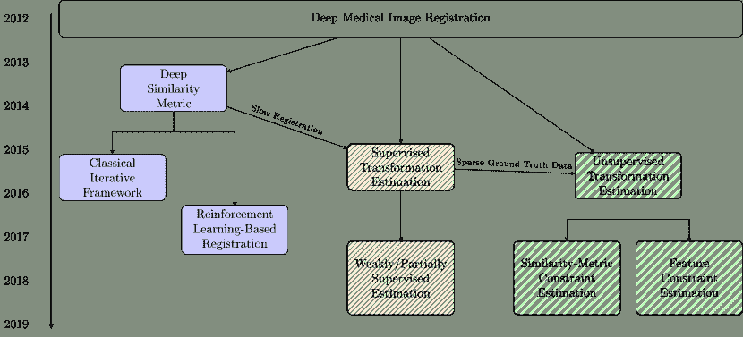
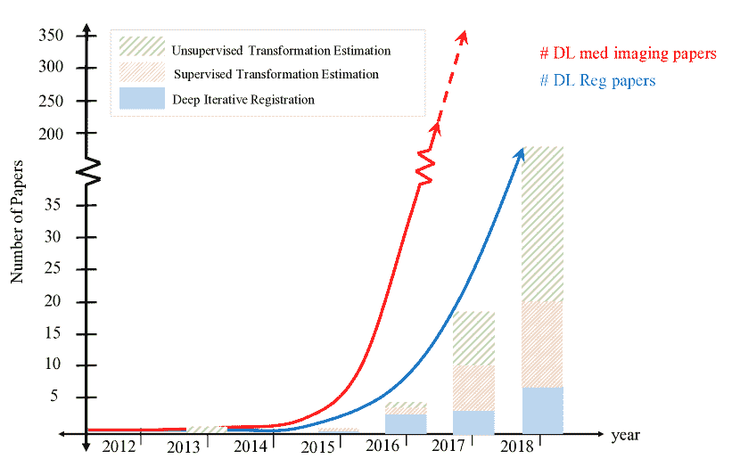
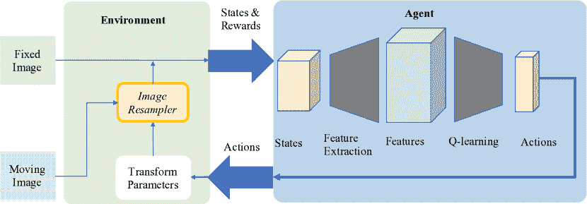
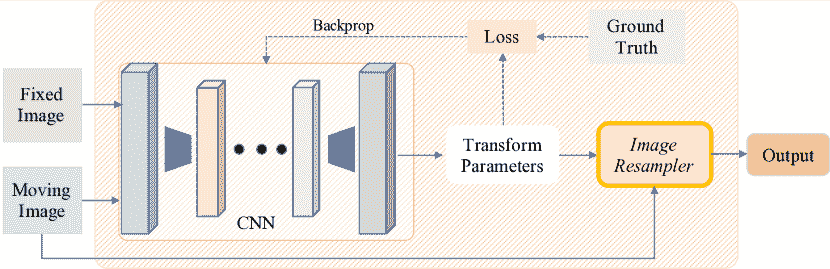
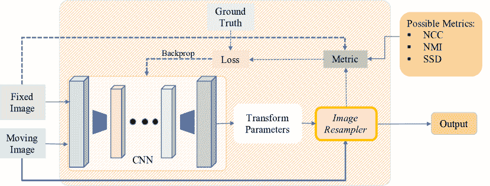
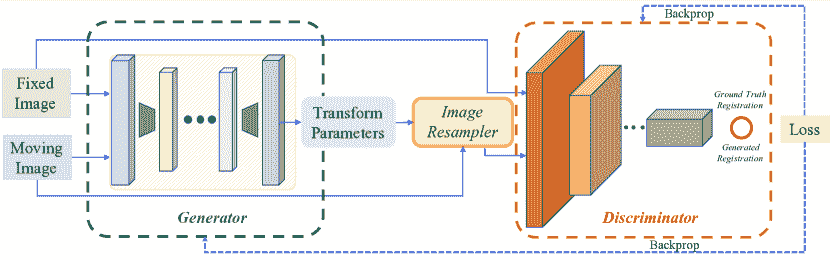
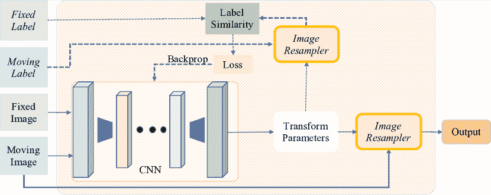
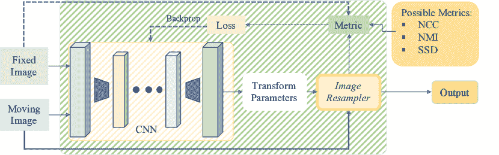
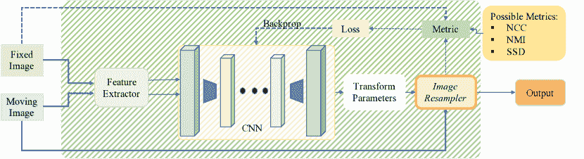

<!--yml

category: 未分类

日期: 2024-09-06 20:06:28

-->

# [1903.02026] 深度学习在医学图像配准中的应用：综述

> 来源：[`ar5iv.labs.arxiv.org/html/1903.02026`](https://ar5iv.labs.arxiv.org/html/1903.02026)

∎ ¹¹institutetext: G. Haskins, U. Kruger, P. Yan* ²²institutetext: 生物医学工程系，伦斯勒理工学院，美国纽约州特洛伊市 12180

星号表示通讯作者

电话: +1-518-276-4476

²²邮箱: yanp2@rpi.edu

# 深度学习在医学图像配准中的应用：综述

Grant Haskins    Uwe Kruger    Pingkun Yan 本研究部分由 NIH/NIBIB 资助，奖项为 R21EB028001 和 R01EB027898，以及 NIH/NCI 资助的 Bench-to-Bedside 奖。本工作为《机器视觉与应用》上发表的文章的预印本。最终认证版本可在线获取：https://doi.org/10.1007/s00138-020-01060-x

###### 摘要

通过鲁棒图像配准建立图像对应关系对许多临床任务至关重要，如图像融合、器官图谱创建和肿瘤生长监测，并且这是一个非常具有挑战性的问题。自最近深度学习复兴以来，医学影像研究界开发了基于深度学习的方法，并在许多应用中取得了最先进的成果，包括图像配准。近年来深度学习在图像配准应用中的快速采用需要一个全面的总结和展望，这也是本综述的主要范围。这要求关注不同的研究领域，并突出实践者面临的挑战。因此，本综述概述了在过去几年中基于深度学习的医学图像配准的演变，既包括研究挑战，也包括相关创新。此外，本综述还强调了未来的研究方向，以展示该领域可能如何推进到下一个阶段。

## 1 引言

图像配准是将不同的图像数据集转换到一个坐标系统中，以匹配的影像内容，这在医学领域具有重要应用。当分析一对从不同视角、不同时间或使用不同传感器/模态获取的图像时，可能需要进行配准 Hill et al. (2001); Zitova and Flusser (2003)。直到最近，图像配准大多由临床医生手动完成。然而，许多配准任务可能相当具有挑战性，并且手动对齐的质量高度依赖于用户的专业知识，这可能对临床不利。为了应对手动配准的潜在不足，自动配准技术应运而生。尽管在深度学习复兴之前（及期间）已经广泛探索了其他自动图像配准方法，但深度学习改变了图像配准研究的格局 Ambinder (2005)。自从 2012 年 AlexNet 在 ImageNet 挑战赛中取得成功以来 Alom et al. (2018)，深度学习使许多计算机视觉任务实现了最先进的性能，包括但不限于：目标检测 Ren et al. (2015)，特征提取 He et al. (2016)，分割 Ronneberger et al. (2015)，图像分类 Alom et al. (2018)，图像去噪 Yang et al. (2018)，以及图像重建 Yao et al. (2018)。

起初，深度学习成功地用于提升基于强度的迭代配准性能 Cheng et al. (2018); Haskins et al. (2019); Simonovsky et al. (2016)。在这种初步应用之后不久，几个研究小组调查了将强化学习直观应用于配准的可能性 Liao et al. (2017); Ma et al. (2017); Miao et al. (2017)。此外，对更快配准方法的需求后来促使了基于深度学习的一步变换估计技术的发展，并且最近获取/生成真实数据的挑战促使许多小组开发了无监督的一步变换估计框架 de Vos et al. (2018); Li and Fan (2018)。与这一框架相关的一个难题是图像相似性量化的挑战 Heinrich et al. (2012); Viola and Wells III (1997)。最近利用基于信息论的相似性度量 de Vos et al. (2018)、解剖结构分割 Hu et al. (2018c) 和类似生成对抗网络的框架 Fan et al. (2018a) 来应对这一挑战的努力已经显示出令人鼓舞的结果。

图 1 展示了不同深度学习基础配准方法的各种分类。另一方面，图 2 展示了根据近年来发表的论文数量对深度学习基础配准方法的日益增长的兴趣。如图 1 和 2 所示的趋势表明，该领域正在快速发展，以克服与深度学习基础的医学图像配准相关的障碍，并且已有多个研究小组在其应用中取得了显著成功，如 Hu 等人（2018c）；Liu 等人（2018）；Simonovsky 等人（2016）。

图 1：深度学习基础的医学图像配准方法概述，按方法类型分类。流行的研究方向用**粗体**标出。

因此，本文的目的是全面调查基于深度学习的医学图像配准领域，突出从业者面临的常见挑战，并讨论可能解决这些挑战的未来研究方向。深度学习属于一种机器学习方法，它使用具有大量层次的神经网络来学习数据的表示 Goodfellow et al. (2016); Schmidhuber (2015)。在讨论神经网络时，提供不同类型神经网络的应用洞察、最近为解决工程问题而发明的显著架构以及用于训练神经网络的多种策略是很重要的。因此，本深度学习介绍部分分为三部分：神经网络类型、网络架构和训练范式及策略。请注意，有许多公开可用的库可以用来构建本节中描述的网络，例如 TensorFlow Abadi et al. (2016)、MXNet Chen et al. (2015)、Keras Chollet et al. (2015)、Caffe Jia et al. (2014) 和 PyTorch Paszke et al. (2017)。对基于深度学习的医学图像分析和各种深度学习研究方向的详细讨论超出了本文的范围。对深度学习在医学图像分析中的应用进行综述的文章 Lee et al. (2017)；Litjens et al. (2017)、强化学习 Kaelbling et al. (1996) 和 GANs 在医学图像分析中的应用 Kazeminia et al. (2018) 适合感兴趣的读者阅读。本文中调查的方法分为以下三类：深度迭代配准、监督变换估计和无监督变换估计。在讨论每个上述类别的方法后，未来的研究方向和当前趋势将在第五部分中讨论。

图 2：基于深度学习的图像配准工作和基于深度学习的医学成像工作的数量概览。红线表示医学成像方法的趋势线，蓝线表示基于深度学习的医学图像配准方法的趋势线。虚线表示外推。

## 2 深度迭代配准

表格 1：深度迭代配准方法概览。RL 表示强化学习。

参考 学习 变换 模态 ROI 模型 Eppenhof 和 Pluim (2018b) 度量 标准 可变 CT 胸部 9 层 CNN Blendowski 和 Heinrich (2018) 度量 标准 可变 CT 肺 FCN Simonovsky et al. (2016) 度量 标准 可变 MR 大脑 5 层 CNN Wu et al. (2013) 度量 标准 可变 MR 大脑 2 层 CAE Cheng et al. (2018) 度量 标准 可变 CT/MR 头部 5 层 DNN Sedghi et al. (2018) 度量 标准 刚性 MR/US 腹部 5 层 CNN Haskins et al. (2019) 度量 标准 刚性 MR/US 前列腺 14 层 CNN Matthew et al. (2018) 度量 标准 刚性 MR/US 胎儿大脑 LSTM/STN Krebs et al. (2017) RL 代理 可变 MR 前列腺 8 层 CNN Liao et al. (2017) RL 代理 刚性 CT/CBCT 脊柱/ 8 层 CNN 心脏 Miao et al. (2017) 多重 刚性 X 射线/CT 脊柱 扩张 FCN RL 代理 Ma et al. (2017) RL 代理 刚性 MR/CT 脊柱 对抗网络

自动基于强度的图像配准需要一个能够量化移动图像和固定图像之间相似度的度量标准，以及一个优化算法来更新变换参数，以使图像之间的相似度最大化。在深度学习复兴之前，几种手工制作的度量标准经常用于这种配准应用，包括：平方差和（SSD）、交叉相关（CC）、互信息（MI）Maes et al. (1997)；Viola 和 Wells III (1997)，归一化交叉相关（NCC）和归一化互信息（NMI）。早期应用深度学习于医学图像配准直接扩展了基于强度的配准框架 Simonovsky et al. (2016)；Wu et al. (2013，2016)。随后，一些小组使用了强化学习范式来迭代估计变换 Krebs et al. (2017)；Liao et al. (2017)；Ma et al. (2017)；Miao et al. (2017)，因为这种应用与实践者执行配准的方式更加一致。

表 1 给出了这两种方法的描述。我们将在第 2.1 节回顾早期使用深度相似性基配准的方法，然后在第 2.2 节介绍一些更近期开发的方法，这些方法使用深度强化学习基配准。

图 3：展示了在基于强度的配准框架中，使用深度学习量化图像相似度的配准流程的可视化。

### 2.1 深度相似性基础配准

本节对使用深度学习学习相似性度量的方法进行了综述。该相似性度量被插入到具有定义的插值策略、变换模型和优化算法的经典强度基础配准框架中。该整体框架的可视化见图 3。实线表示在训练和测试过程中所需的数据流，而虚线表示仅在训练过程中所需的数据流。请注意，本文其余图表的情况也是如此。

#### 2.1.1 工作概述

尽管手工制作的相似性度量在单模态配准情况下表现相当不错，但深度学习已被用来学习更优的度量。 本节将首先讨论利用深度学习来增强单模态强度基础配准流程性能的方法，然后再讨论多模态配准。

##### 2.1.1.1 单模态配准

Wu 等人（Wu 等人，2013，2016）是第一个利用深度学习获得特定应用相似性度量进行配准的研究者。他们使用卷积堆叠自编码器（CAE）提取了用于单模态、可变形 3D 脑 MR 体积配准的特征。随后，他们使用梯度下降法优化两组特征的 NCC 进行配准。这种方法优于基于 diffeomorphic demons 的 Vercauteren 等人（2009）和 HAMMER 的 Shen（2007）的配准技术。

最近，Eppenhof 等人（Eppenhof 和 Pluim，2018b）估计了 3D 胸部 CT 扫描（吸气-呼气）的可变形配准误差，采用了端到端的方式。他们使用 3D CNN 来估计输入的吸气-呼气对胸部 CT 扫描的误差图。与上述方法类似，本工作中只使用了学习到的特征。

相反，Blendowski 等人（Blendowski 和 Heinrich，2018）提出了结合使用基于 CNN 的描述符和手工制作的基于 MRF 的自相似度描述符进行肺 CT 配准。尽管手工制作的描述符优于基于 CNN 的描述符，但使用这两组描述符可以实现最佳性能。这表明，在单模态配准情况下，深度学习可能不如手工制作的方法。然而，它可以用来获得互补信息。

##### 2.1.1.2 多模态配准

在多模态情况下，应用深度学习来进行强度基础配准的优势更加明显，因为手工制作的相似性度量在这方面成功的机会很少。

Cheng 等人 (2016, 2018) 最近使用了堆叠去噪自编码器来学习一种相似性度量，用于评估 CT 和 MR 图像刚性对齐的质量。他们展示了他们的度量在他们的应用中优于基于 NMI 优化和局部交叉相关 (LCC) 优化的方法。

为了明确估计多模态情况下的图像相似性，Simonovsky 等人 (2016) 使用了 CNN 来学习对齐的 3D T1 和 T2 加权脑 MR 卷积之间的差异性。给定这一相似性度量，使用了梯度下降法来迭代更新定义变形场的参数。这种方法能够优于 MI 优化基础的配准，并为深度强度基础的多模态配准奠定了基础。

此外，Sedghi 等人 (2018) 使用 5 层神经网络来学习相似性度量，从而对 3D US/MR（具有比 MR/CT 更大外观差异的模态）腹部扫描进行刚性配准，该度量随后由 Powell 方法优化。这种方法也优于 MI 优化基础的配准。Haskins 等人 (2019) 使用 CNN 来预测目标配准误差 (TRE)，从而学习用于多模态刚性配准的相似性度量，而不是使用像上述方法那样的传统优化器，他们使用了进化算法来探索解决方案空间，然后再使用传统优化算法，因为所学习的度量缺乏凸性。这种配准框架优于基于 MIND 优化的 Heinrich 等人 (2012) 和基于 MI 优化的配准。与上述方法形成鲜明对比的是，Wright 等人 (2018) 使用 LSTM 空间共变换网络来迭代地对 MR 和 US 卷进行组配准。递归空间共变换分为三个步骤：图像变形、残差参数预测、参数组合。他们证明了他们的方法在量化图像相似性方面比之前使用自相似上下文描述符的多模态图像相似性量化方法更具能力 Heinrich 等人 (2013)。

#### 2.1.2 讨论与评估

最近的研究确认了神经网络在多模态医学图像配准中评估图像相似性的能力。本节中描述的方法所取得的结果表明，深度学习可以成功应用于具有挑战性的配准任务。然而，Blendowski 和 Heinrich (2018) 的研究结果表明，学习得到的图像相似性度量可能最适合于补充现有的单模态相似性度量。此外，使用这些迭代技术进行实时配准是困难的。

### 2.2 基于强化学习的注册

在本节中，我们调查了用于注册应用的强化学习方法。在这里，使用训练好的代理来执行注册，而不是使用预定义的优化算法。该框架的可视化见图 4。基于强化学习的注册通常涉及刚性变换模型。然而，也可以使用可变形变换模型。

图 4：使用深度强化学习隐式量化图像相似性的注册流程可视化。在这里，代理学习将状态映射到基于从环境中获得的奖励的动作。

Liao 等人 (2017) 首次使用基于强化学习的注册方法来执行心脏和腹部 3D CT 图像以及圆锥束 CT (CBCT) 图像的刚性注册。他们使用了贪婪的监督方法进行端到端训练，并采用了基于注意力的分层策略。他们的方法优于基于互信息的注册和使用概率图的语义注册。

不久之后，Kai 等人和 Ma 等人 (2017) 使用了强化学习方法来执行 MR/CT 胸部体积的刚性注册。这种方法源于 $Q$-学习，并利用上下文信息来确定投影图像的深度。该方法使用的网络源于 Wang 等人 (2015) 的对抗网络架构。值得注意的是，这项工作还区分了终端奖励和非终端奖励。这种方法优于基于迭代最近点 (ICP)、标志点、Hausdorff 距离、深度 Q 网络和对抗网络 Wang 等人 (2015) 的注册方法。

与上述方法训练单个代理不同，Miao 等人 (2017) 在强化学习范式中使用了多代理系统来对 X 射线和 CT 图像进行刚性注册。他们使用了自动关注机制来观察多个区域，并展示了多代理系统的有效性。他们能够显著优于使用 De Silva 等人 (2016) 提供的最先进相似性度量的注册方法。

与上述基于刚性配准的方法不同，Krebs 等人（2017）采用了一种基于强化学习的方法来进行二维和三维前列腺 MR 体积的变形配准。他们使用了低分辨率变形模型进行配准，并通过模糊动作控制来影响随机动作选择。低分辨率变形模型对于限制动作空间的维度是必要的。这种方法优于使用 Elastix 工具箱 Klein 等人（2010）和 LCC-Demons Lorenzi 等人（2013）的配准技术。

图 5：监督单步配准的可视化。

强化学习的使用对于医学图像配准应用是直观的。基于强化学习的配准的主要挑战之一是处理高分辨率变形场的能力。刚性配准没有这样的挑战。由于这些方法的直观性质和较新的出现，我们预计在未来几年，这些方法将受到研究界更多的关注。

表 2：监督变换估计方法。灰色行使用的是微分同胚。

参考文献监督变换模态 ROI 模型 杨等人 (2016) 实际变换 可变形 MR 大脑 FCN 曹等人 (2017) 实际变换 可变形 MR 大脑 9 层 CNN 吕等人 (2018) 实际变换 可变形 MR 腹部 CNN 罗赫等人 (2017) 实际变换 可变形 MR 心脏 SVF-Net 索科蒂等人 (2017) 合成变换 可变形 CT 胸部 RegNet 变换 埃彭霍夫和普卢伊姆 (2018a) 合成变换 可变形 CT 肺部 U-Net 变换 乌祖诺娃等人 (2017) 合成变换 可变形 MR 大脑/ FlowNet 变换 心脏 伊藤和伊野 (2018) 合成变换 可变形 MR 大脑 GoogleNet 变换 孙等人 (2018) 合成变换 可变形 CT/US 肝脏 DVFNet 变换 杨 (2017) 实际 + 合成 变换 可变形 MR 大脑 FCN 变换 斯隆等人 (2018) 合成刚性 MR 大脑 6 层 CNN 变换 10 层 FCN 萨雷希等人 (2018) 合成刚性 MR 大脑 11 层 CNN 变换 ResNet-18 郑等人 (2018) 合成刚性 X 射线 骨头 17 层 CNN 变换 PDA 模块 苗等人 (2016b) 合成刚性 X 射线/骨头 6 层 CNN 变换 DDR 谢和吴 (2018) 合成刚性 MR 大脑 AIRNet 变换 胡等人 (2018c) 分割 可变形 MR/US 前列腺 30 层 FCN 赫林等人 (2018) 分割 + 可变形 MR/US 前列腺 U-Net 相似度度量 GAN 胡等人 (2018a) 分割 + 可变形 MR/US 前列腺 GAN 对抗损失 范等人 (2018b) 实际变换 + 可变形 MR 大脑 U-Net 相似度度量 燕等人 (2018) 合成刚性 MR/US 前列腺 GAN 变换 + 对抗损失

## 3 监督变换估计

尽管前述方法取得了早期成功，但这些方法中的变换估计是迭代的，这可能导致注册速度较慢。哈斯金斯等人 (2019)。这在可变形注册的情况下尤为明显，因为解决空间的维度很高 李等人 (2017)。这激发了能够一步估计与最佳相似性对应的变换的网络的发展。然而，完全监督的变换估计（仅使用真实数据来定义损失函数）存在几个挑战，这些挑战在本节中有所强调。

图 5 展示了监督变换估计的可视化，表 2 列出了 notable works。本节首先讨论了在 3.1 部分中使用完全监督方法的方法，然后讨论了在 3.2 部分中使用双重/弱监督方法的方法。

### 3.1 全监督变换估计

在这一部分，我们将探讨用于单步配准的全监督方法。与迭代优化器相比，使用神经网络进行配准显著加快了配准过程。

#### 3.1.1 作品概述

一些配准应用需要可变形变换模型，这通常禁止使用传统的卷积神经网络，因为使用 FC 层在高维解空间中进行预测的计算开销很大 Krebs et al. (2017)。由于用于预测变形场的网络是完全卷积的，与变形场相关的解空间的维度不会引入额外的计算约束 Yang et al. (2016)。本节将首先讨论使用刚性变换模型的方法，然后讨论使用可变形变换模型的方法。

##### 3.1.1.1 刚性配准

Miao et al. Miao et al. (2016a, b) 首次使用深度学习来预测刚性变换参数。他们使用 CNN 来预测与 2D/3D X 射线衰减图和 2D X 射线图像的刚性配准相关的变换矩阵。提出了分层回归，其中 6 个变换参数被划分为 3 组。此方法通过变换对齐的数据来合成地面真实数据。这也是接下来描述的三种方法的情况。该方法在准确性和计算效率方面优于基于 MI、CC 和梯度相关性（GC）优化的配准方法。提高的计算效率归因于使用神经网络的前向传递，而不是优化算法来执行配准。

最近，Chee 等人（Chee and Wu，2018）使用 CNN 来预测用于刚性配准 3D 脑 MR 体积的变换参数。在他们的框架中，仿射图像配准网络（AIRNet）使用预测的和真实的仿射变换之间的均方误差（MSE）来训练网络。他们能够在单模态和多模态情况下均优于基于 MI 优化的配准方法。

同年，Salehi 等人（Salehi et al.，2018）使用了深度残差回归网络、校正网络和基于双变量测地距离的损失函数来刚性配准 T1 和 T2 加权的 3D 胎儿脑 MR，以构建图谱。使用残差网络初步配准图像体积，然后通过校正网络进行前向传播，从而提高了配准的捕捉范围。这种方法在切片到体积配准和体积到体积配准中都进行了评估。他们验证了测地损失项的有效性，并优于基于 NCC 优化的配准方法。

此外，郑等人（Zheng et al.，2018）提出了将一对一领域适应模块（PDA）集成到一个预训练的 CNN 中，该 CNN 使用有限的训练数据进行术前 3D X 射线图像和术中 2D X 射线图像的刚性配准。领域适应用于解决用于训练深度模型的合成数据与真实数据之间的差异。

Sloan 等人（Sloan et al.，2018）使用了卷积神经网络（CNN）来回归刚性变换参数，以实现 T1 和 T2 加权脑 MR 的配准。该工作研究了单模态和多模态的配准。在单模态情况下，用于提取每张图像低级特征的卷积层的参数仅在单模态情况下共享。在多模态情况下，这些参数是单独学习的。这种方法还优于基于互信息（MI）优化的图像配准方法。

##### 3.1.1.2 可变形配准

与上一部分不同，将讨论使用真实和合成地面真值标签的方法。首先讨论使用临床/公开获取的地面真值标签进行训练的方法。这种排序反映了模拟现实的可变形变换比模拟现实的刚性变换更为困难。

首先，杨等人 (2016) 预测了变形场，使用了一个全卷积网络（FCN），该网络用于在单步中对 2D/3D 被试脑部 MR 体积进行配准。在此方法中，采用了类似 U-net 的架构 (Ronneberger et al. [2015])。此外，他们使用了大规模微分度量映射提供基础，使用图像体积的像素初始动量值作为网络输入，并演化这些值以获得预测的变形场。该方法优于基于半耦合字典学习的配准方法 (Cao et al. [2015])。

次年，罗赫等人 (2017) 也使用了受 U-net 启发的网络 (Ronneberger et al. [2015]) 来估计用于配准 3D 心脏 MR 体积的变形场。使用网格分割计算给定图像对的参考变换，并且使用预测与真实值之间的 SSD 作为损失函数。该方法优于基于 LCC Demons 的配准方法 (Lorenzi et al. [2013])。

同年，曹等人 (2017) 使用卷积神经网络（CNN）将一对 3D 脑部 MR 体积的输入图像块映射到各自的位移向量。这些位移向量的总和构成了用于执行配准的变形场。此外，他们使用了输入图像块之间的相似性来指导学习过程。进一步，他们使用了均衡活跃点引导采样策略，使得具有更高梯度幅度和位移值的块更可能被用于训练。该方法优于基于 SyN (Avants et al. [2008]) 和基于 Demons (Vercauteren et al. [2009]) 的配准方法。

最近，Jun et al. (2018) 使用 CNN 执行腹部 MR 图像的可变形配准，以补偿由呼吸引起的变形。这种方法的配准结果优于未进行运动校正的配准结果和局部仿射配准。近期，与本文讨论的许多其他方法不同，杨等人 (Yang [2017]) 量化了 3D T1 和 T2 加权脑部 MR 的可变形配准所涉及的不确定性，采用了变换参数的变分高斯分布的低秩 Hessian 近似。这种方法在真实和合成数据上进行了评估。

正如深度学习从业者使用随机变换来增强数据集的多样性一样，Sokooti 等人 (2017) 使用随机 DVF 来增强他们的数据集。他们使用多尺度 CNN 来预测变形场。该变形用于进行 3D 胸部 CT 图像的同一受试者配准。该方法使用晚期融合，而非早期融合，其中补丁被拼接并作为网络的输入。该方法的性能与基于 B 样条的配准 Sokooti 等人 (2017) 具有竞争力。

这些方法在增强数据集的规模和多样性方面有显著但也有限的能力。这些限制促使了更复杂的真实数据生成方法的发展。本节中描述的其余方法使用模拟的真实数据进行应用。

例如，Eppenhof 和 Pluim (2018a) 使用 3D CNN 执行吸气-呼气 3D 肺 CT 图像体积的变形配准。一系列多尺度、随机变换的对齐图像对消除了对手动注释真实数据的需求，同时保持了现实的图像外观。此外，与其他生成真实数据的方法一样，CNN 可以使用相对较少的医学图像进行监督训练。

与上述工作不同，Uzunova 等人 (2017) 使用统计外观模型 (SAMs) 生成真实数据。他们使用 CNN 估计 2D 脑 MR 和 2D 心脏 MR 图像的变形场，并将 FlowNet Dosovitskiy 等人 (2015) 适应到他们的应用中。他们展示了使用 SAM 生成的真实数据训练 FlowNet 的性能优于使用随机生成的真实数据或使用 Ehrhardt 等人 (2015) 描述的配准方法获得的真实数据训练的 CNN。

与本节中使用随机变换或手动制作方法生成真实数据的其他方法不同，Ito 等人 (2018) 使用 CNN 学习可行的变形来生成真实数据。他们在 ADNI 数据集的 3D 脑 MR 图像上评估了他们的方法，并超越了 Ikeda 等人 (2014) 提出的基于 MI 优化的方法。

#### 3.1.2 讨论与评估

监督变换估计使得在应用中实现实时、稳健的配准成为可能。然而，这些方法也有其局限性。首先，使用该框架的配准质量依赖于地面真实配准的质量。这些标签的质量自然依赖于实践者的专业水平。此外，这些标签较难获得，因为具备进行此类配准所需专业知识的人相对较少。训练数据的变换和合成地面真实数据的生成可以解决这些限制。然而，重要的是要确保模拟数据与临床数据有足够的相似性。这些挑战促使了部分监督/无监督方法的发展，接下来将讨论这些方法。

### 3.2 双重/弱监督变换估计

双重监督指的是使用地面真实数据和量化图像相似性的一些度量来训练模型。另一方面，弱监督指的是利用相应解剖结构的分割重叠来设计损失函数。本节将讨论这些工作的贡献，详见 3.2.1，然后在 3.2.2 节中讨论这一研究方向的总体状态。

#### 3.2.1 作品概述

图 6：深度单步配准的可视化，其中代理使用双重监督进行训练。损失函数通过量化图像相似性的度量标准和地面真实数据来确定。

首先，本节将讨论使用双重监督的方法，然后讨论使用弱监督的方法。最近，Fan 等人 (2018b) 使用了层次化的双重监督学习来预测 3D 脑 MR 配准的变形场。他们通过在 U-Net 架构的 U 型端或架构后插入卷积层（即“填补空白”）以及粗到精的指导来修正传统的 U-Net 架构（Ronneberger 等人 (2015)）。这种方法利用了预测变换与真实变换之间的相似性，以及变形图像与固定图像之间的相似性来训练网络。这种方法中的架构优于传统的 U-Net 架构，并且通过消融图像相似性损失函数项验证了双重监督策略。双重监督变换估计的可视化见图 6。

另一方面，Yan 等人 (2018) 使用了一个受 GAN（Goodfellow 等人 (2014) 启发的框架来进行 3D MR 和 TRUS 体积的刚性配准。在这项工作中，生成器被训练用于估计刚性变换，而判别器则被训练以辨别使用真实变换对齐的图像和使用预测变换对齐的图像。这种方法中使用了到真实值的欧几里得距离和对抗损失项来构建损失函数。请注意，这种方法中使用的对抗监督策略与下一节将描述的一些无监督工作所使用的策略类似。对抗变换估计的可视化见图 7。

图 7：一个对抗图像配准框架的可视化。在这里，生成器使用来自判别器的输出进行训练。判别器在这里采用的是一种学习到的度量形式。

与上述使用双重监督的方法不同，胡等人（Hu et al. (2018b, c)）最近使用标签相似性来训练他们的网络以执行 MR-TRUS 配准。在他们的初步工作中，他们使用了两个神经网络：local-net 和 global-net，分别用于估计具有 12 自由度的全局仿射变换和局部密集变形场（胡等人 (2018b)）。local-net 使用 global-net 给出的移动图像的变换和固定图像的拼接作为输入。然而，在他们后来的工作中（胡等人 (2018c)），他们将这些网络结合在一个端到端的框架中。这种方法优于基于 NMI 优化和 NCC 的配准。图 8 显示了弱监督变换估计的可视化。在另一项工作中，胡等人（Hu et al. (2018a)）同时最大化标签相似性并最小化对抗损失项来预测 MR-TRUS 配准的变形。这个正则化项强迫预测的变换生成现实图像。使用对抗损失作为正则化项很可能在适当的超参数选择下成功地强迫变换变得现实。这个配准框架的性能低于他们之前描述的配准框架。然而，他们展示了对抗正则化优于标准的弯曲能量基正则化。类似于上述方法，Hering 等人（Hering et al. (2018)）在双重和弱监督方面的进展基础上，引入了一个基于标签和相似性度量的损失函数，用于通过 2D cine-MR 图像的可变形配准进行心脏运动跟踪。该方法使用了分割重叠和基于边缘的归一化梯度场距离来构造损失函数。它优于 Rühaak 等人 (2013) 提出的类似多级配准方法。

图 8：深度单步配准的可视化，其中代理使用标签相似性（*即* 弱监督）进行训练。手动标注的数据（分割）用于定义训练网络的损失函数。

#### 3.2.2 讨论与评估

直接变换估计标志着深度学习图像配准的重大突破。在完全监督下，取得了令人鼓舞的结果。然而，与此同时，这些技术需要大量详细标注的图像进行训练。部分/弱监督的变换估计方法缓解了与地面真实标签的可信度和费用相关的限制。然而，它们仍然需要手动标注的数据（*例如*地面真实数据和/或分割）。另一方面，弱监督允许在多模态情况下进行相似性量化。此外，部分监督允许聚合可以用于评估预测配准质量的方法。因此，这些研究领域越来越受到关注。

表 3：无监督变换估计方法。灰色行使用流形。

Ref Loss Function Transform Modality ROI Model Jiang and Shackleford (2018) SSD Deformable CT Chest Multi-scale CNN Ghosal and Ray (2017) UB SSD Deformable MR Brain 19-layer FCN Zhang (2018) MSD Deformable MR Brain ICNet Shu et al. (2018) MSE Deformable SEM Neurons 11-layer CNN Dalca et al. (2018) MSE Deformable MR Brain VoxelMorph Sheikhjafari et al. (2018) MSE Deformable MR Cardiac 8-layer Cine FCNet Kuang and Schmah (2018) CC Deformable MR Brain FAIM Li and Fan (2018) NCC Deformable MR Brain 8-layer FCN Cao et al. (2018) NCC Deformable CT, MR Pelvis U-Net de Vos et al. (2017) NCC Deformable MR Cardiac DIRNet Cine de Vos et al. (2018) NCC Deformable MR Cardiac DLIR Cine Ferrante et al. (2018) NCC Deformable X-ray, MR Bone U-Net Cardiac STN Cine Sun and Zhang (2018) L2 Distance + Deformable MR, US Brain FCN Image Gradient Neylon et al. (2017) Predicted TRE Deformable CT Head/Neck FCN Fan et al. (2018a) BCE Deformable MR Brain GAN Mahapatra (2018) NMI + SSIM Deformable MR, FA/ Cardiac GAN + VGG Outputs Color fundus Retinal Mahapatra et al. (2018) NMI + SSIM + Deformable X-ray Bone GAN VGG Outputs + BCE Yoo et al. (2017) MSE AE Output Deformable ssEM Neurons CAE STN Wu et al. (2016) MSE Stacked Deformable MR Brain Stacked AE Outputs AE Wu et al. (2013) NCC of Deformable MR Brain Stacked ISA Outputs ISA Krebs et al. (2018a) Log Likelihood Deformable MR Brain cVAE STN Liu and Leung (2017) SSD MIND + Deformable CT, MR Chest FCN PCANet Outputs Brain PCANet Kori et al. (2018) SSD VGG Rigid MR Brain CNN Outputs MLP

## 4 无监督变换估计

尽管前面章节中描述的方法取得了成功，但获取可靠的真实值的困难性质仍然是一个重大障碍（Uzunova et al. (2017））。这促使了多个不同的研究小组探索无监督方法（de Vos et al. (2017）；Li and Fan (2018））。其中一个对这些研究有用的关键创新是空间变换网络（STN）（Jaderberg et al. (2015））。一些方法使用 STN 来执行与其配准应用相关的变形（Ferrante et al. (2018）；Kuang and Schmah (2018））。本节讨论了利用图像相似度度量（第 4.1 节）和图像数据特征表示（第 4.2 节）的无监督方法来训练其网络。有关重要工作的描述见表 3。

### 4.1 基于相似度度量的无监督变换估计

#### 4.1.1 标准方法

本节开始讨论那些使用通用相似度度量及常见正则化策略来定义其损失函数的方法。随后，本节还讨论了使用更复杂的相似度度量策略的方法。图 9 给出了标准相似度度量基础上的变换估计的可视化。

图 9：深度单步配准的可视化，其中网络使用量化图像相似度的度量进行训练。因此，该方法是无监督的。

为了克服获得真实数据的困难，Li 等人（Li 和 Fan（2017，2018））训练了一个 FCN 来执行 3D 脑 MR 体积的可变形跨主体配准，使用了“自我监督”。在这个方法中，变形图像和固定图像之间的 NCC 以及几个常见的正则化项（*例如* 平滑约束）构成了损失函数。虽然许多手动定义的相似性度量在多模态情况下失败（偶尔 MI 除外），但它们通常适用于单模态情况。此工作中详细描述的方法优于基于 Advanced Neuroimaging Tools (ANTs) 的配准 Avants 等人（2011）和 Sokooti 等人（2017）（前面讨论过）以及 Yoo 等人（2017）（在下一节讨论）的深度学习方法。

此外，de Vos 等人（2017）使用 NCC 训练了一个 FCN，以对 4D 心脏 MRI 动态体积进行可变形配准。在此方法中，使用 DVF 变形移动体积。他们的方法优于使用 Elastix 工具箱 Klein 等人（2010）进行的配准。

在另一项工作中，de Vos 等人（2018）使用多阶段、多尺度的方法对多个数据集进行单模态配准。他们利用 NCC 和弯曲能量正则化项来训练网络，这些网络预测仿射变换和随后的粗到细的变形，使用 B-Spline 变换模型。除了验证他们的多阶段方法外，他们还表明，他们的方法在有和没有弯曲能量的情况下都优于使用 Elastix 工具箱 Klein 等人（2010）进行的配准。

Ghosal 等人（Ghosal 和 Ray（2017））使用的无监督可变形配准框架最小化变形图像和固定 3D 脑 MR 图像之间的 SSD 上界（UB SSD）。他们网络的设计受到了 SKIP 架构 Long 等人（2015）的启发。这种方法优于基于 log-demons 的配准。

Shu 等人（2018）使用粗到细的无监督可变形配准方法，对使用扫描电子显微镜（SEM）获得的神经元图像进行配准。在这里，变形体积和固定体积之间的均方误差（MSE）被用作损失函数。他们的方法在竞争性上优于且速度更快于 sift flow 框架 Liu 等人（2011）。

Sheikhjafari 等人 (2018) 使用学习的潜在表示来执行 2D 心脏 Cine MR 体积的可变形配准。因此，通过嵌入获得变形场。该潜在表示被用作输入到一个由 8 层全连接层组成的网络中，以获得变换。绝对误差和 (SAE) 被用作损失函数。在这里，配准性能被发现受 B-spline 网格间距的影响。这种方法优于 Punithakumar 等人 (2017) 描述的移动网格对应方法。

Stergios 等人 (2018) 使用 CNN 来对肺部 MR 体积的吸气-呼气对进行线性和局部配准。因此，仿射变换和变形都是联合估计的。损失函数由 MSE 项和正则化项组成。他们的方法优于几种不使用真实数据的最先进方法，包括 Demons Lorenzi 等人 (2013)、SyN Avants 等人 (2008)，以及使用 MSE 损失项的深度学习方法。此外，正则化项的包含通过消融研究得到了验证。

基于深度相似度度量的无监督配准的成功激励了 Neylon 等人 (2017) 使用神经网络来学习 CT 图像体积配准时图像相似度度量值与 TRE 之间的关系。这是为了稳健地评估配准性能。该网络能够在 95% 的情况下实现亚体素精度。受到类似启发，Balakrishnan 等人 (2018a, b) 提出了一个无监督图像配准的通用框架，该框架理论上可以是单模态的或多模态的。神经网络使用选定的、手动定义的图像相似度度量 (*例如* NCC, NMI 等) 进行训练。

在后续的论文中，Dalca 等人 (2018) 将变形预测视为变分推断。将 diffeomorphic 集成与变换层结合以获得速度场。平方和缩放层用于将速度场集成以获得预测的变形。MSE 被用作相似度度量，它与正则化项一起定义了损失函数。他们的方法优于 ANTs 基于配准的 Avants 等人 (2011) 和 Balakrishnan 等人 (2018a) 描述的深度学习方法。

不久之后，Kuang 等人 Kuang 和 Schmah (2018) 使用了 CNN 和 STN 启发的框架来执行 T1 加权脑 MR 卷的变形配准。损失函数由一个 NCC 项和一个正则化项组成。该方法使用了 Inception 模块，一个低容量模型，以及残差连接，而不是跳跃连接。他们将其方法与 VoxelMorph（由 Balakrishnan 等人提出的方法，如上所述）Balakrishnan 等人 (2018b) 和 uTIlzReg GeoShoot Vialard 等人 (2012) 使用 LBPA40 和 Mindboggle 101 数据集进行比较，并展示了在这两方面的优越性能。

在之前描述的基于度量的方法取得进展的基础上，Ferrante 等人 (2018) 使用基于迁移学习的方法来执行 X 射线和心脏电影图像的单模态配准。在这项工作中，网络在源领域的数据上进行训练，使用 NCC 作为主要的损失函数项，并在目标领域进行测试。他们使用了类似 U-net 的架构 Ronneberger 等人 (2015) 和 STN Jaderberg 等人 (2015) 分别执行特征提取和变换估计。他们展示了使用任一领域作为源或目标领域的迁移学习都能产生有效的结果。该方法优于使用 Elastix 工具箱 Klein 等人 (2010) 以及使用网格搜索确定参数的配准结果。

尽管将基于相似性度量的方法应用于多模态情况是困难的，Sun 等人 Sun 和 Zhang (2018) 提出了一个无监督的 3D MR/US 脑配准方法，该方法使用一个由特征提取器和变形场生成器组成的 3D CNN。该网络使用一个包含像素强度和梯度信息的相似性度量进行训练。此外，图像强度和梯度信息都作为输入用于 CNN。

#### 4.1.2 扩展

Cao 等人 (2018) 还将基于相似性度量的训练应用于多模态情况。具体而言，他们使用模态内图像相似性来监督 3D 骨盆 CT/MR 卷的多模态变形配准。通过使用真实变换扭曲的移动图像与使用预测变换扭曲的移动图像之间的 NCC 作为损失函数。该工作利用了“双重”监督（*即*之前描述的模态内监督同时用于 CT 和 MR 图像）。这与之前描述的双重监督策略不同。

受限于典型无监督方法估计的不对称变换的限制性质，Zhang 等人（Zhang (2018)）使用了他们的网络逆一致深度网络（ICNet）来学习对齐到相同空间中的每个脑部 MR 体积的对称同胚变换。不同于其他使用标准正则化策略的工作，这项工作引入了逆一致正则化项和抗折叠正则化项，以确保高度加权的平滑约束不会导致折叠。最后，两个图像之间的 MSD 使得该网络能够以无监督的方式进行训练。该方法优于基于 SyN 的配准（Avants et al. (2008)）、基于 Demons 的配准（Lorenzi et al. (2013)）以及几种基于深度学习的方法。

本节描述的接下来的三种方法使用了 GAN 进行其应用。与之前描述的基于 GAN 的方法不同，这些方法既不使用真实数据，也不使用手动构造的分割。Mahapatra 等人（Mahapatra (2018)）使用 GAN 隐式学习表示心脏电影图像和多模态视网膜图像（视网膜彩色眼底图像和荧光素眼底血管造影（FA）图像）可能变形范围的密度函数。除了 NMI、结构相似性指数度量（SSIM）和特征感知损失项（由 VGG 输出之间的 SSD 确定），损失函数还包括基于最近的对抗性框架实现的条件和循环约束。他们的方法优于使用 Elastix 工具箱（Klein et al. (2010)）和 de Vos 等人提出的方法（de Vos et al. (2017)）进行的配准。

此外，Fan 等人（Fan et al. (2018a)）使用 GAN 执行 3D 脑 MR 体积的无监督可变形图像配准。与大多数其他使用手动构造相似性度量来确定损失函数的无监督工作不同，也不同于之前使用 GAN 确保预测变形真实的 approach，这种方法使用判别器来评估对齐的质量。该方法在每个数据集上均优于 Diffeomorphic Demons 和 SyN 配准，除了 MGH10。此外，使用判别器对配准网络的监督优于使用真实数据、SSD 和 CC 的所有数据集。

与此前描述的工作（不仅仅是基于 GAN 的工作）不同，Mahapatra 等人 (2018) 提出了使用 GAN 框架同时进行胸部 X 光片的分割和配准。网络接受 3 个输入：参考图像、浮动图像和参考图像的分割掩模，并输出变换后图像的分割掩模和变形场。使用三个判别器通过循环一致性和 Dice 指标来评估生成输出（变形场、变形图像和分割）的质量。生成器还通过 NMI、SSIM 和特征感知损失项进行额外训练。

最后，与本节中其他方法根据固定参数化预测变形场的做法不同，Jiang 等人 (2018) 使用 CNN 通过多网格 B-Spline 方法和 L1 范数正则化来学习图像变形的最佳参数化。他们使用这种方法对 4D CT 胸部图像体积进行可变形配准。这里使用 SSD 作为相似性度量，并使用 L-BFGS-B 作为优化器。使用所提出的方法获得的参数化变形模型的收敛速度比使用传统的 L1 范数正则化多网格参数化获得的模型更快。

#### 4.1.3 讨论与评估

基于图像相似性的无监督图像配准最近受到了研究界的广泛关注，因为它绕过了对任何形式专家标签的需求。这意味着模型的性能不会依赖于从业者的专业知识。此外，引入更复杂相似性度量（*例如* GAN 的判别器）和/或正则化策略的原始相似性度量方法的扩展已经取得了令人鼓舞的结果。然而，定量化多模态配准应用的图像相似性仍然是一个困难的任务。因此，无监督图像相似性相关工作的范围在很大程度上局限于单模态情况。鉴于多模态配准在许多临床应用中常常是必需的，我们期待在不久的将来看到更多解决这一挑战性问题的论文。

### 4.2 基于特征的无监督变换估计

在这一节中，调查了使用学习到的特征表示来训练神经网络的方法。与前一节调查的方法类似，本节调查的方法不需要真实数据。本节首先介绍创建单模态注册管道的方法。接着，讨论了处理多模态图像注册的方法。图 10 给出了基于特征的变换估计的可视化。

#### 4.2.1 单模态注册

Yoo 等人 (2017) 使用 STN 注册了串行切片电子显微镜图像（ssEMs）。一个自动编码器被训练来重建固定图像，重建的固定图像与对应的变形移动图像之间的 L2 距离与几个正则化项一起用于构建损失函数。该方法优于 bUnwarpJ 注册技术 Arganda-Carreras 等人 (2006) 和弹性注册技术 Saalfeld 等人 (2012)。

同年，Liu 等人 Liu 和 Leung (2017) 提出了基于张量的 MIND 方法，使用基于主成分分析的网络（PCANet）Chan 等人 (2015) 进行单模态和多模态注册。使用了呼吸对胸部 CT 体积和多模态脑部 MR 图像对来验证该方法。提出的方法优于基于 MI 和残差复杂性（RC）的 Myronenko 和 Song (2010) 以及原始 MIND 基于的 Heinrich 等人 (2012) 注册技术。

图 10: 基于特征的无监督图像注册的可视化。在这里，使用特征提取器将输入图像映射到特征空间，以便于预测变换参数。

Krebs 等人 (2018a, b) 对 2D 脑部和心脏 MR 进行了注册，并通过随机潜空间学习方法避免了空间正则化的需求。使用条件变分自动编码器 Doersch (2016) 来确保参数空间遵循规定的概率分布。固定图像的负对数似然给定潜在表示和变形体积，以及潜在分布与先验分布之间的 KL 散度被用来定义损失函数。该方法优于 Demons 技术 Lorenzi 等人 (2013) 和 Balakrishnan 等人 (2018a) 描述的深度学习方法。

#### 4.2.2 多模态注册

与本节中描述的其他所有方法不同，Kori 等人使用预训练网络 Kori 等人 (2018) 以无监督的方式进行 2-D T1 和 T2 加权脑 MRI 的多模态配准，进行特征提取和仿射变换参数回归。这些图像被二值化，然后在移动图像和固定图像之间的 Dice 分数作为代价函数。由于这两种模态之间的外观差异不显著，因此使用这些预训练模型可能会相对有效。

#### 4.2.3 讨论与评估

在无监督条件下进行多模态图像配准显著比单模态图像配准更加困难，因为使用手动设计的相似性度量来量化两幅图像之间的相似性是具有挑战性的，并且通常使用上述无监督技术来建立/检测体素对体素的对应关系。使用无监督学习来学习特征表示以确定最佳变换最近引起了研究界的广泛关注。除了之前讨论的无监督图像配准方法外，我们预计基于特征的无监督配准将继续引起研究界的显著兴趣。此外，扩展到多模态情况（尤其是用于具有显著外观差异的图像的应用）可能会成为未来几年内一个重要的研究重点。

## 5 研究趋势与未来方向

在本节中，我们总结了深度学习在医学图像配准中的当前研究趋势和未来方向。从图 Fig. 2 中可以看到，一些研究趋势已经显现。首先，基于深度学习的医学图像配准似乎遵循了深度学习在医学图像分析中的一般应用趋势。其次，无监督变换估计方法最近获得了更多的研究关注。此外，基于深度学习的方法始终优于传统的基于优化的技术 Nazib 等人 (2018)。基于观察到的研究趋势，我们推测以下研究方向将在研究界获得更多关注。

### 5.1 深度对抗图像配准

我们进一步推测，未来几年 GANs 在基于深度学习的图像配准中将被更频繁地使用。如上所述，GANs 可以在基于深度学习的医学图像配准中发挥多种不同的作用：使用判别器作为学习的相似性度量，确保预测的变换是现实的，并使用 GAN 执行图像翻译，将多模态配准问题转化为单模态配准问题。

类似 GAN 的框架已经在多个工作中用于直接训练变换预测神经网络。几个近期的研究 Fan et al. (2018a); Yan et al. (2018) 使用鉴别器来区分对齐和未对齐的图像对。尽管训练范式借鉴了无监督训练策略，但鉴别器需要预对齐的图像对。因此，在多模态或挑战性的单模态应用中，它的成功会受到限制，因为在这些应用中图像配准困难。由于鉴别器被训练为给所有未对齐的图像对分配相同的标签，它们可能无法建模各种未对齐情况。尽管存在这一限制，GAN 在医学图像配准中的应用仍然非常有前景，下面将进行描述。

无约束的变形场预测可能会导致变形图像出现不现实的器官外观。一种常见的方法是将预测的变形场、其梯度或其拉普拉斯的 L2 范数添加到损失函数中。然而，这些正则化项的使用可能会限制神经网络能够预测的变形幅度。因此，Hu et al. Hu et al. (2018a) 探索了使用类似 GAN 的框架来产生真实的变形。使用鉴别器约束变形预测相较于使用 L2 范数正则化在该工作中表现更优。

最后，GANs 可以用于将源领域的医学图像（*例如* MR）映射到目标领域（*例如* CT）Choi et al. (2018); Isola et al. (2017); Liu et al. (2017); Yi et al. (2017)，无论是否有配对的训练数据 Zhu et al. (2017)。这种图像外观减少技术将具有优势，因为许多单模态无监督配准方法使用的相似性度量在多模态情况下常常失败。如果图像翻译作为预处理步骤进行，那么常用的相似性度量可以用于定义变换预测网络的损失函数。

### 5.2 基于强化学习的配准

我们还预测，在未来几年中，强化学习将在医学图像配准中得到更广泛的应用，因为它非常直观，可以模拟医生进行配准的方式。需要注意的是，基于深度学习的医学图像配准面临一些独特的挑战，例如在可变形配准情况下的动作空间维度。然而，我们相信这些限制是可以克服的，因为已经有一种方法使用了基于强化学习的配准和可变形变换模型 Krebs et al. (2017)。

### 5.3 原始成像领域配准

本文重点调查了使用重建图像进行配准的方法。然而，我们推测将重建纳入端到端的基于深度学习的配准流程是可能的。在 2016 年，Wang Wang（2016）假设深度神经网络可以用于图像重建。此外，Rivenson 等人（2018）；Smith 等人（2019）；Yao 等人（2018）；Zhu 等人（2018）最近展示了深度学习在原始数据领域与重建图像领域之间映射数据点的能力。因此，合理预期在未来几年内可以开发出以原始数据为输入、输出注册重建图像的配准流程。

## 6 结论

本文审视了利用深度学习进行医学图像配准的近期研究。由于每个应用都有其独特的挑战，因此基于深度学习的框架创建必须经过精心设计。许多基于深度学习的医学图像配准应用面临相似的挑战，包括缺乏适用于多模态应用的稳健相似性度量，其中存在显著的图像外观差异和/或不同的视场（*例如* MR-TRUS 配准）Haskins 等人（2019），缺乏大规模数据集，获取分割和真实配准的挑战，以及量化模型预测不确定性。特定应用的相似性度量、基于补丁的框架、无监督方法和受变分自编码器启发的配准框架是这些挑战的流行解决方案。此外，尽管本文讨论的许多方法都很复杂，但重采样和插值通常不是神经网络学习的配准组件之一。虽然研究人员开始关注这一方面 Ali 和 Rittscher（2019），但我们期望随着领域的不断成熟，更多的工作将把这些组件纳入其基于深度学习的方法中。近期的成功展示了深度学习在医学图像配准中的应用影响。这一趋势可以在医学成像应用中观察到。许多未来令人兴奋的工作肯定会在本文概述的近期进展基础上进行构建。

## 参考文献

+   Abadi 等人（2016）Abadi, M., Barham, P., Chen, J., Chen, Z., Davis, A., Dean, J., Devin, M., Ghemawat, S., Irving, G., Isard, M., 等（2016）。Tensorflow: 一个大规模机器学习系统。在 OSDI, 第 16 卷, 页 265–283。

+   Ali 和 Rittscher（2019）Ali, S. 和 Rittscher, J.（2019）。Conv2warp: 一种无监督的可变形图像配准方法，具有连续卷积和变形。

+   Alom 等 (2018) Alom, M. Z., Taha, T. M., Yakopcic, C., Westberg, S., Hasan, M., Van Esesn, B. C., Awwal, A. A. S., 和 Asari, V. K. (2018). 从 AlexNet 开始的历史：深度学习方法的全面调查。arXiv 预印本 arXiv:1803.01164。

+   Ambinder (2005) Ambinder, E. P. (2005). 向医学全计算化转变的历史。肿瘤学实践杂志，1(2):54–56。

+   Arganda-Carreras 等 (2006) Arganda-Carreras, I., Sorzano, C. O., Marabini, R., Carazo, J. M., Ortiz-de Solorzano, C., 和 Kybic, J. (2006). 使用向量样条正则化的一致性和弹性组织切片配准。在医学图像分析计算机视觉方法国际研讨会论文集中，页面 85–95。Springer。

+   Avants 等 (2008) Avants, B. B., Epstein, C. L., Grossman, M., 和 Gee, J. C. (2008). 具有交叉相关的对称微分同胚图像配准：评估老年和神经退行性脑部的自动标注。医学图像分析，12(1):26–41。

+   Avants 等 (2011) Avants, B. B., Tustison, N. J., Song, G., Cook, P. A., Klein, A., 和 Gee, J. C. (2011). ANTs 相似度度量性能在脑部图像配准中的可重复评估。神经影像学，54(3):2033–2044。

+   Balakrishnan 等 (2018a) Balakrishnan, G., Zhao, A., Sabuncu, M. R., Guttag, J., 和 Dalca, A. V. (2018a). 一种用于可变形医学图像配准的无监督学习模型。在 IEEE 计算机视觉与模式识别会议论文集中，页面 9252–9260。

+   Balakrishnan 等 (2018b) Balakrishnan, G., Zhao, A., Sabuncu, M. R., Guttag, J., 和 Dalca, A. V. (2018b). Voxelmorph：用于可变形医学图像配准的学习框架。arXiv 预印本 arXiv:1809.05231。

+   Blendowski 和 Heinrich (2018) Blendowski, M. 和 Heinrich, M. P. (2018). 结合基于 MRF 的可变形配准和深度二进制 3D-CNN 描述符，用于 COPD 患者的大范围肺部运动估计。计算机辅助放射学与外科学国际杂志，页面 1–10。

+   Cao 等 (2015) Cao, T., Singh, N., Jojic, V., 和 Niethammer, M. (2015). 用于形变预测的半耦合字典学习。在 2015 IEEE 第十二届国际生物医学影像学研讨会 (ISBI)，页面 691–694。IEEE。

+   Cao 等 (2018) Cao, X., Yang, J., Wang, L., Xue, Z., Wang, Q., 和 Shen, D. (2018). 基于深度学习的跨模态图像配准，受限于同模态相似性监督。arXiv 预印本 arXiv:1804.10735。

+   Cao 等 (2017) Cao, X., Yang, J., Zhang, J., Nie, D., Kim, M., Wang, Q., 和 Shen, D. (2017). 基于相似性引导 CNN 回归的可变形图像配准。在医学图像计算与计算机辅助手术国际会议论文集中，页面 300–308。Springer。

+   Chan 等 (2015) Chan, T.-H., Jia, K., Gao, S., Lu, J., Zeng, Z., 和 Ma, Y. (2015). PCANet：图像分类的简单深度学习基线？IEEE 图像处理汇刊，24(12):5017–5032。

+   Chee 和 Wu (2018) Chee, E. 和 Wu, J. (2018). Airnet: 使用神经网络进行 3D 医学图像的自监督仿射配准。arXiv 预印本 arXiv:1810.02583。

+   Chen 等 (2015) Chen, T., Li, M., Li, Y., Lin, M., Wang, N., Wang, M., Xiao, T., Xu, B., Zhang, C., 和 Zhang, Z. (2015). Mxnet: 一个用于异构分布式系统的灵活高效的机器学习库。arXiv 预印本 arXiv:1512.01274。

+   Cheng 等 (2016) Cheng, X., Zhang, L., 和 Zheng, Y. (2016). 用于多模态医学图像的深度相似性学习。国际医学图像计算与计算机辅助干预会议。

+   Cheng 等 (2018) Cheng, X., Zhang, L., 和 Zheng, Y. (2018). 用于多模态医学图像的深度相似性学习。计算机方法在生物力学与生物医学工程：成像与可视化，6(3):248–252。

+   Choi 等 (2018) Choi, Y., Choi, M., Kim, M., Ha, J.-W., Kim, S., 和 Choo, J. (2018). Stargan: 用于多领域图像到图像转换的统一生成对抗网络。IEEE 计算机视觉与模式识别会议论文集，页码 8789–8797。

+   Chollet 等 (2015) Chollet, F. 等 (2015). Keras。

+   Dalca 等 (2018) Dalca, A. V., Balakrishnan, G., Guttag, J., 和 Sabuncu, M. R. (2018). 用于快速概率性可微分配准的无监督学习。arXiv 预印本 arXiv:1805.04605。

+   De Silva 等 (2016) De Silva, T., Uneri, A., Ketcha, M., Reaungamornrat, S., Kleinszig, G., Vogt, S., Aygun, N., Lo, S., Wolinsky, J., 和 Siewerdsen, J. (2016). 用于脊柱手术目标定位的 3D–2D 图像配准：研究提供对内容不匹配具有鲁棒性的相似性度量。物理医学与生物学，61(8):3009。

+   de Vos 等 (2018) de Vos, B. D., Berendsen, F. F., Viergever, M. A., Sokooti, H., Staring, M., 和 Išgum, I. (2018). 一个用于无监督仿射和变形图像配准的深度学习框架。医学图像分析。

+   de Vos 等 (2017) de Vos, B. D., Berendsen, F. F., Viergever, M. A., Staring, M., 和 Išgum, I. (2017). 使用卷积神经网络的端到端无监督变形图像配准。在《医学图像分析中的深度学习与临床决策支持的多模态学习》一书中，页码 204–212。Springer。

+   Doersch (2016) Doersch, C. (2016). 变分自编码器教程。arXiv 预印本 arXiv:1606.05908。

+   Dosovitskiy 等 (2015) Dosovitskiy, A., Fischer, P., Ilg, E., Hausser, P., Hazirbas, C., Golkov, V., Van Der Smagt, P., Cremers, D., 和 Brox, T. (2015). Flownet: 使用卷积网络学习光流。在 IEEE 国际计算机视觉会议论文集，页码 2758–2766。

+   Ehrhardt 等 (2015) Ehrhardt, J., Schmidt-Richberg, A., Werner, R., 和 Handels, H. (2015). 变分配准。在《2015 年医学图像处理》一书中，页码 209–214。Springer。

+   Eppenhof 和 Pluim（2018a）Eppenhof, K. A. 和 Pluim, J. P.（2018a）。通过卷积神经网络进行的肺部 CT 配准的监督学习。IEEE 医学影像学期刊。

+   Eppenhof 和 Pluim（2018b）Eppenhof, K. A. J. 和 Pluim, J. P.（2018b）。使用卷积神经网络对肺部 CT 扫描进行变形图像配准的误差估计。《医学影像学期刊》，5(2):024003。

+   Fan 等（2018a）Fan, J., Cao, X., Xue, Z., Yap, P.-T., 和 Shen, D.（2018a）。用于评估深度学习基于配准的图像对齐的对抗性相似性网络。发表于国际医学图像计算与计算机辅助干预会议，页面 739–746。Springer。

+   Fan 等（2018b）Fan, J., Cao, X., Yap, P.-T., 和 Shen, D.（2018b）。Birnet：使用双监督全卷积网络的脑图像配准。arXiv 预印本 arXiv:1802.04692。

+   Ferrante 等（2018）Ferrante, E., Oktay, O., Glocker, B., 和 Milone, D. H.（2018）。关于无监督 cnn 基于变形图像配准对未见图像领域的适应性。发表于国际医学影像机器学习研讨会，页面 294–302。Springer。

+   Ghosal 和 Ray（2017）Ghosal, S. 和 Ray, N.（2017）。深度变形配准：通过全卷积神经网络提高准确性。《模式识别通讯》，94:81–86。

+   Goodfellow 等（2016）Goodfellow, I., Bengio, Y., Courville, A., 和 Bengio, Y.（2016）。《深度学习》，第 1 卷。MIT Press Cambridge。

+   Goodfellow 等（2014）Goodfellow, I., Pouget-Abadie, J., Mirza, M., Xu, B., Warde-Farley, D., Ozair, S., Courville, A., 和 Bengio, Y.（2014）。生成对抗网络。发表于神经信息处理系统进展，页面 2672–2680。

+   Haskins 等（2019）Haskins, G., Kruecker, J., Kruger, U., Xu, S., Pinto, P. A., Wood, B. J., 和 Yan, P.（2019）。学习深度相似性度量进行 3D MR-TRUS 图像配准。《计算机辅助放射学与外科国际期刊》，14:417–425。

+   He 等（2016）He, K., Zhang, X., Ren, S., 和 Sun, J.（2016）。用于图像识别的深度残差学习。发表于 IEEE 计算机视觉与模式识别会议论文集，页面 770–778。

+   Heinrich 等（2012）Heinrich, M. P., Jenkinson, M., Bhushan, M., Matin, T., Gleeson, F. V., Brady, M., 和 Schnabel, J. A.（2012）。MIND：用于多模态变形配准的模态独立邻域描述符。《医学图像分析》，16(7):1423–1435。

+   Heinrich 等（2013）Heinrich, M. P., Jenkinson, M., Papież, B. W., Brady, M., 和 Schnabel, J. A.（2013）。朝向实时多模态融合的图像引导干预，使用自相似性。发表于国际医学图像计算与计算机辅助干预会议，页面 187–194。Springer。

+   Hering et al. (2018) Hering, A., Kuckertz, S., Heldmann, S., 和 Heinrich, M. (2018)。通过局部距离度量增强基于标签的深度变形图像配准，以实现最先进的心脏运动跟踪。arXiv 预印本 arXiv:1812.01859。

+   Hill et al. (2001) Hill, D. L., Batchelor, P. G., Holden, M., 和 Hawkes, D. J. (2001)。医学图像配准。《医学与生物学物理学》，46(3):R1–R45。

+   Hu et al. (2018a) Hu, Y., Gibson, E., Ghavami, N., Bonmati, E., Moore, C. M., Emberton, M., Vercauteren, T., Noble, J. A., 和 Barratt, D. C. (2018a)。用于训练图像配准神经网络的对抗性变形正则化。arXiv 预印本 arXiv:1805.10665。

+   Hu et al. (2018b) Hu, Y., Modat, M., Gibson, E., Ghavami, N., Bonmati, E., Moore, C. M., Emberton, M., Noble, J. A., Barratt, D. C., 和 Vercauteren, T. (2018b)。基于标签的弱监督学习用于多模态变形图像配准。在《生物医学成像 (ISBI 2018)》，2018 IEEE 第 15 届国际研讨会，页码 1070–1074。IEEE。

+   Hu et al. (2018c) Hu, Y., Modat, M., Gibson, E., Li, W., Ghavami, N., Bonmati, E., Wang, G., Bandula, S., Moore, C. M., Emberton, M., 等 (2018c)。用于多模态图像配准的弱监督卷积神经网络。《医学图像分析》，49:1–13。

+   Ikeda et al. (2014) Ikeda, K., Ino, F., 和 Hagihara, K. (2014)。使用 CUDA 高效加速非刚性配准的互信息计算。IEEE 生物医学与健康信息学期刊，18(3):956–968。

+   Isola et al. (2017) Isola, P., Zhu, J.-Y., Zhou, T., 和 Efros, A. A. (2017)。使用条件对抗网络进行图像到图像翻译。arXiv 预印本。

+   Ito and Ino (2018) Ito, M. 和 Ino, F. (2018)。一种自动生成深度学习图像配准训练集的方法。在第 11 届国际生物医学工程系统与技术联合会议 - 第 2 卷：BIOIMAGING，页码 140–147。INSTICC, SciTePress。

+   Jaderberg et al. (2015) Jaderberg, M., Simonyan, K., Zisserman, A., 等 (2015)。空间变换网络。在《神经信息处理系统进展》中，页码 2017–2025。

+   Jia et al. (2014) Jia, Y., Shelhamer, E., Donahue, J., Karayev, S., Long, J., Girshick, R., Guadarrama, S., 和 Darrell, T. (2014)。Caffe：用于快速特征嵌入的卷积架构。在第 22 届 ACM 国际多媒体会议论文集中，页码 675–678。ACM。

+   Jiang and Shackleford (2018) Jiang, P. 和 Shackleford, J. A. (2018)。基于 CNN 的稀疏多级 B-样条图像配准。在 IEEE 计算机视觉与模式识别会议论文集中，页码 9281–9289。

+   Kaelbling et al. (1996) Kaelbling, L. P., Littman, M. L., 和 Moore, A. W. (1996)。强化学习：综述。《人工智能研究杂志》，4:237–285。

+   Kazeminia 等（2018）Kazeminia, S., Baur, C., Kuijper, A., van Ginneken, B., Navab, N., Albarqouni, S., 和 Mukhopadhyay, A.（2018）。用于医学图像分析的生成对抗网络。arXiv 预印本 arXiv:1809.06222。

+   Klein 等（2010）Klein, S., Staring, M., Murphy, K., Viergever, M. A., 和 Pluim, J. P.（2010）。Elastix: 一种基于强度的医学图像配准工具箱。IEEE 医学成像学报，29(1):196–205。

+   Kori 等（2018）Kori, A., Kumari, K., 和 Krishnamurthi, G.（2018）。用于多模态实时图像配准的零样本学习。

+   Krebs 等（2017）Krebs, J., Mansi, T., Delingette, H., Zhang, L., Ghesu, F. C., Miao, S., Maier, A. K., Ayache, N., Liao, R., 和 Kamen, A.（2017）。通过基于代理的行动学习实现鲁棒的非刚性配准。国际医学图像计算与计算机辅助干预会议，页 344–352。Springer。

+   Krebs 等（2018a）Krebs, J., Mansi, T., Mailhé, B., Ayache, N., 和 Delingette, H.（2018a）。使用 diffeomorphic 配准学习结构化变形。arXiv 预印本 arXiv:1804.07172。

+   Krebs 等（2018b）Krebs, J., Mansi, T., Mailhé, B., Ayache, N., 和 Delingette, H.（2018b）。用于鲁棒的 diffeomorphic 配准的无监督概率形变建模。在医学图像分析中的深度学习与临床决策支持的多模态学习，页 101–109。Springer。

+   Kuang 和 Schmah（2018）Kuang, D. 和 Schmah, T.（2018）。Faim–一种用于无监督三维医学图像配准的卷积网络方法。arXiv 预印本 arXiv:1811.09243。

+   Lee 等（2017）Lee, J.-G., Jun, S., Cho, Y.-W., Lee, H., Kim, G. B., Seo, J. B., 和 Kim, N.（2017）。医学成像中的深度学习：概述。韩国放射学杂志，18(4):570–584。

+   Li 和 Fan（2017）Li, H. 和 Fan, Y.（2017）。使用深度自监督的全卷积网络进行非刚性图像配准。arXiv 预印本 arXiv:1709.00799。

+   Li 和 Fan（2018）Li, H. 和 Fan, Y.（2018）。使用自监督全卷积网络在没有训练数据的情况下进行非刚性图像配准。在生物医学成像（ISBI 2018），2018 IEEE 第 15 届国际研讨会，页 1075–1078。IEEE。

+   Liao 等（2017）Liao, R., Miao, S., de Tournemire, P., Grbic, S., Kamen, A., Mansi, T., 和 Comaniciu, D.（2017）。用于鲁棒图像配准的人工智能代理。在 AAAI，页 4168–4175。

+   Litjens 等（2017）Litjens, G., Kooi, T., Bejnordi, B. E., Setio, A. A. A., Ciompi, F., Ghafoorian, M., van der Laak, J. A., Van Ginneken, B., 和 Sánchez, C. I.（2017）。深度学习在医学图像分析中的调查。医学图像分析，42:60–88。

+   Liu 等（2011）刘超、袁君、Torralba，A.（2011）。Sift flow: 跨场景的密集对应及其应用。IEEE 计算机视觉与模式识别学报，33(5):978–994。

+   刘等人 (2018) 刘, J., 潘, Y., 李, M., 陈, Z., 唐, L., 吕, C., 和 王, J. (2018). 深度学习在 MRI 图像中的应用：一项综述。大数据挖掘与分析, 1(1):1–18。

+   刘等人 (2017) 刘, M.-Y., 布雷尔, T., 和 考茨, J. (2017). 无监督图像到图像转换网络。在《神经信息处理系统进展》中, 第 700–708 页。

+   刘和梁 (2017) 刘, Q. 和 梁, H. (2017). 基于张量的图像配准描述符，通过无监督网络。在《信息融合（Fusion）》中, 2017 年第 20 届国际会议, 第 1–7 页。IEEE。

+   龙等人 (2015) 龙, J., 谢尔哈默, E., 和 达雷尔, T. (2015). 用于语义分割的全卷积网络。在《IEEE 计算机视觉与模式识别会议论文集》中, 第 3431–3440 页。

+   洛伦齐等人 (2013) 洛伦齐, M., 阿亚切, N., 弗里索尼, G. B., 佩内克, X., (ADNI, A. D. N. I., 等. (2013). LCC-demons：一种稳健而准确的对称流形配准算法。神经影像学, 81:470–483。

+   吕等人 (2018) 吕, J., 杨, M., 张, J., 和 王, X. (2018). 使用基于 CNN 的图像配准进行自由呼吸 3D 腹部 MRI 的呼吸运动校正：可行性研究。英国放射学杂志, 91(xxxx):20170788。

+   马等人 (2017) 马, K., 王, J., 辛格, V., 塔梅索伊, B., 张, Y.-J., 温默, A., 和 陈, T. (2017). 基于深度上下文强化学习的多模态图像配准。在《医学图像计算与计算机辅助干预国际会议》中, 第 240–248 页。Springer。

+   马斯等人 (1997) 马斯, F., 科隆尼翁, A., 范德梅伦, D., 马沙尔, G., 和 苏腾斯, P. (1997). 通过最大化互信息进行多模态图像配准。IEEE 医学成像学报, 16(2):187–198。

+   马哈帕特拉 (2018) 马哈帕特拉, D. (2018). 基于生成对抗网络的医学图像弹性配准。arXiv 预印本 arXiv:1805.02369。

+   马哈帕特拉等人 (2018) 马哈帕特拉, D., 葛, Z., 塞达伊, S., 和 查克拉沃提, R. (2018). 使用生成对抗网络的 X 射线图像联合配准与分割。在《医学影像中的机器学习国际研讨会》中, 第 73–80 页。Springer。

+   马修等人 (2018) 马修, J., 哈金纳尔, J. V., 鲁克特, D., 和 施纳贝尔, J. A. (2018). 用于 3D 胎儿超声和 MR 脑图像配准的 LSTM 空间协同变换网络。在《数据驱动治疗反应评估与早产、围产期和儿科图像分析》中, 第 149–159 页。Springer。

+   苗等人 (2017) 苗, S., 皮亚特, S., 菲舍尔, P., 图伊苏佐格鲁, A., 迈维斯, P., 曼西, T., 和 廖, R. (2017). 用于多代理 2D/3D 医学图像配准的扩张 FCN。arXiv 预印本 arXiv:1712.01651。

+   苗等人 (2016a) 苗, S., 王, Z. J., 和 廖, R. (2016a). 一种用于实时 2D/3D 配准的 CNN 回归方法。IEEE 医学成像学报, 35(5):1352–1363。

+   Miao et al. (2016b) Miao, S., Wang, Z. J., Zheng, Y., 和 Liao, R. (2016b). 通过 cnn 回归实现实时 2d/3d 配准。在生物医学成像 (ISBI) 2016 IEEE 第 13 届国际研讨会上，页 1430–1434。IEEE。

+   Myronenko and Song (2010) Myronenko, A. 和 Song, X. (2010). 通过最小化残差复杂度进行基于强度的图像配准。《IEEE 医学成像汇刊》，29(11):1882–1891。

+   Nazib et al. (2018) Nazib, A., Fookes, C., 和 Perrin, D. (2018). 配准工具的比较分析：传统方法与深度学习方法在高分辨率组织清理数据上的对比。arXiv 预印本 arXiv:1810.08315。

+   Neylon et al. (2017) Neylon, J., Min, Y., Low, D. A., 和 Santhanam, A. (2017). 一种用于快速、自动化定量 dir 性能的神经网络方法。《医学物理》，44(8):4126–4138。

+   Paszke et al. (2017) Paszke, A., Gross, S., Chintala, S., Chanan, G., Yang, E., DeVito, Z., Lin, Z., Desmaison, A., Antiga, L., 和 Lerer, A. (2017). PyTorch 中的自动微分。在 NIPS-W 上。

+   Punithakumar et al. (2017) Punithakumar, K., Boulanger, P., 和 Noga, M. (2017). 一种 GPU 加速的可变形图像配准算法及其在右心室分割中的应用。《IEEE Access》，5:20374–20382。

+   Ren et al. (2015) Ren, S., He, K., Girshick, R., 和 Sun, J. (2015). Faster R-CNN：实现实时目标检测的区域提议网络。在神经信息处理系统进展中，页 91–99。

+   Rivenson et al. (2018) Rivenson, Y., Zhang, Y., Günaydın, H., Teng, D., 和 Ozcan, A. (2018). 利用深度学习进行相位恢复和全息图像重建。《光：科学与应用》，7(2):17141。

+   Rohé et al. (2017) Rohé, M.-M., Datar, M., Heimann, T., Sermesant, M., 和 Pennec, X. (2017). Svf-net：利用形状匹配学习可变形图像配准。在国际医学图像计算与计算机辅助手术会议上，页 266–274。Springer。

+   Ronneberger et al. (2015) Ronneberger, O., Fischer, P., 和 Brox, T. (2015). U-net：用于生物医学图像分割的卷积网络。在国际医学图像计算与计算机辅助手术会议上，页 234–241。Springer。

+   Rühaak et al. (2013) Rühaak, J., Heldmann, S., Kipshagen, T., 和 Fischer, B. (2013). 高精度快速肺部 CT 配准。在医学成像 2013：图像处理，卷 8669，页 86690Y。国际光学与光子学学会。

+   Saalfeld et al. (2012) Saalfeld, S., Fetter, R., Cardona, A., 和 Tomancak, P. (2012). 从超薄显微镜切片系列中进行弹性体积重建。《自然方法》，9(7):717。

+   Salehi et al. (2018) Salehi, S. S. M., Khan, S., Erdogmus, D., 和 Gholipour, A. (2018). 基于测地损失的实时深度配准。arXiv 预印本 arXiv:1803.05982。

+   Schmidhuber (2015) Schmidhuber, J. (2015). 神经网络中的深度学习：概述。《神经网络》，61:85–117。

+   Sedghi 等（2018）Sedghi, A., Luo, J., Mehrtash, A., Pieper, S., Tempany, C. M., Kapur, T., Mousavi, P., 和 Wells III, W. M.（2018）。用于图像配准的半监督深度度量。arXiv 预印本 arXiv:1804.01565。

+   Sheikhjafari 等（2018）Sheikhjafari, A., Noga, M., Punithakumar, K., 和 Ray, N.（2018）。使用完全连接生成神经网络的无监督可变形图像配准。载于国际医学影像深度学习会议。

+   Shen（2007）Shen, D.（2007）。通过局部直方图匹配实现图像配准。模式识别，40(4):1161–1172。

+   Shu 等（2018）Shu, C., Chen, X., Xie, Q., 和 Han, H.（2018）。一种用于快速显微图像配准的无监督网络。载于《医学成像 2018：数字病理学》，第 10581 卷，第 105811D 页。国际光学与光子学学会。

+   Simonovsky 等（2016）Simonovsky, M., Gutiérrez-Becker, B., Mateus, D., Navab, N., 和 Komodakis, N.（2016）。一种用于多模态配准的深度度量。载于国际医学图像计算与计算机辅助干预会议，第 10–18 页。Springer。

+   Sloan 等（2018）Sloan, J. M., Goatman, K. A., 和 Siebert, J. P.（2018）。学习刚性图像配准——利用卷积神经网络进行医学图像配准。载于第 11 届国际生物医学工程系统与技术联合会议，第 89–99 页。SCITEPRESS-科学与技术出版物。

+   Smith 等（2019）Smith, J. T., Yao, R., Sinsuebphon, N., Rudkouskaya, A., Un, N., Mazurkiewicz, J., Barroso, M., Yan, P., 和 Intes, X.（2019）。通过深度学习进行快速无拟合荧光寿命成像分析。《国家科学院学报》，116(48):24019–24030。

+   Sokooti 等（2017）Sokooti, H., de Vos, B., Berendsen, F., Lelieveldt, B. P., Išgum, I., 和 Staring, M.（2017）。使用多尺度 3D 卷积神经网络的非刚性图像配准。载于国际医学图像计算与计算机辅助干预会议，第 232–239 页。Springer。

+   Stergios 等（2018）Stergios, C., Mihir, S., Maria, V., Guillaume, C., Marie-Pierre, R., Stavroula, M., 和 Nikos, P.（2018）。使用 3D 卷积神经网络的线性和可变形图像配准。载于《移动器官、乳腺和胸部图像分析》，第 13–22 页。Springer。

+   Sun 和 Zhang（2018）Sun, L. 和 Zhang, S.（2018）。使用 3D 卷积神经网络进行可变形 MRI-超声图像配准。载于《辅助诊断和导航的仿真、图像处理与超声系统》，第 152–158 页。Springer。

+   Sun 等（2018）Sun, Y., Moelker, A., Niessen, W. J., 和 van Walsum, T.（2018）。通过深度学习方法实现稳健的 CT-超声图像配准。载于《理解和解释医学图像计算应用中的机器学习》，第 43–51 页。Springer。

+   Uzunova et al. (2017) Uzunova, H., Wilms, M., Handels, H., 和 Ehrhardt, J. (2017). 通过基于模型的数据增强训练 CNN 进行图像配准。见《医学图像计算与计算机辅助干预国际会议》，第 223–231 页。Springer。

+   Vercauteren et al. (2009) Vercauteren, T., Pennec, X., Perchant, A., 和 Ayache, N. (2009). 微分同胚恶魔：高效的非参数图像配准。NeuroImage，45(1):S61–S72。

+   Vialard et al. (2012) Vialard, F.-X., Risser, L., Rueckert, D., 和 Cotter, C. J. (2012). 通过高效的伴随计算进行微分同胚 3D 图像配准。国际计算机视觉期刊，97(2):229–241。

+   Viola 和 Wells III (1997) Viola, P. 和 Wells III, W. M. (1997). 通过最大化互信息对齐。国际计算机视觉期刊，24(2):137–154。

+   Wang (2016) Wang, G. (2016). 深度成像的视角。arXiv 预印本 arXiv:1609.04375。

+   Wang et al. (2015) Wang, Z., Schaul, T., Hessel, M., Van Hasselt, H., Lanctot, M., 和 De Freitas, N. (2015). 深度强化学习的对战网络架构。arXiv 预印本 arXiv:1511.06581。

+   Wu et al. (2013) Wu, G., Kim, M., Wang, Q., Gao, Y., Liao, S., 和 Shen, D. (2013). 无监督深度特征学习用于 MR 脑图像的可变形配准。见《医学图像计算与计算机辅助干预国际会议》，第 649–656 页。Springer。

+   Wu et al. (2016) Wu, G., Kim, M., Wang, Q., Munsell, B. C., 和 Shen, D. (2016). 通过无监督深度特征表示学习的可扩展高性能图像配准框架。IEEE 生物医学工程期刊，63(7):1505–1516。

+   Yan et al. (2018) Yan, P., Xu, S., Rastinehad, A. R., 和 Wood, B. J. (2018). 对抗性图像配准及其在 MR 和 TRUS 图像融合中的应用。arXiv 预印本 arXiv:1804.11024。

+   Yang et al. (2018) Yang, Q., Yan, P., Zhang, Y., Yu, H., Shi, Y., Mou, X., Kalra, M. K., Zhang, Y., Sun, L., 和 Wang, G. (2018). 使用 Wasserstein 距离和感知损失的生成对抗网络进行低剂量 CT 图像去噪。IEEE 医学影像期刊。

+   Yang (2017) Yang, X. (2017). 图像配准中的不确定性量化、图像合成与形变预测。博士论文，北卡罗来纳大学教堂山分校。

+   Yang et al. (2016) Yang, X., Kwitt, R., 和 Niethammer, M. (2016). 快速预测图像配准。见《医学应用中的深度学习与数据标注》，第 48–57 页。Springer。

+   Yao et al. (2018) Yao, R., Ochoa, M., Intes, X., 和 Yan, P. (2018). 深度压缩宏观荧光寿命成像。见《生物医学成像 (ISBI 2018)》，2018 IEEE 第 15 届国际研讨会， 第 908–911 页。IEEE。

+   Yi et al. (2017) Yi, Z., Zhang, H., Tan, P., 和 Gong, M. (2017). Dualgan：用于图像到图像翻译的无监督双重学习。arXiv 预印本。

+   Yoo 等 (2017) Yoo, I., Hildebrand, D. G., Tobin, W. F., Lee, W.-C. A., 和 Jeong, W.-K. (2017). ssemnet: 使用带学习特征的空间变换网络进行序列切片电子显微镜图像配准。在《医学图像分析中的深度学习与临床决策支持的多模态学习》中，第 249–257 页。Springer。

+   Zhang (2018) Zhang, J. (2018). 逆一致深度网络用于无监督可变形图像配准。arXiv 预印本 arXiv:1809.03443。

+   Zheng 等 (2018) Zheng, J., Miao, S., Wang, Z. J., 和 Liao, R. (2018). 基于 cnn 的 2-d/3-d 配准的配对领域适应模块。医学影像学杂志，5(2)：021204。

+   Zhu 等 (2018) Zhu, B., Liu, J. Z., Cauley, S. F., Rosen, B. R., 和 Rosen, M. S. (2018). 通过领域变换流形学习进行图像重建。自然，555(7697)：487。

+   Zhu 等 (2017) Zhu, J.-Y., Park, T., Isola, P., 和 Efros, A. A. (2017). 使用循环一致对抗网络的无配对图像到图像转换。arXiv 预印本。

+   Zitova 和 Flusser (2003) Zitova, B. 和 Flusser, J. (2003). 图像配准方法：综述。图像与视觉计算，21(11)：977–1000。
