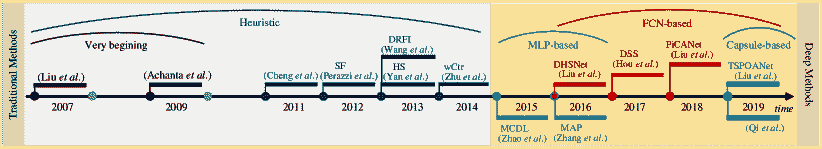
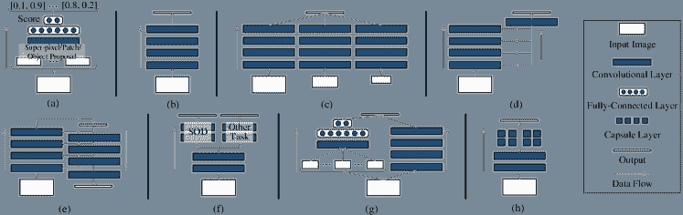
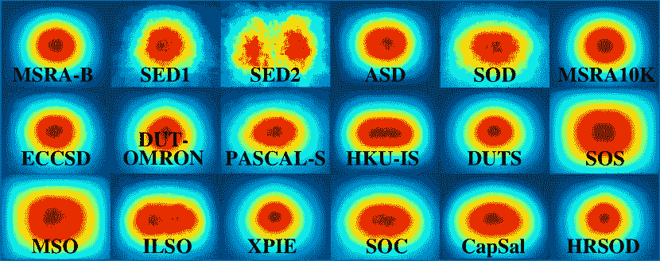
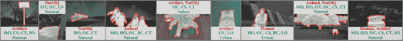
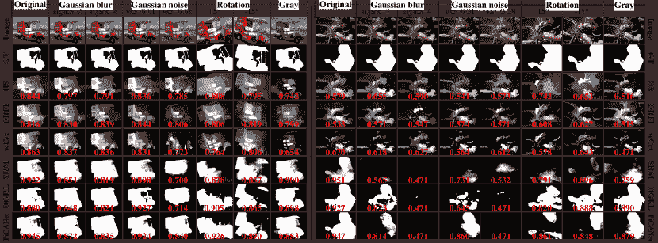
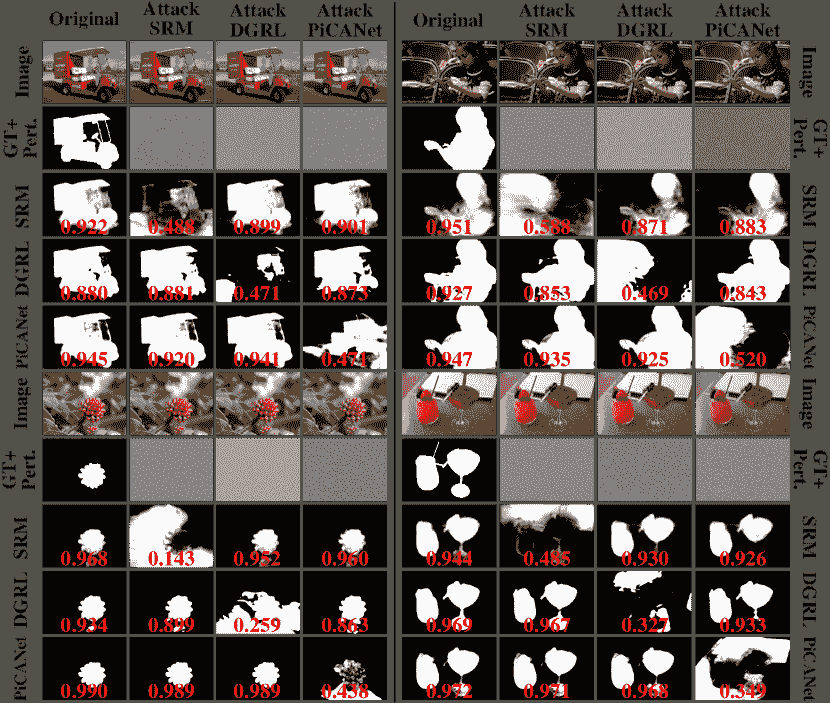
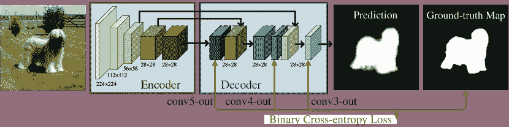
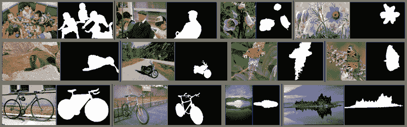

<!--yml

类别：未分类

日期：2024-09-06 20:06:26

-->

# [1904.09146] 深度学习时代的显著目标检测：深入调查

> 来源：[`ar5iv.labs.arxiv.org/html/1904.09146`](https://ar5iv.labs.arxiv.org/html/1904.09146)

# 显著目标检测

深度学习时代：深入调查

Wenguan Wang、Qiuxia Lai、Huazhu Fu、

Jianbing Shen、Haibin Ling 和 Ruigang Yang，W. Wang 与瑞士苏黎世联邦理工学院（ETH Zurich）有关。 （电子邮件：wenguanwang.ai@gmail.com） Q. Lai 与香港中文大学计算机科学与工程系有关。（电子邮件：qxlai@cse.cuhk.edu.hk） H. Fu 与阿联酋的 Inception 人工智能研究所有关。（电子邮件：hzfu@ieee.org） J. Shen 与北京理工大学计算机学院北京智能信息技术实验室有关。（电子邮件：shenjianbing@bit.edu.cn） H. Ling 与美国宾夕法尼亚州费城的天普大学计算机与信息科学系有关。（电子邮件：hbling@temple.edu） R. Yang 与肯塔基大学，肯塔基州列克星敦，邮政编码 40507 有关。（电子邮件：ryang@cs.uky.edu） 通讯作者：Jianbing Shen

###### 摘要

作为计算机视觉中的一个重要问题，显著目标检测（SOD）近年来吸引了越来越多的研究关注。近年来在 SOD 领域的进展主要由基于深度学习的解决方案（即深度 SOD）主导。为了深入了解深度 SOD，本文提供了一个全面的调查，涵盖了从算法分类到未解决问题的各个方面。特别是，我们首先从不同的角度回顾了深度 SOD 算法，包括网络架构、监督水平、学习范式以及对象/实例级检测。接下来，我们总结和分析了现有的 SOD 数据集和评估指标。然后，我们对一组具有代表性的 SOD 模型进行了基准测试，并提供了比较结果的详细分析。此外，我们通过构建一个包含各种显著目标类型、挑战因素和场景类别的丰富属性注释的创新 SOD 数据集，研究了 SOD 算法在不同属性设置下的性能，这是之前没有深入探索过的。我们首次在该领域分析了 SOD 模型对随机输入扰动和对抗攻击的鲁棒性。我们还探讨了现有 SOD 数据集的泛化能力和难度。最后，我们讨论了 SOD 的若干开放问题，并概述了未来的研究方向。所有的显著性预测图、我们构建的带注释的数据集以及评估代码都可以在[`github.com/wenguanwang/SODsurvey`](https://github.com/wenguanwang/SODsurvey)上公开获取。

###### 索引词：

显著目标检测、深度学习、基准、图像显著性。

## 1 引言

突出物体检测（SOD）的目标是突出图像中视觉显著的物体区域。在这里，“视觉显著”描述了一个物体或区域吸引人类观察者注意的属性。SOD 驱动并应用于各种领域中的广泛物体级应用。在计算机视觉中，代表性的应用包括图像理解 [1, 2]、图像描述 [3, 4, 5]、物体检测 [6, 7]、无监督视频物体分割 [8, 9]、语义分割 [10, 11, 12]、人物再识别 [13, 14] 和视频总结 [15, 16]。在计算机图形学中，SOD 也在各种任务中发挥着重要作用，包括非现实渲染 [17, 18]、图像裁剪 [19, 20]、图像重定向 [21]、*等等*。在机器人领域，如人机交互 [22, 23] 和物体发现 [24, 25]，SOD 也为更好的场景/物体理解提供了帮助。

尽管受到了眼动预测（FP）[26] 的启发，该方法源于认知和心理学研究界，通过预测视觉场景中的眼动位置来研究人类注意机制，但 SOD 的不同之处在于它旨在检测整个关注物体区域。自深度学习技术复兴以来，SOD 在近年来取得了显著的进展，这要归功于强大的表示学习方法。自 2015 年首次介绍以来 [27, 28, 29]，基于深度学习的 SOD（或 *深度 SOD*）算法迅速表现出优于传统解决方案的卓越性能，并持续推动了技术的最前沿。

本文提供了对深度学习时代 SOD 的全面而深入的调查。除了分类回顾现有的深度 SOD 方法外，还提供了对代表性数据集和评估指标的深入分析，并调查了重要但大多未被深入探索的问题，如深度 SOD 模型的鲁棒性和迁移性，它们在某些场景（*即*，场景/显著物体类别、挑战因素）下的优缺点，以及 SOD 数据集的一般性和难度。用于基准测试的显著性图、我们构建的数据集和评估代码可以在 [`github.com/wenguanwang/SODsurvey`](https://github.com/wenguanwang/SODsurvey) 找到。

<svg version="1.1" width="638.95" height="59.5" overflow="visible"><g transform="translate(0,59.5) scale(1,-1)"><g transform="translate(-668.33,69.19)"><g transform="translate(0,9.8242700982427) scale(1, -1)"><foreignobject width="53.964300539643" height="7.3336100733361" overflow="visible">[30]</foreignobject></g></g><g transform="translate(-567.32,69.19)"><g transform="translate(0,9.8242700982427) scale(1, -1)"><foreignobject width="113.32503113325" height="7.3336100733361" overflow="visible">[31]</foreignobject></g></g><g transform="translate(-467.69,69.19)"><g transform="translate(0,9.8242700982427) scale(1, -1)"><foreignobject width="89.1102808911028" height="7.3336100733361" overflow="visible">[32]</foreignobject></g></g><g transform="translate(-410.96,69.19)"><g transform="translate(0,9.8242700982427) scale(1, -1)"><foreignobject width="102.808911028089" height="7.3336100733361" overflow="visible">[33]</foreignobject></g></g><g transform="translate(-355.61,91.32)"><g transform="translate(0,9.8242700982427) scale(1, -1)"><foreignobject width="88.4184308841843" height="7.3336100733361" overflow="visible">[34]</foreignobject></g></g><g transform="translate(-361.15,68.49)"><g transform="translate(0,9.8242700982427) scale(1, -1)"><foreignobject width="103.639131036391" height="7.3336100733361" overflow="visible">[35]</foreignobject></g></g><g transform="translate(-309.95,68.49)"><g transform="translate(0,9.8242700982427) scale(1, -1)"><foreignobject width="87.7265808772658" height="7.3336100733361" overflow="visible">[36]</foreignobject></g></g><g transform="translate(-254.6,14.94)"><g transform="translate(0,9.8242700982427) scale(1, -1)"><foreignobject width="92.2927909229279" height="7.3336100733361" overflow="visible">[29]</foreignobject></g></g><g transform="translate(-208.94,14.94)"><g transform="translate(0,9.8242700982427) scale(1, -1)"><foreignobject width="123.841151238412" height="7.3336100733361" overflow="visible">[37]</foreignobject></g></g><g transform="translate(-204.23,71.4)"><g transform="translate(0,9.8242700982427) scale(1, -1)"><foreignobject width="78.5941607859416" height="7.3336100733361" overflow="visible">[38]</foreignobject></g></g><g transform="translate(-159.96,79.15)"><g transform="translate(0,9.8242700982427) scale(1, -1)"><foreignobject width="82.6068908260689" height="7.3336100733361" overflow="visible">[39]</foreignobject></g></g><g transform="translate(-105.71,88.56)"><g transform="translate(0,9.8242700982427) scale(1, -1)"><foreignobject width="81.2231908122319" height="7.3336100733361" overflow="visible">[40]</foreignobject></g></g><g transform="translate(-44.28,69.19)"><g transform="translate(0,9.8242700982427) scale(1, -1)"><foreignobject width="93.6764909367649" height="7.3336100733361" overflow="visible">[41]</foreignobject></g></g><g transform="translate(-85.24,14.94)"><g transform="translate(0,9.8242700982427) scale(1, -1)"><foreignobject width="70.0152207001522" height="7.3336100733361" overflow="visible">[42]</foreignobject></g></g></g></svg>

图 1：SOD 的简要年表。最早的 SOD 模型可以追溯到刘*等人* [30] 和 Achanta*等人* [31] 的工作。深度学习技术首次被应用到 SOD 模型中是在$2015$年。列出的这些方法都是里程碑，通常被高度引用。有关详细信息，请参见§1.1。

表 I：之前综述的总结。每项工作的出版信息和覆盖范围均提供。有关更详细的描述，请参见§1.2。

|  标题 | 年份 | 发表期刊 | 描述 |
| --- | --- | --- | --- |
| 视觉注意建模的最新进展 [43] | 2013 | TPAMI | 本文回顾了 2013 年前的视觉注意力（*即* 注视预测）模型。 |
| 突出物体检测：基准 [44] | 2015 | TIP | 本文对 29 种启发式 SOD 模型和 10 种 FP 方法在 7 个数据集上的表现进行了基准测试。 |
| 专注系统：综述 [45] | 2017 | IJCV | 本文回顾了利用视觉显著性线索的应用。 |

|

&#124; 共显著性检测算法综述：&#124;

&#124; 基础、应用和挑战 [46] &#124;

| 2018 | TIST | 本文回顾了共显著性检测的基础、挑战和应用。 |
| --- | --- | --- |

|

&#124; 视觉显著性检测的综合回顾 &#124;

&#124; 信息[47] &#124;

| 2018 | TCSVT | 本文回顾了 RGB-D SOD、共显著性检测和视频 SOD。 |
| --- | --- | --- |

|

&#124; 高级深度学习技术用于显著性和 &#124;

&#124; 类别特定的物体检测：综述 [48] &#124;

| 2018 | SPM |
| --- | --- |

&#124; 本文回顾了物体检测的几个子方向，即物体性检测、SOD &#124;

&#124; 和类别特定的物体检测。 &#124;

|

|

&#124; 深度学习时代的显著性预测：成功案例 &#124;

&#124; 和局限性 [49] &#124;

| 2019 | TPAMI | 本文回顾了图像和视频注视预测模型，并分析了具体问题。 |
| --- | --- | --- |
| 突出物体检测：综述 [50] | 2019 | CVM |

&#124; 本文回顾了截至 2017 年的 65 种启发式和 21 种深度 SOD 模型，并讨论了密切相关的 &#124;

&#124; 如物体检测、注视预测、分割等。 &#124;

|

### 1.1 历史与范围

人类能够迅速将注意力分配到视觉场景中的重要区域。理解和建模这种令人惊叹的能力，即视觉注意力或视觉显著性，是心理学、神经生物学、认知科学和计算机视觉中的一个基础研究问题。视觉显著性的计算模型分为两类，即 FP 和 SOD。FP 起源于认知和心理学领域[26, 51, 52]，旨在预测人们在图像中查看的地方。

SOD 的历史相对较短，可追溯至[30]和[31]。SOD 的兴起受到各种对象级计算机视觉应用的推动。与仅预测稀疏眼动位置的 FP 模型不同，SOD 模型旨在检测视觉吸引力对象的整个实体及其精确边界。大多数传统的非深度 SOD 模型[53, 36]依赖于低级特征和某些启发式方法（*例如*，*颜色对比*[32]，*背景先验*[54]）。为了获得均匀高亮的显著对象和清晰的对象边界，通常会将过度分割过程（生成区域[55]、超像素[56, 57]或对象提议[58]）集成到这些模型中。有关更全面的概述，请参见[44]。

随着深度学习技术在计算机视觉中的巨大成功，越来越多的深度 SOD 方法自 $2015$ 年起开始涌现。早期的深度 SOD 模型利用多层感知器（MLP）分类器来预测从每个图像处理单元中提取的深度特征的显著性分数[29, 28, 27]。随后，一种更有效的形式，即基于全卷积网络（FCN）的模型，成为了主流 SOD 架构。一些最近的方法[42, 41]还将 Capsule[59] 引入 SOD，以全面解决对象属性建模。SOD 的简要年表见图 1。

调查的范围。尽管历史较短，深度显著目标检测的研究已经产生了数百篇论文，因此回顾所有论文是不切实际的（幸运的是不必要的）。我们综合选择了在权威期刊和会议上发表的有影响力的论文。本调查主要关注过去五年的重大进展，但为了完整性和更好的可读性，也包含了一些早期相关工作。由于空间和知识限制，对未能纳入本文的作者表示歉意。值得注意的是，我们将本调查限制在单图像显著目标检测方法上，将 RGB-D 显著目标检测、共同显著性检测、视频显著目标检测等作为单独主题。

### 1.2 相关的先前综述和调查

表 I 列出了与我们工作相关的现有调查。在这些调查中，Borji *et al* [44] 回顾了 2015 年前的显著目标检测方法，因此未涉及近期基于深度学习的解决方案。Zhang *et al* [46] 回顾了共同显著性检测的方法，即从多个相关图像中检测共同的显著目标。Cong *et al* [47] 回顾了几种扩展的显著目标检测任务，包括 RGB-D 显著目标检测、共同显著性检测和视频显著目标检测。Han *et al* [48] 探讨了目标检测的几个子方向，并概述了在目标性检测、显著目标检测和类别特定目标检测方面的最新进展。Borji *et al* 总结了 FP 的启发式 [43] 和深度模型 [49]。Nguyen *et al* [45] 侧重于分类视觉显著性（包括显著目标检测和 FP）在不同领域的应用。最后，一项最近发表的调查 [50] 涵盖了直到 2017 年的传统非深度显著目标检测方法和深度方法，并讨论了它们与其他几个密切相关的研究领域，如专用目标检测和分割的关系。

表 II：深度显著目标检测方法的分类和代表性出版物。有关更详细的描述，请参见§2。

|       分类 | 出版物 |
| --- | --- |
| 网络架构 (§2.1) | 多层感知器 | 1) 超像素/补丁基础 | [29], [60], [27], [61] |
| (MLP) 基于 | 2) 基于目标提议 | [28], [37], [62] |
| 基于全卷积网络 (FCN) 的 | 1) 单流 | [63], [64], [65], [66], [67], [68], [69] |
| 2) 多流 | [70], [71], [72], [73], [74] |
| 3) 侧融合 | [39], [75], [76], [77], [78], [79], [80], [81], [82] |
| 4) 自下而上/自上而下 | [38], [83], [84], [85], [86], [87], [40], [88], [89], [90], [91], [92], [93], [94], [95] |
| 5) 分支 | [96], [97], [98], [99], [100], [101], [102], [103] |
| 混合网络基础 |  | [104], [105] |
| 胶囊基础 |  | [41], [42] |
| 监督水平 (§2.2) | 全监督 |  | 其他 |
| 无监督/弱监督 | 1) 类别级 | [97], [68], [69], [81] |
| 2) 伪像素级 | [83], [98], [67], [99] |
| 学习范式 (§2.3) | 单任务学习 (STL) |  | 其他 |
| 混合任务学习 (MTL) | 1) 显著性目标计数 | [37], [77], [79] |
| 2) 注视点预测 | [96], [87] |
| 3) 图像分类 | [97], [98] |
| 4) 语义分割 | [63], [103] |
| 5) 轮廓/边缘检测 | [75], [99], [89], [91], [92], [93], [101], [82], [102] |
| 6) 图像描述 | [100] |
| 对象/实例级 (§2.4) | 对象级 |  | 其他 |
| 实例级 |  | [37], [70] |

与以往关注早期非深度学习 SOD 方法[44]、其他相关领域[47、48、43、49]、实际应用[45]或有限数量的深度 SOD 模型[50]的 SOD 调查不同，本工作系统而全面地回顾了该领域的最新进展。它对各种方面进行了深入分析和讨论，其中许多方面据我们所知，在这一领域尚未被探索。特别是，我们在几个提出的分类体系下综合总结和讨论现有深度 SOD 方法（§2）；回顾数据集（§3") 和评估指标（§4") 的优缺点；通过基于属性的评估（§5.3") 提供对 SOD 模型的更深刻理解；讨论输入扰动的影响（§5.4")；分析深度 SOD 模型对对抗攻击的鲁棒性（§5.5")；研究现有 SOD 数据集的泛化能力和难度（§5.6")；并提供对重要开放问题、挑战和未来方向的见解（§6")。我们期望我们的综述能够提供新颖的见解和灵感，促进对深度 SOD 的理解，并推动对提出的开放问题的研究。

### 1.3 我们的贡献

我们在本文中的贡献总结如下：

1.  1.

    对各种深度显著性目标检测（SOD）模型进行系统性综述。我们根据网络架构、监督级别、学习范式、*等等*对现有的深度 SOD 模型进行分类和总结。所提出的分类体系旨在帮助研究人员更深入地理解深度 SOD 模型的关键特征。

1.  2.

    基于属性的 SOD 模型性能评估。我们编译了一个混合数据集，并提供了物体类别、场景类别和挑战因素的标注属性。通过对几个具有代表性的 SOD 模型进行评估，我们揭示了深度和非深度方法的优缺点，为未来的研究开辟了有希望的方向。

1.  3.

    SOD 模型对一般输入扰动的鲁棒性分析。为了研究 SOD 模型的鲁棒性，我们调查了各种扰动对深度和非深度 SOD 模型最终性能的影响。一些结果有些出乎意料。

1.  4.

    第一次已知的 SOD 模型对抗性攻击分析。我们进一步检验了 SOD 模型对有意设计的扰动，即对抗性攻击的鲁棒性。特别设计的攻击和评估可以作为进一步研究深度 SOD 模型鲁棒性和可迁移性的基线。

1.  5.

    跨数据集泛化研究。为了深入分析现有 SOD 数据集的泛化能力和难度，我们进行了一项跨数据集泛化研究，定量揭示了数据集的偏差。

1.  6.

    开放问题和未来方向概述。我们全面审视了几个关键问题（*即*，模型设计、数据集收集，*等*），阐明了未来研究的潜在方向。

这些贡献共同组成了一份详尽、最新和深入的综述，并与以往的综述论文有显著区别。

表 III：流行 SOD 方法的基本特征总结。这里，“#Training”是训练图像的数量，“CRF”表示预测是否经过条件随机场后处理 [106]。有关详细描述，请参见§2。

|   | Methods | Publ. | Architecture | Backbone |
| --- | --- | --- | --- | --- |

&#124; Level of &#124;

&#124; Supervision &#124;

|

&#124; Learning &#124;

&#124; Paradigm &#124;

|

&#124; Obj.-/Inst.- &#124;

&#124; Level SOD &#124;

| Training Dataset | #Training | CRF |
| --- | --- | --- |
| 2015 | SuperCNN [61] | IJCV | MLP+super-pixel | - | Fully-Sup. | STL | Object | ECSSD [55] | 800 |  |
| MCDL [29] | CVPR | MLP+super-pixel | GoogleNet | Fully-Sup. | STL | Object | MSRA10K [107] | 8,000 |  |
| LEGS [28] | CVPR | MLP+segment | - | Fully-Sup. | STL | Object | MSRA-B [30]+PASCAL-S [108] | 3,000+340 |  |
| MDF [27] | CVPR | MLP+segment | - | Fully-Sup. | STL | Object | MSRA-B [30] | 2,500 |  |
| 2016 | ELD [60] | CVPR | MLP+super-pixel | VGGNet | Fully-Sup. | STL | Object | MSRA10K [107] | $\sim$9,000 |  |
| DHSNet [38] | CVPR | FCN | VGGNet | 全监督 | STL | 物体 | MSRA10K [107]+DUT-OMRON [56] | 6,000+3,500 |  |
| DCL [104] | CVPR | FCN | VGGNet | 全监督 | STL | 物体 | MSRA-B [30] | 2,500 | ✓ |
| RACDNN [64] | CVPR | FCN | VGGNet | 全监督 | STL | 物体 | DUT-OMRON [56]+NJU2000 [109]+RGBD [110] | 10,565 |  |
| SU [96] | CVPR | FCN | VGGNet | 全监督 | MTL | 物体 | MSRA10K [107]+SALICON [111] | 10,000+15,000 | ✓ |
| MAP [37] | CVPR | MLP+obj. prop. | VGGNet | 全监督 | MTL | 实例 | SOS [112] | $\sim$5,500 |  |
| SSD [62] | ECCV | MLP+obj. prop. | AlexNet | 全监督 | STL | 物体 | MSRA-B [30] | 2,500 |  |
| CRPSD [105] | ECCV | FCN | VGGNet | 全监督 | STL | 物体 | MSRA10K [107] | 10,000 |  |
| RFCN [63] | ECCV | FCN | VGGNet | 全监督 | MTL | 物体 | PASCAL VOC 2010 [113]+MSRA10K [107] | 10,103+10,000 |  |
| 2017 | MSRNet [70] | CVPR | FCN | VGGNet | 全监督 | STL | 实例 | MSRA-B [30]+HKU-IS [27] (+ILSO [70]) | 2,500+2,500 (+500) | ✓ |
| DSS [39] | CVPR | FCN | VGGNet | 全监督 | STL | 物体 | MSRA-B [30]+HKU-IS [27] | 2,500 | ✓ |
| WSS [97] | CVPR | FCN | VGGNet | 弱监督 | MTL | 物体 | ImageNet [114] | 456k | ✓ |
| DLS [65] | CVPR | FCN | VGGNet | 全监督 | STL | 物体 | MSRA10K [107] | 10,000 |  |
| NLDF [75] | CVPR | FCN | VGGNet | 全监督 | MTL | 物体 | MSRA-B [30] | 2,500 | ✓ |
| DSOS [77] | ICCV | FCN | VGGNet | 全监督 | MTL | 物体 | SOS [112] | 6,900 |  |
| Amulet [76] | ICCV | FCN | VGGNet | 全监督 | STL | 物体 | MSRA10K [107] | 10,000 |  |
| FSN [72] | ICCV | FCN | VGGNet | 全监督 | STL | 物体 | MSRA10K [107] | 10,000 |  |
| SBF [83] | ICCV | FCN | VGGNet | 无监督 | STL | 物体 | MSRA10K [107] | 10,000 |  |
| SRM [71] | ICCV | FCN | ResNet | 全监督 | STL | 物体 | DUTS [97] | 10,553 |  |
| UCF [66] | ICCV | FCN | VGGNet | 全监督 | STL | 物体 | MSRA10K [107] | 10,000 |  |
| 2018 | RADF [78] | AAAI | FCN | VGGNet | 全监督 | STL | 物体 | MSRA10K [107] | 10,000 | ✓ |
| ASMO [98] | AAAI | FCN | ResNet101 | 弱监督 | MTL | 物体 | MS COCO [115]+MSRA-B [30]+HKU-IS [27] | 82,783+2,500+2,500 | ✓ |
| LICNN [68] | AAAI | FCN | VGGNet | 弱监督 | STL | 对象 | ImageNet [114] | 456k |  |
| BDMP [84] | CVPR | FCN | VGGNet | 完全监督 | STL | 对象 | DUTS [97] | 10,553 |  |
| DUS [67] | CVPR | FCN | ResNet101 | 非监督 | MTL | 对象 | MSRA-B [30] | 2,500 |  |
| DGRL [85] | CVPR | FCN | ResNet50 | 完全监督 | STL | 对象 | DUTS [97] | 10,553 |  |
| PAGR [86] | CVPR | FCN | VGGNet19 | 完全监督 | STL | 对象 | DUTS [97] | 10,553 |  |
| RSDNet [79] | CVPR | FCN | ResNet101 | 完全监督 | MTL | 对象 | PASCAL-S [108] | 425 |  |
| ASNet [87] | CVPR | FCN | VGGNet | 完全监督 | MTL | 对象 | SALICON [111]+MSRA10K [107]+DUT-OMRON [56] | 15,000+10,000+5,168 |  |
| PiCANet [40] | CVPR | FCN | VGGNet/ResNet50 | 完全监督 | STL | 对象 | DUTS [97] | 10,553 | ✓ |
| C2S-Net [99] | ECCV | FCN | VGGNet | 弱监督 | MTL | 对象 | MSRA10K [107]+Web | 10,000+20,000 |  |
|  | RAS [88] | ECCV | FCN | VGGNet | 完全监督 | STL | 对象 | MSRA-B [30] | 2,500 |  |
| 2019 | SuperVAE[69] | AAAI | FCN | 无 | 非监督 | STL | 对象 | 无 | 无 |  |
| DEF[74] | AAAI | FCN | ResNet101 | 完全监督 | STL | 对象 | DUTS [97] | 10,553 |  |
| AFNet[89] | CVPR | FCN | VGGNet16 | 完全监督 | MTL | 对象 | DUTS [97] | 10,553 |  |
| BASNet[90] | CVPR | FCN | ResNet-34 | 完全监督 | STL | 对象 | DUTS [97] | 10,553 |  |
| CapSal[100] | CVPR | FCN | ResNet101 | 完全监督 | MTL | 对象 | COCO-CapSal [100]/DUTS [97] | 5,265/10,553 |  |
| CPD-R[80] | CVPR | FCN | ResNet50 | 完全监督 | STL | 对象 | DUTS [97] | 10,553 |  |
| MLSLNet[91] | CVPR | FCN | VGG16 | 完全监督 | MTL | 对象 | DUTS [97] | 10,553 |  |
| ^†MWS[81] | CVPR | FCN | 无 | 弱监督 | STL | 对象 |

&#124; ImageNet DET [114]+MS COCO [115] &#124;

&#124; +ImageNet [116]+DUTS [97] &#124;

|

&#124; 456k+82,783 &#124;

&#124; +300,000+10,553 &#124;

|  |
| --- |
| PAGE-Net[92] | CVPR | FCN | VGGNet16 | 完全监督 | MTL | 对象 | MSRA10K [107] | 10,000 | ✓ |
| PS[94] | CVPR | FCN | ResNet50 | 完全监督 | STL | 对象 | MSRA10K [107] | 10,000 | ✓ |
| PoolNet[93] | CVPR | FCN | ResNet50 | 完全监督 | STL/MTL | 对象 | DUTS [97] | 10,553 |  |
| BANet[101] | ICCV | FCN | ResNet50 | 完全监督 | MTL | 对象 | DUTS [97] | 10,553 |  |
| EGNet[82] | ICCV | FCN | VGGNet/ResNet | 完全监督 | MTL | 目标 | DUTS [97] | 10,553 |  |
| HRSOD[73] | ICCV | FCN | VGGNet | 完全监督 | STL | 目标 | DUTS [97]/HRSOD [73]+DUTS [97] | 10,553/12,163 |  |
| JDFPR[95] | ICCV | FCN | VGG | 完全监督 | STL | 目标 | MSRA-B [30] | 2,500 | ✓ |
| SCRN[102] | ICCV | FCN | ResNet50 | 完全监督 | MTL | 目标 | DUTS [97] | 10,553 |  |
| SSNet[103] | ICCV | FCN | Desenet169 | 完全监督 | MTL | 目标 | PASCAL VOC 2012 [113]+DUTS [97] | 1,464+10,553 | ✓ |
| TSPOANet[41] | ICCV | Capsule | FLNet | 完全监督 | STL | 目标 | DUTS [97] | 10,553 |  |

论文的其余部分组织如下。§2 解释了提出的分类法，每种分类法都配有一两个最具代表性的模型。§3 考察了最重要的显著性目标检测数据集，而 §4 描述了几种广泛使用的显著性目标检测指标。§5 对几种深度显著性目标检测模型进行了基准测试，并提供了深入分析。§6 提供了进一步的讨论，提出了领域中的开放问题和未来的研究方向。最后，§7 总结了论文。

## 2 基于深度学习的显著性目标检测模型

在详细回顾最近的深度 SOD 模型之前，我们首先提供图像基础 SOD 问题的通用表述。给定一个大小为 $W\!\times\!H$ 的输入图像 $\bm{I}\!\in\!\mathbb{R}^{W\!\times\!H\!\times\!3\!}$，一个 SOD 模型 $f$ 将输入图像 $\bm{I}$ 映射到一个连续的显著性图 $\bm{S}\!=\!f(\bm{I})\!\in\![0,1]^{W\!\times\!H\!}$。对于基于学习的 SOD，模型 $f$ 是通过一组训练样本来学习的。给定一组静态图像 $\mathcal{I}\!\!=\!\!\{\bm{I}_{n\!}\!\in\!\mathbb{R}^{W\!\times\!H\!\times\!3}\}_{n}$ 和相应的二进制 SOD 真实掩码 $\mathcal{G}\!\!=\!\!\{\bm{G}_{n\!}\!\in\!\{0,1\}^{W\!\times\!H}\}_{n}$，学习的目标是找到 $f\!\in\!\mathcal{F}$，使得预测误差最小，即 $\sum_{n\!}\ell(\bm{S}_{n},\bm{G}_{n})$，其中 $\ell$ 是某种距离度量（*例如*，定义在 §4），$\bm{S}_{n\!}\!=_{\!}\!f(\bm{I}_{n})$，而 $\mathcal{F}$ 是潜在映射函数的集合。深度 SOD 方法通常通过现代深度学习技术来建模 $f$，这将在本节后续部分回顾。真实值 $\mathcal{G}$ 可以通过不同的方法收集，即直接人工标注或眼动引导标注，并且可能具有不同的格式，即像素级或边界框注释，这将在 §3 中讨论。

在表 II 中，我们根据四个分类对最近的深度 SOD 模型进行了分类，考虑了网络架构 (§2.1)、监督级别 (§2.2)、学习范式 (§2.3) 和是否在对象或实例级别工作 (§2.4)。接下来，每个类别将进行详细阐述，并通过一个或两个最具代表性的模型进行示例。表 III 总结了最近 SOD 模型的基本特征。

### 2.1 代表性网络架构用于 SOD

根据所采用的主要网络架构，我们将深度 SOD 模型分为四类，即基于 MLP 的（§2.1.1），基于 FCN 的（§2.1.2），基于混合网络的（§2.1.3）和基于胶囊的（§2.1.4）。

图 2：根据采用的网络架构对之前的深度 SOD 模型进行分类。(a) 基于 MLP 的方法。(b)-(f) 基于 FCN 的方法，主要使用(b) 单流网络，(c) 多流网络，(d) 侧向融合网络，(e) 自下而上/自上而下网络，和(f) 分支网络架构。(g) 基于混合网络的方法。(h) 基于胶囊的方法。有关更详细的描述，请参见§2.1。

#### 2.1.1 多层感知器（MLP）- 基于的方法

基于 MLP 的方法利用图像子单元（*即*，*超像素/补丁* [29, 61, 60] 和通用*目标提议* [28, 27, 37, 62])作为处理单元。它们将从子单元中提取的深度特征输入到 MLP 分类器中以预测显著性得分（图 2(a)）。

1) 超像素/基于补丁的方法使用规则（补丁）或近乎规则（超像素）的图像分解。作为规则分解的一个例子，MCDL [29] 使用两条路径从两个不同大小的超像素中心窗口中提取局部和全局上下文。全局和局部特征向量被送入一个 MLP 进行背景和显著性的分类。相比之下，SuperCNN [61] 为每个不规则的超像素构造两个手工设计的输入特征序列，并使用两个独立的 CNN 列从特征序列中分别生成显著性分数。规则的图像分解可以加快处理速度，因此该类别中的大多数方法基于规则分解。

2) 基于目标提议的方法利用目标提议 [28, 27] 或边界框 [37, 62] 作为基本处理单元，以更好地编码目标信息。例如，MAP [37] 使用 CNN 模型生成一组评分的边界框，然后选择一个优化的紧凑边界框子集作为显著目标。需要注意的是，这种方法通常由于缺乏目标边界信息而产生粗糙的显著性目标检测结果。

尽管基于 MLP 的显著性检测方法在性能上远超其非深度学习对手，但由于需要逐个处理所有视觉子单元，它们无法充分利用重要的空间信息，并且相当耗时。

#### 2.1.2 完全卷积网络（FCN）基方法

为了应对基于 MLP 的方法的局限性，近期的解决方案采用了 FCN 架构 [117]，实现了端到端的空间显著性表示学习和快速显著性预测，在单次前向传播过程中完成。基于 FCN 的方法目前在这一领域占据主导地位。典型架构可以进一步分类为：*单流*、*多流*、*侧面融合*、*自下而上/自上而下* 和 *分支网络*。

1) 单流网络是最标准的架构，拥有一系列卷积层，交替进行池化和非线性激活操作（见图 2(b)）。它以整张图像作为输入，直接输出一个像素级的概率图，突出显示显著目标。例如，UCF [66] 使用编码-解码网络架构进行更精细分辨率的显著性预测。它在编码器中结合了一种重新设计的丢弃法来学习不确定特征，并在解码器中采用混合上采样方案以避免棋盘状伪影。

2) 多流网络，如图 2(c)所示，通常由多个网络流组成，以显式地从多分辨率输入中学习多尺度显著性特征。多流输出被融合以形成最终预测。DCL [104]，作为早期对此方向的尝试之一，包含两个流，分别生成像素级和区域级的 SOD 估计。

3) 边融合网络将主干网络的多层响应融合在一起以进行 SOD 预测，利用 CNN 层次中固有多尺度表示的互补信息（图 2(d)）。边输出通常由真实值监督，形成深度监督策略 [118]。作为一个知名的基于边融合网络的 SOD 模型，DSS [39]${}_{\!}$ 添加${}_{\!}$ 从更深层边输出到较浅层的短连接。通过这种方式，高层特征帮助低层边输出更好地定位显著区域，低层特征则可以为更深层边输出提供更细致的细节。

4) 自下而上/自上而下网络通过逐步融合来自低层的空间细节丰富的特征，在前馈传递中细化粗略的显著性图，并在最上层生成最精细的显著性图（图 2(e)），这类似于用于语义分割的 U-Net [119]。该网络架构首次由 PiCANet [40]采用，层次嵌入全局和局部像素级注意力模块，以选择性地关注信息丰富的上下文。

5) 分支网络通常用于多任务学习，以便更稳健地建模显著性模式。它们具有单输入多输出结构，其中底层共享以处理公共输入，顶部层则专门用于不同任务（图 2(f)）。例如，C2S-Net [99]是通过将预训练的轮廓检测模型 [120] 添加到主 SOD 分支中构建的。然后，两个分支交替训练这两个任务，*即*，SOD 和轮廓检测。

#### 2.1.3 混合网络方法

一些其他模型结合了 MLP 和 FCN 基础子网，以在多尺度背景下产生边缘保持的结果（图 2(g)）。结合像素级和区域级显著性线索是一种有前途的策略，可以提高性能，尽管这会带来额外的计算成本。CRPSD [105]巩固了这一观点。它结合了像素级和区域级显著性。其中，像素级显著性是通过融合 FCN 的最后和倒数第二侧输出特征生成的，而区域级显著性是通过对图像区域应用现有 SOD 模型 [29]得到的。只有 FCN 和融合层是可训练的。

#### 2.1.4 胶囊网络方法

最近，Hinton *等人* [59] 提出了一个新的神经网络家族，称为*胶囊网络*。胶囊网络由一组神经元组成，这些神经元接受和输出向量，而不是 CNN 的标量值，从而允许实体属性得到全面建模。因此，一些研究人员受此启发，开始探索胶囊网络在 SOD 中的应用 [42, 41]（图 2(h)）。例如，TSPOANet [41] 强调了使用双流胶囊网络的部分对象关系。胶囊的输入特征是从 CNN 中提取的，并转换为低级胶囊。这些胶囊随后被分配到高级胶囊中，最后被识别为显著或背景。

### 2.2 监督级别

基于监督类型，深度 SOD 模型可以分为*完全监督*或*弱监督/无监督*两类。

#### 2.2.1 完全监督方法

大多数深度 SOD 模型都是使用大规模像素级人工标注进行训练的，这种标注方式既费时又昂贵。此外，在细致标注的数据集上训练的模型往往会过拟合，并且对真实图像的泛化能力较差 [67]。因此，使用较弱标注的 SOD 训练方法已成为一个越来越受欢迎的研究方向。

#### 2.2.2 弱监督/无监督方法

为了摆脱繁琐的人工标注，已经在 SOD 中探索了几种弱监督形式，包括*图像级类别*标签 [97, 68]，*对象轮廓* [99]，*图像标题* [81]和*伪真值*掩码，这些掩码是由非学习 SOD 方法生成的 [83, 67, 98]。

1) 类别级监督。研究表明，仅使用图像级标签训练的深度特征也能提供对象位置的信息[121, 122]，使其成为 SOD 训练中有前景的监督信号。WSS [97]作为一个典型例子，首先预训练一个双分支网络，其中一个分支用于基于 ImageNet [114]预测图像标签，另一个用于估计 SOD 图。估计的图通过 CRF 进行细化，并用于进一步微调 SOD 分支。

2) 伪像素级监督。尽管信息丰富，图像级标签仍然较弱。因此，一些研究人员使用传统的非学习 SOD 方法[83, 67, 98]或轮廓信息[99]，生成噪声较大但更细粒度的训练线索。例如，SBF [83]融合了一组先验启发式 SOD 模型[35, 123, 124]生成的弱显著图，在图像内部和图像之间生成监督信号。C2S-Net [99]使用 CEDN [120]生成的轮廓分支输出的像素级显著对象掩码训练 SOD 分支。轮廓分支和 SOD 分支交替更新，并逐渐输出更精细的 SOD 预测。

### 2.3 学习范式

从学习范式的角度来看，SOD 网络可以分为*单任务学习（STL）*和*多任务学习（MTL）*方法。

#### 2.3.1 单任务学习（STL）方法

在机器学习中，标准做法是一次学习一个任务[126]，*即*，STL。大多数深度 SOD 方法属于这种学习范畴，*即*，它们利用来自单一知识领域（SOD 或其他相关领域，如图像分类[68]）的监督进行训练。

#### 2.3.2 多任务学习（MTL）方法

受到人类学习过程的启发，MTL [126]旨在通过同时学习多个相关任务来提高这些任务的性能，从而利用相关任务中的额外知识来增强模型的泛化能力。另一个优势在于任务之间样本的共享，这缓解了训练大量参数模型时数据不足的问题。这些是基于 MTL 的 SOD 模型的核心动机，通常采用分支架构（见§2.1.2-Based Methods ‣ 2.1 Representative Network Architectures for SOD ‣ 2 Deep Learning based SOD Models ‣ Salient Object Detection in the Deep Learning Era: An In-depth Survey")）。

1) 突出物体的瞬时计数。人类迅速枚举少量物品的能力被称为瞬时计数 [127, 112]。受此启发，一些研究同时学习突出物体的瞬时计数和检测 [37, 77, 79]。RSDNet [79] 代表了这一方向的最新进展。它在一个统一框架中处理突出物体的检测、排序和瞬时计数。

2) 注视预测旨在预测视觉场景中的人眼注视位置。由于其与 SOD 的密切关系，从这两个任务中学习共享知识可以提高两者的性能。例如，ASNet [87] 从上层网络层提取注视信息作为对场景的高级理解。然后，在自上而下的指导下，逐步优化细粒度的物体级显著性。3) 图像分类。图像级标签对 SOD 非常有价值，因为它们提供了图像中主导物体的类别信息，这些物体很可能是显著区域 [97]。受此启发，一些 SOD 模型将图像分类作为辅助任务。例如，ASMO [98] 利用神经分类器的类激活图和先前非学习 SOD 方法的显著性图，以迭代的方式训练 SOD 网络。

4) 语义分割用于逐像素语义预测。虽然 SOD 是类无关的，但高层次的语义在显著性建模中发挥着至关重要的作用。因此，语义分割的任务也可以集成到 SOD 学习中。一个最近的 SOD 模型，SSNet [103]，是基于这一想法开发的。它使用显著性聚合模块预测每个类别的显著性分数。然后，使用分割网络生成所有类别的分割掩码。这些掩码最终根据相应的显著性分数进行聚合，生成 SOD 图。

表 IV: 流行 SOD 数据集的统计信息，包括图像数量、每张图像的显著物体数量、显著物体在图像中的面积比、注释类型、图像分辨率以及是否存在注视数据。有关更详细的描述，请参见§3。

|   | 数据集 | 年份 | 发表 | 图像数量 | 物体数量 | 物体面积(%) | SOD 注释 | 分辨率 | Fix. |
| --- | --- | --- | --- | --- | --- | --- | --- | --- | --- |
| 早期 | MSRA-A [30] | 2007 | CVPR | 1,000/20,840 | 1-2 | - | 边框物体级别 |                            - |  |  |
| MSRA-B [30] | 2007 | CVPR | 5,000 | 1-2 | 20.82[±10.29] | 边框物体级别, 像素级物体级别 | $\max(w,h)\!=\!400,$ | $\min(w,h)\!=\!126$ |  |
| SED1 [128] | 2007 | CVPR | 100 | 1 | 26.70[±14.26] | 像素级对象级 | $\max(w,h)\!=\!465,$ | $\min(w,h)\!=\!125$ |  |
| SED2 [128] | 2007 | CVPR | 100 | 2 | 21.42[±18.41] | 像素级对象级 | $\max(w,h)\!=\!300,$ | $\min(w,h)\!=\!144$ |  |
| ASD [31] | 2009 | CVPR | 1,000 | 1-2 | 19.89[±9.53] | 像素级对象级 | $\max(w,h)\!=\!400,$ | $\min(w,h)\!=\!142$ |  |
| Modern&Popular | SOD [129] | 2010 | CVPR-W | 300 | 1-4+ | 27.99[±19.36] | 像素级对象级 | $\max(w,h)\!=\!481,$ | $\min(w,h)\!=\!321$ |  |
| MSRA10K [107] | 2015 | TPAMI | 10,000 | 1-2 | 22.21[±10.09] | 像素级对象级 | $\max(w,h)\!=\!400,$ | $\min(w,h)\!=\!144$ |  |
| ECSSD [55] | 2015 | TPAMI | 1,000 | 1-4+ | 23.51[±14.02] | 像素级对象级 | $\max(w,h)\!=\!400,$ | $\min(w,h)\!=\!139$ |  |
| DUT-OMRON [56] | 2013 | CVPR | 5,168 | 1-4+ | 14.85[±12.15] | 像素级对象级 | $\max(w,h)\!=\!401,$ | $\min(w,h)\!=\!139$ | ✓ |
| PASCAL-S [108] | 2014 | CVPR | 850 | 1-4+ | 24.23[±16.70] | 像素级对象级 | $\max(w,h)\!=\!500,$ | $\min(w,h)\!=\!139$ | ✓ |
| HKU-IS [27] | 2015 | CVPR | 4,447 | 1-4+ | 19.13[±10.90] | 像素级对象级 | $\max(w,h)\!=\!500,$ | $\min(w,h)\!=\!100$ |  |
| DUTS [97] | 2017 | CVPR | 15,572 | 1-4+ | 23.17[±15.52] | 像素级对象级 | $\max(w,h)\!=\!500,$ | $\min(w,h)\!=\!100$ |  |
| Special | SOS [112] | 2015 | CVPR | 6,900 | 0-4+ | 41.22[±25.35] | 对象数量，边界框（训练集） | $\max(w,h)\!=\!6132,$ | $\min(w,h)\!=\!80~{}~{}$ |  |
| MSO [112] | 2015 | CVPR | 1,224 | 0-4+ | 39.51[±24.85] | 对象数量，边界框实例级 | $\max(w,h)\!=\!3888,$ | $\min(w,h)\!=\!120$ |  |
| ILSO [70] | 2017 | CVPR | 1,000 | 1-4+ | 24.89[±12.59] | 像素级实例级 | $\max(w,h)\!=\!400,$ | $\min(w,h)\!=\!142$ |  |
| XPIE [130] | 2017 | CVPR | 10,000 | 1-4+ | 19.42[±14.39] | 像素级对象级，地理信息 | $\max(w,h)\!=\!500,$ | $\min(w,h)\!=\!130$ | ✓ |
| SOC [131] | 2018 | ECCV | 6,000 | 0-4+ | 21.36[±16.88] | 像素级实例级，对象类别，属性 | $\max(w,h)\!=\!849,$ | $\min(w,h)\!=\!161$ |  |
| COCO-CapSal [100] | 2019 | CVPR | 6,724 | 1-4+ | 23.74[±17.00] | 像素级对象级，图像描述 | $\max(w,h)\!=\!640,$ | $\min(w,h)\!=\!480$ |  |
| HRSOD [73] | 2019 | ICCV | 2,010 | 1-4+ | 21.13[±15.14] | 像素级对象级 | $\max(w,h)\!=\!10240,$ | $\min(w,h)\!=\!600$ |  |

5) 轮廓/边缘检测是指在图像中检测明显的对象边界，这些边界对显著对象信息有帮助。因此，它也在 SOD 建模中进行了探讨。例如，PAGE-Net[92] 学习了一个边缘检测模块，并以自上而下的方式将边缘线索嵌入到主要 SOD 流中，从而实现了更好的边缘保留效果。

6) 图像描述可以提供有关视觉场景主要内容的额外知识，使 SOD 模型能够更好地捕捉高层次语义。这在 CapSal[100]中得到了探讨，它将来自描述网络的语义上下文与局部-全局视觉线索结合起来，以实现对显著对象检测的性能提升。

### 2.4 对象/实例级别 SOD

根据是否能够识别不同的显著对象实例，当前的深度 SOD 模型可以分为对象级别和实例级别方法。

#### 2.4.1 对象级别方法

大多数深度 SOD 模型是对象级别的方法，即旨在检测属于显著对象的像素，而不识别单个对象实例。

#### 2.4.2 实例级别方法

实例级别的 SOD 方法进一步识别检测到的显著区域中的单个对象实例，这对需要更精细区分的实际应用至关重要，例如语义分割[132]和多人体解析[133]。作为早期尝试，MSRNet[70]通过将其分解为三个子任务来执行显著实例检测，即像素级显著性预测、显著对象轮廓检测和显著实例识别。它通过整合输入图像多个不同尺度版本的深度特征来联合执行前两个子任务。最后一个子任务通过多尺度组合分组[125]来解决，从检测到的轮廓中生成显著对象提议，并过滤掉噪声或重叠的提议。

## 3 SOD 数据集

随着 SOD 的快速发展，已经引入了大量数据集。表 IV Based Methods ‣ 2.3 Learning Paradigm ‣ 2 Deep Learning based SOD Models ‣ Salient Object Detection in the Deep Learning Era: An In-depth Survey") 总结了 $19$ 个 SOD 数据集，这些数据集具有高度代表性，广泛用于训练或基准测试，或具有特定属性。

### 3.1 快速概览

为了便于理解 SOD 数据集，我们总结了本节的一些主要要点。

• 相比于早期的数据集[30, 128, 31]，近期的数据集[107, 56, 27, 97] 通常更为先进，中心偏差更小，复杂性提高，尺度增加。因此，它们更适合用于训练和评估，且更有可能具有更长的生命周期。

• 一些近期的数据集[112, 70, 130, 131, 100, 73]通过更多样的注释（*例如*，速识、标题生成）进行了丰富，代表了该领域的新趋势。

关于几个著名数据集的泛化能力和难度的更多*深入*讨论将会在§5.6 中呈现。

### 3.2 早期 SOD 数据集

早期的 SOD 数据集通常包含简单场景，其中 1-2 个显著对象从清晰的背景中突显出来。

• MSRA-A[30]包含 20,840 张图像。每张图像中只有一个显著且引人注目的对象，通过边框框注释。作为 MSRA-A 的一个子集，MSRA-B 有 5,000 张图像，对显著对象的模糊度较低。

• SED[128]¹¹1[`www.wisdom.weizmann.ac.il/~vision/Seg_Evaluation_DB`](http://www.wisdom.weizmann.ac.il/~vision/Seg_Evaluation_DB)包含单对象子集和双对象子集；每个子集有 100 张带有掩码注释的图像。

• ASD[31]²²2[`ivrlwww.epfl.ch/supplementary_material/RK_CVPR09/`](https://ivrlwww.epfl.ch/supplementary_material/RK_CVPR09/)，也是 MSRA-A 的一个子集，有 1,000 张图像，具备逐像素的真实标注。

### 3.3 流行的现代 SOD 数据集

近期的 SOD 数据集趋向于包含更多具有挑战性和一般性场景，背景相对复杂且有多个显著对象。所有这些都有逐像素注释。

• SOD[129]³³3[`elderlab.yorku.ca/SOD/`](http://elderlab.yorku.ca/SOD/)包含 300 张图像，构建自[134]。许多图像中有多个显著对象，与背景相似或触及图像边界。

• MSRA10K[107]⁴⁴4[`mmcheng.net/zh/msra10k/`](https://mmcheng.net/zh/msra10k/)，也称为 THUS10K，包含从 MSRA-A 中选出的 10,000 张图像，并覆盖 ASD 中的所有图像。由于其规模庞大，MSRA10K 被广泛用于训练深度 SOD 模型（见表 III）。

• ECSSD[55]⁵⁵5[`www.cse.cuhk.edu.hk/leojia/projects/hsaliency`](http://www.cse.cuhk.edu.hk/leojia/projects/hsaliency)由 1,000 张图像组成，具有语义上有意义但结构复杂的自然内容。

• DUT-OMRON[56]⁶⁶6[`saliencydetection.net/dut-omron/`](http://saliencydetection.net/dut-omron/)有 5,168 张图像，背景复杂，内容多样，具有逐像素注释。

• PASCAL-S [108]⁷⁷7[`cbi.gatech.edu/salobj/`](http://cbi.gatech.edu/salobj/) 包括从 PASCAL VOC2010 验证集 [113] 中挑选的 850 张具有挑战性的图像。提供了眼动记录、非二值显著性目标掩码注释。请注意，像素的显著性值计算为选择包含该像素的区域作为显著目标的受试者比例。

• HKU-IS [27]⁸⁸8[`i.cs.hku.hk/~gbli/deep_saliency.html`](https://i.cs.hku.hk/~gbli/deep_saliency.html) 包含 $4,447$ 个复杂场景，这些场景通常包含多个空间分布不同且背景/前景相似的断裂目标。

• DUTS [97]⁹⁹9[`saliencydetection.net/duts/`](http://saliencydetection.net/duts/) 是一个大规模数据集，其中 $10,553$ 张训练图像来自 ImageNet 的 train/val 集 [114]，$5,019$ 张测试图像来自 ImageNet 测试集和 SUN [135]。自 2017 年以来，显著性目标检测模型通常在 DUTS 上进行训练（表 III）。

### 3.4 其他特殊的显著性目标检测数据集

除了上述“标准”显著性目标检测数据集之外，还最近提出了一些特殊数据集，导致了新的研究方向。

• SOS [112]¹⁰¹⁰10[`cs-people.bu.edu/jmzhang/sos.html`](http://cs-people.bu.edu/jmzhang/sos.html) 为显著性目标检测中的瞬时计数 [127] 创建。它包含 6,900 张图像（训练集：5,520，测试集：1,380）。每张图像标注了包含 0、1、2、3 或 4+ 个显著性目标。

• MSO [112]¹¹¹¹11[`cs-people.bu.edu/jmzhang/sos.html`](http://cs-people.bu.edu/jmzhang/sos.html) 是 SOS-test [112] 的一个子集，涵盖 1,224 张图像。它在显著性目标数量上的分布更加均衡。每个目标都有一个边界框注释。

• ILSO [70]¹²¹²12[`www.sysu-hcp.net/instance-level-salient-object-segmentation/`](http://www.sysu-hcp.net/instance-level-salient-object-segmentation/) 包含 1,000 张具有精确实例级标注和粗略轮廓标记的图像。

• XPIE [130]¹³¹³13[`cvteam.net/projects/CVPR17-ELE/ELE.html`](http://cvteam.net/projects/CVPR17-ELE/ELE.html) 包含 10,000 张像素级标签的图像。它有三个子集：Set-P 包含 625 张具有地理信息的兴趣地点图像；Set-I 包含 8,799 张带有物体标签的图像；Set-E 包含 576 张眼动记录图像。

• SOC [131]¹⁴¹⁴14[`mmcheng.net/SOCBenchmark/`](http://mmcheng.net/SOCBenchmark/) 包含 6,000 张图像，覆盖 80 个常见类别。其中一半图像包含显著物体，而其余的则不含。每张包含显著物体的图像都有实例级真实掩码、物体类别和挑战因素的注释。非显著物体子集包含 783 张纹理图像和 2,217 张真实场景图像。

• COCO-CapSal [100]¹⁵¹⁵15[`github.com/yi94code/HRSOD`](https://github.com/yi94code/HRSOD) 基于 COCO [115] 和 SALICON [111] 构建。首先使用 SALICON 中的鼠标点击数据大致定位显著物体，然后根据 COCO 中的实例掩码进行精确注释。该数据集包括 5,265 张训练图像和 1,459 张测试图像。

• HRSOD [73]¹⁶¹⁶16[`github.com/zhangludl/code-and-dataset-for-CapSal`](https://github.com/zhangludl/code-and-dataset-for-CapSal) 是首个 *高分辨率* 的 SOD 数据集。它包含 1,610 张训练图像和 400 张测试图像，均从网站收集。提供了逐像素的真实值。

图 3：SOD 数据集的注释分布（详见 §3）。

### 3.5 讨论

如表 IV Based Methods ‣ 2.3 Learning Paradigm ‣ 2 Deep Learning based SOD Models ‣ Salient Object Detection in the Deep Learning Era: An In-depth Survey") 所示，早期的 SOD 数据集 [30、128、31] 由每幅图像中有 1-2 个显著对象的简单图像组成，仅提供粗略的边界框注释，这不足以进行可靠的评估 [31、136]。这些数据集上的表现已经趋于饱和。现代数据集 [107、55、56、27、97] 通常是大规模的，并提供精确的逐像素真值。场景更复杂和通用，通常包含多个显著对象。一些特殊数据集包含仅有背景的具有挑战性的场景 [112、131]，提供更细粒度的实例级 SOD 真值 [70、131] 或包括其他注释，如图像标题 [100]，启发了新的研究方向和应用。图 3 展示了 $18$ 个 SOD 数据集的注释分布。以下是一些重要结论：1）一些数据集 [30、31、107、97] 具有显著的中心偏差；2）数据集 [27、70、100] 显著对象的位置分布更为均衡；3）MSO [112] 的中心偏差较少，因为仅提供边界框注释。我们在 §5.6 中深入分析了几个著名 SOD 数据集的泛化能力和难度。

## 4 评估指标

本节回顾了流行的对象级 SOD 评估指标，即精准率-召回率（PR）、F-measure [31]、均方绝对误差（MAE）[33]、加权 $F_{\beta}$ 指标（Fbw）[137]、结构度量（S-measure）[138] 和 增强对齐度量（E-measure）[139]。

### 4.1 快速概述

为了更好地理解不同指标的特征，提供了本节主要结论的快速概述如下。

• PR、F-measure、MAE 和 Fbw 处理逐像素的错误，而 S-measure 和 E-measure 考虑结构提示。

• 在像素级指标中，PR、F-measure 和 Fbw 未能考虑真正的负像素，而 MAE 可以弥补这一点。

• 在结构化指标中，S-measure 比 E-measure 更受青睐，因为 SOD 处理的是连续的显著性估计。

• 考虑到流行性、优点和完整性，F-measure、S-measure 和 MAE 是最推荐的，因此用于我们的性能基准测试中（§5.2）。

### 4.2 指标详细信息

• PR 是基于二值化的显著物体掩膜和真实值计算的：

|  | $\small\text{Precision}=\frac{\text{TP}}{\text{TP}+\text{FP}},~{}~{}~{}~{}\text{Recall}=\frac{\text{TP}}{\text{TP}+\text{FN}},$ |  | (1) |
| --- | --- | --- | --- |

其中 TP、TN、FP、FN 分别表示真正例、真负例、假正例和假负例。使用一组阈值（[$0\!-\!255$]）来二值化预测。每个阈值产生一对精度/召回率值，用于形成 PR 曲线以描述模型性能。

• F-measure [31] 通过计算加权调和均值来全面考虑精度和召回率：

|  | $\small F_{\beta}=\frac{(1+\beta^{2})\text{Precision}\times\text{Recall}}{\beta^{2}\text{Precision}+\text{Recall}}.$ |  | (2) |
| --- | --- | --- | --- |

从经验上看，$\beta^{2}$ 设置为 $0.3$ [31] 以更加强调精度。除了绘制整个 F-measure 曲线外，一些方法仅报告*最大* $F_{\beta}$，或通过自适应阈值二值化预测显著性图，即显著性预测的均值的两倍，并报告*平均 F*。

• MAE [33] 测量标准化显著性预测图 $\bm{S}\!\in\![0,1]^{W\!\times\!H}$ 和二值真实掩膜 $\bm{G}\!\in\!\{0,1\}^{W\!\times\!H}$ 之间的平均像素级绝对误差：

|  | $\small\text{MAE}=\frac{1}{W\!\times\!H}\sum\nolimits_{i=1}^{W}\sum\nolimits_{j=1}^{H}\lvert\bm{G}(i,j)-\bm{S}(i,j)\rvert.$ |  | (3) |
| --- | --- | --- | --- |

表 V：$44$ 个最先进的深度 SOD 模型和 $3$ 个表现最佳的经典 SOD 方法在 $6$ 个著名数据集上的基准结果（§5.2）。这里的最大 F、S 和 M 分别表示*最大* $F_{\beta}$、S-measure 和 MAE。三种最佳得分分别用红色、蓝色和绿色标记。

|                                                                                                          数据集 | ECSSD [55] | DUT-OMRON [56] | PASCAL-S [108] | HKU-IS [27] | DUTS-test [97] | SOD [129] |
| --- | --- | --- | --- | --- | --- | --- |
| 度量 | max F$\uparrow$ |    S$\uparrow$ |    M$\downarrow$ | max F$\uparrow$ |    S$\uparrow$ |    M$\downarrow$ | max F$\uparrow$ |    S$\uparrow$ |    M$\downarrow$ | max F$\uparrow$ |    S$\uparrow$ |    M$\downarrow$ | max F$\uparrow$ |    S$\uparrow$ |    M$\downarrow$ | max F$\uparrow$ |    S$\uparrow$ |    M$\downarrow$ |
| 2013-14 | ^∗HS[35] | .673 | .685 | .228 | .561 | .633 | .227 | .569 | .624 | .262 | .652 | .674 | .215 | .504 | .601 | .243 | .756 | .711 | .222 |
| ^∗DRFI[53] | .751 | .732 | .170 | .623 | .696 | .150 | .639 | .658 | .207 | .745 | .740 | .145 | .600 | .676 | .155 | .658 | .619 | .228 |
| ^∗wCtr[36] | .684 | .714 | .165 | .541 | .653 | .171 | .599 | .656 | .196 | .695 | .729 | .138 | .522 | .639 | .176 | .615 | .638 | .213 |
| 2015 | MCDL[29] | .816 | .803 | .101 | .670 | .752 | .089 | .706 | .721 | .143 | .787 | .786 | .092 | .634 | .713 | .105 | .689 | .651 | .182 |
| LEGS[28] | .805 | .786 | .118 | .631 | .714 | .133 | $\ddagger$ | $\ddagger$ | $\ddagger$ | .736 | .742 | .119 | .612 | .696 | .137 | .685 | .658 | .197 |
| MDF[27] | .797 | .776 | .105 | .643 | .721 | .092 | .704 | .696 | .142 | .839 | .810 | .129 | .657 | .728 | .114 | .736 | .674 | .160 |
| 2016 | ELD[60] | .849 | .841 | .078 | .677 | .751 | .091 | .782 | .799 | .111 | .868 | .868 | .063 | .697 | .754 | .092 | .717 | .705 | .155 |
| DHSNet[38] | .893 | .884 | .060 | $\ddagger$ | $\ddagger$ | $\ddagger$ | .799 | .810 | .092 | .875 | .870 | .053 | .776 | .818 | .067 | .790 | .749 | .129 |
| DCL[104] | .882 | .868 | .075 | .699 | .771 | .086 | .787 | .796 | .113 | .885 | .877 | .055 | .742 | .796 | .149 | .786 | .747 | .195 |
| ^⋄MAP[37] | .556 | .611 | .213 | .448 | .598 | .159 | .521 | .593 | .207 | .552 | .624 | .182 | .453 | .583 | .181 | .509 | .557 | .236 |
| CRPSD[105] | .915 | .895 | .048 | - | - | - | .864 | .852 | .064 | .906 | .885 | .043 | - | - | - | - | - | - |
| RFCN[63] | .875 | .852 | .107 | .707 | .764 | .111 | .800 | .798 | .132 | .881 | .859 | .089 | .755 | .859 | .090 | .769 | .794 | .170 |
| 2017 | MSRNet[70] | .900 | .895 | .054 | .746 | .808 | .073 | .828 | .838 | .081 | $\ddagger$ | $\ddagger$ | $\ddagger$ | .804 | .839 | .061 | .802 | .779 | .113 |
| DSS[39] | .906 | .882 | .052 | .737 | .790 | .063 | .805 | .798 | .093 | $\ddagger$ | $\ddagger$ | $\ddagger$ | .796 | .824 | .057 | .805 | .751 | .122 |
| ^†WSS[97] | .879 | .811 | .104 | .725 | .730 | .110 | .804 | .744 | .139 | .878 | .822 | .079 | .878 | .822 | .079 | .807 | .675 | .170 |
| DLS[65] | .826 | .806 | .086 | .644 | .725 | .090 | .712 | .723 | .130 | .807 | .799 | .069 | - | - | - | - | - | - |
| NLDF[75] | .889 | .875 | .063 | .699 | .770 | .080 | .795 | .805 | .098 | .888 | .879 | .048 | .777 | .816 | .065 | .808 | .889 | .125 |
| Amulet[76] | .905 | .894 | .059 | .715 | .780 | .098 | .805 | .818 | .100 | .887 | .886 | .051 | .750 | .804 | .085 | .773 | .757 | .142 |
| FSN[72] | .897 | .884 | .053 | .736 | .802 | .066 | .800 | .804 | .093 | .884 | .877 | .044 | .761 | .808 | .066 | .781 | .755 | .127 |
| SBF[83] | .833 | .832 | .091 | .649 | .748 | .110 | .726 | .758 | .133 | .821 | .829 | .078 | .657 | .743 | .109 | .740 | .708 | .159 |
| SRM[71] | .905 | .895 | .054 | .725 | .798 | .069 | .817 | .834 | .084 | .893 | .887 | .046 | .798 | .836 | .059 | .792 | .741 | .128 |
| UCF[66] | .890 | .883 | .069 | .698 | .760 | .120 | .787 | .805 | .115 | .874 | .875 | .062 | .742 | .782 | .112 | .763 | .753 | .165 |
| 2018 | RADF[78] | .911 | .894 | .049 | .761 | .817 | .055 | .800 | .802 | .097 | .902 | .888 | .039 | .792 | .826 | .061 | .804 | .757 | .126 |
| BDMP[84] | .917 | .911 | .045 | .734 | .809 | .064 | .830 | .845 | .074 | .910 | .907 | .039 | .827 | .862 | .049 | .806 | .786 | .108 |
| DGRL[85] | .916 | .906 | .043 | .741 | .810 | .063 | .830 | .839 | .074 | .902 | .897 | .037 | .805 | .842 | .050 | .802 | .771 | .105 |
| PAGR[86] | .904 | .889 | .061 | .707 | .775 | .071 | .814 | .822 | .089 | .897 | .887 | .048 | .817 | .838 | .056 | .761 | .716 | .147 |
| RSDNet[79] | .880 | .788 | .173 | .715 | .644 | .178 | $\ddagger$ | $\ddagger$ | $\ddagger$ | .871 | .787 | .156 | .798 | .720 | .161 | .790 | .668 | .226 |
| ASNet[87] | .925 | .915 | .047 | $\ddagger$ | $\ddagger$ | $\ddagger$ | .848 | .861 | .070 | .912 | .906 | .041 | .806 | .843 | .061 | .801 | .762 | .121 |
| PiCANet[40] | .929 | .916 | .035 | .767 | .825 | .054 | .838 | .846 | .064 | .913 | .905 | .031 | .840 | .863 | .040 | .814 | .776 | .096 |
| ^†C2S-Net[99] | .902 | .896 | .053 | .722 | .799 | .072 | .827 | .839 | .081 | .887 | .889 | .046 | .784 | .831 | .062 | .786 | .760 | .124 |
| RAS[88] | .908 | .893 | .056 | .753 | .814 | .062 | .800 | .799 | .101 | .901 | .887 | .045 | .807 | .839 | .059 | .810 | .764 | .124 |
| 2019 | AFNet[89] | .924 | .913 | .042 | .759 | .826 | .057 | .844 | .849 | .070 | .910 | .905 | .036 | .838 | .867 | .046 | .809 | .774 | .111 |
| BASNet[90] | .931 | .916 | .037 | .779 | .836 | .057 | .835 | .838 | .076 | .919 | .909 | .032 | .838 | .866 | .048 | .805 | .769 | .114 |
| CapSal[100] | .813 | .826 | .077 | .535 | .674 | .101 | .827 | .837 | .073 | .842 | .851 | .057 | .772 | .818 | .061 | .669 | .694 | .148 |
| CPD[80] | .926 | .918 | .037 | .753 | .825 | .056 | .833 | .848 | .071 | .911 | .905 | .034 | .840 | .869 | .043 | .814 | .767 | .112 |
| MLSLNet[91] | .917 | .911 | .045 | .734 | .809 | .064 | .835 | .844 | .074 | .910 | .907 | .039 | .828 | .862 | .049 | .806 | .786 | .108 |
| ^†MWS[81] | .859 | .827 | .099 | .676 | .756 | .108 | .753 | .768 | .134 | .835 | .818 | .086 | .720 | .759 | .092 | .772 | .700 | .170 |
| PAGE-Net[92] | .926 | .910 | .037 | .760 | .819 | .059 | .829 | .835 | .073 | .910 | .901 | .031 | .816 | .848 | .048 | .795 | .763 | .108 |
| PS[94] | .930 | .918 | .041 | .789 | .837 | .061 | .837 | .850 | .071 | .913 | .907 | .038 | .835 | .865 | .048 | .824 | .800 | .103 |
| PoolNet[93] | .937 | .926 | .035 | .762 | .831 | .054 | .858 | .865 | .065 | .923 | .919 | .030 | .865 | .886 | .037 | .831 | .788 | .106 |
| BANet-R[101] | .939 | .924 | .035 | .782 | .832 | .059 | .847 | .852 | .070 | .923 | .913 | .032 | .858 | .879 | .040 | .842 | .791 | .106 |
| EGNet-R[82] | .936 | .925 | .037 | .777 | .841 | .053 | .841 | .852 | .074 | .924 | .918 | .031 | .866 | .887 | .039 | .854 | .802 | .099 |
| HRSOD-DH[73] | .911 | .888 | .052 | .692 | .762 | .065 | .810 | .817 | .079 | .890 | .877 | .042 | .800 | .824 | .050 | .735 | .705 | .139 |
| JDFPR[95] | .915 | .907 | .049 | .755 | .821 | .057 | .827 | .841 | .082 | .905 | .903 | .039 | .792 | .836 | .059 | .792 | .763 | .123 |
| SCRN[102] | .937 | .927 | .037 | .772 | .836 | .056 | .856 | .869 | .063 | .921 | .916 | .034 | .864 | .885 | .040 | .826 | .787 | .107 |
| SSNet[103] | .889 | .867 | .046 | .708 | .773 | .056 | .793 | .807 | .072 | .876 | .854 | .041 | .769 | .784 | .049 | .713 | .700 | .118 |
| TSPOANet[41] | .919 | .907 | .047 | .749 | .818 | .061 | .830 | .842 | .078 | .909 | .902 | .039 | .828 | .860 | .049 | .810 | .772 | .118 |

+   ^∗ 非深度学习模型。 ^† 弱监督模型。 ^⋄ 边界框输出。 $\ddagger$ 在子集上训练。 - 结果不可用。

• Fbw [137] 通过交替计算精度和召回率的方式直观地推广了 F-measure。它将四个基本量 TP、TN、FP 和 FN 扩展为实际值，并对不同位置的不同错误分配不同的权重 ($\omega$)，考虑了邻域信息：

|  | $\small F_{\beta}^{\omega}=\frac{(1+\beta^{2})\text{Precision}^{\omega}\times\text{Recall}^{\omega}}{\beta^{2}\text{Precision}^{\omega}+\text{Recall}^{\omega}}.$ |  | (4) |
| --- | --- | --- | --- |

• S-measure [138] 评估实际值显著图与二值真值之间的结构相似性。它考虑了对象感知 ($S_{o}$) 和区域感知 ($S_{r}$) 的结构相似性：

|  | $\small S=\alpha\times S_{o}+(1-\alpha)\times S_{r},$ |  | (5) |
| --- | --- | --- | --- |

其中 $\alpha$ 的值经验上设置为 $0.5$。

• E-measure [139] 同时考虑了图像的全局均值和局部像素匹配：

|  | $\small Q_{\bm{S}}=\frac{1}{W\!\times\!H}\sum\nolimits_{i=1}^{W}\sum\nolimits_{j=1}^{H}\phi_{\bm{S}}(i,j),$ |  | (6) |
| --- | --- | --- | --- |

其中 $\phi_{\bm{S}}$ 是增强的对齐矩阵，反映了 $\bm{S}$ 和 $\bm{G}$ 在分别减去其全局均值后的相关性。

### 4.3 讨论

这些测量通常基于逐像素误差，同时忽略了结构上的相似性，S-measure 和 E-measure 是唯一的例外。F-measure 和 E-measure 用于评估二值显著性预测图，而 PR、MAE、Fbw 和 S-measure 用于非二值图的评估。

在像素级指标中，PR 曲线是经典的。然而，精度和召回率不能完全评估显著性预测的质量，因为高精度预测可能仅突出显著物体的一部分，而高召回率的预测通常是无意义的，如果所有像素都被预测为显著的。一般来说，高召回率的响应可能以降低精度为代价，反之亦然。因此，F-measure 和 Fbw 被用来同时考虑精度和召回率。然而，基于重叠的指标（*即*，PR、F-measure 和 Fbw）并未考虑真正的负显著性分配，*即*，正确标记为非显著的像素。因此，这些指标偏向于成功将高显著性分配给显著像素的方法，但未能检测到非显著区域[50]。MAE 可以弥补这一点，但当显著物体较小时表现较差。对于结构/图像级指标，S-measure 比 E-measure 更受欢迎，因为 SOD 侧重于连续预测。

考虑到现有指标的流行程度和特点，以及评估的完整性，F-measure (*最大*${}_{\!}$ $F_{\beta}$)、S-measure 和 MAE 是我们的首选推荐。

图 4：来自混合基准的样本图像，这些图像随机选自$6$个 SOD 数据集。显著区域被均匀高亮。对应的属性被列出。有关更详细的描述，请参见§5.3。

## 5 基准测试和实证分析

本节提供了实证分析，以揭示该领域的一些关键挑战。具体而言，通过我们的规模化基准测试 (§5.2)，我们首先进行基于属性的研究，以更好地理解当前艺术的优点和局限 (§5.3)。然后，我们研究 SOD 模型对输入扰动的鲁棒性，*即*，随机施加的噪声 (§5.4)和人工设计的对抗样本 (§5.5)。最后，我们定量评估当前主流 SOD 数据集的泛化能力和难度 (§5.6)。

表 7: 针对突出对象类别、挑战和场景类别的基于属性的研究。$(\cdot)$表示具有特定属性的图像的百分比。ND-avg 表示三种启发式模型的平均分数：HS [35]，DRFI [53] 和 wCtr [36]。D-avg 表示三种深度学习模型的平均分数：DGRL [85]，PAGR [86] 和 PiCANet [40]。最佳的用红色标出，最差的用下划线标出。更多细节请见 §5.3。

|  指标 | 方法 | 突出对象类别 | 挑战 | 场景类别 |
| --- | --- | --- | --- | --- |
| 人类 | 动物 | 人工物品 | 自然物体 | $\mathcal{MO}$ | $\mathcal{HO}$ | $\mathcal{OV}$ | $\mathcal{OC}$ | $\mathcal{CS}$ | $\mathcal{BC}$ | $\mathcal{CT}$ | $\mathcal{SO}$ | $\mathcal{LO}$ | 室内 | 城市 | 自然 |
| (26.61) | (38.44) | (45.67) | (10.56) | (11.39) | (66.39) | (28.72) | (46.50) | (40.44) | (47.22) | (74.11) | (21.61) | (12.61) | (20.28) | (22.22) | (57.50) |
| 最大 F$\uparrow$ | ^∗HS[35] | .587 | .650 | .636 | .704 | .663 | .637 | .631 | .645 | .558 | .647 | .629 | .493 | .737 | .594 | .627 | .650 |
| ^∗DRFI[53] | .635 | .692 | .673 | .713 | .674 | .688 | .658 | .675 | .599 | .662 | .677 | .566 | .747 | .609 | .661 | .697 |
| ^∗wCtr[36] | .557 | .621 | .624 | .682 | .639 | .625 | .605 | .620 | .522 | .612 | .606 | .469 | .689 | .578 | .613 | .618 |
| DGRL[85] | .820 | .881 | .830 | .728 | .783 | .846 | .829 | .830 | .781 | .842 | .834 | .724 | .873 | .800 | .848 | .840 |
| PAGR[86] | .834 | .890 | .787 | .725 | .743 | .819 | .778 | .809 | .770 | .797 | .822 | .760 | .802 | .788 | .796 | .828 |
| PiCANet[40] | .840 | .897 | .846 | .669 | .791 | .861 | .843 | .845 | .797 | .848 | .850 | .763 | .889 | .806 | .862 | .859 |
| ^∗ND-avg | .593 | .654 | .644 | .700 | .659 | .650 | .631 | .647 | .560 | .640 | .637 | .509 | .724 | .594 | .634 | .655 |
| D-avg | .831 | .889 | .821 | .708 | .772 | .842 | .817 | .828 | .783 | .829 | .836 | .749 | .855 | .798 | .836 | .842 |

+   ^∗ 非深度学习模型。

### 5.1 快速概述

为了便于理解，我们在下面汇总了后续实验的重要观察结果和结论。

• 综合基准（§5.2）。如表 V 所示，深度 SOD 模型明显优于启发式模型，并且在某些数据集上[55, 27]的性能已经趋于饱和。[93, 101, 82, 102]是目前的最先进技术。

• 基于属性的分析（§5.3）。表中 7 的结果显示，深度方法在检测语义丰富的对象（如动物）方面表现出显著优势。深度和非深度方法都在处理小的显著目标时面临困难。在应用场景中，室内场景带来了很大的挑战，突显了未来努力的潜在方向。

• 对随机扰动的鲁棒性（§5.4）。如表 IX 所示，令人惊讶的是，深度方法对随机输入扰动比启发式方法更敏感。两类方法在旋转方面表现出较强的鲁棒性，而在高斯模糊和高斯噪声方面则较为脆弱。

• 对抗攻击 （§5.5）。表 X 表明，对抗攻击会导致深度 SOD 模型性能的剧烈下降，甚至比随机扰动更糟。然而，攻击在不同的 SOD 网络之间很少迁移。

• 数据集的泛化能力和难度 （§5.6）。表 XI 显示，DUTS-train [97] 是训练深度 SOD 模型的一个好选择，因为它具有最佳的泛化能力，而 SOC [131]、DUT-OMRON [56] 和 DUTS-test [97] 由于其难度更适合用于评估。

表 6：描述了在 SOD 中经常带来困难的属性（见 §5.3）。

|  Attr |                                           描述 |
| --- | --- |
| $\mathcal{MO}$ | 多重对象。存在两个以上的显著对象。 |
| $\mathcal{HO}$ | 异质对象。显著对象区域具有明显的 |
|  | 颜色或光照。 |
| $\mathcal{OV}$ | 超出视野。显著对象被图像部分裁剪 |
|  | 边界。 |
| $\mathcal{OC}$ | 遮挡。显著对象被其他对象遮挡。 |
| $\mathcal{CS}$ | 复杂场景。背景区域包含令人困惑的 |
|  | 对象或丰富细节。 |
| $\mathcal{BC}$ | 背景杂乱。前景和背景区域 |
|  | 显著对象边界周围具有相似的颜色（$\chi^{2}$ |
|  | RGB 直方图之间小于 $0.9$）。 |
| $\mathcal{CT}$ | 复杂拓扑。显著对象具有复杂的形状，*例如*， |
|  | 薄部分或孔洞。 |
| $\mathcal{SO}$ | 小对象。显著对象区域与图像的比例是 |
|  | 小于 $0.1$。 |
| $\mathcal{LO}$ | 大对象。显著对象区域与图像的比例是 |
|  | 大于 $0.5$。 |

### 5.2 性能基准测试

表格 V 展示了 $44$ 种最先进的深度 SOD 模型和三种顶尖经典方法（由 [44] 提出的）在六个最受欢迎的现代数据集上的表现。表现通过三种指标来衡量，*即*，*最大* $F_{\beta}$、S-measure 和 MAE，如 §4.3 所推荐。所有被基准测试的模型都是具有代表性的，并且都有公开的实现或显著性预测结果。对于性能基准测试，我们要么使用作者提供的显著性图，要么运行他们的官方代码。值得一提的是，对于一些方法，我们的基准测试结果与他们报告的分数不一致。原因有几个。首先，我们的社区长期缺乏一个公开的、普遍采用的评估工具，同时有许多实现因素会影响评估分数，如输入图像分辨率、阈值步骤，*等等*。其次，一些方法 [66, 85, 76, 100, 69, 74] 使用 *平均* F-measure 而不是 *最大* F-measure 进行性能评估。第三，对于一些方法 [76, 39]，最终发布的显著性图的评估分数与论文中报告的分数不一致。我们希望我们的性能基准测试、公开发布的评估工具和 SOD 图能帮助我们的社区建立一个开放和标准化的评估系统，并确保不同方产生的结果和结论的一致性和程序正确性。

不出所料，数据驱动模型由于其在视觉显著模式建模方面的强大学习能力，远远超越了传统的启发式模型。此外，自 2015 年以来，性能逐渐提高，充分展示了深度学习技术的进步。然而，2018 年后，改进的速度开始下降，这呼唤更有效的模型设计和新的机器学习技术。我们还发现，性能在较老的 SOD 数据集如 ECSSD [55] 和 HKU-IS [27] 上趋于饱和。因此，在 $44$ 个著名的深度 SOD 模型中，我们提名 PoolNet [93]、BANet [101]、EGNet [82] 和 SCRN [102] 作为四种最先进的方法，它们在各种数据集上 consistently 显示出良好的性能。

### 5.3 基于属性的研究

尽管社区已经见证了深度 SOD 模型的重大进展，但这些模型在具体方面的表现仍不清楚。由于影响 SOD 算法性能的因素众多，如对象/场景类别、遮挡，*等*，评估不同场景下的性能至关重要。这有助于揭示深度 SOD 模型的优缺点，识别待解决的挑战，并突出未来研究方向，以实现更强大的算法。

#### 5.3.1 带有属性注释的混合基准数据集

表 VIII：基于 F-measure 的前 100 张图像和后 100 张图像的属性统计。 $(\cdot)$ 表示具有特定属性的图像百分比。 ND-avg 表示三个启发式模型的平均结果：HS [35]，DRFI [53] 和 wCtr [36]。 D-avg 表示三个深度模型的平均结果：DGRL [85]，PAGR [86] 和 PiCANet [40]。如果正值则用红色标出最大变化，如果负值则用蓝色标出。更多细节请参见 §5.3。

| 方法 | 案例 | 显著对象类别 | 挑战 | 场景类别 |
| --- | --- | --- | --- | --- |
| 人类 | 动物 | 人工制品 | 自然物 | $\mathcal{MO}$ | $\mathcal{HO}$ | $\mathcal{OV}$ | $\mathcal{OC}$ | $\mathcal{CS}$ | $\mathcal{BC}$ | $\mathcal{CT}$ | $\mathcal{SO}$ | $\mathcal{LO}$ | 室内 | 城市 | 自然 |
| (26.61) | (38.44) | (45.67) | (10.56) | (11.39) | (66.39) | (28.72) | (46.50) | (40.44) | (47.22) | (74.11) | (21.61) | (12.61) | (20.28) | (22.22) | (57.50) |
| ND-avg | 最佳 ($\%$) | 13.00 | 25.00 | 46.00 | 27.00 | 5.00 | 61.00 | 12.00 | 26.00 | 10.00 | 20.00 | 63.00 | 5.00 | 18.00 | 17.00 | 6.00 | 12.00 |
| 改变 | -13.61 | -13.44 | +0.33 | +14.44 | -6.39 | -5.39 | -16.72 | -20.50 | -30.44 | -27.22 | -11.11 | -16.61 | +5.39 | -3.28 | -16.22 | -45.50 |
| 最差 ($\%$) | 36.00 | 30.00 | 41.00 | 5.00 | 6.00 | 54.00 | 15.00 | 34.00 | 70.00 | 31.00 | 71.00 | 76.00 | 0.00 | 22.00 | 37.00 | 37.00 |
| 改变 | +9.39 | -8.44 | -4.67 | -5.56 | -5.39 | -12.39 | -13.72 | -12.50 | +29.56 | -16.22 | -3.11 | +54.39 | -12.61 | +1.72 | +14.78 | -20.50 |
| D-avg | 最佳 ($\%$) | 24.00 | 30.00 | 49.00 | 17.00 | 3.00 | 69.00 | 33.00 | 28.00 | 26.00 | 35.00 | 49.00 | 2.00 | 18.00 | 24.00 | 23.00 | 53.00 |
| 改变 | -2.61 | -8.44 | +3.33 | +6.44 | -8.39 | +2.61 | +4.28 | -18.50 | -14.44 | -12.22 | -25.11 | -19.61 | +5.39 | +3.72 | +0.78 | -4.50 |
| 最差 ($\%$) | 30.00 | 10.00 | 49.00 | 33.00 | 20.00 | 52.00 | 28.00 | 46.00 | 70.00 | 42.00 | 59.00 | 50.00 | 3.00 | 32.00 | 23.00 | 45.00 |
| 改变 | +3.39 | -28.44 | +3.33 | +22.44 | +8.61 | -14.39 | -0.72 | -0.50 | +29.56 | -5.22 | -15.11 | +28.39 | -9.61 | +11.72 | +0.78 | -12.50 |

为了更深入地分析和理解算法的性能，识别影响性能的关键因素和情况是至关重要的[140]。为此，我们构建了一个具有丰富属性注释的混合基准。它由从六个 SOD 数据集（每个数据集 300 张，共 1,800 张）中随机选择的图像组成，分别是 SOD [129]、ECSSD [55]、DUT-OMRON [56]、PASCAL-S [108]、HKU-IS [27]和 DUTS 测试集 [97]。受到[108]和[140]的启发，我们对每张图像进行了广泛的属性注释，涵盖了典型的对象类型、挑战性因素和多样的场景类别。具体来说，注释的显著对象被分为 Human、Animal、Artifact 和 NatObj（自然对象），其中 NatObj 包括水果、植物、山脉、冰山、湖泊等自然对象。挑战性因素描述了那些通常给 SOD 带来困难的具体情况，例如遮挡、背景杂乱和复杂的形状（见表 6）。图像场景包括 Indoor、Urban 和 Natural，其中最后两个指示不同的户外环境。值得一提的是，这些属性并非互斥的。一些带有属性注释的样本图像显示在图 4 中。请注意，这个基准也将在§5.4 和§5.5 中使用。

对于我们基于属性的分析中的基线，我们再次选择了三种表现最好的启发式模型，即 HS [35]、DRFI [53]和 wCtr [36]，以及三种近期著名的深度方法，即 DGRL [85]、PAGR [86]和 PiCANet [40]。这三种深度模型都在 DUTS-train [97]上进行了训练，并公开发布了实现代码。

#### 5.3.2 分析

在表 7 中，我们报告了基于特定属性的混合数据集子集的表现。为了提供更好的见解，在表 VIII 中，我们选择了最佳 100 个和最差 100 个模型预测的图像，并比较了这些图像与整个数据集的属性分布比例。以下是从这些实验中得出的一些重要观察结果。

• ‘简单’和‘困难’的物体类别。深度和非深度 SOD 模型对物体类别的看法不同（表 7）。对于深度方法（D-avg），NatObj 显然是最具挑战性的，这可能是由于其训练样本数量少且拓扑结构复杂。Animal 看起来是最简单的，这可以归因于其显著的语义特征。相比之下，传统方法（ND-avg）在处理 Human 时显得困难，暴露了它们在捕捉高级语义方面的局限性。我们惊讶地发现，深度模型在几乎所有物体类别上都显著优于非深度模型，除了 NatObj。这表明在某些场景中启发式假设的价值以及将人类先验知识嵌入当前深度学习方案的潜力。

• 最具挑战性和最不具挑战性的因素。表 7 显示，有趣的是，深度和非深度方法都能较好地处理$\mathcal{LO}$。此外，两种方法都面临$\mathcal{SO}$的困难，突出了未来努力的有希望方向。此外，我们发现$\mathcal{CS}$和$\mathcal{MO}$对深度模型具有挑战性，这表明当前的解决方案在确定不同物体的相对重要性方面仍显不足。

• 最难和最简单的场景。在面对不同场景时，深度和启发式方法表现相似（表 7）。对于这两种方法，Natural 是最简单的，这很合理，因为这些场景通常较为简单。此外，尽管两者都有许多物体，但 Indoor 比 Urban 更具挑战性，因为它常常遭遇高度不均匀的光照和更复杂的场景。我们的实验还表明，SOD 模型在实际，特别是复杂环境中的实用性仍然有限。

• 深度模型的额外优势。如表 7 所示，深度模型在语义丰富的对象（人类、动物和人工制品）上取得了显著改进，展现了语义建模的优势。这一点在对复杂对象形状（$\mathcal{HO}$、$\mathcal{OV}$、$\mathcal{OC}$、$\mathcal{CT}$）的良好表现中再次得到验证。深度模型还缩小了不同场景类别（室内与自然）之间的差距，表明其在各种背景下的鲁棒性得到了提升。

• 最佳和最差预测。如表 VIII 所示，除了从表 7 得出的类似结论外，还可以做出一些独特且有趣的观察。首先，对于深度方法而言，NatObj 跨越了大范围的挑战，包含了最简单和最困难的样本。因此，未来的工作应更多关注 NatObj 中的困难样本。此外，在考虑数据分布偏差后，$\mathcal{CS}$ 是深度模型面临的最具挑战性的因素。

图 5：在各种输入扰动下的显著性预测示例。最大 F 值以红色标出。详情请参见§5.4。

表 IX：混合基准上的输入扰动研究。ND-avg 表示三个启发式模型的平均分数：HS [35]、DRFI [53] 和 wCtr [36]。D-avg 表示三个深度学习模型的平均分数：SRM [71]、DGRL [85] 和 PiCANet [40]。最佳结果用红色标出，最差结果用下划线标出。详情请参见§5.4。

|  指标 | 方法 | 原始 |
| --- | --- | --- |

&#124; 高斯模糊 &#124;

&#124; ( $\sigma$= ) &#124;

|

&#124; 高斯噪声 &#124;

&#124; ( var= ) &#124;

| 旋转 | 灰色 |
| --- | --- |
|    $2$ | $4$ |  $0.01$ |  $0.08$ |   $15^{\circ}$ | $-15^{\circ}$ |
| max F$\uparrow$ | ^∗HS[35] | .600 | -.012 | -.096 | -.022 | -.057 | +.015 | +.009 | -.104 |
| ^∗DRFI[53] | .670 | -.040 | -.103 | -.035 | -.120 | -.009 | -.009 | -.086 |
| ^∗wCtr[36] | .611 | +.006 | -.000 | -.024 | -.136 | -.004 | -.003 | -.070 |
| SRM [71] | .817 | -.090 | -.229 | -.025 | -.297 | -.028 | -.029 | -.042 |
| DGRL [85] | .831 | -.088 | -.365 | -.050 | -.402 | -.031 | -.022 | -.026 |
| PiCANet [40] | .848 | -.048 | -.175 | -.014 | -.148 | -.005 | -.008 | -.039 |
| ^∗ND-avg | .627 | -.015 | -.066 | -.027 | -.104 | -.000 | -.001 | -.087 |
| D-avg | .832 | -.075 | -.256 | -.041 | -.282 | -.021 | -.020 | -.037 |

+   ^∗ 非深度学习模型。

### 5.4 一般输入扰动的鲁棒性

模型的鲁棒性在于其对抗腐蚀输入的稳定性。直观地说，鲁棒的 SOD 模型的输出应在内容相同的略微不同的图像上可重复。然而，最近出现的对抗性样本，即恶意构造的输入，可能会显著降低深度图像分类器的性能。目前的深度 SOD 模型可能面临类似的挑战。因此，在本节中，我们通过比较对随机扰动输入（如噪声或模糊图像）的输出，来考察 SOD 模型的鲁棒性。然后，在§5.5，我们将研究对手工设计的对抗性样本的鲁棒性。

研究的输入扰动包括高斯模糊、高斯噪声、旋转和灰度。对于模糊处理，我们使用$\sigma$为$2$或$4$的高斯模糊核。对于噪声，我们选择两个方差值，即$0.01$和$0.08$，以覆盖微小和中等幅度的情况。对于旋转，我们将图像分别旋转$+15^{\circ}$和$-15^{\circ}$，并裁剪出原始纵横比的最大框。灰度图像使用 Matlab 的 rgb2gray 函数生成。

如在§5.3 中所述，我们在实验中包含了三种流行的启发式模型 [35, 53, 36]和三种深度方法 [71, 85, 40]。表 IX 展示了结果。总体而言，与深度模型相比，启发式方法对输入扰动的敏感性较低。超像素的紧凑性和抽象性很可能解释了这一点。具体来说，启发式方法在旋转情况下很少受到影响，但在强高斯模糊、强高斯噪声和灰度情况下表现较差。深度方法在高斯模糊和强高斯噪声下受影响最大，这可能是由于对浅层特征的损害。深度方法在旋转方面相对鲁棒，揭示了池化操作带来的 DNN 的旋转不变性。有趣的是，我们进一步发现，在三种深度模型中，PiCANet [40]在对抗各种输入扰动（包括高斯模糊、高斯噪声和旋转）方面表现出色。我们将其归因于其有效的非局部操作。这揭示了有效的网络设计可以提高对随机扰动的鲁棒性。

### 5.5 针对手动设计输入扰动的鲁棒性

鉴于模型对随机扰动的鲁棒性存在重大关注，本节重点分析手动设计的对抗扰动。近年来，随着深度学习的进步，SOD 取得了重大进展。然而，深度 SOD 模型是否如其表现般强大仍值得深思。同时，之前发现 DNN 对对抗攻击敏感，其中视觉上不可察觉的扰动会导致完全不同的预测[141]。尽管在分类任务中被广泛研究，但 SOD 中的对抗攻击却很少被探讨。由于 SOD 已被集成到许多安全系统和商业项目中，SOD 模型也面临被攻击的潜在风险。具体而言，SOD 在许多安全系统中扮演着重要角色，用于从遥感图像[142]、视频监控数据[143]或自动驾驶车辆的传感器信号[144]中检测感兴趣的目标。在这种情况下，检查 SOD 模型的鲁棒性非常重要，因为 SOD 模块的不安全性可能导致严重损失，*例如*，罪犯可能利用不显眼的对抗扰动欺骗 SOD 模块，从而欺骗监控系统。此外，SOD 还使许多商业项目受益，如照片编辑[20]和图像/视频压缩[145]。黑客对嵌入式 SOD 模块发起的对抗攻击不可避免地会影响商业产品的功能，影响用户，给开发者和公司造成损失。因此，研究 SOD 模型的鲁棒性对于保护这些应用程序免受恶意攻击至关重要。在本节中，我们研究了对抗攻击的鲁棒性及针对不同 SOD 模型的对抗样本的可转移性。我们的观察预计将揭示 SOD 的对抗攻击和防御，为深入了解深度 SOD 模型的脆弱性提供帮助，并提高涉及实际应用的 SOD 的鲁棒性。

图 6：不同目标网络下对抗扰动的 SOD 预测示例。为了更好地可视化，扰动被放大了$10$倍。红色表示最大 F。有关详细信息，请参见§5.5。

#### 5.5.1 SOD 对抗攻击的鲁棒性

为了测量深度 SOD 模型的鲁棒性，我们采用并修改了一种针对语义分割的对抗攻击算法，*即*，密集对抗生成（DAG）[146]。我们选择了三种代表性的深度模型，*即*，SRM​[71]、DGRL​[85]和 PiCANet​[40]进行研究。实验在§5.3 中引入的混合基准上进行。按照[146]的方法，我们通过计算从混合基准生成的对抗扰动的平均可感知度来测量对抗样本的可感知性。三个模型的值分别为$3.54\!\times\!10^{-3}$、$3.57\!\times\!10^{-3}$和$3.51\!\times\!10^{-3}$。

示范对抗案例见图 6。如图所示，对抗攻击可以阻止 SOD 模型生成可靠的显著目标候选。定量结果列在表 X 中。表 X 中下划线条目表明，所研究的三种深度 SOD 模型对输入的对抗扰动非常脆弱。然而，通过比较表 IX 和 X，可以观察到，这些模型对随机输入扰动的鲁棒性更强。这些鲁棒性差异可能是由输入距离高维空间中的决策边界的距离引起的。故意设计的对抗输入往往比随机输入更接近决策边界[147]，因此更容易导致逐像素的误分类。

#### 5.5.2 跨网络的可转移性

以往研究揭示了对抗扰动可以在网络之间迁移，即，针对一个模型的对抗示例可以在没有任何修改的情况下误导另一个模型[148]。这种迁移性广泛用于针对现实世界系统的黑箱攻击。为了研究对深度 SOD 模型扰动的迁移性，我们使用在一个 SOD 模型上计算的对抗扰动去攻击另一个模型。

表 X 显示了三种模型（SRM [71]、DGRL [85] 和 PiCANet [40]）的实验结果。虽然 DAG 攻击会导致目标模型的性能严重下降（见对角线），但对其他模型的影响要小得多，即不同网络结构模型之间的迁移性在 SOD 任务中较弱，这与在[146]中分析的语义分割的迁移性类似。这可能是因为不同模型的梯度方向彼此正交[149]，因此实验中的基于梯度的攻击在非目标模型上迁移效果较差。然而，从多个模型的集成中生成的对抗图像可能生成迁移性更好的非目标对抗实例[149]，这将对深度 SOD 模型构成重大威胁。

TABLE X: 对抗攻击实验结果。展示了在施加来自不同模型的对抗扰动时，混合基准上的最大 F$\uparrow$。最差结果用下划线标出。详细信息请见§5.5。

| 攻击来源 | SRM [71] | DGRL [85] | PiCANet [40] |
| --- | --- | --- | --- |
| 无 | .817 | .831 | .848 |
| SRM [71] | .263 | .780 | .842 |
| DGRL [85] | .778 | .248 | .844 |
| PiCANet [40] | .772 | .799 | .253 |

### 5.6 跨数据集泛化评估

数据集在显著性目标检测（SOD）的最新进展中发挥了重要作用，不仅作为训练深度模型的来源，还作为衡量和比较性能的手段。数据集的收集旨在代表视觉世界，并将算法总结为一个单一的数字（*即*，基准分数）。因此，出现了一个问题：必须评估特定数据集在多大程度上代表真实世界；或者，更具体地说，定量测量数据集的泛化能力。不幸的是，之前的研究[44]相当有限——主要涉及不同 SOD 数据集中的中心偏差程度。在这里，我们遵循[150]来评估 SOD 数据集的普遍性。我们通过执行跨数据集分析来研究几个主流 SOD 数据集的泛化能力和难度，即，在一个数据集上进行训练，并在其他数据集上进行测试。我们期望我们的实验能激发社区对这一重要但被忽视的问题的讨论。

我们首先在一个数据集上训练一个典型的显著性目标检测（SOD）模型，然后探索它在一组代表性其他数据集上的泛化能力，并与其在“原生”测试集上的表现进行比较。具体来说，我们将典型的 SOD 模型实现为一个自下而上/自上而下的结构，这种结构近年来已经成为最标准和最流行的 SOD 架构，并且是许多当前顶尖模型的基础[93、101、82、102]。如图 7 所示，编码器部分借鉴了 VGG16 [151]，解码器由三个卷积层组成，这些层逐渐优化显著性预测。我们选择了六个代表性的数据集​[107、55、56、27、97、131]。对于每个数据集，我们用$800$张随机选择的训练图像训练 SOD 模型，并在$200$张其他验证图像上测试它。请注意，考虑到最小选择数据集 ECSSD[55]的大小，总图像数量$1,000$是可能的最大值。

图 7：用于跨数据集泛化评估的 SOD 模型的网络架构。有关详细描述，请参见§5.6。

TABLE XI: 跨数据集泛化实验结果。当在一个数据集（行）上训练，并在另一个数据集（列）上测试时，最大 F$\uparrow$用于显著性预测。“Self”指的是在同一数据集上训练和测试（与对角线相同）。 “Mean Others”表示除自身外的所有数据集的平均性能。详情见§5.6。

|   <svg version="1.1" height="38.74" width="110.7" overflow="visible"><g transform="translate(0,38.74) scale(1,-1)"><g  transform="translate(0,0)"><g transform="translate(0,9.46) scale(1, -1)"><foreignobject width="48.85" height="9.46" overflow="visible">​训练于:​​</foreignobject></g></g> <g  transform="translate(66.42,29.28)"><g transform="translate(0,9.46) scale(1, -1)"><foreignobject width="44.28" height="9.46" overflow="visible">​​测试于:</foreignobject></g></g></g></svg> |
| --- |

&#124; MSRA- &#124;

&#124; 10K[107] &#124;

|

&#124; ECSSD &#124;

&#124; [55] &#124;

|

&#124; DUT-OM &#124;

&#124; RON[56] &#124;

|

&#124; HKU- &#124;

&#124; IS[27] &#124;

|

&#124; DUTS &#124;

&#124; [97] &#124;

|

&#124; SOC &#124;

&#124; [131] &#124;

| 自身 |
| --- |

&#124; 平均 &#124;

&#124; 其他 &#124;

|

&#124; 百分比 &#124;

&#124; 下降$\downarrow$ &#124;

|

| --- | --- | --- | --- | --- | --- | --- | --- | --- | --- |
| --- | --- | --- | --- | --- | --- | --- | --- | --- | --- |
| MSRA10K[107] | .875 | .818 | .660 | .849 | .671 | .617 | .875 | .723 | 17% |
| ECSSD[55] | .844 | .831 | .630 | .833 | .646 | .616 | .831 | .714 | 14% |
| DUT-OMRON[56] | .795 | .752 | .673 | .779 | .623 | .567 | .673 | .703 | -5% |
| HKU-IS[27] | .857 | .838 | .695 | .880 | .719 | .639 | .880 | .750 | 15% |
| DUTS[97] | .857 | .834 | .647 | .860 | .665 | .654 | .665 | .770 | -16% |
| SOC[131] | .700 | .670 | .517 | .666 | .514 | .593 | .593 | .613 | -3% |
| 平均其他 | .821 | .791 | .637 | .811 | .640 | .614 | - | - | - |

表 XI 总结了通过最大 F 测量的跨数据集泛化结果。每列对应于在所有数据集上分别训练并在一个数据集上测试的性能。每行表示在一个数据集上训练并在所有数据集上测试的结果。由于我们的训练/测试协议与前面章节提到的基准测试协议不同，实际性能数据并没有实际意义。重要的是相对性能差异。不出所料，我们观察到当在同一数据集上训练和测试时，结果最佳。通过查看每列的数字，我们可以确定一个数据集对在其他数据集上训练的模型有多容易。通过查看每行的数字，我们可以确定一个数据集在泛化到其他数据集上的表现如何。我们发现 SOC [131] 是最困难的数据集（最低列，其他数据集平均 $0.614$）。MSRA10K [107] 看起来是最容易的数据集（最高列，其他数据集平均 $0.811$），并且泛化最差（最高行，百分比下降 $17\%$）。DUTS [97] 被显示出具有最好的泛化能力（最低行，百分比下降 $-16\%$）。

基于这些分析，我们对 SOD 数据集提出以下建议：1) 对于训练深度模型，DUTS [97] 是一个不错的选择，因为它具有最好的泛化能力。2) 对于测试，SOC [131] 适合评估最差情况的性能，因为它是最具挑战性的数据集。DUT-OMRON [56] 和 DUTS-test [97] 也值得更多关注，因为它们也非常困难。

## 6 个进一步讨论

我们之前的系统综述和实证研究对深度 SOD 的模型（§2）、数据集（§3）、指标（§4）和挑战（§5）进行了描述。在这里，我们进一步提出了积极的研究方向，并概述了几个开放性问题。

### 6.1 模型设计

基于 §2.1 中对深度 SOD 网络架构的综述，以及相关领域的最新进展，我们在此讨论了 SOD 模型设计的几个关键方向。

• 网络拓扑。网络拓扑决定了网络内部的信息流，这直接影响模型的容量和训练难度，从而影响最佳可能的性能。为了找出有效的 SOD 网络拓扑，已经探索了多种架构（§2.1），例如多流网络、侧向融合网络以及自下而上/自上而下网络。然而，这些网络架构都是手动设计的。因此，一个有前途的方向是使用自动化机器学习（AutoML）算法，如神经网络架构搜索 [152]，来自动搜索最佳表现的 SOD 网络拓扑。

• 损失函数。大多数深度 SOD 方法使用标准的二进制交叉熵损失进行训练，这可能无法完全捕捉 SOD 任务的质量因素。只有少数工作尝试从 SOD 评估指标中推导损失 [87]。因此，探索更有效的 SOD 损失函数是值得的，例如均值交并比损失 [153] 和亲和场匹配损失 [154]。

• 自适应计算。目前，所有深度 SOD 模型都是固定的前馈结构。然而，大多数参数建模的是高层特征，与低层和许多中层概念不同，这些特征不能在类别/场景之间广泛共享。因此，我们想问以下问题：如果 SOD 模型可以直接执行某些层，以最佳方式解释给定场景中的显著性模式，会怎么样？为了解答这个问题，可以利用自适应计算技术 [155, 156] 来动态调整计算量，即通过选择性地激活网络的一部分来依赖于输入。这可能在网络深度和计算成本之间带来更好的折衷。另一方面，为不同输入调整推理路径将为各种属性提供更细粒度的区分能力。因此，探索 SOD 中的动态网络结构对提高效率和效果都是很有前景的。

### 6.2 数据收集

我们之前的讨论（§3）和分析（§5.3 和§5.6）揭示了当前 SOD 数据集的一些因素，这些因素对未来的数据集收集至关重要。

• 注释不一致。尽管现有的 SOD 数据集在训练和评估现代 SOD 模型中扮演了重要角色，但不同 SOD 数据集之间的注释不一致问题实际上被社区忽视了。这些不一致主要由数据集注释过程中使用的不同主题和规则/条件引起（见图 8）。为了减轻注释负担，目前大多数 SOD 数据集仅有少数人工注释者直接识别显著目标，而没有考虑真实的人眼注视行为。保持新收集数据集中的注释一致性是一个重要的考虑因素。

图 8：注释不一致的示例。每一行展示了两个示例图像对。详细描述见§6.2。

• 粗略注释与精细注释。现代 SOD 数据集都具有像素级注释，这极大地提升了深度 SOD 模型的性能。然而，考虑到复杂的物体边界和大量的数据需求，像素级的真实标签收集成本非常高。此外，不同数据集的注释质量也不同（见图 8）。精细标签被认为对于高质量的显著性预测至关重要，但通常需要更多的时间来收集。因此，在预算有限的情况下，寻找最佳的注释策略仍然是一个开放的问题。一些研究探讨了标签质量与语义分割模型性能之间的关系[157]，这为 SOD 数据集的收集提供了一个可能的研究方向。此外，目前的 SOD 模型通常假设注释是完美的。因此，探索能够从不完美注释数据中学习显著性模式的鲁棒 SOD 模型也是有价值的。

• 特定领域的 SOD 数据集。SOD 在自动驾驶、视频游戏、医学图像处理等广泛应用中展现了潜力。由于这些应用中的视觉外观和语义成分不同，其显著性机制与传统自然图像中的机制有很大不同。因此，收集特定领域的数据集可能有助于将 SOD 应用于某些场景，例如 FP 在人群[158]、网页[159]或驾驶[160]中的观察，并更好地将 SOD 与生物学上的自上而下视觉注意机制和人类心理状态联系起来。

### 6.3 显著性排名与相对显著性

当前的算法似乎过于关注直接回归显著性图以追求高基准数值，而忽视了显著性图中值的绝对大小可能不如对象间的相对显著性值重要[108]。虽然在基准测试指标的背景下很少考虑相对值/排名顺序（除了[79]的例外），但对于更好地建模人类视觉注意行为至关重要。这本质上是一个选择过程，使我们的注意力集中在环境中的某些重要元素上，同时将其他相对不重要的事物融入背景中。这不仅揭示了现有基准范式和数据收集策略的一个缺陷，也暴露了当前方法的一个常见局限性。当前的最先进技术在确定对象的相对重要性方面不足，例如识别拥挤房间中最重要的人。这也通过§5.3 中的实验得到了证实，这些实验表明深度模型在复杂的（$\mathcal{CS}$）、室内（Indoor）或多对象（$\mathcal{MO}$）场景中面临巨大困难。换句话说，尽管深度显著性目标检测模型在语义建模方面表现良好，但需要更高水平的图像理解。探索能够明确推理相对显著性的新型网络设计，以及重新审视经典的认知理论，都是克服这一问题的有希望的方向。

### 6.4 将显著性目标检测与视觉注视联系起来

眼动（隐性显著性）与显性物体显著性之间的强相关性已经在历史上被探讨[161, 162, 108, 44, 163]。然而，尽管 FP 和 SOD 问题之间存在深刻的联系，这两个任务的主要计算模型仍然大相径庭；只有少数 SOD 模型同时考虑这两个任务[72, 87, 96]。这主要是由于对 SOD 特定设置的过度强调以及当前 SOD 数据集的设计偏见，这忽视了数据注释期间与眼动的连接。如[108]所述，这种数据集设计偏见不仅造成了 FP 和 SOD 之间令人不安的脱节，而且进一步误导了算法设计。探索经典视觉注意理论在 SOD 中的应用是一个有前景且关键的方向，这可以使 SOD 模型更符合人类视觉系统的视觉处理，并提供更好的解释性。此外，视觉显著性建模的**终极目标**是理解视觉注意机制的基本原理。然而，当前重点在于探索更强大的神经网络架构并击败不同数据集上的最新基准，我们是否可能忽视了原始目的？解决这些问题需要 FP 和 SOD 社区之间的密切合作。

### 6.5 以弱监督/无监督方式学习 SOD

深度 SOD 方法通常在完全监督的方式下训练，需要大量精细标注的像素级真实值。然而，构建一个大规模、良好标注的 SOD 数据集是非常昂贵且耗时的。尽管已有一些努力试图通过利用类别级标签[97, 68, 69]或伪像素级标注[83, 98, 67, 99, 81]来实现 SOD，但与完全监督的方法相比，仍存在显著差距。相比之下，人类通常在很少甚至没有监督的情况下学习。由于视觉显著性建模的**终极目标**是理解视觉注意机制，以弱监督/无监督方式学习 SOD 对研究社区和实际应用都具有很大的价值。此外，这也有助于我们理解哪些因素真正驱动我们的注意机制和显著性模式。鉴于过去几年算法突破的巨大数量，我们可以期待在这个有前景的方向上涌现出一系列创新。

### 6.6 使用自监督视觉特征进行预训练

目前的深度 SOD 方法通常建立在 ImageNet 预训练的网络上，并在 SOD 数据集上进行微调。相信在 ImageNet 上训练的参数可以作为加速训练收敛并防止在小规模 SOD 数据集上过拟合的良好起点。除了在实际数据集 ImageNet 上预训练深度 SOD 模型外，另一个选择是利用自监督学习技术 [164] 从大量未标记的图像/视频中学习有效的视觉特征。通过各种预训练任务如图像修复 [165]、上色 [166]、聚类 [167]、*等等*，可以学习这些视觉特征，并将其推广到其他视觉任务。将 SOD 模型在自监督学习训练的参数上进行微调，相较于 ImageNet 初始化，具有更好的性能表现。

### 6.7 实际应用中的高效 SOD

当前顶尖的深度 SOD 模型设计较为复杂，以提高学习能力和性能。然而，需要更巧妙且轻量化的架构来满足移动和嵌入式应用的需求，如机器人、自动驾驶、增强现实、*等等*。模型规模缩减引起的准确性和泛化能力的下降应尽可能最小。为了促进 SOD 在实际场景中的应用，可以利用模型压缩 [168] 或知识蒸馏 [169, 170] 技术，开发具有竞争力性能的紧凑且快速的 SOD 模型。这些压缩技术已经被证明在提高泛化能力和减轻训练高效目标检测模型的欠拟合方面有效 [171]。

## 7 结论

在本文中，我们提供了关于深度学习技术的 SOD 的首个全面综述。我们首先从多个不同的角度提供了分类深度 SOD 模型的新颖证据，包括网络架构、监督水平、*等*。接着，我们涵盖了当前关于流行 SOD 数据集和评估标准的文献，提供了主要 SOD 方法的详尽性能基准测试，并对几种数据集和评估指标提出了建议，这些可以用来一致性地评估不同的模型。接下来，我们考虑了几个之前未充分探索的基准测试和基线相关问题。特别是，我们通过编制和注释一个新数据集，并在其上评估几种具有代表性的模型，研究了深度和非深度 SOD 模型的优缺点，揭示了未来努力的有前景方向。我们还通过分析各种扰动对最终性能的影响来研究 SOD 方法的鲁棒性。此外，首次在该领域中，我们研究了深度 SOD 模型对恶意设计对抗扰动的鲁棒性及这些对抗样本的可迁移性，为未来研究提供了基线。此外，我们通过跨数据集泛化研究分析了现有 SOD 数据集的泛化性和难度，并定量揭示了数据集偏差。最后，我们介绍了深度学习时代 SOD 的若干开放问题和挑战，提供了有洞察力的讨论，并确定了一些潜在的有前途的研究方向。

总之，SOD 得益于深度学习技术的显著发展，取得了显著进展。然而，关于实现更高效的模型设计、训练和推理的问题仍然存在未充分探索的领域。我们期望这项综述能提供理解当前最前沿技术的有效方式，更重要的是，为未来 SOD 的探索提供洞察。

## 参考文献

+   [1] J.-Y. Zhu, J. Wu, Y. Xu, E. Chang, 和 Z. Tu，“通过显著性指导的多类别学习进行无监督对象类别发现，” *IEEE Trans. Pattern Anal. Mach. Intell.*，第 37 卷，第 4 期，第 862–875 页，2015 年。

+   [2] F. Zhang, B. Du, 和 L. Zhang，“基于显著性指导的无监督特征学习用于场景分类，” *IEEE Trans. Geosci. Remote Sens.*，第 53 卷，第 4 期，第 2175–2184 页，2015 年。

+   [3] K. Xu, J. Ba, R. Kiros, K. Cho, A. Courville, R. Salakhudinov, R. Zemel, 和 Y. Bengio，“展示、关注和讲述：带有视觉注意的神经图像标题生成，” *Proc. ACM Int. Conf. Mach. Learn.*，2015，第 2048–2057 页。

+   [4] H. Fang, S. Gupta, F. Iandola, R. K. Srivastava, L. Deng, P. Dollár, J. Gao, X. He, M. Mitchell, J. C. Platt *等*，“从标题到视觉概念再回到标题，” *Proc. IEEE Conf. Comput. Vis. Pattern Recognit.*，2015，第 1473–1482 页。

+   [5] A. 达斯，H. 阿格拉瓦尔，L. Zitnick，D. 帕里克和 D. 巴特拉，“视觉问题回答中的人类注意力：人类和深度网络是否看相同区域？”*计算机视觉与图像理解*，卷 163，页 90-100，2017 年。

+   [6] Z. 任，S. 高，L.-T. 嘉和 I. W.-H. 曾，“基于区域的显著性检测及其在对象识别中的应用。”*IEEE 电路和系统视频技术*，卷 24，号 5，页 769-779，2014 年。

+   [7] D. Zhang，D. Meng，L. 赵和 J. 韩，“将显著性检测与基于自主课程学习的弱监督对象检测联系起来”，在*国际人工智能联合大会*，2016 年。

+   [8] W. 王，J. 沈，R. 杨和 F. Porikli，“显著性感知视频对象分割”，*IEEE 模式分析与机器智能*，卷 40，号 1，页 20-33，2018 年。

+   [9] H. 宋，W. 王，S. 赵，J. 沈和 K.-M. Lam，“金字塔扩张的深度 convlstm 用于视频显著对象检测”，在*欧洲计算机视觉大会*，2018 年。

+   [10] Y. Wei，J. Feng，X. Liang，M.-M. Cheng，Y. Zhao 和 S. Yan，“使用对抗擦除进行目标区域挖掘：一种简单的分类到语义分割方法”，在*IEEE 计算机视觉与模式识别大会*，2017 年。

+   [11] X. 王，S. You，X. 李和 H. 马，“通过迭代挖掘常见对象特征进行弱监督语义分割”，在*IEEE 计算机视觉与模式识别大会*，2018 年。

+   [12] G. Sun，W. Wang，J. Dai 和 L. Van Gool，“为弱监督语义分割挖掘图像间语义”，在*欧洲计算机视觉大会*，2020 年，页 347-365。

+   [13] R. 赵，W. 欧阳，和 X. 王，“用于人员再识别的无监督显著性学习”，在*IEEE 计算机视觉与模式识别大会*，2013 年，页 3586-3593。

+   [14] S. 笔，G. 李和 Y. 余，“使用随机子空间的多专家进行人员再识别”，*图像与图形杂志*，卷 2，号 2，2014 年。

+   [15] Y.-F. Ma，L. 卢，H.-J. 张和 M. 李，“视频摘要的用户注意力模型”，在*ACM 国际多媒体大会*，2002 年，页 533-542。

+   [16] D. Simakov，Y. Caspi，E. Shechtman 和 M. Irani，“使用双向相似度总结视觉数据”，在*IEEE 计算机视觉与模式识别大会*，2008 年，页 1-8。

+   [17] J. 韩，E. J. Pauwels 和 P. De Zeeuw，“快速显著性感知多模态图像融合”，*神经计算*，卷 111，页 70-80，2013。

+   [18] P. L. Rosin 和 Y.-K. 赖，“用线条和块进行艺术最小渲染”，*图形模型*，卷 75，号 4，页 208-229，2013 年。

+   [19] W. 王，J. 沈，Y. 余和 K.-L. 马，“通过高效立体显著性检测创建立体缩略图”，*IEEE 可视化与计算机图形研究*，卷 23，号 8，页 2014-2027，2016 年。

+   [20] W. 王，J. 沈和 H. 玲，“用于关注和美学感知照片裁剪的深度网络解决方案”，*IEEE 模式分析与机器智能*，2018 年。

+   [21] S. Avidan 和 A. Shamir，“用于内容感知图像调整的缝合裁剪”，*ACM 图形学通讯*，第 26 卷，第 3 期，2007 年，页码 10。

+   [22] Y. Sugano, Y. Matsushita, 和 Y. Sato，“基于显著性图的免标定注视感知”，发表于 *IEEE 计算机视觉与模式识别会议论文集*，2010 年，页码 2667–2674。

+   [23] A. Borji 和 L. Itti，“捍卫 Yarbus：眼动揭示观察者的任务”，*视觉期刊*，第 14 卷，第 3 期，页码 29–29，2014 年。

+   [24] A. Karpathy, S. Miller, 和 L. Fei-Fei，“通过形状分析在 3D 场景中发现对象”，发表于 *IEEE 机器人与自动化会议论文集*，2013 年，页码 2088–2095。

+   [25] S. Frintrop, G. M. García, 和 A. B. Cremers，“一种用于对象发现的认知方法”，发表于 *IEEE 计算机视觉与模式识别会议论文集*，2014 年，页码 2329–2334。

+   [26] A. M. Treisman 和 G. Gelade，“注意力的特征整合理论”，*认知心理学*，第 12 卷，第 1 期，页码 97–136，1980 年。

+   [27] G. Li 和 Y. Yu，“基于多尺度深度特征的视觉显著性”，发表于 *IEEE 计算机视觉与模式识别会议论文集*，2015 年，页码 5455–5463。

+   [28] L. Wang, H. Lu, X. Ruan, 和 M.-H. Yang，“通过局部估计和全局搜索的深度网络显著性检测”，发表于 *IEEE 计算机视觉与模式识别会议论文集*，2015 年，页码 3183–3192。

+   [29] R. Zhao, W. Ouyang, H. Li, 和 X. Wang，“通过多上下文深度学习的显著性检测”，发表于 *IEEE 计算机视觉与模式识别会议论文集*，2015 年，页码 1265–1274。

+   [30] T. Liu, J. Sun, N.-N. Zheng, X. Tang, 和 H.-Y. Shum，“学习检测显著目标”，发表于 *IEEE 计算机视觉与模式识别会议论文集*，2007 年，页码 1–8。

+   [31] R. Achanta, S. Hemami, F. Estrada, 和 S. Susstrunk，“频率调谐显著区域检测”，发表于 *IEEE 计算机视觉与模式识别会议论文集*，2009 年，页码 1597–1604。

+   [32] M.-M. Cheng, G.-X. Zhang, N. J. Mitra, X. Huang, 和 S.-M. Hu，“基于全局对比的显著区域检测”，发表于 *IEEE 计算机视觉与模式识别会议论文集*，2011 年。

+   [33] F. Perazzi, P. Krähenbühl, Y. Pritch, 和 A. Hornung，“显著性滤波器：基于对比度的显著区域检测”，发表于 *IEEE 计算机视觉与模式识别会议论文集*   IEEE，2012 年，页码 733–740。

+   [34] J. Wang, H. Jiang, Z. Yuan, M.-M. Cheng, X. Hu, 和 N. Zheng，“显著对象检测：一种判别性区域特征集成方法”，*国际计算机视觉期刊*，第 123 卷，第 2 期，页码 251–268，2017 年。

+   [35] Q. Yan, L. Xu, J. Shi, 和 J. Jia，“层次化显著性检测”，发表于 *IEEE 计算机视觉与模式识别会议论文集*，2013 年，页码 1155–1162。

+   [36] W. Zhu, S. Liang, Y. Wei, 和 J. Sun，“从鲁棒背景检测中优化显著性”，发表于 *IEEE 计算机视觉与模式识别会议论文集*，2014 年，页码 2814–2821。

+   [37] J. Zhang, S. Sclaroff, Z. Lin, X. Shen, B. Price, 和 R. Mech，“通过提案子集优化的无约束显著对象检测”，发表于 *IEEE 计算机视觉与模式识别会议论文集*，2016 年，页码 5733–5742。

+   [38] N. Liu 和 J. Han, “DHSNet：用于显著对象检测的深度层次显著性网络，” 在 *IEEE 计算机视觉与模式识别会议论文集*，2016 年，第 678–686 页。

+   [39] Q. Hou, M.-M. Cheng, X. Hu, A. Borji, Z. Tu, 和 P. Torr, “深度监督显著对象检测与短连接，” 在 *IEEE 计算机视觉与模式识别会议论文集*，2017 年，第 3203–3212 页。

+   [40] N. Liu, J. Han, 和 M.-H. Yang, “Picanet：用于显著性检测的像素级上下文注意力学习，” 在 *IEEE 计算机视觉与模式识别会议论文集*，2018 年，第 3089–3098 页。

+   [41] Y. Liu, Q. Zhang, D. Zhang, 和 J. Han, “利用深度部分对象关系进行显著对象检测，” 在 *IEEE 国际计算机视觉会议论文集*，2019 年，第 1232–1241 页。

+   [42] Q. Qi, S. Zhao, J. Shen, 和 K.-M. Lam, “基于多尺度胶囊注意力的显著对象检测与多层交叉连接，” 在 *IEEE 国际多媒体与博览会*，2019 年，第 1762–1767 页。

+   [43] A. Borji 和 L. Itti, “视觉注意建模的最新进展，” *IEEE 计算机学会模式分析与机器智能学报*，第 35 卷，第 1 期，第 185–207 页，2013 年。

+   [44] A. Borji, M.-M. Cheng, H. Jiang, 和 J. Li, “显著对象检测：基准测试，” *IEEE 图像处理学报*，第 24 卷，第 12 期，第 5706–5722 页，2015 年。

+   [45] T. V. Nguyen, Q. Zhao, 和 S. Yan, “注意力系统：综述，” *国际计算机视觉杂志*，第 126 卷，第 1 期，第 86–110 页，2018 年。

+   [46] D. Zhang, H. Fu, J. Han, A. Borji, 和 X. Li, “共同显著性检测算法综述：基础、应用和挑战，” *ACM 智能系统技术学报*，第 9 卷，第 4 期，第 38 页，2018 年。

+   [47] R. Cong, J. Lei, H. Fu, M.-M. Cheng, W. Lin, 和 Q. Huang, “综合信息的视觉显著性检测综述，” *IEEE 电路与系统视频技术学报*，2018 年。

+   [48] J. Han, D. Zhang, G. Cheng, N. Liu, 和 D. Xu, “显著性和类别特定对象检测的先进深度学习技术：综述，” *IEEE 信号处理杂志*，第 35 卷，第 1 期，第 84–100 页，2018 年。

+   [49] A. Borji, “深度学习时代的显著性预测：成功与局限性，” *IEEE 计算机学会模式分析与机器智能学报*，2019 年。

+   [50] A. Borji, M.-M. Cheng, Q. Hou, H. Jiang, 和 J. Li, “显著对象检测：综述，” *计算视觉媒体*，第 1–34 页，2019 年。

+   [51] C. Koch 和 S. Ullman, “选择性视觉注意的转变：向基础神经电路学迈进，” *人类神经生物学*，第 4 卷，第 4 期，第 219 页，1985 年。

+   [52] L. Itti, C. Koch, 和 E. Niebur, “基于显著性的视觉注意力模型用于快速场景分析，” *IEEE 计算机学会模式分析与机器智能学报*，第 20 卷，第 11 期，第 1254–1259 页，1998 年。

+   [53] H. Jiang, J. Wang, Z. Yuan, Y. Wu, N. Zheng, 和 S. Li, “显著对象检测：一种判别性区域特征融合方法，” 在 *IEEE 计算机视觉与模式识别会议论文集*，2013 年，第 2083–2090 页。

+   [54] Y. Wei, F. Wen, W. Zhu, 和 J. Sun，“使用背景先验的测地线显著性检测”，*欧洲计算机视觉会议论文集*，页码 29–42，2012 年。

+   [55] J. Shi, Q. Yan, L. Xu, 和 J. Jia，“基于扩展 CSSD 的层次图像显著性检测”，*IEEE 模式分析与机器智能汇刊*，第 38 卷，第 4 期，页码 717–729，2015 年。

+   [56] C. Yang, L. Zhang, H. Lu, X. Ruan, 和 M. H. Yang，“基于图的流形排序显著性检测”，见 *IEEE 计算机视觉与模式识别会议论文集*，2013 年，页码 3166–3173。

+   [57] W. Wang, J. Shen, L. Shao, 和 F. Porikli，“基于对应的显著性转移”，*IEEE 图像处理汇刊*，第 25 卷，第 11 期，页码 5025–5034，2016 年。

+   [58] F. Guo, W. Wang, J. Shen, L. Shao, J. Yang, D. Tao, 和 Y. Y. Tang，“使用对象提议的视频显著性检测”，*IEEE 网络系统汇刊*，2017 年。

+   [59] G. E. Hinton, A. Krizhevsky, 和 S. D. Wang，“变换自编码器”，见 *国际人工神经网络会议论文集*，2011 年，页码 44–51。

+   [60] G. Lee, Y.-W. Tai, 和 J. Kim，“结合编码低层距离图和高层特征的深度显著性检测”，见 *IEEE 计算机视觉与模式识别会议论文集*，2016 年，页码 660–668。

+   [61] S. He, R. W. Lau, W. Liu, Z. Huang, 和 Q. Yang，“Supercnn：用于显著物体检测的超像素卷积神经网络”，*计算机视觉国际期刊*，第 115 卷，第 3 期，页码 330–344，2015 年。

+   [62] J. Kim 和 V. Pavlovic，“基于形状的显著物体检测方法”，见 *欧洲计算机视觉会议论文集*，2016 年，页码 455–470。

+   [63] L. Wang, L. Wang, H. Lu, P. Zhang, 和 X. Ruan，“利用递归全卷积网络进行显著性检测”，见 *欧洲计算机视觉会议论文集*，2016 年，页码 825–841。

+   [64] J. Kuen, Z. Wang, 和 G. Wang，“用于显著性检测的递归注意力网络”，见 *IEEE 计算机视觉与模式识别会议论文集*，2016 年，页码 3668–3677。

+   [65] P. Hu, B. Shuai, J. Liu, 和 G. Wang，“用于显著物体检测的深度水平集”，见 *IEEE 计算机视觉与模式识别会议论文集*，2017 年，页码 540–549。

+   [66] P. Zhang, D. Wang, H. Lu, H. Wang, 和 B. Yin，“学习不确定卷积特征以实现准确的显著性检测”，见 *IEEE 国际计算机视觉会议论文集*，2017 年，页码 212–221。

+   [67] J. Zhang, T. Zhang, Y. Dai, M. Harandi, 和 R. Hartley，“深度无监督显著性检测：多重噪声标记视角”，见 *IEEE 计算机视觉与模式识别会议论文集*，2018 年，页码 9029–9038。

+   [68] C. Cao, Y. Hunag, Z. Wang, L. Wang, N. Xu, 和 T. Tan，“受侧抑制启发的卷积神经网络用于视觉注意力和显著性检测”，见 *AAAI 人工智能会议*，2018 年。

+   [69] B. Li, Z. Sun, 和 Y. Guo，“Supervae：用于显著物体检测的超像素变分自编码器”，见 *AAAI 人工智能会议*，2019 年，页码 8569–8576。

+   [70] G. Li, Y. Xie, L. Lin, 和 Y. Yu，“实例级显著物体分割”，见 *IEEE 计算机视觉与模式识别会议论文集*，2017 年，页码 247–256。

+   [71] T. Wang, A. Borji, L. Zhang, P. Zhang 和 H. Lu，“一种阶段性精炼模型用于检测图像中的显著性目标，” 见于 *IEEE 国际计算机视觉会议论文集*，2017，第 4039–4048 页。

+   [72] X. Chen, A. Zheng, J. Li 和 F. Lu，“观察、感知和分割：通过双流注视-语义卷积神经网络在图像中寻找显著性目标，” 见于 *IEEE 国际计算机视觉会议论文集*，2017，第 1050–1058 页。

+   [73] Y. Zeng, P. Zhang, J. Zhang, Z. Lin 和 H. Lu，“面向高分辨率显著性目标检测，” 见于 *IEEE 国际计算机视觉会议论文集*，2019，第 7234–7243 页。

+   [74] Y. Zhuge, Y. Zeng 和 H. Lu，“深度嵌入特征用于显著性目标检测，” 见于 *AAAI 人工智能会议*，第 33 卷，2019，第 9340–9347 页。

+   [75] Z. Luo, A. Mishra, A. Achkar, J. Eichel, S. Li 和 P.-M. Jodoin，“非局部深度特征用于显著性目标检测，” 见于 *IEEE 计算机视觉与模式识别会议论文集*，2017，第 6593–6601 页。

+   [76] P. Zhang, D. Wang, H. Lu, H. Wang 和 X. Ruan，“Amulet: 聚合多级卷积特征用于显著性目标检测，” 见于 *IEEE 国际计算机视觉会议论文集*，2017，第 202–211 页。

+   [77] S. He, J. Jiao, X. Zhang, G. Han 和 R. W. Lau，“深入研究显著性目标的瞬间识别和检测，” 见于 *IEEE 国际计算机视觉会议论文集*，2017，第 1059–1067 页。

+   [78] X. Hu, L. Zhu, J. Qin, C.-W. Fu 和 P.-A. Heng，“递归聚合深度特征用于显著性目标检测。” 见于 *AAAI 人工智能会议*，2018。

+   [79] M. Amirul Islam, M. Kalash 和 N. D. B. Bruce，“重新审视显著性目标检测：多显著性目标的同时检测、排序和瞬间识别，” 见于 *IEEE 计算机视觉与模式识别会议论文集*，2018。

+   [80] Z. Wu, L. Su 和 Q. Huang，“级联部分解码器用于快速且准确的显著性目标检测，” 见于 *IEEE 计算机视觉与模式识别会议论文集*，2019，第 3907–3916 页。

+   [81] Y. Zeng, Y. Zhuge, H. Lu, L. Zhang, M. Qian 和 Y. Yu，“多源弱监督显著性检测，” 见于 *IEEE 计算机视觉与模式识别会议论文集*，2019，第 6074–6083 页。

+   [82] J.-X. Zhao, J.-J. Liu, D.-P. Fan, Y. Cao, J. Yang 和 M.-M. Cheng，“Egnet: 边缘引导网络用于显著性目标检测，” 见于 *IEEE 国际计算机视觉会议论文集*，2019，第 8779–8788 页。

+   [83] D. Zhang, J. Han 和 Y. Zhang，“融合监督：面向无监督学习的深度显著性目标检测器，” 见于 *IEEE 国际计算机视觉会议论文集*，第 1 卷，第 2 期，2017，第 3 页。

+   [84] L. Zhang, J. Dai, H. Lu, Y. He 和 G. Wang，“一种双向消息传递模型用于显著性目标检测，” 见于 *IEEE 计算机视觉与模式识别会议论文集*，2018，第 1741–1750 页。

+   [85] T. Wang, L. Zhang, S. Wang, H. Lu, G. Yang, X. Ruan 和 A. Borji，“全局检测，局部精炼：一种新颖的显著性检测方法，” 见于 *IEEE 计算机视觉与模式识别会议论文集*，2018，第 3127–3135 页。

+   [86] X. 张, T. 王, J. 齐, H. 陆, 和 G. 王, “用于显著目标检测的渐进注意引导递归网络,” 见于 *Proc. IEEE Conf. Comput. Vis. Pattern Recognit.*, 2018, 页码 714–722。

+   [87] W. 王, J. 沈, X. 董, 和 A. 博尔吉, “由注视预测驱动的显著目标检测,” 见于 *Proc. IEEE Conf. Comput. Vis. Pattern Recognit.*, 2018, 页码 1171–1720。

+   [88] S. 陈, X. 谭, B. 王, 和 X. 胡, “反向注意力用于显著目标检测,” 见于 *Proc. Eur. Conf. Comput. Vis.*, 2018, 页码 236–252。

+   [89] M. 冯, H. 陆, 和 E. 丁, “用于边界感知显著目标检测的注意反馈网络,” 见于 *Proc. IEEE Conf. Comput. Vis. Pattern Recognit.*, 2019, 页码 1623–1632。

+   [90] X. 秦, Z. 张, C. 黄, C. 高, M. 德汗, 和 M. 贾格桑, “Basnet: 边界感知显著目标检测,” 见于 *Proc. IEEE Conf. Comput. Vis. Pattern Recognit.*, 2019, 页码 7479–7489。

+   [91] R. 吴, M. 冯, W. 关, D. 王, H. 陆, 和 E. 丁, “一种互学习方法用于具有交织多重监督的显著目标检测,” 见于 *Proc. IEEE Conf. Comput. Vis. Pattern Recognit.*, 2019, 页码 8150–8159。

+   [92] W. 王, S. 赵, J. 沈, S. C. Hoi, 和 A. 博尔吉, “具有金字塔注意力和显著边缘的显著目标检测,” 见于 *Proc. IEEE Conf. Comput. Vis. Pattern Recognit.*, 2019, 页码 1448–1457。

+   [93] J.-J. 刘, Q. 侯, M.-M. 程, J. 冯, 和 J. 姜, “一种基于池化的简单实时显著目标检测设计,” 见于 *Proc. IEEE Conf. Comput. Vis. Pattern Recognit.*, 2019, 页码 3917–3926。

+   [94] W. 王, J. 沈, M.-M. 程, 和 L. 邵, “一种迭代的自上而下与自下而上的协作推断网络用于显著目标检测,” 见于 *Proc. IEEE Conf. Comput. Vis. Pattern Recognit.*, 2019, 页码 5968–5977。

+   [95] Y. 许, D. 许, X. 洪, W. 欧阳, R. 纪, M. 许, 和 G. 赵, “联合深度特征与预测细化的结构化建模用于显著目标检测,” 见于 *Proc. IEEE Int. Conf. Comput. Vis.*, 2019, 页码 3789–3798。

+   [96] S. S. 克鲁西文提, V. 古迪萨, J. H. 多拉基亚, 和 R. 文凯特什·巴布, “显著性统一：一种用于同时眼动预测和显著目标分割的深度架构,” 见于 *Proc. IEEE Conf. Comput. Vis. Pattern Recognit.*, 2016, 页码 5781–5790。

+   [97] L. 王, H. 陆, Y. 王, M. 冯, D. 王, B. 尹, 和 X. 阮, “利用图像级监督学习检测显著目标,” 见于 *Proc. IEEE Conf. Comput. Vis. Pattern Recognit.*, 2017。

+   [98] G. 李, Y. 谢, 和 L. 林, “使用图像标签的弱监督显著目标检测,” 见于 *AAAI Conference on Artificial Intelligence*, 2018。

+   [99] X. 李, F. 杨, H. 程, W. 刘, 和 D. 沈, “用于显著目标检测的轮廓知识转移,” 见于 *Proc. Eur. Conf. Comput. Vis.*, 2018, 页码 370–385。

+   [100] L. 张, J. 张, Z. 林, H. 陆, 和 Y. 何, “Capsal: 利用图像描述提升显著目标检测的语义,” 见于 *Proc. IEEE Conf. Comput. Vis. Pattern Recognit.*, 2019, 页码 6024–6033。

+   [101] J. Su, J. Li, Y. Zhang, C. Xia 和 Y. Tian，“选择性还是不变性：边界感知显著物体检测，”发表于*IEEE 国际计算机视觉会议论文集*，2019 年，第 3799–3808 页。

+   [102] Z. Wu, L. Su 和 Q. Huang，“用于边缘感知显著物体检测的堆叠交叉优化网络，”发表于*IEEE 国际计算机视觉会议论文集*，2019 年，第 7264–7273 页。

+   [103] Y. Zeng, Y. Zhuge, H. Lu 和 L. Zhang，“显著性检测与弱监督语义分割的联合学习，”发表于*IEEE 国际计算机视觉会议论文集*，2019 年，第 7223–7233 页。

+   [104] G. Li 和 Y. Yu，“用于显著物体检测的深度对比学习，”发表于*IEEE 计算机视觉与模式识别会议论文集*，2016 年，第 478–487 页。

+   [105] Y. Tang 和 X. Wu，“通过结合区域级和像素级预测与卷积神经网络进行显著性检测，”发表于*欧洲计算机视觉会议论文集*，2016 年，第 809–825 页。

+   [106] P. Krähenbühl 和 V. Koltun，“具有高斯边缘潜力的全连接条件随机场中的高效推断，”发表于*神经信息处理系统进展论文集*，2011 年，第 109–117 页。

+   [107] M.-M. Cheng, N. J. Mitra, X. Huang, P. H. S. Torr 和 S.-M. Hu，“基于全局对比的显著区域检测，”*IEEE 模式分析与机器智能学报*，第 37 卷，第 3 期，第 569–582 页，2015 年。

+   [108] Y. Li, X. Hou, C. Koch, J. M. Rehg 和 A. L. Yuille，“显著物体分割的秘密，”发表于*IEEE 计算机视觉与模式识别会议论文集*，2014 年，第 280–287 页。

+   [109] R. Ju, Y. Liu, T. Ren, L. Ge 和 G. Wu，“基于各向异性中心-周围差异的深度感知显著物体检测，”*信号处理：图像通信*，第 38 卷，第 115–126 页，2015 年。

+   [110] H. Peng, B. Li, W. Xiong, W. Hu 和 R. Ji，“RGBD 显著物体检测：基准测试与算法，”发表于*欧洲计算机视觉会议论文集*，2014 年，第 92–109 页。

+   [111] M. Jiang, S. Huang, J. Duan 和 Q. Zhao，“SALICON: 背景中的显著性，”发表于*IEEE 计算机视觉与模式识别会议论文集*，2015 年，第 1072–1080 页。

+   [112] J. Zhang, S. Ma, M. Sameki, S. Sclaroff, M. Betke, Z. Lin, X. Shen, B. Price 和 R. Mech，“显著物体的快速识别，”发表于*IEEE 计算机视觉与模式识别会议论文集*，2015 年，第 4045–4054 页。

+   [113] M. Everingham, L. Van Gool, C. K. Williams, J. Winn 和 A. Zisserman，“Pascal 视觉对象类别（VOC）挑战，”*国际计算机视觉杂志*，第 88 卷，第 2 期，第 303–338 页，2010 年。

+   [114] J. Deng, W. Dong, R. Socher, L.-J. Li, K. Li 和 L. Fei-Fei，“ImageNet: 大规模分层图像数据库，”发表于*IEEE 计算机视觉与模式识别会议论文集*，2009 年，第 248–255 页。

+   [115] T.-Y. Lin, M. Maire, S. Belongie, J. Hays, P. Perona, D. Ramanan, P. Dollár 和 C. L. Zitnick，“Microsoft COCO: 背景中的常见物体，”发表于*欧洲计算机视觉会议论文集*，2014 年，第 740–755 页。

+   [116] A. Krizhevsky, I. Sutskever 和 G. E. Hinton，“使用深度卷积神经网络的 ImageNet 分类，”发表于*神经信息处理系统进展论文集*，2012 年，第 1097–1105 页。

+   [117] J. Long, E. Shelhamer 和 T. Darrell，“用于语义分割的完全卷积网络”，在 *IEEE 计算机视觉与模式识别会议论文集*，2015 年，pp. 3431–3440。

+   [118] S. Xie 和 Z. Tu，“全局嵌套边缘检测”，在 *IEEE 国际计算机视觉会议论文集*，2015 年，pp. 1395–1403。

+   [119] O. Ronneberger, P. Fischer 和 T. Brox，“U-net: 生物医学图像分割的卷积网络”，在 *国际医学图像计算与计算机辅助干预会议*，2015 年，pp. 234–241。

+   [120] J. Yang, B. Price, S. Cohen, H. Lee 和 M.-H. Yang，“使用完全卷积编码-解码网络进行对象轮廓检测”，在 *IEEE 计算机视觉与模式识别会议论文集*，2016 年，pp. 193–202。

+   [121] J. L. Long, N. Zhang 和 T. Darrell，“卷积网络是否学习到对应关系？”，在 *神经信息处理系统大会论文集*，2014 年，pp. 1601–1609。

+   [122] B. Zhou, A. Khosla, A. Lapedriza, A. Oliva 和 A. Torralba，“学习深度特征以进行区分性定位”，在 *IEEE 计算机视觉与模式识别会议论文集*，2016 年，pp. 2921–2929。

+   [123] J. Zhang, S. Sclaroff, Z. Lin, X. Shen, B. Price 和 R. Mech，“80 fps 的最小障碍显著物体检测”，在 *IEEE 国际计算机视觉会议论文集*，2015 年，pp. 1404–1412。

+   [124] J. Zhang 和 S. Sclaroff，“利用包围度进行显著性检测：一种布尔图方法”，“*IEEE 模式分析与机器智能汇刊*”，第 5 期，pp. 889–902，2016 年。

+   [125] P. Arbeláez, J. Pont-Tuset, J. T. Barron, F. Marques 和 J. Malik，“多尺度组合分组”，在 *IEEE 计算机视觉与模式识别会议论文集*，2014 年，pp. 328–335。

+   [126] R. Caruana，“多任务学习”，“*机器学习*”，第 28 卷，第 1 期，pp. 41–75，1997 年。

+   [127] E. L. Kaufman, M. W. Lord, T. W. Reese 和 J. Volkmann，“视觉数量的区分”，“*美国心理学杂志*”，第 62 卷，第 4 期，pp. 498–525，1949 年。

+   [128] S. Alpert, M. Galun, R. Basri 和 A. Brandt，“通过概率自下而上的聚合和线索整合进行图像分割”，在 *IEEE 计算机视觉与模式识别会议论文集*，2007 年，pp. 1–8。

+   [129] V. Movahedi 和 J. H. Elder，“显著物体分割的性能度量设计与感知验证”，在 *IEEE 计算机视觉与模式识别会议 - 研讨会*，2010 年。

+   [130] C. Xia, J. Li, X. Chen, A. Zheng 和 Y. Zhang，“什么是显著物体，什么不是？通过集成线性样本回归器学习显著物体检测器”，在 *IEEE 计算机视觉与模式识别会议论文集*，2017 年，pp. 4321–4329。

+   [131] D.-P. Fan, M.-M. Cheng, J.-J. Liu, S.-H. Gao, Q. Hou 和 A. Borji，“杂乱中的显著物体：将显著物体检测带到前台”，在 *欧洲计算机视觉会议论文集*，2018 年。

+   [132] R. Fan, Q. Hou, M.-M. Cheng, G. Yu, R. R. Martin 和 S.-M. Hu，“关联图像间显著实例用于弱监督语义分割”，在 *欧洲计算机视觉会议论文集*，2018 年，pp. 367–383。

+   [133] J. Zhao, J. Li, H. Liu, S. Yan 和 J. Feng，“细粒度多人体解析，” *Int. J. Comput. Vis.*，第 1–19 页，2019 年。

+   [134] D. Martin, C. Fowlkes, D. Tal 和 J. Malik，“人类分割自然图像的数据库及其在评估分割算法和测量生态统计中的应用，”见 *Proc. IEEE Int. Conf. Comput. Vis.*，第 2 卷，2001 年，第 416–423 页。

+   [135] J. Xiao, J. Hays, K. A. Ehinger, A. Oliva 和 A. Torralba，“Sun 数据库：从修道院到动物园的大规模场景识别，”见 *Proc. IEEE Conf. Comput. Vis. Pattern Recognit.*，2010 年，第 3485–3492 页。

+   [136] Z. Wang 和 B. Li，“一种两阶段图像显著性检测方法，”见 *Proc. IEEE Conf. Acoust. Speech Signal Process.*，2008 年，第 965–968 页。

+   [137] R. Margolin, L. Zelnik-Manor 和 A. Tal，“如何评估前景图？”见 *Proc. IEEE Conf. Comput. Vis. Pattern Recognit.*，2014 年，第 248–255 页。

+   [138] D.-P. Fan, M.-M. Cheng, Y. Liu, T. Li 和 A. Borji，“结构度量：评估前景图的新方法，”见 *Proc. IEEE Int. Conf. Comput. Vis.*，2017 年。

+   [139] D.-P. Fan, M.-M. Cheng, J.-J. Liu, S.-H. Gao, Q. Hou 和 A. Borji，“用于二值前景图评估的增强对齐度量，”见 *International Joint Conferences on Artificial Intelligence*，2018 年。

+   [140] F. Perazzi, J. Pont-Tuset, B. McWilliams, L. Van Gool, M. Gross 和 A. Sorkine-Hornung，“视频对象分割的基准数据集和评估方法，”见 *Proc. IEEE Conf. Comput. Vis. Pattern Recognit.*，2016 年，第 724–732 页。

+   [141] C. Szegedy, W. Zaremba, I. Sutskever, J. Bruna, D. Erhan, I. Goodfellow 和 R. Fergus，“神经网络的引人入胜的特性，”见 *Proc. Int. Conf. Learn. Representations*，2014 年。

+   [142] C. Li, R. Cong, J. Hou, S. Zhang, Y. Qian 和 S. Kwong，“用于光学遥感图像中显著物体检测的嵌套网络与双流金字塔，” *IEEE Trans. Geosci. Remote Sens.*，第 57 卷，第 11 期，第 9156–9166 页，2019 年。

+   [143] I. Mehmood, M. Sajjad, W. Ejaz 和 S. W. Baik，“在无线监控网络中基于显著性的视觉数据优先级排序，” *Information Fusion*，第 24 卷，第 16–30 页，2015 年。

+   [144] Z. Zhang, S. Fidler 和 R. Urtasun，“用于自动驾驶的实例级分割与深度密集连接 MRFs，”见 *Proc. IEEE Conf. Comput. Vis. Pattern Recognit.*，2016 年，第 669–677 页。

+   [145] C. Guo 和 L. Zhang，“一种新颖的多分辨率时空显著性检测模型及其在图像和视频压缩中的应用，” *IEEE Trans. Image Process.*，第 19 卷，第 1 期，第 185–198 页，2009 年。

+   [146] C. Xie, J. Wang, Z. Zhang, Y. Zhou, L. Xie 和 A. Yuille，“用于语义分割和物体检测的对抗样本，”见 *Proc. IEEE Conf. Comput. Vis. Pattern Recognit.*，2017 年，第 1369–1378 页。

+   [147] A. Fawzi, S.-M. Moosavi-Dezfooli 和 P. Frossard，“分类器的鲁棒性：从对抗性噪声到随机噪声，”见 *Proc. Advances Neural Inf. Process. Syst.*，2016 年，第 1632–1640 页。

+   [148] N. Papernot, P. McDaniel, 和 I. Goodfellow，“机器学习中的可转移性：从现象到使用对抗样本的黑箱攻击，” *arXiv 预印本 arXiv:1605.07277*，2016 年。

+   [149] Y. Liu, X. Chen, C. Liu, 和 D. Song，“深入研究可转移的对抗样本和黑箱攻击，” *国际学习表征会议论文集*，2017 年。

+   [150] A. Torralba 和 A. A. Efros，“对数据集偏差的无偏见看法，” *IEEE 计算机视觉与模式识别会议论文集*，2011 年，页码 1521–1528。

+   [151] K. Simonyan 和 A. Zisserman，“用于大规模图像识别的非常深的卷积网络，” *国际学习表征会议论文集*，2015 年。

+   [152] B. Zoph 和 Q. V. Le，“基于强化学习的神经架构搜索，” *国际学习表征会议论文集*，2017 年。

+   [153] M. Berman, A. Rannen Triki, 和 M. B. Blaschko，“Lovász-softmax 损失：优化神经网络中交并比度量的可处理替代品，” *IEEE 计算机视觉与模式识别会议论文集*，2018 年，页码 4413–4421。

+   [154] T.-W. Ke, J.-J. Hwang, Z. Liu, 和 S. X. Yu，“用于语义分割的自适应亲和场，” *欧洲计算机视觉会议论文集*，2018 年，页码 587–602。

+   [155] E. Bengio, P.-L. Bacon, J. Pineau, 和 D. Precup，“神经网络中的条件计算以加快模型速度，” *国际学习表征会议论文集*，2016 年。

+   [156] A. Veit 和 S. Belongie，“具有自适应推理图的卷积网络，” *欧洲计算机视觉会议论文集*，2018 年。

+   [157] A. Zlateski, R. Jaroensri, P. Sharma, 和 F. Durand，“标签质量对语义分割的重要性，” *IEEE 计算机视觉与模式识别会议论文集*，2018 年。

+   [158] M. Jiang, J. Xu, 和 Q. Zhao，“人群中的显著性，” *欧洲计算机视觉会议论文集*，2014 年，页码 17–32。

+   [159] Q. Zheng, J. Jiao, Y. Cao, 和 R. W. Lau，“任务驱动的网页显著性，” *欧洲计算机视觉会议论文集*，2018 年，页码 287–302。

+   [160] A. Palazzi, F. Solera, S. Calderara, S. Alletto, 和 R. Cucchiara，“学习像人类司机一样关注的地方，” *IEEE 智能车辆研讨会*，2017 年，页码 920–925。

+   [161] A. K. Mishra, Y. Aloimonos, L. F. Cheong, 和 A. Kassim，“主动视觉分割，” *IEEE 模式分析与机器智能汇刊*，第 34 卷，第 4 期，页码 639–653，2012 年。

+   [162] C. M. Masciocchi, S. Mihalas, D. Parkhurst, 和 E. Niebur，“每个人都知道什么是有趣的：应该被注视的显著位置，” *视觉学报*，第 9 卷，第 11 期，页码 25–25，2009 年。

+   [163] A. Borji，“什么是显著对象？显著对象检测的数据集和基准模型，” *IEEE 图像处理汇刊*，第 24 卷，第 2 期，页码 742–756，2015 年。

+   [164] L. Jing 和 Y. Tian，“基于深度神经网络的自监督视觉特征学习：综述，” *IEEE 模式分析与机器智能汇刊*，2020 年。

+   [165] D. Pathak, P. Krahenbuhl, J. Donahue, T. Darrell, 和 A. A. Efros, “上下文编码器：通过修复进行特征学习，” 见于 *Proc. IEEE Conf. Comput. Vis. Pattern Recognit.*，2016 年，pp. 2536–2544。

+   [166] G. Larsson, M. Maire, 和 G. Shakhnarovich, “颜色化作为视觉理解的代理任务，” 见于 *Proc. IEEE Conf. Comput. Vis. Pattern Recognit.*，2017 年，pp. 6874–6883。

+   [167] M. Caron, P. Bojanowski, A. Joulin, 和 M. Douze, “用于无监督学习视觉特征的深度聚类，” 见于 *Proc. Eur. Conf. Comput. Vis.*，2018 年，pp. 132–149。

+   [168] C. Bucilua, R. Caruana, 和 A. Niculescu-Mizil, “模型压缩，” 见于 *Proceedings of SIGKDD international conference on Knowledge discovery and data mining*，2006 年，pp. 535–541。

+   [169] G. Hinton, O. Vinyals, 和 J. Dean, “提炼神经网络中的知识，” 见于 *Proc. Advances Neural Inf. Process. Syst. - workshops*，2014 年。

+   [170] A. Romero, N. Ballas, S. E. Kahou, A. Chassang, C. Gatta, 和 Y. Bengio, “Fitnets: 细小深度网络的提示，” *arXiv 预印本 arXiv:1412.6550*，2014 年。

+   [171] G. Chen, W. Choi, X. Yu, T. Han, 和 M. Chandraker, “通过知识蒸馏学习高效的目标检测模型，” 见于 *Proc. Advances Neural Inf. Process. Syst.*，2017 年，pp. 742–751。

| 王文冠于 2018 年获得北京理工大学博士学位。他目前是瑞士苏黎世联邦理工学院的博士后学者。2016 至 2018 年，他在加州大学洛杉矶分校担任访问博士生。2018 至 2019 年，他在阿联酋启发人工智能研究所担任高级科学家。他目前的研究兴趣包括计算机视觉和深度学习。 |
| --- |
| 莱秋霞于 2013 年和 2016 年分别获得华中科技大学自动化学院的工学学士和硕士学位。她目前在香港中文大学攻读博士学位。她的研究兴趣包括图像/视频处理和深度学习。 |
| 胡亚柱（SM’18）于 2013 年获得中国天津大学博士学位。他曾在新加坡南洋理工大学担任研究员两年。2015 年至 2018 年，他在新加坡科学技术研究局信息通讯研究所担任研究科学家。他目前是阿联酋启发人工智能研究所的高级科学家。他的研究兴趣包括计算机视觉和医学图像分析。他是 IEEE TMI 和 IEEE Access 的副编辑。 |
| 申建兵（M’11-SM’12）是北京理工大学计算机学院的教授。他已经发表了大约 100 篇期刊和会议论文，如 TPAMI、CVPR 和 ICCV。他获得了许多荣誉，包括教育部的傅克赢栋教育基金、北京市教育委员会的北京优秀青年人才计划和教育部的新世纪优秀人才计划。他的研究兴趣包括计算机视觉和深度学习。他是 IEEE TNNLS、IEEE TIP 和 Neurocomputing 的副编辑。 |
| 吕海斌于 2006 年获得马里兰大学的博士学位。从 2000 年至 2001 年，他在微软亚洲研究院担任助理研究员。从 2006 年至 2007 年，他在加州大学洛杉矶分校担任博士后。此后，他加入了西门子企业研究所担任研究科学家。自 2008 年以来，他在天普大学任教，目前是副教授。他在 2003 年获得了 ACM UIST 最佳学生论文奖，并在 2014 年获得了 NSF CAREER 奖。他是 IEEE TPAMI、PR 和 CVIU 的副编辑，并担任了 CVPR 2014、2016 和 2019 的领域主席。 |
| 杨瑞刚目前是肯塔基大学计算机科学的全职教授。他的研究兴趣涵盖计算机视觉和计算机图形学，特别是在 3D 重建和 3D 数据分析方面。他获得了许多奖项，包括 2004 年的美国国家科学基金会教师早期职业发展（CAREER）计划奖，以及 2007 年 CVPR 最佳演示奖。他目前是 IEEE TPAMI 的副编辑。 |
