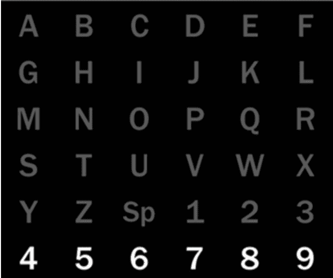
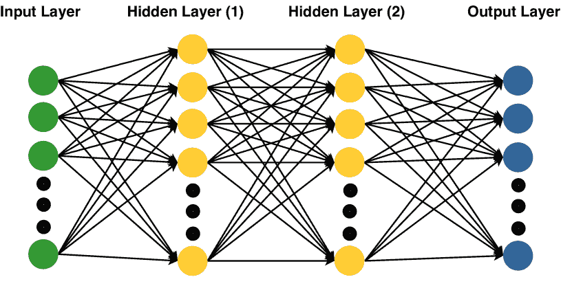

<!--yml

类别: 未分类

日期: 2024-09-06 20:06:22

-->

# [1905.04149] 一项基于深度学习的非侵入性大脑信号调查：近期进展与新前沿

> 来源：[`ar5iv.labs.arxiv.org/html/1905.04149`](https://ar5iv.labs.arxiv.org/html/1905.04149)

+   已接受

    2020 年 10 月

# 一项基于深度学习的非侵入性大脑信号调查：近期进展与新前沿

张翔^(1,5), 姚丽娜¹, 王显之², 杰西卡·莫纳汉³, 大卫·麦克阿尔平³, 张宇⁴ ¹新南威尔士大学，澳大利亚

²悉尼科技大学，澳大利亚

³麦考瑞大学，澳大利亚

⁴利哈伊大学，美国

⁵哈佛大学，美国 xiang_zhang@hms.harvard.edu,

lina.yao@unsw.edu.au, xianzhi.wang@uts.edu.au, {jessica.monaghan,david.mcalpine}@mq.edu.au, yuzi20@lehigh.edu

###### 摘要

大脑信号指的是从人脑中收集的生物识别信息。对大脑信号的研究旨在通过信号解码发现个体潜在的神经或身体状态。近年来， emerging 深度学习技术显著改善了大脑信号的研究。在这项工作中，我们首先介绍了非侵入性大脑信号的分类以及深度学习算法的基础知识。然后，通过总结大量近期出版的文献，我们提供了应用深度学习进行非侵入性大脑信号分析的前沿进展。此外，基于深度学习驱动的大脑信号研究，我们报告了潜在的现实世界应用，这些应用不仅惠及残疾人，也惠及普通人。最后，我们讨论了开放挑战和未来方向。

^†^†: J. Neural Eng.\ioptwocol

## 1 介绍

大脑信号测量的是来自人脑的本能生物识别信息，反映了用户的被动或主动心理状态。通过精确的大脑信号解码，我们可以识别用户潜在的心理和身体状态，并进一步改善其生活质量。根据信号采集方式，大脑信号包含侵入性信号和非侵入性信号。前者通过部署在头皮下的电极获取，而后者则是在不插入电极的情况下从头皮上收集。在本调查中，我们主要考虑非侵入性大脑信号¹¹1 如未指定，本工作中提到的大脑信号指的是非侵入性信号。.

### 1.1 一般工作流程

图 1 显示了脑信号解码的一般范式，该范式接收脑信号并生成用户的潜在信息。工作流程包括几个关键组件：脑信号采集、信号预处理、特征提取、分类和数据分析。脑信号从人类身上采集并发送到预处理组件进行去噪和增强。然后，从处理后的信号中提取区分特征，并送到分类器进行进一步分析。

收集方法因信号而异。例如，脑电信号测量的是脑内离子电流引起的电压波动。收集脑电信号需要在头皮上放置一系列电极以记录脑部的电活动。由于在头皮上测量的离子电流，障碍物（例如，颅骨）大大降低了信号质量——所收集的脑电信号的保真度，按信噪比（SNR）测量，仅为原脑信号的约 5%[1]。更多非侵入性信号的收集方法见附录 A。

因此，脑信号通常在特征提取前进行预处理，以提高 SNR。预处理组件包含多个步骤，例如信号清理（平滑噪声信号或解决不一致问题）、信号归一化（沿时间轴对每个通道的信号进行归一化）、信号增强（去除直流分量）和信号降维（呈现信号的简化表示）。

特征提取是指通过领域知识从输入信号中提取具有区分性的特征的过程。传统特征从时域（例如，方差、均值、峭度）、频域（例如，快速傅里叶变换）和时频域（例如，离散小波变换）中提取。这些特征将丰富有关用户意图的可区分信息。特征提取高度依赖于领域知识。例如，从运动意象脑电信号中提取特征需要神经科学知识。人工特征提取也耗时且困难。最近，深度学习提供了一种更好的自动提取可区分特征的选择。

分类组件指的是将提取的特征分类为外部设备能够识别的逻辑控制信号的机器学习算法。深度学习算法被证明比传统分类器更强大[2, 3, 4]。

图 1：脑信号分析的一般工作流程。如果分类信号用于控制智能设备（虚线），则称为脑-计算机接口。

分类结果反映了用户的心理或身体状态，并可以激发进一步的信息分析。这在实际应用中广泛使用，如神经疾病诊断、情绪测量和驾驶疲劳检测。可以根据分析结果进行适当的治疗、疗法和预防措施。

具体来说，这个系统称为脑机接口（BCI），将解码后的脑信号转换为数字命令，以控制智能设备并与用户互动（图 1 中的虚线）。除了 BCI，还有许多类似的术语来定义由人脑信号直接控制的系统，如脑-机器接口（BMI）、脑接口（BI）、直接脑接口（DBI）、自适应脑接口（ABI）等。系统将人脑模式解释为消息或命令，以与外界沟通[5]。BCI 通常是一个闭环系统，配有外部设备（例如，轮椅和机器人手臂），可以直接为用户服务。相比之下，脑信号分析不需要特定设备，只要分析结果能对社会和个人有益即可。

在本次调查中，我们总结了采用深度学习模型的最先进研究：1）仅用于特征提取；2）仅用于分类；3）同时用于特征提取和分类。具体细节将在第四部分中介绍。脑信号支撑了许多对人们日常生活重要的新应用。例如，基于脑信号的用户识别系统具有高抗伪造性，使普通人可以享受更好的娱乐和安全[6]；对于有心理/身体疾病或残疾的人，脑信号使他们能够控制智能设备，如轮椅、家用电器和机器人。我们在第五部分中展示了广泛的深度学习基础的脑信号应用。

### 1.2 为什么选择深度学习？

尽管传统的脑信号系统已经取得了巨大进展[7, 8]，但仍面临重大挑战。首先，脑信号容易受到各种生物（例如，眼睛眨动、肌肉伪影、疲劳和集中力）和环境伪影（例如，噪音）[7]的干扰。因此，从受污染的脑信号中提取有用的数据，并建立一个在不同情况下都能有效工作的强大系统是至关重要的。其次，它面临着非稳态电生理脑信号的低信噪比[9]。由于这些方法的时间复杂度和信息丢失的风险，传统的预处理或特征提取方法无法轻易解决低信噪比的问题[10]。第三，特征提取高度依赖于特定领域的人类专业知识。例如，通过脑电图（EEG）信号调查睡眠状态需要基本的生物学知识。人类经验可能在某些方面有所帮助，但在更一般的情况下可能不够充分。自动特征提取方法是非常需要的。此外，大多数现有的机器学习研究集中在静态数据上，因此无法准确分类快速变化的脑信号。例如，多类运动想象 EEG 的最先进分类准确率通常低于 80%[11]。这需要新的学习方法来处理脑信号系统中的动态数据流。

迄今为止，深度学习已经广泛应用于脑信号应用中，并在解决上述挑战方面取得了成功[12, 13]。深度学习有两个优点。首先，它直接处理原始脑信号，从而避免了耗时的预处理和特征提取。其次，深度神经网络可以通过深层结构捕捉代表性高层特征和潜在的依赖关系。

表 1：过去十年脑信号的现有调查。列‘综合性’指示调查是否覆盖所有非侵入性脑信号的子类别。MI EEG 指的是运动想象 EEG 信号。

| 否 | 参考 | 综合性 | 信号 | 深度学习 |
| --- | --- | --- | --- | --- |

&#124; 出版 &#124;

&#124; 时间 &#124;

| 领域 |
| --- | --- | --- | --- | --- | --- | --- |
| 2 | [14] | 否 | fMRI | 是 | 2018 |

&#124; 精神疾病 &#124;

&#124; 诊断 &#124;

|

| 3 | [11] | 部分 | EEG（MI EEG, P300） | 否 | 2007 | 分类 |
| --- | --- | --- | --- | --- | --- | --- |
| 4 | [5] | 部分 | EEG（MI EEG, P300） | 部分 | 2018 | 分类 |
| 5 | [15] | 部分 | EEG（ERD, P300, SSVEP, VEP, AEP） | 否 | 2007 |  |
| 6 | [16] | 否 | MRI, CT | 部分 | 2017 |

&#124; 医学影像 &#124;

&#124; 分析 &#124;

|

| 7 | [17] | 否 | EEG |
| --- | --- | --- | --- |

&#124; 是 &#124;

| 2019 |  |
| --- | --- |
| 8 | [8] | 否 | EEG | 否 | 2007 | 信号处理 |
| 9 | [18] | 部分 | EEG | 否 | 2016 | BCI 应用 |
| 10 | [7] | 是 |  | 否 | 2015 |  |
| 11 | [19] | 否 | EEG | 部分 | 2018 |  |
| 12 | [20] | 否 | EEG, fMRI | 否 | 2015 |

&#124; 神经康复 &#124;

&#124; 中风的 &#124;

|

| 13 | [21] | 否 | MI EEG | 否 | 2015 |  |
| --- | --- | --- | --- | --- | --- | --- |
| 14 | [22] | 否 | fMRI | 否 | 2014 |  |
| 15 | [23] | 否 | ERP (P300) | 否 | 2017 |

&#124; 应用 &#124;

&#124; ERP 的 &#124;

|

| 16 | [24] | 否 | fMRI | 是 | 2018 |
| --- | --- | --- | --- | --- | --- |

&#124; 应用 &#124;

&#124; fMRI 的 &#124;

|

| 17 | [25] | 否 | ERP | 否 | 2017 | 分类 |
| --- | --- | --- | --- | --- | --- | --- |
| 18 | [26] | 部分 | EEG | 否 | 2019 | 脑生物识别 |
| 19 | [27] | 部分 | EEG | 否 | 2018 | BCI 范式 |
| 20 | 当前研究 | 是 |

&#124; EEG 及其子类别， &#124;

&#124; fNIRS, fMRI, MEG &#124;

| 是 |  |  |
| --- | --- | --- |

### 1.3 为什么这个调查是必要的？

我们进行这项调查有三个原因。首先，现有的关于非侵入性脑信号的综合调查尚缺乏。表 1 展示了现有脑信号调查的总结。根据我们所知，有限的现有调查[14, 24, 7, 11, 5, 8, 15]仅关注部分脑电图（EEG）信号。例如，Lotte 等人[11]和 Wang 等人[18]关注的是一般的 EEG，而未分析 EEG 的亚型；Cecotti 等人[28]关注事件相关电位（ERP）；Haseer 等人[29]关注功能性近红外光谱（fNIRS）；Mason 等人[15]简要介绍了神经现象，如事件相关去同步化（ERD）、P300、SSVEP、视觉诱发电位（VEP）、听觉诱发电位（AEP），但未进行系统整理；Abdulkader 等人[7]展示了脑信号的拓扑结构，但未提及自发 EEG 和快速序列视觉呈现（RSVP）；Lotte 等人[5]没有考虑 ERD 和 RSVP；在[8]中，VEP 应属于 ERP 的一个亚型。Ahn 等人[21]回顾了基于 MI-EEG 的 BCI 系统中的性能变化。Roy 等人[17]列出了一些基于深度学习的 EEG 研究，但技术启示较少，对深度学习算法的分析较少，也未研究 EEG 之外的其他非侵入性脑信号。特别是，与[17]相比，本文提供了更好的深度学习介绍，包括基本概念、算法和流行模型（第三部分和附录 B）。此外，本文还讨论了脑信号分析中的高级指南，包括脑信号范式、合适的深度学习框架和有前景的实际应用（第六部分）。

其次，针对深度学习（[30, 31]）与脑信号（[32, 7, 11, 5, 8, 15]）之间的关联，已有的研究较少。根据我们所知，本文是关于基于深度学习的脑信号最近进展的首批综合调查之一。我们还指出了该领域的前沿和有前景的方向。

最后，现有的调查集中于特定领域或应用，缺乏广泛场景的概述。例如，Litjens 等人[16]总结了几个深度神经网络概念，旨在医学图像分析；Soekadar 等人[20]回顾了基于感官运动节律（SMR）的脑机接口系统和用于中风相关运动瘫痪的机器学习方法；Vieira 等人[33]调查了脑信号在神经疾病和精神病学中的应用。

### 1.4 我们的贡献

本调查主要受益于：1）对脑信号研究感兴趣的计算机科学背景研究人员；2）希望采用深度学习技术解决基础科学问题的生物医学/医学/神经科学专家。

据我们所知，本调查是关于基于深度学习的脑信号分析的最新进展和前沿的首次全面调查。为此，我们总结了 200 多项贡献，其中大多数发表于过去五年。我们在本调查中做出了一些关键贡献：

+   •

    我们回顾了脑信号和深度学习技术，帮助读者全面了解这一研究领域。

+   •

    我们讨论了用于脑信号的流行深度学习技术和最先进的模型，提供了选择适当深度学习模型的实用指南，针对特定类型的信号。

+   •

    我们回顾了基于深度学习的脑信号分析的应用，并突出了未来研究的一些有前景的主题。

本调查的其余部分结构如下。第二部分简要介绍了脑信号的分类，以帮助读者在该领域建立一个宏观的概念。第三部分概述了常用的深度学习模型，为不熟悉深度学习的研究人员（例如神经学和生物医学学者）提供基本知识。第四部分介绍了脑信号的最先进深度学习技术，第五部分讨论了与脑信号相关的应用。第六部分提供了详细的分析，并给出了基于特定脑信号选择适当深度学习模型的指南。第七部分指出了当前面临的挑战和未来方向。最后，第八部分给出了总结性评论。

## 2 脑成像技术

图 2：非侵入性脑信号的分类。虚线四边形（RAVP、SEP、SSAEP 和 SSSEP）不包括在本调查中，因为没有现有工作关注这些内容，并涉及深度学习算法。P300 是一种在呈现刺激后约 300 毫秒记录的正向电位，在此信号树中未列出，因为它已被 ERP 包含（ERP 指的是所有呈现刺激后的电位）。在此分类中，除了 EEG 之外的其他脑成像技术（例如 MEG 和 fNIRS）理论上也可以包括视觉/听觉任务，但我们省略了它们，因为尚无采用深度学习处理这些任务的现有工作。

在这一节中，我们简要介绍了典型的非侵入性脑成像技术。关于非侵入性脑信号（例如概念、特征、优点和缺点）的更多基本细节请参见附录 A。

图 2 显示了基于信号采集方法的非侵入性脑信号分类。非侵入性信号分为脑电图（EEG）、功能性近红外光谱（fNIRS）、功能性磁共振成像（fMRI）和磁脑图（MEG） [34]。表 2 总结了各种脑信号的特征。在本次调查中，我们主要关注 EEG 信号及其子类别，因为它们主导了非侵入性信号。EEG 监测由人类神经元中的电流产生的电压波动。附着在头皮上的电极可以测量各种类型的 EEG 信号，包括自发 EEG [35] 和诱发电位（EP） [36]。根据场景，自发 EEG 进一步分为睡眠 EEG、运动意象 EEG、情感 EEG、心理疾病 EEG 等。同样，EP 根据外部刺激的频率分为事件相关电位（ERP） [28] 和稳态诱发电位（SSEP） [37]。每种电位根据外部刺激类型包含视觉、电听和躯体感觉电位。

关于其他非侵入性技术，fNIRS 通过利用近红外（NIR）光来测量氧合血红蛋白（Hb）和去氧血红蛋白（deoxy-Hb）的聚集程度，从而生成功能性神经图像，这两者比其他头部成分（如颅骨和头皮）对光的吸收更强 [38]；fMRI 通过检测脑区血流变化来监测脑活动 [14]；MEG 通过磁场变化反映脑活动 [39]。

表 2: 非侵入性脑信号特征总结。

| 信号 | EEG | fNIRS | fMRI | MEG |
| --- | --- | --- | --- | --- |
| 空间分辨率 | 低 | 中等 | 高 | 中等 |
| 时间分辨率 | 高 | 低 | 低 | 高 |
| 信噪比 | 低 | 低 | 中等 | 低 |
| 可移植性 | 高 | 高 | 低 | 低 |
| 成本 | 低 | 低 | 高 | 高 |
| 特征 | 电气 | 代谢 | 代谢 | 磁性 |

## 3 深度学习模型概述

图 3：深度学习模型。根据算法功能，它们可以分为判别式、代表性、生成式和混合型模型。判别式模型（附录 B.1）主要包括多层感知器（MLP）、递归神经网络（RNN）和卷积神经网络（CNN）。RNN 的两个主流是长短期记忆网络（LSTM）和门控递归单元（GRU）。代表性模型（附录 B.2）可以分为自编码器（AE）、限制玻尔兹曼机（RBM）和深度信念网络（DBN）。D-AE 表示深度自编码器，指的是具有多个隐藏层的自编码器。同样，D-RBM 表示深度限制玻尔兹曼机，具有多个隐藏层。深度信念网络可以由 AE 或 RBM 组成，因此，我们将 DBN 分为 DBN-AE 和 DBN-RBM。生成式模型（附录 B.3）在非侵入性脑信号分析中常用的包括变分自编码器（VAE）和生成对抗网络（GAN）。

表 3：深度学习模型类型汇总

| 深度学习 | 输入 | 输出 | 功能 | 训练方法 |
| --- | --- | --- | --- | --- |
| 判别式 | 输入数据 | 标签 | 特征提取，分类 | 监督式 |
| 代表性 | 输入数据 | 表示 | 特征提取 | 无监督 |
| 生成式 | 输入数据 | 新样本 | 生成，重建 | 无监督 |
| 混合型 | 输入数据 | – | – | – |

在本节中，我们正式介绍了深度学习模型，包括在脑信号研究领域常用的概念、架构和技术。深度学习是一类机器学习技术，它使用多层信息处理阶段的分层架构进行模式分类和特征/表示学习[31]。有关在脑信号分析中常用的深度学习技术的更详细信息，请参见附录 B。

深度学习算法根据技术目标的不同，包含多个子类别（见图 3")：

+   •

    判别深度学习模型，根据自适应学习的判别特征将输入数据分类为预知标签。判别算法能够通过非线性变换学习独特特征，并通过概率预测进行分类³³3 分类功能通过 softmax 层和 one-hot 标签编码的组合实现。one-hot 标签编码指的是通过 one-hot 方法对标签进行编码，即一组位中唯一有效的组合是只有一个高（1）位和其他位都低（0）的值。例如，标签 0、1、2、3 可以编码为（1，0，0，0），（0，1，0，0），（0，0，1，0），（0，0，0，1）..因此，这些算法可以同时发挥特征提取和分类的作用（对应图 1）。判别架构主要包括多层感知机（MLP）[40]，递归神经网络（RNN）[41]，卷积神经网络（CNN）[42]及其变体。

+   •

    代表性深度学习模型，从输入数据中学习纯粹且具有代表性的特征。这些算法只有特征提取功能（见图 1")，不能进行分类。常用于表示的深度学习算法有自编码器（AE）[43]，限制玻尔兹曼机（RBM）[44]，深度置信网络（DBN）[45]，及其变体。

+   •

    生成深度学习模型，学习输入数据和目标标签的联合概率分布。在脑信号范围内，生成算法通常用于生成一批脑信号样本，以增强训练集。常用于脑信号分析的生成模型包括变分自编码器（VAE）⁴⁴4VAE 是 AE 的变体，但它们工作于不同的方面。因此，我们分别介绍 AE 和 VAE。[46]，生成对抗网络（GANs）[47]，等等。

+   •

    混合深度学习模型，结合了两种以上的深度学习模型。例如，典型的混合深度学习模型采用表示算法进行特征提取，使用判别算法进行分类。

各种深度学习子类别的特征总结列在表 3 中。几乎所有神经网络中的分类函数都是通过 softmax 层实现的，在本调查中不会将其视为算法组件。例如，结合 DBN 和 softmax 层的模型仍然会被视为代表性模型，而不是混合模型。

## 4 前沿深度学习技术用于脑信号

在本节中，我们详细总结了基于深度学习的脑信号的先进研究（表 4）。混合模型分为三部分：RNN 和 CNN 的组合、代表性和区分模型的组合（记作‘Repre + Discri’），以及其他混合模型。

### 4.1 脑电图

由于高便携性和低价格的优势，脑电图信号受到了广泛关注。最新的大多数非侵入性脑信号相关出版物都与脑电图有关。本节总结了脑电图信号的两个方面：自发性脑电图和诱发电位。顾名思义，自发性脑电图是自发的，而诱发电位则需要外部刺激。

#### 4.1.1 自发性脑电图

我们根据应用场景介绍自发性脑电图的深度学习模型如下。

(1) 睡眠脑电图。睡眠脑电图主要用于识别睡眠阶段和诊断睡眠障碍或培养健康习惯[48, 49]。根据 Rechtschaffen 和 Kales (R&K)规则，睡眠阶段包括清醒、非快速眼动 1、非快速眼动 2、非快速眼动 3、非快速眼动 4 和快速眼动。美国睡眠医学学会(AASM)建议将睡眠分为五个阶段：清醒、非快速眼动 1、非快速眼动 2、慢波睡眠(SWS)和快速眼动。非快速眼动 3 和非快速眼动 4 合并为 SWS，因为它们之间没有明显的区别[49]。一般来说，在睡眠阶段分析中，脑电图信号会通过一个滤波器进行预处理，该滤波器在不同论文中有不同的通带，但都被滤除 50 Hz 的干扰。脑电图信号通常被分割成 30 秒的窗口。

(i) 区分模型。CNN 经常用于单通道脑电图的睡眠阶段分类[25, 50]。例如，Viamala 等人[51]手动提取了时频特征，并取得了 86%的分类准确率。其他研究使用了基于频域、相关性和图理论特征的 RNN[52]和 LSTM[53]。

(ii) 表征模型。Tan 等[54]采用 DBN-RBM 算法基于从睡眠 EEG 信号中提取的功率谱密度（PSD）特征检测睡眠纺锤体，在本地数据集上达到了 92.78%的 F-1 分数。Zhang 等[49]进一步将 DBN-RBM 与三种 RBM 结合用于睡眠特征提取。

(iii) 混合模型。Manzano 等[55]提出了一种多视角算法，通过结合 CNN 和 MLP 来预测睡眠阶段。CNN 用于接收原始时间域 EEG 振荡，而 MLP 接收经短时傅里叶变换（STFT）处理的 0.5-32 Hz 范围的频谱信号。Fraiwan 等[56]将 DBN 与 MLP 结合用于新生儿睡眠状态识别。Supratak 等[57]提出了一种通过结合多视角 CNN 和 LSTM 进行自动睡眠阶段评分的模型，其中前者用于发现时间不变的依赖关系，而后者（双向 LSTM）用于处理睡眠中的时间特征。Dong 等[58]提出了一种混合深度学习模型，旨在时间性睡眠阶段分类，利用 MLP 检测层次特征，并结合 LSTM 进行序列信息学习。

(2) MI EEG。深度学习模型在运动意象（MI）脑电图（EEG）和实际运动 EEG 的分类上表现优越[59, 60]。

(i) 判别模型。这类模型主要使用 CNN 来识别 MI EEG[61]。一些模型基于手动提取的特征[62, 63]。例如，Lee 等[64]和 Zhang 等[65]分别采用 CNN 和 2-D CNN 进行分类；Zhang 等[65]从 EEG 信号中学习情感信息以构建改进的 LSTM 控制智能家电。其他模型也使用 CNN 进行特征提取[66]。例如，Wang 等[67]首先使用 CNN 从 MI-EEG 信号中捕捉潜在的连接，然后应用弱分类器选择最终分类的重要特征；Hartmann 等[59]研究了 CNN 如何通过 MI EEG 样本的序列表示谱特征。MLP 也被应用于 MI EEG 识别[68]，在早期阶段对 EEG 相位特征的敏感性更高，而在后期阶段对 EEG 幅度特征的敏感性更高。

表 4：基于深度学习模型的非侵入脑信号研究总结

| 脑信号 | 深度学习模型 |
| --- | --- |
| 判别模型 | 表征模型 | 生成模型 | 混合模型 |
| MLP | RNN | CNN | AE (D-AE) | RBM (D-RBM) | DBN | VAE | GAN | LSTM+CNN | 表征+判别 | 其他 |
| DBN-AE | DBN-RBM |
| 非侵入信号 | EEG | 自发 EEG | 睡眠 EEG | [69, 52] | [53, 52] |

&#124; [51],[48], &#124;

&#124; [25, 50], &#124;

&#124; [70, 52] &#124;

|  |  |  | [49, 54] |  |  |
| --- | --- | --- | --- | --- | --- |

&#124; [57] &#124;

&#124; [52] &#124;

| [56] |
| --- |

&#124; [55], &#124;

&#124; [58] &#124;

|

| MI EEG | [71],[68] |
| --- | --- |

&#124; [6], &#124;

&#124; [61, 65] &#124;

|

&#124; [64], [72], &#124;

&#124; [60], &#124;

&#124; [63],[73], &#124;

&#124; [59, 62] &#124;

&#124; [66] &#124;

|

&#124; [74, 75] &#124;

&#124; [76] &#124;

|  | [77] |
| --- | --- |

&#124; [78, 79], &#124;

&#124; [80] &#124;

| [81] |  | [82, 10] | [4],[83] |
| --- | --- | --- | --- |

&#124; [84, 85], &#124;

&#124; [67, 86] &#124;

&#124; [2] &#124;

|

|

&#124; 情感 &#124;

&#124; EEG &#124;

| [87] | [88] |
| --- | --- |

&#124; [89],[90], &#124;

&#124; [91], &#124;

&#124; [92, 93] &#124;

|

&#124; [94], &#124;

&#124; [95] &#124;

|

&#124; [96, 97] &#124;

&#124; [98] &#124;

| [99] |
| --- |

&#124; [98],[99], &#124;

&#124; [100],[101], &#124;

&#124; [102, 103] &#124;

|  |  | [104] |
| --- | --- | --- |

&#124; [105, 106] &#124;

&#124; [107] &#124;

| [108] |
| --- |

|

&#124; 精神疾病 &#124;

&#124; EEG &#124;

| [109] | [110],[111] |
| --- | --- |

&#124; [112],[113], &#124;

&#124; [114],[115], &#124;

&#124; [116],[117], &#124;

&#124; [118, 119] &#124;

&#124; [120] &#124;

|

&#124; [121],[122], &#124;

&#124; [123], &#124;

&#124; [124] &#124;

|  | [125] | [126, 127] |  |  | [128] |
| --- | --- | --- | --- | --- | --- |

&#124; [129, 120], &#124;

&#124; [130, 131] &#124;

|  |
| --- |

|

&#124; 数据 &#124;

&#124; 增强 &#124;

|  |  |  |  |  |  |  |  |
| --- | --- | --- | --- | --- | --- | --- | --- |

&#124; [132, 81], &#124;

&#124; [133] &#124;

&#124; [134] &#124;

|  |  |  |
| --- | --- | --- |
| 其他 |

&#124; [135, 136] &#124;

&#124; [137] &#124;

| [138] |
| --- |

&#124; [139], [140], &#124;

&#124; [141],[142], &#124;

&#124; [138],[143],[144], &#124;

&#124; [145, 146] &#124;

&#124; [147, 147] &#124;

&#124; [148, 149] &#124;

| [150],[151] |  | [152] |
| --- | --- | --- |

&#124; [153],[152], &#124;

&#124; [154, 155] &#124;

|  |  | [156, 147] | [157],[158, 159] | [160] |
| --- | --- | --- | --- | --- |
|  |  | EP | ERP | VEP | [161, 162], | [163, 134] |

&#124; [163],[73] &#124;

&#124; [164, 147], &#124;

&#124; [147, 165] &#124;

&#124; [166] &#124;

| [167] |  |  |
| --- | --- | --- |

&#124; [168, 169], &#124;

&#124; [165] &#124;

|  |  |
| --- | --- |

&#124; [170],[171], &#124;

&#124; [172] &#124;

|

&#124; [97, 173] &#124;

&#124; [96] &#124;

|  |
| --- |
| RSVP | [174, 175], |  |

&#124; [176],[177], &#124;

&#124; [178],[179], &#124;

&#124; [180, 181], &#124;

&#124; [182, 175] &#124;

&#124; [183, 184] &#124;

&#124; [185, 12] &#124;

|  |  | [186] |  |  |  |  | [181, 175] | [12] |
| --- | --- | --- | --- | --- | --- | --- | --- | --- |
| AEP |  |  |

&#124; [187, 165], &#124;

&#124; [166, 188] &#124;

|  |  |  | [165] |  |  |  |  |  |
| --- | --- | --- | --- | --- | --- | --- | --- | --- |
| SSEP | SSVEP | [189] | [190] |

&#124; [191], [192], &#124;

&#124; [190, 193] &#124;

&#124; [194] &#124;

|  |  | [195] | [195] |  |  | [196] | [197] |  |
| --- | --- | --- | --- | --- | --- | --- | --- | --- |
| fNIRS |

&#124; [38],[198], &#124;

&#124; [199],[71], &#124;

&#124; [200] &#124;

|  | [198] |  |  |  |  |  |  |  | [201] |  |
| --- | --- | --- | --- | --- | --- | --- | --- | --- | --- | --- |
| fMRI | [202, 203] |  |

&#124; [204],[63], &#124;

&#124; [205],[206], &#124;

&#124; [117],[207], &#124;

&#124; [208, 194] &#124;

| [209] |  | [210], |
| --- | --- | --- |

&#124; [211],[210],[212, 213] &#124;

|  |
| --- |

&#124; [214, 215], &#124;

&#124; [216, 203] &#124;

|  | [217] |  |
| --- | --- | --- |
| MEG |  |  | [218],[204] | [219] |  |  |  |  |  |  | [220] |  |

(ii) 代表性模型。深度置信网络（DBN）因其高代表性能力而被广泛用于运动想象（MI）脑电图分类 [80, 79]。例如，Ren 等 [78] 应用了一种基于 RBM 组件的卷积 DBN，显示出比手工提取特征更好的特征表示。Li 等 [77] 使用离散小波变换处理脑电图信号，然后应用基于去噪自编码器（AE）的 DBN-AE。其他模型包括 AE 模型（用于特征提取）和 KNN 分类器的组合 [75]，遗传算法（用于超参数调整）和 MLP（用于分类）的组合 [84]，AE 和 XGBoost 的组合用于多人场景 [76]，以及 LSTM 和强化学习的组合用于多模态信号分类 [85, 2]。

(iii) 混合模型。一些研究提出了用于识别运动想象（MI）脑电图的混合模型 [81]。例如，Tabar 等 [4] 从脑电图信号的时间、频率域和位置数据中提取高级表示，使用 CNN 后再使用具有七个 AE 的 DBN-AE 作为分类器；Tan 等 [82] 使用去噪 AE 进行维度缩减，结合 RNN 的多视角 CNN 来发现潜在的时间和空间信息，最终在一个公开数据集上达到了 72.22%的平均准确率。

(3) 情感脑电图。个体的情感可以从三个方面进行评估：情感效价、唤醒度和支配感。这三个方面的结合形成了恐惧、悲伤和愤怒等情感，这些情感可以通过脑电图信号揭示出来。

(i) 判别模型。传统上使用 MLP [137, 87]，而 CNN 和 RNN 在基于脑电图的情感预测中越来越受欢迎 [89, 90]。该类别中的典型 CNN 基础工作包括分层 CNN [89, 92] 和增强 CNN 训练集 [91]。Li 等 [89] 首次提出通过将多通道脑电图信号转换为二维矩阵来捕捉脑电图通道之间的空间依赖。此外，Talathi [110] 使用了一种由 GRU 单元组成的判别深度学习模型。Zhang 等 [88] 提出了一个时空递归神经网络，该网络使用多方向 RNN 层来发现长程上下文线索，以及一个双向 RNN 层来捕捉由前一空间 RNN 产生的序列特征。

(ii) 代表性模型。DBN，特别是 DBN-RBM，因其在情感识别中的无监督表示能力而被广泛使用 [100, 106, 103]。例如，Xu 等人 [99, 101] 提出了一个具有三层 RBM 和一个 RBM-AE 的 DBN-RBM 算法来预测情感状态；Zhao 等人 [126] 和 Zheng 等人 [102] 分别将 DBN-RBM 与 SVM 和隐马尔可夫模型（HMM）相结合，解决了相同的问题；Zheng 等人 [96, 97] 引入了一个具有五层隐藏 RBM 层的 D-RBM 来寻找情感识别中的重要频率模式和信息通道；Jia 等人 [98] 排除了具有高错误的通道，然后基于残余通道的代表性特征使用 D-RBM 进行情感状态识别。

情感受许多主观和环境因素（例如，性别和疲劳）的影响。Yan 等人 [95] 通过提出一种名为双模态深度自编码器（Bimodal Deep AutoEncoder, BDAE）的新模型，调查了男性和女性情感模式的差异，该模型同时接收 EEG 和眼动特征，并在一个与 SVM 分类器连接的融合层中共享信息。结果显示，女性在恐惧情绪上的 EEG 信号多样性更高，而男性在悲伤情绪上的 EEG 信号多样性更高。此外，对于女性来说，恐惧的被试间差异比其他情绪更显著 [95]。为了克服从不同被试或不同实验会话中收集样本之间的不匹配分布，Chai 等人 [94] 提出了一个无监督领域适应技术，称为子空间对齐自编码器（subspace alignment autoencoder, SAAE），通过结合 AE 和子空间对齐解决方案。该方法在人员独立场景中取得了 77.88% 的平均准确率。

(iii) 混合模型。一种常见的混合模型是 RNN 和 MLP 的组合。例如，Alhagry 等人 [108] 使用了一个 LSTM 架构从情感 EEG 信号中提取特征，并将这些特征传递给 MLP 进行分类。此外，Yin 等人 [107] 提出了一个多视角集成分类器，使用多模态生理信号来识别个体情感。该集成分类器包含多个具有三层隐藏层的 D-AE 和一个融合结构。每个 D-AE 接收一个生理信号（例如 EEG），然后将 D-AE 的输出发送到由另一个 D-AE 组成的融合结构。最后，一个 MLP 分类器根据混合特征进行预测。Kawde 等人 [105] 通过将 DBN-RBM 用于有效特征提取并将 MLP 用于分类来实现了一个情感识别系统。

(4) 精神疾病 EEG。大量研究人员利用 EEG 信号诊断神经系统疾病，尤其是癫痫发作[109]。

(i) 区分模型。CNN 广泛用于自动检测癫痫发作[112, 114, 116, 93]。例如，Johansen 等人[118] 采用 CNN 对高通（1 Hz）癫痫尖峰 EEG 信号进行处理，达到了 94.7% 的 AUC。Acharya 等人[113] 在抑郁症检测中使用了具有 13 层的 CNN 模型，该模型在包含 30 名受试者的本地数据集上进行评估，基于左半球和右半球 EEG 信号分别达到了 93.5% 和 96.0% 的准确率。Morabito 等人[115] 尝试利用 CNN 结构从多通道 EEG 信号中提取适合的特征，以区分阿尔茨海默病患者、轻度认知障碍患者和健康对照组。EEG 信号经过带通滤波（$0.1\sim 30$ Hz），三类分类的准确率约为 82%。快速眼动行为障碍（RBD）可能导致许多精神障碍疾病，如帕金森病（PD）。Ruffini 等人[111] 描述了一种回声状态网络（ESNs）模型，这是一类特殊的 RNN，用于区分 RBD 和健康个体。在一些研究中，区分模型仅用于特征提取。例如，Ansari 等人[119] 使用 CNN 提取潜在特征，并将其输入随机森林分类器，以最终检测新生儿的癫痫发作。Chu 等人[149] 将 CNN 和传统分类器结合用于精神分裂症识别。

(ii) 代表性模型。在疾病检测中，一种常用的方法是采用代表性模型（例如 DBN），然后通过 softmax 层进行分类[127]。Page 等人[125] 采用 DBN-AE 从癫痫 EEG 信号中提取信息特征。这些提取的特征被输入传统的逻辑回归分类器进行癫痫发作检测。Al 等人[131] 提出了一个多视角 DBN-RBM 结构，用于分析抑郁症患者的 EEG 信号。该方法包含多个输入通路，由两个 RBM 组成，每个通路对应一个 EEG 通道。所有输入通路将合并到一个共享结构中，该结构由另一个 RBM 组成。一些论文喜欢通过降维方法（如 PCA）对 EEG 信号进行预处理[129]，而其他人则更倾向于直接将原始信号输入代表性模型[122]。Lin 等人[122] 提出了一个具有三个隐藏层的稀疏 D-AE，从癫痫 EEG 信号中提取代表性特征，而 Hosseini 等人[129] 采用了一个类似的具有两个隐藏层的稀疏 D-AE。

(iii) 混合模型。一种流行的混合方法是将 RNN 和 CNN 结合起来。Shah 等人 [128] 研究了 CNN-LSTM 在通道选择后的癫痫检测性能，其灵敏度范围为 33% 到 37%，而误报率范围为 38% 到 50%。Golmohammadi 等人 [130] 提出了一个用于自动解读 EEG 的混合架构，通过整合时间和空间信息来进行处理。2D 和 1D CNN 捕捉空间特征，而 LSTM 网络捕捉时间特征。作者声称，在著名的 TUH EEG 癫痫语料库中，其灵敏度为 30.83%，特异性为 96.86%。在早期 Creutzfeldt-Jakob 病 (SJD) 的检测中，Morabito 等人 [123] 将 D-AE 和 MLP 结合在一起。SJD 的 EEG 信号首先通过带通滤波（0.5$\sim$70 Hz）进行过滤，然后输入到一个具有两个隐藏层的 D-AE 进行特征表示。最后，MLP 分类器在本地数据集中获得了 81$\sim$83% 的准确率。卷积自编码器通过用卷积和反卷积层替代标准 AE 中的全连接层，以无监督的方式提取癫痫特征 [124]。

(5) 数据增强。生成模型如 GAN 可以用于脑信号分类中的数据增强 [132]。Palazzo 等人 [133] 首次证明了脑波中包含的信息能够区分视觉对象，并利用 RNN 提取了更强大和可区分的 EEG 数据表示。最后，他们采用了 GAN 模式训练一个以学习到的 EEG 表示为条件的图像生成器，该生成器能够将 EEG 信号转换成图像 [133]。Kavasidis 等人 [134] 旨在将 EEG 信号转换成图像。在受试者在屏幕上观察图像时收集 EEG 信号。采用 LSTM 层从 EEG 信号中提取潜在特征，并将提取的特征视为 GAN 结构的输入。GAN 的生成器和鉴别器都由卷积层组成。生成器在预训练后被期望根据输入的 EEG 信号生成图像。Abdelfattach 等人 [132] 采用 GAN 进行癫痫数据增强。生成器和鉴别器均由全连接层组成。作者证明了 GAN 的表现优于其他生成模型，如 AE 和 VAE。经过增强后，分类准确率从 48% 大幅提高到 82%。

(6) 其他。一些研究探索了广泛的有趣主题。第一个是 EEG 信号如何受到音频/视觉刺激的影响。这不同于由音频/视觉刺激引起的电位，因为这种现象中的刺激总是存在的，而不是以特定频率闪烁。Stober 等人[188, 142]声称，节奏引起的 EEG 信号足够信息化，可以区分节奏刺激。作者进行了一个实验，其中 13 名参与者接受了 23 种节奏刺激，包括 12 种东非刺激和 12 种西方刺激。在 24 类别分类中，提出的 CNN 达到了 24.4%的平均准确率。之后，作者利用卷积 AE 进行表示学习，并用 CNN 进行识别，对于 12 类分类达到了 27%的准确率[157]。Sternin 等人[148]采用 CNN 从 EEG 振荡中捕捉辨别特征，以区分被试是否在听音乐或想象音乐。类似地，Sarkar 等人[165]设计了两个深度学习模型，以识别由音频或视觉刺激引起的 EEG 信号。对于这项二分类任务，提出的 CNN 和具有三个 RBM 的 DBN-RBM 分别达到了 91.63%和 91.75%的准确率。此外，自发 EEG 还可以用于区分用户的心理状态（逻辑与情感）[172]。

此外，一些研究者关注认知负荷[138]或物理负荷[221]对脑电图（EEG）的影响。Bashivan 等人[159]首先通过小波熵和带特定功率提取信息特征，这些特征将被输入到 DBN-RBM 中进一步精炼。最后，使用 MLP 进行认知负荷水平识别。作者在另一项工作中[171]也致力于寻找在各种心理负荷下在被试间/被试内场景中恒定的一般特征。Yin 等人[150]收集了来自不同心理负荷水平（例如高和低）的 EEG 信号进行二分类。EEG 信号经过低通滤波器滤波，转换到频域，并计算功率谱密度（PSD）。提取的 PSD 特征被输入到去噪 D-AE 结构中进行后续精炼。他们最终获得了 95.48%的准确率。Li 等人[155]研究了心理疲劳水平的识别，包括警觉、轻度疲劳和严重疲劳。

此外，基于 EEG 的驾驶员疲劳检测是一个具有吸引力的领域 [158, 151, 147]。Huang 等人 [140] 设计了一个 3D CNN 来预测疲劳驾驶中的反应时间。这对于减少交通事故具有重要意义。Hajinoroozi 等人 [153] 采用了 DBN-RBM 处理经过 ICA 处理的 EEG 信号。他们在二分类（‘疲劳’或‘警觉’）中达到了约 85% 的准确率。本文的亮点在于它在三个层次上评估了 DBN-RBM：时间样本、通道时段和窗口样本。实验表明，通道时段层次优于其他两个层次。San 等人 [154] 将深度学习模型与传统分类器结合起来进行驾驶员疲劳检测。该模型包含一个 DBN-RBM 结构，后跟一个 SVM 分类器，检测准确率达到了 73.29%。Almogbel 等人 [145] 研究了不同低工作负荷水平下驾驶员的心理状态。提出的 CNN 被声称能够直接基于原始 EEG 信号检测驾驶工作负荷。

对眼睛状态检测的研究显示出了超高的准确性。Narejo 等人 [152] 探索了基于 EEG 信号的眼睛状态（闭合或张开）检测。他们尝试了一个具有三个 RBMs 的 DBN-RBM 和一个具有三个 AEs 的 DBN-AE，并达到了 98.9% 的高准确率。Reddy 等人 [136] 尝试了更简单的结构 MLP，得到了略低的 97.5% 的准确率。

此外，为了使本综述更加完整，我们提供了事件相关去同步化/同步化（ERD/ERS）的简要介绍。ERD/ERS 指的是在特定脑状态下 EEG 信号功率的幅度和频率分布发生变化的现象 [36]。特别地，ERD 表示正在进行的 EEG 信号的功率减少，而 ERS 则代表 EEG 信号的功率增加。这种 ERD/ERS 脑信号的特性可以用来检测引起 EEG 波动的事件。例如，[222] 介绍了在运动想象任务中记录的运动皮层的 ERD/ERS 现象。

ERD/ERS 主要出现在感觉、认知和运动过程中，由于存在如跨个体准确性不稳定等缺点，因此在脑研究中的应用不广泛 [36]。在大多数情况下，ERD/ERS 被视为 EEG 功率的特定特征，用于进一步分析 [81, 4]。该任务在 EEG 的 mu 波段 (8-13 Hz) 引起 ERD，在 beta 波段 (13-30 Hz) 引起 ERS。特别地，ERD/ERS 被计算为相对于基线的功率相对变化：$ERD/ERS=(P_{e}-P_{b})/P_{b}$，其中 $P_{e}$ 表示事件发生时一秒段内的信号功率，$P_{b}$ 表示事件前基线期间一秒段内的信号功率 [71]。一般来说，基线指的是休息状态。例如，Sakhavi 等人计算了 ERD/ERS 图并分析了不同任务之间的不同模式。分析表明，应考虑能量的动态，因为静态能量并未包含足够的信息 [86]。

有几个被忽视但前景广阔的领域。Baltatzis 等人 [141] 采用 CNN 通过观看特定视频时的 EEG 来检测校园欺凌。他们在二分类和四分类任务中分别取得了 93.7% 和 88.58% 的准确率。Khurana 等人 [223] 提出了深度字典学习，这种方法超越了几种深度学习方法。Volker 等人 [143] 评估了深度 CNN 在侧翼任务中的应用，达到了在已见对象上的平均准确率 84.1% 和在未见对象上的 81.7%。Zhang 等人 [160] 将 CNN 和图网络结合，以从 EEG 信号中发现潜在信息。

Miranda-Correa 等人 [104] 提出了一个级联框架，通过结合 RNN 和 CNN 来预测个人的情感水平和个人因素（大五人格特质、情绪和社会背景）。Putten 等人 [146] 进行了一项实验，尝试基于 EEG 信号识别用户的性别。他们采用了标准的 CNN 算法，在本地数据集上实现了 81% 的二分类准确率。检测紧急制动意图可以帮助减少反应时间。Hernandez 等人 [144] 证明了驾驶员的 EEG 信号可以区分制动意图和正常驾驶状态。他们结合了一个 CNN 算法，达到了 71.8% 的二分类准确率。Behncke 等人 [139] 在机器人辅助设备的背景下应用了深度学习的 CNN 模型。他们尝试使用 CNN 改善在物体抓取和倒水任务中观看机器人时从 EEG 中解码机器人错误的准确性。

Teo 等人 [135] 尝试将脑信号与推荐系统结合，通过 EEG 信号预测用户的偏好。共有十六名参与者参与了实验，当实验对象看到 60 个类似手镯的物体作为旋转视觉刺激（一个 3D 物体）时，收集了 EEG 信号。然后，采用 MLP 算法来分类用户喜欢或不喜欢这些物体。这项探索获得了 63.99% 的预测准确率。一些研究人员尝试探索一种通用框架，可用于各种脑信号范式。Lawhern 等人 [73] 介绍了基于紧凑 CNN 的 EEGNet，并评估了其在各种脑信号背景下的鲁棒性 [73]。

#### 4.1.2 诱发电位

接下来，我们介绍包括 ERP 和 SSEP 在内的最新诱发电位研究。

(1) ERP。在大多数情况下，ERP 信号通过 P300 现象进行分析。同时，几乎所有关于 P300 的研究都基于 ERP 的情境。因此，在这一部分，大多数与 P300 相关的出版物都在 VEP/AEP 的子部分中介绍。

(i) VEP。VEP 是 ERP 的最受欢迎的子类别之一[23, 224, 163]。Ma 等人[225]通过深度学习提取代表性特征，并采用结合多级传感结构的遗传算法来压缩原始信号，研究了运动启动 VEP（mVEP）。压缩后的信号被送入 DBN-RBM 算法，以捕捉更抽象的高级特征。Maddula 等人[170]使用带通滤波器（$2\sim 35$ Hz）滤波视觉刺激的 P300 信号，然后输入到提出的混合深度学习模型中进行进一步分析。该模型包括一个 2D CNN 结构来捕捉空间特征，随后是一个 LSTM 层用于时间特征提取。Liu 等人[168]将 DBN-RBM 代表性模型与 SVM 分类器结合用于隐藏信息测试，并在本地数据集上实现了 97.3%的高准确率。Gao 等人[167]采用 AE 模型进行特征提取，随后使用 SVM 分类器。在实验中，每个片段包含 150 个点，这些点被分成五个时间步骤，每个步骤有 30 个点。该模型在本地数据集上的准确率达到 88.1%。大量 P300 相关研究基于 P300 拼写器[173]，该拼写器允许用户书写字符。Cecotti 等人[177]尝试提高 P300 检测准确率，以便更精确地拼写单词。提出了一种基于 CNN 的新模型，包括五个不同特征集的低级 CNN 分类器，最终的高级结果由低级分类器投票决定。最高准确率达到了来自第三届 BCI 竞赛数据集 II 的 95.5%。Liu 等人[164]提出了一种批量归一化神经网络（BN³），这是 P300 拼写器中 CNN 的一个变体。该方法包含六层，并且在每个批次中进行了批量归一化。Kawasaki 等人[162]使用 MLP 模型检测 P300 片段与非 P300 片段，并实现了 90.8%的准确率。

(ii) AEP。一些研究集中在 AEP 的识别上。例如，Carabez 等人[187] 提出了并测试了 18 种 CNN 结构来分类单次试验的 AEP 信号。在实验中，志愿者需佩戴耳机，该耳机产生基于奇偶范式设计的听觉刺激。实验分析表明，无论卷积层的数量如何，CNN 框架都能有效提取时间和空间特征，并提供了具有竞争力的结果。AEP 信号经过$0.1\sim 8$ Hz 的滤波，并从 256 Hz 下采样到 25 Hz。实验结果表明，下采样的数据效果更好。

(iii) RSVP。在各种 VEP 图中，RSVP 引起了广泛关注 [183]。在 RSVP 的分析中，许多判别性深度学习模型（例如 CNN [177, 178, 182] 和 MLP [174]）取得了巨大成功。RSVP 信号中常用的预处理方法是频率滤波。通带范围通常从 $0.1\sim 50$ Hz [176, 185]。Cecotti 等人 [12] 研究了 RSVP 情境中的 ERP 信号分类，并提出了一种改进的 CNN 模型用于检测 RSVP 中的特定目标。在实验中，面孔和汽车的图像分别被视为目标或非目标。图像呈现频率为 2 Hz。在每个实验中，目标概率为 10%。提出的模型提供了 86.1% 的 AUC。Hajinoroozi 等人 [179] 采用了一个 CNN 模型来检测 RSVP 的受试者间和任务间的变化。实验结果显示，CNN 在任务间的表现良好，但在受试者间的表现不尽如人意。Mao 等人 [175] 比较了三种不同的深度神经网络算法在预测受试者是否见过目标的表现。MLP、CNN 和 DBN 模型的 AUC 分别为 81.7%、79.6% 和 81.6%。作者还应用了一个 CNN 模型来分析 RSVP 信号以进行个人识别 [180]。

代表性的深度学习模型也应用于 RSVP。Vareka 等人 [186] 验证了深度学习在单次试验 P300 分类中的表现。他们进行了一个 RSVP 实验，要求受试者从非目标和干扰物中识别目标。然后实施了一个 DBN-AE 模型，并与一些非深度学习算法进行了比较。DBN-AE 由五个 AE 组成，而最后一个 AE 的隐藏层只有两个节点，这些节点可以通过 softmax 函数用于分类。最终，提出的模型达到了 69.2% 的准确率。Manor 等人 [181] 在低通滤波（$0\sim 51$ Hz）后应用了两个深度神经网络处理 RSVP 信号。判别性 CNN 达到了 85.06% 的准确率。同时，代表性的卷积 D-AE 达到了 80.68% 的准确率。

(2) SSEP。大多数基于深度学习的 SSEP 领域研究关注于 SSVEP，如 [191]。SSVEP 是由闪烁视觉刺激引发的大脑振荡，通常来自顶叶和枕叶区域 [192]。Attia 等人 [196] 旨在寻找 SSVEP 的中间表示。提出了一种结合 CNN 和 RNN 的混合方法，直接从时间域捕捉有意义的特征，准确率达到了 93.59%。Waytowich 等人 [192] 应用了一种紧凑的 CNN 模型，直接处理原始 SSVEP 信号，而无需任何手工特征。报告的跨主体平均准确率约为 80%。Thomas 等人 [190] 首先通过带通滤波器（$5\sim 48$ Hz）滤波原始 SSVEP 信号，然后对连续的 512 个点进行离散 FFT。处理后的数据分别由 CNN（69.03%）和 LSTM（66.89%）进行分类。

Perez 等人 [197] 采用了一个代表性模型，即稀疏自编码器（AE），从多频视觉刺激的 SSVEP 中提取出独特的特征。该模型使用了一个 softmax 层进行最终分类，并达到了 97.78% 的准确率。Kulasingham 等人 [195] 在有罪知识测试的背景下对 SSVEP 信号进行了分类。作者分别应用了 DBN-RBM 和 DBN-AE，并达到了 86.9% 和 86.01% 的准确率。Hachem 等人 [189] 通过在轮椅导航过程中使用 MLP 模型，研究了疲劳对 SSVEP 的影响。本研究的目标是寻找在手动、半自主和自主轮椅指令之间切换的关键参数。Aznan 等人 [193] 探索了 SSVEP 分类，其中信号通过干电极收集。干信号相比标准 EEG 信号，具有较低 SNR，处理难度更大。本研究应用了 CNN 判别模型，并在本地数据集上取得了 96% 的最高准确率。

### 4.2 fNIRS

到目前为止，仅有少数研究者关注基于深度学习的功能性近红外光谱（fNIRS）。Naseer 等人[38]分析了基于 fNIRS 信号的两种心理任务（心理算术和休息）之间的差异。作者手动从前额叶 fNIRS 中提取了六个特征，并比较了六种不同的分类器。结果表明，具有 96.3%准确率的 MLP 优于所有传统分类器，包括 SVM、KNN、朴素贝叶斯等。Huve 等人[198]对在三种心理状态下（包括减法、词生成和休息）收集的 fNIRS 信号进行了分类。所用的 MLP 模型在基于手工特征（例如 OxyHb/DeoxyHb 的浓度）下达到了 66.48%的准确率。之后，作者研究了通过 fNIRS 信号进行的移动机器人控制，得到了 82%（离线）和 66%（在线）的二分类准确率[199]。Chiarelli 等人[71]利用 fNIRS 和 EEG 的组合进行左右脑动觉（MI）EEG 分类。从 fNIRS 信号中提取的十六个特征（八个来自 OxyHb，八个来自 DeoxyHb）被输入到具有四个隐藏层的 MLP 分类器中。

另一方面，Hiroyasu 等人[201]尝试通过 fNIRS 信号检测受试者的性别。作者采用了具有三个隐藏层的去噪自编码器（D-AE）来提取独特特征，并输入到 MLP 分类器中进行性别检测。该模型在本地数据集上评估，获得了 81%的平均准确率。在这项研究中，作者还指出，与正电子发射断层扫描（PET）和 fMRI 相比，fNIRS 具有更高的时间分辨率和更高的性价比[201]。

### 4.3 fMRI

最近，几种深度学习方法已被应用于 fMRI 分析，特别是在认知障碍的诊断方面[14, 33]。

（1）判别模型。在判别模型中，CNN 是一个有前景的模型，用于分析 fMRI[206]。例如，Havaei 等人基于 fMRI 建立了一种脑肿瘤分割方法，使用了一种新颖的 CNN 算法，能够同时捕捉全局特征和局部特征[205]。卷积滤波器的大小不同。因此，小尺寸和大尺寸的滤波器可以分别利用局部和全局特征。Sarraf 等人[226, 207]应用深度 CNN 来识别基于 fMRI 和 MRI 数据的阿尔茨海默病。Morenolopez 等人[227]使用 CNN 模型处理脑肿瘤患者的 fMRI 数据进行三类识别（正常、浮肿或活动性肿瘤）。该模型在 BRATS 数据集上评估，获得了 88%的 F1 分数。Hosseini 等人[117]使用 CNN 进行特征提取。提取的特征通过 SVM 进行分类，以检测癫痫发作。

此外，Li 等人提出了一种基于 CNN 的数据补全方法。特别是，利用 fMRI 数据的信息来补全 PET 数据，然后基于 fMRI 和 PET 数据训练分类器[208]。在模型中，所提议的 CNN 输入数据是 fMRI 补丁，输出是 PET 补丁。该模型有两层卷积层，每层有十个滤波器，将 fMRI 映射到 PET。实验表明，使用 fMRI 和 PET 组合训练的分类器（92.87%）优于仅使用 fMRI 训练的分类器（91.92%）。此外，Koyamada 等人使用非线性 MLP 从不同受试者中提取共同特征。该模型在来自人类连接组项目（HCP）的数据集上进行评估[202]。

(2) 代表性模型。大量出版物展示了代表性模型在 fMRI 数据识别中的有效性[213]。Hu 等人[217]展示了深度学习在诊断阿尔茨海默病等神经系统疾病中优于其他机器学习方法。首先，将 fMRI 图像转换为矩阵，以表示 90 个脑区的活动。其次，通过计算每对脑区之间的相关性来获得相关矩阵，以表示不同脑区之间的功能连接。此外，构建了一个针对 AD 敏感的 AE 来对相关矩阵进行分类。所提方法的准确率为 87.5%。Plis 等人[211]采用了具有三个 RBM 组件的 DBN-RBM，从经过 ICA 处理的 fMRI 中提取出独特特征，最终在四个公共数据集上获得了超过 90% 的平均 F1 评分。Suk 等人比较了 DBN-RBM 和 DBN-AE 在阿尔茨海默病检测中的效果，实验结果显示前者的准确率为 95.4%，略低于后者（97.9%）[210]。Suk 等人[209]应用 D-AE 模型从静息态 fMRI 数据中提取潜在特征用于轻度认知障碍（MCI）的诊断。这些潜在特征被输入到一个 SVM 分类器中，准确率为 72.58%。Ortiz 等人[212] 提出了一个多视图 DBN-RBM 同时接收 MRI 和 PET 信息。学习到的表示被发送到几个简单的 SVM 分类器，这些分类器通过投票组合成一个更强的高级分类器。

(3) 生成模型。自然图像（例如，fMRI）的重建引起了大量关注 [215, 88, 203]。Seeliger 等人 [214] 提出了一个深度卷积 GAN，用于从 fMRI 重建视觉刺激，旨在训练一个生成器来创建与视觉刺激相似的图像。该生成器包含四个卷积层，以将输入的 fMRI 转换为自然图像。Han 等人 [215] 专注于使用 GAN 生成合成的多序列 fMRI。生成的图像可用于数据增强，以提高诊断准确性或医学培训，帮助更好地理解各种疾病。作者应用了现有的深度卷积 GAN (DCGAN) [228] 和 Wasserstein GAN (WGAN) [229]，发现前者效果更好。Shen 等人 [203] 提出了另一种图像恢复方法，通过最小化真实图像与基于真实 fMRI 生成的图像之间的距离来实现。

### 4.4 MEG

Garg 等人 [218] 通过去除眼睛眨动和心脏活动等伪影来改进 MEG 信号。MEG 信号首先通过 ICA 分解，然后由 1-D CNN 模型分类。最后，该方法在本地数据集上达到了 85% 的灵敏度和 97% 的特异性。Hasasneh 等人 [220] 也专注于伪影检测（心脏和眼部伪影）。提出的方法使用 CNN 捕捉时间特征，使用 MLP 提取空间信息。Shu 等人 [219] 采用稀疏 AE 来学习 MEG 信号的潜在依赖关系，以进行单词解码。结果表明，尽管该方法并未整体提高解码准确性，但对某些受试者具有优势。Cichy 等人 [204] 应用 CNN 模型基于 MEG 和 fMRI 信号识别视觉物体。

## 5 脑信号基础应用

深度学习模型在各种脑信号应用中做出了贡献，如表 5 总结。专注于信号分类而没有应用背景的论文未列入此表。因此，本表中的出版数量少于表 4。

### 5.1 健康护理

在医疗保健领域，基于深度学习的脑信号系统主要用于检测和诊断精神疾病，如睡眠障碍、阿尔茨海默病、癫痫发作及其他障碍。首先，在睡眠障碍检测方面，大多数研究集中在基于睡眠自发 EEG 的睡眠阶段检测。在这种情况下，研究人员无需招募睡眠障碍患者，因为可以很容易地从健康个体那里收集睡眠 EEG 信号。在算法方面，从表 5 中可以观察到，DBN-RBM 和 CNN 被广泛采用用于特征选择和分类。Ruffini 等人[111]进一步检测了快速眼动行为障碍（RBD），这可能导致如帕金森病等神经退行性疾病。他们在从健康对照中识别 RBD 时取得了 85%的平均准确率。

此外，fMRI 在阿尔茨海默病的诊断中被广泛应用。通过利用 fMRI 的高空间分辨率，多项研究在诊断中实现了 90%以上的准确率。另一个有助于竞争性能的原因是二分类场景。除此之外，还有几篇出版物基于自发 EEG 诊断 AD[115, 126]。

此外，癫痫发作的诊断也引起了广泛关注。癫痫发作检测主要基于自发 EEG。在这种情况下，流行的深度学习模型包括独立的 CNN 和 RNN，以及结合了 RNN 和 CNN 的混合模型。一些模型将深度学习模型用于特征提取，而传统分类器用于检测[127, 125]。例如，Yuan 等人[121]应用了 D-AE 进行特征提取，然后使用 SVM 进行发作诊断。Ullah 等人[112]采用投票进行后处理，提出了几种不同的 CNN 分类器，并通过投票预测最终结果。

此外，还有许多其他的医疗问题可以通过脑信号研究来解决。心脏伪影在 MEG 中的自动检测可以通过深度学习模型来实现[218, 220]。提出了几种修改过的 CNN 结构，用于基于来自公开 BRATS 数据集的 fMRI 来检测脑肿瘤[205, 206]。研究人员已经证明，深度学习模型在检测各种精神疾病方面是有效的，如抑郁症[113]、间歇性癫痫放电（IED）[230]、精神分裂症[211]、克鲁茨费尔特-雅各布病（CJD）[123]和轻度认知障碍（MCI）[209]。

### 5.2 智能环境

智能环境是未来脑信号的一个有前景的应用场景。随着物联网（IoT）的发展，越来越多的智能环境可以连接到脑信号。例如，辅助机器人可以用于智能家居 [65, 2]，在其中机器人可以通过个人的脑信号进行控制。此外，Behncke 等人 [139] 和 Huve 等人 [199] 研究了基于视觉刺激自发 EEG 和 fNIRS 信号的机器人控制问题。脑信号控制的外骨骼可以帮助那些因下肢受损的残疾人进行行走和日常活动 [191]。未来，脑控设备的研究可能对智能家居和智能医院中的老年人或残疾人有所帮助。

### 5.3 通信

与其他人机接口技术相比，脑信号的最大优势之一在于它能够使失去大部分运动能力如说话的患者与外界沟通。深度学习技术提高了基于脑信号的通信效率。一个典型的图示是 P300 拼写器，它能够将用户的意图转化为文本 [162]。强大的深度学习模型使脑信号系统能够从非 P300 段中识别 P300 段，而前者包含用户的通信信息 [166]。在更高层次上，代表性的深度学习模型可以帮助检测用户关注的字符，并在屏幕上打印出来与他人聊天 [166, 170, 164]。此外，张等人 [10] 提出了一个混合模型，将 RNN、CNN 和 AE 结合起来，从 MI EEG 中提取信息特征，以识别用户想要说的字母。

(a) 脑信号

(b) 深度学习模型

图 4：关键脑信号和深度学习模型的出版比例示意图。

表 5: 基于深度学习的脑信号应用总结。‘local’ 数据集指的是私有或不可用的数据集。公共数据集（及其下载链接）将在第 5.9 节中介绍。在信号中，S-EEG、MD EEG 和 E-EEG 分别表示睡眠 EEG、精神疾病 EEG 和情感 EEG。单一的‘EEG’指的是自发 EEG 的其他子类别。在模型中，RF 和 LR 分别指随机森林和逻辑回归算法。在性能列中，‘N/A’、‘sen’、‘spe’、‘aro’、‘val’、‘dom’ 和 ‘like’ 分别表示未找到、灵敏度、特异性、唤醒、情感、支配和喜好。对于每个应用场景，文献按信号类型和深度学习模型进行排序。

| 脑信号应用 | 参考 | 信号 |
| --- | --- | --- |

&#124; 深度学习 &#124;

&#124; 模型 &#124;

| 数据集 | 性能 |
| --- | --- |
| 健康护理 | 睡眠质量评估 | Shahin 等 [69] | S-EEG | MLP |

&#124; 大学 &#124;

&#124; 医院 &#124;

&#124; 柏林 &#124;

| 0.9 |
| --- |
| Biswai 等 [52] | S-EEG | RNN | Local | 0.8576 |
| Ruffini 等 [111] | S-EEG | RNN | Local | 0.85 |
| Vilamala 等 [51] | S-EEG | CNN | Sleep-EDF | 0.86 |
| Tsinalis 等 [25] | S-EEG | CNN | Sleep-EDF | 0.82 |
| Sors 等 [50] | S-EEG | CNN | SHHS | 0.87 |
| Chambon 等 [48] | S-EEG | 多视角 CNN | MASS session 3 | N/A |
| Manzano 等 [55] | S-EEG | CNN + MLP | Sleep-EDF | 0.732 |
| Fraiwan 等 [56] | S-EEG | DBN-AE + MLP | Local | 0.804 |
| Tan 等 [54] | S-EEG | DBN-RBM | Local | 0.9278 (F1) |
| Zhang 等 [49] | S-EEG | DBN + 投票 | UCD | 0.9131 |
| Fernandez 等 [70] | S-EEG | CNN | SHHS | 0.9 (F1) |
| Supratak 等 [57] | S-EEG | CNN + LSTM |

&#124; MASS/ &#124;

&#124; Sleep-EDF &#124;

| 0.862/0.82 |
| --- |
| AD 检测 | Morabito 等 [115] | MD EEG | CNN | Local | 0.82 |
| Zhao 等 [126] | MD EEG | DBN-RBM | Local | 0.92 |
| Suk 等 [210] | fMRI |

&#124; DBN-AE; &#124;

&#124; DBN-RBM &#124;

| ADNI |
| --- |

&#124; 0.979; &#124;

&#124; 0.954 &#124;

|

| Sarraf 等 [207] | fMRI | CNN | ADNI | 0.9685 |
| --- | --- | --- | --- | --- |
| Li 等 [208] | fMRI | CNN + LR | ADNI | 0.9192 |
| Hu 等 [217] | fMRI | D-AE + MLP | ADNI | 0.875 |
| Ortiz 等 [212] | fMRI, PET |

&#124; DBN-RBM &#124;

&#124; + SVM &#124;

| ADNI | 0.9 |
| --- | --- |
| 癫痫检测 | Hosseini 等 [120] | EEG | CNN | Local | 0.96 |
| Yuan 等 [109] | MD EEG | 注意力-MLP | CHB-MIT | 0.9661 |
| Tsiouris 等 [53] | MD EEG | LSTM | CHB-MIT | $>$0.99 |
| Talathi 等 [110] | MD EEG | GRU | BUD | 0.996 |
| Acharya 等 [114] | MD EEG | CNN | UBD | 0.8867 |
| Schirmeister 等 [116] | MD EEG | CNN | TUH | 0.854 |
| Hosseini 等 [117] | MD EEG | CNN | 本地 | 不适用 |
| Johansen 等 [118] | MD EEG | CNN | 本地 | 0.947 (AUC) |
| Ansari 等 [119] | MD EEG | CNN + RF | 本地 | 0.77 |
| Ullah 等 [112] | MD EEG | CNN + 投票 | UBD | 0.954 |
| Wen 等 [124] | MD EEG | AE | 本地 | 0.92 |
| Lin 等[122] | MD EEG | D-AE | UBD | 0.96 |
| Yuan 等 [121] | MD EEG | D-AE + SVM | CHB-MIT | 0.95 |
| Page 等 [125] | MD EEG | DBN-AE + LR | 不适用 | 0.8 $\sim$ 0.9 |
| Turner 等 [127] | MD EEG |

&#124; DBN-RBM &#124;

&#124; + LR &#124;

| 本地 | 不适用 |
| --- | --- |
| Hosseini 等 [129] | MD EEG | D-AE + MLP | 本地 | 0.94 |
| Golmohammadi 等 [130] | MD EEG | RNN+CNN | TUH |

&#124; 灵敏度: 0.3083; &#124;

&#124; 精确度: 0.9686 &#124;

|

|  | Shah 等 [128] | MD EEG | CNN+ LSTM | TUH |
| --- | --- | --- | --- | --- |

&#124; 灵敏度: 0.39; &#124;

&#124; 精确度: 0.9037 &#124;

|

表 5。深度学习脑信号应用的总结（续）。IEF 和 CJD 分别指间歇性癫痫放电和克雅二氏病。

| 脑信号应用 | 参考 | 信号 |
| --- | --- | --- |

&#124; 深度学习 &#124;

&#124; 模型 &#124;

| 数据集 | 性能 |
| --- | --- |
| 健康护理 | 其他: |  |  |  |  |  |
| IED | Antoniades 等 [231] | EEG | AE + CNN | 本地 | 0.68 |
| CJD | Morabito 等 [123] | MD EEG | D-AE | 本地 | 0.81 $\sim$ 0.83 |
| 抑郁症 | Acharya 等 [113] | MD EEG | CNN | 本地 | 0.935 $\sim$ 0.9596 |
| Al 等 [131] | MD EEG |

&#124; DBN-RBM &#124;

&#124; + MLP &#124;

| 本地 | 0.695 |
| --- | --- |
| 脑肿瘤 | Morenolopez 等 [227] | fMRI | CNN | BRATS | 0.88 (F1) |
| Shreyas 等 [206] | fMRI | CNN | BRATS | 0.83 |
| Havaei 等 [205] | fMRI | 多尺度 CNN | BRATS | 0.88 (F1) |
| 精神分裂症 | Plils 等 [211] | fMRI | DBN-RBM | 组合 | 0.9 (F1) |
| Chu 等 [149] |  |

&#124; CNN + RF &#124;

&#124; + 投票 &#124;

| 本地 | 0.816, 0.967, 0.992 |
| --- | --- |

|

&#124; 轻度认知 &#124;

&#124; 损伤 (MCI) &#124;

| Suk 等 [209] | fMRI | AE + SVM | ADNI2 | 0.7258 |
| --- | --- | --- | --- | --- |
| 心脏检测 | Garg [218] | MEG | CNN | 本地 |

&#124; 灵敏度: 0.85, &#124;

&#124; 精确度: 0.97 &#124;

|

| Hasasneh 等 [220] | MEG | CNN + MLP | 本地 | 0.944 |
| --- | --- | --- | --- | --- |
| 智能环境 | 机器人控制 | 贝恩克等人 [139] | EEG | CNN | 本地 | 0.75 |

|

&#124; 智能 &#124;

&#124; 家庭 &#124;

| 张等人 [65] | MI EEG | RNN | EEGMMI | 0.9553 |
| --- | --- | --- | --- | --- |

|

&#124; 外骨骼 &#124;

&#124; 控制 &#124;

| 郭等人 [191] | SSVEP | CNN | 本地 | 0.9403 |
| --- | --- | --- | --- | --- |
|  | 胡维等人 [199] | fNIRS | MLP | 本地 | 0.82 |
| 通信 | 张等人 [10] | MI EEG |

&#124; LSTM+CNN &#124;

&#124; +AE &#124;

| 本地 | 0.9452 |
| --- | --- |
| 川崎等人 [162] | VEP | MLP | 本地 | 0.908 |
| 切科蒂等人 [166] | VEP | CNN |

&#124; 第三代 BCI &#124;

&#124; 竞赛, &#124;

&#124; 数据集 II &#124;

| 0.945 |
| --- |
| 刘等人 [164] | VEP | CNN |

&#124; 第三代 BCI &#124;

&#124; 竞赛, &#124;

&#124; 数据集 II &#124;

| 0.92 $\sim$ 0.96 |
| --- |
| 切科蒂等人 [166] | VEP | CNN + 投票 |

&#124; 第三代 BCI &#124;

&#124; 竞赛, &#124;

&#124; 数据集 II &#124;

| 0.955 |
| --- |
| 马杜拉等人 [170] | VEP | RCNN | 本地 | 0.65$\sim$0.76 |
| 安全 | 识别 | 张等人 [6] | MI-EEG |

&#124; 基于注意力的 &#124;

&#124; RNN &#124;

| EEGMMI + 本地 | 0.9882 |
| --- | --- |
| 小池等人 [161] | VEP | MLP | 本地 | 0.976 |
| 毛等人 [180] | RSVP | CNN | 本地 | 0.97 |
| 身份认证 | 张等人 [61] | MI EEG | 混合 | EEGMMI + 本地 | 0.984 |
| 情感计算 | 弗里登伦等人 [87] | E-EEG | MLP | DEAP | N/A |
| 张等人 [88] | E-EEG | RNN | SEED | 0.895 |
| 李等人 [201] | E-EEG | CNN | SEED | 0.882 |
| 刘等人 [90] | E-EEG | CNN | 本地 | 0.82 |
| 李等人 [89] | E-EEG |

&#124; 层次结构 &#124;

&#124; CNN &#124;

| SEED | 0.882 |
| --- | --- |
| Chai 等人 [94] | E-EEG | AE | SEED | 0.818 |
| 徐等人 [99] | E-EEG |

&#124; DBN-AE, &#124;

&#124; DBN-RBM &#124;

| DEAP | $>$0.86 (F1) |
| --- | --- |
| 贾等人 [98] | E-EEG | DBN-RBM | DEAP |

&#124; 0.8 $\sim$ &#124;

&#124; 0.85 (AUC) &#124;

|

| 李等人 [100] | E-EEG | DBN-RBM | DEAP |
| --- | --- | --- | --- |

&#124; Aro:0.642, &#124;

&#124; Val:0.584, &#124;

&#124; Dom 0.658 &#124;

|

| 徐等人 [101] | E-EEG | DBN-RBM | DEAP |
| --- | --- | --- | --- |

&#124; Aro:0.6984, &#124;

&#124; Val:0.6688, &#124;

&#124; Lik: 0.7539 &#124;

|

表 5。深度学习基础脑信号应用的总结（续）。 

| 脑信号应用 | 参考 | 信号 |
| --- | --- | --- |

&#124; 深度学习 &#124;

&#124; 模型 &#124;

| 数据集 | 性能 |
| --- | --- |
| 情感计算 | 郑等人 [102] | E-EEG |

&#124; DBN-RBM &#124;

&#124; + HMM &#124;

| 本地 | 0.8762 |
| --- | --- |
| 张等人 [96, 97] | E-EEG |

&#124; DBN-RBM &#124;

&#124; + MLP &#124;

| SEED | 0.8608 |
| --- | --- |
| Gao 等人 [106] | E-EEG |

&#124; DBN-RBM &#124;

&#124; + MLP &#124;

| 本地 | 0.684 |
| --- | --- |
| Yin 等人 [107] | E-EEG |

&#124; 多视角 D-AE &#124;

&#124; + MLP &#124;

| DEAP |
| --- |

&#124; Aro: 0.7719; &#124;

&#124; Val: 0.7617 &#124;

|

| Mioranda 等人 [104] | E-EEG | RNN + CNN | AMIGOS | ¡0.7 |
| --- | --- | --- | --- | --- |
| Alhagry 等人 [108] | E-EEG | LSTM + MLP | DEAP |

&#124; Aro:0.8565, &#124;

&#124; Val:0.8545, &#124;

&#124; Lik: 0.8799 &#124;

|

| Liu 等人 [95] |
| --- |

&#124; EEG &#124;

| AE |
| --- |

&#124; SEED, &#124;

&#124; DEAP &#124;

| 0.9101, 0.8325 |
| --- |
| Kawde 等人 [105] | EEG | DBN-RBM | DEAP |

&#124; Aro: 0.7033; &#124;

&#124; Val: 0.7828; &#124;

&#124; Dom: 0.7016 &#124;

|

| 驾驶疲劳检测 | Hung 等人 [140, 140] | EEG | CNN | 本地 | 0.572 (RMSE) |
| --- | --- | --- | --- | --- | --- |
| Hung 等人 [140] | EEG | CNN | 本地 |  |
| Almogbel 等人 [145] | EEG | CNN | 本地 | 0.9531 |
| Hajinoroozi 等人 [147, 147] | EEG | CNN | 本地 | 0.8294 |
| Hajinoroozi 等人 [153] | EEG | DBN-RBM | 本地 | 0.85 |
| San 等人 [154] | EEG | DBN-RBM + SVM | 本地 | 0.7392 |
| Chai 等人 [158] | EEG | DBN + MLP | 本地 | 0.931 |
| Du 等人 [151] |

&#124; EEG &#124;

| D-AE + SVM | 本地 | 0.094 (RMSE) |
| --- | --- | --- |
| Hachem 等人 [189] | SSVEP | MLP | 本地 | 0.75 |
| 心理负荷测量 | Yin 等人 [150] | EEG | D-AE | 本地 | 0.9584 |
| Bashivan 等人 [159] | EEG | DBN-RBM | 本地 | 0.92 |
| Li 等人 [155] | EEG | DBN-RBM | 本地 | 0.9886 |
| Bashivan 等人 [171] | EEG | R-CNN | 本地 | 0.9111 |
| Bashivan 等人 [172] | EEG | DBN + MLP | 本地 | 不适用 |
| Naseer 等人 [38] | fNIRS | MLP | 本地 | 0.963 |
| Hennrich 等人 [200] | fNIRS | MLP | 本地 | 0.641 |
| 其他应用 | 校园欺凌 | Baltatzis 等人 [141] | EEG | CNN | 本地 | 0.937 |
| 音乐检测 | Stober 等人 [142] | EEG | CNN | 本地 | 0.776 |
| Stober 等人 [157] | EEG | AE + CNN | 开放 MIIR | 0.27（12 类） |
| Stober 等人 [188] | EEG | CNN | 本地 | 0.244 |
| Sternin 等人 [148] |

&#124; EEG &#124;

| CNN | 本地 | 0.75 |
| --- | --- | --- |

|

&#124; 数量 &#124;

&#124; 选择 &#124;

| Waytowich 等人 [192] | SSVEP | CNN | 本地 | 0.8 |
| --- | --- | --- | --- | --- |
| 视觉对象识别 | Cichy 等人 [204] |

&#124; fMRI, MEG &#124;

| CNN | 不适用 | 不适用 |
| --- | --- | --- |
| Manor 等人 [176] | RSVP | CNN | 本地 | 0.75 |
| Cecotti 等人 [177] | RSVP | CNN | 本地 | 0.897 (AUC) |
| Hajinoroozi 等人 [179] | RSVP | CNN | 本地 | 0.7242 (AUC) |
| Shamwell 等人 [185] | RSVP | CNN | 本地 | 0.7252 (AUC) |
| Perez 等人 [197] | SSVEP | AE | Local | 0.9778 |

|

&#124; 罪犯 &#124;

&#124; 知识 &#124;

&#124; 测试 &#124;

| Kulasingham 等人 [195] | SSVEP |
| --- | --- |

&#124; DBN-RBM; &#124;

&#124; DBN-AE &#124;

| Local |
| --- |

&#124; 0.869; &#124;

&#124; 0.8601 &#124;

|

|

&#124; 隐藏 &#124;

&#124; 信息 &#124;

&#124; 测试 &#124;

| Liu 等人 [168] | EEG | DBN-RBM | Local | 0.973 |
| --- | --- | --- | --- | --- |
| Flanker 任务 | Volker 等人 [143] | EEG | CNN | Local | 0.841 |
| 眼睛状态 | Narejo 等人 [152] | EEG | DBN-RBM | UCI | 0.989 |
| Reddy 等人 [136] | EEG | MLP | Local | 0.975 |
| 用户偏好 | Teo 等人 [135] | EEG | MLP | Local | 0.6399 |

|

&#124; 紧急 &#124;

&#124; 刹车 &#124;

| Hernandez 等人 [144] | EEG | CNN | Local | 0.718 |
| --- | --- | --- | --- | --- |
| 性别检测 | Putten 等人 [146] | EEG | CNN | Local | 0.81 |
| Hiroyasu 等人 [201] | fNIRS | D-AE + MLP | Local | 0.81 |

### 5.4 安全

脑信号可用于安全场景，如身份识别（或识别）和认证（或验证）。前者进行多类分类以识别一个人的身份 [6]。后者进行二分类以决定一个人是否被授权 [61]。

现有的大多数生物识别/认证系统依赖于个人的内在生理特征，如面部、虹膜、视网膜、声音和指纹 [6]。这些系统容易受到基于抗监视假肢面具、隐形眼镜、声码器和指纹膜的各种攻击。基于 EEG 的生物识别身份识别是一个有前景的替代方案，因为它对伪造攻击高度抗干扰——个人的 EEG 信号几乎不可能被伪装者模仿。Koike 等人 [161] 采用深度神经网络根据 VEP 信号识别用户 ID；Mao 等人 [180] 使用 CNN 进行基于 RSVP 信号的身份识别；Zhang 等人 [6] 提出了一个基于注意力的 LSTM 模型，并在公共和本地数据集上进行了评估。EEG 信号还与步态信息结合，在混合深度学习模型中用于双重认证系统 [61]。

### 5.5 情感计算

用户的情感状态为许多应用程序提供了关键信息，如个性化信息（例如，多媒体内容）检索或智能人机界面设计[99]。最近的研究表明，深度学习模型可以提高情感计算的性能。最广泛使用的圆形模型认为情感分布在两个维度上：唤醒度和愉悦度。唤醒度指的是情感刺激的强度或情感的强烈程度。愉悦度指的是经历情感的个人内在关系。在一些其他模型中，部署了支配和喜好维度。

一些研究[89, 90, 91]尝试基于 EEG 信号使用深度学习算法（如 CNN 及其变体）将用户的情感状态分类为两个（积极/消极）或三个类别（积极、中性和消极）[87]。DBN-RBM 是最具代表性的深度学习模型，用于发现情感自发 EEG 中的隐含特征[99, 96]。Xu 等人[99]将 DBN-RBM 作为特征提取器，用于基于 EEG 分类情感状态。

此外，一些研究人员旨在识别每个特定情感维度的积极/消极状态。例如，Yin 等人[107]采用了 AE 的集成分类器以识别用户的情感。每个 AE 使用三个隐藏层来过滤噪声并获得稳定的生理特征表示。所提出的模型在基准测试 DEAP 上进行评估，达到了 77.19%的唤醒度和 76.17%的愉悦度。

### 5.6 驾驶员疲劳检测

车辆驾驶员保持警觉和维持最佳表现的能力将极大地影响交通安全[145]。EEG 信号在不同背景下评估人类认知状态方面已被证明有效。通常，如果反应时间低于 0.7 秒，则认为驾驶员处于警觉状态；如果高于 2.1 秒，则认为处于疲劳状态。Hajinoroozi 等人[153]通过发现 EEG 信号中的独特特征来考虑驾驶员疲劳的检测。他们探索了一种基于 DBN 的降维方法。

检测驾驶员疲劳至关重要，因为驾驶员的困倦可能导致灾难。驾驶员疲劳检测在实践中是可行的。在硬件方面，EEG 信号采集设备现成且足够便携，可以用于汽车中。此外，EEG 耳机的价格对大多数人来说是负担得起的。在算法方面，深度学习模型提升了疲劳检测的性能。正如我们总结的那样，基于 EEG 的驾驶困倦可以以高准确率（82% $\sim$ 95%）被识别。

驾驶疲劳检测的未来方向是在自动驾驶场景中。如我们所知，在大多数自动驾驶情况下（例如，自动化等级 3⁵⁵5https://en.wikipedia.org/wiki/Self-driving_car），预计人类驾驶员应对干预请求做出适当响应，这表明驾驶员应保持警觉状态。因此，我们相信基于脑信号的驾驶疲劳检测应用将有助于自动驾驶汽车的发展。

### 5.7 心理负荷测量

脑电图（EEG）振荡可以用来测量心理负荷水平，这对维持决策制定和策略发展在人机交互的背景下至关重要[150]。此外，适当的心理负荷对于维持人类健康和预防事故也是必不可少的。例如，人类操作员的异常心理负荷可能导致性能下降，从而引发灾难性事故[232]。通过持续脑电图评估操作员的心理负荷水平，在人机协作任务环境中对警报操作员性能暂时下降的前景非常有希望。

表 6: 脑信号研究的公共数据集总结。‘# Sub’，‘# Cla’ 和 S-Rate 分别表示受试者数量、类别数量和采样率。FM 代表手指运动，而 BCI-C 代表 BCI 竞赛。‘# channel’ 指的是脑信号通道的数量。

| 脑信号 | 名称 链接 | # Sub | # Cla | S-Rate | # Channel |
| --- | --- | --- | --- | --- | --- |
| 脑电图 | 睡眠脑电图 | Sleep-EDF⁶⁶6https://physionet.org/physiobank/database/sleep-edfx/: 遥测 | 22 | 6 | 100 |

&#124; 2 &#124;

|

| Sleep-EDF: Cassette | 78 | 6 | 100, 1 |
| --- | --- | --- | --- |

&#124; 2 &#124;

|

| MASS-1⁷⁷7https://massdb.herokuapp.com/en/ | 53 | 5 | 256 |
| --- | --- | --- | --- |

&#124; 17 &#124;

|

| MASS-2 | 19 | 6 | 256 |
| --- | --- | --- | --- |

&#124; 19 &#124;

|

| MASS-3 | 62 | 5 | 256 |
| --- | --- | --- | --- |

&#124; 20 &#124;

|

| MASS-4 | 40 | 6 | 256 |
| --- | --- | --- | --- |

&#124; 4 &#124;

|

| MASS-5 | 26 | 6 | 256 |
| --- | --- | --- | --- |

&#124; 20 &#124;

|

| SHHS⁸⁸footnotemark: 8 | 5804 | 不适用 | 125, 50 |
| --- | --- | --- | --- |

&#124; 2 &#124;

|

| 癫痫脑电图 | CHB-MIT⁹⁹footnotemark: 9 | 22 | 2 | 256 | 18 |
| --- | --- | --- | --- | --- | --- |
| TUH¹⁰¹⁰footnotemark: 10 | 315 | 2 | 200 | 19 |
| MI 脑电图 | EEGMMI¹¹¹¹footnotemark: 11 | 109 | 4 | 160 | 64 |
| BCI-C II¹²¹²footnotemark: 12, Dataset III | 1 | 2 | 128 | 3 |
| BCI-C III, Dataset III a | 3 | 4 | 250 | 60 |
| BCI-C III, Dataset III b | 3 | 2 | 125 | 2 |
| BCI-C III, Dataset IV a | 5 | 2 | 1000 | 118 |
| BCI-C III, Dataset IV b | 1 | 2 | 1001 | 119 |
| BCI-C III, Dataset IV c | 1 | 2 | 1002 | 120 |
| BCI-C IV, Dataset I | 7 | 2 | 1000 | 64 |
| BCI-C IV, Dataset II a | 9 | 4 | 250 | 22 |
| BCI-C IV, Dataset II b | 9 | 2 | 250 | 3 |
| 情感脑电图 | AMIGOS¹³¹³footnotemark: 13 | 40 | 4 | 128 | 14 |
| SEED¹⁴¹⁴footnotemark: 14 | 15 | 3 | 200 | 62 |
| DEAP¹⁵¹⁵footnotemark: 15 | 32 | 4 | 512 | 32 |

|

&#124; 其他 &#124;

&#124; 脑电图 &#124;

| Open MIIR¹⁶¹⁶footnotemark: 16 | 10 | 12 | 512 | 64 |
| --- | --- | --- | --- | --- |
| VEP | BCI-C II, 数据集 II b | 1 | 36 | 240 | 64 |
| BCI-C III, 数据集 II | 2 | 26 | 240 | 64 |
| fMRI | ADNI¹⁷¹⁷脚注：17 | 202 | 3 | N/A | N/A |
| BRATS¹⁸¹⁸18https://physionet.org/pn3/shhpsgdb/2013 | 65 | 4 | N/A | N/A |
| MEG | BCI-C IV, 数据集 III | 2 | 4 | 400 | 10 |

¹⁹¹⁹脚注： https://physionet.org/pn6/chbmit/²⁰²⁰脚注： https://www.isip.piconepress.com/projects/tuh_eeg/html/downloads.shtml²¹²¹脚注： https://physionet.org/pn4/eegmmidb/²²²²脚注： http://www.bbci.de/competition/ii/²³²³脚注： http://www.eecs.qmul.ac.uk/mmv/datasets/amigos/readme.html²⁴²⁴脚注： http://bcmi.sjtu.edu.cn/ seed/download.html²⁵²⁵脚注： https://www.eecs.qmul.ac.uk/mmv/datasets/deap/²⁶²⁶脚注： https://owenlab.uwo.ca/research/the_openmiir_dataset.html²⁷²⁷脚注： http://adni.loni.usc.edu/data-samples/access-data/²⁸²⁸脚注： https://www.med.upenn.edu/sbia/brats2018/data.html

许多研究者已经关注了这个话题。心理负荷可以通过 fNIRS 信号或自发 EEG 进行测量。Naseer 等人采用了一种 MLP 算法来进行基于 fNIRS 的二元心理任务级别分类（心理算术和休息）[38]。实验结果表明，MLP 优于传统分类器如 SVM、KNN，达到了最高 96.3% 的准确率。Bashivan 等人 [159] 提出了一个统计方法，即 DBN 模型，用于基于单次试验 EEG 的心理负荷水平识别。在 DBN 之前，作者手动从三个频段（θ 波、α 波和 β 波）中提取了小波熵和带特定功率。最后，实验表明心理负荷的识别达到了整体 92% 的准确率。Zhang 等人 [156] 通过递归卷积框架研究了多个心理任务下的心理负荷测量。该模型同时从空间、频谱和时间维度学习 EEG 特征，二元分类（高/低负荷水平）的准确率达到了 88.9%。

### 5.8 其他应用

除上述情况外，还有许多有趣的场景可以应用基于深度学习的脑信号，例如推荐系统 [135] 和紧急制动 [144]。一个可能的主题是视觉对象的识别，这可能用于罪恶知识测试 [195] 和隐秘信息测试 [168]。当参与者突然看到一个类似的对象时，神经元会产生一个脉冲。基于这一理论，视觉目标识别主要使用 RSVP 信号。Cecotti 等人 [177] 旨在建立一个通用的目标识别模型，可以适用于不同的受试者，而不是特定的受试者。

此外，研究人员已经通过 fNIRS [201] 和自发 EEG [146] 研究区分受试者的性别。Hiriyasu 等人 [201] 采用深度学习来识别基于脑血流的受试者性别。实验结果表明，男性和女性的脑血流变化方式不同。Putten 等人 [146] 尝试从脑电节律中发现性别特异性信息，并采用 CNN 模型来识别参与者的性别。本文表明，快速 beta 活动 (20 $\sim$25 Hz) 是最具辨别性的特征之一。

### 5.9 基准数据集

我们广泛探讨了适用于基于深度学习的脑信号的基准数据集（表 6）。我们提供了一些公共数据集的下载链接，涵盖了大多数脑信号类型。特别是，BCI 竞赛 IV (BCI-C IV) 通过相同的链接包含五个数据集。为了更好地理解，我们展示了每个数据集的受试者数量、类别数量（多少类）、采样率和通道数量。在‘# Channel’列中，默认通道用于 EEG 信号。一些数据集包含更多的生物特征信号（例如 ECG），但我们仅列出了与脑信号相关的通道。

## 6 分析与指导

在本节中，我们首先分析最适合每种脑信号的深度学习模型。然后，我们总结了脑信号研究中流行的深度学习模型。最后，我们从应用的角度探讨脑信号。我们希望这项调查能够帮助读者在处理脑信号时选择最有效、最有效的方法。请参考表 4，其中总结了脑信号及其对应的最先进论文中的深度学习模型。图 4 说明了关键脑信号和深度学习模型的出版比例。

### 6.1 脑信号获取

在非侵入性信号中，对 EEG 的研究远远超过了所有其他脑信号范式（fNIRS、fMRI 和 MEG）的总和。此外，大约 70% 的 EEG 论文关注自发 EEG（133 篇出版物）。为了更好地理解，我们将自发 EEG 分为几个方面：睡眠、运动想象、情感、心理疾病、数据增强等。

首先，睡眠 EEG 的分类主要依赖于判别模型和混合模型。在关于睡眠阶段分类的十九项研究中，有六项独立使用了 CNN 和改进的 CNN 模型，而两篇论文采用了 RNN 模型。还有三种混合模型是基于 CNN 和 RNN 的组合构建的。

第二，就 MI EEG 的研究（30 篇出版物）而言，独立 CNN 和基于 CNN 的混合模型被广泛使用。至于代表性模型，DBN-RBM 通常用于捕获 MI EEG 信号中的潜在特征。

第三，有二十五篇与自发情绪脑电图（EEG）相关的出版物。其中一半以上使用了代表性模型（如 D-AE、D-RBM，特别是 DBN-RBM）进行无监督特征学习。最典型的状态识别工作将用户的情绪识别为积极、中性或消极。有些研究者进一步将情绪分类为情感价值和唤醒率，这更为复杂且具有挑战性。

第四，精神疾病诊断的研究前景广阔且引人注目。大多数相关研究集中在癫痫发作和阿尔茨海默病的检测上。由于检测是一个二分类问题，比多分类问题容易得多，因此许多研究可以达到超过 90%的高准确率。在这个领域，标准 CNN 模型和 D-AE 被广泛使用。一个可能的原因是 CNN 和 AE 是最知名和有效的深度学习模型，用于分类和降维。

第五，一些出版物关注基于 GAN 的数据增强。最后，大约三十项研究正在调查其他自发 EEG，例如驾驶疲劳、音频/视觉刺激影响、认知/心理负荷和眼睛状态检测。这些研究广泛应用了标准 CNN 模型及其变体。

此外，除了自发 EEG，诱发电位也引起了很多关注。一方面，在 ERP、VEP 和子类别 RSVP 中，由于视觉刺激相比于其他刺激更易于实施且在现实世界中更具适用性（例如 P300 拼写器可用于脑部打字），因此得到了大量研究。在 VEP（21 篇出版物）中，有十一项研究应用了判别模型，六项研究采用了混合模型。在 RSVP 中，单一的 CNN 主导了算法。除此之外，还有五篇论文关注 AEP 信号的分析。另一方面，在稳态相关的研究中，只有 SSVEP 被深度学习模型研究。大多数研究仅在目标图像的识别中应用了判别模型。

此外，除了多样的 EEG 图表外，还有许多论文关注 fNIRS 和 fMRI。fNIRS 图像很少被深度学习研究，主要的研究仅使用了简单的 MLP 模型。我们认为应更多关注 fNIRS 的研究，因为它具有高度的可移植性和低成本。至于 fMRI，有二十三篇论文提出了用于分类的深度学习模型。CNN 模型因其在图像特征学习中的出色表现而被广泛使用。还有几篇论文关注基于 fMRI 信号的图像重建。fMRI 之所以如此热门的一个原因是，虽然 fMRI 设备昂贵，但有几个公开数据集可以在互联网上获得。MEG 信号主要用于医学领域，对深度学习算法不敏感。因此，我们只找到很少的关于 MEG 的研究。稀疏 AE 和 CNN 算法对 MEG 的特征提炼和分类有积极影响。

### 6.2 深度学习模型的选择标准

我们的调查显示，分类模型在总结的文献中最为频繁。这在较高层次上是合理的，因为大脑信号问题中的大部分可以视为分类问题。另一个观察结果是，CNN 及其变体被采用于超过 70% 的分类模型，我们提供如下原因。

首先，CNN 的设计足够强大，能够从 EEG 信号中提取潜在的区分特征和空间依赖关系进行分类。因此，CNN 结构在一些研究中被用于分类，而在另一些研究中则被用于特征提取。

其次，CNN 在某些研究领域（例如计算机视觉）取得了巨大成功，这使其极为著名且可行（公开代码）。因此，大脑信号研究人员有更多机会了解和应用 CNN 于他们的研究中。

第三，一些脑信号图（例如 fMRI）自然形成二维图像，这有利于用 CNN 进行处理。同时，其他 1-D 信号（例如 EEG）可以转换为 2-D 图像，进一步通过 CNN 分析。这里，我们提供几种将 1-D EEG 信号（具有多个通道）转换为 2-D 矩阵的方法：1）将每个时间点¹⁹¹⁹19 时间点表示一个采样点。例如，如果采样率是 100 Hz，我们可以有 100 个时间点。转换为 2-D 图像；2）将一个片段转换为 2-D 矩阵。在第一种情况下，假设我们有 32 个通道，我们可以在每个时间点收集 32 个元素（每个元素对应一个通道）。如[89]所述，收集的 32 个元素可以根据空间位置转换为 2-D 图像。在第二种情况下，假设我们有 32 个通道，片段包含 100 个时间点。收集的数据可以排列成一个形状为$[32,100]$的矩阵，其中每行和每列分别指代特定的通道和时间点。

第四，CNN 有许多变体，适用于各种脑信号场景。例如，单通道 EEG 信号可以通过 1-D CNN 进行处理。至于 RNN，只有约 20%的基于判别模型的论文采用了 RNN，这比我们预期的要少，因为 RNN 在时间特征学习中表现出强大的能力。这种现象的一个可能原因是处理长序列的 RNN 耗时较长，而 EEG 信号通常形成长序列。例如，睡眠信号通常被切分为 30 秒的片段，在 100 Hz 采样率下有 3000 个时间点。对于 3000 个元素的序列，通过我们的初步实验，RNN 的训练时间比 CNN 多 20 倍以上。此外，由于其效果（例如非线性能力）不如其他算法，MLP 因其简单的深度学习架构而不受欢迎。

关于代表性模型，DBN，特别是 DBN-RBM，是最受欢迎的特征提取模型。DBN 在脑信号中广泛使用有两个原因：1）它高效地学习生成参数，揭示相邻层变量之间的关系；2）它使得计算每个隐藏层的潜在变量的值变得简单[233]。然而，大多数采用 DBN-RBM 模型的工作发表在 2016 年之前。因此，可以推测，在 2016 年之前，研究人员倾向于使用 DBN 进行特征学习，然后使用非深度学习分类器；但最近，越来越多的研究倾向于采用 CNN 或混合模型进行特征学习和分类。

此外，生成模型很少单独使用。基于 GAN 和 VAE 的数据增强和图像重建主要集中在 fMRI 和 EEG 信号上。研究表明，经过数据增强的训练分类器将实现更具竞争力的性能。因此，这是未来一个有前景的研究方向。

最后但同样重要的是，有五十三篇文献提出了用于脑信号研究的混合模型。其中，RNN 和 CNN 的组合约占五分之一。由于 RNN 和 CNN 被证明具有出色的时间和空间特征提取能力，因此将它们结合用于时间和空间特征学习是很自然的。另一种类型的混合模型是代表性模型和辨别模型的组合。这很容易理解，因为前者用于特征细化，而后者用于分类。有二十八篇文献几乎覆盖了所有脑信号，并提出了这种类型的混合深度学习模型。采用的代表性模型大多是 AE 或 DBN-RBM，而辨别模型大多是 CNN。除此之外，还有十二篇论文提出了其他混合模型，如两个辨别模型。例如，一些研究提出了 CNN 和 MLP 的组合，其中 CNN 结构用于提取空间特征，MLP 用于分类。

### 6.3 应用性能

为了更密切地观察基于深度学习的脑信号分析的最新进展，我们分析了脑信号采集方法和深度学习算法在应用性能方面的表现。在某些情况下，各种研究采用相同的深度架构在相同的数据集上工作，但结果却不同，这可能是由于不同的预处理方法和超参数设置造成的。

首先，最具吸引力和热门的领域是将脑信号分析应用于健康护理领域。在睡眠质量评估中，主要的脑信号是自发的 EEG，这些信号是在患者睡觉时测量的。单一的 RNN 或 CNN 模型似乎具有良好的特征辨别学习能力，并能带来全面的性能。一般来说，大多数深度学习算法在多种睡眠阶段的情况下可以达到 85%以上的准确率。在此基础上，结合的混合模型（例如，CNN 与 LSTM 的集成）只能带来增量的改进。

检测阿尔茨海默病的一个关键方法是通过分析大脑信号来测量特定大脑区域的功能。具体来说，诊断可以通过自发 EEG 信号或 fMRI 图像来进行。对于 MD EEG，DBN 应该优于 CNN，因为 EEG 信号包含更多的时间信息而不是空间信息。至于 fMRI 图像，CNN 在网格排列的空间信息学习中具有很大优势，这使其获得了非常全面的分类准确率（超过 90%）。至于癫痫发作，诊断通常基于 EEG 信号。单一的 RNN 分类器（例如 LSTM 或 GRU）似乎比其对手效果更好，因为它具有出色的时间依赖性表示能力。在这里，复杂的混合模型确实优于单一组件。例如，[130]在相同数据集上比[116]取得了更好的性能，因为结合了 RNN。大多数癫痫发作检测模型声称具有相当高的分类准确率（超过 95%）。一个可能的原因是二分类场景比多分类更容易。

大脑信号控制的智能环境只出现在少数几篇出版物中。其中，大脑信号通过非常不同的方法进行收集。这是一个新兴但充满前景的领域，因为它易于与智能家居和智能医院集成，以便为健康或残疾的个人带来好处。大脑信号的另一个优势是通过通信技术架起了人们的内在世界与外部世界之间的桥梁。在这个领域，许多研究集中在 VEP 信号上，因为视觉诱发电位明显且易于检测。一个重要的数据来源来自第三届 BCI 竞赛。此外，大脑信号分析可以广泛应用于安全系统，因为大脑信号是不可见的且很难被模仿。高伪造抗性特性使得大脑信号在机密场景中的身份识别/认证中成为一颗新星。基于大脑信号的安全系统的缺点是设备昂贵且不方便（例如，受试者必须佩戴 EEG 头盔以监测脑电波）。

情感计算近年来引起了广泛关注。EEG 信号具有高时间分辨率，能够捕捉快速变化的情绪。因此，几乎所有的研究都基于自发 EEG 信号。这些信号是在被试观看可能激发其特定情绪的视频时收集的。另一个原因是有多个开源的基于 EEG 的情感分析数据集（例如 DEAP 和 SEED），这些数据集极大地促进了这一领域的研究。基于 EEG 的情感计算包括两个主流方向。其一侧重于开发强大的判别分类器（如分层 CNN），这些分类器设计用于在同一步骤中进行特征提取和分类。另一种方法则尝试通过深度表征模型（如 DBN-RBM）学习潜在特征，然后将学习到的表征输入到强大的分类器（如 HMM 和 MLP）中。可以观察到，前者的模型（[88, 201]) 在 SEED 数据集上表现略优于后者的方法（[96])。

驾驶疲劳检测可以很容易地集成到如自动驾驶车辆等平台中。然而，由于实验成本高昂和缺乏可用数据集，这一领域的出版物仍然很少。此外，深度学习模型还探索了许多有趣的应用（例如，罪恶知识测试和性别检测）。

## 7 开放问题

尽管深度学习提升了脑信号系统的性能，但仍然存在技术和可用性挑战。技术挑战涉及在复杂场景中的分类能力，而可用性挑战则指大规模实际部署中的限制。在这一部分，我们介绍了这些挑战并指出了可能的解决方案。

### 7.1 可解释的通用框架

迄今为止，我们介绍了几种类型的脑信号（如自发 EEG、ERP、fMRI）以及针对每种类型应用的深度学习模型。深度学习基础的脑信号研究的一个有前景的研究方向是开发一个通用框架，可以处理各种脑信号，无论是用于信号采集的通道数量、样本维度（例如，1-D 或 2-D 样本）还是刺激类型（例如，视觉或听觉刺激）。该通用框架需要具备两个关键能力：注意机制和捕捉潜在特征的能力。前者保证框架能够专注于输入信号中最有价值的部分，而后者则使框架能够捕捉独特和有用的特征。

注意力机制可以基于注意力分数或通过各种机器学习算法（如强化学习）来实现。注意力分数可以从输入数据中推断出来，并作为权重帮助框架关注高注意力分数的部分。强化学习已经证明能够通过策略搜索找到最有价值的部分[85]。CNN 是捕捉各种层次和范围特征的最合适结构。未来，CNN 可以作为基础特征学习工具，并与适当的注意力机制结合，形成通用分类框架。

我们可能考虑的另一个方向是如何解释深度神经网络得出的特征表示，学习的特征与任务相关的神经模式或心理障碍的内在关系是什么。越来越多的人意识到解释可能比预测性能更为重要，因为我们通常只是将深度学习视为一个黑箱。

### 7.2 主题无关分类

直到现在，大多数脑信号分类任务都专注于与个人相关的场景，其中训练样本和测试样本来自同一人。未来的方向是实现与个人无关的分类，以便测试数据永远不会出现在训练集中。高性能的个人无关分类对于脑信号在现实世界中的广泛应用是必不可少的。

实现这一目标的一个可能解决方案是使用迁移学习构建个性化模型。个性化情感模型可以采用传导性参数迁移方法来构建个体分类器，并学习一个回归函数，将数据分布与分类器参数之间的关系进行映射[234]。另一个潜在解决方案是从输入数据中挖掘主题无关的成分。输入数据可以被分解为两个部分：一个是主题相关的成分，依赖于被试，另一个是主题无关的成分，对所有被试都是通用的。一个混合多任务模型可以同时处理两个任务，一个专注于个人识别，另一个专注于类别识别。一个经过良好训练并收敛的模型应该能在类别识别任务中提取主题无关的特征。

### 7.3 半监督与无监督分类

深度学习的性能高度依赖于训练数据的规模，而这需要昂贵且耗时的手动标记来收集大量类别标签，以适应诸如睡眠 EEG 等广泛场景。虽然监督学习需要观测值和标签用于训练，但无监督学习不需要标签，半监督学习仅需要部分标签[98]。因此，它们更适合于真实标签较少的问题。

张等人提出了一个对抗变分嵌入（AVAE）框架，该框架结合了 VAE++模型（作为高质量生成模型）和半监督 GAN（作为后验分布学习者）[235]，用于鲁棒和有效的半监督学习。贾等人提出了一种通过利用未标记数据的数据分布来促使已标记数据的表示学习的半监督框架[98]。

两种方法可能会增强无监督学习：一种是利用众包来标记未标记的观测值；另一种是利用无监督领域适应学习，通过线性变换对齐源脑信号的分布和目标信号的分布。

### 7.4 在线实施

现有的大多数脑信号系统集中于离线程序，这意味着训练和测试数据集是预先收集并离线评估的。然而，在实际场景中，脑信号系统应该接收实时数据流并实时生成分类结果，这仍然是非常具有挑战性的。

对于脑电图（EEG）信号，在在线系统中，与离线程序相比，由于许多因素，例如受试者的注意力不集中[236]和设备固有的不稳定性（例如，采样率波动），采集到的实时信号更加嘈杂和不稳定。通过我们的实证实验，在线脑信号系统的准确性通常比其离线系统低 10%。未来在线实施的一个方向是开发一批鲁棒的算法，以处理这些影响因素，并发现潜在的独特模式，以揭示嘈杂实时脑信号中的潜在特征。[237] 实现了一个基于 EEG 的在线系统，该系统表现出类似的性能，但这项工作仅研究了一个非常高层次的目标（即人类注意力）。通过 EEG 信号的协方差矩阵发现潜在的不变表示可以帮助减轻过时扰动的影响[238]。一些后处理方法（例如投票和聚合）[166, 149]可以通过对多个连续样本的结果进行平均来改善解码性能。然而，这些方法不可避免地会带来更高的延迟。因此，后处理需要在高准确性和低延迟之间进行权衡。

对于 fNIRS 和 fMRI，在线评估相对不那么具有挑战性，因为它们的时间分辨率较低。在线图像的动态较少，在某种程度上可以视为静态图像，这使得在线系统接近于离线系统。此外，大多数 fMRI 和 MEG 信号用于评估用户的神经状态（例如，检测肿瘤的影响），这不需要即时响应。因此，它们对实时监测系统的需求较低。

### 7.5 硬件便携性

硬件的便携性差阻碍了脑信号在实际中的广泛应用。在大多数情况下，用户希望使用小型、舒适甚至可穿戴的脑信号硬件来采集脑信号，并控制电器和辅助机器人。

目前有三种类型的 EEG 采集设备：不可移动的、便携式头戴设备和耳 EEG 传感器。不可移动的设备具有高采样频率、通道数量和信号质量，但价格昂贵。它适合用于医院的体检。便携式头戴设备（例如，Neurosky、Emotiv EPOC）具有 1 $\sim$ 14 个通道和 128$\sim$ 256 的采样率，但读数不准确且长时间使用后会导致不适。耳 EEG 传感器，附着在外耳上，最近受到越来越多的关注，但大多仍处于实验室阶段[239]。耳 EEG 传感器包含一系列电极，放置在每个耳道和耳轮[240]。据我们了解，EEGrids 是唯一的商业耳 EEG。它具有多通道传感器阵列，贴在耳部周围，使用粘合剂²⁰²⁰20http://ceegrid.com/home/concept/，价格更高。一个有前景的未来方向是通过开发更便宜（例如，低于 200 美元）且更舒适（例如，可以持续超过 3 小时而不会感到不适）的无线耳 EEG 设备来提高可用性。

## 8 结论

在本文中，我们全面总结了深度学习模型在非侵入性脑信号分析中的最新进展。与传统的机器学习方法相比，深度学习不仅可以自动从脑信号中学习高级特征，还对领域知识的依赖较小。我们组织了脑信号和主流的深度学习模型，接着讨论了用于脑信号的最先进的深度学习技术。此外，我们提供了指导方针，帮助研究人员找到适合每种类别脑信号的深度学习算法。最后，我们概述了基于深度学习的脑信号应用，并指出了开放挑战和未来方向。

## 参考文献

## 参考文献

+   [1] T. Ball, M. Kern, I. Mutschler, A. Aertsen, 和 A. Schulze-Bonhage, “同时记录的侵入性和非侵入性 EEG 信号质量,” *Neuroimage*, vol. 46, no. 3, pp. 708–716, 2009.

+   [2] X. Zhang, L. Yao, S. Zhang, S. Kanhere, M. Sheng, 和 Y. Liu，“物联网与脑-计算机接口的结合：启用人-物认知互动的统一深度学习框架”，*IEEE 物联网杂志*，2018 年。

+   [3] X. An, D. Kuang, X. Guo, Y. Zhao, 和 L. He，“一种基于运动意象的脑电图数据分类深度学习方法”，在*智能计算国际会议*，2014 年，第 203–210 页。

+   [4] Y. R. Tabar 和 U. Halici，“一种新颖的深度学习方法用于脑电图运动意象信号的分类”，*神经工程学杂志*，第 14 卷，第 1 期，第 016003 页，2016 年。

+   [5] F. Lotte, L. Bougrain, A. Cichocki, M. Clerc, M. Congedo, A. Rakotomamonjy, 和 F. Yger，“基于脑电图的脑-计算机接口分类算法综述：十年更新”，*神经工程学杂志*，第 15 卷，第 3 期，第 031005 页，2018 年。

+   [6] X. Zhang, L. Yao, S. S. Kanhere, Y. Liu, T. Gu, 和 K. Chen，“Mindid：通过基于注意力的递归神经网络从脑波中识别个人”，*ACM 交互式、移动、可穿戴及普适计算技术会议论文集*，第 2 卷，第 3 期，第 149 页，2018 年。

+   [7] S. N. Abdulkader, A. Atia, 和 M.-S. M. Mostafa，“脑-计算机接口：应用与挑战”，*埃及信息学杂志*，第 16 卷，第 2 期，第 213–230 页，2015 年。

+   [8] A. Bashashati, M. Fatourechi, R. K. Ward, 和 G. E. Birch，“基于电脑信号的脑-计算机接口中的信号处理算法调查”，*神经工程学杂志*，第 4 卷，第 2 期，第 R32 页，2007 年。

+   [9] W. Samek, K.-R. Müller, M. Kawanabe, 和 C. Vidaurre，“在判别和稳定子空间中的脑-计算机接口”，在*医学与生物学工程学会（EMBC），2012 年 IEEE 年度国际会议*，2012 年，第 2873–2876 页。

+   [10] X. Zhang, L. Yao, Q. Z. Sheng, S. S. Kanhere, T. Gu, 和 D. Zhang，“将你的思想转化为文本：通过脑电图信号的深度特征学习实现脑输入”，在*2018 IEEE 全球计算与通信大会（PerCom）*，2018 年，第 1–10 页。

+   [11] F. Lotte, M. Congedo, A. Lécuyer, F. Lamarche, 和 B. Arnaldi，“基于脑电图的脑-计算机接口分类算法综述”，*神经工程学杂志*，第 4 卷，第 2 期，第 R1 页，2007 年。

+   [12] H. Cecotti, M. P. Eckstein, 和 B. Giesbrecht，“使用监督空间滤波器在快速序列视觉呈现任务中对事件相关电位进行单次试验分类”，*IEEE 神经网络与学习系统汇刊*，第 25 卷，第 11 期，第 2030–2042 页，2014 年。

+   [13] M. Mahmud, M. S. Kaiser, A. Hussain, 和 S. Vassanelli，“深度学习和强化学习在生物数据中的应用”，*IEEE 神经网络与学习系统汇刊*，第 29 卷，第 6 期，第 2063–2079 页，2018 年。

+   [14] D. Wen, Z. Wei, Y. Zhou, G. Li, X. Zhang, 和 W. Han，“处理 fMRI 数据的深度学习方法及其在认知障碍诊断中的应用：简要概述及我们的观点”，*神经信息学前沿*，第 12 卷，页码 23，2018 年。

+   [15] S. Mason, A. Bashashati, M. Fatourechi, K. Navarro, 和 G. Birch，“脑接口技术设计的全面综述”，*生物医学工程年鉴*，第 35 卷，第 2 期，页码 137–169，2007 年。

+   [16] G. Litjens, T. Kooi, B. E. Bejnordi, A. A. A. Setio, F. Ciompi, M. Ghafoorian, J. A. Van Der Laak, B. Van Ginneken, 和 C. I. Sánchez，“医疗图像分析中的深度学习综述”，*医疗图像分析*，第 42 卷，页码 60–88，2017 年。

+   [17] Y. Roy, H. Banville, I. Albuquerque, A. Gramfort, T. H. Falk, 和 J. Faubert，“基于深度学习的脑电图分析：系统评价”，*神经工程学杂志*，第 16 卷，第 5 期，页码 051001，2019 年。

+   [18] X. Wang, G. Gong, N. Li, 和 Y. Ma，“脑机接口及其应用前景综述”，收录于*复杂系统建模与仿真的理论、方法、工具与应用*，2016 年，页码 102–111。

+   [19] F. Movahedi, J. L. Coyle, 和 E. Sejdić，“用于脑电图的深度信念网络：近期贡献与未来展望的回顾”，*IEEE 生物医学与健康信息学期刊*，第 22 卷，第 3 期，页码 642–652，2018 年。

+   [20] S. R. Soekadar, N. Birbaumer, M. W. Slutzky, 和 L. G. Cohen，“脑–机接口在中风神经康复中的应用”，*疾病神经生物学*，第 83 卷，页码 172–179，2015 年。

+   [21] M. Ahn 和 S. C. Jun，“运动想象脑–机接口中的性能变异：简要回顾”，*神经科学方法期刊*，第 243 卷，页码 103–110，2015 年。

+   [22] S. Ruiz, K. Buyukturkoglu, M. Rana, N. Birbaumer, 和 R. Sitaram，“实时 fMRI 脑机接口：从单一脑区到网络的自我调节”，*生物心理学*，第 95 卷，页码 4–20，2014 年。

+   [23] A. Haider 和 R. Fazel-Rezai，“P300 事件相关电位在脑–机接口中的应用”，收录于*事件相关电位与诱发电位*，2017 年。

+   [24] J. Liu, Y. Pan, M. Li, Z. Chen, L. Tang, C. Lu, 和 J. Wang，“深度学习在 MRI 图像中的应用：综述”，*大数据挖掘与分析*，第 1 卷，第 1 期，页码 1–18，2018 年。

+   [25] O. Tsinalis, P. M. Matthews, Y. Guo, 和 S. Zafeiriou，“使用卷积神经网络进行单通道脑电图自动睡眠阶段评分”，*arXiv 预印本 arXiv:1610.01683*，2016 年。

+   [26] Q. Gui, M. Ruiz-blondet, S. Laszlo, 和 Z. Jin，“脑生物识别技术综述”，*ACM 计算机调查*，第 51 卷，第 112 期，2019 年。

+   [27] R. Abiri, S. Borhani, E. W. Sellers, Y. Jiang, 和 X. Zhao，“基于脑电图的脑–机接口范式综述”，*神经工程学杂志*，第 16 卷，第 1 期，页码 011001，2019 年。

+   [28] H. Cecotti 和 A. J. Ries, “单次试验事件相关电位的最佳实践：应用于脑机接口，” *国际心理生理学期刊*，第 111 卷，第 156–169 页，2017 年。

+   [29] N. Naseer 和 K.-S. Hong, “基于 fnirs 的脑机接口：综述，” *人类神经科学前沿*，第 9 卷，第 3 页，2015 年。

+   [30] J. Schmidhuber, “神经网络中的深度学习：概述，” *神经网络*，第 61 卷，第 85–117 页，2015 年。

+   [31] L. Deng, “深度学习的架构、算法和应用教程综述，” *APSIPA 信号与信息处理学报*，第 3 卷，2014 年。

+   [32] M. Fatourechi, A. Bashashati, R. K. Ward, 和 G. E. Birch, “脑机接口系统中的肌电图和眼电图伪影：综述，” *临床神经生理学*，第 118 卷，第 3 期，第 480–494 页，2007 年。

+   [33] S. Vieira, W. H. Pinaya, 和 A. Mechelli, “利用深度学习调查精神疾病和神经疾病的神经影像学相关性：方法与应用，” *神经科学与生物行为评论*，第 74 卷，第 58–75 页，2017 年。

+   [34] P. Aricò, G. Borghini, G. Di Flumeri, N. Sciaraffa, 和 F. Babiloni, “实验室之外的被动 bci：当前趋势与未来方向，” *生理测量*，第 39 卷，第 8 期，第 08TR02 页，2018 年。

+   [35] G. Pfurtscheller 和 C. Neuper, “运动想象与直接脑机通信，” *IEEE 学报*，第 89 卷，第 7 期，第 1123–1134 页，2001 年。

+   [36] D. Huang, K. Qian, D.-Y. Fei, W. Jia, X. Chen, 和 O. Bai, “基于脑电图（eeg）的脑-机接口（bci）：基于事件相关去同步/同步和状态控制的 2D 虚拟轮椅控制，” *IEEE 神经系统与康复工程学报*，第 20 卷，第 3 期，第 379–388 页，2012 年。

+   [37] D. Regan, “稳态诱发电位，” *光学学会杂志*，第 67 卷，第 11 期，第 1475–1489 页，1977 年。

+   [38] N. Naseer, N. K. Qureshi, F. M. Noori, 和 K.-S. Hong, “对两类功能性近红外光谱脑机接口的不同分类技术的分析，” *计算智能与神经科学*，第 2016 卷，2016 年。

+   [39] S. Singh, S. Jain, T. Ahuja, Y. Sharma, 和 N. Pathak, “通过生物信号环减少柴油发动机、汽油发动机和发电机组的污染水平的研究，” *国际先进研究与创新期刊*，第 6 卷，第 3 期，第 175–181 页，2018 年。

+   [40] S. K. Pal 和 S. Mitra, “多层感知器、模糊集合与分类，” *IEEE 神经网络学报*，第 3 卷，第 5 期，第 683–697 页，1992 年。

+   [41] T. Mikolov, M. Karafiát, L. Burget, J. Černockỳ, 和 S. Khudanpur, “基于递归神经网络的语言模型，” 载于 *第十一届国际语音通信协会年会*，2010 年。

+   [42] T. N. Sainath, A.-r. Mohamed, B. Kingsbury, 和 B. Ramabhadran，“用于大词汇连续语音识别的深度卷积神经网络”，收录于*《2013 年 IEEE 国际声学、语音与信号处理会议》*，2013 年，第 8614–8618 页。

+   [43] M. A. Kramer，“使用自编码神经网络的非线性主成分分析”，*《AIChE 期刊》*，第 37 卷，第 2 期，第 233–243 页，1991 年。

+   [44] G. E. Hinton 和 R. R. Salakhutdinov，“使用神经网络降低数据维度”，*《科学》*，第 313 卷，第 5786 期，第 504–507 页，2006 年。

+   [45] G. E. Hinton，“深度置信网络”，*《学者百科》*，第 4 卷，第 5 期，第 5947 页，2009 年。

+   [46] D. P. Kingma 和 M. Welling，“自编码变分贝叶斯”，*《arXiv 预印本 arXiv:1312.6114》*，2013 年。

+   [47] I. Goodfellow, J. Pouget-Abadie, M. Mirza, B. Xu, D. Warde-Farley, S. Ozair, A. Courville, 和 Y. Bengio，“生成对抗网络”，收录于*《神经信息处理系统进展》*，2014 年，第 2672–2680 页。

+   [48] S. Chambon, M. N. Galtier, P. J. Arnal, G. Wainrib, 和 A. Gramfort，“用于时间序列睡眠阶段分类的深度学习架构”，*《IEEE 神经系统与康复工程交易》*，2018 年。

+   [49] J. Zhang, Y. Wu, J. Bai, 和 F. Chen，“基于稀疏深度置信网络和多分类器组合的自动睡眠阶段分类”，*《测量与控制学会交易》*，第 38 卷，第 4 期，第 435–451 页，2016 年。

+   [50] A. Sors, S. Bonnet, S. Mirek, L. Vercueil, 和 J.-F. Payen，“基于原始单通道 EEG 的睡眠阶段评分卷积神经网络”，*《生物医学信号处理与控制》*，第 42 卷，第 107–114 页，2018 年。

+   [51] A. Vilamala, K. H. Madsen, 和 L. K. Hansen，“用于 EEG 睡眠阶段评分的神经网络可解释分析”，收录于*《2017 年机器学习信号处理国际研讨会》*，2017 年。

+   [52] S. Biswal, J. Kulas, H. Sun, B. Goparaju, M. B. Westover, M. T. Bianchi, 和 J. Sun，“Sleepnet：通过深度学习实现的自动化睡眠分期系统”，*《arXiv 预印本 arXiv:1707.08262》*，2017 年。

+   [53] K. M. Tsiouris, V. C. Pezoulas, M. Zervakis, S. Konitsiotis, D. D. Koutsouris, 和 D. I. Fotiadis，“用于癫痫发作预测的长短期记忆深度学习网络，基于 EEG 信号”，*《生物医学与医学计算机》*，第 99 卷，第 24–37 页，2018 年。

+   [54] D. Tan, R. Zhao, J. Sun, 和 W. Qin，“使用深度学习进行睡眠纺锤体检测：基于众包的验证研究”，收录于*《医学与生物工程学会（EMBC），2015 年第 37 届 IEEE 年度国际会议》*，2015 年，第 2828–2831 页。

+   [55] M. Manzano, A. Guillén, I. Rojas, 和 L. J. Herrera，“在深度网络中结合 EEG 数据的时间和频率表示进行睡眠阶段分类”，收录于*《国际智能计算会议》*，2017 年，第 219–229 页。

+   [56] L. Fraiwan 和 K. Lweesy, “利用深度学习自编码器进行新生儿睡眠状态识别，” 在 *信号处理与其应用 (CSPA)，2017 IEEE 第十三届国际讨论会*，2017 年，第 228–231 页。

+   [57] A. Supratak, H. Dong, C. Wu, 和 Y. Guo, “Deepsleepnet: 一种基于原始单通道 EEG 的自动睡眠阶段评分模型，” *IEEE 神经系统与康复工程交易*，第 25 卷，第 11 期，第 1998–2008 页，2017 年。

+   [58] H. Dong, A. Supratak, W. Pan, C. Wu, P. M. Matthews, 和 Y. Guo, “基于混合神经网络的时间睡眠阶段分类，” *IEEE 神经系统与康复工程交易*，第 26 卷，第 2 期，第 324–333 页，2018 年。

+   [59] K. G. Hartmann, R. T. Schirrmeister, 和 T. Ball, “深度卷积网络中用于 EEG 解码的谱特征的层次内部表示，” 在 *脑机接口 (BCI)，2018 第六届国际会议*，2018 年，第 1–6 页。

+   [60] E. Nurse, B. S. Mashford, A. J. Yepes, I. Kiral-Kornek, S. Harrer, 和 D. R. Freestone, “利用深度学习解码 EEG 和 LFP 信号：迎向真北，” 在 *ACM 国际计算前沿会议论文集*，2016 年，第 259–266 页。

+   [61] X. Zhang, L. Yao, K. Chen, X. Wang, Q. Sheng, 和 T. Gu, “Deepkey: 基于 EEG 和步态的双重认证系统，” *ACM 智能系统与技术事务 (TIST)*，2017 年。

+   [62] H. Yang, S. Sakhavi, K. K. Ang, 和 C. Guan, “卷积神经网络和增强 CSP 特征在多类运动想象 EEG 信号分类中的应用，” 在 *医学与生物工程学会 (EMBC)，2015 第三十七届 IEEE 年度国际会议*，2015 年，第 2620–2623 页。

+   [63] L. Jingwei, C. Yin, 和 Z. Weidong, “用于脑机接口的深度学习 EEG 响应表示，” 在 *控制会议 (CCC)，2015 第三十四届中国*，2015 年，第 3518–3523 页。

+   [64] H. K. Lee 和 Y.-S. Choi, “基于小波时频图像的运动想象 EEG 分类的卷积神经网络方案，” 在 *信息网络国际会议 (ICOIN) 2018*，2018 年，第 906–909 页。

+   [65] X. Zhang, L. Yao, C. Huang, Q. Z. Sheng, 和 X. Wang, “通过深度递归神经网络实现智能生活中的意图识别，” 在 *神经信息处理国际会议*，2017 年，第 748–758 页。

+   [66] Z. Tang, C. Li, 和 S. Sun, “使用深度卷积神经网络对运动想象的单次试验 EEG 分类，” *Optik-国际光学与电子光学杂志*，第 130 卷，第 11–18 页，2017 年。

+   [67] Q. Wang, Y. Hu, 和 H. Chen, “基于快速卷积特征提取的多通道 EEG 分类，” 在 *神经网络国际研讨会*，2017 年，第 533–540 页。

+   [68] I. Sturm, S. Lapuschkin, W. Samek, 和 K.-R. Müller, “用于单次试验 EEG 分类的可解释深度神经网络，” *神经科学方法杂志*，第 274 卷，第 141–145 页，2016 年。

+   [69] M. Shahin, B. Ahmed, S. T.-B. Hamida, F. L. Mulaffer, M. Glos, 和 T. Penzel，“深度学习与失眠：协助临床医生诊断，”*IEEE 生物医学与健康信息学期刊*，第 21 卷，第 6 期，pp. 1546–1553，2017。

+   [70] I. Fernández-Varela, D. Athanasakis, S. Parsons, E. Hernández-Pereira, 和 V. Moret-Bonillo，“使用深度学习进行睡眠分期：一种卷积模型，”收录于*欧洲人工神经网络、计算智能与机器学习研讨会（ESANN 2018）论文集*。

+   [71] A. M. Chiarelli, P. Croce, A. Merla, 和 F. Zappasodi，“用于混合 EEG-fNIRS 脑-计算机接口的深度学习：应用于动作意象分类，”*神经工程期刊*，第 15 卷，第 3 期，p. 036028，2018。

+   [72] T. Uktveris 和 V. Jusas，“将卷积神经网络应用于四类动作意象分类问题，”*信息技术与控制*，第 46 卷，第 2 期，pp. 260–273，2017。

+   [73] V. Lawhern, A. Solon, N. Waytowich, S. M. Gordon, C. Hung, 和 B. J. Lance，“EEGNet：用于基于 EEG 的脑-计算机接口的紧凑卷积神经网络，”*神经工程期刊*，2018。

+   [74] J. Li, Z. Struzik, L. Zhang, 和 A. Cichocki，“使用去噪自编码器从不完整的 EEG 数据中学习特征，”*神经计算*，第 165 卷，pp. 23–31，2015。

+   [75] S. Redkar，“通过脑电图使用深度学习进行人机界面研究，”*IAES 国际机器人与自动化期刊*，第 4 卷，第 4 期，2015。

+   [76] X. Zhang, L. Yao, D. Zhang, X. Wang, Q. Z. Sheng, 和 T. Gu，“通过综合 EEG 信号分析进行多人的脑活动识别，”收录于*第十四届 EAI 国际移动与普适系统会议：计算、网络与服务论文集*，2017，pp. 28–37。

+   [77] J. Li 和 A. Cichocki，“从动作意象诱发的 EEG 中深度学习多重分形属性，”收录于*国际神经信息处理会议*，2014，pp. 503–510。

+   [78] Y. Ren 和 Y. Wu，“卷积深度置信网络用于 EEG 信号的特征提取，”收录于*国际神经网络联合会议（IJCNN）*，2014，pp. 2850–2853。

+   [79] S. Kumar, A. Sharma, K. Mamun, 和 T. Tsunoda，“用于动作意象 EEG 信号分类的深度学习方法，”收录于*计算机科学与工程（APWC on CSE），2016 年亚太世界大会*，2016，pp. 34–39。

+   [80] N. Lu, T. Li, X. Ren, 和 H. Miao，“基于限制玻尔兹曼机的动作意象分类深度学习方案，”*IEEE 神经系统与康复工程交易*，第 25 卷，第 6 期，pp. 566–576，2017。

+   [81] M. Dai, D. Zheng, R. Na, S. Wang, 和 S. Zhang，“使用新颖的深度学习框架进行 EEG 动作意象分类，”*传感器*，第 19 卷，第 3 期，p. 551，2019。

+   [82] C. Tan, F. Sun, W. Zhang, J. Chen, 和 C. Liu，“基于深度卷积-递归神经网络的多模态分类用于脑电图”，见于 *国际神经信息处理大会*，2017，页 767–776。

+   [83] L. Duan, M. Bao, J. Miao, Y. Xu, 和 J. Chen，“基于多层极限学习机的脑电信号运动想象任务分类”，*计算机科学学报*，第 88 卷，页 176–184，2016。

+   [84] E. S. Nurse, P. J. Karoly, D. B. Grayden, 和 D. R. Freestone，“一种通用的脑机接口（BCI）利用机器学习进行特征发现”，*PloS 一*，第 10 卷，第 6 期，页 e0131328，2015。

+   [85] X. Zhang, L. Yao, C. Huang, S. Wang, M. Tan, G. Long, 和 C. Wang，“具有选择性注意的多模态传感器数据分类”，*国际人工智能联合会议 (IJCAI)*，2018。

+   [86] S. Sakhavi, C. Guan, 和 S. Yan，“用于运动想象分类的并行卷积-线性神经网络”，见于 *信号处理会议 (EUSIPCO), 2015 第 23 届欧洲*，2015，页 2736–2740。

+   [87] A. Frydenlund 和 F. Rudzicz，“使用视频和脑电图数据在深度神经网络中估计情感影响”，见于 *加拿大人工智能大会*，2015，页 273–280。

+   [88] T. Zhang, W. Zheng, Z. Cui, Y. Zong, 和 Y. Li，“用于情感识别的时空递归神经网络”，*IEEE 网络控制论*，第 99 期，页 1–9，2018。

+   [89] J. Li, Z. Zhang, 和 H. He，“基于层次卷积神经网络的脑电图情感识别系统的实现”，见于 *国际脑启发认知系统大会*，2016，页 22–33。

+   [90] W. Liu, H. Jiang, 和 Y. Lu，“基于功率谱特征选择的卷积神经网络脑电信号分析”，*科学论文集*，2017。

+   [91] F. Wang, S.-h. Zhong, J. Peng, J. Jiang, 和 Y. Liu，“基于深度卷积神经网络的脑电图情感识别的数据增强”，见于 *国际多媒体建模大会*，2018，页 82–93。

+   [92] J. Li, Z. Zhang, 和 H. He，“基于脑电图的情感识别的层次卷积神经网络”，*认知计算*，页 1–13，2017。

+   [93] K. Wang, Y. Zhao, Q. Xiong, M. Fan, G. Sun, L. Ma, 和 T. Liu，“基于深度学习的多时间序列生理信号的健康异常检测模型研究”，*科学编程*，第 2016 卷，2016。

+   [94] X. Chai, Q. Wang, Y. Zhao, X. Liu, O. Bai, 和 Y. Li，“基于自编码器的无监督领域适应技术用于非平稳脑电图情感识别”，*生物医学计算机*，第 79 卷，页 205–214，2016。

+   [95] W. Liu, W.-L. Zheng, 和 B.-L. Lu，“使用多模态深度学习进行情感识别”，见于 *国际神经信息处理大会*，2016，页 521–529。

+   [96] W.-L. Zheng 和 B.-L. Lu, “使用深度神经网络研究基于 EEG 的情感识别的关键频率带和通道，” *IEEE 自主心理发展期刊*，第 7 卷，第 3 期，第 162–175 页，2015 年。

+   [97] W.-L. Zheng, H.-T. Guo, 和 B.-L. Lu, “揭示使用深度信念网络从 EEG 中识别情感的关键通道和频率带，” 在 *神经工程 (NER), 2015 第七届国际 IEEE/EMBS 会议*，2015 年，第 154–157 页。

+   [98] X. Jia, K. Li, X. Li, 和 A. Zhang, “用于 EEG 信号情感状态识别的新型半监督深度学习框架，” 在 *IEEE 国际生物信息学与生物工程会议 (BIBE)*，2014 年，第 30–37 页。

+   [99] H. Xu 和 K. N. Plataniotis, “使用 EEG 和半监督深度学习方法的情感状态分类，” 在 *多媒体信号处理 (MMSP), 2016 IEEE 第十八届国际研讨会*，2016 年，第 1–6 页。

+   [100] X. Li, P. Zhang, D. Song, G. Yu, Y. Hou, 和 B. Hu, “基于 EEG 的情感识别使用无监督深度特征学习，” 2015 年。

+   [101] H. Xu 和 K. N. Plataniotis, “基于 EEG 的情感状态分类使用深度信念网络，” 在 *数字媒体产业与学术论坛 (DMIAF)*，2016 年，第 148–153 页。

+   [102] W.-L. Zheng, J.-Y. Zhu, Y. Peng, 和 B.-L. Lu, “基于 EEG 的情感分类使用深度信念网络，” 在 *多媒体与展览 (ICME), 2014 IEEE 国际会议*，2014 年，第 1–6 页。

+   [103] K. Li, X. Li, Y. Zhang, 和 A. Zhang, “使用深度信念网络的 EEG 情感状态识别，” 在 *2013 IEEE 国际生物信息学与生物医学会议*，2013 年，第 305–310 页。

+   [104] J. A. Mioranda-Correa 和 I. Patras, “用于预测情感、个性、情绪和社会背景的多任务级联网络，” 在 *自动面部与手势识别 (FG 2018), 2018 第十三届 IEEE 国际会议*，2018 年，第 373–380 页。

+   [105] P. Kawde 和 G. K. Verma, “基于深度信念网络的生理信号情感识别，” 在 *电气、计算机与电子 (UPCON), 2017 第四届 IEEE 北方邦分部国际会议*，2017 年，第 587–592 页。

+   [106] Y. Gao, H. J. Lee, 和 R. M. Mehmood, “情感识别的 EEG 信号深度学习，” 在 *Multimedia & Expo Workshops (ICMEW), 2015 IEEE 国际会议*，2015 年，第 1–5 页。

+   [107] Z. Yin, M. Zhao, Y. Wang, J. Yang, 和 J. Zhang, “使用多模态生理信号和集成深度学习模型的情感识别，” *计算机方法与生物医学程序*，第 140 卷，第 93–110 页，2017 年。

+   [108] S. Alhagry, A. A. Fahmy, 和 R. A. El-Khoribi, “基于 EEG 的情感识别使用 LSTM 循环神经网络，” *情感*，第 8 卷，第 10 期，2017 年。

+   [109] Y. Yuan, G. Xun, F. Ma, Q. Suo, H. Xue, K. Jia, 和 A. Zhang，"一种新颖的通道感知注意力框架用于多通道 EEG 癫痫检测，采用多视图深度学习"，发表于 *国际生物医学与健康信息学会议（BHI）*，2018，页码 206–209。

+   [110] S. S. Talathi，"用于癫痫检测和早期癫痫检测系统的深度递归神经网络"，*arXiv 预印本 arXiv:1706.03283*，2017。

+   [111] G. Ruffini, D. Ibañez, M. Castellano, S. Dunne, 和 A. Soria-Frisch，"基于 EEG 的 RNN 分类用于评估有风险患者的神经退行性病"，发表于 *国际人工神经网络会议*，2016，页码 306–313。

+   [112] I. Ullah, M. Hussain, H. Aboalsamh *等*，"基于深度学习方法的 EEG 脑信号自动癫痫检测系统"，*应用专家系统*，卷 107，页码 61–71，2018。

+   [113] U. R. Acharya, S. L. Oh, Y. Hagiwara, J. H. Tan, H. Adeli, 和 D. P. Subha，"基于深度卷积神经网络的自动化 EEG 抑郁症筛查"，*生物医学计算方法与程序*，卷 161，页码 103–113，2018。

+   [114] U. R. Acharya, S. L. Oh, Y. Hagiwara, J. H. Tan, 和 H. Adeli，"基于 EEG 信号的自动癫痫检测和诊断的深度卷积神经网络"，*生物医学与医学计算机*，卷 100，页码 270–278，2018。

+   [115] F. C. Morabito, M. Campolo, C. Ieracitano, J. M. Ebadi, L. Bonanno, A. Bramanti, S. Desalvo, N. Mammone, 和 P. Bramanti，"用于从头皮 EEG 记录中分类轻度认知障碍和阿尔茨海默病患者的深度卷积神经网络"，发表于 *研究与技术服务于社会和工业，展望更美好的明天（RTSI），2016 年 IEEE 第二届国际论坛*，2016，页码 1–6。

+   [116] R. Schirrmeister, L. Gemein, K. Eggensperger, F. Hutter, 和 T. Ball，"利用卷积神经网络进行 EEG 病理解码和可视化的深度学习"，发表于 *医学和生物学信号处理研讨会（SPMB），2017 年 IEEE*，2017，页码 1–7。

+   [117] M.-P. Hosseini, T. X. Tran, D. Pompili, K. Elisevich, 和 H. Soltanian-Zadeh，"结合边缘计算的深度学习用于利用多模态 rs-fMRI 和 EEG 大数据定位癫痫原性"，发表于 *自适应计算（ICAC），2017 年 IEEE 国际会议*，2017，页码 83–92。

+   [118] A. R. Johansen, J. Jin, T. Maszczyk, J. Dauwels, S. S. Cash, 和 M. B. Westover，"通过卷积神经网络检测癫痫样尖峰"，发表于 *IEEE 国际声学、语音和信号处理会议（ICASSP）*，2016，页码 754–758。

+   [119] A. H. Ansari, P. J. Cherian, A. Caicedo, G. Naulaers, M. De Vos, 和 S. Van Huffel，"利用深度卷积神经网络进行新生儿癫痫检测"，*国际神经系统期刊*，页码 1850011，2018。

+   [120] M.-P. Hosseini, D. Pompili, K. Elisevich 和 H. Soltanian-Zadeh, “针对 EEG 大数据和通过物联网进行癫痫发作预测的优化深度学习，” *IEEE 大数据汇刊*，第 3 卷，第 4 期，第 392–404 页，2017 年。

+   [121] Y. Yuan, G. Xun, K. Jia 和 A. Zhang, “一种基于小波的新型模型，用于多上下文学习的 EEG 癫痫发作检测，” *IEEE 国际生物信息学与生物医学会议 (BIBM)*，2017 年，第 694–699 页。

+   [122] Q. Lin, S.-q. Ye, X.-m. Huang, S.-y. Li, M.-z. Zhang, Y. Xue 和 W.-S. Chen, “基于深度学习的堆叠稀疏自编码器在癫痫 EEG 信号分类中的应用，” *国际智能计算会议*，2016 年，第 802–810 页。

+   [123] F. C. Morabito, M. Campolo, N. Mammone, M. Versaci, S. Franceschetti, F. Tagliavini, V. Sofia, D. Fatuzzo, A. Gambardella, A. Labate *等*，“早期克雅二氏病的脑电图深度学习表示及与快速进展型痴呆的区分特征，” *国际神经系统期刊*，第 27 卷，第 02 期，第 1650039 页，2017 年。

+   [124] T. Wen 和 Z. Zhang, “基于深度卷积神经网络和自编码器的 EEG 信号无监督特征学习，” *IEEE 访问*，第 6 卷，第 25,399–25,410 页，2018 年。

+   [125] A. Page, J. Turner, T. Mohsenin 和 T. Oates, “比较原始数据与特征提取在深度学习方法下的癫痫检测。” *FLAIRS 会议*，2014 年。

+   [126] Y. Zhao 和 L. He, “深度学习在阿尔茨海默病 EEG 诊断中的应用，” *亚洲计算机视觉会议*，2014 年，第 340–353 页。

+   [127] J. Turner, A. Page, T. Mohsenin 和 T. Oates, “在高分辨率多通道脑电图数据上使用深度置信网络进行癫痫发作检测，” *2014 AAAI 春季研讨会系列*，2014 年。

+   [128] V. Shah, M. Golmohammadi, S. Ziyabari, E. Von Weltin, I. Obeid 和 J. Picone, “优化癫痫发作检测的通道选择，” *2017 IEEE 医学与生物学信号处理研讨会 (SPMB)*，2017 年，第 1–5 页。

+   [129] M.-P. Hosseini, H. Soltanian-Zadeh, K. Elisevich 和 D. Pompili, “基于云的深度学习大规模 EEG 数据用于癫痫发作预测，” *arXiv 预印本 arXiv:1702.05192*，2017 年。

+   [130] M. Golmohammadi, S. Ziyabari, V. Shah, S. L. de Diego, I. Obeid 和 J. Picone, “用于头皮 EEG 自动化癫痫发作检测的深度结构，” *arXiv 预印本 arXiv:1712.09776*，2017 年。

+   [131] A. M. Al-kaysi, A. Al-Ani 和 T. W. Boonstra, “用于 EEG 数据分类的多通道深度置信网络，” *国际神经信息处理会议*，2015 年，第 38–45 页。

+   [132] S. M. Abdelfattah, G. M. Abdelrahman 和 M. Wang, “利用生成对抗网络扩增 EEG 数据集的大小，” *2018 国际联合神经网络会议 (IJCNN)*，2018 年，第 1–6 页。

+   [133] S. Palazzo, C. Spampinato, I. Kavasidis, D. Giordano, 和 M. Shah，“由脑信号条件生成对抗网络，” 在 *IEEE 国际计算机视觉会议论文集*，2017 年，第 3410–3418 页。

+   [134] P. S. S. C. G. D. S. M. Kavasidis, I.，“Brain2image：将脑信号转换为图像，” 在 *第 25 届 ACM 国际多媒体会议论文集*，2017 年，第 1809–1817 页。

+   [135] J. Teo, C. L. Hou, 和 J. Mountstephens，“基于脑电图的偏好分类的深度学习，” 在 *AIP 会议论文集*，第 1891 卷，第 1 期，2017 年，第 020141 页。

+   [136] T. K. Reddy 和 L. Behera，“利用深度架构从脑电图数据中在线识别眼状态，” 在 *系统，人机与控制 (SMC)，2016 年 IEEE 国际会议*，2016 年，第 000 712–000 717 页。

+   [137] A. J. Yepes, J. Tang, 和 B. S. Mashford，“提高前馈神经网络对脉冲神经形态芯片的分类准确性，” *arXiv 预印本 arXiv:1705.07755*，2017 年。

+   [138] J. Shang, W. Zhang, J. Xiong, 和 Q. Liu，“使用多通道复杂网络方法的认知负荷识别，” 在 *国际神经网络研讨会*，2017 年，第 466–474 页。

+   [139] J. Behncke, R. T. Schirrmeister, W. Burgard, 和 T. Ball，“机器人动作成功的脑电图信号特征：使用深度卷积神经网络解码和可视化，” 在 *2018 年脑-计算机接口 (BCI) 国际会议*，2018 年，第 1–6 页。

+   [140] Y.-C. Hung, Y.-K. Wang, M. Prasad, 和 C.-T. Lin，“基于 3D 卷积神经网络的脑动态状态分析，” 在 *系统，人机与控制 (SMC)，2017 年 IEEE 国际会议*，2017 年，第 222–227 页。

+   [141] V. Baltatzis, K.-M. Bintsi, G. K. Apostolidis, 和 L. J. Hadjileontiadis，“在沉浸式环境中利用高清脑电图分析识别欺凌事件：一种群体分解和深度学习方法，” *科学报告*，第 7 卷，第 1 期，第 17292 页，2017 年。

+   [142] S. Stober, D. J. Cameron, 和 J. A. Grahn，“节奏感知脑电图记录的分类，” 在 *ISMIR*，2014 年，第 649–654 页。

+   [143] M. Völker, R. T. Schirrmeister, L. D. Fiederer, W. Burgard, 和 T. Ball，“用于非侵入性脑电图的错误解码的深度迁移学习，” 在 *脑-计算机接口 (BCI) 2018 年第六届国际会议*，2018 年，第 1–6 页。

+   [144] L. G. Hernández, O. M. Mozos, J. M. Ferrández, 和 J. M. Antelis，“基于脑电图的制动意图检测在不同驾驶条件下的研究，” *神经信息学前沿*，第 12 卷，2018 年。

+   [145] M. A. Almogbel, A. H. Dang, 和 W. Kameyama，“基于脑电图信号的车辆驾驶员认知负荷检测的深度学习，” 在 *高级通信技术 (ICACT)，2018 年第 20 届国际会议*，2018 年，第 256–259 页。

+   [146] M. J. Putten, S. Olbrich, 和 M. Arns，“通过深度学习预测脑节律中的性别，” *科学报告*，第 8 卷，第 1 期，第 3069 页，2018 年。

+   [147] M. Hajinoroozi, Z. Mao, 和 Y. Huang，“利用深度学习从 EEG 信号中预测驾驶员的困倦和警觉状态，”发表于 *计算多传感器自适应处理进展（CAMSAP），2015 IEEE 第六届国际研讨会*，2015 年，第 493–496 页。

+   [148] A. Sternin, S. Stober, J. Grahn, 和 A. Owen，“从 EEG 信号中估计节拍在音乐感知和想象中的表现，”发表于 *国际计算机音乐多学科研究研讨会*，2015 年。

+   [149] L. Chu, R. Qiu, H. Liu, Z. Ling, T. Zhang, 和 J. Wang，“使用深度学习方法结合随机森林和投票分类器在精神分裂症中的个体识别：基于静息状态 EEG 流的见解，”*arXiv 预印本 arXiv:1707.03467*，2017 年。

+   [150] Z. Yin 和 J. Zhang，“使用 EEG 和自适应深度学习模型进行跨会话心理负荷水平分类，”*生物医学信号处理与控制*，第 33 卷，第 30–47 页，2017 年。

+   [151] L.-H. Du, W. Liu, W.-L. Zheng, 和 B.-L. Lu，“通过多模态深度学习检测驾驶疲劳，”发表于 *神经工程（NER），2017 第八届国际 IEEE/EMBS 会议*，2017 年，第 74–77 页。

+   [152] S. Narejo, E. Pasero, 和 F. Kulsoom，“基于 EEG 的眼睛状态分类，使用深度信念网络和堆叠自编码器，”*国际电气与计算机工程学报（IJECE）*，第 6 卷，第 6 期，第 3131–3141 页，2016 年。

+   [153] M. Hajinoroozi, T.-P. Jung, C.-T. Lin, 和 Y. Huang，“利用深度信念网络进行特征提取，以预测驾驶员的认知状态，”发表于 *信号与信息处理（ChinaSIP），2015 IEEE 中国峰会与国际会议*，2015 年，第 812–815 页。

+   [154] P. P. San, S. H. Ling, R. Chai, Y. Tran, A. Craig, 和 H. Nguyen，“基于 EEG 的驾驶员疲劳检测，使用混合深度通用模型，”发表于 *医学与生物学工程学会（EMBC），2016 IEEE 第 38 届国际年会*，2016 年，第 800–803 页。

+   [155] P. Li, W. Jiang, 和 F. Su，“基于单通道 EEG 的精神疲劳检测，基于深度信念网络，”发表于 *医学与生物学工程学会（EMBC），2016 IEEE 第 38 届国际年会*，2016 年，第 367–370 页。

+   [156] P. Zhang, X. Wang, W. Zhang, 和 J. Chen，“利用递归 3D 卷积神经网络学习空间–光谱–时间 EEG 特征，以评估跨任务的心理负荷，”*IEEE 神经系统与康复工程学报*，第 27 卷，第 1 期，第 31–42 页，2018 年。

+   [157] S. Stober, A. Sternin, A. M. Owen, 和 J. A. Grahn，“用于 EEG 记录的深度特征学习，”*arXiv 预印本 arXiv:1511.04306*，2015 年。

+   [158] R. Chai, S. H. Ling, P. P. San, G. R. Naik, T. N. Nguyen, Y. Tran, A. Craig, 和 H. T. Nguyen，“使用稀疏深度信念网络改善基于 EEG 的驾驶员疲劳分类，”*神经科学前沿*，第 11 卷，第 103 页，2017 年。

+   [159] P. Bashivan, M. Yeasin, 和 G. M. Bidelman, “通过脑电图特征融合预测正常和过度的认知负荷，” 载于 *医学与生物学信号处理研讨会（SPMB），2015 年 IEEE*，2015 年，第 1–5 页。

+   [160] X. Zhang, L. Yao, C. Huang, S. S. Kanhere, 和 D. Zhang, “Brain2object：从脑信号中打印你的思想，结合空间相关嵌入，” *arXiv 预印本 arXiv:1810.02223*，2018 年。

+   [161] T. Koike-Akino, R. Mahajan, T. K. Marks, Y. Wang, S. Watanabe, O. Tuzel, 和 P. Orlik, “使用脑电图生物特征进行高精度用户识别，” 载于 *2016 年第 38 届 IEEE 医学与生物工程学会年会（EMBC）*，2016 年，第 854–858 页。

+   [162] K. Kawasaki, T. Yoshikawa, 和 T. Furuhashi, “通过深度学习可视化 P300 区分任务中的提取特征，” 载于 *软计算与模式识别（SoCPaR），2015 年第七届国际会议*，2015 年，第 149–154 页。

+   [163] C. Spampinato, S. Palazzo, I. Kavasidis, D. Giordano, N. Souly, 和 M. Shah, “用于自动化视觉分类的深度学习人脑，” 载于 *IEEE 计算机视觉与模式识别会议论文集*，2017 年，第 6809–6817 页。

+   [164] M. Liu, W. Wu, Z. Gu, Z. Yu, F. Qi, 和 Y. Li, “基于批量归一化的深度学习在 P300 信号检测中的应用，” *神经计算*，第 275 卷，第 288–297 页，2018 年。

+   [165] S. Sarkar, K. Reddy, A. Dorgan, C. Fidopiastis, 和 M. Giering, “通过深度学习在 PHM 相关服务环境中的可穿戴脑电图活动识别，” *预测健康管理国际期刊*，第 7 卷，第 1–10 页，2016 年。

+   [166] H. Cecotti 和 A. Graser, “用于 P300 检测的卷积神经网络及其在脑-机接口中的应用，” *IEEE 模式分析与机器智能汇刊*，第 33 卷，第 3 期，第 433–445 页，2011 年。

+   [167] W. Gao, J.-a. Guan, J. Gao, 和 D. Zhou, “基于多神经节的特征学习及其在 P300-BCI 信号分类中的应用，” *生物医学信号处理与控制*，第 18 卷，第 127–137 页，2015 年。

+   [168] Q. Liu, X.-G. Zhao, Z.-G. Hou, 和 H.-G. Liu, “用于脑电图基础上隐匿信息测试的深度信念网络，” 载于 *国际神经网络研讨会*，2017 年，第 498–506 页。

+   [169] T. Ma, H. Li, H. Yang, X. Lv, P. Li, T. Liu, D. Yao, 和 P. Xu, “基于深度学习和压缩感知的运动起始视觉诱发电位 BCI 特征提取，” *神经科学方法期刊*，第 275 卷，第 80–92 页，2017 年。

+   [170] R. Maddula, J. Stivers, M. Mousavi, S. Ravindran, 和 V. de Sa, “用于分类 P300 BCI 信号的深度递归卷积神经网络，” 载于 *第七届格拉茨脑-机接口会议论文集，奥地利格拉茨*，2017 年，第 18–22 页。

+   [171] P. Bashivan, I. Rish, M. Yeasin, 和 N. Codella, “通过深度递归卷积神经网络学习脑电图的表示，” *ICLR*，2016 年。

+   [172] P. Bashivan, I. Rish, 和 S. Heisig, “通过可穿戴脑电图识别心理状态，” *arXiv 预印本 arXiv:1602.00985*，2016 年。

+   [173] A. Shanbhag, A. P. Kholkar, S. Sawant, A. Vicente, S. Martires, 和 S. Patil，“利用深度神经网络的 P300 分析”，发表于*2017 国际能源、通信、数据分析与软计算会议（ICECDS）*，2017 年，第 3142–3147 页。

+   [174] Z. Mao, V. Lawhern, L. M. Merino, K. Ball, L. Deng, B. J. Lance, K. Robbins, 和 Y. Huang，“基于深度学习的非时间锁定快速串行视觉呈现事件的脑机交互分类”，发表于*信号与信息处理（ChinaSIP），2014 年 IEEE 中国峰会及国际会议*，2014 年，第 520–524 页。

+   [175] Z. Mao，“基于脑电图信号的快速串行视觉呈现事件的深度学习”，博士学位论文，德克萨斯大学圣安东尼奥分校，2016 年。

+   [176] R. Manor 和 A. B. Geva，“用于多类别快速串行视觉呈现脑机接口的卷积神经网络”，*计算神经科学前沿*，第 9 卷，第 146 页，2015 年。

+   [177] H. Cecotti，“用于事件相关电位检测的卷积神经网络：架构的影响”，发表于*医学与生物工程学会（EMBC），2017 年第 39 届 IEEE 国际年会*，2017 年，第 2031–2034 页。

+   [178] A. J. Solon, S. M. Gordon, B. Lance, 和 V. Lawhern，“用于图像筛选的 P300 分类的深度学习方法：在指甲任务中的应用”，发表于*第 13 届 NTCIR 信息获取技术评估会议论文集，NTCIR-13，东京，日本*，2017 年，第 5–8 页。

+   [179] M. Hajinoroozi, Z. Mao, Y.-P. Lin, 和 Y. Huang，“用于从脑电图数据中预测图像快速串行视觉呈现事件的深度迁移学习”，发表于*增强认知国际会议*，2017 年，第 45–55 页。

+   [180] Z. Mao, W. X. Yao, 和 Y. Huang，“基于脑电图的深度学习生物识别”，发表于*神经工程（NER），第 8 届国际 IEEE/EMBS 会议*，2017 年，第 609–612 页。

+   [181] R. Manor, L. Mishali, 和 A. B. Geva，“用于快速串行视觉呈现脑机接口的多模态神经网络”，*计算神经科学前沿*，第 10 卷，第 130 页，2016 年。

+   [182] Z. Lin, Y. Zeng, L. Tong, H. Zhang, C. Zhang, 和 B. Yan，“通过引入图像信息的复杂度提高单次试验 P300 检测的的方法”，*PloS one*，第 12 卷，第 12 期，第 e0184713 页，2017 年。

+   [183] S. M. Gordon, M. Jaswa, A. J. Solon, 和 V. J. Lawhern，“现实世界中的脑机接口：跨领域学习和实际应用”，发表于*2017 年 ACM 脑机接口应用导向研讨会论文集*，2017 年，第 25–28 页。

+   [184] J. Yoon, J. Lee, 和 M. Whang，“通过卷积神经网络提取的 ERP 拼写系统的空间和时间域特征”，*计算智能与神经科学*，第 2018 卷，2018 年。

+   [185] J. Shamwell, H. Lee, H. Kwon, A. R. Marathe, V. Lawhern, 和 W. Nothwang，“使用卷积神经网络进行单次试验脑电 RSVP 分类，” 在 *微纳技术传感器、系统和应用第八卷*，第 9836 卷，2016 年，第 983622 页。

+   [186] L. Vařeka 和 P. Mautner，“用于 P300 组件检测的堆叠自编码器，” *神经科学前沿*，第 11 卷，第 302 页，2017 年。

+   [187] E. Carabez, M. Sugi, I. Nambu, 和 Y. Wada，“耳机基础上的听觉脑机接口中的单次试验事件相关电位识别，” *应用科学*，第 7 卷，第 11 期，第 1197 页，2017 年。

+   [188] S. Stober, D. J. Cameron, 和 J. A. Grahn，“使用卷积神经网络从脑电图记录中识别节奏刺激，” 在 *神经信息处理系统进展*，2014 年，第 1449–1457 页。

+   [189] A. HACHEM, M. M. B. Khelifa, A. M. Alimi, P. Gorce, S. V. ARASU, S. BAULKANI, S. K. BISOY, P. K. PATTNAIK, S. RAVINDRAN, N. PALANISAMY *等*，“疲劳对虚拟轮椅导航期间稳态视觉诱发电位的影响，” *理论与应用信息技术杂志*，第 65 卷，第 1 期，2014 年。

+   [190] J. Thomas, T. Maszczyk, N. Sinha, T. Kluge, 和 J. Dauwels，“基于深度学习的脑机接口分类，” 在 *系统、人工智能与控制（SMC），2017 IEEE 国际会议*，2017 年，第 234–239 页。

+   [191] N.-S. Kwak, K.-R. Müller, 和 S.-W. Lee，“用于步态环境下稳态视觉诱发电位分类的卷积神经网络，” *PloS one*，第 12 卷，第 2 期，第 e0172578 页，2017 年。

+   [192] N. R. Waytowich, V. Lawhern, J. O. Garcia, J. Cummings, J. Faller, P. Sajda, 和 J. M. Vettel，“用于异步稳态视觉诱发电位分类的紧凑卷积神经网络，” *arXiv 预印本 arXiv:1803.04566*，2018 年。

+   [193] N. K. N. Aznan, S. Bonner, J. D. Connolly, N. A. Moubayed, 和 T. P. Breckon，“通过卷积神经网络对基于稳态视觉诱发电位的干电极脑电信号进行分类，” *arXiv 预印本 arXiv:1805.04157*，2018 年。

+   [194] T. Tu, J. Koss, 和 P. Sajda，“将深度神经网络表示与脑电-功能磁共振成像时空动态相关联，用于感知决策任务，” 在 *IEEE 计算机视觉与模式识别研讨会论文集*，2018 年，第 1985–1991 页。

+   [195] J. Kulasingham, V. Vibujithan, 和 A. De Silva，“用于 P300 罪恶知识测试的深度信念网络和堆叠自编码器，” 在 *生物医学工程与科学（IECBES），2016 IEEE EMBS 会议*，2016 年，第 127–132 页。

+   [196] M. Attia, I. Hettiarachchi, M. Hossny, 和 S. Nahavandi，“使用深度递归卷积神经网络对稳态视觉诱发电位进行时间域分类，” 在 *生物医学成像（ISBI 2018），2018 IEEE 第 15 届国际研讨会*，2018 年，第 766–769 页。

+   [197] J. Pérez-Benítez, J. Pérez-Benítez, 和 J. Espina-Hernández, “利用多频视觉刺激和深度神经网络开发脑计算机接口，” 在 *电子、通信与计算机（CONIELECOMP），2018 年国际会议*，2018, 页码 18–24。

+   [198] G. Huve, K. Takahashi, 和 M. Hashimoto, “使用可穿戴 fnirs 进行脑活动识别，采用神经网络，” 在 *机电一体化与自动化（ICMA），2017 年 IEEE 国际会议*，2017, 页码 1573–1578。

+   [199] ——，“利用深度神经网络的脑-计算机接口及其在移动机器人控制中的应用，” 在 *高级运动控制（AMC），2018 年 IEEE 第 15 届国际研讨会*，2018, 页码 169–174。

+   [200] J. Hennrich, C. Herff, D. Heger, 和 T. Schultz, “探讨用于 fnirs 的深度学习，” 在 *EMBC*，2015, 页码 2844–2847。

+   [201] T. Hiroyasu, K. Hanawa, 和 U. Yamamoto, “利用深度学习从脑血流变化中分类性别，” 在 *计算智能与数据挖掘（CIDM），2014 年 IEEE 研讨会*，2014, 页码 229–233。

+   [202] S. Koyamada, Y. Shikauchi, K. Nakae, M. Koyama, 和 S. Ishii, “fmri 大数据的深度学习：一种新颖的主体转移解码方法，” *arXiv 预印本 arXiv:1502.00093*, 2015。

+   [203] G. Shen, T. Horikawa, K. Majima, 和 Y. Kamitani, “基于人脑活动的深度图像重建，” *PLoS 计算生物学*, vol. 15, no. 1, 页码 e1006633, 2019。

+   [204] R. M. Cichy, A. Khosla, D. Pantazis, A. Torralba, 和 A. Oliva, “深度神经网络与人类视觉物体识别的时空皮层动态比较揭示了层次对应关系，” *科学报告*, vol. 6, 页码 27755, 2016。

+   [205] M. Havaei, A. Davy, D. Warde-Farley, A. Biard, A. Courville, Y. Bengio, C. Pal, P.-M. Jodoin, 和 H. Larochelle, “利用深度神经网络进行脑肿瘤分割，” *医学图像分析*, vol. 35, 页码 18–31, 2017。

+   [206] V. Shreyas 和 V. Pankajakshan, “用于 MRI 图像中脑肿瘤分割的深度学习架构，” 在 *多媒体信号处理（MMSP），2017 年 IEEE 第 19 届国际研讨会*，2017, 页码 1–6。

+   [207] S. Sarraf 和 G. Tofighi, “基于深度学习的管道来识别阿尔茨海默病，使用 fmri 数据，” 在 *未来技术会议（FTC）*，2016, 页码 816–820。

+   [208] R. Li, W. Zhang, H.-I. Suk, L. Wang, J. Li, D. Shen, 和 S. Ji, “基于深度学习的影像数据补全以改善脑疾病诊断，” 在 *国际医学图像计算与计算机辅助干预会议*，2014, 页码 305–312。

+   [209] H.-I. Suk, C.-Y. Wee, S.-W. Lee, 和 D. Shen, “用于静息态 fmri 功能动态估计的深度学习状态空间模型，” *神经影像*, vol. 129, 页码 292–307, 2016。

+   [210] H.-I. Suk, D. Shen, A. D. N. Initiative *等*，“脑部疾病诊断中的深度学习，” 在 *脑与认知工程领域的最新进展*，2015, 页码 203–213。

+   [211] S. M. Plis、D. R. Hjelm、R. Salakhutdinov、E. A. Allen、H. J. Bockholt、J. D. Long、H. J. Johnson、J. S. Paulsen、J. A. Turner 和 V. D. Calhoun，“神经影像学中的深度学习：验证研究”，*Frontiers in neuroscience*，第 8 卷，第 229 页，2014 年。

+   [212] A. Ortiz、J. Munilla、J. M. Gorriz 和 J. Ramirez，“用于早期诊断阿尔茨海默病的深度学习架构集成”，*International journal of neural systems*，第 26 卷，第 07 期，第 1650025 页，2016 年。

+   [213] N. F. M. Suhaimi、Z. Z. Htike 和 N. K. A. M. Rashid，“使用深度学习方法对 fMRI 数据进行分类的研究”，2015 年。

+   [214] K. Seeliger、U. Güçlü、L. Ambrogioni、Y. Güçlütürk 和 M. Van Gerven，“用于从脑活动重建自然图像的生成对抗网络”，*NeuroImage*，第 181 卷，第 775–785 页，2018 年。

+   [215] C. Han、H. Hayashi、L. Rundo、R. Araki、W. Shimoda、S. Muramatsu、Y. Furukawa、G. Mauri 和 H. Nakayama，“基于 GAN 的合成脑 MR 图像生成”，在 *2018 IEEE 第 15 届生物医学成像国际研讨会（ISBI 2018）*，2018 年，第 734–738 页。

+   [216] P. Zhang、F. Wang、W. Xu 和 Y. Li，“用于 k 空间中平行磁共振图像重建的多通道生成对抗网络”，在 *医学图像计算与计算机辅助干预国际会议*，2018 年，第 180–188 页。

+   [217] C. Hu、R. Ju、Y. Shen、P. Zhou 和 Q. Li，“基于深度学习和脑网络的阿尔茨海默病临床决策支持”，在 *通信（ICC），2016 IEEE 国际会议*，2016 年，第 1–6 页。

+   [218] P. Garg、E. Davenport、G. Murugesan、B. Wagner、C. Whitlow、J. Maldjian 和 A. Montillo，“自动 1D 卷积神经网络基于 MEG 伪影检测，无需眼电图或心电图”，在 *神经影像中的模式识别（PRNI），2017 国际研讨会*，2017 年，第 1–4 页。

+   [219] M. Shu 和 A. Fyshe，“稀疏自编码器用于从磁脑电图中解码单词”，在 *第三届 NIPS 神经影像中的机器学习与解释研讨会（MLINI）*，2013 年。

+   [220] A. Hasasneh、N. Kampel、P. Sripad、N. J. Shah 和 J. Dammers，“用于自动分类 MEG 数据中眼动和心脏伪影的深度学习方法”，*Journal of Engineering*，第 2018 卷，2018 年。

+   [221] Y. Gordienko、S. Stirenko、Y. Kochura、O. Alienin、M. Novotarskiy 和 N. Gordienko，“基于多模态人机交互的疲劳估计深度学习”，*arXiv 预印本 arXiv:1801.06048*，2017 年。

+   [222] G. Pfurtscheller 和 F. L. Da Silva，“事件相关 EEG/MEG 同步与去同步：基本原理”，*Clinical neurophysiology*，第 110 卷，第 11 期，第 1842–1857 页，1999 年。

+   [223] P. Khurana、A. Majumdar 和 R. Ward，“用于 EEG 分类的类别深度字典”，在 *国际神经网络联合会议（IJCNN）*，2016 年，第 3556–3563 页。

+   [224] E. Yin, T. Zeyl, R. Saab, T. Chau, D. Hu, 和 Z. Zhou，“基于 p300 和 ssvep 评分融合的混合脑–计算机接口”，*IEEE 神经系统与康复工程学报*，第 23 卷，第 4 期，第 693–701 页，2015 年。

+   [225] S. Min, B. Lee, 和 S. Yoon，“生物信息学中的深度学习”，*生物信息学简报*，第 18 卷，第 5 期，第 851–869 页，2017 年。

+   [226] S. Sarraf, G. Tofighi *等*，“Deepad：通过使用 MRI 和 fMRI 的深度卷积神经网络对阿尔茨海默病进行分类”，*bioRxiv*，第 070441 页，2016 年。

+   [227] L. Marc Moreno，“用于脑肿瘤分割的深度学习”，*硕士论文，科罗拉多大学科罗拉多泉分校*，2017 年。

+   [228] A. Radford, L. Metz, 和 S. Chintala，“使用深度卷积生成对抗网络进行无监督表示学习”，*国际学习表征会议 (ICLR)*，2016 年。

+   [229] M. Arjovsky, S. Chintala, 和 L. Bottou，“Wasserstein 生成对抗网络”，发表于 *国际机器学习会议 (ICML)*，2017 年，第 214–223 页。

+   [230] A. Antoniades, L. Spyrou, C. C. Took, 和 S. Sanei，“用于癫痫颅内 EEG 数据的深度学习”，发表于 *2016 IEEE 第 26 届国际信号处理工作坊 (MLSP)*，2016 年，第 1–6 页。

+   [231] A. Antoniades, L. Spyrou, D. Martin-Lopez, A. Valentin, G. Alarcon, S. Sanei, 和 C. C. Took，“用于将头皮 EEG 映射到颅内 EEG 的深度神经架构”，*国际神经系统杂志*，第 1850009 页，2018 年。

+   [232] R. Parasuraman 和 Y. Jiang，“认知、情感和表现中的个体差异：行为学、神经成像和分子遗传学方法”，*神经影像*，第 59 卷，第 1 期，第 70–82 页，2012 年。

+   [233] L. Deng，“深度学习架构的三种类别及其应用：教程综述”，*APSIPA 信号与信息处理学报*，2012 年。

+   [234] W.-L. Zheng 和 B.-L. Lu，“使用迁移学习个性化 EEG 基于情感模型”，发表于 *第二十五届国际人工智能联合会议论文集*，2016 年，第 2732–2738 页。

+   [235] X. Zhang, L. Yao, 和 F. Yuan，“用于鲁棒半监督学习的对抗变分嵌入”，发表于 *SIGKDD 2019*，2019 年。

+   [236] S. Koyama, S. M. Chase, A. S. Whitford, M. Velliste, A. B. Schwartz, 和 R. E. Kass，“在开环和闭环控制中比较脑机接口解码算法”，*计算神经科学杂志*，第 29 卷，第 1-2 期，第 73–87 页，2010 年。

+   [237] S. Aliakbaryhosseinabadi, E. N. Kamavuako, N. Jiang, D. Farina, 和 N. Mrachacz-Kersting，“具有注意力变化的在线自适应同步脑机接口系统”，发表于 *脑机接口研究*，2019 年，第 31–41 页。

+   [238] E. K. Kalunga, S. Chevallier, Q. Barthélemy, K. Djouani, E. Monacelli, 和 Y. Hamam，“基于 Riemannian 几何的在线 ssvep 传感器脑机接口”，*神经计算*，第 191 卷，第 55–68 页，2016 年。

+   [239] M. Pacharra, S. Debener, 和 E. Wascher，“耳后隐藏 EEG 捕捉视觉 Simon 任务中的认知处理，” *前沿人类神经科学*，第 11 卷，第 290 页，2017 年。

+   [240] K. B. Mikkelsen, S. L. Kappel, D. P. Mandic, 和 P. Kidmose，“从耳朵记录的 EEG：耳 EEG 方法的特征，” *前沿神经科学*，第 9 卷，第 438 页，2015 年。

+   [241] S. B. Rutkove，“体积导电介绍，” 在 *临床神经生理学初学者*，2007 年，第 43–53 页。

+   [242] B. Burle, L. Spieser, C. Roger, L. Casini, T. Hasbroucq, 和 F. Vidal，“EEG 的空间和时间分辨率：真的非黑即白吗？头皮电流密度视角，” *国际心理生理学杂志*，第 97 卷，第 3 期，第 210–220 页，2015 年。

+   [243] J. Malmivuo, R. Plonsey *等*，*生物电磁学：生物电和生物磁场的原理与应用*，1995 年。

+   [244] M. Tortella-Feliu, A. Morillas-Romero, M. Balle, J. Llabrés, X. Bornas, 和 P. Putman，“自发 EEG 活动和自发情绪调节，” *国际心理生理学杂志*，第 94 卷，第 3 期，第 365–372 页，2014 年。

+   [245] A. Salek-Haddadi, K. Friston, L. Lemieux, 和 D. Fish，“通过 FMRI 研究自发 EEG 活动，” *脑研究评论*，第 43 卷，第 1 期，第 110–133 页，2003 年。

+   [246] A. Ikeda 和 Y. Washizawa，“使用复杂值神经网络进行自发 EEG 分类，” 在 *国际神经信息处理会议*，2019 年，第 495–503 页。

+   [247] A. M. Norcia, L. G. Appelbaum, J. M. Ales, B. R. Cottereau, 和 B. Rossion，“视觉研究中的稳态视觉诱发电位：综述，” *视觉杂志*，第 15 卷，第 6 期，第 4–4 页，2015 年。

+   [248] S. Lees, N. Dayan, H. Cecotti, P. Mccullagh, L. Maguire, F. Lotte, 和 D. Coyle，“基于快速串行视觉展示的脑机接口综述，” *神经工程杂志*，第 15 卷，第 2 期，第 021001 页，2018 年。

+   [249] K. H. Chiappa，*临床医学中的诱发电位*，1997 年。

+   [250] V. Mayya, B. Mainsah, 和 G. Reeves，“P300 拼写器中的耐药效应的信息论分析，” *arXiv 预印本 arXiv:1701.03313\. 非独占分发许可。 https://arxiv.org/licenses/nonexclusive-distrib/1.0/license.html*，2017 年。

+   [251] C. Guger, S. Daban, E. Sellers, C. Holzner, G. Krausz, R. Carabalona, F. Gramatica, 和 G. Edlinger，“有多少人能够控制基于 P300 的脑机接口 (BCI)？” *神经科学快报*，第 462 卷，第 1 期，第 94–98 页，2009 年。

+   [252] A. Belitski, J. Farquhar, 和 P. Desain，“P300 视听拼写器，” *神经工程杂志*，第 8 卷，第 2 期，第 025022 页，2011 年。

+   [253] M. Welvaert 和 Y. Rosseel，“关于 FMRI 数据的信噪比和对比噪声比的定义，” *PloS one*，第 8 卷，第 11 期，2013 年。

+   [254] R. M. Cichy, A. Khosla, D. Pantazis 和 A. Oliva, “通过脑磁图和深度神经网络揭示的人脑场景表征动态，” *神经影像*, 第 153 卷，页码 346–358, 2017。

+   [255] S. Hochreiter 和 J. Schmidhuber, “长短期记忆，” *神经计算*, 第 9 卷，第 8 期，页码 1735–1780, 1997。

+   [256] K. Cho, B. Van Merriënboer, C. Gulcehre, D. Bahdanau, F. Bougares, H. Schwenk, 和 Y. Bengio, “使用 RNN 编码器-解码器学习短语表示以进行统计机器翻译，” *arXiv 预印本 arXiv:1406.1078*, 2014。

+   [257] Y. Bengio, A. Courville 和 P. Vincent, “表示学习：综述与新视角，” *IEEE 模式分析与机器智能汇刊*, 第 35 卷，第 8 期，页码 1798–1828, 2013。

+   [258] P. O. Glauner, “深度神经网络训练方法比较，” *arXiv 预印本 arXiv:1504.06825*, 2015。

+   [259] G. St-Yves 和 T. Naselaris, “以脑活动为条件的生成对抗网络重建已见图像，” 见 *2018 IEEE 国际系统、人类与控制会议 (SMC)*, 2018, 页码 1054–1061。

## 附录 A 非侵入性脑信号

在这里，我们详细介绍了脑信号，如图 2 所示。非侵入性脑成像技术可以使用电学、磁学或代谢方法收集，主要包括脑电图 (EEG)、功能性近红外光谱 (fNIRS)、功能性磁共振成像 (fMRI) 和脑磁图 (MEG)。

### A.1 脑电图 (EEG)

脑电图 (EEG) 是测量脑部活动最常用的非侵入性技术。EEG 监测由人类神经元内电流生成的电压波动。放置在头皮上的电极测量 EEG 信号的振幅。由于体积导电效应（即从源发生器远距离测量电位的复杂效应），EEG 信号具有较低的空间分辨率[241, 242]。EEG 电极位置通常遵循国际 10-20 系统[243]。电极的具体放置如图 5 ‣ Appendix A Non-invasive Brain Signals ‣ A Survey on Deep Learning-based Non-Invasive Brain Signals: Recent Advances and New Frontiers") [10]所示。EEG 信号在受试者进行想象任务时收集。每条线代表从单个 EEG 电极（也称为“通道”）随时间收集的信号流。

EEG 信号的时间分辨率远优于空间分辨率。离子电流变化迅速，这提供了高于$1000$ Hz 的时间分辨率。由于客观和主观因素，EEG 的信噪比通常非常差。客观因素包括环境噪音、头骨和皮肤之间的其他组织的阻碍以及不同的刺激。主观因素包括受试者的心理状态、疲劳状况、不同受试者之间的差异等。

EEG 记录设备可以安装在类似头盔的耳机上。EEG 耳机可以安装在用户的头部以收集信号。与其他用于测量脑信号的设备相比，EEG 耳机更便携，适用于大多数应用。

从任何典型的 EEG 硬件收集到的 EEG 信号有几个不重叠的频带（Delta、Theta、Alpha、Beta 和 Gamma），基于与特定行为状态的强内部频带相关性[10]。每个 EEG 模式包含与特定大脑信息相关的信号。表 7 ‣ Appendix A Non-invasive Brain Signals ‣ A Survey on Deep Learning-based Non-Invasive Brain Signals: Recent Advances and New Frontiers")显示了 EEG 频率模式及其相应特征。在这里，意识的程度表示个体在面对外部刺激时的感知。

与其他信号（如 fMRI、fNIRS、MEG）相比，EEG 有几个重要的优势：1）硬件具有更高的便携性且价格更低；2）时间分辨率非常高（毫秒级）。在其他非侵入性技术中，只有 MEG 具有相同水平的时间分辨率；3）EEG 对受试者运动和伪影的耐受性相对较高，现有的信号处理方法可以最小化这些伪影；4）受试者不需要暴露于高强度（$>$1 Tesla）磁场，因此，EEG 可以用于有金属植入物的受试者（如含金属的心脏起搏器）。

作为最常用的信号，有大量 EEG 信号的子类。在这一部分，我们介绍了 EEG 子类信号的方法性介绍。如图 2 所示，我们将 EEG 信号分为自发 EEG 和诱发电位。诱发电位可以根据外部刺激的频率分为事件相关电位和稳态诱发电位 [7]。每种电位包含基于外部刺激类型的视觉、听觉和体感电位。图 2 中的虚线四边形，如皮层内，SEP，SSAEP，SSSEP 和 RSAP，不包括在本调查中，因为关于这些信号的深度学习算法研究非常少。我们列出这些信号以确保系统的完整性。

(a) EEG 电极位置

(b) EEG 信号

图 5: 头皮上的 EEG 电极位置（10-20 系统）和收集到的 EEG 信号 [10]。电极的名称由其位置标记：Fp（前额），F（额），T（颞），P（顶），O（枕），和 C（中央）。

表 7: EEG 模式及其对应特征。觉察程度表示对外部世界的意识程度。此处提到的觉察程度主要定义在生理学而非心理学上。

| 模式 | 频率 ($Hz$) | 振幅 | 大脑状态 | 觉察程度 | 产生位置 |
| --- | --- | --- | --- | --- | --- |
| Delta | 0.5-4 | 较高 | 深睡眠模式 | 更低 | 前部和后部 |
| Theta | 4-8 | 高 | 浅睡眠模式 | 低 | 内嗅皮层，海马体 |
| Alpha | 8-12 | 中等 | 闭眼，放松状态 | 中等 | 头部后部区域 |
| Beta | 12-30 | 低 | 活跃思维，集中，高警觉，焦虑 | 高 | 前额和运动区域最为明显 |
| Gamma | 30-100 | 较低 | 跨模态感官处理期间 | 较高 | 体感，听觉皮层 |

#### A.1.1 自发 EEG

通常，当我们谈论“EEG”这个术语时，我们指的是自发 EEG，它在没有外部刺激的特定状态下测量大脑信号 [244, 245, 246]。特别地，自发 EEG 包括个体在睡眠、进行心理任务（例如计数）、遭受脑部疾病、进行运动想象任务、处于某种情绪等状态下的 EEG 信号。

当用户注视颜色/形状/图像时记录的脑电图信号属于这一类别。当受试者注视特定图像时，视觉刺激保持不变。这种情况不同于诱发电位中的视觉刺激，在诱发电位中，视觉刺激以特定频率变化。因此，我们将图像刺激视为一种特定状态，并将其视为自发脑电图。基于自发脑电图的系统训练具有挑战性，因为其信噪比较低且受试者间变化较大[35]。

根据采集场景，自发脑电图包含几个子类别：睡眠、运动想象、情绪、心理疾病等。

#### A.1.2 诱发电位（EP）

诱发电位（EP）或诱发反应指的是由外部刺激引发的脑电图信号，而不是自发产生的。EP 与外部刺激时间同步，而前述自发脑电图则是非时间同步的。与自发脑电图相比，EP 通常具有更高的振幅和更低的频率。因此，EP 信号在不同受试者间更具鲁棒性。根据刺激方法，EP 分为两类：事件相关电位（ERP）和稳态诱发电位（SSEP）。ERP 记录对孤立的离散刺激事件（或事件变化）的脑电图信号。为了实现这种隔离，ERP 实验中的刺激通常由较长的刺激间隔隔开，从而允许估算一个与刺激无关的基线参考[247]。ERP 的刺激频率通常低于 2 Hz。相对而言，SSEP 是对以固定速率的周期性刺激产生的。SSEP 的刺激频率一般在 3.5-75 Hz 之间。

事件相关电位（ERP）。在广泛的研究和临床应用中，有三种类型的诱发电位：视觉诱发电位（VEP）；听觉诱发电位（AEP）；和躯体感觉诱发电位（SEP）[28]。VEP 信号主要位于枕叶，最高的信号振幅集中在角回。

1) 视觉诱发电位（VEP）。视觉诱发电位是由视觉刺激（例如计算机屏幕上的交替棋盘图案）引起的一类特定 ERP。VEP 信号隐藏在正常的自发脑电图中。为了将 VEP 信号与背景脑电图读数分离，通常采用重复刺激和时间锁定信号平均技术。

快速串行视觉呈现 (RSVP) [248] 可视为一种视觉诱发电位 (VEP)。RSVP 图通常用于检查注意力的时间特性。受试者需要注视屏幕，上面会逐一呈现一系列项目（例如，图像）。有一个特定的项目（称为目标）与其他项目（称为干扰项）分开。受试者在 RSVP 实验前知道哪个是目标。例如，干扰项可以是数字中的颜色变化或字母。RSVP 包括静态模式（项目出现在屏幕上然后消失而不移动）和移动模式（项目出现在屏幕上，移动到另一个地方，最后消失）。现在，大脑信号研究主要集中在静态模式 RSVP 上。通常，RSVP 的频率为 10Hz，这意味着每个项目在屏幕上停留 0.1 秒。

2) 听觉诱发电位 (AEP)。听觉诱发电位是 ERP 的一个特定子类，记录对听觉（声音）刺激的反应。AEP 主要从头皮上记录，但源自脑干或皮层。最常测量的 AEP 是听觉脑干反应 (ABR)，通常用于测试新生儿和婴儿的听力。在大脑信号领域，AEP 主要用于临床测试，因其在检测单侧听力丧失方面的准确性和可靠性 [249]。类似于 RSVP，快速串行听觉呈现 (RSAP) 指的是快速串行呈现声音刺激的实验。受试者的任务是识别目标声音中的干扰项。

3) 躯体感觉诱发电位 (SEP)。²¹²¹21 通常，躯体感觉诱发电位简称为 SSEP 或 SEP。本文选择 SEP 作为缩写，以避免与稳态诱发电位 (SSEP) 冲突。躯体感觉诱发电位是 ERP 的另一个常用子类别，通过对外周神经的电刺激诱发。SEP 信号包括一系列幅度偏移，可以被几乎任何感官刺激所引发。

(a) ERP 组件

(b) P300 拼写器

图 6：P300 波形和基于视觉的 P300 拼写器 [250]。

P300。P300（也称为 P3）是 ERP 的重要组成部分[251]。由于它在脑信号分析中广泛应用，这里单独介绍 P300 信号。图 6(a) ‣ A.1 脑电图 (EEG) ‣ 附录 A 非侵入性脑信号 ‣ 基于深度学习的非侵入性脑信号调查：最新进展与新前沿")展示了刺激开始后 500 毫秒内的 ERP 信号波动。该波形主要包括五个成分：P1、N1、P2、N2 和 P3。大写字母 P/N 代表正/负电位。接下来的数字指的是特定电位的出现时间。因此，P300 表示刺激呈现后约 300 毫秒的 ERP 波形中的正电位。与其他成分相比，P300 具有最高的振幅且最易检测。因此，大量脑信号研究集中于 P300 分析。P300 更多的是一个信息性特征，而不是一种脑信号（例如，VEP）。因此，我们在图 2 中没有列出 P300。P300 可以在大多数 ERP 信号中进行分析，例如 VEP、AEP、SEP。

实际上，P300 可以通过‘异常’范式中的稀有任务相关事件引发（例如，P300 拼写器）。在异常范式中，受试者接收到一系列刺激，其中低概率的目标项与高概率的非目标项混合。视觉和听觉刺激是异常范式中最常用的刺激。图 6(b) ‣ A.1 脑电图 (EEG) ‣ 附录 A 非侵入式脑信号 ‣ 基于深度学习的非侵入式脑信号调查：近期进展与新前沿")展示了一个视觉基础的 P300 拼写器示例，该示例使受试者可以通过脑信号直接拼写字母/数字[250]。计算机屏幕上显示了 26 个字母和阿拉伯数字，作为键盘。受试者依次将注意力集中在他们希望拼写的字符上。计算机实时检测所选择的字符。这种检测通过反复闪烁矩阵的行和列来实现。当包含所选字符的元素闪烁时，会引发 P300 波动。在$6\times 6$矩阵屏幕中，行和列以混合随机顺序闪烁。闪烁持续时间和相邻闪烁之间的间隔通常设置为 100 毫秒[252]。列和行分别闪烁。首先，列闪烁六次，每列闪烁一次。然后，行闪烁六次。之后，这个范式会重复几次（例如，$N$次）。对总共$12N$次闪烁的 P300 信号进行分析，以输出一个结果（即一个字母/数字）。

稳态诱发电位（SSEP）。稳态诱发电位是诱发电位的另一子类别，是由特定重复刺激以恒定频率引发的周期性皮层反应。研究表明，大脑振荡在稳态刺激（例如，固定频率的闪烁光）引发的电位中通常保持稳定水平。从技术上讲，SSEP 被定义为对重复感官刺激的一种响应形式，其中响应的组成频率分量在幅度和相位上随时间保持不变[37]。根据刺激类型，SSEP 分为三个子类别：稳态视觉诱发电位（SSVEP）、稳态听觉诱发电位（SSAEP）和稳态体感诱发电位（SSSEP）。在脑信号领域，大多数研究集中在视觉诱发稳态电位上，听觉和体感刺激的研究则很少。因此，在这项调查中，我们主要介绍 SSVEP，而非 SSAEP 和 SSSEP。

常用的视觉相关电位。视觉诱发电位是最常用的电位。因此，区分三种不同的视觉诱发电位范式：VEP、RSVP、SSVEP 是必要的。在这里，我们理论上介绍每个范式的特点，然后提供三个演示视频以便更好地理解。首先，频率不同：VEP 的频率低于 2Hz，而 RSVP 的频率约为 10Hz，SSVEP 的频率范围为 3.5 到 75Hz。其次，它们具有不同的呈现协议。在 VEP 范式中，将在屏幕上呈现不同的视觉图案以检查用户脑信号的变化。例如，在这个视频²²²²22https://www.youtube.com/watch?v=iUW_l5YAEEM 中，图像图案充满了屏幕并且变化剧烈。在 RSVP 图中，几个项目将一个接一个地呈现在屏幕上。所有项目都显示在相同的位置，并共享相同的频率。例如，视频²³²³23https://www.youtube.com/watch?v=5yddeRrd0hA&t=36s 展示了一个被称为速读的 RSVP 场景。在 SSVEP 范式中，多个项目将同时呈现在屏幕上，同时这些项目显示在不同的位置，具有不同的频率。例如，在这个演示视频²⁴²⁴24https://www.youtube.com/watch?v=t96rl1SFHlI 中，四个圆圈分布在屏幕的上下左右四个位置，每个项目的频率彼此不同。

### A.2 功能性近红外光谱（fNIRS）

功能性近红外光谱（fNIRS）是一种使用近红外（NIR）光的非侵入性功能性神经成像技术[38]。具体而言，fNIRS 利用 NIR 光测量氧合血红蛋白（Hb）和去氧血红蛋白（deoxy-Hb）的聚集程度，因为 Hb 和 deoxy-Hb 对光的吸收高于其他头部成分，如颅骨和头皮。fNIRS 依赖于血氧水平依赖（BOLD）反应或血流动力学反应来形成功能性神经图像。BOLD 反应可以检测大脑血液中的氧合或去氧血液水平。相对水平反映了血流和神经激活，其中血流增加意味着活跃神经元导致的代谢需求增加。例如，当用户集中注意力进行思维任务时，前额叶皮层神经元将被激活，前额叶皮层区域的 BOLD 反应将更强[200]。

单个或多个发射器-探测器对测量 Hb 和脱氧 Hb：发射器通过血管向探测器传输近红外（NIR）光。大多数现有研究使用功能性近红外光谱（fNIRS）技术来测量前额叶和运动皮层的状态。前者对心理任务和音乐/图像想象做出反应，而后者对与运动相关的任务（例如运动想象）做出反应。监测的 Hb 和脱氧 Hb 变化较慢，因为血流速度与电信号相比变化较慢。时间分辨率指的是信号可靠区分的最小神经活动时间。fNIRS 的时间分辨率低于电信号或磁信号。空间分辨率取决于发射器-探测器对的数量。在当前研究中，三个发射器和八个探测器足以充分获取前额叶皮层信号；六个发射器和六个探测器足以覆盖运动皮层区域 [29]。fNIRS 的一个缺点是它无法测量大脑深于 4 厘米的皮层活动，这是由于光发射器功率和空间分辨率的限制。

### A.3 功能性磁共振成像（fMRI）

功能性磁共振成像（fMRI）通过检测与大脑区域血流相关的变化来监测大脑活动 [14]。与 fNIRS 类似，fMRI 也依赖于 BOLD 响应。fNIRS 和 fMRI 之间的主要区别如下 [24]。首先，顾名思义，fMRI 通过磁性而非光学方法测量 BOLD 响应。血红蛋白对磁场的响应有所不同，具体取决于是否有结合的氧分子。磁场对脱氧 Hb 比对 Hb 分子更为敏感，且更容易被扭曲。其次，磁场的穿透力高于 NIR 光，这使得 fMRI 比 fNIRS 更能捕捉大脑深部的信息。第三，由于 fNIRS 的空间分辨率受限于发射器-探测器对，fMRI 的空间分辨率高于 fNIRS。然而，fMRI 和 fNIRS 的时间分辨率水平相等，因为它们都受到血流速度的限制。

相较于 fNIRS，fMRI 存在几个缺陷：1) fMRI 需要昂贵的扫描仪来生成磁场；2) 扫描仪重且便携性差。为了测量感兴趣的信号，已经研究了 CNR（对比噪声比）来衡量 fMRI 的图像质量，因为研究人员更关注图像之间的对比度而不是原始图像。因此，对于 fMRI 数据，更倾向于使用时间序列的 CNR 而不是 (t)SNR，因为 CNR 比较激活波动的度量与噪声 [253]。

### A.4 磁脑电图（MEG）

磁脑电图（MEG）是一种功能性神经影像学技术，通过记录大脑中自然发生的电流产生的磁场来绘制大脑活动图像，使用非常灵敏的磁力计 [254]。活跃神经元的离子电流会产生微弱的磁场。这些生成的磁场可以通过像 SQUID（超导量子干涉装置）这样的磁力计来测量。然而，产生可检测的磁场需要大量（例如 50,000 个）具有相似方向的活跃神经元。MEG 测量的磁场源是垂直于皮层表面的锥体细胞。

MEG 的空间分辨率相对较低，因为信号质量高度依赖于测量因素（例如，大脑区域、神经元方向、神经元深度）。然而，MEG 能提供非常高的时间分辨率（$\geq$1000Hz），因为 MEG 直接从神经元层面监测大脑活动，这与皮层内信号处于相同层次。MEG 设备昂贵且不便携，这限制了其在实际应用中的部署。

## 附录 B 大脑信号分析中的基础深度学习

在这一部分，我们将详细介绍各种深度学习模型，因为一部分潜在读者（如生物医学领域的读者）对深度学习不太熟悉。

为了简化，我们首先定义一个操作 $\mathcal{T}(\cdot)$ 为

|  | $\mathcal{T}(\bm{x})=\bm{w}*\bm{x}+\bm{b}$ |  | (1) |
| --- | --- | --- | --- |
|  | $\mathcal{T}(\bm{x},\bm{x^{\prime}})=\bm{w}*\bm{x}+\bm{b}+\bm{w^{\prime}}*\bm{x^{\prime}}+\bm{b^{\prime}}$ |  | (2) |

其中 $\bm{x}$ 和 $\bm{x^{\prime}}$ 表示两个变量，而 $\bm{w}$、$\bm{w^{\prime}}$、$\bm{b}$ 和 $\bm{b^{\prime}}$ 表示相应的权重和基。

### B.1 判别性深度学习模型

由于脑信号分析的主要任务是脑信号识别，因此判别性深度学习模型是最流行和强大的算法。假设我们有一个脑信号样本数据集 $\{\mathbb{X},\mathbb{Y}\}$，其中 $\mathbb{X}$ 表示脑信号观测值的集合，$\mathbb{Y}$ 表示样本真实标签的集合（即标签）。假设一个具体的样本-标签对 $\{\bm{x}\in\mathbb{R}^{N},\bm{y}\in\mathbb{R}^{M}\}$，其中 $N$ 和 $M$ 分别表示观测值的维度和样本类别的数量。判别性深度学习模型的目标是学习一个映射函数：$\bm{x}\rightarrow\bm{y}$。简而言之，判别性模型接收输入数据并输出相应的类别或标签。本节介绍的所有判别性模型都是监督学习技术，需要观测值和真实标签的信息。

#### B.1.1 多层感知器（MLP）

最基本的神经网络是全连接神经网络（图 7(a) ‣ B.1 判别深度学习模型 ‣ 附录 B 基本深度学习在脑信号分析中的应用 ‣ 基于深度学习的非侵入性脑信号：近期进展与新前沿")），它只包含一个隐藏层。输入层接收原始数据或提取的脑信号特征，而输出层显示分类结果。‘全连接’这个术语表示特定层中的每个节点都与前一层和下一层中的所有节点连接。该网络过于‘浅层’，通常不被认为是‘深层’神经网络。

多层感知机是最简单、最基本的深度学习模型。MLP 和全连接神经网络之间的主要区别在于 MLP 拥有多个隐藏层。所有节点都与相邻层的节点完全连接，但与同一层的其他节点没有连接。MLP 包含多个隐藏层。如图 7(b) ‣ B.1 判别深度学习模型 ‣ 附录 B 基本深度学习在脑信号分析中的应用 ‣ 基于深度学习的非侵入性脑信号：近期进展与新前沿") 所示，我们以具有两个隐藏层的结构为例，描述 MLP 中的数据流。

输入层接收观测 $\bm{x}$ 并向前传递到第一个隐藏层，

|  | $\bm{x^{h1}}=\sigma(\mathcal{T}(\bm{x}))$ |  | (3) |
| --- | --- | --- | --- |

其中 $\bm{x^{h1}}$ 表示第一个隐藏层中的数据流，$\sigma$ 代表非线性激活函数。有几种常用的激活函数，如 sigmoid/Logistic、Tanh、ReLU，本节选择 sigmoid 激活函数作为示例。然后，数据流向第二个隐藏层和输出层，

|  | $\bm{x^{h2}}=\sigma(\mathcal{T}(\bm{x^{h1}}))$ |  | (4) |
| --- | --- | --- | --- |
|  | $\bm{y^{\prime}}=\sigma(\mathcal{T}(\bm{x^{h2}}))$ |  | (5) |

其中 $\bm{y^{\prime}}$ 表示一热编码格式的预测结果。误差（即损失）可以根据 $\bm{y^{\prime}}$ 和真实值 $\bm{y}$ 之间的距离进行计算。例如，可以通过以下方式计算基于欧几里得距离的误差：

|  | $error=\left\|\bm{y^{\prime}}-\bm{y}\right\|_{2}$ |  | (6) |
| --- | --- | --- | --- |

其中 $\left\|\cdot\right\|_{2}$ 表示欧几里得范数。随后，误差将通过适当的优化器进行反向传播和优化。优化器将调整模型中的所有权重和基准，直到误差收敛。最常用的损失函数包括交叉熵、负对数似然、均方估计等。最常用的优化器包括自适应矩估计（Adam）、随机梯度下降（SGD）、Adagrad（自适应子梯度方法）等。

一些术语可能容易混淆：人工神经网络（ANN）、深度神经网络（DNN）和 MLP。这些术语没有严格的区别，文献中常常混用，并且通常用作同义词。通常，ANN 和 DNN 可以用来描述深度学习模型的整体，包括不仅限于完全连接网络，还有其他网络（例如，递归网络、卷积网络），但 MLP 仅指完全连接网络。此外，ANN 包含所有神经网络模型，可以是浅层的（一个隐藏层）或深层的（多个隐藏层），而 DNN 不包括浅层神经网络 [30, 31]。

#### B.1.2 循环神经网络（RNN）

循环神经网络是一个特定的判别深度学习模型子类，旨在捕捉输入数据之间的时间依赖关系 [41]。图 8(a) 描述了特定 RNN 节点在时间域的活动。在每个时间范围 $[1,t+1]$ 内，该节点接收一个输入 $I$（下标表示具体时间）和来自前一个时间的隐藏状态 $c$（除了第一次）。例如，在时间 $t$ 时，它不仅接收输入 $I_{t}$，还接收前一个节点的隐藏状态 $c_{t-1}$。隐藏状态可以看作是节点的“记忆”，它可以帮助 RNN “记住”历史输入。

接下来，我们将报告两种典型的 RNN 架构，这两种架构引起了广泛关注并取得了巨大成功：长短期记忆网络和门控递归单元。它们都遵循 RNN 的基本原理，我们将关注每个节点内部复杂的结构。由于这些结构比一般的神经节点复杂得多，我们称之为“单元”。RNN 中的单元相当于 MLP 中的节点。

(a) 完全连接神经网络

(b) MLP

图 7：标准神经网络和多层感知器的示意图。 (a) 完全连接神经网络的基本结构。输入层接收原始数据或提取的脑信号特征，而输出层显示分类结果。术语“完全连接”表示特定层中的每个节点都与上一层和下一层的所有节点连接。 (b) MLP 可以有多个隐藏层，层数越多，网络越深。这是一个具有两个隐藏层的 MLP 示例，它是最简单的 MLP 模型。

长短期记忆（LSTM）。图 9(a) ‣ B.1 判别深度学习模型 ‣ 附录 B 基本的脑信号深度学习 ‣ 关于基于深度学习的非侵入性脑信号的调查：最新进展和新前沿") 显示了时间 $t$ 时单个 LSTM 单元的结构 [255]。LSTM 单元具有三个输入（$I_{t}$、$O_{t-1}$ 和 $c_{t-1}$）和两个输出（$c_{t}$ 和 $O_{t}$）。操作如下：

|  | $I_{t},O_{t-1},c_{t-1}\rightarrow c_{t},O_{t}$ |  | (7) |
| --- | --- | --- | --- |

$I_{t}$ 表示时间 $t$ 的输入值，$O_{t-1}$ 表示前一时间（即时间 $t-1$）的输出，$c_{t-1}$ 表示前一时间的隐藏状态。$c_{t}$ 和 $O_{t}$ 分别表示时间 $t$ 的隐藏状态和输出。因此，我们可以观察到时间 $t$ 的输出 $O_{t}$ 不仅与输入 $I_{t}$ 相关，还与前一时间的信息相关。这样，LSTM 能够在时间域内记住重要信息。此外，LSTM 的基本思想是控制特定信息的记忆。为此，LSTM 单元采用了四个门：输入门、遗忘门、输出门和输入调制门。每个门是一个权重，用于控制多少信息可以通过该门。例如，如果遗忘门的权重为零，LSTM 单元将记住从前一时间 $t-1$ 传递来的所有信息；如果权重为一，LSTM 单元将什么都不记住。相应的激活函数决定了权重。详细的数据流如下：

|  | $f=\sigma(\mathcal{T}(I_{t},O_{t-1}))$ |  | (8) |
| --- | --- | --- | --- |
|  | $i=\sigma(\mathcal{T}(I_{t},O_{t-1}))$ |  | (9) |
|  | $o=\sigma(\mathcal{T}(I_{t},O_{t-1}))$ |  | (10) |
|  | $m=tanh(\mathcal{T}(I_{t},O_{t-1}))$ |  | (11) |
|  | $c_{t}=f*c_{t-1}+i*m$ |  | (12) |
|  | $h_{t}=o*tanh(c_{t})$ |  | (13) |

其中 $i$、$f$、$o$ 和 $m$ 分别表示输入门、遗忘门、输出门和输入调制门。

门控递归单元（GRU）。另一种广泛使用的 RNN 结构是 GRU [256]。类似于 LSTM，GRU 尝试利用来自过去的信息。GRU 不需要隐藏状态，但它仅从时间 $t-1$ 的输出中接收时间信息。因此，如图 9(b) ‣ B.1 判别深度学习模型 ‣ 附录 B 基本的脑信号深度学习 ‣ 关于基于深度学习的非侵入性脑信号的调查：最新进展和新前沿") 所示，GRU 具有两个输入（$I_{t}$ 和 $O_{t-1}$）和一个输出（$O_{t}$）。这个映射可以描述为：

|  | $I_{t},O_{t-1}\rightarrow O_{t}$ |  | (14) |
| --- | --- | --- | --- |

GRU 包含两个门：重置门$r$和更新门$z$。前者决定如何将输入与先前的记忆结合，后者决定保留多少先前的记忆，这类似于 LSTM 的遗忘门。数据流如下：

|  | $z=\sigma(\mathcal{T}(I_{t},O_{t-1}))$ |  | (15) |
| --- | --- | --- | --- |
|  | $r=\sigma(\mathcal{T}(I_{t},O_{t-1}))$ |  | (16) |
|  | $\bar{O_{t}}=tanh(\mathcal{T}(I_{t},r*O_{t-1}))$ |  | (17) |
|  | $O_{t}=(1-z)*O_{t-1}+z*\bar{O_{t}}$ |  | (18) |

可以观察到有一个中间变量$\bar{O_{t}}$，它类似于 LSTM 的隐藏状态。然而，$\bar{O_{t}}$仅在这个时间点起作用，无法传递到下一个时间点。

我们在这里简要比较 LSTM 和 GRU，因为它们非常相似。首先，文献研究表明 LSTM 和 GRU 的性能相当。对于任何特定任务，建议尝试两者以确定哪个提供更好的性能。其次，由于 GRU 只有两个门且没有隐藏状态，因此它比较轻量。GRU 训练速度较快，对数据的要求也较少。第三，相比之下，如果训练数据集足够大，LSTM 通常表现更好。这是因为 LSTM 具有比 GRU 更好的非线性，因为 LSTM 有两个额外的控制门（输入调制门和遗忘门）。因此，LSTM 相较于 GRU，更能从大规模训练数据集中发现潜在的不同信息。

(a) RNN

(b) CNN

图 8：RNN 和 CNN 模型的示意图。 (a) RNN 模型的递归过程。该过程描述了时间范围$[1,t+1]$中某一特定节点的递归过程。时间$t$的节点接收两个输入变量（$I_{t}$表示时间$t$的输入，$c_{t-1}$表示时间$t-1$的隐藏状态），并输出两个变量（输出$O_{t}$和时间$t$的隐藏状态$c_{t}$）。 (b) CNN 模型的范式，包括两个卷积层、两个池化层和一个全连接层。

(a) LSTM 单元的结构。

(b) GRU 单元的结构。

图 9：详细的 LSTM 和 GRU 单元结构示意图。(a) LSTM 单元接收三个输入（$I_{t}$表示时间$t$的输入，$O_{t-1}$表示前一时间的输出，$c_{t-1}$表示前一时间的隐藏状态）并输出两个结果（当前时间的输出$O_{t}$和当前时间的隐藏状态$c_{t}$）。LSTM 单元包含四个门以控制数据流，包括输入门、输出门、遗忘门和输入调节门。(b) GRU 单元接收两个输入（当前时间的输入$I_{t}$和前一时间的输出$O_{t-1}$）并输出其结果$O_{t}$。GRU 单元仅包含两个门，即重置门和更新门。与 LSTM 单元中的隐藏状态$c_{t}$不同，GRU 单元没有可传递的隐藏状态，只有一个中间变量$\bar{O_{t}}$。

#### B.1.3 卷积神经网络 (CNN)

卷积神经网络是专注于空间信息探索的最流行的深度学习模型之一[42]。本节将简要介绍 CNN 的工作机制。CNN 因其突出特性，如规整结构、良好的空间局部性和翻译不变性，广泛应用于图像识别、普遍存在和物体搜索等领域。特别是在脑信号领域，CNN 旨在捕捉与不同脑信号相关的模式之间的独特依赖关系。

我们展示了一个标准的 CNN 架构，如图 8(b) ‣ B.1 判别性深度学习模型 ‣ 附录 B 基本深度学习在脑信号分析中的应用 ‣ 深度学习基础的非侵入性脑信号：最新进展与新前沿")所示。CNN 包含一个输入层、两个卷积层，每个卷积层后面跟一个池化层、一个全连接层和一个输出层。每层中的方形补丁显示了特定输入值批次的处理进度。CNN 的关键是将输入数据减少到更易于识别的形式，同时尽可能减少信息丢失。CNN 具有三个堆叠层：卷积层、池化层和全连接层。

卷积层是 CNN 的核心模块，它包含一组滤波器，用于对输入数据进行卷积，然后进行非线性变换以提取地理特征。在深度学习实现中，卷积层中有几个关键的超参数需要设置，如滤波器的数量、每个滤波器的大小等。池化层通常紧随卷积层之后。池化层旨在逐步减少特征的空间大小。这样，它有助于减少参数（例如权重和基）和计算负担。池化操作有三种类型：最大池化、最小池化、平均池化。以最大池化为例。池化操作将池化区域的最大值作为结果输出。池化层中的超参数包括池化操作、池化区域的大小、步幅等。在全连接层中，与基本神经网络一样，节点与前一层的所有激活都有完全连接。

CNN 是大脑信号研究中最流行的深度学习模型，它可以用来挖掘输入大脑信号（如 fMRI 图像、自发 EEG 等）之间的潜在空间依赖关系。更多详细信息将在第四部分中报告。

### B.2 代表性的深度学习模型

代表性深度学习一词指的是使用深度神经网络进行表示学习。其目的是学习输入数据的表示，从而使得执行下游任务（如分类、生成和聚类）更容易 [257]。

代表性深度学习模型的基本模块是自编码器和限制玻尔兹曼机²⁵²⁵25AE 和 RBM 通常被视为深度学习的一种，即使它们分别只有三层和两层。深度置信网络由 AE 或 RBM 组成。包括 AE、RBM²⁶²⁶26 我们将 AE 和 RBM 视为代表性方法，因为大多数脑研究采用它们进行特征表示。和 DBN 在内的代表性模型都是无监督学习方法。因此，它们可以仅通过输入观测 $\bm{x}$ 学习代表性特征，而无需真实值 $\bm{y}$。简而言之，代表性模型接收输入数据并输出数据的密集表示。不同研究对几种模型（如 DBN、深度 RBM 和深度 AE）有不同的定义，在本次调查中，我们选择了最易于理解的定义，并将在本节中详细介绍。

(a) 自编码器

(b) RBM

(c) 深度 AE

(d) 深度 RBM

图 10：几种标准代表性的深度学习模型示意图。 (a) 基本自编码器包含一个隐藏层。从输入层到隐藏层的过程是编码器，而从隐藏层到输出层的过程是解码器。 (b) 受限玻尔兹曼机，编码器和解码器共享相同的变换权重。输入层和输出层合并成可见层。 (c) 具有隐藏层的深度 AE。通常，隐藏层的数量是奇数，中间层是学习到的代表特征。 (d) 深度 RBM 具有一个可见层和多个隐藏层，最后一层是编码表示。

#### B.2.1 自编码器（AE）

如图 10(a) 所示，自编码器是一个具有三层的神经网络：输入层、隐藏层和输出层 [43]。它与标准神经网络的不同之处在于 AE 经过训练以重构其输入，这迫使隐藏层尝试学习输入的良好表示。

AE 的结构包含两个块。第一个块称为编码器，它将观测嵌入到潜在表示中（也称为‘代码’），

|  | $\bm{x^{h}}=\sigma(\mathcal{T}(\bm{x}))$ |  | (19) |
| --- | --- | --- | --- |

其中 $\bm{x^{h}}$ 表示隐藏层。第二个块称为解码器，它将表示解码回原始空间，

|  | $\bm{y^{\prime}}=\sigma(\mathcal{T}(\bm{x^{h}}))$ |  | (20) |
| --- | --- | --- | --- |

其中 $\bm{y^{\prime}}$ 表示输出。

AE 强制 $\bm{y^{\prime}}$ 等于输入 $\bm{x}$，并根据它们之间的距离计算误差。因此，AE 只需通过 $\bm{x}$ 计算损失函数，而不需要真实值 $\bm{y}$

|  | $error=\left\&#124;\bm{y^{\prime}}-\bm{x}\right\&#124;_{2}$ |  | (21) |
| --- | --- | --- | --- |

与方程 6 ‣ B.1 判别深度学习模型 ‣ 附录 B 大脑信号分析中的基础深度学习 ‣ 基于深度学习的非侵入性脑信号：近期进展与新前沿") 相比，该方程不涉及变量 $\bm{y}$，因为它将输入 $\bm{x}$ 作为真实值。这就是 AE 能够进行无监督学习的原因。

自然地，AE 的一种变体是深度 AE（D-AE），它有多个隐藏层。我们在图 10(c)中展示了具有三个隐藏层的 D-AE 的结构。从图中可以观察到，编码器和解码器中各多出了一层隐藏层。对称的结构确保了编码和解码过程的顺畅。因此，D-AE 通常具有奇数个隐藏层（例如，$2n+1$），其中前$n$层属于编码器，第$(n+1)$层作为代码，既属于编码器也属于解码器，最后$n$层属于解码器。D-AE 的数据流（图 10(c)）可以表示为

|  | $\bm{x^{h1}}=\sigma(\mathcal{T}(\bm{x}))$ |  | (22) |
| --- | --- | --- | --- |
|  | $\bm{x^{h2}}=\sigma(\mathcal{T}(\bm{x^{h2}}))$ |  | (23) |

其中$\bm{x^{h2}}$表示中间隐藏层（即代码）。然后解码隐藏层，我们可以得到

|  | $\bm{x^{h3}}=\sigma(\mathcal{T}(\bm{x^{h2}}))$ |  | (24) |
| --- | --- | --- | --- |
|  | $\bm{y^{\prime}}=\sigma(\mathcal{T}(\bm{x^{h3}}))$ |  | (25) |

它与 AE 几乎相同，只是 D-AE 有更多的隐藏层。除了 D-AE，AE 还有许多其他变体，如去噪自编码器、稀疏自编码器、收缩 AE 等。在这里我们仅介绍 D-AE，因为它容易与基于 AE 的深度置信网络混淆。它们之间的主要区别将在 B.2.3 节中提供。

AE 及其变体的核心思想很简单，即将输入数据$\bm{x}$压缩成一个代码$\bm{x^{h}}$（通常代码层具有较低的维度），然后基于该代码重构数据。如果重构的$\bm{y^{\prime}}$能够逼近输入数据$\bm{x}$，则可以证明压缩的代码$\bm{x^{h}}$包含了关于$\bm{x}$的足够信息，因此我们可以将$\bm{x^{h}}$视为输入数据在未来操作（例如分类）中的表示。

#### B.2.2 受限玻尔兹曼机（RBM）

受限玻尔兹曼机（Restricted Boltzmann Machine）是一种随机人工神经网络，可以学习其输入集合的概率分布 [44]。它包含两个层次，包括一个可见层（输入层）和一个隐藏层，如图 10(b)所示。从图中可以看到，两层之间的连接线是双向的。RBM 是玻尔兹曼机的一种变体，具有更强的限制，即没有层内连接。在一般的玻尔兹曼机中，隐藏层中的节点会相互连接。与 AE 类似，RBM 的过程也包括两个步骤。第一步是将输入数据从原始空间压缩到隐藏层的潜在空间中。之后，隐藏层用于以相同的方式重构输入数据。与 AE 相比，RBM 具有更强的约束，即编码器权重和解码器权重应该相等。我们有

|  | $\bm{x^{h}}=\sigma(\mathcal{T}(\bm{x}))$ |  | (26) |
| --- | --- | --- | --- |
|  | $\bm{x^{\prime}}=\sigma(\mathcal{T}(\bm{x^{h}}))$ |  | (27) |

在上述两个方程中，$\mathcal{T}(\cdot)$ 的权重是相同的。然后，训练误差可以通过以下公式计算：

|  | $error=\left\&#124;\bm{x^{\prime}}-\bm{x}\right\&#124;_{2}$ |  | (28) |
| --- | --- | --- | --- |

从图 10(d)中可以观察到，Deep-RBM (D-RBM) 是一种具有多隐藏层的 RBM。输入数据从可见层首先流向第一个隐藏层，然后流向第二个隐藏层。接着，编码会向后流回可见层进行重构。

(a) DBN-AE

(b) DBN-RBM

图 11：深度置信网络示意图。 (a) 由自动编码器组成的 DBN。DBN-AE 包含多个 AE 组件（在这种情况下是两个 AE），前一个 AE 的隐藏层作为下一个 AE 的输入层。最后一个 AE 的隐藏层是学习到的表示。 (b) 由 RBM 组成的 DBN。在此示例中，有两个 RBM 组件，第一个 RBM 的隐藏层作为第二个 RBM 的可见层。最后的隐藏层是编码表示。虽然 DBN-RBM 和 D-RBM（图 10(d)）具有类似的架构，但前者是贪婪训练的，而后者是联合训练的。

#### B.2.3 深度置信网络（DBN）

深度置信网络（DBN）是由简单网络（如自动编码器或限制玻尔兹曼机）堆叠而成的[258]。因此，我们将 DBN 分为 DBN-AE（也称为堆叠 AE），由 AE 组成，以及 DBN-RBM（也称为堆叠 RBM），由 RBM 组成。

如图 11(a) 所示，DBN-AE 包含两个 AE 结构，其中第一个 AE 的隐藏层作为第二个 AE 的输入层。此图有两个阶段。在第一阶段，输入数据喂入第一个 AE 按照 B.2.1 节中介绍的规则进行处理。计算重建误差并反向传播以调整相应的权重和基准。这一迭代过程持续进行，直到 AE 收敛。我们得到映射，

|  | $\bm{x^{1}}\rightarrow\bm{x^{h1}}$ |  | (29) |
| --- | --- | --- | --- |

接下来，我们进入第二阶段，此时，隐藏层 $\bm{x^{h1}}$ 中学习到的代表性代码将作为第二个自动编码器的输入层，即

|  | $\bm{x^{2}}=\bm{x^{h1}}$ |  | (30) |
| --- | --- | --- | --- |

然后，第二个自动编码器收敛后，我们得到

|  | $\bm{x^{2}}\rightarrow\bm{x^{h2}}$ |  | (31) |
| --- | --- | --- | --- |

其中，$\bm{x^{h2}}$ 表示第二个自动编码器的隐藏层，同时也是 DBN-AE 的最终结果。

AE 的核心思想是学习一个具有更低维度但包含输入数据大部分信息的代表性代码。DBN-AE 的思想是学习一个更具代表性和更纯粹的代码。

类似地，DBN-RBM 由几个单一的 RBM 结构组成。图 11(b) ‣ B.2 代表性深度学习模型 ‣ 附录 B 大脑信号分析中的基本深度学习 ‣ 基于深度学习的非侵入性脑信号调查：近期进展与新前沿") 显示了一个具有两个 RBM 的 DBN，其中第一个 RBM 的隐藏层用作第二个 RBM 的可见层。

比较 DBN-RBM（图 11(b) ‣ B.2 代表性深度学习模型 ‣ 附录 B 大脑信号分析中的基本深度学习 ‣ 基于深度学习的非侵入性脑信号调查：近期进展与新前沿")）和 D-RBM（图 10(d)）。它们几乎具有相同的架构。此外，DBN-AE（图 11(a) ‣ B.2 代表性深度学习模型 ‣ 附录 B 大脑信号分析中的基本深度学习 ‣ 基于深度学习的非侵入性脑信号调查：近期进展与新前沿")）和 D-AE（图 10(c)）具有相似的架构。DBN 和深度 AE/RBM 之间最重要的区别在于前者是贪婪地训练的，而后者是联合训练的。特别是对于 DBN，首先训练第一个 AE/RBM，待其收敛后，再训练第二个 AE/RBM[44]。对于深度 AE/RBM，联合训练意味着整个结构一起训练，无论其层数多少。

(a) 变分自编码器

(b) GAN

图 12：生成式深度学习模型的示意图。 (a) VAE 包含两个隐藏层。第一个隐藏层由两个组件组成：期望值和标准差，这些组件从输入层中分别学习。第二个隐藏层表示编码后的信息。$\epsilon$ 表示标准正态分布。 (b) GAN 主要包含两个关键组件：生成器和判别器网络。生成器接收一个潜在的随机变量以生成伪造的大脑信号，而判别器则接收真实和生成的大脑信号，并尝试判断其是否为生成的。在大脑信号领域，GAN 重建或扩充数据，而不是进行分类。

### B.3 生成式深度学习模型

生成式深度学习模型主要用于生成训练样本或数据增强。换句话说，生成式深度学习模型在脑信号领域中发挥辅助作用，以提高训练数据的质量和数量。经过数据增强后，将使用判别模型进行分类。这个过程旨在提高训练深度学习网络的鲁棒性和有效性，特别是当训练数据有限时。简而言之，生成模型接收输入数据并输出一批相似的数据。在本节中，我们将介绍两种典型的生成式深度学习模型：变分自编码器（VAE）和生成对抗网络（GAN）。

#### B.3.1 变分自编码器（VAE）

变分自编码器（VAE），于 2013 年提出 [46]，是 AE 的一个重要变种，也是最强大的生成算法之一。标准 AE 及其其他变种可用于表示，但在生成方面存在不足，因为学到的编码（或表示）可能不连续。因此，我们无法生成与输入样本相似的随机样本。换句话说，标准 AE 不允许插值。因此，我们可以复制输入样本，但不能生成类似样本。VAE 具有一种根本独特的属性，将其与其他 AE 区分开来，这种属性使 VAE 在生成建模中非常有用：潜在空间被设计为连续的，这使得随机采样和插值变得容易。接下来，我们将介绍 VAE 的工作原理。

类似于标准自编码器（AE），变分自编码器（VAE）可以分为编码器和解码器，其中前者将输入数据嵌入到潜在空间，后者则将数据从潜在空间转换回原始空间。然而，在潜在空间中学到的表示被强制接近一个先验分布 $\bm{\bar{p(z)}}$，通常设为标准高斯分布。基于重参数化技巧 [46]，VAE 的第一隐藏层被设计为具有两个部分，其中一个表示期望 $\bm{\mu}$，另一个表示标准差 $\bm{\sigma}$，因此我们有

|  | $\bm{\mu}=\sigma(\mathcal{T}(\bm{x}))$ |  | (32) |
| --- | --- | --- | --- |
|  | $\bm{\sigma}=\sigma(\mathcal{T}(\bm{x}))$ |  | (33) |

然后，隐藏层中的潜在编码不是直接计算的，而是从高斯分布 $\mathcal{N}(\bm{\mu},\bm{\sigma}^{2})$ 中采样。统计编码

|  | $\bm{z}=\bm{\mu}+\bm{\sigma}*\bm{\varepsilon}$ |  | (34) |
| --- | --- | --- | --- |

其中 $\bm{\varepsilon}\sim\mathcal{N}(\bm{0},\bm{I})$。表示 $\bm{z}$ 被强制为先验分布，距离 $error_{KL}$ 由 Kullback–Leibler 散度测量，

|  | $error_{KL}=D_{KL}(z,\bm{\bar{p(z)}})$ |  | (35) |
| --- | --- | --- | --- |

其中 $\bm{\bar{p(z)}}$ 表示先验分布。在解码器中，$\bm{z}$ 被解码为输出 $\bm{y}^{\prime}$，

|  | $\bm{y^{\prime}}=\sigma(\mathcal{T}(\bm{z}))$ |  | (36) |
| --- | --- | --- | --- |

重构误差为

|  | $error_{recon}=\left\&#124;\bm{y^{\prime}}-\bm{x}\right\&#124;_{2}$ |  | (37) |
| --- | --- | --- | --- |

VAE 的总体误差由 DL 发散和重构误差组合而成，

|  | $error=error_{KL}+error_{recon}$ |  | (38) |
| --- | --- | --- | --- |

VAE 的关键点在于所有潜在表示 $\bm{z}$ 都被强制遵循正态分布。因此，我们可以从先验分布中随机采样一个表示 $\bm{z^{\prime}}\in\bm{\bar{p(z)}}$，然后基于 $\bm{z^{\prime}}$ 重构一个样本。这就是为什么 VAE 在生成任务中如此强大的原因。

#### B.3.2 生成对抗网络 (GAN)

生成对抗网络 [47] 于 2014 年提出，并在广泛的研究领域（例如计算机视觉和自然语言处理）取得了巨大成功。GAN 由两个同时训练的神经网络组成，一个生成器和一个判别器。生成器捕捉输入数据的分布，判别器用于估计样本来自训练数据的概率。生成器的目标是生成伪造样本，而判别器的目标是区分样本是否真实。生成器和判别器的功能是相反的；这就是为什么 GAN 被称为‘对抗性’。在生成器和判别器都收敛后，判别器应该无法识别生成的样本。因此，预训练的生成器可以用来创建一批样本，并将其用于进一步操作，例如分类。

图 12(b) ‣ B.2 代表性深度学习模型 ‣ 附录 B 脑信号分析中的基本深度学习 ‣ 基于深度学习的非侵入性脑信号调查：近期进展和新前沿") 显示了标准 GAN 的过程。生成器接收一个噪声信号 $\bm{s}$，该信号是从多模态高斯分布中随机采样的，并输出伪造的脑信号 $\bm{x}_{F}$。分发器接收真实脑信号 $\bm{x}_{R}$ 和生成的伪造样本 $\bm{x}_{F}$，然后预测接收到的样本是真实的还是伪造的。生成器和判别器的内部架构设计取决于数据类型和场景。例如，我们可以通过在 fMRI 图像上使用卷积层来构建 GAN，因为 CNN 在提取空间特征方面具有很好的能力。判别器和生成器是联合训练的。收敛后，生成器可以创建大量脑信号 $\bm{x}_{G}$。因此，训练集从 $\bm{x}_{R}$ 扩展到 $\{\bm{x}_{R},\bm{x}_{G}\}$ 以训练更有效和更强大的分类器。

### B.4 混合模型

混合深度学习模型指的是由至少两个深度基础学习模型组成的模型，其中基础模型是判别性、代表性或生成性深度学习模型。混合模型根据其目标分为两个子类别：以分类为目标的（CA）混合模型和非分类目标的（NCA）混合模型。

大多数与脑信号相关的深度学习研究集中在第一类。根据现有文献，代表性模型和生成模型被用来增强判别模型。代表性模型可以提供更多信息量和低维特征以便于判别，而生成模型可以帮助提高训练数据的质量和数量，从而为分类提供更多信息。CA 混合模型可以进一步细分为：1）多个判别模型结合以提取更具辨别力和鲁棒性的特征（例如，CNN+RNN）；2）代表性模型后接判别模型（例如，DBN+MLP）；3）生成+代表性模型后接判别模型；4）生成+代表性模型后接非深度学习分类器。其中，代表性模型后接非深度学习分类器被视为代表性深度学习模型。

一些 NCA 混合模型旨在进行脑信号重建。例如，St-yves 等人[259]采用 GAN 基于 fMRI 图像重建视觉刺激。
