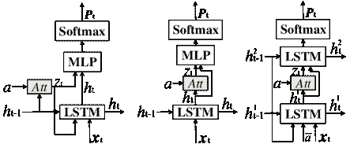

<!--yml

category: 未分类

date: 2024-09-06 20:06:16

-->

# [1905.08110] 基于深度学习方法的图像描述：综述

> 来源：[`ar5iv.labs.arxiv.org/html/1905.08110`](https://ar5iv.labs.arxiv.org/html/1905.08110)

# 基于深度学习方法的图像描述：综述

Yiyu Wang¹¹1Y. Wang 和 J. Xu 是通讯作者    Jungang Xu^∗    Yingfei Sun & Ben He 中国科学院大学，北京

wangyiyu18@mails.ucas.ac.cn，{xujg,yfsun,benhe}@ucas.ac.cn

###### 摘要

图像描述是一个具有挑战性的任务，并且在人工智能领域越来越受到关注，它可以应用于高效的图像检索、智能盲人导航和人机交互等。在本文中，我们对基于深度学习方法的图像描述的进展进行了综述，包括编码器-解码器结构、编码器中的改进方法、解码器中的改进方法以及其他改进。此外，我们讨论了未来的研究方向。

## 1 介绍

网络中有大量未标记的图像；人工标记这些图像是不可能的。如何通过计算机自动生成自然语言描述是人工智能领域的一个挑战性任务。图像描述可以应用于高效的图像检索、智能盲人导航和人机交互，因此它也是一个具有实际价值的任务。

图像描述的目标是为给定的图像生成一个可信的描述。因此，必须确保描述中对象、属性信息、语义信息和位置关系信息的正确性。因此，我们可以将图像描述分解为两个子任务：（1）理解图像，正确获取相关信息；（2）基于对图像的理解生成描述。图像描述是一个具有挑战性的任务，因为它连接了计算机视觉（CV）和自然语言处理（NLP）两个领域。

换句话说，图像理解相当于特征提取。在传统方法中，底层视觉特征（如几何、纹理、颜色等）是通过使用人工设计的特征操作符来提取的，然后组合成高级全局特征。然而，这些传统方法存在一些缺点。一方面，特征操作符的设计过于依赖运气和经验。另一方面，"语义差距"的问题导致低层次视觉特征无法准确表达语义特征。因此，传统方法缺乏鲁棒性和泛化性能。

对于给定的图像，基于检索的方法从指定的图像描述库中选择句子作为图像的描述；基于模板的方法则从图像中检测出一系列指定的视觉特征，然后将这些特征填入给定模板的空白位置。图像是非常复杂的数据。基于检索的方法提取的描述可能不完全符合图像。基于模板的方法生成的图像描述显得过于僵化，缺乏多样性。

近年来，卷积神经网络（CNN）在计算机视觉（CV）任务中取得了卓越的效果，例如图像分类、物体检测。递归神经网络（RNN）在自然语言处理（NLP）中也发挥了重要作用。此外，受到机器翻译中编码器-解码器结构的启发，Sutskever 等人（2014）和 Vinyals 等人（2015）使用 GoogLeNet 作为编码器自动提取图像特征，然后使用长短期记忆网络（LSTM）Hochreiter 和 Schmidhuber（1997）作为解码器生成描述，这一工作开创了基于深度学习的图像描述技术。从那时起，基于编码器-解码器结构的深度学习方法已成为图像描述的基本框架。

在过去几年中，基于深度学习方法的大量研究工作被发表。许多基于编码器-解码器结构的有用改进被提出，例如语义注意力 You 等人（2016）、视觉哨兵 Lu 等人（2017）和评审网络 Yang 等人（2016）。我们将这些改进分为（1）编码器的改进（2）解码器的改进和（3）其他改进。

本文的主要贡献包括：（1）介绍并分析了传统方法，如基于检索和基于模板的方法；（2）提供了编码器-解码器结构的概述；（3）总结了图像描述中编码器和解码器的改进；（4）讨论并提出了未来的研究方向。

本文的其余部分组织如下。第二部分介绍了传统的图像描述方法。第三部分关注编码器-解码器的改进。第四部分和第五部分介绍了现有的标准数据集和评估指标。第六部分讨论了未来的研究方向。第七部分给出了结论。

## 2 传统方法

本文主要集中在深度学习方法上。因此，在这一部分，我们仅简要回顾作为传统方法的基于检索和基于模板的方法。

图 1：传统方法的基本流程：基于检索的方法（上）。基于模板的方法（下）。

### 2.1 基于检索的方法

对于给定的图像，基于检索的图像描述方法旨在从一组给定的图像-描述对中检索匹配的句子作为图像的语言描述，见图 1（顶部）。因此，这种方法的质量不仅取决于图像-描述对的多样性，还取决于基于图像的检索算法。

Ordonez 等人 (2011) 首先通过 Gist 和 Tiny 图像描述符从图像-描述对中检索一系列相关图像，然后通过特定对象和场景检测和分类查询图像，并依次重新排序检索到的图像，选择排名第一的图像的描述作为查询图像的描述。该方法可以视为在视觉空间中的检索。

Hodosh 等人 (2015) 将图像描述视为一个排序任务，并采用 KCCA（典型相关分析的核化版本）将图像和描述投影到一个共同的多模态空间中。然后，查询图像被投影到多模态空间中，并计算查询图像与数据集中描述之间的余弦相似度。排名靠前的描述被接受为查询图像的描述。然而，KCCA 仅适用于小型数据集，这可能会影响该方法的性能。该方法可以视为在多模态空间中的检索。

但基于检索的方法的缺点也很明显。该方法生成的描述质量在很大程度上依赖于给定的图像-描述池。图像-描述对是人工建立的，因此确保描述句子的流畅性和语法的准确性是足够的；然而，为了确保描述内容和语义的准确性，预先给定的图像-描述对需要足够大，以覆盖足够丰富的场景。这种方法的限制可能不适用于新图像的对象和场景，因此也限制了该方法的泛化性能。

### 2.2 基于模板的方法

对于给定的图像，基于模板的图像描述方法通常需要从图像中提取一些对象、属性或语义信息，然后使用指定的语法规则将信息组合起来，或将获得的数据填入预定义的句子模板的空白处以形成图像描述，见图 1（底部）。

Li 等人 (2011) 首先使用图像识别器从图像中获得视觉信息，包括对象、对象的属性和不同对象之间的空间关系。然后，他们将信息编码为 $<<$adj1, obj1 $>$, prep, $<$adj2, obj2 $>>$ 的三元组形式。此外，使用基于网页规模 n-gram 的方法来获取所有可能的 n-gram 序列的频率计数（$1\leq n\leq 5$）。最后，短语被选择和融合，通过动态规划算法接受最佳组合作为查询图像的描述。

Kulkarni 等人 (2011) 使用了一个对象检测器来检测图像中的对象，然后将候选对象区域送入属性分类器和介词关系函数，以获得候选对象的属性信息和对象之间的介词关系信息。此外，构建了一个条件随机场（CRF）来推断先前获得的相关信息以供最终使用。

与基于检索的方法相比，基于模板的方法也可以生成语法正确的描述语句，而且由于这种方法需要从图像中检测对象，因此生成的描述在某种程度上与图像更相关。但是，基于模板的方法的缺陷也很明显。一方面，句子模板或语法规则需要人为预先设计，因此这种方法不能生成可变长度的句子，这限制了不同图像之间描述的多样性，描述可能显得僵硬和不自然；另一方面，对象检测器的性能限制了图像描述的准确性，因此生成的描述可能遗漏查询图像的细节。

## 3 深度学习方法

近年来，深度学习方法在计算机视觉（CV）和自然语言处理（NLP）方面取得了显著进展。受到机器翻译 Sutskever 等人 (2014) 的启发，编码器-解码器结构也被应用于图像描述。通常，CNN 被用来构建编码器，以从图像中提取和编码信息。RNN 被用来构建解码器，以生成描述。在此基础上，许多研究人员还提出了各种高效的改进方法，但它们的关注点不同。因此，我们根据改进的重点将它们分为多个子类别，然后分别介绍和讨论每个子类别。

### 3.1 基本的编码器-解码器结构

Show and Tell Vinyals 等人 (2015) 是第一个将机器翻译中提出的编码器-解码器结构应用于图像描述的工作。它也成为了后续改进的基础和模型性能比较的基准模型。模型结构见图 2（顶部）。

图 2：基于编码器-解码器结构的模型：展示与描述（顶部）。展示、关注与描述（底部）

该模型首先使用 CNN 作为编码器部分，将图像编码为固定长度的向量表示，即图像特征图，然后将图像特征图发送到 RNN 的解码器部分，以解码并生成图像描述。这可以表示为 Eq.(1)-Eq.(3)。编码器部分是 CNN，对应于 GoogLeNet（Inception V3）；解码器部分是 LSTM。

|  | $\displaystyle x_{-1}$ | $\displaystyle={\rm Encoder}(I)$ |  | (1) |
| --- | --- | --- | --- | --- |
|  | $\displaystyle x_{t}$ | $\displaystyle=W_{e}S_{t},$ | $\displaystyle t\in\{0,...,N-1\}$ |  | (2) |
|  | $\displaystyle p_{t+1}$ | $\displaystyle={\rm Decoder}(x_{t}),$ | $\displaystyle t\in\{0,...,N-1\}$ |  | (3) |

假设词汇表大小为 $D$，其中 $I$ 表示输入图像，$x_{-1}$ 是特征图，仅用于初始化 LSTM；$S_{t}$ 是大小为 $D$ 的 one-hot 向量，表示图像描述中的第 $t$ 个词，$S_{0}$ 是 $<$START$>$ 标签，$S_{N}$ 是 $<$END$>$ 标签；$W_{e}$ 是词嵌入矩阵；$p_{t+1}\in\mathbb{R}^{D}$ 表示第 $t+1$ 时间步生成的概率向量，其中最可能的词对应于时间步词输出。

展示、关注与描述 Xu 等人（2015）是 Vinyals 等人（2015）的扩展，引入了基于编码器-解码器结构的视觉注意机制，在解码器生成描述的过程中可以动态关注图像的显著区域。模型结构如图 2（底部）所示。

该模型还使用 CNN 作为编码器，从图像中提取 $L$ 个 $K$ 维向量，每个向量对应图像的一部分。但与 Vinyals 等人（2015）不同，该模型使用底层卷积层的输出，而不是最终全连接层的输出作为图像特征向量。

|  | $a=\{a_{1},...,a_{L}\},a_{i}\in\mathbb{R}^{K}$ |  | (4) |
| --- | --- | --- | --- |

在解码器部分，Xu 等人（2015）还使用 LSTM 进行描述生成。但该模型需要在每个时间步 $t$ 使用基于图像的特征向量 $a$ 来生成上下文向量 $z_{t}=\sum_{i=1}^{L}\alpha_{ti}a_{i}$。这是注意力机制的体现，$\alpha_{t}\in\mathbb{R}^{L}$ 是第 $t$ 时间步的注意力权重向量，满足 $\sum_{i=1}^{L}\alpha_{ti}=1$。$a$ 可以通过简单的神经网络 $f_{\rm att}$ 和 Softmax 激活函数进行预测。

|  | $\alpha_{ti}\propto\exp\{f_{\rm att}(a_{i},m_{t-1})\}$ |  | (5) |
| --- | --- | --- | --- |

因此，注意力编码器-解码器结构可以表示为 Eq.(6)-Eq.(9)。

|  | $\displaystyle a$ | $\displaystyle={\rm Encoder}(I)$ |  | (6) |
| --- | --- | --- | --- | --- |
|  | $\displaystyle z_{t}$ | $\displaystyle=\sum_{i=1}^{L}\alpha_{ti}a_{i},$ | $\displaystyle\alpha_{ti}\in\mathbb{R},a_{i}\in\mathbb{R}^{K}$ |  | (7) |
|  | $\displaystyle x_{t}$ | $\displaystyle=W_{e}S_{t},$ | $\displaystyle t\in\{0,...,N-1\}$ |  | (8) |
|  | $\displaystyle p_{t+1}$ | $\displaystyle={\rm Decoder}(x_{t},z_{t}),$ | $\displaystyle t\in\{0,...,N-1\}$ |  | (9) |

上述方程是论文中提出的**Soft**注意力机制，详细内容见图 3（左），此外还提出了另一种**Hard**注意力机制。然而，大多数改进的模型使用易于实现的**Soft**注意力机制，因此这里仅介绍**Soft**注意力机制。

### 3.2 编码器的改进

You 等人 (2016) 提出了一个语义注意力模型，除了使用 CNN 的中间激活输出作为图像的全局特征 $v$，还使用一组属性检测器提取 $\{A_{i}\}$ 中最可能出现在图像中的属性。每个属性 $A_{i}$ 对应词汇表中的一个条目，因此模型将图像编码为视觉特征和语义特征的集合。然后自适应地处理 $\{A_{i}\}$ 以计算解码器输入 $x_{t}$ 并获得当前词输出 $p_{t}$。

|  | $\displaystyle v$ | $\displaystyle={\rm Encoder}(I)$ |  | (10) |
| --- | --- | --- | --- | --- |
|  | $\displaystyle h_{t}$ | $\displaystyle={\rm Decoder}(h_{t-1},x_{t})$ |  | (11) |
|  | $\displaystyle p_{t}$ | $\displaystyle=\varphi(h_{t},\{A_{i}\})$ |  | (12) |
|  | $\displaystyle x_{t}$ | $\displaystyle=\phi(p_{t-1},\{A_{i}\})$ |  | (13) |

Liu 等人 (2017) 将图像描述问题回归到机器翻译中，首先使用对象检测器将图像 $I$ 表示为检测对象的序列 $seq(I)=\{O_{1},O_{2},...,O_{T_{A}}\}$，其中 $\{O_{1},...,O_{T_{A}-1}\}$ 是图像对象特征表示，最后一个项目 $O_{T_{A}}$ 是图像的全局特征；然后将机器翻译中的序列到序列框架应用于 $seq(I)$ 生成图像描述 $S=\{S_{1},S_{2},...,S_{T_{B}}\}$，编码器和解码器使用 LSTM 实现。

|  | $\displaystyle h_{t_{E}}={\rm Encoder}(O_{t_{E}},h_{t_{E}-1}),t_{E}=1,2,...,T_{A}$ |  | (14) |
| --- | --- | --- | --- |
|  | $\displaystyle d_{t_{D}}={\rm Decoder}(S_{t_{D}},d_{t_{D}-1}),t_{D}=1,2,...,T_{B}$ |  | (15) |

此外，当生成 $S_{T}$ 时，模型应用注意力机制生成 Encoder 隐藏层序列输出 $h=\{h_{1},h_{2},...,h_{T_{A}}\}$ 上的 $d_{t-1}^{\prime}$。然后将 $d_{t-1}^{\prime}$ 和 $d_{t}$ 连接起来，使用 **Softmax** 激活函数生成当前的 $S_{t}$。

Chen 等人 (2017) 认为 CNN 的卷积核可以用作模式检测器，每个图像特征图的通道由相应的卷积核激活。因此，对通道应用注意力机制可以看作是选择图像语义属性的过程。他们提出了 SCA-CNN，该方法将注意力机制应用于空间和通道。然而，与之前的注意力机制不同，在计算上下文向量时，他们只加权区域特征而不求和，这可以确保特征向量和上下文向量大小相同，因此 SCA-CNN 可以嵌入堆叠多次。

Fu 等人 (2017) 引入了先进的语义信息来改进基于注意力的图像描述。首先，对象检测生成一系列候选区域，然后使用两个分类器对候选区域进行分类（好/坏）。最后，选择前 29 个区域和图像全局区域作为视觉特征信息。注意力机制生成上下文向量 $z_{t}$。此外，他们使用 LDA 对数据集中所有描述进行建模，将图像灵活地映射到 80 维主题向量（对应隐含的 80 个场景类别），然后训练一个多层感知机来预测场景上下文向量 $s$，以更好地生成图像描述。

Yao 等人 (2018) 认为图像对象之间的语义关系和空间关系对图像描述生成有帮助。他们首先使用对象检测模块 Faster R-CNN Ren 等人 (2015) 检测图像中的对象，并将图像表示为 $K$ 个包含对象的图像显著性区域 $V=\{v_{i}\}_{i=1}^{K}$；然后使用一个简单的分类网络预测对象之间的语义关系，并构建语义关系图 $\mathcal{G}_{sem}=(V,\varepsilon_{sem})$，并通过使用对象区域的位置关系构建空间关系图 $\mathcal{G}_{spa}=(V,\varepsilon_{spa})$。然后，他们设计了一个基于 [GCN] 的图像编码器，以融合对象之间的语义和空间关系，从而获得包含更多信息的视觉特征 $V^{(1)}=\{v_{i}^{(1)}\}_{i=1}^{K}$。

从上述内容可以看出，改进编码器的原意主要是从图像中提取更多有用的信息，例如在视觉信息的基础上添加语义信息，或用对象检测模块替代原来的 CNN 响应激活区域。因此，这些方法提高了图像描述效果，但也存在一些固有的缺陷。一方面，对象检测可能会影响图像描述生成的效率，另一方面，难以有效解释隐式获得的图像语义信息的可靠性。

图 3：注意力语言模型细节。

### 3.3 解码器中的改进

Lu 等人（2017）认为在生成图像描述的过程中，不应将视觉注意力添加到诸如介词和量词等非视觉词汇上。因此，他们在解码器中引入了一个视觉哨兵，实际上为每个时间步生成了一个哨兵向量 $s_{t}$ 的 LSTM 添加了门控。此外，他们认为视觉注意力应与 LSTM 当前时间步的隐藏层状态更相关，因此与 Xu 等人（2015）相比，视觉注意力机制得到了改进，见图 3（中间）。当生成视觉注意力权重 $\alpha_{t}$ 时，会计算权重值 $\beta_{t}$ 以确定是否在视觉上关注图像。因此，每个时间步的上下文向量计算如下。

|  | $\displaystyle\alpha_{ti}$ | $\displaystyle\propto\exp\{f_{\rm Vatt}(a_{i},m_{t})\}$ |  | (16) |
| --- | --- | --- | --- | --- |
|  | $\displaystyle\beta_{t}$ | $\displaystyle\propto\exp\{f_{\rm Satt}(s_{t},m_{t})\}$ |  | (17) |
|  | $\displaystyle z_{t}$ | $\displaystyle=\beta_{t}s_{t}+(1-\beta_{t})\sum_{i=1}^{L}\alpha_{ti}a_{i}$ |  | (18) |

Anderson 等人（2018）结合了自下而上的注意力和自上而下的注意力。首先，基于 Faster R-CNN 作为自下而上注意力模型，获得了一个可变大小的图像特征集 $V=\{v_{i}\}_{i=1}^{K}$。每个特征是图像显著区域的编码。用于生成语言描述的解码器使用了一个两层的 LSTM 结构，见图 3（右侧）。第一个 LSTM 充当自上而下的注意力层，对隐藏层输出和视觉特征 $V$ 应用注意力机制，以计算上下文向量 $z_{t}$。然后将其输入到第二个 LSTM，并将第二个 LSTM 的输出传递给 Softmax 分类器，以生成当前时间步的词预测。

Zhou 等人（2017）指出，在以往的工作中，图像特征仅在最初被输入到 LSTM 中，或者在此基础上引入了注意力机制来计算上下文向量并输入 LSTM。文本上下文是否可以用来提高图像描述性能尚未解决，即生成的词与视觉信息之间的关系没有涉及。为了解决这个问题，他们提出了一种文本条件注意力机制，该机制允许注意力集中在与先前生成的词相关的图像特征上。他们将先前生成的词与全局图像特征 $I$ 融合以生成上下文向量 $z_{t}$，然后将其输入到 LSTM 中生成词 $S_{t+1}$。

|  | $\displaystyle z_{t}$ | $\displaystyle=\phi(I\odot W_{C}S_{t})$ |  | (19) |
| --- | --- | --- | --- | --- |
|  | $\displaystyle z_{t}$ | $\displaystyle=\phi(I\odot W_{C}\sum_{k=1}^{t}\frac{S_{k-1}}{t})$ |  | (20) |

方程（19）是 1-gram 形式的文本条件注意力，上下文信息仅限于前一个词；方程（20）是一个极端形式，上下文信息利用了所有之前生成的词汇。

在大多数工作中，使用一层或两层 RNN 作为语言模型来生成描述性词汇。Fang 等人（2018）认为这种结构可以更容易地处理名词等视觉词汇，但可能无法学习动词和形容词。因此，他们提出了一种基于多层 LSTM 的深度注意力语言模型，该模型可以学习更抽象的词汇信息，并设计了三种重叠的方法来生成注意力上下文向量。

LSTM 通常被用作图像字幕任务中的解码器部分，但 LSTM 相对复杂且无法并行执行。Aneja 等人（2018）和 Wang 与 Chan（2018）提出使用 CNN 作为解码器部分来生成图像描述，这可以达到与 LSTM 相同的效果，并大大提高计算速度。

在使用 RNN（例如 LSTM 和 GRU）作为解码器生成描述时，解码器的输入、隐藏状态和输出通常表示为 1 维向量。Dai 等人（2018）认为，2 维特征映射在解释上更有效，且方便进行视觉分析，以研究输入视觉信息与输出描述词之间的关系；其次，2 维特征可以保留重要的空间结构信息。因此，他们提出在 2 维特征图上设计解码器。首先，使用 CNN 将图像转换为多通道 2 维特征映射。解码器仍然使用 GRU 结构，但状态映射转换被卷积操作所替代。

上述工作表明，解码器的改进主要集中在生成描述时信息的丰富性和注意力的正确性。

### 3.4 其他改进

在编码器和解码器的基础上，Yang 等人（2016）引入了一个 Reviewer 模块，这本质上是一个改进的 LSTM 单元，引入了注意力机制。它用于对编码器输出的局部特征进行多次回顾，并在每一步计算一个事实向量$f_{t}$，作为解码器中注意力模块的输入。作者认为，由 Reviewer 模块提取的事实向量比编码器获得的图像特征图更紧凑、更抽象。因此，模型的视觉注意力应用于 Reviewer 模块，而解码器模块则将注意力机制应用于事实向量。

本文介绍了两种形式的 Reviewer 模块。一种是**Attention Input Reviewer**，该模块首先将注意力机制应用于图像区域特征$a$，然后将注意力输出作为 LSTM 单元的输入来生成事实向量$f_{t}$。

|  | $\displaystyle\alpha_{ti}$ | $\displaystyle\propto\exp\{f_{\rm att}(a_{i},f_{t-1})\}$ |  | (21) |
| --- | --- | --- | --- | --- |
|  | $\displaystyle\tilde{f}_{t}$ | $\displaystyle=\sum_{i=1}^{L}\alpha_{ti}a_{i}$ |  | (22) |
|  | $\displaystyle f_{t}$ | $\displaystyle={\rm LSTM_{R}}(\tilde{f}_{t},f_{t-1})$ |  | (23) |

另一个是注意力输出审阅器，它也将注意力机制应用于图像区域特征，但使用零向量作为 LSTM 单元的输入，事实向量作为 LSTM 输出和注意力输出的总和进行计算，

|  | $\displaystyle f_{t}$ | $\displaystyle={\rm LSTM_{R}}(0,f_{t-1})+W\tilde{f}_{t}$ |  | (24) |
| --- | --- | --- | --- | --- |

受到 Yang et al. (2016) 的启发，Jiang et al. (2018) 设计了一个基于编码器和解码器结构的简单神经网络的指导网络。图像的区域特征集作为输入生成一个包含图像全局信息的指导向量 $v$。然后，指导向量 $v$ 将与解码器的原始输入融合，以确保在生成图像描述时输入更丰富的图像信息。

|  | Flickr30K | MS COCO |
| --- | --- | --- |
| 方法 | B-1 | B-2 | B-3 | B-4 | MT | CD | B-1 | B-2 | B-3 | B-4 | MT | CD | SP |
| --- | --- | --- | --- | --- | --- | --- | --- | --- | --- | --- | --- | --- | --- |
| Vinyals et al. (2015) | 66.3 | 42.3 | 27.7 | 18.3 | - | - | 66.6 | 46.1 | 32.9 | 24.6 | - | - | - |
| Xu et al. (2015) | 66.7 | 43.4 | 28.8 | 19.1 | 18.49 | - | 70.7 | 49.2 | 34.4 | 24.3 | 23.9 | - | - |
| You et al. (2016) | 64.7 | 46.0 | 32.4 | 23.0 | 18.9 | - | 70.9 | 53.7 | 40.2 | 30.4 | 24.3 | - | - |
| Liu et al. (2017) | - | - | - | - | - | - | 73.1 | 56.7 | 42.9 | 32.3 | 25.8 | 105.8 | 18.9 |
| Chen et al. (2017) | 66.2 | 46.8 | 32.5 | 22.3 | 19.5 | - | 71.9 | 54.8 | 41.1 | 31.1 | 25.0 | - | - |
| Fu et al. (2017) | 64.9 | 46.2 | 32.4 | 22.4 | 19.4 | 47.2 | 72.4 | 55.5 | 41.8 | 31.3 | 24.8 | 95.5 | - |
| Yao et al. (2018) | - | - | - | - | - | - | 77.4 | - | - | 37.1 | 28.1 | 117.1 | 21.1 |
| Anderson et al. (2018) | - | - | - | - | - | - | 77.2 | - | - | 36.2 | 27.0 | 113.5 | 20.3 |
| Zhou et al. (2017) | - | - | - | - | - | - | 71.6 | 54.5 | 40.5 | 30.1 | 24.7 | 97.0 | - |
| Fang et al. (2018) | - | - | 32.8 | 23.4 | 18.7 | 43.7 | - | - | 44.2 | 34.0 | 26.4 | 105.6 | - |
| Aneja et al. (2018) | - | - | - | - | - | - | 71.1 | 53.8 | 39.4 | 28.7 | 24.4 | 91.2 | 17.5 |
| Wang and Chan (2018) | 60.7 | 42.5 | 29.2 | 19.9 | 19.1 | 39.5 | 68.5 | 51.1 | 36.9 | 26.7 | 23.4 | 84.4 | - |
| Dai et al. (2018) | - | - | - | 22.0 | - | 42.7 | - | - | - | 31.9 | - | 99.4 | 18.7 |

表 1：一些模型的评估结果。B-n、MT、CD 和 SP 分别代表 BLEU-n、METEOR、CIDEr 和 SPICE。

## 4 个数据集

基于深度学习方法的图像描述需要大量标签数据。幸运的是，许多研究人员和研究机构已经收集并标注了数据集。这里主要介绍四个常见的数据集：Flickr 8K Hodosh et al. (2015)、Flickr 30K Young et al. (2014)、MS COCO Lin et al. (2014) 和 Visual Genome Krishna et al. (2017)。

Flickr8K Hodosh et al. (2015) 包含总共 8092 张图像，这些图像是从 Flickr.com 收集的，标题通过 Amazon Mechanical Turk 提供的众包服务获得。每张图像包含五个不同的标题供参考，平均长度为 11.8 个单词，这些描述需要准确描述图像中显示的物体、场景和活动。在实际应用中，通常选择 8000 张图像，其中 6000 张用于训练，1000 张用于验证，1000 张用于测试。

Flickr30K Young et al. (2014) 是对 Flickr8K 的扩展。它包含 31,783 张图像（包括 Flickr8K 中的 8092 张图像）和 158,915 个描述。使用类似于 Flickr8K 的注释指南来获得图像描述、控制描述质量并纠正描述错误。通常，选择 1000 张图像作为验证数据，1000 张图像作为测试数据，其余图像用作训练数据。

MicroSoft COCO Lin et al. (2014) 是一个大型数据集，可用于物体检测、实例分割和图像描述。它也是图像描述中最受欢迎的数据集。数据集包含 91 个物体类别，共 328K 张图像，250 万标签实例，每张图像包含 5 个描述。数据集分为两个部分。2014 年发布的部分包括 82,783 张训练数据、40,504 张验证数据和 40,775 张测试数据。然而，测试集的描述未公开，因此实际应用中通常将训练集数据和验证集数据重新划分为训练/验证/测试集。

Visual Genome Krishna et al. (2017) 包含超过 108K 张图像。每张图像平均包含 35 个物体，具有密集的描述注释、26 个属性和 21 种物体之间的互动。因此，Visual Genome 数据集可以用于预训练图像描述任务，引入物体之间的空间和语义关系。

## 5 评估

BLEU Papineni et al. (2002) 是图像描述任务中最常用的评估指标。它最初用于衡量机器翻译的质量。BLEU 的核心思想是“测试句子与参考句子越接近，效果越好”。换句话说，BLEU 通过比较测试句子和参考句子在 n-gram 级别的相似性来评估。因此，该方法不考虑语法正确性、同义词、相似表达，仅在较短句子的情况下更为可靠。

METEOR Banerjee and Lavie (2005) 也是一个常用的机器翻译评估指标。首先，将测试句子与参考句子对齐，例如通过词精确匹配、基于词干提取的匹配、同义词匹配和基于 WordNet 的对齐等。然后，根据对齐结果计算测试句子和参考句子之间的相似度分数。相似度分数的计算涉及匹配词的准确率和召回率等指标。该方法解决了 BLEU 的一些不足，并能更好地表达句子层面的相关性。

CIDEr Vedantam et al. (2015) 是一个针对图像描述的评估指标。作者认为过去的评估指标与人类有很强的相关性，但无法评估它们与人类之间的相似性。因此，他们提出了基于共识的评估指标。每个句子被视为一个“文档”，并表示为 TF-IDF 向量。计算每个 n-gram 的 TF-IDF 权重，然后计算测试句子和参考句子之间的余弦相似度进行评估。

SPICE Anderson et al. (2016) 也是一个为图像描述设计的评估指标。该指标将图像描述中的对象、属性和关系编码成一个语义图。该方法比现有的基于 n-gram 的评估指标更好地捕捉了人类对模型生成描述的判断，并且可以更准确地反映语言模型的优缺点。

## 6 讨论与未来研究方向

一些深度学习方法的评估结果显示在表 1 中，表明深度学习方法在图像字幕任务中取得了巨大成功。在前面的部分中，我们主要讨论了基于编码器-解码器结构的改进模型。不同改进的重点不同，但大多数目的是丰富图像的视觉特征信息，这也是它们的共同初衷。例如，对编码器的改进包括通过目标检测从图像中提取更精确的显著区域特征，通过提取图像中显著对象之间的语义关系丰富图像信息，以及通过从图像中隐式提取场景向量来指导描述的生成，所有这些都是为了从图像中获取更丰富和更抽象的信息或获得额外的信息。解码器的进一步改进包括增加先前生成的描述性词的使用，向语言模型添加控制门以确保适当应用注意机制，并隐式增加 LSTM 层的数量以获取更抽象的信息。

然而，图像字幕与人类水平还有很大差距，因此还有很大的改进空间。一方面，我们可以继续研究如何从图像中提取更丰富的视觉信息，或者将提取的特征图结合成更抽象的信息以增强解码器的上下文特征。例如，在编码器部分引入语义分割并使用最新的语言模型作为解码器；另一方面，我认为我们可以深化数据集的开发。现有的图像字幕数据集只对应图像和描述，对描述的感兴趣区域以及如何生成描述的过程没有反映。如果数据集的开发能够加强，更多的监控信息可以被引入到模型的训练中，这可能会提高图像字幕的性能。

## 7 结论

本文总结了基于深度学习方法的图像字幕。首先，简要介绍了传统基于模板和检索的方法。其次，主要介绍了近年来基于编码器-解码器结构的深度学习方法及其改进。根据改进的重点，这些改进分为三部分：编码器改进、解码器改进和其他改进。然后，介绍了图像字幕中常用的数据集和评估指标。尽管基于深度学习的图像字幕已经得到改进，但它们也还有很大的改进空间。因此，最后，我们总结了一些深度学习方法的结果，并预测未来的研究方向。

## 参考文献

+   Anderson 等人[2016] P. Anderson, B. Fernando, M. Johnson 和 S. Gould。SPICE：语义命题图像字幕评估。在 ECCV，2016 年，第 382-398 页。

+   Anderson 等人 [2018] P. Anderson, X. He, C. Buehler, D. Teney, M. Johnson, S. Gould 和 L. Zhang. 图像描述和视觉问答的自下而上和自上而下注意力。载于 CVPR，第 6077–6086 页，2018 年。

+   Aneja 等人 [2018] J. Aneja, A. Deshpande 和 A. G. Schwing. 卷积图像描述。载于 CVPR，第 5561–5570 页，2018 年。

+   Banerjee 和 Lavie [2005] S. Banerjee 和 A. Lavie. METEOR：一种改进了与人工评估相关性的自动化评估指标。载于机器翻译内在和外在评估度量研讨会论文集，第 65–72 页，2005 年。

+   Chen 等人 [2017] L. Chen, H. Zhang, J. Xiao, L. Nie, J. Shao, W. Liu 和 T. Chua. SCA-CNN：用于图像描述的卷积网络中的空间和通道注意力。载于 CVPR，第 6298–6306 页，2017 年。

+   Dai 等人 [2018] B. Dai, D. Ye 和 D. Lin. 重新思考图像描述中的潜在状态形式。载于 ECCV，第 294–310 页，2018 年。

+   Fang 等人 [2018] F. Fang, H. Wang, Y. Chen 和 P. Tang. 深度分析和转移注意力用于图像描述。Multimedia Tools Appl., 77(23):31159–31175, 2018 年。

+   Fu 等人 [2017] K. Fu, J. Jin, R. Cui, F. Sha 和 C. Zhang. 对齐观察位置和描述内容：基于区域的注意力和场景特定上下文的图像描述。IEEE Trans. Pattern Anal. Mach. Intell., 39(12):2321–2334, 2017 年。

+   Hochreiter 和 Schmidhuber [1997] S. Hochreiter 和 J. Schmidhuber. 长短期记忆。神经计算，9(8):1735–1780，1997 年。

+   Hodosh 等人 [2015] M. Hodosh, P. Young 和 J. Hockenmaier. 将图像描述框定为排序任务：数据、模型和评估指标（扩展摘要）。载于 IJCAI，第 4188–4192 页，2015 年。

+   Jiang 等人 [2018] W. Jiang, L. Ma, X. Chen, H. Zhang 和 W. Liu. 学习引导图像描述的解码过程。载于 AAAI，第 6959–6966 页，2018 年。

+   Krishna 等人 [2017] R. Krishna, Y. Zhu, O. Groth, J. Johnson, K. Hata, J. Kravitz, S. Chen, Y. Kalantidis, L. Li, D. A. Shamma, M. S. Bernstein 和 L. Fei-Fei. 视觉基因组：使用众包密集图像注释连接语言和视觉。《计算机视觉国际期刊》，123(1):32–73, 2017 年。

+   Kulkarni 等人 [2011] G. Kulkarni, V. Premraj, S. Dhar, S. Li, Y. Choi, A. C. Berg 和 T. L. Berg. 宝宝话：理解和生成简单的图像描述。载于 CVPR，第 1601–1608 页，2011 年。

+   Li 等人 [2011] S. Li, G. Kulkarni, T. L. Berg, A. C. Berg 和 Y. Choi. 使用网页规模 n-gram 生成简单的图像描述。载于 CoNLL，第 220–228 页，2011 年。

+   Lin 等人 [2014] T. Lin, M. Maire, S. J. Belongie, J. Hays, P. Perona, D. Ramanan, P. Dollár 和 C. L. Zitnick. Microsoft COCO：上下文中的常见对象。载于 ECCV，第 740–755 页，2014 年。

+   Liu 等人 [2017] C. Liu, F. Sun, C. Wang, F. Wang 和 A. L. Yuille. MAT：一种多模态注意力翻译器用于图像描述。载于 IJCAI，第 4033–4039 页，2017 年。

+   Lu 等人 [2017] J. Lu, C. Xiong, D. Parikh, 和 R. Socher. 知道何时查看: 通过视觉哨兵实现的自适应注意力用于图像描述. 在 CVPR, 页码 3242–3250, 2017.

+   Ordonez 等人 [2011] V. Ordonez, G. Kulkarni, 和 T. L. Berg. Im2text: 使用 100 万张标注照片描述图像. 在 NIPS, 页码 1143–1151, 2011.

+   Papineni 等人 [2002] K. Papineni, S. Roukos, T. Ward, 和 W. Zhu. Bleu: 一种自动评估机器翻译的方法. 在 ACL, 页码 311–318, 2002.

+   Ren 等人 [2015] S. Ren, K. He, R. Girshick, 和 J. Sun. Faster R-CNN: 通过区域建议网络实现实时目标检测. 在 NIPS, 页码 91–99, 2015.

+   Sutskever 等人 [2014] I. Sutskever, O. Vinyals, 和 Q. Le. 基于神经网络的序列到序列学习. 在 NIPS, 页码 3104–3112, 2014.

+   Vedantam 等人 [2015] R. Vedantam, C. L. Zitnick, 和 D. Parikh. Cider: 基于共识的图像描述评估. 在 CVPR, 页码 4566–4575, 2015.

+   Vinyals 等人 [2015] O. Vinyals, A. Toshev, S. Bengio, 和 D. Erhan. 展示与讲述: 一个神经图像标题生成器. 在 CVPR, 页码 3156–3164, 2015.

+   Wang 和 Chan [2018] Q. Wang 和 A. B. Chan. CNN+CNN: 用于图像描述的卷积解码器. CoRR, abs/1805.09019, 2018.

+   Xu 等人 [2015] K. Xu, J. Ba, R. Kiros, K. Cho, A. C. Courville, R. Salakhutdinov, R. S. Zemel, 和 Y. Bengio. 展示、关注与讲述: 带有视觉注意力的神经图像标题生成. 在 ICML, 页码 2048–2057, 2015.

+   Yang 等人 [2016] Z. Yang, Y. Yuan, Y. Wu, W. W. Cohen, 和 R. Salakhutdinov. 用于标题生成的复审网络. 在 NIPS, 页码 2361–2369, 2016.

+   Yao 等人 [2018] T. Yao, Y. Pan, Y. Li, 和 T. Mei. 探索视觉关系用于图像描述. 在 ECCV, 页码 711–727, 2018.

+   You 等人 [2016] Q. You, H. Jin, Z. Wang, C. Fang, 和 J. Luo. 带有语义注意力的图像描述. 在 CVPR, 页码 4651–4659, 2016.

+   Young 等人 [2014] P. Young, A. Lai, M. Hodosh, 和 J. Hockenmaier. 从图像描述到视觉指称: 针对事件描述的新相似性度量. TACL, 2:67–78, 2014.

+   Zhou 等人 [2017] L. Zhou, C. Xu, P. A. Koch, 和 J. J. Corso. 观察你刚刚说了什么: 带有文本条件注意力的图像描述. 在 ACM Multimedia 的主题研讨会会议录, 页码 305–313, 2017.
