<!--yml

分类：未分类

日期：2024-09-06 20:06:14

-->

# [1906.04928] 空间-时间数据挖掘中的深度学习：综述

> 来源：[`ar5iv.labs.arxiv.org/html/1906.04928`](https://ar5iv.labs.arxiv.org/html/1906.04928)

# 空间-时间数据挖掘中的深度学习：综述

Senzhang Wang, Jiannong Cao, Philip S. Yu S.Z. Wang (szwang@nuaa.edu.cn) 现为南京航空航天大学计算机科学与技术学院教授，同时担任香港理工大学计算系教授。J.N. Cao 现为香港理工大学计算系教授。P.S. Yu 现为伊利诺伊大学芝加哥分校计算机科学系教授，并担任清华大学数据科学研究所的研究员。

###### 摘要

随着全球定位系统（GPS）、移动设备和遥感等各种定位技术的快速发展，空间-时间数据变得越来越容易获得。从空间-时间数据中挖掘有价值的知识对许多现实世界应用至关重要，包括人类移动性理解、智能交通、城市规划、公共安全、医疗保健和环境管理。由于空间-时间数据集的数量、体积和分辨率迅速增加，传统的数据挖掘方法，尤其是统计学方法，已经变得捉襟见肘。近年来，随着深度学习技术的进步，卷积神经网络（CNN）和递归神经网络（RNN）等深度学习模型由于其在空间和时间领域的强大层次特征学习能力，在各种机器学习任务中取得了显著成功，并被广泛应用于预测学习、表示学习、异常检测和分类等空间-时间数据挖掘（STDM）任务中。本文对应用深度学习技术进行 STDM 的最新进展进行了全面的综述。我们首先对空间-时间数据的类型进行分类，并简要介绍了在 STDM 中使用的流行深度学习模型。接着，介绍了一个框架，展示了深度学习模型在 STDM 中的一般应用流程。然后，我们根据 ST 数据的类型、数据挖掘任务和深度学习模型对现有文献进行了分类，接着介绍了深度学习在不同领域的 STDM 应用，包括交通、气候科学、人类移动性、基于位置的社交网络、犯罪分析和神经科学。最后，我们总结了当前研究的局限性，并指出了未来的研究方向。

###### 索引词：

深度学习，空间-时间数据，数据挖掘

## I 引言

在大数据时代，随着大规模时空数据集（如地图、虚拟地球仪、遥感图像、十年一度的普查和 GPS 轨迹）的可用性和重要性的增加，时空数据挖掘（STDM）变得越来越重要。STDM 在环境与气候（例如风力预测和降水预报）、公共安全（例如犯罪预测）、智能交通（例如交通流量预测）、人类流动（例如人类轨迹模式挖掘）等各个领域都有广泛应用。经典的数据挖掘技术用于处理事务数据或图形数据时，往往在应用于时空数据集时表现不佳，原因有很多。首先，ST 数据通常嵌入在连续空间中，而经典数据集如事务和图形通常是离散的。其次，ST 数据的模式通常同时呈现空间和时间特性，这更为复杂，传统方法难以捕捉数据相关性。最后，传统统计数据挖掘方法中的一个常见假设是数据样本是独立生成的。然而，在分析时空数据时，这一独立性假设通常不成立，因为 ST 数据往往高度自相关。

尽管 STDM 在过去几十年里得到了广泛研究，但一个共同的问题是传统方法在很大程度上依赖于特征工程。换句话说，传统的机器学习和数据挖掘技术在处理原始 ST 数据时能力有限。例如，要分析来自 fMRI 数据的人脑活动，通常需要仔细的特征工程和相当的领域专业知识来设计一个特征提取器，将原始数据（例如扫描的 fMRI 图像的像素值）转换为合适的内部表示或特征向量。最近，随着深度学习的普及，卷积神经网络（CNN）和递归神经网络（RNN）等各种深度学习模型在许多机器学习任务中因其强大的层次特征学习能力而取得了显著成功，并已广泛应用于计算机视觉、自然语言处理、推荐系统、时间序列数据预测和 STDM 等多个领域。与传统方法相比，深度学习模型在 STDM 中的优势如下。

+   •

    自动特征表示学习 与传统的需要手工设计特征的机器学习方法显著不同，深度学习模型可以自动从原始 ST 数据中学习层次化特征表示。在 STDM 中，数据的空间邻近性和长期时间相关性通常复杂且难以捕捉。通过 CNN 的多层卷积操作和 RNN 的递归结构，这些空间邻近性和时间相关性可以直接从原始数据中自动有效地学习。

+   •

    强大的函数逼近能力 理论上，深度学习可以逼近任何复杂的非线性函数，并且可以拟合任何曲线，只要它具有足够的层数和神经元。深度学习模型通常由多个层组成，每层可以被视为一个简单但非线性的模块，具有池化、dropout 和激活函数，从而将一个层次的特征表示转化为更高、更抽象层次的表示。通过足够的这种转换组合，可以学习非常复杂的函数，以执行更困难的 STDM 任务，处理更复杂的 ST 数据。

图 1 显示了近年来探索深度学习技术用于各种 STDM 任务的论文数量。可以看到，过去三年论文数量显著增加。从 2012 年到 2015 年，每年发表的相关论文不到 10 篇。从 2016 年起，数量迅速增加，许多研究人员尝试不同的深度学习模型用于不同类型的 ST 数据及其应用领域。2018 年，发表的相关论文约为 90 篇，这是一个很大的数字。2019 年的完整数据目前不可用，但我们相信增长趋势会在今年及未来几年持续。鉴于问题的丰富性和实际应用的多样性，迫切需要对现有的深度学习技术进行概述，以应对 STDM 领域的快速发展。这可以突出使用不同深度学习模型解决不同应用领域 STDM 问题的相似性和差异性。这可以通过使我们看到针对某一特定领域（如交通流预测）的深度学习模型（例如 CNN 和 RNN）如何在另一个领域（如犯罪分析中的犯罪预测）中解决不同问题，从而促进不同研究领域和应用领域之间的思想交叉。

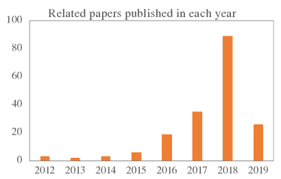

图 1：近年来探索深度学习技术用于 STDM 的论文数量。

关于 STDM 的相关调查 最近有一些调查从不同的视角审视了 STDM 领域的文献。[9] 和 [143] 讨论了“大数据”时代 STDM 算法的计算问题，涉及的应用领域包括遥感、气候科学和社交媒体分析。[87] 重点讨论了从时空数据中挖掘频繁模式的问题。它指出了从 ST 数据中发现模式的挑战，并将模式分类为三类：个体周期性模式；成对运动模式；以及多个轨迹上的聚合模式。[18] 回顾了 STDM 研究和应用的最新进展，重点关注了时空数据的预测、聚类和可视化数据挖掘任务。[130] 从计算角度回顾了 STDM，并强调了 STDM 的统计基础。[112] 回顾了轨迹数据挖掘的方法和应用，这是 ST 数据的一个重要类型。[75] 提供了关于 ST 数据聚类的全面调查。[4] 讨论了不同类型的 ST 数据以及在分析每种数据类型时出现的相关数据挖掘问题。他们将 STDM 文献分类为六个主要类别：聚类、预测学习、变化检测、频繁模式挖掘、异常检测和关系挖掘。然而，所有这些工作都从传统方法的角度审视 STDM，而非深度学习方法。[114] 和 [157] 提供了一项特别关注于利用深度学习模型分析交通数据以提高交通系统智能水平的调查。对于深度学习技术在 STDM 中的广泛系统性探讨，仍然缺乏一项全面的调查。

与现有工作相比，我们的论文在以下方面做出了显著贡献：

+   •

    首次调查 据我们所知，这是首次综述探讨用于时空数据挖掘（STDM）的深度学习技术的调查。鉴于近年来关于时空数据分析的深度学习研究数量不断增加，我们首先对时空数据类型进行了分类，并介绍了在 STDM 中广泛使用的流行深度学习模型。我们还总结了不同数据类型的数据表示，并概述了哪些深度学习模型适合处理哪些类型的 ST 数据表示。

+   •

    一般框架 我们提出了一个基于深度学习的 STDM 的一般框架，其中包括以下主要步骤：数据实例构建、数据表示、深度学习模型选择和解决 STDM 问题。在框架的指导下，给定特定的 STDM 任务，可以更好地使用适当的数据表示，并为研究中的任务选择或设计合适的深度学习模型。

+   •

    综合综述 本调查提供了关于使用深度学习技术解决不同 STDM 问题的最新进展的综合概述，包括预测学习、表示学习、分类、估计与推断、异常检测等。对于每个任务，我们提供了有关不同类型 ST 数据的代表性工作和模型的详细描述，并进行必要的比较和讨论。我们还根据应用领域（包括交通、气候科学、人类移动、基于位置的社交网络、犯罪分析和神经科学）对当前的工作进行了分类和总结。

+   •

    未来研究方向 本调查还突出了当前尚未充分研究的几个开放问题，并指出了未来可能的研究方向。

本调查的组织结构 本调查的其余部分组织如下。第二节介绍了 ST 数据的分类，并简要介绍了广泛用于 STDM 的深度学习模型。第三节提供了使用深度学习进行 STDM 的一般框架。第四节概述了深度学习模型解决的各种 STDM 任务。第五节展示了各个领域的应用画廊。第六节讨论了现有工作的局限性并建议了未来的研究方向。最后，我们在第七节总结了本文。

## II 时空数据的分类

### II-A 数据类型

存在多种类型的时空（ST）数据，这些数据在不同的实际应用中在数据收集和表示方式上有所不同。不同的应用场景和 ST 数据类型会导致不同类别的数据挖掘任务和问题表述。不同的深度学习模型通常对 ST 数据类型有不同的偏好，并且对输入数据格式有不同的要求。例如，CNN 模型旨在处理类似图像的数据，而 RNN 通常用于处理序列数据。因此，首先总结 ST 数据的一般类型并正确表示它们是很重要的。我们遵循并扩展了[4]中的分类，将 ST 数据分类为以下类型：事件数据、轨迹数据、点参考数据、栅格数据和视频。

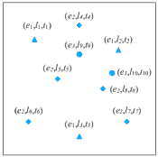

(a) 三种类型的事件

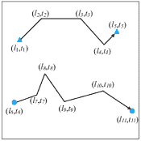

(b) 两个移动物体的轨迹

图 2：事件和轨迹数据类型的说明

事件数据。事件数据由在特定位置和时间发生的离散事件组成（例如，城市中的犯罪事件和交通网络中的交通事故事件）。一个事件通常可以通过一个点的位置和时间来描述，分别表示事件发生的地点和时间。例如，一个犯罪事件可以被描述为这样的元组$(e_{i},l_{i},t_{i})$，其中$e_{i}$是犯罪类型，$l_{i}$是犯罪发生的地点，$t_{i}$是发生的时间。图 1(a)展示了事件数据的示例。它展示了由不同符号形状表示的三种类型的事件。ST 事件数据在现实世界的应用中很常见，例如犯罪学（犯罪及相关事件的发生）、流行病学（疾病爆发事件）、交通（车祸）和社交网络（社交事件和热门话题）。

轨迹数据。轨迹表示在时间中空间中移动的物体所描绘的路径（例如，骑自行车旅行或出租车旅行的移动路线）。轨迹数据通常由部署在移动物体上的传感器收集，这些传感器可以周期性地传输物体在时间中的位置，例如出租车上的 GPS。图 1(b)展示了两个轨迹的示例。每个轨迹通常可以被描述为这样的序列$\{(l_{1},t_{1}),(l_{2},t_{2})...(l_{n},t_{n})\}$，其中$l_{i}$是位置（例如纬度和经度），$t_{i}$是移动物体经过该位置的时间。随着移动应用程序和物联网技术的发展，轨迹数据如人类轨迹、城市交通轨迹和基于位置的社交网络正变得越来越普遍。

点参考数据。点参考数据包括对一个连续 ST 场的测量，例如温度、植被或人口，覆盖一组在空间和时间中移动的参考点。例如，气象数据如温度和湿度通常通过漂浮在空间中的气象气球测量，这些气球持续记录天气观测。点参考数据通常可以表示为一组元组，如下所示$\{(r_{1},l_{1},t_{1}),(r_{2},l_{2},t_{2})...(r_{n},l_{n},t_{n})\}$。每个元组$(r_{i},l_{i},t_{i})$表示传感器$r_{i}$在时间$t_{i}$对 ST 场中位置$l_{i}$的测量。图 3 展示了在两个时间戳下连续 ST 场中的点参考数据（例如，海表温度）。它们由在两个时间戳下的参考位置（以白色圆圈表示）上的传感器测量。请注意，温度传感器的位置随时间变化。

光栅数据。光栅数据是在空间固定位置和固定时间点记录的连续或离散 ST 场的测量。点参考数据和光栅数据的主要区别在于，点参考数据的位置不断变化，而光栅数据的位置是固定的。测量 ST 场的位置和时间可以是规律或不规律分布的。给定$m$个固定位置$S=\{s_{1},s_{2},...s_{m}\}$和$n$个时间戳$T=\{t_{1},t_{2},...t_{n}\}$，光栅数据可以被表示为一个矩阵$R^{m\times n}$，其中每个条目$r_{ij}$是在位置$s_{i}$在时间戳$t_{j}$上的测量值。光栅数据在实际应用中也非常常见，例如交通、气候科学和神经科学。例如，空气质量数据（例如 PM2.5）可以通过部署在城市固定位置的传感器收集，连续时间段内收集的数据形成了空气质量光栅数据。在神经科学中，功能性磁共振成像或功能性 MRI（fMRI）通过检测与血流变化相关的改变来测量大脑活动。扫描的 fMRI 信号也形成了分析大脑活动和识别一些疾病的光栅数据。图 4 显示了交通网络的交通流光栅数据示例。每条道路都部署了交通传感器，用于收集实时交通流量数据。整个一天（24 小时）的所有道路传感器的交通流量数据形成了一种光栅数据。

视频。由一系列图像组成的视频也可以被视为一种 ST 数据。在空间域中，相邻像素通常具有相似的 RGB 值，因此呈现出高空间相关性。在时间域中，连续帧的图像通常变化平稳，并表现出高时间依赖性。视频通常可以被表示为一个三维张量，其中一个维度表示时间$t$，另外两个维度代表一个图像。实际上，视频数据也可以被视为特殊的光栅数据，如果我们假设每个像素都有一个“传感器”，并且在每一帧，这些“传感器”将收集 RGB 值。基于深度学习的视频数据分析在近年来非常热门，并且有大量的论文发表。虽然我们将视频归类为一种 ST 数据，但我们专注于从数据挖掘的视角审查相关工作，视频数据分析属于计算机视觉和模式识别的研究领域。因此，在本调查中，我们不涵盖视频的 ST 数据类型。

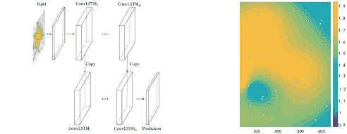

图 3：两个时间戳下 ST 参考点数据的示意图。白色圆圈是记录 ST 领域读数的传感器位置。颜色条显示 ST 领域的分布。

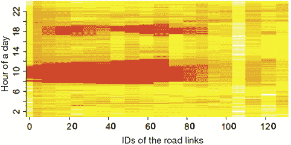

图 4：从交通流量传感器收集的栅格数据示意图。x 轴是交通网络中道路链接的 ID，y 轴是一天中的小时。不同的颜色表示固定位置部署的道路传感器捕获的不同道路链接的交通流量。

### II-B 数据实例与表示

数据挖掘算法操作的基本单元称为数据实例。对于经典的数据挖掘设置，数据实例通常可以表示为一组特征，带有监督学习的标签或无标签的无监督学习。在 ST 数据挖掘场景中，不同 ST 数据类型有不同类型的数据实例。对于不同的数据实例，有几种类型的数据表示用于为深度学习模型进一步挖掘数据。

数据实例。一般来说，ST 数据可以总结为以下数据实例：点、轨迹、时间序列、空间地图和 ST 栅格，如图 5 左侧所示。一个 ST 点可以表示为一个包含空间和时间信息的元组，以及一些额外的观察特征，例如犯罪类型或交通事故。除了 ST 事件，轨迹和 ST 点参考也可以形成点。例如，可以将轨迹拆分为若干离散点，以统计在特定时间段内经过某个区域的轨迹数量。除了作为点和轨迹形成，轨迹在某些应用中也可以作为时间序列形成。如果我们固定位置并统计经过该位置的轨迹数量，它形成了时间序列数据。空间地图的数据实例包含在每个时间戳下整个 ST 领域所有传感器的数据观察。例如，所有高速公路上部署的环路传感器在时间 $t$ 的交通速度读数形成了空间地图数据。ST 栅格数据的实例包含跨越所有位置和时间戳的测量值。即，ST 栅格由一组空间地图组成。

不同的数据实例可以从 ST 栅格中提取，例如时间序列、空间图或 ST 栅格本身，这取决于不同的应用和分析需求。首先，我们可以将 ST 场中某个特定 ST 网格的测量值视为时间序列，用于某些时间序列挖掘任务。其次，对于每个时间戳，ST 栅格的测量值可以视为空间图。第三，还可以将跨越所有位置和时间戳的所有测量值视为一个整体进行分析。在这种情况下，ST 栅格本身可以是一个数据实例。

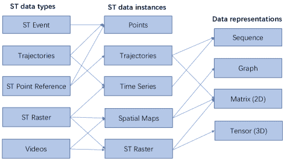

图 5：不同时空数据类型的数据实例和表示

数据表示。对于上述五种 ST 数据实例，通常使用四种数据表示方法来将其作为各种深度学习模型的输入，分别是序列、图、二维矩阵和三维张量，如图 5 右侧所示。不同的深度学习模型要求不同类型的数据表示作为输入。因此，如何表示 ST 数据实例取决于正在研究的数据挖掘任务和选定的深度学习模型。

轨迹和时间序列可以都表示为序列。注意，轨迹有时也被表示为一个矩阵，其两个维度是网格 ST 字段的行和列 ID。矩阵的每个条目值表示轨迹是否穿越了相应的网格区域。这种数据表示方式通常用于促进 CNN 模型的使用 [67, 118, 142]。尽管图形也可以表示为矩阵，但在这里我们将图形和图像矩阵分类为两种不同的数据表示类型。这是因为图节点不遵循图像矩阵所遵循的欧几里得距离，因此处理图形和图像矩阵的方法完全不同。我们将在后面深入探讨处理这两种数据表示类型的方法。空间地图可以表示为图形和矩阵，具体取决于不同的应用。例如，在城市交通流量预测中，城市交通网络的交通数据可以表示为交通流量图 [85, 155] 或单元区域级别的交通流量矩阵 [121, 137]。栅格数据通常表示为 2D 矩阵或 3D 张量。对于矩阵的情况，两个维度是位置和时间步骤；对于张量的情况，三个维度是行区域单元 ID、列区域 ID 和时间戳。与张量相比，矩阵是一种更简单的数据表示格式，但它丢失了位置之间的空间相关信息。两者都广泛用于表示栅格数据。例如，在风速预测中，部署在不同位置的多个风速计的风速时间序列数据通常被合并为一个矩阵，然后输入到 CNN 或 RNN 模型中进行未来风速预测 [96, 200]。在神经科学中，一个人的 fMRI 数据是一系列扫描的 fMRI 大脑图像，因此可以像视频一样表示为张量。许多研究使用 fMRI 图像张量作为 CNN 模型的输入，以进行特征学习来检测大脑活动 [66, 76] 和诊断疾病 [116, 158]。

### II-C 深度学习模型的初步介绍

在本小节中，我们简要介绍几种广泛用于 STDM 的深度学习模型，包括 RBM、CNN、GraphCNN、RNN、LSTM、AE/SAE 和 Seq2Seq。

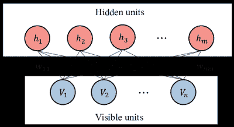

图 6：RBM 模型的结构。

限制玻尔兹曼机（RBM）。限制玻尔兹曼机是一种两层随机神经网络 [53]，可用于降维、分类、特征学习和协同过滤。如图 6 所示，RBM 的第一层称为可见层或输入层，包含神经元节点 $\{v_{1},v_{2},...v_{n}\}$，第二层是隐藏层，包含神经元节点 $\{h_{1},h_{2},...h_{m}\}$。作为一个全连接的二部无向图，RBM 中的所有节点通过无向权重边 $\{w_{11},...w_{nm}\}$ 连接在各层之间，但同一层中的两个节点之间没有连接。标准类型的 RBM 具有二进制值的节点和偏置权重。RBM 尝试学习输入的二进制编码或表示，具体任务不同，RBM 可以以有监督或无监督的方式进行训练。RBM 通常用于学习特征。

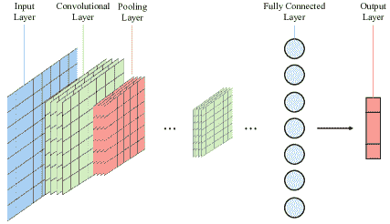

图 7：CNN 模型结构。

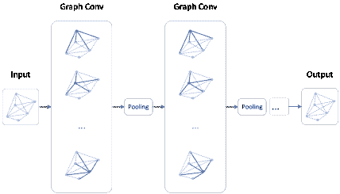

图 8：GraphCNN 模型结构。

CNN。卷积神经网络（CNN）是一类深度前馈人工神经网络，用于分析视觉图像。一个典型的 CNN 模型通常包含以下几个层，如图 7 所示：输入层、卷积层、池化层、全连接层和输出层。卷积层通过计算其权重与输入体积的局部区域之间的标量积，来确定神经元的输出。池化层会沿空间维度对给定输入进行降采样，以减少参数的数量。全连接层将一个层中的每个神经元连接到下一个层中的每个神经元，以学习用于分类的最终特征向量。原则上，它与传统的多层感知机神经网络（MLP）相同。与传统 MLP 相比，CNN 具有以下显著特点，使其在视觉问题上实现了更好的泛化：3D 神经元体积、局部连接和共享权重。CNN 旨在处理图像数据。由于其在捕捉空间域相关性的强大能力，它现在被广泛应用于时空数据挖掘，特别是空间图和时空栅格。

GraphCNN。CNN 旨在处理可以在欧几里得空间中表示为规则网格的图像。然而，许多应用中数据来源于非欧几里得域，如图。GraphCNN 最近被广泛研究，以将 CNN 泛化到图结构数据 [160]。图 8 展示了 GraphCNN 模型的结构示意图。“图卷积”操作将卷积变换应用于每个节点的邻居，然后进行池化操作。通过堆叠多个图卷积层，每个节点的潜在嵌入可以包含来自多个跳数远的邻居的更多信息。在生成图中节点的潜在嵌入后，可以将这些潜在嵌入轻松地输入到前馈网络中，以实现节点分类或回归目标，或者将所有节点嵌入聚合以表示整个图，然后进行图分类和回归。由于其强大的节点相关性和节点特征捕获能力，它现在广泛用于挖掘图结构的时空数据，如网络规模的交通流数据和脑网络数据。

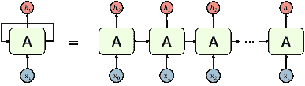

(a) RNN

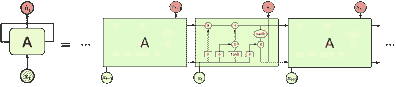

(b) LSTM

图 9：RNN 和 LSTM 模型的结构

RNN 和 LSTM。递归神经网络（RNN）是一类人工神经网络，其中节点之间的连接形成沿序列的有向图。RNN 旨在识别序列特征，并利用模式预测下一个可能的情景。它们广泛应用于语音识别和自然语言处理。图 9(a) 展示了 RNN 模型的一般结构，其中 ${X}_{t}$ 是输入数据，${A}$ 是网络参数，$h_{t}$ 是学习到的隐藏状态。可以看到，前一个时间步 $t-1$ 的输出（隐藏状态）被输入到下一个时间步 $t$ 的神经网络中。因此，历史信息可以被存储并传递到未来。

标准 RNN 的一个主要问题是，由于梯度消失问题，它只能拥有短期记忆。长短期记忆（LSTM）网络是递归神经网络的扩展，能够学习输入数据的长期依赖关系。LSTM 通过特殊的记忆单元使 RNN 能够在较长时间内记住输入，如图 9(b)中间部分所示。LSTM 单元由三个门组成：输入门、遗忘门和输出门。这些门决定是否允许新输入进入（输入门）、是否删除不重要的信息（遗忘门）或让其影响当前时间步的输出（输出门）。RNN 和 LSTM 都被广泛用于处理序列和时间序列数据，以学习 ST 数据的时间依赖性。

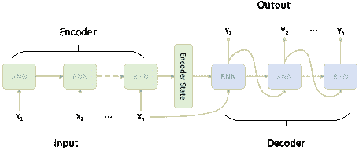

图 10：Seq2Seq 模型的结构。

Seq2Seq。序列到序列（Seq2Seq）模型旨在将固定长度的输入映射到固定长度的输出，其中输入和输出的长度可能不同[138]。它广泛应用于各种自然语言处理（NLP）任务，如机器翻译、语音识别和在线聊天机器人。尽管它最初是为了解决 NLP 任务而提出的，但 Seq2Seq 是一个通用框架，可以用于任何基于序列的问题。如图 10 所示，Seq2Seq 模型通常由三个部分组成：编码器、 intermediate（编码器）向量和解码器。由于在捕捉序列数据之间的依赖关系方面具有强大的能力，Seq2Seq 模型被广泛用于 ST 预测任务，其中 ST 数据表现出较高的时间相关性，如城市人流数据和交通数据。

自编码器（AE）和堆叠自编码器。自编码器是一种旨在以无监督方式学习高效数据编码的人工神经网络[53]。如图 11 所示，它具有一个编码器功能，用于创建一个隐藏层（或多个层），该层包含描述输入的代码。然后是一个解码器，它从隐藏层中创建对输入的重建。自编码器通过学习数据中的相关性来创建数据的压缩表示，该表示位于隐藏层或瓶颈层中，可以看作是降维的一种方式。作为一种有效的无监督特征表示学习技术，AE 促进了各种下游数据挖掘和机器学习任务，例如分类和聚类。堆叠自编码器（SAE）是由多个稀疏自编码器层组成的神经网络，其中每一层的输出都连接到下一层的输入[7]。

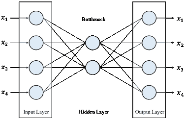

图 11：单层自编码器模型的结构

## III 框架

在本节中，我们将介绍如何使用深度学习模型来解决一般的时空数据挖掘问题。首先，我们将提供一个框架，描述包括时空数据实例构建、时空数据表示、深度学习模型选择与设计，最后是解决问题的管道。接下来，我们将详细介绍这些主要步骤。

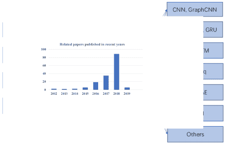

图 12：不同深度学习模型的数据表示

使用深度学习模型进行 ST 数据挖掘的通用流程如图 13 所示。给定从各种位置传感器收集的原始 ST 数据，包括事件数据、轨迹数据、点参考数据和栅格数据，首先构建数据实例以进行数据存储。正如我们之前讨论的，ST 数据实例可以是点、时间序列、空间地图、轨迹和 ST 栅格。为了将深度学习模型应用于各种挖掘任务，ST 数据实例需要进一步表示为适合深度学习模型的特定数据格式。ST 数据实例可以表示为序列数据、二维矩阵、三维张量和图形。然后，对于不同的数据表示，适合处理它们的深度学习模型也不同。RNN 和 LSTM 模型擅长处理具有短期或长期时间相关性的序列数据，而 CNN 模型则有效捕捉图像矩阵中的空间相关性。结合 RNN 和 CNN 的混合模型可以捕捉 ST 栅格数据张量表示中的空间和时间相关性。最后，选择的深度学习模型用于解决各种 STDM 任务，如预测、分类、表示学习等。

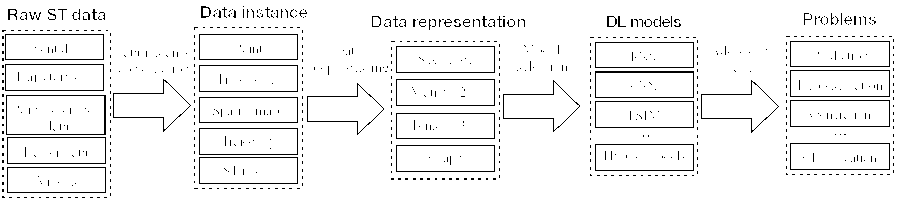

图 13：使用 DL 模型进行 ST 数据挖掘的通用流程

### III-A ST 数据预处理

ST 数据预处理旨在将 ST 数据实例表示为深度学习模型可以处理的合适数据表示格式。通常，深度学习模型的输入数据格式可以是向量、矩阵或张量，具体取决于不同的模型。图 12 展示了 ST 数据实例及其对应的数据表示。可以看出，通常一种类型的 ST 数据实例对应一种典型的数据表示。轨迹和时间序列数据可以自然地表示为序列数据。空间地图数据可以表示为二维矩阵。ST 栅格可以表示为二维矩阵或三维张量。

然而，情况并不总是如此。例如，轨迹数据有时被表示为矩阵，然后应用 CNN 模型以更好地捕捉空间特征[24, 67, 103, 117, 150]。轨迹测量所在的 ST 领域，如城市，首先被划分为网格单元区域。然后，ST 领域可以被建模为矩阵，其中每个单元区域表示一个条目。如果轨迹经过该单元区域，相应的条目值被设为 1；否则设为 0。通过这种方式，轨迹数据可以表示为矩阵，从而可以应用 CNN。有时，空间地图被表示为图。例如，部署在高速公路上的传感器通常被建模为图，其中节点是传感器，边表示两个相邻传感器之间的道路段。在这种情况下，通常使用 GraphCNN 模型处理传感器图数据，并预测所有节点的未来交通（流量、速度等）[22, 85]。ST 栅格数据可以被表示为 2D 矩阵或 3D 张量，具体取决于数据类型和应用。例如，一系列 fMRI 脑部图像数据可以表示为张量，并输入到 3D-CNN 模型中进行疾病分类[78, 116]，也可以通过提取脑部各区域之间的时间序列相关性来表示为矩阵，用于脑活动分析[48, 113]。

### III-B 深度学习模型选择与设计

在处理 ST 数据实例的数据表示后，下一步是将它们输入到选定或设计的深度学习模型中，用于不同的 STDM 任务。如图 12 右侧所示，每种数据表示类型都有不同的深度学习模型选项。序列数据可以作为包括 RNN、LSTM、GRU、Seq2Seq、AE、混合模型等在内的模型的输入。RNN、LSTM 和 GRU 都是适合预测序列数据的递归神经网络。序列数据也可以由 Seq2Seq 模型处理。例如，在多步骤交通预测中，通常使用一个由编码器层的 LSTM 单元和解码器层的 LSTM 单元组成的 Seq2Seq 模型来同时预测未来几个时间槽的交通速度或流量 [89, 90]。作为特征学习模型，AE 或 SAE 可以用于各种数据表示，以学习低维特征编码。序列数据也可以用 AE 或 SAE 编码为低维特征。GraphCNN 特别设计用于处理图数据，以捕捉邻居节点之间的空间相关性。如果输入是单个矩阵，通常使用 CNN 模型；如果输入是一系列矩阵，则可以根据研究问题应用 RNN 模型、ConvLSTM 和混合模型。如果目标只是特征学习，则可以应用 AE 和 SAE 模型。对于张量数据，通常使用 3D-CNN 或 3D-CNN 与 RNN 模型的组合。

表 I 总结了使用深度学习模型处理不同类型 ST 数据的工作。如表所示，CNN、RNN 及其变体（例如 GraphCNN 和 ConvLSTM）是两种最广泛使用的 STDM 深度学习模型。CNN 模型主要用于处理空间地图和 ST 栅格。一些工作也使用 CNN 处理轨迹数据，但目前没有使用 CNN 进行时间序列数据学习的工作。GraphCNN 模型特别设计用于处理图数据，可以归类为空间地图。RNN 模型，包括 LSTM 和 GRU，可以广泛应用于处理轨迹、时间序列和空间地图序列。ConvLSTM 可以被认为是结合了 RNN 和 CNN 的混合模型，通常用于处理空间地图。AE 和 SDAE 主要用于从时间序列、轨迹和空间地图中学习特征。Seq2Seq 模型通常设计用于序列数据，因此仅用于处理时间序列和轨迹。混合模型在 STDM 中也很常见。例如，可以将 CNN 和 RNN 叠加起来，首先学习空间特征，然后捕捉历史 ST 数据中的时间相关性。混合模型可以设计成适应所有四种数据表示类型。其他模型，如网络嵌入 [164]，多层感知器（MLP） [57, 186]，生成对抗网络（GAN） [49, 93]，残差网络 [78, 89]，深度强化学习 [50] 等，也在最近的工作中得到应用。

### III-C 解决 STDM 问题

最终，选择或设计的深度学习模型用于解决各种 STDM 任务，如分类、预测学习、表示学习和异常检测。需要注意的是，通常如何选择或设计深度学习模型取决于特定的数据挖掘任务和输入数据。然而，为了展示框架的流程，我们首先展示深度学习模型，然后是数据挖掘任务。在下一节中，我们将对不同的 STDM 问题进行分类，并详细回顾基于这些问题和 ST 数据类型的工作。

表 I：处理四种类型 ST 数据的不同深度学习模型。

|  | 轨迹 | 时间序列 | 空间地图（图像类数据和图表） | ST 栅格 |
| --- | --- | --- | --- | --- |
| CNN | [24, 67, 103, 117, 150] |  | [11, 154, 199, 152, 100, 31, 139, 148, 184, 80, 69, 15, 72, 200, 113, 54, 68] | [188, 12, 123, 141, 106, 74, 131, 149, 116, 128, 128, 76, 78] |
| GraphCNN |  |  | [85, 155, 94, 111, 144, 22, 92, 175, 44, 8, 85, 155] |  |
| RNN(LSTM,GRU) | [42, 77, 165, 99, 91, 163, 35, 159, 64, 38, 135, 181, 88, 81, 190, 37, 169, 166, 41, 65, 192] | [126, 27, 177, 90, 23, 89, 178, 17, 179, 101, 97, 14, 34] | [125, 107, 156, 2, 3, 39, 62, 162] | [23] |
| ConvLSTM |  |  | [1, 98, 161, 198, 151, 73, 201, 70, 147] |  |
| AE/SDAE | [115, 197, 13] | [55, 167, 104] | [32, 16, 191, 48, 52, 182] |  |
| RBM/DBN | [117] | [136] |  | [140, 58, 66] |
| Seq2Seq | [82, 170, 20, 171] | [90, 89] |  |  |
| 混合模型 | [164, 142, 108] | [96, 59] | [189, 30, 19, 6, 174, 187, 84, 109, 134, 49, 176] | [105, 127] |
| 其他 | [36, 10, 46, 195, 26, 193, 168] | [124, 93] | [133, 145, 202, 21, 183, 146, 79, 43, 185, 186, 132] | [122, 63, 71] |

## IV 深度学习模型应对不同 STDM 问题

在本节中，我们将对 STDM 问题进行分类，并介绍相应的深度学习模型。图 14 展示了深度学习模型解决的各种 STDM 问题的分布，包括预测、表示学习、检测、分类、推断/估计、推荐等。可以看到，研究过的 STDM 问题中最大的一类是预测。超过 70%的相关论文集中于研究 ST 数据预测问题。这主要是因为准确的预测在很大程度上依赖于高质量的特征，而深度学习模型在特征学习方面特别强大。第二大问题类别是表示学习，其目标是以无监督或半监督的方式学习各种 ST 数据的特征表示。深度学习模型也被用于其他 STDM 任务，包括分类、检测、推断/估计、推荐等。接下来，我们将详细介绍主要的 STDM 问题，并总结相应的基于深度学习的解决方案。

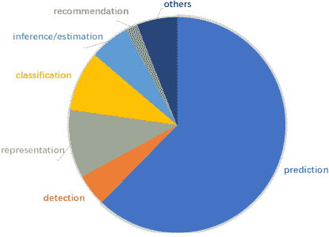

图 14：深度学习模型解决的 STDM 问题的分布

### IV-A 预测学习

预测学习的基本目标是基于历史数据预测未来的 ST 数据观测值。对于不同的应用，输入和输出变量可以属于不同类型的 ST 数据实例，从而导致各种预测学习问题的表述。接下来，我们将根据 ST 数据实例的类型介绍基于这些类型的预测问题作为模型输入。

点。点通常在时间或空间域中合并，形成时间序列或空间图，如犯罪[31, 57, 145, 56]、交通事故[201]和社会事件[43]，以便应用深度学习模型。[145] 采用了 ST-ResNet 模型来预测洛杉矶地区的犯罪分布。他们的模型包含两个阶段。首先，他们将原始犯罪点数据转化为类似图像的犯罪热图，通过合并在同一时间段和城市区域发生的所有犯罪事件来实现。然后，他们利用残差卷积单元的层级结构来训练一个以犯罪热图为输入的犯罪预测模型。类似地，[57] 提出了使用 GRU 模型来预测城市犯罪。[201] 研究了使用卷积长短期记忆（ConvLSTM）神经网络模型进行交通事故预测的问题。他们首先将交通事故点数据合并，并将交通事故数量建模为一个时空场中的 3D 张量。张量的每个条目$(i,j,t)$表示时间段$t$内网格单元$(i,j)$的交通事故数量。将历史交通事故张量输入 ConvLSTM 进行预测。[43] 提出了一个空间不完整的多任务深度学习框架，以有效预测不同位置发生的未来事件的子类型。

时间序列。在道路级别交通预测中，路段或高速公路上的交通流数据可以建模为时间序列。最近，许多研究尝试了各种深度学习模型用于道路级别交通预测[104, 136, 191]。[104] 首次利用堆叠自编码器从交通流时间序列数据中学习特征，用于道路段级别的交通流预测。[136] 将高速公路上的交通流数据视为时间序列，并提出使用深度置信网络（DBNs）根据先前的交通流观测值预测未来的交通流。[126] 研究了出租车需求预测问题，并将特定区域的出租车需求建模为时间序列。提出了一个具有全连接层的深度学习模型，从历史出租车需求时间序列中学习特征，然后将这些特征与其他上下文特征，如天气和社交媒体文本，结合起来以预测未来需求。

RNN 和 LSTM 被广泛应用于时间序列 ST 数据预测。[90] 将 LSTM 和序列到序列模型结合起来，用于预测道路段的交通速度。除了交通速度信息外，他们的模型还考虑了其他外部特征，包括道路的地理结构、公共社会事件如国家庆典以及在线旅行信息查询。天气变量如风速通常也被建模为时间序列，然后应用 RNN/LSTM 模型进行未来天气预测 [14, 17, 55, 97, 124, 179]。例如，[17] 提出了一个用于概率风速预测的集成模型。该模型将传统的风速预测模型，包括小波阈值去噪（WTD）和自适应神经模糊推理系统（ANFIS），与递归神经网络（RNN）结合起来。在 fMRI 数据分析领域，fMRI 时间序列数据通常用于研究功能脑网络和诊断疾病。[34] 提议使用 LSTM 模型直接从静息状态 fMRI 时间序列中对自闭症谱系障碍（ASD）个体和典型对照进行分类。[59] 开发了一个名为 DCAE 的深度卷积自编码器模型，用于以无监督的方式从复杂的大规模 tfMRI 时间序列中学习中级和高级特征。时间序列数据通常不包含空间信息，因此在基于深度学习的预测模型中，数据之间的空间相关性没有被明确考虑。

空间图。空间图通常可以表示为类似图像的矩阵，因此适合使用 CNN 模型进行预测学习 [69, 80, 184, 200]。[184] 提出了一个基于 CNN 的预测模型，以捕捉城市人流预测中的空间特征。构建了一个名为 UrbanFlow 的实时人流预测系统，人流空间图作为其输入。对于骑行服务中的供需预测，[69] 提出了基于六边形的卷积神经网络（H-CNN），其中输入和输出都是大量本地六边形图。与之前将城市区域划分为多个方形网格的研究相比，他们提出将城市区域划分为各种规则的六边形网格，因为六边形分割具有明确的邻域定义、更小的边长与面积比以及各向同性。一个监测站的风速数据可以建模为时间序列，而多个站点的数据可以表示为空间图。CNN 模型也可以应用于同时预测多个站点的风速 [200]。

给定一系列空间地图，为了同时捕捉时间和空间相关性，许多研究尝试将 CNN 与 RNN 结合用于预测。[161] 提出了卷积 LSTM（ConvLSTM），并使用它构建了一个端到端可训练的模型，用于降水现在预报问题。这项工作结合了 CNN 中的卷积结构和 LSTM 单元，在序列到序列学习框架下预测时空序列。ConvLSTM 是一个序列到序列预测模型，每一层都是一个 ConvLSTM 单元，在输入到状态和状态到状态的转换中都具有卷积结构。模型的输入和输出都是空间地图矩阵。在这项工作之后，许多研究尝试将 ConvLSTM 应用于不同领域的其他空间地图预测任务 [1, 6, 28, 70, 73, 98, 151, 198]。[151] 提出了一个新颖的跨城市迁移学习方法，用于深度时空预测，称为*RegionTrans*。*RegionTrans*包含多个 ConvLSTM 层，以捕捉数据中隐藏的时空模式。[73] 将 ConvLSTM 网络应用于通过使用多通道雷达数据预测降水量。[198] 提出了一个端到端深度神经网络，用于预测按需服务中的乘客接送需求。一个基于卷积和 ConvLSTM 单元的编码器-解码器框架被用来识别捕捉时空影响和城市范围内乘客需求的接送互动的复杂特征。城市中单元区域的乘客需求被建模为一个空间地图，并表示为矩阵。类似地，[1] 提出了一个 FCL-Net 模型，该模型融合了 ConvLSTM 层、标准 LSTM 层和卷积层，用于在按需乘车服务下预测乘客需求。[98] 提出了一个名为 Attentive Crowd Flow Machine (ACFM)的统一神经网络模块。ACFM 能够通过学习具有注意力机制的时变数据的动态表示来推断人群流动的演变。ACFM 由两个渐进的 ConvLSTM 单元和一个用于空间权重预测的卷积层组成。

其他一些模型也可以用于预测空间图，如 GraphCNN [8, 22, 92, 144]、ResNet [146, 183, 185] 和混合方法 [49, 109, 177]。请注意，在本文中，我们认为空间图既包含图像数据，也包含图数据。尽管图也可以表示为矩阵，但它们需要完全不同的技术，例如 GraphCNN 或 GraphRNN。在道路网络规模的交通预测中，交通运输网络可以自然地建模为一个图，然后应用 GraphCNN 或 GraphRNN。[85] 提出了将交通流建模为有向图上的扩散过程，并引入了扩散卷积递归神经网络（DCRNN）用于交通预测。它将整个道路网络中的交通流的空间和时间依赖性结合在一起。具体而言，DCRNN 通过在图上进行双向随机游走来捕捉空间依赖性，通过具有计划采样的编码器-解码器架构来捕捉时间依赖性。[155] 提出了一个新的拓扑框架，称为 Linkage Network，以建模道路网络，并展示了交通流的传播模式。基于 Linkage Network 模型，设计了一种名为图递归神经网络（GRNN）的新型在线预测器，用于学习图中的传播模式。它基于从整个图中收集的信息，同时预测所有道路段的交通流。[144] 引入了一种 ST 加权图（STWG）来表示稀疏的时空数据。然后，为了对 ST 数据进行微观规模的预测，他们在 STWG 上构建了一个可扩展的图结构 RNN（GSRNN）。

轨迹。目前，深度学习模型 RNN 和 CNN 被用于轨迹预测，具体取决于轨迹的数据表示方式。首先，轨迹可以表示为位置序列，如图 12 所示。在这种情况下，可以应用 RNN 和 LSTM 模型[38, 64, 77, 88, 135, 163, 165]。[163]提出了 Collision-Free LSTM，它通过添加排斥池化层来共享邻近行人的隐藏状态，从而扩展了经典的 LSTM，用于人类轨迹预测。Collision-Free LSTM 可以基于行人的过去位置生成未来的序列。[64]研究了城市人类移动预测问题，该问题基于一个人观察到的几步移动，尝试预测他/她在城市中的下一个去向。他们提出了一种深度序列学习模型，结合 RNN 有效地预测城市人类的移动。[135]提出了一种名为 DeepTransport 的模型，用于从一组个人 GPS 轨迹中预测交通方式，如步行、乘坐火车、乘坐公交车等。DeepTransport 使用了四个 LSTM 层来预测用户未来的交通方式。

轨迹也可以表示为矩阵。在这种情况下，可以应用 CNN 模型来更好地捕捉空间相关性[67, 103, 142]。[67]提出了一种基于 CNN 的语义轨迹表示和未来位置预测的方法。在语义轨迹中，每个访问的地点都与一个语义意义相关，例如*家*、*工作*、*购物*等。他们将语义轨迹建模为一个矩阵，其中两个维度是语义意义和轨迹 ID。这个矩阵被输入到具有多个卷积层的 CNN 中，以学习潜在特征来预测下一个访问的语义位置。[103]将轨迹建模为二维图像，其中图像的每个像素表示对应位置是否在轨迹中被访问。然后，采用多层卷积神经网络来结合多尺度轨迹模式，以预测出租车轨迹的目的地。将轨迹建模为类似图像的矩阵也用于其他任务，如异常检测和推断[111, 150]，这些将在后文中详细介绍。

ST 光栅数据。正如我们之前讨论的，ST 光栅数据可以表示为两个维度分别为位置和时间的矩阵，或者三个维度分别为单元区域 ID、单元区域 ID 和时间的张量。通常，对于 ST 光栅数据预测，应用 2D-CNN（矩阵）和 3D-CNN（张量），有时还会与 RNN 结合使用。[188] 提出了一个名为 3D-SCN 的多通道 3D 立方体连续卷积网络，用于从 3D 雷达数据中预测风暴的启动、增长和平流。[121] 将道路上多个位置的交通速度数据在连续时间槽中建模为 ST 光栅矩阵，然后将其输入深度神经网络进行交通流量预测。[106] 探索了与 [121] 类似的思想，用于大规模交通网络的交通预测。[12] 提出了用于全市车辆流量预测的 3D 卷积神经网络。他们不是预测道路上的交通，而是尝试预测城市每个单元区域的车辆流量。因此，他们将全市车辆流量数据在连续时间槽中建模为 ST 光栅，并将其输入提出的 3D-CNN 模型。类似地，[131] 将城市中不同时间槽的乘客流动事件建模为 3D 张量，然后使用 3D-CNN 模型来预测乘客对交通的供需。需要注意的是，ST 光栅和空间地图之间的主要区别在于，ST 光栅是多个时间槽的 ST 领域测量合并，而空间地图是仅在一个时间槽中的 ST 领域测量。因此，相同类型的 ST 数据有时可以根据实际应用场景和数据分析目的以空间地图和 ST 光栅两种形式表示。

### IV-B 表示学习

表示学习旨在学习输入数据的抽象和有用的表示，以便于下游数据挖掘或机器学习任务，这些表示是通过对输入数据进行多个线性或非线性变换的组合形成的。现有的大多数 ST 数据表示学习工作集中于研究轨迹和空间地图的数据类型。

轨迹。轨迹在基于位置的社交网络（LBSNs）和各种移动服务中无处不在，RNN 和 CNN 模型都被广泛用于学习轨迹表示。[82] 提出了一个基于 seq2seq 的模型来学习轨迹表示，解决轨迹相似性计算的基础研究问题。基于学习到的表示的轨迹相似性对不均匀、低采样率和噪声样本点具有鲁棒性。同样地，[170, 171] 提出了将轨迹转换为特征序列以描述物体运动，然后使用序列到序列自编码器来学习固定长度的深度表示以进行聚类。基于位置的社交网络（LBSN）数据通常包含两个重要方面，即移动轨迹数据和用户的社交网络。为了建模这两个方面并挖掘它们的关联，[164] 提出了一个神经网络模型来联合学习社交网络表示和用户的移动轨迹表示。RNN 和 GRU 模型用于捕捉移动轨迹在短期或长期层面的序列相关性。[10] 提出了一个名为 CAPE 的内容感知 POI 嵌入模型用于 POI 推荐。在 CAPE 中，用户签到序列中的 POI 嵌入向量被训练为彼此接近。[26] 提出了一个名为 GeoCNTN 的地理卷积神经张量网络，用于学习 LBSNs 中位置的嵌入。[41] 提出了使用 RNN 和自编码器来学习用户签到嵌入和轨迹嵌入，并使用这些嵌入进行 LBSNs 中的用户社交圈推断。

空间地图。有若干研究探讨了如何学习空间地图的表示。[21] 提出了一个卷积神经网络架构，用于从传感器数据的原始空间地图中学习时空特征。[153] 将学习城市社区结构的问题表述为空间表示学习任务。提出了一种集成嵌入学习框架，通过统一静态 POI 数据和动态人类移动图空间地图数据来学习城市社区结构。[182] 研究了如何从神经影像数据中学习脑连接模式的非线性表示，以帮助理解神经学和神经精神疾病。提出了一种名为多视图引导自编码器（MVAE）的深度学习架构，用于学习从 fMRI 和 DTI 图像中获得的输入脑连接组数据的表示。

### IV-C 分类

分类任务主要集中在分析 fMRI 数据上。近年来，脑成像技术已成为神经科学领域的热门话题，包括功能性磁共振成像（fMRI）、脑电图（EEG）和磁脑图（MEG）[120]。特别是，将 fMRI 与深度学习方法相结合，已广泛应用于神经科学研究中，进行各种分类任务，如疾病分类、脑功能网络分类以及观看词汇或图像时的脑激活分类[158]。根据不同的分类任务，可以从原始 fMRI 数据中提取各种类型的 ST 数据。[34] 提出了使用具有长短期记忆（LSTM）的递归神经网络对自闭症谱系障碍（ASD）个体和典型对照进行分类，直接从不同脑区生成的静息态 fMRI 时间序列数据中进行分类。[48, 52, 54, 71, 113, 132] 将 fMRI 数据建模为空间图，然后将其作为分类模型的输入。[48] 和 [52] 计算了基于静息态 fMRI 时间序列数据对之间的 Pearson 相关系数的全脑功能连接矩阵。然后，相关矩阵可以视为空间图，并输入到 DNN 模型中进行 ASD 分类。[113] 提出了一个更通用的卷积神经网络架构，用于功能连接组分类，称为连接组卷积神经网络（CCNN）。CCNN 能够结合来自不同功能连接度量的信息，因此可以通过变化连接描述符组合来轻松适应各种基于连接组的分类或回归任务。

一些研究还直接使用 3D 结构性 MRI 脑扫描图像作为 ST 光栅数据，然后通常应用 3D-CNN 模型从 ST 光栅中学习特征以进行分类[63, 66, 78, 116, 128, 194]。[78] 提出了两种用于脑 MRI 分类的 3D 卷积网络架构，这些架构是普通卷积神经网络和残差卷积神经网络的修改版本。他们的模型可以应用于 3D MRI 图像，而无需中间的手工特征提取。[194] 还设计了一个深度 3D-CNN 框架，用于自动、有效和准确地分类和识别通过稀疏 3D 表示重建的大量功能脑网络，这些网络是由全脑 fMRI 信号重建的。

### IV-D 估计与推断

当前关于时空数据估计和推断的研究主要集中在空间地图和轨迹数据类型上。

空间地图。虽然已经建立了监测站来收集污染物统计数据，但由于成本高昂，监测站的数量非常有限。因此，推断精细的城市空气质量信息成为政府和公众的一个重要问题。[19] 研究了基于某些监测站的空气污染物对任何地点空气质量的推断问题。他们提出了一种名为 ADAIN 的深度神经网络模型，用于建模异质数据和学习复杂的特征交互。一般来说，ADAIN 结合了两种神经网络：即，前馈神经网络用于建模静态数据和递归神经网络用于建模序列数据，随后是隐藏层来捕捉特征交互。[139] 研究了将深度神经网络应用于从遥感信息中估计降水量的情况。使用堆叠去噪自编码器自动从红外云图像中提取特征并估计降水量。根据起始地点、目的地点以及出发时间来估计潜在行程的持续时间是智能交通系统中的一个关键任务。为了解决这个问题，[83] 提出了一个深度多任务表示学习模型来估计到达时间。该模型生成有意义的表示，保留了各种行程属性，同时利用了潜在的道路网络和时空先验知识。

轨迹 [147, 181] 试图从移动轨迹数据中估算路径的旅行时间。[181] 提出了一个基于 RNN 的深度模型，名为 DEEPTRAVEL，它可以从历史轨迹中学习以估算旅行时间。[147] 提出了一个端到端的深度学习框架用于旅行时间估算，称为 DeepTTE，它直接估算整个路径的旅行时间，而不是先估算个别道路段或子路径的旅行时间再加总。[111] 研究了从轨迹数据推断用户在某个位置访问目的的问题。他们提出了一种图卷积神经网络（GCNs），用于从个人智能手机生成的 GPS 轨迹数据中推断活动类型（即旅行目的）。用户的移动图基于所有活动区域及其连接性构建，然后将时空活动图输入到 GCNs 中进行活动类型推断。[42] 研究了轨迹-用户链接（TUL）的问题，旨在识别和链接 LBSNs 中生成轨迹的用户。提出了一种基于递归神经网络（RNN）的模型，名为 TULER，通过结合签到轨迹嵌入模型和堆叠 LSTM 来解决 TUL 问题。识别用户的交通方式分布，如自行车、火车、步行等，是旅行需求分析和交通规划的关键部分 [24, 148]。[24] 提出了一个 CNN 模型，仅基于原始 GPS 轨迹推断旅行方式，其中方式标记为步行、自行车、公交、驾驶和火车。

### IV-E 异常检测

异常检测或离群点检测旨在识别那些由于与大多数数据显著不同而引发怀疑的稀有项、事件或观察。目前关于 ST 数据的异常检测工作主要集中在事件和空间地图的数据类型上。

事件。[137] 试图检测由临时性干扰（如事故、体育赛事、不良天气等）引起的非重复性交通拥堵。提出了一种卷积神经网络（CNN），用于识别由事件引起的非重复性交通异常。[189] 研究了如何从社交媒体数据中检测交通事故。他们首先对北弗吉尼亚和纽约市超过 3 百万条推文进行了全面调查，然后实施了两种深度学习方法：深度置信网络（DBN）和长短期记忆（LSTM），以识别与交通事故相关的推文。[199] 提出了利用卷积神经网络（CNN）通过交通流数据自动检测城市网络中的交通事件。[16] 收集了包括人类流动数据和交通事故数据在内的大量异构数据，以理解人类流动如何影响交通事故风险。提出了一种堆叠去噪自编码器的深度模型，用于学习人类流动的层次特征表示，并利用这些特征高效预测交通事故风险水平。

空间地图。[100] 展示了深度学习技术在气候极端事件（如飓风和热浪）检测中的首次应用。该模型训练用于分类热带气旋、天气前线和大气河流，输入为气候图像数据。[72] 研究了如何在非常粗糙的气候数据中检测和定位极端气候事件。所提出的框架基于两个深度神经网络模型，（1）卷积神经网络（CNNs）用于检测和定位极端气候事件，（2）像素递归超分辨率模型用于从低分辨率气候数据中重建高分辨率气候数据。为了解决极端气候事件标签数据有限的问题，[123] 提出了多通道时空 CNN 架构，用于半监督边界框预测。[123] 中提出的方法能够利用时间信息和未标记的数据来改善极端天气的定位。

### IV-F 其他任务。

除了我们上面讨论的问题外，深度学习模型还应用于其他 STDM 任务，包括推荐系统[10, 81, 193]、模式挖掘[118]、关系挖掘[197]等。[10] 提出了一个内容感知的层次化 POI 嵌入模型 CAPE，用于 POI 推荐。从文本内容中，CAPE 捕捉了 POI 的地理影响以及 POI 的特征。[193] 还提出利用嵌入学习技术来捕捉 POI 推荐的上下文签到信息。[118] 提出了一个深度结构模型，称为 DeepSpace，通过分析人类轨迹的移动数据来挖掘人类移动模式。[197] 研究了轨迹-用户关联（TUL）问题，旨在将轨迹与从地理标记社交媒体数据生成它们的用户进行关联。提出了一种名为 TULVAE（通过变分自编码器的 TUL）的半监督轨迹-用户关系学习框架，以在具有随机潜变量的神经生成架构中学习人类移动性。

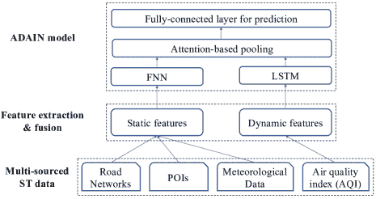

图 15: ADAIN 模型框架。

### IV-G 融合多源数据

除了正在研究的 ST 数据外，通常还有一些与 ST 数据高度相关的其他类型的数据。将这些数据与 ST 数据融合通常可以提高各种 STDM 任务的性能。例如，城市交通流量数据可能会受到天气、社会事件和假期等外部因素的显著影响。一些近期的研究尝试将 ST 数据和其他类型的数据融合到深度学习架构中，以共同学习特征并捕捉它们之间的关联[16, 19, 89, 174, 178, 188, 201]。一般来说，有两种流行的方法将多源数据融合到 STDM 的深度学习模型中：原始数据级融合和潜在特征级融合。

原始数据级融合。对于原始数据级融合，首先整合来自多个来源的数据，然后输入到深度学习模型中进行特征学习。[201] 研究了利用卷积长短期记忆（ConvLSTM）神经网络模型进行交通事故预测的问题。首先，将整个研究区域划分为网格单元。然后，收集多个精细化的城市和环境特征，如交通量、道路状况、降雨量、温度和卫星图像，并将其映射到每个网格单元。以每个位置的事故数量以及上述外部特征作为模型输入，提出了一种异构 ConvLSTM 模型，用于预测未来时间段内每个网格单元将发生的事故数量。[19] 提出了 ADAIN 模型，该模型融合了来自监测站的城市空气质量信息以及与空气质量密切相关的城市数据，包括兴趣点（POIs）、道路网络和气象数据，以推断城市的精细化空气质量。ADAIN 模型的框架如图 15 所示。首先从包括道路网络、POIs、气象数据和城市空气质量指数数据在内的多源数据中手动提取特征。然后将所有特征融合在一起，并输入到 FNN 和 RNN 模型中进行特征学习。

潜在特征级融合。对于潜在特征级融合，不同类型的原始特征首先输入到不同的深度学习模型中，然后使用潜在特征融合组件来融合不同类型的潜在特征。[89] 提出了一个基于深度学习的方法，称为 ST-ResNet，该方法基于残差神经网络框架，集体预测城市每个区域的人员流入和流出。如图 16 所示，ST-ResNet 处理两种类型的数据：城市中的时空人群流动数据序列和包括天气及节假日事件的外部特征。设计了两个组件分别学习外部特征和人群流动数据特征的潜在特征，然后使用特征融合函数 $tanh$ 来整合这两种类型的潜在特征。[174] 提出了一个深度多视角时空网络（DMVST-Net）框架，用于结合多视角数据进行出租车需求预测。DMVST-Net 包括三个视角：时间视角、空间视角和语义视角。CNN 用于从空间视角学习特征，LSTM 用于从时间视角学习特征，网络嵌入用于学习区域之间的相关性。最后，应用全连接神经网络来融合这三个视角的所有潜在特征，以进行出租车需求预测。

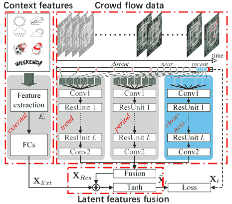

图 16: ST-ResNet 架构 [89]。

### IV-H 注意力机制

注意力机制是为了提高编码器-解码器 RNN 在机器翻译中的性能而开发的[5]。编码器-解码器 RNN 的一个主要限制是，它将输入序列编码为固定长度的内部表示，这会导致长输入序列的性能较差。为了解决这个问题，注意力机制允许模型在预测目标序列中的每个单词时，学习源序列中应该关注哪些编码单词以及关注的程度。虽然注意力机制最初是在机器翻译中提出的，并以单词序列数据作为输入，但它实际上可以应用于任何类型的输入，比如图像，这被称为视觉注意力。由于许多时空数据可以表示为顺序数据（时间序列和轨迹）以及类似图像的空间图，注意力机制也可以被纳入深度学习模型中，以提高各种时空数据挖掘任务的性能[19, 38, 39, 57, 81, 88, 98, 142, 198]。

用于时空数据挖掘的神经注意力机制通常可以分为空间域注意力[19, 39]和时间域注意力[38, 57, 81, 198]。一些工作同时使用空间和时间域的注意力[88, 98, 142]。[39] 提出了一个结合空间域的注意力模型。它利用“软注意力”和“硬连线”注意力，将来自局部邻域的轨迹信息映射到感兴趣的行人的未来位置。[57] 提出了一个名为 DeepCrime 的注意力层次递归网络模型，用于犯罪预测。时间域注意力机制被应用于捕捉从先前时间段学习到的犯罪模式与未来犯罪发生的相关性，并自动分配在不同时间帧上学习到的隐藏状态的重要性权重。在所提出的注意力机制中，通过 softmax 函数推导出归一化的重要性权重，以估计过去时间段犯罪发生的重要性。[88] 提出了一个多级注意力网络，用于预测由部署在不同地理位置的传感器生成的地理传感时间序列，这些传感器持续而协作地监测周围环境，如空气质量。具体而言，在第一级注意力中，提出了一种包含局部空间注意力和全局空间注意力的空间注意力机制，以捕捉不同传感器时间序列之间的复杂空间相关性。在第二级注意力中，应用了时间注意力，以建模时间序列中不同时间间隔之间的动态时间相关性。

## V 应用

大量的时空数据来自各个应用领域，如交通、按需服务、气候与天气、人类移动、基于位置的社交网络（LBSN）、犯罪分析和神经科学。表 II 展示了上述应用领域的相关工作。可以看出，由于城市交通数据和人类移动数据的日益增加，工作的大部分集中在交通和人类移动领域。在本节中，我们将详细描述在不同应用中用于时空数据挖掘的深度学习技术。

表 II：不同应用领域的相关工作

| 应用领域 | 相关工作 |
| --- | --- |
| 交通运输 | [189, 199, 125, 32, 30, 6, 33, 136, 60, 121, 27, 114, 177, 90, 23, 73, 117, 135, 89, 148, 85, 137, 155, 157, 79, 107, 201, 22, 24, 108, 105, 16, 106, 93, 15, 175, 176, 104, 149, 102, 51, 40, 173, 47, 25] |
| 按需服务 | [1, 8, 126, 174, 146, 80, 69, 84, 198, 70, 44, 191, 50, 45, 86] |
| 气候与天气 | [19, 11, 100, 188, 161, 139, 17, 79, 94, 46, 70, 186, 96, 97, 129, 14, 127, 200] |
| 人类移动性 | [67, 164, 154, 152, 98, 36, 163, 151, 82, 64, 183, 38, 118, 135, 181, 115, 195, 111, 142, 42, 170, 153, 159, 83, 190, 37, 202, 185, 35, 99, 20, 169, 186, 49, 3, 131, 103, 191, 171, 41, 65, 197, 13, 147, 180, 95] |
| 基于位置的社交网络 | [164, 10, 26, 193, 77, 81, 99, 165, 166, 197, 168, 192] |
| 犯罪分析 | [31, 133, 145, 57, 123, 55, 124, 72, 179] |
| 神经科学 | [120, 158, 110, 34, 48, 52, 58, 59, 63, 66, 71, 113, 116, 128, 54, 76, 68, 132, 78, 182] |

### V-A 交通运输

随着从各种传感器（如环形探测器、道路摄像头和 GPS）收集的交通数据越来越多，需要利用深度学习方法来学习交通数据中复杂且高度非线性的时空相关性，以促进各种任务，如交通流量预测 [30, 60, 90, 121, 136, 167]、交通事件检测 [125, 189, 199] 和交通拥堵预测 [108, 137]。这些与交通运输相关的时空数据通常包含交通速度、流量或交通事件的信息、道路段的区域位置和时间。交通数据可以在不同应用场景中建模为时间序列、空间地图和时空栅格。例如，在道路网络规模的交通流量预测中，从多个道路环形传感器收集的交通流量数据可以建模为一个栅格矩阵，其中一个维度是传感器的位置，另一个维度是时间段 [106]。环形传感器也可以基于传感器部署的道路连接连接为传感器图，而道路网络的交通数据可以建模为图空间地图，以便应用 GraphCNN 模型 [85, 175]。而在道路级别的交通预测中，每条道路的历史交通流量数据被建模为时间序列，然后使用 RNN 或其他深度学习模型来预测单条道路的交通 [60, 90, 167]。

### V-B 按需服务

近年来，随着手机的广泛使用，诸如 Uber、Mobike、DiDi、GoGoVan 等按需服务变得越来越受欢迎。这些按需服务通过根据人们的需求和位置提供服务，已经取代了传统业务。许多按需服务生成大量的时空数据（ST 数据），涉及到客户的位置和所需服务时间。例如，Uber 和 DiDi 分别是美国和中国的两个流行的共享出行服务提供商。它们通过智能手机应用程序向用户提供包括打车、专车召车和社交共享出行等服务。为了更好地满足客户需求和提高服务质量，一个关键问题是如何准确预测不同地点和时间的服务需求和供应。深度学习方法在按需服务的时空数据建模（STDM）应用中主要集中于预测需求和供应。[1] 提出了应用深度学习方法来预测无桩共享单车系统的需求-供应分布。[92] 提出了一个图卷积神经网络（CNN）模型来预测大规模共享单车网络中的站点级小时需求。[126, 174] 提出了使用 LSTM 模型来预测不同区域的出租车需求。[146] 应用了 ResNet 模型来预测在线打车服务的供需情况。通常，研究城市不同区域的历史需求-供应数据被建模为空间地图或栅格张量，以便应用 CNN、RNN 和组合模型来预测未来情况。

### V-C 气候与天气

气候科学是对气候的科学研究，科学上定义为一段时间内天气条件的平均值。天气数据通常包含由各种气候传感器在固定或浮动位置收集的大气和海洋条件（例如，温度、压力、风速和湿度）。由于不同地点的气候数据通常具有较高的时空相关性，STDM 技术被广泛用于短期和长期天气预测。特别是，随着深度学习技术的最新进展，许多研究尝试将深度学习模型应用于分析各种天气和环境数据[79，129]，例如空气质量推断[19，94]、降水预测[100，161]、风速预测[96，200]和极端天气检测[100]。与气候和天气相关的数据可以是空间地图（例如，雷达反射率图像）[188]、时间序列（例如，风速）[17]和事件（例如，极端天气事件）[100]。[19] 提出了一个神经注意力模型来预测不同监测站的城市空气质量数据。[100] 提议使用 CNN 模型检测气候数据库中的极端天气。CNN 模型也可以用于从遥感图像中估计降水量[100]。

### V-D 人类流动性

随着移动设备的广泛使用，近年来见证了大量与人类移动相关的地理定位数据的爆炸性增长。大量的人类移动数据使我们能够定量研究个体和集体的人类移动模式，并生成可以捕捉和再现人类轨迹中的时空结构和规律的模型。人类移动的研究对于估计迁移流、交通预测、城市规划、人类行为分析和个性化推荐等应用尤为重要。应用于人类移动数据的深度学习技术主要集中在人类轨迹数据挖掘，如轨迹分类 [36]、轨迹预测 [38、64、163]、轨迹表示学习 [82、170]、移动模式挖掘 [118] 和从轨迹中推断人类交通模式 [24、42]。根据不同的应用场景和分析目的，人类轨迹可以建模为不同类型的时空数据类型和数据表示，以便应用不同的深度学习模型。用于人类轨迹数据挖掘的最广泛使用的模型是 RNN 和 CNN 模型，有时这两种模型会结合使用，以捕捉人类移动数据中的空间和时间相关性。

### V-E 基于位置的社交网络（LBSN）

基于位置的社交网络，如 Foursquare 和 Flickr，是使用 GPS 功能来定位用户，并让用户从他们的移动设备上广播他们的位置和其他内容的社交网络 [196]。LBSN 不仅仅意味着在现有社交网络中添加位置，以便人们可以分享嵌入位置的信息，还包括由在物理世界中通过位置以及位置标记的媒体内容连接的个人组成的新社交结构。LBSN 数据包含大量用户签到数据，其中包含个人在给定时间戳的即时位置。目前，深度学习方法已被用于分析 LBSN 中用户生成的时空数据，研究任务包括下一个签到位置预测 [67]、LBSN 中的用户表示学习 [164]、地理特征提取 [26] 和用户签到时间预测 [165]。

### V-F 犯罪分析

法律执法机构在许多城市存储关于报告犯罪的信息，并将犯罪数据公开以供研究用途。犯罪事件数据通常包括犯罪类型（如纵火、袭击、入室盗窃、抢劫、窃取和破坏）以及犯罪的时间和地点。可以使用这些数据研究犯罪模式及法律执行政策对区域犯罪量的影响，目标是减少犯罪[4]。由于不同区域的犯罪通常呈现出较高的空间和时间相关性，可以使用深度学习模型，将城市的犯罪账户热图作为输入，捕捉这种复杂的相关性[31、57、145]。例如，[31] 提出了基于 CNN 的时空犯罪网络，以预测城市区域内每个区域的犯罪风险。[145] 提出了利用 ST-ResNet 模型集体预测洛杉矶地区的犯罪分布。[57] 开发了一个新的犯罪预测框架——DeepCrime，这是一种深度神经网络架构，可以揭示动态犯罪模式，并探索犯罪与城市空间中其他普遍数据之间的演变依赖关系。正如我们之前讨论的，犯罪数据是典型的时空事件数据，但通常通过合并空间和时间域的数据表示为空间地图，以便应用深度学习模型进行分析。

### V-G 神经科学

近年来，大脑成像技术已成为神经科学领域的热门话题。这些技术包括功能性磁共振成像（fMRI）、脑电图（EEG）、磁脑图（MEG）和功能性近红外光谱（fNIRS）。这些技术测量的神经活动的空间分辨率和时间分辨率差异很大。fMRI 从数百万个位置测量神经活动，而 EEG 数据仅从几十个位置测量。fMRI 通常每两秒测量一次活动，而 EEG 数据的时间分辨率通常为 1 毫秒。由于其空间分辨能力，fMRI 和 EEG 结合深度学习方法，被广泛应用于神经科学的研究[34、63、113、128]。如前所述，深度学习模型通常用于神经科学中的分类任务，利用 fMRI 数据或 EEG 数据进行疾病分类[34]、脑功能网络分类[113]和脑激活分类[63]。例如，长短期记忆网络（LSTM）被用于识别自闭症谱系障碍（ASD）[34]，卷积神经网络（CNN）被用于诊断遗忘性轻度认知障碍（aMCI）[113]，前馈神经网络（FNN）被用于分类精神分裂症[119]。

## VI 开放问题

尽管许多深度学习方法已被提出并广泛应用于上述不同应用领域的 STDM，但由于 ST 数据的高度复杂性、大量数据以及快速增长的特点，仍然存在挑战。在本节中，我们提供了一些当前研究尚未很好解决的开放问题，这些问题需要在未来进一步研究。

可解释的模型。目前针对 STDM 的深度学习模型大多数被视为*黑箱*，缺乏可解释性。可解释性赋予深度学习模型以解释或以人类能够理解的术语呈现模型行为的能力，它是机器学习模型更好地服务于人类并带来社会利益的不可或缺的一部分[29]。考虑到 ST 数据的复杂数据类型和表示，相比于图像和单词令牌等其他类型的数据，设计可解释的深度学习模型更具挑战性。尽管一些先前的工作使用了注意机制来增加模型的可解释性，如周期性和局部空间依赖[19、57、88]，但如何为 STDM 任务构建更具可解释性的深度学习模型仍然没有得到很好的研究，并且仍然是一个开放问题。

深度学习模型选择。对于给定的 STDM 任务，有时可以收集多种相关的 ST 数据，并选择不同的数据表示方式。如何正确选择 ST 数据表示和相应的深度学习模型尚未得到充分研究。例如，在交通流量预测中，一些研究将每条道路的交通流量数据建模为时间序列，从而使用 RNN、DNN 或 SAE 进行预测[104, 136]；一些研究将多条道路链接的交通流量数据建模为空间图，从而使用 CNN 进行预测[184]；还有一些研究将道路网络的交通流量数据建模为图，从而采用 GraphCNN[85]。对如何正确选择深度学习模型和 ST 数据的数据表示，以更好地解决正在研究的 STDM 任务的研究仍然不足。

更广泛应用于更多 STDM 任务。尽管深度学习模型已广泛应用于上述各种 STDM 任务，但仍有一些任务尚未被深度学习模型解决，例如频繁模式挖掘和关系挖掘[4, 87]。深度学习的主要优势在于其强大的特征学习能力，这对于依赖高质量特征的 STDM 任务如预测学习和分类至关重要。然而，对于像频繁模式挖掘和关系挖掘这样的 STDM 任务，学习高质量特征可能帮助不大，因为这些任务不需要特征。根据我们的回顾，目前几乎没有或根本没有利用深度学习模型来解决上述任务的研究。因此，如何使深度学习模型本身或与传统模型如频繁模式挖掘和图模型结合的集成，扩展到更多 STDM 任务的更广泛应用仍然是一个开放问题。

融合多模态 ST 数据集。在大数据时代，多模态 ST 数据集在许多领域，如神经影像学、气候科学和城市交通中变得越来越普遍。例如，在神经影像学中，fMRI 和 DTI 都可以使用不同的技术捕捉大脑活动的影像数据，这些技术提供不同的时空分辨率 [61]。如何使用深度学习模型有效融合这些数据，以更好地进行疾病分类和大脑活动识别仍然研究较少。城市中的多模态交通数据，包括出租车轨迹数据、自行车共享出行数据和公共交通签到/签退数据，都可以从不同的角度反映城市人群流动 [30]。将这些数据融合分析而不是单独处理，可以更全面地捕捉潜在的流动模式，并做出更准确的预测。尽管最近有一些尝试应用深度学习模型从不同城市的人群流动数据中转移知识 [151, 172]，但如何将多模态 ST 数据集与深度学习模型融合仍未得到很好研究，需要在未来得到更多关注。

## VII 结论

在本文中，我们对探索深度学习技术在 STDM 中的最新进展进行了全面概述。我们首先对 ST 数据的不同数据类型和表示进行分类，并简要介绍了用于 STDM 的流行深度学习模型。对于不同类型的 ST 数据及其表示，我们展示了适合处理这些数据的相应深度学习模型。接着，我们给出了一个通用框架，展示了利用深度学习模型解决 STDM 任务的流程。在该框架下，我们基于 ST 数据类型的分类和 STDM 任务，包括预测学习、表示学习、分类、估计和推断、异常检测等，概述了当前的工作。接下来，我们总结了深度学习技术在交通、按需服务、气候与天气、人类流动、基于位置的社交网络（LBSN）、犯罪分析和神经科学等不同领域的 STDM 应用。最后，我们列出了一些开放问题，并指出了这一快速发展的研究领域的未来研究方向。

## 参考文献

+   [1] Y. Ai, Z. Li, M. Gan, Y. Zhang, D. Yu, W. Chen, 和 Y. Ju. 基于深度学习的无桩自行车共享系统短期时空分布预测方法。神经计算与应用，第 1–13 页，2018 年。

+   [2] A. Akbari Asanjan, T. Yang, K. Hsu, S. Sorooshian, J. Lin, 和 Q. Peng. 基于 persiann 系统和 lstm 循环神经网络的短期降水预测。地球物理研究杂志：大气，第 123 卷第 22 期，第 12–543 页，2018 年。

+   [3] A. 阿拉希, K. 戈爾, V. 拉馬納森, A. 羅比克特, L. 菲·菲, and S. 薩瓦雷斯。Social lstm: 擁擠空間中的人類軌跡預測。2016 年 IEEE 計算機視覺和模式識別大會論文集, 2016, 頁 961–971。

+   [4] G. 阿特盧里, A. 卡帕特尼, and V. 庫馬爾。時空數據挖掘：問題和方法的調查。《ACM 計算機調查》（CSUR）, 2018, 51(4):83。

+   [5] D. 巴赫達瑙, K. 曹, and Y. 本巧. 通過聯合學習對齊和翻譯進行神經機器翻譯。2015 年國際學習表征會議論文集, 2015.

+   [6] J. 鲍, P. 刘, and S. V. 烏庫蘇里. 針對城市短期事故風險的稱為深度學習方法應用於多源數據。《事故分析與預防》, 2019, 122:239–254。

+   [7] Y. 本巧, P. 蘭布林, D. 波波維奇, and H. 拉羅謝爾。深度網絡的貪婪逐層訓練。2006 年《神經信息處理進展》會議論文集。

+   [8] D. 柴, L. 王, and Q. 楊。利用多圖卷積網路進行自行車流量預測。2018 年第 26 屆 ACM SIGSPATIAL 國際地理信息系統大會論文集, 頁 397–400。ACM, 2018。

+   [9] V. 查諾拉, R. R. 瓦茨瓦瓦, D. 庫馬爾, and A. 甘古力。分析大型空間和大型時空數據：方法和應用案例研究。《大數據分析》, 2015, 33(239)。

+   [10] B. 張, Y. 朴, D. 朴, S. 金, and J. 康。針對連續 POI 推薦的內容感知分級 POI 嵌入模型。IJCAI, 2018, 頁 3301–3307。

+   [11] A. 查托帕達耶, P. 哈桑扎德, and S. 巴沙. 應用卷積神經網路於時空氣候數據的測試案例：重新識別聚類天氣模式。arXiv 預印本 arXiv:1811.04817, 2018。

+   [12] C. 陳, K. 李, S. G. Teo, G. 陳, X. 鄒, X. 楊, R. C. Vijay, J. 馮, and Z. 曾. 利用多個 3D 卷積神經網路對城市車輛流量進行空間-時間相關性的預測。2018 年 IEEE 國際數據挖掘大會（ICDM）, 2018, 頁 893–898。IEEE, 2018。

+   [13] C. 陳, C. 廖, X. 謝, Y. 王, and J. 趙. Trip2vec: 一種用於出租車行程目的聚類和簡介的深度嵌入方法。《個人和普遍計算》, 2018, 頁 1–14。

+   [14] 陳, M. 戴維斯, C. 劉, Z. 孫, M. M. Zempila, and W. 高。利用深層循環神經網路進行直射太陽輻射雲屏的預測。《可持續性簡化的遙感感測和建模》, 2017, 卷 10405, 頁 1040503。國際光學和光子學協會, 2017。

+   [15] 陳, M. 陳, X. 于, and Y. 劉。Pcnn: 用於短期交通擁擠預測的深度卷積網路。《IEEE 智能交通系統期刊》, 2018, (99):1–10。

+   [16] Q. 陳, X. 宋, H. 山田, and R. 澀橋. 從大型異構數據中學習交通事故推論的深度表征。AAAI, 2016, 頁 338–344。

+   [17] L. Cheng, H. Zang, T. Ding, R. Sun, M. Wang, Z. Wei, 和 G. Sun. 基于集成递归神经网络的概率风速预测方法。Energies, 11(8):1958, 2018。

+   [18] T. Cheng, J. H. B. Anbaroglu, 和 G. Tanakaranond. 时空数据挖掘。区域科学手册，第 1173–1193 页，2014 年。

+   [19] W. Cheng, Y. Shen, Y. Zhu, 和 L. Huang. 一种用于城市空气质量推断的神经注意力模型：学习监测站的权重。在 AAAI，2018 年。

+   [20] K.-H. Chow, A. Hiranandani, Y. Zhang, 和 S.-H. G. Chan. 使用演员-评论家序列到序列自编码器的行人轨迹表征学习。arXiv 预印本 arXiv:1811.08069, 2018。

+   [21] O. Costilla-Reyes, P. Scully, 和 K. B. Ozanyan. 用于从断层扫描传感器中学习时空特征的深度神经网络。IEEE 工业电子学报, 65(1):645–653, 2018。

+   [22] Z. Cui, K. Henrickson, R. Ke, 和 Y. Wang. 高阶图卷积递归神经网络：用于网络规模交通学习和预测的深度学习框架。arXiv 预印本 arXiv:1802.07007, 2018。

+   [23] Z. Cui, R. Ke, 和 Y. Wang. 深度堆叠双向和单向 LSTM 递归神经网络用于网络范围的交通速度预测。在第六届城市计算国际研讨会（UrbComp 2017），2016 年。

+   [24] S. Dabiri 和 K. Heaslip. 使用卷积神经网络从 GPS 轨迹中推断交通模式。运输研究 C 部分：新兴技术, 86:360–371, 2018。

+   [25] Z. Diao, X. Wang, D. Zhang, Y. Liu, K. Xie, 和 S. He. 用于交通预测的动态时空图卷积神经网络。在第 33 届 AAAI 人工智能会议论文集，2019 年。

+   [26] D. Ding, M. Zhang, X. Pan, D. Wu, 和 P. Pu. 基于地理特征的社交网络实体提取。在 2018 年全球网络会议论文集，第 833–842 页。国际全球网络会议指导委员会，2018 年。

+   [27] M. F. Dixon, N. G. Polson, 和 V. O. Sokolov. 用于时空建模的深度学习：动态交通流和高频交易。Applied Stochastic Models in Business and Industry, 2017。

+   [28] B. Du, H. Peng, S. Wang, M. Bhuiyan, L. Wang, Q. Gong, L. Liu, 和 J. Li. 用于城市交通乘客流量预测的深度不规则卷积残差 LSTM。IEEE 智能交通系统学报, 99:1–14, 2019。

+   [29] M. Du, N. Liu, 和 X. Hu. 可解释机器学习技术。arXiv:1808.00033 [cs.LG], 2018。

+   [30] S. Du, T. Li, X. Gong, Z. Yu, 和 S.-J. Horng. 使用多模态深度学习的混合方法进行交通流量预测。arXiv 预印本 arXiv:1803.02099, 2018。

+   [31] L. Duan, T. Hu, E. Cheng, J. Zhu, 和 C. Gao. 用于时空犯罪预测的深度卷积神经网络。在 2017 年国际信息与知识工程会议（IKE），第 61–67 页，2017 年。

+   [32] Y. Duan, Y. Lv, W. Kang, 和 Y. Zhao. 基于深度学习的交通数据填补方法。发表于 2014 IEEE 第 17 届国际智能交通系统会议，页码 912–917。IEEE，2014 年。

+   [33] Y. Duan, Y. Lv, Y.-L. Liu, 和 F.-Y. Wang. 一种高效的深度学习实现，用于交通数据填补。运输研究 C 部分：新兴技术，72:168–181，2016 年。

+   [34] N. C. Dvornek, P. Ventola, K. A. Pelphrey, 和 J. S. Duncan. 使用长短期记忆网络从静息态 fMRI 识别自闭症。发表于国际医学影像机器学习研讨会，页码 362–370。Springer，2017 年。

+   [35] Y. Endo, K. Nishida, H. Toda, 和 H. Sawada. 使用递归神经网络从部分轨迹预测目的地。发表于太平洋-亚洲知识发现与数据挖掘会议，页码 160–172。Springer，2017 年。

+   [36] Y. Endo, H. Toda, K. Nishida, 和 J. Ikedo. 使用表示学习对空间轨迹进行分类。国际数据科学与分析杂志，2(3-4):107–117，2016 年。

+   [37] Z. Fan, X. Song, T. Xia, R. Jiang, R. Shibasaki, 和 R. Sakuramachi. 在线深度集成学习用于预测城市范围的人类移动性。ACM 互动、移动、可穿戴和无处不在技术会议论文集，2(3):105，2018 年。

+   [38] J. Feng, Y. Li, C. Zhang, F. Sun, F. Meng, A. Guo, 和 D. Jin. Deepmove：使用注意力递归网络预测人类移动性。发表于 2018 年全球互联网大会，页码 1459–1468。国际全球互联网大会指导委员会，2018 年。

+   [39] T. Fernando, S. Denman, S. Sridharan, 和 C. Fookes. 软+硬件注意力：一个用于人类轨迹预测和异常事件检测的 LSTM 框架。神经网络，108:466–478，2018 年。

+   [40] T. G. C. N.用于考虑外部因素的交通速度预测。Liang ge, hang li, junling liu 和 aoli zhou。发表于第 20 届国际移动数据管理大会，2019 年。

+   [41] Q. Gao, G. Trajcevski, F. Zhou, K. Zhang, T. Zhong, 和 F. Zhang. 基于轨迹的社交圈推断。发表于第 26 届 ACM SIGSPATIAL 国际地理信息系统大会，页码 369–378。ACM，2018 年。

+   [42] Q. Gao, F. Zhou, K. Zhang, G. Trajcevski, X. Luo, 和 F. Zhang. 通过轨迹嵌入识别人类移动性。发表于第 26 届国际人工智能联合会议，页码 1689–1695。AAAI 出版社，2017 年。

+   [43] Y. Gao, L. Zhao, L. Wu, Y. Ye, H. Xiong, 和 C. Yang. 不完全标签的多任务深度学习用于时空事件子类型预测。2019 年。

+   [44] X. Geng, Y. Li, L. Wang, L. Zhang, Q. Yang, J. Ye, 和 Y. Liu. 用于打车需求预测的时空多图卷积网络。2019 年。

+   [45] X. Geng, Y. Li, L. Wang, L. Zhang, J. Ye, Y. Liu 和 Q. Yang。用于叫车需求预测的时空多图卷积网络。在第 33 届 AAAI 人工智能大会论文集中，2019 年。

+   [46] S. Giffard-Roisin, M. Yang, G. Charpiat, B. Kégl 和 C. Monteleoni。融合深度学习用于飓风预报的深度学习，基于重分析数据的飓风轨迹预报。在 2018 年气候信息学研讨会论文集中，2018 年。

+   [47] S. Guo, Y. Lin, N. Feng, C. Song 和 H. Wan。基于注意力的时空图卷积网络用于交通流量预测。在第 33 届 AAAI 人工智能大会论文集中，2019 年。

+   [48] X. Guo, K. C. Dominick, A. A. Minai, H. Li, C. A. Erickson 和 L. J. Lu。通过深度神经网络和新型特征选择方法诊断自闭症谱系障碍。神经科学前沿，11:460，2017 年。

+   [49] A. Gupta, J. Johnson, L. Fei-Fei, S. Savarese 和 A. Alahi。社会生成对抗网络：使用生成对抗网络生成社会可接受的轨迹。在 IEEE 计算机视觉与模式识别会议（CVPR）上，编号 CONF，2018 年。

+   [50] S. He 和 K. G. Shin。基于时空胶囊的强化学习用于按需移动网络协调。在第 27 届国际互联网大会论文集中，2019 年。

+   [51] Z. He, C.-Y. Chow 和 J.-D. Zhang。STCNN：一种用于长期交通预测的时空卷积神经网络。在第 20 届国际移动数据管理大会论文集中，2019 年。

+   [52] A. S. Heinsfeld, A. R. Franco, R. C. Craddock, A. Buchweitz 和 F. Meneguzzi。利用深度学习和 ABIDE 数据集识别自闭症谱系障碍。神经影像：临床，17:16–23，2018 年。

+   [53] G. E. Hinton 和 R. R. Salakhutdinov。通过神经网络减少数据的维度。科学，313(5786):504–507，2013 年。

+   [54] T. Horikawa 和 Y. Kamitani。使用层次视觉特征对已见和想象的物体进行通用解码。自然通讯，8:15037，2017 年。

+   [55] M. Hossain, B. Rekabdar, S. J. Louis 和 S. Dascalu。内华达天气预测：一种深度学习方法。在 2015 年国际联合神经网络会议（IJCNN）论文集中，页码 1–6。IEEE，2015 年。

+   [56] C. Huang, C. Zhang, J. Zhao, X. Wu, N. Chawla 和 D. Yin。MIST：一种多视角和多模态空间-时间学习框架，用于城市范围异常事件预测。在第 27 届国际互联网大会论文集中，2019 年。

+   [57] C. Huang, J. Zhang, Y. Zheng 和 N. V. Chawla。Deepcrime：用于犯罪预测的注意力层次递归网络。在第 27 届 ACM 国际信息与知识管理大会论文集中，页码 1423–1432。ACM，2018 年。

+   [58] H. Huang, X. Hu, J. Han, J. Lv, N. Liu, L. Guo, 和 T. Liu. 通过深度神经网络在 fmri 数据中进行潜在源挖掘。发表于 2016 IEEE 第 13 届国际生物医学成像研讨会（ISBI），第 638–641 页。IEEE，2016 年。

+   [59] H. Huang, X. Hu, Y. Zhao, M. Makkie, Q. Dong, S. Zhao, L. Guo, 和 T. Liu. 通过深度卷积自编码器建模任务 fmri 数据。IEEE 医学成像汇刊，37(7):1551–1561，2018 年。

+   [60] W. Huang, G. Song, H. Hong, 和 K. Xie. 用于交通流量预测的深度架构：带有多任务学习的深度置信网络。IEEE 智能交通系统汇刊，15(5):2191–2201，2014 年。

+   [61] R. J. Huster, S. Debener, T. Eichele, 和 C. S. Herrmann. 同时 EEG-fmri 的方法：入门综述。神经科学杂志，32(18):6053–6060，2012 年 5 月。

+   [62] A. Jain, A. R. Zamir, S. Savarese, 和 A. Saxena. Structural-rnn: 在时空图上的深度学习。发表于 IEEE 计算机视觉与模式识别会议论文集，第 5308–5317 页，2016 年。

+   [63] H. Jang, S. M. Plis, V. D. Calhoun, 和 J.-H. Lee. 使用深度神经网络初始化的深度置信网络进行任务特定的特征提取和 fmri 数据分类：基于感觉运动任务的评估。NeuroImage，145:314–328，2017 年。

+   [64] R. Jiang, X. Song, Z. Fan, T. Xia, Q. Chen, Q. Chen, 和 R. Shibasaki. 基于深度 ROI 的城市人类移动预测建模。发表于 ACM 互动、移动、可穿戴和普及技术会议论文集，2(1):14，2018 年。

+   [65] X. Jiang, E. N. de Souza, A. Pesaranghader, B. Hu, D. L. Silver, 和 S. Matwin. Trajectorynet: 一种用于基于点的分类的嵌入式 GPS 轨迹表示，使用递归神经网络。arXiv 预印本 arXiv:1705.02636，2017 年。

+   [66] M. Jin, T. Curran, 和 D. Cordes. 使用 fmri 对健忘性轻度认知障碍进行分类。发表于 2014 IEEE 第 11 届国际生物医学成像研讨会（ISBI），第 29–32 页。IEEE，2014 年。

+   [67] A. Karatzoglou, N. Schnell, 和 M. Beigl. 一种用于建模语义轨迹和预测未来位置的卷积神经网络方法。发表于国际人工神经网络大会，第 61–72 页。Springer，2018 年。

+   [68] J. Kawahara, C. J. Brown, S. P. Miller, B. G. Booth, V. Chau, R. E. Grunau, J. G. Zwicker, 和 G. Hamarneh. Brainnetcnn: 用于脑网络的卷积神经网络；致力于预测神经发育。NeuroImage，146:1038–1049，2017 年。

+   [69] J. Ke, H. Yang, H. Zheng, X. Chen, Y. Jia, P. Gong, 和 J. Ye. 基于六边形的卷积神经网络用于出行服务的供需预测。IEEE 智能交通系统汇刊，2018 年。

+   [70] J. Ke, H. Zheng, H. Yang, 和 X. M. Chen. 基于按需出行服务的乘客需求短期预测：一种时空深度学习方法。运输研究 C 部分：新兴技术，85:591–608，2017 年。

+   [71] J. Kim, V. D. Calhoun, E. Shim, 和 J.-H. Lee. 具有权重稀疏控制和预训练的深度神经网络提取层次特征并增强分类性能：来自精神分裂症全脑静息态功能连接模式的证据。Neuroimage, 124:127–146, 2016 年。

+   [72] S. Kim, S. Ames, J. Lee, C. Zhang, A. C. Wilson, 和 D. Williams. 使用像素递归模型重建气候数据的分辨率。发表于 2017 年 IEEE 国际数据挖掘研讨会（ICDMW），第 313–321 页。IEEE，2017 年。

+   [73] S. Kim, S. Hong, M. Joh, 和 S.-k. Song. Deeprain: 用于降水预测的多通道雷达数据的 Convlstm 网络。arXiv 预印本 arXiv:1711.02316, 2017 年。

+   [74] Z. Kira, W. Li, R. Allen, 和 A. R. Wagner. 利用深度学习进行日常环境的时空理解。发表于 IJCAI 深度学习与人工智能研讨会，2016 年。

+   [75] S. Kisilevich, F. Mansmann, M. Nanni, 和 S. Rinzivillo. 时空聚类：综述。数据挖掘与知识发现手册，Springer，2015 年。

+   [76] J. Kleesiek, G. Urban, A. Hubert, D. Schwarz, K. Maier-Hein, M. Bendszus, 和 A. Biller. 深度 MRI 脑提取：一种用于头骨剥离的 3D 卷积神经网络。NeuroImage, 129:460–469, 2016 年。

+   [77] D. Kong 和 F. Wu. Hst-lstm：一种用于位置预测的层次空间-时间长短期记忆网络。发表于 IJCAI，第 2341–2347 页，2018 年。

+   [78] S. Korolev, A. Safiullin, M. Belyaev, 和 Y. Dodonova. 用于 3D 脑 MRI 分类的残差和普通卷积神经网络。发表于 2017 年 IEEE 第 14 届国际生物医学成像研讨会（ISBI 2017），第 835–838 页。IEEE，2017 年。

+   [79] T. Kurth, S. Treichler, J. Romero, M. Mudigonda, N. Luehr, E. Phillips, A. Mahesh, M. Matheson, J. Deslippe, M. Fatica 等. 用于气候分析的 Exascale 深度学习。发表于国际高性能计算、网络、存储和分析会议论文集，第 51 页。IEEE Press，2018 年。

+   [80] D. Lee, S. Jung, Y. Cheon, D. Kim, 和 S. You. 使用全卷积网络和时间引导嵌入预测出租车需求。2018 年。

+   [81] R. Li, Y. Shen, 和 Y. Zhu. 基于时间和多级上下文注意力的下一个兴趣点推荐。发表于 2018 年 IEEE 数据挖掘国际会议（ICDM），第 1110–1115 页。IEEE，2018 年。

+   [82] X. Li, K. Zhao, G. Cong, C. S. Jensen, 和 W. Wei. 轨迹相似度计算的深度表示学习。发表于 2018 年 IEEE 第 34 届国际数据工程会议（ICDE），第 617–628 页。IEEE，2018 年。

+   [83] Y. Li, K. Fu, Z. Wang, C. Shahabi, J. Ye, 和 Y. Liu. 多任务表示学习用于旅行时间估计。发表于国际知识发现与数据挖掘会议（KDD），2018 年。

+   [84] Y. Li 和 B. Shuai. 混合深度学习算法中的无桩共享自行车的起始和终点预测。多媒体工具与应用，第 1–12 页，2018 年。

+   [85] Y. Li, R. Yu, C. Shahabi, 和 Y. Liu. 扩散卷积递归神经网络: 数据驱动的交通预测. 2018.

+   [86] Y. Li, Z. Zhu, D. Kong, M. Xu, 和 Y. Zhao. 学习异质空间-时间表示用于自行车共享需求预测. 见于第 33 届 AAAI 人工智能会议, 2019.

+   [87] Z. Li. 时空模式挖掘: 算法与应用. 高频模式挖掘, 2014.

+   [88] Y. Liang, S. Ke, J. Zhang, X. Yi, 和 Y. Zheng. Geoman: 多层次注意力网络用于地理传感时间序列预测. 见于 IJCAI, 页码 3428–3434, 2018.

+   [89] B. Liao, J. Zhang, M. Cai, S. Tang, Y. Gao, C. Wu, S. Yang, W. Zhu, Y. Guo, 和 F. Wu. Dest-resnet: 用于热点交通速度预测的深度时空残差网络. 见于 2018 年 ACM 多媒体会议, 页码 1883–1891. ACM, 2018.

+   [90] B. Liao, J. Zhang, C. Wu, D. McIlwraith, T. Chen, S. Yang, Y. Guo, 和 F. Wu. 带有辅助信息的深度序列学习用于交通预测. arXiv 预印本 arXiv:1806.07380, 2018.

+   [91] D. Liao, W. Liu, Y. Zhong, J. Li, 和 G. Wang. 使用多任务上下文感知递归神经网络预测活动和位置. 见于第二十七届国际联合人工智能会议 (IJCAI-18), 页码 3435–3441, 2018.

+   [92] L. Lin, Z. He, 和 S. Peeta. 在大规模自行车共享网络中预测站级小时需求: 一种图卷积神经网络方法. 交通研究 C 部分: 新兴技术, 97:258–276, 2018.

+   [93] Y. Lin, X. Dai, L. Li, 和 F.-Y. Wang. 基于生成对抗框架的交通流模式敏感预测. IEEE 智能交通系统学报, (99):1–6, 2018.

+   [94] Y. Lin, N. Mago, Y. Gao, Y. Li, Y.-Y. Chiang, C. Shahabi, 和 J. L. Ambite. 利用时空模式通过深度学习进行准确的空气质量预测. 见于第 26 届 ACM SIGSPATIAL 国际地理信息系统大会, 页码 359–368. ACM, 2018.

+   [95] Z. Lin, J. Feng, Z. Lu, Y. Li, 和 D. Jin. Deepstn+: 上下文感知空间时间神经网络用于大都市人群流动预测. 见于第 33 届 AAAI 人工智能会议, 2019.

+   [96] H. Liu, X. Mi, 和 Y. Li. 基于小波包分解、卷积神经网络和卷积长短期记忆网络的智能深度学习风速预测模型. 能源转换与管理, 166:120–131, 2018.

+   [97] H. Liu, X. Mi, 和 Y. Li. 基于变分模式分解、奇异谱分析、LSTM 网络和 ELM 的智能多步深度学习风速预测模型. 能源转换与管理, 159:54–64, 2018.

+   [98] L. Liu, R. Zhang, J. Peng, G. Li, B. Du, 和 L. Lin. 关注型人群流动模型. arXiv 预印本 arXiv:1809.00101, 2018.

+   [99] Q. Liu, S. Wu, L. Wang, 和 T. Tan. 预测下一个位置：一种具有空间和时间背景的递归模型。发表于 AAAI, 页码 194–200, 2016。

+   [100] Y. Liu, E. Racah, J. Correa, A. Khosrowshahi, D. Lavers, K. Kunkel, M. Wehner, W. Collins, 等. 深度卷积神经网络在气候数据集中检测极端天气的应用。arXiv 预印本 arXiv:1605.01156, 2016。

+   [101] Y. Liu, Y. Wang, X. Yang, 和 L. Zhang. 基于深度学习的短期旅行时间预测：不同 LSTM-DNN 模型的比较。发表于 Intelligent Transportation Systems (ITSC), 2017 IEEE 第 20 届国际会议上, 页码 1–8\. IEEE, 2017。

+   [102] Z. Liu, Z. Li, K. Wu, 和 M. Li. 基于深度学习的城市交通预测：来自流动性数据的分析。IEEE Network, 32(4):40–46, 2018。

+   [103] J. Lv, Q. Li, Q. Sun, 和 X. Wang. T-conv: 一种用于多尺度出租车轨迹预测的卷积神经网络。发表于 Big Data and Smart Computing (BigComp), 2018 IEEE 国际会议上, 页码 82–89\. IEEE, 2018。

+   [104] Y. Lv, Y. Duan, W. Kang, Z. Li, F.-Y. Wang, 等. 利用大数据进行交通流量预测：一种深度学习方法。IEEE Trans. Intelligent Transportation Systems, 16(2):865–873, 2015。

+   [105] Z. Lv, J. Xu, K. Zheng, H. Yin, P. Zhao, 和 X. Zhou. Lc-rnn: 一种用于交通速度预测的深度学习模型。发表于 IJCAI, 页码 3470–3476, 2018。

+   [106] X. Ma, Z. Dai, Z. He, J. Ma, Y. Wang, 和 Y. Wang. 将交通视为图像进行学习：一种用于大规模交通网络速度预测的深度卷积神经网络。Sensors, 17(4):818, 2017。

+   [107] X. Ma, Y. Li, Z. Cui, 和 Y. Wang. 使用带有嵌套 LSTM 模型的深度胶囊网络预测交通网络速度。arXiv 预印本 arXiv:1811.04745, 2018。

+   [108] X. Ma, H. Yu, Y. Wang, 和 Y. Wang. 使用深度学习理论的大规模交通网络拥堵演化预测。PloS one, 10(3):e0119044, 2015。

+   [109] X. Ma, J. Zhang, B. Du, C. Ding, 和 L. Sun. 用于网络范围地铁客流预测的卷积双向 LSTM 神经网络的并行架构。IEEE Transactions on Intelligent Transportation Systems, 2018。

+   [110] A. H. Marblestone, G. Wayne, 和 K. P. Kording. 迈向深度学习与神经科学的整合。Frontiers in computational neuroscience, 10:94, 2016。

+   [111] H. Martin, D. Bucher, E. Suel, P. Zhao, F. Perez-Cruz, 和 M. Raubal. 用于从基于 GPS 的轨迹数据中推断人类活动目的的图卷积神经网络。2018。

+   [112] J. D. Mazimpaka 和 S. Timpf. 轨迹数据挖掘：方法和应用综述。Journal of Spatial Information Science, (13):61–99, 2016。

+   [113] R. J. Meszlényi, K. Buza, 和 Z. Vidnyánszky. 基于功能连接的静息态 fMRI 分类，使用卷积神经网络架构。Frontiers in neuroinformatics, 11:61, 2017。

+   [114] H. Nguyen, L.-M. Kieu, T. Wen, 和 C. Cai. 运输领域中的深度学习方法：综述。IET 智能交通系统, 12(9):998–1004, 2018。

+   [115] N. T. Nguyen, Y. Wang, H. Li, X. Liu, 和 Z. Han. 使用深度学习提取典型用户的移动模式。发表于全球通信大会 (GLOBECOM), 2012 IEEE, 页码 5410–5414. IEEE, 2012。

+   [116] D. Nie, H. Zhang, E. Adeli, L. Liu, 和 D. Shen. 3D 深度学习用于多模态成像引导的脑肿瘤患者生存时间预测。发表于国际医学图像计算与计算机辅助干预大会, 页码 212–220. Springer, 2016。

+   [117] X. Niu, Y. Zhu, 和 X. Zhang. Deepsense：一种用于利用出租车 GPS 轨迹进行交通预测的新型学习机制。发表于全球通信大会 (GLOBECOM), 2014 IEEE, 页码 2745–2750. IEEE, 2014。

+   [118] X. Ouyang, C. Zhang, P. Zhou, 和 H. Jiang. Deepspace：一个用于移动大数据的在线深度学习框架，用以理解人类移动模式。arXiv 预印本 arXiv:1610.07009, 2016。

+   [119] P. Patel, P. Aggarwal, 和 A. Gupta. 使用深度学习分类精神分裂症与正常受试者。发表于第十届印度计算机视觉、图形与图像处理会议论文集, 2016。

+   [120] S. M. Plis, D. R. Hjelm, R. Salakhutdinov, E. A. Allen, H. J. Bockholt, J. D. Long, H. J. Johnson, J. S. Paulsen, J. A. Turner, 和 V. D. Calhoun. 神经影像学中的深度学习：一项验证研究。前沿神经科学, 8:229, 2014。

+   [121] N. G. Polson 和 V. O. Sokolov. 短期交通流量预测的深度学习方法。运输研究 C 部分：新兴技术, 79:1–17, 2017。

+   [122] Z. Qiu, T. Yao, 和 T. Mei. 使用伪 3D 残差网络学习时空表示。发表于 2017 IEEE 国际计算机视觉大会 (ICCV), 页码 5534–5542. IEEE, 2017。

+   [123] E. Racah, C. Beckham, T. Maharaj, S. E. Kahou, M. Prabhat, 和 C. Pal. Extremeweather：一个用于半监督检测、定位和理解极端天气事件的大规模气候数据集。发表于神经信息处理系统进展, 页码 3402–3413, 2017。

+   [124] S. Rasp 和 S. Lerch. 用于后处理集合天气预报的神经网络。arXiv 预印本 arXiv:1805.09091, 2018。

+   [125] H. Ren, Y. Song, J. Wang, Y. Hu, 和 J. Lei. 一种用于全市交通事故风险预测的深度学习方法。发表于 2018 年第 21 届国际智能交通系统大会 (ITSC), 页码 3346–3351. IEEE, 2018。

+   [126] F. Rodrigues, I. Markou, 和 F. C. Pereira. 结合时间序列和文本数据进行事件区域出租车需求预测：一种深度学习方法。信息融合, 49:120–129, 2019。

+   [127] I. Roesch 和 T. Günther. 神经网络预测结果在天气预报中的可视化。发表于计算机图形论坛。Wiley Online Library, 2017。

+   [128] S. Sarraf 和 G. Tofighi. 基于深度学习的管道，用于使用 fMRI 数据识别阿尔茨海默病。在未来技术会议 (FTC) 上，第 816–820 页。IEEE，2016。

+   [129] S. Scher. 朝着数据驱动的天气和气候预报迈进：使用深度学习近似简单的广义环流模型。地球物理研究快报，45(22):12–616, 2018。

+   [130] S. Shekhar, Z. Jiang, R. Y. Ali, E. Eftelioglu, X. Tang, V. M. V. Gunturi, 和 X. Zhou. 时空数据挖掘：计算视角。ISPRS 国际地理信息学期刊，4:2306–2338, 2015。

+   [131] B. Shen, X. Liang, Y. Ouyang, M. Liu, W. Zheng, 和 K. M. Carley. Stepdeep：一种基于深度神经网络的新的时空移动事件预测框架。在第 24 届 ACM SIGKDD 国际知识发现与数据挖掘大会论文集中，第 724–733 页。ACM，2018。

+   [132] J. Shi, X. Zheng, Y. Li, Q. Zhang, 和 S. Ying. 用于阿尔茨海默病诊断的多模态神经影像特征学习与多模态堆叠深度多项式网络。IEEE 生物医学与健康信息学学报，22(1):173–183, 2018。

+   [133] X. Shi, Z. Gao, L. Lausen, H. Wang, D.-Y. Yeung, W.-k. Wong, 和 W.-c. Woo. 用于降水即时预报的深度学习：基准与新模型。在《神经信息处理系统进展》中，第 5617–5627 页，2017。

+   [134] Y. Shi, Y. Tian, Y. Wang, 和 T. Huang. 用于动作识别的三流 CNN 的序列深度轨迹描述符。IEEE 多媒体学报，19(7):1510–1520, 2017。

+   [135] X. Song, H. Kanasugi, 和 R. Shibasaki. Deeptransport：城市范围内人类流动性和交通模式的预测与模拟。在 IJCAI，卷 16，第 2618–2624 页，2016。

+   [136] R. Soua, A. Koesdwiady, 和 F. Karray. 基于深度学习和邓普斯特-谢弗理论的大数据生成交通流量预测。在 2016 年国际联合神经网络大会 (IJCNN) 上，第 3195–3202 页。IEEE，2016。

+   [137] F. Sun, A. Dubey, 和 J. White. Dxnat-深度神经网络用于解释非重复性交通拥堵。在 IEEE 国际大数据会议论文集中，2017。

+   [138] I. Sutskever, O. Vinyals, 和 Q. V. Le. 使用神经网络的序列到序列学习。在第 27 届国际神经信息处理系统大会论文集中，2014。

+   [139] Y. Tao, X. Gao, A. Ihler, K. Hsu, 和 S. Sorooshian. 基于深度神经网络的降水估计从遥感信息中提取。在 2016 年 IEEE 进化计算大会 (CEC) 上，第 1349–1355 页。IEEE，2016。

+   [140] G. W. Taylor, R. Fergus, Y. LeCun, 和 C. Bregler. 时空特征的卷积学习。在欧洲计算机视觉会议上，第 140–153 页。施普林格，2010。

+   [141] D. Tran, L. Bourdev, R. Fergus, L. Torresani 和 M. Paluri. 使用 3D 卷积网络学习时空特征。发表于 IEEE 国际计算机视觉会议论文集，第 4489–4497 页，2015 年。

+   [142] D. Varshneya 和 G. Srinivasaraghavan. 使用空间感知深度注意模型进行人类轨迹预测。arXiv 预印本 arXiv:1705.09436, 2017。

+   [143] R. R. Vatsavai, V. Chandola, S. Klasky, A. Ganguly, A. Stefanidis 和 S. Shekhar. 大空间数据时代的时空数据挖掘：算法与应用。发表于 SIGSPATIAL 国际大地理数据分析研讨会，2012 年。

+   [144] B. Wang, X. Luo, F. Zhang, B. Yuan, A. L. Bertozzi 和 P. J. Brantingham. 基于图的深度建模与稀疏时空数据的实时预测。arXiv 预印本 arXiv:1804.00684, 2018。

+   [145] B. Wang, D. Zhang, D. Zhang, P. J. Brantingham 和 A. L. Bertozzi. 实时犯罪预测的深度学习。arXiv 预印本 arXiv:1707.03340, 2017。

+   [146] D. Wang, W. Cao, J. Li 和 J. Ye. Deepsd: 使用深度神经网络进行在线叫车服务的供需预测。发表于 2017 IEEE 第 33 届国际数据工程会议（ICDE），第 243–254 页。IEEE, 2017。

+   [147] D. Wang, J. Zhang, W. Cao, J. Li 和 Y. Zheng. 你什么时候到？基于深度神经网络的旅行时间估计。AAAI, 2018。

+   [148] H. Wang, G. Liu, J. Duan 和 L. Zhang. 使用深度神经网络检测交通模式。IEICE 信息与系统交易, 100(5):1132–1135, 2017。

+   [149] J. Wang, Q. Gu, J. Wu, G. Liu 和 Z. Xiong. 交通速度预测与拥堵源探索：一种深度学习方法。发表于 2016 IEEE 第 16 届国际数据挖掘会议（ICDM），第 499–508 页。IEEE, 2016。

+   [150] L. Wang, X. Geng, J. Ke, C. Peng, X. Ma, D. Zhang 和 Q. Yang. 通过迁移学习进行叫车检测。arXiv 预印本 arXiv:1705.08409, 2017。

+   [151] L. Wang, X. Geng, X. Ma, F. Liu 和 Q. Yang. 通过深度时空迁移学习进行人群流量预测。CoRR, abs/1802.00386, 2018。

+   [152] L. Wang, Y. Qiao 和 X. Tang. 基于轨迹池化的深度卷积描述符进行动作识别。发表于 IEEE 计算机视觉与模式识别会议论文集，第 4305–4314 页，2015 年。

+   [153] P. Wang, Y. Fu, J. Zhang, X. Li 和 D. Lin. 学习城市社区结构：基于周期性时空移动图的集体嵌入视角。ACM 智能系统与技术交易（TIST）, 9(6):63, 2018。

+   [154] P. Wang, Z. Li, Y. Hou 和 W. Li. 基于联合轨迹图的动作识别，使用卷积神经网络。发表于 2016 ACM 多媒体会议论文集，第 102–106 页。ACM, 2016。

+   [155] X. Wang, C. Chen, Y. Min, J. He, B. Yang 和 Y. Zhang. 基于图递归神经网络的高效都市交通预测。arXiv 预印本 arXiv:1811.00740, 2018。

+   [156] Y. Wang, M. Long, J. Wang, Z. Gao, 和 S. Y. Philip. Predrnn：使用时空 LSTM 的递归神经网络进行预测学习。发表于神经信息处理系统进展，页码 879–888，2017 年。

+   [157] Y. Wang, D. Zhang, Y. Liu, B. Dai, 和 L. H. Lee. 通过深度学习增强交通系统：一项调查。交通研究 C 部分：新兴技术，2018 年。

+   [158] D. Wen, Z. Wei, Y. Zhou, G. Li, X. Zhang, 和 W. Han. 深度学习方法处理 fMRI 数据及其在认知障碍诊断中的应用：简要概述及我们的观点。神经信息学前沿，12:23，2018 年。

+   [159] H. Wu, Z. Chen, W. Sun, B. Zheng, 和 W. Wang. 使用递归神经网络建模轨迹。IJCAI，2017 年。

+   [160] Z. Wu, S. Pan, F. Chen, G. Long, 和 P. S. Y. Chengqi Zhang. 关于图神经网络的综合调查。arXiv: 1901.00596v2，2019 年。

+   [161] S. Xingjian, Z. Chen, H. Wang, D.-Y. Yeung, W.-K. Wong, 和 W.-c. Woo. 卷积 LSTM 网络：用于降水即时预报的机器学习方法。发表于神经信息处理系统进展，页码 802–810，2015 年。

+   [162] C. Xu, J. Ji, 和 P. Liu. 无车站共享单车需求预测的深度学习方法及大规模数据集。交通研究 C 部分：新兴技术，95:47–60，2018 年。

+   [163] K. Xu, Z. Qin, G. Wang, K. Huang, S. Ye, 和 H. Zhang. 无碰撞 LSTM 用于人类轨迹预测。发表于多媒体建模国际会议论文集，页码 106–116\. Springer，2018 年。

+   [164] C. Yang, M. Sun, W. X. Zhao, Z. Liu, 和 E. Y. Chang. 一种将社交网络与移动轨迹联合建模的神经网络方法。ACM 信息系统学报（TOIS），35(4):36，2017 年。

+   [165] G. Yang, Y. Cai, 和 C. K. Reddy. 用于签到时间预测的递归时空点过程。发表于第 27 届 ACM 国际信息与知识管理会议论文集，页码 2203–2211\. ACM，2018 年。

+   [166] G. Yang, Y. Cai, 和 C. K. Reddy. 基于递归神经网络的时空签到时间预测。发表于国际人工智能联合会议（IJCAI）论文集，2018 年。

+   [167] H.-F. Yang, T. S. Dillon, 和 Y.-P. P. Chen. 使用深度学习方法优化交通流量预测模型结构。IEEE 神经网络与学习系统学报，28(10):2371–2381，2017 年。

+   [168] J. Yang 和 C. Eickhoff. 用户和位置建模的简约通用嵌入的无监督学习。ACM 信息系统学报（TOIS），36(3):32，2018 年。

+   [169] D. Yao, C. Zhang, J. Huang, 和 J. Bi. SERM：用于语义轨迹中下一个位置预测的递归模型。发表于 2017 年 ACM 信息与知识管理会议论文集，页码 2411–2414\. ACM，2017 年。

+   [170] D. Yao, C. Zhang, Z. Zhu, Q. Hu, Z. Wang, J. Huang, 和 J. Bi. 学习深度表示以进行轨迹聚类。《专家系统》，35(2):e12252，2018。

+   [171] D. Yao, C. Zhang, Z. Zhu, J. Huang, 和 J. Bi. 通过深度表示学习进行轨迹聚类。发表于 2017 年国际联合神经网络会议论文集，第 3880–3887 页。IEEE，2017。

+   [172] H. Yao, Y. Liu, Y. Wei, X. Tang, 和 Z. Li. 从多个城市中学习：一种用于时空预测的元学习方法。发表于第 27 届国际万维网会议论文集，2019。

+   [173] H. Yao, X. Tang, H. Wei, G. Zheng, 和 Z. Li. 重新审视时空相似性：一种用于交通预测的深度学习框架。发表于第 33 届 AAAI 人工智能会议论文集，2019。

+   [174] H. Yao, F. Wu, J. Ke, X. Tang, Y. Jia, S. Lu, P. Gong, 和 J. Ye. 用于出租车需求预测的深度多视角时空网络。arXiv 预印本 arXiv:1802.08714，2018。

+   [175] B. Yu, H. Yin, 和 Z. Zhu. 时空图卷积网络：一种用于交通预测的深度学习框架。

+   [176] H. Yu, Z. Wu, S. Wang, Y. Wang, 和 X. Ma. 时空递归卷积网络用于交通网络中的交通预测。《传感器》，17(7):1501，2017。

+   [177] R. Yu, Y. Li, C. Shahabi, U. Demiryurek, 和 Y. Liu. 深度学习：一种用于极端条件交通预测的通用方法。发表于 2017 年 SIAM 国际数据挖掘会议论文集，第 777–785 页。SIAM，2017。

+   [178] R. Yuecheng, X. Zhimian, Y. Ruibo, 和 M. Xu. Du-parking：时空大数据告诉你实时停车位情况。发表于第 24 届 ACM SIGKDD 国际知识发现与数据挖掘会议论文集，第 646–654 页。ACM，2018。

+   [179] M. A. Zaytar 和 C. El Amrani. 基于长短期记忆递归神经网络的序列到序列天气预测。《计算机应用国际期刊》，143(11)，2016。

+   [180] G. Zhan. 基于语义序列相关性的 LSTM 模型用于下一个 POI 推荐。发表于第 20 届国际移动数据管理会议论文集，2019。

+   [181] H. Zhang, H. Wu, W. Sun, 和 B. Zheng. Deeptravel：一种基于神经网络的旅行时间估计模型，带有辅助监督。arXiv 预印本 arXiv:1802.02147，2018。

+   [182] J. Zhang, B. Cao, S. Xie, C.-T. Lu, P. S. Yu, 和 A. B. Ragin. 通过多侧视导向深度架构识别脑疾病的连接模式。发表于 2016 年 SIAM 国际数据挖掘会议论文集，第 36–44 页。SIAM，2016。

+   [183] J. Zhang, Y. Zheng, 和 D. Qi. 用于城市范围内人群流动预测的深度时空残差网络。发表于 AAAI，第 1655–1661 页，2017。

+   [184] J. Zhang, Y. Zheng, D. Qi, R. Li, 和 X. Yi. 基于 DNN 的时空数据预测模型。发表于第 24 届 ACM SIGSPATIAL 国际地理信息系统进展会议论文集，第 92 页。ACM，2016。

+   [185] J. 张，Y. 郑，D. 齐，R. 李，X. 易和 T. 李。使用深度时空残差网络预测整座城市的人流。人工智能，2018 年，259：147-166。

+   [186] P. 张，Y. 贾，J. 高，W. 宋和 H. K. 梁。使用多层感知器进行短期降雨预测。IEEE 大数据交易，2018 年。

+   [187] S. 张，G. 吴，J. P. 科斯特拉和 J. M. 莫拉。城市摄像头中车辆计数的深度时空神经网络。在计算机视觉(ICCV)上，2017IEEE 国际会议上，2017 年，3687-3696 页。IEEE。

+   [188] W. 张，L. 韩，J. 孙，H. 郭和 J. 戴。多通道 3D-立方连续卷积网络用于对风暴进行现场预报。arXiv 预印本 arXiv:1702.04517，2017 年。

+   [189] Z. 张，Q. 何，J. 高和 M. 尼。一种从社交媒体数据中检测交通事故的深度学习方法。交通研究 C 部分：新兴技术，2018 年，86：580-596。

+   [190] J. 赵，J. 许，R. 周，P. 赵，C. 刘和 F. 朱。通过子轨迹理解来预测用户目的地：一种基于深度学习的方法。在第 27 届 ACM 国际信息与知识管理会议论文集中，2018 年，1413-1422 页。ACM。

+   [191] L. 赵，Y. 宋，M. 邓和 H. 李。城市交通流预测方法的时间图卷积网络。arXiv 预印本 arXiv:1811.05320，2018 年。

+   [192] P. 赵，H. 朱，Y. 刘，Z. 李，J. 徐和 V. S. 盛。接下来去哪里：用于下一个 poi 推荐的时空 lstm 模型。arXiv 预印本 arXiv:1806.06671，2018 年。

+   [193] S. 赵，T. 赵，I. 金和 M. R. 刘。Geo-teaser：时空顺序嵌入等级用于兴趣点推荐。在第 26 届国际万维网大会同伴的论文集中，2017 年，153-162 页。国际万维网大会同伴论稿委员会。

+   [194] Y. 赵，Q. 董，S. 张，W. 张，H. 陈，X. 蒋，L. 郭，X. 胡，J. 韩和 T. 刘。使用 3-D 卷积神经网络自动识别 fmri 导出的功能网络。IEEE 生物医学工程交易，65（9）：1975-1984，2018 年。

+   [195] S. 郑，Y. 岳和 J. 霍布斯。使用深层次网络生成长期轨迹。在神经信息处理系统的进展中，2016 年，1543-1551 页。

+   [196] Y. 郑。基于位置的社交网络教程。在第 21 届国际万维网大会论文集中，2012 年。

+   [197] F. 周，Q. 高，G. Trajcevski，K. 张，T. 钟和 F. 张。通过变分自动编码器对轨迹用户进行链接。在 IJCAI 中，2018 年，3212-3218 页。

+   [198] X. 周，Y. 沈，Y. 朱和 L. 黄。使用基于注意力的神经网络预测城市全天候乘客需求。在第十一届 ACM 国际网络搜索和数据挖掘会议论文集中，2018 年，736-744 页。ACM。

+   [199] L. Zhu, F. Guo, R. Krishnan 和 J. W. Polak. 一种用于城市网络交通事件检测的深度学习方法。发表于 2018 年第 21 届国际智能交通系统大会（ITSC），第 1011–1016 页。IEEE，2018 年。

+   [200] Q. Zhu, J. Chen, L. Zhu, X. Duan 和 Y. Liu. 结合时空相关的风速预测：一种深度学习方法。能源期刊，11(4):705，2018 年。

+   [201] Y. Zhuoning, Z. Xun 和 Y. Tianbao. Hetero-convlstm：一种用于异质时空数据交通事故预测的深度学习方法。发表于第 24 届 ACM SIGKDD 国际知识发现与数据挖掘会议论文集，第 984–992 页。ACM，2018 年。

+   [202] A. Zonoozi, J.-j. Kim, X.-L. Li 和 G. Cong. Periodic-crn：一种用于具有重复周期模式的人群密度预测的卷积递归模型。发表于 IJCAI，第 3732–3738 页，2018 年。
