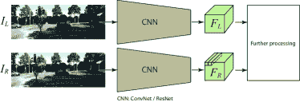
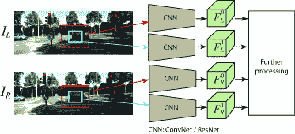
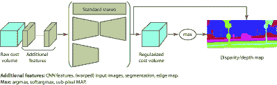
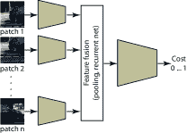
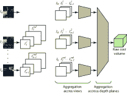
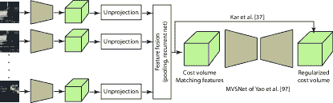
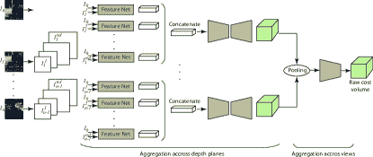

<!--yml

类别：未分类

日期：2024-09-06 20:06:09

-->

# [1906.06113] 关于基于深度学习的图像深度重建架构的综述

> 来源：[`ar5iv.labs.arxiv.org/html/1906.06113`](https://ar5iv.labs.arxiv.org/html/1906.06113)

# 关于基于深度学习的图像深度重建架构的综述

哈米德·拉加    哈米德·拉加 哈米德·拉加现任教于穆尔多克大学（澳大利亚），并且在南澳大学的表型学和生物信息学研究中心工作。电子邮件：H.Laga@murdoch.edu.au 手稿接收日期：2005 年 4 月 19 日；修订日期：2012 年 12 月 27 日。（2018 年 9 月）

###### 摘要

从 RGB 图像中估计深度是一个长期存在的病态问题，计算机视觉、图形学和机器学习领域已对其进行了数十年的探索。在本文中，我们提供了对该领域最新发展的全面综述。我们将重点关注那些使用深度学习技术从一张或多张图像中估计深度的工作。深度学习以及大量训练数据集的可用性，已经彻底改变了研究社区处理深度重建问题的方式。在本文中，我们综述了过去五年出现的超过$100$项关键贡献，总结了最常用的流程，并讨论了它们的优点和局限性。回顾迄今为止取得的成就，我们还推测了未来基于学习的深度重建研究可能的发展方向。

###### 关键词：

立体匹配、视差、CNN、卷积神经网络、三维视频、三维重建

## 1 引言

基于图像的三维重建的目标是从一张或多张 RGB 图像中推断真实物体和场景的三维几何形状和结构。这个长期存在的病态问题对许多应用至关重要，如机器人导航、物体识别和场景理解、三维建模和动画、工业控制以及医学诊断。

从二维图像中恢复丢失的维度一直是多视角立体和结构自 X 方法的目标，这些方法已被广泛研究了几十年。第一代方法专注于理解和形式化三维到二维投影过程，旨在为这个病态的逆问题设计解决方案。有效的解决方案通常需要多张图像，这些图像使用经过准确标定的相机拍摄。尽管这些技术可以取得显著成果，但在许多方面仍然有限。例如，它们在处理遮挡、特征较少的区域或具有重复特征的高纹理区域时并不适用。

有趣的是，作为人类，我们善于利用先验知识解决这些不适定的逆问题。例如，我们仅用一只眼睛就能轻松推测出物体的大致大小和粗略几何形状。我们甚至可以猜测从另一个视角看起来会是什么样子。我们之所以能够做到这一点，是因为之前看到的所有物体和场景使我们能够建立先验知识，并发展出关于物体及整个 3D 世界的心理模型。第二代深度重建方法试图通过将问题形式化为识别任务来利用这些先验知识。深度学习技术的崛起，以及更重要的是大规模训练数据集的日益增加，催生了一代新方法，这些方法即使从单张图像中也能恢复丢失的维度。尽管这些方法较为新颖，但在计算机视觉和图形学相关的各种任务中已经展现出了令人兴奋和有前景的结果。

在本文中，我们提供了关于使用深度学习技术进行基于图像的深度重建的最新进展的全面且结构化的综述。我们收集了超过$100$篇论文，这些论文发表于$2014$年至 2018 年 12 月期间的领先计算机视觉、计算机图形学和机器学习会议及期刊，专门讨论这一问题¹¹1 这个数字在我们撰写本文和审稿过程中还在不断增加.. 目标是帮助读者在这个新兴领域中导航，该领域在过去几年中获得了显著的动能。与现有文献相比，本文的主要贡献如下；

+   •

    据我们所知，这是文献中首篇关注于使用深度学习技术进行基于图像的深度重建的综述论文。

+   •

    我们充分覆盖了这一领域的现代文献。我们对超过$100$篇从$2014$年至 2018 年 12 月发表的文章进行了全面综述。

+   •

    本文还提供了关于深度学习进行深度重建的所有方面的全面综述和深刻分析，包括训练数据、网络架构选择及其对重建结果的影响、训练策略以及应用场景。

+   •

    我们提供了所评审方法在不同场景下的属性和性能的比较总结，包括从立体对、多个图像和单张 RGB 图像进行深度重建。

本文的其余部分组织如下：第二部分提出问题并制定分类法。第三部分重点介绍了使用深度学习架构进行立体匹配的最新论文。第四部分回顾了从一个或多个图像中直接回归深度图而不显式匹配输入图像特征的方法。第五部分重点介绍了训练程序，包括训练数据集的选择和损失函数。第六部分讨论了一些关键方法的性能。最后，第 7 和第八部分讨论了潜在的未来研究方向，并总结了本文。

## 2 领域和分类

设 $\textbf{I}=\{I_{k},k=1,\dots,n\}$ 为一组 $n\geq 1$ 张相同 3D 场景的 RGB 图像，这些图像使用的相机的内部和外部参数可以是*已知*的，也可以是*未知*的。图像可以由多个相机在 3D 场景周围拍摄，从而空间上相关，或者由单个相机在场景中移动拍摄，从而在时间上相关。目标是估计一个或多个深度图，这些深度图可以与输入图像具有相同的视角[1, 2, 3, 4]，也可以是新的任意视角[5, 6, 7, 8, 9]。本文重点讨论从一个或多个图像中估计深度的方法，这些图像的相机参数可能是已知的，也可能是未知的。结构光（SfM）和同步定位与地图构建（SLAM）技术，它们同时估计深度和（相对）相机位姿，超出了本文的范围，需要单独的调查。

基于学习的深度重建可以总结为学习一个预测器 $f_{\theta}$ 的过程，该预测器可以推断出一个尽可能接近未知深度图 $D$ 的深度图 $\hat{D}$。换句话说，我们寻求找到一个函数 $f_{\theta}$，使得 $\mathcal{L}(\textbf{I})=d\left(f_{\theta}(\textbf{I}),D\right)$ 最小化。在这里，$\theta$ 是一组参数，而 $d(\cdot,\cdot)$ 是真实深度图 $D$ 和重建深度图 $f_{\theta}(\textbf{I})$ 之间的某种距离度量。重建目标 $\mathcal{L}$ 在深度学习术语中也被称为 *损失函数*。

我们可以区分两种主要的类别。第一类方法（第三部分）通过明确学习如何匹配或对应输入图像中的像素，模仿传统的立体匹配技术。这些对应关系随后可以转换为光流或视差图，进而可以转换为输入图像中每个像素的深度。预测器 $f$ 由三个模块组成：特征提取模块、特征匹配和成本聚合模块，以及视差/深度估计模块。

第二类方法（第四部分）并不明确学习匹配函数。相反，它们学习一个函数，该函数直接预测输入图像中每个像素的深度（或视差）。这些方法非常通用，已被用来从单张图像以及从多个从任意视点拍摄的图像中估计深度。预测的深度图 $D$ 可以来自与输入相同的视点，也可以来自新的任意视点 $v$。我们将这些方法称为 *基于回归* 的深度估计。

在所有方法中，估计的深度图可以进一步通过细化模块[10, 1, 11, 2]和/或渐进重建策略进行精细化，每当新图像可用时，重建过程会进行精细化（第 3.1.4 节）。

后续章节将回顾最先进的技术。在每种方法类别中，我们将首先回顾在共同管道中的不同模块是如何使用深度学习技术实现的。然后，我们将讨论不同的方法，基于它们的输入和输出、网络架构、训练过程（包括所使用的损失函数和所需的监督程度）以及它们在标准基准上的表现。

## 3 通过立体匹配进行深度估计

基于立体的深度重建方法采用 $n>1$ 张 RGB 图像，生成深度图、视差图或光流[12, 13]，通过匹配图像中的特征。这些输入图像可以通过校准[14] 或未校准[15] 相机拍摄。

本节关注基于深度学习的方法，这些方法模仿传统的立体匹配管道，*即*，那些学习如何显式地匹配立体图像中的块以进行视差/深度图估计的方法。我们将首先回顾如何利用深度学习实现立体匹配管道的各个模块（第 3.1 节），然后讨论这些模块如何组合在一起并训练以进行深度重建（第 3.2 节）。

### 3.1 管道

基于立体的深度重建过程可以被公式化为估计一个地图 $D$（$D$ 可以是深度/视差图，或光流）的过程，该过程最小化一种形式的能量函数：

|  | $E(D)=\sum_{x}C(x,0pt_{x})+\sum_{x}\sum_{y\in\mathcal{N}_{x}}E_{s}(0pt_{x},0pt_{y}).$ |  | (1) |
| --- | --- | --- | --- |

在这里，$x$ 和 $y$ 是图像像素，$0pt_{x}=D(x)$ 是 $x$ 处的深度/视差，$C$ 是一个三维代价体，其中 $C(x,0pt_{x})$ 是像素 $x$ 拥有深度或视差等于 $0pt_{x}$ 的代价，$\mathcal{N}_{x}$ 是位于 $x$ 邻域内的像素集合，$E_{s}$ 是一个正则化项，用于对最终解施加各种约束，*例如*，平滑性和左右视差/深度一致性。方程 (1) 的第一个项是匹配代价。在校正立体对的情况下，它测量将左图像的像素 $x=(i,j)$ 与右图像的像素 $y=(i,j-0pt_{x})$ 匹配的代价。在更一般的多视图立体情况下，它测量参考图像上 $x$ 的逆似然性，其深度为 $0pt_{x}$。

通常，这个问题是通过四个构建块的管道来解决的[16]： (1) 特征提取， (2) 匹配代价计算和聚合， (3) 视差/深度计算，以及 (4) 视差/深度优化。前两个块构建代价体 $C$。第三和第四个块定义正则化项，并找到最小化方程 (1) 的深度/视差图 $\tilde{D}$。在本节中，我们回顾了利用深度学习技术实现这些单独模块的最新方法。

表 I: 基于深度学习的立体匹配算法分类。“Arch.”指的是架构。“CV”指的是代价体积。“corr.”指的是相关性。

|   |
| --- |
| 方法 | (1) 特征提取 | (2) 匹配代价计算 | (3) 代价体积正则化 | 深度估计 |
| 尺度 | 架构 | 手工设计 | 学习相似性 | 输入 | 方法 / 网络架构 | 输出 |
| 特征 | 相似性学习 |
| 聚合 | 网络 | 输出 |
|  | 固定 vs. | ConvNet vs. | $L_{2}$ | 池化， | FC，CNN | 匹配分数， | 代价体积 (CV) | 标准立体 | 正则化 CV | argmin, argmax |
|  | 多尺度 | ResNet | 相关 | 连接 |  | 匹配特征 | CV + 特征 (CVF) | 编码器 | 差异/深度 | soft argmin, soft argmax |
|  |  |  |  |  |  |  | CVF + 分割 (CVFS) | 编码器 + 解码器 |  | 亚像素 MAP |
|  |  |  |  |  |  |  | CVF + 边缘图 (CVFE) |  |  |  |
|   |
| MC-CNN Accr [17, 18] | 固定 | CNN | $-$ | 连接 | 4 FC 层 | 匹配分数 | 代价体积 | 标准立体 | 正则化 CV | argmin |
| Luo *等*[19] | 固定 | ConvNet | 相关 | $-$ | $-$ | 匹配分数 | 代价体积 | 标准立体 | 正则化 CV | argmin |
| Chen *等*[20] | 多尺度 | ConvNet | 相关 + 投票 | $-$ | $-$ | 匹配分数 | 代价体积 | 标准立体 | 正则化 CV | argmin |
| L-ResMatch [21] | 固定 | ResNet | $-$ | 连接 | 4 (FC+ReLu) + FC | 匹配分数 | 代价体积 | 标准立体 + | 正则化 CV | argmin |
|  |  |  |  |  |  |  |  | 4 Conv + 5 FC |  |  |
| Han *等*[22] | 固定 | ConvNet | $-$ | 连接 | 2 (FC + Relu)，FC | 匹配分数 | $-$ | $-$ | $-$ | softmax |
| DispNetCorr [13] | 固定 | ConvNet | 1D 相关 | $-$ | $-$ | 匹配分数 | CV + 特征 | 编码器 + 解码器 | 差异 | $-$ |
| Pang *等*[23] | 固定 | ConvNet | 1D 相关 | $-$ | $-$ | 匹配分数 | CV + 特征 | 编码器 + 解码器 | 差异 |  |
| Yu *等*[24] | 固定 | ResNet | $-$ | 连接 | 编码器+解码器 | 匹配分数 | 代价体积 | 3D Conv | 正则化 CV | softargmin |
| Yang *等*[25] (未) | 固定 | ResNet | 相关 | $-$ | $-$ | 匹配分数 | CVF + 分割 | 编码器-解码器 | 深度 |  |
| Liang *等*[26] | 多尺度 | ConvNet | 相关 | $-$ | $-$ | 匹配分数 | CV + 特征 | 编码器-解码器 | 深度 | $-$ |
| Khamis *等*[27] | 固定 | ResNet | $L_{2}$ | $-$ | $-$ | $-$ | 代价体积 | 编码器 | 正则化体积 | soft argmin/max |
| Chang & Chen [28] | 多尺度 | ResNet | $-$ | 连接 | $-$ | $-$ | 代价体积 | 12 个卷积层，残差 | 正则化体积 | 回归 |
| (基本) |  |  |  |  |  |  |  | 块，上采样 |  |  |
| Chang & Chen [28] | 多尺度 | ResNet | $-$ | 拼接 | $-$ | $-$ | 代价体积 | 堆叠的编码器-解码器块 | 正则化体积 | 回归 |
| （堆叠的） |  |  |  |  |  |  |  | 残差连接，上采样 |  |  |
| Zhong *等人*[29] | 固定 | ResNet | $-$ | 拼接 | 编码器-解码器 | 匹配分数 | 代价体积 | $-$ | 正则化体积 | soft argmin |
| SGM-Net [30] | $-$ | $-$ | $-$ | $-$ | $-$ | $-$ | 代价体积 | MRF + SGM-Net | 正则化体积 | $-$ |
| EdgeStereo [31] | 固定 | VGG-16 | 相关性 | $-$ |  | 匹配分数 | CVF + 边缘图 | 编码器-解码器（分辨率金字塔） | 深度 | $-$ |
| Tulyakov *等人*[32] | 固定 | ConvNet | $-$ | 拼接 | 编码器-解码器 | 匹配签名 | 匹配签名 | 编码器 + 解码器 | 正则化体积 | 子像素 MAP |
|  |  |  |  | 每个视差 |  |  |  |  |  |  |
| Jie *等人*[33] | $-$ | $-$ | $-$ | $-$ | $-$ | $-$ | 左右视差体积 | 循环 ConvLSTM | 视差 | $-$ |
|  |  |  |  |  |  |  |  | 具有左右一致性 |  |  |
| Zagoruyko *等人*[34] | 多尺度 | ConvNet | $-$ | 拼接 | FC | 匹配分数 | $-$ | $-$ | $-$ | $-$ |
| Hartmann *等人* [35] | 固定 | ConvNet |  | 平均池化 | CNN | 匹配分数 | $-$ | $-$ | $-$ | softmax |
| Huang *等人* [36] | 固定 | ConvNet | $-$ | 最大池化 | CNN | 匹配特征 | 代价体积 | 编码器 | 正则化体积 | argmin |
| Yao *等人* [37] | 固定 | ConvNet | $-$ | 变量池化 | $-$ | 匹配特征 | 代价体积 | 编码器-解码器 | 正则化体积 | softmax |
| Flynn *等人* [14] | 固定 | 2D Conv | $-$ | 跨卷积 | CNN | 匹配分数 | 代价体积 | 编码器 | 正则化体积 | soft argmin/max |
|  |  |  |  | 深度层 |  |  |  |  |  |  |
| Kar *等人* [38] | 固定 | ConvNet | $-$ | 特征反投影 + | CNN | 匹配分数 | 代价体积 | 编码器-解码器 | 3D 占用 | 投影 |
|  |  |  |  | 循环融合 |  |  |  |  | 网格 |  |
| Kendall *等人* [39] | 固定 | ConvNet | $-$ | 拼接 | CNN | 匹配特征 | 代价体积 | 编码器-解码器 | 正则化体积 | soft argmin/max |
|   |

#### 3.1.1 特征提取

图 1: 特征提取网络。

图 2: 多尺度特征提取网络。

第一步是计算一组适用于图像匹配的良好特征。这已通过 CNN 架构进行建模，其中编码器处理感兴趣像素周围的补丁或整个图像，并在 2D 图像空间中生成密集特征图。这些特征可以是固定尺度的（第 3.1.1.1 节）或多尺度的（第 3.1.1.2 节）。

##### 3.1.1.1 固定尺度特征

文献中使用的主要网络架构类型是具有共享权重的多分支网络[34, 17, 12, 18, 19, 13, 38, 39, 23, 26]，另见图 1。它由$n\geq 2$个编码分支组成，每个分支对应一个输入图像，作为描述符计算模块。每个分支是一个卷积神经网络（CNN），它处理像素$i$周围的补丁，并输出一个描述该补丁的特征向量[34, 17, 12, 40, 18, 19, 13, 14, 38, 39, 23, 36, 37, 26]。它通常由卷积层、空间归一化、池化层和修正线性单元（ReLU）组成。提取特征的尺度由每层中使用的卷积滤波器的大小以及卷积层和池化层的数量控制。增加滤波器的大小和/或层数会增加提取特征的尺度。这也有利于捕捉图像像素之间的更多交互。然而，这会带来较高的计算成本。为了在增加网络视野的同时减少计算成本，一些技术，如[41]，使用扩张卷积，即具有孔的较大卷积滤波器，从而在计算上更为高效。

有些技术 [25] 采用残差网络，而不是使用全卷积网络，*例如* ResNet [42]，*即* 带有残差块的 CNN。残差块接收一个输入并估计需要添加到该输入中的残差。它们用于简化非常深的网络的训练，因为学习信号的残差比学习预测信号本身要容易得多。文献中使用了各种类型的残差块。例如，Shaked 和 Wolf [21] 提出了附加具有多级连接的残差块。其特点是网络可以自我学习如何调整添加的跳跃连接的贡献。

Table II 总结了各种方法的详细架构（每层的层数、滤波器大小和步幅）及其产生的特征大小。请注意，卷积网络的一个优点是同一层内的卷积操作是相互独立的，因此可以并行计算。这样，整个图像的所有特征可以通过一次前向传递计算完成。

TABLE II: 特征提取的网络结构。网络的每一层以以下格式描述：（滤波器大小，类型，步幅，输出特征大小，缩放）。缩放指的是相对于输入的输出分辨率的放大或缩小。SPP 指的是空间金字塔池化。最后一列表示最后一层产生的特征大小。

| 方法 | 输入 | 类型 | 结构 | 特征大小 |
| --- | --- | --- | --- | --- |
| Dosovitskiy *等* [12] | $512\times 384$ | CNN | $(7\times 7,conv,2,64,-),(5\times 5,conv,2,128,-),(5\times 5,conv,2,256,-)$ | $64\times 48\times 256$ |
| Chen *等* [20] | $13\times 13$ | CNN | $(3\times 3,conv,-,32,-)_{1,2}$, $(5\times 5,conv,-,200,-)_{3,4}$ | $1\times 200$ |
| Zagoruyko [34] | 不同大小的补丁 | CNN + SPP | $(-,conv+ReLu,-,-,-)_{1,2},(-,conv+SPP,-,-,-)$ | $1\times c$ |
| Zbontar & LeCun [18] (快速) | 补丁 $9\times 9$ | CNN | $(3\times 3,conv+ReLu,-,64,-)_{1,2,3},(3\times 3,conv,-,64,-)$ | $1\times 64$ |
| Zbontar & LeCun [18] (准确) | 补丁 $9\times 9$ | CNN | $(3\times 3,conv+ReLu,-,112,-)_{1,2,3},(3\times 3,conv,-,112,-)$ | $1\times 112$ |
| Luo *等* [19] | 小补丁 | CNN | $(3\times 3\text{ 或 }5\times 5,conv+ReLu,-,32\text{ 或 }64,-)_{1,2,3},\text{或}$ | $1\times 32$ 或 $1\times 64$ |
|  |  |  | $(5\times 5,conv,-,32\text{ 或 }64,-)$ |  |
| DispNetC [13], Pang *等* [23] | $768\times 364$ | CNN | $(7\times 7,conv,2,64,-),(5\times 5,conv,2,128,-)$ | $192\times 96\times 128$ |
| Kendall *等* [39] | $0pt\times 0pt$ | CNN (2D conv) + | $(5\times 5,conv,2,32,/2),[(3\times 3,conv,-,32,-),(3\times 3,res,-,32,-)]_{1,\dots,7},$ | $\frac{1}{2}0pt\times\frac{1}{2}0pt\times 32$ |
|  |  | 残差连接 | $(3\times 3,conv,-,32,-)$, 最后一层没有 RLu 或 BN |  |
| Liang *等* [26] | $0pt\times 0pt$ | CNN | $(7\times 7,conv,2,64,/2),(5\times 5,conv,2,128,/2)$。 | $\frac{1}{4}0pt\times\frac{1}{4}0pt\times 128$ |
| 卡尔 *等* [38] | $224\times 224$ | CNN | $(3\times 3,conv,-,64,-),(3\times 3,conv,-,64,-),(2\times 2,\text{maxpool},-,64,-)$ | $32\times 32\times 1024$ |
|  |  |  | $(3\times 3,conv,-,128,-),(3\times 3,conv,-,128,-),(2\times 2,\text{maxpool},-,128,-)$ |  |
|  |  |  | $(3\times 3,conv,-,512,-),(3\times 3,conv,-,512,-),(2\times 2,\text{maxpool},-,512,-)$ |  |
|  |  |  | $(3\times 3,conv,-,1024,-),(3\times 3,conv,-,1024,-)$ |  |
| 杨 *等* [25] | $0pt\times 0pt$ | CNN + 残差块 | $(3\times 3,conv,2,64,/2),(3\times 3,conv,1,64,/1),(3\times 3,conv,1,128,/1)$ |  |
|  |  |  | $(3\times 3,maxpool,2,128,/2),(3\times 3,res\_block,1,256,/2)$, |  |
|  |  |  | $(3\times 3,res\_block,1,256,/1)_{1,2}$, $(3\times 3,res\_blcok,1,512,/2)$ | $-$ |
| Shaked and Wolf [21] | $11\times 11$ | CNN + | $conv_{1},ReLU,$ 外部 $\lambda-$ 残差块, $ReLU,conv_{2\cdots 5},ReLU,$ | $1\times 1\times 112$ |
|  |  | 外部 $\lambda-$残差块 | 外部 $\lambda-$ 残差块 |  |

##### 3.1.1.2 多尺度特征

第 3.1.1.1 节中描述的方法可以扩展到多个尺度提取特征，见图 2。这可以通过向网络提供以同一像素为中心的不同大小的补丁 [34, 20, 28]，或使用中间层计算的特征实现 [26]。注意，网络中的某一层越深，计算的特征尺度就越大。

Liang *et al.* [26] 使用一个两层卷积网络计算多尺度特征。这两层的输出被连接并融合，使用卷积层，这样就得到了 *多尺度融合特征*。Zagoruyko 和 Komodakis [34] 提出了一个中心-周围的双流网络，本质上是由两个在输出处由顶层网络结合的孪生网络组成。第一个孪生网络称为中心高分辨率流，它接收两个 $32\times 32$ 的图像块，这些图像块是通过裁剪（在原始分辨率下）每个 $64\times 64$ 输入图像块的中心 $32\times 32$ 部分生成的。第二个网络称为周围低分辨率流，它接收两个通过将原始输入下采样一半生成的 $32\times 32$ 图像块。Chen *et al.* [20] 也使用了类似的方法，但每个网络处理的是 $13\times 13$ 大小的图像块。这种架构的主要优点是可以在一次前向传播中计算两个不同分辨率的特征。然而，它需要每种尺度一个流，如果需要更多尺度则不够实用。

Chang 和 Chen [28] 使用了空间金字塔池化（SPP）模块来聚合不同尺度和位置的上下文。更具体地说，特征提取模块由一个七层的 CNN 和一个 SPP 模块加上卷积层组成。CNN 生成一个大小为 $\frac{1}{4}0pt\times\frac{1}{4}0pt\times 128$ 的特征图。然后，SPP 模块对每个像素周围的图像块进行四种不同尺寸（$8\times 8\times 128$、$16\times 16\times 128$、$32\times 32\times 128$ 和 $64\times 64\times 128$）的均值池化，并通过 $1\times 1$ 卷积将其转换为单通道。这些特征图被上采样到所需尺寸，并与 CNN 不同层的特征连接，然后通过额外的卷积层进一步处理，生成将用于后续模块的特征，以进行匹配和视差计算。Chang 和 Chen [28] 表明，SPP 模块使得对固有难以解决的区域进行视差估计成为可能。

一般来说，空间金字塔池化（SPP）对于处理任意大小的图像块很方便。例如，Zaogoruyko 和 Komodakis [34] 在特征计算网络的末尾附加了一个 SPP 层。这样的层通过空间池化聚合最后一层卷积层的特征，其中池化区域的大小取决于输入的大小。通过这样做，可以将任意大小的图像块输入网络，并计算出相同维度的特征向量。

#### 3.1.2 匹配成本计算

图 3：相似性计算网络的分类。

本模块利用输入图像上计算得到的特征，并计算方程 (1) 的匹配分数。这些匹配分数形成一个 3D 体积，称为*视差空间图像 (DSI)* [16]，形式为 $C(x,d_{x})$，其中 $x=(i,j)$ 是像素 $x$ 的图像坐标，$d_{x}\in[0,n_{d}]$ 是候选视差/深度值。其大小为 $\tilde{0pt}\times\tilde{0pt}\times(n_{d}+1)$，其中 $\tilde{0pt}\times\tilde{0pt}$ 是我们想要计算深度图的分辨率，$n_{d}$ 是深度/视差值的数量。在立体匹配中，如果左图和右图已经进行了校正，使得极线为水平线，则 $C(x,d_{x})$ 表示在校正后的左图中像素 $x=(i,j)$ 和在校正后的右图中像素 $y=(i,j-d_{x})$ 之间的相似度。否则，$C(x,d_{x})$ 表示像素 $x$ 具有深度 $d_{x}$ 的可能性或概率。

类似于传统的立体匹配方法 [16]，代价体积通过使用标准度量（如 $L_{2}$ 距离、余弦距离和（归一化的）相关距离）来比较输入图像的深度特征进行计算（第 3.1.2.1 节）。随着深度神经网络的兴起，提出了几种新的机制（第 3.1.2.2 节）。图 3 显示了主要的相似性计算架构。接下来，我们将详细讨论这些架构。

##### 3.1.2.1 使用距离度量

形成成本体积的最简单方法是通过计算像素的特征向量与匹配候选的特征向量之间的距离，即其他图像中在预定义视差范围内的像素。可以使用几种距离度量方法。例如，Khamis *et al.* [27] 使用了 $L_{2}$ 距离。其他技术，例如 [12, 20, 18, 19, 13, 26]，使用了相关性，即特征向量之间的内积。相关性的主要优势在于它可以通过 2D [12] 或 1D [13] 卷积操作层实现，称为相关层。1D 相关性在计算上比其 2D 对应物更高效。然而，它们需要经过校正的图像，以便将匹配搜索限制在同一行的像素中。

与下面将描述的其他两种方法相比，相关层的主要优势在于它不需要训练，因为滤波器实际上是由网络第二分支计算出的特征。

##### 3.1.2.2 使用相似性学习网络

这些方法聚合不同分支产生的特征，并通过顶层网络处理，生成匹配分数。其合理性在于让网络从数据中学习适当的相似性度量。

(1) 特征聚合。一些立体重建方法在通过进一步处理层之前，首先聚合网络不同分支计算出的特征。聚合可以通过两种不同的方法完成：

通过连接进行聚合。最简单的方法是直接连接由网络的不同分支计算出的特征，并将其输入到相似度计算网络中[34, 17, 18, 39]。Kendall *等人* [39] 将每个特征与来自对侧立体图像的相应特征在每个视差级别上进行连接，并将这些特征打包成一个尺寸为 $0pt\times 0pt\times(n_{d}+1)\times c$ 的 4D 体积（此处 $c$ 是特征的维度）。另一方面，Huang *等人* [36] 将为 $64\times 64\times 3$ 参考图像计算出的 $64^{3}$ 特征体积与来自平面扫掠体积平面、对应于第 $d-$ 视差级别的第 $n-$ 输入图像的另一体积连接，形成一个 $64\times 64\times 128$ 体积。Zhong *等人* [29] 采用了相同的方法，但以交错的方式连接特征。即，如果 $\textbf{f}_{L}$ 是左图像的特征图，而 $\textbf{f}_{R}$ 是右图像的特征图，则最终的特征体积的 $2i-$ 层包含左特征图，而 $(2i+1)-$ 层包含右特征图，但在视差 $d=i$。

|  | $\textbf{f}_{LR}(u,v,d)=\textbf{f}_{L}(u,v)\&#124;\textbf{f}_{R}(u-d,v),$ |  | (2) |
| --- | --- | --- | --- |

其中 $\|$ 表示向量连接。

通过池化进行聚合。另一种方法是使用池化层来聚合特征图。例如，Hartmann *等人* [35] 使用了平均池化。Huang *等人* [36] 使用了最大池化，而 Yao *等人* [37] 则取其方差，相当于先计算平均特征向量，然后计算其他特征与均值的平均距离。

池化相对于连接的主要优点有三；首先，它不会增加输入到顶部相似度计算网络的数据的维度，从而有利于训练。其次，它使得在不重新训练网络的情况下输入不同数量的视图成为可能。这对于多视图立体（MVS）方法尤其合适，特别是当处理任意数量的输入图像时，且运行时图像数量可能与训练时的图像数量不同。最后，池化确保结果对输入图像的顺序保持不变。

(2) 相似度计算。文献中使用了两种类型的网络：全连接网络和卷积网络。

使用全连接网络。在这些方法中，相似度计算网络由全连接层组成[34、17、18]。最后一层生成输入特征向量是好匹配还是差匹配的概率。例如，Zagoruyko 和 Komodakis[34]使用了由两个全连接层（每层有$512$个隐藏单元）组成的网络，这些层之间由 ReLU 激活层隔开。Zbontar 和 LeCun[17、18]使用了五个全连接层，每个层有$300$个神经元，最后一层将输出映射到两个实数，通过 softmax 函数计算概率，进而得到两个输入特征向量的匹配概率。

使用卷积网络。另一种方法是聚合特征，并通过卷积网络进一步后处理这些特征，卷积网络输出匹配分数[14、38、35]（类似于相关层），或匹配特征[39、36]。最常用的 CNN 包括最大池化层，这些层提供空间变换的不变性。池化层还扩展了 CNN 的感受野，而不增加参数数量。缺点是网络丧失了细节。为克服这一限制，Park 和 Lee[43]引入了像素级金字塔池化层，在比较两个输入补丁时扩大感受野。这种方法产生了比[17]更准确的匹配成本。

相关层和卷积网络的一个限制是它们生成单一成本值，这会减少特征维度。因此，它们限制网络只能学习特征之间的相对表示，而不能承载绝对特征表示。相反，匹配特征可以被视为描述符或特征向量，表征两个给定块之间的相似性。计算匹配特征的最简单方法是通过汇总由网络描述符计算分支生成的特征图 [44, 39]，或使用一个编码器，该编码器接受拼接的特征并生成另一个匹配特征体积 [36]。例如，Huang *et al.* [36] 采用由特征组成的 $64\times 64\times 128$ 体积，并通过三个卷积层处理，生成一个 $64\times 64\times 4$ 的匹配特征体积。由于该方法计算了 $n_{d}+1$ 个匹配特征，每个视差级别一个 ($n_{d}=100$ 在 [36] 中)，这些需要被聚合成一个单一的匹配特征。这通过另一个具有跳跃连接的编码器-解码器网络 [36] 完成。每一层编码器由一个 stride-2 卷积层和一个普通卷积层组成。每一层解码器由两个卷积层和一个双线性上采样层组成。它生成一个大小为 $64\times 64\times 800$ 的匹配特征体积。

(3) 成本体积聚合。一般来说，多视角立体方法，取 $n$ 张输入图像，计算 $n-1$ 个成本或特征匹配体积，每对 $(I_{0},I_{i})$ 计算一个，其中 $I_{0}$ 是参考图像。这些需要在送入视差/深度计算模块之前被聚合成一个单一的成本/特征匹配体积。这通常通过使用 (max, average) 池化或池化加编码器 [36, 37] 来完成，从而生成最终的成本/特征匹配体积 $C$。

#### 3.1.3 视差和深度计算

到目前为止，我们已经看到各种深度学习技术被用于估计成本体积 $C$，*即* 方程式 (1) 的第一项。现在的目标是估计深度/视差图 $\tilde{D}$，使方程式 (1) 的能量函数 $E(D)$ 最小化。这分为两个步骤： (1) 成本体积正则化，和 (2) 从正则化的成本体积中估计视差/深度。

图 4：成本体积正则化和视差/深度图估计。

##### 3.1.3.1 成本体积正则化

一旦估计出原始成本体积，就可以通过去掉方程 (1) 的平滑度项并采用 argmin、softargmin 或亚像素 MAP 近似（见第 3.1.3.2 节）来估计差异/深度。然而，一般来说，由图像特征计算得到的原始成本体积可能会受到噪声污染（*例如*，由于非兰伯特表面、物体遮挡和重复模式的存在）。因此，估计的深度图可能会很嘈杂。

几种基于深度学习的正则化技术已经被提出，用于从成本体积中估计准确的深度图，见图 4 了解分类法的示例。它们的输入可以是成本体积 [14, 27, 39, 29, 37, 38, 28, 36]，也可以是与参考图像特征 [12, 26] 以及/或语义特征（例如分割掩码 [25] 或边缘图 [31] 连接的成本体积。然后，通过带有跳跃连接的编码器-解码器网络 [39, 29, 37, 38, 28, 12, 26, 25, 31]，或者仅使用编码器 [14, 27, 36] 来处理生成的体积，以产生正则化的成本体积 [39, 29, 37, 38, 28, 14, 27, 36]，或者直接生成差异/深度图 [12, 25, 31, 26]。在前一种情况下，正则化的体积使用 argmin、softargmin 或亚像素 MAP 近似（见第 3.1.3.2 节）来生成最终的差异/深度图。

注意，某些方法采用基于 MRF 的立体框架进行成本体积正则化 [20, 17, 19]。在这些方法中，初始成本体积 $C$ 被输入到全局 [16] 或半全局 [45] 匹配器中以计算差异图。半全局方法定义平滑度项为

|  | $\small{E_{s}(0pt_{x},0pt_{y})=\alpha_{1}\delta(&#124;0pt_{x}-0pt_{y}&#124;=1)+\alpha_{2}\delta(&#124;0pt_{x}-0pt_{y}&#124;>1),}$ |  | (3) |
| --- | --- | --- | --- |

其中 $\alpha_{1}$ 和 $\alpha_{2}$ 是正权重，选择使得 $\alpha_{2}>\alpha_{1}$。Seki *et al.* [30] 提出了 SGM-Net，这是一种神经网络，训练来为每个图像像素提供这些参数。他们获得了比手动调整方法 [17] 更好的惩罚效果。

##### 3.1.3.2 差异/深度估计

从（正则化）成本体积 $C$ 中估计差异/深度的最简单方法是使用逐像素的 argmin，*即，* $0pt_{x}=\arg\min_{0pt}C(x,0pt)$（或如果体积 $C$ 编码了可能性，则等效于 $\arg\max$） [36]。然而，argmin/argmax 操作符无法产生子像素精度，并且由于其不可微性，无法通过反向传播进行训练。另一种方法是使用逐像素的 softmin 层处理成本体积，也称为 soft argmin（或等效的 softmax），对差异/深度进行处理 [14, 39, 27]：

|  | $d^{*}=\frac{1}{\sum_{j=0}^{n_{d}}e^{-C(x,j)}}\sum_{d=0}^{n_{d}}d\times e^{-C(x,d)}.$ |  | (4) |
| --- | --- | --- | --- |

当分布为单峰且对称时，它逼近子像素 MAP 解 [32]。当这一假设不成立时，softargmin 会混合模式，可能产生远离所有模式的解。此外，网络只对训练过程中使用的差异范围进行学习。如果在运行时差异范围发生变化，则需要重新训练网络。为了解决这些问题，Tulyakov *et al.* [32] 引入了子像素 MAP 近似，通过计算最大后验概率的差异的加权均值来实现：

|  | $d^{*}=\sum_{d:&#124;\hat{d}-d&#124;\leq\delta}d\cdot\sigma(C(x,d)),$ |  | (5) |
| --- | --- | --- | --- |

其中 $\delta$ 是一个元参数，在 [32] 中设置为 $4$，而 $\displaystyle\hat{d}=\arg\max_{d}C(x,d)$。请注意，在 Tulyakov *et al.* [32] 中，子像素 MAP 仅用于推断。

#### 3.1.4 精细化

表 III：差异/深度精细化技术的分类。 “reco error”：重建误差。 “CSPN”：卷积空间传播网络。

|   |
| --- |
| 传统方法 | 基于深度学习的方法 |
|  | 输入 | 方法 | 其他提示 |
|  |  | 自下而上 | 自上而下 | 引导 |  |
|   |
| 变分 [12] | 原始深度 | 分割与合并 [46] | 解码器 [10] | 检测 - 替换 - 精细化 [47] | 结合深度与法线 [48] |
| 完全连接 CRF [36] | 深度 + 参考图像 [37] | 滑动窗口 [11] | 编码器 + 解码器 [15, 27, 49] | 深度平衡损失 [46] | 左右一致性 [33] |
| 层次 CRF [1] | 深度 + CV + 参考图像 + 重建误差 [26] | 使用 CSPN 的扩散 [50] | 带有残差学习的编码器 + 解码器 [23, 37, 51, 26, 49] |  |  |
| 深度传播 [20] | 深度 + 重新变形的右图像 [52] | 使用递归卷积操作的扩散 [53] | 渐进上采样 [51] |  |  |
| 使用 CNN 的 CRF 能量最小化 [4] | 深度 + 学习特征 [10] |  |  |  |  |
|   |

一般来说，预测的视差/深度图分辨率较低，缺少细节，并且在物体边界处可能会出现过度平滑的现象。一些方法还会输出不完整和/或稀疏的图。直接预测高分辨率和高质量图的深度学习网络需要大量的参数，因此通常训练起来比较困难。相反，通常会在管道中添加一个额外的细化块。其目标是（1）提高估计视差/深度图的分辨率，（2）细化细节的重建，以及（3）执行深度/视差补全。这种细化块可以使用传统方法来实现。例如，Dosovitskiy *等人* [12] 使用来自 [54] 的变分方法。Huang *等人* [36] 将 [55] 的全连接条件随机场（DenseCRF）应用于预测的原始视差。Li *等人* [1] 使用层次条件随机场（CRF）将预测的深度（或表面法线）从超像素级别细化到像素级别。使用 DenseCRF 或层次 CRF 可以使空间上接近且颜色相似的像素具有更接近的视差预测。此外，这一步还通过左-右检查去除不可靠的匹配。Chen *等人* [20] 在去除不可靠匹配后，通过将可靠的视差传播到不可靠区域来计算最终的视差图 [56]。值得注意的是，Liu *等人* [4] 也探索了 CRF 在深度估计中的应用。然而，与 Li *等人* [1] 不同的是，Liu *等人* [4] 使用 CNN 来最小化 CRF 能量。

在本节中，我们将看一下如何使用深度学习实现了细化块，详情请见表 III，其中对这些方法进行了分类。总的来说，细化模块的输入可以是：(1) 估计的深度/视差图，(2) 估计的深度/视差图与按照估计的深度/视差图分辨率缩放的参考图像的拼接[37], (3) 最初估计的视差图，代价体积和重建误差，重建误差计算为左图像和右图像的多尺度融合特征的绝对差，但使用初始视差图反向变换到左图像[26], (4) 原始视差/深度图和通过使用估计的初始视差图将右图像向左图像视图翘曲[52]，和 (5) 估计的深度/视差图与参考图像的特征图拼接，*例如*，第一个卷积层的输出[10]。

请注意，通过级联多个细化模块[23, 49]，细化可以是分层的。

##### 3.1.4.1 自底向上方法

自底向上网络以类似滑动窗口的方式运作，它获取小补丁，然后估计补丁中心的细化深度[11]。Lee 等人[46]采用分离和合并方法。将输入图像分割成区域，并为每个区域估计深度。然后使用融合网络将这些估计值合并，该网络在傅立叶域中运作，以便处理具有不同裁剪比例的深度图。其原则是，要在所需分辨率上推断精确的深度，需要具有大量参数的大网络。通过使网络关注小区域，可以以更少的参数恢复细节。然而，获取整个细化地图将需要多次正向传递，这对于实时应用来说并不合适。

另一种自下而上的精细化策略基于扩散过程。其思想是从不完整的深度图开始，使用各向异性扩散将已知深度传播到深度缺失的区域。卷积空间传播网络（CSPN） [50]，实现了各向异性扩散过程，非常适合这个任务。它们以原始图像和稀疏深度图作为输入，稀疏深度图可以是深度估计网络的输出，并通过深度 CNN 预测扩散张量。然后将其应用于初始图，以获得精细化图。Cheng *et al.* [53] 在他们提出的精细化模块中使用了这种方法。它以初始深度估计为基础，执行线性传播，其中传播通过递归卷积操作进行，并通过深度 CNN 学习邻近像素之间的相似性。

##### 3.1.4.2 自顶向下的方法

另一种方法是使用一个自顶向下的网络处理整个原始视差/深度图。它可以实现为（1）一个解码器，由反池化单元组成，以扩展其输入的分辨率，与池化相对，并包含卷积层 [10]，或者（2）一个编码-解码网络 [15]。在后一种情况下，编码器将输入映射到潜在空间。解码器然后从潜在变量中预测高分辨率图。这些网络还使用从收缩部分到扩展部分的跳跃连接，以便保留细节。为了避免由反卷积和上卷积产生的棋盘格伪影 [57, 27, 49]，一些论文首先对初始图进行上采样，例如，使用双线性上采样，然后应用卷积 [27, 49]。

这些架构可以直接预测高分辨率图，也可以预测残差 [37, 26, 49]。与直接学习精细化视差图相对，残差学习提供了更有效的精细化。在这种方法中，将估计的图和调整大小后的参考图连接起来，作为 4 通道输入送入一个精细化网络，该网络学习视差/深度残差。然后将估计的残差加到原始估计图中以生成精细化图。

Pang *et al.* [23] 使用两个 CNN 的级联来精细化原始视差图。第一阶段通过添加额外的上卷积模块来改进 [13] 的 DispNet，生成更多细节的视差图。第二阶段由第一阶段的输出初始化，显式地修正视差；它与第一阶段耦合，并在多个尺度上生成残差信号。两个阶段的输出求和即为最终视差。

Jeon 和 Lee [51] 提出了一个深度拉普拉斯金字塔网络，以处理空间变化的噪声和孔洞。通过考虑局部和全局上下文，网络逐步减少噪声并填补孔洞，从粗到细进行处理。它首先使用残差学习预测一个粗略尺度（原始分辨率的四分之一）的干净完整深度图。然后，该预测通过金字塔逐步上采样，以预测半尺寸和原始尺寸的干净深度图。网络使用 3D 监督进行训练，损失函数是数据损失和结构保持损失的组合。数据损失是基于地面真实深度和估计深度之间的 $L_{1}$ 距离、地面真实深度梯度和估计深度梯度之间的 $L_{1}$ 距离以及估计深度和地面真实深度的法向量之间的 $L_{1}$ 距离的加权和。结构保持损失是基于梯度的，以保持原始结构和不连续性。它定义为地面真实深度图中像素周围最大梯度与估计深度图中该像素周围最大梯度之间的 $L_{2}$ 距离。

##### 3.1.4.3 指导性精细化

Gidaris 和 Komodakis [47] 认为预测新深度估计或残差修正的方法是不够优化的。相反，他们提出了一种通用的 CNN 架构，将精细化任务分解为三个步骤：（1）检测不正确的初始估计，（2）用新的标签替换不正确的标签，以及（3）通过预测相对于这些标签的残差修正来精细化更新的标签。由于该方法是通用的，因此可以用来精细化任何其他方法生成的原始深度图，例如 [19]。

通常，由编码器-解码器组成的基线骨干网络的预测由于缺乏深度细节而显得粗糙和平滑。为了克服这一点，张*等* [58] 引入了一种分层引导策略，该策略指导估计过程以预测细粒度的细节。他们通过将精细化网络（由 5 个卷积残差块和若干个 $1\times 1$ 卷积层组成）附加到编码器的最后三层（每层一个）来实现这一点。其作用是在这些层次上预测深度图。这些精细化网络学到的特征被用作其在骨干网络解码器部分相应层的输入。这类似于使用跳跃连接。然而，与直接输入编码器特征不同，这些特征经过进一步处理，以在该层次上预测深度图。

最后，为了处理同样接近和远离的深度，李*等* [46] 引入了深度平衡欧几里得损失，以可靠地训练网络在广泛的深度范围内。

##### 3.1.4.4 利用其他线索

Qi *等人* [48] 提出了一个机制，利用深度图细化法线估计的质量，以及利用法线图细化深度估计的质量。这是通过一个双流 CNN 来完成的，一个用于估计初始深度图，另一个用于估计初始法线图。然后，使用另一个双流网络：深度到法线网络和法线到深度网络。前者用于使用初始深度图细化法线图，后者用于使用估计的法线图细化深度图。

+   •

    深度到法线网络首先接受初始深度图，并使用 PCA 分析生成粗略的法线图。然后将其输入到一个三层 CNN 中，估计残差。残差然后被加到粗略的法线图上，与初始原始法线图连接，并通过一个卷积层进一步处理，输出细化的法线图。

+   •

    法线到深度网络使用核回归过程，它接受初始法线和深度图，并回归出细化的深度图。

与其从参考图像估计单一深度图，不如估计多个深度图，每个输入图像一个，检查估计的一致性，并使用一致性图来（递归地）细化估计。在立体匹配的情况下，这个过程被称为左右一致性检查，传统上是一个孤立的后处理步骤且极其手工制作。

实施左右一致性检查的标准方法如下；

+   •

    计算两个视差图 $D_{l}$ 和 $D_{r}$，分别用于左图像和右图像。

+   •

    将右侧视差图重投影到左图像的坐标上，获得 $\tilde{D}_{r}$。

+   •

    计算误差或置信度图，指示估计的视差是否正确。

+   •

    最后，使用计算得到的置信度图来细化视差估计。

计算置信度图的简单方法是逐像素差异。另一方面，Seki *等人* [59] 使用了以分类器方式训练的 CNN。它为每个像素输出一个标签，指示估计的视差是否正确。然后将这个置信度图纳入半全局匹配（SGM）中，以进行密集视差估计。

Jie *等*[33] 通过左-右一致性检查与视差估计共同进行，使用了左-右比较递归（LRCR）模型。它由两个平行堆叠的卷积 LSTM 网络组成。左侧网络接收代价体积并生成左图的视差图。类似地，右侧网络独立于左侧网络生成右图的视差图。这两个视差图被转换到对方坐标（使用已知的相机参数）进行比较。这样的比较产生两个误差图，一个用于左侧视差，另一个用于右侧视差。最后，每张图像的误差图与其相关的代价体积拼接在一起，并作为输入用于下一步的卷积 LSTM。这将允许 LRCR 模型在下一步中选择性地关注左右不匹配的区域。

### 3.2 立体匹配网络

在前一节中，我们讨论了如何使用深度学习实现立体匹配管道的不同块。本节讨论了不同的最先进技术如何使用这些块并将它们组合在一起以解决基于配对立体匹配的深度重建问题。

#### 3.2.1 早期方法

早期的方法，例如[17, 20, 34, 22, 19, 60]，用深度学习架构取代了手工设计的特征和相似性计算。基本架构由第 3.1 节中描述的模块堆叠组成。特征提取模块实现为多分支网络，具有共享权重。每个分支从其输入中计算特征。这些特征然后使用以下方式进行匹配：

+   •

    一个固定的相关层（实现为卷积层）[17, 19]，

+   •

    一个全连接神经网络[22, 34, 21, 18]，它以左图和右图的拼接特征作为输入，并产生一个匹配分数。

+   •

    卷积网络由卷积层和后续的 ReLU[35]组成。

使用卷积和/或全连接层使网络能够从数据中学习适当的相似性度量，而不是一开始就强加一个。这比使用相关层更准确，但显著更慢。

注意到，虽然 Zbontar *等人* [17, 18] 和 Han *等人* [22] 在特征提取块中使用了标准的卷积层，但 Shaked 和 Wolf [21] 则通过添加具有多级加权残差连接的残差块来促进非常深网络的训练。研究表明，这种架构的表现优于 Zbontar *等人* [17] 的基础网络。为了实现多尺度特征，Chen *等人* [20] 复制了两次特征提取模块和相关层。这两个实例围绕相同像素但大小不同的补丁进行处理，并生成两个匹配分数。然后通过投票将它们合并。Chen *等人* 的方法与 [34] 的中心-环绕双流网络有一些相似之处。主要区别在于 [34] 中，描述符计算模块的四个分支的输出作为输入提供给一个顶层决策网络进行融合和相似性计算，而不是使用投票。Zagoruyko 和 Komodakis [34] 在每个特征计算分支的末尾添加了空间金字塔池化，以便能够比较任意大小的补丁。

使用这些方法，从一对立体图像推断原始代价体积是通过类似移动窗口的方法进行的，这将需要多次前向传递（每个像素 $n_{d}$ 次前向传递）。然而，由于相关性高度并行化，前向传递的次数可以显著减少。例如，Luo *等人* [19] 通过使用一个西阿摩斯网络将前向传递的次数减少到每个像素一次，其中第一个分支处理围绕像素的补丁，而第二个分支处理扩展到所有可能差异的较大补丁。输出是左分支的单个 64D 表示，而右分支的输出是 $n_{d}\times 64$。然后，相关层计算一个长度为 $n_{d}$ 的向量，其中其 $0pt-$ 元素是将左图像中的像素 $x$ 与校正右图像中的像素 $x-0pt$ 匹配的代价。其他文献，例如 [29, 39, 21, 35, 27, 49, 25]，在一次前向传递中计算左右图像的特征图。然而，这些方法在运行时具有较高的内存占用，因此特征图通常在低于输入图像分辨率的分辨率下计算。

这些早期方法生成的匹配得分可以汇总成一个代价体积，这与方程式 (1) 的数据项相对应。然后，它们大量依赖手工设计的后处理步骤，这些步骤与特征计算和特征匹配网络并未共同训练，用于规范化代价体积和细化视差/深度估计 [18, 19, 20, 30]。

#### 3.2.2 端到端方法

最近的研究通过一个端到端训练的流水线来解决立体匹配问题，而无需后处理。例如，Knöbelreiter *et al.* [61] 提出了一个混合的 CNN-CRF。CNN 部分计算方程式 (1) 的匹配项。这随后成为条件随机场 (CRF) 模块的单项，这个模块执行规范化。CRF 的成对项由边权参数化，并使用另一个 CNN 计算。利用学习到的单项和成对代价，CRF 尝试找到一个联合解，优化 4 连接图中所有单项和成对代价的总和。整个 CNN-CRF 混合流水线经过端到端训练，可以用更少的参数（从而更好地利用训练数据）实现比早期方法更具竞争力的性能。

其他论文 [12, 13, 29, 39, 21, 35, 27, 49, 25] 使用卷积网络实现整个流程。在这些方法中，成本体积在一次前向传播中计算，这导致了较高的内存占用。为了减少内存占用，一些方法如 [12, 13] 计算较低分辨率的原始成本体积，*例如，* 输入图像尺寸的一半或四分之一。一些方法，*例如，* [29, 39, 21, 28]，省略了匹配模块。左右特征在视差范围内串联后，直接输入到正则化和深度计算模块。然而，这会导致更大的内存占用。Tulyakov *et al.* [32] 通过引入一个匹配模块将串联特征压缩为紧凑的匹配签名，减少了内存使用，而不牺牲精度。该方法使用均值池化而非特征串联，这也减少了内存占用。更重要的是，它允许网络处理任意数量的多视角图像，并在运行时变更输入数量而无需重新训练网络。请注意，池化层已被用于聚合不同尺度的特征 [28]。

正则化模块接收成本体积、串联特征，或与参考图像 [12] 串联的成本体积，或与参考图像的特征 [12, 26]，以及/或语义特征如分割掩模 [25] 或边缘图 [31]，作为语义先验。然后它对其进行正则化，并输出深度/视差图 [12, 13, 23, 31, 26] 或深度/视差分布 [39, 29, 28, 33]。分割掩模 [25] 和边缘图 [31] 可以使用与视差/深度估计网络共同训练和端到端训练的深度网络计算。将语义特征附加到成本体积中可以改善细节的重建，尤其是在物体边界附近。

正则化模块通常实现为带有跳跃连接的卷积-反卷积（沙漏）深度网络，这些连接在收缩部分和扩展部分之间 [13, 12, 23, 39, 29, 28, 26]，或作为卷积网络 [14, 27]。它可以使用 2D 卷积 [13, 12, 23, 26] 或 3D 卷积 [39, 29, 33, 28]。后者具有更少的参数。在这两种情况下，它们的视差范围是提前固定的，且不能在不重新训练的情况下调整。Tulyakov *等人* [32] 引入了用于推断的亚像素 MAP 近似，该方法计算视差的加权平均值，并使用 MAP 概率。他们表明，它对分布中的错误模式更具鲁棒性，并允许在不重新训练的情况下修改视差范围。

可以通过使用 (1) 软 argmin 操作符 [14, 39, 49, 27] 从规则化的成本体积中计算深度，该操作符可微分并允许亚像素精度，但仅限于单峰的网络输出，或 (2) 亚像素 MAP 近似 [32]，它可以处理多峰分布。

一些论文，*例如* [39]，直接回归高分辨率地图而没有明确的精炼模块。这是通过在回归模块中添加一个最终的上卷积层，以将成本体积上采样到输入图像的分辨率。然而，一般而言，推断高分辨率深度图需要大型网络，这在内存存储方面很昂贵，同时由于大量自由参数而难以训练。因此，一些方法首先估计低分辨率深度图，然后使用精炼模块进行精炼 [23, 26, 33]。精炼模块以及早期模块是联合训练和端到端的。

### 3.3 多视图立体匹配网络

|  |  |
| --- | --- |
| (a) Hartmann *等人* [35]。 | (b) Flynn *等人* [14]。 |
|  |
| (c) Kar *等人* [38] 和 Yao *等人* [37]。 |
|  |
| (d) Huang *等人* [36]。 |

图 5: 多视图立体方法的分类。 (a)、(b) 和 (c) 进行早期融合，而 (d) 通过在深度平面之间聚合特征来执行早期融合，并通过在视图之间聚合成本体积来执行晚期融合。

第 3.2 节中描述的方法旨在从一对立体图像中重建深度/视差图。这些方法可以扩展到多视图立体（MVS）情况，即$n>2$，通过将特征计算分支复制$n$次来实现。然后，可以使用例如池化[35, 36, 37]或递归融合单元[38]来聚合由不同分支计算出的特征，然后将聚合的特征输入到一个顶层网络，该网络回归深度图（图 5-(a)、(b)和(c)）。另外，也可以对视图对进行采样，从每对视图中估计成本体积，然后通过投票或池化[36]来合并成本体积（图 5-(d)）。前者称为*早期融合*，而后者称为*晚期融合*。

Hartmann *et al.* [35] 的早期工作引入了一种机制来学习多补丁相似性，这取代了立体匹配中使用的相关层。这种方法使用池化来聚合在不同补丁上计算的特征，然后将这些特征输入到标准立体匹配管道的后续块中。近年来的技术使用平面扫描体积（PSV）[14, 36]、特征反投影到三维空间[38, 37]和图像反投影到三维空间，从而得到彩色体素立方体（CVC）[62]。

Flynn *et al.* [14] 和 Huang *et al.* [36] 使用相机参数将输入图像反投影到平面扫描体积（PSV）中，并将其输入到随后的特征提取和特征匹配网络中。Flynn *et al.* [14] 的网络由 $n_{d}$ 个分支组成，每个深度平面（或深度值）一个。网络的 $0pt-$ 分支将参考图像和其他图像的平面扫描体积中的平面作为输入，这些平面位于深度 $0pt$。这些被打包在一起并输入到一个两阶段网络中。第一阶段由在所有深度平面上共享权重的 2D 卷积整流线性层组成，计算参考图像与位于深度 $0pt$ 的 PSV 平面之间的匹配特征。第二阶段由在深度平面之间连接的卷积层组成，以建模它们之间的交互。网络的最后一层是对深度的逐像素 softmax，返回每个像素最可能的深度值。该方法已用于对偶视图和多视图立体匹配，要求已知视图数量和每个视图的相机参数。还需要提前设置视差范围。

Huang *et al.* [36] 的方法也在平面扫描体积上操作，使用一个由三个部分组成的网络：补丁匹配部分、体内特征聚合部分和体间特征聚合部分：

+   •

    补丁匹配部分是一个孪生网络。它的第一个分支从参考图像中的一个补丁提取特征，第二个分支从与第 $i-$ 个输入图像在 $0pt-$ 视差层级对应的平面扫描体积中提取特征。（使用了 $100$ 个视差值。）这些特征然后被连接并传递到随后的卷积层。这一过程对所有平面扫描图像重复进行。

+   •

    从 $0pt-$ 平面扫描体积的补丁匹配模块输出的特征被连接并输入到另一个编码器-解码器中，该编码器-解码器生成大小为 $64\times 64\times 800$ 的特征向量 $F_{0}pt$。

+   •

    所有特征向量 $F_{i},i=1,\dots,n$（每个输入图像一个）通过最大池化层和随后卷积层进行聚合，生成大小为 $64\times 64$ 的深度图。

与 Flynn *et al.* [14] 不同，Huang *et al.* [36] 的方法不需要固定数量的输入视图，因为通过池化进行聚合。事实上，运行时的视图数量可以与训练时使用的视图数量不同。

使用 PSV 的主要优点是它们消除了提供校正图像的需求。换句话说，相机参数是隐式编码的。然而，为了计算 PSV，需要提前提供内参和外参相机参数，或者使用例如结构光技术进行估计，如 [36] 中所示。此外，这些方法需要提前设置视差范围及其离散化。

与使用 PSV 不同，其他方法使用相机参数将输入图像 [62] 或学习到的特征 [38, 37] 进行反投影到一个规则的 3D 特征网格中，通过已知的相机姿态对视线进行光栅化，参考相机的 3D 截锥 [37]，或通过将特征扭曲到参考相机的不同平行前平面中，每个平面位于特定深度。这种反投影使得特征沿极线对齐，能够通过使用一些距离度量，如欧氏距离或余弦距离 [38]、使用递归网络 [38] 或使用由多个卷积层组成的编码器生成每个体素在 3D 形状表面上的概率来实现高效的局部匹配。

注意，Kar *et al.* [38] 和 Ji *et al.* [62] 的方法进行体积重建并使用 3D 卷积。因此，由于内存要求，只能估计大小为 $32^{3}$ 的粗略体积。Huang *et al.* [36] 通过直接从不同参考图像中回归深度克服了这一限制。类似地，Yao *et al.* [37] 专注于为每次一个参考图像生成深度图。因此，它可以直接重建一个大场景。

表格 VI 总结了这些技术的性能。注意，大多数技术没有实现亚像素精度，需要提前指定深度范围，并且在运行时无法在不重新调整网络架构和重新训练的情况下进行变化。此外，这些方法在重建诸如植被中存在的微小特征时表现不佳。

## 4 回归深度估计

与尝试跨图像匹配特征不同，这一类方法直接从输入图像或其学习的特征回归视差/深度[12, 13, 15, 63]。这些方法没有直接的描述符匹配概念。它们考虑了一种学习的、基于视图的表示，用于从$n$个预定义的视点$\{v_{1},\dots,v_{n}\}$，或从用户指定的任意视点中进行深度重建。它们的目标是学习一个预测器$f$（见第二部分），该预测器从输入 I 预测深度图。

### 4.1 网络架构

我们将最先进的技术分为两类，基于它们所使用的网络架构类型。在第一类方法中，预测器$f$是一个编码器，它直接回归深度图[3]。

在第二类方法中，预测器$f$由编码器和一个顶层网络组成。编码器使用卷积网络学习一个函数$h$，将输入 I 映射到一个紧凑的潜在表示$\textbf{x}=h(\textbf{I})\in\mathcal{X}$。空间$\mathcal{X}$被称为*潜在空间*。编码器可以按照第 3.1 节中讨论的任何架构进行设计。顶层网络$g$接收紧凑的表示以及目标视点$v$，生成估计的深度图$\hat{D}=g\left(h(\textbf{I}),v\right)=(g\circ h)(\textbf{I},v)$。一些方法使用由全连接层组成的顶层网络[10, 1, 11, 4]。其他方法使用由上卷积层组成的解码器[2, 13, 44, 64, 63]。

全连接层的优点在于它们聚合来自整个图像的信息，从而使网络能够使用全局信息推断每个像素的深度。另一方面，卷积操作只能看到局部区域。为了捕捉更大的空间关系，需要增加卷积层的数量或使用扩张卷积，即具有孔的大卷积滤波器。

#### 4.1.1 输入编码网络

通常，编码器阶段由卷积层组成，这些卷积层捕捉图像特征之间的局部交互，后跟若干个全连接层，这些层捕捉全局交互。一些层后跟有空间池化操作，以减少输出的分辨率。例如，Eigen *等人* [10]，作为早期尝试直接从单个输入图像回归深度的工作之一，使用了一个由五个特征提取层（卷积和最大池化）和一个全连接层组成的编码器。这将大小为 $304\times 228$ 或 $576\times 172$ 的输入图像（取决于数据集）映射到一个 $1\times 4096$ 的潜在表示。另一方面，Liu *等人* [4] 使用了 7 个卷积层将输入映射到一个维度为 $512$ 的低分辨率特征图。

Garg *等人* [3] 使用这种架构直接从输入的 RGB 图像（大小为 $188\times 620$）回归深度图。编码器由 $7$ 个卷积层组成。第二、第三和第五层后跟有池化层，以减少输出的尺寸，从而减少网络的参数数量。第六层的输出是一个特征向量，可以看作是一个 $16\times 16\times 2048$ 的潜在表示。最后一个卷积层将这个潜在表示映射到一个 $17\times 17$ 的深度图，通过两个全连接层和三个上卷积层上采样成 $176\times 608$ 的深度图。由于该方法仅依赖于卷积操作来回归深度，因此该方法没有捕捉到全局交互。

Li *等人* [1] 扩展了 Eigen *等人* [10] 的方法，将其应用于超像素和多个尺度。给定一幅图像，超像素被提取出来，并且在超像素中心周围提取出多尺度图像块（共五种不同尺寸）。所有超像素的图像块被调整为 $227\times 227$ 像素，以形成对预训练的多分支深度网络（AlexNet 或 VGGNet）的多尺度输入。每个分支生成一个 $1\times 4096$ 的潜在表示。来自不同分支的潜在表示被串联在一起，并输入到顶层网络。由于网络处理的是图像块，因此获得整个深度图需要多次前向传递。

自引入以来，这种方法已经在许多方面得到扩展。例如，Eigen 和 Fergus [2] 通过将 AlexNet（在 [10] 中使用）切换到具有更高判别能力的 VGG 显著提高了性能。此外，Laina *等人* [64] 采用残差块来简化训练，而不是使用全卷积层。编码器按照与 ResNet50 相同的架构实现，但没有全连接层。

使用重复的空间池化会降低特征图的空间分辨率。尽管可以通过第 3.1.4 节中的精炼技术获得高分辨率图像，但这会增加额外的计算和内存开销。为了解决这个问题，Fu *et al.* [41] 移除了一些池化层，并将部分卷积替换为膨胀卷积。实际上，卷积操作是局部的，因此它们无法捕捉全局结构。为了扩大其感受野，可以增加滤波器的大小，或者增加卷积和池化层的数量。然而，这将需要额外的计算和内存开销，并且会使网络架构和训练过程变得复杂。解决这一问题的一种方法是使用膨胀卷积，即具有孔的卷积 [41]。这可以在不降低空间分辨率或增加参数和计算时间的情况下扩大滤波器的感受野。

运用这一原则，Fu *et al.* [41] 提出了一个分为两个阶段的编码模块。第一阶段使用编码器提取密集特征图，其中最后几个下采样操作（池化、步幅）被膨胀卷积替代，以扩大滤波器的感受野。第二阶段使用三个并行模块处理密集特征图：全图像编码器、跨通道学习器和膨胀空间金字塔池化（ASPP）。全图像编码器将密集特征图映射为潜在表示。它使用一个小内核和步幅的平均池化层来减少空间维度，然后跟随一个全连接层以获得特征向量，接着添加一个$1\times 1$内核的卷积层，并将结果特征向量复制到特征图中，其中每个条目都具有相同的特征向量。ASPP 模块通过膨胀卷积从多个大感受野中提取特征，具有三种不同的膨胀率。三个模块的输出被拼接在一起形成潜在表示。

这些编码技术提取绝对特征，忽略了邻近像素的深度约束，*即*相对特征。为了克服这一限制，Gan *等*[65]通过使用亲和层显式建模不同图像位置的关系。他们还在端到端网络中结合了绝对特征和相对特征。在这种方法中，输入图像首先由 ResNet50 编码器处理。生成的绝对特征图被送入一个上下文网络，该网络捕捉邻近和全局上下文信息。它由一个亲和层组成，该层计算邻近像素特征之间的相关性，然后是一个全连接层，该层结合了绝对特征和相对特征。输出被送入深度估计器，生成一个粗略的深度图。

#### 4.1.2 解码网络

许多技术首先计算输入的潜在表示，然后使用顶层网络将潜在表示解码为粗略的深度图。一般来说，解码过程可以通过一系列全连接层[10、1、11、4]或上卷积层[2、13、44、64、63]来完成。

##### 4.1.2.1 使用全连接层

Eigen *等*[10]、Li *等*[1]、Eigen 和 Fergus[2]以及 Liu *等*[4]使用由两个全连接层组成的顶层网络。使用全连接层的主要优点是它们的感受野是全局的。因此，在估计深度图的过程中，它们汇总了整个图像的信息。然而，这样做会导致网络中的参数数量很高，因此内存需求和计算时间显著增加。因此，这些方法仅估计低分辨率的粗略深度图，然后使用一些细化块进行细化。例如，Eigen 和 Fergus[2]使用两个类似于[10]中使用的细化块。第一个块在中级分辨率下生成预测，而最后一个块在输出分辨率的一半下生成高分辨率深度图。在这种方法中，粗略深度预测网络和第一个细化阶段是共同训练的，并且具有 3D 监督。

##### 4.1.2.2 使用上卷积层

Dosovitskiy*等*[12]通过去除全连接层扩展了 Eigen*等*[10]的方法。相反，他们将特征图，即潜在表示（大小为$6\times 8\times 1024$），直接传递到解码器，以回归光流（在[12]的 FlowNetSimple 中）和深度图（在[2]中）。通常，解码器镜像编码器。它还包括跳跃连接，即从编码器的某些层到解码器中对应层的连接。Dosovitskiy*等*[12]使用变分细化来细化粗略的光流。

陈*等*[66]使用了类似的方法，从已知深度的 RGB 图像中生成密集深度图。在训练时，该方法将真实深度图和一个表示有效真实深度像素的二进制掩模作为输入，生成两个其他图：稀疏深度图的最近邻填充和二进制掩模的欧几里得距离变换。然后将这两个图与输入图像一起连接，并作为输入送入编码器-解码器，该编码器-解码器学习将添加到稀疏深度图的残差。该网络遵循与[67]相同的架构。注意，同样的方法也用于推断其他属性，*例如*，光流，如周*等*[44]所述。

#### 4.1.3 结合和堆叠多个网络

一些早期的论文显示，堆叠和结合多个网络可以显著提高性能。例如，Ummenhofer 和周[15]介绍了 DeMoN，它以一对图像为输入，预测左图像的深度图和右图像相对于左图像的相对位姿（自运动）。该网络由三个块链组成，这些块依次遍历光流、深度和相对相机位姿估计。链中的第一个块，称为 bootstrap 网，包含两个编码器-解码器网络。它以图像对作为输入，然后使用第一个编码器-解码器估计光流和置信度图。这些数据连同原始图像对一起送入第二个编码器-解码器，后者输出初步深度和自运动估计。第二个组件，称为迭代网，经过训练以递归方式改进深度、法线和运动估计。最后，最后一个组件，称为细化网，使用编码器-解码器网络对迭代网的输出进行上采样，以获得高分辨率深度图。

注意，与像[12]的 FlowNetSimple 等需要校准图像对的其他技术不同，Ummenhofer 和周[15]联合估计了相对相机运动和深度图。

FlowNetSimple 的[12]后来由 Ilg *et al.* [68] 扩展为 FlowNet2.0，其取得的结果与传统方法竞争，但速度快了一个数量级。其思路是将多个 FlowNetSimple 网络结合起来，以计算大位移光流。它 (1) 堆叠多个 FlowNetSimple 和 FlowNetC 网络[12]。每个网络估算的光流用于通过变形操作将右图像变形到左图像上，并将拼接的左图像、变形图像、估算的光流和亮度误差输入到下一个网络。这样，堆叠中的下一个网络可以专注于学习左图像和右图像之间剩余的增量，(2) 添加了另一个 FlowNetSimple 网络，称为 FlowNet-SD，它专注于小的亚像素运动，(3) 使用由多个数据集组成的学习计划。FlowNet-SD 的输出和多个 FlowNetSimple 模块的堆叠被合并在一起，并使用融合网络进行处理，从而提供最终的光流估计。

Roy *et al.* [69] 观察到，在当前可用的所有训练数据集中，一些深度的训练数据非常有限。因此，使用这些数据集训练的深度学习技术在训练数据中表现不足的深度范围自然会表现出低性能。Roy *et al.* [69] 通过将 CNN 与神经回归森林相结合来缓解这个问题。围绕一个像素的补丁通过一组二元回归树进行处理，称为卷积回归树（CRT）。在 CRT 的每个节点上，补丁通过与该节点关联的浅层 CNN 进行处理，然后以伯努利概率传递到左子节点或右子节点进行进一步的卷积处理。这个过程会重复，直到补丁到达树的叶子节点。每个叶子节点做出的深度估计会根据相应的路径概率加权。每个 CRT 的回归结果随后被融合成最终的深度估计。

Chakrabarti [70] 结合了全局方法和局部方法。该方法首先将输入图像映射到大小为 $1\times 1096$ 的潜在表示，然后将其重塑为大小为 $427\times 562\times 64$ 的特征图。换句话说，每个像素用一个全局描述符（大小为 $1\times 64$）来表示，该描述符表征整个场景。一个并行路径会在每个像素周围提取大小为 $97\times 97$ 的补丁，并计算出一个大小为 $1\times 1024$ 的局部特征向量。然后将该局部特征向量与该像素的全局描述符连接，并输入到上层网络。整个网络被训练以预测每个图像位置的不同阶数、方向和尺度的深度导数。然而，网络输出的是概率分布，而不是每个导数的单一估计，这使其能够对某些系数表达信心，而对其他系数表达不确定性。场景深度随后通过协调这些过完整的网络预测集来估计，使用一种全球化过程，找到一个与所有局部导数分布最匹配的单一一致深度图。

#### 4.1.4 联合任务学习

深度估计以及许多其他视觉图像理解问题，如分割、语义标注和场景解析，彼此之间有很强的关联性，并且互相促进。利用这些任务的互补特性，许多最新的研究提出了要么联合解决这些任务，以便一个任务可以提升另一个任务的性能。

为此，Wang *et al.* [71] 采用了[10]中的 CNN 结构，但在最终层添加了额外的语义节点，以预测语义标签。深度估计和语义标签预测使用一个损失函数进行联合训练，该损失函数是深度误差和语义损失的加权和。整个网络由一个联合的全局 CNN 组成，该 CNN 从整个图像中预测粗略的深度和分割图，以及一个区域 CNN，该 CNN 对图像片段（通过对输入图像进行过度分割获得）进行操作，并在每个片段中预测更准确的深度和分割标签。这两个预测形成了分层 CRF 的单项项，该 CRF 生成最终的深度和语义标签。CRF 还包括额外的配对项，如邻近像素之间的配对边缘，以及邻近片段之间的配对边缘。

Zhou *et al.* [72] 遵循相同的思路，以无监督的方式从两幅连续图像中共同估计每幅图像的深度图、6D 相机姿态以及前向和后向光流。该方法使用三个独立的网络，但通过一个跨任务一致性损失函数进行联合训练：一个 DepthNet 用于从两幅连续帧中估计深度，PoseNet 用于估计相对相机姿态，FlowNet 用于估计两帧之间的光流。为了处理不能通过相机运动解释的非刚性变换，论文利用前向-后向一致性检查来识别有效区域，即以刚性方式移动的区域，并避免在无效区域强制执行跨任务一致性。

在 Wang *et al.* [71] 和 Zhou *et al.* [72] 的方法中，估计每种模态的网络（或网络组件）并不直接共享知识。它们之间的协作仅通过一个联合损失函数来实现。为了在不同任务之间实现信息交换，Xu *et al.* [73] 提出了一个方法，该方法首先使用 CNN 将输入图像映射到潜在表示。然后，使用四个解码流将潜在表示解码为深度图、法线图、边缘图和语义标签图。这些多模态中间信息通过一个多模态蒸馏模块进行聚合，然后传递到两个解码器中，一个估计优化后的深度图，另一个估计优化后的语义标签图。对于多模态蒸馏模块，Xu *et al.* [73] 研究了三种架构：

+   •

    简单地将四种模态进行拼接。

+   •

    将四种模态拼接后输入到两个不同的编码器中。一个编码器学习适用于深度推断的特征，另一个编码器学习适用于语义标签推断的特征。

+   •

    使用注意力机制来指导多模态特征之间的信息传递，然后将这些特征拼接在一起，输入到学习深度估计特征的编码器或学习语义标签估计特征的编码器中。

Xu *et al.* [73] 表明第三种选项的性能明显优于其他方法。

Jiao *et al.* [74] 提出了一个协同网络，其主干是共享编码器。网络随后分为两个分支，一个用于深度估计，另一个用于语义标注。这两个分支通过横向共享单元共享知识。该网络使用一个基于注意力的损失函数进行训练，该损失函数引导网络在训练过程中更加关注远处的深度区域。

最后，Zhang *等人* [52] 通过使用任务递归学习递归地进行深度和语义分割的估计。它由一个编码器和一个解码器网络组成，包含一系列残差块（ResNet）、上采样块和任务注意模块。输入图像首先被送入编码器，然后进入任务递归解码，以估计深度和语义分割。在解码器中，通过自适应地演变两个任务的先前经验来交替处理这两个任务（深度估计和分割），以便相互受益。在每个残差块之前使用任务注意模块，并将来自上一个残差块的深度和分割特征作为输入。它由一个平衡单元组成，用于平衡两个来源特征的贡献。平衡后的输出被送入一系列卷积-反卷积层，设计用于通过使用感受野变化获得不同的空间注意。输出是一个注意图，用于生成门控深度和分割特征。通过连接然后经过一层卷积层来融合这些特征。

虽然同时估计深度和其他线索，*例如*，语义标签，显著提高了两个任务的性能，但它需要大量带有深度和语义标签的训练数据。

## 5 训练

训练过程的目标是找到网络参数 $W^{*}$，以最小化损失函数 $\mathcal{L}$，*即*：

|  | $W^{*}=\arg\min_{W}\mathcal{L}(\hat{D},\Theta,W).$ |  | (6) |
| --- | --- | --- | --- |

在这里，$\Theta$ 是训练数据，可以由输入图像、相关的相机参数和/或对应的真实深度组成。我们将在第 5.1 节回顾用于训练基于深度学习的深度重建算法和评估其性能的不同数据集。接着，我们将回顾不同的损失函数（第 5.2 节），各种方法所需的监督程度（第 5.3 节），以及领域适应和迁移学习技术（第 5.3.4 节）。

### 5.1 数据集和数据增强

表 IV：深度/视差估计的数据集。“$\#f$”指的是每个视频的帧数。“#img./scene”指的是每个场景的图像数量。我们还建议读者参考[75]以获取更多 3D 数据集。

| 名称 | 类型 | 帧大小 | 图像（对）数量 |  | 视频（场景） |  | 相机参数 | 视差/深度 |
| --- | --- | --- | --- | --- | --- | --- | --- | --- |
|  |  |  | 总计 | 训练集数量 | 验证集数量 | 测试集数量 |  | $\#f$ | 训练集数量 | 测试集数量 | 每场景图像数量 |  |  |  |
| CityScapes [76] | 实景 | $2048\times 1024$ | $5000$ | $2975$ | $500$ | $1525$ |  | $-$ | $-$ | $-$ | $-$ |  | $-$ | $-$ |
| KITTI 2015 [77] | 实景 | $1242\times 375$ | $-$ | $-$ | $-$ | $-$ |  | $400$ | $200$ | $200$ | $4$ |  | 内部+外部 | 稀疏 |
| KITTI 2012 [78] | 实景 | $1240\times 376$ | 389 | $194$ | $-$ | $195$ |  | $-$ | $-$ | $-$ | $-$ |  | 内部+外部 | 稀疏 |
| FlyingThings3D [13] | 合成 | $960\times 540$ | $26066$ | $21818$ | $-$ | $4248$ |  | $-$ | $2247$ | $-$ | $-$ |  | 内部+外部 | 每像素 |
| Monkaa [13] | 合成 | $960\times 540$ | $8591$ | $8591$ | $-$ | $-$ |  | $-$ | $8$ | $-$ | $-$ |  | 内部+外部 | 每像素 |
| Driving [13] | 合成 | $960\times 540$ | $4392$ | $4392$ | $-$ | $-$ |  | $-$ | $1$ | $-$ | $-$ |  | 内部+外部 | 每像素 |
| MPI Sintel [79] | 合成 | $1024\times 436$ | $1041$ | $1041$ | $-$ | $-$ |  | $35$ | $23$ | $12$ | $50$ |  | $-$ | 每像素 |
| SUN3D [80] | 房间 | $640\times 480$ | $-$ | $2.5$M | $-$ | $-$ |  | $-$ | $415$ | $-$ | $-$ |  | 外部 | 每像素 |
| NYU2 [81] | 室内 | $640\times 480$ | $-$ | $1449$ | $-$ | $-$ |  | $-$ | $464$ | $-$ | $-$ |  | 无 | 每像素 |
| RGB-D SLAM [82] | 实景 | $640\times 480$ | $-$ | $-$ | $-$ | $-$ |  | $-$ | $15$ | $4$ | 可变 |  | 内部+外部 | 每像素 |
| MVS-Synth [36] | 城市 | $1920\times 1080$ | $-$ | $-$ | $-$ | $-$ |  | $120$ | $-$ | $-$ | $100$ |  | 内部+外部 | 每像素 |
| ETH3D [83] | 室内/室外 | $713\times 438$ |  | $27$ | $-$ | $20$ |  |  | $5$ | $5$ | $-$ |  | 内部+外部 | 点云 |
| DTU [84] | MVS | $1200\times 1600$ |  |  |  |  |  | $80$ |  |  | $49-64$ |  | 内部+外部 |  |
| MVS KITTI2015 [77] | MVS |  |  |  |  |  |  | $200+200$ |  |  | $20$ |  | $-$ |  |
| ETH3D [83] | MVS | $6048\times 4032$ |  |  |  |  |  | $13+12$ |  |  | 可变 |  | $-$ |  |
| Make3D [85] | 单视图 | $2272\times 1704$ | $534$ | $400$ | $-$ | $134$ |  | $-$ | $-$ | $-$ | $-$ |  | $-$ | $55\times 305$ |
| MegaDepth [86] | 单视图，MVS | $-$ | $130$K | $-$ | $-$ | $-$ |  | $196$ | $-$ | $-$ | $-$ |  | $-$ | 欧几里得，顺序 |

与传统的 3D 重建技术不同，为深度重建训练和评估深度学习架构需要大量的标注数据。这些标注数据应为自然图像及其对应的深度图，这些数据非常难以获得。表 IV 总结了一些在文献中使用的数据集。其中一些数据集专门设计用于训练、测试和基准测试基于立体的深度重建算法。它们通常包含真实或合成场景的立体图像对，这些图像由标定的相机拍摄，并且具有对应的视差/深度信息作为真实值。视差/深度信息可以是与输入图像相同或更低分辨率的图像，或者是参考图像中某些位置的稀疏深度值。其中一些数据集包含视频序列，因此适合于基准测试运动结构（SfM）和同时定位与地图构建（SLAM）算法。

特别设计用于训练和基准测试多视角立体和单视角重建算法 (MVS) 的数据集由多个场景组成，每个场景中有 $n\geq 1$ 张图像。每张图像都从不同的视角拍摄。

一般来说，深度学习模型在大数据集上训练时可以取得良好的结果。然而，获取真实深度图是耗时且资源密集的。为了克服这一限制，许多论文从一些现有数据集中收集数据，并用适当的信息和注释对其进行扩充，使其适合于训练和测试基于深度学习的深度重建技术。通常，他们使用以下四种策略：

+   •

    3D 数据增强。为了向训练数据集中引入更多多样性，可以对现有数据集应用一些几何和光度变换，例如，平移、旋转和缩放，以及添加高斯噪声和亮度、对比度、伽马和颜色的变化。尽管某些变换保持了相似性，但它们仍然丰富了数据集。这种方法的一个优点是它减少了网络的泛化误差。此外，统计形状分析技术 [87, 88, 89] 可以用来从现有形状中合成更多的 3D 形状。

+   •

    使用合成的 3D 模型和场景。一种生成图像深度标注的方法是通过合成渲染从 3D CAD 模型中获取各种（随机）视角、姿势和光照条件下的 2D 和 2.5D 视图。它们也可以覆盖随机纹理。

+   •

    自然图像 - 3D 形状/场景对。另一种方法是通过将从大型 3D 模型集合渲染的图像叠加到真实图像上来合成训练数据，例如 SUN [90]、ShapeNet [91]、ModelNet [92]、IKEA [93] 和 PASCAL 3D+ [94] 数据集中的图像。

尽管最后两种技术允许丰富现有的训练数据集，但它们受到领域偏差的影响，因此需要使用领域适应技术，见第 5.3.4 节。最后，一些论文通过在没有 3D 监督的情况下训练深度网络，克服了对真实深度信息的需求，见第 5.3 节。

### 5.2 损失函数

损失函数的作用是每次迭代时衡量估计的视差/深度图 $\hat{D}$ 距离真实图 $D$ 的远近，并用其指导网络权重的更新。通常，损失函数被定义为两个项的总和：

|  | $\mathcal{L}(\hat{D},\Theta,W)=\mathcal{L}_{1}(\hat{D},\Theta,W)+\mathcal{L}_{2}(\hat{D},\Theta,W).$ |  | (7) |
| --- | --- | --- | --- |

数据项 $\mathcal{L}_{1}$ 衡量真实值与估计深度之间的误差，而正则化项 $\mathcal{L}_{2}$ 用于引入各种约束，*例如，* 平滑性。为了确保对虚假离群值的鲁棒性，一些技术，*例如，* [95]，使用了截断损失，其在每个像素 $x$ 处定义为 $\min(\mathcal{L}_{x},\psi)$。这里，$\mathcal{L}_{x}$ 表示像素 $x$ 处的非截断损失，$\psi$ 是一个预定义的阈值。

文献中使用了各种损失函数。下面，我们列出了最流行的几种。表 V、VI 和 VII 展示了这些术语在训练深度估计管道中的应用。

#### 5.2.1 数据项

方程 (7)中的数据项衡量真实值与估计深度之间的误差。此类误差可以通过以下错误测量中的一个或两个以上的加权和来量化。$L_{2}$、平均绝对差异、交叉熵损失和铰链损失需要 3D 监督，而基于重投影的损失可以在没有 3D 监督的情况下使用，因为它们不依赖于真实深度/视差。

(1) $L_{2}$ 损失定义为

|  | $\mathcal{L}_{1}^{0}=\frac{1}{N}\sum_{x}\&#124;D(x)-\hat{D}(x)\&#124;^{2},$ |  | (8) |
| --- | --- | --- | --- |

其中，$N$ 是考虑的像素数量。

(2) 真实值与预测的视差/深度图之间的平均绝对差异（mAD） [39, 15, 23, 53] 定义如下：

|  | $\mathcal{L}_{1}^{1}=\frac{1}{N}\sum_{x}\&#124;D(x)-\hat{D}(x)\&#124;_{1}.$ |  | (9) |
| --- | --- | --- | --- |

已经使用了许多这种损失函数的变体。例如，Tonioni *等* [96] 通过将$d_{x}$作为使用传统立体匹配技术计算的像素$x$的视差/深度，将$\hat{D}(x)$作为估计的视差，将$c_{x}$作为$x$处估计的置信度，从而避免了显式的 3D 监督。然后，他们定义了*置信度引导的损失*为：

|  | $\small{\mathcal{L}_{1}^{2}=\frac{1}{N}\sum_{x}L(x),\text{ }L(x)=\left\{\begin{tabular}[]{@{}l@{}l@{}}$c_{x}&#124;d_{x}-\hat{d}_{x}&#124;$&amp;{ 如果} $c_{x}\geq\epsilon$,\\ $0$&amp;{ 否则。\end{tabular}\right.}$ |  | (10) |
| --- | --- | --- | --- |

这里，$\epsilon$ 是用户定义的阈值。

姚*等* [37]，首先估计初始深度图$\hat{D}_{0}$，然后是精细化后的$\hat{D}$，将整体损失定义为真实值$D$与$\hat{D}_{0}$之间的平均绝对差异和真实值$D$与$\hat{D}$之间的平均绝对差异的加权和：

|  | $\small{\mathcal{L}_{1}^{3}=\frac{1}{N}\sum_{x}\left\{\&#124;d(x)-\hat{d}_{0}(x)\&#124;_{1}+\lambda\&#124;d(x)-\hat{d}(x)\&#124;_{1}\right\}}.$ |  | (11) |
| --- | --- | --- | --- |

这里，$d_{x}=D(x)$，$\lambda$ 是一个权重因子，在 [37] 中设置为 1。另一方面，Khamis *等* [27] 使用了在 [97] 中提出的两参数鲁棒函数 $\rho(\cdot)$ 来近似平滑的$L_{1}$ 损失。其定义如下：

|  |
| --- |

&#124; $\mathcal{L}_{1}^{4}=\frac{1}{N}\sum_{x}\rho(d_{x}-\hat{d}_{x},\alpha,c),\text{ 其中 }\alpha=1,c=2,\text{ 和 }$ &#124;

&#124; $\rho(x,\alpha,c)=\frac{&#124;2-\alpha&#124;}{\alpha}\left(\left(\frac{x^{2}}{c^{2}&#124;2-\alpha&#124;}+1\right)^{\frac{\alpha}{2}}-1\right).$ &#124;

|  | (12) |
| --- | --- |

其他论文，如 [28]，使用平滑的$L_{1}$ 损失，该损失在物体检测中的边界框回归中被广泛使用，因为它具有鲁棒性且对离群值的敏感度低。其定义如下：

|  | $\mathcal{L}_{1}^{5}=\frac{1}{N}\sum_{x}\text{smooth}_{L_{1}}(d_{x}-\hat{d}_{x}),$ |  | (13) |
| --- | --- | --- | --- |

其中 <math alttext="\text{smooth}_{L_{1}}(x)=\left\{\begin{tabular}[]{ll}$0.5x^{2}$&amp;$\text{ 如果 }|x|<1$,\\

$|x|-0.5$&amp;$\text{ 否则}$.\end{tabular}\right." display="inline"><semantics ><mrow ><msub ><mtext >smooth</mtext><msub ><mi >L</mi><mn >1</mn></msub></msub><mrow ><mo stretchy="false" >(</mo><mi >x</mi><mo stretchy="false" >)</mo></mrow><mo >=</mo><mrow ><mo >{</mo><mtable columnspacing="5pt" rowspacing="0pt" ><mtr ><mtd columnalign="left" ><mn >0.5</mn><mi >x</mi><msup ><mn >2</mn></msup></mtd><mtd columnalign="left" ><mtext >如果 </mtext><mo fence="false" rspace="0.167em" stretchy="false" >|</mo><mi >x</mi><mo fence="false" stretchy="false" >|</mo><mo lspace="0.167em" ><</mo><mn >1</mn><mtext >,</mtext></mtd></mtr><mtr ><mtd  columnalign="left" ><mo fence="false" rspace="0.167em" stretchy="false" >|</mo><mi >x</mi><mo fence="false" stretchy="false" >|</mo><mo lspace="0em" >−</mo><mn >0.5</mn></mtd><mtd columnalign="left" ><mtext >否则</mtext><mtext >。</mtext></mtd></mtr></mtable></mrow></mrow><annotation encoding="application/x-tex" >\text{smooth}_{L_{1}}(x)=\left\{\begin{tabular}[]{ll}$0.5x^{2}><$\text{ 如果 }|x|<1$,\\ $|x|-0.5><$\text{ 否则}$.\end{tabular}\right.</annotation></semantics></math>

注意，一些论文限制求和范围在有效像素上，以避免异常值，或在感兴趣的区域上，*例如，*前景或可见像素 [44]。

(3) 交叉熵损失 [19, 36]。它定义为：

|  | $\mathcal{L}_{1}^{6}=-\sum_{x}Q(d_{x},\hat{d}_{x})\log\left(P(x,\hat{d}_{x})\right).$ |  | (14) |
| --- | --- | --- | --- |

在这里，$P(x,\hat{d}_{x})$ 是网络计算的像素 $x$ 具有视差/深度 $\hat{d}_{x}$ 的可能性。它在 [19, 36] 中定义为 3 像素误差：

|  | <math alttext="Q(d_{x},\hat{d}_{x})=\left\{\begin{tabular}[]{ll}$\lambda_{1}$&amp;\text{如果 } $d_{x}=\hat{d}_{x}$\\ $\lambda_{2}$&amp;\text{如果 } $&#124;d_{x}-\hat{d}_{x}&#124;=1$\\

$\lambda_{3}$&amp;\text{如果 } $&#124;d_{x}-\hat{d}_{x}&#124;=2$\\

$0$&amp;\text{否则。}\\

\end{tabular}\right." display="block"><semantics ><mrow ><mi >Q</mi><mrow ><mo stretchy="false" >(</mo><msub ><mi >d</mi><mi >x</mi></msub><mo >,</mo><msub ><mover accent="true" ><mi >d</mi><mo >^</mo></mover><mi >x</mi></msub><mo stretchy="false" >)</mo></mrow><mo >=</mo><mrow ><mo >{</mo><mtable columnspacing="5pt" displaystyle="true" rowspacing="0pt" ><mtr ><mtd  columnalign="left" ><mi >λ</mi><msub ><mn >1</mn></msub></mtd><mtd  columnalign="left" ><mtext >如果 </mtext><mi >d</mi><msub ><mi >x</mi></msub><mo >=</mo><mover accent="true" ><mi >d</mi><mo >^</mo></mover><msub ><mi >x</mi></msub></mtd></mtr><mtr ><mtd columnalign="left" ><mi >λ</mi><msub ><mn >2</mn></msub></mtd><mtd columnalign="left" ><mtext >如果 </mtext><mo fence="false" rspace="0.167em" stretchy="false" >&#124;</mo><mi >d</mi><msub ><mi >x</mi></msub><mo >−</mo><mover accent="true" ><mi >d</mi><mo >^</mo></mover><msub ><mi >x</mi></msub><mo fence="false" stretchy="false" >&#124;</mo><mo lspace="0.167em" >=</mo><mn >1</mn></mtd></mtr><mtr ><mtd columnalign="left" ><mi >λ</mi><msub ><mn >3</mn></msub></mtd><mtd columnalign="left" ><mtext >如果 </mtext><mo fence="false" rspace="0.167em" stretchy="false" >&#124;</mo><mi >d</mi><msub ><mi >x</mi></msub><mo >−</mo><mover accent="true" ><mi >d</mi><mo >^</mo></mover><msub ><mi >x</mi></msub><mo fence="false" stretchy="false" >&#124;</mo><mo lspace="0.167em" >=</mo><mn >2</mn></mtd></mtr><mtr ><mtd columnalign="left" ><mn >0</mn></mtd><mtd columnalign="left" ><mtext >其他情况。</mtext></mtd></mtr></mtable></mrow></mrow><annotation encoding="application/x-tex" >Q(d_{x},\hat{d}_{x})=\left\{\begin{tabular}[]{ll}$\lambda_{1}><\text{如果 } $d_{x}=\hat{d}_{x}$\\ $\lambda_{2}><\text{如果 } $&#124;d_{x}-\hat{d}_{x}&#124;=1$\\ $\lambda_{3}><\text{如果 } $&#124;d_{x}-\hat{d}_{x}&#124;=2$\\ $0><\text{其他情况。 }\\ \end{tabular}\right.</annotation></semantics></math> |  | (15) |

Luo *等人* [19] 设置 $\lambda_{1}=0.5$，$\lambda_{2}=0.2$ 和 $\lambda_{3}=0.05$。

(4) 子像素交叉熵损失 $\mathcal{L}_{1}^{7}$。这一损失函数由 Tulyakov *等人* [60] 提出，能够在子像素级别上实现更快的收敛和更好的精度。它通过一个以真实视差为中心的离散拉普拉斯分布来定义：

|  | $\small{Q(d_{x},\hat{d}_{x})=\frac{1}{Z}e^{-\frac{1}{b}&#124;d_{x}-\hat{d}_{x}&#124;},\text{ }Z=\sum_{d}e^{-\frac{1}{b}&#124;d_{x}-d&#124;}.}$ |  | (16) |
| --- | --- | --- | --- |

在这里，$d_{x}$ 是像素 $x$ 处的真实视差，而 $\hat{d}_{x}$ 是同一像素的估计视差。

(5) 合页损失准则 [18, 21]。它是通过考虑围绕相同图像位置的样本对来计算的，其中一个样本属于正类，另一个样本属于负类。设 $s_{+}$ 为网络对正例的输出，$s_{-}$ 为网络对负例的输出，$m$ 为正实数的边际。该对样本的合页损失定义为：

|  | $\mathcal{L}_{1}^{8}=max(0,m+s_{-}-s_{+}).$ |  | (17) |
| --- | --- | --- | --- |

当正例的相似性大于负例的相似性至少 $m$ 时，该损失为零，其中 $m$ 在 [18] 中设置为 $0.2$。

(6) 重新投影（逆变换）损失。获取 3D 地面真实数据非常昂贵。为了解决这个问题，一些技术基于重新投影误差来衡量损失。其原理是，如果估计的视差/深度图尽可能接近地面真实值，那么参考图像和任何其他图像之间的差异，除了通过估计的深度图未投影到参考图像上的部分，也会最小化。它可以通过光度误差 [98, 95] 定义，也称为每像素 $L_{1}$ 损失 [14]，或图像重建误差 [29]。它定义为参考图像 $I_{ref}$ 和 $\tilde{I}_{t}$ 之间的 $L_{1}$ 范数，其中 $I_{t}$ 是未通过相机参数逆变换到 $I_{ref}$ 上的：

|  | $\mathcal{L}_{1}^{9}=\frac{1}{N}\sum_{x}\&#124;I_{ref}(x)-\tilde{I}_{t}(x)\&#124;_{1}.$ |  | (18) |
| --- | --- | --- | --- |

它也可以通过参考图像的特征 f 和任何其他图像的特征 $\tilde{\textbf{f}}_{t}$ 之间的距离来定义，但这些其他图像需要通过相机参数和计算得到的深度图将其逆变换到参考图像的视图上 [25]：

|  | $\mathcal{L}_{1}^{10}=\frac{1}{N}\sum_{x}\&#124;\textbf{f}_{(}x)-\tilde{\textbf{f}}_{t}(x)\&#124;_{1}.$ |  | (19) |
| --- | --- | --- | --- |

其他项可以添加到重新投影损失中。例如，$I_{ref}$ 的梯度与 $\tilde{I}_{t}$ 的梯度之间的 $L_{1}$ 差异 [29]：

|  | $\mathcal{L}_{1}^{11}=\frac{1}{N}\sum_{x}\&#124;\nabla I_{ref}(x)-\tilde{I}_{t}(x)\&#124;_{1},$ |  | (20) |
| --- | --- | --- | --- |

以及 $I_{ref}$ 和 $\tilde{I}_{t}$ 中补丁之间的结构差异 [29, 99]。我们用 $\mathcal{L}_{1}^{12}$ 来表示这个损失。

(7) 匹配损失。一些方法，例如 [18, 20, 21]，将特征匹配网络与随后的视差计算和细化块分开训练，使用不同的损失函数。Chen *et al.* [20] 使用一种损失函数来衡量预测匹配分数与真实分数之间的 $L_{2}$ 距离：

|  | $\mathcal{L}_{1}^{13}=\&#124;\text{predicted\_score}(x,d)-\text{label}(x,d)\&#124;,$ |  | (21) |
| --- | --- | --- | --- |

其中 $\text{label}(x,d)\in\{0,1\}$ 是表示像素 $x(i,j)$ 是否对应于右图像上的像素 $(i-d,j)$ 的真实标签，而 $\text{predicted\_score}(x,d)$ 是相同像素对的预测匹配分数。

(8) 语义损失。一些论文结合了语义提示，如分割 [25] 和边缘 [31] 图，以指导深度/视差估计。这些可以在开始时提供，例如，像 [31] 中使用单独的方法估计，或者使用同一网络端到端联合估计深度/视差图。后一种情况需要语义损失。例如，Yang *等* [25] 使用分割作为语义，将语义损失 $\mathcal{L}_{1}^{13}$ 定义为分类后的扭曲图与真实标签之间的距离。Song *等* [31] 使用边缘概率图作为语义，将语义损失定义如下：

|  | $\small{\mathcal{L}_{1}^{14}=\frac{1}{N}\sum_{x}\left\{&#124;\partial_{u}d_{x}&#124;e^{-&#124;\partial_{u}\xi_{x}&#124;}+&#124;\partial_{v}d_{x}&#124;e^{-&#124;\partial_{v}\xi_{x}&#124;}\right\},}$ |  | (22) |
| --- | --- | --- | --- |

其中 $x=(u,v)$ 且 $\xi$ 是边缘概率图。

#### 5.2.2 正则化项

通常，可以对视差/深度图做出许多假设，并将其纳入方程 (7) 的正则化项中。约束的例子包括：平滑性 [29]、左右一致性 [29]、最大深度 [29] 和尺度不变梯度损失 [15]。然后，可以使用这些损失的加权和来形成正则化项。

(1) 平滑性。可以通过估计的视差/深度图的第一阶或第二阶梯度的大小来测量。例如，Yang *等* [25] 使用了第一阶梯度的 $L_{1}$ 范数：

|  | $\small{\mathcal{L}_{2}^{1}=\frac{1}{N}\sum_{x}\left\{(\nabla_{u}d_{x})+(\nabla_{v}d_{x})\right\},x=(u,v).}$ |  | (23) |
| --- | --- | --- | --- |

这里 $\nabla$ 是梯度算子。Zhou *等* [95] 和 Vijayanarasimhan *等* [100] 将平滑性定义为二阶梯度的 $L_{2}$ 范数：

|  | $\mathcal{L}_{2}^{2}=\frac{1}{N}\sum_{x}\left\{(\nabla_{u}^{2}d_{x})^{2}+(\nabla_{v}^{2}d_{x})^{2}\right\}.$ |  | (24) |
| --- | --- | --- | --- |

Zhong *等* [29] 使用了二阶梯度，但加权的是图像的二阶梯度：

|  | $\small{\mathcal{L}_{2}^{3}=\frac{1}{N}\sum\left\{&#124;\nabla_{u}^{2}d_{x}&#124;e^{-&#124;\nabla_{u}^{2}I_{left}(x)&#124;}+&#124;\nabla_{v}^{2}d_{x}&#124;e^{-&#124;\nabla_{v}^{2}I_{left}(x)&#124;}\right\}.}$ |  | (25) |
| --- | --- | --- | --- |

最后，Tonioni *等人* [96] 将像素 $x$ 的平滑度定义为在 $x$ 处预测的视差与在像素 $x$ 周围某个预定义邻域 $\mathcal{N}_{x}$ 内每个像素 $y$ 预测的视差之间的绝对差异。然后对所有像素取平均：

|  | $\mathcal{L}_{2}^{4}=\frac{1}{N}\sum_{x}\sum_{y\in\mathcal{N}_{x}} | d_{x}-d_{y} | .$ |  | (26) |
| --- | --- | --- | --- | --- | --- |

(2) 一致性。钟*等人* [29] 提出了循环一致性损失，其构造如下：考虑左侧图像 $I_{left}$ 和通过将右侧图像变形到左侧图像坐标的合成图像 $\tilde{I}_{left}$，该变形使用定义在右侧图像上的视差图。通过使用左侧和右侧图像上的视差，生成第二个合成左侧图像 $\tilde{\tilde{I}}$。然后，循环一致性损失的一致性项定义为：

|  | $\mathcal{L}_{2}^{5}= | \tilde{\tilde{I}}-I_{left} | .$ |  | (27) |
| --- | --- | --- | --- | --- | --- |

Godard *等人* [63] 提出了左右一致性项，它试图使左视图的视差图等于投影的右视图的视差图。这可以视为循环一致性的线性近似，其定义如下：

|  | $\mathcal{L}_{2}^{6}=\frac{1}{N}\sum_{x} | d_{x}-\tilde{d}_{x} | ,$ |  | (28) |
| --- | --- | --- | --- | --- | --- |

其中 $\tilde{d}$ 是右侧图像上的视差，但重新投影到左侧图像的坐标上。

(3) 最大深度启发式。可能存在多个实现类似变形损失的变形函数，尤其是在无纹理区域。为在这些区域提供强有力的正则化，钟*等人* [29] 使用最大深度启发式（MDH） [101]，其定义为所有深度/视差的总和：

|  | $\mathcal{L}_{2}^{7}=\frac{1}{N}\sum_{x} | d_{x} | .$ |  | (29) |
| --- | --- | --- | --- | --- | --- |

(4) 尺度不变梯度损失 [15]，定义为：

|  | $\mathcal{L}_{2}^{8}=\sum_{h\in A}\sum_{x} | g_{h}D-g_{h}\hat{D} | _{2},$ |  | (30) |
| --- | --- | --- | --- | --- | --- |

其中 $A=\{1,2,4,8,16\}$，$x=(i,j)$，$f_{i,j}\equiv f(i,j)$，并且

|  | $\small{g_{h}f=\left(\frac{f_{i+h,j}-f_{i,j}}{ | f_{i+h,j}-f_{i,j} | },\frac{f_{i,j+h}-f_{i,j}}{ | f_{i,j+h}-f_{i,j} | }\right)^{\top}.}$ |  | (31) |
| --- | --- | --- | --- | --- | --- | --- | --- |

### 5.3 监督程度

深度估计的监督方法已经取得了令人满意的结果，但它们依赖于大量的真实深度数据。然而，无论是手动获取、使用传统立体匹配算法还是 3D 扫描设备，如 Kinect，都非常困难且昂贵，并且容易受到噪声和不准确性的影响。最近文献中提出了几种机制，以尽可能减轻 3D 监督的负担。下面，我们讨论了其中最重要的几种。

#### 5.3.1 使用立体图像的监督

Godard *等人* [63] 利用左右一致性从单目图像中进行无监督深度估计。这种方法在没有 3D 监督的情况下，使用立体对进行训练。在运行时，它只需要一张输入图像，并返回与输入图像相同视角的视差图。为此，该方法使用方程 (28) 中的左右一致性损失，尝试使左视图的视差图等于投影的右视图视差图。

Tonioni *等人* [96] 在没有任何 3D 监督的情况下，通过使用立体对微调预训练网络。其思想是利用传统的立体算法和最先进的置信度测量，以基于标准立体算法提供的视差来微调深度立体模型，这些视差被置信度测量认为是高度可靠的。这是通过最小化由两个项组成的损失函数来完成的：置信度引导的损失和光滑项。

注意，虽然基于立体的监督不需要真实的 3D 标签，但这些技术通常依赖于训练过程中使用的标定立体对。

#### 5.3.2 使用相机光圈进行监督

Srinivasan *等人* [102] 的方法使用相机光圈提供的信息作为监督。它引入了两个可微分的光圈渲染函数，这些函数利用输入图像和预测深度来模拟由真实相机光圈引起的景深效果。深度估计网络进行端到端训练，以预测最能解释这些有限光圈图像作为输入全景图像的失焦模糊渲染的场景深度。

#### 5.3.3 使用相对/序深度注释进行训练

一般来说，人们在判断相对深度上更擅长[103]，*即*，评估点 $A$ 是否比点 $B$ 更接近。Chen *等人* [67] 提出了一个仅使用相对深度注释来学习估计度量深度的算法。在这种方法中，每张图像仅通过一对像素之间的序关系进行注释，*即*，点 $A$ 比点 $B$ 更接近、远离 $B$，或者很难判断。为了使用这些序关系训练网络（在这种情况下是 ConvNet），Chen *等人* [67] 引入了一种改进的排名损失，旨在使预测的深度与真实的序关系一致。其定义为：

|  | $\mathcal{L}_{1}^{15}(\hat{D},\Theta,W)=\sum_{i=1}^{N}\omega_{k}\mathcal{L}_{k}(I,x_{k},y_{k},l_{k},\hat{d}),$ |  | (32) |
| --- | --- | --- | --- |

其中 $\omega_{k}$、$l_{k}$ 和 $\mathcal{L}_{k}$ 分别是第 $k-$ 对 $(x_{k},y_{i})$ 的权重、标签和损失，其定义为：

|  | $\small{\mathcal{L}_{k}=\left\{\begin{tabular}[]{ll}$\log(1+\text{exp}((-\hat{d}_{xk}+\hat{d}_{yk})l_{k})$,&amp;if $l_{k}\neq 0$,\\ $(\hat{d}_{xk}-\hat{d}_{yk})^{2}$,&amp;otherwise.\end{tabular}\right.}$ |  | (33) |
| --- | --- | --- | --- |

Xian *et al.* [104] 发现仅使用一对顺序关系进行训练不足以获得令人满意的结果。他们通过为每张图像标注 3K 对关系来扩展了这种方法，并显示出显著的准确性提升。然而，挑战在于如何以低成本获得如此大量的相对顺序注释。他们建议使用来自网络立体图像的光流图。请注意，在运行时，这两种方法都接受尺寸为 $384\times 384$ 的单张图像，并输出相同尺寸的密集深度图。

#### 5.3.4 领域适应和迁移学习

监督式深度学习通常受限于训练数据的不足。此外，当使用范围传感器时，噪声经常存在，测量可能非常稀疏。Kuznietsov *et al.* [105] 提出了一个从单目图像中预测深度图的方法，该方法以半监督的方式进行学习。其思路是使用稀疏的地面真实深度进行监督学习，同时通过直接图像对齐/重投影损失来强制深度网络在立体设置中生成光一致性的密集深度图。

尽管获取真实图像的地面真实深度注释既具挑战性又耗时，但可以使用计算机图形技术轻松生成对应深度图的合成图像。然而，真实图像的领域与图形生成图像的领域不同。最近，提出了几种领域适应策略来解决这种领域偏差问题。这些策略允许在合成数据上进行训练，并将学到的知识转移到真实图像的领域。

深度估计的领域适应方法可以分为两类。第一类方法将一个领域的数据转换为与另一个领域的数据风格相似。例如，Atapour-Abarghoue *et al.* [106] 提出了一个两阶段的方法。第一阶段包括使用合成数据训练深度估计模型。第二阶段训练以将合成图像的风格转移到真实图像中。通过这样做，首先将真实图像的风格转换为匹配合成数据的风格，然后将其输入到已在合成数据上训练的深度估计网络中。Zheng *et al.* [107] 进行相反的操作；它将合成图像转换为更具现实感的图像，并使用这些图像来训练深度估计网络。另一方面，Guo *et al.* [108] 使用合成数据训练立体匹配网络，以预测立体图像对的遮挡图和视差图。在第二步中，通过提炼立体网络的知识，在真实数据上训练单目深度估计网络 [109]。这些方法使用对抗学习。

第二类方法作用于网络架构和用于训练的损失函数。Kundu *et al.* [110] 引入了 AdaDepth，这是一种用于领域适应的无监督机制。该方法使用形式为 $\hat{D}=g\left(h(\textbf{I}_{s})\right)$ 的编码器-解码器架构。它首先使用合成数据 $\textbf{I}_{s}$ 以监督方式进行训练。设 $g_{s}$ 和 $h_{s}$ 为从合成数据中学习到的解码和编码函数。设 $g_{t}$ 和 $h_{t}$ 为对应于真实数据 $\textbf{I}_{t}$ 的解码和编码函数。Kundu *et al.* [110] 假设 $g_{t}=g_{s}=g$。其目标是使由 $h_{s}$ 和 $h_{t}$ 生成的潜在表示的分布匹配。这是通过使用从合成数据中学习到的权重初始化网络来完成的。然后使用对抗学习来最小化区分 $g_{t}(\textbf{I}_{t})$ 和 $g_{s}(\textbf{I}_{s})$ 的目标函数，以及另一个区分 $\hat{0}pt_{s}$ 和 $g(h_{t}(\textbf{I}_{t}))$ 的目标函数。前者确保真实数据在输入到编码器时被映射到与训练期间学习的潜在空间相同的空间中。后者确保通过相应的变换函数 $g(h_{s}(\cdot))$ 和 $g(h_{t}(\cdot))$ 进行的推断指向相同的输出密度函数。

## 6 讨论与比较

本节讨论了一些最先进的技术，使用定量和定性性能标准。

### 6.1 评估指标和标准

评估深度估计算法性能时最常用的定量指标包括（这些指标值越低越好）；

+   •

    训练和运行时的计算时间。虽然在训练期间可以承受较长的计算时间，但一些应用可能要求在运行时具有实时性能。

+   •

    内存占用。在一般情况下，深度神经网络具有大量的参数。其中一些通过 3D 卷积在体积上操作。这将需要大量的内存存储，这可能会影响其在运行时的性能。

+   •

    端点误差（EPE）。也称为几何误差，它被定义为真实深度 $D$ 和预测的视差/深度 $\hat{D}$ 之间的距离，*即*， $EPE(D,\hat{D})=\|D-\hat{D}\|$。这个指标有两个变体：Avg-Noc 和 Avg-ll。前者在非遮挡区域测量，而后者在整个图像上测量。

+   •

    错误像素的百分比（PE）。它被定义为真实和预测的视差/深度差异超过预定义阈值 $\epsilon$ 的像素百分比。类似于 EPE，这种误差可以在非遮挡区域（Out-Noc）和整个图像（Out-All）上进行测量。

+   •

    坏像素误差（D1）。它被定义为视差/深度误差低于阈值的百分比。这个指标在非遮挡（Noc）和所有像素（All）、背景（bg）和前景（fg）像素中进行计算。

+   •

    绝对相对差异。它被定义为所有图像像素上真实深度和估计深度/视差之间的 $L_{1}$ 距离的平均值，但以估计深度/视差进行缩放：

    |  | $\text{Abs rel. diff}=\frac{1}{N}\sum_{N}\frac{\|0pt_{i}-\hat{0}pt_{i}\|}{\hat{0}pt_{i}}.$ |  | (34) |
    | --- | --- | --- | --- |

+   •

    平方相对差异。它被定义为所有图像像素上真实深度和估计深度/视差之间的 $L_{2}$ 距离的平均值，但以估计深度/视差进行缩放：

    |  | $\text{Abs rel. diff}=\frac{1}{N}\sum_{N}\frac{\|0pt_{i}-\hat{0}pt_{i}\|^{2}}{\hat{0}pt_{i}}.$ |  | (35) |
    | --- | --- | --- | --- |

+   •

    线性均方根误差。它被定义如下：

    |  | $\text{RMSE(linear)}=\sqrt{\frac{1}{N}\sum_{N}{\|0pt_{i}-\hat{0}pt_{i}\|^{2}}}.$ |  | (36) |
    | --- | --- | --- | --- |

+   •

    对数均方根误差。它被定义如下：

    |  | $\text{RMSE(log)}=\sqrt{\frac{1}{N}\sum_{N}{\|\log 0pt_{i}-\log\hat{0}pt_{i}\|^{2}}}.$ |  | (37) |
    | --- | --- | --- | --- |

准确性通常使用以下指标进行评估（这些指标越高越好）；

+   •

    最大相对误差。它被定义为像素 $i$ 的百分比，其中

    |  | $\max\left(\frac{0pt_{i}}{\hat{0}pt_{i}},\frac{\hat{0}pt_{i}}{0pt_{i}}\right)<\epsilon,$ |  | (38) |
    | --- | --- | --- | --- |

    其中 $\epsilon$ 是用户定义的阈值。通常设置为 $1.25$、$1.25^{2}$ 和 $1.25^{3}$。

+   •

    密度。它被定义为已估计深度的像素百分比。

除了这些定量指标外，还有几个定性方面需要考虑。例如：

+   •

    3D 监督的程度。基于深度学习的深度重建方法的一个重要方面是它们在训练过程中所需的 3D 监督程度。实际上，尽管获取多视角立体图像很容易，但获取相应的真实深度图和/或逐像素对应关系却非常具有挑战性。因此，通常更倾向于那些在训练过程中需要最少或没有 3D 监督的技术，而不是那些需要真实深度图的技术。

+   •

    端到端训练。一般来说，深度估计管道由多个模块组成。在某些方法中，这些模块是分别训练的。其他方法则以端到端的方式联合训练这些模块。一些技术包括一个基于深度学习的细化模块。其他方法则直接回归最终的高分辨率图像，而无需额外的后处理或正则化。

+   •

    亚像素精度。一般来说，希望在没有额外的后处理或正则化的情况下实现亚像素精度。

+   •

    视差范围的变化。这可能需要更改网络结构以及重新训练。

我们将使用这些指标和标准来比较和讨论现有的方法。

### 6.2 对偶立体匹配技术

表 V 比较了基于深度学习的立体图像深度估计方法的属性和性能。以下，我们讨论其中的一些。

表 V：基于深度学习的立体匹配算法在 KITTI 2015 基准测试集上的性能比较（截至 2019/01/05）。PE：错误像素的百分比。EPE：端点误差。S1：坏像素误差。Non-Occ：非遮挡像素。All：所有像素。fg：前景像素。bg：背景像素。Noc：仅非遮挡像素。坏像素指标（D1）考虑到如果一个像素的误差小于$3$像素或其值的$5\%$，则认为该像素的视差/深度估计是正确的。

| 方法 | 描述 | 训练 | 平均 D1 非遮挡 / 估计 | 平均 D1 全部 / 估计 | 平均 D1 非遮挡 / 全部 | 平均 D1 全部 / 全部 | 时间（秒） | 环境 |
| --- | --- | --- | --- | --- | --- | --- | --- | --- |
|  |  | 3D Sup | 损失 | 端到端 | D1-fg | D1-bg | D1-all | D1-fg | D1-bg | D1-all | D1-fg | D1-bg | D1-all | D1-fg | D1-bg | D1-all |  |
| MC-CNN Accr [17] | 原始视差 $+$ 经典细化 | ✓ | $\mathcal{L}_{1}^{13}$ | ✕ | $7.64$ | $2.48$ | $3.33$ | $8.88$ | $2.89$ | $3.89$ | $7.64$ | $2.48$ | $3.33$ | $8.88$ | $2.89$ | $3.89$ | $67$ | Nvidia GTX Titan X (CUDA, Lua/Torch7) |
| Luo *et al.* [19] | 原始视差 $+$ 经典细化 | ✓ | $\mathcal{L}_{1}^{6}$ | ✕ | $7.44$ | $3.32$ | $4.00$ | $8.58$ | $3.73$ | $4.54$ | $7.44$ | $3.32$ | $4.00$ | $8.58$ | $3.73$ | $4.54$ | $1$ | Nvidia GTX Titan X (Torch) |
| Chen *et al.* [20] | 原始视差 $+$ 经典细化 | ✓ | $\mathcal{L}_{1}^{13}$ | ✕ | $-$ | $-$ | $-$ | $-$ | $-$ | $-$ | $-$ | $-$ | $-$ | $-$ | $-$ | $-$ | $-$ |  |
| L-ResMatch [21] | 原始视差 $+$ 置信度评分 $+$ 经典细化 | ✓ |  | $\circ$ | $5.74$ | $2.35$ | $2.91$ | $6.95$ | $2.72$ | $3.42$ | $5.74$ | $2.35$ | $2.91$ | $6.95$ | $2.72$ | $3.42$ | $48$ | Nvidia Titan-X |
| Han *et al.*[22] | 匹配网络 | ✓ | $\mathcal{L}_{1}^{6}$ | ✕ | $-$ | $-$ | $-$ | $-$ | $-$ | $-$ | $-$ | $-$ | $-$ | $-$ | $-$ | $-$ | $-$ | Nvidia GTX Titan Xp |
| Tulyakov *et al.*[60] | MC-CNN 快速 [17] + 弱监督学习 |  | $-$ | ✕ | $9.42$ | $3.06$ | $4.11$ | $10.93$ | $3.78$ | $4.93$ | $9.42$ | $3.06$ | $4.11$ | $10.93$ | $3.78$ | $4.93$ | $1.35$ | 1 核 2.5 GHz + K40 NVIDIA, Lua-Torch |
| FlowNetCorr [12] | 细化视差 | ✓ | $\mathcal{L}_{1}^{1}$ | ✓ | $-$ | $-$ | $-$ | $-$ | $-$ | $-$ | $-$ | $-$ | $-$ | $-$ | $-$ | $-$ | $1.12$ | Nvidia GTX Titan |
| DispNetCorr [13] | 原始视差 | ✓ |  | $\circ$ | $3.72$ | $4.11$ | $4.05$ | $4.41$ | $4.32$ | $4.34$ | $3.72$ | $4.11$ | $4.05$ | $4.41$ | $4.32$ | $4.34$ | $0.06$ | Nvidia Titan-X |
| Pang *et al.* [23] | 原始视差 | ✓ | $\mathcal{L}_{1}^{1}$ | $\circ$ | $3.12$ | $2.32$ | $2.45$ | $3.59$ | $2.48$ | $2.67$ | $3.12$ | $2.32$ | $2.45$ | $3.59$ | $2.48$ | $2.67$ | $0.47$ | $-$ |
| Yu *et al.*[24] | 原始视差图 | ✓ | $\mathcal{L}_{1}^{1}$ | $\circ$ | $-$ | $-$ | $-$ | $-$ | $-$ | $-$ | $5.32$ | $2.06$ | $2.32$ | $5.46$ | $2.17$ | $2.79$ | $1.13$ | Nvidia 1080Ti |
| Yang *et al.* [25] - 附录 | 原始视差 | ✓ | $\mathcal{L}_{1}^{1}+\mathcal{L}_{1}^{13}+\mathcal{L}_{2}^{1}$ | ✓ | $3.70$ | $1.76$ | $2.08$ | $4.07$ | $1.88$ | $2.25$ | $3.70$ | $1.76$ | $2.08$ | $4.07$ | $1.88$ | $2.25$ | $0.6$ |  |
| Yang *et al.* [25] - 无监督 | 原始视差 | ✕ | $\mathcal{L}_{1}^{9}+\mathcal{L}_{1}^{13}+\mathcal{L}_{2}^{1}$ | ✓ | $-$ | $-$ | $-$ | $-$ | $-$ | $-$ | $-$ | $-$ | $7.70$ | $-$ | $-$ | $8.79$ | $0.6$ |  |
| Liang *et al.* [26] | 细化视差 | ✓ | $\mathcal{L}_{1}^{1}$ | ✓ | $-$ | $-$ | $-$ | $-$ | $-$ | $-$ | $2.76$ | $2.07$ | $2.19$ | $3.40$ | $2.25$ | $2.44$ | $0.12$ | Nvidia Titan-X |
| Khamis *et al.* [27] | 原始视差 $+$ 分层细化 | ✓ | $\mathcal{L}_{1}^{4}$ with $\alpha=1,c=2$ | ✓ | $-$ | $-$ | $-$ | $-$ | $-$ | $-$ | $-$ | $-$ | $-$ | $7.45$ | $4.30$ | $4.83$ | $0.015$ | Nvidia Titan-X |
| Gidaris & Komodakis [47] | 仅细化 | ✓ | $\mathcal{L}_{1}^{1}$ | $\circ$ | $4.87$ | $2.34$ | $2.76$ | $6.04$ | $2.58$ | $3.16$ | $4.87$ | $2.34$ | $2.76$ | $6.04$ | $2.58$ | $3.16$ | $0.4$ | Nvidia Titan-X |
| Chang & Chen [28] | 原始视差 | ✓ | $\mathcal{L}_{1}^{5}$ | $\circ$ | $4.31$ | $1.71$ | $2.14$ | $4.62$ | $1.86$ | $2.32$ | $4.31$ | $1.71$ | $2.14$ | $4.62$ | $1.86$ | $2.32$ | $0.41$ | Nvidia GTX Titan Xp |
| Zhong *et al.*[29] | 原始视差图 | ✕ | $\alpha_{1}\mathcal{L}_{1}^{12}+\alpha_{2}\mathcal{L}_{1}^{9}+\alpha_{3}\mathcal{L}_{1}^{7}+\alpha_{4}\mathcal{L}_{2}^{3}+\alpha_{5}\mathcal{L}_{2}^{5}+\alpha_{6}\mathcal{L}_{2}^{7}$ | $\circ$ | $6.13$ | $2.46$ | $3.06$ | $7.12$ | $2.86$ | $3.57$ | $6.13$ | $2.46$ | $3.06$ | $7.12$ | $2.86$ | $3.57$ | $0.8$ | P100 |
| Kendall *et al.*[39] | 无精化模块的视差图 | ✓ | $\mathcal{L}_{1}^{1}$ | ✓ | $5.58$ | $2.02$ | $2.61$ | $6.16$ | $2.21$ | $2.87$ | $5.58$ | $2.02$ | $2.61$ | $6.16$ | $2.21$ | $2.87$ | $0.9$ | Nvidia GTX Titan X |
| Standard SGM-Net [30] | 基于 CNN 的 SGM 精化 | ✓ | 路径成本和邻居成本的加权和 | $\circ$ | $-$ | $-$ | $-$ | $-$ | $-$ | $-$ | $7.44$ | $2.23$ | $3.09$ | $-$ | $-$ | $-$ | $67$ | Nvidia Titan-X |
| Signed SGM-Net [30] | 基于 CNN 的 SGM 精化 | ✓ | 路径成本和邻居成本的加权和 | $\circ$ | $7.43$ | $2.23$ | $3.09$ | $8.64$ | $2.66$ | $3.66$ | $7.43$ | $2.23$ | $3.09$ | $8.64$ | $2.66$ | $3.66$ | $67$ | Nvidia Titan-X |
| Cheng *et al.*[53] | 精化 | ✓ | $\mathcal{L}_{1}^{1}$ | $\circ$ | $2.67$ | $1.40$ | $1.61$ | $2.88$ | $1.51$ | $1.74$ | $2.67$ | $1.40$ | $1.61$ | $2.88$ | $1.51$ | $1.74$ | $0.5$ | GPU @ 2.5 Ghz (C/C++) |
| EdgeStereo [31] | 原始视差 | ✓ | $\displaystyle\sum_{sc=1}^{\text{nscales}}\left(\mathcal{L}_{1}^{1}+\alpha\mathcal{L}_{1}^{14}\right)_{sc}$ | ✕ | $3.04$ | $1.70$ | $1.92$ | $3.39$ | $1.85$ | $2.10$ | $3.04$ | $1.70$ | $1.92$ | $3.39$ | $1.85$ | $2.10$ | $0.32$ | Nvidia GTX Titan Xp |
| Tulyakov *et al.*[32] | 亚像素精度的视差 | ✓ | $\mathcal{L}_{1}^{7}$ | $\circ$ | $3.63$ | $2.09$ | $2.36$ | $4.05$ | $2.25$ | $2.58$ | $3.63$ | $2.09$ | $2.36$ | $4.05$ | $2.25$ | $2.58$ | $0.5$ | 1 核 @ 2.5 Ghz (Python) |
| Jie *et al.*[33] | 基于 DL 的精化视差 | ✓ | $\mathcal{L}_{1}^{1}$ | ✓ | $4.19$ | $2.23$ | $2.55$ | $5.42$ | $2.55$ | $3.03$ | $4.19$ | $2.23$ | $2.55$ | $5.42$ | $2.55$ | $3.03$ | $49.2$ | Nvidia GTX Titan X |
| Seki *et al.*[59] | 原始视差、置信度图、基于 SGM 的精化 | ✓ | $\mathcal{L}_{1}^{6}$ | $\circ$ | $7.71$ | $2.27$ | $3.17$ | $8.74$ | $2.58$ | $3.61$ | $7.71$ | $2.27$ | $3.17$ | $8.74$ | $2.58$ | $3.61$ | $68$ | Nvidia GTX Titan X |
| Kuzmin *et al.*[111] | 仅聚合成本体积 | ✓ | $\mathcal{L}_{1}^{6}$ | $\circ$ | $10.11$ | $4.81$ | $5.68$ | $11.35$ | $5.32$ | $6.32$ | $10.11$ | $4.82$ | $5.69$ | $11.35$ | $5.34$ | $6.34$ | $0.03$ | GPU @ 2.5 Ghz (C/C++) |
| Tonioni *et al.*[96] | 无监督适应 - DispNetCorr1D [13] + CENSUS [112] | ✓ | $\mathcal{L}_{1}^{2}+\alpha\mathcal{L}_{2}^{4}$ | NA | $-$ | $-$ | $-$ | $-$ | $-$ | $-$ | $-$ | $-$ | $-$ | $-$ | $0.76$ | $-$ | GPU @ 2.5 Ghz (Python) |

#### 6.2.1 监督程度

大多数最先进的方法需要真实的深度图来训练其深度学习模型。这在他们用于训练网络的损失函数中有所体现。例如，Flynn *et al.* [14]、Kendall *et al.* [39]、Pang *et al.* [23]、Cheng *et al.* [53] 和 Liang *et al.* [26] 最小化了估计的视差/深度与真实值之间的 $L_{1}$ 距离（方程 (9)），而 Luo *et al.* [19] 最小化了方程 (14)的交叉熵损失。Khamis *et al.* [27] 采用了相同的方法，但使用了两个参数的鲁棒函数（方程 (12)）。Chen *et al.* [20] 将立体匹配问题形式化为分类问题，训练他们的网络来分类左图像上的像素 $x$ 和右图像上的像素 $x-d$ 是否对应（正类）或不对应（负类）。损失定义为网络对像素对 $(x,x-d)$ 的输出与该像素对的真实标签（0 或 1）之间的 $L_{2}$ 距离。

一般来说，获得真实的视差/深度图是非常具有挑战性的。因此，不需要 3D 监督的技术更具吸引力。无 3D 监督训练的关键在于使用基于重投影误差的损失函数，*例如*，方程 (18)。这种方法已经被最近的技术采纳，*例如*，Zhou *et al.* [95] 和 Yang *et al.* [25]。这些技术的一个限制是，它们假设相机参数已知，以便可以计算到另一图像坐标的去畸变或重投影。一些技术，*例如*，[15]，假设相机参数未知，并在与深度/视差一起回归，具有类似于结构光束（SfM）或视觉 SLAM 的精神。

如表 V 所示，使用 3D 监督训练的方法在运行时的性能优于未使用 3D 监督的方法。例如，Yang *et al.* [25]在两种模式下评估了他们的网络，并显示出有监督模式的平均 D1-all (All/All)为$2.25\%$，而无监督模式为$8.79\%$。

#### 6.2.2 精度和视差范围

根据第六部分的指标，Tonioni *et al.* [96] 的无监督适应方法显著提高了 DispNetCorr1D [13]的性能（从$4.34$在 Avg D1 All/All (D1-all)降低到$0.76$）。这表明此类适应模块可以用于提升其他方法的性能。

注意到只有少数方法可以实现亚像素级精度。例如，Tulyakov *et al.* [32] 的方法使用亚像素 MAP 近似而不是 softargmin。此外，Tulyakov *et al.* [32] 的方法允许在运行时更改视差范围而无需重新训练网络。

#### 6.2.3 计算时间和内存占用

计算时间和内存占用通常是相互关联的，尤其在运行时非常重要。根据表 V，我们可以区分三种类型的方法：慢速方法、平均速度方法（大约在一秒钟内生成深度图）和快速方法（估算单个深度图的时间少于$0.1$秒）。

慢速方法需要超过$40$秒来估算一个单一的深度图。这些方法变慢的原因有多个设计方面。例如，其中一些执行多个前向传递，如[30]。其他方法通过使用大量层，包括许多全连接层（尤其是在相似性计算块中，如 MC-CNN Acc [17]和 L-ResMatch [21]），或使用多个子网络来加深网络。其他方法以递归方式估算深度图，例如，使用多个 convLSTM 块，如 Jie *et al.* [33]。

根据表 V，Khamis *等人* [27] 的方法是最快的，因为它在运行时产生一个视差图，耗时 $15$ms，子像素精度为 $0.03$，这对应于距离相机 $3$m 处的误差小于 $3$cm。事实上，Khamis *等人* [27] 观察到，大多数时间和计算都花在了高分辨率下匹配特征上，而大多数性能提升来自于低分辨率下的匹配。因此，他们通过低分辨率下的特征匹配计算成本体积。然后使用高效的精修模块将低分辨率深度图上采样到输入分辨率。

最终，Mayer *等人* [13] 和 Kendall *等人* [39] 的算法运行非常快速，分别在单个 Nvidia GTX Titan X GPU 上消耗 $0.06$s 和 $0.9$s。然而，这些网络不包括视差精修，这限制了它们的性能。

### 6.3 多视角立体技术

表 VI 比较了五种基于深度学习的多视角立体重建算法的属性和性能。注意相关论文使用了不同的数据集报告了性能结果。

#### 6.3.1 监督程度

表 VI 中描述的大多数方法是使用 3D 监督训练的。唯一的例外是 Flynn *等人* [14] 的方法，该方法使用一组已知相机参数的图像进行训练。在训练过程中，该方法取一组图像，留下一张图像，并学习如何从其余图像中预测这张图像。其合理性在于提供一组已知姿态的图像比在每个参考图像中提供每个像素的深度值要简单得多。

#### 6.3.2 精度和深度范围

在精度方面，Huang *et al.* [36] 的方法似乎优于现有技术，参见表 VI。然而，由于这些方法在不同的数据集上进行了评估，目前尚不清楚它们是否能在其他数据集上实现相同的精度水平。因此，表 VI 中报告的精度结果仅为指示性，并非结论性。

最后，由于大多数 MVS 方法依赖于平面扫掠体积或图像/特征反投影到深度平面，因此需要提前设置深度范围。在运行时更改深度范围及其离散化会要求重新训练这些方法。

表 VI：深度学习基于的多视图立体匹配算法在 KITTI 2015 基准上的性能比较。精度和完整性分别指平均精度和平均完整性（数值越低越好）。

| 方法 | 描述 | 深度范围 | 训练 | 测试 | 性能 |
| --- | --- | --- | --- | --- | --- |
|  |  |  | #视图 | 3D Sup | 损失 | 端到端 | 时间（秒） | 内存 | #视图 | 时间（秒） | 内存 | 数据集 | 精度 | 完整性 |
| [14] | 特征投影和反投影。 | $96$ | $4+1$ | ✕ | $L_{1}$ 色彩损失 | ✓ | $-$ | $-$ | $4$ | $12$ min | $-$ | KITTI 2012 | $-$ | $-$ |
| [35] | 多补丁相似性 | $256$ | 变量 | ✓ | softmax 损失 | $\circ$ | $-$ | $-$ | 变量 | $0.07$ | $-$ | DTU | $1.336$ | $2.126$ |
| [38] | 特征反投影。体积重建后投影以生成深度 | $300$ | $5$ 或 $10$ | ✓ | $L_{1}$ 损失 | ✓ | $-$ | $-$ | $5$ 或 $10$ | $0.033$ | $-$ | ShapeNet | $-$ | $-$ |
| [36] | 平面扫掠体积 | $100$ | $6$ | ✓ | 类别平衡交叉熵 | ✓ | $5$ 天 | $-$ | 变量 | $0.05$ 对于 $32^{3}$ 网格, $0.40$ 对于 $64^{3}$ 网格 | $-$ | ETH3D | $0.036$ | $-$ |
| [37] | 特征反投影 | $256$ | $3$ | ✓ | $L_{1}$ | ✓ | $-$ | $-$ | $5$ | $4.7$ 每视图 | $-$ | DTU | $0.396$ | $0.527$ |

### 6.4 深度回归技术

表 VII：一些基于深度学习的深度回归技术的比较。

| 方法 | 描述 | 训练 | 运行时间 | KITTI 2012 | Make3D | NYUDv2 |
| --- | --- | --- | --- | --- | --- | --- |
|  |  | #视图 | 3D sup | #视图 | 时间 | 性能（$\downarrow$ 越好越低） | 精度（$\uparrow$ 越好越高） | 性能（$\downarrow$ 越好越低） | 性能（$\downarrow$ 越好越低） | 精度（$\uparrow$ 越好越高） |
| --- | --- | --- | --- | --- | --- | --- | --- | --- | --- | --- |
|  |  |  |  |  |  | 绝对相对误差 | 平方相对误差 | RMSE | RMSE | $<1.25$ | $<1.25^{2}$ | $<1.25^{3}$ | 绝对相对误差 | 平方相对误差 | RMSE | RMSE | 绝对相对误差 | 平方相对误差 | RMSE | RMSE | $<1.25$ | $<1.25^{2}$ | $<1.25^{3}$ |
|  |  |  |  |  |  |  |  | (线性) | (对数) |  |  |  |  |  | (线性) | (对数) |  |  | (线性) | (对数) |  |  |  |
| Chakrabarti *等人* [70] | 模型置信度和模糊性的概率 | $1$ | ✓ | $1$ | $24$ | $-$ | $-$ | $-$ | $-$ | $-$ | $-$ | $-$ | $-$ | $-$ | $-$ | $-$ | $0.149$ | $0.118$ | $0.620$ | $0.205$ | $0.806$ | $0.958$ | $0.987$ |
| Kuznietsov *等人* [105] | 有监督随后无监督 | $2$ | 3D + 立体 | $1$ | $-$ | $0.113$ | $0.741$ | $4.621$ | $0.189$ | 0.862 | 0.960 | 0.986 | $0.157$ | $-$ | $3.97$ | $0.062$ | $-$ | $-$ | $-$ | $-$ | $-$ | $-$ | $-$ |
| Zhan *等人* [113] | 视觉里程计 | 立体序列 + 相机运动 | ✕ | $1$ |  | $0.144$ | 1.391 | 5.869 | 0.241 | 0.803 | 0.928 | 0.969 | $-$ | $-$ | $-$ | $-$ | $-$ | $-$ | $-$ | $-$ | $-$ | $-$ | $-$ |
| Eigen [10] | 多尺度 | $1$ | ✓ | $1$ | $-$ | $0.1904$ | $1.515$ | $7.156$ | $0.270$ | 0.702 | 0.890 | 0.958 | $-$ | $-$ | $-$ | $-$ | $0.214$ | $0.204$ | $0.877$ | $0.283$ | $0.614$ | $0.888$ | $0.972$ |
| Eigen *等人* [2] | VGG - 多尺度 CNN 用于深度、法线和标记 | $1$ | ✓ | $1$ | $0.033$ |  |  |  |  | $-$ |  |  | $-$ | $-$ | $-$ | $-$ | $0.158$ | $0.121$ | $0.641$ | $0.214$ | $0.769$ | $0.950$ | $0.988$ |
| Fu *等人* [41] | ResNet - 序数回归 | $1$ | ✓ | $1$ | $-$ | $0.072$ | $0.307$ | $2.727$ | $0.120$ | $0.932$ | $0.984$ | $0.994$ | $0.157$ | $-$ | $3.97$ | $0.062$ | $0.115$ | $-$ | $0.509$ | $0.051$ | $-$ | $-$ | $-$ |
| Gan *等人* [65] | 使用亲和力、垂直池化和标签增强 | $1$ | ✓ | $1$ | $0.07$ | $0.098$ | $0.666$ | $3.933$ | $0.173$ | $0.890$ | $0.964$ | $0.985$ | $-$ | $-$ | $-$ | $-$ | $0.158$ | $-$ | $0.631$ | $0.066$ | $0.756$ | $0.934$ | $0.980$ |
| Garg [3] | 可变大小输入 | $2$ | ✕ | $1$ | $-$ | $0.177$ | $1.169$ | $5.285$ | $0.282$ | $0.727$ | $0.896$ | $0.958$ | $-$ | $-$ | $-$ | $-$ | $-$ | $-$ | $-$ | $-$ | $-$ | $-$ | $-$ |
| Godard [63] | 使用立体对进行训练 | $2$ (已校准) | ✕ | $1$ | $-$ | $0.114$ | $0.898$ | $4.935$ | $0.206$ | 0.830 | 0.936 | 0.970 | $0.535$ | $11.990$ | $11.513$ | $0.156$ | $-$ | $-$ | $-$ | $-$ | $-$ | $-$ | $-$ |
| Jiao [74] | $40$ 类别 - 更多关注远处区域 | $1$ | ✓ | $1$ | $-$ | $-$ | $-$ | $-$ | $-$ | $-$ | $-$ | $-$ | $-$ | $-$ | $-$ | $-$ | $0.098$ |  | $0.329$ | $0.125$ | $0.917$ | $0.983$ | $0.996$ |
| Laina [64] | VGG - 特征图上采样 | $1$ | ✓ | $1$ | $0.055$ |  |  |  |  | $-$ |  |  | $0.176$ | $-$ | $4.6$ | $0.072$ | $0.194$ | $-$ | $0.79$ | $0.083$ | $-$ | $-$ | $-$ |
| Laina [64] | ResNet - 特征图上采样 | $1$ | ✓ | $1$ | $0.055$ |  |  |  |  | $-$ |  |  |  | $-$ |  |  | $0.127$ | $-$ | $0.573$ | $0.055$ | $0.811$ | $0.953$ | $0.988$ |
| Lee [46] | 分割与合并 | $1$ | ✓ | $1$ | $-$ |  |  |  |  | $-$ |  |  | $-$ | $-$ | $-$ | $-$ | $0.139$ | $0.096$ | $0.572$ | $0.193$ | $0.815$ | $0.963$ | $0.991$ |
| Li [1] | 多尺度补丁，使用 CRF 进行优化 | $1$ | ✓ | $1$ | $-$ |  |  |  |  | $-$ |  |  | $0.278$ | $-$ | $7.188$ | $-$ | $0.232$ | $-$ | $0.821$ | $-$ | $0.6395$ | $0.9003$ | $0.9741$ |
| Qi [48] | 关节深度和法线图 | $1$ | ✓ | $1$ | $0.87$ | $-$ | $-$ | $-$ | $-$ | $-$ | $-$ | $-$ | $-$ | $-$ | $-$ | $-$ | $0.128$ |  | $0.569$ |  | $0.834$ | $0.960$ | $0.990$ |
| Roy [69] | CNN + 随机森林 | $1$ | ✓ | $1$ | $-$ |  |  |  |  | $-$ |  |  | $0.260$ | $-$ | $12.40$ | $0.119$ | $0.187$ | $-$ | $0.74$ | $-$ | $-$ | $-$ | $-$ |
| Xian [104] | 每张图像训练$3$K 序关系 | $1$ | $3$K 序关系 | $1$ | $-$ |  |  |  |  | $-$ |  | $-$ | $-$ | $-$ | $-$ | $-$ | $0.155$ | $-$ | $0.660$ | $0.066$ | $0.781$ | $0.950$ | $0.987$ |
| Xu [114] | 与连续 CRF 的集成 | $1$ | ✓ | $1$ |  | $-$ | $-$ | $-$ | $-$ | $-$ | $-$ | $-$ | $0.184$ | $-$ | $4.386$ | $0.065$ | $0.121$ | $-$ | $0.586$ | $0.052$ | $0.706$ | $0.925$ | $0.981$ |
| Xu [73] | 关节深度估计与场景解析 | $1$ | ✓ | $1$ | $-$ |  |  |  |  | $-$ |  |  | $-$ | $-$ | $-$ | $-$ | $0.214$ | $-$ | $0.792$ | $-$ | $0.643$ | $0.902$ | $0.977$ |
| Wang [11] | 深度和语义预测 | $1$ | ✓ | $1$ | $-$ |  |  |  |  | $-$ |  |  | $-$ | $-$ | $-$ | $-$ | $0.220$ | $-$ | $0.745$ | $0.262$ | $0.605$ | $0.890$ | $0.970$ |
| Zhang *et al.* [58] | 层次引导策略用于深度优化 | $1$ | ✓ | $1$ | $0.2$ | $0.136$ | $-$ | $4.310$ | $-$ | $0.833$ | $0.957$ | $0.987$ | $0.181$ | $-$ | $4.360$ | $-$ | $0.134$ | $-$ | $0.540$ | $-$ | $0.830$ | $0.964$ | $0.992$ |
| Zhang *et al.* [52] | ResNet50 - 关节分割与深度估计 | $1$ | ✓ | $1$ | $0.2$ | $-$ | $-$ | $-$ | $-$ | $-$ | $-$ | $-$ | $0.156$ | $-$ | $0.510$ | $0.187$ | $0.140$ | $-$ | $0.468$ | $-$ | $0.815$ | $0.962$ | $0.992$ |
| Zou [72] | 关节深度与流动 | $2$ | ✕ | $2$ | $-$ | $0.150$ | $1.124$ | $5.507$ | $0.223$ | $0.806$ | $0.933$ | $0.973$ | $0.331$ | $2.698-$ | $0.416$ | $6.89$ | $-$ | $-$ | $-$ | $-$ | $-$ | $-$ | $-$ |
| Zhou [95] | 深度 + 位姿 | $\geq 2$ | ✕ | $1$ | $-$ | $0.183$ | $1.595$ | $6.709$ | $0.270$ | $0.734$ | $0.902$ | $0.959$ | $0.383$ | $5.321$ | $10.47$ | $0.478$ | $-$ | $-$ | $-$ | $-$ | $-$ | $-$ | $-$ |
| Zhou [44] | 3D 引导的循环一致性 | $2$ | ✕ | $2$ | $-$ | $-$ | $-$ | $-$ | $-$ | $-$ | $-$ | $-$ | $-$ | $-$ | $-$ | $-$ | $-$ | $-$ | $-$ | $-$ | $-$ | $-$ | $-$ |
| Dosovitski [12] | 从标定立体图像回归 | $2$（标定） | ✓ | $2$（标定） | $1.05$ | $-$ | $-$ | $-$ | $-$ | $-$ | $-$ | $-$ | $-$ | $-$ | $-$ | $-$ | $-$ | $-$ | $-$ | $-$ | $-$ | $-$ |
| [15] | 从一对图像回归 | $2$ | ✓ | $2$ | $0.11$ | $-$ | $-$ | $-$ | $-$ | $-$ | $-$ | $-$ | $-$ | $-$ | $-$ | $-$ | $-$ | $-$ | $-$ | $-$ | $-$ | $-$ | $-$ |
| Pang [23] | 级联残差学习 | $2$（标定） | ✓ | $2$ | $-$ | $-$ | $-$ | $-$ | $-$ | $-$ | $-$ | $-$ | $-$ | $-$ | $-$ | $-$ | $-$ | $-$ | $-$ | $-$ | $-$ | $-$ | $-$ |
| Ilg [68] | FlowNet 的扩展 [12] | $2$ | ✓ | $2$ | $-$ | $-$ | $-$ | $-$ | $-$ | $-$ | $-$ | $-$ | $-$ | $-$ | $-$ | $-$ | $-$ | $-$ | $-$ | $-$ | $-$ | $-$ | $-$ |
| Li [1] | 从多尺度补丁中提取深度，使用 CRF 进行优化 | $1$ | ✓ | $1$ | $-$ | $-$ | $-$ | $-$ | $-$ | $-$ | $-$ | $-$ | $0.278$ | $-$ | $7.188$ | $-$ | $0.232$ | $-$ | $0.821$ | $-$ | $-$ | $-$ | $-$ |
| Liu [4] | 使用连续 CRF 进行优化 | $1$ | ✓ | $1$ | $-$ | $-$ | $-$ | $-$ | $-$ | $-$ | $-$ | $-$ | $0.314$ | $-$ | $0.314$ | $-$ | $0.230$ | $-$ | $0.824$ | $-$ | $0.614$ | $0.883$ | $0.971$ |
| Xie [115] | 使用估计深度从一个视图预测另一个视图 | $2$ 立体 | ✕ | $1$ | $-$ | $-$ | $-$ | $-$ | $-$ | $-$ | $-$ | $-$ | $-$ | $-$ | $-$ | $-$ | $-$ | $-$ | $-$ | $-$ | $-$ | $-$ |
| Chen [67] | 每张图像训练一个有序关系 | $1$ | 1 有序 | $1$ | $-$ | $-$ | $-$ | $-$ | $-$ | $-$ | $-$ | $-$ | $-$ | $-$ | $-$ | $-$ | $0.34$ | $0.42$ | $1.10$ | $0.38$ | $-$ | $-$ | $-$ |
| Mayer [13] | 用于训练的数据集 | $1$ | ✓ | $0.06$ | $-$ | $-$ | $-$ | $-$ | $-$ | $-$ | $-$ | $-$ | $-$ | $-$ | $-$ | $-$ | $-$ | $-$ | $-$ | $-$ | $-$ | $-$ | $-$ |

表 VII 总结了用于 KITTI2012、Make3D 和 NYUDv2 数据集的深度学习基础的深度回归技术的一些最先进方法的属性并进行了性能比较。

如表所示，Jiao *et al.* [74] 和 Fu *et al.* [41] 方法似乎在 NYUDv2 数据集上实现了最佳准确性。他们的共同特点是处理不同深度范围的方式。事实上，之前的方法对近距离和远距离深度值的处理是一样的。因此，大多数方法在近距离深度值上准确性较高，但在远距离深度值上准确性下降。Jiao *et al.* [74] 提出了一个新的损失函数，更关注远处的深度。另一方面，Fu *et al.* [41] 将深度估计公式化为分类问题。深度范围首先被离散化为区间。然后，网络学习将每个图像像素分类到一个深度区间。然而，Fu *et al.* [41] 使用了间隔增加的离散化，而不是均匀离散化。

从表 LABEL:tab:performance_depthregerssion 另一个观察结果是，最近那些没有 3D 监督的技术，例如通过使用立体图像和重投影损失，正变得非常有竞争力，因为它们的表现接近使用 3D 监督的技术。Kuznietsov *et al.* [105] 表明，通过使用半监督技术，性能甚至可以进一步提升，其中网络首先使用 3D 监督进行训练，然后用立体监督进行微调。此外，使用序关系的训练似乎提高了深度估计的性能。事实上，虽然 Chen *et al.* [67] 的早期工作（每幅图像使用一个序关系）表现相对较低，但 Xian *et al.* [104] 的最新工作（每幅图像使用 $3$K 个序关系）达到了非常接近监督技术的准确性。他们的主要优势在于，一般通过立体匹配或深度传感器获得的度量深度是嘈杂的。然而，它们相应的序深度是准确的。因此，获得可靠的序深度用于训练要容易得多。

最终，那些同时估计深度和法线图[48]或深度和语义分割[52]的方法优于许多仅估计深度的方法。通过使用[74]的损失函数（该函数更关注远处深度），或者通过使用[41]的间隔增加的深度范围离散化，这些方法的性能可以进一步提升。

## 7 未来研究方向

尽管在过去五年中进行了广泛的研究，基于深度学习的深度重建仍取得了令人满意的结果。然而，这一主题仍处于起步阶段，预计还会有进一步的发展。在这一部分，我们介绍了一些当前的问题，并突出未来研究的方向。

+   •

    输入：目前的大多数技术无法处理高分辨率输入，需要校准图像，并且在训练和测试时无法改变输入图像的数量而不重新训练。这主要是由于大多数深度学习技术的计算和内存需求。未来，高性能计算的发展可以解决这个问题。然而，开发更轻量的深度架构仍然是值得期望的，尤其是要在移动和便携平台上部署时。

+   •

    准确性：尽管精细化模块可以提高估计深度图的分辨率，但与可以恢复的图像分辨率相比仍然较小。因此，深度学习技术在恢复小细节方面存在困难，例如*植物*和*头发*。此外，大多数技术对深度范围进行离散化。虽然一些方法可以实现亚像素精度，但改变深度范围和离散化频率需要重新训练网络。另一个问题是准确性，一般在不同深度范围内有所变化。一些近期的工作，例如[74]，尝试解决这个问题，但由于它与数据偏差问题和用于训练网络的损失函数类型高度相关，因此仍然是一个开放且具有挑战性的问题。现有方法的准确性也受到复杂场景的影响，例如*遮挡*和*高度混乱的场景*，以及具有复杂材料属性的物体。

+   •

    性能：复杂的深度网络在内存需求方面非常昂贵。当处理高分辨率图像以及重建高分辨率深度图时，内存占用甚至是一个主要问题。虽然可以通过使用多尺度和基于部件的重建技术来缓解这一问题，但这可能会导致较高的计算时间。

+   •

    训练：深度学习技术在很大程度上依赖于带有真实标签的训练数据集。获取深度重建的真实标签非常昂贵。现有技术通过设计不需要三维注释的损失函数或使用领域适应和迁移学习策略来缓解这一问题。然而，前者需要校准相机。领域适应技术最近受到更多关注，因为使用这些技术，可以使用易于获取的合成数据和现实世界数据进行训练。

+   •

    数据偏差和泛化：大多数近期基于深度学习的深度重建技术已在公开可用的基准数据上进行训练和测试。虽然这能提供它们性能的指示，但目前尚不清楚它们如何在完全不同类别的全新图像上泛化和表现。因此，我们期望未来会出现类似于 ImageNet 的大规模数据集，但用于 3D 重建。开发自适应技术，*即*，能够实时或在最小监督下适应新场景的技术，是未来研究的一个有前途的方向。

## 8 结论

本文提供了深度学习技术在深度重建领域的最新发展的全面调查。尽管这些技术还处于初期阶段，但它们已经取得了可接受的结果，并且一些最新的发展在结果的准确性上甚至与传统技术竞争。我们看到，自 2014 年以来，已有超过 $100$ 篇关于该主题的论文发表在主要计算机视觉和机器学习会议及期刊中，并且即使在提交的最终阶段，新的论文仍在不断发表。我们相信，自 2014 年以来，我们进入了一个新纪元，在这个纪元中，数据驱动和机器学习技术在基于图像的深度重建中发挥了核心作用。

最后，还有一些相关主题在本次调查中没有涵盖。例如：

+   •

    从一张或多张图像中合成新颖的二维视图，这些方法采用与深度估计类似的公式，参见例如 [6, 5, 7, 8, 9]。

+   •

    结构光束法（SfM）和同时定位与建图（SLAM），旨在同时恢复深度图和（相对）相机姿态（或相机运动）。有兴趣的读者可以参考最近的论文，如 [13, 100, 116]。

+   •

    基于图像的物体重建算法，旨在从一张或多张图像中恢复物体的整个三维几何形状。

虽然这些主题与深度估计密切相关，但鉴于过去 4 到 5 年中为这些主题投入的大量工作，它们需要单独的调查。

## 参考文献

+   [1] B. Li, C. Shen, Y. Dai, A. Van Den Hengel, 和 M. He，“通过对深度特征和分层 CRF 的回归进行单目图像的深度和表面法线估计”，在 *IEEE CVPR* 中，2015, 页 1119–1127。

+   [2] D. Eigen 和 R. Fergus，“使用通用多尺度卷积结构预测深度、表面法线和语义标签”，在 *IEEE ICCV* 中，2015, 页 2650–2658。

+   [3] R. Garg, V. K. BG, G. Carneiro, 和 I. Reid，“用于单视图深度估计的无监督 CNN：几何学的救助”，在 *ECCV* 中。 Springer, 2016, 页 740–756。

+   [4] F. Liu, C. Shen, G. Lin, 和 I. D. Reid, “通过深度卷积神经场从单张单目图像中学习深度，” *IEEE PAMI*，第 38 卷，第 10 期，页 2024–2039，2016。

+   [5] J. Yang, S. E. Reed, M.-H. Yang, 和 H. Lee, “用于 3D 视图合成的弱监督解耦与递归变换，” 载于 *NIPS*，2015，页 1099–1107。

+   [6] T. D. Kulkarni, W. F. Whitney, P. Kohli, 和 J. Tenenbaum, “深度卷积逆图形网络，” 载于 *Advances in Neural Information Processing Systems*，2015，页 2539–2547。

+   [7] M. Tatarchenko, A. Dosovitskiy, 和 T. Brox, “通过卷积网络从单张图像中生成多视角 3D 模型，” 载于 *ECCV*。 Springer，2016，页 322–337。

+   [8] T. Zhou, S. Tulsiani, W. Sun, J. Malik, 和 A. A. Efros, “通过外观流进行视图合成，” 载于 *ECCV*。 Springer，2016，页 286–301。

+   [9] E. Park, J. Yang, E. Yumer, D. Ceylan, 和 A. C. Berg, “用于新颖 3D 视图合成的基于变换的图像生成网络，” 载于 *IEEE CVPR*。 IEEE，2017，页 702–711。

+   [10] D. Eigen, C. Puhrsch, 和 R. Fergus, “使用多尺度深度网络从单张图像中预测深度图，” 载于 *Advances in neural information processing systems*，2014，页 2366–2374。

+   [11] X. Wang, D. Fouhey, 和 A. Gupta, “为表面法线估计设计深度网络，” 载于 *IEEE CVPR*，2015，页 539–547。

+   [12] A. Dosovitskiy, P. Fischer, E. Ilg, P. Hausser, C. Hazirbas, V. Golkov, P. Van Der Smagt, D. Cremers, 和 T. Brox, “FlowNet: 使用卷积网络学习光流，” 载于 *IEEE ICCV*，2015，页 2758–2766。

+   [13] N. Mayer, E. Ilg, P. Hausser, P. Fischer, D. Cremers, A. Dosovitskiy, 和 T. Brox, “用于视差、光流和场景流估计的卷积网络的大型数据集，” 载于 *IEEE CVPR*，2016，页 4040–4048。

+   [14] J. Flynn, I. Neulander, J. Philbin, 和 N. Snavely, “DeepStereo: 学习从世界图像中预测新视图，” 载于 *IEEE CVPR*，2016，页 5515–5524。

+   [15] B. Ummenhofer, H. Zhou, J. Uhrig, N. Mayer, E. Ilg, A. Dosovitskiy, 和 T. Brox, “Demon: 深度与运动网络用于学习单目立体，” 载于 *IEEE CVPR*，第 5 卷，2017，第 6 页。

+   [16] D. Scharstein 和 R. Szeliski, “密集双帧立体对应算法的分类与评估，” *IJCV*，第 47 卷，第 1-3 期，页 7–42，2002。

+   [17] J. Zbontar 和 Y. LeCun, “利用卷积神经网络计算立体匹配成本，” 载于 *IEEE CVPR*，2015，页 1592–1599。

+   [18] ——, “通过训练卷积神经网络比较图像块进行立体匹配，” *Journal of Machine Learning Research*，第 17 卷，第 1-32 期，第 2 页，2016。

+   [19] W. Luo, A. G. Schwing, 和 R. Urtasun, “高效的深度学习立体匹配，” 载于 *IEEE CVPR*，2016，页 5695–5703。

+   [20] w. Chen, X. Sun, L. Wang, Y. Yu, 和 C. Huang, “用于立体匹配成本的深度视觉对应嵌入模型，” 载于 *IEEE ICCV*，2015，页 972–980。

+   [21] A. Shaked 和 L. Wolf，“通过常量高速公路网络和反射置信度学习改进立体匹配”，在*IEEE CVPR*，2017，第 4641–4650 页。

+   [22] X. Han, T. Leung, Y. Jia, R. Sukthankar, 和 A. C. Berg，“MatchNet: 统一特征和度量学习用于基于补丁的匹配”，在*IEEE CVPR*，2015，第 3279–3286 页。

+   [23] J. Pang, W. Sun, J. S. Ren, C. Yang, 和 Q. Yan，“级联残差学习: 用于立体匹配的两阶段卷积神经网络”，在*ICCV Workshops*，第 7 卷，第 8 期，2017。

+   [24] L. Yu, Y. Wang, Y. Wu, 和 Y. Jia，“具有显式成本聚合子架构的深度立体匹配”，*AAAI*，2018。

+   [25] G. Yang, H. Zhao, J. Shi, Z. Deng, 和 J. Jia，“SegStereo: 利用语义信息进行视差估计”，*arXiv 预印本 arXiv:1807.11699*，2018。

+   [26] Z. Liang, Y. Feng, Y. G. H. L. W. Chen, 和 L. Q. L. Z. J. Zhang，“通过特征一致性进行视差估计的学习”，在*IEEE CVPR*，2018，第 2811–2820 页。

+   [27] S. Khamis, S. Fanello, C. Rhemann, A. Kowdle, J. Valentin, 和 S. Izadi，“Stereonet: 实时边缘感知深度预测的引导层次细化”，*ECCV*，2018。

+   [28] J. Chang 和 Y. Chen，“金字塔立体匹配网络”，*CVPR*，2018。

+   [29] Y. Zhong, Y. Dai, 和 H. Li，“具有自我改进能力的自监督学习立体匹配”，*arXiv 预印本 arXiv:1709.00930*，2017。

+   [30] A. Seki 和 M. Pollefeys，“SGM-Nets: 使用神经网络的半全局匹配”，在*IEEE CVPR Workshops*，2017，第 21–26 页。

+   [31] X. Song, X. Zhao, H. Hu, 和 L. Fang，“EdgeStereo: 一种集成上下文的残差金字塔网络用于立体匹配”，*ACCV*，2018。

+   [32] S. Tulyakov, A. Ivanov, 和 F. Fleuret，“实用深度立体（PDS）：面向应用的深度立体匹配”，*NIPS*，2018。

+   [33] Z. Jie, P. Wang, Y. Ling, B. Zhao, Y. Wei, J. Feng, 和 W. Liu，“左-右比较递归模型用于立体匹配”，在*IEEE CVPR*，2018，第 3838–3846 页。

+   [34] S. Zagoruyko 和 N. Komodakis，“通过卷积神经网络学习比较图像补丁”，在*IEEE CVPR*，2015，第 4353–4361 页。

+   [35] W. Hartmann, S. Galliani, M. Havlena, L. Van Gool, 和 K. Schindler，“学习的多补丁相似性”，在*IEEE ICCV*。IEEE，2017，第 1595–1603 页。

+   [36] P.-H. Huang, K. Matzen, J. Kopf, N. Ahuja, 和 J.-B. Huang，“DeepMVS: 学习多视角立体视觉”，在*IEEE CVPR*，2018，第 2821–2830 页。

+   [37] Y. Yao, Z. Luo, S. Li, T. Fang, 和 L. Quan，“MVSNet: 非结构化多视角立体深度推断”，*ECCV*，2018。

+   [38] A. Kar, C. Häne, 和 J. Malik，“学习多视角立体机器”，在*NIPS*，2017，第 364–375 页。

+   [39] A. Kendall, H. Martirosyan, S. Dasgupta, P. Henry, R. Kennedy, A. Bachrach, 和 A. Bry，“端到端学习几何和上下文以进行深度立体回归”，*CoRR，第 abs/1703.04309 卷*，2017。

+   [40] E. Simo-Serra, E. Trulls, L. Ferraz, I. Kokkinos, P. Fua, 和 F. Moreno-Noguer，“深度卷积特征点描述符的判别学习，”发表于*IEEE ICCV*，2015 年，第 118–126 页。

+   [41] H. Fu, M. Gong, C. Wang, K. Batmanghelich, 和 D. Tao，“用于单目深度估计的深度序数回归网络，”发表于*IEEE CVPR*，2018 年 6 月。

+   [42] K. He, X. Zhang, S. Ren, 和 J. Sun，“用于图像识别的深度残差学习，”发表于*IEEE CVPR*，2016 年，第 770–778 页。

+   [43] H. Park 和 K. M. Lee，“通过卷积神经网络扩大视野以匹配图像块，”*IEEE 信号处理快报*，第 24 卷，第 12 期，第 1788–1792 页，2017 年。

+   [44] T. Zhou, P. Krahenbuhl, M. Aubry, Q. Huang, 和 A. A. Efros，“通过 3D 引导的循环一致性学习密集对应关系，”发表于*IEEE CVPR*，2016 年，第 117–126 页。

+   [45] H. Hirschmuller，“通过半全局匹配和互信息进行立体处理，”*IEEE PAMI*，第 30 卷，第 2 期，第 328–341 页，2008 年。

+   [46] J.-H. Lee, M. Heo, K.-R. Kim, 和 C.-S. Kim，“基于傅里叶域分析的单幅图像深度估计，”发表于*IEEE CVPR*，2018 年 6 月。

+   [47] S. Gidaris 和 N. Komodakis，“检测、替换、优化：用于像素级标记的深度结构预测，”发表于*IEEE 计算机视觉与模式识别会议论文集*，2017 年，第 5248–5257 页。

+   [48] X. Qi, R. Liao, Z. Liu, R. Urtasun, 和 J. Jia，“GeoNet：用于联合深度和表面法线估计的几何神经网络，”发表于*IEEE CVPR*，2018 年 6 月。

+   [49] Y. Zhang, S. Khamis, C. Rhemann, J. Valentin, A. Kowdle, V. Tankovich, M. Schoenberg, S. Izadi, T. Funkhouser, 和 S. Fanello，“ActiveStereoNet：用于主动立体系统的端到端自监督学习，”*ECCV*，2018 年。

+   [50] S. Liu, S. De Mello, J. Gu, G. Zhong, M.-H. Yang, 和 J. Kautz，“通过空间传播网络学习亲和力，”发表于*NIPS*，2017 年，第 1520–1530 页。

+   [51] J. Jeon 和 S. Lee，“基于重建的配对深度数据集，用于使用 CNN 的深度图像增强，”发表于*ECCV*，2018 年 9 月。

+   [52] Z. Zhang, Z. Cui, C. Xu, Z. Jie, X. Li, 和 J. Yang，“用于语义分割和深度估计的联合任务递归学习，”发表于*ECCV*，2018 年 9 月。

+   [53] X. Cheng, P. Wang, 和 R. Yang，“通过卷积空间传播网络学习的亲和力深度估计，”发表于*ECCV*，2018 年 9 月。

+   [54] T. Brox 和 J. Malik，“大位移光流：变分运动估计中的描述符匹配，”*IEEE PAMI*，第 33 卷，第 3 期，第 500–513 页，2011 年。

+   [55] P. Krähenbühl 和 V. Koltun，“在具有高斯边缘势的全连接 CRF 中高效推理，”发表于*NIPS*，2011 年，第 109–117 页。

+   [56] X. Sun, X. Mei, S. Jiao, M. Zhou, Z. Liu, 和 H. Wang，“实时局部立体视图通过边缘感知视差传播，”*模式识别快报*，第 49 卷，第 201–206 页，2014 年。

+   [57] A. Odena, V. Dumoulin, 和 C. Olah，“反卷积和棋盘格伪影，”*Distill*，第 1 卷，第 10 期，第 e3 页，2016 年。

+   [58] Z. Zhang、C. Xu、J. Yang、Y. Tai 和 L. Chen，“用于端到端深度估计的深层次指导和正则化学习”，发表于 *模式识别*，第 83 卷，第 430–442 页，2018 年。

+   [59] A. Seki 和 M. Pollefeys，“基于补丁的置信度预测以生成稠密视差图”，发表于 *BMVC*，第 2 卷，第 3 期，2016 年，第 4 页。

+   [60] S. Tulyakov、A. Ivanov 和 F. Fleuret，“用于立体重建的弱监督深度度量学习”，发表于 *IEEE ICCV*，编号 EPFL-CONF-233588，2017 年。

+   [61] P. Knöbelreiter、C. Reinbacher、A. Shekhovtsov 和 T. Pock，“用于立体的混合 CNN-CRF 模型的端到端训练”，发表于 *IEEE CVPR*。IEEE，2017 年，第 1456–1465 页。

+   [62] M. Ji、J. Gall、H. Zheng、Y. Liu 和 L. Fang，“SurfaceNet：用于多视角立体视觉的端到端 3D 神经网络”，发表于 *IEEE ICCV*，2017 年。

+   [63] C. Godard、O. Mac Aodha 和 G. J. Brostow，“具有左右一致性的无监督单目深度估计”，发表于 *CVPR*，第 2 卷，第 6 期，2017 年，第 7 页。

+   [64] I. Laina、C. Rupprecht、V. Belagiannis、F. Tombari 和 N. Navab，“通过全卷积残差网络进行更深层次的深度预测”，发表于 *3D Vision (3DV)*。IEEE，2016 年，第 239–248 页。

+   [65] Y. Gan、X. Xu、W. Sun 和 L. Lin，“具有亲和力、垂直池化和标签增强的单目深度估计”，发表于 *ECCV*，2018 年 9 月。

+   [66] Z. Chen、V. Badrinarayanan、G. Drozdov 和 A. Rabinovich，“从 RGB 和稀疏传感中估计深度”，发表于 *ECCV*，2018 年 9 月。

+   [67] W. Chen、Z. Fu、D. Yang 和 J. Deng，“在野外的单幅图像深度感知”，发表于 *神经信息处理系统进展*，2016 年，第 730–738 页。

+   [68] E. Ilg、N. Mayer、T. Saikia、M. Keuper、A. Dosovitskiy 和 T. Brox，“Flownet 2.0：利用深度网络演变的光流估计”，发表于 *IEEE CVPR*，第 2 卷，2017 年，第 6 页。

+   [69] A. Roy 和 S. Todorovic，“使用神经回归森林进行单目深度估计”，发表于 *IEEE CVPR*，2016 年，第 5506–5514 页。

+   [70] A. Chakrabarti、J. Shao 和 G. Shakhnarovich，“通过协调过度完整的局部网络预测从单幅图像中获取深度”，发表于 *神经信息处理系统进展*，2016 年，第 2658–2666 页。

+   [71] P. Wang、X. Shen、Z. Lin、S. Cohen、B. Price 和 A. L. Yuille，“从单幅图像中统一深度和语义预测”，发表于 *IEEE CVPR*，2015 年，第 2800–2809 页。

+   [72] Y. Zou、Z. Luo 和 J.-B. Huang，“DF-Net：使用跨任务一致性进行无监督联合深度和光流学习”，发表于 *ECCV*，2018 年 9 月。

+   [73] D. Xu、W. Wang、H. Tang、H. Liu、N. Sebe 和 E. Ricci，“用于单目深度估计的结构化注意力引导卷积神经场”，发表于 *IEEE 计算机视觉与模式识别会议 (CVPR)*，2018 年 6 月。

+   [74] J. Jiao、Y. Cao、Y. Song 和 R. Lau，“深入探究深度：结合语义增强器和注意力驱动损失的单目深度估计”，发表于 *ECCV*，2018 年 9 月。

+   [75] H. Laga, Y. Guo, H. Tabia, R. B. Fisher, 和 M. Bennamoun，*3D 形状分析：基础、理论与应用*。 John Wiley & Sons，2018 年。

+   [76] M. Cordts, M. Omran, S. Ramos, T. Rehfeld, M. Enzweiler, R. Benenson, U. Franke, S. Roth, 和 B. Schiele，“用于语义城市场景理解的 Cityscapes 数据集，”在 *IEEE CVPR* 中，2016 年，第 3213–3223 页。

+   [77] M. Menze 和 A. Geiger，“用于自动驾驶车辆的对象场景流，”在 *IEEE CVPR* 中，2015 年，第 3061–3070 页。

+   [78] A. Geiger, P. Lenz, 和 R. Urtasun，“我们为自动驾驶做好准备了吗？KITTI 视觉基准套件，”在 *IEEE CVPR* 中。 IEEE，2012 年，第 3354–3361 页。

+   [79] D. J. Butler, J. Wulff, G. B. Stanley, 和 M. J. Black，“用于光流评估的自然主义开源电影，”在 *ECCV* 中。 Springer，2012 年，第 611–625 页。

+   [80] J. Xiao, A. Owens, 和 A. Torralba，“Sun3d：一个使用 SFM 和物体标签重建的大空间数据库，”在 *IEEE ICCV* 中，2013 年，第 1625–1632 页。

+   [81] N. Silberman, D. Hoiem, P. Kohli, 和 R. Fergus，“从 RGBD 图像进行室内分割和支撑推断，” *ECCV*，第 746–760 页，2012 年。

+   [82] J. Sturm, N. Engelhard, F. Endres, W. Burgard, 和 D. Cremers，“RGB-D SLAM 系统评估基准测试，”在 *IEEE/RSJ IROS* 中，2012 年，第 573–580 页。

+   [83] T. Schöps, J. L. Schönberger, S. Galliani, T. Sattler, K. Schindler, M. Pollefeys, 和 A. Geiger，“具有高分辨率图像和多相机视频的多视角立体基准测试，”在 *IEEE CVPR* 中，第 2017 卷，2017 年。

+   [84] H. Aanæs, R. R. Jensen, G. Vogiatzis, E. Tola, 和 A. B. Dahl，“大规模多视角立体视觉数据，” *IJCV*，第 120 卷，第 2 期，第 153–168 页，2016 年。

+   [85] A. Saxena, M. Sun, 和 A. Y. Ng，“Make3d：从单幅静态图像学习 3D 场景结构，” *IEEE PAMI*，第 31 卷，第 5 期，第 824–840 页，2009 年。

+   [86] Z. Li 和 N. Snavely，“Megadepth：从互联网照片中学习单视图深度预测，”在 *IEEE CVPR* 中，2018 年 6 月。

+   [87] H. Laga, Q. Xie, I. H. Jermyn, A. Srivastava *等*，“用于弹性形状分析的 SRNF 图的数值反演，” *IEEE Transactions on Pattern Analysis and Machine Intelligence*，第 39 卷，第 12 期，第 2451–2464 页，2017 年。

+   [88] I. H. Jermyn, S. Kurtek, H. Laga, 和 A. Srivastava，“三维物体的弹性形状分析，” *Synthesis Lectures on Computer Vision*，第 12 卷，第 1 期，第 1–185 页，2017 年。

+   [89] G. Wang, H. Laga, N. Xie, J. Jia, 和 H. Tabia，“3D 植物树模型的形状空间，” *ACM Transactions on Graphics (TOG)*，第 37 卷，第 1 期，第 7 页，2018 年。

+   [90] J. Xiao, J. Hays, K. A. Ehinger, A. Oliva, 和 A. Torralba，“Sun 数据库：从修道院到动物园的大规模场景识别，”在 *IEEE CVPR* 中。 IEEE，2010 年，第 3485–3492 页。

+   [91] A. X. Chang, T. Funkhouser, L. Guibas, P. Hanrahan, Q. Huang, Z. Li, S. Savarese, M. Savva, S. Song, H. Su *等*，“Shapenet：一个信息丰富的 3D 模型库，” *arXiv 预印本 arXiv:1512.03012*，2015 年。

+   [92] Z. Wu, S. Song, A. Khosla, F. Yu, L. Zhang, X. Tang, 和 J. Xiao，“3D shapenets：一种用于体积形状的深度表示，”发表在*IEEE CVPR*，2015 年，第 1912–1920 页。

+   [93] J. J. Lim, H. Pirsiavash, 和 A. Torralba，“解析 IKEA 物体：精细姿态估计，”发表在*IEEE ICCV*，2013 年，第 2992–2999 页。

+   [94] Y. Xiang, R. Mottaghi, 和 S. Savarese，“超越 Pascal：野外 3D 物体检测基准，”发表在*IEEE WACV*。IEEE，2014 年，第 75–82 页。

+   [95] T. Zhou, M. Brown, N. Snavely, 和 D. G. Lowe，“从视频中无监督学习深度和自我运动，”发表在*IEEE CVPR*，第 2 卷，第 6 期，2017 年，第 7 页。

+   [96] A. Tonioni, M. Poggi, S. Mattoccia, 和 L. Di Stefano，“用于深度立体的无监督适应，”发表在*IEEE ICCV*。IEEE，2017 年，第 1614–1622 页。

+   [97] J. T. Barron，“一种更通用的鲁棒损失函数，” *arXiv 预印本 arXiv:1701.03077*，2017 年。

+   [98] M. Bai, W. Luo, K. Kundu, 和 R. Urtasun，“利用语义信息和深度匹配进行光流估计，”发表在*ECCV*。Springer，2016 年，第 154–170 页。

+   [99] Z. Wang, A. C. Bovik, H. R. Sheikh, 和 E. P. Simoncelli，“图像质量评估：从误差可见性到结构相似性，” *IEEE 图像处理交易*，第 13 卷，第 4 期，第 600–612 页，2004 年。

+   [100] S. Vijayanarasimhan, S. Ricco, C. Schmid, R. Sukthankar, 和 K. Fragkiadaki，“Sfm-net：从视频中学习结构和运动，”*arXiv 预印本 arXiv:1704.07804*，2017 年。

+   [101] M. Perriollat, R. Hartley, 和 A. Bartoli，“基于模板的单目不可延展表面重建，” *IJCV*，第 95 卷，第 2 期，第 124–137 页，2011 年。

+   [102] P. P. Srinivasan, R. Garg, N. Wadhwa, R. Ng, 和 J. T. Barron，“用于单目深度估计的孔径监督，”发表在*IEEE CVPR*，2018 年 6 月。

+   [103] J. T. Todd 和 J. F. Norman，“从多重线索中感知 3D 形状：观察者是否能够感知度量结构？” *Perception & Psychophysics*，第 65 卷，第 1 期，第 31–47 页，2003 年。

+   [104] K. Xian, C. Shen, Z. Cao, H. Lu, Y. Xiao, R. Li, 和 Z. Luo，“使用网络立体数据监督的单目相对深度感知，”发表在*IEEE CVPR*，2018 年 6 月。

+   [105] Y. Kuznietsov, J. Stuckler, 和 B. Leibe，“用于单目深度图预测的半监督深度学习，”发表在*IEEE CVPR*，2017 年，第 6647–6655 页。

+   [106] A. Atapour-Abarghouei 和 T. P. Breckon，“使用合成数据和通过图像风格迁移的领域适应进行实时单目深度估计，”发表在*IEEE CVPR*，2018 年 6 月。

+   [107] C. Zheng, T.-J. Cham, 和 J. Cai，“T2net：用于解决单图像深度估计任务的合成到真实翻译，”发表在*ECCV*，2018 年 9 月。

+   [108] X. Guo, H. Li, S. Yi, J. Ren, 和 X. Wang，“通过提取跨域立体网络学习单目深度，”发表在*ECCV*，2018 年 9 月。

+   [109] G. Hinton, O. Vinyals, 和 J. Dean，“在神经网络中提取知识，” *arXiv 预印本 arXiv:1503.02531*，2015 年。

+   [110] J. Nath Kundu、P. Krishna Uppala、A. Pahuja 和 R. Venkatesh Babu，“Adadepth: 用于深度估计的无监督内容一致适应，”发表于 *IEEE CVPR*，2018 年 6 月。

+   [111] A. Kuzmin、D. Mikushin 和 V. Lempitsky，“用于实时密集立体的端到端成本体积聚合学习，”发表于 *国际机器学习信号处理研讨会（MLSP）*。 IEEE，2017 年，第 1–6 页。

+   [112] R. Zabih 和 J. Woodfill，“计算视觉对应的非参数局部变换，”发表于 *ECCV*。 Springer，1994 年，第 151–158 页。

+   [113] H. Zhan、R. Garg、C. Saroj Weerasekera、K. Li、H. Agarwal 和 I. Reid，“通过深度特征重建的无监督单目深度估计和视觉里程计学习，”发表于 *IEEE CVPR*，2018 年 6 月。

+   [114] D. Xu、E. Ricci、W. Ouyang、X. Wang 和 N. Sebe，“多尺度连续 CRFs 作为单目深度估计的序列深度网络，”发表于 *IEEE CVPR*，2017 年，第 5354–5362 页。

+   [115] J. Xie、R. Girshick 和 A. Farhadi，“Deep3d: 完全自动的 2D 到 3D 视频转换，使用深度卷积神经网络，”发表于 *ECCV*。  Springer，2016 年，第 842–857 页。

+   [116] R. Wang、J.-M. Frahm 和 S. M. Pizer，“用于从视频中学习深度和自我运动的递归神经网络，” *arXiv 预印本 arXiv:1805.06558*，2018 年。
