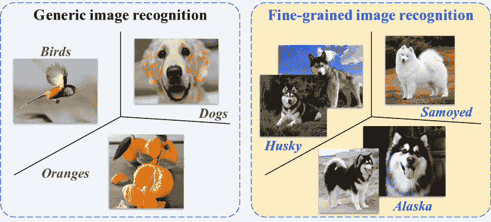
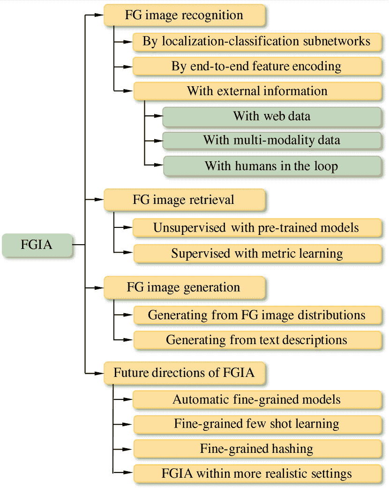
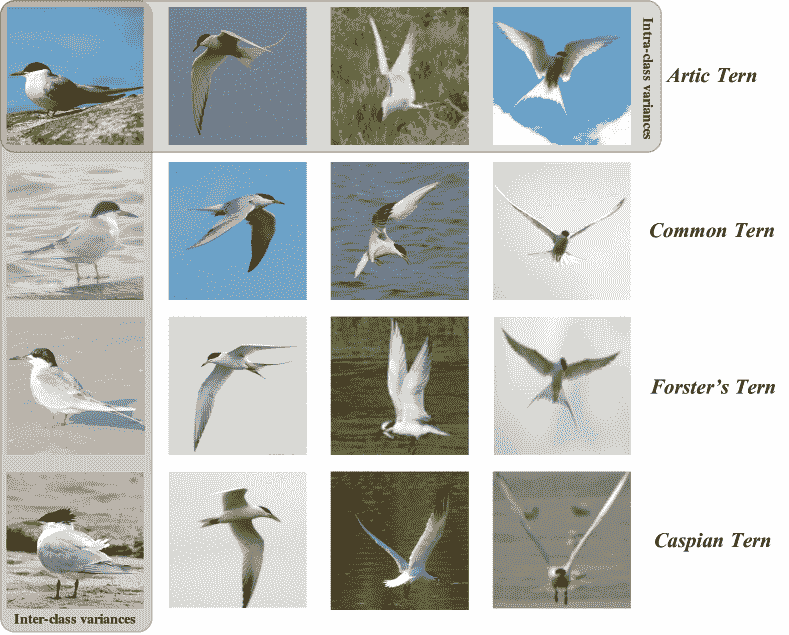
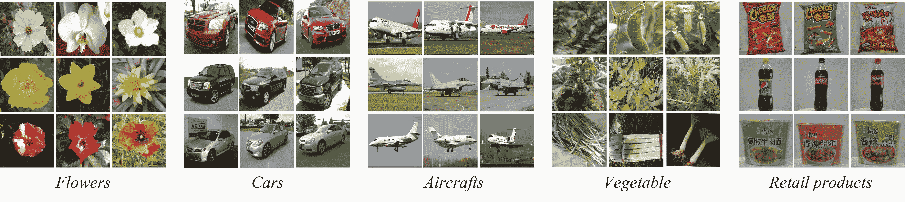
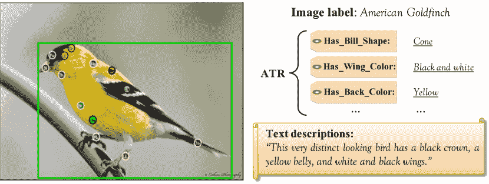
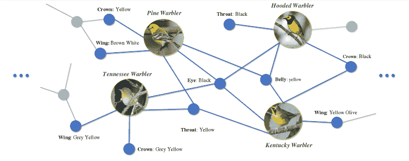
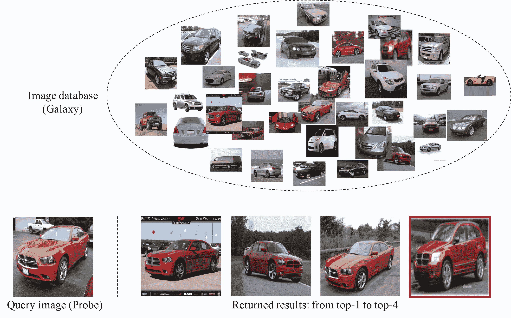

<!--yml

类别：未分类

日期：2024-09-06 20:06:04

-->

# [1907.03069] 深度学习在细粒度图像分析中的应用：综述

> 来源：[`ar5iv.labs.arxiv.org/html/1907.03069`](https://ar5iv.labs.arxiv.org/html/1907.03069)

# 深度学习在细粒度图像分析中的应用：综述

Xiu-Shen Wei¹    Jianxin Wu²    Quan Cui^(1,3)

¹旷视研究南京，旷视科技，中国南京

²国家重点新型软件技术实验室，南京大学，中国南京

³早稻田大学 IPS 研究生院，日本福冈

###### 摘要

计算机视觉（CV）是使用机器理解和分析图像的过程，是人工智能的一个重要分支。在计算机视觉的各种研究领域中，细粒度图像分析（FGIA）是一个长期存在且基础性的问题，并且在各种实际应用中变得无处不在。FGIA 任务旨在分析来自下级类别的视觉对象，例如鸟类的种类或汽车的型号。由于细粒度特性造成的类间小变化和类内大变化使其成为一个具有挑战性的问题。在深度学习蓬勃发展的背景下，近年来在使用深度学习技术的 FGIA 上取得了显著进展。本文旨在系统地综述基于深度学习的 FGIA 技术的最新进展。具体而言，我们将现有的 FGIA 技术研究组织成三个主要类别：细粒度图像识别、细粒度图像检索和细粒度图像生成。此外，我们还涉及一些其他重要的 FGIA 问题，如公开的基准数据集及其相关领域应用。最后，我们通过突出几个方向和需要进一步探索的开放问题来总结这次综述。

## 1 引言

计算机视觉（CV）是人工智能（AI）的一门跨学科科学领域，处理计算机如何从数字图像或视频中获得高级理解。计算机视觉的任务包括获取、处理、分析和理解数字图像的方法，以及从现实世界中的高维原始图像数据中提取数值或符号信息，例如，以决策或预测的形式。

作为计算机视觉中的一个有趣、基础且具有挑战性的问题，细粒度图像分析（FGIA）已经成为了数十年来活跃的研究领域。FGIA 的目标是检索、识别和生成属于超类别（*即*元类别）多个从属类别的图像，例如，不同物种的动物/植物，不同型号的汽车，不同种类的零售产品等（参见图 1）。在现实世界中，FGIA 在工业和研究领域中享有广泛的应用，如自动生物多样性监测、气候变化评估、智能零售、智能交通等。特别是，关于 FGIA 的许多有影响力的学术竞赛经常在 Kaggle 上举行。¹¹Kaggle 是一个数据科学家和机器学习者的在线社区：[`www.kaggle.com/`](https://www.kaggle.com/)。其中几个具有代表性的竞赛包括自然保护协会渔业监测（用于鱼类物种分类）、座头鲸识别（用于鲸鱼身份分类）等。每个竞赛吸引了全球超过 300 支团队参与，有些甚至超过了 2000 支团队。

图 1：细粒度图像分析*vs*一般图像分析（以识别任务为例）。

另一方面，深度学习技术 LeCun 等人（2015）近年来作为直接从数据中学习特征表示的强大方法，已在 FGIA 领域取得了显著突破。根据每年的粗略统计，平均每年在人工智能和计算机视觉的顶级会议上，例如 IJCAI、AAAI、CVPR、ICCV、ECCV 等，都会有大约十篇基于深度学习的 FGIA 技术的会议论文发表。这表明，深度学习在 FGIA 领域具有显著的研究兴趣。在这一快速演变的时期，本文的目的是提供对深度学习技术在 FGIA 领域带来的最新成就的全面综述。

在文献中，已有相关于细粒度任务的调查，如赵等人（2017），该调查简单地包含了几种细粒度*识别*方法进行比较。我们的工作不同在于我们更加全面。具体来说，除了细粒度识别，我们还分析和讨论了其他两个核心的细粒度分析任务，即细粒度图像*检索*和细粒度图像*生成*，这两个方面不可忽视，因为它们是 FGIA 的两个重要方面。此外，在另一个重要的 AI 会议——太平洋沿岸国家的 PRICAI，魏和吴组织了一个特定的教程²²2[`www.weixiushen.com/tutorial/PRICAI18/FGIA.html`](http://www.weixiushen.com/tutorial/PRICAI18/FGIA.html)，旨在细粒度图像分析主题。我们建议感兴趣的读者参考该教程，它提供了一些额外的详细信息。

图 2：本调查论文中我们对细粒度图像分析（FGIA）层级和结构组织的主要方面。

在本文中，我们的调查从独特的深度学习视角出发，以系统和全面的方式回顾了 FGIA 的最新进展。本调查的主要贡献有三方面：

+   •

    我们对基于深度学习的 FGIA 技术进行了全面的回顾，包括问题背景、基准数据集、一系列基于深度学习的 FGIA 方法、特定领域的 FGIA 应用等。

+   •

    我们以层级和结构化的方式系统地概述了基于深度学习的 FGIA 技术的最新进展，见图 2。

+   •

    我们讨论了挑战和未解问题，确定了新的趋势和未来方向，为细粒度研究人员或广泛 AI 社区的其他感兴趣读者提供了潜在的路线图。

其余的调查组织如下。第二部分介绍了本文的背景，即 FGIA 问题及其主要挑战。在第三部分中，我们回顾了多个常用的细粒度基准数据集。第四部分分析了细粒度图像识别的三种主要范式。第五部分展示了细粒度图像检索的最新进展。第六部分从生成视角讨论了细粒度图像生成。此外，在第七部分中，我们介绍了一些与 FGIA 相关的实际领域应用。最后，在第八部分中，我们总结了本文并讨论了未来的方向和开放性问题。

## 2 背景：问题与主要挑战

图 3：细粒度图像分析的关键挑战，即，小的类间差异和大的类内差异。我们在图中分别展示了四种角雉的每一行。

在本节中，我们总结了本文的相关背景，包括问题及其关键挑战。

细粒度图像分析（FGIA）专注于处理属于同一元类别的多个子类别（例如，鸟类、狗和汽车）的对象，通常涉及细粒度图像识别、细粒度图像检索、细粒度图像生成等核心任务。

FGIA 与通用图像分析的区别在于：在通用图像分析中，目标对象属于粗粒度的元类别（例如，鸟类、橙子和狗），因此在视觉上相差较大。然而，在 FGIA 中，由于对象来自一个元类别的子类别，细粒度特性使它们在视觉上非常相似。我们以图像识别为例。正如图 1 所示，在细粒度识别中，任务要求识别多种相似的狗品种，例如，哈士奇、萨摩耶和阿拉斯加。为了准确识别，理想的做法是通过捕捉微小而细微的差异（例如，耳朵、鼻子、尾巴）来区分它们，这也满足了其他 FGIA 任务的需求（例如，检索和生成）。

图 4：不同花卉/蔬菜物种、不同车型/飞机模型以及不同类型零售产品的细粒度图像示例。准确识别这些细粒度物体需要依赖于区分但微妙的物体部位或图像区域。（最佳查看效果为彩色且放大。）

表 1：流行的细粒度图像数据集汇总。注意，“BBox”表示该数据集是否提供物体边界框监督。 “Part anno.” 表示提供关键部位定位。 “HRCHY” 代表层次标签。 “ATR” 代表属性标签（*例如*，翅膀颜色，雄性，雌性等）。 “Texts” 表示是否提供图像的细粒度文本描述。

| 数据集名称 | 元类别 | $\sharp$ 图像 | $\sharp$ 类别 | BBox | 部位注释 | 层次 | 属性 | 文本 |
| --- | --- | --- | --- | --- | --- | --- | --- | --- |
| 牛津花卉  Nilsback 和 Zisserman (2008) | 花卉 |     8,189 |   102 |  |  |  |  | ✓ |
| CUB200-2011  Wah et al. (2011) | 鸟类 |   11,788 |   200 | ✓ | ✓ |  | ✓ | ✓ |
| 斯坦福狗  Khosla et al. (2011) | 狗 |   20,580 |   120 | ✓ |  |  |  |  |
| 斯坦福车  Krause et al. (2013) | 汽车 |   16,185 |   196 | ✓ |  |  |  |  |
| FGVC 飞机  Maji et al. (2013) | 飞机 |   10,000 |   100 | ✓ |  | ✓ |  |  |
| Birdsnap  Berg et al. (2014) | 鸟类 |   49,829 |   500 | ✓ | ✓ |  | ✓ |  |
| Fru92  Hou et al. (2017) | 水果 |   69,614 |     92 |  |  | ✓ |  |  |
| Veg200  Hou et al. (2017) | 蔬菜 |   91,117 |   200 |  |  | ✓ |  |  |
| iNat2017  Horn et al. (2017) | 植物和动物 | 859,000 | 5,089 | ✓ |  | ✓ |  |  |
| RPC  Wei et al. (2019a) | 零售产品 |   83,739 |   200 | ✓ |  | ✓ |  |  |

此外，细粒度特性还带来了由高度相似的子类别造成的*小的类间变异*，以及在姿态、尺度和旋转中表现出的*大的类内变异*，如图 3 所示。这与通用图像分析（*即*，小的类内变异和大的类间变异）正好相反，这使得细粒度图像分析成为一个具有挑战性的问题。

## 3 个基准数据集

在过去十年中，视觉领域发布了许多涵盖多种领域的基准细粒度数据集，如鸟类 Wah 等人 (2011); Berg 等人 (2014)，狗 Khosla 等人 (2011)，汽车 Krause 等人 (2013)，飞机 Maji 等人 (2013)，花卉 Nilsback 和 Zisserman (2008)，蔬菜 Hou 等人 (2017)，水果 Hou 等人 (2017)，零售产品 Wei 等人 (2019a) 等（参见图 4）。在表 1 中，我们列出了细粒度领域常用的若干图像数据集，并具体指明它们的元类别、细粒度图像的数量、细粒度类别的数量、额外的不同类型的可用标注，即边界框、部分注释、层级标签、属性标签和文本视觉描述，参见图 5。

这些数据集已成为领域中显著进展的重要因素，不仅作为测量和比较竞争方法性能的共同基础，还推动了这一领域向越来越复杂、实际和具有挑战性的问题发展。

图 5：一个示例图像及其与 *CUB200-2011* 相关的标注。如图所示，多种类型的标注包括：图像标签、部分注释（*即* 关键点定位）、对象边界框（*即* 绿色框），属性标签（*即* “ATR”）和自然语言描述。（最佳以彩色查看。）

具体来说，在这些数据集中，*CUB200-2011* 是最受欢迎的细粒度数据集之一。几乎所有的 FGIA 方法都选择它与最先进的方法进行比较。此外，*CUB200-2011* 还不断被用于进一步研究，例如，收集细粒度图像的文本描述以进行多模态分析，参见 Reed 等人 (2016); He 和 Peng (2017a)。

此外，近年来提出了越来越多具有挑战性和实际意义的细粒度数据集，*例如*，*iNat2017* 用于自然植物和动物物种 Horn 等人 (2017) 和 *RPC* 用于日常零售产品 Wei 等人 (2019a)。这些数据集中衍生出的许多新特征，包括大规模、层级结构、领域差距和长尾分布，揭示了现实世界中的实际需求，并可能激发对 FGIA 在更现实设置下的研究。

## 4 细粒度图像识别

在过去十年中，细粒度图像识别一直是 FGIA 中最活跃的研究领域。在这一部分，我们回顾了自深度学习进入该领域以来细粒度识别框架的里程碑。广泛地，这些细粒度识别方法可以组织为三种主要范式，*即*，细粒度识别（1）具有定位-分类子网络；（2）具有端到端特征编码；（3）具有外部信息。其中，第一个和第二个范式仅通过利用与细粒度图像相关的监督信息，如图像标签、边界框、部件注释等，来限制自己。此外，自动识别系统由于细粒度挑战尚未能够实现卓越的性能。因此，研究人员逐渐尝试将外部但廉价的信息（*例如*，网络数据、文本描述）引入细粒度识别中，以进一步提高准确性，这对应于细粒度识别的第三个范式。在细粒度识别中，常用的评估指标是数据集中所有子类别的平均分类准确率。

### 4.1 通过定位-分类子网络

为了缓解类别内变化的挑战，细粒度领域的研究人员关注于捕捉细粒度对象的辨别性语义部件，然后构建一个对应于这些部件的中层表示以进行最终分类。具体而言，设计了一个定位子网络用于定位这些关键部件。随后，分类子网络会跟随其后并用于识别。这种两个协作子网络的框架形成了第一个范式，*即*，具有*定位-分类子网络*的细粒度识别。

得益于定位信息，*例如*，部件级边界框或分割掩码，它可以获得更具辨别力的中层（部件级）表示。还进一步增强了分类子网络的学习能力，这可能显著提高最终的识别准确性。

早期属于这一范式的工作依赖于额外的密集部分注释（*即*关键点定位）来定位对象的语义关键部分（*例如*，头部、躯干）。其中一些工作通过基于部件的检测器进行学习，如张等人（2014）；林等人（2015a），而一些则利用分割方法来定位部件，如魏等人（2018a）。然后，这些方法将多个部件级特征连接起来作为整个图像的表示，并将其输入到随后的分类子网络中以进行最终识别。因此，这些方法也被称为*基于部件*的识别方法。

然而，获取如此密集的部件注释是劳动密集型的，这限制了真实世界细粒度应用的可扩展性和实用性。最近出现了一种趋势，即在这个范式下的更多技术仅需图像标签**Jaderberg**等（2015）；**Fu**等（2017）；**Zheng**等（2017）；**Sun**等（2018），即可实现准确的部件定位。它们的共同动机是首先找到对应的部件，然后比较它们的外观。具体来说，希望捕捉到可以在细粒度类别中共享的语义部件（如头部和躯干），同时也希望发现这些部件表示之间的细微差别。先进的技术，如注意力机制**Yang**等（2018）和多阶段策略**He**和**Peng**（2017b），使得集成定位-分类子网络的联合训练更加复杂。

### 4.2 通过端到端特征编码

与第一个范式不同，第二个范式，即*端到端特征编码*，倾向于通过开发强大的深度模型直接学习更具区分性的特征表示。其中最具代表性的方法是双线性 CNN**Lin**等（2015b），它将图像表示为从两个深度 CNN 中提取的特征的池化外积，从而编码卷积激活的高阶统计信息，以增强中级学习能力。由于其高模型容量，双线性 CNN 实现了显著的细粒度识别性能。然而，双线性特征的极高维度仍然使其在现实应用中不切实际，特别是在大规模应用中。

针对这个问题，最近的一些尝试，如**Gao**等（2016）；**Kong**和**Fowlkes**（2017）；**Cui**等（2017），尝试通过应用张量草图**Pham**和**Pagh**（2013）；**Charikar**等（2002）来聚合低维嵌入，这可以近似双线性特征，并保持相当或更高的识别准确性。其他工作，如**Dubey**等（2018），则专注于设计特定的损失函数，针对细粒度任务进行调整，能够驱动整个深度模型学习区分性的细粒度表示。

### 4.3 使用外部信息

如前所述，除了传统的识别范式外，另一种范式是利用外部信息，如网页数据、多模态数据或人机交互，以进一步辅助细粒度识别。

#### 4.3.1 使用网页数据

要识别各种细粒度类别之间的细微差异，迫切需要大量标注良好的训练图像。然而，由于标注的难度（总是需要领域专家）和细粒度类别的繁多（*即*，一个元类别中有数千个从属类别），准确的人类标注难以获得。

因此，一些细粒度识别方法寻求利用免费的但噪声较多的网络数据来提升识别性能。现有的大多数相关工作大致可以分为两个方向。其中一个是爬取噪声标注的网络数据作为测试类别的训练数据，这被视为网络监督学习 Zhuang et al. (2017); Sun et al. (2019)。这些方法的主要工作集中在：(1) 克服易得的网络图像与标准数据集中良好标注数据之间的数据集差距；(2) 减少噪声数据造成的负面影响。为解决上述问题，通常使用对抗学习 Goodfellow et al. (2014) 和注意力机制 Zhuang et al. (2017)。使用网络数据的另一种方向是将来自具有良好标注训练数据的辅助类别的知识转移到测试类别，通常使用零样本学习 Niu et al. (2018) 或元学习 Zhang et al. (2018) 实现这一目标。

#### 4.3.2 使用多模态数据

随着多媒体数据（*例如*，图像、文本、知识库等）的快速增长，多模态分析受到了大量关注。在细粒度识别中，需要使用多模态数据建立联合表示/嵌入，以整合多模态信息。这能够提升细粒度识别的准确性。特别是，常用的多模态数据包括文本描述（*例如*，自然语言的句子和短语）和图结构知识库。与细粒度图像的强监督（*例如*，部分标注）相比，文本描述是弱监督。此外，文本描述可以由普通人相对准确地返回，而不是特定领域的专家。此外，高级知识图谱是现有资源，并包含丰富的专业知识，例如*DBpedia* Lehmann et al. (2015)。在实际应用中，文本描述和知识库作为额外指导，对更好的细粒度图像表示学习都是有效的。

图 6：用于建模*CUB200-2011*上类别-属性关联的示例知识图谱。

具体来说，Reed 等人 (2016) 收集了文本描述，并通过结合文本和图像引入了一种结构化的联合嵌入用于零样本细粒度图像识别。随后，He 和 Peng (2017a) 通过端到端的联合训练方式结合了视觉和语言流，以保留内部模态和跨模态信息，用于生成互补的细粒度表示。对于具有知识库的细粒度识别，一些研究，例如 Chen 等人 (2018); Xu 等人 (2018a)，引入了知识库信息（通常与属性标签相关联，参见图 6），以隐式地丰富嵌入空间（并推理出细粒度对象的区分属性）。

#### 4.3.3 人工参与的细粒度识别

人工参与的细粒度识别通常是一个由机器和人类用户组成的迭代系统，结合了人类和机器的努力与智能。同时，它要求系统尽可能以人力劳动经济的方式运作。通常，对于这些识别方法，每一轮系统都在试图理解人类如何进行识别，*例如*，通过要求未经培训的人类标记图像类别并挑选困难样本 Cui 等人 (2016)，或通过识别关键部分定位和选择区分特征 Deng 等人 (2016) 进行细粒度识别。

## 5 细粒度图像检索

超越图像识别，细粒度检索是 FGIA 的另一个关键方面，并且成为一个热门话题。其评估指标是常用的平均精度均值 (mAP)。

在细粒度图像检索中，给定同一子类别（*例如*，鸟类或汽车）的数据库图像和一个查询，系统应返回与查询相同种类的图像，而无需依赖其他监督信号，参见图 7。与专注于基于内容相似性（*例如*，纹理、颜色和形状）检索近似重复图像的通用图像检索相比，细粒度检索专注于检索同一类型的图像（*例如*，相同的动物下属种类或相同的汽车型号）。同时，细粒度图像中的对象只有微小的差异，并且在姿态、尺度和旋转上有所变化。

图 7：细粒度*检索*的示意图。给定一个“Dodge Charger Sedan 2012”的查询图像（*即*探测器），细粒度检索要求从汽车数据库（*即*星系）中返回相同车型的图像。在此图中，标记为红色矩形的前四个返回图像呈现了错误的结果，因为其型号为“Dodge Caliber Wagon 2012”。

在文献中，Wei 等人（2017）是首次尝试使用深度学习进行细粒度图像检索的研究。该研究采用了预训练的 CNN 模型，通过在细粒度图像中无监督地定位主要对象来选择有意义的深度描述符，并进一步揭示了仅选择有用的深度描述符并去除背景或噪声可以显著提高检索任务的效果。最近，为了突破通过预训练模型进行无监督细粒度检索的限制，一些研究，如 Zheng 等人（2018，2019），倾向于在*监督*度量学习范式下发现新的损失函数。同时，他们仍然设计了额外的特定子模块以适应细粒度对象，例如 Zheng 等人（2018）提出的弱监督定位模块，该模块的灵感来源于 Wei 等人（2017）。

## 6 细粒度图像生成

除了监督学习任务外，图像生成是无监督学习的一个代表性话题。它部署了深度生成模型，例如 GAN Goodfellow 等人（2014），以学习合成视觉上真实的图像。随着生成图像质量的提高，期望更具挑战性的目标，即细粒度图像生成。顾名思义，细粒度生成将合成细粒度类别中的图像，例如特定人物的面孔或从属类别中的物体。

这一领域的首个工作是 Bao 等人（2017）提出的 CVAE-GAN，它结合了变分自编码器和条件生成对抗网络，以处理这个问题。具体来说，CVAE-GAN 将图像建模为标签和潜在属性的组合。在生成模型中通过调整输入的细粒度类别，可以生成特定类别的图像。最近，基于文本描述生成图像的研究，如 Xu 等人（2018b），因其多样而实际的应用，如艺术创作和计算机辅助设计，变得越来越受欢迎。通过执行配备注意力机制的生成网络，该模型可以通过关注文本描述中的相关词汇来合成细粒度的细节。

## 7 与细粒度图像分析相关的领域特定应用

在现实世界中，基于深度学习的细粒度图像分析技术也被应用于多样的领域特定应用，并表现出优异的性能，例如在推荐系统中的衣物/鞋子检索 Song 等人（2017），在电子商务平台中的时尚图像识别 Liu 等人（2016），在智能零售中的产品识别 Wei 等人（2019a）等。这些应用与 FGIA 的细粒度检索和识别密切相关。

此外，如果我们将粒度谱向下移动，在极端情况下，面部识别可以被视为细粒度识别的一个实例，其粒度低于身份粒度级别。此外，人物/车辆重新识别是另一个与细粒度相关的任务，旨在确定两张图像是否拍摄自同一特定人物/车辆。显然，重新识别任务也属于身份粒度。

在实践中，这些工作通过遵循 FGIA 的动机来解决相应领域的特定任务，包括捕捉对象的区分部分（面孔、人物和车辆）Suh 等人（2018），发现从粗到细的结构信息 Wei 等人（2018b），开发基于属性的模型 Liu 等人（2016）等。

## 8 结论和未来方向

基于深度学习的细粒度图像分析（FGIA）近年来取得了重大进展。在本文中，我们对 FGIA 在深度学习中的最新进展进行了广泛的调查。我们主要介绍了 FGIA 问题及其挑战，讨论了细粒度图像识别/检索/生成的重大改进，并介绍了一些与 FGIA 相关的领域特定应用。尽管取得了巨大成功，但仍然存在许多未解决的问题。因此，在这一部分，我们将明确指出这些问题，并介绍一些未来演变的研究趋势。我们希望这项调查不仅能提供对 FGIA 的更好理解，还能促进该领域未来的研究活动和应用开发。

##### 自动细粒度模型

目前，自动化机器学习（AutoML）（Feurer et al. (2015））和神经网络架构搜索（NAS）（Elsken et al. (2018））在人工智能社区，特别是在计算机视觉领域，正受到热烈关注。AutoML 旨在自动化将机器学习应用于现实任务的端到端过程。而 NAS，自动化神经网络架构设计的过程，因此是 AutoML 的逻辑下一步。最近的 AutoML 和 NAS 方法在各种计算机视觉应用中可与手工设计的架构相媲美，甚至超越。因此，利用 AutoML 或 NAS 技术开发的自动化细粒度模型也有可能找到更好、更量体裁衣的深度模型，同时也能促进 AutoML 和 NAS 研究的发展。

##### 细粒度少样本学习

人类在非常少量的监督下能够学习新的细粒度概念，例如，对于某种鸟类只需少量的示例图像，而我们目前最先进的深度学习细粒度系统则需要数百或数千个标注样本。更糟的是，细粒度图像的监督既耗时又昂贵，因为细粒度物体需要由领域专家进行准确标注。因此，开发细粒度少样本学习（FGFS）是非常必要的（Wei et al. (2019b））。FGFS 任务要求学习系统以元学习的方式从少量样本（仅一个或少于五个）中为新颖的细粒度类别建立分类器。鲁棒的 FGFS 方法可以极大地增强细粒度识别的可用性和扩展性。

##### 细粒度哈希

随着对 FGIA 的关注日益增加，越来越多的大规模、结构良好的细粒度数据集被发布，例如，Berg et al. (2014)；Horn et al. (2017)；Wei et al. (2019a)。在实际应用中，如细粒度图像检索，问题的自然产生是当参考数据库非常大时，找到准确的最近邻的成本极高。哈希（Wang et al. (2018)；Li et al. (2016)）作为一种最流行和有效的近似最近邻搜索技术之一，有潜力处理大规模细粒度数据。因此，细粒度哈希是一个值得进一步探索的有前途的方向。

##### 在更现实的环境中的细粒度分析

在过去十年中，相关技术的细粒度图像分析已经得到发展，并在其传统设置中取得了良好的表现，*例如*，Wah 等人 (2011) 的经验协议；Khosla 等人 (2011)；Krause 等人 (2013)。然而，这些设置目前无法满足各种现实世界应用的日常需求，*例如*，通过在受控环境中收集的图像训练的模型识别存储架上的零售产品 Wei 等人 (2019a) 和识别/检测野外的自然物种 Horn 等人 (2017)。因此，新兴的细粒度图像分析主题，如领域适应的细粒度分析、知识迁移的细粒度分析、长尾分布的细粒度分析以及在资源受限嵌入式设备上运行的细粒度分析——都值得大量研究工作，以推动更先进和实用的细粒度图像分析。

## 参考文献

+   Bao 等人 [2017] J. Bao, D. Chen, F. Wen, H. Li, 和 G. Hua. CVAE-GAN：通过非对称训练生成细粒度图像。发表于 ICCV, 页码 2745–2754, 2017。

+   Berg 等人 [2014] T. Berg, J. Liu, S. W. Lee, M. L. Alexander, D. W. Jacobs, 和 P. N. Belhumeur. Birdsnap：大规模细粒度鸟类视觉分类。发表于 CVPR, 页码 2019–2026, 2014。

+   Charikar 等人 [2002] M. Charikar, K. Chen, 和 M. Farach-Colton. 在数据流中查找频繁项。发表于 ICALP, 页码 693–703, 2002。

+   Chen 等人 [2018] T. Chen, L. Lin, R. Chen, Y. Wu, 和 X. Luo. 知识嵌入表示学习用于细粒度图像识别。发表于 IJCAI, 页码 627–634, 2018。

+   Cui 等人 [2016] Y. Cui, F. Zhou, Y. Lin, 和 S. Belongie. 使用深度度量学习与人工干预进行细粒度分类和数据集自举。发表于 CVPR, 页码 1153–1162, 2016。

+   Cui 等人 [2017] Y. Cui, F. Zhou, J. Wang, X. Liu, Y. Lin, 和 S. Belongie. 卷积神经网络的核池化。发表于 CVPR, 页码 2921–2930, 2017。

+   Deng 等人 [2016] J. Deng, J. Krause, M. Stark, 和 L. Fei-Fei. 利用众智进行细粒度识别。TPAMI, 38(4):666–676, 2016。

+   Dubey 等人 [2018] A. Dubey, O. Gupta, R. Raskar, 和 N. Naik. 最大熵细粒度分类。发表于 NeurIPS, 页码 637–647, 2018。

+   Elsken 等人 [2018] T. Elsken, J. H. Metzen, 和 F. Hutter. 神经网络架构搜索：综述。arXiv 预印本 arXiv:1808.05377, 2018。

+   Feurer 等人 [2015] M. Feurer, A. Klein, K. Eggensperger, J. Springenberg, M. Blum, 和 F. Hutter. 高效且稳健的自动化机器学习。发表于 NIPS, 页码 2962–2970, 2015。

+   Fu 等人 [2017] J. Fu, H. Zheng, 和 T. Mei. 更仔细地观察以获得更好的效果：用于细粒度图像识别的递归注意卷积神经网络。发表于 CVPR, 页码 4438–4446, 2017。

+   Gao 等人 [2016] Y. Gao, O. Beijbom, N. Zhang, 和 T. Darrell. 紧凑双线性池化。发表于 CVPR, 页码 317–326, 2016。

+   Goodfellow et al. [2014] I. Goodfellow, J. Pouget-Abadie, M. Mirza, B. Xu, D. Warde-Farley, S. Ozair, A. Courville, and Y. Bengio. 生成对抗网络。发表于 NIPS，第 2672–2680 页，2014 年。

+   He and Peng [2017a] X. He and Y. Peng. 通过结合视觉和语言进行细粒度图像分类。发表于 CVPR，第 5994–6002 页，2017 年。

+   He and Peng [2017b] X. He and Y. Peng. 基于空间约束的弱监督部分选择模型用于细粒度图像分类。发表于 AAAI，第 4075–4081 页，2017 年。

+   Horn et al. [2017] G. Van Horn, O. M. Aodha, Y. Song, Y. Cui, C. Sun, A. Shepard, H. Adam, P. Perona, and S. Belongie. iNaturalist 物种分类与检测数据集。发表于 CVPR，第 8769–8778 页，2017 年。

+   Hou et al. [2017] S. Hou, Y. Feng, and Z. Wang. VegFru: 一个用于细粒度视觉分类的领域特定数据集。发表于 ICCV，第 541–549 页，2017 年。

+   Jaderberg et al. [2015] M. Jaderberg, K. Simonyan, A. Zisserman, and K. Kavukcuoglu. 空间变换网络。发表于 NIPS，第 2017–2025 页，2015 年。

+   Khosla et al. [2011] A. Khosla, N. Jayadevaprakash, B. Yao, and L. Fei-Fei. 新的细粒度图像分类数据集。发表于 CVPR 细粒度视觉分类研讨会，第 806–813 页，2011 年。

+   Kong and Fowlkes [2017] S. Kong and C. Fowlkes. 用于细粒度分类的低秩双线性池化。发表于 CVPR，第 365–374 页，2017 年。

+   Krause et al. [2013] J. Krause, M. Stark, J. Deng, and L. Fei-Fei. 用于细粒度分类的 3D 物体表示。发表于 ICCV 3D 表示与识别研讨会，2013 年。

+   LeCun et al. [2015] Y. LeCun, Y. Bengio, and G. Hinton. 深度学习。Nature, 521:436–444, 2015 年。

+   Lehmann et al. [2015] J. Lehmann, R. Isele, M. Jakob, A. Jentzsch, D. Kontokostas, P. N. Mendes, S. Hellmann, M. Morsey, P. van Kleef, S. Auer, and C. Bizer. DBpedia - 从 Wikipedia 提取的大规模多语言知识库。语义网期刊，第 167–195 页，2015 年。

+   Li et al. [2016] W.-J. Li, S. Wang, and W.-C. Kang. 基于对偶标签的深度监督哈希特征学习。发表于 IJCAI，第 1711–1717 页，2016 年。

+   Lin et al. [2015a] D. Lin, X. Shen, C. Lu, and J. Jia. Deep LAC: 用于细粒度识别的深度定位、对齐和分类。发表于 CVPR，第 1666–1674 页，2015 年。

+   Lin et al. [2015b] T.-Y. Lin, A. RoyChowdhury, and S. Maji. 用于细粒度视觉识别的双线性 CNN 模型。发表于 ICCV，第 1449–1457 页，2015 年。

+   Liu et al. [2016] Z. Liu, P. Luo, S. Qiu, X. Wang, and X. Tang. DeepFashion: 通过丰富的注释提升鲁棒的服装识别与检索。发表于 CVPR，第 1096–1104 页，2016 年。

+   Maji et al. [2013] S. Maji, J. Kannala, E. Rahtu, M. Blaschko, and A. Vedaldi. 飞机的细粒度视觉分类。arXiv 预印本 arXiv:1306.5151, 2013 年。

+   Nilsback and Zisserman [2008] M.-E. Nilsback and A. Zisserman. 在大量类别中进行自动花卉分类。发表于印度计算机视觉、图形与图像处理会议，第 722–729 页，2008 年。

+   Niu 等人 [2018] L. Niu, A. Veeraraghavan, 和 A. Sabharwal. Webly 监督学习与零样本学习相结合：一种用于细粒度分类的混合方法。发表于 CVPR, 页码 7171–7180, 2018。

+   Pham 和 Pagh [2013] N. Pham 和 R. Pagh. 通过显式特征映射实现快速可扩展的多项式核。发表于 KDD, 页码 239–247, 2013。

+   Reed 等人 [2016] S. Reed, Z. Akata, H. Lee, 和 B. Schiele. 学习细粒度视觉描述的深度表示。发表于 CVPR, 页码 49–58, 2016。

+   Song 等人 [2017] J. Song, Q. Yu, Y.-Z. Song, T. Xiang, 和 T. M. Hospedales. 用于细粒度草图图像检索的深度空间-语义注意力。发表于 ICCV, 页码 5551–5560, 2017。

+   Suh 等人 [2018] Y. Suh, J. Wang, S. Tang, T. Mei, 和 K. M. Lee. 部分对齐的双线性表示用于行人重新识别。发表于 ECCV, 页码 402–419, 2018。

+   Sun 等人 [2018] M. Sun, Y. Yuan, F. Zhou, 和 E. Ding. 用于细粒度图像识别的多重注意力多类约束。发表于 ECCV, 页码 834–850, 2018。

+   Sun 等人 [2019] X. Sun, L. Chen, 和 J. Yang. 使用对抗性判别神经网络从网络数据中学习以进行细粒度分类。发表于 AAAI, 2019。

+   Wah 等人 [2011] C. Wah, S. Branson, P. Welinder, P. Perona, 和 S. Belongie. Caltech-UCSD 鸟类数据集 200-2011。技术报告 CNS-TR-2011-001, 2011。

+   Wang 等人 [2018] J. Wang, T. Zhang, J. Song, N. Sebe, 和 H. T. Shen. 学习哈希的调查。TPAMI, 40(4):769–790, 2018。

+   Wei 等人 [2017] X.-S. Wei, J.-H. Luo, J. Wu, 和 Z.-H. Zhou. 用于细粒度图像检索的选择性卷积描述符聚合。TIP, 26(6):2868–2881, 2017。

+   Wei 等人 [2018a] X.-S. Wei, C.-W. Xie, J. Wu, 和 C. Shen. Mask-CNN：局部化部件并选择描述符用于细粒度鸟类物种分类。Pattern Recognition, 76:704–714, 2018。

+   Wei 等人 [2018b] X.-S. Wei, C.-L. Zhang, L. Liu, C. Shen, 和 J. Wu. 粗到细：一种基于 RNN 的层次注意力模型用于车辆重新识别。发表于 ACCV, 2018。

+   Wei 等人 [2019a] X.-S. Wei, Q. Cui, L. Yang, P. Wang, 和 L. Liu. RPC：一个大规模零售产品结账数据集。arXiv 预印本 arXiv:1901.07249, 2019。

+   Wei 等人 [2019b] X.-S. Wei, P. Wang, L. Liu, C. Shen, 和 J. Wu. 分段分类器映射：为具有少量样本的新类别学习细粒度学习者。TIP, 即将发表, 2019。

+   Xu 等人 [2018a] H. Xu, G. Qi, J. Li, M. Wang, K. Xu, 和 H. Gao. 通过视觉-语义嵌入进行细粒度图像分类。发表于 IJCAI, 页码 1043–1049, 2018。

+   Xu 等人 [2018b] T. Xu, P. Zhang, Q. Huang, H. Zhang, Z. Gan, X. Huang, 和 X. He. AttnGAN：使用注意力生成对抗网络进行细粒度文本到图像生成。发表于 CVPR, 页码 1316–1324, 2018。

+   Yang 等人 [2018] Z. Yang, T. Luo, D. Wang, Z. Hu, J. Gao, 和 L. Wang. 学习导航以进行细粒度分类。发表于 ECCV, 页码 438–454, 2018。

+   张等人 [2014] N. Zhang, J. Donahue, R. Girshick, 和 T. Darrell. 基于部件的 R-CNNs 用于细粒度类别检测。在 ECCV 上，页面 834–849，2014 年。

+   张等人 [2018] Y. Zhang, H. Tang, 和 K. Jia. 使用元学习优化和辅助数据样本选择的细粒度视觉分类。在 ECCV 上，页面 233–248，2018 年。

+   赵等人 [2017] B. Zhao, J. Feng, X. Wu, 和 S. Yan. 基于深度学习的细粒度物体分类和语义分割综述。国际自动化与计算期刊，14(2)：119–135，2017 年。

+   郑等人 [2017] H. Zheng, J. Fu, T. Mei, 和 J. Luo. 学习用于细粒度图像识别的多重注意力卷积神经网络。在 ICCV 上，页面 5209–5217，2017 年。

+   郑等人 [2018] X. Zheng, R. Ji, X. Sun, Y. Wu, F. Huang, 和 Y. Yang. 具有弱监督定位的集中排名损失用于细粒度物体检索。在 IJCAI 上，页面 1226–1233，2018 年。

+   郑等人 [2019] X. Zheng, R. Ji, X. Sun, B. Zhang, Y. Wu, 和 F. Huang. 通过去相关集中损失与归一化缩放层实现最佳细粒度检索。在 AAAI 上，2019 年。

+   庄等人 [2017] B. Zhuang, L. Liu, Y. Li, C. Shen, 和 I. Reid. 以组为单位进行关注：一种弱监督深度学习框架，用于从网页数据中学习。在 CVPR 上，页面 1878–1887，2017 年。
