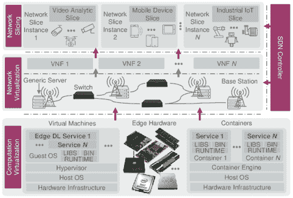
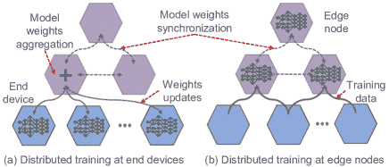

<!--yml

分类：未分类

日期：2024-09-06 20:05:54

-->

# [1907.08349] 边缘计算与深度学习的融合：全面调查

> 来源：[`ar5iv.labs.arxiv.org/html/1907.08349`](https://ar5iv.labs.arxiv.org/html/1907.08349)

# 边缘计算与深度学习的融合：全面调查

**Xiaofei Wang**、**Yiwen Han**、**Victor C.M. Leung**、**Dusit Niyato**、**Xueqiang Yan** 和 **Xu Chen** 均来自中国天津大学智能与计算学院。电子邮件：xiaofeiwang@tju.edu.cn、hanyiwen@tju.edu.cn。**V. C. M. Leung** 来自中国深圳大学计算机科学与软件工程学院，同时也在加拿大英属哥伦比亚大学电气与计算机工程系。电子邮件：vleung@ieee.org。**Dusit Niyato** 来自新加坡南洋理工大学计算机科学与工程学院。电子邮件：dniyato@ntu.edu.sg。**Xueqiang Yan** 在中国深圳华为技术有限公司 2012 实验室工作。电子邮件：yanxueqiang1@huawei.com。**Xu Chen** 来自中国中山大学数据与计算机学院。电子邮件：chenxu35@mail.sysu.edu.cn。通讯作者：**Yiwen Han** (hanyiwen@tju.edu.cn)

###### 摘要

工厂和社区中普遍存在的传感器和智能设备正在生成大量数据，而不断增长的计算能力将计算和服务的核心从云端推向网络边缘。作为一种重要的推动力，广泛地改变了人们的生活，从面部识别到雄心勃勃的智能工厂和城市，基于人工智能（尤其是深度学习 DL）的应用和服务正在蓬勃发展。然而，由于效率和延迟问题，目前的云计算服务架构阻碍了“为每个人和每个组织在任何地方提供人工智能”的愿景。因此，利用网络边缘靠近数据源的资源来释放深度学习服务已成为一种理想的解决方案。因此，边缘智能旨在通过边缘计算促进深度学习服务的部署，受到了广泛关注。此外，作为人工智能的代表技术，深度学习可以集成到边缘计算框架中，以构建智能边缘，实现动态、适应性的边缘维护和管理。关于相互促进的边缘智能和智能边缘，本文介绍并讨论了：1）两者的应用场景；2）实际实施方法和使能技术，即在定制的边缘计算框架中的深度学习训练和推理；3）更普遍和更精细智能的挑战与未来趋势。我们相信，通过整合散布在通信、网络和深度学习领域的信息，本调查可以帮助读者理解使能技术之间的联系，同时促进对边缘智能和智能边缘融合的进一步讨论，即边缘深度学习（Edge DL）。

###### 索引词：

边缘计算，深度学习，无线通信，计算卸载，人工智能

## 引言

随着计算和存储设备的普及，从云数据中心的服务器集群（云端）到个人计算机和智能手机，再到可穿戴设备和其他物联网（IoT）设备，我们现在处于一个信息为中心的时代，其中计算无处不在，计算服务从云端溢出到边缘。根据思科的白皮书[1]，到 2020 年，将有$50$亿个 IoT 设备连接到互联网。另一方面，思科预计到 2021 年，每年在云端之外将产生近$850$泽字节（ZB）的数据，而全球数据中心流量仅为$20.6$ ZB[2]。这表明大数据的数据来源也正在经历转型：从大规模的云数据中心到范围越来越广泛的边缘设备。然而，现有的云计算逐渐无法管理这些大规模分布的计算能力并分析其数据：1）大量计算任务需要传送到云端处理[3]，这无疑对网络容量和云计算基础设施的计算能力提出了严峻挑战；2）许多新类型的应用，例如协作自动驾驶，有严格或紧迫的延迟要求，云端可能因距离用户较远而难以满足这些要求[4]。

因此，边缘计算[5, 6]作为一种有吸引力的替代方案出现，特别是为了将计算任务尽可能靠近数据源和最终用户。当然，边缘计算和云计算并不是相互排斥的[7, 8]。相反，边缘计算补充和扩展了云计算。与单独的云计算相比，边缘计算结合云计算的主要优势有三点：1）骨干网络缓解，分布式边缘计算节点可以处理大量计算任务而无需与云端交换相应的数据，从而缓解网络流量负载；2）灵活的服务响应，托管在边缘的服务可以显著减少数据传输延迟，提高响应速度；3）强大的云端备份，当边缘无法承担时，云端可以提供强大的处理能力和海量存储。

作为一种典型且更广泛使用的新型应用 [9]，各种基于深度学习的智能服务和应用由于深度学习（DL）在计算机视觉（CV）和自然语言处理（NLP）领域的巨大优势，已经改变了人们生活的许多方面 [10]。这些成就不仅源于 DL 的演进，还与数据和计算能力的增加密不可分。然而，对于更广泛的应用场景，如智能城市、车联网（IoVs）等，由于以下因素，提供的智能服务数量仍然有限。

+   •

    成本：在云中训练和推理深度学习（DL）模型需要设备或用户将大量数据传输到云端，从而消耗大量网络带宽；

+   •

    延迟：访问云服务的延迟通常无法保证，可能不足以满足许多时间关键型应用的要求，例如协同自动驾驶 [11];

+   •

    可靠性：大多数云计算应用依赖于无线通信和骨干网络将用户与服务连接起来，但对于许多工业场景，智能服务必须具有很高的可靠性，即使在网络连接丢失的情况下也是如此；

+   •

    隐私：深度学习所需的数据可能包含大量私人信息，隐私问题在智能家居和智能城市等领域至关重要。

表 I：按字母顺序列出的重要缩写列表

| 缩写 | 定义 | 缩写 | 定义 | 缩写 | 定义 |
| --- | --- | --- | --- | --- | --- |
| A-LSH | 自适应局部敏感哈希 | DVFS | 动态电压和频率缩放 | NLP | 自然语言处理 |
| AC | Actor-Critic | ECSP | 边缘计算服务提供商 | NN | 神经网络 |
| A3C | 异步优势演员-评论员 | EEoI | 推理早期退出 | NPU | 神经处理单元 |
| AE | 自编码器 | EH | 能量采集 | PPO | 近端策略优化 |
| AI | 人工智能 | FAP | 雾计算无线接入点 | QoE | 体验质量 |
| APU | AI 处理单元 | FCNN | 全连接神经网络 | QoS | 服务质量 |
| AR | 增强现实 | FL | 联邦学习 | RAM | 随机存取存储器 |
| ASIC | 应用特定集成电路 | FPGA | 现场可编程门阵列 | RNN | 循环神经网络 |
| BS | 基站 | FTP | 融合瓷砖分区 | RoI | 关注区域 |
| C-RAN | 云无线接入网络 | GAN | 生成对抗网络 | RRH | 遥控无线电头 |
| CDN | 内容分发网络 | GNN | 图神经网络 | RSU | 道路边单元 |
| CNN | 卷积神经网络 | IID | 独立同分布 | SDN | 软件定义网络 |
| CV | 计算机视觉 | IoT | 物联网 | SGD | 随机梯度下降 |
| DAG | 有向无环图 | IoV | 车联网 | SINR | 信号干扰加噪声比 |
| D2D | 设备到设备 | KD | 知识蒸馏 | SNPE | 骁龙神经处理引擎 |
| DDoS | 分布式拒绝服务 | $k$NN | $k$-最近邻 | TL | 迁移学习 |
| DDPG | 深度确定性策略梯度 | MAB | 多臂赌博机 | UE | 用户设备 |
| DL | 深度学习 | MEC | 移动（多接入）边缘计算 | VM | 虚拟机 |
| DNN | 深度神经网络 | MDC | 微型数据中心 | VNF | 虚拟网络功能 |
| DQL | 深度 Q 学习 | MDP | 马尔可夫决策过程 | V2V | 车对车 |
| DRL | 深度强化学习 | MLP | 多层感知器 | WLAN | 无线局域网 |
| DSL | 特定领域语言 | NFV | 网络功能虚拟化 | ZB | 硬盘字节 |

图 1：边缘智能与智能边缘。

由于边缘离用户比云更近，边缘计算有望解决这些问题。实际上，边缘计算正逐渐与人工智能（AI）结合，相互促进，如图 1 所示。边缘智能与智能边缘并不是彼此独立的。边缘智能是目标，而智能边缘中的深度学习服务也是边缘智能的一部分。反过来，智能边缘可以为边缘智能提供更高的服务吞吐量和资源利用率。

具体而言，一方面，边缘智能有望将深度学习计算从云端尽可能推向边缘，从而实现各种分布式、低延迟和可靠的智能服务。如图 2 所示，优势包括：1）深度学习服务部署在靠近请求用户的地方，云端仅在需要额外处理时参与[12]，从而显著减少将数据发送到云端进行处理的延迟和成本；2）由于深度学习服务所需的原始数据存储在边缘或用户设备上而不是云端，用户隐私保护得到增强；3）分层计算架构提供了更可靠的深度学习计算；4）凭借更丰富的数据和应用场景，边缘计算可以促进深度学习的广泛应用，实现“为每个人和每个组织在任何地方提供 AI”的前景[13]；5）多样化和有价值的深度学习服务可以拓宽边缘计算的商业价值，加速其部署和增长。

图 2：云、设备端和边缘智能的能力对比。

另一方面，智能边缘旨在将深度学习融入边缘，实现动态、自适应的边缘维护和管理。随着通信技术的发展，网络接入方式变得更加多样。同时，边缘计算基础设施充当了中介，使得无处不在的终端设备与云之间的连接更加可靠和持久[14]。因此，终端设备、边缘和云逐渐融合成一个共享资源的社区。然而，涉及无线通信、网络、计算、存储等的大规模复杂整体架构（社区）的维护和管理是一个重大挑战[15]。典型的网络优化方法依赖于固定的数学模型，但准确建模快速变化的边缘网络环境和系统是困难的。深度学习被期望解决这个问题：面对复杂繁琐的网络信息时，深度学习可以依靠其强大的学习和推理能力，从数据中提取有价值的信息，并做出自适应决策，从而实现智能维护和管理。

因此，考虑到边缘智能和智能边缘，即边缘深度学习，共同面临多个方面的一些相同挑战和实际问题，我们确定了以下五项对边缘深度学习至关重要的技术：

+   1)

    边缘上的深度学习应用，系统化组织边缘计算和深度学习以提供智能服务的技术框架；

+   2)

    边缘深度学习推理，专注于边缘计算架构中深度学习的实际部署和推理，以满足不同的需求，如准确性和延迟；

+   3)

    深度学习的边缘计算，指的是在网络架构、硬件和软件方面调整边缘计算平台以支持深度学习计算；

+   4)

    边缘深度学习训练，在资源和隐私约束下，在分布式边缘设备上训练边缘智能的深度学习模型；

+   5)

    用于优化边缘的深度学习（DL），即应用深度学习来维护和管理边缘计算网络（系统）的不同功能，例如边缘缓存[16]、计算卸载[17]。

如图 3 所示，“边缘上的 DL 应用”和“用于优化边缘的 DL”分别对应边缘智能和智能边缘的理论目标。为了支持这些目标，首先需要通过密集的计算训练各种 DL 模型。在这种情况下，对于利用边缘计算资源训练各种 DL 模型的相关工作，我们将其归类为“边缘上的 DL 训练”。其次，为了实现并加速边缘 DL 服务，我们关注支持 DL 模型在边缘计算框架和网络中高效推理的各种技术，称为“边缘中的 DL 推理”。最后，我们将所有调整边缘计算框架和网络以更好地服务于边缘 DL 的技术归类为“用于 DL 的边缘计算”。

图 3: 根据提出的分类法，边缘 DL 的全景。

据我们所知，现有与我们工作最相关的文章包括 [18、19、20、21]。不同于我们对边缘 DL 更广泛的覆盖，[18] 专注于机器学习（而非 DL）在无线通信视角下的边缘智能应用，即在网络边缘训练机器学习以提高无线通信。此外，关于 DL 推理和训练的讨论是 [19、20、21] 的主要贡献。不同于这些工作，本综述关注以下方面：1) 全面考虑边缘计算下 DL 的部署问题，涵盖网络、通信和计算；2) 研究 DL 与边缘计算的融合在五个促进因素方面的整体技术谱；3) 指出 DL 和边缘计算相互促进，仅在边缘上部署 DL 是不完整的。

本文的组织结构如下（如图 4 所示）。我们在当前章节中介绍了本次调查的背景和动机。接下来，我们在第 II 节和第 III 节中分别提供了与边缘计算和深度学习相关的一些基础知识。接下来的章节介绍了五项关键技术，即边缘上的深度学习应用（第 IV 节）、边缘中的深度学习推理（第 V 节）、用于深度学习服务的边缘计算（第 VI 节）、边缘上的深度学习训练（第 VII 节）以及用于优化边缘的深度学习（第 VIII 节）。最后，我们在第 IX 节总结了所学到的经验和讨论了开放挑战，并在第 X 节中结束本文。所有相关的缩略词列在表 I 中。

图 4：边缘智能与智能边缘的概念关系。

## II 边缘计算基础知识

边缘计算凭借其减少数据传输、提高服务延迟和减轻云计算压力的优势，已成为突破新兴技术瓶颈的重要解决方案。边缘计算架构将成为云计算的重要补充，甚至在某些场景中取代云计算的角色。更多详细信息请参见 [22, 8, 23]。

### II-A 边缘计算的范式

在边缘计算的发展中，出现了各种新技术，旨在在网络边缘工作，虽然原则相同但重点不同，如云集群 [24]、微数据中心（MDCs） [25]、雾计算 [26][27] 和移动边缘计算 [5]（即现在的多接入边缘计算 [28]）。然而，边缘计算社区尚未就边缘计算的标准定义、架构和协议达成共识 [23]。我们使用“边缘计算”这一通用术语来指代这一系列新兴技术。在本节中，将介绍并区分不同的边缘计算概念。

#### II-A1 云集群和微数据中心

云集群是一个结合移动计算和云计算的网络架构元素。它代表三层架构的中间层，即移动设备、微云和云。它的亮点在于 1) 定义系统并创建支持低延迟边缘云计算的算法，以及 2) 将相关功能实现为开源代码，作为 Open Stack 云管理软件的扩展 [24]。类似于云集群，MDCs [25] 也旨在补充云计算。其理念是将所有运行客户应用所需的计算、存储和网络设备打包在一个封装中，作为一个独立的安全计算环境，用于需要较低延迟或具有有限电池寿命或计算能力的终端设备的应用。

#### II-A2 雾计算

雾计算的一个亮点是它假设一个完全分布式的多层云计算架构，包含数十亿个设备和大规模的云数据中心 [26][27]。尽管云计算和雾计算范式共享类似的服务，如计算、存储和网络，雾计算的部署则针对特定的地理区域。此外，雾计算设计用于需要实时响应且延迟较低的应用程序，如交互式和物联网应用。与云集群、MDCs 和 MEC 不同，雾计算更加关注物联网。

#### II-A3 移动（多接入）边缘计算（MEC）

移动边缘计算将计算能力和服务环境置于蜂窝网络的边缘 [5]。它旨在提供较低的延迟、上下文和位置感知，以及更高的带宽。在蜂窝基站（BSs）上部署边缘服务器允许用户灵活、快速地部署新的应用程序和服务。欧洲电信标准协会（ETSI）进一步将 MEC 的术语从移动边缘计算扩展到多接入边缘计算，以适应更多的无线通信技术，如 Wi-Fi [28]。

#### II-A4 边缘计算术语定义

边缘设备的定义和划分在大多数文献中模糊（边缘节点和终端设备之间的界限不清）。因此，如图 1 所示，我们进一步将常见的边缘设备划分为终端设备和边缘节点：“终端设备”（终端层）指移动边缘设备（包括智能手机、智能车辆等）和各种 IoT 设备，“边缘节点”（边缘层）包括 Cloudlets、路边单元（RSUs）、雾节点、边缘服务器、MEC 服务器等，即部署在网络边缘的服务器。

图 5：协作的端-边缘-云深度学习计算的示意图。

图 6：在训练和推理方面，计算协作对深度学习变得越来越重要。

表 II：边缘计算 AI 硬件和系统汇总

|  | 供应商 | 产品 | 特性 |
| --- | --- | --- | --- |
| 集成商品 | 微软 | Data Box Edge [29] | 在数据预处理和数据传输方面具有竞争力 |
| 英特尔 |

&#124; Movidius 神经网络 &#124;

&#124; Compute Stick [30] &#124;

| 在任何平台上进行原型设计，具有即插即用的简便性 |
| --- |
| NVIDIA | Jetson [31] | 易于使用的平台，运行功耗低至 5 瓦 |
|  | 华为 | Atlas 系列 [32] | 一种全场景的 AI 基础设施解决方案，连接“设备、边缘和云” |
| 边缘计算 AI 硬件 | 高通 | Snapdragon 8 系列 [33] | 对主要深度学习框架具有强大的适应性 |
| HiSilicon | Kirin 600/900 系列 [34] | 独立的 NPU 用于深度学习计算 |
| HiSilicon | Ascend 系列 [35] |

&#124; 全面覆盖 – 从极低能耗场景 &#124;

&#124; 高计算能力场景 &#124;

|

| 联发科 | Helio P60 [36] | GPU 和 NPU 的同时使用以加速神经网络计算 |
| --- | --- | --- |
| NVIDIA | Turing GPUs [37] | 强大的能力和兼容性但能耗较高 |
| 谷歌 | TPU [38] | 性能和功耗方面稳定 |
| 英特尔 | Xeon D-2100 [39] | 针对电源和空间受限的云边解决方案进行了优化 |
|  | 三星 | Exynos 9820 [40] | 用于加速 AI 任务的移动 NPU |
| 边缘计算框架 | 华为 | KubeEdge [41] | 原生支持边缘-云协作 |
| 百度 | OpenEdge [42] | 计算框架屏蔽和应用程序生产简化 |
| 微软 | Azure IoT Edge [43] | 通过零触摸设备配置进行远程边缘管理 |
| Linux Foundation | EdgeX [44] | 适用于工业和企业用例的 IoT 边缘计算 |
| Linux Foundation | Akraino Edge Stack [45] | 集成分布式云边缘平台 |
| NVIDIA | NVIDIA EGX [46] | 实时感知、理解和处理边缘数据 |
|  | Amazon | AWS IoT Greengrass [47] | 即使在间歇性连接的边缘设备上也具有容错性 |
|  | Google | Google Cloud IoT [48] | 兼容 Google AI 产品，如 TensorFlow Lite 和 Edge TPU |

#### II-A5 协作的端-边缘-云计算

虽然云计算是为了处理计算密集型任务而创建的，例如深度学习，但它不能保证从数据生成到传输再到执行的整个过程中都满足延迟要求。此外，终端或边缘设备上的独立处理受到其计算能力、功耗和成本瓶颈的限制。因此，协作的端-边缘-云计算用于深度学习 [12]，如图 5 所示，正在成为一个重要趋势，如图 6 所示。在这一新的计算范式中，由终端设备生成的计算任务强度较低，可以直接在终端设备上执行或卸载到边缘，从而避免因将数据发送到云而导致的延迟。对于计算密集型任务，它将被合理分段并分别调度到终端、边缘和云进行执行，以减少任务的执行延迟，同时确保结果的准确性 [12, 49, 50]。这一协作范式的重点不仅是任务的成功完成，还在于实现设备能耗、服务器负载、传输和执行延迟的最佳平衡。

### II-B 边缘计算的硬件

在本节中，我们讨论了边缘智能的潜在使能硬件，即定制的 AI 芯片以及面向终端设备和边缘节点的商品。此外，还介绍了用于深度学习的边缘云系统（见表格 II）。

#### II-B1 边缘计算的 AI 硬件

新兴的边缘 AI 硬件可以根据其技术架构分为三类：1）基于图形处理单元（GPU）的硬件，通常具有良好的兼容性和性能，但一般消耗更多的能量，例如基于图灵架构的 NVIDIA GPU [37]；2）基于现场可编程门阵列（FPGA）的硬件 [51, 52]，这些硬件节能且计算资源需求较少，但与 GPU 相比，兼容性较差且编程能力有限；3）基于应用特定集成电路（ASIC）的硬件，如 Google 的 TPU [38] 和海思的 Ascend 系列 [35]，通常具有定制设计，在性能和功耗方面更为稳定。

由于智能手机是最广泛部署的边缘设备，智能手机芯片经历了快速的发展，其能力也扩展到了 AI 计算加速。例如，高通首次在 Snapdragon 中应用 AI 硬件加速 [33]，并发布了支持几乎所有主要深度学习框架的 Snapdragon Neural Processing Engine (SNPE) SDK [53]。相比之下，海思的 600 系列和 900 系列芯片 [34] 不依赖 GPU，而是集成了额外的神经处理单元（NPU），以实现快速的向量和矩阵计算，从而大大提高了深度学习的效率。与海思和高通相比，联发科的 Helio P60 不仅使用 GPU，还引入了 AI 处理单元（APU）以进一步加速神经网络计算 [36]。有关大多数商品芯片在深度学习方面的性能比较可以参见 [54]，更多关于边缘设备的定制芯片将在后续详细讨论。

图 7：典型 DNN 和深度学习的基本结构与功能。

#### II-B2 可能用于边缘节点的集成商品

边缘节点预计具备计算和缓存能力，并提供高质量的网络连接和接近终端设备的计算服务。与大多数终端设备相比，边缘节点具有更强的计算能力来处理任务。另一方面，边缘节点能够比云计算更快地响应终端设备。因此，通过部署边缘节点来执行计算任务，可以加速任务处理，同时确保准确性。此外，边缘节点还具备缓存能力，可以通过缓存热门内容来改善响应时间。例如，实际解决方案包括华为的 Atlas 模块 [32] 和微软的数据盒边缘 [29]，可以进行初步的深度学习推理，然后转移到云端进行进一步优化。

#### II-B3 边缘计算框架

边缘计算系统的解决方案正在蓬勃发展。对于具有复杂配置和大量资源需求的 DL 服务，具有先进和优秀的微服务架构的边缘计算系统是未来的发展方向。目前，Kubernetes 是用于在云计算中部署、维护和扩展应用程序的主流容器中心系统 [55]. 华为基于 Kubernetes 开发了其边缘计算解决方案 "KubeEdge" [41]，用于云和边缘之间的网络、应用部署和元数据同步（也支持于 Akraino Edge Stack [45] 中）。"OpenEdge" [42] 专注于屏蔽计算框架和简化应用程序生产。对于物联网，Azure IoT Edge [43] 和 EdgeX [44] 是用于通过部署和运行 AI 在跨平台物联网设备上向边缘提供云智能的解决方案。

表格 III：边缘计算的潜在 DL 库

| 库 |  CNTK [56]  |  Chainer [57]  |  TensorFlow [58]  |  DL4J [59]  |  TensorFlow Lite [60]  |  MXNet [61]  |  (Py)Torch [62]  |  CoreML [63]  |  SNPE [53]  |  NCNN [64]  |  MNN [65]  |  Paddle-Mobile [66]  |  MACE [67]  |  FANN [68]  |
| --- | --- | --- | --- | --- | --- | --- | --- | --- | --- | --- | --- | --- | --- | --- |
| 负责人 |  微软公司  |  Preferred Networks  |  谷歌  |  Skymind  |  谷歌  |  Apache 孵化器 |  Facebook  |  苹果  |  Qualcomm  |  腾讯  |  阿里巴巴  |  百度  |  小米  |  ETH Zurich  |

|

&#124; 边缘 &#124;

&#124; 支持 &#124;

| $\times$ | $\times$ | ✓ | ✓ | ✓ | ✓ | ✓ | ✓ | ✓ | ✓ | ✓ | ✓ | ✓ | ✓ |
| --- | --- | --- | --- | --- | --- | --- | --- | --- | --- | --- | --- | --- | --- |
| Android | $\times$ | $\times$ | $\times$ | ✓ | ✓ | ✓ | ✓ | $\times$ | ✓ | ✓ | ✓ | ✓ | ✓ | $\times$ |
| iOS | $\times$ | $\times$ | $\times$ | $\times$ | $\times$ | ✓ | ✓ | ✓ | $\times$ | ✓ | ✓ | ✓ | ✓ | $\times$ |
| Arm | $\times$ | $\times$ | ✓ | ✓ | ✓ | ✓ | ✓ | $\times$ | ✓ | ✓ | ✓ | ✓ | ✓ | ✓ |
| FPGA | $\times$ | $\times$ | $\times$ | $\times$ | $\times$ | $\times$ | ✓ | $\times$ | $\times$ | $\times$ | $\times$ | ✓ | $\times$ | $\times$ |
| DSP | $\times$ | $\times$ | $\times$ | $\times$ | $\times$ | $\times$ | $\times$ | $\times$ | ✓ | $\times$ | $\times$ | $\times$ | $\times$ | $\times$ |
| GPU | ✓ | ✓ | ✓ | ✓ | ✓ | ✓ | ✓ | $\times$ | $\times$ | $\times$ | $\times$ | $\times$ | $\times$ | $\times$ |

|

&#124; 移动 &#124;

&#124; GPU &#124;

| $\times$ | $\times$ | $\times$ | $\times$ | ✓ | $\times$ | $\times$ | ✓ | ✓ | ✓ | ✓ | ✓ | ✓ | $\times$ |
| --- | --- | --- | --- | --- | --- | --- | --- | --- | --- | --- | --- | --- | --- |

|

&#124; 训练 &#124;

&#124; 支持 &#124;

| ✓ | ✓ | ✓ | ✓ | $\times$ | ✓ | ✓ | $\times$ | $\times$ | $\times$ | $\times$ | $\times$ | $\times$ | ✓ |
| --- | --- | --- | --- | --- | --- | --- | --- | --- | --- | --- | --- | --- | --- |

### II-C 虚拟化边缘

虚拟化技术在集成边缘计算和深度学习（DL）方面的要求体现在以下几个方面：1）边缘计算的资源有限。边缘计算无法像云计算那样提供资源给 DL 服务。虚拟化技术应在资源有限的约束下最大化资源利用；2）DL 服务严重依赖复杂的软件库。这些软件库的版本和依赖关系需要仔细考虑。因此，针对边缘 DL 服务的虚拟化应能够隔离不同的服务。具体来说，单个服务的升级、关闭、崩溃和高资源消耗不应影响其他服务；3）服务响应速度对边缘 DL 至关重要。边缘 DL 不仅需要边缘设备的计算能力，还需要边缘计算架构能够提供的敏捷服务响应。

图 8：虚拟化边缘计算基础设施和网络。

边缘计算和 DL 的结合形成高性能的边缘 DL 服务，需要计算、网络和通信资源的协调整合，如图 8 所示。具体来说，计算虚拟化以及网络虚拟化和管理技术的整合都是必要的。在这一部分，我们讨论了边缘的潜在虚拟化技术。

#### II-C1 虚拟化技术

目前，主要有两种虚拟化策略：虚拟机（VM）和容器。一般来说，VM 在隔离方面更为出色，而容器则提供了更便捷的重复任务部署[69]。通过操作系统级别的 VM 虚拟化，VM 虚拟机监控程序将物理服务器拆分成一个或多个 VM，并能够轻松管理每个 VM 以在隔离的环境中执行任务。此外，VM 虚拟机监控程序可以通过创建一个包含多个独立虚拟计算设备的可扩展系统，更高效地分配和利用闲置的计算资源。

与虚拟机（VM）相比，容器虚拟化是打包、交付和编排软件基础设施服务和应用程序的更灵活工具。边缘计算的容器虚拟化可以有效地减少工作负载执行时间，满足高性能和存储要求，并且可以以可扩展和直接的方式部署大量服务[70]。容器由一个包含应用程序及其所有依赖项的执行环境的单一文件组成，这使得它能够有效地进行服务切换以应对用户的移动性[71]。由于容器中的应用程序执行不依赖于如虚拟机虚拟化中的额外虚拟化层，因此处理器消耗和执行应用程序所需的内存显著减少。

#### II-C2 网络虚拟化

传统的网络功能结合特定硬件，无法以按需方式灵活管理边缘计算网络。为了将网络设备功能整合到行业标准的服务器、交换机和存储中，网络功能虚拟化（NFV）通过将网络功能和服务从专用网络硬件中分离，使虚拟网络功能（VNF）能够在软件中运行。此外，边缘深度学习服务通常需要高带宽、低延迟和动态网络配置，而软件定义网络（SDN）通过三个关键创新[72]：1) 控制平面和数据平面的解耦；2) 集中和可编程的控制平面；3) 标准化的应用编程接口，允许快速部署服务、网络编程和多租户支持。凭借这些优势，它支持一种高度定制的网络策略，非常适合边缘深度学习服务的高带宽和动态特性。

网络虚拟化和边缘计算相互受益。一方面，NFV/SDN 可以增强边缘计算基础设施的互操作性。例如，借助 NFV/SDN 的支持，边缘节点可以高效地编排并与云数据中心集成[73]。另一方面，VNF 和边缘深度学习服务都可以托管在轻量级 NFV 框架（部署在边缘）[74]上，从而在最大程度上重用 NFV 的基础设施和基础设施管理[75]。

#### II-C3 网络切片

网络切片是一种敏捷和虚拟的网络架构，是网络的高级抽象，允许在共享的物理基础设施上创建多个网络实例，每个实例针对特定服务进行优化。随着服务和 QoS 要求的日益多样化，通过 NFV/SDN 实现的网络切片自然与边缘计算的分布式范式兼容。为满足这些要求，网络切片可以与边缘计算网络中计算和通信资源的联合优化进行协调[76]。图 8 展示了基于边缘虚拟化的网络切片示例。为了在网络切片中实现服务定制，虚拟化技术和 SDN 必须共同支持边缘节点上资源分配和服务提供的紧密协调，同时允许灵活的服务控制。通过网络切片，可以为边缘 DL 服务提供定制和优化的资源，这有助于减少由接入网络引起的延迟，并支持对这些服务的密集访问[77]。

## III 深度学习基础

关于 CV、NLP 和 AI，DL 被广泛应用，并证实了其卓越的性能[78]。目前，需要大量的 GPUs、TPUs 或 FPGAs 部署在云端以处理 DL 服务请求。然而，由于边缘计算架构覆盖了大量分布式边缘设备，它可以更好地服务于 DL。确实，边缘设备通常相比云端具有有限的计算能力或功耗。因此，DL 与边缘计算的结合并非简单，需要全面理解 DL 模型和边缘计算特性的设计和部署。在本节中，我们简要介绍了 DL 及相关技术术语，为讨论 DL 与边缘计算的整合铺平了道路（更多细节见[79]）。

### III-A 深度学习中的神经网络

DL 模型由各种类型的深度神经网络（DNNs）组成[79]。DNN 的基本结构和功能如下所示。

#### III-A1 全连接神经网络（FCNN）

FCNN 的每一层的输出，即多层感知器 (MLP)，被前馈到下一层，如图 7(a) 所示。在连续的 FCNN 层之间，神经元（单元）的输出，无论是输入单元还是隐藏单元，都被直接传递到下一层的神经元并被激活 [80]。FCNN 可以用于特征提取和函数逼近，但具有高复杂性、适中性能和缓慢收敛。

#### III-A2 自编码器 (AE)

如图 7(b) 所示，AE 实际上是两个神经网络的堆叠，它们以无监督学习的方式将输入复制到输出。第一个神经网络学习输入的代表性特征（编码）。第二个神经网络以这些特征作为输入，并在匹配输入输出单元中恢复原始输入的近似值，用于从输入到输出的身份函数的收敛，作为最终输出（解码）。由于 AE 能够学习输入数据的低维有用特征以恢复输入数据，因此它通常用于分类和存储高维数据 [81]。

#### III-A3 卷积神经网络 (CNN)

通过使用池化操作和一组不同的移动滤波器，CNN 捕捉到相邻数据片段之间的关联，然后生成输入数据的逐层高层抽象，如图 7(c) 所示。与 FCNNs 相比，CNNs 能够在减少模型复杂性的同时提取特征，这降低了过拟合的风险 [82]。这些特性使 CNNs 在图像处理方面表现出色，也适用于处理类似图像的结构化数据。

#### III-A4 生成对抗网络 (GAN)

GAN（生成对抗网络）起源于博弈论。如图 7(d)所示，GAN 由生成器和判别器组成。生成器的目标是通过故意在反向输入单元中引入反馈，尽可能多地了解真实数据分布，而判别器的目标是正确判断输入数据是否来自真实数据或生成器。这两个参与者需要在对抗过程中不断优化它们的生成和区分能力，直到找到纳什均衡[83]。根据从真实信息中学习到的特征，经过良好训练的生成器可以制造出无法区分的信息。

#### III-A5 递归神经网络（RNN）

RNNs（递归神经网络）旨在处理序列数据。如图 7(e)所示，RNNs 中的每个神经元不仅接收来自上层的信息，还接收来自自身前一通道的信息[10]。一般来说，RNNs 是预测未来信息或恢复序列数据丢失部分的自然选择。然而，RNNs 的一个严重问题是梯度爆炸。LSTM，如图 7(f)所示，通过增加一个门控结构和一个明确定义的记忆单元来改进 RNN，可以通过控制（禁止或允许）信息流来克服这一问题[84]。

#### III-A6 转移学习（TL）

TL 可以将知识从源领域转移到目标领域，如图 7(g)所示，从而在目标领域实现更好的学习表现[85]。通过使用 TL，已有的知识可以由大量计算资源转移到新场景，从而加速训练过程并降低模型开发成本。最近，出现了一种新型的 TL 形式，即知识蒸馏（KD）[86]。如图 7(h)所示，KD 可以从经过良好训练的模型（教师）中提取隐含知识，该模型的推理表现出色，但需要较高的开销。然后，通过设计目标 DL 模型的结构和目标函数，这些知识被“转移”到一个较小的 DL 模型（学生）中，以便显著减少（剪枝或量化）的目标 DL 模型能够实现尽可能高的性能。

### III-B 深度强化学习（DRL）

如图 9 ‣ III Fundamentals of Deep Learning ‣ Convergence of Edge Computing and Deep Learning: A Comprehensive Survey")所示，RL 的目标是使环境中的智能体在当前状态下采取最佳行动，以最大化长期收益，其中智能体通过环境与状态之间的交互被建模为马尔可夫决策过程（MDP）。DRL 是 DL 和 RL 的结合，但它更侧重于 RL，旨在解决决策问题。DL 的作用是利用 DNNs 的强大表示能力来拟合价值函数或直接策略，以解决状态-动作空间爆炸或连续状态-动作空间问题。凭借这些特性，DRL 在机器人技术、金融、推荐系统、无线通信等领域成为一种强大的解决方案[87, 18]。

图 9：基于价值和基于策略梯度的 DRL 方法。

#### III-B1 基于价值的 DRL

作为基于价值的深度强化学习（DRL）的代表，Deep $Q$-Learning（DQL）使用深度神经网络（DNNs）来拟合动作值，成功地将高维输入数据映射到动作[88]。为了确保训练的稳定收敛，采用了经验回放方法来打破过渡信息之间的关联，并设置了一个独立的目标网络来抑制不稳定性。此外，Double Deep $Q$-Learning（Double-DQL）可以解决 DQL 通常会高估动作值的问题[89]，而 Dueling Deep $Q$-Learning（Dueling-DQL）[90]可以学习哪些状态是（或不是）有价值的，而无需学习每个状态下每个动作的效果。

#### III-B2 基于策略梯度的 DRL

策略梯度是另一种常见的策略优化方法，例如深度确定性策略梯度（DDPG）[91]、异步优势演员-评论家（A3C）[92]、近端策略优化（PPO）[93]等。它通过不断计算策略期望奖励的梯度来更新策略参数，最终收敛到最优策略[94]。因此，在解决 DRL 问题时，可以使用 DNNs 来参数化策略，然后通过策略梯度方法进行优化。此外，Actor-Critic（AC）框架在基于策略梯度的 DRL 中被广泛采用，其中策略 DNN 用于更新策略，对应于 Actor；价值 DNN 用于近似状态动作对的价值函数，并提供梯度信息，对应于 Critic。

### III-C 分布式深度学习训练

目前，集中式训练深度学习模型消耗大量时间和计算资源，阻碍了算法性能的进一步提升。然而，分布式训练可以通过充分利用并行服务器来促进训练过程。分布式训练有两种常见的方法，即数据并行性和模型并行性[95, 96, 97, 98]，如图 10 所示。

图 10：数据和模型并行方面的分布式训练。

模型并行性首先将一个大型深度学习模型分割成多个部分，然后并行训练这些分割后的模型。这样不仅可以提高训练速度，还能处理模型超出设备内存的情况。训练大型深度学习模型通常需要大量的计算资源，甚至需要数千个 CPU 来训练大规模的深度学习模型。为了解决这个问题，可以利用分布式 GPU 进行模型并行训练[99]。数据并行性指的是将数据划分为多个部分，然后分别在并行的模型副本中用各自分配的数据样本进行训练。通过这种方式，可以提高模型训练的效率[100]。

恰巧的是，大量的终端设备、边缘节点和云数据中心被分散，并预计通过边缘计算网络连接起来。这些分布式设备一旦深度学习训练从云端转移，可能会成为强大的贡献者。

### III-D 边缘计算的潜在深度学习库

深度学习模型的开发和部署依赖于各种深度学习库的支持。然而，不同的深度学习库有各自的应用场景。对于边缘计算及其应用，需要高效的轻量级深度学习库。未来支持边缘智能的深度学习框架的特点列在表 III 中（不包括不可用于边缘设备的库，例如 Theano [101]）。

## IV 边缘上的深度学习应用

通常，由于大多数深度学习模型复杂且难以在资源有限的设备上计算其推断结果，深度学习服务当前主要部署在云数据中心（云端）以处理请求。然而，这种“端-云”架构无法满足实时深度学习服务的需求，如实时分析、智能制造等。因此，将深度学习应用部署在边缘上可以拓宽深度学习的应用场景，特别是对于低延迟特性。接下来，我们将介绍边缘深度学习应用，并强调它们相对于没有边缘计算的比较架构的优势。

### IV-A 实时视频分析

实时视频分析在各种领域中都很重要，如自动驾驶、虚拟现实（VR）和增强现实（AR）、智能监控等。一般来说，应用深度学习（DL）需要高计算和存储资源。不幸的是，在云端执行这些任务通常会带来高带宽消耗、意外延迟和可靠性问题。随着边缘计算的发展，这些问题往往通过将视频分析移至数据源附近，即终端设备或边缘节点，作为云的补充来解决。在这一部分，如图 11 所示，我们总结了作为混合层次结构的相关工作，分为三个层次：终端、边缘和云。

图 11：终端、边缘和云层协作进行深度学习实时视频分析。

#### IV-A1 终端层

在终端层，视频捕捉设备，如智能手机和监控摄像头，负责视频捕捉、媒体数据压缩 [102]、图像预处理和图像分割 [103]。通过与这些参与设备协调，协同训练领域感知适应模型可以在与领域约束深度模型 [104] 一起使用时，提高物体识别的准确性。此外，为了适当地将深度学习计算卸载到终端设备、边缘节点或云端，终端设备应全面考虑视频压缩和关键指标之间的权衡，例如网络状况、数据使用、耗电量、处理延迟、帧率和分析准确性，从而确定最佳的卸载策略 [102]。

如果各种深度学习任务在终端层独立执行，实现并行分析需要一个支持高效多租户深度学习的解决方案。通过模型修剪和恢复方案，NestDNN [105] 将深度学习模型转化为一组后代模型，其中资源需求较少的后代模型与资源需求更多的后代模型共享其模型参数，使得自身嵌套在需要更多资源的后代模型内部，而不占用额外的内存空间。通过这种方式，多容量模型提供了具有紧凑内存占用的可变资源-准确度权衡，从而确保了终端层高效的多租户深度学习。

#### IV-A2 边缘层

边缘级的众多分布式边缘节点通常相互合作以提供更好的服务。例如，LAVEA [106] 将边缘节点连接到相同的接入点或基站以及终端设备，从而确保服务能够像互联网访问一样无处不在。此外，通过在边缘压缩 DL 模型可以提高整体性能。通过减少 CNN 层中的不必要滤波器 [107]，可以在确保分析性能的同时大幅减少边缘层的资源消耗。此外，为了优化性能和效率，[108] 提出了一个边缘服务框架，即 EdgeEye，基于 DL 实现实时视频分析功能的高层抽象。为了充分发挥边缘的功能，VideoEdge [109] 实现了一个端-边缘-云分层架构，以帮助实现分析任务的负载均衡，同时保持高分析准确性。

#### IV-A3 云级

在云级，云负责整合边缘层之间的 DL 模型，并更新边缘节点上分布式 DL 模型的参数 [102]。由于边缘节点上的分布式模型训练性能可能因为本地知识的局限而显著下降，云需要整合不同的训练良好的 DL 模型以实现全局知识。当边缘无法自信地提供服务（例如，以低置信度检测物体）时，云可以利用其强大的计算能力和全局知识进行进一步处理，并协助边缘节点更新 DL 模型。

### IV-B 自主互联网汽车（IoVs）

设想中，车辆可以通过连接来提高安全性、增强效率、减少事故，并降低交通拥堵 [110]。有许多信息和通信技术，如网络、缓存、边缘计算，可以用于促进 IoVs，尽管这些技术通常是分别研究的。一方面，边缘计算为车辆提供低延迟、高速通信和快速响应服务，使自动驾驶成为可能。另一方面，深度学习（DL）技术在各种智能车辆应用中非常重要。此外，预计它们将优化复杂的 IoVs 系统。

在[110]中，提出了一种集成这些技术的框架。该集成框架使得网络、缓存和计算资源的动态调度成为可能，以满足不同车辆应用的需求[110]。由于该系统涉及多维控制，因此首先利用基于深度强化学习（DRL）的方法来解决优化问题，以提升整体系统性能。类似地，[111]中也使用 DRL 来获取车辆边缘计算中的最优任务卸载策略。此外，可以利用车与车（V2V）通信技术进一步连接车辆，无论是作为边缘节点还是由 DRL 控制策略管理的终端设备[112]。

### IV-C 智能制造

在智能制造时代，两个最重要的原则是自动化和数据分析，其中前者是主要目标，后者是最有用的工具之一[113]。为了遵循这些原则，智能制造首先需要解决响应延迟、风险控制和隐私保护，因此需要深度学习和边缘计算。在智能工厂中，边缘计算有助于将计算资源、网络带宽和云存储容量扩展到物联网边缘，并实现制造和生产过程中的资源调度和数据处理[114]。对于自主制造检查，DeepIns[113]利用深度学习和边缘计算分别保证性能和处理延迟。该系统的主要思想是将用于检查的深度学习模型进行分区，并将其分别部署在端、边缘和云层，以提高检查效率。

尽管如此，随着物联网边缘设备的指数级增长，1）如何远程管理不断发展的深度学习模型，以及 2）如何持续评估这些模型是必需的。在[115]中，开发了一种框架来应对这些挑战，以支持智能制造过程中的复杂事件学习，从而促进实时应用在物联网边缘设备上的发展。此外，还应考虑物联网边缘设备的功率、能源效率和内存占用限制[116]。因此，可以整合缓存、与异构物联网设备的通信以及计算卸载[117]，以突破资源瓶颈。

### IV-D 智能家居与城市

物联网的普及将带来越来越多的智能应用到家庭生活中，如智能照明控制系统、智能电视和智能空调。但同时，智能家居需要在角落、地板和墙壁上部署大量无线物联网传感器和控制器。为了保护敏感的家庭数据，智能家居系统的数据处理必须依赖边缘计算。如在[118, 119]中的使用案例所示，边缘计算被部署以优化室内定位系统和家庭入侵监控，从而比使用云计算获得更低的延迟和更好的准确性。此外，深度学习与边缘计算的结合可以使这些智能服务变得更加多样和强大。例如，它赋予机器人动态视觉服务能力[120]，并使高效的音乐认知系统得以实现[121]。

如果智能家居扩大到一个社区或城市，公共安全、健康数据、公共设施、交通等领域都能从中受益。将边缘计算应用于智能城市的初衷更多是出于成本和效率的考虑。城市中地理分布的数据源的自然特性要求基于边缘计算的模式提供位置感知和延迟敏感的监控与智能控制。例如，[122]中的分层分布式边缘计算架构可以支持未来智能城市中大量基础设施组件和服务的集成。这种架构不仅可以支持终端设备上的延迟敏感应用，还可以在边缘节点上高效执行稍微能容忍延迟的任务，而负责深度分析的大规模深度学习模型则托管在云端。此外，深度学习可以用来编排和调度基础设施，实现区域内（如校园内[123]）或整个城市的全面负载均衡和资源优化利用。

## V 深度学习推断在边缘

为了进一步提高准确性，深度神经网络（DNN）变得更深，并需要更大规模的数据集。这会引入剧烈的计算成本。当然，深度学习（DL）模型的卓越性能离不开高端硬件的支持，但在资源有限的边缘环境中部署它们较为困难。因此，大规模的 DL 模型通常在云端部署，而终端设备只需将输入数据发送到云端，然后等待 DL 推断结果。然而，仅依赖云端推断限制了 DL 服务的普遍部署。具体来说，这不能保证实时服务的延迟要求，例如具有严格延迟要求的实时检测。此外，对于重要的数据源，数据安全和隐私保护也应得到解决。为了解决这些问题，DL 服务往往依赖边缘计算。因此，DL 模型应进一步定制以适应资源受限的边缘，同时仔细权衡推断准确性和执行延迟之间的权衡。

### V-A 边缘计算中的深度学习模型优化

DL 任务通常计算密集并且需要大内存。但在边缘环境中，没有足够的资源来支持原始的大规模 DL 模型。优化 DL 模型和量化其权重可以减少资源成本。实际上，DNN 中模型冗余是常见的[124，125]，这些冗余可以用来实现模型优化。最重要的挑战是如何确保在优化后模型准确性没有显著下降。换句话说，优化方法应该转化或重新设计 DL 模型，使其适应边缘设备，并尽可能少地损失模型性能。本节讨论了不同场景下的优化方法：1）针对相对资源充足的边缘节点的一般优化方法；2）针对资源预算紧张的终端设备的精细化优化方法。

#### V-A1 模型优化的一般方法

一方面，增加 DL 模型的深度和宽度，同时计算开销几乎保持不变，是一种优化方向，如用于 CNN 的 inception[126]和深度残差网络[127]。另一方面，对于更一般的神经网络结构，现有的优化方法可以分为四类[128]：1）参数剪枝和共享[129，130]，还包括权重量化[131，132，133]; 2）低秩分解[124]; 3）转移/紧凑卷积滤波器[134，135，107]; 4）知识蒸馏[136]。这些方法可以应用于不同类型的 DNN 或组合应用以优化边缘计算中的复杂 DL 模型。

#### V-A2 边缘设备的模型优化

除了有限的计算和内存占用外，还需要考虑其他因素，如网络带宽和功耗。在本节中，对在边缘设备上运行 DL 的努力进行了区分和讨论。

+   •

    模型输入：每个应用场景都有特定的优化空间。针对目标检测，FFS-VA 使用两个前置流专用过滤器和一个小型全功能小型 YOLO 模型来筛选出大量但非目标物体帧[137]。为了以低成本在线调整输入视频流的配置（如帧分辨率和采样率），Chameleon [138]通过利用视频输入的时间和空间相关性大大节省了搜索最佳模型配置的成本，并允许成本随时间和跨多个视频源进行摊销。此外，如图 12 所示，缩小分类器的搜索空间[139]和动态感兴趣区域（RoI）编码[140]以聚焦视频帧中的目标对象可以进一步减少带宽消耗和数据传输延迟。尽管这种方法可以显著压缩模型输入的大小，从而减少 DL 模型的计算开销，而不改变其结构，但这需要对相关应用场景有深刻的理解，以挖掘潜在的优化空间。

    

    图 12：模型输入的优化，例如缩小 DL 模型的搜索空间（图片取自[141]，经允许使用）。

+   •

    模型结构：不关注具体应用，而是专注于广泛使用的 DNN 结构也是可行的。例如，点对点组卷积和通道重排 [142]，并行卷积和池化计算 [143]，深度可分离卷积 [107] 可以在保持准确性的同时大大降低计算成本。NoScope [144] 利用两种模型类型而不是标准模型（如 YOLO [9]）：专门模型通过放弃标准模型的通用性来换取更快的推理速度，以及识别输入数据中时间差异的差异检测器。经过对模型架构和每个模型的阈值进行高效的基于成本的优化后，NoScope 可以最大化 DL 服务的吞吐量，并通过级联这些模型。此外，如图 13 所示，参数剪枝也可以在模型结构优化中自适应地应用 [145，146，147]。此外，如果跨越算法、软件和硬件的边界进行优化，效率会更高。具体而言，一般硬件尚未准备好处理模型优化引入的不规则计算模式。因此，硬件架构应设计为直接支持优化后的模型 [145]。

    

    图 13：模型结构优化中的自适应参数剪枝。

+   •

    模型选择：在各种 DL 模型中，从可用的 DL 模型中选择最佳模型需要权衡精度和推理时间。在 [148] 中，作者使用 $k$NN 自动构建一个预测器，由按序排列的 DL 模型组成。然后，可以通过该预测器以及一组自动调节的模型输入特征来确定模型选择。此外，通过结合不同的压缩技术（如模型剪枝），可以得到多个压缩的 DL 模型，这些模型在性能和资源需求之间具有不同的权衡。AdaDeep [149] 探索了性能和资源约束之间的理想平衡，并基于 DRL 自动选择各种压缩技术（如模型剪枝），以根据当前可用资源形成压缩模型，从而充分利用这些优势。

+   •

    模型框架：鉴于深度学习的高内存占用和计算需求，在边缘设备上运行它们需要专家量身定制的软件和硬件框架。如果一个软件框架具有以下特点，则其价值更高：1) 提供优化的软件内核库以支持深度学习部署[150]；2) 通过找到最少的非冗余隐藏元素，将深度学习模型自动压缩成更小的稠密矩阵[151]；3) 对所有常用的深度学习结构进行量化和编码[146、152、151]；4) 专门为上下文定制深度学习模型，并在多个同时执行的深度学习模型之间共享资源[152]。在硬件方面，与动态随机存取内存（DRAM）相比，运行在静态随机存取内存（SRAM）上的深度学习模型可以实现更好的能量节省[146]。因此，如果底层硬件直接支持在片上 SRAM 上运行优化的深度学习模型[153]，则可以提高深度学习性能。

### V-B 深度学习模型的分段

在[12]中，评估了最先进的深度学习模型在云端和边缘设备上的延迟和功耗，发现将数据上传到云端是当前深度学习服务方法的瓶颈（导致了大量的传输开销）。将深度学习模型划分并进行分布式计算可以实现更好的端到端延迟性能和能效。此外，通过将部分深度学习任务从云端推送到边缘，可以提高云端的吞吐量。因此，可以将深度学习模型分割成多个部分，然后分配到 1) 异构本地处理器（例如，GPU、CPU）[154]，2) 分布式边缘节点[155、156]，或 3) 协作的“端-边缘-云”架构[157、158、12、49]。

对深度学习模型进行水平划分，即沿着端、边缘和云，是最常见的分割方法。挑战在于如何智能地选择划分点。如图 14 所示，确定划分点的一般过程可以分为三个步骤[157, 12]：1) 测量和建模不同 DNN 层的资源成本以及层间中间数据的大小；2) 根据特定的层配置和网络带宽预测总成本；3) 根据延迟、能量需求等从候选划分点中选择最佳点。另一种模型分割方法是垂直划分，特别是对于卷积神经网络（CNN）[156]。与水平划分相比，垂直划分将层融合并以网格方式垂直划分，从而将 CNN 层分成可以独立分配的计算任务。

图 14：边缘中的深度学习模型分割。

### V-C 推理的早期退出（EEoI）

为了在模型准确性和处理延迟之间达到最佳权衡，可以为每个深度学习服务维护多个具有不同模型性能和资源成本的深度学习模型。然后，通过智能选择最佳模型，实现所需的自适应推理[159]。然而，这一思路可以通过新出现的 EEoI[160]进一步改进。

在深度神经网络（DNN）中，增加额外层数的性能提升是以增加前向推理的延迟和能耗为代价的。随着 DNN 规模的扩大和加深，这些成本变得更加难以承受，使得边缘设备运行实时和能量敏感的深度学习应用变得困难。通过额外的分支分类器，对于部分样本，EEoI 允许通过这些分支在高信心的情况下提前退出推理。对于更困难的样本，EEoI 将使用更多或所有 DNN 层来提供最佳预测。

如图 15 ‣ V Deep Learning Inference in Edge ‣ Convergence of Edge Computing and Deep Learning: A Comprehensive Survey")所示，通过利用 EEoI，可以在边缘设备上实现快速和本地化的推理，使用 DL 模型的浅层部分。通过这种方式，边缘设备上的浅层模型可以快速执行初步特征提取，如果有信心，可以直接给出推理结果。否则，部署在云端的大型 DL 模型将进行进一步处理和最终推理。与直接将 DL 计算卸载到云端相比，这种方法具有更低的通信成本，并且可以实现比边缘设备上修剪或量化 DL 模型更高的推理准确度[113, 161]。此外，由于仅将即时特征而非原始数据发送到云端，这提供了更好的隐私保护。然而，EEoI 不能被视为与模型优化（第 V-A2 节）和分段（第 V-B 节）的模型优化独立。对端、边缘和云的分布式 DL 的设想应考虑它们的协作，例如，开发一个协作和按需的共同推理框架[162]，用于自适应 DNN 分区和 EEoI。

图 15：边缘 DL 推理的早期退出。

### V-D DL 计算共享

边缘节点覆盖范围内附近用户的请求可能表现出时空局部性[163]。例如，同一地区的用户可能会请求相同对象的识别任务，这可能会引入冗余的 DL 推理计算。在这种情况下，根据对应用程序的离线分析和对网络条件的在线估计，Cachier [163]建议在边缘节点缓存与识别应用程序相关的 DL 模型，并通过动态调整缓存大小来最小化期望的端到端延迟。基于第一人称视角视频中连续帧之间的相似性，DeepMon [164]和 DeepCache [165]利用 CNN 层的内部处理结构重用前一帧的中间结果来计算当前帧，即在 CNN 层内部缓存处理过的数据，以减少连续视觉应用的处理延迟。

尽管如此，为了有效进行缓存和结果重用，必须解决准确查找可重用结果的问题，即缓存框架必须系统地容忍变化并评估关键相似性。DeepCache [165] 通过执行缓存键查找来解决这个问题。具体而言，它将每个视频帧划分为细粒度区域，并以特定的视频运动启发式模式从缓存帧中搜索相似区域。对于相同的挑战，FoggyCache [166] 首先将异构原始输入数据嵌入为具有通用表示的特征向量。然后，提出了自适应局部敏感哈希（A-LSH），这是 LSH 的一个变体，常用于高维数据的索引，以便快速准确地查找这些向量。最后，基于 $k$NN 实现的同质化 $k$NN 利用缓存值来去除异常值并确保在初步选择的 $k$ 条记录中主导的集群，从而确定从 A-LSH 查找的记录中的重用输出。

与共享推理结果不同，Mainstream [167] 提议自适应地协调 DNN stem-sharing（几个专用深度学习模型的共同部分）在并发的视频处理应用程序之间。通过利用应用程序之间通过 TL 从通用 DNN stem 训练的专用模型的计算共享，可以显著减少每帧的计算时间。尽管更多的专用深度学习模型意味着更高的模型准确性和更少的共享 DNN stem，但模型准确性随着不那么专用的深度学习模型的使用而缓慢下降（除非模型的专用部分非常小）。因此，这一特性使得 Mainstream 能够在较低的准确性损失情况下共享大部分深度学习模型。

## VI 边缘计算与深度学习

深度学习服务的大规模部署，特别是移动深度学习，需要边缘计算的支持。这种支持不仅仅是网络架构层面的，边缘硬件和软件的设计、适配和优化同样重要。具体来说，1) 定制的边缘硬件和相应优化的软件框架和库可以提高深度学习的执行效率；2) 边缘计算架构可以实现深度学习计算的卸载；3) 设计良好的边缘计算框架可以更好地维持在边缘运行的深度学习服务；4) 公平的边缘深度学习性能评估平台有助于进一步发展上述实现。

### VI-A 深度学习的边缘硬件

#### VI-A1 移动 CPU 和 GPU

如果直接在轻量级边缘设备上启用 DL 应用程序，如手机、可穿戴设备和监控摄像头，这些应用程序将更有价值，因为它们更接近事件发生的位置。低功耗 IoT 边缘设备可以用于承担轻量级的 DL 计算，从而避免与云端的通信，但仍需面对计算资源、内存占用和能源消耗的限制。为突破这些瓶颈，在 [143] 中，作者关注 ARM Cortex-M 微控制器，并开发了 CMSIS-NN，这是一个高效 NN 内核的集合。通过 CMSIS-NN，可以最小化 ARM Cortex-M 处理器核心上 NNs 的内存占用，从而将 DL 模型适配到 IoT 设备中，同时实现正常的性能和能源效率。

关于在移动 GPU 上运行 CNN 层时的瓶颈，DeepMon [164] 分解了 CNN 层中使用的矩阵，以加速高维矩阵之间的乘法。通过这种方式，CNN 层中的高维矩阵操作（特别是乘法）可以在移动 GPU 上进行并加速。鉴于这项工作，已经在边缘设备中部署的各种移动 GPU 可以与特定的 DL 模型进行潜在探索，并在实现边缘 DL 中发挥更重要的作用。

除了 DL 推断 [143, 164]，影响移动 CPU 和 GPU 上 DL 训练性能的重要因素在 [168] 中进行了讨论。由于常用的 DL 模型，如 VGG [169]，对于主流边缘设备的内存大小来说过于庞大，因此采用了相对较小的 Mentee 网络 [170] 来评估 DL 训练。评估结果指出，DL 模型的大小对训练性能至关重要，并且移动 CPU 和 GPU 的高效融合对加速训练过程非常重要。

#### VI-A2 基于 FPGA 的解决方案

尽管 GPU 解决方案在云端广泛用于 DL 训练和推断，但由于边缘设备在功耗和成本预算上的限制，这些解决方案可能无法使用。此外，边缘节点应能够同时处理多个 DL 计算请求，因此仅使用轻量级的 CPU 和 GPU 是不切实际的。因此，探索基于现场可编程门阵列（FPGA）的边缘硬件，以研究其在边缘 DL 中的可行性。

基于 FPGA 的边缘设备可以通过任意尺寸的卷积和可重构的池化实现 CNN 加速 [143]，并且在 RNN 基于的语音识别应用中，相比最先进的 CPU 和 GPU 实现，它们的性能更快，同时能效更高 [145]。在 [52] 中，开发了一种 FPGA 基于的边缘平台，以允许将深度学习计算从移动设备卸载。在实现 FPGA 基于的边缘平台时，将无线路由器和 FPGA 板结合在一起。对这一初步系统进行典型视觉应用测试时，FPGA 基于的边缘平台在能耗和硬件成本方面显示出相对于 GPU（或 CPU）基础平台的优势。

尽管如此，尚未确定 FPGA 还是 GPU/CPU 更适合边缘计算，如表 IV 所示。在 [171] 中进行了详细的实验，以研究 FPGA 相比于 GPU 的优势：1) 能提供与工作负载无关的吞吐量；2) 保证高并发深度学习计算的一致性高性能；3) 更好的能源效率。然而，FPGA 的劣势在于开发高效的深度学习算法对于大多数程序员来说是不熟悉的。尽管像 Xilinx SDSoC 这样的工具可以大大降低难度 [52]，但至少目前，仍需额外的工作将针对 GPU 编写的最先进的深度学习模型移植到 FPGA 平台上。

表 IV: 边缘节点解决方案比较

| 指标 |
| --- |

&#124; 优选 &#124;

&#124; 硬件 &#124;

| 分析 |
| --- | --- | --- |

|

&#124; 资源 &#124;

&#124; 开销 &#124;

| FPGA | FPGA 可以通过定制化设计进行优化。 |
| --- | --- |

|

&#124; 深度学习 &#124;

&#124; 训练 &#124;

| GPU | GPU 的浮点运算能力更强。 |
| --- | --- |

|

&#124; 深度学习 &#124;

&#124; 推理 &#124;

| FPGA | FPGA 可以针对特定的深度学习模型进行定制。 |
| --- | --- |

|

&#124; 接口 &#124;

&#124; 可扩展性 &#124;

| FPGA | 在 FPGA 上实现接口更加自由。 |
| --- | --- |

|

&#124; 空间 &#124;

&#124; 占用 &#124;

|

&#124; CPU/ &#124;

&#124; FPGA &#124;

| FPGA 的低功耗导致空间占用更小。 |
| --- |
| 兼容性 |

&#124; CPU/ &#124;

&#124; GPU &#124;

| CPU 和 GPU 具有更稳定的架构。 |
| --- |

|

&#124; 开发 &#124;

&#124; 努力 &#124;

|

&#124; CPU/ &#124;

&#124; GPU &#124;

| 工具链和软件库有助于实际开发。 |
| --- |

|

&#124; 能耗 &#124;

&#124; 效率 &#124;

| FPGA | 定制化设计可以进行优化。 |
| --- | --- |

|

&#124; 并发性 &#124;

&#124; 支持 &#124;

| FPGA | FPGA 适合流处理。 |
| --- | --- |

|

&#124; 时序 &#124;

&#124; 延迟 &#124;

| FPGA | FPGA 上的时序可以比 GPU 快一个数量级。 |
| --- | --- |

### VI-B 边缘深度学习的通信和计算模式

表 V：深度学习的边缘通信和计算模式详细信息

|  | 参考文献 | 深度学习模型 | 终端/边缘/云 | 网络 | 依赖 | 目标 | 性能 |
| --- | --- | --- | --- | --- | --- | --- | --- |
| 完全卸载 |  &#124; DeepDecision &#124; &#124; [172] &#124;  | YOLO | Samsung Galaxy S7 / 配备 2.7GHz 四核 CPU、GTX970 和 8GB RAM 的服务器 / 无 | 模拟的 WLAN & LAN | TensorFlow, Darknet | 考虑模型准确性、视频质量、电池约束、网络数据使用和网络条件之间的复杂互动，以确定最佳的卸载策略 | 实现约 15 FPS 的视频分析，同时具有比基线方法更高的准确性 |
|  |  &#124; MASM &#124; &#124; [173] &#124;  | $\backslash$ | 模拟设备 / 云小站 / 无 | $\backslash$ | $\backslash$ | 优化工作负载分配权重和 Cloudlet 上托管的 VM 的计算能力 | $\backslash$ |
|  |  &#124; EdgeEye &#124; &#124; [108] &#124;  | DetectNet, FaceNet | 摄像头 / 配备 Intel i7-6700、GTX 1060 和 24GB RAM 的服务器 / 无 | Wi-Fi | TensorRT, ParaDrop, Kurento | 使用 EdgeEye API 将实时视频分析任务卸载到边缘，而不是使用特定于 DL 框架的 API，以提供更高的推理性能 | $\backslash$ |
| 部分卸载 |  &#124; DeepWear &#124; &#124; [174] &#124;  | MobileNet, GoogLeNet, DeepSense 等 | 运行 Android Wear OS 的普通智能手表 / 运行 Android 的普通智能手机 / 无 | 蓝牙 | TensorFlow | 提供上下文感知卸载、战略性模型分区和管道支持，以高效利用边缘的处理能力 | 提供高达 5.08$\times$和 23.0$\times$的执行加速，并相对于仅穿戴和仅手持策略节省 53.5%和 85.5%的能源 |
|  |  &#124; IONN &#124; &#124; [175] &#124;  | AlexNet | 嵌入式板 Odroid XU4 / 配备 3.6GHz 四核 CPU、GTX 1080 Ti 和 32GB RAM 的服务器 / 未指定 | WLAN | Caffe | 对 DNN 层进行分区，并逐步上传这些分区，以允许终端和边缘（或云）进行协作执行，从而提高查询性能和能耗 | 维持几乎相同的上传延迟，同时大幅提升查询执行时间 |
| 垂直协作 |  [176]  | CNN, LSTM | Google Nexus 9 / 配备四核 CPU 和 16GB RAM 的服务器 / 3 台桌面电脑，每台配有 i7-6850K 和 2$\times$GTX 1080 Ti | WLAN & LAN | Apache Spark, TensorFlow | 在边缘进行数据预处理和初步学习，以减少网络流量，从而加快云端计算 | 实现 90%的准确率，同时减少执行时间和数据传输 |
|  |  &#124; Neurosurgeon &#124; &#124; [12] &#124;  | AlexNet, VGG, Deepface, MNIST, Kaldi, SENNA | Jetson TK1 移动平台 / 配备 Intel Xeon E5$\times$2、NVIDIA Tesla K40 GPU 和 256GB RAM 的服务器 / 未指明 | Wi-Fi, LTE & 3G | Caffe | 适应各种 DNN 架构、硬件平台、无线连接和服务器负载水平，并选择最佳分区点以实现最佳延迟和最佳移动能效 | 平均提高端到端延迟 3.1$\times$，最高可达 40.7$\times$，平均减少移动能耗 59.5%，最高可达 94.7%，并且数据中心吞吐量平均提高 1.5$\times$，最高可达 6.7$\times$ |
|  |  [161]  | BranchyNet | $\backslash$ | $\backslash$ | $\backslash$ | 最小化设备的通信和资源使用，同时通过 EEoI 实现低延迟分类 | 通信成本减少超过 20$\times$，同时实现 95%的总体准确率 |
|  |  [102]  | Faster R-CNN | 小米 6 / 配备 i7 6700、GTX 980Ti 和 32GB RAM 的服务器 / 配备 E5-2683 V3、GTX TitanXp$\times$4 和 128GB RAM 的工作站 | WLAN & LAN | $\backslash$ | 通过终端、边缘和云之间的交互实现高效的对象检测 | 在图像压缩比为 60%的情况下，仅损失 2.5%的检测准确率，同时显著提高图像传输效率 |
|  |  &#124; VideoEdge &#124; &#124; [109] &#124;  | AlexNet, DeepFace, VGG16 | 10 台 Azure 节点模拟摄像头 / 2 台 Azure 节点 / 12 台 Azure 节点 | 模拟的层次网络 | $\backslash$ | 引入主导需求以识别多个资源与准确性之间的最佳权衡 | 与 VideoStorm 相比，准确性提高了 5.4$\times$，且仅损失了 6%的最佳准确性 |
| Horizontal Collaboration |  &#124; MoDNN &#124; &#124; [177] &#124;  | VGG-16 | 多台 LG Nexus 5 / 不适用 / 不适用 | WLAN | MXNet | 将已训练的 DNN 模型分配到多个移动设备上，以通过减轻设备级计算成本和内存使用来加速 DNN 计算 | 当工作节点数量从 2 增加到 4 时，MoDNN 可以使 DNN 计算速度提高 2.17-4.28$\times$ |
|  |  [130]  | VGGNet-E, AlexNet | Xilinx Virtex-7 FPGA 模拟多个终端设备 / 不适用 / 不适用 | 片上模拟 | Torch, Vivado HLS | 融合多个 CNN 层的处理并启用中间数据缓存以节省数据传输（带宽） | 将总数据传输量减少 95%，从每张图像 77MB 降至 3.6MB |
|  |  &#124; DeepThings &#124; &#124; [156] &#124;  | YOLOv2 | 性能受限的 Raspberry Pi 3 Model B / 作为网关的 Raspberry Pi 3 Model B / 无 | WLAN | Darknet | 采用可扩展的 CNN 层融合切片分区，减少内存占用，同时暴露并行性，并采用新颖的工作调度流程，以减少整体执行延迟 | 在不牺牲准确性的情况下，减少内存占用超过 68%，提高吞吐量 1.7$\times$-2.2$\times$，加速 CNN 推理 1.7$\times$-3.5$\times$ |
|  |  &#124; DeepCham &#124; &#124; [104] &#124;  | AlexNet | 多台 LG G2 / 与 Linux 服务器连接的 Wi-Fi 路由器 / 无 | WLAN & LAN | Android Caffe, OpenCV, EdgeBoxes | 协调参与的移动用户，共同训练领域感知的适应模型，以提高物体识别准确性 | 与仅使用通用 DL 模型相比，提高了 150%的物体识别准确性 |
|  |  &#124; LAVEA &#124; &#124; [106] &#124;  | OpenALPR | Raspberry PI 2 和 Raspberry PI 3 / 具有四核 CPU 和 4GB RAM 的服务器 / 无 | WLAN & LAN | Docker, Redis | 设计多种任务分配方案，专门针对边缘协作，以最小化服务响应时间 | 相对于本地运行（客户端-云配置），加速范围为 1.3$\times$到 4$\times$（1.2$\times$到 1.7$\times$） |

尽管在设备上的 DL 计算，如第 V 节所述，可以满足轻量级 DL 服务的需求。然而，独立的终端设备仍无法承担高强度的 DL 计算任务。边缘计算的概念可以通过将 DL 计算从终端设备卸载到边缘或（和）云来应对这一困境。借助边缘架构，专注于 DL 的边缘节点可以成为云计算基础设施的重要扩展，以处理大量 DL 任务。在这一节中，我们将边缘 DL 计算分为四种模式，如图 16 所示。

图 16: 边缘 DL 的通信与计算模式。

#### VI-B1 整体卸载

DL 计算卸载的最自然模式类似于现有的“端-云”计算，即终端设备将计算请求发送到云端以获得 DL 推断结果（如图 16(a)所示）。这种卸载方式通过摆脱 DL 任务分解和资源优化组合问题的额外计算成本和调度延迟，显得直截了当，且易于实现。在[172]中，提出的分布式基础设施 DeepDecision 将强大的边缘节点与较弱的终端设备结合起来。在 DeepDecision 中，DL 推断可以在终端或边缘上进行，具体取决于推断准确性、推断延迟、DL 模型大小、电池电量和网络条件之间的权衡。对于每个 DL 任务，终端设备决定是本地处理还是卸载到边缘节点。

此外，在卸载问题中，不应忽视边缘节点之间的工作负载优化，因为边缘节点通常相对于云资源有限。为了满足完成 DL 任务所需的延迟和能量要求，可以在边缘提供不同模型大小和性能的 DL 模型，以完成某种任务。因此，可以在边缘节点上部署多个虚拟机或容器，分别承担不同的 DL 模型来处理 DL 请求。具体来说，当较低复杂度的 DL 模型能够满足要求时，它将被选为服务模型。例如，通过优化虚拟机的工作负载分配权重和计算能力，MASM[173]可以在保证 DL 推断准确性的同时，减少能量消耗和延迟。

#### VI-B2 部分卸载

部分将深度学习（DL）任务卸载到边缘也是可行的（如图 16(b)所示）。可以开发一个卸载系统，以实现在线精细划分 DL 任务，并确定如何将这些划分后的任务分配给终端设备和边缘节点。如[178]中的例子，MAUI 能够自适应地划分通用计算程序，通过优化任务分配策略，在网络约束下节省了一个数量级的能量。更重要的是，这种解决方案可以在运行时对整个程序进行分解，而不是在程序部署前由程序员手动划分。

此外，特别针对 DL 计算，DeepWear [174] 将 DL 模型抽象为有向无环图（DAG），其中每个节点代表一个层，每个边代表这些层之间的数据流。为了高效确定部分卸载决策，DeepWear 首先通过保留仅计算密集的节点来修剪 DAG，然后对重复的子 DAG 进行分组。通过这种方式，复杂的 DAG 可以转化为线性且简单的 DAG，从而实现选择最佳卸载分区的线性复杂度解决方案。

尽管如此，将 DL 模型的一部分上传到边缘节点仍可能严重延迟整个 DL 计算的卸载过程。为应对这一挑战，提出了一种增量卸载系统 IONN，如[175]所示。与打包整个 DL 模型进行上传不同，IONN 将准备上传的 DL 模型分割成多个分区，并依次上传到边缘节点。接收分割模型的边缘节点会随着每个分割模型的到达逐步构建 DL 模型，同时能够在整个 DL 模型上传之前执行已卸载的部分 DL 计算。因此，关键在于确定 DL 模型的最佳分区及上传顺序。具体来说，一方面，优先上传 DNN 层，因为这些层的性能收益高而上传开销低，从而使边缘节点能够快速构建部分 DNN 以实现最佳期望查询性能。另一方面，不上传那些无法带来性能提升的 DNN 层，从而避免卸载。

#### VI-B3 垂直协作

在“端-边缘”架构中的预期卸载策略，如第 VI-B1 节和 VI-B2 节所讨论的，适用于支持计算不那么密集的 DL 服务和小规模并发 DL 查询。然而，当需要同时处理大量 DL 查询时，单个边缘节点显然不够用。

一种自然的协作选择是边缘进行数据预处理和初步学习，当深度学习任务被卸载时。然后，将中间数据，即边缘架构的输出，传输到云端进行进一步的深度学习计算[176]。然而，DNN 的层次结构可以进一步挖掘以适应垂直协作。在[12]中，所有 DNN 层在终端设备和边缘节点上根据数据和计算特性进行分析，以生成性能预测模型。基于这些预测模型、无线条件和服务器负载水平，所提出的神经外科医生评估每个候选点的端到端延迟或移动能耗，并在最佳位置分割 DNN。然后，它决定 DNN 分区的分配，即哪个部分应部署在终端、边缘或云端，同时实现最佳的延迟和终端设备的能耗。

通过利用 EEoI（第 V-C ‣ V Deep Learning Inference in Edge ‣ Convergence of Edge Computing and Deep Learning: A Comprehensive Survey") 节），垂直协作可以更好地适应。DNN 的分区可以映射到分布式计算层次结构（即终端、边缘和云端）并可以通过多个早期退出点进行训练[161]。因此，终端和边缘可以自行执行部分深度学习推理，而不是直接请求云端。利用推理后的退出点，可以将终端设备对深度学习任务结果有信心的结果提供给终端，而无需将任何信息发送到云端。为了提供更准确的深度学习推理，中间的 DNN 输出将发送到云端，通过使用额外的 DNN 层进行进一步推理。然而，中间输出，例如高分辨率监控视频流，应该设计得比原始输入小得多，从而大幅减少终端和边缘（或边缘与云端）之间所需的网络流量。

尽管垂直协作可以被视为云计算的一种演变，即“终端-云端”策略。与纯粹的“终端-边缘”策略相比，垂直协作的过程可能会有所延迟，因为它需要与云端进行额外的通信。然而，垂直协作有其自身的优势。一方面，当边缘架构无法自行处理大量的深度学习查询时，云端架构可以分担部分计算任务，从而确保服务这些查询。另一方面，原始数据必须在传输到云端之前在边缘进行预处理。如果这些操作能够大幅减少中间数据的大小，从而减少网络流量，那么可以缓解骨干网络的压力。

#### VI-B4 水平协作

在 VI-B3 部分中讨论了纵向协作。然而，边缘或终端设备之间也可以在没有云的情况下联合起来处理资源密集型的 DL 应用，即横向协作。通过这种方式，训练后的 DNN 模型或整个 DL 任务可以被划分并分配给多个终端设备或边缘节点，以通过缓解每个设备的资源成本来加速 DL 计算。[177]中提出的 MoDNN 在无线局域网（WLAN）上的本地分布式移动计算系统中执行 DL。每个 DNN 层被划分为切片以增加并行性并减少内存占用，这些切片按层执行。通过多个终端设备之间的执行并行性，DL 计算可以显著加速。

关于具体的 DNN 结构，例如 CNN，可以应用更精细的网格划分来最小化通信、同步和内存开销[130]。在[156]中，提出了一种融合瓦片划分（FTP）方法，该方法能够将每个 CNN 层划分为独立可分配的任务。与仅按层划分 DNN 的[12]方法相比，FTP 可以融合层并以网格方式垂直划分它们，从而最小化参与边缘设备所需的内存占用，无论分区和设备的数量如何，同时减少通信和任务迁移成本。此外，为支持 FTP，分布式工作窃取运行时系统（即闲置的边缘设备从其他具有活动工作项的设备上窃取任务[156]），可以自适应地分配 FTP 分区，以平衡协作边缘设备的工作负载。

### VI-C 为 DL 定制边缘框架

尽管 DL 所需的计算复杂度和能源效率与边缘硬件的能力之间存在差距[179]，但定制的边缘 DL 框架可以有效地 1) 匹配边缘平台和 DL 模型；2) 发挥底层硬件的性能和功率；3) 自动协调和维护 DL 服务。

首先，应确定在边缘计算（蜂窝）网络中部署 DL 服务的位置。[180]中介绍了部署在边缘节点的 RAN 控制器，用于收集数据和运行 DL 服务，而网络控制器则放置在云端，负责协调 RAN 控制器的操作。通过这种方式，在运行和提供分析并提取相关指标到 DL 模型之后，这些控制器可以向网络边缘的用户提供 DL 服务。

其次，由于深度学习（DL）模型的部署环境和要求可能与模型开发期间有很大不同，因此在使用（Py）Torch、TensorFlow 等开发 DL 模型时采用的自定义操作符可能无法直接在边缘的 DL 框架中执行。为了弥补部署与开发之间的差距，[181] 的作者建议在开发中使用边缘部署的 DL 框架的操作符库来指定 DL 模型。此外，为了自动化 DL 模型的选择和优化，ALOHA [182] 制定了一种工具流程：1）自动化模型设计。它通过考虑目标任务、约束集和目标架构生成最佳模型配置；2）优化模型配置。它将 DL 模型进行分区，并生成不同推理任务与可用资源之间的架构感知映射信息；3）自动化模型迁移。它将映射信息转换为适当的计算和通信原语调用，以适配目标架构。

第三，应解决边缘部署的 DL 模型的协调问题。OpenEI [183] 将每个 DL 算法定义为一个四元素元组¡准确性、延迟、能耗、内存占用¿，以评估目标硬件平台的边缘 DL 能力。基于此元组，OpenEI 可以以在线方式为特定边缘平台选择匹配的模型，依据不同的边缘 DL 能力。Zoo [184] 提供了一种简洁的领域特定语言（DSL），以实现 DL 服务的轻松和类型安全组合。此外，为了支持各种地理分布的拓扑结构、分析引擎和 DL 服务，ECO [185] 采用基于图的覆盖网络方法：1）建模和跟踪管道和依赖关系，然后 2）将其映射到从小型边缘引擎到强大的多节点云引擎等地理分布的分析引擎。通过这种方式，DL 计算可以根据需要分布，以管理成本和性能，同时支持其他实际情况，如引擎异质性和不连续操作。

尽管如此，这些开创性工作尚未准备好原生支持第 VI-B 节中讨论的有价值且具有挑战性的特性，如计算卸载和协作，这仍需要进一步发展。

### VI-D 边缘深度学习的性能评估

在选择适当的边缘硬件和相关软件栈以部署不同类型的 Edge DL 服务的过程中，需要评估它们的性能。公正的评估方法可以指出优化特定边缘硬件的软件栈的可能方向。在 [186] 中，首次通过在资源受限的边缘设备上执行 DL 推理来评估 DL 库的性能，涉及延迟、内存占用和能耗等指标。此外，特别是针对 Android 智能手机作为一种配备移动 CPU 或 GPU 的边缘设备，AI Benchmark [54] 广泛评估了各种设备配置下的 DL 计算能力。实验结果表明，没有单一的 DL 库或硬件平台能够完全超越其他平台，加载 DL 模型的时间可能比执行它的时间更长。这些发现暗示仍有进一步优化边缘硬件、边缘软件栈和 DL 库融合的机会。

尽管如此，目前缺乏针对 Edge DL 的标准测试平台，这限制了边缘架构在 DL 中的研究。为了评估 Edge DL 服务的端到端性能，不仅需要建立边缘计算架构，还需要与终端设备和云端的结合，如 openLEON [187]和 CAVBench [188]，特别是在车辆场景中。此外，管理 DL 服务的控制面板模拟仍然未被涉及。一个集成的测试平台，包括无线链接和网络模型、服务请求模拟、边缘计算平台、云架构等，有助于推动“Edge Computing for DL”的发展。

## VII 边缘深度学习训练

目前的 DL 训练（无论是分布式还是非分布式）在云数据中心，即云训练，或云-边缘训练 [50]，即在边缘预处理训练数据然后传输到云端，并不适用于所有类型的 DL 服务，特别是对需要局部性和持续训练的 DL 模型。此外，大量的通信资源将被消耗，从而加重无线和骨干网络的负担，尤其是当需要从分布式终端设备或边缘节点不断地将海量数据传输到云端时。例如，对于集成了对象检测和目标跟踪的监控应用，如果终端设备直接将大量实时监控数据发送到云端进行持续训练，将带来高昂的网络成本。此外，将所有数据合并到云端可能会违反隐私问题。所有这些挑战提出了针对现有云训练的创新训练方案的需求。

自然地，由大量边缘节点组成的边缘架构，其计算资源适中，可以通过在自身处理数据或训练来缓解网络压力。边缘训练或潜在的“终端-边缘-云”训练，将边缘视为训练的核心架构，称为“边缘的深度学习训练”。这种深度学习训练可能需要大量资源来消化分布式数据并交换更新。然而，联邦学习（FL）正在兴起，并有望解决这些问题。我们在表格 VI 中总结了关于 FL 的相关研究。

### VII-A 边缘的分布式训练

边缘的分布式训练可以追溯到[189]的工作，其中提出了一种用于边缘计算网络的去中心化随机梯度下降（SGD）方法，以解决大规模线性回归问题。然而，这种方法是为地震成像应用设计的，不能推广到未来的深度学习训练，因为大规模深度学习模型的训练通信成本极高。在[190]中，提出了两种不同的边缘计算环境分布式学习解决方案。如图 17 所示，一种解决方案是每个终端设备基于本地数据训练模型，然后将这些模型更新聚合在边缘节点。另一种方案是边缘节点训练各自的本地模型，然后交换和精炼这些模型更新，以构建一个全球模型。尽管大规模分布式边缘训练可以避免将大数据集传输到云端，但边缘设备之间梯度交换的通信成本不可避免地引入。此外，在实际应用中，边缘设备可能会遭遇更高的延迟、更低的传输速率和间歇性的连接，从而进一步阻碍不同边缘设备间的梯度交换。

图 17：边缘环境中的分布式深度学习训练。

大多数梯度交换是冗余的，因此更新的梯度可以被压缩，以降低通信成本，同时保持训练精度（例如[191]中的 DGC）。首先，DGC 规定仅交换重要的梯度，即仅传输大于启发式给定阈值的梯度。为了避免信息丢失，其余梯度会在本地累积，直到超过阈值。需要注意的是，无论是立即传输还是累积以便后续交换的梯度都将被编码和压缩，从而节省通信成本。其次，考虑到稀疏梯度更新可能会影响深度学习训练的收敛性，采用动量修正和本地梯度裁剪来减轻潜在风险。通过动量修正，稀疏更新可以近似等同于密集更新。在每个边缘设备本地将当前梯度添加到之前的累积之前，会进行梯度裁剪，以避免因梯度累积可能引发的梯度爆炸问题。当然，由于部分梯度的更新被延迟，这可能会减缓收敛速度。因此，最终，为了防止过时的动量损害训练性能，对于延迟的梯度会停止动量，并在训练开始时采用较不激进的学习率和梯度稀疏性，以减少被延迟的极端梯度数量。

为了减少分布式训练中同步梯度和参数的通信成本，可以将两种机制结合在一起[192]。第一种机制是通过利用稀疏训练梯度来仅传输重要的梯度[193]。隐藏权重用于记录梯度坐标参与梯度同步的次数，具有较大隐藏权重值的梯度坐标被认为是重要梯度，并且在下一轮训练中更有可能被选择。另一方面，如果直接忽略残余梯度坐标（即较不重要的梯度），训练收敛性会受到很大影响，因此在每轮训练中，较小的梯度值会被累积。然后，为了避免这些过时的梯度对训练的影响微乎其微，会应用动量修正，即设置折扣因子来修正残余梯度累积。

特别是，当训练一个大型深度学习模型时，交换对应的模型更新可能消耗更多资源。使用在线版本的知识蒸馏可以减少这种通信成本[194]。换句话说，交换的是每个设备的模型输出而不是更新的模型参数，从而使大型本地模型的训练成为可能。除了通信成本，隐私问题也应引起关注。例如，在[195]中，可以通过利用训练分类器的隐私泄露从训练数据中故意获取个人信息。边缘处训练数据的隐私保护在[196]中进行了研究。不同于[190, 191, 192]，在[196]的场景中，训练数据在边缘节点进行训练并上传到云端进行进一步的数据分析。因此，向这些可能暴露的训练数据中添加了拉普拉斯噪声[197]以增强训练数据的隐私保障。

### VII-B 边缘的基础联邦学习

在第 VII-A 节中，整体网络架构被明确地分开，具体而言，训练限制在终端设备或边缘节点上独立进行，而不是在两者之间进行。显然，通过这种方式，可以简单地协调训练过程，因为无需处理终端和边缘之间的异构计算能力和网络环境。尽管如此，深度学习训练也应当像深度学习推理一样普遍。联邦学习（FL）[198, 199]作为终端、边缘和云之间的一种实际深度学习训练机制应运而生。虽然在原生 FL 框架中，现代移动设备被视为执行本地训练的客户端。这些设备自然可以在边缘计算中更广泛地扩展[200, 201]。终端设备、边缘节点和云中的服务器可以等同于 FL 中的客户端。这些客户端被假定能够处理不同级别的深度学习训练任务，因此将其更新贡献给全球深度学习模型。本节讨论了 FL 的基础知识。

无需上传数据进行中央云训练，FL [198, 199] 可以允许边缘设备使用其收集的数据训练本地 DL 模型，并仅上传更新后的模型。如图 18 所示，FL 迭代地请求一组随机的边缘设备 1）从聚合服务器（以下简称“服务器”）下载全局 DL 模型，2）使用自己的数据在下载的全局模型上训练本地模型，并且 3）仅将更新后的模型上传到服务器进行模型平均。通过将训练数据限制在设备端，隐私和安全风险可以显著减少，从而避免了如[195]中上传训练数据到云端带来的隐私问题。此外，FL 引入了 FederatedAveraging，将每个设备上的本地 SGD 与执行模型平均的服务器结合起来。实验结果证实，FederatedAveraging 对不平衡和非 IID 数据具有鲁棒性，并且可以促进训练过程，即减少训练 DL 模型所需的通信轮次。

图 18：层次网络架构中的联邦学习。

总结来说，FL 可以解决边缘计算网络中的几个关键挑战：1）非 IID 训练数据。每个设备上的训练数据是由设备自身感知和收集的。因此，任何设备的单独训练数据都无法代表全局数据。在 FL 中，这可以通过 FederatedAveraging 来解决；2）有限的通信。设备可能处于离线状态或位于通信环境较差的地方。然而，在资源充足的设备上进行更多的训练计算可以减少全局模型训练所需的通信轮次。此外，FL 只选择部分设备在一个轮次中上传其更新，从而成功处理了设备不可预测地离线的情况；3）不平衡的贡献。可以通过 FederatedAveraging 来解决，具体而言，一些设备可能在 FL 中可用的资源较少，导致设备之间训练数据和训练能力的差异；4）隐私和安全。FL 中需要上传的数据仅为更新后的 DL 模型。此外，可以自然地应用安全聚合和差分隐私[197]，以避免泄露包含在本地更新中的隐私敏感数据。

### VII-C 通信高效的 FL

在 FL 中，不需要上传原始训练数据，从而大大减少了通信成本。然而，FL 仍需将本地更新的模型传输到中央服务器。假设 DL 模型的大小足够大，从边缘设备到中央服务器上传更新（如模型权重）也可能消耗不容忽视的通信资源。为此，我们可以让 FL 客户端周期性（而非持续）地与中央服务器进行通信，以寻求对共享 DL 模型的共识[202]。此外，结构化更新和草图更新也可以帮助提高客户端上传更新到服务器时的通信效率。结构化更新是指限制模型更新具有预先指定的结构，具体来说，1）低秩矩阵；或 2）稀疏矩阵[203, 202]。另一方面，对于草图更新，保持完整的模型更新。但在将其上传以进行模型聚合之前，会执行子采样、概率量化和结构化随机旋转的组合操作，以压缩完整的更新[203]。FedPAQ [204] 同时结合了这些特性，并为强凸和非凸损失函数提供了近似最优的理论保证，同时在实践中展示了通信-计算的权衡。

与仅调查减少上行链路通信成本不同，[205] 考虑了服务器到设备（下行链路）和设备到服务器（上行链路）的通信。对于下行链路，全局 DL 模型的权重被重塑为向量，然后应用子采样和量化[203]。自然，这种模型压缩是有损的，与上行链路（多个边缘设备上传它们的模型以进行平均）不同，下行链路上的损失不能通过平均来减轻。Kashin 的表示[206] 可以在子采样之前作为基础变换来减轻随后的压缩操作带来的误差。此外，对于上行链路，每个边缘设备不需要基于整个全局模型进行本地训练，而只需训练一个较小的子模型或剪枝模型[207]。由于子模型和剪枝模型比全局模型更轻量，因此上传的更新数据量减少了。

边缘设备的计算资源相较于云端资源稀缺。需要考虑额外的挑战以提高通信效率：1) 边缘设备上的计算资源是异质的且有限；2) 边缘设备上的训练数据可能分布不均匀 [208, 209, 210]。对于更强大的边缘设备，ADSP [211] 允许它们在战略性决定的时间间隔内继续训练并提交模型聚合。对于一般情况，根据对非 IID 数据分布的分布式学习收敛界限，所有参与设备在给定资源预算下的聚合频率可以在理论上进行优化 [208]。Astraea [212] 通过设计基于中介的多客户端重调策略减少了 $92\%$ 的通信流量。一方面，Astraea 利用数据增强 [5] 来缓解训练数据不均匀分布的缺陷。另一方面，Astraea 设计了一种贪心策略进行基于中介的重调，以便将客户端分配给中介。每个中介遍历所有未分配客户端的数据分布，以选择适当的参与客户端，旨在使中介的数据分布最接近均匀分布，即最小化中介的数据分布与均匀分布之间的 Kullback-Leibler 散度 [213]。当一个中介达到最大分配客户端限制时，中央服务器将创建一个新的中介，并重复该过程，直到所有客户端都分配了训练任务。

为了加速 FL 中的全球聚合，[214] 利用空中计算 [215, 216, 217]，其原理是利用无线多址信道的叠加特性，通过多个边缘设备的并发传输来计算所需的函数。无线信道的干扰可以被利用而不仅仅是克服。在传输过程中，来自边缘设备的并发模拟信号可以自然地由信道系数加权。然后服务器只需将这些重新调整的权重叠加为聚合结果，无需其他聚合操作。

表 VI: 联邦学习相关工作的总结

|  | 参考文献 | 深度学习模型 | 规模 | 依赖性 | 主要思想 | 关键指标或性能 |
| --- | --- | --- | --- | --- | --- | --- |
| Vanilla FL | [198] | FCNN, CNN, LSTM | 多达 $5\mathrm{e}{5}$ 客户端 | TensorFlow | 保持训练数据分布在移动设备上，通过聚合本地训练更新来学习共享模型 | 通信轮次减少：10-100$\times$ |
| [199] | RNN | 最多 $1.5\mathrm{e}{6}$ 客户端 | TensorFlow | 可扩展 FL 的步伐调整 | 可扩展性提升：最多 1.5e6 客户端 |
| 通信高效的 FL | [202] | ResNet18 | 每个集群 4 个客户端 / 7 个集群 | $\backslash$ | 梯度稀疏化；周期性平均 | Top 1 准确率；通信延迟减少 |
| [203] | CNN, LSTM | 最多 $1\mathrm{e}{3}$ 客户端 | $\backslash$ | 草图更新 | 通信成本减少：减少两个数量级 |
| [205] | CNN | 最多 500 个客户端 | TensorFlow | 对全局模型进行有损压缩；联邦 Dropout | 下行链路减少：14$\times$；上行链路减少：28$\times$；本地计算减少：1.7$\times$ |
| [211] | CNN, RNN | 最多 37 个客户端 | TensorFlow | 让较快的客户端继续其小批量训练，以保持整体同步 | 收敛加速：62.4% |
| [208] | CNN | 5-500 客户端（模拟）；3 个 Raspberry Pi 和 2 台笔记本电脑（测试平台） | $\backslash$ | 设计一个控制算法，确定局部更新和全局聚合之间的最佳折衷 | 在资源预算下的训练准确率 |
| [204] | FCNN | 50 个客户端 | $\backslash$ | 周期性平均；部分设备参与；量化消息传递 | 总训练损失和时间 |
| [212] | CNN | 500 个客户端 | $\backslash$ | 基于全局数据分布的数据增强；基于中介的多客户端重新调度 | Top 1 准确率提升：5.59%-5.89%；通信流量减少：92% |
| [207] | LeNet, CNN, VGG11 | 10 个 Raspberry Pi | Py(Torch) | 以联邦方式共同训练和剪枝模型 | 通信和计算负载减少 |
| 资源优化的 FL | [218] | AlexNet, LeNet | 多个 Nvidia Jetson Nano | $\backslash$ | 通过屏蔽特定数量的资源密集型神经元来部分训练模型 | 训练加速：2$\times$；模型准确性提升：4% |
| [219] | $\backslash$ | 最多 50 个客户端 | TensorFlow | 共同优化 FL 参数和用户设备的资源 | 收敛速度；测试准确率 |
| [220] | $\backslash$ | 20 客户端 / 1 基站 | $\backslash$ | 共同优化无线资源分配和客户端选择 | FL 损失函数值减少：最多 16% |
| [221] | LSTM | 23-1,101 客户端 | TensorFlow | 用 $\alpha$-公平性修改 FL 训练目标 | 公平性；训练准确率 |
| 安全增强的 FL | [201] | CNN | 100 客户端 | MXNET | 使用修剪均值作为稳健的聚合方法 | 针对数据污染的 Top 1 准确率 |
| [222] | $\backslash$ | $2\mathrm{e}{10}$-$2\mathrm{e}{14}$ 客户端 | $\backslash$ | 使用安全聚合来保护每个客户端模型梯度的隐私 | 通信扩展：1.73$\times$-1.98$\times$ |
| [223] | $\backslash$ | 10 clients | $\backslash$ | 利用区块链交换和验证本地训练的模型更新 | 学习完成延迟 |

### VII-D 资源优化的 FL

当 FL 部署相同的神经网络模型到异质边缘设备时，计算能力较弱的设备（滞后者）可能会大大延迟全球模型的聚合。尽管可以通过优化训练模型来加速滞后者，但由于异质设备的资源有限，优化后的模型通常会导致结构分歧，并严重影响协作收敛。ELFISH [218] 首先分析了模型训练的计算消耗，包括时间成本、内存使用和计算工作量。在模型分析的指导下，可以确定每一层中需要屏蔽的神经元，以确保模型训练的计算消耗符合特定的资源约束。其次，与生成具有分歧结构的确定性优化模型不同，在每个训练期间将动态屏蔽不同的神经元，并在随后的聚合期间恢复和更新，从而确保模型的全面更新。值得注意的是，尽管 ELFISH 通过资源优化将训练速度提高了 2$\times$，但 ELFISH 的理念是使所有滞后者同步工作，而同步聚合可能无法处理极端情况。

当 FL 在移动边缘计算场景中部署时，FL 的壁钟时间主要取决于客户端的数量及其计算能力。具体来说，FL 的总壁钟时间不仅包括计算时间，还包括所有客户端的通信时间。一方面，客户端的计算时间依赖于客户端的计算能力和本地数据大小。另一方面，通信时间与客户端的信道增益、传输功率和本地数据大小相关。因此，为了最小化 FL 的壁钟训练时间，适当的 FL 资源分配需要考虑 FL 参数，如计算-通信权衡的准确度水平，同时也需要考虑客户端侧的资源分配，如功率和 CPU 周期。

然而，最小化客户端的能耗和 FL 的实际时间是相互冲突的。例如，客户端可以通过始终保持其 CPU 在低频率下以节省能量，但这将肯定会增加训练时间。因此，为了在能耗和训练时间之间找到平衡，[219]的作者首先为每个客户端设计了一个新的 FL 算法 FEDL，以大致解决其本地问题直到达到本地准确性水平。然后，使用帕累托效率模型[224]，他们将 FEDL 在无线网络中的非凸资源分配问题形式化，以捕捉客户端的能耗和 FL 实际时间之间的权衡。最后，通过利用该问题的特殊结构，他们将其分解为三个子问题，并相应地推导出封闭形式解，并表征帕累托效率控制因子对最优解的影响。

由于传输模型更新的上行带宽有限，基站（BS）必须优化其资源分配，而用户则必须优化其传输功率分配，以减少每个用户的数据包错误率，从而提高联邦学习（FL）的性能。为此，[220]的作者将 FL 的资源分配和用户选择形式化为一个联合优化问题，其目标是在满足延迟和能耗要求的同时，最小化 FL 损失函数的值。为了解决这个问题，他们首先推导出 FL 的期望收敛速率的封闭形式表达式，以建立数据包错误率与 FL 性能之间的明确关系。基于这种关系，优化问题可以简化为一个混合整数非线性规划问题，然后按以下步骤解决：首先，找到在给定用户选择和资源块分配下的最优传输功率；然后，将原始优化问题转换为一个二分匹配问题；最后，使用匈牙利算法[225]找到最佳的用户选择和资源块分配策略。

参与 FL 的设备数量通常很大，从几百到几百万不等。在如此大规模的网络中，仅仅最小化平均损失可能不适合某些设备所需的模型性能。实际上，尽管在普通 FL 下的平均准确率很高，但对个别设备所需的模型准确率可能无法保证。为此，基于无线网络中公平资源分配所使用的效用函数 $\alpha$-公平性 [226]，[221] 的作者定义了一种公平导向的目标 $q$-FFL 进行联合资源优化。$q$-FFL 通过 $q$ 参数化的加权损失来最小化，从而对损失较大的设备赋予更高的相对权重，鼓励准确率分布的方差更小（即更多的公平性）。自适应地最小化 $q$-FFL 避免了手动设计公平性约束的负担，并且可以根据所需的公平性动态调整目标，实现了减少参与设备之间准确率分布方差的效果。

### VII-E 安全增强的 FL

在普通 FL 中，本地数据样本在每个边缘设备上进行处理。这种方式可以防止设备将私密数据泄露给服务器。然而，服务器也不应该完全信任边缘设备，因为具有异常行为的设备可能伪造或污染其训练数据，从而导致无效的模型更新，进而损害全局模型。为了使 FL 能够容忍少数设备在污染数据集上进行训练，鲁棒联邦优化 [201] 定义了一种修剪均值操作。通过过滤掉不仅是由污染设备产生的值，还包括正常设备中的自然异常值，实现了保护全局模型免受数据污染的鲁棒聚合。

除了有意的攻击之外，网络条件和计算能力的不确定性带来的被动安全性不良影响也应该受到关注。FL（联邦学习）必须对边缘设备的意外掉线具有鲁棒性，否则一旦某个设备失去连接，FL 的一轮同步将会失败。为了解决这个问题，[222] 提出了安全聚合协议，以实现对最多三分之一设备无法及时处理本地训练或上传更新的容错性。

反过来，FL 中的聚合服务器故障可能导致全球模型更新不准确，从而扭曲所有本地模型更新。此外，边缘设备（数据样本数量较多）可能不愿意与其他（贡献较少）的设备参与 FL。因此，在[223]中，提出了将区块链与 FL 结合的 BlockFL 方案，以实现：1）在每个边缘设备上进行本地的全球模型更新，而不是特定服务器，从而确保设备故障不会影响其他本地更新；2）适当的奖励机制以激励边缘设备参与 FL。

## VIII 用于优化边缘的深度学习

DNN（通用 DL 模型）可以提取潜在的数据特征，而 DRL 则可以通过与环境交互来处理决策问题。边缘节点的计算和存储能力，加上云的协作，使得利用 DL 优化边缘计算网络和系统成为可能。关于各种边缘管理问题，如边缘缓存、卸载、通信、安全保护等，1）DNN 可以处理网络中的用户信息和数据指标，并感知无线环境和边缘节点的状态，基于这些信息，2）DRL 可以用于学习长期的最佳资源管理和任务调度策略，从而实现边缘的智能管理，即智能边缘，如表 VII 所示。

### VIII-A 自适应边缘缓存中的深度学习

从内容分发网络（CDN）[227]到在蜂窝网络中缓存内容，网络中的缓存已经被研究多年，以应对对多媒体服务的急剧需求[228]。与将内容推送到用户附近的概念一致，边缘缓存[229]被视为进一步减少冗余数据传输、减轻云数据中心压力和提高用户体验的有前途的解决方案。

边缘缓存面临两个挑战：1) 边缘节点覆盖范围内的内容流行度分布难以估计，因为它可能不同且随时空变化而变化 [230]; 2) 由于边缘计算环境中的大量异构设备，分层缓存架构和复杂的网络特性进一步困扰了内容缓存策略的设计 [231]。具体来说，只有在知道内容流行度分布的情况下才能推导出最佳的边缘缓存策略。然而，用户对内容的偏好实际上是未知的，因为他们的移动性、个人偏好和连接性可能随时发生变化。在这一部分，讨论了用于确定边缘缓存策略的 DL，如图 19 所示。

图 19: 用于优化边缘缓存策略的 DL 和 DRL。

#### VIII-A1 DNNs 的应用案例

传统的缓存方法通常具有较高的计算复杂性，因为它们需要大量的在线优化迭代来确定 1) 用户和内容的特征以及 2) 内容放置和传递策略。

对于第一个目的，DL 可用于处理从用户移动设备收集的原始数据，从而提取用户和内容的特征，形成基于特征的内容流行度矩阵。通过这种方式，可以通过将基于特征的协同过滤应用于流行度矩阵来估计核心网络中的热门内容 [232]。

对于第二个目的，当使用 DNNs 来优化边缘缓存策略时，可以通过离线训练来避免在线重计算迭代。一个包含数据正则化的编码器和后续隐藏层的 DNN，可以通过最优或启发式算法生成的解决方案进行训练，并被部署以确定缓存策略 [233]，从而避免在线优化迭代。同样，在 [234] 中，受到关于部分缓存刷新优化问题输出具有某些模式的启发，训练了一个 MLP 以接受当前内容流行度和上一个内容放置概率作为输入来生成缓存刷新策略。

如 [233][234] 所示，优化算法的复杂性可以转移到 DNN 的训练中，从而打破了使用它们的实际限制。在这种情况下，DL 被用来学习输入与解决方案之间的关系，而基于 DNN 的方法仅在存在原始缓存问题的优化算法时才可用。因此，基于 DNN 的方法的性能受限于固定的优化算法，且不具备自适应性。

此外，DL 可以用于定制化边缘缓存。例如，为了最小化自动驾驶汽车中的内容下载延迟，一个 MLP 被部署在云端以预测请求内容的热门程度，然后 MLP 的输出被传送到边缘节点（即 [235] 中的 RSUs 的 MEC 服务器）。根据这些输出，每个边缘节点缓存最有可能被请求的内容。在自动驾驶汽车上，CNN 被选择来预测车主的年龄和性别。一旦这些车主特征被识别，$k$-均值聚类 [236] 和二分类算法被用来确定哪些内容（已经缓存于边缘节点中）应进一步下载并从边缘节点缓存到汽车中。此外，关于充分利用用户特征，[237] 指出用户在不同环境中访问内容的意愿是不同的。受到此启发，RNN 被用于预测用户的轨迹。基于这些预测，用户兴趣的所有内容将被提前预取并缓存到每个预测位置的边缘节点。

#### VIII-A2 DRL 的应用案例

在第 VIII-A1 节中描述的 DNNs 的功能可以被视为整个边缘缓存解决方案的一部分，即 DNN 本身并不处理整个优化问题。与这些基于 DNNs 的边缘缓存不同，DRL 可以利用用户和网络的上下文，并采取适应性策略来最大化长期缓存性能 [238]，作为优化方法的主要内容。传统的 RL 算法受到手工特征设计的要求和难以处理高维观测数据及动作的缺陷 [239] 的限制。与传统的与 DL 无关的 RL 方法，如 $Q$-学习 [240] 和 多臂老虎机 (MAB) 学习 [230] 相比，DRL 的优势在于 DNNs 能够从原始观测数据中学习关键特征。结合 RL 和 DL 的集成 DRL 代理能够直接从高维观测数据中优化其关于边缘计算网络的缓存管理策略。

在[241]中，DDPG 被用于训练 DRL 代理，以最大化长期缓存命中率，从而做出合适的缓存替换决策。此工作考虑了一个单一 BS 的场景，在该场景中，DRL 代理决定是否缓存请求的内容或替换已缓存的内容。在训练 DRL 代理时，奖励被设计为缓存命中率。此外，Wolpertinger 架构[242]被用于应对大动作空间的挑战。具体而言，首先为 DRL 代理设置一个主要动作集合，然后使用$k$NN 将实际动作输入映射到这个集合中的一个动作。通过这种方式，动作空间被有意缩小，而不会错过最佳缓存策略。与基于 DQL 的算法搜索整个动作空间相比，经过 DDPG 和 Wolpertinger 架构训练的 DRL 代理能够在减少运行时间的同时实现具有竞争力的缓存命中率。

### VIII-B 用于优化边缘任务卸载的深度学习

边缘计算允许边缘设备将部分计算任务卸载到边缘节点[243]，受限于能量、延迟、计算能力等因素。如图 20 所示，这些约束提出了以下挑战：1) 哪些边缘节点应该接收任务，2) 边缘设备应该卸载多少比例的任务，3) 应该为这些任务分配多少资源。解决这种任务卸载问题是 NP 困难的[244]，因为至少需要优化通信和计算资源的组合，同时还需考虑边缘设备的争用。特别是，优化应关注时间变化的无线环境（如变化的信道质量）和任务卸载请求，因此吸引了对学习方法的关注[245, 246, 247, 248, 249, 250, 251, 252, 253, 254, 255]。在所有这些与学习优化方法相关的工作中，基于 DL 的方法在多个边缘节点和无线电信道可用于计算卸载时具有优势。在这种背景下，整个卸载问题中的大状态和动作空间使得传统学习算法[245][256][247]实际上不可行。

图 20：边缘计算中的计算卸载问题。

表 VII：用于优化边缘应用场景的深度学习

|  | 参考文献 | 深度学习 | 通信规模 | 输入 - DNN（状态 - DRL） | 输出 - DNN（动作 - DRL） | 损失函数 - DL（奖励 - DRL） | 性能 |
| --- | --- | --- | --- | --- | --- | --- | --- |
| DL 用于自适应边缘缓存 |  [232]  |  SDAE  | 60 个用户 / 6 个小基站 | 用户特征，内容特征 | 基于特征的内容流行度矩阵 | 输入特征与随后的重构之间的归一化差异 | 质量体验改善：高达 30%；回程卸载：6.2% |
|  [233]  |  FCNN  | 每个小区 100-200 个用户设备 / 7 个基站 | 信道条件，文件请求 | 缓存决策 | 预测决策与最优值之间的归一化差异 | 预测准确率：高达 92%；节能：与最优值相比节省 8% |
|  [234]  |  FCNN  | 用户设备密度为 25-30 / 多层基站 | 当前内容的流行度，上次内容放置概率 | 内容放置概率 | 模型输出与最优 CVX 解之间的统计平均误差 | 预测准确率：略微低于最优值 |
|  [235]  |  &#124; FCNN &#124; &#124; CNN &#124;  | 汽车 / 6 个带 MEC 服务器的 RSU | 面部图像 - CNN；内容特征 - FCNN | 性别和年龄预测 - CNN；内容请求概率 - FCNN | 不适用 - CNN；交叉熵误差 - FCNN | 缓存准确率：高达 98.04% |
|  [237]  |  RNN  | 20 个用户设备 / 10 个服务器 | 用户历史轨迹 | 用户位置预测 | 交叉熵误差 | 缓存准确率：高达 75% |
|  [241]  |  DDPG  | 多个用户设备 / 单个基站 | 缓存内容特征，当前请求 | 内容替换 | 缓存命中率 | 缓存命中率：约 50% |
| DL 用于优化边缘任务卸载 |  [252]  |  FCNN  | 20 个矿工 / 单个边缘节点 | 矿工的投标估值配置文件 | 分配概率，条件支付 | 服务提供者的预期收入，已抵消 | 收入增加 |
|  [257]  |  &#124; 双重- &#124; &#124; DQL &#124;  | 单个用户设备 | 系统利用状态，动态空闲状态 | DVFS 算法选择 | 平均能耗 | 节能：2%-4% |
|  [253]  |  DQL  | 多个用户设备 / 单个 eNodeB | 整个系统的总成本，MEC 服务器的可用容量 | 任务卸载决策，资源分配 | 与总成本负相关 | 系统成本降低 |
|  [255]  |  DDPG  | 多个用户设备 / 单个基站带 MEC 服务器 | 信道向量，任务队列长度 | 卸载决策，功率分配 | 功耗和任务队列长度的加权负和 | 计算成本降低 |
|  [254]  |  DQL  | 单个用户设备 / 多个 MEC 服务器 | 先前的无线带宽，预测的回收能量，当前电池电量 | MEC 服务器选择，卸载率 | 总数据共享收益、任务丢失损失、能耗和延迟的组成 | 节能；延迟改善 |
|  [251]  |  &#124; 双重- &#124; &#124; DQL &#124;  | 单个用户设备 / 6 个基站配有边缘计算服务器 | 信道增益状态、用户设备-基站关联状态、能量队列长度、任务队列长度 | 卸载决策、能量单位分配 | 任务执行延迟、任务丢弃次数、任务排队延迟、任务失败惩罚和服务支付的组成 | 卸载性能提升 |
|  [258]  |  DROO  | 多个用户设备 / 单个边缘计算服务器 | 信道增益状态 | 卸载动作 | 计算速率 | 算法执行时间：在 30 个用户设备网络中少于 0.1 秒 |
| 边缘管理和维护的深度学习 | 通信 |  [259]  |  &#124; RNN & &#124; &#124; LSTM &#124;  | 53 辆车 / 20 个雾计算服务器 | 车辆和交互雾节点的坐标、时间、服务成本 | 成本预测 | 平均绝对误差 | 预测准确率：99.2% |
|  [260]  |  DQL  | 4 个用户设备 / 多个 RRH | 处理器的当前开关状态、用户设备的当前通信模式、缓存状态 | 处理器状态控制、通信模式选择 | 系统能量消耗的负值 | 系统功耗 |
| 安全性 |  [261]  |  DQL  | 多个用户设备 / 多个边缘节点 | 干扰功率、信道带宽、电池水平、用户密度 | 边缘节点和信道选择、卸载速率、发射功率 | 防御成本和保密容量的组成 | 信号 SINR 增加 |

| 联合优化 |  &#124; [110] &#124;  |  &#124; 双重- &#124; &#124; 对抗性 &#124;

&#124; DQL &#124;  | 多个用户设备 / 5 个基站和 5 个边缘计算服务器 | 每个基站、边缘计算服务器和内容缓存的状态 | 基站分配、缓存决策、卸载决策 | 接收 SNR、计算能力和缓存状态的组成 | 系统效用增加 |

|  [262]  |  &#124; AC &#124; &#124; DRL &#124;  | 每个路由器 20 个用户设备 / 3 个雾计算节点 | 请求、雾计算节点、任务、内容和 SINR 的状态 | 关于雾计算节点、信道、资源分配、卸载和缓存的决策 | 计算卸载延迟和内容传递延迟的组成 | 平均服务延迟：1.5-4.0 秒 |
| --- | --- | --- | --- | --- | --- | --- |
|  [112]  |  DQL  | 50 辆车 / 10 个 RSU | RSU、车辆和缓存的状态、接触率、接触次数 | RSU 分配、缓存控制和管理 | 通信、存储和计算成本的组成 | 回程容量缓解；资源节省 |

#### VIII-B1 DNN 的使用案例

在[249]中，计算卸载问题被形式化为多标签分类问题。通过离线方式穷举搜索解决方案，获得的最优解可以用来训练一个 DNN，以边缘计算网络的复合状态作为输入，卸载决策作为输出。通过这种方式，最优解可能不需要在线求解，从而避免了延迟的卸载决策，并且计算复杂性可以转移到深度学习训练中。

进一步地，关于区块链的特定卸载场景在[252]中进行了研究。边缘设备上挖矿任务的计算和能源资源消耗可能限制了区块链在边缘计算网络中的实际应用。自然地，这些挖矿任务可以从边缘设备卸载到边缘节点，但这可能导致边缘资源分配不公平。因此，所有可用资源以拍卖的形式进行分配，以最大化边缘计算服务提供商（ECSP）的收益。基于最优拍卖的分析解，可以构建一个 MLP [252]，并通过矿工（即边缘设备）的估值来训练，以最大化 ECSP 的期望收益。

#### VIII-B2 DRL 的使用案例

尽管将计算任务卸载到边缘节点可以提高计算任务的处理效率，但卸载的可靠性受到无线环境可能低质量的影响。在[248]中，为了最大化卸载效用，作者首先量化了各种通信模式对任务卸载性能的影响，并因此建议应用 DQL 在线选择最佳目标边缘节点和传输模式。为了优化总卸载成本，可以使用修改了 Dueling-和 Double-DQL [263]的 DRL 代理来为终端设备分配边缘计算和带宽资源。

此外，卸载的可靠性也应受到关注。传输数据的编码率对确保卸载达到所需的可靠性水平至关重要。因此，在[250]中，研究了编码块长度的影响，并形式化了一个与资源分配有关的 MDP，然后通过 DQL 解决，以提高平均卸载可靠性。在[257]中，进一步探讨了边缘设备的精细计算资源调度，使用 Double-DQL [89]来确定最佳的动态电压和频率调整（DVFS）算法。与 DQL 相比，实验结果表明 Double-DQL 可以节省更多的能源并实现更高的训练效率。尽管如此，基于 DQL 的方法的动作空间可能会随着边缘设备的增加而迅速增加。在这种情况下，可以在学习之前进行预分类 [253] 以缩小动作空间。

由能量采集 (EH) 驱动的物联网边缘环境在 [254, 251] 中进行了研究。在 EH 环境中，能量采集使得卸载问题更加复杂，因为物联网边缘设备可以从环境无线电频率信号中采集能量。因此，CNN 被用于在学习过程中压缩状态空间 [254]。进一步地，在 [251] 中，受到奖励函数加法结构的启发，$Q$-函数分解在 Double-DQL 中应用，并且改进了原始 Double-DQL。然而，基于值的 DRL 只能处理离散动作空间。为了对本地执行和任务卸载进行更精细的功率控制，应考虑基于策略梯度的 DRL。例如，与基于 DQL 的离散功率控制策略相比，DDPG 可以以更精细的粒度自适应地分配边缘设备的功率 [255]。

自由让 DRL 代理接管整个计算卸载过程可能导致巨大的计算复杂性。因此，只使用 DNN 做出部分决策可以大大降低复杂性。例如，在 [258] 中，将最大化加权和计算率的问题分解为两个子问题，即卸载决策和资源分配。通过仅使用 DRL 处理 NP 难度的卸载决策问题，而非两者，DRL 代理的行动空间被缩小，同时由于资源分配问题得到最优解决，卸载性能也不会受到影响。

### VIII-C 边缘管理和维护的 DL

边缘 DL 服务被设想在蜂窝网络的基站上部署，如在 [264] 中实现的那样。因此，边缘管理和维护需要从多个角度（包括通信角度）进行优化。许多工作集中在将 DL 应用于无线通信 [265, 266, 267]。然而，边缘管理和维护应考虑更多方面。

#### VIII-C1 边缘通信

当边缘节点为移动设备（用户）提供服务时，应解决边缘计算网络中的移动性问题。基于 DL 的方法可以用于辅助设备与边缘节点之间连接的平稳过渡。为了最小化每比特的能量消耗，在[268]中，使用 DNN 来近似最佳设备关联策略。同时，在中央服务器上建立网络环境的数字双胞胎，以离线训练该 DNN。为了最小化移动设备在其移动轨迹中从一个边缘节点移动到下一个边缘节点的中断，可以使用 MLP 来预测在给定位置和时间的可用边缘节点[259]。此外，确定移动设备应关联的最佳边缘节点仍然需要评估移动设备与每个边缘节点交互的成本（服务请求的延迟）。然而，建模这些交互的成本需要一个更强大的学习模型。因此，实现了一个具有 LSTM 单元的两层堆叠 RNN 来建模交互成本。最后，基于预测可用边缘节点及其潜在成本的能力，移动设备可以与最佳边缘节点关联，从而最小化中断的可能性。

针对在具有多种模式的通信场景（服务于各种物联网服务）中最小化长期系统功耗的问题，即云无线接入网络（C-RAN）模式、设备对设备（D2D）模式和雾无线接入点（FAP）模式，可以使用 DQL 来控制边缘设备的通信模式和处理器的开关状态。在确定了给定边缘设备的通信模式和处理器的开关状态之后，整个问题可以简化为一个远程无线头（RRH）传输功率最小化问题并进行求解。此外，TL 与 DQL 集成，以减少 DQL 训练过程中与环境的交互，同时在没有 TL 的情况下保持相似的性能。

#### VIII-C2 边缘安全

由于边缘设备通常配备有限的计算、能源和无线资源，它们与边缘节点之间的传输比云计算更容易受到各种攻击，例如干扰攻击和分布式拒绝服务（DDoS）攻击。因此，边缘计算系统的安全性应该得到增强。首先，系统应该能够主动检测未知攻击，例如，使用深度学习技术提取窃听和干扰攻击的特征[269]。根据检测到的攻击模式，系统确定安全保护策略。当然，安全保护通常需要额外的能源消耗以及计算和通信的开销。因此，每个边缘设备应优化其防御策略，即选择传输功率、信道和时间，同时不违反其资源限制。优化具有挑战性，因为很难估计攻击模型和边缘计算网络的动态模型。

基于 DRL 的安全解决方案可以提供安全卸载（从边缘设备到边缘节点），以防止干扰攻击[261]，或保护用户位置隐私和使用模式隐私[270]。边缘设备观察边缘节点的状态和攻击特征，然后确定安全协议中的防御级别和关键参数。通过将奖励设置为抗干扰通信效率，如信号的信噪比、接收消息的比特错误率和保护开销，基于 DQL 的安全代理可以进行训练，以应对各种类型的攻击。

#### VIII-C3 联合边缘优化

边缘计算可以应对智能设备的快速增长以及大量计算密集型和数据消耗型应用的出现。然而，这也使得未来网络的操作变得更加复杂[271]。管理复杂网络以实现全面资源优化[16]具有挑战性，特别是在考虑未来网络的关键支持技术时，包括软件定义网络（SDN）[272]、物联网（IoT）和车联网（IoV）。

一般来说，SDN 的设计目的是将控制平面与数据平面分离，从而允许在整个网络上进行全局视图的操作。与边缘计算网络的分布式性质相比，SDN 是一种集中式方法，将 SDN 直接应用于边缘计算网络具有挑战性。在[273]中，研究了适用于智能城市的 SDN 支持的边缘计算网络。为了提高该原型网络的服务性能，DQL 被部署在其控制平面中，以协调网络、缓存和计算资源。

边缘计算可以赋能物联网系统，提供更多计算密集型和延迟敏感的服务，但也带来了存储、计算和通信资源高效管理和协同的挑战。为了最小化平均端到端服务延迟，基于策略梯度的 DRL 结合 AC 架构可以处理边缘节点的分配、是否存储请求内容的决策、执行计算任务的边缘节点的选择以及计算资源的分配[262]。

车联网（IoVs）是物联网（IoTs）的一个特殊案例，专注于联网车辆。类似于[262]中考虑的网络、缓存和计算的整合，性能更强的双重对抗 DQL（即将双重 DQL 和对抗 DQL 结合）可以用于协调可用资源以提高未来车联网的性能[110]。此外，考虑到车联网中车辆的移动性，硬性服务截止时间约束可能容易被打破，这一挑战往往因为复杂性高而被忽视或处理不当。为了应对移动性挑战，在[112]中，车辆的移动性首先被建模为离散随机跳跃，并将时间维度划分为多个时期，每个时期包含若干时间槽。然后，设计了一个小时间尺度的 DQL 模型，考虑到时间槽的粒度，将车辆移动的影响纳入精心设计的即时奖励函数中。最后，为每个时间时期提出了一个大时间尺度的 DQL 模型。通过使用这种多时间尺度的 DRL，解决了关于移动性即时影响以及资源分配优化中不可承受的大动作空间的问题。

## IX 经验教训与开放挑战

为了识别现有的挑战并避免潜在的误导方向，我们简要介绍了“边缘上的深度学习应用”的潜在场景，并分别讨论了与我们关注的四种使能技术相关的开放问题，即“边缘上的深度学习推理”、“用于深度学习的边缘计算”、“边缘上的深度学习训练”和“优化边缘的深度学习”。

### IX-A 更有前景的应用

如果深度学习和边缘计算能够良好集成，它们可以为创新应用的发展提供巨大潜力。仍有许多领域待探索，为运营商、供应商和第三方提供新的商业机会和收入来源。

例如，随着越来越多的 DL 技术普遍嵌入这些新兴应用中，引入的处理延迟和额外的计算成本使得云游戏架构难以满足延迟要求。靠近用户的边缘计算架构可以与云端结合，形成混合游戏架构。此外，智能驾驶涉及语音识别、图像识别、智能决策等。智能驾驶中的各种 DL 应用，如碰撞预警，需要边缘计算平台来确保毫秒级的交互延迟。此外，边缘感知更有助于分析车辆周围的交通环境，从而提高驾驶安全性。

### IX-B 通用 DL 推理模型

在边缘设备上部署深度学习（DL）时，必须通过模型优化来加速 DL 推理。本节讨论了“边缘 DL 推理”的经验教训和未来方向，涉及模型压缩、模型分割和 EEoI，以优化 DL 模型。

#### IX-B1 模糊的性能指标

对于特定任务的边缘 DL 服务，通常有一系列可以完成任务的 DL 模型候选者。然而，服务提供商很难为每个服务选择合适的 DL 模型。由于边缘计算网络的特性不确定（无线信道质量变化、不可预测的并发服务请求等），常用的标准性能指标（如 top-$k$ 准确率 [138] 或平均准确率 [164]) 不能反映 DL 模型推理在边缘的运行时性能。对于边缘 DL 服务，除了模型准确性外，推理延迟、资源消耗和服务收益也是关键指标。因此，我们需要识别边缘 DL 的关键性能指标，定量分析影响因素，并探索这些指标之间的权衡，以帮助提高边缘 DL 部署的效率。

#### IX-B2 EEoI 的泛化

目前，EEoI 可以应用于 DL 中的分类问题 [160]，但尚无针对更广泛 DL 应用的通用解决方案。此外，为了建立智能边缘并支持边缘智能，不仅要探索 DL 的可能性，还要探索将 EEoI 应用于 DRL 的可能性，因为如 VIII 节所讨论，将 DRL 应用于边缘的实时资源管理需要严格的响应速度。

#### IX-B3 混合模型修改

关于模型优化、模型分割和 EEoI 的协调问题应加以考虑。这些定制的深度学习模型通常是独立使用，以实现“端-边缘-云”协作。模型优化，如模型量化和剪枝，可能在端和边缘侧需要，但由于计算资源充足，云端无需冒模型精度的风险来使用这些优化。因此，如何设计一种混合精度方案，即有效地将边缘中的简化深度学习模型与云中的原始深度学习模型结合起来是重要的。

#### IX-B4 训练与推理之间的协调

剪枝、量化和将 EEoI 引入训练后的原始深度学习模型需要重新训练以达到所需的推理性能。一般而言，定制模型可以在云端离线训练。然而，边缘计算的优势在于其响应速度，可能会因延迟的深度学习训练而被削弱。此外，由于边缘中大量的异构设备和动态的网络环境，深度学习模型的定制要求并不单一。那么，这种持续的模型训练需求是否合理？会不会影响模型推理的时效性？如何设计机制以避免这些副作用？

### IX-C 完整的边缘架构用于深度学习

边缘智能和智能边缘需要一个完整的系统框架，涵盖数据获取、服务部署和任务处理。在本节中，我们讨论“深度学习的边缘计算”面临的挑战，以构建一个完整的边缘计算框架。

#### IX-C1 数据处理的边缘

边缘上普遍部署的深度学习服务和用于优化边缘的深度学习算法都无法实现没有数据获取。边缘架构应能够高效地获取和处理原始数据，这些数据由边缘设备感知或收集，然后将其输入到深度学习模型中。

适应性地在边缘获取数据，然后将其传输到云端（如[7]所示）是一种自然的方法，可以减轻边缘设备的工作负担并减少潜在的资源开销。此外，进一步压缩数据有助于缓解网络带宽压力，同时可以减少传输延迟，从而提供更好的服务质量（QoS）。现有的大多数研究仅关注视觉应用[102]。然而，各种基于深度学习的服务的异构数据结构和特征尚未得到很好的解决。因此，为各种深度学习服务开发一个异构、并行和协作的边缘数据处理架构将是有益的。

#### IX-C2 面向边缘深度学习服务的微服务

边缘和云服务最近开始从单体实体转变为数百个松散耦合的微服务图 [274]。执行深度学习计算可能需要一系列的软件依赖，这需要一个在共享资源上隔离不同深度学习服务的解决方案。目前，部署在边缘用于托管深度学习服务的微服务框架仍处于起步阶段 [275]，面临几个关键挑战：1）灵活处理深度学习的部署和管理；2）实现微服务的实时迁移，以减少因用户移动导致的迁移时间和深度学习服务的不可用性；3）在云端和分布式边缘基础设施之间协调资源，以实现更好的性能，详见第 VI-B3 节。

#### IX-C3 深度学习的激励和信任卸载机制

资源有限的终端设备上的重度深度学习计算可以卸载到附近的边缘节点（见第 VI-B 节）。然而，仍然存在几个问题：1）应建立激励机制以刺激边缘节点接管深度学习计算；2）需要确保安全，以避免来自匿名边缘节点的风险 [276]。

区块链作为一个去中心化的公共数据库，存储参与设备的交易记录，可以避免篡改记录的风险 [277]。通过利用这些特性，可以潜在地解决与计算卸载相关的激励和信任问题。具体来说，所有终端设备和边缘节点首先需要向区块链支付押金才能参与。终端设备请求边缘节点进行深度学习计算，同时向区块链发送一个带有赏金的“需求”交易。一旦边缘节点完成计算，它会向终端设备返回结果，并向区块链发送一个“完成”交易。过一段时间，其他参与的边缘节点也会执行卸载的任务并验证之前记录的结果。最后，为了激励，首先记录的边缘节点赢得游戏并获得奖励 [278]。然而，这一关于区块链边缘的想法仍处于起步阶段。现有的区块链，如以太坊 [279]，不支持复杂的深度学习计算，这带来了调整区块链结构和协议以突破这一限制的挑战。

#### IX-C4 与“优化边缘的深度学习”的集成

边缘计算网络中的终端设备、边缘节点和基站预计将在未来运行各种 DL 模型并部署相应服务。为了充分利用边缘计算的去中心化资源，并与现有云计算基础设施建立连接，将计算密集的 DL 模型划分为子任务，并有效地在边缘设备之间卸载这些任务以实现协作是至关重要的。由于边缘 DL 的部署环境通常高度动态，边缘计算框架需要出色的在线资源编排和参数配置来支持大量的 DL 服务。异构计算资源、通信和缓存资源的实时联合优化以及高维系统参数配置都是关键因素。我们在第八节介绍了各种理论方法来优化边缘计算框架（网络）与 DL 技术的结合。然而，目前尚无相关工作深入研究这些 DL 技术在实际边缘计算网络或测试平台上进行长期在线资源编排的性能分析。我们认为，“DL 的边缘计算”应继续关注如何将“优化边缘的 DL”集成到边缘计算框架中，以实现上述愿景。

### IX-D 边缘实际训练原则

与边缘 DL 推断相比，边缘 DL 训练目前主要受限于边缘设备的性能较弱，以及大多数边缘 DL 框架或库仍然不支持训练。目前，大多数研究仍处于理论阶段，即模拟边缘 DL 训练的过程。在这一部分，我们指出了在“边缘 DL 训练”中的经验教训和挑战。

#### IX-D1 数据并行性与模型并行性

DL 模型既计算密集又内存密集。当它们变得更深、更大时，单个设备无法有效获取其推断结果或进行良好的训练。因此，大型 DL 模型在数千个 CPU 或 GPU 核心上以分布式方式进行训练，涉及数据并行性、模型并行性或它们的组合（见 III-C）。然而，与在云中通过总线或交换机连接的 CPU 或 GPU 进行并行训练不同，分布式边缘设备上的模型训练还应进一步考虑无线环境、设备配置、隐私等因素。

目前，FL 仅将整个 DL 模型复制到每个参与的边缘设备，即以数据并行的方式。因此，考虑到边缘设备的有限计算能力（至少目前如此），将大规模 DL 模型进行分区，并将这些分段分配给不同的边缘设备进行训练可能是一个更可行和实际的解决方案。当然，这并不意味着放弃 FL 的原生数据并行性，而是提出了将数据并行性和模型并行性融合的挑战，特别是在边缘训练 DL 模型时，如图 21 所示。

图 21：通过数据和模型并行性在边缘进行 DL 训练。

#### IX-D2 训练数据从哪里来？

目前，大多数边缘 DL 训练框架都针对监督学习任务，并使用完整的数据集来测试其性能。然而，在实际场景中，我们不能假设边缘计算网络中的所有数据都是标记的并且具有正确性保证。对于像 DRL 这样的无监督学习任务，我们确实不需要过多关注训练数据的生产。例如，DRL 所需的训练数据由通过与环境互动获得的观察状态向量和奖励组成。这些训练数据可以在系统运行时自动生成。但对于范围更广的监督学习任务，边缘节点和设备如何找到用于模型训练的准确训练数据？普通 FL 的应用是使用 RNN 进行下一个词预测 [199]，其中训练数据可以通过用户的日常输入获得。然而，对于涉及视频分析的广泛边缘 DL 服务，它们的训练数据来自哪里？如果所有训练数据都由人工标记并上传到云数据中心，然后由云分发到边缘设备，那么 FL 的初衷显然被违反了。一个可能的解决方案是使边缘设备通过相互学习“标记数据”来构建它们的标记数据。我们认为，未来应首先明确训练数据的生产和边缘 DL 模型训练的应用场景，并讨论 DL 模型在边缘训练的必要性和可行性。

#### IX-D3 边缘的异步 FL

现有的 FL 方法[199, 198]专注于同步训练，只能并行处理数百个设备。然而，这种同步更新模式可能无法很好地扩展，并且在考虑 FL 的两个关键属性时效率低下且不灵活，具体来说，1) 训练任务不频繁，因为边缘设备通常计算能力较弱且电池续航有限，无法承担密集的训练任务；2) 与典型的云端分布式训练相比，边缘设备之间的通信有限且不确定。

因此，每当全球模型更新时，服务器只能从有限的边缘设备子集中选择以触发训练任务。此外，由于计算能力和电池续航的限制，任务调度在设备之间有所不同，使得在每个周期结束时同步选定设备变得困难。一些设备可能在需要同步时已不再可用，因此服务器必须确定超时阈值以丢弃落后的设备。如果存活的设备数量过少，服务器必须丢弃包括所有接收更新在内的整个周期。这些 FL 中的瓶颈可以通过异步训练机制[280, 281, 282]得到解决。在每个训练周期中，适当选择具有资源限制的客户端也可能有所帮助。通过为客户端设置一个下载、更新和上传深度学习模型的截止时间，中央服务器可以确定哪些客户端进行本地训练，以便在每个周期内尽可能多地汇总客户端更新，从而加速深度学习模型的性能改进[283]。

#### IX-D4 基于迁移学习的训练

由于资源限制，在如手机等边缘设备上训练和部署计算密集型深度学习模型是具有挑战性的。为了在这种资源受限的边缘设备上促进学习，可以利用迁移学习（TL）。例如，为了减少训练数据量并加快训练过程，可以采用使用未标记数据在边缘设备之间转移知识的方法[284]。通过在不同感知模态下的边缘设备学习中使用跨模态迁移，可以大幅减少所需的标记数据和训练过程，分别加快训练速度。

此外，KD 作为 TL 的一种方法，也可以利用几个优点[136]：1）利用经过良好训练的大型 DL 模型（教师）中的信息帮助预期将部署在边缘设备上的轻量级 DL 模型（学生）更快地收敛；2）提高学生模型的准确性；3）帮助学生模型变得更具通用性，而不是被某一数据集过度拟合。尽管[136、284]的结果显示了一些前景，但仍需进一步研究以将基于 TL 的训练方法扩展到具有不同类型感知数据的 DL 应用。

### IX-E 智能边缘的部署和改进

已经有许多尝试使用 DL 来优化和调度边缘计算网络中的资源。在这方面，DL 可以应用的潜在领域有很多，包括在线内容流[285]、路由和流量控制[286][287]等。然而，由于 DL 解决方案并不完全依赖于网络和设备的准确建模，找到 DL 可以应用的场景并不是最重要的问题。此外，应用 DL 优化实时边缘计算网络时，DL 模型或 DRL 算法的训练和推理可能会带来一些副作用，例如训练数据传输消耗的额外带宽和 DL 推理的延迟。

现有的工作主要关注于“DL 优化边缘”的高层解决方案，但忽略了低层的实际可行性。尽管 DL 展现了其理论性能，但 DNNs/DRL 的部署问题需要仔细考虑（如图 22 所示）：

+   •

    在 DL 和 DRL 应该部署的地方，考虑到它们的资源开销和实时管理边缘计算网络的要求？

+   •

    当使用 DL 来确定缓存策略或优化任务卸载时，DL 的好处是否会被 DL 自身带来的带宽消耗和处理延迟所抵消？

+   •

    如何在第 VI 节中探索和改进边缘计算架构，以支持“DL 优化边缘”？

+   •

    第 V 节中介绍的定制 DL 模型的理念是否有助于促进实际部署？

+   •

    如何修改第 VII 节中的训练原则，以提高 DL 训练的性能，从而满足边缘管理的时效性？

图 22：智能边缘的部署问题，即如何以及在何处部署 DL 模型以优化边缘计算网络（系统）。

此外，最先进的 DL 或 DRL 的能力，如多智能体深度强化学习 [288, 289, 290]，图神经网络 (GNNs) [291, 292]，也可以被利用来促进这一过程。例如，终端设备、边缘节点和云可以被视为独立的智能体。通过这种方式，每个智能体根据其本地不完全观察训练自己的策略，所有参与的智能体共同优化边缘计算网络。此外，终端、边缘和云之间的边缘计算网络结构实际上是一个巨大的图，包括大量潜在的结构信息，例如设备之间的连接和带宽。为了更好地理解边缘计算网络，GNNs（专注于从图结构中提取特征，而不是二维网格和一维序列）可能是一种有前景的方法。

## X 结论

DL 作为人工智能的关键技术，与边缘计算预计会互相促进。本次调查全面介绍和讨论了边缘智能和智能边缘的各种适用场景和基础启用技术。总而言之，将 DL 从云端扩展到网络边缘的关键问题是：在网络、通信、计算能力和能耗的多重约束下，如何设计和开发边缘计算架构，以实现 DL 训练和推理的最佳性能。随着边缘计算能力的提升，边缘智能将变得普遍，智能边缘将发挥重要的支持作用，提高边缘智能的性能。我们希望本次调查能增加对 DL/边缘整合的讨论和研究工作，从而推动未来的通信应用和服务。

## 致谢

本工作得到了中国国家重点研发计划（编号 2019YFB2101901 和编号 2018YFC0809803）、中国国家自然科学基金（编号 61702364、编号 61972432 和编号 U1711265）、广东省引进创新团队项目（编号 2017ZT07X355）、中国国家大数据系统计算技术工程实验室和加拿大自然科学与工程研究委员会的资助。部分资助来自新加坡 NRF 国家卓越中心、设计科学与技术保障关键基础设施 NSoE DeST-SCI2019-0007、A*STAR-NTU-SUTD 联合研究资助人工智能制造未来 RGANS1906、WASP/NTU M4082187（4080）、新加坡 MOE Tier 1 2017-T1-002-007 RG122/17、MOE Tier 2 MOE2014-T2-2-015 ARC4/15、新加坡 NRF2015-NRF-ISF001-2277 和新加坡 EMA 能源韧性 NRF2017EWT-EP003-041。特别感谢 IEEE COMST 的编辑和审稿人为使本工作成为可能所提供的帮助和支持。

## 参考文献

+   [1] “雾计算与物联网：将云计算扩展到事物所在的地方。” [在线]. 可用： [`www.cisco.com/c/dam/en_us/solutions/trends/iot/docs/computing-overview.pdf`](https://www.cisco.com/c/dam/en_us/solutions/trends/iot/docs/computing-overview.pdf)

+   [2] “思科全球云指数：预测与方法。” [在线]. 可用： [`www.cisco.com/c/en/us/solutions/collateral/service-provider/global-cloud-index-gci/white-paper-c11-738085.html`](https://www.cisco.com/c/en/us/solutions/collateral/service-provider/global-cloud-index-gci/white-paper-c11-738085.html)

+   [3] M. V. Barbera, S. Kosta, A. Mei *等*, “是卸载还是不卸载？移动云计算的带宽和能量成本，” 收录于 *2013 IEEE 计算机通信大会 (INFOCOM 2013)*, 2013 年, pp. 1285–1293。

+   [4] W. Hu, Y. Gao, K. Ha *等*, “量化边缘计算对移动应用的影响，” 收录于 *第七届 ACM SIGOPS 亚太地区系统研讨会 (APSys 2016)*, 2016 年, pp. 1–8。

+   [5] “移动边缘计算–介绍性技术白皮书，” ETSI. [在线]. 可用： [`portal.etsi.org/Portals/0/TBpages/MEC/Docs/Mobile-edge_Computing_-_Introductory_Technical_White_Paper_V1%2018-09-14.pdf`](https://portal.etsi.org/Portals/0/TBpages/MEC/Docs/Mobile-edge_Computing_-_Introductory_Technical_White_Paper_V1%2018-09-14.pdf)

+   [6] W. Shi, J. Cao *等*, “边缘计算：愿景与挑战，” *IEEE 互联网事物杂志*, vol. 3, no. 5, pp. 637–646, 2016 年 10 月。

+   [7] B. A. Mudassar, J. H. Ko, 和 S. Mukhopadhyay, “边缘云协同处理用于智能物联网，” 收录于 *第 55 届年会设计自动化会议 (DAC 2018)*, 2018 年, pp. 1–6。

+   [8] A. Yousefpour, C. Fung, T. Nguyen *等*, “关于雾计算及相关边缘计算范式的全面调查：你需要知道的一切，” *系统架构杂志*, 2019 年。

+   [9] J. Redmon, S. Divvala *等*，“你只需看一次：统一的实时物体检测”，在*2016 年 IEEE 计算机视觉与模式识别会议（CVPR 2016）*，2016 年，第 779–788 页。

+   [10] J. Schmidhuber，“神经网络中的深度学习：概述”，*神经网络*，第 61 卷，第 85–117 页，2015 年 1 月。

+   [11] H. Khelifi, S. Luo, B. Nour *等*，“将深度学习引入以信息为中心的物联网边缘”，*IEEE 通信快报*，第 23 卷，第 1 期，第 52–55 页，2019 年 1 月。

+   [12] Y. Kang, J. Hauswald, C. Gao *等*，“Neurosurgeon：云和移动边缘之间的协作智能”，在*第 22 届国际计算机体系结构支持程序语言与操作系统会议（ASPLOS 2017）*，2017 年，第 615–629 页。

+   [13] “让人工智能民主化。” [在线]。可用： [`news.microsoft.com/features/democratizing-ai/`](https://news.microsoft.com/features/democratizing-ai/)

+   [14] Y. Yang，“智能物联网的多层计算网络”，*自然电子学*，第 2 卷，第 1 期，第 4–5 页，2019 年 1 月。

+   [15] C. Li, Y. Xue, J. Wang *等*，“面向边缘的计算范式：架构设计和系统管理综述”，*ACM 计算机调查*，第 51 卷，第 2 期，第 1–34 页，2018 年 4 月。

+   [16] S. Wang, X. Zhang, Y. Zhang *等*，“移动边缘网络综述：计算、缓存和通信的融合”，*IEEE Access*，第 5 卷，第 6757–6779 页，2017 年。

+   [17] T. X. Tran, A. Hajisami *等*，“5G 网络中的协作移动边缘计算：新范式、场景和挑战”，*IEEE 通信杂志*，第 55 卷，第 4 期，第 54–61 页，2017 年 4 月。

+   [18] J. Park, S. Samarakoon, M. Bennis 和 M. Debbah，“边缘的无线网络智能”，*IEEE 汇刊*，第 107 卷，第 11 期，第 2204–2239 页，2019 年 11 月。

+   [19] Z. Zhou, X. Chen, E. Li, L. Zeng, K. Luo 和 J. Zhang，“边缘智能：用边缘计算铺平人工智能的最后一公里”，*IEEE 汇刊*，第 107 卷，第 8 期，第 1738–1762 页，2019 年 8 月。

+   [20] J. Chen 和 X. Ran，“边缘计算中的深度学习：综述”，*IEEE 汇刊*，第 107 卷，第 8 期，第 1655–1674 页，2019 年 8 月。

+   [21] W. Y. B. Lim, N. C. Luong, D. T. Hoang, Y. Jiao, Y.-C. Liang, Q. Yang, D. Niyato *等*，“移动边缘网络中的联邦学习：全面综述”，*arXiv 预印本 arXiv:1909.11875*，2019 年。

+   [22] C. Mouradian, D. Naboulsi, S. Yangui *等*，“雾计算的全面综述：现状和研究挑战”，*IEEE 通信调查与教程*，第 20 卷，第 1 期，第 416–464 页，2018 年。

+   [23] K. Bilal, O. Khalid, A. Erbad 和 S. U. Khan，“边缘技术中的潜力、趋势和前景：雾计算、云小站、移动边缘和微数据中心”，*计算机网络*，第 130 卷，第 2018 期，第 94–120 页，2018 年。

+   [24] M. Satyanarayanan, P. Bahl, R. Cáceres 和 N. Davies，“移动计算中基于虚拟机的云小站的案例”，*IEEE 普适计算*，第 8 卷，第 4 期，第 14–23 页，2009 年。

+   [25] M. Aazam 和 E. Huh, “基于雾计算微数据中心的动态资源估算与定价模型用于物联网,” *发表于 IEEE 第 29 届国际高级信息网络与应用会议（AINA 2019）*, 2015 年 3 月, 第 687–694 页。

+   [26] F. Bonomi, R. Milito, J. Zhu, 和 S. Addepalli, “雾计算及其在物联网中的作用,” *发表于 MCC 工作坊第一届移动云计算会议*, 2012 年, 第 13–16 页。

+   [27] F. Bonomi, R. Milito, P. Natarajan, 和 J. Zhu, *《雾计算：物联网与分析平台》*. Cham: Springer International Publishing, 2014, 第 169–186 页。

+   [28] “多接入边缘计算。” [在线]. 可用: [`www.etsi.org/technologies-clusters/technologies/multi-access-edge-computing`](http://www.etsi.org/technologies-clusters/technologies/multi-access-edge-computing)

+   [29] “什么是 Azure Data Box Edge？” [在线]. 可用: [`docs.microsoft.com/zh-cn/azure/databox-online/data-box-edge-overview`](https://docs.microsoft.com/zh-cn/azure/databox-online/data-box-edge-overview)

+   [30] “Intel Movidius 神经计算棒。” [在线]. 可用: [`software.intel.com/en-us/movidius-ncs`](https://software.intel.com/en-us/movidius-ncs)

+   [31] “最新的 Jetson 产品。” [在线]. 可用: [`developer.nvidia.com/buy-jetson`](https://developer.nvidia.com/buy-jetson)

+   [32] “一种全场景 AI 基础设施解决方案，桥接‘设备、边缘和云’，并提供无与伦比的计算能力，引领你迈向 AI 驱动的未来。” [在线]. 可用: [`e.huawei.com/en/solutions/business-needs/data-center/atlas`](https://e.huawei.com/en/solutions/business-needs/data-center/atlas)

+   [33] “Snapdragon 8 系列移动平台。” [在线]. 可用: [`www.qualcomm.com/products/snapdragon-8-series-mobile-platforms`](https://www.qualcomm.com/products/snapdragon-8-series-mobile-platforms)

+   [34] “Kirin.” [在线]. 可用: [`www.hisilicon.com/en/Products/ProductList/Kirin`](http://www.hisilicon.com/en/Products/ProductList/Kirin)

+   [35] “全球首款全栈全场景 AI 芯片。” [在线]. 可用: [`www.hisilicon.com/en/Products/ProductList/Ascend`](http://www.hisilicon.com/en/Products/ProductList/Ascend)

+   [36] “MediaTek Helio P60.” [在线]. 可用: [`www.mediatek.com/products/smartphones/mediatek-helio-p60`](https://www.mediatek.com/products/smartphones/mediatek-helio-p60)

+   [37] “NVIDIA Turing GPU 架构。” [在线]. 可用: [`www.nvidia.com/en-us/geforce/turing/`](https://www.nvidia.com/en-us/geforce/turing/)

+   [38] N. P. Jouppi, A. Borchers, R. Boyle, P. L. Cantin, 和 B. Nan, “Tensor 处理单元的数据中心性能分析,” *发表于第 44 届国际计算机架构研讨会（ISCA 2017）*, 2017 年, 第 1–12 页。

+   [39] “Intel Xeon 处理器 D-2100 产品简介：为高密度边缘解决方案提供先进智能。” [在线]. 可用链接：[`www.intel.cn/content/www/cn/zh/products/docs/processors/xeon/d-2100-brief.html`](https://www.intel.cn/content/www/cn/zh/products/docs/processors/xeon/d-2100-brief.html)

+   [40] “移动处理器：Exynos 9820。” [在线]. 可用链接：[`www.samsung.com/semiconductor/minisite/exynos/products/mobileprocessor/exynos-9-series-9820/`](https://www.samsung.com/semiconductor/minisite/exynos/products/mobileprocessor/exynos-9-series-9820/)

+   [41] Y. Xiong, Y. Sun, L. Xing, 和 Y. Huang, “通过 KubeEdge 将云扩展到边缘，”在 *2018 IEEE/ACM 边缘计算研讨会（SEC 2018）*，2018，第 373–377 页。

+   [42] “OpenEdge，将云计算、数据和服务无缝扩展到边缘设备。” [在线]. 可用链接：[`github.com/baidu/openedge`](https://github.com/baidu/openedge)

+   [43] “Azure IoT Edge，将云智能和分析扩展到边缘设备。” [在线]. 可用链接：[`github.com/Azure/iotedge`](https://github.com/Azure/iotedge)

+   [44] “EdgeX，面向物联网边缘的开放平台。” [在线]. 可用链接：[`www.edgexfoundry.org/`](https://www.edgexfoundry.org/)

+   [45] “Akraino Edge Stack。” [在线]. 可用链接：[`www.lfedge.org/projects/akraino/`](https://www.lfedge.org/projects/akraino/)

+   [46] “NVIDIA EGX 边缘计算平台：边缘实时 AI。” [在线]. 可用链接：[`www.nvidia.com/en-us/data-center/products/egx-edge-computing/`](https://www.nvidia.com/en-us/data-center/products/egx-edge-computing/)

+   [47] “AWS IoT Greengrass：将本地计算、消息传递、数据缓存、同步和机器学习推理功能带到边缘设备。” [在线]. 可用链接：[`aws.amazon.com/greengrass/`](https://aws.amazon.com/greengrass/)

+   [48] “Google Cloud IoT：通过智能物联网平台从全球设备网络中获取商业洞察。” [在线]. 可用链接：[`cloud.google.com/solutions/iot/`](https://cloud.google.com/solutions/iot/)

+   [49] G. Li, L. Liu, X. Wang *等*, “用于云与边缘协作推理的神经网络量化框架自动调优，”在 *国际人工神经网络会议（ICANN 2018）*，2018，第 402–411 页。

+   [50] Y. Huang, Y. Zhu, X. Fan *等*, “在协作云边学习中优化传输时间的任务调度，”在 *第 27 届国际计算机通信与网络会议（ICCCN 2018）*，2018，第 1–9 页。

+   [51] E. Nurvitadhi, G. Venkatesh, J. Sim *等*, “FPGA 能否在加速下一代深度神经网络方面超越 GPU？”在 *ACM/SIGDA 国际现场可编程门阵列研讨会（FPGA 2017）*，2017，第 5–14 页。

+   [52] S. Jiang, D. He, C. Yang *等*, “使用软件可编程 FPGA 加速网络边缘的移动应用程序，”在 *2018 IEEE 计算机通信会议（INFOCOM 2018）*，2018，第 55–62 页。

+   [53] “Qualcomm 神经处理 SDK for AI。” [在线]. 可用: [`developer.qualcomm.com/software/qualcomm-neural-processing-sdk`](https://developer.qualcomm.com/software/qualcomm-neural-processing-sdk)

+   [54] A. Ignatov, R. Timofte, W. Chou *等人*，“AI Benchmark: 在 Android 智能手机上运行深度神经网络”，*arXiv 预印本 arXiv:1810.01109*。

+   [55] D. Bernstein，“容器和云：从 lxc 到 docker 再到 kubernetes”，*IEEE 云计算*，第 1 卷，第 3 期，pp. 81–84，2014 年 9 月。

+   [56] “Microsoft 认知工具包 (CNTK)，一个开源深度学习工具包。” [在线]. 可用: [`github.com/microsoft/CNTK`](https://github.com/microsoft/CNTK)

+   [57] S. Tokui, K. Oono *等人*，“Chainer: 下一代开源深度学习框架”，见于 *第 29 届神经信息处理系统年会 (NeurIPS 2015) 机器学习系统研讨会 (LearningSys) 论文集*，2015 年，pp. 1–6。

+   [58] M. Abadi, P. Barham *等人*，“TensorFlow: 一种大规模机器学习系统”，见于 *第十二届 USENIX 操作系统设计与实现会议 (OSDI 2016) 论文集*，2016 年，pp. 265–283。

+   [59] “Deeplearning4j: JVM 上的开源分布式深度学习，Apache 软件基金会许可 2.0。” [在线]. 可用: [`deeplearning4j.org`](https://deeplearning4j.org)

+   [60] “在移动和 IoT 设备上部署机器学习模型。” [在线]. 可用: [`www.tensorflow.org/lite`](https://www.tensorflow.org/lite)

+   [61] T. Chen, M. Li, Y. Li *等人*，“MXNet: 一个灵活高效的异构分布式系统机器学习库”，*arXiv 预印本 arXiv:1512.01274*，2015 年。

+   [62] “PyTorch: Python 中的张量和动态神经网络，具有强大的 GPU 加速。” [在线]. 可用: [`github.com/pytorch/`](https://github.com/pytorch/)

+   [63] “Core ML: 将机器学习模型集成到你的应用中。” [在线]. 可用: [`developer.apple.com/documentation/coreml?language=objc`](https://developer.apple.com/documentation/coreml?language=objc)

+   [64] “NCNN 是一个针对移动平台优化的高性能神经网络推理框架。” [在线]. 可用: [`github.com/Tencent/ncnn`](https://github.com/Tencent/ncnn)

+   [65] “MNN 是一个轻量级深度神经网络推理引擎。” [在线]. 可用: [`github.com/alibaba/MNN`](https://github.com/alibaba/MNN)

+   [66] “多平台嵌入式深度学习框架。” [在线]. 可用: [`github.com/PaddlePaddle/paddle-mobile`](https://github.com/PaddlePaddle/paddle-mobile)

+   [67] “MACE 是一个针对移动异构计算平台优化的深度学习推理框架。” [在线]. 可用: [`github.com/XiaoMi/mace`](https://github.com/XiaoMi/mace)

+   [68] X. Wang, M. Magno, L. Cavigelli 和 L. Benini，“FANN-on-MCU: 一种用于物联网边缘节能神经网络推理的开源工具包”，*arXiv 预印本 arXiv:1911.03314*，2019 年。

+   [69] Z. Tao, Q. Xia, Z. Hao, C. Li, L. Ma, S. Yi, 和 Q. Li, “边缘计算中虚拟机管理的调查”，*Proc. IEEE*，第 107 卷，第 8 期，页码 1482–1499，2019 年。

+   [70] R. Morabito, “基于容器技术的物联网边缘设备虚拟化：性能评估”，*IEEE Access*，第 5 卷，页码 8835–8850，2017 年。

+   [71] L. Ma, S. Yi, N. Carter, 和 Q. Li, “利用容器分层存储的边缘服务高效迁移”，*IEEE Trans. Mob. Comput.*，第 18 卷，第 9 期，页码 2020–2033，2019 年 9 月。

+   [72] A. Wang, Z. Zha, Y. Guo, 和 S. Chen, “增强边缘计算的软定义网络：网络中心调查”，*Proc. IEEE*，第 107 卷，第 8 期，页码 1500–1519，2019 年 8 月。

+   [73] Y. D. Lin, C. C. Wang, C. Y. Huang, 和 Y. C. Lai, “用于 NFV 数据中心的分层 CORD：具有成本-延迟权衡的资源分配”，*IEEE Netw.*，第 32 卷，第 5 期，页码 124–130，2018 年。

+   [74] L. Li, K. Ota, 和 M. Dong, “DeepNFV：一种轻量级智能边缘网络功能虚拟化框架”，*IEEE Netw.*，第 33 卷，第 1 期，页码 136–141，2019 年 1 月。

+   [75] “移动边缘计算：通向 5G 的关键技术，” ETSI。 [在线]. 可用： [`www.etsi.org/images/files/ETSIWhitePapers/etsi_wp11_mec_a_key_technology_towards_5g.pdf`](https://www.etsi.org/images/files/ETSIWhitePapers/etsi_wp11_mec_a_key_technology_towards_5g.pdf)

+   [76] H.-T. Chien, Y.-D. Lin, C.-L. Lai, 和 C.-T. Wang, “端到端切片即服务：为多租户 5G 系统提供计算和通信资源分配”，*IEEE Wirel. Commun.*，第 26 卷，第 5 期，页码 104–112，2019 年 10 月。

+   [77] T. Taleb, K. Samdanis, B. Mada, H. Flinck, S. Dutta, 和 D. Sabella, “关于多接入边缘计算：新兴 5G 网络边缘云架构和编排的调查”，*IEEE Commun. Surv. Tutor.*，第 19 卷，第 3 期，页码 1657–1681，2017 年。

+   [78] Y. LeCun, Y. Bengio, 和 G. Hinton, “深度学习”，*Nature*，第 521 卷，第 7553 期，页码 436–444，2015 年 5 月。

+   [79] S. S. Haykin 和 K. Elektroingenieur, *神经网络与学习机器*。 Pearson Prentice Hall，2009 年。

+   [80] R. Collobert 和 S. Bengio, “感知机、MLP 和 SVM 之间的联系”，收录于 *第二十一届国际机器学习会议（ICML 2004）*，2004 年，第 23 页。

+   [81] C. D. Manning, C. D. Manning, 和 H. Schütze, *统计自然语言处理基础*。 MIT Press，1999 年。

+   [82] M. D. Zeiler 和 R. Fergus, “可视化和理解卷积网络”，收录于 *2014 年欧洲计算机视觉会议（ECCV 2014）*，2014 年，页码 818–833。

+   [83] I. Goodfellow, J. Pouget-Abadie, M. Mirza *等*， “生成对抗网络”，收录于 *神经信息处理系统进展 27（NeurIPS 2014）*，2014 年，页码 2672–2680。

+   [84] S. Hochreiter 和 J. Schmidhuber, “长短期记忆”，*Neural Computation*，第 9 卷，第 8 期，页码 1735–1780，1997 年 11 月。

+   [85] S. J. Pan 和 Q. Yang, “转移学习综述”，*IEEE Trans. Knowl. Data Eng.*，第 22 卷，第 10 期，页码 1345–1359，2010 年 10 月。

+   [86] G. Hinton, O. Vinyals 和 J. Dean，“在神经网络中提取知识，”*arXiv 预印本 arXiv:1503.02531*，2015 年。

+   [87] S. S. Mousavi, M. Schukat 和 E. Howley，“深度强化学习：概述，”发表于*2016 年 SAI 智能系统会议（IntelliSys 2016）*，2016 年，第 426–440 页。

+   [88] V. Mnih, K. Kavukcuoglu, D. Silver *等*，“通过深度强化学习实现人类级控制，”*Nature*，第 518 卷，第 7540 期，第 529–533 页，2015 年 2 月。

+   [89] H. Van Hasselt, A. Guez 和 D. Silver，“使用双重 Q 学习的深度强化学习，”发表于*第三十届美国人工智能协会会议（AAAI 2016）*，2016 年，第 2094–2100 页。

+   [90] Z. Wang, T. Schaul, M. Hessel *等*，“深度强化学习的对抗网络架构，”发表于*第 33 届国际机器学习会议（ICML 2016）*，2016 年，第 1995–2003 页。

+   [91] T. P. Lillicrap, J. J. Hunt, A. Pritzel *等*，“利用深度强化学习进行连续控制，”发表于*第 6 届国际学习表征会议（ICLR 2016）*，2016 年。

+   [92] V. Mnih, A. P. Badia, M. Mirza *等*，“深度强化学习的异步方法，”发表于*第 33 届国际机器学习会议（ICML 2016）*，2016 年，第 1928–1937 页。

+   [93] J. Schulman, F. Wolski, P. Dhariwal *等*，“近端策略优化算法，”*arXiv 预印本 arXiv:1707.06347*，2017 年。

+   [94] R. S. Sutton, D. McAllester, S. Singh 和 Y. Mansour，“具有函数逼近的强化学习的策略梯度方法，”发表于*第 12 届神经信息处理系统国际会议（NeurIPS 1999）*，1999 年，第 1057–1063 页。

+   [95] Monin 和 Yaglom，“大规模分布式深度网络，”发表于*神经信息处理系统进展第 25 卷（NeurIPS 2012）*，2012 年，第 1223–1231 页。

+   [96] Y. Zou, X. Jin, Y. Li *等*，“Mariana：腾讯深度学习平台及其应用，”发表于*VLDB 期刊*，第 7 卷，第 13 期，2014 年，第 1772–1777 页。

+   [97] X. Chen, A. Eversole, G. Li *等*，“用于上下文相关深度神经网络的管道反向传播，”发表于*第 13 届国际语音通信协会年会（INTERSPEECH 2012）*，2012 年，第 26–29 页。

+   [98] M. Stevenson, R. Winter *等*，“1 位随机梯度下降及其在数据并行分布式语音深度神经网络训练中的应用，”发表于*第 15 届国际语音通信协会年会（INTERSPEECH 2014）*，2014 年，第 1058–1062 页。

+   [99] A. Coates, B. Huval, T. Wang *等*，“使用商用高性能计算系统的深度学习，”发表于*第 30 届国际机器学习会议（PMLR 2013）*，2013 年，第 1337–1345 页。

+   [100] P. Moritz, R. Nishihara, I. Stoica 和 M. I. Jordan，“SparkNet：在 Spark 中训练深度网络，”*arXiv 预印本 arXiv:1511.06051*，2015 年。

+   [101] “Theano 是一个 Python 库，可以高效地定义、优化和评估涉及多维数组的数学表达式。” [在线]. 可用: [`github.com/Theano/Theano`](https://github.com/Theano/Theano)

+   [102] J. Ren, Y. Guo, D. Zhang *等*, “边缘计算中的分布式高效目标检测: 挑战与解决方案，” *IEEE 网络*, 卷 32, 期 6, 第 137–143 页, 2018 年 11 月。

+   [103] C. Liu, Y. Cao, Y. Luo *等*, “基于深度学习的食品识别系统用于边缘计算服务基础设施上的饮食评估，” *IEEE 服务计算汇刊*, 卷 11, 期 2, 第 249–261 页, 2018 年 3 月。

+   [104] D. Li, T. Salonidis, N. V. Desai, 和 M. C. Chuah, “DeepCham: 协作边缘中介的自适应深度学习用于移动物体识别，”发表于 *第一届 ACM/IEEE 边缘计算研讨会 (SEC 2016)*, 2016 年, 第 64–76 页。

+   [105] B. Fang, X. Zeng, 和 M. Zhang, “NestDNN: 资源感知的多租户设备深度学习用于连续移动视觉，”发表于 *第 24 届国际移动计算与网络会议 (MobiCom 2018)*, 2018 年, 第 115–127 页。

+   [106] S. Yi, Z. Hao, Q. Zhang *等*, “LAVEA: 基于延迟感知的边缘计算平台视频分析，”发表于 *第二届 ACM/IEEE 边缘计算研讨会 (SEC 2017)*, 2017 年, 第 1–13 页。

+   [107] S. Y. Nikouei, Y. Chen, S. Song *等*, “作为边缘网络服务的智能监控: 从 Haar 级联、SVM 到轻量级 CNN，”发表于 *IEEE 第四届国际协作与互联网计算会议 (CIC 2018)*, 2018 年, 第 256–265 页。

+   [108] P. Liu, B. Qi, 和 S. Banerjee, “EdgeEye - 实时智能视频分析的边缘服务框架，”发表于 *第 1 届国际边缘系统、分析与网络研讨会 (EdgeSys 2018)*, 2018 年, 第 1–6 页。

+   [109] C.-C. Hung, G. Ananthanarayanan, P. Bodik, L. Golubchik, M. Yu, P. Bahl, 和 M. Philipose, “VideoEdge: 使用分层聚类处理摄像头流，”发表于 *2018 IEEE/ACM 边缘计算研讨会 (SEC 2018)*, 2018 年, 第 115–131 页。

+   [110] Y. He, N. Zhao *等*, “连接车辆的集成网络、缓存和计算: 深度强化学习方法，” *IEEE 车辆技术汇刊*, 卷 67, 期 1, 第 44–55 页, 2018 年 1 月。

+   [111] Q. Qi 和 Z. Ma, “通过深度强化学习进行车载边缘计算，” *arXiv 预印本 arXiv:1901.04290*, 2018 年。

+   [112] L. T. Tan 和 R. Q. Hu, “车载网络中的移动感知边缘缓存和计算: 深度强化学习，” *IEEE 车辆技术汇刊*, 卷 67, 期 11, 第 10 190–10 203 页, 2018 年 11 月。

+   [113] L. Li, K. Ota, 和 M. Dong, “智能工业中的深度学习: 基于雾计算的高效制造检查系统，” *IEEE 工业信息汇刊*, 卷 14, 期 10, 第 4665–4673 页, 2018 年。

+   [114] L. Hu, Y. Miao, G. Wu *等*，“iRobot-Factory：基于认知制造和边缘计算的智能机器人工厂”，*未来一代计算系统*，第 90 卷，第 569–577 页，2019 年 1 月。

+   [115] J. A. C. Soto, M. Jentsch *等*，“CEML：将复杂事件处理和机器学习混合并移动到网络边缘以用于物联网应用”，见于 *第 6 届国际物联网会议 (IoT 2016)*，2016 年，第 103–110 页。

+   [116] G. Plastiras, M. Terzi, C. Kyrkou, 和 T. Theocharidcs，“边缘智能：近传感器机器学习应用的挑战与机遇”，见于 *IEEE 第 29 届应用特定系统、架构和处理器国际会议 (ASAP 2018)*，2018 年，第 1–7 页。

+   [117] Y. Hao, Y. Miao, Y. Tian *等*，“Smart-Edge-CoCaCo：具有联合计算、缓存和通信的异构物联网 AI 智能边缘”，*arXiv 预印本 arXiv:1901.02126*，2019 年。

+   [118] S. Liu, P. Si, M. Xu *等*，“基于 RSS 贝叶斯分析的边缘大数据支持的低成本室内定位”，见于 *2017 IEEE 无线通信与网络会议 (WCNC 2017)*，2017 年，第 1–6 页。

+   [119] A. Dhakal *等*，“用于自动化家庭入侵监测的网络边缘机器学习”，见于 *IEEE 第 25 届国际网络协议会议 (ICNP 2017)*，2017 年，第 1–6 页。

+   [120] N. Tian, J. Chen, M. Ma *等*，“用于动态视觉伺服的雾机器人系统”，*arXiv 预印本 arXiv:1809.06716*，2018 年。

+   [121] L. Lu, L. Xu, B. Xu *等*，“基于机器学习算法的音乐认知系统的雾计算方法”，*IEEE 计算社会系统汇刊*，第 5 卷，第 4 期，第 1142–1151 页，2018 年 12 月。

+   [122] B. Tang, Z. Chen, G. Hefferman *等*，“在智能城市的大数据分析中融合雾计算的智能”，*IEEE 工业信息学汇刊*，第 13 卷，第 5 期，第 2140–2150 页，2017 年 10 月。

+   [123] Y.-C. Chang 和 Y.-H. Lai，“基于物联网街道照明节点的校园边缘计算网络”，*IEEE 系统汇刊 (早期访问)*，2018 年。

+   [124] E. Denton *等*，“利用卷积网络中的线性结构进行高效评估”，见于 *神经信息处理系统进展第 27 卷 (NeurIPS 2014)*，2014 年，第 1269–1277 页。

+   [125] W. Chen, J. Wilson, S. Tyree *等*，“使用哈希技巧压缩神经网络”，见于 *第 32 届国际机器学习会议 (ICML 2015)*，2015 年，第 2285–2294 页。

+   [126] C. Szegedy, Wei Liu, Yangqing Jia *等*，“通过卷积深入”，见于 *2015 IEEE 计算机视觉与模式识别会议 (CVPR 2015)*，2015 年，第 1–9 页。

+   [127] K. He, X. Zhang, S. Ren, 和 J. Sun，“深度残差学习用于图像识别”，见于 *2016 IEEE 计算机视觉与模式识别会议 (CVPR 2016)*，2016 年，第 770–778 页。

+   [128] Y. Cheng, D. Wang, P. Zhou, 和 T. Zhang, “深度神经网络模型压缩与加速综述，” *arXiv 预印本 arXiv:1710.09282*，2017。

+   [129] S. Han, J. Pool, J. Tran *等人*, “学习权重和连接以提高神经网络效率，” 见于 *第 28 届神经信息处理系统大会（NeurIPS 2015）论文集*，2015，第 1135–1143 页。

+   [130] M. Alwani, H. Chen, M. Ferdman, 和 P. Milder, “融合层 CNN 加速器，” 见于 *第 49 届年度 IEEE/ACM 国际微架构研讨会（MICRO 2016）*，2016，第 1–12 页。

+   [131] M. Courbariaux, Y. Bengio, 和 J.-P. David, “BinaryConnect: 在传播过程中使用二值权重训练深度神经网络，” 见于 *第 28 届神经信息处理系统大会（NeurIPS 2015）论文集*，2015，第 3123–3131 页。

+   [132] M. Rastegari, V. Ordonez *等人*, “XNOR-Net: 使用二值卷积神经网络进行 ImageNet 分类，” 见于 *2018 年欧洲计算机视觉大会（ECCV 2016）*，2016，第 525–542 页。

+   [133] B. Mcdanel, “嵌入式二值神经网络，” 见于 *2017 国际嵌入式无线系统与网络会议（EWSN 2017）论文集*，2017，第 168–173 页。

+   [134] F. N. Iandola, S. Han, M. W. Moskewicz *等人*, “Squeezenet: 以 50 倍更少参数和< 0.5 MB 模型大小实现与 Alexnet 相当的准确性，” *arXiv 预印本 arXiv:1602.07360*，2016。

+   [135] A. G. Howard, M. Zhu, B. Chen *等人*, “MobileNets: 用于移动视觉应用的高效卷积神经网络，” *arXiv 预印本 arXiv:1704.04861*，2017。

+   [136] R. Sharma, S. Biookaghazadeh *等人*, “现有的知识转移技术对边缘设备上的深度学习有效吗？” 见于 *第 27 届高性能并行与分布式计算国际研讨会（HPDC 2018）*，2018，第 15–16 页。

+   [137] C. Zhang, Q. Cao, H. Jiang *等人*, “FFS-VA: 一种用于大规模视频分析的快速过滤系统，” 见于 *第 47 届国际并行处理大会（ICPP 2018）论文集*，2018，第 1–10 页。

+   [138] J. Jiang, G. Ananthanarayanan, P. Bodik, S. Sen, 和 I. Stoica, “Chameleon: 可扩展的视频分析适应系统，” 见于 *2018 年 ACM 特殊兴趣组数据通信大会（SIGCOMM 2018）论文集*，2018，第 253–266 页。

+   [139] S. Y. Nikouei *等人*, “作为边缘服务的实时人体检测，由轻量级 cnn 实现，” 见于 *2018 IEEE 国际边缘计算大会（IEEE EDGE 2018）*，2018，第 125–129 页。

+   [140] L. Liu, H. Li, 和 M. Gruteser, “边缘辅助的实时移动增强现实目标检测，” 见于 *第 25 届年度国际移动计算与网络会议（MobiCom 2019）论文集*，2019，第 1–16 页。

+   [141] Fox, “Homer Simpson。” [在线]. 可用： [`simpsons.fandom.com/wiki/File:Homer_Simpson.svg`](https://simpsons.fandom.com/wiki/File:Homer_Simpson.svg)

+   [142] X. Zhang, X. Zhou, M. Lin 和 J. Sun, “Shufflenet: 一种用于移动设备的极高效卷积神经网络”，见 *2018 IEEE/CVF 计算机视觉与模式识别会议（CVPR 2018）论文集*，2018，第 6848–6856 页。

+   [143] L. Du *等人*, “用于物联网的可重配置流式深度卷积神经网络加速器”，*IEEE 电路与系统学报 I:正规论文*，第 65 卷，第 1 期，第 198–208 页，2018 年 1 月。

+   [144] D. Kang, J. Emmons, F. Abuzaid, P. Bailis 和 M. Zaharia, “NoScope: 在大规模视频中优化神经网络查询”，*VLDB 纪要*，第 10 卷，第 11 期，第 1586–1597 页，2017 年 8 月。

+   [145] S. Han, Y. Wang, H. Yang *等人*, “ESE: 基于 FPGA 的稀疏 LSTM 高效语音识别引擎”，见 *2017 年 ACM/SIGDA 国际现场可编程门阵列研讨会（FPGA 2017）论文集*，2017，第 75–84 页。

+   [146] S. Han, H. Mao 和 W. J. Dally, “深度压缩: 使用剪枝、训练量化和霍夫曼编码压缩深度神经网络”，见 *第 6 届国际学习表征会议（ICLR 2016）论文集*，2016。

+   [147] S. Bhattacharya 和 N. D. Lane, “针对资源受限的可穿戴设备进行深度学习层的稀疏化和分离”，见 *第 14 届 ACM 嵌入式网络传感器系统会议 CD-ROM（SenSys 2016）论文集*，2016，第 176–189 页。

+   [148] B. Taylor, V. S. Marco, W. Wolff *等人*, “嵌入式系统上的自适应深度学习模型选择”，见 *第 19 届 ACM SIGPLAN/SIGBED 嵌入式系统语言、编译器和工具国际会议（LCTES 2018）论文集*，2018，第 31–43 页。

+   [149] S. Liu, Y. Lin, Z. Zhou *等人*, “按需深度模型压缩用于移动设备”，见 *第 16 届国际移动系统、应用和服务年会（MobiSys 2018）论文集*，2018，第 389–400 页。

+   [150] L. Lai 和 N. Suda, “在 IoT 边缘实现深度学习”，见 *国际计算机辅助设计会议（ICCAD 2018）论文集*，2018，第 1–6 页。

+   [151] S. Yao, Y. Zhao, A. Zhang *等人*, “DeepIoT: 使用压缩-批评框架压缩深度神经网络结构以用于传感系统”，见 *第 15 届 ACM 嵌入式网络传感器系统会议（SenSys 2017）论文集*，2017，第 1–14 页。

+   [152] S. Han, H. Shen, M. Philipose *等人*, “MCDNN: 一个在资源受限设备上运行深度神经网络的执行框架”，见 *第 14 届国际移动系统、应用和服务年会（MobiSys 2016）论文集*，2016，第 123–136 页。

+   [153] S. Han *等人*, “EIE: 在压缩深度神经网络上的高效推理引擎”，见 *ACM/IEEE 第 43 届计算机架构年会（ISCA 2016）论文集*，2016，第 243–254 页。

+   [154] N. D. Lane, S. Bhattacharya, P. Georgiev *et al.*，“DeepX：移动设备上低功耗深度学习推理的软硬件加速器”，在 *第 15 届 ACM/IEEE 传感器网络国际会议（IPSN 2016）* 上，2016 年，第 1–12 页。

+   [155] J. Zhang *et al.*，“面向基于 DNN 的 Android 应用的本地分布式移动计算框架”，在 *第十届亚太互联网软件研讨会（Internetware 2018）* 上，2018 年，第 1–6 页。

+   [156] Z. Zhao, K. M. Barijough, 和 A. Gerstlauer，“DeepThings：资源受限的 IoT 边缘集群上的分布式自适应深度学习推理”，*IEEE  计.  协同辅助设计集成电路和系统转*，第 37 卷，第 11 期，第 2348–2359 页，2018 年 11 月。

+   [157] Z. Zhao, Z. Jiang, N. Ling *et al.*，“ECRT：面向实时基于图像的对象跟踪的边缘计算系统”，在 *第 16 届 ACM 嵌入式传感器系统会议（SenSys 2018）* 上，2018 年，第 394–395 页。

+   [158] H. Li, K. Ota, 和 M. Dong，“Edge 上的 IoT 学习：边缘计算中的深度学习与物联网”，*IEEE Netw.*，第 32 卷，第 1 期，第 96–101 页，2018 年 1 月。

+   [159] S. S. Ogden 和 T. Guo，“MODI：通过边缘计算实现高效的移动深度推理”，在 *{USENIX}边缘计算热门话题研讨会（HotEdge 2018）* 上，2018 年。

+   [160] S. Teerapittayanon *et al.*，“BranchyNet：通过从深度神经网络中进行早期退出进行快速推理”，在 *第 23 届国际模式识别大会（ICPR 2016）* 上，2016 年，第 2464–2469 页。

+   [161] S. Teerapittayanon, B. McDanel, 和 H. T. Kung，“云、边缘和终端设备上的分布式深度神经网络”，在 *IEEE 第 37 届国际分布式计算系统大会（ICDCS 2017）* 上，2017 年，第 328–339 页。

+   [162] E. Li, Z. Zhou, 和 X. Chen，“Edge Intelligence：设备-边缘协同的按需深度学习模型协同推断”，在 *2018 年移动边缘通信研讨会（MECOMM 2018）* 上，2018 年，第 31–36 页。

+   [163] U. Drolia, K. Guo, J. Tan *et al.*，“Cachier：Recognition 应用的 Edge 缓存”，在 *IEEE 第 37 届国际分布式计算系统大会（ICDCS 2017）* 上，2017 年，第 276–286 页。

+   [164] L. N. Huynh, Y. Lee, 和 R. K. Balan，“DeepMon：面向连续视觉应用的移动 GPU 深度学习框架”，在 *第 15 届年度移动系统、应用程序和服务国际会议（MobiSys 2017）* 上，2017 年，第 82–95 页。

+   [165] M. Xu, M. Zhu *et al.*，“DeepCache：为移动深度视觉打造的原则性缓存”，在 *第 24 届年度国际移动计算和网络会议（MobiCom 2018）* 上，2018 年，第 129–144 页。

+   [166] P. Guo, B. Hu *et al.*，“FoggyCache：跨设备近似计算重用”，在 *第 24 届年度国际移动计算和网络会议（MobiCom 2018）* 上，2018 年，第 19–34 页。

+   [167] A. H. Jiang, D. L.-K. Wong, C. Canel, L. Tang, I. Misra, M. Kaminsky, M. A. Kozuch, P. Pillai, D. G. Andersen 和 G. R. Ganger，“Mainstream：多租户视频处理的动态主干共享，”在 *2018 年 USENIX 年会技术会议 (USENIX ATC 2018)*，2018 年，第 29–41 页。

+   [168] Y. Chen, S. Biookaghazadeh 和 M. Zhao，“探索支持深度学习的移动设备能力，”在 *第 27 届高性能并行与分布计算国际研讨会 (HPDC 2018)*，2018 年，第 17–18 页。

+   [169] K. Simonyan 和 A. Zisserman，“用于大规模图像识别的非常深的卷积网络，” *arXiv 预印本 arXiv:1409.1556*，2014 年。

+   [170] R. Venkatesan 和 B. Li，“深入探讨导师网络，” *arXiv 预印本 arXiv:1604.08220*，2016 年。

+   [171] S. Biookaghazadeh, F. Ren 和 M. Zhao，“FPGA 适合边缘计算吗？” *arXiv 预印本 arXiv:1804.06404*，2018 年。

+   [172] X. Ran, H. Chen, X. Zhu, Z. Liu 和 J. Chen，“DeepDecision：用于边缘视频分析的移动深度学习框架，”在 *2018 IEEE 计算机通讯会议 (INFOCOM 2018)*，2018 年，第 1421–1429 页。

+   [173] W. Zhang, Z. Zhang, S. Zeadally *等*，“MASM：一种多算法服务模型用于边缘人工智能中的能量延迟优化，” *IEEE 工业信息学学报 (早期访问)*，2019 年。

+   [174] M. Xu, F. Qian, M. Zhu, F. Huang, S. Pushp 和 X. Liu，“DeepWear：适应性局部卸载的可穿戴深度学习，” *IEEE 移动计算学报 (早期访问)*，2019 年。

+   [175] H.-j. Jeong, H.-j. Lee, C. H. Shin 和 S.-M. Moon，“IONN：从移动设备到边缘服务器的神经网络计算增量卸载，”在 *ACM 云计算研讨会 (SoCC 2018)*，2018 年，第 401–411 页。

+   [176] Y. Huang, X. Ma, X. Fan *等*，“当深度学习遇上边缘计算，”在 *IEEE 第 25 届国际网络协议会议 (ICNP 2017)*，2017 年，第 1–2 页。

+   [177] J. Mao, X. Chen, K. W. Nixon *等*，“MoDNN：用于深度神经网络的本地分布式移动计算系统，”在 *设计、自动化与测试欧洲会议及展览 (DATE 2017)*，2017 年，第 1396–1401 页。

+   [178] E. Cuervo, A. Balasubramanian, D.-k. Cho *等*，“MAUI：通过代码卸载让智能手机使用更持久，”在 *第 8 届国际移动系统、应用和服务会议 (MobiSys 2010)*，2010 年，第 49–62 页。

+   [179] X. Xu, Y. Ding, S. X. Hu, M. Niemier, J. Cong, Y. Hu 和 Y. Shi，“深度神经网络的边缘推理扩展，” *自然电子学*，第 1 卷，第 4 期，第 216–222 页，2018 年 4 月。

+   [180] M. Polese, R. Jana, V. Kounev *等*，“边缘的机器学习：一个数据驱动的架构及其在 5G 蜂窝网络中的应用，” *arXiv 预印本 arXiv:1808.07647*，2018 年。

+   [181] L. Lai *等*，“重新思考边缘设备的机器学习开发和部署，” *arXiv 预印本 arXiv:1806.07846*，2018 年。

+   [182] P. Meloni, O. Ripolles, D. Solans *等*, “ALOHA: 一种面向架构的边缘深度学习框架,” 载于*智能嵌入式系统架构与应用研讨会 (INTESA 2018)*, 2018, 第 19–26 页。

+   [183] X. Zhang, Y. Wang, S. Lu, L. Liu, L. Xu 和 W. Shi, “OpenEI: 一个开源的边缘智能框架,” *arXiv 预印本 arXiv:1906.01864*, 2019 年。

+   [184] J. Zhao, T. Tiplea, R. Mortier, J. Crowcroft 和 L. Wang, “物联网设备上的数据分析服务组合与部署,” 载于*第 16 届移动系统、应用与服务国际会议 (MobiSys 2018)*, 2018, 第 502–504 页。

+   [185] N. Talagala, S. Sundararaman, V. Sridhar, D. Arteaga, Q. Luo, S. Subramanian, S. Ghanta, L. Khermosh 和 D. Roselli, “ECO: 通过 ml/dl 编排协调边缘与云计算,” 载于*USENIX 边缘计算热点问题研讨会 (HotEdge 2018)*。

+   [186] X. Zhang, Y. Wang 和 W. Shi, “pCAMP: 边缘设备上机器学习包的性能比较,” 载于*{USENIX} 边缘计算热点问题研讨会 (HotEdge 2018)*, 2018 年。

+   [187] C. Andrés Ramiro, C. Fiandrino, A. Blanco Pizarro *等*, “openLEON: 从边缘数据中心到移动用户的端到端模拟器 Carlos,” 载于*第 12 届无线网络测试床、实验评估与特征化国际研讨会 (WiNTECH 2018)*, 2018, 第 19–27 页。

+   [188] Y. Wang, S. Liu, X. Wu 和 W. Shi, “CAVBench: 连接和自动驾驶车辆的基准套件,” 载于*2018 IEEE/ACM 边缘计算研讨会 (SEC 2018)*, 2018, 第 30–42 页。

+   [189] G. Kamath, P. Agnihotri, M. Valero *等*, “将分析推向边缘,” 载于*2016 IEEE 全球通信大会 (GLOBECOM 2016)*, 2016, 第 1–6 页。

+   [190] L. Valerio, A. Passarella 和 M. Conti, “智能环境中的高效通信分布式学习框架,” *Pervasive Mob. Comput.*, 第 41 卷, 第 46–68 页, 2017 年 10 月。

+   [191] Y. Lin, S. Han, H. Mao *等*, “深度梯度压缩: 减少分布式训练的通信带宽,” *eprint arXiv:1712.01887*, 2017 年。

+   [192] Z. Tao 和 C. William, “eSGD: 边缘计算中的高效通信分布式深度学习,” 载于*{USENIX} 边缘计算热点问题研讨会 (HotEdge 2018)*, 2018, 第 1–6 页。

+   [193] N. Strom, “使用商品化 GPU 云计算进行可扩展的分布式 DNN 训练,” 载于*第 16 届国际语音通信协会年会 (INTERSPEECH 2015)*, 2015, 第 1488–1492 页。

+   [194] E. Jeong, S. Oh, H. Kim *等*, “高效通信的设备端机器学习: 联邦蒸馏与非 IID 私人数据下的增强,” *arXiv 预印本 arXiv:1811.11479*, 2018 年。

+   [195] M. Fredrikson, S. Jha 和 T. Ristenpart, “利用置信信息的模型反演攻击及其基本对策,” 载于*第 22 届 ACM SIGSAC 计算机与通信安全会议 (CCS 2015)*, 2015, 第 1322–1333 页。

+   [196] M. Du, K. Wang, Z. Xia, 和 Y. Zhang, “无线大数据中训练模型的差分隐私保护与边缘计算，” *IEEE 大数据汇刊（早期访问）*，2018 年。

+   [197] C. Dwork, F. McSherry, K. Nissim, 和 A. Smith, “在私密数据分析中将噪声与敏感性校准，” 在 *密码学理论*。 施普林格 柏林 赫尔德堡，2006 年，第 265–284 页。

+   [198] H. B. McMahan, E. Moore, D. Ramage *等*，“从分散数据中进行通信高效的深度网络学习，” 在 *第 20 届国际人工智能与统计学会议（AISTATS 2017）*，2017 年，第 1273–1282 页。

+   [199] K. Bonawitz, H. Eichner *等*，“面向大规模联邦学习：系统设计，” *arXiv 预印本 arXiv:1902.01046*，2019 年。

+   [200] S. Samarakoon, M. Bennis, W. Saad, 和 M. Debbah, “超可靠低延迟车载通信的分布式联邦学习，” *IEEE 通信汇刊（早期访问）*，2019 年。

+   [201] C. Xie, S. Koyejo, 和 I. Gupta, “实用分布式学习：具有通信高效本地更新的安全机器学习，” *arXiv 预印本 arXiv:1903.06996*，2019 年。

+   [202] M. S. H. Abad, E. Ozfatura, D. Gunduz, 和 O. Ercetin, “跨异构蜂窝网络的分层联邦学习，” *arXiv 预印本 arXiv: 1909.02362*，2019 年。

+   [203] J. Konečný, H. B. McMahan, F. X. Yu *等*，“联邦学习：提高通信效率的策略，” *arXiv 预印本 arXiv:1610.05492*，2016 年。

+   [204] A. Reisizadeh, A. Mokhtari, H. Hassani, A. Jadbabaie, 和 R. Pedarsani, “FedPAQ：一种具有周期性平均和量化的通信高效联邦学习方法，” *arXiv 预印本 arXiv:1909.13014*，2019 年。

+   [205] S. Caldas, J. Konečný, H. B. McMahan, 和 A. Talwalkar, “通过减少客户端资源需求扩展联邦学习的覆盖范围，” *arXiv 预印本 arXiv:1812.07210*，2018 年。

+   [206] B. S. Kashin, “一些有限维集合和光滑函数类的直径，” *Izv. Akad. Nauk SSSR Ser. Mat.*，第 41 卷，第 334–351 页，1977 年。

+   [207] Y. Jiang, S. Wang, B. J. Ko, W.-H. Lee, 和 L. Tassiulas, “模型剪枝使边缘设备上的高效联邦学习成为可能，” *arXiv 预印本 arXiv:1909.12326*，2019 年。

+   [208] S. Wang, T. Tuor, T. Salonidis *等*，“当边缘遇见学习：面向资源受限分布式机器学习的自适应控制，” 在 *IEEE 计算机通信会议（INFOCOM 2018）*，2018 年 4 月，第 63–71 页。

+   [209] S. Wang, T. Tuor, T. Salonidis *等*，“在资源受限的边缘计算系统中的自适应联邦学习，” *IEEE 选择领域通信期刊*，第 37 卷，第 6 期，第 1205–1221 页，2019 年 6 月。

+   [210] T. Tuor, S. Wang, T. Salonidis *等*，“演示摘要：在资源有限的边缘节点上的分布式机器学习，” 在 *2018 IEEE 计算机通信会议研讨会（INFOCOM WKSHPS 2018）*，2018 年，第 1–2 页。

+   [211] H. Hu, D. Wang, 和 C. Wu，“通过异构边缘系统的分布式机器学习，” *arXiv 预印本 arXiv:1911.06949*，2019 年。

+   [212] M. Duan，“Astraea：自平衡联邦学习以提高移动深度学习应用的分类准确性，” *arXiv 预印本 arXiv:1907.01132*，2019 年。

+   [213] S. Kullback 和 R. A. Leibler，“关于信息和充分性，” *数学统计年刊*，第 22 卷，第 1 期，第 79-86 页，1951 年。

+   [214] K. Yang, T. Jiang, Y. Shi, 和 Z. Ding，“通过空中计算的联邦学习，” *arXiv 预印本 arXiv:1812.11750*，2018 年。

+   [215] B. Nazer *等*，“通过多重接入信道的计算，” *IEEE Trans. Inf. Theory*，第 53 卷，第 10 期，第 3498-3516 页，2007 年 10 月。

+   [216] L. Chen, N. Zhao, Y. Chen *等*，“物联网网络的空中计算：使用天线阵列计算多个功能，” *IEEE Internet Things J.*，第 5 卷，第 6 期，第 5296-5306 页，2018 年 12 月。

+   [217] G. Zhu, Y. Wang, 和 K. Huang，“宽带模拟聚合用于低延迟联邦边缘学习（扩展版），” *arXiv 预印本 arXiv:1812.11494*，2018 年。

+   [218] Z. Xu, Z. Yang, J. Xiong, J. Yang, 和 X. Chen，“ELFISH：异构边缘设备上的资源感知联邦学习，” *arXiv 预印本 arXiv:1912.01684*，2019 年。

+   [219] C. Dinh, N. H. Tran, M. N. H. Nguyen, C. S. Hong, W. Bao, A. Y. Zomaya, 和 V. Gramoli，“无线网络上的联邦学习：收敛性分析和资源分配，” *arXiv 预印本 arXiv:1910.13067*，2019 年。

+   [220] M. Chen, Z. Yang, W. Saad, C. Yin, H. V. Poor, 和 S. Cui，“无线网络上的联邦学习的联合学习和通信框架，” *arXiv 预印本 arXiv:1909.07972*，2019 年。

+   [221] T. Li, M. Sanjabi, 和 V. Smith，“联邦学习中的公平资源分配，” *arXiv 预印本 arXiv:1905.10497*，2019 年。

+   [222] K. Bonawitz, V. Ivanov, B. Kreuter *等*，“隐私保护机器学习的实际安全聚合，” 收录于 *2017 年 ACM SIGSAC 计算机与通信安全会议（CCS 2017）论文集*，2017 年，第 1175-1191 页。

+   [223] H. Kim, J. Park, M. Bennis, 和 S.-L. Kim，“通过区块链的设备端联邦学习及其延迟分析，” *arXiv 预印本 arXiv:1808.03949*，2018 年。

+   [224] J. E. Stiglitz，“自我选择和帕累托有效税收，” *公共经济学杂志*，第 17 卷，第 2 期，第 213-240 页，1982 年。

+   [225] H. W. Kuhn，“匈牙利方法解决指派问题，” *海军研究物流季刊*，第 2 卷，第 1-2 期，第 83-97 页，1955 年。

+   [226] H. SHI, R. V. Prasad, E. Onur, 和 I. G. M. M. Niemegeers，“无线网络中的公平性：问题、度量和挑战，” *IEEE Commun. Surv. Tutor.*，第 16 卷，第 1 期，第 5-24 页，2014 年第一期。

+   [227] M. Hofmann 和 L. Beaumont，“第三章 - 网站内容的缓存技术，” 收录于 *内容网络*，2005 年，第 53-79 页。

+   [228] X. Wang, M. Chen, T. Taleb *等*，“空中缓存：利用内容缓存与传输技术优化 5G 系统，” *IEEE 通信杂志*，第 52 卷，第 2 期，页 131–139，2014 年 2 月。

+   [229] E. Zeydan, E. Bastug, M. Bennis *等*，“网络中的大数据缓存：从云端到边缘的转变，” *IEEE 通信杂志*，第 54 卷，第 9 期，页 36–42，2016 年 9 月。

+   [230] J. Song, M. Sheng, T. Q. S. Quek *等*，“基于学习的无线网络内容缓存与共享，” *IEEE 通信汇刊*，第 65 卷，第 10 期，页 4309–4324，2017 年 10 月。

+   [231] X. Li, X. Wang, P.-J. Wan *等*，“基于层次化边缘缓存的设备到设备辅助移动网络：建模、优化与设计，” *IEEE 选择性通信领域期刊*，第 36 卷，第 8 期，页 1768–1785，2018 年 8 月。

+   [232] S. Rathore, J. H. Ryu, P. K. Sharma 和 J. H. Park，“DeepCachNet：基于深度学习的蜂窝网络前瞻性缓存框架，” *IEEE 网络*，第 33 卷，第 3 期，页 130–138，2019 年 5 月。

+   [233] Z. Chang, L. Lei, Z. Zhou *等*，“学习缓存：大数据时代网络边缘缓存的机器学习，” *IEEE 无线通信*，第 25 卷，第 3 期，页 28–35，2018 年 6 月。

+   [234] J. Yang, J. Zhang, C. Ma *等*，“基于深度学习的多集群异构网络边缘缓存，” *神经计算与应用*，2019 年 2 月。

+   [235] A. Ndikumana, N. H. Tran 和 C. S. Hong，“基于深度学习的自驾车多接入边缘计算缓存，” *arXiv 预印本 arXiv:1810.01548*，2018 年。

+   [236] T. Kanungo, D. M. Mount *等*，“高效的 k 均值聚类算法：分析与实现，” *IEEE 模式分析与机器智能汇刊*，第 24 卷，第 7 期，页 881–892，2002 年 7 月。

+   [237] Y. Tang, K. Guo *等*，“面向信息中心网络与边缘计算的移动多媒体智能缓存机制，” *未来一代计算系统*，第 91 卷，页 590–600，2019 年 2 月。

+   [238] D. Adelman 和 A. J. Mersereau，“弱耦合随机动态规划的松弛，” *运筹学*，第 56 卷，第 3 期，页 712–727，2008 年。

+   [239] H. Zhu, Y. Cao, W. Wang *等*，“移动边缘缓存的深度强化学习：综述、新特性与开放问题，” *IEEE 网络*，第 32 卷，第 6 期，页 50–57，2018 年 11 月。

+   [240] K. Guo, C. Yang 和 T. Liu，“基站中的缓存与 Q 学习推荐，” 见 *2017 IEEE 无线通信与网络会议（WCNC 2017）*，2017 年，页 1–6。

+   [241] C. Zhong, M. C. Gursoy *等*，“基于深度强化学习的内容缓存框架，” 见 *第 52 届年度信息科学与系统会议（CISS 2018）*，2018 年，页 1–6。

+   [242] G. Dulac-Arnold, R. Evans, H. van Hasselt *等*，“大离散动作空间中的深度强化学习，” *arXiv 预印本 arXiv:1512.07679*，2015 年。

+   [243] P. Mach 和 Z. Becvar，“移动边缘计算：架构与计算卸载综述，” *IEEE 通信调查与教程*，第 19 卷，第 3 期，页 1628–1656，2017 年第三季度。

+   [244] X. Chen, L. Jiao, W. Li 和 X. Fu， “面向移动边缘云计算的高效多用户计算卸载”， *IEEE/ACM 网络汇刊*，第 24 卷，第 5 期，页码 2795–2808，2016 年 10 月。

+   [245] J. Xu, L. Chen *等*， “面向能量收集移动边缘计算的卸载和自动扩展的在线学习”， *IEEE 认知通信与网络汇刊*，第 3 卷，第 3 期，页码 361–373，2017 年 9 月。

+   [246] T. Q. Dinh, Q. D. La, T. Q. S. Quek 和 H. Shin， “移动边缘计算中的分布式学习用于计算卸载”， *IEEE 通信汇刊*，第 66 卷，第 12 期，页码 6353–6367，2018 年 12 月。

+   [247] T. Chen 和 G. B. Giannakis， “用于可扩展和动态 IoT 管理的赌博凸优化”， *IEEE 互联网事务期刊*，第 6 卷，第 1 期，页码 1276–1286，2019 年 2 月。

+   [248] K. Zhang, Y. Zhu, S. Leng, Y. He, S. Maharjan 和 Y. Zhang， “深度学习赋能的城市信息学中的移动边缘计算任务卸载”， *IEEE 互联网事务期刊*，第 6 卷，第 5 期，页码 7635–7647，2019 年 10 月。

+   [249] S. Yu, X. Wang 和 R. Langar， “移动边缘计算中的计算卸载：一种深度学习方法”，见 *IEEE 第 28 届年度个人、室内和移动无线通信国际研讨会（PIMRC 2017）*，2017 年，页码 1–6。

+   [250] T. Yang, Y. Hu, M. C. Gursoy *等*， “基于深度强化学习的低延迟边缘计算网络中的资源分配”，见 *第 15 届国际无线通信系统研讨会（ISWCS 2018）*，2018 年，页码 1–5。

+   [251] X. Chen, H. Zhang, C. Wu, S. Mao, Y. Ji 和 M. Bennis， “通过深度强化学习优化虚拟边缘计算系统中的计算卸载性能”， *IEEE 互联网事务期刊*，第 6 卷，第 3 期，页码 4005–4018，2019 年 6 月。

+   [252] N. C. Luong, Z. Xiong, P. Wang 和 D. Niyato， “移动区块链网络中边缘计算资源管理的最优拍卖：一种深度学习方法”，见 *2018 IEEE 国际通信会议（ICC 2018）*，2018 年，页码 1–6。

+   [253] J. Li, H. Gao, T. Lv 和 Y. Lu， “基于深度强化学习的计算卸载和资源分配用于移动边缘计算”，见 *2018 IEEE 无线通信与网络会议（WCNC 2018）*，2018 年，页码 1–6。

+   [254] M. Min, L. Xiao, Y. Chen *等*， “基于学习的能量收集 IoT 设备计算卸载”， *IEEE 车辆技术汇刊*，第 68 卷，第 2 期，页码 1930–1941，2019 年 2 月。

+   [255] Z. Chen 和 X. Wang， “面向多用户移动边缘计算的去中心化计算卸载：一种深度强化学习方法”， *arXiv 预印本 arXiv:1812.07394*，2018 年。

+   [256] T. Chen *等*， “利用赌博在线学习实现低延迟雾计算”，见 *2018 IEEE 国际声学、语音与信号处理会议（ICASSP 2018）*，2018 年，页码 6418–6422。

+   [257] Q. Zhang, M. Lin, L. T. Yang, Z. Chen, S. U. Khan 和 P. Li， “一种用于节能边缘调度的双重深度 Q 学习模型”， *IEEE 服务计算汇刊*，第 12 卷，第 05 期，页码 739–749，2019 年 1 月。

+   [258] L. 黄, S. 毕, 和 Y.-j. 张, “基于深度强化学习的无线供电移动边缘计算网络中的在线卸载，” *arXiv 预印本 arXiv:1808.01977*，2018 年。

+   [259] S. 梅蒙 *等*, “在车辆雾计算中使用机器学习进行切换优化，” 见 *第 34 届 ACM/SIGAPP 应用计算研讨会（SAC 2019）*，2019 年，页 182–190。

+   [260] Y. 孙, M. 彭, 和 S. 毛, “基于深度强化学习的模式选择与绿色雾无线接入网络的资源管理，” *IEEE 互联网事物杂志*, 第 6 卷，第 2 期，页 1960–1971，2019 年。

+   [261] L. 肖, X. 万, C. 戴 *等*, “移动边缘缓存中的安全性与强化学习，” *IEEE 无线通信*, 第 25 卷，第 3 期，页 116–122，2018 年 6 月。

+   [262] Y. 魏, F. R. 于, M. 宋, 和 Z. 韩, “基于自然演员-评论员深度强化学习的雾启用物联网缓存、计算和无线资源的联合优化，” *IEEE 互联网事物杂志*, 第 6 卷，第 2 期，页 2061–2073，2019 年 4 月。

+   [263] D. C. 阮, P. N. 帕提哈拉, M. 丁, 和 A. 塞内维拉特纳, “基于区块链的物联网网络中的安全计算卸载与深度强化学习，” *arXiv 预印本 arXiv:1908.07466*，2018 年。

+   [264] C.-Y. 李, H.-Y. 刘 *等*, “4G LTE 网络中的移动边缘计算平台部署：中间盒方法，” 见 *{USENIX} 边缘计算热点研讨会（HotEdge 2018）*，2018 年。

+   [265] Q. 毛, F. 胡, 和 Q. 郝, “智能无线网络中的深度学习：全面调查，” *IEEE 通信调查与教程*, 第 20 卷，第 4 期，页 2595–2621，2018 年第四季度。

+   [266] R. 李, Z. 赵, X. 周 *等*, “智能 5G：当蜂窝网络遇到人工智能，” *IEEE 无线通信*, 第 24 卷，第 5 期，页 175–183，2017 年 10 月。

+   [267] X. 陈, J. 吴, Y. 蔡 *等*, “面向能源效率的无线网络流量卸载：异质蜂窝网络的简要调查与学习方法，” *IEEE 选择领域通信杂志*, 第 33 卷，第 4 期，页 627–640，2015 年 4 月。

+   [268] R. 董, C. 奢, W. 哈贾瓦纳, Y. 李, 和 B. 武切蒂奇, “移动边缘计算系统中混合 5G 服务的深度学习：从数字双胞胎中学习，” *IEEE 无线通信汇刊*, 第 18 卷，第 10 期，页 4692–4707，2019 年 10 月。

+   [269] Y. 陈, Y. 张, S. 马哈尔詹, M. 阿拉姆, 和 T. 吴, “用于网络物理交通系统的安全移动边缘计算的深度学习，” *IEEE 网络*, 第 33 卷，第 4 期，页 36–41，2019 年。

+   [270] M. 闵, X. 万, L. 肖 *等*, “基于学习的隐私感知卸载用于医疗物联网与能源收集，” *IEEE 互联网事物杂志（早期访问）*，2018 年。

+   [271] T. E. 博加勒, X. 王, 和 L. B. 乐, “面向下一代上下文感知无线网络的机器智能技术，” *arXiv 预印本 arXiv:1801.04223*，2018 年。

+   [272] D. 克劳茨 *等*, “软件定义网络：全面调查，” *IEEE 会议录*, 第 103 卷，第 1 期，页 14–76，2015 年 1 月。

+   [273] Y. He, F. R. Yu, N. Zhao *等*，“结合移动边缘计算和缓存的软件定义网络用于智能城市：一种大数据深度强化学习方法，” *IEEE 通信杂志*，第 55 卷，第 12 期，页 31–37，2017 年 12 月。

+   [274] Y. Gan, Y. Zhang, D. Cheng *等*，“针对云和边缘系统的微服务及其硬件-软件影响的开源基准套件，”见 *第 24 届国际编程语言和操作系统架构支持会议（ASPLOS 2019）*，2019 年。

+   [275] M. Alam, J. Rufino, J. Ferreira, S. H. Ahmed, N. Shah 和 Y. Chen，“使用 Docker 和边缘计算的物联网微服务编排，” *IEEE 通信杂志*，第 56 卷，第 9 期，页 118–123，2018 年。

+   [276] J. Xu, S. Wang, B. Bhargava 和 F. Yang，“基于区块链的无信任众智生态系统在移动边缘计算中的应用，” *IEEE 工业信息学期刊（早期访问）*，2019 年。

+   [277] Z. Zheng, S. Xie, H. Dai *等*，“区块链技术概述：架构、共识与未来趋势，”见 *2017 IEEE 大数据国际大会（BigData Congress 2017）*，2017 年，页 557–564。

+   [278] J.-y. Kim 和 S.-M. Moon，“基于区块链的边缘计算用于深度神经网络应用，”见 *第八届智能嵌入式系统架构与应用研讨会（INTESA 2018）*，2018 年，页 53–55。

+   [279] G. Wood，“以太坊：一种安全的去中心化通用交易账本，”2014 年。[在线]。可用：[`gavwood.com/Paper.pdf`](http://gavwood.com/Paper.pdf)

+   [280] S. Zheng, Q. Meng, T. Wang *等*，“带有延迟补偿的异步随机梯度下降，”见 *第 34 届国际机器学习会议（ICML 2017）*，2017 年，页 4120–4129。

+   [281] C. Xie, S. Koyejo 和 I. Gupta，“异步联邦优化，” *arXiv 预印本 arXiv:1903.03934*，2019 年。

+   [282] W. Wu, L. He, W. Lin, RuiMao 和 S. Jarvis，“SAFA：一种用于快速联邦学习的低开销半异步协议，” *arXiv 预印本 arXiv:1910.01355*，2019 年。

+   [283] T. Nishio 和 R. Yonetani，“具有异质资源的移动边缘联邦学习中的客户端选择，” *arXiv 预印本 arXiv:1804.08333*，2018 年。

+   [284] T. Xing, S. S. Sandha, B. Balaji *等*，“实现相互学习的边缘设备：用于活动识别的跨模态训练，”见 *第 1 届国际边缘系统、分析和网络研讨会（EdgeSys 2018）*，2018 年，页 37–42。

+   [285] J. Yoon, P. Liu 和 S. Banerjee，“无线边缘的低成本视频转码，”见 *2016 IEEE/ACM 边缘计算研讨会（SEC 2016）*，2016 年，页 129–141。

+   [286] N. Kato *等*，“异质网络流量控制的深度学习愿景：提案、挑战与未来展望，” *IEEE 无线通信*，第 24 卷，第 3 期，页 146–153，2017 年 6 月。

+   [287] Z. M. Fadlullah, F. Tang, B. Mao *等*，“最先进的深度学习：将机器智能引向明天的智能网络流量控制系统，” *IEEE 通讯调查与教程*，第 19 卷，第 4 期，第 2432–2455 页，2017 年第四季度。

+   [288] J. Foerster, I. A. Assael *等*，“通过深度多智能体强化学习学习交流，”见 *NeurIPS 2016 第 29 届神经信息处理系统大会*，2016 年，第 2137–2145 页。

+   [289] S. Omidshafiei, J. Pazis, C. Amato *等*，“在部分可观测条件下的深度去中心化多任务多智能体强化学习，”见 *第 34 届国际机器学习会议（ICML 2017）论文集*，2017 年，第 2681–2690 页。

+   [290] R. Lowe, Y. WU *等*，“适用于混合合作-竞争环境的多智能体演员-评论家算法，”见 *NeurIPS 2017 第 30 届神经信息处理系统大会*，2017 年，第 6379–6390 页。

+   [291] J. Zhou, G. Cui *等*，“图神经网络：方法与应用综述，” *arXiv 预印本 arXiv:1812.08434*，2018 年。

+   [292] Z. Zhang, P. Cui, 和 W. Zhu，“图上的深度学习：综述，” *arXiv 预印本 arXiv:1812.04202*，2018 年。

| ![[未标注的图片]](img/1bee7c3d772bdebc312641af9ff7741e.png) | Xiaofei Wang [S’06, M’13, SM’18] 目前是中国天津大学计算机科学与技术学院天津先进网络重点实验室的教授。他在 2006 至 2013 年期间获得首尔国立大学的硕士和博士学位，并在 2014 至 2016 年期间担任不列颠哥伦比亚大学的博士后研究员。专注于社会感知云计算、协作单元缓存和移动流量卸载的研究，他在 IEEE JSAC、IEEE TWC、IEEE WIRELESS COMMUNICATIONS、IEEE COMMUNICATIONS、IEEE TMM、IEEE INFOCOM 和 IEEE SECON 等期刊上发表了 100 多篇技术论文。他曾获得中国国家千人计划（青年）称号，并于 2008 至 2011 年获得韩国 NIPA 颁发的“IT 领域优秀外国学生奖”，2012 年获得中国教育部颁发的“全球杰出中国博士生奖”，以及天津大学的培养学者奖。在 2017 年，他获得了 IEEE 通信学会颁发的“Fred W. Ellersick 奖”。 |
| --- | --- |
| ![[未标注的图片]](img/7131c7d234e7cc824c4ce4c8da1eb6a8.png) | Yiwen Han [S’18] 于 2015 年获得中国南昌大学的学士学位，并于 2018 年获得中国天津大学的硕士学位，两者均为通信工程专业。他于 2015 年获得优秀本科毕业生称号，并于 2016 年获得中国硕士国家奖学金。他目前在天津大学攻读计算机科学博士学位，当前研究兴趣包括边缘计算、强化学习和深度学习。 |
| ![[未标注图像]](img/ff420f55034a176c3920bf5c571248e0.png) | Victor C. M. Leung [S’75, M’89, SM’97, F’03] 是深圳大学计算机科学与软件工程学科的杰出教授。他曾是英属哥伦比亚大学（UBC）电气与计算机工程教授以及 TELUS 移动研究主席，2018 年从 UBC 退休并成为名誉教授。他的研究涉及无线网络和移动系统的广泛领域。他已共同撰写了超过 1300 篇期刊/会议论文和书籍章节。Leung 博士在 IEEE 绿色通信与网络、IEEE 云计算、IEEE Access、IEEE 网络及其他若干期刊的编辑委员会中服务。他获得了 IEEE 温哥华分部百年奖、2011 年 UBC Killam 研究奖、2017 年加拿大电信研究奖以及 2018 年 IEEE TCGCC 杰出技术成就奖。他共同撰写的论文赢得了 2017 年 IEEE ComSoc Fred W. Ellersick 奖、2017 年 IEEE 系统期刊最佳论文奖、2018 年 IEEE CSIM 最佳期刊论文奖和 2019 年 IEEE TCGCC 最佳期刊论文奖。他是 IEEE、加拿大皇家学会、加拿大工程院及加拿大工程研究所的会士，并在 Clarivate Analytics 的“高被引研究者”名单中。 |
| ![[未标注图像]](img/cd8cfc58098d295fe91f0fe7c1275d4b.png) | Dusit Niyato [M’09, SM’15, F’17] 目前是新加坡南洋理工大学计算机科学与工程学院的教授。他于 1999 年在泰国国王蒙克特理工学院（KMITL）获得工程学学士学位，并于 2008 年在加拿大曼尼托巴大学获得电气与计算机工程博士学位。他的研究兴趣包括物联网（IoT）和网络资源定价。 |
| ![[未标注图像]](img/a9a240598a23d31519dd946122a5a772.png) | Xueqiang Yan 目前是华为技术有限公司无线技术实验室的技术专家。他曾在 2000 至 2004 年间担任贝尔实验室技术人员。从 2004 年到 2016 年，他是阿尔卡特-朗讯上海贝尔战略部门的总监。他当前的研究兴趣包括无线网络、物联网、边缘人工智能、未来移动网络架构、网络融合与演进。 |
| ![[未加说明的图片]](img/0a383f3bc8fa2ca6e13bc394af7319f1.png) | 徐晨 [M’12] 是中国广州中山大学的全职教授，同时担任国家与地方联合工程实验室数字家庭互动应用副主任。他于 2012 年获得香港中文大学信息工程博士学位，随后在 2012 年至 2014 年期间担任美国亚利桑那州立大学的博士后研究员，并在 2014 年至 2016 年期间担任德国哥廷根大学计算机科学研究所的洪堡学者研究员。他获得了德国亚历山大·冯·洪堡基金会授予的洪堡研究奖学金、2014 年香港青年科学家二等奖、2016 年中国千人计划青年人才奖、2017 年 IEEE 通信学会亚太地区杰出青年研究员奖、2017 年 IEEE 通信学会青年专业人士最佳论文奖、2010 年 IEEE 国际智能与安全信息学会议（ISI）荣誉提名奖、2014 年 IEEE 国际计算机通信会议（INFOCOM）最佳论文二等奖以及 2017 年 IEEE 国际通信会议（ICC）最佳论文奖。他目前是 IEEE 物联网期刊和 IEEE 无线通信汇刊的副编辑，以及 IEEE 通信学会开放期刊的领域编辑。 |
