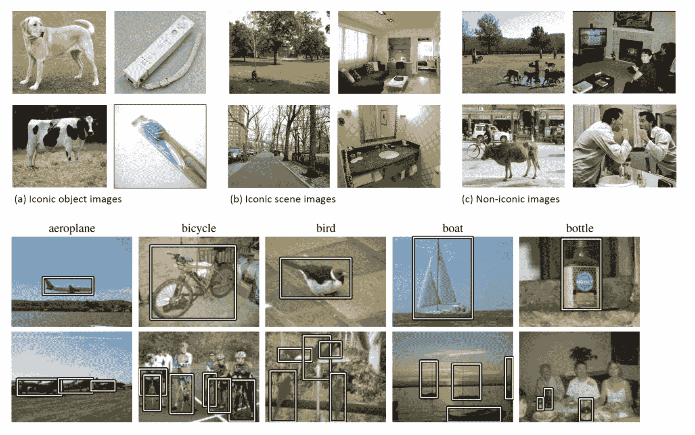

<!--yml

类别：未分类

日期：2024-09-06 20:05:45

-->

# [1907.09408] 深度学习基础的目标检测综述

> 来源：[`ar5iv.labs.arxiv.org/html/1907.09408`](https://ar5iv.labs.arxiv.org/html/1907.09408)

# 深度学习基础的目标检测综述

Licheng Jiao, Fan Zhang, Fang Liu, Shuyuan Yang, Lingling Li, Zhixi Feng 和 Rong Qu 关键实验室：教育部智能感知与图像理解重点实验室，国际智能感知与计算研究中心，智能感知与计算联合国际研究实验室，西安电子科技大学人工智能学院，中国陕西省西安 710071，电子邮件：（lchjiao@mail.xidian.edu.cn）。

###### 摘要

目标检测是计算机视觉中最重要和最具挑战性的分支之一，已广泛应用于人们的生活中，如安全监控、自动驾驶等，其目的是定位特定类别的语义对象实例。随着深度学习网络在检测任务中的快速发展，目标检测器的性能得到了极大提高。为了深入了解目标检测管道的主要发展状态，在本综述中，我们首先分析了现有典型检测模型的方法，并描述了基准数据集。之后，我们主要以系统化的方式提供了各种目标检测方法的全面概述，涵盖了一阶段和二阶段检测器。此外，我们列出了传统和新兴应用，并分析了一些具有代表性的目标检测分支。最后，我们讨论了利用这些目标检测方法构建有效且高效系统的架构，并指出了一系列发展趋势，以更好地跟踪最先进的算法并进一步研究。

###### 索引词：

分类、深度学习、定位、目标检测、典型管道。

## I 引言

对象检测因其广泛的应用范围和近期的技术突破而越来越受到关注。该任务在学术界和实际应用中都在进行广泛研究，例如监控安全、自动驾驶、交通监控、无人机场景分析和机器人视觉。在推动对象检测技术快速发展的众多因素和努力中，值得注意的贡献应归因于深度卷积神经网络和 GPU 计算能力的发展。目前，深度学习模型已被广泛应用于计算机视觉领域，包括一般对象检测和领域特定对象检测。大多数最先进的对象检测器利用深度学习网络作为其骨干网络和检测网络，从输入图像（或视频）中提取特征，进行分类和定位。对象检测是一种与计算机视觉和图像处理相关的计算机技术，处理在数字图像和视频中检测某一类别（如人类、建筑物或汽车）的语义对象实例。经过深入研究的对象检测领域包括多类别检测、边缘检测、显著对象检测、姿态检测、场景文本检测、人脸检测和行人检测等。作为场景理解的重要组成部分，对象检测已广泛应用于现代生活的许多领域，如安全领域、军事领域、交通领域、医疗领域和生活领域。此外，到目前为止，许多基准在对象检测领域发挥了重要作用，如 Caltech [1]、KITTI [2]、ImageNet [3]、PASCAL VOC [4]、MS COCO [5]和 Open Images V5 [6]。在 ECCV VisDrone 2018 竞赛中，组织者发布了一个基于无人机平台的全新数据集 [7]，该数据集包含大量图像和视频。

$\bullet$ 两种对象检测器

现有的领域特定图像目标检测器通常可以分为两类，一类是两阶段检测器，最具代表性的是 Faster R-CNN [8]。另一类是单阶段检测器，如 YOLO [9]、SSD [10]。两阶段检测器具有较高的定位和目标识别准确性，而单阶段检测器则实现了较高的推断速度。两阶段检测器的两个阶段可以通过 RoI（兴趣区域）池化层来划分。例如，在 Faster R-CNN 中，第一个阶段是 RPN（区域建议网络），它提出候选目标边界框。第二个阶段，通过 RoIPool（RoI 池化）操作从每个候选框中提取特征，用于后续的分类和边界框回归任务 [11]。图 1 (a) 显示了两阶段检测器的基本结构。此外，单阶段检测器直接从输入图像中提出预测框，无需区域提议步骤，因此它们具有时间效率高的优点，可用于实时设备。图 1 (b) 展示了单阶段检测器的基本结构。

$\bullet$ 贡献

本综述重点描述和分析基于深度学习的目标检测任务。现有的综述通常涵盖一般目标检测的系列领域，可能不包含提供一些新颖解决方案和这些任务的新方向的最先进方法，因为计算机视觉研究的快速发展。

(1) 本文列出了最近提出的非常新颖的解决方案，但忽略了基础知识的讨论，以便读者能够更容易地看到该领域的前沿。

(2) 此外，与以往的目标检测综述不同，本文系统全面地回顾了基于深度学习的目标检测方法，最重要的是更新的检测解决方案以及一系列重要的研究趋势。

(3) 本综述以对各个方面进行深入分析和讨论为特色，我们认为其中许多方面在该领域是首次出现的。

最重要的是，我们的意图是提供不同深度学习方法的概述，而不是对所有相关论文的全面总结。为了深入了解该领域，我们建议读者参考 [12] [13] [14] 以获取早期方法的更多细节。

本文的其余部分组织如下。对象检测器需要一个强大的骨干网络来提取丰富的特征。本文在下面的第二部分讨论了骨干网络。众所周知，特定领域图像检测器的典型流程是任务的基础和里程碑。第三部分详细阐述了 2019 年 6 月之前提出的最具代表性和开创性的基于深度学习的方法。第四部分描述了常用的数据集和指标。第五部分系统地解释了通用对象检测方法的分析。第六部分详细介绍了五个典型领域和若干流行的对象检测分支。第七部分总结了发展趋势。

图 1： (a) 展示了两阶段检测器的基本架构，它由区域提议网络组成，将区域提议输入分类器和回归器。 (b) 展示了一阶段检测器的基本架构，它直接从输入图像中预测边界框。黄色立方体是一系列具有相同分辨率的卷积层（称为一个块），由于在一个块后的下采样操作，后续立方体的大小逐渐变小。厚蓝色立方体是一系列包含一个或多个卷积层的卷积层。平坦的蓝色立方体表示 RoI 池化层，它为相同大小的对象生成特征图。

## II 骨干网络

骨干网络作为对象检测任务的基本特征提取器，接受图像作为输入，并输出对应输入图像的特征图。大多数检测骨干网络是分类任务的网络，通过去除最后的全连接层来实现的。基本分类网络的改进版本也可用。例如，Lin 等人[15]添加或减去层或用特殊设计的层替换一些层。为了更好地满足特定要求，一些工作[9] [16]利用新设计的骨干网络进行特征提取。

针对不同的精度与效率需求，人们可以选择更深且密集连接的骨干网络，如 ResNet [11]、ResNeXt [17]、AmoebaNet [18]，或像 MobileNet [19]、ShuffleNet [20]、SqueezeNet [21]、Xception [22]、MobileNetV2 [23]这样的轻量级骨干网络。当应用于移动设备时，轻量级骨干网络可以满足要求。Wang 等人 [24] 提出了一个新颖的实时物体检测系统，通过将 PeleeNet 与 SSD [10] 结合，并优化架构以提高处理速度。为了满足高精度和更准确应用的需求，需要复杂的骨干网络。另一方面，实时要求如视频或网络摄像头不仅需要高处理速度，还需要高精度 [9]，这需要设计良好的骨干网络以适应检测架构，并在速度和精度之间进行权衡。

为了探索更具竞争力的检测精度，采用更深且密集连接的骨干网络替代较浅且稀疏连接的网络。He 等人 [11] 使用 ResNet [25] 而非 VGG [26] 来捕捉丰富特征，这在 Faster R-CNN [8] 中被采用以进一步提升精度，因为其具有高容量。

新兴的高性能分类网络可以提高精度并减少物体检测任务的复杂性。这是一种有效的方式来进一步提升网络性能，因为骨干网络作为特征提取器。众所周知，特征的质量决定了网络性能的上限，因此这是一个需要进一步探索的重要步骤。更多细节请参考 [27]。

## III 典型基准

随着深度学习的发展和计算能力的不断提升，一般物体检测领域取得了巨大进展。当第一个基于 CNN 的物体检测器 R-CNN 被提出时，产生了一系列显著的贡献，这些贡献大大推动了通用物体检测的发展。我们介绍了一些代表性的物体检测架构，以帮助初学者入门这一领域。

### III-A 两阶段检测器

#### III-A1 R-CNN

R-CNN 是基于区域的 CNN 检测器。正如 Girshick 等人 [28] 提出的 R-CNN 可以用于物体检测任务，他们的工作首次展示了 CNN 在 PASCAL VOC 数据集 [4] 上能够显著提高物体检测性能，相比于基于简单 HOG-like 特征的系统。深度学习方法在物体检测领域被验证为有效且高效的。

R-CNN 探测器由四个模块组成。第一个模块生成类别无关的区域提议。第二个模块从每个区域提议中提取固定长度的特征向量。第三个模块是一组特定类别的线性 SVM，用于对图像中的对象进行分类。最后一个模块是一个边界框回归器，用于精确预测边界框。具体而言，首先，生成区域提议时，作者采用选择性搜索方法。然后，使用 CNN 从每个区域提议中提取一个 4096 维的特征向量。由于全连接层需要固定长度的输入向量，因此区域提议特征应具有相同的大小。作者采用固定的${227}\times{227}$像素作为 CNN 的输入大小。众所周知，不同图像中的对象具有不同的大小和纵横比，这使得第一模块提取的区域提议大小不同。无论候选区域的大小或纵横比如何，作者将所有像素在其周围的紧密边界框内变形为所需的大小${227}\times{227}$。特征提取网络由五个卷积层和两个全连接层组成，并且所有 CNN 参数在所有类别之间共享。每个类别训练类别无关的 SVM，不同 SVM 之间的参数不共享。

在更大的数据集上预训练，然后在指定的数据集上微调，是深度卷积神经网络实现快速收敛的良好训练方法。首先，Girshick 等人[28]在大规模数据集（ImageNet 分类数据集[3]）上预训练 CNN。最后一个全连接层被替换为 CNN 的 ImageNet 特定 1000 类分类层。下一步是使用 SGD（随机梯度下降）微调 CNN 参数，针对变形提议窗口。最后一个全连接层是一个（N+1）类分类层（N：对象类别，1：背景），其初始化为随机状态。

在设定正负样本时，作者将其分为两种情况。第一种是在微调过程中将 IoU（交并比）重叠阈值定义为 0.5。在阈值以下，区域提议被定义为负样本，而在阈值以上，对象提议被定义为正样本。此外，与真实类别的最大 IoU 重叠的对象提议会被分配给真实框。另一种情况是在训练 SVM 时设置参数。相比之下，只有真实框被作为其各自类别的正样本，而与该类别所有真实实例 IoU 重叠小于 0.3 的提议被视为负样本。这些提议的重叠在 0.5 到 1 之间，并且它们不是真实的，这样可以将正样本的数量扩展约${30}\times$。因此，这样一个大集合可以有效地避免微调过程中的过拟合。

#### III-A2 Fast R-CNN

R-CNN 于一年后提出，Ross Girshick [29] 提出了一个更快的 R-CNN 版本，称为 Fast R-CNN [29]。由于 R-CNN 对每个区域提议都执行一次 ConvNet 前向传递且没有共享计算，R-CNN 在 SVM 分类上花费了较长时间。Fast R-CNN 从整个输入图像中提取特征，然后通过区域兴趣 (RoI) 池化层获取固定大小的特征作为后续分类和边界框回归全连接层的输入。特征从整个图像中提取一次，并同时发送到 CNN 进行分类和定位。与 R-CNN 将每个区域提议输入 CNN 相比，Fast R-CNN 可以节省大量 CNN 处理时间，并节省存储大量特征所需的大量磁盘存储。如上所述，训练 R-CNN 是一个多阶段过程，包括预训练阶段、微调阶段、SVM 分类阶段和边界框回归阶段。Fast R-CNN 是一个一阶段的端到端训练过程，使用多任务损失对每个标记的 RoI 进行联合训练。

另一个改进是 Fast R-CNN 使用 RoI 池化层从不同大小的区域提议中提取固定大小的特征图。这个操作无需扭曲区域，并保留了区域提议特征的空间信息。为了快速检测，作者使用了截断 SVD，加快了全连接层的前向传递计算。

实验结果显示，Fast R-CNN 在 PASCAL VOC 2007 数据集上的 mAP 为 66.9%，而 R-CNN 为 66.0% [4]。训练时间从 R-CNN 的 84 小时减少到 9.5 小时，速度快了 9 倍。对于测试率 (s/image)，使用截断 SVD 的 Fast R-CNN (0.32s) 比 R-CNN (47s) 快 ${213}\times$。这些实验是在 Nvidia K40 GPU 上进行的，证明了 Fast R-CNN 确实加速了物体检测过程。

#### III-A3 Faster R-CNN

在 Fast R-CNN 提出三个月后，Faster R-CNN [8] 进一步改进了基于区域的 CNN 基线。Fast R-CNN 使用选择性搜索来提议 RoI，这种方法较慢，需要与检测网络相同的运行时间。Faster R-CNN 用一种新颖的 RPN（区域提议网络）替代了它，RPN 是一个全卷积网络，可以高效地预测具有广泛尺度和纵横比的区域提议。由于 RPN 与检测网络共享全图卷积特征和一组公共卷积层，它加速了区域提议的生成速度。该过程在图 3（b）中进行了简化。此外，一种用于不同尺寸目标检测的新方法是使用多尺度锚点作为参考。锚点可以大大简化生成各种尺寸区域提议的过程，无需多尺度的输入图像或特征。在最后共享卷积层的输出（特征图）上，滑动一个固定大小的窗口（${3}\times{3}$），每个特征窗口的中心点相对于原始输入图像的一个点，即 k（${3}\times{3}$）锚框的中心点。作者定义锚框具有 3 种不同的尺度和 3 种纵横比。区域提议相对于参考锚框进行参数化。然后，他们测量预测框与其对应的真实框之间的距离，以优化预测框的位置。

实验表明，Faster R-CNN 在精度和检测效率上都有了显著提高。在 PASCAL VOC 2007 测试集上，Faster R-CNN 达到了 69.9%的 mAP，而 Fast R-CNN 为 66.9%，并且共享了卷积计算。此外，Faster R-CNN（198ms）的总运行时间比 Fast R-CNN（1830ms）低近 10 倍，使用相同的 VGG [26]骨干网，处理速率为 5fps 对比 0.5fps。

#### III-A4 Mask R-CNN

Mask R-CNN [11] 是对 Faster R-CNN 的扩展，主要用于实例分割任务。除了增加的并行掩膜分支外，Mask R-CNN 被认为是一个更精确的目标检测器。He 等人使用了带有 ResNet [25]-FPN [15]（特征金字塔网络，一种骨干网络从特征金字塔的不同层级中提取 RoI 特征，根据其尺度）骨干网的 Faster R-CNN 来提取特征，达到了出色的准确率和处理速度。FPN 包含一个自下而上的路径和一个自上而下的路径，并有横向连接。自下而上的路径是一个骨干 ConvNet，它计算一个包含几个尺度特征图的特征层次，缩放步长为 2。自上而下的路径通过从较高金字塔层中上采样空间上较粗但语义更强的特征图来生成更高分辨率的特征。最开始，顶层金字塔特征图由自下而上的路径的最后一个卷积层的输出捕获。每个横向连接合并自下而上的路径和自上而下的路径中相同空间尺寸的特征图。虽然特征图的尺寸不同，但 ${1}\times{1}$ 卷积层可以改变尺寸。经过横向连接操作后，会形成一个新的金字塔层级，并在每个层级上独立进行预测。由于高分辨率的特征图对于检测小物体很重要，而低分辨率的特征图富含语义信息，因此特征金字塔网络提取了重要特征。

另一种提高准确度的方法是用 RoIAlign 替代 RoI pooling，从每个 RoI 中提取一个小特征图，如图 2 所示。传统的 RoI pooling 通过两个步骤来量化浮点数，以获得每个 bin 中的近似特征值。首先，应用量化来计算特征图上每个 RoI 的坐标，给定输入图像中的 RoI 坐标和下采样步幅。然后 RoI 特征图被划分为 bins，以生成相同大小的特征图，在此过程中也会进行量化。这两个量化操作会导致 RoI 与提取的特征之间的对齐错误。为了解决这个问题，在这两个步骤中，RoIAlign 避免了对 RoI 边界或 bins 的任何量化。首先，它计算每个 RoI 特征图的浮点坐标，然后通过双线性插值操作来计算每个 RoI bin 中四个规则采样位置的特征的确切值。接着，它使用最大池化或平均池化来汇总结果，以获取每个 bin 的值。图 2 是 RoIAlign 操作的一个示例。

实验表明，通过以上两项改进，精度得到了提升。使用 ResNet-FPN 骨干网使得框 AP 提升了 1.7 个点，RoIAlign 操作在 MS COCO 检测数据集上提高了 1.1 个点的框 AP。

图 2：RoIAlign 操作。第一步计算特征图中物体的浮点坐标。下一步利用双线性插值计算在分隔的 bin 中四个规律采样位置的特征的精确值。

### III-B 一阶段检测器

#### III-B1 YOLO

YOLO [9]（you only look once）是 Redmon 等人在 Faster R-CNN [8]之后提出的一阶段目标检测器。其主要贡献是实时检测完整图像和摄像头。首先，由于该流程每张图像仅预测不到 100 个边界框，而 Fast R-CNN 使用选择性搜索预测每张图像 2000 个区域提议。其次，YOLO 将检测框架视为回归问题，因此统一的架构可以直接从输入图像中提取特征以预测边界框和类别概率。YOLO 网络在 Titan X GPU 上以每秒 45 帧的速度运行，而 Fast R-CNN 为 0.5fps，Faster R-CNN 为 7fps。

YOLO 流程首先将输入图像划分为${S}\times{S}$网格，其中每个网格单元负责检测其中心落入的物体。置信度得分通过两个部分的乘积获得，其中$P(object)$表示框中包含物体的概率，IOU（交并比）显示框中物体的准确度。每个网格单元预测 B 个边界框$(x,y,w,h)$及其置信度得分，并为 C 个类别提供 C 维条件类别概率。特征提取网络包含 24 个卷积层，后跟 2 个全连接层。在 ImageNet 数据集上进行预训练时，作者使用前 20 个卷积层和一个平均池化层，然后是一个全连接层。为了获得细粒度的视觉信息以提高检测精度，在检测阶段，将预训练阶段的输入分辨率${224}\times{224}$加倍。

实验显示，YOLO 在准确定位方面表现不佳，定位误差是预测误差的主要组成部分。Fast R-CNN 在背景中产生了许多误报，而 YOLO 比其少 3 倍。在 PASCAL VOC 数据集上进行训练和测试时，YOLO 实现了 63.4%的 mAP 和 45 fps，而 Fast R-CNN 为 70.0%的 mAP 和 0.5fps，Faster R-CNN 为 73.2%的 mAP 和 7fps。

#### III-B2 YOLOv2

YOLOv2 [30]是 YOLO [9]的第二个版本，采用了一系列过去工作的设计决策和新颖概念，以提高 YOLO 的速度和精度。

批量归一化。将输入的固定分布应用到卷积网络层会对层产生积极的影响。由于优化步骤使用随机梯度下降，规范化整个训练集是不切实际的。由于 SGD 在训练过程中使用小批量，因此每个小批量都会生成每个激活的均值和方差的估计值。计算小批量的均值和方差，然后将大小为$m$的激活值归一化，使其均值为零，方差为 1。最后，每个小批量的元素从相同的分布中抽样。这个操作可以看作是一个 BN 层[31]，它输出具有相同分布的激活值。YOLOv2 在每个卷积层之前添加了一个 BN 层，这加快了网络的收敛速度并帮助正则化模型。批量归一化使 mAP 提高了超过 2%。

高分辨率分类器。在 YOLO 骨干网络中，分类器采用${224}\times{224}$的输入分辨率，然后将分辨率提高到 448 进行检测。这个过程需要网络在切换到目标检测任务时调整为新的分辨率输入。为了解决这个问题，YOLOv2 在${448}\times{448}$的分类网络上添加了一个微调过程，在 ImageNet 数据集上进行 10 个周期的训练，这将 mAP 提高了 4%。

带锚框的卷积。在原始 YOLO 网络中，预测框的坐标是由全连接层直接生成的。Faster R-CNN 使用锚框作为参考来生成与预测框的偏移量。YOLOv2 采用这种预测机制，并首先去除了全连接层。然后，它为每个锚框预测类别和物体性。这个操作使召回率提高了 7%，而 mAP 减少了 0.3%。

使用维度聚类预测锚框的尺寸和宽高比。在 Faster R-CNN 中，锚框的尺寸和宽高比是通过经验确定的。为了更容易地学习预测良好的检测，YOLOv2 在训练集的边界框上使用 K-means 聚类自动获取良好的先验。使用维度聚类以及直接预测边界框中心位置，将 YOLO 的性能提高了近 5%。

细粒度特征。为了定位较小的物体，高分辨率特征图可以提供有用的信息。类似于 ResNet 中的身份映射，YOLOv2 通过将相邻的特征堆叠到不同的通道中，将高分辨率特征与低分辨率特征进行拼接，这使性能提高了 1%。

多尺度训练。为了使网络对不同尺寸的图像具有鲁棒性，每 10 个批次，网络会随机选择一个新的图像尺寸，来自$\{320,352,...,608\}$。这意味着相同的网络可以在不同分辨率下预测检测。高分辨率检测中，YOLOv2 在 VOC 2007 上达到 78.6%的 mAP 和 40fps，而 YOLO 为 63.4%的 mAP 和 45fps。

此外，YOLOv2 提出了一个新的分类骨干网络，即 Darknet-19，具有 19 层卷积层和 5 层最大池化层，处理图像所需的操作较少，同时实现了高精度。更具竞争力的 YOLOv2 版本具有 78.6% 的 mAP 和 40fps，而 Faster R-CNN 与 ResNet 骨干网络的 mAP 为 76.4% 和 5fps，SSD500 的 mAP 为 76.8% 和 19fps。如上所述，YOLOv2 通过 7 项主要改进和一个新的骨干网络，实现了高检测精度和高处理速度。

#### III-B3 YOLOv3

YOLOv3 [32] 是 YOLOv2 的改进版。首先，YOLOv3 使用多标签分类（独立逻辑回归分类器）来适应包含许多重叠标签的更复杂数据集。其次，YOLOv3 利用三种不同尺度的特征图来预测边界框。最后一层卷积层预测一个 3-d 张量，编码类别预测、物体性和边界框。第三，YOLOv3 提出了一个更深且更强大的特征提取器，称为 Darknet-53，灵感来自于 ResNet。

根据在 MS COCO 数据集上的实验结果，YOLOv3（AP:33%）在 MS COCO 指标下的表现与 SSD 变体（DSSD513:AP:33.2%）相当，但速度比 DSSD 快三倍，而远远落后于 RetinaNet [33]（AP:40.8%）。不过，使用的是旧的检测指标 mAP（IOU= 0.5，或 ${AP}_{50}$），YOLOv3 能达到 57.9% 的 mAP，相比之下 DSSD513 为 53.3%，RetinaNet 为 61.1%。由于多尺度预测的优势，YOLOv3 能检测更多的小物体，但在中型和大型物体上的表现相对较差。

表 I：MS COCO 数据集上的 AP 分数（%），${AP}_{S}$：小物体的 AP，${AP}_{M}$：中型物体的 AP，${AP}_{L}$：大型物体的 AP

| Model | ${AP}_{S}$ | ${AP}_{M}$ | ${AP}_{L}$ |
| --- | --- | --- | --- |
| DSSD513 | 13.0 | 35.4 | 51.1 |
| RetinaNet | 24.1 | 44.2 | 51.2 |

#### III-B4 SSD

SSD [10] 是一种单阶段的多类别单次检测器，它直接预测类别分数和框偏移量，对于不同尺度的一组默认边界框，在多个尺度的特征图中的每个位置进行预测，如图 4（a）所示。默认边界框在每个特征图中具有不同的长宽比和尺度。在不同的特征图中，默认边界框的尺度与最高层和最低层之间的规律间距计算，每个特定特征图学习对物体特定尺度的响应。对于每个默认框，它预测所有物体类别的偏移量和置信度。图 3（c）展示了该方法。在训练时，将这些默认边界框与真实框匹配，其中匹配的默认框作为正样本，其余作为负样本。由于大量默认框是负样本，作者采用了硬负样本挖掘，使用每个默认框的最高置信度损失，然后挑选出前几个，以使负样本与正样本的比例最多为 3:1。此外，作者实现了数据增强，这被证明是一种有效的提高精度的方法。

实验表明，SSD512 在 mAP 和速度上都与 VGG-16 [26] 主干网络具有竞争力。SSD512（输入图像尺寸：${512}\times{512}$）在 PASCAL VOC 2007 测试集上获得了 81.6% 的 mAP，在 PASCAL VOC 2012 测试集上获得了 80.0%，相比之下，Faster R-CNN 分别为 78.8% 和 75.9%，YOLO（VOC2012: 57.9%）。在 MS COCO DET 数据集上，SSD512 在所有评估标准下均优于 Faster R-CNN。

图 3：四种方法利用特征进行不同尺寸物体的预测。（a）使用图像金字塔来构建特征金字塔。特征在每个图像尺度上独立计算，这很慢。（b）检测系统 [8] [29] 仅使用单一尺度特征（最后一层卷积层的输出）以加快检测速度。（c）像 SSD [10] 一样，将 ConvNet 的每个金字塔特征层级预测为图像金字塔。（d）特征金字塔网络（FPN）[15] 像（b）和（c）一样速度快，但更为准确。在此图中，特征图用灰色填充的四边形表示。头网络用蓝色矩形表示。

#### III-B5 DSSD

DSSD [34]（反卷积单次检测器）是 SSD（单次检测器）的一个修改版本，增加了预测模块和反卷积模块，同时采用 ResNet-101 作为主干网络。DSSD 的架构如图 4（b）所示。对于预测模块，Fu 等人向每个预测层添加了一个残差块，然后对预测层和残差块的输出进行逐元素相加。反卷积模块提高了特征图的分辨率以增强特征。每个反卷积层后面跟着一个预测模块，用于预测不同尺寸的各种对象。在训练过程中，首先作者在 ILSVRC CLS-LOC 数据集上对基于 ResNet-101 的主干网络进行预训练，然后使用${321}\times{321}$输入或${513}\times{513}$输入在检测数据集上训练原始 SSD 模型。最后，他们训练反卷积模块，同时冻结 SSD 模块的所有权重。

在 PASCAL VOC 数据集和 MS COCO 数据集上的实验显示了 DSSD513 模型的有效性，而添加的预测模块和反卷积模块在 PASCAL VOC 2007 测试数据集上带来了 2.2%的提升。

图 4：SSD、DSSD 和基于残差网络的 RetinaNet 的网络结构。 (a) 蓝色模块是 SSD 框架中添加的层，其分辨率由于下采样而逐渐降低。在 SSD 中，预测层作用于不同层次的融合特征。头部模块由一系列卷积层和若干分类层以及定位层组成。 (b) 红色模块是 DSSD 框架中添加的层，表示反卷积操作。在 DSSD 中，预测层跟随每个反卷积模块。 (c) RetinaNet 利用 ResNet-FPN 作为其主干网络，生成 5 级特征金字塔（P3-P7），对应 C3-C7（分别为 conv3-conv7 的特征图），以预测不同尺寸的对象。

#### III-B6 RetinaNet

RetinaNet [33]是一种单阶段目标检测器，采用 focal loss 作为分类损失函数，由 Lin 等人[33]于 2018 年 2 月提出。RetinaNet 的架构如图 4（c）所示。R-CNN 是一种典型的两阶段目标检测器。第一阶段生成一组稀疏的区域提议，第二阶段对每个候选位置进行分类。由于第一阶段筛选出了大多数负样本，两阶段目标检测器能够实现比单阶段检测器更高的精度，因为单阶段检测器提议了一组密集的候选位置。主要原因是单阶段检测器在训练网络时面临极端的前景-背景类别不平衡。因此，作者提出了一种叫做 focal loss 的损失函数，可以减少分配给分类良好或容易的样本的损失。Focal loss 专注于困难的训练样本，避免了大量简单负样本在训练期间淹没检测器。RetinaNet 继承了先前单阶段检测器的快速速度，同时大大克服了单阶段检测器在训练不平衡正负样本时的困难。

实验表明，使用 ResNet-101-FPN 骨干网的 RetinaNet 在 MS COCO test-dev 数据集上的 AP 为 39.1%，相比之下，DSSD513 的 AP 为 33.2%。使用 ResNeXt-101-FPN 时，其 AP 达到了 40.8%，远超 DSSD513。RetinaNet 显著提高了对小型和中型物体的检测精度。

#### III-B7 M2Det

为了适应物体实例间的大范围尺度变化，Zhao 等人[35]提出了一种多级特征金字塔网络（MLFPN），构建了更有效的特征金字塔。作者采用了三步来获得最终的增强特征金字塔。首先，像 FPN 一样，从骨干网的多个层提取的多级特征被融合为基础特征。其次，将基础特征输入一个由交替的 Thinned U 形模块和特征融合模块组成的块，并获得 TUM 的解码器层作为下一步的特征。最后，通过整合等效尺度的解码器层来构建包含多级特征的特征金字塔。目前，多尺度和多级的特征已准备就绪。剩下的部分是按照 SSD 架构以端到端的方式获得边界框定位和分类结果。

对于 M2Det 作为一种单阶段检测器，它在使用 VGG-16 进行 COCO test-dev 数据集测试时，单尺度推理策略下达到了 41.0 的 AP，速度为 11.8 FPS，而多尺度推理策略下达到了 44.2 的 AP。它在单尺度推理策略下比 RetinaNet800（以 Res101-FPN 为骨干网）提高了 0.9%，但比 RetinaNet800 慢了两倍。

#### III-B8 RefineDet

RefineDet [36]的整个网络包含两个相互连接的模块：锚点细化模块和对象检测模块。这两个模块通过一个传输连接块连接，以从前一个模块传输和增强特征，从而更好地预测后一个模块中的对象。训练过程是端到端的，通过三个阶段进行：预处理、检测（两个相互连接的模块）和 NMS。

经典的一阶段检测器，如 SSD、YOLO 和 RetinaNet，都是使用一步回归方法来获得最终结果。作者发现，使用两步级联回归方法可以更好地预测难以检测的对象，尤其是小物体，并提供更准确的对象位置。

### III-C 最新检测器

#### III-C1 用于对象检测的关系网络

胡等人[37]提出了一种适应性注意力模块，称为对象关系模块，该模块考虑了图像中不同目标之间的相互作用，包括它们的外观特征和几何信息。这个对象关系模块被添加在检测器的头部，在两个全连接层之前，以获得增强的特征，用于准确分类和定位对象。关系模块不仅将增强的特征输入到分类器和回归器中，而且替代了 NMS 后处理步骤，获得了比 NMS 更高的准确性。通过在 COCO test-dev 数据集上使用 Faster R-CNN、FPN 和 DCN 作为主干网络，添加关系模块分别提高了 0.2、0.6 和 0.2 的准确率。

#### III-C2 DCNv2

为了学习适应目标在有效空间支持区域中反映的几何变化，Dai 等人提出了可变形卷积网络（DCN）[38]。常规卷积网络只能关注固定大小的特征（根据卷积核），因此感受野无法正确覆盖目标对象的整个像素以进行表示。可变形卷积网络可以生成可变形的卷积核，并且从初始卷积核（固定大小）中学习偏移量。可变形 RoI 池化也可以适应具有不同形状的对象的部分位置。在 COCO test-dev 数据集上，DCNv1 实现了显著的准确性提升，比三种普通卷积网络高出近 4%。在严格的 COCO 评估标准下（mAP @[0.5:0.95]），最佳的平均精度结果为 37.5%。

Deformable ConvNets v2 [39]相比 DCNv1（从仅卷积层在 conv5 阶段到所有卷积层在 conv3-conv5 阶段）使用了更多的可变形卷积层来替代常规卷积层。所有可变形层都由可学习的标量进行调节，这显著增强了可变形效果和准确性。作者采用特征模仿进一步提高检测准确性，通过在 DCN 的每个 RoI 特征上引入特征模仿损失，使其类似于从裁剪图像中提取的良好特征。DCNv2 在 COCO 2017 test-dev 集上根据 COCO 评估标准达到了 45.3%的 mAP，而 DCNv1 为 41.7%，常规 Faster R-CNN 在 ResNext-101 骨干网上的 mAP 为 40.1%。在其他强大骨干网上，DCNv2 超越了 DCNv1 $3\%-5\%$ mAP，超越了常规 Faster R-CNN $5\%-8\%$。

#### III-C3 NAS-FPN

最近，Google Brain 的作者采用神经架构搜索来寻找一些新的特征金字塔架构，命名为 NAS-FPN [18]，包括自上而下和自下而上的连接，以融合不同尺度的特征。在搜索过程中，通过重复 FPN 架构 N 次然后将其连接成一个大型架构，高层特征层可以选择任意级别的特征进行模拟。所有具有最高精度的架构都包含高分辨率输入特征图与输出特征层之间的连接，这表明生成高分辨率特征对于小目标检测是必要的。堆叠更多的金字塔网络、增加特征维度和采用高容量架构都大幅提高了检测准确率。

实验表明，在 COCO test-dev 数据集上，采用 256 特征维度的 ResNet-50 作为骨干网，NAS-FPN 的 mAP 超过了原始 FPN 2.9%。NAS-FPN 的最佳配置采用 AmoebaNet 作为骨干网，并堆叠了 7 个 384 特征维度的 FPN，在 COCO test-dev 上达到了 48.0%。

总结来说，典型的基线通过提取更丰富的对象特征和采用多级别、多尺度特征来提升准确性，以应对不同尺寸的目标检测。为了实现更高的速度和精度，一阶段检测器利用新设计的损失函数来过滤简单样本，从而大幅减少提案目标的数量。为了解决几何变异问题，采用可变形卷积层是一种有效的方法。建模图像中不同对象之间的关系也是提升性能的必要步骤。表 2 列出了上述典型基线在 MS COCO test-dev 数据集上的检测结果。

TABLE II: MS COCO 测试开发数据集上一些典型基线的检测结果。AP, ${AP}_{50}$ , ${AP}_{75}$ 分数（%）。${AP}_{S}$:小物体的 AP，${AP}_{M}$:中等物体的 AP，${AP}_{L}$:大物体的 AP。*DCNv2+Faster R-CNN 模型在 COCO 2017 训练集的 118k 图像上进行训练。

| 方法 | 数据 | 骨干网络 | AP | ${AP}_{50}$ | ${AP}_{75}$ | ${AP}_{S}$ | ${AP}_{M}$ | ${AP}_{L}$ |
| --- | --- | --- | --- | --- | --- | --- | --- | --- |
| Fast R-CNN[29] | train | VGG-16 | 19.7 | 35.9 | ${-}$ | ${-}$ | ${-}$ | ${-}$ |
| Faster R-CNN[8] | trainval | VGG-16 | 21.9 | 42.7 | ${-}$ | ${-}$ | ${-}$ | ${-}$ |
| OHEM[40] | trainval | VGG-16 | 22.6 | 42.5 | 22.2 | 5.0 | 23.7 | 37.9 |
| ION[41] | train | VGG-16 | 23.6 | 43.2 | 23.6 | 6.4 | 24.1 | 38.3 |
| OHEM++[40] | trainval | VGG-16 | 25.5 | 45.9 | 26.1 | 7.4 | 27.7 | 40.3 |
| R-FCN[42] | trainval | ResNet-101 | 29.9 | 51.9 | - | 10.8 | 32.8 | 45.0 |
| CoupleNet[43] | trainval | ResNet-101 | 34.4 | 54.8 | 37.2 | 13.4 | 38.1 | 52.0 |
| Faster R-CNN G-RMI[44] | ${-}$ | Inception-ResNet-v2 | 34.7 | 55.5 | 36.7 | 13.5 | 38.1 | 52.0 |
| Faster R-CNN+++[25] | trainval | ResNet-101-C4 | 34.9 | 55.7 | 37.4 | 15.6 | 38.7 | 50.9 |
| Faster R-CNN w FPN[15] | trainval35k | ResNet-101-FPN | 36.2 | 59.1 | 39.0 | 18.2 | 39.0 | 48.2 |
| Faster R-CNN w TDM[45] | trainval | Inception-ResNet-v2-TDM | 36.8 | 57.7 | 39.2 | 16.2 | 39.8 | 52.1 |
| Deformable R-FCN[38] | trainval | 对齐的 Inception-ResNet | 37.5 | 58.0 | 40.8 | 19.4 | 40.1 | 52.5 |
| ${{umd}_{-}}$det[46] | trainval | ResNet-101 | 40.8 | 62.4 | 44.9 | 23.0 | 43.4 | 53.2 |
| Cascade R-CNN[47] | trainval35k | ResNet-101-FPN | 42.8 | 62.1 | 46.3 | 23.7 | 45.5 | 55.2 |
| SNIP[48] | trainval35k | DPN-98 | 45.7 | 67.3 | 51.1 | 29.3 | 48.8 | 57.1 |
| Fitness-NMS[49] | trainval35k | ResNet-101 | 41.8 | 60.9 | 44.9 | 21.5 | 45.0 | 57.5 |
| Mask R-CNN[11] | trainval35k | ResNeXt-101 | 39.8 | 62.3 | 43.4 | 22.1 | 43.2 | 51.2 |
| DCNv2+Faster R-CNN[39] | train118k* | ResNet-101 | 44.8 | 66.3 | 48.8 | 24.4 | 48.1 | 59.6 |
| G-RMI[44] | trainval32k | 五模型集成 | 41.6 | 61.9 | 45.4 | 23.9 | 43.5 | 54.9 |
| YOLOv2[30] | trainval35k | DarkNet-53 | 33.0 | 57.9 | 34.4 | 18.3 | 35.4 | 41.9 |
| YOLOv3[32] | trainval35k | DarkNet-19 | 21.6 | 44.0 | 19.2 | 5.0 | 22.4 | 35.5 |
| ${SSD300}^{*}$[10] | trainval35k | VGG-16 | 25.1 | 43.1 | 25.8 | 6.6 | 22.4 | 35.5 |
| RON384+++[50] | trainval | VGG-16 | 27.4 | 49.5 | 27.1 | ${-}$ | ${-}$ | ${-}$ |
| SSD321[34] | trainval35k | ResNet-101 | 28.0 | 45.4 | 29.3 | 6.2 | 28.3 | 49.3 |
| DSSD321[34] | trainval35k | ResNet-101 | 28.0 | 46.1 | 29.2 | 7.4 | 28.1 | 47.6 |
| SSD512*[10] | trainval35k | VGG-16 | 28.8 | 48.5 | 30.3 | 10.9 | 31.8 | 43.5 |
| SSD513[34] | trainval35k | ResNet-101 | 31.2 | 50.4 | 33.3 | 10.2 | 34.5 | 49.8 |
| DSSD513[34] | trainval35k | ResNet-101 | 33.2 | 53.3 | 35.2 | 13.0 | 35.4 | 51.1 |
| RetinaNet500[33] | trainval35k | ResNet-101 | 34.4 | 53.1 | 36.8 | 14.7 | 38.5 | 49.1 |
| RetinaNet800[33] | trainval35k | ResNet-101-FPN | 39.1 | 59.1 | 42.3 | 21.8 | 42.7 | 50.2 |
| M2Det512[35] | trainval35k | VGG-16 | 37.6 | 56.6 | 40.5 | 18.4 | 43.4 | 51.2 |
| M2Det512[35] | trainval35k | ResNet-101 | 38.8 | 59.4 | 41.7 | 20.5 | 43.9 | 53.4 |
| M2Det800[35] | trainval35k | VGG-16 | 41.0 | 59.7 | 45.0 | 22.1 | 46.5 | 53.8 |
| RefineDet320[36] | trainval35k | VGG-16 | 29.4 | 49.2 | 31.3 | 10.0 | 32.0 | 44.4 |
| RefineDet512[36] | trainval35k | VGG-16 | 33.0 | 54.5 | 35.5 | 16.3 | 36.3 | 44.3 |
| RefineDet320[36] | trainval35k | ResNet-101 | 32.0 | 51.4 | 34.2 | 10.5 | 34.7 | 50.4 |
| RefineDet512[36] | trainval35k | ResNet-101 | 36.4 | 57.5 | 39.5 | 16.6 | 39.9 | 51.4 |
| RefineDet320+[36] | trainval35k | VGG-16 | 35.2 | 56.1 | 37.7 | 19.5 | 37.2 | 47.0 |
| RefineDet512+[36] | trainval35k | VGG-16 | 37.6 | 58.7 | 40.8 | 22.7 | 40.3 | 48.3 |
| RefineDet320+[36] | trainval35k | ResNet-101 | 38.6 | 59.9 | 41.7 | 21.1 | 41.7 | 52.3 |
| RefineDet512+[36] | trainval35k | ResNet-101 | 41.8 | 62.9 | 45.7 | 25.6 | 45.1 | 54.1 |
| CornerNet512[51] | trainval35k | Hourglass | 40.5 | 57.8 | 45.3 | 20.8 | 44.8 | 56.7 |
| NAS-FPN[18] | trainval35k | RetinaNet | 45.4 | - | - | - | - | - |
| NAS-FPN[18] | trainval35k | AmoebaNet | 48.0 | - | - | - | - | - |

## IV 数据集和指标

目标检测需要确定一个对象属于指定类别并在图像中定位它。对象的定位通常通过一个边界框来表示，如图 5 所示。使用具有挑战性的数据集作为基准在许多研究领域中具有重要意义，因为它们能够在不同算法之间进行标准化比较并为解决方案设定目标。早期的算法专注于使用各种临时数据集进行人脸检测。后来，创建了更现实且具有挑战性的人脸检测数据集。另一个流行的挑战是行人检测，为此创建了几个数据集。Caltech 行人数据集 [1] 包含 350,000 个带有边界框的标记实例。像 PASCAL VOC [4]、MS COCO [5]、ImageNet-loc [3] 这样的通用对象检测数据集是对象检测任务的主流基准。官方指标主要用于测量检测器在相应数据集上的性能。

图 5：前两行是来自 MS COCO 数据集的示例 [5]。这些图像显示了数据集中采样的三种不同类型的图像，包括标志性对象、标志性场景和非标志性对象。此外，最后两行是来自 PASCAL VOC 数据集 [4] 的标注示例图像。

图 6：一张带有边界框和类别标签的无人机拍摄的图像。图像来自 VisDrone 2018 数据集 [7]。

### IV-A PASCAL VOC 数据集

#### IV-A1 数据集

对于基础对象类别的检测，从 2005 年到 2012 年，进行了多年努力，创建和维护了一系列广泛采用的基准数据集。PASCAL VOC 数据集 [4] 包含 20 个对象类别（在 VOC2007 中，例如人、自行车、鸟、瓶子、狗等），分布在 11,000 张图像中。这 20 个类别可以被认为是 4 个主要分支——车辆、动物、家庭物品和人。一些类别增加了输出的语义特异性，如汽车和摩托车，不同类型的车辆，但外观不相似。此外，视觉上相似的类别增加了检测难度，例如“狗”与“猫”。超过 27,000 个对象实例的边界框被标注，其中近 7,000 个具有详细的分割。VOC2007 数据集中存在类别不平衡的问题，其中“人”类别无疑是最大的，几乎是训练集中最小类别“羊”的 20 倍。这个问题在周围场景中普遍存在，检测器如何解决这个问题？另一个问题是视角，例如前、后、左、右和未指定，检测器需要分别处理不同的视角。图 5 的最后两行显示了一些标注示例。

#### IV-A2 指标

对于 VOC2007 标准，使用了插值平均精度（Salton 和 McGill 1986）来评估分类和检测。它旨在对漏检对象实例、对一个实例的重复检测和假阳性检测进行惩罚。

|  | $Recall(t)=\frac{\sum_{ij}{1[s_{ij}\geq{t}]}z_{ij}}{N}$ |  |
| --- | --- | --- |
|  | $Precision(t)=\frac{\sum_{ij}{1[s_{ij}\geq{t}]}z_{ij}}{\sum_{ij}{1[s_{ij}\geq{t}]}}$ |  |

其中 $t$ 是判断预测框与真实框之间 IoU 的阈值。在 VOC 指标中，$t$ 设置为 0.5。$i$ 是第 i 张图像的索引，而 $j$ 是第 j 个对象的索引。$N$ 是预测框的数量。如果 $s_{ij}\geq{t}$ 为真，则指示函数 $1[s_{ij}\geq{t}]=1$，否则为 0。如果一个检测根据阈值标准匹配到一个真实框，则会被视为真正的正例结果。

对于给定的任务和类别，精度/召回率曲线是从方法的排名输出中计算得出的。召回率定义为所有正例中排名高于给定排名的比例。精度是指高于该排名的所有例子中属于正类的比例。所有类别的平均精度是最终结果。

### IV-B MS COCO 基准

#### IV-B1 数据集

微软的常见对象数据集（MS COCO）[5]用于检测和分割日常生活中自然环境中的物体，包含 91 个常见物体类别，其中 82 个类别拥有超过 5,000 个标记实例。这些类别涵盖了 PASCAL VOC 数据集中的 20 个类别。数据集总共有 2,500,000 个标记实例和 328,000 张图像。MS COCO 数据集还关注不同的视角，所有物体都处于自然环境中，这为我们提供了丰富的上下文信息。

相比于流行的 ImageNet 数据集[3]，COCO 的类别较少，但每个类别的实例更多。与 PASCAL VOC 数据集[4]（大约是 MS COCO 数据集的 10 倍）和 ImageNet 物体检测数据集（1k）[3]相比，该数据集每个类别的实例数量（平均 27k）显著更大。MS COCO 包含的每张图像中的物体实例数量（7.7）明显多于 PASCAL VOC（2.3）和 ImageNet（3.0）。此外，MS COCO 数据集每张图像包含的类别数（平均 3.5）也高于 PASCAL（1.4）和 ImageNet（1.7）。此外，MS COCO 中的 10%图像只有一个类别，而 ImageNet 和 PASCAL VOC 中的图像中有 60%以上包含一个物体类别。众所周知，小物体需要更多的上下文推理来识别。MS COCO 数据集中的图像信息丰富。最大类别是“人”，有近 800,000 个实例，而最小类别是“发夹”，整个数据集中约有 600 个实例。另一个小类别是“发刷”，其数量接近 800。除去 20 个实例数量多或少的类别，其余 71 个类别的实例数量大致相同。图 5 的前两行显示了 MS COCO 数据集中的三个典型图像类别。

#### IV-B2 指标

MS COCO 指标在严格的标准下全面评估检测性能。PASCAL VOC 中的阈值设置为一个固定值 0.5，而 MS COCO 中的阈值范围为[0.5,0.95]，步长为 0.05，即 10 个值来计算平均精度。此外，还单独计算小型、中型和大型物体的特殊平均精度，以衡量检测器在检测不同尺寸目标方面的性能。

### IV-C ImageNet 基准

#### IV-C1 数据集

富有挑战性的数据集可以推动视觉任务和实际应用的发展。另一个重要的大规模基准数据集是 ImageNet 数据集 [3]。ILSVRC 的物体检测任务评估算法命名和定位图像中所有目标物体实例的能力。ILSVRC2014 有 200 个物体类别和近 45 万张训练图像，2 万张验证图像和 4 万张测试图像。与 PASCAL VOC 的更多比较见表 3。

表 III：ILSVRC 物体检测数据集与 PASCAL VOC 数据集的比较

| 数据集 | 类别 | 完全标注的训练图像 | 训练物体 | 验证图像 | 验证物体 | 每张图像的标注物体 |
| --- | --- | --- | --- | --- | --- | --- |
| PASCAL VOC | 20 | 5717 | 13609 | 5823 | 15787 | 2.7 |
| ILSVRC | 200 | 60658 | 478807 | 20121 | 55501 | 2.8 |

#### IV-C2 指标

PASCAL VOC 指标使用阈值 t = 0.5。然而，对于小型物体，即使是几个像素的偏差也会根据该阈值被认为是不可接受的。ImageNet 使用了一个较宽松的阈值，计算公式为：

|  | $t=min(0.5,\frac{wh}{(w+10)(h+10)})$ |  |
| --- | --- | --- |

其中 $w$ 和 $h$ 分别是地面真实框的宽度和高度。这个阈值允许每个方向上的标注在物体周围扩展最多 5 像素。

### IV-D VisDrone2018 基准测试

去年，一个由无人机拍摄的图像和视频组成的新数据集，称为 VisDrone2018 [7]，这是一个大规模的视觉物体检测和跟踪基准测试数据集。该数据集旨在推动无人机平台上的视觉理解任务。基准中的图像和视频序列是在中国南北 14 个不同城市的各种城市/郊区地区拍摄的。具体而言，VisDrone2018 包含 263 个视频片段和 10,209 张图像（与视频片段不重叠），具有丰富的注释，包括物体边界框、物体类别、遮挡、截断比例等。这个基准测试在 179,264 张图像/视频帧中有超过 250 万的标注实例。

作为发布的最大数据集之一，这个基准测试能够对无人机平台上的视觉分析算法进行广泛的评估和研究。VisDrone2018 包含大量小型物体，如密集的汽车、行人和自行车，这会导致某些类别的检测困难。此外，该数据集中大比例的图像每张图像中有超过 20 个物体，在训练集中占 82.4%，训练集的 6471 张图像中每张图像的平均物体数量为 54。该数据集包含了黑暗的夜晚场景，因此这些图像的亮度低于白天，这使得对小型和密集物体的正确检测更加复杂，如图 6 所示。该数据集采用了 MS COCO 指标。

### IV-E 开放图像 V5

#### IV-E1 数据集

Open Images [6] 是一个包含 920 万张图像的数据集，标注了图像级标签、对象边界框、对象分割掩码和视觉关系。Open Images V5 包含了总计 1600 万的边界框，覆盖 600 个对象类别，涉及 190 万张图像，使其成为现存最大的数据集，提供了对象位置的注释。首先，该数据集中的边界框主要由专业注释员（Google 内部注释员）手动绘制，以确保准确性和一致性。其次，其中的图像非常多样化，大多包含复杂的场景和多个对象（每张图像平均 8.3 个）。第三，该数据集提供了视觉关系注释，指示了特定关系中的对象对（例如“女人弹吉他”，“桌上的啤酒”）。总共包含 329 个关系三元组，391,073 个样本。第四，V5 为 350 个类别的 280 万个对象实例提供了分割掩码。分割掩码标记对象的轮廓，详细描述了其空间范围。最后，该数据集被标注了 3650 万个图像级标签，涵盖 19,969 个类别。

#### IV-E2 指标

基于 PASCAL VOC 2012 的 mAP 评估指标，Kuznetsova 等人提出了几项修改，以全面考虑 Open Images 数据集的一些重要方面。首先，为了公平评估，忽略未标注的类别，以避免误算为假阴性。其次，如果一个对象属于一个类别和一个子类别，则对象检测模型应为每个相关类别提供检测结果。缺少其中一个类别将被视为该类别的假阴性。第三，在 Open Images 数据集中，存在包含一组（相互遮挡或物理接触的多个）对象实例的“组框”，但未知组内单个对象的定位。如果检测在“组框”内，且检测与框的交集除以检测区域的比率大于 0.5，则该检测将被计为真正的正例。多个正确的检测在同一“组框”内仅计为一个有效的真正正例。

### IV-F 行人检测数据集

表 4 和表 5 列出了几个行人检测基准和行人检测数据集的比较。

表 IV：行人检测基准的比较，*EuroCity Persons 基准中的图像具有白天和夜晚的集合，使用“/”分隔白天和夜晚的数量。表格信息来自 Markus Braun 等人 IEEE TPAMI2019[52]*

| 数据集 | 国家 | 城市 | 季节 | 图像 | 行人 | 分辨率 | 天气 | 训练-验证-测试拆分(%) |
| --- | --- | --- | --- | --- | --- | --- | --- | --- |
| 加州理工学院[1] | 1 | 1 | 1 | 249884 | 289395 | ${640}\times{480}$ | 干燥 | 50-0-50 |
| KITTI[2] | 1 | 1 | 1 | 14999 | 9400 | ${1240}\times{376}$ | 干燥 | 50-0-50 |
| CityPersons[53] | 3 | 27 | 3 | 5000 | 31514 | ${2048}\times{1024}$ | 干燥 | 60-10-30 |
| TDC[54] | 1 | 1 | 1 | 14674 | 8919 | ${2048}\times{1024}$ | 干燥 | 71-8-21 |
| EuroCity Persons[52] | 12 | 31 | 4 | 40217/7118* | 183004/35309* | ${1920}\times{1024}$ | 干燥，湿润 | 60-10-30 |

表 V：行人检测数据集的比较。第 3、第 4、第 5 列为训练集。第 6、第 7、第 8 列为测试集。表格信息来源于 Piotr 等人，IEEE TPAMI2012 [1]。

| 数据集 | 成像设置 | 行人 | 负样本图像 | 正样本图像 | 行人 | 负样本图像 | 正样本图像 |
| --- | --- | --- | --- | --- | --- | --- | --- |
| Caltech[1] | 移动 | 192k | 61k | 67k | 155k | 56k | 65k |
| INRIA[55] | 照片 | 1208 | 1218 | 614 | 566 | 453 | 288 |
| ETH[56] | 移动 | 2388 | - | 499 | 12k | - | 1804 |
| TUD-Brussels[57] | 移动 | 1776 | 218 | 1092 | 1498 | - | 508 |
| Daimler-DB[58] | 移动 | 192k | 61k | 67k | 155k | 56k | 65k |

## V 一般图像目标检测方法分析

基于深度神经网络的目标检测管道一般包括四个步骤：图像预处理、特征提取、分类与定位、后处理。首先，数据集中原始图像不能直接输入网络。因此，我们需要将图像调整为特定的尺寸并使其更清晰，比如增强亮度、颜色、对比度。数据增强也可以满足一些需求，例如翻转、旋转、缩放、裁剪、平移、添加高斯噪声。此外，生成对抗网络（GANs）[59]可以根据需求生成新图像，以丰富输入的多样性。有关数据增强的更多细节，请参考[60]。其次，特征提取是进一步检测的关键步骤。特征质量直接决定了后续任务如分类和定位的上限。第三，检测头负责提出和优化边界框，包括分类分数和边界框坐标。图 1 展示了第二步和第三步的基本过程。最后，后处理步骤删除任何弱检测结果。例如，NMS 是一种广泛使用的方法，其中得分最高的对象会删除其附近得分较低的对象。

为了获得准确的检测结果，存在多种方法可以单独使用或与其他方法结合使用。

### V-A 增强特征

从输入图像中提取有效特征是进一步准确分类和定位步骤的关键前提。为了充分利用连续骨干层的输出特征图，Lin 等人[15]旨在通过将特征图划分为不同的层次以检测不同尺寸的物体，从而提取更丰富的特征，如图 3 (d)所示。一些研究[11] [33] [61] [62]利用 FPN 作为其多层次特征金字塔骨干。此外，一系列改进的 FPN[18] [35] [63]丰富了检测任务中的特征。Kim 等人[64]提出了一种并行特征金字塔（FP）网络（PFPNet），其中 FP 通过加宽网络宽度而不是增加网络深度来构建。额外的特征变换操作生成具有不同大小的特征图池，这样可以在不同尺度上产生具有类似语义抽象层次的特征图。Li 等人[65]将来自不同层次的不同尺度的特征进行拼接，然后生成新的特征金字塔，以供多框检测器预测最终检测结果。Chen 等人[66]引入了 WeaveNet，它通过迭代地将来自相邻尺度的上下文信息编织在一起，以实现更复杂的上下文推理。Zheng 等人[67]为单阶段检测器[10]的浅层扩展了更好的上下文信息。

不同物体或图像区域之间的语义关系可以帮助检测被遮挡的小物体。Bae 等人[68]利用结合的高级语义特征进行物体分类和定位，这些特征逐步结合了多区域特征。Zhang 等人[36]将语义分割分支和全局激活模块结合在一起，以丰富典型深度检测器中物体检测特征的语义。场景上下文关系[69]可以为准确的视觉识别提供有用的信息。Liu 等人[70]采用场景上下文信息进一步提高准确性。建模物体之间的关系可以帮助物体检测。Singh 等人[71]在适当的尺度上处理地面真值物体周围的上下文区域。Hu 等人[37]提出了一个关系模块，该模块同时处理一组物体，考虑到外观和几何特征的互动。物体的中级语义属性可以有助于包含视觉属性的物体检测[72]。

注意机制是网络关注最重要区域部分的有效方法。一些典型的工作[73][74][75][76][77][78][79] 关注注意机制以捕获检测对象所需的更多有用特征。Kong 等[80] 设计了一种结合全局注意力和局部重新配置的架构，以在不同空间位置和尺度上收集面向任务的特征。

充分利用对象的有效区域可以提高准确性。原始的 ConvNets 仅关注固定方形尺寸（根据内核）的特征，因此感受野未能很好地覆盖目标对象的整个像素以进行良好的表示。可变形 ConvNets 可以生成可变形内核，并从网络中学习与初始卷积内核（固定大小）的偏移量。可变形 RoI Pooling 还可以适应不同形状对象的部分位置。在[38] [39]中，网络权重和采样位置共同决定有效支持区域。

最重要的是，更丰富和适当的对象表示可以显著提高检测准确性。受脑机制启发的机制是一种有效的方式来进一步提升检测性能。

### V-B 提高定位准确性

定位和分类是对象检测的两个任务。在对象检测评估指标下，定位的精确度是一个重要的可测量指标，因此提高定位准确性可以显著提升检测性能。设计一种新颖的损失函数来衡量预测框的准确性是一种有效的方法来提高定位准确性。考虑到交并比（IoU）是对象检测中最常用的评估指标，估计回归质量可以判断预测边界框与其对应的真实框之间的 IoU。对于两个边界框，IoU 可以计算为交集面积除以并集面积。

|  | $IoU=\frac{bbox\cap{gt}}{bbox\cup{gt}}$ |  |
| --- | --- | --- |

一项典型的工作[81]采用 IoU 损失来测量网络预测的准确度。这种损失函数对不同物体的形状和尺度变化具有鲁棒性，并且可以在短时间内良好收敛。Rezatofighi 等人[82]将广义 IoU 作为损失函数和新指标纳入现有的目标检测流程，使其相较于原始的平滑 L1 损失函数有了持续的改进。Tychsen 等人[49]为定位分支采用了一种新颖的边界框回归损失。此研究中的 IoU 损失考虑了预测框和分配的真实框之间的交并比，其值高于预设阈值，但不只考虑最高的一个。何等人[83]提出了一种新颖的边界框回归损失，用于同时学习边界框定位和变换方差。何等人[84]引入了一种新颖的边界框回归损失，与定位准确度有很强的关联。庞等人[63]提出了一种新型平衡 L1 损失，以进一步提高定位准确度。Cabriel 等人[85]提出了轴向定位检测方法，以在细胞层面实现非常高的定位精度。

通常，研究人员设计新的定位分支损失函数，以使保留的预测更为准确。

### V-C 解决负样本与正样本不平衡问题

在第一阶段，网络生成提议并过滤掉大量负样本是两个阶段检测器的主要设计步骤。当提议边界框输入检测器时，它们属于一个稀疏集合。然而，在单阶段检测器中，网络没有步骤来过滤掉不良样本，因此密集的样本集合难以训练。正样本和负样本的比例也极为不平衡。典型的解决方案是困难负样本挖掘[86]。流行的困难挖掘方法 OHEM[40]可以帮助将重点集中在困难样本上。刘等人[10]采用困难负样本挖掘方法，通过对每个预定义框的负样本使用最高置信度损失进行排序，挑选出前几个样本，使负样本和正样本的比例最多为 3:1。考虑困难样本在训练目标检测器时更有效地提高检测性能。庞等人[63]提出了一种称为 IoU 平衡采样的新型困难挖掘方法。于等人[87]专注于实时需求。

另一种有效的方法是在分类损失函数中添加一些项目。林等人[33]提出了一种称为焦点损失的损失函数，可以降低对分类良好或易样本分配的损失，聚焦于难的训练样本，并避免训练期间轻松负样本的大量数量压倒探测器。陈等人[88]考虑设计一项新的排名任务来替代传统的分类任务，以及针对该任务的新的平均精确损失，可以显著缓解极端的负正类别不平衡问题。

### V-D 改进后处理 NMS 方法

仅成功匹配到一个检测到的对象与一个保存的地面真相对象，而其他与之匹配的对象被分类为重复。NMS（非最大抑制）是一种启发式方法，仅选择具有最高分类得分的对象，否则对象将被忽略。胡等人[37]利用关系模块产生的中间结果来更好地确定将保留的对象，而不需要 NMS。NMS 考虑了分类得分，但忽略了定位置信度，这导致删除弱结果时不够准确。姜等人[89]提出了 IoU-Net 学习，以预测每个检测到的边界框与匹配的基准真值之间的 IoU。由于它考虑到了定位置信度，它通过准确保留定位的边界框来改进 NMS 方法。Tychsen 等[49]提出了一种新颖的适应性 NMS 方法，该方法同时考虑了预测边界框的更大的估计 IoU 重叠和分类得分。刘等人[90]提出了自适应 NMS，该方法对由目标密度决定的实例应用动态抑制阈值。Bodla 等人[46]采用了一种改进的 NMS 方法，无需额外的训练且易于实现。何等人[84]进一步改进了软 NMS 方法。Jan 等人[91]在多个 IoU 阈值下向网络分数映射提供 NMS 的结果。Hosang 等人[92]设计了一种新颖的 ConvNets，它直接执行 NMS 而无需后续的后处理步骤。于等人[87]利用最后的特征图来过滤出易样本，使网络集中于难样本。

### V-E 结合一阶段和两阶段的检测器以获得良好的结果

通常，现有的物体检测器分为两类，一类是两阶段检测器，代表性的是 Faster R-CNN [8]。另一类是一阶段检测器，如 YOLO [9] 和 SSD [10]。两阶段检测器具有较高的定位和物体识别精度，而一阶段检测器则实现了较高的推理和测试速度。两阶段检测器的两个阶段由 ROI（感兴趣区域）池化层分隔。在 Faster R-CNN 检测器中，第一个阶段称为 RPN（区域提议网络），提出候选物体边界框。第二个阶段，网络使用 RoIPool 从每个候选框中提取特征，并进行分类和边界框回归。

为了充分继承一阶段和两阶段检测器的优点，同时克服它们的缺点，Zhang 等人[36] 提出了新型的 RefineDet，它比两阶段检测器具有更好的准确性，同时保持了与一阶段检测器相当的效率。

### V-F 复杂场景解决方案

目标检测常常面临一些挑战，如小物体难以检测和重度遮挡情况。由于分辨率低和表示噪声，检测小物体是一个非常困难的问题。目标检测管道[10] [33] 通过学习多尺度物体表示来检测小物体。一些工作[93][94][95] 在[10]的基础上提高了检测精度。Li 等人[96] 使用 GAN 模型，其中生成器将小物体的较差表示转化为足够类似于真实大物体的超分辨率表示，以欺骗竞争的判别器。这使得小物体的表示类似于大物体，从而提高了准确性而不需要大量计算成本。一些方法[47][97] 通过增强 IoU 阈值来训练多个定位模块，从而提高小物体的检测精度。Hu 等人[98] 采用特征融合来更好地检测由图像金字塔产生的小脸。Xu 等人[99] 通过反卷积融合块将高层次特征与丰富的语义信息和低层次特征融合，以增强小物体的表示。

目标遮挡是目标检测领域中的另一个难题。Wang 等人[100] 提高了在遮挡情况下人脸检测的召回率，而不会导致速度下降。Wang 等人[101] 提出了专门为人群场景设计的新型边界框回归损失，称为排斥损失。Zhang 等人[102] 提出了新设计的遮挡感知 R-CNN（OR-CNN），以提高人群中的检测精度。Baqu 等人[103] 结合了卷积神经网络和建模潜在遮挡的条件随机场。

图 7：为了应对各种尺寸的对象问题，有三种方法。 (a) 多尺度图像检测器训练每一种图像。 (b) 多种尺寸的滤波器分别作用于相同尺寸的图像。 (c) 多个预定义框作为预测框的参考。

对于数据集中不同对象的尺寸差异很大，为了解决这一问题，有三种常用的方法。首先，将输入图像调整到多个指定的尺度，并为每个尺度计算特征图，这被称为多尺度训练。典型的例子[29][48][104][105]使用了这种方法。Singh 等人[71]根据图像内容自适应地从图像金字塔的多个尺度中采样区域。其次，研究人员在特征图上使用多尺度的卷积滤波器。例如，在[106]中，使用不同滤波器尺寸（如 ${5}\times{7}$ 和 ${7}\times{5}$）分别训练不同纵横比的模型。第三，预定义的多尺度和多纵横比的锚点作为预测边界框的参考框。Faster R-CNN [8] 和 SSD [10] 分别首次在两阶段和单阶段检测器中使用了参考框。图 7 是上述三种情况的示意图。

图 8：基于锚点的架构需要启发式方法来确定哪个尺寸级别的锚点负责哪些范围的对象。

### V-G 无锚点

尽管基于锚点的物体检测器（包括一阶段和两阶段检测器）在性能上取得了显著改进，如 SSD、Faster R-CNN、YOLOv2、YOLOv3，它们仍然存在一些缺陷。

(1) 预定义的锚框具有一组手工设置的尺度和纵横比，这些尺度和纵横比对数据集非常敏感，并且会大幅度影响检测性能。

(2) 预定义锚框的尺度和纵横比在训练过程中保持固定，因此接下来的步骤无法自适应地调整框。同时，检测器在处理所有尺寸的对象时遇到困难。

(3) 为了实现高召回率，尤其是在大规模数据集上，密集放置的锚框在处理过程中会带来巨大的计算成本和内存需求。

(4) 大多数预定义的锚点是负样本，这在训练过程中导致正负样本之间的不平衡。

为了解决这个问题，最近提出了一系列无锚点的方法[51] [61] [62] [107][108] [109] [110] [111] [112] [113]。CenterNet[108]定位对象的中心点、左上角和右下角点。Tian 等人[61]提出了一种定位方法，该方法基于预测的中心点与边界框四边之间的四个距离值。这仍然是一个进一步研究的新方向。

### V-H 从头训练

几乎所有最先进的检测器都利用在大规模分类数据集上预训练的现成分类骨干网络[3]作为其初始参数集，然后对参数进行微调，以适应新的检测任务。另一种实现训练过程的方法是所有参数从头开始分配。Zhu 等人[114]从头开始训练检测器，因此不需要预训练的分类骨干网络，因为批量归一化操作带来了稳定且可预测的梯度。一些工作[115] [116] [117] [118]通过密集层级连接从头开始训练目标检测器。

### V-I 设计新架构

由于分类任务和定位任务的不同目的，分类网络和检测架构之间存在差距。定位需要对象的细粒度表示，而分类需要高语义信息。Li 等人[16]提出了一种新设计的目标检测架构，专门关注检测任务，保持较深层的高空间分辨率，并且不需要在大规模分类数据集上进行预训练。

两阶段检测器通常比单阶段检测器慢。通过研究两阶段网络的结构，研究人员发现像 Faster R-CNN 和 R-FCN 这样的两阶段检测器具有一个沉重的头部，从而减慢了速度。Li 等人[119]提出了一种轻量化头部的两阶段检测器，以保持时间效率。

### V-J 加快检测速度

对于计算能力和内存资源有限的设备，如移动设备、实时设备、网络摄像头和自动驾驶，推动了对高效检测架构设计的研究。最典型的实时检测器是[9] [30] [32]系列和[10] [34]及其改进架构[66] [67] [95] [120]。一些方法[24] [87] [121] [122] [123] [124]旨在实现实时检测。

### V-K 实现快速准确的检测

最佳目标检测器需要高效和高准确性，这是该任务的**终极目标**。Lin 等人[33]旨在超越现有双阶段检测器的准确性，同时保持快速速度。Zhou 等人[125]结合了一个准确（但较慢）检测器和一个快速（但较不准确）检测器，自适应地判断图像是否容易或难以检测，并选择合适的检测器进行检测。Liu 等人[126]通过使用感受野块来增强轻量级网络特征，构建了一个快速且准确的检测器。

## VI 应用与分支

### VI-A 典型应用领域

目标检测已被广泛应用于某些领域，以帮助人们完成任务，例如安全领域、军事领域、交通领域、医疗领域和生活领域。我们详细描述了这些领域中典型和最新的方法。

#### VI-A1 安全领域

在安全领域中最著名的应用包括人脸检测、行人检测、指纹识别、欺诈检测、异常检测等。

$\bullet$ 人脸检测旨在检测图像中的人脸，如图 9 所示。由于极端的姿势、光照和分辨率变化，人脸检测仍然是一项困难的任务。许多工作集中在精确的检测器设计上。Ranjan 等人[127]同时学习相关任务（人脸检测、面部关键点定位、头部姿势估计和性别识别）以提升各个任务的性能。He 等人[128]提出了一种新颖的 Wasserstein 卷积神经网络方法，用于学习近红外（NIR）和可见光（VIS）人脸图像之间的不变特征。设计合适的损失函数可以增强基于 DCNN 的大规模人脸识别的判别能力。基于余弦的 softmax 损失[129][130][131][132]在深度学习的人脸识别中取得了巨大成功。Deng 等人[133]提出了加性角度边距损失（ArcFace），以获得高度区分的特征用于人脸识别。Guo 等人[134]提供了一个模糊稀疏自编码框架，用于每人单张图像的人脸识别。有关更多详细信息，请参阅[135]。

$\bullet$ 行人检测专注于在自然场景中检测行人。Braun 等人[52]发布了一个 EuroCity Persons 数据集，包含城市交通场景中的行人、自行车骑士和其他骑车者。复杂度感知的级联行人检测器[136][137][138]致力于实时行人检测。有关更多详细信息，请参阅调研[139]。

$\bullet$ 异常检测在欺诈检测、气候分析和健康监测中发挥着重要作用。现有的异常检测技术 [140][141][142][143] 是基于逐点分析数据的。为了引导专家分析师关注数据中的有趣区域（异常），Barz 等人 [144] 提出了一个新的无监督方法，称为“最大分歧区间”（MDI），该方法搜索时间和空间中连续的区间。

图 9: 具有挑战性的密集小型人脸检测结果。图片来自 Hu 等人 [98]。

#### VI-A2 军事领域

在军事领域，遥感物体检测、地形测绘、传单检测等是代表性应用。

$\bullet$ 遥感物体检测旨在检测遥感图像或视频中的物体，但面临一些挑战。首先，极大的输入尺寸但小目标使得现有的物体检测过程在实际使用中过于缓慢且难以检测。其次，大量复杂的背景导致严重的误检。为了解决这些问题，研究人员采用了数据融合的方法。由于信息不足和小偏差导致的巨大不准确性，他们专注于小目标的检测。遥感图像具有与自然图像截然不同的特性，因此像 Faster R-CNN、FCN、SSD、YOLO 等强大的检测管道无法很好地迁移到新数据领域。设计适应遥感数据集的检测器仍然是该领域的研究热点。

Cheng 等人 [145] 提出了一个基于 CNN 的遥感图像（RSI）物体检测模型，通过设计一个旋转不变层来处理旋转问题。Zhang 等人 [146] 提出了一个旋转和缩放鲁棒结构，以解决 RSI 物体检测中缺乏旋转和缩放不变性的问题。Li 等人 [147] 提出了一个可旋转区域提议网络和一个可旋转检测网络，考虑到车辆的方向。Deng 等人 [148] 提出了一个用于小物体检测的精确车辆提议网络（AVPN）。Audebert 等人 [149] 利用准确的语义分割结果来检测车辆。Li 等人 [150] 解决了船舶检测中船舶分辨率范围广泛（从几十像素到几千像素）的问题。Pang 等人 [151] 提出了一个实时遥感方法。Pei 等人 [152] 提出了一个基于合成孔径雷达（SAR）的深度学习框架用于自动目标识别。Long 等人 [153] 专注于自动和准确地定位物体。Shahzad 等人 [154] 提出了一个包含自动标注和递归神经网络的检测新框架。

典型的方法 [155][156][157][158][159][160][161][162][163][164][165] 都利用深度神经网络在遥感数据集上实现检测任务。NWPU VHR-10 [166]、HRRSD [146]、DOTA [167]、DLR 3K Munich [168] 和 VEDAI [169] 是遥感目标检测的基准测试。我们建议读者参考 [170] 以获取有关遥感目标检测的更多详细信息。

#### VI-A3 交通领域

正如我们所知，车牌识别、自动驾驶和交通标志识别等技术极大地便利了人们的生活。

$\bullet$ 随着汽车的普及，车牌识别在犯罪追踪、住宅访问、交通违规追踪等方面变得必不可少。边缘信息、数学形态学、纹理特征、滑动同心窗口、连通组件分析等可以使车牌识别系统更为稳健和稳定。最近，基于深度学习的方法 [171][172][173][174][175] 为车牌识别提供了多种解决方案。更多细节请参考 [176]。

$\bullet$ 一辆自主车辆（AV）需要对其周围环境有准确的感知以可靠地操作。AV 的感知系统通常采用机器学习（例如，深度学习），将传感器数据转换为语义信息，从而实现自主驾驶。目标检测是该感知系统的一个基本功能。3D 目标检测方法涉及第三维度，可以揭示更详细的物体尺寸和位置信息，这些方法分为三类：单目、点云和融合。首先，基于单目图像的方法在图像上预测 2D 边界框，然后将其外推到 3D，这缺乏明确的深度信息，因此限制了定位的准确性。其次，基于点云的方法将点云投影到 2D 图像中进行处理，或直接在体素结构中生成 3D 点云表示，其中前者会丢失信息，后者则耗时。第三，基于融合的方法结合前视图像和点云生成稳健的检测，这些方法代表了最先进的检测器，但计算成本较高。最近，Lu 等人[177]利用一种包含 3D 卷积和 RNN 的新架构，在不同的现实世界驾驶场景中实现了厘米级的定位精度。Song 等人[178]发布了一个用于自主驾驶的 3D 汽车实例理解基准。Banerjee 等人[179]利用传感器融合来获得更好的特征。有关更多细节，请参考最近发布的调查报告[180]。

$\bullet$ 无人驾驶车辆和自主驾驶系统都需要解决交通标志识别的问题。为了安全和遵守规则，实时准确的交通标志识别通过获取潜在标志的时间和空间信息来辅助驾驶。深度学习方法[181][182][183][184][185][186][187]以高性能解决了这一问题。

#### VI-A4 医疗领域

在医疗领域，医学图像检测、癌症检测、疾病检测、皮肤病检测和健康监测等已成为补充医疗治疗的一种手段。

$\bullet$ 计算机辅助诊断（CAD）系统可以帮助医生分类不同类型的癌症。具体而言，在适当获取图像后，CAD 框架所执行的基本步骤可以识别为图像分割、特征提取、分类和物体检测。由于个体差异、数据稀缺和隐私问题，源领域和目标领域之间通常存在数据分布差异。医学图像检测需要一个领域自适应框架[188]。

$\bullet$ Li 等人 [77] 在 CNN 中结合了注意力机制用于青光眼检测，并建立了一个大规模基于注意力的青光眼数据集。Liu 等人 [189] 设计了一种具有长短期记忆（LSTM）的双向递归神经网络（RNN），用于检测 DNA 修改，称为 DeepMod。Schubert 等人 [190] 提出了细胞形态神经网络（CMNs），用于自动化神经元重建和突触自动检测。Codella 等人 [191] 组织了一个皮肤病变分析挑战，以检测黑色素瘤。有关更多详细信息，请参阅两个代表性综述 [192] [193]。

#### VI-A5 生活领域

在生活领域中，智能家居、商品检测、事件检测、模式检测、图像标题生成、雨/阴影检测、物种识别等是最具代表性的应用。

$\bullet$ 在像零售货架展示这样的密集场景中，Goldman 等人 [194] 提出了一个新颖的精确目标检测器，并发布了一个新的 SKU-110K 数据集以应对这一挑战。

$\bullet$ 事件检测旨在从互联网发现现实世界的事件，如节日、讲座、抗议、自然灾害和选举。随着社交媒体的普及及其新特性，数据类型比以往更为多样化。多领域事件检测（MED）提供了事件的综合描述。Yang 等人 [195] 提出了一个事件检测框架以处理多领域数据。Wang 等人 [196] 通过构建亲和图来融入在线社交互动特征，用于事件检测任务。Schinas 等人 [197] 设计了一个多模态图形系统，从 1 亿张照片/视频中检测事件。有关更多详细信息，请参阅综述 [198]。

$\bullet$ 模式检测总是面临一些挑战，例如场景遮挡、姿势变化、光照变化和传感器噪声。为了更好地解决重复模式或周期结构检测的问题，研究人员在 2D 图像 [199] [200] 和 3D 点云 [201] [202] [203][204][205][206][207][208][209][210][211][212] 中设计了强大的基准。

$\bullet$ 图像标题生成意味着计算机自动为给定的图像生成标题。最重要的部分是捕捉图像的语义信息并将其表达为自然语言。图像标题生成需要连接计算机视觉和自然语言处理技术，这是一项巨大的挑战。为了解决这个问题，多模态嵌入、编码器–解码器框架、注意力机制[75] [213]以及强化学习[214] [215]在这一领域被广泛采用。姚等人[216]介绍了一种新设计，通过构建图卷积网络和长短期记忆（称为 GCN-LSTM）架构来探索对象之间的联系。该框架整合了语义和空间对象关系。除了基于 LSTM（长短期记忆）的方法，基于深度卷积网络的方法[217]也被验证为有效且高效。有关更多细节，请参阅综述[218]。

$\bullet$ 杨等人[219]提出了一种新型雨模型，并配有深度学习架构，以解决单幅图像中的雨检测问题。胡等人[220]以方向感知的方式分析空间图像上下文，并设计了一种新型深度神经网络来检测阴影。准确的物种识别是分类研究的基础，最近的一项工作[221]介绍了一种用于物种识别的深度学习方法。

### VI-B 对象检测分支

对象检测有广泛的应用场景。该领域的研究包含了各种分支。在这一部分，我们描述了一些代表性的分支。

#### VI-B1 弱监督对象检测

弱监督对象检测（WSOD）旨在利用少量完全标注的图像（监督）来检测大量未完全标注的图像。传统上，模型是从仅标记了对象类别而没有标记对象边界框的图像中学习的。为大数据集中的每个对象标注边界框既昂贵又繁琐且不切实际。弱监督学习依赖于不完全标注的训练数据来学习检测模型。

在[222]中，弱监督深度检测网络是弱监督目标检测的代表性框架。上下文信息[223]、实例分类器优化[224]和图像分割[225][226]被采用来解决难以优化的问题。杨等人[227]展示了图像中描绘的动作可以提供关于相关物体位置的强线索。万等人[228]设计了一个通过递归学习算法优化的最小熵潜在模型，用于弱监督目标检测。唐等人[229]利用迭代过程生成提议簇并学习优化的实例分类器，使网络集中在整个物体上，而不是它的一部分。曹等人[230]设计了一个新颖的反馈卷积神经网络用于弱监督目标定位。万等人[231]提出了持续多实例学习，以缓解 WSOD 中的非凸性问题。

#### VI-B2 显著物体检测

显著物体检测利用深度神经网络预测图像区域的显著性分数并获得准确的显著性图，如图 10 所示。显著物体检测网络通常需要聚合骨干网络的多层特征。为了在不降低精度的情况下提高速度，吴等人[232]提出丢弃浅层特征可以实现快速速度，而深层特征足以获得精确的显著图。刘等人[233]扩展了卷积神经网络中池化的作用。王等人[234]利用注视预测来检测显著物体。王等人[235]采用递归全卷积网络，并结合显著性先验知识进行准确的显著物体检测。冯等人[236]设计了一个注意力反馈模块，以更好地探索物体的结构。

视频显著物体检测数据集[237][238][239][240][241][242][243]提供了视频显著物体检测的基准，现有的优秀算法[244] [245] [238] [241] [246] [247] [248] [249] [250] [251] [252][253][254][255]致力于该领域的发展。

图 10：来自显著物体检测数据集的一些示例。(a)、(c)是图像，(b)、(d)是地面真值。图像来自刘等人[233]和吴等人[232]。

#### VI-B3 高亮检测

高亮检测是从短视频片段中提取捕捉用户主要注意力或兴趣的时刻，这可以加速浏览多个视频，增强社交视频分享并促进视频推荐。典型的高亮检测器 [256] [257] [258] [259] [260] [261] 是特定领域的，因为它们是针对特定类别的视频量身定制的。所有对象检测任务都需要大量的人工标注数据，高亮检测也不例外。Xiong 等人 [262] 提出了一个在较短用户生成视频上进行弱监督的方法来解决这一问题。

#### VI-B4 边缘检测

边缘检测旨在从图像中提取对象边界和感知显著边缘，这对一系列高级视觉任务如分割、对象检测和识别非常重要。边缘检测面临一些挑战。首先，图像中的不同尺度的边缘需要同时考虑对象级边界和有用的局部区域细节。其次，不同层级的卷积层专门用于预测最终检测的不同部分，因此 CNN 中的每一层应通过适当的层级特定监督进行训练。为了解决这些问题，He 等人 [263] 提出了一个双向级联网络，使一层由标注边缘进行监督，同时采用扩张卷积生成多尺度特征。Liu 等人 [264] 提出了一个准确的边缘检测器，利用了更丰富的卷积特征。

#### VI-B5 文本检测

文本检测旨在识别给定图像或视频中的文本区域，这也是许多计算机视觉任务（如分类、视频分析）的重要前提。已经有许多成功的商业光学字符识别（OCR）系统用于互联网内容和文献文本的识别。然而，在自然场景中检测文本仍然是一个挑战，因为存在模糊、不均匀的光照、透视失真和各种方向等复杂情况。一些典型的工作 [265][266][267] 专注于水平或近水平文本的检测。最近，研究人员发现任意方向的文本检测 [268][269][270][271][272] 是一个值得关注的方向。一般来说，基于深度学习的场景文本检测方法可以分为两类。第一类将场景文本视为一般对象，遵循一般目标检测范式，通过文本框回归来定位场景文本。这些方法在处理大纵横比和任意方向的场景文本时存在困难。第二类直接对文本区域进行分割，但大多数需要复杂的后处理步骤。通常，这类方法主要包括两个步骤：分割（生成文本预测图）和几何方法（用于倾斜提议），这非常耗时。此外，为了获得所需的文本框方向，一些方法需要复杂的后处理步骤，因此效率不如那些直接基于检测网络的架构。

Lyu 等人 [271] 结合了上述两类方法的思想，通过定位文本边界框的角点并将文本区域按相对位置划分来检测场景文本，从而避免了它们的缺陷。这种方法能够处理长且有方向的文本，只需一个简单的 NMS 后处理步骤。Ma 等人 [272] 开发了一种新型的基于旋转的方法和端到端的文本检测系统，其中旋转区域提议网络（RRPN）生成带有文本方向角信息的倾斜提议。

#### VI-B6 多领域目标检测

特定领域的检测器在指定的数据集上总是能取得高检测性能。为了获得能够在各种图像领域上工作的通用检测器，最近许多工作集中在训练一个多领域检测器，而不需要对新领域有先验知识。Wang 等人 [273] 提出了一个通用检测器，它利用一种新的领域注意机制，能够在多种图像领域（如人脸、交通标志和医学 CT 图像）上工作，而无需先验领域知识。Wang 等人 [273] 发布了一个新建立的通用目标检测基准，包含 11 个多样化的数据集，以更好地应对不同领域的泛化挑战。

为了学习视觉的通用表示，Bilen 等人 [274] 向多领域共享网络中添加了领域特定的 BN（批量归一化）层。Rebuffi 等人 [275] 提出了适配器残差模块，这些模块在保持或甚至提高领域特定表示的准确性的同时，实现了高度的参数共享。Rebuffi 等人 [275] 引入了视觉十项挑战，这是一个包含十个非常不同视觉领域的基准。受转移学习的启发，Rebuffi 等人 [276] 通过实证研究高效的参数化，并超越了传统的微调技术。

多领域目标检测的另一个要求是降低标注成本。目标检测数据集需要大量的标注工作，这些工作既耗时又机械。将预训练模型从标注丰富的领域转移到标注稀少的数据集可以解决标注稀缺的问题。一个方法是使用无监督领域适应方法来处理数据集偏差问题。近年来，研究人员采用了对抗学习来对齐源域和目标域样本的分布。Chen 等人 [277] 使用了 Faster R-CNN 和一个领域分类器进行训练，以区分源域和目标域样本，类似于对抗学习，其中特征提取器学习欺骗领域分类器。Saito 等人 [278] 提出了一个弱对齐模型，专注于具有较大差异的领域中不同图像之间的相似性，而不是对齐全局上不相似的图像。只有在源域中提供了手动标注，这可以通过使用无监督领域适应方法来解决。Haupmann 等人 [279] 提出了一个无监督领域适应方法，建模了类内和类间的领域差异。

#### VI-B7 视频中的目标检测

视频中的目标检测旨在检测视频中的对象，由于图像质量退化（如运动模糊和视频失焦），这带来了额外的挑战，导致同一对象在视频中的分类不稳定。视频检测器[280][281][282][283][284][285][286][287][288][289]利用时间上下文来应对这一挑战。一些静态检测器[280][281][282][283]首先在每一帧中检测对象，然后通过链接相邻帧中的同一对象的检测结果来检查它们。由于对象运动，相邻帧中的同一对象可能没有大的重叠。另一方面，预测的对象移动不够准确，无法链接相邻帧。Tang 等人[290]提出了一种架构，通过在同一帧内链接对象而不是相邻帧来解决这一问题。

#### VI-B8 点云 3D 对象检测

与基于图像的检测相比，LiDAR 点云提供了可靠的深度信息，可以用于准确定位对象和描述其形状。在自主导航、自主驾驶、家政机器人以及增强/虚拟现实应用中，基于 LiDAR 点云的 3D 对象检测扮演了重要角色。点云基础的 3D 对象检测面临一些挑战，包括 LiDAR 点云的稀疏性、高度变化的点密度、3D 空间的非均匀采样、传感器的有效范围、遮挡和相对姿态变化。Engelcke 等人[291]首次提出了稀疏卷积层和 L1 正则化，用于高效的大规模 3D 数据处理。Qi 等人[292]提出了一种名为 PointNet 的端到端深度神经网络，直接从点云中学习点级特征。Qi 等人[293]改进了 PointNet，使其能够在不同尺度下学习局部结构。Zhou 等人[294]缩小了 RPN 和点集特征学习之间的差距，以完成 3D 检测任务。Zhou 等人[294]提出了一种通用的端到端 3D 检测框架，名为 VoxelNet，它从点云中学习区分性的特征表示，并同时预测准确的 3D 边界框。

在自主驾驶应用中，Chen 等人[295]从单张单目图像中执行 3D 对象检测。Chen 等人[296]同时采用 LiDAR 点云和 RGB 图像作为输入，然后预测定向的 3D 边界框以实现高精度的 3D 对象检测。图 11 展示了示例 3D 检测结果。

图 11：从 KITTI 验证集投影到图像上的 3D 检测结果示例。图像来自 Vishwanath A. Sindagi 等人[297]。

#### VI-B9 2D，3D 姿态检测

人体姿态检测旨在估计身体关节的 2D 或 3D 姿态位置，并定义姿态类别，然后返回得分最高类别的平均姿态，如图 12 所示。典型的 2D 人体姿态估计方法[298][299][300][301][302][303][304]利用深度 CNN 架构。Rogez 等人[305]提出了一种端到端架构，用于自然图像中的 2D 和 3D 人体姿态估计，同时预测多人的 2D 和 3D 姿态。通过全身 3D 姿态的好处，它可以在不同目标之间出现遮挡的情况下恢复身体部位的位置。人体姿态估计方法可以分为两类，一阶段和多阶段方法。表现最好的方法[306][11][307][308]通常基于一阶段骨干网络。最具代表性的多阶段方法是卷积姿态机[309]、Hourglass 网络[300]和 MSPN[310]。

图 12：多人人体姿态估计的一些示例。图片来源于 Chen 等人[306]。

#### VI-B10 精细视觉识别

精细识别旨在识别每个基本类别中的准确对象类别，例如识别鸟的种类或飞机的型号。这个任务相当具有挑战性，因为类别之间的视觉差异很小，容易被姿态、视角和图像中物体的位置等因素造成的差异所掩盖。为了跨视角进行泛化，Krause 等人[311]利用了局部特征外观和位置的 3D 对象表示。Lin 等人[312]引入了由两个特征提取器（两个 CNN 流）组成的双线性模型。这两个特征提取器的输出通过外积在图像的每个位置相乘，然后进行池化以获得图像描述符。He 等人[313]通过显著性引导的 Faster R-CNN 提出了一种精细化判别定位方法。之后，He 等人[314]提出了一种弱监督判别定位方法（WSDL），用于快速精细图像分类。经典数据集[315] [316]提供了有关一些有趣类别的有用信息。更多细节请参见综述[317]。

## VII 结论与趋势

### VII-A 结论

随着强大计算设备的不断升级，基于深度学习的目标检测技术得到了快速发展。为了在更精确的应用上部署，对高精度实时系统的需求变得越来越迫切。由于实现高准确度和高效率的检测器是该任务的**终极目标**，研究人员已经开发了一系列方向，如构建新架构、提取丰富特征、利用良好表示、提高处理速度、从头训练、无锚方法、解决复杂场景问题（小目标、遮挡目标）、结合单阶段和两阶段检测器以获得良好结果、改进后处理 NMS 方法、解决负正样本不平衡问题、提高定位准确性、增强分类置信度。随着安全领域、军事领域、交通领域、医疗领域和生活领域中目标检测器的不断强大，目标检测的应用逐渐广泛。此外，检测领域还出现了多种分支。尽管这一领域最近取得了有效成果，但仍有很大的发展空间。

### VII-B 趋势

#### VII-B1 结合单阶段和两阶段检测器

一方面，两阶段检测器有一个密集的尾部过程来获得尽可能多的参考框，这既耗时又低效。为了解决这个问题，研究人员需要在保持高准确度的同时消除多余的部分。另一方面，单阶段检测器实现了快速处理速度，已成功应用于实时应用。尽管速度快，但较低的准确性仍然是高精度要求的瓶颈。如何结合单阶段和两阶段检测器的优势仍然是一个重大挑战。

#### VII-B2 视频目标检测

在视频目标检测中，运动模糊、视频失焦、运动目标模糊、目标剧烈运动、小目标、遮挡和截断等使得这一任务在现实场景和遥感场景中难以取得良好性能。深入研究移动目标和更复杂的源数据如视频是未来研究的关键点之一。

#### VII-B3 高效的后处理方法

在三阶段（对于单阶段检测器）或四阶段（对于两阶段检测器）检测过程中，后处理是最终结果的初始步骤。在大多数检测指标中，只有一个对象的最高预测结果可以发送到指标程序以计算准确度评分。像 NMS 及其改进这样的后处理方法可能会消除定位良好但分类置信度高的对象，这对测量的准确性是有害的。开发更高效、更准确的后处理方法是目标检测领域的另一个方向。

#### VII-B4 弱监督目标检测方法

利用仅有目标类别而没有目标边界框的高比例标记图像来替代大量完全标注的图像以训练网络是高效且易于获得的。弱监督目标检测（WSOD）旨在利用少量完全标注的图像（监督）来检测大量非完全标注的图像。因此，开发 WSOD 方法是进一步研究的一个重要问题。

#### VII-B5 多领域目标检测

特定领域的检测器总是在指定的数据集上表现出色。为了获得一个能够在各种图像领域中工作的通用检测器，多领域检测器可以在没有新领域先验知识的情况下解决这个问题。领域迁移是一个需要进一步研究的挑战性任务。

#### VII-B6 3D 目标检测

随着 3D 传感器的出现和 3D 理解的多样化应用，3D 目标检测逐渐成为一个热门研究方向。与基于 2D 图像的检测相比，LiDAR 点云提供了可靠的深度信息，可以用于准确定位对象并描述其形状。LiDAR 使得对象在 3D 空间中的准确定位成为可能。基于 LiDAR 数据的目标检测技术通常也优于 2D 对应方法。

#### VII-B7 突出目标检测

突出目标检测（SOD）的目标是强调图像中的显著目标区域。视频目标检测旨在对连续场景中的感兴趣目标进行分类和定位。SOD 由广泛的目标级应用驱动，并被应用于各种领域。每一帧中的显著目标区域有助于在视频中准确检测目标。因此，对于高级识别任务和具有挑战性的检测任务，突出目标检测是一个至关重要的初步过程。

#### VII-B8 无监督目标检测

有监督方法在训练过程中耗时且效率低下，需要良好标注的数据集来提供监督信息。为大型数据集中的每个目标标注边界框既昂贵又费力，不切实际。开发自动标注技术以减少人工标注工作是无监督目标检测的一个有前景的趋势。无监督目标检测是智能检测任务的未来研究方向。

#### VII-B9 多任务学习

聚合骨干网络的多级特征是提高检测性能的重要方法。此外，同时执行多个计算机视觉任务，如目标检测、语义分割、实例分割、边缘检测、突出检测，可以通过丰富的信息大幅提升单独任务的性能。采用多任务学习是将多个任务聚合到网络中的一种好方法，并且对研究人员提出了保持处理速度和提高准确性的巨大挑战。

#### VII-B10 多源信息辅助

由于社交媒体的普及和大数据技术的发展，多源信息变得易于获取。许多社交媒体信息不仅提供图片，还提供文字描述，这有助于检测任务。随着各种技术的发展，融合多源信息成为一个新兴的研究方向。

#### VII-B11 构建终端目标检测系统

从云端到终端，人工智能的终端化可以帮助人们更好、更快地处理大量信息并解决问题。随着轻量级网络的出现，终端检测器发展成为更高效、更可靠的设备，具有广泛的应用场景。基于 FPGA 的芯片检测网络将使实时应用成为可能。

#### VII-B12 医学成像与诊断

FDA（美国食品药品监督管理局）正在推动“基于 AI 的医疗设备”。2018 年 4 月，FDA 首次批准了一款名为 IDx-DR 的人工智能软件，这是一种糖尿病视网膜病变检测器，其准确率超过 87.4%。对于用户而言，图像识别系统与移动设备的结合可以使手机成为一个强大的家庭诊断工具。这个方向充满了挑战和期望。

#### VII-B13 高级医疗生物特征识别

利用深度神经网络，研究人员开始研究和测量以前难以量化的非典型风险因素。使用神经网络分析视网膜图像和语音模式可能有助于识别心脏病的风险。在不久的将来，医疗生物特征识别将用于被动监测。

#### VII-B14 遥感空中和实时检测

军事和农业领域都需要对遥感图像进行准确分析。自动化检测软件和集成硬件将为这些领域带来前所未有的发展。将基于深度学习的目标检测系统加载到 SoC（系统芯片）上，实现了实时高空检测。

#### VII-B15 基于 GAN 的检测器

基于深度学习的系统通常需要大量数据进行训练，而生成对抗网络（GAN）是一种强大的生成假图像的结构。你需要多少，它就能产生多少。将真实世界场景与 GAN 生成的模拟数据混合训练目标检测器，使检测器变得更加稳健，获得更强的泛化能力。

目标检测的研究仍需进一步探索。我们希望深度学习方法在不久的将来能够取得突破。

## 致谢

感谢参与本论文的学者们。本论文引用了几位学者的研究文献。如果没有所有学者的研究成果提供的帮助和启发，我很难完成论文的写作。

我们要向在本论文写作过程中给予我们帮助的所有人表示感谢。

## 参考文献

+   [1] P. Dollar, C. Wojek, B. Schiele, 和 P. Perona，“行人检测：对现状的评估”，《IEEE 模式分析与机器智能汇刊》，第 34 卷，第 743–761 页，2012 年 4 月。

+   [2] A. Geiger, P. Lenz, 和 R. Urtasun，“我们准备好进行自动驾驶了吗？KITTI 视觉基准套件”，收录于 2012 IEEE 计算机视觉与模式识别大会，第 3354–3361 页，2012 年 6 月。

+   [3] O. Russakovsky, J. Deng, H. Su, J. Krause, S. Satheesh, S. Ma, Z. Huang, A. Karpathy, A. Khosla, M. Bernstein, A. C. Berg, 和 L. Fei-Fei，“Imagenet 大规模视觉识别挑战”，《计算机视觉国际期刊》，第 115 卷，第 211–252 页，2015 年 12 月。

+   [4] M. Everingham, L. Van Gool, C. K. I. Williams, J. Winn, 和 A. Zisserman，“PASCAL 视觉物体类别（VOC）挑战”，《计算机视觉国际期刊》，第 88 卷，第 303–338 页，2010 年 6 月。

+   [5] T.-Y. Lin, M. Maire, S. Belongie, J. Hays, P. Perona, D. Ramanan, P. Dollár, 和 C. L. Zitnick，“Microsoft COCO：上下文中的常见物体”，收录于《计算机视觉 – ECCV 2014》（D. Fleet, T. Pajdla, B. Schiele, 和 T. Tuytelaars 编），（Cham），第 740–755 页，Springer International Publishing，2014 年。

+   [6] A. Kuznetsova, H. Rom, N. Alldrin, J. Uijlings, I. Krasin, J. Pont-Tuset, S. Kamali, S. Popov, M. Malloci, T. Duerig, 和 V. Ferrari，“开放图像数据集 v4：统一的图像分类、物体检测和视觉关系检测”，arXiv:1811.00982，2018 年。

+   [7] P. Zhu, L. Wen, X. Bian, H. Ling, 和 Q. Hu，“视觉与无人机的结合：一个挑战”，arXiv 预印本 arXiv:1804.07437，2018 年。

+   [8] S. Ren, K. He, R. Girshick, 和 J. Sun，“Faster R-CNN：基于区域提议网络的实时物体检测”，《IEEE 模式分析与机器智能汇刊》，第 39 卷，第 1137–1149 页，2017 年 6 月。

+   [9] J. Redmon, S. Divvala, R. Girshick, 和 A. Farhadi，“你只需看一次：统一的实时物体检测”，收录于 2016 IEEE 计算机视觉与模式识别大会（CVPR），第 779–788 页，2016 年 6 月。

+   [10] W. Liu, D. Anguelov, D. Erhan, C. Szegedy, S. Reed, C.-Y. Fu, 和 A. C. Berg，“SSD：单次检测多框器”，收录于《计算机视觉 – ECCV 2016》（B. Leibe, J. Matas, N. Sebe, 和 M. Welling 编），（Cham），第 21–37 页，Springer International Publishing，2016 年。

+   [11] K. He, G. Gkioxari, P. Dollár, 和 R. Girshick，“Mask R-CNN”，收录于 2017 IEEE 国际计算机视觉大会（ICCV），第 2980–2988 页，2017 年 10 月。

+   [12] A. Khan, A. Sohail, U. Zahoora, 和 A. S. Qureshi，“深度卷积神经网络的近期架构综述”，arXiv 预印本 arXiv:1901.06032，2019 年。

+   [13] Z. Zou, Z. Shi, Y. Guo, 和 J. Ye，“20 年来的物体检测：综述”，CoRR，第 abs/1905.05055 卷，2019 年。

+   [14] L. Liu, W. Ouyang, X. Wang, P. Fieguth, J. Chen, X. Liu, 和 M. Pietikäinen，“通用物体检测的深度学习：综述”，arXiv 预印本 arXiv:1809.02165，2018 年。

+   [15] T. Lin, P. Dollár, R. Girshick, K. He, B. Hariharan, 和 S. Belongie, “用于物体检测的特征金字塔网络，” 发表在 2017 年 IEEE 计算机视觉与模式识别会议（CVPR）论文集中，pp. 936–944, 2017 年 7 月。

+   [16] Z. Li, C. Peng, G. Yu, X. Zhang, Y. Deng, 和 J. Sun, “Detnet: 用于物体检测的骨干网络，” arXiv 预印本 arXiv:1804.06215, 2018 年。

+   [17] S. Xie, R. Girshick, P. Dollár, Z. Tu, 和 K. He, “深度神经网络的聚合残差变换，” 发表在 IEEE 计算机视觉与模式识别会议论文集中，pp. 1492–1500, 2017 年。

+   [18] G. Ghiasi, T.-Y. Lin, R. Pang, 和 Q. V. Le, “Nas-fpn: 学习可扩展的特征金字塔架构用于物体检测，” arXiv 预印本 arXiv:1904.07392, 2019 年。

+   [19] A. G. Howard, M. Zhu, B. Chen, D. Kalenichenko, W. Wang, T. Weyand, M. Andreetto, 和 H. Adam, “Mobilenets: 高效的卷积神经网络用于移动视觉应用，” arXiv 预印本 arXiv:1704.04861, 2017 年。

+   [20] X. Zhang, X. Zhou, M. Lin, 和 J. Sun, “Shufflenet: 一种极其高效的卷积神经网络用于移动设备，” 发表在 IEEE 计算机视觉与模式识别会议论文集中，pp. 6848–6856, 2018 年。

+   [21] F. N. Iandola, S. Han, M. W. Moskewicz, K. Ashraf, W. J. Dally, 和 K. Keutzer, “Squeezenet: 具有 50 倍更少参数和不到 0.5 MB 模型大小的 Alexnet 级准确度，” arXiv 预印本 arXiv:1602.07360, 2016 年。

+   [22] F. Chollet, “Xception: 使用深度可分离卷积的深度学习，” 发表在 IEEE 计算机视觉与模式识别会议论文集中，pp. 1251–1258, 2017 年。

+   [23] M. Sandler, A. Howard, M. Zhu, A. Zhmoginov, 和 L.-C. Chen, “Mobilenetv2: 倒置残差和线性瓶颈，” 发表在 IEEE 计算机视觉与模式识别会议论文集中，pp. 4510–4520, 2018 年。

+   [24] R. J. Wang, X. Li, 和 C. X. Ling, “Pelee: 一种移动设备上的实时物体检测系统，” 发表在神经信息处理系统进展论文集中，pp. 1963–1972, 2018 年。

+   [25] K. He, X. Zhang, S. Ren, 和 J. Sun, “用于图像识别的深度残差学习，” 发表在 2016 年 IEEE 计算机视觉与模式识别会议（CVPR）论文集中，pp. 770–778, 2016 年 6 月。

+   [26] K. Simonyan 和 A. Zisserman, “用于大规模图像识别的非常深的卷积网络，” arXiv 预印本 arXiv:1409.1556, 2014 年。

+   [27] W. Rawat 和 Z. Wang, “用于图像分类的深度卷积神经网络：综合评审，” 神经计算，卷 29，第 9 期，pp. 2352–2449, 2017 年。

+   [28] R. Girshick, J. Donahue, T. Darrell, 和 J. Malik, “用于精确物体检测和语义分割的丰富特征层次结构，” 发表在 2014 年 IEEE 计算机视觉与模式识别会议论文集中，pp. 580–587, 2014 年 6 月。

+   [29] R. Girshick, “Fast r-cnn，” 发表在 2015 年 IEEE 国际计算机视觉会议（ICCV）论文集中，pp. 1440–1448, 2015 年 12 月。

+   [30] J. Redmon 和 A. Farhadi，“Yolo9000: 更好、更快、更强”，发表于 2017 IEEE 计算机视觉与模式识别会议（CVPR），第 6517–6525 页，2017 年 7 月。

+   [31] S. Ioffe 和 C. Szegedy，“批量归一化：通过减少内部协变量偏移加速深度网络训练”，arXiv 预印本 arXiv:1502.03167，2015 年。

+   [32] J. Redmon 和 A. Farhadi，“Yolov3: 递增改进”，CoRR，卷 abs/1804.02767，2018 年。

+   [33] T. Lin, P. Goyal, R. Girshick, K. He, 和 P. Dollár，“密集对象检测的焦点损失”，发表于 2017 IEEE 国际计算机视觉会议（ICCV），第 2999–3007 页，2017 年 10 月。

+   [34] C.-Y. Fu, W. Liu, A. Ranga, A. Tyagi, 和 A. C. Berg，“Dssd: 反卷积单次检测器”，arXiv 预印本 arXiv:1701.06659，2017 年。

+   [35] Q. Zhao, T. Sheng, Y. Wang, Z. Tang, Y. Chen, L. Cai, 和 H. Ling，“M2det: 基于多级特征金字塔网络的单次对象检测器”，arXiv 预印本 arXiv:1811.04533，2018 年。

+   [36] S. Zhang, L. Wen, X. Bian, Z. Lei, 和 S. Z. Li，“用于对象检测的单次修正神经网络”，发表于《IEEE 计算机视觉与模式识别会议论文集》，第 4203–4212 页，2018 年。

+   [37] H. Hu, J. Gu, Z. Zhang, J. Dai, 和 Y. Wei，“用于对象检测的关系网络”，发表于《IEEE 计算机视觉与模式识别会议论文集》，第 3588–3597 页，2018 年。

+   [38] J. Dai, H. Qi, Y. Xiong, Y. Li, G. Zhang, H. Hu, 和 Y. Wei，“可变形卷积网络”，发表于《IEEE 国际计算机视觉会议论文集》，第 764–773 页，2017 年。

+   [39] X. Zhu, H. Hu, S. Lin, 和 J. Dai，“可变形卷积网络 v2: 更加可变形，效果更佳”，arXiv 预印本 arXiv:1811.11168，2018 年。

+   [40] A. Shrivastava, A. Gupta, 和 R. Girshick，“通过在线困难样本挖掘训练基于区域的对象检测器”，发表于《IEEE 计算机视觉与模式识别会议论文集》，第 761–769 页，2016 年。

+   [41] S. Bell, C. Lawrence Zitnick, K. Bala, 和 R. Girshick，“Inside-outside net: 通过跳跃池化和递归神经网络在上下文中检测对象”，发表于《IEEE 计算机视觉与模式识别会议论文集》，第 2874–2883 页，2016 年。

+   [42] J. Dai, Y. Li, K. He, 和 J. Sun，“R-fcn: 基于区域的全卷积网络进行对象检测”，发表于《神经信息处理系统进展》，第 379–387 页，2016 年。

+   [43] Y. Zhu, C. Zhao, J. Wang, X. Zhao, Y. Wu, 和 H. Lu，“Couplenet: 将全局结构与局部部分结合进行对象检测”，发表于《IEEE 国际计算机视觉会议论文集》，第 4126–4134 页，2017 年。

+   [44] J. Huang, V. Rathod, C. Sun, M. Zhu, A. Korattikara, A. Fathi, I. Fischer, Z. Wojna, Y. Song, S. Guadarrama 等，“现代卷积对象检测器的速度/准确性权衡”，发表于《IEEE 计算机视觉与模式识别会议论文集》，第 7310–7311 页，2017 年。

+   [45] A. Shrivastava, R. Sukthankar, J. Malik, 和 A. Gupta，“超越跳跃连接：用于对象检测的自上而下调制”，arXiv 预印本 arXiv:1612.06851，2016 年。

+   [46] N. Bodla, B. Singh, R. Chellappa, 和 L. S. Davis，“Soft-NMS–通过一行代码改进对象检测”，在 IEEE 国际计算机视觉会议论文集中，pp. 5561–5569，2017 年。

+   [47] Z. Cai 和 N. Vasconcelos，“Cascade R-CNN: 深入高质量对象检测”，在 IEEE 计算机视觉与模式识别会议论文集中，pp. 6154–6162，2018 年。

+   [48] B. Singh 和 L. S. Davis，“对象检测剪切中的尺度不变性分析”，在 IEEE 计算机视觉与模式识别会议论文集中，pp. 3578–3587，2018 年。

+   [49] L. Tychsen-Smith 和 L. Petersson，“通过适应性 NMS 和有界 IOU 损失改善对象定位”，在 IEEE 计算机视觉与模式识别会议论文集中，pp. 6877–6885，2018 年。

+   [50] T. Kong, F. Sun, A. Yao, H. Liu, M. Lu, 和 Y. Chen，“Ron: 具有对象性先验网络的反向连接用于对象检测”，在 IEEE 计算机视觉与模式识别会议论文集中，pp. 5936–5944，2017 年。

+   [51] H. Law 和 J. Deng，“Cornernet: 将对象检测为配对关键点”，在欧洲计算机视觉会议（ECCV）论文集中，pp. 734–750，2018 年。

+   [52] M. Braun, S. Krebs, F. Flohr, 和 D. Gavrila，“Eurocity persons: 交通场景中人员检测的新基准”，IEEE 模式分析与机器智能汇刊，pp. 1–1，2019 年。

+   [53] S. Zhang, R. Benenson, 和 B. Schiele，“Citypersons: 一个多样化的行人检测数据集”，在 IEEE 计算机视觉与模式识别会议论文集中，pp. 3213–3221，2017 年。

+   [54] X. Li, F. Flohr, Y. Yang, H. Xiong, M. Braun, S. Pan, K. Li, 和 D. M. Gavrila，“基于视觉的骑行者检测的新基准”，在 2016 年 IEEE 智能车辆研讨会（IV）上，pp. 1028–1033，IEEE，2016 年。

+   [55] N. Dalal 和 B. Triggs，“用于人体检测的方向梯度直方图”，在国际计算机视觉与模式识别会议（CVPR’05）上，vol. 1, pp. 886–893，IEEE 计算机学会，2005 年。

+   [56] A. Ess, B. Leibe, 和 L. Van Gool，“用于移动场景分析的深度与外观”，在 2007 年 IEEE 第 11 届国际计算机视觉会议上，pp. 1–8，IEEE，2007 年。

+   [57] C. Wojek, S. Walk, 和 B. Schiele，“多线索车载行人检测”，在 2009 年 IEEE 计算机视觉与模式识别会议上，pp. 794–801，IEEE，2009 年。

+   [58] M. Enzweiler 和 D. M. Gavrila，“单目行人检测：综述与实验”，IEEE 模式分析与机器智能汇刊，vol. 31, no. 12, pp. 2179–2195，2008 年。

+   [59] I. Goodfellow, J. Pouget-Abadie, M. Mirza, B. Xu, D. Warde-Farley, S. Ozair, A. Courville, 和 Y. Bengio，“生成对抗网络”，在神经信息处理系统进展中，pp. 2672–2680，2014 年。

+   [60] B. Zoph, E. D. Cubuk, G. Ghiasi, T. Lin, J. Shlens 和 Q. V. Le, “学习数据增强策略用于物体检测”，CoRR，卷 abs/1906.11172，2019 年。

+   [61] Z. Tian, C. Shen, H. Chen 和 T. He, “Fcos: 完全卷积单阶段物体检测”，arXiv 预印本 arXiv:1904.01355，2019 年。

+   [62] T. Kong, F. Sun, H. Liu, Y. Jiang 和 J. Shi, “Foveabox: 超越基于锚点的物体检测器”，arXiv 预印本 arXiv:1904.03797，2019 年。

+   [63] J. Pang, K. Chen, J. Shi, H. Feng, W. Ouyang 和 D. Lin, “Libra r-cnn: 迈向平衡学习的物体检测”，arXiv 预印本 arXiv:1904.02701，2019 年。

+   [64] S.-W. Kim, H.-K. Kook, J.-Y. Sun, M.-C. Kang 和 S.-J. Ko, “用于物体检测的并行特征金字塔网络”，发表于《欧洲计算机视觉会议论文集》（ECCV），第 234–250 页，2018 年。

+   [65] Z. Li 和 F. Zhou, “Fssd: 特征融合单次多框检测器”，arXiv 预印本 arXiv:1712.00960，2017 年。

+   [66] Y. Chen, J. Li, B. Zhou, J. Feng 和 S. Yan, “编织多尺度上下文用于单次检测器”，arXiv 预印本 arXiv:1712.03149，2017 年。

+   [67] L. Zheng, C. Fu 和 Y. Zhao, “通过卷积神经网络扩展单次多框检测器的浅层部分”，发表于第十届数字图像处理国际会议（ICDIP 2018），卷 10806，第 1080613 页，国际光学与光子学学会，2018 年。

+   [68] S.-H. Bae, “基于区域分解与组合的物体检测”，arXiv 预印本 arXiv:1901.08225，2019 年。

+   [69] E. Barnea 和 O. Ben-Shahar, “关于上下文（或其缺乏）对物体检测的效用”，CoRR，卷 abs/1711.05471，2017 年。

+   [70] Y. Liu, R. Wang, S. Shan 和 X. Chen, “结构推断网络：使用场景级上下文和实例级关系进行物体检测”，发表于《IEEE 计算机视觉与模式识别会议论文集》，第 6985–6994 页，2018 年。

+   [71] B. Singh, M. Najibi 和 L. S. Davis, “Sniper: 高效的多尺度训练”，发表于《神经信息处理系统进展》，第 9310–9320 页，2018 年。

+   [72] K. Liang, H. Chang, B. Ma, S. Shan 和 X. Chen, “在乘法框架中统一视觉属性学习与物体识别”，《IEEE 模式分析与机器智能汇刊》，卷 41，第 1747–1760 页，2019 年 7 月。

+   [73] C. Zhang 和 J. Kim, “具有位置感知的可变形卷积和反向注意力过滤的物体检测”，发表于《IEEE 计算机视觉与模式识别会议论文集》，第 9452–9461 页，2019 年。

+   [74] D. Yoo, S. Park, J.-Y. Lee, A. S. Paek 和 I. So Kweon, “Attentionnet: 聚合弱方向以实现准确的物体检测”，发表于《IEEE 计算机视觉国际会议论文集》，第 2659–2667 页，2015 年。

+   [75] K. Xu, J. Ba, R. Kiros, K. Cho, A. Courville, R. Salakhutdinov, R. Zemel 和 Y. Bengio, “展示、关注与讲述：带有视觉注意力的神经图像标题生成”，arXiv 预印本 arXiv:1502.03044，2015 年。

+   [76] J. Ba, V. Mnih, 和 K. Kavukcuoglu，“具有视觉注意力的多对象识别”，arXiv 预印本 arXiv:1412.7755，2014 年。

+   [77] L. Li, M. Xu, X. Wang, L. Jiang, 和 H. Liu，“基于注意力的青光眼检测：大规模数据库和 CNN 模型”，arXiv 预印本 arXiv:1903.10831，2019 年。

+   [78] K. Hara, M.-Y. Liu, O. Tuzel, 和 A.-m. Farahmand，“用于视觉对象检测的注意力网络”，arXiv 预印本 arXiv:1702.01478，2017 年。

+   [79] S. Chaudhari, G. Polatkan, R. Ramanath, 和 V. Mithal，“注意力模型的详细调查”，CoRR，卷 abs/1904.02874，2019 年。

+   [80] T. Kong, F. Sun, C. Tan, H. Liu, 和 W. Huang，“用于对象检测的深度特征金字塔重配置”，欧洲计算机视觉会议（ECCV）论文集，第 169–185 页，2018 年。

+   [81] J. Yu, Y. Jiang, Z. Wang, Z. Cao, 和 T. Huang，“Unitbox：一种先进的对象检测网络”，第 24 届 ACM 国际多媒体会议论文集，第 516–520 页，ACM，2016 年。

+   [82] H. Rezatofighi, N. Tsoi, J. Gwak, A. Sadeghian, I. Reid, 和 S. Savarese，“广义交并比：边界框回归的度量和损失”，arXiv 预印本 arXiv:1902.09630，2019 年。

+   [83] Y. He, C. Zhu, J. Wang, M. Savvides, 和 X. Zhang，“带有不确定性的边界框回归，用于精确的对象检测”，IEEE 计算机视觉与模式识别会议论文集，第 2888–2897 页，2019 年。

+   [84] Y. He, X. Zhang, M. Savvides, 和 K. Kitani，“Softer-nms：重新思考边界框回归以实现准确的对象检测”，arXiv 预印本 arXiv:1809.08545，2018 年。

+   [85] C. Cabriel, N. Bourg, P. Jouchet, G. Dupuis, C. Leterrier, A. Baron, M.-A. Badet-Denisot, B. Vauzeilles, E. Fort, 和 S. Lévêque-Fort，“结合 3D 单分子定位策略用于可重复的生物成像”，Nature Communications，卷 10，第 1 期，第 1980 页，2019 年。

+   [86] M. Bucher, S. Herbin, 和 F. Jurie，“基于度量学习的困难负例挖掘用于零样本分类”，欧洲计算机视觉会议，第 524–531 页，Springer，2016 年。

+   [87] H. Yu, Z. Zhang, Z. Qin, H. Wu, D. Li, J. Zhao, 和 X. Lu，“损失排名挖掘：一种通用的困难示例挖掘方法，用于实时检测器”，2018 年国际联合神经网络会议（IJCNN），第 1–8 页，IEEE，2018 年。

+   [88] K. Chen, J. Li, W. Lin, J. See, J. Wang, L. Duan, Z. Chen, C. He, 和 J. Zou，“朝向准确的单阶段对象检测与 ap-loss”，arXiv 预印本 arXiv:1904.06373，2019 年。

+   [89] B. Jiang, R. Luo, J. Mao, T. Xiao, 和 Y. Jiang，“获取定位置信心以实现准确的对象检测”，欧洲计算机视觉会议（ECCV）论文集，第 784–799 页，2018 年。

+   [90] S. Liu, D. Huang, 和 Y. Wang，“自适应 nms：在拥挤人群中细化行人检测”，arXiv 预印本 arXiv:1904.03629，2019 年。

+   [91] J. Hosang, R. Benenson, 和 B. Schiele，“用于非最大抑制的卷积网络”，德国模式识别会议，第 192–204 页，Springer，2016 年。

+   [92] J. Hosang, R. Benenson, 和 B. Schiele, “学习非极大值抑制，” 发表在《IEEE 计算机视觉与模式识别会议论文集》，第 4507–4515 页，2017 年。

+   [93] J. Jeong, H. Park, 和 N. Kwak, “通过连接特征图增强 SSD 以进行目标检测，” arXiv 预印本 arXiv:1705.09587，2017 年。

+   [94] W. Xiang, D.-Q. Zhang, H. Yu, 和 V. Athitsos, “上下文感知的单次检测器，” 发表在 2018 年 IEEE 计算机视觉应用冬季会议（WACV），第 1784–1793 页，IEEE，2018 年。

+   [95] G. Cao, X. Xie, W. Yang, Q. Liao, G. Shi, 和 J. Wu, “特征融合 SSD：小物体的快速检测，” 发表在第九届国际图形与图像处理会议（ICGIP 2017），第 10615 卷，第 106151E 页，国际光学与光子学学会，2018 年。

+   [96] J. Li, X. Liang, Y. Wei, T. Xu, J. Feng, 和 S. Yan, “用于小物体检测的感知生成对抗网络，” 发表在《IEEE 计算机视觉与模式识别会议论文集》，第 1222–1230 页，2017 年。

+   [97] W. Liu, S. Liao, W. Hu, X. Liang, 和 X. Chen, “通过渐近定位拟合学习高效的单阶段行人检测器，” 发表在《欧洲计算机视觉会议（ECCV）会议论文集》，第 618–634 页，2018 年。

+   [98] P. Hu 和 D. Ramanan, “寻找微小面部，” 发表在《IEEE 计算机视觉与模式识别会议论文集》，第 951–959 页，2017 年。

+   [99] M. Xu, L. Cui, P. Lv, X. Jiang, J. Niu, B. Zhou, 和 M. Wang, “Mdssd：用于小物体的多尺度反卷积单次检测器，” arXiv 预印本 arXiv:1805.07009，2018 年。

+   [100] J. Wang, Y. Yuan, 和 G. Yu, “面部注意力网络：有效的遮挡面部检测器，” arXiv 预印本 arXiv:1711.07246，2017 年。

+   [101] X. Wang, T. Xiao, Y. Jiang, S. Shao, J. Sun, 和 C. Shen, “排斥损失：在人群中检测行人，” 发表在《IEEE 计算机视觉与模式识别会议论文集》，第 7774–7783 页，2018 年。

+   [102] S. Zhang, L. Wen, X. Bian, Z. Lei, 和 S. Z. Li, “遮挡感知 r-cnn：在人群中检测行人，” 发表在《欧洲计算机视觉会议（ECCV）会议论文集》，第 637–653 页，2018 年。

+   [103] P. Baqué, F. Fleuret, 和 P. Fua, “多摄像头多目标检测的深度遮挡推理，” 发表在《IEEE 国际计算机视觉会议论文集》，第 271–279 页，2017 年。

+   [104] K. He, X. Zhang, S. Ren, 和 J. Sun, “深度卷积网络中的空间金字塔池化用于视觉识别，” 《IEEE 模式分析与机器智能事务》，第 37 卷，第 9 期，第 1904–1916 页，2015 年。

+   [105] P. Sermanet, D. Eigen, X. Zhang, M. Mathieu, R. Fergus, 和 Y. LeCun, “Overfeat：使用卷积网络进行集成识别、定位和检测，” arXiv 预印本 arXiv:1312.6229，2013 年。

+   [106] P. F. Felzenszwalb, R. B. Girshick, D. McAllester, 和 D. Ramanan, “使用判别训练的基于部分的模型进行目标检测，” IEEE 模式分析与机器智能汇刊，vol. 32, no. 9, 第 1627–1645 页，2009。

+   [107] H. Law, Y. Teng, O. Russakovsky, 和 J. Deng, “Cornernet-lite: 高效的基于关键点的目标检测，” arXiv 预印本 arXiv:1904.08900, 2019。

+   [108] K. Duan, S. Bai, L. Xie, H. Qi, Q. Huang, 和 Q. Tian, “Centernet: 关键点三元组用于目标检测，” arXiv 预印本 arXiv:1904.08189, 2019。

+   [109] J. Wang, K. Chen, S. Yang, C. C. Loy, 和 D. Lin, “通过引导锚点进行区域提议，” arXiv 预印本 arXiv:1901.03278, 2019。

+   [110] X. Zhou, J. Zhuo, 和 P. Krähenbühl, “通过分组极值和中心点进行自下而上的目标检测，” arXiv 预印本 arXiv:1901.08043, 2019。

+   [111] X. Zhou, D. Wang, 和 P. Krähenbühl, “将物体视为点，” CoRR, vol. abs/1904.07850, 2019。

+   [112] S. Chen, J. Li, C. Yao, W. Hou, S. Qin, W. Jin, 和 X. Tang, “Dubox: 无先验框目标检测通过残差双尺度检测器，” arXiv 预印本 arXiv:1904.06883, 2019。

+   [113] C. Zhu, Y. He, 和 M. Savvides, “用于单次检测的特征选择锚点无模块，” arXiv 预印本 arXiv:1903.00621, 2019。

+   [114] R. Zhu, S. Zhang, X. Wang, L. Wen, H. Shi, L. Bo, 和 T. Mei, “Scratchdet: 从头开始训练单次检测目标检测器，” 在 IEEE 计算机视觉与模式识别会议论文集中，2019。

+   [115] Z. Shen, Z. Liu, J. Li, Y.-G. Jiang, Y. Chen, 和 X. Xue, “Dsod: 从头开始学习深度监督的目标检测器，” 在 IEEE 国际计算机视觉会议论文集中，第 1919–1927 页，2017。

+   [116] Z. Shen, H. Shi, R. Feris, L. Cao, S. Yan, D. Liu, X. Wang, X. Xue, 和 T. S. Huang, “通过门控递归特征金字塔从头开始学习目标检测器，” arXiv 预印本 arXiv:1712.00886, 2017。

+   [117] Y. Li, J. Li, W. Lin, 和 J. Li, “Tiny-dsod: 适用于资源受限用途的轻量级目标检测，” arXiv 预印本 arXiv:1807.11013, 2018。

+   [118] Z. Shen, Z. Liu, J. Li, Y.-G. Jiang, Y. Chen, 和 X. Xue, “通过深度监督从头开始的目标检测，” arXiv 预印本 arXiv:1809.09294, 2018。

+   [119] Z. Li, C. Peng, G. Yu, X. Zhang, Y. Deng, 和 J. Sun, “Light-head r-cnn: 为两阶段目标检测器辩护，” arXiv 预印本 arXiv:1711.07264, 2017。

+   [120] A. Womg, M. J. Shafiee, F. Li, 和 B. Chwyl, “Tiny ssd: 一种用于实时嵌入式目标检测的小型单次检测深度卷积神经网络，” 在 2018 第十五届计算机与机器人视觉会议（CRV），第 95–101 页，IEEE，2018。

+   [121] L. Tychsen-Smith 和 L. Petersson, “Denet: 具有定向稀疏采样的可扩展实时目标检测，” 在 IEEE 国际计算机视觉会议论文集中，第 428–436 页，2017。

+   [122] S. Tripathi, G. Dane, B. Kang, V. Bhaskaran 和 T. Nguyen， “Lcdet: 用于嵌入式系统的低复杂度全卷积神经网络进行物体检测，” 见于 《IEEE 计算机视觉与模式识别会议》研讨会论文集，第 94–103 页，2017 年。

+   [123] Y. Lee, H. Kim, E. Park, X. Cui 和 H. Kim， “宽残差 inception 网络用于实时物体检测，” 见于 2017 IEEE 智能车辆研讨会（IV），第 758–764 页，IEEE，2017 年。

+   [124] Q. Li, S. Jin 和 J. Yan， “模拟非常高效的网络用于物体检测，” 见于 《IEEE 计算机视觉与模式识别会议论文集》，第 6356–6364 页，2017 年。

+   [125] H.-Y. Zhou, B.-B. Gao 和 J. Wu， “自适应喂养: 通过自适应结合物体检测器实现快速而准确的检测，” 见于 《IEEE 国际计算机视觉会议》论文集，第 3505–3513 页，2017 年。

+   [126] S. Liu, D. Huang 等， “感受野块网络用于准确而快速的物体检测，” 见于 欧洲计算机视觉会议（ECCV）论文集，第 385–400 页，2018 年。

+   [127] R. Ranjan, V. M. Patel 和 R. Chellappa， “Hyperface: 用于人脸检测、标志点定位、姿态估计和性别识别的深度多任务学习框架，” 《IEEE 模式分析与机器智能学报》，第 41 卷，第 121–135 页，2019 年 1 月。

+   [128] R. He, X. Wu, Z. Sun 和 T. Tan， “Wasserstein cnn: 学习不变特征以进行近红外-可见光人脸识别，” 《IEEE 模式分析与机器智能学报》，第 41 卷，第 1761–1773 页，2019 年 7 月。

+   [129] X. Zhang, R. Zhao, Y. Qiao, X. Wang 和 H. Li， “Adacos: 自适应缩放余弦 logits 有效学习深度人脸表示，” arXiv 预印本 arXiv:1905.00292，2019 年。

+   [130] Y. Liu, H. Li 和 X. Wang， “重新思考大规模识别中的特征区分和聚合，” arXiv 预印本 arXiv:1710.00870，2017 年。

+   [131] R. Ranjan, C. D. Castillo 和 R. Chellappa， “L2 约束软最大损失用于判别性人脸验证，” arXiv 预印本 arXiv:1703.09507，2017 年。

+   [132] F. Wang, X. Xiang, J. Cheng 和 A. L. Yuille， “Normface: 用于人脸验证的 l 2 超球面嵌入，” 见于 第 25 届 ACM 国际多媒体会议论文集，第 1041–1049 页，ACM，2017 年。

+   [133] J. Deng, J. Guo, N. Xue 和 S. Zafeiriou， “Arcface: 用于深度人脸识别的加性角度边距损失，” arXiv 预印本 arXiv:1801.07698，2018 年。

+   [134] Y. Guo, L. Jiao, S. Wang, S. Wang 和 F. Liu， “用于单张人脸图像识别的模糊稀疏自编码框架，” 《IEEE 控制论学报》，第 48 卷，第 8 期，第 2402–2415 页，2017 年。

+   [135] M. Wang 和 W. Deng， “深度人脸识别: 一项综述，” arXiv 预印本 arXiv:1804.06655，2018 年。

+   [136] Z. Cai, M. J. Saberian 和 N. Vasconcelos， “学习复杂度感知级联用于行人检测，” 《IEEE 模式分析与机器智能学报》，第 1–1 页，2019 年。

+   [137] M. J. Saberian 和 N. Vasconcelos, “学习最优嵌入级联，” IEEE transactions on pattern analysis and machine intelligence, vol. 34, no. 10, pp. 2005–2018, 2012。

+   [138] P. Dollár, R. Appel, S. Belongie 和 P. Perona, “用于目标检测的快速特征金字塔，” IEEE transactions on pattern analysis and machine intelligence, vol. 36, no. 8, pp. 1532–1545, 2014。

+   [139] A. Brunetti, D. Buongiorno, G. F. Trotta 和 V. Bevilacqua, “用于行人检测和跟踪的计算机视觉和深度学习技术：综述，” Neurocomputing, vol. 300, pp. 17–33, 2018。

+   [140] S. Liu, M. Yamada, N. Collier 和 M. Sugiyama, “通过相对密度比估计进行时间序列数据的变化点检测，” Neural Networks, vol. 43, pp. 72–83, 2013。

+   [141] P. Senin, J. Lin, X. Wang, T. Oates, S. Gandhi, A. P. Boedihardjo, C. Chen 和 S. Frankenstein, “Grammarviz 3.0: 可变长度时间序列模式的交互式发现，” ACM Transactions on Knowledge Discovery from Data (TKDD), vol. 12, no. 1, p. 10, 2018。

+   [142] M. Jiang, A. Beutel, P. Cui, B. Hooi, S. Yang 和 C. Faloutsos, “多模态数据中密集块的一般可疑性度量，” 在 2015 IEEE International Conference on Data Mining, pp. 781–786, IEEE, 2015。

+   [143] E. Wu, W. Liu 和 S. Chawla, “降水数据中的时空异常检测，” 在 International Workshop on Knowledge Discovery from Sensor Data, pp. 115–133, Springer, 2008。

+   [144] B. Barz, E. Rodner, Y. G. Garcia 和 J. Denzler, “检测时空异常的最大发散区域，” IEEE Transactions on Pattern Analysis and Machine Intelligence, vol. 41, pp. 1088–1101, May 2019。

+   [145] G. Cheng, P. Zhou 和 J. Han, “学习旋转不变的卷积神经网络用于 vhr 光学遥感图像中的目标检测，” IEEE Transactions on Geoscience and Remote Sensing, vol. 54, no. 12, pp. 7405–7415, 2016。

+   [146] Y. Zhang, Y. Yuan, Y. Feng 和 X. Lu, “层次化且鲁棒的卷积神经网络用于超高分辨率遥感目标检测，” IEEE Transactions on Geoscience and Remote Sensing, 2019。

+   [147] Q. Li, L. Mou, Q. Xu, Y. Zhang 和 X. X. Zhu, “R³-net: 一种用于航空图像和视频中多方向车辆检测的深度网络，” IEEE Transactions on Geoscience and Remote Sensing, 2019。

+   [148] Z. Deng, H. Sun, S. Zhou, J. Zhao 和 H. Zou, “通过耦合区域卷积神经网络实现快速而准确的航空图像车辆检测，” IEEE Journal of Selected Topics in Applied Earth Observations and Remote Sensing, vol. 10, no. 8, pp. 3652–3664, 2017。

+   [149] N. Audebert, B. Le Saux 和 S. Lefèvre, “检测前分割：通过语义分割的航空图像进行车辆检测和分类，” Remote Sensing, vol. 9, no. 4, p. 368, 2017。

+   [150] Q. Li, L. Mou, Q. Liu, Y. Wang, 和 X. X. Zhu, “Hsf-net: 多尺度深度特征嵌入用于光学遥感图像中的船舶检测，” IEEE 地球科学与遥感汇刊, no. 99, pp. 1–15, 2018。

+   [151] J. Pang, C. Li, J. Shi, Z. Xu, 和 H. Feng, “R²-cnn: 大规模遥感图像中快速微小目标检测，” IEEE 地球科学与遥感汇刊, 2019。

+   [152] J. Pei, Y. Huang, W. Huo, Y. Zhang, J. Yang, 和 T.-S. Yeo, “基于多视角深度学习框架的 SAR 自动目标识别，” IEEE 地球科学与遥感汇刊, vol. 56, no. 4, pp. 2196–2210, 2017。

+   [153] Y. Long, Y. Gong, Z. Xiao, 和 Q. Liu, “基于卷积神经网络的遥感图像中准确的目标定位，” IEEE 地球科学与遥感汇刊, vol. 55, no. 5, pp. 2486–2498, 2017。

+   [154] M. Shahzad, M. Maurer, F. Fraundorfer, Y. Wang, 和 X. X. Zhu, “使用全卷积神经网络进行 VHR SAR 图像中的建筑物检测，” IEEE 地球科学与遥感汇刊, vol. 57, no. 2, pp. 1100–1116, 2018。

+   [155] F. Zhang, B. Du, L. Zhang, 和 M. Xu, “基于耦合卷积神经网络的弱监督学习用于飞机检测，” IEEE 地球科学与遥感汇刊, vol. 54, no. 9, pp. 5553–5563, 2016。

+   [156] J. Han, D. Zhang, G. Cheng, L. Guo, 和 J. Ren, “基于弱监督学习和高级特征学习的光学遥感图像目标检测，” IEEE 地球科学与遥感汇刊, vol. 53, no. 6, pp. 3325–3337, 2014。

+   [157] Q. Li, Y. Wang, Q. Liu, 和 W. Wang, “Hough 变换引导的深度特征提取用于遥感图像中密集建筑物检测，” 在 2018 年 IEEE 国际声学、语音与信号处理会议（ICASSP）上，pp. 1872–1876, IEEE, 2018。

+   [158] L. Mou 和 X. X. Zhu, “利用多任务学习残差全卷积网络从航空图像和视频中进行车辆实例分割，” IEEE 地球科学与遥感汇刊, no. 99, pp. 1–13, 2018。

+   [159] X. Chen, S. Xiang, C.-L. Liu, 和 C.-H. Pan, “通过混合深度卷积神经网络在卫星图像中进行车辆检测，” IEEE 地球科学与遥感快报, vol. 11, no. 10, pp. 1797–1801, 2014。

+   [160] N. Ammour, H. Alhichri, Y. Bazi, B. Benjdira, N. Alajlan, 和 M. Zuair, “深度学习方法用于无人机图像中的汽车检测，” 遥感, vol. 9, no. 4, p. 312, 2017。

+   [161] S. Wang, M. Wang, S. Yang, 和 L. Jiao, “新型分层显著性滤波用于高分辨率 SAR 图像中的快速船舶检测，” IEEE 地球科学与遥感汇刊, vol. 55, no. 1, pp. 351–362, 2016。

+   [162] W. Ma, Q. Guo, Y. Wu, W. Zhao, X. Zhang, 和 L. Jiao, “一种新型的多模型决策融合网络用于遥感图像中的目标检测，” 遥感, vol. 11, no. 7, p. 737, 2019。

+   [163] R. Dong, D. Xu, J. Zhao, L. Jiao 和 J. An，“基于 SIG-NMS 的 Faster R-CNN 结合迁移学习，用于 VHR 光学遥感图像中的小目标检测，”《IEEE 地球科学与遥感学报》，2019 年。

+   [164] C. Chen, C. He, C. Hu, H. Pei 和 L. Jiao，“一种基于注意力机制的深度神经网络，用于多尺度和复杂场景下的 SAR 船舶检测，”《IEEE Access》，2019 年。

+   [165] H. Zhu, P. Zhang, L. Wang, X. Zhang 和 L. Jiao，“一种基于 MSE-Densenet 和动态锚点分配的多尺度对象检测方法，”《遥感快报》，第 10 卷，第 10 期，第 959–967 页，2019 年。

+   [166] G. Cheng, J. Han, P. Zhou 和 L. Guo，“基于部分检测器集合的多类地理空间对象检测和地理图像分类，”《ISPRS 摄影测量与遥感学报》，第 98 卷，第 119–132 页，2014 年。

+   [167] G.-S. Xia, X. Bai, J. Ding, Z. Zhu, S. Belongie, J. Luo, M. Datcu, M. Pelillo 和 L. Zhang，“DOTA：一个用于航空图像中对象检测的大规模数据集，”发表于 IEEE 计算机视觉与模式识别会议论文集，第 3974–3983 页，2018 年。

+   [168] K. Liu 和 G. Mattyus，“快速多类车辆检测在航空图像中，”《IEEE 地球科学与遥感通讯》，第 12 卷，第 9 期，第 1938–1942 页，2015 年。

+   [169] S. Razakarivony 和 F. Jurie，“航空图像中的车辆检测：一个小目标检测基准，”《视觉通信与图像表示学报》，第 34 卷，第 187–203 页，2016 年。

+   [170] G. Cheng 和 J. Han，“关于光学遥感图像中对象检测的调查，”《ISPRS 摄影测量与遥感学报》，第 117 卷，第 11–28 页，2016 年。

+   [171] P. Shivakumara, D. Tang, M. Asadzadehkaljahi, T. Lu, U. Pal 和 M. H. Anisi，“基于 Cnn-rnn 的车牌识别方法，”《CAAI 智能技术学报》，第 3 卷，第 3 期，第 169–175 页，2018 年。

+   [172] M. Sarfraz 和 M. J. Ahmed，“使用神经网络的车牌识别系统方法，”发表于《探索进化计算的关键方法》，第 20–36 页，IGI Global，2019 年。

+   [173] H. Li, P. Wang 和 C. Shen，“利用深度神经网络实现端到端车牌检测和识别，”《IEEE 智能交通系统学报》，第 99 期，第 1–11 页，2018 年。

+   [174] J. Qian 和 B. Qu，“基于竞争神经网络的快速车牌识别方法，”发表于 2018 年第三届国际通信、信息管理与网络安全会议（CIMNS 2018），Atlantis Press，2018 年。

+   [175] R. Laroca, E. Severo, L. A. Zanlorensi, L. S. Oliveira, G. R. Gonçalves, W. R. Schwartz 和 D. Menotti，“基于 YOLO 检测器的鲁棒实时自动车牌识别，”发表于 2018 年国际神经网络联合会议（IJCNN），第 1–10 页，IEEE，2018 年。

+   [176] A. S. Nair, S. Raju, K. Harikrishnan 和 A. Mathew，“车牌检测与识别技术综述，”《i-manager 图像处理期刊》，第 5 卷，第 1 期，页码 25，2018 年。

+   [177] W. Lu, Y. Zhou, G. Wan, S. Hou, S. Song 和 B. A. D. B. U. ADU，“L3-net: 面向自动驾驶的基于学习的激光雷达定位，”在 IEEE 计算机视觉与模式识别会议论文集中，页码 6389–6398，2019 年。

+   [178] X. Song, P. Wang, D. Zhou, R. Zhu, C. Guan, Y. Dai, H. Su, H. Li 和 R. Yang，“Apollocar3d: 一种大型 3D 车辆实例理解基准，用于自动驾驶，”arXiv 预印本 arXiv:1811.12222，2018 年。

+   [179] K. Banerjee, D. Notz, J. Windelen, S. Gavarraju 和 M. He，“在线相机激光雷达融合和混合数据的物体检测，用于自动驾驶，”在 2018 年 IEEE 智能车辆研讨会（IV）上，页码 1632–1638，IEEE，2018 年。

+   [180] E. Arnold, O. Y. Al-Jarrah, M. Dianati, S. Fallah, D. Oxtoby 和 A. Mouzakitis，“关于自动驾驶应用的 3D 物体检测方法的综述，”《IEEE 智能交通系统学报》，2019 年。

+   [181] J. Li 和 Z. Wang，“基于高效 CNN 的实时交通标志识别，”《IEEE 智能交通系统学报》，第 99 期，页码 1–10，2018 年。

+   [182] T. Moritani, Y. Otsubo 和 T. Arinaga，“交通标志识别系统，”2018 年 1 月 9 日，美国专利 9,865,165。

+   [183] S. Khalid, N. Muhammad 和 M. Sharif，“基于数字分割和识别的交通标志自动测量，”《IET 智能交通系统》，第 13 卷，第 2 期，页码 269–279，2018 年。

+   [184] Á. Arcos-García, J. A. Álvarez-García 和 L. M. Soria-Morillo，“用于交通标志识别系统的深度神经网络：空间变换器和随机优化方法的分析，”《神经网络》，第 99 卷，页码 158–165，2018 年。

+   [185] D. Li, D. Zhao, Y. Chen 和 Q. Zhang，“Deepsign: 基于深度学习的交通标志识别，”在 2018 年国际神经网络联合会议（IJCNN）上，页码 1–6，IEEE，2018 年。

+   [186] B.-X. Wu, P.-Y. Wang, Y.-T. Yang 和 J.-I. Guo，“使用轻量卷积网络进行交通标志识别，”在 2018 年 IEEE 国际消费电子展台湾（ICCE-TW）上，页码 1–2，IEEE，2018 年。

+   [187] S. Zhou, W. Liang, J. Li 和 J.-U. Kim，“改进的 VGG 模型用于道路交通标志识别，”《计算机、材料与连续介质》，第 57 卷，页码 11–24，2018 年。

+   [188] Z. Li, M. Dong, S. Wen, X. Hu, P. Zhou 和 Z. Zeng，“Clu-cnns: 医学图像中的物体检测，”《神经计算》，第 350 卷，页码 53–59，2019 年。

+   [189] Q. Liu, L. Fang, G. Yu, D. Wang, C.-L. Xiao 和 K. Wang，“通过深度递归神经网络检测 DNA 碱基修饰，基于牛津纳米孔测序数据，”《自然通讯》，第 10 卷，第 1 期，页码 2449，2019 年。

+   [190] P. J. Schubert, S. Dorkenwald, M. Januszewski, V. Jain 和 J. Kornfeld，“利用神经网络学习细胞形态，”《自然通讯》，第 10 卷，第 1 期，页码 2736，2019 年。

+   [191] N. C. Codella, D. Gutman, M. E. Celebi, B. Helba, M. A. Marchetti, S. W. Dusza, A. Kalloo, K. Liopyris, N. Mishra, H. Kittler 等, “皮肤病变分析以检测黑色素瘤：2017 年国际生物医学成像研讨会（ISBI）挑战，由国际皮肤成像合作组织（ISIC）主办,” 在 2018 年 IEEE 第 15 届国际生物医学成像研讨会（ISBI 2018）上, pp. 168–172, IEEE, 2018.

+   [192] S. Naji, H. A. Jalab, 和 S. A. Kareem, “彩色图像中的肤色检测综述,” Artificial Intelligence Review, pp. 1–47, 2018.

+   [193] F. Altaf, S. Islam, N. Akhtar, 和 N. K. Janjua, “深入医学图像分析：概念、方法、挑战和未来方向,” arXiv 预印本 arXiv:1902.05655, 2019.

+   [194] E. Goldman, R. Herzig, A. Eisenschtat, O. Ratzon, I. Levi, J. Goldberger, 和 T. Hassner, “在密集场景中的精确检测,” CoRR, vol. abs/1904.00853, 2019.

+   [195] Z. Yang, Q. Li, L. Wenyin, 和 J. Lv, “多域事件检测的共享多视角数据表示,” IEEE Transactions on Pattern Analysis and Machine Intelligence, pp. 1–1, 2019.

+   [196] Y. Wang, H. Sundaram, 和 L. Xie, “通过互动图建模进行社交事件检测,” 在第 20 届 ACM 国际多媒体会议论文集中, pp. 865–868, ACM, 2012.

+   [197] M. Schinas, S. Papadopoulos, G. Petkos, Y. Kompatsiaris, 和 P. A. Mitkas, “社交媒体流中的多模态图基事件检测和总结,” 在第 23 届 ACM 国际多媒体会议论文集中, pp. 189–192, ACM, 2015.

+   [198] M. Hasan, M. A. Orgun, 和 R. Schwitter, “实时事件检测综述，来自 Twitter 数据流,” Journal of Information Science, vol. 44, no. 4, pp. 443–463, 2018.

+   [199] O. Teboul, I. Kokkinos, L. Simon, P. Koutsourakis, 和 N. Paragios, “通过强化学习进行形状语法解析,” 在 CVPR 2011, pp. 2273–2280, IEEE, 2011.

+   [200] P. Zhao, T. Fang, J. Xiao, H. Zhang, Q. Zhao, 和 L. Quan, “城市环境中建筑物的直线解析,” 在 2010 IEEE 计算机协会计算机视觉与模式识别会议上, pp. 342–349, IEEE, 2010.

+   [201] S. Friedman 和 I. Stamos, “城市场景点云中重复结构的在线检测用于压缩和配准,” International Journal of Computer Vision, vol. 102, no. 1-3, pp. 112–128, 2013.

+   [202] C.-H. Shen, S.-S. Huang, H. Fu, 和 S.-M. Hu, “城市立面自适应分割,” 在 ACM Transactions on Graphics (TOG), vol. 30, p. 184, ACM, 2011.

+   [203] G. Schindler, P. Krishnamurthy, R. Lublinerman, Y. Liu, 和 F. Dellaert, “检测和匹配重复模式用于城市环境中的自动地理标记,” 在 2008 IEEE 计算机视觉与模式识别会议上, pp. 1–7, IEEE, 2008.

+   [204] C. Wu, J.-M. Frahm, 和 M. Pollefeys, “具有显著边界的大型重复结构检测,” 在欧洲计算机视觉会议论文集中, pp. 142–155, Springer, 2010.

+   [205] P. Müller, G. Zeng, P. Wonka, 和 L. Van Gool, “基于图像的立面程序建模”，发表于 ACM 图形学交易（TOG），第 26 卷，第 85 页，ACM，2007 年。

+   [206] O. Barinova, V. Lempitsky, E. Tretiak, 和 P. Kohli, “人造环境中的几何图像解析”，发表于欧洲计算机视觉会议论文集，第 57–70 页，Springer，2010 年。

+   [207] M. Kozinski, R. Gadde, S. Zagoruyko, G. Obozinski, 和 R. Marlet, “用于处理遮挡的外立面解析的 mrf 形状先验”，发表于 IEEE 计算机视觉与模式识别会议论文集，第 2820–2828 页，2015 年。

+   [208] A. Cohen, A. G. Schwing, 和 M. Pollefeys, “使用动态规划高效结构化解析立面”，发表于 IEEE 计算机视觉与模式识别会议论文集，第 3206–3213 页，2014 年。

+   [209] S. Gandy, B. Recht, 和 I. Yamada, “通过凸优化进行张量补全和低秩张量恢复”，逆问题，第 27 卷，第 2 期，第 025010 页，2011 年。

+   [210] E. J. Candès, X. Li, Y. Ma, 和 J. Wright, “鲁棒主成分分析？”，ACM 学报（JACM），第 58 卷，第 3 期，第 11 页，2011 年。

+   [211] J. Liu, P. Musialski, P. Wonka, 和 J. Ye, “用于估计视觉数据中缺失值的张量补全”，IEEE 图案分析与机器智能学报，第 35 卷，第 1 期，第 208–220 页，2012 年。

+   [212] J. Liu, E. Psarakis, Y. Feng, 和 I. Stamos, “用于 2D 城市图像的重复模式检测的 Kronecker 积模型”，IEEE 图案分析与机器智能学报，第 1–1 页，2018 年。

+   [213] P. Anderson, X. He, C. Buehler, D. Teney, M. Johnson, S. Gould, 和 L. Zhang, “图像描述和视觉问答的自下而上与自上而下注意力”，发表于 IEEE 计算机视觉与模式识别会议论文集，第 6077–6086 页，2018 年。

+   [214] O. Vinyals, A. Toshev, S. Bengio, 和 D. Erhan, “展示与讲述：一种神经图像描述生成器”，发表于 IEEE 计算机视觉与模式识别会议论文集，第 3156–3164 页，2015 年。

+   [215] J. Gu, J. Cai, G. Wang, 和 T. Chen, “Stack-captioning：图像描述的粗到细学习”，发表于第三十二届 AAAI 人工智能大会，2018 年。

+   [216] T. Yao, Y. Pan, Y. Li, 和 T. Mei, “探索图像描述的视觉关系”，发表于欧洲计算机视觉会议（ECCV）论文集，第 684–699 页，2018 年。

+   [217] J. Aneja, A. Deshpande, 和 A. G. Schwing, “卷积图像描述”，发表于 IEEE 计算机视觉与模式识别会议论文集，第 5561–5570 页，2018 年。

+   [218] S. Bai 和 S. An, “自动图像描述生成的综述”，Neurocomputing，第 311 卷，第 291–304 页，2018 年。

+   [219] W. Yang, R. T. Tan, J. Feng, J. Liu, S. Yan, 和 Z. Guo, “通过上下文化深度网络进行单幅图像的联合雨滴检测与去除”，IEEE 图案分析与机器智能学报，第 1–1 页，2019 年。

+   [220] X. 胡, C. 傅, L. 朱, J. 秦, 和 P. 亨, “用于阴影检测和去除的方向感知空间上下文特征，” IEEE 模式分析与机器智能汇刊, 第 1 页–第 1 页, 2019 年。

+   [221] J. 瓦尔德钦 和 P. 马德尔, “基于图像的物种识别的机器学习，” 生态学与进化方法, 第 9 卷, 第 11 期, 第 2216 页–第 2225 页, 2018 年。

+   [222] H. 比伦 和 A. 维达尔迪, “弱监督深度检测网络，” 在 IEEE 计算机视觉与模式识别会议论文集中, 第 2846 页–第 2854 页, 2016 年。

+   [223] V. 坎托罗夫, M. 奥夸布, M. 乔, 和 I. 拉普捷夫, “Contextlocnet: 面向弱监督定位的上下文感知深度网络模型，” 在欧洲计算机视觉会议, 第 350 页–第 365 页, 斯普林格, 2016 年。

+   [224] P. 唐, X. 王, X. 白, 和 W. 刘, “具有在线实例分类器精炼的多实例检测网络，” 在 IEEE 计算机视觉与模式识别会议论文集中, 第 2843 页–第 2851 页, 2017 年。

+   [225] A. 迪巴, V. 香玛, A. 帕赞德赫, H. 皮尔西亚瓦什, 和 L. 范·古尔, “弱监督级联卷积网络，” 在 IEEE 计算机视觉与模式识别会议论文集中, 第 914 页–第 922 页, 2017 年。

+   [226] Y. 李, L. 刘, C. 沈, 和 A. 范登·亨格尔, “通过模仿良好检测器的置信度分布进行图像共同定位，” 在欧洲计算机视觉会议, 第 19 页–第 34 页, 斯普林格, 2016 年。

+   [227] Z. 杨, D. 马哈詹, D. 加迪亚拉姆, R. 内瓦蒂亚, 和 V. 拉曼纳坦, “活动驱动的弱监督目标检测，” arXiv 预印本 arXiv:1904.01665, 2019 年。

+   [228] F. 万, P. 魏, Z. 韩, J. 焦, 和 Q. 叶, “用于弱监督目标检测的最小熵潜变量模型，” IEEE 模式分析与机器智能汇刊, 第 1 页–第 1 页, 2019 年。

+   [229] P. 唐, X. 王, S. 白, W. 申, X. 白, W. 刘, 和 A. L. 尤伊尔, “Pcl: 提案聚类学习用于弱监督目标检测，” IEEE 模式分析与机器智能汇刊, 第 1 页–第 1 页, 2018 年。

+   [230] C. 曹, Y. 黄, Y. 杨, L. 王, Z. 王, 和 T. 谭, “用于视觉定位和分割的反馈卷积神经网络，” IEEE 模式分析与机器智能汇刊, 第 41 卷, 第 1627 页–第 1640 页, 2019 年 7 月。

+   [231] F. 万, C. 刘, W. 柯, X. 季, J. 焦, 和 Q. 叶, “C-mil: 连续多实例学习用于弱监督目标检测，” arXiv 预印本 arXiv:1904.05647, 2019 年。

+   [232] Z. 吴, L. 苏, 和 Q. 黄, “用于快速准确显著物体检测的级联部分解码器，” arXiv 预印本 arXiv:1904.08739, 2019 年。

+   [233] J.-J. 刘, Q. 侯, M.-M. 程, J. 冯, 和 J. 江, “一种基于池化的实时显著物体检测简单设计，” arXiv 预印本 arXiv:1904.09569, 2019 年。

+   [234] W. 王, J. 申, X. 董, A. 博尔吉, 和 R. 杨, “从人类注视点推断显著物体，” IEEE 模式分析与机器智能汇刊, 第 1 页–第 1 页, 2019 年。

+   [235] L. 王, L. 王, H. 陆, P. 张, 和 X. 阮, “基于递归全卷积网络的显著目标检测，”《IEEE 模式分析与机器智能汇刊》，第 41 卷，页 1734–1746，2019 年 7 月。

+   [236] M. 冯, H. 陆, 和 E. 丁, “用于边界感知显著目标检测的注意力反馈网络，”在《IEEE 计算机视觉与模式识别会议论文集》中，页 1623–1632，2019 年。

+   [237] D.-P. 范, W. 王, M.-M. 程, 和 J. 沈, “将更多关注转向视频显著目标检测，”在《IEEE 计算机视觉与模式识别会议论文集》中，页 8554–8564，2019 年。

+   [238] H. 金, Y. 金, J.-Y. 辛, 和 C.-S. 金, “基于随机游走重启的视频序列时空显著性检测，”《IEEE 图像处理汇刊》，第 24 卷，第 8 期，页 2552–2564，2015 年。

+   [239] F. 李, T. 金, A. 胡马云, D. 蔡, 和 J. M. 瑞赫, “通过跟踪多个背景分割的视频分割，”在《IEEE 国际计算机视觉会议论文集》中，页 2192–2199，2013 年。

+   [240] J. 李, C. 夏, 和 X. 陈, “一个基准数据集和用于视频显著目标检测的显著性引导堆叠自编码器，”《IEEE 图像处理汇刊》，第 27 卷，第 1 期，页 349–364，2017 年。

+   [241] Z. 刘, J. 李, L. 叶, G. 孙, 和 L. 沈, “基于超像素级图和时空传播的无约束视频显著性检测，”《IEEE 视频技术电路与系统汇刊》，第 27 卷，第 12 期，页 2527–2542，2016 年。

+   [242] P. 奥赫斯, J. 马利克, 和 T. 布罗克斯, “通过长期视频分析的运动物体分割，”《IEEE 模式分析与机器智能汇刊》，第 36 卷，第 6 期，页 1187–1200，2013 年。

+   [243] W. 王, J. 沈, 和 L. 邵, “使用局部梯度流优化和全局细化的一致视频显著性，”《IEEE 图像处理汇刊》，第 24 卷，第 11 期，页 4185–4196，2015 年。

+   [244] C. 陈, S. 李, Y. 王, H. 秦, 和 A. 郝, “通过空间-时间融合和低秩一致性扩散的视频显著性检测，”《IEEE 图像处理汇刊》，第 26 卷，第 7 期，页 3156–3170，2017 年。

+   [245] Y. 陈, W. 邹, Y. 唐, X. 李, C. 徐, 和 N. 科莫达基斯, “Scom: 用于显著目标检测的时空约束优化，”《IEEE 图像处理汇刊》，第 27 卷，第 7 期，页 3345–3357，2018 年。

+   [246] S. 李, B. 赛博尔德, A. 沃罗比约夫, X. 雷, 和 C.-C. 杰伊·郭, “基于运动的双边网络的无监督视频目标分割，”在《欧洲计算机视觉会议论文集》中，页 207–223，2018 年。

+   [247] Z. 刘, X. 张, S. 罗, 和 O. 勒梅, “基于超像素的时空显著性检测，”《IEEE 视频技术电路与系统汇刊》，第 24 卷，第 9 期，页 1522–1540，2014 年。

+   [248] H. Song, W. Wang, S. Zhao, J. Shen 和 K.-M. Lam, “用于视频显著性目标检测的金字塔膨胀更深卷积 LSTM,” 在欧洲计算机视觉会议（ECCV）论文集, 第 715–731 页, 2018 年。

+   [249] Y. Tang, W. Zou, Z. Jin, Y. Chen, Y. Hua 和 X. Li, “基于时空级联神经网络的弱监督显著性目标检测,” IEEE 视频技术电路与系统汇刊, 2018 年。

+   [250] W. Wang, J. Shen 和 L. Shao, “通过全卷积网络的视频显著性目标检测,” IEEE 图像处理汇刊, 第 27 卷，第 1 期，第 38–49 页, 2017 年。

+   [251] W.-C. Tu, S. He, Q. Yang 和 S.-Y. Chien, “通过最小生成树进行实时显著性目标检测,” 在 IEEE 计算机视觉与模式识别会议论文集, 第 2334–2342 页, 2016 年。

+   [252] W. Wang, J. Shen 和 F. Porikli, “显著性感知的测地视频目标分割,” 在 IEEE 计算机视觉与模式识别会议论文集, 第 3395–3402 页, 2015 年。

+   [253] T. Xi, W. Zhao, H. Wang 和 W. Lin, “基于时空背景先验的视频显著性目标检测,” IEEE 图像处理汇刊, 第 26 卷，第 7 期，第 3425–3436 页, 2016 年。

+   [254] J. Zhang, S. Sclaroff, Z. Lin, X. Shen, B. Price 和 R. Mech, “80 fps 的最小障碍显著性目标检测,” 在 IEEE 国际计算机视觉会议论文集, 第 1404–1412 页, 2015 年。

+   [255] F. Zhou, S. Bing Kang 和 M. F. Cohen, “使用时空显著性进行时间映射,” 在 IEEE 计算机视觉与模式识别会议论文集, 第 3358–3365 页, 2014 年。

+   [256] M. Sun, A. Farhadi 和 S. Seitz, “通过分析编辑过的视频对领域特定亮点进行排名,” 在欧洲计算机视觉会议, 第 787–802 页, Springer, 2014 年。

+   [257] T. Yao, T. Mei 和 Y. Rui, “通过成对深度排名进行第一人称视频总结中的亮点检测,” 在 IEEE 计算机视觉与模式识别会议论文集, 第 982–990 页, 2016 年。

+   [258] H. Yang, B. Wang, S. Lin, D. Wipf, M. Guo 和 B. Guo, “通过鲁棒递归自编码器进行无监督的视频亮点提取,” 在 IEEE 国际计算机视觉会议论文集, 第 4633–4641 页, 2015 年。

+   [259] W. Liu, T. Mei, Y. Zhang, C. Che 和 J. Luo, “用于视频缩略图选择的多任务深度视觉语义嵌入,” 在 IEEE 计算机视觉与模式识别会议论文集, 第 3707–3715 页, 2015 年。

+   [260] R. Panda, A. Das, Z. Wu, J. Ernst 和 A. K. Roy-Chowdhury, “弱监督的网页视频总结,” 在 IEEE 国际计算机视觉会议论文集, 第 3657–3666 页, 2017 年。

+   [261] D. Potapov, M. Douze, Z. Harchaoui 和 C. Schmid, “类别特定的视频总结,” 在欧洲计算机视觉会议, 第 540–555 页, Springer, 2014 年。

+   [262] B. Xiong, Y. Kalantidis, D. Ghadiyaram, 和 K. Grauman， “少即是多：从视频时长中学习高光检测，” arXiv 预印本 arXiv:1903.00859，2019 年。

+   [263] J. He, S. Zhang, M. Yang, Y. Shan, 和 T. Huang， “用于感知边缘检测的双向级联网络，” arXiv 预印本 arXiv:1902.10903，2019 年。

+   [264] Y. Liu, M. Cheng, X. Hu, J. Bian, L. Zhang, X. Bai, 和 J. Tang， “更丰富的卷积特征用于边缘检测，” *IEEE Transactions on Pattern Analysis and Machine Intelligence*，第 1–1 页，2018 年。

+   [265] X. Ren, Y. Zhou, J. He, K. Chen, X. Yang, 和 J. Sun， “基于卷积神经网络的中文文本检测算法，通过文本结构建模，” *IEEE Transactions on Multimedia*，第 19 卷，第 3 期，第 506–518 页，2016 年。

+   [266] M. Liao, B. Shi, X. Bai, X. Wang, 和 W. Liu， “Textboxes：一种使用单个深度神经网络的快速文本检测器，” 见 *第 31 届 AAAI 人工智能会议*，2017 年。

+   [267] D. Bazazian, R. Gomez, A. Nicolaou, L. Gomez, D. Karatzas, 和 A. D. Bagdanov， “利用全卷积网络改进场景图像的文本提案，” arXiv 预印本 arXiv:1702.05089，2017 年。

+   [268] Z. Zhang, C. Zhang, W. Shen, C. Yao, W. Liu, 和 X. Bai， “使用全卷积网络的多方向文本检测，” 见 *IEEE 计算机视觉与模式识别会议论文集*，第 4159–4167 页，2016 年。

+   [269] C. Yao, X. Bai, N. Sang, X. Zhou, S. Zhou, 和 Z. Cao， “通过整体多通道预测进行场景文本检测，” arXiv 预印本 arXiv:1606.09002，2016 年。

+   [270] T. He, W. Huang, Y. Qiao, 和 J. Yao， “使用级联卷积文本网络在自然图像中进行精确文本定位，” arXiv 预印本 arXiv:1603.09423，2016 年。

+   [271] P. Lyu, C. Yao, W. Wu, S. Yan, 和 X. Bai， “通过角点定位和区域分割进行多方向场景文本检测，” 见 *IEEE 计算机视觉与模式识别会议论文集*，第 7553–7563 页，2018 年。

+   [272] J. Ma, W. Shao, H. Ye, L. Wang, H. Wang, Y. Zheng, 和 X. Xue， “通过旋转提案进行任意方向场景文本检测，” *IEEE Transactions on Multimedia*，第 20 卷，第 11 期，第 3111–3122 页，2018 年。

+   [273] X. Wang, Z. Cai, D. Gao, 和 N. Vasconcelos， “通过领域注意力朝向通用对象检测，” arXiv 预印本 arXiv:1904.04402，2019 年。

+   [274] H. Bilen 和 A. Vedaldi， “通用表示：面孔、文本、浮游生物和猫品种之间的缺失联系，” arXiv 预印本 arXiv:1701.07275，2017 年。

+   [275] S.-A. Rebuffi, H. Bilen, 和 A. Vedaldi， “通过残差适配器学习多个视觉域，” 见 *神经信息处理系统进展*，第 506–516 页，2017 年。

+   [276] S.-A. Rebuffi, H. Bilen, 和 A. Vedaldi， “多域深度神经网络的高效参数化，” 见 *IEEE 计算机视觉与模式识别会议论文集*，第 8119–8127 页，2018 年。

+   [277] Y. Chen, W. Li, C. Sakaridis, D. Dai, 和 L. Van Gool，“用于野外目标检测的领域自适应 Faster R-CNN”，发表于 IEEE 计算机视觉与模式识别会议论文集，pp. 3339–3348，2018 年。

+   [278] K. Saito, Y. Ushiku, T. Harada, 和 K. Saenko，“用于自适应目标检测的强弱分布对齐”，arXiv 预印本 arXiv:1812.04798，2018 年。

+   [279] A. Haupmann, G. Kang, L. Jiang, 和 Y. Yang，“用于无监督领域自适应的对比适应网络”，2019 年。

+   [280] W. Han, P. Khorrami, T. L. Paine, P. Ramachandran, M. Babaeizadeh, H. Shi, J. Li, S. Yan, 和 T. S. Huang，“用于视频目标检测的 Seq-nms”，arXiv 预印本 arXiv:1602.08465，2016 年。

+   [281] C. Feichtenhofer, A. Pinz, 和 A. Zisserman，“检测以跟踪，跟踪以检测”，发表于 IEEE 国际计算机视觉会议论文集，pp. 3038–3046，2017 年。

+   [282] K. Kang, W. Ouyang, H. Li, 和 X. Wang，“通过卷积神经网络从视频小段中进行目标检测”，发表于 IEEE 计算机视觉与模式识别会议论文集，pp. 817–825，2016 年。

+   [283] K. Kang, H. Li, J. Yan, X. Zeng, B. Yang, T. Xiao, C. Zhang, Z. Wang, R. Wang, X. Wang 等，“T-cnn：使用卷积神经网络的视频目标检测小段”，IEEE 视频技术电路与系统汇刊，第 28 卷，第 10 期，pp. 2896–2907，2017 年。

+   [284] K. Kang, H. Li, T. Xiao, W. Ouyang, J. Yan, X. Liu, 和 X. Wang，“使用小段提议网络的视频目标检测”，发表于 IEEE 计算机视觉与模式识别会议论文集，pp. 727–735，2017 年。

+   [285] X. Zhu, Y. Xiong, J. Dai, L. Yuan, 和 Y. Wei，“用于视频识别的深度特征流”，发表于 IEEE 计算机视觉与模式识别会议论文集，pp. 2349–2358，2017 年。

+   [286] X. Zhu, Y. Wang, J. Dai, L. Yuan, 和 Y. Wei，“用于视频目标检测的流引导特征聚合”，发表于 IEEE 国际计算机视觉会议论文集，pp. 408–417，2017 年。

+   [287] L. Wang, W. Ouyang, X. Wang, 和 H. Lu，“基于全卷积网络的视觉跟踪”，发表于 IEEE 国际计算机视觉会议论文集，pp. 3119–3127，2015 年。

+   [288] G. Bertasius, L. Torresani, 和 J. Shi，“具有时空采样网络的视频目标检测”，发表于 欧洲计算机视觉会议（ECCV）论文集，pp. 331–346，2018 年。

+   [289] F. Xiao 和 Y. Jae Lee，“具有对齐时空记忆的视频目标检测”，发表于 欧洲计算机视觉会议（ECCV）论文集，pp. 485–501，2018 年。

+   [290] P. Tang, C. Wang, X. Wang, W. Liu, W. Zeng, 和 J. Wang，“通过高质量目标链接进行视频中的目标检测”，IEEE 模式分析与机器智能汇刊，pp. 1–1，2019 年。

+   [291] M. Engelcke, D. Rao, D. Z. Wang, C. H. Tong 和 I. Posner，“Vote3deep：使用高效卷积神经网络在 3D 点云中进行快速物体检测，”在 2017 年 IEEE 国际机器人与自动化会议（ICRA）中，第 1355–1361 页，IEEE，2017 年。

+   [292] C. R. Qi, H. Su, K. Mo 和 L. J. Guibas，“Pointnet：用于 3D 分类和分割的点集深度学习，”在《IEEE 计算机视觉与模式识别会议论文集》中，第 652–660 页，2017 年。

+   [293] C. R. Qi, L. Yi, H. Su 和 L. J. Guibas，“Pointnet++：在度量空间中的点集上进行深层次的层次特征学习，”在《神经信息处理系统进展》中，第 5099–5108 页，2017 年。

+   [294] Y. Zhou 和 O. Tuzel，“Voxelnet：基于点云的 3D 物体检测的端到端学习，”在《IEEE 计算机视觉与模式识别会议论文集》中，第 4490–4499 页，2018 年。

+   [295] X. 陈, K. Kundu, Z. Zhang, H. Ma, S. Fidler 和 R. Urtasun，“用于自动驾驶的单目 3D 物体检测，”在《IEEE 计算机视觉与模式识别会议论文集》中，第 2147–2156 页，2016 年。

+   [296] X. 陈, H. Ma, J. Wan, B. Li 和 T. Xia，“用于自动驾驶的多视角 3D 物体检测网络，”在《IEEE 计算机视觉与模式识别会议论文集》中，第 1907–1915 页，2017 年。

+   [297] V. A. Sindagi, Y. Zhou 和 O. Tuzel，“Mvx-net：用于 3D 物体检测的多模态体素网，”arXiv 预印本 arXiv:1904.01649，2019 年。

+   [298] Z. Cao, T. Simon, S.-E. Wei 和 Y. Sheikh，“实时多人的 2D 姿态估计使用部件亲和场，”在《IEEE 计算机视觉与模式识别会议论文集》中，第 7291–7299 页，2017 年。

+   [299] A. Bulat 和 G. Tzimiropoulos，“通过卷积部件热图回归进行人体姿态估计，”在《欧洲计算机视觉会议》中，第 717–732 页，Springer，2016 年。

+   [300] A. Newell, K. Yang 和 J. Deng，“用于人体姿态估计的堆叠沙漏网络，”在《欧洲计算机视觉会议》中，第 483–499 页，Springer，2016 年。

+   [301] X. 陈 和 A. L. Yuille，“通过具有图像依赖的成对关系的图形模型进行姿态估计，”在《神经信息处理系统进展》中，第 1736–1744 页，2014 年。

+   [302] A. Toshev 和 C. Szegedy，“Deeppose：通过深度神经网络进行人体姿态估计，”在《IEEE 计算机视觉与模式识别会议论文集》中，第 1653–1660 页，2014 年。

+   [303] X. Fan, K. Zheng, Y. Lin 和 S. Wang，“结合局部外观和整体视图：用于人体姿态估计的双源深度神经网络，”在《IEEE 计算机视觉与模式识别会议论文集》中，第 1347–1355 页，2015 年。

+   [304] W. Ouyang, X. Chu 和 X. Wang，“用于人体姿态估计的多源深度学习，”在《IEEE 计算机视觉与模式识别会议论文集》中，第 2329–2336 页，2014 年。

+   [305] G. Rogez, P. Weinzaepfel, 和 C. Schmid， “LCR-Net++：自然图像中的多人人体 2D 和 3D 姿态检测”，《IEEE 模式分析与机器智能汇刊》，第 1–1 页，2019 年。

+   [306] Y. Chen, Z. Wang, Y. Peng, Z. Zhang, G. Yu, 和 J. Sun， “用于多人人体姿态估计的级联金字塔网络”，发表于《IEEE 计算机视觉与模式识别会议论文集》，第 7103–7112 页，2018 年。

+   [307] G. Papandreou, T. Zhu, N. Kanazawa, A. Toshev, J. Tompson, C. Bregler, 和 K. Murphy， “朝着准确的野外多人人体姿态估计”，发表于《IEEE 计算机视觉与模式识别会议论文集》，第 4903–4911 页，2017 年。

+   [308] B. Xiao, H. Wu, 和 Y. Wei， “人类姿态估计和跟踪的简单基线”，发表于《欧洲计算机视觉会议（ECCV）论文集》，第 466–481 页，2018 年。

+   [309] S.-E. Wei, V. Ramakrishna, T. Kanade, 和 Y. Sheikh， “卷积姿态机器”，发表于《IEEE 计算机视觉与模式识别会议论文集》，第 4724–4732 页，2016 年。

+   [310] W. Li, Z. Wang, B. Yin, Q. Peng, Y. Du, T. Xiao, G. Yu, H. Lu, Y. Wei, 和 J. Sun， “重新思考用于人体姿态估计的多阶段网络”，arXiv 预印本 arXiv:1901.00148，2019 年。

+   [311] J. Krause, M. Stark, J. Deng, 和 L. Fei-Fei， “用于细粒度分类的 3D 对象表示”，发表于《IEEE 计算机视觉国际会议（ICCV）研讨会》，2013 年 6 月。

+   [312] T.-Y. Lin, A. RoyChowdhury, 和 S. Maji， “用于细粒度视觉识别的双线性 CNN 模型”，发表于《IEEE 国际计算机视觉会议论文集》，第 1449–1457 页，2015 年。

+   [313] X. He, Y. Peng, 和 J. Zhao， “通过显著性引导的快速 R-CNN 实现细粒度的区分性定位”，发表于《第 25 届 ACM 国际多媒体会议论文集》，第 627–635 页，ACM，2017 年。

+   [314] X. He, Y. Peng, 和 J. Zhao， “通过弱监督的区分性定位实现快速细粒度图像分类”，《IEEE 视频技术电路与系统汇刊》，第 29 卷，第 5 期，第 1394–1407 页，2018 年。

+   [315] A. Khosla, N. Jayadevaprakash, B. Yao, 和 F.-F. Li， “用于细粒度图像分类的新数据集：斯坦福犬”，发表于《CVPR 细粒度视觉分类（FGVC）研讨会论文集》，第 2 卷，2011 年。

+   [316] S. Maji, E. Rahtu, J. Kannala, M. Blaschko, 和 A. Vedaldi， “飞机的细粒度视觉分类”，arXiv 预印本 arXiv:1306.5151，2013 年。

+   [317] B. Zhao, J. Feng, X. Wu, 和 S. Yan， “基于深度学习的细粒度对象分类和语义分割综述”，《自动化与计算国际期刊》，第 14 卷，第 2 期，第 119–135 页，2017 年。
