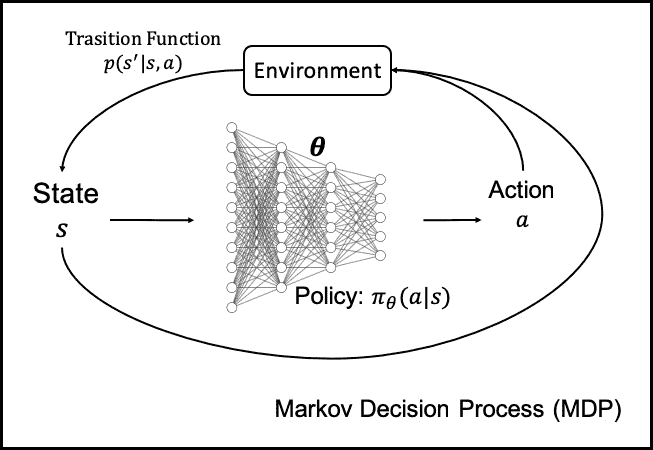

<!--yml

category: 未分类

日期：2024-09-06 20:05:40

-->

# [1907.09475] 深度强化学习在临床决策支持中的应用：简要综述

> 来源：[`ar5iv.labs.arxiv.org/html/1907.09475`](https://ar5iv.labs.arxiv.org/html/1907.09475)

\theorembodyfont\theoremheaderfont\theorempostheader

: \theoremsep

\jmlryear \jmlrworkshop

# 深度强化学习在临床决策支持中的应用：简要综述

\NameSiqi Liu \EmailE0272316@u.nus.edu

\addrNUS 集成科学与工程研究生院

新加坡国立大学

21 Lower Kent Ridge Rd    新加坡 119077    \NameKee Yuan Ngiam \Emailkee_yuan_ngiam@nuhs.edu.sg

\addr 普通外科系

国家大学医院

5 Lower Kent Ridge Rd    新加坡 119074    \NameMengling Feng \Emailephfm@nus.edu.sg

\addrSaw Swee Hock 公共卫生学院

新加坡国立大学

12 Science Drive 2    新加坡 117549

###### 摘要

由于近期人工智能，尤其是深度学习的进步，许多数据驱动的决策支持系统已被实施，以帮助医生提供个性化护理。本文重点关注深度强化学习（DRL）模型。DRL 模型在计算机视觉和游戏玩法（如围棋和 Atari 游戏）的任务中表现出了人类级别甚至更优的性能。然而，深度强化学习技术在临床决策优化中的应用仍然很少。我们在这里呈现了第一个综述，总结了在临床决策支持中使用深度神经网络（DNN）的强化学习算法。我们还讨论了一些案例研究，其中不同的 DRL 算法被应用于解决各种临床挑战。我们进一步比较和对比了各种 DRL 算法的优缺点，并提供了一个初步指南，说明如何为特定的临床应用选择合适的 DRL 算法。

## 1 引言

深度学习（深度神经网络）与强化学习技术的有效结合，名为深度强化学习（DRL），最初是为智能游戏玩法而发明的（Mnih et al., 2013; Silver et al., 2016），后来作为解决具有大规模、高维状态和动作空间的复杂控制问题的有效方法（Mnih et al., 2015）而出现。这些领域中深度强化学习的巨大应用依赖于对基础过程的知识（例如，游戏规则）。

在医疗保健领域，临床过程非常动态。做出临床决策的‘规则’通常不明确（Marik，2015）。例如，考虑以下临床决策问题：患者是否会从器官移植中受益；在什么条件下移植将成为更好的选择；移植后最好的药物和剂量是什么。这些问题的决策应依据个体患者的状况。为了找到这些问题的最佳决策，进行随机临床试验（RCTs）通常是选择。然而，在某些临床条件下，RCTs 可能是不切实际和不可行的。因此，从分析观察数据开始成为一种替代方案。随着数据收集的改进和 DRL 技术的发展，我们看到 DRL 基于的决策支持系统在优化治疗推荐方面具有巨大潜力。

#### 技术意义

本调查论文总结并讨论了已应用于临床决策支持的主要深度强化学习（DRL）算法类型。此外，我们还讨论了这些 DRL 算法的权衡和假设。本文旨在作为指南，帮助读者选择适合其特定临床应用的 DRL 模型。据我们所知，这是第一篇关于治疗推荐或临床决策支持的 DRL 调查论文。

#### 临床相关性

深度强化学习（DRL）已被证明能够在特定领域如视频游戏、棋盘游戏和自主控制中实现人类水平的复杂序列决策学习。然而，在医疗保健领域，DRL 尚未广泛应用于临床应用。本文对提供临床领域序列决策支持的主要 DRL 算法进行了调查。我们相信，通过从大量收集的电子健康记录（EHR）数据中学习，DRL 能够提取和总结优化新患者治疗所需的知识和经验。DRL 还具有通过自动探索各种治疗选项并估计其可能结果，扩展我们对当前临床系统的理解的潜力。

#### 结构

本文调查了 DRL 算法在临床决策支持中的应用案例。在第二部分，我们首先介绍了强化学习（RL）和深度强化学习（DRL）的基本概念。然后我们总结了主要的 DRL 算法类型。在第三部分，我们介绍了一些使用各种 DRL 算法的临床应用。在第四部分，我们讨论了如何在各种 DRL 算法中进行选择。最后，在第五部分，我们研究了使用 DRL 进行临床决策支持的挑战及其解决办法。

## 强化学习基础

强化学习（RL）（Sutton 等，1998）是一种目标导向的学习工具，其中代理或决策者通过与环境互动来学习优化长期奖励的策略。在每一步，RL 代理会收到关于其行动表现的评估反馈，从而改进后续行动的表现（Kiumarsi 等，2018）。从数学上讲，这一序列决策过程被称为马尔可夫决策过程（MDP）（Howard，1960）。

### 2.1 MDP 公式

马尔可夫决策过程由四个主要组件定义：

+   •

    状态空间$S$：在每个时间$t$，环境处于状态$s_{t}\in S$。

+   •

    行动空间$A$：在每个时间$t$，代理采取行动$a_{t}\in A$，这会影响下一个状态$s_{t+1}$。

+   •

    转移函数$P(s_{t+1}\>\lvert\>s_{t},a_{t})$：在给定当前状态和行动的情况下，下一状态的概率，表示代理与环境互动的方式。

+   •

    奖励函数$r(s_{t},a_{t})\in\mathbb{R}$：给定状态-行动对$(s_{t},a_{t})$的观察反馈。

在临床背景下，我们将一个代理视为临床医生。我们可以把状态视为患者的健康/状况。患者的状态可能依赖于其人口统计特征（如年龄、性别、民族等）、纵向和生理测量（如实验室检查、生命体征、医学影像报告等）以及其他一些临床特征。一个行动是临床医生对患者采取的治疗（如某种药物的处方、手术程序的安排等）。转移函数$P(s_{t+1}\>\lvert\>s_{t},a_{t})$可以视为患者自身的生物系统，即在当前健康状况和干预下，患者将进入下一个时间步骤$s_{t+1}$。如果健康状况有所改善，我们会给代理分配奖励；如果患者的状况在干预后变差或停滞不前，我们会惩罚代理。

强化学习代理的目标（Sutton 和 Barto，2018）被定义为沿着轨迹$\tau$的期望总奖励，该轨迹遵循分布$p(\tau)$，即从状态到行动的映射$\pi(a\>\lvert\>s)$，最大化期望的累计奖励。

|  | $\pi^{*}=arg\max\underbrace{E_{\tau\sim p(\tau)}[\sum\limits_{t}\gamma^{t}r(s_{t},a_{t})]}\limits_{J}$ |  | (1) |
| --- | --- | --- | --- |

其中$p(\tau)$是状态-行动轨迹上的概率分布，$\gamma$是折扣因子。

在方程（1）中记作$J$的期望长期奖励是我们希望根据策略$\pi(a\>\lvert\>s)$最大化的目标。最优策略$\pi^{*}$是最大化目标$J$的策略。

为了评估状态或行动的‘好’或‘坏’，我们在方程（2）和（3）中分别定义了 Q 函数和价值函数。

|  | $Q^{\pi}(s_{t},a_{t})=\sum_{t^{\prime}=t}^{T}E_{\pi}[r(s_{t^{\prime}},a_{t^{\prime}})\>\lvert\>s_{t},a_{t}]$ |  | (2) |
| --- | --- | --- | --- |
|  | $V^{\pi}(s_{t})=E_{a_{t}\sim\pi(a_{t},s_{t})}[Q^{\pi}(s_{t},a_{t})]$ |  | (3) |

Q 函数 $Q^{\pi}(s_{t},a_{t})$ 是在给定当前状态-动作对 $(s_{t},a_{t})$ 的条件下，累计奖励的期望，而价值 $V^{\pi}(s_{t})$ 是在 $(s_{t},a_{t})$ 处的 Q 值的期望，并根据策略 $\pi$ 采取动作 $a_{t}$。

如果我们知道环境中所有可能状态和动作的实际 Q 函数或价值函数，从方程（1）中推导出一个最优策略 $\pi^{*}$ 将变得很简单。在每个状态 $s_{t}$ 下，智能体将选择一个能最大化 Q 函数或价值函数的动作。

### 2.2 深度强化学习

深度强化学习（DRL）采用深度神经网络（DNN）（Cireşan et al., 2012）来替代传统 RL 中的 $Q(s_{t},a_{t})$、$V(s_{t})$ 或 $\pi$ 的表格表示。对于状态数量众多的复杂环境，表格表示由于存储规模大和计算要求高（维度诅咒）而不可行。

不同的 DRL 算法以不同方式使用 DNN。例如，在策略梯度 RL（Sutton et al., 2000）中，DNN 可以用来优化策略 $\pi(\theta)$，其中 $\theta$ 是 DNN 中的参数（权重）。DNN 的输入是当前状态，输出是一个动作。通过对 DNN 进行梯度计算，在每个时间步，DNN 中的参数 $\theta$ 会被更新，从而改进策略。

在基于价值的 RL（Kaelbling et al., 1996）中，DNN 可以用来逼近价值函数或 Q 函数。对于价值函数，DNN 以当前状态 $(s_{t})$ 作为输入，输出是给定策略 $\pi$ 的逼近值 $\hat{V}^{\pi}(s_{t})$。而对于 Q 函数的逼近，DNN 以状态-动作对 $(s_{t},a_{t})$ 作为输入，输出是 $\hat{Q}_{\phi}(s_{t},a_{t})$ 值，其中 $\phi$ 是价值基于 RL 的 DNN 中的参数。在基于模型的 RL（Doya et al., 2002）中，DNN 用于逼近转移函数 $p_{\phi}(s_{t+1}\>\lvert\>s_{t},a_{t})$。

我们将在第 2.4 节详细讨论不同深度强化学习（DRL）的架构。为了更清楚地理解 DRL，首先我们将讨论 RL 算法中的关键步骤，然后介绍主要的 RL 算法类型，包括策略梯度 RL、基于价值的 RL、演员-评论家 RL（Grondman et al., 2012）、基于模型的 RL 以及一些其他 RL 算法的扩展。（从现在开始，我们讨论的所有 RL 算法均指具有深度神经网络（DNN）架构的 RL（DRL）。我们将‘RL’和‘DRL’交替使用，两者都指深度 RL。）

### 2.3 强化学习中的关键步骤

大多数强化学习（RL）算法可以分解为 3 个步骤：

步骤 1\. 样本收集

步骤 2\. 评估目标

第 3 步。改进策略

我们以策略梯度 RL 为例。在第 1 步中，RL 算法与环境互动，并通过遵循一个未经学习的策略生成样本（状态-动作对）（初始化可以是随机的）。这些状态-动作对是顺序的，形成一个轨迹$\tau$。RL 算法可以在第 1 步中生成多个轨迹。在下一步中，RL 算法将尝试通过计算目标函数$J$（累计奖励）来评估这些收集到的轨迹的好坏。然后在第 3 步中，RL 算法将通过增加访问那些高奖励轨迹的机会和减少访问低奖励轨迹的机会来尝试最大化目标$J$，这称为策略更新。然后，代理将返回第 1 步，根据更新后的策略生成新的样本，并重复第 2 步和第 3 步来更新策略。通过这种方式，策略通过‘试错法’随着时间的推移得到改进。

大多数 RL 算法遵循这种三步结构，但这三步在不同的 RL 算法中并不是同等重要的。因此，哪个 RL 算法最适合某个应用是一个依赖于上下文的问题。我们将在第四部分中更详细地讨论这个问题。目前，让我们简要了解这三步的成本。在第 1 步，如果我们从真实的物理系统中收集数据样本，那么数据生成将是昂贵的，因为数据收集是实时进行的。相反，如果我们使用模拟器生成样本，比如那些在 Atari 游戏中（Mnih et al., 2013），那么样本更容易获得，在这种情况下，第 1 步可能不会成为问题。

对于第 2 步，如果应用使用策略梯度来改进策略，其中策略可以通过试错法改进，那么目标$J$将是这些试验中的几个奖励的总和。然而，对于基于模型的 RL，如果模型使用 DNN 进行拟合，那么拟合模型将很昂贵，我们需要确保拟合的模型收敛且接近实际模型。

在第 3 步，策略梯度 RL 只需计算梯度并将其应用于策略，这仍然相对简单。然而，对于使用 DNN 的基于模型的 RL，我们需要对大量时间步骤进行反向传播，以改进策略。

当涉及到现实世界应用，尤其是在临床应用中，数据生成往往是一个大问题，因为它是实时的，许多观察数据（来自电子健康记录）是私密的，我们无法轻易获取。我们也不希望通过试错法来估计值，因为这通常是不道德且成本高昂的。因此，当我们选择 RL 算法时，需要注意这些限制。

在本文中，我们将首先讨论应用于临床决策支持的主要类型的强化学习（RL）算法，同时仅简要介绍一种在临床应用中很少使用的 RL 算法。我们还将探讨为何某些特定算法在医疗领域中相比其他算法不那么“流行”的根本原因。

### 2.4 强化学习算法的类型

#### 策略梯度强化学习

在第 2.3 节中，我们讨论了通用 RL 算法的三步结构。策略梯度 RL 遵循这一三步结构。在第一步中，策略梯度 RL 首先将随机策略$\pi(\theta)$应用于环境中，并在该策略下生成轨迹。环境是一个转移函数，在此设置中无需具体指定。因为我们不希望在策略梯度 RL 中学习确切的转移函数。经过几次试验后，我们收集了一组轨迹，然后进入第二步评估奖励$J(\theta)$。它可以通过从第一步中收集的轨迹样本来近似。$J(\theta)\approx\frac{1}{N}\sum\limits_{i}\sum\limits_{t}r(s_{i,t},a_{i,t})$ 在第三步中，我们对期望的长期奖励$J(\theta)$应用梯度并更新策略$\pi_{\theta}$，其中新的$\theta^{\prime}$设置为$\theta+\alpha\nabla_{\theta}J(\theta)$。然后，我们需要在第一步中从更新后的策略$\theta^{\prime}$中抽样新的状态-动作对，并逐步进行策略优化。我们称之为 on-policy（Krstic 等，1995），因为每次策略发生变化时，我们都需要在新策略下采样新数据。与 on-policy 相对，off-policy 适用于我们可以在不从策略生成新样本的情况下改进策略。因此，策略梯度 RL 是一种 on-policy RL 算法。

在策略梯度 RL 中，第 3 步使用深度神经网络（DNN）构建策略，其中 DNN 的输入是状态，输出是动作。图 1 是策略梯度 RL 的 MDP 图。通过对$J(\theta)$进行梯度更新 DNN 中的权重，策略得以相应学习。在临床背景下，策略梯度 RL 相比其他 RL 算法不那么“流行”。其根本原因可能在于它是一种 on-policy 算法，需要基于新策略迭代地收集数据。该算法通过“试错法”进行学习。大多数临床应用无法承受收集实时临床数据的成本。例如，为了学习针对脓毒症患者的最佳药物剂量临床决策，进行试错法既不符合伦理，也非常耗时。然而，策略梯度 RL 在其他领域仍然很受欢迎，比如机器人控制和计算机棋盘游戏，在这些领域中，环境是可以承担试错法的模拟器。

图 1：策略梯度 RL 算法的 MDP

#### 基于值的强化学习

基于值的 RL 尝试估计某一状态和动作的值函数或 Q 函数。方程 (2) 中的 Q 函数也被称为贝尔曼方程。基于值的 RL 尝试使用 DNN 在第 2 步中从条件累积奖励来评估值函数 $V^{\pi}(s_{t})$ 或 Q 函数 $Q^{\pi}(s_{t},a_{t})$。对于值函数，DNN 的输入是状态 $s_{t}$，输出是 $V^{\pi}(s_{t})$；对于 Q 函数，DNN 的输入是状态-动作对 $(s_{t},a_{t})$，输出是 $Q^{\pi}(s_{t},a_{t})$。DNN 的训练目标是优化均方误差 (MSE)，表示为 $L(\phi)=\frac{1}{2}\left\lVert\hat{V}_{\phi}^{\pi}(s_{t})-y_{t+1}\right\rVert^{2}$，其中 $y_{t+1}$ 被称为目标值。值函数的 $y_{t+1}=\max\limits_{a_{t+1}}\gamma Q^{\pi}(s_{t+1},a_{t+1})$，而 Q 函数的 $y_{t+1}=r(s_{t},a_{t})+\gamma\max\limits_{a_{t+1}}Q^{\pi}(s_{t+1},a_{t+1})$。这项优化可以使用深度学习中的各种梯度下降方法来完成，例如随机梯度下降 (SGD)（Bottou, 2010）。因此，DNN 被实现于 RL 算法的第 2 步，因为它评估了由 Q 函数或值函数估计的目标 $J(\theta)$。在第 3 步中，基于值的 RL 仅在从 $\pi^{\prime}$ 采取的动作导致 Q 函数最大值时更新策略 $\pi$ 为 $\pi^{\prime}$。

|  | $\pi^{\prime}(a_{t},s_{t})=\begin{cases}1,&amp;\text{如果 }a_{t}=arg\max_{a_{t}}Q^{\pi}(s_{t},a_{t}),\\ 0,&amp;\text{否则}\end{cases}$ |  | (4) |
| --- | --- | --- | --- |

这两种算法分别被称为 Fitted Value Iteration (FVI)（Munos 和 Szepesvári, 2008）和 Fitted Q Iteration (FQI)（Riedmiller, 2005）。FQI 的一个特殊情况被称为 Q-learning（Watkins 和 Dayan, 1992），在第 1 步中我们仅使用一个样本元组 $(s_{t},a_{t},s_{t+1},r_{t})$ 来进行 Q 函数的近似。我们使用一步梯度更新来更新参数，然后返回第 1 步以收集一个新的样本元组并迭代优化。术语“Q-learning”在某些文献中也有时指一般的基于值的 RL（Arulkumaran et al., 2017）。

FVI、FQI 和 Q-learning 对于离策略样本表现良好，并且不像策略梯度 RL 那样具有高方差（Arulkumaran et al., 2017）。然而，其限制在于它们通常不能在非线性函数逼近（如 DNN）中收敛。此外，从 Q-learning 收集的样本是时间序列的，因此样本高度相关（Arulkumaran et al., 2017）。这样网络可能仅找到局部最优解。Q-learning 的另一个问题是其目标值 $y_{t+1}$ 是通过一个样本元组来估计的，并且需要进行多次一步估计。这使得目标值非常不稳定。

Lin (1992) 使用一种名为“重放缓冲区”的新组件来缓解样本高度相关的问题，并结合 Q-learning。带有重放缓冲区的 Q-learning 会从缓冲区中抽取一批元组 $(s_{t},a_{t},s_{t+1},r_{t})$，利用这一批数据进行一次梯度更新参数，然后返回缓冲区收集另一批元组。这样，样本之间不再相关，批次中的多个样本也确保了低梯度方差。为了缓解目标值不稳定的问题，Mnih 等人 (2016) 引入了“目标网络”，在这种方法中，目标值 $y_{t+1}$ 由一个固定值估计，只有在经过几次学习迭代后才会更新。将“重放缓冲区”和“目标网络”这两个组件与 Q-learning 结合，Mnih 等人 (2015) 定义了一种新的强化学习算法 Deep Q-Network (DQN)。

然而，DQN 也并非完美。它与 Q-learning 存在相同的限制，即经常高估 Q 函数 (Thrun and Schwartz, 1993)。这种高估是由于估计目标值函数 $y_{t+1}=r(s_{t},a_{t})+\gamma\max\limits_{a_{t+1}}Q^{\pi}(s_{t+1},a_{t+1})$ 中的 ‘$\max$’ 项，该项在数据收集过程中受噪声影响 (van Hasselt, 2011)。一种可能的解决方法是使用 Double Q-Learning (Double DQN)，其中 (Hasselt, 2010) 实现了两个 DNN 来学习两个 Q 函数。他们使用其中一个来评估 Q 值，并让另一个选择动作。使用两个 Q 函数的目标是去相关化动作和 Q 函数中的噪声。

基于值的强化学习通常应用于临床应用中，我们将在第三部分“临床应用”中看到更多例子。

#### Actor-Critic 强化学习

Actor-critic RL（Heess 等，2015）是策略梯度 RL 和基于价值的 RL 的结合。在第一步，我们从策略中采样状态-动作对，就像策略梯度 RL 中那样，但这次，状态-动作对是由根据策略 $\pi_{\theta}$ 行动的 DNN（actor）生成的。然后，在第二步，我们用另一个 DNN（critic）拟合值 $\hat{V}_{\phi}^{\pi}(s_{t})=\sum_{i=t}^{T}E_{\pi_{\theta}}[r(s_{i},a_{i})\>\lvert\>s_{t}]$，DNN 的输入是状态 s，输出是 $\hat{V}^{\pi}(s)$。我们评估一个新的术语’advantage’（Baird III，1993; Harmon 和 Baird III，1996）$\hat{A}^{\pi}(s_{i},a_{i})$，其定义为 $\hat{A}^{\pi}(s_{i},a_{i})=r(s_{i},a_{i})+\hat{V}_{\phi}^{\pi}(s^{\prime})-\hat{V}_{\phi}^{\pi}(s)$，其中 $\hat{V}_{\phi}^{\pi}(s^{\prime})$ 是下一个状态 $s^{\prime}$ 的估计值。优势函数告诉我们，根据估计的价值函数，该动作比状态中的平均动作好多少。然后，在第三步，我们沿着轨迹计算累积优势 $\hat{A}^{\pi}(s_{i},a_{i})$ 的梯度，并更新 actor DNN 中的 $\theta$ 以学习更好的策略。critic DNN 可以通过监督回归优化，$L(\phi)=\frac{1}{2}\left\lVert\hat{V}_{\phi}^{\pi}(s_{t})-y_{t}\right\rVert^{2}$，其中 $y_{t}$ 可以通过沿轨迹的蒙特卡洛奖励估计，也可以通过自举方法估计。Actor-critic RL 是一种离策略算法，但替代版本也可以是在线策略算法。唯一的区别是在第一步中，不是收集一批轨迹，而是仅收集一个轨迹并更新策略以从更新的策略生成新样本。同样，在线策略不适合在实时临床应用中实现；因此，本文讨论的应用之一（Wang 等，2018）利用了离策略 actor-critic RL 算法。

#### 基于模型的强化学习

上述讨论的所有强化学习算法都是无模型强化学习，在无模型强化学习中，我们假设我们不知道确切的转移函数 $p(s_{t+1}\>\lvert\>s_{t},a_{t})$。因此，给定当前的状态和动作对，我们不知道真实的下一个状态是什么。无模型强化学习并不试图显式地学习转移函数，而是通过从环境中采样来绕过它。了解正确的转移函数或环境总是有帮助的。此外，在某些情况下，我们确实知道转移函数，例如在设计我们自己规则的简单棋盘游戏中。在临床应用中，大多数情况下我们不确定确切的转移函数，但我们对环境的动态有一定了解。例如，临床医生通常知道，在用适当药物剂量治疗生病的患者后，患者将逐渐从生病状态恢复到健康状态。即使我们不了解环境的全貌，我们仍然可以提出若干模型来估计真实的转移函数（环境）并从中进行优化。这被称为基于模型的强化学习（Doya 等， 2002）。我们可以使用各种模型来估计转移函数，例如高斯过程（GP）（Deisenroth 和 Rasmussen， 2011；Rasmussen， 2003），深度神经网络（DNN），高斯混合模型（GMM）（Chernova 和 Veloso， 2007）等。使用 DNN 的基于模型的强化学习中，DNN 的输入是状态-动作对 $(s_{t},a_{t})$，输出是 $s_{t+1}$。DNN 在步骤 2 中用于转移函数。与 DNN 作为环境模型不同，GP 在数据效率方面非常高。GP 可以使用少量数据样本产生相当不错的下一个状态预测。这在临床背景下非常有用，因为大多数临床应用都面临数据不足的问题。然而，GP 的限制在于，当实际转移函数不平滑时，它会遇到问题。此外，当样本数量庞大且维度较高时，GP 可能会很慢。与 DNN 相反，DNN 在样本数量增加时，预测通常更准确。因此，在临床背景下，当输入状态是医学图像（非常高维）时，DNN 将比 GP 更适合基于模型的强化学习。

#### 强化学习的其他扩展

+   •

    层次化强化学习

    当学习任务非常庞大，并且我们在 RL 中看到了几个不同的状态-动作空间以及几个次优策略时，将子空间进行排序并尝试获取全局空间的最佳策略是直观的。层次化 RL（Kulkarni 等，2016）通常包含一个两层结构。较低层级就像我们在一般 RL 算法中训练的策略，尝试在给定 $(s_{t},a_{t})$ 的情况下建议一个动作。同时，存在一个较高层级网络，其中“元策略”训练以选择在整个轨迹上应用这些较低层级策略中的哪一个。与随机初始化的策略相比，层次化 RL 具有更快学习全局最优策略的优势，并且能够将从过去任务中学到的知识从较低层级策略中转移。在临床环境中，由于人际互动的复杂行为，状态-动作空间可能非常庞大。因此，将层次化 RL 应用于临床应用是一个非常自然的选择。然而，层次化 RL 的架构更复杂，训练起来更困难，不恰当的迁移学习可能会导致“负迁移”（Pan 和 Yang，2010），即最终策略未必比较低层级策略更优。

+   •

    递归强化学习

    马尔可夫决策过程的一个基本限制假设是马尔可夫性质（MDP 的完全观测），这一点在实际问题中很少得到满足。在医学应用中，患者的完整临床状态不太可能被测量。这被称为部分可观测马尔可夫决策过程（POMDP）问题（Kaelbling 等，1998）。一个 POMDP 具有一个 4 元组 $(S,A,R,O)$，其中 $O$ 是观测值。经典 DQN 只有在观测值能够反映潜在状态时才有用。（Hausknecht 和 Stone，2015）。Hausknecht 和 Stone (2015) 提出了对 DQN 网络的扩展，以解决 POMDP 问题，其中 DQN 的第一个全连接层被长短期记忆（LSTM）（Hochreiter 和 Schmidhuber，1997）替代。这种新的 RL 算法称为深度递归 Q 网络（DRQN）（Hausknecht 和 Stone，2015）。他们的算法表明，DRQN 能够成功地通过时间整合信息，并能够在 POMDP 设置下复制 DQN 在标准 Atari 游戏中的表现。

+   •

    逆强化学习

    为了学习大多数标准 RL 算法在临床应用中的用法，我们通常需要手动设计奖励函数，但我们不知道真正的奖励是什么。这种奖励设计非常脆弱，如果设计错误则会受到影响。逆向 RL 是一种可以从专家演示中推断正确奖励函数的算法，无需手动编程奖励（Ghavamzadeh et al., 2015; Abbeel and Ng, 2004; Ng et al., 2000）。与逆向 RL 的替代方法是直接从专家的行为中学习，这通常称为模仿学习（Schaal, 1999）。然而，模仿学习的一个限制是专家可能具有不同的能力，并且可能不完美（Wang et al., 2018）；从专家那里学习可能只会导致次优策略。因此，在逆向 RL 中，我们通常给定状态-动作空间和动态模型中的次优策略。逆向 RL 的目标是恢复正确的奖励函数。然后，我们可以使用学习到的奖励函数来获得比次优策略更好的新策略。奖励可以通过 DNN 进行学习，其中输入是由次优策略$\pi^{\#}$生成的状态-动作对$(s,a)$，然后 DNN 的输出是奖励$r_{\Phi}(s,a)$，其中$\Phi$是通过反向传播学习的 DNN 参数。之后，我们获得$r_{\Phi}(s,a)$后，可以使用新的奖励函数来规划更好的策略，希望得到最终的最优策略$\pi^{*}$。在临床背景下，理解临床医生试图实现的目标和他们认为重要的内容是至关重要的。

## 3 临床应用中的深度强化学习

最近的研究（Prasad et al., 2017; Nemati et al., 2016; Tseng et al., 2017）已证明，DRL 可以用于为各种应用提供治疗建议和临床决策支持，这些应用涉及不同类型的数据来源，包括电子健康记录、在线疾病数据库和基因数据等。应用包括药物/液体选择、急性或慢性病患者的剂量、机械通气的设置和持续时间，以及从临床记录中构建临床模式。表 1 总结了本调查中讨论的所有临床应用论文，特别强调了 DRL 方法的不同子类型和不同的临床问题。如前面所讨论的，策略梯度 RL 是一种在线算法，不适合大多数临床应用。因此，基于价值的 RL 算法在临床应用中更为流行。

在本节中的每个应用中，我们将调查作者使用了哪些强化学习（RL）算法、基于上下文的马尔可夫决策过程（MDP） $(S,A,R)$ 的构建方式，以及最终的 RL 性能。我们首先讨论使用基于价值的 RL 的应用，其次是演员-评论员 RL、基于模型的 RL、层次 RL、递归 RL，最后是逆向 RL。对于基于价值的 RL，我们进一步根据基于价值的 RL 算法的子类型进行分类，这些子类型包括 Fitted Q Iteration、DQN 和双重 DQN。

### 3.1 基于价值的强化学习

Fitted Q Iteration

机械通气的撤离

在重症监护病房（ICU）中从机械通气（MV）撤离患者通常是随意且效率低下的。在这方面，Prasad 等人（2017）使用了一个离线 Fitted Q Iteration (FQI) 算法来确定 MV 管理的 ICU 策略，他们的目标是开发一个决策支持工具，可以利用数据丰富的 ICU 环境中的可用患者信息，提醒临床医生患者何时准备好开始撤离，并推荐个性化的治疗方案。他们使用了 MIMIC-III 数据库，提取了 8182 名独特成人患者中进行超过 24 小时侵入性通气的 8860 次入院记录。

他们包括了患者的人口统计特征、既往病史、共病情况和随时间变化的生命体征。他们使用高斯过程（GP）对实验室测量数据和生命体征进行预处理，以填补缺失值；这可以确保更精确的政策估计。状态 $s_{t}$ 是一个 32 维的特征向量。动作被设计为一个二维向量，其中第一个维度表示开/关机械通气，第二个维度表示四种不同的镇静剂量级别。每个状态的奖励 $r_{t}$ 包括了通气时间和生理稳定性，奖励会因生命体征稳定和成功拔管而增加，但会因不良事件（如再插管）和额外的通气小时而受到惩罚。与宾夕法尼亚大学医院（HUP）实施的实际政策相比，他们学习的政策与实际政策吻合了 85%。

ICU 中的最佳肝素剂量

不当使用某些药物可能会因不必要地延长住院时间而增加成本，并使患者面临风险。未分级肝素（UH）就是一个例子，过量使用会增加出血风险，而用量不足则会增加血栓形成的风险。鉴于临床治疗的顺序特性，RL 特别适合药物剂量问题。Nemati 等人（2016）训练了一个 RL 药物剂量代理，以学习一种剂量策略，最大化患者在其治疗性活化部分凝血酮时间（aPTT）范围内的整体时间比例。他们使用了 MIMIC-II 数据库，提取了 4470 名在 ICU 住院期间某个时点接受静脉肝素输注的患者，时间窗口为 48 小时。变量包括人口统计学信息、实验室测量和严重程度评分（格拉斯哥昏迷评分（GCS）、每日顺序器官衰竭评估（SOFA）评分）。使用特征构建了状态，并由判别隐马尔可夫模型（DHMM）（Kapadia，1998）进行估计。离散动作是使用来自六个分位区间的离散肝素值，奖励则根据 aPPT 反馈设计。根据反馈，决定增加、减少或维持肝素剂量，直到下次 aPTT 测量。 $r_{t}=\frac{2}{1+e^{-(aPTT_{t}-60)}}-\frac{2}{1+e^{-(aPTT_{t}-100)}}-1$。这个函数在患者的 aPTT 值在治疗窗口内时分配了最大奖励 1，随着距离治疗窗口的增加，奖励迅速减少到最小值-1。

最优策略的性能通过比较临床医生和训练的 RL 代理的累计奖励来测试。平均而言，并且随着时间的推移，RL 算法通过遵循代理的建议获得了最佳的长期表现。

深度 Q 网络

从自由临床文本中提取临床概念

从自由临床文本中提取相关的临床概念是诊断推理的关键第一步。Ling 等人 (2017) 提出使用 DQN 从外部证据中学习临床概念（维基百科：体征和症状部分和 MayoClinic：症状部分）。他们使用了 TREC CDS 数据集（Simpson 等，2014）来进行实验。该数据集包含 30 个主题，每个主题都是描述患者情况和诊断的医学自由文本。MetaMap(Aronson，2006) 从 TREC CD5 和外部文章中提取临床概念。状态包含两个向量：当前的临床概念以及来自外部文章的候选概念：两个向量之间的相似性越高，状态值越高。动作空间是离散的，包括接受或拒绝候选概念的动作。奖励设计的方式是当候选概念比当前概念对于患者的诊断更相关时，奖励较高。DQN 被训练来优化奖励函数，该函数度量候选临床概念的准确性。他们在 TREC CDS 数据集上的初步实验证明了 DQN 在各种非强化学习基线上的有效性。

症状检查 1.0

为了方便自诊断，Tang 等人 (2016) 提出了症状检查系统。症状检查程序首先询问有关患者状况的一系列问题。然后，患者会根据问题提供一系列答案。然后，症状检查程序尝试根据问答结果进行诊断。Tang 等人提出了一个基于 RL 的集成模型来训练这个症状检查程序。他们实现了 11 个 DQN 模型，每个模型代表人体的一个解剖部位，如头部、颈部、手臂等。这些模型彼此独立地进行训练。对于每个解剖模型，状态 s 被根据症状进行 one-hot 编码（即，如果症状是头痛，则只有表示头部的解剖模型具有 $s=1$，其他模型具有 $s=0$）。动作是离散的，有两种类型：查询和诊断。如果最大的 Q 值对应于查询动作，症状检查程序将继续询问下一个问题。如果最大的 Q 值对应于诊断动作，则症状检查程序将给出一个诊断并终止。奖励被设计为一个标量。当代理能够在有限的查询次数内正确预测出疾病时，代理将获得奖励。他们在一个模拟疾病数据集上应用了 DQN 算法，结果显示症状检查程序可以模仿医生进行询问和诊断的行为。

Double DQN

脓毒症治疗 1.0

Raghu 等人 (2017) 是最早直接讨论将深度强化学习（DRL）应用于医疗保健问题的研究之一。他们使用了 MIMIC-III 数据集的脓毒症子集，并选择将动作空间定义为包括血管收缩药和静脉液体。他们将药物剂量分为四个不同的区间，每个区间包含不同数量的药物。在实际应用中，Q 值经常被高估，导致预测不准确和策略不佳。因此，作者通过双重 DQN（Wang 等人，2015）解决了这一问题。他们还采用了对决深度 Q 网络，以将价值流和优势流分开，其中价值表示当前状态的质量，优势表示所选动作的质量。奖励函数是以 SOFA 评分为临床动机的，该评分用于衡量器官衰竭。他们证明，通过使用连续状态空间建模，所找到的策略能够将医院患者的死亡率降低 1.8% 到 3.6%。

### 3.2 行为者-评论家强化学习

ICU 中的最佳医疗处方

Wang 等人 (2018) 采用了行为者-评论家强化学习算法，以寻找针对各种疾病患者的最佳医疗处方。他们在 MIMIC-III 数据库上进行了实验，提取了 22,865 次住院记录。用于状态构建的特征包括人口统计数据、生命体征、实验室结果等。动作空间为 180 个不同的 ATC 代码。Wang 等人不仅仅实现了经典的行为者-评论家强化学习。相反，他们将强化学习（RL）与监督学习（SL）相结合，应用于行为者网络。目标函数 $J(\theta)$ 被评估为 RL 和 SL 目标函数的线性组合，公式为：$J(\theta)=(1-\epsilon)J_{RL}(\theta)+\epsilon(-J_{SL}(\theta))$，其中 $\epsilon$ 是一个范围从 0 到 1 的超参数，用于平衡 RL 和 SL。$J_{RL}(\theta)$ 是行为者网络中的目标函数，而 $J_{SL}(\theta)$ 被评估为预测治疗与医生给出的处方之间的交叉熵损失。

他们对行为者网络中的目标函数关于 $\theta$ 进行了梯度上升，并尝试了不同的 $\epsilon$ 值以平衡 RL 和 SL。此外，他们还引入了 LSTM 网络，以改善部分观测的 MDP（POMDP）中的性能。状态 $s$ 被替换为通过 $c_{t}=f(o_{1},o_{2},\dots,o_{t})$ 总结整个历史观察，$c_{t}$ 被用作行为者和评论家网络的状态。他们的实验表明，所提出的网络可以自动检测出良好的药物治疗。

### 3.3 基于模型的强化学习

肺癌的放射剂量分割

Tseng 等人 (2017) 实施了基于模型的强化学习（RL）来训练用于接受肺癌放疗的患者的剂量递增策略。他们在 RL 设计中包括了 114 名患者，并首先训练了一个深度神经网络（DNN）来估计过渡函数 $p(s_{t+1}\>\lvert\>s_{t},a_{t})$。DNN 模型的损失函数旨在最小化从估计轨迹中得到的 Q 值期望与观察值之间的差异。在过渡函数构建完成后，Tseng 等人应用了深度 Q 网络（DQN）来学习一种最优策略，用于在胸部照射中权衡局部控制（LC）和放射性肺炎（RP）的风险。网络的奖励设计为在鼓励改进 LC 和抑制 RP 之间进行权衡。DQN 的状态定义为 9 个特征的组合，包括细胞因子、PET 放射组学和剂量特征。动作被设计为每次分割的剂量。

由于构建过渡函数需要大量数据，作者在 DNN 中实施了丢弃技术以避免过拟合。此外，作者还实现了生成对抗网络（GAN）（Goodfellow 等人，2014）来模拟更多数据以缓解数据不足的问题。来自 GAN 的模拟数据也被输入到过渡函数 DNN 进行训练。所提出的（基于模型的 RL）网络显示出有希望的结果，能够建议与临床医生类似的治疗剂量。

### 3.4 层次化强化学习

症状检查 2.0

Kao 等人 (2018) 的研究主要思想是模仿一组具有不同专长的医生共同诊断患者。由于患者每次只能接受一个医生的询问，因此需要一个元策略来轮流指派医生向患者进行询问。这个元策略来自于一个更高层级的网络。在每一步中，元策略负责指派一个解剖部位模型进行症状询问以预测疾病。

在 Kao 等人的论文中，第一级层次是一个主代理 M。主代理 M 拥有其行动空间 $A_{M}$ 和策略 $\pi_{M}$。在这一层级中，行动空间 $A_{M}$ 等于解剖部位集合 $P$。在第 t 步，主代理进入状态 $s_{t}$，并根据其策略 $\pi_{M}$ 从 $A_{M}$ 中选择一个行动 $a_{M_{t}}$。第二层级由解剖模型 $m_{p}$ 组成。如果主代理执行了 $a^{M}$，任务将委托给解剖模型 $m_{p}=m_{a^{M}}$。一旦选择了模型 $m_{p}$，则根据模型 $m_{p}$ 的策略 $\pi_{m_{p}}$ 执行实际行动 $a_{t}\in A$。

基于这一结构，Kao 等人训练了一个在线症状检查器，使用来自 SymCAT 症状疾病数据库的模拟数据进行健康相关疾病的自我诊断。这是 Symptom Checking 1.0 的改进版本，其中 Kao 等人在 Symptom Checking 1.0 中的解剖模型之上添加了另一个 DQN 层作为主智能体。解剖模型和主模型都使用 DQN 来选择最大化 Q 值的动作。他们的结果显示，提出的层次强化学习算法显著提高了症状检查的准确性，相较于传统系统。

### 3.5 递归强化学习

脓毒症治疗 2.0

Futoma 等人 (2018) 提出了对 DRQN 架构的新扩展，使用多输出高斯过程来训练智能体学习针对脓毒症患者的最佳治疗方法。他们从杜克大学健康系统的私人数据库中收集了 9,255 名脓毒症患者的数据及其 165 个特征（包括人口统计数据、长期生理变量、药物等），并进行了 30 天的跟踪。动作是离散值，包括 3 种常见的脓毒症治疗：抗生素、血管加压药和静脉输液。奖励被稀疏编码。在每个非终止时间点的奖励为 0\。如果患者生存，轨迹结束时奖励为 +10；如果患者死亡，则奖励为 -10。他们研究了在 DQN 架构中用 LSTM 层替代全连接神经网络层的效果。优化的脓毒症治疗策略可以将患者的死亡率从整体基线死亡率 13.3% 降低多达 8.2%。

### 3.6 逆强化学习

糖尿病治疗

在之前的论文中，奖励函数是通过启发式方法进行近似的。然而，奖励函数的适用性无法得到验证。在近期的强化学习（RL）研究中，逆向 RL 被提议用于从专家的行为数据中估计奖励函数。有一些论文关注逆向 RL（Ng 等，2000；Abbeel 和 Ng，2004）。然而，据我们所知，还没有论文实现基于 DNN 的逆向 RL 算法用于临床决策支持。对于非 DNN 基础的逆向 RL，Asoh 等（2013）在贝叶斯框架中实现了逆向 RL，并使用马尔可夫链蒙特卡洛采样（Ghavamzadeh 等，2015）来学习临床背景中的奖励函数。他们应用逆向 RL 学习糖尿病治疗的奖励函数，使用了均匀先验。药物处方数据与东京大学医院保持私密。状态是离散的，并定义为糖尿病的严重程度（‘正常’，‘中等’，‘严重’）。他们使用 MCMC 采样，并为 3 个状态推导了奖励$r=(0.01,0.98,0.01)$。奖励表明‘中等’级别的糖尿病患者具有最高的价值。这似乎与当前临床理解相矛盾，因为奖励应该对‘正常’级别的糖尿病患者具有最高的价值。Asoh 等解释说，他们数据库中的 65%的糖尿病患者已经处于‘中等’状态。因此，将患者保持在‘中等’状态可能是临床医生的最佳努力。

尽管逆向强化学习（Inverse RL）在临床应用中实施的案例非常少，但我们相信逆向 RL 是一个有价值的主题，它将有利于临床环境中的应用。我们不仅通过模仿专家的行为来优化策略，而且我们也非常希望训练策略，使其能够自动识别临床医生认为重要的治疗方法。

## 4 如何在强化学习算法中进行选择

对这个问题没有唯一的答案。RL 算法的选择将取决于实际应用。以下是需要考虑的权衡和假设列表：

**Sample efficiency**（样本效率）: **Sample efficiency** 指的是算法收敛所需的样本数量。如果算法是在线策略的，比如策略梯度 RL，那么它需要更多的样本。相比之下，基于价值的 RL 和基于模型的 RL 是离线策略算法，因此需要较少的样本进行训练。演员-评论家 RL 算法介于基于价值的 RL 和策略梯度 RL 之间。鉴于不同的样本效率，这并不意味着我们总是应选择所需样本较少的算法。对于样本易于生成的特定应用（即，症状检查器 1.0 使用模拟器生成数据），模型训练的实际时间可能比所需样本数量更为重要。在这种情况下，在线策略 RL 算法可能更受青睐，因为它们通常比离线策略 RL 算法更快收敛。

**Convergence**（收敛性）: 策略梯度对目标函数执行梯度上升，并且保证收敛。基于价值的 RL 最小化“Bellman error”（贝尔曼误差），但在最坏情况下，在非线性情况下并不保证收敛到任何结果。而对于基于模型的 RL 算法，模型最小化拟合误差，模型是保证收敛的。然而，更好的模型并不等于更好的策略。

** episodic / infinite horizon**: **episodic**（阶段性）意味着状态-动作轨迹有一个结束点。例如，在疾病症状检查应用中，代理会持续搜索症状，当代理找到疾病时，一集就结束了。**episodic** 通常由策略梯度方法假设，也由一些基于模型的 RL 方法假设。**infinite horizon**（无限期）意味着轨迹没有明确的终点。轨迹的时间步可以无限延续，但会有某个点使得状态-动作对的分布保持稳定，不再变化。我们称之为**stationary distribution**（平稳分布）。我们在本文讨论的大多数应用是**episodic**的，并且有明确的结束点（即死亡率、疾病诊断）。**episodic** 假设通常被纯策略梯度 RL 和一些基于模型的 RL 算法假设。而我们观察到基于价值的 RL 算法在本文中的许多临床应用中也表现良好。

完全观察/部分观察的 MDP 当 MDP 是完全观察时，所有主要的强化学习算法都可以应用。对于部分观察的 MDP，一种可能的解决方案是使用递归强化学习，例如基于 LSTM 的 DRQN 算法，将所有历史观察汇总为信念状态。在实际情况中，大多数临床应用是 POMDP；我们只能通过患者的生理特征来表示患者的状态。对于在 POMDP 中工作的算法，除了 RNN，保持信念状态的方法被广泛使用。信念状态是基于历史不完整和嘈杂观察的潜在状态的后验分布。McAllister 和 Rasmussen (2017) 说明了一个特定的情况，其中部分可观察性是由于对未观察状态的加性高斯白噪声。然后，信念可以用来过滤嘈杂的观察。Igl 等人 (2018) 提出了一个深度变分强化学习（DVRL）算法，该算法使用 DNN 直接从嘈杂的观察中输出信念状态。他们显示了他们的算法在推断实际信念状态方面优于递归强化学习。

## 5 个挑战及解决办法

从有限观察数据中学习 深度强化学习在临床环境中的应用与在 Atari 游戏中的情况非常不同，在后者中可以重复游戏很多次，并播放所有可能的场景，以使深度强化学习代理学习最佳策略。在临床环境中，深度强化学习代理需要从有限的数据和干预变异中学习。这被称为 POMDP 问题。因此，对于临床应用，强化学习代理学到的改进策略通常不是最佳策略。如前一节所讨论，这个问题可以通过使用递归结构如 LSTM(Futoma 等，2018)或通过使用 DNN 推断和保持信念状态(Igl 等，2018)来解决。

临床应用中的状态、动作、奖励空间的定义 在临床环境中，找到适当的状态、动作和奖励函数的表示是具有挑战性的(Futoma 等，2018)。需要定义奖励函数以平衡短期改进和长期成功之间的权衡。以 ICU 中的脓毒症患者为例。血压的周期性改善可能不会导致患者结果的改善。然而，如果我们仅将患者的结果（生存或死亡）作为奖励，这将导致一个非常长的学习序列，而代理没有任何反馈。好消息是对于一些强化学习算法，例如逆强化学习，我们不需要手动设计奖励。可以使用 DNN 进行近似，我们甚至可能训练出比手工设计的奖励更接近实际奖励的奖励。

性能基准 在其他领域，例如视频游戏，DQN 在 Atari 游戏上的成功实施引起了该领域研究人员的极大兴趣 Mnih 等人 (2013)。例如，DeepMind 对其视频游戏《星际争霸 II》应用了演员-评论家强化学习（Alghanem 等人，2018）。微软为研究人员开发了一个开源环境，以便在他们的视频游戏《Malmo》上进行测试（Johnson 等人，2016b）。所有这些成功的实施现在都作为任何新应用于视频游戏的强化学习的基准。然而，在医疗保健领域，由于缺乏许多成功的应用，基准尚不存在。我们观察到，现有的多数强化学习医疗保健应用利用了 MIMIC EHR 数据库 Johnson 等人（2016a）。因此，我们计划使用 MIMIC 数据建立一套基准，以应用于临床决策支持的深度强化学习在 ICU 中的应用。

探索/开发

强化学习的基本困境是探索与开发。如果一个智能体知道某些行为会带来良好的奖励，那么智能体如何决定是尝试新的行为以发现更高奖励（探索），还是继续做目前所知的最佳行为（开发）。开发意味着做我们知道会带来最高奖励的事情，而探索则是做我们以前没有做过的事情，但希望能获得更高的奖励。在临床环境中，探索可能会因伦理和治疗安全考虑而变得具有挑战性。平衡探索与开发的一种范式是使用 $\epsilon$-贪婪搜索，以概率 $\epsilon\in[0,1]$ 探索随机行为。$\epsilon$ 值越高，智能体对探索任意行为的态度就越“开放”。选择探索或开发的替代方法包括乐观探索（Auer 等人，2002）、汤普森采样（Chapelle 和 Li，2011）和信息增益（Mohamed 和 Rezende，2015; Houthooft 等人，2016）。

数据缺乏与数据质量 几乎所有深度学习模型在医疗应用中都有数据缺乏的问题。尽管存在可用的公共数据库，但较小的医疗机构通常缺乏足够的数据来建立一个良好的深度学习模型，依赖于他们的本地数据库。可能的解决方案包括使用基于 GAN 的模型从类似分布中生成数据（Tseng 等人，2017），或者使用迁移学习（Haarnoja 等人，2017）从较大的数据集预训练 DNN 模型，然后将其应用于较小的医院/机构临床数据。

表 1: 深度强化学习在临床决策支持中的应用

| 应用背景 | 任务/治疗 | 方法 | 数据 | 参考文献 |
| --- | --- | --- | --- | --- |
| 机械通气的断奶 | 开/关机械通气，镇静剂量 | 拟合 Q 迭代 | MIMIC III | （Prasad 等，2017） |
| ICU 中的最佳肝素剂量 | 药物剂量 | 拟合 Q 迭代 | MIMIC II | （Nemati 等，2016） |
| 从自由临床文本中提取概念 | 提取诊断和临床概念 | DQN | TREC CDS | （Ling 等，2017） |
| 症状检查 1.0 | 模拟询问/诊断行为 | DQN | 模拟数据 | （Tang 等，2016） |
| 症状检查 2.0 | 模拟询问/诊断行为 | 分层 RL | SymCAT（模拟） | （Kao 等，2018） |
| 败血症治疗 1.0 | 升压药，静脉输液 | 双重 DQN | MIMIC III | （Raghu 等，2017） |
| 败血症治疗 2.0 | 升压药，静脉输液，抗生素 | MPG+ DRQN | 杜克大学健康系统（私人） | （Futoma 等，2018） |
| ICU 中的最佳医疗处方 | 药物选择 | 演员-评论员 RLL | MIMIC III | （Wang 等，2018） |
| 肺癌的放射剂量分割 | 化疗，药物类型和剂量 | 基于模型的 RL | CIBMTR 注册库 | （Tseng 等，2017） |
| 糖尿病治疗 | 调查患者状态的奖励 | 逆向 RL（非 DNN） | 东京都大学医院（私人） | （Asoh 等，2013） |

## 参考文献

+   Abbeel 和 Ng [2004] Pieter Abbeel 和 Andrew Y Ng。通过逆向强化学习进行学徒学习。见于 *第二十一届国际机器学习会议论文集*，第 1 页。ACM，2004。

+   Alghanem 等 [2018] Basel Alghanem 等。用于星际争霸 II 的异步优势演员-评论员代理。*arXiv 预印本 arXiv:1807.08217*，2018。

+   Aronson [2006] Alan R Aronson。Metamap: 将文本映射到 UML 语义网络。*Bethesda, MD: NLM, NIH, DHHS*，1:26，2006。

+   Arulkumaran 等 [2017] Kai Arulkumaran, Marc Peter Deisenroth, Miles Brundage 和 Anil Anthony Bharath。深度强化学习的简要综述。*arXiv 预印本 arXiv:1708.05866*，2017。

+   Asoh 等 [2013] Hideki Asoh, Masanori Shiro1 Shotaro Akaho, Toshihiro Kamishima, Koiti Hasida, Eiji Aramaki 和 Takahide Kohro。将逆向强化学习应用于糖尿病治疗的医疗记录。见于 *ECMLPKDD2013 强化学习与广义反馈工作坊*，2013。

+   Auer 等 [2002] Peter Auer, Nicolo Cesa-Bianchi 和 Paul Fischer。多臂赌博机问题的有限时间分析。*机器学习*，47(2-3):235–256，2002。

+   Baird III [1993] Leemon C Baird III。优势更新。技术报告，WRIGHT LAB WRIGHT-PATTERSON AFB OH，1993。

+   Bottou [2010] Léon Bottou。大规模机器学习与随机梯度下降。见于 *COMPSTAT’2010 会议录*，第 177–186 页。Springer，2010。

+   Chapelle 和 Li [2011] Olivier Chapelle 和 Lihong Li。汤普森采样的实证评估。在*神经信息处理系统进展*，页码 2249–2257，2011。

+   Chernova 和 Veloso [2007] Sonia Chernova 和 Manuela Veloso。基于置信度的演示学习策略使用高斯混合模型。在*第六届国际自主智能体与多智能体系统联合会议论文集*，页码 233。ACM，2007。

+   Cireşan 等 [2012] Dan Cireşan、Ueli Meier 和 Jürgen Schmidhuber。用于图像分类的多列深度神经网络。*arXiv 预印本 arXiv:1202.2745*，2012。

+   Deisenroth 和 Rasmussen [2011] Marc Deisenroth 和 Carl E Rasmussen。Pilco：一种基于模型的数据高效策略搜索方法。在*第 28 届国际机器学习会议（ICML-11）*，页码 465–472，2011。

+   Doya 等 [2002] Kenji Doya、Kazuyuki Samejima、Ken-ichi Katagiri 和 Mitsuo Kawato。基于多模型的强化学习。*Neural computation*，14(6):1347–1369，2002。

+   Futoma 等 [2018] Joseph Futoma、Anthony Lin、Mark Sendak、Armando Bedoya、Meredith Clement、Cara O’Brien 和 Katherine Heller。使用多输出高斯过程深度递归 Q 网络学习治疗脓毒症。2018。

+   Ghavamzadeh 等 [2015] Mohammad Ghavamzadeh、Shie Mannor、Joelle Pineau、Aviv Tamar 等。贝叶斯强化学习：一项调查。*机器学习基础与趋势®*，8(5-6):359–483，2015。

+   Goodfellow 等 [2014] Ian Goodfellow、Jean Pouget-Abadie、Mehdi Mirza、Bing Xu、David Warde-Farley、Sherjil Ozair、Aaron Courville 和 Yoshua Bengio。生成对抗网络。在*神经信息处理系统进展*，页码 2672–2680，2014。

+   Grondman 等 [2012] Ivo Grondman、Lucian Busoniu、Gabriel AD Lopes 和 Robert Babuska。演员-评论员强化学习调查：标准和自然策略梯度。*IEEE 系统、人类和控制论会刊 C 部分（应用与评论）*，42(6):1291–1307，2012。

+   Haarnoja 等 [2017] Tuomas Haarnoja、Haoran Tang、Pieter Abbeel 和 Sergey Levine。基于深度能量模型的强化学习。在*第 34 届国际机器学习会议第 70 卷*，页码 1352–1361。JMLR. org，2017。

+   Harmon 和 Baird III [1996] Mance E Harmon 和 Leemon C Baird III。多玩家残差优势学习与通用函数逼近。*Wright Laboratory, WL/AACF, Wright-Patterson Air Force Base, OH*，页码 45433–7308，1996。

+   Hasselt [2010] Hado V Hasselt。双重 Q 学习。在*神经信息处理系统进展*，页码 2613–2621，2010。

+   Hausknecht 和 Stone [2015] Matthew Hausknecht 和 Peter Stone。用于部分可观测 MDPs 的深度递归 Q 学习。在*2015 AAAI 秋季研讨会系列*，2015。

+   Heess 等人 [2015] Nicolas Heess, Gregory Wayne, David Silver, Timothy Lillicrap, Tom Erez, 和 Yuval Tassa。通过随机值梯度学习连续控制策略。收录于 *Advances in Neural Information Processing Systems*，页码 2944–2952，2015。

+   Hochreiter 和 Schmidhuber [1997] Sepp Hochreiter 和 Jürgen Schmidhuber。长短期记忆。*Neural computation*，9(8):1735–1780，1997。

+   Houthooft 等人 [2016] Rein Houthooft, Xi Chen, Yan Duan, John Schulman, Filip De Turck, 和 Pieter Abbeel。VIME：变分信息最大化探索。收录于 *Advances in Neural Information Processing Systems*，页码 1109–1117，2016。

+   Howard [1960] Ronald A Howard。动态规划与马尔可夫过程。1960。

+   Igl 等人 [2018] Maximilian Igl, Luisa Zintgraf, Tuan Anh Le, Frank Wood, 和 Shimon Whiteson。用于 POMDPs 的深度变分强化学习。*arXiv preprint arXiv:1806.02426*，2018。

+   Johnson 等人 [2016a] Alistair EW Johnson, Tom J Pollard, Lu Shen, H Lehman Li-wei, Mengling Feng, Mohammad Ghassemi, Benjamin Moody, Peter Szolovits, Leo Anthony Celi, 和 Roger G Mark。Mimic-iii，一个可以自由访问的重症监护数据库。*Scientific data*，3:160035，2016a。

+   Johnson 等人 [2016b] Matthew Johnson, Katja Hofmann, Tim Hutton, 和 David Bignell。用于人工智能实验的 Malmo 平台。收录于 *IJCAI*，页码 4246–4247，2016b。

+   Kaelbling 等人 [1996] Leslie Pack Kaelbling, Michael L Littman, 和 Andrew W Moore。强化学习：一个综述。*Journal of artificial intelligence research*，4:237–285，1996。

+   Kaelbling 等人 [1998] Leslie Pack Kaelbling, Michael L Littman, 和 Anthony R Cassandra。在部分可观察的随机领域中进行规划和行动。*Artificial intelligence*，101(1-2):99–134，1998。

+   Kao 等人 [2018] Hao-Cheng Kao, Kai-Fu Tang, 和 Edward Y Chang。基于层次强化学习的上下文感知症状检查用于疾病诊断。收录于 *Thirty-Second AAAI Conference on Artificial Intelligence*，2018。

+   Kapadia [1998] Sadik Kapadia。*Discriminative training of hidden Markov models*。博士学位论文，Citeseer，1998。

+   Kiumarsi 等人 [2018] Bahare Kiumarsi, Kyriakos G Vamvoudakis, Hamidreza Modares, 和 Frank L Lewis。使用强化学习的最优和自主控制：一个综述。*IEEE transactions on neural networks and learning systems*，29(6):2042–2062，2018。

+   Krstic 等人 [1995] Miroslav Krstic, Ioannis Kanellakopoulos, Petar V Kokotovic 等。*Nonlinear and adaptive control design*，第 222 卷。Wiley New York，1995。

+   Kulkarni 等人 [2016] Tejas D Kulkarni, Karthik Narasimhan, Ardavan Saeedi, 和 Josh Tenenbaum。层次深度强化学习：整合时间抽象和内在动机。收录于 *Advances in neural information processing systems*，页码 3675–3683，2016。

+   Lin [1992] Long-Ji Lin。基于强化学习、规划和教学的自我改进反应性代理。*Machine learning*，8(3-4):293–321，1992。

+   Ling 等 [2017] Yuan Ling、Sadid A Hasan、Vivek Datla、Ashequl Qadir、Kathy Lee、Joey Liu 和 Oladimeji Farri. 通过改进临床概念提取进行诊断推理的深度强化学习：初步研究。在 *医疗保健机器学习会议* 中，页面 271–285，2017 年。

+   Marik [2015] PE Marik. 严重脓毒症和脓毒性休克早期目标导向治疗的衰退。*斯堪的纳维亚麻醉学杂志*，59(5)：561–567，2015 年。

+   McAllister 和 Rasmussen [2017] Rowan McAllister 和 Carl Edward Rasmussen. 在 *神经信息处理系统的进展* 中，数据高效的连续状态-动作高斯 POMDP 中的强化学习。页面 2040–2049，2017 年。

+   Mnih 等 [2013] Volodymyr Mnih、Koray Kavukcuoglu、David Silver、Alex Graves、Ioannis Antonoglou、Daan Wierstra 和 Martin Riedmiller. 使用深度强化学习玩 Atari 游戏。*arXiv 预印本 arXiv:1312.5602*，2013 年。

+   Mnih 等 [2015] Volodymyr Mnih、Koray Kavukcuoglu、David Silver、Andrei A Rusu、Joel Veness、Marc G Bellemare、Alex Graves、Martin Riedmiller、Andreas K Fidjeland、Georg Ostrovski 等。通过深度强化学习实现人类水平的控制。*自然*，518(7540)：529，2015 年。

+   Mnih 等 [2016] Volodymyr Mnih、Adria Puigdomenech Badia、Mehdi Mirza、Alex Graves、Timothy Lillicrap、Tim Harley、David Silver 和 Koray Kavukcuoglu. 深度强化学习的异步方法。在 *国际机器学习会议* 中，页面 1928–1937，2016 年。

+   Mohamed 和 Rezende [2015] Shakir Mohamed 和 Danilo Jimenez Rezende. 用于内在动机强化学习的变分信息最大化。在 *神经信息处理系统的进展* 中，页面 2125–2133，2015 年。

+   Munos 和 Szepesvári [2008] Rémi Munos 和 Csaba Szepesvári. 拟合值迭代的有限时间界限。*机器学习研究杂志*，9（5 月）：815–857，2008 年。

+   Nemati 等 [2016] Shamim Nemati、Mohammad M Ghassemi 和 Gari D Clifford. 从亚优临床示例中获得的最佳药物剂量：一种深度强化学习方法。在 *2016 年第 38 届 IEEE 医学与生物工程国际会议（EMBC）* 中，页面 2978–2981。IEEE，2016 年。

+   Ng 等 [2000] Andrew Y Ng、Stuart J Russell 等。逆强化学习的算法。在 *Icml* 中，第 1 卷，第 2 页，2000 年。

+   Pan 和 Yang [2010] Sinno Jialin Pan 和 Qiang Yang. 转移学习综述。*IEEE 知识与数据工程学报*，22(10)：1345–1359，2010 年。

+   Prasad 等 [2017] Niranjani Prasad、Li-Fang Cheng、Corey Chivers、Michael Draugelis 和 Barbara E Engelhardt. 一种用于重症监护病房机械通气脱离的强化学习方法。*arXiv 预印本 arXiv:1704.06300*，2017 年。

+   Raghu 等人 [2017] Aniruddh Raghu, Matthieu Komorowski, Leo Anthony Celi, Peter Szolovits, 和 Marzyeh Ghassemi。连续状态空间模型用于最佳脓毒症治疗——一种深度强化学习方法。 *arXiv 预印本 arXiv:1705.08422*，2017 年。

+   Rasmussen [2003] Carl Edward Rasmussen。机器学习中的高斯过程。载于 *机器学习暑期学校*，第 63–71 页。Springer，2003 年。

+   Riedmiller [2005] Martin Riedmiller。神经拟合 Q 迭代——数据高效神经强化学习方法的初步经验。载于 *欧洲机器学习大会*，第 317–328 页。Springer，2005 年。

+   Schaal [1999] Stefan Schaal。模仿学习是否是类人机器人发展的途径？ *认知科学趋势*，3(6)：233–242，1999 年。

+   Silver 等人 [2016] David Silver, Aja Huang, Chris J Maddison, Arthur Guez, Laurent Sifre, George Van Den Driessche, Julian Schrittwieser, Ioannis Antonoglou, Veda Panneershelvam, Marc Lanctot, 等。使用深度神经网络和树搜索掌握围棋游戏。 *自然*，529(7587)：484，2016 年。

+   Simpson 等人 [2014] Matthew S Simpson, Ellen M Voorhees, 和 William Hersh。TREC 2014 临床决策支持轨道概述。技术报告，LISTER HILL NATIONAL CENTER FOR BIOMEDICAL COMMUNICATIONS BETHESDA MD，2014 年。

+   Sutton 和 Barto [2018] Richard S Sutton 和 Andrew G Barto。 *强化学习：导论*。MIT 出版社，2018 年。

+   Sutton 等人 [1998] Richard S Sutton, Andrew G Barto, 等。 *强化学习导论*，第 135 卷。MIT 出版社，1998 年。

+   Sutton 等人 [2000] Richard S Sutton, David A McAllester, Satinder P Singh, 和 Yishay Mansour。用于函数逼近的强化学习中的策略梯度方法。载于 *神经信息处理系统进展*，第 1057–1063 页，2000 年。

+   Tang 等人 [2016] Kai-Fu Tang, Hao-Cheng Kao, Chun-Nan Chou, 和 Edward Y Chang。询问和诊断：使用深度强化学习的神经症状检查集成。载于 *NIPS 深度强化学习研讨会论文集*，2016 年。

+   Thrun 和 Schwartz [1993] Sebastian Thrun 和 Anton Schwartz。在使用函数逼近进行强化学习中的问题。载于 *1993 年连接主义模型暑期学校论文集，Hillsdale, NJ. Lawrence Erlbaum*，1993 年。

+   Tseng 等人 [2017] Huan-Hsin Tseng, Yi Luo, Sunan Cui, Jen-Tzung Chien, Randall K Ten Haken, 和 Issam El Naqa。用于肺癌的深度强化学习自动辐射适应。 *医学物理*，44(12)：6690–6705，2017 年。

+   van Hasselt [2011] Hado Philip van Hasselt。 *强化学习中的洞察*。Hado van Hasselt，2011 年。

+   Wang 等人 [2018] Lu Wang, Wei Zhang, Xiaofeng He, 和 Hongyuan Zha。用于动态治疗推荐的监督强化学习与递归神经网络。载于 *第 24 届 ACM SIGKDD 国际知识发现与数据挖掘大会论文集*，第 2447–2456 页。ACM，2018 年。

+   Wang et al. [2015] 祖宇·王、汤姆·绍尔、马泰奥·赫塞尔、哈多·范·哈塞尔、马克·兰克托和南多·德·弗雷塔斯。深度强化学习中的对抗网络架构。*arXiv 预印本 arXiv:1511.06581*，2015 年。

+   Watkins and Dayan [1992] 克里斯托弗·JCH·沃特金斯和彼得·戴扬。Q 学习。*机器学习*，8(3-4)：279–292，1992 年。
