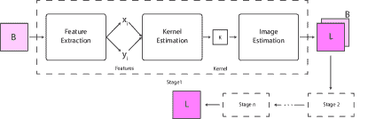
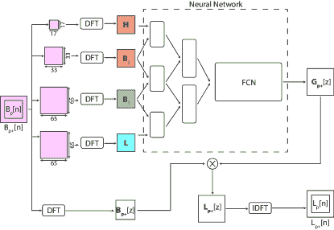
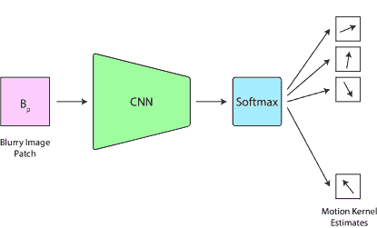
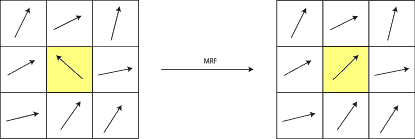
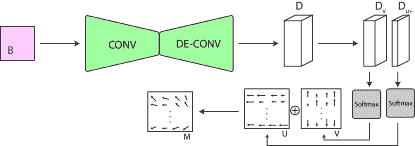
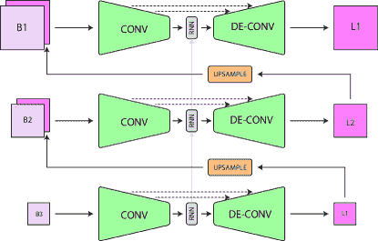
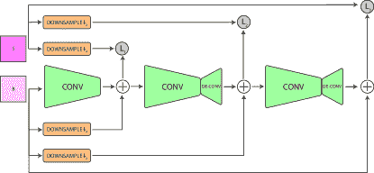
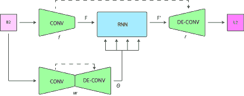
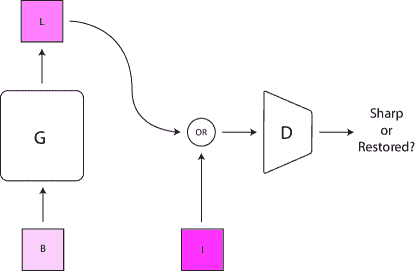
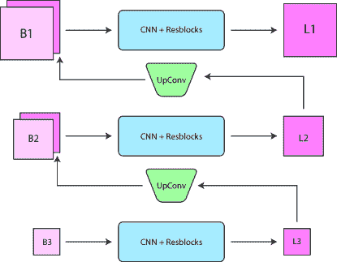

<!--yml

category: 未分类

日期：2024-09-06 20:05:38

-->

# [1907.10128] 基于深度学习的盲目去模糊：综述 *表示贡献相等

> 来源：[`ar5iv.labs.arxiv.org/html/1907.10128`](https://ar5iv.labs.arxiv.org/html/1907.10128)

# 基于深度学习的盲目去模糊：综述 ^†^†感谢：*表示贡献相等

Siddhant Sahu ^* dept.Computer Science and Engineering

KIIT University Bhubansewar, India

hello@siddhantsahu.com    Manoj Kumar Lenka ^* dept.Computer Science and Engineering

KIIT University Bhubansewar, India

manojlenka1998@gmail.com    Pankaj Kumar Sa dept.Computer Science and Engineering

NIT Rourkela Rourkela, India

pankajksa@nitrkl.ac.in

###### 摘要

我们检查了所有基于深度学习的解决方案，并提供了对过去几年中出现的各种架构的全面理解，以解决盲目去模糊的问题。最初的工作利用深度学习来估计模糊核的一些特征，然后转向完全预测模糊核，这将问题转换为非盲去模糊。最近的最先进技术是端到端的，即它们不估计模糊核，而是直接从模糊图像中估计潜在的清晰图像。还提供了使用各种架构在标准数据集 GOPRO 和 Köhler 上的 PSNR 和 SSIM 值的基准测试。

###### Index Terms:

去模糊，深度学习

## I 介绍

目前的成像系统，如消费级摄影相机、医学成像设备、科学天文成像系统、显微镜等，可能会因各种内在（衍射、镜头色差、抗锯齿滤镜等）或外在（物体运动、相机抖动、对焦不准、大气扰动等）因素而出现模糊，从而导致图像信息的丢失。为了克服这一问题并恢复丢失的信息，去模糊是一个重要的研究方向。从艺术角度来看，模糊在摄影中有时是故意的，但对于大多数图像分析应用来说，模糊会破坏有用的数据。

去模糊的问题是从模糊图像单独恢复潜在的清晰图像，有时也需要一些关于模糊核的统计信息。这吸引了许多研究人员，他们提供了许多不同的解决方案。这些解决方案可以大致分为统计方法，如，

1.  1.

    贝叶斯推断框架

1.  2.

    变分方法

1.  3.

    稀疏表示法基础的方法

1.  4.

    基于单应性的建模

1.  5.

    基于区域的方法

我们尝试从仅给定的模糊图像中估计模糊核，学习基础的方法（[1], [2], [3], [4], [5], [6], [7], [8], [9], [10])是数据驱动的，通过提供多个模糊实例及其相应的清晰图像作为真实值来学习模糊核。

模糊图像可以使用以下方程建模，

|  | $B=K*I+N$ |  | (1) |
| --- | --- | --- | --- |

其中 $B$ 是模糊图像，$K$ 是内核，$I$ 是清晰图像，$N$ 是附加噪声。在盲去模糊中，我们只给定 $B$，我们的目标是预测一个潜在图像 $L$，它是最接近清晰图像 $I$ 的近似值。这是一个不适定的问题，因为我们必须同时预测 $L$ 和 $K$。准确预测内核是至关重要的，否则可能导致各种伪影[11]。使用基于学习的方法与统计方法相比，提供了更准确的模糊内核估计，或完全跳过内核估计过程（即端到端）。在估计模糊内核后，问题转变为非盲去卷积，这可以通过方法([12], [13])来解决。

统计方法还有另一个限制，即无法并行化，因为大多数方法依赖于粗到细的迭代方法。尽管深度学习模型训练起来显著更难，但训练完成后其推断时间相对较快。此外，深度学习方法在基准指标（PSNR 和 SSIM）上表现更佳。

本文将深度学习方法分为两个广泛类别

1.  1.

    内核估计 - 在这里，提出的深度学习架构用于估计模糊内核的一些特征（傅里叶系数[1]，运动流[2][8]）或推导去卷积滤波器[1]，可以用来恢复清晰图像。

1.  2.

    端到端 - 这些方法不依赖于内核，即我们不估计模糊内核，只需提供模糊图像，模型就会生成预测的恢复图像。其中一些方法依赖于生成模型（[3], [6], [4]），这些模型通过对抗性方法进行训练。

本文重点讨论了几位作者提出的“架构”，而不是架构的具体细节，并促进了使用基于学习的方法进行盲去模糊的进一步研究。

## II 方法

### II-A 内核及其属性的估计

#### II-A1 特征提取

为了实现最佳去模糊，我们需要全局信息，即来自图像不同部分的数据，但为此我们需要与图像的所有像素连接，这将导致庞大的参数空间，使得训练和收敛变得困难，因此 Schuler 等人[7] 使用 CNNs 在局部提取特征，然后将其结合起来估计核。为此，他们使用了一个多尺度（针对不同的核尺寸）多阶段架构，其中每个阶段包含三个模块：特征提取、核估计、潜在图像估计（图 1）。在第一阶段，给定一个模糊图像，估计出一个清晰图像；在后续阶段，他们将模糊图像与前一阶段的估计清晰图像串联作为输入。

图 1：展示了 Schuler 等人[7] 使用的多阶段架构，这里仅展示了第一阶段的不同模块。后续阶段与第一阶段相同，唯一不同的是输入为模糊图像和前一层恢复图像的串联

在特征提取模块中，他们使用了一个卷积层，通过滤波器 $f_{j}$ 提取特征，然后使用 $\tanh$ 引入非线性，最后这些隐藏特征使用系数 $\alpha_{ij}$ 和 $\beta_{ij}$ 线性重组，形成用于核估计的隐藏图像 $x_{i}$ 和 $y_{i}$，正式地，

|  | $\begin{split}x_{i}=\sum_{j}\alpha_{ij}\tanh(f_{j}*y)\\ y_{i}=\sum_{j}\beta_{ij}\tanh(f_{j}*y)\end{split}$ |  | (2) |
| --- | --- | --- | --- |

其中 $y$ 是第一阶段的模糊图像 $B$，或者是后续阶段中 $B$ 和预测的清晰图像 $L$ 的串联。

给定 $x_{i}$ 和 $y_{i}$，核估计模块通过最小化来估计核 $K$，

|  | $\sum_{i}\lVert K*x_{i}-y_{i}\rVert^{2}+\beta_{k}\lVert K\rVert^{2}$ |  | (3) |
| --- | --- | --- | --- |

对于 $K$。给定 $K$，我们可以通过求解方程来找到潜在（恢复的）图像 $L$，

|  | $\lVert K*L-B\rVert^{2}+\beta_{x}\lVert L\rVert^{2}$ |  | (4) |
| --- | --- | --- | --- |

对于 $L$，其中 $\beta_{k}$ 和 $\beta_{x}$ 都是正则化权重。方程（Eqn.3[n]+N[n]$ |  | (5) |
| --- | --- | --- | --- |

其中$K[n]$是模糊核，使得$K[n]\geq 0$（非负性约束），$\sum_{n}K[n]=1$（单位和约束），$N[n]$为噪声。

图 2：Chakrabarti[1]用于预测去卷积滤波器傅里叶系数的架构。这里$H$是高通，$B_{2},B_{1}$是带通，而$L$是低通频率带。加粗的字母是对应符号的傅里叶变换。

在 Chakrabarti 的方法[1]中，模糊图像$B[n]$被划分为几个重叠的图块。对于一个模糊图块$B_{p}=\{B[n]:n\in p\}$，在寻找其傅里叶系数时，他们考虑了图块的周围像素以获得更好的结果，让模糊图像与邻近像素一起表示为$B_{p^{+}}=\{B[n]:n\in p^{+}\}$，其中$p\subset p^{+}$。

然后他们使用了一个神经网络（图 2）来预测模糊图块$B_{p^{+}}$的去卷积滤波器的复傅里叶系数$\textbf{G}_{p^{+}}[z]$，其中$z$是离散傅里叶变换（DFT）中的二维空间频率。然后将滤波器应用于$B_{p^{+}}$的 DFT，即$\textbf{B}_{p^{+}}[z]$，从而得到潜在清晰图像的 DFT $\textbf{L}_{p^{+}}[z]$，

|  | $\textbf{L}_{p^{+}}[z]=\textbf{B}_{p^{+}}[z]\times\textbf{G}_{p^{+}}[z]$ |  | (6) |
| --- | --- | --- | --- |

在获得$\textbf{L}_{p^{+}}[z]$后，我们可以使用逆离散傅里叶变换（IDFT）得到潜在图块$L_{p^{+}}$，从中提取$L_{p}$。

为了生成滤波器的系数，他们使用了图中所示的架构（图 2）。该架构使用了多分辨率分解策略，即神经网络的初始层仅连接到相邻的频率带，而不是完全连接（在这里，他们考虑了频率域中的局部性，与考虑空间域中局部性的 CNNs 形成对比）。图像被采样为不同分辨率的图块，并且低分辨率图块用于使用 DFT 采样更高的频率带。网络的损失函数为，

|  | $L=\dfrac{1}{&#124;p&#124;}\sum_{n\in p}(L_{p}[n]-I_{p}[n])^{2}$ |  | (7) |
| --- | --- | --- | --- |

他们将所有恢复的图块结合起来，得到潜在图像$L_{N}[n]$的初步估计。假设整个图像是由相同的运动核（均匀模糊）模糊的，但他们为不同的图块预测了不同的运动核，因此为了找到全局运动核$K_{\lambda}[n]$，他们使用了初步估计$L_{N}[n]$，其方式如下，

|  | $K_{\lambda}=arg\text{ min}\sum_{i}\lVert(K*(f_{i}*L_{N}))-(f_{i}*B)\rVert^{2}+\lambda\sum_{n}&#124;K[n]&#124;$ |  | (8) |
| --- | --- | --- | --- |

这里$f_{i}$是不同的导数滤波器。它们使用$L1$正则化。在经典统计方法中，从先前估计中提炼潜在图像是一个迭代步骤，而在这里，它们只进行一次以估计全局模糊核。全局模糊核估计后，问题变成了非盲去模糊问题，潜在的清晰图像可以通过去卷积来估计。

#### II-A3 每个补丁的运动向量估计

图 3：Sun 等人使用的预测给定模糊补丁的运动核的网络架构[8]

在 Sun 等人提出的方法[8]中，一幅图像被分成几个重叠的补丁。对于每个补丁，使用一个具有全连接层和 softmax 层的 CNN 来找到该补丁的运动核概率分布（见图 3）。给定以像素$p$为中心的补丁$\Psi_{p}$，网络找出一个概率分布，

|  | $P(m=(l,o)&#124;\Psi_{p})$ |  | (9) |
| --- | --- | --- | --- |

其中$m=(l,o)$是具有长度$l$和方向$o$的运动核。这里$l\in S^{l}$和$o\in S^{o}$，$S^{l}$和$S^{o}$都是离散化的长度和方向集合。由于离散化，运动核的数量有限，这导致块状伪影。因此，他们通过相同的角度旋转图像及其对应的运动核来获得新的数据条目，然后用于训练，这增加了$S^{o}$的范围。也就是说，给定图像$I$的补丁$\Psi_{p}(I)$及其对应的运动核$m=(l,o)$，如果图像旋转了角度$\theta$，那么对于补丁$\Psi_{p}(I_{\theta})$，他们得到了运动核$m=(l,o-\theta)$。由于他们正在进行多类分类（每个类别是一个运动核），他们使用的交叉熵损失定义为：

|  | $P(m=(l,o)&#124;\Psi)=\dfrac{\exp(z_{i})}{\sum_{k=1}^{n}\exp(z_{k})}$ |  | (10) |
| --- | --- | --- | --- |

其中$z$是最后一个全连接层的输出，$n=|S^{l}|\times|S^{o}|$，即$n$是运动核的总数。由于补丁是重叠的，许多补丁可能包含相同的像素，在这种情况下，像素$p$处运动核$m$的置信度计算如下：

|  | $C(m_{p}=(l,o))=\dfrac{1}{Z}\sum_{q:p\in\Psi_{q}}G_{\sigma}(\lVert x_{p}-x_{q}\rVert^{2})P(m=(l,o)&#124;\Psi_{q})$ |  | (11) |
| --- | --- | --- | --- |

其中$q$是补丁$\Psi_{q}$的中心像素，使$p\in\Psi_{q}$。$x_{p}$和$x_{q}$分别是$p$和$q$的坐标。$G_{\sigma}$是一个高斯函数，它对中心像素$q$最接近$p$的补丁赋予更多的权重。$Z$是归一化常数。

图 4：这显示了给定一个像素 $p$（黄色）时，MRF 如何根据 $N(p)$ 即其邻近像素来平滑其值

在估计了所有补丁的运动核后，将它们连接起来，并使用马尔可夫随机函数 (MRF) 将它们合并在一起，平滑邻近像素之间运动核的过渡（图。4），并通过最小化能量函数生成密集运动场。

|  | $\sum_{p\in\Omega}[-C(m_{p}=(l_{p},o_{p}))+\sum_{q\in N(p)}\lambda[(u_{p}-u_{q})^{2}+(v_{p}-v_{q})^{2}]]$ |  | (12) |
| --- | --- | --- | --- |

其中 $\Omega$ 是图像区域。 $u_{p},u_{q},v_{p},v_{q}$ 定义为 $u_{i}=l_{i}\cos(o_{i})$ 和 $v_{i}=l_{i}\sin(o_{i})$ 对于 $i=p,q$。 $N(p)$ 是 $p$ 的邻域。第一个项赋予 CNN 选择的具有最高信心的运动核更多的权重，而第二个项查看邻近像素并尝试平滑。预测运动场后，他们使用其对模糊图像进行反卷积，以获得去模糊图像。

#### II-A4 整幅图像的密集运动流估计

在 Sun 等人[8] 的前一种方法中，使用 CNN 分类器预测每个补丁的运动核，然后利用马尔可夫随机场 (MRF) 平滑所有运动核，以获得密集的运动场。在 Gong 等人[2] 使用的方法中，他们也预测了密集的运动场，但为整个图像直接生成了逐像素的密集运动场（即图像未被划分为补丁）。

图 5：Gong 等人[2] 用于预测给定模糊图像的运动场的架构

在 Sun 等人[8] 的方法中，他们假设单个补丁内的运动模糊是均匀的，因为一个补丁只选择了一个运动核。这并不能很好地推广到实际数据中，因为我们可能会有异质运动模糊，即运动可能因像素而异。在这种情况下，生成运动场的端到端方法[2] 可以提供更好的结果，因为它们考虑了整个图像（更大的空间背景），而不是单个补丁。因此，这种方法适用于异质运动模糊。不需要像 MRF 这样的后处理。

如果网络由函数 $f$ 表示。则给定模糊图像 $B$，网络的目标是生成运动场 $M$，即

|  | $f(B)=M$ |  | (13) |
| --- | --- | --- | --- |

运动场 $M$ 可以表示为，

|  | $M=(U,V)$ |  | (14) |
| --- | --- | --- | --- |

其中 $U$ 和 $V$ 分别是水平和垂直运动图。现在给定一个像素 $p=(i,j)$，其中 $(i,j)$ 是像素的坐标，则我们得到，

|  | $M(i,j)=(U(i,j),V(i,j))$ |  | (15) |
| --- | --- | --- | --- |

令 $M(i,j)=m_{p}$, $U(i,j)=u_{p}$ 和 $V(i,j)=v_{p}$，我们得到，

|  | $m_{p}=(u_{p},v_{p})$ |  | (16) |
| --- | --- | --- | --- |

其中 $u_{p}\in\mathbb{D}_{u}$ 和 $v_{p}\in\mathbb{D}_{v}$。这里 $\mathbb{D}_{u}$ 和 $\mathbb{D}_{v}$ 分别是水平方向和垂直方向的离散化运动矢量，它们定义为，$\mathbb{D}_{u}=\{u|u\in\mathbb{Z},|u|\leq u_{max}\}$ 和 $\mathbb{D}_{v}=\{v|v\in\mathbb{Z},|v|\leq v_{max}\}$。

但是，相反方向且幅度相同的两个运动矢量会生成相同的模糊模式，即 $m_{p}=(u_{p},v_{p})$ 和 $-m_{p}=(-u_{p},-v_{p})$ 会产生相同的模糊，因此他们限制水平运动矢量只能为正，即 $u_{p}\in\mathbb{D}_{u}^{+}$，其中 $\mathbb{D}_{u}^{+}=\{u|u\in\mathbb{Z}^{+},|u|\leq u_{max}\}$，这是通过让 $(u_{p},v_{p})=\phi(u_{p},v_{p})$ 实现的，其中，

|  | $\phi(u_{p},v_{p})=\begin{cases}(-u_{p},-v_{p})\text{ 如果 }u_{p}<0\\ (u_{p},v_{p})\text{ 如果 }u_{p}\geq 0\end{cases}$ |  | (17) |
| --- | --- | --- | --- |

如果一张 $P\times Q$ 尺寸的图像通过网络（不包括 softmax），它会生成一个 $P\times Q\times D$ 尺寸的特征图，其中 $D=|\mathbb{D}_{u}^{+}|+|\mathbb{D}_{v}|$。该特征图随后被分为两个部分，形状为 $P\times Q\times|\mathbb{D}_{u}^{+}|$ 和 $P\times Q\times|\mathbb{D}_{v}|$。这两个特征通过独立的 softmax 层生成水平和垂直运动图 $U$ 和 $V$。利用这两个矢量图生成最终的运动场 $M$。在得到运动场 $M$ 后，这变成了一个非盲去模糊问题，使用反卷积来获取清晰图像。

### II-B 端到端

#### II-B1 无对抗损失

去模糊需要大范围的感受野（全局知识），但卷积神经网络（CNN）提供的是局部知识，不能很好地显示长期依赖性。因此，Nah 等人[4]（参见 II-B2）使用了缩放结构和大量的卷积层及残差连接来提高结构的感受野，但这也因参数众多而使得收敛更困难。因此 (Tao et. al.[9]) 使用了尺度递归结构，在此结构中，他们仍使用缩放网络，但通过使用一个较小的编码器-解码器类型网络和递归模块，显著减少了参数数量，同时在尺度之间共享权重。

图 6：由 (Tao et. al.[9]) 使用的尺度递归网络结构

缩放递归网络（图。6）[9] 由三个部分组成：编码器（`$Net_{E}$`）、递归（`$Net_{R}$`）和解码器（`$Net_{D}$`）模块。可以表示为，

`|  | <math   alttext="\begin{split}f^{i}=Net_{E}(B^{i},L^{i-1\uparrow};\theta_{E})\\ h^{i},g^{i}=Net_{R}(h^{i-1\uparrow},f^{i};\theta_{R})\\"`

`L^{i}=Net_{D}(g^{i};\theta_{D})\\`

\end{split}" display="block"><semantics ><mtable displaystyle="true" rowspacing="0pt" ><mtr ><mtd columnalign="right" ><mrow ><msup ><mi  >f</mi><mi >i</mi></msup><mo >=</mo><mrow ><mi >N</mi><mo lspace="0em" rspace="0em"  >​</mo><mi >e</mi><mo lspace="0em" rspace="0em"  >​</mo><msub ><mi  >t</mi><mi >E</mi></msub><mo lspace="0em" rspace="0em"  >​</mo><mrow ><mo stretchy="false" >(</mo><msup ><mi >B</mi><mi >i</mi></msup><mo >,</mo><msup ><mi >L</mi><mrow ><mrow ><mi >i</mi><mo >−</mo><mn >1</mn></mrow><mo stretchy="false"  >↑</mo></mrow></msup><mo >;</mo><msub ><mi >θ</mi><mi >E</mi></msub><mo stretchy="false"  >)</mo></mrow></mrow></mrow></mtd></mtr><mtr ><mtd  columnalign="right" ><mrow ><mrow ><msup ><mi  >h</mi><mi >i</mi></msup><mo >,</mo><msup ><mi >g</mi><mi >i</mi></msup></mrow><mo >=</mo><mrow ><mi >N</mi><mo lspace="0em" rspace="0em"  >​</mo><mi >e</mi><mo lspace="0em" rspace="0em"  >​</mo><msub ><mi  >t</mi><mi >R</mi></msub><mo lspace="0em" rspace="0em"  >​</mo><mrow ><mo stretchy="false" >(</mo><msup ><mi >h</mi><mrow ><mrow ><mi >i</mi><mo >−</mo><mn >1</mn></mrow><mo stretchy="false"  >↑</mo></mrow></msup><mo >,</mo><msup ><mi >f</mi><mi >i</mi></msup><mo >;</mo><msub ><mi >θ</mi><mi >R</mi></msub><mo stretchy="false"  >)</mo></mrow></mrow></mrow></mtd></mtr><mtr ><mtd  columnalign="right" ><mrow ><msup ><mi >L</mi><mi >i</mi></msup><mo >=</mo><mrow ><mi >N</mi><mo lspace="0em" rspace="0em"  >​</mo><mi >e</mi><mo lspace="0em" rspace="0em"  >​</mo><msub ><mi  >t</mi><mi >D</mi></msub><mo lspace="0em" rspace="0em"  >​</mo><mrow ><mo stretchy="false" >(</mo><msup ><mi >g</mi><mi >i</mi></msup><mo >;</mo><msub ><mi >θ</mi><mi >D</mi></msub><mo stretchy="false"  >)</mo></mrow></mrow></mrow></mtd></mtr></mtable><annotation-xml encoding="MathML-Content" ><apply ><csymbol cd="ambiguous" >formulae-sequence</csymbol><apply ><apply ><csymbol cd="ambiguous" >superscript</csymbol><ci >𝑓</ci><ci  >𝑖</ci></apply><apply ><ci >𝑁</ci><ci  >𝑒</ci><apply ><csymbol cd="ambiguous"  >subscript</csymbol><ci >𝑡</ci><ci >𝐸</ci></apply><vector ><apply ><csymbol cd="ambiguous" >superscript</csymbol><ci >𝐵</ci><ci >𝑖</ci></apply><apply ><csymbol cd="ambiguous" >superscript</csymbol><ci >𝐿</ci><apply ><ci >↑</ci><apply ><ci >𝑖</ci><cn type="integer" >1</cn></apply><csymbol cd="latexml" >absent</csymbol></apply></apply><apply ><csymbol cd="ambiguous"  >subscript</csymbol><ci >𝜃</ci><ci >𝐸</ci></apply></vector><apply ><csymbol cd="ambiguous"  >superscript</csymbol><ci >ℎ</ci><ci >𝑖</ci></apply></apply></apply><apply ><apply ><apply ><csymbol cd="ambiguous" >superscript</csymbol><ci >𝑔</ci><ci >𝑖</ci></apply><apply ><ci >𝑁</ci><ci  >𝑒</ci><apply ><csymbol cd="ambiguous"  >subscript</csymbol><ci >𝑡</ci><ci >𝑅</ci></apply><vector ><apply ><csymbol cd="ambiguous" >superscript</csymbol><ci >ℎ</ci><apply ><ci >↑</ci><apply ><ci >𝑖</ci><cn type="integer" >1</cn></apply><csymbol cd="latexml" >absent</csymbol></apply></apply><apply ><csymbol cd="ambiguous"  >superscript</csymbol><ci >𝑓</ci><ci >𝑖</ci></apply><apply ><csymbol cd="ambiguous"  >subscript</csymbol><ci >𝜃</ci><ci >𝑅</ci></apply></vector><apply ><csymbol cd="ambiguous"  >superscript</csymbol><ci >𝐿</ci><ci >𝑖</ci></apply></apply></apply><apply ><ci >𝑁</ci><ci  >𝑒</ci><apply ><csymbol cd="ambiguous"  >subscript</csymbol><ci >𝑡</ci><ci >𝐷</ci></apply><list ><apply ><csymbol cd="ambiguous" >superscript</csymbol><ci >𝑔</ci><ci >𝑖</ci></apply><apply ><csymbol cd="ambiguous" >subscript</csymbol><ci >𝜃</ci><ci >𝐷</ci></apply></list></apply></apply></apply></apply></annotation-xml><annotation encoding="application/x-tex" >\begin{split}f^{i}=Net_{E}(B^{i},L^{i-1\uparrow};\theta_{E})\\ h^{i},g^{i}=Net_{R}(h^{i-1\uparrow},f^{i};\theta_{R})\\ L^{i}=Net_{D}(g^{i};\theta_{D})\\ \end{split}</annotation></semantics></math> |  | (18) |

$\theta_{E},\theta_{R},\theta_{D}$ 是各自模块的权重。

编码器模块由带有残差连接的卷积层组成。对于第一个尺度，仅使用模糊图像作为输入，对于所有后续层，模糊图像 $B^{i}$ 和前一个尺度的恢复图像 $L^{i-1\uparrow}$ 都会连接在一起作为输入。编码器模块用于提取特征 $f^{i}$，它逐渐减少长度和宽度，但增加通道数量。

递归模块可以是普通的 RNN、GRU 或 LSTM，在 Tao 等人的研究中，他们使用了卷积 LSTM（ConvLSTM），效果最佳。他们还训练了一个没有递归模块的网络，性能低于包含递归模块的网络。它以前一尺度递归模块的隐藏特征 $h^{i-1\uparrow}$ 和当前尺度编码器生成的特征 $f^{i}$ 作为输入。前一尺度的隐藏特征传递中间结果和模糊模式，这对当前尺度有益。仅对该模块使用梯度裁剪。它输出一个修改后的特征集 $g^{i}$ 和当前尺度的隐藏特征 $h^{i}$。

解码器模块由一些卷积层和残差连接组成（通过填充保持相同的维度），接着是一个反卷积层，该层增加了空间维度并减少了通道数量，直到我们获得尺度$L^{i}$的潜在图像。$\uparrow$ 运算符（公式 18）用于调整特征或图像的维度到下一个尺度的维度。$\uparrow$ 可以是反卷积、子像素卷积、图像缩放、双线性插值等。

将所有三个模块组合起来，网络中的单一尺度可以表示为，

|  | $L^{i},h^{i}=Net_{SR}(B^{i},L^{i-1\uparrow},h^{i-1\uparrow};\theta_{SR})$ |  | (19) |
| --- | --- | --- | --- |

其中 $\theta_{SR}$ 是在所有尺度中共享的权重。

缩放递归网络使用以下的欧几里得损失，

|  | $L=\sum_{i=1}^{n}\dfrac{\kappa_{i}}{N_{i}}\lVert L^{i}-I^{i}\rVert^{2}_{2}$ |  | (20) |
| --- | --- | --- | --- |

其中 $L^{i}$ 是潜在的恢复图像，$I^{i}$ 是真实的锐化图像。$\{\kappa_{i}\}$ 是每个尺度的权重，$N_{i}$ 是需要归一化的 $L^{i}$ 中的元素数量。

Noorozi 等人[5] 也使用了三个金字塔阶段串联在一起，每个阶段包含若干卷积层和反卷积层`(N_{1},N_{2},\text{ 和 }N_{3})`（公式 21），这些金字塔阶段重建了先前在经典方法中使用的多尺度金字塔方案。这个金字塔结构的关键思想是，模糊图像的降采样版本模糊程度较轻，更容易去除。因此，每个相应的网络（或阶段）的目标是在对应的尺度上减轻模糊效果。这也有助于将复杂的去模糊问题分解成更小的单元。

图 7：Noorozi 等人使用的架构[5]。这里，左侧的三个卷积神经网络分别表示`N_{1}`、`N_{2}`和`N_{3}`。

首先，将模糊图像作为输入传递给第一个网络`N_{1}`（纯卷积），不进行任何降采样，并将其输出与相同模糊图像的降采样版本（降采样因子为四）相加。之后，使用 21 计算第一个损失`L_{1}`，通过计算降采样锐化图像与网络`N_{1}`输出与降采样模糊图像的和之间的差异（或均方误差）。这个过程对网络`N_{2}`和`N_{3}`也进行了重复，以计算损失`L_{2}`和`L_{3}`，但降采样因子分别为二和一（即不降采样）。这三种计算得到的损失被相加，得到该模型的最终损失函数。

|  | <math alttext="\begin{split}L_{1}=\sum_{(B,I)}&#124;N_{1}(B)+d_{1/4}(B)-d_{1/4}(I)&#124;^{2}\\ L_{2}=\sum_{(B,I)}&#124;N_{2}(N_{1}(B)+d_{1/4}(B))+d_{1/2}(B)-d_{1/2}(I)&#124;^{2}\\

L_{3}=\sum_{(B,I)}&#124;N_{3}(N_{2}(N_{1}(B)+d_{1/4}(B))+d_{1/2}(B))+B-I&#124;^{2}\end{split}" display="block"><semantics ><mtable displaystyle="true" rowspacing="0pt" ><mtr ><mtd  columnalign="right" ><mrow ><msub  ><mi >L</mi><mn >1</mn></msub><mo rspace="0.111em" >=</mo><mrow ><munder ><mo movablelimits="false" rspace="0em" >∑</mo><mrow  ><mo stretchy="false"  >(</mo><mi >B</mi><mo >,</mo><mi >I</mi><mo stretchy="false"  >)</mo></mrow></munder><msup ><mrow ><mo stretchy="false" >&#124;</mo><mrow ><mrow ><mrow ><msub ><mi  >N</mi><mn >1</mn></msub><mo lspace="0em" rspace="0em"  >​</mo><mrow ><mo stretchy="false"  >(</mo><mi >B</mi><mo stretchy="false"  >)</mo></mrow></mrow><mo >+</mo><mrow ><msub ><mi >d</mi><mrow ><mn >1</mn><mo >/</mo><mn >4</mn></mrow></msub><mo lspace="0em" rspace="0em"  >​</mo><mrow ><mo stretchy="false"  >(</mo><mi >B</mi><mo stretchy="false"  >)</mo></mrow></mrow></mrow><mo >−</mo><mrow ><msub ><mi >d</mi><mrow ><mn >1</mn><mo >/</mo><mn >4</mn></mrow></msub><mo lspace="0em" rspace="0em"  >​</mo><mrow ><mo stretchy="false"  >(</mo><mi >I</mi><mo stretchy="false"  >)</mo></mrow></mrow></mrow><mo stretchy="false"  >&#124;</mo></

在这个架构中的问题是当出现极端模糊时，网络会使图像保持不变，但不会出现伪影。

动态场景中的空间变化模糊需要较大的感受野，而 CNN 具有局部知识（小感受野）和空间不变的权重。为了解决这个问题，CNN 必须使用更大的网络和更多的卷积层，这导致更多的参数，训练起来困难。因此，挑战在于拥有一个小型架构而又具有大感受野。为此，张等人[10]提出了使用递归神经网络作为去卷积算子，以增加感受野（长距离依赖）。

张等人提出的网络[10]使用了三个 CNN 和一个 RNN。CNN 用于特征提取、图像重建和逐像素权重生成（用于 RNN）。而 RNN 作为去卷积算子，具有较大的感受野（见图 8）。RNN 的权重生成通过图像通过编码-解码架构的 CNN 完成。对于权重生成模块的解码器部分和图像恢复模块，他们使用双线性插值（没有去卷积）以避免棋盘状伪影 [11]。RNN 在一个方向上生成感受野（单维），因此在每个 RNN 之后使用卷积层将感受野融合在一起，以获得二维结构。添加跳跃连接以避免梯度消失问题并加快训练速度。

图 8：张等人使用的架构 [10]

如果$f$是特征提取模块，$rnn$是 RNN 模块，$w$是权重生成模块，$r$是恢复模块，则张等人提出的网络[10]可以总结为，

|  | <math alttext="\begin{split}F=f(B)\\ \theta=w(B)\\

F^{\prime}=rnn(F;\theta)\\

$L=r(F^{\prime})$

其中 $B$ 是模糊图像，$F$ 是提取的特征，$\theta$ 是逐像素生成的权重，$F^{\prime}$ 是通过 RNN 处理后的修改特征，$L$ 是潜在的（预测的）去模糊图像。

#### II-B2 使用对抗损失

图 9：GAN 的基本结构，其中 $G$ 表示生成器，$D$ 表示判别器。

盲去模糊也可以通过生成对抗网络等生成模型进行端到端的解决[14][15][16]。生成对抗网络采用的方法是让两个不同的代理相互对抗。其中一个代理是生成网络，它尝试生成数据，另一个是鉴别网络，它检查数据并判断其是否来自真实分布（原始清晰图像）还是模型分布（恢复后的模糊图像）。生成器的目标是欺骗鉴别器，使其相信生成的数据来自真实分布。这些生成器和鉴别器模块是可以通过反向传播调整参数的神经网络，随着时间的推移，两者在各自任务上逐渐变得更加高效，最终生成器被迫创建尽可能真实的数据。

图 10: Nah 等人使用的多尺度架构 [4]

Nah 等人[4] 也使用了多尺度卷积神经网络，即从粗到细（低分辨率到高分辨率）的结构。模糊图像和清晰图像被缩小以形成高斯金字塔结构，这样做是因为卷积只能捕捉局部信息，因此使用低分辨率图像来捕捉长距离依赖关系，而高分辨率图像则用于捕捉细粒度的细节。这些缩小的模糊图像经过多个卷积和残差块的层（残差块使得大网络训练时不容易过拟合），以生成该尺度对应的潜在图像，然后对于每个尺度计算与清晰图像的均方误差（MSE），并进行反向传播。所有尺度的 MSE 平均后给出内容损失，如下：

|  | $L_{content}=\dfrac{1}{2K}\sum_{k=1}^{K}\dfrac{1}{c_{k}h_{k}w_{k}}\lVert L_{k}-I_{k}\rVert^{2}$ |  | (23) |
| --- | --- | --- | --- |

这里的 $K$ 是尺度的总数，$c_{k},h_{k},w_{k}$ 分别是第 $k^{th}$ 尺度的通道、高度和宽度，$L_{k}$ 和 $I_{k}$ 分别是第 $k^{th}$ 尺度的潜在图像和清晰图像。

当前尺度的输出作为输入传递给下一个尺度。下一个尺度具有更高的分辨率，因此当前尺度的潜在图像通过上卷积（转置卷积）层进行传递，并与下一个层的模糊图像输入进行拼接。除了最后一层，其输出的潜在图像与原始图像大小相同，因此不需要任何上卷积。最后尺度生成的去模糊图像作为输入传递给鉴别器，或者输入一些清晰的图像，鉴别器会判断图像是否原本清晰还是被多尺度网络去模糊的。鉴别器损失函数（对抗损失）[14]如下：

|  | $L_{adv}=\mathbb{E}_{S\sim p_{sharp}}[\log(D(S))]+\mathbb{E}_{B\sim p_{blurred}}[1-\log(G(B))]$ |  | (24) |
| --- | --- | --- | --- |

这里 $D$ 是鉴别器，即一个 CNN 分类器，$G$ 是生成器，即我们的多尺度 CNN。每个尺度的生成器 $G$ 可以定义为，

|  | $L^{i}=G(B^{i},L^{i-1\uparrow};\theta_{i})$ |  | (25) |
| --- | --- | --- | --- |

其中 $L^{i},B^{i}$ 分别是第 $i^{th}$ 尺度的生成图像和模糊图像。$L^{i-1\uparrow}$ 是前一个尺度的生成图像，其中 $\uparrow$ 表示用于将 $L^{i-1}$ 的维度放大到与 $L^{i}$ 相同的上卷积函数。$\theta_{i}$ 是第 $i^{th}$ 尺度的权重。

结合两个损失函数，即内容损失和对抗损失，我们得到：

|  | $L_{total}=L_{content}+\lambda L_{adv}$ |  | (26) |
| --- | --- | --- | --- |

其中 $\lambda$ 是一个权重常数。

Ramamkrishnan 等[6] 也使用了一种对抗训练的方法，但生成器使用了类似于 DenseNet[17] 的结构，并具有全局跳跃连接。与 Nah 等[4] 类似，这里在整个卷积层中保持了维度，因此不需要使用去卷积模块，防止了棋盘效应 [11]。使用密集连接的 CNN 生成器减少了梯度消失问题，加强了特征传播和重用，减少了参数数量，从而允许我们使用更小的网络，实现更平滑的训练和更快的推理时间。

生成器分为三部分：头部、密集区域和尾部。头部通过卷积层为密集区域创造足够的激活。密集区域由几个密集块组成，每个密集块有一个 ReLU 添加非线性，一个 $1\times1$ 卷积限制激活数（或通道数），一个卷积层（$3 \times 3$），以及批归一化。在 DenseNet[17] 中，第 $l^{th}$ 层的卷积连接到所有先前层的特征，而不是立即前一层（如在经典 CNN 中）。这种密集连接在生成器中通过将第 $l^{th}$ 层的输出与第 $(l+1)^{th}$ 层的输出连接实现，后者又将其输出与下一层即第 $(l+2)^{th}$ 层的输出连接，依此类推。密集区域中的所有卷积层交替使用空间卷积和膨胀卷积，这增加了网络的感受野，同时仍然限制了需要学习的参数数量。膨胀率在中间层增加，然后在达到尾部时减少。尾部添加非线性并使用 $1\times 1$ 卷积减少激活数。

他们将头部的输出与尾部的输出相加，形成全局跳跃连接，这使得梯度能够流回卷积的第一层，有助于学习（梯度更新）较低层的内容。层之间的短连接，特别是靠近输出和输入的层之间，有助于提高准确性和效率。

与 Nah 等人[4] 类似，这里的损失函数也分为两部分，但略有不同，即不是寻找预测图像和清晰图像之间的 MSE（内容损失），而是寻找预测图像和清晰图像的特征（取自预训练 VGG16 网络的末层）之间的 MSE。这被称为感知损失 [18]。

|  | $L_{precep}=\dfrac{1}{W\times H}\sum_{x=1}^{W}\sum_{y=1}^{H}(\phi(I)_{x,y}-\phi(L)_{x,y})$ |  | (27) |
| --- | --- | --- | --- |

其中 $\phi$ 表示用于生成特征的函数。$W,H$ 是特征的维度。$L$ 是预测的潜在图像，即 $L=G(B)$，其中 $G$ 是生成器，$B$ 是模糊图像。

他们使用的不是简单的对抗损失，而是条件对抗损失 [15]，即对于每张清晰或预测的图像，他们也会发送相应的模糊图像。然后计算图像是否已去模糊或清晰的概率，给定模糊图像。

|  | $L_{adv_{con}}=-\mathbb{E}_{b\in B}[\log D(G(B)\mid B)]$ |  | (28) |
| --- | --- | --- | --- |

其中 $D$ 是判别器。

张等人[10] 在结合这两种损失时，还添加了一种在 Nah 等人[4] 中未出现的 $L1$ 损失，

|  | $L_{total}=L_{precep}+K1\times L_{adv_{con}}+K2\times L_{L1}$ |  | (29) |
| --- | --- | --- | --- |

其中 $L_{L1}$ 是 $L1$ 损失。$K1,K2$ 是权重常数。

Kupyn 等人[3] 采用的方法也基于条件 GANs [15]，类似于 Ramakrishnan 等人[6]，但与 Nah 等人[4] 相比，层数显著减少，从而减少了可训练参数的数量，从而减少了训练时间和加快了推理速度。他们没有使用传统的 GANs 损失函数，而是使用了 wasserstein（或称 Earth-Mover）距离与梯度惩罚 [16]，这已被证明在解决 vanilla GANs[14] 遇到的模式崩溃和梯度消失问题上表现出稳定性。生成器架构不同于 Ramakrishnan 等人[6]，因为他们使用了一些卷积层，后跟一系列残差块，最后是一些反卷积层。

生成器以模糊图像作为输入，生成其锐化估计。然后，判别器通过计算 Wasserstein 距离（Earth mover distance）[16] 尝试建模锐化图像（真实分布）和生成器恢复图像（模型分布）之间的差异。感知损失与 (Eqn. 27) 中的相同。

目标是最小化整个损失函数（这与 (Eqn. 29) 中的相同，但没有 $L1$ 损失），以使生成器能够从模糊图像中生成足够好的恢复图像，并且判别网络无法区分真实的锐化图像（真实数据分布）和恢复图像（模型分布），使判别器大多数时间的输出为 ½ 概率。这时，模型被认为已经收敛。

## III 性能评估

### III-A 衡量标准

用于衡量恢复图像和模糊图像之间相似性的度量是峰值信噪比（PSNR）和结构相似性（SSIM）。我们还比较了不同架构在训练后去模糊模糊图像所需的时间（推理时间）（表 III)。

PSNR 可以被视为 MSE（均方误差）的倒数。MSE 可以计算为，

|  | $MSE=\dfrac{\sum_{P,Q}(I-L)^{2}}{P\times Q}$ |  | (30) |
| --- | --- | --- | --- |

其中 $P,Q$ 是图像的维度。 $I$ 和 $L$ 分别是锐化和去模糊图像。给定 MSE，PSNR 可以使用以下公式计算，

|  | $PSNR=\dfrac{m^{2}}{MSE}$ |  | (31) |
| --- | --- | --- | --- |

其中 $m$ 是最大可能的强度值，因为我们使用 8 位整数来表示通道中的像素，m = 255。

SSIM 帮助我们找出两幅图像之间的结构相似性，可以使用以下公式计算，

|  | $SSIM(x,y)=\dfrac{(2\mu_{x}\mu_{y}+c_{1})(2\sigma_{xy}+c_{2})}{(\mu_{x}^{2}+\mu_{y}^{2}+c_{1})(\sigma_{x}^{2}+\sigma_{y}^{2}+c_{2})}$ |  | (32) |
| --- | --- | --- | --- |

其中 $x,y$ 分别是 $B,I$ 的相等尺寸窗口。 $\mu_{x},\mu_{y}$ 分别表示 $x,y$ 的均值。 $\sigma_{x},\sigma_{y}$ 分别表示 $x,y$ 的方差，而 $\sigma_{xy}$ 是 $x$ 和 $y$ 之间的协方差。 $c_{1}$ 和 $c_{2}$ 是用于稳定除法的常数。

### III-B Köhler 数据集

Köhler 数据集 [19] 包含 4 张图像，这些图像使用 12 种不同的模糊核模糊处理，共生成了 48 张模糊图像。为了生成模糊核，记录了 6D 相机运动，然后通过机器人重放每张图像。在重放过程中，将 6D 运动近似为 3D 运动，通过考虑平面上的平移和垂直于该平面的旋转。这有助于我们近似实际生活中的相机抖动。更多细节请参阅 [19]。Köhler 数据集中不同去模糊架构的 PSNR 和 SSIM 如 (表 I) 所示。

表 I: Köhler 数据集

| 方法 | PSNR | SSIM |
| --- | --- | --- |
| Kupyn 等人 | 26.10 | 0.816 |
| Tao 等人 | 26.80 | 0.838 |
| Nah 等人 | 26.48 | 0.812 |
| Gong 等人 | 26.59 | 0.742 |
| Ramakrishnan 等人 | 27.08 | 0.751 |
| Sun 等人 | 25.22 | 0.774 |

### III-C GoPro 数据集

这里使用高分辨率 (1280 $\times$ 720)、高帧率 (240 帧每秒) 的相机 (GoPro Hero5 Black) 在户外拍摄视频。为了生成模糊图像，取几个帧的平均值 (从 7 到 23 中随机挑选的奇数)，而中央帧被视为对应的清晰图像。为了减少帧之间的相对运动幅度，它们被下采样，并且为了避免平均造成的伪影，我们只考虑光流最大为 1 的帧。GoPro 数据集中不同去模糊架构的 PSNR 和 SSIM 如 (表 II) 所示。

表 II: GoPro 数据集

| 方法 | PSNR | SSIM |
| --- | --- | --- |
| Kupyn 等人 | 28.7 | 0.958 |
| Zhang 等人 | 29.2 | 0.931 |
| Tao 等人 | 30.1 | 0.932 |
| Nah 等人 | 29.2 | 0.916 |
| Gong 等人 | 26.1 | 0.863 |
| Noorozi 等人 | 28.1 | - |
| Sun 等人 | 24.6 | 0.842 |

表 III: 推断时间

| 方法 | 时间 (秒) |
| --- | --- |
| Kupyn 等人 | 0.8 |
| Tao 等人 | 1.6 |
| Nah 等人 | 4.3 |
| Zhang 等人 | 1.4 |

## IV 结论

我们观察到，端到端的方法 ([3], [4], [6], [5], [9], [10]) 比估计模糊核的方法 ([2], [8]) 的 PSNR 和 SSIM 更高，因为核估计中的错误可能导致图像中的各种伪影，降低了修复效果。

我们还观察到，大多数方法尝试扩大接收场，这允许长距离空间依赖，对非均匀模糊至关重要。

另一个动机是减少网络的大小和参数数量，从而加快推理速度，正如在 (表 III) 中可以清楚地看到，Nah 等人[4] 的网络规模较大，相较于其他网络速度较慢。

减少网络大小，同时保持大接收域是基于学习的去模糊方法中的一大挑战。

## 参考文献

+   [1] A. Chakrabarti, “一种盲运动去模糊的神经方法,” *CoRR*, 卷 abs/1603.04771, 2016\. [在线]. 可用: [`arxiv.org/abs/1603.04771`](http://arxiv.org/abs/1603.04771)

+   [2] D. Gong, J. Yang, L. Liu, Y. Zhang, I. Reid, C. Shen, A. van den Hengel, 和 Q. Shi, “从运动模糊到运动流：一种去除异质运动模糊的深度学习解决方案,” 发表在 *IEEE 计算机视觉与模式识别会议（CVPR）*，2017 年 7 月。

+   [3] O. Kupyn, V. Budzan, M. Mykhailych, D. Mishkin, 和 J. Matas, “Deblurgan: 使用条件对抗网络进行盲运动去模糊,” 发表在 *IEEE 计算机视觉与模式识别会议（CVPR）*，2018 年 6 月。

+   [4] S. Nah, T. Hyun Kim, 和 K. Mu Lee, “用于动态场景去模糊的深度多尺度卷积神经网络,” 发表在 *IEEE 计算机视觉与模式识别会议（CVPR）*，2017 年 7 月。

+   [5] M. Noroozi, P. Chandramouli, 和 P. Favaro, “野外运动去模糊,” *CoRR*, 卷 abs/1701.01486, 2017\. [在线]. 可用: [`arxiv.org/abs/1701.01486`](http://arxiv.org/abs/1701.01486)

+   [6] S. Ramakrishnan, S. Pachori, A. Gangopadhyay, 和 S. Raman, “用于运动去模糊的深度生成滤波器,” *CoRR*, 卷 abs/1709.03481, 2017. [在线]. 可用: [`arxiv.org/abs/1709.03481`](http://arxiv.org/abs/1709.03481)

+   [7] C. J. Schuler, M. Hirsch, S. Harmeling, 和 B. Schölkopf, “学习去模糊,” *CoRR*, 卷 abs/1406.7444, 2014\. [在线]. 可用: [`arxiv.org/abs/1406.7444`](http://arxiv.org/abs/1406.7444)

+   [8] J. Sun, W. Cao, Z. Xu, 和 J. Ponce, “学习卷积神经网络以去除非均匀运动模糊,” 发表在 *IEEE 计算机视觉与模式识别会议（CVPR）*，2015 年 6 月。

+   [9] X. Tao, H. Gao, X. Shen, J. Wang, 和 J. Jia, “用于深度图像去模糊的尺度递归网络,” 发表在 *IEEE 计算机视觉与模式识别会议（CVPR）*，2018 年 6 月。

+   [10] J. 张, J. 潘, J. 任, Y. 宋, L. 宝, R. W. 劳, 和 M.-H. 杨, “利用空间变异递归神经网络进行动态场景去模糊,” 发表在 *IEEE 计算机视觉与模式识别会议（CVPR）*，2018 年 6 月。

+   [11] A. Odena, V. Dumoulin, 和 C. Olah, “反卷积和棋盘格伪影,” *Distill*, 2016\. [在线]. 可用: [`distill.pub/2016/deconv-checkerboard`](http://distill.pub/2016/deconv-checkerboard)

+   [12] U. Schmidt, C. Rother, S. Nowozin, J. Jancsary 和 S. Roth，“判别式非盲去模糊”，发表于 *IEEE 计算机视觉与模式识别会议 (CVPR)*，2013 年 6 月。

+   [13] C. J. Schuler, H. Christopher Burger, S. Harmeling 和 B. Scholkopf，“一种用于非盲图像解卷积的机器学习方法”，发表于 *IEEE 计算机视觉与模式识别会议 (CVPR)*，2013 年 6 月。

+   [14] I. Goodfellow, J. Pouget-Abadie, M. Mirza, B. Xu, D. Warde-Farley, S. Ozair, A. Courville 和 Y. Bengio，“生成对抗网络”，发表于 *神经信息处理系统进展 27*，Z. Ghahramani, M. Welling, C. Cortes, N. D. Lawrence 和 K. Q. Weinberger 编，Curran Associates, Inc.，2014 年，第 2672–2680 页。[在线]. 可用： [`papers.nips.cc/paper/5423-generative-adversarial-nets.pdf`](http://papers.nips.cc/paper/5423-generative-adversarial-nets.pdf)

+   [15] P. Isola, J.-Y. Zhu, T. Zhou 和 A. A. Efros，“使用条件对抗网络的图像到图像翻译”，发表于 *IEEE 计算机视觉与模式识别会议 (CVPR)*，2017 年 7 月。

+   [16] M. Arjovsky, S. Chintala 和 L. Bottou，“Wasserstein 生成对抗网络”，发表于 *第 34 届国际机器学习会议（ICML 2017），悉尼，新南威尔士，澳大利亚，2017 年 8 月 6-11 日*，2017 年，第 214–223 页。[在线]. 可用： [`proceedings.mlr.press/v70/arjovsky17a.html`](http://proceedings.mlr.press/v70/arjovsky17a.html)

+   [17] G. Huang, Z. Liu, L. van der Maaten 和 K. Q. Weinberger，“密集连接卷积网络”，发表于 *IEEE 计算机视觉与模式识别会议 (CVPR)*，2017 年 7 月。

+   [18] J. Johnson, A. Alahi 和 L. Fei-Fei，“用于实时风格迁移和超分辨率的感知损失”，发表于 *欧洲计算机视觉会议*，2016 年。

+   [19] M. B. S. B. H. S. Köhler R.，Hirsch M.，“相机抖动的记录与播放：使用真实世界数据库进行盲解卷积基准测试”，发表于 *欧洲计算机视觉会议 (ECCV)*，2012 年。
